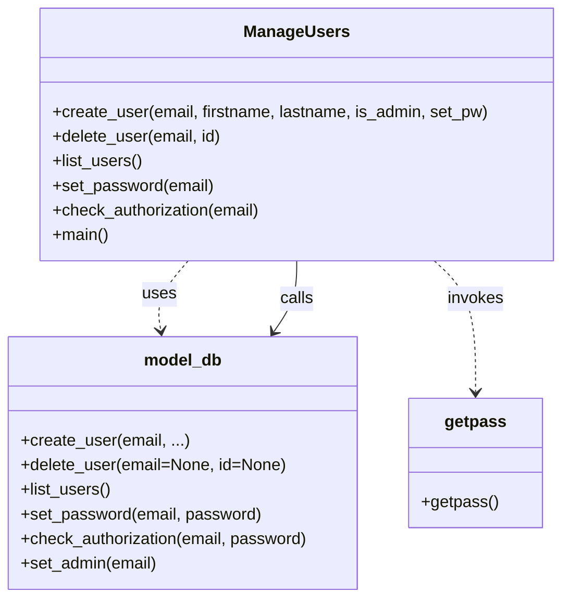

# Diagram: research/admin_app/manage_users.py


> Auto-generated by Obscura crawlers

## Diagram 1

```mermaid
graph TD
Start([Start]) --> Main[main()]
Main --> Args{Parse args}
Args -->|--create| CreateFunc[create_user(email, firstname, lastname, is_admin, set_pw)]
Args -->|--list| ListFunc[list_users()]
Args -->|--set-password| SetPwFunc[set_password(email)]
Args -->|--delete| DeleteBranch{delete: email or id}
DeleteBranch -->|email| DeleteUserByEmail[model_db.delete_user(email)]
DeleteBranch -->|id| DeleteUserById[model_db.delete_user(id)]
Args -->|--set-admin| SetAdminFunc[model_db.set_admin(email)]
Args -->|--check-password| CheckAuthFunc[check_authorization(email)]
CreateFunc --> ModelCreate[model_db.create_user(email, firstname, lastname, is_admin)]
CreateFunc -->|if set_pw| SetPwFunc
ListFunc --> ModelList[model_db.list_users()]
SetPwFunc --> GetPass1[getpass.getpass()]
SetPwFunc --> ModelSetPw[model_db.set_password(email, password)]
CheckAuthFunc --> GetPass2[getpass.getpass()]
CheckAuthFunc --> ModelCheck[model_db.check_authorization(email, password)]
ModelCreate --> PrintCreate[print Created user id=...]
ModelSetPw --> PrintSetPw[print Set password for user with email=...]
ModelList --> PrintList[print user info without password_hash]
ModelCheck --> PrintAuth[print AUTHORIZATION: result]
DeleteUserByEmail --> PrintDelEmail[print Deleted user email=...]
DeleteUserById --> PrintDelId[print Deleted user id=...]
```

> SVG rendering failed for this diagram.

## Diagram 2



### SVG

<svg id="container" width="548.12109375" xmlns="http://www.w3.org/2000/svg" class="classDiagram" height="582" viewBox="0 0 548.12109375 582" role="graphics-document document" aria-roledescription="class"><style>#container{font-family:"trebuchet ms",verdana,arial,sans-serif;font-size:16px;fill:#333;}@keyframes edge-animation-frame{from{stroke-dashoffset:0;}}@keyframes dash{to{stroke-dashoffset:0;}}#container .edge-animation-slow{stroke-dasharray:9,5!important;stroke-dashoffset:900;animation:dash 50s linear infinite;stroke-linecap:round;}#container .edge-animation-fast{stroke-dasharray:9,5!important;stroke-dashoffset:900;animation:dash 20s linear infinite;stroke-linecap:round;}#container .error-icon{fill:#552222;}#container .error-text{fill:#552222;stroke:#552222;}#container .edge-thickness-normal{stroke-width:1px;}#container .edge-thickness-thick{stroke-width:3.5px;}#container .edge-pattern-solid{stroke-dasharray:0;}#container .edge-thickness-invisible{stroke-width:0;fill:none;}#container .edge-pattern-dashed{stroke-dasharray:3;}#container .edge-pattern-dotted{stroke-dasharray:2;}#container .marker{fill:#333333;stroke:#333333;}#container .marker.cross{stroke:#333333;}#container svg{font-family:"trebuchet ms",verdana,arial,sans-serif;font-size:16px;}#container p{margin:0;}#container g.classGroup text{fill:#9370DB;stroke:none;font-family:"trebuchet ms",verdana,arial,sans-serif;font-size:10px;}#container g.classGroup text .title{font-weight:bolder;}#container .nodeLabel,#container .edgeLabel{color:#131300;}#container .edgeLabel .label rect{fill:#ECECFF;}#container .label text{fill:#131300;}#container .labelBkg{background:#ECECFF;}#container .edgeLabel .label span{background:#ECECFF;}#container .classTitle{font-weight:bolder;}#container .node rect,#container .node circle,#container .node ellipse,#container .node polygon,#container .node path{fill:#ECECFF;stroke:#9370DB;stroke-width:1px;}#container .divider{stroke:#9370DB;stroke-width:1;}#container g.clickable{cursor:pointer;}#container g.classGroup rect{fill:#ECECFF;stroke:#9370DB;}#container g.classGroup line{stroke:#9370DB;stroke-width:1;}#container .classLabel .box{stroke:none;stroke-width:0;fill:#ECECFF;opacity:0.5;}#container .classLabel .label{fill:#9370DB;font-size:10px;}#container .relation{stroke:#333333;stroke-width:1;fill:none;}#container .dashed-line{stroke-dasharray:3;}#container .dotted-line{stroke-dasharray:1 2;}#container #compositionStart,#container .composition{fill:#333333!important;stroke:#333333!important;stroke-width:1;}#container #compositionEnd,#container .composition{fill:#333333!important;stroke:#333333!important;stroke-width:1;}#container #dependencyStart,#container .dependency{fill:#333333!important;stroke:#333333!important;stroke-width:1;}#container #dependencyStart,#container .dependency{fill:#333333!important;stroke:#333333!important;stroke-width:1;}#container #extensionStart,#container .extension{fill:transparent!important;stroke:#333333!important;stroke-width:1;}#container #extensionEnd,#container .extension{fill:transparent!important;stroke:#333333!important;stroke-width:1;}#container #aggregationStart,#container .aggregation{fill:transparent!important;stroke:#333333!important;stroke-width:1;}#container #aggregationEnd,#container .aggregation{fill:transparent!important;stroke:#333333!important;stroke-width:1;}#container #lollipopStart,#container .lollipop{fill:#ECECFF!important;stroke:#333333!important;stroke-width:1;}#container #lollipopEnd,#container .lollipop{fill:#ECECFF!important;stroke:#333333!important;stroke-width:1;}#container .edgeTerminals{font-size:11px;line-height:initial;}#container .classTitleText{text-anchor:middle;font-size:18px;fill:#333;}#container .label-icon{display:inline-block;height:1em;overflow:visible;vertical-align:-0.125em;}#container .node .label-icon path{fill:currentColor;stroke:revert;stroke-width:revert;}#container :root{--mermaid-font-family:"trebuchet ms",verdana,arial,sans-serif;}</style><g><defs><marker id="container_class-aggregationStart" class="marker aggregation class" refX="18" refY="7" markerWidth="190" markerHeight="240" orient="auto"><path d="M 18,7 L9,13 L1,7 L9,1 Z"></path></marker></defs><defs><marker id="container_class-aggregationEnd" class="marker aggregation class" refX="1" refY="7" markerWidth="20" markerHeight="28" orient="auto"><path d="M 18,7 L9,13 L1,7 L9,1 Z"></path></marker></defs><defs><marker id="container_class-extensionStart" class="marker extension class" refX="18" refY="7" markerWidth="190" markerHeight="240" orient="auto"><path d="M 1,7 L18,13 V 1 Z"></path></marker></defs><defs><marker id="container_class-extensionEnd" class="marker extension class" refX="1" refY="7" markerWidth="20" markerHeight="28" orient="auto"><path d="M 1,1 V 13 L18,7 Z"></path></marker></defs><defs><marker id="container_class-compositionStart" class="marker composition class" refX="18" refY="7" markerWidth="190" markerHeight="240" orient="auto"><path d="M 18,7 L9,13 L1,7 L9,1 Z"></path></marker></defs><defs><marker id="container_class-compositionEnd" class="marker composition class" refX="1" refY="7" markerWidth="20" markerHeight="28" orient="auto"><path d="M 18,7 L9,13 L1,7 L9,1 Z"></path></marker></defs><defs><marker id="container_class-dependencyStart" class="marker dependency class" refX="6" refY="7" markerWidth="190" markerHeight="240" orient="auto"><path d="M 5,7 L9,13 L1,7 L9,1 Z"></path></marker></defs><defs><marker id="container_class-dependencyEnd" class="marker dependency class" refX="13" refY="7" markerWidth="20" markerHeight="28" orient="auto"><path d="M 18,7 L9,13 L14,7 L9,1 Z"></path></marker></defs><defs><marker id="container_class-lollipopStart" class="marker lollipop class" refX="13" refY="7" markerWidth="190" markerHeight="240" orient="auto"><circle stroke="black" fill="transparent" cx="7" cy="7" r="6"></circle></marker></defs><defs><marker id="container_class-lollipopEnd" class="marker lollipop class" refX="1" refY="7" markerWidth="190" markerHeight="240" orient="auto"><circle stroke="black" fill="transparent" cx="7" cy="7" r="6"></circle></marker></defs><g class="root"><g class="clusters"></g><g class="edgePaths"><path d="M184.832,254L179.56,260.167C174.288,266.333,163.743,278.667,159.328,290.013C154.913,301.36,156.627,311.72,157.484,316.9L158.341,322.08" id="id_ManageUsers_model_db_1" class="edge-thickness-normal edge-pattern-dashed relation" style=";;;" data-edge="true" data-et="edge" data-id="id_ManageUsers_model_db_1" data-points="W3sieCI6MTg0LjgzMTY4OTQ1MzEyNSwieSI6MjU0fSx7IngiOjE1My4xOTkyMTg3NSwieSI6MjkxfSx7IngiOjE1OS4zMjAxMTcxODc1LCJ5IjozMjh9XQ==" marker-end="url(#container_class-dependencyEnd)"></path><path d="M424.021,254L430.741,260.167C437.461,266.333,450.9,278.667,457.62,300C464.34,321.333,464.34,351.667,464.34,366.833L464.34,382" id="id_ManageUsers_getpass_2" class="edge-thickness-normal edge-pattern-dashed relation" style=";;;" data-edge="true" data-et="edge" data-id="id_ManageUsers_getpass_2" data-points="W3sieCI6NDI0LjAyMTA0NDkyMTg3NSwieSI6MjU0fSx7IngiOjQ2NC4zMzk4NDM3NSwieSI6MjkxfSx7IngiOjQ2NC4zMzk4NDM3NSwieSI6Mzg4fV0=" marker-end="url(#container_class-dependencyEnd)"></path><path d="M267.883,323.06L271.567,317.717C275.251,312.374,282.62,301.687,286.304,290.177C289.988,278.667,289.988,266.333,289.988,260.167L289.988,254" id="id_model_db_ManageUsers_3" class="edge-thickness-normal edge-pattern-solid relation" style=";;;" data-edge="true" data-et="edge" data-id="id_model_db_ManageUsers_3" data-points="W3sieCI6MjY0LjQ3NjcwODk4NDM3NSwieSI6MzI4fSx7IngiOjI4OS45ODgyODEyNSwieSI6MjkxfSx7IngiOjI4OS45ODgyODEyNSwieSI6MjU0fV0=" marker-start="url(#container_class-dependencyStart)"></path></g><g class="edgeLabels"><g class="edgeLabel" transform="translate(156.83036, 286.75271)"><g class="label" data-id="id_ManageUsers_model_db_1" transform="translate(-16.4921875, -12)"><foreignObject width="32.984375" height="24"><div xmlns="http://www.w3.org/1999/xhtml" class="labelBkg" style="display: table-cell; white-space: nowrap; line-height: 1.5; max-width: 200px; text-align: center;"><span class="edgeLabel"><p>uses</p></span></div></foreignObject></g></g><g class="edgeLabel" transform="translate(464.33984375, 291)"><g class="label" data-id="id_ManageUsers_getpass_2" transform="translate(-27.5859375, -12)"><foreignObject width="55.171875" height="24"><div xmlns="http://www.w3.org/1999/xhtml" class="labelBkg" style="display: table-cell; white-space: nowrap; line-height: 1.5; max-width: 200px; text-align: center;"><span class="edgeLabel"><p>invokes</p></span></div></foreignObject></g></g><g class="edgeLabel" transform="translate(289.98828125, 291)"><g class="label" data-id="id_model_db_ManageUsers_3" transform="translate(-16.4453125, -12)"><foreignObject width="32.890625" height="24"><div xmlns="http://www.w3.org/1999/xhtml" class="labelBkg" style="display: table-cell; white-space: nowrap; line-height: 1.5; max-width: 200px; text-align: center;"><span class="edgeLabel"><p>calls</p></span></div></foreignObject></g></g></g><g class="nodes"><g class="node default" id="classId-ManageUsers-0" transform="translate(289.98828125, 131)"><g class="basic label-container"><path d="M-250.1328125 -123 L250.1328125 -123 L250.1328125 123 L-250.1328125 123" stroke="none" stroke-width="0" fill="#ECECFF" style=""></path><path d="M-250.1328125 -123 C-52.84263228686493 -123, 144.44754792627015 -123, 250.1328125 -123 M-250.1328125 -123 C-111.456726625942 -123, 27.219359248116007 -123, 250.1328125 -123 M250.1328125 -123 C250.1328125 -38.20719466418187, 250.1328125 46.58561067163626, 250.1328125 123 M250.1328125 -123 C250.1328125 -56.1815108763772, 250.1328125 10.636978247245594, 250.1328125 123 M250.1328125 123 C129.9683992558081 123, 9.803986011616217 123, -250.1328125 123 M250.1328125 123 C143.33344629741026 123, 36.534080094820496 123, -250.1328125 123 M-250.1328125 123 C-250.1328125 48.3675864575856, -250.1328125 -26.264827084828795, -250.1328125 -123 M-250.1328125 123 C-250.1328125 26.399121761512546, -250.1328125 -70.20175647697491, -250.1328125 -123" stroke="#9370DB" stroke-width="1.3" fill="none" stroke-dasharray="0 0" style=""></path></g><g class="annotation-group text" transform="translate(0, -99)"></g><g class="label-group text" transform="translate(-48.671875, -99)"><g class="label" style="font-weight: bolder" transform="translate(0,-12)"><foreignObject width="97.34375" height="24"><div xmlns="http://www.w3.org/1999/xhtml" style="display: table-cell; white-space: nowrap; line-height: 1.5; max-width: 146px; text-align: center;"><span class="nodeLabel markdown-node-label" style=""><p>ManageUsers</p></span></div></foreignObject></g></g><g class="members-group text" transform="translate(-238.1328125, -51)"></g><g class="methods-group text" transform="translate(-238.1328125, -21)"><g class="label" style="" transform="translate(0,-12)"><foreignObject width="427.59375" height="24"><div xmlns="http://www.w3.org/1999/xhtml" style="display: table-cell; white-space: nowrap; line-height: 1.5; max-width: 485px; text-align: center;"><span class="nodeLabel markdown-node-label" style=""><p>+create_user(email, firstname, lastname, is_admin, set_pw)</p></span></div></foreignObject></g><g class="label" style="" transform="translate(0,12)"><foreignObject width="166.15625" height="24"><div xmlns="http://www.w3.org/1999/xhtml" style="display: table-cell; white-space: nowrap; line-height: 1.5; max-width: 224px; text-align: center;"><span class="nodeLabel markdown-node-label" style=""><p>+delete_user(email, id)</p></span></div></foreignObject></g><g class="label" style="" transform="translate(0,36)"><foreignObject width="87.71875" height="24"><div xmlns="http://www.w3.org/1999/xhtml" style="display: table-cell; white-space: nowrap; line-height: 1.5; max-width: 145px; text-align: center;"><span class="nodeLabel markdown-node-label" style=""><p>+list_users()</p></span></div></foreignObject></g><g class="label" style="" transform="translate(0,60)"><foreignObject width="157.625" height="24"><div xmlns="http://www.w3.org/1999/xhtml" style="display: table-cell; white-space: nowrap; line-height: 1.5; max-width: 215px; text-align: center;"><span class="nodeLabel markdown-node-label" style=""><p>+set_password(email)</p></span></div></foreignObject></g><g class="label" style="" transform="translate(0,84)"><foreignObject width="205.9375" height="24"><div xmlns="http://www.w3.org/1999/xhtml" style="display: table-cell; white-space: nowrap; line-height: 1.5; max-width: 263px; text-align: center;"><span class="nodeLabel markdown-node-label" style=""><p>+check_authorization(email)</p></span></div></foreignObject></g><g class="label" style="" transform="translate(0,108)"><foreignObject width="54.65625" height="24"><div xmlns="http://www.w3.org/1999/xhtml" style="display: table-cell; white-space: nowrap; line-height: 1.5; max-width: 112px; text-align: center;"><span class="nodeLabel markdown-node-label" style=""><p>+main()</p></span></div></foreignObject></g></g><g class="divider" style=""><path d="M-250.1328125 -75 C-112.13647645498972 -75, 25.859859590020562 -75, 250.1328125 -75 M-250.1328125 -75 C-65.47161261540086 -75, 119.18958726919828 -75, 250.1328125 -75" stroke="#9370DB" stroke-width="1.3" fill="none" stroke-dasharray="0 0" style=""></path></g><g class="divider" style=""><path d="M-250.1328125 -51 C-94.4202848172537 -51, 61.2922428654926 -51, 250.1328125 -51 M-250.1328125 -51 C-119.21322966272854 -51, 11.706353174542926 -51, 250.1328125 -51" stroke="#9370DB" stroke-width="1.3" fill="none" stroke-dasharray="0 0" style=""></path></g></g><g class="node default" id="classId-model_db-1" transform="translate(179.66796875, 451)"><g class="basic label-container"><path d="M-171.66796875 -123 L171.66796875 -123 L171.66796875 123 L-171.66796875 123" stroke="none" stroke-width="0" fill="#ECECFF" style=""></path><path d="M-171.66796875 -123 C-78.20077763199147 -123, 15.266413486017058 -123, 171.66796875 -123 M-171.66796875 -123 C-63.697865734176574 -123, 44.27223728164685 -123, 171.66796875 -123 M171.66796875 -123 C171.66796875 -68.37420433714033, 171.66796875 -13.748408674280668, 171.66796875 123 M171.66796875 -123 C171.66796875 -52.70855235251288, 171.66796875 17.582895294974236, 171.66796875 123 M171.66796875 123 C71.63638679830397 123, -28.395195153392052 123, -171.66796875 123 M171.66796875 123 C34.427807247799166 123, -102.81235425440167 123, -171.66796875 123 M-171.66796875 123 C-171.66796875 43.47635205517987, -171.66796875 -36.04729588964025, -171.66796875 -123 M-171.66796875 123 C-171.66796875 28.7342929450394, -171.66796875 -65.5314141099212, -171.66796875 -123" stroke="#9370DB" stroke-width="1.3" fill="none" stroke-dasharray="0 0" style=""></path></g><g class="annotation-group text" transform="translate(0, -99)"></g><g class="label-group text" transform="translate(-36.6015625, -99)"><g class="label" style="font-weight: bolder" transform="translate(0,-12)"><foreignObject width="73.203125" height="24"><div xmlns="http://www.w3.org/1999/xhtml" style="display: table-cell; white-space: nowrap; line-height: 1.5; max-width: 123px; text-align: center;"><span class="nodeLabel markdown-node-label" style=""><p>model_db</p></span></div></foreignObject></g></g><g class="members-group text" transform="translate(-159.66796875, -51)"></g><g class="methods-group text" transform="translate(-159.66796875, -21)"><g class="label" style="" transform="translate(0,-12)"><foreignObject width="162.578125" height="24"><div xmlns="http://www.w3.org/1999/xhtml" style="display: table-cell; white-space: nowrap; line-height: 1.5; max-width: 220px; text-align: center;"><span class="nodeLabel markdown-node-label" style=""><p>+create_user(email, ...)</p></span></div></foreignObject></g><g class="label" style="" transform="translate(0,12)"><foreignObject width="258.671875" height="24"><div xmlns="http://www.w3.org/1999/xhtml" style="display: table-cell; white-space: nowrap; line-height: 1.5; max-width: 316px; text-align: center;"><span class="nodeLabel markdown-node-label" style=""><p>+delete_user(email=None, id=None)</p></span></div></foreignObject></g><g class="label" style="" transform="translate(0,36)"><foreignObject width="87.71875" height="24"><div xmlns="http://www.w3.org/1999/xhtml" style="display: table-cell; white-space: nowrap; line-height: 1.5; max-width: 145px; text-align: center;"><span class="nodeLabel markdown-node-label" style=""><p>+list_users()</p></span></div></foreignObject></g><g class="label" style="" transform="translate(0,60)"><foreignObject width="234.40625" height="24"><div xmlns="http://www.w3.org/1999/xhtml" style="display: table-cell; white-space: nowrap; line-height: 1.5; max-width: 292px; text-align: center;"><span class="nodeLabel markdown-node-label" style=""><p>+set_password(email, password)</p></span></div></foreignObject></g><g class="label" style="" transform="translate(0,84)"><foreignObject width="282.734375" height="24"><div xmlns="http://www.w3.org/1999/xhtml" style="display: table-cell; white-space: nowrap; line-height: 1.5; max-width: 340px; text-align: center;"><span class="nodeLabel markdown-node-label" style=""><p>+check_authorization(email, password)</p></span></div></foreignObject></g><g class="label" style="" transform="translate(0,108)"><foreignObject width="134.53125" height="24"><div xmlns="http://www.w3.org/1999/xhtml" style="display: table-cell; white-space: nowrap; line-height: 1.5; max-width: 192px; text-align: center;"><span class="nodeLabel markdown-node-label" style=""><p>+set_admin(email)</p></span></div></foreignObject></g></g><g class="divider" style=""><path d="M-171.66796875 -75 C-48.01812664177601 -75, 75.63171546644799 -75, 171.66796875 -75 M-171.66796875 -75 C-101.4398435142056 -75, -31.21171827841121 -75, 171.66796875 -75" stroke="#9370DB" stroke-width="1.3" fill="none" stroke-dasharray="0 0" style=""></path></g><g class="divider" style=""><path d="M-171.66796875 -51 C-38.6974000436106 -51, 94.2731686627788 -51, 171.66796875 -51 M-171.66796875 -51 C-79.78384640761278 -51, 12.10027593477443 -51, 171.66796875 -51" stroke="#9370DB" stroke-width="1.3" fill="none" stroke-dasharray="0 0" style=""></path></g></g><g class="node default" id="classId-getpass-2" transform="translate(464.33984375, 451)"><g class="basic label-container"><path d="M-63.00390625 -63 L63.00390625 -63 L63.00390625 63 L-63.00390625 63" stroke="none" stroke-width="0" fill="#ECECFF" style=""></path><path d="M-63.00390625 -63 C-21.699108084646674 -63, 19.60569008070665 -63, 63.00390625 -63 M-63.00390625 -63 C-35.73094006279284 -63, -8.45797387558568 -63, 63.00390625 -63 M63.00390625 -63 C63.00390625 -16.342976100004414, 63.00390625 30.314047799991172, 63.00390625 63 M63.00390625 -63 C63.00390625 -21.290130345859666, 63.00390625 20.41973930828067, 63.00390625 63 M63.00390625 63 C32.3586252597032 63, 1.7133442694063987 63, -63.00390625 63 M63.00390625 63 C24.0584034146003 63, -14.887099420799402 63, -63.00390625 63 M-63.00390625 63 C-63.00390625 32.199325329119986, -63.00390625 1.3986506582399727, -63.00390625 -63 M-63.00390625 63 C-63.00390625 12.678857965192677, -63.00390625 -37.64228406961465, -63.00390625 -63" stroke="#9370DB" stroke-width="1.3" fill="none" stroke-dasharray="0 0" style=""></path></g><g class="annotation-group text" transform="translate(0, -39)"></g><g class="label-group text" transform="translate(-28.4140625, -39)"><g class="label" style="font-weight: bolder" transform="translate(0,-12)"><foreignObject width="56.828125" height="24"><div xmlns="http://www.w3.org/1999/xhtml" style="display: table-cell; white-space: nowrap; line-height: 1.5; max-width: 105px; text-align: center;"><span class="nodeLabel markdown-node-label" style=""><p>getpass</p></span></div></foreignObject></g></g><g class="members-group text" transform="translate(-51.00390625, 9)"></g><g class="methods-group text" transform="translate(-51.00390625, 39)"><g class="label" style="" transform="translate(0,-12)"><foreignObject width="73.59375" height="24"><div xmlns="http://www.w3.org/1999/xhtml" style="display: table-cell; white-space: nowrap; line-height: 1.5; max-width: 131px; text-align: center;"><span class="nodeLabel markdown-node-label" style=""><p>+getpass()</p></span></div></foreignObject></g></g><g class="divider" style=""><path d="M-63.00390625 -15 C-15.26803343057513 -15, 32.46783938884974 -15, 63.00390625 -15 M-63.00390625 -15 C-12.68397136459307 -15, 37.63596352081386 -15, 63.00390625 -15" stroke="#9370DB" stroke-width="1.3" fill="none" stroke-dasharray="0 0" style=""></path></g><g class="divider" style=""><path d="M-63.00390625 9 C-22.542237429116263 9, 17.919431391767475 9, 63.00390625 9 M-63.00390625 9 C-24.83079907554088 9, 13.342308098918238 9, 63.00390625 9" stroke="#9370DB" stroke-width="1.3" fill="none" stroke-dasharray="0 0" style=""></path></g></g></g></g></g></svg>
