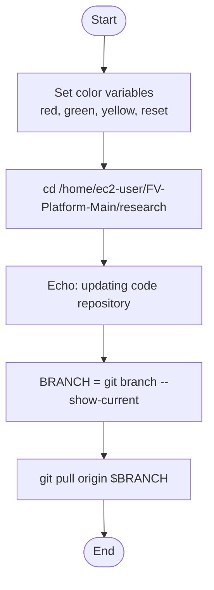

# Diagram: research/api/deploy.sh

> Auto-generated by Obscura crawlers

## Mermaid

### SVG

<svg id="container" width="276" xmlns="http://www.w3.org/2000/svg" class="flowchart" height="760" viewBox="0 0 276 760" role="graphics-document document" aria-roledescription="flowchart-v2"><g><marker id="container_flowchart-v2-pointEnd" class="marker flowchart-v2" viewBox="0 0 10 10" refX="5" refY="5" markerUnits="userSpaceOnUse" markerWidth="8" markerHeight="8" orient="auto"><path d="M 0 0 L 10 5 L 0 10 z" class="arrowMarkerPath" style="stroke-width: 1; stroke-dasharray: 1, 0;"></path></marker><marker id="container_flowchart-v2-pointStart" class="marker flowchart-v2" viewBox="0 0 10 10" refX="4.5" refY="5" markerUnits="userSpaceOnUse" markerWidth="8" markerHeight="8" orient="auto"><path d="M 0 5 L 10 10 L 10 0 z" class="arrowMarkerPath" style="stroke-width: 1; stroke-dasharray: 1, 0;"></path></marker><marker id="container_flowchart-v2-circleEnd" class="marker flowchart-v2" viewBox="0 0 10 10" refX="11" refY="5" markerUnits="userSpaceOnUse" markerWidth="11" markerHeight="11" orient="auto"><circle cx="5" cy="5" r="5" class="arrowMarkerPath" style="stroke-width: 1; stroke-dasharray: 1, 0;"></circle></marker><marker id="container_flowchart-v2-circleStart" class="marker flowchart-v2" viewBox="0 0 10 10" refX="-1" refY="5" markerUnits="userSpaceOnUse" markerWidth="11" markerHeight="11" orient="auto"><circle cx="5" cy="5" r="5" class="arrowMarkerPath" style="stroke-width: 1; stroke-dasharray: 1, 0;"></circle></marker><marker id="container_flowchart-v2-crossEnd" class="marker cross flowchart-v2" viewBox="0 0 11 11" refX="12" refY="5.2" markerUnits="userSpaceOnUse" markerWidth="11" markerHeight="11" orient="auto"><path d="M 1,1 l 9,9 M 10,1 l -9,9" class="arrowMarkerPath" style="stroke-width: 2; stroke-dasharray: 1, 0;"></path></marker><marker id="container_flowchart-v2-crossStart" class="marker cross flowchart-v2" viewBox="0 0 11 11" refX="-1" refY="5.2" markerUnits="userSpaceOnUse" markerWidth="11" markerHeight="11" orient="auto"><path d="M 1,1 l 9,9 M 10,1 l -9,9" class="arrowMarkerPath" style="stroke-width: 2; stroke-dasharray: 1, 0;"></path></marker><g class="root"><g class="clusters"></g><g class="edgePaths"><path d="M138.5,47.5L138.417,51.583C138.333,55.667,138.167,63.833,138.083,71.417C138,79,138,86,138,89.5L138,93" id="L_Start_SetColors_0" class="edge-thickness-normal edge-pattern-solid edge-thickness-normal edge-pattern-solid flowchart-link" style=";" data-edge="true" data-et="edge" data-id="L_Start_SetColors_0" data-points="W3sieCI6MTM4LjUsInkiOjQ3LjV9LHsieCI6MTM4LCJ5Ijo3Mn0seyJ4IjoxMzgsInkiOjk3fV0=" marker-end="url(#container_flowchart-v2-pointEnd)"></path><path d="M138,175L138,179.167C138,183.333,138,191.667,138,199.333C138,207,138,214,138,217.5L138,221" id="L_SetColors_ChangeDir_0" class="edge-thickness-normal edge-pattern-solid edge-thickness-normal edge-pattern-solid flowchart-link" style=";" data-edge="true" data-et="edge" data-id="L_SetColors_ChangeDir_0" data-points="W3sieCI6MTM4LCJ5IjoxNzV9LHsieCI6MTM4LCJ5IjoyMDB9LHsieCI6MTM4LCJ5IjoyMjV9XQ==" marker-end="url(#container_flowchart-v2-pointEnd)"></path><path d="M138,303L138,307.167C138,311.333,138,319.667,138,327.333C138,335,138,342,138,345.5L138,349" id="L_ChangeDir_PrintMsg_0" class="edge-thickness-normal edge-pattern-solid edge-thickness-normal edge-pattern-solid flowchart-link" style=";" data-edge="true" data-et="edge" data-id="L_ChangeDir_PrintMsg_0" data-points="W3sieCI6MTM4LCJ5IjozMDN9LHsieCI6MTM4LCJ5IjozMjh9LHsieCI6MTM4LCJ5IjozNTN9XQ==" marker-end="url(#container_flowchart-v2-pointEnd)"></path><path d="M138,431L138,435.167C138,439.333,138,447.667,138,455.333C138,463,138,470,138,473.5L138,477" id="L_PrintMsg_GetBranch_0" class="edge-thickness-normal edge-pattern-solid edge-thickness-normal edge-pattern-solid flowchart-link" style=";" data-edge="true" data-et="edge" data-id="L_PrintMsg_GetBranch_0" data-points="W3sieCI6MTM4LCJ5Ijo0MzF9LHsieCI6MTM4LCJ5Ijo0NTZ9LHsieCI6MTM4LCJ5Ijo0ODF9XQ==" marker-end="url(#container_flowchart-v2-pointEnd)"></path><path d="M138,559L138,563.167C138,567.333,138,575.667,138,583.333C138,591,138,598,138,601.5L138,605" id="L_GetBranch_Pull_0" class="edge-thickness-normal edge-pattern-solid edge-thickness-normal edge-pattern-solid flowchart-link" style=";" data-edge="true" data-et="edge" data-id="L_GetBranch_Pull_0" data-points="W3sieCI6MTM4LCJ5Ijo1NTl9LHsieCI6MTM4LCJ5Ijo1ODR9LHsieCI6MTM4LCJ5Ijo2MDl9XQ==" marker-end="url(#container_flowchart-v2-pointEnd)"></path><path d="M138,663L138,667.167C138,671.333,138,679.667,138.07,687.417C138.141,695.167,138.281,702.334,138.351,705.917L138.422,709.501" id="L_Pull_End_0" class="edge-thickness-normal edge-pattern-solid edge-thickness-normal edge-pattern-solid flowchart-link" style=";" data-edge="true" data-et="edge" data-id="L_Pull_End_0" data-points="W3sieCI6MTM4LCJ5Ijo2NjN9LHsieCI6MTM4LCJ5Ijo2ODh9LHsieCI6MTM4LjUsInkiOjcxMy41fV0=" marker-end="url(#container_flowchart-v2-pointEnd)"></path></g><g class="edgeLabels"><g class="edgeLabel"><g class="label" data-id="L_Start_SetColors_0" transform="translate(0, 0)"><foreignObject width="0" height="0">

</foreignObject></g></g><g class="edgeLabel"><g class="label" data-id="L_SetColors_ChangeDir_0" transform="translate(0, 0)"><foreignObject width="0" height="0">

</foreignObject></g></g><g class="edgeLabel"><g class="label" data-id="L_ChangeDir_PrintMsg_0" transform="translate(0, 0)"><foreignObject width="0" height="0">

</foreignObject></g></g><g class="edgeLabel"><g class="label" data-id="L_PrintMsg_GetBranch_0" transform="translate(0, 0)"><foreignObject width="0" height="0">

</foreignObject></g></g><g class="edgeLabel"><g class="label" data-id="L_GetBranch_Pull_0" transform="translate(0, 0)"><foreignObject width="0" height="0">

</foreignObject></g></g><g class="edgeLabel"><g class="label" data-id="L_Pull_End_0" transform="translate(0, 0)"><foreignObject width="0" height="0">

</foreignObject></g></g></g><g class="nodes"><g class="node default" id="flowchart-Start-0" transform="translate(138, 27.5)"><g class="basic label-container outer-path"><path d="M-10.3984375 -19.5 C-2.11817170146106 -19.5, 6.16209409707788 -19.5, 10.3984375 -19.5 C10.3984375 -19.5, 10.398437499999998 -19.5, 10.398437499999998 -19.5 C10.755682603000126 -19.488543844882194, 11.112927706000253 -19.477087689764392, 11.6478067896239 -19.45993515863156 C12.112276812452567 -19.415128294136206, 12.576746835281234 -19.370321429640853, 12.892042152847864 -19.3399052695533 C13.196698559008103 -19.290650784451028, 13.501354965168344 -19.241396299348757, 14.126030759676757 -19.140403561325776 C14.48339685839436 -19.058837081325215, 14.840762957111966 -18.97727060132466, 15.34470188623539 -18.862249829261074 C15.648813819994468 -18.771991003637496, 15.952925753753547 -18.681732178013917, 16.543047751460602 -18.50658706670804 C16.94150688773729 -18.35995042124234, 17.33996602401398 -18.21331377577664, 17.716144095147794 -18.074876768247425 C18.09561407926176 -17.906896662857303, 18.47508406337573 -17.73891655746718, 18.85917041279238 -17.568892924097174 C19.209359326751418 -17.38619959199145, 19.559548240710456 -17.203506259885724, 19.967429764076783 -16.990714730406097 C20.39131242057442 -16.733754573026243, 20.815195077072055 -16.47679441564639, 21.036368073605697 -16.342718045390892 C21.24400279384911 -16.197881052911264, 21.451637514092518 -16.05304406043163, 22.061592844578712 -15.627565626425154 C22.445263832806788 -15.32159822322705, 22.828934821034863 -15.015630820028944, 23.03889120850187 -14.848196188198123 C23.266108630485874 -14.641843337395798, 23.493326052469875 -14.435490486593475, 23.964247236767985 -14.007812326905688 C24.153668782180986 -13.812219029468661, 24.343090327593988 -13.616625732031636, 24.833858442968648 -13.10986736009568 C25.147936056022022 -12.74093392428073, 25.462013669075393 -12.372000488465778, 25.644151408126582 -12.158051136245305 C25.897634070906065 -11.818407460866437, 26.15111673368555 -11.478763785487569, 26.391796464640635 -11.156274872382312 C26.63383110727305 -10.784444665897162, 26.875865749905465 -10.412614459412014, 27.073721378604247 -10.108655082055241 C27.208108066051018 -9.870037910365784, 27.342494753497785 -9.631420738676328, 27.6871239742735 -9.019496659696287 C27.852482171711497 -8.676126824617658, 28.01784036914949 -8.332756989539028, 28.22948364880834 -7.893275190886684 C28.363518783007244 -7.562205818022363, 28.497553917206147 -7.231136445158043, 28.698571729970325 -6.734618561215508 C28.806313813305643 -6.410116572579269, 28.914055896640964 -6.08561458394303, 29.09246063421488 -5.548287939305138 C29.209242260669 -5.102948984158509, 29.32602388712312 -4.657610029011881, 29.40953178754556 -4.339158212148133 C29.459687098304844 -4.081621291727892, 29.509842409064127 -3.82408437130765, 29.648482276581777 -3.1121979531509023 C29.698785349294848 -2.7220572546535955, 29.749088422007915 -2.331916556156289, 29.808330202509367 -1.872449005199798 C29.83190206148933 -1.505298274724728, 29.855473920469297 -1.138147544249658, 29.888418715913414 -0.6250057626472757 C29.888418715913414 -0.29839744226951564, 29.888418715913414 0.028210878108244408, 29.888418715913414 0.625005762647271 C29.86376710041742 1.0089745724232722, 29.839115484921425 1.3929433821992734, 29.808330202509367 1.8724490051997846 C29.768424406247725 2.181950480714294, 29.728518609986082 2.4914519562288038, 29.648482276581777 3.1121979531508885 C29.568903004860427 3.5208206943549856, 29.48932373313908 3.929443435559082, 29.40953178754556 4.339158212148129 C29.31598046647666 4.6959099447828745, 29.22242914540776 5.05266167741762, 29.092460634214884 5.548287939305125 C28.999809798529363 5.8273374944839516, 28.907158962843845 6.106387049662778, 28.69857172997033 6.734618561215495 C28.583956453933734 7.017720508961497, 28.469341177897142 7.300822456707499, 28.229483648808344 7.893275190886679 C28.0193613095758 8.329598724200887, 27.809238970343255 8.765922257515095, 27.687123974273504 9.019496659696284 C27.561853390197758 9.241927266744922, 27.436582806122015 9.464357873793562, 27.07372137860425 10.108655082055236 C26.8517097483601 10.449724564580343, 26.62969811811595 10.790794047105452, 26.39179646464064 11.156274872382301 C26.23704677144667 11.36362536327515, 26.0822970782527 11.570975854167996, 25.644151408126582 12.158051136245302 C25.362761679685534 12.488587522801291, 25.08137195124449 12.819123909357279, 24.83385844296866 13.10986736009567 C24.63678835252126 13.313358408237939, 24.43971826207386 13.516849456380205, 23.96424723676799 14.007812326905684 C23.636422932278947 14.305533686486841, 23.30859862778991 14.603255046068, 23.038891208501887 14.848196188198111 C22.829156938969838 15.015453686886609, 22.619422669437792 15.182711185575107, 22.061592844578715 15.627565626425152 C21.699153230401205 15.88038781151736, 21.336713616223697 16.13320999660957, 21.036368073605708 16.34271804539089 C20.684038352865972 16.55630239262258, 20.331708632126237 16.76988673985427, 19.967429764076787 16.990714730406093 C19.69252799810596 17.13413080563009, 19.41762623213513 17.277546880854086, 18.859170412792388 17.56889292409717 C18.590658555363408 17.68775515825973, 18.322146697934425 17.806617392422293, 17.716144095147804 18.07487676824742 C17.392250332311562 18.19407266701228, 17.068356569475323 18.31326856577714, 16.543047751460616 18.506587066708033 C16.198120631952875 18.608959625218535, 15.853193512445136 18.711332183729034, 15.344701886235413 18.86224982926107 C14.876805386803243 18.969044151946456, 14.408908887371075 19.075838474631844, 14.126030759676766 19.140403561325773 C13.759561578257038 19.199651456566766, 13.393092396837313 19.258899351807763, 12.892042152847878 19.3399052695533 C12.41684311312506 19.3857471494049, 11.94164407340224 19.4315890292565, 11.6478067896239 19.45993515863156 C11.210095863212269 19.473971696088945, 10.772384936800638 19.488008233546335, 10.398437500000004 19.5 C10.398437500000002 19.5, 10.3984375 19.5, 10.3984375 19.5 C5.365592165340259 19.5, 0.33274683068051836 19.5, -10.398437499999996 19.5 C-10.738687769365736 19.489088836118412, -11.078938038731478 19.47817767223683, -11.647806789623893 19.45993515863156 C-11.982403711669823 19.42765699597346, -12.317000633715756 19.395378833315366, -12.892042152847871 19.3399052695533 C-13.366248393332489 19.263239282116064, -13.840454633817105 19.18657329467883, -14.126030759676759 19.140403561325773 C-14.441799779991548 19.06833134302435, -14.757568800306338 18.99625912472293, -15.344701886235388 18.862249829261074 C-15.798725155060685 18.727498106290497, -16.252748423885983 18.59274638331992, -16.54304775146059 18.506587066708043 C-16.94887795511855 18.357237800308635, -17.35470815877651 18.20788853390923, -17.716144095147797 18.074876768247425 C-17.97821197568158 17.958867091502587, -18.240279856215363 17.842857414757745, -18.85917041279238 17.568892924097174 C-19.131554996135236 17.42679006143786, -19.403939579478095 17.284687198778542, -19.96742976407678 16.990714730406097 C-20.31683750447461 16.77890170482913, -20.666245244872442 16.567088679252166, -21.036368073605686 16.3427180453909 C-21.356994345862894 16.119063037551896, -21.677620618120102 15.895408029712893, -22.061592844578712 15.627565626425156 C-22.387198470653278 15.367903804360294, -22.712804096727844 15.108241982295432, -23.03889120850187 14.848196188198125 C-23.298607639696158 14.612328597107682, -23.55832407089045 14.376461006017237, -23.964247236767974 14.007812326905697 C-24.17138232978368 13.793928337259574, -24.378517422799387 13.580044347613454, -24.833858442968655 13.109867360095677 C-25.146867187007437 12.742189478645631, -25.45987593104622 12.374511597195584, -25.64415140812658 12.158051136245307 C-25.87575220608344 11.847727166249857, -26.107353004040306 11.53740319625441, -26.391796464640635 11.156274872382316 C-26.545028263104832 10.920869681442086, -26.698260061569034 10.685464490501856, -27.073721378604244 10.108655082055249 C-27.2295500785221 9.831965445984173, -27.385378778439957 9.555275809913097, -27.6871239742735 9.019496659696289 C-27.85551244841287 8.669834390209717, -28.023900922552244 8.320172120723145, -28.22948364880834 7.893275190886686 C-28.40869180584378 7.45062757825514, -28.58789996287922 7.007979965623593, -28.698571729970325 6.73461856121551 C-28.813438482775943 6.388658203296648, -28.92830523558156 6.042697845377787, -29.09246063421488 5.5482879393051325 C-29.158592085766298 5.296100052987178, -29.22472353731771 5.043912166669223, -29.409531787545557 4.339158212148136 C-29.484046897353192 3.9565388720599732, -29.558562007160827 3.5739195319718107, -29.648482276581777 3.112197953150904 C-29.711626814212813 2.6224613885839028, -29.774771351843853 2.1327248240169014, -29.808330202509364 1.872449005199809 C-29.83162604175275 1.5095975049210812, -29.854921880996137 1.1467460046423534, -29.888418715913414 0.6250057626472781 C-29.888418715913414 0.21798971627454872, -29.888418715913414 -0.1890263300981807, -29.888418715913414 -0.6250057626472687 C-29.85945012744995 -1.076214910989488, -29.830481538986483 -1.5274240593317072, -29.808330202509367 -1.8724490051997822 C-29.74580653392366 -2.3573702320556693, -29.68328286533795 -2.8422914589115567, -29.648482276581777 -3.112197953150895 C-29.56168231672749 -3.557897401824636, -29.47488235687321 -4.0035968504983765, -29.40953178754556 -4.339158212148126 C-29.33538007242233 -4.621930839469639, -29.261228357299096 -4.904703466791151, -29.092460634214884 -5.548287939305123 C-28.988182511563107 -5.862357030269716, -28.883904388911333 -6.17642612123431, -28.698571729970332 -6.734618561215485 C-28.5898393847767 -7.003189556040642, -28.481107039583065 -7.2717605508658, -28.229483648808344 -7.893275190886676 C-28.09782058532272 -8.16667635935284, -27.966157521837093 -8.440077527819005, -27.687123974273504 -9.019496659696282 C-27.547007424775224 -9.268287781669645, -27.406890875276943 -9.51707890364301, -27.073721378604247 -10.108655082055243 C-26.915318074161416 -10.352005094922454, -26.75691476971858 -10.595355107789665, -26.39179646464064 -11.156274872382308 C-26.230005221580385 -11.373060398597593, -26.068213978520124 -11.589845924812876, -25.644151408126586 -12.158051136245302 C-25.429797737364268 -12.409843154992114, -25.21544406660195 -12.661635173738926, -24.833858442968662 -13.10986736009567 C-24.58045806757626 -13.371524052246057, -24.327057692183853 -13.633180744396446, -23.964247236767996 -14.007812326905677 C-23.70585393050491 -14.242478290941566, -23.44746062424183 -14.477144254977453, -23.038891208501887 -14.848196188198107 C-22.82609829005795 -15.017892877999772, -22.613305371614015 -15.187589567801435, -22.06159284457872 -15.627565626425149 C-21.808746426226524 -15.803940342322601, -21.55590000787433 -15.980315058220052, -21.03636807360571 -16.342718045390885 C-20.76601956567126 -16.50660489964493, -20.495671057736814 -16.670491753898972, -19.96742976407679 -16.99071473040609 C-19.65370814656314 -17.154383097314675, -19.33998652904949 -17.31805146422326, -18.859170412792388 -17.56889292409717 C-18.544395202867744 -17.708234572055968, -18.2296199929431 -17.84757622001477, -17.716144095147804 -18.07487676824742 C-17.42382330310616 -18.182453521902524, -17.13150251106452 -18.29003027555763, -16.54304775146062 -18.506587066708033 C-16.23415753584238 -18.598264061305695, -15.925267320224146 -18.68994105590336, -15.344701886235413 -18.862249829261067 C-15.00516554054848 -18.939746784482388, -14.66562919486155 -19.01724373970371, -14.126030759676768 -19.140403561325773 C-13.692555034549098 -19.21048455490996, -13.259079309421427 -19.28056554849415, -12.89204215284788 -19.3399052695533 C-12.495809865594937 -19.378129321765545, -12.099577578341995 -19.416353373977792, -11.647806789623903 -19.45993515863156 C-11.155471100491486 -19.475723405908752, -10.66313541135907 -19.491511653185945, -10.398437500000005 -19.5 C-10.398437500000004 -19.5, -10.398437500000002 -19.5, -10.3984375 -19.5" stroke="none" stroke-width="0" fill="#ECECFF" style=""></path><path d="M-10.3984375 -19.5 C-5.14793163434778 -19.5, 0.10257423130443932 -19.5, 10.3984375 -19.5 M-10.3984375 -19.5 C-5.003354268184515 -19.5, 0.3917289636309693 -19.5, 10.3984375 -19.5 M10.3984375 -19.5 C10.3984375 -19.5, 10.398437499999998 -19.5, 10.398437499999998 -19.5 M10.3984375 -19.5 C10.3984375 -19.5, 10.398437499999998 -19.5, 10.398437499999998 -19.5 M10.398437499999998 -19.5 C10.868836151910577 -19.48491523080866, 11.339234803821155 -19.46983046161732, 11.6478067896239 -19.45993515863156 M10.398437499999998 -19.5 C10.707412469000818 -19.49009177412744, 11.016387438001637 -19.480183548254875, 11.6478067896239 -19.45993515863156 M11.6478067896239 -19.45993515863156 C11.918547451899759 -19.43381713255509, 12.189288114175618 -19.407699106478624, 12.892042152847864 -19.3399052695533 M11.6478067896239 -19.45993515863156 C12.098424612165028 -19.41646459923824, 12.549042434706157 -19.372994039844915, 12.892042152847864 -19.3399052695533 M12.892042152847864 -19.3399052695533 C13.186406069738325 -19.29231479429672, 13.480769986628788 -19.244724319040138, 14.126030759676757 -19.140403561325776 M12.892042152847864 -19.3399052695533 C13.332882130715983 -19.26863368069667, 13.773722108584101 -19.19736209184004, 14.126030759676757 -19.140403561325776 M14.126030759676757 -19.140403561325776 C14.568495192451815 -19.03941394189513, 15.010959625226874 -18.93842432246448, 15.34470188623539 -18.862249829261074 M14.126030759676757 -19.140403561325776 C14.590311401691693 -19.034434534500196, 15.054592043706629 -18.92846550767462, 15.34470188623539 -18.862249829261074 M15.34470188623539 -18.862249829261074 C15.687392322927284 -18.76054110646973, 16.030082759619177 -18.658832383678387, 16.543047751460602 -18.50658706670804 M15.34470188623539 -18.862249829261074 C15.72966818238452 -18.747993853293337, 16.11463447853365 -18.6337378773256, 16.543047751460602 -18.50658706670804 M16.543047751460602 -18.50658706670804 C16.946392519864663 -18.358152463457177, 17.34973728826872 -18.209717860206318, 17.716144095147794 -18.074876768247425 M16.543047751460602 -18.50658706670804 C16.81091769737129 -18.408008450450268, 17.078787643281984 -18.3094298341925, 17.716144095147794 -18.074876768247425 M17.716144095147794 -18.074876768247425 C18.00254828557625 -17.948094129023197, 18.28895247600471 -17.82131148979897, 18.85917041279238 -17.568892924097174 M17.716144095147794 -18.074876768247425 C17.959102781152822 -17.96732616506635, 18.20206146715785 -17.859775561885275, 18.85917041279238 -17.568892924097174 M18.85917041279238 -17.568892924097174 C19.191872849362255 -17.39532227604475, 19.52457528593213 -17.22175162799233, 19.967429764076783 -16.990714730406097 M18.85917041279238 -17.568892924097174 C19.280524394540176 -17.349072821709456, 19.70187837628797 -17.129252719321737, 19.967429764076783 -16.990714730406097 M19.967429764076783 -16.990714730406097 C20.33044197706746 -16.770654593594593, 20.693454190058134 -16.550594456783088, 21.036368073605697 -16.342718045390892 M19.967429764076783 -16.990714730406097 C20.37074057502359 -16.74622534669274, 20.774051385970395 -16.501735962979378, 21.036368073605697 -16.342718045390892 M21.036368073605697 -16.342718045390892 C21.41807197378954 -16.076457928318167, 21.79977587397338 -15.810197811245445, 22.061592844578712 -15.627565626425154 M21.036368073605697 -16.342718045390892 C21.43462349188796 -16.06491230579638, 21.832878910170223 -15.787106566201869, 22.061592844578712 -15.627565626425154 M22.061592844578712 -15.627565626425154 C22.440204662999104 -15.325632776518514, 22.818816481419496 -15.023699926611872, 23.03889120850187 -14.848196188198123 M22.061592844578712 -15.627565626425154 C22.37384359964779 -15.378553958599129, 22.686094354716865 -15.129542290773102, 23.03889120850187 -14.848196188198123 M23.03889120850187 -14.848196188198123 C23.306908843571062 -14.604789663386313, 23.57492647864025 -14.361383138574505, 23.964247236767985 -14.007812326905688 M23.03889120850187 -14.848196188198123 C23.304685319185534 -14.606809009402017, 23.5704794298692 -14.36542183060591, 23.964247236767985 -14.007812326905688 M23.964247236767985 -14.007812326905688 C24.225027243893294 -13.738535559112039, 24.485807251018606 -13.469258791318392, 24.833858442968648 -13.10986736009568 M23.964247236767985 -14.007812326905688 C24.138393904814407 -13.827991594440409, 24.31254057286083 -13.64817086197513, 24.833858442968648 -13.10986736009568 M24.833858442968648 -13.10986736009568 C25.104506276877412 -12.791949014088425, 25.37515411078618 -12.47403066808117, 25.644151408126582 -12.158051136245305 M24.833858442968648 -13.10986736009568 C25.1528354487333 -12.73517881881872, 25.471812454497947 -12.36049027754176, 25.644151408126582 -12.158051136245305 M25.644151408126582 -12.158051136245305 C25.922621948658136 -11.784925981121157, 26.20109248918969 -11.411800825997009, 26.391796464640635 -11.156274872382312 M25.644151408126582 -12.158051136245305 C25.818104730556566 -11.924969531662812, 25.99205805298655 -11.691887927080318, 26.391796464640635 -11.156274872382312 M26.391796464640635 -11.156274872382312 C26.53827499301524 -10.931244517806634, 26.68475352138984 -10.706214163230959, 27.073721378604247 -10.108655082055241 M26.391796464640635 -11.156274872382312 C26.534735317235917 -10.936682410339708, 26.677674169831196 -10.717089948297104, 27.073721378604247 -10.108655082055241 M27.073721378604247 -10.108655082055241 C27.290365259855413 -9.72398193332199, 27.50700914110658 -9.339308784588741, 27.6871239742735 -9.019496659696287 M27.073721378604247 -10.108655082055241 C27.224223405828184 -9.841423492736322, 27.374725433052117 -9.574191903417402, 27.6871239742735 -9.019496659696287 M27.6871239742735 -9.019496659696287 C27.86878766423286 -8.642268120515398, 28.050451354192216 -8.26503958133451, 28.22948364880834 -7.893275190886684 M27.6871239742735 -9.019496659696287 C27.857292490002603 -8.66613809576185, 28.027461005731706 -8.312779531827411, 28.22948364880834 -7.893275190886684 M28.22948364880834 -7.893275190886684 C28.33041623194207 -7.643969759147629, 28.4313488150758 -7.394664327408574, 28.698571729970325 -6.734618561215508 M28.22948364880834 -7.893275190886684 C28.398704951278454 -7.475295302114189, 28.56792625374857 -7.057315413341692, 28.698571729970325 -6.734618561215508 M28.698571729970325 -6.734618561215508 C28.791985690741914 -6.453270594864912, 28.885399651513502 -6.171922628514315, 29.09246063421488 -5.548287939305138 M28.698571729970325 -6.734618561215508 C28.787203362320167 -6.467674206110658, 28.875834994670008 -6.200729851005807, 29.09246063421488 -5.548287939305138 M29.09246063421488 -5.548287939305138 C29.21351110822011 -5.0866700183159, 29.334561582225337 -4.6250520973266624, 29.40953178754556 -4.339158212148133 M29.09246063421488 -5.548287939305138 C29.21657858171682 -5.07497241242152, 29.34069652921876 -4.601656885537903, 29.40953178754556 -4.339158212148133 M29.40953178754556 -4.339158212148133 C29.479704014126977 -3.97883865955791, 29.54987624070839 -3.6185191069676867, 29.648482276581777 -3.1121979531509023 M29.40953178754556 -4.339158212148133 C29.476131594028814 -3.9971822817307094, 29.542731400512068 -3.6552063513132853, 29.648482276581777 -3.1121979531509023 M29.648482276581777 -3.1121979531509023 C29.69228421454322 -2.7724787719929265, 29.73608615250467 -2.43275959083495, 29.808330202509367 -1.872449005199798 M29.648482276581777 -3.1121979531509023 C29.68492616520068 -2.8295463496824986, 29.721370053819584 -2.546894746214095, 29.808330202509367 -1.872449005199798 M29.808330202509367 -1.872449005199798 C29.829983321607216 -1.5351841971676592, 29.85163644070506 -1.1979193891355202, 29.888418715913414 -0.6250057626472757 M29.808330202509367 -1.872449005199798 C29.836274839331466 -1.437188730190717, 29.86421947615357 -1.0019284551816359, 29.888418715913414 -0.6250057626472757 M29.888418715913414 -0.6250057626472757 C29.888418715913414 -0.2202994805353965, 29.888418715913414 0.1844068015764827, 29.888418715913414 0.625005762647271 M29.888418715913414 -0.6250057626472757 C29.888418715913414 -0.1959827415433018, 29.888418715913414 0.23304027956067208, 29.888418715913414 0.625005762647271 M29.888418715913414 0.625005762647271 C29.87136623830602 0.8906118658946145, 29.854313760698627 1.1562179691419578, 29.808330202509367 1.8724490051997846 M29.888418715913414 0.625005762647271 C29.85760251021716 1.104993040759948, 29.82678630452091 1.584980318872625, 29.808330202509367 1.8724490051997846 M29.808330202509367 1.8724490051997846 C29.766816431483875 2.1944216154521707, 29.725302660458386 2.516394225704557, 29.648482276581777 3.1121979531508885 M29.808330202509367 1.8724490051997846 C29.746069230218275 2.3553328114698906, 29.68380825792718 2.8382166177399966, 29.648482276581777 3.1121979531508885 M29.648482276581777 3.1121979531508885 C29.556855734908506 3.5826808793666975, 29.465229193235235 4.053163805582507, 29.40953178754556 4.339158212148129 M29.648482276581777 3.1121979531508885 C29.574176885496232 3.493740431925204, 29.499871494410684 3.8752829106995197, 29.40953178754556 4.339158212148129 M29.40953178754556 4.339158212148129 C29.28723607108375 4.805524782315803, 29.164940354621944 5.271891352483477, 29.092460634214884 5.548287939305125 M29.40953178754556 4.339158212148129 C29.33969500410276 4.6054761348689235, 29.269858220659966 4.871794057589718, 29.092460634214884 5.548287939305125 M29.092460634214884 5.548287939305125 C28.947667570841787 5.984381576543162, 28.80287450746869 6.420475213781199, 28.69857172997033 6.734618561215495 M29.092460634214884 5.548287939305125 C28.94819900900877 5.982780969457385, 28.803937383802655 6.417273999609645, 28.69857172997033 6.734618561215495 M28.69857172997033 6.734618561215495 C28.561249990268294 7.0738059132147475, 28.42392825056626 7.412993265214, 28.229483648808344 7.893275190886679 M28.69857172997033 6.734618561215495 C28.576538132099067 7.036043907316619, 28.454504534227805 7.337469253417745, 28.229483648808344 7.893275190886679 M28.229483648808344 7.893275190886679 C28.053474263320286 8.25876244585018, 27.877464877832228 8.624249700813683, 27.687123974273504 9.019496659696284 M28.229483648808344 7.893275190886679 C28.074304191612416 8.215508654062505, 27.91912473441649 8.537742117238333, 27.687123974273504 9.019496659696284 M27.687123974273504 9.019496659696284 C27.447463024124545 9.445038944988527, 27.207802073975586 9.870581230280768, 27.07372137860425 10.108655082055236 M27.687123974273504 9.019496659696284 C27.446363537851475 9.44699119420142, 27.205603101429446 9.874485728706556, 27.07372137860425 10.108655082055236 M27.07372137860425 10.108655082055236 C26.87196355064138 10.418609285368872, 26.670205722678503 10.728563488682507, 26.39179646464064 11.156274872382301 M27.07372137860425 10.108655082055236 C26.877407155118377 10.410246447079725, 26.681092931632502 10.711837812104214, 26.39179646464064 11.156274872382301 M26.39179646464064 11.156274872382301 C26.108982415134264 11.535219933830902, 25.82616836562789 11.914164995279503, 25.644151408126582 12.158051136245302 M26.39179646464064 11.156274872382301 C26.127553830134236 11.510335929621654, 25.86331119562783 11.864396986861006, 25.644151408126582 12.158051136245302 M25.644151408126582 12.158051136245302 C25.37722434892317 12.47159884856557, 25.11029728971976 12.785146560885837, 24.83385844296866 13.10986736009567 M25.644151408126582 12.158051136245302 C25.381439183938685 12.466647863525443, 25.118726959750784 12.775244590805585, 24.83385844296866 13.10986736009567 M24.83385844296866 13.10986736009567 C24.568670283652224 13.383695906942679, 24.303482124335794 13.657524453789685, 23.96424723676799 14.007812326905684 M24.83385844296866 13.10986736009567 C24.581903994827464 13.370031013646349, 24.329949546686272 13.630194667197028, 23.96424723676799 14.007812326905684 M23.96424723676799 14.007812326905684 C23.714483920644792 14.234640762233555, 23.464720604521595 14.461469197561426, 23.038891208501887 14.848196188198111 M23.96424723676799 14.007812326905684 C23.64823018279996 14.294810653966387, 23.332213128831935 14.581808981027091, 23.038891208501887 14.848196188198111 M23.038891208501887 14.848196188198111 C22.706342970113756 15.113394558832368, 22.37379473172562 15.378592929466627, 22.061592844578715 15.627565626425152 M23.038891208501887 14.848196188198111 C22.837096807187425 15.00912185327185, 22.635302405872963 15.17004751834559, 22.061592844578715 15.627565626425152 M22.061592844578715 15.627565626425152 C21.667525025523492 15.902450278077131, 21.27345720646827 16.17733492972911, 21.036368073605708 16.34271804539089 M22.061592844578715 15.627565626425152 C21.741546836036328 15.850815867415909, 21.421500827493944 16.074066108406665, 21.036368073605708 16.34271804539089 M21.036368073605708 16.34271804539089 C20.636537969377777 16.58509740423636, 20.236707865149846 16.827476763081833, 19.967429764076787 16.990714730406093 M21.036368073605708 16.34271804539089 C20.816722575507157 16.47586843711845, 20.597077077408606 16.609018828846015, 19.967429764076787 16.990714730406093 M19.967429764076787 16.990714730406093 C19.55432460340326 17.206231428122987, 19.141219442729735 17.421748125839883, 18.859170412792388 17.56889292409717 M19.967429764076787 16.990714730406093 C19.527864966795025 17.2200354035933, 19.08830016951326 17.449356076780504, 18.859170412792388 17.56889292409717 M18.859170412792388 17.56889292409717 C18.57754298904733 17.693561030408407, 18.295915565302273 17.81822913671964, 17.716144095147804 18.07487676824742 M18.859170412792388 17.56889292409717 C18.53169923067427 17.713854702333386, 18.204228048556157 17.858816480569597, 17.716144095147804 18.07487676824742 M17.716144095147804 18.07487676824742 C17.4336012663844 18.178855141029633, 17.151058437620996 18.28283351381184, 16.543047751460616 18.506587066708033 M17.716144095147804 18.07487676824742 C17.444647210882138 18.17479013134687, 17.173150326616476 18.274703494446324, 16.543047751460616 18.506587066708033 M16.543047751460616 18.506587066708033 C16.110143321536434 18.635070829147807, 15.67723889161225 18.763554591587585, 15.344701886235413 18.86224982926107 M16.543047751460616 18.506587066708033 C16.117962040817694 18.632750274306424, 15.69287633017477 18.75891348190482, 15.344701886235413 18.86224982926107 M15.344701886235413 18.86224982926107 C14.951333058636795 18.95203369718896, 14.557964231038177 19.041817565116848, 14.126030759676766 19.140403561325773 M15.344701886235413 18.86224982926107 C15.003103332223072 18.9402174700755, 14.66150477821073 19.018185110889927, 14.126030759676766 19.140403561325773 M14.126030759676766 19.140403561325773 C13.874650724777824 19.181044735886946, 13.623270689878881 19.221685910448123, 12.892042152847878 19.3399052695533 M14.126030759676766 19.140403561325773 C13.73323268610917 19.203908107665626, 13.340434612541575 19.26741265400548, 12.892042152847878 19.3399052695533 M12.892042152847878 19.3399052695533 C12.492696270851276 19.37842968650582, 12.093350388854674 19.41695410345834, 11.6478067896239 19.45993515863156 M12.892042152847878 19.3399052695533 C12.461297056518731 19.3814587309494, 12.030551960189582 19.423012192345503, 11.6478067896239 19.45993515863156 M11.6478067896239 19.45993515863156 C11.350990767066499 19.469453470757635, 11.054174744509098 19.47897178288371, 10.398437500000004 19.5 M11.6478067896239 19.45993515863156 C11.20089895024245 19.474266623187184, 10.753991110861 19.488598087742808, 10.398437500000004 19.5 M10.398437500000004 19.5 C10.398437500000002 19.5, 10.398437500000002 19.5, 10.3984375 19.5 M10.398437500000004 19.5 C10.398437500000002 19.5, 10.398437500000002 19.5, 10.3984375 19.5 M10.3984375 19.5 C4.900398829015083 19.5, -0.5976398419698334 19.5, -10.398437499999996 19.5 M10.3984375 19.5 C2.091589044274201 19.5, -6.215259411451598 19.5, -10.398437499999996 19.5 M-10.398437499999996 19.5 C-10.759266529272523 19.48842891534233, -11.120095558545051 19.476857830684658, -11.647806789623893 19.45993515863156 M-10.398437499999996 19.5 C-10.738021318030453 19.489110207915566, -11.07760513606091 19.478220415831135, -11.647806789623893 19.45993515863156 M-11.647806789623893 19.45993515863156 C-11.985126547920363 19.427394327235064, -12.322446306216833 19.394853495838564, -12.892042152847871 19.3399052695533 M-11.647806789623893 19.45993515863156 C-11.938322930127022 19.431909415954, -12.22883907063015 19.40388367327644, -12.892042152847871 19.3399052695533 M-12.892042152847871 19.3399052695533 C-13.158740259623386 19.29678758792454, -13.4254383663989 19.253669906295784, -14.126030759676759 19.140403561325773 M-12.892042152847871 19.3399052695533 C-13.317499502215458 19.27112062477857, -13.742956851583047 19.202335980003838, -14.126030759676759 19.140403561325773 M-14.126030759676759 19.140403561325773 C-14.371694740124699 19.08433236089582, -14.61735872057264 19.02826116046587, -15.344701886235388 18.862249829261074 M-14.126030759676759 19.140403561325773 C-14.59698939215633 19.032910326754603, -15.0679480246359 18.92541709218343, -15.344701886235388 18.862249829261074 M-15.344701886235388 18.862249829261074 C-15.594404196230917 18.788139494368572, -15.844106506226447 18.714029159476073, -16.54304775146059 18.506587066708043 M-15.344701886235388 18.862249829261074 C-15.763929951916847 18.73782513993984, -16.183158017598306 18.613400450618606, -16.54304775146059 18.506587066708043 M-16.54304775146059 18.506587066708043 C-16.890152525532788 18.378849301248117, -17.237257299604984 18.25111153578819, -17.716144095147797 18.074876768247425 M-16.54304775146059 18.506587066708043 C-16.99429480826392 18.340523978522352, -17.44554186506725 18.17446089033666, -17.716144095147797 18.074876768247425 M-17.716144095147797 18.074876768247425 C-18.151340176446958 17.882228372689358, -18.586536257746115 17.68957997713129, -18.85917041279238 17.568892924097174 M-17.716144095147797 18.074876768247425 C-17.97285453209742 17.961238672854375, -18.229564969047043 17.847600577461325, -18.85917041279238 17.568892924097174 M-18.85917041279238 17.568892924097174 C-19.302009622516408 17.337863992036198, -19.74484883224044 17.106835059975225, -19.96742976407678 16.990714730406097 M-18.85917041279238 17.568892924097174 C-19.274720568370306 17.352100674104747, -19.69027072394823 17.135308424112324, -19.96742976407678 16.990714730406097 M-19.96742976407678 16.990714730406097 C-20.350306017322332 16.75861289565803, -20.73318227056788 16.526511060909964, -21.036368073605686 16.3427180453909 M-19.96742976407678 16.990714730406097 C-20.353432037397745 16.75671788391778, -20.739434310718714 16.522721037429463, -21.036368073605686 16.3427180453909 M-21.036368073605686 16.3427180453909 C-21.343717805435112 16.128324177422147, -21.651067537264538 15.913930309453391, -22.061592844578712 15.627565626425156 M-21.036368073605686 16.3427180453909 C-21.261237310232513 16.185859000352387, -21.48610654685934 16.02899995531388, -22.061592844578712 15.627565626425156 M-22.061592844578712 15.627565626425156 C-22.307683955155696 15.431314514499494, -22.55377506573268 15.23506340257383, -23.03889120850187 14.848196188198125 M-22.061592844578712 15.627565626425156 C-22.406618931952497 15.352416503274346, -22.751645019326283 15.077267380123537, -23.03889120850187 14.848196188198125 M-23.03889120850187 14.848196188198125 C-23.359327883215194 14.557184078513302, -23.679764557928518 14.266171968828477, -23.964247236767974 14.007812326905697 M-23.03889120850187 14.848196188198125 C-23.282083817600782 14.62733509513833, -23.52527642669969 14.406474002078536, -23.964247236767974 14.007812326905697 M-23.964247236767974 14.007812326905697 C-24.222083159562263 13.741575567897648, -24.479919082356552 13.4753388088896, -24.833858442968655 13.109867360095677 M-23.964247236767974 14.007812326905697 C-24.199219210065433 13.765184472918289, -24.434191183362895 13.522556618930881, -24.833858442968655 13.109867360095677 M-24.833858442968655 13.109867360095677 C-25.037943839528168 12.870137040508832, -25.24202923608768 12.630406720921986, -25.64415140812658 12.158051136245307 M-24.833858442968655 13.109867360095677 C-25.101000663521177 12.796066907011715, -25.3681428840737 12.482266453927753, -25.64415140812658 12.158051136245307 M-25.64415140812658 12.158051136245307 C-25.851001163387114 11.880891308596564, -26.057850918647645 11.603731480947818, -26.391796464640635 11.156274872382316 M-25.64415140812658 12.158051136245307 C-25.871255351166862 11.853752542166163, -26.098359294207146 11.549453948087018, -26.391796464640635 11.156274872382316 M-26.391796464640635 11.156274872382316 C-26.613637144060597 10.815468016229884, -26.83547782348056 10.474661160077453, -27.073721378604244 10.108655082055249 M-26.391796464640635 11.156274872382316 C-26.615728206467704 10.81225558284369, -26.839659948294774 10.468236293305065, -27.073721378604244 10.108655082055249 M-27.073721378604244 10.108655082055249 C-27.287450664042083 9.72915709332339, -27.501179949479923 9.349659104591531, -27.6871239742735 9.019496659696289 M-27.073721378604244 10.108655082055249 C-27.276012315854665 9.749467038788504, -27.478303253105082 9.390278995521758, -27.6871239742735 9.019496659696289 M-27.6871239742735 9.019496659696289 C-27.825388622029404 8.73238716024162, -27.963653269785308 8.44527766078695, -28.22948364880834 7.893275190886686 M-27.6871239742735 9.019496659696289 C-27.867300196657936 8.645356878761433, -28.047476419042372 8.271217097826575, -28.22948364880834 7.893275190886686 M-28.22948364880834 7.893275190886686 C-28.373439768553805 7.537700791913155, -28.51739588829927 7.182126392939622, -28.698571729970325 6.73461856121551 M-28.22948364880834 7.893275190886686 C-28.395460031799065 7.4833103159645376, -28.561436414789785 7.07334544104239, -28.698571729970325 6.73461856121551 M-28.698571729970325 6.73461856121551 C-28.844980551401783 6.2936585181417755, -28.99138937283324 5.852698475068042, -29.09246063421488 5.5482879393051325 M-28.698571729970325 6.73461856121551 C-28.83596723862062 6.320805180162272, -28.97336274727091 5.906991799109034, -29.09246063421488 5.5482879393051325 M-29.09246063421488 5.5482879393051325 C-29.170478106701278 5.250773503728029, -29.24849557918768 4.953259068150925, -29.409531787545557 4.339158212148136 M-29.09246063421488 5.5482879393051325 C-29.203792643369255 5.123730736801511, -29.31512465252363 4.699173534297889, -29.409531787545557 4.339158212148136 M-29.409531787545557 4.339158212148136 C-29.473223551740947 4.01211446426395, -29.536915315936334 3.685070716379764, -29.648482276581777 3.112197953150904 M-29.409531787545557 4.339158212148136 C-29.49263765862864 3.9124271285685728, -29.575743529711726 3.4856960449890093, -29.648482276581777 3.112197953150904 M-29.648482276581777 3.112197953150904 C-29.710013155694146 2.6349766054017834, -29.771544034806514 2.1577552576526626, -29.808330202509364 1.872449005199809 M-29.648482276581777 3.112197953150904 C-29.69964633387357 2.7153796282816507, -29.750810391165363 2.3185613034123973, -29.808330202509364 1.872449005199809 M-29.808330202509364 1.872449005199809 C-29.834202072077467 1.4694737532793687, -29.86007394164557 1.0664985013589283, -29.888418715913414 0.6250057626472781 M-29.808330202509364 1.872449005199809 C-29.832810679102582 1.4911458219753657, -29.857291155695805 1.1098426387509224, -29.888418715913414 0.6250057626472781 M-29.888418715913414 0.6250057626472781 C-29.888418715913414 0.26443778719842953, -29.888418715913414 -0.09613018825041908, -29.888418715913414 -0.6250057626472687 M-29.888418715913414 0.6250057626472781 C-29.888418715913414 0.27719485125340043, -29.888418715913414 -0.07061606014047728, -29.888418715913414 -0.6250057626472687 M-29.888418715913414 -0.6250057626472687 C-29.856491094771588 -1.1223042334431361, -29.824563473629762 -1.6196027042390035, -29.808330202509367 -1.8724490051997822 M-29.888418715913414 -0.6250057626472687 C-29.859570401419035 -1.074341546837596, -29.830722086924652 -1.5236773310279235, -29.808330202509367 -1.8724490051997822 M-29.808330202509367 -1.8724490051997822 C-29.753987722363473 -2.2939185500748525, -29.69964524221758 -2.7153880949499225, -29.648482276581777 -3.112197953150895 M-29.808330202509367 -1.8724490051997822 C-29.76285553844983 -2.2251415196574365, -29.71738087439029 -2.5778340341150905, -29.648482276581777 -3.112197953150895 M-29.648482276581777 -3.112197953150895 C-29.5568296502652 -3.582814818497085, -29.465177023948623 -4.053431683843275, -29.40953178754556 -4.339158212148126 M-29.648482276581777 -3.112197953150895 C-29.559313487727657 -3.570060838086606, -29.470144698873536 -4.027923723022317, -29.40953178754556 -4.339158212148126 M-29.40953178754556 -4.339158212148126 C-29.31024959727822 -4.717764232810957, -29.210967407010873 -5.096370253473789, -29.092460634214884 -5.548287939305123 M-29.40953178754556 -4.339158212148126 C-29.317444352362845 -4.6903275134466975, -29.22535691718013 -5.041496814745269, -29.092460634214884 -5.548287939305123 M-29.092460634214884 -5.548287939305123 C-28.994230352457734 -5.844141897087691, -28.896000070700584 -6.139995854870259, -28.698571729970332 -6.734618561215485 M-29.092460634214884 -5.548287939305123 C-28.986816136966734 -5.866472332851764, -28.881171639718588 -6.184656726398404, -28.698571729970332 -6.734618561215485 M-28.698571729970332 -6.734618561215485 C-28.53250658537554 -7.144802679015777, -28.366441440780747 -7.5549867968160695, -28.229483648808344 -7.893275190886676 M-28.698571729970332 -6.734618561215485 C-28.555666285852887 -7.08759777107438, -28.41276084173544 -7.440576980933274, -28.229483648808344 -7.893275190886676 M-28.229483648808344 -7.893275190886676 C-28.088937811955272 -8.185121628311242, -27.948391975102204 -8.476968065735807, -27.687123974273504 -9.019496659696282 M-28.229483648808344 -7.893275190886676 C-28.03919208090199 -8.288419703231515, -27.84890051299564 -8.683564215576354, -27.687123974273504 -9.019496659696282 M-27.687123974273504 -9.019496659696282 C-27.531220929410146 -9.29631830274634, -27.37531788454679 -9.573139945796395, -27.073721378604247 -10.108655082055243 M-27.687123974273504 -9.019496659696282 C-27.51586168983685 -9.323590187900383, -27.344599405400196 -9.627683716104485, -27.073721378604247 -10.108655082055243 M-27.073721378604247 -10.108655082055243 C-26.89745564918471 -10.379446576419381, -26.721189919765177 -10.65023807078352, -26.39179646464064 -11.156274872382308 M-27.073721378604247 -10.108655082055243 C-26.91110646224677 -10.358475261799496, -26.748491545889294 -10.60829544154375, -26.39179646464064 -11.156274872382308 M-26.39179646464064 -11.156274872382308 C-26.194186289714256 -11.42105450412638, -25.99657611478787 -11.68583413587045, -25.644151408126586 -12.158051136245302 M-26.39179646464064 -11.156274872382308 C-26.195824937280232 -11.418858865671835, -25.999853409919826 -11.68144285896136, -25.644151408126586 -12.158051136245302 M-25.644151408126586 -12.158051136245302 C-25.429202743937235 -12.410542068127594, -25.21425407974788 -12.663033000009886, -24.833858442968662 -13.10986736009567 M-25.644151408126586 -12.158051136245302 C-25.396022867464215 -12.449517039021258, -25.147894326801843 -12.740982941797213, -24.833858442968662 -13.10986736009567 M-24.833858442968662 -13.10986736009567 C-24.498186096083376 -13.456476617466938, -24.162513749198087 -13.803085874838207, -23.964247236767996 -14.007812326905677 M-24.833858442968662 -13.10986736009567 C-24.517379161361493 -13.436658201787319, -24.20089987975432 -13.763449043478966, -23.964247236767996 -14.007812326905677 M-23.964247236767996 -14.007812326905677 C-23.621386763889262 -14.319189136783137, -23.27852629101053 -14.6305659466606, -23.038891208501887 -14.848196188198107 M-23.964247236767996 -14.007812326905677 C-23.61992435845919 -14.3205172547016, -23.27560148015039 -14.633222182497525, -23.038891208501887 -14.848196188198107 M-23.038891208501887 -14.848196188198107 C-22.695355468958198 -15.122156798614236, -22.351819729414512 -15.396117409030365, -22.06159284457872 -15.627565626425149 M-23.038891208501887 -14.848196188198107 C-22.727161701465704 -15.096792174588893, -22.415432194429524 -15.345388160979681, -22.06159284457872 -15.627565626425149 M-22.06159284457872 -15.627565626425149 C-21.680920695252617 -15.893106038763289, -21.300248545926518 -16.15864645110143, -21.03636807360571 -16.342718045390885 M-22.06159284457872 -15.627565626425149 C-21.738133244393595 -15.853197041173878, -21.41467364420847 -16.078828455922608, -21.03636807360571 -16.342718045390885 M-21.03636807360571 -16.342718045390885 C-20.617189988276618 -16.59682626408124, -20.198011902947528 -16.850934482771592, -19.96742976407679 -16.99071473040609 M-21.03636807360571 -16.342718045390885 C-20.80761475087788 -16.481389653932236, -20.578861428150052 -16.620061262473584, -19.96742976407679 -16.99071473040609 M-19.96742976407679 -16.99071473040609 C-19.52998308247514 -17.218930383999698, -19.092536400873488 -17.44714603759331, -18.859170412792388 -17.56889292409717 M-19.96742976407679 -16.99071473040609 C-19.716837203721017 -17.1214487086315, -19.466244643365243 -17.252182686856912, -18.859170412792388 -17.56889292409717 M-18.859170412792388 -17.56889292409717 C-18.497841352770617 -17.72884258052307, -18.136512292748847 -17.88879223694897, -17.716144095147804 -18.07487676824742 M-18.859170412792388 -17.56889292409717 C-18.521429269549532 -17.718400909475733, -18.183688126306677 -17.8679088948543, -17.716144095147804 -18.07487676824742 M-17.716144095147804 -18.07487676824742 C-17.330918075669775 -18.216643504405624, -16.945692056191746 -18.358410240563828, -16.54304775146062 -18.506587066708033 M-17.716144095147804 -18.07487676824742 C-17.481137232665866 -18.1613614660204, -17.246130370183923 -18.247846163793373, -16.54304775146062 -18.506587066708033 M-16.54304775146062 -18.506587066708033 C-16.16192300659583 -18.619702890419294, -15.78079826173104 -18.732818714130552, -15.344701886235413 -18.862249829261067 M-16.54304775146062 -18.506587066708033 C-16.17043996832105 -18.617175100885692, -15.797832185181475 -18.727763135063352, -15.344701886235413 -18.862249829261067 M-15.344701886235413 -18.862249829261067 C-15.008310732361197 -18.93902891497543, -14.671919578486984 -19.015808000689795, -14.126030759676768 -19.140403561325773 M-15.344701886235413 -18.862249829261067 C-15.051093275375239 -18.92926407871466, -14.757484664515067 -18.996278328168252, -14.126030759676768 -19.140403561325773 M-14.126030759676768 -19.140403561325773 C-13.758092091541519 -19.19988903178289, -13.390153423406268 -19.259374502240014, -12.89204215284788 -19.3399052695533 M-14.126030759676768 -19.140403561325773 C-13.824835255678925 -19.189098514606126, -13.523639751681085 -19.237793467886476, -12.89204215284788 -19.3399052695533 M-12.89204215284788 -19.3399052695533 C-12.506869792811383 -19.377062383888482, -12.121697432774885 -19.414219498223666, -11.647806789623903 -19.45993515863156 M-12.89204215284788 -19.3399052695533 C-12.633533425775243 -19.364843295551765, -12.375024698702605 -19.38978132155023, -11.647806789623903 -19.45993515863156 M-11.647806789623903 -19.45993515863156 C-11.206732661750957 -19.474079547413737, -10.76565853387801 -19.488223936195915, -10.398437500000005 -19.5 M-11.647806789623903 -19.45993515863156 C-11.20692241969157 -19.474073462245922, -10.766038049759239 -19.488211765860285, -10.398437500000005 -19.5 M-10.398437500000005 -19.5 C-10.398437500000004 -19.5, -10.398437500000002 -19.5, -10.3984375 -19.5 M-10.398437500000005 -19.5 C-10.398437500000004 -19.5, -10.398437500000002 -19.5, -10.3984375 -19.5" stroke="#9370DB" stroke-width="1.3" fill="none" stroke-dasharray="0 0" style=""></path></g><g class="label" style="" transform="translate(-17.5234375, -12)"><rect></rect><foreignObject width="35.046875" height="24">

Start

</foreignObject></g></g><g class="node default" id="flowchart-SetColors-1" transform="translate(138, 136)"><rect class="basic label-container" style="" x="-115.8828125" y="-39" width="231.765625" height="78"></rect><g class="label" style="" transform="translate(-85.8828125, -24)"><rect></rect><foreignObject width="171.765625" height="48">

Set color variables red, green, yellow, reset

</foreignObject></g></g><g class="node default" id="flowchart-ChangeDir-3" transform="translate(138, 264)"><rect class="basic label-container" style="" x="-130" y="-39" width="260" height="78"></rect><g class="label" style="" transform="translate(-100, -24)"><rect></rect><foreignObject width="200" height="48">

cd /home/ec2-user/FV-Platform-Main/research

</foreignObject></g></g><g class="node default" id="flowchart-PrintMsg-5" transform="translate(138, 392)"><rect class="basic label-container" style="" x="-130" y="-39" width="260" height="78"></rect><g class="label" style="" transform="translate(-100, -24)"><rect></rect><foreignObject width="200" height="48">

Echo: updating code repository

</foreignObject></g></g><g class="node default" id="flowchart-GetBranch-7" transform="translate(138, 520)"><rect class="basic label-container" style="" x="-130" y="-39" width="260" height="78"></rect><g class="label" style="" transform="translate(-100, -24)"><rect></rect><foreignObject width="200" height="48">

BRANCH = git branch --show-current

</foreignObject></g></g><g class="node default" id="flowchart-Pull-9" transform="translate(138, 636)"><rect class="basic label-container" style="" x="-114.8046875" y="-27" width="229.609375" height="54"></rect><g class="label" style="" transform="translate(-84.8046875, -12)"><rect></rect><foreignObject width="169.609375" height="24">

git pull origin $BRANCH

</foreignObject></g></g><g class="node default" id="flowchart-End-11" transform="translate(138, 732.5)"><g class="basic label-container outer-path"><path d="M-6.5546875 -19.5 C-1.9819569753053203 -19.5, 2.5907735493893593 -19.5, 6.5546875 -19.5 C6.5546875 -19.5, 6.554687499999999 -19.5, 6.554687499999999 -19.5 C6.847928123348179 -19.49059634396747, 7.14116874669636 -19.481192687934943, 7.8040567896239 -19.45993515863156 C8.202023129632684 -19.42154382443546, 8.599989469641466 -19.38315249023936, 9.048292152847864 -19.3399052695533 C9.375980009642227 -19.28692723812407, 9.70366786643659 -19.23394920669484, 10.282280759676757 -19.140403561325776 C10.750044695293193 -19.03363949546627, 11.217808630909627 -18.926875429606763, 11.50095188623539 -18.862249829261074 C11.798565157903079 -18.773919772434045, 12.096178429570767 -18.68558971560702, 12.699297751460602 -18.50658706670804 C13.097101191644263 -18.36019172346576, 13.494904631827923 -18.213796380223485, 13.872394095147794 -18.074876768247425 C14.150766068599468 -17.95164975321157, 14.429138042051143 -17.82842273817571, 15.015420412792382 -17.568892924097174 C15.360617862234127 -17.388803635832936, 15.705815311675872 -17.208714347568694, 16.123679764076783 -16.990714730406097 C16.50566842455009 -16.759150959612636, 16.8876570850234 -16.52758718881918, 17.192618073605697 -16.342718045390892 C17.59223502272554 -16.063962560823803, 17.99185197184538 -15.785207076256718, 18.217842844578712 -15.627565626425154 C18.52137623072632 -15.385505828335067, 18.824909616873935 -15.143446030244979, 19.19514120850187 -14.848196188198123 C19.458825022220736 -14.60872552527005, 19.722508835939603 -14.369254862341975, 20.120497236767985 -14.007812326905688 C20.32369618222839 -13.797992732774137, 20.526895127688793 -13.588173138642588, 20.990108442968648 -13.10986736009568 C21.29528525344461 -12.75138931345817, 21.600462063920578 -12.392911266820656, 21.800401408126582 -12.158051136245305 C22.0237880974488 -11.858733323499589, 22.247174786771016 -11.559415510753873, 22.548046464640635 -11.156274872382312 C22.707946889021805 -10.910624881256823, 22.867847313402976 -10.664974890131333, 23.229971378604247 -10.108655082055241 C23.44914290479174 -9.719493843785743, 23.668314430979226 -9.330332605516247, 23.8433739742735 -9.019496659696287 C24.023552989631515 -8.645351079092038, 24.20373200498953 -8.271205498487786, 24.38573364880834 -7.893275190886684 C24.500307295646046 -7.610276068066784, 24.61488094248375 -7.327276945246883, 24.854821729970325 -6.734618561215508 C24.97466689137352 -6.373664029802435, 25.094512052776718 -6.012709498389363, 25.24871063421488 -5.548287939305138 C25.333426231528044 -5.225230650777919, 25.418141828841208 -4.902173362250701, 25.56578178754556 -4.339158212148133 C25.643057463406382 -3.942363948822695, 25.720333139267204 -3.5455696854972567, 25.804732276581777 -3.1121979531509023 C25.8569297459334 -2.707364688415911, 25.90912721528502 -2.30253142368092, 25.964580202509367 -1.872449005199798 C25.992514028869202 -1.4373571118665565, 26.020447855229037 -1.0022652185333147, 26.044668715913414 -0.6250057626472757 C26.044668715913414 -0.24404992177890417, 26.044668715913414 0.13690591908946736, 26.044668715913414 0.625005762647271 C26.026441476882724 0.9089097233128003, 26.008214237852034 1.1928136839783297, 25.964580202509367 1.8724490051997846 C25.923649522115547 2.1898992796571886, 25.88271884172173 2.507349554114592, 25.804732276581777 3.1121979531508885 C25.740520583271707 3.4419114271519193, 25.676308889961636 3.77162490115295, 25.56578178754556 4.339158212148129 C25.477440208145058 4.676042941884945, 25.38909862874456 5.012927671621762, 25.248710634214884 5.548287939305125 C25.141671646175904 5.87067231693181, 25.03463265813693 6.193056694558494, 24.85482172997033 6.734618561215495 C24.719067678303706 7.069933693458093, 24.583313626637082 7.405248825700692, 24.385733648808344 7.893275190886679 C24.189738185133773 8.300263964838038, 23.993742721459206 8.707252738789398, 23.843373974273504 9.019496659696284 C23.662984170838616 9.33979702214327, 23.48259436740373 9.660097384590253, 23.22997137860425 10.108655082055236 C22.995594636213337 10.468720697335296, 22.761217893822423 10.828786312615357, 22.54804646464064 11.156274872382301 C22.38374551517826 11.376423176537477, 22.219444565715875 11.596571480692653, 21.800401408126582 12.158051136245302 C21.581024756599472 12.415743434014143, 21.361648105072362 12.673435731782984, 20.99010844296866 13.10986736009567 C20.748039519185028 13.359823398130521, 20.5059705954014 13.609779436165372, 20.12049723676799 14.007812326905684 C19.872739737478767 14.232819132455946, 19.624982238189542 14.457825938006208, 19.195141208501887 14.848196188198111 C18.95496246427967 15.03973234529052, 18.714783720057458 15.231268502382932, 18.217842844578715 15.627565626425152 C18.002525777460455 15.777761491521241, 17.7872087103422 15.92795735661733, 17.192618073605708 16.34271804539089 C16.920001461644468 16.50797983763483, 16.647384849683228 16.673241629878774, 16.123679764076787 16.990714730406093 C15.80769896542096 17.155561710669478, 15.491718166765132 17.32040869093286, 15.015420412792386 17.56889292409717 C14.778386541266142 17.673820787661864, 14.5413526697399 17.778748651226557, 13.872394095147804 18.07487676824742 C13.585480098042284 18.18046377138617, 13.298566100936762 18.286050774524913, 12.699297751460616 18.506587066708033 C12.22418626547443 18.647597661837654, 11.749074779488243 18.788608256967272, 11.500951886235413 18.86224982926107 C11.17480006070048 18.936691855099852, 10.848648235165548 19.011133880938637, 10.282280759676766 19.140403561325773 C9.954890168228815 19.193333533199123, 9.627499576780863 19.24626350507247, 9.048292152847878 19.3399052695533 C8.562277986132564 19.38679047169877, 8.076263819417248 19.433675673844245, 7.804056789623901 19.45993515863156 C7.478931983653458 19.470361278341986, 7.153807177683014 19.480787398052414, 6.5546875000000036 19.5 C6.554687500000003 19.5, 6.554687500000001 19.5, 6.5546875 19.5 C3.058676677130399 19.5, -0.43733414573920193 19.5, -6.5546874999999964 19.5 C-6.95301859200417 19.487226297183863, -7.351349684008344 19.474452594367722, -7.8040567896238935 19.45993515863156 C-8.104361085107461 19.430965164415014, -8.40466538059103 19.40199517019847, -9.048292152847871 19.3399052695533 C-9.450095777401833 19.27494477556906, -9.851899401955796 19.20998428158482, -10.282280759676759 19.140403561325773 C-10.684650664381651 19.048565256285894, -11.087020569086544 18.95672695124602, -11.500951886235388 18.862249829261074 C-11.865616276393178 18.754019352424688, -12.230280666550968 18.645788875588302, -12.699297751460593 18.506587066708043 C-12.945678541212308 18.41591665856036, -13.192059330964021 18.325246250412672, -13.872394095147797 18.074876768247425 C-14.32665675983773 17.873788161812364, -14.780919424527662 17.672699555377303, -15.01542041279238 17.568892924097174 C-15.352497671215477 17.393039934286133, -15.689574929638573 17.217186944475092, -16.12367976407678 16.990714730406097 C-16.53136260407928 16.743574996986283, -16.939045444081778 16.496435263566468, -17.192618073605686 16.3427180453909 C-17.420044739743595 16.184075048234796, -17.647471405881504 16.025432051078692, -18.217842844578712 15.627565626425156 C-18.44982861531044 15.442563147667228, -18.68181438604217 15.257560668909298, -19.19514120850187 14.848196188198125 C-19.45314648054923 14.613882626570135, -19.711151752596585 14.379569064942144, -20.120497236767974 14.007812326905697 C-20.358850341708607 13.761693176900643, -20.59720344664924 13.515574026895589, -20.990108442968655 13.109867360095677 C-21.23023251816655 12.827803957921283, -21.470356593364443 12.54574055574689, -21.80040140812658 12.158051136245307 C-22.0050619322154 11.883824678923592, -22.209722456304224 11.609598221601878, -22.548046464640635 11.156274872382316 C-22.743871475187564 10.855435069804114, -22.93969648573449 10.554595267225913, -23.229971378604244 10.108655082055249 C-23.373369952199177 9.8540363939573, -23.51676852579411 9.59941770585935, -23.8433739742735 9.019496659696289 C-24.00242799199273 8.689217588691516, -24.161482009711957 8.358938517686745, -24.38573364880834 7.893275190886686 C-24.50837415815945 7.590350761696493, -24.631014667510566 7.287426332506302, -24.854821729970325 6.73461856121551 C-24.951298067245737 6.444047204758835, -25.047774404521146 6.153475848302161, -25.24871063421488 5.5482879393051325 C-25.357370133673495 5.133922174544469, -25.466029633132113 4.719556409783805, -25.565781787545557 4.339158212148136 C-25.648940794416752 3.9121542875268798, -25.732099801287948 3.4851503629056237, -25.804732276581777 3.112197953150904 C-25.847098067008456 2.7836172486731634, -25.889463857435135 2.4550365441954223, -25.964580202509364 1.872449005199809 C-25.982428515944097 1.5944471165545346, -26.00027682937883 1.31644522790926, -26.044668715913414 0.6250057626472781 C-26.044668715913414 0.3163583041169742, -26.044668715913414 0.007710845586670234, -26.044668715913414 -0.6250057626472687 C-26.02700085493732 -0.9001969585906205, -26.009332993961227 -1.1753881545339724, -25.964580202509367 -1.8724490051997822 C-25.925040377760197 -2.179112077932805, -25.885500553011028 -2.4857751506658277, -25.804732276581777 -3.112197953150895 C-25.734236004590947 -3.4741814104314495, -25.663739732600117 -3.8361648677120037, -25.56578178754556 -4.339158212148126 C-25.47675757026903 -4.678646135963376, -25.3877333529925 -5.018134059778626, -25.248710634214884 -5.548287939305123 C-25.145480080887168 -5.859201918373157, -25.04224952755945 -6.170115897441192, -24.854821729970332 -6.734618561215485 C-24.760926185712137 -6.966542370880084, -24.667030641453938 -7.198466180544683, -24.385733648808344 -7.893275190886676 C-24.270633920959153 -8.132282238505177, -24.15553419310996 -8.371289286123677, -23.843373974273504 -9.019496659696282 C-23.618909911084756 -9.418055333339, -23.39444584789601 -9.816614006981718, -23.229971378604247 -10.108655082055243 C-23.015845090218168 -10.437610561975585, -22.80171880183209 -10.766566041895928, -22.54804646464064 -11.156274872382308 C-22.357032337438056 -11.412216401088797, -22.16601821023547 -11.668157929795285, -21.800401408126586 -12.158051136245302 C-21.5380534373031 -12.466219990797002, -21.27570546647961 -12.774388845348703, -20.990108442968662 -13.10986736009567 C-20.64523999468084 -13.465972347179022, -20.30037154639302 -13.822077334262374, -20.120497236767996 -14.007812326905677 C-19.85335692514235 -14.250422089778766, -19.5862166135167 -14.493031852651857, -19.195141208501887 -14.848196188198107 C-18.81542877662285 -15.151006748049463, -18.435716344743813 -15.45381730790082, -18.21784284457872 -15.627565626425149 C-17.833507964945422 -15.895661000868548, -17.449173085312125 -16.163756375311948, -17.19261807360571 -16.342718045390885 C-16.767305903205187 -16.600544782499426, -16.341993732804664 -16.858371519607967, -16.12367976407679 -16.99071473040609 C-15.738165318094834 -17.19183736994109, -15.352650872112878 -17.392960009476088, -15.01542041279239 -17.56889292409717 C-14.565494063450071 -17.768061972360066, -14.115567714107753 -17.967231020622965, -13.872394095147806 -18.07487676824742 C-13.583994608015242 -18.18101044544784, -13.29559512088268 -18.287144122648257, -12.699297751460618 -18.506587066708033 C-12.309414092902797 -18.622302490026907, -11.919530434344976 -18.738017913345782, -11.500951886235413 -18.862249829261067 C-11.02972850264231 -18.96980349154624, -10.558505119049208 -19.077357153831414, -10.282280759676768 -19.140403561325773 C-9.931521343973772 -19.19711162347674, -9.580761928270777 -19.253819685627704, -9.04829215284788 -19.3399052695533 C-8.604327901323627 -19.382733966952713, -8.160363649799372 -19.425562664352125, -7.804056789623903 -19.45993515863156 C-7.4749824219921095 -19.47048793309711, -7.145908054360316 -19.481040707562663, -6.554687500000006 -19.5 C-6.554687500000004 -19.5, -6.554687500000003 -19.5, -6.5546875 -19.5" stroke="none" stroke-width="0" fill="#ECECFF" style=""></path><path d="M-6.5546875 -19.5 C-2.755464348854139 -19.5, 1.0437588022917224 -19.5, 6.5546875 -19.5 M-6.5546875 -19.5 C-1.3795584639475296 -19.5, 3.795570572104941 -19.5, 6.5546875 -19.5 M6.5546875 -19.5 C6.5546875 -19.5, 6.554687499999999 -19.5, 6.554687499999999 -19.5 M6.5546875 -19.5 C6.5546875 -19.5, 6.554687499999999 -19.5, 6.554687499999999 -19.5 M6.554687499999999 -19.5 C6.962391090304964 -19.486925739405816, 7.370094680609929 -19.473851478811635, 7.8040567896239 -19.45993515863156 M6.554687499999999 -19.5 C6.906369074812484 -19.488722256402422, 7.258050649624968 -19.477444512804844, 7.8040567896239 -19.45993515863156 M7.8040567896239 -19.45993515863156 C8.130266543700552 -19.42846609598041, 8.456476297777206 -19.396997033329267, 9.048292152847864 -19.3399052695533 M7.8040567896239 -19.45993515863156 C8.151031585130427 -19.42646291740729, 8.498006380636955 -19.392990676183018, 9.048292152847864 -19.3399052695533 M9.048292152847864 -19.3399052695533 C9.386076020965511 -19.28529499330906, 9.72385988908316 -19.23068471706482, 10.282280759676757 -19.140403561325776 M9.048292152847864 -19.3399052695533 C9.445247872851303 -19.27572854718073, 9.842203592854743 -19.211551824808158, 10.282280759676757 -19.140403561325776 M10.282280759676757 -19.140403561325776 C10.604373690182602 -19.066887951790616, 10.926466620688448 -18.99337234225546, 11.50095188623539 -18.862249829261074 M10.282280759676757 -19.140403561325776 C10.731974225285159 -19.037763962324767, 11.18166769089356 -18.93512436332376, 11.50095188623539 -18.862249829261074 M11.50095188623539 -18.862249829261074 C11.7940786618641 -18.775251340908316, 12.08720543749281 -18.68825285255556, 12.699297751460602 -18.50658706670804 M11.50095188623539 -18.862249829261074 C11.979594671243609 -18.720191163117885, 12.458237456251828 -18.578132496974693, 12.699297751460602 -18.50658706670804 M12.699297751460602 -18.50658706670804 C13.115277839819178 -18.3535025489143, 13.531257928177757 -18.200418031120556, 13.872394095147794 -18.074876768247425 M12.699297751460602 -18.50658706670804 C13.046897551576416 -18.37866712708809, 13.39449735169223 -18.250747187468143, 13.872394095147794 -18.074876768247425 M13.872394095147794 -18.074876768247425 C14.139802296345923 -17.956503089959465, 14.407210497544051 -17.838129411671503, 15.015420412792382 -17.568892924097174 M13.872394095147794 -18.074876768247425 C14.160448045330192 -17.947363829318512, 14.448501995512592 -17.8198508903896, 15.015420412792382 -17.568892924097174 M15.015420412792382 -17.568892924097174 C15.308925721346432 -17.41577139262365, 15.60243102990048 -17.262649861150127, 16.123679764076783 -16.990714730406097 M15.015420412792382 -17.568892924097174 C15.344735293967815 -17.3970895615242, 15.674050175143247 -17.225286198951224, 16.123679764076783 -16.990714730406097 M16.123679764076783 -16.990714730406097 C16.411140616482125 -16.8164542723705, 16.698601468887468 -16.642193814334902, 17.192618073605697 -16.342718045390892 M16.123679764076783 -16.990714730406097 C16.360708412477997 -16.84702657081033, 16.59773706087921 -16.70333841121456, 17.192618073605697 -16.342718045390892 M17.192618073605697 -16.342718045390892 C17.4274357356132 -16.178919409467213, 17.662253397620706 -16.015120773543536, 18.217842844578712 -15.627565626425154 M17.192618073605697 -16.342718045390892 C17.479464694628483 -16.142626259955488, 17.76631131565127 -15.942534474520084, 18.217842844578712 -15.627565626425154 M18.217842844578712 -15.627565626425154 C18.530893564207727 -15.377916008150528, 18.843944283836745 -15.1282663898759, 19.19514120850187 -14.848196188198123 M18.217842844578712 -15.627565626425154 C18.530914944836873 -15.377898957667746, 18.843987045095037 -15.128232288910336, 19.19514120850187 -14.848196188198123 M19.19514120850187 -14.848196188198123 C19.56390391121345 -14.513295658521915, 19.932666613925036 -14.178395128845708, 20.120497236767985 -14.007812326905688 M19.19514120850187 -14.848196188198123 C19.40698098929756 -14.655808904252936, 19.618820770093247 -14.463421620307749, 20.120497236767985 -14.007812326905688 M20.120497236767985 -14.007812326905688 C20.308772733986185 -13.813402418322102, 20.49704823120438 -13.618992509738517, 20.990108442968648 -13.10986736009568 M20.120497236767985 -14.007812326905688 C20.354089113038366 -13.76660953640681, 20.58768098930875 -13.52540674590793, 20.990108442968648 -13.10986736009568 M20.990108442968648 -13.10986736009568 C21.236845174017667 -12.820036356087781, 21.483581905066682 -12.530205352079882, 21.800401408126582 -12.158051136245305 M20.990108442968648 -13.10986736009568 C21.261631948764148 -12.790920400063126, 21.533155454559648 -12.471973440030572, 21.800401408126582 -12.158051136245305 M21.800401408126582 -12.158051136245305 C22.09829778956548 -11.75889712403583, 22.396194171004378 -11.359743111826354, 22.548046464640635 -11.156274872382312 M21.800401408126582 -12.158051136245305 C22.071005393365773 -11.795466448554992, 22.341609378604968 -11.432881760864678, 22.548046464640635 -11.156274872382312 M22.548046464640635 -11.156274872382312 C22.807583600223822 -10.757556136647347, 23.06712073580701 -10.358837400912382, 23.229971378604247 -10.108655082055241 M22.548046464640635 -11.156274872382312 C22.78526493310543 -10.791843602742473, 23.022483401570227 -10.427412333102632, 23.229971378604247 -10.108655082055241 M23.229971378604247 -10.108655082055241 C23.469793505368802 -9.682826611361104, 23.709615632133357 -9.256998140666969, 23.8433739742735 -9.019496659696287 M23.229971378604247 -10.108655082055241 C23.473508933974802 -9.676229491643207, 23.71704648934536 -9.243803901231173, 23.8433739742735 -9.019496659696287 M23.8433739742735 -9.019496659696287 C24.03755625717708 -8.616272994411743, 24.23173854008066 -8.213049329127198, 24.38573364880834 -7.893275190886684 M23.8433739742735 -9.019496659696287 C24.019670941712604 -8.653412234658173, 24.195967909151708 -8.28732780962006, 24.38573364880834 -7.893275190886684 M24.38573364880834 -7.893275190886684 C24.529164418718995 -7.538998416162077, 24.672595188629654 -7.184721641437469, 24.854821729970325 -6.734618561215508 M24.38573364880834 -7.893275190886684 C24.560727100782227 -7.4610379812429555, 24.735720552756113 -7.028800771599227, 24.854821729970325 -6.734618561215508 M24.854821729970325 -6.734618561215508 C24.96549060779839 -6.4013015338884935, 25.076159485626455 -6.067984506561479, 25.24871063421488 -5.548287939305138 M24.854821729970325 -6.734618561215508 C24.93938119934412 -6.479938912183449, 25.023940668717916 -6.225259263151392, 25.24871063421488 -5.548287939305138 M25.24871063421488 -5.548287939305138 C25.317386728359473 -5.2863962279243255, 25.386062822504066 -5.024504516543512, 25.56578178754556 -4.339158212148133 M25.24871063421488 -5.548287939305138 C25.328079256366422 -5.2456209844628745, 25.407447878517964 -4.94295402962061, 25.56578178754556 -4.339158212148133 M25.56578178754556 -4.339158212148133 C25.616771941893216 -4.077334546345856, 25.667762096240875 -3.8155108805435787, 25.804732276581777 -3.1121979531509023 M25.56578178754556 -4.339158212148133 C25.655210765249645 -3.8799593124587832, 25.744639742953733 -3.420760412769433, 25.804732276581777 -3.1121979531509023 M25.804732276581777 -3.1121979531509023 C25.85891078665382 -2.6920001277890733, 25.91308929672586 -2.2718023024272442, 25.964580202509367 -1.872449005199798 M25.804732276581777 -3.1121979531509023 C25.841884766450022 -2.824050578321746, 25.879037256318266 -2.5359032034925897, 25.964580202509367 -1.872449005199798 M25.964580202509367 -1.872449005199798 C25.98364479788835 -1.5755025435077095, 26.002709393267335 -1.278556081815621, 26.044668715913414 -0.6250057626472757 M25.964580202509367 -1.872449005199798 C25.990254165293628 -1.4725563111851598, 26.01592812807789 -1.0726636171705217, 26.044668715913414 -0.6250057626472757 M26.044668715913414 -0.6250057626472757 C26.044668715913414 -0.331374767578511, 26.044668715913414 -0.037743772509746254, 26.044668715913414 0.625005762647271 M26.044668715913414 -0.6250057626472757 C26.044668715913414 -0.18525336462818964, 26.044668715913414 0.2544990333908964, 26.044668715913414 0.625005762647271 M26.044668715913414 0.625005762647271 C26.012820907922958 1.1210610791865512, 25.980973099932502 1.6171163957258314, 25.964580202509367 1.8724490051997846 M26.044668715913414 0.625005762647271 C26.025547023156523 0.922841562088415, 26.006425330399637 1.220677361529559, 25.964580202509367 1.8724490051997846 M25.964580202509367 1.8724490051997846 C25.92615778391394 2.1704456964611727, 25.887735365318512 2.4684423877225603, 25.804732276581777 3.1121979531508885 M25.964580202509367 1.8724490051997846 C25.904611997496666 2.337550561216775, 25.844643792483968 2.802652117233766, 25.804732276581777 3.1121979531508885 M25.804732276581777 3.1121979531508885 C25.72991880957988 3.496349294373795, 25.65510534257798 3.880500635596702, 25.56578178754556 4.339158212148129 M25.804732276581777 3.1121979531508885 C25.72397588065558 3.526864978361598, 25.64321948472938 3.9415320035723083, 25.56578178754556 4.339158212148129 M25.56578178754556 4.339158212148129 C25.48036602401245 4.664885537925967, 25.39495026047934 4.990612863703805, 25.248710634214884 5.548287939305125 M25.56578178754556 4.339158212148129 C25.462180695529888 4.734234077001204, 25.35857960351421 5.12930994185428, 25.248710634214884 5.548287939305125 M25.248710634214884 5.548287939305125 C25.116240800236746 5.947265973045514, 24.983770966258607 6.346244006785903, 24.85482172997033 6.734618561215495 M25.248710634214884 5.548287939305125 C25.163307699236153 5.8055079723512595, 25.07790476425742 6.0627280053973935, 24.85482172997033 6.734618561215495 M24.85482172997033 6.734618561215495 C24.682937409742003 7.1591761553367235, 24.511053089513673 7.583733749457952, 24.385733648808344 7.893275190886679 M24.85482172997033 6.734618561215495 C24.708531675220094 7.095957824774375, 24.56224162046986 7.457297088333256, 24.385733648808344 7.893275190886679 M24.385733648808344 7.893275190886679 C24.24013001678923 8.195624248193015, 24.094526384770116 8.49797330549935, 23.843373974273504 9.019496659696284 M24.385733648808344 7.893275190886679 C24.243775873514085 8.188053548695017, 24.101818098219827 8.482831906503353, 23.843373974273504 9.019496659696284 M23.843373974273504 9.019496659696284 C23.699136645188624 9.275604643099838, 23.554899316103743 9.53171262650339, 23.22997137860425 10.108655082055236 M23.843373974273504 9.019496659696284 C23.61283149071785 9.428848184207249, 23.382289007162193 9.838199708718216, 23.22997137860425 10.108655082055236 M23.22997137860425 10.108655082055236 C23.04705885351645 10.389657839480375, 22.864146328428653 10.670660596905513, 22.54804646464064 11.156274872382301 M23.22997137860425 10.108655082055236 C23.001144689210204 10.460194325534205, 22.772317999816156 10.811733569013175, 22.54804646464064 11.156274872382301 M22.54804646464064 11.156274872382301 C22.38930037767053 11.368980166856215, 22.230554290700418 11.581685461330128, 21.800401408126582 12.158051136245302 M22.54804646464064 11.156274872382301 C22.374102690844122 11.389343682665851, 22.200158917047602 11.622412492949401, 21.800401408126582 12.158051136245302 M21.800401408126582 12.158051136245302 C21.58843065357882 12.407044046014727, 21.376459899031055 12.65603695578415, 20.99010844296866 13.10986736009567 M21.800401408126582 12.158051136245302 C21.611368799304213 12.38009959482821, 21.422336190481847 12.602148053411115, 20.99010844296866 13.10986736009567 M20.99010844296866 13.10986736009567 C20.66434842018166 13.446241329018513, 20.338588397394663 13.782615297941357, 20.12049723676799 14.007812326905684 M20.99010844296866 13.10986736009567 C20.683352689701486 13.42661786045975, 20.376596936434314 13.743368360823828, 20.12049723676799 14.007812326905684 M20.12049723676799 14.007812326905684 C19.914801394176678 14.194619848733353, 19.70910555158537 14.38142737056102, 19.195141208501887 14.848196188198111 M20.12049723676799 14.007812326905684 C19.770673739354272 14.325512771434283, 19.420850241940556 14.643213215962883, 19.195141208501887 14.848196188198111 M19.195141208501887 14.848196188198111 C18.85180339248016 15.12199895987244, 18.508465576458434 15.39580173154677, 18.217842844578715 15.627565626425152 M19.195141208501887 14.848196188198111 C18.896938448796693 15.086004953554296, 18.5987356890915 15.323813718910483, 18.217842844578715 15.627565626425152 M18.217842844578715 15.627565626425152 C17.957096512325442 15.809450980278235, 17.69635018007217 15.991336334131319, 17.192618073605708 16.34271804539089 M18.217842844578715 15.627565626425152 C17.917366126210887 15.837165177731054, 17.61688940784306 16.046764729036955, 17.192618073605708 16.34271804539089 M17.192618073605708 16.34271804539089 C16.833333877403263 16.560518236517108, 16.474049681200817 16.778318427643327, 16.123679764076787 16.990714730406093 M17.192618073605708 16.34271804539089 C16.949493930086703 16.490101329948168, 16.7063697865677 16.637484614505443, 16.123679764076787 16.990714730406093 M16.123679764076787 16.990714730406093 C15.811239128232431 17.153714809998316, 15.498798492388076 17.316714889590536, 15.015420412792386 17.56889292409717 M16.123679764076787 16.990714730406093 C15.896652117863862 17.109154908017228, 15.669624471650938 17.227595085628362, 15.015420412792386 17.56889292409717 M15.015420412792386 17.56889292409717 C14.577824254990635 17.762603762327196, 14.140228097188885 17.956314600557217, 13.872394095147804 18.07487676824742 M15.015420412792386 17.56889292409717 C14.689368981440436 17.713226220784613, 14.363317550088487 17.85755951747206, 13.872394095147804 18.07487676824742 M13.872394095147804 18.07487676824742 C13.60633760075746 18.17278801758234, 13.340281106367115 18.270699266917262, 12.699297751460616 18.506587066708033 M13.872394095147804 18.07487676824742 C13.607886929748146 18.172217850191927, 13.343379764348489 18.269558932136437, 12.699297751460616 18.506587066708033 M12.699297751460616 18.506587066708033 C12.429277577887357 18.586727636859763, 12.159257404314095 18.666868207011493, 11.500951886235413 18.86224982926107 M12.699297751460616 18.506587066708033 C12.337217003271219 18.614050732170014, 11.975136255081821 18.721514397632, 11.500951886235413 18.86224982926107 M11.500951886235413 18.86224982926107 C11.205667395159741 18.92964658743771, 10.910382904084068 18.997043345614347, 10.282280759676766 19.140403561325773 M11.500951886235413 18.86224982926107 C11.18227240953386 18.93498634024027, 10.863592932832308 19.007722851219466, 10.282280759676766 19.140403561325773 M10.282280759676766 19.140403561325773 C9.88442248390373 19.204726201915747, 9.486564208130694 19.269048842505722, 9.048292152847878 19.3399052695533 M10.282280759676766 19.140403561325773 C9.9067127290436 19.201122487944968, 9.531144698410435 19.26184141456416, 9.048292152847878 19.3399052695533 M9.048292152847878 19.3399052695533 C8.628415290612397 19.38041028547735, 8.208538428376915 19.420915301401397, 7.804056789623901 19.45993515863156 M9.048292152847878 19.3399052695533 C8.746333975540105 19.36903481176034, 8.444375798232333 19.39816435396738, 7.804056789623901 19.45993515863156 M7.804056789623901 19.45993515863156 C7.431665494338851 19.471877022655665, 7.059274199053803 19.483818886679774, 6.5546875000000036 19.5 M7.804056789623901 19.45993515863156 C7.364352276923851 19.474035626520937, 6.924647764223801 19.48813609441031, 6.5546875000000036 19.5 M6.5546875000000036 19.5 C6.554687500000003 19.5, 6.554687500000001 19.5, 6.5546875 19.5 M6.5546875000000036 19.5 C6.554687500000003 19.5, 6.554687500000002 19.5, 6.5546875 19.5 M6.5546875 19.5 C3.2448327383820614 19.5, -0.06502202323587714 19.5, -6.5546874999999964 19.5 M6.5546875 19.5 C3.152935059239209 19.5, -0.24881738152158217 19.5, -6.5546874999999964 19.5 M-6.5546874999999964 19.5 C-6.896170962978781 19.48904928999951, -7.237654425957565 19.478098579999017, -7.8040567896238935 19.45993515863156 M-6.5546874999999964 19.5 C-6.899303897641197 19.488948822882772, -7.243920295282397 19.477897645765545, -7.8040567896238935 19.45993515863156 M-7.8040567896238935 19.45993515863156 C-8.148275487752146 19.426728794806678, -8.492494185880398 19.3935224309818, -9.048292152847871 19.3399052695533 M-7.8040567896238935 19.45993515863156 C-8.219516512039286 19.419856258873565, -8.63497623445468 19.37977735911557, -9.048292152847871 19.3399052695533 M-9.048292152847871 19.3399052695533 C-9.511396496799465 19.26503415065103, -9.974500840751059 19.19016303174876, -10.282280759676759 19.140403561325773 M-9.048292152847871 19.3399052695533 C-9.493509871624664 19.267925921496442, -9.938727590401456 19.195946573439585, -10.282280759676759 19.140403561325773 M-10.282280759676759 19.140403561325773 C-10.54372700756138 19.08073016134232, -10.805173255445998 19.021056761358864, -11.500951886235388 18.862249829261074 M-10.282280759676759 19.140403561325773 C-10.752298221248385 19.033125142872628, -11.22231568282001 18.92584672441948, -11.500951886235388 18.862249829261074 M-11.500951886235388 18.862249829261074 C-11.964034020704736 18.7248094825183, -12.427116155174083 18.587369135775525, -12.699297751460593 18.506587066708043 M-11.500951886235388 18.862249829261074 C-11.779570959035015 18.779557150955505, -12.058190031834643 18.69686447264993, -12.699297751460593 18.506587066708043 M-12.699297751460593 18.506587066708043 C-13.007686708545515 18.39309707978452, -13.316075665630436 18.279607092861003, -13.872394095147797 18.074876768247425 M-12.699297751460593 18.506587066708043 C-13.167040293136145 18.334453487606783, -13.634782834811698 18.162319908505523, -13.872394095147797 18.074876768247425 M-13.872394095147797 18.074876768247425 C-14.118057880395213 17.966128697875664, -14.363721665642629 17.8573806275039, -15.01542041279238 17.568892924097174 M-13.872394095147797 18.074876768247425 C-14.157690883793032 17.948584342942723, -14.442987672438267 17.82229191763802, -15.01542041279238 17.568892924097174 M-15.01542041279238 17.568892924097174 C-15.414705523097284 17.360586137805424, -15.813990633402186 17.152279351513677, -16.12367976407678 16.990714730406097 M-15.01542041279238 17.568892924097174 C-15.450799812130551 17.341755770336267, -15.886179211468722 17.114618616575356, -16.12367976407678 16.990714730406097 M-16.12367976407678 16.990714730406097 C-16.512703261673238 16.754886400007294, -16.901726759269696 16.519058069608487, -17.192618073605686 16.3427180453909 M-16.12367976407678 16.990714730406097 C-16.488442051639915 16.76959368810419, -16.853204339203046 16.54847264580228, -17.192618073605686 16.3427180453909 M-17.192618073605686 16.3427180453909 C-17.411959664017314 16.189714847064163, -17.63130125442894 16.036711648737427, -18.217842844578712 15.627565626425156 M-17.192618073605686 16.3427180453909 C-17.404810199438614 16.19470200405893, -17.617002325271546 16.046685962726958, -18.217842844578712 15.627565626425156 M-18.217842844578712 15.627565626425156 C-18.52066381713061 15.386073959219527, -18.82348478968251 15.144582292013897, -19.19514120850187 14.848196188198125 M-18.217842844578712 15.627565626425156 C-18.48758426689393 15.41245402024948, -18.757325689209146 15.197342414073804, -19.19514120850187 14.848196188198125 M-19.19514120850187 14.848196188198125 C-19.532621858592403 14.541705191034596, -19.870102508682933 14.23521419387107, -20.120497236767974 14.007812326905697 M-19.19514120850187 14.848196188198125 C-19.52870832287236 14.545259360629057, -19.862275437242854 14.242322533059989, -20.120497236767974 14.007812326905697 M-20.120497236767974 14.007812326905697 C-20.325644761592773 13.79598066459907, -20.530792286417572 13.584149002292442, -20.990108442968655 13.109867360095677 M-20.120497236767974 14.007812326905697 C-20.356333712745997 13.764291802923617, -20.59217018872402 13.520771278941538, -20.990108442968655 13.109867360095677 M-20.990108442968655 13.109867360095677 C-21.255470033904324 12.798158535880367, -21.52083162483999 12.486449711665056, -21.80040140812658 12.158051136245307 M-20.990108442968655 13.109867360095677 C-21.221322705660214 12.838269930673917, -21.452536968351776 12.566672501252157, -21.80040140812658 12.158051136245307 M-21.80040140812658 12.158051136245307 C-21.96557659597451 11.936731432298252, -22.130751783822443 11.715411728351198, -22.548046464640635 11.156274872382316 M-21.80040140812658 12.158051136245307 C-22.070807022691564 11.795732247186491, -22.341212637256554 11.433413358127675, -22.548046464640635 11.156274872382316 M-22.548046464640635 11.156274872382316 C-22.818967103945237 10.740068018032503, -23.089887743249836 10.32386116368269, -23.229971378604244 10.108655082055249 M-22.548046464640635 11.156274872382316 C-22.756024685214015 10.836764475609645, -22.964002905787396 10.517254078836975, -23.229971378604244 10.108655082055249 M-23.229971378604244 10.108655082055249 C-23.426628087684488 9.759471181432119, -23.623284796764732 9.410287280808989, -23.8433739742735 9.019496659696289 M-23.229971378604244 10.108655082055249 C-23.405577010457932 9.796849500700585, -23.58118264231162 9.485043919345923, -23.8433739742735 9.019496659696289 M-23.8433739742735 9.019496659696289 C-24.00363043557327 8.686720688868352, -24.163886896873038 8.353944718040417, -24.38573364880834 7.893275190886686 M-23.8433739742735 9.019496659696289 C-23.988474194842723 8.718192947036929, -24.13357441541195 8.416889234377571, -24.38573364880834 7.893275190886686 M-24.38573364880834 7.893275190886686 C-24.494818401554166 7.62383374259428, -24.603903154299992 7.3543922943018725, -24.854821729970325 6.73461856121551 M-24.38573364880834 7.893275190886686 C-24.4933030598388 7.627576665928367, -24.600872470869263 7.361878140970047, -24.854821729970325 6.73461856121551 M-24.854821729970325 6.73461856121551 C-24.986894332490323 6.336836925336799, -25.118966935010324 5.9390552894580875, -25.24871063421488 5.5482879393051325 M-24.854821729970325 6.73461856121551 C-24.96770957521981 6.394618357559623, -25.080597420469292 6.0546181539037365, -25.24871063421488 5.5482879393051325 M-25.24871063421488 5.5482879393051325 C-25.32168798768978 5.269993661920273, -25.39466534116468 4.991699384535412, -25.565781787545557 4.339158212148136 M-25.24871063421488 5.5482879393051325 C-25.367039459318995 5.097048845145939, -25.48536828442311 4.645809750986745, -25.565781787545557 4.339158212148136 M-25.565781787545557 4.339158212148136 C-25.616657578769267 4.077921776816672, -25.667533369992977 3.8166853414852078, -25.804732276581777 3.112197953150904 M-25.565781787545557 4.339158212148136 C-25.660815745081848 3.851178925633326, -25.75584970261814 3.363199639118516, -25.804732276581777 3.112197953150904 M-25.804732276581777 3.112197953150904 C-25.846824841437193 2.7857363322494013, -25.888917406292606 2.4592747113478985, -25.964580202509364 1.872449005199809 M-25.804732276581777 3.112197953150904 C-25.85431787463276 2.7276218464513446, -25.90390347268374 2.343045739751785, -25.964580202509364 1.872449005199809 M-25.964580202509364 1.872449005199809 C-25.9870571533389 1.5223523529616645, -26.00953410416843 1.17225570072352, -26.044668715913414 0.6250057626472781 M-25.964580202509364 1.872449005199809 C-25.98948402921941 1.4845518021837565, -26.014387855929453 1.096654599167704, -26.044668715913414 0.6250057626472781 M-26.044668715913414 0.6250057626472781 C-26.044668715913414 0.29855741679088044, -26.044668715913414 -0.027890929065517267, -26.044668715913414 -0.6250057626472687 M-26.044668715913414 0.6250057626472781 C-26.044668715913414 0.3065635431724645, -26.044668715913414 -0.011878676302349178, -26.044668715913414 -0.6250057626472687 M-26.044668715913414 -0.6250057626472687 C-26.019737133868503 -1.0133352774075493, -25.994805551823596 -1.4016647921678298, -25.964580202509367 -1.8724490051997822 M-26.044668715913414 -0.6250057626472687 C-26.01685803936469 -1.058179498267743, -25.989047362815963 -1.4913532338882174, -25.964580202509367 -1.8724490051997822 M-25.964580202509367 -1.8724490051997822 C-25.92442123194255 -2.183914050630298, -25.884262261375735 -2.4953790960608133, -25.804732276581777 -3.112197953150895 M-25.964580202509367 -1.8724490051997822 C-25.921391772991104 -2.2074099360233816, -25.87820334347284 -2.542370866846981, -25.804732276581777 -3.112197953150895 M-25.804732276581777 -3.112197953150895 C-25.71273399610434 -3.5845896795590617, -25.620735715626907 -4.056981405967228, -25.56578178754556 -4.339158212148126 M-25.804732276581777 -3.112197953150895 C-25.73754203062412 -3.4572056654799574, -25.67035178466646 -3.8022133778090192, -25.56578178754556 -4.339158212148126 M-25.56578178754556 -4.339158212148126 C-25.44721182394337 -4.79131687191057, -25.328641860341182 -5.243475531673013, -25.248710634214884 -5.548287939305123 M-25.56578178754556 -4.339158212148126 C-25.47744379529816 -4.676029262515482, -25.389105803050764 -5.012900312882839, -25.248710634214884 -5.548287939305123 M-25.248710634214884 -5.548287939305123 C-25.10736627950325 -5.97399461553194, -24.966021924791615 -6.399701291758758, -24.854821729970332 -6.734618561215485 M-25.248710634214884 -5.548287939305123 C-25.152709491743042 -5.8374280847254525, -25.056708349271204 -6.126568230145782, -24.854821729970332 -6.734618561215485 M-24.854821729970332 -6.734618561215485 C-24.688379216453875 -7.145734787548223, -24.521936702937413 -7.556851013880961, -24.385733648808344 -7.893275190886676 M-24.854821729970332 -6.734618561215485 C-24.732008162090814 -7.037970448316702, -24.609194594211292 -7.341322335417919, -24.385733648808344 -7.893275190886676 M-24.385733648808344 -7.893275190886676 C-24.255318620990046 -8.164084786585953, -24.124903593171744 -8.434894382285227, -23.843373974273504 -9.019496659696282 M-24.385733648808344 -7.893275190886676 C-24.212524762864028 -8.252947148626502, -24.039315876919716 -8.61261910636633, -23.843373974273504 -9.019496659696282 M-23.843373974273504 -9.019496659696282 C-23.61927609744394 -9.417405132377876, -23.395178220614376 -9.815313605059472, -23.229971378604247 -10.108655082055243 M-23.843373974273504 -9.019496659696282 C-23.70175221956931 -9.270960425931301, -23.560130464865114 -9.522424192166321, -23.229971378604247 -10.108655082055243 M-23.229971378604247 -10.108655082055243 C-23.04936053812643 -10.386121833830597, -22.868749697648607 -10.66358858560595, -22.54804646464064 -11.156274872382308 M-23.229971378604247 -10.108655082055243 C-23.05863573494714 -10.371872640774903, -22.88730009129003 -10.635090199494561, -22.54804646464064 -11.156274872382308 M-22.54804646464064 -11.156274872382308 C-22.30732804182944 -11.47881562904986, -22.066609619018237 -11.80135638571741, -21.800401408126586 -12.158051136245302 M-22.54804646464064 -11.156274872382308 C-22.372598334790553 -11.391359382727982, -22.197150204940467 -11.626443893073656, -21.800401408126586 -12.158051136245302 M-21.800401408126586 -12.158051136245302 C-21.49838068961321 -12.512821857676837, -21.196359971099838 -12.867592579108372, -20.990108442968662 -13.10986736009567 M-21.800401408126586 -12.158051136245302 C-21.551649514218965 -12.450249265212934, -21.30289762031134 -12.742447394180566, -20.990108442968662 -13.10986736009567 M-20.990108442968662 -13.10986736009567 C-20.668187077165506 -13.442277600523095, -20.346265711362353 -13.77468784095052, -20.120497236767996 -14.007812326905677 M-20.990108442968662 -13.10986736009567 C-20.81205748573554 -13.29371959169432, -20.634006528502415 -13.47757182329297, -20.120497236767996 -14.007812326905677 M-20.120497236767996 -14.007812326905677 C-19.879181598421653 -14.226968804789914, -19.637865960075313 -14.44612528267415, -19.195141208501887 -14.848196188198107 M-20.120497236767996 -14.007812326905677 C-19.780252040451323 -14.3168140118059, -19.44000684413465 -14.625815696706123, -19.195141208501887 -14.848196188198107 M-19.195141208501887 -14.848196188198107 C-18.84968050702034 -15.12369190453429, -18.504219805538792 -15.399187620870475, -18.21784284457872 -15.627565626425149 M-19.195141208501887 -14.848196188198107 C-18.87702627177333 -15.101884384845143, -18.558911335044773 -15.355572581492178, -18.21784284457872 -15.627565626425149 M-18.21784284457872 -15.627565626425149 C-17.92158712742945 -15.834220790005181, -17.625331410280182 -16.040875953585214, -17.19261807360571 -16.342718045390885 M-18.21784284457872 -15.627565626425149 C-17.830951888224416 -15.897444009338344, -17.444060931870116 -16.16732239225154, -17.19261807360571 -16.342718045390885 M-17.19261807360571 -16.342718045390885 C-16.772489139546305 -16.597402674169363, -16.3523602054869 -16.85208730294784, -16.12367976407679 -16.99071473040609 M-17.19261807360571 -16.342718045390885 C-16.847801313171946 -16.55174799193404, -16.502984552738184 -16.760777938477197, -16.12367976407679 -16.99071473040609 M-16.12367976407679 -16.99071473040609 C-15.775818055517952 -17.17219396094518, -15.427956346959112 -17.353673191484265, -15.01542041279239 -17.56889292409717 M-16.12367976407679 -16.99071473040609 C-15.884908718747509 -17.115281431814225, -15.646137673418226 -17.239848133222356, -15.01542041279239 -17.56889292409717 M-15.01542041279239 -17.56889292409717 C-14.563339168241022 -17.76901588054642, -14.111257923689653 -17.969138836995665, -13.872394095147806 -18.07487676824742 M-15.01542041279239 -17.56889292409717 C-14.732413888673989 -17.694171517234125, -14.44940736455559 -17.819450110371083, -13.872394095147806 -18.07487676824742 M-13.872394095147806 -18.07487676824742 C-13.456628664179517 -18.227882290137263, -13.040863233211228 -18.380887812027108, -12.699297751460618 -18.506587066708033 M-13.872394095147806 -18.07487676824742 C-13.447081471359388 -18.231395745348355, -13.021768847570971 -18.38791472244929, -12.699297751460618 -18.506587066708033 M-12.699297751460618 -18.506587066708033 C-12.356498884799048 -18.608327970945215, -12.013700018137481 -18.7100688751824, -11.500951886235413 -18.862249829261067 M-12.699297751460618 -18.506587066708033 C-12.415351906981517 -18.590860702887277, -12.131406062502414 -18.675134339066524, -11.500951886235413 -18.862249829261067 M-11.500951886235413 -18.862249829261067 C-11.078583740399878 -18.958652602338297, -10.656215594564344 -19.055055375415524, -10.282280759676768 -19.140403561325773 M-11.500951886235413 -18.862249829261067 C-11.046376712102825 -18.966003646376596, -10.591801537970237 -19.069757463492127, -10.282280759676768 -19.140403561325773 M-10.282280759676768 -19.140403561325773 C-9.98302143501191 -19.188785488146863, -9.683762110347054 -19.237167414967953, -9.04829215284788 -19.3399052695533 M-10.282280759676768 -19.140403561325773 C-9.994410754260192 -19.18694415133629, -9.706540748843619 -19.23348474134681, -9.04829215284788 -19.3399052695533 M-9.04829215284788 -19.3399052695533 C-8.65008880035219 -19.378319468058958, -8.251885447856502 -19.41673366656462, -7.804056789623903 -19.45993515863156 M-9.04829215284788 -19.3399052695533 C-8.663073374589848 -19.37706686179849, -8.277854596331816 -19.414228454043677, -7.804056789623903 -19.45993515863156 M-7.804056789623903 -19.45993515863156 C-7.331114181838863 -19.475101507536284, -6.858171574053824 -19.490267856441008, -6.554687500000006 -19.5 M-7.804056789623903 -19.45993515863156 C-7.441226836887868 -19.471570409010145, -7.078396884151832 -19.483205659388727, -6.554687500000006 -19.5 M-6.554687500000006 -19.5 C-6.554687500000004 -19.5, -6.5546875000000036 -19.5, -6.5546875 -19.5 M-6.554687500000006 -19.5 C-6.554687500000004 -19.5, -6.554687500000003 -19.5, -6.5546875 -19.5" stroke="#9370DB" stroke-width="1.3" fill="none" stroke-dasharray="0 0" style=""></path></g><g class="label" style="" transform="translate(-13.6796875, -12)"><rect></rect><foreignObject width="27.359375" height="24">

End

</foreignObject></g></g></g></g></g></svg>
