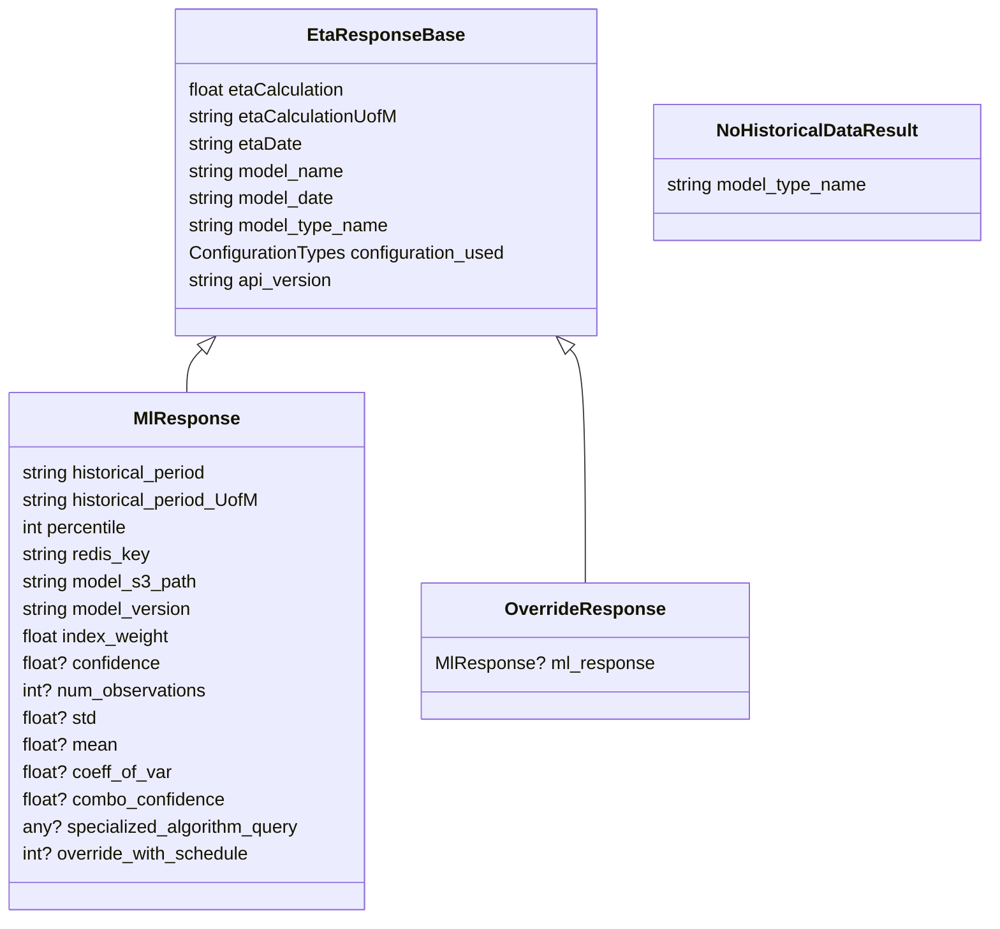

# Diagram: research/api/eta_lib.py


> Auto-generated by Obscura crawlers

## Diagram 1

```mermaid
flowchart TD
    A[get_eta_batch(input_dict)] --> B{model_type found?}
    B -- No --> C[return {"model_type_name":"None"}]
    B -- Yes --> D[extract_features(input_dict) -> feature_dict]
    D --> E[get_overrides(model_type, feature_dict)]
    E --> F{override_value present?}
    F -- Yes --> G[override_response_base = make_eta_response(override_value,...)]
    D --> H[get_model_type_values(model_type, feature_dict)]
    H --> I[ml_response = run_ml_algorithm(model_type.value, model_to_values_dict, input_dict)]
    I --> Iopt[/* optional: adjust cache (commented out in code) */]
    I --> J{ml_response exists?}
    J -- Yes --> K{override_response_base exists?}
    K -- Yes --> L[attach ml_response to override_response_base and return override_response]
    K -- No --> M[return ml_response]
    J -- No --> N{fallback_value in override_result?}
    N -- Yes --> O[return make_eta_response(fallback_value,...)]
    N -- No --> P[return {"model_type_name": model_type.value}]
```

> SVG rendering failed for this diagram.

## Diagram 2



### SVG

<svg id="container" width="871.21484375" xmlns="http://www.w3.org/2000/svg" class="classDiagram" height="810" viewBox="0 0 871.21484375 810" role="graphics-document document" aria-roledescription="class"><style>#container{font-family:"trebuchet ms",verdana,arial,sans-serif;font-size:16px;fill:#333;}@keyframes edge-animation-frame{from{stroke-dashoffset:0;}}@keyframes dash{to{stroke-dashoffset:0;}}#container .edge-animation-slow{stroke-dasharray:9,5!important;stroke-dashoffset:900;animation:dash 50s linear infinite;stroke-linecap:round;}#container .edge-animation-fast{stroke-dasharray:9,5!important;stroke-dashoffset:900;animation:dash 20s linear infinite;stroke-linecap:round;}#container .error-icon{fill:#552222;}#container .error-text{fill:#552222;stroke:#552222;}#container .edge-thickness-normal{stroke-width:1px;}#container .edge-thickness-thick{stroke-width:3.5px;}#container .edge-pattern-solid{stroke-dasharray:0;}#container .edge-thickness-invisible{stroke-width:0;fill:none;}#container .edge-pattern-dashed{stroke-dasharray:3;}#container .edge-pattern-dotted{stroke-dasharray:2;}#container .marker{fill:#333333;stroke:#333333;}#container .marker.cross{stroke:#333333;}#container svg{font-family:"trebuchet ms",verdana,arial,sans-serif;font-size:16px;}#container p{margin:0;}#container g.classGroup text{fill:#9370DB;stroke:none;font-family:"trebuchet ms",verdana,arial,sans-serif;font-size:10px;}#container g.classGroup text .title{font-weight:bolder;}#container .nodeLabel,#container .edgeLabel{color:#131300;}#container .edgeLabel .label rect{fill:#ECECFF;}#container .label text{fill:#131300;}#container .labelBkg{background:#ECECFF;}#container .edgeLabel .label span{background:#ECECFF;}#container .classTitle{font-weight:bolder;}#container .node rect,#container .node circle,#container .node ellipse,#container .node polygon,#container .node path{fill:#ECECFF;stroke:#9370DB;stroke-width:1px;}#container .divider{stroke:#9370DB;stroke-width:1;}#container g.clickable{cursor:pointer;}#container g.classGroup rect{fill:#ECECFF;stroke:#9370DB;}#container g.classGroup line{stroke:#9370DB;stroke-width:1;}#container .classLabel .box{stroke:none;stroke-width:0;fill:#ECECFF;opacity:0.5;}#container .classLabel .label{fill:#9370DB;font-size:10px;}#container .relation{stroke:#333333;stroke-width:1;fill:none;}#container .dashed-line{stroke-dasharray:3;}#container .dotted-line{stroke-dasharray:1 2;}#container #compositionStart,#container .composition{fill:#333333!important;stroke:#333333!important;stroke-width:1;}#container #compositionEnd,#container .composition{fill:#333333!important;stroke:#333333!important;stroke-width:1;}#container #dependencyStart,#container .dependency{fill:#333333!important;stroke:#333333!important;stroke-width:1;}#container #dependencyStart,#container .dependency{fill:#333333!important;stroke:#333333!important;stroke-width:1;}#container #extensionStart,#container .extension{fill:transparent!important;stroke:#333333!important;stroke-width:1;}#container #extensionEnd,#container .extension{fill:transparent!important;stroke:#333333!important;stroke-width:1;}#container #aggregationStart,#container .aggregation{fill:transparent!important;stroke:#333333!important;stroke-width:1;}#container #aggregationEnd,#container .aggregation{fill:transparent!important;stroke:#333333!important;stroke-width:1;}#container #lollipopStart,#container .lollipop{fill:#ECECFF!important;stroke:#333333!important;stroke-width:1;}#container #lollipopEnd,#container .lollipop{fill:#ECECFF!important;stroke:#333333!important;stroke-width:1;}#container .edgeTerminals{font-size:11px;line-height:initial;}#container .classTitleText{text-anchor:middle;font-size:18px;fill:#333;}#container .label-icon{display:inline-block;height:1em;overflow:visible;vertical-align:-0.125em;}#container .node .label-icon path{fill:currentColor;stroke:revert;stroke-width:revert;}#container :root{--mermaid-font-family:"trebuchet ms",verdana,arial,sans-serif;}</style><g><defs><marker id="container_class-aggregationStart" class="marker aggregation class" refX="18" refY="7" markerWidth="190" markerHeight="240" orient="auto"><path d="M 18,7 L9,13 L1,7 L9,1 Z"></path></marker></defs><defs><marker id="container_class-aggregationEnd" class="marker aggregation class" refX="1" refY="7" markerWidth="20" markerHeight="28" orient="auto"><path d="M 18,7 L9,13 L1,7 L9,1 Z"></path></marker></defs><defs><marker id="container_class-extensionStart" class="marker extension class" refX="18" refY="7" markerWidth="190" markerHeight="240" orient="auto"><path d="M 1,7 L18,13 V 1 Z"></path></marker></defs><defs><marker id="container_class-extensionEnd" class="marker extension class" refX="1" refY="7" markerWidth="20" markerHeight="28" orient="auto"><path d="M 1,1 V 13 L18,7 Z"></path></marker></defs><defs><marker id="container_class-compositionStart" class="marker composition class" refX="18" refY="7" markerWidth="190" markerHeight="240" orient="auto"><path d="M 18,7 L9,13 L1,7 L9,1 Z"></path></marker></defs><defs><marker id="container_class-compositionEnd" class="marker composition class" refX="1" refY="7" markerWidth="20" markerHeight="28" orient="auto"><path d="M 18,7 L9,13 L1,7 L9,1 Z"></path></marker></defs><defs><marker id="container_class-dependencyStart" class="marker dependency class" refX="6" refY="7" markerWidth="190" markerHeight="240" orient="auto"><path d="M 5,7 L9,13 L1,7 L9,1 Z"></path></marker></defs><defs><marker id="container_class-dependencyEnd" class="marker dependency class" refX="13" refY="7" markerWidth="20" markerHeight="28" orient="auto"><path d="M 18,7 L9,13 L14,7 L9,1 Z"></path></marker></defs><defs><marker id="container_class-lollipopStart" class="marker lollipop class" refX="13" refY="7" markerWidth="190" markerHeight="240" orient="auto"><circle stroke="black" fill="transparent" cx="7" cy="7" r="6"></circle></marker></defs><defs><marker id="container_class-lollipopEnd" class="marker lollipop class" refX="1" refY="7" markerWidth="190" markerHeight="240" orient="auto"><circle stroke="black" fill="transparent" cx="7" cy="7" r="6"></circle></marker></defs><g class="root"><g class="clusters"></g><g class="edgePaths"><path d="M178.205,308.017L175.977,310.181C173.749,312.345,169.292,316.672,167.064,323.003C164.836,329.333,164.836,337.667,164.836,341.833L164.836,346" id="id_EtaResponseBase_MlResponse_1" class="edge-thickness-normal edge-pattern-solid relation" style=";;;" data-edge="true" data-et="edge" data-id="id_EtaResponseBase_MlResponse_1" data-points="W3sieCI6MTkwLjU4MDc4MzA5OTExMjQ0LCJ5IjoyOTZ9LHsieCI6MTY0LjgzNTkzNzUsInkiOjMyMX0seyJ4IjoxNjQuODM1OTM3NSwieSI6MzQ2fV0=" marker-start="url(#container_class-extensionStart)"></path><path d="M499.537,308.017L501.765,310.181C503.993,312.345,508.45,316.672,510.678,351.003C512.906,385.333,512.906,449.667,512.906,481.833L512.906,514" id="id_EtaResponseBase_OverrideResponse_2" class="edge-thickness-normal edge-pattern-solid relation" style=";;;" data-edge="true" data-et="edge" data-id="id_EtaResponseBase_OverrideResponse_2" data-points="W3sieCI6NDg3LjE2MTQwNDQwMDg4NzYsInkiOjI5Nn0seyJ4Ijo1MTIuOTA2MjUsInkiOjMyMX0seyJ4Ijo1MTIuOTA2MjUsInkiOjUxNH1d" marker-start="url(#container_class-extensionStart)"></path></g><g class="edgeLabels"><g class="edgeLabel"><g class="label" data-id="id_EtaResponseBase_MlResponse_1" transform="translate(0, 0)"><foreignObject width="0" height="0"><div xmlns="http://www.w3.org/1999/xhtml" class="labelBkg" style="display: table-cell; white-space: nowrap; line-height: 1.5; max-width: 200px; text-align: center;"><span class="edgeLabel"></span></div></foreignObject></g></g><g class="edgeLabel"><g class="label" data-id="id_EtaResponseBase_OverrideResponse_2" transform="translate(0, 0)"><foreignObject width="0" height="0"><div xmlns="http://www.w3.org/1999/xhtml" class="labelBkg" style="display: table-cell; white-space: nowrap; line-height: 1.5; max-width: 200px; text-align: center;"><span class="edgeLabel"></span></div></foreignObject></g></g></g><g class="nodes"><g class="node default" id="classId-EtaResponseBase-0" transform="translate(338.87109375, 152)"><g class="basic label-container"><path d="M-185.1640625 -144 L185.1640625 -144 L185.1640625 144 L-185.1640625 144" stroke="none" stroke-width="0" fill="#ECECFF" style=""></path><path d="M-185.1640625 -144 C-54.59464873156384 -144, 75.97476503687233 -144, 185.1640625 -144 M-185.1640625 -144 C-48.18851461895392 -144, 88.78703326209217 -144, 185.1640625 -144 M185.1640625 -144 C185.1640625 -37.642094981796376, 185.1640625 68.71581003640725, 185.1640625 144 M185.1640625 -144 C185.1640625 -85.79303808836247, 185.1640625 -27.586076176724944, 185.1640625 144 M185.1640625 144 C56.499421302752694 144, -72.16521989449461 144, -185.1640625 144 M185.1640625 144 C53.15942464020742 144, -78.84521321958516 144, -185.1640625 144 M-185.1640625 144 C-185.1640625 74.17182464505386, -185.1640625 4.34364929010772, -185.1640625 -144 M-185.1640625 144 C-185.1640625 74.18464812885547, -185.1640625 4.369296257710943, -185.1640625 -144" stroke="#9370DB" stroke-width="1.3" fill="none" stroke-dasharray="0 0" style=""></path></g><g class="annotation-group text" transform="translate(0, -120)"></g><g class="label-group text" transform="translate(-64.40625, -120)"><g class="label" style="font-weight: bolder" transform="translate(0,-12)"><foreignObject width="128.8125" height="24"><div xmlns="http://www.w3.org/1999/xhtml" style="display: table-cell; white-space: nowrap; line-height: 1.5; max-width: 177px; text-align: center;"><span class="nodeLabel markdown-node-label" style=""><p>EtaResponseBase</p></span></div></foreignObject></g></g><g class="members-group text" transform="translate(-173.1640625, -72)"><g class="label" style="" transform="translate(0,-12)"><foreignObject width="141.46875" height="24"><div xmlns="http://www.w3.org/1999/xhtml" style="display: table-cell; white-space: nowrap; line-height: 1.5; max-width: 191px; text-align: center;"><span class="nodeLabel markdown-node-label" style=""><p>float etaCalculation</p></span></div></foreignObject></g><g class="label" style="" transform="translate(0,12)"><foreignObject width="187.78125" height="24"><div xmlns="http://www.w3.org/1999/xhtml" style="display: table-cell; white-space: nowrap; line-height: 1.5; max-width: 238px; text-align: center;"><span class="nodeLabel markdown-node-label" style=""><p>string etaCalculationUofM</p></span></div></foreignObject></g><g class="label" style="" transform="translate(0,36)"><foreignObject width="102.078125" height="24"><div xmlns="http://www.w3.org/1999/xhtml" style="display: table-cell; white-space: nowrap; line-height: 1.5; max-width: 152px; text-align: center;"><span class="nodeLabel markdown-node-label" style=""><p>string etaDate</p></span></div></foreignObject></g><g class="label" style="" transform="translate(0,60)"><foreignObject width="140.75" height="24"><div xmlns="http://www.w3.org/1999/xhtml" style="display: table-cell; white-space: nowrap; line-height: 1.5; max-width: 191px; text-align: center;"><span class="nodeLabel markdown-node-label" style=""><p>string model_name</p></span></div></foreignObject></g><g class="label" style="" transform="translate(0,84)"><foreignObject width="132.4375" height="24"><div xmlns="http://www.w3.org/1999/xhtml" style="display: table-cell; white-space: nowrap; line-height: 1.5; max-width: 182px; text-align: center;"><span class="nodeLabel markdown-node-label" style=""><p>string model_date</p></span></div></foreignObject></g><g class="label" style="" transform="translate(0,108)"><foreignObject width="180.21875" height="24"><div xmlns="http://www.w3.org/1999/xhtml" style="display: table-cell; white-space: nowrap; line-height: 1.5; max-width: 230px; text-align: center;"><span class="nodeLabel markdown-node-label" style=""><p>string model_type_name</p></span></div></foreignObject></g><g class="label" style="" transform="translate(0,132)"><foreignObject width="281.921875" height="24"><div xmlns="http://www.w3.org/1999/xhtml" style="display: table-cell; white-space: nowrap; line-height: 1.5; max-width: 332px; text-align: center;"><span class="nodeLabel markdown-node-label" style=""><p>ConfigurationTypes configuration_used</p></span></div></foreignObject></g><g class="label" style="" transform="translate(0,156)"><foreignObject width="129.609375" height="24"><div xmlns="http://www.w3.org/1999/xhtml" style="display: table-cell; white-space: nowrap; line-height: 1.5; max-width: 180px; text-align: center;"><span class="nodeLabel markdown-node-label" style=""><p>string api_version</p></span></div></foreignObject></g></g><g class="methods-group text" transform="translate(-173.1640625, 144)"></g><g class="divider" style=""><path d="M-185.1640625 -96 C-108.76425425394154 -96, -32.36444600788309 -96, 185.1640625 -96 M-185.1640625 -96 C-39.88618103387705 -96, 105.3917004322459 -96, 185.1640625 -96" stroke="#9370DB" stroke-width="1.3" fill="none" stroke-dasharray="0 0" style=""></path></g><g class="divider" style=""><path d="M-185.1640625 120 C-85.4377665924175 120, 14.288529315164993 120, 185.1640625 120 M-185.1640625 120 C-80.54685783280179 120, 24.070346834396418 120, 185.1640625 120" stroke="#9370DB" stroke-width="1.3" fill="none" stroke-dasharray="0 0" style=""></path></g></g><g class="node default" id="classId-MlResponse-1" transform="translate(164.8359375, 574)"><g class="basic label-container"><path d="M-156.8359375 -228 L156.8359375 -228 L156.8359375 228 L-156.8359375 228" stroke="none" stroke-width="0" fill="#ECECFF" style=""></path><path d="M-156.8359375 -228 C-40.343933833112345 -228, 76.14806983377531 -228, 156.8359375 -228 M-156.8359375 -228 C-64.15035726714609 -228, 28.535222965707817 -228, 156.8359375 -228 M156.8359375 -228 C156.8359375 -53.579234042637324, 156.8359375 120.84153191472535, 156.8359375 228 M156.8359375 -228 C156.8359375 -75.46676492236813, 156.8359375 77.06647015526374, 156.8359375 228 M156.8359375 228 C35.24077487938621 228, -86.35438774122758 228, -156.8359375 228 M156.8359375 228 C40.039379782531654 228, -76.75717793493669 228, -156.8359375 228 M-156.8359375 228 C-156.8359375 125.85762418611019, -156.8359375 23.715248372220373, -156.8359375 -228 M-156.8359375 228 C-156.8359375 113.75009169357361, -156.8359375 -0.4998166128527828, -156.8359375 -228" stroke="#9370DB" stroke-width="1.3" fill="none" stroke-dasharray="0 0" style=""></path></g><g class="annotation-group text" transform="translate(0, -204)"></g><g class="label-group text" transform="translate(-44.109375, -204)"><g class="label" style="font-weight: bolder" transform="translate(0,-12)"><foreignObject width="88.21875" height="24"><div xmlns="http://www.w3.org/1999/xhtml" style="display: table-cell; white-space: nowrap; line-height: 1.5; max-width: 137px; text-align: center;"><span class="nodeLabel markdown-node-label" style=""><p>MlResponse</p></span></div></foreignObject></g></g><g class="members-group text" transform="translate(-144.8359375, -156)"><g class="label" style="" transform="translate(0,-12)"><foreignObject width="169.671875" height="24"><div xmlns="http://www.w3.org/1999/xhtml" style="display: table-cell; white-space: nowrap; line-height: 1.5; max-width: 220px; text-align: center;"><span class="nodeLabel markdown-node-label" style=""><p>string historical_period</p></span></div></foreignObject></g><g class="label" style="" transform="translate(0,12)"><foreignObject width="215.25" height="24"><div xmlns="http://www.w3.org/1999/xhtml" style="display: table-cell; white-space: nowrap; line-height: 1.5; max-width: 265px; text-align: center;"><span class="nodeLabel markdown-node-label" style=""><p>string historical_period_UofM</p></span></div></foreignObject></g><g class="label" style="" transform="translate(0,36)"><foreignObject width="96.875" height="24"><div xmlns="http://www.w3.org/1999/xhtml" style="display: table-cell; white-space: nowrap; line-height: 1.5; max-width: 147px; text-align: center;"><span class="nodeLabel markdown-node-label" style=""><p>int percentile</p></span></div></foreignObject></g><g class="label" style="" transform="translate(0,60)"><foreignObject width="114.421875" height="24"><div xmlns="http://www.w3.org/1999/xhtml" style="display: table-cell; white-space: nowrap; line-height: 1.5; max-width: 165px; text-align: center;"><span class="nodeLabel markdown-node-label" style=""><p>string redis_key</p></span></div></foreignObject></g><g class="label" style="" transform="translate(0,84)"><foreignObject width="156.890625" height="24"><div xmlns="http://www.w3.org/1999/xhtml" style="display: table-cell; white-space: nowrap; line-height: 1.5; max-width: 207px; text-align: center;"><span class="nodeLabel markdown-node-label" style=""><p>string model_s3_path</p></span></div></foreignObject></g><g class="label" style="" transform="translate(0,108)"><foreignObject width="152.921875" height="24"><div xmlns="http://www.w3.org/1999/xhtml" style="display: table-cell; white-space: nowrap; line-height: 1.5; max-width: 203px; text-align: center;"><span class="nodeLabel markdown-node-label" style=""><p>string model_version</p></span></div></foreignObject></g><g class="label" style="" transform="translate(0,132)"><foreignObject width="133.265625" height="24"><div xmlns="http://www.w3.org/1999/xhtml" style="display: table-cell; white-space: nowrap; line-height: 1.5; max-width: 183px; text-align: center;"><span class="nodeLabel markdown-node-label" style=""><p>float index_weight</p></span></div></foreignObject></g><g class="label" style="" transform="translate(0,156)"><foreignObject width="123.125" height="24"><div xmlns="http://www.w3.org/1999/xhtml" style="display: table-cell; white-space: nowrap; line-height: 1.5; max-width: 173px; text-align: center;"><span class="nodeLabel markdown-node-label" style=""><p>float? confidence</p></span></div></foreignObject></g><g class="label" style="" transform="translate(0,180)"><foreignObject width="165.1875" height="24"><div xmlns="http://www.w3.org/1999/xhtml" style="display: table-cell; white-space: nowrap; line-height: 1.5; max-width: 215px; text-align: center;"><span class="nodeLabel markdown-node-label" style=""><p>int? num_observations</p></span></div></foreignObject></g><g class="label" style="" transform="translate(0,204)"><foreignObject width="66.75" height="24"><div xmlns="http://www.w3.org/1999/xhtml" style="display: table-cell; white-space: nowrap; line-height: 1.5; max-width: 117px; text-align: center;"><span class="nodeLabel markdown-node-label" style=""><p>float? std</p></span></div></foreignObject></g><g class="label" style="" transform="translate(0,228)"><foreignObject width="84.515625" height="24"><div xmlns="http://www.w3.org/1999/xhtml" style="display: table-cell; white-space: nowrap; line-height: 1.5; max-width: 135px; text-align: center;"><span class="nodeLabel markdown-node-label" style=""><p>float? mean</p></span></div></foreignObject></g><g class="label" style="" transform="translate(0,252)"><foreignObject width="132.359375" height="24"><div xmlns="http://www.w3.org/1999/xhtml" style="display: table-cell; white-space: nowrap; line-height: 1.5; max-width: 183px; text-align: center;"><span class="nodeLabel markdown-node-label" style=""><p>float? coeff_of_var</p></span></div></foreignObject></g><g class="label" style="" transform="translate(0,276)"><foreignObject width="180.046875" height="24"><div xmlns="http://www.w3.org/1999/xhtml" style="display: table-cell; white-space: nowrap; line-height: 1.5; max-width: 230px; text-align: center;"><span class="nodeLabel markdown-node-label" style=""><p>float? combo_confidence</p></span></div></foreignObject></g><g class="label" style="" transform="translate(0,300)"><foreignObject width="245.5625" height="24"><div xmlns="http://www.w3.org/1999/xhtml" style="display: table-cell; white-space: nowrap; line-height: 1.5; max-width: 296px; text-align: center;"><span class="nodeLabel markdown-node-label" style=""><p>any? specialized_algorithm_query</p></span></div></foreignObject></g><g class="label" style="" transform="translate(0,324)"><foreignObject width="204.296875" height="24"><div xmlns="http://www.w3.org/1999/xhtml" style="display: table-cell; white-space: nowrap; line-height: 1.5; max-width: 254px; text-align: center;"><span class="nodeLabel markdown-node-label" style=""><p>int? override_with_schedule</p></span></div></foreignObject></g></g><g class="methods-group text" transform="translate(-144.8359375, 228)"></g><g class="divider" style=""><path d="M-156.8359375 -180 C-50.68913696579756 -180, 55.45766356840488 -180, 156.8359375 -180 M-156.8359375 -180 C-43.28600938054075 -180, 70.2639187389185 -180, 156.8359375 -180" stroke="#9370DB" stroke-width="1.3" fill="none" stroke-dasharray="0 0" style=""></path></g><g class="divider" style=""><path d="M-156.8359375 204 C-52.76970778402652 204, 51.296521931946955 204, 156.8359375 204 M-156.8359375 204 C-62.68930682268338 204, 31.457323854633245 204, 156.8359375 204" stroke="#9370DB" stroke-width="1.3" fill="none" stroke-dasharray="0 0" style=""></path></g></g><g class="node default" id="classId-OverrideResponse-2" transform="translate(512.90625, 574)"><g class="basic label-container"><path d="M-141.234375 -60 L141.234375 -60 L141.234375 60 L-141.234375 60" stroke="none" stroke-width="0" fill="#ECECFF" style=""></path><path d="M-141.234375 -60 C-43.498880624346114 -60, 54.23661375130777 -60, 141.234375 -60 M-141.234375 -60 C-36.04908667771937 -60, 69.13620164456125 -60, 141.234375 -60 M141.234375 -60 C141.234375 -19.440782276528687, 141.234375 21.118435446942627, 141.234375 60 M141.234375 -60 C141.234375 -25.474163392171185, 141.234375 9.05167321565763, 141.234375 60 M141.234375 60 C31.578865117967695 60, -78.07664476406461 60, -141.234375 60 M141.234375 60 C64.68156816361207 60, -11.87123867277586 60, -141.234375 60 M-141.234375 60 C-141.234375 13.891736130652902, -141.234375 -32.2165277386942, -141.234375 -60 M-141.234375 60 C-141.234375 13.746233279505972, -141.234375 -32.507533440988055, -141.234375 -60" stroke="#9370DB" stroke-width="1.3" fill="none" stroke-dasharray="0 0" style=""></path></g><g class="annotation-group text" transform="translate(0, -36)"></g><g class="label-group text" transform="translate(-67.3125, -36)"><g class="label" style="font-weight: bolder" transform="translate(0,-12)"><foreignObject width="134.625" height="24"><div xmlns="http://www.w3.org/1999/xhtml" style="display: table-cell; white-space: nowrap; line-height: 1.5; max-width: 183px; text-align: center;"><span class="nodeLabel markdown-node-label" style=""><p>OverrideResponse</p></span></div></foreignObject></g></g><g class="members-group text" transform="translate(-129.234375, 12)"><g class="label" style="" transform="translate(0,-12)"><foreignObject width="191.15625" height="24"><div xmlns="http://www.w3.org/1999/xhtml" style="display: table-cell; white-space: nowrap; line-height: 1.5; max-width: 241px; text-align: center;"><span class="nodeLabel markdown-node-label" style=""><p>MlResponse? ml_response</p></span></div></foreignObject></g></g><g class="methods-group text" transform="translate(-129.234375, 60)"></g><g class="divider" style=""><path d="M-141.234375 -12 C-46.165821189473704 -12, 48.90273262105259 -12, 141.234375 -12 M-141.234375 -12 C-49.17623388546923 -12, 42.88190722906154 -12, 141.234375 -12" stroke="#9370DB" stroke-width="1.3" fill="none" stroke-dasharray="0 0" style=""></path></g><g class="divider" style=""><path d="M-141.234375 36 C-45.97641851289892 36, 49.281537974202166 36, 141.234375 36 M-141.234375 36 C-53.19103242644495 36, 34.8523101471101 36, 141.234375 36" stroke="#9370DB" stroke-width="1.3" fill="none" stroke-dasharray="0 0" style=""></path></g></g><g class="node default" id="classId-NoHistoricalDataResult-3" transform="translate(718.625, 152)"><g class="basic label-container"><path d="M-144.58984375 -60 L144.58984375 -60 L144.58984375 60 L-144.58984375 60" stroke="none" stroke-width="0" fill="#ECECFF" style=""></path><path d="M-144.58984375 -60 C-63.72642796871939 -60, 17.136987812561216 -60, 144.58984375 -60 M-144.58984375 -60 C-37.54467754866086 -60, 69.50048865267829 -60, 144.58984375 -60 M144.58984375 -60 C144.58984375 -14.89405574202734, 144.58984375 30.21188851594532, 144.58984375 60 M144.58984375 -60 C144.58984375 -33.57075256022816, 144.58984375 -7.141505120456316, 144.58984375 60 M144.58984375 60 C75.98199194152328 60, 7.374140133046552 60, -144.58984375 60 M144.58984375 60 C61.14604848355691 60, -22.29774678288618 60, -144.58984375 60 M-144.58984375 60 C-144.58984375 35.67184820776957, -144.58984375 11.343696415539135, -144.58984375 -60 M-144.58984375 60 C-144.58984375 33.4693505855179, -144.58984375 6.938701171035795, -144.58984375 -60" stroke="#9370DB" stroke-width="1.3" fill="none" stroke-dasharray="0 0" style=""></path></g><g class="annotation-group text" transform="translate(0, -36)"></g><g class="label-group text" transform="translate(-84.9609375, -36)"><g class="label" style="font-weight: bolder" transform="translate(0,-12)"><foreignObject width="169.921875" height="24"><div xmlns="http://www.w3.org/1999/xhtml" style="display: table-cell; white-space: nowrap; line-height: 1.5; max-width: 218px; text-align: center;"><span class="nodeLabel markdown-node-label" style=""><p>NoHistoricalDataResult</p></span></div></foreignObject></g></g><g class="members-group text" transform="translate(-132.58984375, 12)"><g class="label" style="" transform="translate(0,-12)"><foreignObject width="180.21875" height="24"><div xmlns="http://www.w3.org/1999/xhtml" style="display: table-cell; white-space: nowrap; line-height: 1.5; max-width: 230px; text-align: center;"><span class="nodeLabel markdown-node-label" style=""><p>string model_type_name</p></span></div></foreignObject></g></g><g class="methods-group text" transform="translate(-132.58984375, 60)"></g><g class="divider" style=""><path d="M-144.58984375 -12 C-70.59865766806867 -12, 3.3925284138626637 -12, 144.58984375 -12 M-144.58984375 -12 C-59.65448043340565 -12, 25.280882883188696 -12, 144.58984375 -12" stroke="#9370DB" stroke-width="1.3" fill="none" stroke-dasharray="0 0" style=""></path></g><g class="divider" style=""><path d="M-144.58984375 36 C-84.4951072707607 36, -24.400370791521397 36, 144.58984375 36 M-144.58984375 36 C-70.05366556844317 36, 4.48251261311367 36, 144.58984375 36" stroke="#9370DB" stroke-width="1.3" fill="none" stroke-dasharray="0 0" style=""></path></g></g></g></g></g></svg>
