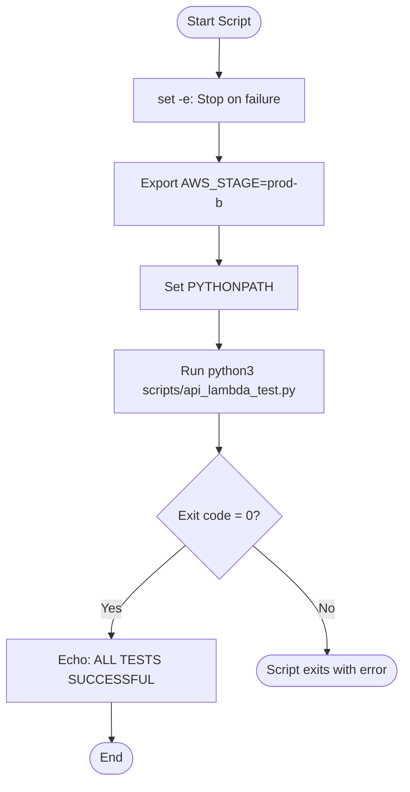
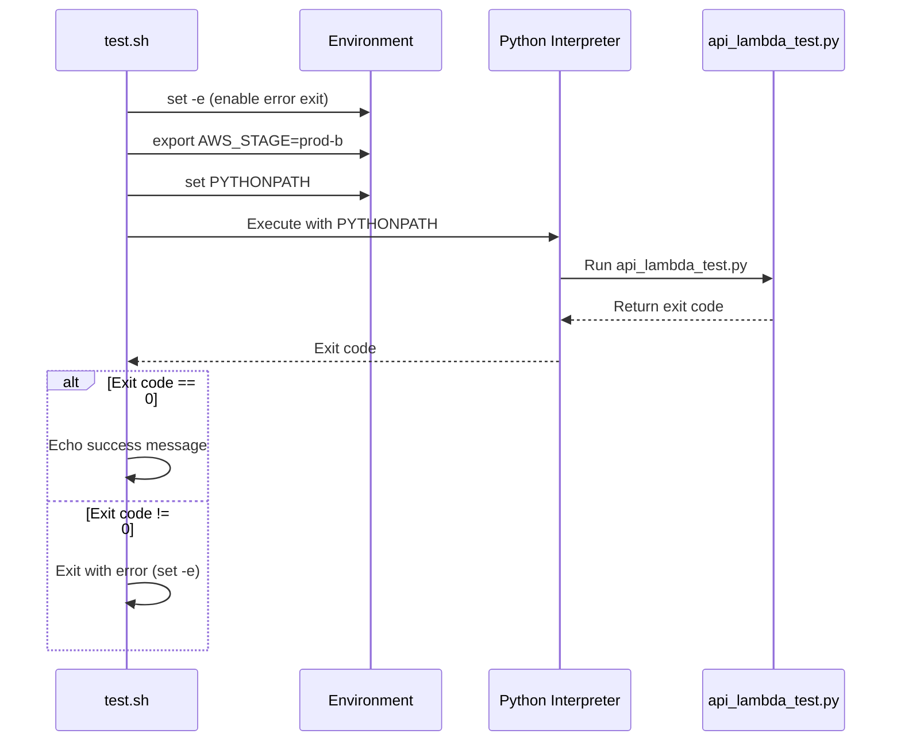

# Diagram: research/api/run_integration_tests.sh

> Auto-generated by Obscura crawlers

## Diagram 1

### SVG

<svg id="container" width="507.13623046875" xmlns="http://www.w3.org/2000/svg" class="flowchart" height="938.25" viewBox="0 0 507.13623046875 938.25" role="graphics-document document" aria-roledescription="flowchart-v2"><g><marker id="container_flowchart-v2-pointEnd" class="marker flowchart-v2" viewBox="0 0 10 10" refX="5" refY="5" markerUnits="userSpaceOnUse" markerWidth="8" markerHeight="8" orient="auto"><path d="M 0 0 L 10 5 L 0 10 z" class="arrowMarkerPath" style="stroke-width: 1; stroke-dasharray: 1, 0;"></path></marker><marker id="container_flowchart-v2-pointStart" class="marker flowchart-v2" viewBox="0 0 10 10" refX="4.5" refY="5" markerUnits="userSpaceOnUse" markerWidth="8" markerHeight="8" orient="auto"><path d="M 0 5 L 10 10 L 10 0 z" class="arrowMarkerPath" style="stroke-width: 1; stroke-dasharray: 1, 0;"></path></marker><marker id="container_flowchart-v2-circleEnd" class="marker flowchart-v2" viewBox="0 0 10 10" refX="11" refY="5" markerUnits="userSpaceOnUse" markerWidth="11" markerHeight="11" orient="auto"><circle cx="5" cy="5" r="5" class="arrowMarkerPath" style="stroke-width: 1; stroke-dasharray: 1, 0;"></circle></marker><marker id="container_flowchart-v2-circleStart" class="marker flowchart-v2" viewBox="0 0 10 10" refX="-1" refY="5" markerUnits="userSpaceOnUse" markerWidth="11" markerHeight="11" orient="auto"><circle cx="5" cy="5" r="5" class="arrowMarkerPath" style="stroke-width: 1; stroke-dasharray: 1, 0;"></circle></marker><marker id="container_flowchart-v2-crossEnd" class="marker cross flowchart-v2" viewBox="0 0 11 11" refX="12" refY="5.2" markerUnits="userSpaceOnUse" markerWidth="11" markerHeight="11" orient="auto"><path d="M 1,1 l 9,9 M 10,1 l -9,9" class="arrowMarkerPath" style="stroke-width: 2; stroke-dasharray: 1, 0;"></path></marker><marker id="container_flowchart-v2-crossStart" class="marker cross flowchart-v2" viewBox="0 0 11 11" refX="-1" refY="5.2" markerUnits="userSpaceOnUse" markerWidth="11" markerHeight="11" orient="auto"><path d="M 1,1 l 9,9 M 10,1 l -9,9" class="arrowMarkerPath" style="stroke-width: 2; stroke-dasharray: 1, 0;"></path></marker><g class="root"><g class="clusters"></g><g class="edgePaths"><path d="M273.784,47.5L273.701,51.583C273.617,55.667,273.451,63.833,273.367,71.417C273.284,79,273.284,86,273.284,89.5L273.284,93" id="L_Start_SetError_0" class="edge-thickness-normal edge-pattern-solid edge-thickness-normal edge-pattern-solid flowchart-link" style=";" data-edge="true" data-et="edge" data-id="L_Start_SetError_0" data-points="W3sieCI6MjczLjc4NDA1MzgwMjQ5MDIzLCJ5Ijo0Ny41fSx7IngiOjI3My4yODQwNTM4MDI0OTAyMywieSI6NzJ9LHsieCI6MjczLjI4NDA1MzgwMjQ5MDIzLCJ5Ijo5N31d" marker-end="url(#container_flowchart-v2-pointEnd)"></path><path d="M273.284,151L273.284,155.167C273.284,159.333,273.284,167.667,273.284,175.333C273.284,183,273.284,190,273.284,193.5L273.284,197" id="L_SetError_Export_0" class="edge-thickness-normal edge-pattern-solid edge-thickness-normal edge-pattern-solid flowchart-link" style=";" data-edge="true" data-et="edge" data-id="L_SetError_Export_0" data-points="W3sieCI6MjczLjI4NDA1MzgwMjQ5MDIzLCJ5IjoxNTF9LHsieCI6MjczLjI4NDA1MzgwMjQ5MDIzLCJ5IjoxNzZ9LHsieCI6MjczLjI4NDA1MzgwMjQ5MDIzLCJ5IjoyMDF9XQ==" marker-end="url(#container_flowchart-v2-pointEnd)"></path><path d="M273.284,255L273.284,259.167C273.284,263.333,273.284,271.667,273.284,279.333C273.284,287,273.284,294,273.284,297.5L273.284,301" id="L_Export_SetPath_0" class="edge-thickness-normal edge-pattern-solid edge-thickness-normal edge-pattern-solid flowchart-link" style=";" data-edge="true" data-et="edge" data-id="L_Export_SetPath_0" data-points="W3sieCI6MjczLjI4NDA1MzgwMjQ5MDIzLCJ5IjoyNTV9LHsieCI6MjczLjI4NDA1MzgwMjQ5MDIzLCJ5IjoyODB9LHsieCI6MjczLjI4NDA1MzgwMjQ5MDIzLCJ5IjozMDV9XQ==" marker-end="url(#container_flowchart-v2-pointEnd)"></path><path d="M273.284,359L273.284,363.167C273.284,367.333,273.284,375.667,273.284,383.333C273.284,391,273.284,398,273.284,401.5L273.284,405" id="L_SetPath_RunTest_0" class="edge-thickness-normal edge-pattern-solid edge-thickness-normal edge-pattern-solid flowchart-link" style=";" data-edge="true" data-et="edge" data-id="L_SetPath_RunTest_0" data-points="W3sieCI6MjczLjI4NDA1MzgwMjQ5MDIzLCJ5IjozNTl9LHsieCI6MjczLjI4NDA1MzgwMjQ5MDIzLCJ5IjozODR9LHsieCI6MjczLjI4NDA1MzgwMjQ5MDIzLCJ5Ijo0MDl9XQ==" marker-end="url(#container_flowchart-v2-pointEnd)"></path><path d="M273.284,487L273.284,491.167C273.284,495.333,273.284,503.667,273.284,511.333C273.284,519,273.284,526,273.284,529.5L273.284,533" id="L_RunTest_CheckExit_0" class="edge-thickness-normal edge-pattern-solid edge-thickness-normal edge-pattern-solid flowchart-link" style=";" data-edge="true" data-et="edge" data-id="L_RunTest_CheckExit_0" data-points="W3sieCI6MjczLjI4NDA1MzgwMjQ5MDIzLCJ5Ijo0ODd9LHsieCI6MjczLjI4NDA1MzgwMjQ5MDIzLCJ5Ijo1MTJ9LHsieCI6MjczLjI4NDA1MzgwMjQ5MDIzLCJ5Ijo1Mzd9XQ==" marker-end="url(#container_flowchart-v2-pointEnd)"></path><path d="M231.826,647.792L216.189,660.868C200.551,673.945,169.275,700.097,153.638,718.674C138,737.25,138,748.25,138,753.75L138,759.25" id="L_CheckExit_Success_0" class="edge-thickness-normal edge-pattern-solid edge-thickness-normal edge-pattern-solid flowchart-link" style=";" data-edge="true" data-et="edge" data-id="L_CheckExit_Success_0" data-points="W3sieCI6MjMxLjgyNjIzMDc1NTg5OTkzLCJ5Ijo2NDcuNzkyMTc2OTUzNDA5N30seyJ4IjoxMzgsInkiOjcyNi4yNX0seyJ4IjoxMzgsInkiOjc2My4yNX1d" marker-end="url(#container_flowchart-v2-pointEnd)"></path><path d="M314.742,647.792L330.38,660.868C346.017,673.945,377.293,700.097,393.008,722.007C408.723,743.917,408.878,761.583,408.956,770.417L409.033,779.25" id="L_CheckExit_Fail_0" class="edge-thickness-normal edge-pattern-solid edge-thickness-normal edge-pattern-solid flowchart-link" style=";" data-edge="true" data-et="edge" data-id="L_CheckExit_Fail_0" data-points="W3sieCI6MzE0Ljc0MTg3Njg0OTA4MDU0LCJ5Ijo2NDcuNzkyMTc2OTUzNDA5N30seyJ4Ijo0MDguNTY4MTA3NjA0OTgwNDcsInkiOjcyNi4yNX0seyJ4Ijo0MDkuMDY4MTA3NjA0OTgwNDcsInkiOjc4My4yNX1d" marker-end="url(#container_flowchart-v2-pointEnd)"></path><path d="M138,841.25L138,845.417C138,849.583,138,857.917,138.07,865.667C138.141,873.417,138.281,880.584,138.351,884.167L138.422,887.751" id="L_Success_End_0" class="edge-thickness-normal edge-pattern-solid edge-thickness-normal edge-pattern-solid flowchart-link" style=";" data-edge="true" data-et="edge" data-id="L_Success_End_0" data-points="W3sieCI6MTM4LCJ5Ijo4NDEuMjV9LHsieCI6MTM4LCJ5Ijo4NjYuMjV9LHsieCI6MTM4LjUsInkiOjg5MS43NX1d" marker-end="url(#container_flowchart-v2-pointEnd)"></path></g><g class="edgeLabels"><g class="edgeLabel"><g class="label" data-id="L_Start_SetError_0" transform="translate(0, 0)"><foreignObject width="0" height="0">

</foreignObject></g></g><g class="edgeLabel"><g class="label" data-id="L_SetError_Export_0" transform="translate(0, 0)"><foreignObject width="0" height="0">

</foreignObject></g></g><g class="edgeLabel"><g class="label" data-id="L_Export_SetPath_0" transform="translate(0, 0)"><foreignObject width="0" height="0">

</foreignObject></g></g><g class="edgeLabel"><g class="label" data-id="L_SetPath_RunTest_0" transform="translate(0, 0)"><foreignObject width="0" height="0">

</foreignObject></g></g><g class="edgeLabel"><g class="label" data-id="L_RunTest_CheckExit_0" transform="translate(0, 0)"><foreignObject width="0" height="0">

</foreignObject></g></g><g class="edgeLabel" transform="translate(138, 726.25)"><g class="label" data-id="L_CheckExit_Success_0" transform="translate(-12.03125, -12)"><foreignObject width="24.0625" height="24">

Yes

</foreignObject></g></g><g class="edgeLabel" transform="translate(408.56810760498047, 726.25)"><g class="label" data-id="L_CheckExit_Fail_0" transform="translate(-10.140625, -12)"><foreignObject width="20.28125" height="24">

No

</foreignObject></g></g><g class="edgeLabel"><g class="label" data-id="L_Success_End_0" transform="translate(0, 0)"><foreignObject width="0" height="0">

</foreignObject></g></g></g><g class="nodes"><g class="node default" id="flowchart-Start-0" transform="translate(273.28405380249023, 27.5)"><g class="basic label-container outer-path"><path d="M-33.6875 -19.5 C-14.700643019819179 -19.5, 4.286213960361643 -19.5, 33.6875 -19.5 C33.6875 -19.5, 33.6875 -19.5, 33.6875 -19.5 C34.111965646171505 -19.486388212899538, 34.53643129234302 -19.47277642579908, 34.9368692896239 -19.45993515863156 C35.40856610660426 -19.414431133995883, 35.880262923584624 -19.368927109360207, 36.181104652847864 -19.3399052695533 C36.44753884890631 -19.296830254962618, 36.71397304496476 -19.25375524037194, 37.41509325967676 -19.140403561325776 C37.72696918111914 -19.069219917437138, 38.038845102561524 -18.998036273548497, 38.63376438623539 -18.862249829261074 C38.95397668715267 -18.767212499177493, 39.27418898806995 -18.67217516909391, 39.832110251460605 -18.50658706670804 C40.27732331510459 -18.342744543782608, 40.72253637874857 -18.178902020857176, 41.0052065951478 -18.074876768247425 C41.40220537303151 -17.899137185828632, 41.79920415091521 -17.72339760340984, 42.14823291279238 -17.568892924097174 C42.40647227617189 -17.43416961363229, 42.6647116395514 -17.299446303167407, 43.25649226407678 -16.990714730406097 C43.54129086465372 -16.81806814507401, 43.826089465230645 -16.645421559741923, 44.3254305736057 -16.342718045390892 C44.730715478747 -16.060008840065095, 45.13600038388831 -15.777299634739299, 45.35065534457871 -15.627565626425154 C45.71110994308258 -15.340112676218025, 46.071564541586454 -15.052659726010894, 46.327953708501866 -14.848196188198123 C46.621781778169876 -14.581349309590347, 46.91560984783788 -14.314502430982573, 47.25330973676799 -14.007812326905688 C47.43912659679552 -13.81594116307933, 47.624943456823054 -13.624069999252974, 48.12292094296865 -13.10986736009568 C48.327569002423445 -12.869476104655611, 48.53221706187824 -12.62908484921554, 48.93321390812658 -12.158051136245305 C49.087918456445955 -11.950761135371634, 49.24262300476533 -11.743471134497963, 49.680858964640635 -11.156274872382312 C49.89780253604497 -10.822991289199509, 50.11474610744931 -10.489707706016706, 50.36278387860425 -10.108655082055241 C50.58929040039798 -9.706469816338021, 50.81579692219171 -9.304284550620801, 50.976186474273504 -9.019496659696287 C51.14072732744886 -8.677824057467394, 51.30526818062422 -8.336151455238499, 51.51854614880834 -7.893275190886684 C51.62087433329655 -7.640522596819955, 51.723202517784756 -7.387770002753226, 51.987634229970325 -6.734618561215508 C52.12111252093346 -6.332603215712114, 52.25459081189659 -5.930587870208719, 52.38152313421488 -5.548287939305138 C52.47034516734811 -5.209571031255465, 52.55916720048134 -4.870854123205792, 52.69859428754556 -4.339158212148133 C52.7710550586833 -3.9670874669452187, 52.843515829821044 -3.5950167217423044, 52.937544776581774 -3.1121979531509023 C52.98575045971168 -2.7383241940841976, 53.03395614284159 -2.364450435017493, 53.09739270250937 -1.872449005199798 C53.12090322251613 -1.5062536787442924, 53.14441374252289 -1.1400583522887866, 53.17748121591342 -0.6250057626472757 C53.17748121591342 -0.33609658827219435, 53.17748121591342 -0.047187413897113006, 53.17748121591342 0.625005762647271 C53.160407633522986 0.890940589925908, 53.143334051132555 1.1568754172045448, 53.09739270250937 1.8724490051997846 C53.053170876390105 2.215424755993459, 53.00894905027085 2.5584005067871334, 52.937544776581774 3.1121979531508885 C52.85487963447304 3.5366659865952457, 52.77221449236432 3.9611340200396024, 52.69859428754556 4.339158212148129 C52.61018342667438 4.676307142159421, 52.521772565803204 5.013456072170712, 52.38152313421489 5.548287939305125 C52.271446179466075 5.8798221886275535, 52.16136922471727 6.211356437949982, 51.987634229970325 6.734618561215495 C51.89136271999541 6.972411052136544, 51.79509121002051 7.210203543057593, 51.51854614880834 7.893275190886679 C51.35554786448552 8.231744615887592, 51.192549580162705 8.570214040888505, 50.976186474273504 9.019496659696284 C50.81612124683357 9.303708679377745, 50.656056019393624 9.587920699059207, 50.36278387860425 10.108655082055236 C50.19637040720413 10.364310862399844, 50.029956935804 10.619966642744451, 49.68085896464064 11.156274872382301 C49.51466574216865 11.378958649980731, 49.348472519696664 11.601642427579163, 48.93321390812658 12.158051136245302 C48.727529543128504 12.399659695143963, 48.521845178130434 12.641268254042625, 48.12292094296866 13.10986736009567 C47.92453935250168 13.314712639684311, 47.726157762034696 13.519557919272952, 47.25330973676799 14.007812326905684 C47.04564802917896 14.196405195310337, 46.837986321589945 14.38499806371499, 46.32795370850189 14.848196188198111 C45.94905988117255 15.15035393270506, 45.57016605384322 15.452511677212009, 45.35065534457871 15.627565626425152 C44.99124659392831 15.878273612324818, 44.63183784327791 16.128981598224485, 44.32543057360571 16.34271804539089 C43.96006341650603 16.564205763160455, 43.594696259406355 16.78569348093002, 43.25649226407678 16.990714730406093 C42.93985904624193 17.155902077337284, 42.623225828407065 17.321089424268475, 42.14823291279239 17.56889292409717 C41.70813357672637 17.76371184509064, 41.26803424066035 17.95853076608411, 41.005206595147804 18.07487676824742 C40.60575669629279 18.221878023500455, 40.20630679743776 18.36887927875349, 39.83211025146062 18.506587066708033 C39.51201922728703 18.601588402490684, 39.19192820311344 18.69658973827333, 38.63376438623541 18.86224982926107 C38.34897417756097 18.927251335961223, 38.064183968886525 18.992252842661372, 37.415093259676766 19.140403561325773 C37.05764176730137 19.198193546535304, 36.700190274925966 19.255983531744835, 36.18110465284788 19.3399052695533 C35.724493050741614 19.383954041652693, 35.26788144863534 19.42800281375209, 34.9368692896239 19.45993515863156 C34.469281657883116 19.474929783877375, 34.00169402614233 19.489924409123187, 33.68750000000001 19.5 C33.68750000000001 19.5, 33.6875 19.5, 33.6875 19.5 C17.634990692698278 19.5, 1.5824813853965551 19.5, -33.68749999999999 19.5 C-34.16929758313814 19.484549689270864, -34.65109516627628 19.46909937854173, -34.93686928962389 19.45993515863156 C-35.387788635200025 19.416435511673686, -35.83870798077616 19.37293586471581, -36.18110465284787 19.3399052695533 C-36.609839457046526 19.270590751298524, -37.03857426124518 19.20127623304375, -37.41509325967676 19.140403561325773 C-37.83367384812518 19.044865273506034, -38.252254436573594 18.94932698568629, -38.633764386235384 18.862249829261074 C-38.92632248646303 18.775420120782318, -39.218880586690666 18.688590412303558, -39.83211025146059 18.506587066708043 C-40.29337455509233 18.336837539091086, -40.75463885872406 18.167088011474124, -41.0052065951478 18.074876768247425 C-41.250380602897486 17.966345507845173, -41.49555461064718 17.857814247442917, -42.14823291279238 17.568892924097174 C-42.475437437189164 17.398190533303875, -42.80264196158594 17.227488142510573, -43.25649226407678 16.990714730406097 C-43.678666094685845 16.73479047332207, -44.1008399252949 16.47886621623805, -44.325430573605686 16.3427180453909 C-44.70480588328139 16.078082252253598, -45.08418119295708 15.813446459116298, -45.35065534457871 15.627565626425156 C-45.54739500259792 15.47067098461701, -45.744134660617135 15.313776342808863, -46.327953708501866 14.848196188198125 C-46.6289163439636 14.574869885706747, -46.92987897942535 14.30154358321537, -47.253309736767974 14.007812326905697 C-47.467426677110446 13.786719006674362, -47.68154361745292 13.565625686443028, -48.122920942968655 13.109867360095677 C-48.332490326710776 12.863695237116433, -48.54205971045289 12.61752311413719, -48.933213908126575 12.158051136245307 C-49.11879303823351 11.909392008508565, -49.30437216834046 11.660732880771821, -49.680858964640635 11.156274872382316 C-49.914015606805016 10.798083658692995, -50.1471722489694 10.439892445003673, -50.36278387860425 10.108655082055249 C-50.488475790983834 9.885476363939016, -50.61416770336343 9.662297645822784, -50.976186474273504 9.019496659696289 C-51.183405284535944 8.589202366414064, -51.39062409479839 8.158908073131837, -51.51854614880834 7.893275190886686 C-51.622942699847634 7.635413691449623, -51.72733925088693 7.37755219201256, -51.987634229970325 6.73461856121551 C-52.14341978401857 6.265417293479458, -52.29920533806682 5.796216025743407, -52.38152313421488 5.5482879393051325 C-52.49472886258837 5.116585433343997, -52.607934590961854 4.68488292738286, -52.69859428754556 4.339158212148136 C-52.76404573779709 4.003078848275453, -52.82949718804861 3.666999484402769, -52.937544776581774 3.112197953150904 C-52.99414938448489 2.673183792098441, -53.05075399238802 2.2341696310459773, -53.09739270250937 1.872449005199809 C-53.116315758477704 1.5777071340770776, -53.13523881444605 1.2829652629543462, -53.17748121591342 0.6250057626472781 C-53.17748121591342 0.2174047842966595, -53.17748121591342 -0.19019619405395916, -53.17748121591342 -0.6250057626472687 C-53.14613512342701 -1.1132464552334729, -53.11478903094061 -1.601487147819677, -53.09739270250937 -1.8724490051997822 C-53.05748789412194 -2.181942818956933, -53.017583085734515 -2.4914366327140844, -52.937544776581774 -3.112197953150895 C-52.88585655039468 -3.3776060703111805, -52.834168324207575 -3.6430141874714654, -52.69859428754556 -4.339158212148126 C-52.62409729326769 -4.62324753853121, -52.549600298989816 -4.907336864914293, -52.38152313421489 -5.548287939305123 C-52.26731596862954 -5.892261725607486, -52.153108803044184 -6.2362355119098485, -51.98763422997033 -6.734618561215485 C-51.85070492022774 -7.072836603627785, -51.71377561048515 -7.4110546460400855, -51.51854614880834 -7.893275190886676 C-51.34013210611896 -8.263755767980152, -51.161718063429575 -8.634236345073628, -50.976186474273504 -9.019496659696282 C-50.8373829965991 -9.265956289683402, -50.69857951892471 -9.512415919670522, -50.36278387860425 -10.108655082055243 C-50.09307784581879 -10.52299597462413, -49.82337181303334 -10.937336867193016, -49.68085896464064 -11.156274872382308 C-49.45132808295156 -11.463825343152179, -49.22179720126249 -11.771375813922049, -48.93321390812659 -12.158051136245302 C-48.76564759025115 -12.35488406801539, -48.59808127237571 -12.55171699978548, -48.12292094296866 -13.10986736009567 C-47.849318921636325 -13.392383910265014, -47.575716900303995 -13.674900460434358, -47.253309736767996 -14.007812326905677 C-46.91164826323561 -14.318100237300566, -46.569986789703236 -14.628388147695453, -46.32795370850189 -14.848196188198107 C-46.09276950227991 -15.03574933414557, -45.85758529605793 -15.223302480093032, -45.35065534457872 -15.627565626425149 C-44.950886015888784 -15.906427404383932, -44.55111668719884 -16.185289182342714, -44.325430573605715 -16.342718045390885 C-43.940930218159245 -16.57580442043743, -43.55642986271278 -16.808890795483975, -43.25649226407679 -16.99071473040609 C-42.83410625279405 -17.211073241941143, -42.41172024151131 -17.431431753476197, -42.14823291279239 -17.56889292409717 C-41.70795313916148 -17.763791719448125, -41.26767336553058 -17.95869051479908, -41.005206595147804 -18.07487676824742 C-40.67371441873427 -18.19686895344769, -40.34222224232074 -18.318861138647957, -39.83211025146062 -18.506587066708033 C-39.47608272090481 -18.61225416895035, -39.120055190349014 -18.717921271192672, -38.63376438623541 -18.862249829261067 C-38.22057362677253 -18.956557923786782, -37.80738286730964 -19.050866018312497, -37.415093259676766 -19.140403561325773 C-37.06482087633363 -19.19703288386179, -36.71454849299049 -19.253662206397806, -36.18110465284788 -19.3399052695533 C-35.76991112731748 -19.37957261442865, -35.35871760178707 -19.419239959304, -34.9368692896239 -19.45993515863156 C-34.57405306984437 -19.47156996862096, -34.211236850064836 -19.483204778610357, -33.68750000000001 -19.5 C-33.68750000000001 -19.5, -33.6875 -19.5, -33.6875 -19.5" stroke="none" stroke-width="0" fill="#ECECFF" style=""></path><path d="M-33.6875 -19.5 C-18.02106351740654 -19.5, -2.354627034813081 -19.5, 33.6875 -19.5 M-33.6875 -19.5 C-13.124456245056734 -19.5, 7.438587509886531 -19.5, 33.6875 -19.5 M33.6875 -19.5 C33.6875 -19.5, 33.6875 -19.5, 33.6875 -19.5 M33.6875 -19.5 C33.6875 -19.5, 33.6875 -19.5, 33.6875 -19.5 M33.6875 -19.5 C33.9544555249354 -19.49143925591273, 34.221411049870795 -19.482878511825458, 34.9368692896239 -19.45993515863156 M33.6875 -19.5 C33.99983669519086 -19.489983970111727, 34.312173390381716 -19.479967940223453, 34.9368692896239 -19.45993515863156 M34.9368692896239 -19.45993515863156 C35.25277050111928 -19.42946054868539, 35.56867171261466 -19.398985938739223, 36.181104652847864 -19.3399052695533 M34.9368692896239 -19.45993515863156 C35.31216235520844 -19.423731087950564, 35.687455420792986 -19.38752701726957, 36.181104652847864 -19.3399052695533 M36.181104652847864 -19.3399052695533 C36.438127622273214 -19.298351789099506, 36.69515059169856 -19.256798308645713, 37.41509325967676 -19.140403561325776 M36.181104652847864 -19.3399052695533 C36.64749474278549 -19.26450293672135, 37.11388483272311 -19.189100603889404, 37.41509325967676 -19.140403561325776 M37.41509325967676 -19.140403561325776 C37.81079900043325 -19.050086308219385, 38.20650474118975 -18.959769055112996, 38.63376438623539 -18.862249829261074 M37.41509325967676 -19.140403561325776 C37.82335552984918 -19.047220362319212, 38.23161780002161 -18.954037163312645, 38.63376438623539 -18.862249829261074 M38.63376438623539 -18.862249829261074 C39.07603866397601 -18.73098514517272, 39.518312941716616 -18.599720461084363, 39.832110251460605 -18.50658706670804 M38.63376438623539 -18.862249829261074 C38.971860413634914 -18.76190470303116, 39.30995644103444 -18.661559576801245, 39.832110251460605 -18.50658706670804 M39.832110251460605 -18.50658706670804 C40.16434239334173 -18.38432256737553, 40.496574535222855 -18.262058068043025, 41.0052065951478 -18.074876768247425 M39.832110251460605 -18.50658706670804 C40.081809978186946 -18.414695259073774, 40.33150970491329 -18.32280345143951, 41.0052065951478 -18.074876768247425 M41.0052065951478 -18.074876768247425 C41.34042827262036 -17.926484075628075, 41.67564995009291 -17.778091383008725, 42.14823291279238 -17.568892924097174 M41.0052065951478 -18.074876768247425 C41.270187731469996 -17.957577479583716, 41.53516886779219 -17.84027819092001, 42.14823291279238 -17.568892924097174 M42.14823291279238 -17.568892924097174 C42.39946005703576 -17.43782788386407, 42.65068720127914 -17.306762843630967, 43.25649226407678 -16.990714730406097 M42.14823291279238 -17.568892924097174 C42.45875903949084 -17.40689164270006, 42.76928516618931 -17.24489036130295, 43.25649226407678 -16.990714730406097 M43.25649226407678 -16.990714730406097 C43.638377018982915 -16.759213947778075, 44.020261773889054 -16.527713165150054, 44.3254305736057 -16.342718045390892 M43.25649226407678 -16.990714730406097 C43.561913082401595 -16.80556683548564, 43.867333900726415 -16.620418940565184, 44.3254305736057 -16.342718045390892 M44.3254305736057 -16.342718045390892 C44.61749099750432 -16.138989336771196, 44.90955142140293 -15.935260628151504, 45.35065534457871 -15.627565626425154 M44.3254305736057 -16.342718045390892 C44.68575422839211 -16.091371861971506, 45.046077883178526 -15.840025678552124, 45.35065534457871 -15.627565626425154 M45.35065534457871 -15.627565626425154 C45.72024326220244 -15.332829097267771, 46.08983117982616 -15.038092568110388, 46.327953708501866 -14.848196188198123 M45.35065534457871 -15.627565626425154 C45.641405095372164 -15.395700437343187, 45.93215484616561 -15.16383524826122, 46.327953708501866 -14.848196188198123 M46.327953708501866 -14.848196188198123 C46.52968102557488 -14.66499277624474, 46.7314083426479 -14.481789364291355, 47.25330973676799 -14.007812326905688 M46.327953708501866 -14.848196188198123 C46.61277465490983 -14.5895293406197, 46.89759560131779 -14.330862493041275, 47.25330973676799 -14.007812326905688 M47.25330973676799 -14.007812326905688 C47.58757586145466 -13.662655109407474, 47.92184198614134 -13.317497891909259, 48.12292094296865 -13.10986736009568 M47.25330973676799 -14.007812326905688 C47.456767076700906 -13.797725919266684, 47.660224416633824 -13.587639511627682, 48.12292094296865 -13.10986736009568 M48.12292094296865 -13.10986736009568 C48.426835115291354 -12.75287248007913, 48.73074928761406 -12.39587760006258, 48.93321390812658 -12.158051136245305 M48.12292094296865 -13.10986736009568 C48.434227483585914 -12.744188983642669, 48.74553402420318 -12.378510607189657, 48.93321390812658 -12.158051136245305 M48.93321390812658 -12.158051136245305 C49.16177775463574 -11.851796404517808, 49.390341601144904 -11.54554167279031, 49.680858964640635 -11.156274872382312 M48.93321390812658 -12.158051136245305 C49.21056564907901 -11.786425070632447, 49.48791739003144 -11.414799005019587, 49.680858964640635 -11.156274872382312 M49.680858964640635 -11.156274872382312 C49.94376470864178 -10.752381049519348, 50.206670452642925 -10.348487226656385, 50.36278387860425 -10.108655082055241 M49.680858964640635 -11.156274872382312 C49.905761878705306 -10.810763601490473, 50.13066479276998 -10.465252330598632, 50.36278387860425 -10.108655082055241 M50.36278387860425 -10.108655082055241 C50.58506086573604 -9.713979783417113, 50.80733785286784 -9.319304484778986, 50.976186474273504 -9.019496659696287 M50.36278387860425 -10.108655082055241 C50.52373163902976 -9.822876035691733, 50.68467939945528 -9.537096989328225, 50.976186474273504 -9.019496659696287 M50.976186474273504 -9.019496659696287 C51.161384348073526 -8.634929312150842, 51.34658222187354 -8.250361964605396, 51.51854614880834 -7.893275190886684 M50.976186474273504 -9.019496659696287 C51.18690323755248 -8.581938792131034, 51.397620000831445 -8.14438092456578, 51.51854614880834 -7.893275190886684 M51.51854614880834 -7.893275190886684 C51.66739210962655 -7.525622789924837, 51.816238070444754 -7.1579703889629895, 51.987634229970325 -6.734618561215508 M51.51854614880834 -7.893275190886684 C51.65006297193093 -7.568426095069097, 51.78157979505352 -7.243576999251511, 51.987634229970325 -6.734618561215508 M51.987634229970325 -6.734618561215508 C52.14512883311647 -6.260269909896579, 52.30262343626262 -5.785921258577649, 52.38152313421488 -5.548287939305138 M51.987634229970325 -6.734618561215508 C52.07834011057138 -6.461426900864574, 52.16904599117244 -6.188235240513641, 52.38152313421488 -5.548287939305138 M52.38152313421488 -5.548287939305138 C52.498733422680395 -5.101314310125764, 52.61594371114592 -4.6543406809463885, 52.69859428754556 -4.339158212148133 M52.38152313421488 -5.548287939305138 C52.476265107480536 -5.186995733812252, 52.571007080746185 -4.825703528319367, 52.69859428754556 -4.339158212148133 M52.69859428754556 -4.339158212148133 C52.7679972093346 -3.982788877074127, 52.83740013112364 -3.6264195420001206, 52.937544776581774 -3.1121979531509023 M52.69859428754556 -4.339158212148133 C52.783813656049595 -3.9015747659998237, 52.86903302455363 -3.463991319851514, 52.937544776581774 -3.1121979531509023 M52.937544776581774 -3.1121979531509023 C52.98604453737061 -2.736043385833756, 53.03454429815944 -2.35988881851661, 53.09739270250937 -1.872449005199798 M52.937544776581774 -3.1121979531509023 C52.97466025340572 -2.824337644184283, 53.011775730229665 -2.536477335217664, 53.09739270250937 -1.872449005199798 M53.09739270250937 -1.872449005199798 C53.12317561716136 -1.4708592979009443, 53.14895853181335 -1.0692695906020908, 53.17748121591342 -0.6250057626472757 M53.09739270250937 -1.872449005199798 C53.114144193431024 -1.61153101253491, 53.13089568435268 -1.3506130198700221, 53.17748121591342 -0.6250057626472757 M53.17748121591342 -0.6250057626472757 C53.17748121591342 -0.14046454097646016, 53.17748121591342 0.3440766806943554, 53.17748121591342 0.625005762647271 M53.17748121591342 -0.6250057626472757 C53.17748121591342 -0.36882433289369243, 53.17748121591342 -0.11264290314010916, 53.17748121591342 0.625005762647271 M53.17748121591342 0.625005762647271 C53.14960758670185 1.0591600368060496, 53.12173395749027 1.4933143109648284, 53.09739270250937 1.8724490051997846 M53.17748121591342 0.625005762647271 C53.147542743424374 1.09132163756409, 53.11760427093534 1.557637512480909, 53.09739270250937 1.8724490051997846 M53.09739270250937 1.8724490051997846 C53.05674230841206 2.187725434490198, 53.01609191431476 2.5030018637806117, 52.937544776581774 3.1121979531508885 M53.09739270250937 1.8724490051997846 C53.04653552231265 2.26688725191936, 52.99567834211593 2.661325498638935, 52.937544776581774 3.1121979531508885 M52.937544776581774 3.1121979531508885 C52.85419101772398 3.540201888062519, 52.77083725886618 3.9682058229741486, 52.69859428754556 4.339158212148129 M52.937544776581774 3.1121979531508885 C52.87173243947249 3.4501303947647135, 52.805920102363196 3.7880628363785385, 52.69859428754556 4.339158212148129 M52.69859428754556 4.339158212148129 C52.62154481325506 4.632981251071191, 52.544495338964566 4.926804289994255, 52.38152313421489 5.548287939305125 M52.69859428754556 4.339158212148129 C52.62117480919904 4.634392236897587, 52.54375533085252 4.929626261647046, 52.38152313421489 5.548287939305125 M52.38152313421489 5.548287939305125 C52.24017208273064 5.974014785144066, 52.09882103124639 6.399741630983006, 51.987634229970325 6.734618561215495 M52.38152313421489 5.548287939305125 C52.25267359059329 5.936362235306537, 52.12382404697169 6.324436531307948, 51.987634229970325 6.734618561215495 M51.987634229970325 6.734618561215495 C51.85600415597509 7.059747388878073, 51.72437408197986 7.3848762165406505, 51.51854614880834 7.893275190886679 M51.987634229970325 6.734618561215495 C51.869421737559954 7.026605702952177, 51.75120924514958 7.31859284468886, 51.51854614880834 7.893275190886679 M51.51854614880834 7.893275190886679 C51.358240265200095 8.226153788195644, 51.19793438159184 8.55903238550461, 50.976186474273504 9.019496659696284 M51.51854614880834 7.893275190886679 C51.35283645802933 8.237374909408684, 51.18712676725032 8.581474627930689, 50.976186474273504 9.019496659696284 M50.976186474273504 9.019496659696284 C50.78642060308034 9.35644517987791, 50.59665473188716 9.69339370005954, 50.36278387860425 10.108655082055236 M50.976186474273504 9.019496659696284 C50.82135239559978 9.294420245032073, 50.666518316926066 9.569343830367863, 50.36278387860425 10.108655082055236 M50.36278387860425 10.108655082055236 C50.19141631183232 10.371921683251813, 50.02004874506039 10.635188284448388, 49.68085896464064 11.156274872382301 M50.36278387860425 10.108655082055236 C50.15798499243111 10.423281167418308, 49.953186106257974 10.73790725278138, 49.68085896464064 11.156274872382301 M49.68085896464064 11.156274872382301 C49.506257887829456 11.390224408823961, 49.33165681101828 11.624173945265623, 48.93321390812658 12.158051136245302 M49.68085896464064 11.156274872382301 C49.512771009384096 11.381497419298325, 49.34468305412756 11.60671996621435, 48.93321390812658 12.158051136245302 M48.93321390812658 12.158051136245302 C48.69263610827159 12.440647509219582, 48.45205830841661 12.723243882193863, 48.12292094296866 13.10986736009567 M48.93321390812658 12.158051136245302 C48.735364556495384 12.39045624261834, 48.537515204864185 12.62286134899138, 48.12292094296866 13.10986736009567 M48.12292094296866 13.10986736009567 C47.922636013447644 13.316677993524642, 47.72235108392663 13.523488626953615, 47.25330973676799 14.007812326905684 M48.12292094296866 13.10986736009567 C47.875697128853645 13.365146245622046, 47.62847331473863 13.620425131148421, 47.25330973676799 14.007812326905684 M47.25330973676799 14.007812326905684 C46.99702691702756 14.240561602922108, 46.74074409728714 14.473310878938532, 46.32795370850189 14.848196188198111 M47.25330973676799 14.007812326905684 C47.008864149348824 14.229811341723947, 46.76441856192966 14.45181035654221, 46.32795370850189 14.848196188198111 M46.32795370850189 14.848196188198111 C46.00190861373188 15.108208474852836, 45.67586351896186 15.36822076150756, 45.35065534457871 15.627565626425152 M46.32795370850189 14.848196188198111 C45.947311216709686 15.151748446080282, 45.566668724917484 15.45530070396245, 45.35065534457871 15.627565626425152 M45.35065534457871 15.627565626425152 C44.98825629828876 15.880359513115154, 44.625857251998816 16.133153399805156, 44.32543057360571 16.34271804539089 M45.35065534457871 15.627565626425152 C44.99760493517079 15.873838308722219, 44.64455452576288 16.120110991019285, 44.32543057360571 16.34271804539089 M44.32543057360571 16.34271804539089 C43.982918822798155 16.550350681552896, 43.6404070719906 16.7579833177149, 43.25649226407678 16.990714730406093 M44.32543057360571 16.34271804539089 C43.942109749756995 16.57508938145118, 43.55878892590828 16.807460717511468, 43.25649226407678 16.990714730406093 M43.25649226407678 16.990714730406093 C42.96577476821138 17.14238186178563, 42.67505727234598 17.294048993165166, 42.14823291279239 17.56889292409717 M43.25649226407678 16.990714730406093 C42.992816774718506 17.128274064312095, 42.72914128536023 17.2658333982181, 42.14823291279239 17.56889292409717 M42.14823291279239 17.56889292409717 C41.76040962444102 17.740570789481225, 41.37258633608965 17.91224865486528, 41.005206595147804 18.07487676824742 M42.14823291279239 17.56889292409717 C41.840777471923424 17.704994327428253, 41.53332203105446 17.841095730759335, 41.005206595147804 18.07487676824742 M41.005206595147804 18.07487676824742 C40.68168981224957 18.19393393491033, 40.35817302935134 18.312991101573235, 39.83211025146062 18.506587066708033 M41.005206595147804 18.07487676824742 C40.56103333412451 18.23833663419661, 40.116860073101215 18.401796500145796, 39.83211025146062 18.506587066708033 M39.83211025146062 18.506587066708033 C39.56636544508084 18.585458730318596, 39.30062063870107 18.664330393929163, 38.63376438623541 18.86224982926107 M39.83211025146062 18.506587066708033 C39.477846859394354 18.61173058190681, 39.12358346732809 18.71687409710559, 38.63376438623541 18.86224982926107 M38.63376438623541 18.86224982926107 C38.17484896266384 18.966994279988274, 37.71593353909227 19.071738730715477, 37.415093259676766 19.140403561325773 M38.63376438623541 18.86224982926107 C38.32633691607936 18.932418143172463, 38.01890944592331 19.00258645708385, 37.415093259676766 19.140403561325773 M37.415093259676766 19.140403561325773 C37.06326703688545 19.197284096573565, 36.71144081409413 19.25416463182136, 36.18110465284788 19.3399052695533 M37.415093259676766 19.140403561325773 C36.92497141971347 19.219642659459403, 36.434849579750185 19.29888175759303, 36.18110465284788 19.3399052695533 M36.18110465284788 19.3399052695533 C35.752101872014855 19.38129065186893, 35.32309909118183 19.422676034184562, 34.9368692896239 19.45993515863156 M36.18110465284788 19.3399052695533 C35.806991985151825 19.375995468669625, 35.43287931745577 19.412085667785952, 34.9368692896239 19.45993515863156 M34.9368692896239 19.45993515863156 C34.54779816448617 19.472411912333722, 34.158727039348435 19.484888666035886, 33.68750000000001 19.5 M34.9368692896239 19.45993515863156 C34.63481952204961 19.46962130677346, 34.33276975447532 19.47930745491536, 33.68750000000001 19.5 M33.68750000000001 19.5 C33.68750000000001 19.5, 33.68750000000001 19.5, 33.6875 19.5 M33.68750000000001 19.5 C33.68750000000001 19.5, 33.6875 19.5, 33.6875 19.5 M33.6875 19.5 C16.035917394359025 19.5, -1.61566521128195 19.5, -33.68749999999999 19.5 M33.6875 19.5 C7.027646387440374 19.5, -19.632207225119252 19.5, -33.68749999999999 19.5 M-33.68749999999999 19.5 C-34.000524173278585 19.489961924027547, -34.31354834655718 19.479923848055094, -34.93686928962389 19.45993515863156 M-33.68749999999999 19.5 C-34.17436596781595 19.48438715603926, -34.6612319356319 19.46877431207852, -34.93686928962389 19.45993515863156 M-34.93686928962389 19.45993515863156 C-35.39662722515614 19.415582863530577, -35.85638516068839 19.3712305684296, -36.18110465284787 19.3399052695533 M-34.93686928962389 19.45993515863156 C-35.3009340896571 19.424814265224338, -35.66499888969031 19.389693371817117, -36.18110465284787 19.3399052695533 M-36.18110465284787 19.3399052695533 C-36.54206155710239 19.281548556536027, -36.90301846135692 19.223191843518755, -37.41509325967676 19.140403561325773 M-36.18110465284787 19.3399052695533 C-36.54440760103552 19.28116926634676, -36.907710549223175 19.22243326314022, -37.41509325967676 19.140403561325773 M-37.41509325967676 19.140403561325773 C-37.71199587040993 19.072637477896528, -38.0088984811431 19.004871394467283, -38.633764386235384 18.862249829261074 M-37.41509325967676 19.140403561325773 C-37.66208455479614 19.084029409983604, -37.90907584991552 19.027655258641435, -38.633764386235384 18.862249829261074 M-38.633764386235384 18.862249829261074 C-39.016603503449105 18.74862518883558, -39.399442620662825 18.63500054841008, -39.83211025146059 18.506587066708043 M-38.633764386235384 18.862249829261074 C-38.976682247471416 18.760473608058806, -39.31960010870745 18.658697386856538, -39.83211025146059 18.506587066708043 M-39.83211025146059 18.506587066708043 C-40.108447726281796 18.404892321538224, -40.38478520110301 18.303197576368404, -41.0052065951478 18.074876768247425 M-39.83211025146059 18.506587066708043 C-40.08057190881449 18.415150880047424, -40.3290335661684 18.323714693386805, -41.0052065951478 18.074876768247425 M-41.0052065951478 18.074876768247425 C-41.431275204638254 17.88626883370224, -41.85734381412871 17.697660899157054, -42.14823291279238 17.568892924097174 M-41.0052065951478 18.074876768247425 C-41.352066337388216 17.921332249586268, -41.69892607962864 17.767787730925107, -42.14823291279238 17.568892924097174 M-42.14823291279238 17.568892924097174 C-42.5285855130474 17.370463216171594, -42.90893811330243 17.172033508246017, -43.25649226407678 16.990714730406097 M-42.14823291279238 17.568892924097174 C-42.41451841336566 17.429971949012096, -42.680803913938945 17.29105097392702, -43.25649226407678 16.990714730406097 M-43.25649226407678 16.990714730406097 C-43.54399400258627 16.816429486973895, -43.83149574109574 16.642144243541697, -44.325430573605686 16.3427180453909 M-43.25649226407678 16.990714730406097 C-43.50437284781996 16.840448063832984, -43.75225343156313 16.690181397259867, -44.325430573605686 16.3427180453909 M-44.325430573605686 16.3427180453909 C-44.62810768728268 16.1315835935709, -44.93078480095968 15.920449141750904, -45.35065534457871 15.627565626425156 M-44.325430573605686 16.3427180453909 C-44.53394791630947 16.197265373691025, -44.74246525901325 16.05181270199115, -45.35065534457871 15.627565626425156 M-45.35065534457871 15.627565626425156 C-45.61532049000567 15.416502215982465, -45.879985635432625 15.205438805539774, -46.327953708501866 14.848196188198125 M-45.35065534457871 15.627565626425156 C-45.6186155637413 15.413874482363896, -45.88657578290388 15.200183338302635, -46.327953708501866 14.848196188198125 M-46.327953708501866 14.848196188198125 C-46.68569986613249 14.523300593282636, -47.04344602376311 14.198404998367147, -47.253309736767974 14.007812326905697 M-46.327953708501866 14.848196188198125 C-46.56050153906433 14.637002401359723, -46.7930493696268 14.42580861452132, -47.253309736767974 14.007812326905697 M-47.253309736767974 14.007812326905697 C-47.521371004204724 13.731017060037901, -47.78943227164147 13.454221793170106, -48.122920942968655 13.109867360095677 M-47.253309736767974 14.007812326905697 C-47.57039530599714 13.680395443467201, -47.8874808752263 13.352978560028706, -48.122920942968655 13.109867360095677 M-48.122920942968655 13.109867360095677 C-48.30867226943639 12.891673282476772, -48.49442359590413 12.673479204857866, -48.933213908126575 12.158051136245307 M-48.122920942968655 13.109867360095677 C-48.30109553303367 12.900573348183926, -48.479270123098686 12.691279336272176, -48.933213908126575 12.158051136245307 M-48.933213908126575 12.158051136245307 C-49.16648114227887 11.845494293563446, -49.399748376431155 11.532937450881585, -49.680858964640635 11.156274872382316 M-48.933213908126575 12.158051136245307 C-49.18563446577038 11.819830584988487, -49.43805502341418 11.481610033731666, -49.680858964640635 11.156274872382316 M-49.680858964640635 11.156274872382316 C-49.85385534993215 10.890505968540644, -50.02685173522366 10.624737064698971, -50.36278387860425 10.108655082055249 M-49.680858964640635 11.156274872382316 C-49.82512236694249 10.934647546299026, -49.96938576924433 10.713020220215736, -50.36278387860425 10.108655082055249 M-50.36278387860425 10.108655082055249 C-50.515247256507735 9.837940915996489, -50.66771063441122 9.567226749937728, -50.976186474273504 9.019496659696289 M-50.36278387860425 10.108655082055249 C-50.54068291602227 9.792777326888611, -50.71858195344029 9.476899571721976, -50.976186474273504 9.019496659696289 M-50.976186474273504 9.019496659696289 C-51.10475614530952 8.752518986839734, -51.233325816345534 8.48554131398318, -51.51854614880834 7.893275190886686 M-50.976186474273504 9.019496659696289 C-51.169239461261824 8.618618001542838, -51.362292448250145 8.217739343389388, -51.51854614880834 7.893275190886686 M-51.51854614880834 7.893275190886686 C-51.66568721164685 7.52983392089666, -51.81282827448535 7.1663926509066345, -51.987634229970325 6.73461856121551 M-51.51854614880834 7.893275190886686 C-51.68987136819293 7.470098586658973, -51.86119658757752 7.046921982431261, -51.987634229970325 6.73461856121551 M-51.987634229970325 6.73461856121551 C-52.12795285792072 6.31200121056618, -52.26827148587111 5.88938385991685, -52.38152313421488 5.5482879393051325 M-51.987634229970325 6.73461856121551 C-52.108078808837426 6.3718586799053645, -52.22852338770452 6.009098798595219, -52.38152313421488 5.5482879393051325 M-52.38152313421488 5.5482879393051325 C-52.484164988568395 5.156870063394109, -52.58680684292191 4.765452187483085, -52.69859428754556 4.339158212148136 M-52.38152313421488 5.5482879393051325 C-52.46600827459137 5.226109482958135, -52.55049341496785 4.903931026611137, -52.69859428754556 4.339158212148136 M-52.69859428754556 4.339158212148136 C-52.76990262407274 3.973004975103301, -52.84121096059993 3.6068517380584666, -52.937544776581774 3.112197953150904 M-52.69859428754556 4.339158212148136 C-52.79010853926753 3.869251871099774, -52.881622790989496 3.3993455300514124, -52.937544776581774 3.112197953150904 M-52.937544776581774 3.112197953150904 C-52.998227449629105 2.6415551241450133, -53.05891012267643 2.1709122951391224, -53.09739270250937 1.872449005199809 M-52.937544776581774 3.112197953150904 C-52.99504201016398 2.666260763600344, -53.05253924374618 2.220323574049784, -53.09739270250937 1.872449005199809 M-53.09739270250937 1.872449005199809 C-53.114391143823894 1.6076845608311634, -53.13138958513842 1.3429201164625177, -53.17748121591342 0.6250057626472781 M-53.09739270250937 1.872449005199809 C-53.128575610489186 1.3867500430238695, -53.159758518469005 0.9010510808479302, -53.17748121591342 0.6250057626472781 M-53.17748121591342 0.6250057626472781 C-53.17748121591342 0.17715973851968342, -53.17748121591342 -0.2706862856079113, -53.17748121591342 -0.6250057626472687 M-53.17748121591342 0.6250057626472781 C-53.17748121591342 0.26522581316758764, -53.17748121591342 -0.09455413631210285, -53.17748121591342 -0.6250057626472687 M-53.17748121591342 -0.6250057626472687 C-53.14617592850528 -1.112610883202182, -53.11487064109714 -1.6002160037570952, -53.09739270250937 -1.8724490051997822 M-53.17748121591342 -0.6250057626472687 C-53.148523301772784 -1.0760486497952582, -53.11956538763214 -1.5270915369432474, -53.09739270250937 -1.8724490051997822 M-53.09739270250937 -1.8724490051997822 C-53.05824249020913 -2.176090320716546, -53.0190922779089 -2.4797316362333097, -52.937544776581774 -3.112197953150895 M-53.09739270250937 -1.8724490051997822 C-53.039662217360714 -2.320195247839013, -52.981931732212054 -2.767941490478244, -52.937544776581774 -3.112197953150895 M-52.937544776581774 -3.112197953150895 C-52.86422932777272 -3.488657287559789, -52.79091387896367 -3.865116621968683, -52.69859428754556 -4.339158212148126 M-52.937544776581774 -3.112197953150895 C-52.862949018221045 -3.4952314065141437, -52.78835325986031 -3.878264859877392, -52.69859428754556 -4.339158212148126 M-52.69859428754556 -4.339158212148126 C-52.58643333984665 -4.766876516586299, -52.474272392147746 -5.194594821024473, -52.38152313421489 -5.548287939305123 M-52.69859428754556 -4.339158212148126 C-52.60672102802268 -4.689510768831413, -52.514847768499806 -5.039863325514701, -52.38152313421489 -5.548287939305123 M-52.38152313421489 -5.548287939305123 C-52.22958144655097 -6.005912093928518, -52.077639758887045 -6.463536248551913, -51.98763422997033 -6.734618561215485 M-52.38152313421489 -5.548287939305123 C-52.29919722141047 -5.79624047181911, -52.216871308606066 -6.0441930043330965, -51.98763422997033 -6.734618561215485 M-51.98763422997033 -6.734618561215485 C-51.85389528610571 -7.064956338227677, -51.72015634224109 -7.39529411523987, -51.51854614880834 -7.893275190886676 M-51.98763422997033 -6.734618561215485 C-51.81311474028634 -7.1656850748397405, -51.63859525060234 -7.596751588463996, -51.51854614880834 -7.893275190886676 M-51.51854614880834 -7.893275190886676 C-51.37104719464616 -8.199559925176484, -51.223548240483986 -8.50584465946629, -50.976186474273504 -9.019496659696282 M-51.51854614880834 -7.893275190886676 C-51.34047708452803 -8.263039412932349, -51.16240802024773 -8.632803634978021, -50.976186474273504 -9.019496659696282 M-50.976186474273504 -9.019496659696282 C-50.79931162688988 -9.33355586174635, -50.62243677950626 -9.647615063796417, -50.36278387860425 -10.108655082055243 M-50.976186474273504 -9.019496659696282 C-50.80368811485189 -9.325784964202347, -50.63118975543027 -9.632073268708412, -50.36278387860425 -10.108655082055243 M-50.36278387860425 -10.108655082055243 C-50.205627200178476 -10.350089942594295, -50.0484705217527 -10.591524803133344, -49.68085896464064 -11.156274872382308 M-50.36278387860425 -10.108655082055243 C-50.10361247213269 -10.506811959662738, -49.84444106566112 -10.90496883727023, -49.68085896464064 -11.156274872382308 M-49.68085896464064 -11.156274872382308 C-49.508921346446044 -11.386655616923822, -49.33698372825144 -11.617036361465333, -48.93321390812659 -12.158051136245302 M-49.68085896464064 -11.156274872382308 C-49.40807302470124 -11.52178318059074, -49.135287084761835 -11.887291488799173, -48.93321390812659 -12.158051136245302 M-48.93321390812659 -12.158051136245302 C-48.75024434499955 -12.3729775963574, -48.56727478187251 -12.5879040564695, -48.12292094296866 -13.10986736009567 M-48.93321390812659 -12.158051136245302 C-48.73913792043043 -12.386023834629754, -48.545061932734264 -12.613996533014205, -48.12292094296866 -13.10986736009567 M-48.12292094296866 -13.10986736009567 C-47.88656379219756 -13.3539255235498, -47.65020664142646 -13.597983687003929, -47.253309736767996 -14.007812326905677 M-48.12292094296866 -13.10986736009567 C-47.81368363011136 -13.429180274476387, -47.50444631725406 -13.748493188857104, -47.253309736767996 -14.007812326905677 M-47.253309736767996 -14.007812326905677 C-46.99667318165148 -14.240882856031343, -46.74003662653496 -14.47395338515701, -46.32795370850189 -14.848196188198107 M-47.253309736767996 -14.007812326905677 C-46.96219199762605 -14.2721977550411, -46.671074258484104 -14.536583183176523, -46.32795370850189 -14.848196188198107 M-46.32795370850189 -14.848196188198107 C-45.93994802227249 -15.157620397701109, -45.5519423360431 -15.467044607204109, -45.35065534457872 -15.627565626425149 M-46.32795370850189 -14.848196188198107 C-46.08796435008784 -15.039581315148276, -45.84797499167379 -15.230966442098445, -45.35065534457872 -15.627565626425149 M-45.35065534457872 -15.627565626425149 C-45.11817249096885 -15.789735601082862, -44.88568963735899 -15.951905575740573, -44.325430573605715 -16.342718045390885 M-45.35065534457872 -15.627565626425149 C-45.09538159494405 -15.805633543547778, -44.84010784530938 -15.983701460670408, -44.325430573605715 -16.342718045390885 M-44.325430573605715 -16.342718045390885 C-44.06419022832595 -16.501083477918154, -43.80294988304618 -16.659448910445427, -43.25649226407679 -16.99071473040609 M-44.325430573605715 -16.342718045390885 C-43.92256047936171 -16.586940264049066, -43.5196903851177 -16.831162482707246, -43.25649226407679 -16.99071473040609 M-43.25649226407679 -16.99071473040609 C-42.88610209274035 -17.18394704554608, -42.51571192140392 -17.37717936068607, -42.14823291279239 -17.56889292409717 M-43.25649226407679 -16.99071473040609 C-42.84408927485314 -17.205865105727348, -42.43168628562948 -17.421015481048606, -42.14823291279239 -17.56889292409717 M-42.14823291279239 -17.56889292409717 C-41.86992934256493 -17.692089659054776, -41.591625772337466 -17.815286394012386, -41.005206595147804 -18.07487676824742 M-42.14823291279239 -17.56889292409717 C-41.80326675764214 -17.721599207924775, -41.45830060249189 -17.874305491752377, -41.005206595147804 -18.07487676824742 M-41.005206595147804 -18.07487676824742 C-40.57526093966753 -18.233100743838232, -40.145315284187255 -18.391324719429047, -39.83211025146062 -18.506587066708033 M-41.005206595147804 -18.07487676824742 C-40.725424888956006 -18.177839022399745, -40.4456431827642 -18.28080127655207, -39.83211025146062 -18.506587066708033 M-39.83211025146062 -18.506587066708033 C-39.55977719674371 -18.587414087842635, -39.28744414202681 -18.668241108977238, -38.63376438623541 -18.862249829261067 M-39.83211025146062 -18.506587066708033 C-39.579110814780265 -18.581675971493617, -39.32611137809992 -18.656764876279205, -38.63376438623541 -18.862249829261067 M-38.63376438623541 -18.862249829261067 C-38.26305693022092 -18.946861387004148, -37.892349474206426 -19.031472944747232, -37.415093259676766 -19.140403561325773 M-38.63376438623541 -18.862249829261067 C-38.372811892169345 -18.921810533157483, -38.11185939810328 -18.981371237053896, -37.415093259676766 -19.140403561325773 M-37.415093259676766 -19.140403561325773 C-37.04566267376952 -19.200130233478273, -36.676232087862275 -19.259856905630777, -36.18110465284788 -19.3399052695533 M-37.415093259676766 -19.140403561325773 C-37.13341514285759 -19.185943094806678, -36.85173702603841 -19.231482628287583, -36.18110465284788 -19.3399052695533 M-36.18110465284788 -19.3399052695533 C-35.846099432614 -19.372222820246538, -35.51109421238011 -19.404540370939777, -34.9368692896239 -19.45993515863156 M-36.18110465284788 -19.3399052695533 C-35.78745196427628 -19.377880470983175, -35.39379927570468 -19.415855672413056, -34.9368692896239 -19.45993515863156 M-34.9368692896239 -19.45993515863156 C-34.634385242116444 -19.469635233285643, -34.331901194608996 -19.479335307939724, -33.68750000000001 -19.5 M-34.9368692896239 -19.45993515863156 C-34.511647268734784 -19.473571201197018, -34.086425247845675 -19.48720724376248, -33.68750000000001 -19.5 M-33.68750000000001 -19.5 C-33.68750000000001 -19.5, -33.6875 -19.5, -33.6875 -19.5 M-33.68750000000001 -19.5 C-33.68750000000001 -19.5, -33.6875 -19.5, -33.6875 -19.5" stroke="#9370DB" stroke-width="1.3" fill="none" stroke-dasharray="0 0" style=""></path></g><g class="label" style="" transform="translate(-40.8125, -12)"><rect></rect><foreignObject width="81.625" height="24">

Start Script

</foreignObject></g></g><g class="node default" id="flowchart-SetError-1" transform="translate(273.28405380249023, 124)"><rect class="basic label-container" style="" x="-108.203125" y="-27" width="216.40625" height="54"></rect><g class="label" style="" transform="translate(-78.203125, -12)"><rect></rect><foreignObject width="156.40625" height="24">

set -e: Stop on failure

</foreignObject></g></g><g class="node default" id="flowchart-Export-3" transform="translate(273.28405380249023, 228)"><rect class="basic label-container" style="" x="-125.703125" y="-27" width="251.40625" height="54"></rect><g class="label" style="" transform="translate(-95.703125, -12)"><rect></rect><foreignObject width="191.40625" height="24">

Export AWS_STAGE=prod-b

</foreignObject></g></g><g class="node default" id="flowchart-SetPath-5" transform="translate(273.28405380249023, 332)"><rect class="basic label-container" style="" x="-90.984375" y="-27" width="181.96875" height="54"></rect><g class="label" style="" transform="translate(-60.984375, -12)"><rect></rect><foreignObject width="121.96875" height="24">

Set PYTHONPATH

</foreignObject></g></g><g class="node default" id="flowchart-RunTest-7" transform="translate(273.28405380249023, 448)"><rect class="basic label-container" style="" x="-130" y="-39" width="260" height="78"></rect><g class="label" style="" transform="translate(-100, -24)"><rect></rect><foreignObject width="200" height="48">

Run python3 scripts/api_lambda_test.py

</foreignObject></g></g><g class="node default" id="flowchart-CheckExit-9" transform="translate(273.28405380249023, 613.125)"><polygon points="76.125,0 152.25,-76.125 76.125,-152.25 0,-76.125" class="label-container" transform="translate(-75.625, 76.125)"></polygon><g class="label" style="" transform="translate(-49.125, -12)"><rect></rect><foreignObject width="98.25" height="24">

Exit code = 0?

</foreignObject></g></g><g class="node default" id="flowchart-Success-11" transform="translate(138, 802.25)"><rect class="basic label-container" style="" x="-130" y="-39" width="260" height="78"></rect><g class="label" style="" transform="translate(-100, -24)"><rect></rect><foreignObject width="200" height="48">

Echo: ALL TESTS SUCCESSFUL

</foreignObject></g></g><g class="node default" id="flowchart-Fail-13" transform="translate(408.56810760498047, 802.25)"><g class="basic label-container outer-path"><path d="M-71.078125 -19.5 C-21.627154347917852 -19.5, 27.823816304164296 -19.5, 71.078125 -19.5 C71.078125 -19.5, 71.078125 -19.5, 71.078125 -19.5 C71.49986734822006 -19.486475543764264, 71.92160969644013 -19.47295108752853, 72.3274942896239 -19.45993515863156 C72.82436221639755 -19.412002907306814, 73.32123014317119 -19.36407065598207, 73.57172965284786 -19.3399052695533 C74.05223815995154 -19.262220380523903, 74.5327466670552 -19.184535491494508, 74.80571825967675 -19.140403561325776 C75.19823540473477 -19.05081408438003, 75.5907525497928 -18.961224607434282, 76.02438938623538 -18.862249829261074 C76.3059225062759 -18.77869227703055, 76.58745562631643 -18.695134724800027, 77.2227352514606 -18.50658706670804 C77.49031726249964 -18.40811441314468, 77.75789927353867 -18.309641759581318, 78.3958315951478 -18.074876768247425 C78.73987695091427 -17.922578094992478, 79.08392230668073 -17.77027942173753, 79.53885791279238 -17.568892924097174 C79.89121465710474 -17.385068636284682, 80.2435714014171 -17.20124434847219, 80.64711726407678 -16.990714730406097 C81.03221410471636 -16.75726676253015, 81.41731094535594 -16.523818794654208, 81.7160555736057 -16.342718045390892 C82.04726668317224 -16.11167951325512, 82.37847779273879 -15.880640981119345, 82.74128034457871 -15.627565626425154 C82.96602872979501 -15.448334770020859, 83.19077711501131 -15.269103913616563, 83.71857870850187 -14.848196188198123 C83.97836172209392 -14.612268128735698, 84.23814473568599 -14.376340069273272, 84.64393473676799 -14.007812326905688 C84.82864671821652 -13.817082040924364, 85.01335869966506 -13.626351754943041, 85.51354594296865 -13.10986736009568 C85.68018588142901 -12.914122606299019, 85.84682581988937 -12.718377852502359, 86.32383890812658 -12.158051136245305 C86.61768923432459 -11.764318469455404, 86.9115395605226 -11.370585802665502, 87.07148396464063 -11.156274872382312 C87.29331484655128 -10.815483067835178, 87.51514572846195 -10.474691263288042, 87.75340887860425 -10.108655082055241 C87.96112570999064 -9.739832814318715, 88.16884254137703 -9.371010546582188, 88.3668114742735 -9.019496659696287 C88.51035113097593 -8.721433491297043, 88.65389078767836 -8.4233703228978, 88.90917114880834 -7.893275190886684 C89.01881752216762 -7.622446528820834, 89.1284638955269 -7.351617866754985, 89.37825922997033 -6.734618561215508 C89.51872829077078 -6.311548130790014, 89.65919735157124 -5.888477700364518, 89.77214813421489 -5.548287939305138 C89.88808644389411 -5.106164916516983, 90.00402475357333 -4.664041893728827, 90.08921928754556 -4.339158212148133 C90.16536663056654 -3.948157699482038, 90.24151397358752 -3.5571571868159437, 90.32816977658177 -3.1121979531509023 C90.38221613035527 -2.6930251059433834, 90.43626248412876 -2.2738522587358645, 90.48801770250937 -1.872449005199798 C90.504262565749 -1.6194221476249082, 90.52050742898864 -1.3663952900500185, 90.56810621591342 -0.6250057626472757 C90.56810621591342 -0.14150204842243874, 90.56810621591342 0.3420016658023982, 90.56810621591342 0.625005762647271 C90.53657093468578 1.1161932225884847, 90.50503565345815 1.6073806825296986, 90.48801770250937 1.8724490051997846 C90.44184369398126 2.230565497254541, 90.39566968545313 2.588681989309297, 90.32816977658177 3.1121979531508885 C90.25873430862632 3.4687344059108574, 90.18929884067084 3.8252708586708257, 90.08921928754556 4.339158212148129 C89.98518470855687 4.735887150703767, 89.88115012956818 5.132616089259406, 89.77214813421489 5.548287939305125 C89.64831356416217 5.921257933944607, 89.52447899410944 6.294227928584089, 89.37825922997033 6.734618561215495 C89.26287927618633 7.019609277781634, 89.14749932240233 7.304599994347773, 88.90917114880834 7.893275190886679 C88.76491487194058 8.19282643639247, 88.6206585950728 8.492377681898262, 88.3668114742735 9.019496659696284 C88.20899025715646 9.299724211818754, 88.05116904003943 9.579951763941224, 87.75340887860425 10.108655082055236 C87.56944541802704 10.391272358607786, 87.38548195744985 10.673889635160336, 87.07148396464065 11.156274872382301 C86.80289621719244 11.516157985115742, 86.53430846974423 11.87604109784918, 86.32383890812659 12.158051136245302 C86.08915768544152 12.433721054151055, 85.85447646275644 12.70939097205681, 85.51354594296866 13.10986736009567 C85.23555011250644 13.396920878930063, 84.95755428204421 13.683974397764455, 84.64393473676799 14.007812326905684 C84.35529909817771 14.269943576992866, 84.06666345958745 14.532074827080047, 83.7185787085019 14.848196188198111 C83.4318718701051 15.076837262230157, 83.14516503170832 15.305478336262205, 82.74128034457871 15.627565626425152 C82.50741254387113 15.790701680224837, 82.27354474316355 15.953837734024521, 81.7160555736057 16.34271804539089 C81.40181127543033 16.533214785649278, 81.08756697725495 16.723711525907664, 80.64711726407678 16.990714730406093 C80.21282749766137 17.217283423369143, 79.77853773124595 17.443852116332195, 79.53885791279238 17.56889292409717 C79.12223551386869 17.753319301436328, 78.705613114945 17.937745678775485, 78.3958315951478 18.07487676824742 C77.95750241240344 18.236185959367894, 77.51917322965909 18.397495150488368, 77.22273525146062 18.506587066708033 C76.90532517750079 18.600792710539835, 76.58791510354095 18.694998354371638, 76.02438938623541 18.86224982926107 C75.56510469649581 18.96707856258144, 75.10582000675619 19.07190729590181, 74.80571825967677 19.140403561325773 C74.433410237141 19.200595435117517, 74.06110221460524 19.260787308909265, 73.57172965284788 19.3399052695533 C73.07838662726752 19.38749747789924, 72.58504360168716 19.43508968624518, 72.3274942896239 19.45993515863156 C71.88793629837033 19.474030927863335, 71.44837830711676 19.488126697095108, 71.078125 19.5 C71.078125 19.5, 71.078125 19.5, 71.078125 19.5 C23.754996472258952 19.5, -23.568132055482096 19.5, -71.078125 19.5 C-71.50532633345736 19.486300484732975, -71.93252766691471 19.472600969465947, -72.3274942896239 19.45993515863156 C-72.81724441401589 19.412689553142165, -73.30699453840786 19.365443947652768, -73.57172965284786 19.3399052695533 C-73.96490181334835 19.276340243739224, -74.35807397384885 19.212775217925145, -74.80571825967675 19.140403561325773 C-75.24063573012083 19.041136486798642, -75.6755532005649 18.94186941227151, -76.02438938623538 18.862249829261074 C-76.41677467842923 18.74579193421037, -76.80915997062309 18.629334039159666, -77.22273525146059 18.506587066708043 C-77.48502150416033 18.410063301166996, -77.74730775686008 18.31353953562595, -78.3958315951478 18.074876768247425 C-78.82206939675748 17.88619393736996, -79.24830719836717 17.6975111064925, -79.53885791279238 17.568892924097174 C-79.90809933465347 17.37625991082266, -80.27734075651456 17.18362689754815, -80.64711726407678 16.990714730406097 C-80.89456397784575 16.84071107836105, -81.14201069161471 16.690707426316003, -81.71605557360569 16.3427180453909 C-82.06332139386404 16.10048044207374, -82.41058721412242 15.85824283875658, -82.74128034457871 15.627565626425156 C-83.08718479787889 15.35171602982235, -83.43308925117906 15.075866433219543, -83.71857870850187 14.848196188198125 C-83.95120686566965 14.636929450862105, -84.18383502283741 14.425662713526085, -84.64393473676797 14.007812326905697 C-84.90883795592777 13.73427800416445, -85.17374117508754 13.460743681423201, -85.51354594296865 13.109867360095677 C-85.828698154038 12.739671640304799, -86.14385036510735 12.36947592051392, -86.32383890812658 12.158051136245307 C-86.53386573518007 11.876634321831196, -86.74389256223355 11.595217507417084, -87.07148396464063 11.156274872382316 C-87.21189050540856 10.940572721327463, -87.35229704617649 10.72487057027261, -87.75340887860425 10.108655082055249 C-87.9311406222061 9.793074373999552, -88.10887236580797 9.477493665943854, -88.3668114742735 9.019496659696289 C-88.5391425330819 8.66164752878668, -88.7114735918903 8.30379839787707, -88.90917114880834 7.893275190886686 C-89.08952590251926 7.447795462298762, -89.26988065623019 7.002315733710837, -89.37825922997033 6.73461856121551 C-89.51773562147459 6.314537892549791, -89.65721201297885 5.894457223884072, -89.77214813421489 5.5482879393051325 C-89.85522741485498 5.231470635436472, -89.93830669549507 4.914653331567811, -90.08921928754556 4.339158212148136 C-90.17834008126898 3.8815417720647427, -90.26746087499242 3.423925331981349, -90.32816977658177 3.112197953150904 C-90.38273108808588 2.6890311954747146, -90.43729239958998 2.2658644377985246, -90.48801770250937 1.872449005199809 C-90.51964943746756 1.3797592005489796, -90.55128117242576 0.8870693958981501, -90.56810621591342 0.6250057626472781 C-90.56810621591342 0.15562959013229388, -90.56810621591342 -0.3137465823826904, -90.56810621591342 -0.6250057626472687 C-90.54230923964565 -1.0268144909623125, -90.51651226337786 -1.4286232192773565, -90.48801770250937 -1.8724490051997822 C-90.448774811558 -2.176809118033319, -90.40953192060661 -2.4811692308668563, -90.32816977658177 -3.112197953150895 C-90.26180395443144 -3.4529724234713726, -90.19543813228111 -3.79374689379185, -90.08921928754556 -4.339158212148126 C-90.02458426631226 -4.585639561106091, -89.95994924507897 -4.832120910064055, -89.77214813421489 -5.548287939305123 C-89.616190785577 -6.018006624973402, -89.46023343693912 -6.48772531064168, -89.37825922997033 -6.734618561215485 C-89.2278097339856 -7.106231725040897, -89.07736023800086 -7.477844888866309, -88.90917114880834 -7.893275190886676 C-88.78518270544426 -8.150739846459885, -88.66119426208019 -8.408204502033092, -88.3668114742735 -9.019496659696282 C-88.16961236836833 -9.369643640805714, -87.97241326246315 -9.719790621915147, -87.75340887860425 -10.108655082055243 C-87.58359803389484 -10.369530140125384, -87.41378718918543 -10.630405198195524, -87.07148396464063 -11.156274872382308 C-86.86862731107205 -11.428084307542907, -86.66577065750344 -11.699893742703503, -86.32383890812659 -12.158051136245302 C-86.02268493107591 -12.511803733835762, -85.72153095402524 -12.865556331426221, -85.51354594296866 -13.10986736009567 C-85.19405434091738 -13.43976866996198, -84.87456273886608 -13.76966997982829, -84.64393473676799 -14.007812326905677 C-84.40613829138091 -14.22377276685705, -84.16834184599385 -14.439733206808421, -83.7185787085019 -14.848196188198107 C-83.39877626326854 -15.103230127971225, -83.0789738180352 -15.358264067744342, -82.74128034457871 -15.627565626425149 C-82.37077793191278 -15.886012070709963, -82.00027551924684 -16.144458514994774, -81.71605557360571 -16.342718045390885 C-81.40891821213502 -16.528906518853898, -81.10178085066433 -16.71509499231691, -80.64711726407678 -16.99071473040609 C-80.20536067307623 -17.22117886097248, -79.76360408207567 -17.451642991538872, -79.5388579127924 -17.56889292409717 C-79.19603091706233 -17.720652265505368, -78.85320392133227 -17.872411606913563, -78.39583159514781 -18.07487676824742 C-78.14290645314179 -18.16795555852002, -77.88998131113577 -18.26103434879262, -77.22273525146062 -18.506587066708033 C-76.79941226598454 -18.632227106729637, -76.37608928050847 -18.75786714675124, -76.02438938623541 -18.862249829261067 C-75.76779724730552 -18.920815310551625, -75.51120510837563 -18.979380791842182, -74.80571825967677 -19.140403561325773 C-74.55414605224858 -19.181075804851154, -74.30257384482042 -19.221748048376536, -73.57172965284788 -19.3399052695533 C-73.26784427771155 -19.369220726217065, -72.96395890257523 -19.398536182880832, -72.3274942896239 -19.45993515863156 C-71.9062233250887 -19.473444498510013, -71.48495236055349 -19.48695383838847, -71.078125 -19.5 C-71.078125 -19.5, -71.078125 -19.5, -71.078125 -19.5" stroke="none" stroke-width="0" fill="#ECECFF" style=""></path><path d="M-71.078125 -19.5 C-30.44372434666547 -19.5, 10.190676306669062 -19.5, 71.078125 -19.5 M-71.078125 -19.5 C-40.97305776315086 -19.5, -10.867990526301732 -19.5, 71.078125 -19.5 M71.078125 -19.5 C71.078125 -19.5, 71.078125 -19.5, 71.078125 -19.5 M71.078125 -19.5 C71.078125 -19.5, 71.078125 -19.5, 71.078125 -19.5 M71.078125 -19.5 C71.46936303334328 -19.487453757769316, 71.86060106668657 -19.474907515538632, 72.3274942896239 -19.45993515863156 M71.078125 -19.5 C71.34846400215797 -19.49133075438374, 71.61880300431594 -19.48266150876748, 72.3274942896239 -19.45993515863156 M72.3274942896239 -19.45993515863156 C72.77396118993988 -19.416865033713083, 73.22042809025587 -19.373794908794608, 73.57172965284786 -19.3399052695533 M72.3274942896239 -19.45993515863156 C72.71469594851783 -19.42258228027619, 73.10189760741176 -19.385229401920814, 73.57172965284786 -19.3399052695533 M73.57172965284786 -19.3399052695533 C73.98783033358893 -19.272633338400055, 74.40393101433 -19.205361407246812, 74.80571825967675 -19.140403561325776 M73.57172965284786 -19.3399052695533 C74.00761566010075 -19.269434600247124, 74.44350166735366 -19.19896393094095, 74.80571825967675 -19.140403561325776 M74.80571825967675 -19.140403561325776 C75.09182688276032 -19.0751011351402, 75.37793550584388 -19.009798708954627, 76.02438938623538 -18.862249829261074 M74.80571825967675 -19.140403561325776 C75.0679588907363 -19.08054884856648, 75.33019952179586 -19.02069413580718, 76.02438938623538 -18.862249829261074 M76.02438938623538 -18.862249829261074 C76.42309926475318 -18.743914830187855, 76.82180914327098 -18.62557983111463, 77.2227352514606 -18.50658706670804 M76.02438938623538 -18.862249829261074 C76.39731946310454 -18.751566139996232, 76.77024953997368 -18.64088245073139, 77.2227352514606 -18.50658706670804 M77.2227352514606 -18.50658706670804 C77.46568882478361 -18.41717790588696, 77.70864239810662 -18.327768745065878, 78.3958315951478 -18.074876768247425 M77.2227352514606 -18.50658706670804 C77.66312757557601 -18.344518620491552, 78.10351989969142 -18.182450174275065, 78.3958315951478 -18.074876768247425 M78.3958315951478 -18.074876768247425 C78.65784992046979 -17.958889028124844, 78.91986824579178 -17.84290128800226, 79.53885791279238 -17.568892924097174 M78.3958315951478 -18.074876768247425 C78.82524365218227 -17.884788788654355, 79.25465570921673 -17.69470080906128, 79.53885791279238 -17.568892924097174 M79.53885791279238 -17.568892924097174 C79.93165678721492 -17.363970002910623, 80.32445566163746 -17.159047081724076, 80.64711726407678 -16.990714730406097 M79.53885791279238 -17.568892924097174 C79.92201809813277 -17.36899850083091, 80.30517828347314 -17.169104077564644, 80.64711726407678 -16.990714730406097 M80.64711726407678 -16.990714730406097 C81.0007218420784 -16.776357557210353, 81.35432642008003 -16.562000384014613, 81.7160555736057 -16.342718045390892 M80.64711726407678 -16.990714730406097 C80.88461103648024 -16.8467446099068, 81.12210480888369 -16.7027744894075, 81.7160555736057 -16.342718045390892 M81.7160555736057 -16.342718045390892 C81.96490565314448 -16.169131002450953, 82.21375573268327 -15.995543959511018, 82.74128034457871 -15.627565626425154 M81.7160555736057 -16.342718045390892 C81.94985789633407 -16.179627666195014, 82.18366021906242 -16.01653728699914, 82.74128034457871 -15.627565626425154 M82.74128034457871 -15.627565626425154 C83.0716272352915 -15.364122771981663, 83.40197412600428 -15.100679917538171, 83.71857870850187 -14.848196188198123 M82.74128034457871 -15.627565626425154 C83.0315108997377 -15.396114482045292, 83.3217414548967 -15.16466333766543, 83.71857870850187 -14.848196188198123 M83.71857870850187 -14.848196188198123 C84.02778193236156 -14.56738600135775, 84.33698515622125 -14.286575814517375, 84.64393473676799 -14.007812326905688 M83.71857870850187 -14.848196188198123 C84.00037477730505 -14.592276454426473, 84.28217084610826 -14.336356720654823, 84.64393473676799 -14.007812326905688 M84.64393473676799 -14.007812326905688 C84.99103402601405 -13.6494038133775, 85.33813331526011 -13.29099529984931, 85.51354594296865 -13.10986736009568 M84.64393473676799 -14.007812326905688 C84.83511062816376 -13.810407523206969, 85.02628651955952 -13.61300271950825, 85.51354594296865 -13.10986736009568 M85.51354594296865 -13.10986736009568 C85.78128172099505 -12.795369680628513, 86.04901749902146 -12.480872001161343, 86.32383890812658 -12.158051136245305 M85.51354594296865 -13.10986736009568 C85.69560780606358 -12.896007136090898, 85.8776696691585 -12.682146912086113, 86.32383890812658 -12.158051136245305 M86.32383890812658 -12.158051136245305 C86.50910531637058 -11.909811027315342, 86.6943717246146 -11.661570918385378, 87.07148396464063 -11.156274872382312 M86.32383890812658 -12.158051136245305 C86.60415325867703 -11.78245544367038, 86.88446760922749 -11.406859751095451, 87.07148396464063 -11.156274872382312 M87.07148396464063 -11.156274872382312 C87.2595589985018 -10.867341115153568, 87.44763403236297 -10.578407357924824, 87.75340887860425 -10.108655082055241 M87.07148396464063 -11.156274872382312 C87.29157389110554 -10.818157642911835, 87.51166381757045 -10.480040413441357, 87.75340887860425 -10.108655082055241 M87.75340887860425 -10.108655082055241 C87.91318636128631 -9.824953982328703, 88.07296384396838 -9.541252882602164, 88.3668114742735 -9.019496659696287 M87.75340887860425 -10.108655082055241 C87.90394019497258 -9.841371486894593, 88.05447151134092 -9.574087891733944, 88.3668114742735 -9.019496659696287 M88.3668114742735 -9.019496659696287 C88.52517818155195 -8.690644803527896, 88.68354488883038 -8.361792947359502, 88.90917114880834 -7.893275190886684 M88.3668114742735 -9.019496659696287 C88.49712073446028 -8.748906692746937, 88.62742999464706 -8.478316725797589, 88.90917114880834 -7.893275190886684 M88.90917114880834 -7.893275190886684 C89.04245325638763 -7.5640658083315895, 89.17573536396692 -7.234856425776496, 89.37825922997033 -6.734618561215508 M88.90917114880834 -7.893275190886684 C89.04154644294404 -7.5663056550693035, 89.17392173707974 -7.239336119251923, 89.37825922997033 -6.734618561215508 M89.37825922997033 -6.734618561215508 C89.51123494966419 -6.334116880301303, 89.64421066935806 -5.933615199387097, 89.77214813421489 -5.548287939305138 M89.37825922997033 -6.734618561215508 C89.46235654058965 -6.481330860716932, 89.54645385120897 -6.228043160218356, 89.77214813421489 -5.548287939305138 M89.77214813421489 -5.548287939305138 C89.838543613188 -5.295093201998073, 89.9049390921611 -5.041898464691007, 90.08921928754556 -4.339158212148133 M89.77214813421489 -5.548287939305138 C89.85721446508926 -5.223893151700161, 89.94228079596361 -4.899498364095184, 90.08921928754556 -4.339158212148133 M90.08921928754556 -4.339158212148133 C90.16262449621235 -3.9622379798405, 90.23602970487914 -3.585317747532866, 90.32816977658177 -3.1121979531509023 M90.08921928754556 -4.339158212148133 C90.18219802403992 -3.8617320513125284, 90.27517676053426 -3.3843058904769237, 90.32816977658177 -3.1121979531509023 M90.32816977658177 -3.1121979531509023 C90.38180956519437 -2.696178345045919, 90.43544935380697 -2.280158736940936, 90.48801770250937 -1.872449005199798 M90.32816977658177 -3.1121979531509023 C90.3605988842653 -2.8606841978091637, 90.39302799194881 -2.6091704424674256, 90.48801770250937 -1.872449005199798 M90.48801770250937 -1.872449005199798 C90.5151532842506 -1.4497904161327095, 90.54228886599184 -1.0271318270656211, 90.56810621591342 -0.6250057626472757 M90.48801770250937 -1.872449005199798 C90.50858936557769 -1.5520287477630896, 90.52916102864602 -1.2316084903263813, 90.56810621591342 -0.6250057626472757 M90.56810621591342 -0.6250057626472757 C90.56810621591342 -0.20964674857478605, 90.56810621591342 0.2057122654977036, 90.56810621591342 0.625005762647271 M90.56810621591342 -0.6250057626472757 C90.56810621591342 -0.2671246303104477, 90.56810621591342 0.0907565020263803, 90.56810621591342 0.625005762647271 M90.56810621591342 0.625005762647271 C90.54080840790434 1.0501911567826556, 90.51351059989527 1.4753765509180403, 90.48801770250937 1.8724490051997846 M90.56810621591342 0.625005762647271 C90.54615275638996 0.9669486152386415, 90.52419929686651 1.308891467830012, 90.48801770250937 1.8724490051997846 M90.48801770250937 1.8724490051997846 C90.4545545054261 2.1319829537218933, 90.42109130834284 2.3915169022440024, 90.32816977658177 3.1121979531508885 M90.48801770250937 1.8724490051997846 C90.42517986408767 2.3598068712637685, 90.36234202566597 2.847164737327753, 90.32816977658177 3.1121979531508885 M90.32816977658177 3.1121979531508885 C90.25070776018794 3.5099490357303123, 90.17324574379408 3.907700118309736, 90.08921928754556 4.339158212148129 M90.32816977658177 3.1121979531508885 C90.2407274855271 3.561195636781912, 90.15328519447242 4.010193320412935, 90.08921928754556 4.339158212148129 M90.08921928754556 4.339158212148129 C90.01409315215798 4.625646726254022, 89.93896701677039 4.912135240359916, 89.77214813421489 5.548287939305125 M90.08921928754556 4.339158212148129 C90.01438793057237 4.624522608402181, 89.93955657359918 4.909887004656233, 89.77214813421489 5.548287939305125 M89.77214813421489 5.548287939305125 C89.62873905188069 5.980213246161419, 89.4853299695465 6.412138553017712, 89.37825922997033 6.734618561215495 M89.77214813421489 5.548287939305125 C89.63519899573681 5.9607569245190355, 89.49824985725876 6.373225909732946, 89.37825922997033 6.734618561215495 M89.37825922997033 6.734618561215495 C89.24039366844491 7.075149163632589, 89.10252810691948 7.415679766049683, 88.90917114880834 7.893275190886679 M89.37825922997033 6.734618561215495 C89.2200061350762 7.12550676521942, 89.06175304018208 7.516394969223346, 88.90917114880834 7.893275190886679 M88.90917114880834 7.893275190886679 C88.74231550295607 8.239754509637809, 88.57545985710381 8.58623382838894, 88.3668114742735 9.019496659696284 M88.90917114880834 7.893275190886679 C88.79886159231356 8.122335345194506, 88.68855203581877 8.351395499502331, 88.3668114742735 9.019496659696284 M88.3668114742735 9.019496659696284 C88.21100473830765 9.296147296546485, 88.0551980023418 9.572797933396686, 87.75340887860425 10.108655082055236 M88.3668114742735 9.019496659696284 C88.191403313858 9.330951610516278, 88.01599515344252 9.642406561336275, 87.75340887860425 10.108655082055236 M87.75340887860425 10.108655082055236 C87.58142687507917 10.372865623104026, 87.40944487155409 10.637076164152814, 87.07148396464065 11.156274872382301 M87.75340887860425 10.108655082055236 C87.53883526886972 10.438297767689413, 87.32426165913517 10.76794045332359, 87.07148396464065 11.156274872382301 M87.07148396464065 11.156274872382301 C86.80257042491273 11.516594517090253, 86.53365688518483 11.876914161798204, 86.32383890812659 12.158051136245302 M87.07148396464065 11.156274872382301 C86.8197860590917 11.493527135666985, 86.56808815354275 11.830779398951671, 86.32383890812659 12.158051136245302 M86.32383890812659 12.158051136245302 C86.02323657018279 12.511155747151669, 85.72263423223899 12.864260358058038, 85.51354594296866 13.10986736009567 M86.32383890812659 12.158051136245302 C86.15473150524286 12.356694314156343, 85.98562410235914 12.555337492067384, 85.51354594296866 13.10986736009567 M85.51354594296866 13.10986736009567 C85.2264813095742 13.406285162520174, 84.93941667617972 13.70270296494468, 84.64393473676799 14.007812326905684 M85.51354594296866 13.10986736009567 C85.18654062213275 13.447527201494887, 84.85953530129683 13.785187042894107, 84.64393473676799 14.007812326905684 M84.64393473676799 14.007812326905684 C84.35257340341757 14.272418980856097, 84.06121207006716 14.537025634806508, 83.7185787085019 14.848196188198111 M84.64393473676799 14.007812326905684 C84.42229173551499 14.20910263629121, 84.20064873426197 14.410392945676733, 83.7185787085019 14.848196188198111 M83.7185787085019 14.848196188198111 C83.45328574143514 15.059760269691497, 83.1879927743684 15.271324351184884, 82.74128034457871 15.627565626425152 M83.7185787085019 14.848196188198111 C83.51127415271021 15.013516054836064, 83.30396959691853 15.178835921474017, 82.74128034457871 15.627565626425152 M82.74128034457871 15.627565626425152 C82.50459359531907 15.792668056704446, 82.2679068460594 15.95777048698374, 81.7160555736057 16.34271804539089 M82.74128034457871 15.627565626425152 C82.38091930547506 15.878937887525897, 82.02055826637142 16.13031014862664, 81.7160555736057 16.34271804539089 M81.7160555736057 16.34271804539089 C81.32758658167045 16.578210231199236, 80.93911758973519 16.813702417007583, 80.64711726407678 16.990714730406093 M81.7160555736057 16.34271804539089 C81.4937730377435 16.47746702490773, 81.2714905018813 16.61221600442457, 80.64711726407678 16.990714730406093 M80.64711726407678 16.990714730406093 C80.22859803407513 17.20905594462359, 79.8100788040735 17.427397158841085, 79.53885791279238 17.56889292409717 M80.64711726407678 16.990714730406093 C80.37982065828359 17.13016319843675, 80.1125240524904 17.269611666467412, 79.53885791279238 17.56889292409717 M79.53885791279238 17.56889292409717 C79.24571301483081 17.698659474590322, 78.95256811686924 17.828426025083473, 78.3958315951478 18.07487676824742 M79.53885791279238 17.56889292409717 C79.2347745323348 17.703501616312753, 78.93069115187721 17.838110308528336, 78.3958315951478 18.07487676824742 M78.3958315951478 18.07487676824742 C78.02179312092363 18.21252638433567, 77.64775464669945 18.350176000423918, 77.22273525146062 18.506587066708033 M78.3958315951478 18.07487676824742 C77.92931979579105 18.246557422798503, 77.46280799643431 18.41823807734959, 77.22273525146062 18.506587066708033 M77.22273525146062 18.506587066708033 C76.97863966985162 18.57903335404573, 76.73454408824261 18.651479641383432, 76.02438938623541 18.86224982926107 M77.22273525146062 18.506587066708033 C76.87047576146696 18.611135834290355, 76.5182162714733 18.71568460187268, 76.02438938623541 18.86224982926107 M76.02438938623541 18.86224982926107 C75.66777949255602 18.943643710396355, 75.31116959887665 19.02503759153164, 74.80571825967677 19.140403561325773 M76.02438938623541 18.86224982926107 C75.66866857343592 18.94344078348731, 75.31294776063645 19.024631737713555, 74.80571825967677 19.140403561325773 M74.80571825967677 19.140403561325773 C74.33774079222374 19.216062529044116, 73.86976332477072 19.29172149676246, 73.57172965284788 19.3399052695533 M74.80571825967677 19.140403561325773 C74.40960547766771 19.204444004020495, 74.01349269565866 19.268484446715217, 73.57172965284788 19.3399052695533 M73.57172965284788 19.3399052695533 C73.20771022810932 19.375021785660415, 72.84369080337078 19.410138301767535, 72.3274942896239 19.45993515863156 M73.57172965284788 19.3399052695533 C73.18245382077724 19.37745824090047, 72.7931779887066 19.415011212247638, 72.3274942896239 19.45993515863156 M72.3274942896239 19.45993515863156 C72.05510160633985 19.468670261804284, 71.7827089230558 19.47740536497701, 71.078125 19.5 M72.3274942896239 19.45993515863156 C72.04784456180694 19.468902981097475, 71.76819483398998 19.47787080356339, 71.078125 19.5 M71.078125 19.5 C71.078125 19.5, 71.078125 19.5, 71.078125 19.5 M71.078125 19.5 C71.078125 19.5, 71.078125 19.5, 71.078125 19.5 M71.078125 19.5 C41.70996018754094 19.5, 12.34179537508188 19.5, -71.078125 19.5 M71.078125 19.5 C26.165111207825895 19.5, -18.74790258434821 19.5, -71.078125 19.5 M-71.078125 19.5 C-71.38571641218009 19.490136142101747, -71.69330782436016 19.480272284203497, -72.3274942896239 19.45993515863156 M-71.078125 19.5 C-71.42691572325573 19.488814960385145, -71.77570644651146 19.477629920770294, -72.3274942896239 19.45993515863156 M-72.3274942896239 19.45993515863156 C-72.71216865179315 19.422826085551698, -73.09684301396238 19.385717012471837, -73.57172965284786 19.3399052695533 M-72.3274942896239 19.45993515863156 C-72.62039098071415 19.43167976710189, -72.91328767180441 19.40342437557222, -73.57172965284786 19.3399052695533 M-73.57172965284786 19.3399052695533 C-73.88497462407264 19.28926225185671, -74.1982195952974 19.238619234160122, -74.80571825967675 19.140403561325773 M-73.57172965284786 19.3399052695533 C-73.89127078586291 19.288244337245924, -74.21081191887795 19.236583404938546, -74.80571825967675 19.140403561325773 M-74.80571825967675 19.140403561325773 C-75.20582933353879 19.04908081968553, -75.60594040740082 18.957758078045284, -76.02438938623538 18.862249829261074 M-74.80571825967675 19.140403561325773 C-75.16489645965551 19.058423481037423, -75.52407465963425 18.976443400749073, -76.02438938623538 18.862249829261074 M-76.02438938623538 18.862249829261074 C-76.39067401267388 18.753538474801367, -76.75695863911237 18.644827120341663, -77.22273525146059 18.506587066708043 M-76.02438938623538 18.862249829261074 C-76.40430099741724 18.74949405725904, -76.7842126085991 18.636738285257007, -77.22273525146059 18.506587066708043 M-77.22273525146059 18.506587066708043 C-77.67600797200221 18.33977851554163, -78.12928069254382 18.17296996437522, -78.3958315951478 18.074876768247425 M-77.22273525146059 18.506587066708043 C-77.56110348450754 18.38206442910511, -77.89947171755448 18.257541791502174, -78.3958315951478 18.074876768247425 M-78.3958315951478 18.074876768247425 C-78.74373179760187 17.920871668713843, -79.09163200005592 17.766866569180262, -79.53885791279238 17.568892924097174 M-78.3958315951478 18.074876768247425 C-78.8011638884627 17.895448185752198, -79.20649618177758 17.71601960325697, -79.53885791279238 17.568892924097174 M-79.53885791279238 17.568892924097174 C-79.85750155266562 17.402656741276296, -80.17614519253887 17.236420558455418, -80.64711726407678 16.990714730406097 M-79.53885791279238 17.568892924097174 C-79.8840923688455 17.388784329507484, -80.22932682489862 17.208675734917794, -80.64711726407678 16.990714730406097 M-80.64711726407678 16.990714730406097 C-80.91024466528401 16.831205353486023, -81.17337206649125 16.67169597656595, -81.71605557360569 16.3427180453909 M-80.64711726407678 16.990714730406097 C-81.02755609776646 16.760090473716662, -81.40799493145616 16.529466217027224, -81.71605557360569 16.3427180453909 M-81.71605557360569 16.3427180453909 C-82.06661876425557 16.098180339229476, -82.41718195490546 15.853642633068054, -82.74128034457871 15.627565626425156 M-81.71605557360569 16.3427180453909 C-82.00685100388942 16.13987174155625, -82.29764643417317 15.9370254377216, -82.74128034457871 15.627565626425156 M-82.74128034457871 15.627565626425156 C-83.06646320615994 15.368240947793495, -83.39164606774116 15.108916269161837, -83.71857870850187 14.848196188198125 M-82.74128034457871 15.627565626425156 C-83.11228899169772 15.331696103302484, -83.48329763881672 15.035826580179812, -83.71857870850187 14.848196188198125 M-83.71857870850187 14.848196188198125 C-84.07849137998548 14.521333022724168, -84.43840405146908 14.194469857250212, -84.64393473676797 14.007812326905697 M-83.71857870850187 14.848196188198125 C-83.94538241963858 14.642219058641121, -84.17218613077529 14.436241929084115, -84.64393473676797 14.007812326905697 M-84.64393473676797 14.007812326905697 C-84.82797851326846 13.817772017393873, -85.01202228976896 13.627731707882047, -85.51354594296865 13.109867360095677 M-84.64393473676797 14.007812326905697 C-84.88423097627609 13.759686730925399, -85.12452721578421 13.5115611349451, -85.51354594296865 13.109867360095677 M-85.51354594296865 13.109867360095677 C-85.7906180539596 12.784402692675961, -86.06769016495056 12.458938025256245, -86.32383890812658 12.158051136245307 M-85.51354594296865 13.109867360095677 C-85.72574817592806 12.860602542612435, -85.93795040888747 12.611337725129195, -86.32383890812658 12.158051136245307 M-86.32383890812658 12.158051136245307 C-86.59762708634818 11.791199920044512, -86.87141526456979 11.42434870384372, -87.07148396464063 11.156274872382316 M-86.32383890812658 12.158051136245307 C-86.48881122275345 11.937003263932326, -86.65378353738035 11.715955391619342, -87.07148396464063 11.156274872382316 M-87.07148396464063 11.156274872382316 C-87.25444167498739 10.87520269826548, -87.43739938533415 10.594130524148646, -87.75340887860425 10.108655082055249 M-87.07148396464063 11.156274872382316 C-87.27635305200147 10.841540939143293, -87.48122213936229 10.52680700590427, -87.75340887860425 10.108655082055249 M-87.75340887860425 10.108655082055249 C-87.87869982550198 9.886188318754195, -88.00399077239973 9.66372155545314, -88.3668114742735 9.019496659696289 M-87.75340887860425 10.108655082055249 C-87.9951128935552 9.679485128324313, -88.23681690850616 9.250315174593377, -88.3668114742735 9.019496659696289 M-88.3668114742735 9.019496659696289 C-88.507888673939 8.726546836022404, -88.64896587360447 8.43359701234852, -88.90917114880834 7.893275190886686 M-88.3668114742735 9.019496659696289 C-88.5365425787488 8.667046389589492, -88.70627368322408 8.314596119482696, -88.90917114880834 7.893275190886686 M-88.90917114880834 7.893275190886686 C-89.08646682911336 7.455351432754493, -89.26376250941838 7.0174276746223, -89.37825922997033 6.73461856121551 M-88.90917114880834 7.893275190886686 C-89.0625536732697 7.514417390017759, -89.21593619773105 7.135559589148832, -89.37825922997033 6.73461856121551 M-89.37825922997033 6.73461856121551 C-89.50146641810521 6.363538140952801, -89.6246736062401 5.992457720690091, -89.77214813421489 5.5482879393051325 M-89.37825922997033 6.73461856121551 C-89.46359169596798 6.477610769512675, -89.54892416196563 6.22060297780984, -89.77214813421489 5.5482879393051325 M-89.77214813421489 5.5482879393051325 C-89.83838075731977 5.295714242005765, -89.90461338042466 5.0431405447063975, -90.08921928754556 4.339158212148136 M-89.77214813421489 5.5482879393051325 C-89.89560127398941 5.077507612415648, -90.01905441376393 4.606727285526164, -90.08921928754556 4.339158212148136 M-90.08921928754556 4.339158212148136 C-90.15798485936789 3.9860615344492247, -90.22675043119021 3.6329648567503137, -90.32816977658177 3.112197953150904 M-90.08921928754556 4.339158212148136 C-90.15170121600543 4.018326715066933, -90.21418314446531 3.69749521798573, -90.32816977658177 3.112197953150904 M-90.32816977658177 3.112197953150904 C-90.36367877894392 2.836797142875695, -90.39918778130608 2.561396332600486, -90.48801770250937 1.872449005199809 M-90.32816977658177 3.112197953150904 C-90.37406839831863 2.756217306667946, -90.41996702005547 2.4002366601849876, -90.48801770250937 1.872449005199809 M-90.48801770250937 1.872449005199809 C-90.5064823292454 1.5848475394077584, -90.52494695598142 1.2972460736157077, -90.56810621591342 0.6250057626472781 M-90.48801770250937 1.872449005199809 C-90.5081656468626 1.5586285087704121, -90.5283135912158 1.2448080123410152, -90.56810621591342 0.6250057626472781 M-90.56810621591342 0.6250057626472781 C-90.56810621591342 0.3363347676141349, -90.56810621591342 0.04766377258099164, -90.56810621591342 -0.6250057626472687 M-90.56810621591342 0.6250057626472781 C-90.56810621591342 0.34365822431954135, -90.56810621591342 0.06231068599180456, -90.56810621591342 -0.6250057626472687 M-90.56810621591342 -0.6250057626472687 C-90.55050800693165 -0.8991120725568869, -90.53290979794988 -1.173218382466505, -90.48801770250937 -1.8724490051997822 M-90.56810621591342 -0.6250057626472687 C-90.5451160363573 -0.9830963665728156, -90.52212585680117 -1.3411869704983626, -90.48801770250937 -1.8724490051997822 M-90.48801770250937 -1.8724490051997822 C-90.42944889672386 -2.32669709715331, -90.37088009093834 -2.780945189106838, -90.32816977658177 -3.112197953150895 M-90.48801770250937 -1.8724490051997822 C-90.44347549047008 -2.217909605921907, -90.39893327843077 -2.5633702066440316, -90.32816977658177 -3.112197953150895 M-90.32816977658177 -3.112197953150895 C-90.27731597082685 -3.3733214977467685, -90.22646216507194 -3.6344450423426418, -90.08921928754556 -4.339158212148126 M-90.32816977658177 -3.112197953150895 C-90.25751538702751 -3.4749933107015263, -90.18686099747325 -3.8377886682521574, -90.08921928754556 -4.339158212148126 M-90.08921928754556 -4.339158212148126 C-89.96614642055685 -4.8084883940940175, -89.84307355356816 -5.27781857603991, -89.77214813421489 -5.548287939305123 M-90.08921928754556 -4.339158212148126 C-90.01664444665988 -4.615917534580209, -89.94406960577422 -4.892676857012293, -89.77214813421489 -5.548287939305123 M-89.77214813421489 -5.548287939305123 C-89.68925063163621 -5.797962009148703, -89.60635312905755 -6.0476360789922845, -89.37825922997033 -6.734618561215485 M-89.77214813421489 -5.548287939305123 C-89.6802810444446 -5.824976976660243, -89.5884139546743 -6.101666014015362, -89.37825922997033 -6.734618561215485 M-89.37825922997033 -6.734618561215485 C-89.2410310059634 -7.073574927639801, -89.10380278195649 -7.4125312940641175, -88.90917114880834 -7.893275190886676 M-89.37825922997033 -6.734618561215485 C-89.23292892375103 -7.093587227347469, -89.08759861753174 -7.452555893479453, -88.90917114880834 -7.893275190886676 M-88.90917114880834 -7.893275190886676 C-88.76872808379295 -8.184908220391337, -88.62828501877756 -8.476541249895998, -88.3668114742735 -9.019496659696282 M-88.90917114880834 -7.893275190886676 C-88.78683549477537 -8.1473077940498, -88.66449984074241 -8.401340397212923, -88.3668114742735 -9.019496659696282 M-88.3668114742735 -9.019496659696282 C-88.18774510006455 -9.337447139540902, -88.00867872585557 -9.655397619385521, -87.75340887860425 -10.108655082055243 M-88.3668114742735 -9.019496659696282 C-88.23619730048982 -9.251415351368491, -88.10558312670615 -9.4833340430407, -87.75340887860425 -10.108655082055243 M-87.75340887860425 -10.108655082055243 C-87.5256070245828 -10.458619903195073, -87.29780517056135 -10.808584724334903, -87.07148396464063 -11.156274872382308 M-87.75340887860425 -10.108655082055243 C-87.56964750741518 -10.390961895039007, -87.38588613622613 -10.673268708022771, -87.07148396464063 -11.156274872382308 M-87.07148396464063 -11.156274872382308 C-86.92167990270983 -11.356998667938793, -86.77187584077903 -11.557722463495278, -86.32383890812659 -12.158051136245302 M-87.07148396464063 -11.156274872382308 C-86.84830050122204 -11.455320380931438, -86.62511703780343 -11.754365889480566, -86.32383890812659 -12.158051136245302 M-86.32383890812659 -12.158051136245302 C-86.1529104103494 -12.358833475841429, -85.98198191257222 -12.559615815437555, -85.51354594296866 -13.10986736009567 M-86.32383890812659 -12.158051136245302 C-86.04081498573031 -12.49050714000937, -85.75779106333404 -12.82296314377344, -85.51354594296866 -13.10986736009567 M-85.51354594296866 -13.10986736009567 C-85.31956800392356 -13.310165508044712, -85.12559006487847 -13.510463655993751, -84.64393473676799 -14.007812326905677 M-85.51354594296866 -13.10986736009567 C-85.27252797021401 -13.358738204908406, -85.03150999745937 -13.607609049721143, -84.64393473676799 -14.007812326905677 M-84.64393473676799 -14.007812326905677 C-84.35898196081308 -14.266598898590622, -84.07402918485818 -14.525385470275568, -83.7185787085019 -14.848196188198107 M-84.64393473676799 -14.007812326905677 C-84.31948862468528 -14.30246570152548, -83.99504251260258 -14.597119076145281, -83.7185787085019 -14.848196188198107 M-83.7185787085019 -14.848196188198107 C-83.41704186041595 -15.088663800314126, -83.11550501232999 -15.329131412430145, -82.74128034457871 -15.627565626425149 M-83.7185787085019 -14.848196188198107 C-83.51306636025926 -15.012086817008342, -83.30755401201662 -15.175977445818578, -82.74128034457871 -15.627565626425149 M-82.74128034457871 -15.627565626425149 C-82.39313428744518 -15.870417244881592, -82.04498823031165 -16.113268863338035, -81.71605557360571 -16.342718045390885 M-82.74128034457871 -15.627565626425149 C-82.40404310733231 -15.862807724363526, -82.06680587008593 -16.098049822301903, -81.71605557360571 -16.342718045390885 M-81.71605557360571 -16.342718045390885 C-81.40836582282755 -16.529241380498288, -81.10067607204938 -16.715764715605694, -80.64711726407678 -16.99071473040609 M-81.71605557360571 -16.342718045390885 C-81.33183575656152 -16.57563435640935, -80.94761593951732 -16.80855066742781, -80.64711726407678 -16.99071473040609 M-80.64711726407678 -16.99071473040609 C-80.26138213852839 -17.19195249832955, -79.87564701298 -17.39319026625301, -79.5388579127924 -17.56889292409717 M-80.64711726407678 -16.99071473040609 C-80.37719421063831 -17.131533414490978, -80.10727115719983 -17.272352098575862, -79.5388579127924 -17.56889292409717 M-79.5388579127924 -17.56889292409717 C-79.27834854300431 -17.684212694366465, -79.01783917321625 -17.79953246463576, -78.39583159514781 -18.07487676824742 M-79.5388579127924 -17.56889292409717 C-79.2656873721817 -17.68981741910935, -78.99251683157101 -17.810741914121525, -78.39583159514781 -18.07487676824742 M-78.39583159514781 -18.07487676824742 C-78.06609701648905 -18.196222141226876, -77.73636243783028 -18.317567514206335, -77.22273525146062 -18.506587066708033 M-78.39583159514781 -18.07487676824742 C-77.9577472322444 -18.23609586340333, -77.51966286934099 -18.397314958559242, -77.22273525146062 -18.506587066708033 M-77.22273525146062 -18.506587066708033 C-76.96944219071601 -18.581763117574624, -76.7161491299714 -18.65693916844122, -76.02438938623541 -18.862249829261067 M-77.22273525146062 -18.506587066708033 C-76.84991503241645 -18.617238150747077, -76.47709481337229 -18.727889234786122, -76.02438938623541 -18.862249829261067 M-76.02438938623541 -18.862249829261067 C-75.68998200690481 -18.938576131381186, -75.35557462757423 -19.01490243350131, -74.80571825967677 -19.140403561325773 M-76.02438938623541 -18.862249829261067 C-75.59333376158014 -18.960635462687804, -75.16227813692487 -19.059021096114538, -74.80571825967677 -19.140403561325773 M-74.80571825967677 -19.140403561325773 C-74.49232886869721 -19.19106992768832, -74.17893947771768 -19.24173629405087, -73.57172965284788 -19.3399052695533 M-74.80571825967677 -19.140403561325773 C-74.3804683083915 -19.20915467558695, -73.95521835710622 -19.277905789848127, -73.57172965284788 -19.3399052695533 M-73.57172965284788 -19.3399052695533 C-73.30548023814173 -19.365590030378232, -73.03923082343556 -19.391274791203166, -72.3274942896239 -19.45993515863156 M-73.57172965284788 -19.3399052695533 C-73.24966919747943 -19.370974054348327, -72.92760874211098 -19.402042839143355, -72.3274942896239 -19.45993515863156 M-72.3274942896239 -19.45993515863156 C-71.85485310938626 -19.47509184134153, -71.38221192914861 -19.490248524051506, -71.078125 -19.5 M-72.3274942896239 -19.45993515863156 C-72.06799203284436 -19.468256890915978, -71.80848977606482 -19.476578623200396, -71.078125 -19.5 M-71.078125 -19.5 C-71.078125 -19.5, -71.078125 -19.5, -71.078125 -19.5 M-71.078125 -19.5 C-71.078125 -19.5, -71.078125 -19.5, -71.078125 -19.5" stroke="#9370DB" stroke-width="1.3" fill="none" stroke-dasharray="0 0" style=""></path></g><g class="label" style="" transform="translate(-78.203125, -12)"><rect></rect><foreignObject width="156.40625" height="24">

Script exits with error

</foreignObject></g></g><g class="node default" id="flowchart-End-15" transform="translate(138, 910.75)"><g class="basic label-container outer-path"><path d="M-6.5546875 -19.5 C-3.629961818401463 -19.5, -0.7052361368029256 -19.5, 6.5546875 -19.5 C6.5546875 -19.5, 6.554687499999999 -19.5, 6.554687499999999 -19.5 C6.953978831016936 -19.487195504187714, 7.353270162033874 -19.47439100837543, 7.8040567896239 -19.45993515863156 C8.108057293466661 -19.430608595639946, 8.412057797309425 -19.40128203264833, 9.048292152847864 -19.3399052695533 C9.47462086964612 -19.270979748849935, 9.900949586444375 -19.202054228146572, 10.282280759676757 -19.140403561325776 C10.750485363473139 -19.033538915829826, 11.218689967269523 -18.926674270333876, 11.50095188623539 -18.862249829261074 C11.779682710785238 -18.779523983622635, 12.058413535335085 -18.696798137984192, 12.699297751460602 -18.50658706670804 C13.002116547795403 -18.395146950430565, 13.304935344130202 -18.28370683415309, 13.872394095147794 -18.074876768247425 C14.319555842834479 -17.876931527128484, 14.766717590521163 -17.678986286009543, 15.015420412792382 -17.568892924097174 C15.248722451534835 -17.447179399922323, 15.482024490277288 -17.325465875747476, 16.123679764076783 -16.990714730406097 C16.39791608531406 -16.82447106088055, 16.672152406551334 -16.65822739135501, 17.192618073605697 -16.342718045390892 C17.586594901444546 -16.067896865272512, 17.98057172928339 -15.793075685154133, 18.217842844578712 -15.627565626425154 C18.539952857957466 -15.370691462463041, 18.862062871336224 -15.113817298500928, 19.19514120850187 -14.848196188198123 C19.469284904637547 -14.599226136812426, 19.74342860077322 -14.350256085426727, 20.120497236767985 -14.007812326905688 C20.371392800500672 -13.748742058442817, 20.622288364233363 -13.489671789979946, 20.990108442968648 -13.10986736009568 C21.236607716552864 -12.820315287137651, 21.483106990137077 -12.530763214179622, 21.800401408126582 -12.158051136245305 C22.030040259021607 -11.850355996575665, 22.25967910991663 -11.542660856906025, 22.548046464640635 -11.156274872382312 C22.737932609874484 -10.864558761733631, 22.927818755108333 -10.572842651084951, 23.229971378604247 -10.108655082055241 C23.412474014276892 -9.784603172022651, 23.59497664994954 -9.460551261990062, 23.8433739742735 -9.019496659696287 C23.97492099419888 -8.746336458165908, 24.10646801412426 -8.47317625663553, 24.38573364880834 -7.893275190886684 C24.507962400386486 -7.591367811356517, 24.63019115196463 -7.289460431826349, 24.854821729970325 -6.734618561215508 C24.988182475046784 -6.332957245194384, 25.121543220123243 -5.931295929173261, 25.24871063421488 -5.548287939305138 C25.327502613513417 -5.247819973579978, 25.406294592811953 -4.9473520078548185, 25.56578178754556 -4.339158212148133 C25.61810032138185 -4.07051359842483, 25.670418855218138 -3.8018689847015272, 25.804732276581777 -3.1121979531509023 C25.85512509371232 -2.7213612146737027, 25.905517910842864 -2.3305244761965036, 25.964580202509367 -1.872449005199798 C25.995482785803283 -1.3911163262807942, 26.026385369097195 -0.9097836473617904, 26.044668715913414 -0.6250057626472757 C26.044668715913414 -0.32523070032726314, 26.044668715913414 -0.02545563800725059, 26.044668715913414 0.625005762647271 C26.017505297227174 1.0480979346023658, 25.99034187854094 1.4711901065574604, 25.964580202509367 1.8724490051997846 C25.919889995242084 2.219057427685227, 25.8751997879748 2.565665850170669, 25.804732276581777 3.1121979531508885 C25.742356252213256 3.4324856551058365, 25.67998022784473 3.7527733570607844, 25.56578178754556 4.339158212148129 C25.45050351285457 4.778764235465162, 25.335225238163584 5.218370258782194, 25.248710634214884 5.548287939305125 C25.11574679163797 5.948753848235444, 24.982782949061058 6.349219757165762, 24.85482172997033 6.734618561215495 C24.727863096448836 7.048208840591781, 24.600904462927343 7.361799119968068, 24.385733648808344 7.893275190886679 C24.174086911452598 8.332764169520614, 23.96244017409685 8.772253148154547, 23.843373974273504 9.019496659696284 C23.70357110890503 9.267730803733212, 23.563768243536558 9.515964947770138, 23.22997137860425 10.108655082055236 C22.989154596317196 10.478614328008623, 22.748337814030137 10.848573573962009, 22.54804646464064 11.156274872382301 C22.38053897079676 11.38071965388648, 22.21303147695288 11.605164435390657, 21.800401408126582 12.158051136245302 C21.60565004023738 12.386817174634723, 21.410898672348175 12.615583213024143, 20.99010844296866 13.10986736009567 C20.81583901178397 13.28981485558025, 20.64156958059928 13.46976235106483, 20.12049723676799 14.007812326905684 C19.852812330688703 14.25091667605239, 19.585127424609418 14.494021025199096, 19.195141208501887 14.848196188198111 C18.883457020958858 15.09675603349911, 18.571772833415825 15.345315878800111, 18.217842844578715 15.627565626425152 C17.842937550225333 15.889083330377453, 17.468032255871947 16.150601034329753, 17.192618073605708 16.34271804539089 C16.87213146795112 16.536998909127046, 16.55164486229653 16.731279772863207, 16.123679764076787 16.990714730406093 C15.818318176356488 17.15002167512634, 15.512956588636191 17.30932861984659, 15.015420412792386 17.56889292409717 C14.606499248775275 17.749910193192203, 14.197578084758167 17.930927462287233, 13.872394095147804 18.07487676824742 C13.529071197221143 18.20122276832651, 13.185748299294481 18.3275687684056, 12.699297751460616 18.506587066708033 C12.298321051503457 18.62559484648567, 11.8973443515463 18.74460262626331, 11.500951886235413 18.86224982926107 C11.11485984628755 18.95037281789315, 10.728767806339684 19.038495806525233, 10.282280759676766 19.140403561325773 C10.019713080125191 19.182853467512906, 9.757145400573615 19.225303373700037, 9.048292152847878 19.3399052695533 C8.590079838898024 19.38410846039911, 8.131867524948168 19.42831165124492, 7.804056789623901 19.45993515863156 C7.527193766731458 19.468813616894536, 7.250330743839016 19.477692075157517, 6.5546875000000036 19.5 C6.554687500000003 19.5, 6.554687500000002 19.5, 6.5546875 19.5 C3.0161478159681554 19.5, -0.5223918680636892 19.5, -6.5546874999999964 19.5 C-7.011431746467165 19.485353101014542, -7.468175992934335 19.470706202029085, -7.8040567896238935 19.45993515863156 C-8.169334852810497 19.424697223187092, -8.5346129159971 19.389459287742625, -9.048292152847871 19.3399052695533 C-9.395616052062655 19.28375263506532, -9.742939951277439 19.22760000057734, -10.282280759676759 19.140403561325773 C-10.586247749323768 19.071025079508825, -10.890214738970776 19.001646597691877, -11.500951886235388 18.862249829261074 C-11.790058045331413 18.776444638790572, -12.07916420442744 18.690639448320066, -12.699297751460593 18.506587066708043 C-13.071438713383689 18.369635752687003, -13.443579675306786 18.23268443866596, -13.872394095147797 18.074876768247425 C-14.135486114020042 17.958413735840132, -14.398578132892286 17.84195070343284, -15.01542041279238 17.568892924097174 C-15.381006277726403 17.378167012530017, -15.746592142660427 17.18744110096286, -16.12367976407678 16.990714730406097 C-16.499787435748875 16.762716049584462, -16.875895107420966 16.534717368762823, -17.192618073605686 16.3427180453909 C-17.43747878060489 16.17191381603742, -17.682339487604096 16.001109586683942, -18.217842844578712 15.627565626425156 C-18.55896764349817 15.355527676999024, -18.900092442417634 15.083489727572895, -19.19514120850187 14.848196188198125 C-19.504674321753935 14.567086404539989, -19.814207435005997 14.285976620881854, -20.120497236767974 14.007812326905697 C-20.394739284899934 13.724634896518562, -20.668981333031894 13.441457466131428, -20.990108442968655 13.109867360095677 C-21.238584772400095 12.817992924841828, -21.48706110183154 12.52611848958798, -21.80040140812658 12.158051136245307 C-22.07703201597374 11.787391323296932, -22.353662623820902 11.416731510348557, -22.548046464640635 11.156274872382316 C-22.809557449742627 10.754523773733654, -23.07106843484462 10.352772675084992, -23.229971378604244 10.108655082055249 C-23.457437828307363 9.704765367131662, -23.684904278010485 9.300875652208074, -23.8433739742735 9.019496659696289 C-24.015271704044793 8.662547345803988, -24.187169433816088 8.305598031911687, -24.38573364880834 7.893275190886686 C-24.554668883961696 7.476001893917317, -24.723604119115056 7.058728596947948, -24.854821729970325 6.73461856121551 C-24.977097255238622 6.3663441610666505, -25.099372780506915 5.998069760917791, -25.24871063421488 5.5482879393051325 C-25.315717984585554 5.292759871172405, -25.382725334956223 5.037231803039677, -25.565781787545557 4.339158212148136 C-25.648133530064065 3.916299419362554, -25.73048527258257 3.493440626576972, -25.804732276581777 3.112197953150904 C-25.838583810385717 2.849652141708982, -25.872435344189658 2.5871063302670603, -25.964580202509364 1.872449005199809 C-25.98178201815551 1.6045168414554092, -25.998983833801656 1.3365846777110093, -26.044668715913414 0.6250057626472781 C-26.044668715913414 0.35495515650897425, -26.044668715913414 0.08490455037067035, -26.044668715913414 -0.6250057626472687 C-26.0269144968204 -0.9015420559686599, -26.00916027772739 -1.178078349290051, -25.964580202509367 -1.8724490051997822 C-25.92026329549657 -2.21616218462788, -25.87594638848378 -2.5598753640559777, -25.804732276581777 -3.112197953150895 C-25.745530527063064 -3.4161864246353018, -25.68632877754435 -3.7201748961197083, -25.56578178754556 -4.339158212148126 C-25.497347734252124 -4.600126916862314, -25.428913680958686 -4.8610956215765, -25.248710634214884 -5.548287939305123 C-25.137325836465806 -5.883761203367879, -25.02594103871673 -6.219234467430636, -24.854821729970332 -6.734618561215485 C-24.66747733938203 -7.197362828025973, -24.48013294879373 -7.6601070948364605, -24.385733648808344 -7.893275190886676 C-24.27580068171552 -8.121553349243609, -24.165867714622696 -8.349831507600543, -23.843373974273504 -9.019496659696282 C-23.705888988236232 -9.26361517426993, -23.56840400219896 -9.507733688843578, -23.229971378604247 -10.108655082055243 C-23.010029229141704 -10.446545286366403, -22.79008707967916 -10.784435490677565, -22.54804646464064 -11.156274872382308 C-22.33383730589956 -11.443295630239538, -22.11962814715848 -11.730316388096767, -21.800401408126586 -12.158051136245302 C-21.539117075181228 -12.464970581222643, -21.27783274223587 -12.771890026199983, -20.990108442968662 -13.10986736009567 C-20.68863995001297 -13.421158330095999, -20.387171457057278 -13.732449300096329, -20.120497236767996 -14.007812326905677 C-19.85234165829631 -14.251344128265849, -19.58418607982463 -14.49487592962602, -19.195141208501887 -14.848196188198107 C-18.986516271992954 -15.014569023321263, -18.77789133548402 -15.180941858444418, -18.21784284457872 -15.627565626425149 C-17.86845109163048 -15.871286188356626, -17.519059338682244 -16.115006750288103, -17.19261807360571 -16.342718045390885 C-16.851280390024748 -16.549638955100548, -16.509942706443784 -16.75655986481021, -16.12367976407679 -16.99071473040609 C-15.879097658604486 -17.118313058168674, -15.634515553132184 -17.24591138593126, -15.01542041279239 -17.56889292409717 C-14.69070393573532 -17.71263527611828, -14.365987458678251 -17.856377628139395, -13.872394095147806 -18.07487676824742 C-13.604425607460813 -18.17349164878978, -13.336457119773819 -18.272106529332138, -12.699297751460618 -18.506587066708033 C-12.420160946571016 -18.589433405180277, -12.141024141681417 -18.672279743652524, -11.500951886235413 -18.862249829261067 C-11.077041872555583 -18.95900452361213, -10.653131858875755 -19.05575921796319, -10.282280759676768 -19.140403561325773 C-9.905964014347935 -19.201243534330594, -9.529647269019101 -19.26208350733541, -9.04829215284788 -19.3399052695533 C-8.798076976007295 -19.364043226735333, -8.54786179916671 -19.388181183917368, -7.804056789623903 -19.45993515863156 C-7.406168601440969 -19.47269465838421, -7.008280413258035 -19.48545415813686, -6.554687500000006 -19.5 C-6.554687500000004 -19.5, -6.554687500000003 -19.5, -6.5546875 -19.5" stroke="none" stroke-width="0" fill="#ECECFF" style=""></path><path d="M-6.5546875 -19.5 C-2.32361223824568 -19.5, 1.9074630235086403 -19.5, 6.5546875 -19.5 M-6.5546875 -19.5 C-3.348230924585979 -19.5, -0.14177434917195786 -19.5, 6.5546875 -19.5 M6.5546875 -19.5 C6.5546875 -19.5, 6.554687499999999 -19.5, 6.554687499999999 -19.5 M6.5546875 -19.5 C6.5546875 -19.5, 6.5546875 -19.5, 6.554687499999999 -19.5 M6.554687499999999 -19.5 C7.023890864890963 -19.484953561336894, 7.493094229781927 -19.469907122673785, 7.8040567896239 -19.45993515863156 M6.554687499999999 -19.5 C6.921231499799253 -19.48824564736105, 7.287775499598507 -19.476491294722106, 7.8040567896239 -19.45993515863156 M7.8040567896239 -19.45993515863156 C8.191929897136625 -19.42251750643547, 8.579803004649348 -19.385099854239375, 9.048292152847864 -19.3399052695533 M7.8040567896239 -19.45993515863156 C8.130779536979663 -19.42841660813574, 8.457502284335426 -19.396898057639923, 9.048292152847864 -19.3399052695533 M9.048292152847864 -19.3399052695533 C9.321809296635106 -19.295685138902908, 9.595326440422348 -19.251465008252516, 10.282280759676757 -19.140403561325776 M9.048292152847864 -19.3399052695533 C9.3687880168113 -19.288089983750236, 9.689283880774733 -19.236274697947177, 10.282280759676757 -19.140403561325776 M10.282280759676757 -19.140403561325776 C10.768216443063203 -19.029491912619502, 11.25415212644965 -18.918580263913228, 11.50095188623539 -18.862249829261074 M10.282280759676757 -19.140403561325776 C10.64568962611998 -19.057457859024588, 11.0090984925632 -18.974512156723403, 11.50095188623539 -18.862249829261074 M11.50095188623539 -18.862249829261074 C11.754863840783608 -18.78689009396221, 12.008775795331825 -18.711530358663346, 12.699297751460602 -18.50658706670804 M11.50095188623539 -18.862249829261074 C11.812949652418416 -18.769650529967645, 12.12494741860144 -18.67705123067422, 12.699297751460602 -18.50658706670804 M12.699297751460602 -18.50658706670804 C13.14653717969052 -18.341998822883475, 13.593776607920441 -18.177410579058908, 13.872394095147794 -18.074876768247425 M12.699297751460602 -18.50658706670804 C13.133781515799209 -18.34669302510754, 13.568265280137814 -18.186798983507046, 13.872394095147794 -18.074876768247425 M13.872394095147794 -18.074876768247425 C14.161430612002317 -17.946928876199568, 14.450467128856841 -17.818980984151708, 15.015420412792382 -17.568892924097174 M13.872394095147794 -18.074876768247425 C14.256676903956201 -17.904766168132447, 14.640959712764609 -17.73465556801747, 15.015420412792382 -17.568892924097174 M15.015420412792382 -17.568892924097174 C15.397673118154929 -17.369471932554077, 15.779925823517473 -17.17005094101098, 16.123679764076783 -16.990714730406097 M15.015420412792382 -17.568892924097174 C15.334833540922242 -17.4022552997457, 15.654246669052101 -17.235617675394224, 16.123679764076783 -16.990714730406097 M16.123679764076783 -16.990714730406097 C16.485072279711876 -16.771636463649944, 16.846464795346968 -16.552558196893795, 17.192618073605697 -16.342718045390892 M16.123679764076783 -16.990714730406097 C16.480873923636018 -16.774181531775408, 16.83806808319525 -16.557648333144723, 17.192618073605697 -16.342718045390892 M17.192618073605697 -16.342718045390892 C17.413910176508082 -16.188354253986926, 17.635202279410468 -16.033990462582963, 18.217842844578712 -15.627565626425154 M17.192618073605697 -16.342718045390892 C17.432187803518165 -16.175604572610414, 17.671757533430632 -16.00849109982994, 18.217842844578712 -15.627565626425154 M18.217842844578712 -15.627565626425154 C18.58252825880557 -15.336738713265676, 18.94721367303243 -15.0459118001062, 19.19514120850187 -14.848196188198123 M18.217842844578712 -15.627565626425154 C18.603176689557063 -15.32027213921918, 18.98851053453542 -15.012978652013205, 19.19514120850187 -14.848196188198123 M19.19514120850187 -14.848196188198123 C19.56112790012761 -14.515816758340849, 19.927114591753348 -14.183437328483576, 20.120497236767985 -14.007812326905688 M19.19514120850187 -14.848196188198123 C19.50964973653361 -14.562567864479348, 19.824158264565348 -14.276939540760575, 20.120497236767985 -14.007812326905688 M20.120497236767985 -14.007812326905688 C20.45446044300276 -13.66296789757913, 20.788423649237533 -13.318123468252569, 20.990108442968648 -13.10986736009568 M20.120497236767985 -14.007812326905688 C20.457567554690225 -13.659759549663207, 20.794637872612466 -13.311706772420724, 20.990108442968648 -13.10986736009568 M20.990108442968648 -13.10986736009568 C21.309837635620024 -12.734295257300927, 21.6295668282714 -12.358723154506173, 21.800401408126582 -12.158051136245305 M20.990108442968648 -13.10986736009568 C21.24513089889107 -12.81030347218038, 21.50015335481349 -12.510739584265078, 21.800401408126582 -12.158051136245305 M21.800401408126582 -12.158051136245305 C22.022718049203043 -11.8601670906655, 22.245034690279503 -11.562283045085696, 22.548046464640635 -11.156274872382312 M21.800401408126582 -12.158051136245305 C21.978930750479925 -11.9188380818495, 22.15746009283327 -11.679625027453698, 22.548046464640635 -11.156274872382312 M22.548046464640635 -11.156274872382312 C22.74184148135796 -10.858553685456053, 22.935636498075283 -10.560832498529793, 23.229971378604247 -10.108655082055241 M22.548046464640635 -11.156274872382312 C22.762315820119515 -10.827099602988532, 22.976585175598398 -10.497924333594753, 23.229971378604247 -10.108655082055241 M23.229971378604247 -10.108655082055241 C23.36569363034585 -9.86766648071976, 23.50141588208745 -9.626677879384282, 23.8433739742735 -9.019496659696287 M23.229971378604247 -10.108655082055241 C23.4109952185961 -9.787228923498203, 23.59201905858795 -9.465802764941165, 23.8433739742735 -9.019496659696287 M23.8433739742735 -9.019496659696287 C24.04485301460642 -8.60112112148412, 24.246332054939337 -8.182745583271954, 24.38573364880834 -7.893275190886684 M23.8433739742735 -9.019496659696287 C24.003183250879893 -8.687649277452369, 24.16299252748628 -8.355801895208451, 24.38573364880834 -7.893275190886684 M24.38573364880834 -7.893275190886684 C24.48175896883755 -7.656090793891275, 24.577784288866756 -7.418906396895867, 24.854821729970325 -6.734618561215508 M24.38573364880834 -7.893275190886684 C24.5134910650869 -7.577711902657033, 24.64124848136546 -7.262148614427382, 24.854821729970325 -6.734618561215508 M24.854821729970325 -6.734618561215508 C24.981935949109726 -6.351770786068056, 25.109050168249127 -5.968923010920603, 25.24871063421488 -5.548287939305138 M24.854821729970325 -6.734618561215508 C25.005411773485303 -6.281065343413475, 25.156001817000284 -5.827512125611443, 25.24871063421488 -5.548287939305138 M25.24871063421488 -5.548287939305138 C25.32112343370168 -5.272146550956155, 25.393536233188478 -4.9960051626071715, 25.56578178754556 -4.339158212148133 M25.24871063421488 -5.548287939305138 C25.312164158627983 -5.306312149786534, 25.375617683041085 -5.064336360267932, 25.56578178754556 -4.339158212148133 M25.56578178754556 -4.339158212148133 C25.65190658749442 -3.8969255668936573, 25.73803138744328 -3.4546929216391815, 25.804732276581777 -3.1121979531509023 M25.56578178754556 -4.339158212148133 C25.632443599867663 -3.9968638948531607, 25.699105412189766 -3.654569577558188, 25.804732276581777 -3.1121979531509023 M25.804732276581777 -3.1121979531509023 C25.842108770067384 -2.822313250500015, 25.879485263552986 -2.532428547849127, 25.964580202509367 -1.872449005199798 M25.804732276581777 -3.1121979531509023 C25.85247554869165 -2.741910562642196, 25.90021882080152 -2.3716231721334893, 25.964580202509367 -1.872449005199798 M25.964580202509367 -1.872449005199798 C25.994636514615454 -1.4042976831290455, 26.024692826721537 -0.9361463610582927, 26.044668715913414 -0.6250057626472757 M25.964580202509367 -1.872449005199798 C25.98180918236753 -1.6040937369266732, 25.99903816222569 -1.3357384686535485, 26.044668715913414 -0.6250057626472757 M26.044668715913414 -0.6250057626472757 C26.044668715913414 -0.25898577629300346, 26.044668715913414 0.10703421006126879, 26.044668715913414 0.625005762647271 M26.044668715913414 -0.6250057626472757 C26.044668715913414 -0.36116592264338376, 26.044668715913414 -0.09732608263949183, 26.044668715913414 0.625005762647271 M26.044668715913414 0.625005762647271 C26.021645534810226 0.9836103923067399, 25.998622353707038 1.3422150219662086, 25.964580202509367 1.8724490051997846 M26.044668715913414 0.625005762647271 C26.019866984027384 1.0113127563698143, 25.99506525214136 1.3976197500923577, 25.964580202509367 1.8724490051997846 M25.964580202509367 1.8724490051997846 C25.90262442715463 2.352965764299448, 25.840668651799895 2.8334825233991108, 25.804732276581777 3.1121979531508885 M25.964580202509367 1.8724490051997846 C25.92236584638148 2.1998552151601594, 25.880151490253596 2.5272614251205345, 25.804732276581777 3.1121979531508885 M25.804732276581777 3.1121979531508885 C25.741865454061323 3.435005799885776, 25.67899863154087 3.7578136466206633, 25.56578178754556 4.339158212148129 M25.804732276581777 3.1121979531508885 C25.71890729923843 3.552891072693593, 25.633082321895085 3.9935841922362973, 25.56578178754556 4.339158212148129 M25.56578178754556 4.339158212148129 C25.49866155635511 4.595116743769529, 25.43154132516466 4.8510752753909285, 25.248710634214884 5.548287939305125 M25.56578178754556 4.339158212148129 C25.491041447116682 4.624175522871889, 25.416301106687804 4.90919283359565, 25.248710634214884 5.548287939305125 M25.248710634214884 5.548287939305125 C25.122591497606663 5.928138684413536, 24.996472360998442 6.307989429521948, 24.85482172997033 6.734618561215495 M25.248710634214884 5.548287939305125 C25.16449685865192 5.801926413657793, 25.080283083088954 6.055564888010461, 24.85482172997033 6.734618561215495 M24.85482172997033 6.734618561215495 C24.749442717161443 6.994906760218052, 24.64406370435256 7.255194959220609, 24.385733648808344 7.893275190886679 M24.85482172997033 6.734618561215495 C24.719295772227614 7.069370297056147, 24.583769814484896 7.4041220328968, 24.385733648808344 7.893275190886679 M24.385733648808344 7.893275190886679 C24.246811484200883 8.181750038152215, 24.107889319593422 8.470224885417752, 23.843373974273504 9.019496659696284 M24.385733648808344 7.893275190886679 C24.218692217472938 8.240140297168717, 24.051650786137532 8.587005403450755, 23.843373974273504 9.019496659696284 M23.843373974273504 9.019496659696284 C23.716867630701046 9.244121482865555, 23.590361287128587 9.468746306034827, 23.22997137860425 10.108655082055236 M23.843373974273504 9.019496659696284 C23.603319018185267 9.445738542431142, 23.36326406209703 9.871980425166003, 23.22997137860425 10.108655082055236 M23.22997137860425 10.108655082055236 C23.060028623703815 10.369732789601644, 22.890085868803375 10.630810497148051, 22.54804646464064 11.156274872382301 M23.22997137860425 10.108655082055236 C23.019280005792037 10.432333609250138, 22.808588632979827 10.75601213644504, 22.54804646464064 11.156274872382301 M22.54804646464064 11.156274872382301 C22.283687472303946 11.510491838513826, 22.019328479967253 11.864708804645348, 21.800401408126582 12.158051136245302 M22.54804646464064 11.156274872382301 C22.313281778651472 11.470838164104915, 22.0785170926623 11.785401455827529, 21.800401408126582 12.158051136245302 M21.800401408126582 12.158051136245302 C21.565876543683334 12.433537386863168, 21.33135167924009 12.709023637481035, 20.99010844296866 13.10986736009567 M21.800401408126582 12.158051136245302 C21.498353647039455 12.512853623422734, 21.196305885952327 12.867656110600166, 20.99010844296866 13.10986736009567 M20.99010844296866 13.10986736009567 C20.697041109892492 13.412483442772336, 20.40397377681633 13.715099525449, 20.12049723676799 14.007812326905684 M20.99010844296866 13.10986736009567 C20.702603286386534 13.406740038879056, 20.41509812980441 13.703612717662441, 20.12049723676799 14.007812326905684 M20.12049723676799 14.007812326905684 C19.899979539330605 14.208080665139768, 19.679461841893218 14.408349003373853, 19.195141208501887 14.848196188198111 M20.12049723676799 14.007812326905684 C19.767055530298755 14.32879873316594, 19.41361382382952 14.649785139426193, 19.195141208501887 14.848196188198111 M19.195141208501887 14.848196188198111 C18.933855860241923 15.056564300340302, 18.672570511981963 15.264932412482494, 18.217842844578715 15.627565626425152 M19.195141208501887 14.848196188198111 C18.89801726147872 15.085144629148791, 18.600893314455554 15.322093070099472, 18.217842844578715 15.627565626425152 M18.217842844578715 15.627565626425152 C17.9951588920399 15.782900311883292, 17.772474939501084 15.938234997341432, 17.192618073605708 16.34271804539089 M18.217842844578715 15.627565626425152 C17.860945613854454 15.876521684746287, 17.504048383130193 16.12547774306742, 17.192618073605708 16.34271804539089 M17.192618073605708 16.34271804539089 C16.92847241616551 16.502844695223324, 16.66432675872531 16.662971345055755, 16.123679764076787 16.990714730406093 M17.192618073605708 16.34271804539089 C16.86050258943718 16.544048403621076, 16.528387105268646 16.745378761851264, 16.123679764076787 16.990714730406093 M16.123679764076787 16.990714730406093 C15.69344827435164 17.21516622301928, 15.263216784626493 17.43961771563247, 15.015420412792386 17.56889292409717 M16.123679764076787 16.990714730406093 C15.898603496582371 17.1081368749897, 15.673527229087954 17.225559019573307, 15.015420412792386 17.56889292409717 M15.015420412792386 17.56889292409717 C14.661055204576176 17.725759889904072, 14.306689996359966 17.882626855710974, 13.872394095147804 18.07487676824742 M15.015420412792386 17.56889292409717 C14.674050202449843 17.720007389828314, 14.332679992107298 17.871121855559462, 13.872394095147804 18.07487676824742 M13.872394095147804 18.07487676824742 C13.433277938728557 18.236475572954955, 12.994161782309309 18.398074377662493, 12.699297751460616 18.506587066708033 M13.872394095147804 18.07487676824742 C13.442772133266029 18.232981621601795, 13.013150171384252 18.391086474956168, 12.699297751460616 18.506587066708033 M12.699297751460616 18.506587066708033 C12.3485496764521 18.610687254256344, 11.997801601443584 18.71478744180466, 11.500951886235413 18.86224982926107 M12.699297751460616 18.506587066708033 C12.244867827243315 18.64145948286438, 11.790437903026012 18.77633189902073, 11.500951886235413 18.86224982926107 M11.500951886235413 18.86224982926107 C11.203404454266005 18.930163088929636, 10.905857022296598 18.9980763485982, 10.282280759676766 19.140403561325773 M11.500951886235413 18.86224982926107 C11.030537720925446 18.96961879275376, 10.56012355561548 19.076987756246446, 10.282280759676766 19.140403561325773 M10.282280759676766 19.140403561325773 C9.948151134148226 19.19442304796728, 9.614021508619686 19.24844253460879, 9.048292152847878 19.3399052695533 M10.282280759676766 19.140403561325773 C9.945513936836441 19.19484940957688, 9.608747113996117 19.24929525782799, 9.048292152847878 19.3399052695533 M9.048292152847878 19.3399052695533 C8.662939449047236 19.377079781434514, 8.277586745246596 19.414254293315732, 7.804056789623901 19.45993515863156 M9.048292152847878 19.3399052695533 C8.75617343442353 19.368085610995536, 8.464054715999183 19.396265952437773, 7.804056789623901 19.45993515863156 M7.804056789623901 19.45993515863156 C7.454490805766324 19.47114505934496, 7.104924821908748 19.482354960058363, 6.5546875000000036 19.5 M7.804056789623901 19.45993515863156 C7.423850262793122 19.47212764191991, 7.043643735962345 19.484320125208267, 6.5546875000000036 19.5 M6.5546875000000036 19.5 C6.554687500000003 19.5, 6.554687500000002 19.5, 6.5546875 19.5 M6.5546875000000036 19.5 C6.554687500000003 19.5, 6.554687500000002 19.5, 6.5546875 19.5 M6.5546875 19.5 C3.1610143945085305 19.5, -0.232658710982939 19.5, -6.5546874999999964 19.5 M6.5546875 19.5 C2.638097307510869 19.5, -1.2784928849782622 19.5, -6.5546874999999964 19.5 M-6.5546874999999964 19.5 C-6.992807894374872 19.485950331702014, -7.430928288749747 19.471900663404025, -7.8040567896238935 19.45993515863156 M-6.5546874999999964 19.5 C-6.8530327317950785 19.490432649110097, -7.151377963590161 19.480865298220195, -7.8040567896238935 19.45993515863156 M-7.8040567896238935 19.45993515863156 C-8.056717466520102 19.435561287000304, -8.309378143416309 19.41118741536905, -9.048292152847871 19.3399052695533 M-7.8040567896238935 19.45993515863156 C-8.252724207403144 19.416652752439912, -8.701391625182396 19.37337034624826, -9.048292152847871 19.3399052695533 M-9.048292152847871 19.3399052695533 C-9.378421714186045 19.286532482269127, -9.708551275524218 19.233159694984955, -10.282280759676759 19.140403561325773 M-9.048292152847871 19.3399052695533 C-9.456868038220442 19.273849888959575, -9.865443923593013 19.20779450836585, -10.282280759676759 19.140403561325773 M-10.282280759676759 19.140403561325773 C-10.598777947168745 19.06816514361789, -10.915275134660734 18.99592672591001, -11.500951886235388 18.862249829261074 M-10.282280759676759 19.140403561325773 C-10.615831712248422 19.064272733024673, -10.949382664820083 18.988141904723573, -11.500951886235388 18.862249829261074 M-11.500951886235388 18.862249829261074 C-11.819568675997076 18.767686038513464, -12.138185465758765 18.673122247765853, -12.699297751460593 18.506587066708043 M-11.500951886235388 18.862249829261074 C-11.768532749703189 18.782833233544444, -12.03611361317099 18.703416637827818, -12.699297751460593 18.506587066708043 M-12.699297751460593 18.506587066708043 C-13.15399672113728 18.33925364267582, -13.608695690813969 18.171920218643603, -13.872394095147797 18.074876768247425 M-12.699297751460593 18.506587066708043 C-12.939656860912109 18.418132692574634, -13.180015970363625 18.329678318441225, -13.872394095147797 18.074876768247425 M-13.872394095147797 18.074876768247425 C-14.245498757323237 17.909714402058924, -14.618603419498676 17.74455203587042, -15.01542041279238 17.568892924097174 M-13.872394095147797 18.074876768247425 C-14.224782015399827 17.918885089168104, -14.577169935651856 17.76289341008878, -15.01542041279238 17.568892924097174 M-15.01542041279238 17.568892924097174 C-15.337507974957681 17.400860049222466, -15.659595537122982 17.232827174347758, -16.12367976407678 16.990714730406097 M-15.01542041279238 17.568892924097174 C-15.34195640826015 17.398539304417927, -15.66849240372792 17.228185684738676, -16.12367976407678 16.990714730406097 M-16.12367976407678 16.990714730406097 C-16.39373885115455 16.8270033247762, -16.663797938232317 16.6632919191463, -17.192618073605686 16.3427180453909 M-16.12367976407678 16.990714730406097 C-16.50081797359889 16.762091331483667, -16.877956183120997 16.53346793256124, -17.192618073605686 16.3427180453909 M-17.192618073605686 16.3427180453909 C-17.53401816162001 16.104572122963724, -17.875418249634336 15.866426200536546, -18.217842844578712 15.627565626425156 M-17.192618073605686 16.3427180453909 C-17.505763997653414 16.124281004643773, -17.818909921701145 15.90584396389665, -18.217842844578712 15.627565626425156 M-18.217842844578712 15.627565626425156 C-18.52341808472008 15.383877504111064, -18.82899332486145 15.14018938179697, -19.19514120850187 14.848196188198125 M-18.217842844578712 15.627565626425156 C-18.417140699014958 15.468630891050893, -18.6164385534512 15.309696155676628, -19.19514120850187 14.848196188198125 M-19.19514120850187 14.848196188198125 C-19.476244168608133 14.592905917406375, -19.757347128714397 14.337615646614623, -20.120497236767974 14.007812326905697 M-19.19514120850187 14.848196188198125 C-19.461396498860587 14.60639017822328, -19.72765178921931 14.364584168248435, -20.120497236767974 14.007812326905697 M-20.120497236767974 14.007812326905697 C-20.29578588459435 13.826812406559334, -20.471074532420722 13.645812486212971, -20.990108442968655 13.109867360095677 M-20.120497236767974 14.007812326905697 C-20.385282977037246 13.734399310764102, -20.65006871730652 13.460986294622508, -20.990108442968655 13.109867360095677 M-20.990108442968655 13.109867360095677 C-21.273885613814237 12.776526547842002, -21.557662784659815 12.443185735588326, -21.80040140812658 12.158051136245307 M-20.990108442968655 13.109867360095677 C-21.29062118809898 12.756867990005983, -21.59113393322931 12.403868619916288, -21.80040140812658 12.158051136245307 M-21.80040140812658 12.158051136245307 C-22.0410584711432 11.835592596112503, -22.28171553415982 11.5131340559797, -22.548046464640635 11.156274872382316 M-21.80040140812658 12.158051136245307 C-22.091094136788232 11.768549362491074, -22.381786865449882 11.37904758873684, -22.548046464640635 11.156274872382316 M-22.548046464640635 11.156274872382316 C-22.70957230756819 10.908127801883584, -22.871098150495747 10.659980731384852, -23.229971378604244 10.108655082055249 M-22.548046464640635 11.156274872382316 C-22.74476173269079 10.854067395211544, -22.94147700074095 10.55185991804077, -23.229971378604244 10.108655082055249 M-23.229971378604244 10.108655082055249 C-23.41978552675949 9.77162084123888, -23.609599674914737 9.43458660042251, -23.8433739742735 9.019496659696289 M-23.229971378604244 10.108655082055249 C-23.375702706647864 9.849894352216655, -23.521434034691485 9.591133622378061, -23.8433739742735 9.019496659696289 M-23.8433739742735 9.019496659696289 C-24.002351072065395 8.68937731456645, -24.16132816985729 8.359257969436609, -24.38573364880834 7.893275190886686 M-23.8433739742735 9.019496659696289 C-23.96008502570395 8.777143664184504, -24.076796077134404 8.534790668672718, -24.38573364880834 7.893275190886686 M-24.38573364880834 7.893275190886686 C-24.506800604426644 7.594237469839127, -24.627867560044947 7.295199748791568, -24.854821729970325 6.73461856121551 M-24.38573364880834 7.893275190886686 C-24.562023672733847 7.457835423454942, -24.738313696659354 7.022395656023198, -24.854821729970325 6.73461856121551 M-24.854821729970325 6.73461856121551 C-24.97991847377676 6.3578471003299075, -25.105015217583194 5.981075639444305, -25.24871063421488 5.5482879393051325 M-24.854821729970325 6.73461856121551 C-24.9813169226483 6.353635195141396, -25.107812115326276 5.972651829067282, -25.24871063421488 5.5482879393051325 M-25.24871063421488 5.5482879393051325 C-25.356251604849163 5.138187609725107, -25.463792575483446 4.728087280145082, -25.565781787545557 4.339158212148136 M-25.24871063421488 5.5482879393051325 C-25.326492980742536 5.251670140912957, -25.404275327270188 4.955052342520781, -25.565781787545557 4.339158212148136 M-25.565781787545557 4.339158212148136 C-25.61631739207946 4.079668563570353, -25.66685299661336 3.8201789149925705, -25.804732276581777 3.112197953150904 M-25.565781787545557 4.339158212148136 C-25.625456404769928 4.032741664935821, -25.685131021994295 3.7263251177235053, -25.804732276581777 3.112197953150904 M-25.804732276581777 3.112197953150904 C-25.850731029977666 2.7554407052936645, -25.89672978337355 2.3986834574364253, -25.964580202509364 1.872449005199809 M-25.804732276581777 3.112197953150904 C-25.855699542923492 2.7169059000296727, -25.90666680926521 2.3216138469084417, -25.964580202509364 1.872449005199809 M-25.964580202509364 1.872449005199809 C-25.986561480888227 1.5300728514804545, -26.00854275926709 1.1876966977610999, -26.044668715913414 0.6250057626472781 M-25.964580202509364 1.872449005199809 C-25.985400665918885 1.5481534816209515, -26.006221129328406 1.2238579580420939, -26.044668715913414 0.6250057626472781 M-26.044668715913414 0.6250057626472781 C-26.044668715913414 0.18347278400412154, -26.044668715913414 -0.25806019463903507, -26.044668715913414 -0.6250057626472687 M-26.044668715913414 0.6250057626472781 C-26.044668715913414 0.2284304940373289, -26.044668715913414 -0.16814477457262034, -26.044668715913414 -0.6250057626472687 M-26.044668715913414 -0.6250057626472687 C-26.021565953897728 -0.9848499292554116, -25.998463191882045 -1.3446940958635545, -25.964580202509367 -1.8724490051997822 M-26.044668715913414 -0.6250057626472687 C-26.02272314851808 -0.9668256889727969, -26.000777581122744 -1.308645615298325, -25.964580202509367 -1.8724490051997822 M-25.964580202509367 -1.8724490051997822 C-25.913713244805592 -2.2669630843333124, -25.862846287101817 -2.6614771634668424, -25.804732276581777 -3.112197953150895 M-25.964580202509367 -1.8724490051997822 C-25.910438249720873 -2.2923632994894665, -25.85629629693238 -2.712277593779151, -25.804732276581777 -3.112197953150895 M-25.804732276581777 -3.112197953150895 C-25.751189444950583 -3.387129077295606, -25.69764661331939 -3.6620602014403167, -25.56578178754556 -4.339158212148126 M-25.804732276581777 -3.112197953150895 C-25.72267571001672 -3.533541079800984, -25.640619143451662 -3.954884206451073, -25.56578178754556 -4.339158212148126 M-25.56578178754556 -4.339158212148126 C-25.470173410097082 -4.703754392292074, -25.374565032648604 -5.068350572436024, -25.248710634214884 -5.548287939305123 M-25.56578178754556 -4.339158212148126 C-25.460066591241702 -4.742296072910637, -25.354351394937847 -5.145433933673149, -25.248710634214884 -5.548287939305123 M-25.248710634214884 -5.548287939305123 C-25.094165257006125 -6.0137539919959755, -24.93961987979737 -6.479220044686829, -24.854821729970332 -6.734618561215485 M-25.248710634214884 -5.548287939305123 C-25.10205524713471 -5.989990598827887, -24.955399860054538 -6.431693258350651, -24.854821729970332 -6.734618561215485 M-24.854821729970332 -6.734618561215485 C-24.679380674775164 -7.167961359469609, -24.50393961957999 -7.601304157723732, -24.385733648808344 -7.893275190886676 M-24.854821729970332 -6.734618561215485 C-24.753014382908805 -6.986084676768606, -24.651207035847282 -7.237550792321727, -24.385733648808344 -7.893275190886676 M-24.385733648808344 -7.893275190886676 C-24.19738115953206 -8.284393164966538, -24.00902867025578 -8.675511139046401, -23.843373974273504 -9.019496659696282 M-24.385733648808344 -7.893275190886676 C-24.169431954511047 -8.342430287209865, -23.953130260213747 -8.791585383533054, -23.843373974273504 -9.019496659696282 M-23.843373974273504 -9.019496659696282 C-23.625440296375867 -9.406459972981413, -23.407506618478234 -9.793423286266542, -23.229971378604247 -10.108655082055243 M-23.843373974273504 -9.019496659696282 C-23.640766093497067 -9.379247468287485, -23.438158212720626 -9.73899827687869, -23.229971378604247 -10.108655082055243 M-23.229971378604247 -10.108655082055243 C-22.976569223971865 -10.497948839576722, -22.723167069339482 -10.8872425970982, -22.54804646464064 -11.156274872382308 M-23.229971378604247 -10.108655082055243 C-23.06004972344823 -10.369700374728149, -22.890128068292213 -10.630745667401053, -22.54804646464064 -11.156274872382308 M-22.54804646464064 -11.156274872382308 C-22.339927943718067 -11.43513473043126, -22.131809422795488 -11.713994588480213, -21.800401408126586 -12.158051136245302 M-22.54804646464064 -11.156274872382308 C-22.3775865961036 -11.384675567008452, -22.20712672756656 -11.613076261634596, -21.800401408126586 -12.158051136245302 M-21.800401408126586 -12.158051136245302 C-21.558702377109924 -12.441964571141947, -21.31700334609326 -12.725878006038592, -20.990108442968662 -13.10986736009567 M-21.800401408126586 -12.158051136245302 C-21.571170791716444 -12.427318461872238, -21.341940175306302 -12.696585787499172, -20.990108442968662 -13.10986736009567 M-20.990108442968662 -13.10986736009567 C-20.80529316673854 -13.300704306419638, -20.620477890508422 -13.491541252743605, -20.120497236767996 -14.007812326905677 M-20.990108442968662 -13.10986736009567 C-20.671615156728105 -13.438737826924143, -20.353121870487552 -13.767608293752618, -20.120497236767996 -14.007812326905677 M-20.120497236767996 -14.007812326905677 C-19.8392953731575 -14.263192419243127, -19.558093509547007 -14.518572511580578, -19.195141208501887 -14.848196188198107 M-20.120497236767996 -14.007812326905677 C-19.751868038444265 -14.342591611429171, -19.383238840120537 -14.677370895952663, -19.195141208501887 -14.848196188198107 M-19.195141208501887 -14.848196188198107 C-18.832501490246248 -15.137391713258793, -18.469861771990608 -15.42658723831948, -18.21784284457872 -15.627565626425149 M-19.195141208501887 -14.848196188198107 C-18.8627379653878 -15.1132789289598, -18.530334722273714 -15.378361669721492, -18.21784284457872 -15.627565626425149 M-18.21784284457872 -15.627565626425149 C-17.92664253256749 -15.830694358225847, -17.63544222055626 -16.033823090026544, -17.19261807360571 -16.342718045390885 M-18.21784284457872 -15.627565626425149 C-17.817238673563075 -15.907009754250602, -17.41663450254743 -16.186453882076055, -17.19261807360571 -16.342718045390885 M-17.19261807360571 -16.342718045390885 C-16.767816774433797 -16.60023508935843, -16.34301547526188 -16.857752133325977, -16.12367976407679 -16.99071473040609 M-17.19261807360571 -16.342718045390885 C-16.766685757581953 -16.60092071842061, -16.3407534415582 -16.859123391450336, -16.12367976407679 -16.99071473040609 M-16.12367976407679 -16.99071473040609 C-15.694567544934989 -17.214582300272873, -15.265455325793187 -17.43844987013966, -15.01542041279239 -17.56889292409717 M-16.12367976407679 -16.99071473040609 C-15.840945888564947 -17.138216812160927, -15.558212013053106 -17.285718893915767, -15.01542041279239 -17.56889292409717 M-15.01542041279239 -17.56889292409717 C-14.600128590696322 -17.7527302945449, -14.184836768600254 -17.936567664992626, -13.872394095147806 -18.07487676824742 M-15.01542041279239 -17.56889292409717 C-14.741417782217301 -17.690185760653513, -14.467415151642212 -17.81147859720986, -13.872394095147806 -18.07487676824742 M-13.872394095147806 -18.07487676824742 C-13.590737665792489 -18.17852893785367, -13.309081236437171 -18.282181107459916, -12.699297751460618 -18.506587066708033 M-13.872394095147806 -18.07487676824742 C-13.634762061637693 -18.16232755322558, -13.39713002812758 -18.24977833820374, -12.699297751460618 -18.506587066708033 M-12.699297751460618 -18.506587066708033 C-12.4542890217108 -18.57930437162071, -12.209280291960981 -18.65202167653339, -11.500951886235413 -18.862249829261067 M-12.699297751460618 -18.506587066708033 C-12.451368149074579 -18.58017127128717, -12.203438546688538 -18.653755475866305, -11.500951886235413 -18.862249829261067 M-11.500951886235413 -18.862249829261067 C-11.137882948640263 -18.945117945020925, -10.774814011045114 -19.027986060780783, -10.282280759676768 -19.140403561325773 M-11.500951886235413 -18.862249829261067 C-11.031760214115424 -18.969339766660656, -10.562568541995438 -19.07642970406025, -10.282280759676768 -19.140403561325773 M-10.282280759676768 -19.140403561325773 C-10.016068850797367 -19.183442638249208, -9.749856941917967 -19.226481715172643, -9.04829215284788 -19.3399052695533 M-10.282280759676768 -19.140403561325773 C-9.825351121287648 -19.21427640171826, -9.368421482898528 -19.28814924211074, -9.04829215284788 -19.3399052695533 M-9.04829215284788 -19.3399052695533 C-8.631534266096887 -19.380109401663475, -8.214776379345894 -19.420313533773655, -7.804056789623903 -19.45993515863156 M-9.04829215284788 -19.3399052695533 C-8.624185539050865 -19.380818324523467, -8.200078925253848 -19.42173137949364, -7.804056789623903 -19.45993515863156 M-7.804056789623903 -19.45993515863156 C-7.483644464924169 -19.470210158239922, -7.163232140224436 -19.48048515784829, -6.554687500000006 -19.5 M-7.804056789623903 -19.45993515863156 C-7.387602310352152 -19.473290043202336, -6.971147831080401 -19.48664492777311, -6.554687500000006 -19.5 M-6.554687500000006 -19.5 C-6.554687500000004 -19.5, -6.5546875000000036 -19.5, -6.5546875 -19.5 M-6.554687500000006 -19.5 C-6.554687500000004 -19.5, -6.554687500000003 -19.5, -6.5546875 -19.5" stroke="#9370DB" stroke-width="1.3" fill="none" stroke-dasharray="0 0" style=""></path></g><g class="label" style="" transform="translate(-13.6796875, -12)"><rect></rect><foreignObject width="27.359375" height="24">

End

</foreignObject></g></g></g></g></g></svg>

## Diagram 2

### SVG

<svg id="container" width="979" xmlns="http://www.w3.org/2000/svg" height="793" viewBox="-64 -10 979 793" role="graphics-document document" aria-roledescription="sequence"><g><rect x="702" y="707" fill="#eaeaea" stroke="#666" width="163" height="65" name="Test" rx="3" ry="3" class="actor actor-bottom"></rect><text x="783.5" y="739.5" dominant-baseline="central" alignment-baseline="central" class="actor actor-box" style="text-anchor: middle; font-size: 16px; font-weight: 400;"><tspan x="783.5" dy="0">api_lambda_test.py</tspan></text></g><g><rect x="461" y="707" fill="#eaeaea" stroke="#666" width="155" height="65" name="Python" rx="3" ry="3" class="actor actor-bottom"></rect><text x="538.5" y="739.5" dominant-baseline="central" alignment-baseline="central" class="actor actor-box" style="text-anchor: middle; font-size: 16px; font-weight: 400;"><tspan x="538.5" dy="0">Python Interpreter</tspan></text></g><g><rect x="261" y="707" fill="#eaeaea" stroke="#666" width="150" height="65" name="Env" rx="3" ry="3" class="actor actor-bottom"></rect><text x="336" y="739.5" dominant-baseline="central" alignment-baseline="central" class="actor actor-box" style="text-anchor: middle; font-size: 16px; font-weight: 400;"><tspan x="336" dy="0">Environment</tspan></text></g><g><rect x="0" y="707" fill="#eaeaea" stroke="#666" width="150" height="65" name="Script" rx="3" ry="3" class="actor actor-bottom"></rect><text x="75" y="739.5" dominant-baseline="central" alignment-baseline="central" class="actor actor-box" style="text-anchor: middle; font-size: 16px; font-weight: 400;"><tspan x="75" dy="0">test.sh</tspan></text></g><g><line id="actor3" x1="783.5" y1="65" x2="783.5" y2="707" class="actor-line 200" stroke-width="0.5px" stroke="#999" name="Test"></line><g id="root-3"><rect x="702" y="0" fill="#eaeaea" stroke="#666" width="163" height="65" name="Test" rx="3" ry="3" class="actor actor-top"></rect><text x="783.5" y="32.5" dominant-baseline="central" alignment-baseline="central" class="actor actor-box" style="text-anchor: middle; font-size: 16px; font-weight: 400;"><tspan x="783.5" dy="0">api_lambda_test.py</tspan></text></g></g><g><line id="actor2" x1="538.5" y1="65" x2="538.5" y2="707" class="actor-line 200" stroke-width="0.5px" stroke="#999" name="Python"></line><g id="root-2"><rect x="461" y="0" fill="#eaeaea" stroke="#666" width="155" height="65" name="Python" rx="3" ry="3" class="actor actor-top"></rect><text x="538.5" y="32.5" dominant-baseline="central" alignment-baseline="central" class="actor actor-box" style="text-anchor: middle; font-size: 16px; font-weight: 400;"><tspan x="538.5" dy="0">Python Interpreter</tspan></text></g></g><g><line id="actor1" x1="336" y1="65" x2="336" y2="707" class="actor-line 200" stroke-width="0.5px" stroke="#999" name="Env"></line><g id="root-1"><rect x="261" y="0" fill="#eaeaea" stroke="#666" width="150" height="65" name="Env" rx="3" ry="3" class="actor actor-top"></rect><text x="336" y="32.5" dominant-baseline="central" alignment-baseline="central" class="actor actor-box" style="text-anchor: middle; font-size: 16px; font-weight: 400;"><tspan x="336" dy="0">Environment</tspan></text></g></g><g><line id="actor0" x1="75" y1="65" x2="75" y2="707" class="actor-line 200" stroke-width="0.5px" stroke="#999" name="Script"></line><g id="root-0"><rect x="0" y="0" fill="#eaeaea" stroke="#666" width="150" height="65" name="Script" rx="3" ry="3" class="actor actor-top"></rect><text x="75" y="32.5" dominant-baseline="central" alignment-baseline="central" class="actor actor-box" style="text-anchor: middle; font-size: 16px; font-weight: 400;"><tspan x="75" dy="0">test.sh</tspan></text></g></g><g></g><defs><symbol id="computer" width="24" height="24"><path transform="scale(.5)" d="M2 2v13h20v-13h-20zm18 11h-16v-9h16v9zm-10.228 6l.466-1h3.524l.467 1h-4.457zm14.228 3h-24l2-6h2.104l-1.33 4h18.45l-1.297-4h2.073l2 6zm-5-10h-14v-7h14v7z"></path></symbol></defs><defs><symbol id="database" fill-rule="evenodd" clip-rule="evenodd"><path transform="scale(.5)" d="M12.258.001l.256.004.255.005.253.008.251.01.249.012.247.015.246.016.242.019.241.02.239.023.236.024.233.027.231.028.229.031.225.032.223.034.22.036.217.038.214.04.211.041.208.043.205.045.201.046.198.048.194.05.191.051.187.053.183.054.18.056.175.057.172.059.168.06.163.061.16.063.155.064.15.066.074.033.073.033.071.034.07.034.069.035.068.035.067.035.066.035.064.036.064.036.062.036.06.036.06.037.058.037.058.037.055.038.055.038.053.038.052.038.051.039.05.039.048.039.047.039.045.04.044.04.043.04.041.04.04.041.039.041.037.041.036.041.034.041.033.042.032.042.03.042.029.042.027.042.026.043.024.043.023.043.021.043.02.043.018.044.017.043.015.044.013.044.012.044.011.045.009.044.007.045.006.045.004.045.002.045.001.045v17l-.001.045-.002.045-.004.045-.006.045-.007.045-.009.044-.011.045-.012.044-.013.044-.015.044-.017.043-.018.044-.02.043-.021.043-.023.043-.024.043-.026.043-.027.042-.029.042-.03.042-.032.042-.033.042-.034.041-.036.041-.037.041-.039.041-.04.041-.041.04-.043.04-.044.04-.045.04-.047.039-.048.039-.05.039-.051.039-.052.038-.053.038-.055.038-.055.038-.058.037-.058.037-.06.037-.06.036-.062.036-.064.036-.064.036-.066.035-.067.035-.068.035-.069.035-.07.034-.071.034-.073.033-.074.033-.15.066-.155.064-.16.063-.163.061-.168.06-.172.059-.175.057-.18.056-.183.054-.187.053-.191.051-.194.05-.198.048-.201.046-.205.045-.208.043-.211.041-.214.04-.217.038-.22.036-.223.034-.225.032-.229.031-.231.028-.233.027-.236.024-.239.023-.241.02-.242.019-.246.016-.247.015-.249.012-.251.01-.253.008-.255.005-.256.004-.258.001-.258-.001-.256-.004-.255-.005-.253-.008-.251-.01-.249-.012-.247-.015-.245-.016-.243-.019-.241-.02-.238-.023-.236-.024-.234-.027-.231-.028-.228-.031-.226-.032-.223-.034-.22-.036-.217-.038-.214-.04-.211-.041-.208-.043-.204-.045-.201-.046-.198-.048-.195-.05-.19-.051-.187-.053-.184-.054-.179-.056-.176-.057-.172-.059-.167-.06-.164-.061-.159-.063-.155-.064-.151-.066-.074-.033-.072-.033-.072-.034-.07-.034-.069-.035-.068-.035-.067-.035-.066-.035-.064-.036-.063-.036-.062-.036-.061-.036-.06-.037-.058-.037-.057-.037-.056-.038-.055-.038-.053-.038-.052-.038-.051-.039-.049-.039-.049-.039-.046-.039-.046-.04-.044-.04-.043-.04-.041-.04-.04-.041-.039-.041-.037-.041-.036-.041-.034-.041-.033-.042-.032-.042-.03-.042-.029-.042-.027-.042-.026-.043-.024-.043-.023-.043-.021-.043-.02-.043-.018-.044-.017-.043-.015-.044-.013-.044-.012-.044-.011-.045-.009-.044-.007-.045-.006-.045-.004-.045-.002-.045-.001-.045v-17l.001-.045.002-.045.004-.045.006-.045.007-.045.009-.044.011-.045.012-.044.013-.044.015-.044.017-.043.018-.044.02-.043.021-.043.023-.043.024-.043.026-.043.027-.042.029-.042.03-.042.032-.042.033-.042.034-.041.036-.041.037-.041.039-.041.04-.041.041-.04.043-.04.044-.04.046-.04.046-.039.049-.039.049-.039.051-.039.052-.038.053-.038.055-.038.056-.038.057-.037.058-.037.06-.037.061-.036.062-.036.063-.036.064-.036.066-.035.067-.035.068-.035.069-.035.07-.034.072-.034.072-.033.074-.033.151-.066.155-.064.159-.063.164-.061.167-.06.172-.059.176-.057.179-.056.184-.054.187-.053.19-.051.195-.05.198-.048.201-.046.204-.045.208-.043.211-.041.214-.04.217-.038.22-.036.223-.034.226-.032.228-.031.231-.028.234-.027.236-.024.238-.023.241-.02.243-.019.245-.016.247-.015.249-.012.251-.01.253-.008.255-.005.256-.004.258-.001.258.001zm-9.258 20.499v.01l.001.021.003.021.004.022.005.021.006.022.007.022.009.023.01.022.011.023.012.023.013.023.015.023.016.024.017.023.018.024.019.024.021.024.022.025.023.024.024.025.052.049.056.05.061.051.066.051.07.051.075.051.079.052.084.052.088.052.092.052.097.052.102.051.105.052.11.052.114.051.119.051.123.051.127.05.131.05.135.05.139.048.144.049.147.047.152.047.155.047.16.045.163.045.167.043.171.043.176.041.178.041.183.039.187.039.19.037.194.035.197.035.202.033.204.031.209.03.212.029.216.027.219.025.222.024.226.021.23.02.233.018.236.016.24.015.243.012.246.01.249.008.253.005.256.004.259.001.26-.001.257-.004.254-.005.25-.008.247-.011.244-.012.241-.014.237-.016.233-.018.231-.021.226-.021.224-.024.22-.026.216-.027.212-.028.21-.031.205-.031.202-.034.198-.034.194-.036.191-.037.187-.039.183-.04.179-.04.175-.042.172-.043.168-.044.163-.045.16-.046.155-.046.152-.047.148-.048.143-.049.139-.049.136-.05.131-.05.126-.05.123-.051.118-.052.114-.051.11-.052.106-.052.101-.052.096-.052.092-.052.088-.053.083-.051.079-.052.074-.052.07-.051.065-.051.06-.051.056-.05.051-.05.023-.024.023-.025.021-.024.02-.024.019-.024.018-.024.017-.024.015-.023.014-.024.013-.023.012-.023.01-.023.01-.022.008-.022.006-.022.006-.022.004-.022.004-.021.001-.021.001-.021v-4.127l-.077.055-.08.053-.083.054-.085.053-.087.052-.09.052-.093.051-.095.05-.097.05-.1.049-.102.049-.105.048-.106.047-.109.047-.111.046-.114.045-.115.045-.118.044-.12.043-.122.042-.124.042-.126.041-.128.04-.13.04-.132.038-.134.038-.135.037-.138.037-.139.035-.142.035-.143.034-.144.033-.147.032-.148.031-.15.03-.151.03-.153.029-.154.027-.156.027-.158.026-.159.025-.161.024-.162.023-.163.022-.165.021-.166.02-.167.019-.169.018-.169.017-.171.016-.173.015-.173.014-.175.013-.175.012-.177.011-.178.01-.179.008-.179.008-.181.006-.182.005-.182.004-.184.003-.184.002h-.37l-.184-.002-.184-.003-.182-.004-.182-.005-.181-.006-.179-.008-.179-.008-.178-.01-.176-.011-.176-.012-.175-.013-.173-.014-.172-.015-.171-.016-.17-.017-.169-.018-.167-.019-.166-.02-.165-.021-.163-.022-.162-.023-.161-.024-.159-.025-.157-.026-.156-.027-.155-.027-.153-.029-.151-.03-.15-.03-.148-.031-.146-.032-.145-.033-.143-.034-.141-.035-.14-.035-.137-.037-.136-.037-.134-.038-.132-.038-.13-.04-.128-.04-.126-.041-.124-.042-.122-.042-.12-.044-.117-.043-.116-.045-.113-.045-.112-.046-.109-.047-.106-.047-.105-.048-.102-.049-.1-.049-.097-.05-.095-.05-.093-.052-.09-.051-.087-.052-.085-.053-.083-.054-.08-.054-.077-.054v4.127zm0-5.654v.011l.001.021.003.021.004.021.005.022.006.022.007.022.009.022.01.022.011.023.012.023.013.023.015.024.016.023.017.024.018.024.019.024.021.024.022.024.023.025.024.024.052.05.056.05.061.05.066.051.07.051.075.052.079.051.084.052.088.052.092.052.097.052.102.052.105.052.11.051.114.051.119.052.123.05.127.051.131.05.135.049.139.049.144.048.147.048.152.047.155.046.16.045.163.045.167.044.171.042.176.042.178.04.183.04.187.038.19.037.194.036.197.034.202.033.204.032.209.03.212.028.216.027.219.025.222.024.226.022.23.02.233.018.236.016.24.014.243.012.246.01.249.008.253.006.256.003.259.001.26-.001.257-.003.254-.006.25-.008.247-.01.244-.012.241-.015.237-.016.233-.018.231-.02.226-.022.224-.024.22-.025.216-.027.212-.029.21-.03.205-.032.202-.033.198-.035.194-.036.191-.037.187-.039.183-.039.179-.041.175-.042.172-.043.168-.044.163-.045.16-.045.155-.047.152-.047.148-.048.143-.048.139-.05.136-.049.131-.05.126-.051.123-.051.118-.051.114-.052.11-.052.106-.052.101-.052.096-.052.092-.052.088-.052.083-.052.079-.052.074-.051.07-.052.065-.051.06-.05.056-.051.051-.049.023-.025.023-.024.021-.025.02-.024.019-.024.018-.024.017-.024.015-.023.014-.023.013-.024.012-.022.01-.023.01-.023.008-.022.006-.022.006-.022.004-.021.004-.022.001-.021.001-.021v-4.139l-.077.054-.08.054-.083.054-.085.052-.087.053-.09.051-.093.051-.095.051-.097.05-.1.049-.102.049-.105.048-.106.047-.109.047-.111.046-.114.045-.115.044-.118.044-.12.044-.122.042-.124.042-.126.041-.128.04-.13.039-.132.039-.134.038-.135.037-.138.036-.139.036-.142.035-.143.033-.144.033-.147.033-.148.031-.15.03-.151.03-.153.028-.154.028-.156.027-.158.026-.159.025-.161.024-.162.023-.163.022-.165.021-.166.02-.167.019-.169.018-.169.017-.171.016-.173.015-.173.014-.175.013-.175.012-.177.011-.178.009-.179.009-.179.007-.181.007-.182.005-.182.004-.184.003-.184.002h-.37l-.184-.002-.184-.003-.182-.004-.182-.005-.181-.007-.179-.007-.179-.009-.178-.009-.176-.011-.176-.012-.175-.013-.173-.014-.172-.015-.171-.016-.17-.017-.169-.018-.167-.019-.166-.02-.165-.021-.163-.022-.162-.023-.161-.024-.159-.025-.157-.026-.156-.027-.155-.028-.153-.028-.151-.03-.15-.03-.148-.031-.146-.033-.145-.033-.143-.033-.141-.035-.14-.036-.137-.036-.136-.037-.134-.038-.132-.039-.13-.039-.128-.04-.126-.041-.124-.042-.122-.043-.12-.043-.117-.044-.116-.044-.113-.046-.112-.046-.109-.046-.106-.047-.105-.048-.102-.049-.1-.049-.097-.05-.095-.051-.093-.051-.09-.051-.087-.053-.085-.052-.083-.054-.08-.054-.077-.054v4.139zm0-5.666v.011l.001.02.003.022.004.021.005.022.006.021.007.022.009.023.01.022.011.023.012.023.013.023.015.023.016.024.017.024.018.023.019.024.021.025.022.024.023.024.024.025.052.05.056.05.061.05.066.051.07.051.075.052.079.051.084.052.088.052.092.052.097.052.102.052.105.051.11.052.114.051.119.051.123.051.127.05.131.05.135.05.139.049.144.048.147.048.152.047.155.046.16.045.163.045.167.043.171.043.176.042.178.04.183.04.187.038.19.037.194.036.197.034.202.033.204.032.209.03.212.028.216.027.219.025.222.024.226.021.23.02.233.018.236.017.24.014.243.012.246.01.249.008.253.006.256.003.259.001.26-.001.257-.003.254-.006.25-.008.247-.01.244-.013.241-.014.237-.016.233-.018.231-.02.226-.022.224-.024.22-.025.216-.027.212-.029.21-.03.205-.032.202-.033.198-.035.194-.036.191-.037.187-.039.183-.039.179-.041.175-.042.172-.043.168-.044.163-.045.16-.045.155-.047.152-.047.148-.048.143-.049.139-.049.136-.049.131-.051.126-.05.123-.051.118-.052.114-.051.11-.052.106-.052.101-.052.096-.052.092-.052.088-.052.083-.052.079-.052.074-.052.07-.051.065-.051.06-.051.056-.05.051-.049.023-.025.023-.025.021-.024.02-.024.019-.024.018-.024.017-.024.015-.023.014-.024.013-.023.012-.023.01-.022.01-.023.008-.022.006-.022.006-.022.004-.022.004-.021.001-.021.001-.021v-4.153l-.077.054-.08.054-.083.053-.085.053-.087.053-.09.051-.093.051-.095.051-.097.05-.1.049-.102.048-.105.048-.106.048-.109.046-.111.046-.114.046-.115.044-.118.044-.12.043-.122.043-.124.042-.126.041-.128.04-.13.039-.132.039-.134.038-.135.037-.138.036-.139.036-.142.034-.143.034-.144.033-.147.032-.148.032-.15.03-.151.03-.153.028-.154.028-.156.027-.158.026-.159.024-.161.024-.162.023-.163.023-.165.021-.166.02-.167.019-.169.018-.169.017-.171.016-.173.015-.173.014-.175.013-.175.012-.177.01-.178.01-.179.009-.179.007-.181.006-.182.006-.182.004-.184.003-.184.001-.185.001-.185-.001-.184-.001-.184-.003-.182-.004-.182-.006-.181-.006-.179-.007-.179-.009-.178-.01-.176-.01-.176-.012-.175-.013-.173-.014-.172-.015-.171-.016-.17-.017-.169-.018-.167-.019-.166-.02-.165-.021-.163-.023-.162-.023-.161-.024-.159-.024-.157-.026-.156-.027-.155-.028-.153-.028-.151-.03-.15-.03-.148-.032-.146-.032-.145-.033-.143-.034-.141-.034-.14-.036-.137-.036-.136-.037-.134-.038-.132-.039-.13-.039-.128-.041-.126-.041-.124-.041-.122-.043-.12-.043-.117-.044-.116-.044-.113-.046-.112-.046-.109-.046-.106-.048-.105-.048-.102-.048-.1-.05-.097-.049-.095-.051-.093-.051-.09-.052-.087-.052-.085-.053-.083-.053-.08-.054-.077-.054v4.153zm8.74-8.179l-.257.004-.254.005-.25.008-.247.011-.244.012-.241.014-.237.016-.233.018-.231.021-.226.022-.224.023-.22.026-.216.027-.212.028-.21.031-.205.032-.202.033-.198.034-.194.036-.191.038-.187.038-.183.04-.179.041-.175.042-.172.043-.168.043-.163.045-.16.046-.155.046-.152.048-.148.048-.143.048-.139.049-.136.05-.131.05-.126.051-.123.051-.118.051-.114.052-.11.052-.106.052-.101.052-.096.052-.092.052-.088.052-.083.052-.079.052-.074.051-.07.052-.065.051-.06.05-.056.05-.051.05-.023.025-.023.024-.021.024-.02.025-.019.024-.018.024-.017.023-.015.024-.014.023-.013.023-.012.023-.01.023-.01.022-.008.022-.006.023-.006.021-.004.022-.004.021-.001.021-.001.021.001.021.001.021.004.021.004.022.006.021.006.023.008.022.01.022.01.023.012.023.013.023.014.023.015.024.017.023.018.024.019.024.02.025.021.024.023.024.023.025.051.05.056.05.06.05.065.051.07.052.074.051.079.052.083.052.088.052.092.052.096.052.101.052.106.052.11.052.114.052.118.051.123.051.126.051.131.05.136.05.139.049.143.048.148.048.152.048.155.046.16.046.163.045.168.043.172.043.175.042.179.041.183.04.187.038.191.038.194.036.198.034.202.033.205.032.21.031.212.028.216.027.22.026.224.023.226.022.231.021.233.018.237.016.241.014.244.012.247.011.25.008.254.005.257.004.26.001.26-.001.257-.004.254-.005.25-.008.247-.011.244-.012.241-.014.237-.016.233-.018.231-.021.226-.022.224-.023.22-.026.216-.027.212-.028.21-.031.205-.032.202-.033.198-.034.194-.036.191-.038.187-.038.183-.04.179-.041.175-.042.172-.043.168-.043.163-.045.16-.046.155-.046.152-.048.148-.048.143-.048.139-.049.136-.05.131-.05.126-.051.123-.051.118-.051.114-.052.11-.052.106-.052.101-.052.096-.052.092-.052.088-.052.083-.052.079-.052.074-.051.07-.052.065-.051.06-.05.056-.05.051-.05.023-.025.023-.024.021-.024.02-.025.019-.024.018-.024.017-.023.015-.024.014-.023.013-.023.012-.023.01-.023.01-.022.008-.022.006-.023.006-.021.004-.022.004-.021.001-.021.001-.021-.001-.021-.001-.021-.004-.021-.004-.022-.006-.021-.006-.023-.008-.022-.01-.022-.01-.023-.012-.023-.013-.023-.014-.023-.015-.024-.017-.023-.018-.024-.019-.024-.02-.025-.021-.024-.023-.024-.023-.025-.051-.05-.056-.05-.06-.05-.065-.051-.07-.052-.074-.051-.079-.052-.083-.052-.088-.052-.092-.052-.096-.052-.101-.052-.106-.052-.11-.052-.114-.052-.118-.051-.123-.051-.126-.051-.131-.05-.136-.05-.139-.049-.143-.048-.148-.048-.152-.048-.155-.046-.16-.046-.163-.045-.168-.043-.172-.043-.175-.042-.179-.041-.183-.04-.187-.038-.191-.038-.194-.036-.198-.034-.202-.033-.205-.032-.21-.031-.212-.028-.216-.027-.22-.026-.224-.023-.226-.022-.231-.021-.233-.018-.237-.016-.241-.014-.244-.012-.247-.011-.25-.008-.254-.005-.257-.004-.26-.001-.26.001z"></path></symbol></defs><defs><symbol id="clock" width="24" height="24"><path transform="scale(.5)" d="M12 2c5.514 0 10 4.486 10 10s-4.486 10-10 10-10-4.486-10-10 4.486-10 10-10zm0-2c-6.627 0-12 5.373-12 12s5.373 12 12 12 12-5.373 12-12-5.373-12-12-12zm5.848 12.459c.202.038.202.333.001.372-1.907.361-6.045 1.111-6.547 1.111-.719 0-1.301-.582-1.301-1.301 0-.512.77-5.447 1.125-7.445.034-.192.312-.181.343.014l.985 6.238 5.394 1.011z"></path></symbol></defs><defs><marker id="arrowhead" refX="7.9" refY="5" markerUnits="userSpaceOnUse" markerWidth="12" markerHeight="12" orient="auto-start-reverse"><path d="M -1 0 L 10 5 L 0 10 z"></path></marker></defs><defs><marker id="crosshead" markerWidth="15" markerHeight="8" orient="auto" refX="4" refY="4.5"><path fill="none" stroke="#000000" stroke-width="1pt" d="M 1,2 L 6,7 M 6,2 L 1,7" style="stroke-dasharray: 0, 0;"></path></marker></defs><defs><marker id="filled-head" refX="15.5" refY="7" markerWidth="20" markerHeight="28" orient="auto"><path d="M 18,7 L9,13 L14,7 L9,1 Z"></path></marker></defs><defs><marker id="sequencenumber" refX="15" refY="15" markerWidth="60" markerHeight="40" orient="auto"><circle cx="15" cy="15" r="6"></circle></marker></defs><g><line x1="-14" y1="411" x2="166" y2="411" class="loopLine"></line><line x1="166" y1="411" x2="166" y2="687" class="loopLine"></line><line x1="-14" y1="687" x2="166" y2="687" class="loopLine"></line><line x1="-14" y1="411" x2="-14" y2="687" class="loopLine"></line><line x1="-14" y1="539" x2="166" y2="539" class="loopLine" style="stroke-dasharray: 3, 3;"></line><polygon points="-14,411 36,411 36,424 27.6,431 -14,431" class="labelBox"></polygon><text x="11" y="424" text-anchor="middle" dominant-baseline="middle" alignment-baseline="middle" class="labelText" style="font-size: 16px; font-weight: 400;">alt</text><text x="101" y="429" text-anchor="middle" class="loopText" style="font-size: 16px; font-weight: 400;"><tspan x="101">[Exit code == 0]</tspan></text><text x="76" y="557" text-anchor="middle" class="loopText" style="font-size: 16px; font-weight: 400;">[Exit code != 0]</text></g><text x="204" y="80" text-anchor="middle" dominant-baseline="middle" alignment-baseline="middle" class="messageText" dy="1em" style="font-size: 16px; font-weight: 400;">set -e (enable error exit)</text><line x1="76" y1="113" x2="332" y2="113" class="messageLine0" stroke-width="2" stroke="none" marker-end="url(#arrowhead)" style="fill: none;"></line><text x="204" y="128" text-anchor="middle" dominant-baseline="middle" alignment-baseline="middle" class="messageText" dy="1em" style="font-size: 16px; font-weight: 400;">export AWS_STAGE=prod-b</text><line x1="76" y1="161" x2="332" y2="161" class="messageLine0" stroke-width="2" stroke="none" marker-end="url(#arrowhead)" style="fill: none;"></line><text x="204" y="176" text-anchor="middle" dominant-baseline="middle" alignment-baseline="middle" class="messageText" dy="1em" style="font-size: 16px; font-weight: 400;">set PYTHONPATH</text><line x1="76" y1="209" x2="332" y2="209" class="messageLine0" stroke-width="2" stroke="none" marker-end="url(#arrowhead)" style="fill: none;"></line><text x="305" y="224" text-anchor="middle" dominant-baseline="middle" alignment-baseline="middle" class="messageText" dy="1em" style="font-size: 16px; font-weight: 400;">Execute with PYTHONPATH</text><line x1="76" y1="257" x2="534.5" y2="257" class="messageLine0" stroke-width="2" stroke="none" marker-end="url(#arrowhead)" style="fill: none;"></line><text x="660" y="272" text-anchor="middle" dominant-baseline="middle" alignment-baseline="middle" class="messageText" dy="1em" style="font-size: 16px; font-weight: 400;">Run api_lambda_test.py</text><line x1="539.5" y1="305" x2="779.5" y2="305" class="messageLine0" stroke-width="2" stroke="none" marker-end="url(#arrowhead)" style="fill: none;"></line><text x="663" y="320" text-anchor="middle" dominant-baseline="middle" alignment-baseline="middle" class="messageText" dy="1em" style="font-size: 16px; font-weight: 400;">Return exit code</text><line x1="782.5" y1="353" x2="542.5" y2="353" class="messageLine1" stroke-width="2" stroke="none" marker-end="url(#arrowhead)" style="stroke-dasharray: 3, 3; fill: none;"></line><text x="308" y="368" text-anchor="middle" dominant-baseline="middle" alignment-baseline="middle" class="messageText" dy="1em" style="font-size: 16px; font-weight: 400;">Exit code</text><line x1="537.5" y1="401" x2="79" y2="401" class="messageLine1" stroke-width="2" stroke="none" marker-end="url(#arrowhead)" style="stroke-dasharray: 3, 3; fill: none;"></line><text x="76" y="461" text-anchor="middle" dominant-baseline="middle" alignment-baseline="middle" class="messageText" dy="1em" style="font-size: 16px; font-weight: 400;">Echo success message</text><path d="M 76,494 C 136,484 136,524 76,514" class="messageLine0" stroke-width="2" stroke="none" marker-end="url(#arrowhead)" style="fill: none;"></path><text x="76" y="584" text-anchor="middle" dominant-baseline="middle" alignment-baseline="middle" class="messageText" dy="1em" style="font-size: 16px; font-weight: 400;">Exit with error (set -e)</text><path d="M 76,617 C 136,607 136,647 76,637" class="messageLine0" stroke-width="2" stroke="none" marker-end="url(#arrowhead)" style="fill: none;"></path></svg>
