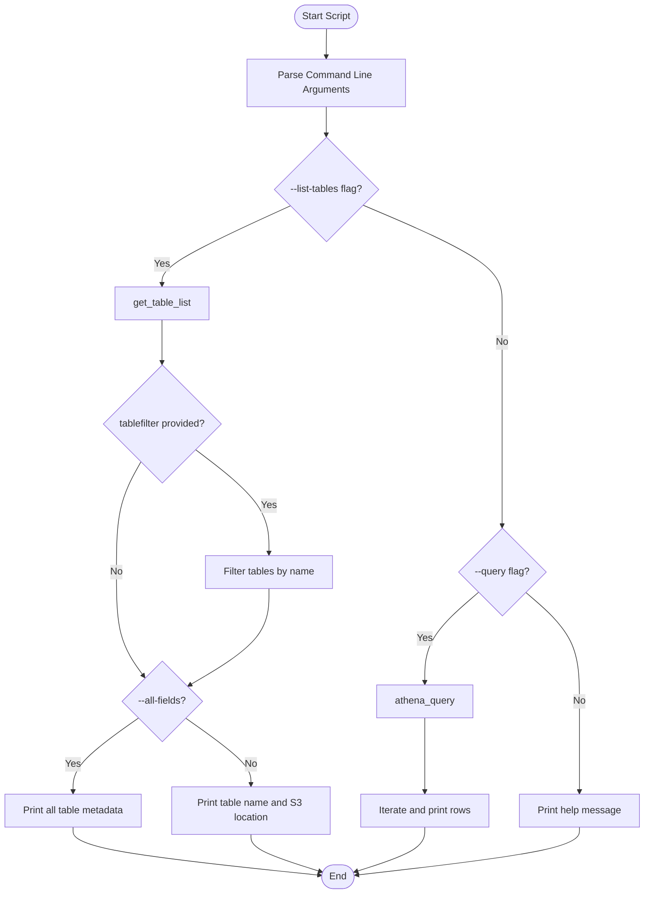
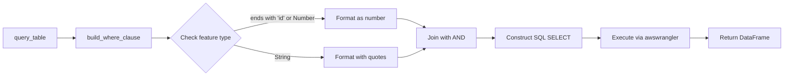
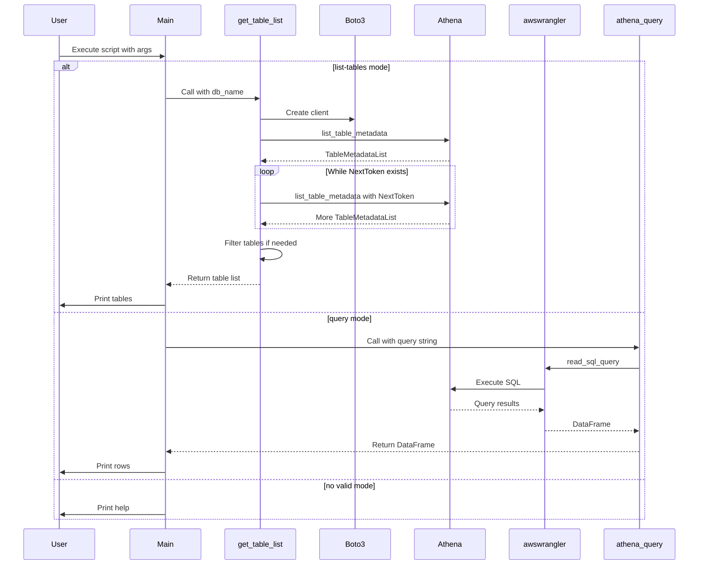
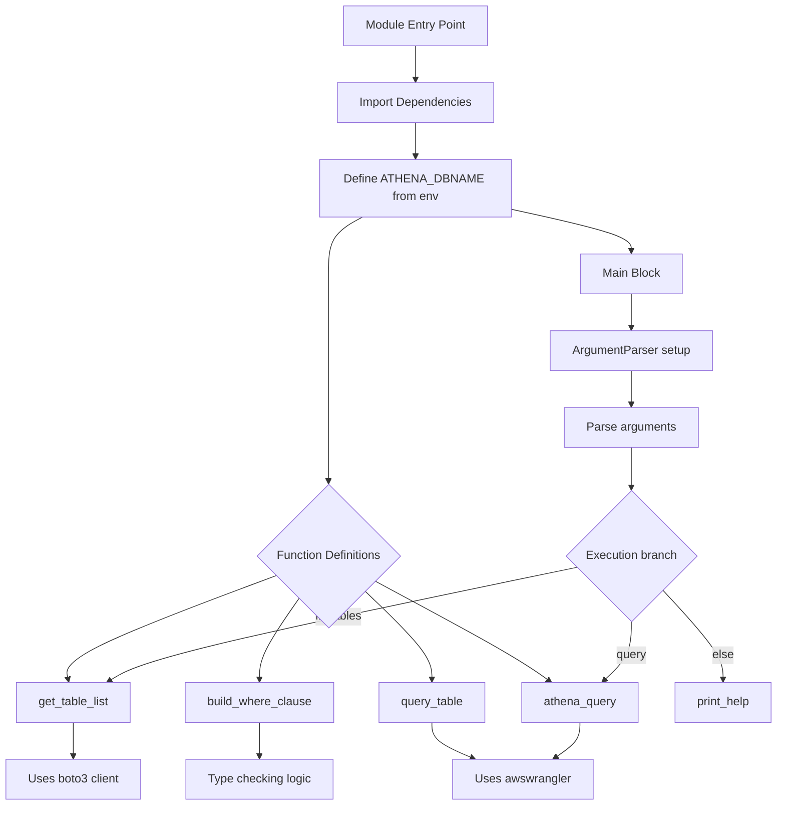

# Diagram: research/api/scripts/athena_debug.py


> Auto-generated by Obscura crawlers

## Diagram 1

```mermaid
flowchart TD
      Start([Start Script]) --> ParseArgs[Parse Command Line Arguments]
      ParseArgs --> CheckListTables{--list-tables flag?}
      CheckListTables -->|Yes| GetTables[get_table_list]...
  └ 161 lines...
```

> SVG rendering failed for this diagram.

## Diagram 2



### SVG

<svg id="container" width="1073.328125" xmlns="http://www.w3.org/2000/svg" class="flowchart" height="1486.234375" viewBox="0 0 1073.328125 1486.234375" role="graphics-document document" aria-roledescription="flowchart-v2"><style>#container{font-family:"trebuchet ms",verdana,arial,sans-serif;font-size:16px;fill:#333;}@keyframes edge-animation-frame{from{stroke-dashoffset:0;}}@keyframes dash{to{stroke-dashoffset:0;}}#container .edge-animation-slow{stroke-dasharray:9,5!important;stroke-dashoffset:900;animation:dash 50s linear infinite;stroke-linecap:round;}#container .edge-animation-fast{stroke-dasharray:9,5!important;stroke-dashoffset:900;animation:dash 20s linear infinite;stroke-linecap:round;}#container .error-icon{fill:#552222;}#container .error-text{fill:#552222;stroke:#552222;}#container .edge-thickness-normal{stroke-width:1px;}#container .edge-thickness-thick{stroke-width:3.5px;}#container .edge-pattern-solid{stroke-dasharray:0;}#container .edge-thickness-invisible{stroke-width:0;fill:none;}#container .edge-pattern-dashed{stroke-dasharray:3;}#container .edge-pattern-dotted{stroke-dasharray:2;}#container .marker{fill:#333333;stroke:#333333;}#container .marker.cross{stroke:#333333;}#container svg{font-family:"trebuchet ms",verdana,arial,sans-serif;font-size:16px;}#container p{margin:0;}#container .label{font-family:"trebuchet ms",verdana,arial,sans-serif;color:#333;}#container .cluster-label text{fill:#333;}#container .cluster-label span{color:#333;}#container .cluster-label span p{background-color:transparent;}#container .label text,#container span{fill:#333;color:#333;}#container .node rect,#container .node circle,#container .node ellipse,#container .node polygon,#container .node path{fill:#ECECFF;stroke:#9370DB;stroke-width:1px;}#container .rough-node .label text,#container .node .label text,#container .image-shape .label,#container .icon-shape .label{text-anchor:middle;}#container .node .katex path{fill:#000;stroke:#000;stroke-width:1px;}#container .rough-node .label,#container .node .label,#container .image-shape .label,#container .icon-shape .label{text-align:center;}#container .node.clickable{cursor:pointer;}#container .root .anchor path{fill:#333333!important;stroke-width:0;stroke:#333333;}#container .arrowheadPath{fill:#333333;}#container .edgePath .path{stroke:#333333;stroke-width:2.0px;}#container .flowchart-link{stroke:#333333;fill:none;}#container .edgeLabel{background-color:rgba(232,232,232, 0.8);text-align:center;}#container .edgeLabel p{background-color:rgba(232,232,232, 0.8);}#container .edgeLabel rect{opacity:0.5;background-color:rgba(232,232,232, 0.8);fill:rgba(232,232,232, 0.8);}#container .labelBkg{background-color:rgba(232, 232, 232, 0.5);}#container .cluster rect{fill:#ffffde;stroke:#aaaa33;stroke-width:1px;}#container .cluster text{fill:#333;}#container .cluster span{color:#333;}#container div.mermaidTooltip{position:absolute;text-align:center;max-width:200px;padding:2px;font-family:"trebuchet ms",verdana,arial,sans-serif;font-size:12px;background:hsl(80, 100%, 96.2745098039%);border:1px solid #aaaa33;border-radius:2px;pointer-events:none;z-index:100;}#container .flowchartTitleText{text-anchor:middle;font-size:18px;fill:#333;}#container rect.text{fill:none;stroke-width:0;}#container .icon-shape,#container .image-shape{background-color:rgba(232,232,232, 0.8);text-align:center;}#container .icon-shape p,#container .image-shape p{background-color:rgba(232,232,232, 0.8);padding:2px;}#container .icon-shape rect,#container .image-shape rect{opacity:0.5;background-color:rgba(232,232,232, 0.8);fill:rgba(232,232,232, 0.8);}#container .label-icon{display:inline-block;height:1em;overflow:visible;vertical-align:-0.125em;}#container .node .label-icon path{fill:currentColor;stroke:revert;stroke-width:revert;}#container :root{--mermaid-font-family:"trebuchet ms",verdana,arial,sans-serif;}</style><g><marker id="container_flowchart-v2-pointEnd" class="marker flowchart-v2" viewBox="0 0 10 10" refX="5" refY="5" markerUnits="userSpaceOnUse" markerWidth="8" markerHeight="8" orient="auto"><path d="M 0 0 L 10 5 L 0 10 z" class="arrowMarkerPath" style="stroke-width: 1; stroke-dasharray: 1, 0;"></path></marker><marker id="container_flowchart-v2-pointStart" class="marker flowchart-v2" viewBox="0 0 10 10" refX="4.5" refY="5" markerUnits="userSpaceOnUse" markerWidth="8" markerHeight="8" orient="auto"><path d="M 0 5 L 10 10 L 10 0 z" class="arrowMarkerPath" style="stroke-width: 1; stroke-dasharray: 1, 0;"></path></marker><marker id="container_flowchart-v2-circleEnd" class="marker flowchart-v2" viewBox="0 0 10 10" refX="11" refY="5" markerUnits="userSpaceOnUse" markerWidth="11" markerHeight="11" orient="auto"><circle cx="5" cy="5" r="5" class="arrowMarkerPath" style="stroke-width: 1; stroke-dasharray: 1, 0;"></circle></marker><marker id="container_flowchart-v2-circleStart" class="marker flowchart-v2" viewBox="0 0 10 10" refX="-1" refY="5" markerUnits="userSpaceOnUse" markerWidth="11" markerHeight="11" orient="auto"><circle cx="5" cy="5" r="5" class="arrowMarkerPath" style="stroke-width: 1; stroke-dasharray: 1, 0;"></circle></marker><marker id="container_flowchart-v2-crossEnd" class="marker cross flowchart-v2" viewBox="0 0 11 11" refX="12" refY="5.2" markerUnits="userSpaceOnUse" markerWidth="11" markerHeight="11" orient="auto"><path d="M 1,1 l 9,9 M 10,1 l -9,9" class="arrowMarkerPath" style="stroke-width: 2; stroke-dasharray: 1, 0;"></path></marker><marker id="container_flowchart-v2-crossStart" class="marker cross flowchart-v2" viewBox="0 0 11 11" refX="-1" refY="5.2" markerUnits="userSpaceOnUse" markerWidth="11" markerHeight="11" orient="auto"><path d="M 1,1 l 9,9 M 10,1 l -9,9" class="arrowMarkerPath" style="stroke-width: 2; stroke-dasharray: 1, 0;"></path></marker><g class="root"><g class="clusters"></g><g class="edgePaths"><path d="M545.699,47.5L545.616,51.583C545.533,55.667,545.366,63.833,545.283,71.417C545.199,79,545.199,86,545.199,89.5L545.199,93" id="L_Start_ParseArgs_0" class="edge-thickness-normal edge-pattern-solid edge-thickness-normal edge-pattern-solid flowchart-link" style=";" data-edge="true" data-et="edge" data-id="L_Start_ParseArgs_0" data-points="W3sieCI6NTQ1LjY5OTIxODc1LCJ5Ijo0Ny41fSx7IngiOjU0NS4xOTkyMTg3NSwieSI6NzJ9LHsieCI6NTQ1LjE5OTIxODc1LCJ5Ijo5N31d" marker-end="url(#container_flowchart-v2-pointEnd)"></path><path d="M545.199,175L545.199,179.167C545.199,183.333,545.199,191.667,545.199,199.333C545.199,207,545.199,214,545.199,217.5L545.199,221" id="L_ParseArgs_CheckListTables_0" class="edge-thickness-normal edge-pattern-solid edge-thickness-normal edge-pattern-solid flowchart-link" style=";" data-edge="true" data-et="edge" data-id="L_ParseArgs_CheckListTables_0" data-points="W3sieCI6NTQ1LjE5OTIxODc1LCJ5IjoxNzV9LHsieCI6NTQ1LjE5OTIxODc1LCJ5IjoyMDB9LHsieCI6NTQ1LjE5OTIxODc1LCJ5IjoyMjV9XQ==" marker-end="url(#container_flowchart-v2-pointEnd)"></path><path d="M484.492,341.558L449.09,357.843C413.688,374.127,342.885,406.696,307.484,428.481C272.082,450.266,272.082,461.266,272.082,466.766L272.082,472.266" id="L_CheckListTables_GetTables_0" class="edge-thickness-normal edge-pattern-solid edge-thickness-normal edge-pattern-solid flowchart-link" style=";" data-edge="true" data-et="edge" data-id="L_CheckListTables_GetTables_0" data-points="W3sieCI6NDg0LjQ5MTY0NjQxMDkwMzIzLCJ5IjozNDEuNTU4MDUyNjYwOTAzMjN9LHsieCI6MjcyLjA4MjAzMTI1LCJ5Ijo0MzkuMjY1NjI1fSx7IngiOjI3Mi4wODIwMzEyNSwieSI6NDc2LjI2NTYyNX1d" marker-end="url(#container_flowchart-v2-pointEnd)"></path><path d="M272.082,530.266L272.082,536.432C272.082,542.599,272.082,554.932,272.082,566.599C272.082,578.266,272.082,589.266,272.082,594.766L272.082,600.266" id="L_GetTables_FilterTables_0" class="edge-thickness-normal edge-pattern-solid edge-thickness-normal edge-pattern-solid flowchart-link" style=";" data-edge="true" data-et="edge" data-id="L_GetTables_FilterTables_0" data-points="W3sieCI6MjcyLjA4MjAzMTI1LCJ5Ijo1MzAuMjY1NjI1fSx7IngiOjI3Mi4wODIwMzEyNSwieSI6NTY3LjI2NTYyNX0seyJ4IjoyNzIuMDgyMDMxMjUsInkiOjYwNC4yNjU2MjV9XQ==" marker-end="url(#container_flowchart-v2-pointEnd)"></path><path d="M328.911,749.265L349.07,764.903C369.228,780.541,409.546,811.817,429.705,840.629C449.863,869.44,449.863,895.786,449.863,908.96L449.863,922.133" id="L_FilterTables_ApplyFilter_0" class="edge-thickness-normal edge-pattern-solid edge-thickness-normal edge-pattern-solid flowchart-link" style=";" data-edge="true" data-et="edge" data-id="L_FilterTables_ApplyFilter_0" data-points="W3sieCI6MzI4LjkxMDk2NTU1MzAwMTgsInkiOjc0OS4yNjQ4MTU2OTY5OTgyfSx7IngiOjQ0OS44NjMyODEyNSwieSI6ODQzLjA5Mzc1fSx7IngiOjQ0OS44NjMyODEyNSwieSI6OTI2LjEzMjgxMjV9XQ==" marker-end="url(#container_flowchart-v2-pointEnd)"></path><path d="M236.348,770.36L229.702,782.482C223.056,794.604,209.764,818.849,203.119,849.311C196.473,879.773,196.473,916.453,196.473,953.133C196.473,989.813,196.473,1026.492,203.918,1055.224C211.364,1083.956,226.256,1104.741,233.701,1115.133L241.147,1125.526" id="L_FilterTables_CheckFields_0" class="edge-thickness-normal edge-pattern-solid edge-thickness-normal edge-pattern-solid flowchart-link" style=";" data-edge="true" data-et="edge" data-id="L_FilterTables_CheckFields_0" data-points="W3sieCI6MjM2LjM0ODAxODcwNDcyMTc0LCJ5Ijo3NzAuMzU5NzM3NDU0NzIxOH0seyJ4IjoxOTYuNDcyNjU2MjUsInkiOjg0My4wOTM3NX0seyJ4IjoxOTYuNDcyNjU2MjUsInkiOjk1My4xMzI4MTI1fSx7IngiOjE5Ni40NzI2NTYyNSwieSI6MTA2My4xNzE4NzV9LHsieCI6MjQzLjQ3NjYwMzk0NDcyOTYsInkiOjExMjguNzc3MzAyMzA1MjcwNX1d" marker-end="url(#container_flowchart-v2-pointEnd)"></path><path d="M449.863,980.133L449.863,993.973C449.863,1007.813,449.863,1035.492,427.974,1062.326C406.084,1089.159,362.305,1115.147,340.415,1128.14L318.526,1141.134" id="L_ApplyFilter_CheckFields_0" class="edge-thickness-normal edge-pattern-solid edge-thickness-normal edge-pattern-solid flowchart-link" style=";" data-edge="true" data-et="edge" data-id="L_ApplyFilter_CheckFields_0" data-points="W3sieCI6NDQ5Ljg2MzI4MTI1LCJ5Ijo5ODAuMTMyODEyNX0seyJ4Ijo0NDkuODYzMjgxMjUsInkiOjEwNjMuMTcxODc1fSx7IngiOjMxNS4wODYwMzMxNTI3MTM0LCJ5IjoxMTQzLjE3NTg3NjkwMjcxMzV9XQ==" marker-end="url(#container_flowchart-v2-pointEnd)"></path><path d="M232.074,1197.226L214.07,1210.061C196.067,1222.895,160.061,1248.565,142.058,1268.9C124.055,1289.234,124.055,1304.234,124.055,1311.734L124.055,1319.234" id="L_CheckFields_PrintAllFields_0" class="edge-thickness-normal edge-pattern-solid edge-thickness-normal edge-pattern-solid flowchart-link" style=";" data-edge="true" data-et="edge" data-id="L_CheckFields_PrintAllFields_0" data-points="W3sieCI6MjMyLjA3MzUzMTYzMTI5MTMsInkiOjExOTcuMjI1ODc1MzgxMjkxNH0seyJ4IjoxMjQuMDU0Njg3NSwieSI6MTI3NC4yMzQzNzV9LHsieCI6MTI0LjA1NDY4NzUsInkiOjEzMjMuMjM0Mzc1fV0=" marker-end="url(#container_flowchart-v2-pointEnd)"></path><path d="M312.091,1197.226L330.094,1210.061C348.097,1222.895,384.103,1248.565,402.106,1266.9C420.109,1285.234,420.109,1296.234,420.109,1301.734L420.109,1307.234" id="L_CheckFields_PrintBasic_0" class="edge-thickness-normal edge-pattern-solid edge-thickness-normal edge-pattern-solid flowchart-link" style=";" data-edge="true" data-et="edge" data-id="L_CheckFields_PrintBasic_0" data-points="W3sieCI6MzEyLjA5MDUzMDg2ODcwODcsInkiOjExOTcuMjI1ODc1MzgxMjkxNH0seyJ4Ijo0MjAuMTA5Mzc1LCJ5IjoxMjc0LjIzNDM3NX0seyJ4Ijo0MjAuMTA5Mzc1LCJ5IjoxMzExLjIzNDM3NX1d" marker-end="url(#container_flowchart-v2-pointEnd)"></path><path d="M124.055,1377.234L124.055,1383.401C124.055,1389.568,124.055,1401.901,192.558,1415.064C261.061,1428.228,398.067,1442.221,466.57,1449.217L535.074,1456.214" id="L_PrintAllFields_End_0" class="edge-thickness-normal edge-pattern-solid edge-thickness-normal edge-pattern-solid flowchart-link" style=";" data-edge="true" data-et="edge" data-id="L_PrintAllFields_End_0" data-points="W3sieCI6MTI0LjA1NDY4NzUsInkiOjEzNzcuMjM0Mzc1fSx7IngiOjEyNC4wNTQ2ODc1LCJ5IjoxNDE0LjIzNDM3NX0seyJ4Ijo1MzkuMDUyOTIxOTUzMzg5NSwieSI6MTQ1Ni42MjAyNjQ2Nzc0MDg4fV0=" marker-end="url(#container_flowchart-v2-pointEnd)"></path><path d="M420.109,1389.234L420.109,1393.401C420.109,1397.568,420.109,1405.901,439.522,1416.109C458.934,1426.318,497.758,1438.401,517.17,1444.443L536.582,1450.485" id="L_PrintBasic_End_0" class="edge-thickness-normal edge-pattern-solid edge-thickness-normal edge-pattern-solid flowchart-link" style=";" data-edge="true" data-et="edge" data-id="L_PrintBasic_End_0" data-points="W3sieCI6NDIwLjEwOTM3NSwieSI6MTM4OS4yMzQzNzV9LHsieCI6NDIwLjEwOTM3NSwieSI6MTQxNC4yMzQzNzV9LHsieCI6NTQwLjQwMTYzMDAyNDY3OTgsInkiOjE0NTEuNjczMzQ2NjY2MzM3Mn1d" marker-end="url(#container_flowchart-v2-pointEnd)"></path><path d="M607.191,340.274L645.582,356.772C683.974,373.271,760.756,406.268,799.148,433.434C837.539,460.599,837.539,481.932,837.539,503.266C837.539,524.599,837.539,545.932,837.539,579.585C837.539,613.237,837.539,659.208,837.539,705.18C837.539,751.151,837.539,797.122,837.539,825.608C837.539,854.094,837.539,865.094,837.539,870.594L837.539,876.094" id="L_CheckListTables_CheckQuery_0" class="edge-thickness-normal edge-pattern-solid edge-thickness-normal edge-pattern-solid flowchart-link" style=";" data-edge="true" data-et="edge" data-id="L_CheckListTables_CheckQuery_0" data-points="W3sieCI6NjA3LjE5MTA3OTE1MDI1MzIsInkiOjM0MC4yNzM3NjQ1OTk3NDY3Nn0seyJ4Ijo4MzcuNTM5MDYyNSwieSI6NDM5LjI2NTYyNX0seyJ4Ijo4MzcuNTM5MDYyNSwieSI6NTAzLjI2NTYyNX0seyJ4Ijo4MzcuNTM5MDYyNSwieSI6NTY3LjI2NTYyNX0seyJ4Ijo4MzcuNTM5MDYyNSwieSI6NzA1LjE3OTY4NzV9LHsieCI6ODM3LjUzOTA2MjUsInkiOjg0My4wOTM3NX0seyJ4Ijo4MzcuNTM5MDYyNSwieSI6ODgwLjA5Mzc1fV0=" marker-end="url(#container_flowchart-v2-pointEnd)"></path><path d="M798.15,986.783L783.248,999.515C768.345,1012.246,738.54,1037.709,723.637,1062.862C708.734,1088.016,708.734,1112.859,708.734,1125.281L708.734,1137.703" id="L_CheckQuery_RunQuery_0" class="edge-thickness-normal edge-pattern-solid edge-thickness-normal edge-pattern-solid flowchart-link" style=";" data-edge="true" data-et="edge" data-id="L_CheckQuery_RunQuery_0" data-points="W3sieCI6Nzk4LjE1MDI0MTg5ODIyMzgsInkiOjk4Ni43ODMwNTQzOTgyMjM4fSx7IngiOjcwOC43MzQzNzUsInkiOjEwNjMuMTcxODc1fSx7IngiOjcwOC43MzQzNzUsInkiOjExNDEuNzAzMTI1fV0=" marker-end="url(#container_flowchart-v2-pointEnd)"></path><path d="M708.734,1195.703L708.734,1208.792C708.734,1221.88,708.734,1248.057,708.734,1268.646C708.734,1289.234,708.734,1304.234,708.734,1311.734L708.734,1319.234" id="L_RunQuery_IterateRows_0" class="edge-thickness-normal edge-pattern-solid edge-thickness-normal edge-pattern-solid flowchart-link" style=";" data-edge="true" data-et="edge" data-id="L_RunQuery_IterateRows_0" data-points="W3sieCI6NzA4LjczNDM3NSwieSI6MTE5NS43MDMxMjV9LHsieCI6NzA4LjczNDM3NSwieSI6MTI3NC4yMzQzNzV9LHsieCI6NzA4LjczNDM3NSwieSI6MTMyMy4yMzQzNzV9XQ==" marker-end="url(#container_flowchart-v2-pointEnd)"></path><path d="M708.734,1377.234L708.734,1383.401C708.734,1389.568,708.734,1401.901,689.488,1414.108C670.242,1426.315,631.751,1438.395,612.505,1444.435L593.259,1450.476" id="L_IterateRows_End_0" class="edge-thickness-normal edge-pattern-solid edge-thickness-normal edge-pattern-solid flowchart-link" style=";" data-edge="true" data-et="edge" data-id="L_IterateRows_End_0" data-points="W3sieCI6NzA4LjczNDM3NSwieSI6MTM3Ny4yMzQzNzV9LHsieCI6NzA4LjczNDM3NSwieSI6MTQxNC4yMzQzNzV9LHsieCI6NTg5LjQ0MjEyMDg5Njg3MzcsInkiOjE0NTEuNjczMzQ2MzgyMTY4M31d" marker-end="url(#container_flowchart-v2-pointEnd)"></path><path d="M876.928,986.783L891.831,999.515C906.733,1012.246,936.538,1037.709,951.441,1068.029C966.344,1098.349,966.344,1133.526,966.344,1168.703C966.344,1203.88,966.344,1239.057,966.344,1264.146C966.344,1289.234,966.344,1304.234,966.344,1311.734L966.344,1319.234" id="L_CheckQuery_PrintHelp_0" class="edge-thickness-normal edge-pattern-solid edge-thickness-normal edge-pattern-solid flowchart-link" style=";" data-edge="true" data-et="edge" data-id="L_CheckQuery_PrintHelp_0" data-points="W3sieCI6ODc2LjkyNzg4MzEwMTc3NjIsInkiOjk4Ni43ODMwNTQzOTgyMjM4fSx7IngiOjk2Ni4zNDM3NSwieSI6MTA2My4xNzE4NzV9LHsieCI6OTY2LjM0Mzc1LCJ5IjoxMTY4LjcwMzEyNX0seyJ4Ijo5NjYuMzQzNzUsInkiOjEyNzQuMjM0Mzc1fSx7IngiOjk2Ni4zNDM3NSwieSI6MTMyMy4yMzQzNzV9XQ==" marker-end="url(#container_flowchart-v2-pointEnd)"></path><path d="M966.344,1377.234L966.344,1383.401C966.344,1389.568,966.344,1401.901,904.409,1415.017C842.474,1428.132,718.604,1442.03,656.669,1448.979L594.734,1455.928" id="L_PrintHelp_End_0" class="edge-thickness-normal edge-pattern-solid edge-thickness-normal edge-pattern-solid flowchart-link" style=";" data-edge="true" data-et="edge" data-id="L_PrintHelp_End_0" data-points="W3sieCI6OTY2LjM0Mzc1LCJ5IjoxMzc3LjIzNDM3NX0seyJ4Ijo5NjYuMzQzNzUsInkiOjE0MTQuMjM0Mzc1fSx7IngiOjU5MC43NTkwNDI1NDg4NTE5LCJ5IjoxNDU2LjM3MzczNDU5MzM5NH1d" marker-end="url(#container_flowchart-v2-pointEnd)"></path></g><g class="edgeLabels"><g class="edgeLabel"><g class="label" data-id="L_Start_ParseArgs_0" transform="translate(0, 0)"><foreignObject width="0" height="0"><div xmlns="http://www.w3.org/1999/xhtml" class="labelBkg" style="display: table-cell; white-space: nowrap; line-height: 1.5; max-width: 200px; text-align: center;"><span class="edgeLabel"></span></div></foreignObject></g></g><g class="edgeLabel"><g class="label" data-id="L_ParseArgs_CheckListTables_0" transform="translate(0, 0)"><foreignObject width="0" height="0"><div xmlns="http://www.w3.org/1999/xhtml" class="labelBkg" style="display: table-cell; white-space: nowrap; line-height: 1.5; max-width: 200px; text-align: center;"><span class="edgeLabel"></span></div></foreignObject></g></g><g class="edgeLabel" transform="translate(272.08203125, 439.265625)"><g class="label" data-id="L_CheckListTables_GetTables_0" transform="translate(-12.03125, -12)"><foreignObject width="24.0625" height="24"><div xmlns="http://www.w3.org/1999/xhtml" class="labelBkg" style="display: table-cell; white-space: nowrap; line-height: 1.5; max-width: 200px; text-align: center;"><span class="edgeLabel"><p>Yes</p></span></div></foreignObject></g></g><g class="edgeLabel"><g class="label" data-id="L_GetTables_FilterTables_0" transform="translate(0, 0)"><foreignObject width="0" height="0"><div xmlns="http://www.w3.org/1999/xhtml" class="labelBkg" style="display: table-cell; white-space: nowrap; line-height: 1.5; max-width: 200px; text-align: center;"><span class="edgeLabel"></span></div></foreignObject></g></g><g class="edgeLabel" transform="translate(449.86328125, 843.09375)"><g class="label" data-id="L_FilterTables_ApplyFilter_0" transform="translate(-12.03125, -12)"><foreignObject width="24.0625" height="24"><div xmlns="http://www.w3.org/1999/xhtml" class="labelBkg" style="display: table-cell; white-space: nowrap; line-height: 1.5; max-width: 200px; text-align: center;"><span class="edgeLabel"><p>Yes</p></span></div></foreignObject></g></g><g class="edgeLabel" transform="translate(196.47265625, 953.1328125)"><g class="label" data-id="L_FilterTables_CheckFields_0" transform="translate(-10.140625, -12)"><foreignObject width="20.28125" height="24"><div xmlns="http://www.w3.org/1999/xhtml" class="labelBkg" style="display: table-cell; white-space: nowrap; line-height: 1.5; max-width: 200px; text-align: center;"><span class="edgeLabel"><p>No</p></span></div></foreignObject></g></g><g class="edgeLabel"><g class="label" data-id="L_ApplyFilter_CheckFields_0" transform="translate(0, 0)"><foreignObject width="0" height="0"><div xmlns="http://www.w3.org/1999/xhtml" class="labelBkg" style="display: table-cell; white-space: nowrap; line-height: 1.5; max-width: 200px; text-align: center;"><span class="edgeLabel"></span></div></foreignObject></g></g><g class="edgeLabel" transform="translate(124.0546875, 1274.234375)"><g class="label" data-id="L_CheckFields_PrintAllFields_0" transform="translate(-12.03125, -12)"><foreignObject width="24.0625" height="24"><div xmlns="http://www.w3.org/1999/xhtml" class="labelBkg" style="display: table-cell; white-space: nowrap; line-height: 1.5; max-width: 200px; text-align: center;"><span class="edgeLabel"><p>Yes</p></span></div></foreignObject></g></g><g class="edgeLabel" transform="translate(420.109375, 1274.234375)"><g class="label" data-id="L_CheckFields_PrintBasic_0" transform="translate(-10.140625, -12)"><foreignObject width="20.28125" height="24"><div xmlns="http://www.w3.org/1999/xhtml" class="labelBkg" style="display: table-cell; white-space: nowrap; line-height: 1.5; max-width: 200px; text-align: center;"><span class="edgeLabel"><p>No</p></span></div></foreignObject></g></g><g class="edgeLabel"><g class="label" data-id="L_PrintAllFields_End_0" transform="translate(0, 0)"><foreignObject width="0" height="0"><div xmlns="http://www.w3.org/1999/xhtml" class="labelBkg" style="display: table-cell; white-space: nowrap; line-height: 1.5; max-width: 200px; text-align: center;"><span class="edgeLabel"></span></div></foreignObject></g></g><g class="edgeLabel"><g class="label" data-id="L_PrintBasic_End_0" transform="translate(0, 0)"><foreignObject width="0" height="0"><div xmlns="http://www.w3.org/1999/xhtml" class="labelBkg" style="display: table-cell; white-space: nowrap; line-height: 1.5; max-width: 200px; text-align: center;"><span class="edgeLabel"></span></div></foreignObject></g></g><g class="edgeLabel" transform="translate(837.5390625, 567.265625)"><g class="label" data-id="L_CheckListTables_CheckQuery_0" transform="translate(-10.140625, -12)"><foreignObject width="20.28125" height="24"><div xmlns="http://www.w3.org/1999/xhtml" class="labelBkg" style="display: table-cell; white-space: nowrap; line-height: 1.5; max-width: 200px; text-align: center;"><span class="edgeLabel"><p>No</p></span></div></foreignObject></g></g><g class="edgeLabel" transform="translate(708.734375, 1063.171875)"><g class="label" data-id="L_CheckQuery_RunQuery_0" transform="translate(-12.03125, -12)"><foreignObject width="24.0625" height="24"><div xmlns="http://www.w3.org/1999/xhtml" class="labelBkg" style="display: table-cell; white-space: nowrap; line-height: 1.5; max-width: 200px; text-align: center;"><span class="edgeLabel"><p>Yes</p></span></div></foreignObject></g></g><g class="edgeLabel"><g class="label" data-id="L_RunQuery_IterateRows_0" transform="translate(0, 0)"><foreignObject width="0" height="0"><div xmlns="http://www.w3.org/1999/xhtml" class="labelBkg" style="display: table-cell; white-space: nowrap; line-height: 1.5; max-width: 200px; text-align: center;"><span class="edgeLabel"></span></div></foreignObject></g></g><g class="edgeLabel"><g class="label" data-id="L_IterateRows_End_0" transform="translate(0, 0)"><foreignObject width="0" height="0"><div xmlns="http://www.w3.org/1999/xhtml" class="labelBkg" style="display: table-cell; white-space: nowrap; line-height: 1.5; max-width: 200px; text-align: center;"><span class="edgeLabel"></span></div></foreignObject></g></g><g class="edgeLabel" transform="translate(966.34375, 1168.703125)"><g class="label" data-id="L_CheckQuery_PrintHelp_0" transform="translate(-10.140625, -12)"><foreignObject width="20.28125" height="24"><div xmlns="http://www.w3.org/1999/xhtml" class="labelBkg" style="display: table-cell; white-space: nowrap; line-height: 1.5; max-width: 200px; text-align: center;"><span class="edgeLabel"><p>No</p></span></div></foreignObject></g></g><g class="edgeLabel"><g class="label" data-id="L_PrintHelp_End_0" transform="translate(0, 0)"><foreignObject width="0" height="0"><div xmlns="http://www.w3.org/1999/xhtml" class="labelBkg" style="display: table-cell; white-space: nowrap; line-height: 1.5; max-width: 200px; text-align: center;"><span class="edgeLabel"></span></div></foreignObject></g></g></g><g class="nodes"><g class="node default" id="flowchart-Start-0" transform="translate(545.19921875, 27.5)"><g class="basic label-container outer-path"><path d="M-33.6875 -19.5 C-13.030465290731211 -19.5, 7.626569418537578 -19.5, 33.6875 -19.5 C33.6875 -19.5, 33.6875 -19.5, 33.6875 -19.5 C34.15780803591977 -19.48491813668711, 34.62811607183955 -19.469836273374224, 34.9368692896239 -19.45993515863156 C35.23558127204814 -19.431118772940813, 35.534293254472374 -19.402302387250064, 36.181104652847864 -19.3399052695533 C36.45517813607616 -19.295595194256556, 36.72925161930444 -19.251285118959814, 37.41509325967676 -19.140403561325776 C37.75061215848226 -19.06382356213885, 38.08613105728776 -18.987243562951925, 38.63376438623539 -18.862249829261074 C38.97075667341857 -18.76223228733372, 39.30774896060174 -18.662214745406366, 39.832110251460605 -18.50658706670804 C40.12244423702492 -18.39974147620243, 40.412778222589246 -18.292895885696815, 41.0052065951478 -18.074876768247425 C41.402409259107024 -17.899046931511066, 41.799611923066244 -17.723217094774707, 42.14823291279238 -17.568892924097174 C42.438123579563126 -17.41765714892671, 42.72801424633388 -17.266421373756245, 43.25649226407678 -16.990714730406097 C43.49990862108132 -16.843154304316652, 43.74332497808585 -16.69559387822721, 44.3254305736057 -16.342718045390892 C44.541576375062434 -16.191944091095614, 44.75772217651917 -16.041170136800336, 45.35065534457871 -15.627565626425154 C45.72920144176167 -15.325685187456454, 46.10774753894462 -15.023804748487754, 46.327953708501866 -14.848196188198123 C46.55875220755848 -14.638591097948563, 46.78955070661509 -14.428986007699004, 47.25330973676799 -14.007812326905688 C47.54927006043829 -13.702208993921632, 47.84523038410859 -13.396605660937578, 48.12292094296865 -13.10986736009568 C48.40922657341014 -12.773556475327224, 48.695532203851634 -12.437245590558765, 48.93321390812658 -12.158051136245305 C49.142495613615786 -11.877632716845362, 49.35177731910499 -11.59721429744542, 49.680858964640635 -11.156274872382312 C49.86749905718567 -10.869545570350843, 50.05413914973071 -10.582816268319375, 50.36278387860425 -10.108655082055241 C50.52716668784438 -9.816776758684966, 50.691549497084516 -9.524898435314691, 50.976186474273504 -9.019496659696287 C51.09652339662834 -8.769614465628797, 51.21686031898319 -8.519732271561304, 51.51854614880834 -7.893275190886684 C51.687388644921455 -7.476230961139704, 51.85623114103457 -7.059186731392725, 51.987634229970325 -6.734618561215508 C52.12191688906709 -6.330180587052276, 52.256199548163856 -5.925742612889043, 52.38152313421488 -5.548287939305138 C52.464026287322625 -5.233667659412555, 52.546529440430376 -4.919047379519973, 52.69859428754556 -4.339158212148133 C52.77600417719265 -3.9416747893963215, 52.853414066839726 -3.5441913666445095, 52.937544776581774 -3.1121979531509023 C52.98994222597567 -2.7058136826985786, 53.04233967536956 -2.2994294122462553, 53.09739270250937 -1.872449005199798 C53.12827766342507 -1.3913908090460647, 53.159162624340766 -0.9103326128923314, 53.17748121591342 -0.6250057626472757 C53.17748121591342 -0.29920159078969455, 53.17748121591342 0.0266025810678866, 53.17748121591342 0.625005762647271 C53.14708877213127 1.0983926068932428, 53.11669632834913 1.5717794511392142, 53.09739270250937 1.8724490051997846 C53.06130464200388 2.1523408760867455, 53.02521658149839 2.432232746973707, 52.937544776581774 3.1121979531508885 C52.869067106255876 3.4638163175136247, 52.80058943592998 3.8154346818763614, 52.69859428754556 4.339158212148129 C52.61331542852757 4.66436346167503, 52.52803656950958 4.989568711201931, 52.38152313421489 5.548287939305125 C52.23072474951474 6.002468647562201, 52.079926364814604 6.456649355819276, 51.987634229970325 6.734618561215495 C51.84657313494379 7.0830421931617895, 51.705512039917245 7.431465825108084, 51.51854614880834 7.893275190886679 C51.316615021569426 8.312589497232256, 51.11468389433051 8.731903803577833, 50.976186474273504 9.019496659696284 C50.83814297070708 9.264606878698972, 50.70009946714065 9.509717097701662, 50.36278387860425 10.108655082055236 C50.19327842663901 10.369060974860899, 50.02377297467377 10.62946686766656, 49.68085896464064 11.156274872382301 C49.39904249636354 11.533883265865189, 49.11722602808645 11.911491659348075, 48.93321390812658 12.158051136245302 C48.739992752922284 12.385019699743468, 48.54677159771798 12.611988263241635, 48.12292094296866 13.10986736009567 C47.94683364787108 13.291691949319715, 47.7707463527735 13.47351653854376, 47.25330973676799 14.007812326905684 C47.064610524317715 14.179183958945453, 46.87591131186744 14.350555590985222, 46.32795370850189 14.848196188198111 C45.99429964069306 15.114276428368015, 45.660645572884235 15.380356668537917, 45.35065534457871 15.627565626425152 C45.0308673073362 15.850635917804514, 44.71107927009369 16.073706209183875, 44.32543057360571 16.34271804539089 C44.00184091948652 16.538879995341826, 43.67825126536732 16.735041945292764, 43.25649226407678 16.990714730406093 C42.998530299643896 17.12529332201821, 42.74056833521101 17.25987191363032, 42.14823291279239 17.56889292409717 C41.704548316522065 17.76529893343012, 41.26086372025174 17.961704942763074, 41.005206595147804 18.07487676824742 C40.539630904961996 18.2462129259703, 40.07405521477619 18.41754908369318, 39.83211025146062 18.506587066708033 C39.35341413282558 18.648661561991712, 38.87471801419054 18.79073605727539, 38.63376438623541 18.86224982926107 C38.3815186001986 18.919823283866386, 38.129272814161794 18.9773967384717, 37.415093259676766 19.140403561325773 C36.94581837442566 19.216272285492085, 36.47654348917457 19.292141009658394, 36.18110465284788 19.3399052695533 C35.799456776829764 19.376722381154043, 35.41780890081165 19.413539492754783, 34.9368692896239 19.45993515863156 C34.52931023398293 19.473004784280388, 34.12175117834197 19.486074409929216, 33.68750000000001 19.5 C33.68750000000001 19.5, 33.6875 19.5, 33.6875 19.5 C18.98064709771795 19.5, 4.273794195435901 19.5, -33.68749999999999 19.5 C-34.00916657575163 19.489684779001653, -34.330833151503256 19.479369558003306, -34.93686928962389 19.45993515863156 C-35.36040588924721 19.41907709224318, -35.78394248887053 19.378219025854808, -36.18110465284787 19.3399052695533 C-36.49304839067976 19.289472625180455, -36.80499212851164 19.239039980807615, -37.41509325967676 19.140403561325773 C-37.82226266706381 19.047469801118375, -38.229432074450855 18.954536040910977, -38.633764386235384 18.862249829261074 C-38.935749719550984 18.772622167486364, -39.23773505286659 18.682994505711658, -39.83211025146059 18.506587066708043 C-40.21415063338171 18.365992674618493, -40.59619101530283 18.225398282528946, -41.0052065951478 18.074876768247425 C-41.39196699238192 17.903669413231434, -41.77872738961603 17.732462058215443, -42.14823291279238 17.568892924097174 C-42.562017166651906 17.353021943900124, -42.97580142051144 17.13715096370307, -43.25649226407678 16.990714730406097 C-43.667661597009015 16.741461464483372, -44.07883092994125 16.492208198560643, -44.325430573605686 16.3427180453909 C-44.73523117117053 16.056858888511616, -45.14503176873537 15.770999731632335, -45.35065534457871 15.627565626425156 C-45.62157340111289 15.411515685771409, -45.89249145764707 15.195465745117664, -46.327953708501866 14.848196188198125 C-46.58255457283678 14.616974419578884, -46.837155437171695 14.385752650959645, -47.253309736767974 14.007812326905697 C-47.523652454057135 13.728661275754767, -47.7939951713463 13.449510224603836, -48.122920942968655 13.109867360095677 C-48.401458914128185 12.78268080991214, -48.67999688528772 12.455494259728603, -48.933213908126575 12.158051136245307 C-49.11889337143321 11.909257571161511, -49.30457283473985 11.660464006077717, -49.680858964640635 11.156274872382316 C-49.832724042328344 10.922969331570686, -49.98458912001606 10.689663790759056, -50.36278387860425 10.108655082055249 C-50.53308955376124 9.80626011049437, -50.70339522891825 9.503865138933492, -50.976186474273504 9.019496659696289 C-51.10861094100102 8.74451442110693, -51.241035407728525 8.46953218251757, -51.51854614880834 7.893275190886686 C-51.61842515619317 7.646572111616914, -51.718304163578004 7.3998690323471426, -51.987634229970325 6.73461856121551 C-52.11092461477993 6.363287565824119, -52.23421499958955 5.991956570432727, -52.38152313421488 5.5482879393051325 C-52.47522168438711 5.190974758289912, -52.568920234559336 4.833661577274691, -52.69859428754556 4.339158212148136 C-52.77371887959096 3.9534093095831704, -52.84884347163636 3.567660407018205, -52.937544776581774 3.112197953150904 C-52.998504563299626 2.6394058852387348, -53.05946435001747 2.1666138173265654, -53.09739270250937 1.872449005199809 C-53.125811583443856 1.4298019953373227, -53.154230464378344 0.9871549854748365, -53.17748121591342 0.6250057626472781 C-53.17748121591342 0.24769894217747912, -53.17748121591342 -0.1296078782923199, -53.17748121591342 -0.6250057626472687 C-53.15304753015033 -1.005580140923434, -53.12861384438725 -1.3861545191995992, -53.09739270250937 -1.8724490051997822 C-53.052127321532936 -2.223518361392485, -53.006861940556504 -2.574587717585189, -52.937544776581774 -3.112197953150895 C-52.87968563053767 -3.4092924395525124, -52.82182648449357 -3.7063869259541296, -52.69859428754556 -4.339158212148126 C-52.5723677690114 -4.82051463423807, -52.44614125047725 -5.3018710563280145, -52.38152313421489 -5.548287939305123 C-52.301579818577814 -5.789064468766395, -52.22163650294074 -6.029840998227668, -51.98763422997033 -6.734618561215485 C-51.881257873484174 -6.997370218383237, -51.774881516998015 -7.26012187555099, -51.51854614880834 -7.893275190886676 C-51.35280088067405 -8.237448786548153, -51.18705561253976 -8.581622382209629, -50.976186474273504 -9.019496659696282 C-50.763402524337195 -9.397316109519581, -50.55061857440088 -9.77513555934288, -50.36278387860425 -10.108655082055243 C-50.109324280844426 -10.498037087646104, -49.85586468308461 -10.887419093236964, -49.68085896464064 -11.156274872382308 C-49.38864669469869 -11.54781269301908, -49.09643442475675 -11.939350513655851, -48.93321390812659 -12.158051136245302 C-48.65662521993275 -12.482947947739989, -48.38003653173891 -12.807844759234676, -48.12292094296866 -13.10986736009567 C-47.82333962890882 -13.419209662945768, -47.52375831484897 -13.728551965795866, -47.253309736767996 -14.007812326905677 C-46.91296849298145 -14.316901239576762, -46.57262724919491 -14.625990152247846, -46.32795370850189 -14.848196188198107 C-45.9971505324118 -15.11200291808773, -45.666347356321715 -15.375809647977356, -45.35065534457872 -15.627565626425149 C-44.9974695273993 -15.873932763321905, -44.64428371021988 -16.12029990021866, -44.325430573605715 -16.342718045390885 C-43.92216441994689 -16.587180357593834, -43.51889826628806 -16.83164266979678, -43.25649226407679 -16.99071473040609 C-42.93441526922936 -17.158742092317834, -42.61233827438193 -17.326769454229577, -42.14823291279239 -17.56889292409717 C-41.70718342549956 -17.764132448853516, -41.26613393820672 -17.959371973609862, -41.005206595147804 -18.07487676824742 C-40.72122286468053 -18.17938540617621, -40.43723913421324 -18.283894044104994, -39.83211025146062 -18.506587066708033 C-39.39608686919426 -18.635996517831252, -38.96006348692789 -18.76540596895447, -38.63376438623541 -18.862249829261067 C-38.38770382597434 -18.91841154644544, -38.14164326571328 -18.974573263629814, -37.415093259676766 -19.140403561325773 C-36.98939679141858 -19.20922686498834, -36.56370032316039 -19.278050168650907, -36.18110465284788 -19.3399052695533 C-35.806045048223844 -19.37608681853621, -35.43098544359981 -19.412268367519122, -34.9368692896239 -19.45993515863156 C-34.68567554540614 -19.467990453089662, -34.43448180118838 -19.47604574754776, -33.68750000000001 -19.5 C-33.68750000000001 -19.5, -33.6875 -19.5, -33.6875 -19.5" stroke="none" stroke-width="0" fill="#ECECFF" style=""></path><path d="M-33.6875 -19.5 C-15.21983507168521 -19.5, 3.247829856629579 -19.5, 33.6875 -19.5 M-33.6875 -19.5 C-12.003688240796336 -19.5, 9.680123518407328 -19.5, 33.6875 -19.5 M33.6875 -19.5 C33.6875 -19.5, 33.6875 -19.5, 33.6875 -19.5 M33.6875 -19.5 C33.6875 -19.5, 33.6875 -19.5, 33.6875 -19.5 M33.6875 -19.5 C34.03752551295168 -19.48877536308297, 34.38755102590336 -19.47755072616594, 34.9368692896239 -19.45993515863156 M33.6875 -19.5 C34.14196380281777 -19.485426230403764, 34.59642760563554 -19.470852460807528, 34.9368692896239 -19.45993515863156 M34.9368692896239 -19.45993515863156 C35.357453157698615 -19.419361938704498, 35.77803702577332 -19.378788718777436, 36.181104652847864 -19.3399052695533 M34.9368692896239 -19.45993515863156 C35.23649512170602 -19.43103061496338, 35.53612095378815 -19.402126071295204, 36.181104652847864 -19.3399052695533 M36.181104652847864 -19.3399052695533 C36.63287952740008 -19.266865811402177, 37.08465440195229 -19.19382635325105, 37.41509325967676 -19.140403561325776 M36.181104652847864 -19.3399052695533 C36.64083664133769 -19.26557936692908, 37.100568629827514 -19.191253464304868, 37.41509325967676 -19.140403561325776 M37.41509325967676 -19.140403561325776 C37.809588660033434 -19.050362560517435, 38.20408406039011 -18.960321559709094, 38.63376438623539 -18.862249829261074 M37.41509325967676 -19.140403561325776 C37.79626711840383 -19.053403115463208, 38.17744097713091 -18.96640266960064, 38.63376438623539 -18.862249829261074 M38.63376438623539 -18.862249829261074 C38.95799094052462 -18.766021089847946, 39.28221749481384 -18.669792350434818, 39.832110251460605 -18.50658706670804 M38.63376438623539 -18.862249829261074 C39.054754087494544 -18.737302295747394, 39.4757437887537 -18.612354762233714, 39.832110251460605 -18.50658706670804 M39.832110251460605 -18.50658706670804 C40.076355816881104 -18.41670244085204, 40.320601382301604 -18.32681781499604, 41.0052065951478 -18.074876768247425 M39.832110251460605 -18.50658706670804 C40.1946715863661 -18.37316114398258, 40.557232921271584 -18.239735221257117, 41.0052065951478 -18.074876768247425 M41.0052065951478 -18.074876768247425 C41.24811625149906 -17.967347869039656, 41.49102590785033 -17.85981896983189, 42.14823291279238 -17.568892924097174 M41.0052065951478 -18.074876768247425 C41.38337802120018 -17.907471495990812, 41.761549447252555 -17.7400662237342, 42.14823291279238 -17.568892924097174 M42.14823291279238 -17.568892924097174 C42.41040322964056 -17.432118837725582, 42.672573546488735 -17.295344751353994, 43.25649226407678 -16.990714730406097 M42.14823291279238 -17.568892924097174 C42.39109911647282 -17.442189781200316, 42.63396532015326 -17.31548663830346, 43.25649226407678 -16.990714730406097 M43.25649226407678 -16.990714730406097 C43.67666051164203 -16.73600626954935, 44.09682875920727 -16.4812978086926, 44.3254305736057 -16.342718045390892 M43.25649226407678 -16.990714730406097 C43.61050673469689 -16.776109077896237, 43.964521205317 -16.561503425386373, 44.3254305736057 -16.342718045390892 M44.3254305736057 -16.342718045390892 C44.553036417102525 -16.183950061865673, 44.78064226059934 -16.025182078340453, 45.35065534457871 -15.627565626425154 M44.3254305736057 -16.342718045390892 C44.677718879694346 -16.096976973378432, 45.03000718578299 -15.85123590136597, 45.35065534457871 -15.627565626425154 M45.35065534457871 -15.627565626425154 C45.57201472732195 -15.451037409307988, 45.79337411006518 -15.274509192190823, 46.327953708501866 -14.848196188198123 M45.35065534457871 -15.627565626425154 C45.65846400393467 -15.38209641172121, 45.96627266329062 -15.136627197017267, 46.327953708501866 -14.848196188198123 M46.327953708501866 -14.848196188198123 C46.696960670665355 -14.513073828550446, 47.065967632828844 -14.17795146890277, 47.25330973676799 -14.007812326905688 M46.327953708501866 -14.848196188198123 C46.61122990228703 -14.59093224407981, 46.8945060960722 -14.333668299961493, 47.25330973676799 -14.007812326905688 M47.25330973676799 -14.007812326905688 C47.44085931922917 -13.814151984907435, 47.62840890169034 -13.620491642909181, 48.12292094296865 -13.10986736009568 M47.25330973676799 -14.007812326905688 C47.4750137243063 -13.778884757536487, 47.69671771184461 -13.549957188167287, 48.12292094296865 -13.10986736009568 M48.12292094296865 -13.10986736009568 C48.286423204106924 -12.917808300620445, 48.4499254652452 -12.72574924114521, 48.93321390812658 -12.158051136245305 M48.12292094296865 -13.10986736009568 C48.33825848519807 -12.856919629939735, 48.553596027427496 -12.60397189978379, 48.93321390812658 -12.158051136245305 M48.93321390812658 -12.158051136245305 C49.17896947309855 -11.828761067975424, 49.424725038070505 -11.499470999705542, 49.680858964640635 -11.156274872382312 M48.93321390812658 -12.158051136245305 C49.17534532291329 -11.833617099056795, 49.41747673769999 -11.509183061868283, 49.680858964640635 -11.156274872382312 M49.680858964640635 -11.156274872382312 C49.831670939208465 -10.9245871807606, 49.9824829137763 -10.692899489138888, 50.36278387860425 -10.108655082055241 M49.680858964640635 -11.156274872382312 C49.85836012952448 -10.883585417384122, 50.03586129440833 -10.610895962385932, 50.36278387860425 -10.108655082055241 M50.36278387860425 -10.108655082055241 C50.5632723338416 -9.752667528123789, 50.76376078907896 -9.396679974192335, 50.976186474273504 -9.019496659696287 M50.36278387860425 -10.108655082055241 C50.58235259899888 -9.718788585250689, 50.801921319393514 -9.328922088446136, 50.976186474273504 -9.019496659696287 M50.976186474273504 -9.019496659696287 C51.16736918219769 -8.622501676037077, 51.35855189012187 -8.225506692377865, 51.51854614880834 -7.893275190886684 M50.976186474273504 -9.019496659696287 C51.091682125080915 -8.779667469583652, 51.207177775888326 -8.539838279471017, 51.51854614880834 -7.893275190886684 M51.51854614880834 -7.893275190886684 C51.65995227355062 -7.543999328871818, 51.8013583982929 -7.194723466856953, 51.987634229970325 -6.734618561215508 M51.51854614880834 -7.893275190886684 C51.681804949734214 -7.490022796205597, 51.84506375066008 -7.086770401524509, 51.987634229970325 -6.734618561215508 M51.987634229970325 -6.734618561215508 C52.081770348587675 -6.45109557049371, 52.175906467205024 -6.16757257977191, 52.38152313421488 -5.548287939305138 M51.987634229970325 -6.734618561215508 C52.10967066238403 -6.367064270650393, 52.23170709479774 -5.999509980085278, 52.38152313421488 -5.548287939305138 M52.38152313421488 -5.548287939305138 C52.48762118266673 -5.143690097373169, 52.59371923111858 -4.739092255441201, 52.69859428754556 -4.339158212148133 M52.38152313421488 -5.548287939305138 C52.472684106425014 -5.200651642852619, 52.56384507863515 -4.853015346400099, 52.69859428754556 -4.339158212148133 M52.69859428754556 -4.339158212148133 C52.76454185426176 -4.000531395083626, 52.830489420977955 -3.6619045780191195, 52.937544776581774 -3.1121979531509023 M52.69859428754556 -4.339158212148133 C52.780966162009705 -3.9161960460765903, 52.86333803647384 -3.4932338800050475, 52.937544776581774 -3.1121979531509023 M52.937544776581774 -3.1121979531509023 C52.97222715895028 -2.843208244311799, 53.00690954131879 -2.574218535472696, 53.09739270250937 -1.872449005199798 M52.937544776581774 -3.1121979531509023 C52.97846112710788 -2.794858818317735, 53.01937747763399 -2.4775196834845676, 53.09739270250937 -1.872449005199798 M53.09739270250937 -1.872449005199798 C53.12531780226826 -1.4374930357201967, 53.15324290202716 -1.0025370662405955, 53.17748121591342 -0.6250057626472757 M53.09739270250937 -1.872449005199798 C53.128786616932615 -1.3834634473460934, 53.16018053135586 -0.8944778894923887, 53.17748121591342 -0.6250057626472757 M53.17748121591342 -0.6250057626472757 C53.17748121591342 -0.26963012590395447, 53.17748121591342 0.08574551083936677, 53.17748121591342 0.625005762647271 M53.17748121591342 -0.6250057626472757 C53.17748121591342 -0.371950047105718, 53.17748121591342 -0.1188943315641603, 53.17748121591342 0.625005762647271 M53.17748121591342 0.625005762647271 C53.14775761694369 1.0879748090579697, 53.11803401797397 1.5509438554686685, 53.09739270250937 1.8724490051997846 M53.17748121591342 0.625005762647271 C53.14725286423402 1.0958367399401563, 53.11702451255463 1.5666677172330417, 53.09739270250937 1.8724490051997846 M53.09739270250937 1.8724490051997846 C53.05490867062158 2.201946767100437, 53.0124246387338 2.531444529001089, 52.937544776581774 3.1121979531508885 M53.09739270250937 1.8724490051997846 C53.063191635956215 2.1377057236215555, 53.02899056940306 2.402962442043327, 52.937544776581774 3.1121979531508885 M52.937544776581774 3.1121979531508885 C52.84493517432317 3.5877286877024566, 52.75232557206457 4.063259422254024, 52.69859428754556 4.339158212148129 M52.937544776581774 3.1121979531508885 C52.86021231460734 3.5092838011679954, 52.7828798526329 3.906369649185102, 52.69859428754556 4.339158212148129 M52.69859428754556 4.339158212148129 C52.59347363335811 4.740028826144602, 52.48835297917066 5.140899440141077, 52.38152313421489 5.548287939305125 M52.69859428754556 4.339158212148129 C52.62490134630964 4.620181335803458, 52.55120840507372 4.9012044594587865, 52.38152313421489 5.548287939305125 M52.38152313421489 5.548287939305125 C52.300975983553315 5.790883123652136, 52.22042883289174 6.033478307999145, 51.987634229970325 6.734618561215495 M52.38152313421489 5.548287939305125 C52.25937757186694 5.91617091184466, 52.137232009518996 6.284053884384194, 51.987634229970325 6.734618561215495 M51.987634229970325 6.734618561215495 C51.80576302295313 7.183843958788543, 51.62389181593594 7.633069356361591, 51.51854614880834 7.893275190886679 M51.987634229970325 6.734618561215495 C51.8250021848116 7.136322857034236, 51.66237013965288 7.538027152852979, 51.51854614880834 7.893275190886679 M51.51854614880834 7.893275190886679 C51.3739833920439 8.193462848455535, 51.229420635279446 8.493650506024391, 50.976186474273504 9.019496659696284 M51.51854614880834 7.893275190886679 C51.35776297966278 8.227144881826153, 51.19697981051721 8.561014572765625, 50.976186474273504 9.019496659696284 M50.976186474273504 9.019496659696284 C50.75674158834668 9.409143275863647, 50.53729670241985 9.798789892031008, 50.36278387860425 10.108655082055236 M50.976186474273504 9.019496659696284 C50.756455329370105 9.409651557663414, 50.536724184466706 9.799806455630545, 50.36278387860425 10.108655082055236 M50.36278387860425 10.108655082055236 C50.174438526903835 10.39800412007556, 49.98609317520342 10.687353158095886, 49.68085896464064 11.156274872382301 M50.36278387860425 10.108655082055236 C50.11259176745903 10.493017350763054, 49.86239965631382 10.877379619470872, 49.68085896464064 11.156274872382301 M49.68085896464064 11.156274872382301 C49.51926140414118 11.372800881610958, 49.357663843641724 11.589326890839615, 48.93321390812658 12.158051136245302 M49.68085896464064 11.156274872382301 C49.394958654708 11.53935524163799, 49.109058344775356 11.922435610893679, 48.93321390812658 12.158051136245302 M48.93321390812658 12.158051136245302 C48.64667536887251 12.494635608957914, 48.360136829618426 12.831220081670525, 48.12292094296866 13.10986736009567 M48.93321390812658 12.158051136245302 C48.70534791900388 12.425715493010923, 48.47748192988117 12.693379849776543, 48.12292094296866 13.10986736009567 M48.12292094296866 13.10986736009567 C47.852460561658056 13.389139909009137, 47.58200018034745 13.668412457922603, 47.25330973676799 14.007812326905684 M48.12292094296866 13.10986736009567 C47.828011817997265 13.414385244118085, 47.533102693025874 13.7189031281405, 47.25330973676799 14.007812326905684 M47.25330973676799 14.007812326905684 C46.89609643971393 14.332223991944259, 46.53888314265987 14.656635656982832, 46.32795370850189 14.848196188198111 M47.25330973676799 14.007812326905684 C47.067484561410225 14.176573834500891, 46.88165938605246 14.3453353420961, 46.32795370850189 14.848196188198111 M46.32795370850189 14.848196188198111 C45.98098194872432 15.12489693331442, 45.63401018894675 15.401597678430726, 45.35065534457871 15.627565626425152 M46.32795370850189 14.848196188198111 C46.13025604392947 15.005854814738814, 45.93255837935705 15.163513441279516, 45.35065534457871 15.627565626425152 M45.35065534457871 15.627565626425152 C44.973692145076846 15.890518835923753, 44.59672894557499 16.153472045422355, 44.32543057360571 16.34271804539089 M45.35065534457871 15.627565626425152 C45.00960076051387 15.865470540253796, 44.668546176449034 16.10337545408244, 44.32543057360571 16.34271804539089 M44.32543057360571 16.34271804539089 C43.97593121791215 16.554586608698514, 43.62643186221859 16.76645517200614, 43.25649226407678 16.990714730406093 M44.32543057360571 16.34271804539089 C43.92956906150563 16.582691620366422, 43.53370754940555 16.82266519534195, 43.25649226407678 16.990714730406093 M43.25649226407678 16.990714730406093 C43.002914065407616 17.12300631422721, 42.74933586673844 17.25529789804833, 42.14823291279239 17.56889292409717 M43.25649226407678 16.990714730406093 C42.96562630277414 17.142459316109143, 42.67476034147149 17.294203901812196, 42.14823291279239 17.56889292409717 M42.14823291279239 17.56889292409717 C41.911984295696 17.673473178819513, 41.675735678599615 17.778053433541853, 41.005206595147804 18.07487676824742 M42.14823291279239 17.56889292409717 C41.871063279361756 17.69158769887186, 41.593893645931125 17.814282473646553, 41.005206595147804 18.07487676824742 M41.005206595147804 18.07487676824742 C40.62660510700142 18.21420561563908, 40.24800361885503 18.353534463030744, 39.83211025146062 18.506587066708033 M41.005206595147804 18.07487676824742 C40.5864724214324 18.228974814910963, 40.16773824771698 18.383072861574504, 39.83211025146062 18.506587066708033 M39.83211025146062 18.506587066708033 C39.358168570320174 18.647250469899866, 38.88422688917973 18.787913873091703, 38.63376438623541 18.86224982926107 M39.83211025146062 18.506587066708033 C39.53000411500462 18.5962505822207, 39.227897978548626 18.685914097733374, 38.63376438623541 18.86224982926107 M38.63376438623541 18.86224982926107 C38.14634434965736 18.973500271897016, 37.65892431307931 19.084750714532966, 37.415093259676766 19.140403561325773 M38.63376438623541 18.86224982926107 C38.23866870873253 18.952427839410856, 37.84357303122966 19.042605849560644, 37.415093259676766 19.140403561325773 M37.415093259676766 19.140403561325773 C37.11772533412439 19.188479701406376, 36.820357408572 19.236555841486982, 36.18110465284788 19.3399052695533 M37.415093259676766 19.140403561325773 C37.06492032134542 19.19701680636349, 36.71474738301408 19.253630051401206, 36.18110465284788 19.3399052695533 M36.18110465284788 19.3399052695533 C35.75881309862172 19.380643227909598, 35.33652154439557 19.421381186265894, 34.9368692896239 19.45993515863156 M36.18110465284788 19.3399052695533 C35.79735199521532 19.376925426905014, 35.413599337582774 19.413945584256734, 34.9368692896239 19.45993515863156 M34.9368692896239 19.45993515863156 C34.545091052227896 19.47249872415477, 34.153312814831885 19.485062289677984, 33.68750000000001 19.5 M34.9368692896239 19.45993515863156 C34.50055022950913 19.47392706164591, 34.06423116939436 19.48791896466026, 33.68750000000001 19.5 M33.68750000000001 19.5 C33.68750000000001 19.5, 33.6875 19.5, 33.6875 19.5 M33.68750000000001 19.5 C33.68750000000001 19.5, 33.6875 19.5, 33.6875 19.5 M33.6875 19.5 C8.866937954460052 19.5, -15.953624091079895 19.5, -33.68749999999999 19.5 M33.6875 19.5 C19.589461343943128 19.5, 5.491422687886256 19.5, -33.68749999999999 19.5 M-33.68749999999999 19.5 C-33.98512611899847 19.490455709657816, -34.28275223799696 19.480911419315632, -34.93686928962389 19.45993515863156 M-33.68749999999999 19.5 C-33.99436612432504 19.490159400671573, -34.30123224865008 19.480318801343145, -34.93686928962389 19.45993515863156 M-34.93686928962389 19.45993515863156 C-35.37973262027755 19.41721266574448, -35.822595950931216 19.374490172857403, -36.18110465284787 19.3399052695533 M-34.93686928962389 19.45993515863156 C-35.3904765781033 19.41617620905453, -35.84408386658271 19.3724172594775, -36.18110465284787 19.3399052695533 M-36.18110465284787 19.3399052695533 C-36.6161652285517 19.26956804961866, -37.05122580425553 19.199230829684016, -37.41509325967676 19.140403561325773 M-36.18110465284787 19.3399052695533 C-36.61343423226291 19.27000957591944, -37.04576381167795 19.200113882285574, -37.41509325967676 19.140403561325773 M-37.41509325967676 19.140403561325773 C-37.767849229278795 19.059889313211936, -38.12060519888083 18.979375065098104, -38.633764386235384 18.862249829261074 M-37.41509325967676 19.140403561325773 C-37.65896530340557 19.08474135875848, -37.90283734713439 19.02907915619119, -38.633764386235384 18.862249829261074 M-38.633764386235384 18.862249829261074 C-38.95415804196549 18.767158674020997, -39.27455169769561 18.672067518780917, -39.83211025146059 18.506587066708043 M-38.633764386235384 18.862249829261074 C-39.10756326347879 18.72162880951629, -39.5813621407222 18.581007789771505, -39.83211025146059 18.506587066708043 M-39.83211025146059 18.506587066708043 C-40.11307549098535 18.40318926134873, -40.394040730510106 18.299791455989414, -41.0052065951478 18.074876768247425 M-39.83211025146059 18.506587066708043 C-40.08675511648765 18.412875402466756, -40.341399981514705 18.319163738225473, -41.0052065951478 18.074876768247425 M-41.0052065951478 18.074876768247425 C-41.29695406949105 17.945728815737002, -41.5887015438343 17.81658086322658, -42.14823291279238 17.568892924097174 M-41.0052065951478 18.074876768247425 C-41.414514134311595 17.893688462336364, -41.82382167347539 17.712500156425307, -42.14823291279238 17.568892924097174 M-42.14823291279238 17.568892924097174 C-42.38890130223404 17.44333637948092, -42.6295696916757 17.31777983486467, -43.25649226407678 16.990714730406097 M-42.14823291279238 17.568892924097174 C-42.527494599249856 17.371032345201016, -42.906756285707324 17.173171766304858, -43.25649226407678 16.990714730406097 M-43.25649226407678 16.990714730406097 C-43.62849880552423 16.765202178827554, -44.000505346971686 16.539689627249015, -44.325430573605686 16.3427180453909 M-43.25649226407678 16.990714730406097 C-43.50193102471802 16.84192831134712, -43.747369785359254 16.69314189228815, -44.325430573605686 16.3427180453909 M-44.325430573605686 16.3427180453909 C-44.69737649316866 16.08326467318312, -45.06932241273164 15.823811300975343, -45.35065534457871 15.627565626425156 M-44.325430573605686 16.3427180453909 C-44.59458622932147 16.15496671152411, -44.863741885037264 15.967215377657325, -45.35065534457871 15.627565626425156 M-45.35065534457871 15.627565626425156 C-45.569510371671875 15.453034566295221, -45.78836539876504 15.278503506165286, -46.327953708501866 14.848196188198125 M-45.35065534457871 15.627565626425156 C-45.561218109360915 15.45964742482184, -45.771780874143126 15.291729223218526, -46.327953708501866 14.848196188198125 M-46.327953708501866 14.848196188198125 C-46.6274226934154 14.576226379614804, -46.92689167832893 14.30425657103148, -47.253309736767974 14.007812326905697 M-46.327953708501866 14.848196188198125 C-46.65930686610741 14.547270017584898, -46.990660023712955 14.246343846971671, -47.253309736767974 14.007812326905697 M-47.253309736767974 14.007812326905697 C-47.530503386228936 13.721587125815393, -47.8076970356899 13.435361924725088, -48.122920942968655 13.109867360095677 M-47.253309736767974 14.007812326905697 C-47.55971184377199 13.691426995343225, -47.86611395077601 13.375041663780754, -48.122920942968655 13.109867360095677 M-48.122920942968655 13.109867360095677 C-48.29243154584682 12.910750560528436, -48.46194214872499 12.711633760961197, -48.933213908126575 12.158051136245307 M-48.122920942968655 13.109867360095677 C-48.36246044352535 12.828490632558076, -48.601999944082046 12.547113905020472, -48.933213908126575 12.158051136245307 M-48.933213908126575 12.158051136245307 C-49.145299935970776 11.873875180368698, -49.35738596381498 11.589699224492088, -49.680858964640635 11.156274872382316 M-48.933213908126575 12.158051136245307 C-49.17033765289592 11.840326920671947, -49.40746139766525 11.522602705098587, -49.680858964640635 11.156274872382316 M-49.680858964640635 11.156274872382316 C-49.84653823100113 10.901747028140242, -50.01221749736162 10.647219183898171, -50.36278387860425 10.108655082055249 M-49.680858964640635 11.156274872382316 C-49.93649295852512 10.763552410436859, -50.1921269524096 10.3708299484914, -50.36278387860425 10.108655082055249 M-50.36278387860425 10.108655082055249 C-50.560255608762105 9.758024028978983, -50.75772733891996 9.407392975902717, -50.976186474273504 9.019496659696289 M-50.36278387860425 10.108655082055249 C-50.50330257440522 9.859149908599735, -50.64382127020618 9.60964473514422, -50.976186474273504 9.019496659696289 M-50.976186474273504 9.019496659696289 C-51.09196800110297 8.779073841907094, -51.20774952793243 8.5386510241179, -51.51854614880834 7.893275190886686 M-50.976186474273504 9.019496659696289 C-51.145184007616834 8.668569665740913, -51.31418154096016 8.317642671785537, -51.51854614880834 7.893275190886686 M-51.51854614880834 7.893275190886686 C-51.624717290146954 7.63103041910094, -51.73088843148557 7.368785647315194, -51.987634229970325 6.73461856121551 M-51.51854614880834 7.893275190886686 C-51.667913440253024 7.524335093198194, -51.81728073169771 7.155394995509701, -51.987634229970325 6.73461856121551 M-51.987634229970325 6.73461856121551 C-52.10991874761342 6.366317077466485, -52.23220326525652 5.998015593717461, -52.38152313421488 5.5482879393051325 M-51.987634229970325 6.73461856121551 C-52.08055505189109 6.454755850512598, -52.17347587381185 6.174893139809685, -52.38152313421488 5.5482879393051325 M-52.38152313421488 5.5482879393051325 C-52.47852837787509 5.178364902890221, -52.57553362153529 4.80844186647531, -52.69859428754556 4.339158212148136 M-52.38152313421488 5.5482879393051325 C-52.46495608808469 5.230121926128617, -52.54838904195449 4.911955912952102, -52.69859428754556 4.339158212148136 M-52.69859428754556 4.339158212148136 C-52.772002219400896 3.962223996842881, -52.84541015125623 3.5852897815376257, -52.937544776581774 3.112197953150904 M-52.69859428754556 4.339158212148136 C-52.77716558316614 3.935711215185672, -52.855736878786715 3.532264218223208, -52.937544776581774 3.112197953150904 M-52.937544776581774 3.112197953150904 C-52.994108972300296 2.6734972210219237, -53.05067316801881 2.234796488892943, -53.09739270250937 1.872449005199809 M-52.937544776581774 3.112197953150904 C-52.98809871308028 2.7201116046724243, -53.038652649578786 2.3280252561939445, -53.09739270250937 1.872449005199809 M-53.09739270250937 1.872449005199809 C-53.11378979682066 1.6170510258050945, -53.130186891131956 1.3616530464103802, -53.17748121591342 0.6250057626472781 M-53.09739270250937 1.872449005199809 C-53.1136659916572 1.6189793911597912, -53.129939280805026 1.3655097771197735, -53.17748121591342 0.6250057626472781 M-53.17748121591342 0.6250057626472781 C-53.17748121591342 0.26973184843576603, -53.17748121591342 -0.08554206577574608, -53.17748121591342 -0.6250057626472687 M-53.17748121591342 0.6250057626472781 C-53.17748121591342 0.24059315283653537, -53.17748121591342 -0.1438194569742074, -53.17748121591342 -0.6250057626472687 M-53.17748121591342 -0.6250057626472687 C-53.1556699431777 -0.9647339412485023, -53.13385867044199 -1.304462119849736, -53.09739270250937 -1.8724490051997822 M-53.17748121591342 -0.6250057626472687 C-53.15984141200223 -0.8997599471574212, -53.14220160809104 -1.1745141316675738, -53.09739270250937 -1.8724490051997822 M-53.09739270250937 -1.8724490051997822 C-53.06116433586915 -2.153429062761142, -53.02493596922893 -2.434409120322502, -52.937544776581774 -3.112197953150895 M-53.09739270250937 -1.8724490051997822 C-53.04682022456323 -2.2646791574846854, -52.996247746617094 -2.6569093097695884, -52.937544776581774 -3.112197953150895 M-52.937544776581774 -3.112197953150895 C-52.84598763828344 -3.582324507704829, -52.7544304999851 -4.052451062258763, -52.69859428754556 -4.339158212148126 M-52.937544776581774 -3.112197953150895 C-52.88924749759464 -3.360194273116309, -52.8409502186075 -3.608190593081723, -52.69859428754556 -4.339158212148126 M-52.69859428754556 -4.339158212148126 C-52.599448534818855 -4.717243937336116, -52.50030278209214 -5.095329662524105, -52.38152313421489 -5.548287939305123 M-52.69859428754556 -4.339158212148126 C-52.600458266442764 -4.713393393033693, -52.50232224533996 -5.087628573919258, -52.38152313421489 -5.548287939305123 M-52.38152313421489 -5.548287939305123 C-52.25171799860203 -5.939240326131301, -52.12191286298918 -6.33019271295748, -51.98763422997033 -6.734618561215485 M-52.38152313421489 -5.548287939305123 C-52.2634741835186 -5.90383257025629, -52.14542523282232 -6.259377201207457, -51.98763422997033 -6.734618561215485 M-51.98763422997033 -6.734618561215485 C-51.87551198135077 -7.011562683042005, -51.76338973273121 -7.288506804868525, -51.51854614880834 -7.893275190886676 M-51.98763422997033 -6.734618561215485 C-51.879818261499196 -7.000926087819138, -51.77200229302806 -7.267233614422792, -51.51854614880834 -7.893275190886676 M-51.51854614880834 -7.893275190886676 C-51.388421985006914 -8.163480801231428, -51.25829782120548 -8.43368641157618, -50.976186474273504 -9.019496659696282 M-51.51854614880834 -7.893275190886676 C-51.360564791747585 -8.221326859082879, -51.20258343468682 -8.549378527279082, -50.976186474273504 -9.019496659696282 M-50.976186474273504 -9.019496659696282 C-50.77912884793801 -9.369392429503385, -50.58207122160251 -9.719288199310487, -50.36278387860425 -10.108655082055243 M-50.976186474273504 -9.019496659696282 C-50.773718639215055 -9.378998802934026, -50.57125080415661 -9.738500946171769, -50.36278387860425 -10.108655082055243 M-50.36278387860425 -10.108655082055243 C-50.193724702503445 -10.368375375291285, -50.02466552640264 -10.628095668527328, -49.68085896464064 -11.156274872382308 M-50.36278387860425 -10.108655082055243 C-50.21014261288744 -10.343153056115234, -50.057501347170636 -10.577651030175225, -49.68085896464064 -11.156274872382308 M-49.68085896464064 -11.156274872382308 C-49.529719734391804 -11.358787671848619, -49.37858050414297 -11.56130047131493, -48.93321390812659 -12.158051136245302 M-49.68085896464064 -11.156274872382308 C-49.470079039832584 -11.438700769178928, -49.259299115024525 -11.721126665975548, -48.93321390812659 -12.158051136245302 M-48.93321390812659 -12.158051136245302 C-48.75767500169054 -12.364249124191822, -48.582136095254484 -12.570447112138345, -48.12292094296866 -13.10986736009567 M-48.93321390812659 -12.158051136245302 C-48.730032944286954 -12.396719057695694, -48.52685198044732 -12.635386979146089, -48.12292094296866 -13.10986736009567 M-48.12292094296866 -13.10986736009567 C-47.825933252474464 -13.416531533673785, -47.528945561980265 -13.7231957072519, -47.253309736767996 -14.007812326905677 M-48.12292094296866 -13.10986736009567 C-47.93812597100288 -13.300683340599697, -47.7533309990371 -13.491499321103724, -47.253309736767996 -14.007812326905677 M-47.253309736767996 -14.007812326905677 C-46.97558210747238 -14.26003721156156, -46.69785447817676 -14.512262096217441, -46.32795370850189 -14.848196188198107 M-47.253309736767996 -14.007812326905677 C-46.90109425097143 -14.327685111995034, -46.54887876517486 -14.647557897084393, -46.32795370850189 -14.848196188198107 M-46.32795370850189 -14.848196188198107 C-46.03885135665682 -15.078747620457865, -45.74974900481176 -15.309299052717623, -45.35065534457872 -15.627565626425149 M-46.32795370850189 -14.848196188198107 C-45.98712879370969 -15.119994988013003, -45.64630387891748 -15.391793787827899, -45.35065534457872 -15.627565626425149 M-45.35065534457872 -15.627565626425149 C-44.98859666926604 -15.88012208505583, -44.62653799395336 -16.13267854368651, -44.325430573605715 -16.342718045390885 M-45.35065534457872 -15.627565626425149 C-45.08241589106225 -15.814677857299449, -44.814176437545775 -16.00179008817375, -44.325430573605715 -16.342718045390885 M-44.325430573605715 -16.342718045390885 C-43.9830958927044 -16.55024334073515, -43.64076121180309 -16.757768636079415, -43.25649226407679 -16.99071473040609 M-44.325430573605715 -16.342718045390885 C-43.977037838785854 -16.55391576862165, -43.628645103965994 -16.765113491852414, -43.25649226407679 -16.99071473040609 M-43.25649226407679 -16.99071473040609 C-42.821422911477555 -17.217690132981893, -42.38635355887831 -17.444665535557697, -42.14823291279239 -17.56889292409717 M-43.25649226407679 -16.99071473040609 C-43.006285916121705 -17.121247221869442, -42.75607956816662 -17.251779713332798, -42.14823291279239 -17.56889292409717 M-42.14823291279239 -17.56889292409717 C-41.76615526859139 -17.738027363254332, -41.38407762439039 -17.907161802411494, -41.005206595147804 -18.07487676824742 M-42.14823291279239 -17.56889292409717 C-41.89862243815358 -17.679388076788122, -41.649011963514766 -17.789883229479074, -41.005206595147804 -18.07487676824742 M-41.005206595147804 -18.07487676824742 C-40.6074186664493 -18.221266403119778, -40.209630737750786 -18.36765603799213, -39.83211025146062 -18.506587066708033 M-41.005206595147804 -18.07487676824742 C-40.633177365232406 -18.21178696385679, -40.26114813531701 -18.34869715946616, -39.83211025146062 -18.506587066708033 M-39.83211025146062 -18.506587066708033 C-39.428279923201636 -18.62644178838665, -39.02444959494265 -18.746296510065267, -38.63376438623541 -18.862249829261067 M-39.83211025146062 -18.506587066708033 C-39.396370449161935 -18.635912352785386, -38.960630646863244 -18.76523763886274, -38.63376438623541 -18.862249829261067 M-38.63376438623541 -18.862249829261067 C-38.27752707685177 -18.94355867046219, -37.921289767468124 -19.024867511663313, -37.415093259676766 -19.140403561325773 M-38.63376438623541 -18.862249829261067 C-38.37187252365076 -18.922024937891898, -38.1099806610661 -18.981800046522725, -37.415093259676766 -19.140403561325773 M-37.415093259676766 -19.140403561325773 C-37.15045024385929 -19.183188991785904, -36.88580722804182 -19.225974422246033, -36.18110465284788 -19.3399052695533 M-37.415093259676766 -19.140403561325773 C-36.9812948265904 -19.210536727830085, -36.547496393504034 -19.280669894334395, -36.18110465284788 -19.3399052695533 M-36.18110465284788 -19.3399052695533 C-35.68482555947693 -19.38778071682786, -35.18854646610598 -19.435656164102422, -34.9368692896239 -19.45993515863156 M-36.18110465284788 -19.3399052695533 C-35.8065546893598 -19.376037654068757, -35.43200472587172 -19.412170038584218, -34.9368692896239 -19.45993515863156 M-34.9368692896239 -19.45993515863156 C-34.64780629030304 -19.469204846392785, -34.358743290982176 -19.478474534154007, -33.68750000000001 -19.5 M-34.9368692896239 -19.45993515863156 C-34.63200369649494 -19.469711604818325, -34.32713810336599 -19.47948805100509, -33.68750000000001 -19.5 M-33.68750000000001 -19.5 C-33.68750000000001 -19.5, -33.6875 -19.5, -33.6875 -19.5 M-33.68750000000001 -19.5 C-33.68750000000001 -19.5, -33.68750000000001 -19.5, -33.6875 -19.5" stroke="#9370DB" stroke-width="1.3" fill="none" stroke-dasharray="0 0" style=""></path></g><g class="label" style="" transform="translate(-40.8125, -12)"><rect></rect><foreignObject width="81.625" height="24"><div xmlns="http://www.w3.org/1999/xhtml" style="display: table-cell; white-space: nowrap; line-height: 1.5; max-width: 200px; text-align: center;"><span class="nodeLabel"><p>Start Script</p></span></div></foreignObject></g></g><g class="node default" id="flowchart-ParseArgs-1" transform="translate(545.19921875, 136)"><rect class="basic label-container" style="" x="-130" y="-39" width="260" height="78"></rect><g class="label" style="" transform="translate(-100, -24)"><rect></rect><foreignObject width="200" height="48"><div xmlns="http://www.w3.org/1999/xhtml" style="display: table; white-space: break-spaces; line-height: 1.5; max-width: 200px; text-align: center; width: 200px;"><span class="nodeLabel"><p>Parse Command Line Arguments</p></span></div></foreignObject></g></g><g class="node default" id="flowchart-CheckListTables-3" transform="translate(545.19921875, 313.6328125)"><polygon points="88.6328125,0 177.265625,-88.6328125 88.6328125,-177.265625 0,-88.6328125" class="label-container" transform="translate(-88.1328125, 88.6328125)"></polygon><g class="label" style="" transform="translate(-61.6328125, -12)"><rect></rect><foreignObject width="123.265625" height="24"><div xmlns="http://www.w3.org/1999/xhtml" style="display: table-cell; white-space: nowrap; line-height: 1.5; max-width: 200px; text-align: center;"><span class="nodeLabel"><p>--list-tables flag?</p></span></div></foreignObject></g></g><g class="node default" id="flowchart-GetTables-5" transform="translate(272.08203125, 503.265625)"><rect class="basic label-container" style="" x="-79.03125" y="-27" width="158.0625" height="54"></rect><g class="label" style="" transform="translate(-49.03125, -12)"><rect></rect><foreignObject width="98.0625" height="24"><div xmlns="http://www.w3.org/1999/xhtml" style="display: table-cell; white-space: nowrap; line-height: 1.5; max-width: 200px; text-align: center;"><span class="nodeLabel"><p>get_table_list</p></span></div></foreignObject></g></g><g class="node default" id="flowchart-FilterTables-7" transform="translate(272.08203125, 705.1796875)"><polygon points="100.9140625,0 201.828125,-100.9140625 100.9140625,-201.828125 0,-100.9140625" class="label-container" transform="translate(-100.4140625, 100.9140625)"></polygon><g class="label" style="" transform="translate(-73.9140625, -12)"><rect></rect><foreignObject width="147.828125" height="24"><div xmlns="http://www.w3.org/1999/xhtml" style="display: table-cell; white-space: nowrap; line-height: 1.5; max-width: 200px; text-align: center;"><span class="nodeLabel"><p>tablefilter provided?</p></span></div></foreignObject></g></g><g class="node default" id="flowchart-ApplyFilter-9" transform="translate(449.86328125, 953.1328125)"><rect class="basic label-container" style="" x="-106.078125" y="-27" width="212.15625" height="54"></rect><g class="label" style="" transform="translate(-76.078125, -12)"><rect></rect><foreignObject width="152.15625" height="24"><div xmlns="http://www.w3.org/1999/xhtml" style="display: table-cell; white-space: nowrap; line-height: 1.5; max-width: 200px; text-align: center;"><span class="nodeLabel"><p>Filter tables by name</p></span></div></foreignObject></g></g><g class="node default" id="flowchart-CheckFields-11" transform="translate(272.08203125, 1168.703125)"><polygon points="68.53125,0 137.0625,-68.53125 68.53125,-137.0625 0,-68.53125" class="label-container" transform="translate(-68.03125, 68.53125)"></polygon><g class="label" style="" transform="translate(-41.53125, -12)"><rect></rect><foreignObject width="83.0625" height="24"><div xmlns="http://www.w3.org/1999/xhtml" style="display: table-cell; white-space: nowrap; line-height: 1.5; max-width: 200px; text-align: center;"><span class="nodeLabel"><p>--all-fields?</p></span></div></foreignObject></g></g><g class="node default" id="flowchart-PrintAllFields-15" transform="translate(124.0546875, 1350.234375)"><rect class="basic label-container" style="" x="-116.0546875" y="-27" width="232.109375" height="54"></rect><g class="label" style="" transform="translate(-86.0546875, -12)"><rect></rect><foreignObject width="172.109375" height="24"><div xmlns="http://www.w3.org/1999/xhtml" style="display: table-cell; white-space: nowrap; line-height: 1.5; max-width: 200px; text-align: center;"><span class="nodeLabel"><p>Print all table metadata</p></span></div></foreignObject></g></g><g class="node default" id="flowchart-PrintBasic-17" transform="translate(420.109375, 1350.234375)"><rect class="basic label-container" style="" x="-130" y="-39" width="260" height="78"></rect><g class="label" style="" transform="translate(-100, -24)"><rect></rect><foreignObject width="200" height="48"><div xmlns="http://www.w3.org/1999/xhtml" style="display: table; white-space: break-spaces; line-height: 1.5; max-width: 200px; text-align: center; width: 200px;"><span class="nodeLabel"><p>Print table name and S3 location</p></span></div></foreignObject></g></g><g class="node default" id="flowchart-End-19" transform="translate(564.421875, 1458.734375)"><g class="basic label-container outer-path"><path d="M-6.5546875 -19.5 C-1.6816429185314679 -19.5, 3.1914016629370643 -19.5, 6.5546875 -19.5 C6.5546875 -19.5, 6.554687499999999 -19.5, 6.554687499999999 -19.5 C6.841773289893536 -19.490793717496704, 7.128859079787072 -19.48158743499341, 7.8040567896239 -19.45993515863156 C8.089715507221007 -19.43237800569984, 8.375374224818112 -19.404820852768115, 9.048292152847864 -19.3399052695533 C9.53643816509847 -19.260985607921484, 10.024584177349077 -19.182065946289672, 10.282280759676757 -19.140403561325776 C10.588876839692707 -19.070425006788536, 10.895472919708656 -19.000446452251293, 11.50095188623539 -18.862249829261074 C11.820448804630905 -18.767424820954833, 12.139945723026418 -18.672599812648592, 12.699297751460602 -18.50658706670804 C13.043542770864935 -18.379901717401168, 13.387787790269268 -18.253216368094296, 13.872394095147794 -18.074876768247425 C14.327178319286329 -17.87355728291598, 14.781962543424866 -17.672237797584533, 15.015420412792382 -17.568892924097174 C15.316630354934741 -17.411751890215683, 15.617840297077098 -17.25461085633419, 16.123679764076783 -16.990714730406097 C16.391404127040342 -16.828418648254594, 16.659128490003905 -16.666122566103088, 17.192618073605697 -16.342718045390892 C17.513378359079294 -16.118969555733475, 17.834138644552887 -15.89522106607606, 18.217842844578712 -15.627565626425154 C18.490320975652573 -15.410271567841338, 18.762799106726433 -15.19297750925752, 19.19514120850187 -14.848196188198123 C19.477874041334957 -14.59142571011994, 19.760606874168044 -14.33465523204176, 20.120497236767985 -14.007812326905688 C20.419914409297416 -13.698639513662009, 20.71933158182685 -13.389466700418332, 20.990108442968648 -13.10986736009568 C21.156781197009668 -12.914084059250726, 21.323453951050688 -12.718300758405771, 21.800401408126582 -12.158051136245305 C21.965928460429446 -11.936259965984155, 22.13145551273231 -11.714468795723004, 22.548046464640635 -11.156274872382312 C22.773457012787798 -10.809983739220922, 22.998867560934965 -10.463692606059531, 23.229971378604247 -10.108655082055241 C23.353199336977145 -9.889851363780286, 23.476427295350046 -9.67104764550533, 23.8433739742735 -9.019496659696287 C24.025475339006984 -8.641359279482188, 24.207576703740465 -8.263221899268087, 24.38573364880834 -7.893275190886684 C24.5198953378002 -7.561893225236994, 24.65405702679206 -7.2305112595873045, 24.854821729970325 -6.734618561215508 C24.9871796091161 -6.335977717592613, 25.11953748826188 -5.937336873969718, 25.24871063421488 -5.548287939305138 C25.352895463075335 -5.150986032869774, 25.457080291935785 -4.753684126434409, 25.56578178754556 -4.339158212148133 C25.63784148968929 -3.969146871463522, 25.70990119183302 -3.5991355307789106, 25.804732276581777 -3.1121979531509023 C25.866957829531763 -2.6295888522960786, 25.929183382481753 -2.146979751441255, 25.964580202509367 -1.872449005199798 C25.990516487702024 -1.4684704279315415, 26.016452772894684 -1.064491850663285, 26.044668715913414 -0.6250057626472757 C26.044668715913414 -0.26590734860395776, 26.044668715913414 0.09319106543936018, 26.044668715913414 0.625005762647271 C26.0237642617722 0.9506095096683667, 26.002859807630983 1.2762132566894624, 25.964580202509367 1.8724490051997846 C25.926866478441678 2.1649492016516123, 25.88915275437399 2.45744939810344, 25.804732276581777 3.1121979531508885 C25.72806123646255 3.505887539733058, 25.65139019634332 3.899577126315227, 25.56578178754556 4.339158212148129 C25.49528292830898 4.608000916816083, 25.4247840690724 4.876843621484038, 25.248710634214884 5.548287939305125 C25.16043566400158 5.814158084881124, 25.072160693788273 6.080028230457124, 24.85482172997033 6.734618561215495 C24.708787351214713 7.095326300124509, 24.562752972459094 7.456034039033525, 24.385733648808344 7.893275190886679 C24.19627564199265 8.286688795791415, 24.006817635176958 8.68010240069615, 23.843373974273504 9.019496659696284 C23.60364525660929 9.445159273074069, 23.363916538945073 9.870821886451855, 23.22997137860425 10.108655082055236 C22.98963651687924 10.477873968611528, 22.749301655154234 10.847092855167817, 22.54804646464064 11.156274872382301 C22.359662584099766 11.408692110182502, 22.171278703558887 11.661109347982702, 21.800401408126582 12.158051136245302 C21.483180836468488 12.53067647007677, 21.165960264810394 12.90330180390824, 20.99010844296866 13.10986736009567 C20.802146032616925 13.303953980784723, 20.61418362226519 13.498040601473775, 20.12049723676799 14.007812326905684 C19.852956216027827 14.250786003194394, 19.585415195287666 14.493759679483105, 19.195141208501887 14.848196188198111 C18.877815183739248 15.101255248546154, 18.56048915897661 15.354314308894198, 18.217842844578715 15.627565626425152 C17.817515266276573 15.906816815147172, 17.417187687974426 16.18606800386919, 17.192618073605708 16.34271804539089 C16.912105622933883 16.51276634146229, 16.631593172262058 16.682814637533685, 16.123679764076787 16.990714730406093 C15.776432743911785 17.171873278403844, 15.429185723746786 17.35303182640159, 15.015420412792386 17.56889292409717 C14.591064034426255 17.75674290471515, 14.166707656060122 17.944592885333126, 13.872394095147804 18.07487676824742 C13.605713950007576 18.173017526823262, 13.33903380486735 18.271158285399103, 12.699297751460616 18.506587066708033 C12.38252270376747 18.600604238077203, 12.065747656074326 18.694621409446373, 11.500951886235413 18.86224982926107 C11.222172330742406 18.925879443595736, 10.9433927752494 18.989509057930402, 10.282280759676766 19.140403561325773 C9.941536551681992 19.19549244236357, 9.600792343687216 19.250581323401367, 9.048292152847878 19.3399052695533 C8.757821732643276 19.367926601648644, 8.467351312438675 19.395947933743994, 7.804056789623901 19.45993515863156 C7.483132631093113 19.47022657175466, 7.162208472562326 19.480517984877764, 6.5546875000000036 19.5 C6.554687500000003 19.5, 6.554687500000002 19.5, 6.5546875 19.5 C1.719793936066087 19.5, -3.115099627867826 19.5, -6.5546874999999964 19.5 C-6.961212771625601 19.486963525792405, -7.367738043251206 19.473927051584813, -7.8040567896238935 19.45993515863156 C-8.06111504546152 19.43513705784869, -8.318173301299145 19.410338957065814, -9.048292152847871 19.3399052695533 C-9.353445388107396 19.29057046097522, -9.65859862336692 19.241235652397144, -10.282280759676759 19.140403561325773 C-10.701990208424464 19.04460761850922, -11.12169965717217 18.94881167569267, -11.500951886235388 18.862249829261074 C-11.870767120444869 18.75249060894748, -12.24058235465435 18.64273138863388, -12.699297751460593 18.506587066708043 C-13.008738901819084 18.392709862933483, -13.318180052177574 18.27883265915892, -13.872394095147797 18.074876768247425 C-14.31383160106573 17.87946547915591, -14.755269106983661 17.684054190064398, -15.01542041279238 17.568892924097174 C-15.395580196582193 17.370563808397993, -15.775739980372006 17.172234692698808, -16.12367976407678 16.990714730406097 C-16.526067423762886 16.746784966412015, -16.92845508344899 16.502855202417933, -17.192618073605686 16.3427180453909 C-17.413607846730276 16.18856514615228, -17.63459761985487 16.03441224691366, -18.217842844578712 15.627565626425156 C-18.473629007662506 15.423582968121496, -18.7294151707463 15.219600309817833, -19.19514120850187 14.848196188198125 C-19.46660068361807 14.60166387532172, -19.73806015873427 14.355131562445314, -20.120497236767974 14.007812326905697 C-20.356886611119254 13.76372088995943, -20.593275985470534 13.519629453013163, -20.990108442968655 13.109867360095677 C-21.29729133938947 12.749032850757816, -21.604474235810287 12.388198341419953, -21.80040140812658 12.158051136245307 C-22.013854827490686 11.87204300030395, -22.227308246854793 11.586034864362594, -22.548046464640635 11.156274872382316 C-22.775348781744167 10.807077474092852, -23.0026510988477 10.457880075803388, -23.229971378604244 10.108655082055249 C-23.363654332945117 9.871287459756015, -23.49733728728599 9.63391983745678, -23.8433739742735 9.019496659696289 C-23.985075910473157 8.725249557241977, -24.126777846672812 8.431002454787663, -24.38573364880834 7.893275190886686 C-24.494225324706065 7.625298653875445, -24.602717000603793 7.357322116864205, -24.854821729970325 6.73461856121551 C-24.936273162815446 6.489299823009447, -25.017724595660567 6.243981084803385, -25.24871063421488 5.5482879393051325 C-25.334619810017895 5.220679018695916, -25.420528985820912 4.8930700980867, -25.565781787545557 4.339158212148136 C-25.639876489649694 3.9586975767642274, -25.713971191753835 3.5782369413803194, -25.804732276581777 3.112197953150904 C-25.855905778188728 2.7153063800382764, -25.907079279795678 2.318414806925649, -25.964580202509364 1.872449005199809 C-25.98482454387964 1.5571270474195373, -26.005068885249916 1.2418050896392656, -26.044668715913414 0.6250057626472781 C-26.044668715913414 0.12965188104011466, -26.044668715913414 -0.3657020005670488, -26.044668715913414 -0.6250057626472687 C-26.01803063893503 -1.0399153134542978, -25.99139256195665 -1.4548248642613268, -25.964580202509367 -1.8724490051997822 C-25.90064994178592 -2.368279482912924, -25.836719681062476 -2.8641099606260667, -25.804732276581777 -3.112197953150895 C-25.735801693539006 -3.4661419285916444, -25.666871110496235 -3.8200859040323936, -25.56578178754556 -4.339158212148126 C-25.488563572069072 -4.633624734346269, -25.41134535659258 -4.9280912565444135, -25.248710634214884 -5.548287939305123 C-25.10414064643743 -5.983709708391359, -24.959570658659974 -6.419131477477595, -24.854821729970332 -6.734618561215485 C-24.720286045832122 -7.0669243021073695, -24.58575036169391 -7.399230042999254, -24.385733648808344 -7.893275190886676 C-24.261331758467705 -8.151598377953059, -24.136929868127066 -8.409921565019443, -23.843373974273504 -9.019496659696282 C-23.651561750637015 -9.360078685856683, -23.459749527000522 -9.700660712017084, -23.229971378604247 -10.108655082055243 C-23.077162230740942 -10.343410968174926, -22.924353082877634 -10.57816685429461, -22.54804646464064 -11.156274872382308 C-22.278584224158056 -11.517329726113854, -22.009121983675474 -11.878384579845397, -21.800401408126586 -12.158051136245302 C-21.479437816624678 -12.535073234169179, -21.158474225122767 -12.912095332093056, -20.990108442968662 -13.10986736009567 C-20.81495052415926 -13.290732291998953, -20.639792605349864 -13.471597223902238, -20.120497236767996 -14.007812326905677 C-19.78596703541647 -14.311623804589034, -19.451436834064946 -14.615435282272392, -19.195141208501887 -14.848196188198107 C-18.92763470846206 -15.061525503332938, -18.660128208422236 -15.27485481846777, -18.21784284457872 -15.627565626425149 C-17.833643213440496 -15.895566657373198, -17.449443582302276 -16.163567688321248, -17.19261807360571 -16.342718045390885 C-16.850324490917373 -16.550218426756924, -16.508030908229035 -16.757718808122966, -16.12367976407679 -16.99071473040609 C-15.750465493556868 -17.185420376281186, -15.377251223036946 -17.38012602215628, -15.01542041279239 -17.56889292409717 C-14.731130583909211 -17.69473959818561, -14.446840755026031 -17.82058627227405, -13.872394095147806 -18.07487676824742 C-13.426315111680758 -18.239037957672217, -12.980236128213708 -18.40319914709701, -12.699297751460618 -18.506587066708033 C-12.384150145286076 -18.600121221977094, -12.069002539111535 -18.693655377246156, -11.500951886235413 -18.862249829261067 C-11.086692287270534 -18.956801879428284, -10.672432688305657 -19.051353929595496, -10.282280759676768 -19.140403561325773 C-9.82024623701376 -19.21510171981869, -9.358211714350753 -19.28979987831161, -9.04829215284788 -19.3399052695533 C-8.555837526773837 -19.387411775067324, -8.063382900699795 -19.434918280581346, -7.804056789623903 -19.45993515863156 C-7.4036849452986075 -19.472774304402552, -7.003313100973311 -19.485613450173545, -6.554687500000006 -19.5 C-6.554687500000004 -19.5, -6.554687500000003 -19.5, -6.5546875 -19.5" stroke="none" stroke-width="0" fill="#ECECFF" style=""></path><path d="M-6.5546875 -19.5 C-3.466244191423129 -19.5, -0.377800882846258 -19.5, 6.5546875 -19.5 M-6.5546875 -19.5 C-2.6958789681282833 -19.5, 1.1629295637434334 -19.5, 6.5546875 -19.5 M6.5546875 -19.5 C6.5546875 -19.5, 6.554687499999999 -19.5, 6.554687499999999 -19.5 M6.5546875 -19.5 C6.5546875 -19.5, 6.554687499999999 -19.5, 6.554687499999999 -19.5 M6.554687499999999 -19.5 C6.832260960508247 -19.491098759385466, 7.109834421016494 -19.48219751877093, 7.8040567896239 -19.45993515863156 M6.554687499999999 -19.5 C6.828446015204963 -19.491221097256002, 7.102204530409928 -19.482442194512004, 7.8040567896239 -19.45993515863156 M7.8040567896239 -19.45993515863156 C8.203176952341646 -19.421432516546403, 8.602297115059393 -19.382929874461244, 9.048292152847864 -19.3399052695533 M7.8040567896239 -19.45993515863156 C8.2719887875734 -19.414794321559935, 8.739920785522902 -19.36965348448831, 9.048292152847864 -19.3399052695533 M9.048292152847864 -19.3399052695533 C9.319604223618633 -19.296041638007615, 9.590916294389402 -19.25217800646193, 10.282280759676757 -19.140403561325776 M9.048292152847864 -19.3399052695533 C9.299478331920788 -19.2992954360987, 9.550664510993714 -19.258685602644103, 10.282280759676757 -19.140403561325776 M10.282280759676757 -19.140403561325776 C10.559582045424708 -19.07711135241381, 10.836883331172658 -19.01381914350184, 11.50095188623539 -18.862249829261074 M10.282280759676757 -19.140403561325776 C10.674907484210298 -19.050789073579818, 11.067534208743837 -18.961174585833856, 11.50095188623539 -18.862249829261074 M11.50095188623539 -18.862249829261074 C11.81267485896604 -18.76973208722189, 12.124397831696694 -18.67721434518271, 12.699297751460602 -18.50658706670804 M11.50095188623539 -18.862249829261074 C11.897265297431995 -18.74462608910947, 12.293578708628601 -18.627002348957863, 12.699297751460602 -18.50658706670804 M12.699297751460602 -18.50658706670804 C13.108681725780185 -18.35592997985446, 13.518065700099768 -18.205272893000878, 13.872394095147794 -18.074876768247425 M12.699297751460602 -18.50658706670804 C12.9379438791142 -18.418763085710893, 13.176590006767801 -18.330939104713746, 13.872394095147794 -18.074876768247425 M13.872394095147794 -18.074876768247425 C14.143708501591393 -17.954773928770756, 14.415022908034992 -17.834671089294087, 15.015420412792382 -17.568892924097174 M13.872394095147794 -18.074876768247425 C14.304075980283228 -17.883784003086113, 14.735757865418664 -17.692691237924805, 15.015420412792382 -17.568892924097174 M15.015420412792382 -17.568892924097174 C15.452843436432179 -17.34068961284711, 15.890266460071974 -17.11248630159705, 16.123679764076783 -16.990714730406097 M15.015420412792382 -17.568892924097174 C15.283840183866428 -17.42885850145891, 15.552259954940475 -17.288824078820653, 16.123679764076783 -16.990714730406097 M16.123679764076783 -16.990714730406097 C16.543605147104078 -16.736153495459483, 16.963530530131372 -16.48159226051287, 17.192618073605697 -16.342718045390892 M16.123679764076783 -16.990714730406097 C16.40427920108425 -16.820613702706844, 16.68487863809172 -16.650512675007587, 17.192618073605697 -16.342718045390892 M17.192618073605697 -16.342718045390892 C17.461444118653546 -16.155196633657443, 17.73027016370139 -15.967675221923997, 18.217842844578712 -15.627565626425154 M17.192618073605697 -16.342718045390892 C17.41906063287699 -16.184761518583638, 17.64550319214829 -16.026804991776384, 18.217842844578712 -15.627565626425154 M18.217842844578712 -15.627565626425154 C18.47961299307852 -15.418810898992763, 18.741383141578325 -15.210056171560373, 19.19514120850187 -14.848196188198123 M18.217842844578712 -15.627565626425154 C18.449472631941525 -15.442847034930821, 18.681102419304338 -15.258128443436489, 19.19514120850187 -14.848196188198123 M19.19514120850187 -14.848196188198123 C19.52008568336301 -14.553090213688908, 19.84503015822415 -14.257984239179693, 20.120497236767985 -14.007812326905688 M19.19514120850187 -14.848196188198123 C19.43236865913682 -14.632752494225851, 19.669596109771774 -14.417308800253581, 20.120497236767985 -14.007812326905688 M20.120497236767985 -14.007812326905688 C20.453061103200742 -13.664412830812646, 20.7856249696335 -13.321013334719606, 20.990108442968648 -13.10986736009568 M20.120497236767985 -14.007812326905688 C20.301088552369418 -13.821336966724456, 20.48167986797085 -13.634861606543224, 20.990108442968648 -13.10986736009568 M20.990108442968648 -13.10986736009568 C21.23008247090349 -12.8279802119744, 21.470056498838332 -12.546093063853121, 21.800401408126582 -12.158051136245305 M20.990108442968648 -13.10986736009568 C21.302010258892256 -12.743489739395715, 21.613912074815868 -12.377112118695749, 21.800401408126582 -12.158051136245305 M21.800401408126582 -12.158051136245305 C21.990424017892106 -11.903438150575381, 22.18044662765763 -11.648825164905459, 22.548046464640635 -11.156274872382312 M21.800401408126582 -12.158051136245305 C22.024473482062962 -11.857814970556431, 22.248545555999346 -11.557578804867557, 22.548046464640635 -11.156274872382312 M22.548046464640635 -11.156274872382312 C22.693218775895332 -10.933251218071218, 22.83839108715003 -10.710227563760125, 23.229971378604247 -10.108655082055241 M22.548046464640635 -11.156274872382312 C22.812529017145344 -10.7499586482255, 23.077011569650058 -10.343642424068687, 23.229971378604247 -10.108655082055241 M23.229971378604247 -10.108655082055241 C23.42458758612682 -9.763094298570948, 23.61920379364939 -9.417533515086653, 23.8433739742735 -9.019496659696287 M23.229971378604247 -10.108655082055241 C23.474313356384705 -9.674801158197825, 23.718655334165163 -9.240947234340409, 23.8433739742735 -9.019496659696287 M23.8433739742735 -9.019496659696287 C24.017647625387635 -8.657613694299005, 24.19192127650177 -8.295730728901724, 24.38573364880834 -7.893275190886684 M23.8433739742735 -9.019496659696287 C23.98748351795899 -8.720250108783096, 24.131593061644477 -8.421003557869907, 24.38573364880834 -7.893275190886684 M24.38573364880834 -7.893275190886684 C24.483000980846217 -7.653023000217198, 24.580268312884094 -7.4127708095477125, 24.854821729970325 -6.734618561215508 M24.38573364880834 -7.893275190886684 C24.56017787107903 -7.462394589228478, 24.734622093349724 -7.031513987570273, 24.854821729970325 -6.734618561215508 M24.854821729970325 -6.734618561215508 C24.997203499622483 -6.305787356477454, 25.139585269274644 -5.8769561517394004, 25.24871063421488 -5.548287939305138 M24.854821729970325 -6.734618561215508 C24.93955883710776 -6.479403895542101, 25.024295944245196 -6.224189229868695, 25.24871063421488 -5.548287939305138 M25.24871063421488 -5.548287939305138 C25.337104412962272 -5.211204150835292, 25.42549819170966 -4.8741203623654465, 25.56578178754556 -4.339158212148133 M25.24871063421488 -5.548287939305138 C25.353441181076878 -5.14890497361421, 25.458171727938876 -4.7495220079232805, 25.56578178754556 -4.339158212148133 M25.56578178754556 -4.339158212148133 C25.619147212268395 -4.065138034982898, 25.672512636991225 -3.7911178578176625, 25.804732276581777 -3.1121979531509023 M25.56578178754556 -4.339158212148133 C25.616447363244443 -4.079001189107592, 25.667112938943323 -3.818844166067051, 25.804732276581777 -3.1121979531509023 M25.804732276581777 -3.1121979531509023 C25.861800478712045 -2.6695882468197265, 25.91886868084231 -2.2269785404885507, 25.964580202509367 -1.872449005199798 M25.804732276581777 -3.1121979531509023 C25.865151916676957 -2.643595155780127, 25.92557155677214 -2.1749923584093516, 25.964580202509367 -1.872449005199798 M25.964580202509367 -1.872449005199798 C25.995078469612146 -1.3974138773158697, 26.025576736714928 -0.9223787494319416, 26.044668715913414 -0.6250057626472757 M25.964580202509367 -1.872449005199798 C25.98351798075415 -1.577477822737798, 26.002455758998938 -1.282506640275798, 26.044668715913414 -0.6250057626472757 M26.044668715913414 -0.6250057626472757 C26.044668715913414 -0.17229264525867943, 26.044668715913414 0.28042047212991683, 26.044668715913414 0.625005762647271 M26.044668715913414 -0.6250057626472757 C26.044668715913414 -0.17202315365639775, 26.044668715913414 0.2809594553344802, 26.044668715913414 0.625005762647271 M26.044668715913414 0.625005762647271 C26.019533642629657 1.0165048177077605, 25.9943985693459 1.4080038727682498, 25.964580202509367 1.8724490051997846 M26.044668715913414 0.625005762647271 C26.014336188241835 1.0974593651078002, 25.984003660570252 1.5699129675683294, 25.964580202509367 1.8724490051997846 M25.964580202509367 1.8724490051997846 C25.909571802385322 2.2990832939246264, 25.854563402261277 2.7257175826494686, 25.804732276581777 3.1121979531508885 M25.964580202509367 1.8724490051997846 C25.915610215858294 2.2522505514478612, 25.866640229207224 2.6320520976959383, 25.804732276581777 3.1121979531508885 M25.804732276581777 3.1121979531508885 C25.752367395232852 3.381080551556027, 25.700002513883927 3.649963149961165, 25.56578178754556 4.339158212148129 M25.804732276581777 3.1121979531508885 C25.74068718034869 3.441055986371905, 25.676642084115606 3.769914019592921, 25.56578178754556 4.339158212148129 M25.56578178754556 4.339158212148129 C25.47272792156756 4.694012932922876, 25.379674055589557 5.048867653697623, 25.248710634214884 5.548287939305125 M25.56578178754556 4.339158212148129 C25.457315358102115 4.752787717263878, 25.34884892865867 5.1664172223796285, 25.248710634214884 5.548287939305125 M25.248710634214884 5.548287939305125 C25.109405383002468 5.967853160679326, 24.970100131790048 6.387418382053525, 24.85482172997033 6.734618561215495 M25.248710634214884 5.548287939305125 C25.151762713374115 5.840279630324015, 25.05481479253335 6.1322713213429045, 24.85482172997033 6.734618561215495 M24.85482172997033 6.734618561215495 C24.710366460952656 7.09142586854178, 24.565911191934983 7.448233175868065, 24.385733648808344 7.893275190886679 M24.85482172997033 6.734618561215495 C24.71103371535885 7.089777737257992, 24.56724570074737 7.44493691330049, 24.385733648808344 7.893275190886679 M24.385733648808344 7.893275190886679 C24.178496389950066 8.323607793072895, 23.971259131091784 8.753940395259113, 23.843373974273504 9.019496659696284 M24.385733648808344 7.893275190886679 C24.180235312053203 8.319996884118755, 23.974736975298065 8.746718577350832, 23.843373974273504 9.019496659696284 M23.843373974273504 9.019496659696284 C23.645437584792706 9.370952762452289, 23.447501195311908 9.722408865208292, 23.22997137860425 10.108655082055236 M23.843373974273504 9.019496659696284 C23.70248426206683 9.269660610349614, 23.561594549860153 9.519824561002947, 23.22997137860425 10.108655082055236 M23.22997137860425 10.108655082055236 C23.028321920186855 10.41844280064572, 22.826672461769462 10.728230519236202, 22.54804646464064 11.156274872382301 M23.22997137860425 10.108655082055236 C23.07592440018103 10.345312608318991, 22.92187742175781 10.581970134582747, 22.54804646464064 11.156274872382301 M22.54804646464064 11.156274872382301 C22.326747855661203 11.452794847696728, 22.105449246681765 11.749314823011154, 21.800401408126582 12.158051136245302 M22.54804646464064 11.156274872382301 C22.29177673051917 11.499652969452011, 22.035506996397697 11.84303106652172, 21.800401408126582 12.158051136245302 M21.800401408126582 12.158051136245302 C21.495314630309366 12.516423425398845, 21.190227852492153 12.874795714552388, 20.99010844296866 13.10986736009567 M21.800401408126582 12.158051136245302 C21.5314396478832 12.473988924184889, 21.26247788763982 12.789926712124474, 20.99010844296866 13.10986736009567 M20.99010844296866 13.10986736009567 C20.768727190153648 13.338461679366047, 20.54734593733864 13.567055998636423, 20.12049723676799 14.007812326905684 M20.99010844296866 13.10986736009567 C20.761444778034523 13.3459813677762, 20.532781113100384 13.58209537545673, 20.12049723676799 14.007812326905684 M20.12049723676799 14.007812326905684 C19.835877004568758 14.26629689115035, 19.551256772369523 14.524781455395015, 19.195141208501887 14.848196188198111 M20.12049723676799 14.007812326905684 C19.829108882135266 14.27244352086974, 19.537720527502547 14.537074714833793, 19.195141208501887 14.848196188198111 M19.195141208501887 14.848196188198111 C18.84332232706306 15.12876238385195, 18.491503445624236 15.409328579505786, 18.217842844578715 15.627565626425152 M19.195141208501887 14.848196188198111 C18.847476262590213 15.125449730809912, 18.499811316678535 15.402703273421714, 18.217842844578715 15.627565626425152 M18.217842844578715 15.627565626425152 C17.838618921802347 15.892095818614916, 17.459394999025974 16.15662601080468, 17.192618073605708 16.34271804539089 M18.217842844578715 15.627565626425152 C17.959537106939525 15.80774852712709, 17.701231369300334 15.987931427829029, 17.192618073605708 16.34271804539089 M17.192618073605708 16.34271804539089 C16.85782721174339 16.545670233301312, 16.523036349881075 16.74862242121174, 16.123679764076787 16.990714730406093 M17.192618073605708 16.34271804539089 C16.771065758681022 16.598265536014615, 16.349513443756337 16.85381302663834, 16.123679764076787 16.990714730406093 M16.123679764076787 16.990714730406093 C15.860893297822823 17.12781026152802, 15.598106831568861 17.264905792649948, 15.015420412792386 17.56889292409717 M16.123679764076787 16.990714730406093 C15.68450891356623 17.219829881815095, 15.245338063055675 17.448945033224096, 15.015420412792386 17.56889292409717 M15.015420412792386 17.56889292409717 C14.64983841285338 17.73072523086545, 14.284256412914376 17.892557537633728, 13.872394095147804 18.07487676824742 M15.015420412792386 17.56889292409717 C14.719893584011185 17.699713884706707, 14.424366755229983 17.830534845316244, 13.872394095147804 18.07487676824742 M13.872394095147804 18.07487676824742 C13.481948297762202 18.21856443092671, 13.091502500376597 18.362252093605996, 12.699297751460616 18.506587066708033 M13.872394095147804 18.07487676824742 C13.47502215982657 18.221113313711538, 13.077650224505339 18.367349859175654, 12.699297751460616 18.506587066708033 M12.699297751460616 18.506587066708033 C12.233725685223275 18.64476641212963, 11.768153618985934 18.782945757551232, 11.500951886235413 18.86224982926107 M12.699297751460616 18.506587066708033 C12.359006392355914 18.607583755864514, 12.018715033251212 18.708580445021, 11.500951886235413 18.86224982926107 M11.500951886235413 18.86224982926107 C11.064686724775447 18.961824505468073, 10.628421563315483 19.061399181675075, 10.282280759676766 19.140403561325773 M11.500951886235413 18.86224982926107 C11.045191749803564 18.966274106288804, 10.589431613371715 19.070298383316537, 10.282280759676766 19.140403561325773 M10.282280759676766 19.140403561325773 C9.867326534324459 19.207490142462657, 9.45237230897215 19.274576723599537, 9.048292152847878 19.3399052695533 M10.282280759676766 19.140403561325773 C9.844178294903614 19.21123257029494, 9.406075830130462 19.282061579264106, 9.048292152847878 19.3399052695533 M9.048292152847878 19.3399052695533 C8.580350028655516 19.385047083491393, 8.112407904463153 19.43018889742949, 7.804056789623901 19.45993515863156 M9.048292152847878 19.3399052695533 C8.785569321551973 19.36524982511798, 8.52284649025607 19.390594380682664, 7.804056789623901 19.45993515863156 M7.804056789623901 19.45993515863156 C7.446557890466352 19.471399452498147, 7.089058991308803 19.482863746364735, 6.5546875000000036 19.5 M7.804056789623901 19.45993515863156 C7.525956266615034 19.468853301114624, 7.247855743606167 19.47777144359769, 6.5546875000000036 19.5 M6.5546875000000036 19.5 C6.554687500000003 19.5, 6.554687500000001 19.5, 6.5546875 19.5 M6.5546875000000036 19.5 C6.554687500000003 19.5, 6.554687500000001 19.5, 6.5546875 19.5 M6.5546875 19.5 C2.240629382693185 19.5, -2.07342873461363 19.5, -6.5546874999999964 19.5 M6.5546875 19.5 C3.187680525869869 19.5, -0.17932644826026234 19.5, -6.5546874999999964 19.5 M-6.5546874999999964 19.5 C-6.907228566247241 19.488694694185007, -7.259769632494486 19.477389388370018, -7.8040567896238935 19.45993515863156 M-6.5546874999999964 19.5 C-7.030635766284048 19.48473726547737, -7.5065840325680995 19.46947453095474, -7.8040567896238935 19.45993515863156 M-7.8040567896238935 19.45993515863156 C-8.05780154494708 19.435456707258247, -8.311546300270267 19.410978255884938, -9.048292152847871 19.3399052695533 M-7.8040567896238935 19.45993515863156 C-8.068886431915871 19.434387361543894, -8.333716074207848 19.408839564456233, -9.048292152847871 19.3399052695533 M-9.048292152847871 19.3399052695533 C-9.3404992341963 19.292663494740644, -9.632706315544727 19.24542171992799, -10.282280759676759 19.140403561325773 M-9.048292152847871 19.3399052695533 C-9.420596393338277 19.279714007213315, -9.792900633828683 19.219522744873334, -10.282280759676759 19.140403561325773 M-10.282280759676759 19.140403561325773 C-10.632029462979357 19.060575702120538, -10.981778166281954 18.980747842915303, -11.500951886235388 18.862249829261074 M-10.282280759676759 19.140403561325773 C-10.558612043693515 19.077332748979096, -10.83494332771027 19.014261936632423, -11.500951886235388 18.862249829261074 M-11.500951886235388 18.862249829261074 C-11.833499976952355 18.763551301516827, -12.166048067669323 18.66485277377258, -12.699297751460593 18.506587066708043 M-11.500951886235388 18.862249829261074 C-11.798400838850931 18.773968541466196, -12.095849791466474 18.685687253671315, -12.699297751460593 18.506587066708043 M-12.699297751460593 18.506587066708043 C-12.951406191545859 18.413808830291792, -13.203514631631124 18.32103059387554, -13.872394095147797 18.074876768247425 M-12.699297751460593 18.506587066708043 C-13.03868010275045 18.381691224217313, -13.378062454040306 18.25679538172658, -13.872394095147797 18.074876768247425 M-13.872394095147797 18.074876768247425 C-14.133362683808283 17.95935371540556, -14.394331272468769 17.843830662563693, -15.01542041279238 17.568892924097174 M-13.872394095147797 18.074876768247425 C-14.205427676987222 17.92745268065731, -14.538461258826645 17.7800285930672, -15.01542041279238 17.568892924097174 M-15.01542041279238 17.568892924097174 C-15.278981451290099 17.431393299131816, -15.542542489787817 17.29389367416646, -16.12367976407678 16.990714730406097 M-15.01542041279238 17.568892924097174 C-15.417722627093692 17.359012116583045, -15.820024841395002 17.14913130906892, -16.12367976407678 16.990714730406097 M-16.12367976407678 16.990714730406097 C-16.423051146279214 16.80923403921346, -16.722422528481648 16.627753348020825, -17.192618073605686 16.3427180453909 M-16.12367976407678 16.990714730406097 C-16.473548537114045 16.778622224133777, -16.82341731015131 16.566529717861457, -17.192618073605686 16.3427180453909 M-17.192618073605686 16.3427180453909 C-17.57089946889398 16.07884531957546, -17.949180864182278 15.814972593760022, -18.217842844578712 15.627565626425156 M-17.192618073605686 16.3427180453909 C-17.465619879082382 16.15228380394804, -17.738621684559078 15.961849562505186, -18.217842844578712 15.627565626425156 M-18.217842844578712 15.627565626425156 C-18.553567556051156 15.35983410303566, -18.889292267523597 15.092102579646163, -19.19514120850187 14.848196188198125 M-18.217842844578712 15.627565626425156 C-18.581135769493542 15.337849186436323, -18.944428694408376 15.048132746447491, -19.19514120850187 14.848196188198125 M-19.19514120850187 14.848196188198125 C-19.508963997725836 14.563190634320915, -19.822786786949802 14.278185080443706, -20.120497236767974 14.007812326905697 M-19.19514120850187 14.848196188198125 C-19.561457709781163 14.515517233939779, -19.927774211060452 14.182838279681434, -20.120497236767974 14.007812326905697 M-20.120497236767974 14.007812326905697 C-20.442111120541455 13.675719586918657, -20.76372500431493 13.343626846931619, -20.990108442968655 13.109867360095677 M-20.120497236767974 14.007812326905697 C-20.467002920329826 13.650016759982393, -20.81350860389168 13.292221193059088, -20.990108442968655 13.109867360095677 M-20.990108442968655 13.109867360095677 C-21.180560326710797 12.88615174043297, -21.371012210452943 12.662436120770264, -21.80040140812658 12.158051136245307 M-20.990108442968655 13.109867360095677 C-21.19965726182072 12.863719393806464, -21.409206080672785 12.617571427517253, -21.80040140812658 12.158051136245307 M-21.80040140812658 12.158051136245307 C-22.092107408481223 11.767191670733414, -22.38381340883587 11.376332205221521, -22.548046464640635 11.156274872382316 M-21.80040140812658 12.158051136245307 C-22.079914484233107 11.78352907842764, -22.359427560339636 11.409007020609971, -22.548046464640635 11.156274872382316 M-22.548046464640635 11.156274872382316 C-22.773250785362727 10.81030055992565, -22.998455106084823 10.464326247468987, -23.229971378604244 10.108655082055249 M-22.548046464640635 11.156274872382316 C-22.76151297455287 10.828332989373125, -22.974979484465102 10.500391106363937, -23.229971378604244 10.108655082055249 M-23.229971378604244 10.108655082055249 C-23.424584472667362 9.763099826833486, -23.61919756673048 9.417544571611723, -23.8433739742735 9.019496659696289 M-23.229971378604244 10.108655082055249 C-23.45787618976136 9.70398701198118, -23.685781000918478 9.299318941907112, -23.8433739742735 9.019496659696289 M-23.8433739742735 9.019496659696289 C-24.04311404692891 8.604732125074417, -24.24285411958432 8.189967590452547, -24.38573364880834 7.893275190886686 M-23.8433739742735 9.019496659696289 C-24.000950193638932 8.692286268592994, -24.158526413004363 8.365075877489698, -24.38573364880834 7.893275190886686 M-24.38573364880834 7.893275190886686 C-24.49484868970226 7.623758930282906, -24.603963730596178 7.354242669679127, -24.854821729970325 6.73461856121551 M-24.38573364880834 7.893275190886686 C-24.516320384595943 7.570723428768525, -24.64690712038355 7.2481716666503635, -24.854821729970325 6.73461856121551 M-24.854821729970325 6.73461856121551 C-24.96909091461632 6.390457983383881, -25.08336009926231 6.046297405552251, -25.24871063421488 5.5482879393051325 M-24.854821729970325 6.73461856121551 C-24.97038467097705 6.38656139535744, -25.085947611983777 6.038504229499369, -25.24871063421488 5.5482879393051325 M-25.24871063421488 5.5482879393051325 C-25.367872164051754 5.093873381103412, -25.487033693888627 4.639458822901693, -25.565781787545557 4.339158212148136 M-25.24871063421488 5.5482879393051325 C-25.312210725772342 5.3061345690827615, -25.375710817329804 5.063981198860391, -25.565781787545557 4.339158212148136 M-25.565781787545557 4.339158212148136 C-25.655913320313314 3.8763518406919095, -25.74604485308107 3.413545469235683, -25.804732276581777 3.112197953150904 M-25.565781787545557 4.339158212148136 C-25.619967512759874 4.060925965329708, -25.67415323797419 3.782693718511279, -25.804732276581777 3.112197953150904 M-25.804732276581777 3.112197953150904 C-25.857806092722186 2.7005679157763347, -25.910879908862594 2.2889378784017653, -25.964580202509364 1.872449005199809 M-25.804732276581777 3.112197953150904 C-25.843058812080756 2.814944912251312, -25.881385347579734 2.51769187135172, -25.964580202509364 1.872449005199809 M-25.964580202509364 1.872449005199809 C-25.993270388262946 1.425576203786651, -26.02196057401653 0.9787034023734928, -26.044668715913414 0.6250057626472781 M-25.964580202509364 1.872449005199809 C-25.99486849780611 1.400684357681087, -26.025156793102852 0.9289197101623651, -26.044668715913414 0.6250057626472781 M-26.044668715913414 0.6250057626472781 C-26.044668715913414 0.32428646615437, -26.044668715913414 0.023567169661461884, -26.044668715913414 -0.6250057626472687 M-26.044668715913414 0.6250057626472781 C-26.044668715913414 0.371215753495461, -26.044668715913414 0.11742574434364383, -26.044668715913414 -0.6250057626472687 M-26.044668715913414 -0.6250057626472687 C-26.022696240469696 -0.9672448035461114, -26.00072376502598 -1.3094838444449541, -25.964580202509367 -1.8724490051997822 M-26.044668715913414 -0.6250057626472687 C-26.020870509238804 -0.9956820411710188, -25.99707230256419 -1.3663583196947688, -25.964580202509367 -1.8724490051997822 M-25.964580202509367 -1.8724490051997822 C-25.92259948114341 -2.1980431900830393, -25.880618759777455 -2.5236373749662966, -25.804732276581777 -3.112197953150895 M-25.964580202509367 -1.8724490051997822 C-25.914134631091056 -2.2636948955153966, -25.863689059672744 -2.6549407858310112, -25.804732276581777 -3.112197953150895 M-25.804732276581777 -3.112197953150895 C-25.746624039639546 -3.4105714686690236, -25.688515802697317 -3.708944984187152, -25.56578178754556 -4.339158212148126 M-25.804732276581777 -3.112197953150895 C-25.74470427017017 -3.420429079150851, -25.68467626375856 -3.728660205150807, -25.56578178754556 -4.339158212148126 M-25.56578178754556 -4.339158212148126 C-25.458580269022875 -4.7479640637071565, -25.35137875050019 -5.156769915266187, -25.248710634214884 -5.548287939305123 M-25.56578178754556 -4.339158212148126 C-25.473534123396956 -4.690938535937301, -25.38128645924835 -5.042718859726476, -25.248710634214884 -5.548287939305123 M-25.248710634214884 -5.548287939305123 C-25.140418922450305 -5.874445321198894, -25.03212721068573 -6.200602703092665, -24.854821729970332 -6.734618561215485 M-25.248710634214884 -5.548287939305123 C-25.132599999590656 -5.897994671075986, -25.016489364966425 -6.247701402846849, -24.854821729970332 -6.734618561215485 M-24.854821729970332 -6.734618561215485 C-24.73157996979738 -7.039028091560018, -24.608338209624428 -7.343437621904552, -24.385733648808344 -7.893275190886676 M-24.854821729970332 -6.734618561215485 C-24.71816308425152 -7.072168058256135, -24.5815044385327 -7.409717555296783, -24.385733648808344 -7.893275190886676 M-24.385733648808344 -7.893275190886676 C-24.273199974293686 -8.126953773851273, -24.160666299779027 -8.36063235681587, -23.843373974273504 -9.019496659696282 M-24.385733648808344 -7.893275190886676 C-24.18705909914575 -8.305827144215428, -23.988384549483154 -8.71837909754418, -23.843373974273504 -9.019496659696282 M-23.843373974273504 -9.019496659696282 C-23.608759440895362 -9.436078521006833, -23.374144907517216 -9.852660382317383, -23.229971378604247 -10.108655082055243 M-23.843373974273504 -9.019496659696282 C-23.63179337982471 -9.395179429998535, -23.420212785375917 -9.770862200300789, -23.229971378604247 -10.108655082055243 M-23.229971378604247 -10.108655082055243 C-22.98389120486737 -10.486700310694061, -22.737811031130487 -10.86474553933288, -22.54804646464064 -11.156274872382308 M-23.229971378604247 -10.108655082055243 C-22.98600877494862 -10.483447154402075, -22.74204617129299 -10.858239226748907, -22.54804646464064 -11.156274872382308 M-22.54804646464064 -11.156274872382308 C-22.386612195297616 -11.372582086337475, -22.22517792595459 -11.588889300292642, -21.800401408126586 -12.158051136245302 M-22.54804646464064 -11.156274872382308 C-22.294327340971936 -11.496235383810703, -22.040608217303227 -11.836195895239099, -21.800401408126586 -12.158051136245302 M-21.800401408126586 -12.158051136245302 C-21.52120941604356 -12.486005936620415, -21.24201742396054 -12.813960736995528, -20.990108442968662 -13.10986736009567 M-21.800401408126586 -12.158051136245302 C-21.482873119384738 -12.531037932072945, -21.16534483064289 -12.90402472790059, -20.990108442968662 -13.10986736009567 M-20.990108442968662 -13.10986736009567 C-20.75687486345776 -13.350700179773671, -20.523641283946862 -13.591532999451674, -20.120497236767996 -14.007812326905677 M-20.990108442968662 -13.10986736009567 C-20.7474863972764 -13.360394541913337, -20.504864351584136 -13.610921723731005, -20.120497236767996 -14.007812326905677 M-20.120497236767996 -14.007812326905677 C-19.841265089486082 -14.261403574989348, -19.562032942204166 -14.514994823073021, -19.195141208501887 -14.848196188198107 M-20.120497236767996 -14.007812326905677 C-19.826648172421336 -14.274678272325119, -19.532799108074673 -14.54154421774456, -19.195141208501887 -14.848196188198107 M-19.195141208501887 -14.848196188198107 C-18.816294951872475 -15.15031599633778, -18.437448695243063 -15.45243580447745, -18.21784284457872 -15.627565626425149 M-19.195141208501887 -14.848196188198107 C-18.96184049390951 -15.034247299692778, -18.728539779317135 -15.220298411187446, -18.21784284457872 -15.627565626425149 M-18.21784284457872 -15.627565626425149 C-17.983469909627598 -15.791054040006221, -17.749096974676473 -15.954542453587292, -17.19261807360571 -16.342718045390885 M-18.21784284457872 -15.627565626425149 C-17.970218876000608 -15.800297387436407, -17.722594907422497 -15.973029148447665, -17.19261807360571 -16.342718045390885 M-17.19261807360571 -16.342718045390885 C-16.937662224639393 -16.49727377932114, -16.682706375673078 -16.6518295132514, -16.12367976407679 -16.99071473040609 M-17.19261807360571 -16.342718045390885 C-16.945248876538745 -16.49267470635564, -16.69787967947178 -16.642631367320394, -16.12367976407679 -16.99071473040609 M-16.12367976407679 -16.99071473040609 C-15.863820312743831 -17.12628323971857, -15.603960861410872 -17.261851749031056, -15.01542041279239 -17.56889292409717 M-16.12367976407679 -16.99071473040609 C-15.683422764698289 -17.220396524983787, -15.243165765319786 -17.450078319561488, -15.01542041279239 -17.56889292409717 M-15.01542041279239 -17.56889292409717 C-14.606800704983895 -17.749776747471028, -14.1981809971754 -17.930660570844886, -13.872394095147806 -18.07487676824742 M-15.01542041279239 -17.56889292409717 C-14.702052929419636 -17.707611413270172, -14.388685446046884 -17.846329902443173, -13.872394095147806 -18.07487676824742 M-13.872394095147806 -18.07487676824742 C-13.497123781539155 -18.212979712616157, -13.121853467930503 -18.35108265698489, -12.699297751460618 -18.506587066708033 M-13.872394095147806 -18.07487676824742 C-13.52216830166653 -18.203763097700275, -13.171942508185253 -18.33264942715313, -12.699297751460618 -18.506587066708033 M-12.699297751460618 -18.506587066708033 C-12.301736403102216 -18.624581188058706, -11.904175054743815 -18.742575309409375, -11.500951886235413 -18.862249829261067 M-12.699297751460618 -18.506587066708033 C-12.417257712159394 -18.59029506991426, -12.13521767285817 -18.674003073120485, -11.500951886235413 -18.862249829261067 M-11.500951886235413 -18.862249829261067 C-11.231178612272663 -18.923823818607932, -10.96140533830991 -18.985397807954797, -10.282280759676768 -19.140403561325773 M-11.500951886235413 -18.862249829261067 C-11.178495060514402 -18.93584849550445, -10.856038234793393 -19.009447161747833, -10.282280759676768 -19.140403561325773 M-10.282280759676768 -19.140403561325773 C-9.954439497931373 -19.19340639407781, -9.626598236185979 -19.24640922682985, -9.04829215284788 -19.3399052695533 M-10.282280759676768 -19.140403561325773 C-9.836427045031655 -19.212485732262397, -9.390573330386541 -19.284567903199022, -9.04829215284788 -19.3399052695533 M-9.04829215284788 -19.3399052695533 C-8.657139201570434 -19.377639324332783, -8.265986250292988 -19.415373379112268, -7.804056789623903 -19.45993515863156 M-9.04829215284788 -19.3399052695533 C-8.57380217126584 -19.385678747418826, -8.099312189683799 -19.431452225284353, -7.804056789623903 -19.45993515863156 M-7.804056789623903 -19.45993515863156 C-7.39583969243103 -19.473025886392158, -6.9876225952381565 -19.486116614152756, -6.554687500000006 -19.5 M-7.804056789623903 -19.45993515863156 C-7.547077691804195 -19.468175978119167, -7.290098593984487 -19.476416797606774, -6.554687500000006 -19.5 M-6.554687500000006 -19.5 C-6.5546875000000036 -19.5, -6.554687500000002 -19.5, -6.5546875 -19.5 M-6.554687500000006 -19.5 C-6.554687500000004 -19.5, -6.554687500000003 -19.5, -6.5546875 -19.5" stroke="#9370DB" stroke-width="1.3" fill="none" stroke-dasharray="0 0" style=""></path></g><g class="label" style="" transform="translate(-13.6796875, -12)"><rect></rect><foreignObject width="27.359375" height="24"><div xmlns="http://www.w3.org/1999/xhtml" style="display: table-cell; white-space: nowrap; line-height: 1.5; max-width: 200px; text-align: center;"><span class="nodeLabel"><p>End</p></span></div></foreignObject></g></g><g class="node default" id="flowchart-CheckQuery-23" transform="translate(837.5390625, 953.1328125)"><polygon points="73.0390625,0 146.078125,-73.0390625 73.0390625,-146.078125 0,-73.0390625" class="label-container" transform="translate(-72.5390625, 73.0390625)"></polygon><g class="label" style="" transform="translate(-46.0390625, -12)"><rect></rect><foreignObject width="92.078125" height="24"><div xmlns="http://www.w3.org/1999/xhtml" style="display: table-cell; white-space: nowrap; line-height: 1.5; max-width: 200px; text-align: center;"><span class="nodeLabel"><p>--query flag?</p></span></div></foreignObject></g></g><g class="node default" id="flowchart-RunQuery-25" transform="translate(708.734375, 1168.703125)"><rect class="basic label-container" style="" x="-80.15625" y="-27" width="160.3125" height="54"></rect><g class="label" style="" transform="translate(-50.15625, -12)"><rect></rect><foreignObject width="100.3125" height="24"><div xmlns="http://www.w3.org/1999/xhtml" style="display: table-cell; white-space: nowrap; line-height: 1.5; max-width: 200px; text-align: center;"><span class="nodeLabel"><p>athena_query</p></span></div></foreignObject></g></g><g class="node default" id="flowchart-IterateRows-27" transform="translate(708.734375, 1350.234375)"><rect class="basic label-container" style="" x="-108.625" y="-27" width="217.25" height="54"></rect><g class="label" style="" transform="translate(-78.625, -12)"><rect></rect><foreignObject width="157.25" height="24"><div xmlns="http://www.w3.org/1999/xhtml" style="display: table-cell; white-space: nowrap; line-height: 1.5; max-width: 200px; text-align: center;"><span class="nodeLabel"><p>Iterate and print rows</p></span></div></foreignObject></g></g><g class="node default" id="flowchart-PrintHelp-31" transform="translate(966.34375, 1350.234375)"><rect class="basic label-container" style="" x="-98.984375" y="-27" width="197.96875" height="54"></rect><g class="label" style="" transform="translate(-68.984375, -12)"><rect></rect><foreignObject width="137.96875" height="24"><div xmlns="http://www.w3.org/1999/xhtml" style="display: table-cell; white-space: nowrap; line-height: 1.5; max-width: 200px; text-align: center;"><span class="nodeLabel"><p>Print help message</p></span></div></foreignObject></g></g></g></g></g></svg>

## Diagram 3



### SVG

<svg id="container" width="2084.640625" xmlns="http://www.w3.org/2000/svg" class="flowchart" height="204.984375" viewBox="0 0 2084.640625 204.984375" role="graphics-document document" aria-roledescription="flowchart-v2"><style>#container{font-family:"trebuchet ms",verdana,arial,sans-serif;font-size:16px;fill:#333;}@keyframes edge-animation-frame{from{stroke-dashoffset:0;}}@keyframes dash{to{stroke-dashoffset:0;}}#container .edge-animation-slow{stroke-dasharray:9,5!important;stroke-dashoffset:900;animation:dash 50s linear infinite;stroke-linecap:round;}#container .edge-animation-fast{stroke-dasharray:9,5!important;stroke-dashoffset:900;animation:dash 20s linear infinite;stroke-linecap:round;}#container .error-icon{fill:#552222;}#container .error-text{fill:#552222;stroke:#552222;}#container .edge-thickness-normal{stroke-width:1px;}#container .edge-thickness-thick{stroke-width:3.5px;}#container .edge-pattern-solid{stroke-dasharray:0;}#container .edge-thickness-invisible{stroke-width:0;fill:none;}#container .edge-pattern-dashed{stroke-dasharray:3;}#container .edge-pattern-dotted{stroke-dasharray:2;}#container .marker{fill:#333333;stroke:#333333;}#container .marker.cross{stroke:#333333;}#container svg{font-family:"trebuchet ms",verdana,arial,sans-serif;font-size:16px;}#container p{margin:0;}#container .label{font-family:"trebuchet ms",verdana,arial,sans-serif;color:#333;}#container .cluster-label text{fill:#333;}#container .cluster-label span{color:#333;}#container .cluster-label span p{background-color:transparent;}#container .label text,#container span{fill:#333;color:#333;}#container .node rect,#container .node circle,#container .node ellipse,#container .node polygon,#container .node path{fill:#ECECFF;stroke:#9370DB;stroke-width:1px;}#container .rough-node .label text,#container .node .label text,#container .image-shape .label,#container .icon-shape .label{text-anchor:middle;}#container .node .katex path{fill:#000;stroke:#000;stroke-width:1px;}#container .rough-node .label,#container .node .label,#container .image-shape .label,#container .icon-shape .label{text-align:center;}#container .node.clickable{cursor:pointer;}#container .root .anchor path{fill:#333333!important;stroke-width:0;stroke:#333333;}#container .arrowheadPath{fill:#333333;}#container .edgePath .path{stroke:#333333;stroke-width:2.0px;}#container .flowchart-link{stroke:#333333;fill:none;}#container .edgeLabel{background-color:rgba(232,232,232, 0.8);text-align:center;}#container .edgeLabel p{background-color:rgba(232,232,232, 0.8);}#container .edgeLabel rect{opacity:0.5;background-color:rgba(232,232,232, 0.8);fill:rgba(232,232,232, 0.8);}#container .labelBkg{background-color:rgba(232, 232, 232, 0.5);}#container .cluster rect{fill:#ffffde;stroke:#aaaa33;stroke-width:1px;}#container .cluster text{fill:#333;}#container .cluster span{color:#333;}#container div.mermaidTooltip{position:absolute;text-align:center;max-width:200px;padding:2px;font-family:"trebuchet ms",verdana,arial,sans-serif;font-size:12px;background:hsl(80, 100%, 96.2745098039%);border:1px solid #aaaa33;border-radius:2px;pointer-events:none;z-index:100;}#container .flowchartTitleText{text-anchor:middle;font-size:18px;fill:#333;}#container rect.text{fill:none;stroke-width:0;}#container .icon-shape,#container .image-shape{background-color:rgba(232,232,232, 0.8);text-align:center;}#container .icon-shape p,#container .image-shape p{background-color:rgba(232,232,232, 0.8);padding:2px;}#container .icon-shape rect,#container .image-shape rect{opacity:0.5;background-color:rgba(232,232,232, 0.8);fill:rgba(232,232,232, 0.8);}#container .label-icon{display:inline-block;height:1em;overflow:visible;vertical-align:-0.125em;}#container .node .label-icon path{fill:currentColor;stroke:revert;stroke-width:revert;}#container :root{--mermaid-font-family:"trebuchet ms",verdana,arial,sans-serif;}</style><g><marker id="container_flowchart-v2-pointEnd" class="marker flowchart-v2" viewBox="0 0 10 10" refX="5" refY="5" markerUnits="userSpaceOnUse" markerWidth="8" markerHeight="8" orient="auto"><path d="M 0 0 L 10 5 L 0 10 z" class="arrowMarkerPath" style="stroke-width: 1; stroke-dasharray: 1, 0;"></path></marker><marker id="container_flowchart-v2-pointStart" class="marker flowchart-v2" viewBox="0 0 10 10" refX="4.5" refY="5" markerUnits="userSpaceOnUse" markerWidth="8" markerHeight="8" orient="auto"><path d="M 0 5 L 10 10 L 10 0 z" class="arrowMarkerPath" style="stroke-width: 1; stroke-dasharray: 1, 0;"></path></marker><marker id="container_flowchart-v2-circleEnd" class="marker flowchart-v2" viewBox="0 0 10 10" refX="11" refY="5" markerUnits="userSpaceOnUse" markerWidth="11" markerHeight="11" orient="auto"><circle cx="5" cy="5" r="5" class="arrowMarkerPath" style="stroke-width: 1; stroke-dasharray: 1, 0;"></circle></marker><marker id="container_flowchart-v2-circleStart" class="marker flowchart-v2" viewBox="0 0 10 10" refX="-1" refY="5" markerUnits="userSpaceOnUse" markerWidth="11" markerHeight="11" orient="auto"><circle cx="5" cy="5" r="5" class="arrowMarkerPath" style="stroke-width: 1; stroke-dasharray: 1, 0;"></circle></marker><marker id="container_flowchart-v2-crossEnd" class="marker cross flowchart-v2" viewBox="0 0 11 11" refX="12" refY="5.2" markerUnits="userSpaceOnUse" markerWidth="11" markerHeight="11" orient="auto"><path d="M 1,1 l 9,9 M 10,1 l -9,9" class="arrowMarkerPath" style="stroke-width: 2; stroke-dasharray: 1, 0;"></path></marker><marker id="container_flowchart-v2-crossStart" class="marker cross flowchart-v2" viewBox="0 0 11 11" refX="-1" refY="5.2" markerUnits="userSpaceOnUse" markerWidth="11" markerHeight="11" orient="auto"><path d="M 1,1 l 9,9 M 10,1 l -9,9" class="arrowMarkerPath" style="stroke-width: 2; stroke-dasharray: 1, 0;"></path></marker><g class="root"><g class="clusters"></g><g class="edgePaths"><path d="M154.375,102.492L158.542,102.492C162.708,102.492,171.042,102.492,178.708,102.492C186.375,102.492,193.375,102.492,196.875,102.492L200.375,102.492" id="L_A_B_0" class="edge-thickness-normal edge-pattern-solid edge-thickness-normal edge-pattern-solid flowchart-link" style=";" data-edge="true" data-et="edge" data-id="L_A_B_0" data-points="W3sieCI6MTU0LjM3NSwieSI6MTAyLjQ5MjE4NzV9LHsieCI6MTc5LjM3NSwieSI6MTAyLjQ5MjE4NzV9LHsieCI6MjA0LjM3NSwieSI6MTAyLjQ5MjE4NzV9XQ==" marker-end="url(#container_flowchart-v2-pointEnd)"></path><path d="M408.016,102.492L412.182,102.492C416.349,102.492,424.682,102.492,432.349,102.492C440.016,102.492,447.016,102.492,450.516,102.492L454.016,102.492" id="L_B_C_0" class="edge-thickness-normal edge-pattern-solid edge-thickness-normal edge-pattern-solid flowchart-link" style=";" data-edge="true" data-et="edge" data-id="L_B_C_0" data-points="W3sieCI6NDA4LjAxNTYyNSwieSI6MTAyLjQ5MjE4NzV9LHsieCI6NDMzLjAxNTYyNSwieSI6MTAyLjQ5MjE4NzV9LHsieCI6NDU4LjAxNTYyNSwieSI6MTAyLjQ5MjE4NzV9XQ==" marker-end="url(#container_flowchart-v2-pointEnd)"></path><path d="M628.145,83.637L650.304,78.113C672.464,72.589,716.783,61.54,757.981,56.016C799.18,50.492,837.258,50.492,856.297,50.492L875.336,50.492" id="L_C_D_0" class="edge-thickness-normal edge-pattern-solid edge-thickness-normal edge-pattern-solid flowchart-link" style=";" data-edge="true" data-et="edge" data-id="L_C_D_0" data-points="W3sieCI6NjI4LjE0NDYyMTY1NzI3MzEsInkiOjgzLjYzNjgwOTE1NzI3MzA1fSx7IngiOjc2MS4xMDE1NjI1LCJ5Ijo1MC40OTIxODc1fSx7IngiOjg3OS4zMzU5Mzc1LCJ5Ijo1MC40OTIxODc1fV0=" marker-end="url(#container_flowchart-v2-pointEnd)"></path><path d="M628.145,121.348L650.304,126.872C672.464,132.396,716.783,143.444,757.292,148.968C797.802,154.492,834.503,154.492,852.853,154.492L871.203,154.492" id="L_C_E_0" class="edge-thickness-normal edge-pattern-solid edge-thickness-normal edge-pattern-solid flowchart-link" style=";" data-edge="true" data-et="edge" data-id="L_C_E_0" data-points="W3sieCI6NjI4LjE0NDYyMTY1NzI3MzEsInkiOjEyMS4zNDc1NjU4NDI3MjY5NX0seyJ4Ijo3NjEuMTAxNTYyNSwieSI6MTU0LjQ5MjE4NzV9LHsieCI6ODc1LjIwMzEyNSwieSI6MTU0LjQ5MjE4NzV9XQ==" marker-end="url(#container_flowchart-v2-pointEnd)"></path><path d="M1071.648,50.492L1076.504,50.492C1081.359,50.492,1091.07,50.492,1103.668,54.361C1116.266,58.23,1131.752,65.967,1139.494,69.836L1147.237,73.704" id="L_D_F_0" class="edge-thickness-normal edge-pattern-solid edge-thickness-normal edge-pattern-solid flowchart-link" style=";" data-edge="true" data-et="edge" data-id="L_D_F_0" data-points="W3sieCI6MTA3MS42NDg0Mzc1LCJ5Ijo1MC40OTIxODc1fSx7IngiOjExMDAuNzgxMjUsInkiOjUwLjQ5MjE4NzV9LHsieCI6MTE1MC44MTUwNTQwODY1Mzg2LCJ5Ijo3NS40OTIxODc1fV0=" marker-end="url(#container_flowchart-v2-pointEnd)"></path><path d="M1075.781,154.492L1079.948,154.492C1084.115,154.492,1092.448,154.492,1104.357,150.624C1116.266,146.755,1131.752,139.017,1139.494,135.149L1147.237,131.28" id="L_E_F_0" class="edge-thickness-normal edge-pattern-solid edge-thickness-normal edge-pattern-solid flowchart-link" style=";" data-edge="true" data-et="edge" data-id="L_E_F_0" data-points="W3sieCI6MTA3NS43ODEyNSwieSI6MTU0LjQ5MjE4NzV9LHsieCI6MTEwMC43ODEyNSwieSI6MTU0LjQ5MjE4NzV9LHsieCI6MTE1MC44MTUwNTQwODY1Mzg2LCJ5IjoxMjkuNDkyMTg3NX1d" marker-end="url(#container_flowchart-v2-pointEnd)"></path><path d="M1283.922,102.492L1288.089,102.492C1292.255,102.492,1300.589,102.492,1308.255,102.492C1315.922,102.492,1322.922,102.492,1326.422,102.492L1329.922,102.492" id="L_F_G_0" class="edge-thickness-normal edge-pattern-solid edge-thickness-normal edge-pattern-solid flowchart-link" style=";" data-edge="true" data-et="edge" data-id="L_F_G_0" data-points="W3sieCI6MTI4My45MjE4NzUsInkiOjEwMi40OTIxODc1fSx7IngiOjEzMDguOTIxODc1LCJ5IjoxMDIuNDkyMTg3NX0seyJ4IjoxMzMzLjkyMTg3NSwieSI6MTAyLjQ5MjE4NzV9XQ==" marker-end="url(#container_flowchart-v2-pointEnd)"></path><path d="M1550.359,102.492L1554.526,102.492C1558.693,102.492,1567.026,102.492,1574.693,102.492C1582.359,102.492,1589.359,102.492,1592.859,102.492L1596.359,102.492" id="L_G_H_0" class="edge-thickness-normal edge-pattern-solid edge-thickness-normal edge-pattern-solid flowchart-link" style=";" data-edge="true" data-et="edge" data-id="L_G_H_0" data-points="W3sieCI6MTU1MC4zNTkzNzUsInkiOjEwMi40OTIxODc1fSx7IngiOjE1NzUuMzU5Mzc1LCJ5IjoxMDIuNDkyMTg3NX0seyJ4IjoxNjAwLjM1OTM3NSwieSI6MTAyLjQ5MjE4NzV9XQ==" marker-end="url(#container_flowchart-v2-pointEnd)"></path><path d="M1836.328,102.492L1840.495,102.492C1844.661,102.492,1852.995,102.492,1860.661,102.492C1868.328,102.492,1875.328,102.492,1878.828,102.492L1882.328,102.492" id="L_H_I_0" class="edge-thickness-normal edge-pattern-solid edge-thickness-normal edge-pattern-solid flowchart-link" style=";" data-edge="true" data-et="edge" data-id="L_H_I_0" data-points="W3sieCI6MTgzNi4zMjgxMjUsInkiOjEwMi40OTIxODc1fSx7IngiOjE4NjEuMzI4MTI1LCJ5IjoxMDIuNDkyMTg3NX0seyJ4IjoxODg2LjMyODEyNSwieSI6MTAyLjQ5MjE4NzV9XQ==" marker-end="url(#container_flowchart-v2-pointEnd)"></path></g><g class="edgeLabels"><g class="edgeLabel"><g class="label" data-id="L_A_B_0" transform="translate(0, 0)"><foreignObject width="0" height="0"><div xmlns="http://www.w3.org/1999/xhtml" class="labelBkg" style="display: table-cell; white-space: nowrap; line-height: 1.5; max-width: 200px; text-align: center;"><span class="edgeLabel"></span></div></foreignObject></g></g><g class="edgeLabel"><g class="label" data-id="L_B_C_0" transform="translate(0, 0)"><foreignObject width="0" height="0"><div xmlns="http://www.w3.org/1999/xhtml" class="labelBkg" style="display: table-cell; white-space: nowrap; line-height: 1.5; max-width: 200px; text-align: center;"><span class="edgeLabel"></span></div></foreignObject></g></g><g class="edgeLabel" transform="translate(761.1015625, 50.4921875)"><g class="label" data-id="L_C_D_0" transform="translate(-89.1015625, -12)"><foreignObject width="178.203125" height="24"><div xmlns="http://www.w3.org/1999/xhtml" class="labelBkg" style="display: table-cell; white-space: nowrap; line-height: 1.5; max-width: 200px; text-align: center;"><span class="edgeLabel"><p>ends with 'id' or Number</p></span></div></foreignObject></g></g><g class="edgeLabel" transform="translate(761.1015625, 154.4921875)"><g class="label" data-id="L_C_E_0" transform="translate(-21.4453125, -12)"><foreignObject width="42.890625" height="24"><div xmlns="http://www.w3.org/1999/xhtml" class="labelBkg" style="display: table-cell; white-space: nowrap; line-height: 1.5; max-width: 200px; text-align: center;"><span class="edgeLabel"><p>String</p></span></div></foreignObject></g></g><g class="edgeLabel"><g class="label" data-id="L_D_F_0" transform="translate(0, 0)"><foreignObject width="0" height="0"><div xmlns="http://www.w3.org/1999/xhtml" class="labelBkg" style="display: table-cell; white-space: nowrap; line-height: 1.5; max-width: 200px; text-align: center;"><span class="edgeLabel"></span></div></foreignObject></g></g><g class="edgeLabel"><g class="label" data-id="L_E_F_0" transform="translate(0, 0)"><foreignObject width="0" height="0"><div xmlns="http://www.w3.org/1999/xhtml" class="labelBkg" style="display: table-cell; white-space: nowrap; line-height: 1.5; max-width: 200px; text-align: center;"><span class="edgeLabel"></span></div></foreignObject></g></g><g class="edgeLabel"><g class="label" data-id="L_F_G_0" transform="translate(0, 0)"><foreignObject width="0" height="0"><div xmlns="http://www.w3.org/1999/xhtml" class="labelBkg" style="display: table-cell; white-space: nowrap; line-height: 1.5; max-width: 200px; text-align: center;"><span class="edgeLabel"></span></div></foreignObject></g></g><g class="edgeLabel"><g class="label" data-id="L_G_H_0" transform="translate(0, 0)"><foreignObject width="0" height="0"><div xmlns="http://www.w3.org/1999/xhtml" class="labelBkg" style="display: table-cell; white-space: nowrap; line-height: 1.5; max-width: 200px; text-align: center;"><span class="edgeLabel"></span></div></foreignObject></g></g><g class="edgeLabel"><g class="label" data-id="L_H_I_0" transform="translate(0, 0)"><foreignObject width="0" height="0"><div xmlns="http://www.w3.org/1999/xhtml" class="labelBkg" style="display: table-cell; white-space: nowrap; line-height: 1.5; max-width: 200px; text-align: center;"><span class="edgeLabel"></span></div></foreignObject></g></g></g><g class="nodes"><g class="node default" id="flowchart-A-0" transform="translate(81.1875, 102.4921875)"><rect class="basic label-container" style="" x="-73.1875" y="-27" width="146.375" height="54"></rect><g class="label" style="" transform="translate(-43.1875, -12)"><rect></rect><foreignObject width="86.375" height="24"><div xmlns="http://www.w3.org/1999/xhtml" style="display: table-cell; white-space: nowrap; line-height: 1.5; max-width: 200px; text-align: center;"><span class="nodeLabel"><p>query_table</p></span></div></foreignObject></g></g><g class="node default" id="flowchart-B-1" transform="translate(306.1953125, 102.4921875)"><rect class="basic label-container" style="" x="-101.8203125" y="-27" width="203.640625" height="54"></rect><g class="label" style="" transform="translate(-71.8203125, -12)"><rect></rect><foreignObject width="143.640625" height="24"><div xmlns="http://www.w3.org/1999/xhtml" style="display: table-cell; white-space: nowrap; line-height: 1.5; max-width: 200px; text-align: center;"><span class="nodeLabel"><p>build_where_clause</p></span></div></foreignObject></g></g><g class="node default" id="flowchart-C-3" transform="translate(552.5078125, 102.4921875)"><polygon points="94.4921875,0 188.984375,-94.4921875 94.4921875,-188.984375 0,-94.4921875" class="label-container" transform="translate(-93.9921875, 94.4921875)"></polygon><g class="label" style="" transform="translate(-67.4921875, -12)"><rect></rect><foreignObject width="134.984375" height="24"><div xmlns="http://www.w3.org/1999/xhtml" style="display: table-cell; white-space: nowrap; line-height: 1.5; max-width: 200px; text-align: center;"><span class="nodeLabel"><p>Check feature type</p></span></div></foreignObject></g></g><g class="node default" id="flowchart-D-5" transform="translate(975.4921875, 50.4921875)"><rect class="basic label-container" style="" x="-96.15625" y="-27" width="192.3125" height="54"></rect><g class="label" style="" transform="translate(-66.15625, -12)"><rect></rect><foreignObject width="132.3125" height="24"><div xmlns="http://www.w3.org/1999/xhtml" style="display: table-cell; white-space: nowrap; line-height: 1.5; max-width: 200px; text-align: center;"><span class="nodeLabel"><p>Format as number</p></span></div></foreignObject></g></g><g class="node default" id="flowchart-E-7" transform="translate(975.4921875, 154.4921875)"><rect class="basic label-container" style="" x="-100.2890625" y="-27" width="200.578125" height="54"></rect><g class="label" style="" transform="translate(-70.2890625, -12)"><rect></rect><foreignObject width="140.578125" height="24"><div xmlns="http://www.w3.org/1999/xhtml" style="display: table-cell; white-space: nowrap; line-height: 1.5; max-width: 200px; text-align: center;"><span class="nodeLabel"><p>Format with quotes</p></span></div></foreignObject></g></g><g class="node default" id="flowchart-F-9" transform="translate(1204.8515625, 102.4921875)"><rect class="basic label-container" style="" x="-79.0703125" y="-27" width="158.140625" height="54"></rect><g class="label" style="" transform="translate(-49.0703125, -12)"><rect></rect><foreignObject width="98.140625" height="24"><div xmlns="http://www.w3.org/1999/xhtml" style="display: table-cell; white-space: nowrap; line-height: 1.5; max-width: 200px; text-align: center;"><span class="nodeLabel"><p>Join with AND</p></span></div></foreignObject></g></g><g class="node default" id="flowchart-G-13" transform="translate(1442.140625, 102.4921875)"><rect class="basic label-container" style="" x="-108.21875" y="-27" width="216.4375" height="54"></rect><g class="label" style="" transform="translate(-78.21875, -12)"><rect></rect><foreignObject width="156.4375" height="24"><div xmlns="http://www.w3.org/1999/xhtml" style="display: table-cell; white-space: nowrap; line-height: 1.5; max-width: 200px; text-align: center;"><span class="nodeLabel"><p>Construct SQL SELECT</p></span></div></foreignObject></g></g><g class="node default" id="flowchart-H-15" transform="translate(1718.34375, 102.4921875)"><rect class="basic label-container" style="" x="-117.984375" y="-27" width="235.96875" height="54"></rect><g class="label" style="" transform="translate(-87.984375, -12)"><rect></rect><foreignObject width="175.96875" height="24"><div xmlns="http://www.w3.org/1999/xhtml" style="display: table-cell; white-space: nowrap; line-height: 1.5; max-width: 200px; text-align: center;"><span class="nodeLabel"><p>Execute via awswrangler</p></span></div></foreignObject></g></g><g class="node default" id="flowchart-I-17" transform="translate(1981.484375, 102.4921875)"><rect class="basic label-container" style="" x="-95.15625" y="-27" width="190.3125" height="54"></rect><g class="label" style="" transform="translate(-65.15625, -12)"><rect></rect><foreignObject width="130.3125" height="24"><div xmlns="http://www.w3.org/1999/xhtml" style="display: table-cell; white-space: nowrap; line-height: 1.5; max-width: 200px; text-align: center;"><span class="nodeLabel"><p>Return DataFrame</p></span></div></foreignObject></g></g></g></g></g></svg>

## Diagram 4



### SVG

<svg id="container" width="1495" xmlns="http://www.w3.org/2000/svg" height="1265" viewBox="-50 -10 1495 1265" role="graphics-document document" aria-roledescription="sequence"><g><rect x="1245" y="1179" fill="#eaeaea" stroke="#666" width="150" height="65" name="athena_query" rx="3" ry="3" class="actor actor-bottom"></rect><text x="1320" y="1211.5" dominant-baseline="central" alignment-baseline="central" class="actor actor-box" style="text-anchor: middle; font-size: 16px; font-weight: 400;"><tspan x="1320" dy="0">athena_query</tspan></text></g><g><rect x="1045" y="1179" fill="#eaeaea" stroke="#666" width="150" height="65" name="awswrangler" rx="3" ry="3" class="actor actor-bottom"></rect><text x="1120" y="1211.5" dominant-baseline="central" alignment-baseline="central" class="actor actor-box" style="text-anchor: middle; font-size: 16px; font-weight: 400;"><tspan x="1120" dy="0">awswrangler</tspan></text></g><g><rect x="845" y="1179" fill="#eaeaea" stroke="#666" width="150" height="65" name="Athena" rx="3" ry="3" class="actor actor-bottom"></rect><text x="920" y="1211.5" dominant-baseline="central" alignment-baseline="central" class="actor actor-box" style="text-anchor: middle; font-size: 16px; font-weight: 400;"><tspan x="920" dy="0">Athena</tspan></text></g><g><rect x="645" y="1179" fill="#eaeaea" stroke="#666" width="150" height="65" name="Boto3" rx="3" ry="3" class="actor actor-bottom"></rect><text x="720" y="1211.5" dominant-baseline="central" alignment-baseline="central" class="actor actor-box" style="text-anchor: middle; font-size: 16px; font-weight: 400;"><tspan x="720" dy="0">Boto3</tspan></text></g><g><rect x="445" y="1179" fill="#eaeaea" stroke="#666" width="150" height="65" name="get_table_list" rx="3" ry="3" class="actor actor-bottom"></rect><text x="520" y="1211.5" dominant-baseline="central" alignment-baseline="central" class="actor actor-box" style="text-anchor: middle; font-size: 16px; font-weight: 400;"><tspan x="520" dy="0">get_table_list</tspan></text></g><g><rect x="241" y="1179" fill="#eaeaea" stroke="#666" width="150" height="65" name="Main" rx="3" ry="3" class="actor actor-bottom"></rect><text x="316" y="1211.5" dominant-baseline="central" alignment-baseline="central" class="actor actor-box" style="text-anchor: middle; font-size: 16px; font-weight: 400;"><tspan x="316" dy="0">Main</tspan></text></g><g><rect x="0" y="1179" fill="#eaeaea" stroke="#666" width="150" height="65" name="User" rx="3" ry="3" class="actor actor-bottom"></rect><text x="75" y="1211.5" dominant-baseline="central" alignment-baseline="central" class="actor actor-box" style="text-anchor: middle; font-size: 16px; font-weight: 400;"><tspan x="75" dy="0">User</tspan></text></g><g><line id="actor6" x1="1320" y1="65" x2="1320" y2="1179" class="actor-line 200" stroke-width="0.5px" stroke="#999" name="athena_query"></line><g id="root-6"><rect x="1245" y="0" fill="#eaeaea" stroke="#666" width="150" height="65" name="athena_query" rx="3" ry="3" class="actor actor-top"></rect><text x="1320" y="32.5" dominant-baseline="central" alignment-baseline="central" class="actor actor-box" style="text-anchor: middle; font-size: 16px; font-weight: 400;"><tspan x="1320" dy="0">athena_query</tspan></text></g></g><g><line id="actor5" x1="1120" y1="65" x2="1120" y2="1179" class="actor-line 200" stroke-width="0.5px" stroke="#999" name="awswrangler"></line><g id="root-5"><rect x="1045" y="0" fill="#eaeaea" stroke="#666" width="150" height="65" name="awswrangler" rx="3" ry="3" class="actor actor-top"></rect><text x="1120" y="32.5" dominant-baseline="central" alignment-baseline="central" class="actor actor-box" style="text-anchor: middle; font-size: 16px; font-weight: 400;"><tspan x="1120" dy="0">awswrangler</tspan></text></g></g><g><line id="actor4" x1="920" y1="65" x2="920" y2="1179" class="actor-line 200" stroke-width="0.5px" stroke="#999" name="Athena"></line><g id="root-4"><rect x="845" y="0" fill="#eaeaea" stroke="#666" width="150" height="65" name="Athena" rx="3" ry="3" class="actor actor-top"></rect><text x="920" y="32.5" dominant-baseline="central" alignment-baseline="central" class="actor actor-box" style="text-anchor: middle; font-size: 16px; font-weight: 400;"><tspan x="920" dy="0">Athena</tspan></text></g></g><g><line id="actor3" x1="720" y1="65" x2="720" y2="1179" class="actor-line 200" stroke-width="0.5px" stroke="#999" name="Boto3"></line><g id="root-3"><rect x="645" y="0" fill="#eaeaea" stroke="#666" width="150" height="65" name="Boto3" rx="3" ry="3" class="actor actor-top"></rect><text x="720" y="32.5" dominant-baseline="central" alignment-baseline="central" class="actor actor-box" style="text-anchor: middle; font-size: 16px; font-weight: 400;"><tspan x="720" dy="0">Boto3</tspan></text></g></g><g><line id="actor2" x1="520" y1="65" x2="520" y2="1179" class="actor-line 200" stroke-width="0.5px" stroke="#999" name="get_table_list"></line><g id="root-2"><rect x="445" y="0" fill="#eaeaea" stroke="#666" width="150" height="65" name="get_table_list" rx="3" ry="3" class="actor actor-top"></rect><text x="520" y="32.5" dominant-baseline="central" alignment-baseline="central" class="actor actor-box" style="text-anchor: middle; font-size: 16px; font-weight: 400;"><tspan x="520" dy="0">get_table_list</tspan></text></g></g><g><line id="actor1" x1="316" y1="65" x2="316" y2="1179" class="actor-line 200" stroke-width="0.5px" stroke="#999" name="Main"></line><g id="root-1"><rect x="241" y="0" fill="#eaeaea" stroke="#666" width="150" height="65" name="Main" rx="3" ry="3" class="actor actor-top"></rect><text x="316" y="32.5" dominant-baseline="central" alignment-baseline="central" class="actor actor-box" style="text-anchor: middle; font-size: 16px; font-weight: 400;"><tspan x="316" dy="0">Main</tspan></text></g></g><g><line id="actor0" x1="75" y1="65" x2="75" y2="1179" class="actor-line 200" stroke-width="0.5px" stroke="#999" name="User"></line><g id="root-0"><rect x="0" y="0" fill="#eaeaea" stroke="#666" width="150" height="65" name="User" rx="3" ry="3" class="actor actor-top"></rect><text x="75" y="32.5" dominant-baseline="central" alignment-baseline="central" class="actor actor-box" style="text-anchor: middle; font-size: 16px; font-weight: 400;"><tspan x="75" dy="0">User</tspan></text></g></g><style>#container{font-family:"trebuchet ms",verdana,arial,sans-serif;font-size:16px;fill:#333;}@keyframes edge-animation-frame{from{stroke-dashoffset:0;}}@keyframes dash{to{stroke-dashoffset:0;}}#container .edge-animation-slow{stroke-dasharray:9,5!important;stroke-dashoffset:900;animation:dash 50s linear infinite;stroke-linecap:round;}#container .edge-animation-fast{stroke-dasharray:9,5!important;stroke-dashoffset:900;animation:dash 20s linear infinite;stroke-linecap:round;}#container .error-icon{fill:#552222;}#container .error-text{fill:#552222;stroke:#552222;}#container .edge-thickness-normal{stroke-width:1px;}#container .edge-thickness-thick{stroke-width:3.5px;}#container .edge-pattern-solid{stroke-dasharray:0;}#container .edge-thickness-invisible{stroke-width:0;fill:none;}#container .edge-pattern-dashed{stroke-dasharray:3;}#container .edge-pattern-dotted{stroke-dasharray:2;}#container .marker{fill:#333333;stroke:#333333;}#container .marker.cross{stroke:#333333;}#container svg{font-family:"trebuchet ms",verdana,arial,sans-serif;font-size:16px;}#container p{margin:0;}#container .actor{stroke:hsl(259.6261682243, 59.7765363128%, 87.9019607843%);fill:#ECECFF;}#container text.actor&gt;tspan{fill:black;stroke:none;}#container .actor-line{stroke:hsl(259.6261682243, 59.7765363128%, 87.9019607843%);}#container .innerArc{stroke-width:1.5;stroke-dasharray:none;}#container .messageLine0{stroke-width:1.5;stroke-dasharray:none;stroke:#333;}#container .messageLine1{stroke-width:1.5;stroke-dasharray:2,2;stroke:#333;}#container #arrowhead path{fill:#333;stroke:#333;}#container .sequenceNumber{fill:white;}#container #sequencenumber{fill:#333;}#container #crosshead path{fill:#333;stroke:#333;}#container .messageText{fill:#333;stroke:none;}#container .labelBox{stroke:hsl(259.6261682243, 59.7765363128%, 87.9019607843%);fill:#ECECFF;}#container .labelText,#container .labelText&gt;tspan{fill:black;stroke:none;}#container .loopText,#container .loopText&gt;tspan{fill:black;stroke:none;}#container .loopLine{stroke-width:2px;stroke-dasharray:2,2;stroke:hsl(259.6261682243, 59.7765363128%, 87.9019607843%);fill:hsl(259.6261682243, 59.7765363128%, 87.9019607843%);}#container .note{stroke:#aaaa33;fill:#fff5ad;}#container .noteText,#container .noteText&gt;tspan{fill:black;stroke:none;}#container .activation0{fill:#f4f4f4;stroke:#666;}#container .activation1{fill:#f4f4f4;stroke:#666;}#container .activation2{fill:#f4f4f4;stroke:#666;}#container .actorPopupMenu{position:absolute;}#container .actorPopupMenuPanel{position:absolute;fill:#ECECFF;box-shadow:0px 8px 16px 0px rgba(0,0,0,0.2);filter:drop-shadow(3px 5px 2px rgb(0 0 0 / 0.4));}#container .actor-man line{stroke:hsl(259.6261682243, 59.7765363128%, 87.9019607843%);fill:#ECECFF;}#container .actor-man circle,#container line{stroke:hsl(259.6261682243, 59.7765363128%, 87.9019607843%);fill:#ECECFF;stroke-width:2px;}#container :root{--mermaid-font-family:"trebuchet ms",verdana,arial,sans-serif;}</style><g></g><defs><symbol id="computer" width="24" height="24"><path transform="scale(.5)" d="M2 2v13h20v-13h-20zm18 11h-16v-9h16v9zm-10.228 6l.466-1h3.524l.467 1h-4.457zm14.228 3h-24l2-6h2.104l-1.33 4h18.45l-1.297-4h2.073l2 6zm-5-10h-14v-7h14v7z"></path></symbol></defs><defs><symbol id="database" fill-rule="evenodd" clip-rule="evenodd"><path transform="scale(.5)" d="M12.258.001l.256.004.255.005.253.008.251.01.249.012.247.015.246.016.242.019.241.02.239.023.236.024.233.027.231.028.229.031.225.032.223.034.22.036.217.038.214.04.211.041.208.043.205.045.201.046.198.048.194.05.191.051.187.053.183.054.18.056.175.057.172.059.168.06.163.061.16.063.155.064.15.066.074.033.073.033.071.034.07.034.069.035.068.035.067.035.066.035.064.036.064.036.062.036.06.036.06.037.058.037.058.037.055.038.055.038.053.038.052.038.051.039.05.039.048.039.047.039.045.04.044.04.043.04.041.04.04.041.039.041.037.041.036.041.034.041.033.042.032.042.03.042.029.042.027.042.026.043.024.043.023.043.021.043.02.043.018.044.017.043.015.044.013.044.012.044.011.045.009.044.007.045.006.045.004.045.002.045.001.045v17l-.001.045-.002.045-.004.045-.006.045-.007.045-.009.044-.011.045-.012.044-.013.044-.015.044-.017.043-.018.044-.02.043-.021.043-.023.043-.024.043-.026.043-.027.042-.029.042-.03.042-.032.042-.033.042-.034.041-.036.041-.037.041-.039.041-.04.041-.041.04-.043.04-.044.04-.045.04-.047.039-.048.039-.05.039-.051.039-.052.038-.053.038-.055.038-.055.038-.058.037-.058.037-.06.037-.06.036-.062.036-.064.036-.064.036-.066.035-.067.035-.068.035-.069.035-.07.034-.071.034-.073.033-.074.033-.15.066-.155.064-.16.063-.163.061-.168.06-.172.059-.175.057-.18.056-.183.054-.187.053-.191.051-.194.05-.198.048-.201.046-.205.045-.208.043-.211.041-.214.04-.217.038-.22.036-.223.034-.225.032-.229.031-.231.028-.233.027-.236.024-.239.023-.241.02-.242.019-.246.016-.247.015-.249.012-.251.01-.253.008-.255.005-.256.004-.258.001-.258-.001-.256-.004-.255-.005-.253-.008-.251-.01-.249-.012-.247-.015-.245-.016-.243-.019-.241-.02-.238-.023-.236-.024-.234-.027-.231-.028-.228-.031-.226-.032-.223-.034-.22-.036-.217-.038-.214-.04-.211-.041-.208-.043-.204-.045-.201-.046-.198-.048-.195-.05-.19-.051-.187-.053-.184-.054-.179-.056-.176-.057-.172-.059-.167-.06-.164-.061-.159-.063-.155-.064-.151-.066-.074-.033-.072-.033-.072-.034-.07-.034-.069-.035-.068-.035-.067-.035-.066-.035-.064-.036-.063-.036-.062-.036-.061-.036-.06-.037-.058-.037-.057-.037-.056-.038-.055-.038-.053-.038-.052-.038-.051-.039-.049-.039-.049-.039-.046-.039-.046-.04-.044-.04-.043-.04-.041-.04-.04-.041-.039-.041-.037-.041-.036-.041-.034-.041-.033-.042-.032-.042-.03-.042-.029-.042-.027-.042-.026-.043-.024-.043-.023-.043-.021-.043-.02-.043-.018-.044-.017-.043-.015-.044-.013-.044-.012-.044-.011-.045-.009-.044-.007-.045-.006-.045-.004-.045-.002-.045-.001-.045v-17l.001-.045.002-.045.004-.045.006-.045.007-.045.009-.044.011-.045.012-.044.013-.044.015-.044.017-.043.018-.044.02-.043.021-.043.023-.043.024-.043.026-.043.027-.042.029-.042.03-.042.032-.042.033-.042.034-.041.036-.041.037-.041.039-.041.04-.041.041-.04.043-.04.044-.04.046-.04.046-.039.049-.039.049-.039.051-.039.052-.038.053-.038.055-.038.056-.038.057-.037.058-.037.06-.037.061-.036.062-.036.063-.036.064-.036.066-.035.067-.035.068-.035.069-.035.07-.034.072-.034.072-.033.074-.033.151-.066.155-.064.159-.063.164-.061.167-.06.172-.059.176-.057.179-.056.184-.054.187-.053.19-.051.195-.05.198-.048.201-.046.204-.045.208-.043.211-.041.214-.04.217-.038.22-.036.223-.034.226-.032.228-.031.231-.028.234-.027.236-.024.238-.023.241-.02.243-.019.245-.016.247-.015.249-.012.251-.01.253-.008.255-.005.256-.004.258-.001.258.001zm-9.258 20.499v.01l.001.021.003.021.004.022.005.021.006.022.007.022.009.023.01.022.011.023.012.023.013.023.015.023.016.024.017.023.018.024.019.024.021.024.022.025.023.024.024.025.052.049.056.05.061.051.066.051.07.051.075.051.079.052.084.052.088.052.092.052.097.052.102.051.105.052.11.052.114.051.119.051.123.051.127.05.131.05.135.05.139.048.144.049.147.047.152.047.155.047.16.045.163.045.167.043.171.043.176.041.178.041.183.039.187.039.19.037.194.035.197.035.202.033.204.031.209.03.212.029.216.027.219.025.222.024.226.021.23.02.233.018.236.016.24.015.243.012.246.01.249.008.253.005.256.004.259.001.26-.001.257-.004.254-.005.25-.008.247-.011.244-.012.241-.014.237-.016.233-.018.231-.021.226-.021.224-.024.22-.026.216-.027.212-.028.21-.031.205-.031.202-.034.198-.034.194-.036.191-.037.187-.039.183-.04.179-.04.175-.042.172-.043.168-.044.163-.045.16-.046.155-.046.152-.047.148-.048.143-.049.139-.049.136-.05.131-.05.126-.05.123-.051.118-.052.114-.051.11-.052.106-.052.101-.052.096-.052.092-.052.088-.053.083-.051.079-.052.074-.052.07-.051.065-.051.06-.051.056-.05.051-.05.023-.024.023-.025.021-.024.02-.024.019-.024.018-.024.017-.024.015-.023.014-.024.013-.023.012-.023.01-.023.01-.022.008-.022.006-.022.006-.022.004-.022.004-.021.001-.021.001-.021v-4.127l-.077.055-.08.053-.083.054-.085.053-.087.052-.09.052-.093.051-.095.05-.097.05-.1.049-.102.049-.105.048-.106.047-.109.047-.111.046-.114.045-.115.045-.118.044-.12.043-.122.042-.124.042-.126.041-.128.04-.13.04-.132.038-.134.038-.135.037-.138.037-.139.035-.142.035-.143.034-.144.033-.147.032-.148.031-.15.03-.151.03-.153.029-.154.027-.156.027-.158.026-.159.025-.161.024-.162.023-.163.022-.165.021-.166.02-.167.019-.169.018-.169.017-.171.016-.173.015-.173.014-.175.013-.175.012-.177.011-.178.01-.179.008-.179.008-.181.006-.182.005-.182.004-.184.003-.184.002h-.37l-.184-.002-.184-.003-.182-.004-.182-.005-.181-.006-.179-.008-.179-.008-.178-.01-.176-.011-.176-.012-.175-.013-.173-.014-.172-.015-.171-.016-.17-.017-.169-.018-.167-.019-.166-.02-.165-.021-.163-.022-.162-.023-.161-.024-.159-.025-.157-.026-.156-.027-.155-.027-.153-.029-.151-.03-.15-.03-.148-.031-.146-.032-.145-.033-.143-.034-.141-.035-.14-.035-.137-.037-.136-.037-.134-.038-.132-.038-.13-.04-.128-.04-.126-.041-.124-.042-.122-.042-.12-.044-.117-.043-.116-.045-.113-.045-.112-.046-.109-.047-.106-.047-.105-.048-.102-.049-.1-.049-.097-.05-.095-.05-.093-.052-.09-.051-.087-.052-.085-.053-.083-.054-.08-.054-.077-.054v4.127zm0-5.654v.011l.001.021.003.021.004.021.005.022.006.022.007.022.009.022.01.022.011.023.012.023.013.023.015.024.016.023.017.024.018.024.019.024.021.024.022.024.023.025.024.024.052.05.056.05.061.05.066.051.07.051.075.052.079.051.084.052.088.052.092.052.097.052.102.052.105.052.11.051.114.051.119.052.123.05.127.051.131.05.135.049.139.049.144.048.147.048.152.047.155.046.16.045.163.045.167.044.171.042.176.042.178.04.183.04.187.038.19.037.194.036.197.034.202.033.204.032.209.03.212.028.216.027.219.025.222.024.226.022.23.02.233.018.236.016.24.014.243.012.246.01.249.008.253.006.256.003.259.001.26-.001.257-.003.254-.006.25-.008.247-.01.244-.012.241-.015.237-.016.233-.018.231-.02.226-.022.224-.024.22-.025.216-.027.212-.029.21-.03.205-.032.202-.033.198-.035.194-.036.191-.037.187-.039.183-.039.179-.041.175-.042.172-.043.168-.044.163-.045.16-.045.155-.047.152-.047.148-.048.143-.048.139-.05.136-.049.131-.05.126-.051.123-.051.118-.051.114-.052.11-.052.106-.052.101-.052.096-.052.092-.052.088-.052.083-.052.079-.052.074-.051.07-.052.065-.051.06-.05.056-.051.051-.049.023-.025.023-.024.021-.025.02-.024.019-.024.018-.024.017-.024.015-.023.014-.023.013-.024.012-.022.01-.023.01-.023.008-.022.006-.022.006-.022.004-.021.004-.022.001-.021.001-.021v-4.139l-.077.054-.08.054-.083.054-.085.052-.087.053-.09.051-.093.051-.095.051-.097.05-.1.049-.102.049-.105.048-.106.047-.109.047-.111.046-.114.045-.115.044-.118.044-.12.044-.122.042-.124.042-.126.041-.128.04-.13.039-.132.039-.134.038-.135.037-.138.036-.139.036-.142.035-.143.033-.144.033-.147.033-.148.031-.15.03-.151.03-.153.028-.154.028-.156.027-.158.026-.159.025-.161.024-.162.023-.163.022-.165.021-.166.02-.167.019-.169.018-.169.017-.171.016-.173.015-.173.014-.175.013-.175.012-.177.011-.178.009-.179.009-.179.007-.181.007-.182.005-.182.004-.184.003-.184.002h-.37l-.184-.002-.184-.003-.182-.004-.182-.005-.181-.007-.179-.007-.179-.009-.178-.009-.176-.011-.176-.012-.175-.013-.173-.014-.172-.015-.171-.016-.17-.017-.169-.018-.167-.019-.166-.02-.165-.021-.163-.022-.162-.023-.161-.024-.159-.025-.157-.026-.156-.027-.155-.028-.153-.028-.151-.03-.15-.03-.148-.031-.146-.033-.145-.033-.143-.033-.141-.035-.14-.036-.137-.036-.136-.037-.134-.038-.132-.039-.13-.039-.128-.04-.126-.041-.124-.042-.122-.043-.12-.043-.117-.044-.116-.044-.113-.046-.112-.046-.109-.046-.106-.047-.105-.048-.102-.049-.1-.049-.097-.05-.095-.051-.093-.051-.09-.051-.087-.053-.085-.052-.083-.054-.08-.054-.077-.054v4.139zm0-5.666v.011l.001.02.003.022.004.021.005.022.006.021.007.022.009.023.01.022.011.023.012.023.013.023.015.023.016.024.017.024.018.023.019.024.021.025.022.024.023.024.024.025.052.05.056.05.061.05.066.051.07.051.075.052.079.051.084.052.088.052.092.052.097.052.102.052.105.051.11.052.114.051.119.051.123.051.127.05.131.05.135.05.139.049.144.048.147.048.152.047.155.046.16.045.163.045.167.043.171.043.176.042.178.04.183.04.187.038.19.037.194.036.197.034.202.033.204.032.209.03.212.028.216.027.219.025.222.024.226.021.23.02.233.018.236.017.24.014.243.012.246.01.249.008.253.006.256.003.259.001.26-.001.257-.003.254-.006.25-.008.247-.01.244-.013.241-.014.237-.016.233-.018.231-.02.226-.022.224-.024.22-.025.216-.027.212-.029.21-.03.205-.032.202-.033.198-.035.194-.036.191-.037.187-.039.183-.039.179-.041.175-.042.172-.043.168-.044.163-.045.16-.045.155-.047.152-.047.148-.048.143-.049.139-.049.136-.049.131-.051.126-.05.123-.051.118-.052.114-.051.11-.052.106-.052.101-.052.096-.052.092-.052.088-.052.083-.052.079-.052.074-.052.07-.051.065-.051.06-.051.056-.05.051-.049.023-.025.023-.025.021-.024.02-.024.019-.024.018-.024.017-.024.015-.023.014-.024.013-.023.012-.023.01-.022.01-.023.008-.022.006-.022.006-.022.004-.022.004-.021.001-.021.001-.021v-4.153l-.077.054-.08.054-.083.053-.085.053-.087.053-.09.051-.093.051-.095.051-.097.05-.1.049-.102.048-.105.048-.106.048-.109.046-.111.046-.114.046-.115.044-.118.044-.12.043-.122.043-.124.042-.126.041-.128.04-.13.039-.132.039-.134.038-.135.037-.138.036-.139.036-.142.034-.143.034-.144.033-.147.032-.148.032-.15.03-.151.03-.153.028-.154.028-.156.027-.158.026-.159.024-.161.024-.162.023-.163.023-.165.021-.166.02-.167.019-.169.018-.169.017-.171.016-.173.015-.173.014-.175.013-.175.012-.177.01-.178.01-.179.009-.179.007-.181.006-.182.006-.182.004-.184.003-.184.001-.185.001-.185-.001-.184-.001-.184-.003-.182-.004-.182-.006-.181-.006-.179-.007-.179-.009-.178-.01-.176-.01-.176-.012-.175-.013-.173-.014-.172-.015-.171-.016-.17-.017-.169-.018-.167-.019-.166-.02-.165-.021-.163-.023-.162-.023-.161-.024-.159-.024-.157-.026-.156-.027-.155-.028-.153-.028-.151-.03-.15-.03-.148-.032-.146-.032-.145-.033-.143-.034-.141-.034-.14-.036-.137-.036-.136-.037-.134-.038-.132-.039-.13-.039-.128-.041-.126-.041-.124-.041-.122-.043-.12-.043-.117-.044-.116-.044-.113-.046-.112-.046-.109-.046-.106-.048-.105-.048-.102-.048-.1-.05-.097-.049-.095-.051-.093-.051-.09-.052-.087-.052-.085-.053-.083-.053-.08-.054-.077-.054v4.153zm8.74-8.179l-.257.004-.254.005-.25.008-.247.011-.244.012-.241.014-.237.016-.233.018-.231.021-.226.022-.224.023-.22.026-.216.027-.212.028-.21.031-.205.032-.202.033-.198.034-.194.036-.191.038-.187.038-.183.04-.179.041-.175.042-.172.043-.168.043-.163.045-.16.046-.155.046-.152.048-.148.048-.143.048-.139.049-.136.05-.131.05-.126.051-.123.051-.118.051-.114.052-.11.052-.106.052-.101.052-.096.052-.092.052-.088.052-.083.052-.079.052-.074.051-.07.052-.065.051-.06.05-.056.05-.051.05-.023.025-.023.024-.021.024-.02.025-.019.024-.018.024-.017.023-.015.024-.014.023-.013.023-.012.023-.01.023-.01.022-.008.022-.006.023-.006.021-.004.022-.004.021-.001.021-.001.021.001.021.001.021.004.021.004.022.006.021.006.023.008.022.01.022.01.023.012.023.013.023.014.023.015.024.017.023.018.024.019.024.02.025.021.024.023.024.023.025.051.05.056.05.06.05.065.051.07.052.074.051.079.052.083.052.088.052.092.052.096.052.101.052.106.052.11.052.114.052.118.051.123.051.126.051.131.05.136.05.139.049.143.048.148.048.152.048.155.046.16.046.163.045.168.043.172.043.175.042.179.041.183.04.187.038.191.038.194.036.198.034.202.033.205.032.21.031.212.028.216.027.22.026.224.023.226.022.231.021.233.018.237.016.241.014.244.012.247.011.25.008.254.005.257.004.26.001.26-.001.257-.004.254-.005.25-.008.247-.011.244-.012.241-.014.237-.016.233-.018.231-.021.226-.022.224-.023.22-.026.216-.027.212-.028.21-.031.205-.032.202-.033.198-.034.194-.036.191-.038.187-.038.183-.04.179-.041.175-.042.172-.043.168-.043.163-.045.16-.046.155-.046.152-.048.148-.048.143-.048.139-.049.136-.05.131-.05.126-.051.123-.051.118-.051.114-.052.11-.052.106-.052.101-.052.096-.052.092-.052.088-.052.083-.052.079-.052.074-.051.07-.052.065-.051.06-.05.056-.05.051-.05.023-.025.023-.024.021-.024.02-.025.019-.024.018-.024.017-.023.015-.024.014-.023.013-.023.012-.023.01-.023.01-.022.008-.022.006-.023.006-.021.004-.022.004-.021.001-.021.001-.021-.001-.021-.001-.021-.004-.021-.004-.022-.006-.021-.006-.023-.008-.022-.01-.022-.01-.023-.012-.023-.013-.023-.014-.023-.015-.024-.017-.023-.018-.024-.019-.024-.02-.025-.021-.024-.023-.024-.023-.025-.051-.05-.056-.05-.06-.05-.065-.051-.07-.052-.074-.051-.079-.052-.083-.052-.088-.052-.092-.052-.096-.052-.101-.052-.106-.052-.11-.052-.114-.052-.118-.051-.123-.051-.126-.051-.131-.05-.136-.05-.139-.049-.143-.048-.148-.048-.152-.048-.155-.046-.16-.046-.163-.045-.168-.043-.172-.043-.175-.042-.179-.041-.183-.04-.187-.038-.191-.038-.194-.036-.198-.034-.202-.033-.205-.032-.21-.031-.212-.028-.216-.027-.22-.026-.224-.023-.226-.022-.231-.021-.233-.018-.237-.016-.241-.014-.244-.012-.247-.011-.25-.008-.254-.005-.257-.004-.26-.001-.26.001z"></path></symbol></defs><defs><symbol id="clock" width="24" height="24"><path transform="scale(.5)" d="M12 2c5.514 0 10 4.486 10 10s-4.486 10-10 10-10-4.486-10-10 4.486-10 10-10zm0-2c-6.627 0-12 5.373-12 12s5.373 12 12 12 12-5.373 12-12-5.373-12-12-12zm5.848 12.459c.202.038.202.333.001.372-1.907.361-6.045 1.111-6.547 1.111-.719 0-1.301-.582-1.301-1.301 0-.512.77-5.447 1.125-7.445.034-.192.312-.181.343.014l.985 6.238 5.394 1.011z"></path></symbol></defs><defs><marker id="arrowhead" refX="7.9" refY="5" markerUnits="userSpaceOnUse" markerWidth="12" markerHeight="12" orient="auto-start-reverse"><path d="M -1 0 L 10 5 L 0 10 z"></path></marker></defs><defs><marker id="crosshead" markerWidth="15" markerHeight="8" orient="auto" refX="4" refY="4.5"><path fill="none" stroke="#000000" stroke-width="1pt" d="M 1,2 L 6,7 M 6,2 L 1,7" style="stroke-dasharray: 0, 0;"></path></marker></defs><defs><marker id="filled-head" refX="15.5" refY="7" markerWidth="20" markerHeight="28" orient="auto"><path d="M 18,7 L9,13 L14,7 L9,1 Z"></path></marker></defs><defs><marker id="sequencenumber" refX="15" refY="15" markerWidth="60" markerHeight="40" orient="auto"><circle cx="15" cy="15" r="6"></circle></marker></defs><g><line x1="509" y1="360" x2="931" y2="360" class="loopLine"></line><line x1="931" y1="360" x2="931" y2="501" class="loopLine"></line><line x1="509" y1="501" x2="931" y2="501" class="loopLine"></line><line x1="509" y1="360" x2="509" y2="501" class="loopLine"></line><polygon points="509,360 559,360 559,373 550.6,380 509,380" class="labelBox"></polygon><text x="534" y="373" text-anchor="middle" dominant-baseline="middle" alignment-baseline="middle" class="labelText" style="font-size: 16px; font-weight: 400;">loop</text><text x="745" y="378" text-anchor="middle" class="loopText" style="font-size: 16px; font-weight: 400;"><tspan x="745">[While NextToken exists]</tspan></text></g><g><line x1="64" y1="123" x2="1331" y2="123" class="loopLine"></line><line x1="1331" y1="123" x2="1331" y2="1159" class="loopLine"></line><line x1="64" y1="1159" x2="1331" y2="1159" class="loopLine"></line><line x1="64" y1="123" x2="64" y2="1159" class="loopLine"></line><line x1="64" y1="690" x2="1331" y2="690" class="loopLine" style="stroke-dasharray: 3, 3;"></line><line x1="64" y1="1071" x2="1331" y2="1071" class="loopLine" style="stroke-dasharray: 3, 3;"></line><polygon points="64,123 114,123 114,136 105.6,143 64,143" class="labelBox"></polygon><text x="89" y="136" text-anchor="middle" dominant-baseline="middle" alignment-baseline="middle" class="labelText" style="font-size: 16px; font-weight: 400;">alt</text><text x="722.5" y="141" text-anchor="middle" class="loopText" style="font-size: 16px; font-weight: 400;"><tspan x="722.5">[list-tables mode]</tspan></text><text x="697.5" y="708" text-anchor="middle" class="loopText" style="font-size: 16px; font-weight: 400;">[query mode]</text><text x="697.5" y="1089" text-anchor="middle" class="loopText" style="font-size: 16px; font-weight: 400;">[no valid mode]</text></g><text x="194" y="80" text-anchor="middle" dominant-baseline="middle" alignment-baseline="middle" class="messageText" dy="1em" style="font-size: 16px; font-weight: 400;">Execute script with args</text><line x1="76" y1="113" x2="312" y2="113" class="messageLine0" stroke-width="2" stroke="none" marker-end="url(#arrowhead)" style="fill: none;"></line><text x="417" y="173" text-anchor="middle" dominant-baseline="middle" alignment-baseline="middle" class="messageText" dy="1em" style="font-size: 16px; font-weight: 400;">Call with db_name</text><line x1="317" y1="206" x2="516" y2="206" class="messageLine0" stroke-width="2" stroke="none" marker-end="url(#arrowhead)" style="fill: none;"></line><text x="619" y="221" text-anchor="middle" dominant-baseline="middle" alignment-baseline="middle" class="messageText" dy="1em" style="font-size: 16px; font-weight: 400;">Create client</text><line x1="521" y1="254" x2="716" y2="254" class="messageLine0" stroke-width="2" stroke="none" marker-end="url(#arrowhead)" style="fill: none;"></line><text x="719" y="269" text-anchor="middle" dominant-baseline="middle" alignment-baseline="middle" class="messageText" dy="1em" style="font-size: 16px; font-weight: 400;">list_table_metadata</text><line x1="521" y1="302" x2="916" y2="302" class="messageLine0" stroke-width="2" stroke="none" marker-end="url(#arrowhead)" style="fill: none;"></line><text x="722" y="317" text-anchor="middle" dominant-baseline="middle" alignment-baseline="middle" class="messageText" dy="1em" style="font-size: 16px; font-weight: 400;">TableMetadataList</text><line x1="919" y1="350" x2="524" y2="350" class="messageLine1" stroke-width="2" stroke="none" marker-end="url(#arrowhead)" style="stroke-dasharray: 3, 3; fill: none;"></line><text x="719" y="410" text-anchor="middle" dominant-baseline="middle" alignment-baseline="middle" class="messageText" dy="1em" style="font-size: 16px; font-weight: 400;">list_table_metadata with NextToken</text><line x1="521" y1="443" x2="916" y2="443" class="messageLine0" stroke-width="2" stroke="none" marker-end="url(#arrowhead)" style="fill: none;"></line><text x="722" y="458" text-anchor="middle" dominant-baseline="middle" alignment-baseline="middle" class="messageText" dy="1em" style="font-size: 16px; font-weight: 400;">More TableMetadataList</text><line x1="919" y1="491" x2="524" y2="491" class="messageLine1" stroke-width="2" stroke="none" marker-end="url(#arrowhead)" style="stroke-dasharray: 3, 3; fill: none;"></line><text x="521" y="516" text-anchor="middle" dominant-baseline="middle" alignment-baseline="middle" class="messageText" dy="1em" style="font-size: 16px; font-weight: 400;">Filter tables if needed</text><path d="M 521,549 C 581,539 581,579 521,569" class="messageLine0" stroke-width="2" stroke="none" marker-end="url(#arrowhead)" style="fill: none;"></path><text x="420" y="594" text-anchor="middle" dominant-baseline="middle" alignment-baseline="middle" class="messageText" dy="1em" style="font-size: 16px; font-weight: 400;">Return table list</text><line x1="519" y1="627" x2="320" y2="627" class="messageLine1" stroke-width="2" stroke="none" marker-end="url(#arrowhead)" style="stroke-dasharray: 3, 3; fill: none;"></line><text x="197" y="642" text-anchor="middle" dominant-baseline="middle" alignment-baseline="middle" class="messageText" dy="1em" style="font-size: 16px; font-weight: 400;">Print tables</text><line x1="315" y1="675" x2="79" y2="675" class="messageLine0" stroke-width="2" stroke="none" marker-end="url(#arrowhead)" style="fill: none;"></line><text x="817" y="735" text-anchor="middle" dominant-baseline="middle" alignment-baseline="middle" class="messageText" dy="1em" style="font-size: 16px; font-weight: 400;">Call with query string</text><line x1="317" y1="768" x2="1316" y2="768" class="messageLine0" stroke-width="2" stroke="none" marker-end="url(#arrowhead)" style="fill: none;"></line><text x="1222" y="783" text-anchor="middle" dominant-baseline="middle" alignment-baseline="middle" class="messageText" dy="1em" style="font-size: 16px; font-weight: 400;">read_sql_query</text><line x1="1319" y1="816" x2="1124" y2="816" class="messageLine0" stroke-width="2" stroke="none" marker-end="url(#arrowhead)" style="fill: none;"></line><text x="1022" y="831" text-anchor="middle" dominant-baseline="middle" alignment-baseline="middle" class="messageText" dy="1em" style="font-size: 16px; font-weight: 400;">Execute SQL</text><line x1="1119" y1="864" x2="924" y2="864" class="messageLine0" stroke-width="2" stroke="none" marker-end="url(#arrowhead)" style="fill: none;"></line><text x="1019" y="879" text-anchor="middle" dominant-baseline="middle" alignment-baseline="middle" class="messageText" dy="1em" style="font-size: 16px; font-weight: 400;">Query results</text><line x1="921" y1="912" x2="1116" y2="912" class="messageLine1" stroke-width="2" stroke="none" marker-end="url(#arrowhead)" style="stroke-dasharray: 3, 3; fill: none;"></line><text x="1219" y="927" text-anchor="middle" dominant-baseline="middle" alignment-baseline="middle" class="messageText" dy="1em" style="font-size: 16px; font-weight: 400;">DataFrame</text><line x1="1121" y1="960" x2="1316" y2="960" class="messageLine1" stroke-width="2" stroke="none" marker-end="url(#arrowhead)" style="stroke-dasharray: 3, 3; fill: none;"></line><text x="820" y="975" text-anchor="middle" dominant-baseline="middle" alignment-baseline="middle" class="messageText" dy="1em" style="font-size: 16px; font-weight: 400;">Return DataFrame</text><line x1="1319" y1="1008" x2="320" y2="1008" class="messageLine1" stroke-width="2" stroke="none" marker-end="url(#arrowhead)" style="stroke-dasharray: 3, 3; fill: none;"></line><text x="197" y="1023" text-anchor="middle" dominant-baseline="middle" alignment-baseline="middle" class="messageText" dy="1em" style="font-size: 16px; font-weight: 400;">Print rows</text><line x1="315" y1="1056" x2="79" y2="1056" class="messageLine0" stroke-width="2" stroke="none" marker-end="url(#arrowhead)" style="fill: none;"></line><text x="197" y="1116" text-anchor="middle" dominant-baseline="middle" alignment-baseline="middle" class="messageText" dy="1em" style="font-size: 16px; font-weight: 400;">Print help</text><line x1="315" y1="1149" x2="79" y2="1149" class="messageLine0" stroke-width="2" stroke="none" marker-end="url(#arrowhead)" style="fill: none;"></line></svg>

## Diagram 5



### SVG

<svg id="container" width="1065.109375" xmlns="http://www.w3.org/2000/svg" class="flowchart" height="1095.453125" viewBox="0 0 1065.109375 1095.453125" role="graphics-document document" aria-roledescription="flowchart-v2"><style>#container{font-family:"trebuchet ms",verdana,arial,sans-serif;font-size:16px;fill:#333;}@keyframes edge-animation-frame{from{stroke-dashoffset:0;}}@keyframes dash{to{stroke-dashoffset:0;}}#container .edge-animation-slow{stroke-dasharray:9,5!important;stroke-dashoffset:900;animation:dash 50s linear infinite;stroke-linecap:round;}#container .edge-animation-fast{stroke-dasharray:9,5!important;stroke-dashoffset:900;animation:dash 20s linear infinite;stroke-linecap:round;}#container .error-icon{fill:#552222;}#container .error-text{fill:#552222;stroke:#552222;}#container .edge-thickness-normal{stroke-width:1px;}#container .edge-thickness-thick{stroke-width:3.5px;}#container .edge-pattern-solid{stroke-dasharray:0;}#container .edge-thickness-invisible{stroke-width:0;fill:none;}#container .edge-pattern-dashed{stroke-dasharray:3;}#container .edge-pattern-dotted{stroke-dasharray:2;}#container .marker{fill:#333333;stroke:#333333;}#container .marker.cross{stroke:#333333;}#container svg{font-family:"trebuchet ms",verdana,arial,sans-serif;font-size:16px;}#container p{margin:0;}#container .label{font-family:"trebuchet ms",verdana,arial,sans-serif;color:#333;}#container .cluster-label text{fill:#333;}#container .cluster-label span{color:#333;}#container .cluster-label span p{background-color:transparent;}#container .label text,#container span{fill:#333;color:#333;}#container .node rect,#container .node circle,#container .node ellipse,#container .node polygon,#container .node path{fill:#ECECFF;stroke:#9370DB;stroke-width:1px;}#container .rough-node .label text,#container .node .label text,#container .image-shape .label,#container .icon-shape .label{text-anchor:middle;}#container .node .katex path{fill:#000;stroke:#000;stroke-width:1px;}#container .rough-node .label,#container .node .label,#container .image-shape .label,#container .icon-shape .label{text-align:center;}#container .node.clickable{cursor:pointer;}#container .root .anchor path{fill:#333333!important;stroke-width:0;stroke:#333333;}#container .arrowheadPath{fill:#333333;}#container .edgePath .path{stroke:#333333;stroke-width:2.0px;}#container .flowchart-link{stroke:#333333;fill:none;}#container .edgeLabel{background-color:rgba(232,232,232, 0.8);text-align:center;}#container .edgeLabel p{background-color:rgba(232,232,232, 0.8);}#container .edgeLabel rect{opacity:0.5;background-color:rgba(232,232,232, 0.8);fill:rgba(232,232,232, 0.8);}#container .labelBkg{background-color:rgba(232, 232, 232, 0.5);}#container .cluster rect{fill:#ffffde;stroke:#aaaa33;stroke-width:1px;}#container .cluster text{fill:#333;}#container .cluster span{color:#333;}#container div.mermaidTooltip{position:absolute;text-align:center;max-width:200px;padding:2px;font-family:"trebuchet ms",verdana,arial,sans-serif;font-size:12px;background:hsl(80, 100%, 96.2745098039%);border:1px solid #aaaa33;border-radius:2px;pointer-events:none;z-index:100;}#container .flowchartTitleText{text-anchor:middle;font-size:18px;fill:#333;}#container rect.text{fill:none;stroke-width:0;}#container .icon-shape,#container .image-shape{background-color:rgba(232,232,232, 0.8);text-align:center;}#container .icon-shape p,#container .image-shape p{background-color:rgba(232,232,232, 0.8);padding:2px;}#container .icon-shape rect,#container .image-shape rect{opacity:0.5;background-color:rgba(232,232,232, 0.8);fill:rgba(232,232,232, 0.8);}#container .label-icon{display:inline-block;height:1em;overflow:visible;vertical-align:-0.125em;}#container .node .label-icon path{fill:currentColor;stroke:revert;stroke-width:revert;}#container :root{--mermaid-font-family:"trebuchet ms",verdana,arial,sans-serif;}</style><g><marker id="container_flowchart-v2-pointEnd" class="marker flowchart-v2" viewBox="0 0 10 10" refX="5" refY="5" markerUnits="userSpaceOnUse" markerWidth="8" markerHeight="8" orient="auto"><path d="M 0 0 L 10 5 L 0 10 z" class="arrowMarkerPath" style="stroke-width: 1; stroke-dasharray: 1, 0;"></path></marker><marker id="container_flowchart-v2-pointStart" class="marker flowchart-v2" viewBox="0 0 10 10" refX="4.5" refY="5" markerUnits="userSpaceOnUse" markerWidth="8" markerHeight="8" orient="auto"><path d="M 0 5 L 10 10 L 10 0 z" class="arrowMarkerPath" style="stroke-width: 1; stroke-dasharray: 1, 0;"></path></marker><marker id="container_flowchart-v2-circleEnd" class="marker flowchart-v2" viewBox="0 0 10 10" refX="11" refY="5" markerUnits="userSpaceOnUse" markerWidth="11" markerHeight="11" orient="auto"><circle cx="5" cy="5" r="5" class="arrowMarkerPath" style="stroke-width: 1; stroke-dasharray: 1, 0;"></circle></marker><marker id="container_flowchart-v2-circleStart" class="marker flowchart-v2" viewBox="0 0 10 10" refX="-1" refY="5" markerUnits="userSpaceOnUse" markerWidth="11" markerHeight="11" orient="auto"><circle cx="5" cy="5" r="5" class="arrowMarkerPath" style="stroke-width: 1; stroke-dasharray: 1, 0;"></circle></marker><marker id="container_flowchart-v2-crossEnd" class="marker cross flowchart-v2" viewBox="0 0 11 11" refX="12" refY="5.2" markerUnits="userSpaceOnUse" markerWidth="11" markerHeight="11" orient="auto"><path d="M 1,1 l 9,9 M 10,1 l -9,9" class="arrowMarkerPath" style="stroke-width: 2; stroke-dasharray: 1, 0;"></path></marker><marker id="container_flowchart-v2-crossStart" class="marker cross flowchart-v2" viewBox="0 0 11 11" refX="-1" refY="5.2" markerUnits="userSpaceOnUse" markerWidth="11" markerHeight="11" orient="auto"><path d="M 1,1 l 9,9 M 10,1 l -9,9" class="arrowMarkerPath" style="stroke-width: 2; stroke-dasharray: 1, 0;"></path></marker><g class="root"><g class="clusters"></g><g class="edgePaths"><path d="M567,62L567,66.167C567,70.333,567,78.667,567,86.333C567,94,567,101,567,104.5L567,108" id="L_A_B_0" class="edge-thickness-normal edge-pattern-solid edge-thickness-normal edge-pattern-solid flowchart-link" style=";" data-edge="true" data-et="edge" data-id="L_A_B_0" data-points="W3sieCI6NTY3LCJ5Ijo2Mn0seyJ4Ijo1NjcsInkiOjg3fSx7IngiOjU2NywieSI6MTEyfV0=" marker-end="url(#container_flowchart-v2-pointEnd)"></path><path d="M567,166L567,170.167C567,174.333,567,182.667,567,190.333C567,198,567,205,567,208.5L567,212" id="L_B_C_0" class="edge-thickness-normal edge-pattern-solid edge-thickness-normal edge-pattern-solid flowchart-link" style=";" data-edge="true" data-et="edge" data-id="L_B_C_0" data-points="W3sieCI6NTY3LCJ5IjoxNjZ9LHsieCI6NTY3LCJ5IjoxOTF9LHsieCI6NTY3LCJ5IjoyMTZ9XQ==" marker-end="url(#container_flowchart-v2-pointEnd)"></path><path d="M494.084,294L486.294,298.167C478.504,302.333,462.924,310.667,455.134,323.5C447.344,336.333,447.344,353.667,447.344,371C447.344,388.333,447.344,405.667,447.344,423C447.344,440.333,447.344,457.667,447.344,475C447.344,492.333,447.344,509.667,447.344,527C447.344,544.333,447.344,561.667,447.344,579C447.344,596.333,447.344,613.667,447.344,625.833C447.344,638,447.344,645,447.344,648.5L447.344,652" id="L_C_D_0" class="edge-thickness-normal edge-pattern-solid edge-thickness-normal edge-pattern-solid flowchart-link" style=";" data-edge="true" data-et="edge" data-id="L_C_D_0" data-points="W3sieCI6NDk0LjA4NDQ3MjY1NjI1LCJ5IjoyOTR9LHsieCI6NDQ3LjM0Mzc1LCJ5IjozMTl9LHsieCI6NDQ3LjM0Mzc1LCJ5IjozNzF9LHsieCI6NDQ3LjM0Mzc1LCJ5Ijo0MjN9LHsieCI6NDQ3LjM0Mzc1LCJ5Ijo0NzV9LHsieCI6NDQ3LjM0Mzc1LCJ5Ijo1Mjd9LHsieCI6NDQ3LjM0Mzc1LCJ5Ijo1Nzl9LHsieCI6NDQ3LjM0Mzc1LCJ5Ijo2MzF9LHsieCI6NDQ3LjM0Mzc1LCJ5Ijo2NTZ9XQ==" marker-end="url(#container_flowchart-v2-pointEnd)"></path><path d="M374.853,782.962L326.283,801.211C277.713,819.459,180.573,855.956,133.467,879.727C86.36,903.498,89.286,914.542,90.749,920.064L92.212,925.587" id="L_D_E_0" class="edge-thickness-normal edge-pattern-solid edge-thickness-normal edge-pattern-solid flowchart-link" style=";" data-edge="true" data-et="edge" data-id="L_D_E_0" data-points="W3sieCI6Mzc0Ljg1MzA0NDQ5OTQ4NSwieSI6NzgyLjk2MjQxOTQ5OTQ4NX0seyJ4Ijo4My40MzM1OTM3NSwieSI6ODkyLjQ1MzEyNX0seyJ4Ijo5My4yMzY4Nzc0NDE0MDYyNSwieSI6OTI5LjQ1MzEyNX1d" marker-end="url(#container_flowchart-v2-pointEnd)"></path><path d="M406.582,814.691L397.622,827.651C388.662,840.612,370.743,866.532,361.784,884.993C352.824,903.453,352.824,914.453,352.824,919.953L352.824,925.453" id="L_D_F_0" class="edge-thickness-normal edge-pattern-solid edge-thickness-normal edge-pattern-solid flowchart-link" style=";" data-edge="true" data-et="edge" data-id="L_D_F_0" data-points="W3sieCI6NDA2LjU4MTUxMzU5NzE0NjksInkiOjgxNC42OTA4ODg1OTcxNDY5fSx7IngiOjM1Mi44MjQyMTg3NSwieSI6ODkyLjQ1MzEyNX0seyJ4IjozNTIuODI0MjE4NzUsInkiOjkyOS40NTMxMjV9XQ==" marker-end="url(#container_flowchart-v2-pointEnd)"></path><path d="M497.852,804.944L512.82,819.529C527.787,834.114,557.722,863.284,572.689,883.368C587.656,903.453,587.656,914.453,587.656,919.953L587.656,925.453" id="L_D_G_0" class="edge-thickness-normal edge-pattern-solid edge-thickness-normal edge-pattern-solid flowchart-link" style=";" data-edge="true" data-et="edge" data-id="L_D_G_0" data-points="W3sieCI6NDk3Ljg1MjQ1MTQ2MDc1OTcsInkiOjgwNC45NDQ0MjM1MzkyNDAzfSx7IngiOjU4Ny42NTYyNSwieSI6ODkyLjQ1MzEyNX0seyJ4Ijo1ODcuNjU2MjUsInkiOjkyOS40NTMxMjV9XQ==" marker-end="url(#container_flowchart-v2-pointEnd)"></path><path d="M511.992,790.805L543.215,807.746C574.437,824.688,636.883,858.57,676.392,881.297C715.901,904.023,732.473,915.593,740.76,921.378L749.046,927.163" id="L_D_H_0" class="edge-thickness-normal edge-pattern-solid edge-thickness-normal edge-pattern-solid flowchart-link" style=";" data-edge="true" data-et="edge" data-id="L_D_H_0" data-points="W3sieCI6NTExLjk5MjEzODAzODg5MDUsInkiOjc5MC44MDQ3MzY5NjExMDk1fSx7IngiOjY5OS4zMjgxMjUsInkiOjg5Mi40NTMxMjV9LHsieCI6NzUyLjMyNTkyNzczNDM3NSwieSI6OTI5LjQ1MzEyNX1d" marker-end="url(#container_flowchart-v2-pointEnd)"></path><path d="M100.391,983.453L100.391,987.62C100.391,991.786,100.391,1000.12,100.391,1007.786C100.391,1015.453,100.391,1022.453,100.391,1025.953L100.391,1029.453" id="L_E_I_0" class="edge-thickness-normal edge-pattern-solid edge-thickness-normal edge-pattern-solid flowchart-link" style=";" data-edge="true" data-et="edge" data-id="L_E_I_0" data-points="W3sieCI6MTAwLjM5MDYyNSwieSI6OTgzLjQ1MzEyNX0seyJ4IjoxMDAuMzkwNjI1LCJ5IjoxMDA4LjQ1MzEyNX0seyJ4IjoxMDAuMzkwNjI1LCJ5IjoxMDMzLjQ1MzEyNX1d" marker-end="url(#container_flowchart-v2-pointEnd)"></path><path d="M352.824,983.453L352.824,987.62C352.824,991.786,352.824,1000.12,352.824,1007.786C352.824,1015.453,352.824,1022.453,352.824,1025.953L352.824,1029.453" id="L_F_J_0" class="edge-thickness-normal edge-pattern-solid edge-thickness-normal edge-pattern-solid flowchart-link" style=";" data-edge="true" data-et="edge" data-id="L_F_J_0" data-points="W3sieCI6MzUyLjgyNDIxODc1LCJ5Ijo5ODMuNDUzMTI1fSx7IngiOjM1Mi44MjQyMTg3NSwieSI6MTAwOC40NTMxMjV9LHsieCI6MzUyLjgyNDIxODc1LCJ5IjoxMDMzLjQ1MzEyNX1d" marker-end="url(#container_flowchart-v2-pointEnd)"></path><path d="M587.656,983.453L587.656,987.62C587.656,991.786,587.656,1000.12,597.2,1008.2C606.744,1016.281,625.832,1024.108,635.375,1028.022L644.919,1031.935" id="L_G_K_0" class="edge-thickness-normal edge-pattern-solid edge-thickness-normal edge-pattern-solid flowchart-link" style=";" data-edge="true" data-et="edge" data-id="L_G_K_0" data-points="W3sieCI6NTg3LjY1NjI1LCJ5Ijo5ODMuNDUzMTI1fSx7IngiOjU4Ny42NTYyNSwieSI6MTAwOC40NTMxMjV9LHsieCI6NjQ4LjYyMDA0MjA2NzMwNzcsInkiOjEwMzMuNDUzMTI1fV0=" marker-end="url(#container_flowchart-v2-pointEnd)"></path><path d="M791,983.453L791,987.62C791,991.786,791,1000.12,785.419,1008.078C779.837,1016.037,768.674,1023.621,763.093,1027.413L757.511,1031.205" id="L_H_K_0" class="edge-thickness-normal edge-pattern-solid edge-thickness-normal edge-pattern-solid flowchart-link" style=";" data-edge="true" data-et="edge" data-id="L_H_K_0" data-points="W3sieCI6NzkxLCJ5Ijo5ODMuNDUzMTI1fSx7IngiOjc5MSwieSI6MTAwOC40NTMxMjV9LHsieCI6NzU0LjIwMjM3Mzc5ODA3NjksInkiOjEwMzMuNDUzMTI1fV0=" marker-end="url(#container_flowchart-v2-pointEnd)"></path><path d="M697,283.18L724.542,289.15C752.083,295.12,807.167,307.06,834.708,316.53C862.25,326,862.25,333,862.25,336.5L862.25,340" id="L_C_L_0" class="edge-thickness-normal edge-pattern-solid edge-thickness-normal edge-pattern-solid flowchart-link" style=";" data-edge="true" data-et="edge" data-id="L_C_L_0" data-points="W3sieCI6Njk3LCJ5IjoyODMuMTc5NTA4ODkwNzcwNTN9LHsieCI6ODYyLjI1LCJ5IjozMTl9LHsieCI6ODYyLjI1LCJ5IjozNDR9XQ==" marker-end="url(#container_flowchart-v2-pointEnd)"></path><path d="M862.25,398L862.25,402.167C862.25,406.333,862.25,414.667,862.25,422.333C862.25,430,862.25,437,862.25,440.5L862.25,444" id="L_L_M_0" class="edge-thickness-normal edge-pattern-solid edge-thickness-normal edge-pattern-solid flowchart-link" style=";" data-edge="true" data-et="edge" data-id="L_L_M_0" data-points="W3sieCI6ODYyLjI1LCJ5IjozOTh9LHsieCI6ODYyLjI1LCJ5Ijo0MjN9LHsieCI6ODYyLjI1LCJ5Ijo0NDh9XQ==" marker-end="url(#container_flowchart-v2-pointEnd)"></path><path d="M862.25,502L862.25,506.167C862.25,510.333,862.25,518.667,862.25,526.333C862.25,534,862.25,541,862.25,544.5L862.25,548" id="L_M_N_0" class="edge-thickness-normal edge-pattern-solid edge-thickness-normal edge-pattern-solid flowchart-link" style=";" data-edge="true" data-et="edge" data-id="L_M_N_0" data-points="W3sieCI6ODYyLjI1LCJ5Ijo1MDJ9LHsieCI6ODYyLjI1LCJ5Ijo1Mjd9LHsieCI6ODYyLjI1LCJ5Ijo1NTJ9XQ==" marker-end="url(#container_flowchart-v2-pointEnd)"></path><path d="M862.25,606L862.25,610.167C862.25,614.333,862.25,622.667,862.25,632.023C862.25,641.38,862.25,651.76,862.25,656.951L862.25,662.141" id="L_N_O_0" class="edge-thickness-normal edge-pattern-solid edge-thickness-normal edge-pattern-solid flowchart-link" style=";" data-edge="true" data-et="edge" data-id="L_N_O_0" data-points="W3sieCI6ODYyLjI1LCJ5Ijo2MDZ9LHsieCI6ODYyLjI1LCJ5Ijo2MzF9LHsieCI6ODYyLjI1LCJ5Ijo2NjYuMTQwNjI1fV0=" marker-end="url(#container_flowchart-v2-pointEnd)"></path><path d="M788.086,771.149L690.861,791.366C593.637,811.583,399.188,852.018,292.477,878.054C185.766,904.089,166.794,915.726,157.308,921.544L147.822,927.362" id="L_O_E_0" class="edge-thickness-normal edge-pattern-solid edge-thickness-normal edge-pattern-solid flowchart-link" style=";" data-edge="true" data-et="edge" data-id="L_O_E_0" data-points="W3sieCI6Nzg4LjA4NjEwNTk0OTUyNjcsInkiOjc3MS4xNDg2MDU5NDk1MjY3fSx7IngiOjIwNC43MzgyODEyNSwieSI6ODkyLjQ1MzEyNX0seyJ4IjoxNDQuNDEyMjkyNDgwNDY4NzUsInkiOjkyOS40NTMxMjV9XQ==" marker-end="url(#container_flowchart-v2-pointEnd)"></path><path d="M862.25,845.313L862.25,853.169C862.25,861.026,862.25,876.74,855.881,890.318C849.511,903.895,836.773,915.338,830.404,921.059L824.034,926.78" id="L_O_H_0" class="edge-thickness-normal edge-pattern-solid edge-thickness-normal edge-pattern-solid flowchart-link" style=";" data-edge="true" data-et="edge" data-id="L_O_H_0" data-points="W3sieCI6ODYyLjI1LCJ5Ijo4NDUuMzEyNX0seyJ4Ijo4NjIuMjUsInkiOjg5Mi40NTMxMjV9LHsieCI6ODIxLjA1ODU5Mzc1LCJ5Ijo5MjkuNDUzMTI1fV0=" marker-end="url(#container_flowchart-v2-pointEnd)"></path><path d="M905.37,802.192L919.331,817.236C933.291,832.279,961.212,862.366,975.172,882.91C989.133,903.453,989.133,914.453,989.133,919.953L989.133,925.453" id="L_O_P_0" class="edge-thickness-normal edge-pattern-solid edge-thickness-normal edge-pattern-solid flowchart-link" style=";" data-edge="true" data-et="edge" data-id="L_O_P_0" data-points="W3sieCI6OTA1LjM3MDMwMTQzMjU2MTcsInkiOjgwMi4xOTIxOTg1Njc0MzgzfSx7IngiOjk4OS4xMzI4MTI1LCJ5Ijo4OTIuNDUzMTI1fSx7IngiOjk4OS4xMzI4MTI1LCJ5Ijo5MjkuNDUzMTI1fV0=" marker-end="url(#container_flowchart-v2-pointEnd)"></path></g><g class="edgeLabels"><g class="edgeLabel"><g class="label" data-id="L_A_B_0" transform="translate(0, 0)"><foreignObject width="0" height="0"><div xmlns="http://www.w3.org/1999/xhtml" class="labelBkg" style="display: table-cell; white-space: nowrap; line-height: 1.5; max-width: 200px; text-align: center;"><span class="edgeLabel"></span></div></foreignObject></g></g><g class="edgeLabel"><g class="label" data-id="L_B_C_0" transform="translate(0, 0)"><foreignObject width="0" height="0"><div xmlns="http://www.w3.org/1999/xhtml" class="labelBkg" style="display: table-cell; white-space: nowrap; line-height: 1.5; max-width: 200px; text-align: center;"><span class="edgeLabel"></span></div></foreignObject></g></g><g class="edgeLabel"><g class="label" data-id="L_C_D_0" transform="translate(0, 0)"><foreignObject width="0" height="0"><div xmlns="http://www.w3.org/1999/xhtml" class="labelBkg" style="display: table-cell; white-space: nowrap; line-height: 1.5; max-width: 200px; text-align: center;"><span class="edgeLabel"></span></div></foreignObject></g></g><g class="edgeLabel"><g class="label" data-id="L_D_E_0" transform="translate(0, 0)"><foreignObject width="0" height="0"><div xmlns="http://www.w3.org/1999/xhtml" class="labelBkg" style="display: table-cell; white-space: nowrap; line-height: 1.5; max-width: 200px; text-align: center;"><span class="edgeLabel"></span></div></foreignObject></g></g><g class="edgeLabel"><g class="label" data-id="L_D_F_0" transform="translate(0, 0)"><foreignObject width="0" height="0"><div xmlns="http://www.w3.org/1999/xhtml" class="labelBkg" style="display: table-cell; white-space: nowrap; line-height: 1.5; max-width: 200px; text-align: center;"><span class="edgeLabel"></span></div></foreignObject></g></g><g class="edgeLabel"><g class="label" data-id="L_D_G_0" transform="translate(0, 0)"><foreignObject width="0" height="0"><div xmlns="http://www.w3.org/1999/xhtml" class="labelBkg" style="display: table-cell; white-space: nowrap; line-height: 1.5; max-width: 200px; text-align: center;"><span class="edgeLabel"></span></div></foreignObject></g></g><g class="edgeLabel"><g class="label" data-id="L_D_H_0" transform="translate(0, 0)"><foreignObject width="0" height="0"><div xmlns="http://www.w3.org/1999/xhtml" class="labelBkg" style="display: table-cell; white-space: nowrap; line-height: 1.5; max-width: 200px; text-align: center;"><span class="edgeLabel"></span></div></foreignObject></g></g><g class="edgeLabel"><g class="label" data-id="L_E_I_0" transform="translate(0, 0)"><foreignObject width="0" height="0"><div xmlns="http://www.w3.org/1999/xhtml" class="labelBkg" style="display: table-cell; white-space: nowrap; line-height: 1.5; max-width: 200px; text-align: center;"><span class="edgeLabel"></span></div></foreignObject></g></g><g class="edgeLabel"><g class="label" data-id="L_F_J_0" transform="translate(0, 0)"><foreignObject width="0" height="0"><div xmlns="http://www.w3.org/1999/xhtml" class="labelBkg" style="display: table-cell; white-space: nowrap; line-height: 1.5; max-width: 200px; text-align: center;"><span class="edgeLabel"></span></div></foreignObject></g></g><g class="edgeLabel"><g class="label" data-id="L_G_K_0" transform="translate(0, 0)"><foreignObject width="0" height="0"><div xmlns="http://www.w3.org/1999/xhtml" class="labelBkg" style="display: table-cell; white-space: nowrap; line-height: 1.5; max-width: 200px; text-align: center;"><span class="edgeLabel"></span></div></foreignObject></g></g><g class="edgeLabel"><g class="label" data-id="L_H_K_0" transform="translate(0, 0)"><foreignObject width="0" height="0"><div xmlns="http://www.w3.org/1999/xhtml" class="labelBkg" style="display: table-cell; white-space: nowrap; line-height: 1.5; max-width: 200px; text-align: center;"><span class="edgeLabel"></span></div></foreignObject></g></g><g class="edgeLabel"><g class="label" data-id="L_C_L_0" transform="translate(0, 0)"><foreignObject width="0" height="0"><div xmlns="http://www.w3.org/1999/xhtml" class="labelBkg" style="display: table-cell; white-space: nowrap; line-height: 1.5; max-width: 200px; text-align: center;"><span class="edgeLabel"></span></div></foreignObject></g></g><g class="edgeLabel"><g class="label" data-id="L_L_M_0" transform="translate(0, 0)"><foreignObject width="0" height="0"><div xmlns="http://www.w3.org/1999/xhtml" class="labelBkg" style="display: table-cell; white-space: nowrap; line-height: 1.5; max-width: 200px; text-align: center;"><span class="edgeLabel"></span></div></foreignObject></g></g><g class="edgeLabel"><g class="label" data-id="L_M_N_0" transform="translate(0, 0)"><foreignObject width="0" height="0"><div xmlns="http://www.w3.org/1999/xhtml" class="labelBkg" style="display: table-cell; white-space: nowrap; line-height: 1.5; max-width: 200px; text-align: center;"><span class="edgeLabel"></span></div></foreignObject></g></g><g class="edgeLabel"><g class="label" data-id="L_N_O_0" transform="translate(0, 0)"><foreignObject width="0" height="0"><div xmlns="http://www.w3.org/1999/xhtml" class="labelBkg" style="display: table-cell; white-space: nowrap; line-height: 1.5; max-width: 200px; text-align: center;"><span class="edgeLabel"></span></div></foreignObject></g></g><g class="edgeLabel" transform="translate(461.76887, 839.00479)"><g class="label" data-id="L_O_E_0" transform="translate(-33.5625, -12)"><foreignObject width="67.125" height="24"><div xmlns="http://www.w3.org/1999/xhtml" class="labelBkg" style="display: table-cell; white-space: nowrap; line-height: 1.5; max-width: 200px; text-align: center;"><span class="edgeLabel"><p>listtables</p></span></div></foreignObject></g></g><g class="edgeLabel" transform="translate(862.25, 892.453125)"><g class="label" data-id="L_O_H_0" transform="translate(-20.828125, -12)"><foreignObject width="41.65625" height="24"><div xmlns="http://www.w3.org/1999/xhtml" class="labelBkg" style="display: table-cell; white-space: nowrap; line-height: 1.5; max-width: 200px; text-align: center;"><span class="edgeLabel"><p>query</p></span></div></foreignObject></g></g><g class="edgeLabel" transform="translate(989.1328125, 892.453125)"><g class="label" data-id="L_O_P_0" transform="translate(-14.8046875, -12)"><foreignObject width="29.609375" height="24"><div xmlns="http://www.w3.org/1999/xhtml" class="labelBkg" style="display: table-cell; white-space: nowrap; line-height: 1.5; max-width: 200px; text-align: center;"><span class="edgeLabel"><p>else</p></span></div></foreignObject></g></g></g><g class="nodes"><g class="node default" id="flowchart-A-0" transform="translate(567, 35)"><rect class="basic label-container" style="" x="-98.953125" y="-27" width="197.90625" height="54"></rect><g class="label" style="" transform="translate(-68.953125, -12)"><rect></rect><foreignObject width="137.90625" height="24"><div xmlns="http://www.w3.org/1999/xhtml" style="display: table-cell; white-space: nowrap; line-height: 1.5; max-width: 200px; text-align: center;"><span class="nodeLabel"><p>Module Entry Point</p></span></div></foreignObject></g></g><g class="node default" id="flowchart-B-1" transform="translate(567, 139)"><rect class="basic label-container" style="" x="-108.0625" y="-27" width="216.125" height="54"></rect><g class="label" style="" transform="translate(-78.0625, -12)"><rect></rect><foreignObject width="156.125" height="24"><div xmlns="http://www.w3.org/1999/xhtml" style="display: table-cell; white-space: nowrap; line-height: 1.5; max-width: 200px; text-align: center;"><span class="nodeLabel"><p>Import Dependencies</p></span></div></foreignObject></g></g><g class="node default" id="flowchart-C-3" transform="translate(567, 255)"><rect class="basic label-container" style="" x="-130" y="-39" width="260" height="78"></rect><g class="label" style="" transform="translate(-100, -24)"><rect></rect><foreignObject width="200" height="48"><div xmlns="http://www.w3.org/1999/xhtml" style="display: table; white-space: break-spaces; line-height: 1.5; max-width: 200px; text-align: center; width: 200px;"><span class="nodeLabel"><p>Define ATHENA_DBNAME from env</p></span></div></foreignObject></g></g><g class="node default" id="flowchart-D-5" transform="translate(447.34375, 755.7265625)"><polygon points="99.7265625,0 199.453125,-99.7265625 99.7265625,-199.453125 0,-99.7265625" class="label-container" transform="translate(-99.2265625, 99.7265625)"></polygon><g class="label" style="" transform="translate(-72.7265625, -12)"><rect></rect><foreignObject width="145.453125" height="24"><div xmlns="http://www.w3.org/1999/xhtml" style="display: table-cell; white-space: nowrap; line-height: 1.5; max-width: 200px; text-align: center;"><span class="nodeLabel"><p>Function Definitions</p></span></div></foreignObject></g></g><g class="node default" id="flowchart-E-7" transform="translate(100.390625, 956.453125)"><rect class="basic label-container" style="" x="-79.03125" y="-27" width="158.0625" height="54"></rect><g class="label" style="" transform="translate(-49.03125, -12)"><rect></rect><foreignObject width="98.0625" height="24"><div xmlns="http://www.w3.org/1999/xhtml" style="display: table-cell; white-space: nowrap; line-height: 1.5; max-width: 200px; text-align: center;"><span class="nodeLabel"><p>get_table_list</p></span></div></foreignObject></g></g><g class="node default" id="flowchart-F-9" transform="translate(352.82421875, 956.453125)"><rect class="basic label-container" style="" x="-101.8203125" y="-27" width="203.640625" height="54"></rect><g class="label" style="" transform="translate(-71.8203125, -12)"><rect></rect><foreignObject width="143.640625" height="24"><div xmlns="http://www.w3.org/1999/xhtml" style="display: table-cell; white-space: nowrap; line-height: 1.5; max-width: 200px; text-align: center;"><span class="nodeLabel"><p>build_where_clause</p></span></div></foreignObject></g></g><g class="node default" id="flowchart-G-11" transform="translate(587.65625, 956.453125)"><rect class="basic label-container" style="" x="-73.1875" y="-27" width="146.375" height="54"></rect><g class="label" style="" transform="translate(-43.1875, -12)"><rect></rect><foreignObject width="86.375" height="24"><div xmlns="http://www.w3.org/1999/xhtml" style="display: table-cell; white-space: nowrap; line-height: 1.5; max-width: 200px; text-align: center;"><span class="nodeLabel"><p>query_table</p></span></div></foreignObject></g></g><g class="node default" id="flowchart-H-13" transform="translate(791, 956.453125)"><rect class="basic label-container" style="" x="-80.15625" y="-27" width="160.3125" height="54"></rect><g class="label" style="" transform="translate(-50.15625, -12)"><rect></rect><foreignObject width="100.3125" height="24"><div xmlns="http://www.w3.org/1999/xhtml" style="display: table-cell; white-space: nowrap; line-height: 1.5; max-width: 200px; text-align: center;"><span class="nodeLabel"><p>athena_query</p></span></div></foreignObject></g></g><g class="node default" id="flowchart-I-15" transform="translate(100.390625, 1060.453125)"><rect class="basic label-container" style="" x="-92.390625" y="-27" width="184.78125" height="54"></rect><g class="label" style="" transform="translate(-62.390625, -12)"><rect></rect><foreignObject width="124.78125" height="24"><div xmlns="http://www.w3.org/1999/xhtml" style="display: table-cell; white-space: nowrap; line-height: 1.5; max-width: 200px; text-align: center;"><span class="nodeLabel"><p>Uses boto3 client</p></span></div></foreignObject></g></g><g class="node default" id="flowchart-J-17" transform="translate(352.82421875, 1060.453125)"><rect class="basic label-container" style="" x="-100.21875" y="-27" width="200.4375" height="54"></rect><g class="label" style="" transform="translate(-70.21875, -12)"><rect></rect><foreignObject width="140.4375" height="24"><div xmlns="http://www.w3.org/1999/xhtml" style="display: table-cell; white-space: nowrap; line-height: 1.5; max-width: 200px; text-align: center;"><span class="nodeLabel"><p>Type checking logic</p></span></div></foreignObject></g></g><g class="node default" id="flowchart-K-19" transform="translate(714.4609375, 1060.453125)"><rect class="basic label-container" style="" x="-94.4375" y="-27" width="188.875" height="54"></rect><g class="label" style="" transform="translate(-64.4375, -12)"><rect></rect><foreignObject width="128.875" height="24"><div xmlns="http://www.w3.org/1999/xhtml" style="display: table-cell; white-space: nowrap; line-height: 1.5; max-width: 200px; text-align: center;"><span class="nodeLabel"><p>Uses awswrangler</p></span></div></foreignObject></g></g><g class="node default" id="flowchart-L-23" transform="translate(862.25, 371)"><rect class="basic label-container" style="" x="-69.40625" y="-27" width="138.8125" height="54"></rect><g class="label" style="" transform="translate(-39.40625, -12)"><rect></rect><foreignObject width="78.8125" height="24"><div xmlns="http://www.w3.org/1999/xhtml" style="display: table-cell; white-space: nowrap; line-height: 1.5; max-width: 200px; text-align: center;"><span class="nodeLabel"><p>Main Block</p></span></div></foreignObject></g></g><g class="node default" id="flowchart-M-25" transform="translate(862.25, 475)"><rect class="basic label-container" style="" x="-110.3046875" y="-27" width="220.609375" height="54"></rect><g class="label" style="" transform="translate(-80.3046875, -12)"><rect></rect><foreignObject width="160.609375" height="24"><div xmlns="http://www.w3.org/1999/xhtml" style="display: table-cell; white-space: nowrap; line-height: 1.5; max-width: 200px; text-align: center;"><span class="nodeLabel"><p>ArgumentParser setup</p></span></div></foreignObject></g></g><g class="node default" id="flowchart-N-27" transform="translate(862.25, 579)"><rect class="basic label-container" style="" x="-90.328125" y="-27" width="180.65625" height="54"></rect><g class="label" style="" transform="translate(-60.328125, -12)"><rect></rect><foreignObject width="120.65625" height="24"><div xmlns="http://www.w3.org/1999/xhtml" style="display: table-cell; white-space: nowrap; line-height: 1.5; max-width: 200px; text-align: center;"><span class="nodeLabel"><p>Parse arguments</p></span></div></foreignObject></g></g><g class="node default" id="flowchart-O-29" transform="translate(862.25, 755.7265625)"><polygon points="89.5859375,0 179.171875,-89.5859375 89.5859375,-179.171875 0,-89.5859375" class="label-container" transform="translate(-89.0859375, 89.5859375)"></polygon><g class="label" style="" transform="translate(-62.5859375, -12)"><rect></rect><foreignObject width="125.171875" height="24"><div xmlns="http://www.w3.org/1999/xhtml" style="display: table-cell; white-space: nowrap; line-height: 1.5; max-width: 200px; text-align: center;"><span class="nodeLabel"><p>Execution branch</p></span></div></foreignObject></g></g><g class="node default" id="flowchart-P-35" transform="translate(989.1328125, 956.453125)"><rect class="basic label-container" style="" x="-67.9765625" y="-27" width="135.953125" height="54"></rect><g class="label" style="" transform="translate(-37.9765625, -12)"><rect></rect><foreignObject width="75.953125" height="24"><div xmlns="http://www.w3.org/1999/xhtml" style="display: table-cell; white-space: nowrap; line-height: 1.5; max-width: 200px; text-align: center;"><span class="nodeLabel"><p>print_help</p></span></div></foreignObject></g></g></g></g></g></svg>
