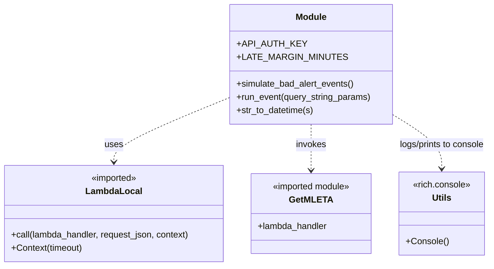

# Diagram: research/api/scripts/bad_alert_simulation.py


> Auto-generated by Obscura crawlers

## Diagram 1

```mermaid
flowchart TD
Start([Start]) --> MainCheck{"__main__ == '__main__'?"}
MainCheck -- true --> SimFunc[simulate_bad_alert_events()]
SimFunc --> OpenFile[open 'ap06a_data.txt' and read lines]
OpenFile --> Slice[lines = lines[0:1000]]
Slice --> ForLoop[for each line in lines\nparse JSON -> d]
ForLoop --> RunEvent[run_event(d)]
RunEvent --> BuildRequest[build request_json with Authorization header]
BuildRequest --> ContextNode[Context(5)]
ContextNode --> CallLambda[call(lambda_handler, request_json, context)]
CallLambda --> Response[response]
Response --> ParseBody[response_json = json.loads(response['body'])]
Response --> CheckEta{ "etaDate" in response? }
CheckEta -- yes --> ComputeTimes[compute new_eta, delivery_window_end,\nactual_arrival, original_eta]
ComputeTimes --> CompareLate[determine was_late, old_predicted_late,\npredicted_late, false_alarm]
CompareLate --> UpdateCounter[increment counters in collections.Counter]
UpdateCounter --> LogPrint[print status and counters]
CheckEta -- no --> SkipCalc[skip eta processing]
SkipCalc --> ForLoop
LogPrint --> AfterLoop[after loop compute false_alarm_rate]
AfterLoop --> WriteResult[write counter to 'result.txt']
WriteResult --> End([End])
```

> SVG rendering failed for this diagram.

## Diagram 2



### SVG

<svg id="container" width="895.1015625" xmlns="http://www.w3.org/2000/svg" class="classDiagram" height="480" viewBox="0 0 895.1015625 480" role="graphics-document document" aria-roledescription="class"><style>#container{font-family:"trebuchet ms",verdana,arial,sans-serif;font-size:16px;fill:#333;}@keyframes edge-animation-frame{from{stroke-dashoffset:0;}}@keyframes dash{to{stroke-dashoffset:0;}}#container .edge-animation-slow{stroke-dasharray:9,5!important;stroke-dashoffset:900;animation:dash 50s linear infinite;stroke-linecap:round;}#container .edge-animation-fast{stroke-dasharray:9,5!important;stroke-dashoffset:900;animation:dash 20s linear infinite;stroke-linecap:round;}#container .error-icon{fill:#552222;}#container .error-text{fill:#552222;stroke:#552222;}#container .edge-thickness-normal{stroke-width:1px;}#container .edge-thickness-thick{stroke-width:3.5px;}#container .edge-pattern-solid{stroke-dasharray:0;}#container .edge-thickness-invisible{stroke-width:0;fill:none;}#container .edge-pattern-dashed{stroke-dasharray:3;}#container .edge-pattern-dotted{stroke-dasharray:2;}#container .marker{fill:#333333;stroke:#333333;}#container .marker.cross{stroke:#333333;}#container svg{font-family:"trebuchet ms",verdana,arial,sans-serif;font-size:16px;}#container p{margin:0;}#container g.classGroup text{fill:#9370DB;stroke:none;font-family:"trebuchet ms",verdana,arial,sans-serif;font-size:10px;}#container g.classGroup text .title{font-weight:bolder;}#container .nodeLabel,#container .edgeLabel{color:#131300;}#container .edgeLabel .label rect{fill:#ECECFF;}#container .label text{fill:#131300;}#container .labelBkg{background:#ECECFF;}#container .edgeLabel .label span{background:#ECECFF;}#container .classTitle{font-weight:bolder;}#container .node rect,#container .node circle,#container .node ellipse,#container .node polygon,#container .node path{fill:#ECECFF;stroke:#9370DB;stroke-width:1px;}#container .divider{stroke:#9370DB;stroke-width:1;}#container g.clickable{cursor:pointer;}#container g.classGroup rect{fill:#ECECFF;stroke:#9370DB;}#container g.classGroup line{stroke:#9370DB;stroke-width:1;}#container .classLabel .box{stroke:none;stroke-width:0;fill:#ECECFF;opacity:0.5;}#container .classLabel .label{fill:#9370DB;font-size:10px;}#container .relation{stroke:#333333;stroke-width:1;fill:none;}#container .dashed-line{stroke-dasharray:3;}#container .dotted-line{stroke-dasharray:1 2;}#container #compositionStart,#container .composition{fill:#333333!important;stroke:#333333!important;stroke-width:1;}#container #compositionEnd,#container .composition{fill:#333333!important;stroke:#333333!important;stroke-width:1;}#container #dependencyStart,#container .dependency{fill:#333333!important;stroke:#333333!important;stroke-width:1;}#container #dependencyStart,#container .dependency{fill:#333333!important;stroke:#333333!important;stroke-width:1;}#container #extensionStart,#container .extension{fill:transparent!important;stroke:#333333!important;stroke-width:1;}#container #extensionEnd,#container .extension{fill:transparent!important;stroke:#333333!important;stroke-width:1;}#container #aggregationStart,#container .aggregation{fill:transparent!important;stroke:#333333!important;stroke-width:1;}#container #aggregationEnd,#container .aggregation{fill:transparent!important;stroke:#333333!important;stroke-width:1;}#container #lollipopStart,#container .lollipop{fill:#ECECFF!important;stroke:#333333!important;stroke-width:1;}#container #lollipopEnd,#container .lollipop{fill:#ECECFF!important;stroke:#333333!important;stroke-width:1;}#container .edgeTerminals{font-size:11px;line-height:initial;}#container .classTitleText{text-anchor:middle;font-size:18px;fill:#333;}#container .label-icon{display:inline-block;height:1em;overflow:visible;vertical-align:-0.125em;}#container .node .label-icon path{fill:currentColor;stroke:revert;stroke-width:revert;}#container :root{--mermaid-font-family:"trebuchet ms",verdana,arial,sans-serif;}</style><g><defs><marker id="container_class-aggregationStart" class="marker aggregation class" refX="18" refY="7" markerWidth="190" markerHeight="240" orient="auto"><path d="M 18,7 L9,13 L1,7 L9,1 Z"></path></marker></defs><defs><marker id="container_class-aggregationEnd" class="marker aggregation class" refX="1" refY="7" markerWidth="20" markerHeight="28" orient="auto"><path d="M 18,7 L9,13 L1,7 L9,1 Z"></path></marker></defs><defs><marker id="container_class-extensionStart" class="marker extension class" refX="18" refY="7" markerWidth="190" markerHeight="240" orient="auto"><path d="M 1,7 L18,13 V 1 Z"></path></marker></defs><defs><marker id="container_class-extensionEnd" class="marker extension class" refX="1" refY="7" markerWidth="20" markerHeight="28" orient="auto"><path d="M 1,1 V 13 L18,7 Z"></path></marker></defs><defs><marker id="container_class-compositionStart" class="marker composition class" refX="18" refY="7" markerWidth="190" markerHeight="240" orient="auto"><path d="M 18,7 L9,13 L1,7 L9,1 Z"></path></marker></defs><defs><marker id="container_class-compositionEnd" class="marker composition class" refX="1" refY="7" markerWidth="20" markerHeight="28" orient="auto"><path d="M 18,7 L9,13 L1,7 L9,1 Z"></path></marker></defs><defs><marker id="container_class-dependencyStart" class="marker dependency class" refX="6" refY="7" markerWidth="190" markerHeight="240" orient="auto"><path d="M 5,7 L9,13 L1,7 L9,1 Z"></path></marker></defs><defs><marker id="container_class-dependencyEnd" class="marker dependency class" refX="13" refY="7" markerWidth="20" markerHeight="28" orient="auto"><path d="M 18,7 L9,13 L14,7 L9,1 Z"></path></marker></defs><defs><marker id="container_class-lollipopStart" class="marker lollipop class" refX="13" refY="7" markerWidth="190" markerHeight="240" orient="auto"><circle stroke="black" fill="transparent" cx="7" cy="7" r="6"></circle></marker></defs><defs><marker id="container_class-lollipopEnd" class="marker lollipop class" refX="1" refY="7" markerWidth="190" markerHeight="240" orient="auto"><circle stroke="black" fill="transparent" cx="7" cy="7" r="6"></circle></marker></defs><g class="root"><g class="clusters"></g><g class="edgePaths"><path d="M421.066,175.315L385.469,189.596C349.872,203.877,278.678,232.438,243.081,251.886C207.484,271.333,207.484,281.667,207.484,286.833L207.484,292" id="id_Module_LambdaLocal_1" class="edge-thickness-normal edge-pattern-dashed relation" style=";;;" data-edge="true" data-et="edge" data-id="id_Module_LambdaLocal_1" data-points="W3sieCI6NDIxLjA2NjQwNjI1LCJ5IjoxNzUuMzE1MTE4ODMwMTc5M30seyJ4IjoyMDcuNDg0Mzc1LCJ5IjoyNjF9LHsieCI6MjA3LjQ4NDM3NSwieSI6Mjk4fV0=" marker-end="url(#container_class-dependencyEnd)"></path><path d="M568.918,224L568.918,230.167C568.918,236.333,568.918,248.667,568.918,262.5C568.918,276.333,568.918,291.667,568.918,299.333L568.918,307" id="id_Module_GetMLETA_2" class="edge-thickness-normal edge-pattern-dashed relation" style=";;;" data-edge="true" data-et="edge" data-id="id_Module_GetMLETA_2" data-points="W3sieCI6NTY4LjkxNzk2ODc1LCJ5IjoyMjR9LHsieCI6NTY4LjkxNzk2ODc1LCJ5IjoyNjF9LHsieCI6NTY4LjkxNzk2ODc1LCJ5IjozMTN9XQ==" marker-end="url(#container_class-dependencyEnd)"></path><path d="M716.77,205.979L731.838,215.149C746.906,224.319,777.043,242.66,792.111,258.996C807.18,275.333,807.18,289.667,807.18,296.833L807.18,304" id="id_Module_Utils_3" class="edge-thickness-normal edge-pattern-dashed relation" style=";;;" data-edge="true" data-et="edge" data-id="id_Module_Utils_3" data-points="W3sieCI6NzE2Ljc2OTUzMTI1LCJ5IjoyMDUuOTc4Njg2Nzc3NjA0N30seyJ4Ijo4MDcuMTc5Njg3NSwieSI6MjYxfSx7IngiOjgwNy4xNzk2ODc1LCJ5IjozMTB9XQ==" marker-end="url(#container_class-dependencyEnd)"></path></g><g class="edgeLabels"><g class="edgeLabel" transform="translate(207.484375, 261)"><g class="label" data-id="id_Module_LambdaLocal_1" transform="translate(-16.4921875, -12)"><foreignObject width="32.984375" height="24"><div xmlns="http://www.w3.org/1999/xhtml" class="labelBkg" style="display: table-cell; white-space: nowrap; line-height: 1.5; max-width: 200px; text-align: center;"><span class="edgeLabel"><p>uses</p></span></div></foreignObject></g></g><g class="edgeLabel" transform="translate(568.91796875, 261)"><g class="label" data-id="id_Module_GetMLETA_2" transform="translate(-27.5859375, -12)"><foreignObject width="55.171875" height="24"><div xmlns="http://www.w3.org/1999/xhtml" class="labelBkg" style="display: table-cell; white-space: nowrap; line-height: 1.5; max-width: 200px; text-align: center;"><span class="edgeLabel"><p>invokes</p></span></div></foreignObject></g></g><g class="edgeLabel" transform="translate(807.1796875, 261)"><g class="label" data-id="id_Module_Utils_3" transform="translate(-79.921875, -12)"><foreignObject width="159.84375" height="24"><div xmlns="http://www.w3.org/1999/xhtml" class="labelBkg" style="display: table-cell; white-space: nowrap; line-height: 1.5; max-width: 200px; text-align: center;"><span class="edgeLabel"><p>logs/prints to console</p></span></div></foreignObject></g></g></g><g class="nodes"><g class="node default" id="classId-Module-0" transform="translate(568.91796875, 116)"><g class="basic label-container"><path d="M-147.8515625 -108 L147.8515625 -108 L147.8515625 108 L-147.8515625 108" stroke="none" stroke-width="0" fill="#ECECFF" style=""></path><path d="M-147.8515625 -108 C-56.54211837704308 -108, 34.76732574591384 -108, 147.8515625 -108 M-147.8515625 -108 C-32.268749779337725 -108, 83.31406294132455 -108, 147.8515625 -108 M147.8515625 -108 C147.8515625 -22.90554110275886, 147.8515625 62.18891779448228, 147.8515625 108 M147.8515625 -108 C147.8515625 -57.721449469917886, 147.8515625 -7.442898939835771, 147.8515625 108 M147.8515625 108 C54.950130377796526 108, -37.95130174440695 108, -147.8515625 108 M147.8515625 108 C77.76240144561663 108, 7.673240391233264 108, -147.8515625 108 M-147.8515625 108 C-147.8515625 49.24935712695003, -147.8515625 -9.501285746099938, -147.8515625 -108 M-147.8515625 108 C-147.8515625 59.365314175448034, -147.8515625 10.730628350896069, -147.8515625 -108" stroke="#9370DB" stroke-width="1.3" fill="none" stroke-dasharray="0 0" style=""></path></g><g class="annotation-group text" transform="translate(0, -84)"></g><g class="label-group text" transform="translate(-27.09375, -84)"><g class="label" style="font-weight: bolder" transform="translate(0,-12)"><foreignObject width="54.1875" height="24"><div xmlns="http://www.w3.org/1999/xhtml" style="display: table-cell; white-space: nowrap; line-height: 1.5; max-width: 104px; text-align: center;"><span class="nodeLabel markdown-node-label" style=""><p>Module</p></span></div></foreignObject></g></g><g class="members-group text" transform="translate(-135.8515625, -36)"><g class="label" style="" transform="translate(0,-12)"><foreignObject width="113.109375" height="24"><div xmlns="http://www.w3.org/1999/xhtml" style="display: table-cell; white-space: nowrap; line-height: 1.5; max-width: 171px; text-align: center;"><span class="nodeLabel markdown-node-label" style=""><p>+API_AUTH_KEY</p></span></div></foreignObject></g><g class="label" style="" transform="translate(0,12)"><foreignObject width="178.78125" height="24"><div xmlns="http://www.w3.org/1999/xhtml" style="display: table-cell; white-space: nowrap; line-height: 1.5; max-width: 236px; text-align: center;"><span class="nodeLabel markdown-node-label" style=""><p>+LATE_MARGIN_MINUTES</p></span></div></foreignObject></g></g><g class="methods-group text" transform="translate(-135.8515625, 36)"><g class="label" style="" transform="translate(0,-12)"><foreignObject width="214.1875" height="24"><div xmlns="http://www.w3.org/1999/xhtml" style="display: table-cell; white-space: nowrap; line-height: 1.5; max-width: 272px; text-align: center;"><span class="nodeLabel markdown-node-label" style=""><p>+simulate_bad_alert_events()</p></span></div></foreignObject></g><g class="label" style="" transform="translate(0,12)"><foreignObject width="244.609375" height="24"><div xmlns="http://www.w3.org/1999/xhtml" style="display: table-cell; white-space: nowrap; line-height: 1.5; max-width: 302px; text-align: center;"><span class="nodeLabel markdown-node-label" style=""><p>+run_event(query_string_params)</p></span></div></foreignObject></g><g class="label" style="" transform="translate(0,36)"><foreignObject width="139.78125" height="24"><div xmlns="http://www.w3.org/1999/xhtml" style="display: table-cell; white-space: nowrap; line-height: 1.5; max-width: 197px; text-align: center;"><span class="nodeLabel markdown-node-label" style=""><p>+str_to_datetime(s)</p></span></div></foreignObject></g></g><g class="divider" style=""><path d="M-147.8515625 -60 C-49.879268081586716 -60, 48.09302633682657 -60, 147.8515625 -60 M-147.8515625 -60 C-87.81106793411638 -60, -27.77057336823276 -60, 147.8515625 -60" stroke="#9370DB" stroke-width="1.3" fill="none" stroke-dasharray="0 0" style=""></path></g><g class="divider" style=""><path d="M-147.8515625 12 C-84.6997972044855 12, -21.548031908971012 12, 147.8515625 12 M-147.8515625 12 C-48.49090358205399 12, 50.86975533589202 12, 147.8515625 12" stroke="#9370DB" stroke-width="1.3" fill="none" stroke-dasharray="0 0" style=""></path></g></g><g class="node default" id="classId-LambdaLocal-1" transform="translate(207.484375, 385)"><g class="basic label-container"><path d="M-199.484375 -87 L199.484375 -87 L199.484375 87 L-199.484375 87" stroke="none" stroke-width="0" fill="#ECECFF" style=""></path><path d="M-199.484375 -87 C-111.86199061488486 -87, -24.23960622976972 -87, 199.484375 -87 M-199.484375 -87 C-110.03130524334136 -87, -20.57823548668273 -87, 199.484375 -87 M199.484375 -87 C199.484375 -52.009107452854025, 199.484375 -17.01821490570805, 199.484375 87 M199.484375 -87 C199.484375 -49.691004233261076, 199.484375 -12.382008466522151, 199.484375 87 M199.484375 87 C103.75248032926899 87, 8.020585658537982 87, -199.484375 87 M199.484375 87 C88.22306824160103 87, -23.038238516797946 87, -199.484375 87 M-199.484375 87 C-199.484375 30.520978747601866, -199.484375 -25.958042504796268, -199.484375 -87 M-199.484375 87 C-199.484375 44.95511479839126, -199.484375 2.9102295967825142, -199.484375 -87" stroke="#9370DB" stroke-width="1.3" fill="none" stroke-dasharray="0 0" style=""></path></g><g class="annotation-group text" transform="translate(-42.671875, -63)"><g class="label" style="" transform="translate(0,-12)"><foreignObject width="85.34375" height="24"><div xmlns="http://www.w3.org/1999/xhtml" style="display: table-cell; white-space: nowrap; line-height: 1.5; max-width: 135px; text-align: center;"><span class="nodeLabel markdown-node-label" style=""><p>«imported»</p></span></div></foreignObject></g></g><g class="label-group text" transform="translate(-48.140625, -39)"><g class="label" style="font-weight: bolder" transform="translate(0,-12)"><foreignObject width="96.28125" height="24"><div xmlns="http://www.w3.org/1999/xhtml" style="display: table-cell; white-space: nowrap; line-height: 1.5; max-width: 146px; text-align: center;"><span class="nodeLabel markdown-node-label" style=""><p>LambdaLocal</p></span></div></foreignObject></g></g><g class="members-group text" transform="translate(-187.484375, 9)"></g><g class="methods-group text" transform="translate(-187.484375, 39)"><g class="label" style="" transform="translate(0,-12)"><foreignObject width="326.828125" height="24"><div xmlns="http://www.w3.org/1999/xhtml" style="display: table-cell; white-space: nowrap; line-height: 1.5; max-width: 384px; text-align: center;"><span class="nodeLabel markdown-node-label" style=""><p>+call(lambda_handler, request_json, context)</p></span></div></foreignObject></g><g class="label" style="" transform="translate(0,12)"><foreignObject width="130.515625" height="24"><div xmlns="http://www.w3.org/1999/xhtml" style="display: table-cell; white-space: nowrap; line-height: 1.5; max-width: 188px; text-align: center;"><span class="nodeLabel markdown-node-label" style=""><p>+Context(timeout)</p></span></div></foreignObject></g></g><g class="divider" style=""><path d="M-199.484375 -15 C-116.46707963757841 -15, -33.449784275156816 -15, 199.484375 -15 M-199.484375 -15 C-78.28529974139796 -15, 42.91377551720407 -15, 199.484375 -15" stroke="#9370DB" stroke-width="1.3" fill="none" stroke-dasharray="0 0" style=""></path></g><g class="divider" style=""><path d="M-199.484375 9 C-93.38237812228596 9, 12.719618755428087 9, 199.484375 9 M-199.484375 9 C-87.49608488465616 9, 24.492205230687688 9, 199.484375 9" stroke="#9370DB" stroke-width="1.3" fill="none" stroke-dasharray="0 0" style=""></path></g></g><g class="node default" id="classId-GetMLETA-2" transform="translate(568.91796875, 385)"><g class="basic label-container"><path d="M-111.94921875 -72 L111.94921875 -72 L111.94921875 72 L-111.94921875 72" stroke="none" stroke-width="0" fill="#ECECFF" style=""></path><path d="M-111.94921875 -72 C-34.626664538610925 -72, 42.69588967277815 -72, 111.94921875 -72 M-111.94921875 -72 C-35.327227003079784 -72, 41.29476474384043 -72, 111.94921875 -72 M111.94921875 -72 C111.94921875 -36.17635917855079, 111.94921875 -0.3527183571015797, 111.94921875 72 M111.94921875 -72 C111.94921875 -18.416320957485475, 111.94921875 35.16735808502905, 111.94921875 72 M111.94921875 72 C46.98078600121816 72, -17.987646747563673 72, -111.94921875 72 M111.94921875 72 C56.50955073827328 72, 1.0698827265465667 72, -111.94921875 72 M-111.94921875 72 C-111.94921875 21.67133386442231, -111.94921875 -28.657332271155383, -111.94921875 -72 M-111.94921875 72 C-111.94921875 25.908106564365, -111.94921875 -20.18378687127, -111.94921875 -72" stroke="#9370DB" stroke-width="1.3" fill="none" stroke-dasharray="0 0" style=""></path></g><g class="annotation-group text" transform="translate(-72.2578125, -48)"><g class="label" style="" transform="translate(0,-12)"><foreignObject width="144.515625" height="24"><div xmlns="http://www.w3.org/1999/xhtml" style="display: table-cell; white-space: nowrap; line-height: 1.5; max-width: 195px; text-align: center;"><span class="nodeLabel markdown-node-label" style=""><p>«imported module»</p></span></div></foreignObject></g></g><g class="label-group text" transform="translate(-35.90625, -24)"><g class="label" style="font-weight: bolder" transform="translate(0,-12)"><foreignObject width="71.8125" height="24"><div xmlns="http://www.w3.org/1999/xhtml" style="display: table-cell; white-space: nowrap; line-height: 1.5; max-width: 121px; text-align: center;"><span class="nodeLabel markdown-node-label" style=""><p>GetMLETA</p></span></div></foreignObject></g></g><g class="members-group text" transform="translate(-99.94921875, 24)"><g class="label" style="" transform="translate(0,-12)"><foreignObject width="127.640625" height="24"><div xmlns="http://www.w3.org/1999/xhtml" style="display: table-cell; white-space: nowrap; line-height: 1.5; max-width: 186px; text-align: center;"><span class="nodeLabel markdown-node-label" style=""><p>+lambda_handler</p></span></div></foreignObject></g></g><g class="methods-group text" transform="translate(-99.94921875, 72)"></g><g class="divider" style=""><path d="M-111.94921875 0 C-39.993259786457315 0, 31.96269917708537 0, 111.94921875 0 M-111.94921875 0 C-62.62435379785841 0, -13.299488845716823 0, 111.94921875 0" stroke="#9370DB" stroke-width="1.3" fill="none" stroke-dasharray="0 0" style=""></path></g><g class="divider" style=""><path d="M-111.94921875 48 C-39.533318394858924 48, 32.88258196028215 48, 111.94921875 48 M-111.94921875 48 C-31.808432778511474 48, 48.33235319297705 48, 111.94921875 48" stroke="#9370DB" stroke-width="1.3" fill="none" stroke-dasharray="0 0" style=""></path></g></g><g class="node default" id="classId-Utils-3" transform="translate(807.1796875, 385)"><g class="basic label-container"><path d="M-76.3125 -75 L76.3125 -75 L76.3125 75 L-76.3125 75" stroke="none" stroke-width="0" fill="#ECECFF" style=""></path><path d="M-76.3125 -75 C-30.918577429958354 -75, 14.475345140083292 -75, 76.3125 -75 M-76.3125 -75 C-37.48568036248155 -75, 1.3411392750368947 -75, 76.3125 -75 M76.3125 -75 C76.3125 -30.889142198290713, 76.3125 13.221715603418573, 76.3125 75 M76.3125 -75 C76.3125 -15.275066750383587, 76.3125 44.449866499232826, 76.3125 75 M76.3125 75 C22.708170660068703 75, -30.896158679862594 75, -76.3125 75 M76.3125 75 C38.232935921076106 75, 0.153371842152211 75, -76.3125 75 M-76.3125 75 C-76.3125 25.129368678019468, -76.3125 -24.741262643961065, -76.3125 -75 M-76.3125 75 C-76.3125 18.447334547385843, -76.3125 -38.105330905228314, -76.3125 -75" stroke="#9370DB" stroke-width="1.3" fill="none" stroke-dasharray="0 0" style=""></path></g><g class="annotation-group text" transform="translate(-52.765625, -51)"><g class="label" style="" transform="translate(0,-12)"><foreignObject width="105.53125" height="24"><div xmlns="http://www.w3.org/1999/xhtml" style="display: table-cell; white-space: nowrap; line-height: 1.5; max-width: 156px; text-align: center;"><span class="nodeLabel markdown-node-label" style=""><p>«rich.console»</p></span></div></foreignObject></g></g><g class="label-group text" transform="translate(-16.796875, -27)"><g class="label" style="font-weight: bolder" transform="translate(0,-12)"><foreignObject width="33.59375" height="24"><div xmlns="http://www.w3.org/1999/xhtml" style="display: table-cell; white-space: nowrap; line-height: 1.5; max-width: 83px; text-align: center;"><span class="nodeLabel markdown-node-label" style=""><p>Utils</p></span></div></foreignObject></g></g><g class="members-group text" transform="translate(-64.3125, 21)"></g><g class="methods-group text" transform="translate(-64.3125, 51)"><g class="label" style="" transform="translate(0,-12)"><foreignObject width="75.859375" height="24"><div xmlns="http://www.w3.org/1999/xhtml" style="display: table-cell; white-space: nowrap; line-height: 1.5; max-width: 133px; text-align: center;"><span class="nodeLabel markdown-node-label" style=""><p>+Console()</p></span></div></foreignObject></g></g><g class="divider" style=""><path d="M-76.3125 -3 C-32.34382874043885 -3, 11.624842519122296 -3, 76.3125 -3 M-76.3125 -3 C-29.676122936063514 -3, 16.96025412787297 -3, 76.3125 -3" stroke="#9370DB" stroke-width="1.3" fill="none" stroke-dasharray="0 0" style=""></path></g><g class="divider" style=""><path d="M-76.3125 21 C-23.266391441704755 21, 29.77971711659049 21, 76.3125 21 M-76.3125 21 C-27.47877677752912 21, 21.35494644494176 21, 76.3125 21" stroke="#9370DB" stroke-width="1.3" fill="none" stroke-dasharray="0 0" style=""></path></g></g></g></g></g></svg>
