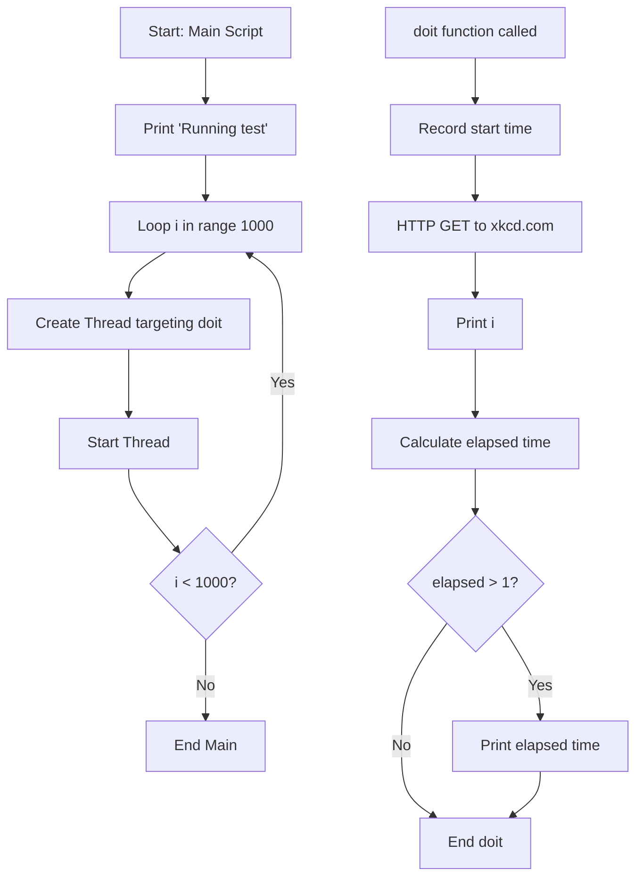
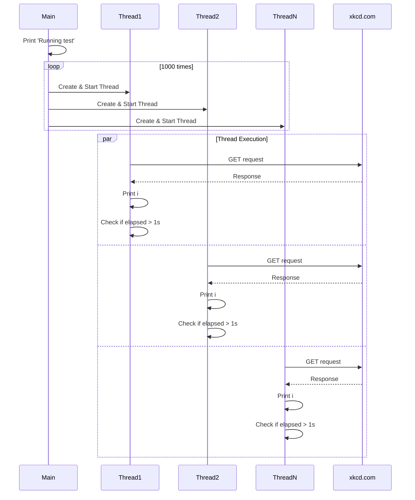

# Diagram: research/api/scripts/concurrent_query.py

> Auto-generated by Obscura crawlers

## Diagram 1

### SVG

<svg id="container" width="683.09765625" xmlns="http://www.w3.org/2000/svg" class="flowchart" height="958.0625" viewBox="0 0 683.09765625 958.0625" role="graphics-document document" aria-roledescription="flowchart-v2"><g><marker id="container_flowchart-v2-pointEnd" class="marker flowchart-v2" viewBox="0 0 10 10" refX="5" refY="5" markerUnits="userSpaceOnUse" markerWidth="8" markerHeight="8" orient="auto"><path d="M 0 0 L 10 5 L 0 10 z" class="arrowMarkerPath" style="stroke-width: 1; stroke-dasharray: 1, 0;"></path></marker><marker id="container_flowchart-v2-pointStart" class="marker flowchart-v2" viewBox="0 0 10 10" refX="4.5" refY="5" markerUnits="userSpaceOnUse" markerWidth="8" markerHeight="8" orient="auto"><path d="M 0 5 L 10 10 L 10 0 z" class="arrowMarkerPath" style="stroke-width: 1; stroke-dasharray: 1, 0;"></path></marker><marker id="container_flowchart-v2-circleEnd" class="marker flowchart-v2" viewBox="0 0 10 10" refX="11" refY="5" markerUnits="userSpaceOnUse" markerWidth="11" markerHeight="11" orient="auto"><circle cx="5" cy="5" r="5" class="arrowMarkerPath" style="stroke-width: 1; stroke-dasharray: 1, 0;"></circle></marker><marker id="container_flowchart-v2-circleStart" class="marker flowchart-v2" viewBox="0 0 10 10" refX="-1" refY="5" markerUnits="userSpaceOnUse" markerWidth="11" markerHeight="11" orient="auto"><circle cx="5" cy="5" r="5" class="arrowMarkerPath" style="stroke-width: 1; stroke-dasharray: 1, 0;"></circle></marker><marker id="container_flowchart-v2-crossEnd" class="marker cross flowchart-v2" viewBox="0 0 11 11" refX="12" refY="5.2" markerUnits="userSpaceOnUse" markerWidth="11" markerHeight="11" orient="auto"><path d="M 1,1 l 9,9 M 10,1 l -9,9" class="arrowMarkerPath" style="stroke-width: 2; stroke-dasharray: 1, 0;"></path></marker><marker id="container_flowchart-v2-crossStart" class="marker cross flowchart-v2" viewBox="0 0 11 11" refX="-1" refY="5.2" markerUnits="userSpaceOnUse" markerWidth="11" markerHeight="11" orient="auto"><path d="M 1,1 l 9,9 M 10,1 l -9,9" class="arrowMarkerPath" style="stroke-width: 2; stroke-dasharray: 1, 0;"></path></marker><g class="root"><g class="clusters"></g><g class="edgePaths"><path d="M220.5,62L220.5,66.167C220.5,70.333,220.5,78.667,220.5,86.333C220.5,94,220.5,101,220.5,104.5L220.5,108" id="L_Start_Init_0" class="edge-thickness-normal edge-pattern-solid edge-thickness-normal edge-pattern-solid flowchart-link" style=";" data-edge="true" data-et="edge" data-id="L_Start_Init_0" data-points="W3sieCI6MjIwLjUsInkiOjYyfSx7IngiOjIyMC41LCJ5Ijo4N30seyJ4IjoyMjAuNSwieSI6MTEyfV0=" marker-end="url(#container_flowchart-v2-pointEnd)"></path><path d="M220.5,166L220.5,170.167C220.5,174.333,220.5,182.667,220.5,190.333C220.5,198,220.5,205,220.5,208.5L220.5,212" id="L_Init_Loop_0" class="edge-thickness-normal edge-pattern-solid edge-thickness-normal edge-pattern-solid flowchart-link" style=";" data-edge="true" data-et="edge" data-id="L_Init_Loop_0" data-points="W3sieCI6MjIwLjUsInkiOjE2Nn0seyJ4IjoyMjAuNSwieSI6MTkxfSx7IngiOjIyMC41LCJ5IjoyMTZ9XQ==" marker-end="url(#container_flowchart-v2-pointEnd)"></path><path d="M177.663,270L171.053,274.167C164.442,278.333,151.221,286.667,144.611,294.333C138,302,138,309,138,312.5L138,316" id="L_Loop_CreateThread_0" class="edge-thickness-normal edge-pattern-solid edge-thickness-normal edge-pattern-solid flowchart-link" style=";" data-edge="true" data-et="edge" data-id="L_Loop_CreateThread_0" data-points="W3sieCI6MTc3LjY2MzQ2MTUzODQ2MTU1LCJ5IjoyNzB9LHsieCI6MTM4LCJ5IjoyOTV9LHsieCI6MTM4LCJ5IjozMjB9XQ==" marker-end="url(#container_flowchart-v2-pointEnd)"></path><path d="M138,398L138,404.167C138,410.333,138,422.667,138,434.333C138,446,138,457,138,462.5L138,468" id="L_CreateThread_StartThread_0" class="edge-thickness-normal edge-pattern-solid edge-thickness-normal edge-pattern-solid flowchart-link" style=";" data-edge="true" data-et="edge" data-id="L_CreateThread_StartThread_0" data-points="W3sieCI6MTM4LCJ5IjozOTh9LHsieCI6MTM4LCJ5Ijo0MzV9LHsieCI6MTM4LCJ5Ijo0NzJ9XQ==" marker-end="url(#container_flowchart-v2-pointEnd)"></path><path d="M138,526L138,530.167C138,534.333,138,542.667,146.859,557.145C155.718,571.624,173.435,592.247,182.294,602.559L191.153,612.871" id="L_StartThread_CheckLoop_0" class="edge-thickness-normal edge-pattern-solid edge-thickness-normal edge-pattern-solid flowchart-link" style=";" data-edge="true" data-et="edge" data-id="L_StartThread_CheckLoop_0" data-points="W3sieCI6MTM4LCJ5Ijo1MjZ9LHsieCI6MTM4LCJ5Ijo1NTF9LHsieCI6MTkzLjc1OTM0MjcyNzExMzYsInkiOjYxNS45MDQ3MTk3NzI4ODY0fV0=" marker-end="url(#container_flowchart-v2-pointEnd)"></path><path d="M247.241,615.905L256.534,605.087C265.827,594.27,284.414,572.635,293.707,553.151C303,533.667,303,516.333,303,497C303,477.667,303,456.333,303,433C303,409.667,303,384.333,303,361C303,337.667,303,316.333,296.953,301.855C290.907,287.378,278.814,279.755,272.767,275.944L266.72,272.133" id="L_CheckLoop_Loop_0" class="edge-thickness-normal edge-pattern-solid edge-thickness-normal edge-pattern-solid flowchart-link" style=";" data-edge="true" data-et="edge" data-id="L_CheckLoop_Loop_0" data-points="W3sieCI6MjQ3LjI0MDY1NzI3Mjg4NjQsInkiOjYxNS45MDQ3MTk3NzI4ODY0fSx7IngiOjMwMywieSI6NTUxfSx7IngiOjMwMywieSI6NDk5fSx7IngiOjMwMywieSI6NDM1fSx7IngiOjMwMywieSI6MzU5fSx7IngiOjMwMywieSI6Mjk1fSx7IngiOjI2My4zMzY1Mzg0NjE1Mzg0NSwieSI6MjcwfV0=" marker-end="url(#container_flowchart-v2-pointEnd)"></path><path d="M220.5,704.898L220.5,713.259C220.5,721.62,220.5,738.341,220.5,752.202C220.5,766.063,220.5,777.063,220.5,782.563L220.5,788.063" id="L_CheckLoop_End_0" class="edge-thickness-normal edge-pattern-solid edge-thickness-normal edge-pattern-solid flowchart-link" style=";" data-edge="true" data-et="edge" data-id="L_CheckLoop_End_0" data-points="W3sieCI6MjIwLjUsInkiOjcwNC44OTg0Mzc1fSx7IngiOjIyMC41LCJ5Ijo3NTUuMDYyNX0seyJ4IjoyMjAuNSwieSI6NzkyLjA2MjV9XQ==" marker-end="url(#container_flowchart-v2-pointEnd)"></path><path d="M507.543,62L507.543,66.167C507.543,70.333,507.543,78.667,507.543,86.333C507.543,94,507.543,101,507.543,104.5L507.543,108" id="L_doit_start_RecordTime_0" class="edge-thickness-normal edge-pattern-solid edge-thickness-normal edge-pattern-solid flowchart-link" style=";" data-edge="true" data-et="edge" data-id="L_doit_start_RecordTime_0" data-points="W3sieCI6NTA3LjU0Mjk2ODc1LCJ5Ijo2Mn0seyJ4Ijo1MDcuNTQyOTY4NzUsInkiOjg3fSx7IngiOjUwNy41NDI5Njg3NSwieSI6MTEyfV0=" marker-end="url(#container_flowchart-v2-pointEnd)"></path><path d="M507.543,166L507.543,170.167C507.543,174.333,507.543,182.667,507.543,190.333C507.543,198,507.543,205,507.543,208.5L507.543,212" id="L_RecordTime_MakeRequest_0" class="edge-thickness-normal edge-pattern-solid edge-thickness-normal edge-pattern-solid flowchart-link" style=";" data-edge="true" data-et="edge" data-id="L_RecordTime_MakeRequest_0" data-points="W3sieCI6NTA3LjU0Mjk2ODc1LCJ5IjoxNjZ9LHsieCI6NTA3LjU0Mjk2ODc1LCJ5IjoxOTF9LHsieCI6NTA3LjU0Mjk2ODc1LCJ5IjoyMTZ9XQ==" marker-end="url(#container_flowchart-v2-pointEnd)"></path><path d="M507.543,270L507.543,274.167C507.543,278.333,507.543,286.667,507.543,296.333C507.543,306,507.543,317,507.543,322.5L507.543,328" id="L_MakeRequest_PrintI_0" class="edge-thickness-normal edge-pattern-solid edge-thickness-normal edge-pattern-solid flowchart-link" style=";" data-edge="true" data-et="edge" data-id="L_MakeRequest_PrintI_0" data-points="W3sieCI6NTA3LjU0Mjk2ODc1LCJ5IjoyNzB9LHsieCI6NTA3LjU0Mjk2ODc1LCJ5IjoyOTV9LHsieCI6NTA3LjU0Mjk2ODc1LCJ5IjozMzJ9XQ==" marker-end="url(#container_flowchart-v2-pointEnd)"></path><path d="M507.543,386L507.543,394.167C507.543,402.333,507.543,418.667,507.543,432.333C507.543,446,507.543,457,507.543,462.5L507.543,468" id="L_PrintI_CalcElapsed_0" class="edge-thickness-normal edge-pattern-solid edge-thickness-normal edge-pattern-solid flowchart-link" style=";" data-edge="true" data-et="edge" data-id="L_PrintI_CalcElapsed_0" data-points="W3sieCI6NTA3LjU0Mjk2ODc1LCJ5IjozODZ9LHsieCI6NTA3LjU0Mjk2ODc1LCJ5Ijo0MzV9LHsieCI6NTA3LjU0Mjk2ODc1LCJ5Ijo0NzJ9XQ==" marker-end="url(#container_flowchart-v2-pointEnd)"></path><path d="M507.543,526L507.543,530.167C507.543,534.333,507.543,542.667,507.543,550.333C507.543,558,507.543,565,507.543,568.5L507.543,572" id="L_CalcElapsed_CheckElapsed_0" class="edge-thickness-normal edge-pattern-solid edge-thickness-normal edge-pattern-solid flowchart-link" style=";" data-edge="true" data-et="edge" data-id="L_CalcElapsed_CheckElapsed_0" data-points="W3sieCI6NTA3LjU0Mjk2ODc1LCJ5Ijo1MjZ9LHsieCI6NTA3LjU0Mjk2ODc1LCJ5Ijo1NTF9LHsieCI6NTA3LjU0Mjk2ODc1LCJ5Ijo1NzZ9XQ==" marker-end="url(#container_flowchart-v2-pointEnd)"></path><path d="M535.688,689.917L542.814,700.775C549.939,711.632,564.19,733.347,571.316,749.705C578.441,766.063,578.441,777.063,578.441,782.563L578.441,788.063" id="L_CheckElapsed_PrintTime_0" class="edge-thickness-normal edge-pattern-solid edge-thickness-normal edge-pattern-solid flowchart-link" style=";" data-edge="true" data-et="edge" data-id="L_CheckElapsed_PrintTime_0" data-points="W3sieCI6NTM1LjY4ODEyODQ5OTgxNDQsInkiOjY4OS45MTczNDAyNTAxODU2fSx7IngiOjU3OC40NDE0MDYyNSwieSI6NzU1LjA2MjV9LHsieCI6NTc4LjQ0MTQwNjI1LCJ5Ijo3OTIuMDYyNX1d" marker-end="url(#container_flowchart-v2-pointEnd)"></path><path d="M478.071,688.591L470.215,699.669C462.359,710.748,446.646,732.905,438.79,754.651C430.934,776.396,430.934,797.729,430.934,817.063C430.934,836.396,430.934,853.729,436.521,866.188C442.108,878.647,453.281,886.232,458.868,890.024L464.455,893.816" id="L_CheckElapsed_doit_end_0" class="edge-thickness-normal edge-pattern-solid edge-thickness-normal edge-pattern-solid flowchart-link" style=";" data-edge="true" data-et="edge" data-id="L_CheckElapsed_doit_end_0" data-points="W3sieCI6NDc4LjA3MTM0MTUzOTIwMiwieSI6Njg4LjU5MDg3Mjc4OTIwMn0seyJ4Ijo0MzAuOTMzNTkzNzUsInkiOjc1NS4wNjI1fSx7IngiOjQzMC45MzM1OTM3NSwieSI6ODE5LjA2MjV9LHsieCI6NDMwLjkzMzU5Mzc1LCJ5Ijo4NzEuMDYyNX0seyJ4Ijo0NjcuNzY1MDI0MDM4NDYxNTUsInkiOjg5Ni4wNjI1fV0=" marker-end="url(#container_flowchart-v2-pointEnd)"></path><path d="M578.441,846.063L578.441,850.229C578.441,854.396,578.441,862.729,573.298,870.668C568.155,878.607,557.868,886.152,552.724,889.924L547.581,893.697" id="L_PrintTime_doit_end_0" class="edge-thickness-normal edge-pattern-solid edge-thickness-normal edge-pattern-solid flowchart-link" style=";" data-edge="true" data-et="edge" data-id="L_PrintTime_doit_end_0" data-points="W3sieCI6NTc4LjQ0MTQwNjI1LCJ5Ijo4NDYuMDYyNX0seyJ4Ijo1NzguNDQxNDA2MjUsInkiOjg3MS4wNjI1fSx7IngiOjU0NC4zNTU2MTg5OTAzODQ2LCJ5Ijo4OTYuMDYyNX1d" marker-end="url(#container_flowchart-v2-pointEnd)"></path></g><g class="edgeLabels"><g class="edgeLabel"><g class="label" data-id="L_Start_Init_0" transform="translate(0, 0)"><foreignObject width="0" height="0">

</foreignObject></g></g><g class="edgeLabel"><g class="label" data-id="L_Init_Loop_0" transform="translate(0, 0)"><foreignObject width="0" height="0">

</foreignObject></g></g><g class="edgeLabel"><g class="label" data-id="L_Loop_CreateThread_0" transform="translate(0, 0)"><foreignObject width="0" height="0">

</foreignObject></g></g><g class="edgeLabel"><g class="label" data-id="L_CreateThread_StartThread_0" transform="translate(0, 0)"><foreignObject width="0" height="0">

</foreignObject></g></g><g class="edgeLabel"><g class="label" data-id="L_StartThread_CheckLoop_0" transform="translate(0, 0)"><foreignObject width="0" height="0">

</foreignObject></g></g><g class="edgeLabel" transform="translate(303, 435)"><g class="label" data-id="L_CheckLoop_Loop_0" transform="translate(-12.03125, -12)"><foreignObject width="24.0625" height="24">

Yes

</foreignObject></g></g><g class="edgeLabel" transform="translate(220.5, 755.0625)"><g class="label" data-id="L_CheckLoop_End_0" transform="translate(-10.140625, -12)"><foreignObject width="20.28125" height="24">

No

</foreignObject></g></g><g class="edgeLabel"><g class="label" data-id="L_doit_start_RecordTime_0" transform="translate(0, 0)"><foreignObject width="0" height="0">

</foreignObject></g></g><g class="edgeLabel"><g class="label" data-id="L_RecordTime_MakeRequest_0" transform="translate(0, 0)"><foreignObject width="0" height="0">

</foreignObject></g></g><g class="edgeLabel"><g class="label" data-id="L_MakeRequest_PrintI_0" transform="translate(0, 0)"><foreignObject width="0" height="0">

</foreignObject></g></g><g class="edgeLabel"><g class="label" data-id="L_PrintI_CalcElapsed_0" transform="translate(0, 0)"><foreignObject width="0" height="0">

</foreignObject></g></g><g class="edgeLabel"><g class="label" data-id="L_CalcElapsed_CheckElapsed_0" transform="translate(0, 0)"><foreignObject width="0" height="0">

</foreignObject></g></g><g class="edgeLabel" transform="translate(578.44140625, 755.0625)"><g class="label" data-id="L_CheckElapsed_PrintTime_0" transform="translate(-12.03125, -12)"><foreignObject width="24.0625" height="24">

Yes

</foreignObject></g></g><g class="edgeLabel" transform="translate(430.93359375, 819.0625)"><g class="label" data-id="L_CheckElapsed_doit_end_0" transform="translate(-10.140625, -12)"><foreignObject width="20.28125" height="24">

No

</foreignObject></g></g><g class="edgeLabel"><g class="label" data-id="L_PrintTime_doit_end_0" transform="translate(0, 0)"><foreignObject width="0" height="0">

</foreignObject></g></g></g><g class="nodes"><g class="node default" id="flowchart-Start-0" transform="translate(220.5, 35)"><rect class="basic label-container" style="" x="-92.40625" y="-27" width="184.8125" height="54"></rect><g class="label" style="" transform="translate(-62.40625, -12)"><rect></rect><foreignObject width="124.8125" height="24">

Start: Main Script

</foreignObject></g></g><g class="node default" id="flowchart-Init-1" transform="translate(220.5, 139)"><rect class="basic label-container" style="" x="-98.765625" y="-27" width="197.53125" height="54"></rect><g class="label" style="" transform="translate(-68.765625, -12)"><rect></rect><foreignObject width="137.53125" height="24">

Print 'Running test'

</foreignObject></g></g><g class="node default" id="flowchart-Loop-3" transform="translate(220.5, 243)"><rect class="basic label-container" style="" x="-102.65625" y="-27" width="205.3125" height="54"></rect><g class="label" style="" transform="translate(-72.65625, -12)"><rect></rect><foreignObject width="145.3125" height="24">

Loop i in range 1000

</foreignObject></g></g><g class="node default" id="flowchart-CreateThread-5" transform="translate(138, 359)"><rect class="basic label-container" style="" x="-130" y="-39" width="260" height="78"></rect><g class="label" style="" transform="translate(-100, -24)"><rect></rect><foreignObject width="200" height="48">

Create Thread targeting doit

</foreignObject></g></g><g class="node default" id="flowchart-StartThread-7" transform="translate(138, 499)"><rect class="basic label-container" style="" x="-74.734375" y="-27" width="149.46875" height="54"></rect><g class="label" style="" transform="translate(-44.734375, -12)"><rect></rect><foreignObject width="89.46875" height="24">

Start Thread

</foreignObject></g></g><g class="node default" id="flowchart-CheckLoop-9" transform="translate(220.5, 647.03125)"><polygon points="57.8671875,0 115.734375,-57.8671875 57.8671875,-115.734375 0,-57.8671875" class="label-container" transform="translate(-57.3671875, 57.8671875)"></polygon><g class="label" style="" transform="translate(-30.8671875, -12)"><rect></rect><foreignObject width="61.734375" height="24">

i &lt; 1000?

</foreignObject></g></g><g class="node default" id="flowchart-End-13" transform="translate(220.5, 819.0625)"><rect class="basic label-container" style="" x="-63.3125" y="-27" width="126.625" height="54"></rect><g class="label" style="" transform="translate(-33.3125, -12)"><rect></rect><foreignObject width="66.625" height="24">

End Main

</foreignObject></g></g><g class="node default" id="flowchart-doit_start-14" transform="translate(507.54296875, 35)"><rect class="basic label-container" style="" x="-101.0078125" y="-27" width="202.015625" height="54"></rect><g class="label" style="" transform="translate(-71.0078125, -12)"><rect></rect><foreignObject width="142.015625" height="24">

doit function called

</foreignObject></g></g><g class="node default" id="flowchart-RecordTime-15" transform="translate(507.54296875, 139)"><rect class="basic label-container" style="" x="-92.546875" y="-27" width="185.09375" height="54"></rect><g class="label" style="" transform="translate(-62.546875, -12)"><rect></rect><foreignObject width="125.09375" height="24">

Record start time

</foreignObject></g></g><g class="node default" id="flowchart-MakeRequest-17" transform="translate(507.54296875, 243)"><rect class="basic label-container" style="" x="-109.015625" y="-27" width="218.03125" height="54"></rect><g class="label" style="" transform="translate(-79.015625, -12)"><rect></rect><foreignObject width="158.03125" height="24">

HTTP GET to xkcd.com

</foreignObject></g></g><g class="node default" id="flowchart-PrintI-19" transform="translate(507.54296875, 359)"><rect class="basic label-container" style="" x="-51.7890625" y="-27" width="103.578125" height="54"></rect><g class="label" style="" transform="translate(-21.7890625, -12)"><rect></rect><foreignObject width="43.578125" height="24">

Print i

</foreignObject></g></g><g class="node default" id="flowchart-CalcElapsed-21" transform="translate(507.54296875, 499)"><rect class="basic label-container" style="" x="-112.4140625" y="-27" width="224.828125" height="54"></rect><g class="label" style="" transform="translate(-82.4140625, -12)"><rect></rect><foreignObject width="164.828125" height="24">

Calculate elapsed time

</foreignObject></g></g><g class="node default" id="flowchart-CheckElapsed-23" transform="translate(507.54296875, 647.03125)"><polygon points="71.03125,0 142.0625,-71.03125 71.03125,-142.0625 0,-71.03125" class="label-container" transform="translate(-70.53125, 71.03125)"></polygon><g class="label" style="" transform="translate(-44.03125, -12)"><rect></rect><foreignObject width="88.0625" height="24">

elapsed &gt; 1?

</foreignObject></g></g><g class="node default" id="flowchart-PrintTime-25" transform="translate(578.44140625, 819.0625)"><rect class="basic label-container" style="" x="-96.65625" y="-27" width="193.3125" height="54"></rect><g class="label" style="" transform="translate(-66.65625, -12)"><rect></rect><foreignObject width="133.3125" height="24">

Print elapsed time

</foreignObject></g></g><g class="node default" id="flowchart-doit_end-27" transform="translate(507.54296875, 923.0625)"><rect class="basic label-container" style="" x="-60.3984375" y="-27" width="120.796875" height="54"></rect><g class="label" style="" transform="translate(-30.3984375, -12)"><rect></rect><foreignObject width="60.796875" height="24">

End doit

</foreignObject></g></g></g></g></g></svg>

## Diagram 2

### SVG

<svg id="container" width="1076" xmlns="http://www.w3.org/2000/svg" height="1339" viewBox="-50 -10 1076 1339" role="graphics-document document" aria-roledescription="sequence"><g><rect x="826" y="1253" fill="#eaeaea" stroke="#666" width="150" height="65" name="HTTP" rx="3" ry="3" class="actor actor-bottom"></rect><text x="901" y="1285.5" dominant-baseline="central" alignment-baseline="central" class="actor actor-box" style="text-anchor: middle; font-size: 16px; font-weight: 400;"><tspan x="901" dy="0">xkcd.com</tspan></text></g><g><rect x="626" y="1253" fill="#eaeaea" stroke="#666" width="150" height="65" name="ThreadN" rx="3" ry="3" class="actor actor-bottom"></rect><text x="701" y="1285.5" dominant-baseline="central" alignment-baseline="central" class="actor actor-box" style="text-anchor: middle; font-size: 16px; font-weight: 400;"><tspan x="701" dy="0">ThreadN</tspan></text></g><g><rect x="426" y="1253" fill="#eaeaea" stroke="#666" width="150" height="65" name="Thread2" rx="3" ry="3" class="actor actor-bottom"></rect><text x="501" y="1285.5" dominant-baseline="central" alignment-baseline="central" class="actor actor-box" style="text-anchor: middle; font-size: 16px; font-weight: 400;"><tspan x="501" dy="0">Thread2</tspan></text></g><g><rect x="226" y="1253" fill="#eaeaea" stroke="#666" width="150" height="65" name="Thread1" rx="3" ry="3" class="actor actor-bottom"></rect><text x="301" y="1285.5" dominant-baseline="central" alignment-baseline="central" class="actor actor-box" style="text-anchor: middle; font-size: 16px; font-weight: 400;"><tspan x="301" dy="0">Thread1</tspan></text></g><g><rect x="0" y="1253" fill="#eaeaea" stroke="#666" width="150" height="65" name="Main" rx="3" ry="3" class="actor actor-bottom"></rect><text x="75" y="1285.5" dominant-baseline="central" alignment-baseline="central" class="actor actor-box" style="text-anchor: middle; font-size: 16px; font-weight: 400;"><tspan x="75" dy="0">Main</tspan></text></g><g><line id="actor4" x1="901" y1="65" x2="901" y2="1253" class="actor-line 200" stroke-width="0.5px" stroke="#999" name="HTTP"></line><g id="root-4"><rect x="826" y="0" fill="#eaeaea" stroke="#666" width="150" height="65" name="HTTP" rx="3" ry="3" class="actor actor-top"></rect><text x="901" y="32.5" dominant-baseline="central" alignment-baseline="central" class="actor actor-box" style="text-anchor: middle; font-size: 16px; font-weight: 400;"><tspan x="901" dy="0">xkcd.com</tspan></text></g></g><g><line id="actor3" x1="701" y1="65" x2="701" y2="1253" class="actor-line 200" stroke-width="0.5px" stroke="#999" name="ThreadN"></line><g id="root-3"><rect x="626" y="0" fill="#eaeaea" stroke="#666" width="150" height="65" name="ThreadN" rx="3" ry="3" class="actor actor-top"></rect><text x="701" y="32.5" dominant-baseline="central" alignment-baseline="central" class="actor actor-box" style="text-anchor: middle; font-size: 16px; font-weight: 400;"><tspan x="701" dy="0">ThreadN</tspan></text></g></g><g><line id="actor2" x1="501" y1="65" x2="501" y2="1253" class="actor-line 200" stroke-width="0.5px" stroke="#999" name="Thread2"></line><g id="root-2"><rect x="426" y="0" fill="#eaeaea" stroke="#666" width="150" height="65" name="Thread2" rx="3" ry="3" class="actor actor-top"></rect><text x="501" y="32.5" dominant-baseline="central" alignment-baseline="central" class="actor actor-box" style="text-anchor: middle; font-size: 16px; font-weight: 400;"><tspan x="501" dy="0">Thread2</tspan></text></g></g><g><line id="actor1" x1="301" y1="65" x2="301" y2="1253" class="actor-line 200" stroke-width="0.5px" stroke="#999" name="Thread1"></line><g id="root-1"><rect x="226" y="0" fill="#eaeaea" stroke="#666" width="150" height="65" name="Thread1" rx="3" ry="3" class="actor actor-top"></rect><text x="301" y="32.5" dominant-baseline="central" alignment-baseline="central" class="actor actor-box" style="text-anchor: middle; font-size: 16px; font-weight: 400;"><tspan x="301" dy="0">Thread1</tspan></text></g></g><g><line id="actor0" x1="75" y1="65" x2="75" y2="1253" class="actor-line 200" stroke-width="0.5px" stroke="#999" name="Main"></line><g id="root-0"><rect x="0" y="0" fill="#eaeaea" stroke="#666" width="150" height="65" name="Main" rx="3" ry="3" class="actor actor-top"></rect><text x="75" y="32.5" dominant-baseline="central" alignment-baseline="central" class="actor actor-box" style="text-anchor: middle; font-size: 16px; font-weight: 400;"><tspan x="75" dy="0">Main</tspan></text></g></g><g></g><defs><symbol id="computer" width="24" height="24"><path transform="scale(.5)" d="M2 2v13h20v-13h-20zm18 11h-16v-9h16v9zm-10.228 6l.466-1h3.524l.467 1h-4.457zm14.228 3h-24l2-6h2.104l-1.33 4h18.45l-1.297-4h2.073l2 6zm-5-10h-14v-7h14v7z"></path></symbol></defs><defs><symbol id="database" fill-rule="evenodd" clip-rule="evenodd"><path transform="scale(.5)" d="M12.258.001l.256.004.255.005.253.008.251.01.249.012.247.015.246.016.242.019.241.02.239.023.236.024.233.027.231.028.229.031.225.032.223.034.22.036.217.038.214.04.211.041.208.043.205.045.201.046.198.048.194.05.191.051.187.053.183.054.18.056.175.057.172.059.168.06.163.061.16.063.155.064.15.066.074.033.073.033.071.034.07.034.069.035.068.035.067.035.066.035.064.036.064.036.062.036.06.036.06.037.058.037.058.037.055.038.055.038.053.038.052.038.051.039.05.039.048.039.047.039.045.04.044.04.043.04.041.04.04.041.039.041.037.041.036.041.034.041.033.042.032.042.03.042.029.042.027.042.026.043.024.043.023.043.021.043.02.043.018.044.017.043.015.044.013.044.012.044.011.045.009.044.007.045.006.045.004.045.002.045.001.045v17l-.001.045-.002.045-.004.045-.006.045-.007.045-.009.044-.011.045-.012.044-.013.044-.015.044-.017.043-.018.044-.02.043-.021.043-.023.043-.024.043-.026.043-.027.042-.029.042-.03.042-.032.042-.033.042-.034.041-.036.041-.037.041-.039.041-.04.041-.041.04-.043.04-.044.04-.045.04-.047.039-.048.039-.05.039-.051.039-.052.038-.053.038-.055.038-.055.038-.058.037-.058.037-.06.037-.06.036-.062.036-.064.036-.064.036-.066.035-.067.035-.068.035-.069.035-.07.034-.071.034-.073.033-.074.033-.15.066-.155.064-.16.063-.163.061-.168.06-.172.059-.175.057-.18.056-.183.054-.187.053-.191.051-.194.05-.198.048-.201.046-.205.045-.208.043-.211.041-.214.04-.217.038-.22.036-.223.034-.225.032-.229.031-.231.028-.233.027-.236.024-.239.023-.241.02-.242.019-.246.016-.247.015-.249.012-.251.01-.253.008-.255.005-.256.004-.258.001-.258-.001-.256-.004-.255-.005-.253-.008-.251-.01-.249-.012-.247-.015-.245-.016-.243-.019-.241-.02-.238-.023-.236-.024-.234-.027-.231-.028-.228-.031-.226-.032-.223-.034-.22-.036-.217-.038-.214-.04-.211-.041-.208-.043-.204-.045-.201-.046-.198-.048-.195-.05-.19-.051-.187-.053-.184-.054-.179-.056-.176-.057-.172-.059-.167-.06-.164-.061-.159-.063-.155-.064-.151-.066-.074-.033-.072-.033-.072-.034-.07-.034-.069-.035-.068-.035-.067-.035-.066-.035-.064-.036-.063-.036-.062-.036-.061-.036-.06-.037-.058-.037-.057-.037-.056-.038-.055-.038-.053-.038-.052-.038-.051-.039-.049-.039-.049-.039-.046-.039-.046-.04-.044-.04-.043-.04-.041-.04-.04-.041-.039-.041-.037-.041-.036-.041-.034-.041-.033-.042-.032-.042-.03-.042-.029-.042-.027-.042-.026-.043-.024-.043-.023-.043-.021-.043-.02-.043-.018-.044-.017-.043-.015-.044-.013-.044-.012-.044-.011-.045-.009-.044-.007-.045-.006-.045-.004-.045-.002-.045-.001-.045v-17l.001-.045.002-.045.004-.045.006-.045.007-.045.009-.044.011-.045.012-.044.013-.044.015-.044.017-.043.018-.044.02-.043.021-.043.023-.043.024-.043.026-.043.027-.042.029-.042.03-.042.032-.042.033-.042.034-.041.036-.041.037-.041.039-.041.04-.041.041-.04.043-.04.044-.04.046-.04.046-.039.049-.039.049-.039.051-.039.052-.038.053-.038.055-.038.056-.038.057-.037.058-.037.06-.037.061-.036.062-.036.063-.036.064-.036.066-.035.067-.035.068-.035.069-.035.07-.034.072-.034.072-.033.074-.033.151-.066.155-.064.159-.063.164-.061.167-.06.172-.059.176-.057.179-.056.184-.054.187-.053.19-.051.195-.05.198-.048.201-.046.204-.045.208-.043.211-.041.214-.04.217-.038.22-.036.223-.034.226-.032.228-.031.231-.028.234-.027.236-.024.238-.023.241-.02.243-.019.245-.016.247-.015.249-.012.251-.01.253-.008.255-.005.256-.004.258-.001.258.001zm-9.258 20.499v.01l.001.021.003.021.004.022.005.021.006.022.007.022.009.023.01.022.011.023.012.023.013.023.015.023.016.024.017.023.018.024.019.024.021.024.022.025.023.024.024.025.052.049.056.05.061.051.066.051.07.051.075.051.079.052.084.052.088.052.092.052.097.052.102.051.105.052.11.052.114.051.119.051.123.051.127.05.131.05.135.05.139.048.144.049.147.047.152.047.155.047.16.045.163.045.167.043.171.043.176.041.178.041.183.039.187.039.19.037.194.035.197.035.202.033.204.031.209.03.212.029.216.027.219.025.222.024.226.021.23.02.233.018.236.016.24.015.243.012.246.01.249.008.253.005.256.004.259.001.26-.001.257-.004.254-.005.25-.008.247-.011.244-.012.241-.014.237-.016.233-.018.231-.021.226-.021.224-.024.22-.026.216-.027.212-.028.21-.031.205-.031.202-.034.198-.034.194-.036.191-.037.187-.039.183-.04.179-.04.175-.042.172-.043.168-.044.163-.045.16-.046.155-.046.152-.047.148-.048.143-.049.139-.049.136-.05.131-.05.126-.05.123-.051.118-.052.114-.051.11-.052.106-.052.101-.052.096-.052.092-.052.088-.053.083-.051.079-.052.074-.052.07-.051.065-.051.06-.051.056-.05.051-.05.023-.024.023-.025.021-.024.02-.024.019-.024.018-.024.017-.024.015-.023.014-.024.013-.023.012-.023.01-.023.01-.022.008-.022.006-.022.006-.022.004-.022.004-.021.001-.021.001-.021v-4.127l-.077.055-.08.053-.083.054-.085.053-.087.052-.09.052-.093.051-.095.05-.097.05-.1.049-.102.049-.105.048-.106.047-.109.047-.111.046-.114.045-.115.045-.118.044-.12.043-.122.042-.124.042-.126.041-.128.04-.13.04-.132.038-.134.038-.135.037-.138.037-.139.035-.142.035-.143.034-.144.033-.147.032-.148.031-.15.03-.151.03-.153.029-.154.027-.156.027-.158.026-.159.025-.161.024-.162.023-.163.022-.165.021-.166.02-.167.019-.169.018-.169.017-.171.016-.173.015-.173.014-.175.013-.175.012-.177.011-.178.01-.179.008-.179.008-.181.006-.182.005-.182.004-.184.003-.184.002h-.37l-.184-.002-.184-.003-.182-.004-.182-.005-.181-.006-.179-.008-.179-.008-.178-.01-.176-.011-.176-.012-.175-.013-.173-.014-.172-.015-.171-.016-.17-.017-.169-.018-.167-.019-.166-.02-.165-.021-.163-.022-.162-.023-.161-.024-.159-.025-.157-.026-.156-.027-.155-.027-.153-.029-.151-.03-.15-.03-.148-.031-.146-.032-.145-.033-.143-.034-.141-.035-.14-.035-.137-.037-.136-.037-.134-.038-.132-.038-.13-.04-.128-.04-.126-.041-.124-.042-.122-.042-.12-.044-.117-.043-.116-.045-.113-.045-.112-.046-.109-.047-.106-.047-.105-.048-.102-.049-.1-.049-.097-.05-.095-.05-.093-.052-.09-.051-.087-.052-.085-.053-.083-.054-.08-.054-.077-.054v4.127zm0-5.654v.011l.001.021.003.021.004.021.005.022.006.022.007.022.009.022.01.022.011.023.012.023.013.023.015.024.016.023.017.024.018.024.019.024.021.024.022.024.023.025.024.024.052.05.056.05.061.05.066.051.07.051.075.052.079.051.084.052.088.052.092.052.097.052.102.052.105.052.11.051.114.051.119.052.123.05.127.051.131.05.135.049.139.049.144.048.147.048.152.047.155.046.16.045.163.045.167.044.171.042.176.042.178.04.183.04.187.038.19.037.194.036.197.034.202.033.204.032.209.03.212.028.216.027.219.025.222.024.226.022.23.02.233.018.236.016.24.014.243.012.246.01.249.008.253.006.256.003.259.001.26-.001.257-.003.254-.006.25-.008.247-.01.244-.012.241-.015.237-.016.233-.018.231-.02.226-.022.224-.024.22-.025.216-.027.212-.029.21-.03.205-.032.202-.033.198-.035.194-.036.191-.037.187-.039.183-.039.179-.041.175-.042.172-.043.168-.044.163-.045.16-.045.155-.047.152-.047.148-.048.143-.048.139-.05.136-.049.131-.05.126-.051.123-.051.118-.051.114-.052.11-.052.106-.052.101-.052.096-.052.092-.052.088-.052.083-.052.079-.052.074-.051.07-.052.065-.051.06-.05.056-.051.051-.049.023-.025.023-.024.021-.025.02-.024.019-.024.018-.024.017-.024.015-.023.014-.023.013-.024.012-.022.01-.023.01-.023.008-.022.006-.022.006-.022.004-.021.004-.022.001-.021.001-.021v-4.139l-.077.054-.08.054-.083.054-.085.052-.087.053-.09.051-.093.051-.095.051-.097.05-.1.049-.102.049-.105.048-.106.047-.109.047-.111.046-.114.045-.115.044-.118.044-.12.044-.122.042-.124.042-.126.041-.128.04-.13.039-.132.039-.134.038-.135.037-.138.036-.139.036-.142.035-.143.033-.144.033-.147.033-.148.031-.15.03-.151.03-.153.028-.154.028-.156.027-.158.026-.159.025-.161.024-.162.023-.163.022-.165.021-.166.02-.167.019-.169.018-.169.017-.171.016-.173.015-.173.014-.175.013-.175.012-.177.011-.178.009-.179.009-.179.007-.181.007-.182.005-.182.004-.184.003-.184.002h-.37l-.184-.002-.184-.003-.182-.004-.182-.005-.181-.007-.179-.007-.179-.009-.178-.009-.176-.011-.176-.012-.175-.013-.173-.014-.172-.015-.171-.016-.17-.017-.169-.018-.167-.019-.166-.02-.165-.021-.163-.022-.162-.023-.161-.024-.159-.025-.157-.026-.156-.027-.155-.028-.153-.028-.151-.03-.15-.03-.148-.031-.146-.033-.145-.033-.143-.033-.141-.035-.14-.036-.137-.036-.136-.037-.134-.038-.132-.039-.13-.039-.128-.04-.126-.041-.124-.042-.122-.043-.12-.043-.117-.044-.116-.044-.113-.046-.112-.046-.109-.046-.106-.047-.105-.048-.102-.049-.1-.049-.097-.05-.095-.051-.093-.051-.09-.051-.087-.053-.085-.052-.083-.054-.08-.054-.077-.054v4.139zm0-5.666v.011l.001.02.003.022.004.021.005.022.006.021.007.022.009.023.01.022.011.023.012.023.013.023.015.023.016.024.017.024.018.023.019.024.021.025.022.024.023.024.024.025.052.05.056.05.061.05.066.051.07.051.075.052.079.051.084.052.088.052.092.052.097.052.102.052.105.051.11.052.114.051.119.051.123.051.127.05.131.05.135.05.139.049.144.048.147.048.152.047.155.046.16.045.163.045.167.043.171.043.176.042.178.04.183.04.187.038.19.037.194.036.197.034.202.033.204.032.209.03.212.028.216.027.219.025.222.024.226.021.23.02.233.018.236.017.24.014.243.012.246.01.249.008.253.006.256.003.259.001.26-.001.257-.003.254-.006.25-.008.247-.01.244-.013.241-.014.237-.016.233-.018.231-.02.226-.022.224-.024.22-.025.216-.027.212-.029.21-.03.205-.032.202-.033.198-.035.194-.036.191-.037.187-.039.183-.039.179-.041.175-.042.172-.043.168-.044.163-.045.16-.045.155-.047.152-.047.148-.048.143-.049.139-.049.136-.049.131-.051.126-.05.123-.051.118-.052.114-.051.11-.052.106-.052.101-.052.096-.052.092-.052.088-.052.083-.052.079-.052.074-.052.07-.051.065-.051.06-.051.056-.05.051-.049.023-.025.023-.025.021-.024.02-.024.019-.024.018-.024.017-.024.015-.023.014-.024.013-.023.012-.023.01-.022.01-.023.008-.022.006-.022.006-.022.004-.022.004-.021.001-.021.001-.021v-4.153l-.077.054-.08.054-.083.053-.085.053-.087.053-.09.051-.093.051-.095.051-.097.05-.1.049-.102.048-.105.048-.106.048-.109.046-.111.046-.114.046-.115.044-.118.044-.12.043-.122.043-.124.042-.126.041-.128.04-.13.039-.132.039-.134.038-.135.037-.138.036-.139.036-.142.034-.143.034-.144.033-.147.032-.148.032-.15.03-.151.03-.153.028-.154.028-.156.027-.158.026-.159.024-.161.024-.162.023-.163.023-.165.021-.166.02-.167.019-.169.018-.169.017-.171.016-.173.015-.173.014-.175.013-.175.012-.177.01-.178.01-.179.009-.179.007-.181.006-.182.006-.182.004-.184.003-.184.001-.185.001-.185-.001-.184-.001-.184-.003-.182-.004-.182-.006-.181-.006-.179-.007-.179-.009-.178-.01-.176-.01-.176-.012-.175-.013-.173-.014-.172-.015-.171-.016-.17-.017-.169-.018-.167-.019-.166-.02-.165-.021-.163-.023-.162-.023-.161-.024-.159-.024-.157-.026-.156-.027-.155-.028-.153-.028-.151-.03-.15-.03-.148-.032-.146-.032-.145-.033-.143-.034-.141-.034-.14-.036-.137-.036-.136-.037-.134-.038-.132-.039-.13-.039-.128-.041-.126-.041-.124-.041-.122-.043-.12-.043-.117-.044-.116-.044-.113-.046-.112-.046-.109-.046-.106-.048-.105-.048-.102-.048-.1-.05-.097-.049-.095-.051-.093-.051-.09-.052-.087-.052-.085-.053-.083-.053-.08-.054-.077-.054v4.153zm8.74-8.179l-.257.004-.254.005-.25.008-.247.011-.244.012-.241.014-.237.016-.233.018-.231.021-.226.022-.224.023-.22.026-.216.027-.212.028-.21.031-.205.032-.202.033-.198.034-.194.036-.191.038-.187.038-.183.04-.179.041-.175.042-.172.043-.168.043-.163.045-.16.046-.155.046-.152.048-.148.048-.143.048-.139.049-.136.05-.131.05-.126.051-.123.051-.118.051-.114.052-.11.052-.106.052-.101.052-.096.052-.092.052-.088.052-.083.052-.079.052-.074.051-.07.052-.065.051-.06.05-.056.05-.051.05-.023.025-.023.024-.021.024-.02.025-.019.024-.018.024-.017.023-.015.024-.014.023-.013.023-.012.023-.01.023-.01.022-.008.022-.006.023-.006.021-.004.022-.004.021-.001.021-.001.021.001.021.001.021.004.021.004.022.006.021.006.023.008.022.01.022.01.023.012.023.013.023.014.023.015.024.017.023.018.024.019.024.02.025.021.024.023.024.023.025.051.05.056.05.06.05.065.051.07.052.074.051.079.052.083.052.088.052.092.052.096.052.101.052.106.052.11.052.114.052.118.051.123.051.126.051.131.05.136.05.139.049.143.048.148.048.152.048.155.046.16.046.163.045.168.043.172.043.175.042.179.041.183.04.187.038.191.038.194.036.198.034.202.033.205.032.21.031.212.028.216.027.22.026.224.023.226.022.231.021.233.018.237.016.241.014.244.012.247.011.25.008.254.005.257.004.26.001.26-.001.257-.004.254-.005.25-.008.247-.011.244-.012.241-.014.237-.016.233-.018.231-.021.226-.022.224-.023.22-.026.216-.027.212-.028.21-.031.205-.032.202-.033.198-.034.194-.036.191-.038.187-.038.183-.04.179-.041.175-.042.172-.043.168-.043.163-.045.16-.046.155-.046.152-.048.148-.048.143-.048.139-.049.136-.05.131-.05.126-.051.123-.051.118-.051.114-.052.11-.052.106-.052.101-.052.096-.052.092-.052.088-.052.083-.052.079-.052.074-.051.07-.052.065-.051.06-.05.056-.05.051-.05.023-.025.023-.024.021-.024.02-.025.019-.024.018-.024.017-.023.015-.024.014-.023.013-.023.012-.023.01-.023.01-.022.008-.022.006-.023.006-.021.004-.022.004-.021.001-.021.001-.021-.001-.021-.001-.021-.004-.021-.004-.022-.006-.021-.006-.023-.008-.022-.01-.022-.01-.023-.012-.023-.013-.023-.014-.023-.015-.024-.017-.023-.018-.024-.019-.024-.02-.025-.021-.024-.023-.024-.023-.025-.051-.05-.056-.05-.06-.05-.065-.051-.07-.052-.074-.051-.079-.052-.083-.052-.088-.052-.092-.052-.096-.052-.101-.052-.106-.052-.11-.052-.114-.052-.118-.051-.123-.051-.126-.051-.131-.05-.136-.05-.139-.049-.143-.048-.148-.048-.152-.048-.155-.046-.16-.046-.163-.045-.168-.043-.172-.043-.175-.042-.179-.041-.183-.04-.187-.038-.191-.038-.194-.036-.198-.034-.202-.033-.205-.032-.21-.031-.212-.028-.216-.027-.22-.026-.224-.023-.226-.022-.231-.021-.233-.018-.237-.016-.241-.014-.244-.012-.247-.011-.25-.008-.254-.005-.257-.004-.26-.001-.26.001z"></path></symbol></defs><defs><symbol id="clock" width="24" height="24"><path transform="scale(.5)" d="M12 2c5.514 0 10 4.486 10 10s-4.486 10-10 10-10-4.486-10-10 4.486-10 10-10zm0-2c-6.627 0-12 5.373-12 12s5.373 12 12 12 12-5.373 12-12-5.373-12-12-12zm5.848 12.459c.202.038.202.333.001.372-1.907.361-6.045 1.111-6.547 1.111-.719 0-1.301-.582-1.301-1.301 0-.512.77-5.447 1.125-7.445.034-.192.312-.181.343.014l.985 6.238 5.394 1.011z"></path></symbol></defs><defs><marker id="arrowhead" refX="7.9" refY="5" markerUnits="userSpaceOnUse" markerWidth="12" markerHeight="12" orient="auto-start-reverse"><path d="M -1 0 L 10 5 L 0 10 z"></path></marker></defs><defs><marker id="crosshead" markerWidth="15" markerHeight="8" orient="auto" refX="4" refY="4.5"><path fill="none" stroke="#000000" stroke-width="1pt" d="M 1,2 L 6,7 M 6,2 L 1,7" style="stroke-dasharray: 0, 0;"></path></marker></defs><defs><marker id="filled-head" refX="15.5" refY="7" markerWidth="20" markerHeight="28" orient="auto"><path d="M 18,7 L9,13 L14,7 L9,1 Z"></path></marker></defs><defs><marker id="sequencenumber" refX="15" refY="15" markerWidth="60" markerHeight="40" orient="auto"><circle cx="15" cy="15" r="6"></circle></marker></defs><g><line x1="64" y1="153" x2="712" y2="153" class="loopLine"></line><line x1="712" y1="153" x2="712" y2="342" class="loopLine"></line><line x1="64" y1="342" x2="712" y2="342" class="loopLine"></line><line x1="64" y1="153" x2="64" y2="342" class="loopLine"></line><polygon points="64,153 114,153 114,166 105.6,173 64,173" class="labelBox"></polygon><text x="89" y="166" text-anchor="middle" dominant-baseline="middle" alignment-baseline="middle" class="labelText" style="font-size: 16px; font-weight: 400;">loop</text><text x="413" y="171" text-anchor="middle" class="loopText" style="font-size: 16px; font-weight: 400;"><tspan x="413">[1000 times]</tspan></text></g><g><line x1="217" y1="352" x2="912" y2="352" class="loopLine"></line><line x1="912" y1="352" x2="912" y2="1233" class="loopLine"></line><line x1="217" y1="1233" x2="912" y2="1233" class="loopLine"></line><line x1="217" y1="352" x2="217" y2="1233" class="loopLine"></line><line x1="217" y1="654" x2="912" y2="654" class="loopLine" style="stroke-dasharray: 3, 3;"></line><line x1="217" y1="931" x2="912" y2="931" class="loopLine" style="stroke-dasharray: 3, 3;"></line><polygon points="217,352 267,352 267,365 258.6,372 217,372" class="labelBox"></polygon><text x="242" y="365" text-anchor="middle" dominant-baseline="middle" alignment-baseline="middle" class="labelText" style="font-size: 16px; font-weight: 400;">par</text><text x="589.5" y="370" text-anchor="middle" class="loopText" style="font-size: 16px; font-weight: 400;"><tspan x="589.5">[Thread Execution]</tspan></text></g><text x="76" y="80" text-anchor="middle" dominant-baseline="middle" alignment-baseline="middle" class="messageText" dy="1em" style="font-size: 16px; font-weight: 400;">Print 'Running test'</text><path d="M 76,113 C 136,103 136,143 76,133" class="messageLine0" stroke-width="2" stroke="none" marker-end="url(#arrowhead)" style="fill: none;"></path><text x="187" y="203" text-anchor="middle" dominant-baseline="middle" alignment-baseline="middle" class="messageText" dy="1em" style="font-size: 16px; font-weight: 400;">Create &amp; Start Thread</text><line x1="76" y1="236" x2="297" y2="236" class="messageLine0" stroke-width="2" stroke="none" marker-end="url(#arrowhead)" style="fill: none;"></line><text x="287" y="251" text-anchor="middle" dominant-baseline="middle" alignment-baseline="middle" class="messageText" dy="1em" style="font-size: 16px; font-weight: 400;">Create &amp; Start Thread</text><line x1="76" y1="284" x2="497" y2="284" class="messageLine0" stroke-width="2" stroke="none" marker-end="url(#arrowhead)" style="fill: none;"></line><text x="387" y="299" text-anchor="middle" dominant-baseline="middle" alignment-baseline="middle" class="messageText" dy="1em" style="font-size: 16px; font-weight: 400;">Create &amp; Start Thread</text><line x1="76" y1="332" x2="697" y2="332" class="messageLine0" stroke-width="2" stroke="none" marker-end="url(#arrowhead)" style="fill: none;"></line><text x="600" y="402" text-anchor="middle" dominant-baseline="middle" alignment-baseline="middle" class="messageText" dy="1em" style="font-size: 16px; font-weight: 400;">GET request</text><line x1="302" y1="435" x2="897" y2="435" class="messageLine0" stroke-width="2" stroke="none" marker-end="url(#arrowhead)" style="fill: none;"></line><text x="603" y="450" text-anchor="middle" dominant-baseline="middle" alignment-baseline="middle" class="messageText" dy="1em" style="font-size: 16px; font-weight: 400;">Response</text><line x1="900" y1="483" x2="305" y2="483" class="messageLine1" stroke-width="2" stroke="none" marker-end="url(#arrowhead)" style="stroke-dasharray: 3, 3; fill: none;"></line><text x="302" y="498" text-anchor="middle" dominant-baseline="middle" alignment-baseline="middle" class="messageText" dy="1em" style="font-size: 16px; font-weight: 400;">Print i</text><path d="M 302,531 C 362,521 362,561 302,551" class="messageLine0" stroke-width="2" stroke="none" marker-end="url(#arrowhead)" style="fill: none;"></path><text x="302" y="576" text-anchor="middle" dominant-baseline="middle" alignment-baseline="middle" class="messageText" dy="1em" style="font-size: 16px; font-weight: 400;">Check if elapsed &gt; 1s</text><path d="M 302,609 C 362,599 362,639 302,629" class="messageLine0" stroke-width="2" stroke="none" marker-end="url(#arrowhead)" style="fill: none;"></path><text x="700" y="679" text-anchor="middle" dominant-baseline="middle" alignment-baseline="middle" class="messageText" dy="1em" style="font-size: 16px; font-weight: 400;">GET request</text><line x1="502" y1="712" x2="897" y2="712" class="messageLine0" stroke-width="2" stroke="none" marker-end="url(#arrowhead)" style="fill: none;"></line><text x="703" y="727" text-anchor="middle" dominant-baseline="middle" alignment-baseline="middle" class="messageText" dy="1em" style="font-size: 16px; font-weight: 400;">Response</text><line x1="900" y1="760" x2="505" y2="760" class="messageLine1" stroke-width="2" stroke="none" marker-end="url(#arrowhead)" style="stroke-dasharray: 3, 3; fill: none;"></line><text x="502" y="775" text-anchor="middle" dominant-baseline="middle" alignment-baseline="middle" class="messageText" dy="1em" style="font-size: 16px; font-weight: 400;">Print i</text><path d="M 502,808 C 562,798 562,838 502,828" class="messageLine0" stroke-width="2" stroke="none" marker-end="url(#arrowhead)" style="fill: none;"></path><text x="502" y="853" text-anchor="middle" dominant-baseline="middle" alignment-baseline="middle" class="messageText" dy="1em" style="font-size: 16px; font-weight: 400;">Check if elapsed &gt; 1s</text><path d="M 502,886 C 562,876 562,916 502,906" class="messageLine0" stroke-width="2" stroke="none" marker-end="url(#arrowhead)" style="fill: none;"></path><text x="800" y="956" text-anchor="middle" dominant-baseline="middle" alignment-baseline="middle" class="messageText" dy="1em" style="font-size: 16px; font-weight: 400;">GET request</text><line x1="702" y1="989" x2="897" y2="989" class="messageLine0" stroke-width="2" stroke="none" marker-end="url(#arrowhead)" style="fill: none;"></line><text x="803" y="1004" text-anchor="middle" dominant-baseline="middle" alignment-baseline="middle" class="messageText" dy="1em" style="font-size: 16px; font-weight: 400;">Response</text><line x1="900" y1="1037" x2="705" y2="1037" class="messageLine1" stroke-width="2" stroke="none" marker-end="url(#arrowhead)" style="stroke-dasharray: 3, 3; fill: none;"></line><text x="702" y="1052" text-anchor="middle" dominant-baseline="middle" alignment-baseline="middle" class="messageText" dy="1em" style="font-size: 16px; font-weight: 400;">Print i</text><path d="M 702,1085 C 762,1075 762,1115 702,1105" class="messageLine0" stroke-width="2" stroke="none" marker-end="url(#arrowhead)" style="fill: none;"></path><text x="702" y="1130" text-anchor="middle" dominant-baseline="middle" alignment-baseline="middle" class="messageText" dy="1em" style="font-size: 16px; font-weight: 400;">Check if elapsed &gt; 1s</text><path d="M 702,1163 C 762,1153 762,1193 702,1183" class="messageLine0" stroke-width="2" stroke="none" marker-end="url(#arrowhead)" style="fill: none;"></path></svg>
