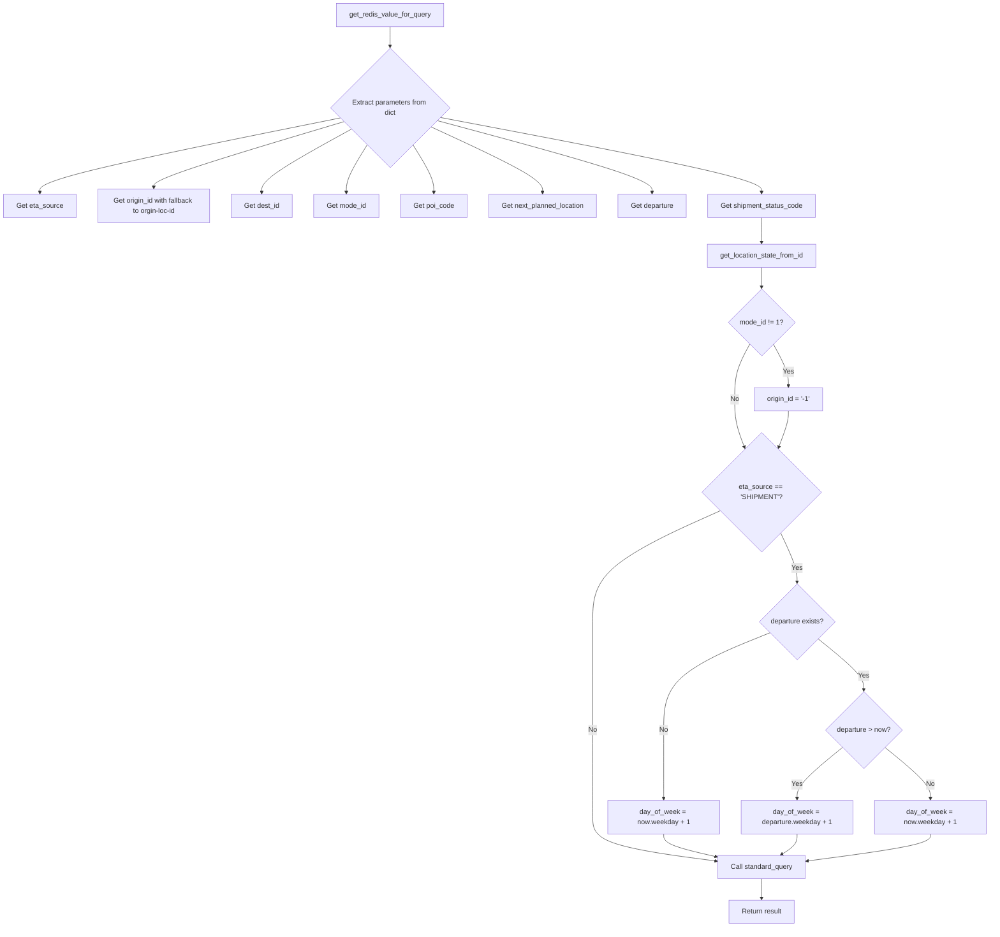
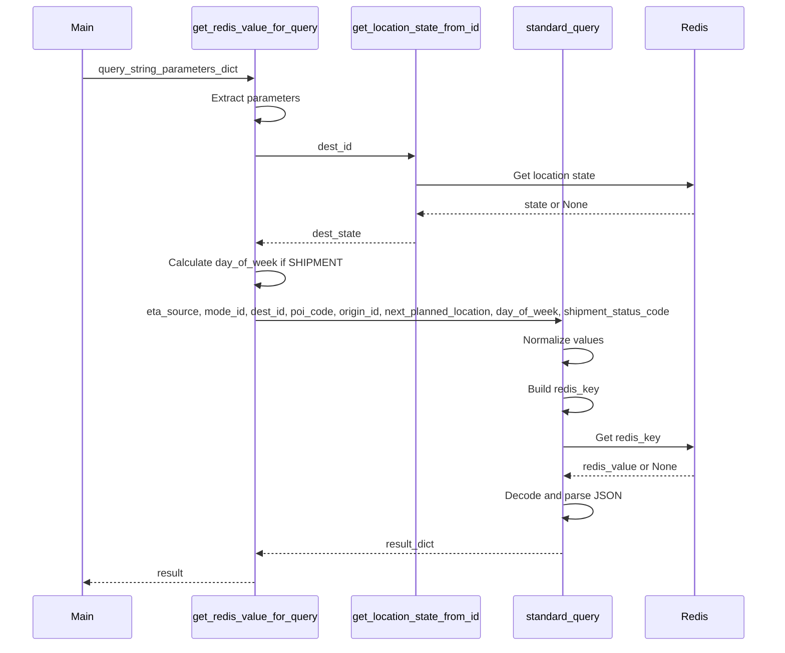
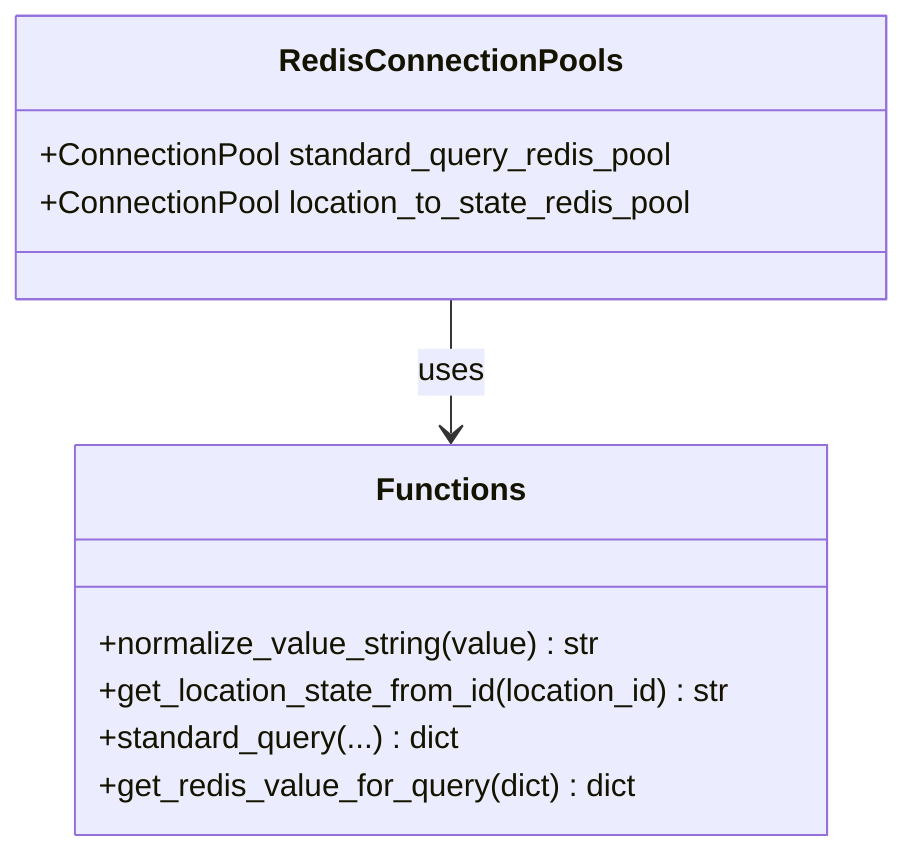

# Diagram: research/api/scripts/get_redis_for_query.py


> Auto-generated by Obscura crawlers

## Diagram 1



### SVG

<svg id="container" width="2309.8203125" xmlns="http://www.w3.org/2000/svg" class="flowchart" height="2122.09375" viewBox="0 0 2309.8203125 2122.09375" role="graphics-document document" aria-roledescription="flowchart-v2"><style>#container{font-family:"trebuchet ms",verdana,arial,sans-serif;font-size:16px;fill:#333;}@keyframes edge-animation-frame{from{stroke-dashoffset:0;}}@keyframes dash{to{stroke-dashoffset:0;}}#container .edge-animation-slow{stroke-dasharray:9,5!important;stroke-dashoffset:900;animation:dash 50s linear infinite;stroke-linecap:round;}#container .edge-animation-fast{stroke-dasharray:9,5!important;stroke-dashoffset:900;animation:dash 20s linear infinite;stroke-linecap:round;}#container .error-icon{fill:#552222;}#container .error-text{fill:#552222;stroke:#552222;}#container .edge-thickness-normal{stroke-width:1px;}#container .edge-thickness-thick{stroke-width:3.5px;}#container .edge-pattern-solid{stroke-dasharray:0;}#container .edge-thickness-invisible{stroke-width:0;fill:none;}#container .edge-pattern-dashed{stroke-dasharray:3;}#container .edge-pattern-dotted{stroke-dasharray:2;}#container .marker{fill:#333333;stroke:#333333;}#container .marker.cross{stroke:#333333;}#container svg{font-family:"trebuchet ms",verdana,arial,sans-serif;font-size:16px;}#container p{margin:0;}#container .label{font-family:"trebuchet ms",verdana,arial,sans-serif;color:#333;}#container .cluster-label text{fill:#333;}#container .cluster-label span{color:#333;}#container .cluster-label span p{background-color:transparent;}#container .label text,#container span{fill:#333;color:#333;}#container .node rect,#container .node circle,#container .node ellipse,#container .node polygon,#container .node path{fill:#ECECFF;stroke:#9370DB;stroke-width:1px;}#container .rough-node .label text,#container .node .label text,#container .image-shape .label,#container .icon-shape .label{text-anchor:middle;}#container .node .katex path{fill:#000;stroke:#000;stroke-width:1px;}#container .rough-node .label,#container .node .label,#container .image-shape .label,#container .icon-shape .label{text-align:center;}#container .node.clickable{cursor:pointer;}#container .root .anchor path{fill:#333333!important;stroke-width:0;stroke:#333333;}#container .arrowheadPath{fill:#333333;}#container .edgePath .path{stroke:#333333;stroke-width:2.0px;}#container .flowchart-link{stroke:#333333;fill:none;}#container .edgeLabel{background-color:rgba(232,232,232, 0.8);text-align:center;}#container .edgeLabel p{background-color:rgba(232,232,232, 0.8);}#container .edgeLabel rect{opacity:0.5;background-color:rgba(232,232,232, 0.8);fill:rgba(232,232,232, 0.8);}#container .labelBkg{background-color:rgba(232, 232, 232, 0.5);}#container .cluster rect{fill:#ffffde;stroke:#aaaa33;stroke-width:1px;}#container .cluster text{fill:#333;}#container .cluster span{color:#333;}#container div.mermaidTooltip{position:absolute;text-align:center;max-width:200px;padding:2px;font-family:"trebuchet ms",verdana,arial,sans-serif;font-size:12px;background:hsl(80, 100%, 96.2745098039%);border:1px solid #aaaa33;border-radius:2px;pointer-events:none;z-index:100;}#container .flowchartTitleText{text-anchor:middle;font-size:18px;fill:#333;}#container rect.text{fill:none;stroke-width:0;}#container .icon-shape,#container .image-shape{background-color:rgba(232,232,232, 0.8);text-align:center;}#container .icon-shape p,#container .image-shape p{background-color:rgba(232,232,232, 0.8);padding:2px;}#container .icon-shape rect,#container .image-shape rect{opacity:0.5;background-color:rgba(232,232,232, 0.8);fill:rgba(232,232,232, 0.8);}#container .label-icon{display:inline-block;height:1em;overflow:visible;vertical-align:-0.125em;}#container .node .label-icon path{fill:currentColor;stroke:revert;stroke-width:revert;}#container :root{--mermaid-font-family:"trebuchet ms",verdana,arial,sans-serif;}</style><g><marker id="container_flowchart-v2-pointEnd" class="marker flowchart-v2" viewBox="0 0 10 10" refX="5" refY="5" markerUnits="userSpaceOnUse" markerWidth="8" markerHeight="8" orient="auto"><path d="M 0 0 L 10 5 L 0 10 z" class="arrowMarkerPath" style="stroke-width: 1; stroke-dasharray: 1, 0;"></path></marker><marker id="container_flowchart-v2-pointStart" class="marker flowchart-v2" viewBox="0 0 10 10" refX="4.5" refY="5" markerUnits="userSpaceOnUse" markerWidth="8" markerHeight="8" orient="auto"><path d="M 0 5 L 10 10 L 10 0 z" class="arrowMarkerPath" style="stroke-width: 1; stroke-dasharray: 1, 0;"></path></marker><marker id="container_flowchart-v2-circleEnd" class="marker flowchart-v2" viewBox="0 0 10 10" refX="11" refY="5" markerUnits="userSpaceOnUse" markerWidth="11" markerHeight="11" orient="auto"><circle cx="5" cy="5" r="5" class="arrowMarkerPath" style="stroke-width: 1; stroke-dasharray: 1, 0;"></circle></marker><marker id="container_flowchart-v2-circleStart" class="marker flowchart-v2" viewBox="0 0 10 10" refX="-1" refY="5" markerUnits="userSpaceOnUse" markerWidth="11" markerHeight="11" orient="auto"><circle cx="5" cy="5" r="5" class="arrowMarkerPath" style="stroke-width: 1; stroke-dasharray: 1, 0;"></circle></marker><marker id="container_flowchart-v2-crossEnd" class="marker cross flowchart-v2" viewBox="0 0 11 11" refX="12" refY="5.2" markerUnits="userSpaceOnUse" markerWidth="11" markerHeight="11" orient="auto"><path d="M 1,1 l 9,9 M 10,1 l -9,9" class="arrowMarkerPath" style="stroke-width: 2; stroke-dasharray: 1, 0;"></path></marker><marker id="container_flowchart-v2-crossStart" class="marker cross flowchart-v2" viewBox="0 0 11 11" refX="-1" refY="5.2" markerUnits="userSpaceOnUse" markerWidth="11" markerHeight="11" orient="auto"><path d="M 1,1 l 9,9 M 10,1 l -9,9" class="arrowMarkerPath" style="stroke-width: 2; stroke-dasharray: 1, 0;"></path></marker><g class="root"><g class="clusters"></g><g class="edgePaths"><path d="M906.895,62L906.895,66.167C906.895,70.333,906.895,78.667,906.895,86.333C906.895,94,906.895,101,906.895,104.5L906.895,108" id="L_A_B_0" class="edge-thickness-normal edge-pattern-solid edge-thickness-normal edge-pattern-solid flowchart-link" style=";" data-edge="true" data-et="edge" data-id="L_A_B_0" data-points="W3sieCI6OTA2Ljg5NDUzMTI1LCJ5Ijo2Mn0seyJ4Ijo5MDYuODk0NTMxMjUsInkiOjg3fSx7IngiOjkwNi44OTQ1MzEyNSwieSI6MTEyfV0=" marker-end="url(#container_flowchart-v2-pointEnd)"></path><path d="M791.184,274.289L674.663,297.741C558.143,321.193,325.103,368.096,208.583,397.048C92.063,426,92.063,437,92.063,442.5L92.063,448" id="L_B_C_0" class="edge-thickness-normal edge-pattern-solid edge-thickness-normal edge-pattern-solid flowchart-link" style=";" data-edge="true" data-et="edge" data-id="L_B_C_0" data-points="W3sieCI6NzkxLjE4MzUxMTY1OTUyODIsInkiOjI3NC4yODg5ODA0MDk1MjgzfSx7IngiOjkyLjA2MjUsInkiOjQxNX0seyJ4Ijo5Mi4wNjI1LCJ5Ijo0NTJ9XQ==" marker-end="url(#container_flowchart-v2-pointEnd)"></path><path d="M799.787,282.893L725.844,304.911C651.9,326.929,504.012,370.964,430.069,396.482C356.125,422,356.125,429,356.125,432.5L356.125,436" id="L_B_D_0" class="edge-thickness-normal edge-pattern-solid edge-thickness-normal edge-pattern-solid flowchart-link" style=";" data-edge="true" data-et="edge" data-id="L_B_D_0" data-points="W3sieCI6Nzk5Ljc4NzMyODg2Mjg2NywieSI6MjgyLjg5Mjc5NzYxMjg2Njl9LHsieCI6MzU2LjEyNSwieSI6NDE1fSx7IngiOjM1Ni4xMjUsInkiOjQ0MH1d" marker-end="url(#container_flowchart-v2-pointEnd)"></path><path d="M817.09,300.195L782.161,319.329C747.232,338.463,677.374,376.732,642.445,401.366C607.516,426,607.516,437,607.516,442.5L607.516,448" id="L_B_E_0" class="edge-thickness-normal edge-pattern-solid edge-thickness-normal edge-pattern-solid flowchart-link" style=";" data-edge="true" data-et="edge" data-id="L_B_E_0" data-points="W3sieCI6ODE3LjA4OTY5MjQ3MjMzOTMsInkiOjMwMC4xOTUxNjEyMjIzMzkzfSx7IngiOjYwNy41MTU2MjUsInkiOjQxNX0seyJ4Ijo2MDcuNTE1NjI1LCJ5Ijo0NTJ9XQ==" marker-end="url(#container_flowchart-v2-pointEnd)"></path><path d="M853.64,336.746L845.54,349.788C837.44,362.831,821.239,388.915,813.139,407.458C805.039,426,805.039,437,805.039,442.5L805.039,448" id="L_B_F_0" class="edge-thickness-normal edge-pattern-solid edge-thickness-normal edge-pattern-solid flowchart-link" style=";" data-edge="true" data-et="edge" data-id="L_B_F_0" data-points="W3sieCI6ODUzLjY0MDM2OTQxOTgyMzMsInkiOjMzNi43NDU4MzgxNjk4MjMyM30seyJ4Ijo4MDUuMDM5MDYyNSwieSI6NDE1fSx7IngiOjgwNS4wMzkwNjI1LCJ5Ijo0NTJ9XQ==" marker-end="url(#container_flowchart-v2-pointEnd)"></path><path d="M960.149,336.746L968.249,349.788C976.349,362.831,992.55,388.915,1000.65,407.458C1008.75,426,1008.75,437,1008.75,442.5L1008.75,448" id="L_B_G_0" class="edge-thickness-normal edge-pattern-solid edge-thickness-normal edge-pattern-solid flowchart-link" style=";" data-edge="true" data-et="edge" data-id="L_B_G_0" data-points="W3sieCI6OTYwLjE0ODY5MzA4MDE3NjcsInkiOjMzNi43NDU4MzgxNjk4MjMyM30seyJ4IjoxMDA4Ljc1LCJ5Ijo0MTV9LHsieCI6MTAwOC43NSwieSI6NDUyfV0=" marker-end="url(#container_flowchart-v2-pointEnd)"></path><path d="M1002.169,294.726L1045.846,314.771C1089.524,334.817,1176.879,374.909,1220.557,400.454C1264.234,426,1264.234,437,1264.234,442.5L1264.234,448" id="L_B_H_0" class="edge-thickness-normal edge-pattern-solid edge-thickness-normal edge-pattern-solid flowchart-link" style=";" data-edge="true" data-et="edge" data-id="L_B_H_0" data-points="W3sieCI6MTAwMi4xNjg3MzQ1ODcyNTQ2LCJ5IjoyOTQuNzI1Nzk2NjYyNzQ1NX0seyJ4IjoxMjY0LjIzNDM3NSwieSI6NDE1fSx7IngiOjEyNjQuMjM0Mzc1LCJ5Ijo0NTJ9XQ==" marker-end="url(#container_flowchart-v2-pointEnd)"></path><path d="M1016.657,280.238L1100.976,302.698C1185.295,325.159,1353.932,370.079,1438.251,398.04C1522.57,426,1522.57,437,1522.57,442.5L1522.57,448" id="L_B_I_0" class="edge-thickness-normal edge-pattern-solid edge-thickness-normal edge-pattern-solid flowchart-link" style=";" data-edge="true" data-et="edge" data-id="L_B_I_0" data-points="W3sieCI6MTAxNi42NTY3MzcwOTQ3NzcyLCJ5IjoyODAuMjM3Nzk0MTU1MjIyOH0seyJ4IjoxNTIyLjU3MDMxMjUsInkiOjQxNX0seyJ4IjoxNTIyLjU3MDMxMjUsInkiOjQ1Mn1d" marker-end="url(#container_flowchart-v2-pointEnd)"></path><path d="M1023.9,272.995L1149.803,296.662C1275.707,320.33,1527.513,367.665,1653.417,396.832C1779.32,426,1779.32,437,1779.32,442.5L1779.32,448" id="L_B_J_0" class="edge-thickness-normal edge-pattern-solid edge-thickness-normal edge-pattern-solid flowchart-link" style=";" data-edge="true" data-et="edge" data-id="L_B_J_0" data-points="W3sieCI6MTAyMy44OTk3MDk4MDQ2MDI5LCJ5IjoyNzIuOTk0ODIxNDQ1Mzk3Mn0seyJ4IjoxNzc5LjMyMDMxMjUsInkiOjQxNX0seyJ4IjoxNzc5LjMyMDMxMjUsInkiOjQ1Mn1d" marker-end="url(#container_flowchart-v2-pointEnd)"></path><path d="M1779.32,506L1779.32,512.167C1779.32,518.333,1779.32,530.667,1779.32,540.333C1779.32,550,1779.32,557,1779.32,560.5L1779.32,564" id="L_J_K_0" class="edge-thickness-normal edge-pattern-solid edge-thickness-normal edge-pattern-solid flowchart-link" style=";" data-edge="true" data-et="edge" data-id="L_J_K_0" data-points="W3sieCI6MTc3OS4zMjAzMTI1LCJ5Ijo1MDZ9LHsieCI6MTc3OS4zMjAzMTI1LCJ5Ijo1NDN9LHsieCI6MTc3OS4zMjAzMTI1LCJ5Ijo1Njh9XQ==" marker-end="url(#container_flowchart-v2-pointEnd)"></path><path d="M1779.32,622L1779.32,626.167C1779.32,630.333,1779.32,638.667,1779.32,646.333C1779.32,654,1779.32,661,1779.32,664.5L1779.32,668" id="L_K_L_0" class="edge-thickness-normal edge-pattern-solid edge-thickness-normal edge-pattern-solid flowchart-link" style=";" data-edge="true" data-et="edge" data-id="L_K_L_0" data-points="W3sieCI6MTc3OS4zMjAzMTI1LCJ5Ijo2MjJ9LHsieCI6MTc3OS4zMjAzMTI1LCJ5Ijo2NDd9LHsieCI6MTc3OS4zMjAzMTI1LCJ5Ijo2NzJ9XQ==" marker-end="url(#container_flowchart-v2-pointEnd)"></path><path d="M1806.437,796.93L1812.363,807.616C1818.288,818.302,1830.138,839.675,1836.063,855.861C1841.988,872.047,1841.988,883.047,1841.988,888.547L1841.988,894.047" id="L_L_M_0" class="edge-thickness-normal edge-pattern-solid edge-thickness-normal edge-pattern-solid flowchart-link" style=";" data-edge="true" data-et="edge" data-id="L_L_M_0" data-points="W3sieCI6MTgwNi40MzczNzI1MDQyOCwieSI6Nzk2LjkyOTgxNDk5NTcyfSx7IngiOjE4NDEuOTg4MjgxMjUsInkiOjg2MS4wNDY4NzV9LHsieCI6MTg0MS45ODgyODEyNSwieSI6ODk4LjA0Njg3NX1d" marker-end="url(#container_flowchart-v2-pointEnd)"></path><path d="M1752.203,796.93L1746.278,807.616C1740.353,818.302,1728.503,839.675,1722.577,861.027C1716.652,882.38,1716.652,903.714,1716.652,923.047C1716.652,942.38,1716.652,959.714,1720.742,978.027C1724.833,996.341,1733.013,1015.636,1737.103,1025.283L1741.193,1034.93" id="L_L_N_0" class="edge-thickness-normal edge-pattern-solid edge-thickness-normal edge-pattern-solid flowchart-link" style=";" data-edge="true" data-et="edge" data-id="L_L_N_0" data-points="W3sieCI6MTc1Mi4yMDMyNTI0OTU3MiwieSI6Nzk2LjkyOTgxNDk5NTcyfSx7IngiOjE3MTYuNjUyMzQzNzUsInkiOjg2MS4wNDY4NzV9LHsieCI6MTcxNi42NTIzNDM3NSwieSI6OTI1LjA0Njg3NX0seyJ4IjoxNzE2LjY1MjM0Mzc1LCJ5Ijo5NzcuMDQ2ODc1fSx7IngiOjE3NDIuNzU0NDAyMzMzNTI4LCJ5IjoxMDM4LjYxMjc4NTE2NjQ3Mn1d" marker-end="url(#container_flowchart-v2-pointEnd)"></path><path d="M1841.988,952.047L1841.988,956.214C1841.988,960.38,1841.988,968.714,1837.898,982.527C1833.808,996.341,1825.628,1015.636,1821.538,1025.283L1817.448,1034.93" id="L_M_N_0" class="edge-thickness-normal edge-pattern-solid edge-thickness-normal edge-pattern-solid flowchart-link" style=";" data-edge="true" data-et="edge" data-id="L_M_N_0" data-points="W3sieCI6MTg0MS45ODgyODEyNSwieSI6OTUyLjA0Njg3NX0seyJ4IjoxODQxLjk4ODI4MTI1LCJ5Ijo5NzcuMDQ2ODc1fSx7IngiOjE4MTUuODg2MjIyNjY2NDcyLCJ5IjoxMDM4LjYxMjc4NTE2NjQ3Mn1d" marker-end="url(#container_flowchart-v2-pointEnd)"></path><path d="M1821.134,1205.858L1827.915,1218.994C1834.696,1232.129,1848.258,1258.401,1855.039,1277.036C1861.82,1295.672,1861.82,1306.672,1861.82,1312.172L1861.82,1317.672" id="L_N_O_0" class="edge-thickness-normal edge-pattern-solid edge-thickness-normal edge-pattern-solid flowchart-link" style=";" data-edge="true" data-et="edge" data-id="L_N_O_0" data-points="W3sieCI6MTgyMS4xMzQyMTUwMDE5MzQ1LCJ5IjoxMjA1Ljg1Nzk3MjQ5ODA2NTV9LHsieCI6MTg2MS44MjAzMTI1LCJ5IjoxMjg0LjY3MTg3NX0seyJ4IjoxODYxLjgyMDMxMjUsInkiOjEzMjEuNjcxODc1fV0=" marker-end="url(#container_flowchart-v2-pointEnd)"></path><path d="M1692.044,1160.395L1641.173,1181.108C1590.303,1201.821,1488.561,1243.246,1437.691,1285.018C1386.82,1326.789,1386.82,1368.906,1386.82,1411.023C1386.82,1453.141,1386.82,1495.258,1386.82,1537.46C1386.82,1579.661,1386.82,1621.948,1386.82,1664.234C1386.82,1706.521,1386.82,1748.807,1386.82,1782.617C1386.82,1816.427,1386.82,1841.76,1386.82,1865.094C1386.82,1888.427,1386.82,1909.76,1434.462,1926.739C1482.103,1943.717,1577.385,1956.341,1625.026,1962.652L1672.667,1968.964" id="L_N_P_0" class="edge-thickness-normal edge-pattern-solid edge-thickness-normal edge-pattern-solid flowchart-link" style=";" data-edge="true" data-et="edge" data-id="L_N_P_0" data-points="W3sieCI6MTY5Mi4wNDM4MDQ2MzUzNCwieSI6MTE2MC4zOTUzNjcxMzUzNH0seyJ4IjoxMzg2LjgyMDMxMjUsInkiOjEyODQuNjcxODc1fSx7IngiOjEzODYuODIwMzEyNSwieSI6MTQxMS4wMjM0Mzc1fSx7IngiOjEzODYuODIwMzEyNSwieSI6MTUzNy4zNzV9LHsieCI6MTM4Ni44MjAzMTI1LCJ5IjoxNjY0LjIzNDM3NX0seyJ4IjoxMzg2LjgyMDMxMjUsInkiOjE3OTEuMDkzNzV9LHsieCI6MTM4Ni44MjAzMTI1LCJ5IjoxODY3LjA5Mzc1fSx7IngiOjEzODYuODIwMzEyNSwieSI6MTkzMS4wOTM3NX0seyJ4IjoxNjc2LjYzMjgxMjUsInkiOjE5NjkuNDg5MjkxNDAxMjc0fV0=" marker-end="url(#container_flowchart-v2-pointEnd)"></path><path d="M1798.342,1436.896L1757.255,1453.643C1716.168,1470.389,1633.994,1503.882,1592.907,1541.772C1551.82,1579.661,1551.82,1621.948,1551.82,1664.234C1551.82,1706.521,1551.82,1748.807,1551.82,1775.451C1551.82,1802.094,1551.82,1813.094,1551.82,1818.594L1551.82,1824.094" id="L_O_Q_0" class="edge-thickness-normal edge-pattern-solid edge-thickness-normal edge-pattern-solid flowchart-link" style=";" data-edge="true" data-et="edge" data-id="L_O_Q_0" data-points="W3sieCI6MTc5OC4zNDE3MTY5MDA4Mzc4LCJ5IjoxNDM2Ljg5NjQwNDQwMDgzNzh9LHsieCI6MTU1MS44MjAzMTI1LCJ5IjoxNTM3LjM3NX0seyJ4IjoxNTUxLjgyMDMxMjUsInkiOjE2NjQuMjM0Mzc1fSx7IngiOjE1NTEuODIwMzEyNSwieSI6MTc5MS4wOTM3NX0seyJ4IjoxNTUxLjgyMDMxMjUsInkiOjE4MjguMDkzNzV9XQ==" marker-end="url(#container_flowchart-v2-pointEnd)"></path><path d="M1911.045,1451.15L1928.674,1465.521C1946.304,1479.892,1981.562,1508.633,1999.191,1528.504C2016.82,1548.375,2016.82,1559.375,2016.82,1564.875L2016.82,1570.375" id="L_O_R_0" class="edge-thickness-normal edge-pattern-solid edge-thickness-normal edge-pattern-solid flowchart-link" style=";" data-edge="true" data-et="edge" data-id="L_O_R_0" data-points="W3sieCI6MTkxMS4wNDUxNzU3NDM4Mjg2LCJ5IjoxNDUxLjE1MDEzNjc1NjE3MTR9LHsieCI6MjAxNi44MjAzMTI1LCJ5IjoxNTM3LjM3NX0seyJ4IjoyMDE2LjgyMDMxMjUsInkiOjE1NzQuMzc1fV0=" marker-end="url(#container_flowchart-v2-pointEnd)"></path><path d="M1967.405,1704.678L1949.807,1719.081C1932.21,1733.483,1897.015,1762.289,1879.418,1782.191C1861.82,1802.094,1861.82,1813.094,1861.82,1818.594L1861.82,1824.094" id="L_R_S_0" class="edge-thickness-normal edge-pattern-solid edge-thickness-normal edge-pattern-solid flowchart-link" style=";" data-edge="true" data-et="edge" data-id="L_R_S_0" data-points="W3sieCI6MTk2Ny40MDQ4NzkyNzE5OTQsInkiOjE3MDQuNjc4MzE2NzcxOTk0fSx7IngiOjE4NjEuODIwMzEyNSwieSI6MTc5MS4wOTM3NX0seyJ4IjoxODYxLjgyMDMxMjUsInkiOjE4MjguMDkzNzV9XQ==" marker-end="url(#container_flowchart-v2-pointEnd)"></path><path d="M2066.236,1704.678L2083.833,1719.081C2101.431,1733.483,2136.625,1762.289,2154.223,1782.191C2171.82,1802.094,2171.82,1813.094,2171.82,1818.594L2171.82,1824.094" id="L_R_T_0" class="edge-thickness-normal edge-pattern-solid edge-thickness-normal edge-pattern-solid flowchart-link" style=";" data-edge="true" data-et="edge" data-id="L_R_T_0" data-points="W3sieCI6MjA2Ni4yMzU3NDU3MjgwMDYsInkiOjE3MDQuNjc4MzE2NzcxOTk0fSx7IngiOjIxNzEuODIwMzEyNSwieSI6MTc5MS4wOTM3NX0seyJ4IjoyMTcxLjgyMDMxMjUsInkiOjE4MjguMDkzNzV9XQ==" marker-end="url(#container_flowchart-v2-pointEnd)"></path><path d="M1551.82,1906.094L1551.82,1910.26C1551.82,1914.427,1551.82,1922.76,1571.972,1931.533C1592.125,1940.306,1632.429,1949.519,1652.581,1954.125L1672.733,1958.731" id="L_Q_P_0" class="edge-thickness-normal edge-pattern-solid edge-thickness-normal edge-pattern-solid flowchart-link" style=";" data-edge="true" data-et="edge" data-id="L_Q_P_0" data-points="W3sieCI6MTU1MS44MjAzMTI1LCJ5IjoxOTA2LjA5Mzc1fSx7IngiOjE1NTEuODIwMzEyNSwieSI6MTkzMS4wOTM3NX0seyJ4IjoxNjc2LjYzMjgxMjUsInkiOjE5NTkuNjIyMzIxNDI4NTcxNX1d" marker-end="url(#container_flowchart-v2-pointEnd)"></path><path d="M1861.82,1906.094L1861.82,1910.26C1861.82,1914.427,1861.82,1922.76,1855.774,1930.738C1849.727,1938.716,1837.634,1946.338,1831.587,1950.15L1825.541,1953.961" id="L_S_P_0" class="edge-thickness-normal edge-pattern-solid edge-thickness-normal edge-pattern-solid flowchart-link" style=";" data-edge="true" data-et="edge" data-id="L_S_P_0" data-points="W3sieCI6MTg2MS44MjAzMTI1LCJ5IjoxOTA2LjA5Mzc1fSx7IngiOjE4NjEuODIwMzEyNSwieSI6MTkzMS4wOTM3NX0seyJ4IjoxODIyLjE1Njg1MDk2MTUzODYsInkiOjE5NTYuMDkzNzV9XQ==" marker-end="url(#container_flowchart-v2-pointEnd)"></path><path d="M2171.82,1906.094L2171.82,1910.26C2171.82,1914.427,2171.82,1922.76,2124.179,1933.239C2076.538,1943.717,1981.256,1956.341,1933.614,1962.652L1885.973,1968.964" id="L_T_P_0" class="edge-thickness-normal edge-pattern-solid edge-thickness-normal edge-pattern-solid flowchart-link" style=";" data-edge="true" data-et="edge" data-id="L_T_P_0" data-points="W3sieCI6MjE3MS44MjAzMTI1LCJ5IjoxOTA2LjA5Mzc1fSx7IngiOjIxNzEuODIwMzEyNSwieSI6MTkzMS4wOTM3NX0seyJ4IjoxODgyLjAwNzgxMjUsInkiOjE5NjkuNDg5MjkxNDAxMjc0fV0=" marker-end="url(#container_flowchart-v2-pointEnd)"></path><path d="M1779.32,2010.094L1779.32,2014.26C1779.32,2018.427,1779.32,2026.76,1779.32,2034.427C1779.32,2042.094,1779.32,2049.094,1779.32,2052.594L1779.32,2056.094" id="L_P_U_0" class="edge-thickness-normal edge-pattern-solid edge-thickness-normal edge-pattern-solid flowchart-link" style=";" data-edge="true" data-et="edge" data-id="L_P_U_0" data-points="W3sieCI6MTc3OS4zMjAzMTI1LCJ5IjoyMDEwLjA5Mzc1fSx7IngiOjE3NzkuMzIwMzEyNSwieSI6MjAzNS4wOTM3NX0seyJ4IjoxNzc5LjMyMDMxMjUsInkiOjIwNjAuMDkzNzV9XQ==" marker-end="url(#container_flowchart-v2-pointEnd)"></path></g><g class="edgeLabels"><g class="edgeLabel"><g class="label" data-id="L_A_B_0" transform="translate(0, 0)"><foreignObject width="0" height="0"><div xmlns="http://www.w3.org/1999/xhtml" class="labelBkg" style="display: table-cell; white-space: nowrap; line-height: 1.5; max-width: 200px; text-align: center;"><span class="edgeLabel"></span></div></foreignObject></g></g><g class="edgeLabel"><g class="label" data-id="L_B_C_0" transform="translate(0, 0)"><foreignObject width="0" height="0"><div xmlns="http://www.w3.org/1999/xhtml" class="labelBkg" style="display: table-cell; white-space: nowrap; line-height: 1.5; max-width: 200px; text-align: center;"><span class="edgeLabel"></span></div></foreignObject></g></g><g class="edgeLabel"><g class="label" data-id="L_B_D_0" transform="translate(0, 0)"><foreignObject width="0" height="0"><div xmlns="http://www.w3.org/1999/xhtml" class="labelBkg" style="display: table-cell; white-space: nowrap; line-height: 1.5; max-width: 200px; text-align: center;"><span class="edgeLabel"></span></div></foreignObject></g></g><g class="edgeLabel"><g class="label" data-id="L_B_E_0" transform="translate(0, 0)"><foreignObject width="0" height="0"><div xmlns="http://www.w3.org/1999/xhtml" class="labelBkg" style="display: table-cell; white-space: nowrap; line-height: 1.5; max-width: 200px; text-align: center;"><span class="edgeLabel"></span></div></foreignObject></g></g><g class="edgeLabel"><g class="label" data-id="L_B_F_0" transform="translate(0, 0)"><foreignObject width="0" height="0"><div xmlns="http://www.w3.org/1999/xhtml" class="labelBkg" style="display: table-cell; white-space: nowrap; line-height: 1.5; max-width: 200px; text-align: center;"><span class="edgeLabel"></span></div></foreignObject></g></g><g class="edgeLabel"><g class="label" data-id="L_B_G_0" transform="translate(0, 0)"><foreignObject width="0" height="0"><div xmlns="http://www.w3.org/1999/xhtml" class="labelBkg" style="display: table-cell; white-space: nowrap; line-height: 1.5; max-width: 200px; text-align: center;"><span class="edgeLabel"></span></div></foreignObject></g></g><g class="edgeLabel"><g class="label" data-id="L_B_H_0" transform="translate(0, 0)"><foreignObject width="0" height="0"><div xmlns="http://www.w3.org/1999/xhtml" class="labelBkg" style="display: table-cell; white-space: nowrap; line-height: 1.5; max-width: 200px; text-align: center;"><span class="edgeLabel"></span></div></foreignObject></g></g><g class="edgeLabel"><g class="label" data-id="L_B_I_0" transform="translate(0, 0)"><foreignObject width="0" height="0"><div xmlns="http://www.w3.org/1999/xhtml" class="labelBkg" style="display: table-cell; white-space: nowrap; line-height: 1.5; max-width: 200px; text-align: center;"><span class="edgeLabel"></span></div></foreignObject></g></g><g class="edgeLabel"><g class="label" data-id="L_B_J_0" transform="translate(0, 0)"><foreignObject width="0" height="0"><div xmlns="http://www.w3.org/1999/xhtml" class="labelBkg" style="display: table-cell; white-space: nowrap; line-height: 1.5; max-width: 200px; text-align: center;"><span class="edgeLabel"></span></div></foreignObject></g></g><g class="edgeLabel"><g class="label" data-id="L_J_K_0" transform="translate(0, 0)"><foreignObject width="0" height="0"><div xmlns="http://www.w3.org/1999/xhtml" class="labelBkg" style="display: table-cell; white-space: nowrap; line-height: 1.5; max-width: 200px; text-align: center;"><span class="edgeLabel"></span></div></foreignObject></g></g><g class="edgeLabel"><g class="label" data-id="L_K_L_0" transform="translate(0, 0)"><foreignObject width="0" height="0"><div xmlns="http://www.w3.org/1999/xhtml" class="labelBkg" style="display: table-cell; white-space: nowrap; line-height: 1.5; max-width: 200px; text-align: center;"><span class="edgeLabel"></span></div></foreignObject></g></g><g class="edgeLabel" transform="translate(1841.98828125, 861.046875)"><g class="label" data-id="L_L_M_0" transform="translate(-12.03125, -12)"><foreignObject width="24.0625" height="24"><div xmlns="http://www.w3.org/1999/xhtml" class="labelBkg" style="display: table-cell; white-space: nowrap; line-height: 1.5; max-width: 200px; text-align: center;"><span class="edgeLabel"><p>Yes</p></span></div></foreignObject></g></g><g class="edgeLabel" transform="translate(1716.65234375, 925.046875)"><g class="label" data-id="L_L_N_0" transform="translate(-10.140625, -12)"><foreignObject width="20.28125" height="24"><div xmlns="http://www.w3.org/1999/xhtml" class="labelBkg" style="display: table-cell; white-space: nowrap; line-height: 1.5; max-width: 200px; text-align: center;"><span class="edgeLabel"><p>No</p></span></div></foreignObject></g></g><g class="edgeLabel"><g class="label" data-id="L_M_N_0" transform="translate(0, 0)"><foreignObject width="0" height="0"><div xmlns="http://www.w3.org/1999/xhtml" class="labelBkg" style="display: table-cell; white-space: nowrap; line-height: 1.5; max-width: 200px; text-align: center;"><span class="edgeLabel"></span></div></foreignObject></g></g><g class="edgeLabel" transform="translate(1861.8203125, 1284.671875)"><g class="label" data-id="L_N_O_0" transform="translate(-12.03125, -12)"><foreignObject width="24.0625" height="24"><div xmlns="http://www.w3.org/1999/xhtml" class="labelBkg" style="display: table-cell; white-space: nowrap; line-height: 1.5; max-width: 200px; text-align: center;"><span class="edgeLabel"><p>Yes</p></span></div></foreignObject></g></g><g class="edgeLabel" transform="translate(1386.8203125, 1664.234375)"><g class="label" data-id="L_N_P_0" transform="translate(-10.140625, -12)"><foreignObject width="20.28125" height="24"><div xmlns="http://www.w3.org/1999/xhtml" class="labelBkg" style="display: table-cell; white-space: nowrap; line-height: 1.5; max-width: 200px; text-align: center;"><span class="edgeLabel"><p>No</p></span></div></foreignObject></g></g><g class="edgeLabel" transform="translate(1551.8203125, 1664.234375)"><g class="label" data-id="L_O_Q_0" transform="translate(-10.140625, -12)"><foreignObject width="20.28125" height="24"><div xmlns="http://www.w3.org/1999/xhtml" class="labelBkg" style="display: table-cell; white-space: nowrap; line-height: 1.5; max-width: 200px; text-align: center;"><span class="edgeLabel"><p>No</p></span></div></foreignObject></g></g><g class="edgeLabel" transform="translate(2016.8203125, 1537.375)"><g class="label" data-id="L_O_R_0" transform="translate(-12.03125, -12)"><foreignObject width="24.0625" height="24"><div xmlns="http://www.w3.org/1999/xhtml" class="labelBkg" style="display: table-cell; white-space: nowrap; line-height: 1.5; max-width: 200px; text-align: center;"><span class="edgeLabel"><p>Yes</p></span></div></foreignObject></g></g><g class="edgeLabel" transform="translate(1861.8203125, 1791.09375)"><g class="label" data-id="L_R_S_0" transform="translate(-12.03125, -12)"><foreignObject width="24.0625" height="24"><div xmlns="http://www.w3.org/1999/xhtml" class="labelBkg" style="display: table-cell; white-space: nowrap; line-height: 1.5; max-width: 200px; text-align: center;"><span class="edgeLabel"><p>Yes</p></span></div></foreignObject></g></g><g class="edgeLabel" transform="translate(2171.8203125, 1791.09375)"><g class="label" data-id="L_R_T_0" transform="translate(-10.140625, -12)"><foreignObject width="20.28125" height="24"><div xmlns="http://www.w3.org/1999/xhtml" class="labelBkg" style="display: table-cell; white-space: nowrap; line-height: 1.5; max-width: 200px; text-align: center;"><span class="edgeLabel"><p>No</p></span></div></foreignObject></g></g><g class="edgeLabel"><g class="label" data-id="L_Q_P_0" transform="translate(0, 0)"><foreignObject width="0" height="0"><div xmlns="http://www.w3.org/1999/xhtml" class="labelBkg" style="display: table-cell; white-space: nowrap; line-height: 1.5; max-width: 200px; text-align: center;"><span class="edgeLabel"></span></div></foreignObject></g></g><g class="edgeLabel"><g class="label" data-id="L_S_P_0" transform="translate(0, 0)"><foreignObject width="0" height="0"><div xmlns="http://www.w3.org/1999/xhtml" class="labelBkg" style="display: table-cell; white-space: nowrap; line-height: 1.5; max-width: 200px; text-align: center;"><span class="edgeLabel"></span></div></foreignObject></g></g><g class="edgeLabel"><g class="label" data-id="L_T_P_0" transform="translate(0, 0)"><foreignObject width="0" height="0"><div xmlns="http://www.w3.org/1999/xhtml" class="labelBkg" style="display: table-cell; white-space: nowrap; line-height: 1.5; max-width: 200px; text-align: center;"><span class="edgeLabel"></span></div></foreignObject></g></g><g class="edgeLabel"><g class="label" data-id="L_P_U_0" transform="translate(0, 0)"><foreignObject width="0" height="0"><div xmlns="http://www.w3.org/1999/xhtml" class="labelBkg" style="display: table-cell; white-space: nowrap; line-height: 1.5; max-width: 200px; text-align: center;"><span class="edgeLabel"></span></div></foreignObject></g></g></g><g class="nodes"><g class="node default" id="flowchart-A-0" transform="translate(906.89453125, 35)"><rect class="basic label-container" style="" x="-125.015625" y="-27" width="250.03125" height="54"></rect><g class="label" style="" transform="translate(-95.015625, -12)"><rect></rect><foreignObject width="190.03125" height="24"><div xmlns="http://www.w3.org/1999/xhtml" style="display: table-cell; white-space: nowrap; line-height: 1.5; max-width: 200px; text-align: center;"><span class="nodeLabel"><p>get_redis_value_for_query</p></span></div></foreignObject></g></g><g class="node default" id="flowchart-B-1" transform="translate(906.89453125, 251)"><polygon points="139,0 278,-139 139,-278 0,-139" class="label-container" transform="translate(-138.5, 139)"></polygon><g class="label" style="" transform="translate(-100, -24)"><rect></rect><foreignObject width="200" height="48"><div xmlns="http://www.w3.org/1999/xhtml" style="display: table; white-space: break-spaces; line-height: 1.5; max-width: 200px; text-align: center; width: 200px;"><span class="nodeLabel"><p>Extract parameters from dict</p></span></div></foreignObject></g></g><g class="node default" id="flowchart-C-3" transform="translate(92.0625, 479)"><rect class="basic label-container" style="" x="-84.0625" y="-27" width="168.125" height="54"></rect><g class="label" style="" transform="translate(-54.0625, -12)"><rect></rect><foreignObject width="108.125" height="24"><div xmlns="http://www.w3.org/1999/xhtml" style="display: table-cell; white-space: nowrap; line-height: 1.5; max-width: 200px; text-align: center;"><span class="nodeLabel"><p>Get eta_source</p></span></div></foreignObject></g></g><g class="node default" id="flowchart-D-5" transform="translate(356.125, 479)"><rect class="basic label-container" style="" x="-130" y="-39" width="260" height="78"></rect><g class="label" style="" transform="translate(-100, -24)"><rect></rect><foreignObject width="200" height="48"><div xmlns="http://www.w3.org/1999/xhtml" style="display: table; white-space: break-spaces; line-height: 1.5; max-width: 200px; text-align: center; width: 200px;"><span class="nodeLabel"><p>Get origin_id with fallback to orgin-loc-id</p></span></div></foreignObject></g></g><g class="node default" id="flowchart-E-7" transform="translate(607.515625, 479)"><rect class="basic label-container" style="" x="-71.390625" y="-27" width="142.78125" height="54"></rect><g class="label" style="" transform="translate(-41.390625, -12)"><rect></rect><foreignObject width="82.78125" height="24"><div xmlns="http://www.w3.org/1999/xhtml" style="display: table-cell; white-space: nowrap; line-height: 1.5; max-width: 200px; text-align: center;"><span class="nodeLabel"><p>Get dest_id</p></span></div></foreignObject></g></g><g class="node default" id="flowchart-F-9" transform="translate(805.0390625, 479)"><rect class="basic label-container" style="" x="-76.1328125" y="-27" width="152.265625" height="54"></rect><g class="label" style="" transform="translate(-46.1328125, -12)"><rect></rect><foreignObject width="92.265625" height="24"><div xmlns="http://www.w3.org/1999/xhtml" style="display: table-cell; white-space: nowrap; line-height: 1.5; max-width: 200px; text-align: center;"><span class="nodeLabel"><p>Get mode_id</p></span></div></foreignObject></g></g><g class="node default" id="flowchart-G-11" transform="translate(1008.75, 479)"><rect class="basic label-container" style="" x="-77.578125" y="-27" width="155.15625" height="54"></rect><g class="label" style="" transform="translate(-47.578125, -12)"><rect></rect><foreignObject width="95.15625" height="24"><div xmlns="http://www.w3.org/1999/xhtml" style="display: table-cell; white-space: nowrap; line-height: 1.5; max-width: 200px; text-align: center;"><span class="nodeLabel"><p>Get poi_code</p></span></div></foreignObject></g></g><g class="node default" id="flowchart-H-13" transform="translate(1264.234375, 479)"><rect class="basic label-container" style="" x="-127.90625" y="-27" width="255.8125" height="54"></rect><g class="label" style="" transform="translate(-97.90625, -12)"><rect></rect><foreignObject width="195.8125" height="24"><div xmlns="http://www.w3.org/1999/xhtml" style="display: table-cell; white-space: nowrap; line-height: 1.5; max-width: 200px; text-align: center;"><span class="nodeLabel"><p>Get next_planned_location</p></span></div></foreignObject></g></g><g class="node default" id="flowchart-I-15" transform="translate(1522.5703125, 479)"><rect class="basic label-container" style="" x="-80.4296875" y="-27" width="160.859375" height="54"></rect><g class="label" style="" transform="translate(-50.4296875, -12)"><rect></rect><foreignObject width="100.859375" height="24"><div xmlns="http://www.w3.org/1999/xhtml" style="display: table-cell; white-space: nowrap; line-height: 1.5; max-width: 200px; text-align: center;"><span class="nodeLabel"><p>Get departure</p></span></div></foreignObject></g></g><g class="node default" id="flowchart-J-17" transform="translate(1779.3203125, 479)"><rect class="basic label-container" style="" x="-126.3203125" y="-27" width="252.640625" height="54"></rect><g class="label" style="" transform="translate(-96.3203125, -12)"><rect></rect><foreignObject width="192.640625" height="24"><div xmlns="http://www.w3.org/1999/xhtml" style="display: table-cell; white-space: nowrap; line-height: 1.5; max-width: 200px; text-align: center;"><span class="nodeLabel"><p>Get shipment_status_code</p></span></div></foreignObject></g></g><g class="node default" id="flowchart-K-19" transform="translate(1779.3203125, 595)"><rect class="basic label-container" style="" x="-129.2421875" y="-27" width="258.484375" height="54"></rect><g class="label" style="" transform="translate(-99.2421875, -12)"><rect></rect><foreignObject width="198.484375" height="24"><div xmlns="http://www.w3.org/1999/xhtml" style="display: table-cell; white-space: nowrap; line-height: 1.5; max-width: 200px; text-align: center;"><span class="nodeLabel"><p>get_location_state_from_id</p></span></div></foreignObject></g></g><g class="node default" id="flowchart-L-21" transform="translate(1779.3203125, 748.0234375)"><polygon points="76.0234375,0 152.046875,-76.0234375 76.0234375,-152.046875 0,-76.0234375" class="label-container" transform="translate(-75.5234375, 76.0234375)"></polygon><g class="label" style="" transform="translate(-49.0234375, -12)"><rect></rect><foreignObject width="98.046875" height="24"><div xmlns="http://www.w3.org/1999/xhtml" style="display: table-cell; white-space: nowrap; line-height: 1.5; max-width: 200px; text-align: center;"><span class="nodeLabel"><p>mode_id != 1?</p></span></div></foreignObject></g></g><g class="node default" id="flowchart-M-23" transform="translate(1841.98828125, 925.046875)"><rect class="basic label-container" style="" x="-80.1953125" y="-27" width="160.390625" height="54"></rect><g class="label" style="" transform="translate(-50.1953125, -12)"><rect></rect><foreignObject width="100.390625" height="24"><div xmlns="http://www.w3.org/1999/xhtml" style="display: table-cell; white-space: nowrap; line-height: 1.5; max-width: 200px; text-align: center;"><span class="nodeLabel"><p>origin_id = '-1'</p></span></div></foreignObject></g></g><g class="node default" id="flowchart-N-25" transform="translate(1779.3203125, 1124.859375)"><polygon points="122.8125,0 245.625,-122.8125 122.8125,-245.625 0,-122.8125" class="label-container" transform="translate(-122.3125, 122.8125)"></polygon><g class="label" style="" transform="translate(-95.8125, -12)"><rect></rect><foreignObject width="191.625" height="24"><div xmlns="http://www.w3.org/1999/xhtml" style="display: table-cell; white-space: nowrap; line-height: 1.5; max-width: 200px; text-align: center;"><span class="nodeLabel"><p>eta_source == 'SHIPMENT'?</p></span></div></foreignObject></g></g><g class="node default" id="flowchart-O-29" transform="translate(1861.8203125, 1411.0234375)"><polygon points="89.3515625,0 178.703125,-89.3515625 89.3515625,-178.703125 0,-89.3515625" class="label-container" transform="translate(-88.8515625, 89.3515625)"></polygon><g class="label" style="" transform="translate(-62.3515625, -12)"><rect></rect><foreignObject width="124.703125" height="24"><div xmlns="http://www.w3.org/1999/xhtml" style="display: table-cell; white-space: nowrap; line-height: 1.5; max-width: 200px; text-align: center;"><span class="nodeLabel"><p>departure exists?</p></span></div></foreignObject></g></g><g class="node default" id="flowchart-P-31" transform="translate(1779.3203125, 1983.09375)"><rect class="basic label-container" style="" x="-102.6875" y="-27" width="205.375" height="54"></rect><g class="label" style="" transform="translate(-72.6875, -12)"><rect></rect><foreignObject width="145.375" height="24"><div xmlns="http://www.w3.org/1999/xhtml" style="display: table-cell; white-space: nowrap; line-height: 1.5; max-width: 200px; text-align: center;"><span class="nodeLabel"><p>Call standard_query</p></span></div></foreignObject></g></g><g class="node default" id="flowchart-Q-33" transform="translate(1551.8203125, 1867.09375)"><rect class="basic label-container" style="" x="-130" y="-39" width="260" height="78"></rect><g class="label" style="" transform="translate(-100, -24)"><rect></rect><foreignObject width="200" height="48"><div xmlns="http://www.w3.org/1999/xhtml" style="display: table; white-space: break-spaces; line-height: 1.5; max-width: 200px; text-align: center; width: 200px;"><span class="nodeLabel"><p>day_of_week = now.weekday + 1</p></span></div></foreignObject></g></g><g class="node default" id="flowchart-R-35" transform="translate(2016.8203125, 1664.234375)"><polygon points="89.859375,0 179.71875,-89.859375 89.859375,-179.71875 0,-89.859375" class="label-container" transform="translate(-89.359375, 89.859375)"></polygon><g class="label" style="" transform="translate(-62.859375, -12)"><rect></rect><foreignObject width="125.71875" height="24"><div xmlns="http://www.w3.org/1999/xhtml" style="display: table-cell; white-space: nowrap; line-height: 1.5; max-width: 200px; text-align: center;"><span class="nodeLabel"><p>departure &gt; now?</p></span></div></foreignObject></g></g><g class="node default" id="flowchart-S-37" transform="translate(1861.8203125, 1867.09375)"><rect class="basic label-container" style="" x="-130" y="-39" width="260" height="78"></rect><g class="label" style="" transform="translate(-100, -24)"><rect></rect><foreignObject width="200" height="48"><div xmlns="http://www.w3.org/1999/xhtml" style="display: table; white-space: break-spaces; line-height: 1.5; max-width: 200px; text-align: center; width: 200px;"><span class="nodeLabel"><p>day_of_week = departure.weekday + 1</p></span></div></foreignObject></g></g><g class="node default" id="flowchart-T-39" transform="translate(2171.8203125, 1867.09375)"><rect class="basic label-container" style="" x="-130" y="-39" width="260" height="78"></rect><g class="label" style="" transform="translate(-100, -24)"><rect></rect><foreignObject width="200" height="48"><div xmlns="http://www.w3.org/1999/xhtml" style="display: table; white-space: break-spaces; line-height: 1.5; max-width: 200px; text-align: center; width: 200px;"><span class="nodeLabel"><p>day_of_week = now.weekday + 1</p></span></div></foreignObject></g></g><g class="node default" id="flowchart-U-47" transform="translate(1779.3203125, 2087.09375)"><rect class="basic label-container" style="" x="-77.359375" y="-27" width="154.71875" height="54"></rect><g class="label" style="" transform="translate(-47.359375, -12)"><rect></rect><foreignObject width="94.71875" height="24"><div xmlns="http://www.w3.org/1999/xhtml" style="display: table-cell; white-space: nowrap; line-height: 1.5; max-width: 200px; text-align: center;"><span class="nodeLabel"><p>Return result</p></span></div></foreignObject></g></g></g></g></g></svg>

## Diagram 2

```mermaid
flowchart TD
    A[standard_query] --> B{eta_source == 'ENTITY' AND mode_id == 1?}
    B -->|No or origin_id is None| C[origin_id = '-1']
    B -->|Yes| D[Keep origin_id]
    C --> E[Build feature_vector]
    D --> E
    E --> F[Normalize each field value]
    F --> G[Join with | to create redis_key]
    G --> H[Connect to Redis]
    H --> I[Get value from Redis]
    I --> J{Value exists?}
    J -->|Yes| K[Decode and parse JSON]
    J -->|No| L[result_dict = None]
    K --> M[Return result_dict]
    L --> M
```

> SVG rendering failed for this diagram.

## Diagram 3



### SVG

<svg id="container" width="1250" xmlns="http://www.w3.org/2000/svg" height="1041" viewBox="-50 -10 1250 1041" role="graphics-document document" aria-roledescription="sequence"><g><rect x="1000" y="955" fill="#eaeaea" stroke="#666" width="150" height="65" name="Redis" rx="3" ry="3" class="actor actor-bottom"></rect><text x="1075" y="987.5" dominant-baseline="central" alignment-baseline="central" class="actor actor-box" style="text-anchor: middle; font-size: 16px; font-weight: 400;"><tspan x="1075" dy="0">Redis</tspan></text></g><g><rect x="785" y="955" fill="#eaeaea" stroke="#666" width="150" height="65" name="SQ" rx="3" ry="3" class="actor actor-bottom"></rect><text x="860" y="987.5" dominant-baseline="central" alignment-baseline="central" class="actor actor-box" style="text-anchor: middle; font-size: 16px; font-weight: 400;"><tspan x="860" dy="0">standard_query</tspan></text></g><g><rect x="517" y="955" fill="#eaeaea" stroke="#666" width="218" height="65" name="GLSFI" rx="3" ry="3" class="actor actor-bottom"></rect><text x="626" y="987.5" dominant-baseline="central" alignment-baseline="central" class="actor actor-box" style="text-anchor: middle; font-size: 16px; font-weight: 400;"><tspan x="626" dy="0">get_location_state_from_id</tspan></text></g><g><rect x="257" y="955" fill="#eaeaea" stroke="#666" width="210" height="65" name="GRVQ" rx="3" ry="3" class="actor actor-bottom"></rect><text x="362" y="987.5" dominant-baseline="central" alignment-baseline="central" class="actor actor-box" style="text-anchor: middle; font-size: 16px; font-weight: 400;"><tspan x="362" dy="0">get_redis_value_for_query</tspan></text></g><g><rect x="0" y="955" fill="#eaeaea" stroke="#666" width="150" height="65" name="Main" rx="3" ry="3" class="actor actor-bottom"></rect><text x="75" y="987.5" dominant-baseline="central" alignment-baseline="central" class="actor actor-box" style="text-anchor: middle; font-size: 16px; font-weight: 400;"><tspan x="75" dy="0">Main</tspan></text></g><g><line id="actor4" x1="1075" y1="65" x2="1075" y2="955" class="actor-line 200" stroke-width="0.5px" stroke="#999" name="Redis"></line><g id="root-4"><rect x="1000" y="0" fill="#eaeaea" stroke="#666" width="150" height="65" name="Redis" rx="3" ry="3" class="actor actor-top"></rect><text x="1075" y="32.5" dominant-baseline="central" alignment-baseline="central" class="actor actor-box" style="text-anchor: middle; font-size: 16px; font-weight: 400;"><tspan x="1075" dy="0">Redis</tspan></text></g></g><g><line id="actor3" x1="860" y1="65" x2="860" y2="955" class="actor-line 200" stroke-width="0.5px" stroke="#999" name="SQ"></line><g id="root-3"><rect x="785" y="0" fill="#eaeaea" stroke="#666" width="150" height="65" name="SQ" rx="3" ry="3" class="actor actor-top"></rect><text x="860" y="32.5" dominant-baseline="central" alignment-baseline="central" class="actor actor-box" style="text-anchor: middle; font-size: 16px; font-weight: 400;"><tspan x="860" dy="0">standard_query</tspan></text></g></g><g><line id="actor2" x1="626" y1="65" x2="626" y2="955" class="actor-line 200" stroke-width="0.5px" stroke="#999" name="GLSFI"></line><g id="root-2"><rect x="517" y="0" fill="#eaeaea" stroke="#666" width="218" height="65" name="GLSFI" rx="3" ry="3" class="actor actor-top"></rect><text x="626" y="32.5" dominant-baseline="central" alignment-baseline="central" class="actor actor-box" style="text-anchor: middle; font-size: 16px; font-weight: 400;"><tspan x="626" dy="0">get_location_state_from_id</tspan></text></g></g><g><line id="actor1" x1="362" y1="65" x2="362" y2="955" class="actor-line 200" stroke-width="0.5px" stroke="#999" name="GRVQ"></line><g id="root-1"><rect x="257" y="0" fill="#eaeaea" stroke="#666" width="210" height="65" name="GRVQ" rx="3" ry="3" class="actor actor-top"></rect><text x="362" y="32.5" dominant-baseline="central" alignment-baseline="central" class="actor actor-box" style="text-anchor: middle; font-size: 16px; font-weight: 400;"><tspan x="362" dy="0">get_redis_value_for_query</tspan></text></g></g><g><line id="actor0" x1="75" y1="65" x2="75" y2="955" class="actor-line 200" stroke-width="0.5px" stroke="#999" name="Main"></line><g id="root-0"><rect x="0" y="0" fill="#eaeaea" stroke="#666" width="150" height="65" name="Main" rx="3" ry="3" class="actor actor-top"></rect><text x="75" y="32.5" dominant-baseline="central" alignment-baseline="central" class="actor actor-box" style="text-anchor: middle; font-size: 16px; font-weight: 400;"><tspan x="75" dy="0">Main</tspan></text></g></g><style>#container{font-family:"trebuchet ms",verdana,arial,sans-serif;font-size:16px;fill:#333;}@keyframes edge-animation-frame{from{stroke-dashoffset:0;}}@keyframes dash{to{stroke-dashoffset:0;}}#container .edge-animation-slow{stroke-dasharray:9,5!important;stroke-dashoffset:900;animation:dash 50s linear infinite;stroke-linecap:round;}#container .edge-animation-fast{stroke-dasharray:9,5!important;stroke-dashoffset:900;animation:dash 20s linear infinite;stroke-linecap:round;}#container .error-icon{fill:#552222;}#container .error-text{fill:#552222;stroke:#552222;}#container .edge-thickness-normal{stroke-width:1px;}#container .edge-thickness-thick{stroke-width:3.5px;}#container .edge-pattern-solid{stroke-dasharray:0;}#container .edge-thickness-invisible{stroke-width:0;fill:none;}#container .edge-pattern-dashed{stroke-dasharray:3;}#container .edge-pattern-dotted{stroke-dasharray:2;}#container .marker{fill:#333333;stroke:#333333;}#container .marker.cross{stroke:#333333;}#container svg{font-family:"trebuchet ms",verdana,arial,sans-serif;font-size:16px;}#container p{margin:0;}#container .actor{stroke:hsl(259.6261682243, 59.7765363128%, 87.9019607843%);fill:#ECECFF;}#container text.actor&gt;tspan{fill:black;stroke:none;}#container .actor-line{stroke:hsl(259.6261682243, 59.7765363128%, 87.9019607843%);}#container .innerArc{stroke-width:1.5;stroke-dasharray:none;}#container .messageLine0{stroke-width:1.5;stroke-dasharray:none;stroke:#333;}#container .messageLine1{stroke-width:1.5;stroke-dasharray:2,2;stroke:#333;}#container #arrowhead path{fill:#333;stroke:#333;}#container .sequenceNumber{fill:white;}#container #sequencenumber{fill:#333;}#container #crosshead path{fill:#333;stroke:#333;}#container .messageText{fill:#333;stroke:none;}#container .labelBox{stroke:hsl(259.6261682243, 59.7765363128%, 87.9019607843%);fill:#ECECFF;}#container .labelText,#container .labelText&gt;tspan{fill:black;stroke:none;}#container .loopText,#container .loopText&gt;tspan{fill:black;stroke:none;}#container .loopLine{stroke-width:2px;stroke-dasharray:2,2;stroke:hsl(259.6261682243, 59.7765363128%, 87.9019607843%);fill:hsl(259.6261682243, 59.7765363128%, 87.9019607843%);}#container .note{stroke:#aaaa33;fill:#fff5ad;}#container .noteText,#container .noteText&gt;tspan{fill:black;stroke:none;}#container .activation0{fill:#f4f4f4;stroke:#666;}#container .activation1{fill:#f4f4f4;stroke:#666;}#container .activation2{fill:#f4f4f4;stroke:#666;}#container .actorPopupMenu{position:absolute;}#container .actorPopupMenuPanel{position:absolute;fill:#ECECFF;box-shadow:0px 8px 16px 0px rgba(0,0,0,0.2);filter:drop-shadow(3px 5px 2px rgb(0 0 0 / 0.4));}#container .actor-man line{stroke:hsl(259.6261682243, 59.7765363128%, 87.9019607843%);fill:#ECECFF;}#container .actor-man circle,#container line{stroke:hsl(259.6261682243, 59.7765363128%, 87.9019607843%);fill:#ECECFF;stroke-width:2px;}#container :root{--mermaid-font-family:"trebuchet ms",verdana,arial,sans-serif;}</style><g></g><defs><symbol id="computer" width="24" height="24"><path transform="scale(.5)" d="M2 2v13h20v-13h-20zm18 11h-16v-9h16v9zm-10.228 6l.466-1h3.524l.467 1h-4.457zm14.228 3h-24l2-6h2.104l-1.33 4h18.45l-1.297-4h2.073l2 6zm-5-10h-14v-7h14v7z"></path></symbol></defs><defs><symbol id="database" fill-rule="evenodd" clip-rule="evenodd"><path transform="scale(.5)" d="M12.258.001l.256.004.255.005.253.008.251.01.249.012.247.015.246.016.242.019.241.02.239.023.236.024.233.027.231.028.229.031.225.032.223.034.22.036.217.038.214.04.211.041.208.043.205.045.201.046.198.048.194.05.191.051.187.053.183.054.18.056.175.057.172.059.168.06.163.061.16.063.155.064.15.066.074.033.073.033.071.034.07.034.069.035.068.035.067.035.066.035.064.036.064.036.062.036.06.036.06.037.058.037.058.037.055.038.055.038.053.038.052.038.051.039.05.039.048.039.047.039.045.04.044.04.043.04.041.04.04.041.039.041.037.041.036.041.034.041.033.042.032.042.03.042.029.042.027.042.026.043.024.043.023.043.021.043.02.043.018.044.017.043.015.044.013.044.012.044.011.045.009.044.007.045.006.045.004.045.002.045.001.045v17l-.001.045-.002.045-.004.045-.006.045-.007.045-.009.044-.011.045-.012.044-.013.044-.015.044-.017.043-.018.044-.02.043-.021.043-.023.043-.024.043-.026.043-.027.042-.029.042-.03.042-.032.042-.033.042-.034.041-.036.041-.037.041-.039.041-.04.041-.041.04-.043.04-.044.04-.045.04-.047.039-.048.039-.05.039-.051.039-.052.038-.053.038-.055.038-.055.038-.058.037-.058.037-.06.037-.06.036-.062.036-.064.036-.064.036-.066.035-.067.035-.068.035-.069.035-.07.034-.071.034-.073.033-.074.033-.15.066-.155.064-.16.063-.163.061-.168.06-.172.059-.175.057-.18.056-.183.054-.187.053-.191.051-.194.05-.198.048-.201.046-.205.045-.208.043-.211.041-.214.04-.217.038-.22.036-.223.034-.225.032-.229.031-.231.028-.233.027-.236.024-.239.023-.241.02-.242.019-.246.016-.247.015-.249.012-.251.01-.253.008-.255.005-.256.004-.258.001-.258-.001-.256-.004-.255-.005-.253-.008-.251-.01-.249-.012-.247-.015-.245-.016-.243-.019-.241-.02-.238-.023-.236-.024-.234-.027-.231-.028-.228-.031-.226-.032-.223-.034-.22-.036-.217-.038-.214-.04-.211-.041-.208-.043-.204-.045-.201-.046-.198-.048-.195-.05-.19-.051-.187-.053-.184-.054-.179-.056-.176-.057-.172-.059-.167-.06-.164-.061-.159-.063-.155-.064-.151-.066-.074-.033-.072-.033-.072-.034-.07-.034-.069-.035-.068-.035-.067-.035-.066-.035-.064-.036-.063-.036-.062-.036-.061-.036-.06-.037-.058-.037-.057-.037-.056-.038-.055-.038-.053-.038-.052-.038-.051-.039-.049-.039-.049-.039-.046-.039-.046-.04-.044-.04-.043-.04-.041-.04-.04-.041-.039-.041-.037-.041-.036-.041-.034-.041-.033-.042-.032-.042-.03-.042-.029-.042-.027-.042-.026-.043-.024-.043-.023-.043-.021-.043-.02-.043-.018-.044-.017-.043-.015-.044-.013-.044-.012-.044-.011-.045-.009-.044-.007-.045-.006-.045-.004-.045-.002-.045-.001-.045v-17l.001-.045.002-.045.004-.045.006-.045.007-.045.009-.044.011-.045.012-.044.013-.044.015-.044.017-.043.018-.044.02-.043.021-.043.023-.043.024-.043.026-.043.027-.042.029-.042.03-.042.032-.042.033-.042.034-.041.036-.041.037-.041.039-.041.04-.041.041-.04.043-.04.044-.04.046-.04.046-.039.049-.039.049-.039.051-.039.052-.038.053-.038.055-.038.056-.038.057-.037.058-.037.06-.037.061-.036.062-.036.063-.036.064-.036.066-.035.067-.035.068-.035.069-.035.07-.034.072-.034.072-.033.074-.033.151-.066.155-.064.159-.063.164-.061.167-.06.172-.059.176-.057.179-.056.184-.054.187-.053.19-.051.195-.05.198-.048.201-.046.204-.045.208-.043.211-.041.214-.04.217-.038.22-.036.223-.034.226-.032.228-.031.231-.028.234-.027.236-.024.238-.023.241-.02.243-.019.245-.016.247-.015.249-.012.251-.01.253-.008.255-.005.256-.004.258-.001.258.001zm-9.258 20.499v.01l.001.021.003.021.004.022.005.021.006.022.007.022.009.023.01.022.011.023.012.023.013.023.015.023.016.024.017.023.018.024.019.024.021.024.022.025.023.024.024.025.052.049.056.05.061.051.066.051.07.051.075.051.079.052.084.052.088.052.092.052.097.052.102.051.105.052.11.052.114.051.119.051.123.051.127.05.131.05.135.05.139.048.144.049.147.047.152.047.155.047.16.045.163.045.167.043.171.043.176.041.178.041.183.039.187.039.19.037.194.035.197.035.202.033.204.031.209.03.212.029.216.027.219.025.222.024.226.021.23.02.233.018.236.016.24.015.243.012.246.01.249.008.253.005.256.004.259.001.26-.001.257-.004.254-.005.25-.008.247-.011.244-.012.241-.014.237-.016.233-.018.231-.021.226-.021.224-.024.22-.026.216-.027.212-.028.21-.031.205-.031.202-.034.198-.034.194-.036.191-.037.187-.039.183-.04.179-.04.175-.042.172-.043.168-.044.163-.045.16-.046.155-.046.152-.047.148-.048.143-.049.139-.049.136-.05.131-.05.126-.05.123-.051.118-.052.114-.051.11-.052.106-.052.101-.052.096-.052.092-.052.088-.053.083-.051.079-.052.074-.052.07-.051.065-.051.06-.051.056-.05.051-.05.023-.024.023-.025.021-.024.02-.024.019-.024.018-.024.017-.024.015-.023.014-.024.013-.023.012-.023.01-.023.01-.022.008-.022.006-.022.006-.022.004-.022.004-.021.001-.021.001-.021v-4.127l-.077.055-.08.053-.083.054-.085.053-.087.052-.09.052-.093.051-.095.05-.097.05-.1.049-.102.049-.105.048-.106.047-.109.047-.111.046-.114.045-.115.045-.118.044-.12.043-.122.042-.124.042-.126.041-.128.04-.13.04-.132.038-.134.038-.135.037-.138.037-.139.035-.142.035-.143.034-.144.033-.147.032-.148.031-.15.03-.151.03-.153.029-.154.027-.156.027-.158.026-.159.025-.161.024-.162.023-.163.022-.165.021-.166.02-.167.019-.169.018-.169.017-.171.016-.173.015-.173.014-.175.013-.175.012-.177.011-.178.01-.179.008-.179.008-.181.006-.182.005-.182.004-.184.003-.184.002h-.37l-.184-.002-.184-.003-.182-.004-.182-.005-.181-.006-.179-.008-.179-.008-.178-.01-.176-.011-.176-.012-.175-.013-.173-.014-.172-.015-.171-.016-.17-.017-.169-.018-.167-.019-.166-.02-.165-.021-.163-.022-.162-.023-.161-.024-.159-.025-.157-.026-.156-.027-.155-.027-.153-.029-.151-.03-.15-.03-.148-.031-.146-.032-.145-.033-.143-.034-.141-.035-.14-.035-.137-.037-.136-.037-.134-.038-.132-.038-.13-.04-.128-.04-.126-.041-.124-.042-.122-.042-.12-.044-.117-.043-.116-.045-.113-.045-.112-.046-.109-.047-.106-.047-.105-.048-.102-.049-.1-.049-.097-.05-.095-.05-.093-.052-.09-.051-.087-.052-.085-.053-.083-.054-.08-.054-.077-.054v4.127zm0-5.654v.011l.001.021.003.021.004.021.005.022.006.022.007.022.009.022.01.022.011.023.012.023.013.023.015.024.016.023.017.024.018.024.019.024.021.024.022.024.023.025.024.024.052.05.056.05.061.05.066.051.07.051.075.052.079.051.084.052.088.052.092.052.097.052.102.052.105.052.11.051.114.051.119.052.123.05.127.051.131.05.135.049.139.049.144.048.147.048.152.047.155.046.16.045.163.045.167.044.171.042.176.042.178.04.183.04.187.038.19.037.194.036.197.034.202.033.204.032.209.03.212.028.216.027.219.025.222.024.226.022.23.02.233.018.236.016.24.014.243.012.246.01.249.008.253.006.256.003.259.001.26-.001.257-.003.254-.006.25-.008.247-.01.244-.012.241-.015.237-.016.233-.018.231-.02.226-.022.224-.024.22-.025.216-.027.212-.029.21-.03.205-.032.202-.033.198-.035.194-.036.191-.037.187-.039.183-.039.179-.041.175-.042.172-.043.168-.044.163-.045.16-.045.155-.047.152-.047.148-.048.143-.048.139-.05.136-.049.131-.05.126-.051.123-.051.118-.051.114-.052.11-.052.106-.052.101-.052.096-.052.092-.052.088-.052.083-.052.079-.052.074-.051.07-.052.065-.051.06-.05.056-.051.051-.049.023-.025.023-.024.021-.025.02-.024.019-.024.018-.024.017-.024.015-.023.014-.023.013-.024.012-.022.01-.023.01-.023.008-.022.006-.022.006-.022.004-.021.004-.022.001-.021.001-.021v-4.139l-.077.054-.08.054-.083.054-.085.052-.087.053-.09.051-.093.051-.095.051-.097.05-.1.049-.102.049-.105.048-.106.047-.109.047-.111.046-.114.045-.115.044-.118.044-.12.044-.122.042-.124.042-.126.041-.128.04-.13.039-.132.039-.134.038-.135.037-.138.036-.139.036-.142.035-.143.033-.144.033-.147.033-.148.031-.15.03-.151.03-.153.028-.154.028-.156.027-.158.026-.159.025-.161.024-.162.023-.163.022-.165.021-.166.02-.167.019-.169.018-.169.017-.171.016-.173.015-.173.014-.175.013-.175.012-.177.011-.178.009-.179.009-.179.007-.181.007-.182.005-.182.004-.184.003-.184.002h-.37l-.184-.002-.184-.003-.182-.004-.182-.005-.181-.007-.179-.007-.179-.009-.178-.009-.176-.011-.176-.012-.175-.013-.173-.014-.172-.015-.171-.016-.17-.017-.169-.018-.167-.019-.166-.02-.165-.021-.163-.022-.162-.023-.161-.024-.159-.025-.157-.026-.156-.027-.155-.028-.153-.028-.151-.03-.15-.03-.148-.031-.146-.033-.145-.033-.143-.033-.141-.035-.14-.036-.137-.036-.136-.037-.134-.038-.132-.039-.13-.039-.128-.04-.126-.041-.124-.042-.122-.043-.12-.043-.117-.044-.116-.044-.113-.046-.112-.046-.109-.046-.106-.047-.105-.048-.102-.049-.1-.049-.097-.05-.095-.051-.093-.051-.09-.051-.087-.053-.085-.052-.083-.054-.08-.054-.077-.054v4.139zm0-5.666v.011l.001.02.003.022.004.021.005.022.006.021.007.022.009.023.01.022.011.023.012.023.013.023.015.023.016.024.017.024.018.023.019.024.021.025.022.024.023.024.024.025.052.05.056.05.061.05.066.051.07.051.075.052.079.051.084.052.088.052.092.052.097.052.102.052.105.051.11.052.114.051.119.051.123.051.127.05.131.05.135.05.139.049.144.048.147.048.152.047.155.046.16.045.163.045.167.043.171.043.176.042.178.04.183.04.187.038.19.037.194.036.197.034.202.033.204.032.209.03.212.028.216.027.219.025.222.024.226.021.23.02.233.018.236.017.24.014.243.012.246.01.249.008.253.006.256.003.259.001.26-.001.257-.003.254-.006.25-.008.247-.01.244-.013.241-.014.237-.016.233-.018.231-.02.226-.022.224-.024.22-.025.216-.027.212-.029.21-.03.205-.032.202-.033.198-.035.194-.036.191-.037.187-.039.183-.039.179-.041.175-.042.172-.043.168-.044.163-.045.16-.045.155-.047.152-.047.148-.048.143-.049.139-.049.136-.049.131-.051.126-.05.123-.051.118-.052.114-.051.11-.052.106-.052.101-.052.096-.052.092-.052.088-.052.083-.052.079-.052.074-.052.07-.051.065-.051.06-.051.056-.05.051-.049.023-.025.023-.025.021-.024.02-.024.019-.024.018-.024.017-.024.015-.023.014-.024.013-.023.012-.023.01-.022.01-.023.008-.022.006-.022.006-.022.004-.022.004-.021.001-.021.001-.021v-4.153l-.077.054-.08.054-.083.053-.085.053-.087.053-.09.051-.093.051-.095.051-.097.05-.1.049-.102.048-.105.048-.106.048-.109.046-.111.046-.114.046-.115.044-.118.044-.12.043-.122.043-.124.042-.126.041-.128.04-.13.039-.132.039-.134.038-.135.037-.138.036-.139.036-.142.034-.143.034-.144.033-.147.032-.148.032-.15.03-.151.03-.153.028-.154.028-.156.027-.158.026-.159.024-.161.024-.162.023-.163.023-.165.021-.166.02-.167.019-.169.018-.169.017-.171.016-.173.015-.173.014-.175.013-.175.012-.177.01-.178.01-.179.009-.179.007-.181.006-.182.006-.182.004-.184.003-.184.001-.185.001-.185-.001-.184-.001-.184-.003-.182-.004-.182-.006-.181-.006-.179-.007-.179-.009-.178-.01-.176-.01-.176-.012-.175-.013-.173-.014-.172-.015-.171-.016-.17-.017-.169-.018-.167-.019-.166-.02-.165-.021-.163-.023-.162-.023-.161-.024-.159-.024-.157-.026-.156-.027-.155-.028-.153-.028-.151-.03-.15-.03-.148-.032-.146-.032-.145-.033-.143-.034-.141-.034-.14-.036-.137-.036-.136-.037-.134-.038-.132-.039-.13-.039-.128-.041-.126-.041-.124-.041-.122-.043-.12-.043-.117-.044-.116-.044-.113-.046-.112-.046-.109-.046-.106-.048-.105-.048-.102-.048-.1-.05-.097-.049-.095-.051-.093-.051-.09-.052-.087-.052-.085-.053-.083-.053-.08-.054-.077-.054v4.153zm8.74-8.179l-.257.004-.254.005-.25.008-.247.011-.244.012-.241.014-.237.016-.233.018-.231.021-.226.022-.224.023-.22.026-.216.027-.212.028-.21.031-.205.032-.202.033-.198.034-.194.036-.191.038-.187.038-.183.04-.179.041-.175.042-.172.043-.168.043-.163.045-.16.046-.155.046-.152.048-.148.048-.143.048-.139.049-.136.05-.131.05-.126.051-.123.051-.118.051-.114.052-.11.052-.106.052-.101.052-.096.052-.092.052-.088.052-.083.052-.079.052-.074.051-.07.052-.065.051-.06.05-.056.05-.051.05-.023.025-.023.024-.021.024-.02.025-.019.024-.018.024-.017.023-.015.024-.014.023-.013.023-.012.023-.01.023-.01.022-.008.022-.006.023-.006.021-.004.022-.004.021-.001.021-.001.021.001.021.001.021.004.021.004.022.006.021.006.023.008.022.01.022.01.023.012.023.013.023.014.023.015.024.017.023.018.024.019.024.02.025.021.024.023.024.023.025.051.05.056.05.06.05.065.051.07.052.074.051.079.052.083.052.088.052.092.052.096.052.101.052.106.052.11.052.114.052.118.051.123.051.126.051.131.05.136.05.139.049.143.048.148.048.152.048.155.046.16.046.163.045.168.043.172.043.175.042.179.041.183.04.187.038.191.038.194.036.198.034.202.033.205.032.21.031.212.028.216.027.22.026.224.023.226.022.231.021.233.018.237.016.241.014.244.012.247.011.25.008.254.005.257.004.26.001.26-.001.257-.004.254-.005.25-.008.247-.011.244-.012.241-.014.237-.016.233-.018.231-.021.226-.022.224-.023.22-.026.216-.027.212-.028.21-.031.205-.032.202-.033.198-.034.194-.036.191-.038.187-.038.183-.04.179-.041.175-.042.172-.043.168-.043.163-.045.16-.046.155-.046.152-.048.148-.048.143-.048.139-.049.136-.05.131-.05.126-.051.123-.051.118-.051.114-.052.11-.052.106-.052.101-.052.096-.052.092-.052.088-.052.083-.052.079-.052.074-.051.07-.052.065-.051.06-.05.056-.05.051-.05.023-.025.023-.024.021-.024.02-.025.019-.024.018-.024.017-.023.015-.024.014-.023.013-.023.012-.023.01-.023.01-.022.008-.022.006-.023.006-.021.004-.022.004-.021.001-.021.001-.021-.001-.021-.001-.021-.004-.021-.004-.022-.006-.021-.006-.023-.008-.022-.01-.022-.01-.023-.012-.023-.013-.023-.014-.023-.015-.024-.017-.023-.018-.024-.019-.024-.02-.025-.021-.024-.023-.024-.023-.025-.051-.05-.056-.05-.06-.05-.065-.051-.07-.052-.074-.051-.079-.052-.083-.052-.088-.052-.092-.052-.096-.052-.101-.052-.106-.052-.11-.052-.114-.052-.118-.051-.123-.051-.126-.051-.131-.05-.136-.05-.139-.049-.143-.048-.148-.048-.152-.048-.155-.046-.16-.046-.163-.045-.168-.043-.172-.043-.175-.042-.179-.041-.183-.04-.187-.038-.191-.038-.194-.036-.198-.034-.202-.033-.205-.032-.21-.031-.212-.028-.216-.027-.22-.026-.224-.023-.226-.022-.231-.021-.233-.018-.237-.016-.241-.014-.244-.012-.247-.011-.25-.008-.254-.005-.257-.004-.26-.001-.26.001z"></path></symbol></defs><defs><symbol id="clock" width="24" height="24"><path transform="scale(.5)" d="M12 2c5.514 0 10 4.486 10 10s-4.486 10-10 10-10-4.486-10-10 4.486-10 10-10zm0-2c-6.627 0-12 5.373-12 12s5.373 12 12 12 12-5.373 12-12-5.373-12-12-12zm5.848 12.459c.202.038.202.333.001.372-1.907.361-6.045 1.111-6.547 1.111-.719 0-1.301-.582-1.301-1.301 0-.512.77-5.447 1.125-7.445.034-.192.312-.181.343.014l.985 6.238 5.394 1.011z"></path></symbol></defs><defs><marker id="arrowhead" refX="7.9" refY="5" markerUnits="userSpaceOnUse" markerWidth="12" markerHeight="12" orient="auto-start-reverse"><path d="M -1 0 L 10 5 L 0 10 z"></path></marker></defs><defs><marker id="crosshead" markerWidth="15" markerHeight="8" orient="auto" refX="4" refY="4.5"><path fill="none" stroke="#000000" stroke-width="1pt" d="M 1,2 L 6,7 M 6,2 L 1,7" style="stroke-dasharray: 0, 0;"></path></marker></defs><defs><marker id="filled-head" refX="15.5" refY="7" markerWidth="20" markerHeight="28" orient="auto"><path d="M 18,7 L9,13 L14,7 L9,1 Z"></path></marker></defs><defs><marker id="sequencenumber" refX="15" refY="15" markerWidth="60" markerHeight="40" orient="auto"><circle cx="15" cy="15" r="6"></circle></marker></defs><text x="217" y="80" text-anchor="middle" dominant-baseline="middle" alignment-baseline="middle" class="messageText" dy="1em" style="font-size: 16px; font-weight: 400;">query_string_parameters_dict</text><line x1="76" y1="113" x2="358" y2="113" class="messageLine0" stroke-width="2" stroke="none" marker-end="url(#arrowhead)" style="fill: none;"></line><text x="363" y="128" text-anchor="middle" dominant-baseline="middle" alignment-baseline="middle" class="messageText" dy="1em" style="font-size: 16px; font-weight: 400;">Extract parameters</text><path d="M 363,161 C 423,151 423,191 363,181" class="messageLine0" stroke-width="2" stroke="none" marker-end="url(#arrowhead)" style="fill: none;"></path><text x="493" y="206" text-anchor="middle" dominant-baseline="middle" alignment-baseline="middle" class="messageText" dy="1em" style="font-size: 16px; font-weight: 400;">dest_id</text><line x1="363" y1="239" x2="622" y2="239" class="messageLine0" stroke-width="2" stroke="none" marker-end="url(#arrowhead)" style="fill: none;"></line><text x="849" y="254" text-anchor="middle" dominant-baseline="middle" alignment-baseline="middle" class="messageText" dy="1em" style="font-size: 16px; font-weight: 400;">Get location state</text><line x1="627" y1="287" x2="1071" y2="287" class="messageLine0" stroke-width="2" stroke="none" marker-end="url(#arrowhead)" style="fill: none;"></line><text x="852" y="302" text-anchor="middle" dominant-baseline="middle" alignment-baseline="middle" class="messageText" dy="1em" style="font-size: 16px; font-weight: 400;">state or None</text><line x1="1074" y1="335" x2="630" y2="335" class="messageLine1" stroke-width="2" stroke="none" marker-end="url(#arrowhead)" style="stroke-dasharray: 3, 3; fill: none;"></line><text x="496" y="350" text-anchor="middle" dominant-baseline="middle" alignment-baseline="middle" class="messageText" dy="1em" style="font-size: 16px; font-weight: 400;">dest_state</text><line x1="625" y1="383" x2="366" y2="383" class="messageLine1" stroke-width="2" stroke="none" marker-end="url(#arrowhead)" style="stroke-dasharray: 3, 3; fill: none;"></line><text x="363" y="398" text-anchor="middle" dominant-baseline="middle" alignment-baseline="middle" class="messageText" dy="1em" style="font-size: 16px; font-weight: 400;">Calculate day_of_week if SHIPMENT</text><path d="M 363,431 C 423,421 423,461 363,451" class="messageLine0" stroke-width="2" stroke="none" marker-end="url(#arrowhead)" style="fill: none;"></path><text x="610" y="476" text-anchor="middle" dominant-baseline="middle" alignment-baseline="middle" class="messageText" dy="1em" style="font-size: 16px; font-weight: 400;">eta_source, mode_id, dest_id, poi_code, origin_id, next_planned_location, day_of_week, shipment_status_code</text><line x1="363" y1="509" x2="856" y2="509" class="messageLine0" stroke-width="2" stroke="none" marker-end="url(#arrowhead)" style="fill: none;"></line><text x="861" y="524" text-anchor="middle" dominant-baseline="middle" alignment-baseline="middle" class="messageText" dy="1em" style="font-size: 16px; font-weight: 400;">Normalize values</text><path d="M 861,557 C 921,547 921,587 861,577" class="messageLine0" stroke-width="2" stroke="none" marker-end="url(#arrowhead)" style="fill: none;"></path><text x="861" y="602" text-anchor="middle" dominant-baseline="middle" alignment-baseline="middle" class="messageText" dy="1em" style="font-size: 16px; font-weight: 400;">Build redis_key</text><path d="M 861,635 C 921,625 921,665 861,655" class="messageLine0" stroke-width="2" stroke="none" marker-end="url(#arrowhead)" style="fill: none;"></path><text x="966" y="680" text-anchor="middle" dominant-baseline="middle" alignment-baseline="middle" class="messageText" dy="1em" style="font-size: 16px; font-weight: 400;">Get redis_key</text><line x1="861" y1="713" x2="1071" y2="713" class="messageLine0" stroke-width="2" stroke="none" marker-end="url(#arrowhead)" style="fill: none;"></line><text x="969" y="728" text-anchor="middle" dominant-baseline="middle" alignment-baseline="middle" class="messageText" dy="1em" style="font-size: 16px; font-weight: 400;">redis_value or None</text><line x1="1074" y1="761" x2="864" y2="761" class="messageLine1" stroke-width="2" stroke="none" marker-end="url(#arrowhead)" style="stroke-dasharray: 3, 3; fill: none;"></line><text x="861" y="776" text-anchor="middle" dominant-baseline="middle" alignment-baseline="middle" class="messageText" dy="1em" style="font-size: 16px; font-weight: 400;">Decode and parse JSON</text><path d="M 861,809 C 921,799 921,839 861,829" class="messageLine0" stroke-width="2" stroke="none" marker-end="url(#arrowhead)" style="fill: none;"></path><text x="613" y="854" text-anchor="middle" dominant-baseline="middle" alignment-baseline="middle" class="messageText" dy="1em" style="font-size: 16px; font-weight: 400;">result_dict</text><line x1="859" y1="887" x2="366" y2="887" class="messageLine1" stroke-width="2" stroke="none" marker-end="url(#arrowhead)" style="stroke-dasharray: 3, 3; fill: none;"></line><text x="220" y="902" text-anchor="middle" dominant-baseline="middle" alignment-baseline="middle" class="messageText" dy="1em" style="font-size: 16px; font-weight: 400;">result</text><line x1="361" y1="935" x2="79" y2="935" class="messageLine1" stroke-width="2" stroke="none" marker-end="url(#arrowhead)" style="stroke-dasharray: 3, 3; fill: none;"></line></svg>

## Diagram 4



### SVG

<svg id="container" width="459.0390625" xmlns="http://www.w3.org/2000/svg" class="classDiagram" height="432" viewBox="0 0 459.0390625 432" role="graphics-document document" aria-roledescription="class"><style>#container{font-family:"trebuchet ms",verdana,arial,sans-serif;font-size:16px;fill:#333;}@keyframes edge-animation-frame{from{stroke-dashoffset:0;}}@keyframes dash{to{stroke-dashoffset:0;}}#container .edge-animation-slow{stroke-dasharray:9,5!important;stroke-dashoffset:900;animation:dash 50s linear infinite;stroke-linecap:round;}#container .edge-animation-fast{stroke-dasharray:9,5!important;stroke-dashoffset:900;animation:dash 20s linear infinite;stroke-linecap:round;}#container .error-icon{fill:#552222;}#container .error-text{fill:#552222;stroke:#552222;}#container .edge-thickness-normal{stroke-width:1px;}#container .edge-thickness-thick{stroke-width:3.5px;}#container .edge-pattern-solid{stroke-dasharray:0;}#container .edge-thickness-invisible{stroke-width:0;fill:none;}#container .edge-pattern-dashed{stroke-dasharray:3;}#container .edge-pattern-dotted{stroke-dasharray:2;}#container .marker{fill:#333333;stroke:#333333;}#container .marker.cross{stroke:#333333;}#container svg{font-family:"trebuchet ms",verdana,arial,sans-serif;font-size:16px;}#container p{margin:0;}#container g.classGroup text{fill:#9370DB;stroke:none;font-family:"trebuchet ms",verdana,arial,sans-serif;font-size:10px;}#container g.classGroup text .title{font-weight:bolder;}#container .nodeLabel,#container .edgeLabel{color:#131300;}#container .edgeLabel .label rect{fill:#ECECFF;}#container .label text{fill:#131300;}#container .labelBkg{background:#ECECFF;}#container .edgeLabel .label span{background:#ECECFF;}#container .classTitle{font-weight:bolder;}#container .node rect,#container .node circle,#container .node ellipse,#container .node polygon,#container .node path{fill:#ECECFF;stroke:#9370DB;stroke-width:1px;}#container .divider{stroke:#9370DB;stroke-width:1;}#container g.clickable{cursor:pointer;}#container g.classGroup rect{fill:#ECECFF;stroke:#9370DB;}#container g.classGroup line{stroke:#9370DB;stroke-width:1;}#container .classLabel .box{stroke:none;stroke-width:0;fill:#ECECFF;opacity:0.5;}#container .classLabel .label{fill:#9370DB;font-size:10px;}#container .relation{stroke:#333333;stroke-width:1;fill:none;}#container .dashed-line{stroke-dasharray:3;}#container .dotted-line{stroke-dasharray:1 2;}#container #compositionStart,#container .composition{fill:#333333!important;stroke:#333333!important;stroke-width:1;}#container #compositionEnd,#container .composition{fill:#333333!important;stroke:#333333!important;stroke-width:1;}#container #dependencyStart,#container .dependency{fill:#333333!important;stroke:#333333!important;stroke-width:1;}#container #dependencyStart,#container .dependency{fill:#333333!important;stroke:#333333!important;stroke-width:1;}#container #extensionStart,#container .extension{fill:transparent!important;stroke:#333333!important;stroke-width:1;}#container #extensionEnd,#container .extension{fill:transparent!important;stroke:#333333!important;stroke-width:1;}#container #aggregationStart,#container .aggregation{fill:transparent!important;stroke:#333333!important;stroke-width:1;}#container #aggregationEnd,#container .aggregation{fill:transparent!important;stroke:#333333!important;stroke-width:1;}#container #lollipopStart,#container .lollipop{fill:#ECECFF!important;stroke:#333333!important;stroke-width:1;}#container #lollipopEnd,#container .lollipop{fill:#ECECFF!important;stroke:#333333!important;stroke-width:1;}#container .edgeTerminals{font-size:11px;line-height:initial;}#container .classTitleText{text-anchor:middle;font-size:18px;fill:#333;}#container .label-icon{display:inline-block;height:1em;overflow:visible;vertical-align:-0.125em;}#container .node .label-icon path{fill:currentColor;stroke:revert;stroke-width:revert;}#container :root{--mermaid-font-family:"trebuchet ms",verdana,arial,sans-serif;}</style><g><defs><marker id="container_class-aggregationStart" class="marker aggregation class" refX="18" refY="7" markerWidth="190" markerHeight="240" orient="auto"><path d="M 18,7 L9,13 L1,7 L9,1 Z"></path></marker></defs><defs><marker id="container_class-aggregationEnd" class="marker aggregation class" refX="1" refY="7" markerWidth="20" markerHeight="28" orient="auto"><path d="M 18,7 L9,13 L1,7 L9,1 Z"></path></marker></defs><defs><marker id="container_class-extensionStart" class="marker extension class" refX="18" refY="7" markerWidth="190" markerHeight="240" orient="auto"><path d="M 1,7 L18,13 V 1 Z"></path></marker></defs><defs><marker id="container_class-extensionEnd" class="marker extension class" refX="1" refY="7" markerWidth="20" markerHeight="28" orient="auto"><path d="M 1,1 V 13 L18,7 Z"></path></marker></defs><defs><marker id="container_class-compositionStart" class="marker composition class" refX="18" refY="7" markerWidth="190" markerHeight="240" orient="auto"><path d="M 18,7 L9,13 L1,7 L9,1 Z"></path></marker></defs><defs><marker id="container_class-compositionEnd" class="marker composition class" refX="1" refY="7" markerWidth="20" markerHeight="28" orient="auto"><path d="M 18,7 L9,13 L1,7 L9,1 Z"></path></marker></defs><defs><marker id="container_class-dependencyStart" class="marker dependency class" refX="6" refY="7" markerWidth="190" markerHeight="240" orient="auto"><path d="M 5,7 L9,13 L1,7 L9,1 Z"></path></marker></defs><defs><marker id="container_class-dependencyEnd" class="marker dependency class" refX="13" refY="7" markerWidth="20" markerHeight="28" orient="auto"><path d="M 18,7 L9,13 L14,7 L9,1 Z"></path></marker></defs><defs><marker id="container_class-lollipopStart" class="marker lollipop class" refX="13" refY="7" markerWidth="190" markerHeight="240" orient="auto"><circle stroke="black" fill="transparent" cx="7" cy="7" r="6"></circle></marker></defs><defs><marker id="container_class-lollipopEnd" class="marker lollipop class" refX="1" refY="7" markerWidth="190" markerHeight="240" orient="auto"><circle stroke="black" fill="transparent" cx="7" cy="7" r="6"></circle></marker></defs><g class="root"><g class="clusters"></g><g class="edgePaths"><path d="M229.52,152L229.52,158.167C229.52,164.333,229.52,176.667,229.52,188C229.52,199.333,229.52,209.667,229.52,214.833L229.52,220" id="id_RedisConnectionPools_Functions_1" class="edge-thickness-normal edge-pattern-solid relation" style=";;;" data-edge="true" data-et="edge" data-id="id_RedisConnectionPools_Functions_1" data-points="W3sieCI6MjI5LjUxOTUzMTI1LCJ5IjoxNTJ9LHsieCI6MjI5LjUxOTUzMTI1LCJ5IjoxODl9LHsieCI6MjI5LjUxOTUzMTI1LCJ5IjoyMjZ9XQ==" marker-end="url(#container_class-dependencyEnd)"></path></g><g class="edgeLabels"><g class="edgeLabel" transform="translate(229.51953125, 189)"><g class="label" data-id="id_RedisConnectionPools_Functions_1" transform="translate(-16.4921875, -12)"><foreignObject width="32.984375" height="24"><div xmlns="http://www.w3.org/1999/xhtml" class="labelBkg" style="display: table-cell; white-space: nowrap; line-height: 1.5; max-width: 200px; text-align: center;"><span class="edgeLabel"><p>uses</p></span></div></foreignObject></g></g></g><g class="nodes"><g class="node default" id="classId-RedisConnectionPools-0" transform="translate(229.51953125, 80)"><g class="basic label-container"><path d="M-221.51953125 -72 L221.51953125 -72 L221.51953125 72 L-221.51953125 72" stroke="none" stroke-width="0" fill="#ECECFF" style=""></path><path d="M-221.51953125 -72 C-49.46452343906344 -72, 122.59048437187312 -72, 221.51953125 -72 M-221.51953125 -72 C-85.03029163490987 -72, 51.458947980180255 -72, 221.51953125 -72 M221.51953125 -72 C221.51953125 -31.836466629292275, 221.51953125 8.32706674141545, 221.51953125 72 M221.51953125 -72 C221.51953125 -42.281006703704094, 221.51953125 -12.562013407408188, 221.51953125 72 M221.51953125 72 C77.56933152016785 72, -66.3808682096643 72, -221.51953125 72 M221.51953125 72 C114.11948625822494 72, 6.719441266449877 72, -221.51953125 72 M-221.51953125 72 C-221.51953125 17.319837180452367, -221.51953125 -37.360325639095265, -221.51953125 -72 M-221.51953125 72 C-221.51953125 22.270342631558677, -221.51953125 -27.459314736882646, -221.51953125 -72" stroke="#9370DB" stroke-width="1.3" fill="none" stroke-dasharray="0 0" style=""></path></g><g class="annotation-group text" transform="translate(0, -48)"></g><g class="label-group text" transform="translate(-81.5234375, -48)"><g class="label" style="font-weight: bolder" transform="translate(0,-12)"><foreignObject width="163.046875" height="24"><div xmlns="http://www.w3.org/1999/xhtml" style="display: table-cell; white-space: nowrap; line-height: 1.5; max-width: 212px; text-align: center;"><span class="nodeLabel markdown-node-label" style=""><p>RedisConnectionPools</p></span></div></foreignObject></g></g><g class="members-group text" transform="translate(-209.51953125, 0)"><g class="label" style="" transform="translate(0,-12)"><foreignObject width="325.625" height="24"><div xmlns="http://www.w3.org/1999/xhtml" style="display: table-cell; white-space: nowrap; line-height: 1.5; max-width: 383px; text-align: center;"><span class="nodeLabel markdown-node-label" style=""><p>+ConnectionPool standard_query_redis_pool</p></span></div></foreignObject></g><g class="label" style="" transform="translate(0,12)"><foreignObject width="337.515625" height="24"><div xmlns="http://www.w3.org/1999/xhtml" style="display: table-cell; white-space: nowrap; line-height: 1.5; max-width: 395px; text-align: center;"><span class="nodeLabel markdown-node-label" style=""><p>+ConnectionPool location_to_state_redis_pool</p></span></div></foreignObject></g></g><g class="methods-group text" transform="translate(-209.51953125, 72)"></g><g class="divider" style=""><path d="M-221.51953125 -24 C-102.71467217098693 -24, 16.09018690802614 -24, 221.51953125 -24 M-221.51953125 -24 C-120.7845950464051 -24, -20.049658842810203 -24, 221.51953125 -24" stroke="#9370DB" stroke-width="1.3" fill="none" stroke-dasharray="0 0" style=""></path></g><g class="divider" style=""><path d="M-221.51953125 48 C-75.95742242561141 48, 69.60468639877718 48, 221.51953125 48 M-221.51953125 48 C-88.55646762715944 48, 44.40659599568113 48, 221.51953125 48" stroke="#9370DB" stroke-width="1.3" fill="none" stroke-dasharray="0 0" style=""></path></g></g><g class="node default" id="classId-Functions-1" transform="translate(229.51953125, 325)"><g class="basic label-container"><path d="M-194.63671875 -99 L194.63671875 -99 L194.63671875 99 L-194.63671875 99" stroke="none" stroke-width="0" fill="#ECECFF" style=""></path><path d="M-194.63671875 -99 C-73.31440796146067 -99, 48.00790282707865 -99, 194.63671875 -99 M-194.63671875 -99 C-113.24549732334783 -99, -31.85427589669567 -99, 194.63671875 -99 M194.63671875 -99 C194.63671875 -42.10542756464057, 194.63671875 14.789144870718857, 194.63671875 99 M194.63671875 -99 C194.63671875 -43.028530526631464, 194.63671875 12.942938946737073, 194.63671875 99 M194.63671875 99 C104.33327083172968 99, 14.029822913459356 99, -194.63671875 99 M194.63671875 99 C60.75872810560671 99, -73.11926253878659 99, -194.63671875 99 M-194.63671875 99 C-194.63671875 49.22102703631287, -194.63671875 -0.5579459273742629, -194.63671875 -99 M-194.63671875 99 C-194.63671875 30.10614589383114, -194.63671875 -38.78770821233772, -194.63671875 -99" stroke="#9370DB" stroke-width="1.3" fill="none" stroke-dasharray="0 0" style=""></path></g><g class="annotation-group text" transform="translate(0, -75)"></g><g class="label-group text" transform="translate(-35.1328125, -75)"><g class="label" style="font-weight: bolder" transform="translate(0,-12)"><foreignObject width="70.265625" height="24"><div xmlns="http://www.w3.org/1999/xhtml" style="display: table-cell; white-space: nowrap; line-height: 1.5; max-width: 120px; text-align: center;"><span class="nodeLabel markdown-node-label" style=""><p>Functions</p></span></div></foreignObject></g></g><g class="members-group text" transform="translate(-182.63671875, -27)"></g><g class="methods-group text" transform="translate(-182.63671875, 3)"><g class="label" style="" transform="translate(0,-12)"><foreignObject width="256.96875" height="24"><div xmlns="http://www.w3.org/1999/xhtml" style="display: table-cell; white-space: nowrap; line-height: 1.5; max-width: 315px; text-align: center;"><span class="nodeLabel markdown-node-label" style=""><p>+normalize_value_string(value) : str</p></span></div></foreignObject></g><g class="label" style="" transform="translate(0,12)"><foreignObject width="330.140625" height="24"><div xmlns="http://www.w3.org/1999/xhtml" style="display: table-cell; white-space: nowrap; line-height: 1.5; max-width: 388px; text-align: center;"><span class="nodeLabel markdown-node-label" style=""><p>+get_location_state_from_id(location_id) : str</p></span></div></foreignObject></g><g class="label" style="" transform="translate(0,36)"><foreignObject width="184.109375" height="24"><div xmlns="http://www.w3.org/1999/xhtml" style="display: table-cell; white-space: nowrap; line-height: 1.5; max-width: 242px; text-align: center;"><span class="nodeLabel markdown-node-label" style=""><p>+standard_query(...) : dict</p></span></div></foreignObject></g><g class="label" style="" transform="translate(0,60)"><foreignObject width="275.703125" height="24"><div xmlns="http://www.w3.org/1999/xhtml" style="display: table-cell; white-space: nowrap; line-height: 1.5; max-width: 333px; text-align: center;"><span class="nodeLabel markdown-node-label" style=""><p>+get_redis_value_for_query(dict) : dict</p></span></div></foreignObject></g></g><g class="divider" style=""><path d="M-194.63671875 -51 C-85.06531791706765 -51, 24.50608291586471 -51, 194.63671875 -51 M-194.63671875 -51 C-50.09798722306655 -51, 94.4407443038669 -51, 194.63671875 -51" stroke="#9370DB" stroke-width="1.3" fill="none" stroke-dasharray="0 0" style=""></path></g><g class="divider" style=""><path d="M-194.63671875 -27 C-105.16058066943421 -27, -15.684442588868421 -27, 194.63671875 -27 M-194.63671875 -27 C-106.92071931940956 -27, -19.204719888819113 -27, 194.63671875 -27" stroke="#9370DB" stroke-width="1.3" fill="none" stroke-dasharray="0 0" style=""></path></g></g></g></g></g></svg>
