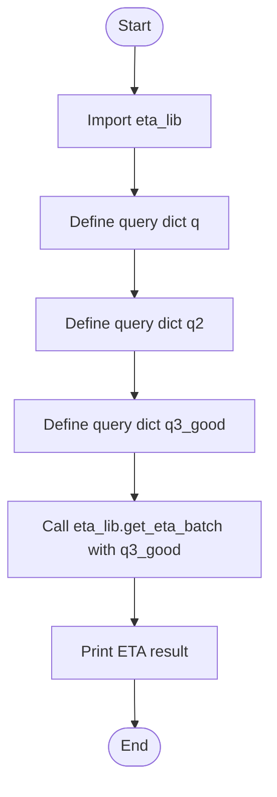
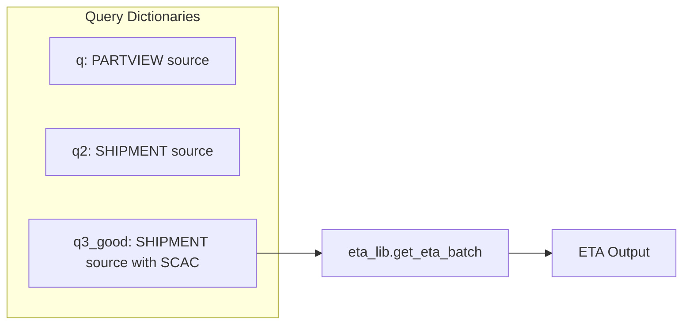
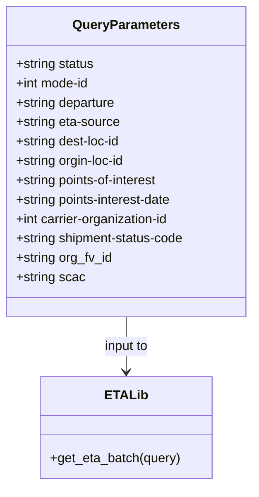

# Diagram: research/api/scripts/local_test.py


> Auto-generated by Obscura crawlers

## Diagram 1

```mermaid
flowchart TD
      Start([Start]) --> Import[Import eta_lib]
      Import --> DefineQ[Define query dict q]
      DefineQ --> DefineQ2[Define query dict q2]...
  └ 73 lines...
```

> SVG rendering failed for this diagram.

## Diagram 2



### SVG

<svg id="container" width="276" xmlns="http://www.w3.org/2000/svg" class="flowchart" height="792" viewBox="0 0 276 792" role="graphics-document document" aria-roledescription="flowchart-v2"><style>#container{font-family:"trebuchet ms",verdana,arial,sans-serif;font-size:16px;fill:#333;}@keyframes edge-animation-frame{from{stroke-dashoffset:0;}}@keyframes dash{to{stroke-dashoffset:0;}}#container .edge-animation-slow{stroke-dasharray:9,5!important;stroke-dashoffset:900;animation:dash 50s linear infinite;stroke-linecap:round;}#container .edge-animation-fast{stroke-dasharray:9,5!important;stroke-dashoffset:900;animation:dash 20s linear infinite;stroke-linecap:round;}#container .error-icon{fill:#552222;}#container .error-text{fill:#552222;stroke:#552222;}#container .edge-thickness-normal{stroke-width:1px;}#container .edge-thickness-thick{stroke-width:3.5px;}#container .edge-pattern-solid{stroke-dasharray:0;}#container .edge-thickness-invisible{stroke-width:0;fill:none;}#container .edge-pattern-dashed{stroke-dasharray:3;}#container .edge-pattern-dotted{stroke-dasharray:2;}#container .marker{fill:#333333;stroke:#333333;}#container .marker.cross{stroke:#333333;}#container svg{font-family:"trebuchet ms",verdana,arial,sans-serif;font-size:16px;}#container p{margin:0;}#container .label{font-family:"trebuchet ms",verdana,arial,sans-serif;color:#333;}#container .cluster-label text{fill:#333;}#container .cluster-label span{color:#333;}#container .cluster-label span p{background-color:transparent;}#container .label text,#container span{fill:#333;color:#333;}#container .node rect,#container .node circle,#container .node ellipse,#container .node polygon,#container .node path{fill:#ECECFF;stroke:#9370DB;stroke-width:1px;}#container .rough-node .label text,#container .node .label text,#container .image-shape .label,#container .icon-shape .label{text-anchor:middle;}#container .node .katex path{fill:#000;stroke:#000;stroke-width:1px;}#container .rough-node .label,#container .node .label,#container .image-shape .label,#container .icon-shape .label{text-align:center;}#container .node.clickable{cursor:pointer;}#container .root .anchor path{fill:#333333!important;stroke-width:0;stroke:#333333;}#container .arrowheadPath{fill:#333333;}#container .edgePath .path{stroke:#333333;stroke-width:2.0px;}#container .flowchart-link{stroke:#333333;fill:none;}#container .edgeLabel{background-color:rgba(232,232,232, 0.8);text-align:center;}#container .edgeLabel p{background-color:rgba(232,232,232, 0.8);}#container .edgeLabel rect{opacity:0.5;background-color:rgba(232,232,232, 0.8);fill:rgba(232,232,232, 0.8);}#container .labelBkg{background-color:rgba(232, 232, 232, 0.5);}#container .cluster rect{fill:#ffffde;stroke:#aaaa33;stroke-width:1px;}#container .cluster text{fill:#333;}#container .cluster span{color:#333;}#container div.mermaidTooltip{position:absolute;text-align:center;max-width:200px;padding:2px;font-family:"trebuchet ms",verdana,arial,sans-serif;font-size:12px;background:hsl(80, 100%, 96.2745098039%);border:1px solid #aaaa33;border-radius:2px;pointer-events:none;z-index:100;}#container .flowchartTitleText{text-anchor:middle;font-size:18px;fill:#333;}#container rect.text{fill:none;stroke-width:0;}#container .icon-shape,#container .image-shape{background-color:rgba(232,232,232, 0.8);text-align:center;}#container .icon-shape p,#container .image-shape p{background-color:rgba(232,232,232, 0.8);padding:2px;}#container .icon-shape rect,#container .image-shape rect{opacity:0.5;background-color:rgba(232,232,232, 0.8);fill:rgba(232,232,232, 0.8);}#container .label-icon{display:inline-block;height:1em;overflow:visible;vertical-align:-0.125em;}#container .node .label-icon path{fill:currentColor;stroke:revert;stroke-width:revert;}#container :root{--mermaid-font-family:"trebuchet ms",verdana,arial,sans-serif;}</style><g><marker id="container_flowchart-v2-pointEnd" class="marker flowchart-v2" viewBox="0 0 10 10" refX="5" refY="5" markerUnits="userSpaceOnUse" markerWidth="8" markerHeight="8" orient="auto"><path d="M 0 0 L 10 5 L 0 10 z" class="arrowMarkerPath" style="stroke-width: 1; stroke-dasharray: 1, 0;"></path></marker><marker id="container_flowchart-v2-pointStart" class="marker flowchart-v2" viewBox="0 0 10 10" refX="4.5" refY="5" markerUnits="userSpaceOnUse" markerWidth="8" markerHeight="8" orient="auto"><path d="M 0 5 L 10 10 L 10 0 z" class="arrowMarkerPath" style="stroke-width: 1; stroke-dasharray: 1, 0;"></path></marker><marker id="container_flowchart-v2-circleEnd" class="marker flowchart-v2" viewBox="0 0 10 10" refX="11" refY="5" markerUnits="userSpaceOnUse" markerWidth="11" markerHeight="11" orient="auto"><circle cx="5" cy="5" r="5" class="arrowMarkerPath" style="stroke-width: 1; stroke-dasharray: 1, 0;"></circle></marker><marker id="container_flowchart-v2-circleStart" class="marker flowchart-v2" viewBox="0 0 10 10" refX="-1" refY="5" markerUnits="userSpaceOnUse" markerWidth="11" markerHeight="11" orient="auto"><circle cx="5" cy="5" r="5" class="arrowMarkerPath" style="stroke-width: 1; stroke-dasharray: 1, 0;"></circle></marker><marker id="container_flowchart-v2-crossEnd" class="marker cross flowchart-v2" viewBox="0 0 11 11" refX="12" refY="5.2" markerUnits="userSpaceOnUse" markerWidth="11" markerHeight="11" orient="auto"><path d="M 1,1 l 9,9 M 10,1 l -9,9" class="arrowMarkerPath" style="stroke-width: 2; stroke-dasharray: 1, 0;"></path></marker><marker id="container_flowchart-v2-crossStart" class="marker cross flowchart-v2" viewBox="0 0 11 11" refX="-1" refY="5.2" markerUnits="userSpaceOnUse" markerWidth="11" markerHeight="11" orient="auto"><path d="M 1,1 l 9,9 M 10,1 l -9,9" class="arrowMarkerPath" style="stroke-width: 2; stroke-dasharray: 1, 0;"></path></marker><g class="root"><g class="clusters"></g><g class="edgePaths"><path d="M138.5,47.5L138.417,51.583C138.333,55.667,138.167,63.833,138.083,71.417C138,79,138,86,138,89.5L138,93" id="L_Start_Import_0" class="edge-thickness-normal edge-pattern-solid edge-thickness-normal edge-pattern-solid flowchart-link" style=";" data-edge="true" data-et="edge" data-id="L_Start_Import_0" data-points="W3sieCI6MTM4LjUsInkiOjQ3LjV9LHsieCI6MTM4LCJ5Ijo3Mn0seyJ4IjoxMzgsInkiOjk3fV0=" marker-end="url(#container_flowchart-v2-pointEnd)"></path><path d="M138,151L138,155.167C138,159.333,138,167.667,138,175.333C138,183,138,190,138,193.5L138,197" id="L_Import_DefineQ_0" class="edge-thickness-normal edge-pattern-solid edge-thickness-normal edge-pattern-solid flowchart-link" style=";" data-edge="true" data-et="edge" data-id="L_Import_DefineQ_0" data-points="W3sieCI6MTM4LCJ5IjoxNTF9LHsieCI6MTM4LCJ5IjoxNzZ9LHsieCI6MTM4LCJ5IjoyMDF9XQ==" marker-end="url(#container_flowchart-v2-pointEnd)"></path><path d="M138,255L138,259.167C138,263.333,138,271.667,138,279.333C138,287,138,294,138,297.5L138,301" id="L_DefineQ_DefineQ2_0" class="edge-thickness-normal edge-pattern-solid edge-thickness-normal edge-pattern-solid flowchart-link" style=";" data-edge="true" data-et="edge" data-id="L_DefineQ_DefineQ2_0" data-points="W3sieCI6MTM4LCJ5IjoyNTV9LHsieCI6MTM4LCJ5IjoyODB9LHsieCI6MTM4LCJ5IjozMDV9XQ==" marker-end="url(#container_flowchart-v2-pointEnd)"></path><path d="M138,359L138,363.167C138,367.333,138,375.667,138,383.333C138,391,138,398,138,401.5L138,405" id="L_DefineQ2_DefineQ3_0" class="edge-thickness-normal edge-pattern-solid edge-thickness-normal edge-pattern-solid flowchart-link" style=";" data-edge="true" data-et="edge" data-id="L_DefineQ2_DefineQ3_0" data-points="W3sieCI6MTM4LCJ5IjozNTl9LHsieCI6MTM4LCJ5IjozODR9LHsieCI6MTM4LCJ5Ijo0MDl9XQ==" marker-end="url(#container_flowchart-v2-pointEnd)"></path><path d="M138,463L138,467.167C138,471.333,138,479.667,138,487.333C138,495,138,502,138,505.5L138,509" id="L_DefineQ3_CallAPI_0" class="edge-thickness-normal edge-pattern-solid edge-thickness-normal edge-pattern-solid flowchart-link" style=";" data-edge="true" data-et="edge" data-id="L_DefineQ3_CallAPI_0" data-points="W3sieCI6MTM4LCJ5Ijo0NjN9LHsieCI6MTM4LCJ5Ijo0ODh9LHsieCI6MTM4LCJ5Ijo1MTN9XQ==" marker-end="url(#container_flowchart-v2-pointEnd)"></path><path d="M138,591L138,595.167C138,599.333,138,607.667,138,615.333C138,623,138,630,138,633.5L138,637" id="L_CallAPI_PrintResult_0" class="edge-thickness-normal edge-pattern-solid edge-thickness-normal edge-pattern-solid flowchart-link" style=";" data-edge="true" data-et="edge" data-id="L_CallAPI_PrintResult_0" data-points="W3sieCI6MTM4LCJ5Ijo1OTF9LHsieCI6MTM4LCJ5Ijo2MTZ9LHsieCI6MTM4LCJ5Ijo2NDF9XQ==" marker-end="url(#container_flowchart-v2-pointEnd)"></path><path d="M138,695L138,699.167C138,703.333,138,711.667,138.07,719.417C138.141,727.167,138.281,734.334,138.351,737.917L138.422,741.501" id="L_PrintResult_End_0" class="edge-thickness-normal edge-pattern-solid edge-thickness-normal edge-pattern-solid flowchart-link" style=";" data-edge="true" data-et="edge" data-id="L_PrintResult_End_0" data-points="W3sieCI6MTM4LCJ5Ijo2OTV9LHsieCI6MTM4LCJ5Ijo3MjB9LHsieCI6MTM4LjUsInkiOjc0NS41fV0=" marker-end="url(#container_flowchart-v2-pointEnd)"></path></g><g class="edgeLabels"><g class="edgeLabel"><g class="label" data-id="L_Start_Import_0" transform="translate(0, 0)"><foreignObject width="0" height="0"><div xmlns="http://www.w3.org/1999/xhtml" class="labelBkg" style="display: table-cell; white-space: nowrap; line-height: 1.5; max-width: 200px; text-align: center;"><span class="edgeLabel"></span></div></foreignObject></g></g><g class="edgeLabel"><g class="label" data-id="L_Import_DefineQ_0" transform="translate(0, 0)"><foreignObject width="0" height="0"><div xmlns="http://www.w3.org/1999/xhtml" class="labelBkg" style="display: table-cell; white-space: nowrap; line-height: 1.5; max-width: 200px; text-align: center;"><span class="edgeLabel"></span></div></foreignObject></g></g><g class="edgeLabel"><g class="label" data-id="L_DefineQ_DefineQ2_0" transform="translate(0, 0)"><foreignObject width="0" height="0"><div xmlns="http://www.w3.org/1999/xhtml" class="labelBkg" style="display: table-cell; white-space: nowrap; line-height: 1.5; max-width: 200px; text-align: center;"><span class="edgeLabel"></span></div></foreignObject></g></g><g class="edgeLabel"><g class="label" data-id="L_DefineQ2_DefineQ3_0" transform="translate(0, 0)"><foreignObject width="0" height="0"><div xmlns="http://www.w3.org/1999/xhtml" class="labelBkg" style="display: table-cell; white-space: nowrap; line-height: 1.5; max-width: 200px; text-align: center;"><span class="edgeLabel"></span></div></foreignObject></g></g><g class="edgeLabel"><g class="label" data-id="L_DefineQ3_CallAPI_0" transform="translate(0, 0)"><foreignObject width="0" height="0"><div xmlns="http://www.w3.org/1999/xhtml" class="labelBkg" style="display: table-cell; white-space: nowrap; line-height: 1.5; max-width: 200px; text-align: center;"><span class="edgeLabel"></span></div></foreignObject></g></g><g class="edgeLabel"><g class="label" data-id="L_CallAPI_PrintResult_0" transform="translate(0, 0)"><foreignObject width="0" height="0"><div xmlns="http://www.w3.org/1999/xhtml" class="labelBkg" style="display: table-cell; white-space: nowrap; line-height: 1.5; max-width: 200px; text-align: center;"><span class="edgeLabel"></span></div></foreignObject></g></g><g class="edgeLabel"><g class="label" data-id="L_PrintResult_End_0" transform="translate(0, 0)"><foreignObject width="0" height="0"><div xmlns="http://www.w3.org/1999/xhtml" class="labelBkg" style="display: table-cell; white-space: nowrap; line-height: 1.5; max-width: 200px; text-align: center;"><span class="edgeLabel"></span></div></foreignObject></g></g></g><g class="nodes"><g class="node default" id="flowchart-Start-0" transform="translate(138, 27.5)"><g class="basic label-container outer-path"><path d="M-10.3984375 -19.5 C-2.685199063784263 -19.5, 5.028039372431474 -19.5, 10.3984375 -19.5 C10.3984375 -19.5, 10.398437499999998 -19.5, 10.398437499999998 -19.5 C10.853502651757854 -19.48540694631371, 11.30856780351571 -19.47081389262742, 11.6478067896239 -19.45993515863156 C12.053618865244221 -19.420786955756892, 12.459430940864543 -19.38163875288223, 12.892042152847864 -19.3399052695533 C13.302129543874994 -19.273605520447248, 13.712216934902123 -19.207305771341197, 14.126030759676757 -19.140403561325776 C14.517546251548612 -19.051042705183374, 14.909061743420468 -18.961681849040975, 15.34470188623539 -18.862249829261074 C15.80991999187814 -18.724175537485976, 16.275138097520887 -18.586101245710875, 16.543047751460602 -18.50658706670804 C16.93333952588721 -18.362956085901434, 17.323631300313817 -18.21932510509483, 17.716144095147794 -18.074876768247425 C18.128145661438108 -17.89249589644293, 18.540147227728426 -17.71011502463844, 18.85917041279238 -17.568892924097174 C19.250206360242675 -17.364889720782834, 19.64124230769297 -17.160886517468494, 19.967429764076783 -16.990714730406097 C20.208163349775532 -16.844780616047935, 20.44889693547428 -16.698846501689772, 21.036368073605697 -16.342718045390892 C21.338409056977795 -16.132027330533955, 21.64045004034989 -15.921336615677015, 22.061592844578712 -15.627565626425154 C22.35486207854703 -15.393691216557492, 22.648131312515346 -15.159816806689832, 23.03889120850187 -14.848196188198123 C23.31386119630266 -14.598475720584647, 23.588831184103455 -14.348755252971172, 23.964247236767985 -14.007812326905688 C24.17095148586475 -13.794373218978814, 24.377655734961515 -13.58093411105194, 24.833858442968648 -13.10986736009568 C25.027526718962307 -12.88237358307644, 25.22119499495597 -12.6548798060572, 25.644151408126582 -12.158051136245305 C25.899529198504954 -11.815868162533603, 26.154906988883326 -11.4736851888219, 26.391796464640635 -11.156274872382312 C26.538386004217347 -10.931073974789514, 26.68497554379406 -10.705873077196717, 27.073721378604247 -10.108655082055241 C27.31060622050148 -9.688042058075379, 27.547491062398716 -9.267429034095517, 27.6871239742735 -9.019496659696287 C27.843339008914217 -8.695112797798547, 27.999554043554937 -8.370728935900809, 28.22948364880834 -7.893275190886684 C28.3737746503571 -7.536873627384517, 28.518065651905857 -7.180472063882349, 28.698571729970325 -6.734618561215508 C28.832259410699905 -6.331972567097312, 28.96594709142948 -5.929326572979116, 29.09246063421488 -5.548287939305138 C29.20206762429584 -5.130308982156446, 29.3116746143768 -4.7123300250077556, 29.40953178754556 -4.339158212148133 C29.45934857318543 -4.083359546668781, 29.5091653588253 -3.827560881189429, 29.648482276581777 -3.1121979531509023 C29.702615925539494 -2.6923480617329574, 29.75674957449721 -2.272498170315013, 29.808330202509367 -1.872449005199798 C29.825004863808065 -1.6127276959282497, 29.84167952510676 -1.3530063866567017, 29.888418715913414 -0.6250057626472757 C29.888418715913414 -0.3593164780996803, 29.888418715913414 -0.09362719355208493, 29.888418715913414 0.625005762647271 C29.871433909486605 0.8895578326338114, 29.854449103059796 1.1541099026203518, 29.808330202509367 1.8724490051997846 C29.759533289021512 2.2509082301710994, 29.71073637553366 2.6293674551424147, 29.648482276581777 3.1121979531508885 C29.560672363462533 3.5630832983865073, 29.472862450343285 4.0139686436221265, 29.40953178754556 4.339158212148129 C29.333179736178543 4.630321675198959, 29.256827684811523 4.92148513824979, 29.092460634214884 5.548287939305125 C29.00482077024538 5.812245246065224, 28.91718090627588 6.076202552825323, 28.69857172997033 6.734618561215495 C28.5299894566595 7.151020035609773, 28.361407183348668 7.567421510004051, 28.229483648808344 7.893275190886679 C28.083386109660406 8.19664985691394, 27.937288570512465 8.5000245229412, 27.687123974273504 9.019496659696284 C27.47213339339684 9.401234206199788, 27.257142812520176 9.782971752703295, 27.07372137860425 10.108655082055236 C26.936065061487707 10.320132151043108, 26.798408744371162 10.53160922003098, 26.39179646464064 11.156274872382301 C26.14589270844398 11.485763503392779, 25.89998895224732 11.815252134403258, 25.644151408126582 12.158051136245302 C25.329389436834003 12.527788458189113, 25.014627465541423 12.897525780132924, 24.83385844296866 13.10986736009567 C24.587993335317215 13.36374326964653, 24.34212822766577 13.61761917919739, 23.96424723676799 14.007812326905684 C23.604504038106167 14.3345215816469, 23.244760839444346 14.661230836388116, 23.038891208501887 14.848196188198111 C22.697740763584807 15.120254589624874, 22.356590318667728 15.39231299105164, 22.061592844578715 15.627565626425152 C21.784346050825476 15.820960987927146, 21.507099257072237 16.01435634942914, 21.036368073605708 16.34271804539089 C20.669981851853322 16.564823526141616, 20.303595630100933 16.786929006892347, 19.967429764076787 16.990714730406093 C19.58468759881194 17.190391072866706, 19.20194543354709 17.390067415327323, 18.859170412792388 17.56889292409717 C18.562204082854137 17.70035110916765, 18.265237752915887 17.831809294238123, 17.716144095147804 18.07487676824742 C17.260162702152147 18.24268213591561, 16.804181309156494 18.410487503583806, 16.543047751460616 18.506587066708033 C16.26507542041582 18.58908779545559, 15.98710308937102 18.671588524203145, 15.344701886235413 18.86224982926107 C14.869145695812794 18.970792426430872, 14.393589505390176 19.079335023600674, 14.126030759676766 19.140403561325773 C13.698968156724694 19.209447731051114, 13.271905553772623 19.278491900776455, 12.892042152847878 19.3399052695533 C12.421204078948337 19.385326452276757, 11.950366005048796 19.430747635000213, 11.6478067896239 19.45993515863156 C11.326821107683413 19.470228544690663, 11.005835425742928 19.480521930749767, 10.398437500000004 19.5 C10.398437500000002 19.5, 10.398437500000002 19.5, 10.3984375 19.5 C2.7535854693292023 19.5, -4.891266561341595 19.5, -10.398437499999996 19.5 C-10.710285437103115 19.48999964363229, -11.022133374206232 19.47999928726458, -11.647806789623893 19.45993515863156 C-12.01021807610628 19.424973777687946, -12.372629362588668 19.39001239674433, -12.892042152847871 19.3399052695533 C-13.259372838268538 19.280518093026494, -13.626703523689203 19.221130916499693, -14.126030759676759 19.140403561325773 C-14.5637923994785 19.040487323702695, -15.001554039280238 18.940571086079615, -15.344701886235388 18.862249829261074 C-15.67272162943756 18.764895291289438, -16.000741372639734 18.6675407533178, -16.54304775146059 18.506587066708043 C-16.818194897877817 18.405330373394165, -17.093342044295046 18.304073680080286, -17.716144095147797 18.074876768247425 C-18.12422939695684 17.894229510556933, -18.532314698765877 17.713582252866445, -18.85917041279238 17.568892924097174 C-19.111949034926745 17.437018478842113, -19.36472765706111 17.305144033587048, -19.96742976407678 16.990714730406097 C-20.300701177408733 16.78868364112405, -20.63397259074069 16.586652551842, -21.036368073605686 16.3427180453909 C-21.241940674285193 16.199319498251334, -21.447513274964695 16.055920951111766, -22.061592844578712 15.627565626425156 C-22.301831438627087 15.435981740689055, -22.542070032675458 15.244397854952954, -23.03889120850187 14.848196188198125 C-23.350311330369863 14.565372673242516, -23.661731452237856 14.282549158286907, -23.964247236767974 14.007812326905697 C-24.155048329424595 13.8107945336767, -24.345849422081212 13.613776740447705, -24.833858442968655 13.109867360095677 C-25.10453337454537 12.791917183625745, -25.375208306122087 12.473967007155814, -25.64415140812658 12.158051136245307 C-25.871339001073977 11.853640458911295, -26.098526594021372 11.549229781577282, -26.391796464640635 11.156274872382316 C-26.5653232492145 10.889691132810801, -26.738850033788363 10.623107393239286, -27.073721378604244 10.108655082055249 C-27.28194380706288 9.738935075519702, -27.490166235521514 9.369215068984156, -27.6871239742735 9.019496659696289 C-27.89423457528385 8.589427065241344, -28.1013451762942 8.159357470786397, -28.22948364880834 7.893275190886686 C-28.364845552754893 7.558928671094322, -28.50020745670145 7.224582151301958, -28.698571729970325 6.73461856121551 C-28.84355468843802 6.297952990208214, -28.988537646905716 5.8612874192009174, -29.09246063421488 5.5482879393051325 C-29.20160003350648 5.132092108491401, -29.310739432798076 4.715896277677669, -29.409531787545557 4.339158212148136 C-29.495398998248227 3.898248233231349, -29.581266208950893 3.457338254314562, -29.648482276581777 3.112197953150904 C-29.70590498339097 2.6668387785348506, -29.763327690200157 2.221479603918797, -29.808330202509364 1.872449005199809 C-29.831908990475334 1.5051903501747306, -29.855487778441304 1.137931695149652, -29.888418715913414 0.6250057626472781 C-29.888418715913414 0.2507406254231574, -29.888418715913414 -0.12352451180096335, -29.888418715913414 -0.6250057626472687 C-29.868888112861043 -0.929210670006978, -29.849357509808673 -1.2334155773666873, -29.808330202509367 -1.8724490051997822 C-29.754384446326306 -2.290841637361144, -29.700438690143244 -2.709234269522506, -29.648482276581777 -3.112197953150895 C-29.58157918894591 -3.4557311681884975, -29.51467610131004 -3.7992643832260993, -29.40953178754556 -4.339158212148126 C-29.302401933052618 -4.747690777702361, -29.195272078559675 -5.156223343256595, -29.092460634214884 -5.548287939305123 C-28.970081734922086 -5.9168736855453705, -28.84770283562929 -6.285459431785617, -28.698571729970332 -6.734618561215485 C-28.52514235835759 -7.162992462127754, -28.35171298674485 -7.591366363040023, -28.229483648808344 -7.893275190886676 C-28.034898732944164 -8.297334932128878, -27.84031381707998 -8.70139467337108, -27.687123974273504 -9.019496659696282 C-27.46132605800747 -9.420423724544994, -27.235528141741433 -9.821350789393708, -27.073721378604247 -10.108655082055243 C-26.885498139900534 -10.39781652172071, -26.69727490119682 -10.686977961386177, -26.39179646464064 -11.156274872382308 C-26.210148260097448 -11.39966691797832, -26.028500055554254 -11.643058963574333, -25.644151408126586 -12.158051136245302 C-25.33625837067953 -12.519719817640754, -25.028365333232475 -12.881388499036204, -24.833858442968662 -13.10986736009567 C-24.56712266485688 -13.385293950410741, -24.3003868867451 -13.660720540725812, -23.964247236767996 -14.007812326905677 C-23.601972439431563 -14.336820712580744, -23.23969764209513 -14.665829098255813, -23.038891208501887 -14.848196188198107 C-22.71119804459201 -15.109522766134917, -22.38350488068213 -15.370849344071727, -22.06159284457872 -15.627565626425149 C-21.825026017985795 -15.792584403843502, -21.58845919139287 -15.957603181261856, -21.03636807360571 -16.342718045390885 C-20.653929317602234 -16.574554666739786, -20.271490561598757 -16.80639128808869, -19.96742976407679 -16.99071473040609 C-19.631341164038467 -17.16605193777106, -19.295252564000148 -17.34138914513603, -18.859170412792388 -17.56889292409717 C-18.629845322739566 -17.670408338776458, -18.400520232686745 -17.771923753455745, -17.716144095147804 -18.07487676824742 C-17.472851620362825 -18.164410647939278, -17.22955914557784 -18.253944527631134, -16.54304775146062 -18.506587066708033 C-16.174181205567233 -18.61606472130918, -15.805314659673845 -18.725542375910326, -15.344701886235413 -18.862249829261067 C-14.939071162742238 -18.95483239491054, -14.533440439249063 -19.047414960560012, -14.126030759676768 -19.140403561325773 C-13.767573711270451 -19.19835611703618, -13.409116662864133 -19.256308672746584, -12.89204215284788 -19.3399052695533 C-12.54325703075084 -19.37355215080652, -12.194471908653803 -19.40719903205974, -11.647806789623903 -19.45993515863156 C-11.296059016362921 -19.471215025084533, -10.94431124310194 -19.482494891537506, -10.398437500000005 -19.5 C-10.398437500000004 -19.5, -10.398437500000002 -19.5, -10.3984375 -19.5" stroke="none" stroke-width="0" fill="#ECECFF" style=""></path><path d="M-10.3984375 -19.5 C-2.6714252383188537 -19.5, 5.055587023362293 -19.5, 10.3984375 -19.5 M-10.3984375 -19.5 C-2.4428686181989283 -19.5, 5.512700263602143 -19.5, 10.3984375 -19.5 M10.3984375 -19.5 C10.3984375 -19.5, 10.3984375 -19.5, 10.398437499999998 -19.5 M10.3984375 -19.5 C10.3984375 -19.5, 10.3984375 -19.5, 10.398437499999998 -19.5 M10.398437499999998 -19.5 C10.844307443130315 -19.485701818757008, 11.290177386260632 -19.471403637514015, 11.6478067896239 -19.45993515863156 M10.398437499999998 -19.5 C10.706519114712567 -19.490120422260652, 11.014600729425133 -19.480240844521305, 11.6478067896239 -19.45993515863156 M11.6478067896239 -19.45993515863156 C11.993445983993258 -19.426591761242697, 12.339085178362616 -19.393248363853832, 12.892042152847864 -19.3399052695533 M11.6478067896239 -19.45993515863156 C12.04674343793259 -19.421450219960736, 12.445680086241282 -19.38296528128991, 12.892042152847864 -19.3399052695533 M12.892042152847864 -19.3399052695533 C13.148101216375172 -19.2985076259299, 13.404160279902479 -19.2571099823065, 14.126030759676757 -19.140403561325776 M12.892042152847864 -19.3399052695533 C13.323634170693952 -19.27012881915403, 13.755226188540039 -19.200352368754764, 14.126030759676757 -19.140403561325776 M14.126030759676757 -19.140403561325776 C14.431964047651073 -19.070576284746917, 14.737897335625389 -19.000749008168054, 15.34470188623539 -18.862249829261074 M14.126030759676757 -19.140403561325776 C14.475618402923176 -19.060612463027347, 14.825206046169596 -18.98082136472892, 15.34470188623539 -18.862249829261074 M15.34470188623539 -18.862249829261074 C15.687428925239367 -18.760530243095634, 16.03015596424334 -18.658810656930193, 16.543047751460602 -18.50658706670804 M15.34470188623539 -18.862249829261074 C15.7084899375731 -18.75427944518649, 16.072277988910812 -18.646309061111907, 16.543047751460602 -18.50658706670804 M16.543047751460602 -18.50658706670804 C16.845674595538245 -18.395217590635585, 17.14830143961589 -18.28384811456313, 17.716144095147794 -18.074876768247425 M16.543047751460602 -18.50658706670804 C16.878931147313274 -18.38297887216218, 17.21481454316595 -18.25937067761632, 17.716144095147794 -18.074876768247425 M17.716144095147794 -18.074876768247425 C18.121842835548215 -17.895285970497703, 18.527541575948636 -17.715695172747978, 18.85917041279238 -17.568892924097174 M17.716144095147794 -18.074876768247425 C18.030950401941205 -17.93552135462728, 18.345756708734616 -17.796165941007132, 18.85917041279238 -17.568892924097174 M18.85917041279238 -17.568892924097174 C19.205019488143773 -17.38846368301326, 19.55086856349516 -17.208034441929346, 19.967429764076783 -16.990714730406097 M18.85917041279238 -17.568892924097174 C19.10156619732645 -17.44243519856766, 19.343961981860517 -17.315977473038146, 19.967429764076783 -16.990714730406097 M19.967429764076783 -16.990714730406097 C20.186786053729694 -16.85773965853786, 20.4061423433826 -16.72476458666962, 21.036368073605697 -16.342718045390892 M19.967429764076783 -16.990714730406097 C20.267314098375326 -16.808923084638355, 20.567198432673873 -16.627131438870617, 21.036368073605697 -16.342718045390892 M21.036368073605697 -16.342718045390892 C21.350538083204032 -16.123566646895615, 21.664708092802368 -15.904415248400335, 22.061592844578712 -15.627565626425154 M21.036368073605697 -16.342718045390892 C21.267276041054878 -16.18164664314315, 21.498184008504058 -16.020575240895408, 22.061592844578712 -15.627565626425154 M22.061592844578712 -15.627565626425154 C22.32563339236317 -15.417000315981118, 22.589673940147623 -15.206435005537081, 23.03889120850187 -14.848196188198123 M22.061592844578712 -15.627565626425154 C22.437531369860558 -15.327764656657186, 22.813469895142404 -15.027963686889217, 23.03889120850187 -14.848196188198123 M23.03889120850187 -14.848196188198123 C23.288529648325397 -14.621481162221567, 23.53816808814892 -14.394766136245012, 23.964247236767985 -14.007812326905688 M23.03889120850187 -14.848196188198123 C23.22948402367777 -14.675104836264923, 23.42007683885367 -14.502013484331723, 23.964247236767985 -14.007812326905688 M23.964247236767985 -14.007812326905688 C24.184541751454667 -13.78034015397567, 24.404836266141345 -13.552867981045653, 24.833858442968648 -13.10986736009568 M23.964247236767985 -14.007812326905688 C24.302848950671514 -13.658178257582577, 24.641450664575046 -13.308544188259464, 24.833858442968648 -13.10986736009568 M24.833858442968648 -13.10986736009568 C25.017150167723813 -12.894562470603669, 25.200441892478977 -12.679257581111658, 25.644151408126582 -12.158051136245305 M24.833858442968648 -13.10986736009568 C25.034502711960815 -12.874179184755148, 25.235146980952983 -12.638491009414615, 25.644151408126582 -12.158051136245305 M25.644151408126582 -12.158051136245305 C25.889468384287525 -11.829348737025926, 26.13478536044847 -11.500646337806547, 26.391796464640635 -11.156274872382312 M25.644151408126582 -12.158051136245305 C25.882335369883457 -11.838906326496401, 26.120519331640327 -11.519761516747495, 26.391796464640635 -11.156274872382312 M26.391796464640635 -11.156274872382312 C26.575811683367146 -10.873578081413408, 26.75982690209366 -10.590881290444505, 27.073721378604247 -10.108655082055241 M26.391796464640635 -11.156274872382312 C26.53725315161858 -10.93281434059474, 26.682709838596523 -10.709353808807167, 27.073721378604247 -10.108655082055241 M27.073721378604247 -10.108655082055241 C27.281077399499036 -9.740473469882584, 27.488433420393825 -9.372291857709925, 27.6871239742735 -9.019496659696287 M27.073721378604247 -10.108655082055241 C27.283190649199188 -9.73672118105023, 27.492659919794125 -9.364787280045219, 27.6871239742735 -9.019496659696287 M27.6871239742735 -9.019496659696287 C27.889198936312162 -8.59988367731146, 28.091273898350828 -8.180270694926634, 28.22948364880834 -7.893275190886684 M27.6871239742735 -9.019496659696287 C27.850881805965283 -8.679450018332012, 28.014639637657062 -8.339403376967736, 28.22948364880834 -7.893275190886684 M28.22948364880834 -7.893275190886684 C28.331483291583904 -7.641334101202109, 28.433482934359464 -7.3893930115175355, 28.698571729970325 -6.734618561215508 M28.22948364880834 -7.893275190886684 C28.32980232107877 -7.64548613084914, 28.4301209933492 -7.3976970708115966, 28.698571729970325 -6.734618561215508 M28.698571729970325 -6.734618561215508 C28.79209931078632 -6.45292838939406, 28.885626891602314 -6.171238217572611, 29.09246063421488 -5.548287939305138 M28.698571729970325 -6.734618561215508 C28.79928757130515 -6.431278494005121, 28.900003412639975 -6.127938426794733, 29.09246063421488 -5.548287939305138 M29.09246063421488 -5.548287939305138 C29.16695058581215 -5.264225469715508, 29.24144053740942 -4.980163000125878, 29.40953178754556 -4.339158212148133 M29.09246063421488 -5.548287939305138 C29.186701052050154 -5.18890838204379, 29.280941469885423 -4.829528824782442, 29.40953178754556 -4.339158212148133 M29.40953178754556 -4.339158212148133 C29.474901651533596 -4.003497776495212, 29.540271515521635 -3.6678373408422913, 29.648482276581777 -3.1121979531509023 M29.40953178754556 -4.339158212148133 C29.475521181475262 -4.0003166211824555, 29.541510575404967 -3.6614750302167782, 29.648482276581777 -3.1121979531509023 M29.648482276581777 -3.1121979531509023 C29.69849184481175 -2.7243336174655006, 29.748501413041716 -2.336469281780099, 29.808330202509367 -1.872449005199798 M29.648482276581777 -3.1121979531509023 C29.70985767756387 -2.6361824630775574, 29.77123307854597 -2.160166973004213, 29.808330202509367 -1.872449005199798 M29.808330202509367 -1.872449005199798 C29.839686360875323 -1.3840515284145587, 29.87104251924128 -0.8956540516293192, 29.888418715913414 -0.6250057626472757 M29.808330202509367 -1.872449005199798 C29.839796068335225 -1.3823427461723075, 29.871261934161083 -0.8922364871448172, 29.888418715913414 -0.6250057626472757 M29.888418715913414 -0.6250057626472757 C29.888418715913414 -0.18709561898024013, 29.888418715913414 0.25081452468679544, 29.888418715913414 0.625005762647271 M29.888418715913414 -0.6250057626472757 C29.888418715913414 -0.2572697611177158, 29.888418715913414 0.11046624041184405, 29.888418715913414 0.625005762647271 M29.888418715913414 0.625005762647271 C29.862673322099152 1.0260110526122577, 29.83692792828489 1.4270163425772444, 29.808330202509367 1.8724490051997846 M29.888418715913414 0.625005762647271 C29.858405878559413 1.0924799303621413, 29.82839304120541 1.5599540980770115, 29.808330202509367 1.8724490051997846 M29.808330202509367 1.8724490051997846 C29.74861575043667 2.335582503523297, 29.688901298363973 2.7987160018468087, 29.648482276581777 3.1121979531508885 M29.808330202509367 1.8724490051997846 C29.766525921809976 2.196674751115325, 29.72472164111058 2.520900497030865, 29.648482276581777 3.1121979531508885 M29.648482276581777 3.1121979531508885 C29.55410540718146 3.5968032309631095, 29.459728537781142 4.081408508775331, 29.40953178754556 4.339158212148129 M29.648482276581777 3.1121979531508885 C29.553951092223922 3.597595605655584, 29.45941990786607 4.08299325816028, 29.40953178754556 4.339158212148129 M29.40953178754556 4.339158212148129 C29.33028277594875 4.641369040105668, 29.251033764351934 4.943579868063208, 29.092460634214884 5.548287939305125 M29.40953178754556 4.339158212148129 C29.316690512753222 4.693202230594336, 29.223849237960888 5.047246249040543, 29.092460634214884 5.548287939305125 M29.092460634214884 5.548287939305125 C28.95270679331711 5.969204241338561, 28.812952952419334 6.390120543371996, 28.69857172997033 6.734618561215495 M29.092460634214884 5.548287939305125 C28.99487218867333 5.842208788669029, 28.897283743131776 6.136129638032933, 28.69857172997033 6.734618561215495 M28.69857172997033 6.734618561215495 C28.553651426712165 7.092574512106615, 28.408731123454004 7.450530462997735, 28.229483648808344 7.893275190886679 M28.69857172997033 6.734618561215495 C28.560751446753976 7.075037325333792, 28.422931163537626 7.41545608945209, 28.229483648808344 7.893275190886679 M28.229483648808344 7.893275190886679 C28.103591799674163 8.154692309267865, 27.97769995053998 8.416109427649051, 27.687123974273504 9.019496659696284 M28.229483648808344 7.893275190886679 C28.117443553333732 8.125928846413718, 28.00540345785912 8.358582501940756, 27.687123974273504 9.019496659696284 M27.687123974273504 9.019496659696284 C27.55283263078264 9.257944538537409, 27.418541287291774 9.496392417378535, 27.07372137860425 10.108655082055236 M27.687123974273504 9.019496659696284 C27.561440342493547 9.242660674769368, 27.435756710713587 9.465824689842453, 27.07372137860425 10.108655082055236 M27.07372137860425 10.108655082055236 C26.923090657591487 10.340064319542968, 26.772459936578723 10.571473557030702, 26.39179646464064 11.156274872382301 M27.07372137860425 10.108655082055236 C26.80671678303667 10.518845841620005, 26.53971218746909 10.929036601184773, 26.39179646464064 11.156274872382301 M26.39179646464064 11.156274872382301 C26.161026775110994 11.465485232800818, 25.93025708558135 11.774695593219333, 25.644151408126582 12.158051136245302 M26.39179646464064 11.156274872382301 C26.10766411103665 11.536986341221732, 25.823531757432658 11.917697810061163, 25.644151408126582 12.158051136245302 M25.644151408126582 12.158051136245302 C25.382754608167648 12.465102691376343, 25.121357808208714 12.772154246507382, 24.83385844296866 13.10986736009567 M25.644151408126582 12.158051136245302 C25.353546352088866 12.499412370963332, 25.062941296051154 12.840773605681362, 24.83385844296866 13.10986736009567 M24.83385844296866 13.10986736009567 C24.492118159213803 13.46274226047165, 24.15037787545895 13.815617160847632, 23.96424723676799 14.007812326905684 M24.83385844296866 13.10986736009567 C24.557416516663228 13.39531634531027, 24.280974590357797 13.680765330524872, 23.96424723676799 14.007812326905684 M23.96424723676799 14.007812326905684 C23.769164319547492 14.184981470714195, 23.574081402327 14.362150614522708, 23.038891208501887 14.848196188198111 M23.96424723676799 14.007812326905684 C23.634498530794573 14.307281376998079, 23.304749824821158 14.606750427090473, 23.038891208501887 14.848196188198111 M23.038891208501887 14.848196188198111 C22.80719894973941 15.032964598971242, 22.575506690976933 15.217733009744375, 22.061592844578715 15.627565626425152 M23.038891208501887 14.848196188198111 C22.79850017796682 15.039901637975845, 22.55810914743175 15.231607087753579, 22.061592844578715 15.627565626425152 M22.061592844578715 15.627565626425152 C21.65819386178406 15.90895929396219, 21.254794878989404 16.19035296149923, 21.036368073605708 16.34271804539089 M22.061592844578715 15.627565626425152 C21.793591848538263 15.814511519686837, 21.52559085249781 16.001457412948522, 21.036368073605708 16.34271804539089 M21.036368073605708 16.34271804539089 C20.75921281911747 16.510731189406723, 20.48205756462923 16.678744333422557, 19.967429764076787 16.990714730406093 M21.036368073605708 16.34271804539089 C20.649151698834643 16.577450887313105, 20.26193532406358 16.812183729235326, 19.967429764076787 16.990714730406093 M19.967429764076787 16.990714730406093 C19.67917733083142 17.141095840195707, 19.390924897586054 17.29147694998532, 18.859170412792388 17.56889292409717 M19.967429764076787 16.990714730406093 C19.672006288809495 17.144836968225274, 19.376582813542203 17.29895920604445, 18.859170412792388 17.56889292409717 M18.859170412792388 17.56889292409717 C18.421778364727693 17.7625134090013, 17.984386316663 17.956133893905427, 17.716144095147804 18.07487676824742 M18.859170412792388 17.56889292409717 C18.588855433504904 17.68855334681878, 18.318540454217423 17.80821376954039, 17.716144095147804 18.07487676824742 M17.716144095147804 18.07487676824742 C17.301682091609425 18.227402616794308, 16.887220088071047 18.37992846534119, 16.543047751460616 18.506587066708033 M17.716144095147804 18.07487676824742 C17.297065019550573 18.22910174199171, 16.87798594395334 18.383326715735997, 16.543047751460616 18.506587066708033 M16.543047751460616 18.506587066708033 C16.141600108658075 18.62573461985015, 15.740152465855532 18.74488217299227, 15.344701886235413 18.86224982926107 M16.543047751460616 18.506587066708033 C16.065215698110496 18.64840511195072, 15.587383644760372 18.790223157193406, 15.344701886235413 18.86224982926107 M15.344701886235413 18.86224982926107 C15.07891760711218 18.92291335656644, 14.813133327988945 18.983576883871805, 14.126030759676766 19.140403561325773 M15.344701886235413 18.86224982926107 C14.99718458506288 18.941568385491376, 14.649667283890349 19.020886941721685, 14.126030759676766 19.140403561325773 M14.126030759676766 19.140403561325773 C13.687205914725212 19.211349359120042, 13.248381069773659 19.282295156914312, 12.892042152847878 19.3399052695533 M14.126030759676766 19.140403561325773 C13.79767887561112 19.193488947534615, 13.469326991545477 19.246574333743457, 12.892042152847878 19.3399052695533 M12.892042152847878 19.3399052695533 C12.631382201417809 19.3650508215783, 12.37072224998774 19.390196373603303, 11.6478067896239 19.45993515863156 M12.892042152847878 19.3399052695533 C12.561903062430023 19.37175339055556, 12.231763972012166 19.403601511557827, 11.6478067896239 19.45993515863156 M11.6478067896239 19.45993515863156 C11.197844335989238 19.474364578720838, 10.747881882354575 19.488793998810117, 10.398437500000004 19.5 M11.6478067896239 19.45993515863156 C11.390471810583511 19.468187390537235, 11.133136831543125 19.476439622442907, 10.398437500000004 19.5 M10.398437500000004 19.5 C10.398437500000002 19.5, 10.398437500000002 19.5, 10.3984375 19.5 M10.398437500000004 19.5 C10.398437500000002 19.5, 10.398437500000002 19.5, 10.3984375 19.5 M10.3984375 19.5 C3.652158520975025 19.5, -3.09412045804995 19.5, -10.398437499999996 19.5 M10.3984375 19.5 C4.137998592378446 19.5, -2.1224403152431073 19.5, -10.398437499999996 19.5 M-10.398437499999996 19.5 C-10.65853800927009 19.491659082922638, -10.918638518540185 19.483318165845272, -11.647806789623893 19.45993515863156 M-10.398437499999996 19.5 C-10.755220650688647 19.48855865879369, -11.112003801377298 19.47711731758738, -11.647806789623893 19.45993515863156 M-11.647806789623893 19.45993515863156 C-12.039511148267355 19.42214791024664, -12.431215506910817 19.38436066186172, -12.892042152847871 19.3399052695533 M-11.647806789623893 19.45993515863156 C-12.082378613688707 19.418012537413112, -12.516950437753524 19.376089916194662, -12.892042152847871 19.3399052695533 M-12.892042152847871 19.3399052695533 C-13.183616767175026 19.29276574710379, -13.475191381502183 19.24562622465428, -14.126030759676759 19.140403561325773 M-12.892042152847871 19.3399052695533 C-13.25350680364895 19.281466468012013, -13.614971454450028 19.223027666470728, -14.126030759676759 19.140403561325773 M-14.126030759676759 19.140403561325773 C-14.507561087996816 19.053321753604788, -14.889091416316871 18.966239945883807, -15.344701886235388 18.862249829261074 M-14.126030759676759 19.140403561325773 C-14.58443885916485 19.035774904010026, -15.042846958652941 18.93114624669428, -15.344701886235388 18.862249829261074 M-15.344701886235388 18.862249829261074 C-15.77550621703897 18.73438936521665, -16.206310547842552 18.606528901172226, -16.54304775146059 18.506587066708043 M-15.344701886235388 18.862249829261074 C-15.80360694866496 18.726049215573806, -16.262512011094532 18.589848601886537, -16.54304775146059 18.506587066708043 M-16.54304775146059 18.506587066708043 C-17.00046774610541 18.33825228033467, -17.45788774075023 18.1699174939613, -17.716144095147797 18.074876768247425 M-16.54304775146059 18.506587066708043 C-16.807793557016257 18.40915816298016, -17.07253936257192 18.311729259252274, -17.716144095147797 18.074876768247425 M-17.716144095147797 18.074876768247425 C-18.004525814691572 17.947218735545164, -18.292907534235344 17.8195607028429, -18.85917041279238 17.568892924097174 M-17.716144095147797 18.074876768247425 C-17.951730219360066 17.97058977947273, -18.187316343572334 17.866302790698033, -18.85917041279238 17.568892924097174 M-18.85917041279238 17.568892924097174 C-19.222319268521506 17.379438398671233, -19.58546812425063 17.189983873245293, -19.96742976407678 16.990714730406097 M-18.85917041279238 17.568892924097174 C-19.122734798501305 17.431391552893874, -19.38629918421023 17.293890181690575, -19.96742976407678 16.990714730406097 M-19.96742976407678 16.990714730406097 C-20.245877923639082 16.821917819736413, -20.524326083201384 16.65312090906673, -21.036368073605686 16.3427180453909 M-19.96742976407678 16.990714730406097 C-20.376549158764114 16.742704149094205, -20.785668553451448 16.49469356778231, -21.036368073605686 16.3427180453909 M-21.036368073605686 16.3427180453909 C-21.399596374596413 16.089345706519495, -21.762824675587144 15.835973367648089, -22.061592844578712 15.627565626425156 M-21.036368073605686 16.3427180453909 C-21.298185749757128 16.160085368412183, -21.560003425908572 15.97745269143347, -22.061592844578712 15.627565626425156 M-22.061592844578712 15.627565626425156 C-22.442294613264085 15.323966096798106, -22.82299638194946 15.020366567171054, -23.03889120850187 14.848196188198125 M-22.061592844578712 15.627565626425156 C-22.260694597774307 15.468787276571836, -22.459796350969903 15.310008926718517, -23.03889120850187 14.848196188198125 M-23.03889120850187 14.848196188198125 C-23.316455503588507 14.596119639349252, -23.594019798675145 14.34404309050038, -23.964247236767974 14.007812326905697 M-23.03889120850187 14.848196188198125 C-23.327770727164953 14.585843452681534, -23.61665024582804 14.323490717164942, -23.964247236767974 14.007812326905697 M-23.964247236767974 14.007812326905697 C-24.306210505318006 13.654707176421306, -24.648173773868038 13.301602025936914, -24.833858442968655 13.109867360095677 M-23.964247236767974 14.007812326905697 C-24.181741396245688 13.78323175064238, -24.3992355557234 13.558651174379062, -24.833858442968655 13.109867360095677 M-24.833858442968655 13.109867360095677 C-25.057228510091395 12.847484169136424, -25.28059857721414 12.58510097817717, -25.64415140812658 12.158051136245307 M-24.833858442968655 13.109867360095677 C-25.079738036355266 12.821043198758552, -25.325617629741878 12.532219037421427, -25.64415140812658 12.158051136245307 M-25.64415140812658 12.158051136245307 C-25.864846961988125 11.862339199849407, -26.08554251584967 11.566627263453507, -26.391796464640635 11.156274872382316 M-25.64415140812658 12.158051136245307 C-25.803100622847968 11.945073669090002, -25.962049837569356 11.732096201934697, -26.391796464640635 11.156274872382316 M-26.391796464640635 11.156274872382316 C-26.60363497235121 10.830834037934677, -26.815473480061783 10.505393203487039, -27.073721378604244 10.108655082055249 M-26.391796464640635 11.156274872382316 C-26.58573580915765 10.858331959198289, -26.779675153674667 10.560389046014262, -27.073721378604244 10.108655082055249 M-27.073721378604244 10.108655082055249 C-27.290652567444198 9.723471789605055, -27.507583756284152 9.338288497154863, -27.6871239742735 9.019496659696289 M-27.073721378604244 10.108655082055249 C-27.239397794779794 9.814479828579232, -27.40507421095535 9.520304575103216, -27.6871239742735 9.019496659696289 M-27.6871239742735 9.019496659696289 C-27.804134787884337 8.776521201603048, -27.921145601495173 8.533545743509809, -28.22948364880834 7.893275190886686 M-27.6871239742735 9.019496659696289 C-27.83414196995462 8.714210645983268, -27.981159965635737 8.40892463227025, -28.22948364880834 7.893275190886686 M-28.22948364880834 7.893275190886686 C-28.403589972886934 7.463229204295781, -28.577696296965527 7.033183217704877, -28.698571729970325 6.73461856121551 M-28.22948364880834 7.893275190886686 C-28.36144502992151 7.567328028237424, -28.493406411034673 7.2413808655881615, -28.698571729970325 6.73461856121551 M-28.698571729970325 6.73461856121551 C-28.85022716983606 6.277856539352849, -29.0018826097018 5.821094517490189, -29.09246063421488 5.5482879393051325 M-28.698571729970325 6.73461856121551 C-28.79019236931999 6.4586717932607876, -28.881813008669653 6.182725025306065, -29.09246063421488 5.5482879393051325 M-29.09246063421488 5.5482879393051325 C-29.18415113081711 5.198632336848228, -29.27584162741934 4.848976734391324, -29.409531787545557 4.339158212148136 M-29.09246063421488 5.5482879393051325 C-29.20218085924319 5.129877168225866, -29.311901084271494 4.711466397146599, -29.409531787545557 4.339158212148136 M-29.409531787545557 4.339158212148136 C-29.47199794628904 4.018407689227676, -29.534464105032527 3.697657166307215, -29.648482276581777 3.112197953150904 M-29.409531787545557 4.339158212148136 C-29.49649199691346 3.8926359160907293, -29.583452206281358 3.4461136200333233, -29.648482276581777 3.112197953150904 M-29.648482276581777 3.112197953150904 C-29.699001420062253 2.720381452449597, -29.749520563542728 2.32856495174829, -29.808330202509364 1.872449005199809 M-29.648482276581777 3.112197953150904 C-29.692414657822283 2.7714670796794842, -29.736347039062785 2.4307362062080644, -29.808330202509364 1.872449005199809 M-29.808330202509364 1.872449005199809 C-29.832342394269094 1.4984397362496893, -29.856354586028825 1.1244304672995695, -29.888418715913414 0.6250057626472781 M-29.808330202509364 1.872449005199809 C-29.83087643940217 1.5212731665994499, -29.853422676294983 1.1700973279990907, -29.888418715913414 0.6250057626472781 M-29.888418715913414 0.6250057626472781 C-29.888418715913414 0.3676476940427069, -29.888418715913414 0.1102896254381357, -29.888418715913414 -0.6250057626472687 M-29.888418715913414 0.6250057626472781 C-29.888418715913414 0.3247151936813743, -29.888418715913414 0.024424624715470467, -29.888418715913414 -0.6250057626472687 M-29.888418715913414 -0.6250057626472687 C-29.859835536382636 -1.0702118557663904, -29.83125235685186 -1.5154179488855122, -29.808330202509367 -1.8724490051997822 M-29.888418715913414 -0.6250057626472687 C-29.870583554681613 -0.9028027951156208, -29.852748393449808 -1.1805998275839729, -29.808330202509367 -1.8724490051997822 M-29.808330202509367 -1.8724490051997822 C-29.75662010251419 -2.2735023294481405, -29.704910002519018 -2.674555653696499, -29.648482276581777 -3.112197953150895 M-29.808330202509367 -1.8724490051997822 C-29.760046448739466 -2.2469282647335147, -29.71176269496956 -2.6214075242672474, -29.648482276581777 -3.112197953150895 M-29.648482276581777 -3.112197953150895 C-29.581071220193934 -3.4583394803706624, -29.51366016380609 -3.804481007590429, -29.40953178754556 -4.339158212148126 M-29.648482276581777 -3.112197953150895 C-29.586123054010805 -3.4323993814264817, -29.523763831439833 -3.7526008097020678, -29.40953178754556 -4.339158212148126 M-29.40953178754556 -4.339158212148126 C-29.286137273253505 -4.8097149746645265, -29.162742758961446 -5.280271737180927, -29.092460634214884 -5.548287939305123 M-29.40953178754556 -4.339158212148126 C-29.311558033096468 -4.7127745999563, -29.213584278647375 -5.086390987764474, -29.092460634214884 -5.548287939305123 M-29.092460634214884 -5.548287939305123 C-28.991670838591403 -5.85185074504993, -28.89088104296792 -6.155413550794737, -28.698571729970332 -6.734618561215485 M-29.092460634214884 -5.548287939305123 C-28.982119956015623 -5.880616481641687, -28.871779277816366 -6.212945023978252, -28.698571729970332 -6.734618561215485 M-28.698571729970332 -6.734618561215485 C-28.54736299572211 -7.108107058230595, -28.396154261473885 -7.481595555245706, -28.229483648808344 -7.893275190886676 M-28.698571729970332 -6.734618561215485 C-28.56859250252647 -7.055669765979231, -28.43861327508261 -7.376720970742977, -28.229483648808344 -7.893275190886676 M-28.229483648808344 -7.893275190886676 C-28.05025749876479 -8.265442126277403, -27.871031348721235 -8.63760906166813, -27.687123974273504 -9.019496659696282 M-28.229483648808344 -7.893275190886676 C-28.063089170217633 -8.238796885951782, -27.896694691626926 -8.584318581016888, -27.687123974273504 -9.019496659696282 M-27.687123974273504 -9.019496659696282 C-27.49008110428563 -9.36936622811394, -27.293038234297757 -9.7192357965316, -27.073721378604247 -10.108655082055243 M-27.687123974273504 -9.019496659696282 C-27.48550466020063 -9.377492168002078, -27.28388534612775 -9.735487676307875, -27.073721378604247 -10.108655082055243 M-27.073721378604247 -10.108655082055243 C-26.83686502918808 -10.472530039593813, -26.60000867977191 -10.836404997132384, -26.39179646464064 -11.156274872382308 M-27.073721378604247 -10.108655082055243 C-26.86573382522699 -10.428179816520878, -26.65774627184973 -10.747704550986512, -26.39179646464064 -11.156274872382308 M-26.39179646464064 -11.156274872382308 C-26.123679292354172 -11.515527457269295, -25.8555621200677 -11.874780042156281, -25.644151408126586 -12.158051136245302 M-26.39179646464064 -11.156274872382308 C-26.222714883844386 -11.382828787000399, -26.053633303048127 -11.60938270161849, -25.644151408126586 -12.158051136245302 M-25.644151408126586 -12.158051136245302 C-25.38894454436392 -12.457831640102857, -25.133737680601257 -12.757612143960412, -24.833858442968662 -13.10986736009567 M-25.644151408126586 -12.158051136245302 C-25.43190373167241 -12.407369334243299, -25.219656055218234 -12.656687532241298, -24.833858442968662 -13.10986736009567 M-24.833858442968662 -13.10986736009567 C-24.620343512960694 -13.330339055230663, -24.406828582952723 -13.550810750365654, -23.964247236767996 -14.007812326905677 M-24.833858442968662 -13.10986736009567 C-24.55618344756275 -13.396589590393374, -24.278508452156835 -13.683311820691078, -23.964247236767996 -14.007812326905677 M-23.964247236767996 -14.007812326905677 C-23.630190824497262 -14.311193521881632, -23.296134412226525 -14.61457471685759, -23.038891208501887 -14.848196188198107 M-23.964247236767996 -14.007812326905677 C-23.595108349895256 -14.343054497083761, -23.22596946302252 -14.678296667261844, -23.038891208501887 -14.848196188198107 M-23.038891208501887 -14.848196188198107 C-22.784838238395825 -15.050796671224232, -22.53078526828976 -15.253397154250354, -22.06159284457872 -15.627565626425149 M-23.038891208501887 -14.848196188198107 C-22.68598240555755 -15.129631567248563, -22.33307360261321 -15.411066946299016, -22.06159284457872 -15.627565626425149 M-22.06159284457872 -15.627565626425149 C-21.677475425160356 -15.895509310036312, -21.293358005741993 -16.163452993647475, -21.03636807360571 -16.342718045390885 M-22.06159284457872 -15.627565626425149 C-21.81860802543103 -15.797061317619288, -21.57562320628334 -15.966557008813426, -21.03636807360571 -16.342718045390885 M-21.03636807360571 -16.342718045390885 C-20.727368887378177 -16.530035167962794, -20.41836970115064 -16.717352290534702, -19.96742976407679 -16.99071473040609 M-21.03636807360571 -16.342718045390885 C-20.656605577291153 -16.572932302388917, -20.276843080976597 -16.803146559386946, -19.96742976407679 -16.99071473040609 M-19.96742976407679 -16.99071473040609 C-19.694284572527295 -17.133214401879616, -19.421139380977802 -17.275714073353143, -18.859170412792388 -17.56889292409717 M-19.96742976407679 -16.99071473040609 C-19.682650347196656 -17.139283969782536, -19.397870930316518 -17.287853209158982, -18.859170412792388 -17.56889292409717 M-18.859170412792388 -17.56889292409717 C-18.599789374080842 -17.683713215669634, -18.340408335369297 -17.7985335072421, -17.716144095147804 -18.07487676824742 M-18.859170412792388 -17.56889292409717 C-18.438310664754145 -17.755195050192846, -18.0174509167159 -17.941497176288518, -17.716144095147804 -18.07487676824742 M-17.716144095147804 -18.07487676824742 C-17.4798595753742 -18.161831655714266, -17.24357505560059 -18.24878654318111, -16.54304775146062 -18.506587066708033 M-17.716144095147804 -18.07487676824742 C-17.31427241273308 -18.22276926223715, -16.912400730318353 -18.370661756226877, -16.54304775146062 -18.506587066708033 M-16.54304775146062 -18.506587066708033 C-16.251912498846014 -18.59299448148392, -15.960777246231407 -18.67940189625981, -15.344701886235413 -18.862249829261067 M-16.54304775146062 -18.506587066708033 C-16.28141307091754 -18.584238866544755, -16.019778390374462 -18.661890666381478, -15.344701886235413 -18.862249829261067 M-15.344701886235413 -18.862249829261067 C-15.054163743349974 -18.9285632644361, -14.763625600464538 -18.994876699611137, -14.126030759676768 -19.140403561325773 M-15.344701886235413 -18.862249829261067 C-14.981879640967945 -18.94506163910695, -14.619057395700478 -19.027873448952832, -14.126030759676768 -19.140403561325773 M-14.126030759676768 -19.140403561325773 C-13.69861235169675 -19.209505254848725, -13.271193943716733 -19.278606948371674, -12.89204215284788 -19.3399052695533 M-14.126030759676768 -19.140403561325773 C-13.766568884503602 -19.198518569635294, -13.407107009330437 -19.256633577944818, -12.89204215284788 -19.3399052695533 M-12.89204215284788 -19.3399052695533 C-12.568254133917737 -19.371140710327424, -12.244466114987592 -19.40237615110155, -11.647806789623903 -19.45993515863156 M-12.89204215284788 -19.3399052695533 C-12.453327689108974 -19.382227526238854, -12.014613225370068 -19.42454978292441, -11.647806789623903 -19.45993515863156 M-11.647806789623903 -19.45993515863156 C-11.349686998576193 -19.46949528007549, -11.05156720752848 -19.479055401519418, -10.398437500000005 -19.5 M-11.647806789623903 -19.45993515863156 C-11.248900745212245 -19.472727299052327, -10.849994700800586 -19.485519439473098, -10.398437500000005 -19.5 M-10.398437500000005 -19.5 C-10.398437500000004 -19.5, -10.398437500000002 -19.5, -10.3984375 -19.5 M-10.398437500000005 -19.5 C-10.398437500000004 -19.5, -10.398437500000004 -19.5, -10.3984375 -19.5" stroke="#9370DB" stroke-width="1.3" fill="none" stroke-dasharray="0 0" style=""></path></g><g class="label" style="" transform="translate(-17.5234375, -12)"><rect></rect><foreignObject width="35.046875" height="24"><div xmlns="http://www.w3.org/1999/xhtml" style="display: table-cell; white-space: nowrap; line-height: 1.5; max-width: 200px; text-align: center;"><span class="nodeLabel"><p>Start</p></span></div></foreignObject></g></g><g class="node default" id="flowchart-Import-1" transform="translate(138, 124)"><rect class="basic label-container" style="" x="-81.71875" y="-27" width="163.4375" height="54"></rect><g class="label" style="" transform="translate(-51.71875, -12)"><rect></rect><foreignObject width="103.4375" height="24"><div xmlns="http://www.w3.org/1999/xhtml" style="display: table-cell; white-space: nowrap; line-height: 1.5; max-width: 200px; text-align: center;"><span class="nodeLabel"><p>Import eta_lib</p></span></div></foreignObject></g></g><g class="node default" id="flowchart-DefineQ-3" transform="translate(138, 228)"><rect class="basic label-container" style="" x="-98.8828125" y="-27" width="197.765625" height="54"></rect><g class="label" style="" transform="translate(-68.8828125, -12)"><rect></rect><foreignObject width="137.765625" height="24"><div xmlns="http://www.w3.org/1999/xhtml" style="display: table-cell; white-space: nowrap; line-height: 1.5; max-width: 200px; text-align: center;"><span class="nodeLabel"><p>Define query dict q</p></span></div></foreignObject></g></g><g class="node default" id="flowchart-DefineQ2-5" transform="translate(138, 332)"><rect class="basic label-container" style="" x="-102.84375" y="-27" width="205.6875" height="54"></rect><g class="label" style="" transform="translate(-72.84375, -12)"><rect></rect><foreignObject width="145.6875" height="24"><div xmlns="http://www.w3.org/1999/xhtml" style="display: table-cell; white-space: nowrap; line-height: 1.5; max-width: 200px; text-align: center;"><span class="nodeLabel"><p>Define query dict q2</p></span></div></foreignObject></g></g><g class="node default" id="flowchart-DefineQ3-7" transform="translate(138, 436)"><rect class="basic label-container" style="" x="-125.109375" y="-27" width="250.21875" height="54"></rect><g class="label" style="" transform="translate(-95.109375, -12)"><rect></rect><foreignObject width="190.21875" height="24"><div xmlns="http://www.w3.org/1999/xhtml" style="display: table-cell; white-space: nowrap; line-height: 1.5; max-width: 200px; text-align: center;"><span class="nodeLabel"><p>Define query dict q3_good</p></span></div></foreignObject></g></g><g class="node default" id="flowchart-CallAPI-9" transform="translate(138, 552)"><rect class="basic label-container" style="" x="-130" y="-39" width="260" height="78"></rect><g class="label" style="" transform="translate(-100, -24)"><rect></rect><foreignObject width="200" height="48"><div xmlns="http://www.w3.org/1999/xhtml" style="display: table; white-space: break-spaces; line-height: 1.5; max-width: 200px; text-align: center; width: 200px;"><span class="nodeLabel"><p>Call eta_lib.get_eta_batch with q3_good</p></span></div></foreignObject></g></g><g class="node default" id="flowchart-PrintResult-11" transform="translate(138, 668)"><rect class="basic label-container" style="" x="-85.0859375" y="-27" width="170.171875" height="54"></rect><g class="label" style="" transform="translate(-55.0859375, -12)"><rect></rect><foreignObject width="110.171875" height="24"><div xmlns="http://www.w3.org/1999/xhtml" style="display: table-cell; white-space: nowrap; line-height: 1.5; max-width: 200px; text-align: center;"><span class="nodeLabel"><p>Print ETA result</p></span></div></foreignObject></g></g><g class="node default" id="flowchart-End-13" transform="translate(138, 764.5)"><g class="basic label-container outer-path"><path d="M-6.5546875 -19.5 C-3.892045741504783 -19.5, -1.2294039830095658 -19.5, 6.5546875 -19.5 C6.5546875 -19.5, 6.554687499999999 -19.5, 6.554687499999999 -19.5 C6.844606028723308 -19.490702877076025, 7.134524557446616 -19.481405754152053, 7.8040567896239 -19.45993515863156 C8.295864994589587 -19.41249101258442, 8.787673199555275 -19.365046866537284, 9.048292152847864 -19.3399052695533 C9.316176564129526 -19.296595795411918, 9.584060975411186 -19.253286321270537, 10.282280759676757 -19.140403561325776 C10.66472553468945 -19.05311303711452, 11.047170309702143 -18.965822512903262, 11.50095188623539 -18.862249829261074 C11.768071650472129 -18.782970085375865, 12.035191414708867 -18.703690341490656, 12.699297751460602 -18.50658706670804 C13.013771399624904 -18.39085785722104, 13.328245047789206 -18.27512864773404, 13.872394095147794 -18.074876768247425 C14.306336769239925 -17.882783218878906, 14.740279443332058 -17.690689669510387, 15.015420412792382 -17.568892924097174 C15.434934372857182 -17.350032759842886, 15.85444833292198 -17.131172595588595, 16.123679764076783 -16.990714730406097 C16.467781603253627 -16.78211817333023, 16.811883442430474 -16.57352161625436, 17.192618073605697 -16.342718045390892 C17.471426667728693 -16.148233239560206, 17.75023526185169 -15.953748433729519, 18.217842844578712 -15.627565626425154 C18.4236627058527 -15.463429764155682, 18.629482567126683 -15.299293901886209, 19.19514120850187 -14.848196188198123 C19.533342961164742 -14.541050304757727, 19.87154471382761 -14.23390442131733, 20.120497236767985 -14.007812326905688 C20.35254601485203 -13.768202911974921, 20.584594792936073 -13.528593497044152, 20.990108442968648 -13.10986736009568 C21.256192694708783 -12.79730965737888, 21.52227694644892 -12.48475195466208, 21.800401408126582 -12.158051136245305 C22.013070650755218 -11.873093725689506, 22.225739893383857 -11.588136315133706, 22.548046464640635 -11.156274872382312 C22.702171802410227 -10.9194969651201, 22.856297140179816 -10.68271905785789, 23.229971378604247 -10.108655082055241 C23.413004177181794 -9.783661814100185, 23.59603697575934 -9.458668546145127, 23.8433739742735 -9.019496659696287 C23.994673764247835 -8.705319408517685, 24.145973554222167 -8.39114215733908, 24.38573364880834 -7.893275190886684 C24.547694061615328 -7.493229839961861, 24.70965447442232 -7.093184489037038, 24.854821729970325 -6.734618561215508 C24.992054980900978 -6.321293874561575, 25.12928823183163 -5.907969187907643, 25.24871063421488 -5.548287939305138 C25.319764576164197 -5.2773284636791535, 25.390818518113516 -5.006368988053169, 25.56578178754556 -4.339158212148133 C25.61560634447114 -4.083319642759131, 25.665430901396714 -3.8274810733701288, 25.804732276581777 -3.1121979531509023 C25.845953842087336 -2.7924916312085952, 25.8871754075929 -2.472785309266288, 25.964580202509367 -1.872449005199798 C25.98715419702404 -1.5208408192333644, 26.00972819153871 -1.1692326332669312, 26.044668715913414 -0.6250057626472757 C26.044668715913414 -0.3164614573109092, 26.044668715913414 -0.00791715197454268, 26.044668715913414 0.625005762647271 C26.0146841233595 1.0920399948019495, 25.98469953080559 1.559074226956628, 25.964580202509367 1.8724490051997846 C25.912578831813107 2.275761367487842, 25.86057746111685 2.6790737297758995, 25.804732276581777 3.1121979531508885 C25.72021164937277 3.546193510428258, 25.635691022163762 3.9801890677056275, 25.56578178754556 4.339158212148129 C25.452013691487064 4.773005269823911, 25.338245595428567 5.206852327499693, 25.248710634214884 5.548287939305125 C25.155950463604366 5.827666793857896, 25.063190292993845 6.107045648410665, 24.85482172997033 6.734618561215495 C24.745191572153097 7.005407170578967, 24.635561414335868 7.276195779942438, 24.385733648808344 7.893275190886679 C24.20209275244193 8.274609441477256, 24.018451856075522 8.655943692067833, 23.843373974273504 9.019496659696284 C23.641657541777 9.377664611597538, 23.439941109280493 9.735832563498793, 23.22997137860425 10.108655082055236 C22.96218379610909 10.520048719802194, 22.69439621361393 10.931442357549153, 22.54804646464064 11.156274872382301 C22.30799672934287 11.47791964870054, 22.0679469940451 11.79956442501878, 21.800401408126582 12.158051136245302 C21.594572076366973 12.399829981350901, 21.388742744607367 12.641608826456501, 20.99010844296866 13.10986736009567 C20.812816361338644 13.292935990329266, 20.63552427970863 13.47600462056286, 20.12049723676799 14.007812326905684 C19.8620556457576 14.242522141871534, 19.603614054747208 14.477231956837382, 19.195141208501887 14.848196188198111 C18.942161687096302 15.049940624451272, 18.689182165690717 15.251685060704434, 18.217842844578715 15.627565626425152 C17.83370514999693 15.895523453112622, 17.449567455415146 16.16348127980009, 17.192618073605708 16.34271804539089 C16.856365033832077 16.546556614143864, 16.520111994058446 16.750395182896835, 16.123679764076787 16.990714730406093 C15.847006855303926 17.13505480969544, 15.570333946531063 17.279394888984786, 15.015420412792386 17.56889292409717 C14.7057567300703 17.705971850591464, 14.396093047348215 17.843050777085757, 13.872394095147804 18.07487676824742 C13.492014720083349 18.21485989445954, 13.111635345018891 18.354843020671655, 12.699297751460616 18.506587066708033 C12.232589834093083 18.64510352678287, 11.765881916725549 18.783619986857705, 11.500951886235413 18.86224982926107 C11.147937850358021 18.942822979318215, 10.794923814480631 19.02339612937536, 10.282280759676766 19.140403561325773 C10.003414988935019 19.18548841650295, 9.724549218193271 19.23057327168012, 9.048292152847878 19.3399052695533 C8.563539999886258 19.386668726749747, 8.078787846924635 19.433432183946195, 7.804056789623901 19.45993515863156 C7.3795644788201455 19.473547800814877, 6.9550721680163905 19.487160442998192, 6.5546875000000036 19.5 C6.554687500000003 19.5, 6.554687500000002 19.5, 6.5546875 19.5 C2.672489063130362 19.5, -1.2097093737392761 19.5, -6.5546874999999964 19.5 C-6.929733807275461 19.48797299490903, -7.304780114550926 19.475945989818054, -7.8040567896238935 19.45993515863156 C-8.168659318925139 19.424762391128564, -8.533261848226385 19.389589623625568, -9.048292152847871 19.3399052695533 C-9.453804287354211 19.274345212439883, -9.859316421860552 19.20878515532647, -10.282280759676759 19.140403561325773 C-10.564618083533263 19.075961909578748, -10.846955407389768 19.011520257831723, -11.500951886235388 18.862249829261074 C-11.911609196362368 18.740368895199595, -12.322266506489349 18.61848796113812, -12.699297751460593 18.506587066708043 C-13.064244589931352 18.37228325661921, -13.429191428402113 18.237979446530378, -13.872394095147797 18.074876768247425 C-14.13339961907503 17.959337365258616, -14.394405143002261 17.843797962269807, -15.01542041279238 17.568892924097174 C-15.256986350215566 17.442868129273865, -15.498552287638754 17.316843334450557, -16.12367976407678 16.990714730406097 C-16.504635286602756 16.759777253907703, -16.88559080912873 16.52883977740931, -17.192618073605686 16.3427180453909 C-17.546474185275436 16.095883340074273, -17.900330296945185 15.849048634757644, -18.217842844578712 15.627565626425156 C-18.473256888680407 15.423879723107216, -18.728670932782105 15.220193819789277, -19.19514120850187 14.848196188198125 C-19.500824749132704 14.570582484540479, -19.806508289763542 14.292968780882834, -20.120497236767974 14.007812326905697 C-20.29526891438902 13.827346220740381, -20.470040592010065 13.646880114575065, -20.990108442968655 13.109867360095677 C-21.28011479673603 12.769209395131513, -21.570121150503404 12.42855143016735, -21.80040140812658 12.158051136245307 C-22.01332109345937 11.87275815528174, -22.226240778792164 11.587465174318174, -22.548046464640635 11.156274872382316 C-22.727963195435265 10.879874459474888, -22.9078799262299 10.603474046567461, -23.229971378604244 10.108655082055249 C-23.431974553431626 9.74997799010971, -23.633977728259012 9.39130089816417, -23.8433739742735 9.019496659696289 C-24.015353237948716 8.662378038907946, -24.187332501623935 8.305259418119602, -24.38573364880834 7.893275190886686 C-24.485561916245064 7.6466974402697305, -24.585390183681785 7.400119689652775, -24.854821729970325 6.73461856121551 C-25.00595757350672 6.279421480710399, -25.15709341704311 5.8242244002052885, -25.24871063421488 5.5482879393051325 C-25.34419983323356 5.184146238166256, -25.439689032252243 4.82000453702738, -25.565781787545557 4.339158212148136 C-25.639132781664856 3.962516360083633, -25.712483775784158 3.5858745080191303, -25.804732276581777 3.112197953150904 C-25.843477296446263 2.811699230151515, -25.88222231631075 2.511200507152126, -25.964580202509364 1.872449005199809 C-25.99344379717217 1.422875220052351, -26.022307391834975 0.9733014349048928, -26.044668715913414 0.6250057626472781 C-26.044668715913414 0.31575905599681664, -26.044668715913414 0.00651234934635514, -26.044668715913414 -0.6250057626472687 C-26.025067661792125 -0.9303080022724677, -26.005466607670837 -1.2356102418976667, -25.964580202509367 -1.8724490051997822 C-25.932133348853057 -2.124100394802147, -25.899686495196747 -2.3757517844045117, -25.804732276581777 -3.112197953150895 C-25.75065592554895 -3.3898685866636202, -25.696579574516125 -3.6675392201763453, -25.56578178754556 -4.339158212148126 C-25.44699027874806 -4.792161719758584, -25.32819876995056 -5.245165227369044, -25.248710634214884 -5.548287939305123 C-25.13335217878555 -5.895729227184445, -25.017993723356213 -6.243170515063767, -24.854821729970332 -6.734618561215485 C-24.691637114837587 -7.137687715553276, -24.528452499704837 -7.540756869891066, -24.385733648808344 -7.893275190886676 C-24.223274811613518 -8.230624442383997, -24.06081597441869 -8.567973693881317, -23.843373974273504 -9.019496659696282 C-23.627323368438518 -9.403116387852453, -23.411272762603534 -9.786736116008624, -23.229971378604247 -10.108655082055243 C-23.037289133208013 -10.40466675341137, -22.844606887811782 -10.700678424767498, -22.54804646464064 -11.156274872382308 C-22.25010019190615 -11.55549573438269, -21.952153919171653 -11.954716596383072, -21.800401408126586 -12.158051136245302 C-21.586937679461144 -12.408797778365985, -21.3734739507957 -12.65954442048667, -20.990108442968662 -13.10986736009567 C-20.67473310834245 -13.435518285893744, -20.35935777371624 -13.761169211691819, -20.120497236767996 -14.007812326905677 C-19.76576254203001 -14.329972990901016, -19.411027847292026 -14.652133654896357, -19.195141208501887 -14.848196188198107 C-18.856881379105076 -15.117949400669968, -18.518621549708264 -15.387702613141828, -18.21784284457872 -15.627565626425149 C-17.95712411461129 -15.809431726118511, -17.69640538464386 -15.991297825811873, -17.19261807360571 -16.342718045390885 C-16.772661336149373 -16.597298287576642, -16.352704598693037 -16.851878529762402, -16.12367976407679 -16.99071473040609 C-15.699457031604924 -17.212031458209033, -15.275234299133059 -17.43334818601198, -15.01542041279239 -17.56889292409717 C-14.662690613630485 -17.725035942828416, -14.309960814468582 -17.881178961559662, -13.872394095147806 -18.07487676824742 C-13.554183046200034 -18.19198137577089, -13.235971997252262 -18.309085983294363, -12.699297751460618 -18.506587066708033 C-12.401083262531811 -18.59509556166231, -12.102868773603007 -18.68360405661658, -11.500951886235413 -18.862249829261067 C-11.048526495181434 -18.96551297241755, -10.596101104127456 -19.068776115574032, -10.282280759676768 -19.140403561325773 C-10.016425524578183 -19.183384973998372, -9.7505702894796 -19.22636638667097, -9.04829215284788 -19.3399052695533 C-8.688567005862865 -19.37460752185016, -8.328841858877848 -19.409309774147015, -7.804056789623903 -19.45993515863156 C-7.366965902675009 -19.47395181263021, -6.929875015726115 -19.48796846662886, -6.554687500000006 -19.5 C-6.554687500000004 -19.5, -6.5546875000000036 -19.5, -6.5546875 -19.5" stroke="none" stroke-width="0" fill="#ECECFF" style=""></path><path d="M-6.5546875 -19.5 C-3.7743228335409245 -19.5, -0.9939581670818489 -19.5, 6.5546875 -19.5 M-6.5546875 -19.5 C-2.0125805100431498 -19.5, 2.5295264799137005 -19.5, 6.5546875 -19.5 M6.5546875 -19.5 C6.5546875 -19.5, 6.554687499999999 -19.5, 6.554687499999999 -19.5 M6.5546875 -19.5 C6.5546875 -19.5, 6.554687499999999 -19.5, 6.554687499999999 -19.5 M6.554687499999999 -19.5 C6.930187790891295 -19.487958436538094, 7.305688081782591 -19.475916873076187, 7.8040567896239 -19.45993515863156 M6.554687499999999 -19.5 C6.882466564502856 -19.48948876338464, 7.210245629005714 -19.478977526769278, 7.8040567896239 -19.45993515863156 M7.8040567896239 -19.45993515863156 C8.140424830407127 -19.427486138278958, 8.476792871190355 -19.395037117926353, 9.048292152847864 -19.3399052695533 M7.8040567896239 -19.45993515863156 C8.159285041280878 -19.42566671641869, 8.514513292937856 -19.391398274205816, 9.048292152847864 -19.3399052695533 M9.048292152847864 -19.3399052695533 C9.476273905500992 -19.270712498832403, 9.90425565815412 -19.20151972811151, 10.282280759676757 -19.140403561325776 M9.048292152847864 -19.3399052695533 C9.435967191157749 -19.27722897582418, 9.823642229467634 -19.214552682095064, 10.282280759676757 -19.140403561325776 M10.282280759676757 -19.140403561325776 C10.593088665468203 -19.06946368504001, 10.903896571259647 -18.998523808754243, 11.50095188623539 -18.862249829261074 M10.282280759676757 -19.140403561325776 C10.720722110575748 -19.040332184080278, 11.159163461474737 -18.940260806834782, 11.50095188623539 -18.862249829261074 M11.50095188623539 -18.862249829261074 C11.97759642937868 -18.72078423081441, 12.454240972521973 -18.57931863236774, 12.699297751460602 -18.50658706670804 M11.50095188623539 -18.862249829261074 C11.939371125774809 -18.732129300275325, 12.377790365314228 -18.602008771289576, 12.699297751460602 -18.50658706670804 M12.699297751460602 -18.50658706670804 C12.939635055982164 -18.418140716990415, 13.179972360503726 -18.329694367272793, 13.872394095147794 -18.074876768247425 M12.699297751460602 -18.50658706670804 C12.962359526926509 -18.40977790162019, 13.225421302392416 -18.31296873653234, 13.872394095147794 -18.074876768247425 M13.872394095147794 -18.074876768247425 C14.27742225323996 -17.89558281739345, 14.682450411332125 -17.71628886653947, 15.015420412792382 -17.568892924097174 M13.872394095147794 -18.074876768247425 C14.121843911518255 -17.964452734206112, 14.371293727888714 -17.854028700164804, 15.015420412792382 -17.568892924097174 M15.015420412792382 -17.568892924097174 C15.255798793147637 -17.443487677035538, 15.496177173502891 -17.318082429973902, 16.123679764076783 -16.990714730406097 M15.015420412792382 -17.568892924097174 C15.376110488027939 -17.380721142879803, 15.736800563263493 -17.192549361662437, 16.123679764076783 -16.990714730406097 M16.123679764076783 -16.990714730406097 C16.459028013472857 -16.787424650897137, 16.794376262868933 -16.584134571388173, 17.192618073605697 -16.342718045390892 M16.123679764076783 -16.990714730406097 C16.486779310053095 -16.770601651825476, 16.849878856029406 -16.550488573244852, 17.192618073605697 -16.342718045390892 M17.192618073605697 -16.342718045390892 C17.592956697082997 -16.063459152032824, 17.993295320560293 -15.784200258674755, 18.217842844578712 -15.627565626425154 M17.192618073605697 -16.342718045390892 C17.590393325505097 -16.065247249079, 17.988168577404494 -15.787776452767105, 18.217842844578712 -15.627565626425154 M18.217842844578712 -15.627565626425154 C18.484070001396418 -15.415256553465213, 18.75029715821412 -15.20294748050527, 19.19514120850187 -14.848196188198123 M18.217842844578712 -15.627565626425154 C18.602367470104884 -15.320917470198058, 18.98689209563106 -15.014269313970964, 19.19514120850187 -14.848196188198123 M19.19514120850187 -14.848196188198123 C19.470908050468914 -14.597752038714463, 19.74667489243596 -14.347307889230802, 20.120497236767985 -14.007812326905688 M19.19514120850187 -14.848196188198123 C19.490994487218146 -14.579510068316804, 19.78684776593442 -14.310823948435486, 20.120497236767985 -14.007812326905688 M20.120497236767985 -14.007812326905688 C20.39821839936773 -13.721042425189953, 20.67593956196748 -13.434272523474219, 20.990108442968648 -13.10986736009568 M20.120497236767985 -14.007812326905688 C20.307494986357966 -13.814721797653267, 20.494492735947947 -13.621631268400845, 20.990108442968648 -13.10986736009568 M20.990108442968648 -13.10986736009568 C21.27029114195295 -12.780748819021508, 21.550473840937254 -12.451630277947334, 21.800401408126582 -12.158051136245305 M20.990108442968648 -13.10986736009568 C21.237593560529703 -12.819157258706342, 21.485078678090762 -12.528447157317002, 21.800401408126582 -12.158051136245305 M21.800401408126582 -12.158051136245305 C21.992637409257195 -11.900472407790264, 22.18487341038781 -11.642893679335224, 22.548046464640635 -11.156274872382312 M21.800401408126582 -12.158051136245305 C22.09553722924616 -11.7625960233715, 22.390673050365738 -11.367140910497694, 22.548046464640635 -11.156274872382312 M22.548046464640635 -11.156274872382312 C22.819623406209733 -10.739059761512397, 23.09120034777883 -10.321844650642483, 23.229971378604247 -10.108655082055241 M22.548046464640635 -11.156274872382312 C22.698870242074115 -10.924569048389454, 22.84969401950759 -10.692863224396596, 23.229971378604247 -10.108655082055241 M23.229971378604247 -10.108655082055241 C23.39495276050073 -9.815713932321566, 23.55993414239721 -9.522772782587891, 23.8433739742735 -9.019496659696287 M23.229971378604247 -10.108655082055241 C23.369925382520687 -9.860152576221962, 23.509879386437124 -9.611650070388682, 23.8433739742735 -9.019496659696287 M23.8433739742735 -9.019496659696287 C24.040514890187715 -8.610129329660555, 24.237655806101927 -8.200761999624826, 24.38573364880834 -7.893275190886684 M23.8433739742735 -9.019496659696287 C24.05142257926303 -8.587479279908505, 24.259471184252558 -8.155461900120724, 24.38573364880834 -7.893275190886684 M24.38573364880834 -7.893275190886684 C24.521727821570405 -7.557366954895923, 24.65772199433247 -7.221458718905162, 24.854821729970325 -6.734618561215508 M24.38573364880834 -7.893275190886684 C24.511735249984085 -7.5820487999073665, 24.637736851159826 -7.270822408928049, 24.854821729970325 -6.734618561215508 M24.854821729970325 -6.734618561215508 C24.94381259470986 -6.466592255388808, 25.032803459449397 -6.198565949562109, 25.24871063421488 -5.548287939305138 M24.854821729970325 -6.734618561215508 C24.992118068761044 -6.321103863978736, 25.129414407551764 -5.907589166741962, 25.24871063421488 -5.548287939305138 M25.24871063421488 -5.548287939305138 C25.363089657518874 -5.112111151264732, 25.47746868082287 -4.675934363224327, 25.56578178754556 -4.339158212148133 M25.24871063421488 -5.548287939305138 C25.33681298100256 -5.212315507205087, 25.424915327790234 -4.876343075105036, 25.56578178754556 -4.339158212148133 M25.56578178754556 -4.339158212148133 C25.646958712997026 -3.922331856704132, 25.72813563844849 -3.5055055012601306, 25.804732276581777 -3.1121979531509023 M25.56578178754556 -4.339158212148133 C25.650096438743937 -3.906220298152318, 25.73441108994231 -3.473282384156503, 25.804732276581777 -3.1121979531509023 M25.804732276581777 -3.1121979531509023 C25.856952968631077 -2.7071845777585573, 25.909173660680377 -2.3021712023662126, 25.964580202509367 -1.872449005199798 M25.804732276581777 -3.1121979531509023 C25.850694021779052 -2.7557277335740054, 25.89665576697633 -2.3992575139971084, 25.964580202509367 -1.872449005199798 M25.964580202509367 -1.872449005199798 C25.992764988836278 -1.433448207808085, 26.020949775163192 -0.9944474104163721, 26.044668715913414 -0.6250057626472757 M25.964580202509367 -1.872449005199798 C25.984612820903145 -1.5604248036781891, 26.004645439296922 -1.2484006021565806, 26.044668715913414 -0.6250057626472757 M26.044668715913414 -0.6250057626472757 C26.044668715913414 -0.358734011940253, 26.044668715913414 -0.09246226123323031, 26.044668715913414 0.625005762647271 M26.044668715913414 -0.6250057626472757 C26.044668715913414 -0.17936017927004982, 26.044668715913414 0.26628540410717605, 26.044668715913414 0.625005762647271 M26.044668715913414 0.625005762647271 C26.019524839506357 1.0166419334589558, 25.994380963099296 1.4082781042706407, 25.964580202509367 1.8724490051997846 M26.044668715913414 0.625005762647271 C26.014963493947803 1.0876885723852654, 25.985258271982193 1.5503713821232599, 25.964580202509367 1.8724490051997846 M25.964580202509367 1.8724490051997846 C25.901464083271485 2.361965162321309, 25.838347964033606 2.8514813194428332, 25.804732276581777 3.1121979531508885 M25.964580202509367 1.8724490051997846 C25.93070093914952 2.1352098816015, 25.89682167578967 2.3979707580032157, 25.804732276581777 3.1121979531508885 M25.804732276581777 3.1121979531508885 C25.715850180742763 3.5685887300466232, 25.626968084903748 4.0249795069423575, 25.56578178754556 4.339158212148129 M25.804732276581777 3.1121979531508885 C25.710571591922726 3.59569316800738, 25.61641090726367 4.0791883828638715, 25.56578178754556 4.339158212148129 M25.56578178754556 4.339158212148129 C25.471559600984662 4.698468245658814, 25.37733741442376 5.0577782791695, 25.248710634214884 5.548287939305125 M25.56578178754556 4.339158212148129 C25.465039209255174 4.723333325278998, 25.364296630964787 5.107508438409866, 25.248710634214884 5.548287939305125 M25.248710634214884 5.548287939305125 C25.167030024578665 5.794296921491609, 25.08534941494245 6.040305903678093, 24.85482172997033 6.734618561215495 M25.248710634214884 5.548287939305125 C25.1654389860706 5.799088875980341, 25.082167337926318 6.049889812655556, 24.85482172997033 6.734618561215495 M24.85482172997033 6.734618561215495 C24.69217233615452 7.136365708552651, 24.52952294233871 7.538112855889807, 24.385733648808344 7.893275190886679 M24.85482172997033 6.734618561215495 C24.696867330816 7.124768980967242, 24.538912931661674 7.5149194007189895, 24.385733648808344 7.893275190886679 M24.385733648808344 7.893275190886679 C24.18276109151194 8.314752049029668, 23.979788534215533 8.736228907172658, 23.843373974273504 9.019496659696284 M24.385733648808344 7.893275190886679 C24.264301324479963 8.145432010590076, 24.14286900015158 8.397588830293474, 23.843373974273504 9.019496659696284 M23.843373974273504 9.019496659696284 C23.671403397672844 9.324847832359938, 23.49943282107218 9.630199005023593, 23.22997137860425 10.108655082055236 M23.843373974273504 9.019496659696284 C23.614348283587667 9.426154964874955, 23.38532259290183 9.832813270053625, 23.22997137860425 10.108655082055236 M23.22997137860425 10.108655082055236 C23.04544455229604 10.3921378396555, 22.86091772598783 10.675620597255765, 22.54804646464064 11.156274872382301 M23.22997137860425 10.108655082055236 C23.07939421472881 10.339982041397931, 22.928817050853375 10.571309000740627, 22.54804646464064 11.156274872382301 M22.54804646464064 11.156274872382301 C22.256529982956582 11.546880400141116, 21.965013501272523 11.93748592789993, 21.800401408126582 12.158051136245302 M22.54804646464064 11.156274872382301 C22.25368733606577 11.550689288004346, 21.9593282074909 11.945103703626392, 21.800401408126582 12.158051136245302 M21.800401408126582 12.158051136245302 C21.596541274692253 12.39751684894747, 21.392681141257924 12.636982561649637, 20.99010844296866 13.10986736009567 M21.800401408126582 12.158051136245302 C21.556988345462013 12.44397797024674, 21.313575282797444 12.729904804248179, 20.99010844296866 13.10986736009567 M20.99010844296866 13.10986736009567 C20.74618530144789 13.361738030178222, 20.502262159927128 13.613608700260773, 20.12049723676799 14.007812326905684 M20.99010844296866 13.10986736009567 C20.66105547814781 13.449641562024034, 20.33200251332696 13.789415763952396, 20.12049723676799 14.007812326905684 M20.12049723676799 14.007812326905684 C19.75224944189349 14.342245230907968, 19.38400164701899 14.676678134910254, 19.195141208501887 14.848196188198111 M20.12049723676799 14.007812326905684 C19.924637803210924 14.185686682305574, 19.728778369653856 14.363561037705463, 19.195141208501887 14.848196188198111 M19.195141208501887 14.848196188198111 C18.842735892167656 15.129230050075344, 18.49033057583343 15.410263911952578, 18.217842844578715 15.627565626425152 M19.195141208501887 14.848196188198111 C18.93866568184713 15.05272859560488, 18.682190155192373 15.257261003011648, 18.217842844578715 15.627565626425152 M18.217842844578715 15.627565626425152 C17.919280988569472 15.835829452642761, 17.620719132560225 16.04409327886037, 17.192618073605708 16.34271804539089 M18.217842844578715 15.627565626425152 C17.82243670426054 15.903383833055175, 17.42703056394236 16.179202039685197, 17.192618073605708 16.34271804539089 M17.192618073605708 16.34271804539089 C16.951772232474358 16.48872020965198, 16.71092639134301 16.634722373913068, 16.123679764076787 16.990714730406093 M17.192618073605708 16.34271804539089 C16.86138343713318 16.543514428571324, 16.53014880066065 16.744310811751756, 16.123679764076787 16.990714730406093 M16.123679764076787 16.990714730406093 C15.893222631301564 17.110944068960087, 15.66276549852634 17.231173407514085, 15.015420412792386 17.56889292409717 M16.123679764076787 16.990714730406093 C15.874546218278963 17.120687541671167, 15.62541267248114 17.250660352936237, 15.015420412792386 17.56889292409717 M15.015420412792386 17.56889292409717 C14.729417684307514 17.69549784802792, 14.443414955822641 17.82210277195867, 13.872394095147804 18.07487676824742 M15.015420412792386 17.56889292409717 C14.74244913210926 17.68972921265025, 14.469477851426134 17.81056550120333, 13.872394095147804 18.07487676824742 M13.872394095147804 18.07487676824742 C13.41035853342563 18.244910125971096, 12.948322971703455 18.414943483694767, 12.699297751460616 18.506587066708033 M13.872394095147804 18.07487676824742 C13.548290021360238 18.19415006338646, 13.224185947572671 18.3134233585255, 12.699297751460616 18.506587066708033 M12.699297751460616 18.506587066708033 C12.231794269591258 18.645339646151008, 11.764290787721901 18.78409222559398, 11.500951886235413 18.86224982926107 M12.699297751460616 18.506587066708033 C12.315161803213847 18.620596599776935, 11.931025854967078 18.73460613284584, 11.500951886235413 18.86224982926107 M11.500951886235413 18.86224982926107 C11.104803863947549 18.95266803024084, 10.708655841659684 19.043086231220606, 10.282280759676766 19.140403561325773 M11.500951886235413 18.86224982926107 C11.173328564308349 18.937027714548947, 10.845705242381287 19.01180559983682, 10.282280759676766 19.140403561325773 M10.282280759676766 19.140403561325773 C9.880496164445892 19.20536097879663, 9.478711569215019 19.270318396267484, 9.048292152847878 19.3399052695533 M10.282280759676766 19.140403561325773 C9.950743338051282 19.19400396054308, 9.6192059164258 19.24760435976038, 9.048292152847878 19.3399052695533 M9.048292152847878 19.3399052695533 C8.793046732813808 19.364528488246457, 8.53780131277974 19.38915170693961, 7.804056789623901 19.45993515863156 M9.048292152847878 19.3399052695533 C8.752934774477277 19.368398040625493, 8.457577396106675 19.396890811697688, 7.804056789623901 19.45993515863156 M7.804056789623901 19.45993515863156 C7.430986325975463 19.47189880226316, 7.057915862327025 19.483862445894758, 6.5546875000000036 19.5 M7.804056789623901 19.45993515863156 C7.389018108062078 19.47324464132546, 6.973979426500255 19.486554124019364, 6.5546875000000036 19.5 M6.5546875000000036 19.5 C6.554687500000003 19.5, 6.554687500000002 19.5, 6.5546875 19.5 M6.5546875000000036 19.5 C6.554687500000003 19.5, 6.554687500000002 19.5, 6.5546875 19.5 M6.5546875 19.5 C1.4708274366098903 19.5, -3.6130326267802193 19.5, -6.5546874999999964 19.5 M6.5546875 19.5 C2.5238168161632686 19.5, -1.5070538676734628 19.5, -6.5546874999999964 19.5 M-6.5546874999999964 19.5 C-7.022013740031387 19.48501375707754, -7.489339980062777 19.470027514155078, -7.8040567896238935 19.45993515863156 M-6.5546874999999964 19.5 C-6.915413544397687 19.488432217866816, -7.2761395887953775 19.476864435733635, -7.8040567896238935 19.45993515863156 M-7.8040567896238935 19.45993515863156 C-8.13503858156494 19.42800574322685, -8.466020373505986 19.39607632782214, -9.048292152847871 19.3399052695533 M-7.8040567896238935 19.45993515863156 C-8.079174427006 19.433394891030677, -8.354292064388108 19.40685462342979, -9.048292152847871 19.3399052695533 M-9.048292152847871 19.3399052695533 C-9.421539510343726 19.279561531369858, -9.79478686783958 19.219217793186413, -10.282280759676759 19.140403561325773 M-9.048292152847871 19.3399052695533 C-9.33947306255484 19.292829398213556, -9.630653972261806 19.245753526873813, -10.282280759676759 19.140403561325773 M-10.282280759676759 19.140403561325773 C-10.596620317773061 19.06865760844761, -10.910959875869365 18.996911655569445, -11.500951886235388 18.862249829261074 M-10.282280759676759 19.140403561325773 C-10.535954892067341 19.08250409598604, -10.789629024457922 19.024604630646305, -11.500951886235388 18.862249829261074 M-11.500951886235388 18.862249829261074 C-11.773460911428954 18.781370581012688, -12.04596993662252 18.7004913327643, -12.699297751460593 18.506587066708043 M-11.500951886235388 18.862249829261074 C-11.936865629136362 18.732872918525995, -12.372779372037336 18.603496007790916, -12.699297751460593 18.506587066708043 M-12.699297751460593 18.506587066708043 C-13.021711753662313 18.387935733535446, -13.344125755864034 18.269284400362846, -13.872394095147797 18.074876768247425 M-12.699297751460593 18.506587066708043 C-13.00430629671187 18.39434110258749, -13.309314841963149 18.282095138466932, -13.872394095147797 18.074876768247425 M-13.872394095147797 18.074876768247425 C-14.154374422547136 17.950052441956952, -14.436354749946474 17.825228115666484, -15.01542041279238 17.568892924097174 M-13.872394095147797 18.074876768247425 C-14.153676324290334 17.95036146934689, -14.43495855343287 17.825846170446358, -15.01542041279238 17.568892924097174 M-15.01542041279238 17.568892924097174 C-15.298216659850617 17.421358303146533, -15.581012906908851 17.273823682195893, -16.12367976407678 16.990714730406097 M-15.01542041279238 17.568892924097174 C-15.241786172138113 17.450798052440696, -15.468151931483844 17.332703180784215, -16.12367976407678 16.990714730406097 M-16.12367976407678 16.990714730406097 C-16.464089418065996 16.784356397688658, -16.80449907205521 16.57799806497122, -17.192618073605686 16.3427180453909 M-16.12367976407678 16.990714730406097 C-16.4542419977907 16.79032596172941, -16.78480423150462 16.58993719305272, -17.192618073605686 16.3427180453909 M-17.192618073605686 16.3427180453909 C-17.488803547606164 16.136111880390686, -17.784989021606645 15.929505715390475, -18.217842844578712 15.627565626425156 M-17.192618073605686 16.3427180453909 C-17.600043218818396 16.058515901240792, -18.007468364031105 15.774313757090683, -18.217842844578712 15.627565626425156 M-18.217842844578712 15.627565626425156 C-18.51119775750828 15.39362288986591, -18.80455267043785 15.159680153306661, -19.19514120850187 14.848196188198125 M-18.217842844578712 15.627565626425156 C-18.500309824198197 15.402305726940629, -18.782776803817683 15.1770458274561, -19.19514120850187 14.848196188198125 M-19.19514120850187 14.848196188198125 C-19.400062695201974 14.662091915902515, -19.60498418190208 14.475987643606905, -20.120497236767974 14.007812326905697 M-19.19514120850187 14.848196188198125 C-19.556988647592757 14.519575917974382, -19.918836086683644 14.190955647750641, -20.120497236767974 14.007812326905697 M-20.120497236767974 14.007812326905697 C-20.302240343149062 13.820147648180688, -20.483983449530154 13.632482969455681, -20.990108442968655 13.109867360095677 M-20.120497236767974 14.007812326905697 C-20.426105587674755 13.692246613682212, -20.73171393858153 13.376680900458728, -20.990108442968655 13.109867360095677 M-20.990108442968655 13.109867360095677 C-21.20989279925857 12.85169614911339, -21.42967715554848 12.593524938131106, -21.80040140812658 12.158051136245307 M-20.990108442968655 13.109867360095677 C-21.28477947517174 12.763729998413206, -21.579450507374823 12.417592636730737, -21.80040140812658 12.158051136245307 M-21.80040140812658 12.158051136245307 C-22.05048129210474 11.822966874460686, -22.3005611760829 11.487882612676065, -22.548046464640635 11.156274872382316 M-21.80040140812658 12.158051136245307 C-22.027120976024353 11.854267569839829, -22.25384054392213 11.55048400343435, -22.548046464640635 11.156274872382316 M-22.548046464640635 11.156274872382316 C-22.80160969252186 10.76673366309639, -23.055172920403088 10.377192453810467, -23.229971378604244 10.108655082055249 M-22.548046464640635 11.156274872382316 C-22.78688935968975 10.78934804728935, -23.02573225473886 10.422421222196384, -23.229971378604244 10.108655082055249 M-23.229971378604244 10.108655082055249 C-23.47405668938237 9.675256896450827, -23.71814200016049 9.241858710846406, -23.8433739742735 9.019496659696289 M-23.229971378604244 10.108655082055249 C-23.43250340923816 9.749038953072755, -23.635035439872073 9.389422824090262, -23.8433739742735 9.019496659696289 M-23.8433739742735 9.019496659696289 C-24.035796503510387 8.619927160553331, -24.22821903274727 8.220357661410375, -24.38573364880834 7.893275190886686 M-23.8433739742735 9.019496659696289 C-23.975363312879587 8.745417973961317, -24.107352651485677 8.471339288226346, -24.38573364880834 7.893275190886686 M-24.38573364880834 7.893275190886686 C-24.570947560376005 7.435793248447183, -24.756161471943667 6.97831130600768, -24.854821729970325 6.73461856121551 M-24.38573364880834 7.893275190886686 C-24.50689400086408 7.594006778832962, -24.62805435291982 7.294738366779238, -24.854821729970325 6.73461856121551 M-24.854821729970325 6.73461856121551 C-24.979970336731725 6.357690897372789, -25.105118943493125 5.980763233530068, -25.24871063421488 5.5482879393051325 M-24.854821729970325 6.73461856121551 C-24.9686052849486 6.3919206225684695, -25.082388839926875 6.049222683921429, -25.24871063421488 5.5482879393051325 M-25.24871063421488 5.5482879393051325 C-25.364414526497157 5.107058851648688, -25.480118418779433 4.665829763992242, -25.565781787545557 4.339158212148136 M-25.24871063421488 5.5482879393051325 C-25.321431882424463 5.270970302293648, -25.394153130634045 4.9936526652821644, -25.565781787545557 4.339158212148136 M-25.565781787545557 4.339158212148136 C-25.640524231196387 3.955371560822195, -25.715266674847214 3.5715849094962544, -25.804732276581777 3.112197953150904 M-25.565781787545557 4.339158212148136 C-25.65013989174197 3.905997176191203, -25.73449799593838 3.472836140234271, -25.804732276581777 3.112197953150904 M-25.804732276581777 3.112197953150904 C-25.864308352940053 2.6501376695430654, -25.923884429298326 2.1880773859352263, -25.964580202509364 1.872449005199809 M-25.804732276581777 3.112197953150904 C-25.850459287105746 2.7575482893465604, -25.89618629762972 2.402898625542217, -25.964580202509364 1.872449005199809 M-25.964580202509364 1.872449005199809 C-25.985522078731883 1.5462623790558392, -26.006463954954402 1.2200757529118695, -26.044668715913414 0.6250057626472781 M-25.964580202509364 1.872449005199809 C-25.99566932759839 1.3882107872481648, -26.02675845268741 0.9039725692965206, -26.044668715913414 0.6250057626472781 M-26.044668715913414 0.6250057626472781 C-26.044668715913414 0.2629812186775859, -26.044668715913414 -0.09904332529210635, -26.044668715913414 -0.6250057626472687 M-26.044668715913414 0.6250057626472781 C-26.044668715913414 0.1485910778747344, -26.044668715913414 -0.3278236068978093, -26.044668715913414 -0.6250057626472687 M-26.044668715913414 -0.6250057626472687 C-26.024492556487115 -0.9392657316146638, -26.004316397060812 -1.2535257005820588, -25.964580202509367 -1.8724490051997822 M-26.044668715913414 -0.6250057626472687 C-26.016149755781505 -1.0692115867920124, -25.9876307956496 -1.513417410936756, -25.964580202509367 -1.8724490051997822 M-25.964580202509367 -1.8724490051997822 C-25.91686786890886 -2.2424964427393643, -25.86915553530835 -2.6125438802789462, -25.804732276581777 -3.112197953150895 M-25.964580202509367 -1.8724490051997822 C-25.906812802180806 -2.3204815546846485, -25.84904540185224 -2.768514104169515, -25.804732276581777 -3.112197953150895 M-25.804732276581777 -3.112197953150895 C-25.739939321688308 -3.4448960825330044, -25.675146366794834 -3.7775942119151136, -25.56578178754556 -4.339158212148126 M-25.804732276581777 -3.112197953150895 C-25.718257122331305 -3.5562295936967425, -25.631781968080833 -4.00026123424259, -25.56578178754556 -4.339158212148126 M-25.56578178754556 -4.339158212148126 C-25.44019836386141 -4.818062234855919, -25.314614940177258 -5.296966257563713, -25.248710634214884 -5.548287939305123 M-25.56578178754556 -4.339158212148126 C-25.477957141314533 -4.6740716516694905, -25.390132495083503 -5.008985091190856, -25.248710634214884 -5.548287939305123 M-25.248710634214884 -5.548287939305123 C-25.121067731854968 -5.932728024078536, -24.99342482949505 -6.3171681088519485, -24.854821729970332 -6.734618561215485 M-25.248710634214884 -5.548287939305123 C-25.15728642655626 -5.823643086303566, -25.065862218897642 -6.098998233302008, -24.854821729970332 -6.734618561215485 M-24.854821729970332 -6.734618561215485 C-24.679556651495048 -7.167526693569209, -24.504291573019767 -7.6004348259229335, -24.385733648808344 -7.893275190886676 M-24.854821729970332 -6.734618561215485 C-24.701136498362168 -7.114224054589469, -24.547451266754003 -7.493829547963453, -24.385733648808344 -7.893275190886676 M-24.385733648808344 -7.893275190886676 C-24.210939288912936 -8.256239419209654, -24.03614492901753 -8.619203647532633, -23.843373974273504 -9.019496659696282 M-24.385733648808344 -7.893275190886676 C-24.25733987688181 -8.159887605478747, -24.128946104955283 -8.426500020070817, -23.843373974273504 -9.019496659696282 M-23.843373974273504 -9.019496659696282 C-23.631999204171247 -9.39481396802928, -23.420624434068994 -9.77013127636228, -23.229971378604247 -10.108655082055243 M-23.843373974273504 -9.019496659696282 C-23.636828191392173 -9.386239612230549, -23.430282408510845 -9.752982564764816, -23.229971378604247 -10.108655082055243 M-23.229971378604247 -10.108655082055243 C-22.995456369895145 -10.46893311152975, -22.76094136118604 -10.82921114100426, -22.54804646464064 -11.156274872382308 M-23.229971378604247 -10.108655082055243 C-22.970075404417734 -10.507925090246577, -22.71017943023122 -10.90719509843791, -22.54804646464064 -11.156274872382308 M-22.54804646464064 -11.156274872382308 C-22.394674003871216 -11.361779997294722, -22.241301543101788 -11.567285122207137, -21.800401408126586 -12.158051136245302 M-22.54804646464064 -11.156274872382308 C-22.26584673904163 -11.534396795761097, -21.983647013442624 -11.912518719139884, -21.800401408126586 -12.158051136245302 M-21.800401408126586 -12.158051136245302 C-21.57577310936332 -12.421912317684924, -21.351144810600054 -12.685773499124547, -20.990108442968662 -13.10986736009567 M-21.800401408126586 -12.158051136245302 C-21.634561794770402 -12.3528557826348, -21.468722181414222 -12.547660429024297, -20.990108442968662 -13.10986736009567 M-20.990108442968662 -13.10986736009567 C-20.68501715324933 -13.424899165191604, -20.379925863529998 -13.739930970287539, -20.120497236767996 -14.007812326905677 M-20.990108442968662 -13.10986736009567 C-20.749785268463977 -13.358020768671329, -20.50946209395929 -13.606174177246988, -20.120497236767996 -14.007812326905677 M-20.120497236767996 -14.007812326905677 C-19.932917046522352 -14.178167692586905, -19.745336856276708 -14.348523058268135, -19.195141208501887 -14.848196188198107 M-20.120497236767996 -14.007812326905677 C-19.8965638826715 -14.211182674144242, -19.672630528575006 -14.414553021382806, -19.195141208501887 -14.848196188198107 M-19.195141208501887 -14.848196188198107 C-18.979762448377347 -15.019955017927915, -18.76438368825281 -15.191713847657724, -18.21784284457872 -15.627565626425149 M-19.195141208501887 -14.848196188198107 C-18.885161197383542 -15.095396998150461, -18.575181186265198 -15.342597808102814, -18.21784284457872 -15.627565626425149 M-18.21784284457872 -15.627565626425149 C-17.944096707395843 -15.818519081444636, -17.67035057021297 -16.009472536464123, -17.19261807360571 -16.342718045390885 M-18.21784284457872 -15.627565626425149 C-17.985305196048667 -15.78977382364715, -17.752767547518612 -15.951982020869153, -17.19261807360571 -16.342718045390885 M-17.19261807360571 -16.342718045390885 C-16.9727019955719 -16.476032464265305, -16.75278591753809 -16.60934688313973, -16.12367976407679 -16.99071473040609 M-17.19261807360571 -16.342718045390885 C-16.947060174969852 -16.491576686602333, -16.70150227633399 -16.64043532781378, -16.12367976407679 -16.99071473040609 M-16.12367976407679 -16.99071473040609 C-15.824135093789218 -17.1469869930276, -15.524590423501644 -17.303259255649106, -15.01542041279239 -17.56889292409717 M-16.12367976407679 -16.99071473040609 C-15.826815494863656 -17.145588629503944, -15.529951225650521 -17.3004625286018, -15.01542041279239 -17.56889292409717 M-15.01542041279239 -17.56889292409717 C-14.638927916321352 -17.7355549840318, -14.262435419850313 -17.90221704396643, -13.872394095147806 -18.07487676824742 M-15.01542041279239 -17.56889292409717 C-14.732624377931225 -17.69407833988389, -14.449828343070061 -17.819263755670608, -13.872394095147806 -18.07487676824742 M-13.872394095147806 -18.07487676824742 C-13.43921195753197 -18.234291799181833, -13.006029819916133 -18.393706830116244, -12.699297751460618 -18.506587066708033 M-13.872394095147806 -18.07487676824742 C-13.522750584914103 -18.2035488120826, -13.173107074680399 -18.332220855917782, -12.699297751460618 -18.506587066708033 M-12.699297751460618 -18.506587066708033 C-12.388078305653156 -18.59895536459948, -12.076858859845693 -18.691323662490927, -11.500951886235413 -18.862249829261067 M-12.699297751460618 -18.506587066708033 C-12.280036008054292 -18.63102175140123, -11.860774264647965 -18.755456436094427, -11.500951886235413 -18.862249829261067 M-11.500951886235413 -18.862249829261067 C-11.14929529392622 -18.94251315168192, -10.797638701617027 -19.02277647410277, -10.282280759676768 -19.140403561325773 M-11.500951886235413 -18.862249829261067 C-11.045194533188308 -18.966273470999397, -10.589437180141203 -19.070297112737727, -10.282280759676768 -19.140403561325773 M-10.282280759676768 -19.140403561325773 C-9.844634332440336 -19.21115884168263, -9.406987905203902 -19.28191412203948, -9.04829215284788 -19.3399052695533 M-10.282280759676768 -19.140403561325773 C-9.84914816035269 -19.210429080991016, -9.416015561028612 -19.28045460065626, -9.04829215284788 -19.3399052695533 M-9.04829215284788 -19.3399052695533 C-8.763961775565614 -19.36733427909241, -8.479631398283347 -19.394763288631523, -7.804056789623903 -19.45993515863156 M-9.04829215284788 -19.3399052695533 C-8.770061535055017 -19.3667458426305, -8.491830917262154 -19.393586415707706, -7.804056789623903 -19.45993515863156 M-7.804056789623903 -19.45993515863156 C-7.37763034000851 -19.473609824881994, -6.951203890393117 -19.487284491132428, -6.554687500000006 -19.5 M-7.804056789623903 -19.45993515863156 C-7.4332110493222086 -19.47182745971559, -7.062365309020513 -19.483719760799623, -6.554687500000006 -19.5 M-6.554687500000006 -19.5 C-6.554687500000004 -19.5, -6.554687500000003 -19.5, -6.5546875 -19.5 M-6.554687500000006 -19.5 C-6.5546875000000036 -19.5, -6.554687500000002 -19.5, -6.5546875 -19.5" stroke="#9370DB" stroke-width="1.3" fill="none" stroke-dasharray="0 0" style=""></path></g><g class="label" style="" transform="translate(-13.6796875, -12)"><rect></rect><foreignObject width="27.359375" height="24"><div xmlns="http://www.w3.org/1999/xhtml" style="display: table-cell; white-space: nowrap; line-height: 1.5; max-width: 200px; text-align: center;"><span class="nodeLabel"><p>End</p></span></div></foreignObject></g></g></g></g></g></svg>

## Diagram 3



### SVG

<svg id="container" width="782.265625" xmlns="http://www.w3.org/2000/svg" class="flowchart" height="372" viewBox="0 0 782.265625 372" role="graphics-document document" aria-roledescription="flowchart-v2"><style>#container{font-family:"trebuchet ms",verdana,arial,sans-serif;font-size:16px;fill:#333;}@keyframes edge-animation-frame{from{stroke-dashoffset:0;}}@keyframes dash{to{stroke-dashoffset:0;}}#container .edge-animation-slow{stroke-dasharray:9,5!important;stroke-dashoffset:900;animation:dash 50s linear infinite;stroke-linecap:round;}#container .edge-animation-fast{stroke-dasharray:9,5!important;stroke-dashoffset:900;animation:dash 20s linear infinite;stroke-linecap:round;}#container .error-icon{fill:#552222;}#container .error-text{fill:#552222;stroke:#552222;}#container .edge-thickness-normal{stroke-width:1px;}#container .edge-thickness-thick{stroke-width:3.5px;}#container .edge-pattern-solid{stroke-dasharray:0;}#container .edge-thickness-invisible{stroke-width:0;fill:none;}#container .edge-pattern-dashed{stroke-dasharray:3;}#container .edge-pattern-dotted{stroke-dasharray:2;}#container .marker{fill:#333333;stroke:#333333;}#container .marker.cross{stroke:#333333;}#container svg{font-family:"trebuchet ms",verdana,arial,sans-serif;font-size:16px;}#container p{margin:0;}#container .label{font-family:"trebuchet ms",verdana,arial,sans-serif;color:#333;}#container .cluster-label text{fill:#333;}#container .cluster-label span{color:#333;}#container .cluster-label span p{background-color:transparent;}#container .label text,#container span{fill:#333;color:#333;}#container .node rect,#container .node circle,#container .node ellipse,#container .node polygon,#container .node path{fill:#ECECFF;stroke:#9370DB;stroke-width:1px;}#container .rough-node .label text,#container .node .label text,#container .image-shape .label,#container .icon-shape .label{text-anchor:middle;}#container .node .katex path{fill:#000;stroke:#000;stroke-width:1px;}#container .rough-node .label,#container .node .label,#container .image-shape .label,#container .icon-shape .label{text-align:center;}#container .node.clickable{cursor:pointer;}#container .root .anchor path{fill:#333333!important;stroke-width:0;stroke:#333333;}#container .arrowheadPath{fill:#333333;}#container .edgePath .path{stroke:#333333;stroke-width:2.0px;}#container .flowchart-link{stroke:#333333;fill:none;}#container .edgeLabel{background-color:rgba(232,232,232, 0.8);text-align:center;}#container .edgeLabel p{background-color:rgba(232,232,232, 0.8);}#container .edgeLabel rect{opacity:0.5;background-color:rgba(232,232,232, 0.8);fill:rgba(232,232,232, 0.8);}#container .labelBkg{background-color:rgba(232, 232, 232, 0.5);}#container .cluster rect{fill:#ffffde;stroke:#aaaa33;stroke-width:1px;}#container .cluster text{fill:#333;}#container .cluster span{color:#333;}#container div.mermaidTooltip{position:absolute;text-align:center;max-width:200px;padding:2px;font-family:"trebuchet ms",verdana,arial,sans-serif;font-size:12px;background:hsl(80, 100%, 96.2745098039%);border:1px solid #aaaa33;border-radius:2px;pointer-events:none;z-index:100;}#container .flowchartTitleText{text-anchor:middle;font-size:18px;fill:#333;}#container rect.text{fill:none;stroke-width:0;}#container .icon-shape,#container .image-shape{background-color:rgba(232,232,232, 0.8);text-align:center;}#container .icon-shape p,#container .image-shape p{background-color:rgba(232,232,232, 0.8);padding:2px;}#container .icon-shape rect,#container .image-shape rect{opacity:0.5;background-color:rgba(232,232,232, 0.8);fill:rgba(232,232,232, 0.8);}#container .label-icon{display:inline-block;height:1em;overflow:visible;vertical-align:-0.125em;}#container .node .label-icon path{fill:currentColor;stroke:revert;stroke-width:revert;}#container :root{--mermaid-font-family:"trebuchet ms",verdana,arial,sans-serif;}</style><g><marker id="container_flowchart-v2-pointEnd" class="marker flowchart-v2" viewBox="0 0 10 10" refX="5" refY="5" markerUnits="userSpaceOnUse" markerWidth="8" markerHeight="8" orient="auto"><path d="M 0 0 L 10 5 L 0 10 z" class="arrowMarkerPath" style="stroke-width: 1; stroke-dasharray: 1, 0;"></path></marker><marker id="container_flowchart-v2-pointStart" class="marker flowchart-v2" viewBox="0 0 10 10" refX="4.5" refY="5" markerUnits="userSpaceOnUse" markerWidth="8" markerHeight="8" orient="auto"><path d="M 0 5 L 10 10 L 10 0 z" class="arrowMarkerPath" style="stroke-width: 1; stroke-dasharray: 1, 0;"></path></marker><marker id="container_flowchart-v2-circleEnd" class="marker flowchart-v2" viewBox="0 0 10 10" refX="11" refY="5" markerUnits="userSpaceOnUse" markerWidth="11" markerHeight="11" orient="auto"><circle cx="5" cy="5" r="5" class="arrowMarkerPath" style="stroke-width: 1; stroke-dasharray: 1, 0;"></circle></marker><marker id="container_flowchart-v2-circleStart" class="marker flowchart-v2" viewBox="0 0 10 10" refX="-1" refY="5" markerUnits="userSpaceOnUse" markerWidth="11" markerHeight="11" orient="auto"><circle cx="5" cy="5" r="5" class="arrowMarkerPath" style="stroke-width: 1; stroke-dasharray: 1, 0;"></circle></marker><marker id="container_flowchart-v2-crossEnd" class="marker cross flowchart-v2" viewBox="0 0 11 11" refX="12" refY="5.2" markerUnits="userSpaceOnUse" markerWidth="11" markerHeight="11" orient="auto"><path d="M 1,1 l 9,9 M 10,1 l -9,9" class="arrowMarkerPath" style="stroke-width: 2; stroke-dasharray: 1, 0;"></path></marker><marker id="container_flowchart-v2-crossStart" class="marker cross flowchart-v2" viewBox="0 0 11 11" refX="-1" refY="5.2" markerUnits="userSpaceOnUse" markerWidth="11" markerHeight="11" orient="auto"><path d="M 1,1 l 9,9 M 10,1 l -9,9" class="arrowMarkerPath" style="stroke-width: 2; stroke-dasharray: 1, 0;"></path></marker><g class="root"><g class="clusters"><g class="cluster" id="subGraph0" data-look="classic"><rect style="" x="8" y="8" width="310" height="356"></rect><g class="cluster-label" transform="translate(95.78125, 8)"><foreignObject width="134.4375" height="24"><div xmlns="http://www.w3.org/1999/xhtml" style="display: table-cell; white-space: nowrap; line-height: 1.5; max-width: 200px; text-align: center;"><span class="nodeLabel"><p>Query Dictionaries</p></span></div></foreignObject></g></g></g><g class="edgePaths"><path d="M293,290L297.167,290C301.333,290,309.667,290,318,290C326.333,290,334.667,290,342.333,290C350,290,357,290,360.5,290L364,290" id="L_Q3_API_0" class="edge-thickness-normal edge-pattern-solid edge-thickness-normal edge-pattern-solid flowchart-link" style=";" data-edge="true" data-et="edge" data-id="L_Q3_API_0" data-points="W3sieCI6MjkzLCJ5IjoyOTB9LHsieCI6MzE4LCJ5IjoyOTB9LHsieCI6MzQzLCJ5IjoyOTB9LHsieCI6MzY4LCJ5IjoyOTB9XQ==" marker-end="url(#container_flowchart-v2-pointEnd)"></path><path d="M584.063,290L588.229,290C592.396,290,600.729,290,608.396,290C616.063,290,623.063,290,626.563,290L630.063,290" id="L_API_Result_0" class="edge-thickness-normal edge-pattern-solid edge-thickness-normal edge-pattern-solid flowchart-link" style=";" data-edge="true" data-et="edge" data-id="L_API_Result_0" data-points="W3sieCI6NTg0LjA2MjUsInkiOjI5MH0seyJ4Ijo2MDkuMDYyNSwieSI6MjkwfSx7IngiOjYzNC4wNjI1LCJ5IjoyOTB9XQ==" marker-end="url(#container_flowchart-v2-pointEnd)"></path></g><g class="edgeLabels"><g class="edgeLabel"><g class="label" data-id="L_Q3_API_0" transform="translate(0, 0)"><foreignObject width="0" height="0"><div xmlns="http://www.w3.org/1999/xhtml" class="labelBkg" style="display: table-cell; white-space: nowrap; line-height: 1.5; max-width: 200px; text-align: center;"><span class="edgeLabel"></span></div></foreignObject></g></g><g class="edgeLabel"><g class="label" data-id="L_API_Result_0" transform="translate(0, 0)"><foreignObject width="0" height="0"><div xmlns="http://www.w3.org/1999/xhtml" class="labelBkg" style="display: table-cell; white-space: nowrap; line-height: 1.5; max-width: 200px; text-align: center;"><span class="edgeLabel"></span></div></foreignObject></g></g></g><g class="nodes"><g class="node default" id="flowchart-Q-0" transform="translate(163, 70)"><rect class="basic label-container" style="" x="-100.1484375" y="-27" width="200.296875" height="54"></rect><g class="label" style="" transform="translate(-70.1484375, -12)"><rect></rect><foreignObject width="140.296875" height="24"><div xmlns="http://www.w3.org/1999/xhtml" style="display: table-cell; white-space: nowrap; line-height: 1.5; max-width: 200px; text-align: center;"><span class="nodeLabel"><p>q: PARTVIEW source</p></span></div></foreignObject></g></g><g class="node default" id="flowchart-Q2-1" transform="translate(163, 174)"><rect class="basic label-container" style="" x="-105.515625" y="-27" width="211.03125" height="54"></rect><g class="label" style="" transform="translate(-75.515625, -12)"><rect></rect><foreignObject width="151.03125" height="24"><div xmlns="http://www.w3.org/1999/xhtml" style="display: table-cell; white-space: nowrap; line-height: 1.5; max-width: 200px; text-align: center;"><span class="nodeLabel"><p>q2: SHIPMENT source</p></span></div></foreignObject></g></g><g class="node default" id="flowchart-Q3-2" transform="translate(163, 290)"><rect class="basic label-container" style="" x="-130" y="-39" width="260" height="78"></rect><g class="label" style="" transform="translate(-100, -24)"><rect></rect><foreignObject width="200" height="48"><div xmlns="http://www.w3.org/1999/xhtml" style="display: table; white-space: break-spaces; line-height: 1.5; max-width: 200px; text-align: center; width: 200px;"><span class="nodeLabel"><p>q3_good: SHIPMENT source with SCAC</p></span></div></foreignObject></g></g><g class="node default" id="flowchart-API-4" transform="translate(476.03125, 290)"><rect class="basic label-container" style="" x="-108.03125" y="-27" width="216.0625" height="54"></rect><g class="label" style="" transform="translate(-78.03125, -12)"><rect></rect><foreignObject width="156.0625" height="24"><div xmlns="http://www.w3.org/1999/xhtml" style="display: table-cell; white-space: nowrap; line-height: 1.5; max-width: 200px; text-align: center;"><span class="nodeLabel"><p>eta_lib.get_eta_batch</p></span></div></foreignObject></g></g><g class="node default" id="flowchart-Result-6" transform="translate(704.1640625, 290)"><rect class="basic label-container" style="" x="-70.1015625" y="-27" width="140.203125" height="54"></rect><g class="label" style="" transform="translate(-40.1015625, -12)"><rect></rect><foreignObject width="80.203125" height="24"><div xmlns="http://www.w3.org/1999/xhtml" style="display: table-cell; white-space: nowrap; line-height: 1.5; max-width: 200px; text-align: center;"><span class="nodeLabel"><p>ETA Output</p></span></div></foreignObject></g></g></g></g></g></svg>

## Diagram 4



### SVG

<svg id="container" width="317.2265625" xmlns="http://www.w3.org/2000/svg" class="classDiagram" height="600" viewBox="0 0 317.2265625 600" role="graphics-document document" aria-roledescription="class"><style>#container{font-family:"trebuchet ms",verdana,arial,sans-serif;font-size:16px;fill:#333;}@keyframes edge-animation-frame{from{stroke-dashoffset:0;}}@keyframes dash{to{stroke-dashoffset:0;}}#container .edge-animation-slow{stroke-dasharray:9,5!important;stroke-dashoffset:900;animation:dash 50s linear infinite;stroke-linecap:round;}#container .edge-animation-fast{stroke-dasharray:9,5!important;stroke-dashoffset:900;animation:dash 20s linear infinite;stroke-linecap:round;}#container .error-icon{fill:#552222;}#container .error-text{fill:#552222;stroke:#552222;}#container .edge-thickness-normal{stroke-width:1px;}#container .edge-thickness-thick{stroke-width:3.5px;}#container .edge-pattern-solid{stroke-dasharray:0;}#container .edge-thickness-invisible{stroke-width:0;fill:none;}#container .edge-pattern-dashed{stroke-dasharray:3;}#container .edge-pattern-dotted{stroke-dasharray:2;}#container .marker{fill:#333333;stroke:#333333;}#container .marker.cross{stroke:#333333;}#container svg{font-family:"trebuchet ms",verdana,arial,sans-serif;font-size:16px;}#container p{margin:0;}#container g.classGroup text{fill:#9370DB;stroke:none;font-family:"trebuchet ms",verdana,arial,sans-serif;font-size:10px;}#container g.classGroup text .title{font-weight:bolder;}#container .nodeLabel,#container .edgeLabel{color:#131300;}#container .edgeLabel .label rect{fill:#ECECFF;}#container .label text{fill:#131300;}#container .labelBkg{background:#ECECFF;}#container .edgeLabel .label span{background:#ECECFF;}#container .classTitle{font-weight:bolder;}#container .node rect,#container .node circle,#container .node ellipse,#container .node polygon,#container .node path{fill:#ECECFF;stroke:#9370DB;stroke-width:1px;}#container .divider{stroke:#9370DB;stroke-width:1;}#container g.clickable{cursor:pointer;}#container g.classGroup rect{fill:#ECECFF;stroke:#9370DB;}#container g.classGroup line{stroke:#9370DB;stroke-width:1;}#container .classLabel .box{stroke:none;stroke-width:0;fill:#ECECFF;opacity:0.5;}#container .classLabel .label{fill:#9370DB;font-size:10px;}#container .relation{stroke:#333333;stroke-width:1;fill:none;}#container .dashed-line{stroke-dasharray:3;}#container .dotted-line{stroke-dasharray:1 2;}#container #compositionStart,#container .composition{fill:#333333!important;stroke:#333333!important;stroke-width:1;}#container #compositionEnd,#container .composition{fill:#333333!important;stroke:#333333!important;stroke-width:1;}#container #dependencyStart,#container .dependency{fill:#333333!important;stroke:#333333!important;stroke-width:1;}#container #dependencyStart,#container .dependency{fill:#333333!important;stroke:#333333!important;stroke-width:1;}#container #extensionStart,#container .extension{fill:transparent!important;stroke:#333333!important;stroke-width:1;}#container #extensionEnd,#container .extension{fill:transparent!important;stroke:#333333!important;stroke-width:1;}#container #aggregationStart,#container .aggregation{fill:transparent!important;stroke:#333333!important;stroke-width:1;}#container #aggregationEnd,#container .aggregation{fill:transparent!important;stroke:#333333!important;stroke-width:1;}#container #lollipopStart,#container .lollipop{fill:#ECECFF!important;stroke:#333333!important;stroke-width:1;}#container #lollipopEnd,#container .lollipop{fill:#ECECFF!important;stroke:#333333!important;stroke-width:1;}#container .edgeTerminals{font-size:11px;line-height:initial;}#container .classTitleText{text-anchor:middle;font-size:18px;fill:#333;}#container .label-icon{display:inline-block;height:1em;overflow:visible;vertical-align:-0.125em;}#container .node .label-icon path{fill:currentColor;stroke:revert;stroke-width:revert;}#container :root{--mermaid-font-family:"trebuchet ms",verdana,arial,sans-serif;}</style><g><defs><marker id="container_class-aggregationStart" class="marker aggregation class" refX="18" refY="7" markerWidth="190" markerHeight="240" orient="auto"><path d="M 18,7 L9,13 L1,7 L9,1 Z"></path></marker></defs><defs><marker id="container_class-aggregationEnd" class="marker aggregation class" refX="1" refY="7" markerWidth="20" markerHeight="28" orient="auto"><path d="M 18,7 L9,13 L1,7 L9,1 Z"></path></marker></defs><defs><marker id="container_class-extensionStart" class="marker extension class" refX="18" refY="7" markerWidth="190" markerHeight="240" orient="auto"><path d="M 1,7 L18,13 V 1 Z"></path></marker></defs><defs><marker id="container_class-extensionEnd" class="marker extension class" refX="1" refY="7" markerWidth="20" markerHeight="28" orient="auto"><path d="M 1,1 V 13 L18,7 Z"></path></marker></defs><defs><marker id="container_class-compositionStart" class="marker composition class" refX="18" refY="7" markerWidth="190" markerHeight="240" orient="auto"><path d="M 18,7 L9,13 L1,7 L9,1 Z"></path></marker></defs><defs><marker id="container_class-compositionEnd" class="marker composition class" refX="1" refY="7" markerWidth="20" markerHeight="28" orient="auto"><path d="M 18,7 L9,13 L1,7 L9,1 Z"></path></marker></defs><defs><marker id="container_class-dependencyStart" class="marker dependency class" refX="6" refY="7" markerWidth="190" markerHeight="240" orient="auto"><path d="M 5,7 L9,13 L1,7 L9,1 Z"></path></marker></defs><defs><marker id="container_class-dependencyEnd" class="marker dependency class" refX="13" refY="7" markerWidth="20" markerHeight="28" orient="auto"><path d="M 18,7 L9,13 L14,7 L9,1 Z"></path></marker></defs><defs><marker id="container_class-lollipopStart" class="marker lollipop class" refX="13" refY="7" markerWidth="190" markerHeight="240" orient="auto"><circle stroke="black" fill="transparent" cx="7" cy="7" r="6"></circle></marker></defs><defs><marker id="container_class-lollipopEnd" class="marker lollipop class" refX="1" refY="7" markerWidth="190" markerHeight="240" orient="auto"><circle stroke="black" fill="transparent" cx="7" cy="7" r="6"></circle></marker></defs><g class="root"><g class="clusters"></g><g class="edgePaths"><path d="M158.613,392L158.613,398.167C158.613,404.333,158.613,416.667,158.613,428C158.613,439.333,158.613,449.667,158.613,454.833L158.613,460" id="id_QueryParameters_ETALib_1" class="edge-thickness-normal edge-pattern-solid relation" style=";;;" data-edge="true" data-et="edge" data-id="id_QueryParameters_ETALib_1" data-points="W3sieCI6MTU4LjYxMzI4MTI1LCJ5IjozOTJ9LHsieCI6MTU4LjYxMzI4MTI1LCJ5Ijo0Mjl9LHsieCI6MTU4LjYxMzI4MTI1LCJ5Ijo0NjZ9XQ==" marker-end="url(#container_class-dependencyEnd)"></path></g><g class="edgeLabels"><g class="edgeLabel" transform="translate(158.61328125, 429)"><g class="label" data-id="id_QueryParameters_ETALib_1" transform="translate(-28.8046875, -12)"><foreignObject width="57.609375" height="24"><div xmlns="http://www.w3.org/1999/xhtml" class="labelBkg" style="display: table-cell; white-space: nowrap; line-height: 1.5; max-width: 200px; text-align: center;"><span class="edgeLabel"><p>input to</p></span></div></foreignObject></g></g></g><g class="nodes"><g class="node default" id="classId-QueryParameters-0" transform="translate(158.61328125, 200)"><g class="basic label-container"><path d="M-150.61328125 -192 L150.61328125 -192 L150.61328125 192 L-150.61328125 192" stroke="none" stroke-width="0" fill="#ECECFF" style=""></path><path d="M-150.61328125 -192 C-45.47707232927769 -192, 59.65913659144462 -192, 150.61328125 -192 M-150.61328125 -192 C-78.43623818949594 -192, -6.259195128991877 -192, 150.61328125 -192 M150.61328125 -192 C150.61328125 -47.13446856052278, 150.61328125 97.73106287895445, 150.61328125 192 M150.61328125 -192 C150.61328125 -64.01217659423995, 150.61328125 63.97564681152011, 150.61328125 192 M150.61328125 192 C89.16439497351456 192, 27.715508697029108 192, -150.61328125 192 M150.61328125 192 C37.601493134171704 192, -75.41029498165659 192, -150.61328125 192 M-150.61328125 192 C-150.61328125 66.48168693925963, -150.61328125 -59.03662612148074, -150.61328125 -192 M-150.61328125 192 C-150.61328125 74.72282545851678, -150.61328125 -42.55434908296644, -150.61328125 -192" stroke="#9370DB" stroke-width="1.3" fill="none" stroke-dasharray="0 0" style=""></path></g><g class="annotation-group text" transform="translate(0, -168)"></g><g class="label-group text" transform="translate(-63.4609375, -168)"><g class="label" style="font-weight: bolder" transform="translate(0,-12)"><foreignObject width="126.921875" height="24"><div xmlns="http://www.w3.org/1999/xhtml" style="display: table-cell; white-space: nowrap; line-height: 1.5; max-width: 175px; text-align: center;"><span class="nodeLabel markdown-node-label" style=""><p>QueryParameters</p></span></div></foreignObject></g></g><g class="members-group text" transform="translate(-138.61328125, -120)"><g class="label" style="" transform="translate(0,-12)"><foreignObject width="98.265625" height="24"><div xmlns="http://www.w3.org/1999/xhtml" style="display: table-cell; white-space: nowrap; line-height: 1.5; max-width: 156px; text-align: center;"><span class="nodeLabel markdown-node-label" style=""><p>+string status</p></span></div></foreignObject></g><g class="label" style="" transform="translate(0,12)"><foreignObject width="93.765625" height="24"><div xmlns="http://www.w3.org/1999/xhtml" style="display: table-cell; white-space: nowrap; line-height: 1.5; max-width: 151px; text-align: center;"><span class="nodeLabel markdown-node-label" style=""><p>+int mode-id</p></span></div></foreignObject></g><g class="label" style="" transform="translate(0,36)"><foreignObject width="125.875" height="24"><div xmlns="http://www.w3.org/1999/xhtml" style="display: table-cell; white-space: nowrap; line-height: 1.5; max-width: 183px; text-align: center;"><span class="nodeLabel markdown-node-label" style=""><p>+string departure</p></span></div></foreignObject></g><g class="label" style="" transform="translate(0,60)"><foreignObject width="131.109375" height="24"><div xmlns="http://www.w3.org/1999/xhtml" style="display: table-cell; white-space: nowrap; line-height: 1.5; max-width: 188px; text-align: center;"><span class="nodeLabel markdown-node-label" style=""><p>+string eta-source</p></span></div></foreignObject></g><g class="label" style="" transform="translate(0,84)"><foreignObject width="132.640625" height="24"><div xmlns="http://www.w3.org/1999/xhtml" style="display: table-cell; white-space: nowrap; line-height: 1.5; max-width: 190px; text-align: center;"><span class="nodeLabel markdown-node-label" style=""><p>+string dest-loc-id</p></span></div></foreignObject></g><g class="label" style="" transform="translate(0,108)"><foreignObject width="139.234375" height="24"><div xmlns="http://www.w3.org/1999/xhtml" style="display: table-cell; white-space: nowrap; line-height: 1.5; max-width: 197px; text-align: center;"><span class="nodeLabel markdown-node-label" style=""><p>+string orgin-loc-id</p></span></div></foreignObject></g><g class="label" style="" transform="translate(0,132)"><foreignObject width="182.78125" height="24"><div xmlns="http://www.w3.org/1999/xhtml" style="display: table-cell; white-space: nowrap; line-height: 1.5; max-width: 240px; text-align: center;"><span class="nodeLabel markdown-node-label" style=""><p>+string points-of-interest</p></span></div></foreignObject></g><g class="label" style="" transform="translate(0,156)"><foreignObject width="200.28125" height="24"><div xmlns="http://www.w3.org/1999/xhtml" style="display: table-cell; white-space: nowrap; line-height: 1.5; max-width: 258px; text-align: center;"><span class="nodeLabel markdown-node-label" style=""><p>+string points-interest-date</p></span></div></foreignObject></g><g class="label" style="" transform="translate(0,180)"><foreignObject width="196.640625" height="24"><div xmlns="http://www.w3.org/1999/xhtml" style="display: table-cell; white-space: nowrap; line-height: 1.5; max-width: 254px; text-align: center;"><span class="nodeLabel markdown-node-label" style=""><p>+int carrier-organization-id</p></span></div></foreignObject></g><g class="label" style="" transform="translate(0,204)"><foreignObject width="213.765625" height="24"><div xmlns="http://www.w3.org/1999/xhtml" style="display: table-cell; white-space: nowrap; line-height: 1.5; max-width: 271px; text-align: center;"><span class="nodeLabel markdown-node-label" style=""><p>+string shipment-status-code</p></span></div></foreignObject></g><g class="label" style="" transform="translate(0,228)"><foreignObject width="120.6875" height="24"><div xmlns="http://www.w3.org/1999/xhtml" style="display: table-cell; white-space: nowrap; line-height: 1.5; max-width: 178px; text-align: center;"><span class="nodeLabel markdown-node-label" style=""><p>+string org_fv_id</p></span></div></foreignObject></g><g class="label" style="" transform="translate(0,252)"><foreignObject width="85.171875" height="24"><div xmlns="http://www.w3.org/1999/xhtml" style="display: table-cell; white-space: nowrap; line-height: 1.5; max-width: 143px; text-align: center;"><span class="nodeLabel markdown-node-label" style=""><p>+string scac</p></span></div></foreignObject></g></g><g class="methods-group text" transform="translate(-138.61328125, 192)"></g><g class="divider" style=""><path d="M-150.61328125 -144 C-42.19974736319118 -144, 66.21378652361764 -144, 150.61328125 -144 M-150.61328125 -144 C-73.32317729032607 -144, 3.966926669347856 -144, 150.61328125 -144" stroke="#9370DB" stroke-width="1.3" fill="none" stroke-dasharray="0 0" style=""></path></g><g class="divider" style=""><path d="M-150.61328125 168 C-72.82469346592896 168, 4.963894318142081 168, 150.61328125 168 M-150.61328125 168 C-77.259540015847 168, -3.9057987816939885 168, 150.61328125 168" stroke="#9370DB" stroke-width="1.3" fill="none" stroke-dasharray="0 0" style=""></path></g></g><g class="node default" id="classId-ETALib-1" transform="translate(158.61328125, 529)"><g class="basic label-container"><path d="M-105.28125 -63 L105.28125 -63 L105.28125 63 L-105.28125 63" stroke="none" stroke-width="0" fill="#ECECFF" style=""></path><path d="M-105.28125 -63 C-55.69167268167137 -63, -6.102095363342741 -63, 105.28125 -63 M-105.28125 -63 C-53.951140977725586 -63, -2.6210319554511727 -63, 105.28125 -63 M105.28125 -63 C105.28125 -27.81260147660175, 105.28125 7.374797046796502, 105.28125 63 M105.28125 -63 C105.28125 -31.045765690156706, 105.28125 0.9084686196865874, 105.28125 63 M105.28125 63 C31.56558014384099 63, -42.15008971231802 63, -105.28125 63 M105.28125 63 C29.850935342556255 63, -45.57937931488749 63, -105.28125 63 M-105.28125 63 C-105.28125 29.354340707256647, -105.28125 -4.291318585486707, -105.28125 -63 M-105.28125 63 C-105.28125 21.029414053357044, -105.28125 -20.94117189328591, -105.28125 -63" stroke="#9370DB" stroke-width="1.3" fill="none" stroke-dasharray="0 0" style=""></path></g><g class="annotation-group text" transform="translate(0, -39)"></g><g class="label-group text" transform="translate(-23.984375, -39)"><g class="label" style="font-weight: bolder" transform="translate(0,-12)"><foreignObject width="47.96875" height="24"><div xmlns="http://www.w3.org/1999/xhtml" style="display: table-cell; white-space: nowrap; line-height: 1.5; max-width: 97px; text-align: center;"><span class="nodeLabel markdown-node-label" style=""><p>ETALib</p></span></div></foreignObject></g></g><g class="members-group text" transform="translate(-93.28125, 9)"></g><g class="methods-group text" transform="translate(-93.28125, 39)"><g class="label" style="" transform="translate(0,-12)"><foreignObject width="162.578125" height="24"><div xmlns="http://www.w3.org/1999/xhtml" style="display: table-cell; white-space: nowrap; line-height: 1.5; max-width: 220px; text-align: center;"><span class="nodeLabel markdown-node-label" style=""><p>+get_eta_batch(query)</p></span></div></foreignObject></g></g><g class="divider" style=""><path d="M-105.28125 -15 C-50.825942758850225 -15, 3.6293644822995503 -15, 105.28125 -15 M-105.28125 -15 C-56.57080363425512 -15, -7.860357268510242 -15, 105.28125 -15" stroke="#9370DB" stroke-width="1.3" fill="none" stroke-dasharray="0 0" style=""></path></g><g class="divider" style=""><path d="M-105.28125 9 C-26.34793372081748 9, 52.58538255836504 9, 105.28125 9 M-105.28125 9 C-51.119297945929496 9, 3.042654108141008 9, 105.28125 9" stroke="#9370DB" stroke-width="1.3" fill="none" stroke-dasharray="0 0" style=""></path></g></g></g></g></g></svg>
