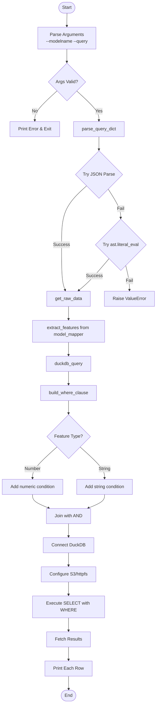
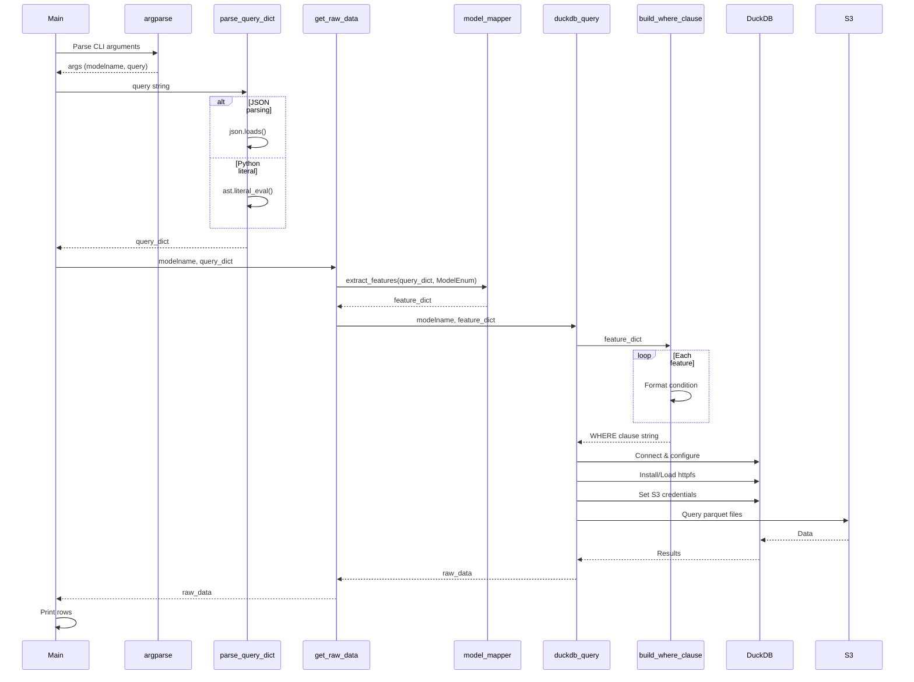

# Diagram: research/api/scripts/model_data_query.py

> Auto-generated by Obscura crawlers

## Diagram 1

### SVG

<svg id="container" width="568.87890625" xmlns="http://www.w3.org/2000/svg" class="flowchart" height="2493.453125" viewBox="0 0 568.87890625 2493.453125" role="graphics-document document" aria-roledescription="flowchart-v2"><g><marker id="container_flowchart-v2-pointEnd" class="marker flowchart-v2" viewBox="0 0 10 10" refX="5" refY="5" markerUnits="userSpaceOnUse" markerWidth="8" markerHeight="8" orient="auto"><path d="M 0 0 L 10 5 L 0 10 z" class="arrowMarkerPath" style="stroke-width: 1; stroke-dasharray: 1, 0;"></path></marker><marker id="container_flowchart-v2-pointStart" class="marker flowchart-v2" viewBox="0 0 10 10" refX="4.5" refY="5" markerUnits="userSpaceOnUse" markerWidth="8" markerHeight="8" orient="auto"><path d="M 0 5 L 10 10 L 10 0 z" class="arrowMarkerPath" style="stroke-width: 1; stroke-dasharray: 1, 0;"></path></marker><marker id="container_flowchart-v2-circleEnd" class="marker flowchart-v2" viewBox="0 0 10 10" refX="11" refY="5" markerUnits="userSpaceOnUse" markerWidth="11" markerHeight="11" orient="auto"><circle cx="5" cy="5" r="5" class="arrowMarkerPath" style="stroke-width: 1; stroke-dasharray: 1, 0;"></circle></marker><marker id="container_flowchart-v2-circleStart" class="marker flowchart-v2" viewBox="0 0 10 10" refX="-1" refY="5" markerUnits="userSpaceOnUse" markerWidth="11" markerHeight="11" orient="auto"><circle cx="5" cy="5" r="5" class="arrowMarkerPath" style="stroke-width: 1; stroke-dasharray: 1, 0;"></circle></marker><marker id="container_flowchart-v2-crossEnd" class="marker cross flowchart-v2" viewBox="0 0 11 11" refX="12" refY="5.2" markerUnits="userSpaceOnUse" markerWidth="11" markerHeight="11" orient="auto"><path d="M 1,1 l 9,9 M 10,1 l -9,9" class="arrowMarkerPath" style="stroke-width: 2; stroke-dasharray: 1, 0;"></path></marker><marker id="container_flowchart-v2-crossStart" class="marker cross flowchart-v2" viewBox="0 0 11 11" refX="-1" refY="5.2" markerUnits="userSpaceOnUse" markerWidth="11" markerHeight="11" orient="auto"><path d="M 1,1 l 9,9 M 10,1 l -9,9" class="arrowMarkerPath" style="stroke-width: 2; stroke-dasharray: 1, 0;"></path></marker><g class="root"><g class="clusters"></g><g class="edgePaths"><path d="M246.75,47.5L246.667,51.583C246.583,55.667,246.417,63.833,246.333,71.417C246.25,79,246.25,86,246.25,89.5L246.25,93" id="L_Start_ParseArgs_0" class="edge-thickness-normal edge-pattern-solid edge-thickness-normal edge-pattern-solid flowchart-link" style=";" data-edge="true" data-et="edge" data-id="L_Start_ParseArgs_0" data-points="W3sieCI6MjQ2Ljc1LCJ5Ijo0Ny41fSx7IngiOjI0Ni4yNSwieSI6NzJ9LHsieCI6MjQ2LjI1LCJ5Ijo5N31d" marker-end="url(#container_flowchart-v2-pointEnd)"></path><path d="M246.25,175L246.25,179.167C246.25,183.333,246.25,191.667,246.25,199.333C246.25,207,246.25,214,246.25,217.5L246.25,221" id="L_ParseArgs_CheckArgs_0" class="edge-thickness-normal edge-pattern-solid edge-thickness-normal edge-pattern-solid flowchart-link" style=";" data-edge="true" data-et="edge" data-id="L_ParseArgs_CheckArgs_0" data-points="W3sieCI6MjQ2LjI1LCJ5IjoxNzV9LHsieCI6MjQ2LjI1LCJ5IjoyMDB9LHsieCI6MjQ2LjI1LCJ5IjoyMjV9XQ==" marker-end="url(#container_flowchart-v2-pointEnd)"></path><path d="M211.227,321.915L197.642,333.918C184.056,345.922,156.886,369.93,143.3,387.434C129.715,404.938,129.715,415.938,129.715,421.438L129.715,426.938" id="L_CheckArgs_Exit1_0" class="edge-thickness-normal edge-pattern-solid edge-thickness-normal edge-pattern-solid flowchart-link" style=";" data-edge="true" data-et="edge" data-id="L_CheckArgs_Exit1_0" data-points="W3sieCI6MjExLjIyNzAzMDYxMzI0MzY0LCJ5IjozMjEuOTE0NTMwNjEzMjQzNjR9LHsieCI6MTI5LjcxNDg0Mzc1LCJ5IjozOTMuOTM3NX0seyJ4IjoxMjkuNzE0ODQzNzUsInkiOjQzMC45Mzc1fV0=" marker-end="url(#container_flowchart-v2-pointEnd)"></path><path d="M281.273,321.915L294.858,333.918C308.444,345.922,335.614,369.93,349.2,387.434C362.785,404.938,362.785,415.938,362.785,421.438L362.785,426.938" id="L_CheckArgs_ParseQuery_0" class="edge-thickness-normal edge-pattern-solid edge-thickness-normal edge-pattern-solid flowchart-link" style=";" data-edge="true" data-et="edge" data-id="L_CheckArgs_ParseQuery_0" data-points="W3sieCI6MjgxLjI3Mjk2OTM4Njc1NjM2LCJ5IjozMjEuOTE0NTMwNjEzMjQzNjR9LHsieCI6MzYyLjc4NTE1NjI1LCJ5IjozOTMuOTM3NX0seyJ4IjozNjIuNzg1MTU2MjUsInkiOjQzMC45Mzc1fV0=" marker-end="url(#container_flowchart-v2-pointEnd)"></path><path d="M362.785,484.938L362.785,489.104C362.785,493.271,362.785,501.604,362.785,509.271C362.785,516.938,362.785,523.938,362.785,527.438L362.785,530.938" id="L_ParseQuery_TryJSON_0" class="edge-thickness-normal edge-pattern-solid edge-thickness-normal edge-pattern-solid flowchart-link" style=";" data-edge="true" data-et="edge" data-id="L_ParseQuery_TryJSON_0" data-points="W3sieCI6MzYyLjc4NTE1NjI1LCJ5Ijo0ODQuOTM3NX0seyJ4IjozNjIuNzg1MTU2MjUsInkiOjUwOS45Mzc1fSx7IngiOjM2Mi43ODUxNTYyNSwieSI6NTM0LjkzNzV9XQ==" marker-end="url(#container_flowchart-v2-pointEnd)"></path><path d="M320.39,651.714L305.305,664.947C290.221,678.179,260.052,704.644,244.967,739.51C229.883,774.375,229.883,817.641,229.883,860.906C229.883,904.172,229.883,947.438,231.966,974.613C234.049,1001.788,238.214,1012.874,240.297,1018.416L242.38,1023.959" id="L_TryJSON_GetRawData_0" class="edge-thickness-normal edge-pattern-solid edge-thickness-normal edge-pattern-solid flowchart-link" style=";" data-edge="true" data-et="edge" data-id="L_TryJSON_GetRawData_0" data-points="W3sieCI6MzIwLjM4OTc0NzY1NDg2NzgsInkiOjY1MS43MTM5NjY0MDQ4Njc3fSx7IngiOjIyOS44ODI4MTI1LCJ5Ijo3MzEuMTA5Mzc1fSx7IngiOjIyOS44ODI4MTI1LCJ5Ijo4NjAuOTA2MjV9LHsieCI6MjI5Ljg4MjgxMjUsInkiOjk5MC43MDMxMjV9LHsieCI6MjQzLjc4NzE3MDQxMDE1NjI1LCJ5IjoxMDI3LjcwMzEyNX1d" marker-end="url(#container_flowchart-v2-pointEnd)"></path><path d="M394.833,662.061L402.592,673.569C410.35,685.077,425.866,708.093,433.625,725.101C441.383,742.109,441.383,753.109,441.383,758.609L441.383,764.109" id="L_TryJSON_TryLiteral_0" class="edge-thickness-normal edge-pattern-solid edge-thickness-normal edge-pattern-solid flowchart-link" style=";" data-edge="true" data-et="edge" data-id="L_TryJSON_TryLiteral_0" data-points="W3sieCI6Mzk0LjgzMzI4MDk4MTA3MjUsInkiOjY2Mi4wNjEyNTAyNjg5Mjc0fSx7IngiOjQ0MS4zODI4MTI1LCJ5Ijo3MzEuMTA5Mzc1fSx7IngiOjQ0MS4zODI4MTI1LCJ5Ijo3NjguMTA5Mzc1fV0=" marker-end="url(#container_flowchart-v2-pointEnd)"></path><path d="M399.057,911.377L387.969,924.598C376.881,937.819,354.706,964.261,336.563,983.228C318.419,1002.195,304.306,1013.686,297.25,1019.432L290.194,1025.177" id="L_TryLiteral_GetRawData_0" class="edge-thickness-normal edge-pattern-solid edge-thickness-normal edge-pattern-solid flowchart-link" style=";" data-edge="true" data-et="edge" data-id="L_TryLiteral_GetRawData_0" data-points="W3sieCI6Mzk5LjA1NjU5ODQ4OTYyMjU2LCJ5Ijo5MTEuMzc2OTEwOTg5NjIyNX0seyJ4IjozMzIuNTMxMjUsInkiOjk5MC43MDMxMjV9LHsieCI6Mjg3LjA5MTk3OTk4MDQ2ODc1LCJ5IjoxMDI3LjcwMzEyNX1d" marker-end="url(#container_flowchart-v2-pointEnd)"></path><path d="M458.924,936.162L461.043,945.252C463.162,954.342,467.399,972.523,469.518,987.113C471.637,1001.703,471.637,1012.703,471.637,1018.203L471.637,1023.703" id="L_TryLiteral_Exit2_0" class="edge-thickness-normal edge-pattern-solid edge-thickness-normal edge-pattern-solid flowchart-link" style=";" data-edge="true" data-et="edge" data-id="L_TryLiteral_Exit2_0" data-points="W3sieCI6NDU4LjkyMzkxOTk4MjM2NjQ0LCJ5Ijo5MzYuMTYyMDE3NTE3NjMzNn0seyJ4Ijo0NzEuNjM2NzE4NzUsInkiOjk5MC43MDMxMjV9LHsieCI6NDcxLjYzNjcxODc1LCJ5IjoxMDI3LjcwMzEyNX1d" marker-end="url(#container_flowchart-v2-pointEnd)"></path><path d="M253.934,1081.703L253.934,1085.87C253.934,1090.036,253.934,1098.37,253.934,1106.036C253.934,1113.703,253.934,1120.703,253.934,1124.203L253.934,1127.703" id="L_GetRawData_ExtractFeatures_0" class="edge-thickness-normal edge-pattern-solid edge-thickness-normal edge-pattern-solid flowchart-link" style=";" data-edge="true" data-et="edge" data-id="L_GetRawData_ExtractFeatures_0" data-points="W3sieCI6MjUzLjkzMzU5Mzc1LCJ5IjoxMDgxLjcwMzEyNX0seyJ4IjoyNTMuOTMzNTkzNzUsInkiOjExMDYuNzAzMTI1fSx7IngiOjI1My45MzM1OTM3NSwieSI6MTEzMS43MDMxMjV9XQ==" marker-end="url(#container_flowchart-v2-pointEnd)"></path><path d="M253.934,1209.703L253.934,1213.87C253.934,1218.036,253.934,1226.37,253.934,1234.036C253.934,1241.703,253.934,1248.703,253.934,1252.203L253.934,1255.703" id="L_ExtractFeatures_DuckDBQuery_0" class="edge-thickness-normal edge-pattern-solid edge-thickness-normal edge-pattern-solid flowchart-link" style=";" data-edge="true" data-et="edge" data-id="L_ExtractFeatures_DuckDBQuery_0" data-points="W3sieCI6MjUzLjkzMzU5Mzc1LCJ5IjoxMjA5LjcwMzEyNX0seyJ4IjoyNTMuOTMzNTkzNzUsInkiOjEyMzQuNzAzMTI1fSx7IngiOjI1My45MzM1OTM3NSwieSI6MTI1OS43MDMxMjV9XQ==" marker-end="url(#container_flowchart-v2-pointEnd)"></path><path d="M253.934,1313.703L253.934,1317.87C253.934,1322.036,253.934,1330.37,253.934,1338.036C253.934,1345.703,253.934,1352.703,253.934,1356.203L253.934,1359.703" id="L_DuckDBQuery_BuildWhere_0" class="edge-thickness-normal edge-pattern-solid edge-thickness-normal edge-pattern-solid flowchart-link" style=";" data-edge="true" data-et="edge" data-id="L_DuckDBQuery_BuildWhere_0" data-points="W3sieCI6MjUzLjkzMzU5Mzc1LCJ5IjoxMzEzLjcwMzEyNX0seyJ4IjoyNTMuOTMzNTkzNzUsInkiOjEzMzguNzAzMTI1fSx7IngiOjI1My45MzM1OTM3NSwieSI6MTM2My43MDMxMjV9XQ==" marker-end="url(#container_flowchart-v2-pointEnd)"></path><path d="M253.934,1417.703L253.934,1421.87C253.934,1426.036,253.934,1434.37,253.934,1442.036C253.934,1449.703,253.934,1456.703,253.934,1460.203L253.934,1463.703" id="L_BuildWhere_CheckType_0" class="edge-thickness-normal edge-pattern-solid edge-thickness-normal edge-pattern-solid flowchart-link" style=";" data-edge="true" data-et="edge" data-id="L_BuildWhere_CheckType_0" data-points="W3sieCI6MjUzLjkzMzU5Mzc1LCJ5IjoxNDE3LjcwMzEyNX0seyJ4IjoyNTMuOTMzNTkzNzUsInkiOjE0NDIuNzAzMTI1fSx7IngiOjI1My45MzM1OTM3NSwieSI6MTQ2Ny43MDMxMjV9XQ==" marker-end="url(#container_flowchart-v2-pointEnd)"></path><path d="M212.67,1579.19L197.341,1592.234C182.012,1605.278,151.354,1631.365,136.024,1649.909C120.695,1668.453,120.695,1679.453,120.695,1684.953L120.695,1690.453" id="L_CheckType_AddNumeric_0" class="edge-thickness-normal edge-pattern-solid edge-thickness-normal edge-pattern-solid flowchart-link" style=";" data-edge="true" data-et="edge" data-id="L_CheckType_AddNumeric_0" data-points="W3sieCI6MjEyLjY3MDMxMDI4NDkzNDE3LCJ5IjoxNTc5LjE4OTg0MTUzNDkzNDJ9LHsieCI6MTIwLjY5NTMxMjUsInkiOjE2NTcuNDUzMTI1fSx7IngiOjEyMC42OTUzMTI1LCJ5IjoxNjk0LjQ1MzEyNX1d" marker-end="url(#container_flowchart-v2-pointEnd)"></path><path d="M295.197,1579.19L310.526,1592.234C325.855,1605.278,356.514,1631.365,371.843,1649.909C387.172,1668.453,387.172,1679.453,387.172,1684.953L387.172,1690.453" id="L_CheckType_AddString_0" class="edge-thickness-normal edge-pattern-solid edge-thickness-normal edge-pattern-solid flowchart-link" style=";" data-edge="true" data-et="edge" data-id="L_CheckType_AddString_0" data-points="W3sieCI6Mjk1LjE5Njg3NzIxNTA2NTgsInkiOjE1NzkuMTg5ODQxNTM0OTM0Mn0seyJ4IjozODcuMTcxODc1LCJ5IjoxNjU3LjQ1MzEyNX0seyJ4IjozODcuMTcxODc1LCJ5IjoxNjk0LjQ1MzEyNX1d" marker-end="url(#container_flowchart-v2-pointEnd)"></path><path d="M120.695,1748.453L120.695,1752.62C120.695,1756.786,120.695,1765.12,130.75,1773.211C140.806,1781.302,160.916,1789.15,170.971,1793.075L181.026,1796.999" id="L_AddNumeric_JoinClauses_0" class="edge-thickness-normal edge-pattern-solid edge-thickness-normal edge-pattern-solid flowchart-link" style=";" data-edge="true" data-et="edge" data-id="L_AddNumeric_JoinClauses_0" data-points="W3sieCI6MTIwLjY5NTMxMjUsInkiOjE3NDguNDUzMTI1fSx7IngiOjEyMC42OTUzMTI1LCJ5IjoxNzczLjQ1MzEyNX0seyJ4IjoxODQuNzUyMTc4NDg1NTc2OSwieSI6MTc5OC40NTMxMjV9XQ==" marker-end="url(#container_flowchart-v2-pointEnd)"></path><path d="M387.172,1748.453L387.172,1752.62C387.172,1756.786,387.172,1765.12,377.117,1773.211C367.062,1781.302,346.951,1789.15,336.896,1793.075L326.841,1796.999" id="L_AddString_JoinClauses_0" class="edge-thickness-normal edge-pattern-solid edge-thickness-normal edge-pattern-solid flowchart-link" style=";" data-edge="true" data-et="edge" data-id="L_AddString_JoinClauses_0" data-points="W3sieCI6Mzg3LjE3MTg3NSwieSI6MTc0OC40NTMxMjV9LHsieCI6Mzg3LjE3MTg3NSwieSI6MTc3My40NTMxMjV9LHsieCI6MzIzLjExNTAwOTAxNDQyMzEsInkiOjE3OTguNDUzMTI1fV0=" marker-end="url(#container_flowchart-v2-pointEnd)"></path><path d="M253.934,1852.453L253.934,1856.62C253.934,1860.786,253.934,1869.12,253.934,1876.786C253.934,1884.453,253.934,1891.453,253.934,1894.953L253.934,1898.453" id="L_JoinClauses_ConnectDB_0" class="edge-thickness-normal edge-pattern-solid edge-thickness-normal edge-pattern-solid flowchart-link" style=";" data-edge="true" data-et="edge" data-id="L_JoinClauses_ConnectDB_0" data-points="W3sieCI6MjUzLjkzMzU5Mzc1LCJ5IjoxODUyLjQ1MzEyNX0seyJ4IjoyNTMuOTMzNTkzNzUsInkiOjE4NzcuNDUzMTI1fSx7IngiOjI1My45MzM1OTM3NSwieSI6MTkwMi40NTMxMjV9XQ==" marker-end="url(#container_flowchart-v2-pointEnd)"></path><path d="M253.934,1956.453L253.934,1960.62C253.934,1964.786,253.934,1973.12,253.934,1980.786C253.934,1988.453,253.934,1995.453,253.934,1998.953L253.934,2002.453" id="L_ConnectDB_ConfigS3_0" class="edge-thickness-normal edge-pattern-solid edge-thickness-normal edge-pattern-solid flowchart-link" style=";" data-edge="true" data-et="edge" data-id="L_ConnectDB_ConfigS3_0" data-points="W3sieCI6MjUzLjkzMzU5Mzc1LCJ5IjoxOTU2LjQ1MzEyNX0seyJ4IjoyNTMuOTMzNTkzNzUsInkiOjE5ODEuNDUzMTI1fSx7IngiOjI1My45MzM1OTM3NSwieSI6MjAwNi40NTMxMjV9XQ==" marker-end="url(#container_flowchart-v2-pointEnd)"></path><path d="M253.934,2060.453L253.934,2064.62C253.934,2068.786,253.934,2077.12,253.934,2084.786C253.934,2092.453,253.934,2099.453,253.934,2102.953L253.934,2106.453" id="L_ConfigS3_ExecuteQuery_0" class="edge-thickness-normal edge-pattern-solid edge-thickness-normal edge-pattern-solid flowchart-link" style=";" data-edge="true" data-et="edge" data-id="L_ConfigS3_ExecuteQuery_0" data-points="W3sieCI6MjUzLjkzMzU5Mzc1LCJ5IjoyMDYwLjQ1MzEyNX0seyJ4IjoyNTMuOTMzNTkzNzUsInkiOjIwODUuNDUzMTI1fSx7IngiOjI1My45MzM1OTM3NSwieSI6MjExMC40NTMxMjV9XQ==" marker-end="url(#container_flowchart-v2-pointEnd)"></path><path d="M253.934,2188.453L253.934,2192.62C253.934,2196.786,253.934,2205.12,253.934,2212.786C253.934,2220.453,253.934,2227.453,253.934,2230.953L253.934,2234.453" id="L_ExecuteQuery_FetchData_0" class="edge-thickness-normal edge-pattern-solid edge-thickness-normal edge-pattern-solid flowchart-link" style=";" data-edge="true" data-et="edge" data-id="L_ExecuteQuery_FetchData_0" data-points="W3sieCI6MjUzLjkzMzU5Mzc1LCJ5IjoyMTg4LjQ1MzEyNX0seyJ4IjoyNTMuOTMzNTkzNzUsInkiOjIyMTMuNDUzMTI1fSx7IngiOjI1My45MzM1OTM3NSwieSI6MjIzOC40NTMxMjV9XQ==" marker-end="url(#container_flowchart-v2-pointEnd)"></path><path d="M253.934,2292.453L253.934,2296.62C253.934,2300.786,253.934,2309.12,253.934,2316.786C253.934,2324.453,253.934,2331.453,253.934,2334.953L253.934,2338.453" id="L_FetchData_PrintRows_0" class="edge-thickness-normal edge-pattern-solid edge-thickness-normal edge-pattern-solid flowchart-link" style=";" data-edge="true" data-et="edge" data-id="L_FetchData_PrintRows_0" data-points="W3sieCI6MjUzLjkzMzU5Mzc1LCJ5IjoyMjkyLjQ1MzEyNX0seyJ4IjoyNTMuOTMzNTkzNzUsInkiOjIzMTcuNDUzMTI1fSx7IngiOjI1My45MzM1OTM3NSwieSI6MjM0Mi40NTMxMjV9XQ==" marker-end="url(#container_flowchart-v2-pointEnd)"></path><path d="M253.934,2396.453L253.934,2400.62C253.934,2404.786,253.934,2413.12,254.004,2420.87C254.074,2428.62,254.215,2435.787,254.285,2439.37L254.355,2442.954" id="L_PrintRows_End_0" class="edge-thickness-normal edge-pattern-solid edge-thickness-normal edge-pattern-solid flowchart-link" style=";" data-edge="true" data-et="edge" data-id="L_PrintRows_End_0" data-points="W3sieCI6MjUzLjkzMzU5Mzc1LCJ5IjoyMzk2LjQ1MzEyNX0seyJ4IjoyNTMuOTMzNTkzNzUsInkiOjI0MjEuNDUzMTI1fSx7IngiOjI1NC40MzM1OTM3NSwieSI6MjQ0Ni45NTMxMjV9XQ==" marker-end="url(#container_flowchart-v2-pointEnd)"></path></g><g class="edgeLabels"><g class="edgeLabel"><g class="label" data-id="L_Start_ParseArgs_0" transform="translate(0, 0)"><foreignObject width="0" height="0">

</foreignObject></g></g><g class="edgeLabel"><g class="label" data-id="L_ParseArgs_CheckArgs_0" transform="translate(0, 0)"><foreignObject width="0" height="0">

</foreignObject></g></g><g class="edgeLabel" transform="translate(129.71484375, 393.9375)"><g class="label" data-id="L_CheckArgs_Exit1_0" transform="translate(-10.140625, -12)"><foreignObject width="20.28125" height="24">

No

</foreignObject></g></g><g class="edgeLabel" transform="translate(362.78515625, 393.9375)"><g class="label" data-id="L_CheckArgs_ParseQuery_0" transform="translate(-12.03125, -12)"><foreignObject width="24.0625" height="24">

Yes

</foreignObject></g></g><g class="edgeLabel"><g class="label" data-id="L_ParseQuery_TryJSON_0" transform="translate(0, 0)"><foreignObject width="0" height="0">

</foreignObject></g></g><g class="edgeLabel" transform="translate(229.8828125, 860.90625)"><g class="label" data-id="L_TryJSON_GetRawData_0" transform="translate(-28.1015625, -12)"><foreignObject width="56.203125" height="24">

Success

</foreignObject></g></g><g class="edgeLabel" transform="translate(441.3828125, 731.109375)"><g class="label" data-id="L_TryJSON_TryLiteral_0" transform="translate(-12.40625, -12)"><foreignObject width="24.8125" height="24">

Fail

</foreignObject></g></g><g class="edgeLabel" transform="translate(346.96707, 973.48955)"><g class="label" data-id="L_TryLiteral_GetRawData_0" transform="translate(-28.1015625, -12)"><foreignObject width="56.203125" height="24">

Success

</foreignObject></g></g><g class="edgeLabel" transform="translate(471.63671875, 990.703125)"><g class="label" data-id="L_TryLiteral_Exit2_0" transform="translate(-12.40625, -12)"><foreignObject width="24.8125" height="24">

Fail

</foreignObject></g></g><g class="edgeLabel"><g class="label" data-id="L_GetRawData_ExtractFeatures_0" transform="translate(0, 0)"><foreignObject width="0" height="0">

</foreignObject></g></g><g class="edgeLabel"><g class="label" data-id="L_ExtractFeatures_DuckDBQuery_0" transform="translate(0, 0)"><foreignObject width="0" height="0">

</foreignObject></g></g><g class="edgeLabel"><g class="label" data-id="L_DuckDBQuery_BuildWhere_0" transform="translate(0, 0)"><foreignObject width="0" height="0">

</foreignObject></g></g><g class="edgeLabel"><g class="label" data-id="L_BuildWhere_CheckType_0" transform="translate(0, 0)"><foreignObject width="0" height="0">

</foreignObject></g></g><g class="edgeLabel" transform="translate(120.6953125, 1657.453125)"><g class="label" data-id="L_CheckType_AddNumeric_0" transform="translate(-29.1796875, -12)"><foreignObject width="58.359375" height="24">

Number

</foreignObject></g></g><g class="edgeLabel" transform="translate(387.171875, 1657.453125)"><g class="label" data-id="L_CheckType_AddString_0" transform="translate(-21.4453125, -12)"><foreignObject width="42.890625" height="24">

String

</foreignObject></g></g><g class="edgeLabel"><g class="label" data-id="L_AddNumeric_JoinClauses_0" transform="translate(0, 0)"><foreignObject width="0" height="0">

</foreignObject></g></g><g class="edgeLabel"><g class="label" data-id="L_AddString_JoinClauses_0" transform="translate(0, 0)"><foreignObject width="0" height="0">

</foreignObject></g></g><g class="edgeLabel"><g class="label" data-id="L_JoinClauses_ConnectDB_0" transform="translate(0, 0)"><foreignObject width="0" height="0">

</foreignObject></g></g><g class="edgeLabel"><g class="label" data-id="L_ConnectDB_ConfigS3_0" transform="translate(0, 0)"><foreignObject width="0" height="0">

</foreignObject></g></g><g class="edgeLabel"><g class="label" data-id="L_ConfigS3_ExecuteQuery_0" transform="translate(0, 0)"><foreignObject width="0" height="0">

</foreignObject></g></g><g class="edgeLabel"><g class="label" data-id="L_ExecuteQuery_FetchData_0" transform="translate(0, 0)"><foreignObject width="0" height="0">

</foreignObject></g></g><g class="edgeLabel"><g class="label" data-id="L_FetchData_PrintRows_0" transform="translate(0, 0)"><foreignObject width="0" height="0">

</foreignObject></g></g><g class="edgeLabel"><g class="label" data-id="L_PrintRows_End_0" transform="translate(0, 0)"><foreignObject width="0" height="0">

</foreignObject></g></g></g><g class="nodes"><g class="node default" id="flowchart-Start-0" transform="translate(246.25, 27.5)"><g class="basic label-container outer-path"><path d="M-10.3984375 -19.5 C-3.9582768915455295 -19.5, 2.481883716908941 -19.5, 10.3984375 -19.5 C10.3984375 -19.5, 10.398437499999998 -19.5, 10.398437499999998 -19.5 C10.829653650241205 -19.486171737373084, 11.260869800482412 -19.472343474746168, 11.6478067896239 -19.45993515863156 C12.103335439201599 -19.41599085766015, 12.558864088779298 -19.372046556688748, 12.892042152847864 -19.3399052695533 C13.252900646618258 -19.281564466779916, 13.613759140388654 -19.223223664006536, 14.126030759676757 -19.140403561325776 C14.414848782594646 -19.074482732308503, 14.703666805512535 -19.00856190329123, 15.34470188623539 -18.862249829261074 C15.7818378574628 -18.732510167574315, 16.218973828690213 -18.602770505887555, 16.543047751460602 -18.50658706670804 C16.844224961729502 -18.395751069277473, 17.145402171998402 -18.284915071846903, 17.716144095147794 -18.074876768247425 C18.17001677849081 -17.873960794986257, 18.62388946183383 -17.673044821725092, 18.85917041279238 -17.568892924097174 C19.08463989446419 -17.451265639929087, 19.310109376135998 -17.333638355761, 19.967429764076783 -16.990714730406097 C20.267417221783923 -16.808860570622045, 20.567404679491062 -16.627006410837993, 21.036368073605697 -16.342718045390892 C21.33099714198615 -16.137197561575494, 21.625626210366605 -15.9316770777601, 22.061592844578712 -15.627565626425154 C22.384380134468383 -15.37015135246867, 22.707167424358058 -15.112737078512184, 23.03889120850187 -14.848196188198123 C23.380890397728432 -14.537601573345249, 23.72288958695499 -14.227006958492375, 23.964247236767985 -14.007812326905688 C24.277520351452264 -13.684332115793124, 24.590793466136542 -13.36085190468056, 24.833858442968648 -13.10986736009568 C25.11659135589291 -12.777753192616347, 25.39932426881717 -12.445639025137012, 25.644151408126582 -12.158051136245305 C25.80968821724811 -11.936246892736012, 25.975225026369632 -11.714442649226717, 26.391796464640635 -11.156274872382312 C26.554305295971137 -10.906617667727312, 26.716814127301635 -10.656960463072313, 27.073721378604247 -10.108655082055241 C27.238799643428706 -9.815541906872479, 27.40387790825317 -9.522428731689718, 27.6871239742735 -9.019496659696287 C27.890769884032622 -8.59662157075703, 28.094415793791747 -8.173746481817773, 28.22948364880834 -7.893275190886684 C28.37581846346388 -7.531825369496332, 28.52215327811942 -7.170375548105979, 28.698571729970325 -6.734618561215508 C28.780899996863578 -6.486658938561009, 28.863228263756827 -6.2386993159065085, 29.09246063421488 -5.548287939305138 C29.17064456012314 -5.250138744689116, 29.248828486031396 -4.951989550073094, 29.40953178754556 -4.339158212148133 C29.45985811908365 -4.080743136173994, 29.510184450621736 -3.8223280601998537, 29.648482276581777 -3.1121979531509023 C29.69220071333581 -2.7731263908684327, 29.735919150089845 -2.434054828585963, 29.808330202509367 -1.872449005199798 C29.835759325575548 -1.4452182730543555, 29.863188448641733 -1.017987540908913, 29.888418715913414 -0.6250057626472757 C29.888418715913414 -0.13240086650841476, 29.888418715913414 0.3602040296304462, 29.888418715913414 0.625005762647271 C29.860324823175947 1.0625908190153948, 29.832230930438477 1.5001758753835186, 29.808330202509367 1.8724490051997846 C29.77611113978765 2.122333693295877, 29.743892077065926 2.3722183813919697, 29.648482276581777 3.1121979531508885 C29.575675717576203 3.4860442459728116, 29.502869158570633 3.8598905387947346, 29.40953178754556 4.339158212148129 C29.329168507679597 4.645618227942864, 29.248805227813634 4.9520782437376, 29.092460634214884 5.548287939305125 C28.98957200821129 5.858172087751619, 28.886683382207696 6.1680562361981135, 28.69857172997033 6.734618561215495 C28.584535408320082 7.016290480433894, 28.470499086669836 7.297962399652294, 28.229483648808344 7.893275190886679 C28.035884174784005 8.295288641063369, 27.842284700759667 8.697302091240058, 27.687123974273504 9.019496659696284 C27.452951946895165 9.435292806795587, 27.21877991951683 9.851088953894891, 27.07372137860425 10.108655082055236 C26.84094233426651 10.466266204083622, 26.608163289928772 10.823877326112008, 26.39179646464064 11.156274872382301 C26.19542250951709 11.419398082212513, 25.999048554393543 11.682521292042727, 25.644151408126582 12.158051136245302 C25.451366855684803 12.384506841295208, 25.258582303243024 12.610962546345116, 24.83385844296866 13.10986736009567 C24.580937319332143 13.371029185460804, 24.32801619569563 13.632191010825938, 23.96424723676799 14.007812326905684 C23.730258951527297 14.220314296570509, 23.496270666286605 14.432816266235333, 23.038891208501887 14.848196188198111 C22.79540763681408 15.042367857249179, 22.551924065126272 15.236539526300247, 22.061592844578715 15.627565626425152 C21.846597540185687 15.777537043773005, 21.631602235792656 15.927508461120858, 21.036368073605708 16.34271804539089 C20.68023778034218 16.558606322021145, 20.32410748707865 16.774494598651405, 19.967429764076787 16.990714730406093 C19.546311548250603 17.21041183386352, 19.12519333242442 17.430108937320952, 18.859170412792388 17.56889292409717 C18.430011978200934 17.758868632558162, 18.00085354360948 17.948844341019154, 17.716144095147804 18.07487676824742 C17.28876533545678 18.232156102459665, 16.861386575765756 18.389435436671906, 16.543047751460616 18.506587066708033 C16.10277760267735 18.637256935841737, 15.662507453894081 18.767926804975442, 15.344701886235413 18.86224982926107 C14.948771972895452 18.952618248296773, 14.552842059555491 19.042986667332478, 14.126030759676766 19.140403561325773 C13.725931865840995 19.20508844766788, 13.325832972005221 19.269773334009983, 12.892042152847878 19.3399052695533 C12.526132160876191 19.375204166407656, 12.160222168904504 19.410503063262016, 11.6478067896239 19.45993515863156 C11.314310208684795 19.47062974487056, 10.980813627745688 19.481324331109562, 10.398437500000004 19.5 C10.398437500000002 19.5, 10.3984375 19.5, 10.3984375 19.5 C5.9111483934624145 19.5, 1.423859286924829 19.5, -10.398437499999996 19.5 C-10.834229396054786 19.486025002110992, -11.270021292109575 19.47205000422198, -11.647806789623893 19.45993515863156 C-11.922233100499978 19.43346158246727, -12.196659411376062 19.40698800630298, -12.892042152847871 19.3399052695533 C-13.279557541449693 19.277254786750877, -13.667072930051514 19.214604303948455, -14.126030759676759 19.140403561325773 C-14.496817008196299 19.055774019707584, -14.867603256715839 18.971144478089396, -15.344701886235388 18.862249829261074 C-15.704480600490255 18.755469395387237, -16.064259314745122 18.648688961513404, -16.54304775146059 18.506587066708043 C-16.920387367715254 18.36772259983715, -17.297726983969913 18.228858132966263, -17.716144095147797 18.074876768247425 C-17.961466367387132 17.966279875553717, -18.206788639626467 17.85768298286001, -18.85917041279238 17.568892924097174 C-19.149229362945 17.41756935559418, -19.43928831309762 17.26624578709118, -19.96742976407678 16.990714730406097 C-20.34337458010337 16.762814773633814, -20.719319396129954 16.534914816861527, -21.036368073605686 16.3427180453909 C-21.3259328144167 16.14073021725674, -21.615497555227712 15.938742389122577, -22.061592844578712 15.627565626425156 C-22.28708466441261 15.447741900696956, -22.51257648424651 15.267918174968756, -23.03889120850187 14.848196188198125 C-23.379411267843896 14.538944879970751, -23.719931327185925 14.229693571743377, -23.964247236767974 14.007812326905697 C-24.15270227131678 13.813217031287973, -24.341157305865583 13.618621735670247, -24.833858442968655 13.109867360095677 C-24.99634249531042 12.919004346610546, -25.158826547652183 12.728141333125413, -25.64415140812658 12.158051136245307 C-25.865130131209504 11.861959778890007, -26.086108854292426 11.565868421534708, -26.391796464640635 11.156274872382316 C-26.581977518086862 10.864105703525478, -26.77215857153309 10.571936534668641, -27.073721378604244 10.108655082055249 C-27.228385228281283 9.834033755540622, -27.383049077958322 9.559412429025995, -27.6871239742735 9.019496659696289 C-27.832672698266023 8.717261620082015, -27.978221422258546 8.415026580467739, -28.22948364880834 7.893275190886686 C-28.373931570311882 7.536486032062364, -28.518379491815423 7.1796968732380435, -28.698571729970325 6.73461856121551 C-28.836137756880014 6.320291606333365, -28.973703783789706 5.905964651451219, -29.09246063421488 5.5482879393051325 C-29.193494647291566 5.16300145902547, -29.294528660368254 4.777714978745806, -29.409531787545557 4.339158212148136 C-29.49720014543302 3.8889997231100284, -29.58486850332048 3.438841234071921, -29.648482276581777 3.112197953150904 C-29.69043829640664 2.7867953485424923, -29.732394316231503 2.461392743934081, -29.808330202509364 1.872449005199809 C-29.829376799911437 1.5446312621548608, -29.850423397313513 1.2168135191099123, -29.888418715913414 0.6250057626472781 C-29.888418715913414 0.3318810890998274, -29.888418715913414 0.03875641555237663, -29.888418715913414 -0.6250057626472687 C-29.86666495575422 -0.963838136445881, -29.844911195595024 -1.3026705102444933, -29.808330202509367 -1.8724490051997822 C-29.76267872934495 -2.2265128161599477, -29.71702725618054 -2.5805766271201134, -29.648482276581777 -3.112197953150895 C-29.55784151530503 -3.5776191053753137, -29.467200754028283 -4.043040257599732, -29.40953178754556 -4.339158212148126 C-29.28521129139388 -4.813246144818357, -29.160890795242196 -5.2873340774885875, -29.092460634214884 -5.548287939305123 C-28.97089931134268 -5.9144112756296465, -28.84933798847048 -6.280534611954169, -28.698571729970332 -6.734618561215485 C-28.565245191639278 -7.06393768858645, -28.431918653308223 -7.393256815957415, -28.229483648808344 -7.893275190886676 C-28.083064552512806 -8.19731757721115, -27.936645456217267 -8.501359963535624, -27.687123974273504 -9.019496659696282 C-27.51877302487659 -9.318420817732685, -27.350422075479674 -9.61734497576909, -27.073721378604247 -10.108655082055243 C-26.93542930386939 -10.321108845469666, -26.797137229134535 -10.53356260888409, -26.39179646464064 -11.156274872382308 C-26.22095464858914 -11.385187341881696, -26.05011283253764 -11.614099811381084, -25.644151408126586 -12.158051136245302 C-25.429361229484616 -12.410355901985556, -25.214571050842643 -12.662660667725811, -24.833858442968662 -13.10986736009567 C-24.595218835828003 -13.35628234714452, -24.356579228687345 -13.602697334193369, -23.964247236767996 -14.007812326905677 C-23.65777612198672 -14.286141284568682, -23.351305007205443 -14.564470242231687, -23.038891208501887 -14.848196188198107 C-22.765281217697076 -15.066392874797305, -22.49167122689226 -15.284589561396503, -22.06159284457872 -15.627565626425149 C-21.819742449557317 -15.796269992457217, -21.57789205453592 -15.964974358489286, -21.03636807360571 -16.342718045390885 C-20.742460012077746 -16.520886839484625, -20.448551950549778 -16.69905563357836, -19.96742976407679 -16.99071473040609 C-19.54609910612762 -17.210522664783007, -19.12476844817845 -17.430330599159923, -18.859170412792388 -17.56889292409717 C-18.51454945213917 -17.72144640056077, -18.169928491485955 -17.873999877024367, -17.716144095147804 -18.07487676824742 C-17.312248835193714 -18.22351395747738, -16.908353575239623 -18.372151146707342, -16.54304775146062 -18.506587066708033 C-16.26594002290376 -18.58883118597556, -15.988832294346897 -18.671075305243086, -15.344701886235413 -18.862249829261067 C-14.97093343084306 -18.947560040137258, -14.597164975450706 -19.03287025101345, -14.126030759676768 -19.140403561325773 C-13.734052307918077 -19.203775597567823, -13.342073856159386 -19.267147633809877, -12.89204215284788 -19.3399052695533 C-12.557397738872094 -19.37218801370075, -12.222753324896306 -19.404470757848205, -11.647806789623903 -19.45993515863156 C-11.365376770896914 -19.46899213961545, -11.082946752169924 -19.478049120599344, -10.398437500000005 -19.5 C-10.398437500000004 -19.5, -10.398437500000002 -19.5, -10.3984375 -19.5" stroke="none" stroke-width="0" fill="#ECECFF" style=""></path><path d="M-10.3984375 -19.5 C-3.113403917891321 -19.5, 4.171629664217358 -19.5, 10.3984375 -19.5 M-10.3984375 -19.5 C-5.530126340568584 -19.5, -0.6618151811371682 -19.5, 10.3984375 -19.5 M10.3984375 -19.5 C10.3984375 -19.5, 10.398437499999998 -19.5, 10.398437499999998 -19.5 M10.3984375 -19.5 C10.3984375 -19.5, 10.398437499999998 -19.5, 10.398437499999998 -19.5 M10.398437499999998 -19.5 C10.848995047344498 -19.485551496413727, 11.299552594689 -19.471102992827454, 11.6478067896239 -19.45993515863156 M10.398437499999998 -19.5 C10.69865656569843 -19.490372558904014, 10.99887563139686 -19.480745117808027, 11.6478067896239 -19.45993515863156 M11.6478067896239 -19.45993515863156 C12.135664934565547 -19.4128720701243, 12.623523079507194 -19.36580898161704, 12.892042152847864 -19.3399052695533 M11.6478067896239 -19.45993515863156 C11.96650423166841 -19.429190799687277, 12.285201673712917 -19.398446440742994, 12.892042152847864 -19.3399052695533 M12.892042152847864 -19.3399052695533 C13.15824024991502 -19.296868425616555, 13.424438346982177 -19.253831581679812, 14.126030759676757 -19.140403561325776 M12.892042152847864 -19.3399052695533 C13.23796630947877 -19.283978934591115, 13.583890466109676 -19.22805259962893, 14.126030759676757 -19.140403561325776 M14.126030759676757 -19.140403561325776 C14.508385477001726 -19.05313359219406, 14.890740194326696 -18.965863623062347, 15.34470188623539 -18.862249829261074 M14.126030759676757 -19.140403561325776 C14.503189062572902 -19.054319639877665, 14.88034736546905 -18.968235718429558, 15.34470188623539 -18.862249829261074 M15.34470188623539 -18.862249829261074 C15.771043898440304 -18.735713757953544, 16.19738591064522 -18.609177686646017, 16.543047751460602 -18.50658706670804 M15.34470188623539 -18.862249829261074 C15.639269180687833 -18.77482380248287, 15.933836475140277 -18.687397775704667, 16.543047751460602 -18.50658706670804 M16.543047751460602 -18.50658706670804 C16.81942819573063 -18.40487650838385, 17.09580864000066 -18.303165950059658, 17.716144095147794 -18.074876768247425 M16.543047751460602 -18.50658706670804 C16.78056462578853 -18.419178661373444, 17.018081500116452 -18.33177025603885, 17.716144095147794 -18.074876768247425 M17.716144095147794 -18.074876768247425 C17.9733463777199 -17.961020947387386, 18.230548660292 -17.847165126527347, 18.85917041279238 -17.568892924097174 M17.716144095147794 -18.074876768247425 C18.108857841921903 -17.90103404198992, 18.501571588696013 -17.727191315732416, 18.85917041279238 -17.568892924097174 M18.85917041279238 -17.568892924097174 C19.11614797133268 -17.434827896408684, 19.373125529872976 -17.30076286872019, 19.967429764076783 -16.990714730406097 M18.85917041279238 -17.568892924097174 C19.153783990198452 -17.41519320947343, 19.448397567604523 -17.261493494849685, 19.967429764076783 -16.990714730406097 M19.967429764076783 -16.990714730406097 C20.31922550150786 -16.777454086994148, 20.671021238938934 -16.5641934435822, 21.036368073605697 -16.342718045390892 M19.967429764076783 -16.990714730406097 C20.35296183893107 -16.757002920991475, 20.738493913785355 -16.52329111157685, 21.036368073605697 -16.342718045390892 M21.036368073605697 -16.342718045390892 C21.37487470811317 -16.10659047087451, 21.713381342620643 -15.87046289635813, 22.061592844578712 -15.627565626425154 M21.036368073605697 -16.342718045390892 C21.444284197470417 -16.058173415787262, 21.852200321335136 -15.773628786183634, 22.061592844578712 -15.627565626425154 M22.061592844578712 -15.627565626425154 C22.271981339294648 -15.45978640056217, 22.482369834010584 -15.292007174699185, 23.03889120850187 -14.848196188198123 M22.061592844578712 -15.627565626425154 C22.27947749514648 -15.453808415751418, 22.497362145714245 -15.280051205077683, 23.03889120850187 -14.848196188198123 M23.03889120850187 -14.848196188198123 C23.396897788366008 -14.523064084700549, 23.754904368230147 -14.197931981202975, 23.964247236767985 -14.007812326905688 M23.03889120850187 -14.848196188198123 C23.388582532713407 -14.530615779874632, 23.73827385692495 -14.213035371551138, 23.964247236767985 -14.007812326905688 M23.964247236767985 -14.007812326905688 C24.185670264541958 -13.779174871560393, 24.40709329231593 -13.550537416215098, 24.833858442968648 -13.10986736009568 M23.964247236767985 -14.007812326905688 C24.26429684612387 -13.697986470714667, 24.564346455479754 -13.388160614523647, 24.833858442968648 -13.10986736009568 M24.833858442968648 -13.10986736009568 C25.015622666617983 -12.896356760319852, 25.197386890267317 -12.682846160544022, 25.644151408126582 -12.158051136245305 M24.833858442968648 -13.10986736009568 C25.152649598907114 -12.73539712859971, 25.471440754845585 -12.360926897103738, 25.644151408126582 -12.158051136245305 M25.644151408126582 -12.158051136245305 C25.894561797344256 -11.822524027549385, 26.144972186561926 -11.486996918853464, 26.391796464640635 -11.156274872382312 M25.644151408126582 -12.158051136245305 C25.87654542950314 -11.846664319131603, 26.1089394508797 -11.5352775020179, 26.391796464640635 -11.156274872382312 M26.391796464640635 -11.156274872382312 C26.61032102908708 -10.820562459330757, 26.828845593533522 -10.484850046279202, 27.073721378604247 -10.108655082055241 M26.391796464640635 -11.156274872382312 C26.61251709489445 -10.817188712524393, 26.83323772514827 -10.478102552666476, 27.073721378604247 -10.108655082055241 M27.073721378604247 -10.108655082055241 C27.20589674420722 -9.873964336220066, 27.338072109810188 -9.639273590384892, 27.6871239742735 -9.019496659696287 M27.073721378604247 -10.108655082055241 C27.302773986989678 -9.701948981775232, 27.531826595375104 -9.295242881495222, 27.6871239742735 -9.019496659696287 M27.6871239742735 -9.019496659696287 C27.846577292705433 -8.688388432217918, 28.006030611137366 -8.35728020473955, 28.22948364880834 -7.893275190886684 M27.6871239742735 -9.019496659696287 C27.901966311671355 -8.573371949200032, 28.116808649069206 -8.127247238703777, 28.22948364880834 -7.893275190886684 M28.22948364880834 -7.893275190886684 C28.367769286103208 -7.5517069931974445, 28.50605492339808 -7.210138795508206, 28.698571729970325 -6.734618561215508 M28.22948364880834 -7.893275190886684 C28.403498784845787 -7.463454440520415, 28.57751392088323 -7.033633690154145, 28.698571729970325 -6.734618561215508 M28.698571729970325 -6.734618561215508 C28.801218293676815 -6.4254634658405, 28.903864857383304 -6.116308370465492, 29.09246063421488 -5.548287939305138 M28.698571729970325 -6.734618561215508 C28.807351498582683 -6.406991229857525, 28.91613126719504 -6.079363898499542, 29.09246063421488 -5.548287939305138 M29.09246063421488 -5.548287939305138 C29.21910465614789 -5.065339395808257, 29.345748678080902 -4.582390852311377, 29.40953178754556 -4.339158212148133 M29.09246063421488 -5.548287939305138 C29.177317132399335 -5.224693334688868, 29.262173630583785 -4.901098730072597, 29.40953178754556 -4.339158212148133 M29.40953178754556 -4.339158212148133 C29.503430228040397 -3.857009565649575, 29.597328668535233 -3.374860919151017, 29.648482276581777 -3.1121979531509023 M29.40953178754556 -4.339158212148133 C29.494598824126697 -3.9023569582285504, 29.57966586070783 -3.4655557043089678, 29.648482276581777 -3.1121979531509023 M29.648482276581777 -3.1121979531509023 C29.703109803109623 -2.6885176448261974, 29.757737329637465 -2.264837336501492, 29.808330202509367 -1.872449005199798 M29.648482276581777 -3.1121979531509023 C29.682533677346438 -2.8481020130298385, 29.7165850781111 -2.5840060729087746, 29.808330202509367 -1.872449005199798 M29.808330202509367 -1.872449005199798 C29.824855987755434 -1.6150465606185471, 29.8413817730015 -1.3576441160372963, 29.888418715913414 -0.6250057626472757 M29.808330202509367 -1.872449005199798 C29.836492250026044 -1.4338023831319382, 29.86465429754272 -0.9951557610640784, 29.888418715913414 -0.6250057626472757 M29.888418715913414 -0.6250057626472757 C29.888418715913414 -0.21345951066843027, 29.888418715913414 0.19808674131041515, 29.888418715913414 0.625005762647271 M29.888418715913414 -0.6250057626472757 C29.888418715913414 -0.14900966092244045, 29.888418715913414 0.3269864408023948, 29.888418715913414 0.625005762647271 M29.888418715913414 0.625005762647271 C29.858248139962278 1.0949368363367755, 29.828077564011146 1.5648679100262801, 29.808330202509367 1.8724490051997846 M29.888418715913414 0.625005762647271 C29.866721306213456 0.9629604325580192, 29.845023896513496 1.3009151024687673, 29.808330202509367 1.8724490051997846 M29.808330202509367 1.8724490051997846 C29.77521246033742 2.1293036736474957, 29.742094718165475 2.386158342095207, 29.648482276581777 3.1121979531508885 M29.808330202509367 1.8724490051997846 C29.771405673193986 2.158828362996849, 29.7344811438786 2.4452077207939134, 29.648482276581777 3.1121979531508885 M29.648482276581777 3.1121979531508885 C29.600118992835537 3.3605331936042027, 29.551755709089292 3.608868434057517, 29.40953178754556 4.339158212148129 M29.648482276581777 3.1121979531508885 C29.594842958261925 3.387624516049394, 29.541203639942072 3.663051078947899, 29.40953178754556 4.339158212148129 M29.40953178754556 4.339158212148129 C29.312930868633014 4.707539383064762, 29.216329949720468 5.075920553981395, 29.092460634214884 5.548287939305125 M29.40953178754556 4.339158212148129 C29.287533751116325 4.8043895993362655, 29.165535714687085 5.269620986524402, 29.092460634214884 5.548287939305125 M29.092460634214884 5.548287939305125 C28.939736798633653 6.008267798837114, 28.787012963052423 6.468247658369103, 28.69857172997033 6.734618561215495 M29.092460634214884 5.548287939305125 C29.01021327181123 5.796003890527335, 28.927965909407575 6.043719841749546, 28.69857172997033 6.734618561215495 M28.69857172997033 6.734618561215495 C28.583054164113257 7.019949182262664, 28.467536598256185 7.3052798033098325, 28.229483648808344 7.893275190886679 M28.69857172997033 6.734618561215495 C28.564916612040058 7.0647492865491825, 28.431261494109783 7.394880011882871, 28.229483648808344 7.893275190886679 M28.229483648808344 7.893275190886679 C28.03512910269478 8.296856564412606, 27.84077455658121 8.700437937938533, 27.687123974273504 9.019496659696284 M28.229483648808344 7.893275190886679 C28.032987243394537 8.301304181078004, 27.836490837980726 8.709333171269328, 27.687123974273504 9.019496659696284 M27.687123974273504 9.019496659696284 C27.53630554681229 9.28729004967549, 27.385487119351076 9.5550834396547, 27.07372137860425 10.108655082055236 M27.687123974273504 9.019496659696284 C27.525586905588 9.306322082549334, 27.3640498369025 9.593147505402385, 27.07372137860425 10.108655082055236 M27.07372137860425 10.108655082055236 C26.88137875369289 10.40414500514573, 26.689036128781527 10.699634928236225, 26.39179646464064 11.156274872382301 M27.07372137860425 10.108655082055236 C26.867475526351992 10.425504095880633, 26.661229674099733 10.74235310970603, 26.39179646464064 11.156274872382301 M26.39179646464064 11.156274872382301 C26.182206736160662 11.43710601452841, 25.97261700768068 11.717937156674521, 25.644151408126582 12.158051136245302 M26.39179646464064 11.156274872382301 C26.09770488174857 11.550330801163309, 25.803613298856494 11.944386729944318, 25.644151408126582 12.158051136245302 M25.644151408126582 12.158051136245302 C25.414980053970627 12.427248849056351, 25.18580869981467 12.6964465618674, 24.83385844296866 13.10986736009567 M25.644151408126582 12.158051136245302 C25.429620866618222 12.410050917434647, 25.215090325109863 12.662050698623991, 24.83385844296866 13.10986736009567 M24.83385844296866 13.10986736009567 C24.542967631003876 13.410236006029125, 24.252076819039093 13.710604651962582, 23.96424723676799 14.007812326905684 M24.83385844296866 13.10986736009567 C24.642424801678676 13.307538311721823, 24.450991160388696 13.505209263347975, 23.96424723676799 14.007812326905684 M23.96424723676799 14.007812326905684 C23.638056445341558 14.304050173143768, 23.311865653915127 14.60028801938185, 23.038891208501887 14.848196188198111 M23.96424723676799 14.007812326905684 C23.769145880234888 14.18499821681003, 23.574044523701783 14.362184106714373, 23.038891208501887 14.848196188198111 M23.038891208501887 14.848196188198111 C22.653612689916987 15.155445554077604, 22.268334171332086 15.462694919957098, 22.061592844578715 15.627565626425152 M23.038891208501887 14.848196188198111 C22.816478787737754 15.025564175114424, 22.59406636697362 15.202932162030736, 22.061592844578715 15.627565626425152 M22.061592844578715 15.627565626425152 C21.66130060790147 15.906792162359558, 21.261008371224225 16.186018698293964, 21.036368073605708 16.34271804539089 M22.061592844578715 15.627565626425152 C21.808453016203632 15.804145012453056, 21.55531318782855 15.980724398480959, 21.036368073605708 16.34271804539089 M21.036368073605708 16.34271804539089 C20.708365122935668 16.541555361646363, 20.380362172265624 16.740392677901834, 19.967429764076787 16.990714730406093 M21.036368073605708 16.34271804539089 C20.681299824483986 16.55796250462112, 20.32623157536226 16.77320696385135, 19.967429764076787 16.990714730406093 M19.967429764076787 16.990714730406093 C19.74112428418705 17.108778154308993, 19.51481880429731 17.22684157821189, 18.859170412792388 17.56889292409717 M19.967429764076787 16.990714730406093 C19.602013376371513 17.18135222581157, 19.23659698866624 17.37198972121704, 18.859170412792388 17.56889292409717 M18.859170412792388 17.56889292409717 C18.45115839630593 17.749507740549284, 18.043146379819472 17.9301225570014, 17.716144095147804 18.07487676824742 M18.859170412792388 17.56889292409717 C18.476015237378604 17.738504354358405, 18.09286006196482 17.90811578461964, 17.716144095147804 18.07487676824742 M17.716144095147804 18.07487676824742 C17.400976426357992 18.190861383740064, 17.085808757568184 18.306845999232706, 16.543047751460616 18.506587066708033 M17.716144095147804 18.07487676824742 C17.348990209112063 18.20999279224189, 16.981836323076323 18.345108816236362, 16.543047751460616 18.506587066708033 M16.543047751460616 18.506587066708033 C16.277858570582314 18.585293823586298, 16.012669389704016 18.664000580464563, 15.344701886235413 18.86224982926107 M16.543047751460616 18.506587066708033 C16.259045845205613 18.590877341728092, 15.97504393895061 18.67516761674815, 15.344701886235413 18.86224982926107 M15.344701886235413 18.86224982926107 C14.981292829293919 18.945195575042245, 14.617883772352425 19.02814132082342, 14.126030759676766 19.140403561325773 M15.344701886235413 18.86224982926107 C14.87210650708131 18.97011664057993, 14.399511127927207 19.077983451898795, 14.126030759676766 19.140403561325773 M14.126030759676766 19.140403561325773 C13.755862491847058 19.200249496170688, 13.385694224017351 19.260095431015607, 12.892042152847878 19.3399052695533 M14.126030759676766 19.140403561325773 C13.650639864070751 19.217261074615898, 13.175248968464736 19.294118587906024, 12.892042152847878 19.3399052695533 M12.892042152847878 19.3399052695533 C12.622159143764796 19.365940558857737, 12.352276134681714 19.391975848162176, 11.6478067896239 19.45993515863156 M12.892042152847878 19.3399052695533 C12.628255332613428 19.36535246685125, 12.364468512378975 19.3907996641492, 11.6478067896239 19.45993515863156 M11.6478067896239 19.45993515863156 C11.341365475582693 19.469762135121027, 11.034924161541486 19.479589111610494, 10.398437500000004 19.5 M11.6478067896239 19.45993515863156 C11.21022597564997 19.47396752363632, 10.77264516167604 19.487999888641077, 10.398437500000004 19.5 M10.398437500000004 19.5 C10.398437500000004 19.5, 10.398437500000002 19.5, 10.3984375 19.5 M10.398437500000004 19.5 C10.398437500000002 19.5, 10.398437500000002 19.5, 10.3984375 19.5 M10.3984375 19.5 C6.079890972024593 19.5, 1.761344444049186 19.5, -10.398437499999996 19.5 M10.3984375 19.5 C4.249955521371419 19.5, -1.8985264572571623 19.5, -10.398437499999996 19.5 M-10.398437499999996 19.5 C-10.700994501975714 19.490297585838118, -11.003551503951433 19.480595171676235, -11.647806789623893 19.45993515863156 M-10.398437499999996 19.5 C-10.706912547233363 19.49010780564548, -11.015387594466729 19.480215611290962, -11.647806789623893 19.45993515863156 M-11.647806789623893 19.45993515863156 C-11.987081825932403 19.427205703916805, -12.326356862240916 19.394476249202054, -12.892042152847871 19.3399052695533 M-11.647806789623893 19.45993515863156 C-12.096578188996238 19.416642721460683, -12.545349588368584 19.373350284289803, -12.892042152847871 19.3399052695533 M-12.892042152847871 19.3399052695533 C-13.165362208134823 19.29571700264319, -13.438682263421777 19.25152873573308, -14.126030759676759 19.140403561325773 M-12.892042152847871 19.3399052695533 C-13.21902613665084 19.287041034850702, -13.546010120453808 19.234176800148102, -14.126030759676759 19.140403561325773 M-14.126030759676759 19.140403561325773 C-14.593874342289586 19.033621316559085, -15.061717924902414 18.9268390717924, -15.344701886235388 18.862249829261074 M-14.126030759676759 19.140403561325773 C-14.510310286662733 19.05269426694949, -14.894589813648707 18.96498497257321, -15.344701886235388 18.862249829261074 M-15.344701886235388 18.862249829261074 C-15.770227972992695 18.735955920343514, -16.19575405975 18.609662011425957, -16.54304775146059 18.506587066708043 M-15.344701886235388 18.862249829261074 C-15.661919340898116 18.768101353825575, -15.979136795560846 18.673952878390075, -16.54304775146059 18.506587066708043 M-16.54304775146059 18.506587066708043 C-16.82740082488323 18.401942507157514, -17.11175389830587 18.29729794760699, -17.716144095147797 18.074876768247425 M-16.54304775146059 18.506587066708043 C-16.778328952023806 18.420001409985204, -17.013610152587024 18.333415753262365, -17.716144095147797 18.074876768247425 M-17.716144095147797 18.074876768247425 C-17.96317814182187 17.96552212378944, -18.210212188495944 17.85616747933146, -18.85917041279238 17.568892924097174 M-17.716144095147797 18.074876768247425 C-18.13803560999895 17.888117909589948, -18.55992712485011 17.70135905093247, -18.85917041279238 17.568892924097174 M-18.85917041279238 17.568892924097174 C-19.132291696003357 17.426405725588538, -19.405412979214333 17.283918527079905, -19.96742976407678 16.990714730406097 M-18.85917041279238 17.568892924097174 C-19.182345792098808 17.40029253571672, -19.50552117140524 17.231692147336265, -19.96742976407678 16.990714730406097 M-19.96742976407678 16.990714730406097 C-20.31180007290279 16.7819554254512, -20.6561703817288 16.57319612049631, -21.036368073605686 16.3427180453909 M-19.96742976407678 16.990714730406097 C-20.19720328603572 16.85142467109549, -20.426976807994663 16.712134611784883, -21.036368073605686 16.3427180453909 M-21.036368073605686 16.3427180453909 C-21.364246939781836 16.114003941993776, -21.692125805957982 15.88528983859665, -22.061592844578712 15.627565626425156 M-21.036368073605686 16.3427180453909 C-21.307098666241657 16.153868103706515, -21.577829258877625 15.96501816202213, -22.061592844578712 15.627565626425156 M-22.061592844578712 15.627565626425156 C-22.28348061684843 15.450616032721658, -22.505368389118143 15.273666439018161, -23.03889120850187 14.848196188198125 M-22.061592844578712 15.627565626425156 C-22.416378710586336 15.344633339532477, -22.77116457659396 15.061701052639798, -23.03889120850187 14.848196188198125 M-23.03889120850187 14.848196188198125 C-23.35441683175546 14.561644165509728, -23.669942455009053 14.275092142821332, -23.964247236767974 14.007812326905697 M-23.03889120850187 14.848196188198125 C-23.263370817045516 14.644329747123757, -23.487850425589162 14.44046330604939, -23.964247236767974 14.007812326905697 M-23.964247236767974 14.007812326905697 C-24.156103002732983 13.809705496895498, -24.347958768697993 13.611598666885302, -24.833858442968655 13.109867360095677 M-23.964247236767974 14.007812326905697 C-24.282533985093835 13.679155127431226, -24.600820733419692 13.350497927956754, -24.833858442968655 13.109867360095677 M-24.833858442968655 13.109867360095677 C-25.034685446500195 12.873964534367307, -25.235512450031734 12.638061708638935, -25.64415140812658 12.158051136245307 M-24.833858442968655 13.109867360095677 C-25.053944564712936 12.851341678239748, -25.274030686457216 12.592815996383822, -25.64415140812658 12.158051136245307 M-25.64415140812658 12.158051136245307 C-25.83136508697012 11.907201862111968, -26.018578765813665 11.65635258797863, -26.391796464640635 11.156274872382316 M-25.64415140812658 12.158051136245307 C-25.832823464492527 11.905247769092869, -26.021495520858476 11.652444401940432, -26.391796464640635 11.156274872382316 M-26.391796464640635 11.156274872382316 C-26.555297953327877 10.90509267946154, -26.71879944201512 10.653910486540763, -27.073721378604244 10.108655082055249 M-26.391796464640635 11.156274872382316 C-26.615799602428755 10.812145899475015, -26.83980274021688 10.468016926567714, -27.073721378604244 10.108655082055249 M-27.073721378604244 10.108655082055249 C-27.25241693401002 9.791363028545165, -27.431112489415796 9.474070975035083, -27.6871239742735 9.019496659696289 M-27.073721378604244 10.108655082055249 C-27.22326491675459 9.843125387144026, -27.372808454904938 9.577595692232805, -27.6871239742735 9.019496659696289 M-27.6871239742735 9.019496659696289 C-27.87043371196817 8.638850067173243, -28.053743449662843 8.258203474650198, -28.22948364880834 7.893275190886686 M-27.6871239742735 9.019496659696289 C-27.869826291719985 8.640111388315313, -28.05252860916647 8.260726116934338, -28.22948364880834 7.893275190886686 M-28.22948364880834 7.893275190886686 C-28.36003068135663 7.5708214965372385, -28.490577713904923 7.248367802187791, -28.698571729970325 6.73461856121551 M-28.22948364880834 7.893275190886686 C-28.41621358479241 7.432048638828324, -28.602943520776478 6.97082208676996, -28.698571729970325 6.73461856121551 M-28.698571729970325 6.73461856121551 C-28.853957434615403 6.2666215761744555, -29.00934313926048 5.798624591133401, -29.09246063421488 5.5482879393051325 M-28.698571729970325 6.73461856121551 C-28.825273619791496 6.353012656278812, -28.951975509612662 5.971406751342115, -29.09246063421488 5.5482879393051325 M-29.09246063421488 5.5482879393051325 C-29.200260643027423 5.13719978488355, -29.308060651839963 4.7261116304619675, -29.409531787545557 4.339158212148136 M-29.09246063421488 5.5482879393051325 C-29.214578416744658 5.082599908337351, -29.336696199274435 4.616911877369571, -29.409531787545557 4.339158212148136 M-29.409531787545557 4.339158212148136 C-29.481055708612658 3.9718979940546455, -29.55257962967976 3.604637775961155, -29.648482276581777 3.112197953150904 M-29.409531787545557 4.339158212148136 C-29.46450511278661 4.056881805651731, -29.519478438027665 3.7746053991553263, -29.648482276581777 3.112197953150904 M-29.648482276581777 3.112197953150904 C-29.68296243102339 2.8447766841783704, -29.717442585465005 2.577355415205836, -29.808330202509364 1.872449005199809 M-29.648482276581777 3.112197953150904 C-29.68714627525001 2.8123276145501968, -29.725810273918245 2.5124572759494894, -29.808330202509364 1.872449005199809 M-29.808330202509364 1.872449005199809 C-29.83391597056146 1.4739300153281747, -29.859501738613556 1.0754110254565403, -29.888418715913414 0.6250057626472781 M-29.808330202509364 1.872449005199809 C-29.840324600957604 1.3741104239548856, -29.87231899940584 0.8757718427099622, -29.888418715913414 0.6250057626472781 M-29.888418715913414 0.6250057626472781 C-29.888418715913414 0.14937315788084643, -29.888418715913414 -0.3262594468855853, -29.888418715913414 -0.6250057626472687 M-29.888418715913414 0.6250057626472781 C-29.888418715913414 0.15388795542731593, -29.888418715913414 -0.3172298517926463, -29.888418715913414 -0.6250057626472687 M-29.888418715913414 -0.6250057626472687 C-29.872231457734 -0.8771353749112876, -29.856044199554585 -1.1292649871753064, -29.808330202509367 -1.8724490051997822 M-29.888418715913414 -0.6250057626472687 C-29.86675012869256 -0.9625114991809145, -29.8450815414717 -1.3000172357145603, -29.808330202509367 -1.8724490051997822 M-29.808330202509367 -1.8724490051997822 C-29.755141565438723 -2.284969571035301, -29.70195292836808 -2.6974901368708197, -29.648482276581777 -3.112197953150895 M-29.808330202509367 -1.8724490051997822 C-29.751678246770826 -2.3118303867138894, -29.695026291032285 -2.751211768227997, -29.648482276581777 -3.112197953150895 M-29.648482276581777 -3.112197953150895 C-29.589813666989624 -3.413448863791577, -29.53114505739747 -3.7146997744322587, -29.40953178754556 -4.339158212148126 M-29.648482276581777 -3.112197953150895 C-29.553292602943355 -3.6009768089395413, -29.458102929304935 -4.089755664728187, -29.40953178754556 -4.339158212148126 M-29.40953178754556 -4.339158212148126 C-29.302707896052926 -4.746524008176979, -29.19588400456029 -5.153889804205833, -29.092460634214884 -5.548287939305123 M-29.40953178754556 -4.339158212148126 C-29.303066210479503 -4.745157599973992, -29.196600633413443 -5.151156987799857, -29.092460634214884 -5.548287939305123 M-29.092460634214884 -5.548287939305123 C-28.97768054077317 -5.893987293027194, -28.86290044733146 -6.2396866467492655, -28.698571729970332 -6.734618561215485 M-29.092460634214884 -5.548287939305123 C-28.99788299442667 -5.83314072144672, -28.903305354638455 -6.117993503588317, -28.698571729970332 -6.734618561215485 M-28.698571729970332 -6.734618561215485 C-28.564701810398546 -7.065279850756624, -28.430831890826756 -7.395941140297763, -28.229483648808344 -7.893275190886676 M-28.698571729970332 -6.734618561215485 C-28.553818872020457 -7.092160918957802, -28.40906601407058 -7.44970327670012, -28.229483648808344 -7.893275190886676 M-28.229483648808344 -7.893275190886676 C-28.05490108584824 -8.255799618341774, -27.880318522888132 -8.618324045796872, -27.687123974273504 -9.019496659696282 M-28.229483648808344 -7.893275190886676 C-28.030636847739583 -8.306184827945922, -27.83179004667082 -8.719094465005167, -27.687123974273504 -9.019496659696282 M-27.687123974273504 -9.019496659696282 C-27.548968245930908 -9.264806145153054, -27.410812517588315 -9.510115630609826, -27.073721378604247 -10.108655082055243 M-27.687123974273504 -9.019496659696282 C-27.54281375649578 -9.275734064354765, -27.39850353871805 -9.531971469013248, -27.073721378604247 -10.108655082055243 M-27.073721378604247 -10.108655082055243 C-26.893508810811806 -10.385509980034666, -26.71329624301936 -10.66236487801409, -26.39179646464064 -11.156274872382308 M-27.073721378604247 -10.108655082055243 C-26.838522353741425 -10.469983944025921, -26.6033233288786 -10.8313128059966, -26.39179646464064 -11.156274872382308 M-26.39179646464064 -11.156274872382308 C-26.166623160466983 -11.457986586264996, -25.941449856293325 -11.759698300147681, -25.644151408126586 -12.158051136245302 M-26.39179646464064 -11.156274872382308 C-26.10168455687252 -11.544998399053082, -25.8115726491044 -11.933721925723855, -25.644151408126586 -12.158051136245302 M-25.644151408126586 -12.158051136245302 C-25.345743815491435 -12.508577674427588, -25.047336222856288 -12.859104212609875, -24.833858442968662 -13.10986736009567 M-25.644151408126586 -12.158051136245302 C-25.431101571344904 -12.408311597408206, -25.21805173456322 -12.65857205857111, -24.833858442968662 -13.10986736009567 M-24.833858442968662 -13.10986736009567 C-24.513918355567977 -13.440231767906564, -24.19397826816729 -13.770596175717458, -23.964247236767996 -14.007812326905677 M-24.833858442968662 -13.10986736009567 C-24.6345610065964 -13.315658325773859, -24.435263570224137 -13.521449291452049, -23.964247236767996 -14.007812326905677 M-23.964247236767996 -14.007812326905677 C-23.711276903659144 -14.237553290206899, -23.458306570550292 -14.467294253508122, -23.038891208501887 -14.848196188198107 M-23.964247236767996 -14.007812326905677 C-23.73272396193004 -14.218075639343338, -23.501200687092084 -14.428338951780999, -23.038891208501887 -14.848196188198107 M-23.038891208501887 -14.848196188198107 C-22.701757466029186 -15.117051376314421, -22.364623723556484 -15.385906564430737, -22.06159284457872 -15.627565626425149 M-23.038891208501887 -14.848196188198107 C-22.699091029739026 -15.119177788298973, -22.359290850976166 -15.39015938839984, -22.06159284457872 -15.627565626425149 M-22.06159284457872 -15.627565626425149 C-21.686512439773782 -15.889205479848043, -21.311432034968846 -16.150845333270937, -21.03636807360571 -16.342718045390885 M-22.06159284457872 -15.627565626425149 C-21.79952234005657 -15.810374665530507, -21.537451835534423 -15.993183704635863, -21.03636807360571 -16.342718045390885 M-21.03636807360571 -16.342718045390885 C-20.695533270961814 -16.549334105721243, -20.354698468317917 -16.755950166051598, -19.96742976407679 -16.99071473040609 M-21.03636807360571 -16.342718045390885 C-20.775031300581738 -16.501141932983366, -20.513694527557764 -16.659565820575846, -19.96742976407679 -16.99071473040609 M-19.96742976407679 -16.99071473040609 C-19.625144646426513 -17.16928465704016, -19.28285952877624 -17.347854583674227, -18.859170412792388 -17.56889292409717 M-19.96742976407679 -16.99071473040609 C-19.616644956988452 -17.173718939575686, -19.26586014990011 -17.356723148745278, -18.859170412792388 -17.56889292409717 M-18.859170412792388 -17.56889292409717 C-18.44502013590494 -17.75222496634378, -18.030869859017493 -17.935557008590386, -17.716144095147804 -18.07487676824742 M-18.859170412792388 -17.56889292409717 C-18.446698913764994 -17.75148182118431, -18.0342274147376 -17.934070718271446, -17.716144095147804 -18.07487676824742 M-17.716144095147804 -18.07487676824742 C-17.296926012780467 -18.229152897768074, -16.877707930413134 -18.383429027288727, -16.54304775146062 -18.506587066708033 M-17.716144095147804 -18.07487676824742 C-17.27993101847199 -18.235407212773598, -16.84371794179618 -18.395937657299775, -16.54304775146062 -18.506587066708033 M-16.54304775146062 -18.506587066708033 C-16.083457491331618 -18.642991043475817, -15.623867231202619 -18.779395020243598, -15.344701886235413 -18.862249829261067 M-16.54304775146062 -18.506587066708033 C-16.23905543618122 -18.596810390194733, -15.935063120901821 -18.687033713681434, -15.344701886235413 -18.862249829261067 M-15.344701886235413 -18.862249829261067 C-14.91097166654924 -18.961245921550244, -14.477241446863069 -19.060242013839417, -14.126030759676768 -19.140403561325773 M-15.344701886235413 -18.862249829261067 C-14.912124239148183 -18.960982854375775, -14.479546592060952 -19.05971587949048, -14.126030759676768 -19.140403561325773 M-14.126030759676768 -19.140403561325773 C-13.693124167144608 -19.210392541965607, -13.260217574612449 -19.280381522605442, -12.89204215284788 -19.3399052695533 M-14.126030759676768 -19.140403561325773 C-13.83317139684337 -19.1877507919504, -13.540312034009974 -19.235098022575023, -12.89204215284788 -19.3399052695533 M-12.89204215284788 -19.3399052695533 C-12.413149203144938 -19.386103496458105, -11.934256253441994 -19.43230172336291, -11.647806789623903 -19.45993515863156 M-12.89204215284788 -19.3399052695533 C-12.428664993643544 -19.384606706809173, -11.965287834439208 -19.429308144065047, -11.647806789623903 -19.45993515863156 M-11.647806789623903 -19.45993515863156 C-11.202624272397353 -19.47421129546381, -10.757441755170804 -19.488487432296065, -10.398437500000005 -19.5 M-11.647806789623903 -19.45993515863156 C-11.368992131400935 -19.46887620204096, -11.090177473177967 -19.47781724545036, -10.398437500000005 -19.5 M-10.398437500000005 -19.5 C-10.398437500000004 -19.5, -10.398437500000002 -19.5, -10.3984375 -19.5 M-10.398437500000005 -19.5 C-10.398437500000004 -19.5, -10.398437500000002 -19.5, -10.3984375 -19.5" stroke="#9370DB" stroke-width="1.3" fill="none" stroke-dasharray="0 0" style=""></path></g><g class="label" style="" transform="translate(-17.5234375, -12)"><rect></rect><foreignObject width="35.046875" height="24">

Start

</foreignObject></g></g><g class="node default" id="flowchart-ParseArgs-1" transform="translate(246.25, 136)"><rect class="basic label-container" style="" x="-109.1171875" y="-39" width="218.234375" height="78"></rect><g class="label" style="" transform="translate(-79.1171875, -24)"><rect></rect><foreignObject width="158.234375" height="48">

Parse Arguments --modelname --query

</foreignObject></g></g><g class="node default" id="flowchart-CheckArgs-3" transform="translate(246.25, 290.96875)"><polygon points="65.96875,0 131.9375,-65.96875 65.96875,-131.9375 0,-65.96875" class="label-container" transform="translate(-65.46875, 65.96875)"></polygon><g class="label" style="" transform="translate(-38.96875, -12)"><rect></rect><foreignObject width="77.9375" height="24">

Args Valid?

</foreignObject></g></g><g class="node default" id="flowchart-Exit1-5" transform="translate(129.71484375, 457.9375)"><rect class="basic label-container" style="" x="-90.8046875" y="-27" width="181.609375" height="54"></rect><g class="label" style="" transform="translate(-60.8046875, -12)"><rect></rect><foreignObject width="121.609375" height="24">

Print Error &amp; Exit

</foreignObject></g></g><g class="node default" id="flowchart-ParseQuery-7" transform="translate(362.78515625, 457.9375)"><rect class="basic label-container" style="" x="-92.265625" y="-27" width="184.53125" height="54"></rect><g class="label" style="" transform="translate(-62.265625, -12)"><rect></rect><foreignObject width="124.53125" height="24">

parse_query_dict

</foreignObject></g></g><g class="node default" id="flowchart-TryJSON-9" transform="translate(362.78515625, 614.5234375)"><polygon points="79.5859375,0 159.171875,-79.5859375 79.5859375,-159.171875 0,-79.5859375" class="label-container" transform="translate(-79.0859375, 79.5859375)"></polygon><g class="label" style="" transform="translate(-52.5859375, -12)"><rect></rect><foreignObject width="105.171875" height="24">

Try JSON Parse

</foreignObject></g></g><g class="node default" id="flowchart-GetRawData-11" transform="translate(253.93359375, 1054.703125)"><rect class="basic label-container" style="" x="-78.4609375" y="-27" width="156.921875" height="54"></rect><g class="label" style="" transform="translate(-48.4609375, -12)"><rect></rect><foreignObject width="96.921875" height="24">

get_raw_data

</foreignObject></g></g><g class="node default" id="flowchart-TryLiteral-13" transform="translate(441.3828125, 860.90625)"><polygon points="92.796875,0 185.59375,-92.796875 92.796875,-185.59375 0,-92.796875" class="label-container" transform="translate(-92.296875, 92.796875)"></polygon><g class="label" style="" transform="translate(-65.796875, -12)"><rect></rect><foreignObject width="131.59375" height="24">

Try ast.literal_eval

</foreignObject></g></g><g class="node default" id="flowchart-Exit2-17" transform="translate(471.63671875, 1054.703125)"><rect class="basic label-container" style="" x="-89.2421875" y="-27" width="178.484375" height="54"></rect><g class="label" style="" transform="translate(-59.2421875, -12)"><rect></rect><foreignObject width="118.484375" height="24">

Raise ValueError

</foreignObject></g></g><g class="node default" id="flowchart-ExtractFeatures-19" transform="translate(253.93359375, 1170.703125)"><rect class="basic label-container" style="" x="-130" y="-39" width="260" height="78"></rect><g class="label" style="" transform="translate(-100, -24)"><rect></rect><foreignObject width="200" height="48">

extract_features from model_mapper

</foreignObject></g></g><g class="node default" id="flowchart-DuckDBQuery-21" transform="translate(253.93359375, 1286.703125)"><rect class="basic label-container" style="" x="-81.4921875" y="-27" width="162.984375" height="54"></rect><g class="label" style="" transform="translate(-51.4921875, -12)"><rect></rect><foreignObject width="102.984375" height="24">

duckdb_query

</foreignObject></g></g><g class="node default" id="flowchart-BuildWhere-23" transform="translate(253.93359375, 1390.703125)"><rect class="basic label-container" style="" x="-101.8203125" y="-27" width="203.640625" height="54"></rect><g class="label" style="" transform="translate(-71.8203125, -12)"><rect></rect><foreignObject width="143.640625" height="24">

build_where_clause

</foreignObject></g></g><g class="node default" id="flowchart-CheckType-25" transform="translate(253.93359375, 1544.078125)"><polygon points="76.375,0 152.75,-76.375 76.375,-152.75 0,-76.375" class="label-container" transform="translate(-75.875, 76.375)"></polygon><g class="label" style="" transform="translate(-49.375, -12)"><rect></rect><foreignObject width="98.75" height="24">

Feature Type?

</foreignObject></g></g><g class="node default" id="flowchart-AddNumeric-27" transform="translate(120.6953125, 1721.453125)"><rect class="basic label-container" style="" x="-112.6953125" y="-27" width="225.390625" height="54"></rect><g class="label" style="" transform="translate(-82.6953125, -12)"><rect></rect><foreignObject width="165.390625" height="24">

Add numeric condition

</foreignObject></g></g><g class="node default" id="flowchart-AddString-29" transform="translate(387.171875, 1721.453125)"><rect class="basic label-container" style="" x="-103.78125" y="-27" width="207.5625" height="54"></rect><g class="label" style="" transform="translate(-73.78125, -12)"><rect></rect><foreignObject width="147.5625" height="24">

Add string condition

</foreignObject></g></g><g class="node default" id="flowchart-JoinClauses-31" transform="translate(253.93359375, 1825.453125)"><rect class="basic label-container" style="" x="-79.0703125" y="-27" width="158.140625" height="54"></rect><g class="label" style="" transform="translate(-49.0703125, -12)"><rect></rect><foreignObject width="98.140625" height="24">

Join with AND

</foreignObject></g></g><g class="node default" id="flowchart-ConnectDB-35" transform="translate(253.93359375, 1929.453125)"><rect class="basic label-container" style="" x="-89.3046875" y="-27" width="178.609375" height="54"></rect><g class="label" style="" transform="translate(-59.3046875, -12)"><rect></rect><foreignObject width="118.609375" height="24">

Connect DuckDB

</foreignObject></g></g><g class="node default" id="flowchart-ConfigS3-37" transform="translate(253.93359375, 2033.453125)"><rect class="basic label-container" style="" x="-100.2890625" y="-27" width="200.578125" height="54"></rect><g class="label" style="" transform="translate(-70.2890625, -12)"><rect></rect><foreignObject width="140.578125" height="24">

Configure S3/httpfs

</foreignObject></g></g><g class="node default" id="flowchart-ExecuteQuery-39" transform="translate(253.93359375, 2149.453125)"><rect class="basic label-container" style="" x="-130" y="-39" width="260" height="78"></rect><g class="label" style="" transform="translate(-100, -24)"><rect></rect><foreignObject width="200" height="48">

Execute SELECT with WHERE

</foreignObject></g></g><g class="node default" id="flowchart-FetchData-41" transform="translate(253.93359375, 2265.453125)"><rect class="basic label-container" style="" x="-77.8515625" y="-27" width="155.703125" height="54"></rect><g class="label" style="" transform="translate(-47.8515625, -12)"><rect></rect><foreignObject width="95.703125" height="24">

Fetch Results

</foreignObject></g></g><g class="node default" id="flowchart-PrintRows-43" transform="translate(253.93359375, 2369.453125)"><rect class="basic label-container" style="" x="-83.828125" y="-27" width="167.65625" height="54"></rect><g class="label" style="" transform="translate(-53.828125, -12)"><rect></rect><foreignObject width="107.65625" height="24">

Print Each Row

</foreignObject></g></g><g class="node default" id="flowchart-End-45" transform="translate(253.93359375, 2465.953125)"><g class="basic label-container outer-path"><path d="M-6.5546875 -19.5 C-2.3956616045456958 -19.5, 1.7633642909086085 -19.5, 6.5546875 -19.5 C6.5546875 -19.5, 6.5546875 -19.5, 6.554687499999999 -19.5 C6.9403294415816905 -19.48763321353998, 7.325971383163381 -19.475266427079955, 7.8040567896239 -19.45993515863156 C8.146295906787959 -19.4269197626015, 8.488535023952016 -19.39390436657144, 9.048292152847864 -19.3399052695533 C9.415537687717013 -19.280531859507313, 9.78278322258616 -19.221158449461328, 10.282280759676757 -19.140403561325776 C10.5994766376332 -19.068005672078762, 10.916672515589646 -18.99560778283175, 11.50095188623539 -18.862249829261074 C11.892189155434052 -18.746132661409245, 12.283426424632713 -18.630015493557416, 12.699297751460602 -18.50658706670804 C13.088324157611913 -18.363421753123678, 13.477350563763224 -18.22025643953932, 13.872394095147794 -18.074876768247425 C14.144943207932071 -17.9542273609, 14.417492320716349 -17.833577953552574, 15.015420412792382 -17.568892924097174 C15.448244277010541 -17.343088991371477, 15.881068141228702 -17.11728505864578, 16.123679764076783 -16.990714730406097 C16.422616149769592 -16.809497736653917, 16.7215525354624 -16.628280742901737, 17.192618073605697 -16.342718045390892 C17.53132539702662 -16.10645047897617, 17.87003272044754 -15.870182912561454, 18.217842844578712 -15.627565626425154 C18.50138906420811 -15.401445061752504, 18.784935283837505 -15.175324497079856, 19.19514120850187 -14.848196188198123 C19.40111970943426 -14.661131963543816, 19.60709821036665 -14.47406773888951, 20.120497236767985 -14.007812326905688 C20.32385860340002 -13.797825019579403, 20.527219970032053 -13.587837712253119, 20.990108442968648 -13.10986736009568 C21.25311269212853 -12.800927603666757, 21.516116941288413 -12.491987847237834, 21.800401408126582 -12.158051136245305 C22.074058560315297 -11.791375482991862, 22.347715712504012 -11.42469982973842, 22.548046464640635 -11.156274872382312 C22.767302944725365 -10.81943804036348, 22.986559424810096 -10.482601208344649, 23.229971378604247 -10.108655082055241 C23.43260640874403 -9.748856067020252, 23.63524143888381 -9.389057051985262, 23.8433739742735 -9.019496659696287 C23.988745837081996 -8.717628876114867, 24.134117699890492 -8.41576109253345, 24.38573364880834 -7.893275190886684 C24.50166446539836 -7.606923832539477, 24.61759528198838 -7.32057247419227, 24.854821729970325 -6.734618561215508 C24.995370983670053 -6.311306602554412, 25.13592023736978 -5.887994643893315, 25.24871063421488 -5.548287939305138 C25.36212916404907 -5.115773929145608, 25.475547693883254 -4.683259918986079, 25.56578178754556 -4.339158212148133 C25.64050742899752 -3.9554578365622364, 25.71523307044948 -3.57175746097634, 25.804732276581777 -3.1121979531509023 C25.844631707852155 -2.8027458432517314, 25.884531139122533 -2.4932937333525604, 25.964580202509367 -1.872449005199798 C25.985996637333233 -1.5388707457830206, 26.0074130721571 -1.2052924863662433, 26.044668715913414 -0.6250057626472757 C26.044668715913414 -0.18506726155964837, 26.044668715913414 0.25487123952797897, 26.044668715913414 0.625005762647271 C26.018361281200473 1.0347652932804166, 25.992053846487533 1.4445248239135617, 25.964580202509367 1.8724490051997846 C25.908930539165116 2.3040568048287975, 25.853280875820865 2.735664604457811, 25.804732276581777 3.1121979531508885 C25.745897885033475 3.4143001190983737, 25.68706349348517 3.7164022850458593, 25.56578178754556 4.339158212148129 C25.494724865134845 4.610129053565162, 25.423667942724133 4.881099894982195, 25.248710634214884 5.548287939305125 C25.14120648372464 5.872073312121451, 25.033702333234395 6.195858684937776, 24.85482172997033 6.734618561215495 C24.67825007906593 7.170753952729999, 24.501678428161526 7.606889344244504, 24.385733648808344 7.893275190886679 C24.212910947596004 8.25214522776753, 24.040088246383664 8.61101526464838, 23.843373974273504 9.019496659696284 C23.608387363226747 9.43673918258441, 23.37340075217999 9.853981705472533, 23.22997137860425 10.108655082055236 C23.035947221623342 10.406728289959135, 22.841923064642437 10.704801497863036, 22.54804646464064 11.156274872382301 C22.270075231851337 11.528731000619707, 21.992103999062028 11.901187128857115, 21.800401408126582 12.158051136245302 C21.58652818069347 12.409278798919628, 21.372654953260362 12.660506461593954, 20.99010844296866 13.10986736009567 C20.667388430469483 13.443102268806852, 20.344668417970304 13.776337177518032, 20.12049723676799 14.007812326905684 C19.84386613665426 14.259041372771147, 19.567235036540534 14.510270418636608, 19.195141208501887 14.848196188198111 C18.97415450782306 15.0244272012864, 18.753167807144226 15.200658214374688, 18.217842844578715 15.627565626425152 C17.864718440897388 15.873889923924185, 17.511594037216064 16.12021422142322, 17.192618073605708 16.34271804539089 C16.85443599324383 16.54772600988476, 16.516253912881947 16.752733974378632, 16.123679764076787 16.990714730406093 C15.785699700851271 17.167038712904283, 15.447719637625754 17.343362695402472, 15.015420412792386 17.56889292409717 C14.57135355729457 17.765468148250815, 14.127286701796754 17.96204337240446, 13.872394095147804 18.07487676824742 C13.571496373810328 18.185609911167656, 13.270598652472854 18.29634305408789, 12.699297751460616 18.506587066708033 C12.382742462985474 18.60053901469484, 12.066187174510333 18.694490962681645, 11.500951886235413 18.86224982926107 C11.219832380736936 18.926413521914885, 10.938712875238457 18.990577214568695, 10.282280759676766 19.140403561325773 C9.9938991545125 19.187026862815983, 9.705517549348231 19.23365016430619, 9.048292152847878 19.3399052695533 C8.668852753300555 19.376509332084986, 8.289413353753233 19.413113394616673, 7.804056789623901 19.45993515863156 C7.505872024277025 19.469497363674797, 7.207687258930149 19.479059568718036, 6.5546875000000036 19.5 C6.554687500000003 19.5, 6.554687500000001 19.5, 6.5546875 19.5 C3.457292528571205 19.5, 0.3598975571424097 19.5, -6.5546874999999964 19.5 C-6.972526248446891 19.486600724611094, -7.390364996893786 19.473201449222188, -7.8040567896238935 19.45993515863156 C-8.146742855369338 19.42687664600939, -8.489428921114781 19.393818133387217, -9.048292152847871 19.3399052695533 C-9.517197738160924 19.26409625093701, -9.986103323473976 19.188287232320718, -10.282280759676759 19.140403561325773 C-10.713744018126148 19.04192488814559, -11.145207276575537 18.943446214965405, -11.500951886235388 18.862249829261074 C-11.750573080101605 18.788163569209967, -12.000194273967821 18.71407730915886, -12.699297751460593 18.506587066708043 C-13.165392887509775 18.33505974810574, -13.631488023558957 18.163532429503434, -13.872394095147797 18.074876768247425 C-14.316678506038087 17.878205238775084, -14.76096291692838 17.68153370930274, -15.01542041279238 17.568892924097174 C-15.423176590112128 17.35616678756976, -15.830932767431877 17.143440651042344, -16.12367976407678 16.990714730406097 C-16.383319919607455 16.833319342308485, -16.64296007513813 16.675923954210873, -17.192618073605686 16.3427180453909 C-17.507972971560275 16.122740120071292, -17.82332786951486 15.90276219475168, -18.217842844578712 15.627565626425156 C-18.484928357204524 15.414572037550055, -18.752013869830336 15.201578448674955, -19.19514120850187 14.848196188198125 C-19.45831729975961 14.609186625375644, -19.72149339101735 14.370177062553163, -20.120497236767974 14.007812326905697 C-20.34003318621366 13.781123434866373, -20.559569135659345 13.554434542827051, -20.990108442968655 13.109867360095677 C-21.27908076013299 12.770424033363788, -21.568053077297332 12.430980706631901, -21.80040140812658 12.158051136245307 C-21.993210921768817 11.899703953272754, -22.186020435411056 11.6413567703002, -22.548046464640635 11.156274872382316 C-22.76493210628794 10.82308028486263, -22.981817747935246 10.489885697342945, -23.229971378604244 10.108655082055249 C-23.45562594611555 9.707982547436195, -23.681280513626856 9.307310012817142, -23.8433739742735 9.019496659696289 C-24.058991718649857 8.571761800018125, -24.27460946302621 8.12402694033996, -24.38573364880834 7.893275190886686 C-24.531203751219874 7.533961225457097, -24.67667385363141 7.174647260027507, -24.854821729970325 6.73461856121551 C-25.009577485966815 6.26851888113531, -25.164333241963305 5.802419201055111, -25.24871063421488 5.5482879393051325 C-25.31410729745898 5.298902119262243, -25.37950396070308 5.049516299219352, -25.565781787545557 4.339158212148136 C-25.642447793252188 3.9454944762106274, -25.719113798958823 3.551830740273119, -25.804732276581777 3.112197953150904 C-25.85609606188657 2.7138305772535563, -25.90745984719137 2.315463201356209, -25.964580202509364 1.872449005199809 C-25.986935090774516 1.5242535759290323, -26.009289979039668 1.1760581466582556, -26.044668715913414 0.6250057626472781 C-26.044668715913414 0.212339153875941, -26.044668715913414 -0.20032745489539616, -26.044668715913414 -0.6250057626472687 C-26.02520555808235 -0.9281601562442763, -26.005742400251293 -1.2313145498412839, -25.964580202509367 -1.8724490051997822 C-25.918911591743637 -2.2266457320115665, -25.873242980977903 -2.580842458823351, -25.804732276581777 -3.112197953150895 C-25.721300720832726 -3.540601358656713, -25.63786916508368 -3.9690047641625306, -25.56578178754556 -4.339158212148126 C-25.50051106635435 -4.588063760559722, -25.435240345163137 -4.836969308971318, -25.248710634214884 -5.548287939305123 C-25.108030889819425 -5.9719929151508975, -24.967351145423965 -6.395697890996672, -24.854821729970332 -6.734618561215485 C-24.70107252206482 -7.114382077280814, -24.54732331415931 -7.4941455933461425, -24.385733648808344 -7.893275190886676 C-24.248221457979614 -8.178822197432073, -24.110709267150884 -8.464369203977467, -23.843373974273504 -9.019496659696282 C-23.690361679669543 -9.291185482940573, -23.537349385065585 -9.562874306184863, -23.229971378604247 -10.108655082055243 C-23.00199347079684 -10.458890369087365, -22.774015562989433 -10.80912565611949, -22.54804646464064 -11.156274872382308 C-22.35866054645972 -11.41003474933266, -22.1692746282788 -11.663794626283012, -21.800401408126586 -12.158051136245302 C-21.547026260255745 -12.455680002388732, -21.293651112384907 -12.753308868532164, -20.990108442968662 -13.10986736009567 C-20.661365734015504 -13.44932119736816, -20.332623025062347 -13.78877503464065, -20.120497236767996 -14.007812326905677 C-19.90719300705827 -14.201529584607398, -19.693888777348548 -14.395246842309117, -19.195141208501887 -14.848196188198107 C-18.981207575568813 -15.018802567449171, -18.76727394263574 -15.189408946700235, -18.21784284457872 -15.627565626425149 C-17.888772625969573 -15.857110765706718, -17.559702407360426 -16.086655904988287, -17.19261807360571 -16.342718045390885 C-16.854585034075242 -16.547635660456894, -16.51655199454477 -16.752553275522907, -16.12367976407679 -16.99071473040609 C-15.727556472625444 -17.19737199782718, -15.331433181174098 -17.404029265248273, -15.01542041279239 -17.56889292409717 C-14.706829243174921 -17.70549708085502, -14.398238073557451 -17.84210123761287, -13.872394095147806 -18.07487676824742 C-13.404056568492198 -18.247229307321323, -12.935719041836588 -18.419581846395225, -12.699297751460618 -18.506587066708033 C-12.242008334105103 -18.642308165418015, -11.784718916749588 -18.778029264127998, -11.500951886235413 -18.862249829261067 C-11.228789232071598 -18.92436917904666, -10.956626577907784 -18.986488528832254, -10.282280759676768 -19.140403561325773 C-9.92698681523314 -19.19784473091773, -9.571692870789514 -19.255285900509683, -9.04829215284788 -19.3399052695533 C-8.57870921659129 -19.385205370657864, -8.1091262803347 -19.43050547176243, -7.804056789623903 -19.45993515863156 C-7.513558493625908 -19.469250873563585, -7.2230601976279125 -19.478566588495607, -6.554687500000006 -19.5 C-6.5546875000000036 -19.5, -6.554687500000002 -19.5, -6.5546875 -19.5" stroke="none" stroke-width="0" fill="#ECECFF" style=""></path><path d="M-6.5546875 -19.5 C-2.2704931493545732 -19.5, 2.0137012012908535 -19.5, 6.5546875 -19.5 M-6.5546875 -19.5 C-2.343762818446237 -19.5, 1.8671618631075262 -19.5, 6.5546875 -19.5 M6.5546875 -19.5 C6.5546875 -19.5, 6.5546875 -19.5, 6.554687499999999 -19.5 M6.5546875 -19.5 C6.5546875 -19.5, 6.554687499999999 -19.5, 6.554687499999999 -19.5 M6.554687499999999 -19.5 C7.049495365860293 -19.484132474826946, 7.544303231720586 -19.46826494965389, 7.8040567896239 -19.45993515863156 M6.554687499999999 -19.5 C7.008564512661889 -19.485445047621944, 7.462441525323778 -19.470890095243888, 7.8040567896239 -19.45993515863156 M7.8040567896239 -19.45993515863156 C8.074145920432478 -19.433879985012158, 8.344235051241057 -19.40782481139276, 9.048292152847864 -19.3399052695533 M7.8040567896239 -19.45993515863156 C8.185921253535051 -19.42309715305726, 8.567785717446203 -19.38625914748296, 9.048292152847864 -19.3399052695533 M9.048292152847864 -19.3399052695533 C9.32032071999215 -19.295925800430457, 9.592349287136436 -19.251946331307614, 10.282280759676757 -19.140403561325776 M9.048292152847864 -19.3399052695533 C9.446645760348577 -19.275502547570948, 9.844999367849288 -19.2110998255886, 10.282280759676757 -19.140403561325776 M10.282280759676757 -19.140403561325776 C10.700696302283509 -19.044902944142372, 11.119111844890263 -18.949402326958964, 11.50095188623539 -18.862249829261074 M10.282280759676757 -19.140403561325776 C10.621099267138128 -19.06307044799511, 10.959917774599498 -18.98573733466444, 11.50095188623539 -18.862249829261074 M11.50095188623539 -18.862249829261074 C11.798545154722845 -18.77392570927294, 12.096138423210299 -18.685601589284808, 12.699297751460602 -18.50658706670804 M11.50095188623539 -18.862249829261074 C11.90250209114948 -18.74307183622261, 12.304052296063567 -18.623893843184145, 12.699297751460602 -18.50658706670804 M12.699297751460602 -18.50658706670804 C13.049002183954412 -18.37789260291798, 13.398706616448223 -18.24919813912792, 13.872394095147794 -18.074876768247425 M12.699297751460602 -18.50658706670804 C13.078994705077362 -18.366855077896908, 13.458691658694123 -18.227123089085776, 13.872394095147794 -18.074876768247425 M13.872394095147794 -18.074876768247425 C14.204743473508735 -17.92775555724106, 14.537092851869678 -17.7806343462347, 15.015420412792382 -17.568892924097174 M13.872394095147794 -18.074876768247425 C14.14102567909556 -17.95596153470656, 14.409657263043325 -17.837046301165696, 15.015420412792382 -17.568892924097174 M15.015420412792382 -17.568892924097174 C15.291858605310084 -17.424675296127802, 15.568296797827788 -17.28045766815843, 16.123679764076783 -16.990714730406097 M15.015420412792382 -17.568892924097174 C15.309639429017796 -17.41539905178865, 15.603858445243208 -17.261905179480127, 16.123679764076783 -16.990714730406097 M16.123679764076783 -16.990714730406097 C16.41185094435801 -16.816023667437786, 16.700022124639244 -16.641332604469476, 17.192618073605697 -16.342718045390892 M16.123679764076783 -16.990714730406097 C16.536908983069658 -16.740212749448176, 16.95013820206253 -16.489710768490255, 17.192618073605697 -16.342718045390892 M17.192618073605697 -16.342718045390892 C17.459407332887437 -16.156617407236848, 17.726196592169174 -15.970516769082801, 18.217842844578712 -15.627565626425154 M17.192618073605697 -16.342718045390892 C17.41787415682756 -16.185589152914, 17.64313024004942 -16.028460260437114, 18.217842844578712 -15.627565626425154 M18.217842844578712 -15.627565626425154 C18.596474485876527 -15.325616968301278, 18.975106127174342 -15.023668310177401, 19.19514120850187 -14.848196188198123 M18.217842844578712 -15.627565626425154 C18.540902848043583 -15.369933870649662, 18.863962851508454 -15.112302114874169, 19.19514120850187 -14.848196188198123 M19.19514120850187 -14.848196188198123 C19.42520250759375 -14.639260603451293, 19.655263806685625 -14.43032501870446, 20.120497236767985 -14.007812326905688 M19.19514120850187 -14.848196188198123 C19.52586636384593 -14.547840352622746, 19.85659151918999 -14.247484517047367, 20.120497236767985 -14.007812326905688 M20.120497236767985 -14.007812326905688 C20.2967984068175 -13.825766894234311, 20.473099576867014 -13.643721461562935, 20.990108442968648 -13.10986736009568 M20.120497236767985 -14.007812326905688 C20.332135677023924 -13.789278261502337, 20.543774117279863 -13.570744196098989, 20.990108442968648 -13.10986736009568 M20.990108442968648 -13.10986736009568 C21.177060801281108 -12.890262482131321, 21.364013159593565 -12.670657604166962, 21.800401408126582 -12.158051136245305 M20.990108442968648 -13.10986736009568 C21.29215235098011 -12.755069398960174, 21.59419625899157 -12.400271437824667, 21.800401408126582 -12.158051136245305 M21.800401408126582 -12.158051136245305 C22.061248910963997 -11.808539246139544, 22.322096413801408 -11.459027356033781, 22.548046464640635 -11.156274872382312 M21.800401408126582 -12.158051136245305 C22.042000343171093 -11.83433057340143, 22.283599278215608 -11.510610010557555, 22.548046464640635 -11.156274872382312 M22.548046464640635 -11.156274872382312 C22.68802355346503 -10.941232474836719, 22.828000642289428 -10.726190077291127, 23.229971378604247 -10.108655082055241 M22.548046464640635 -11.156274872382312 C22.748203909357304 -10.84877928749792, 22.948361354073977 -10.541283702613525, 23.229971378604247 -10.108655082055241 M23.229971378604247 -10.108655082055241 C23.40054134681654 -9.805790831412114, 23.571111315028833 -9.502926580768989, 23.8433739742735 -9.019496659696287 M23.229971378604247 -10.108655082055241 C23.44961900544744 -9.71864847886113, 23.669266632290626 -9.328641875667017, 23.8433739742735 -9.019496659696287 M23.8433739742735 -9.019496659696287 C24.042507853491255 -8.605990898718167, 24.241641732709013 -8.192485137740046, 24.38573364880834 -7.893275190886684 M23.8433739742735 -9.019496659696287 C23.994843829566975 -8.70496626424367, 24.146313684860452 -8.390435868791053, 24.38573364880834 -7.893275190886684 M24.38573364880834 -7.893275190886684 C24.489447943214486 -7.637098878524035, 24.593162237620632 -7.380922566161384, 24.854821729970325 -6.734618561215508 M24.38573364880834 -7.893275190886684 C24.555701711719987 -7.4734507893859785, 24.72566977463163 -7.053626387885272, 24.854821729970325 -6.734618561215508 M24.854821729970325 -6.734618561215508 C24.941397068816816 -6.47386743451688, 25.027972407663302 -6.21311630781825, 25.24871063421488 -5.548287939305138 M24.854821729970325 -6.734618561215508 C24.934409901893737 -6.494911668035322, 25.01399807381715 -6.2552047748551365, 25.24871063421488 -5.548287939305138 M25.24871063421488 -5.548287939305138 C25.351098075377617 -5.157840251153919, 25.453485516540354 -4.7673925630027005, 25.56578178754556 -4.339158212148133 M25.24871063421488 -5.548287939305138 C25.36117613911246 -5.119408226272514, 25.47364164401004 -4.690528513239888, 25.56578178754556 -4.339158212148133 M25.56578178754556 -4.339158212148133 C25.65855957286152 -3.8627638931425534, 25.75133735817748 -3.3863695741369733, 25.804732276581777 -3.1121979531509023 M25.56578178754556 -4.339158212148133 C25.620589735974935 -4.057730980627297, 25.67539768440431 -3.7763037491064613, 25.804732276581777 -3.1121979531509023 M25.804732276581777 -3.1121979531509023 C25.85362137161734 -2.7330237862988653, 25.902510466652902 -2.3538496194468284, 25.964580202509367 -1.872449005199798 M25.804732276581777 -3.1121979531509023 C25.844046091872237 -2.8072877651490318, 25.883359907162696 -2.5023775771471617, 25.964580202509367 -1.872449005199798 M25.964580202509367 -1.872449005199798 C25.99239222826944 -1.4392542545235145, 26.020204254029515 -1.006059503847231, 26.044668715913414 -0.6250057626472757 M25.964580202509367 -1.872449005199798 C25.994911933645575 -1.400007809420661, 26.02524366478178 -0.9275666136415238, 26.044668715913414 -0.6250057626472757 M26.044668715913414 -0.6250057626472757 C26.044668715913414 -0.2074171677813466, 26.044668715913414 0.21017142708458247, 26.044668715913414 0.625005762647271 M26.044668715913414 -0.6250057626472757 C26.044668715913414 -0.3436123501738493, 26.044668715913414 -0.06221893770042286, 26.044668715913414 0.625005762647271 M26.044668715913414 0.625005762647271 C26.023108783286514 0.960819116175645, 26.001548850659614 1.2966324697040188, 25.964580202509367 1.8724490051997846 M26.044668715913414 0.625005762647271 C26.015079373535173 1.0858836542756942, 25.985490031156928 1.5467615459041175, 25.964580202509367 1.8724490051997846 M25.964580202509367 1.8724490051997846 C25.90858507828259 2.306736131214681, 25.85258995405582 2.7410232572295765, 25.804732276581777 3.1121979531508885 M25.964580202509367 1.8724490051997846 C25.9065208888732 2.322745576653625, 25.84846157523703 2.773042148107466, 25.804732276581777 3.1121979531508885 M25.804732276581777 3.1121979531508885 C25.721535449785865 3.5393960750923332, 25.638338622989952 3.9665941970337784, 25.56578178754556 4.339158212148129 M25.804732276581777 3.1121979531508885 C25.74538805211569 3.416918003377962, 25.686043827649605 3.721638053605035, 25.56578178754556 4.339158212148129 M25.56578178754556 4.339158212148129 C25.47876540950935 4.670989374737004, 25.39174903147314 5.00282053732588, 25.248710634214884 5.548287939305125 M25.56578178754556 4.339158212148129 C25.469375606262307 4.7067967640844435, 25.372969424979054 5.074435316020758, 25.248710634214884 5.548287939305125 M25.248710634214884 5.548287939305125 C25.092248807867605 6.019526031456499, 24.935786981520327 6.490764123607871, 24.85482172997033 6.734618561215495 M25.248710634214884 5.548287939305125 C25.11684019884365 5.945460679942717, 24.984969763472414 6.342633420580308, 24.85482172997033 6.734618561215495 M24.85482172997033 6.734618561215495 C24.723809840118886 7.058220462091137, 24.592797950267443 7.381822362966779, 24.385733648808344 7.893275190886679 M24.85482172997033 6.734618561215495 C24.6731280558131 7.183405449192073, 24.491434381655868 7.632192337168652, 24.385733648808344 7.893275190886679 M24.385733648808344 7.893275190886679 C24.19867436843692 8.281707789005367, 24.011615088065493 8.670140387124055, 23.843373974273504 9.019496659696284 M24.385733648808344 7.893275190886679 C24.172492374940948 8.336075258704668, 23.95925110107355 8.778875326522657, 23.843373974273504 9.019496659696284 M23.843373974273504 9.019496659696284 C23.605208680020542 9.4423832564936, 23.367043385767584 9.865269853290913, 23.22997137860425 10.108655082055236 M23.843373974273504 9.019496659696284 C23.6016747950787 9.448658027052492, 23.3599756158839 9.8778193944087, 23.22997137860425 10.108655082055236 M23.22997137860425 10.108655082055236 C22.981361656452247 10.49058637633854, 22.732751934300243 10.872517670621843, 22.54804646464064 11.156274872382301 M23.22997137860425 10.108655082055236 C23.03038832268836 10.415268251496643, 22.83080526677247 10.72188142093805, 22.54804646464064 11.156274872382301 M22.54804646464064 11.156274872382301 C22.386063280375694 11.373317582325663, 22.22408009611075 11.590360292269025, 21.800401408126582 12.158051136245302 M22.54804646464064 11.156274872382301 C22.27159491552435 11.526694762943897, 21.995143366408062 11.897114653505493, 21.800401408126582 12.158051136245302 M21.800401408126582 12.158051136245302 C21.603905668215585 12.388866213269102, 21.407409928304588 12.619681290292903, 20.99010844296866 13.10986736009567 M21.800401408126582 12.158051136245302 C21.518456763283787 12.48923935918242, 21.236512118440995 12.820427582119539, 20.99010844296866 13.10986736009567 M20.99010844296866 13.10986736009567 C20.649009639553807 13.46207987935408, 20.30791083613896 13.814292398612492, 20.12049723676799 14.007812326905684 M20.99010844296866 13.10986736009567 C20.722008823915164 13.386702228156484, 20.45390920486167 13.663537096217297, 20.12049723676799 14.007812326905684 M20.12049723676799 14.007812326905684 C19.870065282891066 14.235248001350305, 19.61963332901414 14.462683675794926, 19.195141208501887 14.848196188198111 M20.12049723676799 14.007812326905684 C19.824603383133432 14.276535295854234, 19.528709529498872 14.545258264802786, 19.195141208501887 14.848196188198111 M19.195141208501887 14.848196188198111 C18.89742267352486 15.085618797219347, 18.599704138547832 15.32304140624058, 18.217842844578715 15.627565626425152 M19.195141208501887 14.848196188198111 C18.96755387167439 15.029691032964658, 18.73996653484689 15.211185877731205, 18.217842844578715 15.627565626425152 M18.217842844578715 15.627565626425152 C17.988301126672845 15.787683992135472, 17.75875940876697 15.947802357845791, 17.192618073605708 16.34271804539089 M18.217842844578715 15.627565626425152 C17.921278693635166 15.834435940068191, 17.624714542691617 16.04130625371123, 17.192618073605708 16.34271804539089 M17.192618073605708 16.34271804539089 C16.89426085284798 16.52358394595587, 16.595903632090252 16.704449846520852, 16.123679764076787 16.990714730406093 M17.192618073605708 16.34271804539089 C16.82608685960564 16.56491142129423, 16.459555645605572 16.787104797197575, 16.123679764076787 16.990714730406093 M16.123679764076787 16.990714730406093 C15.80318117011867 17.157918641584896, 15.482682576160554 17.3251225527637, 15.015420412792386 17.56889292409717 M16.123679764076787 16.990714730406093 C15.830978795032781 17.14341663847243, 15.538277825988777 17.29611854653877, 15.015420412792386 17.56889292409717 M15.015420412792386 17.56889292409717 C14.679195091839501 17.717729899913234, 14.342969770886617 17.8665668757293, 13.872394095147804 18.07487676824742 M15.015420412792386 17.56889292409717 C14.725532683364479 17.697217622700943, 14.435644953936572 17.825542321304713, 13.872394095147804 18.07487676824742 M13.872394095147804 18.07487676824742 C13.54792212649208 18.194285452098725, 13.223450157836359 18.31369413595003, 12.699297751460616 18.506587066708033 M13.872394095147804 18.07487676824742 C13.43993284525956 18.234026505834265, 13.007471595371317 18.39317624342111, 12.699297751460616 18.506587066708033 M12.699297751460616 18.506587066708033 C12.410298462865454 18.592360538574855, 12.121299174270291 18.678134010441678, 11.500951886235413 18.86224982926107 M12.699297751460616 18.506587066708033 C12.258943316367372 18.63728195157611, 11.818588881274128 18.767976836444188, 11.500951886235413 18.86224982926107 M11.500951886235413 18.86224982926107 C11.061259885530855 18.962606659163434, 10.621567884826298 19.062963489065798, 10.282280759676766 19.140403561325773 M11.500951886235413 18.86224982926107 C11.247454034175023 18.920109059765775, 10.993956182114633 18.97796829027048, 10.282280759676766 19.140403561325773 M10.282280759676766 19.140403561325773 C9.855656002700808 19.20937694350924, 9.42903124572485 19.278350325692713, 9.048292152847878 19.3399052695533 M10.282280759676766 19.140403561325773 C9.808723442392871 19.21696463589239, 9.335166125108975 19.293525710459004, 9.048292152847878 19.3399052695533 M9.048292152847878 19.3399052695533 C8.728651746943706 19.370740595087042, 8.409011341039534 19.401575920620786, 7.804056789623901 19.45993515863156 M9.048292152847878 19.3399052695533 C8.646210993122704 19.378693555458643, 8.24412983339753 19.417481841363987, 7.804056789623901 19.45993515863156 M7.804056789623901 19.45993515863156 C7.33570684983258 19.474954229612813, 6.867356910041259 19.489973300594063, 6.5546875000000036 19.5 M7.804056789623901 19.45993515863156 C7.482608463054401 19.47024338080343, 7.161160136484901 19.480551602975304, 6.5546875000000036 19.5 M6.5546875000000036 19.5 C6.554687500000003 19.5, 6.554687500000002 19.5, 6.5546875 19.5 M6.5546875000000036 19.5 C6.554687500000003 19.5, 6.554687500000002 19.5, 6.5546875 19.5 M6.5546875 19.5 C3.0186670935982134 19.5, -0.5173533128035732 19.5, -6.5546874999999964 19.5 M6.5546875 19.5 C3.3270609962077318 19.5, 0.09943449241546354 19.5, -6.5546874999999964 19.5 M-6.5546874999999964 19.5 C-6.847220662313508 19.490619030865865, -7.139753824627021 19.481238061731727, -7.8040567896238935 19.45993515863156 M-6.5546874999999964 19.5 C-6.82560331438701 19.49131225713825, -7.096519128774022 19.4826245142765, -7.8040567896238935 19.45993515863156 M-7.8040567896238935 19.45993515863156 C-8.232400071306724 19.41861339740578, -8.660743352989556 19.377291636180008, -9.048292152847871 19.3399052695533 M-7.8040567896238935 19.45993515863156 C-8.207316308755672 19.421033197811443, -8.610575827887452 19.38213123699133, -9.048292152847871 19.3399052695533 M-9.048292152847871 19.3399052695533 C-9.326350378470298 19.294950972008408, -9.604408604092725 19.24999667446352, -10.282280759676759 19.140403561325773 M-9.048292152847871 19.3399052695533 C-9.409104251561816 19.281571967572845, -9.76991635027576 19.223238665592387, -10.282280759676759 19.140403561325773 M-10.282280759676759 19.140403561325773 C-10.762694615622406 19.03075223369957, -11.243108471568055 18.921100906073367, -11.500951886235388 18.862249829261074 M-10.282280759676759 19.140403561325773 C-10.604659526936418 19.066822711416815, -10.927038294196077 18.993241861507858, -11.500951886235388 18.862249829261074 M-11.500951886235388 18.862249829261074 C-11.84912300894715 18.75891446762774, -12.19729413165891 18.65557910599441, -12.699297751460593 18.506587066708043 M-11.500951886235388 18.862249829261074 C-11.972907813514345 18.722175787391897, -12.444863740793302 18.58210174552272, -12.699297751460593 18.506587066708043 M-12.699297751460593 18.506587066708043 C-12.951165254682545 18.413897497284687, -13.203032757904497 18.321207927861334, -13.872394095147797 18.074876768247425 M-12.699297751460593 18.506587066708043 C-12.987142316330123 18.400657606030066, -13.274986881199654 18.29472814535209, -13.872394095147797 18.074876768247425 M-13.872394095147797 18.074876768247425 C-14.214153376271028 17.923590072423043, -14.55591265739426 17.77230337659866, -15.01542041279238 17.568892924097174 M-13.872394095147797 18.074876768247425 C-14.130694073719589 17.96053502993032, -14.38899405229138 17.84619329161321, -15.01542041279238 17.568892924097174 M-15.01542041279238 17.568892924097174 C-15.31496419553952 17.41262112450494, -15.614507978286662 17.25634932491271, -16.12367976407678 16.990714730406097 M-15.01542041279238 17.568892924097174 C-15.344595449595518 17.39716251824365, -15.673770486398654 17.22543211239013, -16.12367976407678 16.990714730406097 M-16.12367976407678 16.990714730406097 C-16.339629530392767 16.859804713003655, -16.55557929670875 16.728894695601213, -17.192618073605686 16.3427180453909 M-16.12367976407678 16.990714730406097 C-16.495832409937485 16.765113609473637, -16.86798505579819 16.539512488541174, -17.192618073605686 16.3427180453909 M-17.192618073605686 16.3427180453909 C-17.47688147346673 16.144428203212087, -17.761144873327773 15.946138361033274, -18.217842844578712 15.627565626425156 M-17.192618073605686 16.3427180453909 C-17.452731029603566 16.161274507395166, -17.71284398560144 15.97983096939943, -18.217842844578712 15.627565626425156 M-18.217842844578712 15.627565626425156 C-18.452888102882035 15.440123287745264, -18.68793336118536 15.252680949065372, -19.19514120850187 14.848196188198125 M-18.217842844578712 15.627565626425156 C-18.571630272366367 15.345429567443345, -18.92541770015402 15.063293508461536, -19.19514120850187 14.848196188198125 M-19.19514120850187 14.848196188198125 C-19.405135299000182 14.657485111346725, -19.615129389498495 14.466774034495325, -20.120497236767974 14.007812326905697 M-19.19514120850187 14.848196188198125 C-19.401566776960404 14.660725948645332, -19.60799234541894 14.473255709092538, -20.120497236767974 14.007812326905697 M-20.120497236767974 14.007812326905697 C-20.297532813759084 13.825008558771193, -20.474568390750193 13.64220479063669, -20.990108442968655 13.109867360095677 M-20.120497236767974 14.007812326905697 C-20.343041653261167 13.778016945640083, -20.56558606975436 13.548221564374469, -20.990108442968655 13.109867360095677 M-20.990108442968655 13.109867360095677 C-21.226969294510067 12.831637126110872, -21.46383014605148 12.553406892126066, -21.80040140812658 12.158051136245307 M-20.990108442968655 13.109867360095677 C-21.2830579366146 12.765752215560742, -21.576007430260542 12.421637071025804, -21.80040140812658 12.158051136245307 M-21.80040140812658 12.158051136245307 C-22.050672176663166 11.822711106542338, -22.30094294519975 11.48737107683937, -22.548046464640635 11.156274872382316 M-21.80040140812658 12.158051136245307 C-22.04219167493637 11.834074206266646, -22.283981941746156 11.510097276287985, -22.548046464640635 11.156274872382316 M-22.548046464640635 11.156274872382316 C-22.80036999940956 10.768638164621093, -23.05269353417849 10.38100145685987, -23.229971378604244 10.108655082055249 M-22.548046464640635 11.156274872382316 C-22.798110877225724 10.772108782954716, -23.048175289810814 10.387942693527116, -23.229971378604244 10.108655082055249 M-23.229971378604244 10.108655082055249 C-23.449218433952552 9.719359734112558, -23.668465489300864 9.330064386169868, -23.8433739742735 9.019496659696289 M-23.229971378604244 10.108655082055249 C-23.38609763824472 9.831437098565468, -23.5422238978852 9.55421911507569, -23.8433739742735 9.019496659696289 M-23.8433739742735 9.019496659696289 C-23.98880046995158 8.717515429792218, -24.134226965629665 8.415534199888146, -24.38573364880834 7.893275190886686 M-23.8433739742735 9.019496659696289 C-23.964908315098658 8.767128000554536, -24.086442655923815 8.51475934141278, -24.38573364880834 7.893275190886686 M-24.38573364880834 7.893275190886686 C-24.510459732209824 7.5851993534702435, -24.63518581561131 7.277123516053801, -24.854821729970325 6.73461856121551 M-24.38573364880834 7.893275190886686 C-24.55503103051855 7.475107384920268, -24.724328412228758 7.056939578953849, -24.854821729970325 6.73461856121551 M-24.854821729970325 6.73461856121551 C-24.968112790204398 6.393403938269628, -25.08140385043847 6.052189315323748, -25.24871063421488 5.5482879393051325 M-24.854821729970325 6.73461856121551 C-24.969409010376054 6.389499929637239, -25.08399629078178 6.044381298058968, -25.24871063421488 5.5482879393051325 M-25.24871063421488 5.5482879393051325 C-25.36594128850734 5.101236646401018, -25.4831719427998 4.654185353496905, -25.565781787545557 4.339158212148136 M-25.24871063421488 5.5482879393051325 C-25.317979698269028 5.284134976664397, -25.38724876232318 5.019982014023662, -25.565781787545557 4.339158212148136 M-25.565781787545557 4.339158212148136 C-25.657033564061567 3.8705996258082243, -25.748285340577578 3.402041039468313, -25.804732276581777 3.112197953150904 M-25.565781787545557 4.339158212148136 C-25.63138279582527 4.002310899409816, -25.696983804104985 3.6654635866714966, -25.804732276581777 3.112197953150904 M-25.804732276581777 3.112197953150904 C-25.842499618060653 2.8192819106458775, -25.88026695953953 2.526365868140851, -25.964580202509364 1.872449005199809 M-25.804732276581777 3.112197953150904 C-25.865269889393563 2.6426801826864867, -25.92580750220535 2.1731624122220694, -25.964580202509364 1.872449005199809 M-25.964580202509364 1.872449005199809 C-25.996488714174767 1.3754481799240965, -26.028397225840173 0.8784473546483842, -26.044668715913414 0.6250057626472781 M-25.964580202509364 1.872449005199809 C-25.995084210078932 1.3973244649120333, -26.0255882176485 0.9221999246242575, -26.044668715913414 0.6250057626472781 M-26.044668715913414 0.6250057626472781 C-26.044668715913414 0.17415905436354523, -26.044668715913414 -0.2766876539201877, -26.044668715913414 -0.6250057626472687 M-26.044668715913414 0.6250057626472781 C-26.044668715913414 0.1543485022485181, -26.044668715913414 -0.31630875815024195, -26.044668715913414 -0.6250057626472687 M-26.044668715913414 -0.6250057626472687 C-26.015368882407095 -1.081374319908123, -25.986069048900777 -1.537742877168977, -25.964580202509367 -1.8724490051997822 M-26.044668715913414 -0.6250057626472687 C-26.026877533571945 -0.9021177883995382, -26.00908635123048 -1.1792298141518076, -25.964580202509367 -1.8724490051997822 M-25.964580202509367 -1.8724490051997822 C-25.92785175701811 -2.157307575578056, -25.891123311526854 -2.44216614595633, -25.804732276581777 -3.112197953150895 M-25.964580202509367 -1.8724490051997822 C-25.906318052663025 -2.324318734245206, -25.848055902816682 -2.7761884632906297, -25.804732276581777 -3.112197953150895 M-25.804732276581777 -3.112197953150895 C-25.743319563284 -3.427539256353423, -25.681906849986227 -3.7428805595559504, -25.56578178754556 -4.339158212148126 M-25.804732276581777 -3.112197953150895 C-25.714282688208666 -3.576637472919548, -25.623833099835554 -4.0410769926882, -25.56578178754556 -4.339158212148126 M-25.56578178754556 -4.339158212148126 C-25.500902748248212 -4.586570107742423, -25.43602370895086 -4.83398200333672, -25.248710634214884 -5.548287939305123 M-25.56578178754556 -4.339158212148126 C-25.497128496780668 -4.600962964359101, -25.428475206015772 -4.862767716570077, -25.248710634214884 -5.548287939305123 M-25.248710634214884 -5.548287939305123 C-25.147514133975083 -5.853075674554708, -25.046317633735278 -6.157863409804293, -24.854821729970332 -6.734618561215485 M-25.248710634214884 -5.548287939305123 C-25.100359522338355 -5.995097851737457, -24.952008410461826 -6.441907764169791, -24.854821729970332 -6.734618561215485 M-24.854821729970332 -6.734618561215485 C-24.703303731709703 -7.108870946320457, -24.55178573344907 -7.483123331425429, -24.385733648808344 -7.893275190886676 M-24.854821729970332 -6.734618561215485 C-24.747366866808463 -7.000034150723751, -24.639912003646593 -7.265449740232016, -24.385733648808344 -7.893275190886676 M-24.385733648808344 -7.893275190886676 C-24.265945385909596 -8.14201808185416, -24.14615712301085 -8.39076097282164, -23.843373974273504 -9.019496659696282 M-24.385733648808344 -7.893275190886676 C-24.23611620905918 -8.203959005826189, -24.086498769310015 -8.5146428207657, -23.843373974273504 -9.019496659696282 M-23.843373974273504 -9.019496659696282 C-23.601776090224675 -9.448478167263573, -23.360178206175842 -9.877459674830867, -23.229971378604247 -10.108655082055243 M-23.843373974273504 -9.019496659696282 C-23.624383584928395 -9.40833627116004, -23.405393195583283 -9.7971758826238, -23.229971378604247 -10.108655082055243 M-23.229971378604247 -10.108655082055243 C-23.085686864137028 -10.330314842093951, -22.94140234966981 -10.551974602132661, -22.54804646464064 -11.156274872382308 M-23.229971378604247 -10.108655082055243 C-22.991813564301257 -10.47452943915223, -22.753655749998266 -10.840403796249216, -22.54804646464064 -11.156274872382308 M-22.54804646464064 -11.156274872382308 C-22.37894266366774 -11.382858560012805, -22.209838862694834 -11.609442247643303, -21.800401408126586 -12.158051136245302 M-22.54804646464064 -11.156274872382308 C-22.34709817707971 -11.425527270948352, -22.14614988951878 -11.694779669514396, -21.800401408126586 -12.158051136245302 M-21.800401408126586 -12.158051136245302 C-21.57452850128371 -12.423374305155441, -21.34865559444083 -12.688697474065581, -20.990108442968662 -13.10986736009567 M-21.800401408126586 -12.158051136245302 C-21.634055019314207 -12.35345106992199, -21.467708630501825 -12.548851003598676, -20.990108442968662 -13.10986736009567 M-20.990108442968662 -13.10986736009567 C-20.74278159646179 -13.365252635025755, -20.495454749954913 -13.620637909955837, -20.120497236767996 -14.007812326905677 M-20.990108442968662 -13.10986736009567 C-20.705627136088072 -13.40361766579954, -20.421145829207486 -13.697367971503411, -20.120497236767996 -14.007812326905677 M-20.120497236767996 -14.007812326905677 C-19.8015206487152 -14.297498424517185, -19.482544060662406 -14.587184522128693, -19.195141208501887 -14.848196188198107 M-20.120497236767996 -14.007812326905677 C-19.890703072317198 -14.216505307039474, -19.6609089078664 -14.425198287173274, -19.195141208501887 -14.848196188198107 M-19.195141208501887 -14.848196188198107 C-18.859220727207273 -15.116083832811132, -18.52330024591266 -15.383971477424158, -18.21784284457872 -15.627565626425149 M-19.195141208501887 -14.848196188198107 C-18.942254263772078 -15.049866797015907, -18.68936731904227 -15.251537405833707, -18.21784284457872 -15.627565626425149 M-18.21784284457872 -15.627565626425149 C-17.88120556641913 -15.862389218876379, -17.544568288259544 -16.09721281132761, -17.19261807360571 -16.342718045390885 M-18.21784284457872 -15.627565626425149 C-17.8959100676091 -15.852131995393853, -17.573977290639483 -16.076698364362557, -17.19261807360571 -16.342718045390885 M-17.19261807360571 -16.342718045390885 C-16.806818471753225 -16.57659203124398, -16.421018869900742 -16.81046601709707, -16.12367976407679 -16.99071473040609 M-17.19261807360571 -16.342718045390885 C-16.919878737628864 -16.508054233654295, -16.64713940165202 -16.673390421917706, -16.12367976407679 -16.99071473040609 M-16.12367976407679 -16.99071473040609 C-15.804976196960148 -17.156982177231466, -15.486272629843503 -17.323249624056842, -15.01542041279239 -17.56889292409717 M-16.12367976407679 -16.99071473040609 C-15.731610550657082 -17.195256987914835, -15.339541337237373 -17.399799245423583, -15.01542041279239 -17.56889292409717 M-15.01542041279239 -17.56889292409717 C-14.768883203070542 -17.678027633574548, -14.522345993348697 -17.78716234305192, -13.872394095147806 -18.07487676824742 M-15.01542041279239 -17.56889292409717 C-14.685444481347428 -17.714963480559632, -14.355468549902465 -17.86103403702209, -13.872394095147806 -18.07487676824742 M-13.872394095147806 -18.07487676824742 C-13.558771402384087 -18.19029281828086, -13.245148709620366 -18.3057088683143, -12.699297751460618 -18.506587066708033 M-13.872394095147806 -18.07487676824742 C-13.447783822461712 -18.231137273650237, -13.023173549775619 -18.387397779053053, -12.699297751460618 -18.506587066708033 M-12.699297751460618 -18.506587066708033 C-12.416285545501882 -18.590583603875203, -12.133273339543146 -18.67458014104237, -11.500951886235413 -18.862249829261067 M-12.699297751460618 -18.506587066708033 C-12.368383460301763 -18.604800691319422, -12.037469169142907 -18.703014315930808, -11.500951886235413 -18.862249829261067 M-11.500951886235413 -18.862249829261067 C-11.12208163897958 -18.948724490837794, -10.743211391723747 -19.03519915241452, -10.282280759676768 -19.140403561325773 M-11.500951886235413 -18.862249829261067 C-11.230334248911067 -18.92401653903523, -10.959716611586721 -18.985783248809394, -10.282280759676768 -19.140403561325773 M-10.282280759676768 -19.140403561325773 C-9.912525325094323 -19.200182752492843, -9.54276989051188 -19.25996194365991, -9.04829215284788 -19.3399052695533 M-10.282280759676768 -19.140403561325773 C-9.830913188345336 -19.213377169850844, -9.379545617013905 -19.286350778375915, -9.04829215284788 -19.3399052695533 M-9.04829215284788 -19.3399052695533 C-8.773400495095682 -19.366423737171065, -8.498508837343485 -19.39294220478883, -7.804056789623903 -19.45993515863156 M-9.04829215284788 -19.3399052695533 C-8.588983366592702 -19.3842142357637, -8.129674580337523 -19.428523201974105, -7.804056789623903 -19.45993515863156 M-7.804056789623903 -19.45993515863156 C-7.389162022183165 -19.473240026279708, -6.974267254742428 -19.48654489392786, -6.554687500000006 -19.5 M-7.804056789623903 -19.45993515863156 C-7.493732993791457 -19.46988663875528, -7.183409197959011 -19.479838118879, -6.554687500000006 -19.5 M-6.554687500000006 -19.5 C-6.554687500000004 -19.5, -6.5546875000000036 -19.5, -6.5546875 -19.5 M-6.554687500000006 -19.5 C-6.554687500000004 -19.5, -6.554687500000003 -19.5, -6.5546875 -19.5" stroke="#9370DB" stroke-width="1.3" fill="none" stroke-dasharray="0 0" style=""></path></g><g class="label" style="" transform="translate(-13.6796875, -12)"><rect></rect><foreignObject width="27.359375" height="24">

End

</foreignObject></g></g></g></g></g></svg>

## Diagram 2

### SVG

<svg id="container" width="2094" xmlns="http://www.w3.org/2000/svg" height="1616" viewBox="-50 -10 2094 1616" role="graphics-document document" aria-roledescription="sequence"><g><rect x="1844" y="1530" fill="#eaeaea" stroke="#666" width="150" height="65" name="S3" rx="3" ry="3" class="actor actor-bottom"></rect><text x="1919" y="1562.5" dominant-baseline="central" alignment-baseline="central" class="actor actor-box" style="text-anchor: middle; font-size: 16px; font-weight: 400;"><tspan x="1919" dy="0">S3</tspan></text></g><g><rect x="1644" y="1530" fill="#eaeaea" stroke="#666" width="150" height="65" name="DuckDB" rx="3" ry="3" class="actor actor-bottom"></rect><text x="1719" y="1562.5" dominant-baseline="central" alignment-baseline="central" class="actor actor-box" style="text-anchor: middle; font-size: 16px; font-weight: 400;"><tspan x="1719" dy="0">DuckDB</tspan></text></g><g><rect x="1430" y="1530" fill="#eaeaea" stroke="#666" width="164" height="65" name="build_where_clause" rx="3" ry="3" class="actor actor-bottom"></rect><text x="1512" y="1562.5" dominant-baseline="central" alignment-baseline="central" class="actor actor-box" style="text-anchor: middle; font-size: 16px; font-weight: 400;"><tspan x="1512" dy="0">build_where_clause</tspan></text></g><g><rect x="1219" y="1530" fill="#eaeaea" stroke="#666" width="150" height="65" name="duckdb_query" rx="3" ry="3" class="actor actor-bottom"></rect><text x="1294" y="1562.5" dominant-baseline="central" alignment-baseline="central" class="actor actor-box" style="text-anchor: middle; font-size: 16px; font-weight: 400;"><tspan x="1294" dy="0">duckdb_query</tspan></text></g><g><rect x="1019" y="1530" fill="#eaeaea" stroke="#666" width="150" height="65" name="model_mapper" rx="3" ry="3" class="actor actor-bottom"></rect><text x="1094" y="1562.5" dominant-baseline="central" alignment-baseline="central" class="actor actor-box" style="text-anchor: middle; font-size: 16px; font-weight: 400;"><tspan x="1094" dy="0">model_mapper</tspan></text></g><g><rect x="651" y="1530" fill="#eaeaea" stroke="#666" width="150" height="65" name="get_raw_data" rx="3" ry="3" class="actor actor-bottom"></rect><text x="726" y="1562.5" dominant-baseline="central" alignment-baseline="central" class="actor actor-box" style="text-anchor: middle; font-size: 16px; font-weight: 400;"><tspan x="726" dy="0">get_raw_data</tspan></text></g><g><rect x="451" y="1530" fill="#eaeaea" stroke="#666" width="150" height="65" name="parse_query_dict" rx="3" ry="3" class="actor actor-bottom"></rect><text x="526" y="1562.5" dominant-baseline="central" alignment-baseline="central" class="actor actor-box" style="text-anchor: middle; font-size: 16px; font-weight: 400;"><tspan x="526" dy="0">parse_query_dict</tspan></text></g><g><rect x="251" y="1530" fill="#eaeaea" stroke="#666" width="150" height="65" name="argparse" rx="3" ry="3" class="actor actor-bottom"></rect><text x="326" y="1562.5" dominant-baseline="central" alignment-baseline="central" class="actor actor-box" style="text-anchor: middle; font-size: 16px; font-weight: 400;"><tspan x="326" dy="0">argparse</tspan></text></g><g><rect x="0" y="1530" fill="#eaeaea" stroke="#666" width="150" height="65" name="Main" rx="3" ry="3" class="actor actor-bottom"></rect><text x="75" y="1562.5" dominant-baseline="central" alignment-baseline="central" class="actor actor-box" style="text-anchor: middle; font-size: 16px; font-weight: 400;"><tspan x="75" dy="0">Main</tspan></text></g><g><line id="actor8" x1="1919" y1="65" x2="1919" y2="1530" class="actor-line 200" stroke-width="0.5px" stroke="#999" name="S3"></line><g id="root-8"><rect x="1844" y="0" fill="#eaeaea" stroke="#666" width="150" height="65" name="S3" rx="3" ry="3" class="actor actor-top"></rect><text x="1919" y="32.5" dominant-baseline="central" alignment-baseline="central" class="actor actor-box" style="text-anchor: middle; font-size: 16px; font-weight: 400;"><tspan x="1919" dy="0">S3</tspan></text></g></g><g><line id="actor7" x1="1719" y1="65" x2="1719" y2="1530" class="actor-line 200" stroke-width="0.5px" stroke="#999" name="DuckDB"></line><g id="root-7"><rect x="1644" y="0" fill="#eaeaea" stroke="#666" width="150" height="65" name="DuckDB" rx="3" ry="3" class="actor actor-top"></rect><text x="1719" y="32.5" dominant-baseline="central" alignment-baseline="central" class="actor actor-box" style="text-anchor: middle; font-size: 16px; font-weight: 400;"><tspan x="1719" dy="0">DuckDB</tspan></text></g></g><g><line id="actor6" x1="1512" y1="65" x2="1512" y2="1530" class="actor-line 200" stroke-width="0.5px" stroke="#999" name="build_where_clause"></line><g id="root-6"><rect x="1430" y="0" fill="#eaeaea" stroke="#666" width="164" height="65" name="build_where_clause" rx="3" ry="3" class="actor actor-top"></rect><text x="1512" y="32.5" dominant-baseline="central" alignment-baseline="central" class="actor actor-box" style="text-anchor: middle; font-size: 16px; font-weight: 400;"><tspan x="1512" dy="0">build_where_clause</tspan></text></g></g><g><line id="actor5" x1="1294" y1="65" x2="1294" y2="1530" class="actor-line 200" stroke-width="0.5px" stroke="#999" name="duckdb_query"></line><g id="root-5"><rect x="1219" y="0" fill="#eaeaea" stroke="#666" width="150" height="65" name="duckdb_query" rx="3" ry="3" class="actor actor-top"></rect><text x="1294" y="32.5" dominant-baseline="central" alignment-baseline="central" class="actor actor-box" style="text-anchor: middle; font-size: 16px; font-weight: 400;"><tspan x="1294" dy="0">duckdb_query</tspan></text></g></g><g><line id="actor4" x1="1094" y1="65" x2="1094" y2="1530" class="actor-line 200" stroke-width="0.5px" stroke="#999" name="model_mapper"></line><g id="root-4"><rect x="1019" y="0" fill="#eaeaea" stroke="#666" width="150" height="65" name="model_mapper" rx="3" ry="3" class="actor actor-top"></rect><text x="1094" y="32.5" dominant-baseline="central" alignment-baseline="central" class="actor actor-box" style="text-anchor: middle; font-size: 16px; font-weight: 400;"><tspan x="1094" dy="0">model_mapper</tspan></text></g></g><g><line id="actor3" x1="726" y1="65" x2="726" y2="1530" class="actor-line 200" stroke-width="0.5px" stroke="#999" name="get_raw_data"></line><g id="root-3"><rect x="651" y="0" fill="#eaeaea" stroke="#666" width="150" height="65" name="get_raw_data" rx="3" ry="3" class="actor actor-top"></rect><text x="726" y="32.5" dominant-baseline="central" alignment-baseline="central" class="actor actor-box" style="text-anchor: middle; font-size: 16px; font-weight: 400;"><tspan x="726" dy="0">get_raw_data</tspan></text></g></g><g><line id="actor2" x1="526" y1="65" x2="526" y2="1530" class="actor-line 200" stroke-width="0.5px" stroke="#999" name="parse_query_dict"></line><g id="root-2"><rect x="451" y="0" fill="#eaeaea" stroke="#666" width="150" height="65" name="parse_query_dict" rx="3" ry="3" class="actor actor-top"></rect><text x="526" y="32.5" dominant-baseline="central" alignment-baseline="central" class="actor actor-box" style="text-anchor: middle; font-size: 16px; font-weight: 400;"><tspan x="526" dy="0">parse_query_dict</tspan></text></g></g><g><line id="actor1" x1="326" y1="65" x2="326" y2="1530" class="actor-line 200" stroke-width="0.5px" stroke="#999" name="argparse"></line><g id="root-1"><rect x="251" y="0" fill="#eaeaea" stroke="#666" width="150" height="65" name="argparse" rx="3" ry="3" class="actor actor-top"></rect><text x="326" y="32.5" dominant-baseline="central" alignment-baseline="central" class="actor actor-box" style="text-anchor: middle; font-size: 16px; font-weight: 400;"><tspan x="326" dy="0">argparse</tspan></text></g></g><g><line id="actor0" x1="75" y1="65" x2="75" y2="1530" class="actor-line 200" stroke-width="0.5px" stroke="#999" name="Main"></line><g id="root-0"><rect x="0" y="0" fill="#eaeaea" stroke="#666" width="150" height="65" name="Main" rx="3" ry="3" class="actor actor-top"></rect><text x="75" y="32.5" dominant-baseline="central" alignment-baseline="central" class="actor actor-box" style="text-anchor: middle; font-size: 16px; font-weight: 400;"><tspan x="75" dy="0">Main</tspan></text></g></g><g></g><defs><symbol id="computer" width="24" height="24"><path transform="scale(.5)" d="M2 2v13h20v-13h-20zm18 11h-16v-9h16v9zm-10.228 6l.466-1h3.524l.467 1h-4.457zm14.228 3h-24l2-6h2.104l-1.33 4h18.45l-1.297-4h2.073l2 6zm-5-10h-14v-7h14v7z"></path></symbol></defs><defs><symbol id="database" fill-rule="evenodd" clip-rule="evenodd"><path transform="scale(.5)" d="M12.258.001l.256.004.255.005.253.008.251.01.249.012.247.015.246.016.242.019.241.02.239.023.236.024.233.027.231.028.229.031.225.032.223.034.22.036.217.038.214.04.211.041.208.043.205.045.201.046.198.048.194.05.191.051.187.053.183.054.18.056.175.057.172.059.168.06.163.061.16.063.155.064.15.066.074.033.073.033.071.034.07.034.069.035.068.035.067.035.066.035.064.036.064.036.062.036.06.036.06.037.058.037.058.037.055.038.055.038.053.038.052.038.051.039.05.039.048.039.047.039.045.04.044.04.043.04.041.04.04.041.039.041.037.041.036.041.034.041.033.042.032.042.03.042.029.042.027.042.026.043.024.043.023.043.021.043.02.043.018.044.017.043.015.044.013.044.012.044.011.045.009.044.007.045.006.045.004.045.002.045.001.045v17l-.001.045-.002.045-.004.045-.006.045-.007.045-.009.044-.011.045-.012.044-.013.044-.015.044-.017.043-.018.044-.02.043-.021.043-.023.043-.024.043-.026.043-.027.042-.029.042-.03.042-.032.042-.033.042-.034.041-.036.041-.037.041-.039.041-.04.041-.041.04-.043.04-.044.04-.045.04-.047.039-.048.039-.05.039-.051.039-.052.038-.053.038-.055.038-.055.038-.058.037-.058.037-.06.037-.06.036-.062.036-.064.036-.064.036-.066.035-.067.035-.068.035-.069.035-.07.034-.071.034-.073.033-.074.033-.15.066-.155.064-.16.063-.163.061-.168.06-.172.059-.175.057-.18.056-.183.054-.187.053-.191.051-.194.05-.198.048-.201.046-.205.045-.208.043-.211.041-.214.04-.217.038-.22.036-.223.034-.225.032-.229.031-.231.028-.233.027-.236.024-.239.023-.241.02-.242.019-.246.016-.247.015-.249.012-.251.01-.253.008-.255.005-.256.004-.258.001-.258-.001-.256-.004-.255-.005-.253-.008-.251-.01-.249-.012-.247-.015-.245-.016-.243-.019-.241-.02-.238-.023-.236-.024-.234-.027-.231-.028-.228-.031-.226-.032-.223-.034-.22-.036-.217-.038-.214-.04-.211-.041-.208-.043-.204-.045-.201-.046-.198-.048-.195-.05-.19-.051-.187-.053-.184-.054-.179-.056-.176-.057-.172-.059-.167-.06-.164-.061-.159-.063-.155-.064-.151-.066-.074-.033-.072-.033-.072-.034-.07-.034-.069-.035-.068-.035-.067-.035-.066-.035-.064-.036-.063-.036-.062-.036-.061-.036-.06-.037-.058-.037-.057-.037-.056-.038-.055-.038-.053-.038-.052-.038-.051-.039-.049-.039-.049-.039-.046-.039-.046-.04-.044-.04-.043-.04-.041-.04-.04-.041-.039-.041-.037-.041-.036-.041-.034-.041-.033-.042-.032-.042-.03-.042-.029-.042-.027-.042-.026-.043-.024-.043-.023-.043-.021-.043-.02-.043-.018-.044-.017-.043-.015-.044-.013-.044-.012-.044-.011-.045-.009-.044-.007-.045-.006-.045-.004-.045-.002-.045-.001-.045v-17l.001-.045.002-.045.004-.045.006-.045.007-.045.009-.044.011-.045.012-.044.013-.044.015-.044.017-.043.018-.044.02-.043.021-.043.023-.043.024-.043.026-.043.027-.042.029-.042.03-.042.032-.042.033-.042.034-.041.036-.041.037-.041.039-.041.04-.041.041-.04.043-.04.044-.04.046-.04.046-.039.049-.039.049-.039.051-.039.052-.038.053-.038.055-.038.056-.038.057-.037.058-.037.06-.037.061-.036.062-.036.063-.036.064-.036.066-.035.067-.035.068-.035.069-.035.07-.034.072-.034.072-.033.074-.033.151-.066.155-.064.159-.063.164-.061.167-.06.172-.059.176-.057.179-.056.184-.054.187-.053.19-.051.195-.05.198-.048.201-.046.204-.045.208-.043.211-.041.214-.04.217-.038.22-.036.223-.034.226-.032.228-.031.231-.028.234-.027.236-.024.238-.023.241-.02.243-.019.245-.016.247-.015.249-.012.251-.01.253-.008.255-.005.256-.004.258-.001.258.001zm-9.258 20.499v.01l.001.021.003.021.004.022.005.021.006.022.007.022.009.023.01.022.011.023.012.023.013.023.015.023.016.024.017.023.018.024.019.024.021.024.022.025.023.024.024.025.052.049.056.05.061.051.066.051.07.051.075.051.079.052.084.052.088.052.092.052.097.052.102.051.105.052.11.052.114.051.119.051.123.051.127.05.131.05.135.05.139.048.144.049.147.047.152.047.155.047.16.045.163.045.167.043.171.043.176.041.178.041.183.039.187.039.19.037.194.035.197.035.202.033.204.031.209.03.212.029.216.027.219.025.222.024.226.021.23.02.233.018.236.016.24.015.243.012.246.01.249.008.253.005.256.004.259.001.26-.001.257-.004.254-.005.25-.008.247-.011.244-.012.241-.014.237-.016.233-.018.231-.021.226-.021.224-.024.22-.026.216-.027.212-.028.21-.031.205-.031.202-.034.198-.034.194-.036.191-.037.187-.039.183-.04.179-.04.175-.042.172-.043.168-.044.163-.045.16-.046.155-.046.152-.047.148-.048.143-.049.139-.049.136-.05.131-.05.126-.05.123-.051.118-.052.114-.051.11-.052.106-.052.101-.052.096-.052.092-.052.088-.053.083-.051.079-.052.074-.052.07-.051.065-.051.06-.051.056-.05.051-.05.023-.024.023-.025.021-.024.02-.024.019-.024.018-.024.017-.024.015-.023.014-.024.013-.023.012-.023.01-.023.01-.022.008-.022.006-.022.006-.022.004-.022.004-.021.001-.021.001-.021v-4.127l-.077.055-.08.053-.083.054-.085.053-.087.052-.09.052-.093.051-.095.05-.097.05-.1.049-.102.049-.105.048-.106.047-.109.047-.111.046-.114.045-.115.045-.118.044-.12.043-.122.042-.124.042-.126.041-.128.04-.13.04-.132.038-.134.038-.135.037-.138.037-.139.035-.142.035-.143.034-.144.033-.147.032-.148.031-.15.03-.151.03-.153.029-.154.027-.156.027-.158.026-.159.025-.161.024-.162.023-.163.022-.165.021-.166.02-.167.019-.169.018-.169.017-.171.016-.173.015-.173.014-.175.013-.175.012-.177.011-.178.01-.179.008-.179.008-.181.006-.182.005-.182.004-.184.003-.184.002h-.37l-.184-.002-.184-.003-.182-.004-.182-.005-.181-.006-.179-.008-.179-.008-.178-.01-.176-.011-.176-.012-.175-.013-.173-.014-.172-.015-.171-.016-.17-.017-.169-.018-.167-.019-.166-.02-.165-.021-.163-.022-.162-.023-.161-.024-.159-.025-.157-.026-.156-.027-.155-.027-.153-.029-.151-.03-.15-.03-.148-.031-.146-.032-.145-.033-.143-.034-.141-.035-.14-.035-.137-.037-.136-.037-.134-.038-.132-.038-.13-.04-.128-.04-.126-.041-.124-.042-.122-.042-.12-.044-.117-.043-.116-.045-.113-.045-.112-.046-.109-.047-.106-.047-.105-.048-.102-.049-.1-.049-.097-.05-.095-.05-.093-.052-.09-.051-.087-.052-.085-.053-.083-.054-.08-.054-.077-.054v4.127zm0-5.654v.011l.001.021.003.021.004.021.005.022.006.022.007.022.009.022.01.022.011.023.012.023.013.023.015.024.016.023.017.024.018.024.019.024.021.024.022.024.023.025.024.024.052.05.056.05.061.05.066.051.07.051.075.052.079.051.084.052.088.052.092.052.097.052.102.052.105.052.11.051.114.051.119.052.123.05.127.051.131.05.135.049.139.049.144.048.147.048.152.047.155.046.16.045.163.045.167.044.171.042.176.042.178.04.183.04.187.038.19.037.194.036.197.034.202.033.204.032.209.03.212.028.216.027.219.025.222.024.226.022.23.02.233.018.236.016.24.014.243.012.246.01.249.008.253.006.256.003.259.001.26-.001.257-.003.254-.006.25-.008.247-.01.244-.012.241-.015.237-.016.233-.018.231-.02.226-.022.224-.024.22-.025.216-.027.212-.029.21-.03.205-.032.202-.033.198-.035.194-.036.191-.037.187-.039.183-.039.179-.041.175-.042.172-.043.168-.044.163-.045.16-.045.155-.047.152-.047.148-.048.143-.048.139-.05.136-.049.131-.05.126-.051.123-.051.118-.051.114-.052.11-.052.106-.052.101-.052.096-.052.092-.052.088-.052.083-.052.079-.052.074-.051.07-.052.065-.051.06-.05.056-.051.051-.049.023-.025.023-.024.021-.025.02-.024.019-.024.018-.024.017-.024.015-.023.014-.023.013-.024.012-.022.01-.023.01-.023.008-.022.006-.022.006-.022.004-.021.004-.022.001-.021.001-.021v-4.139l-.077.054-.08.054-.083.054-.085.052-.087.053-.09.051-.093.051-.095.051-.097.05-.1.049-.102.049-.105.048-.106.047-.109.047-.111.046-.114.045-.115.044-.118.044-.12.044-.122.042-.124.042-.126.041-.128.04-.13.039-.132.039-.134.038-.135.037-.138.036-.139.036-.142.035-.143.033-.144.033-.147.033-.148.031-.15.03-.151.03-.153.028-.154.028-.156.027-.158.026-.159.025-.161.024-.162.023-.163.022-.165.021-.166.02-.167.019-.169.018-.169.017-.171.016-.173.015-.173.014-.175.013-.175.012-.177.011-.178.009-.179.009-.179.007-.181.007-.182.005-.182.004-.184.003-.184.002h-.37l-.184-.002-.184-.003-.182-.004-.182-.005-.181-.007-.179-.007-.179-.009-.178-.009-.176-.011-.176-.012-.175-.013-.173-.014-.172-.015-.171-.016-.17-.017-.169-.018-.167-.019-.166-.02-.165-.021-.163-.022-.162-.023-.161-.024-.159-.025-.157-.026-.156-.027-.155-.028-.153-.028-.151-.03-.15-.03-.148-.031-.146-.033-.145-.033-.143-.033-.141-.035-.14-.036-.137-.036-.136-.037-.134-.038-.132-.039-.13-.039-.128-.04-.126-.041-.124-.042-.122-.043-.12-.043-.117-.044-.116-.044-.113-.046-.112-.046-.109-.046-.106-.047-.105-.048-.102-.049-.1-.049-.097-.05-.095-.051-.093-.051-.09-.051-.087-.053-.085-.052-.083-.054-.08-.054-.077-.054v4.139zm0-5.666v.011l.001.02.003.022.004.021.005.022.006.021.007.022.009.023.01.022.011.023.012.023.013.023.015.023.016.024.017.024.018.023.019.024.021.025.022.024.023.024.024.025.052.05.056.05.061.05.066.051.07.051.075.052.079.051.084.052.088.052.092.052.097.052.102.052.105.051.11.052.114.051.119.051.123.051.127.05.131.05.135.05.139.049.144.048.147.048.152.047.155.046.16.045.163.045.167.043.171.043.176.042.178.04.183.04.187.038.19.037.194.036.197.034.202.033.204.032.209.03.212.028.216.027.219.025.222.024.226.021.23.02.233.018.236.017.24.014.243.012.246.01.249.008.253.006.256.003.259.001.26-.001.257-.003.254-.006.25-.008.247-.01.244-.013.241-.014.237-.016.233-.018.231-.02.226-.022.224-.024.22-.025.216-.027.212-.029.21-.03.205-.032.202-.033.198-.035.194-.036.191-.037.187-.039.183-.039.179-.041.175-.042.172-.043.168-.044.163-.045.16-.045.155-.047.152-.047.148-.048.143-.049.139-.049.136-.049.131-.051.126-.05.123-.051.118-.052.114-.051.11-.052.106-.052.101-.052.096-.052.092-.052.088-.052.083-.052.079-.052.074-.052.07-.051.065-.051.06-.051.056-.05.051-.049.023-.025.023-.025.021-.024.02-.024.019-.024.018-.024.017-.024.015-.023.014-.024.013-.023.012-.023.01-.022.01-.023.008-.022.006-.022.006-.022.004-.022.004-.021.001-.021.001-.021v-4.153l-.077.054-.08.054-.083.053-.085.053-.087.053-.09.051-.093.051-.095.051-.097.05-.1.049-.102.048-.105.048-.106.048-.109.046-.111.046-.114.046-.115.044-.118.044-.12.043-.122.043-.124.042-.126.041-.128.04-.13.039-.132.039-.134.038-.135.037-.138.036-.139.036-.142.034-.143.034-.144.033-.147.032-.148.032-.15.03-.151.03-.153.028-.154.028-.156.027-.158.026-.159.024-.161.024-.162.023-.163.023-.165.021-.166.02-.167.019-.169.018-.169.017-.171.016-.173.015-.173.014-.175.013-.175.012-.177.01-.178.01-.179.009-.179.007-.181.006-.182.006-.182.004-.184.003-.184.001-.185.001-.185-.001-.184-.001-.184-.003-.182-.004-.182-.006-.181-.006-.179-.007-.179-.009-.178-.01-.176-.01-.176-.012-.175-.013-.173-.014-.172-.015-.171-.016-.17-.017-.169-.018-.167-.019-.166-.02-.165-.021-.163-.023-.162-.023-.161-.024-.159-.024-.157-.026-.156-.027-.155-.028-.153-.028-.151-.03-.15-.03-.148-.032-.146-.032-.145-.033-.143-.034-.141-.034-.14-.036-.137-.036-.136-.037-.134-.038-.132-.039-.13-.039-.128-.041-.126-.041-.124-.041-.122-.043-.12-.043-.117-.044-.116-.044-.113-.046-.112-.046-.109-.046-.106-.048-.105-.048-.102-.048-.1-.05-.097-.049-.095-.051-.093-.051-.09-.052-.087-.052-.085-.053-.083-.053-.08-.054-.077-.054v4.153zm8.74-8.179l-.257.004-.254.005-.25.008-.247.011-.244.012-.241.014-.237.016-.233.018-.231.021-.226.022-.224.023-.22.026-.216.027-.212.028-.21.031-.205.032-.202.033-.198.034-.194.036-.191.038-.187.038-.183.04-.179.041-.175.042-.172.043-.168.043-.163.045-.16.046-.155.046-.152.048-.148.048-.143.048-.139.049-.136.05-.131.05-.126.051-.123.051-.118.051-.114.052-.11.052-.106.052-.101.052-.096.052-.092.052-.088.052-.083.052-.079.052-.074.051-.07.052-.065.051-.06.05-.056.05-.051.05-.023.025-.023.024-.021.024-.02.025-.019.024-.018.024-.017.023-.015.024-.014.023-.013.023-.012.023-.01.023-.01.022-.008.022-.006.023-.006.021-.004.022-.004.021-.001.021-.001.021.001.021.001.021.004.021.004.022.006.021.006.023.008.022.01.022.01.023.012.023.013.023.014.023.015.024.017.023.018.024.019.024.02.025.021.024.023.024.023.025.051.05.056.05.06.05.065.051.07.052.074.051.079.052.083.052.088.052.092.052.096.052.101.052.106.052.11.052.114.052.118.051.123.051.126.051.131.05.136.05.139.049.143.048.148.048.152.048.155.046.16.046.163.045.168.043.172.043.175.042.179.041.183.04.187.038.191.038.194.036.198.034.202.033.205.032.21.031.212.028.216.027.22.026.224.023.226.022.231.021.233.018.237.016.241.014.244.012.247.011.25.008.254.005.257.004.26.001.26-.001.257-.004.254-.005.25-.008.247-.011.244-.012.241-.014.237-.016.233-.018.231-.021.226-.022.224-.023.22-.026.216-.027.212-.028.21-.031.205-.032.202-.033.198-.034.194-.036.191-.038.187-.038.183-.04.179-.041.175-.042.172-.043.168-.043.163-.045.16-.046.155-.046.152-.048.148-.048.143-.048.139-.049.136-.05.131-.05.126-.051.123-.051.118-.051.114-.052.11-.052.106-.052.101-.052.096-.052.092-.052.088-.052.083-.052.079-.052.074-.051.07-.052.065-.051.06-.05.056-.05.051-.05.023-.025.023-.024.021-.024.02-.025.019-.024.018-.024.017-.023.015-.024.014-.023.013-.023.012-.023.01-.023.01-.022.008-.022.006-.023.006-.021.004-.022.004-.021.001-.021.001-.021-.001-.021-.001-.021-.004-.021-.004-.022-.006-.021-.006-.023-.008-.022-.01-.022-.01-.023-.012-.023-.013-.023-.014-.023-.015-.024-.017-.023-.018-.024-.019-.024-.02-.025-.021-.024-.023-.024-.023-.025-.051-.05-.056-.05-.06-.05-.065-.051-.07-.052-.074-.051-.079-.052-.083-.052-.088-.052-.092-.052-.096-.052-.101-.052-.106-.052-.11-.052-.114-.052-.118-.051-.123-.051-.126-.051-.131-.05-.136-.05-.139-.049-.143-.048-.148-.048-.152-.048-.155-.046-.16-.046-.163-.045-.168-.043-.172-.043-.175-.042-.179-.041-.183-.04-.187-.038-.191-.038-.194-.036-.198-.034-.202-.033-.205-.032-.21-.031-.212-.028-.216-.027-.22-.026-.224-.023-.226-.022-.231-.021-.233-.018-.237-.016-.241-.014-.244-.012-.247-.011-.25-.008-.254-.005-.257-.004-.26-.001-.26.001z"></path></symbol></defs><defs><symbol id="clock" width="24" height="24"><path transform="scale(.5)" d="M12 2c5.514 0 10 4.486 10 10s-4.486 10-10 10-10-4.486-10-10 4.486-10 10-10zm0-2c-6.627 0-12 5.373-12 12s5.373 12 12 12 12-5.373 12-12-5.373-12-12-12zm5.848 12.459c.202.038.202.333.001.372-1.907.361-6.045 1.111-6.547 1.111-.719 0-1.301-.582-1.301-1.301 0-.512.77-5.447 1.125-7.445.034-.192.312-.181.343.014l.985 6.238 5.394 1.011z"></path></symbol></defs><defs><marker id="arrowhead" refX="7.9" refY="5" markerUnits="userSpaceOnUse" markerWidth="12" markerHeight="12" orient="auto-start-reverse"><path d="M -1 0 L 10 5 L 0 10 z"></path></marker></defs><defs><marker id="crosshead" markerWidth="15" markerHeight="8" orient="auto" refX="4" refY="4.5"><path fill="none" stroke="#000000" stroke-width="1pt" d="M 1,2 L 6,7 M 6,2 L 1,7" style="stroke-dasharray: 0, 0;"></path></marker></defs><defs><marker id="filled-head" refX="15.5" refY="7" markerWidth="20" markerHeight="28" orient="auto"><path d="M 18,7 L9,13 L14,7 L9,1 Z"></path></marker></defs><defs><marker id="sequencenumber" refX="15" refY="15" markerWidth="60" markerHeight="40" orient="auto"><circle cx="15" cy="15" r="6"></circle></marker></defs><g><line x1="442" y1="219" x2="612" y2="219" class="loopLine"></line><line x1="612" y1="219" x2="612" y2="531" class="loopLine"></line><line x1="442" y1="531" x2="612" y2="531" class="loopLine"></line><line x1="442" y1="219" x2="442" y2="531" class="loopLine"></line><line x1="442" y1="365" x2="612" y2="365" class="loopLine" style="stroke-dasharray: 3, 3;"></line><polygon points="442,219 492,219 492,232 483.6,239 442,239" class="labelBox"></polygon><text x="467" y="232" text-anchor="middle" dominant-baseline="middle" alignment-baseline="middle" class="labelText" style="font-size: 16px; font-weight: 400;">alt</text><text x="552" y="237" text-anchor="middle" class="loopText" style="font-size: 16px; font-weight: 400;"><tspan x="552">[JSON</tspan></text><text x="552" y="256" text-anchor="middle" class="loopText" style="font-size: 16px; font-weight: 400;"><tspan x="552">parsing]</tspan></text><text x="527" y="383" text-anchor="middle" class="loopText" style="font-size: 16px; font-weight: 400;">[Python</text><text x="527" y="402" text-anchor="middle" class="loopText" style="font-size: 16px; font-weight: 400;">literal]</text></g><g><line x1="1428" y1="829" x2="1598" y2="829" class="loopLine"></line><line x1="1598" y1="829" x2="1598" y2="1000" class="loopLine"></line><line x1="1428" y1="1000" x2="1598" y2="1000" class="loopLine"></line><line x1="1428" y1="829" x2="1428" y2="1000" class="loopLine"></line><polygon points="1428,829 1478,829 1478,842 1469.6,849 1428,849" class="labelBox"></polygon><text x="1453" y="842" text-anchor="middle" dominant-baseline="middle" alignment-baseline="middle" class="labelText" style="font-size: 16px; font-weight: 400;">loop</text><text x="1538" y="847" text-anchor="middle" class="loopText" style="font-size: 16px; font-weight: 400;"><tspan x="1538">[Each</tspan></text><text x="1538" y="866" text-anchor="middle" class="loopText" style="font-size: 16px; font-weight: 400;"><tspan x="1538">feature]</tspan></text></g><text x="199" y="80" text-anchor="middle" dominant-baseline="middle" alignment-baseline="middle" class="messageText" dy="1em" style="font-size: 16px; font-weight: 400;">Parse CLI arguments</text><line x1="76" y1="113" x2="322" y2="113" class="messageLine0" stroke-width="2" stroke="none" marker-end="url(#arrowhead)" style="fill: none;"></line><text x="202" y="128" text-anchor="middle" dominant-baseline="middle" alignment-baseline="middle" class="messageText" dy="1em" style="font-size: 16px; font-weight: 400;">args (modelname, query)</text><line x1="325" y1="161" x2="79" y2="161" class="messageLine1" stroke-width="2" stroke="none" marker-end="url(#arrowhead)" style="stroke-dasharray: 3, 3; fill: none;"></line><text x="299" y="176" text-anchor="middle" dominant-baseline="middle" alignment-baseline="middle" class="messageText" dy="1em" style="font-size: 16px; font-weight: 400;">query string</text><line x1="76" y1="209" x2="522" y2="209" class="messageLine0" stroke-width="2" stroke="none" marker-end="url(#arrowhead)" style="fill: none;"></line><text x="527" y="287" text-anchor="middle" dominant-baseline="middle" alignment-baseline="middle" class="messageText" dy="1em" style="font-size: 16px; font-weight: 400;">json.loads()</text><path d="M 527,320 C 587,310 587,350 527,340" class="messageLine0" stroke-width="2" stroke="none" marker-end="url(#arrowhead)" style="fill: none;"></path><text x="527" y="428" text-anchor="middle" dominant-baseline="middle" alignment-baseline="middle" class="messageText" dy="1em" style="font-size: 16px; font-weight: 400;">ast.literal_eval()</text><path d="M 527,461 C 587,451 587,491 527,481" class="messageLine0" stroke-width="2" stroke="none" marker-end="url(#arrowhead)" style="fill: none;"></path><text x="302" y="546" text-anchor="middle" dominant-baseline="middle" alignment-baseline="middle" class="messageText" dy="1em" style="font-size: 16px; font-weight: 400;">query_dict</text><line x1="525" y1="579" x2="79" y2="579" class="messageLine1" stroke-width="2" stroke="none" marker-end="url(#arrowhead)" style="stroke-dasharray: 3, 3; fill: none;"></line><text x="399" y="594" text-anchor="middle" dominant-baseline="middle" alignment-baseline="middle" class="messageText" dy="1em" style="font-size: 16px; font-weight: 400;">modelname, query_dict</text><line x1="76" y1="627" x2="722" y2="627" class="messageLine0" stroke-width="2" stroke="none" marker-end="url(#arrowhead)" style="fill: none;"></line><text x="909" y="642" text-anchor="middle" dominant-baseline="middle" alignment-baseline="middle" class="messageText" dy="1em" style="font-size: 16px; font-weight: 400;">extract_features(query_dict, ModelEnum)</text><line x1="727" y1="675" x2="1090" y2="675" class="messageLine0" stroke-width="2" stroke="none" marker-end="url(#arrowhead)" style="fill: none;"></line><text x="912" y="690" text-anchor="middle" dominant-baseline="middle" alignment-baseline="middle" class="messageText" dy="1em" style="font-size: 16px; font-weight: 400;">feature_dict</text><line x1="1093" y1="723" x2="730" y2="723" class="messageLine1" stroke-width="2" stroke="none" marker-end="url(#arrowhead)" style="stroke-dasharray: 3, 3; fill: none;"></line><text x="1009" y="738" text-anchor="middle" dominant-baseline="middle" alignment-baseline="middle" class="messageText" dy="1em" style="font-size: 16px; font-weight: 400;">modelname, feature_dict</text><line x1="727" y1="771" x2="1290" y2="771" class="messageLine0" stroke-width="2" stroke="none" marker-end="url(#arrowhead)" style="fill: none;"></line><text x="1402" y="786" text-anchor="middle" dominant-baseline="middle" alignment-baseline="middle" class="messageText" dy="1em" style="font-size: 16px; font-weight: 400;">feature_dict</text><line x1="1295" y1="819" x2="1508" y2="819" class="messageLine0" stroke-width="2" stroke="none" marker-end="url(#arrowhead)" style="fill: none;"></line><text x="1513" y="897" text-anchor="middle" dominant-baseline="middle" alignment-baseline="middle" class="messageText" dy="1em" style="font-size: 16px; font-weight: 400;">Format condition</text><path d="M 1513,930 C 1573,920 1573,960 1513,950" class="messageLine0" stroke-width="2" stroke="none" marker-end="url(#arrowhead)" style="fill: none;"></path><text x="1405" y="1015" text-anchor="middle" dominant-baseline="middle" alignment-baseline="middle" class="messageText" dy="1em" style="font-size: 16px; font-weight: 400;">WHERE clause string</text><line x1="1511" y1="1048" x2="1298" y2="1048" class="messageLine1" stroke-width="2" stroke="none" marker-end="url(#arrowhead)" style="stroke-dasharray: 3, 3; fill: none;"></line><text x="1505" y="1063" text-anchor="middle" dominant-baseline="middle" alignment-baseline="middle" class="messageText" dy="1em" style="font-size: 16px; font-weight: 400;">Connect &amp; configure</text><line x1="1295" y1="1096" x2="1715" y2="1096" class="messageLine0" stroke-width="2" stroke="none" marker-end="url(#arrowhead)" style="fill: none;"></line><text x="1505" y="1111" text-anchor="middle" dominant-baseline="middle" alignment-baseline="middle" class="messageText" dy="1em" style="font-size: 16px; font-weight: 400;">Install/Load httpfs</text><line x1="1295" y1="1144" x2="1715" y2="1144" class="messageLine0" stroke-width="2" stroke="none" marker-end="url(#arrowhead)" style="fill: none;"></line><text x="1505" y="1159" text-anchor="middle" dominant-baseline="middle" alignment-baseline="middle" class="messageText" dy="1em" style="font-size: 16px; font-weight: 400;">Set S3 credentials</text><line x1="1295" y1="1192" x2="1715" y2="1192" class="messageLine0" stroke-width="2" stroke="none" marker-end="url(#arrowhead)" style="fill: none;"></line><text x="1605" y="1207" text-anchor="middle" dominant-baseline="middle" alignment-baseline="middle" class="messageText" dy="1em" style="font-size: 16px; font-weight: 400;">Query parquet files</text><line x1="1295" y1="1240" x2="1915" y2="1240" class="messageLine0" stroke-width="2" stroke="none" marker-end="url(#arrowhead)" style="fill: none;"></line><text x="1821" y="1255" text-anchor="middle" dominant-baseline="middle" alignment-baseline="middle" class="messageText" dy="1em" style="font-size: 16px; font-weight: 400;">Data</text><line x1="1918" y1="1288" x2="1723" y2="1288" class="messageLine1" stroke-width="2" stroke="none" marker-end="url(#arrowhead)" style="stroke-dasharray: 3, 3; fill: none;"></line><text x="1508" y="1303" text-anchor="middle" dominant-baseline="middle" alignment-baseline="middle" class="messageText" dy="1em" style="font-size: 16px; font-weight: 400;">Results</text><line x1="1718" y1="1336" x2="1298" y2="1336" class="messageLine1" stroke-width="2" stroke="none" marker-end="url(#arrowhead)" style="stroke-dasharray: 3, 3; fill: none;"></line><text x="1012" y="1351" text-anchor="middle" dominant-baseline="middle" alignment-baseline="middle" class="messageText" dy="1em" style="font-size: 16px; font-weight: 400;">raw_data</text><line x1="1293" y1="1384" x2="730" y2="1384" class="messageLine1" stroke-width="2" stroke="none" marker-end="url(#arrowhead)" style="stroke-dasharray: 3, 3; fill: none;"></line><text x="402" y="1399" text-anchor="middle" dominant-baseline="middle" alignment-baseline="middle" class="messageText" dy="1em" style="font-size: 16px; font-weight: 400;">raw_data</text><line x1="725" y1="1432" x2="79" y2="1432" class="messageLine1" stroke-width="2" stroke="none" marker-end="url(#arrowhead)" style="stroke-dasharray: 3, 3; fill: none;"></line><text x="76" y="1447" text-anchor="middle" dominant-baseline="middle" alignment-baseline="middle" class="messageText" dy="1em" style="font-size: 16px; font-weight: 400;">Print rows</text><path d="M 76,1480 C 136,1470 136,1510 76,1500" class="messageLine0" stroke-width="2" stroke="none" marker-end="url(#arrowhead)" style="fill: none;"></path></svg>

## Diagram 3

```mermaid
graph LR
    A[CLI Arguments] --> B[parse_query_dict]
    B --> C{Parse Strategy}
    C -->|JSON| D[json.loads]
    C -->|Literal| E[ast.literal_eval]
    D --> F[query_dict]
    E --> F
    F --> G[get_raw_data]
    G --> H[model_mapper.extract_features]
    H --> I[feature_dict]
    I --> J[duckdb_query]
    J --> K[build_where_clause]
    K --> L{Feature Type Check}
    L -->|Number| M[Numeric Condition]
    L -->|String| N[String Condition]
    M --> O[WHERE Clause]
    N --> O
    O --> P[DuckDB Connection]
    P --> Q[S3 Parquet Scan]
    Q --> R[Query Results]
    R --> S[Print Output]
```

### SVG

<svg id="container" width="3927.140625" xmlns="http://www.w3.org/2000/svg" class="flowchart" height="209.015625" viewBox="0 0 3927.140625 209.015625" role="graphics-document document" aria-roledescription="flowchart-v2"><g><marker id="container_flowchart-v2-pointEnd" class="marker flowchart-v2" viewBox="0 0 10 10" refX="5" refY="5" markerUnits="userSpaceOnUse" markerWidth="8" markerHeight="8" orient="auto"><path d="M 0 0 L 10 5 L 0 10 z" class="arrowMarkerPath" style="stroke-width: 1; stroke-dasharray: 1, 0;"></path></marker><marker id="container_flowchart-v2-pointStart" class="marker flowchart-v2" viewBox="0 0 10 10" refX="4.5" refY="5" markerUnits="userSpaceOnUse" markerWidth="8" markerHeight="8" orient="auto"><path d="M 0 5 L 10 10 L 10 0 z" class="arrowMarkerPath" style="stroke-width: 1; stroke-dasharray: 1, 0;"></path></marker><marker id="container_flowchart-v2-circleEnd" class="marker flowchart-v2" viewBox="0 0 10 10" refX="11" refY="5" markerUnits="userSpaceOnUse" markerWidth="11" markerHeight="11" orient="auto"><circle cx="5" cy="5" r="5" class="arrowMarkerPath" style="stroke-width: 1; stroke-dasharray: 1, 0;"></circle></marker><marker id="container_flowchart-v2-circleStart" class="marker flowchart-v2" viewBox="0 0 10 10" refX="-1" refY="5" markerUnits="userSpaceOnUse" markerWidth="11" markerHeight="11" orient="auto"><circle cx="5" cy="5" r="5" class="arrowMarkerPath" style="stroke-width: 1; stroke-dasharray: 1, 0;"></circle></marker><marker id="container_flowchart-v2-crossEnd" class="marker cross flowchart-v2" viewBox="0 0 11 11" refX="12" refY="5.2" markerUnits="userSpaceOnUse" markerWidth="11" markerHeight="11" orient="auto"><path d="M 1,1 l 9,9 M 10,1 l -9,9" class="arrowMarkerPath" style="stroke-width: 2; stroke-dasharray: 1, 0;"></path></marker><marker id="container_flowchart-v2-crossStart" class="marker cross flowchart-v2" viewBox="0 0 11 11" refX="-1" refY="5.2" markerUnits="userSpaceOnUse" markerWidth="11" markerHeight="11" orient="auto"><path d="M 1,1 l 9,9 M 10,1 l -9,9" class="arrowMarkerPath" style="stroke-width: 2; stroke-dasharray: 1, 0;"></path></marker><g class="root"><g class="clusters"></g><g class="edgePaths"><path d="M171.531,104.508L175.698,104.508C179.865,104.508,188.198,104.508,195.865,104.508C203.531,104.508,210.531,104.508,214.031,104.508L217.531,104.508" id="L_A_B_0" class="edge-thickness-normal edge-pattern-solid edge-thickness-normal edge-pattern-solid flowchart-link" style=";" data-edge="true" data-et="edge" data-id="L_A_B_0" data-points="W3sieCI6MTcxLjUzMTI1LCJ5IjoxMDQuNTA3ODEyNX0seyJ4IjoxOTYuNTMxMjUsInkiOjEwNC41MDc4MTI1fSx7IngiOjIyMS41MzEyNSwieSI6MTA0LjUwNzgxMjV9XQ==" marker-end="url(#container_flowchart-v2-pointEnd)"></path><path d="M406.063,104.508L410.229,104.508C414.396,104.508,422.729,104.508,430.396,104.508C438.063,104.508,445.063,104.508,448.563,104.508L452.063,104.508" id="L_B_C_0" class="edge-thickness-normal edge-pattern-solid edge-thickness-normal edge-pattern-solid flowchart-link" style=";" data-edge="true" data-et="edge" data-id="L_B_C_0" data-points="W3sieCI6NDA2LjA2MjUsInkiOjEwNC41MDc4MTI1fSx7IngiOjQzMS4wNjI1LCJ5IjoxMDQuNTA3ODEyNX0seyJ4Ijo0NTYuMDYyNSwieSI6MTA0LjUwNzgxMjV9XQ==" marker-end="url(#container_flowchart-v2-pointEnd)"></path><path d="M589.953,81.633L601.732,76.778C613.51,71.924,637.068,62.216,658.767,57.362C680.466,52.508,700.307,52.508,710.228,52.508L720.148,52.508" id="L_C_D_0" class="edge-thickness-normal edge-pattern-solid edge-thickness-normal edge-pattern-solid flowchart-link" style=";" data-edge="true" data-et="edge" data-id="L_C_D_0" data-points="W3sieCI6NTg5Ljk1Mjg2NzQwMzY0OCwieSI6ODEuNjMyNTU0OTAzNjQ4fSx7IngiOjY2MC42MjUsInkiOjUyLjUwNzgxMjV9LHsieCI6NzI0LjE0ODQzNzUsInkiOjUyLjUwNzgxMjV9XQ==" marker-end="url(#container_flowchart-v2-pointEnd)"></path><path d="M589.953,127.383L601.732,132.237C613.51,137.091,637.068,146.8,656.146,151.654C675.224,156.508,689.823,156.508,697.122,156.508L704.422,156.508" id="L_C_E_0" class="edge-thickness-normal edge-pattern-solid edge-thickness-normal edge-pattern-solid flowchart-link" style=";" data-edge="true" data-et="edge" data-id="L_C_E_0" data-points="W3sieCI6NTg5Ljk1Mjg2NzQwMzY0OCwieSI6MTI3LjM4MzA3MDA5NjM1Mn0seyJ4Ijo2NjAuNjI1LCJ5IjoxNTYuNTA3ODEyNX0seyJ4Ijo3MDguNDIxODc1LCJ5IjoxNTYuNTA3ODEyNX1d" marker-end="url(#container_flowchart-v2-pointEnd)"></path><path d="M858.211,52.508L864.999,52.508C871.786,52.508,885.362,52.508,899.047,56.35C912.732,60.192,926.526,67.877,933.423,71.719L940.32,75.561" id="L_D_F_0" class="edge-thickness-normal edge-pattern-solid edge-thickness-normal edge-pattern-solid flowchart-link" style=";" data-edge="true" data-et="edge" data-id="L_D_F_0" data-points="W3sieCI6ODU4LjIxMDkzNzUsInkiOjUyLjUwNzgxMjV9LHsieCI6ODk4LjkzNzUsInkiOjUyLjUwNzgxMjV9LHsieCI6OTQzLjgxNDMwMjg4NDYxNTQsInkiOjc3LjUwNzgxMjV9XQ==" marker-end="url(#container_flowchart-v2-pointEnd)"></path><path d="M873.938,156.508L878.104,156.508C882.271,156.508,890.604,156.508,901.668,152.666C912.732,148.823,926.526,141.139,933.423,137.297L940.32,133.454" id="L_E_F_0" class="edge-thickness-normal edge-pattern-solid edge-thickness-normal edge-pattern-solid flowchart-link" style=";" data-edge="true" data-et="edge" data-id="L_E_F_0" data-points="W3sieCI6ODczLjkzNzUsInkiOjE1Ni41MDc4MTI1fSx7IngiOjg5OC45Mzc1LCJ5IjoxNTYuNTA3ODEyNX0seyJ4Ijo5NDMuODE0MzAyODg0NjE1NCwieSI6MTMxLjUwNzgxMjV9XQ==" marker-end="url(#container_flowchart-v2-pointEnd)"></path><path d="M1060.625,104.508L1064.792,104.508C1068.958,104.508,1077.292,104.508,1084.958,104.508C1092.625,104.508,1099.625,104.508,1103.125,104.508L1106.625,104.508" id="L_F_G_0" class="edge-thickness-normal edge-pattern-solid edge-thickness-normal edge-pattern-solid flowchart-link" style=";" data-edge="true" data-et="edge" data-id="L_F_G_0" data-points="W3sieCI6MTA2MC42MjUsInkiOjEwNC41MDc4MTI1fSx7IngiOjEwODUuNjI1LCJ5IjoxMDQuNTA3ODEyNX0seyJ4IjoxMTEwLjYyNSwieSI6MTA0LjUwNzgxMjV9XQ==" marker-end="url(#container_flowchart-v2-pointEnd)"></path><path d="M1267.547,104.508L1271.714,104.508C1275.88,104.508,1284.214,104.508,1291.88,104.508C1299.547,104.508,1306.547,104.508,1310.047,104.508L1313.547,104.508" id="L_G_H_0" class="edge-thickness-normal edge-pattern-solid edge-thickness-normal edge-pattern-solid flowchart-link" style=";" data-edge="true" data-et="edge" data-id="L_G_H_0" data-points="W3sieCI6MTI2Ny41NDY4NzUsInkiOjEwNC41MDc4MTI1fSx7IngiOjEyOTIuNTQ2ODc1LCJ5IjoxMDQuNTA3ODEyNX0seyJ4IjoxMzE3LjU0Njg3NSwieSI6MTA0LjUwNzgxMjV9XQ==" marker-end="url(#container_flowchart-v2-pointEnd)"></path><path d="M1607.922,104.508L1612.089,104.508C1616.255,104.508,1624.589,104.508,1632.255,104.508C1639.922,104.508,1646.922,104.508,1650.422,104.508L1653.922,104.508" id="L_H_I_0" class="edge-thickness-normal edge-pattern-solid edge-thickness-normal edge-pattern-solid flowchart-link" style=";" data-edge="true" data-et="edge" data-id="L_H_I_0" data-points="W3sieCI6MTYwNy45MjE4NzUsInkiOjEwNC41MDc4MTI1fSx7IngiOjE2MzIuOTIxODc1LCJ5IjoxMDQuNTA3ODEyNX0seyJ4IjoxNjU3LjkyMTg3NSwieSI6MTA0LjUwNzgxMjV9XQ==" marker-end="url(#container_flowchart-v2-pointEnd)"></path><path d="M1805.078,104.508L1809.245,104.508C1813.411,104.508,1821.745,104.508,1829.411,104.508C1837.078,104.508,1844.078,104.508,1847.578,104.508L1851.078,104.508" id="L_I_J_0" class="edge-thickness-normal edge-pattern-solid edge-thickness-normal edge-pattern-solid flowchart-link" style=";" data-edge="true" data-et="edge" data-id="L_I_J_0" data-points="W3sieCI6MTgwNS4wNzgxMjUsInkiOjEwNC41MDc4MTI1fSx7IngiOjE4MzAuMDc4MTI1LCJ5IjoxMDQuNTA3ODEyNX0seyJ4IjoxODU1LjA3ODEyNSwieSI6MTA0LjUwNzgxMjV9XQ==" marker-end="url(#container_flowchart-v2-pointEnd)"></path><path d="M2018.063,104.508L2022.229,104.508C2026.396,104.508,2034.729,104.508,2042.396,104.508C2050.063,104.508,2057.063,104.508,2060.563,104.508L2064.063,104.508" id="L_J_K_0" class="edge-thickness-normal edge-pattern-solid edge-thickness-normal edge-pattern-solid flowchart-link" style=";" data-edge="true" data-et="edge" data-id="L_J_K_0" data-points="W3sieCI6MjAxOC4wNjI1LCJ5IjoxMDQuNTA3ODEyNX0seyJ4IjoyMDQzLjA2MjUsInkiOjEwNC41MDc4MTI1fSx7IngiOjIwNjguMDYyNSwieSI6MTA0LjUwNzgxMjV9XQ==" marker-end="url(#container_flowchart-v2-pointEnd)"></path><path d="M2271.703,104.508L2275.87,104.508C2280.036,104.508,2288.37,104.508,2296.036,104.508C2303.703,104.508,2310.703,104.508,2314.203,104.508L2317.703,104.508" id="L_K_L_0" class="edge-thickness-normal edge-pattern-solid edge-thickness-normal edge-pattern-solid flowchart-link" style=";" data-edge="true" data-et="edge" data-id="L_K_L_0" data-points="W3sieCI6MjI3MS43MDMxMjUsInkiOjEwNC41MDc4MTI1fSx7IngiOjIyOTYuNzAzMTI1LCJ5IjoxMDQuNTA3ODEyNX0seyJ4IjoyMzIxLjcwMzEyNSwieSI6MTA0LjUwNzgxMjV9XQ==" marker-end="url(#container_flowchart-v2-pointEnd)"></path><path d="M2489.959,79.748L2503.116,75.208C2516.272,70.668,2542.585,61.588,2564.105,57.048C2585.625,52.508,2602.352,52.508,2610.715,52.508L2619.078,52.508" id="L_L_M_0" class="edge-thickness-normal edge-pattern-solid edge-thickness-normal edge-pattern-solid flowchart-link" style=";" data-edge="true" data-et="edge" data-id="L_L_M_0" data-points="W3sieCI6MjQ4OS45NTk0MjIyMTcwODMsInkiOjc5Ljc0ODQ4NDcxNzA4Mjk1fSx7IngiOjI1NjguODk4NDM3NSwieSI6NTIuNTA3ODEyNX0seyJ4IjoyNjIzLjA3ODEyNSwieSI6NTIuNTA3ODEyNX1d" marker-end="url(#container_flowchart-v2-pointEnd)"></path><path d="M2489.959,129.267L2503.116,133.807C2516.272,138.347,2542.585,147.428,2565.616,151.968C2588.646,156.508,2608.393,156.508,2618.267,156.508L2628.141,156.508" id="L_L_N_0" class="edge-thickness-normal edge-pattern-solid edge-thickness-normal edge-pattern-solid flowchart-link" style=";" data-edge="true" data-et="edge" data-id="L_L_N_0" data-points="W3sieCI6MjQ4OS45NTk0MjIyMTcwODMsInkiOjEyOS4yNjcxNDAyODI5MTcwNH0seyJ4IjoyNTY4Ljg5ODQzNzUsInkiOjE1Ni41MDc4MTI1fSx7IngiOjI2MzIuMTQwNjI1LCJ5IjoxNTYuNTA3ODEyNX1d" marker-end="url(#container_flowchart-v2-pointEnd)"></path><path d="M2818.781,52.508L2822.948,52.508C2827.115,52.508,2835.448,52.508,2847.54,56.382C2859.632,60.256,2875.483,68.003,2883.408,71.877L2891.333,75.751" id="L_M_O_0" class="edge-thickness-normal edge-pattern-solid edge-thickness-normal edge-pattern-solid flowchart-link" style=";" data-edge="true" data-et="edge" data-id="L_M_O_0" data-points="W3sieCI6MjgxOC43ODEyNSwieSI6NTIuNTA3ODEyNX0seyJ4IjoyODQzLjc4MTI1LCJ5Ijo1Mi41MDc4MTI1fSx7IngiOjI4OTQuOTI2ODMyOTMyNjkyNCwieSI6NzcuNTA3ODEyNX1d" marker-end="url(#container_flowchart-v2-pointEnd)"></path><path d="M2809.719,156.508L2815.396,156.508C2821.073,156.508,2832.427,156.508,2846.029,152.634C2859.632,148.76,2875.483,141.012,2883.408,137.138L2891.333,133.264" id="L_N_O_0" class="edge-thickness-normal edge-pattern-solid edge-thickness-normal edge-pattern-solid flowchart-link" style=";" data-edge="true" data-et="edge" data-id="L_N_O_0" data-points="W3sieCI6MjgwOS43MTg3NSwieSI6MTU2LjUwNzgxMjV9LHsieCI6Mjg0My43ODEyNSwieSI6MTU2LjUwNzgxMjV9LHsieCI6Mjg5NC45MjY4MzI5MzI2OTI0LCJ5IjoxMzEuNTA3ODEyNX1d" marker-end="url(#container_flowchart-v2-pointEnd)"></path><path d="M3031.547,104.508L3035.714,104.508C3039.88,104.508,3048.214,104.508,3055.88,104.508C3063.547,104.508,3070.547,104.508,3074.047,104.508L3077.547,104.508" id="L_O_P_0" class="edge-thickness-normal edge-pattern-solid edge-thickness-normal edge-pattern-solid flowchart-link" style=";" data-edge="true" data-et="edge" data-id="L_O_P_0" data-points="W3sieCI6MzAzMS41NDY4NzUsInkiOjEwNC41MDc4MTI1fSx7IngiOjMwNTYuNTQ2ODc1LCJ5IjoxMDQuNTA3ODEyNX0seyJ4IjozMDgxLjU0Njg3NSwieSI6MTA0LjUwNzgxMjV9XQ==" marker-end="url(#container_flowchart-v2-pointEnd)"></path><path d="M3283.391,104.508L3287.557,104.508C3291.724,104.508,3300.057,104.508,3307.724,104.508C3315.391,104.508,3322.391,104.508,3325.891,104.508L3329.391,104.508" id="L_P_Q_0" class="edge-thickness-normal edge-pattern-solid edge-thickness-normal edge-pattern-solid flowchart-link" style=";" data-edge="true" data-et="edge" data-id="L_P_Q_0" data-points="W3sieCI6MzI4My4zOTA2MjUsInkiOjEwNC41MDc4MTI1fSx7IngiOjMzMDguMzkwNjI1LCJ5IjoxMDQuNTA3ODEyNX0seyJ4IjozMzMzLjM5MDYyNSwieSI6MTA0LjUwNzgxMjV9XQ==" marker-end="url(#container_flowchart-v2-pointEnd)"></path><path d="M3509.063,104.508L3513.229,104.508C3517.396,104.508,3525.729,104.508,3533.396,104.508C3541.063,104.508,3548.063,104.508,3551.563,104.508L3555.063,104.508" id="L_Q_R_0" class="edge-thickness-normal edge-pattern-solid edge-thickness-normal edge-pattern-solid flowchart-link" style=";" data-edge="true" data-et="edge" data-id="L_Q_R_0" data-points="W3sieCI6MzUwOS4wNjI1LCJ5IjoxMDQuNTA3ODEyNX0seyJ4IjozNTM0LjA2MjUsInkiOjEwNC41MDc4MTI1fSx7IngiOjM1NTkuMDYyNSwieSI6MTA0LjUwNzgxMjV9XQ==" marker-end="url(#container_flowchart-v2-pointEnd)"></path><path d="M3719.328,104.508L3723.495,104.508C3727.661,104.508,3735.995,104.508,3743.661,104.508C3751.328,104.508,3758.328,104.508,3761.828,104.508L3765.328,104.508" id="L_R_S_0" class="edge-thickness-normal edge-pattern-solid edge-thickness-normal edge-pattern-solid flowchart-link" style=";" data-edge="true" data-et="edge" data-id="L_R_S_0" data-points="W3sieCI6MzcxOS4zMjgxMjUsInkiOjEwNC41MDc4MTI1fSx7IngiOjM3NDQuMzI4MTI1LCJ5IjoxMDQuNTA3ODEyNX0seyJ4IjozNzY5LjMyODEyNSwieSI6MTA0LjUwNzgxMjV9XQ==" marker-end="url(#container_flowchart-v2-pointEnd)"></path></g><g class="edgeLabels"><g class="edgeLabel"><g class="label" data-id="L_A_B_0" transform="translate(0, 0)"><foreignObject width="0" height="0">

</foreignObject></g></g><g class="edgeLabel"><g class="label" data-id="L_B_C_0" transform="translate(0, 0)"><foreignObject width="0" height="0">

</foreignObject></g></g><g class="edgeLabel" transform="translate(660.625, 52.5078125)"><g class="label" data-id="L_C_D_0" transform="translate(-17.8046875, -12)"><foreignObject width="35.609375" height="24">

JSON

</foreignObject></g></g><g class="edgeLabel" transform="translate(660.625, 156.5078125)"><g class="label" data-id="L_C_E_0" transform="translate(-22.796875, -12)"><foreignObject width="45.59375" height="24">

Literal

</foreignObject></g></g><g class="edgeLabel"><g class="label" data-id="L_D_F_0" transform="translate(0, 0)"><foreignObject width="0" height="0">

</foreignObject></g></g><g class="edgeLabel"><g class="label" data-id="L_E_F_0" transform="translate(0, 0)"><foreignObject width="0" height="0">

</foreignObject></g></g><g class="edgeLabel"><g class="label" data-id="L_F_G_0" transform="translate(0, 0)"><foreignObject width="0" height="0">

</foreignObject></g></g><g class="edgeLabel"><g class="label" data-id="L_G_H_0" transform="translate(0, 0)"><foreignObject width="0" height="0">

</foreignObject></g></g><g class="edgeLabel"><g class="label" data-id="L_H_I_0" transform="translate(0, 0)"><foreignObject width="0" height="0">

</foreignObject></g></g><g class="edgeLabel"><g class="label" data-id="L_I_J_0" transform="translate(0, 0)"><foreignObject width="0" height="0">

</foreignObject></g></g><g class="edgeLabel"><g class="label" data-id="L_J_K_0" transform="translate(0, 0)"><foreignObject width="0" height="0">

</foreignObject></g></g><g class="edgeLabel"><g class="label" data-id="L_K_L_0" transform="translate(0, 0)"><foreignObject width="0" height="0">

</foreignObject></g></g><g class="edgeLabel" transform="translate(2568.8984375, 52.5078125)"><g class="label" data-id="L_L_M_0" transform="translate(-29.1796875, -12)"><foreignObject width="58.359375" height="24">

Number

</foreignObject></g></g><g class="edgeLabel" transform="translate(2568.8984375, 156.5078125)"><g class="label" data-id="L_L_N_0" transform="translate(-21.4453125, -12)"><foreignObject width="42.890625" height="24">

String

</foreignObject></g></g><g class="edgeLabel"><g class="label" data-id="L_M_O_0" transform="translate(0, 0)"><foreignObject width="0" height="0">

</foreignObject></g></g><g class="edgeLabel"><g class="label" data-id="L_N_O_0" transform="translate(0, 0)"><foreignObject width="0" height="0">

</foreignObject></g></g><g class="edgeLabel"><g class="label" data-id="L_O_P_0" transform="translate(0, 0)"><foreignObject width="0" height="0">

</foreignObject></g></g><g class="edgeLabel"><g class="label" data-id="L_P_Q_0" transform="translate(0, 0)"><foreignObject width="0" height="0">

</foreignObject></g></g><g class="edgeLabel"><g class="label" data-id="L_Q_R_0" transform="translate(0, 0)"><foreignObject width="0" height="0">

</foreignObject></g></g><g class="edgeLabel"><g class="label" data-id="L_R_S_0" transform="translate(0, 0)"><foreignObject width="0" height="0">

</foreignObject></g></g></g><g class="nodes"><g class="node default" id="flowchart-A-0" transform="translate(89.765625, 104.5078125)"><rect class="basic label-container" style="" x="-81.765625" y="-27" width="163.53125" height="54"></rect><g class="label" style="" transform="translate(-51.765625, -12)"><rect></rect><foreignObject width="103.53125" height="24">

CLI Arguments

</foreignObject></g></g><g class="node default" id="flowchart-B-1" transform="translate(313.796875, 104.5078125)"><rect class="basic label-container" style="" x="-92.265625" y="-27" width="184.53125" height="54"></rect><g class="label" style="" transform="translate(-62.265625, -12)"><rect></rect><foreignObject width="124.53125" height="24">

parse_query_dict

</foreignObject></g></g><g class="node default" id="flowchart-C-3" transform="translate(534.4453125, 104.5078125)"><polygon points="78.3828125,0 156.765625,-78.3828125 78.3828125,-156.765625 0,-78.3828125" class="label-container" transform="translate(-77.8828125, 78.3828125)"></polygon><g class="label" style="" transform="translate(-51.3828125, -12)"><rect></rect><foreignObject width="102.765625" height="24">

Parse Strategy

</foreignObject></g></g><g class="node default" id="flowchart-D-5" transform="translate(791.1796875, 52.5078125)"><rect class="basic label-container" style="" x="-67.03125" y="-27" width="134.0625" height="54"></rect><g class="label" style="" transform="translate(-37.03125, -12)"><rect></rect><foreignObject width="74.0625" height="24">

json.loads

</foreignObject></g></g><g class="node default" id="flowchart-E-7" transform="translate(791.1796875, 156.5078125)"><rect class="basic label-container" style="" x="-82.7578125" y="-27" width="165.515625" height="54"></rect><g class="label" style="" transform="translate(-52.7578125, -12)"><rect></rect><foreignObject width="105.515625" height="24">

ast.literal_eval

</foreignObject></g></g><g class="node default" id="flowchart-F-9" transform="translate(992.28125, 104.5078125)"><rect class="basic label-container" style="" x="-68.34375" y="-27" width="136.6875" height="54"></rect><g class="label" style="" transform="translate(-38.34375, -12)"><rect></rect><foreignObject width="76.6875" height="24">

query_dict

</foreignObject></g></g><g class="node default" id="flowchart-G-13" transform="translate(1189.0859375, 104.5078125)"><rect class="basic label-container" style="" x="-78.4609375" y="-27" width="156.921875" height="54"></rect><g class="label" style="" transform="translate(-48.4609375, -12)"><rect></rect><foreignObject width="96.921875" height="24">

get_raw_data

</foreignObject></g></g><g class="node default" id="flowchart-H-15" transform="translate(1462.734375, 104.5078125)"><rect class="basic label-container" style="" x="-145.1875" y="-27" width="290.375" height="54"></rect><g class="label" style="" transform="translate(-115.1875, -12)"><rect></rect><foreignObject width="230.375" height="24">

model_mapper.extract_features

</foreignObject></g></g><g class="node default" id="flowchart-I-17" transform="translate(1731.5, 104.5078125)"><rect class="basic label-container" style="" x="-73.578125" y="-27" width="147.15625" height="54"></rect><g class="label" style="" transform="translate(-43.578125, -12)"><rect></rect><foreignObject width="87.15625" height="24">

feature_dict

</foreignObject></g></g><g class="node default" id="flowchart-J-19" transform="translate(1936.5703125, 104.5078125)"><rect class="basic label-container" style="" x="-81.4921875" y="-27" width="162.984375" height="54"></rect><g class="label" style="" transform="translate(-51.4921875, -12)"><rect></rect><foreignObject width="102.984375" height="24">

duckdb_query

</foreignObject></g></g><g class="node default" id="flowchart-K-21" transform="translate(2169.8828125, 104.5078125)"><rect class="basic label-container" style="" x="-101.8203125" y="-27" width="203.640625" height="54"></rect><g class="label" style="" transform="translate(-71.8203125, -12)"><rect></rect><foreignObject width="143.640625" height="24">

build_where_clause

</foreignObject></g></g><g class="node default" id="flowchart-L-23" transform="translate(2418.2109375, 104.5078125)"><polygon points="96.5078125,0 193.015625,-96.5078125 96.5078125,-193.015625 0,-96.5078125" class="label-container" transform="translate(-96.0078125, 96.5078125)"></polygon><g class="label" style="" transform="translate(-69.5078125, -12)"><rect></rect><foreignObject width="139.015625" height="24">

Feature Type Check

</foreignObject></g></g><g class="node default" id="flowchart-M-25" transform="translate(2720.9296875, 52.5078125)"><rect class="basic label-container" style="" x="-97.8515625" y="-27" width="195.703125" height="54"></rect><g class="label" style="" transform="translate(-67.8515625, -12)"><rect></rect><foreignObject width="135.703125" height="24">

Numeric Condition

</foreignObject></g></g><g class="node default" id="flowchart-N-27" transform="translate(2720.9296875, 156.5078125)"><rect class="basic label-container" style="" x="-88.7890625" y="-27" width="177.578125" height="54"></rect><g class="label" style="" transform="translate(-58.7890625, -12)"><rect></rect><foreignObject width="117.578125" height="24">

String Condition

</foreignObject></g></g><g class="node default" id="flowchart-O-29" transform="translate(2950.1640625, 104.5078125)"><rect class="basic label-container" style="" x="-81.3828125" y="-27" width="162.765625" height="54"></rect><g class="label" style="" transform="translate(-51.3828125, -12)"><rect></rect><foreignObject width="102.765625" height="24">

WHERE Clause

</foreignObject></g></g><g class="node default" id="flowchart-P-33" transform="translate(3182.46875, 104.5078125)"><rect class="basic label-container" style="" x="-100.921875" y="-27" width="201.84375" height="54"></rect><g class="label" style="" transform="translate(-70.921875, -12)"><rect></rect><foreignObject width="141.84375" height="24">

DuckDB Connection

</foreignObject></g></g><g class="node default" id="flowchart-Q-35" transform="translate(3421.2265625, 104.5078125)"><rect class="basic label-container" style="" x="-87.8359375" y="-27" width="175.671875" height="54"></rect><g class="label" style="" transform="translate(-57.8359375, -12)"><rect></rect><foreignObject width="115.671875" height="24">

S3 Parquet Scan

</foreignObject></g></g><g class="node default" id="flowchart-R-37" transform="translate(3639.1953125, 104.5078125)"><rect class="basic label-container" style="" x="-80.1328125" y="-27" width="160.265625" height="54"></rect><g class="label" style="" transform="translate(-50.1328125, -12)"><rect></rect><foreignObject width="100.265625" height="24">

Query Results

</foreignObject></g></g><g class="node default" id="flowchart-S-39" transform="translate(3844.234375, 104.5078125)"><rect class="basic label-container" style="" x="-74.90625" y="-27" width="149.8125" height="54"></rect><g class="label" style="" transform="translate(-44.90625, -12)"><rect></rect><foreignObject width="89.8125" height="24">

Print Output

</foreignObject></g></g></g></g></g></svg>
