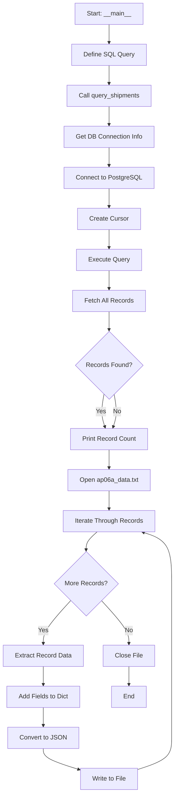
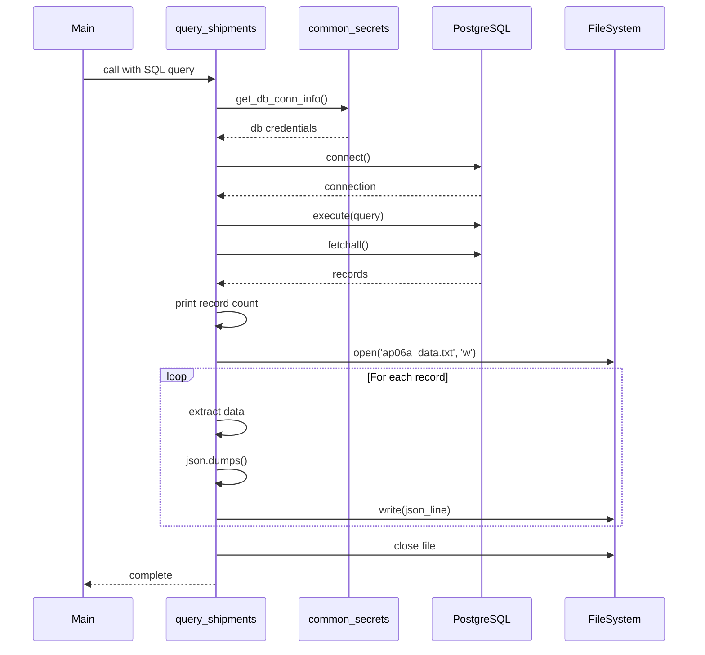
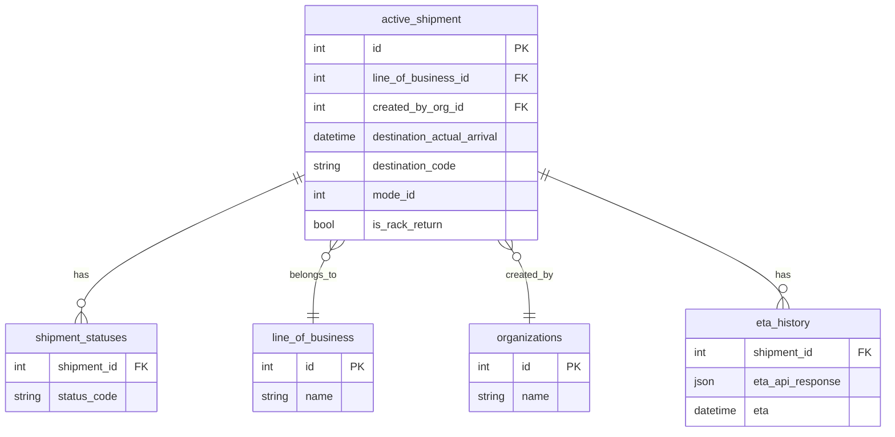

# Diagram: research/api/scripts/query_kansas_city_data.py

> Auto-generated by Obscura crawlers

## Diagram 1

### SVG

<svg id="container" width="438.6090087890625" xmlns="http://www.w3.org/2000/svg" class="flowchart" height="2000.953125" viewBox="0 0 438.6090087890625 2000.953125" role="graphics-document document" aria-roledescription="flowchart-v2"><g><marker id="container_flowchart-v2-pointEnd" class="marker flowchart-v2" viewBox="0 0 10 10" refX="5" refY="5" markerUnits="userSpaceOnUse" markerWidth="8" markerHeight="8" orient="auto"><path d="M 0 0 L 10 5 L 0 10 z" class="arrowMarkerPath" style="stroke-width: 1; stroke-dasharray: 1, 0;"></path></marker><marker id="container_flowchart-v2-pointStart" class="marker flowchart-v2" viewBox="0 0 10 10" refX="4.5" refY="5" markerUnits="userSpaceOnUse" markerWidth="8" markerHeight="8" orient="auto"><path d="M 0 5 L 10 10 L 10 0 z" class="arrowMarkerPath" style="stroke-width: 1; stroke-dasharray: 1, 0;"></path></marker><marker id="container_flowchart-v2-circleEnd" class="marker flowchart-v2" viewBox="0 0 10 10" refX="11" refY="5" markerUnits="userSpaceOnUse" markerWidth="11" markerHeight="11" orient="auto"><circle cx="5" cy="5" r="5" class="arrowMarkerPath" style="stroke-width: 1; stroke-dasharray: 1, 0;"></circle></marker><marker id="container_flowchart-v2-circleStart" class="marker flowchart-v2" viewBox="0 0 10 10" refX="-1" refY="5" markerUnits="userSpaceOnUse" markerWidth="11" markerHeight="11" orient="auto"><circle cx="5" cy="5" r="5" class="arrowMarkerPath" style="stroke-width: 1; stroke-dasharray: 1, 0;"></circle></marker><marker id="container_flowchart-v2-crossEnd" class="marker cross flowchart-v2" viewBox="0 0 11 11" refX="12" refY="5.2" markerUnits="userSpaceOnUse" markerWidth="11" markerHeight="11" orient="auto"><path d="M 1,1 l 9,9 M 10,1 l -9,9" class="arrowMarkerPath" style="stroke-width: 2; stroke-dasharray: 1, 0;"></path></marker><marker id="container_flowchart-v2-crossStart" class="marker cross flowchart-v2" viewBox="0 0 11 11" refX="-1" refY="5.2" markerUnits="userSpaceOnUse" markerWidth="11" markerHeight="11" orient="auto"><path d="M 1,1 l 9,9 M 10,1 l -9,9" class="arrowMarkerPath" style="stroke-width: 2; stroke-dasharray: 1, 0;"></path></marker><g class="root"><g class="clusters"></g><g class="edgePaths"><path d="M273.535,62L273.535,66.167C273.535,70.333,273.535,78.667,273.535,86.333C273.535,94,273.535,101,273.535,104.5L273.535,108" id="L_A_B_0" class="edge-thickness-normal edge-pattern-solid edge-thickness-normal edge-pattern-solid flowchart-link" style=";" data-edge="true" data-et="edge" data-id="L_A_B_0" data-points="W3sieCI6MjczLjUzNTE1NjI1LCJ5Ijo2Mn0seyJ4IjoyNzMuNTM1MTU2MjUsInkiOjg3fSx7IngiOjI3My41MzUxNTYyNSwieSI6MTEyfV0=" marker-end="url(#container_flowchart-v2-pointEnd)"></path><path d="M273.535,166L273.535,170.167C273.535,174.333,273.535,182.667,273.535,190.333C273.535,198,273.535,205,273.535,208.5L273.535,212" id="L_B_C_0" class="edge-thickness-normal edge-pattern-solid edge-thickness-normal edge-pattern-solid flowchart-link" style=";" data-edge="true" data-et="edge" data-id="L_B_C_0" data-points="W3sieCI6MjczLjUzNTE1NjI1LCJ5IjoxNjZ9LHsieCI6MjczLjUzNTE1NjI1LCJ5IjoxOTF9LHsieCI6MjczLjUzNTE1NjI1LCJ5IjoyMTZ9XQ==" marker-end="url(#container_flowchart-v2-pointEnd)"></path><path d="M273.535,270L273.535,274.167C273.535,278.333,273.535,286.667,273.535,294.333C273.535,302,273.535,309,273.535,312.5L273.535,316" id="L_C_D_0" class="edge-thickness-normal edge-pattern-solid edge-thickness-normal edge-pattern-solid flowchart-link" style=";" data-edge="true" data-et="edge" data-id="L_C_D_0" data-points="W3sieCI6MjczLjUzNTE1NjI1LCJ5IjoyNzB9LHsieCI6MjczLjUzNTE1NjI1LCJ5IjoyOTV9LHsieCI6MjczLjUzNTE1NjI1LCJ5IjozMjB9XQ==" marker-end="url(#container_flowchart-v2-pointEnd)"></path><path d="M273.535,374L273.535,378.167C273.535,382.333,273.535,390.667,273.535,398.333C273.535,406,273.535,413,273.535,416.5L273.535,420" id="L_D_E_0" class="edge-thickness-normal edge-pattern-solid edge-thickness-normal edge-pattern-solid flowchart-link" style=";" data-edge="true" data-et="edge" data-id="L_D_E_0" data-points="W3sieCI6MjczLjUzNTE1NjI1LCJ5IjozNzR9LHsieCI6MjczLjUzNTE1NjI1LCJ5IjozOTl9LHsieCI6MjczLjUzNTE1NjI1LCJ5Ijo0MjR9XQ==" marker-end="url(#container_flowchart-v2-pointEnd)"></path><path d="M273.535,478L273.535,482.167C273.535,486.333,273.535,494.667,273.535,502.333C273.535,510,273.535,517,273.535,520.5L273.535,524" id="L_E_F_0" class="edge-thickness-normal edge-pattern-solid edge-thickness-normal edge-pattern-solid flowchart-link" style=";" data-edge="true" data-et="edge" data-id="L_E_F_0" data-points="W3sieCI6MjczLjUzNTE1NjI1LCJ5Ijo0Nzh9LHsieCI6MjczLjUzNTE1NjI1LCJ5Ijo1MDN9LHsieCI6MjczLjUzNTE1NjI1LCJ5Ijo1Mjh9XQ==" marker-end="url(#container_flowchart-v2-pointEnd)"></path><path d="M273.535,582L273.535,586.167C273.535,590.333,273.535,598.667,273.535,606.333C273.535,614,273.535,621,273.535,624.5L273.535,628" id="L_F_G_0" class="edge-thickness-normal edge-pattern-solid edge-thickness-normal edge-pattern-solid flowchart-link" style=";" data-edge="true" data-et="edge" data-id="L_F_G_0" data-points="W3sieCI6MjczLjUzNTE1NjI1LCJ5Ijo1ODJ9LHsieCI6MjczLjUzNTE1NjI1LCJ5Ijo2MDd9LHsieCI6MjczLjUzNTE1NjI1LCJ5Ijo2MzJ9XQ==" marker-end="url(#container_flowchart-v2-pointEnd)"></path><path d="M273.535,686L273.535,690.167C273.535,694.333,273.535,702.667,273.535,710.333C273.535,718,273.535,725,273.535,728.5L273.535,732" id="L_G_H_0" class="edge-thickness-normal edge-pattern-solid edge-thickness-normal edge-pattern-solid flowchart-link" style=";" data-edge="true" data-et="edge" data-id="L_G_H_0" data-points="W3sieCI6MjczLjUzNTE1NjI1LCJ5Ijo2ODZ9LHsieCI6MjczLjUzNTE1NjI1LCJ5Ijo3MTF9LHsieCI6MjczLjUzNTE1NjI1LCJ5Ijo3MzZ9XQ==" marker-end="url(#container_flowchart-v2-pointEnd)"></path><path d="M273.535,790L273.535,794.167C273.535,798.333,273.535,806.667,273.535,814.333C273.535,822,273.535,829,273.535,832.5L273.535,836" id="L_H_I_0" class="edge-thickness-normal edge-pattern-solid edge-thickness-normal edge-pattern-solid flowchart-link" style=";" data-edge="true" data-et="edge" data-id="L_H_I_0" data-points="W3sieCI6MjczLjUzNTE1NjI1LCJ5Ijo3OTB9LHsieCI6MjczLjUzNTE1NjI1LCJ5Ijo4MTV9LHsieCI6MjczLjUzNTE1NjI1LCJ5Ijo4NDB9XQ==" marker-end="url(#container_flowchart-v2-pointEnd)"></path><path d="M261.067,995.595L259.631,1003.839C258.195,1012.084,255.322,1028.573,255.709,1042.351C256.095,1056.129,259.742,1067.196,261.565,1072.73L263.388,1078.263" id="L_I_J_0" class="edge-thickness-normal edge-pattern-solid edge-thickness-normal edge-pattern-solid flowchart-link" style=";" data-edge="true" data-et="edge" data-id="L_I_J_0" data-points="W3sieCI6MjYxLjA2NzQzMzU0MzcxNjcsInkiOjk5NS41OTQ3NzcyOTM3MTY3fSx7IngiOjI1Mi40NDkyMTg3NSwieSI6MTA0NS4wNjI1fSx7IngiOjI2NC42Mzk1MjYzNjcxODc1LCJ5IjoxMDgyLjA2MjV9XQ==" marker-end="url(#container_flowchart-v2-pointEnd)"></path><path d="M273.535,1136.063L273.535,1140.229C273.535,1144.396,273.535,1152.729,273.535,1160.396C273.535,1168.063,273.535,1175.063,273.535,1178.563L273.535,1182.063" id="L_J_K_0" class="edge-thickness-normal edge-pattern-solid edge-thickness-normal edge-pattern-solid flowchart-link" style=";" data-edge="true" data-et="edge" data-id="L_J_K_0" data-points="W3sieCI6MjczLjUzNTE1NjI1LCJ5IjoxMTM2LjA2MjV9LHsieCI6MjczLjUzNTE1NjI1LCJ5IjoxMTYxLjA2MjV9LHsieCI6MjczLjUzNTE1NjI1LCJ5IjoxMTg2LjA2MjV9XQ==" marker-end="url(#container_flowchart-v2-pointEnd)"></path><path d="M273.535,1240.063L273.535,1244.229C273.535,1248.396,273.535,1256.729,273.535,1264.396C273.535,1272.063,273.535,1279.063,273.535,1282.563L273.535,1286.063" id="L_K_L_0" class="edge-thickness-normal edge-pattern-solid edge-thickness-normal edge-pattern-solid flowchart-link" style=";" data-edge="true" data-et="edge" data-id="L_K_L_0" data-points="W3sieCI6MjczLjUzNTE1NjI1LCJ5IjoxMjQwLjA2MjV9LHsieCI6MjczLjUzNTE1NjI1LCJ5IjoxMjY1LjA2MjV9LHsieCI6MjczLjUzNTE1NjI1LCJ5IjoxMjkwLjA2MjV9XQ==" marker-end="url(#container_flowchart-v2-pointEnd)"></path><path d="M243.823,1344.063L239.238,1348.229C234.653,1352.396,225.483,1360.729,220.898,1368.396C216.313,1376.063,216.313,1383.063,216.313,1386.563L216.313,1390.063" id="L_L_M_0" class="edge-thickness-normal edge-pattern-solid edge-thickness-normal edge-pattern-solid flowchart-link" style=";" data-edge="true" data-et="edge" data-id="L_L_M_0" data-points="W3sieCI6MjQzLjgyMzM5MjQyNzg4NDYsInkiOjEzNDQuMDYyNX0seyJ4IjoyMTYuMzEyNSwieSI6MTM2OS4wNjI1fSx7IngiOjIxNi4zMTI1LCJ5IjoxMzk0LjA2MjV9XQ==" marker-end="url(#container_flowchart-v2-pointEnd)"></path><path d="M178.178,1514.819L166.618,1527.341C155.059,1539.863,131.94,1564.908,120.38,1582.931C108.82,1600.953,108.82,1611.953,108.82,1617.453L108.82,1622.953" id="L_M_N_0" class="edge-thickness-normal edge-pattern-solid edge-thickness-normal edge-pattern-solid flowchart-link" style=";" data-edge="true" data-et="edge" data-id="L_M_N_0" data-points="W3sieCI6MTc4LjE3Nzk3Mzk1MDMzODQsInkiOjE1MTQuODE4NTk4OTUwMzM4NH0seyJ4IjoxMDguODIwMzEyNSwieSI6MTU4OS45NTMxMjV9LHsieCI6MTA4LjgyMDMxMjUsInkiOjE2MjYuOTUzMTI1fV0=" marker-end="url(#container_flowchart-v2-pointEnd)"></path><path d="M108.82,1680.953L108.82,1685.12C108.82,1689.286,108.82,1697.62,108.82,1705.286C108.82,1712.953,108.82,1719.953,108.82,1723.453L108.82,1726.953" id="L_N_O_0" class="edge-thickness-normal edge-pattern-solid edge-thickness-normal edge-pattern-solid flowchart-link" style=";" data-edge="true" data-et="edge" data-id="L_N_O_0" data-points="W3sieCI6MTA4LjgyMDMxMjUsInkiOjE2ODAuOTUzMTI1fSx7IngiOjEwOC44MjAzMTI1LCJ5IjoxNzA1Ljk1MzEyNX0seyJ4IjoxMDguODIwMzEyNSwieSI6MTczMC45NTMxMjV9XQ==" marker-end="url(#container_flowchart-v2-pointEnd)"></path><path d="M108.82,1784.953L108.82,1789.12C108.82,1793.286,108.82,1801.62,108.82,1809.286C108.82,1816.953,108.82,1823.953,108.82,1827.453L108.82,1830.953" id="L_O_P_0" class="edge-thickness-normal edge-pattern-solid edge-thickness-normal edge-pattern-solid flowchart-link" style=";" data-edge="true" data-et="edge" data-id="L_O_P_0" data-points="W3sieCI6MTA4LjgyMDMxMjUsInkiOjE3ODQuOTUzMTI1fSx7IngiOjEwOC44MjAzMTI1LCJ5IjoxODA5Ljk1MzEyNX0seyJ4IjoxMDguODIwMzEyNSwieSI6MTgzNC45NTMxMjV9XQ==" marker-end="url(#container_flowchart-v2-pointEnd)"></path><path d="M108.82,1888.953L108.82,1893.12C108.82,1897.286,108.82,1905.62,123.422,1914.396C138.024,1923.173,167.228,1932.392,181.83,1937.002L196.432,1941.612" id="L_P_Q_0" class="edge-thickness-normal edge-pattern-solid edge-thickness-normal edge-pattern-solid flowchart-link" style=";" data-edge="true" data-et="edge" data-id="L_P_Q_0" data-points="W3sieCI6MTA4LjgyMDMxMjUsInkiOjE4ODguOTUzMTI1fSx7IngiOjEwOC44MjAzMTI1LCJ5IjoxOTEzLjk1MzEyNX0seyJ4IjoyMDAuMjQ2MDkzNzUsInkiOjE5NDIuODE1OTc5ODM5MDkyM31d" marker-end="url(#container_flowchart-v2-pointEnd)"></path><path d="M346.824,1941.691L360.788,1937.068C374.753,1932.445,402.681,1923.199,416.645,1909.909C430.609,1896.62,430.609,1879.286,430.609,1861.953C430.609,1844.62,430.609,1827.286,430.609,1809.953C430.609,1792.62,430.609,1775.286,430.609,1757.953C430.609,1740.62,430.609,1723.286,430.609,1705.953C430.609,1688.62,430.609,1671.286,430.609,1651.953C430.609,1632.62,430.609,1611.286,430.609,1581.212C430.609,1551.138,430.609,1512.323,430.609,1475.508C430.609,1438.693,430.609,1403.878,418.656,1382.513C406.703,1361.148,382.797,1353.234,370.843,1349.277L358.89,1345.32" id="L_Q_L_0" class="edge-thickness-normal edge-pattern-solid edge-thickness-normal edge-pattern-solid flowchart-link" style=";" data-edge="true" data-et="edge" data-id="L_Q_L_0" data-points="W3sieCI6MzQ2LjgyNDIxODc1LCJ5IjoxOTQxLjY5MDUxMDI5MjU4MTZ9LHsieCI6NDMwLjYwOTM3NSwieSI6MTkxMy45NTMxMjV9LHsieCI6NDMwLjYwOTM3NSwieSI6MTg2MS45NTMxMjV9LHsieCI6NDMwLjYwOTM3NSwieSI6MTgwOS45NTMxMjV9LHsieCI6NDMwLjYwOTM3NSwieSI6MTc1Ny45NTMxMjV9LHsieCI6NDMwLjYwOTM3NSwieSI6MTcwNS45NTMxMjV9LHsieCI6NDMwLjYwOTM3NSwieSI6MTY1My45NTMxMjV9LHsieCI6NDMwLjYwOTM3NSwieSI6MTU4OS45NTMxMjV9LHsieCI6NDMwLjYwOTM3NSwieSI6MTQ3My41MDc4MTI1fSx7IngiOjQzMC42MDkzNzUsInkiOjEzNjkuMDYyNX0seyJ4IjozNTUuMDkyOTIzNjc3ODg0NjQsInkiOjEzNDQuMDYyNX1d" marker-end="url(#container_flowchart-v2-pointEnd)"></path><path d="M254.447,1514.819L266.007,1527.341C277.566,1539.863,300.685,1564.908,312.245,1582.931C323.805,1600.953,323.805,1611.953,323.805,1617.453L323.805,1622.953" id="L_M_R_0" class="edge-thickness-normal edge-pattern-solid edge-thickness-normal edge-pattern-solid flowchart-link" style=";" data-edge="true" data-et="edge" data-id="L_M_R_0" data-points="W3sieCI6MjU0LjQ0NzAyNjA0OTY2MTYsInkiOjE1MTQuODE4NTk4OTUwMzM4NH0seyJ4IjozMjMuODA0Njg3NSwieSI6MTU4OS45NTMxMjV9LHsieCI6MzIzLjgwNDY4NzUsInkiOjE2MjYuOTUzMTI1fV0=" marker-end="url(#container_flowchart-v2-pointEnd)"></path><path d="M323.805,1680.953L323.805,1685.12C323.805,1689.286,323.805,1697.62,323.805,1705.286C323.805,1712.953,323.805,1719.953,323.805,1723.453L323.805,1726.953" id="L_R_S_0" class="edge-thickness-normal edge-pattern-solid edge-thickness-normal edge-pattern-solid flowchart-link" style=";" data-edge="true" data-et="edge" data-id="L_R_S_0" data-points="W3sieCI6MzIzLjgwNDY4NzUsInkiOjE2ODAuOTUzMTI1fSx7IngiOjMyMy44MDQ2ODc1LCJ5IjoxNzA1Ljk1MzEyNX0seyJ4IjozMjMuODA0Njg3NSwieSI6MTczMC45NTMxMjV9XQ==" marker-end="url(#container_flowchart-v2-pointEnd)"></path><path d="M286.003,995.595L287.439,1003.839C288.876,1012.084,291.748,1028.573,291.362,1042.351C290.975,1056.129,287.329,1067.196,285.506,1072.73L283.682,1078.263" id="L_I_J_2" class="edge-thickness-normal edge-pattern-solid edge-thickness-normal edge-pattern-solid flowchart-link" style=";" data-edge="true" data-et="edge" data-id="L_I_J_2" data-points="W3sieCI6Mjg2LjAwMjg3ODk1NjI4MzMsInkiOjk5NS41OTQ3NzcyOTM3MTY3fSx7IngiOjI5NC42MjEwOTM3NSwieSI6MTA0NS4wNjI1fSx7IngiOjI4Mi40MzA3ODYxMzI4MTI1LCJ5IjoxMDgyLjA2MjV9XQ==" marker-end="url(#container_flowchart-v2-pointEnd)"></path></g><g class="edgeLabels"><g class="edgeLabel"><g class="label" data-id="L_A_B_0" transform="translate(0, 0)"><foreignObject width="0" height="0">

</foreignObject></g></g><g class="edgeLabel"><g class="label" data-id="L_B_C_0" transform="translate(0, 0)"><foreignObject width="0" height="0">

</foreignObject></g></g><g class="edgeLabel"><g class="label" data-id="L_C_D_0" transform="translate(0, 0)"><foreignObject width="0" height="0">

</foreignObject></g></g><g class="edgeLabel"><g class="label" data-id="L_D_E_0" transform="translate(0, 0)"><foreignObject width="0" height="0">

</foreignObject></g></g><g class="edgeLabel"><g class="label" data-id="L_E_F_0" transform="translate(0, 0)"><foreignObject width="0" height="0">

</foreignObject></g></g><g class="edgeLabel"><g class="label" data-id="L_F_G_0" transform="translate(0, 0)"><foreignObject width="0" height="0">

</foreignObject></g></g><g class="edgeLabel"><g class="label" data-id="L_G_H_0" transform="translate(0, 0)"><foreignObject width="0" height="0">

</foreignObject></g></g><g class="edgeLabel"><g class="label" data-id="L_H_I_0" transform="translate(0, 0)"><foreignObject width="0" height="0">

</foreignObject></g></g><g class="edgeLabel" transform="translate(253.41521, 1039.51781)"><g class="label" data-id="L_I_J_0" transform="translate(-12.03125, -12)"><foreignObject width="24.0625" height="24">

Yes

</foreignObject></g></g><g class="edgeLabel"><g class="label" data-id="L_J_K_0" transform="translate(0, 0)"><foreignObject width="0" height="0">

</foreignObject></g></g><g class="edgeLabel"><g class="label" data-id="L_K_L_0" transform="translate(0, 0)"><foreignObject width="0" height="0">

</foreignObject></g></g><g class="edgeLabel"><g class="label" data-id="L_L_M_0" transform="translate(0, 0)"><foreignObject width="0" height="0">

</foreignObject></g></g><g class="edgeLabel" transform="translate(108.8203125, 1589.953125)"><g class="label" data-id="L_M_N_0" transform="translate(-12.03125, -12)"><foreignObject width="24.0625" height="24">

Yes

</foreignObject></g></g><g class="edgeLabel"><g class="label" data-id="L_N_O_0" transform="translate(0, 0)"><foreignObject width="0" height="0">

</foreignObject></g></g><g class="edgeLabel"><g class="label" data-id="L_O_P_0" transform="translate(0, 0)"><foreignObject width="0" height="0">

</foreignObject></g></g><g class="edgeLabel"><g class="label" data-id="L_P_Q_0" transform="translate(0, 0)"><foreignObject width="0" height="0">

</foreignObject></g></g><g class="edgeLabel"><g class="label" data-id="L_Q_L_0" transform="translate(0, 0)"><foreignObject width="0" height="0">

</foreignObject></g></g><g class="edgeLabel" transform="translate(323.8046875, 1589.953125)"><g class="label" data-id="L_M_R_0" transform="translate(-10.140625, -12)"><foreignObject width="20.28125" height="24">

No

</foreignObject></g></g><g class="edgeLabel"><g class="label" data-id="L_R_S_0" transform="translate(0, 0)"><foreignObject width="0" height="0">

</foreignObject></g></g><g class="edgeLabel" transform="translate(293.6551, 1039.51781)"><g class="label" data-id="L_I_J_2" transform="translate(-10.140625, -12)"><foreignObject width="20.28125" height="24">

No

</foreignObject></g></g></g><g class="nodes"><g class="node default" id="flowchart-A-0" transform="translate(273.53515625, 35)"><rect class="basic label-container" style="" x="-69.6171875" y="-27" width="139.234375" height="54"></rect><g class="label" style="" transform="translate(-39.6171875, -12)"><rect></rect><foreignObject width="79.234375" height="24">

Start: <strong>main</strong>

</foreignObject></g></g><g class="node default" id="flowchart-B-1" transform="translate(273.53515625, 139)"><rect class="basic label-container" style="" x="-92.84375" y="-27" width="185.6875" height="54"></rect><g class="label" style="" transform="translate(-62.84375, -12)"><rect></rect><foreignObject width="125.6875" height="24">

Define SQL Query

</foreignObject></g></g><g class="node default" id="flowchart-C-3" transform="translate(273.53515625, 243)"><rect class="basic label-container" style="" x="-108.1875" y="-27" width="216.375" height="54"></rect><g class="label" style="" transform="translate(-78.1875, -12)"><rect></rect><foreignObject width="156.375" height="24">

Call query_shipments

</foreignObject></g></g><g class="node default" id="flowchart-D-5" transform="translate(273.53515625, 347)"><rect class="basic label-container" style="" x="-114.0546875" y="-27" width="228.109375" height="54"></rect><g class="label" style="" transform="translate(-84.0546875, -12)"><rect></rect><foreignObject width="168.109375" height="24">

Get DB Connection Info

</foreignObject></g></g><g class="node default" id="flowchart-E-7" transform="translate(273.53515625, 451)"><rect class="basic label-container" style="" x="-111.9453125" y="-27" width="223.890625" height="54"></rect><g class="label" style="" transform="translate(-81.9453125, -12)"><rect></rect><foreignObject width="163.890625" height="24">

Connect to PostgreSQL

</foreignObject></g></g><g class="node default" id="flowchart-F-9" transform="translate(273.53515625, 555)"><rect class="basic label-container" style="" x="-78.5546875" y="-27" width="157.109375" height="54"></rect><g class="label" style="" transform="translate(-48.5546875, -12)"><rect></rect><foreignObject width="97.109375" height="24">

Create Cursor

</foreignObject></g></g><g class="node default" id="flowchart-G-11" transform="translate(273.53515625, 659)"><rect class="basic label-container" style="" x="-81.671875" y="-27" width="163.34375" height="54"></rect><g class="label" style="" transform="translate(-51.671875, -12)"><rect></rect><foreignObject width="103.34375" height="24">

Execute Query

</foreignObject></g></g><g class="node default" id="flowchart-H-13" transform="translate(273.53515625, 763)"><rect class="basic label-container" style="" x="-91.5859375" y="-27" width="183.171875" height="54"></rect><g class="label" style="" transform="translate(-61.5859375, -12)"><rect></rect><foreignObject width="123.171875" height="24">

Fetch All Records

</foreignObject></g></g><g class="node default" id="flowchart-I-15" transform="translate(273.53515625, 924.03125)"><polygon points="84.03125,0 168.0625,-84.03125 84.03125,-168.0625 0,-84.03125" class="label-container" transform="translate(-83.53125, 84.03125)"></polygon><g class="label" style="" transform="translate(-57.03125, -12)"><rect></rect><foreignObject width="114.0625" height="24">

Records Found?

</foreignObject></g></g><g class="node default" id="flowchart-J-17" transform="translate(273.53515625, 1109.0625)"><rect class="basic label-container" style="" x="-97.921875" y="-27" width="195.84375" height="54"></rect><g class="label" style="" transform="translate(-67.921875, -12)"><rect></rect><foreignObject width="135.84375" height="24">

Print Record Count

</foreignObject></g></g><g class="node default" id="flowchart-K-19" transform="translate(273.53515625, 1213.0625)"><rect class="basic label-container" style="" x="-105.296875" y="-27" width="210.59375" height="54"></rect><g class="label" style="" transform="translate(-75.296875, -12)"><rect></rect><foreignObject width="150.59375" height="24">

Open ap06a_data.txt

</foreignObject></g></g><g class="node default" id="flowchart-L-21" transform="translate(273.53515625, 1317.0625)"><rect class="basic label-container" style="" x="-116.6484375" y="-27" width="233.296875" height="54"></rect><g class="label" style="" transform="translate(-86.6484375, -12)"><rect></rect><foreignObject width="173.296875" height="24">

Iterate Through Records

</foreignObject></g></g><g class="node default" id="flowchart-M-23" transform="translate(216.3125, 1473.5078125)"><polygon points="79.4453125,0 158.890625,-79.4453125 79.4453125,-158.890625 0,-79.4453125" class="label-container" transform="translate(-78.9453125, 79.4453125)"></polygon><g class="label" style="" transform="translate(-52.4453125, -12)"><rect></rect><foreignObject width="104.890625" height="24">

More Records?

</foreignObject></g></g><g class="node default" id="flowchart-N-25" transform="translate(108.8203125, 1653.953125)"><rect class="basic label-container" style="" x="-100.8203125" y="-27" width="201.640625" height="54"></rect><g class="label" style="" transform="translate(-70.8203125, -12)"><rect></rect><foreignObject width="141.640625" height="24">

Extract Record Data

</foreignObject></g></g><g class="node default" id="flowchart-O-27" transform="translate(108.8203125, 1757.953125)"><rect class="basic label-container" style="" x="-93.1640625" y="-27" width="186.328125" height="54"></rect><g class="label" style="" transform="translate(-63.1640625, -12)"><rect></rect><foreignObject width="126.328125" height="24">

Add Fields to Dict

</foreignObject></g></g><g class="node default" id="flowchart-P-29" transform="translate(108.8203125, 1861.953125)"><rect class="basic label-container" style="" x="-87.3515625" y="-27" width="174.703125" height="54"></rect><g class="label" style="" transform="translate(-57.3515625, -12)"><rect></rect><foreignObject width="114.703125" height="24">

Convert to JSON

</foreignObject></g></g><g class="node default" id="flowchart-Q-31" transform="translate(273.53515625, 1965.953125)"><rect class="basic label-container" style="" x="-73.2890625" y="-27" width="146.578125" height="54"></rect><g class="label" style="" transform="translate(-43.2890625, -12)"><rect></rect><foreignObject width="86.578125" height="24">

Write to File

</foreignObject></g></g><g class="node default" id="flowchart-R-35" transform="translate(323.8046875, 1653.953125)"><rect class="basic label-container" style="" x="-64.1640625" y="-27" width="128.328125" height="54"></rect><g class="label" style="" transform="translate(-34.1640625, -12)"><rect></rect><foreignObject width="68.328125" height="24">

Close File

</foreignObject></g></g><g class="node default" id="flowchart-S-37" transform="translate(323.8046875, 1757.953125)"><rect class="basic label-container" style="" x="-43.6796875" y="-27" width="87.359375" height="54"></rect><g class="label" style="" transform="translate(-13.6796875, -12)"><rect></rect><foreignObject width="27.359375" height="24">

End

</foreignObject></g></g></g></g></g></svg>

## Diagram 2

### SVG

<svg id="container" width="1069" xmlns="http://www.w3.org/2000/svg" height="1036" viewBox="-50 -10 1069 1036" role="graphics-document document" aria-roledescription="sequence"><g><rect x="819" y="950" fill="#eaeaea" stroke="#666" width="150" height="65" name="FileSystem" rx="3" ry="3" class="actor actor-bottom"></rect><text x="894" y="982.5" dominant-baseline="central" alignment-baseline="central" class="actor actor-box" style="text-anchor: middle; font-size: 16px; font-weight: 400;"><tspan x="894" dy="0">FileSystem</tspan></text></g><g><rect x="619" y="950" fill="#eaeaea" stroke="#666" width="150" height="65" name="PostgreSQL" rx="3" ry="3" class="actor actor-bottom"></rect><text x="694" y="982.5" dominant-baseline="central" alignment-baseline="central" class="actor actor-box" style="text-anchor: middle; font-size: 16px; font-weight: 400;"><tspan x="694" dy="0">PostgreSQL</tspan></text></g><g><rect x="419" y="950" fill="#eaeaea" stroke="#666" width="150" height="65" name="common_secrets" rx="3" ry="3" class="actor actor-bottom"></rect><text x="494" y="982.5" dominant-baseline="central" alignment-baseline="central" class="actor actor-box" style="text-anchor: middle; font-size: 16px; font-weight: 400;"><tspan x="494" dy="0">common_secrets</tspan></text></g><g><rect x="209" y="950" fill="#eaeaea" stroke="#666" width="150" height="65" name="query_shipments" rx="3" ry="3" class="actor actor-bottom"></rect><text x="284" y="982.5" dominant-baseline="central" alignment-baseline="central" class="actor actor-box" style="text-anchor: middle; font-size: 16px; font-weight: 400;"><tspan x="284" dy="0">query_shipments</tspan></text></g><g><rect x="0" y="950" fill="#eaeaea" stroke="#666" width="150" height="65" name="Main" rx="3" ry="3" class="actor actor-bottom"></rect><text x="75" y="982.5" dominant-baseline="central" alignment-baseline="central" class="actor actor-box" style="text-anchor: middle; font-size: 16px; font-weight: 400;"><tspan x="75" dy="0">Main</tspan></text></g><g><line id="actor4" x1="894" y1="65" x2="894" y2="950" class="actor-line 200" stroke-width="0.5px" stroke="#999" name="FileSystem"></line><g id="root-4"><rect x="819" y="0" fill="#eaeaea" stroke="#666" width="150" height="65" name="FileSystem" rx="3" ry="3" class="actor actor-top"></rect><text x="894" y="32.5" dominant-baseline="central" alignment-baseline="central" class="actor actor-box" style="text-anchor: middle; font-size: 16px; font-weight: 400;"><tspan x="894" dy="0">FileSystem</tspan></text></g></g><g><line id="actor3" x1="694" y1="65" x2="694" y2="950" class="actor-line 200" stroke-width="0.5px" stroke="#999" name="PostgreSQL"></line><g id="root-3"><rect x="619" y="0" fill="#eaeaea" stroke="#666" width="150" height="65" name="PostgreSQL" rx="3" ry="3" class="actor actor-top"></rect><text x="694" y="32.5" dominant-baseline="central" alignment-baseline="central" class="actor actor-box" style="text-anchor: middle; font-size: 16px; font-weight: 400;"><tspan x="694" dy="0">PostgreSQL</tspan></text></g></g><g><line id="actor2" x1="494" y1="65" x2="494" y2="950" class="actor-line 200" stroke-width="0.5px" stroke="#999" name="common_secrets"></line><g id="root-2"><rect x="419" y="0" fill="#eaeaea" stroke="#666" width="150" height="65" name="common_secrets" rx="3" ry="3" class="actor actor-top"></rect><text x="494" y="32.5" dominant-baseline="central" alignment-baseline="central" class="actor actor-box" style="text-anchor: middle; font-size: 16px; font-weight: 400;"><tspan x="494" dy="0">common_secrets</tspan></text></g></g><g><line id="actor1" x1="284" y1="65" x2="284" y2="950" class="actor-line 200" stroke-width="0.5px" stroke="#999" name="query_shipments"></line><g id="root-1"><rect x="209" y="0" fill="#eaeaea" stroke="#666" width="150" height="65" name="query_shipments" rx="3" ry="3" class="actor actor-top"></rect><text x="284" y="32.5" dominant-baseline="central" alignment-baseline="central" class="actor actor-box" style="text-anchor: middle; font-size: 16px; font-weight: 400;"><tspan x="284" dy="0">query_shipments</tspan></text></g></g><g><line id="actor0" x1="75" y1="65" x2="75" y2="950" class="actor-line 200" stroke-width="0.5px" stroke="#999" name="Main"></line><g id="root-0"><rect x="0" y="0" fill="#eaeaea" stroke="#666" width="150" height="65" name="Main" rx="3" ry="3" class="actor actor-top"></rect><text x="75" y="32.5" dominant-baseline="central" alignment-baseline="central" class="actor actor-box" style="text-anchor: middle; font-size: 16px; font-weight: 400;"><tspan x="75" dy="0">Main</tspan></text></g></g><g></g><defs><symbol id="computer" width="24" height="24"><path transform="scale(.5)" d="M2 2v13h20v-13h-20zm18 11h-16v-9h16v9zm-10.228 6l.466-1h3.524l.467 1h-4.457zm14.228 3h-24l2-6h2.104l-1.33 4h18.45l-1.297-4h2.073l2 6zm-5-10h-14v-7h14v7z"></path></symbol></defs><defs><symbol id="database" fill-rule="evenodd" clip-rule="evenodd"><path transform="scale(.5)" d="M12.258.001l.256.004.255.005.253.008.251.01.249.012.247.015.246.016.242.019.241.02.239.023.236.024.233.027.231.028.229.031.225.032.223.034.22.036.217.038.214.04.211.041.208.043.205.045.201.046.198.048.194.05.191.051.187.053.183.054.18.056.175.057.172.059.168.06.163.061.16.063.155.064.15.066.074.033.073.033.071.034.07.034.069.035.068.035.067.035.066.035.064.036.064.036.062.036.06.036.06.037.058.037.058.037.055.038.055.038.053.038.052.038.051.039.05.039.048.039.047.039.045.04.044.04.043.04.041.04.04.041.039.041.037.041.036.041.034.041.033.042.032.042.03.042.029.042.027.042.026.043.024.043.023.043.021.043.02.043.018.044.017.043.015.044.013.044.012.044.011.045.009.044.007.045.006.045.004.045.002.045.001.045v17l-.001.045-.002.045-.004.045-.006.045-.007.045-.009.044-.011.045-.012.044-.013.044-.015.044-.017.043-.018.044-.02.043-.021.043-.023.043-.024.043-.026.043-.027.042-.029.042-.03.042-.032.042-.033.042-.034.041-.036.041-.037.041-.039.041-.04.041-.041.04-.043.04-.044.04-.045.04-.047.039-.048.039-.05.039-.051.039-.052.038-.053.038-.055.038-.055.038-.058.037-.058.037-.06.037-.06.036-.062.036-.064.036-.064.036-.066.035-.067.035-.068.035-.069.035-.07.034-.071.034-.073.033-.074.033-.15.066-.155.064-.16.063-.163.061-.168.06-.172.059-.175.057-.18.056-.183.054-.187.053-.191.051-.194.05-.198.048-.201.046-.205.045-.208.043-.211.041-.214.04-.217.038-.22.036-.223.034-.225.032-.229.031-.231.028-.233.027-.236.024-.239.023-.241.02-.242.019-.246.016-.247.015-.249.012-.251.01-.253.008-.255.005-.256.004-.258.001-.258-.001-.256-.004-.255-.005-.253-.008-.251-.01-.249-.012-.247-.015-.245-.016-.243-.019-.241-.02-.238-.023-.236-.024-.234-.027-.231-.028-.228-.031-.226-.032-.223-.034-.22-.036-.217-.038-.214-.04-.211-.041-.208-.043-.204-.045-.201-.046-.198-.048-.195-.05-.19-.051-.187-.053-.184-.054-.179-.056-.176-.057-.172-.059-.167-.06-.164-.061-.159-.063-.155-.064-.151-.066-.074-.033-.072-.033-.072-.034-.07-.034-.069-.035-.068-.035-.067-.035-.066-.035-.064-.036-.063-.036-.062-.036-.061-.036-.06-.037-.058-.037-.057-.037-.056-.038-.055-.038-.053-.038-.052-.038-.051-.039-.049-.039-.049-.039-.046-.039-.046-.04-.044-.04-.043-.04-.041-.04-.04-.041-.039-.041-.037-.041-.036-.041-.034-.041-.033-.042-.032-.042-.03-.042-.029-.042-.027-.042-.026-.043-.024-.043-.023-.043-.021-.043-.02-.043-.018-.044-.017-.043-.015-.044-.013-.044-.012-.044-.011-.045-.009-.044-.007-.045-.006-.045-.004-.045-.002-.045-.001-.045v-17l.001-.045.002-.045.004-.045.006-.045.007-.045.009-.044.011-.045.012-.044.013-.044.015-.044.017-.043.018-.044.02-.043.021-.043.023-.043.024-.043.026-.043.027-.042.029-.042.03-.042.032-.042.033-.042.034-.041.036-.041.037-.041.039-.041.04-.041.041-.04.043-.04.044-.04.046-.04.046-.039.049-.039.049-.039.051-.039.052-.038.053-.038.055-.038.056-.038.057-.037.058-.037.06-.037.061-.036.062-.036.063-.036.064-.036.066-.035.067-.035.068-.035.069-.035.07-.034.072-.034.072-.033.074-.033.151-.066.155-.064.159-.063.164-.061.167-.06.172-.059.176-.057.179-.056.184-.054.187-.053.19-.051.195-.05.198-.048.201-.046.204-.045.208-.043.211-.041.214-.04.217-.038.22-.036.223-.034.226-.032.228-.031.231-.028.234-.027.236-.024.238-.023.241-.02.243-.019.245-.016.247-.015.249-.012.251-.01.253-.008.255-.005.256-.004.258-.001.258.001zm-9.258 20.499v.01l.001.021.003.021.004.022.005.021.006.022.007.022.009.023.01.022.011.023.012.023.013.023.015.023.016.024.017.023.018.024.019.024.021.024.022.025.023.024.024.025.052.049.056.05.061.051.066.051.07.051.075.051.079.052.084.052.088.052.092.052.097.052.102.051.105.052.11.052.114.051.119.051.123.051.127.05.131.05.135.05.139.048.144.049.147.047.152.047.155.047.16.045.163.045.167.043.171.043.176.041.178.041.183.039.187.039.19.037.194.035.197.035.202.033.204.031.209.03.212.029.216.027.219.025.222.024.226.021.23.02.233.018.236.016.24.015.243.012.246.01.249.008.253.005.256.004.259.001.26-.001.257-.004.254-.005.25-.008.247-.011.244-.012.241-.014.237-.016.233-.018.231-.021.226-.021.224-.024.22-.026.216-.027.212-.028.21-.031.205-.031.202-.034.198-.034.194-.036.191-.037.187-.039.183-.04.179-.04.175-.042.172-.043.168-.044.163-.045.16-.046.155-.046.152-.047.148-.048.143-.049.139-.049.136-.05.131-.05.126-.05.123-.051.118-.052.114-.051.11-.052.106-.052.101-.052.096-.052.092-.052.088-.053.083-.051.079-.052.074-.052.07-.051.065-.051.06-.051.056-.05.051-.05.023-.024.023-.025.021-.024.02-.024.019-.024.018-.024.017-.024.015-.023.014-.024.013-.023.012-.023.01-.023.01-.022.008-.022.006-.022.006-.022.004-.022.004-.021.001-.021.001-.021v-4.127l-.077.055-.08.053-.083.054-.085.053-.087.052-.09.052-.093.051-.095.05-.097.05-.1.049-.102.049-.105.048-.106.047-.109.047-.111.046-.114.045-.115.045-.118.044-.12.043-.122.042-.124.042-.126.041-.128.04-.13.04-.132.038-.134.038-.135.037-.138.037-.139.035-.142.035-.143.034-.144.033-.147.032-.148.031-.15.03-.151.03-.153.029-.154.027-.156.027-.158.026-.159.025-.161.024-.162.023-.163.022-.165.021-.166.02-.167.019-.169.018-.169.017-.171.016-.173.015-.173.014-.175.013-.175.012-.177.011-.178.01-.179.008-.179.008-.181.006-.182.005-.182.004-.184.003-.184.002h-.37l-.184-.002-.184-.003-.182-.004-.182-.005-.181-.006-.179-.008-.179-.008-.178-.01-.176-.011-.176-.012-.175-.013-.173-.014-.172-.015-.171-.016-.17-.017-.169-.018-.167-.019-.166-.02-.165-.021-.163-.022-.162-.023-.161-.024-.159-.025-.157-.026-.156-.027-.155-.027-.153-.029-.151-.03-.15-.03-.148-.031-.146-.032-.145-.033-.143-.034-.141-.035-.14-.035-.137-.037-.136-.037-.134-.038-.132-.038-.13-.04-.128-.04-.126-.041-.124-.042-.122-.042-.12-.044-.117-.043-.116-.045-.113-.045-.112-.046-.109-.047-.106-.047-.105-.048-.102-.049-.1-.049-.097-.05-.095-.05-.093-.052-.09-.051-.087-.052-.085-.053-.083-.054-.08-.054-.077-.054v4.127zm0-5.654v.011l.001.021.003.021.004.021.005.022.006.022.007.022.009.022.01.022.011.023.012.023.013.023.015.024.016.023.017.024.018.024.019.024.021.024.022.024.023.025.024.024.052.05.056.05.061.05.066.051.07.051.075.052.079.051.084.052.088.052.092.052.097.052.102.052.105.052.11.051.114.051.119.052.123.05.127.051.131.05.135.049.139.049.144.048.147.048.152.047.155.046.16.045.163.045.167.044.171.042.176.042.178.04.183.04.187.038.19.037.194.036.197.034.202.033.204.032.209.03.212.028.216.027.219.025.222.024.226.022.23.02.233.018.236.016.24.014.243.012.246.01.249.008.253.006.256.003.259.001.26-.001.257-.003.254-.006.25-.008.247-.01.244-.012.241-.015.237-.016.233-.018.231-.02.226-.022.224-.024.22-.025.216-.027.212-.029.21-.03.205-.032.202-.033.198-.035.194-.036.191-.037.187-.039.183-.039.179-.041.175-.042.172-.043.168-.044.163-.045.16-.045.155-.047.152-.047.148-.048.143-.048.139-.05.136-.049.131-.05.126-.051.123-.051.118-.051.114-.052.11-.052.106-.052.101-.052.096-.052.092-.052.088-.052.083-.052.079-.052.074-.051.07-.052.065-.051.06-.05.056-.051.051-.049.023-.025.023-.024.021-.025.02-.024.019-.024.018-.024.017-.024.015-.023.014-.023.013-.024.012-.022.01-.023.01-.023.008-.022.006-.022.006-.022.004-.021.004-.022.001-.021.001-.021v-4.139l-.077.054-.08.054-.083.054-.085.052-.087.053-.09.051-.093.051-.095.051-.097.05-.1.049-.102.049-.105.048-.106.047-.109.047-.111.046-.114.045-.115.044-.118.044-.12.044-.122.042-.124.042-.126.041-.128.04-.13.039-.132.039-.134.038-.135.037-.138.036-.139.036-.142.035-.143.033-.144.033-.147.033-.148.031-.15.03-.151.03-.153.028-.154.028-.156.027-.158.026-.159.025-.161.024-.162.023-.163.022-.165.021-.166.02-.167.019-.169.018-.169.017-.171.016-.173.015-.173.014-.175.013-.175.012-.177.011-.178.009-.179.009-.179.007-.181.007-.182.005-.182.004-.184.003-.184.002h-.37l-.184-.002-.184-.003-.182-.004-.182-.005-.181-.007-.179-.007-.179-.009-.178-.009-.176-.011-.176-.012-.175-.013-.173-.014-.172-.015-.171-.016-.17-.017-.169-.018-.167-.019-.166-.02-.165-.021-.163-.022-.162-.023-.161-.024-.159-.025-.157-.026-.156-.027-.155-.028-.153-.028-.151-.03-.15-.03-.148-.031-.146-.033-.145-.033-.143-.033-.141-.035-.14-.036-.137-.036-.136-.037-.134-.038-.132-.039-.13-.039-.128-.04-.126-.041-.124-.042-.122-.043-.12-.043-.117-.044-.116-.044-.113-.046-.112-.046-.109-.046-.106-.047-.105-.048-.102-.049-.1-.049-.097-.05-.095-.051-.093-.051-.09-.051-.087-.053-.085-.052-.083-.054-.08-.054-.077-.054v4.139zm0-5.666v.011l.001.02.003.022.004.021.005.022.006.021.007.022.009.023.01.022.011.023.012.023.013.023.015.023.016.024.017.024.018.023.019.024.021.025.022.024.023.024.024.025.052.05.056.05.061.05.066.051.07.051.075.052.079.051.084.052.088.052.092.052.097.052.102.052.105.051.11.052.114.051.119.051.123.051.127.05.131.05.135.05.139.049.144.048.147.048.152.047.155.046.16.045.163.045.167.043.171.043.176.042.178.04.183.04.187.038.19.037.194.036.197.034.202.033.204.032.209.03.212.028.216.027.219.025.222.024.226.021.23.02.233.018.236.017.24.014.243.012.246.01.249.008.253.006.256.003.259.001.26-.001.257-.003.254-.006.25-.008.247-.01.244-.013.241-.014.237-.016.233-.018.231-.02.226-.022.224-.024.22-.025.216-.027.212-.029.21-.03.205-.032.202-.033.198-.035.194-.036.191-.037.187-.039.183-.039.179-.041.175-.042.172-.043.168-.044.163-.045.16-.045.155-.047.152-.047.148-.048.143-.049.139-.049.136-.049.131-.051.126-.05.123-.051.118-.052.114-.051.11-.052.106-.052.101-.052.096-.052.092-.052.088-.052.083-.052.079-.052.074-.052.07-.051.065-.051.06-.051.056-.05.051-.049.023-.025.023-.025.021-.024.02-.024.019-.024.018-.024.017-.024.015-.023.014-.024.013-.023.012-.023.01-.022.01-.023.008-.022.006-.022.006-.022.004-.022.004-.021.001-.021.001-.021v-4.153l-.077.054-.08.054-.083.053-.085.053-.087.053-.09.051-.093.051-.095.051-.097.05-.1.049-.102.048-.105.048-.106.048-.109.046-.111.046-.114.046-.115.044-.118.044-.12.043-.122.043-.124.042-.126.041-.128.04-.13.039-.132.039-.134.038-.135.037-.138.036-.139.036-.142.034-.143.034-.144.033-.147.032-.148.032-.15.03-.151.03-.153.028-.154.028-.156.027-.158.026-.159.024-.161.024-.162.023-.163.023-.165.021-.166.02-.167.019-.169.018-.169.017-.171.016-.173.015-.173.014-.175.013-.175.012-.177.01-.178.01-.179.009-.179.007-.181.006-.182.006-.182.004-.184.003-.184.001-.185.001-.185-.001-.184-.001-.184-.003-.182-.004-.182-.006-.181-.006-.179-.007-.179-.009-.178-.01-.176-.01-.176-.012-.175-.013-.173-.014-.172-.015-.171-.016-.17-.017-.169-.018-.167-.019-.166-.02-.165-.021-.163-.023-.162-.023-.161-.024-.159-.024-.157-.026-.156-.027-.155-.028-.153-.028-.151-.03-.15-.03-.148-.032-.146-.032-.145-.033-.143-.034-.141-.034-.14-.036-.137-.036-.136-.037-.134-.038-.132-.039-.13-.039-.128-.041-.126-.041-.124-.041-.122-.043-.12-.043-.117-.044-.116-.044-.113-.046-.112-.046-.109-.046-.106-.048-.105-.048-.102-.048-.1-.05-.097-.049-.095-.051-.093-.051-.09-.052-.087-.052-.085-.053-.083-.053-.08-.054-.077-.054v4.153zm8.74-8.179l-.257.004-.254.005-.25.008-.247.011-.244.012-.241.014-.237.016-.233.018-.231.021-.226.022-.224.023-.22.026-.216.027-.212.028-.21.031-.205.032-.202.033-.198.034-.194.036-.191.038-.187.038-.183.04-.179.041-.175.042-.172.043-.168.043-.163.045-.16.046-.155.046-.152.048-.148.048-.143.048-.139.049-.136.05-.131.05-.126.051-.123.051-.118.051-.114.052-.11.052-.106.052-.101.052-.096.052-.092.052-.088.052-.083.052-.079.052-.074.051-.07.052-.065.051-.06.05-.056.05-.051.05-.023.025-.023.024-.021.024-.02.025-.019.024-.018.024-.017.023-.015.024-.014.023-.013.023-.012.023-.01.023-.01.022-.008.022-.006.023-.006.021-.004.022-.004.021-.001.021-.001.021.001.021.001.021.004.021.004.022.006.021.006.023.008.022.01.022.01.023.012.023.013.023.014.023.015.024.017.023.018.024.019.024.02.025.021.024.023.024.023.025.051.05.056.05.06.05.065.051.07.052.074.051.079.052.083.052.088.052.092.052.096.052.101.052.106.052.11.052.114.052.118.051.123.051.126.051.131.05.136.05.139.049.143.048.148.048.152.048.155.046.16.046.163.045.168.043.172.043.175.042.179.041.183.04.187.038.191.038.194.036.198.034.202.033.205.032.21.031.212.028.216.027.22.026.224.023.226.022.231.021.233.018.237.016.241.014.244.012.247.011.25.008.254.005.257.004.26.001.26-.001.257-.004.254-.005.25-.008.247-.011.244-.012.241-.014.237-.016.233-.018.231-.021.226-.022.224-.023.22-.026.216-.027.212-.028.21-.031.205-.032.202-.033.198-.034.194-.036.191-.038.187-.038.183-.04.179-.041.175-.042.172-.043.168-.043.163-.045.16-.046.155-.046.152-.048.148-.048.143-.048.139-.049.136-.05.131-.05.126-.051.123-.051.118-.051.114-.052.11-.052.106-.052.101-.052.096-.052.092-.052.088-.052.083-.052.079-.052.074-.051.07-.052.065-.051.06-.05.056-.05.051-.05.023-.025.023-.024.021-.024.02-.025.019-.024.018-.024.017-.023.015-.024.014-.023.013-.023.012-.023.01-.023.01-.022.008-.022.006-.023.006-.021.004-.022.004-.021.001-.021.001-.021-.001-.021-.001-.021-.004-.021-.004-.022-.006-.021-.006-.023-.008-.022-.01-.022-.01-.023-.012-.023-.013-.023-.014-.023-.015-.024-.017-.023-.018-.024-.019-.024-.02-.025-.021-.024-.023-.024-.023-.025-.051-.05-.056-.05-.06-.05-.065-.051-.07-.052-.074-.051-.079-.052-.083-.052-.088-.052-.092-.052-.096-.052-.101-.052-.106-.052-.11-.052-.114-.052-.118-.051-.123-.051-.126-.051-.131-.05-.136-.05-.139-.049-.143-.048-.148-.048-.152-.048-.155-.046-.16-.046-.163-.045-.168-.043-.172-.043-.175-.042-.179-.041-.183-.04-.187-.038-.191-.038-.194-.036-.198-.034-.202-.033-.205-.032-.21-.031-.212-.028-.216-.027-.22-.026-.224-.023-.226-.022-.231-.021-.233-.018-.237-.016-.241-.014-.244-.012-.247-.011-.25-.008-.254-.005-.257-.004-.26-.001-.26.001z"></path></symbol></defs><defs><symbol id="clock" width="24" height="24"><path transform="scale(.5)" d="M12 2c5.514 0 10 4.486 10 10s-4.486 10-10 10-10-4.486-10-10 4.486-10 10-10zm0-2c-6.627 0-12 5.373-12 12s5.373 12 12 12 12-5.373 12-12-5.373-12-12-12zm5.848 12.459c.202.038.202.333.001.372-1.907.361-6.045 1.111-6.547 1.111-.719 0-1.301-.582-1.301-1.301 0-.512.77-5.447 1.125-7.445.034-.192.312-.181.343.014l.985 6.238 5.394 1.011z"></path></symbol></defs><defs><marker id="arrowhead" refX="7.9" refY="5" markerUnits="userSpaceOnUse" markerWidth="12" markerHeight="12" orient="auto-start-reverse"><path d="M -1 0 L 10 5 L 0 10 z"></path></marker></defs><defs><marker id="crosshead" markerWidth="15" markerHeight="8" orient="auto" refX="4" refY="4.5"><path fill="none" stroke="#000000" stroke-width="1pt" d="M 1,2 L 6,7 M 6,2 L 1,7" style="stroke-dasharray: 0, 0;"></path></marker></defs><defs><marker id="filled-head" refX="15.5" refY="7" markerWidth="20" markerHeight="28" orient="auto"><path d="M 18,7 L9,13 L14,7 L9,1 Z"></path></marker></defs><defs><marker id="sequencenumber" refX="15" refY="15" markerWidth="60" markerHeight="40" orient="auto"><circle cx="15" cy="15" r="6"></circle></marker></defs><g><line x1="200" y1="585" x2="905" y2="585" class="loopLine"></line><line x1="905" y1="585" x2="905" y2="834" class="loopLine"></line><line x1="200" y1="834" x2="905" y2="834" class="loopLine"></line><line x1="200" y1="585" x2="200" y2="834" class="loopLine"></line><polygon points="200,585 250,585 250,598 241.6,605 200,605" class="labelBox"></polygon><text x="225" y="598" text-anchor="middle" dominant-baseline="middle" alignment-baseline="middle" class="labelText" style="font-size: 16px; font-weight: 400;">loop</text><text x="577.5" y="603" text-anchor="middle" class="loopText" style="font-size: 16px; font-weight: 400;"><tspan x="577.5">[For each record]</tspan></text></g><text x="178" y="80" text-anchor="middle" dominant-baseline="middle" alignment-baseline="middle" class="messageText" dy="1em" style="font-size: 16px; font-weight: 400;">call with SQL query</text><line x1="76" y1="113" x2="280" y2="113" class="messageLine0" stroke-width="2" stroke="none" marker-end="url(#arrowhead)" style="fill: none;"></line><text x="388" y="128" text-anchor="middle" dominant-baseline="middle" alignment-baseline="middle" class="messageText" dy="1em" style="font-size: 16px; font-weight: 400;">get_db_conn_info()</text><line x1="285" y1="161" x2="490" y2="161" class="messageLine0" stroke-width="2" stroke="none" marker-end="url(#arrowhead)" style="fill: none;"></line><text x="391" y="176" text-anchor="middle" dominant-baseline="middle" alignment-baseline="middle" class="messageText" dy="1em" style="font-size: 16px; font-weight: 400;">db credentials</text><line x1="493" y1="209" x2="288" y2="209" class="messageLine1" stroke-width="2" stroke="none" marker-end="url(#arrowhead)" style="stroke-dasharray: 3, 3; fill: none;"></line><text x="488" y="224" text-anchor="middle" dominant-baseline="middle" alignment-baseline="middle" class="messageText" dy="1em" style="font-size: 16px; font-weight: 400;">connect()</text><line x1="285" y1="257" x2="690" y2="257" class="messageLine0" stroke-width="2" stroke="none" marker-end="url(#arrowhead)" style="fill: none;"></line><text x="491" y="272" text-anchor="middle" dominant-baseline="middle" alignment-baseline="middle" class="messageText" dy="1em" style="font-size: 16px; font-weight: 400;">connection</text><line x1="693" y1="305" x2="288" y2="305" class="messageLine1" stroke-width="2" stroke="none" marker-end="url(#arrowhead)" style="stroke-dasharray: 3, 3; fill: none;"></line><text x="488" y="320" text-anchor="middle" dominant-baseline="middle" alignment-baseline="middle" class="messageText" dy="1em" style="font-size: 16px; font-weight: 400;">execute(query)</text><line x1="285" y1="353" x2="690" y2="353" class="messageLine0" stroke-width="2" stroke="none" marker-end="url(#arrowhead)" style="fill: none;"></line><text x="488" y="368" text-anchor="middle" dominant-baseline="middle" alignment-baseline="middle" class="messageText" dy="1em" style="font-size: 16px; font-weight: 400;">fetchall()</text><line x1="285" y1="401" x2="690" y2="401" class="messageLine0" stroke-width="2" stroke="none" marker-end="url(#arrowhead)" style="fill: none;"></line><text x="491" y="416" text-anchor="middle" dominant-baseline="middle" alignment-baseline="middle" class="messageText" dy="1em" style="font-size: 16px; font-weight: 400;">records</text><line x1="693" y1="449" x2="288" y2="449" class="messageLine1" stroke-width="2" stroke="none" marker-end="url(#arrowhead)" style="stroke-dasharray: 3, 3; fill: none;"></line><text x="285" y="464" text-anchor="middle" dominant-baseline="middle" alignment-baseline="middle" class="messageText" dy="1em" style="font-size: 16px; font-weight: 400;">print record count</text><path d="M 285,497 C 345,487 345,527 285,517" class="messageLine0" stroke-width="2" stroke="none" marker-end="url(#arrowhead)" style="fill: none;"></path><text x="588" y="542" text-anchor="middle" dominant-baseline="middle" alignment-baseline="middle" class="messageText" dy="1em" style="font-size: 16px; font-weight: 400;">open('ap06a_data.txt', 'w')</text><line x1="285" y1="575" x2="890" y2="575" class="messageLine0" stroke-width="2" stroke="none" marker-end="url(#arrowhead)" style="fill: none;"></line><text x="285" y="635" text-anchor="middle" dominant-baseline="middle" alignment-baseline="middle" class="messageText" dy="1em" style="font-size: 16px; font-weight: 400;">extract data</text><path d="M 285,668 C 345,658 345,698 285,688" class="messageLine0" stroke-width="2" stroke="none" marker-end="url(#arrowhead)" style="fill: none;"></path><text x="285" y="713" text-anchor="middle" dominant-baseline="middle" alignment-baseline="middle" class="messageText" dy="1em" style="font-size: 16px; font-weight: 400;">json.dumps()</text><path d="M 285,746 C 345,736 345,776 285,766" class="messageLine0" stroke-width="2" stroke="none" marker-end="url(#arrowhead)" style="fill: none;"></path><text x="588" y="791" text-anchor="middle" dominant-baseline="middle" alignment-baseline="middle" class="messageText" dy="1em" style="font-size: 16px; font-weight: 400;">write(json_line)</text><line x1="285" y1="824" x2="890" y2="824" class="messageLine0" stroke-width="2" stroke="none" marker-end="url(#arrowhead)" style="fill: none;"></line><text x="588" y="849" text-anchor="middle" dominant-baseline="middle" alignment-baseline="middle" class="messageText" dy="1em" style="font-size: 16px; font-weight: 400;">close file</text><line x1="285" y1="882" x2="890" y2="882" class="messageLine0" stroke-width="2" stroke="none" marker-end="url(#arrowhead)" style="fill: none;"></line><text x="181" y="897" text-anchor="middle" dominant-baseline="middle" alignment-baseline="middle" class="messageText" dy="1em" style="font-size: 16px; font-weight: 400;">complete</text><line x1="283" y1="930" x2="79" y2="930" class="messageLine1" stroke-width="2" stroke="none" marker-end="url(#arrowhead)" style="stroke-dasharray: 3, 3; fill: none;"></line></svg>

## Diagram 3

### SVG

<svg id="container" width="1298.53125" xmlns="http://www.w3.org/2000/svg" class="erDiagram" height="630" viewBox="0 0 1298.53125 630" role="graphics-document document" aria-roledescription="er"><g><defs><marker id="container_er-onlyOneStart" class="marker onlyOne er" refX="0" refY="9" markerWidth="18" markerHeight="18" orient="auto"><path d="M9,0 L9,18 M15,0 L15,18"></path></marker></defs><defs><marker id="container_er-onlyOneEnd" class="marker onlyOne er" refX="18" refY="9" markerWidth="18" markerHeight="18" orient="auto"><path d="M3,0 L3,18 M9,0 L9,18"></path></marker></defs><defs><marker id="container_er-zeroOrOneStart" class="marker zeroOrOne er" refX="0" refY="9" markerWidth="30" markerHeight="18" orient="auto"><circle fill="white" cx="21" cy="9" r="6"></circle><path d="M9,0 L9,18"></path></marker></defs><defs><marker id="container_er-zeroOrOneEnd" class="marker zeroOrOne er" refX="30" refY="9" markerWidth="30" markerHeight="18" orient="auto"><circle fill="white" cx="9" cy="9" r="6"></circle><path d="M21,0 L21,18"></path></marker></defs><defs><marker id="container_er-oneOrMoreStart" class="marker oneOrMore er" refX="18" refY="18" markerWidth="45" markerHeight="36" orient="auto"><path d="M0,18 Q 18,0 36,18 Q 18,36 0,18 M42,9 L42,27"></path></marker></defs><defs><marker id="container_er-oneOrMoreEnd" class="marker oneOrMore er" refX="27" refY="18" markerWidth="45" markerHeight="36" orient="auto"><path d="M3,9 L3,27 M9,18 Q27,0 45,18 Q27,36 9,18"></path></marker></defs><defs><marker id="container_er-zeroOrMoreStart" class="marker zeroOrMore er" refX="18" refY="18" markerWidth="57" markerHeight="36" orient="auto"><circle fill="white" cx="48" cy="18" r="6"></circle><path d="M0,18 Q18,0 36,18 Q18,36 0,18"></path></marker></defs><defs><marker id="container_er-zeroOrMoreEnd" class="marker zeroOrMore er" refX="39" refY="18" markerWidth="57" markerHeight="36" orient="auto"><circle fill="white" cx="9" cy="18" r="6"></circle><path d="M21,18 Q39,0 57,18 Q39,36 21,18"></path></marker></defs><g class="root"><g class="clusters"></g><g class="edgePaths"><path d="M444.063,256.619L390.117,280.599C336.172,304.579,228.281,352.54,174.336,388.499C120.391,424.458,120.391,448.417,120.391,460.396L120.391,472.375" id="id_entity-active_shipment-0_entity-shipment_statuses-1_0" class="edge-thickness-normal edge-pattern-solid relationshipLine" style="undefined;;;undefined" data-edge="true" data-et="edge" data-id="id_entity-active_shipment-0_entity-shipment_statuses-1_0" data-points="W3sieCI6NDQ0LjA2MjUsInkiOjI1Ni42MTg3Njc2Mzg3NTgyNH0seyJ4IjoxMjAuMzkwNjI1LCJ5Ijo0MDAuNX0seyJ4IjoxMjAuMzkwNjI1LCJ5Ijo0NzIuMzc1fV0=" marker-start="url(#container_er-onlyOneStart)" marker-end="url(#container_er-zeroOrMoreEnd)"></path><path d="M496.737,350L490.735,358.417C484.733,366.833,472.73,383.667,466.728,404.063C460.727,424.458,460.727,448.417,460.727,460.396L460.727,472.375" id="id_entity-active_shipment-0_entity-line_of_business-2_1" class="edge-thickness-normal edge-pattern-solid relationshipLine" style="undefined;;;undefined" data-edge="true" data-et="edge" data-id="id_entity-active_shipment-0_entity-line_of_business-2_1" data-points="W3sieCI6NDk2LjczNjY2NzYwNzIyMzQ3LCJ5IjozNTB9LHsieCI6NDYwLjcyNjU2MjUsInkiOjQwMC41fSx7IngiOjQ2MC43MjY1NjI1LCJ5Ijo0NzIuMzc1fV0=" marker-start="url(#container_er-zeroOrMoreStart)" marker-end="url(#container_er-onlyOneEnd)"></path><path d="M740.607,350L746.609,358.417C752.61,366.833,764.614,383.667,770.616,404.063C776.617,424.458,776.617,448.417,776.617,460.396L776.617,472.375" id="id_entity-active_shipment-0_entity-organizations-3_2" class="edge-thickness-normal edge-pattern-solid relationshipLine" style="undefined;;;undefined" data-edge="true" data-et="edge" data-id="id_entity-active_shipment-0_entity-organizations-3_2" data-points="W3sieCI6NzQwLjYwNzA4MjM5Mjc3NjUsInkiOjM1MH0seyJ4Ijo3NzYuNjE3MTg3NSwieSI6NDAwLjV9LHsieCI6Nzc2LjYxNzE4NzUsInkiOjQ3Mi4zNzV9XQ==" marker-start="url(#container_er-zeroOrMoreStart)" marker-end="url(#container_er-onlyOneEnd)"></path><path d="M793.281,252.129L852.326,276.857C911.37,301.586,1029.458,351.043,1088.503,384.188C1147.547,417.333,1147.547,434.167,1147.547,442.583L1147.547,451" id="id_entity-active_shipment-0_entity-eta_history-4_3" class="edge-thickness-normal edge-pattern-solid relationshipLine" style="undefined;;;undefined" data-edge="true" data-et="edge" data-id="id_entity-active_shipment-0_entity-eta_history-4_3" data-points="W3sieCI6NzkzLjI4MTI1LCJ5IjoyNTIuMTI4NzY2ODM5OTkwNTN9LHsieCI6MTE0Ny41NDY4NzUsInkiOjQwMC41fSx7IngiOjExNDcuNTQ2ODc1LCJ5Ijo0NTF9XQ==" marker-start="url(#container_er-onlyOneStart)" marker-end="url(#container_er-zeroOrMoreEnd)"></path></g><g class="edgeLabels"><g class="edgeLabel" transform="translate(120.390625, 400.5)"><g class="label" data-id="id_entity-active_shipment-0_entity-shipment_statuses-1_0" transform="translate(-11.109375, -10.5)"><foreignObject width="22.21875" height="21">

has

</foreignObject></g></g><g class="edgeLabel" transform="translate(460.7265625, 400.5)"><g class="label" data-id="id_entity-active_shipment-0_entity-line_of_business-2_1" transform="translate(-34.9140625, -10.5)"><foreignObject width="69.828125" height="21">

belongs_to

</foreignObject></g></g><g class="edgeLabel" transform="translate(776.6171875, 400.5)"><g class="label" data-id="id_entity-active_shipment-0_entity-organizations-3_2" transform="translate(-35.03125, -10.5)"><foreignObject width="70.0625" height="21">

created_by

</foreignObject></g></g><g class="edgeLabel" transform="translate(1147.546875, 400.5)"><g class="label" data-id="id_entity-active_shipment-0_entity-eta_history-4_3" transform="translate(-11.109375, -10.5)"><foreignObject width="22.21875" height="21">

has

</foreignObject></g></g></g><g class="nodes"><g class="node default" id="entity-active_shipment-0" transform="translate(618.671875, 179)"><g style=""><path d="M-174.609375 -171 L174.609375 -171 L174.609375 171 L-174.609375 171" stroke="none" stroke-width="0" fill="#ECECFF"></path><path d="M-174.609375 -171 C-94.99276163730147 -171, -15.37614827460294 -171, 174.609375 -171 M-174.609375 -171 C-69.26439139037524 -171, 36.080592219249525 -171, 174.609375 -171 M174.609375 -171 C174.609375 -50.98160269256232, 174.609375 69.03679461487536, 174.609375 171 M174.609375 -171 C174.609375 -86.12068705933159, 174.609375 -1.241374118663174, 174.609375 171 M174.609375 171 C85.96081926703191 171, -2.687736465936183 171, -174.609375 171 M174.609375 171 C69.56169071556185 171, -35.485993568876296 171, -174.609375 171 M-174.609375 171 C-174.609375 54.49877222606949, -174.609375 -62.00245554786102, -174.609375 -171 M-174.609375 171 C-174.609375 70.9192345342715, -174.609375 -29.16153093145701, -174.609375 -171" stroke="#9370DB" stroke-width="1.3" fill="none" stroke-dasharray="0 0"></path></g><g style="" class="row-rect-odd"><path d="M-174.609375 -128.25 L174.609375 -128.25 L174.609375 -85.5 L-174.609375 -85.5" stroke="none" stroke-width="0" fill="hsl(240, 100%, 100%)"></path><path d="M-174.609375 -128.25 C-76.78195350839958 -128.25, 21.045467983200837 -128.25, 174.609375 -128.25 M-174.609375 -128.25 C-85.60083875847717 -128.25, 3.4076974830456663 -128.25, 174.609375 -128.25 M174.609375 -128.25 C174.609375 -119.45197193654462, 174.609375 -110.65394387308925, 174.609375 -85.5 M174.609375 -128.25 C174.609375 -119.59450017063709, 174.609375 -110.9390003412742, 174.609375 -85.5 M174.609375 -85.5 C64.68057875927288 -85.5, -45.24821748145425 -85.5, -174.609375 -85.5 M174.609375 -85.5 C87.73051754633447 -85.5, 0.8516600926689364 -85.5, -174.609375 -85.5 M-174.609375 -85.5 C-174.609375 -101.75505181745584, -174.609375 -118.01010363491169, -174.609375 -128.25 M-174.609375 -85.5 C-174.609375 -101.51654692226879, -174.609375 -117.53309384453759, -174.609375 -128.25" stroke="#9370DB" stroke-width="1.3" fill="none" stroke-dasharray="0 0"></path></g><g style="" class="row-rect-even"><path d="M-174.609375 -85.5 L174.609375 -85.5 L174.609375 -42.75 L-174.609375 -42.75" stroke="none" stroke-width="0" fill="hsl(240, 100%, 97.2745098039%)"></path><path d="M-174.609375 -85.5 C-45.51190211914033 -85.5, 83.58557076171934 -85.5, 174.609375 -85.5 M-174.609375 -85.5 C-37.121139267715364 -85.5, 100.36709646456927 -85.5, 174.609375 -85.5 M174.609375 -85.5 C174.609375 -76.46941909253208, 174.609375 -67.43883818506416, 174.609375 -42.75 M174.609375 -85.5 C174.609375 -69.6523436062704, 174.609375 -53.80468721254083, 174.609375 -42.75 M174.609375 -42.75 C38.719951944939 -42.75, -97.169471110122 -42.75, -174.609375 -42.75 M174.609375 -42.75 C73.24263357515937 -42.75, -28.124107849681252 -42.75, -174.609375 -42.75 M-174.609375 -42.75 C-174.609375 -56.96537334859137, -174.609375 -71.18074669718274, -174.609375 -85.5 M-174.609375 -42.75 C-174.609375 -59.0602604153967, -174.609375 -75.3705208307934, -174.609375 -85.5" stroke="#9370DB" stroke-width="1.3" fill="none" stroke-dasharray="0 0"></path></g><g style="" class="row-rect-odd"><path d="M-174.609375 -42.75 L174.609375 -42.75 L174.609375 0 L-174.609375 0" stroke="none" stroke-width="0" fill="hsl(240, 100%, 100%)"></path><path d="M-174.609375 -42.75 C-62.71469140199676 -42.75, 49.17999219600648 -42.75, 174.609375 -42.75 M-174.609375 -42.75 C-67.48646699015266 -42.75, 39.63644101969467 -42.75, 174.609375 -42.75 M174.609375 -42.75 C174.609375 -32.03838263450177, 174.609375 -21.326765269003538, 174.609375 0 M174.609375 -42.75 C174.609375 -33.63746217214858, 174.609375 -24.524924344297165, 174.609375 0 M174.609375 0 C69.95377782336293 0, -34.701819353274146 0, -174.609375 0 M174.609375 0 C66.95648753775349 0, -40.69639992449302 0, -174.609375 0 M-174.609375 0 C-174.609375 -10.655966651133998, -174.609375 -21.311933302267995, -174.609375 -42.75 M-174.609375 0 C-174.609375 -15.143988812717069, -174.609375 -30.287977625434138, -174.609375 -42.75" stroke="#9370DB" stroke-width="1.3" fill="none" stroke-dasharray="0 0"></path></g><g style="" class="row-rect-even"><path d="M-174.609375 0 L174.609375 0 L174.609375 42.75 L-174.609375 42.75" stroke="none" stroke-width="0" fill="hsl(240, 100%, 97.2745098039%)"></path><path d="M-174.609375 0 C-102.5849231205127 0, -30.560471241025397 0, 174.609375 0 M-174.609375 0 C-35.13761045612705 0, 104.3341540877459 0, 174.609375 0 M174.609375 0 C174.609375 14.340533314406485, 174.609375 28.68106662881297, 174.609375 42.75 M174.609375 0 C174.609375 13.388660437724445, 174.609375 26.77732087544889, 174.609375 42.75 M174.609375 42.75 C91.0448948913748 42.75, 7.480414782749591 42.75, -174.609375 42.75 M174.609375 42.75 C102.95879438279005 42.75, 31.308213765580092 42.75, -174.609375 42.75 M-174.609375 42.75 C-174.609375 32.509185147642015, -174.609375 22.268370295284026, -174.609375 0 M-174.609375 42.75 C-174.609375 29.313424222793945, -174.609375 15.876848445587889, -174.609375 0" stroke="#9370DB" stroke-width="1.3" fill="none" stroke-dasharray="0 0"></path></g><g style="" class="row-rect-odd"><path d="M-174.609375 42.75 L174.609375 42.75 L174.609375 85.5 L-174.609375 85.5" stroke="none" stroke-width="0" fill="hsl(240, 100%, 100%)"></path><path d="M-174.609375 42.75 C-39.30846248882605 42.75, 95.9924500223479 42.75, 174.609375 42.75 M-174.609375 42.75 C-36.01572440618676 42.75, 102.57792618762647 42.75, 174.609375 42.75 M174.609375 42.75 C174.609375 54.4694929140947, 174.609375 66.1889858281894, 174.609375 85.5 M174.609375 42.75 C174.609375 52.111420929418166, 174.609375 61.47284185883633, 174.609375 85.5 M174.609375 85.5 C63.12543233979713 85.5, -48.35851032040574 85.5, -174.609375 85.5 M174.609375 85.5 C45.083219814667814 85.5, -84.44293537066437 85.5, -174.609375 85.5 M-174.609375 85.5 C-174.609375 69.61621592830299, -174.609375 53.732431856605984, -174.609375 42.75 M-174.609375 85.5 C-174.609375 75.82249768719113, -174.609375 66.14499537438226, -174.609375 42.75" stroke="#9370DB" stroke-width="1.3" fill="none" stroke-dasharray="0 0"></path></g><g style="" class="row-rect-even"><path d="M-174.609375 85.5 L174.609375 85.5 L174.609375 128.25 L-174.609375 128.25" stroke="none" stroke-width="0" fill="hsl(240, 100%, 97.2745098039%)"></path><path d="M-174.609375 85.5 C-35.29006634643119 85.5, 104.02924230713762 85.5, 174.609375 85.5 M-174.609375 85.5 C-81.4855156458784 85.5, 11.638343708243212 85.5, 174.609375 85.5 M174.609375 85.5 C174.609375 96.1157845481776, 174.609375 106.73156909635522, 174.609375 128.25 M174.609375 85.5 C174.609375 102.2989520611325, 174.609375 119.09790412226499, 174.609375 128.25 M174.609375 128.25 C64.83653857211833 128.25, -44.93629785576334 128.25, -174.609375 128.25 M174.609375 128.25 C93.13864855516624 128.25, 11.667922110332483 128.25, -174.609375 128.25 M-174.609375 128.25 C-174.609375 119.41519258073664, -174.609375 110.5803851614733, -174.609375 85.5 M-174.609375 128.25 C-174.609375 117.82397014043832, -174.609375 107.39794028087664, -174.609375 85.5" stroke="#9370DB" stroke-width="1.3" fill="none" stroke-dasharray="0 0"></path></g><g style="" class="row-rect-odd"><path d="M-174.609375 128.25 L174.609375 128.25 L174.609375 171 L-174.609375 171" stroke="none" stroke-width="0" fill="hsl(240, 100%, 100%)"></path><path d="M-174.609375 128.25 C-74.59599684033051 128.25, 25.417381319338972 128.25, 174.609375 128.25 M-174.609375 128.25 C-54.36440046266556 128.25, 65.88057407466889 128.25, 174.609375 128.25 M174.609375 128.25 C174.609375 144.2905571375576, 174.609375 160.33111427511523, 174.609375 171 M174.609375 128.25 C174.609375 141.37089670608285, 174.609375 154.49179341216566, 174.609375 171 M174.609375 171 C53.4480659118678 171, -67.7132431762644 171, -174.609375 171 M174.609375 171 C91.29874725944423 171, 7.988119518888453 171, -174.609375 171 M-174.609375 171 C-174.609375 158.47372090964802, -174.609375 145.94744181929605, -174.609375 128.25 M-174.609375 171 C-174.609375 155.67415266384114, -174.609375 140.34830532768228, -174.609375 128.25" stroke="#9370DB" stroke-width="1.3" fill="none" stroke-dasharray="0 0"></path></g><g class="label name" transform="translate(-59.8125, -161.625)" style=""><foreignObject width="119.625" height="24">

active_shipment

</foreignObject></g><g class="label attribute-type" transform="translate(-162.109375, -118.875)" style=""><foreignObject width="19.671875" height="24">

int

</foreignObject></g><g class="label attribute-name" transform="translate(-71.859375, -118.875)" style=""><foreignObject width="14.09375" height="24">

id

</foreignObject></g><g class="label attribute-keys" transform="translate(143.375, -118.875)" style=""><foreignObject width="18.734375" height="24">

PK

</foreignObject></g><g class="label attribute-comment" transform="translate(187.109375, -118.875)" style=""><foreignObject width="0" height="0">

</foreignObject></g><g class="label attribute-type" transform="translate(-162.109375, -76.125)" style=""><foreignObject width="19.671875" height="24">

int

</foreignObject></g><g class="label attribute-name" transform="translate(-71.859375, -76.125)" style=""><foreignObject width="143.28125" height="24">

line_of_business_id

</foreignObject></g><g class="label attribute-keys" transform="translate(143.375, -76.125)" style=""><foreignObject width="17.28125" height="24">

FK

</foreignObject></g><g class="label attribute-comment" transform="translate(187.109375, -76.125)" style=""><foreignObject width="0" height="0">

</foreignObject></g><g class="label attribute-type" transform="translate(-162.109375, -33.375)" style=""><foreignObject width="19.671875" height="24">

int

</foreignObject></g><g class="label attribute-name" transform="translate(-71.859375, -33.375)" style=""><foreignObject width="133.65625" height="24">

created_by_org_id

</foreignObject></g><g class="label attribute-keys" transform="translate(143.375, -33.375)" style=""><foreignObject width="17.28125" height="24">

FK

</foreignObject></g><g class="label attribute-comment" transform="translate(187.109375, -33.375)" style=""><foreignObject width="0" height="0">

</foreignObject></g><g class="label attribute-type" transform="translate(-162.109375, 9.375)" style=""><foreignObject width="65.25" height="24">

datetime

</foreignObject></g><g class="label attribute-name" transform="translate(-71.859375, 9.375)" style=""><foreignObject width="190.234375" height="24">

destination_actual_arrival

</foreignObject></g><g class="label attribute-keys" transform="translate(143.375, 9.375)" style=""><foreignObject width="0" height="0">

</foreignObject></g><g class="label attribute-comment" transform="translate(187.109375, 9.375)" style=""><foreignObject width="0" height="0">

</foreignObject></g><g class="label attribute-type" transform="translate(-162.109375, 52.125)" style=""><foreignObject width="41.640625" height="24">

string

</foreignObject></g><g class="label attribute-name" transform="translate(-71.859375, 52.125)" style=""><foreignObject width="126.109375" height="24">

destination_code

</foreignObject></g><g class="label attribute-keys" transform="translate(143.375, 52.125)" style=""><foreignObject width="0" height="0">

</foreignObject></g><g class="label attribute-comment" transform="translate(187.109375, 52.125)" style=""><foreignObject width="0" height="0">

</foreignObject></g><g class="label attribute-type" transform="translate(-162.109375, 94.875)" style=""><foreignObject width="19.671875" height="24">

int

</foreignObject></g><g class="label attribute-name" transform="translate(-71.859375, 94.875)" style=""><foreignObject width="63.4375" height="24">

mode_id

</foreignObject></g><g class="label attribute-keys" transform="translate(143.375, 94.875)" style=""><foreignObject width="0" height="0">

</foreignObject></g><g class="label attribute-comment" transform="translate(187.109375, 94.875)" style=""><foreignObject width="0" height="0">

</foreignObject></g><g class="label attribute-type" transform="translate(-162.109375, 137.625)" style=""><foreignObject width="32.890625" height="24">

bool

</foreignObject></g><g class="label attribute-name" transform="translate(-71.859375, 137.625)" style=""><foreignObject width="103.53125" height="24">

is_rack_return

</foreignObject></g><g class="label attribute-keys" transform="translate(143.375, 137.625)" style=""><foreignObject width="0" height="0">

</foreignObject></g><g class="label attribute-comment" transform="translate(187.109375, 137.625)" style=""><foreignObject width="0" height="0">

</foreignObject></g><g class="divider"><path d="M-174.609375 -128.25 C-80.59440809574951 -128.25, 13.42055880850097 -128.25, 174.609375 -128.25 M-174.609375 -128.25 C-45.864482746389115 -128.25, 82.88040950722177 -128.25, 174.609375 -128.25" stroke="#9370DB" stroke-width="1.3" fill="none" stroke-dasharray="0 0"></path></g><g class="divider"><path d="M-84.359375 -128.25 C-84.359375 -51.11129597974744, -84.359375 26.027408040505122, -84.359375 171 M-84.359375 -128.25 C-84.359375 -22.289208685347063, -84.359375 83.67158262930587, -84.359375 171" stroke="#9370DB" stroke-width="1.3" fill="none" stroke-dasharray="0 0"></path></g><g class="divider"><path d="M130.875 -128.25 C130.875 -26.88772914327511, 130.875 74.47454171344978, 130.875 171 M130.875 -128.25 C130.875 -17.250420667795325, 130.875 93.74915866440935, 130.875 171" stroke="#9370DB" stroke-width="1.3" fill="none" stroke-dasharray="0 0"></path></g><g class="divider"><path d="M-174.609375 -128.25 C-38.833448878003196 -128.25, 96.94247724399361 -128.25, 174.609375 -128.25 M-174.609375 -128.25 C-86.47977137883672 -128.25, 1.6498322423265677 -128.25, 174.609375 -128.25" stroke="#9370DB" stroke-width="1.3" fill="none" stroke-dasharray="0 0"></path></g></g><g class="node default" id="entity-shipment_statuses-1" transform="translate(120.390625, 536.5)"><g style=""><path d="M-112.390625 -64.125 L112.390625 -64.125 L112.390625 64.125 L-112.390625 64.125" stroke="none" stroke-width="0" fill="#ECECFF"></path><path d="M-112.390625 -64.125 C-31.85766587821898 -64.125, 48.67529324356204 -64.125, 112.390625 -64.125 M-112.390625 -64.125 C-50.904254026266685 -64.125, 10.58211694746663 -64.125, 112.390625 -64.125 M112.390625 -64.125 C112.390625 -27.039452619526678, 112.390625 10.046094760946644, 112.390625 64.125 M112.390625 -64.125 C112.390625 -25.82227159220259, 112.390625 12.48045681559482, 112.390625 64.125 M112.390625 64.125 C62.528459996721125 64.125, 12.66629499344225 64.125, -112.390625 64.125 M112.390625 64.125 C53.12381790716608 64.125, -6.142989185667844 64.125, -112.390625 64.125 M-112.390625 64.125 C-112.390625 31.718856335486443, -112.390625 -0.6872873290271144, -112.390625 -64.125 M-112.390625 64.125 C-112.390625 34.814738611839154, -112.390625 5.5044772236783075, -112.390625 -64.125" stroke="#9370DB" stroke-width="1.3" fill="none" stroke-dasharray="0 0"></path></g><g style="" class="row-rect-odd"><path d="M-112.390625 -21.375 L112.390625 -21.375 L112.390625 21.375 L-112.390625 21.375" stroke="none" stroke-width="0" fill="hsl(240, 100%, 100%)"></path><path d="M-112.390625 -21.375 C-64.1981277631757 -21.375, -16.005630526351425 -21.375, 112.390625 -21.375 M-112.390625 -21.375 C-32.63958510676345 -21.375, 47.111454786473104 -21.375, 112.390625 -21.375 M112.390625 -21.375 C112.390625 -6.64909823741703, 112.390625 8.07680352516594, 112.390625 21.375 M112.390625 -21.375 C112.390625 -11.870160826585895, 112.390625 -2.36532165317179, 112.390625 21.375 M112.390625 21.375 C37.56147816905893 21.375, -37.26766866188214 21.375, -112.390625 21.375 M112.390625 21.375 C45.493949260620894 21.375, -21.40272647875821 21.375, -112.390625 21.375 M-112.390625 21.375 C-112.390625 12.355490043436632, -112.390625 3.3359800868732634, -112.390625 -21.375 M-112.390625 21.375 C-112.390625 7.737597827202661, -112.390625 -5.899804345594678, -112.390625 -21.375" stroke="#9370DB" stroke-width="1.3" fill="none" stroke-dasharray="0 0"></path></g><g style="" class="row-rect-even"><path d="M-112.390625 21.375 L112.390625 21.375 L112.390625 64.125 L-112.390625 64.125" stroke="none" stroke-width="0" fill="hsl(240, 100%, 97.2745098039%)"></path><path d="M-112.390625 21.375 C-35.844016883611516 21.375, 40.70259123277697 21.375, 112.390625 21.375 M-112.390625 21.375 C-52.385418302340995 21.375, 7.619788395318011 21.375, 112.390625 21.375 M112.390625 21.375 C112.390625 34.168473600730756, 112.390625 46.96194720146151, 112.390625 64.125 M112.390625 21.375 C112.390625 36.037363826604505, 112.390625 50.69972765320901, 112.390625 64.125 M112.390625 64.125 C34.289089920489374 64.125, -43.81244515902125 64.125, -112.390625 64.125 M112.390625 64.125 C29.146306399470674 64.125, -54.09801220105865 64.125, -112.390625 64.125 M-112.390625 64.125 C-112.390625 54.17846825448527, -112.390625 44.231936508970534, -112.390625 21.375 M-112.390625 64.125 C-112.390625 50.3983781941989, -112.390625 36.671756388397796, -112.390625 21.375" stroke="#9370DB" stroke-width="1.3" fill="none" stroke-dasharray="0 0"></path></g><g class="label name" transform="translate(-68.6875, -54.75)" style=""><foreignObject width="137.375" height="24">

shipment_statuses

</foreignObject></g><g class="label attribute-type" transform="translate(-99.890625, -12)" style=""><foreignObject width="19.671875" height="24">

int

</foreignObject></g><g class="label attribute-name" transform="translate(-33.25, -12)" style=""><foreignObject width="90.859375" height="24">

shipment_id

</foreignObject></g><g class="label attribute-keys" transform="translate(82.609375, -12)" style=""><foreignObject width="17.28125" height="24">

FK

</foreignObject></g><g class="label attribute-comment" transform="translate(124.890625, -12)" style=""><foreignObject width="0" height="0">

</foreignObject></g><g class="label attribute-type" transform="translate(-99.890625, 30.75)" style=""><foreignObject width="41.640625" height="24">

string

</foreignObject></g><g class="label attribute-name" transform="translate(-33.25, 30.75)" style=""><foreignObject width="87.046875" height="24">

status_code

</foreignObject></g><g class="label attribute-keys" transform="translate(82.609375, 30.75)" style=""><foreignObject width="0" height="0">

</foreignObject></g><g class="label attribute-comment" transform="translate(124.890625, 30.75)" style=""><foreignObject width="0" height="0">

</foreignObject></g><g class="divider"><path d="M-112.390625 -21.375 C-66.76277267943135 -21.375, -21.1349203588627 -21.375, 112.390625 -21.375 M-112.390625 -21.375 C-61.984123305819494 -21.375, -11.577621611638989 -21.375, 112.390625 -21.375" stroke="#9370DB" stroke-width="1.3" fill="none" stroke-dasharray="0 0"></path></g><g class="divider"><path d="M-45.75 -21.375 C-45.75 10.256171285653071, -45.75 41.88734257130614, -45.75 64.125 M-45.75 -21.375 C-45.75 6.530807717384967, -45.75 34.436615434769934, -45.75 64.125" stroke="#9370DB" stroke-width="1.3" fill="none" stroke-dasharray="0 0"></path></g><g class="divider"><path d="M70.109375 -21.375 C70.109375 1.4361272381425465, 70.109375 24.247254476285093, 70.109375 64.125 M70.109375 -21.375 C70.109375 12.652361666859136, 70.109375 46.67972333371827, 70.109375 64.125" stroke="#9370DB" stroke-width="1.3" fill="none" stroke-dasharray="0 0"></path></g><g class="divider"><path d="M-112.390625 -21.375 C-62.24927593530401 -21.375, -12.107926870608026 -21.375, 112.390625 -21.375 M-112.390625 -21.375 C-38.43880308113705 -21.375, 35.513018837725895 -21.375, 112.390625 -21.375" stroke="#9370DB" stroke-width="1.3" fill="none" stroke-dasharray="0 0"></path></g></g><g class="node default" id="entity-line_of_business-2" transform="translate(460.7265625, 536.5)"><g style=""><path d="M-87.9453125 -64.125 L87.9453125 -64.125 L87.9453125 64.125 L-87.9453125 64.125" stroke="none" stroke-width="0" fill="#ECECFF"></path><path d="M-87.9453125 -64.125 C-25.010973103133495 -64.125, 37.92336629373301 -64.125, 87.9453125 -64.125 M-87.9453125 -64.125 C-32.7440271098765 -64.125, 22.457258280247004 -64.125, 87.9453125 -64.125 M87.9453125 -64.125 C87.9453125 -21.72053750653098, 87.9453125 20.683924986938038, 87.9453125 64.125 M87.9453125 -64.125 C87.9453125 -21.28419021397253, 87.9453125 21.55661957205494, 87.9453125 64.125 M87.9453125 64.125 C18.62994510409746 64.125, -50.68542229180508 64.125, -87.9453125 64.125 M87.9453125 64.125 C32.686672938747776 64.125, -22.571966622504448 64.125, -87.9453125 64.125 M-87.9453125 64.125 C-87.9453125 15.918789608612549, -87.9453125 -32.2874207827749, -87.9453125 -64.125 M-87.9453125 64.125 C-87.9453125 27.727929440539725, -87.9453125 -8.66914111892055, -87.9453125 -64.125" stroke="#9370DB" stroke-width="1.3" fill="none" stroke-dasharray="0 0"></path></g><g style="" class="row-rect-odd"><path d="M-87.9453125 -21.375 L87.9453125 -21.375 L87.9453125 21.375 L-87.9453125 21.375" stroke="none" stroke-width="0" fill="hsl(240, 100%, 100%)"></path><path d="M-87.9453125 -21.375 C-48.78550152127484 -21.375, -9.625690542549677 -21.375, 87.9453125 -21.375 M-87.9453125 -21.375 C-51.21410393902978 -21.375, -14.482895378059567 -21.375, 87.9453125 -21.375 M87.9453125 -21.375 C87.9453125 -9.913055503496635, 87.9453125 1.5488889930067309, 87.9453125 21.375 M87.9453125 -21.375 C87.9453125 -6.990084053602397, 87.9453125 7.394831892795207, 87.9453125 21.375 M87.9453125 21.375 C33.945008629103896 21.375, -20.05529524179221 21.375, -87.9453125 21.375 M87.9453125 21.375 C32.53011846589395 21.375, -22.885075568212102 21.375, -87.9453125 21.375 M-87.9453125 21.375 C-87.9453125 4.333175440494564, -87.9453125 -12.708649119010872, -87.9453125 -21.375 M-87.9453125 21.375 C-87.9453125 6.780610146807614, -87.9453125 -7.813779706384771, -87.9453125 -21.375" stroke="#9370DB" stroke-width="1.3" fill="none" stroke-dasharray="0 0"></path></g><g style="" class="row-rect-even"><path d="M-87.9453125 21.375 L87.9453125 21.375 L87.9453125 64.125 L-87.9453125 64.125" stroke="none" stroke-width="0" fill="hsl(240, 100%, 97.2745098039%)"></path><path d="M-87.9453125 21.375 C-38.50995233010775 21.375, 10.925407839784498 21.375, 87.9453125 21.375 M-87.9453125 21.375 C-39.821173634012396 21.375, 8.302965231975207 21.375, 87.9453125 21.375 M87.9453125 21.375 C87.9453125 37.72241032007092, 87.9453125 54.069820640141835, 87.9453125 64.125 M87.9453125 21.375 C87.9453125 31.272831239280496, 87.9453125 41.17066247856099, 87.9453125 64.125 M87.9453125 64.125 C31.059079344771355 64.125, -25.82715381045729 64.125, -87.9453125 64.125 M87.9453125 64.125 C48.32946605640828 64.125, 8.713619612816558 64.125, -87.9453125 64.125 M-87.9453125 64.125 C-87.9453125 54.80266979312454, -87.9453125 45.48033958624907, -87.9453125 21.375 M-87.9453125 64.125 C-87.9453125 50.20695384233912, -87.9453125 36.28890768467823, -87.9453125 21.375" stroke="#9370DB" stroke-width="1.3" fill="none" stroke-dasharray="0 0"></path></g><g class="label name" transform="translate(-60.6015625, -54.75)" style=""><foreignObject width="121.203125" height="24">

line_of_business

</foreignObject></g><g class="label attribute-type" transform="translate(-75.4453125, -12)" style=""><foreignObject width="19.671875" height="24">

int

</foreignObject></g><g class="label attribute-name" transform="translate(-8.8046875, -12)" style=""><foreignObject width="14.09375" height="24">

id

</foreignObject></g><g class="label attribute-keys" transform="translate(56.7109375, -12)" style=""><foreignObject width="18.734375" height="24">

PK

</foreignObject></g><g class="label attribute-comment" transform="translate(100.4453125, -12)" style=""><foreignObject width="0" height="0">

</foreignObject></g><g class="label attribute-type" transform="translate(-75.4453125, 30.75)" style=""><foreignObject width="41.640625" height="24">

string

</foreignObject></g><g class="label attribute-name" transform="translate(-8.8046875, 30.75)" style=""><foreignObject width="40.515625" height="24">

name

</foreignObject></g><g class="label attribute-keys" transform="translate(56.7109375, 30.75)" style=""><foreignObject width="0" height="0">

</foreignObject></g><g class="label attribute-comment" transform="translate(100.4453125, 30.75)" style=""><foreignObject width="0" height="0">

</foreignObject></g><g class="divider"><path d="M-87.9453125 -21.375 C-46.87886473222683 -21.375, -5.812416964453661 -21.375, 87.9453125 -21.375 M-87.9453125 -21.375 C-27.754518642640143 -21.375, 32.436275214719714 -21.375, 87.9453125 -21.375" stroke="#9370DB" stroke-width="1.3" fill="none" stroke-dasharray="0 0"></path></g><g class="divider"><path d="M-21.3046875 -21.375 C-21.3046875 11.953607042014916, -21.3046875 45.28221408402983, -21.3046875 64.125 M-21.3046875 -21.375 C-21.3046875 5.888323428137571, -21.3046875 33.15164685627514, -21.3046875 64.125" stroke="#9370DB" stroke-width="1.3" fill="none" stroke-dasharray="0 0"></path></g><g class="divider"><path d="M44.2109375 -21.375 C44.2109375 7.962076749152729, 44.2109375 37.29915349830546, 44.2109375 64.125 M44.2109375 -21.375 C44.2109375 4.0607306465680715, 44.2109375 29.496461293136143, 44.2109375 64.125" stroke="#9370DB" stroke-width="1.3" fill="none" stroke-dasharray="0 0"></path></g><g class="divider"><path d="M-87.9453125 -21.375 C-27.108670268745428 -21.375, 33.727971962509145 -21.375, 87.9453125 -21.375 M-87.9453125 -21.375 C-48.660410604920386 -21.375, -9.375508709840773 -21.375, 87.9453125 -21.375" stroke="#9370DB" stroke-width="1.3" fill="none" stroke-dasharray="0 0"></path></g></g><g class="node default" id="entity-organizations-3" transform="translate(776.6171875, 536.5)"><g style=""><path d="M-87.9453125 -64.125 L87.9453125 -64.125 L87.9453125 64.125 L-87.9453125 64.125" stroke="none" stroke-width="0" fill="#ECECFF"></path><path d="M-87.9453125 -64.125 C-47.28910704761285 -64.125, -6.632901595225704 -64.125, 87.9453125 -64.125 M-87.9453125 -64.125 C-31.49140096013479 -64.125, 24.96251057973042 -64.125, 87.9453125 -64.125 M87.9453125 -64.125 C87.9453125 -18.71424244032095, 87.9453125 26.696515119358097, 87.9453125 64.125 M87.9453125 -64.125 C87.9453125 -35.268240694699955, 87.9453125 -6.41148138939991, 87.9453125 64.125 M87.9453125 64.125 C48.92212703360259 64.125, 9.898941567205185 64.125, -87.9453125 64.125 M87.9453125 64.125 C33.87475227729755 64.125, -20.195807945404894 64.125, -87.9453125 64.125 M-87.9453125 64.125 C-87.9453125 36.991556451497345, -87.9453125 9.85811290299469, -87.9453125 -64.125 M-87.9453125 64.125 C-87.9453125 24.69444149957387, -87.9453125 -14.73611700085226, -87.9453125 -64.125" stroke="#9370DB" stroke-width="1.3" fill="none" stroke-dasharray="0 0"></path></g><g style="" class="row-rect-odd"><path d="M-87.9453125 -21.375 L87.9453125 -21.375 L87.9453125 21.375 L-87.9453125 21.375" stroke="none" stroke-width="0" fill="hsl(240, 100%, 100%)"></path><path d="M-87.9453125 -21.375 C-44.29839585776457 -21.375, -0.651479215529136 -21.375, 87.9453125 -21.375 M-87.9453125 -21.375 C-32.27314687527435 -21.375, 23.3990187494513 -21.375, 87.9453125 -21.375 M87.9453125 -21.375 C87.9453125 -12.645080150389397, 87.9453125 -3.915160300778794, 87.9453125 21.375 M87.9453125 -21.375 C87.9453125 -7.956283810459176, 87.9453125 5.462432379081648, 87.9453125 21.375 M87.9453125 21.375 C30.140852940686578 21.375, -27.663606618626844 21.375, -87.9453125 21.375 M87.9453125 21.375 C18.018697742219288 21.375, -51.907917015561424 21.375, -87.9453125 21.375 M-87.9453125 21.375 C-87.9453125 7.4108521592694085, -87.9453125 -6.553295681461183, -87.9453125 -21.375 M-87.9453125 21.375 C-87.9453125 11.176203315586498, -87.9453125 0.9774066311729968, -87.9453125 -21.375" stroke="#9370DB" stroke-width="1.3" fill="none" stroke-dasharray="0 0"></path></g><g style="" class="row-rect-even"><path d="M-87.9453125 21.375 L87.9453125 21.375 L87.9453125 64.125 L-87.9453125 64.125" stroke="none" stroke-width="0" fill="hsl(240, 100%, 97.2745098039%)"></path><path d="M-87.9453125 21.375 C-36.948642597504545 21.375, 14.04802730499091 21.375, 87.9453125 21.375 M-87.9453125 21.375 C-25.015084512300668 21.375, 37.915143475398665 21.375, 87.9453125 21.375 M87.9453125 21.375 C87.9453125 35.685860766795926, 87.9453125 49.996721533591845, 87.9453125 64.125 M87.9453125 21.375 C87.9453125 32.663828304932835, 87.9453125 43.95265660986566, 87.9453125 64.125 M87.9453125 64.125 C47.792984975220634 64.125, 7.640657450441267 64.125, -87.9453125 64.125 M87.9453125 64.125 C45.706212458299504 64.125, 3.467112416599008 64.125, -87.9453125 64.125 M-87.9453125 64.125 C-87.9453125 54.744445485069235, -87.9453125 45.36389097013847, -87.9453125 21.375 M-87.9453125 64.125 C-87.9453125 55.460751984226114, -87.9453125 46.79650396845223, -87.9453125 21.375" stroke="#9370DB" stroke-width="1.3" fill="none" stroke-dasharray="0 0"></path></g><g class="label name" transform="translate(-48.9140625, -54.75)" style=""><foreignObject width="97.828125" height="24">

organizations

</foreignObject></g><g class="label attribute-type" transform="translate(-75.4453125, -12)" style=""><foreignObject width="19.671875" height="24">

int

</foreignObject></g><g class="label attribute-name" transform="translate(-8.8046875, -12)" style=""><foreignObject width="14.09375" height="24">

id

</foreignObject></g><g class="label attribute-keys" transform="translate(56.7109375, -12)" style=""><foreignObject width="18.734375" height="24">

PK

</foreignObject></g><g class="label attribute-comment" transform="translate(100.4453125, -12)" style=""><foreignObject width="0" height="0">

</foreignObject></g><g class="label attribute-type" transform="translate(-75.4453125, 30.75)" style=""><foreignObject width="41.640625" height="24">

string

</foreignObject></g><g class="label attribute-name" transform="translate(-8.8046875, 30.75)" style=""><foreignObject width="40.515625" height="24">

name

</foreignObject></g><g class="label attribute-keys" transform="translate(56.7109375, 30.75)" style=""><foreignObject width="0" height="0">

</foreignObject></g><g class="label attribute-comment" transform="translate(100.4453125, 30.75)" style=""><foreignObject width="0" height="0">

</foreignObject></g><g class="divider"><path d="M-87.9453125 -21.375 C-51.7338956347051 -21.375, -15.522478769410199 -21.375, 87.9453125 -21.375 M-87.9453125 -21.375 C-22.61760348319841 -21.375, 42.71010553360318 -21.375, 87.9453125 -21.375" stroke="#9370DB" stroke-width="1.3" fill="none" stroke-dasharray="0 0"></path></g><g class="divider"><path d="M-21.3046875 -21.375 C-21.3046875 7.191537671166419, -21.3046875 35.75807534233284, -21.3046875 64.125 M-21.3046875 -21.375 C-21.3046875 5.063680284526285, -21.3046875 31.50236056905257, -21.3046875 64.125" stroke="#9370DB" stroke-width="1.3" fill="none" stroke-dasharray="0 0"></path></g><g class="divider"><path d="M44.2109375 -21.375 C44.2109375 6.163290506237971, 44.2109375 33.70158101247594, 44.2109375 64.125 M44.2109375 -21.375 C44.2109375 0.32191709232492016, 44.2109375 22.01883418464984, 44.2109375 64.125" stroke="#9370DB" stroke-width="1.3" fill="none" stroke-dasharray="0 0"></path></g><g class="divider"><path d="M-87.9453125 -21.375 C-24.84882013656709 -21.375, 38.24767222686582 -21.375, 87.9453125 -21.375 M-87.9453125 -21.375 C-43.793590812542774 -21.375, 0.35813087491445117 -21.375, 87.9453125 -21.375" stroke="#9370DB" stroke-width="1.3" fill="none" stroke-dasharray="0 0"></path></g></g><g class="node default" id="entity-eta_history-4" transform="translate(1147.546875, 536.5)"><g style=""><path d="M-142.984375 -85.5 L142.984375 -85.5 L142.984375 85.5 L-142.984375 85.5" stroke="none" stroke-width="0" fill="#ECECFF"></path><path d="M-142.984375 -85.5 C-60.76771469093573 -85.5, 21.448945618128533 -85.5, 142.984375 -85.5 M-142.984375 -85.5 C-83.35146246587689 -85.5, -23.7185499317538 -85.5, 142.984375 -85.5 M142.984375 -85.5 C142.984375 -51.01214140939644, 142.984375 -16.524282818792884, 142.984375 85.5 M142.984375 -85.5 C142.984375 -49.14400672640335, 142.984375 -12.788013452806695, 142.984375 85.5 M142.984375 85.5 C52.291285151288974 85.5, -38.40180469742205 85.5, -142.984375 85.5 M142.984375 85.5 C45.11046202593971 85.5, -52.76345094812058 85.5, -142.984375 85.5 M-142.984375 85.5 C-142.984375 20.349174297941147, -142.984375 -44.801651404117706, -142.984375 -85.5 M-142.984375 85.5 C-142.984375 35.2114719830434, -142.984375 -15.077056033913195, -142.984375 -85.5" stroke="#9370DB" stroke-width="1.3" fill="none" stroke-dasharray="0 0"></path></g><g style="" class="row-rect-odd"><path d="M-142.984375 -42.75 L142.984375 -42.75 L142.984375 0 L-142.984375 0" stroke="none" stroke-width="0" fill="hsl(240, 100%, 100%)"></path><path d="M-142.984375 -42.75 C-75.51731087846117 -42.75, -8.050246756922348 -42.75, 142.984375 -42.75 M-142.984375 -42.75 C-47.423716195090506 -42.75, 48.13694260981899 -42.75, 142.984375 -42.75 M142.984375 -42.75 C142.984375 -26.49926118463398, 142.984375 -10.24852236926796, 142.984375 0 M142.984375 -42.75 C142.984375 -25.72423062256434, 142.984375 -8.698461245128676, 142.984375 0 M142.984375 0 C40.577304055306016 0, -61.82976688938797 0, -142.984375 0 M142.984375 0 C29.00691942051688 0, -84.97053615896624 0, -142.984375 0 M-142.984375 0 C-142.984375 -10.939858132691628, -142.984375 -21.879716265383255, -142.984375 -42.75 M-142.984375 0 C-142.984375 -12.11419468483303, -142.984375 -24.22838936966606, -142.984375 -42.75" stroke="#9370DB" stroke-width="1.3" fill="none" stroke-dasharray="0 0"></path></g><g style="" class="row-rect-even"><path d="M-142.984375 0 L142.984375 0 L142.984375 42.75 L-142.984375 42.75" stroke="none" stroke-width="0" fill="hsl(240, 100%, 97.2745098039%)"></path><path d="M-142.984375 0 C-75.4055510750868 0, -7.82672715017361 0, 142.984375 0 M-142.984375 0 C-42.92431020474959 0, 57.135754590500824 0, 142.984375 0 M142.984375 0 C142.984375 10.32894995989252, 142.984375 20.65789991978504, 142.984375 42.75 M142.984375 0 C142.984375 16.049879871793085, 142.984375 32.09975974358617, 142.984375 42.75 M142.984375 42.75 C80.76075223154405 42.75, 18.537129463088093 42.75, -142.984375 42.75 M142.984375 42.75 C42.9803519142114 42.75, -57.023671171577206 42.75, -142.984375 42.75 M-142.984375 42.75 C-142.984375 27.79442408572374, -142.984375 12.83884817144748, -142.984375 0 M-142.984375 42.75 C-142.984375 32.87264114129305, -142.984375 22.9952822825861, -142.984375 0" stroke="#9370DB" stroke-width="1.3" fill="none" stroke-dasharray="0 0"></path></g><g style="" class="row-rect-odd"><path d="M-142.984375 42.75 L142.984375 42.75 L142.984375 85.5 L-142.984375 85.5" stroke="none" stroke-width="0" fill="hsl(240, 100%, 100%)"></path><path d="M-142.984375 42.75 C-29.33643592349199 42.75, 84.31150315301602 42.75, 142.984375 42.75 M-142.984375 42.75 C-46.75142306632529 42.75, 49.481528867349425 42.75, 142.984375 42.75 M142.984375 42.75 C142.984375 51.36437465191466, 142.984375 59.97874930382931, 142.984375 85.5 M142.984375 42.75 C142.984375 59.14865840300902, 142.984375 75.54731680601805, 142.984375 85.5 M142.984375 85.5 C81.44397984649058 85.5, 19.90358469298114 85.5, -142.984375 85.5 M142.984375 85.5 C35.97067794807448 85.5, -71.04301910385104 85.5, -142.984375 85.5 M-142.984375 85.5 C-142.984375 72.89239356635122, -142.984375 60.284787132702434, -142.984375 42.75 M-142.984375 85.5 C-142.984375 71.75807633998548, -142.984375 58.016152679970965, -142.984375 42.75" stroke="#9370DB" stroke-width="1.3" fill="none" stroke-dasharray="0 0"></path></g><g class="label name" transform="translate(-40.8515625, -76.125)" style=""><foreignObject width="81.703125" height="24">

eta_history

</foreignObject></g><g class="label attribute-type" transform="translate(-130.484375, -33.375)" style=""><foreignObject width="19.671875" height="24">

int

</foreignObject></g><g class="label attribute-name" transform="translate(-40.234375, -33.375)" style=""><foreignObject width="90.859375" height="24">

shipment_id

</foreignObject></g><g class="label attribute-keys" transform="translate(113.203125, -33.375)" style=""><foreignObject width="17.28125" height="24">

FK

</foreignObject></g><g class="label attribute-comment" transform="translate(155.484375, -33.375)" style=""><foreignObject width="0" height="0">

</foreignObject></g><g class="label attribute-type" transform="translate(-130.484375, 9.375)" style=""><foreignObject width="30.6875" height="24">

json

</foreignObject></g><g class="label attribute-name" transform="translate(-40.234375, 9.375)" style=""><foreignObject width="128.4375" height="24">

eta_api_response

</foreignObject></g><g class="label attribute-keys" transform="translate(113.203125, 9.375)" style=""><foreignObject width="0" height="0">

</foreignObject></g><g class="label attribute-comment" transform="translate(155.484375, 9.375)" style=""><foreignObject width="0" height="0">

</foreignObject></g><g class="label attribute-type" transform="translate(-130.484375, 52.125)" style=""><foreignObject width="65.25" height="24">

datetime

</foreignObject></g><g class="label attribute-name" transform="translate(-40.234375, 52.125)" style=""><foreignObject width="23.09375" height="24">

eta

</foreignObject></g><g class="label attribute-keys" transform="translate(113.203125, 52.125)" style=""><foreignObject width="0" height="0">

</foreignObject></g><g class="label attribute-comment" transform="translate(155.484375, 52.125)" style=""><foreignObject width="0" height="0">

</foreignObject></g><g class="divider"><path d="M-142.984375 -42.75 C-48.80155980513264 -42.75, 45.38125538973472 -42.75, 142.984375 -42.75 M-142.984375 -42.75 C-73.81593243772805 -42.75, -4.6474898754561025 -42.75, 142.984375 -42.75" stroke="#9370DB" stroke-width="1.3" fill="none" stroke-dasharray="0 0"></path></g><g class="divider"><path d="M-52.734375 -42.75 C-52.734375 -13.078885196924748, -52.734375 16.592229606150504, -52.734375 85.5 M-52.734375 -42.75 C-52.734375 -5.443079307358055, -52.734375 31.86384138528389, -52.734375 85.5" stroke="#9370DB" stroke-width="1.3" fill="none" stroke-dasharray="0 0"></path></g><g class="divider"><path d="M100.703125 -42.75 C100.703125 -13.35620220368395, 100.703125 16.0375955926321, 100.703125 85.5 M100.703125 -42.75 C100.703125 1.068217164026322, 100.703125 44.886434328052644, 100.703125 85.5" stroke="#9370DB" stroke-width="1.3" fill="none" stroke-dasharray="0 0"></path></g><g class="divider"><path d="M-142.984375 -42.75 C-71.41434023794608 -42.75, 0.1556945241078438 -42.75, 142.984375 -42.75 M-142.984375 -42.75 C-60.10228540831514 -42.75, 22.77980418336972 -42.75, 142.984375 -42.75" stroke="#9370DB" stroke-width="1.3" fill="none" stroke-dasharray="0 0"></path></g></g></g></g></g></svg>
