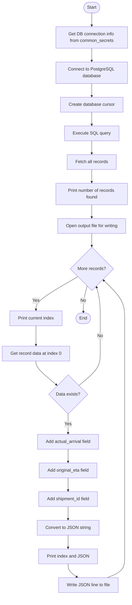
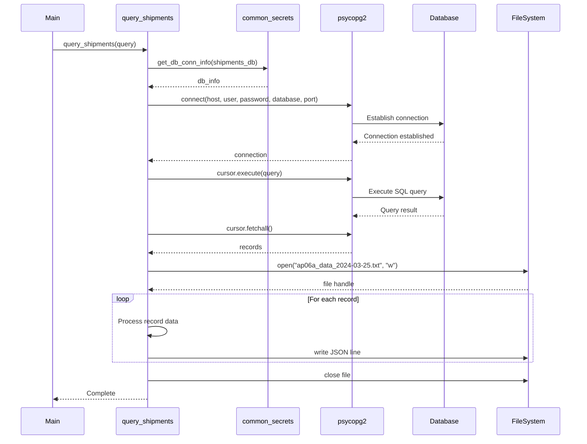

# Diagram: research/api/scripts/simulate/query_data_kansas_city.py

> Auto-generated by Obscura crawlers

## Diagram 1

### SVG

<svg id="container" width="474.3873291015625" xmlns="http://www.w3.org/2000/svg" class="flowchart" height="2154.03125" viewBox="0 0 474.3873291015625 2154.03125" role="graphics-document document" aria-roledescription="flowchart-v2"><g><marker id="container_flowchart-v2-pointEnd" class="marker flowchart-v2" viewBox="0 0 10 10" refX="5" refY="5" markerUnits="userSpaceOnUse" markerWidth="8" markerHeight="8" orient="auto"><path d="M 0 0 L 10 5 L 0 10 z" class="arrowMarkerPath" style="stroke-width: 1; stroke-dasharray: 1, 0;"></path></marker><marker id="container_flowchart-v2-pointStart" class="marker flowchart-v2" viewBox="0 0 10 10" refX="4.5" refY="5" markerUnits="userSpaceOnUse" markerWidth="8" markerHeight="8" orient="auto"><path d="M 0 5 L 10 10 L 10 0 z" class="arrowMarkerPath" style="stroke-width: 1; stroke-dasharray: 1, 0;"></path></marker><marker id="container_flowchart-v2-circleEnd" class="marker flowchart-v2" viewBox="0 0 10 10" refX="11" refY="5" markerUnits="userSpaceOnUse" markerWidth="11" markerHeight="11" orient="auto"><circle cx="5" cy="5" r="5" class="arrowMarkerPath" style="stroke-width: 1; stroke-dasharray: 1, 0;"></circle></marker><marker id="container_flowchart-v2-circleStart" class="marker flowchart-v2" viewBox="0 0 10 10" refX="-1" refY="5" markerUnits="userSpaceOnUse" markerWidth="11" markerHeight="11" orient="auto"><circle cx="5" cy="5" r="5" class="arrowMarkerPath" style="stroke-width: 1; stroke-dasharray: 1, 0;"></circle></marker><marker id="container_flowchart-v2-crossEnd" class="marker cross flowchart-v2" viewBox="0 0 11 11" refX="12" refY="5.2" markerUnits="userSpaceOnUse" markerWidth="11" markerHeight="11" orient="auto"><path d="M 1,1 l 9,9 M 10,1 l -9,9" class="arrowMarkerPath" style="stroke-width: 2; stroke-dasharray: 1, 0;"></path></marker><marker id="container_flowchart-v2-crossStart" class="marker cross flowchart-v2" viewBox="0 0 11 11" refX="-1" refY="5.2" markerUnits="userSpaceOnUse" markerWidth="11" markerHeight="11" orient="auto"><path d="M 1,1 l 9,9 M 10,1 l -9,9" class="arrowMarkerPath" style="stroke-width: 2; stroke-dasharray: 1, 0;"></path></marker><g class="root"><g class="clusters"></g><g class="edgePaths"><path d="M336.887,47.5L336.804,51.583C336.721,55.667,336.554,63.833,336.471,71.417C336.387,79,336.387,86,336.387,89.5L336.387,93" id="L_Start_GetDBInfo_0" class="edge-thickness-normal edge-pattern-solid edge-thickness-normal edge-pattern-solid flowchart-link" style=";" data-edge="true" data-et="edge" data-id="L_Start_GetDBInfo_0" data-points="W3sieCI6MzM2Ljg4NzMxNDc5NjQ0Nzc1LCJ5Ijo0Ny41fSx7IngiOjMzNi4zODczMTQ3OTY0NDc3NSwieSI6NzJ9LHsieCI6MzM2LjM4NzMxNDc5NjQ0Nzc1LCJ5Ijo5N31d" marker-end="url(#container_flowchart-v2-pointEnd)"></path><path d="M336.387,175L336.387,179.167C336.387,183.333,336.387,191.667,336.387,199.333C336.387,207,336.387,214,336.387,217.5L336.387,221" id="L_GetDBInfo_Connect_0" class="edge-thickness-normal edge-pattern-solid edge-thickness-normal edge-pattern-solid flowchart-link" style=";" data-edge="true" data-et="edge" data-id="L_GetDBInfo_Connect_0" data-points="W3sieCI6MzM2LjM4NzMxNDc5NjQ0Nzc1LCJ5IjoxNzV9LHsieCI6MzM2LjM4NzMxNDc5NjQ0Nzc1LCJ5IjoyMDB9LHsieCI6MzM2LjM4NzMxNDc5NjQ0Nzc1LCJ5IjoyMjV9XQ==" marker-end="url(#container_flowchart-v2-pointEnd)"></path><path d="M336.387,303L336.387,307.167C336.387,311.333,336.387,319.667,336.387,327.333C336.387,335,336.387,342,336.387,345.5L336.387,349" id="L_Connect_CreateCursor_0" class="edge-thickness-normal edge-pattern-solid edge-thickness-normal edge-pattern-solid flowchart-link" style=";" data-edge="true" data-et="edge" data-id="L_Connect_CreateCursor_0" data-points="W3sieCI6MzM2LjM4NzMxNDc5NjQ0Nzc1LCJ5IjozMDN9LHsieCI6MzM2LjM4NzMxNDc5NjQ0Nzc1LCJ5IjozMjh9LHsieCI6MzM2LjM4NzMxNDc5NjQ0Nzc1LCJ5IjozNTN9XQ==" marker-end="url(#container_flowchart-v2-pointEnd)"></path><path d="M336.387,407L336.387,411.167C336.387,415.333,336.387,423.667,336.387,431.333C336.387,439,336.387,446,336.387,449.5L336.387,453" id="L_CreateCursor_ExecuteQuery_0" class="edge-thickness-normal edge-pattern-solid edge-thickness-normal edge-pattern-solid flowchart-link" style=";" data-edge="true" data-et="edge" data-id="L_CreateCursor_ExecuteQuery_0" data-points="W3sieCI6MzM2LjM4NzMxNDc5NjQ0Nzc1LCJ5Ijo0MDd9LHsieCI6MzM2LjM4NzMxNDc5NjQ0Nzc1LCJ5Ijo0MzJ9LHsieCI6MzM2LjM4NzMxNDc5NjQ0Nzc1LCJ5Ijo0NTd9XQ==" marker-end="url(#container_flowchart-v2-pointEnd)"></path><path d="M336.387,511L336.387,515.167C336.387,519.333,336.387,527.667,336.387,535.333C336.387,543,336.387,550,336.387,553.5L336.387,557" id="L_ExecuteQuery_FetchRecords_0" class="edge-thickness-normal edge-pattern-solid edge-thickness-normal edge-pattern-solid flowchart-link" style=";" data-edge="true" data-et="edge" data-id="L_ExecuteQuery_FetchRecords_0" data-points="W3sieCI6MzM2LjM4NzMxNDc5NjQ0Nzc1LCJ5Ijo1MTF9LHsieCI6MzM2LjM4NzMxNDc5NjQ0Nzc1LCJ5Ijo1MzZ9LHsieCI6MzM2LjM4NzMxNDc5NjQ0Nzc1LCJ5Ijo1NjF9XQ==" marker-end="url(#container_flowchart-v2-pointEnd)"></path><path d="M336.387,615L336.387,619.167C336.387,623.333,336.387,631.667,336.387,639.333C336.387,647,336.387,654,336.387,657.5L336.387,661" id="L_FetchRecords_PrintCount_0" class="edge-thickness-normal edge-pattern-solid edge-thickness-normal edge-pattern-solid flowchart-link" style=";" data-edge="true" data-et="edge" data-id="L_FetchRecords_PrintCount_0" data-points="W3sieCI6MzM2LjM4NzMxNDc5NjQ0Nzc1LCJ5Ijo2MTV9LHsieCI6MzM2LjM4NzMxNDc5NjQ0Nzc1LCJ5Ijo2NDB9LHsieCI6MzM2LjM4NzMxNDc5NjQ0Nzc1LCJ5Ijo2NjV9XQ==" marker-end="url(#container_flowchart-v2-pointEnd)"></path><path d="M336.387,743L336.387,747.167C336.387,751.333,336.387,759.667,336.387,767.333C336.387,775,336.387,782,336.387,785.5L336.387,789" id="L_PrintCount_OpenFile_0" class="edge-thickness-normal edge-pattern-solid edge-thickness-normal edge-pattern-solid flowchart-link" style=";" data-edge="true" data-et="edge" data-id="L_PrintCount_OpenFile_0" data-points="W3sieCI6MzM2LjM4NzMxNDc5NjQ0Nzc1LCJ5Ijo3NDN9LHsieCI6MzM2LjM4NzMxNDc5NjQ0Nzc1LCJ5Ijo3Njh9LHsieCI6MzM2LjM4NzMxNDc5NjQ0Nzc1LCJ5Ijo3OTN9XQ==" marker-end="url(#container_flowchart-v2-pointEnd)"></path><path d="M336.387,847L336.387,851.167C336.387,855.333,336.387,863.667,336.387,871.333C336.387,879,336.387,886,336.387,889.5L336.387,893" id="L_OpenFile_LoopStart_0" class="edge-thickness-normal edge-pattern-solid edge-thickness-normal edge-pattern-solid flowchart-link" style=";" data-edge="true" data-et="edge" data-id="L_OpenFile_LoopStart_0" data-points="W3sieCI6MzM2LjM4NzMxNDc5NjQ0Nzc1LCJ5Ijo4NDd9LHsieCI6MzM2LjM4NzMxNDc5NjQ0Nzc1LCJ5Ijo4NzJ9LHsieCI6MzM2LjM4NzMxNDc5NjQ0Nzc1LCJ5Ijo4OTd9XQ==" marker-end="url(#container_flowchart-v2-pointEnd)"></path><path d="M286.68,1002.434L260.9,1016.885C235.12,1031.336,183.56,1060.238,157.78,1080.189C132,1100.141,132,1111.141,132,1116.641L132,1122.141" id="L_LoopStart_PrintIndex_0" class="edge-thickness-normal edge-pattern-solid edge-thickness-normal edge-pattern-solid flowchart-link" style=";" data-edge="true" data-et="edge" data-id="L_LoopStart_PrintIndex_0" data-points="W3sieCI6Mjg2LjY4MDQzNjc1NjkzNjgsInkiOjEwMDIuNDMzNzQ2OTYwNDg5fSx7IngiOjEzMiwieSI6MTA4OS4xNDA2MjV9LHsieCI6MTMyLCJ5IjoxMTI2LjE0MDYyNX1d" marker-end="url(#container_flowchart-v2-pointEnd)"></path><path d="M132,1180.141L132,1186.307C132,1192.474,132,1204.807,132,1216.474C132,1228.141,132,1239.141,132,1244.641L132,1250.141" id="L_PrintIndex_GetRecord_0" class="edge-thickness-normal edge-pattern-solid edge-thickness-normal edge-pattern-solid flowchart-link" style=";" data-edge="true" data-et="edge" data-id="L_PrintIndex_GetRecord_0" data-points="W3sieCI6MTMyLCJ5IjoxMTgwLjE0MDYyNX0seyJ4IjoxMzIsInkiOjEyMTcuMTQwNjI1fSx7IngiOjEzMiwieSI6MTI1NC4xNDA2MjV9XQ==" marker-end="url(#container_flowchart-v2-pointEnd)"></path><path d="M132,1308.141L132,1312.307C132,1316.474,132,1324.807,144.611,1339.168C157.222,1353.529,182.443,1373.917,195.054,1384.111L207.665,1394.305" id="L_GetRecord_CheckData_0" class="edge-thickness-normal edge-pattern-solid edge-thickness-normal edge-pattern-solid flowchart-link" style=";" data-edge="true" data-et="edge" data-id="L_GetRecord_CheckData_0" data-points="W3sieCI6MTMyLCJ5IjoxMzA4LjE0MDYyNX0seyJ4IjoxMzIsInkiOjEzMzMuMTQwNjI1fSx7IngiOjIxMC43NzU4NzM4NjU1NjI0LCJ5IjoxMzk2LjgxOTU3NTU4MjA2OTV9XQ==" marker-end="url(#container_flowchart-v2-pointEnd)"></path><path d="M249.455,1498.031L249.455,1504.198C249.455,1510.365,249.455,1522.698,249.455,1534.365C249.455,1546.031,249.455,1557.031,249.455,1562.531L249.455,1568.031" id="L_CheckData_AddArrival_0" class="edge-thickness-normal edge-pattern-solid edge-thickness-normal edge-pattern-solid flowchart-link" style=";" data-edge="true" data-et="edge" data-id="L_CheckData_AddArrival_0" data-points="W3sieCI6MjQ5LjQ1NDgyNDQ0NzYzMTg2LCJ5IjoxNDk4LjAzMTI1fSx7IngiOjI0OS40NTQ4MjQ0NDc2MzE4NCwieSI6MTUzNS4wMzEyNX0seyJ4IjoyNDkuNDU0ODI0NDQ3NjMxODQsInkiOjE1NzIuMDMxMjV9XQ==" marker-end="url(#container_flowchart-v2-pointEnd)"></path><path d="M249.455,1626.031L249.455,1630.198C249.455,1634.365,249.455,1642.698,249.455,1650.365C249.455,1658.031,249.455,1665.031,249.455,1668.531L249.455,1672.031" id="L_AddArrival_AddETA_0" class="edge-thickness-normal edge-pattern-solid edge-thickness-normal edge-pattern-solid flowchart-link" style=";" data-edge="true" data-et="edge" data-id="L_AddArrival_AddETA_0" data-points="W3sieCI6MjQ5LjQ1NDgyNDQ0NzYzMTg0LCJ5IjoxNjI2LjAzMTI1fSx7IngiOjI0OS40NTQ4MjQ0NDc2MzE4NCwieSI6MTY1MS4wMzEyNX0seyJ4IjoyNDkuNDU0ODI0NDQ3NjMxODQsInkiOjE2NzYuMDMxMjV9XQ==" marker-end="url(#container_flowchart-v2-pointEnd)"></path><path d="M249.455,1730.031L249.455,1734.198C249.455,1738.365,249.455,1746.698,249.455,1754.365C249.455,1762.031,249.455,1769.031,249.455,1772.531L249.455,1776.031" id="L_AddETA_AddShipmentID_0" class="edge-thickness-normal edge-pattern-solid edge-thickness-normal edge-pattern-solid flowchart-link" style=";" data-edge="true" data-et="edge" data-id="L_AddETA_AddShipmentID_0" data-points="W3sieCI6MjQ5LjQ1NDgyNDQ0NzYzMTg0LCJ5IjoxNzMwLjAzMTI1fSx7IngiOjI0OS40NTQ4MjQ0NDc2MzE4NCwieSI6MTc1NS4wMzEyNX0seyJ4IjoyNDkuNDU0ODI0NDQ3NjMxODQsInkiOjE3ODAuMDMxMjV9XQ==" marker-end="url(#container_flowchart-v2-pointEnd)"></path><path d="M249.455,1834.031L249.455,1838.198C249.455,1842.365,249.455,1850.698,249.455,1858.365C249.455,1866.031,249.455,1873.031,249.455,1876.531L249.455,1880.031" id="L_AddShipmentID_ConvertJSON_0" class="edge-thickness-normal edge-pattern-solid edge-thickness-normal edge-pattern-solid flowchart-link" style=";" data-edge="true" data-et="edge" data-id="L_AddShipmentID_ConvertJSON_0" data-points="W3sieCI6MjQ5LjQ1NDgyNDQ0NzYzMTg0LCJ5IjoxODM0LjAzMTI1fSx7IngiOjI0OS40NTQ4MjQ0NDc2MzE4NCwieSI6MTg1OS4wMzEyNX0seyJ4IjoyNDkuNDU0ODI0NDQ3NjMxODQsInkiOjE4ODQuMDMxMjV9XQ==" marker-end="url(#container_flowchart-v2-pointEnd)"></path><path d="M249.455,1938.031L249.455,1942.198C249.455,1946.365,249.455,1954.698,249.455,1962.365C249.455,1970.031,249.455,1977.031,249.455,1980.531L249.455,1984.031" id="L_ConvertJSON_PrintJSON_0" class="edge-thickness-normal edge-pattern-solid edge-thickness-normal edge-pattern-solid flowchart-link" style=";" data-edge="true" data-et="edge" data-id="L_ConvertJSON_PrintJSON_0" data-points="W3sieCI6MjQ5LjQ1NDgyNDQ0NzYzMTg0LCJ5IjoxOTM4LjAzMTI1fSx7IngiOjI0OS40NTQ4MjQ0NDc2MzE4NCwieSI6MTk2My4wMzEyNX0seyJ4IjoyNDkuNDU0ODI0NDQ3NjMxODQsInkiOjE5ODguMDMxMjV9XQ==" marker-end="url(#container_flowchart-v2-pointEnd)"></path><path d="M249.455,2042.031L249.455,2046.198C249.455,2050.365,249.455,2058.698,254.877,2066.65C260.299,2074.601,271.144,2082.172,276.566,2085.957L281.988,2089.742" id="L_PrintJSON_WriteFile_0" class="edge-thickness-normal edge-pattern-solid edge-thickness-normal edge-pattern-solid flowchart-link" style=";" data-edge="true" data-et="edge" data-id="L_PrintJSON_WriteFile_0" data-points="W3sieCI6MjQ5LjQ1NDgyNDQ0NzYzMTg0LCJ5IjoyMDQyLjAzMTI1fSx7IngiOjI0OS40NTQ4MjQ0NDc2MzE4NCwieSI6MjA2Ny4wMzEyNX0seyJ4IjoyODUuMjY4Mzc2MTMwMzI0MTYsInkiOjIwOTIuMDMxMjV9XQ==" marker-end="url(#container_flowchart-v2-pointEnd)"></path><path d="M392.758,2092.031L403.377,2087.865C413.996,2083.698,435.234,2075.365,445.853,2062.531C456.472,2049.698,456.472,2032.365,456.472,2015.031C456.472,1997.698,456.472,1980.365,456.472,1963.031C456.472,1945.698,456.472,1928.365,456.472,1911.031C456.472,1893.698,456.472,1876.365,456.472,1859.031C456.472,1841.698,456.472,1824.365,456.472,1807.031C456.472,1789.698,456.472,1772.365,456.472,1755.031C456.472,1737.698,456.472,1720.365,456.472,1703.031C456.472,1685.698,456.472,1668.365,456.472,1651.031C456.472,1633.698,456.472,1616.365,456.472,1597.031C456.472,1577.698,456.472,1556.365,456.472,1527.874C456.472,1499.383,456.472,1463.734,456.472,1430.086C456.472,1396.438,456.472,1364.789,456.472,1340.298C456.472,1315.807,456.472,1298.474,456.472,1279.141C456.472,1259.807,456.472,1238.474,456.472,1217.141C456.472,1195.807,456.472,1174.474,456.472,1153.141C456.472,1131.807,456.472,1110.474,443.556,1087.485C430.641,1064.495,404.809,1039.85,391.894,1027.528L378.978,1015.205" id="L_WriteFile_LoopStart_0" class="edge-thickness-normal edge-pattern-solid edge-thickness-normal edge-pattern-solid flowchart-link" style=";" data-edge="true" data-et="edge" data-id="L_WriteFile_LoopStart_0" data-points="W3sieCI6MzkyLjc1ODE0MDc0NzM2Mzc3LCJ5IjoyMDkyLjAzMTI1fSx7IngiOjQ1Ni40NzIxNDg4OTUyNjM3LCJ5IjoyMDY3LjAzMTI1fSx7IngiOjQ1Ni40NzIxNDg4OTUyNjM3LCJ5IjoyMDE1LjAzMTI1fSx7IngiOjQ1Ni40NzIxNDg4OTUyNjM3LCJ5IjoxOTYzLjAzMTI1fSx7IngiOjQ1Ni40NzIxNDg4OTUyNjM3LCJ5IjoxOTExLjAzMTI1fSx7IngiOjQ1Ni40NzIxNDg4OTUyNjM3LCJ5IjoxODU5LjAzMTI1fSx7IngiOjQ1Ni40NzIxNDg4OTUyNjM3LCJ5IjoxODA3LjAzMTI1fSx7IngiOjQ1Ni40NzIxNDg4OTUyNjM3LCJ5IjoxNzU1LjAzMTI1fSx7IngiOjQ1Ni40NzIxNDg4OTUyNjM3LCJ5IjoxNzAzLjAzMTI1fSx7IngiOjQ1Ni40NzIxNDg4OTUyNjM3LCJ5IjoxNjUxLjAzMTI1fSx7IngiOjQ1Ni40NzIxNDg4OTUyNjM3LCJ5IjoxNTk5LjAzMTI1fSx7IngiOjQ1Ni40NzIxNDg4OTUyNjM3LCJ5IjoxNTM1LjAzMTI1fSx7IngiOjQ1Ni40NzIxNDg4OTUyNjM3LCJ5IjoxNDI4LjA4NTkzNzV9LHsieCI6NDU2LjQ3MjE0ODg5NTI2MzcsInkiOjEzMzMuMTQwNjI1fSx7IngiOjQ1Ni40NzIxNDg4OTUyNjM3LCJ5IjoxMjgxLjE0MDYyNX0seyJ4Ijo0NTYuNDcyMTQ4ODk1MjYzNywieSI6MTIxNy4xNDA2MjV9LHsieCI6NDU2LjQ3MjE0ODg5NTI2MzcsInkiOjExNTMuMTQwNjI1fSx7IngiOjQ1Ni40NzIxNDg4OTUyNjM3LCJ5IjoxMDg5LjE0MDYyNX0seyJ4IjozNzYuMDgzOTQyOTg3MDk4MywieSI6MTAxMi40NDM5OTY4MDkzNDk0fV0=" marker-end="url(#container_flowchart-v2-pointEnd)"></path><path d="M288.134,1396.82L301.263,1386.206C314.392,1375.593,340.651,1354.367,353.78,1335.087C366.91,1315.807,366.91,1298.474,366.91,1279.141C366.91,1259.807,366.91,1238.474,366.91,1217.141C366.91,1195.807,366.91,1174.474,366.91,1153.141C366.91,1131.807,366.91,1110.474,364.714,1091.565C362.518,1072.656,358.127,1056.172,355.931,1047.93L353.735,1039.688" id="L_CheckData_LoopStart_0" class="edge-thickness-normal edge-pattern-solid edge-thickness-normal edge-pattern-solid flowchart-link" style=";" data-edge="true" data-et="edge" data-id="L_CheckData_LoopStart_0" data-points="W3sieCI6Mjg4LjEzMzc3NTAyOTcwMTQsInkiOjEzOTYuODE5NTc1NTgyMDY5NX0seyJ4IjozNjYuOTA5NjQ4ODk1MjYzNywieSI6MTMzMy4xNDA2MjV9LHsieCI6MzY2LjkwOTY0ODg5NTI2MzcsInkiOjEyODEuMTQwNjI1fSx7IngiOjM2Ni45MDk2NDg4OTUyNjM3LCJ5IjoxMjE3LjE0MDYyNX0seyJ4IjozNjYuOTA5NjQ4ODk1MjYzNywieSI6MTE1My4xNDA2MjV9LHsieCI6MzY2LjkwOTY0ODg5NTI2MzcsInkiOjEwODkuMTQwNjI1fSx7IngiOjM1Mi43MDUzNTA1NDY1MzcxLCJ5IjoxMDM1LjgyMjU4OTI0OTkxMDZ9XQ==" marker-end="url(#container_flowchart-v2-pointEnd)"></path><path d="M320.069,1035.823L317.702,1044.709C315.335,1053.595,310.6,1071.368,308.308,1087.088C306.017,1102.807,306.169,1116.474,306.245,1123.307L306.321,1130.141" id="L_LoopStart_End_0" class="edge-thickness-normal edge-pattern-solid edge-thickness-normal edge-pattern-solid flowchart-link" style=";" data-edge="true" data-et="edge" data-id="L_LoopStart_End_0" data-points="W3sieCI6MzIwLjA2OTI3OTA0NjM1ODUsInkiOjEwMzUuODIyNTg5MjQ5OTEwOH0seyJ4IjozMDUuODY0OTgwNjk3NjMxODQsInkiOjEwODkuMTQwNjI1fSx7IngiOjMwNi4zNjQ5ODA2OTc2MzE4NCwieSI6MTEzNC4xNDA2MjV9XQ==" marker-end="url(#container_flowchart-v2-pointEnd)"></path></g><g class="edgeLabels"><g class="edgeLabel"><g class="label" data-id="L_Start_GetDBInfo_0" transform="translate(0, 0)"><foreignObject width="0" height="0">

</foreignObject></g></g><g class="edgeLabel"><g class="label" data-id="L_GetDBInfo_Connect_0" transform="translate(0, 0)"><foreignObject width="0" height="0">

</foreignObject></g></g><g class="edgeLabel"><g class="label" data-id="L_Connect_CreateCursor_0" transform="translate(0, 0)"><foreignObject width="0" height="0">

</foreignObject></g></g><g class="edgeLabel"><g class="label" data-id="L_CreateCursor_ExecuteQuery_0" transform="translate(0, 0)"><foreignObject width="0" height="0">

</foreignObject></g></g><g class="edgeLabel"><g class="label" data-id="L_ExecuteQuery_FetchRecords_0" transform="translate(0, 0)"><foreignObject width="0" height="0">

</foreignObject></g></g><g class="edgeLabel"><g class="label" data-id="L_FetchRecords_PrintCount_0" transform="translate(0, 0)"><foreignObject width="0" height="0">

</foreignObject></g></g><g class="edgeLabel"><g class="label" data-id="L_PrintCount_OpenFile_0" transform="translate(0, 0)"><foreignObject width="0" height="0">

</foreignObject></g></g><g class="edgeLabel"><g class="label" data-id="L_OpenFile_LoopStart_0" transform="translate(0, 0)"><foreignObject width="0" height="0">

</foreignObject></g></g><g class="edgeLabel" transform="translate(132, 1089.140625)"><g class="label" data-id="L_LoopStart_PrintIndex_0" transform="translate(-12.03125, -12)"><foreignObject width="24.0625" height="24">

Yes

</foreignObject></g></g><g class="edgeLabel"><g class="label" data-id="L_PrintIndex_GetRecord_0" transform="translate(0, 0)"><foreignObject width="0" height="0">

</foreignObject></g></g><g class="edgeLabel"><g class="label" data-id="L_GetRecord_CheckData_0" transform="translate(0, 0)"><foreignObject width="0" height="0">

</foreignObject></g></g><g class="edgeLabel" transform="translate(249.45482444763184, 1535.03125)"><g class="label" data-id="L_CheckData_AddArrival_0" transform="translate(-12.03125, -12)"><foreignObject width="24.0625" height="24">

Yes

</foreignObject></g></g><g class="edgeLabel"><g class="label" data-id="L_AddArrival_AddETA_0" transform="translate(0, 0)"><foreignObject width="0" height="0">

</foreignObject></g></g><g class="edgeLabel"><g class="label" data-id="L_AddETA_AddShipmentID_0" transform="translate(0, 0)"><foreignObject width="0" height="0">

</foreignObject></g></g><g class="edgeLabel"><g class="label" data-id="L_AddShipmentID_ConvertJSON_0" transform="translate(0, 0)"><foreignObject width="0" height="0">

</foreignObject></g></g><g class="edgeLabel"><g class="label" data-id="L_ConvertJSON_PrintJSON_0" transform="translate(0, 0)"><foreignObject width="0" height="0">

</foreignObject></g></g><g class="edgeLabel"><g class="label" data-id="L_PrintJSON_WriteFile_0" transform="translate(0, 0)"><foreignObject width="0" height="0">

</foreignObject></g></g><g class="edgeLabel"><g class="label" data-id="L_WriteFile_LoopStart_0" transform="translate(0, 0)"><foreignObject width="0" height="0">

</foreignObject></g></g><g class="edgeLabel" transform="translate(366.9096488952637, 1217.140625)"><g class="label" data-id="L_CheckData_LoopStart_0" transform="translate(-10.140625, -12)"><foreignObject width="20.28125" height="24">

No

</foreignObject></g></g><g class="edgeLabel" transform="translate(305.86498069763184, 1089.140625)"><g class="label" data-id="L_LoopStart_End_0" transform="translate(-10.140625, -12)"><foreignObject width="20.28125" height="24">

No

</foreignObject></g></g></g><g class="nodes"><g class="node default" id="flowchart-Start-0" transform="translate(336.38731479644775, 27.5)"><g class="basic label-container outer-path"><path d="M-10.3984375 -19.5 C-5.224477309735724 -19.5, -0.05051711947144888 -19.5, 10.3984375 -19.5 C10.3984375 -19.5, 10.398437499999998 -19.5, 10.398437499999998 -19.5 C10.812507351128373 -19.486721585812386, 11.226577202256745 -19.47344317162477, 11.6478067896239 -19.45993515863156 C12.140276120704371 -19.41242723454325, 12.632745451784842 -19.36491931045494, 12.892042152847864 -19.3399052695533 C13.372458218019043 -19.26223532581865, 13.852874283190223 -19.184565382084006, 14.126030759676757 -19.140403561325776 C14.441049780112424 -19.068502525602558, 14.756068800548091 -18.99660148987934, 15.34470188623539 -18.862249829261074 C15.685428628229642 -18.761123920748346, 16.026155370223893 -18.65999801223562, 16.543047751460602 -18.50658706670804 C17.00951289976442 -18.334923580175673, 17.47597804806824 -18.163260093643302, 17.716144095147794 -18.074876768247425 C18.05088300572282 -17.92669778221284, 18.38562191629785 -17.778518796178258, 18.85917041279238 -17.568892924097174 C19.15408706906576 -17.415035093422485, 19.449003725339143 -17.261177262747797, 19.967429764076783 -16.990714730406097 C20.288990869331766 -16.79578249869772, 20.61055197458675 -16.600850266989337, 21.036368073605697 -16.342718045390892 C21.247600288829755 -16.195371596145808, 21.458832504053817 -16.048025146900727, 22.061592844578712 -15.627565626425154 C22.394001203555334 -15.362478805899228, 22.72640956253196 -15.0973919853733, 23.03889120850187 -14.848196188198123 C23.304695275375938 -14.606799967453318, 23.570499342250006 -14.365403746708514, 23.964247236767985 -14.007812326905688 C24.21174696011327 -13.752248542446491, 24.459246683458556 -13.496684757987296, 24.833858442968648 -13.10986736009568 C25.109840568379152 -12.785683051760698, 25.38582269378966 -12.461498743425713, 25.644151408126582 -12.158051136245305 C25.803649620939222 -11.944338061662478, 25.963147833751858 -11.73062498707965, 26.391796464640635 -11.156274872382312 C26.570618375169666 -10.881556397403255, 26.749440285698693 -10.6068379224242, 27.073721378604247 -10.108655082055241 C27.255985563658545 -9.785026565241273, 27.438249748712842 -9.461398048427306, 27.6871239742735 -9.019496659696287 C27.857951672592964 -8.664769289008719, 28.028779370912428 -8.31004191832115, 28.22948364880834 -7.893275190886684 C28.343254905770756 -7.612257986571906, 28.457026162733168 -7.331240782257129, 28.698571729970325 -6.734618561215508 C28.834045005111044 -6.326594641226798, 28.96951828025176 -5.918570721238088, 29.09246063421488 -5.548287939305138 C29.179655740061943 -5.215775210112373, 29.266850845909 -4.883262480919607, 29.40953178754556 -4.339158212148133 C29.45950812411663 -4.08254028635816, 29.509484460687702 -3.8259223605681876, 29.648482276581777 -3.1121979531509023 C29.70103265668173 -2.7046275823419634, 29.753583036781684 -2.2970572115330246, 29.808330202509367 -1.872449005199798 C29.824640366854066 -1.618405030203428, 29.84095053119876 -1.3643610552070582, 29.888418715913414 -0.6250057626472757 C29.888418715913414 -0.3656398107653914, 29.888418715913414 -0.10627385888350716, 29.888418715913414 0.625005762647271 C29.85750199073911 1.106558712768462, 29.826585265564805 1.5881116628896528, 29.808330202509367 1.8724490051997846 C29.74672230405464 2.3502676997590464, 29.68511440559991 2.8280863943183077, 29.648482276581777 3.1121979531508885 C29.588990335477384 3.4176764970957527, 29.52949839437299 3.7231550410406165, 29.40953178754556 4.339158212148129 C29.304495853499326 4.739705751528196, 29.199459919453094 5.140253290908263, 29.092460634214884 5.548287939305125 C28.988002244600313 5.862899965640019, 28.883543854985742 6.177511991974912, 28.69857172997033 6.734618561215495 C28.563366409479528 7.068578316844812, 28.42816108898873 7.40253807247413, 28.229483648808344 7.893275190886679 C28.061416220087384 8.242270802692646, 27.893348791366428 8.591266414498612, 27.687123974273504 9.019496659696284 C27.547882673026315 9.266733689771335, 27.40864137177913 9.513970719846387, 27.07372137860425 10.108655082055236 C26.85892133575502 10.438645629759383, 26.64412129290579 10.768636177463529, 26.39179646464064 11.156274872382301 C26.10987936150524 11.534018107407292, 25.827962258369837 11.911761342432282, 25.644151408126582 12.158051136245302 C25.453429727165627 12.38208367507312, 25.262708046204672 12.60611621390094, 24.83385844296866 13.10986736009567 C24.52679172642078 13.42693895557764, 24.2197250098729 13.74401055105961, 23.96424723676799 14.007812326905684 C23.751288551111784 14.20121577064059, 23.538329865455584 14.3946192143755, 23.038891208501887 14.848196188198111 C22.68655264394518 15.12917681730911, 22.334214079388474 15.41015744642011, 22.061592844578715 15.627565626425152 C21.82223486162401 15.794531393694273, 21.582876878669307 15.961497160963393, 21.036368073605708 16.34271804539089 C20.764164468179242 16.507729470646353, 20.49196086275278 16.67274089590182, 19.967429764076787 16.990714730406093 C19.595701751687503 17.184644996366426, 19.223973739298216 17.378575262326763, 18.859170412792388 17.56889292409717 C18.42344025170599 17.761777740934132, 17.98771009061959 17.954662557771098, 17.716144095147804 18.07487676824742 C17.337162581570997 18.214345468510395, 16.958181067994186 18.35381416877337, 16.543047751460616 18.506587066708033 C16.2878861887859 18.582317679139514, 16.032724626111186 18.658048291570996, 15.344701886235413 18.86224982926107 C14.926891045647466 18.957612427154732, 14.509080205059519 19.052975025048394, 14.126030759676766 19.140403561325773 C13.855303078924662 19.18417271322525, 13.584575398172555 19.227941865124734, 12.892042152847878 19.3399052695533 C12.606656319051648 19.36743609771294, 12.321270485255418 19.39496692587258, 11.6478067896239 19.45993515863156 C11.161825696156338 19.47551962639425, 10.675844602688777 19.491104094156942, 10.398437500000004 19.5 C10.398437500000002 19.5, 10.398437500000002 19.5, 10.3984375 19.5 C4.554761454150313 19.5, -1.288914591699374 19.5, -10.398437499999996 19.5 C-10.785048648343277 19.48760213296558, -11.171659796686559 19.47520426593116, -11.647806789623893 19.45993515863156 C-12.107016662993736 19.415635734428246, -12.56622653636358 19.37133631022493, -12.892042152847871 19.3399052695533 C-13.303656883627864 19.2733585920007, -13.71527161440786 19.206811914448103, -14.126030759676759 19.140403561325773 C-14.547805727186946 19.044136177330454, -14.96958069469713 18.94786879333514, -15.344701886235388 18.862249829261074 C-15.671340795948192 18.76530511542094, -15.997979705660994 18.668360401580806, -16.54304775146059 18.506587066708043 C-16.870558856914812 18.38605995242142, -17.198069962369033 18.265532838134796, -17.716144095147797 18.074876768247425 C-17.974607717742924 17.960462589575513, -18.233071340338054 17.846048410903606, -18.85917041279238 17.568892924097174 C-19.17860261435349 17.40224534914883, -19.4980348159146 17.235597774200492, -19.96742976407678 16.990714730406097 C-20.194308620512018 16.853179434346902, -20.421187476947257 16.715644138287708, -21.036368073605686 16.3427180453909 C-21.347165045327213 16.125919532102024, -21.65796201704874 15.909121018813153, -22.061592844578712 15.627565626425156 C-22.337044205203224 15.407900496395659, -22.612495565827732 15.188235366366161, -23.03889120850187 14.848196188198125 C-23.241624720106895 14.664078976993217, -23.44435823171192 14.47996176578831, -23.964247236767974 14.007812326905697 C-24.299256764727115 13.66188748449412, -24.634266292686256 13.315962642082544, -24.833858442968655 13.109867360095677 C-25.0212059535289 12.889798313816268, -25.208553464089142 12.669729267536859, -25.64415140812658 12.158051136245307 C-25.94274204322372 11.757966887381597, -26.24133267832086 11.35788263851789, -26.391796464640635 11.156274872382316 C-26.634319823164358 10.783693867049525, -26.87684318168808 10.411112861716733, -27.073721378604244 10.108655082055249 C-27.203372604163658 9.878446202464305, -27.333023829723068 9.648237322873364, -27.6871239742735 9.019496659696289 C-27.832896742773134 8.716796386869214, -27.978669511272766 8.41409611404214, -28.22948364880834 7.893275190886686 C-28.35944518406095 7.572267686177398, -28.489406719313553 7.251260181468109, -28.698571729970325 6.73461856121551 C-28.820341690535813 6.3678668414007165, -28.942111651101296 6.001115121585923, -29.09246063421488 5.5482879393051325 C-29.15685052305618 5.302741386398909, -29.221240411897476 5.057194833492684, -29.409531787545557 4.339158212148136 C-29.46220317808739 4.068701753818175, -29.514874568629217 3.798245295488213, -29.648482276581777 3.112197953150904 C-29.71177186434385 2.6213364084109934, -29.77506145210592 2.130474863671082, -29.808330202509364 1.872449005199809 C-29.83405471954202 1.4717688879597608, -29.859779236574678 1.0710887707197125, -29.888418715913414 0.6250057626472781 C-29.888418715913414 0.12866807910241568, -29.888418715913414 -0.3676696044424468, -29.888418715913414 -0.6250057626472687 C-29.868780457092114 -0.9308874955062415, -29.849142198270812 -1.2367692283652143, -29.808330202509367 -1.8724490051997822 C-29.7616209342951 -2.2347168656813476, -29.714911666080834 -2.596984726162913, -29.648482276581777 -3.112197953150895 C-29.590158854334963 -3.4116763997286252, -29.53183543208815 -3.7111548463063553, -29.40953178754556 -4.339158212148126 C-29.30615282676625 -4.733386994324659, -29.20277386598694 -5.127615776501194, -29.092460634214884 -5.548287939305123 C-28.971906711840376 -5.911377145838061, -28.85135278946587 -6.274466352370999, -28.698571729970332 -6.734618561215485 C-28.57743742609922 -7.033822633749575, -28.456303122228107 -7.333026706283666, -28.229483648808344 -7.893275190886676 C-28.092674256025276 -8.177362822252787, -27.95586486324221 -8.461450453618896, -27.687123974273504 -9.019496659696282 C-27.516000155218766 -9.323344328593649, -27.34487633616403 -9.627191997491014, -27.073721378604247 -10.108655082055243 C-26.893187292700336 -10.386003918193586, -26.71265320679642 -10.663352754331928, -26.39179646464064 -11.156274872382308 C-26.139926476243943 -11.493757711005902, -25.888056487847244 -11.831240549629493, -25.644151408126586 -12.158051136245302 C-25.34796529985261 -12.505968192490911, -25.051779191578635 -12.853885248736521, -24.833858442968662 -13.10986736009567 C-24.62036085150749 -13.330321151757575, -24.406863260046315 -13.55077494341948, -23.964247236767996 -14.007812326905677 C-23.764325938033878 -14.1893755607883, -23.564404639299763 -14.370938794670923, -23.038891208501887 -14.848196188198107 C-22.700436223467566 -15.118105032097573, -22.361981238433245 -15.388013875997038, -22.06159284457872 -15.627565626425149 C-21.818361825727735 -15.797233055874493, -21.575130806876746 -15.966900485323837, -21.03636807360571 -16.342718045390885 C-20.705073211491424 -16.54355093770928, -20.373778349377133 -16.744383830027672, -19.96742976407679 -16.99071473040609 C-19.556369019252305 -17.20516485768405, -19.14530827442782 -17.419614984962013, -18.859170412792388 -17.56889292409717 C-18.48774652687217 -17.73331126049594, -18.11632264095195 -17.897729596894713, -17.716144095147804 -18.07487676824742 C-17.46184775301964 -18.168460172840202, -17.20755141089148 -18.262043577432983, -16.54304775146062 -18.506587066708033 C-16.264690692349497 -18.589201980726195, -15.986333633238376 -18.671816894744357, -15.344701886235413 -18.862249829261067 C-14.937157187490937 -18.955269247271794, -14.529612488746462 -19.04828866528252, -14.126030759676768 -19.140403561325773 C-13.835336598814122 -19.18740073888716, -13.544642437951476 -19.234397916448547, -12.89204215284788 -19.3399052695533 C-12.603259447676477 -19.367763789809167, -12.314476742505073 -19.395622310065036, -11.647806789623903 -19.45993515863156 C-11.240603410437203 -19.472993378428782, -10.833400031250504 -19.486051598226002, -10.398437500000005 -19.5 C-10.398437500000004 -19.5, -10.398437500000002 -19.5, -10.3984375 -19.5" stroke="none" stroke-width="0" fill="#ECECFF" style=""></path><path d="M-10.3984375 -19.5 C-2.292803646619239 -19.5, 5.812830206761522 -19.5, 10.3984375 -19.5 M-10.3984375 -19.5 C-5.620251853908109 -19.5, -0.8420662078162184 -19.5, 10.3984375 -19.5 M10.3984375 -19.5 C10.3984375 -19.5, 10.398437499999998 -19.5, 10.398437499999998 -19.5 M10.3984375 -19.5 C10.3984375 -19.5, 10.3984375 -19.5, 10.398437499999998 -19.5 M10.398437499999998 -19.5 C10.755397828515253 -19.488552977045646, 11.112358157030508 -19.477105954091293, 11.6478067896239 -19.45993515863156 M10.398437499999998 -19.5 C10.705369444045028 -19.490157289961264, 11.012301388090059 -19.480314579922524, 11.6478067896239 -19.45993515863156 M11.6478067896239 -19.45993515863156 C11.916832386430173 -19.433982582858274, 12.185857983236447 -19.408030007084992, 12.892042152847864 -19.3399052695533 M11.6478067896239 -19.45993515863156 C11.927522952184459 -19.432951276837244, 12.207239114745018 -19.405967395042932, 12.892042152847864 -19.3399052695533 M12.892042152847864 -19.3399052695533 C13.35426905063462 -19.265176009342266, 13.816495948421377 -19.190446749131233, 14.126030759676757 -19.140403561325776 M12.892042152847864 -19.3399052695533 C13.318303013353288 -19.270990719329127, 13.744563873858715 -19.202076169104956, 14.126030759676757 -19.140403561325776 M14.126030759676757 -19.140403561325776 C14.56847709188597 -19.039418073231165, 15.010923424095186 -18.938432585136557, 15.34470188623539 -18.862249829261074 M14.126030759676757 -19.140403561325776 C14.375491847880765 -19.083465695828945, 14.624952936084773 -19.026527830332114, 15.34470188623539 -18.862249829261074 M15.34470188623539 -18.862249829261074 C15.592524372176932 -18.7886974162804, 15.840346858118473 -18.715145003299725, 16.543047751460602 -18.50658706670804 M15.34470188623539 -18.862249829261074 C15.741669626482274 -18.74443188768199, 16.138637366729156 -18.626613946102903, 16.543047751460602 -18.50658706670804 M16.543047751460602 -18.50658706670804 C16.881519334712507 -18.38202639527432, 17.219990917964417 -18.2574657238406, 17.716144095147794 -18.074876768247425 M16.543047751460602 -18.50658706670804 C16.802362865627067 -18.411156707612143, 17.061677979793537 -18.315726348516243, 17.716144095147794 -18.074876768247425 M17.716144095147794 -18.074876768247425 C18.102429929686917 -17.903879488059104, 18.48871576422604 -17.732882207870787, 18.85917041279238 -17.568892924097174 M17.716144095147794 -18.074876768247425 C18.1392908890124 -17.887562234807223, 18.562437682877007 -17.700247701367022, 18.85917041279238 -17.568892924097174 M18.85917041279238 -17.568892924097174 C19.204359282409413 -17.388808111921993, 19.54954815202645 -17.208723299746808, 19.967429764076783 -16.990714730406097 M18.85917041279238 -17.568892924097174 C19.215097876600073 -17.383205794211122, 19.57102534040777 -17.19751866432507, 19.967429764076783 -16.990714730406097 M19.967429764076783 -16.990714730406097 C20.21715352760432 -16.839330717415976, 20.466877291131855 -16.68794670442585, 21.036368073605697 -16.342718045390892 M19.967429764076783 -16.990714730406097 C20.232345907807712 -16.83012100725634, 20.497262051538637 -16.66952728410659, 21.036368073605697 -16.342718045390892 M21.036368073605697 -16.342718045390892 C21.325175895060514 -16.1412582114331, 21.613983716515335 -15.93979837747531, 22.061592844578712 -15.627565626425154 M21.036368073605697 -16.342718045390892 C21.336753355536484 -16.133182276185252, 21.63713863746727 -15.92364650697961, 22.061592844578712 -15.627565626425154 M22.061592844578712 -15.627565626425154 C22.33751948730786 -15.407521471564998, 22.613446130037 -15.187477316704841, 23.03889120850187 -14.848196188198123 M22.061592844578712 -15.627565626425154 C22.371052451625804 -15.380779824871093, 22.680512058672896 -15.133994023317031, 23.03889120850187 -14.848196188198123 M23.03889120850187 -14.848196188198123 C23.380515304236994 -14.537942223329742, 23.722139399972118 -14.22768825846136, 23.964247236767985 -14.007812326905688 M23.03889120850187 -14.848196188198123 C23.228685549340508 -14.675829989531552, 23.418479890179142 -14.50346379086498, 23.964247236767985 -14.007812326905688 M23.964247236767985 -14.007812326905688 C24.145416795850657 -13.820739882855403, 24.32658635493333 -13.633667438805118, 24.833858442968648 -13.10986736009568 M23.964247236767985 -14.007812326905688 C24.257370439207868 -13.705138554524025, 24.55049364164775 -13.40246478214236, 24.833858442968648 -13.10986736009568 M24.833858442968648 -13.10986736009568 C25.14241425012741 -12.747420151684198, 25.45097005728617 -12.384972943272714, 25.644151408126582 -12.158051136245305 M24.833858442968648 -13.10986736009568 C25.012241405773306 -12.900328581707203, 25.19062436857796 -12.690789803318726, 25.644151408126582 -12.158051136245305 M25.644151408126582 -12.158051136245305 C25.889048067325326 -11.82991192346361, 26.13394472652407 -11.501772710681914, 26.391796464640635 -11.156274872382312 M25.644151408126582 -12.158051136245305 C25.80513839823854 -11.942343235711794, 25.966125388350495 -11.726635335178283, 26.391796464640635 -11.156274872382312 M26.391796464640635 -11.156274872382312 C26.587444502578517 -10.855706947255408, 26.783092540516396 -10.555139022128502, 27.073721378604247 -10.108655082055241 M26.391796464640635 -11.156274872382312 C26.58994537760921 -10.851864931629283, 26.78809429057779 -10.547454990876252, 27.073721378604247 -10.108655082055241 M27.073721378604247 -10.108655082055241 C27.257906973793403 -9.781614906982956, 27.44209256898256 -9.45457473191067, 27.6871239742735 -9.019496659696287 M27.073721378604247 -10.108655082055241 C27.244886484061286 -9.804734104969889, 27.41605158951832 -9.500813127884534, 27.6871239742735 -9.019496659696287 M27.6871239742735 -9.019496659696287 C27.89641331774842 -8.584902859896042, 28.105702661223336 -8.150309060095797, 28.22948364880834 -7.893275190886684 M27.6871239742735 -9.019496659696287 C27.856132789263874 -8.668546239159443, 28.025141604254244 -8.317595818622598, 28.22948364880834 -7.893275190886684 M28.22948364880834 -7.893275190886684 C28.386376809539925 -7.505746050556766, 28.543269970271506 -7.118216910226849, 28.698571729970325 -6.734618561215508 M28.22948364880834 -7.893275190886684 C28.353877393285654 -7.586020237038283, 28.478271137762967 -7.278765283189881, 28.698571729970325 -6.734618561215508 M28.698571729970325 -6.734618561215508 C28.81848768651655 -6.373450806111301, 28.938403643062777 -6.012283051007095, 29.09246063421488 -5.548287939305138 M28.698571729970325 -6.734618561215508 C28.7801939630197 -6.4887854000075595, 28.861816196069068 -6.242952238799611, 29.09246063421488 -5.548287939305138 M29.09246063421488 -5.548287939305138 C29.17346610900921 -5.239378955919508, 29.254471583803536 -4.930469972533878, 29.40953178754556 -4.339158212148133 M29.09246063421488 -5.548287939305138 C29.194717752526515 -5.158337228667458, 29.29697487083815 -4.768386518029777, 29.40953178754556 -4.339158212148133 M29.40953178754556 -4.339158212148133 C29.465642475133002 -4.051041690384634, 29.521753162720447 -3.7629251686211345, 29.648482276581777 -3.1121979531509023 M29.40953178754556 -4.339158212148133 C29.481869577935576 -3.967718947092813, 29.554207368325592 -3.596279682037493, 29.648482276581777 -3.1121979531509023 M29.648482276581777 -3.1121979531509023 C29.708899423034595 -2.6436144959778813, 29.769316569487412 -2.17503103880486, 29.808330202509367 -1.872449005199798 M29.648482276581777 -3.1121979531509023 C29.700611644365505 -2.7078928707283283, 29.752741012149233 -2.3035877883057543, 29.808330202509367 -1.872449005199798 M29.808330202509367 -1.872449005199798 C29.827577176345628 -1.5726618518223594, 29.84682415018189 -1.272874698444921, 29.888418715913414 -0.6250057626472757 M29.808330202509367 -1.872449005199798 C29.832470169849596 -1.4964495284447916, 29.856610137189826 -1.1204500516897853, 29.888418715913414 -0.6250057626472757 M29.888418715913414 -0.6250057626472757 C29.888418715913414 -0.2619241019500804, 29.888418715913414 0.10115755874711485, 29.888418715913414 0.625005762647271 M29.888418715913414 -0.6250057626472757 C29.888418715913414 -0.2607224642400233, 29.888418715913414 0.10356083416722905, 29.888418715913414 0.625005762647271 M29.888418715913414 0.625005762647271 C29.859215933706132 1.0798626675871978, 29.830013151498854 1.5347195725271245, 29.808330202509367 1.8724490051997846 M29.888418715913414 0.625005762647271 C29.86330197577724 1.0162192641359098, 29.838185235641067 1.4074327656245487, 29.808330202509367 1.8724490051997846 M29.808330202509367 1.8724490051997846 C29.767196080947674 2.1914771291812194, 29.72606195938598 2.510505253162654, 29.648482276581777 3.1121979531508885 M29.808330202509367 1.8724490051997846 C29.751836339258162 2.3106042526009993, 29.69534247600696 2.7487595000022136, 29.648482276581777 3.1121979531508885 M29.648482276581777 3.1121979531508885 C29.556923161547427 3.5823346578264625, 29.465364046513077 4.052471362502037, 29.40953178754556 4.339158212148129 M29.648482276581777 3.1121979531508885 C29.594391870858697 3.389940754527604, 29.54030146513562 3.6676835559043193, 29.40953178754556 4.339158212148129 M29.40953178754556 4.339158212148129 C29.30476873643987 4.738665130607694, 29.20000568533418 5.138172049067258, 29.092460634214884 5.548287939305125 M29.40953178754556 4.339158212148129 C29.296844888242195 4.768882198002958, 29.18415798893883 5.198606183857787, 29.092460634214884 5.548287939305125 M29.092460634214884 5.548287939305125 C28.94917574987899 5.979839181578813, 28.80589086554309 6.4113904238525, 28.69857172997033 6.734618561215495 M29.092460634214884 5.548287939305125 C29.012660206796635 5.788634112217437, 28.93285977937839 6.028980285129749, 28.69857172997033 6.734618561215495 M28.69857172997033 6.734618561215495 C28.558411886911756 7.080816083376386, 28.418252043853187 7.427013605537278, 28.229483648808344 7.893275190886679 M28.69857172997033 6.734618561215495 C28.54709406671893 7.108771318067838, 28.395616403467532 7.48292407492018, 28.229483648808344 7.893275190886679 M28.229483648808344 7.893275190886679 C28.05187533774604 8.262082649016632, 27.874267026683732 8.630890107146584, 27.687123974273504 9.019496659696284 M28.229483648808344 7.893275190886679 C28.068890203331964 8.226750916567655, 27.908296757855585 8.560226642248631, 27.687123974273504 9.019496659696284 M27.687123974273504 9.019496659696284 C27.480726799869366 9.385975742831054, 27.27432962546523 9.752454825965822, 27.07372137860425 10.108655082055236 M27.687123974273504 9.019496659696284 C27.46392260583395 9.415813290950096, 27.2407212373944 9.812129922203908, 27.07372137860425 10.108655082055236 M27.07372137860425 10.108655082055236 C26.80875655319211 10.515712206906265, 26.543791727779972 10.922769331757294, 26.39179646464064 11.156274872382301 M27.07372137860425 10.108655082055236 C26.880219764475278 10.405925523816162, 26.686718150346305 10.70319596557709, 26.39179646464064 11.156274872382301 M26.39179646464064 11.156274872382301 C26.22388443658623 11.38126169287477, 26.055972408531815 11.606248513367238, 25.644151408126582 12.158051136245302 M26.39179646464064 11.156274872382301 C26.173392082751636 11.448916847065057, 25.954987700862635 11.74155882174781, 25.644151408126582 12.158051136245302 M25.644151408126582 12.158051136245302 C25.347466454969144 12.506554164076105, 25.050781501811706 12.855057191906909, 24.83385844296866 13.10986736009567 M25.644151408126582 12.158051136245302 C25.47446694103758 12.357372166607744, 25.304782473948578 12.556693196970185, 24.83385844296866 13.10986736009567 M24.83385844296866 13.10986736009567 C24.613808265940357 13.337087234332916, 24.393758088912055 13.564307108570162, 23.96424723676799 14.007812326905684 M24.83385844296866 13.10986736009567 C24.60577648894739 13.345380703499309, 24.37769453492612 13.580894046902948, 23.96424723676799 14.007812326905684 M23.96424723676799 14.007812326905684 C23.76488184294222 14.188870702658985, 23.56551644911645 14.369929078412286, 23.038891208501887 14.848196188198111 M23.96424723676799 14.007812326905684 C23.63477736219316 14.307028149699356, 23.305307487618332 14.60624397249303, 23.038891208501887 14.848196188198111 M23.038891208501887 14.848196188198111 C22.796492040882136 15.041503073862108, 22.554092873262388 15.234809959526103, 22.061592844578715 15.627565626425152 M23.038891208501887 14.848196188198111 C22.714206740866334 15.107123410920913, 22.389522273230785 15.366050633643717, 22.061592844578715 15.627565626425152 M22.061592844578715 15.627565626425152 C21.672939702389943 15.898673233892678, 21.28428656020117 16.169780841360204, 21.036368073605708 16.34271804539089 M22.061592844578715 15.627565626425152 C21.76321611640473 15.83570031547894, 21.464839388230743 16.043835004532728, 21.036368073605708 16.34271804539089 M21.036368073605708 16.34271804539089 C20.631230759297665 16.588314666175553, 20.22609344498962 16.83391128696022, 19.967429764076787 16.990714730406093 M21.036368073605708 16.34271804539089 C20.761680819152893 16.50923507328167, 20.48699356470008 16.675752101172453, 19.967429764076787 16.990714730406093 M19.967429764076787 16.990714730406093 C19.65618597348999 17.15309041659406, 19.344942182903193 17.315466102782032, 18.859170412792388 17.56889292409717 M19.967429764076787 16.990714730406093 C19.68951438090113 17.135703007795534, 19.411598997725473 17.280691285184975, 18.859170412792388 17.56889292409717 M18.859170412792388 17.56889292409717 C18.47155105456898 17.74048051566295, 18.08393169634557 17.912068107228723, 17.716144095147804 18.07487676824742 M18.859170412792388 17.56889292409717 C18.437507295581813 17.755550677894337, 18.01584417837124 17.9422084316915, 17.716144095147804 18.07487676824742 M17.716144095147804 18.07487676824742 C17.393464863675938 18.193625708243186, 17.070785632204068 18.31237464823895, 16.543047751460616 18.506587066708033 M17.716144095147804 18.07487676824742 C17.370751762140245 18.20198433956593, 17.025359429132685 18.329091910884436, 16.543047751460616 18.506587066708033 M16.543047751460616 18.506587066708033 C16.278651383360483 18.585058520915297, 16.014255015260346 18.66352997512256, 15.344701886235413 18.86224982926107 M16.543047751460616 18.506587066708033 C16.244467469833427 18.5952041270151, 15.945887188206235 18.683821187322174, 15.344701886235413 18.86224982926107 M15.344701886235413 18.86224982926107 C15.025928763541721 18.935007714326876, 14.70715564084803 19.00776559939268, 14.126030759676766 19.140403561325773 M15.344701886235413 18.86224982926107 C14.92005393203664 18.959172953720067, 14.495405977837866 19.056096078179063, 14.126030759676766 19.140403561325773 M14.126030759676766 19.140403561325773 C13.82052338807971 19.189795623920535, 13.515016016482656 19.239187686515294, 12.892042152847878 19.3399052695533 M14.126030759676766 19.140403561325773 C13.764494263009688 19.1988539783495, 13.40295776634261 19.25730439537323, 12.892042152847878 19.3399052695533 M12.892042152847878 19.3399052695533 C12.556537192905457 19.372271029535195, 12.221032232963037 19.40463678951709, 11.6478067896239 19.45993515863156 M12.892042152847878 19.3399052695533 C12.501388354152875 19.377591171683473, 12.110734555457869 19.41527707381365, 11.6478067896239 19.45993515863156 M11.6478067896239 19.45993515863156 C11.296831032174572 19.47119026804009, 10.945855274725245 19.48244537744862, 10.398437500000004 19.5 M11.6478067896239 19.45993515863156 C11.184156825102372 19.474803510553855, 10.720506860580844 19.489671862476154, 10.398437500000004 19.5 M10.398437500000004 19.5 C10.398437500000002 19.5, 10.398437500000002 19.5, 10.3984375 19.5 M10.398437500000004 19.5 C10.398437500000004 19.5, 10.398437500000002 19.5, 10.3984375 19.5 M10.3984375 19.5 C3.6070612169534586 19.5, -3.184315066093083 19.5, -10.398437499999996 19.5 M10.3984375 19.5 C4.867870354850631 19.5, -0.6626967902987388 19.5, -10.398437499999996 19.5 M-10.398437499999996 19.5 C-10.759424468425031 19.488423850541118, -11.120411436850066 19.476847701082235, -11.647806789623893 19.45993515863156 M-10.398437499999996 19.5 C-10.75640406180683 19.4885207091025, -11.114370623613663 19.477041418204998, -11.647806789623893 19.45993515863156 M-11.647806789623893 19.45993515863156 C-11.987822873669684 19.42713421593283, -12.327838957715473 19.394333273234103, -12.892042152847871 19.3399052695533 M-11.647806789623893 19.45993515863156 C-11.94504260494093 19.431261177006295, -12.242278420257968 19.402587195381027, -12.892042152847871 19.3399052695533 M-12.892042152847871 19.3399052695533 C-13.170456815753683 19.294893345992644, -13.448871478659493 19.24988142243199, -14.126030759676759 19.140403561325773 M-12.892042152847871 19.3399052695533 C-13.212567107375776 19.288085280613373, -13.533092061903682 19.236265291673448, -14.126030759676759 19.140403561325773 M-14.126030759676759 19.140403561325773 C-14.49990181413857 19.0550699328815, -14.873772868600382 18.969736304437227, -15.344701886235388 18.862249829261074 M-14.126030759676759 19.140403561325773 C-14.58838062409385 19.0348752218874, -15.05073048851094 18.929346882449032, -15.344701886235388 18.862249829261074 M-15.344701886235388 18.862249829261074 C-15.69920717182238 18.757034521335072, -16.05371245740937 18.65181921340907, -16.54304775146059 18.506587066708043 M-15.344701886235388 18.862249829261074 C-15.722196130673105 18.750211519019686, -16.09969037511082 18.638173208778294, -16.54304775146059 18.506587066708043 M-16.54304775146059 18.506587066708043 C-16.84329754888025 18.396092365778905, -17.14354734629991 18.28559766484977, -17.716144095147797 18.074876768247425 M-16.54304775146059 18.506587066708043 C-16.85882268810976 18.390378971029634, -17.174597624758935 18.27417087535122, -17.716144095147797 18.074876768247425 M-17.716144095147797 18.074876768247425 C-18.0240734543509 17.938565575328106, -18.332002813554006 17.802254382408787, -18.85917041279238 17.568892924097174 M-17.716144095147797 18.074876768247425 C-18.14075410498477 17.886914512501015, -18.56536411482174 17.69895225675461, -18.85917041279238 17.568892924097174 M-18.85917041279238 17.568892924097174 C-19.17643028787259 17.403378650482477, -19.493690162952806 17.237864376867776, -19.96742976407678 16.990714730406097 M-18.85917041279238 17.568892924097174 C-19.20062498765247 17.390756291104758, -19.542079562512566 17.21261965811234, -19.96742976407678 16.990714730406097 M-19.96742976407678 16.990714730406097 C-20.192212733284826 16.854449973500827, -20.41699570249287 16.718185216595558, -21.036368073605686 16.3427180453909 M-19.96742976407678 16.990714730406097 C-20.225529592724907 16.83425309751665, -20.48362942137304 16.6777914646272, -21.036368073605686 16.3427180453909 M-21.036368073605686 16.3427180453909 C-21.417079603899833 16.07715016259423, -21.79779113419398 15.811582279797557, -22.061592844578712 15.627565626425156 M-21.036368073605686 16.3427180453909 C-21.36984782646303 16.11009700590345, -21.703327579320373 15.877475966416, -22.061592844578712 15.627565626425156 M-22.061592844578712 15.627565626425156 C-22.445732863543448 15.321224183695998, -22.829872882508184 15.014882740966838, -23.03889120850187 14.848196188198125 M-22.061592844578712 15.627565626425156 C-22.338340303593963 15.406866892419668, -22.615087762609214 15.186168158414182, -23.03889120850187 14.848196188198125 M-23.03889120850187 14.848196188198125 C-23.344370242662762 14.570768211905536, -23.64984927682366 14.293340235612947, -23.964247236767974 14.007812326905697 M-23.03889120850187 14.848196188198125 C-23.39417435244567 14.525537437145235, -23.749457496389468 14.202878686092346, -23.964247236767974 14.007812326905697 M-23.964247236767974 14.007812326905697 C-24.18665863838604 13.778154294419377, -24.409070040004103 13.548496261933058, -24.833858442968655 13.109867360095677 M-23.964247236767974 14.007812326905697 C-24.29478100722928 13.66650907157716, -24.625314777690587 13.325205816248623, -24.833858442968655 13.109867360095677 M-24.833858442968655 13.109867360095677 C-25.052512445122264 12.853023927400866, -25.27116644727587 12.596180494706054, -25.64415140812658 12.158051136245307 M-24.833858442968655 13.109867360095677 C-25.133743813735204 12.757604939632289, -25.433629184501754 12.405342519168903, -25.64415140812658 12.158051136245307 M-25.64415140812658 12.158051136245307 C-25.798150357647067 11.951706573480772, -25.952149307167552 11.745362010716239, -26.391796464640635 11.156274872382316 M-25.64415140812658 12.158051136245307 C-25.809880553358283 11.935989179870555, -25.975609698589984 11.713927223495803, -26.391796464640635 11.156274872382316 M-26.391796464640635 11.156274872382316 C-26.55224388250661 10.909784552375852, -26.71269130037258 10.663294232369388, -27.073721378604244 10.108655082055249 M-26.391796464640635 11.156274872382316 C-26.598384786970332 10.838899732551882, -26.80497310930003 10.521524592721446, -27.073721378604244 10.108655082055249 M-27.073721378604244 10.108655082055249 C-27.23090189597081 9.829565157217626, -27.388082413337376 9.550475232380006, -27.6871239742735 9.019496659696289 M-27.073721378604244 10.108655082055249 C-27.218093702313233 9.8523074020269, -27.362466026022226 9.595959721998554, -27.6871239742735 9.019496659696289 M-27.6871239742735 9.019496659696289 C-27.899150842862213 8.579218330423599, -28.111177711450924 8.138940001150909, -28.22948364880834 7.893275190886686 M-27.6871239742735 9.019496659696289 C-27.827220727764516 8.728582753481877, -27.96731748125553 8.437668847267465, -28.22948364880834 7.893275190886686 M-28.22948364880834 7.893275190886686 C-28.411665370271493 7.443282816628736, -28.59384709173464 6.993290442370786, -28.698571729970325 6.73461856121551 M-28.22948364880834 7.893275190886686 C-28.40314421875944 7.464330225608758, -28.57680478871054 7.0353852603308304, -28.698571729970325 6.73461856121551 M-28.698571729970325 6.73461856121551 C-28.797127440607646 6.437784463495919, -28.895683151244967 6.140950365776328, -29.09246063421488 5.5482879393051325 M-28.698571729970325 6.73461856121551 C-28.81403471830538 6.386862436879223, -28.92949770664043 6.039106312542936, -29.09246063421488 5.5482879393051325 M-29.09246063421488 5.5482879393051325 C-29.17092677345093 5.249062542958206, -29.249392912686982 4.94983714661128, -29.409531787545557 4.339158212148136 M-29.09246063421488 5.5482879393051325 C-29.183872894628344 5.1996933720243215, -29.275285155041807 4.85109880474351, -29.409531787545557 4.339158212148136 M-29.409531787545557 4.339158212148136 C-29.480952586223612 3.972427505727471, -29.552373384901667 3.605696799306806, -29.648482276581777 3.112197953150904 M-29.409531787545557 4.339158212148136 C-29.461169800098315 4.0740079313875475, -29.512807812651072 3.808857650626959, -29.648482276581777 3.112197953150904 M-29.648482276581777 3.112197953150904 C-29.68265001071479 2.847199754397501, -29.716817744847805 2.5822015556440983, -29.808330202509364 1.872449005199809 M-29.648482276581777 3.112197953150904 C-29.685492356764755 2.825155079718693, -29.722502436947735 2.538112206286482, -29.808330202509364 1.872449005199809 M-29.808330202509364 1.872449005199809 C-29.836457706996846 1.4343404186942856, -29.86458521148433 0.9962318321887621, -29.888418715913414 0.6250057626472781 M-29.808330202509364 1.872449005199809 C-29.82653702405977 1.588863063270376, -29.84474384561018 1.3052771213409429, -29.888418715913414 0.6250057626472781 M-29.888418715913414 0.6250057626472781 C-29.888418715913414 0.14613577107281783, -29.888418715913414 -0.3327342205016425, -29.888418715913414 -0.6250057626472687 M-29.888418715913414 0.6250057626472781 C-29.888418715913414 0.19438666203682153, -29.888418715913414 -0.23623243857363507, -29.888418715913414 -0.6250057626472687 M-29.888418715913414 -0.6250057626472687 C-29.85942320626708 -1.0766342301430596, -29.830427696620745 -1.5282626976388503, -29.808330202509367 -1.8724490051997822 M-29.888418715913414 -0.6250057626472687 C-29.858257371499164 -1.0947930476982446, -29.828096027084914 -1.5645803327492205, -29.808330202509367 -1.8724490051997822 M-29.808330202509367 -1.8724490051997822 C-29.76393838255087 -2.21674319464152, -29.719546562592374 -2.561037384083258, -29.648482276581777 -3.112197953150895 M-29.808330202509367 -1.8724490051997822 C-29.75436050771743 -2.2910273004843664, -29.70039081292549 -2.7096055957689504, -29.648482276581777 -3.112197953150895 M-29.648482276581777 -3.112197953150895 C-29.578948543791405 -3.4692389750698345, -29.50941481100103 -3.8262799969887733, -29.40953178754556 -4.339158212148126 M-29.648482276581777 -3.112197953150895 C-29.571687178901477 -3.506524549089592, -29.494892081221177 -3.9008511450282892, -29.40953178754556 -4.339158212148126 M-29.40953178754556 -4.339158212148126 C-29.333979023267624 -4.627273647115068, -29.258426258989687 -4.915389082082011, -29.092460634214884 -5.548287939305123 M-29.40953178754556 -4.339158212148126 C-29.29870665433667 -4.761782476990198, -29.18788152112778 -5.18440674183227, -29.092460634214884 -5.548287939305123 M-29.092460634214884 -5.548287939305123 C-28.994800692535502 -5.842424123644806, -28.89714075085612 -6.136560307984489, -28.698571729970332 -6.734618561215485 M-29.092460634214884 -5.548287939305123 C-28.95705891244075 -5.956096351954171, -28.821657190666613 -6.36390476460322, -28.698571729970332 -6.734618561215485 M-28.698571729970332 -6.734618561215485 C-28.535521378252497 -7.137356082322634, -28.372471026534665 -7.540093603429781, -28.229483648808344 -7.893275190886676 M-28.698571729970332 -6.734618561215485 C-28.562303327966927 -7.071204148734226, -28.426034925963517 -7.407789736252965, -28.229483648808344 -7.893275190886676 M-28.229483648808344 -7.893275190886676 C-28.087140071992813 -8.18885467380876, -27.944796495177286 -8.484434156730845, -27.687123974273504 -9.019496659696282 M-28.229483648808344 -7.893275190886676 C-28.08469575090042 -8.193930358857212, -27.939907852992494 -8.494585526827748, -27.687123974273504 -9.019496659696282 M-27.687123974273504 -9.019496659696282 C-27.508075036384255 -9.337416179589626, -27.329026098495007 -9.655335699482972, -27.073721378604247 -10.108655082055243 M-27.687123974273504 -9.019496659696282 C-27.45406756750056 -9.433311909441876, -27.221011160727613 -9.847127159187469, -27.073721378604247 -10.108655082055243 M-27.073721378604247 -10.108655082055243 C-26.80234318593213 -10.525564861247847, -26.53096499326001 -10.94247464044045, -26.39179646464064 -11.156274872382308 M-27.073721378604247 -10.108655082055243 C-26.921541936929085 -10.342443570370147, -26.769362495253926 -10.57623205868505, -26.39179646464064 -11.156274872382308 M-26.39179646464064 -11.156274872382308 C-26.16554718548626 -11.459428294715824, -25.93929790633188 -11.76258171704934, -25.644151408126586 -12.158051136245302 M-26.39179646464064 -11.156274872382308 C-26.240566784258746 -11.358908866786738, -26.089337103876854 -11.56154286119117, -25.644151408126586 -12.158051136245302 M-25.644151408126586 -12.158051136245302 C-25.38246119699092 -12.465447348840101, -25.120770985855252 -12.7728435614349, -24.833858442968662 -13.10986736009567 M-25.644151408126586 -12.158051136245302 C-25.426896771936097 -12.413250794053655, -25.209642135745607 -12.668450451862006, -24.833858442968662 -13.10986736009567 M-24.833858442968662 -13.10986736009567 C-24.58208143553112 -13.369847791551674, -24.33030442809358 -13.62982822300768, -23.964247236767996 -14.007812326905677 M-24.833858442968662 -13.10986736009567 C-24.632967315605256 -13.317303942566678, -24.432076188241854 -13.524740525037686, -23.964247236767996 -14.007812326905677 M-23.964247236767996 -14.007812326905677 C-23.652790395012307 -14.290669189891737, -23.341333553256618 -14.5735260528778, -23.038891208501887 -14.848196188198107 M-23.964247236767996 -14.007812326905677 C-23.751098040733428 -14.201388787125586, -23.53794884469886 -14.394965247345496, -23.038891208501887 -14.848196188198107 M-23.038891208501887 -14.848196188198107 C-22.766178023068356 -15.065677696378703, -22.49346483763482 -15.283159204559299, -22.06159284457872 -15.627565626425149 M-23.038891208501887 -14.848196188198107 C-22.759659722777428 -15.070875867401462, -22.48042823705297 -15.293555546604814, -22.06159284457872 -15.627565626425149 M-22.06159284457872 -15.627565626425149 C-21.79298564499579 -15.814934381035936, -21.524378445412864 -16.002303135646724, -21.03636807360571 -16.342718045390885 M-22.06159284457872 -15.627565626425149 C-21.664838291187415 -15.904324427643123, -21.268083737796108 -16.181083228861098, -21.03636807360571 -16.342718045390885 M-21.03636807360571 -16.342718045390885 C-20.686197673266193 -16.55499339990639, -20.336027272926675 -16.76726875442189, -19.96742976407679 -16.99071473040609 M-21.03636807360571 -16.342718045390885 C-20.742717850035977 -16.52073053659912, -20.44906762646624 -16.698743027807357, -19.96742976407679 -16.99071473040609 M-19.96742976407679 -16.99071473040609 C-19.597082030522916 -17.183924905782103, -19.22673429696904 -17.377135081158116, -18.859170412792388 -17.56889292409717 M-19.96742976407679 -16.99071473040609 C-19.54048897946945 -17.213449464267114, -19.113548194862112 -17.43618419812814, -18.859170412792388 -17.56889292409717 M-18.859170412792388 -17.56889292409717 C-18.424535299928994 -17.76129299556926, -17.9899001870656 -17.95369306704135, -17.716144095147804 -18.07487676824742 M-18.859170412792388 -17.56889292409717 C-18.600587202136435 -17.683360040856154, -18.34200399148048 -17.79782715761514, -17.716144095147804 -18.07487676824742 M-17.716144095147804 -18.07487676824742 C-17.37066868273646 -18.2020149135545, -17.025193270325115 -18.32915305886158, -16.54304775146062 -18.506587066708033 M-17.716144095147804 -18.07487676824742 C-17.427941396677607 -18.180938025400994, -17.13973869820741 -18.286999282554568, -16.54304775146062 -18.506587066708033 M-16.54304775146062 -18.506587066708033 C-16.129882077700774 -18.629212469929076, -15.716716403940929 -18.751837873150123, -15.344701886235413 -18.862249829261067 M-16.54304775146062 -18.506587066708033 C-16.124746430909603 -18.630736702939135, -15.706445110358587 -18.75488633917024, -15.344701886235413 -18.862249829261067 M-15.344701886235413 -18.862249829261067 C-14.988861001083537 -18.943468189218198, -14.63302011593166 -19.02468654917533, -14.126030759676768 -19.140403561325773 M-15.344701886235413 -18.862249829261067 C-15.07497930188097 -18.923812249035617, -14.80525671752653 -18.985374668810163, -14.126030759676768 -19.140403561325773 M-14.126030759676768 -19.140403561325773 C-13.779786527412039 -19.19638164363421, -13.433542295147308 -19.252359725942647, -12.89204215284788 -19.3399052695533 M-14.126030759676768 -19.140403561325773 C-13.704830386579022 -19.208499971190538, -13.283630013481277 -19.276596381055306, -12.89204215284788 -19.3399052695533 M-12.89204215284788 -19.3399052695533 C-12.418940098850838 -19.385544855713928, -11.945838044853796 -19.431184441874557, -11.647806789623903 -19.45993515863156 M-12.89204215284788 -19.3399052695533 C-12.519068193290167 -19.375885618865016, -12.146094233732454 -19.411865968176738, -11.647806789623903 -19.45993515863156 M-11.647806789623903 -19.45993515863156 C-11.258899327734152 -19.47240666397191, -10.8699918658444 -19.484878169312264, -10.398437500000005 -19.5 M-11.647806789623903 -19.45993515863156 C-11.390121106998595 -19.4681986369186, -11.132435424373288 -19.47646211520564, -10.398437500000005 -19.5 M-10.398437500000005 -19.5 C-10.398437500000004 -19.5, -10.398437500000004 -19.5, -10.3984375 -19.5 M-10.398437500000005 -19.5 C-10.398437500000004 -19.5, -10.398437500000002 -19.5, -10.3984375 -19.5" stroke="#9370DB" stroke-width="1.3" fill="none" stroke-dasharray="0 0" style=""></path></g><g class="label" style="" transform="translate(-17.5234375, -12)"><rect></rect><foreignObject width="35.046875" height="24">

Start

</foreignObject></g></g><g class="node default" id="flowchart-GetDBInfo-1" transform="translate(336.38731479644775, 136)"><rect class="basic label-container" style="" x="-130" y="-39" width="260" height="78"></rect><g class="label" style="" transform="translate(-100, -24)"><rect></rect><foreignObject width="200" height="48">

Get DB connection info from common_secrets

</foreignObject></g></g><g class="node default" id="flowchart-Connect-3" transform="translate(336.38731479644775, 264)"><rect class="basic label-container" style="" x="-130" y="-39" width="260" height="78"></rect><g class="label" style="" transform="translate(-100, -24)"><rect></rect><foreignObject width="200" height="48">

Connect to PostgreSQL database

</foreignObject></g></g><g class="node default" id="flowchart-CreateCursor-5" transform="translate(336.38731479644775, 380)"><rect class="basic label-container" style="" x="-113.4375" y="-27" width="226.875" height="54"></rect><g class="label" style="" transform="translate(-83.4375, -12)"><rect></rect><foreignObject width="166.875" height="24">

Create database cursor

</foreignObject></g></g><g class="node default" id="flowchart-ExecuteQuery-7" transform="translate(336.38731479644775, 484)"><rect class="basic label-container" style="" x="-96.9140625" y="-27" width="193.828125" height="54"></rect><g class="label" style="" transform="translate(-66.9140625, -12)"><rect></rect><foreignObject width="133.828125" height="24">

Execute SQL query

</foreignObject></g></g><g class="node default" id="flowchart-FetchRecords-9" transform="translate(336.38731479644775, 588)"><rect class="basic label-container" style="" x="-89.40625" y="-27" width="178.8125" height="54"></rect><g class="label" style="" transform="translate(-59.40625, -12)"><rect></rect><foreignObject width="118.8125" height="24">

Fetch all records

</foreignObject></g></g><g class="node default" id="flowchart-PrintCount-11" transform="translate(336.38731479644775, 704)"><rect class="basic label-container" style="" x="-130" y="-39" width="260" height="78"></rect><g class="label" style="" transform="translate(-100, -24)"><rect></rect><foreignObject width="200" height="48">

Print number of records found

</foreignObject></g></g><g class="node default" id="flowchart-OpenFile-13" transform="translate(336.38731479644775, 820)"><rect class="basic label-container" style="" x="-129.03125" y="-27" width="258.0625" height="54"></rect><g class="label" style="" transform="translate(-99.03125, -12)"><rect></rect><foreignObject width="198.0625" height="24">

Open output file for writing

</foreignObject></g></g><g class="node default" id="flowchart-LoopStart-15" transform="translate(336.38731479644775, 974.5703125)"><polygon points="77.5703125,0 155.140625,-77.5703125 77.5703125,-155.140625 0,-77.5703125" class="label-container" transform="translate(-77.0703125, 77.5703125)"></polygon><g class="label" style="" transform="translate(-50.5703125, -12)"><rect></rect><foreignObject width="101.140625" height="24">

More records?

</foreignObject></g></g><g class="node default" id="flowchart-PrintIndex-17" transform="translate(132, 1153.140625)"><rect class="basic label-container" style="" x="-97.8203125" y="-27" width="195.640625" height="54"></rect><g class="label" style="" transform="translate(-67.8203125, -12)"><rect></rect><foreignObject width="135.640625" height="24">

Print current index

</foreignObject></g></g><g class="node default" id="flowchart-GetRecord-19" transform="translate(132, 1281.140625)"><rect class="basic label-container" style="" x="-124" y="-27" width="248" height="54"></rect><g class="label" style="" transform="translate(-94, -12)"><rect></rect><foreignObject width="188" height="24">

Get record data at index 0

</foreignObject></g></g><g class="node default" id="flowchart-CheckData-21" transform="translate(249.45482444763184, 1428.0859375)"><polygon points="69.9453125,0 139.890625,-69.9453125 69.9453125,-139.890625 0,-69.9453125" class="label-container" transform="translate(-69.4453125, 69.9453125)"></polygon><g class="label" style="" transform="translate(-42.9453125, -12)"><rect></rect><foreignObject width="85.890625" height="24">

Data exists?

</foreignObject></g></g><g class="node default" id="flowchart-AddArrival-23" transform="translate(249.45482444763184, 1599.03125)"><rect class="basic label-container" style="" x="-113.984375" y="-27" width="227.96875" height="54"></rect><g class="label" style="" transform="translate(-83.984375, -12)"><rect></rect><foreignObject width="167.96875" height="24">

Add actual_arrival field

</foreignObject></g></g><g class="node default" id="flowchart-AddETA-25" transform="translate(249.45482444763184, 1703.03125)"><rect class="basic label-container" style="" x="-107.7265625" y="-27" width="215.453125" height="54"></rect><g class="label" style="" transform="translate(-77.7265625, -12)"><rect></rect><foreignObject width="155.453125" height="24">

Add original_eta field

</foreignObject></g></g><g class="node default" id="flowchart-AddShipmentID-27" transform="translate(249.45482444763184, 1807.03125)"><rect class="basic label-container" style="" x="-109.8671875" y="-27" width="219.734375" height="54"></rect><g class="label" style="" transform="translate(-79.8671875, -12)"><rect></rect><foreignObject width="159.734375" height="24">

Add shipment_id field

</foreignObject></g></g><g class="node default" id="flowchart-ConvertJSON-29" transform="translate(249.45482444763184, 1911.03125)"><rect class="basic label-container" style="" x="-110.28125" y="-27" width="220.5625" height="54"></rect><g class="label" style="" transform="translate(-80.28125, -12)"><rect></rect><foreignObject width="160.5625" height="24">

Convert to JSON string

</foreignObject></g></g><g class="node default" id="flowchart-PrintJSON-31" transform="translate(249.45482444763184, 2015.03125)"><rect class="basic label-container" style="" x="-105.2890625" y="-27" width="210.578125" height="54"></rect><g class="label" style="" transform="translate(-75.2890625, -12)"><rect></rect><foreignObject width="150.578125" height="24">

Print index and JSON

</foreignObject></g></g><g class="node default" id="flowchart-WriteFile-33" transform="translate(323.94701194763184, 2119.03125)"><rect class="basic label-container" style="" x="-107.6796875" y="-27" width="215.359375" height="54"></rect><g class="label" style="" transform="translate(-77.6796875, -12)"><rect></rect><foreignObject width="155.359375" height="24">

Write JSON line to file

</foreignObject></g></g><g class="node default" id="flowchart-End-39" transform="translate(305.86498069763184, 1153.140625)"><g class="basic label-container outer-path"><path d="M-6.5546875 -19.5 C-2.5845798594238167 -19.5, 1.3855277811523665 -19.5, 6.5546875 -19.5 C6.5546875 -19.5, 6.5546875 -19.5, 6.554687499999999 -19.5 C6.853080858447534 -19.490431105782026, 7.1514742168950685 -19.48086221156405, 7.8040567896239 -19.45993515863156 C8.128116507197296 -19.428673507416086, 8.45217622477069 -19.39741185620061, 9.048292152847864 -19.3399052695533 C9.498517380822403 -19.267116346243167, 9.948742608796943 -19.194327422933032, 10.282280759676757 -19.140403561325776 C10.717890936523705 -19.04097838108252, 11.153501113370655 -18.941553200839266, 11.50095188623539 -18.862249829261074 C11.76528255632518 -18.783797873878427, 12.029613226414972 -18.705345918495777, 12.699297751460602 -18.50658706670804 C13.028921160987924 -18.38528260499659, 13.358544570515244 -18.26397814328514, 13.872394095147794 -18.074876768247425 C14.249198542755707 -17.9080766167982, 14.62600299036362 -17.74127646534898, 15.015420412792382 -17.568892924097174 C15.353391402476921 -17.392573675259502, 15.691362392161462 -17.216254426421827, 16.123679764076783 -16.990714730406097 C16.51684469999355 -16.75237583575973, 16.91000963591031 -16.51403694111336, 17.192618073605697 -16.342718045390892 C17.53312088742615 -16.105198022598984, 17.873623701246604 -15.867677999807078, 18.217842844578712 -15.627565626425154 C18.484635159839478 -15.414805854646369, 18.751427475100243 -15.202046082867582, 19.19514120850187 -14.848196188198123 C19.38864283067048 -14.67246313471696, 19.58214445283909 -14.496730081235796, 20.120497236767985 -14.007812326905688 C20.40412979168046 -13.714938427292726, 20.687762346592937 -13.422064527679762, 20.990108442968648 -13.10986736009568 C21.267748302401227 -12.783735783050632, 21.545388161833802 -12.457604206005584, 21.800401408126582 -12.158051136245305 C22.093749953306045 -11.764990810307065, 22.38709849848551 -11.371930484368825, 22.548046464640635 -11.156274872382312 C22.76379002322637 -10.824834831137442, 22.979533581812106 -10.493394789892573, 23.229971378604247 -10.108655082055241 C23.40456627814694 -9.798644158266498, 23.57916117768963 -9.488633234477753, 23.8433739742735 -9.019496659696287 C24.037988866033277 -8.615374672865503, 24.232603757793054 -8.211252686034717, 24.38573364880834 -7.893275190886684 C24.520036867954545 -7.561543643019461, 24.65434008710075 -7.229812095152237, 24.854821729970325 -6.734618561215508 C25.004139926993773 -6.284895942404751, 25.15345812401722 -5.835173323593994, 25.24871063421488 -5.548287939305138 C25.318146546576745 -5.283498711754571, 25.38758245893861 -5.0187094842040025, 25.56578178754556 -4.339158212148133 C25.634048500675572 -3.988623068400462, 25.70231521380558 -3.6380879246527913, 25.804732276581777 -3.1121979531509023 C25.842538241899177 -2.8189823517814303, 25.880344207216574 -2.525766750411958, 25.964580202509367 -1.872449005199798 C25.993234535127716 -1.4261346453080004, 26.021888867746068 -0.9798202854162027, 26.044668715913414 -0.6250057626472757 C26.044668715913414 -0.20355250751451592, 26.044668715913414 0.21790074761824385, 26.044668715913414 0.625005762647271 C26.01868766932028 1.0296815348586992, 25.992706622727145 1.434357307070127, 25.964580202509367 1.8724490051997846 C25.904623455021227 2.3374616989188284, 25.84466670753309 2.8024743926378717, 25.804732276581777 3.1121979531508885 C25.749040696919987 3.3981624442946456, 25.6933491172582 3.684126935438403, 25.56578178754556 4.339158212148129 C25.44974639620656 4.781651449380458, 25.333711004867563 5.224144686612788, 25.248710634214884 5.548287939305125 C25.162227145565883 5.808762427843264, 25.07574365691688 6.069236916381401, 24.85482172997033 6.734618561215495 C24.685314866481995 7.153303791223938, 24.515808002993666 7.5719890212323815, 24.385733648808344 7.893275190886679 C24.238399002644208 8.199218736102921, 24.09106435648007 8.505162281319164, 23.843373974273504 9.019496659696284 C23.66050163744046 9.34420501157546, 23.47762930060742 9.668913363454635, 23.22997137860425 10.108655082055236 C22.959458765169895 10.524235099098064, 22.68894615173554 10.939815116140894, 22.54804646464064 11.156274872382301 C22.389199608206873 11.369115188757227, 22.230352751773104 11.581955505132155, 21.800401408126582 12.158051136245302 C21.595803863990668 12.39838305351741, 21.391206319854753 12.638714970789518, 20.99010844296866 13.10986736009567 C20.776036635441937 13.330914076989272, 20.56196482791521 13.551960793882873, 20.12049723676799 14.007812326905684 C19.89106403226632 14.21617749276416, 19.66163082776465 14.424542658622638, 19.195141208501887 14.848196188198111 C18.89019266934831 15.091384533151652, 18.58524413019473 15.334572878105195, 18.217842844578715 15.627565626425152 C18.003206634409693 15.777286555187276, 17.78857042424067 15.9270074839494, 17.192618073605708 16.34271804539089 C16.837899865472036 16.557750307717093, 16.483181657338363 16.772782570043297, 16.123679764076787 16.990714730406093 C15.879867112831368 17.117911634391373, 15.636054461585951 17.24510853837665, 15.015420412792386 17.56889292409717 C14.717892688042818 17.700599621997434, 14.420364963293249 17.832306319897697, 13.872394095147804 18.07487676824742 C13.463966095210143 18.225182047691526, 13.055538095272482 18.375487327135627, 12.699297751460616 18.506587066708033 C12.366870488290377 18.60524973347065, 12.034443225120137 18.703912400233264, 11.500951886235413 18.86224982926107 C11.190641120497395 18.933076236573783, 10.880330354759376 19.003902643886498, 10.282280759676766 19.140403561325773 C9.804886809916615 19.21758491287762, 9.327492860156465 19.29476626442947, 9.048292152847878 19.3399052695533 C8.618670294831764 19.381350373500233, 8.189048436815648 19.42279547744717, 7.804056789623901 19.45993515863156 C7.489770151530692 19.47001371939338, 7.175483513437483 19.480092280155198, 6.5546875000000036 19.5 C6.554687500000003 19.5, 6.554687500000001 19.5, 6.5546875 19.5 C1.6371677932776691 19.5, -3.2803519134446617 19.5, -6.5546874999999964 19.5 C-6.842699498841548 19.4907640157785, -7.130711497683101 19.481528031556998, -7.8040567896238935 19.45993515863156 C-8.146023494916657 19.426946041847103, -8.487990200209419 19.393956925062643, -9.048292152847871 19.3399052695533 C-9.490346631406425 19.268437329643632, -9.93240110996498 19.196969389733965, -10.282280759676759 19.140403561325773 C-10.729522058051623 19.038323653493933, -11.176763356426486 18.936243745662093, -11.500951886235388 18.862249829261074 C-11.936564110008936 18.73296240782031, -12.372176333782484 18.603674986379545, -12.699297751460593 18.506587066708043 C-13.038183556563093 18.38187395780428, -13.37706936166559 18.25716084890052, -13.872394095147797 18.074876768247425 C-14.187002772306657 17.93560883940402, -14.501611449465516 17.796340910560616, -15.01542041279238 17.568892924097174 C-15.247188578245641 17.447979620634804, -15.478956743698904 17.32706631717243, -16.12367976407678 16.990714730406097 C-16.354960931321358 16.85051072766343, -16.58624209856594 16.710306724920763, -17.192618073605686 16.3427180453909 C-17.527199854922383 16.109328278556248, -17.861781636239076 15.875938511721598, -18.217842844578712 15.627565626425156 C-18.483594755950364 15.415635549061628, -18.749346667322015 15.2037054716981, -19.19514120850187 14.848196188198125 C-19.380418297199622 14.679932438405963, -19.565695385897374 14.511668688613799, -20.120497236767974 14.007812326905697 C-20.419177096402695 13.699400849760327, -20.717856956037412 13.390989372614957, -20.990108442968655 13.109867360095677 C-21.18426585584123 12.881799015065788, -21.378423268713803 12.653730670035898, -21.80040140812658 12.158051136245307 C-21.96978941532468 11.931086638164764, -22.13917742252278 11.704122140084223, -22.548046464640635 11.156274872382316 C-22.692123773480034 10.934933435830441, -22.836201082319434 10.713591999278565, -23.229971378604244 10.108655082055249 C-23.373250050169517 9.854249292152357, -23.516528721734794 9.599843502249465, -23.8433739742735 9.019496659696289 C-23.987257744884133 8.720718931403805, -24.131141515494765 8.421941203111324, -24.38573364880834 7.893275190886686 C-24.491871746296795 7.631112038049687, -24.59800984378525 7.368948885212688, -24.854821729970325 6.73461856121551 C-24.952031200194558 6.441839125125862, -25.049240670418786 6.149059689036215, -25.24871063421488 5.5482879393051325 C-25.354495202355317 5.144885533663805, -25.460279770495752 4.741483128022478, -25.565781787545557 4.339158212148136 C-25.615690171712412 4.082889207592066, -25.665598555879267 3.826620203035996, -25.804732276581777 3.112197953150904 C-25.856578138346084 2.710091687430369, -25.908424000110386 2.3079854217098337, -25.964580202509364 1.872449005199809 C-25.98736681998604 1.517529044974025, -26.010153437462712 1.162609084748241, -26.044668715913414 0.6250057626472781 C-26.044668715913414 0.1685108838864119, -26.044668715913414 -0.28798399487445436, -26.044668715913414 -0.6250057626472687 C-26.024085494713947 -0.9456060473060464, -26.003502273514485 -1.266206331964824, -25.964580202509367 -1.8724490051997822 C-25.901344868260985 -2.3628897704011003, -25.8381095340126 -2.8533305356024186, -25.804732276581777 -3.112197953150895 C-25.717774209802887 -3.5587092474665725, -25.630816143024 -4.00522054178225, -25.56578178754556 -4.339158212148126 C-25.443687316861265 -4.804757344945668, -25.32159284617697 -5.27035647774321, -25.248710634214884 -5.548287939305123 C-25.145364552429253 -5.859549871681432, -25.042018470643622 -6.170811804057742, -24.854821729970332 -6.734618561215485 C-24.688594934230995 -7.145201960468111, -24.52236813849166 -7.555785359720737, -24.385733648808344 -7.893275190886676 C-24.215626078704904 -8.246507199925396, -24.045518508601464 -8.599739208964117, -23.843373974273504 -9.019496659696282 C-23.68131461640482 -9.30724945988159, -23.519255258536134 -9.595002260066895, -23.229971378604247 -10.108655082055243 C-23.00598743611591 -10.452754565827417, -22.782003493627574 -10.796854049599593, -22.54804646464064 -11.156274872382308 C-22.25216883585931 -11.552723939942792, -21.956291207077978 -11.949173007503278, -21.800401408126586 -12.158051136245302 C-21.552626135828895 -12.449102069898563, -21.304850863531204 -12.740153003551827, -20.990108442968662 -13.10986736009567 C-20.64792034968571 -13.463204660575256, -20.30573225640276 -13.816541961054842, -20.120497236767996 -14.007812326905677 C-19.928069372466414 -14.182570221902084, -19.73564150816483 -14.35732811689849, -19.195141208501887 -14.848196188198107 C-18.958230680021597 -15.037126030207208, -18.721320151541303 -15.226055872216309, -18.21784284457872 -15.627565626425149 C-18.000370032876024 -15.779265245622662, -17.782897221173325 -15.930964864820178, -17.19261807360571 -16.342718045390885 C-16.975480374527766 -16.47434819461469, -16.758342675449825 -16.6059783438385, -16.12367976407679 -16.99071473040609 C-15.876084071152338 -17.119885244812167, -15.628488378227887 -17.249055759218244, -15.01542041279239 -17.56889292409717 C-14.570067379033839 -17.76603750121372, -14.12471434527529 -17.963182078330266, -13.872394095147806 -18.07487676824742 C-13.458623870149259 -18.227148035896917, -13.04485364515071 -18.379419303546413, -12.699297751460618 -18.506587066708033 C-12.358673871770863 -18.607682446228722, -12.018049992081108 -18.70877782574941, -11.500951886235413 -18.862249829261067 C-11.09535260091781 -18.95482521935212, -10.689753315600209 -19.04740060944317, -10.282280759676768 -19.140403561325773 C-9.972245534944484 -19.190527652101412, -9.662210310212203 -19.240651742877052, -9.04829215284788 -19.3399052695533 C-8.6990324672245 -19.37359793137916, -8.34977278160112 -19.40729059320502, -7.804056789623903 -19.45993515863156 C-7.313223777644523 -19.475675217977237, -6.822390765665143 -19.491415277322915, -6.554687500000006 -19.5 C-6.5546875000000036 -19.5, -6.554687500000001 -19.5, -6.5546875 -19.5" stroke="none" stroke-width="0" fill="#ECECFF" style=""></path><path d="M-6.5546875 -19.5 C-3.07014040481708 -19.5, 0.41440669036583966 -19.5, 6.5546875 -19.5 M-6.5546875 -19.5 C-3.049775495886873 -19.5, 0.4551365082262544 -19.5, 6.5546875 -19.5 M6.5546875 -19.5 C6.5546875 -19.5, 6.554687499999999 -19.5, 6.554687499999999 -19.5 M6.5546875 -19.5 C6.5546875 -19.5, 6.554687499999999 -19.5, 6.554687499999999 -19.5 M6.554687499999999 -19.5 C6.9369909545793655 -19.48774027232017, 7.319294409158731 -19.475480544640345, 7.8040567896239 -19.45993515863156 M6.554687499999999 -19.5 C6.894849987094599 -19.48909165112499, 7.2350124741891975 -19.47818330224998, 7.8040567896239 -19.45993515863156 M7.8040567896239 -19.45993515863156 C8.115601635697809 -19.429880802018303, 8.427146481771718 -19.39982644540505, 9.048292152847864 -19.3399052695533 M7.8040567896239 -19.45993515863156 C8.183378203487408 -19.42334247803689, 8.562699617350916 -19.38674979744222, 9.048292152847864 -19.3399052695533 M9.048292152847864 -19.3399052695533 C9.331930621775415 -19.29404880154627, 9.615569090702968 -19.248192333539244, 10.282280759676757 -19.140403561325776 M9.048292152847864 -19.3399052695533 C9.309391427815926 -19.29769276363158, 9.57049070278399 -19.255480257709863, 10.282280759676757 -19.140403561325776 M10.282280759676757 -19.140403561325776 C10.767244860709111 -19.029713669951654, 11.252208961741463 -18.919023778577536, 11.50095188623539 -18.862249829261074 M10.282280759676757 -19.140403561325776 C10.565826906199769 -19.075686003693423, 10.849373052722779 -19.010968446061074, 11.50095188623539 -18.862249829261074 M11.50095188623539 -18.862249829261074 C11.838621529763158 -18.76203125152616, 12.176291173290927 -18.66181267379125, 12.699297751460602 -18.50658706670804 M11.50095188623539 -18.862249829261074 C11.772905133670594 -18.781535532934033, 12.044858381105797 -18.70082123660699, 12.699297751460602 -18.50658706670804 M12.699297751460602 -18.50658706670804 C13.044336415240837 -18.37960964893447, 13.38937507902107 -18.2526322311609, 13.872394095147794 -18.074876768247425 M12.699297751460602 -18.50658706670804 C13.141916870011379 -18.343699139555074, 13.584535988562155 -18.18081121240211, 13.872394095147794 -18.074876768247425 M13.872394095147794 -18.074876768247425 C14.182830375637757 -17.937455835639593, 14.49326665612772 -17.800034903031758, 15.015420412792382 -17.568892924097174 M13.872394095147794 -18.074876768247425 C14.1540468400433 -17.95019745301401, 14.435699584938808 -17.825518137780595, 15.015420412792382 -17.568892924097174 M15.015420412792382 -17.568892924097174 C15.27109185148713 -17.435509298295496, 15.526763290181878 -17.30212567249382, 16.123679764076783 -16.990714730406097 M15.015420412792382 -17.568892924097174 C15.282167976176613 -17.429730891139588, 15.548915539560845 -17.290568858182006, 16.123679764076783 -16.990714730406097 M16.123679764076783 -16.990714730406097 C16.546659537096122 -16.734301906296718, 16.96963931011546 -16.47788908218734, 17.192618073605697 -16.342718045390892 M16.123679764076783 -16.990714730406097 C16.391974361693276 -16.828072968656915, 16.660268959309764 -16.665431206907733, 17.192618073605697 -16.342718045390892 M17.192618073605697 -16.342718045390892 C17.433562217110783 -16.174645841185608, 17.674506360615872 -16.006573636980328, 18.217842844578712 -15.627565626425154 M17.192618073605697 -16.342718045390892 C17.559559723463618 -16.086755435098016, 17.926501373321535 -15.830792824805137, 18.217842844578712 -15.627565626425154 M18.217842844578712 -15.627565626425154 C18.46070836825745 -15.43388683421437, 18.70357389193619 -15.240208042003585, 19.19514120850187 -14.848196188198123 M18.217842844578712 -15.627565626425154 C18.596239566697278 -15.325804310095268, 18.97463628881584 -15.024042993765384, 19.19514120850187 -14.848196188198123 M19.19514120850187 -14.848196188198123 C19.564860621039408 -14.512426799971136, 19.934580033576946 -14.17665741174415, 20.120497236767985 -14.007812326905688 M19.19514120850187 -14.848196188198123 C19.414492711667144 -14.64898695674616, 19.63384421483242 -14.449777725294197, 20.120497236767985 -14.007812326905688 M20.120497236767985 -14.007812326905688 C20.38261830335401 -13.737150805115823, 20.644739369940034 -13.466489283325956, 20.990108442968648 -13.10986736009568 M20.120497236767985 -14.007812326905688 C20.35778448329067 -13.762793763225766, 20.595071729813355 -13.517775199545845, 20.990108442968648 -13.10986736009568 M20.990108442968648 -13.10986736009568 C21.19036733780711 -12.874631867164501, 21.39062623264557 -12.639396374233321, 21.800401408126582 -12.158051136245305 M20.990108442968648 -13.10986736009568 C21.23916292340516 -12.817313795773552, 21.488217403841677 -12.524760231451422, 21.800401408126582 -12.158051136245305 M21.800401408126582 -12.158051136245305 C22.004631533413946 -11.884401374107405, 22.20886165870131 -11.610751611969507, 22.548046464640635 -11.156274872382312 M21.800401408126582 -12.158051136245305 C22.008686674437957 -11.878967854566177, 22.216971940749335 -11.59988457288705, 22.548046464640635 -11.156274872382312 M22.548046464640635 -11.156274872382312 C22.746162797577558 -10.85191498330687, 22.944279130514477 -10.547555094231427, 23.229971378604247 -10.108655082055241 M22.548046464640635 -11.156274872382312 C22.773275567839534 -10.810262487386249, 22.998504671038432 -10.464250102390185, 23.229971378604247 -10.108655082055241 M23.229971378604247 -10.108655082055241 C23.39222879904056 -9.820550601725103, 23.554486219476875 -9.532446121394965, 23.8433739742735 -9.019496659696287 M23.229971378604247 -10.108655082055241 C23.352698013381517 -9.890741514588845, 23.475424648158786 -9.672827947122448, 23.8433739742735 -9.019496659696287 M23.8433739742735 -9.019496659696287 C24.027145497718276 -8.63789115918252, 24.21091702116305 -8.25628565866875, 24.38573364880834 -7.893275190886684 M23.8433739742735 -9.019496659696287 C23.98174591520909 -8.732164363658294, 24.120117856144677 -8.444832067620299, 24.38573364880834 -7.893275190886684 M24.38573364880834 -7.893275190886684 C24.503051697564846 -7.603497342267945, 24.620369746321355 -7.313719493649204, 24.854821729970325 -6.734618561215508 M24.38573364880834 -7.893275190886684 C24.533583645187974 -7.528082841343775, 24.681433641567605 -7.162890491800865, 24.854821729970325 -6.734618561215508 M24.854821729970325 -6.734618561215508 C24.935956051961984 -6.490254910375322, 25.017090373953643 -6.245891259535135, 25.24871063421488 -5.548287939305138 M24.854821729970325 -6.734618561215508 C24.97302596068907 -6.378606251577198, 25.091230191407817 -6.0225939419388865, 25.24871063421488 -5.548287939305138 M25.24871063421488 -5.548287939305138 C25.338673409083885 -5.205220888616355, 25.42863618395289 -4.862153837927574, 25.56578178754556 -4.339158212148133 M25.24871063421488 -5.548287939305138 C25.327222261547234 -5.248889077132343, 25.40573388887959 -4.949490214959548, 25.56578178754556 -4.339158212148133 M25.56578178754556 -4.339158212148133 C25.647053632673657 -3.9218444642259063, 25.728325477801754 -3.504530716303679, 25.804732276581777 -3.1121979531509023 M25.56578178754556 -4.339158212148133 C25.629640666994195 -4.011256362758346, 25.69349954644283 -3.6833545133685606, 25.804732276581777 -3.1121979531509023 M25.804732276581777 -3.1121979531509023 C25.841202069562385 -2.8293454405685146, 25.877671862542993 -2.546492927986127, 25.964580202509367 -1.872449005199798 M25.804732276581777 -3.1121979531509023 C25.866228026917288 -2.6352490572581364, 25.927723777252798 -2.1583001613653705, 25.964580202509367 -1.872449005199798 M25.964580202509367 -1.872449005199798 C25.988708370192857 -1.4966333176230227, 26.012836537876346 -1.1208176300462473, 26.044668715913414 -0.6250057626472757 M25.964580202509367 -1.872449005199798 C25.981396643238913 -1.6105193668504576, 25.998213083968462 -1.348589728501117, 26.044668715913414 -0.6250057626472757 M26.044668715913414 -0.6250057626472757 C26.044668715913414 -0.2784774826488556, 26.044668715913414 0.06805079734956454, 26.044668715913414 0.625005762647271 M26.044668715913414 -0.6250057626472757 C26.044668715913414 -0.22619279760173522, 26.044668715913414 0.17262016744380526, 26.044668715913414 0.625005762647271 M26.044668715913414 0.625005762647271 C26.027435387390245 0.893428764888025, 26.01020205886708 1.1618517671287791, 25.964580202509367 1.8724490051997846 M26.044668715913414 0.625005762647271 C26.023865182977005 0.9490375804413957, 26.003061650040596 1.2730693982355206, 25.964580202509367 1.8724490051997846 M25.964580202509367 1.8724490051997846 C25.92215999452007 2.2014517615472395, 25.87973978653077 2.5304545178946944, 25.804732276581777 3.1121979531508885 M25.964580202509367 1.8724490051997846 C25.907343961592012 2.316361987180612, 25.850107720674657 2.7602749691614394, 25.804732276581777 3.1121979531508885 M25.804732276581777 3.1121979531508885 C25.727430248736052 3.509127528349311, 25.65012822089033 3.906057103547733, 25.56578178754556 4.339158212148129 M25.804732276581777 3.1121979531508885 C25.756895164881048 3.357831411357, 25.709058053180318 3.6034648695631115, 25.56578178754556 4.339158212148129 M25.56578178754556 4.339158212148129 C25.482728133370784 4.655877791197973, 25.399674479196005 4.972597370247818, 25.248710634214884 5.548287939305125 M25.56578178754556 4.339158212148129 C25.478317934878795 4.67269578944004, 25.39085408221203 5.0062333667319505, 25.248710634214884 5.548287939305125 M25.248710634214884 5.548287939305125 C25.158155814836686 5.821024627321142, 25.067600995458488 6.09376131533716, 24.85482172997033 6.734618561215495 M25.248710634214884 5.548287939305125 C25.12081570212435 5.933487097471675, 24.992920770033816 6.318686255638224, 24.85482172997033 6.734618561215495 M24.85482172997033 6.734618561215495 C24.720676759138296 7.065959232687193, 24.586531788306264 7.397299904158893, 24.385733648808344 7.893275190886679 M24.85482172997033 6.734618561215495 C24.674441691171122 7.180160744460341, 24.494061652371915 7.625702927705189, 24.385733648808344 7.893275190886679 M24.385733648808344 7.893275190886679 C24.20455126935324 8.269504278507094, 24.023368889898133 8.645733366127509, 23.843373974273504 9.019496659696284 M24.385733648808344 7.893275190886679 C24.24491235292767 8.185693624875944, 24.104091057046993 8.478112058865209, 23.843373974273504 9.019496659696284 M23.843373974273504 9.019496659696284 C23.661896468853634 9.341728347159378, 23.48041896343376 9.663960034622471, 23.22997137860425 10.108655082055236 M23.843373974273504 9.019496659696284 C23.69415512079284 9.284449844098596, 23.544936267312174 9.549403028500908, 23.22997137860425 10.108655082055236 M23.22997137860425 10.108655082055236 C23.059475049099763 10.370583228849059, 22.888978719595276 10.632511375642881, 22.54804646464064 11.156274872382301 M23.22997137860425 10.108655082055236 C23.042301544904323 10.396966343024838, 22.85463171120439 10.685277603994441, 22.54804646464064 11.156274872382301 M22.54804646464064 11.156274872382301 C22.33112541315257 11.446929319461985, 22.114204361664502 11.737583766541668, 21.800401408126582 12.158051136245302 M22.54804646464064 11.156274872382301 C22.37918136950846 11.382538715932784, 22.210316274376275 11.608802559483268, 21.800401408126582 12.158051136245302 M21.800401408126582 12.158051136245302 C21.63352546382407 12.354073115933259, 21.466649519521557 12.550095095621217, 20.99010844296866 13.10986736009567 M21.800401408126582 12.158051136245302 C21.621252145099977 12.368490054478197, 21.442102882073375 12.578928972711092, 20.99010844296866 13.10986736009567 M20.99010844296866 13.10986736009567 C20.70879960094035 13.400341835375356, 20.42749075891204 13.69081631065504, 20.12049723676799 14.007812326905684 M20.99010844296866 13.10986736009567 C20.715623388585012 13.393295714388856, 20.441138334201366 13.676724068682043, 20.12049723676799 14.007812326905684 M20.12049723676799 14.007812326905684 C19.787051534360554 14.31063889134229, 19.453605831953116 14.613465455778897, 19.195141208501887 14.848196188198111 M20.12049723676799 14.007812326905684 C19.86894971525501 14.236261130361067, 19.617402193742034 14.464709933816449, 19.195141208501887 14.848196188198111 M19.195141208501887 14.848196188198111 C18.916589780969502 15.070333539090393, 18.638038353437118 15.292470889982676, 18.217842844578715 15.627565626425152 M19.195141208501887 14.848196188198111 C18.879292114691875 15.100077435414219, 18.56344302088186 15.351958682630327, 18.217842844578715 15.627565626425152 M18.217842844578715 15.627565626425152 C18.00603391529912 15.77531436642983, 17.794224986019522 15.923063106434507, 17.192618073605708 16.34271804539089 M18.217842844578715 15.627565626425152 C17.86818078485141 15.871474742664315, 17.518518725124107 16.115383858903478, 17.192618073605708 16.34271804539089 M17.192618073605708 16.34271804539089 C16.86024431580554 16.544204970614356, 16.527870558005375 16.745691895837826, 16.123679764076787 16.990714730406093 M17.192618073605708 16.34271804539089 C16.900424366426954 16.51984758780347, 16.608230659248203 16.696977130216048, 16.123679764076787 16.990714730406093 M16.123679764076787 16.990714730406093 C15.876190851902106 17.11982953736341, 15.628701939727426 17.248944344320726, 15.015420412792386 17.56889292409717 M16.123679764076787 16.990714730406093 C15.785777715457604 17.16699801273413, 15.447875666838419 17.343281295062166, 15.015420412792386 17.56889292409717 M15.015420412792386 17.56889292409717 C14.72265343815262 17.698492179146456, 14.429886463512855 17.828091434195745, 13.872394095147804 18.07487676824742 M15.015420412792386 17.56889292409717 C14.628293658395167 17.740262454561666, 14.241166903997948 17.911631985026165, 13.872394095147804 18.07487676824742 M13.872394095147804 18.07487676824742 C13.405202233513382 18.246807692003117, 12.938010371878958 18.41873861575881, 12.699297751460616 18.506587066708033 M13.872394095147804 18.07487676824742 C13.536887530159552 18.198346285551786, 13.2013809651713 18.32181580285615, 12.699297751460616 18.506587066708033 M12.699297751460616 18.506587066708033 C12.419818663766952 18.589534992919845, 12.14033957607329 18.672482919131657, 11.500951886235413 18.86224982926107 M12.699297751460616 18.506587066708033 C12.353472425266155 18.60922620824837, 12.007647099071695 18.711865349788706, 11.500951886235413 18.86224982926107 M11.500951886235413 18.86224982926107 C11.150574579194728 18.9422211631675, 10.800197272154044 19.02219249707393, 10.282280759676766 19.140403561325773 M11.500951886235413 18.86224982926107 C11.065269861328922 18.961691408355062, 10.629587836422429 19.061132987449056, 10.282280759676766 19.140403561325773 M10.282280759676766 19.140403561325773 C9.963703147705155 19.191908719023065, 9.645125535733547 19.243413876720354, 9.048292152847878 19.3399052695533 M10.282280759676766 19.140403561325773 C9.960431318156655 19.192437683051047, 9.638581876636543 19.244471804776325, 9.048292152847878 19.3399052695533 M9.048292152847878 19.3399052695533 C8.627421615271464 19.38050614414242, 8.206551077695051 19.42110701873154, 7.804056789623901 19.45993515863156 M9.048292152847878 19.3399052695533 C8.554246246963345 19.387565283916846, 8.060200341078813 19.435225298280393, 7.804056789623901 19.45993515863156 M7.804056789623901 19.45993515863156 C7.410027032949804 19.472570925995704, 7.015997276275709 19.485206693359846, 6.5546875000000036 19.5 M7.804056789623901 19.45993515863156 C7.433403731810097 19.471821280763237, 7.062750673996293 19.483707402894915, 6.5546875000000036 19.5 M6.5546875000000036 19.5 C6.554687500000003 19.5, 6.554687500000001 19.5, 6.5546875 19.5 M6.5546875000000036 19.5 C6.554687500000003 19.5, 6.554687500000001 19.5, 6.5546875 19.5 M6.5546875 19.5 C2.359129336662801 19.5, -1.836428826674398 19.5, -6.5546874999999964 19.5 M6.5546875 19.5 C3.557466045030429 19.5, 0.5602445900608579 19.5, -6.5546874999999964 19.5 M-6.5546874999999964 19.5 C-6.883490926647855 19.48945591408445, -7.212294353295713 19.478911828168897, -7.8040567896238935 19.45993515863156 M-6.5546874999999964 19.5 C-6.97585015244276 19.486494133479532, -7.397012804885525 19.472988266959067, -7.8040567896238935 19.45993515863156 M-7.8040567896238935 19.45993515863156 C-8.297206901020076 19.412361560484953, -8.790357012416258 19.364787962338344, -9.048292152847871 19.3399052695533 M-7.8040567896238935 19.45993515863156 C-8.287809701094922 19.413268097059944, -8.77156261256595 19.36660103548833, -9.048292152847871 19.3399052695533 M-9.048292152847871 19.3399052695533 C-9.41118881707174 19.281234951187248, -9.774085481295607 19.222564632821193, -10.282280759676759 19.140403561325773 M-9.048292152847871 19.3399052695533 C-9.487415946007745 19.268911140131085, -9.92653973916762 19.197917010708874, -10.282280759676759 19.140403561325773 M-10.282280759676759 19.140403561325773 C-10.741245579746233 19.035647836170266, -11.200210399815706 18.93089211101476, -11.500951886235388 18.862249829261074 M-10.282280759676759 19.140403561325773 C-10.566935273877444 19.07543302600377, -10.85158978807813 19.010462490681764, -11.500951886235388 18.862249829261074 M-11.500951886235388 18.862249829261074 C-11.861022699036127 18.75538270207208, -12.221093511836864 18.64851557488309, -12.699297751460593 18.506587066708043 M-11.500951886235388 18.862249829261074 C-11.913536335812786 18.739796930326474, -12.326120785390184 18.617344031391873, -12.699297751460593 18.506587066708043 M-12.699297751460593 18.506587066708043 C-13.037321111557118 18.382191345538835, -13.37534447165364 18.257795624369624, -13.872394095147797 18.074876768247425 M-12.699297751460593 18.506587066708043 C-13.040155660009498 18.38114820550608, -13.381013568558403 18.255709344304115, -13.872394095147797 18.074876768247425 M-13.872394095147797 18.074876768247425 C-14.27135274609047 17.898269608162995, -14.670311397033142 17.72166244807857, -15.01542041279238 17.568892924097174 M-13.872394095147797 18.074876768247425 C-14.22577761192524 17.918444368119623, -14.579161128702683 17.76201196799182, -15.01542041279238 17.568892924097174 M-15.01542041279238 17.568892924097174 C-15.403637345670445 17.3663603988795, -15.791854278548511 17.163827873661827, -16.12367976407678 16.990714730406097 M-15.01542041279238 17.568892924097174 C-15.42629240481139 17.35454126903693, -15.837164396830401 17.14018961397668, -16.12367976407678 16.990714730406097 M-16.12367976407678 16.990714730406097 C-16.48244413719578 16.773229659087878, -16.841208510314786 16.555744587769663, -17.192618073605686 16.3427180453909 M-16.12367976407678 16.990714730406097 C-16.407276483042263 16.81879673276991, -16.690873202007747 16.646878735133722, -17.192618073605686 16.3427180453909 M-17.192618073605686 16.3427180453909 C-17.49630937159935 16.130876142494927, -17.800000669593015 15.919034239598952, -18.217842844578712 15.627565626425156 M-17.192618073605686 16.3427180453909 C-17.41491022659685 16.187656662336476, -17.637202379588008 16.032595279282052, -18.217842844578712 15.627565626425156 M-18.217842844578712 15.627565626425156 C-18.42717693607467 15.460627259071256, -18.636511027570627 15.293688891717355, -19.19514120850187 14.848196188198125 M-18.217842844578712 15.627565626425156 C-18.607666628665864 15.316691532262212, -18.997490412753017 15.005817438099267, -19.19514120850187 14.848196188198125 M-19.19514120850187 14.848196188198125 C-19.47038749957162 14.598224789266366, -19.745633790641364 14.348253390334609, -20.120497236767974 14.007812326905697 M-19.19514120850187 14.848196188198125 C-19.42868852511256 14.636094694575677, -19.66223584172325 14.42399320095323, -20.120497236767974 14.007812326905697 M-20.120497236767974 14.007812326905697 C-20.336985865094608 13.784270044111512, -20.55347449342124 13.560727761317326, -20.990108442968655 13.109867360095677 M-20.120497236767974 14.007812326905697 C-20.33704811087028 13.784205770237655, -20.553598984972588 13.560599213569612, -20.990108442968655 13.109867360095677 M-20.990108442968655 13.109867360095677 C-21.261920983700485 12.790580883180352, -21.533733524432318 12.471294406265026, -21.80040140812658 12.158051136245307 M-20.990108442968655 13.109867360095677 C-21.214270317372 12.846554067249514, -21.438432191775348 12.583240774403349, -21.80040140812658 12.158051136245307 M-21.80040140812658 12.158051136245307 C-22.002185231712684 11.887679195524427, -22.20396905529879 11.617307254803546, -22.548046464640635 11.156274872382316 M-21.80040140812658 12.158051136245307 C-21.99062082647836 11.903174444999431, -22.18084024483014 11.648297753753555, -22.548046464640635 11.156274872382316 M-22.548046464640635 11.156274872382316 C-22.767872617566915 10.818562869900287, -22.987698770493196 10.480850867418258, -23.229971378604244 10.108655082055249 M-22.548046464640635 11.156274872382316 C-22.7455188236147 10.852904300245045, -22.94299118258876 10.549533728107773, -23.229971378604244 10.108655082055249 M-23.229971378604244 10.108655082055249 C-23.366591124354937 9.866072889225505, -23.503210870105626 9.623490696395761, -23.8433739742735 9.019496659696289 M-23.229971378604244 10.108655082055249 C-23.370604198741358 9.858947269284561, -23.511237018878475 9.609239456513876, -23.8433739742735 9.019496659696289 M-23.8433739742735 9.019496659696289 C-24.060001695315748 8.569664561861362, -24.27662941635799 8.119832464026437, -24.38573364880834 7.893275190886686 M-23.8433739742735 9.019496659696289 C-23.992099976500086 8.71066393384612, -24.14082597872667 8.401831207995953, -24.38573364880834 7.893275190886686 M-24.38573364880834 7.893275190886686 C-24.542098224780855 7.507051665131164, -24.698462800753365 7.120828139375641, -24.854821729970325 6.73461856121551 M-24.38573364880834 7.893275190886686 C-24.54417309184358 7.501926703371405, -24.702612534878817 7.110578215856124, -24.854821729970325 6.73461856121551 M-24.854821729970325 6.73461856121551 C-24.9992731720726 6.299553832815237, -25.143724614174868 5.8644891044149645, -25.24871063421488 5.5482879393051325 M-24.854821729970325 6.73461856121551 C-24.96258484884173 6.410053216896137, -25.070347967713133 6.085487872576765, -25.24871063421488 5.5482879393051325 M-25.24871063421488 5.5482879393051325 C-25.375132020161047 5.066188403317138, -25.501553406107213 4.584088867329144, -25.565781787545557 4.339158212148136 M-25.24871063421488 5.5482879393051325 C-25.328609864350693 5.243597546251896, -25.4085090944865 4.9389071531986595, -25.565781787545557 4.339158212148136 M-25.565781787545557 4.339158212148136 C-25.636046336166817 3.978364605395573, -25.70631088478808 3.61757099864301, -25.804732276581777 3.112197953150904 M-25.565781787545557 4.339158212148136 C-25.627182891763262 4.023876519118202, -25.688583995980967 3.7085948260882677, -25.804732276581777 3.112197953150904 M-25.804732276581777 3.112197953150904 C-25.852475011491336 2.7419147290617403, -25.900217746400894 2.3716315049725765, -25.964580202509364 1.872449005199809 M-25.804732276581777 3.112197953150904 C-25.8651581795611 2.6435465820874624, -25.925584082540425 2.1748952110240207, -25.964580202509364 1.872449005199809 M-25.964580202509364 1.872449005199809 C-25.985978732467395 1.5391496285209687, -26.00737726242543 1.2058502518421284, -26.044668715913414 0.6250057626472781 M-25.964580202509364 1.872449005199809 C-25.993912738064278 1.4155710871354594, -26.023245273619196 0.9586931690711099, -26.044668715913414 0.6250057626472781 M-26.044668715913414 0.6250057626472781 C-26.044668715913414 0.27312308145446124, -26.044668715913414 -0.07875959973835567, -26.044668715913414 -0.6250057626472687 M-26.044668715913414 0.6250057626472781 C-26.044668715913414 0.22173206858591293, -26.044668715913414 -0.18154162547545227, -26.044668715913414 -0.6250057626472687 M-26.044668715913414 -0.6250057626472687 C-26.020546759094692 -1.000724710991942, -25.99642480227597 -1.3764436593366152, -25.964580202509367 -1.8724490051997822 M-26.044668715913414 -0.6250057626472687 C-26.022885333876555 -0.9642995211008317, -26.0011019518397 -1.3035932795543947, -25.964580202509367 -1.8724490051997822 M-25.964580202509367 -1.8724490051997822 C-25.91070057344967 -2.2903287684506015, -25.856820944389973 -2.7082085317014215, -25.804732276581777 -3.112197953150895 M-25.964580202509367 -1.8724490051997822 C-25.903861830604715 -2.3433687074935636, -25.84314345870006 -2.8142884097873453, -25.804732276581777 -3.112197953150895 M-25.804732276581777 -3.112197953150895 C-25.742048601827122 -3.434065374816697, -25.679364927072466 -3.7559327964824987, -25.56578178754556 -4.339158212148126 M-25.804732276581777 -3.112197953150895 C-25.72201731723381 -3.536921787589858, -25.639302357885843 -3.9616456220288216, -25.56578178754556 -4.339158212148126 M-25.56578178754556 -4.339158212148126 C-25.446568220114855 -4.793771212248369, -25.327354652684146 -5.248384212348611, -25.248710634214884 -5.548287939305123 M-25.56578178754556 -4.339158212148126 C-25.50044989528494 -4.588297032359081, -25.435118003024325 -4.837435852570034, -25.248710634214884 -5.548287939305123 M-25.248710634214884 -5.548287939305123 C-25.165882673896736 -5.797752558940077, -25.083054713578587 -6.047217178575032, -24.854821729970332 -6.734618561215485 M-25.248710634214884 -5.548287939305123 C-25.13246407979989 -5.898404039829884, -25.016217525384903 -6.248520140354645, -24.854821729970332 -6.734618561215485 M-24.854821729970332 -6.734618561215485 C-24.70805057183872 -7.0971461594278695, -24.56127941370711 -7.459673757640255, -24.385733648808344 -7.893275190886676 M-24.854821729970332 -6.734618561215485 C-24.742343552001742 -7.012441835415537, -24.62986537403315 -7.290265109615588, -24.385733648808344 -7.893275190886676 M-24.385733648808344 -7.893275190886676 C-24.2036126678641 -8.27145330458214, -24.02149168691986 -8.649631418277604, -23.843373974273504 -9.019496659696282 M-24.385733648808344 -7.893275190886676 C-24.224216234156614 -8.228669558330038, -24.062698819504888 -8.564063925773398, -23.843373974273504 -9.019496659696282 M-23.843373974273504 -9.019496659696282 C-23.611809701975087 -9.430662473587352, -23.38024542967667 -9.841828287478425, -23.229971378604247 -10.108655082055243 M-23.843373974273504 -9.019496659696282 C-23.685730530032355 -9.299408558076154, -23.528087085791206 -9.579320456456026, -23.229971378604247 -10.108655082055243 M-23.229971378604247 -10.108655082055243 C-23.003354587664735 -10.456799328067223, -22.776737796725225 -10.804943574079202, -22.54804646464064 -11.156274872382308 M-23.229971378604247 -10.108655082055243 C-22.96947611061607 -10.508845766458851, -22.70898084262789 -10.90903645086246, -22.54804646464064 -11.156274872382308 M-22.54804646464064 -11.156274872382308 C-22.276648245873666 -11.519923760643687, -22.00525002710669 -11.883572648905064, -21.800401408126586 -12.158051136245302 M-22.54804646464064 -11.156274872382308 C-22.384759170038503 -11.37506497137061, -22.221471875436368 -11.593855070358913, -21.800401408126586 -12.158051136245302 M-21.800401408126586 -12.158051136245302 C-21.498319775507465 -12.512893410851557, -21.196238142888344 -12.867735685457815, -20.990108442968662 -13.10986736009567 M-21.800401408126586 -12.158051136245302 C-21.571300878387845 -12.427165654665869, -21.3422003486491 -12.696280173086436, -20.990108442968662 -13.10986736009567 M-20.990108442968662 -13.10986736009567 C-20.743630850336963 -13.364375710674596, -20.497153257705264 -13.618884061253523, -20.120497236767996 -14.007812326905677 M-20.990108442968662 -13.10986736009567 C-20.653523178774066 -13.457419279540703, -20.316937914579473 -13.804971198985738, -20.120497236767996 -14.007812326905677 M-20.120497236767996 -14.007812326905677 C-19.880759348804624 -14.225535933637087, -19.641021460841255 -14.443259540368496, -19.195141208501887 -14.848196188198107 M-20.120497236767996 -14.007812326905677 C-19.820965650833838 -14.279838988079602, -19.52143406489968 -14.551865649253525, -19.195141208501887 -14.848196188198107 M-19.195141208501887 -14.848196188198107 C-18.95784508882165 -15.037433528928151, -18.72054896914141 -15.226670869658195, -18.21784284457872 -15.627565626425149 M-19.195141208501887 -14.848196188198107 C-18.983637664196575 -15.016864636435905, -18.772134119891266 -15.185533084673702, -18.21784284457872 -15.627565626425149 M-18.21784284457872 -15.627565626425149 C-17.808052203726632 -15.913417837932634, -17.398261562874545 -16.19927004944012, -17.19261807360571 -16.342718045390885 M-18.21784284457872 -15.627565626425149 C-18.011540705966233 -15.771473067645575, -17.80523856735375 -15.915380508866, -17.19261807360571 -16.342718045390885 M-17.19261807360571 -16.342718045390885 C-16.95637422929311 -16.485930452136113, -16.72013038498051 -16.629142858881345, -16.12367976407679 -16.99071473040609 M-17.19261807360571 -16.342718045390885 C-16.850434716945408 -16.55015160709097, -16.508251360285104 -16.757585168791056, -16.12367976407679 -16.99071473040609 M-16.12367976407679 -16.99071473040609 C-15.728564417039374 -17.196846153872052, -15.333449070001956 -17.402977577338014, -15.01542041279239 -17.56889292409717 M-16.12367976407679 -16.99071473040609 C-15.691606140588675 -17.216127263023477, -15.25953251710056 -17.44153979564086, -15.01542041279239 -17.56889292409717 M-15.01542041279239 -17.56889292409717 C-14.57149048779569 -17.765407533179868, -14.127560562798992 -17.96192214226257, -13.872394095147806 -18.07487676824742 M-15.01542041279239 -17.56889292409717 C-14.686372973871288 -17.71455246446207, -14.357325534950188 -17.86021200482697, -13.872394095147806 -18.07487676824742 M-13.872394095147806 -18.07487676824742 C-13.582695798557 -18.181488419334535, -13.292997501966191 -18.28810007042165, -12.699297751460618 -18.506587066708033 M-13.872394095147806 -18.07487676824742 C-13.560096717722859 -18.18980508998511, -13.247799340297911 -18.304733411722804, -12.699297751460618 -18.506587066708033 M-12.699297751460618 -18.506587066708033 C-12.446222104908273 -18.581698590183592, -12.193146458355928 -18.65681011365915, -11.500951886235413 -18.862249829261067 M-12.699297751460618 -18.506587066708033 C-12.320276685244956 -18.619078529638667, -11.941255619029292 -18.731569992569298, -11.500951886235413 -18.862249829261067 M-11.500951886235413 -18.862249829261067 C-11.223721923930137 -18.925525759062673, -10.94649196162486 -18.98880168886428, -10.282280759676768 -19.140403561325773 M-11.500951886235413 -18.862249829261067 C-11.058255748930202 -18.963292333738707, -10.61555961162499 -19.06433483821635, -10.282280759676768 -19.140403561325773 M-10.282280759676768 -19.140403561325773 C-9.80894657262032 -19.216928561927617, -9.335612385563872 -19.29345356252946, -9.04829215284788 -19.3399052695533 M-10.282280759676768 -19.140403561325773 C-9.877453476369592 -19.205852897008405, -9.472626193062416 -19.271302232691042, -9.04829215284788 -19.3399052695533 M-9.04829215284788 -19.3399052695533 C-8.788932277495908 -19.364925404802616, -8.529572402143938 -19.389945540051936, -7.804056789623903 -19.45993515863156 M-9.04829215284788 -19.3399052695533 C-8.693896988103317 -19.374093344873664, -8.339501823358754 -19.408281420194026, -7.804056789623903 -19.45993515863156 M-7.804056789623903 -19.45993515863156 C-7.420187606109457 -19.47224509619083, -7.036318422595011 -19.484555033750098, -6.554687500000006 -19.5 M-7.804056789623903 -19.45993515863156 C-7.454979456711971 -19.471129389260234, -7.10590212380004 -19.482323619888913, -6.554687500000006 -19.5 M-6.554687500000006 -19.5 C-6.554687500000004 -19.5, -6.554687500000003 -19.5, -6.5546875 -19.5 M-6.554687500000006 -19.5 C-6.554687500000004 -19.5, -6.554687500000003 -19.5, -6.5546875 -19.5" stroke="#9370DB" stroke-width="1.3" fill="none" stroke-dasharray="0 0" style=""></path></g><g class="label" style="" transform="translate(-13.6796875, -12)"><rect></rect><foreignObject width="27.359375" height="24">

End

</foreignObject></g></g></g></g></g></svg>

## Diagram 2

### SVG

<svg id="container" width="1451" xmlns="http://www.w3.org/2000/svg" height="1120" viewBox="-50 -10 1451 1120" role="graphics-document document" aria-roledescription="sequence"><g><rect x="1201" y="1034" fill="#eaeaea" stroke="#666" width="150" height="65" name="FileSystem" rx="3" ry="3" class="actor actor-bottom"></rect><text x="1276" y="1066.5" dominant-baseline="central" alignment-baseline="central" class="actor actor-box" style="text-anchor: middle; font-size: 16px; font-weight: 400;"><tspan x="1276" dy="0">FileSystem</tspan></text></g><g><rect x="1001" y="1034" fill="#eaeaea" stroke="#666" width="150" height="65" name="Database" rx="3" ry="3" class="actor actor-bottom"></rect><text x="1076" y="1066.5" dominant-baseline="central" alignment-baseline="central" class="actor actor-box" style="text-anchor: middle; font-size: 16px; font-weight: 400;"><tspan x="1076" dy="0">Database</tspan></text></g><g><rect x="760" y="1034" fill="#eaeaea" stroke="#666" width="150" height="65" name="psycopg2" rx="3" ry="3" class="actor actor-bottom"></rect><text x="835" y="1066.5" dominant-baseline="central" alignment-baseline="central" class="actor actor-box" style="text-anchor: middle; font-size: 16px; font-weight: 400;"><tspan x="835" dy="0">psycopg2</tspan></text></g><g><rect x="560" y="1034" fill="#eaeaea" stroke="#666" width="150" height="65" name="common_secrets" rx="3" ry="3" class="actor actor-bottom"></rect><text x="635" y="1066.5" dominant-baseline="central" alignment-baseline="central" class="actor actor-box" style="text-anchor: middle; font-size: 16px; font-weight: 400;"><tspan x="635" dy="0">common_secrets</tspan></text></g><g><rect x="247" y="1034" fill="#eaeaea" stroke="#666" width="150" height="65" name="query_shipments" rx="3" ry="3" class="actor actor-bottom"></rect><text x="322" y="1066.5" dominant-baseline="central" alignment-baseline="central" class="actor actor-box" style="text-anchor: middle; font-size: 16px; font-weight: 400;"><tspan x="322" dy="0">query_shipments</tspan></text></g><g><rect x="0" y="1034" fill="#eaeaea" stroke="#666" width="150" height="65" name="Main" rx="3" ry="3" class="actor actor-bottom"></rect><text x="75" y="1066.5" dominant-baseline="central" alignment-baseline="central" class="actor actor-box" style="text-anchor: middle; font-size: 16px; font-weight: 400;"><tspan x="75" dy="0">Main</tspan></text></g><g><line id="actor5" x1="1276" y1="65" x2="1276" y2="1034" class="actor-line 200" stroke-width="0.5px" stroke="#999" name="FileSystem"></line><g id="root-5"><rect x="1201" y="0" fill="#eaeaea" stroke="#666" width="150" height="65" name="FileSystem" rx="3" ry="3" class="actor actor-top"></rect><text x="1276" y="32.5" dominant-baseline="central" alignment-baseline="central" class="actor actor-box" style="text-anchor: middle; font-size: 16px; font-weight: 400;"><tspan x="1276" dy="0">FileSystem</tspan></text></g></g><g><line id="actor4" x1="1076" y1="65" x2="1076" y2="1034" class="actor-line 200" stroke-width="0.5px" stroke="#999" name="Database"></line><g id="root-4"><rect x="1001" y="0" fill="#eaeaea" stroke="#666" width="150" height="65" name="Database" rx="3" ry="3" class="actor actor-top"></rect><text x="1076" y="32.5" dominant-baseline="central" alignment-baseline="central" class="actor actor-box" style="text-anchor: middle; font-size: 16px; font-weight: 400;"><tspan x="1076" dy="0">Database</tspan></text></g></g><g><line id="actor3" x1="835" y1="65" x2="835" y2="1034" class="actor-line 200" stroke-width="0.5px" stroke="#999" name="psycopg2"></line><g id="root-3"><rect x="760" y="0" fill="#eaeaea" stroke="#666" width="150" height="65" name="psycopg2" rx="3" ry="3" class="actor actor-top"></rect><text x="835" y="32.5" dominant-baseline="central" alignment-baseline="central" class="actor actor-box" style="text-anchor: middle; font-size: 16px; font-weight: 400;"><tspan x="835" dy="0">psycopg2</tspan></text></g></g><g><line id="actor2" x1="635" y1="65" x2="635" y2="1034" class="actor-line 200" stroke-width="0.5px" stroke="#999" name="common_secrets"></line><g id="root-2"><rect x="560" y="0" fill="#eaeaea" stroke="#666" width="150" height="65" name="common_secrets" rx="3" ry="3" class="actor actor-top"></rect><text x="635" y="32.5" dominant-baseline="central" alignment-baseline="central" class="actor actor-box" style="text-anchor: middle; font-size: 16px; font-weight: 400;"><tspan x="635" dy="0">common_secrets</tspan></text></g></g><g><line id="actor1" x1="322" y1="65" x2="322" y2="1034" class="actor-line 200" stroke-width="0.5px" stroke="#999" name="query_shipments"></line><g id="root-1"><rect x="247" y="0" fill="#eaeaea" stroke="#666" width="150" height="65" name="query_shipments" rx="3" ry="3" class="actor actor-top"></rect><text x="322" y="32.5" dominant-baseline="central" alignment-baseline="central" class="actor actor-box" style="text-anchor: middle; font-size: 16px; font-weight: 400;"><tspan x="322" dy="0">query_shipments</tspan></text></g></g><g><line id="actor0" x1="75" y1="65" x2="75" y2="1034" class="actor-line 200" stroke-width="0.5px" stroke="#999" name="Main"></line><g id="root-0"><rect x="0" y="0" fill="#eaeaea" stroke="#666" width="150" height="65" name="Main" rx="3" ry="3" class="actor actor-top"></rect><text x="75" y="32.5" dominant-baseline="central" alignment-baseline="central" class="actor actor-box" style="text-anchor: middle; font-size: 16px; font-weight: 400;"><tspan x="75" dy="0">Main</tspan></text></g></g><g></g><defs><symbol id="computer" width="24" height="24"><path transform="scale(.5)" d="M2 2v13h20v-13h-20zm18 11h-16v-9h16v9zm-10.228 6l.466-1h3.524l.467 1h-4.457zm14.228 3h-24l2-6h2.104l-1.33 4h18.45l-1.297-4h2.073l2 6zm-5-10h-14v-7h14v7z"></path></symbol></defs><defs><symbol id="database" fill-rule="evenodd" clip-rule="evenodd"><path transform="scale(.5)" d="M12.258.001l.256.004.255.005.253.008.251.01.249.012.247.015.246.016.242.019.241.02.239.023.236.024.233.027.231.028.229.031.225.032.223.034.22.036.217.038.214.04.211.041.208.043.205.045.201.046.198.048.194.05.191.051.187.053.183.054.18.056.175.057.172.059.168.06.163.061.16.063.155.064.15.066.074.033.073.033.071.034.07.034.069.035.068.035.067.035.066.035.064.036.064.036.062.036.06.036.06.037.058.037.058.037.055.038.055.038.053.038.052.038.051.039.05.039.048.039.047.039.045.04.044.04.043.04.041.04.04.041.039.041.037.041.036.041.034.041.033.042.032.042.03.042.029.042.027.042.026.043.024.043.023.043.021.043.02.043.018.044.017.043.015.044.013.044.012.044.011.045.009.044.007.045.006.045.004.045.002.045.001.045v17l-.001.045-.002.045-.004.045-.006.045-.007.045-.009.044-.011.045-.012.044-.013.044-.015.044-.017.043-.018.044-.02.043-.021.043-.023.043-.024.043-.026.043-.027.042-.029.042-.03.042-.032.042-.033.042-.034.041-.036.041-.037.041-.039.041-.04.041-.041.04-.043.04-.044.04-.045.04-.047.039-.048.039-.05.039-.051.039-.052.038-.053.038-.055.038-.055.038-.058.037-.058.037-.06.037-.06.036-.062.036-.064.036-.064.036-.066.035-.067.035-.068.035-.069.035-.07.034-.071.034-.073.033-.074.033-.15.066-.155.064-.16.063-.163.061-.168.06-.172.059-.175.057-.18.056-.183.054-.187.053-.191.051-.194.05-.198.048-.201.046-.205.045-.208.043-.211.041-.214.04-.217.038-.22.036-.223.034-.225.032-.229.031-.231.028-.233.027-.236.024-.239.023-.241.02-.242.019-.246.016-.247.015-.249.012-.251.01-.253.008-.255.005-.256.004-.258.001-.258-.001-.256-.004-.255-.005-.253-.008-.251-.01-.249-.012-.247-.015-.245-.016-.243-.019-.241-.02-.238-.023-.236-.024-.234-.027-.231-.028-.228-.031-.226-.032-.223-.034-.22-.036-.217-.038-.214-.04-.211-.041-.208-.043-.204-.045-.201-.046-.198-.048-.195-.05-.19-.051-.187-.053-.184-.054-.179-.056-.176-.057-.172-.059-.167-.06-.164-.061-.159-.063-.155-.064-.151-.066-.074-.033-.072-.033-.072-.034-.07-.034-.069-.035-.068-.035-.067-.035-.066-.035-.064-.036-.063-.036-.062-.036-.061-.036-.06-.037-.058-.037-.057-.037-.056-.038-.055-.038-.053-.038-.052-.038-.051-.039-.049-.039-.049-.039-.046-.039-.046-.04-.044-.04-.043-.04-.041-.04-.04-.041-.039-.041-.037-.041-.036-.041-.034-.041-.033-.042-.032-.042-.03-.042-.029-.042-.027-.042-.026-.043-.024-.043-.023-.043-.021-.043-.02-.043-.018-.044-.017-.043-.015-.044-.013-.044-.012-.044-.011-.045-.009-.044-.007-.045-.006-.045-.004-.045-.002-.045-.001-.045v-17l.001-.045.002-.045.004-.045.006-.045.007-.045.009-.044.011-.045.012-.044.013-.044.015-.044.017-.043.018-.044.02-.043.021-.043.023-.043.024-.043.026-.043.027-.042.029-.042.03-.042.032-.042.033-.042.034-.041.036-.041.037-.041.039-.041.04-.041.041-.04.043-.04.044-.04.046-.04.046-.039.049-.039.049-.039.051-.039.052-.038.053-.038.055-.038.056-.038.057-.037.058-.037.06-.037.061-.036.062-.036.063-.036.064-.036.066-.035.067-.035.068-.035.069-.035.07-.034.072-.034.072-.033.074-.033.151-.066.155-.064.159-.063.164-.061.167-.06.172-.059.176-.057.179-.056.184-.054.187-.053.19-.051.195-.05.198-.048.201-.046.204-.045.208-.043.211-.041.214-.04.217-.038.22-.036.223-.034.226-.032.228-.031.231-.028.234-.027.236-.024.238-.023.241-.02.243-.019.245-.016.247-.015.249-.012.251-.01.253-.008.255-.005.256-.004.258-.001.258.001zm-9.258 20.499v.01l.001.021.003.021.004.022.005.021.006.022.007.022.009.023.01.022.011.023.012.023.013.023.015.023.016.024.017.023.018.024.019.024.021.024.022.025.023.024.024.025.052.049.056.05.061.051.066.051.07.051.075.051.079.052.084.052.088.052.092.052.097.052.102.051.105.052.11.052.114.051.119.051.123.051.127.05.131.05.135.05.139.048.144.049.147.047.152.047.155.047.16.045.163.045.167.043.171.043.176.041.178.041.183.039.187.039.19.037.194.035.197.035.202.033.204.031.209.03.212.029.216.027.219.025.222.024.226.021.23.02.233.018.236.016.24.015.243.012.246.01.249.008.253.005.256.004.259.001.26-.001.257-.004.254-.005.25-.008.247-.011.244-.012.241-.014.237-.016.233-.018.231-.021.226-.021.224-.024.22-.026.216-.027.212-.028.21-.031.205-.031.202-.034.198-.034.194-.036.191-.037.187-.039.183-.04.179-.04.175-.042.172-.043.168-.044.163-.045.16-.046.155-.046.152-.047.148-.048.143-.049.139-.049.136-.05.131-.05.126-.05.123-.051.118-.052.114-.051.11-.052.106-.052.101-.052.096-.052.092-.052.088-.053.083-.051.079-.052.074-.052.07-.051.065-.051.06-.051.056-.05.051-.05.023-.024.023-.025.021-.024.02-.024.019-.024.018-.024.017-.024.015-.023.014-.024.013-.023.012-.023.01-.023.01-.022.008-.022.006-.022.006-.022.004-.022.004-.021.001-.021.001-.021v-4.127l-.077.055-.08.053-.083.054-.085.053-.087.052-.09.052-.093.051-.095.05-.097.05-.1.049-.102.049-.105.048-.106.047-.109.047-.111.046-.114.045-.115.045-.118.044-.12.043-.122.042-.124.042-.126.041-.128.04-.13.04-.132.038-.134.038-.135.037-.138.037-.139.035-.142.035-.143.034-.144.033-.147.032-.148.031-.15.03-.151.03-.153.029-.154.027-.156.027-.158.026-.159.025-.161.024-.162.023-.163.022-.165.021-.166.02-.167.019-.169.018-.169.017-.171.016-.173.015-.173.014-.175.013-.175.012-.177.011-.178.01-.179.008-.179.008-.181.006-.182.005-.182.004-.184.003-.184.002h-.37l-.184-.002-.184-.003-.182-.004-.182-.005-.181-.006-.179-.008-.179-.008-.178-.01-.176-.011-.176-.012-.175-.013-.173-.014-.172-.015-.171-.016-.17-.017-.169-.018-.167-.019-.166-.02-.165-.021-.163-.022-.162-.023-.161-.024-.159-.025-.157-.026-.156-.027-.155-.027-.153-.029-.151-.03-.15-.03-.148-.031-.146-.032-.145-.033-.143-.034-.141-.035-.14-.035-.137-.037-.136-.037-.134-.038-.132-.038-.13-.04-.128-.04-.126-.041-.124-.042-.122-.042-.12-.044-.117-.043-.116-.045-.113-.045-.112-.046-.109-.047-.106-.047-.105-.048-.102-.049-.1-.049-.097-.05-.095-.05-.093-.052-.09-.051-.087-.052-.085-.053-.083-.054-.08-.054-.077-.054v4.127zm0-5.654v.011l.001.021.003.021.004.021.005.022.006.022.007.022.009.022.01.022.011.023.012.023.013.023.015.024.016.023.017.024.018.024.019.024.021.024.022.024.023.025.024.024.052.05.056.05.061.05.066.051.07.051.075.052.079.051.084.052.088.052.092.052.097.052.102.052.105.052.11.051.114.051.119.052.123.05.127.051.131.05.135.049.139.049.144.048.147.048.152.047.155.046.16.045.163.045.167.044.171.042.176.042.178.04.183.04.187.038.19.037.194.036.197.034.202.033.204.032.209.03.212.028.216.027.219.025.222.024.226.022.23.02.233.018.236.016.24.014.243.012.246.01.249.008.253.006.256.003.259.001.26-.001.257-.003.254-.006.25-.008.247-.01.244-.012.241-.015.237-.016.233-.018.231-.02.226-.022.224-.024.22-.025.216-.027.212-.029.21-.03.205-.032.202-.033.198-.035.194-.036.191-.037.187-.039.183-.039.179-.041.175-.042.172-.043.168-.044.163-.045.16-.045.155-.047.152-.047.148-.048.143-.048.139-.05.136-.049.131-.05.126-.051.123-.051.118-.051.114-.052.11-.052.106-.052.101-.052.096-.052.092-.052.088-.052.083-.052.079-.052.074-.051.07-.052.065-.051.06-.05.056-.051.051-.049.023-.025.023-.024.021-.025.02-.024.019-.024.018-.024.017-.024.015-.023.014-.023.013-.024.012-.022.01-.023.01-.023.008-.022.006-.022.006-.022.004-.021.004-.022.001-.021.001-.021v-4.139l-.077.054-.08.054-.083.054-.085.052-.087.053-.09.051-.093.051-.095.051-.097.05-.1.049-.102.049-.105.048-.106.047-.109.047-.111.046-.114.045-.115.044-.118.044-.12.044-.122.042-.124.042-.126.041-.128.04-.13.039-.132.039-.134.038-.135.037-.138.036-.139.036-.142.035-.143.033-.144.033-.147.033-.148.031-.15.03-.151.03-.153.028-.154.028-.156.027-.158.026-.159.025-.161.024-.162.023-.163.022-.165.021-.166.02-.167.019-.169.018-.169.017-.171.016-.173.015-.173.014-.175.013-.175.012-.177.011-.178.009-.179.009-.179.007-.181.007-.182.005-.182.004-.184.003-.184.002h-.37l-.184-.002-.184-.003-.182-.004-.182-.005-.181-.007-.179-.007-.179-.009-.178-.009-.176-.011-.176-.012-.175-.013-.173-.014-.172-.015-.171-.016-.17-.017-.169-.018-.167-.019-.166-.02-.165-.021-.163-.022-.162-.023-.161-.024-.159-.025-.157-.026-.156-.027-.155-.028-.153-.028-.151-.03-.15-.03-.148-.031-.146-.033-.145-.033-.143-.033-.141-.035-.14-.036-.137-.036-.136-.037-.134-.038-.132-.039-.13-.039-.128-.04-.126-.041-.124-.042-.122-.043-.12-.043-.117-.044-.116-.044-.113-.046-.112-.046-.109-.046-.106-.047-.105-.048-.102-.049-.1-.049-.097-.05-.095-.051-.093-.051-.09-.051-.087-.053-.085-.052-.083-.054-.08-.054-.077-.054v4.139zm0-5.666v.011l.001.02.003.022.004.021.005.022.006.021.007.022.009.023.01.022.011.023.012.023.013.023.015.023.016.024.017.024.018.023.019.024.021.025.022.024.023.024.024.025.052.05.056.05.061.05.066.051.07.051.075.052.079.051.084.052.088.052.092.052.097.052.102.052.105.051.11.052.114.051.119.051.123.051.127.05.131.05.135.05.139.049.144.048.147.048.152.047.155.046.16.045.163.045.167.043.171.043.176.042.178.04.183.04.187.038.19.037.194.036.197.034.202.033.204.032.209.03.212.028.216.027.219.025.222.024.226.021.23.02.233.018.236.017.24.014.243.012.246.01.249.008.253.006.256.003.259.001.26-.001.257-.003.254-.006.25-.008.247-.01.244-.013.241-.014.237-.016.233-.018.231-.02.226-.022.224-.024.22-.025.216-.027.212-.029.21-.03.205-.032.202-.033.198-.035.194-.036.191-.037.187-.039.183-.039.179-.041.175-.042.172-.043.168-.044.163-.045.16-.045.155-.047.152-.047.148-.048.143-.049.139-.049.136-.049.131-.051.126-.05.123-.051.118-.052.114-.051.11-.052.106-.052.101-.052.096-.052.092-.052.088-.052.083-.052.079-.052.074-.052.07-.051.065-.051.06-.051.056-.05.051-.049.023-.025.023-.025.021-.024.02-.024.019-.024.018-.024.017-.024.015-.023.014-.024.013-.023.012-.023.01-.022.01-.023.008-.022.006-.022.006-.022.004-.022.004-.021.001-.021.001-.021v-4.153l-.077.054-.08.054-.083.053-.085.053-.087.053-.09.051-.093.051-.095.051-.097.05-.1.049-.102.048-.105.048-.106.048-.109.046-.111.046-.114.046-.115.044-.118.044-.12.043-.122.043-.124.042-.126.041-.128.04-.13.039-.132.039-.134.038-.135.037-.138.036-.139.036-.142.034-.143.034-.144.033-.147.032-.148.032-.15.03-.151.03-.153.028-.154.028-.156.027-.158.026-.159.024-.161.024-.162.023-.163.023-.165.021-.166.02-.167.019-.169.018-.169.017-.171.016-.173.015-.173.014-.175.013-.175.012-.177.01-.178.01-.179.009-.179.007-.181.006-.182.006-.182.004-.184.003-.184.001-.185.001-.185-.001-.184-.001-.184-.003-.182-.004-.182-.006-.181-.006-.179-.007-.179-.009-.178-.01-.176-.01-.176-.012-.175-.013-.173-.014-.172-.015-.171-.016-.17-.017-.169-.018-.167-.019-.166-.02-.165-.021-.163-.023-.162-.023-.161-.024-.159-.024-.157-.026-.156-.027-.155-.028-.153-.028-.151-.03-.15-.03-.148-.032-.146-.032-.145-.033-.143-.034-.141-.034-.14-.036-.137-.036-.136-.037-.134-.038-.132-.039-.13-.039-.128-.041-.126-.041-.124-.041-.122-.043-.12-.043-.117-.044-.116-.044-.113-.046-.112-.046-.109-.046-.106-.048-.105-.048-.102-.048-.1-.05-.097-.049-.095-.051-.093-.051-.09-.052-.087-.052-.085-.053-.083-.053-.08-.054-.077-.054v4.153zm8.74-8.179l-.257.004-.254.005-.25.008-.247.011-.244.012-.241.014-.237.016-.233.018-.231.021-.226.022-.224.023-.22.026-.216.027-.212.028-.21.031-.205.032-.202.033-.198.034-.194.036-.191.038-.187.038-.183.04-.179.041-.175.042-.172.043-.168.043-.163.045-.16.046-.155.046-.152.048-.148.048-.143.048-.139.049-.136.05-.131.05-.126.051-.123.051-.118.051-.114.052-.11.052-.106.052-.101.052-.096.052-.092.052-.088.052-.083.052-.079.052-.074.051-.07.052-.065.051-.06.05-.056.05-.051.05-.023.025-.023.024-.021.024-.02.025-.019.024-.018.024-.017.023-.015.024-.014.023-.013.023-.012.023-.01.023-.01.022-.008.022-.006.023-.006.021-.004.022-.004.021-.001.021-.001.021.001.021.001.021.004.021.004.022.006.021.006.023.008.022.01.022.01.023.012.023.013.023.014.023.015.024.017.023.018.024.019.024.02.025.021.024.023.024.023.025.051.05.056.05.06.05.065.051.07.052.074.051.079.052.083.052.088.052.092.052.096.052.101.052.106.052.11.052.114.052.118.051.123.051.126.051.131.05.136.05.139.049.143.048.148.048.152.048.155.046.16.046.163.045.168.043.172.043.175.042.179.041.183.04.187.038.191.038.194.036.198.034.202.033.205.032.21.031.212.028.216.027.22.026.224.023.226.022.231.021.233.018.237.016.241.014.244.012.247.011.25.008.254.005.257.004.26.001.26-.001.257-.004.254-.005.25-.008.247-.011.244-.012.241-.014.237-.016.233-.018.231-.021.226-.022.224-.023.22-.026.216-.027.212-.028.21-.031.205-.032.202-.033.198-.034.194-.036.191-.038.187-.038.183-.04.179-.041.175-.042.172-.043.168-.043.163-.045.16-.046.155-.046.152-.048.148-.048.143-.048.139-.049.136-.05.131-.05.126-.051.123-.051.118-.051.114-.052.11-.052.106-.052.101-.052.096-.052.092-.052.088-.052.083-.052.079-.052.074-.051.07-.052.065-.051.06-.05.056-.05.051-.05.023-.025.023-.024.021-.024.02-.025.019-.024.018-.024.017-.023.015-.024.014-.023.013-.023.012-.023.01-.023.01-.022.008-.022.006-.023.006-.021.004-.022.004-.021.001-.021.001-.021-.001-.021-.001-.021-.004-.021-.004-.022-.006-.021-.006-.023-.008-.022-.01-.022-.01-.023-.012-.023-.013-.023-.014-.023-.015-.024-.017-.023-.018-.024-.019-.024-.02-.025-.021-.024-.023-.024-.023-.025-.051-.05-.056-.05-.06-.05-.065-.051-.07-.052-.074-.051-.079-.052-.083-.052-.088-.052-.092-.052-.096-.052-.101-.052-.106-.052-.11-.052-.114-.052-.118-.051-.123-.051-.126-.051-.131-.05-.136-.05-.139-.049-.143-.048-.148-.048-.152-.048-.155-.046-.16-.046-.163-.045-.168-.043-.172-.043-.175-.042-.179-.041-.183-.04-.187-.038-.191-.038-.194-.036-.198-.034-.202-.033-.205-.032-.21-.031-.212-.028-.216-.027-.22-.026-.224-.023-.226-.022-.231-.021-.233-.018-.237-.016-.241-.014-.244-.012-.247-.011-.25-.008-.254-.005-.257-.004-.26-.001-.26.001z"></path></symbol></defs><defs><symbol id="clock" width="24" height="24"><path transform="scale(.5)" d="M12 2c5.514 0 10 4.486 10 10s-4.486 10-10 10-10-4.486-10-10 4.486-10 10-10zm0-2c-6.627 0-12 5.373-12 12s5.373 12 12 12 12-5.373 12-12-5.373-12-12-12zm5.848 12.459c.202.038.202.333.001.372-1.907.361-6.045 1.111-6.547 1.111-.719 0-1.301-.582-1.301-1.301 0-.512.77-5.447 1.125-7.445.034-.192.312-.181.343.014l.985 6.238 5.394 1.011z"></path></symbol></defs><defs><marker id="arrowhead" refX="7.9" refY="5" markerUnits="userSpaceOnUse" markerWidth="12" markerHeight="12" orient="auto-start-reverse"><path d="M -1 0 L 10 5 L 0 10 z"></path></marker></defs><defs><marker id="crosshead" markerWidth="15" markerHeight="8" orient="auto" refX="4" refY="4.5"><path fill="none" stroke="#000000" stroke-width="1pt" d="M 1,2 L 6,7 M 6,2 L 1,7" style="stroke-dasharray: 0, 0;"></path></marker></defs><defs><marker id="filled-head" refX="15.5" refY="7" markerWidth="20" markerHeight="28" orient="auto"><path d="M 18,7 L9,13 L14,7 L9,1 Z"></path></marker></defs><defs><marker id="sequencenumber" refX="15" refY="15" markerWidth="60" markerHeight="40" orient="auto"><circle cx="15" cy="15" r="6"></circle></marker></defs><g><line x1="238" y1="747" x2="1287" y2="747" class="loopLine"></line><line x1="1287" y1="747" x2="1287" y2="918" class="loopLine"></line><line x1="238" y1="918" x2="1287" y2="918" class="loopLine"></line><line x1="238" y1="747" x2="238" y2="918" class="loopLine"></line><polygon points="238,747 288,747 288,760 279.6,767 238,767" class="labelBox"></polygon><text x="263" y="760" text-anchor="middle" dominant-baseline="middle" alignment-baseline="middle" class="labelText" style="font-size: 16px; font-weight: 400;">loop</text><text x="787.5" y="765" text-anchor="middle" class="loopText" style="font-size: 16px; font-weight: 400;"><tspan x="787.5">[For each record]</tspan></text></g><text x="197" y="80" text-anchor="middle" dominant-baseline="middle" alignment-baseline="middle" class="messageText" dy="1em" style="font-size: 16px; font-weight: 400;">query_shipments(query)</text><line x1="76" y1="113" x2="318" y2="113" class="messageLine0" stroke-width="2" stroke="none" marker-end="url(#arrowhead)" style="fill: none;"></line><text x="477" y="128" text-anchor="middle" dominant-baseline="middle" alignment-baseline="middle" class="messageText" dy="1em" style="font-size: 16px; font-weight: 400;">get_db_conn_info(shipments_db)</text><line x1="323" y1="161" x2="631" y2="161" class="messageLine0" stroke-width="2" stroke="none" marker-end="url(#arrowhead)" style="fill: none;"></line><text x="480" y="176" text-anchor="middle" dominant-baseline="middle" alignment-baseline="middle" class="messageText" dy="1em" style="font-size: 16px; font-weight: 400;">db_info</text><line x1="634" y1="209" x2="326" y2="209" class="messageLine1" stroke-width="2" stroke="none" marker-end="url(#arrowhead)" style="stroke-dasharray: 3, 3; fill: none;"></line><text x="577" y="224" text-anchor="middle" dominant-baseline="middle" alignment-baseline="middle" class="messageText" dy="1em" style="font-size: 16px; font-weight: 400;">connect(host, user, password, database, port)</text><line x1="323" y1="257" x2="831" y2="257" class="messageLine0" stroke-width="2" stroke="none" marker-end="url(#arrowhead)" style="fill: none;"></line><text x="954" y="272" text-anchor="middle" dominant-baseline="middle" alignment-baseline="middle" class="messageText" dy="1em" style="font-size: 16px; font-weight: 400;">Establish connection</text><line x1="836" y1="305" x2="1072" y2="305" class="messageLine0" stroke-width="2" stroke="none" marker-end="url(#arrowhead)" style="fill: none;"></line><text x="957" y="320" text-anchor="middle" dominant-baseline="middle" alignment-baseline="middle" class="messageText" dy="1em" style="font-size: 16px; font-weight: 400;">Connection established</text><line x1="1075" y1="353" x2="839" y2="353" class="messageLine1" stroke-width="2" stroke="none" marker-end="url(#arrowhead)" style="stroke-dasharray: 3, 3; fill: none;"></line><text x="580" y="368" text-anchor="middle" dominant-baseline="middle" alignment-baseline="middle" class="messageText" dy="1em" style="font-size: 16px; font-weight: 400;">connection</text><line x1="834" y1="401" x2="326" y2="401" class="messageLine1" stroke-width="2" stroke="none" marker-end="url(#arrowhead)" style="stroke-dasharray: 3, 3; fill: none;"></line><text x="577" y="416" text-anchor="middle" dominant-baseline="middle" alignment-baseline="middle" class="messageText" dy="1em" style="font-size: 16px; font-weight: 400;">cursor.execute(query)</text><line x1="323" y1="449" x2="831" y2="449" class="messageLine0" stroke-width="2" stroke="none" marker-end="url(#arrowhead)" style="fill: none;"></line><text x="954" y="464" text-anchor="middle" dominant-baseline="middle" alignment-baseline="middle" class="messageText" dy="1em" style="font-size: 16px; font-weight: 400;">Execute SQL query</text><line x1="836" y1="497" x2="1072" y2="497" class="messageLine0" stroke-width="2" stroke="none" marker-end="url(#arrowhead)" style="fill: none;"></line><text x="957" y="512" text-anchor="middle" dominant-baseline="middle" alignment-baseline="middle" class="messageText" dy="1em" style="font-size: 16px; font-weight: 400;">Query result</text><line x1="1075" y1="545" x2="839" y2="545" class="messageLine1" stroke-width="2" stroke="none" marker-end="url(#arrowhead)" style="stroke-dasharray: 3, 3; fill: none;"></line><text x="577" y="560" text-anchor="middle" dominant-baseline="middle" alignment-baseline="middle" class="messageText" dy="1em" style="font-size: 16px; font-weight: 400;">cursor.fetchall()</text><line x1="323" y1="593" x2="831" y2="593" class="messageLine0" stroke-width="2" stroke="none" marker-end="url(#arrowhead)" style="fill: none;"></line><text x="580" y="608" text-anchor="middle" dominant-baseline="middle" alignment-baseline="middle" class="messageText" dy="1em" style="font-size: 16px; font-weight: 400;">records</text><line x1="834" y1="641" x2="326" y2="641" class="messageLine1" stroke-width="2" stroke="none" marker-end="url(#arrowhead)" style="stroke-dasharray: 3, 3; fill: none;"></line><text x="798" y="656" text-anchor="middle" dominant-baseline="middle" alignment-baseline="middle" class="messageText" dy="1em" style="font-size: 16px; font-weight: 400;">open("ap06a_data_2024-03-25.txt", "w")</text><line x1="323" y1="689" x2="1272" y2="689" class="messageLine0" stroke-width="2" stroke="none" marker-end="url(#arrowhead)" style="fill: none;"></line><text x="801" y="704" text-anchor="middle" dominant-baseline="middle" alignment-baseline="middle" class="messageText" dy="1em" style="font-size: 16px; font-weight: 400;">file handle</text><line x1="1275" y1="737" x2="326" y2="737" class="messageLine1" stroke-width="2" stroke="none" marker-end="url(#arrowhead)" style="stroke-dasharray: 3, 3; fill: none;"></line><text x="323" y="797" text-anchor="middle" dominant-baseline="middle" alignment-baseline="middle" class="messageText" dy="1em" style="font-size: 16px; font-weight: 400;">Process record data</text><path d="M 323,830 C 383,820 383,860 323,850" class="messageLine0" stroke-width="2" stroke="none" marker-end="url(#arrowhead)" style="fill: none;"></path><text x="798" y="875" text-anchor="middle" dominant-baseline="middle" alignment-baseline="middle" class="messageText" dy="1em" style="font-size: 16px; font-weight: 400;">write JSON line</text><line x1="323" y1="908" x2="1272" y2="908" class="messageLine0" stroke-width="2" stroke="none" marker-end="url(#arrowhead)" style="fill: none;"></line><text x="798" y="933" text-anchor="middle" dominant-baseline="middle" alignment-baseline="middle" class="messageText" dy="1em" style="font-size: 16px; font-weight: 400;">close file</text><line x1="323" y1="966" x2="1272" y2="966" class="messageLine0" stroke-width="2" stroke="none" marker-end="url(#arrowhead)" style="fill: none;"></line><text x="200" y="981" text-anchor="middle" dominant-baseline="middle" alignment-baseline="middle" class="messageText" dy="1em" style="font-size: 16px; font-weight: 400;">Complete</text><line x1="321" y1="1014" x2="79" y2="1014" class="messageLine1" stroke-width="2" stroke="none" marker-end="url(#arrowhead)" style="stroke-dasharray: 3, 3; fill: none;"></line></svg>
