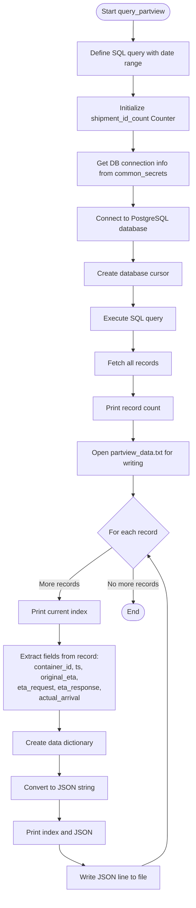
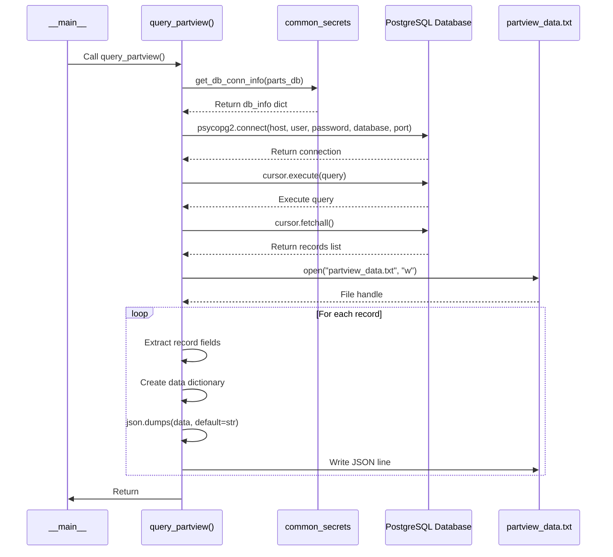
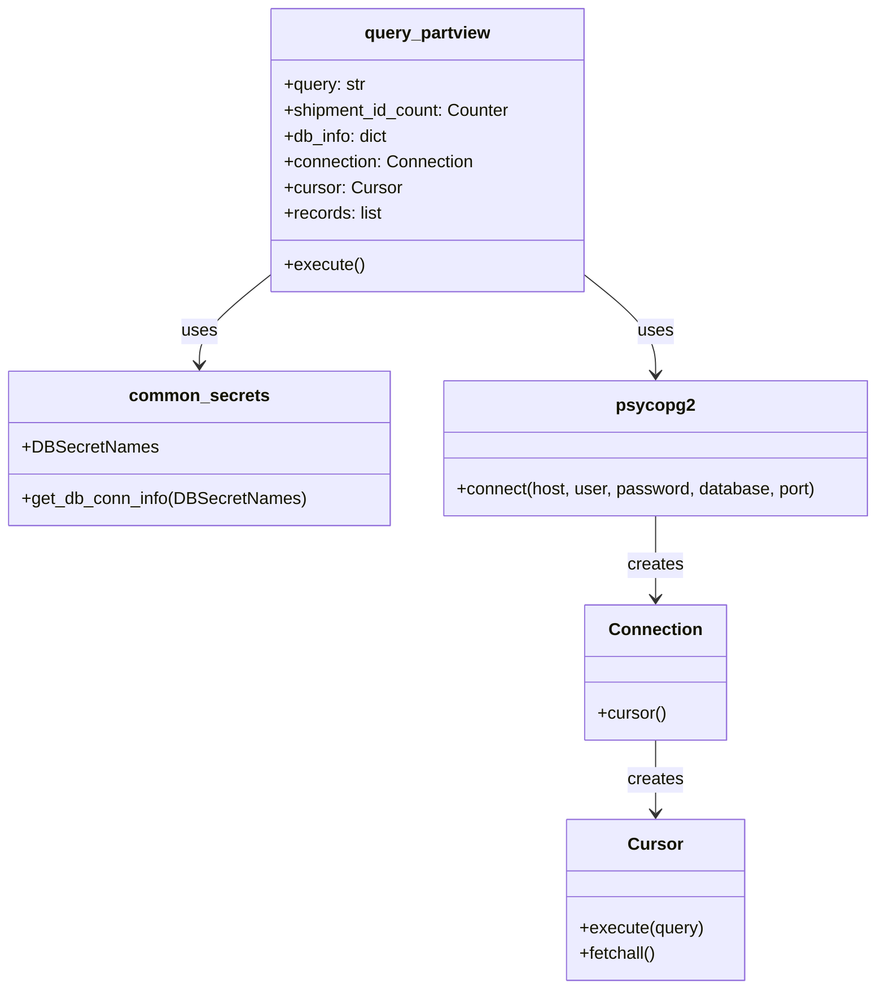

# Diagram: research/api/scripts/simulate/query_partview_data.py

> Auto-generated by Obscura crawlers

## Diagram 1

### SVG

<svg id="container" width="449.864990234375" xmlns="http://www.w3.org/2000/svg" class="flowchart" height="2094.9375" viewBox="0 0 449.864990234375 2094.9375" role="graphics-document document" aria-roledescription="flowchart-v2"><g><marker id="container_flowchart-v2-pointEnd" class="marker flowchart-v2" viewBox="0 0 10 10" refX="5" refY="5" markerUnits="userSpaceOnUse" markerWidth="8" markerHeight="8" orient="auto"><path d="M 0 0 L 10 5 L 0 10 z" class="arrowMarkerPath" style="stroke-width: 1; stroke-dasharray: 1, 0;"></path></marker><marker id="container_flowchart-v2-pointStart" class="marker flowchart-v2" viewBox="0 0 10 10" refX="4.5" refY="5" markerUnits="userSpaceOnUse" markerWidth="8" markerHeight="8" orient="auto"><path d="M 0 5 L 10 10 L 10 0 z" class="arrowMarkerPath" style="stroke-width: 1; stroke-dasharray: 1, 0;"></path></marker><marker id="container_flowchart-v2-circleEnd" class="marker flowchart-v2" viewBox="0 0 10 10" refX="11" refY="5" markerUnits="userSpaceOnUse" markerWidth="11" markerHeight="11" orient="auto"><circle cx="5" cy="5" r="5" class="arrowMarkerPath" style="stroke-width: 1; stroke-dasharray: 1, 0;"></circle></marker><marker id="container_flowchart-v2-circleStart" class="marker flowchart-v2" viewBox="0 0 10 10" refX="-1" refY="5" markerUnits="userSpaceOnUse" markerWidth="11" markerHeight="11" orient="auto"><circle cx="5" cy="5" r="5" class="arrowMarkerPath" style="stroke-width: 1; stroke-dasharray: 1, 0;"></circle></marker><marker id="container_flowchart-v2-crossEnd" class="marker cross flowchart-v2" viewBox="0 0 11 11" refX="12" refY="5.2" markerUnits="userSpaceOnUse" markerWidth="11" markerHeight="11" orient="auto"><path d="M 1,1 l 9,9 M 10,1 l -9,9" class="arrowMarkerPath" style="stroke-width: 2; stroke-dasharray: 1, 0;"></path></marker><marker id="container_flowchart-v2-crossStart" class="marker cross flowchart-v2" viewBox="0 0 11 11" refX="-1" refY="5.2" markerUnits="userSpaceOnUse" markerWidth="11" markerHeight="11" orient="auto"><path d="M 1,1 l 9,9 M 10,1 l -9,9" class="arrowMarkerPath" style="stroke-width: 2; stroke-dasharray: 1, 0;"></path></marker><g class="root"><g class="clusters"></g><g class="edgePaths"><path d="M312.365,47.5L312.282,51.583C312.198,55.667,312.032,63.833,311.948,71.417C311.865,79,311.865,86,311.865,89.5L311.865,93" id="L_Start_DefineQuery_0" class="edge-thickness-normal edge-pattern-solid edge-thickness-normal edge-pattern-solid flowchart-link" style=";" data-edge="true" data-et="edge" data-id="L_Start_DefineQuery_0" data-points="W3sieCI6MzEyLjM2NDk4MDY5NzYzMTg0LCJ5Ijo0Ny40OTk5OTk5OTk5OTk5OX0seyJ4IjozMTEuODY0OTgwNjk3NjMxODQsInkiOjcyfSx7IngiOjMxMS44NjQ5ODA2OTc2MzE4NCwieSI6OTd9XQ==" marker-end="url(#container_flowchart-v2-pointEnd)"></path><path d="M311.865,175L311.865,179.167C311.865,183.333,311.865,191.667,311.865,199.333C311.865,207,311.865,214,311.865,217.5L311.865,221" id="L_DefineQuery_InitCounter_0" class="edge-thickness-normal edge-pattern-solid edge-thickness-normal edge-pattern-solid flowchart-link" style=";" data-edge="true" data-et="edge" data-id="L_DefineQuery_InitCounter_0" data-points="W3sieCI6MzExLjg2NDk4MDY5NzYzMTg0LCJ5IjoxNzV9LHsieCI6MzExLjg2NDk4MDY5NzYzMTg0LCJ5IjoyMDB9LHsieCI6MzExLjg2NDk4MDY5NzYzMTg0LCJ5IjoyMjV9XQ==" marker-end="url(#container_flowchart-v2-pointEnd)"></path><path d="M311.865,327L311.865,331.167C311.865,335.333,311.865,343.667,311.865,351.333C311.865,359,311.865,366,311.865,369.5L311.865,373" id="L_InitCounter_GetDBInfo_0" class="edge-thickness-normal edge-pattern-solid edge-thickness-normal edge-pattern-solid flowchart-link" style=";" data-edge="true" data-et="edge" data-id="L_InitCounter_GetDBInfo_0" data-points="W3sieCI6MzExLjg2NDk4MDY5NzYzMTg0LCJ5IjozMjd9LHsieCI6MzExLjg2NDk4MDY5NzYzMTg0LCJ5IjozNTJ9LHsieCI6MzExLjg2NDk4MDY5NzYzMTg0LCJ5IjozNzd9XQ==" marker-end="url(#container_flowchart-v2-pointEnd)"></path><path d="M311.865,455L311.865,459.167C311.865,463.333,311.865,471.667,311.865,479.333C311.865,487,311.865,494,311.865,497.5L311.865,501" id="L_GetDBInfo_Connect_0" class="edge-thickness-normal edge-pattern-solid edge-thickness-normal edge-pattern-solid flowchart-link" style=";" data-edge="true" data-et="edge" data-id="L_GetDBInfo_Connect_0" data-points="W3sieCI6MzExLjg2NDk4MDY5NzYzMTg0LCJ5Ijo0NTV9LHsieCI6MzExLjg2NDk4MDY5NzYzMTg0LCJ5Ijo0ODB9LHsieCI6MzExLjg2NDk4MDY5NzYzMTg0LCJ5Ijo1MDV9XQ==" marker-end="url(#container_flowchart-v2-pointEnd)"></path><path d="M311.865,583L311.865,587.167C311.865,591.333,311.865,599.667,311.865,607.333C311.865,615,311.865,622,311.865,625.5L311.865,629" id="L_Connect_CreateCursor_0" class="edge-thickness-normal edge-pattern-solid edge-thickness-normal edge-pattern-solid flowchart-link" style=";" data-edge="true" data-et="edge" data-id="L_Connect_CreateCursor_0" data-points="W3sieCI6MzExLjg2NDk4MDY5NzYzMTg0LCJ5Ijo1ODN9LHsieCI6MzExLjg2NDk4MDY5NzYzMTg0LCJ5Ijo2MDh9LHsieCI6MzExLjg2NDk4MDY5NzYzMTg0LCJ5Ijo2MzN9XQ==" marker-end="url(#container_flowchart-v2-pointEnd)"></path><path d="M311.865,687L311.865,691.167C311.865,695.333,311.865,703.667,311.865,711.333C311.865,719,311.865,726,311.865,729.5L311.865,733" id="L_CreateCursor_ExecuteQuery_0" class="edge-thickness-normal edge-pattern-solid edge-thickness-normal edge-pattern-solid flowchart-link" style=";" data-edge="true" data-et="edge" data-id="L_CreateCursor_ExecuteQuery_0" data-points="W3sieCI6MzExLjg2NDk4MDY5NzYzMTg0LCJ5Ijo2ODd9LHsieCI6MzExLjg2NDk4MDY5NzYzMTg0LCJ5Ijo3MTJ9LHsieCI6MzExLjg2NDk4MDY5NzYzMTg0LCJ5Ijo3Mzd9XQ==" marker-end="url(#container_flowchart-v2-pointEnd)"></path><path d="M311.865,791L311.865,795.167C311.865,799.333,311.865,807.667,311.865,815.333C311.865,823,311.865,830,311.865,833.5L311.865,837" id="L_ExecuteQuery_FetchRecords_0" class="edge-thickness-normal edge-pattern-solid edge-thickness-normal edge-pattern-solid flowchart-link" style=";" data-edge="true" data-et="edge" data-id="L_ExecuteQuery_FetchRecords_0" data-points="W3sieCI6MzExLjg2NDk4MDY5NzYzMTg0LCJ5Ijo3OTF9LHsieCI6MzExLjg2NDk4MDY5NzYzMTg0LCJ5Ijo4MTZ9LHsieCI6MzExLjg2NDk4MDY5NzYzMTg0LCJ5Ijo4NDF9XQ==" marker-end="url(#container_flowchart-v2-pointEnd)"></path><path d="M311.865,895L311.865,899.167C311.865,903.333,311.865,911.667,311.865,919.333C311.865,927,311.865,934,311.865,937.5L311.865,941" id="L_FetchRecords_PrintCount_0" class="edge-thickness-normal edge-pattern-solid edge-thickness-normal edge-pattern-solid flowchart-link" style=";" data-edge="true" data-et="edge" data-id="L_FetchRecords_PrintCount_0" data-points="W3sieCI6MzExLjg2NDk4MDY5NzYzMTg0LCJ5Ijo4OTV9LHsieCI6MzExLjg2NDk4MDY5NzYzMTg0LCJ5Ijo5MjB9LHsieCI6MzExLjg2NDk4MDY5NzYzMTg0LCJ5Ijo5NDV9XQ==" marker-end="url(#container_flowchart-v2-pointEnd)"></path><path d="M311.865,999L311.865,1003.167C311.865,1007.333,311.865,1015.667,311.865,1023.333C311.865,1031,311.865,1038,311.865,1041.5L311.865,1045" id="L_PrintCount_OpenFile_0" class="edge-thickness-normal edge-pattern-solid edge-thickness-normal edge-pattern-solid flowchart-link" style=";" data-edge="true" data-et="edge" data-id="L_PrintCount_OpenFile_0" data-points="W3sieCI6MzExLjg2NDk4MDY5NzYzMTg0LCJ5Ijo5OTl9LHsieCI6MzExLjg2NDk4MDY5NzYzMTg0LCJ5IjoxMDI0fSx7IngiOjMxMS44NjQ5ODA2OTc2MzE4NCwieSI6MTA0OX1d" marker-end="url(#container_flowchart-v2-pointEnd)"></path><path d="M311.865,1127L311.865,1131.167C311.865,1135.333,311.865,1143.667,311.865,1151.333C311.865,1159,311.865,1166,311.865,1169.5L311.865,1173" id="L_OpenFile_LoopStart_0" class="edge-thickness-normal edge-pattern-solid edge-thickness-normal edge-pattern-solid flowchart-link" style=";" data-edge="true" data-et="edge" data-id="L_OpenFile_LoopStart_0" data-points="W3sieCI6MzExLjg2NDk4MDY5NzYzMTg0LCJ5IjoxMTI3fSx7IngiOjMxMS44NjQ5ODA2OTc2MzE4NCwieSI6MTE1Mn0seyJ4IjozMTEuODY0OTgwNjk3NjMxODQsInkiOjExNzd9XQ==" marker-end="url(#container_flowchart-v2-pointEnd)"></path><path d="M262.771,1293.844L241.976,1308.193C221.181,1322.542,179.59,1351.24,158.795,1371.089C138,1390.938,138,1401.938,138,1407.438L138,1412.938" id="L_LoopStart_PrintIndex_0" class="edge-thickness-normal edge-pattern-solid edge-thickness-normal edge-pattern-solid flowchart-link" style=";" data-edge="true" data-et="edge" data-id="L_LoopStart_PrintIndex_0" data-points="W3sieCI6MjYyLjc3MTM2NTQ2NDkzNzU2LCJ5IjoxMjkzLjg0Mzg4NDc2NzMwNTh9LHsieCI6MTM4LCJ5IjoxMzc5LjkzNzV9LHsieCI6MTM4LCJ5IjoxNDE2LjkzNzV9XQ==" marker-end="url(#container_flowchart-v2-pointEnd)"></path><path d="M138,1470.938L138,1475.104C138,1479.271,138,1487.604,138,1495.271C138,1502.938,138,1509.938,138,1513.438L138,1516.938" id="L_PrintIndex_ExtractFields_0" class="edge-thickness-normal edge-pattern-solid edge-thickness-normal edge-pattern-solid flowchart-link" style=";" data-edge="true" data-et="edge" data-id="L_PrintIndex_ExtractFields_0" data-points="W3sieCI6MTM4LCJ5IjoxNDcwLjkzNzV9LHsieCI6MTM4LCJ5IjoxNDk1LjkzNzV9LHsieCI6MTM4LCJ5IjoxNTIwLjkzNzV9XQ==" marker-end="url(#container_flowchart-v2-pointEnd)"></path><path d="M138,1670.938L138,1675.104C138,1679.271,138,1687.604,138,1695.271C138,1702.938,138,1709.938,138,1713.438L138,1716.938" id="L_ExtractFields_CreateDict_0" class="edge-thickness-normal edge-pattern-solid edge-thickness-normal edge-pattern-solid flowchart-link" style=";" data-edge="true" data-et="edge" data-id="L_ExtractFields_CreateDict_0" data-points="W3sieCI6MTM4LCJ5IjoxNjcwLjkzNzV9LHsieCI6MTM4LCJ5IjoxNjk1LjkzNzV9LHsieCI6MTM4LCJ5IjoxNzIwLjkzNzV9XQ==" marker-end="url(#container_flowchart-v2-pointEnd)"></path><path d="M138,1774.938L138,1779.104C138,1783.271,138,1791.604,138,1799.271C138,1806.938,138,1813.938,138,1817.438L138,1820.938" id="L_CreateDict_JSONDump_0" class="edge-thickness-normal edge-pattern-solid edge-thickness-normal edge-pattern-solid flowchart-link" style=";" data-edge="true" data-et="edge" data-id="L_CreateDict_JSONDump_0" data-points="W3sieCI6MTM4LCJ5IjoxNzc0LjkzNzV9LHsieCI6MTM4LCJ5IjoxNzk5LjkzNzV9LHsieCI6MTM4LCJ5IjoxODI0LjkzNzV9XQ==" marker-end="url(#container_flowchart-v2-pointEnd)"></path><path d="M138,1878.938L138,1883.104C138,1887.271,138,1895.604,138,1903.271C138,1910.938,138,1917.938,138,1921.438L138,1924.938" id="L_JSONDump_PrintJSON_0" class="edge-thickness-normal edge-pattern-solid edge-thickness-normal edge-pattern-solid flowchart-link" style=";" data-edge="true" data-et="edge" data-id="L_JSONDump_PrintJSON_0" data-points="W3sieCI6MTM4LCJ5IjoxODc4LjkzNzV9LHsieCI6MTM4LCJ5IjoxOTAzLjkzNzV9LHsieCI6MTM4LCJ5IjoxOTI4LjkzNzV9XQ==" marker-end="url(#container_flowchart-v2-pointEnd)"></path><path d="M138,1982.938L138,1987.104C138,1991.271,138,1999.604,147.555,2007.685C157.11,2015.765,176.221,2023.593,185.776,2027.507L195.331,2031.421" id="L_PrintJSON_WriteFile_0" class="edge-thickness-normal edge-pattern-solid edge-thickness-normal edge-pattern-solid flowchart-link" style=";" data-edge="true" data-et="edge" data-id="L_PrintJSON_WriteFile_0" data-points="W3sieCI6MTM4LCJ5IjoxOTgyLjkzNzV9LHsieCI6MTM4LCJ5IjoyMDA3LjkzNzV9LHsieCI6MTk5LjAzMjc0Nzc2Mzg1MzgyLCJ5IjoyMDMyLjkzNzV9XQ==" marker-end="url(#container_flowchart-v2-pointEnd)"></path><path d="M330.863,2032.938L341.036,2028.771C351.208,2024.604,371.552,2016.271,381.724,2003.438C391.896,1990.604,391.896,1973.271,391.896,1955.938C391.896,1938.604,391.896,1921.271,391.896,1903.938C391.896,1886.604,391.896,1869.271,391.896,1851.938C391.896,1834.604,391.896,1817.271,391.896,1799.938C391.896,1782.604,391.896,1765.271,391.896,1747.938C391.896,1730.604,391.896,1713.271,391.896,1687.938C391.896,1662.604,391.896,1629.271,391.896,1595.938C391.896,1562.604,391.896,1529.271,391.896,1503.938C391.896,1478.604,391.896,1461.271,391.896,1441.938C391.896,1422.604,391.896,1401.271,384.461,1379.459C377.026,1357.647,362.156,1335.356,354.72,1324.21L347.285,1313.065" id="L_WriteFile_LoopStart_0" class="edge-thickness-normal edge-pattern-solid edge-thickness-normal edge-pattern-solid flowchart-link" style=";" data-edge="true" data-et="edge" data-id="L_WriteFile_LoopStart_0" data-points="W3sieCI6MzMwLjg2MzQ4MjkzMzc3OCwieSI6MjAzMi45Mzc1fSx7IngiOjM5MS44OTYyMzA2OTc2MzE4NCwieSI6MjAwNy45Mzc1fSx7IngiOjM5MS44OTYyMzA2OTc2MzE4NCwieSI6MTk1NS45Mzc1fSx7IngiOjM5MS44OTYyMzA2OTc2MzE4NCwieSI6MTkwMy45Mzc1fSx7IngiOjM5MS44OTYyMzA2OTc2MzE4NCwieSI6MTg1MS45Mzc1fSx7IngiOjM5MS44OTYyMzA2OTc2MzE4NCwieSI6MTc5OS45Mzc1fSx7IngiOjM5MS44OTYyMzA2OTc2MzE4NCwieSI6MTc0Ny45Mzc1fSx7IngiOjM5MS44OTYyMzA2OTc2MzE4NCwieSI6MTY5NS45Mzc1fSx7IngiOjM5MS44OTYyMzA2OTc2MzE4NCwieSI6MTU5NS45Mzc1fSx7IngiOjM5MS44OTYyMzA2OTc2MzE4NCwieSI6MTQ5NS45Mzc1fSx7IngiOjM5MS44OTYyMzA2OTc2MzE4NCwieSI6MTQ0My45Mzc1fSx7IngiOjM5MS44OTYyMzA2OTc2MzE4NCwieSI6MTM3OS45Mzc1fSx7IngiOjM0NS4wNjU0NDQ1NjQ4MTkzNiwieSI6MTMwOS43MzcwMzYxMzI4MTI2fV0=" marker-end="url(#container_flowchart-v2-pointEnd)"></path><path d="M311.865,1342.938L311.865,1349.104C311.865,1355.271,311.865,1367.604,311.941,1380.604C312.017,1393.604,312.169,1407.271,312.245,1414.104L312.321,1420.938" id="L_LoopStart_End_0" class="edge-thickness-normal edge-pattern-solid edge-thickness-normal edge-pattern-solid flowchart-link" style=";" data-edge="true" data-et="edge" data-id="L_LoopStart_End_0" data-points="W3sieCI6MzExLjg2NDk4MDY5NzYzMTg0LCJ5IjoxMzQyLjkzNzV9LHsieCI6MzExLjg2NDk4MDY5NzYzMTg0LCJ5IjoxMzc5LjkzNzV9LHsieCI6MzEyLjM2NDk4MDY5NzYzMTg0LCJ5IjoxNDI0LjkzNzV9XQ==" marker-end="url(#container_flowchart-v2-pointEnd)"></path></g><g class="edgeLabels"><g class="edgeLabel"><g class="label" data-id="L_Start_DefineQuery_0" transform="translate(0, 0)"><foreignObject width="0" height="0">

</foreignObject></g></g><g class="edgeLabel"><g class="label" data-id="L_DefineQuery_InitCounter_0" transform="translate(0, 0)"><foreignObject width="0" height="0">

</foreignObject></g></g><g class="edgeLabel"><g class="label" data-id="L_InitCounter_GetDBInfo_0" transform="translate(0, 0)"><foreignObject width="0" height="0">

</foreignObject></g></g><g class="edgeLabel"><g class="label" data-id="L_GetDBInfo_Connect_0" transform="translate(0, 0)"><foreignObject width="0" height="0">

</foreignObject></g></g><g class="edgeLabel"><g class="label" data-id="L_Connect_CreateCursor_0" transform="translate(0, 0)"><foreignObject width="0" height="0">

</foreignObject></g></g><g class="edgeLabel"><g class="label" data-id="L_CreateCursor_ExecuteQuery_0" transform="translate(0, 0)"><foreignObject width="0" height="0">

</foreignObject></g></g><g class="edgeLabel"><g class="label" data-id="L_ExecuteQuery_FetchRecords_0" transform="translate(0, 0)"><foreignObject width="0" height="0">

</foreignObject></g></g><g class="edgeLabel"><g class="label" data-id="L_FetchRecords_PrintCount_0" transform="translate(0, 0)"><foreignObject width="0" height="0">

</foreignObject></g></g><g class="edgeLabel"><g class="label" data-id="L_PrintCount_OpenFile_0" transform="translate(0, 0)"><foreignObject width="0" height="0">

</foreignObject></g></g><g class="edgeLabel"><g class="label" data-id="L_OpenFile_LoopStart_0" transform="translate(0, 0)"><foreignObject width="0" height="0">

</foreignObject></g></g><g class="edgeLabel" transform="translate(138, 1379.9375)"><g class="label" data-id="L_LoopStart_PrintIndex_0" transform="translate(-47.140625, -12)"><foreignObject width="94.28125" height="24">

More records

</foreignObject></g></g><g class="edgeLabel"><g class="label" data-id="L_PrintIndex_ExtractFields_0" transform="translate(0, 0)"><foreignObject width="0" height="0">

</foreignObject></g></g><g class="edgeLabel"><g class="label" data-id="L_ExtractFields_CreateDict_0" transform="translate(0, 0)"><foreignObject width="0" height="0">

</foreignObject></g></g><g class="edgeLabel"><g class="label" data-id="L_CreateDict_JSONDump_0" transform="translate(0, 0)"><foreignObject width="0" height="0">

</foreignObject></g></g><g class="edgeLabel"><g class="label" data-id="L_JSONDump_PrintJSON_0" transform="translate(0, 0)"><foreignObject width="0" height="0">

</foreignObject></g></g><g class="edgeLabel"><g class="label" data-id="L_PrintJSON_WriteFile_0" transform="translate(0, 0)"><foreignObject width="0" height="0">

</foreignObject></g></g><g class="edgeLabel"><g class="label" data-id="L_WriteFile_LoopStart_0" transform="translate(0, 0)"><foreignObject width="0" height="0">

</foreignObject></g></g><g class="edgeLabel" transform="translate(311.86498069763184, 1379.9375)"><g class="label" data-id="L_LoopStart_End_0" transform="translate(-60.03125, -12)"><foreignObject width="120.0625" height="24">

No more records

</foreignObject></g></g></g><g class="nodes"><g class="node default" id="flowchart-Start-0" transform="translate(311.86498069763184, 27.5)"><g class="basic label-container outer-path"><path d="M-68.5078125 -19.5 C-22.66899425485738 -19.5, 23.169823990285238 -19.5, 68.5078125 -19.5 C68.5078125 -19.5, 68.5078125 -19.5, 68.5078125 -19.5 C68.85342637759432 -19.488916835642154, 69.19904025518863 -19.477833671284305, 69.7571817896239 -19.45993515863156 C70.24774969852061 -19.412610662454522, 70.73831760741732 -19.365286166277485, 71.00141715284786 -19.3399052695533 C71.4705793373991 -19.264054765962136, 71.93974152195032 -19.188204262370977, 72.23540575967675 -19.140403561325776 C72.6647873391251 -19.042400017793355, 73.09416891857344 -18.944396474260934, 73.45407688623538 -18.862249829261074 C73.91020509687263 -18.726873370609777, 74.36633330750989 -18.591496911958476, 74.6524227514606 -18.50658706670804 C75.06875901410166 -18.353371473485907, 75.48509527674271 -18.20015588026378, 75.8255190951478 -18.074876768247425 C76.12892374499204 -17.940568529940542, 76.43232839483626 -17.806260291633663, 76.96854541279238 -17.568892924097174 C77.24790137184269 -17.423153099196664, 77.527257330893 -17.27741327429615, 78.07680476407678 -16.990714730406097 C78.39884039957711 -16.795494835674337, 78.72087603507745 -16.600274940942576, 79.1457430736057 -16.342718045390892 C79.48281139197202 -16.107593777950875, 79.81987971033834 -15.872469510510859, 80.17096784457871 -15.627565626425154 C80.50376820108087 -15.362166198304095, 80.83656855758305 -15.096766770183038, 81.14826620850187 -14.848196188198123 C81.33346802277242 -14.68000080064909, 81.51866983704298 -14.511805413100056, 82.07362223676799 -14.007812326905688 C82.28234274932403 -13.792291261418802, 82.49106326188007 -13.576770195931914, 82.94323344296865 -13.10986736009568 C83.20054741365077 -12.807611728552757, 83.45786138433289 -12.505356097009832, 83.75352640812658 -12.158051136245305 C83.97083011708303 -11.866883963018807, 84.18813382603948 -11.57571678979231, 84.50117146464063 -11.156274872382312 C84.77241787114886 -10.739567552127, 85.04366427765707 -10.322860231871687, 85.18309637860425 -10.108655082055241 C85.3980243841924 -9.727028644312938, 85.61295238978053 -9.345402206570636, 85.7964989742735 -9.019496659696287 C86.004232012621 -8.588134560792732, 86.21196505096849 -8.156772461889176, 86.33885864880834 -7.893275190886684 C86.44206128514932 -7.638362683837214, 86.54526392149032 -7.383450176787745, 86.80794672997033 -6.734618561215508 C86.95231829078729 -6.299794422519254, 87.09668985160424 -5.864970283822999, 87.20183563421489 -5.548287939305138 C87.27291441352092 -5.277233748073416, 87.34399319282696 -5.006179556841694, 87.51890678754556 -4.339158212148133 C87.58112026205036 -4.019705169388432, 87.64333373655518 -3.7002521266287314, 87.75785727658177 -3.1121979531509023 C87.8201785808101 -2.628846224289605, 87.8824998850384 -2.145494495428308, 87.91770520250937 -1.872449005199798 C87.93871891202825 -1.5451435174822714, 87.95973262154712 -1.2178380297647449, 87.99779371591342 -0.6250057626472757 C87.99779371591342 -0.1826696419708423, 87.99779371591342 0.2596664787055911, 87.99779371591342 0.625005762647271 C87.97845025365146 0.9262958011388944, 87.95910679138952 1.227585839630518, 87.91770520250937 1.8724490051997846 C87.86164051907154 2.307275618719561, 87.80557583563372 2.742102232239337, 87.75785727658177 3.1121979531508885 C87.69122709587695 3.4543298487765037, 87.62459691517212 3.7964617444021185, 87.51890678754556 4.339158212148129 C87.39284154976876 4.819899600810743, 87.26677631199196 5.300640989473358, 87.20183563421489 5.548287939305125 C87.08350349017415 5.904685503489018, 86.96517134613343 6.261083067672912, 86.80794672997033 6.734618561215495 C86.7002936121648 7.000523843526582, 86.59264049435927 7.26642912583767, 86.33885864880834 7.893275190886679 C86.18652006821046 8.209609513021636, 86.03418148761259 8.525943835156593, 85.7964989742735 9.019496659696284 C85.59923439184534 9.3697599010025, 85.40196980941717 9.720023142308715, 85.18309637860425 10.108655082055236 C85.03150159698815 10.341545375516217, 84.87990681537205 10.574435668977198, 84.50117146464065 11.156274872382301 C84.22969666280626 11.520026374977158, 83.95822186097186 11.883777877572015, 83.75352640812659 12.158051136245302 C83.50976624620843 12.444385692780521, 83.26600608429025 12.730720249315741, 82.94323344296866 13.10986736009567 C82.76192058572454 13.297087771262657, 82.5806077284804 13.484308182429642, 82.07362223676799 14.007812326905684 C81.70402222043877 14.343473282655332, 81.33442220410954 14.679134238404977, 81.1482662085019 14.848196188198111 C80.80669572514543 15.120589559102582, 80.46512524178898 15.392982930007053, 80.17096784457871 15.627565626425152 C79.78059134123116 15.89987537603394, 79.3902148378836 16.172185125642727, 79.1457430736057 16.34271804539089 C78.91921282679871 16.48004201224478, 78.69268257999173 16.617365979098672, 78.07680476407678 16.990714730406093 C77.78638219266972 17.14222799988462, 77.49595962126266 17.29374126936315, 76.96854541279238 17.56889292409717 C76.63105448988306 17.7182901443566, 76.29356356697375 17.86768736461603, 75.8255190951478 18.07487676824742 C75.4550862601759 18.21119947576067, 75.084653425204 18.34752218327392, 74.65242275146062 18.506587066708033 C74.24112319967776 18.628658614721783, 73.82982364789491 18.750730162735533, 73.45407688623541 18.86224982926107 C73.04142391958277 18.956435176087272, 72.62877095293013 19.050620522913473, 72.23540575967677 19.140403561325773 C71.98236469087784 19.181313278966385, 71.72932362207892 19.222222996606998, 71.00141715284788 19.3399052695533 C70.5645617947928 19.382048180549436, 70.1277064367377 19.424191091545577, 69.7571817896239 19.45993515863156 C69.36474102645376 19.47251997006682, 68.97230026328361 19.48510478150208, 68.5078125 19.5 C68.5078125 19.5, 68.5078125 19.5, 68.5078125 19.5 C17.080380073702813 19.5, -34.347052352594375 19.5, -68.5078125 19.5 C-68.96499930848907 19.485338908911896, -69.42218611697814 19.470677817823788, -69.7571817896239 19.45993515863156 C-70.05077063397682 19.431612995909077, -70.34435947832974 19.403290833186595, -71.00141715284786 19.3399052695533 C-71.45689940613111 19.26626643116009, -71.91238165941436 19.192627592766883, -72.23540575967675 19.140403561325773 C-72.50823221741621 19.078132702705762, -72.78105867515568 19.01586184408575, -73.45407688623538 18.862249829261074 C-73.78959425461898 18.76267003549143, -74.12511162300258 18.663090241721783, -74.65242275146059 18.506587066708043 C-74.89333409263605 18.41792946619545, -75.1342454338115 18.329271865682855, -75.8255190951478 18.074876768247425 C-76.18500214851775 17.915744284206443, -76.54448520188771 17.75661180016546, -76.96854541279238 17.568892924097174 C-77.39484247123283 17.346494021765086, -77.82113952967329 17.124095119433, -78.07680476407678 16.990714730406097 C-78.4432232134012 16.768589713111812, -78.80964166272562 16.546464695817527, -79.14574307360569 16.3427180453909 C-79.54275392609351 16.0657804610182, -79.93976477858135 15.788842876645502, -80.17096784457871 15.627565626425156 C-80.44227854337406 15.411202564016772, -80.71358924216942 15.194839501608387, -81.14826620850187 14.848196188198125 C-81.50708312650755 14.52232815704077, -81.86590004451324 14.196460125883414, -82.07362223676797 14.007812326905697 C-82.31557508300378 13.75797614846912, -82.55752792923958 13.508139970032545, -82.94323344296865 13.109867360095677 C-83.12311404563361 12.898569368709158, -83.30299464829858 12.687271377322638, -83.75352640812658 12.158051136245307 C-84.00227894887182 11.824745393469346, -84.25103148961706 11.491439650693385, -84.50117146464063 11.156274872382316 C-84.66392793801863 10.906237223041154, -84.82668441139664 10.656199573699995, -85.18309637860425 10.108655082055249 C-85.409167881704 9.707242236079601, -85.63523938480375 9.305829390103954, -85.7964989742735 9.019496659696289 C-85.94068088720914 8.720099832486698, -86.08486280014479 8.420703005277105, -86.33885864880834 7.893275190886686 C-86.45382716699208 7.609300728207766, -86.56879568517581 7.325326265528847, -86.80794672997033 6.73461856121551 C-86.90704782718959 6.436141846006669, -87.00614892440885 6.137665130797828, -87.20183563421489 5.5482879393051325 C-87.26597987318165 5.303678155835839, -87.33012411214841 5.059068372366546, -87.51890678754556 4.339158212148136 C-87.60256658058951 3.909582856370951, -87.68622637363347 3.480007500593766, -87.75785727658177 3.112197953150904 C-87.80155260462021 2.7733056175032322, -87.84524793265867 2.43441328185556, -87.91770520250937 1.872449005199809 C-87.94880089224236 1.3881085376194262, -87.97989658197535 0.9037680700390431, -87.99779371591342 0.6250057626472781 C-87.99779371591342 0.2140924271304438, -87.99779371591342 -0.19682090838639055, -87.99779371591342 -0.6250057626472687 C-87.97899350579476 -0.9178342105018367, -87.9601932956761 -1.2106626583564046, -87.91770520250937 -1.8724490051997822 C-87.86839986616246 -2.254851457466419, -87.81909452981556 -2.637253909733056, -87.75785727658177 -3.112197953150895 C-87.70617016508596 -3.377600346607013, -87.65448305359016 -3.643002740063131, -87.51890678754556 -4.339158212148126 C-87.41303833351414 -4.7428805110481775, -87.30716987948271 -5.146602809948229, -87.20183563421489 -5.548287939305123 C-87.11954521267006 -5.796133577800013, -87.03725479112522 -6.043979216294905, -86.80794672997033 -6.734618561215485 C-86.6518445787616 -7.12019389273081, -86.49574242755288 -7.5057692242461345, -86.33885864880834 -7.893275190886676 C-86.22778634730557 -8.123919201523734, -86.11671404580278 -8.354563212160791, -85.7964989742735 -9.019496659696282 C-85.59086416304824 -9.384622089809318, -85.38522935182297 -9.749747519922355, -85.18309637860425 -10.108655082055243 C-84.95874261532224 -10.453322709877295, -84.73438885204021 -10.797990337699348, -84.50117146464063 -11.156274872382308 C-84.22418587847218 -11.527410323942034, -83.94720029230372 -11.89854577550176, -83.75352640812659 -12.158051136245302 C-83.51403191457622 -12.439374995992294, -83.27453742102585 -12.720698855739288, -82.94323344296866 -13.10986736009567 C-82.71031209036461 -13.350377779858047, -82.47739073776054 -13.590888199620423, -82.07362223676799 -14.007812326905677 C-81.75271491263192 -14.299251867943541, -81.43180758849586 -14.590691408981403, -81.1482662085019 -14.848196188198107 C-80.8488111139236 -15.08700365728956, -80.5493560193453 -15.325811126381016, -80.17096784457871 -15.627565626425149 C-79.9339610675445 -15.792891294226202, -79.69695429051028 -15.958216962027254, -79.14574307360571 -16.342718045390885 C-78.75247875731395 -16.581117185004597, -78.35921444102219 -16.819516324618313, -78.07680476407678 -16.99071473040609 C-77.83153140733408 -17.11867368351368, -77.58625805059137 -17.246632636621268, -76.9685454127924 -17.56889292409717 C-76.71097844492772 -17.682910180318228, -76.45341147706304 -17.79692743653928, -75.82551909514781 -18.07487676824742 C-75.56492045198274 -18.170779477879616, -75.30432180881766 -18.266682187511815, -74.65242275146062 -18.506587066708033 C-74.21638557402969 -18.636000612163684, -73.78034839659874 -18.765414157619336, -73.45407688623541 -18.862249829261067 C-73.12360034015792 -18.937678944342252, -72.79312379408042 -19.013108059423438, -72.23540575967677 -19.140403561325773 C-71.79678557834804 -19.21131627069269, -71.35816539701932 -19.282228980059614, -71.00141715284788 -19.3399052695533 C-70.52372118174166 -19.385988025372455, -70.04602521063546 -19.432070781191612, -69.7571817896239 -19.45993515863156 C-69.39830942241585 -19.471443496945234, -69.03943705520778 -19.48295183525891, -68.5078125 -19.5 C-68.5078125 -19.5, -68.5078125 -19.5, -68.5078125 -19.5" stroke="none" stroke-width="0" fill="#ECECFF" style=""></path><path d="M-68.5078125 -19.5 C-30.05350492511861 -19.5, 8.400802649762781 -19.5, 68.5078125 -19.5 M-68.5078125 -19.5 C-29.041135592115594 -19.5, 10.425541315768811 -19.5, 68.5078125 -19.5 M68.5078125 -19.5 C68.5078125 -19.5, 68.5078125 -19.5, 68.5078125 -19.5 M68.5078125 -19.5 C68.5078125 -19.5, 68.5078125 -19.5, 68.5078125 -19.5 M68.5078125 -19.5 C68.91039105336849 -19.48709008936509, 69.31296960673697 -19.47418017873018, 69.7571817896239 -19.45993515863156 M68.5078125 -19.5 C68.86469621773125 -19.488555433804375, 69.2215799354625 -19.47711086760875, 69.7571817896239 -19.45993515863156 M69.7571817896239 -19.45993515863156 C70.12212152000242 -19.424729861746183, 70.48706125038093 -19.389524564860807, 71.00141715284786 -19.3399052695533 M69.7571817896239 -19.45993515863156 C70.10945286194833 -19.42595199195237, 70.46172393427275 -19.39196882527318, 71.00141715284786 -19.3399052695533 M71.00141715284786 -19.3399052695533 C71.33067704046987 -19.286673084371138, 71.65993692809187 -19.233440899188977, 72.23540575967675 -19.140403561325776 M71.00141715284786 -19.3399052695533 C71.45893952672031 -19.265936600284604, 71.91646190059276 -19.191967931015906, 72.23540575967675 -19.140403561325776 M72.23540575967675 -19.140403561325776 C72.59881795097348 -19.057457100148472, 72.96223014227022 -18.974510638971168, 73.45407688623538 -18.862249829261074 M72.23540575967675 -19.140403561325776 C72.68344493244187 -19.038141543870974, 73.13148410520701 -18.935879526416173, 73.45407688623538 -18.862249829261074 M73.45407688623538 -18.862249829261074 C73.8314242702206 -18.7502551064311, 74.20877165420582 -18.63826038360113, 74.6524227514606 -18.50658706670804 M73.45407688623538 -18.862249829261074 C73.8315614384704 -18.75021439561457, 74.20904599070542 -18.638178961968066, 74.6524227514606 -18.50658706670804 M74.6524227514606 -18.50658706670804 C75.09900462634282 -18.342240808593786, 75.54558650122503 -18.177894550479532, 75.8255190951478 -18.074876768247425 M74.6524227514606 -18.50658706670804 C75.00721506812657 -18.37602021451074, 75.36200738479253 -18.24545336231344, 75.8255190951478 -18.074876768247425 M75.8255190951478 -18.074876768247425 C76.08683939717626 -17.95919802233076, 76.34815969920473 -17.843519276414092, 76.96854541279238 -17.568892924097174 M75.8255190951478 -18.074876768247425 C76.21287770277372 -17.903404603236265, 76.60023631039964 -17.7319324382251, 76.96854541279238 -17.568892924097174 M76.96854541279238 -17.568892924097174 C77.29946331132788 -17.396253268394233, 77.63038120986339 -17.223613612691295, 78.07680476407678 -16.990714730406097 M76.96854541279238 -17.568892924097174 C77.2199286063914 -17.43774647301518, 77.47131179999045 -17.30660002193319, 78.07680476407678 -16.990714730406097 M78.07680476407678 -16.990714730406097 C78.2939340341876 -16.85908969087169, 78.51106330429843 -16.72746465133729, 79.1457430736057 -16.342718045390892 M78.07680476407678 -16.990714730406097 C78.46859934726854 -16.753206551634715, 78.86039393046029 -16.515698372863337, 79.1457430736057 -16.342718045390892 M79.1457430736057 -16.342718045390892 C79.49327732960965 -16.100293192918002, 79.84081158561361 -15.85786834044511, 80.17096784457871 -15.627565626425154 M79.1457430736057 -16.342718045390892 C79.52578869033748 -16.077614675068393, 79.90583430706926 -15.812511304745895, 80.17096784457871 -15.627565626425154 M80.17096784457871 -15.627565626425154 C80.53364564580681 -15.338339731207363, 80.8963234470349 -15.049113835989573, 81.14826620850187 -14.848196188198123 M80.17096784457871 -15.627565626425154 C80.47576407970377 -15.384498739881378, 80.78056031482882 -15.141431853337602, 81.14826620850187 -14.848196188198123 M81.14826620850187 -14.848196188198123 C81.3849606164286 -14.633236589509922, 81.62165502435533 -14.41827699082172, 82.07362223676799 -14.007812326905688 M81.14826620850187 -14.848196188198123 C81.40636007818075 -14.613802164545342, 81.66445394785966 -14.37940814089256, 82.07362223676799 -14.007812326905688 M82.07362223676799 -14.007812326905688 C82.36922658189873 -13.702576570990102, 82.66483092702948 -13.397340815074514, 82.94323344296865 -13.10986736009568 M82.07362223676799 -14.007812326905688 C82.25697446051373 -13.818486102390686, 82.44032668425946 -13.629159877875685, 82.94323344296865 -13.10986736009568 M82.94323344296865 -13.10986736009568 C83.17136370517461 -12.841892573128904, 83.39949396738056 -12.573917786162127, 83.75352640812658 -12.158051136245305 M82.94323344296865 -13.10986736009568 C83.2599777640608 -12.737801457278378, 83.57672208515298 -12.365735554461075, 83.75352640812658 -12.158051136245305 M83.75352640812658 -12.158051136245305 C84.01848127353121 -11.803035754487901, 84.28343613893584 -11.448020372730497, 84.50117146464063 -11.156274872382312 M83.75352640812658 -12.158051136245305 C84.00866157345382 -11.81619325799851, 84.26379673878108 -11.474335379751714, 84.50117146464063 -11.156274872382312 M84.50117146464063 -11.156274872382312 C84.7593791654666 -10.75959850543766, 85.01758686629256 -10.36292213849301, 85.18309637860425 -10.108655082055241 M84.50117146464063 -11.156274872382312 C84.64576378878783 -10.934142234016694, 84.79035611293502 -10.712009595651075, 85.18309637860425 -10.108655082055241 M85.18309637860425 -10.108655082055241 C85.41125939517244 -9.703528542127678, 85.63942241174063 -9.298402002200115, 85.7964989742735 -9.019496659696287 M85.18309637860425 -10.108655082055241 C85.33266041996642 -9.843088981615253, 85.48222446132858 -9.577522881175263, 85.7964989742735 -9.019496659696287 M85.7964989742735 -9.019496659696287 C86.00993169919839 -8.576299039661025, 86.22336442412328 -8.133101419625762, 86.33885864880834 -7.893275190886684 M85.7964989742735 -9.019496659696287 C85.90760677808971 -8.788778927745767, 86.01871458190593 -8.558061195795247, 86.33885864880834 -7.893275190886684 M86.33885864880834 -7.893275190886684 C86.49151679345135 -7.516206622173991, 86.64417493809438 -7.139138053461298, 86.80794672997033 -6.734618561215508 M86.33885864880834 -7.893275190886684 C86.48511676608653 -7.532014813501215, 86.63137488336473 -7.170754436115746, 86.80794672997033 -6.734618561215508 M86.80794672997033 -6.734618561215508 C86.96531514987453 -6.260649953716737, 87.12268356977874 -5.786681346217965, 87.20183563421489 -5.548287939305138 M86.80794672997033 -6.734618561215508 C86.96109186044968 -6.273369828574588, 87.11423699092904 -5.812121095933668, 87.20183563421489 -5.548287939305138 M87.20183563421489 -5.548287939305138 C87.30570523986083 -5.152188115605322, 87.40957484550675 -4.756088291905507, 87.51890678754556 -4.339158212148133 M87.20183563421489 -5.548287939305138 C87.32405385525301 -5.082216892774715, 87.44627207629112 -4.616145846244293, 87.51890678754556 -4.339158212148133 M87.51890678754556 -4.339158212148133 C87.5767619671064 -4.042084092799684, 87.63461714666727 -3.7450099734512365, 87.75785727658177 -3.1121979531509023 M87.51890678754556 -4.339158212148133 C87.61091630351152 -3.8667087938810383, 87.70292581947747 -3.3942593756139434, 87.75785727658177 -3.1121979531509023 M87.75785727658177 -3.1121979531509023 C87.82094475749167 -2.6229039092459057, 87.88403223840159 -2.133609865340909, 87.91770520250937 -1.872449005199798 M87.75785727658177 -3.1121979531509023 C87.81493896975093 -2.6694836129862782, 87.87202066292006 -2.226769272821654, 87.91770520250937 -1.872449005199798 M87.91770520250937 -1.872449005199798 C87.94353054021093 -1.4701985246606597, 87.96935587791248 -1.0679480441215214, 87.99779371591342 -0.6250057626472757 M87.91770520250937 -1.872449005199798 C87.9449622087416 -1.447899131673365, 87.97221921497383 -1.023349258146932, 87.99779371591342 -0.6250057626472757 M87.99779371591342 -0.6250057626472757 C87.99779371591342 -0.2335411207685233, 87.99779371591342 0.15792352111022911, 87.99779371591342 0.625005762647271 M87.99779371591342 -0.6250057626472757 C87.99779371591342 -0.2579705116710045, 87.99779371591342 0.10906473930526672, 87.99779371591342 0.625005762647271 M87.99779371591342 0.625005762647271 C87.96828227078827 1.084670341681162, 87.93877082566313 1.544334920715053, 87.91770520250937 1.8724490051997846 M87.99779371591342 0.625005762647271 C87.97931112956377 0.9128869639181247, 87.96082854321413 1.2007681651889786, 87.91770520250937 1.8724490051997846 M87.91770520250937 1.8724490051997846 C87.87865823406203 2.175289581781291, 87.83961126561469 2.4781301583627977, 87.75785727658177 3.1121979531508885 M87.91770520250937 1.8724490051997846 C87.8702869517265 2.240215594479016, 87.82286870094362 2.6079821837582475, 87.75785727658177 3.1121979531508885 M87.75785727658177 3.1121979531508885 C87.67642532486694 3.5303338145575003, 87.59499337315209 3.9484696759641116, 87.51890678754556 4.339158212148129 M87.75785727658177 3.1121979531508885 C87.7001204524869 3.4086643421959586, 87.64238362839204 3.7051307312410287, 87.51890678754556 4.339158212148129 M87.51890678754556 4.339158212148129 C87.42443565065885 4.699417601146904, 87.32996451377213 5.05967699014568, 87.20183563421489 5.548287939305125 M87.51890678754556 4.339158212148129 C87.44370502695632 4.625935117924104, 87.36850326636709 4.912712023700081, 87.20183563421489 5.548287939305125 M87.20183563421489 5.548287939305125 C87.12047472373415 5.793334038572462, 87.0391138132534 6.0383801378398, 86.80794672997033 6.734618561215495 M87.20183563421489 5.548287939305125 C87.07007452939271 5.945131393748396, 86.93831342457054 6.341974848191666, 86.80794672997033 6.734618561215495 M86.80794672997033 6.734618561215495 C86.67180039529939 7.07090264006304, 86.53565406062843 7.4071867189105856, 86.33885864880834 7.893275190886679 M86.80794672997033 6.734618561215495 C86.6600804134094 7.099851221921718, 86.51221409684848 7.46508388262794, 86.33885864880834 7.893275190886679 M86.33885864880834 7.893275190886679 C86.16350586806861 8.257398992041201, 85.98815308732887 8.621522793195723, 85.7964989742735 9.019496659696284 M86.33885864880834 7.893275190886679 C86.22857737147197 8.12227662291699, 86.11829609413559 8.3512780549473, 85.7964989742735 9.019496659696284 M85.7964989742735 9.019496659696284 C85.5907677774464 9.38479323220548, 85.3850365806193 9.750089804714674, 85.18309637860425 10.108655082055236 M85.7964989742735 9.019496659696284 C85.64119699589624 9.295251048335697, 85.48589501751897 9.57100543697511, 85.18309637860425 10.108655082055236 M85.18309637860425 10.108655082055236 C85.04417932383218 10.32206898263745, 84.90526226906012 10.535482883219665, 84.50117146464065 11.156274872382301 M85.18309637860425 10.108655082055236 C85.03133892750124 10.341795279530988, 84.87958147639822 10.574935477006742, 84.50117146464065 11.156274872382301 M84.50117146464065 11.156274872382301 C84.21469172315636 11.5401316271299, 83.92821198167206 11.9239883818775, 83.75352640812659 12.158051136245302 M84.50117146464065 11.156274872382301 C84.29896127566069 11.427218103888261, 84.09675108668073 11.698161335394223, 83.75352640812659 12.158051136245302 M83.75352640812659 12.158051136245302 C83.54510561357877 12.40287406100035, 83.33668481903094 12.6476969857554, 82.94323344296866 13.10986736009567 M83.75352640812659 12.158051136245302 C83.55174974134698 12.39506949046222, 83.34997307456737 12.632087844679138, 82.94323344296866 13.10986736009567 M82.94323344296866 13.10986736009567 C82.73519294852177 13.32468625105433, 82.52715245407488 13.53950514201299, 82.07362223676799 14.007812326905684 M82.94323344296866 13.10986736009567 C82.6395021831755 13.423494822632302, 82.33577092338233 13.737122285168933, 82.07362223676799 14.007812326905684 M82.07362223676799 14.007812326905684 C81.71453756231868 14.333923527380692, 81.35545288786938 14.660034727855699, 81.1482662085019 14.848196188198111 M82.07362223676799 14.007812326905684 C81.87646846917274 14.18686216223285, 81.6793147015775 14.365911997560017, 81.1482662085019 14.848196188198111 M81.1482662085019 14.848196188198111 C80.87117176623208 15.069171632115497, 80.59407732396227 15.290147076032882, 80.17096784457871 15.627565626425152 M81.1482662085019 14.848196188198111 C80.81904943320562 15.110737805670562, 80.48983265790935 15.373279423143014, 80.17096784457871 15.627565626425152 M80.17096784457871 15.627565626425152 C79.95328754265789 15.77940998181672, 79.73560724073708 15.931254337208285, 79.1457430736057 16.34271804539089 M80.17096784457871 15.627565626425152 C79.90939924560891 15.810024557944331, 79.64783064663911 15.99248348946351, 79.1457430736057 16.34271804539089 M79.1457430736057 16.34271804539089 C78.7435804473561 16.586511392793323, 78.34141782110648 16.83030474019576, 78.07680476407678 16.990714730406093 M79.1457430736057 16.34271804539089 C78.83984350090734 16.52815616402607, 78.53394392820897 16.713594282661244, 78.07680476407678 16.990714730406093 M78.07680476407678 16.990714730406093 C77.73466963798579 17.169206406539757, 77.3925345118948 17.34769808267342, 76.96854541279238 17.56889292409717 M78.07680476407678 16.990714730406093 C77.66340685706092 17.20638415370227, 77.25000895004506 17.422053576998447, 76.96854541279238 17.56889292409717 M76.96854541279238 17.56889292409717 C76.5298124807296 17.76310697857134, 76.09107954866683 17.95732103304551, 75.8255190951478 18.07487676824742 M76.96854541279238 17.56889292409717 C76.654634634667 17.707851913740893, 76.34072385654163 17.84681090338461, 75.8255190951478 18.07487676824742 M75.8255190951478 18.07487676824742 C75.37177787934978 18.24185772999891, 74.91803666355177 18.4088386917504, 74.65242275146062 18.506587066708033 M75.8255190951478 18.07487676824742 C75.4690589098261 18.206057411527635, 75.11259872450441 18.33723805480785, 74.65242275146062 18.506587066708033 M74.65242275146062 18.506587066708033 C74.18686100410012 18.644763349541147, 73.72129925673963 18.782939632374262, 73.45407688623541 18.86224982926107 M74.65242275146062 18.506587066708033 C74.20655857287595 18.638917214523133, 73.76069439429126 18.771247362338233, 73.45407688623541 18.86224982926107 M73.45407688623541 18.86224982926107 C73.03540013518071 18.957810065568175, 72.616723384126 19.05337030187528, 72.23540575967677 19.140403561325773 M73.45407688623541 18.86224982926107 C72.97676455514899 18.971193254077498, 72.49945222406255 19.080136678893926, 72.23540575967677 19.140403561325773 M72.23540575967677 19.140403561325773 C71.98568145131485 19.180777050860794, 71.73595714295293 19.221150540395815, 71.00141715284788 19.3399052695533 M72.23540575967677 19.140403561325773 C71.92250368771018 19.190991141729523, 71.60960161574359 19.24157872213327, 71.00141715284788 19.3399052695533 M71.00141715284788 19.3399052695533 C70.62441165627884 19.37627453639187, 70.24740615970978 19.412643803230438, 69.7571817896239 19.45993515863156 M71.00141715284788 19.3399052695533 C70.55627490181284 19.382847607148765, 70.1111326507778 19.42578994474423, 69.7571817896239 19.45993515863156 M69.7571817896239 19.45993515863156 C69.3975426540352 19.471468085714775, 69.03790351844653 19.483001012797995, 68.5078125 19.5 M69.7571817896239 19.45993515863156 C69.29191116024062 19.47485548212154, 68.82664053085733 19.48977580561152, 68.5078125 19.5 M68.5078125 19.5 C68.5078125 19.5, 68.5078125 19.5, 68.5078125 19.5 M68.5078125 19.5 C68.5078125 19.5, 68.5078125 19.5, 68.5078125 19.5 M68.5078125 19.5 C19.007633484435722 19.5, -30.492545531128556 19.5, -68.5078125 19.5 M68.5078125 19.5 C17.141834200426487 19.5, -34.224144099147026 19.5, -68.5078125 19.5 M-68.5078125 19.5 C-68.94999134701432 19.485820185025165, -69.39217019402864 19.471640370050327, -69.7571817896239 19.45993515863156 M-68.5078125 19.5 C-68.81747467355792 19.490069736814853, -69.12713684711584 19.480139473629706, -69.7571817896239 19.45993515863156 M-69.7571817896239 19.45993515863156 C-70.02747518379368 19.433860279971366, -70.29776857796345 19.407785401311177, -71.00141715284786 19.3399052695533 M-69.7571817896239 19.45993515863156 C-70.0077754021764 19.43576069421153, -70.25836901472893 19.411586229791503, -71.00141715284786 19.3399052695533 M-71.00141715284786 19.3399052695533 C-71.37351771760088 19.279746935927008, -71.7456182823539 19.219588602300718, -72.23540575967675 19.140403561325773 M-71.00141715284786 19.3399052695533 C-71.25104517329609 19.299547347101438, -71.50067319374433 19.25918942464958, -72.23540575967675 19.140403561325773 M-72.23540575967675 19.140403561325773 C-72.64040945287971 19.047964111248287, -73.04541314608267 18.955524661170806, -73.45407688623538 18.862249829261074 M-72.23540575967675 19.140403561325773 C-72.49104368741683 19.08205587251248, -72.7466816151569 19.023708183699185, -73.45407688623538 18.862249829261074 M-73.45407688623538 18.862249829261074 C-73.88575450910038 18.734130176716825, -74.31743213196538 18.60601052417258, -74.65242275146059 18.506587066708043 M-73.45407688623538 18.862249829261074 C-73.71344521917423 18.785270669496988, -73.97281355211308 18.7082915097329, -74.65242275146059 18.506587066708043 M-74.65242275146059 18.506587066708043 C-74.89526841729217 18.41721761684129, -75.13811408312377 18.32784816697454, -75.8255190951478 18.074876768247425 M-74.65242275146059 18.506587066708043 C-75.07187336437231 18.35222536379757, -75.49132397728404 18.19786366088709, -75.8255190951478 18.074876768247425 M-75.8255190951478 18.074876768247425 C-76.18354975842831 17.916387214215412, -76.54158042170884 17.7578976601834, -76.96854541279238 17.568892924097174 M-75.8255190951478 18.074876768247425 C-76.20390136663504 17.907378160971305, -76.58228363812228 17.739879553695186, -76.96854541279238 17.568892924097174 M-76.96854541279238 17.568892924097174 C-77.2572122034308 17.418295644321017, -77.54587899406921 17.267698364544863, -78.07680476407678 16.990714730406097 M-76.96854541279238 17.568892924097174 C-77.19358510609702 17.45148986024495, -77.41862479940164 17.33408679639273, -78.07680476407678 16.990714730406097 M-78.07680476407678 16.990714730406097 C-78.30503199362171 16.852362042643886, -78.53325922316664 16.71400935488168, -79.14574307360569 16.3427180453909 M-78.07680476407678 16.990714730406097 C-78.35689052677176 16.82092509509376, -78.63697628946674 16.651135459781422, -79.14574307360569 16.3427180453909 M-79.14574307360569 16.3427180453909 C-79.41339840253195 16.156013274544378, -79.68105373145823 15.969308503697858, -80.17096784457871 15.627565626425156 M-79.14574307360569 16.3427180453909 C-79.41365409996749 16.155834911082312, -79.6815651263293 15.968951776773727, -80.17096784457871 15.627565626425156 M-80.17096784457871 15.627565626425156 C-80.42225819596568 15.427168258311134, -80.67354854735265 15.226770890197114, -81.14826620850187 14.848196188198125 M-80.17096784457871 15.627565626425156 C-80.50354042858991 15.362347840804368, -80.8361130126011 15.09713005518358, -81.14826620850187 14.848196188198125 M-81.14826620850187 14.848196188198125 C-81.41447990429874 14.606427953303815, -81.68069360009562 14.364659718409504, -82.07362223676797 14.007812326905697 M-81.14826620850187 14.848196188198125 C-81.41198938044025 14.608689781176444, -81.67571255237864 14.369183374154765, -82.07362223676797 14.007812326905697 M-82.07362223676797 14.007812326905697 C-82.40964602755662 13.660840174850131, -82.74566981834526 13.313868022794564, -82.94323344296865 13.109867360095677 M-82.07362223676797 14.007812326905697 C-82.32513433334626 13.748105437661469, -82.57664642992452 13.48839854841724, -82.94323344296865 13.109867360095677 M-82.94323344296865 13.109867360095677 C-83.23205034300916 12.770606595160917, -83.52086724304968 12.431345830226157, -83.75352640812658 12.158051136245307 M-82.94323344296865 13.109867360095677 C-83.24233423263871 12.758526553232151, -83.54143502230878 12.407185746368626, -83.75352640812658 12.158051136245307 M-83.75352640812658 12.158051136245307 C-84.0455861693911 11.766717663342463, -84.33764593065561 11.37538419043962, -84.50117146464063 11.156274872382316 M-83.75352640812658 12.158051136245307 C-83.93442113368464 11.915668683846032, -84.11531585924268 11.67328623144676, -84.50117146464063 11.156274872382316 M-84.50117146464063 11.156274872382316 C-84.64495224448994 10.9353889839884, -84.78873302433925 10.714503095594484, -85.18309637860425 10.108655082055249 M-84.50117146464063 11.156274872382316 C-84.76264468802408 10.754581785873773, -85.02411791140754 10.35288869936523, -85.18309637860425 10.108655082055249 M-85.18309637860425 10.108655082055249 C-85.33112071464551 9.845822884324615, -85.47914505068675 9.582990686593982, -85.7964989742735 9.019496659696289 M-85.18309637860425 10.108655082055249 C-85.41465537450819 9.697498636936869, -85.64621437041212 9.28634219181849, -85.7964989742735 9.019496659696289 M-85.7964989742735 9.019496659696289 C-85.95785201257775 8.684443623255586, -86.11920505088197 8.349390586814884, -86.33885864880834 7.893275190886686 M-85.7964989742735 9.019496659696289 C-85.90970435630032 8.784423261710439, -86.02290973832716 8.54934986372459, -86.33885864880834 7.893275190886686 M-86.33885864880834 7.893275190886686 C-86.52329795236275 7.437706545215944, -86.70773725591717 6.982137899545203, -86.80794672997033 6.73461856121551 M-86.33885864880834 7.893275190886686 C-86.47844553383052 7.548492886153078, -86.61803241885269 7.203710581419469, -86.80794672997033 6.73461856121551 M-86.80794672997033 6.73461856121551 C-86.94230010395938 6.329967605063567, -87.07665347794845 5.9253166489116245, -87.20183563421489 5.5482879393051325 M-86.80794672997033 6.73461856121551 C-86.90064192349757 6.455435407284861, -86.99333711702482 6.176252253354212, -87.20183563421489 5.5482879393051325 M-87.20183563421489 5.5482879393051325 C-87.28925288305815 5.21492808259044, -87.37667013190142 4.881568225875748, -87.51890678754556 4.339158212148136 M-87.20183563421489 5.5482879393051325 C-87.30550641914319 5.1529463051711275, -87.40917720407148 4.757604671037122, -87.51890678754556 4.339158212148136 M-87.51890678754556 4.339158212148136 C-87.60965763729273 3.8731717788953057, -87.7004084870399 3.4071853456424757, -87.75785727658177 3.112197953150904 M-87.51890678754556 4.339158212148136 C-87.58918127090861 3.9783135925961597, -87.65945575427168 3.617468973044184, -87.75785727658177 3.112197953150904 M-87.75785727658177 3.112197953150904 C-87.80243845956262 2.7664351015017874, -87.84701964254347 2.4206722498526707, -87.91770520250937 1.872449005199809 M-87.75785727658177 3.112197953150904 C-87.78985556321571 2.864025560794555, -87.82185384984963 2.615853168438206, -87.91770520250937 1.872449005199809 M-87.91770520250937 1.872449005199809 C-87.93401184593728 1.618459871324487, -87.95031848936519 1.3644707374491651, -87.99779371591342 0.6250057626472781 M-87.91770520250937 1.872449005199809 C-87.93738606362889 1.5659037071581157, -87.9570669247484 1.2593584091164223, -87.99779371591342 0.6250057626472781 M-87.99779371591342 0.6250057626472781 C-87.99779371591342 0.29263952591622655, -87.99779371591342 -0.03972671081482504, -87.99779371591342 -0.6250057626472687 M-87.99779371591342 0.6250057626472781 C-87.99779371591342 0.37024978754187177, -87.99779371591342 0.11549381243646539, -87.99779371591342 -0.6250057626472687 M-87.99779371591342 -0.6250057626472687 C-87.97623899451095 -0.9607379471487102, -87.95468427310847 -1.2964701316501517, -87.91770520250937 -1.8724490051997822 M-87.99779371591342 -0.6250057626472687 C-87.97748161638712 -0.941383108400999, -87.95716951686082 -1.2577604541547294, -87.91770520250937 -1.8724490051997822 M-87.91770520250937 -1.8724490051997822 C-87.87727847279857 -2.185990737675984, -87.83685174308778 -2.4995324701521864, -87.75785727658177 -3.112197953150895 M-87.91770520250937 -1.8724490051997822 C-87.88510364567523 -2.1253002420998217, -87.85250208884108 -2.378151478999861, -87.75785727658177 -3.112197953150895 M-87.75785727658177 -3.112197953150895 C-87.70842823616145 -3.366005628877888, -87.65899919574112 -3.6198133046048806, -87.51890678754556 -4.339158212148126 M-87.75785727658177 -3.112197953150895 C-87.70830670900668 -3.366629645132865, -87.65875614143158 -3.621061337114835, -87.51890678754556 -4.339158212148126 M-87.51890678754556 -4.339158212148126 C-87.42692063615416 -4.689941274453732, -87.33493448476277 -5.040724336759338, -87.20183563421489 -5.548287939305123 M-87.51890678754556 -4.339158212148126 C-87.42174039708634 -4.709695771149134, -87.32457400662713 -5.080233330150142, -87.20183563421489 -5.548287939305123 M-87.20183563421489 -5.548287939305123 C-87.05188822557142 -5.999905643264133, -86.90194081692793 -6.451523347223143, -86.80794672997033 -6.734618561215485 M-87.20183563421489 -5.548287939305123 C-87.05237015292397 -5.998454154862929, -86.90290467163305 -6.448620370420736, -86.80794672997033 -6.734618561215485 M-86.80794672997033 -6.734618561215485 C-86.64142131235695 -7.145939562270443, -86.47489589474358 -7.557260563325402, -86.33885864880834 -7.893275190886676 M-86.80794672997033 -6.734618561215485 C-86.63847885601388 -7.15320748632638, -86.46901098205741 -7.571796411437275, -86.33885864880834 -7.893275190886676 M-86.33885864880834 -7.893275190886676 C-86.22592140350756 -8.127791797223695, -86.11298415820677 -8.362308403560714, -85.7964989742735 -9.019496659696282 M-86.33885864880834 -7.893275190886676 C-86.15003942576391 -8.2853623476226, -85.96122020271949 -8.677449504358524, -85.7964989742735 -9.019496659696282 M-85.7964989742735 -9.019496659696282 C-85.6459381724488 -9.286832609270459, -85.49537737062407 -9.554168558844635, -85.18309637860425 -10.108655082055243 M-85.7964989742735 -9.019496659696282 C-85.56326877036294 -9.433620503858581, -85.33003856645239 -9.847744348020878, -85.18309637860425 -10.108655082055243 M-85.18309637860425 -10.108655082055243 C-85.04243493435538 -10.324748833307975, -84.90177349010652 -10.540842584560707, -84.50117146464063 -11.156274872382308 M-85.18309637860425 -10.108655082055243 C-84.94446438007405 -10.475257913461512, -84.70583238154384 -10.841860744867782, -84.50117146464063 -11.156274872382308 M-84.50117146464063 -11.156274872382308 C-84.22969102006631 -11.520033935734604, -83.958210575492 -11.883792999086898, -83.75352640812659 -12.158051136245302 M-84.50117146464063 -11.156274872382308 C-84.24638390568163 -11.497666989763248, -83.99159634672263 -11.839059107144186, -83.75352640812659 -12.158051136245302 M-83.75352640812659 -12.158051136245302 C-83.4367962416914 -12.530100412197099, -83.1200660752562 -12.902149688148896, -82.94323344296866 -13.10986736009567 M-83.75352640812659 -12.158051136245302 C-83.5366339925875 -12.412825309065589, -83.31974157704839 -12.667599481885878, -82.94323344296866 -13.10986736009567 M-82.94323344296866 -13.10986736009567 C-82.6629950431161 -13.399236515943953, -82.38275664326355 -13.688605671792233, -82.07362223676799 -14.007812326905677 M-82.94323344296866 -13.10986736009567 C-82.60625282382834 -13.457827515981405, -82.26927220468802 -13.805787671867142, -82.07362223676799 -14.007812326905677 M-82.07362223676799 -14.007812326905677 C-81.7867054459506 -14.268382564923746, -81.4997886551332 -14.528952802941815, -81.1482662085019 -14.848196188198107 M-82.07362223676799 -14.007812326905677 C-81.7422408640236 -14.308764121761472, -81.41085949127923 -14.609715916617267, -81.1482662085019 -14.848196188198107 M-81.1482662085019 -14.848196188198107 C-80.90246424067386 -15.044216716475887, -80.65666227284584 -15.240237244753668, -80.17096784457871 -15.627565626425149 M-81.1482662085019 -14.848196188198107 C-80.91979446176035 -15.030396326335971, -80.6913227150188 -15.212596464473837, -80.17096784457871 -15.627565626425149 M-80.17096784457871 -15.627565626425149 C-79.94345049543026 -15.786271880123811, -79.71593314628178 -15.944978133822474, -79.14574307360571 -16.342718045390885 M-80.17096784457871 -15.627565626425149 C-79.93213169785801 -15.794167383327352, -79.69329555113733 -15.960769140229555, -79.14574307360571 -16.342718045390885 M-79.14574307360571 -16.342718045390885 C-78.74761763429237 -16.584064026347413, -78.349492194979 -16.825410007303944, -78.07680476407678 -16.99071473040609 M-79.14574307360571 -16.342718045390885 C-78.87910052114628 -16.504358327657354, -78.61245796868687 -16.665998609923825, -78.07680476407678 -16.99071473040609 M-78.07680476407678 -16.99071473040609 C-77.72755336626321 -17.172918960939235, -77.37830196844965 -17.355123191472384, -76.9685454127924 -17.56889292409717 M-78.07680476407678 -16.99071473040609 C-77.78390714226227 -17.143519232096846, -77.49100952044775 -17.2963237337876, -76.9685454127924 -17.56889292409717 M-76.9685454127924 -17.56889292409717 C-76.67840653262196 -17.697328799684534, -76.38826765245155 -17.825764675271895, -75.82551909514781 -18.07487676824742 M-76.9685454127924 -17.56889292409717 C-76.61607129297276 -17.724922761168052, -76.26359717315312 -17.880952598238938, -75.82551909514781 -18.07487676824742 M-75.82551909514781 -18.07487676824742 C-75.5042851543668 -18.19309382790883, -75.1830512135858 -18.311310887570237, -74.65242275146062 -18.506587066708033 M-75.82551909514781 -18.07487676824742 C-75.40055692611246 -18.23126677475966, -74.97559475707709 -18.3876567812719, -74.65242275146062 -18.506587066708033 M-74.65242275146062 -18.506587066708033 C-74.31673430703876 -18.60621763494784, -73.98104586261691 -18.705848203187642, -73.45407688623541 -18.862249829261067 M-74.65242275146062 -18.506587066708033 C-74.21532498618765 -18.63631538906806, -73.7782272209147 -18.766043711428082, -73.45407688623541 -18.862249829261067 M-73.45407688623541 -18.862249829261067 C-73.05801546485165 -18.9526482641496, -72.66195404346787 -19.043046699038133, -72.23540575967677 -19.140403561325773 M-73.45407688623541 -18.862249829261067 C-73.02623113153302 -18.95990283081742, -72.59838537683062 -19.05755583237377, -72.23540575967677 -19.140403561325773 M-72.23540575967677 -19.140403561325773 C-71.95285259403343 -19.18608456591446, -71.67029942839011 -19.23176557050315, -71.00141715284788 -19.3399052695533 M-72.23540575967677 -19.140403561325773 C-71.92523630475412 -19.190549353397618, -71.61506684983146 -19.240695145469466, -71.00141715284788 -19.3399052695533 M-71.00141715284788 -19.3399052695533 C-70.71277640578582 -19.36775009528109, -70.42413565872376 -19.39559492100888, -69.7571817896239 -19.45993515863156 M-71.00141715284788 -19.3399052695533 C-70.60856718230232 -19.377803033740612, -70.21571721175677 -19.41570079792793, -69.7571817896239 -19.45993515863156 M-69.7571817896239 -19.45993515863156 C-69.44161776220902 -19.470054682782635, -69.12605373479413 -19.480174206933714, -68.5078125 -19.5 M-69.7571817896239 -19.45993515863156 C-69.38157981140618 -19.4719799830081, -69.00597783318848 -19.484024807384642, -68.5078125 -19.5 M-68.5078125 -19.5 C-68.5078125 -19.5, -68.5078125 -19.5, -68.5078125 -19.5 M-68.5078125 -19.5 C-68.5078125 -19.5, -68.5078125 -19.5, -68.5078125 -19.5" stroke="#9370DB" stroke-width="1.3" fill="none" stroke-dasharray="0 0" style=""></path></g><g class="label" style="" transform="translate(-75.6328125, -12)"><rect></rect><foreignObject width="151.265625" height="24">

Start query_partview

</foreignObject></g></g><g class="node default" id="flowchart-DefineQuery-1" transform="translate(311.86498069763184, 136)"><rect class="basic label-container" style="" x="-130" y="-39" width="260" height="78"></rect><g class="label" style="" transform="translate(-100, -24)"><rect></rect><foreignObject width="200" height="48">

Define SQL query with date range

</foreignObject></g></g><g class="node default" id="flowchart-InitCounter-3" transform="translate(311.86498069763184, 276)"><rect class="basic label-container" style="" x="-130" y="-51" width="260" height="102"></rect><g class="label" style="" transform="translate(-100, -36)"><rect></rect><foreignObject width="200" height="72">

Initialize shipment_id_count Counter

</foreignObject></g></g><g class="node default" id="flowchart-GetDBInfo-5" transform="translate(311.86498069763184, 416)"><rect class="basic label-container" style="" x="-130" y="-39" width="260" height="78"></rect><g class="label" style="" transform="translate(-100, -24)"><rect></rect><foreignObject width="200" height="48">

Get DB connection info from common_secrets

</foreignObject></g></g><g class="node default" id="flowchart-Connect-7" transform="translate(311.86498069763184, 544)"><rect class="basic label-container" style="" x="-130" y="-39" width="260" height="78"></rect><g class="label" style="" transform="translate(-100, -24)"><rect></rect><foreignObject width="200" height="48">

Connect to PostgreSQL database

</foreignObject></g></g><g class="node default" id="flowchart-CreateCursor-9" transform="translate(311.86498069763184, 660)"><rect class="basic label-container" style="" x="-113.4375" y="-27" width="226.875" height="54"></rect><g class="label" style="" transform="translate(-83.4375, -12)"><rect></rect><foreignObject width="166.875" height="24">

Create database cursor

</foreignObject></g></g><g class="node default" id="flowchart-ExecuteQuery-11" transform="translate(311.86498069763184, 764)"><rect class="basic label-container" style="" x="-96.9140625" y="-27" width="193.828125" height="54"></rect><g class="label" style="" transform="translate(-66.9140625, -12)"><rect></rect><foreignObject width="133.828125" height="24">

Execute SQL query

</foreignObject></g></g><g class="node default" id="flowchart-FetchRecords-13" transform="translate(311.86498069763184, 868)"><rect class="basic label-container" style="" x="-89.40625" y="-27" width="178.8125" height="54"></rect><g class="label" style="" transform="translate(-59.40625, -12)"><rect></rect><foreignObject width="118.8125" height="24">

Fetch all records

</foreignObject></g></g><g class="node default" id="flowchart-PrintCount-15" transform="translate(311.86498069763184, 972)"><rect class="basic label-container" style="" x="-95.3984375" y="-27" width="190.796875" height="54"></rect><g class="label" style="" transform="translate(-65.3984375, -12)"><rect></rect><foreignObject width="130.796875" height="24">

Print record count

</foreignObject></g></g><g class="node default" id="flowchart-OpenFile-17" transform="translate(311.86498069763184, 1088)"><rect class="basic label-container" style="" x="-130" y="-39" width="260" height="78"></rect><g class="label" style="" transform="translate(-100, -24)"><rect></rect><foreignObject width="200" height="48">

Open partview_data.txt for writing

</foreignObject></g></g><g class="node default" id="flowchart-LoopStart-19" transform="translate(311.86498069763184, 1259.96875)"><polygon points="82.96875,0 165.9375,-82.96875 82.96875,-165.9375 0,-82.96875" class="label-container" transform="translate(-82.46875, 82.96875)"></polygon><g class="label" style="" transform="translate(-55.96875, -12)"><rect></rect><foreignObject width="111.9375" height="24">

For each record

</foreignObject></g></g><g class="node default" id="flowchart-PrintIndex-21" transform="translate(138, 1443.9375)"><rect class="basic label-container" style="" x="-97.8203125" y="-27" width="195.640625" height="54"></rect><g class="label" style="" transform="translate(-67.8203125, -12)"><rect></rect><foreignObject width="135.640625" height="24">

Print current index

</foreignObject></g></g><g class="node default" id="flowchart-ExtractFields-23" transform="translate(138, 1595.9375)"><rect class="basic label-container" style="" x="-130" y="-75" width="260" height="150"></rect><g class="label" style="" transform="translate(-100, -60)"><rect></rect><foreignObject width="200" height="120">

Extract fields from record: container_id, ts, original_eta, eta_request, eta_response, actual_arrival

</foreignObject></g></g><g class="node default" id="flowchart-CreateDict-25" transform="translate(138, 1747.9375)"><rect class="basic label-container" style="" x="-110.2734375" y="-27" width="220.546875" height="54"></rect><g class="label" style="" transform="translate(-80.2734375, -12)"><rect></rect><foreignObject width="160.546875" height="24">

Create data dictionary

</foreignObject></g></g><g class="node default" id="flowchart-JSONDump-27" transform="translate(138, 1851.9375)"><rect class="basic label-container" style="" x="-110.28125" y="-27" width="220.5625" height="54"></rect><g class="label" style="" transform="translate(-80.28125, -12)"><rect></rect><foreignObject width="160.5625" height="24">

Convert to JSON string

</foreignObject></g></g><g class="node default" id="flowchart-PrintJSON-29" transform="translate(138, 1955.9375)"><rect class="basic label-container" style="" x="-105.2890625" y="-27" width="210.578125" height="54"></rect><g class="label" style="" transform="translate(-75.2890625, -12)"><rect></rect><foreignObject width="150.578125" height="24">

Print index and JSON

</foreignObject></g></g><g class="node default" id="flowchart-WriteFile-31" transform="translate(264.9481153488159, 2059.9375)"><rect class="basic label-container" style="" x="-107.6796875" y="-27" width="215.359375" height="54"></rect><g class="label" style="" transform="translate(-77.6796875, -12)"><rect></rect><foreignObject width="155.359375" height="24">

Write JSON line to file

</foreignObject></g></g><g class="node default" id="flowchart-End-35" transform="translate(311.86498069763184, 1443.9375)"><g class="basic label-container outer-path"><path d="M-6.5546875 -19.5 C-2.753348348269208 -19.5, 1.047990803461584 -19.5, 6.5546875 -19.5 C6.5546875 -19.5, 6.5546875 -19.5, 6.554687499999999 -19.5 C6.809880135607672 -19.491816468878394, 7.065072771215345 -19.483632937756788, 7.8040567896239 -19.45993515863156 C8.058306188506906 -19.435408024900955, 8.312555587389912 -19.41088089117035, 9.048292152847864 -19.3399052695533 C9.52255724692302 -19.263229767123963, 9.996822340998174 -19.186554264694628, 10.282280759676757 -19.140403561325776 C10.717297042947528 -19.041113933415765, 11.152313326218298 -18.941824305505754, 11.50095188623539 -18.862249829261074 C11.813854067194082 -18.769382104409598, 12.126756248152775 -18.676514379558125, 12.699297751460602 -18.50658706670804 C13.02032468508214 -18.38844618759487, 13.341351618703682 -18.2703053084817, 13.872394095147794 -18.074876768247425 C14.130851729628073 -17.960465240336326, 14.389309364108353 -17.84605371242523, 15.015420412792382 -17.568892924097174 C15.422964494097753 -17.356277437924604, 15.830508575403124 -17.143661951752037, 16.123679764076783 -16.990714730406097 C16.51331741622811 -16.75451409590696, 16.902955068379434 -16.51831346140782, 17.192618073605697 -16.342718045390892 C17.56298279898867 -16.084367645794288, 17.933347524371644 -15.826017246197685, 18.217842844578712 -15.627565626425154 C18.544114149700132 -15.36737294303489, 18.87038545482155 -15.107180259644627, 19.19514120850187 -14.848196188198123 C19.539007358976402 -14.53590604853693, 19.88287350945093 -14.223615908875736, 20.120497236767985 -14.007812326905688 C20.43522761643666 -13.682827370053056, 20.74995799610533 -13.357842413200423, 20.990108442968648 -13.10986736009568 C21.306230220898577 -12.738532731900449, 21.62235199882851 -12.367198103705217, 21.800401408126582 -12.158051136245305 C22.077750652263582 -11.786428416137655, 22.355099896400585 -11.414805696030005, 22.548046464640635 -11.156274872382312 C22.78741922199235 -10.788534036504595, 23.02679197934407 -10.420793200626878, 23.229971378604247 -10.108655082055241 C23.389330397465677 -9.825697007216295, 23.548689416327104 -9.542738932377349, 23.8433739742735 -9.019496659696287 C24.048797307268938 -8.592930713376054, 24.25422064026438 -8.166364767055821, 24.38573364880834 -7.893275190886684 C24.536004820259688 -7.522102492106404, 24.686275991711035 -7.1509297933261236, 24.854821729970325 -6.734618561215508 C24.958793124862126 -6.42147328539353, 25.062764519753927 -6.108328009571553, 25.24871063421488 -5.548287939305138 C25.32819230506437 -5.245189880781983, 25.40767397591386 -4.9420918222588295, 25.56578178754556 -4.339158212148133 C25.653126466424297 -3.890661746410239, 25.740471145303033 -3.442165280672345, 25.804732276581777 -3.1121979531509023 C25.852155182323507 -2.7443952609300073, 25.899578088065237 -2.3765925687091127, 25.964580202509367 -1.872449005199798 C25.98348140398411 -1.5780475354554016, 26.00238260545886 -1.2836460657110051, 26.044668715913414 -0.6250057626472757 C26.044668715913414 -0.2505635244505464, 26.044668715913414 0.12387871374618287, 26.044668715913414 0.625005762647271 C26.020278054317856 1.0049100047857507, 25.995887392722302 1.3848142469242302, 25.964580202509367 1.8724490051997846 C25.906703411223546 2.321329969347444, 25.84882661993773 2.770210933495104, 25.804732276581777 3.1121979531508885 C25.745026394608317 3.418775038241978, 25.68532051263486 3.725352123333068, 25.56578178754556 4.339158212148129 C25.441243629455276 4.814076184125537, 25.316705471364987 5.288994156102945, 25.248710634214884 5.548287939305125 C25.10426314021845 5.98334077663966, 24.959815646222015 6.418393613974196, 24.85482172997033 6.734618561215495 C24.752766940848147 6.9866958634423995, 24.65071215172597 7.238773165669304, 24.385733648808344 7.893275190886679 C24.26312007274271 8.147884905097223, 24.140506496677073 8.402494619307767, 23.843373974273504 9.019496659696284 C23.71740593376258 9.243165671270704, 23.59143789325166 9.466834682845125, 23.22997137860425 10.108655082055236 C23.09151824667686 10.321356272567307, 22.953065114749464 10.534057463079376, 22.54804646464064 11.156274872382301 C22.254543021813934 11.549542747056382, 21.961039578987226 11.942810621730462, 21.800401408126582 12.158051136245302 C21.51373277536975 12.494788424188778, 21.227064142612917 12.831525712132253, 20.99010844296866 13.10986736009567 C20.800024607227176 13.306144526671902, 20.60994077148569 13.502421693248134, 20.12049723676799 14.007812326905684 C19.788895099081703 14.30896461464059, 19.457292961395417 14.610116902375498, 19.195141208501887 14.848196188198111 C18.940665002787487 15.05113419035911, 18.686188797073086 15.254072192520109, 18.217842844578715 15.627565626425152 C17.998771174186157 15.780380540231237, 17.7796995037936 15.93319545403732, 17.192618073605708 16.34271804539089 C16.839758939588794 16.556623326062383, 16.48689980557188 16.770528606733876, 16.123679764076787 16.990714730406093 C15.699166292369469 17.212183136681944, 15.274652820662153 17.433651542957794, 15.015420412792386 17.56889292409717 C14.57886954075729 17.762141045325595, 14.142318668722197 17.95538916655402, 13.872394095147804 18.07487676824742 C13.587512264484012 18.17971591535047, 13.302630433820218 18.28455506245352, 12.699297751460616 18.506587066708033 C12.252286851908773 18.639257555286928, 11.80527595235693 18.771928043865824, 11.500951886235413 18.86224982926107 C11.021320027553326 18.971722671114875, 10.541688168871238 19.08119551296868, 10.282280759676766 19.140403561325773 C9.957857491418183 19.1928537993978, 9.6334342231596 19.245304037469825, 9.048292152847878 19.3399052695533 C8.79327101121315 19.364506852379005, 8.53824986957842 19.38910843520471, 7.804056789623901 19.45993515863156 C7.5322033681693235 19.468652968727024, 7.260349946714747 19.477370778822486, 6.5546875000000036 19.5 C6.554687500000003 19.5, 6.554687500000002 19.5, 6.5546875 19.5 C2.781873284198204 19.5, -0.9909409316035918 19.5, -6.5546874999999964 19.5 C-7.027887740509172 19.484825389315265, -7.501087981018347 19.469650778630527, -7.8040567896238935 19.45993515863156 C-8.227480453246994 19.419087987043298, -8.650904116870095 19.378240815455037, -9.048292152847871 19.3399052695533 C-9.457357548099628 19.273770748798512, -9.866422943351385 19.20763622804373, -10.282280759676759 19.140403561325773 C-10.60193775893548 19.067443937201833, -10.9215947581942 18.994484313077894, -11.500951886235388 18.862249829261074 C-11.758038021984799 18.785948013643313, -12.015124157734212 18.709646198025553, -12.699297751460593 18.506587066708043 C-13.07322799434977 18.36897728075155, -13.447158237238947 18.231367494795062, -13.872394095147797 18.074876768247425 C-14.250650911773711 17.90743369611693, -14.628907728399625 17.739990623986433, -15.01542041279238 17.568892924097174 C-15.310905632375588 17.41473847430793, -15.606390851958796 17.26058402451869, -16.12367976407678 16.990714730406097 C-16.38453679919509 16.832581662751284, -16.645393834313396 16.674448595096468, -17.192618073605686 16.3427180453909 C-17.58009132930468 16.072433475662184, -17.96756458500367 15.802148905933464, -18.217842844578712 15.627565626425156 C-18.506576269871875 15.39730840327299, -18.79530969516504 15.167051180120827, -19.19514120850187 14.848196188198125 C-19.48799630559938 14.582232937535426, -19.780851402696893 14.31626968687273, -20.120497236767974 14.007812326905697 C-20.456324654305025 13.661042946354945, -20.792152071842075 13.314273565804195, -20.990108442968655 13.109867360095677 C-21.19269599312066 12.871896496128963, -21.395283543272672 12.633925632162248, -21.80040140812658 12.158051136245307 C-22.04428909551414 11.831263853771373, -22.288176782901704 11.50447657129744, -22.548046464640635 11.156274872382316 C-22.68851344321265 10.940479872630563, -22.828980421784664 10.724684872878811, -23.229971378604244 10.108655082055249 C-23.427814472260327 9.75736463548325, -23.62565756591641 9.406074188911255, -23.8433739742735 9.019496659696289 C-24.024592242891824 8.643193047460546, -24.205810511510148 8.266889435224803, -24.38573364880834 7.893275190886686 C-24.48445536265911 7.649430649020797, -24.583177076509877 7.405586107154908, -24.854821729970325 6.73461856121551 C-24.959198459332722 6.420252482549376, -25.063575188695115 6.105886403883241, -25.24871063421488 5.5482879393051325 C-25.32459947391058 5.258890903114242, -25.400488313606285 4.969493866923351, -25.565781787545557 4.339158212148136 C-25.655084718779325 3.88060653444394, -25.744387650013095 3.4220548567397446, -25.804732276581777 3.112197953150904 C-25.858219423249892 2.697362205824772, -25.91170656991801 2.2825264584986398, -25.964580202509364 1.872449005199809 C-25.981217557557702 1.6133087708906537, -25.99785491260604 1.3541685365814984, -26.044668715913414 0.6250057626472781 C-26.044668715913414 0.35822062085993733, -26.044668715913414 0.09143547907259653, -26.044668715913414 -0.6250057626472687 C-26.020207825373262 -1.006003877285609, -25.99574693483311 -1.3870019919239494, -25.964580202509367 -1.8724490051997822 C-25.911270426625723 -2.285909099747361, -25.857960650742083 -2.699369194294939, -25.804732276581777 -3.112197953150895 C-25.751394703161054 -3.386075119766166, -25.698057129740334 -3.659952286381437, -25.56578178754556 -4.339158212148126 C-25.472405113544802 -4.695243939819535, -25.37902843954404 -5.0513296674909425, -25.248710634214884 -5.548287939305123 C-25.113376020215785 -5.955894234027932, -24.978041406216686 -6.36350052875074, -24.854821729970332 -6.734618561215485 C-24.753269997754273 -6.985453303158331, -24.65171826553821 -7.236288045101177, -24.385733648808344 -7.893275190886676 C-24.20024278825608 -8.278450931692069, -24.014751927703816 -8.66362667249746, -23.843373974273504 -9.019496659696282 C-23.62718366776649 -9.403364440541862, -23.410993361259482 -9.787232221387445, -23.229971378604247 -10.108655082055243 C-23.04476357701615 -10.393184000552882, -22.859555775428053 -10.677712919050519, -22.54804646464064 -11.156274872382308 C-22.317012732431312 -11.465839025936814, -22.085979000221982 -11.775403179491322, -21.800401408126586 -12.158051136245302 C-21.58960976827792 -12.405658990795638, -21.378818128429256 -12.653266845345975, -20.990108442968662 -13.10986736009567 C-20.784507291328698 -13.322167429332412, -20.578906139688733 -13.534467498569152, -20.120497236767996 -14.007812326905677 C-19.814425811101213 -14.285778297490095, -19.50835438543443 -14.563744268074512, -19.195141208501887 -14.848196188198107 C-18.990075277117263 -15.011730811443732, -18.785009345732636 -15.175265434689356, -18.21784284457872 -15.627565626425149 C-17.953105039545267 -15.812235258901612, -17.688367234511816 -15.996904891378078, -17.19261807360571 -16.342718045390885 C-16.874302174888086 -16.535683013825366, -16.55598627617046 -16.72864798225985, -16.12367976407679 -16.99071473040609 C-15.856033010065845 -17.130345870537674, -15.5883862560549 -17.269977010669255, -15.01542041279239 -17.56889292409717 C-14.768730980624069 -17.678095017936084, -14.522041548455746 -17.787297111774993, -13.872394095147806 -18.07487676824742 C-13.491202531312235 -18.2151587874351, -13.110010967476665 -18.355440806622777, -12.699297751460618 -18.506587066708033 C-12.300940767034488 -18.624817328667227, -11.902583782608357 -18.74304759062642, -11.500951886235413 -18.862249829261067 C-11.239797955279297 -18.921856509813136, -10.978644024323183 -18.981463190365208, -10.282280759676768 -19.140403561325773 C-9.810063732512566 -19.216747948179943, -9.337846705348365 -19.29309233503411, -9.04829215284788 -19.3399052695533 C-8.711235501284682 -19.37242071935967, -8.374178849721481 -19.40493616916604, -7.804056789623903 -19.45993515863156 C-7.463684185424114 -19.470850245553162, -7.123311581224325 -19.48176533247477, -6.554687500000006 -19.5 C-6.554687500000004 -19.5, -6.554687500000002 -19.5, -6.5546875 -19.5" stroke="none" stroke-width="0" fill="#ECECFF" style=""></path><path d="M-6.5546875 -19.5 C-3.8624800643815527 -19.5, -1.1702726287631053 -19.5, 6.5546875 -19.5 M-6.5546875 -19.5 C-1.3672776612153772 -19.5, 3.8201321775692456 -19.5, 6.5546875 -19.5 M6.5546875 -19.5 C6.5546875 -19.5, 6.554687499999999 -19.5, 6.554687499999999 -19.5 M6.5546875 -19.5 C6.5546875 -19.5, 6.5546875 -19.5, 6.554687499999999 -19.5 M6.554687499999999 -19.5 C6.932932139070661 -19.48787043063353, 7.3111767781413235 -19.475740861267063, 7.8040567896239 -19.45993515863156 M6.554687499999999 -19.5 C6.882874479535142 -19.48947568234351, 7.211061459070285 -19.478951364687024, 7.8040567896239 -19.45993515863156 M7.8040567896239 -19.45993515863156 C8.202994794067552 -19.421450089136027, 8.601932798511204 -19.382965019640494, 9.048292152847864 -19.3399052695533 M7.8040567896239 -19.45993515863156 C8.176035066438105 -19.424050861636623, 8.548013343252311 -19.388166564641686, 9.048292152847864 -19.3399052695533 M9.048292152847864 -19.3399052695533 C9.337211165742396 -19.29319508414892, 9.626130178636927 -19.24648489874454, 10.282280759676757 -19.140403561325776 M9.048292152847864 -19.3399052695533 C9.309302089338914 -19.297707207183716, 9.570312025829963 -19.25550914481413, 10.282280759676757 -19.140403561325776 M10.282280759676757 -19.140403561325776 C10.663092612775962 -19.053485740885463, 11.043904465875167 -18.966567920445147, 11.50095188623539 -18.862249829261074 M10.282280759676757 -19.140403561325776 C10.563350093548616 -19.076251320018336, 10.844419427420474 -19.0120990787109, 11.50095188623539 -18.862249829261074 M11.50095188623539 -18.862249829261074 C11.960967220784571 -18.725719692636645, 12.420982555333753 -18.58918955601221, 12.699297751460602 -18.50658706670804 M11.50095188623539 -18.862249829261074 C11.758381809719548 -18.78584597924822, 12.015811733203707 -18.709442129235363, 12.699297751460602 -18.50658706670804 M12.699297751460602 -18.50658706670804 C12.97998943363591 -18.40328993298206, 13.260681115811218 -18.299992799256078, 13.872394095147794 -18.074876768247425 M12.699297751460602 -18.50658706670804 C13.05608985837778 -18.375284273212436, 13.412881965294957 -18.243981479716833, 13.872394095147794 -18.074876768247425 M13.872394095147794 -18.074876768247425 C14.137818024532484 -17.95738146822994, 14.403241953917172 -17.83988616821246, 15.015420412792382 -17.568892924097174 M13.872394095147794 -18.074876768247425 C14.308652616777213 -17.881758061871327, 14.744911138406632 -17.688639355495226, 15.015420412792382 -17.568892924097174 M15.015420412792382 -17.568892924097174 C15.363328269352838 -17.387389618175202, 15.711236125913295 -17.20588631225323, 16.123679764076783 -16.990714730406097 M15.015420412792382 -17.568892924097174 C15.31081191986624 -17.414787364064033, 15.606203426940096 -17.26068180403089, 16.123679764076783 -16.990714730406097 M16.123679764076783 -16.990714730406097 C16.48974028567395 -16.768806691003487, 16.85580080727112 -16.546898651600877, 17.192618073605697 -16.342718045390892 M16.123679764076783 -16.990714730406097 C16.443226586563203 -16.79700356874926, 16.762773409049622 -16.60329240709242, 17.192618073605697 -16.342718045390892 M17.192618073605697 -16.342718045390892 C17.5798276516244 -16.072617405797523, 17.967037229643104 -15.802516766204151, 18.217842844578712 -15.627565626425154 M17.192618073605697 -16.342718045390892 C17.445584443814607 -16.166259656270828, 17.698550814023516 -15.989801267150767, 18.217842844578712 -15.627565626425154 M18.217842844578712 -15.627565626425154 C18.420428594370268 -15.466008881999599, 18.623014344161824 -15.304452137574044, 19.19514120850187 -14.848196188198123 M18.217842844578712 -15.627565626425154 C18.555867824765794 -15.357999699948454, 18.893892804952877 -15.088433773471754, 19.19514120850187 -14.848196188198123 M19.19514120850187 -14.848196188198123 C19.50052239573576 -14.57085707389575, 19.805903582969655 -14.293517959593377, 20.120497236767985 -14.007812326905688 M19.19514120850187 -14.848196188198123 C19.505944945182524 -14.565932457960999, 19.816748681863174 -14.283668727723875, 20.120497236767985 -14.007812326905688 M20.120497236767985 -14.007812326905688 C20.357759620606597 -13.762819435988336, 20.59502200444521 -13.517826545070985, 20.990108442968648 -13.10986736009568 M20.120497236767985 -14.007812326905688 C20.377110241939512 -13.742838330746544, 20.63372324711104 -13.4778643345874, 20.990108442968648 -13.10986736009568 M20.990108442968648 -13.10986736009568 C21.202694538745135 -12.860151635505092, 21.415280634521622 -12.610435910914505, 21.800401408126582 -12.158051136245305 M20.990108442968648 -13.10986736009568 C21.183201894286317 -12.88304880484931, 21.376295345603985 -12.65623024960294, 21.800401408126582 -12.158051136245305 M21.800401408126582 -12.158051136245305 C21.96144338361968 -11.942269560310335, 22.12248535911278 -11.726487984375364, 22.548046464640635 -11.156274872382312 M21.800401408126582 -12.158051136245305 C22.06073221033637 -11.80923157790817, 22.32106301254615 -11.460412019571036, 22.548046464640635 -11.156274872382312 M22.548046464640635 -11.156274872382312 C22.786573027370935 -10.789834018678164, 23.025099590101235 -10.423393164974016, 23.229971378604247 -10.108655082055241 M22.548046464640635 -11.156274872382312 C22.795310143900743 -10.776411461444086, 23.04257382316085 -10.39654805050586, 23.229971378604247 -10.108655082055241 M23.229971378604247 -10.108655082055241 C23.430996869759486 -9.751713966470799, 23.63202236091473 -9.394772850886358, 23.8433739742735 -9.019496659696287 M23.229971378604247 -10.108655082055241 C23.391549577777795 -9.821756627855754, 23.553127776951342 -9.534858173656268, 23.8433739742735 -9.019496659696287 M23.8433739742735 -9.019496659696287 C23.962724700361026 -8.771662323279099, 24.08207542644855 -8.523827986861908, 24.38573364880834 -7.893275190886684 M23.8433739742735 -9.019496659696287 C24.031728941793958 -8.628373539489367, 24.22008390931442 -8.237250419282448, 24.38573364880834 -7.893275190886684 M24.38573364880834 -7.893275190886684 C24.50964160133148 -7.587220152557237, 24.63354955385462 -7.28116511422779, 24.854821729970325 -6.734618561215508 M24.38573364880834 -7.893275190886684 C24.518410882190803 -7.565559859292199, 24.651088115573266 -7.237844527697713, 24.854821729970325 -6.734618561215508 M24.854821729970325 -6.734618561215508 C24.957545795670764 -6.425230042182994, 25.060269861371204 -6.115841523150479, 25.24871063421488 -5.548287939305138 M24.854821729970325 -6.734618561215508 C24.976292033469495 -6.368769360740588, 25.097762336968668 -6.002920160265669, 25.24871063421488 -5.548287939305138 M25.24871063421488 -5.548287939305138 C25.32527232241019 -5.256325040170863, 25.401834010605498 -4.96436214103659, 25.56578178754556 -4.339158212148133 M25.24871063421488 -5.548287939305138 C25.358692161864763 -5.12888070808053, 25.468673689514645 -4.709473476855921, 25.56578178754556 -4.339158212148133 M25.56578178754556 -4.339158212148133 C25.644238045769658 -3.9363019079034425, 25.722694303993755 -3.5334456036587523, 25.804732276581777 -3.1121979531509023 M25.56578178754556 -4.339158212148133 C25.657406495972207 -3.8686846992662893, 25.749031204398854 -3.3982111863844455, 25.804732276581777 -3.1121979531509023 M25.804732276581777 -3.1121979531509023 C25.856593382642764 -2.7099734556756347, 25.90845448870375 -2.3077489582003676, 25.964580202509367 -1.872449005199798 M25.804732276581777 -3.1121979531509023 C25.866987723041895 -2.6293570041346417, 25.929243169502016 -2.146516055118381, 25.964580202509367 -1.872449005199798 M25.964580202509367 -1.872449005199798 C25.983537199108586 -1.5771784813547227, 26.002494195707804 -1.2819079575096475, 26.044668715913414 -0.6250057626472757 M25.964580202509367 -1.872449005199798 C25.982869371568995 -1.5875804343445477, 26.00115854062862 -1.3027118634892974, 26.044668715913414 -0.6250057626472757 M26.044668715913414 -0.6250057626472757 C26.044668715913414 -0.2029530919284483, 26.044668715913414 0.2190995787903791, 26.044668715913414 0.625005762647271 M26.044668715913414 -0.6250057626472757 C26.044668715913414 -0.3329330009883263, 26.044668715913414 -0.04086023932937688, 26.044668715913414 0.625005762647271 M26.044668715913414 0.625005762647271 C26.018274466143517 1.0361175078683886, 25.99188021637362 1.4472292530895063, 25.964580202509367 1.8724490051997846 M26.044668715913414 0.625005762647271 C26.018317289314652 1.0354505024116778, 25.991965862715894 1.4458952421760847, 25.964580202509367 1.8724490051997846 M25.964580202509367 1.8724490051997846 C25.906299546653123 2.3244622632035705, 25.84801889079688 2.776475521207356, 25.804732276581777 3.1121979531508885 M25.964580202509367 1.8724490051997846 C25.9099151246576 2.2964205541774847, 25.855250046805835 2.720392103155185, 25.804732276581777 3.1121979531508885 M25.804732276581777 3.1121979531508885 C25.72629995643131 3.5149313404468185, 25.64786763628084 3.917664727742749, 25.56578178754556 4.339158212148129 M25.804732276581777 3.1121979531508885 C25.71033700953183 3.596897699005616, 25.615941742481883 4.081597444860344, 25.56578178754556 4.339158212148129 M25.56578178754556 4.339158212148129 C25.497248336708733 4.600505962774437, 25.428714885871905 4.861853713400745, 25.248710634214884 5.548287939305125 M25.56578178754556 4.339158212148129 C25.479493175901524 4.668214086067696, 25.393204564257488 4.997269959987263, 25.248710634214884 5.548287939305125 M25.248710634214884 5.548287939305125 C25.102163165306862 5.989665566487797, 24.95561569639884 6.431043193670468, 24.85482172997033 6.734618561215495 M25.248710634214884 5.548287939305125 C25.151147049159533 5.842133912845572, 25.05358346410418 6.135979886386019, 24.85482172997033 6.734618561215495 M24.85482172997033 6.734618561215495 C24.722971514605653 7.060291142316744, 24.591121299240974 7.3859637234179925, 24.385733648808344 7.893275190886679 M24.85482172997033 6.734618561215495 C24.722490919458767 7.061478221621223, 24.590160108947206 7.388337882026951, 24.385733648808344 7.893275190886679 M24.385733648808344 7.893275190886679 C24.266645717562255 8.14056382819272, 24.147557786316163 8.38785246549876, 23.843373974273504 9.019496659696284 M24.385733648808344 7.893275190886679 C24.261908628383875 8.150400495229094, 24.13808360795941 8.40752579957151, 23.843373974273504 9.019496659696284 M23.843373974273504 9.019496659696284 C23.664505345047996 9.337096023298923, 23.48563671582249 9.654695386901562, 23.22997137860425 10.108655082055236 M23.843373974273504 9.019496659696284 C23.71737813363188 9.243215033217835, 23.591382292990254 9.466933406739386, 23.22997137860425 10.108655082055236 M23.22997137860425 10.108655082055236 C22.979011910765458 10.494196216708513, 22.728052442926668 10.879737351361788, 22.54804646464064 11.156274872382301 M23.22997137860425 10.108655082055236 C23.0788776791028 10.340775578828723, 22.92778397960135 10.57289607560221, 22.54804646464064 11.156274872382301 M22.54804646464064 11.156274872382301 C22.358704522934342 11.409975824862997, 22.169362581228047 11.663676777343694, 21.800401408126582 12.158051136245302 M22.54804646464064 11.156274872382301 C22.313287832445713 11.470830052572142, 22.078529200250784 11.785385232761984, 21.800401408126582 12.158051136245302 M21.800401408126582 12.158051136245302 C21.566494255718393 12.432811787157979, 21.332587103310207 12.707572438070656, 20.99010844296866 13.10986736009567 M21.800401408126582 12.158051136245302 C21.617910318748024 12.372415553866512, 21.43541922936946 12.58677997148772, 20.99010844296866 13.10986736009567 M20.99010844296866 13.10986736009567 C20.645113977967394 13.466102469781818, 20.300119512966127 13.822337579467968, 20.12049723676799 14.007812326905684 M20.99010844296866 13.10986736009567 C20.678717764403174 13.431403801364699, 20.367327085837694 13.752940242633727, 20.12049723676799 14.007812326905684 M20.12049723676799 14.007812326905684 C19.841277211420405 14.261392566169325, 19.56205718607282 14.514972805432969, 19.195141208501887 14.848196188198111 M20.12049723676799 14.007812326905684 C19.932333098728922 14.178698018522487, 19.74416896068986 14.349583710139292, 19.195141208501887 14.848196188198111 M19.195141208501887 14.848196188198111 C18.99504434013538 15.007768115919108, 18.794947471768868 15.167340043640104, 18.217842844578715 15.627565626425152 M19.195141208501887 14.848196188198111 C18.87064199988476 15.106975671783669, 18.546142791267634 15.365755155369229, 18.217842844578715 15.627565626425152 M18.217842844578715 15.627565626425152 C17.836204289329157 15.893780161700459, 17.454565734079598 16.159994696975765, 17.192618073605708 16.34271804539089 M18.217842844578715 15.627565626425152 C17.96518428569005 15.803809299693151, 17.71252572680139 15.980052972961149, 17.192618073605708 16.34271804539089 M17.192618073605708 16.34271804539089 C16.868343774351477 16.53929503124611, 16.544069475097245 16.73587201710133, 16.123679764076787 16.990714730406093 M17.192618073605708 16.34271804539089 C16.926056470689193 16.504309255568735, 16.659494867772676 16.665900465746585, 16.123679764076787 16.990714730406093 M16.123679764076787 16.990714730406093 C15.746335749736907 17.18757486098683, 15.368991735397028 17.38443499156757, 15.015420412792386 17.56889292409717 M16.123679764076787 16.990714730406093 C15.830536770307631 17.143647242488413, 15.537393776538476 17.296579754570732, 15.015420412792386 17.56889292409717 M15.015420412792386 17.56889292409717 C14.614201773867023 17.746500513821374, 14.212983134941659 17.924108103545578, 13.872394095147804 18.07487676824742 M15.015420412792386 17.56889292409717 C14.625986572298803 17.74128373313925, 14.236552731805219 17.91367454218133, 13.872394095147804 18.07487676824742 M13.872394095147804 18.07487676824742 C13.447604009981264 18.23120344630521, 13.022813924814725 18.387530124362996, 12.699297751460616 18.506587066708033 M13.872394095147804 18.07487676824742 C13.406720297068881 18.246249030581865, 12.94104649898996 18.41762129291631, 12.699297751460616 18.506587066708033 M12.699297751460616 18.506587066708033 C12.459356067023272 18.577800499169435, 12.219414382585926 18.649013931630837, 11.500951886235413 18.86224982926107 M12.699297751460616 18.506587066708033 C12.448392649697714 18.581054383883508, 12.197487547934811 18.655521701058984, 11.500951886235413 18.86224982926107 M11.500951886235413 18.86224982926107 C11.128982502429514 18.94714941378769, 10.757013118623613 19.032048998314313, 10.282280759676766 19.140403561325773 M11.500951886235413 18.86224982926107 C11.17913707038127 18.935701960941845, 10.857322254527125 19.009154092622623, 10.282280759676766 19.140403561325773 M10.282280759676766 19.140403561325773 C9.882871431809685 19.204976963989726, 9.483462103942603 19.269550366653675, 9.048292152847878 19.3399052695533 M10.282280759676766 19.140403561325773 C9.979991038973898 19.189275419077216, 9.67770131827103 19.23814727682866, 9.048292152847878 19.3399052695533 M9.048292152847878 19.3399052695533 C8.572723160648842 19.385782838275347, 8.097154168449803 19.431660406997395, 7.804056789623901 19.45993515863156 M9.048292152847878 19.3399052695533 C8.739975529076476 19.369648203443536, 8.431658905305074 19.399391137333772, 7.804056789623901 19.45993515863156 M7.804056789623901 19.45993515863156 C7.377791045999439 19.47360467135366, 6.951525302374978 19.48727418407576, 6.5546875000000036 19.5 M7.804056789623901 19.45993515863156 C7.304731829400019 19.475947538228866, 6.805406869176139 19.49195991782617, 6.5546875000000036 19.5 M6.5546875000000036 19.5 C6.554687500000003 19.5, 6.554687500000002 19.5, 6.5546875 19.5 M6.5546875000000036 19.5 C6.554687500000003 19.5, 6.554687500000002 19.5, 6.5546875 19.5 M6.5546875 19.5 C3.7447191669081197 19.5, 0.9347508338162394 19.5, -6.5546874999999964 19.5 M6.5546875 19.5 C1.7595907796011385 19.5, -3.035505940797723 19.5, -6.5546874999999964 19.5 M-6.5546874999999964 19.5 C-6.914637954532574 19.488457089524196, -7.274588409065151 19.476914179048393, -7.8040567896238935 19.45993515863156 M-6.5546874999999964 19.5 C-7.028633358177301 19.484801478807903, -7.502579216354607 19.469602957615805, -7.8040567896238935 19.45993515863156 M-7.8040567896238935 19.45993515863156 C-8.098918825123521 19.431490172690392, -8.393780860623147 19.40304518674922, -9.048292152847871 19.3399052695533 M-7.8040567896238935 19.45993515863156 C-8.177531059369088 19.423906544997767, -8.55100532911428 19.38787793136397, -9.048292152847871 19.3399052695533 M-9.048292152847871 19.3399052695533 C-9.33536476830685 19.293493595367273, -9.62243738376583 19.24708192118125, -10.282280759676759 19.140403561325773 M-9.048292152847871 19.3399052695533 C-9.297829495415865 19.2995620071979, -9.547366837983857 19.2592187448425, -10.282280759676759 19.140403561325773 M-10.282280759676759 19.140403561325773 C-10.589346567792512 19.070317794415015, -10.896412375908266 19.000232027504257, -11.500951886235388 18.862249829261074 M-10.282280759676759 19.140403561325773 C-10.550896755220752 19.079093713226044, -10.819512750764744 19.01778386512631, -11.500951886235388 18.862249829261074 M-11.500951886235388 18.862249829261074 C-11.865766792875073 18.753974679922937, -12.230581699514758 18.645699530584803, -12.699297751460593 18.506587066708043 M-11.500951886235388 18.862249829261074 C-11.974497247020913 18.721704051870255, -12.448042607806439 18.581158274479435, -12.699297751460593 18.506587066708043 M-12.699297751460593 18.506587066708043 C-12.97886852365642 18.40370243821609, -13.258439295852245 18.300817809724137, -13.872394095147797 18.074876768247425 M-12.699297751460593 18.506587066708043 C-13.044453073147478 18.379566717746453, -13.389608394834363 18.25254636878486, -13.872394095147797 18.074876768247425 M-13.872394095147797 18.074876768247425 C-14.313977609805974 17.8794008454178, -14.755561124464153 17.683924922588172, -15.01542041279238 17.568892924097174 M-13.872394095147797 18.074876768247425 C-14.198650308897061 17.930452820467345, -14.524906522646328 17.786028872687265, -15.01542041279238 17.568892924097174 M-15.01542041279238 17.568892924097174 C-15.365687784324903 17.386158660725616, -15.715955155857426 17.20342439735406, -16.12367976407678 16.990714730406097 M-15.01542041279238 17.568892924097174 C-15.266316782900379 17.438000448518626, -15.51721315300838 17.307107972940077, -16.12367976407678 16.990714730406097 M-16.12367976407678 16.990714730406097 C-16.3503770515735 16.85328950250445, -16.57707433907022 16.715864274602804, -17.192618073605686 16.3427180453909 M-16.12367976407678 16.990714730406097 C-16.505520837489147 16.759240427756296, -16.887361910901518 16.527766125106496, -17.192618073605686 16.3427180453909 M-17.192618073605686 16.3427180453909 C-17.566454294406373 16.081946080869514, -17.940290515207064 15.821174116348127, -18.217842844578712 15.627565626425156 M-17.192618073605686 16.3427180453909 C-17.409964825896925 16.1911063597818, -17.627311578188163 16.039494674172694, -18.217842844578712 15.627565626425156 M-18.217842844578712 15.627565626425156 C-18.4479148433302 15.444089329893858, -18.677986842081687 15.26061303336256, -19.19514120850187 14.848196188198125 M-18.217842844578712 15.627565626425156 C-18.501609807075425 15.401269025190034, -18.785376769572142 15.174972423954912, -19.19514120850187 14.848196188198125 M-19.19514120850187 14.848196188198125 C-19.54461593773629 14.530812485702063, -19.89409066697071 14.213428783206, -20.120497236767974 14.007812326905697 M-19.19514120850187 14.848196188198125 C-19.56332667175794 14.513819892122491, -19.931512135014014 14.179443596046857, -20.120497236767974 14.007812326905697 M-20.120497236767974 14.007812326905697 C-20.314116521657308 13.80788451881854, -20.507735806546638 13.607956710731381, -20.990108442968655 13.109867360095677 M-20.120497236767974 14.007812326905697 C-20.362517049555894 13.757907000006007, -20.60453686234381 13.508001673106317, -20.990108442968655 13.109867360095677 M-20.990108442968655 13.109867360095677 C-21.23346252714954 12.824009805577145, -21.476816611330424 12.53815225105861, -21.80040140812658 12.158051136245307 M-20.990108442968655 13.109867360095677 C-21.222563048999884 12.836812952809607, -21.45501765503111 12.563758545523537, -21.80040140812658 12.158051136245307 M-21.80040140812658 12.158051136245307 C-22.01821493258679 11.866200856688915, -22.236028457047002 11.574350577132522, -22.548046464640635 11.156274872382316 M-21.80040140812658 12.158051136245307 C-22.056395787392987 11.815041989596041, -22.312390166659394 11.472032842946776, -22.548046464640635 11.156274872382316 M-22.548046464640635 11.156274872382316 C-22.699565056560495 10.92350162675456, -22.85108364848036 10.690728381126803, -23.229971378604244 10.108655082055249 M-22.548046464640635 11.156274872382316 C-22.73456153334396 10.869737640545315, -22.921076602047286 10.583200408708315, -23.229971378604244 10.108655082055249 M-23.229971378604244 10.108655082055249 C-23.416756195513482 9.776999725619216, -23.603541012422724 9.445344369183184, -23.8433739742735 9.019496659696289 M-23.229971378604244 10.108655082055249 C-23.387375836148266 9.829167528756155, -23.544780293692284 9.549679975457064, -23.8433739742735 9.019496659696289 M-23.8433739742735 9.019496659696289 C-24.03711115988424 8.617197248463881, -24.23084834549498 8.214897837231474, -24.38573364880834 7.893275190886686 M-23.8433739742735 9.019496659696289 C-24.01741432381951 8.658098149997079, -24.191454673365513 8.296699640297867, -24.38573364880834 7.893275190886686 M-24.38573364880834 7.893275190886686 C-24.537888056532385 7.517450862102949, -24.69004246425643 7.141626533319212, -24.854821729970325 6.73461856121551 M-24.38573364880834 7.893275190886686 C-24.544443456176648 7.501258898241584, -24.70315326354496 7.109242605596483, -24.854821729970325 6.73461856121551 M-24.854821729970325 6.73461856121551 C-25.008437808877517 6.271951406945392, -25.16205388778471 5.809284252675273, -25.24871063421488 5.5482879393051325 M-24.854821729970325 6.73461856121551 C-24.977450852691614 6.365279181876338, -25.100079975412903 5.995939802537167, -25.24871063421488 5.5482879393051325 M-25.24871063421488 5.5482879393051325 C-25.3478580496849 5.170195873356265, -25.44700546515492 4.792103807407397, -25.565781787545557 4.339158212148136 M-25.24871063421488 5.5482879393051325 C-25.375183736293387 5.065991187290609, -25.501656838371893 4.583694435276085, -25.565781787545557 4.339158212148136 M-25.565781787545557 4.339158212148136 C-25.632881984117226 3.994612884384194, -25.69998218068889 3.650067556620252, -25.804732276581777 3.112197953150904 M-25.565781787545557 4.339158212148136 C-25.63260533616683 3.9960334131399056, -25.6994288847881 3.652908614131676, -25.804732276581777 3.112197953150904 M-25.804732276581777 3.112197953150904 C-25.86025068015168 2.681608178411574, -25.915769083721578 2.2510184036722443, -25.964580202509364 1.872449005199809 M-25.804732276581777 3.112197953150904 C-25.86725588708057 2.6272771768056535, -25.929779497579364 2.142356400460403, -25.964580202509364 1.872449005199809 M-25.964580202509364 1.872449005199809 C-25.983577357993624 1.5765529743045312, -26.002574513477885 1.2806569434092534, -26.044668715913414 0.6250057626472781 M-25.964580202509364 1.872449005199809 C-25.98754577861566 1.5147416198648613, -26.010511354721956 1.1570342345299136, -26.044668715913414 0.6250057626472781 M-26.044668715913414 0.6250057626472781 C-26.044668715913414 0.318196083784253, -26.044668715913414 0.011386404921227888, -26.044668715913414 -0.6250057626472687 M-26.044668715913414 0.6250057626472781 C-26.044668715913414 0.1362899358597781, -26.044668715913414 -0.3524258909277219, -26.044668715913414 -0.6250057626472687 M-26.044668715913414 -0.6250057626472687 C-26.01795830234406 -1.041042014247734, -25.991247888774705 -1.457078265848199, -25.964580202509367 -1.8724490051997822 M-26.044668715913414 -0.6250057626472687 C-26.01481286947171 -1.090034670182289, -25.98495702303001 -1.555063577717309, -25.964580202509367 -1.8724490051997822 M-25.964580202509367 -1.8724490051997822 C-25.923446823977123 -2.1914713663915473, -25.882313445444876 -2.5104937275833126, -25.804732276581777 -3.112197953150895 M-25.964580202509367 -1.8724490051997822 C-25.92616747715414 -2.1703705176043258, -25.887754751798916 -2.468292030008869, -25.804732276581777 -3.112197953150895 M-25.804732276581777 -3.112197953150895 C-25.720494743806512 -3.54473988034303, -25.636257211031246 -3.977281807535164, -25.56578178754556 -4.339158212148126 M-25.804732276581777 -3.112197953150895 C-25.729533873797926 -3.49832585825792, -25.654335471014072 -3.8844537633649447, -25.56578178754556 -4.339158212148126 M-25.56578178754556 -4.339158212148126 C-25.497945417238906 -4.5978476925962655, -25.43010904693225 -4.856537173044405, -25.248710634214884 -5.548287939305123 M-25.56578178754556 -4.339158212148126 C-25.476985347304772 -4.677777523406898, -25.38818890706398 -5.01639683466567, -25.248710634214884 -5.548287939305123 M-25.248710634214884 -5.548287939305123 C-25.100038382223243 -5.996065074597447, -24.9513661302316 -6.4438422098897705, -24.854821729970332 -6.734618561215485 M-25.248710634214884 -5.548287939305123 C-25.122145215830994 -5.929482814016504, -24.995579797447103 -6.310677688727886, -24.854821729970332 -6.734618561215485 M-24.854821729970332 -6.734618561215485 C-24.70058959216461 -7.115574923471145, -24.54635745435889 -7.496531285726806, -24.385733648808344 -7.893275190886676 M-24.854821729970332 -6.734618561215485 C-24.69731536322268 -7.1236623322606345, -24.53980899647502 -7.512706103305783, -24.385733648808344 -7.893275190886676 M-24.385733648808344 -7.893275190886676 C-24.201317412725693 -8.276219450987634, -24.016901176643046 -8.65916371108859, -23.843373974273504 -9.019496659696282 M-24.385733648808344 -7.893275190886676 C-24.260918444684147 -8.152456632868113, -24.136103240559954 -8.411638074849549, -23.843373974273504 -9.019496659696282 M-23.843373974273504 -9.019496659696282 C-23.679589556679744 -9.310312478104697, -23.515805139085984 -9.601128296513114, -23.229971378604247 -10.108655082055243 M-23.843373974273504 -9.019496659696282 C-23.62709258550705 -9.403526166316581, -23.410811196740596 -9.78755567293688, -23.229971378604247 -10.108655082055243 M-23.229971378604247 -10.108655082055243 C-22.98130857039217 -10.490667930782429, -22.732645762180088 -10.872680779509615, -22.54804646464064 -11.156274872382308 M-23.229971378604247 -10.108655082055243 C-22.97516845208748 -10.500100801351055, -22.720365525570713 -10.891546520646866, -22.54804646464064 -11.156274872382308 M-22.54804646464064 -11.156274872382308 C-22.3152866446579 -11.468151826303359, -22.082526824675156 -11.780028780224407, -21.800401408126586 -12.158051136245302 M-22.54804646464064 -11.156274872382308 C-22.335805557264475 -11.440658352721941, -22.123564649888305 -11.725041833061576, -21.800401408126586 -12.158051136245302 M-21.800401408126586 -12.158051136245302 C-21.53642767600274 -12.46812970252884, -21.272453943878897 -12.778208268812378, -20.990108442968662 -13.10986736009567 M-21.800401408126586 -12.158051136245302 C-21.623680884632975 -12.365637118823548, -21.446960361139364 -12.573223101401796, -20.990108442968662 -13.10986736009567 M-20.990108442968662 -13.10986736009567 C-20.78388943407301 -13.322805417675932, -20.57767042517736 -13.535743475256194, -20.120497236767996 -14.007812326905677 M-20.990108442968662 -13.10986736009567 C-20.679877134292216 -13.43020665676823, -20.369645825615766 -13.750545953440788, -20.120497236767996 -14.007812326905677 M-20.120497236767996 -14.007812326905677 C-19.840838418289234 -14.261791066481223, -19.561179599810476 -14.515769806056769, -19.195141208501887 -14.848196188198107 M-20.120497236767996 -14.007812326905677 C-19.77744388040481 -14.319364308460301, -19.43439052404162 -14.630916290014927, -19.195141208501887 -14.848196188198107 M-19.195141208501887 -14.848196188198107 C-18.875329883331375 -15.10323720948481, -18.555518558160863 -15.358278230771512, -18.21784284457872 -15.627565626425149 M-19.195141208501887 -14.848196188198107 C-18.83372276522503 -15.136417778962706, -18.472304321948176 -15.424639369727304, -18.21784284457872 -15.627565626425149 M-18.21784284457872 -15.627565626425149 C-17.876149229633658 -15.865916300532634, -17.534455614688593 -16.10426697464012, -17.19261807360571 -16.342718045390885 M-18.21784284457872 -15.627565626425149 C-17.90501090083034 -15.845783648107437, -17.592178957081963 -16.064001669789725, -17.19261807360571 -16.342718045390885 M-17.19261807360571 -16.342718045390885 C-16.839216832800673 -16.556951954383113, -16.48581559199564 -16.77118586337534, -16.12367976407679 -16.99071473040609 M-17.19261807360571 -16.342718045390885 C-16.845524205870895 -16.553128387761706, -16.498430338136078 -16.763538730132527, -16.12367976407679 -16.99071473040609 M-16.12367976407679 -16.99071473040609 C-15.894505078049555 -17.110275017313107, -15.665330392022318 -17.229835304220124, -15.01542041279239 -17.56889292409717 M-16.12367976407679 -16.99071473040609 C-15.776736979557997 -17.171714558862085, -15.429794195039205 -17.35271438731808, -15.01542041279239 -17.56889292409717 M-15.01542041279239 -17.56889292409717 C-14.632121691356597 -17.738567897924206, -14.248822969920806 -17.90824287175124, -13.872394095147806 -18.07487676824742 M-15.01542041279239 -17.56889292409717 C-14.663389359104702 -17.72472662893453, -14.311358305417015 -17.88056033377189, -13.872394095147806 -18.07487676824742 M-13.872394095147806 -18.07487676824742 C-13.473704442172815 -18.221598245988968, -13.075014789197823 -18.36831972373052, -12.699297751460618 -18.506587066708033 M-13.872394095147806 -18.07487676824742 C-13.516269061582788 -18.20593407258307, -13.16014402801777 -18.336991376918718, -12.699297751460618 -18.506587066708033 M-12.699297751460618 -18.506587066708033 C-12.327395034816863 -18.616965840850703, -11.955492318173107 -18.727344614993374, -11.500951886235413 -18.862249829261067 M-12.699297751460618 -18.506587066708033 C-12.226704209775134 -18.646850349186163, -11.75411066808965 -18.787113631664294, -11.500951886235413 -18.862249829261067 M-11.500951886235413 -18.862249829261067 C-11.123836690788279 -18.948323911715242, -10.746721495341147 -19.034397994169417, -10.282280759676768 -19.140403561325773 M-11.500951886235413 -18.862249829261067 C-11.236535192132608 -18.92260121420985, -10.972118498029806 -18.98295259915863, -10.282280759676768 -19.140403561325773 M-10.282280759676768 -19.140403561325773 C-9.821071636989833 -19.21496827555163, -9.3598625143029 -19.28953298977749, -9.04829215284788 -19.3399052695533 M-10.282280759676768 -19.140403561325773 C-9.850629249470785 -19.21018962998842, -9.418977739264804 -19.279975698651068, -9.04829215284788 -19.3399052695533 M-9.04829215284788 -19.3399052695533 C-8.573371733405638 -19.38572027124152, -8.098451313963396 -19.431535272929743, -7.804056789623903 -19.45993515863156 M-9.04829215284788 -19.3399052695533 C-8.678752023259735 -19.375554361417638, -8.30921189367159 -19.411203453281978, -7.804056789623903 -19.45993515863156 M-7.804056789623903 -19.45993515863156 C-7.549319045766152 -19.46810410226014, -7.2945813019084005 -19.476273045888718, -6.554687500000006 -19.5 M-7.804056789623903 -19.45993515863156 C-7.419852892678906 -19.472255829799067, -7.035648995733909 -19.484576500966572, -6.554687500000006 -19.5 M-6.554687500000006 -19.5 C-6.5546875000000036 -19.5, -6.554687500000002 -19.5, -6.5546875 -19.5 M-6.554687500000006 -19.5 C-6.554687500000004 -19.5, -6.554687500000003 -19.5, -6.5546875 -19.5" stroke="#9370DB" stroke-width="1.3" fill="none" stroke-dasharray="0 0" style=""></path></g><g class="label" style="" transform="translate(-13.6796875, -12)"><rect></rect><foreignObject width="27.359375" height="24">

End

</foreignObject></g></g></g></g></g></svg>

## Diagram 2

### SVG

<svg id="container" width="1170" xmlns="http://www.w3.org/2000/svg" height="1084" viewBox="-50 -10 1170 1084" role="graphics-document document" aria-roledescription="sequence"><g><rect x="920" y="998" fill="#eaeaea" stroke="#666" width="150" height="65" name="File" rx="3" ry="3" class="actor actor-bottom"></rect><text x="995" y="1030.5" dominant-baseline="central" alignment-baseline="central" class="actor actor-box" style="text-anchor: middle; font-size: 16px; font-weight: 400;"><tspan x="995" dy="0">partview_data.txt</tspan></text></g><g><rect x="697" y="998" fill="#eaeaea" stroke="#666" width="173" height="65" name="DB" rx="3" ry="3" class="actor actor-bottom"></rect><text x="783.5" y="1030.5" dominant-baseline="central" alignment-baseline="central" class="actor actor-box" style="text-anchor: middle; font-size: 16px; font-weight: 400;"><tspan x="783.5" dy="0">PostgreSQL Database</tspan></text></g><g><rect x="497" y="998" fill="#eaeaea" stroke="#666" width="150" height="65" name="CS" rx="3" ry="3" class="actor actor-bottom"></rect><text x="572" y="1030.5" dominant-baseline="central" alignment-baseline="central" class="actor actor-box" style="text-anchor: middle; font-size: 16px; font-weight: 400;"><tspan x="572" dy="0">common_secrets</tspan></text></g><g><rect x="223" y="998" fill="#eaeaea" stroke="#666" width="150" height="65" name="QP" rx="3" ry="3" class="actor actor-bottom"></rect><text x="298" y="1030.5" dominant-baseline="central" alignment-baseline="central" class="actor actor-box" style="text-anchor: middle; font-size: 16px; font-weight: 400;"><tspan x="298" dy="0">query_partview()</tspan></text></g><g><rect x="0" y="998" fill="#eaeaea" stroke="#666" width="150" height="65" name="Main" rx="3" ry="3" class="actor actor-bottom"></rect><text x="75" y="1030.5" dominant-baseline="central" alignment-baseline="central" class="actor actor-box" style="text-anchor: middle; font-size: 16px; font-weight: 400;"><tspan x="75" dy="0">__main__</tspan></text></g><g><line id="actor4" x1="995" y1="65" x2="995" y2="998" class="actor-line 200" stroke-width="0.5px" stroke="#999" name="File"></line><g id="root-4"><rect x="920" y="0" fill="#eaeaea" stroke="#666" width="150" height="65" name="File" rx="3" ry="3" class="actor actor-top"></rect><text x="995" y="32.5" dominant-baseline="central" alignment-baseline="central" class="actor actor-box" style="text-anchor: middle; font-size: 16px; font-weight: 400;"><tspan x="995" dy="0">partview_data.txt</tspan></text></g></g><g><line id="actor3" x1="783.5" y1="65" x2="783.5" y2="998" class="actor-line 200" stroke-width="0.5px" stroke="#999" name="DB"></line><g id="root-3"><rect x="697" y="0" fill="#eaeaea" stroke="#666" width="173" height="65" name="DB" rx="3" ry="3" class="actor actor-top"></rect><text x="783.5" y="32.5" dominant-baseline="central" alignment-baseline="central" class="actor actor-box" style="text-anchor: middle; font-size: 16px; font-weight: 400;"><tspan x="783.5" dy="0">PostgreSQL Database</tspan></text></g></g><g><line id="actor2" x1="572" y1="65" x2="572" y2="998" class="actor-line 200" stroke-width="0.5px" stroke="#999" name="CS"></line><g id="root-2"><rect x="497" y="0" fill="#eaeaea" stroke="#666" width="150" height="65" name="CS" rx="3" ry="3" class="actor actor-top"></rect><text x="572" y="32.5" dominant-baseline="central" alignment-baseline="central" class="actor actor-box" style="text-anchor: middle; font-size: 16px; font-weight: 400;"><tspan x="572" dy="0">common_secrets</tspan></text></g></g><g><line id="actor1" x1="298" y1="65" x2="298" y2="998" class="actor-line 200" stroke-width="0.5px" stroke="#999" name="QP"></line><g id="root-1"><rect x="223" y="0" fill="#eaeaea" stroke="#666" width="150" height="65" name="QP" rx="3" ry="3" class="actor actor-top"></rect><text x="298" y="32.5" dominant-baseline="central" alignment-baseline="central" class="actor actor-box" style="text-anchor: middle; font-size: 16px; font-weight: 400;"><tspan x="298" dy="0">query_partview()</tspan></text></g></g><g><line id="actor0" x1="75" y1="65" x2="75" y2="998" class="actor-line 200" stroke-width="0.5px" stroke="#999" name="Main"></line><g id="root-0"><rect x="0" y="0" fill="#eaeaea" stroke="#666" width="150" height="65" name="Main" rx="3" ry="3" class="actor actor-top"></rect><text x="75" y="32.5" dominant-baseline="central" alignment-baseline="central" class="actor actor-box" style="text-anchor: middle; font-size: 16px; font-weight: 400;"><tspan x="75" dy="0">__main__</tspan></text></g></g><g></g><defs><symbol id="computer" width="24" height="24"><path transform="scale(.5)" d="M2 2v13h20v-13h-20zm18 11h-16v-9h16v9zm-10.228 6l.466-1h3.524l.467 1h-4.457zm14.228 3h-24l2-6h2.104l-1.33 4h18.45l-1.297-4h2.073l2 6zm-5-10h-14v-7h14v7z"></path></symbol></defs><defs><symbol id="database" fill-rule="evenodd" clip-rule="evenodd"><path transform="scale(.5)" d="M12.258.001l.256.004.255.005.253.008.251.01.249.012.247.015.246.016.242.019.241.02.239.023.236.024.233.027.231.028.229.031.225.032.223.034.22.036.217.038.214.04.211.041.208.043.205.045.201.046.198.048.194.05.191.051.187.053.183.054.18.056.175.057.172.059.168.06.163.061.16.063.155.064.15.066.074.033.073.033.071.034.07.034.069.035.068.035.067.035.066.035.064.036.064.036.062.036.06.036.06.037.058.037.058.037.055.038.055.038.053.038.052.038.051.039.05.039.048.039.047.039.045.04.044.04.043.04.041.04.04.041.039.041.037.041.036.041.034.041.033.042.032.042.03.042.029.042.027.042.026.043.024.043.023.043.021.043.02.043.018.044.017.043.015.044.013.044.012.044.011.045.009.044.007.045.006.045.004.045.002.045.001.045v17l-.001.045-.002.045-.004.045-.006.045-.007.045-.009.044-.011.045-.012.044-.013.044-.015.044-.017.043-.018.044-.02.043-.021.043-.023.043-.024.043-.026.043-.027.042-.029.042-.03.042-.032.042-.033.042-.034.041-.036.041-.037.041-.039.041-.04.041-.041.04-.043.04-.044.04-.045.04-.047.039-.048.039-.05.039-.051.039-.052.038-.053.038-.055.038-.055.038-.058.037-.058.037-.06.037-.06.036-.062.036-.064.036-.064.036-.066.035-.067.035-.068.035-.069.035-.07.034-.071.034-.073.033-.074.033-.15.066-.155.064-.16.063-.163.061-.168.06-.172.059-.175.057-.18.056-.183.054-.187.053-.191.051-.194.05-.198.048-.201.046-.205.045-.208.043-.211.041-.214.04-.217.038-.22.036-.223.034-.225.032-.229.031-.231.028-.233.027-.236.024-.239.023-.241.02-.242.019-.246.016-.247.015-.249.012-.251.01-.253.008-.255.005-.256.004-.258.001-.258-.001-.256-.004-.255-.005-.253-.008-.251-.01-.249-.012-.247-.015-.245-.016-.243-.019-.241-.02-.238-.023-.236-.024-.234-.027-.231-.028-.228-.031-.226-.032-.223-.034-.22-.036-.217-.038-.214-.04-.211-.041-.208-.043-.204-.045-.201-.046-.198-.048-.195-.05-.19-.051-.187-.053-.184-.054-.179-.056-.176-.057-.172-.059-.167-.06-.164-.061-.159-.063-.155-.064-.151-.066-.074-.033-.072-.033-.072-.034-.07-.034-.069-.035-.068-.035-.067-.035-.066-.035-.064-.036-.063-.036-.062-.036-.061-.036-.06-.037-.058-.037-.057-.037-.056-.038-.055-.038-.053-.038-.052-.038-.051-.039-.049-.039-.049-.039-.046-.039-.046-.04-.044-.04-.043-.04-.041-.04-.04-.041-.039-.041-.037-.041-.036-.041-.034-.041-.033-.042-.032-.042-.03-.042-.029-.042-.027-.042-.026-.043-.024-.043-.023-.043-.021-.043-.02-.043-.018-.044-.017-.043-.015-.044-.013-.044-.012-.044-.011-.045-.009-.044-.007-.045-.006-.045-.004-.045-.002-.045-.001-.045v-17l.001-.045.002-.045.004-.045.006-.045.007-.045.009-.044.011-.045.012-.044.013-.044.015-.044.017-.043.018-.044.02-.043.021-.043.023-.043.024-.043.026-.043.027-.042.029-.042.03-.042.032-.042.033-.042.034-.041.036-.041.037-.041.039-.041.04-.041.041-.04.043-.04.044-.04.046-.04.046-.039.049-.039.049-.039.051-.039.052-.038.053-.038.055-.038.056-.038.057-.037.058-.037.06-.037.061-.036.062-.036.063-.036.064-.036.066-.035.067-.035.068-.035.069-.035.07-.034.072-.034.072-.033.074-.033.151-.066.155-.064.159-.063.164-.061.167-.06.172-.059.176-.057.179-.056.184-.054.187-.053.19-.051.195-.05.198-.048.201-.046.204-.045.208-.043.211-.041.214-.04.217-.038.22-.036.223-.034.226-.032.228-.031.231-.028.234-.027.236-.024.238-.023.241-.02.243-.019.245-.016.247-.015.249-.012.251-.01.253-.008.255-.005.256-.004.258-.001.258.001zm-9.258 20.499v.01l.001.021.003.021.004.022.005.021.006.022.007.022.009.023.01.022.011.023.012.023.013.023.015.023.016.024.017.023.018.024.019.024.021.024.022.025.023.024.024.025.052.049.056.05.061.051.066.051.07.051.075.051.079.052.084.052.088.052.092.052.097.052.102.051.105.052.11.052.114.051.119.051.123.051.127.05.131.05.135.05.139.048.144.049.147.047.152.047.155.047.16.045.163.045.167.043.171.043.176.041.178.041.183.039.187.039.19.037.194.035.197.035.202.033.204.031.209.03.212.029.216.027.219.025.222.024.226.021.23.02.233.018.236.016.24.015.243.012.246.01.249.008.253.005.256.004.259.001.26-.001.257-.004.254-.005.25-.008.247-.011.244-.012.241-.014.237-.016.233-.018.231-.021.226-.021.224-.024.22-.026.216-.027.212-.028.21-.031.205-.031.202-.034.198-.034.194-.036.191-.037.187-.039.183-.04.179-.04.175-.042.172-.043.168-.044.163-.045.16-.046.155-.046.152-.047.148-.048.143-.049.139-.049.136-.05.131-.05.126-.05.123-.051.118-.052.114-.051.11-.052.106-.052.101-.052.096-.052.092-.052.088-.053.083-.051.079-.052.074-.052.07-.051.065-.051.06-.051.056-.05.051-.05.023-.024.023-.025.021-.024.02-.024.019-.024.018-.024.017-.024.015-.023.014-.024.013-.023.012-.023.01-.023.01-.022.008-.022.006-.022.006-.022.004-.022.004-.021.001-.021.001-.021v-4.127l-.077.055-.08.053-.083.054-.085.053-.087.052-.09.052-.093.051-.095.05-.097.05-.1.049-.102.049-.105.048-.106.047-.109.047-.111.046-.114.045-.115.045-.118.044-.12.043-.122.042-.124.042-.126.041-.128.04-.13.04-.132.038-.134.038-.135.037-.138.037-.139.035-.142.035-.143.034-.144.033-.147.032-.148.031-.15.03-.151.03-.153.029-.154.027-.156.027-.158.026-.159.025-.161.024-.162.023-.163.022-.165.021-.166.02-.167.019-.169.018-.169.017-.171.016-.173.015-.173.014-.175.013-.175.012-.177.011-.178.01-.179.008-.179.008-.181.006-.182.005-.182.004-.184.003-.184.002h-.37l-.184-.002-.184-.003-.182-.004-.182-.005-.181-.006-.179-.008-.179-.008-.178-.01-.176-.011-.176-.012-.175-.013-.173-.014-.172-.015-.171-.016-.17-.017-.169-.018-.167-.019-.166-.02-.165-.021-.163-.022-.162-.023-.161-.024-.159-.025-.157-.026-.156-.027-.155-.027-.153-.029-.151-.03-.15-.03-.148-.031-.146-.032-.145-.033-.143-.034-.141-.035-.14-.035-.137-.037-.136-.037-.134-.038-.132-.038-.13-.04-.128-.04-.126-.041-.124-.042-.122-.042-.12-.044-.117-.043-.116-.045-.113-.045-.112-.046-.109-.047-.106-.047-.105-.048-.102-.049-.1-.049-.097-.05-.095-.05-.093-.052-.09-.051-.087-.052-.085-.053-.083-.054-.08-.054-.077-.054v4.127zm0-5.654v.011l.001.021.003.021.004.021.005.022.006.022.007.022.009.022.01.022.011.023.012.023.013.023.015.024.016.023.017.024.018.024.019.024.021.024.022.024.023.025.024.024.052.05.056.05.061.05.066.051.07.051.075.052.079.051.084.052.088.052.092.052.097.052.102.052.105.052.11.051.114.051.119.052.123.05.127.051.131.05.135.049.139.049.144.048.147.048.152.047.155.046.16.045.163.045.167.044.171.042.176.042.178.04.183.04.187.038.19.037.194.036.197.034.202.033.204.032.209.03.212.028.216.027.219.025.222.024.226.022.23.02.233.018.236.016.24.014.243.012.246.01.249.008.253.006.256.003.259.001.26-.001.257-.003.254-.006.25-.008.247-.01.244-.012.241-.015.237-.016.233-.018.231-.02.226-.022.224-.024.22-.025.216-.027.212-.029.21-.03.205-.032.202-.033.198-.035.194-.036.191-.037.187-.039.183-.039.179-.041.175-.042.172-.043.168-.044.163-.045.16-.045.155-.047.152-.047.148-.048.143-.048.139-.05.136-.049.131-.05.126-.051.123-.051.118-.051.114-.052.11-.052.106-.052.101-.052.096-.052.092-.052.088-.052.083-.052.079-.052.074-.051.07-.052.065-.051.06-.05.056-.051.051-.049.023-.025.023-.024.021-.025.02-.024.019-.024.018-.024.017-.024.015-.023.014-.023.013-.024.012-.022.01-.023.01-.023.008-.022.006-.022.006-.022.004-.021.004-.022.001-.021.001-.021v-4.139l-.077.054-.08.054-.083.054-.085.052-.087.053-.09.051-.093.051-.095.051-.097.05-.1.049-.102.049-.105.048-.106.047-.109.047-.111.046-.114.045-.115.044-.118.044-.12.044-.122.042-.124.042-.126.041-.128.04-.13.039-.132.039-.134.038-.135.037-.138.036-.139.036-.142.035-.143.033-.144.033-.147.033-.148.031-.15.03-.151.03-.153.028-.154.028-.156.027-.158.026-.159.025-.161.024-.162.023-.163.022-.165.021-.166.02-.167.019-.169.018-.169.017-.171.016-.173.015-.173.014-.175.013-.175.012-.177.011-.178.009-.179.009-.179.007-.181.007-.182.005-.182.004-.184.003-.184.002h-.37l-.184-.002-.184-.003-.182-.004-.182-.005-.181-.007-.179-.007-.179-.009-.178-.009-.176-.011-.176-.012-.175-.013-.173-.014-.172-.015-.171-.016-.17-.017-.169-.018-.167-.019-.166-.02-.165-.021-.163-.022-.162-.023-.161-.024-.159-.025-.157-.026-.156-.027-.155-.028-.153-.028-.151-.03-.15-.03-.148-.031-.146-.033-.145-.033-.143-.033-.141-.035-.14-.036-.137-.036-.136-.037-.134-.038-.132-.039-.13-.039-.128-.04-.126-.041-.124-.042-.122-.043-.12-.043-.117-.044-.116-.044-.113-.046-.112-.046-.109-.046-.106-.047-.105-.048-.102-.049-.1-.049-.097-.05-.095-.051-.093-.051-.09-.051-.087-.053-.085-.052-.083-.054-.08-.054-.077-.054v4.139zm0-5.666v.011l.001.02.003.022.004.021.005.022.006.021.007.022.009.023.01.022.011.023.012.023.013.023.015.023.016.024.017.024.018.023.019.024.021.025.022.024.023.024.024.025.052.05.056.05.061.05.066.051.07.051.075.052.079.051.084.052.088.052.092.052.097.052.102.052.105.051.11.052.114.051.119.051.123.051.127.05.131.05.135.05.139.049.144.048.147.048.152.047.155.046.16.045.163.045.167.043.171.043.176.042.178.04.183.04.187.038.19.037.194.036.197.034.202.033.204.032.209.03.212.028.216.027.219.025.222.024.226.021.23.02.233.018.236.017.24.014.243.012.246.01.249.008.253.006.256.003.259.001.26-.001.257-.003.254-.006.25-.008.247-.01.244-.013.241-.014.237-.016.233-.018.231-.02.226-.022.224-.024.22-.025.216-.027.212-.029.21-.03.205-.032.202-.033.198-.035.194-.036.191-.037.187-.039.183-.039.179-.041.175-.042.172-.043.168-.044.163-.045.16-.045.155-.047.152-.047.148-.048.143-.049.139-.049.136-.049.131-.051.126-.05.123-.051.118-.052.114-.051.11-.052.106-.052.101-.052.096-.052.092-.052.088-.052.083-.052.079-.052.074-.052.07-.051.065-.051.06-.051.056-.05.051-.049.023-.025.023-.025.021-.024.02-.024.019-.024.018-.024.017-.024.015-.023.014-.024.013-.023.012-.023.01-.022.01-.023.008-.022.006-.022.006-.022.004-.022.004-.021.001-.021.001-.021v-4.153l-.077.054-.08.054-.083.053-.085.053-.087.053-.09.051-.093.051-.095.051-.097.05-.1.049-.102.048-.105.048-.106.048-.109.046-.111.046-.114.046-.115.044-.118.044-.12.043-.122.043-.124.042-.126.041-.128.04-.13.039-.132.039-.134.038-.135.037-.138.036-.139.036-.142.034-.143.034-.144.033-.147.032-.148.032-.15.03-.151.03-.153.028-.154.028-.156.027-.158.026-.159.024-.161.024-.162.023-.163.023-.165.021-.166.02-.167.019-.169.018-.169.017-.171.016-.173.015-.173.014-.175.013-.175.012-.177.01-.178.01-.179.009-.179.007-.181.006-.182.006-.182.004-.184.003-.184.001-.185.001-.185-.001-.184-.001-.184-.003-.182-.004-.182-.006-.181-.006-.179-.007-.179-.009-.178-.01-.176-.01-.176-.012-.175-.013-.173-.014-.172-.015-.171-.016-.17-.017-.169-.018-.167-.019-.166-.02-.165-.021-.163-.023-.162-.023-.161-.024-.159-.024-.157-.026-.156-.027-.155-.028-.153-.028-.151-.03-.15-.03-.148-.032-.146-.032-.145-.033-.143-.034-.141-.034-.14-.036-.137-.036-.136-.037-.134-.038-.132-.039-.13-.039-.128-.041-.126-.041-.124-.041-.122-.043-.12-.043-.117-.044-.116-.044-.113-.046-.112-.046-.109-.046-.106-.048-.105-.048-.102-.048-.1-.05-.097-.049-.095-.051-.093-.051-.09-.052-.087-.052-.085-.053-.083-.053-.08-.054-.077-.054v4.153zm8.74-8.179l-.257.004-.254.005-.25.008-.247.011-.244.012-.241.014-.237.016-.233.018-.231.021-.226.022-.224.023-.22.026-.216.027-.212.028-.21.031-.205.032-.202.033-.198.034-.194.036-.191.038-.187.038-.183.04-.179.041-.175.042-.172.043-.168.043-.163.045-.16.046-.155.046-.152.048-.148.048-.143.048-.139.049-.136.05-.131.05-.126.051-.123.051-.118.051-.114.052-.11.052-.106.052-.101.052-.096.052-.092.052-.088.052-.083.052-.079.052-.074.051-.07.052-.065.051-.06.05-.056.05-.051.05-.023.025-.023.024-.021.024-.02.025-.019.024-.018.024-.017.023-.015.024-.014.023-.013.023-.012.023-.01.023-.01.022-.008.022-.006.023-.006.021-.004.022-.004.021-.001.021-.001.021.001.021.001.021.004.021.004.022.006.021.006.023.008.022.01.022.01.023.012.023.013.023.014.023.015.024.017.023.018.024.019.024.02.025.021.024.023.024.023.025.051.05.056.05.06.05.065.051.07.052.074.051.079.052.083.052.088.052.092.052.096.052.101.052.106.052.11.052.114.052.118.051.123.051.126.051.131.05.136.05.139.049.143.048.148.048.152.048.155.046.16.046.163.045.168.043.172.043.175.042.179.041.183.04.187.038.191.038.194.036.198.034.202.033.205.032.21.031.212.028.216.027.22.026.224.023.226.022.231.021.233.018.237.016.241.014.244.012.247.011.25.008.254.005.257.004.26.001.26-.001.257-.004.254-.005.25-.008.247-.011.244-.012.241-.014.237-.016.233-.018.231-.021.226-.022.224-.023.22-.026.216-.027.212-.028.21-.031.205-.032.202-.033.198-.034.194-.036.191-.038.187-.038.183-.04.179-.041.175-.042.172-.043.168-.043.163-.045.16-.046.155-.046.152-.048.148-.048.143-.048.139-.049.136-.05.131-.05.126-.051.123-.051.118-.051.114-.052.11-.052.106-.052.101-.052.096-.052.092-.052.088-.052.083-.052.079-.052.074-.051.07-.052.065-.051.06-.05.056-.05.051-.05.023-.025.023-.024.021-.024.02-.025.019-.024.018-.024.017-.023.015-.024.014-.023.013-.023.012-.023.01-.023.01-.022.008-.022.006-.023.006-.021.004-.022.004-.021.001-.021.001-.021-.001-.021-.001-.021-.004-.021-.004-.022-.006-.021-.006-.023-.008-.022-.01-.022-.01-.023-.012-.023-.013-.023-.014-.023-.015-.024-.017-.023-.018-.024-.019-.024-.02-.025-.021-.024-.023-.024-.023-.025-.051-.05-.056-.05-.06-.05-.065-.051-.07-.052-.074-.051-.079-.052-.083-.052-.088-.052-.092-.052-.096-.052-.101-.052-.106-.052-.11-.052-.114-.052-.118-.051-.123-.051-.126-.051-.131-.05-.136-.05-.139-.049-.143-.048-.148-.048-.152-.048-.155-.046-.16-.046-.163-.045-.168-.043-.172-.043-.175-.042-.179-.041-.183-.04-.187-.038-.191-.038-.194-.036-.198-.034-.202-.033-.205-.032-.21-.031-.212-.028-.216-.027-.22-.026-.224-.023-.226-.022-.231-.021-.233-.018-.237-.016-.241-.014-.244-.012-.247-.011-.25-.008-.254-.005-.257-.004-.26-.001-.26.001z"></path></symbol></defs><defs><symbol id="clock" width="24" height="24"><path transform="scale(.5)" d="M12 2c5.514 0 10 4.486 10 10s-4.486 10-10 10-10-4.486-10-10 4.486-10 10-10zm0-2c-6.627 0-12 5.373-12 12s5.373 12 12 12 12-5.373 12-12-5.373-12-12-12zm5.848 12.459c.202.038.202.333.001.372-1.907.361-6.045 1.111-6.547 1.111-.719 0-1.301-.582-1.301-1.301 0-.512.77-5.447 1.125-7.445.034-.192.312-.181.343.014l.985 6.238 5.394 1.011z"></path></symbol></defs><defs><marker id="arrowhead" refX="7.9" refY="5" markerUnits="userSpaceOnUse" markerWidth="12" markerHeight="12" orient="auto-start-reverse"><path d="M -1 0 L 10 5 L 0 10 z"></path></marker></defs><defs><marker id="crosshead" markerWidth="15" markerHeight="8" orient="auto" refX="4" refY="4.5"><path fill="none" stroke="#000000" stroke-width="1pt" d="M 1,2 L 6,7 M 6,2 L 1,7" style="stroke-dasharray: 0, 0;"></path></marker></defs><defs><marker id="filled-head" refX="15.5" refY="7" markerWidth="20" markerHeight="28" orient="auto"><path d="M 18,7 L9,13 L14,7 L9,1 Z"></path></marker></defs><defs><marker id="sequencenumber" refX="15" refY="15" markerWidth="60" markerHeight="40" orient="auto"><circle cx="15" cy="15" r="6"></circle></marker></defs><g><line x1="181.5" y1="603" x2="1006" y2="603" class="loopLine"></line><line x1="1006" y1="603" x2="1006" y2="930" class="loopLine"></line><line x1="181.5" y1="930" x2="1006" y2="930" class="loopLine"></line><line x1="181.5" y1="603" x2="181.5" y2="930" class="loopLine"></line><polygon points="181.5,603 231.5,603 231.5,616 223.1,623 181.5,623" class="labelBox"></polygon><text x="207" y="616" text-anchor="middle" dominant-baseline="middle" alignment-baseline="middle" class="labelText" style="font-size: 16px; font-weight: 400;">loop</text><text x="618.75" y="621" text-anchor="middle" class="loopText" style="font-size: 16px; font-weight: 400;"><tspan x="618.75">[For each record]</tspan></text></g><text x="185" y="80" text-anchor="middle" dominant-baseline="middle" alignment-baseline="middle" class="messageText" dy="1em" style="font-size: 16px; font-weight: 400;">Call query_partview()</text><line x1="76" y1="113" x2="294" y2="113" class="messageLine0" stroke-width="2" stroke="none" marker-end="url(#arrowhead)" style="fill: none;"></line><text x="434" y="128" text-anchor="middle" dominant-baseline="middle" alignment-baseline="middle" class="messageText" dy="1em" style="font-size: 16px; font-weight: 400;">get_db_conn_info(parts_db)</text><line x1="299" y1="161" x2="568" y2="161" class="messageLine0" stroke-width="2" stroke="none" marker-end="url(#arrowhead)" style="fill: none;"></line><text x="437" y="176" text-anchor="middle" dominant-baseline="middle" alignment-baseline="middle" class="messageText" dy="1em" style="font-size: 16px; font-weight: 400;">Return db_info dict</text><line x1="571" y1="209" x2="302" y2="209" class="messageLine1" stroke-width="2" stroke="none" marker-end="url(#arrowhead)" style="stroke-dasharray: 3, 3; fill: none;"></line><text x="539" y="224" text-anchor="middle" dominant-baseline="middle" alignment-baseline="middle" class="messageText" dy="1em" style="font-size: 16px; font-weight: 400;">psycopg2.connect(host, user, password, database, port)</text><line x1="299" y1="257" x2="779.5" y2="257" class="messageLine0" stroke-width="2" stroke="none" marker-end="url(#arrowhead)" style="fill: none;"></line><text x="542" y="272" text-anchor="middle" dominant-baseline="middle" alignment-baseline="middle" class="messageText" dy="1em" style="font-size: 16px; font-weight: 400;">Return connection</text><line x1="782.5" y1="305" x2="302" y2="305" class="messageLine1" stroke-width="2" stroke="none" marker-end="url(#arrowhead)" style="stroke-dasharray: 3, 3; fill: none;"></line><text x="539" y="320" text-anchor="middle" dominant-baseline="middle" alignment-baseline="middle" class="messageText" dy="1em" style="font-size: 16px; font-weight: 400;">cursor.execute(query)</text><line x1="299" y1="353" x2="779.5" y2="353" class="messageLine0" stroke-width="2" stroke="none" marker-end="url(#arrowhead)" style="fill: none;"></line><text x="542" y="368" text-anchor="middle" dominant-baseline="middle" alignment-baseline="middle" class="messageText" dy="1em" style="font-size: 16px; font-weight: 400;">Execute query</text><line x1="782.5" y1="401" x2="302" y2="401" class="messageLine1" stroke-width="2" stroke="none" marker-end="url(#arrowhead)" style="stroke-dasharray: 3, 3; fill: none;"></line><text x="539" y="416" text-anchor="middle" dominant-baseline="middle" alignment-baseline="middle" class="messageText" dy="1em" style="font-size: 16px; font-weight: 400;">cursor.fetchall()</text><line x1="299" y1="449" x2="779.5" y2="449" class="messageLine0" stroke-width="2" stroke="none" marker-end="url(#arrowhead)" style="fill: none;"></line><text x="542" y="464" text-anchor="middle" dominant-baseline="middle" alignment-baseline="middle" class="messageText" dy="1em" style="font-size: 16px; font-weight: 400;">Return records list</text><line x1="782.5" y1="497" x2="302" y2="497" class="messageLine1" stroke-width="2" stroke="none" marker-end="url(#arrowhead)" style="stroke-dasharray: 3, 3; fill: none;"></line><text x="645" y="512" text-anchor="middle" dominant-baseline="middle" alignment-baseline="middle" class="messageText" dy="1em" style="font-size: 16px; font-weight: 400;">open("partview_data.txt", "w")</text><line x1="299" y1="545" x2="991" y2="545" class="messageLine0" stroke-width="2" stroke="none" marker-end="url(#arrowhead)" style="fill: none;"></line><text x="648" y="560" text-anchor="middle" dominant-baseline="middle" alignment-baseline="middle" class="messageText" dy="1em" style="font-size: 16px; font-weight: 400;">File handle</text><line x1="994" y1="593" x2="302" y2="593" class="messageLine1" stroke-width="2" stroke="none" marker-end="url(#arrowhead)" style="stroke-dasharray: 3, 3; fill: none;"></line><text x="299" y="653" text-anchor="middle" dominant-baseline="middle" alignment-baseline="middle" class="messageText" dy="1em" style="font-size: 16px; font-weight: 400;">Extract record fields</text><path d="M 299,686 C 359,676 359,716 299,706" class="messageLine0" stroke-width="2" stroke="none" marker-end="url(#arrowhead)" style="fill: none;"></path><text x="299" y="731" text-anchor="middle" dominant-baseline="middle" alignment-baseline="middle" class="messageText" dy="1em" style="font-size: 16px; font-weight: 400;">Create data dictionary</text><path d="M 299,764 C 359,754 359,794 299,784" class="messageLine0" stroke-width="2" stroke="none" marker-end="url(#arrowhead)" style="fill: none;"></path><text x="299" y="809" text-anchor="middle" dominant-baseline="middle" alignment-baseline="middle" class="messageText" dy="1em" style="font-size: 16px; font-weight: 400;">json.dumps(data, default=str)</text><path d="M 299,842 C 359,832 359,872 299,862" class="messageLine0" stroke-width="2" stroke="none" marker-end="url(#arrowhead)" style="fill: none;"></path><text x="645" y="887" text-anchor="middle" dominant-baseline="middle" alignment-baseline="middle" class="messageText" dy="1em" style="font-size: 16px; font-weight: 400;">Write JSON line</text><line x1="299" y1="920" x2="991" y2="920" class="messageLine0" stroke-width="2" stroke="none" marker-end="url(#arrowhead)" style="fill: none;"></line><text x="188" y="945" text-anchor="middle" dominant-baseline="middle" alignment-baseline="middle" class="messageText" dy="1em" style="font-size: 16px; font-weight: 400;">Return</text><line x1="297" y1="978" x2="79" y2="978" class="messageLine0" stroke-width="2" stroke="none" marker-end="url(#arrowhead)" style="fill: none;"></line></svg>

## Diagram 3

### SVG

<svg id="container" width="809.0625" xmlns="http://www.w3.org/2000/svg" class="classDiagram" height="922" viewBox="0 0 809.0625 922" role="graphics-document document" aria-roledescription="class"><g><defs><marker id="container_class-aggregationStart" class="marker aggregation class" refX="18" refY="7" markerWidth="190" markerHeight="240" orient="auto"><path d="M 18,7 L9,13 L1,7 L9,1 Z"></path></marker></defs><defs><marker id="container_class-aggregationEnd" class="marker aggregation class" refX="1" refY="7" markerWidth="20" markerHeight="28" orient="auto"><path d="M 18,7 L9,13 L1,7 L9,1 Z"></path></marker></defs><defs><marker id="container_class-extensionStart" class="marker extension class" refX="18" refY="7" markerWidth="190" markerHeight="240" orient="auto"><path d="M 1,7 L18,13 V 1 Z"></path></marker></defs><defs><marker id="container_class-extensionEnd" class="marker extension class" refX="1" refY="7" markerWidth="20" markerHeight="28" orient="auto"><path d="M 1,1 V 13 L18,7 Z"></path></marker></defs><defs><marker id="container_class-compositionStart" class="marker composition class" refX="18" refY="7" markerWidth="190" markerHeight="240" orient="auto"><path d="M 18,7 L9,13 L1,7 L9,1 Z"></path></marker></defs><defs><marker id="container_class-compositionEnd" class="marker composition class" refX="1" refY="7" markerWidth="20" markerHeight="28" orient="auto"><path d="M 18,7 L9,13 L1,7 L9,1 Z"></path></marker></defs><defs><marker id="container_class-dependencyStart" class="marker dependency class" refX="6" refY="7" markerWidth="190" markerHeight="240" orient="auto"><path d="M 5,7 L9,13 L1,7 L9,1 Z"></path></marker></defs><defs><marker id="container_class-dependencyEnd" class="marker dependency class" refX="13" refY="7" markerWidth="20" markerHeight="28" orient="auto"><path d="M 18,7 L9,13 L14,7 L9,1 Z"></path></marker></defs><defs><marker id="container_class-lollipopStart" class="marker lollipop class" refX="13" refY="7" markerWidth="190" markerHeight="240" orient="auto"><circle stroke="black" fill="transparent" cx="7" cy="7" r="6"></circle></marker></defs><defs><marker id="container_class-lollipopEnd" class="marker lollipop class" refX="1" refY="7" markerWidth="190" markerHeight="240" orient="auto"><circle stroke="black" fill="transparent" cx="7" cy="7" r="6"></circle></marker></defs><g class="root"><g class="clusters"></g><g class="edgePaths"><path d="M245.641,258.027L235.046,266.522C224.451,275.018,203.26,292.009,192.665,305.671C182.07,319.333,182.07,329.667,182.07,334.833L182.07,340" id="id_query_partview_common_secrets_1" class="edge-thickness-normal edge-pattern-solid relation" style=";;;" data-edge="true" data-et="edge" data-id="id_query_partview_common_secrets_1" data-points="W3sieCI6MjQ1LjY0MDYyNSwieSI6MjU4LjAyNjg3Mzc0ODk4MDZ9LHsieCI6MTgyLjA3MDMxMjUsInkiOjMwOX0seyJ4IjoxODIuMDcwMzEyNSwieSI6MzQ2fV0=" marker-end="url(#container_class-dependencyEnd)"></path><path d="M540.031,258.027L550.626,266.522C561.221,275.018,582.411,292.009,593.007,307.171C603.602,322.333,603.602,335.667,603.602,342.333L603.602,349" id="id_query_partview_psycopg2_2" class="edge-thickness-normal edge-pattern-solid relation" style=";;;" data-edge="true" data-et="edge" data-id="id_query_partview_psycopg2_2" data-points="W3sieCI6NTQwLjAzMTI1LCJ5IjoyNTguMDI2ODczNzQ4OTgwNn0seyJ4Ijo2MDMuNjAxNTYyNSwieSI6MzA5fSx7IngiOjYwMy42MDE1NjI1LCJ5IjozNTV9XQ==" marker-end="url(#container_class-dependencyEnd)"></path><path d="M603.602,481L603.602,488.667C603.602,496.333,603.602,511.667,603.602,524.5C603.602,537.333,603.602,547.667,603.602,552.833L603.602,558" id="id_psycopg2_Connection_3" class="edge-thickness-normal edge-pattern-solid relation" style=";;;" data-edge="true" data-et="edge" data-id="id_psycopg2_Connection_3" data-points="W3sieCI6NjAzLjYwMTU2MjUsInkiOjQ4MX0seyJ4Ijo2MDMuNjAxNTYyNSwieSI6NTI3fSx7IngiOjYwMy42MDE1NjI1LCJ5Ijo1NjR9XQ==" marker-end="url(#container_class-dependencyEnd)"></path><path d="M603.602,690L603.602,696.167C603.602,702.333,603.602,714.667,603.602,726C603.602,737.333,603.602,747.667,603.602,752.833L603.602,758" id="id_Connection_Cursor_4" class="edge-thickness-normal edge-pattern-solid relation" style=";;;" data-edge="true" data-et="edge" data-id="id_Connection_Cursor_4" data-points="W3sieCI6NjAzLjYwMTU2MjUsInkiOjY5MH0seyJ4Ijo2MDMuNjAxNTYyNSwieSI6NzI3fSx7IngiOjYwMy42MDE1NjI1LCJ5Ijo3NjR9XQ==" marker-end="url(#container_class-dependencyEnd)"></path></g><g class="edgeLabels"><g class="edgeLabel" transform="translate(182.0703125, 309)"><g class="label" data-id="id_query_partview_common_secrets_1" transform="translate(-16.4921875, -12)"><foreignObject width="32.984375" height="24">

uses

</foreignObject></g></g><g class="edgeLabel" transform="translate(603.6015625, 309)"><g class="label" data-id="id_query_partview_psycopg2_2" transform="translate(-16.4921875, -12)"><foreignObject width="32.984375" height="24">

uses

</foreignObject></g></g><g class="edgeLabel" transform="translate(603.6015625, 527)"><g class="label" data-id="id_psycopg2_Connection_3" transform="translate(-26.171875, -12)"><foreignObject width="52.34375" height="24">

creates

</foreignObject></g></g><g class="edgeLabel" transform="translate(603.6015625, 727)"><g class="label" data-id="id_Connection_Cursor_4" transform="translate(-26.171875, -12)"><foreignObject width="52.34375" height="24">

creates

</foreignObject></g></g></g><g class="nodes"><g class="node default" id="classId-query_partview-0" transform="translate(392.8359375, 140)"><g class="basic label-container"><path d="M-147.1953125 -132 L147.1953125 -132 L147.1953125 132 L-147.1953125 132" stroke="none" stroke-width="0" fill="#ECECFF" style=""></path><path d="M-147.1953125 -132 C-58.495261256770235 -132, 30.20478998645953 -132, 147.1953125 -132 M-147.1953125 -132 C-75.91962718572998 -132, -4.643941871459958 -132, 147.1953125 -132 M147.1953125 -132 C147.1953125 -31.187753273581208, 147.1953125 69.62449345283758, 147.1953125 132 M147.1953125 -132 C147.1953125 -56.980639930093176, 147.1953125 18.03872013981365, 147.1953125 132 M147.1953125 132 C37.96754030297845 132, -71.2602318940431 132, -147.1953125 132 M147.1953125 132 C76.96964903308424 132, 6.743985566168476 132, -147.1953125 132 M-147.1953125 132 C-147.1953125 67.67002456385465, -147.1953125 3.3400491277093067, -147.1953125 -132 M-147.1953125 132 C-147.1953125 37.35647473087734, -147.1953125 -57.287050538245325, -147.1953125 -132" stroke="#9370DB" stroke-width="1.3" fill="none" stroke-dasharray="0 0" style=""></path></g><g class="annotation-group text" transform="translate(0, -108)"></g><g class="label-group text" transform="translate(-57.171875, -108)"><g class="label" style="font-weight: bolder" transform="translate(0,-12)"><foreignObject width="114.34375" height="24">

query_partview

</foreignObject></g></g><g class="members-group text" transform="translate(-135.1953125, -60)"><g class="label" style="" transform="translate(0,-12)"><foreignObject width="77.203125" height="24">

+query: str

</foreignObject></g><g class="label" style="" transform="translate(0,12)"><foreignObject width="213.21875" height="24">

+shipment_id_count: Counter

</foreignObject></g><g class="label" style="" transform="translate(0,36)"><foreignObject width="99.078125" height="24">

+db_info: dict

</foreignObject></g><g class="label" style="" transform="translate(0,60)"><foreignObject width="178.984375" height="24">

+connection: Connection

</foreignObject></g><g class="label" style="" transform="translate(0,84)"><foreignObject width="108.890625" height="24">

+cursor: Cursor

</foreignObject></g><g class="label" style="" transform="translate(0,108)"><foreignObject width="92.34375" height="24">

+records: list

</foreignObject></g></g><g class="methods-group text" transform="translate(-135.1953125, 108)"><g class="label" style="" transform="translate(0,-12)"><foreignObject width="74.328125" height="24">

+execute()

</foreignObject></g></g><g class="divider" style=""><path d="M-147.1953125 -84 C-41.998707022777666 -84, 63.19789845444467 -84, 147.1953125 -84 M-147.1953125 -84 C-47.53558069673551 -84, 52.124151106528984 -84, 147.1953125 -84" stroke="#9370DB" stroke-width="1.3" fill="none" stroke-dasharray="0 0" style=""></path></g><g class="divider" style=""><path d="M-147.1953125 84 C-83.08621041459622 84, -18.977108329192447 84, 147.1953125 84 M-147.1953125 84 C-38.28599179083339 84, 70.62332891833321 84, 147.1953125 84" stroke="#9370DB" stroke-width="1.3" fill="none" stroke-dasharray="0 0" style=""></path></g></g><g class="node default" id="classId-common_secrets-1" transform="translate(182.0703125, 418)"><g class="basic label-container"><path d="M-174.0703125 -72 L174.0703125 -72 L174.0703125 72 L-174.0703125 72" stroke="none" stroke-width="0" fill="#ECECFF" style=""></path><path d="M-174.0703125 -72 C-85.58166444471088 -72, 2.906983610578237 -72, 174.0703125 -72 M-174.0703125 -72 C-64.30489130486983 -72, 45.46052989026035 -72, 174.0703125 -72 M174.0703125 -72 C174.0703125 -40.70584041778643, 174.0703125 -9.411680835572866, 174.0703125 72 M174.0703125 -72 C174.0703125 -42.3503647148445, 174.0703125 -12.700729429689012, 174.0703125 72 M174.0703125 72 C77.37292593191252 72, -19.324460636174962 72, -174.0703125 72 M174.0703125 72 C96.03221284794367 72, 17.994113195887337 72, -174.0703125 72 M-174.0703125 72 C-174.0703125 29.64633386363628, -174.0703125 -12.707332272727442, -174.0703125 -72 M-174.0703125 72 C-174.0703125 15.398102286229872, -174.0703125 -41.20379542754026, -174.0703125 -72" stroke="#9370DB" stroke-width="1.3" fill="none" stroke-dasharray="0 0" style=""></path></g><g class="annotation-group text" transform="translate(0, -48)"></g><g class="label-group text" transform="translate(-61.765625, -48)"><g class="label" style="font-weight: bolder" transform="translate(0,-12)"><foreignObject width="123.53125" height="24">

common_secrets

</foreignObject></g></g><g class="members-group text" transform="translate(-162.0703125, 0)"><g class="label" style="" transform="translate(0,-12)"><foreignObject width="122.515625" height="24">

+DBSecretNames

</foreignObject></g></g><g class="methods-group text" transform="translate(-162.0703125, 48)"><g class="label" style="" transform="translate(0,-12)"><foreignObject width="262.375" height="24">

+get_db_conn_info(DBSecretNames)

</foreignObject></g></g><g class="divider" style=""><path d="M-174.0703125 -24 C-73.18780142179075 -24, 27.694709656418496 -24, 174.0703125 -24 M-174.0703125 -24 C-88.11076304771791 -24, -2.15121359543582 -24, 174.0703125 -24" stroke="#9370DB" stroke-width="1.3" fill="none" stroke-dasharray="0 0" style=""></path></g><g class="divider" style=""><path d="M-174.0703125 24 C-55.38224088056171 24, 63.30583073887658 24, 174.0703125 24 M-174.0703125 24 C-86.68305886067652 24, 0.7041947786469507 24, 174.0703125 24" stroke="#9370DB" stroke-width="1.3" fill="none" stroke-dasharray="0 0" style=""></path></g></g><g class="node default" id="classId-psycopg2-2" transform="translate(603.6015625, 418)"><g class="basic label-container"><path d="M-197.4609375 -63 L197.4609375 -63 L197.4609375 63 L-197.4609375 63" stroke="none" stroke-width="0" fill="#ECECFF" style=""></path><path d="M-197.4609375 -63 C-70.33507505781111 -63, 56.79078738437778 -63, 197.4609375 -63 M-197.4609375 -63 C-67.49824054934626 -63, 62.46445640130747 -63, 197.4609375 -63 M197.4609375 -63 C197.4609375 -16.761577123743365, 197.4609375 29.47684575251327, 197.4609375 63 M197.4609375 -63 C197.4609375 -12.779303465998865, 197.4609375 37.44139306800227, 197.4609375 63 M197.4609375 63 C100.30688113650349 63, 3.1528247730069836 63, -197.4609375 63 M197.4609375 63 C85.811815233029 63, -25.83730703394201 63, -197.4609375 63 M-197.4609375 63 C-197.4609375 13.573763435031083, -197.4609375 -35.852473129937835, -197.4609375 -63 M-197.4609375 63 C-197.4609375 28.44357591265407, -197.4609375 -6.112848174691862, -197.4609375 -63" stroke="#9370DB" stroke-width="1.3" fill="none" stroke-dasharray="0 0" style=""></path></g><g class="annotation-group text" transform="translate(0, -39)"></g><g class="label-group text" transform="translate(-34.234375, -39)"><g class="label" style="font-weight: bolder" transform="translate(0,-12)"><foreignObject width="68.46875" height="24">

psycopg2

</foreignObject></g></g><g class="members-group text" transform="translate(-185.4609375, 9)"></g><g class="methods-group text" transform="translate(-185.4609375, 39)"><g class="label" style="" transform="translate(0,-12)"><foreignObject width="336.6875" height="24">

+connect(host, user, password, database, port)

</foreignObject></g></g><g class="divider" style=""><path d="M-197.4609375 -15 C-70.44908088729731 -15, 56.56277572540537 -15, 197.4609375 -15 M-197.4609375 -15 C-41.088211846418716 -15, 115.28451380716257 -15, 197.4609375 -15" stroke="#9370DB" stroke-width="1.3" fill="none" stroke-dasharray="0 0" style=""></path></g><g class="divider" style=""><path d="M-197.4609375 9 C-69.1062628867503 9, 59.2484117264994 9, 197.4609375 9 M-197.4609375 9 C-67.22170487921161 9, 63.01752774157677 9, 197.4609375 9" stroke="#9370DB" stroke-width="1.3" fill="none" stroke-dasharray="0 0" style=""></path></g></g><g class="node default" id="classId-Connection-3" transform="translate(603.6015625, 627)"><g class="basic label-container"><path d="M-64.66015625 -63 L64.66015625 -63 L64.66015625 63 L-64.66015625 63" stroke="none" stroke-width="0" fill="#ECECFF" style=""></path><path d="M-64.66015625 -63 C-16.848360364470757 -63, 30.963435521058486 -63, 64.66015625 -63 M-64.66015625 -63 C-32.37842141122947 -63, -0.09668657245893542 -63, 64.66015625 -63 M64.66015625 -63 C64.66015625 -16.598859467227115, 64.66015625 29.80228106554577, 64.66015625 63 M64.66015625 -63 C64.66015625 -35.23429497433041, 64.66015625 -7.468589948660828, 64.66015625 63 M64.66015625 63 C26.493426513608505 63, -11.673303222782991 63, -64.66015625 63 M64.66015625 63 C30.675686835355933 63, -3.3087825792881347 63, -64.66015625 63 M-64.66015625 63 C-64.66015625 34.446168687172346, -64.66015625 5.892337374344699, -64.66015625 -63 M-64.66015625 63 C-64.66015625 14.646002988010522, -64.66015625 -33.707994023978955, -64.66015625 -63" stroke="#9370DB" stroke-width="1.3" fill="none" stroke-dasharray="0 0" style=""></path></g><g class="annotation-group text" transform="translate(0, -39)"></g><g class="label-group text" transform="translate(-41.2265625, -39)"><g class="label" style="font-weight: bolder" transform="translate(0,-12)"><foreignObject width="82.453125" height="24">

Connection

</foreignObject></g></g><g class="members-group text" transform="translate(-52.66015625, 9)"></g><g class="methods-group text" transform="translate(-52.66015625, 39)"><g class="label" style="" transform="translate(0,-12)"><foreignObject width="64.09375" height="24">

+cursor()

</foreignObject></g></g><g class="divider" style=""><path d="M-64.66015625 -15 C-13.162300171672179 -15, 38.33555590665564 -15, 64.66015625 -15 M-64.66015625 -15 C-19.038916819507932 -15, 26.582322610984136 -15, 64.66015625 -15" stroke="#9370DB" stroke-width="1.3" fill="none" stroke-dasharray="0 0" style=""></path></g><g class="divider" style=""><path d="M-64.66015625 9 C-19.683103164177638 9, 25.293949921644725 9, 64.66015625 9 M-64.66015625 9 C-37.6430645806633 9, -10.625972911326599 9, 64.66015625 9" stroke="#9370DB" stroke-width="1.3" fill="none" stroke-dasharray="0 0" style=""></path></g></g><g class="node default" id="classId-Cursor-4" transform="translate(603.6015625, 839)"><g class="basic label-container"><path d="M-81.9375 -75 L81.9375 -75 L81.9375 75 L-81.9375 75" stroke="none" stroke-width="0" fill="#ECECFF" style=""></path><path d="M-81.9375 -75 C-20.839416588088305 -75, 40.25866682382339 -75, 81.9375 -75 M-81.9375 -75 C-29.51982515239989 -75, 22.89784969520022 -75, 81.9375 -75 M81.9375 -75 C81.9375 -28.446879583585144, 81.9375 18.106240832829712, 81.9375 75 M81.9375 -75 C81.9375 -33.82662374710622, 81.9375 7.346752505787563, 81.9375 75 M81.9375 75 C45.21013173173053 75, 8.482763463461055 75, -81.9375 75 M81.9375 75 C35.21847768071062 75, -11.50054463857876 75, -81.9375 75 M-81.9375 75 C-81.9375 17.82745671473252, -81.9375 -39.34508657053496, -81.9375 -75 M-81.9375 75 C-81.9375 18.709202957056654, -81.9375 -37.58159408588669, -81.9375 -75" stroke="#9370DB" stroke-width="1.3" fill="none" stroke-dasharray="0 0" style=""></path></g><g class="annotation-group text" transform="translate(0, -51)"></g><g class="label-group text" transform="translate(-23.90625, -51)"><g class="label" style="font-weight: bolder" transform="translate(0,-12)"><foreignObject width="47.8125" height="24">

Cursor

</foreignObject></g></g><g class="members-group text" transform="translate(-69.9375, -3)"></g><g class="methods-group text" transform="translate(-69.9375, 27)"><g class="label" style="" transform="translate(0,-12)"><foreignObject width="115.96875" height="24">

+execute(query)

</foreignObject></g><g class="label" style="" transform="translate(0,12)"><foreignObject width="72.515625" height="24">

+fetchall()

</foreignObject></g></g><g class="divider" style=""><path d="M-81.9375 -27 C-48.111689235016584 -27, -14.285878470033168 -27, 81.9375 -27 M-81.9375 -27 C-16.398267651264334 -27, 49.14096469747133 -27, 81.9375 -27" stroke="#9370DB" stroke-width="1.3" fill="none" stroke-dasharray="0 0" style=""></path></g><g class="divider" style=""><path d="M-81.9375 -3 C-18.369485573904164 -3, 45.19852885219167 -3, 81.9375 -3 M-81.9375 -3 C-25.081531645438098 -3, 31.774436709123805 -3, 81.9375 -3" stroke="#9370DB" stroke-width="1.3" fill="none" stroke-dasharray="0 0" style=""></path></g></g></g></g></g></svg>
