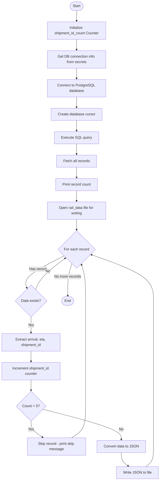
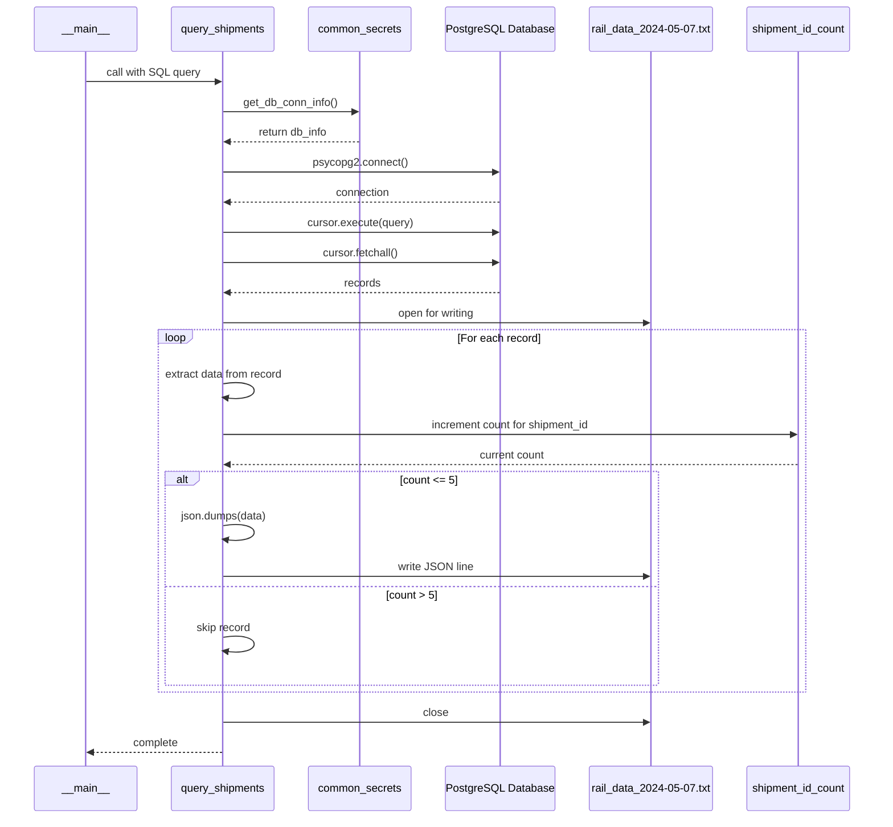

# Diagram: research/api/scripts/simulate/query_rail_data.py

> Auto-generated by Obscura crawlers

## Diagram 1

### SVG

<svg id="container" width="707.1004638671875" xmlns="http://www.w3.org/2000/svg" class="flowchart" height="2150.796875" viewBox="0 0 707.1004638671875 2150.796875" role="graphics-document document" aria-roledescription="flowchart-v2"><g><marker id="container_flowchart-v2-pointEnd" class="marker flowchart-v2" viewBox="0 0 10 10" refX="5" refY="5" markerUnits="userSpaceOnUse" markerWidth="8" markerHeight="8" orient="auto"><path d="M 0 0 L 10 5 L 0 10 z" class="arrowMarkerPath" style="stroke-width: 1; stroke-dasharray: 1, 0;"></path></marker><marker id="container_flowchart-v2-pointStart" class="marker flowchart-v2" viewBox="0 0 10 10" refX="4.5" refY="5" markerUnits="userSpaceOnUse" markerWidth="8" markerHeight="8" orient="auto"><path d="M 0 5 L 10 10 L 10 0 z" class="arrowMarkerPath" style="stroke-width: 1; stroke-dasharray: 1, 0;"></path></marker><marker id="container_flowchart-v2-circleEnd" class="marker flowchart-v2" viewBox="0 0 10 10" refX="11" refY="5" markerUnits="userSpaceOnUse" markerWidth="11" markerHeight="11" orient="auto"><circle cx="5" cy="5" r="5" class="arrowMarkerPath" style="stroke-width: 1; stroke-dasharray: 1, 0;"></circle></marker><marker id="container_flowchart-v2-circleStart" class="marker flowchart-v2" viewBox="0 0 10 10" refX="-1" refY="5" markerUnits="userSpaceOnUse" markerWidth="11" markerHeight="11" orient="auto"><circle cx="5" cy="5" r="5" class="arrowMarkerPath" style="stroke-width: 1; stroke-dasharray: 1, 0;"></circle></marker><marker id="container_flowchart-v2-crossEnd" class="marker cross flowchart-v2" viewBox="0 0 11 11" refX="12" refY="5.2" markerUnits="userSpaceOnUse" markerWidth="11" markerHeight="11" orient="auto"><path d="M 1,1 l 9,9 M 10,1 l -9,9" class="arrowMarkerPath" style="stroke-width: 2; stroke-dasharray: 1, 0;"></path></marker><marker id="container_flowchart-v2-crossStart" class="marker cross flowchart-v2" viewBox="0 0 11 11" refX="-1" refY="5.2" markerUnits="userSpaceOnUse" markerWidth="11" markerHeight="11" orient="auto"><path d="M 1,1 l 9,9 M 10,1 l -9,9" class="arrowMarkerPath" style="stroke-width: 2; stroke-dasharray: 1, 0;"></path></marker><g class="root"><g class="clusters"></g><g class="edgePaths"><path d="M339.319,47.5L339.236,51.583C339.153,55.667,338.986,63.833,338.903,71.417C338.819,79,338.819,86,338.819,89.5L338.819,93" id="L_Start_InitCounter_0" class="edge-thickness-normal edge-pattern-solid edge-thickness-normal edge-pattern-solid flowchart-link" style=";" data-edge="true" data-et="edge" data-id="L_Start_InitCounter_0" data-points="W3sieCI6MzM5LjMxOTIwOTA5ODgxNTksInkiOjQ3LjQ5OTk5OTk5OTk5OTkxNX0seyJ4IjozMzguODE5MjA5MDk4ODE1OSwieSI6NzJ9LHsieCI6MzM4LjgxOTIwOTA5ODgxNTksInkiOjk3fV0=" marker-end="url(#container_flowchart-v2-pointEnd)"></path><path d="M338.819,199L338.819,203.167C338.819,207.333,338.819,215.667,338.819,223.333C338.819,231,338.819,238,338.819,241.5L338.819,245" id="L_InitCounter_GetDBInfo_0" class="edge-thickness-normal edge-pattern-solid edge-thickness-normal edge-pattern-solid flowchart-link" style=";" data-edge="true" data-et="edge" data-id="L_InitCounter_GetDBInfo_0" data-points="W3sieCI6MzM4LjgxOTIwOTA5ODgxNTksInkiOjE5OX0seyJ4IjozMzguODE5MjA5MDk4ODE1OSwieSI6MjI0fSx7IngiOjMzOC44MTkyMDkwOTg4MTU5LCJ5IjoyNDl9XQ==" marker-end="url(#container_flowchart-v2-pointEnd)"></path><path d="M338.819,327L338.819,331.167C338.819,335.333,338.819,343.667,338.819,351.333C338.819,359,338.819,366,338.819,369.5L338.819,373" id="L_GetDBInfo_Connect_0" class="edge-thickness-normal edge-pattern-solid edge-thickness-normal edge-pattern-solid flowchart-link" style=";" data-edge="true" data-et="edge" data-id="L_GetDBInfo_Connect_0" data-points="W3sieCI6MzM4LjgxOTIwOTA5ODgxNTksInkiOjMyN30seyJ4IjozMzguODE5MjA5MDk4ODE1OSwieSI6MzUyfSx7IngiOjMzOC44MTkyMDkwOTg4MTU5LCJ5IjozNzd9XQ==" marker-end="url(#container_flowchart-v2-pointEnd)"></path><path d="M338.819,455L338.819,459.167C338.819,463.333,338.819,471.667,338.819,479.333C338.819,487,338.819,494,338.819,497.5L338.819,501" id="L_Connect_CreateCursor_0" class="edge-thickness-normal edge-pattern-solid edge-thickness-normal edge-pattern-solid flowchart-link" style=";" data-edge="true" data-et="edge" data-id="L_Connect_CreateCursor_0" data-points="W3sieCI6MzM4LjgxOTIwOTA5ODgxNTksInkiOjQ1NX0seyJ4IjozMzguODE5MjA5MDk4ODE1OSwieSI6NDgwfSx7IngiOjMzOC44MTkyMDkwOTg4MTU5LCJ5Ijo1MDV9XQ==" marker-end="url(#container_flowchart-v2-pointEnd)"></path><path d="M338.819,559L338.819,563.167C338.819,567.333,338.819,575.667,338.819,583.333C338.819,591,338.819,598,338.819,601.5L338.819,605" id="L_CreateCursor_ExecuteQuery_0" class="edge-thickness-normal edge-pattern-solid edge-thickness-normal edge-pattern-solid flowchart-link" style=";" data-edge="true" data-et="edge" data-id="L_CreateCursor_ExecuteQuery_0" data-points="W3sieCI6MzM4LjgxOTIwOTA5ODgxNTksInkiOjU1OX0seyJ4IjozMzguODE5MjA5MDk4ODE1OSwieSI6NTg0fSx7IngiOjMzOC44MTkyMDkwOTg4MTU5LCJ5Ijo2MDl9XQ==" marker-end="url(#container_flowchart-v2-pointEnd)"></path><path d="M338.819,663L338.819,667.167C338.819,671.333,338.819,679.667,338.819,687.333C338.819,695,338.819,702,338.819,705.5L338.819,709" id="L_ExecuteQuery_FetchRecords_0" class="edge-thickness-normal edge-pattern-solid edge-thickness-normal edge-pattern-solid flowchart-link" style=";" data-edge="true" data-et="edge" data-id="L_ExecuteQuery_FetchRecords_0" data-points="W3sieCI6MzM4LjgxOTIwOTA5ODgxNTksInkiOjY2M30seyJ4IjozMzguODE5MjA5MDk4ODE1OSwieSI6Njg4fSx7IngiOjMzOC44MTkyMDkwOTg4MTU5LCJ5Ijo3MTN9XQ==" marker-end="url(#container_flowchart-v2-pointEnd)"></path><path d="M338.819,767L338.819,771.167C338.819,775.333,338.819,783.667,338.819,791.333C338.819,799,338.819,806,338.819,809.5L338.819,813" id="L_FetchRecords_PrintCount_0" class="edge-thickness-normal edge-pattern-solid edge-thickness-normal edge-pattern-solid flowchart-link" style=";" data-edge="true" data-et="edge" data-id="L_FetchRecords_PrintCount_0" data-points="W3sieCI6MzM4LjgxOTIwOTA5ODgxNTksInkiOjc2N30seyJ4IjozMzguODE5MjA5MDk4ODE1OSwieSI6NzkyfSx7IngiOjMzOC44MTkyMDkwOTg4MTU5LCJ5Ijo4MTd9XQ==" marker-end="url(#container_flowchart-v2-pointEnd)"></path><path d="M338.819,871L338.819,875.167C338.819,879.333,338.819,887.667,338.819,895.333C338.819,903,338.819,910,338.819,913.5L338.819,917" id="L_PrintCount_OpenFile_0" class="edge-thickness-normal edge-pattern-solid edge-thickness-normal edge-pattern-solid flowchart-link" style=";" data-edge="true" data-et="edge" data-id="L_PrintCount_OpenFile_0" data-points="W3sieCI6MzM4LjgxOTIwOTA5ODgxNTksInkiOjg3MX0seyJ4IjozMzguODE5MjA5MDk4ODE1OSwieSI6ODk2fSx7IngiOjMzOC44MTkyMDkwOTg4MTU5LCJ5Ijo5MjF9XQ==" marker-end="url(#container_flowchart-v2-pointEnd)"></path><path d="M338.819,999L338.819,1003.167C338.819,1007.333,338.819,1015.667,338.819,1023.333C338.819,1031,338.819,1038,338.819,1041.5L338.819,1045" id="L_OpenFile_LoopStart_0" class="edge-thickness-normal edge-pattern-solid edge-thickness-normal edge-pattern-solid flowchart-link" style=";" data-edge="true" data-et="edge" data-id="L_OpenFile_LoopStart_0" data-points="W3sieCI6MzM4LjgxOTIwOTA5ODgxNTksInkiOjk5OX0seyJ4IjozMzguODE5MjA5MDk4ODE1OSwieSI6MTAyNH0seyJ4IjozMzguODE5MjA5MDk4ODE1OSwieSI6MTA0OX1d" marker-end="url(#container_flowchart-v2-pointEnd)"></path><path d="M283.871,1159.989L253.818,1175.314C223.765,1190.638,163.66,1221.288,136.304,1244.985C108.948,1268.682,114.341,1285.426,117.037,1293.798L119.734,1302.17" id="L_LoopStart_CheckData_0" class="edge-thickness-normal edge-pattern-solid edge-thickness-normal edge-pattern-solid flowchart-link" style=";" data-edge="true" data-et="edge" data-id="L_LoopStart_CheckData_0" data-points="W3sieCI6MjgzLjg3MDUxODA5MjA2MTczLCJ5IjoxMTU5Ljk4ODgwODk5MzI0NTh9LHsieCI6MTAzLjU1NDY4NzUsInkiOjEyNTEuOTM3NX0seyJ4IjoxMjAuOTYwMDU3MzA5NTA5MzQsInkiOjEzMDUuOTc3NDQyNjkwNDkwOH1d" marker-end="url(#container_flowchart-v2-pointEnd)"></path><path d="M138,1428.828L138,1434.995C138,1441.161,138,1453.495,138,1465.161C138,1476.828,138,1487.828,138,1493.328L138,1498.828" id="L_CheckData_ExtractData_0" class="edge-thickness-normal edge-pattern-solid edge-thickness-normal edge-pattern-solid flowchart-link" style=";" data-edge="true" data-et="edge" data-id="L_CheckData_ExtractData_0" data-points="W3sieCI6MTM4LCJ5IjoxNDI4LjgyODEyNX0seyJ4IjoxMzgsInkiOjE0NjUuODI4MTI1fSx7IngiOjEzOCwieSI6MTUwMi44MjgxMjV9XQ==" marker-end="url(#container_flowchart-v2-pointEnd)"></path><path d="M138,1580.828L138,1584.995C138,1589.161,138,1597.495,138,1605.161C138,1612.828,138,1619.828,138,1623.328L138,1626.828" id="L_ExtractData_IncrementCounter_0" class="edge-thickness-normal edge-pattern-solid edge-thickness-normal edge-pattern-solid flowchart-link" style=";" data-edge="true" data-et="edge" data-id="L_ExtractData_IncrementCounter_0" data-points="W3sieCI6MTM4LCJ5IjoxNTgwLjgyODEyNX0seyJ4IjoxMzgsInkiOjE2MDUuODI4MTI1fSx7IngiOjEzOCwieSI6MTYzMC44MjgxMjV9XQ==" marker-end="url(#container_flowchart-v2-pointEnd)"></path><path d="M138,1708.828L138,1712.995C138,1717.161,138,1725.495,138,1733.161C138,1740.828,138,1747.828,138,1751.328L138,1754.828" id="L_IncrementCounter_CheckLimit_0" class="edge-thickness-normal edge-pattern-solid edge-thickness-normal edge-pattern-solid flowchart-link" style=";" data-edge="true" data-et="edge" data-id="L_IncrementCounter_CheckLimit_0" data-points="W3sieCI6MTM4LCJ5IjoxNzA4LjgyODEyNX0seyJ4IjoxMzgsInkiOjE3MzMuODI4MTI1fSx7IngiOjEzOCwieSI6MTc1OC44MjgxMjV9XQ==" marker-end="url(#container_flowchart-v2-pointEnd)"></path><path d="M138,1886.797L138,1892.964C138,1899.13,138,1911.464,146.617,1923.425C155.233,1935.386,172.466,1946.975,181.083,1952.77L189.699,1958.565" id="L_CheckLimit_SkipRecord_0" class="edge-thickness-normal edge-pattern-solid edge-thickness-normal edge-pattern-solid flowchart-link" style=";" data-edge="true" data-et="edge" data-id="L_CheckLimit_SkipRecord_0" data-points="W3sieCI6MTM4LCJ5IjoxODg2Ljc5Njg3NX0seyJ4IjoxMzgsInkiOjE5MjMuNzk2ODc1fSx7IngiOjE5My4wMTgzMjU4OTM1MDI1LCJ5IjoxOTYwLjc5Njg3NX1d" marker-end="url(#container_flowchart-v2-pointEnd)"></path><path d="M316.605,1960.797L326.976,1954.63C337.348,1948.464,358.091,1936.13,368.463,1913.133C378.835,1890.135,378.835,1856.474,378.835,1824.813C378.835,1793.151,378.835,1763.49,378.835,1737.992C378.835,1712.495,378.835,1691.161,378.835,1669.828C378.835,1648.495,378.835,1627.161,378.835,1605.828C378.835,1584.495,378.835,1563.161,378.835,1539.828C378.835,1516.495,378.835,1491.161,378.835,1460.671C378.835,1430.18,378.835,1394.531,378.835,1358.883C378.835,1323.234,378.835,1287.586,375.835,1260.769C372.836,1233.952,366.836,1215.966,363.837,1206.973L360.837,1197.98" id="L_SkipRecord_LoopStart_0" class="edge-thickness-normal edge-pattern-solid edge-thickness-normal edge-pattern-solid flowchart-link" style=";" data-edge="true" data-et="edge" data-id="L_SkipRecord_LoopStart_0" data-points="W3sieCI6MzE2LjYwNDYyMjMzODk0NzUsInkiOjE5NjAuNzk2ODc1fSx7IngiOjM3OC44MzQ4MzQwOTg4MTU5LCJ5IjoxOTIzLjc5Njg3NX0seyJ4IjozNzguODM0ODM0MDk4ODE1OSwieSI6MTgyMi44MTI1fSx7IngiOjM3OC44MzQ4MzQwOTg4MTU5LCJ5IjoxNzMzLjgyODEyNX0seyJ4IjozNzguODM0ODM0MDk4ODE1OSwieSI6MTY2OS44MjgxMjV9LHsieCI6Mzc4LjgzNDgzNDA5ODgxNTksInkiOjE2MDUuODI4MTI1fSx7IngiOjM3OC44MzQ4MzQwOTg4MTU5LCJ5IjoxNTQxLjgyODEyNX0seyJ4IjozNzguODM0ODM0MDk4ODE1OSwieSI6MTQ2NS44MjgxMjV9LHsieCI6Mzc4LjgzNDgzNDA5ODgxNTksInkiOjEzNTguODgyODEyNX0seyJ4IjozNzguODM0ODM0MDk4ODE1OSwieSI6MTI1MS45Mzc1fSx7IngiOjM1OS41NzE1MjU2MDkyMTczLCJ5IjoxMTk0LjE4NTE4MzQ4OTU5ODZ9XQ==" marker-end="url(#container_flowchart-v2-pointEnd)"></path><path d="M189.056,1835.741L247.013,1850.417C304.971,1865.093,420.885,1894.445,478.842,1916.621C536.8,1938.797,536.8,1953.797,536.8,1961.297L536.8,1968.797" id="L_CheckLimit_ConvertJSON_0" class="edge-thickness-normal edge-pattern-solid edge-thickness-normal edge-pattern-solid flowchart-link" style=";" data-edge="true" data-et="edge" data-id="L_CheckLimit_ConvertJSON_0" data-points="W3sieCI6MTg5LjA1NTk0NzA0NzM0NzQ0LCJ5IjoxODM1Ljc0MDkyNzk1MjY1MjZ9LHsieCI6NTM2Ljc5OTY3Nzg0ODgxNTksInkiOjE5MjMuNzk2ODc1fSx7IngiOjUzNi43OTk2Nzc4NDg4MTU5LCJ5IjoxOTcyLjc5Njg3NX1d" marker-end="url(#container_flowchart-v2-pointEnd)"></path><path d="M536.8,2026.797L536.8,2032.964C536.8,2039.13,536.8,2051.464,541.904,2061.401C547.008,2071.338,557.217,2078.879,562.321,2082.65L567.426,2086.42" id="L_ConvertJSON_WriteFile_0" class="edge-thickness-normal edge-pattern-solid edge-thickness-normal edge-pattern-solid flowchart-link" style=";" data-edge="true" data-et="edge" data-id="L_ConvertJSON_WriteFile_0" data-points="W3sieCI6NTM2Ljc5OTY3Nzg0ODgxNTksInkiOjIwMjYuNzk2ODc1fSx7IngiOjUzNi43OTk2Nzc4NDg4MTU5LCJ5IjoyMDYzLjc5Njg3NX0seyJ4Ijo1NzAuNjQzMjAyNDg4MjM5LCJ5IjoyMDg4Ljc5Njg3NX1d" marker-end="url(#container_flowchart-v2-pointEnd)"></path><path d="M643.745,2088.797L649.386,2084.63C655.026,2080.464,666.308,2072.13,671.948,2057.297C677.589,2042.464,677.589,2021.13,677.589,1997.797C677.589,1974.464,677.589,1949.13,677.589,1919.633C677.589,1890.135,677.589,1856.474,677.589,1824.813C677.589,1793.151,677.589,1763.49,677.589,1737.992C677.589,1712.495,677.589,1691.161,677.589,1669.828C677.589,1648.495,677.589,1627.161,677.589,1605.828C677.589,1584.495,677.589,1563.161,677.589,1539.828C677.589,1516.495,677.589,1491.161,677.589,1460.671C677.589,1430.18,677.589,1394.531,677.589,1358.883C677.589,1323.234,677.589,1287.586,631.967,1253.606C586.346,1219.626,495.103,1187.314,449.482,1171.158L403.861,1155.002" id="L_WriteFile_LoopStart_0" class="edge-thickness-normal edge-pattern-solid edge-thickness-normal edge-pattern-solid flowchart-link" style=";" data-edge="true" data-et="edge" data-id="L_WriteFile_LoopStart_0" data-points="W3sieCI6NjQzLjc0NTIxNTcwOTM5MjgsInkiOjIwODguNzk2ODc1fSx7IngiOjY3Ny41ODg3NDAzNDg4MTU5LCJ5IjoyMDYzLjc5Njg3NX0seyJ4Ijo2NzcuNTg4NzQwMzQ4ODE1OSwieSI6MTk5OS43OTY4NzV9LHsieCI6Njc3LjU4ODc0MDM0ODgxNTksInkiOjE5MjMuNzk2ODc1fSx7IngiOjY3Ny41ODg3NDAzNDg4MTU5LCJ5IjoxODIyLjgxMjV9LHsieCI6Njc3LjU4ODc0MDM0ODgxNTksInkiOjE3MzMuODI4MTI1fSx7IngiOjY3Ny41ODg3NDAzNDg4MTU5LCJ5IjoxNjY5LjgyODEyNX0seyJ4Ijo2NzcuNTg4NzQwMzQ4ODE1OSwieSI6MTYwNS44MjgxMjV9LHsieCI6Njc3LjU4ODc0MDM0ODgxNTksInkiOjE1NDEuODI4MTI1fSx7IngiOjY3Ny41ODg3NDAzNDg4MTU5LCJ5IjoxNDY1LjgyODEyNX0seyJ4Ijo2NzcuNTg4NzQwMzQ4ODE1OSwieSI6MTM1OC44ODI4MTI1fSx7IngiOjY3Ny41ODg3NDAzNDg4MTU5LCJ5IjoxMjUxLjkzNzV9LHsieCI6NDAwLjA5MDA1OTM3Mzg1NzA2LCJ5IjoxMTUzLjY2NjY0OTcyNDk1OX1d" marker-end="url(#container_flowchart-v2-pointEnd)"></path><path d="M157.966,1308.903L161.759,1299.409C165.551,1289.915,173.137,1270.926,194.886,1247.806C216.635,1224.686,252.548,1197.434,270.504,1183.809L288.46,1170.183" id="L_CheckData_LoopStart_0" class="edge-thickness-normal edge-pattern-solid edge-thickness-normal edge-pattern-solid flowchart-link" style=";" data-edge="true" data-et="edge" data-id="L_CheckData_LoopStart_0" data-points="W3sieCI6MTU3Ljk2NTg1ODg3NTQ0MDQzLCJ5IjoxMzA4LjkwMzM1ODg3NTQ0MDV9LHsieCI6MTgwLjcyMjY1NjI1LCJ5IjoxMjUxLjkzNzV9LHsieCI6MjkxLjY0NjU3MjkwNTg0NjEsInkiOjExNjcuNzY0ODYzODA3MDMwMn1d" marker-end="url(#container_flowchart-v2-pointEnd)"></path><path d="M318.067,1194.185L314.856,1203.811C311.646,1213.436,305.225,1232.687,302.094,1256.303C298.963,1279.919,299.122,1307.901,299.201,1321.892L299.281,1335.883" id="L_LoopStart_End_0" class="edge-thickness-normal edge-pattern-solid edge-thickness-normal edge-pattern-solid flowchart-link" style=";" data-edge="true" data-et="edge" data-id="L_LoopStart_End_0" data-points="W3sieCI6MzE4LjA2Njg5MjU4ODQxNDUzLCJ5IjoxMTk0LjE4NTE4MzQ4OTU5ODZ9LHsieCI6Mjk4LjgwMzU4NDA5ODgxNTksInkiOjEyNTEuOTM3NX0seyJ4IjoyOTkuMzAzNTg0MDk4ODE1OSwieSI6MTMzOS44ODI4MTI1fV0=" marker-end="url(#container_flowchart-v2-pointEnd)"></path></g><g class="edgeLabels"><g class="edgeLabel"><g class="label" data-id="L_Start_InitCounter_0" transform="translate(0, 0)"><foreignObject width="0" height="0">

</foreignObject></g></g><g class="edgeLabel"><g class="label" data-id="L_InitCounter_GetDBInfo_0" transform="translate(0, 0)"><foreignObject width="0" height="0">

</foreignObject></g></g><g class="edgeLabel"><g class="label" data-id="L_GetDBInfo_Connect_0" transform="translate(0, 0)"><foreignObject width="0" height="0">

</foreignObject></g></g><g class="edgeLabel"><g class="label" data-id="L_Connect_CreateCursor_0" transform="translate(0, 0)"><foreignObject width="0" height="0">

</foreignObject></g></g><g class="edgeLabel"><g class="label" data-id="L_CreateCursor_ExecuteQuery_0" transform="translate(0, 0)"><foreignObject width="0" height="0">

</foreignObject></g></g><g class="edgeLabel"><g class="label" data-id="L_ExecuteQuery_FetchRecords_0" transform="translate(0, 0)"><foreignObject width="0" height="0">

</foreignObject></g></g><g class="edgeLabel"><g class="label" data-id="L_FetchRecords_PrintCount_0" transform="translate(0, 0)"><foreignObject width="0" height="0">

</foreignObject></g></g><g class="edgeLabel"><g class="label" data-id="L_PrintCount_OpenFile_0" transform="translate(0, 0)"><foreignObject width="0" height="0">

</foreignObject></g></g><g class="edgeLabel"><g class="label" data-id="L_OpenFile_LoopStart_0" transform="translate(0, 0)"><foreignObject width="0" height="0">

</foreignObject></g></g><g class="edgeLabel" transform="translate(168.42385, 1218.85868)"><g class="label" data-id="L_LoopStart_CheckData_0" transform="translate(-38.75, -12)"><foreignObject width="77.5" height="24">

Has record

</foreignObject></g></g><g class="edgeLabel" transform="translate(138, 1465.828125)"><g class="label" data-id="L_CheckData_ExtractData_0" transform="translate(-12.03125, -12)"><foreignObject width="24.0625" height="24">

Yes

</foreignObject></g></g><g class="edgeLabel"><g class="label" data-id="L_ExtractData_IncrementCounter_0" transform="translate(0, 0)"><foreignObject width="0" height="0">

</foreignObject></g></g><g class="edgeLabel"><g class="label" data-id="L_IncrementCounter_CheckLimit_0" transform="translate(0, 0)"><foreignObject width="0" height="0">

</foreignObject></g></g><g class="edgeLabel" transform="translate(138, 1923.796875)"><g class="label" data-id="L_CheckLimit_SkipRecord_0" transform="translate(-12.03125, -12)"><foreignObject width="24.0625" height="24">

Yes

</foreignObject></g></g><g class="edgeLabel"><g class="label" data-id="L_SkipRecord_LoopStart_0" transform="translate(0, 0)"><foreignObject width="0" height="0">

</foreignObject></g></g><g class="edgeLabel" transform="translate(536.7996778488159, 1923.796875)"><g class="label" data-id="L_CheckLimit_ConvertJSON_0" transform="translate(-10.140625, -12)"><foreignObject width="20.28125" height="24">

No

</foreignObject></g></g><g class="edgeLabel"><g class="label" data-id="L_ConvertJSON_WriteFile_0" transform="translate(0, 0)"><foreignObject width="0" height="0">

</foreignObject></g></g><g class="edgeLabel"><g class="label" data-id="L_WriteFile_LoopStart_0" transform="translate(0, 0)"><foreignObject width="0" height="0">

</foreignObject></g></g><g class="edgeLabel" transform="translate(211.75133, 1228.39194)"><g class="label" data-id="L_CheckData_LoopStart_0" transform="translate(-10.140625, -12)"><foreignObject width="20.28125" height="24">

No

</foreignObject></g></g><g class="edgeLabel" transform="translate(298.8035840988159, 1251.9375)"><g class="label" data-id="L_LoopStart_End_0" transform="translate(-60.03125, -12)"><foreignObject width="120.0625" height="24">

No more records

</foreignObject></g></g></g><g class="nodes"><g class="node default" id="flowchart-Start-0" transform="translate(338.8192090988159, 27.5)"><g class="basic label-container outer-path"><path d="M-10.3984375 -19.5 C-2.094555639735672 -19.5, 6.209326220528656 -19.5, 10.3984375 -19.5 C10.3984375 -19.5, 10.398437499999998 -19.5, 10.398437499999998 -19.5 C10.744086375017512 -19.48891571334291, 11.089735250035025 -19.477831426685817, 11.6478067896239 -19.45993515863156 C12.010104483271242 -19.424984735852124, 12.372402176918582 -19.390034313072693, 12.892042152847864 -19.3399052695533 C13.384329685926641 -19.26031603895196, 13.876617219005418 -19.180726808350624, 14.126030759676757 -19.140403561325776 C14.590558871025262 -19.0343780512397, 15.05508698237377 -18.92835254115362, 15.34470188623539 -18.862249829261074 C15.738015359295918 -18.74551645500126, 16.131328832356445 -18.628783080741446, 16.543047751460602 -18.50658706670804 C16.795160857536118 -18.413807113164243, 17.047273963611637 -18.32102715962045, 17.716144095147794 -18.074876768247425 C18.06662174025636 -17.919730711307814, 18.417099385364924 -17.764584654368207, 18.85917041279238 -17.568892924097174 C19.159293476260284 -17.412318914123965, 19.45941653972819 -17.255744904150756, 19.967429764076783 -16.990714730406097 C20.31944866443517 -16.77731880431616, 20.671467564793563 -16.563922878226222, 21.036368073605697 -16.342718045390892 C21.32958000405213 -16.138186095651356, 21.622791934498558 -15.933654145911822, 22.061592844578712 -15.627565626425154 C22.29382784267606 -15.442364395475364, 22.526062840773406 -15.257163164525574, 23.03889120850187 -14.848196188198123 C23.344738940595256 -14.570433370198456, 23.650586672688643 -14.292670552198791, 23.964247236767985 -14.007812326905688 C24.209612279826743 -13.754452775102841, 24.4549773228855 -13.501093223299996, 24.833858442968648 -13.10986736009568 C25.07391221237805 -12.827886543100961, 25.313965981787454 -12.545905726106243, 25.644151408126582 -12.158051136245305 C25.911053740756934 -11.800426325823347, 26.17795607338729 -11.442801515401387, 26.391796464640635 -11.156274872382312 C26.559918572308046 -10.897994167898068, 26.72804067997546 -10.639713463413823, 27.073721378604247 -10.108655082055241 C27.28035587969665 -9.741754601353522, 27.486990380789052 -9.374854120651802, 27.6871239742735 -9.019496659696287 C27.79834377673044 -8.788546360171905, 27.909563579187378 -8.557596060647523, 28.22948364880834 -7.893275190886684 C28.373736198110855 -7.536968605176159, 28.517988747413373 -7.180662019465634, 28.698571729970325 -6.734618561215508 C28.817391509892598 -6.376752315450627, 28.936211289814867 -6.018886069685745, 29.09246063421488 -5.548287939305138 C29.174651316063258 -5.234859247750435, 29.256841997911632 -4.921430556195732, 29.40953178754556 -4.339158212148133 C29.459349405894013 -4.083355270886203, 29.509167024242462 -3.8275523296242726, 29.648482276581777 -3.1121979531509023 C29.68276785831771 -2.846285751660914, 29.717053440053643 -2.5803735501709255, 29.808330202509367 -1.872449005199798 C29.835402803450442 -1.4507713929323847, 29.862475404391517 -1.0290937806649714, 29.888418715913414 -0.6250057626472757 C29.888418715913414 -0.17369236837964758, 29.888418715913414 0.27762102588798054, 29.888418715913414 0.625005762647271 C29.86901815036082 0.9271852309835781, 29.849617584808225 1.229364699319885, 29.808330202509367 1.8724490051997846 C29.77456221982183 2.1343468106819015, 29.740794237134295 2.3962446161640183, 29.648482276581777 3.1121979531508885 C29.57196621923027 3.5050917359764373, 29.49545016187876 3.8979855188019865, 29.40953178754556 4.339158212148129 C29.326134277123465 4.657189064097232, 29.242736766701373 4.975219916046335, 29.092460634214884 5.548287939305125 C28.996962746400186 5.835912361880882, 28.901464858585488 6.123536784456639, 28.69857172997033 6.734618561215495 C28.583171544954133 7.0196592493162955, 28.467771359937938 7.304699937417096, 28.229483648808344 7.893275190886679 C28.090210371019836 8.182479132185277, 27.950937093231328 8.471683073483876, 27.687123974273504 9.019496659696284 C27.5340066860765 9.29137190969678, 27.380889397879493 9.563247159697276, 27.07372137860425 10.108655082055236 C26.879552902690158 10.406950002595568, 26.685384426776064 10.7052449231359, 26.39179646464064 11.156274872382301 C26.236701645808218 11.364087800189083, 26.081606826975797 11.571900727995864, 25.644151408126582 12.158051136245302 C25.339750408712295 12.51561787106487, 25.035349409298007 12.87318460588444, 24.83385844296866 13.10986736009567 C24.561807566670108 13.390782225666257, 24.289756690371558 13.671697091236842, 23.96424723676799 14.007812326905684 C23.754458980651428 14.198336470417658, 23.544670724534864 14.388860613929632, 23.038891208501887 14.848196188198111 C22.69836844730232 15.119754028563522, 22.35784568610276 15.39131186892893, 22.061592844578715 15.627565626425152 C21.767017646163822 15.833048532884568, 21.47244244774893 16.038531439343984, 21.036368073605708 16.34271804539089 C20.74018912637158 16.522263463744906, 20.444010179137454 16.701808882098927, 19.967429764076787 16.990714730406093 C19.640739524077812 17.161148819358473, 19.31404928407884 17.33158290831085, 18.859170412792388 17.56889292409717 C18.453468194049652 17.748485261605854, 18.04776597530692 17.928077599114538, 17.716144095147804 18.07487676824742 C17.358516890884683 18.206486885285887, 17.000889686621562 18.33809700232435, 16.543047751460616 18.506587066708033 C16.288443029426823 18.582152411760205, 16.033838307393026 18.657717756812378, 15.344701886235413 18.86224982926107 C14.863647455294442 18.972047363949812, 14.38259302435347 19.081844898638558, 14.126030759676766 19.140403561325773 C13.820489272102892 19.18980113952709, 13.514947784529017 19.23919871772841, 12.892042152847878 19.3399052695533 C12.4979651681702 19.37792140231824, 12.103888183492524 19.41593753508318, 11.6478067896239 19.45993515863156 C11.308895195837064 19.470803393792906, 10.969983602050227 19.48167162895425, 10.398437500000004 19.5 C10.398437500000002 19.5, 10.398437500000002 19.5, 10.3984375 19.5 C3.869723058650221 19.5, -2.6589913826995577 19.5, -10.398437499999996 19.5 C-10.700393267956109 19.490316866242896, -11.002349035912221 19.48063373248579, -11.647806789623893 19.45993515863156 C-12.0251328446085 19.423534967908168, -12.402458899593109 19.387134777184777, -12.892042152847871 19.3399052695533 C-13.369696653724572 19.26268179411753, -13.847351154601272 19.185458318681764, -14.126030759676759 19.140403561325773 C-14.464590679989156 19.06312946882442, -14.803150600301551 18.985855376323066, -15.344701886235388 18.862249829261074 C-15.666026734772615 18.766882300883776, -15.987351583309843 18.671514772506473, -16.54304775146059 18.506587066708043 C-16.91803668852654 18.36858767150804, -17.293025625592488 18.230588276308033, -17.716144095147797 18.074876768247425 C-17.968828669301995 17.963020802890934, -18.221513243456194 17.85116483753444, -18.85917041279238 17.568892924097174 C-19.197060993306753 17.39261562467207, -19.53495157382113 17.21633832524697, -19.96742976407678 16.990714730406097 C-20.364840174563952 16.74980220412597, -20.762250585051124 16.508889677845843, -21.036368073605686 16.3427180453909 C-21.401634200354415 16.08792420748677, -21.766900327103148 15.833130369582635, -22.061592844578712 15.627565626425156 C-22.334245569123787 15.410132334194174, -22.606898293668866 15.19269904196319, -23.03889120850187 14.848196188198125 C-23.224558970654215 14.679577639111155, -23.41022673280656 14.510959090024183, -23.964247236767974 14.007812326905697 C-24.245309113786647 13.71759286327467, -24.526370990805315 13.427373399643642, -24.833858442968655 13.109867360095677 C-25.03052241798131 12.878854664548621, -25.227186392993964 12.647841969001565, -25.64415140812658 12.158051136245307 C-25.873068502051936 11.85132308516161, -26.10198559597729 11.544595034077915, -26.391796464640635 11.156274872382316 C-26.570989778399166 10.88098582230701, -26.750183092157698 10.605696772231706, -27.073721378604244 10.108655082055249 C-27.221330240670362 9.846560600438774, -27.36893910273648 9.5844661188223, -27.6871239742735 9.019496659696289 C-27.81048523308745 8.763334366261024, -27.933846491901402 8.507172072825758, -28.22948364880834 7.893275190886686 C-28.366142614751475 7.555724902885777, -28.502801580694612 7.218174614884869, -28.698571729970325 6.73461856121551 C-28.822643437735305 6.36093434556945, -28.94671514550029 5.98725012992339, -29.09246063421488 5.5482879393051325 C-29.181300908186405 5.20950147103341, -29.27014118215793 4.870715002761688, -29.409531787545557 4.339158212148136 C-29.47623942279595 3.996628603801083, -29.54294705804634 3.6540989954540306, -29.648482276581777 3.112197953150904 C-29.710887097015764 2.6281984890905323, -29.773291917449754 2.1441990250301606, -29.808330202509364 1.872449005199809 C-29.82923733921563 1.546803475062693, -29.850144475921898 1.2211579449255767, -29.888418715913414 0.6250057626472781 C-29.888418715913414 0.3548573966384735, -29.888418715913414 0.08470903062966884, -29.888418715913414 -0.6250057626472687 C-29.863679635636615 -1.01033690698462, -29.838940555359812 -1.3956680513219712, -29.808330202509367 -1.8724490051997822 C-29.769088892354596 -2.1767968576870302, -29.729847582199824 -2.481144710174278, -29.648482276581777 -3.112197953150895 C-29.577683091797944 -3.4757368036028753, -29.50688390701411 -3.839275654054856, -29.40953178754556 -4.339158212148126 C-29.28902648301003 -4.798697165671465, -29.1685211784745 -5.258236119194803, -29.092460634214884 -5.548287939305123 C-28.947187830158082 -5.98582647904618, -28.801915026101284 -6.423365018787237, -28.698571729970332 -6.734618561215485 C-28.561740862343708 -7.072593449698106, -28.424909994717083 -7.410568338180726, -28.229483648808344 -7.893275190886676 C-28.029734594370677 -8.308058376371584, -27.829985539933013 -8.72284156185649, -27.687123974273504 -9.019496659696282 C-27.481573018851318 -9.384473195339636, -27.27602206342913 -9.749449730982988, -27.073721378604247 -10.108655082055243 C-26.866741285260694 -10.426632087368208, -26.659761191917145 -10.744609092681172, -26.39179646464064 -11.156274872382308 C-26.229631137138586 -11.373561637669807, -26.06746580963653 -11.590848402957304, -25.644151408126586 -12.158051136245302 C-25.38016126864219 -12.468148975548148, -25.116171129157795 -12.778246814850995, -24.833858442968662 -13.10986736009567 C-24.634489112695313 -13.315732562129332, -24.435119782421964 -13.521597764162992, -23.964247236767996 -14.007812326905677 C-23.77752801597192 -14.177385782912813, -23.590808795175843 -14.346959238919947, -23.038891208501887 -14.848196188198107 C-22.74294133700724 -15.084208335158257, -22.446991465512593 -15.320220482118406, -22.06159284457872 -15.627565626425149 C-21.828993529527644 -15.789816839542716, -21.596394214476565 -15.952068052660284, -21.03636807360571 -16.342718045390885 C-20.630576934691607 -16.588711018494045, -20.2247857957775 -16.834703991597205, -19.96742976407679 -16.99071473040609 C-19.74464786546153 -17.106939904215054, -19.52186596684627 -17.223165078024017, -18.859170412792388 -17.56889292409717 C-18.40371834350437 -17.77050804466537, -17.948266274216348 -17.972123165233572, -17.716144095147804 -18.07487676824742 C-17.409347936863675 -18.18778059048858, -17.102551778579546 -18.300684412729737, -16.54304775146062 -18.506587066708033 C-16.228076483537542 -18.60006888570968, -15.913105215614461 -18.693550704711324, -15.344701886235413 -18.862249829261067 C-15.016754610270604 -18.937101654944062, -14.688807334305794 -19.011953480627056, -14.126030759676768 -19.140403561325773 C-13.835083193871023 -19.187441707433173, -13.544135628065277 -19.234479853540577, -12.89204215284788 -19.3399052695533 C-12.60023558453402 -19.36805549824979, -12.308429016220162 -19.396205726946288, -11.647806789623903 -19.45993515863156 C-11.237378104297202 -19.473096807719013, -10.826949418970498 -19.486258456806468, -10.398437500000005 -19.5 C-10.398437500000004 -19.5, -10.398437500000002 -19.5, -10.3984375 -19.5" stroke="none" stroke-width="0" fill="#ECECFF" style=""></path><path d="M-10.3984375 -19.5 C-2.701420073098446 -19.5, 4.995597353803108 -19.5, 10.3984375 -19.5 M-10.3984375 -19.5 C-2.711266118891209 -19.5, 4.975905262217582 -19.5, 10.3984375 -19.5 M10.3984375 -19.5 C10.3984375 -19.5, 10.398437499999998 -19.5, 10.398437499999998 -19.5 M10.3984375 -19.5 C10.3984375 -19.5, 10.3984375 -19.5, 10.398437499999998 -19.5 M10.398437499999998 -19.5 C10.756321931893003 -19.48852334284898, 11.11420636378601 -19.47704668569796, 11.6478067896239 -19.45993515863156 M10.398437499999998 -19.5 C10.690107103955071 -19.490646723501605, 10.981776707910145 -19.48129344700321, 11.6478067896239 -19.45993515863156 M11.6478067896239 -19.45993515863156 C12.054019485630375 -19.420748308390056, 12.46023218163685 -19.381561458148553, 12.892042152847864 -19.3399052695533 M11.6478067896239 -19.45993515863156 C12.009342455723257 -19.425058247733208, 12.370878121822615 -19.390181336834853, 12.892042152847864 -19.3399052695533 M12.892042152847864 -19.3399052695533 C13.190595663532745 -19.291637453262823, 13.489149174217628 -19.243369636972346, 14.126030759676757 -19.140403561325776 M12.892042152847864 -19.3399052695533 C13.24868487725308 -19.282246039677098, 13.605327601658296 -19.2245868098009, 14.126030759676757 -19.140403561325776 M14.126030759676757 -19.140403561325776 C14.509517091049052 -19.05287530867223, 14.893003422421344 -18.965347056018686, 15.34470188623539 -18.862249829261074 M14.126030759676757 -19.140403561325776 C14.560414224876371 -19.041258370010983, 14.994797690075988 -18.94211317869619, 15.34470188623539 -18.862249829261074 M15.34470188623539 -18.862249829261074 C15.722828082328077 -18.75002395908567, 16.100954278420765 -18.63779808891027, 16.543047751460602 -18.50658706670804 M15.34470188623539 -18.862249829261074 C15.7114608037265 -18.753397707706558, 16.07821972121761 -18.644545586152038, 16.543047751460602 -18.50658706670804 M16.543047751460602 -18.50658706670804 C16.989477957851946 -18.342296624000436, 17.43590816424329 -18.17800618129283, 17.716144095147794 -18.074876768247425 M16.543047751460602 -18.50658706670804 C16.809072835193636 -18.408687376785366, 17.075097918926666 -18.310787686862692, 17.716144095147794 -18.074876768247425 M17.716144095147794 -18.074876768247425 C18.025554167580726 -17.937910107505058, 18.334964240013655 -17.800943446762695, 18.85917041279238 -17.568892924097174 M17.716144095147794 -18.074876768247425 C18.055645111333977 -17.924589739321625, 18.395146127520164 -17.774302710395826, 18.85917041279238 -17.568892924097174 M18.85917041279238 -17.568892924097174 C19.105895178826174 -17.440176771692098, 19.35261994485997 -17.311460619287022, 19.967429764076783 -16.990714730406097 M18.85917041279238 -17.568892924097174 C19.225503133000906 -17.377777378611693, 19.591835853209435 -17.18666183312621, 19.967429764076783 -16.990714730406097 M19.967429764076783 -16.990714730406097 C20.204098608693347 -16.847244685979028, 20.440767453309906 -16.703774641551956, 21.036368073605697 -16.342718045390892 M19.967429764076783 -16.990714730406097 C20.296502293244288 -16.79122902937992, 20.62557482241179 -16.591743328353743, 21.036368073605697 -16.342718045390892 M21.036368073605697 -16.342718045390892 C21.359236514646845 -16.117498997670133, 21.682104955687997 -15.892279949949376, 22.061592844578712 -15.627565626425154 M21.036368073605697 -16.342718045390892 C21.41803303654346 -16.076485089255467, 21.79969799948122 -15.810252133120043, 22.061592844578712 -15.627565626425154 M22.061592844578712 -15.627565626425154 C22.27121654977343 -15.460396299853436, 22.480840254968147 -15.293226973281717, 23.03889120850187 -14.848196188198123 M22.061592844578712 -15.627565626425154 C22.439450838602397 -15.326233931414778, 22.817308832626082 -15.024902236404403, 23.03889120850187 -14.848196188198123 M23.03889120850187 -14.848196188198123 C23.388209688952852 -14.530954386713063, 23.737528169403834 -14.213712585228004, 23.964247236767985 -14.007812326905688 M23.03889120850187 -14.848196188198123 C23.344517397781434 -14.57063456952027, 23.650143587061 -14.293072950842413, 23.964247236767985 -14.007812326905688 M23.964247236767985 -14.007812326905688 C24.209950394235804 -13.754103644215778, 24.45565355170362 -13.500394961525869, 24.833858442968648 -13.10986736009568 M23.964247236767985 -14.007812326905688 C24.184694523931725 -13.780182403850255, 24.40514181109546 -13.552552480794821, 24.833858442968648 -13.10986736009568 M24.833858442968648 -13.10986736009568 C25.128074031724978 -12.764264988201237, 25.422289620481305 -12.418662616306793, 25.644151408126582 -12.158051136245305 M24.833858442968648 -13.10986736009568 C25.095762865825122 -12.802219522224627, 25.3576672886816 -12.494571684353575, 25.644151408126582 -12.158051136245305 M25.644151408126582 -12.158051136245305 C25.92709228334987 -11.778936139890101, 26.210033158573157 -11.399821143534899, 26.391796464640635 -11.156274872382312 M25.644151408126582 -12.158051136245305 C25.919086039157232 -11.789663777724389, 26.19402067018788 -11.42127641920347, 26.391796464640635 -11.156274872382312 M26.391796464640635 -11.156274872382312 C26.660511113055676 -10.743457012430358, 26.92922576147072 -10.330639152478405, 27.073721378604247 -10.108655082055241 M26.391796464640635 -11.156274872382312 C26.536936207996085 -10.933301251110167, 26.682075951351536 -10.710327629838025, 27.073721378604247 -10.108655082055241 M27.073721378604247 -10.108655082055241 C27.270650513897714 -9.758987461104388, 27.467579649191183 -9.409319840153534, 27.6871239742735 -9.019496659696287 M27.073721378604247 -10.108655082055241 C27.2568416275617 -9.783506537095354, 27.43996187651915 -9.458357992135467, 27.6871239742735 -9.019496659696287 M27.6871239742735 -9.019496659696287 C27.88481971993149 -8.608977213826154, 28.082515465589474 -8.198457767956022, 28.22948364880834 -7.893275190886684 M27.6871239742735 -9.019496659696287 C27.887378949530557 -8.603662918804941, 28.087633924787617 -8.187829177913597, 28.22948364880834 -7.893275190886684 M28.22948364880834 -7.893275190886684 C28.408736021802113 -7.450518363983199, 28.587988394795886 -7.007761537079713, 28.698571729970325 -6.734618561215508 M28.22948364880834 -7.893275190886684 C28.39203083419326 -7.491780500349894, 28.55457801957818 -7.090285809813103, 28.698571729970325 -6.734618561215508 M28.698571729970325 -6.734618561215508 C28.821120003824664 -6.3655226857820715, 28.943668277679006 -5.996426810348635, 29.09246063421488 -5.548287939305138 M28.698571729970325 -6.734618561215508 C28.816545648866416 -6.379299914091829, 28.934519567762507 -6.023981266968151, 29.09246063421488 -5.548287939305138 M29.09246063421488 -5.548287939305138 C29.190243437616793 -5.175399730598567, 29.28802624101871 -4.802511521891996, 29.40953178754556 -4.339158212148133 M29.09246063421488 -5.548287939305138 C29.196751721970628 -5.150580821649126, 29.301042809726372 -4.752873703993115, 29.40953178754556 -4.339158212148133 M29.40953178754556 -4.339158212148133 C29.504543376953475 -3.8512937812450185, 29.599554966361392 -3.363429350341904, 29.648482276581777 -3.1121979531509023 M29.40953178754556 -4.339158212148133 C29.464162123670423 -4.058642982272589, 29.518792459795286 -3.7781277523970456, 29.648482276581777 -3.1121979531509023 M29.648482276581777 -3.1121979531509023 C29.686352419407548 -2.8184846036997935, 29.724222562233315 -2.5247712542486846, 29.808330202509367 -1.872449005199798 M29.648482276581777 -3.1121979531509023 C29.69090482699124 -2.7831770294552314, 29.733327377400702 -2.454156105759561, 29.808330202509367 -1.872449005199798 M29.808330202509367 -1.872449005199798 C29.824606347558728 -1.6189349081881894, 29.84088249260809 -1.3654208111765809, 29.888418715913414 -0.6250057626472757 M29.808330202509367 -1.872449005199798 C29.82450522268113 -1.620510009783341, 29.840680242852887 -1.3685710143668839, 29.888418715913414 -0.6250057626472757 M29.888418715913414 -0.6250057626472757 C29.888418715913414 -0.2278312328446362, 29.888418715913414 0.16934329695800332, 29.888418715913414 0.625005762647271 M29.888418715913414 -0.6250057626472757 C29.888418715913414 -0.21941660969445603, 29.888418715913414 0.18617254325836363, 29.888418715913414 0.625005762647271 M29.888418715913414 0.625005762647271 C29.86532839528867 0.9846561445489775, 29.84223807466393 1.344306526450684, 29.808330202509367 1.8724490051997846 M29.888418715913414 0.625005762647271 C29.858695040786007 1.0879759952753785, 29.8289713656586 1.550946227903486, 29.808330202509367 1.8724490051997846 M29.808330202509367 1.8724490051997846 C29.75683942433626 2.2718013127061716, 29.705348646163152 2.671153620212559, 29.648482276581777 3.1121979531508885 M29.808330202509367 1.8724490051997846 C29.76001743878197 2.2471532602351996, 29.71170467505457 2.621857515270614, 29.648482276581777 3.1121979531508885 M29.648482276581777 3.1121979531508885 C29.578874741830422 3.4696179325414263, 29.509267207079066 3.8270379119319644, 29.40953178754556 4.339158212148129 M29.648482276581777 3.1121979531508885 C29.587349605047155 3.426101301086472, 29.526216933512533 3.740004649022055, 29.40953178754556 4.339158212148129 M29.40953178754556 4.339158212148129 C29.311092610615432 4.71454945759187, 29.212653433685304 5.089940703035612, 29.092460634214884 5.548287939305125 M29.40953178754556 4.339158212148129 C29.32143783734076 4.675098624438564, 29.233343887135963 5.011039036728999, 29.092460634214884 5.548287939305125 M29.092460634214884 5.548287939305125 C28.99883290595956 5.830279739257511, 28.905205177704232 6.112271539209896, 28.69857172997033 6.734618561215495 M29.092460634214884 5.548287939305125 C28.968593628219722 5.9213556258352895, 28.844726622224556 6.2944233123654545, 28.69857172997033 6.734618561215495 M28.69857172997033 6.734618561215495 C28.564529397966687 7.065705712796681, 28.430487065963046 7.3967928643778675, 28.229483648808344 7.893275190886679 M28.69857172997033 6.734618561215495 C28.585393853532363 7.014170104162655, 28.472215977094397 7.293721647109816, 28.229483648808344 7.893275190886679 M28.229483648808344 7.893275190886679 C28.071789315576986 8.220730847959802, 27.914094982345627 8.548186505032923, 27.687123974273504 9.019496659696284 M28.229483648808344 7.893275190886679 C28.03451176721135 8.298138474752811, 27.83953988561435 8.703001758618944, 27.687123974273504 9.019496659696284 M27.687123974273504 9.019496659696284 C27.488421219860925 9.372313520991527, 27.28971846544835 9.725130382286771, 27.07372137860425 10.108655082055236 M27.687123974273504 9.019496659696284 C27.471334223948208 9.402653212480518, 27.255544473622912 9.785809765264752, 27.07372137860425 10.108655082055236 M27.07372137860425 10.108655082055236 C26.89256406787032 10.386961358891782, 26.711406757136395 10.665267635728327, 26.39179646464064 11.156274872382301 M27.07372137860425 10.108655082055236 C26.81799739836943 10.501515787199526, 26.562273418134616 10.894376492343817, 26.39179646464064 11.156274872382301 M26.39179646464064 11.156274872382301 C26.09365381988465 11.555758855001633, 25.795511175128656 11.955242837620967, 25.644151408126582 12.158051136245302 M26.39179646464064 11.156274872382301 C26.241847014819506 11.357193474466719, 26.09189756499837 11.558112076551136, 25.644151408126582 12.158051136245302 M25.644151408126582 12.158051136245302 C25.361397694366868 12.490189737569562, 25.07864398060715 12.822328338893822, 24.83385844296866 13.10986736009567 M25.644151408126582 12.158051136245302 C25.325769494765158 12.532040648123717, 25.007387581403737 12.90603016000213, 24.83385844296866 13.10986736009567 M24.83385844296866 13.10986736009567 C24.58188696773611 13.370048595516122, 24.329915492503563 13.630229830936575, 23.96424723676799 14.007812326905684 M24.83385844296866 13.10986736009567 C24.54628964965363 13.406805749030452, 24.2587208563386 13.703744137965234, 23.96424723676799 14.007812326905684 M23.96424723676799 14.007812326905684 C23.635356184232403 14.306502478838107, 23.30646513169682 14.605192630770528, 23.038891208501887 14.848196188198111 M23.96424723676799 14.007812326905684 C23.69514294255316 14.252205726802137, 23.42603864833833 14.49659912669859, 23.038891208501887 14.848196188198111 M23.038891208501887 14.848196188198111 C22.654136913453286 15.155027499757582, 22.26938261840468 15.461858811317052, 22.061592844578715 15.627565626425152 M23.038891208501887 14.848196188198111 C22.664174659853764 15.147022664118849, 22.28945811120564 15.445849140039586, 22.061592844578715 15.627565626425152 M22.061592844578715 15.627565626425152 C21.825348778492526 15.792359260086085, 21.589104712406336 15.95715289374702, 21.036368073605708 16.34271804539089 M22.061592844578715 15.627565626425152 C21.811592284731717 15.80195519462461, 21.56159172488472 15.976344762824064, 21.036368073605708 16.34271804539089 M21.036368073605708 16.34271804539089 C20.632312010115665 16.587659205575545, 20.228255946625623 16.832600365760204, 19.967429764076787 16.990714730406093 M21.036368073605708 16.34271804539089 C20.764124052801286 16.50775397068598, 20.491880031996864 16.672789895981072, 19.967429764076787 16.990714730406093 M19.967429764076787 16.990714730406093 C19.54616503018323 17.210488272245424, 19.12490029628967 17.43026181408475, 18.859170412792388 17.56889292409717 M19.967429764076787 16.990714730406093 C19.64973016586211 17.156458407298388, 19.33203056764743 17.32220208419068, 18.859170412792388 17.56889292409717 M18.859170412792388 17.56889292409717 C18.617438468105064 17.675900485286885, 18.375706523417744 17.7829080464766, 17.716144095147804 18.07487676824742 M18.859170412792388 17.56889292409717 C18.627020851944867 17.671658648212322, 18.394871291097346 17.774424372327474, 17.716144095147804 18.07487676824742 M17.716144095147804 18.07487676824742 C17.406710224756218 18.188751292926867, 17.09727635436463 18.302625817606312, 16.543047751460616 18.506587066708033 M17.716144095147804 18.07487676824742 C17.40905819467132 18.187887218293714, 17.101972294194837 18.300897668340006, 16.543047751460616 18.506587066708033 M16.543047751460616 18.506587066708033 C16.09068969583169 18.64084456314281, 15.638331640202765 18.77510205957759, 15.344701886235413 18.86224982926107 M16.543047751460616 18.506587066708033 C16.253779533813997 18.59244035530569, 15.964511316167378 18.67829364390335, 15.344701886235413 18.86224982926107 M15.344701886235413 18.86224982926107 C14.968502350532034 18.94811491835397, 14.592302814828658 19.03398000744687, 14.126030759676766 19.140403561325773 M15.344701886235413 18.86224982926107 C14.869539914162836 18.97070244866499, 14.394377942090257 19.07915506806891, 14.126030759676766 19.140403561325773 M14.126030759676766 19.140403561325773 C13.664043506454721 19.215094077662055, 13.202056253232676 19.289784593998338, 12.892042152847878 19.3399052695533 M14.126030759676766 19.140403561325773 C13.870293801776084 19.181749129409425, 13.614556843875402 19.22309469749308, 12.892042152847878 19.3399052695533 M12.892042152847878 19.3399052695533 C12.504501564822316 19.377290843994377, 12.116960976796754 19.414676418435455, 11.6478067896239 19.45993515863156 M12.892042152847878 19.3399052695533 C12.516849293126684 19.37609967349517, 12.14165643340549 19.412294077437043, 11.6478067896239 19.45993515863156 M11.6478067896239 19.45993515863156 C11.387468759003905 19.468283692556305, 11.12713072838391 19.476632226481055, 10.398437500000004 19.5 M11.6478067896239 19.45993515863156 C11.165552670168008 19.47540010959181, 10.683298550712118 19.49086506055206, 10.398437500000004 19.5 M10.398437500000004 19.5 C10.398437500000004 19.5, 10.398437500000002 19.5, 10.3984375 19.5 M10.398437500000004 19.5 C10.398437500000002 19.5, 10.398437500000002 19.5, 10.3984375 19.5 M10.3984375 19.5 C2.894449823032219 19.5, -4.609537853935562 19.5, -10.398437499999996 19.5 M10.3984375 19.5 C5.586708598799388 19.5, 0.7749796975987753 19.5, -10.398437499999996 19.5 M-10.398437499999996 19.5 C-10.81472272399266 19.48665054311659, -11.23100794798532 19.473301086233178, -11.647806789623893 19.45993515863156 M-10.398437499999996 19.5 C-10.659320018577612 19.491634005406233, -10.920202537155228 19.483268010812466, -11.647806789623893 19.45993515863156 M-11.647806789623893 19.45993515863156 C-11.940256309184534 19.43172290520155, -12.232705828745177 19.40351065177154, -12.892042152847871 19.3399052695533 M-11.647806789623893 19.45993515863156 C-12.012671909161156 19.424737059364308, -12.377537028698422 19.389538960097052, -12.892042152847871 19.3399052695533 M-12.892042152847871 19.3399052695533 C-13.326765348554709 19.26962259460015, -13.761488544261546 19.199339919647002, -14.126030759676759 19.140403561325773 M-12.892042152847871 19.3399052695533 C-13.17056523478232 19.294875817644897, -13.449088316716766 19.249846365736495, -14.126030759676759 19.140403561325773 M-14.126030759676759 19.140403561325773 C-14.551271170783048 19.04334521244378, -14.976511581889335 18.946286863561784, -15.344701886235388 18.862249829261074 M-14.126030759676759 19.140403561325773 C-14.558434713155146 19.04171018064383, -14.990838666633532 18.943016799961885, -15.344701886235388 18.862249829261074 M-15.344701886235388 18.862249829261074 C-15.643833944661298 18.77346900449648, -15.942966003087209 18.684688179731886, -16.54304775146059 18.506587066708043 M-15.344701886235388 18.862249829261074 C-15.633530126946615 18.776527123508355, -15.922358367657843 18.690804417755636, -16.54304775146059 18.506587066708043 M-16.54304775146059 18.506587066708043 C-17.00660408547863 18.335994050721627, -17.470160419496672 18.16540103473521, -17.716144095147797 18.074876768247425 M-16.54304775146059 18.506587066708043 C-16.897803178347033 18.376033790290617, -17.25255860523347 18.245480513873186, -17.716144095147797 18.074876768247425 M-17.716144095147797 18.074876768247425 C-18.144036793970333 17.885461363464614, -18.571929492792872 17.696045958681808, -18.85917041279238 17.568892924097174 M-17.716144095147797 18.074876768247425 C-18.136360009129117 17.888859648390092, -18.556575923110437 17.702842528532756, -18.85917041279238 17.568892924097174 M-18.85917041279238 17.568892924097174 C-19.202890651345772 17.38957429580719, -19.546610889899164 17.210255667517206, -19.96742976407678 16.990714730406097 M-18.85917041279238 17.568892924097174 C-19.179029657018972 17.402022561263784, -19.498888901245564 17.235152198430395, -19.96742976407678 16.990714730406097 M-19.96742976407678 16.990714730406097 C-20.275156530501583 16.804168956196172, -20.582883296926386 16.617623181986247, -21.036368073605686 16.3427180453909 M-19.96742976407678 16.990714730406097 C-20.214420000698176 16.840987797490467, -20.461410237319573 16.691260864574833, -21.036368073605686 16.3427180453909 M-21.036368073605686 16.3427180453909 C-21.425893497145598 16.07100197221327, -21.81541892068551 15.799285899035644, -22.061592844578712 15.627565626425156 M-21.036368073605686 16.3427180453909 C-21.407525170108055 16.0838149220026, -21.778682266610424 15.824911798614298, -22.061592844578712 15.627565626425156 M-22.061592844578712 15.627565626425156 C-22.27679882972664 15.45594458014146, -22.492004814874566 15.284323533857767, -23.03889120850187 14.848196188198125 M-22.061592844578712 15.627565626425156 C-22.430304214025263 15.333528121113142, -22.799015583471814 15.03949061580113, -23.03889120850187 14.848196188198125 M-23.03889120850187 14.848196188198125 C-23.295367940972856 14.615270805770454, -23.551844673443846 14.382345423342782, -23.964247236767974 14.007812326905697 M-23.03889120850187 14.848196188198125 C-23.242552334088323 14.663236542518607, -23.446213459674773 14.47827689683909, -23.964247236767974 14.007812326905697 M-23.964247236767974 14.007812326905697 C-24.240436981856437 13.722623739502081, -24.5166267269449 13.437435152098464, -24.833858442968655 13.109867360095677 M-23.964247236767974 14.007812326905697 C-24.237915945192235 13.725226916838828, -24.511584653616495 13.442641506771961, -24.833858442968655 13.109867360095677 M-24.833858442968655 13.109867360095677 C-25.107096017621696 12.788906957249772, -25.380333592274738 12.467946554403865, -25.64415140812658 12.158051136245307 M-24.833858442968655 13.109867360095677 C-25.09972765272321 12.797562257931371, -25.36559686247777 12.485257155767066, -25.64415140812658 12.158051136245307 M-25.64415140812658 12.158051136245307 C-25.871958106273908 11.85281091434503, -26.099764804421238 11.547570692444753, -26.391796464640635 11.156274872382316 M-25.64415140812658 12.158051136245307 C-25.796530587195353 11.953876918321944, -25.948909766264126 11.749702700398581, -26.391796464640635 11.156274872382316 M-26.391796464640635 11.156274872382316 C-26.564618665427464 10.890773562714923, -26.737440866214296 10.625272253047532, -27.073721378604244 10.108655082055249 M-26.391796464640635 11.156274872382316 C-26.61583659190274 10.812089073709906, -26.83987671916485 10.467903275037498, -27.073721378604244 10.108655082055249 M-27.073721378604244 10.108655082055249 C-27.295170479816043 9.71544977870061, -27.516619581027843 9.322244475345972, -27.6871239742735 9.019496659696289 M-27.073721378604244 10.108655082055249 C-27.203012035037684 9.87908642945905, -27.332302691471128 9.649517776862853, -27.6871239742735 9.019496659696289 M-27.6871239742735 9.019496659696289 C-27.803171934163153 8.77852058795686, -27.9192198940528 8.537544516217432, -28.22948364880834 7.893275190886686 M-27.6871239742735 9.019496659696289 C-27.829176009517344 8.724522569085803, -27.971228044761187 8.429548478475317, -28.22948364880834 7.893275190886686 M-28.22948364880834 7.893275190886686 C-28.402195175258907 7.466674381403589, -28.57490670170947 7.040073571920491, -28.698571729970325 6.73461856121551 M-28.22948364880834 7.893275190886686 C-28.399946587197334 7.472228437389162, -28.570409525586328 7.051181683891638, -28.698571729970325 6.73461856121551 M-28.698571729970325 6.73461856121551 C-28.846016370793567 6.2905387951691205, -28.993461011616812 5.846459029122732, -29.09246063421488 5.5482879393051325 M-28.698571729970325 6.73461856121551 C-28.82155756732011 6.364204814250074, -28.94454340466989 5.993791067284636, -29.09246063421488 5.5482879393051325 M-29.09246063421488 5.5482879393051325 C-29.21072433412988 5.097297195717474, -29.328988034044876 4.646306452129816, -29.409531787545557 4.339158212148136 M-29.09246063421488 5.5482879393051325 C-29.171424487770008 5.247164542548824, -29.25038834132513 4.946041145792516, -29.409531787545557 4.339158212148136 M-29.409531787545557 4.339158212148136 C-29.46162517826416 4.071669660750135, -29.513718568982764 3.8041811093521334, -29.648482276581777 3.112197953150904 M-29.409531787545557 4.339158212148136 C-29.475953925814096 3.9980945704630786, -29.54237606408264 3.657030928778021, -29.648482276581777 3.112197953150904 M-29.648482276581777 3.112197953150904 C-29.704270414905476 2.679516168926264, -29.760058553229175 2.246834384701624, -29.808330202509364 1.872449005199809 M-29.648482276581777 3.112197953150904 C-29.689282315759105 2.79576090617058, -29.73008235493643 2.4793238591902558, -29.808330202509364 1.872449005199809 M-29.808330202509364 1.872449005199809 C-29.831503270172867 1.5115097713772234, -29.854676337836366 1.1505705375546378, -29.888418715913414 0.6250057626472781 M-29.808330202509364 1.872449005199809 C-29.832366974012174 1.4980568869108044, -29.856403745514985 1.1236647686217998, -29.888418715913414 0.6250057626472781 M-29.888418715913414 0.6250057626472781 C-29.888418715913414 0.27009796205643877, -29.888418715913414 -0.0848098385344006, -29.888418715913414 -0.6250057626472687 M-29.888418715913414 0.6250057626472781 C-29.888418715913414 0.35202231944630485, -29.888418715913414 0.07903887624533157, -29.888418715913414 -0.6250057626472687 M-29.888418715913414 -0.6250057626472687 C-29.87156011060049 -0.8875921484173017, -29.854701505287572 -1.1501785341873347, -29.808330202509367 -1.8724490051997822 M-29.888418715913414 -0.6250057626472687 C-29.87225212117861 -0.8768135250821993, -29.85608552644381 -1.12862128751713, -29.808330202509367 -1.8724490051997822 M-29.808330202509367 -1.8724490051997822 C-29.75659087301634 -2.273729027661469, -29.70485154352331 -2.6750090501231556, -29.648482276581777 -3.112197953150895 M-29.808330202509367 -1.8724490051997822 C-29.75731929123594 -2.268079559792695, -29.70630837996251 -2.6637101143856077, -29.648482276581777 -3.112197953150895 M-29.648482276581777 -3.112197953150895 C-29.57750100633312 -3.476671773980971, -29.506519736084464 -3.8411455948110467, -29.40953178754556 -4.339158212148126 M-29.648482276581777 -3.112197953150895 C-29.56682118881856 -3.531510379737999, -29.485160101055346 -3.9508228063251027, -29.40953178754556 -4.339158212148126 M-29.40953178754556 -4.339158212148126 C-29.324987812482217 -4.66156103065523, -29.240443837418873 -4.983963849162334, -29.092460634214884 -5.548287939305123 M-29.40953178754556 -4.339158212148126 C-29.282995321168908 -4.8216965996937375, -29.156458854792255 -5.304234987239348, -29.092460634214884 -5.548287939305123 M-29.092460634214884 -5.548287939305123 C-28.977991890866797 -5.8930495561520955, -28.86352314751871 -6.237811172999068, -28.698571729970332 -6.734618561215485 M-29.092460634214884 -5.548287939305123 C-28.977082307280448 -5.895789076991721, -28.861703980346007 -6.24329021467832, -28.698571729970332 -6.734618561215485 M-28.698571729970332 -6.734618561215485 C-28.594947738628893 -6.990571823262423, -28.491323747287453 -7.2465250853093615, -28.229483648808344 -7.893275190886676 M-28.698571729970332 -6.734618561215485 C-28.52947690687267 -7.152286043492712, -28.360382083775008 -7.5699535257699395, -28.229483648808344 -7.893275190886676 M-28.229483648808344 -7.893275190886676 C-28.077891868732447 -8.208058765758766, -27.92630008865655 -8.522842340630854, -27.687123974273504 -9.019496659696282 M-28.229483648808344 -7.893275190886676 C-28.09600795973795 -8.170440315163589, -27.962532270667552 -8.447605439440503, -27.687123974273504 -9.019496659696282 M-27.687123974273504 -9.019496659696282 C-27.457901889431376 -9.426503682586512, -27.228679804589248 -9.833510705476742, -27.073721378604247 -10.108655082055243 M-27.687123974273504 -9.019496659696282 C-27.551089130798786 -9.26104029930726, -27.415054287324068 -9.502583938918237, -27.073721378604247 -10.108655082055243 M-27.073721378604247 -10.108655082055243 C-26.88241499191995 -10.402553064960038, -26.691108605235655 -10.696451047864834, -26.39179646464064 -11.156274872382308 M-27.073721378604247 -10.108655082055243 C-26.863074439704246 -10.432265346828814, -26.652427500804244 -10.755875611602386, -26.39179646464064 -11.156274872382308 M-26.39179646464064 -11.156274872382308 C-26.148818076165078 -11.481843777152998, -25.905839687689515 -11.807412681923687, -25.644151408126586 -12.158051136245302 M-26.39179646464064 -11.156274872382308 C-26.120856121202713 -11.519310249416064, -25.84991577776479 -11.882345626449817, -25.644151408126586 -12.158051136245302 M-25.644151408126586 -12.158051136245302 C-25.43018429534144 -12.409389081996357, -25.216217182556292 -12.660727027747411, -24.833858442968662 -13.10986736009567 M-25.644151408126586 -12.158051136245302 C-25.380673969784517 -12.467546727612852, -25.117196531442445 -12.777042318980401, -24.833858442968662 -13.10986736009567 M-24.833858442968662 -13.10986736009567 C-24.602795514009 -13.348458804865793, -24.371732585049337 -13.587050249635917, -23.964247236767996 -14.007812326905677 M-24.833858442968662 -13.10986736009567 C-24.65101132003755 -13.298672026550019, -24.468164197106443 -13.487476693004368, -23.964247236767996 -14.007812326905677 M-23.964247236767996 -14.007812326905677 C-23.69301190667068 -14.254141077206484, -23.421776576573368 -14.50046982750729, -23.038891208501887 -14.848196188198107 M-23.964247236767996 -14.007812326905677 C-23.62086348018426 -14.319664369198694, -23.27747972360052 -14.631516411491711, -23.038891208501887 -14.848196188198107 M-23.038891208501887 -14.848196188198107 C-22.666102043114925 -15.145485627257893, -22.293312877727963 -15.442775066317676, -22.06159284457872 -15.627565626425149 M-23.038891208501887 -14.848196188198107 C-22.688993641428148 -15.127230186774112, -22.339096074354412 -15.406264185350114, -22.06159284457872 -15.627565626425149 M-22.06159284457872 -15.627565626425149 C-21.67765089348377 -15.895386910929801, -21.293708942388815 -16.163208195434454, -21.03636807360571 -16.342718045390885 M-22.06159284457872 -15.627565626425149 C-21.807793738690965 -15.804604895906229, -21.55399463280321 -15.981644165387307, -21.03636807360571 -16.342718045390885 M-21.03636807360571 -16.342718045390885 C-20.745416045207392 -16.519094874829854, -20.45446401680907 -16.695471704268822, -19.96742976407679 -16.99071473040609 M-21.03636807360571 -16.342718045390885 C-20.680831228813684 -16.558246570070228, -20.325294384021653 -16.773775094749574, -19.96742976407679 -16.99071473040609 M-19.96742976407679 -16.99071473040609 C-19.61441105941732 -17.17488436250766, -19.261392354757852 -17.359053994609237, -18.859170412792388 -17.56889292409717 M-19.96742976407679 -16.99071473040609 C-19.568489340734722 -17.19884169373011, -19.169548917392657 -17.40696865705413, -18.859170412792388 -17.56889292409717 M-18.859170412792388 -17.56889292409717 C-18.62202449546698 -17.673870387013434, -18.384878578141574 -17.778847849929697, -17.716144095147804 -18.07487676824742 M-18.859170412792388 -17.56889292409717 C-18.567053588249646 -17.698204376984524, -18.2749367637069 -17.827515829871874, -17.716144095147804 -18.07487676824742 M-17.716144095147804 -18.07487676824742 C-17.368125866259433 -18.202950693523583, -17.020107637371066 -18.331024618799745, -16.54304775146062 -18.506587066708033 M-17.716144095147804 -18.07487676824742 C-17.432519173659152 -18.17925336115528, -17.148894252170496 -18.283629954063137, -16.54304775146062 -18.506587066708033 M-16.54304775146062 -18.506587066708033 C-16.26349652463488 -18.589556403435576, -15.983945297809147 -18.672525740163124, -15.344701886235413 -18.862249829261067 M-16.54304775146062 -18.506587066708033 C-16.169190655811313 -18.617545890280805, -15.795333560162007 -18.728504713853578, -15.344701886235413 -18.862249829261067 M-15.344701886235413 -18.862249829261067 C-14.978590280950796 -18.945812414065784, -14.61247867566618 -19.0293749988705, -14.126030759676768 -19.140403561325773 M-15.344701886235413 -18.862249829261067 C-14.896708169095229 -18.964501471766102, -14.448714451955047 -19.066753114271137, -14.126030759676768 -19.140403561325773 M-14.126030759676768 -19.140403561325773 C-13.805382905540455 -19.192243419721283, -13.484735051404144 -19.244083278116797, -12.89204215284788 -19.3399052695533 M-14.126030759676768 -19.140403561325773 C-13.653669331044174 -19.2167712938895, -13.181307902411579 -19.293139026453233, -12.89204215284788 -19.3399052695533 M-12.89204215284788 -19.3399052695533 C-12.575234265512051 -19.370467345427357, -12.258426378176225 -19.401029421301416, -11.647806789623903 -19.45993515863156 M-12.89204215284788 -19.3399052695533 C-12.615544696087309 -19.36657864667015, -12.339047239326739 -19.393252023786996, -11.647806789623903 -19.45993515863156 M-11.647806789623903 -19.45993515863156 C-11.239587076007414 -19.47302597029577, -10.831367362390923 -19.486116781959982, -10.398437500000005 -19.5 M-11.647806789623903 -19.45993515863156 C-11.311971154388562 -19.470704753789146, -10.976135519153221 -19.481474348946737, -10.398437500000005 -19.5 M-10.398437500000005 -19.5 C-10.398437500000004 -19.5, -10.398437500000002 -19.5, -10.3984375 -19.5 M-10.398437500000005 -19.5 C-10.398437500000004 -19.5, -10.398437500000002 -19.5, -10.3984375 -19.5" stroke="#9370DB" stroke-width="1.3" fill="none" stroke-dasharray="0 0" style=""></path></g><g class="label" style="" transform="translate(-17.5234375, -12)"><rect></rect><foreignObject width="35.046875" height="24">

Start

</foreignObject></g></g><g class="node default" id="flowchart-InitCounter-1" transform="translate(338.8192090988159, 148)"><rect class="basic label-container" style="" x="-130" y="-51" width="260" height="102"></rect><g class="label" style="" transform="translate(-100, -36)"><rect></rect><foreignObject width="200" height="72">

Initialize shipment_id_count Counter

</foreignObject></g></g><g class="node default" id="flowchart-GetDBInfo-3" transform="translate(338.8192090988159, 288)"><rect class="basic label-container" style="" x="-130" y="-39" width="260" height="78"></rect><g class="label" style="" transform="translate(-100, -24)"><rect></rect><foreignObject width="200" height="48">

Get DB connection info from secrets

</foreignObject></g></g><g class="node default" id="flowchart-Connect-5" transform="translate(338.8192090988159, 416)"><rect class="basic label-container" style="" x="-130" y="-39" width="260" height="78"></rect><g class="label" style="" transform="translate(-100, -24)"><rect></rect><foreignObject width="200" height="48">

Connect to PostgreSQL database

</foreignObject></g></g><g class="node default" id="flowchart-CreateCursor-7" transform="translate(338.8192090988159, 532)"><rect class="basic label-container" style="" x="-113.4375" y="-27" width="226.875" height="54"></rect><g class="label" style="" transform="translate(-83.4375, -12)"><rect></rect><foreignObject width="166.875" height="24">

Create database cursor

</foreignObject></g></g><g class="node default" id="flowchart-ExecuteQuery-9" transform="translate(338.8192090988159, 636)"><rect class="basic label-container" style="" x="-96.9140625" y="-27" width="193.828125" height="54"></rect><g class="label" style="" transform="translate(-66.9140625, -12)"><rect></rect><foreignObject width="133.828125" height="24">

Execute SQL query

</foreignObject></g></g><g class="node default" id="flowchart-FetchRecords-11" transform="translate(338.8192090988159, 740)"><rect class="basic label-container" style="" x="-89.40625" y="-27" width="178.8125" height="54"></rect><g class="label" style="" transform="translate(-59.40625, -12)"><rect></rect><foreignObject width="118.8125" height="24">

Fetch all records

</foreignObject></g></g><g class="node default" id="flowchart-PrintCount-13" transform="translate(338.8192090988159, 844)"><rect class="basic label-container" style="" x="-95.3984375" y="-27" width="190.796875" height="54"></rect><g class="label" style="" transform="translate(-65.3984375, -12)"><rect></rect><foreignObject width="130.796875" height="24">

Print record count

</foreignObject></g></g><g class="node default" id="flowchart-OpenFile-15" transform="translate(338.8192090988159, 960)"><rect class="basic label-container" style="" x="-130" y="-39" width="260" height="78"></rect><g class="label" style="" transform="translate(-100, -24)"><rect></rect><foreignObject width="200" height="48">

Open rail_data file for writing

</foreignObject></g></g><g class="node default" id="flowchart-LoopStart-17" transform="translate(338.8192090988159, 1131.96875)"><polygon points="82.96875,0 165.9375,-82.96875 82.96875,-165.9375 0,-82.96875" class="label-container" transform="translate(-82.46875, 82.96875)"></polygon><g class="label" style="" transform="translate(-55.96875, -12)"><rect></rect><foreignObject width="111.9375" height="24">

For each record

</foreignObject></g></g><g class="node default" id="flowchart-CheckData-19" transform="translate(138, 1358.8828125)"><polygon points="69.9453125,0 139.890625,-69.9453125 69.9453125,-139.890625 0,-69.9453125" class="label-container" transform="translate(-69.4453125, 69.9453125)"></polygon><g class="label" style="" transform="translate(-42.9453125, -12)"><rect></rect><foreignObject width="85.890625" height="24">

Data exists?

</foreignObject></g></g><g class="node default" id="flowchart-ExtractData-21" transform="translate(138, 1541.828125)"><rect class="basic label-container" style="" x="-130" y="-39" width="260" height="78"></rect><g class="label" style="" transform="translate(-100, -24)"><rect></rect><foreignObject width="200" height="48">

Extract arrival, eta, shipment_id

</foreignObject></g></g><g class="node default" id="flowchart-IncrementCounter-23" transform="translate(138, 1669.828125)"><rect class="basic label-container" style="" x="-130" y="-39" width="260" height="78"></rect><g class="label" style="" transform="translate(-100, -24)"><rect></rect><foreignObject width="200" height="48">

Increment shipment_id counter

</foreignObject></g></g><g class="node default" id="flowchart-CheckLimit-25" transform="translate(138, 1822.8125)"><polygon points="63.984375,0 127.96875,-63.984375 63.984375,-127.96875 0,-63.984375" class="label-container" transform="translate(-63.484375, 63.984375)"></polygon><g class="label" style="" transform="translate(-36.984375, -12)"><rect></rect><foreignObject width="73.96875" height="24">

Count &gt; 5?

</foreignObject></g></g><g class="node default" id="flowchart-SkipRecord-27" transform="translate(251.01061534881592, 1999.796875)"><rect class="basic label-container" style="" x="-130" y="-39" width="260" height="78"></rect><g class="label" style="" transform="translate(-100, -24)"><rect></rect><foreignObject width="200" height="48">

Skip record - print skip message

</foreignObject></g></g><g class="node default" id="flowchart-ConvertJSON-31" transform="translate(536.7996778488159, 1999.796875)"><rect class="basic label-container" style="" x="-105.7890625" y="-27" width="211.578125" height="54"></rect><g class="label" style="" transform="translate(-75.7890625, -12)"><rect></rect><foreignObject width="151.578125" height="24">

Convert data to JSON

</foreignObject></g></g><g class="node default" id="flowchart-WriteFile-33" transform="translate(607.1942090988159, 2115.796875)"><rect class="basic label-container" style="" x="-91.90625" y="-27" width="183.8125" height="54"></rect><g class="label" style="" transform="translate(-61.90625, -12)"><rect></rect><foreignObject width="123.8125" height="24">

Write JSON to file

</foreignObject></g></g><g class="node default" id="flowchart-End-39" transform="translate(298.8035840988159, 1358.8828125)"><g class="basic label-container outer-path"><path d="M-6.5546875 -19.5 C-2.2776316236007403 -19.5, 1.9994242527985193 -19.5, 6.5546875 -19.5 C6.5546875 -19.5, 6.554687499999999 -19.5, 6.554687499999999 -19.5 C6.826372787216808 -19.49128758164229, 7.098058074433617 -19.482575163284576, 7.8040567896239 -19.45993515863156 C8.288722685161726 -19.413180022585045, 8.773388580699553 -19.36642488653853, 9.048292152847864 -19.3399052695533 C9.430590286681571 -19.278098272041372, 9.812888420515279 -19.216291274529446, 10.282280759676757 -19.140403561325776 C10.675098244979164 -19.05074553367915, 11.067915730281571 -18.96108750603253, 11.50095188623539 -18.862249829261074 C11.89039948763654 -18.74666382541739, 12.27984708903769 -18.631077821573705, 12.699297751460602 -18.50658706670804 C13.040513092540523 -18.38101666703059, 13.381728433620447 -18.255446267353143, 13.872394095147794 -18.074876768247425 C14.1458444142217 -17.953828423608915, 14.419294733295608 -17.832780078970405, 15.015420412792382 -17.568892924097174 C15.32362165766665 -17.408104532058587, 15.631822902540918 -17.24731614002, 16.123679764076783 -16.990714730406097 C16.405813799532016 -16.819683420109506, 16.687947834987252 -16.648652109812915, 17.192618073605697 -16.342718045390892 C17.51751695384821 -16.116082651179557, 17.842415834090726 -15.889447256968225, 18.217842844578712 -15.627565626425154 C18.55674876741186 -15.357297171631085, 18.895654690245006 -15.087028716837017, 19.19514120850187 -14.848196188198123 C19.44651423303387 -14.619905858283929, 19.69788725756587 -14.391615528369734, 20.120497236767985 -14.007812326905688 C20.367409319631665 -13.752855329489927, 20.61432140249535 -13.497898332074168, 20.990108442968648 -13.10986736009568 C21.153000201356978 -12.918525431889123, 21.315891959745308 -12.727183503682566, 21.800401408126582 -12.158051136245305 C22.013143293807154 -11.87299639061783, 22.225885179487726 -11.587941644990357, 22.548046464640635 -11.156274872382312 C22.814597287974983 -10.746781228822693, 23.081148111309332 -10.337287585263075, 23.229971378604247 -10.108655082055241 C23.467150380366 -9.687519747449008, 23.704329382127757 -9.266384412842774, 23.8433739742735 -9.019496659696287 C24.040984641587244 -8.609153880828364, 24.238595308900987 -8.19881110196044, 24.38573364880834 -7.893275190886684 C24.514497639684983 -7.575225643938976, 24.64326163056162 -7.257176096991268, 24.854821729970325 -6.734618561215508 C24.988782051035404 -6.3311514178461294, 25.12274237210048 -5.92768427447675, 25.24871063421488 -5.548287939305138 C25.315596579185037 -5.293222842582007, 25.382482524155193 -5.038157745858875, 25.56578178754556 -4.339158212148133 C25.62325055275747 -4.04406824881282, 25.680719317969373 -3.7489782854775076, 25.804732276581777 -3.1121979531509023 C25.83862357147527 -2.8493437625501348, 25.872514866368764 -2.5864895719493672, 25.964580202509367 -1.872449005199798 C25.985424966136335 -1.5477749861194252, 26.0062697297633 -1.2231009670390525, 26.044668715913414 -0.6250057626472757 C26.044668715913414 -0.2524908695253455, 26.044668715913414 0.1200240235965847, 26.044668715913414 0.625005762647271 C26.013543695825035 1.1098030741877953, 25.982418675736657 1.5946003857283197, 25.964580202509367 1.8724490051997846 C25.924340669327353 2.184538878364867, 25.884101136145343 2.4966287515299497, 25.804732276581777 3.1121979531508885 C25.709606014465514 3.6006512041752785, 25.614479752349254 4.089104455199669, 25.56578178754556 4.339158212148129 C25.462792980384023 4.731899169486447, 25.359804173222486 5.124640126824766, 25.248710634214884 5.548287939305125 C25.156279577648096 5.826675554795383, 25.063848521081304 6.10506317028564, 24.85482172997033 6.734618561215495 C24.70967357221554 7.093137317118548, 24.56452541446075 7.4516560730216, 24.385733648808344 7.893275190886679 C24.203896027249588 8.27086490275526, 24.02205840569083 8.648454614623843, 23.843373974273504 9.019496659696284 C23.626244349612858 9.405032295039922, 23.409114724952207 9.790567930383562, 23.22997137860425 10.108655082055236 C23.075972988279574 10.3452379639519, 22.921974597954893 10.581820845848565, 22.54804646464064 11.156274872382301 C22.335827733999462 11.440628637917392, 22.123609003358283 11.724982403452483, 21.800401408126582 12.158051136245302 C21.547527235161354 12.455091528758322, 21.294653062196126 12.752131921271342, 20.99010844296866 13.10986736009567 C20.674360417563776 13.435903119721209, 20.35861239215889 13.761938879346747, 20.12049723676799 14.007812326905684 C19.83974300204177 14.262785894534044, 19.558988767315558 14.517759462162404, 19.195141208501887 14.848196188198111 C18.973606886564568 15.02486391466723, 18.752072564627248 15.201531641136352, 18.217842844578715 15.627565626425152 C17.861400455206432 15.876204407108911, 17.50495806583415 16.12484318779267, 17.192618073605708 16.34271804539089 C16.920150208431156 16.50788966645861, 16.6476823432566 16.673061287526327, 16.123679764076787 16.990714730406093 C15.841921137155722 17.1377080255958, 15.560162510234656 17.284701320785505, 15.015420412792386 17.56889292409717 C14.580449909669303 17.761441462888225, 14.14547940654622 17.953990001679283, 13.872394095147804 18.07487676824742 C13.435564238062483 18.235634193665753, 12.998734380977162 18.396391619084085, 12.699297751460616 18.506587066708033 C12.26576441177114 18.635257486264933, 11.832231072081665 18.763927905821834, 11.500951886235413 18.86224982926107 C11.115866104972218 18.950143145914826, 10.730780323709023 19.038036462568584, 10.282280759676766 19.140403561325773 C9.90758803735726 19.20098097488493, 9.53289531503775 19.26155838844409, 9.048292152847878 19.3399052695533 C8.764412001558975 19.367290846332306, 8.480531850270074 19.394676423111314, 7.804056789623901 19.45993515863156 C7.339320948545055 19.47483833250152, 6.874585107466209 19.489741506371477, 6.5546875000000036 19.5 C6.554687500000003 19.5, 6.554687500000002 19.5, 6.5546875 19.5 C1.8182754762257538 19.5, -2.9181365475484924 19.5, -6.5546874999999964 19.5 C-6.813791408017282 19.49169104198505, -7.072895316034568 19.483382083970096, -7.8040567896238935 19.45993515863156 C-8.224836063101055 19.419343088180334, -8.645615336578215 19.37875101772911, -9.048292152847871 19.3399052695533 C-9.418021602236688 19.280130279470818, -9.787751051625506 19.220355289388337, -10.282280759676759 19.140403561325773 C-10.759744494977893 19.031425579485344, -11.237208230279027 18.922447597644915, -11.500951886235388 18.862249829261074 C-11.979180744291709 18.72031401446446, -12.45740960234803 18.578378199667846, -12.699297751460593 18.506587066708043 C-12.953292136258465 18.413114785204073, -13.20728652105634 18.3196425037001, -13.872394095147797 18.074876768247425 C-14.19348728804156 17.9327383366445, -14.514580480935324 17.79059990504158, -15.01542041279238 17.568892924097174 C-15.243022528560942 17.45015304608683, -15.470624644329504 17.331413168076484, -16.12367976407678 16.990714730406097 C-16.42920498258585 16.80550354748042, -16.734730201094926 16.620292364554743, -17.192618073605686 16.3427180453909 C-17.535287741115162 16.103686519267114, -17.87795740862464 15.864654993143333, -18.217842844578712 15.627565626425156 C-18.56440236696604 15.351193629657468, -18.910961889353363 15.074821632889778, -19.19514120850187 14.848196188198125 C-19.52464948715454 14.548945487837074, -19.854157765807212 14.24969478747602, -20.120497236767974 14.007812326905697 C-20.430180423919822 13.688039010708902, -20.73986361107167 13.368265694512107, -20.990108442968655 13.109867360095677 C-21.294367605592818 12.752467234840529, -21.598626768216985 12.39506710958538, -21.80040140812658 12.158051136245307 C-22.036662422100818 11.841482901340987, -22.272923436075057 11.524914666436668, -22.548046464640635 11.156274872382316 C-22.692310808889005 10.93464609921622, -22.836575153137375 10.713017326050124, -23.229971378604244 10.108655082055249 C-23.466236260804386 9.689142859295297, -23.702501143004532 9.269630636535345, -23.8433739742735 9.019496659696289 C-24.023694795689224 8.645056615779039, -24.204015617104947 8.27061657186179, -24.38573364880834 7.893275190886686 C-24.538576341324678 7.5157507853588985, -24.69141903384102 7.138226379831112, -24.854821729970325 6.73461856121551 C-24.940730764982195 6.475874235505658, -25.02663979999406 6.217129909795806, -25.24871063421488 5.5482879393051325 C-25.336562412578125 5.213271033204481, -25.424414190941373 4.878254127103828, -25.565781787545557 4.339158212148136 C-25.63757639984096 3.9705080518079408, -25.70937101213636 3.6018578914677453, -25.804732276581777 3.112197953150904 C-25.840963519654327 2.8311955865483887, -25.87719476272688 2.5501932199458732, -25.964580202509364 1.872449005199809 C-25.98860745710052 1.4982051204917224, -26.012634711691675 1.1239612357836357, -26.044668715913414 0.6250057626472781 C-26.044668715913414 0.20660663507550442, -26.044668715913414 -0.2117924924962693, -26.044668715913414 -0.6250057626472687 C-26.027460161981192 -0.8930428806363577, -26.010251608048968 -1.1610799986254468, -25.964580202509367 -1.8724490051997822 C-25.930661363086635 -2.1355168257300514, -25.896742523663903 -2.3985846462603213, -25.804732276581777 -3.112197953150895 C-25.72935836606978 -3.4992270533483816, -25.65398445555778 -3.886256153545868, -25.56578178754556 -4.339158212148126 C-25.445278956196326 -4.798687734340228, -25.324776124847094 -5.25821725653233, -25.248710634214884 -5.548287939305123 C-25.115778265068865 -5.948659055276193, -24.98284589592285 -6.3490301712472625, -24.854821729970332 -6.734618561215485 C-24.72868284157823 -7.046184054273481, -24.602543953186128 -7.357749547331476, -24.385733648808344 -7.893275190886676 C-24.231586724257127 -8.213364577933103, -24.07743979970591 -8.533453964979527, -23.843373974273504 -9.019496659696282 C-23.66821583374188 -9.330507674895209, -23.493057693210257 -9.641518690094134, -23.229971378604247 -10.108655082055243 C-23.014230921518596 -10.440090358563117, -22.798490464432945 -10.771525635070988, -22.54804646464064 -11.156274872382308 C-22.33654105437877 -11.43967285359395, -22.125035644116902 -11.723070834805588, -21.800401408126586 -12.158051136245302 C-21.52162452170302 -12.485518329892631, -21.24284763527946 -12.812985523539961, -20.990108442968662 -13.10986736009567 C-20.77837110318495 -13.328503547381247, -20.566633763401235 -13.547139734666823, -20.120497236767996 -14.007812326905677 C-19.863744093457292 -14.240988738344548, -19.60699095014659 -14.474165149783419, -19.195141208501887 -14.848196188198107 C-18.94978618849793 -15.043860287479973, -18.704431168493976 -15.239524386761838, -18.21784284457872 -15.627565626425149 C-18.011558588977735 -15.771460593230895, -17.805274333376754 -15.91535556003664, -17.19261807360571 -16.342718045390885 C-16.96363700306542 -16.481527715994545, -16.734655932525126 -16.620337386598205, -16.12367976407679 -16.99071473040609 C-15.802007442162797 -17.158530974707666, -15.480335120248805 -17.32634721900924, -15.01542041279239 -17.56889292409717 C-14.753902926744415 -17.684658957530015, -14.492385440696442 -17.80042499096286, -13.872394095147806 -18.07487676824742 C-13.442937257299622 -18.232920854431043, -13.013480419451438 -18.390964940614666, -12.699297751460618 -18.506587066708033 C-12.324100080759594 -18.617943765919335, -11.94890241005857 -18.729300465130635, -11.500951886235413 -18.862249829261067 C-11.177041420362418 -18.93618027938325, -10.853130954489421 -19.01011072950544, -10.282280759676768 -19.140403561325773 C-10.022629599259902 -19.18238194731715, -9.762978438843035 -19.224360333308525, -9.04829215284788 -19.3399052695533 C-8.638445724772533 -19.37944266155728, -8.228599296697183 -19.418980053561267, -7.804056789623903 -19.45993515863156 C-7.522472858971542 -19.468965007217708, -7.240888928319181 -19.477994855803857, -6.554687500000006 -19.5 C-6.554687500000004 -19.5, -6.554687500000002 -19.5, -6.5546875 -19.5" stroke="none" stroke-width="0" fill="#ECECFF" style=""></path><path d="M-6.5546875 -19.5 C-3.0330505484782093 -19.5, 0.48858640304358136 -19.5, 6.5546875 -19.5 M-6.5546875 -19.5 C-2.396876889943022 -19.5, 1.7609337201139557 -19.5, 6.5546875 -19.5 M6.5546875 -19.5 C6.5546875 -19.5, 6.554687499999999 -19.5, 6.554687499999999 -19.5 M6.5546875 -19.5 C6.5546875 -19.5, 6.554687499999999 -19.5, 6.554687499999999 -19.5 M6.554687499999999 -19.5 C6.935218586724695 -19.487797108707568, 7.315749673449392 -19.475594217415132, 7.8040567896239 -19.45993515863156 M6.554687499999999 -19.5 C7.045651205611179 -19.48425574956393, 7.53661491122236 -19.46851149912786, 7.8040567896239 -19.45993515863156 M7.8040567896239 -19.45993515863156 C8.22628194988362 -19.41920360522135, 8.648507110143342 -19.378472051811144, 9.048292152847864 -19.3399052695533 M7.8040567896239 -19.45993515863156 C8.208240229108982 -19.420944068326136, 8.612423668594065 -19.381952978020717, 9.048292152847864 -19.3399052695533 M9.048292152847864 -19.3399052695533 C9.4915731303276 -19.2682390388097, 9.934854107807336 -19.196572808066097, 10.282280759676757 -19.140403561325776 M9.048292152847864 -19.3399052695533 C9.446933642652498 -19.275456004992613, 9.84557513245713 -19.211006740431923, 10.282280759676757 -19.140403561325776 M10.282280759676757 -19.140403561325776 C10.715274130839843 -19.04157564990361, 11.148267502002927 -18.942747738481444, 11.50095188623539 -18.862249829261074 M10.282280759676757 -19.140403561325776 C10.590373262689132 -19.070083458004675, 10.898465765701507 -18.99976335468357, 11.50095188623539 -18.862249829261074 M11.50095188623539 -18.862249829261074 C11.757202489972363 -18.78619599515881, 12.013453093709334 -18.71014216105654, 12.699297751460602 -18.50658706670804 M11.50095188623539 -18.862249829261074 C11.902100631813601 -18.743190987246194, 12.303249377391815 -18.624132145231318, 12.699297751460602 -18.50658706670804 M12.699297751460602 -18.50658706670804 C13.143189190959482 -18.343230913684966, 13.587080630458365 -18.17987476066189, 13.872394095147794 -18.074876768247425 M12.699297751460602 -18.50658706670804 C13.140915386996584 -18.344067694562124, 13.582533022532566 -18.181548322416212, 13.872394095147794 -18.074876768247425 M13.872394095147794 -18.074876768247425 C14.187114153853226 -17.93555953409737, 14.501834212558657 -17.796242299947313, 15.015420412792382 -17.568892924097174 M13.872394095147794 -18.074876768247425 C14.241420644510772 -17.91151966162808, 14.610447193873748 -17.74816255500874, 15.015420412792382 -17.568892924097174 M15.015420412792382 -17.568892924097174 C15.267348354610986 -17.437462278217957, 15.519276296429592 -17.30603163233874, 16.123679764076783 -16.990714730406097 M15.015420412792382 -17.568892924097174 C15.412948794930992 -17.361502621764544, 15.810477177069602 -17.154112319431913, 16.123679764076783 -16.990714730406097 M16.123679764076783 -16.990714730406097 C16.377160357094063 -16.837053305301712, 16.630640950111342 -16.683391880197327, 17.192618073605697 -16.342718045390892 M16.123679764076783 -16.990714730406097 C16.520443591943565 -16.75019416631019, 16.91720741981035 -16.509673602214285, 17.192618073605697 -16.342718045390892 M17.192618073605697 -16.342718045390892 C17.46930092546895 -16.1497160653387, 17.745983777332206 -15.956714085286512, 18.217842844578712 -15.627565626425154 M17.192618073605697 -16.342718045390892 C17.48643734621504 -16.13776244004993, 17.780256618824385 -15.932806834708963, 18.217842844578712 -15.627565626425154 M18.217842844578712 -15.627565626425154 C18.44007298214511 -15.450343005508277, 18.662303119711506 -15.2731203845914, 19.19514120850187 -14.848196188198123 M18.217842844578712 -15.627565626425154 C18.57040551286849 -15.346406280550681, 18.922968181158268 -15.06524693467621, 19.19514120850187 -14.848196188198123 M19.19514120850187 -14.848196188198123 C19.40698517576181 -14.655805102216869, 19.618829143021756 -14.463414016235614, 20.120497236767985 -14.007812326905688 M19.19514120850187 -14.848196188198123 C19.423752750917117 -14.64057723410655, 19.65236429333236 -14.432958280014976, 20.120497236767985 -14.007812326905688 M20.120497236767985 -14.007812326905688 C20.43521828817627 -13.682837002247771, 20.749939339584557 -13.357861677589852, 20.990108442968648 -13.10986736009568 M20.120497236767985 -14.007812326905688 C20.413875200255283 -13.704875492826297, 20.707253163742582 -13.401938658746904, 20.990108442968648 -13.10986736009568 M20.990108442968648 -13.10986736009568 C21.180555355786908 -12.886157579563024, 21.371002268605167 -12.662447799030366, 21.800401408126582 -12.158051136245305 M20.990108442968648 -13.10986736009568 C21.204101982338752 -12.858498372174221, 21.418095521708853 -12.607129384252762, 21.800401408126582 -12.158051136245305 M21.800401408126582 -12.158051136245305 C21.969191969501953 -11.931887161138786, 22.137982530877323 -11.705723186032266, 22.548046464640635 -11.156274872382312 M21.800401408126582 -12.158051136245305 C21.96524858889498 -11.937170931902765, 22.13009576966338 -11.716290727560223, 22.548046464640635 -11.156274872382312 M22.548046464640635 -11.156274872382312 C22.735199873743536 -10.868756978273165, 22.92235328284644 -10.581239084164018, 23.229971378604247 -10.108655082055241 M22.548046464640635 -11.156274872382312 C22.791110851484945 -10.782862702262653, 23.034175238329254 -10.409450532142994, 23.229971378604247 -10.108655082055241 M23.229971378604247 -10.108655082055241 C23.384388984482637 -9.834470986340007, 23.538806590361023 -9.560286890624772, 23.8433739742735 -9.019496659696287 M23.229971378604247 -10.108655082055241 C23.403127711643986 -9.801198478763146, 23.576284044683725 -9.49374187547105, 23.8433739742735 -9.019496659696287 M23.8433739742735 -9.019496659696287 C24.044329186717913 -8.602208861302724, 24.245284399162326 -8.184921062909163, 24.38573364880834 -7.893275190886684 M23.8433739742735 -9.019496659696287 C24.010745133741228 -8.671946865892428, 24.17811629320896 -8.32439707208857, 24.38573364880834 -7.893275190886684 M24.38573364880834 -7.893275190886684 C24.50900135117705 -7.588801582817076, 24.63226905354576 -7.284327974747468, 24.854821729970325 -6.734618561215508 M24.38573364880834 -7.893275190886684 C24.51005629809149 -7.5861958435423915, 24.634378947374646 -7.279116496198098, 24.854821729970325 -6.734618561215508 M24.854821729970325 -6.734618561215508 C24.96969630266125 -6.388634651048036, 25.084570875352174 -6.042650740880562, 25.24871063421488 -5.548287939305138 M24.854821729970325 -6.734618561215508 C24.974572179337592 -6.373949287364337, 25.094322628704862 -6.013280013513167, 25.24871063421488 -5.548287939305138 M25.24871063421488 -5.548287939305138 C25.33438318256854 -5.221581381715299, 25.4200557309222 -4.89487482412546, 25.56578178754556 -4.339158212148133 M25.24871063421488 -5.548287939305138 C25.37175377144907 -5.079071129798157, 25.494796908683263 -4.609854320291176, 25.56578178754556 -4.339158212148133 M25.56578178754556 -4.339158212148133 C25.619281262260223 -4.064449716606326, 25.672780736974886 -3.7897412210645185, 25.804732276581777 -3.1121979531509023 M25.56578178754556 -4.339158212148133 C25.62402165470447 -4.04010880328742, 25.682261521863378 -3.7410593944267063, 25.804732276581777 -3.1121979531509023 M25.804732276581777 -3.1121979531509023 C25.849326162077062 -2.766336583308183, 25.89392004757235 -2.4204752134654632, 25.964580202509367 -1.872449005199798 M25.804732276581777 -3.1121979531509023 C25.84885648118373 -2.769979335567884, 25.892980685785687 -2.427760717984865, 25.964580202509367 -1.872449005199798 M25.964580202509367 -1.872449005199798 C25.985839723754694 -1.5413148014271696, 26.007099245000017 -1.2101805976545412, 26.044668715913414 -0.6250057626472757 M25.964580202509367 -1.872449005199798 C25.99462786570465 -1.4044323968960795, 26.02467552889993 -0.9364157885923607, 26.044668715913414 -0.6250057626472757 M26.044668715913414 -0.6250057626472757 C26.044668715913414 -0.345038691311576, 26.044668715913414 -0.0650716199758763, 26.044668715913414 0.625005762647271 M26.044668715913414 -0.6250057626472757 C26.044668715913414 -0.2796177359739656, 26.044668715913414 0.06577029069934448, 26.044668715913414 0.625005762647271 M26.044668715913414 0.625005762647271 C26.028380685146786 0.8787049892993, 26.012092654380158 1.1324042159513288, 25.964580202509367 1.8724490051997846 M26.044668715913414 0.625005762647271 C26.017570342342133 1.0470848044334196, 25.990471968770855 1.469163846219568, 25.964580202509367 1.8724490051997846 M25.964580202509367 1.8724490051997846 C25.92886016590537 2.1494865553813245, 25.893140129301376 2.4265241055628644, 25.804732276581777 3.1121979531508885 M25.964580202509367 1.8724490051997846 C25.90553340747509 2.330404287377108, 25.846486612440813 2.788359569554432, 25.804732276581777 3.1121979531508885 M25.804732276581777 3.1121979531508885 C25.74239296848011 3.432297124835519, 25.680053660378444 3.752396296520149, 25.56578178754556 4.339158212148129 M25.804732276581777 3.1121979531508885 C25.731400241969283 3.4887424521550443, 25.658068207356788 3.8652869511592, 25.56578178754556 4.339158212148129 M25.56578178754556 4.339158212148129 C25.442217053067832 4.8103640980063975, 25.3186523185901 5.2815699838646655, 25.248710634214884 5.548287939305125 M25.56578178754556 4.339158212148129 C25.451829845990535 4.7737063523813195, 25.33787790443551 5.20825449261451, 25.248710634214884 5.548287939305125 M25.248710634214884 5.548287939305125 C25.108080319647136 5.971844040385402, 24.96745000507939 6.395400141465678, 24.85482172997033 6.734618561215495 M25.248710634214884 5.548287939305125 C25.164557740286583 5.8017430478743535, 25.080404846358284 6.0551981564435815, 24.85482172997033 6.734618561215495 M24.85482172997033 6.734618561215495 C24.731700193854664 7.038731135814154, 24.608578657739 7.342843710412813, 24.385733648808344 7.893275190886679 M24.85482172997033 6.734618561215495 C24.760644575673112 6.967237953121032, 24.666467421375895 7.199857345026569, 24.385733648808344 7.893275190886679 M24.385733648808344 7.893275190886679 C24.26671338490777 8.14042331550191, 24.147693121007194 8.387571440117139, 23.843373974273504 9.019496659696284 M24.385733648808344 7.893275190886679 C24.27284958761883 8.127681359278686, 24.159965526429314 8.362087527670694, 23.843373974273504 9.019496659696284 M23.843373974273504 9.019496659696284 C23.69138800655441 9.289363135629628, 23.539402038835316 9.559229611562973, 23.22997137860425 10.108655082055236 M23.843373974273504 9.019496659696284 C23.614417779899526 9.426031567135981, 23.38546158552555 9.832566474575678, 23.22997137860425 10.108655082055236 M23.22997137860425 10.108655082055236 C23.065785235826166 10.360889087514913, 22.901599093048084 10.613123092974588, 22.54804646464064 11.156274872382301 M23.22997137860425 10.108655082055236 C23.027523096821298 10.419670007849325, 22.825074815038345 10.730684933643413, 22.54804646464064 11.156274872382301 M22.54804646464064 11.156274872382301 C22.371211902417127 11.39321707580178, 22.19437734019361 11.630159279221262, 21.800401408126582 12.158051136245302 M22.54804646464064 11.156274872382301 C22.278924419616175 11.516873895192415, 22.009802374591708 11.877472918002526, 21.800401408126582 12.158051136245302 M21.800401408126582 12.158051136245302 C21.560883379126995 12.439402642070158, 21.321365350127408 12.720754147895015, 20.99010844296866 13.10986736009567 M21.800401408126582 12.158051136245302 C21.611409903324418 12.380051311707192, 21.422418398522257 12.60205148716908, 20.99010844296866 13.10986736009567 M20.99010844296866 13.10986736009567 C20.683844984452833 13.426109525710833, 20.377581525937003 13.742351691325997, 20.12049723676799 14.007812326905684 M20.99010844296866 13.10986736009567 C20.651014459223276 13.460009738446598, 20.311920475477898 13.810152116797525, 20.12049723676799 14.007812326905684 M20.12049723676799 14.007812326905684 C19.755608412953336 14.33919470226492, 19.390719589138683 14.67057707762416, 19.195141208501887 14.848196188198111 M20.12049723676799 14.007812326905684 C19.933548269210217 14.177594432843026, 19.746599301652445 14.347376538780368, 19.195141208501887 14.848196188198111 M19.195141208501887 14.848196188198111 C18.94498508698884 15.0476890381708, 18.694828965475793 15.247181888143487, 18.217842844578715 15.627565626425152 M19.195141208501887 14.848196188198111 C18.941421602692255 15.050530822069025, 18.687701996882627 15.25286545593994, 18.217842844578715 15.627565626425152 M18.217842844578715 15.627565626425152 C17.916939766143187 15.837462588057454, 17.616036687707656 16.047359549689755, 17.192618073605708 16.34271804539089 M18.217842844578715 15.627565626425152 C17.875154503135814 15.866610178676513, 17.532466161692913 16.105654730927874, 17.192618073605708 16.34271804539089 M17.192618073605708 16.34271804539089 C16.960430876252516 16.483471288909822, 16.728243678899325 16.62422453242875, 16.123679764076787 16.990714730406093 M17.192618073605708 16.34271804539089 C16.813032327884578 16.57282515514048, 16.433446582163448 16.802932264890078, 16.123679764076787 16.990714730406093 M16.123679764076787 16.990714730406093 C15.759154421549091 17.180887368113165, 15.394629079021396 17.37106000582024, 15.015420412792386 17.56889292409717 M16.123679764076787 16.990714730406093 C15.77877157643225 17.17065311097601, 15.433863388787714 17.350591491545927, 15.015420412792386 17.56889292409717 M15.015420412792386 17.56889292409717 C14.624702629852287 17.741852096373524, 14.233984846912188 17.914811268649878, 13.872394095147804 18.07487676824742 M15.015420412792386 17.56889292409717 C14.658035125788128 17.727096789196086, 14.300649838783873 17.885300654295, 13.872394095147804 18.07487676824742 M13.872394095147804 18.07487676824742 C13.488401453794207 18.21618960985461, 13.10440881244061 18.357502451461798, 12.699297751460616 18.506587066708033 M13.872394095147804 18.07487676824742 C13.40832890162598 18.245657049235074, 12.944263708104158 18.41643733022273, 12.699297751460616 18.506587066708033 M12.699297751460616 18.506587066708033 C12.328388927516972 18.61667085871436, 11.957480103573328 18.72675465072069, 11.500951886235413 18.86224982926107 M12.699297751460616 18.506587066708033 C12.232215599495946 18.645214597646902, 11.765133447531277 18.78384212858577, 11.500951886235413 18.86224982926107 M11.500951886235413 18.86224982926107 C11.195891532667607 18.931877864258073, 10.890831179099802 19.001505899255076, 10.282280759676766 19.140403561325773 M11.500951886235413 18.86224982926107 C11.049346920098403 18.965325715784026, 10.597741953961393 19.068401602306984, 10.282280759676766 19.140403561325773 M10.282280759676766 19.140403561325773 C9.911341956185144 19.200374070400915, 9.540403152693521 19.260344579476055, 9.048292152847878 19.3399052695533 M10.282280759676766 19.140403561325773 C9.983767064258345 19.18866494059274, 9.685253368839922 19.23692631985971, 9.048292152847878 19.3399052695533 M9.048292152847878 19.3399052695533 C8.734876939624364 19.37014005823603, 8.42146172640085 19.400374846918762, 7.804056789623901 19.45993515863156 M9.048292152847878 19.3399052695533 C8.591086793723433 19.38401132067814, 8.133881434598987 19.428117371802983, 7.804056789623901 19.45993515863156 M7.804056789623901 19.45993515863156 C7.442546622369079 19.47152808605857, 7.0810364551142575 19.483121013485576, 6.5546875000000036 19.5 M7.804056789623901 19.45993515863156 C7.446461430940775 19.471402545767386, 7.088866072257649 19.482869932903213, 6.5546875000000036 19.5 M6.5546875000000036 19.5 C6.554687500000003 19.5, 6.554687500000002 19.5, 6.5546875 19.5 M6.5546875000000036 19.5 C6.554687500000003 19.5, 6.554687500000002 19.5, 6.5546875 19.5 M6.5546875 19.5 C2.3818738959813324 19.5, -1.7909397080373353 19.5, -6.5546874999999964 19.5 M6.5546875 19.5 C2.0547714538521893 19.5, -2.4451445922956214 19.5, -6.5546874999999964 19.5 M-6.5546874999999964 19.5 C-6.8219783727072185 19.491428501962403, -7.08926924541444 19.482857003924803, -7.8040567896238935 19.45993515863156 M-6.5546874999999964 19.5 C-6.997923736954176 19.485786276587877, -7.441159973908356 19.471572553175754, -7.8040567896238935 19.45993515863156 M-7.8040567896238935 19.45993515863156 C-8.13778927766746 19.427740386882036, -8.471521765711028 19.395545615132512, -9.048292152847871 19.3399052695533 M-7.8040567896238935 19.45993515863156 C-8.262868960054446 19.41567410035249, -8.721681130484997 19.37141304207342, -9.048292152847871 19.3399052695533 M-9.048292152847871 19.3399052695533 C-9.433803595953558 19.277578769117863, -9.819315039059243 19.215252268682427, -10.282280759676759 19.140403561325773 M-9.048292152847871 19.3399052695533 C-9.369881902342453 19.28791313282077, -9.691471651837036 19.23592099608824, -10.282280759676759 19.140403561325773 M-10.282280759676759 19.140403561325773 C-10.638914134466729 19.059004320780225, -10.9955475092567 18.977605080234678, -11.500951886235388 18.862249829261074 M-10.282280759676759 19.140403561325773 C-10.698075666074683 19.045501087255783, -11.113870572472607 18.950598613185797, -11.500951886235388 18.862249829261074 M-11.500951886235388 18.862249829261074 C-11.949103658180041 18.729240735744558, -12.397255430124694 18.59623164222804, -12.699297751460593 18.506587066708043 M-11.500951886235388 18.862249829261074 C-11.849971178908998 18.758662735235202, -12.198990471582608 18.655075641209326, -12.699297751460593 18.506587066708043 M-12.699297751460593 18.506587066708043 C-12.977209281783635 18.40431305456314, -13.255120812106675 18.302039042418237, -13.872394095147797 18.074876768247425 M-12.699297751460593 18.506587066708043 C-13.132531441039358 18.347153064174734, -13.565765130618122 18.18771906164142, -13.872394095147797 18.074876768247425 M-13.872394095147797 18.074876768247425 C-14.238676658966467 17.912734342631108, -14.604959222785139 17.750591917014788, -15.01542041279238 17.568892924097174 M-13.872394095147797 18.074876768247425 C-14.1876803101235 17.935308913510948, -14.502966525099206 17.79574105877447, -15.01542041279238 17.568892924097174 M-15.01542041279238 17.568892924097174 C-15.380902364904589 17.3782212237826, -15.746384317016796 17.18754952346802, -16.12367976407678 16.990714730406097 M-15.01542041279238 17.568892924097174 C-15.252643642751778 17.445133716976088, -15.489866872711175 17.321374509855, -16.12367976407678 16.990714730406097 M-16.12367976407678 16.990714730406097 C-16.36161786329873 16.846475256378273, -16.59955596252068 16.70223578235045, -17.192618073605686 16.3427180453909 M-16.12367976407678 16.990714730406097 C-16.448629987990373 16.793727995050197, -16.773580211903962 16.596741259694298, -17.192618073605686 16.3427180453909 M-17.192618073605686 16.3427180453909 C-17.402505574142907 16.196309610899593, -17.61239307468013 16.049901176408287, -18.217842844578712 15.627565626425156 M-17.192618073605686 16.3427180453909 C-17.472112177651088 16.14775505751359, -17.75160628169649 15.95279206963628, -18.217842844578712 15.627565626425156 M-18.217842844578712 15.627565626425156 C-18.595824300567152 15.32613547378335, -18.973805756555592 15.024705321141543, -19.19514120850187 14.848196188198125 M-18.217842844578712 15.627565626425156 C-18.592049868654524 15.32914548279182, -18.966256892730335 15.030725339158483, -19.19514120850187 14.848196188198125 M-19.19514120850187 14.848196188198125 C-19.481887297153406 14.587780977370556, -19.768633385804947 14.327365766542986, -20.120497236767974 14.007812326905697 M-19.19514120850187 14.848196188198125 C-19.41800008218075 14.645801655645643, -19.64085895585963 14.443407123093163, -20.120497236767974 14.007812326905697 M-20.120497236767974 14.007812326905697 C-20.41468629687813 13.704037968970935, -20.708875356988287 13.400263611036175, -20.990108442968655 13.109867360095677 M-20.120497236767974 14.007812326905697 C-20.308849941476762 13.813322695249225, -20.497202646185553 13.618833063592753, -20.990108442968655 13.109867360095677 M-20.990108442968655 13.109867360095677 C-21.16905759247021 12.899663506596085, -21.34800674197177 12.689459653096492, -21.80040140812658 12.158051136245307 M-20.990108442968655 13.109867360095677 C-21.16643928456152 12.902739120051576, -21.34277012615438 12.695610880007475, -21.80040140812658 12.158051136245307 M-21.80040140812658 12.158051136245307 C-22.03311291030411 11.846238923781401, -22.26582441248164 11.534426711317495, -22.548046464640635 11.156274872382316 M-21.80040140812658 12.158051136245307 C-22.076733419505885 11.787791415361157, -22.353065430885195 11.417531694477008, -22.548046464640635 11.156274872382316 M-22.548046464640635 11.156274872382316 C-22.743237134538596 10.85640958738524, -22.93842780443656 10.556544302388165, -23.229971378604244 10.108655082055249 M-22.548046464640635 11.156274872382316 C-22.69358661886902 10.932686112483971, -22.8391267730974 10.709097352585626, -23.229971378604244 10.108655082055249 M-23.229971378604244 10.108655082055249 C-23.46060239567669 9.699146357320227, -23.69123341274914 9.289637632585208, -23.8433739742735 9.019496659696289 M-23.229971378604244 10.108655082055249 C-23.467912149676526 9.686167148900664, -23.70585292074881 9.263679215746077, -23.8433739742735 9.019496659696289 M-23.8433739742735 9.019496659696289 C-24.019548313624867 8.65366687450618, -24.195722652976233 8.287837089316072, -24.38573364880834 7.893275190886686 M-23.8433739742735 9.019496659696289 C-24.007158474706 8.679394640121297, -24.170942975138495 8.339292620546304, -24.38573364880834 7.893275190886686 M-24.38573364880834 7.893275190886686 C-24.510514365335304 7.585064408594055, -24.635295081862264 7.276853626301423, -24.854821729970325 6.73461856121551 M-24.38573364880834 7.893275190886686 C-24.516737590223478 7.569692922802392, -24.64774153163862 7.2461106547180965, -24.854821729970325 6.73461856121551 M-24.854821729970325 6.73461856121551 C-24.944066248793355 6.465828289703616, -25.033310767616385 6.197038018191722, -25.24871063421488 5.5482879393051325 M-24.854821729970325 6.73461856121551 C-24.982845309855353 6.349031936389186, -25.11086888974038 5.963445311562863, -25.24871063421488 5.5482879393051325 M-25.24871063421488 5.5482879393051325 C-25.341267889457153 5.195327010498174, -25.433825144699426 4.842366081691214, -25.565781787545557 4.339158212148136 M-25.24871063421488 5.5482879393051325 C-25.356494064473008 5.137263006096723, -25.464277494731135 4.726238072888313, -25.565781787545557 4.339158212148136 M-25.565781787545557 4.339158212148136 C-25.636311945813727 3.977000755995312, -25.7068421040819 3.6148432998424886, -25.804732276581777 3.112197953150904 M-25.565781787545557 4.339158212148136 C-25.627358326422456 4.022975699221356, -25.68893486529936 3.7067931862945764, -25.804732276581777 3.112197953150904 M-25.804732276581777 3.112197953150904 C-25.859326557811407 2.6887754887941235, -25.913920839041037 2.265353024437343, -25.964580202509364 1.872449005199809 M-25.804732276581777 3.112197953150904 C-25.85364917203135 2.732808171777613, -25.902566067480922 2.3534183904043213, -25.964580202509364 1.872449005199809 M-25.964580202509364 1.872449005199809 C-25.990183212917078 1.4736614517216604, -26.01578622332479 1.0748738982435118, -26.044668715913414 0.6250057626472781 M-25.964580202509364 1.872449005199809 C-25.991736085258005 1.4494742115556813, -26.01889196800665 1.0264994179115536, -26.044668715913414 0.6250057626472781 M-26.044668715913414 0.6250057626472781 C-26.044668715913414 0.151089561770209, -26.044668715913414 -0.32282663910686016, -26.044668715913414 -0.6250057626472687 M-26.044668715913414 0.6250057626472781 C-26.044668715913414 0.3061674047040648, -26.044668715913414 -0.012670953239148575, -26.044668715913414 -0.6250057626472687 M-26.044668715913414 -0.6250057626472687 C-26.017559813507066 -1.047248799538326, -25.990450911100716 -1.4694918364293832, -25.964580202509367 -1.8724490051997822 M-26.044668715913414 -0.6250057626472687 C-26.01385143973289 -1.1050097144165616, -25.983034163552365 -1.5850136661858545, -25.964580202509367 -1.8724490051997822 M-25.964580202509367 -1.8724490051997822 C-25.90139764721463 -2.362480427259007, -25.838215091919892 -2.8525118493182315, -25.804732276581777 -3.112197953150895 M-25.964580202509367 -1.8724490051997822 C-25.926627834158694 -2.166800079584791, -25.88867546580802 -2.4611511539698, -25.804732276581777 -3.112197953150895 M-25.804732276581777 -3.112197953150895 C-25.712289018997467 -3.5868745429569238, -25.619845761413156 -4.061551132762952, -25.56578178754556 -4.339158212148126 M-25.804732276581777 -3.112197953150895 C-25.746367273835034 -3.411889906807729, -25.688002271088287 -3.711581860464563, -25.56578178754556 -4.339158212148126 M-25.56578178754556 -4.339158212148126 C-25.490880728116096 -4.62478841407718, -25.41597966868663 -4.910418616006234, -25.248710634214884 -5.548287939305123 M-25.56578178754556 -4.339158212148126 C-25.493550613214353 -4.614606985062, -25.421319438883145 -4.890055757975874, -25.248710634214884 -5.548287939305123 M-25.248710634214884 -5.548287939305123 C-25.123035755132076 -5.9268006515298195, -24.997360876049264 -6.305313363754515, -24.854821729970332 -6.734618561215485 M-25.248710634214884 -5.548287939305123 C-25.117865385918797 -5.942372979813749, -24.98702013762271 -6.336458020322376, -24.854821729970332 -6.734618561215485 M-24.854821729970332 -6.734618561215485 C-24.75159421997904 -6.989592506662116, -24.648366709987744 -7.244566452108746, -24.385733648808344 -7.893275190886676 M-24.854821729970332 -6.734618561215485 C-24.744717798317176 -7.006577401113491, -24.634613866664015 -7.278536241011497, -24.385733648808344 -7.893275190886676 M-24.385733648808344 -7.893275190886676 C-24.274347594512903 -8.124570715910929, -24.162961540217463 -8.355866240935182, -23.843373974273504 -9.019496659696282 M-24.385733648808344 -7.893275190886676 C-24.169770711407295 -8.341726851266564, -23.95380777400625 -8.790178511646452, -23.843373974273504 -9.019496659696282 M-23.843373974273504 -9.019496659696282 C-23.700579740198886 -9.273042281779897, -23.557785506124272 -9.526587903863511, -23.229971378604247 -10.108655082055243 M-23.843373974273504 -9.019496659696282 C-23.646979052280063 -9.368215730837978, -23.45058413028662 -9.716934801979674, -23.229971378604247 -10.108655082055243 M-23.229971378604247 -10.108655082055243 C-23.03820025027943 -10.403267032920484, -22.846429121954614 -10.697878983785726, -22.54804646464064 -11.156274872382308 M-23.229971378604247 -10.108655082055243 C-23.067278198393367 -10.358595496095113, -22.904585018182487 -10.608535910134982, -22.54804646464064 -11.156274872382308 M-22.54804646464064 -11.156274872382308 C-22.391149287162754 -11.366502796575762, -22.234252109684867 -11.576730720769214, -21.800401408126586 -12.158051136245302 M-22.54804646464064 -11.156274872382308 C-22.26844451465079 -11.530916013107054, -21.988842564660935 -11.905557153831799, -21.800401408126586 -12.158051136245302 M-21.800401408126586 -12.158051136245302 C-21.61032961053673 -12.381320285086014, -21.42025781294688 -12.604589433926726, -20.990108442968662 -13.10986736009567 M-21.800401408126586 -12.158051136245302 C-21.54798284759149 -12.454556340472804, -21.295564287056397 -12.751061544700308, -20.990108442968662 -13.10986736009567 M-20.990108442968662 -13.10986736009567 C-20.80803434343117 -13.297873816429709, -20.625960243893676 -13.485880272763746, -20.120497236767996 -14.007812326905677 M-20.990108442968662 -13.10986736009567 C-20.808068827685712 -13.297838208605683, -20.626029212402763 -13.485809057115695, -20.120497236767996 -14.007812326905677 M-20.120497236767996 -14.007812326905677 C-19.911592457994853 -14.197534119669886, -19.702687679221714 -14.387255912434094, -19.195141208501887 -14.848196188198107 M-20.120497236767996 -14.007812326905677 C-19.802223277444494 -14.29686031569578, -19.48394931812099 -14.58590830448588, -19.195141208501887 -14.848196188198107 M-19.195141208501887 -14.848196188198107 C-18.986002320749012 -15.01497888576149, -18.776863432996137 -15.181761583324873, -18.21784284457872 -15.627565626425149 M-19.195141208501887 -14.848196188198107 C-18.821329624407966 -15.14630097896899, -18.44751804031404 -15.444405769739872, -18.21784284457872 -15.627565626425149 M-18.21784284457872 -15.627565626425149 C-17.904578017476446 -15.846085608795894, -17.591313190374176 -16.06460559116664, -17.19261807360571 -16.342718045390885 M-18.21784284457872 -15.627565626425149 C-17.946604324984992 -15.816769875967463, -17.67536580539127 -16.005974125509777, -17.19261807360571 -16.342718045390885 M-17.19261807360571 -16.342718045390885 C-16.813525959823263 -16.572525912558348, -16.43443384604081 -16.80233377972581, -16.12367976407679 -16.99071473040609 M-17.19261807360571 -16.342718045390885 C-16.91071242138675 -16.513610908427516, -16.62880676916779 -16.68450377146415, -16.12367976407679 -16.99071473040609 M-16.12367976407679 -16.99071473040609 C-15.778396459700355 -17.170848809134764, -15.43311315532392 -17.35098288786344, -15.01542041279239 -17.56889292409717 M-16.12367976407679 -16.99071473040609 C-15.771591534404964 -17.17439893430261, -15.419503304733137 -17.358083138199127, -15.01542041279239 -17.56889292409717 M-15.01542041279239 -17.56889292409717 C-14.664649897746486 -17.724168625870362, -14.313879382700582 -17.879444327643554, -13.872394095147806 -18.07487676824742 M-15.01542041279239 -17.56889292409717 C-14.569965386298 -17.76608265037237, -14.12451035980361 -17.963272376647566, -13.872394095147806 -18.07487676824742 M-13.872394095147806 -18.07487676824742 C-13.494587158988987 -18.2139132131629, -13.116780222830165 -18.35294965807838, -12.699297751460618 -18.506587066708033 M-13.872394095147806 -18.07487676824742 C-13.427894040149862 -18.23845689740013, -12.983393985151919 -18.40203702655284, -12.699297751460618 -18.506587066708033 M-12.699297751460618 -18.506587066708033 C-12.34385822725222 -18.61207965175295, -11.988418703043823 -18.717572236797867, -11.500951886235413 -18.862249829261067 M-12.699297751460618 -18.506587066708033 C-12.266180471218199 -18.635134002004985, -11.833063190975778 -18.763680937301938, -11.500951886235413 -18.862249829261067 M-11.500951886235413 -18.862249829261067 C-11.04511037905579 -18.96629267863099, -10.58926887187617 -19.070335528000907, -10.282280759676768 -19.140403561325773 M-11.500951886235413 -18.862249829261067 C-11.185584406187486 -18.934230398616872, -10.87021692613956 -19.006210967972677, -10.282280759676768 -19.140403561325773 M-10.282280759676768 -19.140403561325773 C-9.94174109000994 -19.195459374192925, -9.601201420343113 -19.250515187060078, -9.04829215284788 -19.3399052695533 M-10.282280759676768 -19.140403561325773 C-9.988284264387447 -19.18793463470728, -9.694287769098125 -19.235465708088782, -9.04829215284788 -19.3399052695533 M-9.04829215284788 -19.3399052695533 C-8.660078148620599 -19.377355807645454, -8.27186414439332 -19.414806345737613, -7.804056789623903 -19.45993515863156 M-9.04829215284788 -19.3399052695533 C-8.571590105314502 -19.385892142760753, -8.094888057781125 -19.431879015968207, -7.804056789623903 -19.45993515863156 M-7.804056789623903 -19.45993515863156 C-7.36006429431036 -19.4741731337773, -6.916071798996815 -19.48841110892304, -6.554687500000006 -19.5 M-7.804056789623903 -19.45993515863156 C-7.43492575487654 -19.471772472445934, -7.065794720129176 -19.48360978626031, -6.554687500000006 -19.5 M-6.554687500000006 -19.5 C-6.554687500000004 -19.5, -6.5546875000000036 -19.5, -6.5546875 -19.5 M-6.554687500000006 -19.5 C-6.554687500000004 -19.5, -6.5546875000000036 -19.5, -6.5546875 -19.5" stroke="#9370DB" stroke-width="1.3" fill="none" stroke-dasharray="0 0" style=""></path></g><g class="label" style="" transform="translate(-13.6796875, -12)"><rect></rect><foreignObject width="27.359375" height="24">

End

</foreignObject></g></g></g></g></g></svg>

## Diagram 2

### SVG

<svg id="container" width="1344" xmlns="http://www.w3.org/2000/svg" height="1262" viewBox="-50 -10 1344 1262" role="graphics-document document" aria-roledescription="sequence"><g><rect x="1084" y="1176" fill="#eaeaea" stroke="#666" width="160" height="65" name="Counter" rx="3" ry="3" class="actor actor-bottom"></rect><text x="1164" y="1208.5" dominant-baseline="central" alignment-baseline="central" class="actor actor-box" style="text-anchor: middle; font-size: 16px; font-weight: 400;"><tspan x="1164" dy="0">shipment_id_count</tspan></text></g><g><rect x="842" y="1176" fill="#eaeaea" stroke="#666" width="192" height="65" name="File" rx="3" ry="3" class="actor actor-bottom"></rect><text x="938" y="1208.5" dominant-baseline="central" alignment-baseline="central" class="actor actor-box" style="text-anchor: middle; font-size: 16px; font-weight: 400;"><tspan x="938" dy="0">rail_data_2024-05-07.txt</tspan></text></g><g><rect x="619" y="1176" fill="#eaeaea" stroke="#666" width="173" height="65" name="DB" rx="3" ry="3" class="actor actor-bottom"></rect><text x="705.5" y="1208.5" dominant-baseline="central" alignment-baseline="central" class="actor actor-box" style="text-anchor: middle; font-size: 16px; font-weight: 400;"><tspan x="705.5" dy="0">PostgreSQL Database</tspan></text></g><g><rect x="419" y="1176" fill="#eaeaea" stroke="#666" width="150" height="65" name="Secrets" rx="3" ry="3" class="actor actor-bottom"></rect><text x="494" y="1208.5" dominant-baseline="central" alignment-baseline="central" class="actor actor-box" style="text-anchor: middle; font-size: 16px; font-weight: 400;"><tspan x="494" dy="0">common_secrets</tspan></text></g><g><rect x="209" y="1176" fill="#eaeaea" stroke="#666" width="150" height="65" name="QS" rx="3" ry="3" class="actor actor-bottom"></rect><text x="284" y="1208.5" dominant-baseline="central" alignment-baseline="central" class="actor actor-box" style="text-anchor: middle; font-size: 16px; font-weight: 400;"><tspan x="284" dy="0">query_shipments</tspan></text></g><g><rect x="0" y="1176" fill="#eaeaea" stroke="#666" width="150" height="65" name="Main" rx="3" ry="3" class="actor actor-bottom"></rect><text x="75" y="1208.5" dominant-baseline="central" alignment-baseline="central" class="actor actor-box" style="text-anchor: middle; font-size: 16px; font-weight: 400;"><tspan x="75" dy="0">__main__</tspan></text></g><g><line id="actor5" x1="1164" y1="65" x2="1164" y2="1176" class="actor-line 200" stroke-width="0.5px" stroke="#999" name="Counter"></line><g id="root-5"><rect x="1084" y="0" fill="#eaeaea" stroke="#666" width="160" height="65" name="Counter" rx="3" ry="3" class="actor actor-top"></rect><text x="1164" y="32.5" dominant-baseline="central" alignment-baseline="central" class="actor actor-box" style="text-anchor: middle; font-size: 16px; font-weight: 400;"><tspan x="1164" dy="0">shipment_id_count</tspan></text></g></g><g><line id="actor4" x1="938" y1="65" x2="938" y2="1176" class="actor-line 200" stroke-width="0.5px" stroke="#999" name="File"></line><g id="root-4"><rect x="842" y="0" fill="#eaeaea" stroke="#666" width="192" height="65" name="File" rx="3" ry="3" class="actor actor-top"></rect><text x="938" y="32.5" dominant-baseline="central" alignment-baseline="central" class="actor actor-box" style="text-anchor: middle; font-size: 16px; font-weight: 400;"><tspan x="938" dy="0">rail_data_2024-05-07.txt</tspan></text></g></g><g><line id="actor3" x1="705.5" y1="65" x2="705.5" y2="1176" class="actor-line 200" stroke-width="0.5px" stroke="#999" name="DB"></line><g id="root-3"><rect x="619" y="0" fill="#eaeaea" stroke="#666" width="173" height="65" name="DB" rx="3" ry="3" class="actor actor-top"></rect><text x="705.5" y="32.5" dominant-baseline="central" alignment-baseline="central" class="actor actor-box" style="text-anchor: middle; font-size: 16px; font-weight: 400;"><tspan x="705.5" dy="0">PostgreSQL Database</tspan></text></g></g><g><line id="actor2" x1="494" y1="65" x2="494" y2="1176" class="actor-line 200" stroke-width="0.5px" stroke="#999" name="Secrets"></line><g id="root-2"><rect x="419" y="0" fill="#eaeaea" stroke="#666" width="150" height="65" name="Secrets" rx="3" ry="3" class="actor actor-top"></rect><text x="494" y="32.5" dominant-baseline="central" alignment-baseline="central" class="actor actor-box" style="text-anchor: middle; font-size: 16px; font-weight: 400;"><tspan x="494" dy="0">common_secrets</tspan></text></g></g><g><line id="actor1" x1="284" y1="65" x2="284" y2="1176" class="actor-line 200" stroke-width="0.5px" stroke="#999" name="QS"></line><g id="root-1"><rect x="209" y="0" fill="#eaeaea" stroke="#666" width="150" height="65" name="QS" rx="3" ry="3" class="actor actor-top"></rect><text x="284" y="32.5" dominant-baseline="central" alignment-baseline="central" class="actor actor-box" style="text-anchor: middle; font-size: 16px; font-weight: 400;"><tspan x="284" dy="0">query_shipments</tspan></text></g></g><g><line id="actor0" x1="75" y1="65" x2="75" y2="1176" class="actor-line 200" stroke-width="0.5px" stroke="#999" name="Main"></line><g id="root-0"><rect x="0" y="0" fill="#eaeaea" stroke="#666" width="150" height="65" name="Main" rx="3" ry="3" class="actor actor-top"></rect><text x="75" y="32.5" dominant-baseline="central" alignment-baseline="central" class="actor actor-box" style="text-anchor: middle; font-size: 16px; font-weight: 400;"><tspan x="75" dy="0">__main__</tspan></text></g></g><g></g><defs><symbol id="computer" width="24" height="24"><path transform="scale(.5)" d="M2 2v13h20v-13h-20zm18 11h-16v-9h16v9zm-10.228 6l.466-1h3.524l.467 1h-4.457zm14.228 3h-24l2-6h2.104l-1.33 4h18.45l-1.297-4h2.073l2 6zm-5-10h-14v-7h14v7z"></path></symbol></defs><defs><symbol id="database" fill-rule="evenodd" clip-rule="evenodd"><path transform="scale(.5)" d="M12.258.001l.256.004.255.005.253.008.251.01.249.012.247.015.246.016.242.019.241.02.239.023.236.024.233.027.231.028.229.031.225.032.223.034.22.036.217.038.214.04.211.041.208.043.205.045.201.046.198.048.194.05.191.051.187.053.183.054.18.056.175.057.172.059.168.06.163.061.16.063.155.064.15.066.074.033.073.033.071.034.07.034.069.035.068.035.067.035.066.035.064.036.064.036.062.036.06.036.06.037.058.037.058.037.055.038.055.038.053.038.052.038.051.039.05.039.048.039.047.039.045.04.044.04.043.04.041.04.04.041.039.041.037.041.036.041.034.041.033.042.032.042.03.042.029.042.027.042.026.043.024.043.023.043.021.043.02.043.018.044.017.043.015.044.013.044.012.044.011.045.009.044.007.045.006.045.004.045.002.045.001.045v17l-.001.045-.002.045-.004.045-.006.045-.007.045-.009.044-.011.045-.012.044-.013.044-.015.044-.017.043-.018.044-.02.043-.021.043-.023.043-.024.043-.026.043-.027.042-.029.042-.03.042-.032.042-.033.042-.034.041-.036.041-.037.041-.039.041-.04.041-.041.04-.043.04-.044.04-.045.04-.047.039-.048.039-.05.039-.051.039-.052.038-.053.038-.055.038-.055.038-.058.037-.058.037-.06.037-.06.036-.062.036-.064.036-.064.036-.066.035-.067.035-.068.035-.069.035-.07.034-.071.034-.073.033-.074.033-.15.066-.155.064-.16.063-.163.061-.168.06-.172.059-.175.057-.18.056-.183.054-.187.053-.191.051-.194.05-.198.048-.201.046-.205.045-.208.043-.211.041-.214.04-.217.038-.22.036-.223.034-.225.032-.229.031-.231.028-.233.027-.236.024-.239.023-.241.02-.242.019-.246.016-.247.015-.249.012-.251.01-.253.008-.255.005-.256.004-.258.001-.258-.001-.256-.004-.255-.005-.253-.008-.251-.01-.249-.012-.247-.015-.245-.016-.243-.019-.241-.02-.238-.023-.236-.024-.234-.027-.231-.028-.228-.031-.226-.032-.223-.034-.22-.036-.217-.038-.214-.04-.211-.041-.208-.043-.204-.045-.201-.046-.198-.048-.195-.05-.19-.051-.187-.053-.184-.054-.179-.056-.176-.057-.172-.059-.167-.06-.164-.061-.159-.063-.155-.064-.151-.066-.074-.033-.072-.033-.072-.034-.07-.034-.069-.035-.068-.035-.067-.035-.066-.035-.064-.036-.063-.036-.062-.036-.061-.036-.06-.037-.058-.037-.057-.037-.056-.038-.055-.038-.053-.038-.052-.038-.051-.039-.049-.039-.049-.039-.046-.039-.046-.04-.044-.04-.043-.04-.041-.04-.04-.041-.039-.041-.037-.041-.036-.041-.034-.041-.033-.042-.032-.042-.03-.042-.029-.042-.027-.042-.026-.043-.024-.043-.023-.043-.021-.043-.02-.043-.018-.044-.017-.043-.015-.044-.013-.044-.012-.044-.011-.045-.009-.044-.007-.045-.006-.045-.004-.045-.002-.045-.001-.045v-17l.001-.045.002-.045.004-.045.006-.045.007-.045.009-.044.011-.045.012-.044.013-.044.015-.044.017-.043.018-.044.02-.043.021-.043.023-.043.024-.043.026-.043.027-.042.029-.042.03-.042.032-.042.033-.042.034-.041.036-.041.037-.041.039-.041.04-.041.041-.04.043-.04.044-.04.046-.04.046-.039.049-.039.049-.039.051-.039.052-.038.053-.038.055-.038.056-.038.057-.037.058-.037.06-.037.061-.036.062-.036.063-.036.064-.036.066-.035.067-.035.068-.035.069-.035.07-.034.072-.034.072-.033.074-.033.151-.066.155-.064.159-.063.164-.061.167-.06.172-.059.176-.057.179-.056.184-.054.187-.053.19-.051.195-.05.198-.048.201-.046.204-.045.208-.043.211-.041.214-.04.217-.038.22-.036.223-.034.226-.032.228-.031.231-.028.234-.027.236-.024.238-.023.241-.02.243-.019.245-.016.247-.015.249-.012.251-.01.253-.008.255-.005.256-.004.258-.001.258.001zm-9.258 20.499v.01l.001.021.003.021.004.022.005.021.006.022.007.022.009.023.01.022.011.023.012.023.013.023.015.023.016.024.017.023.018.024.019.024.021.024.022.025.023.024.024.025.052.049.056.05.061.051.066.051.07.051.075.051.079.052.084.052.088.052.092.052.097.052.102.051.105.052.11.052.114.051.119.051.123.051.127.05.131.05.135.05.139.048.144.049.147.047.152.047.155.047.16.045.163.045.167.043.171.043.176.041.178.041.183.039.187.039.19.037.194.035.197.035.202.033.204.031.209.03.212.029.216.027.219.025.222.024.226.021.23.02.233.018.236.016.24.015.243.012.246.01.249.008.253.005.256.004.259.001.26-.001.257-.004.254-.005.25-.008.247-.011.244-.012.241-.014.237-.016.233-.018.231-.021.226-.021.224-.024.22-.026.216-.027.212-.028.21-.031.205-.031.202-.034.198-.034.194-.036.191-.037.187-.039.183-.04.179-.04.175-.042.172-.043.168-.044.163-.045.16-.046.155-.046.152-.047.148-.048.143-.049.139-.049.136-.05.131-.05.126-.05.123-.051.118-.052.114-.051.11-.052.106-.052.101-.052.096-.052.092-.052.088-.053.083-.051.079-.052.074-.052.07-.051.065-.051.06-.051.056-.05.051-.05.023-.024.023-.025.021-.024.02-.024.019-.024.018-.024.017-.024.015-.023.014-.024.013-.023.012-.023.01-.023.01-.022.008-.022.006-.022.006-.022.004-.022.004-.021.001-.021.001-.021v-4.127l-.077.055-.08.053-.083.054-.085.053-.087.052-.09.052-.093.051-.095.05-.097.05-.1.049-.102.049-.105.048-.106.047-.109.047-.111.046-.114.045-.115.045-.118.044-.12.043-.122.042-.124.042-.126.041-.128.04-.13.04-.132.038-.134.038-.135.037-.138.037-.139.035-.142.035-.143.034-.144.033-.147.032-.148.031-.15.03-.151.03-.153.029-.154.027-.156.027-.158.026-.159.025-.161.024-.162.023-.163.022-.165.021-.166.02-.167.019-.169.018-.169.017-.171.016-.173.015-.173.014-.175.013-.175.012-.177.011-.178.01-.179.008-.179.008-.181.006-.182.005-.182.004-.184.003-.184.002h-.37l-.184-.002-.184-.003-.182-.004-.182-.005-.181-.006-.179-.008-.179-.008-.178-.01-.176-.011-.176-.012-.175-.013-.173-.014-.172-.015-.171-.016-.17-.017-.169-.018-.167-.019-.166-.02-.165-.021-.163-.022-.162-.023-.161-.024-.159-.025-.157-.026-.156-.027-.155-.027-.153-.029-.151-.03-.15-.03-.148-.031-.146-.032-.145-.033-.143-.034-.141-.035-.14-.035-.137-.037-.136-.037-.134-.038-.132-.038-.13-.04-.128-.04-.126-.041-.124-.042-.122-.042-.12-.044-.117-.043-.116-.045-.113-.045-.112-.046-.109-.047-.106-.047-.105-.048-.102-.049-.1-.049-.097-.05-.095-.05-.093-.052-.09-.051-.087-.052-.085-.053-.083-.054-.08-.054-.077-.054v4.127zm0-5.654v.011l.001.021.003.021.004.021.005.022.006.022.007.022.009.022.01.022.011.023.012.023.013.023.015.024.016.023.017.024.018.024.019.024.021.024.022.024.023.025.024.024.052.05.056.05.061.05.066.051.07.051.075.052.079.051.084.052.088.052.092.052.097.052.102.052.105.052.11.051.114.051.119.052.123.05.127.051.131.05.135.049.139.049.144.048.147.048.152.047.155.046.16.045.163.045.167.044.171.042.176.042.178.04.183.04.187.038.19.037.194.036.197.034.202.033.204.032.209.03.212.028.216.027.219.025.222.024.226.022.23.02.233.018.236.016.24.014.243.012.246.01.249.008.253.006.256.003.259.001.26-.001.257-.003.254-.006.25-.008.247-.01.244-.012.241-.015.237-.016.233-.018.231-.02.226-.022.224-.024.22-.025.216-.027.212-.029.21-.03.205-.032.202-.033.198-.035.194-.036.191-.037.187-.039.183-.039.179-.041.175-.042.172-.043.168-.044.163-.045.16-.045.155-.047.152-.047.148-.048.143-.048.139-.05.136-.049.131-.05.126-.051.123-.051.118-.051.114-.052.11-.052.106-.052.101-.052.096-.052.092-.052.088-.052.083-.052.079-.052.074-.051.07-.052.065-.051.06-.05.056-.051.051-.049.023-.025.023-.024.021-.025.02-.024.019-.024.018-.024.017-.024.015-.023.014-.023.013-.024.012-.022.01-.023.01-.023.008-.022.006-.022.006-.022.004-.021.004-.022.001-.021.001-.021v-4.139l-.077.054-.08.054-.083.054-.085.052-.087.053-.09.051-.093.051-.095.051-.097.05-.1.049-.102.049-.105.048-.106.047-.109.047-.111.046-.114.045-.115.044-.118.044-.12.044-.122.042-.124.042-.126.041-.128.04-.13.039-.132.039-.134.038-.135.037-.138.036-.139.036-.142.035-.143.033-.144.033-.147.033-.148.031-.15.03-.151.03-.153.028-.154.028-.156.027-.158.026-.159.025-.161.024-.162.023-.163.022-.165.021-.166.02-.167.019-.169.018-.169.017-.171.016-.173.015-.173.014-.175.013-.175.012-.177.011-.178.009-.179.009-.179.007-.181.007-.182.005-.182.004-.184.003-.184.002h-.37l-.184-.002-.184-.003-.182-.004-.182-.005-.181-.007-.179-.007-.179-.009-.178-.009-.176-.011-.176-.012-.175-.013-.173-.014-.172-.015-.171-.016-.17-.017-.169-.018-.167-.019-.166-.02-.165-.021-.163-.022-.162-.023-.161-.024-.159-.025-.157-.026-.156-.027-.155-.028-.153-.028-.151-.03-.15-.03-.148-.031-.146-.033-.145-.033-.143-.033-.141-.035-.14-.036-.137-.036-.136-.037-.134-.038-.132-.039-.13-.039-.128-.04-.126-.041-.124-.042-.122-.043-.12-.043-.117-.044-.116-.044-.113-.046-.112-.046-.109-.046-.106-.047-.105-.048-.102-.049-.1-.049-.097-.05-.095-.051-.093-.051-.09-.051-.087-.053-.085-.052-.083-.054-.08-.054-.077-.054v4.139zm0-5.666v.011l.001.02.003.022.004.021.005.022.006.021.007.022.009.023.01.022.011.023.012.023.013.023.015.023.016.024.017.024.018.023.019.024.021.025.022.024.023.024.024.025.052.05.056.05.061.05.066.051.07.051.075.052.079.051.084.052.088.052.092.052.097.052.102.052.105.051.11.052.114.051.119.051.123.051.127.05.131.05.135.05.139.049.144.048.147.048.152.047.155.046.16.045.163.045.167.043.171.043.176.042.178.04.183.04.187.038.19.037.194.036.197.034.202.033.204.032.209.03.212.028.216.027.219.025.222.024.226.021.23.02.233.018.236.017.24.014.243.012.246.01.249.008.253.006.256.003.259.001.26-.001.257-.003.254-.006.25-.008.247-.01.244-.013.241-.014.237-.016.233-.018.231-.02.226-.022.224-.024.22-.025.216-.027.212-.029.21-.03.205-.032.202-.033.198-.035.194-.036.191-.037.187-.039.183-.039.179-.041.175-.042.172-.043.168-.044.163-.045.16-.045.155-.047.152-.047.148-.048.143-.049.139-.049.136-.049.131-.051.126-.05.123-.051.118-.052.114-.051.11-.052.106-.052.101-.052.096-.052.092-.052.088-.052.083-.052.079-.052.074-.052.07-.051.065-.051.06-.051.056-.05.051-.049.023-.025.023-.025.021-.024.02-.024.019-.024.018-.024.017-.024.015-.023.014-.024.013-.023.012-.023.01-.022.01-.023.008-.022.006-.022.006-.022.004-.022.004-.021.001-.021.001-.021v-4.153l-.077.054-.08.054-.083.053-.085.053-.087.053-.09.051-.093.051-.095.051-.097.05-.1.049-.102.048-.105.048-.106.048-.109.046-.111.046-.114.046-.115.044-.118.044-.12.043-.122.043-.124.042-.126.041-.128.04-.13.039-.132.039-.134.038-.135.037-.138.036-.139.036-.142.034-.143.034-.144.033-.147.032-.148.032-.15.03-.151.03-.153.028-.154.028-.156.027-.158.026-.159.024-.161.024-.162.023-.163.023-.165.021-.166.02-.167.019-.169.018-.169.017-.171.016-.173.015-.173.014-.175.013-.175.012-.177.01-.178.01-.179.009-.179.007-.181.006-.182.006-.182.004-.184.003-.184.001-.185.001-.185-.001-.184-.001-.184-.003-.182-.004-.182-.006-.181-.006-.179-.007-.179-.009-.178-.01-.176-.01-.176-.012-.175-.013-.173-.014-.172-.015-.171-.016-.17-.017-.169-.018-.167-.019-.166-.02-.165-.021-.163-.023-.162-.023-.161-.024-.159-.024-.157-.026-.156-.027-.155-.028-.153-.028-.151-.03-.15-.03-.148-.032-.146-.032-.145-.033-.143-.034-.141-.034-.14-.036-.137-.036-.136-.037-.134-.038-.132-.039-.13-.039-.128-.041-.126-.041-.124-.041-.122-.043-.12-.043-.117-.044-.116-.044-.113-.046-.112-.046-.109-.046-.106-.048-.105-.048-.102-.048-.1-.05-.097-.049-.095-.051-.093-.051-.09-.052-.087-.052-.085-.053-.083-.053-.08-.054-.077-.054v4.153zm8.74-8.179l-.257.004-.254.005-.25.008-.247.011-.244.012-.241.014-.237.016-.233.018-.231.021-.226.022-.224.023-.22.026-.216.027-.212.028-.21.031-.205.032-.202.033-.198.034-.194.036-.191.038-.187.038-.183.04-.179.041-.175.042-.172.043-.168.043-.163.045-.16.046-.155.046-.152.048-.148.048-.143.048-.139.049-.136.05-.131.05-.126.051-.123.051-.118.051-.114.052-.11.052-.106.052-.101.052-.096.052-.092.052-.088.052-.083.052-.079.052-.074.051-.07.052-.065.051-.06.05-.056.05-.051.05-.023.025-.023.024-.021.024-.02.025-.019.024-.018.024-.017.023-.015.024-.014.023-.013.023-.012.023-.01.023-.01.022-.008.022-.006.023-.006.021-.004.022-.004.021-.001.021-.001.021.001.021.001.021.004.021.004.022.006.021.006.023.008.022.01.022.01.023.012.023.013.023.014.023.015.024.017.023.018.024.019.024.02.025.021.024.023.024.023.025.051.05.056.05.06.05.065.051.07.052.074.051.079.052.083.052.088.052.092.052.096.052.101.052.106.052.11.052.114.052.118.051.123.051.126.051.131.05.136.05.139.049.143.048.148.048.152.048.155.046.16.046.163.045.168.043.172.043.175.042.179.041.183.04.187.038.191.038.194.036.198.034.202.033.205.032.21.031.212.028.216.027.22.026.224.023.226.022.231.021.233.018.237.016.241.014.244.012.247.011.25.008.254.005.257.004.26.001.26-.001.257-.004.254-.005.25-.008.247-.011.244-.012.241-.014.237-.016.233-.018.231-.021.226-.022.224-.023.22-.026.216-.027.212-.028.21-.031.205-.032.202-.033.198-.034.194-.036.191-.038.187-.038.183-.04.179-.041.175-.042.172-.043.168-.043.163-.045.16-.046.155-.046.152-.048.148-.048.143-.048.139-.049.136-.05.131-.05.126-.051.123-.051.118-.051.114-.052.11-.052.106-.052.101-.052.096-.052.092-.052.088-.052.083-.052.079-.052.074-.051.07-.052.065-.051.06-.05.056-.05.051-.05.023-.025.023-.024.021-.024.02-.025.019-.024.018-.024.017-.023.015-.024.014-.023.013-.023.012-.023.01-.023.01-.022.008-.022.006-.023.006-.021.004-.022.004-.021.001-.021.001-.021-.001-.021-.001-.021-.004-.021-.004-.022-.006-.021-.006-.023-.008-.022-.01-.022-.01-.023-.012-.023-.013-.023-.014-.023-.015-.024-.017-.023-.018-.024-.019-.024-.02-.025-.021-.024-.023-.024-.023-.025-.051-.05-.056-.05-.06-.05-.065-.051-.07-.052-.074-.051-.079-.052-.083-.052-.088-.052-.092-.052-.096-.052-.101-.052-.106-.052-.11-.052-.114-.052-.118-.051-.123-.051-.126-.051-.131-.05-.136-.05-.139-.049-.143-.048-.148-.048-.152-.048-.155-.046-.16-.046-.163-.045-.168-.043-.172-.043-.175-.042-.179-.041-.183-.04-.187-.038-.191-.038-.194-.036-.198-.034-.202-.033-.205-.032-.21-.031-.212-.028-.216-.027-.22-.026-.224-.023-.226-.022-.231-.021-.233-.018-.237-.016-.241-.014-.244-.012-.247-.011-.25-.008-.254-.005-.257-.004-.26-.001-.26.001z"></path></symbol></defs><defs><symbol id="clock" width="24" height="24"><path transform="scale(.5)" d="M12 2c5.514 0 10 4.486 10 10s-4.486 10-10 10-10-4.486-10-10 4.486-10 10-10zm0-2c-6.627 0-12 5.373-12 12s5.373 12 12 12 12-5.373 12-12-5.373-12-12-12zm5.848 12.459c.202.038.202.333.001.372-1.907.361-6.045 1.111-6.547 1.111-.719 0-1.301-.582-1.301-1.301 0-.512.77-5.447 1.125-7.445.034-.192.312-.181.343.014l.985 6.238 5.394 1.011z"></path></symbol></defs><defs><marker id="arrowhead" refX="7.9" refY="5" markerUnits="userSpaceOnUse" markerWidth="12" markerHeight="12" orient="auto-start-reverse"><path d="M -1 0 L 10 5 L 0 10 z"></path></marker></defs><defs><marker id="crosshead" markerWidth="15" markerHeight="8" orient="auto" refX="4" refY="4.5"><path fill="none" stroke="#000000" stroke-width="1pt" d="M 1,2 L 6,7 M 6,2 L 1,7" style="stroke-dasharray: 0, 0;"></path></marker></defs><defs><marker id="filled-head" refX="15.5" refY="7" markerWidth="20" markerHeight="28" orient="auto"><path d="M 18,7 L9,13 L14,7 L9,1 Z"></path></marker></defs><defs><marker id="sequencenumber" refX="15" refY="15" markerWidth="60" markerHeight="40" orient="auto"><circle cx="15" cy="15" r="6"></circle></marker></defs><g><line x1="200" y1="726" x2="949" y2="726" class="loopLine"></line><line x1="949" y1="726" x2="949" y2="1050" class="loopLine"></line><line x1="200" y1="1050" x2="949" y2="1050" class="loopLine"></line><line x1="200" y1="726" x2="200" y2="1050" class="loopLine"></line><line x1="200" y1="902" x2="949" y2="902" class="loopLine" style="stroke-dasharray: 3, 3;"></line><polygon points="200,726 250,726 250,739 241.6,746 200,746" class="labelBox"></polygon><text x="225" y="739" text-anchor="middle" dominant-baseline="middle" alignment-baseline="middle" class="labelText" style="font-size: 16px; font-weight: 400;">alt</text><text x="599.5" y="744" text-anchor="middle" class="loopText" style="font-size: 16px; font-weight: 400;"><tspan x="599.5">[count &lt;= 5]</tspan></text><text x="574.5" y="920" text-anchor="middle" class="loopText" style="font-size: 16px; font-weight: 400;">[count &gt; 5]</text></g><g><line x1="187" y1="507" x2="1175" y2="507" class="loopLine"></line><line x1="1175" y1="507" x2="1175" y2="1060" class="loopLine"></line><line x1="187" y1="1060" x2="1175" y2="1060" class="loopLine"></line><line x1="187" y1="507" x2="187" y2="1060" class="loopLine"></line><polygon points="187,507 237,507 237,520 228.6,527 187,527" class="labelBox"></polygon><text x="212" y="520" text-anchor="middle" dominant-baseline="middle" alignment-baseline="middle" class="labelText" style="font-size: 16px; font-weight: 400;">loop</text><text x="706" y="525" text-anchor="middle" class="loopText" style="font-size: 16px; font-weight: 400;"><tspan x="706">[For each record]</tspan></text></g><text x="178" y="80" text-anchor="middle" dominant-baseline="middle" alignment-baseline="middle" class="messageText" dy="1em" style="font-size: 16px; font-weight: 400;">call with SQL query</text><line x1="76" y1="113" x2="280" y2="113" class="messageLine0" stroke-width="2" stroke="none" marker-end="url(#arrowhead)" style="fill: none;"></line><text x="388" y="128" text-anchor="middle" dominant-baseline="middle" alignment-baseline="middle" class="messageText" dy="1em" style="font-size: 16px; font-weight: 400;">get_db_conn_info()</text><line x1="285" y1="161" x2="490" y2="161" class="messageLine0" stroke-width="2" stroke="none" marker-end="url(#arrowhead)" style="fill: none;"></line><text x="391" y="176" text-anchor="middle" dominant-baseline="middle" alignment-baseline="middle" class="messageText" dy="1em" style="font-size: 16px; font-weight: 400;">return db_info</text><line x1="493" y1="209" x2="288" y2="209" class="messageLine1" stroke-width="2" stroke="none" marker-end="url(#arrowhead)" style="stroke-dasharray: 3, 3; fill: none;"></line><text x="493" y="224" text-anchor="middle" dominant-baseline="middle" alignment-baseline="middle" class="messageText" dy="1em" style="font-size: 16px; font-weight: 400;">psycopg2.connect()</text><line x1="285" y1="257" x2="701.5" y2="257" class="messageLine0" stroke-width="2" stroke="none" marker-end="url(#arrowhead)" style="fill: none;"></line><text x="496" y="272" text-anchor="middle" dominant-baseline="middle" alignment-baseline="middle" class="messageText" dy="1em" style="font-size: 16px; font-weight: 400;">connection</text><line x1="704.5" y1="305" x2="288" y2="305" class="messageLine1" stroke-width="2" stroke="none" marker-end="url(#arrowhead)" style="stroke-dasharray: 3, 3; fill: none;"></line><text x="493" y="320" text-anchor="middle" dominant-baseline="middle" alignment-baseline="middle" class="messageText" dy="1em" style="font-size: 16px; font-weight: 400;">cursor.execute(query)</text><line x1="285" y1="353" x2="701.5" y2="353" class="messageLine0" stroke-width="2" stroke="none" marker-end="url(#arrowhead)" style="fill: none;"></line><text x="493" y="368" text-anchor="middle" dominant-baseline="middle" alignment-baseline="middle" class="messageText" dy="1em" style="font-size: 16px; font-weight: 400;">cursor.fetchall()</text><line x1="285" y1="401" x2="701.5" y2="401" class="messageLine0" stroke-width="2" stroke="none" marker-end="url(#arrowhead)" style="fill: none;"></line><text x="496" y="416" text-anchor="middle" dominant-baseline="middle" alignment-baseline="middle" class="messageText" dy="1em" style="font-size: 16px; font-weight: 400;">records</text><line x1="704.5" y1="449" x2="288" y2="449" class="messageLine1" stroke-width="2" stroke="none" marker-end="url(#arrowhead)" style="stroke-dasharray: 3, 3; fill: none;"></line><text x="610" y="464" text-anchor="middle" dominant-baseline="middle" alignment-baseline="middle" class="messageText" dy="1em" style="font-size: 16px; font-weight: 400;">open for writing</text><line x1="285" y1="497" x2="934" y2="497" class="messageLine0" stroke-width="2" stroke="none" marker-end="url(#arrowhead)" style="fill: none;"></line><text x="285" y="557" text-anchor="middle" dominant-baseline="middle" alignment-baseline="middle" class="messageText" dy="1em" style="font-size: 16px; font-weight: 400;">extract data from record</text><path d="M 285,590 C 345,580 345,620 285,610" class="messageLine0" stroke-width="2" stroke="none" marker-end="url(#arrowhead)" style="fill: none;"></path><text x="723" y="635" text-anchor="middle" dominant-baseline="middle" alignment-baseline="middle" class="messageText" dy="1em" style="font-size: 16px; font-weight: 400;">increment count for shipment_id</text><line x1="285" y1="668" x2="1160" y2="668" class="messageLine0" stroke-width="2" stroke="none" marker-end="url(#arrowhead)" style="fill: none;"></line><text x="726" y="683" text-anchor="middle" dominant-baseline="middle" alignment-baseline="middle" class="messageText" dy="1em" style="font-size: 16px; font-weight: 400;">current count</text><line x1="1163" y1="716" x2="288" y2="716" class="messageLine1" stroke-width="2" stroke="none" marker-end="url(#arrowhead)" style="stroke-dasharray: 3, 3; fill: none;"></line><text x="285" y="776" text-anchor="middle" dominant-baseline="middle" alignment-baseline="middle" class="messageText" dy="1em" style="font-size: 16px; font-weight: 400;">json.dumps(data)</text><path d="M 285,809 C 345,799 345,839 285,829" class="messageLine0" stroke-width="2" stroke="none" marker-end="url(#arrowhead)" style="fill: none;"></path><text x="610" y="854" text-anchor="middle" dominant-baseline="middle" alignment-baseline="middle" class="messageText" dy="1em" style="font-size: 16px; font-weight: 400;">write JSON line</text><line x1="285" y1="887" x2="934" y2="887" class="messageLine0" stroke-width="2" stroke="none" marker-end="url(#arrowhead)" style="fill: none;"></line><text x="285" y="947" text-anchor="middle" dominant-baseline="middle" alignment-baseline="middle" class="messageText" dy="1em" style="font-size: 16px; font-weight: 400;">skip record</text><path d="M 285,980 C 345,970 345,1010 285,1000" class="messageLine0" stroke-width="2" stroke="none" marker-end="url(#arrowhead)" style="fill: none;"></path><text x="610" y="1075" text-anchor="middle" dominant-baseline="middle" alignment-baseline="middle" class="messageText" dy="1em" style="font-size: 16px; font-weight: 400;">close</text><line x1="285" y1="1108" x2="934" y2="1108" class="messageLine0" stroke-width="2" stroke="none" marker-end="url(#arrowhead)" style="fill: none;"></line><text x="181" y="1123" text-anchor="middle" dominant-baseline="middle" alignment-baseline="middle" class="messageText" dy="1em" style="font-size: 16px; font-weight: 400;">complete</text><line x1="283" y1="1156" x2="79" y2="1156" class="messageLine1" stroke-width="2" stroke="none" marker-end="url(#arrowhead)" style="stroke-dasharray: 3, 3; fill: none;"></line></svg>
