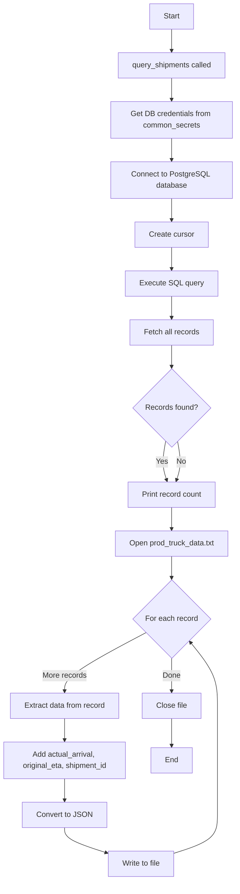
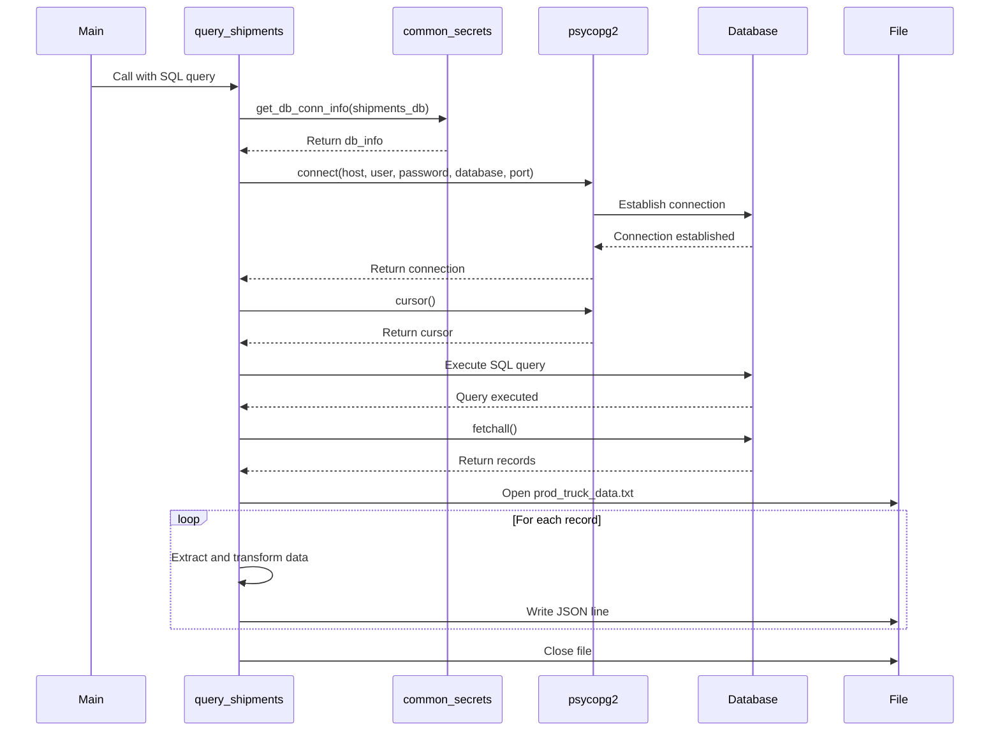
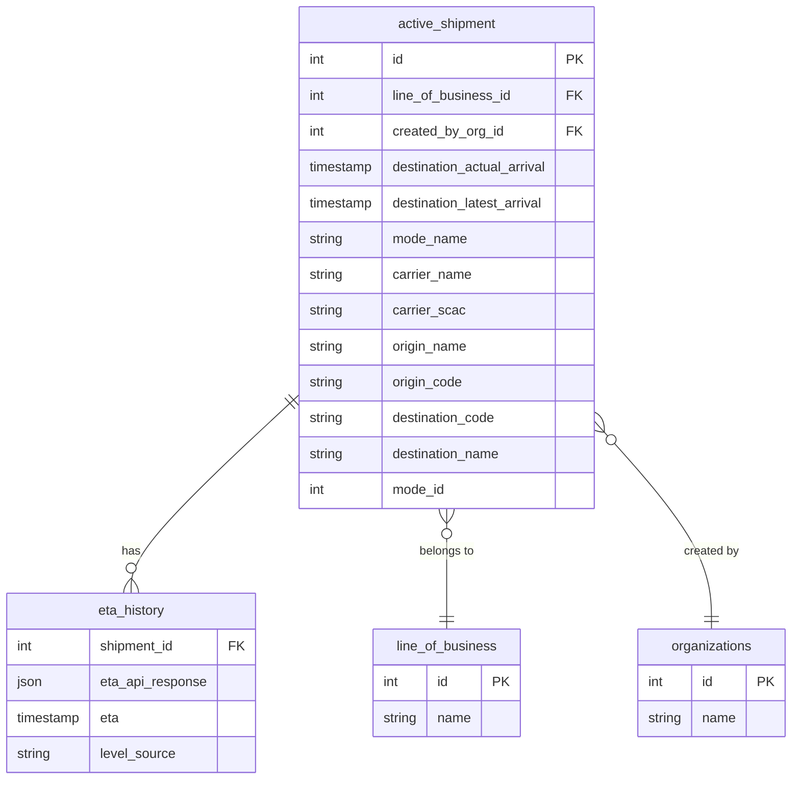

# Diagram: research/api/scripts/simulate/query_truck_data.py

> Auto-generated by Obscura crawlers

## Diagram 1

### SVG

<svg id="container" width="506.6953125" xmlns="http://www.w3.org/2000/svg" class="flowchart" height="1869.890625" viewBox="0 0 506.6953125 1869.890625" role="graphics-document document" aria-roledescription="flowchart-v2"><g><marker id="container_flowchart-v2-pointEnd" class="marker flowchart-v2" viewBox="0 0 10 10" refX="5" refY="5" markerUnits="userSpaceOnUse" markerWidth="8" markerHeight="8" orient="auto"><path d="M 0 0 L 10 5 L 0 10 z" class="arrowMarkerPath" style="stroke-width: 1; stroke-dasharray: 1, 0;"></path></marker><marker id="container_flowchart-v2-pointStart" class="marker flowchart-v2" viewBox="0 0 10 10" refX="4.5" refY="5" markerUnits="userSpaceOnUse" markerWidth="8" markerHeight="8" orient="auto"><path d="M 0 5 L 10 10 L 10 0 z" class="arrowMarkerPath" style="stroke-width: 1; stroke-dasharray: 1, 0;"></path></marker><marker id="container_flowchart-v2-circleEnd" class="marker flowchart-v2" viewBox="0 0 10 10" refX="11" refY="5" markerUnits="userSpaceOnUse" markerWidth="11" markerHeight="11" orient="auto"><circle cx="5" cy="5" r="5" class="arrowMarkerPath" style="stroke-width: 1; stroke-dasharray: 1, 0;"></circle></marker><marker id="container_flowchart-v2-circleStart" class="marker flowchart-v2" viewBox="0 0 10 10" refX="-1" refY="5" markerUnits="userSpaceOnUse" markerWidth="11" markerHeight="11" orient="auto"><circle cx="5" cy="5" r="5" class="arrowMarkerPath" style="stroke-width: 1; stroke-dasharray: 1, 0;"></circle></marker><marker id="container_flowchart-v2-crossEnd" class="marker cross flowchart-v2" viewBox="0 0 11 11" refX="12" refY="5.2" markerUnits="userSpaceOnUse" markerWidth="11" markerHeight="11" orient="auto"><path d="M 1,1 l 9,9 M 10,1 l -9,9" class="arrowMarkerPath" style="stroke-width: 2; stroke-dasharray: 1, 0;"></path></marker><marker id="container_flowchart-v2-crossStart" class="marker cross flowchart-v2" viewBox="0 0 11 11" refX="-1" refY="5.2" markerUnits="userSpaceOnUse" markerWidth="11" markerHeight="11" orient="auto"><path d="M 1,1 l 9,9 M 10,1 l -9,9" class="arrowMarkerPath" style="stroke-width: 2; stroke-dasharray: 1, 0;"></path></marker><g class="root"><g class="clusters"></g><g class="edgePaths"><path d="M368.695,62L368.695,66.167C368.695,70.333,368.695,78.667,368.695,86.333C368.695,94,368.695,101,368.695,104.5L368.695,108" id="L_A_B_0" class="edge-thickness-normal edge-pattern-solid edge-thickness-normal edge-pattern-solid flowchart-link" style=";" data-edge="true" data-et="edge" data-id="L_A_B_0" data-points="W3sieCI6MzY4LjY5NTMxMjUsInkiOjYyfSx7IngiOjM2OC42OTUzMTI1LCJ5Ijo4N30seyJ4IjozNjguNjk1MzEyNSwieSI6MTEyfV0=" marker-end="url(#container_flowchart-v2-pointEnd)"></path><path d="M368.695,166L368.695,170.167C368.695,174.333,368.695,182.667,368.695,190.333C368.695,198,368.695,205,368.695,208.5L368.695,212" id="L_B_C_0" class="edge-thickness-normal edge-pattern-solid edge-thickness-normal edge-pattern-solid flowchart-link" style=";" data-edge="true" data-et="edge" data-id="L_B_C_0" data-points="W3sieCI6MzY4LjY5NTMxMjUsInkiOjE2Nn0seyJ4IjozNjguNjk1MzEyNSwieSI6MTkxfSx7IngiOjM2OC42OTUzMTI1LCJ5IjoyMTZ9XQ==" marker-end="url(#container_flowchart-v2-pointEnd)"></path><path d="M368.695,294L368.695,298.167C368.695,302.333,368.695,310.667,368.695,318.333C368.695,326,368.695,333,368.695,336.5L368.695,340" id="L_C_D_0" class="edge-thickness-normal edge-pattern-solid edge-thickness-normal edge-pattern-solid flowchart-link" style=";" data-edge="true" data-et="edge" data-id="L_C_D_0" data-points="W3sieCI6MzY4LjY5NTMxMjUsInkiOjI5NH0seyJ4IjozNjguNjk1MzEyNSwieSI6MzE5fSx7IngiOjM2OC42OTUzMTI1LCJ5IjozNDR9XQ==" marker-end="url(#container_flowchart-v2-pointEnd)"></path><path d="M368.695,422L368.695,426.167C368.695,430.333,368.695,438.667,368.695,446.333C368.695,454,368.695,461,368.695,464.5L368.695,468" id="L_D_E_0" class="edge-thickness-normal edge-pattern-solid edge-thickness-normal edge-pattern-solid flowchart-link" style=";" data-edge="true" data-et="edge" data-id="L_D_E_0" data-points="W3sieCI6MzY4LjY5NTMxMjUsInkiOjQyMn0seyJ4IjozNjguNjk1MzEyNSwieSI6NDQ3fSx7IngiOjM2OC42OTUzMTI1LCJ5Ijo0NzJ9XQ==" marker-end="url(#container_flowchart-v2-pointEnd)"></path><path d="M368.695,526L368.695,530.167C368.695,534.333,368.695,542.667,368.695,550.333C368.695,558,368.695,565,368.695,568.5L368.695,572" id="L_E_F_0" class="edge-thickness-normal edge-pattern-solid edge-thickness-normal edge-pattern-solid flowchart-link" style=";" data-edge="true" data-et="edge" data-id="L_E_F_0" data-points="W3sieCI6MzY4LjY5NTMxMjUsInkiOjUyNn0seyJ4IjozNjguNjk1MzEyNSwieSI6NTUxfSx7IngiOjM2OC42OTUzMTI1LCJ5Ijo1NzZ9XQ==" marker-end="url(#container_flowchart-v2-pointEnd)"></path><path d="M368.695,630L368.695,634.167C368.695,638.333,368.695,646.667,368.695,654.333C368.695,662,368.695,669,368.695,672.5L368.695,676" id="L_F_G_0" class="edge-thickness-normal edge-pattern-solid edge-thickness-normal edge-pattern-solid flowchart-link" style=";" data-edge="true" data-et="edge" data-id="L_F_G_0" data-points="W3sieCI6MzY4LjY5NTMxMjUsInkiOjYzMH0seyJ4IjozNjguNjk1MzEyNSwieSI6NjU1fSx7IngiOjM2OC42OTUzMTI1LCJ5Ijo2ODB9XQ==" marker-end="url(#container_flowchart-v2-pointEnd)"></path><path d="M368.695,734L368.695,738.167C368.695,742.333,368.695,750.667,368.695,758.333C368.695,766,368.695,773,368.695,776.5L368.695,780" id="L_G_H_0" class="edge-thickness-normal edge-pattern-solid edge-thickness-normal edge-pattern-solid flowchart-link" style=";" data-edge="true" data-et="edge" data-id="L_G_H_0" data-points="W3sieCI6MzY4LjY5NTMxMjUsInkiOjczNH0seyJ4IjozNjguNjk1MzEyNSwieSI6NzU5fSx7IngiOjM2OC42OTUzMTI1LCJ5Ijo3ODR9XQ==" marker-end="url(#container_flowchart-v2-pointEnd)"></path><path d="M356.292,937.55L354.845,945.784C353.398,954.018,350.504,970.485,350.88,984.253C351.256,998.02,354.902,1009.087,356.725,1014.621L358.548,1020.154" id="L_H_I_0" class="edge-thickness-normal edge-pattern-solid edge-thickness-normal edge-pattern-solid flowchart-link" style=";" data-edge="true" data-et="edge" data-id="L_H_I_0" data-points="W3sieCI6MzU2LjI5MjAyNTkzNjY2OTIzLCJ5Ijo5MzcuNTQ5ODM4NDM2NjY5Mn0seyJ4IjozNDcuNjA5Mzc1LCJ5Ijo5ODYuOTUzMTI1fSx7IngiOjM1OS43OTk2ODI2MTcxODc1LCJ5IjoxMDIzLjk1MzEyNX1d" marker-end="url(#container_flowchart-v2-pointEnd)"></path><path d="M381.099,937.55L382.546,945.784C383.993,954.018,386.887,970.485,386.511,984.253C386.135,998.02,382.489,1009.087,380.666,1014.621L378.843,1020.154" id="L_H_I_2" class="edge-thickness-normal edge-pattern-solid edge-thickness-normal edge-pattern-solid flowchart-link" style=";" data-edge="true" data-et="edge" data-id="L_H_I_2" data-points="W3sieCI6MzgxLjA5ODU5OTA2MzMzMDc3LCJ5Ijo5MzcuNTQ5ODM4NDM2NjY5Mn0seyJ4IjozODkuNzgxMjUsInkiOjk4Ni45NTMxMjV9LHsieCI6Mzc3LjU5MDk0MjM4MjgxMjUsInkiOjEwMjMuOTUzMTI1fV0=" marker-end="url(#container_flowchart-v2-pointEnd)"></path><path d="M368.695,1077.953L368.695,1082.12C368.695,1086.286,368.695,1094.62,368.695,1102.286C368.695,1109.953,368.695,1116.953,368.695,1120.453L368.695,1123.953" id="L_I_J_0" class="edge-thickness-normal edge-pattern-solid edge-thickness-normal edge-pattern-solid flowchart-link" style=";" data-edge="true" data-et="edge" data-id="L_I_J_0" data-points="W3sieCI6MzY4LjY5NTMxMjUsInkiOjEwNzcuOTUzMTI1fSx7IngiOjM2OC42OTUzMTI1LCJ5IjoxMTAyLjk1MzEyNX0seyJ4IjozNjguNjk1MzEyNSwieSI6MTEyNy45NTMxMjV9XQ==" marker-end="url(#container_flowchart-v2-pointEnd)"></path><path d="M368.695,1181.953L368.695,1186.12C368.695,1190.286,368.695,1198.62,368.695,1206.286C368.695,1213.953,368.695,1220.953,368.695,1224.453L368.695,1227.953" id="L_J_K_0" class="edge-thickness-normal edge-pattern-solid edge-thickness-normal edge-pattern-solid flowchart-link" style=";" data-edge="true" data-et="edge" data-id="L_J_K_0" data-points="W3sieCI6MzY4LjY5NTMxMjUsInkiOjExODEuOTUzMTI1fSx7IngiOjM2OC42OTUzMTI1LCJ5IjoxMjA2Ljk1MzEyNX0seyJ4IjozNjguNjk1MzEyNSwieSI6MTIzMS45NTMxMjV9XQ==" marker-end="url(#container_flowchart-v2-pointEnd)"></path><path d="M314.112,1343.307L284.76,1358.571C255.408,1373.835,196.704,1404.363,167.352,1425.127C138,1445.891,138,1456.891,138,1462.391L138,1467.891" id="L_K_L_0" class="edge-thickness-normal edge-pattern-solid edge-thickness-normal edge-pattern-solid flowchart-link" style=";" data-edge="true" data-et="edge" data-id="L_K_L_0" data-points="W3sieCI6MzE0LjExMTcyNzM2NTc2ODA1LCJ5IjoxMzQzLjMwNzAzOTg2NTc2OH0seyJ4IjoxMzgsInkiOjE0MzQuODkwNjI1fSx7IngiOjEzOCwieSI6MTQ3MS44OTA2MjV9XQ==" marker-end="url(#container_flowchart-v2-pointEnd)"></path><path d="M138,1525.891L138,1530.057C138,1534.224,138,1542.557,138,1550.224C138,1557.891,138,1564.891,138,1568.391L138,1571.891" id="L_L_M_0" class="edge-thickness-normal edge-pattern-solid edge-thickness-normal edge-pattern-solid flowchart-link" style=";" data-edge="true" data-et="edge" data-id="L_L_M_0" data-points="W3sieCI6MTM4LCJ5IjoxNTI1Ljg5MDYyNX0seyJ4IjoxMzgsInkiOjE1NTAuODkwNjI1fSx7IngiOjEzOCwieSI6MTU3NS44OTA2MjV9XQ==" marker-end="url(#container_flowchart-v2-pointEnd)"></path><path d="M138,1653.891L138,1658.057C138,1662.224,138,1670.557,138,1678.224C138,1685.891,138,1692.891,138,1696.391L138,1699.891" id="L_M_N_0" class="edge-thickness-normal edge-pattern-solid edge-thickness-normal edge-pattern-solid flowchart-link" style=";" data-edge="true" data-et="edge" data-id="L_M_N_0" data-points="W3sieCI6MTM4LCJ5IjoxNjUzLjg5MDYyNX0seyJ4IjoxMzgsInkiOjE2NzguODkwNjI1fSx7IngiOjEzOCwieSI6MTcwMy44OTA2MjV9XQ==" marker-end="url(#container_flowchart-v2-pointEnd)"></path><path d="M138,1757.891L138,1762.057C138,1766.224,138,1774.557,152.747,1783.392C167.493,1792.226,196.986,1801.562,211.733,1806.23L226.479,1810.898" id="L_N_O_0" class="edge-thickness-normal edge-pattern-solid edge-thickness-normal edge-pattern-solid flowchart-link" style=";" data-edge="true" data-et="edge" data-id="L_N_O_0" data-points="W3sieCI6MTM4LCJ5IjoxNzU3Ljg5MDYyNX0seyJ4IjoxMzgsInkiOjE3ODIuODkwNjI1fSx7IngiOjIzMC4yOTI5Njg3NSwieSI6MTgxMi4xMDQ4NDQ0NzQ0OTc3fV0=" marker-end="url(#container_flowchart-v2-pointEnd)"></path><path d="M374.262,1812.105L389.644,1807.236C405.026,1802.367,435.79,1792.629,451.173,1779.093C466.555,1765.557,466.555,1748.224,466.555,1730.891C466.555,1713.557,466.555,1696.224,466.555,1676.891C466.555,1657.557,466.555,1636.224,466.555,1614.891C466.555,1593.557,466.555,1572.224,466.555,1552.891C466.555,1533.557,466.555,1516.224,466.555,1496.891C466.555,1477.557,466.555,1456.224,456.878,1433.695C447.202,1411.166,427.85,1387.441,418.174,1375.579L408.497,1363.716" id="L_O_K_0" class="edge-thickness-normal edge-pattern-solid edge-thickness-normal edge-pattern-solid flowchart-link" style=";" data-edge="true" data-et="edge" data-id="L_O_K_0" data-points="W3sieCI6Mzc0LjI2MTcxODc1LCJ5IjoxODEyLjEwNDg0NDQ3NDQ5Nzd9LHsieCI6NDY2LjU1NDY4NzUsInkiOjE3ODIuODkwNjI1fSx7IngiOjQ2Ni41NTQ2ODc1LCJ5IjoxNzMwLjg5MDYyNX0seyJ4Ijo0NjYuNTU0Njg3NSwieSI6MTY3OC44OTA2MjV9LHsieCI6NDY2LjU1NDY4NzUsInkiOjE2MTQuODkwNjI1fSx7IngiOjQ2Ni41NTQ2ODc1LCJ5IjoxNTUwLjg5MDYyNX0seyJ4Ijo0NjYuNTU0Njg3NSwieSI6MTQ5OC44OTA2MjV9LHsieCI6NDY2LjU1NDY4NzUsInkiOjE0MzQuODkwNjI1fSx7IngiOjQwNS45NjkwNTc2NTgxNjY1NSwieSI6MTM2MC42MTY4Nzk4NDE4MzM1fV0=" marker-end="url(#container_flowchart-v2-pointEnd)"></path><path d="M368.695,1397.891L368.695,1404.057C368.695,1410.224,368.695,1422.557,368.695,1434.224C368.695,1445.891,368.695,1456.891,368.695,1462.391L368.695,1467.891" id="L_K_P_0" class="edge-thickness-normal edge-pattern-solid edge-thickness-normal edge-pattern-solid flowchart-link" style=";" data-edge="true" data-et="edge" data-id="L_K_P_0" data-points="W3sieCI6MzY4LjY5NTMxMjUsInkiOjEzOTcuODkwNjI1fSx7IngiOjM2OC42OTUzMTI1LCJ5IjoxNDM0Ljg5MDYyNX0seyJ4IjozNjguNjk1MzEyNSwieSI6MTQ3MS44OTA2MjV9XQ==" marker-end="url(#container_flowchart-v2-pointEnd)"></path><path d="M368.695,1525.891L368.695,1530.057C368.695,1534.224,368.695,1542.557,368.695,1552.224C368.695,1561.891,368.695,1572.891,368.695,1578.391L368.695,1583.891" id="L_P_Q_0" class="edge-thickness-normal edge-pattern-solid edge-thickness-normal edge-pattern-solid flowchart-link" style=";" data-edge="true" data-et="edge" data-id="L_P_Q_0" data-points="W3sieCI6MzY4LjY5NTMxMjUsInkiOjE1MjUuODkwNjI1fSx7IngiOjM2OC42OTUzMTI1LCJ5IjoxNTUwLjg5MDYyNX0seyJ4IjozNjguNjk1MzEyNSwieSI6MTU4Ny44OTA2MjV9XQ==" marker-end="url(#container_flowchart-v2-pointEnd)"></path></g><g class="edgeLabels"><g class="edgeLabel"><g class="label" data-id="L_A_B_0" transform="translate(0, 0)"><foreignObject width="0" height="0">

</foreignObject></g></g><g class="edgeLabel"><g class="label" data-id="L_B_C_0" transform="translate(0, 0)"><foreignObject width="0" height="0">

</foreignObject></g></g><g class="edgeLabel"><g class="label" data-id="L_C_D_0" transform="translate(0, 0)"><foreignObject width="0" height="0">

</foreignObject></g></g><g class="edgeLabel"><g class="label" data-id="L_D_E_0" transform="translate(0, 0)"><foreignObject width="0" height="0">

</foreignObject></g></g><g class="edgeLabel"><g class="label" data-id="L_E_F_0" transform="translate(0, 0)"><foreignObject width="0" height="0">

</foreignObject></g></g><g class="edgeLabel"><g class="label" data-id="L_F_G_0" transform="translate(0, 0)"><foreignObject width="0" height="0">

</foreignObject></g></g><g class="edgeLabel"><g class="label" data-id="L_G_H_0" transform="translate(0, 0)"><foreignObject width="0" height="0">

</foreignObject></g></g><g class="edgeLabel" transform="translate(348.57907, 981.43567)"><g class="label" data-id="L_H_I_0" transform="translate(-12.03125, -12)"><foreignObject width="24.0625" height="24">

Yes

</foreignObject></g></g><g class="edgeLabel" transform="translate(388.81155, 981.43567)"><g class="label" data-id="L_H_I_2" transform="translate(-10.140625, -12)"><foreignObject width="20.28125" height="24">

No

</foreignObject></g></g><g class="edgeLabel"><g class="label" data-id="L_I_J_0" transform="translate(0, 0)"><foreignObject width="0" height="0">

</foreignObject></g></g><g class="edgeLabel"><g class="label" data-id="L_J_K_0" transform="translate(0, 0)"><foreignObject width="0" height="0">

</foreignObject></g></g><g class="edgeLabel" transform="translate(138, 1434.890625)"><g class="label" data-id="L_K_L_0" transform="translate(-47.140625, -12)"><foreignObject width="94.28125" height="24">

More records

</foreignObject></g></g><g class="edgeLabel"><g class="label" data-id="L_L_M_0" transform="translate(0, 0)"><foreignObject width="0" height="0">

</foreignObject></g></g><g class="edgeLabel"><g class="label" data-id="L_M_N_0" transform="translate(0, 0)"><foreignObject width="0" height="0">

</foreignObject></g></g><g class="edgeLabel"><g class="label" data-id="L_N_O_0" transform="translate(0, 0)"><foreignObject width="0" height="0">

</foreignObject></g></g><g class="edgeLabel"><g class="label" data-id="L_O_K_0" transform="translate(0, 0)"><foreignObject width="0" height="0">

</foreignObject></g></g><g class="edgeLabel" transform="translate(368.6953125, 1434.890625)"><g class="label" data-id="L_K_P_0" transform="translate(-18.875, -12)"><foreignObject width="37.75" height="24">

Done

</foreignObject></g></g><g class="edgeLabel"><g class="label" data-id="L_P_Q_0" transform="translate(0, 0)"><foreignObject width="0" height="0">

</foreignObject></g></g></g><g class="nodes"><g class="node default" id="flowchart-A-0" transform="translate(368.6953125, 35)"><rect class="basic label-container" style="" x="-47.5234375" y="-27" width="95.046875" height="54"></rect><g class="label" style="" transform="translate(-17.5234375, -12)"><rect></rect><foreignObject width="35.046875" height="24">

Start

</foreignObject></g></g><g class="node default" id="flowchart-B-1" transform="translate(368.6953125, 139)"><rect class="basic label-container" style="" x="-116.6328125" y="-27" width="233.265625" height="54"></rect><g class="label" style="" transform="translate(-86.6328125, -12)"><rect></rect><foreignObject width="173.265625" height="24">

query_shipments called

</foreignObject></g></g><g class="node default" id="flowchart-C-3" transform="translate(368.6953125, 255)"><rect class="basic label-container" style="" x="-130" y="-39" width="260" height="78"></rect><g class="label" style="" transform="translate(-100, -24)"><rect></rect><foreignObject width="200" height="48">

Get DB credentials from common_secrets

</foreignObject></g></g><g class="node default" id="flowchart-D-5" transform="translate(368.6953125, 383)"><rect class="basic label-container" style="" x="-130" y="-39" width="260" height="78"></rect><g class="label" style="" transform="translate(-100, -24)"><rect></rect><foreignObject width="200" height="48">

Connect to PostgreSQL database

</foreignObject></g></g><g class="node default" id="flowchart-E-7" transform="translate(368.6953125, 499)"><rect class="basic label-container" style="" x="-77.953125" y="-27" width="155.90625" height="54"></rect><g class="label" style="" transform="translate(-47.953125, -12)"><rect></rect><foreignObject width="95.90625" height="24">

Create cursor

</foreignObject></g></g><g class="node default" id="flowchart-F-9" transform="translate(368.6953125, 603)"><rect class="basic label-container" style="" x="-96.9140625" y="-27" width="193.828125" height="54"></rect><g class="label" style="" transform="translate(-66.9140625, -12)"><rect></rect><foreignObject width="133.828125" height="24">

Execute SQL query

</foreignObject></g></g><g class="node default" id="flowchart-G-11" transform="translate(368.6953125, 707)"><rect class="basic label-container" style="" x="-89.40625" y="-27" width="178.8125" height="54"></rect><g class="label" style="" transform="translate(-59.40625, -12)"><rect></rect><foreignObject width="118.8125" height="24">

Fetch all records

</foreignObject></g></g><g class="node default" id="flowchart-H-13" transform="translate(368.6953125, 866.9765625)"><polygon points="82.9765625,0 165.953125,-82.9765625 82.9765625,-165.953125 0,-82.9765625" class="label-container" transform="translate(-82.4765625, 82.9765625)"></polygon><g class="label" style="" transform="translate(-55.9765625, -12)"><rect></rect><foreignObject width="111.953125" height="24">

Records found?

</foreignObject></g></g><g class="node default" id="flowchart-I-15" transform="translate(368.6953125, 1050.953125)"><rect class="basic label-container" style="" x="-95.3984375" y="-27" width="190.796875" height="54"></rect><g class="label" style="" transform="translate(-65.3984375, -12)"><rect></rect><foreignObject width="130.796875" height="24">

Print record count

</foreignObject></g></g><g class="node default" id="flowchart-J-19" transform="translate(368.6953125, 1154.953125)"><rect class="basic label-container" style="" x="-122.7265625" y="-27" width="245.453125" height="54"></rect><g class="label" style="" transform="translate(-92.7265625, -12)"><rect></rect><foreignObject width="185.453125" height="24">

Open prod_truck_data.txt

</foreignObject></g></g><g class="node default" id="flowchart-K-21" transform="translate(368.6953125, 1314.921875)"><polygon points="82.96875,0 165.9375,-82.96875 82.96875,-165.9375 0,-82.96875" class="label-container" transform="translate(-82.46875, 82.96875)"></polygon><g class="label" style="" transform="translate(-55.96875, -12)"><rect></rect><foreignObject width="111.9375" height="24">

For each record

</foreignObject></g></g><g class="node default" id="flowchart-L-23" transform="translate(138, 1498.890625)"><rect class="basic label-container" style="" x="-117.8359375" y="-27" width="235.671875" height="54"></rect><g class="label" style="" transform="translate(-87.8359375, -12)"><rect></rect><foreignObject width="175.671875" height="24">

Extract data from record

</foreignObject></g></g><g class="node default" id="flowchart-M-25" transform="translate(138, 1614.890625)"><rect class="basic label-container" style="" x="-130" y="-39" width="260" height="78"></rect><g class="label" style="" transform="translate(-100, -24)"><rect></rect><foreignObject width="200" height="48">

Add actual_arrival, original_eta, shipment_id

</foreignObject></g></g><g class="node default" id="flowchart-N-27" transform="translate(138, 1730.890625)"><rect class="basic label-container" style="" x="-87.3515625" y="-27" width="174.703125" height="54"></rect><g class="label" style="" transform="translate(-57.3515625, -12)"><rect></rect><foreignObject width="114.703125" height="24">

Convert to JSON

</foreignObject></g></g><g class="node default" id="flowchart-O-29" transform="translate(302.27734375, 1834.890625)"><rect class="basic label-container" style="" x="-71.984375" y="-27" width="143.96875" height="54"></rect><g class="label" style="" transform="translate(-41.984375, -12)"><rect></rect><foreignObject width="83.96875" height="24">

Write to file

</foreignObject></g></g><g class="node default" id="flowchart-P-33" transform="translate(368.6953125, 1498.890625)"><rect class="basic label-container" style="" x="-62.859375" y="-27" width="125.71875" height="54"></rect><g class="label" style="" transform="translate(-32.859375, -12)"><rect></rect><foreignObject width="65.71875" height="24">

Close file

</foreignObject></g></g><g class="node default" id="flowchart-Q-35" transform="translate(368.6953125, 1614.890625)"><rect class="basic label-container" style="" x="-43.6796875" y="-27" width="87.359375" height="54"></rect><g class="label" style="" transform="translate(-13.6796875, -12)"><rect></rect><foreignObject width="27.359375" height="24">

End

</foreignObject></g></g></g></g></g></svg>

## Diagram 2

### SVG

<svg id="container" width="1414" xmlns="http://www.w3.org/2000/svg" height="1072" viewBox="-50 -10 1414 1072" role="graphics-document document" aria-roledescription="sequence"><g><rect x="1164" y="986" fill="#eaeaea" stroke="#666" width="150" height="65" name="File" rx="3" ry="3" class="actor actor-bottom"></rect><text x="1239" y="1018.5" dominant-baseline="central" alignment-baseline="central" class="actor actor-box" style="text-anchor: middle; font-size: 16px; font-weight: 400;"><tspan x="1239" dy="0">File</tspan></text></g><g><rect x="964" y="986" fill="#eaeaea" stroke="#666" width="150" height="65" name="Database" rx="3" ry="3" class="actor actor-bottom"></rect><text x="1039" y="1018.5" dominant-baseline="central" alignment-baseline="central" class="actor actor-box" style="text-anchor: middle; font-size: 16px; font-weight: 400;"><tspan x="1039" dy="0">Database</tspan></text></g><g><rect x="723" y="986" fill="#eaeaea" stroke="#666" width="150" height="65" name="psycopg2" rx="3" ry="3" class="actor actor-bottom"></rect><text x="798" y="1018.5" dominant-baseline="central" alignment-baseline="central" class="actor actor-box" style="text-anchor: middle; font-size: 16px; font-weight: 400;"><tspan x="798" dy="0">psycopg2</tspan></text></g><g><rect x="523" y="986" fill="#eaeaea" stroke="#666" width="150" height="65" name="common_secrets" rx="3" ry="3" class="actor actor-bottom"></rect><text x="598" y="1018.5" dominant-baseline="central" alignment-baseline="central" class="actor actor-box" style="text-anchor: middle; font-size: 16px; font-weight: 400;"><tspan x="598" dy="0">common_secrets</tspan></text></g><g><rect x="210" y="986" fill="#eaeaea" stroke="#666" width="150" height="65" name="query_shipments" rx="3" ry="3" class="actor actor-bottom"></rect><text x="285" y="1018.5" dominant-baseline="central" alignment-baseline="central" class="actor actor-box" style="text-anchor: middle; font-size: 16px; font-weight: 400;"><tspan x="285" dy="0">query_shipments</tspan></text></g><g><rect x="0" y="986" fill="#eaeaea" stroke="#666" width="150" height="65" name="Main" rx="3" ry="3" class="actor actor-bottom"></rect><text x="75" y="1018.5" dominant-baseline="central" alignment-baseline="central" class="actor actor-box" style="text-anchor: middle; font-size: 16px; font-weight: 400;"><tspan x="75" dy="0">Main</tspan></text></g><g><line id="actor5" x1="1239" y1="65" x2="1239" y2="986" class="actor-line 200" stroke-width="0.5px" stroke="#999" name="File"></line><g id="root-5"><rect x="1164" y="0" fill="#eaeaea" stroke="#666" width="150" height="65" name="File" rx="3" ry="3" class="actor actor-top"></rect><text x="1239" y="32.5" dominant-baseline="central" alignment-baseline="central" class="actor actor-box" style="text-anchor: middle; font-size: 16px; font-weight: 400;"><tspan x="1239" dy="0">File</tspan></text></g></g><g><line id="actor4" x1="1039" y1="65" x2="1039" y2="986" class="actor-line 200" stroke-width="0.5px" stroke="#999" name="Database"></line><g id="root-4"><rect x="964" y="0" fill="#eaeaea" stroke="#666" width="150" height="65" name="Database" rx="3" ry="3" class="actor actor-top"></rect><text x="1039" y="32.5" dominant-baseline="central" alignment-baseline="central" class="actor actor-box" style="text-anchor: middle; font-size: 16px; font-weight: 400;"><tspan x="1039" dy="0">Database</tspan></text></g></g><g><line id="actor3" x1="798" y1="65" x2="798" y2="986" class="actor-line 200" stroke-width="0.5px" stroke="#999" name="psycopg2"></line><g id="root-3"><rect x="723" y="0" fill="#eaeaea" stroke="#666" width="150" height="65" name="psycopg2" rx="3" ry="3" class="actor actor-top"></rect><text x="798" y="32.5" dominant-baseline="central" alignment-baseline="central" class="actor actor-box" style="text-anchor: middle; font-size: 16px; font-weight: 400;"><tspan x="798" dy="0">psycopg2</tspan></text></g></g><g><line id="actor2" x1="598" y1="65" x2="598" y2="986" class="actor-line 200" stroke-width="0.5px" stroke="#999" name="common_secrets"></line><g id="root-2"><rect x="523" y="0" fill="#eaeaea" stroke="#666" width="150" height="65" name="common_secrets" rx="3" ry="3" class="actor actor-top"></rect><text x="598" y="32.5" dominant-baseline="central" alignment-baseline="central" class="actor actor-box" style="text-anchor: middle; font-size: 16px; font-weight: 400;"><tspan x="598" dy="0">common_secrets</tspan></text></g></g><g><line id="actor1" x1="285" y1="65" x2="285" y2="986" class="actor-line 200" stroke-width="0.5px" stroke="#999" name="query_shipments"></line><g id="root-1"><rect x="210" y="0" fill="#eaeaea" stroke="#666" width="150" height="65" name="query_shipments" rx="3" ry="3" class="actor actor-top"></rect><text x="285" y="32.5" dominant-baseline="central" alignment-baseline="central" class="actor actor-box" style="text-anchor: middle; font-size: 16px; font-weight: 400;"><tspan x="285" dy="0">query_shipments</tspan></text></g></g><g><line id="actor0" x1="75" y1="65" x2="75" y2="986" class="actor-line 200" stroke-width="0.5px" stroke="#999" name="Main"></line><g id="root-0"><rect x="0" y="0" fill="#eaeaea" stroke="#666" width="150" height="65" name="Main" rx="3" ry="3" class="actor actor-top"></rect><text x="75" y="32.5" dominant-baseline="central" alignment-baseline="central" class="actor actor-box" style="text-anchor: middle; font-size: 16px; font-weight: 400;"><tspan x="75" dy="0">Main</tspan></text></g></g><g></g><defs><symbol id="computer" width="24" height="24"><path transform="scale(.5)" d="M2 2v13h20v-13h-20zm18 11h-16v-9h16v9zm-10.228 6l.466-1h3.524l.467 1h-4.457zm14.228 3h-24l2-6h2.104l-1.33 4h18.45l-1.297-4h2.073l2 6zm-5-10h-14v-7h14v7z"></path></symbol></defs><defs><symbol id="database" fill-rule="evenodd" clip-rule="evenodd"><path transform="scale(.5)" d="M12.258.001l.256.004.255.005.253.008.251.01.249.012.247.015.246.016.242.019.241.02.239.023.236.024.233.027.231.028.229.031.225.032.223.034.22.036.217.038.214.04.211.041.208.043.205.045.201.046.198.048.194.05.191.051.187.053.183.054.18.056.175.057.172.059.168.06.163.061.16.063.155.064.15.066.074.033.073.033.071.034.07.034.069.035.068.035.067.035.066.035.064.036.064.036.062.036.06.036.06.037.058.037.058.037.055.038.055.038.053.038.052.038.051.039.05.039.048.039.047.039.045.04.044.04.043.04.041.04.04.041.039.041.037.041.036.041.034.041.033.042.032.042.03.042.029.042.027.042.026.043.024.043.023.043.021.043.02.043.018.044.017.043.015.044.013.044.012.044.011.045.009.044.007.045.006.045.004.045.002.045.001.045v17l-.001.045-.002.045-.004.045-.006.045-.007.045-.009.044-.011.045-.012.044-.013.044-.015.044-.017.043-.018.044-.02.043-.021.043-.023.043-.024.043-.026.043-.027.042-.029.042-.03.042-.032.042-.033.042-.034.041-.036.041-.037.041-.039.041-.04.041-.041.04-.043.04-.044.04-.045.04-.047.039-.048.039-.05.039-.051.039-.052.038-.053.038-.055.038-.055.038-.058.037-.058.037-.06.037-.06.036-.062.036-.064.036-.064.036-.066.035-.067.035-.068.035-.069.035-.07.034-.071.034-.073.033-.074.033-.15.066-.155.064-.16.063-.163.061-.168.06-.172.059-.175.057-.18.056-.183.054-.187.053-.191.051-.194.05-.198.048-.201.046-.205.045-.208.043-.211.041-.214.04-.217.038-.22.036-.223.034-.225.032-.229.031-.231.028-.233.027-.236.024-.239.023-.241.02-.242.019-.246.016-.247.015-.249.012-.251.01-.253.008-.255.005-.256.004-.258.001-.258-.001-.256-.004-.255-.005-.253-.008-.251-.01-.249-.012-.247-.015-.245-.016-.243-.019-.241-.02-.238-.023-.236-.024-.234-.027-.231-.028-.228-.031-.226-.032-.223-.034-.22-.036-.217-.038-.214-.04-.211-.041-.208-.043-.204-.045-.201-.046-.198-.048-.195-.05-.19-.051-.187-.053-.184-.054-.179-.056-.176-.057-.172-.059-.167-.06-.164-.061-.159-.063-.155-.064-.151-.066-.074-.033-.072-.033-.072-.034-.07-.034-.069-.035-.068-.035-.067-.035-.066-.035-.064-.036-.063-.036-.062-.036-.061-.036-.06-.037-.058-.037-.057-.037-.056-.038-.055-.038-.053-.038-.052-.038-.051-.039-.049-.039-.049-.039-.046-.039-.046-.04-.044-.04-.043-.04-.041-.04-.04-.041-.039-.041-.037-.041-.036-.041-.034-.041-.033-.042-.032-.042-.03-.042-.029-.042-.027-.042-.026-.043-.024-.043-.023-.043-.021-.043-.02-.043-.018-.044-.017-.043-.015-.044-.013-.044-.012-.044-.011-.045-.009-.044-.007-.045-.006-.045-.004-.045-.002-.045-.001-.045v-17l.001-.045.002-.045.004-.045.006-.045.007-.045.009-.044.011-.045.012-.044.013-.044.015-.044.017-.043.018-.044.02-.043.021-.043.023-.043.024-.043.026-.043.027-.042.029-.042.03-.042.032-.042.033-.042.034-.041.036-.041.037-.041.039-.041.04-.041.041-.04.043-.04.044-.04.046-.04.046-.039.049-.039.049-.039.051-.039.052-.038.053-.038.055-.038.056-.038.057-.037.058-.037.06-.037.061-.036.062-.036.063-.036.064-.036.066-.035.067-.035.068-.035.069-.035.07-.034.072-.034.072-.033.074-.033.151-.066.155-.064.159-.063.164-.061.167-.06.172-.059.176-.057.179-.056.184-.054.187-.053.19-.051.195-.05.198-.048.201-.046.204-.045.208-.043.211-.041.214-.04.217-.038.22-.036.223-.034.226-.032.228-.031.231-.028.234-.027.236-.024.238-.023.241-.02.243-.019.245-.016.247-.015.249-.012.251-.01.253-.008.255-.005.256-.004.258-.001.258.001zm-9.258 20.499v.01l.001.021.003.021.004.022.005.021.006.022.007.022.009.023.01.022.011.023.012.023.013.023.015.023.016.024.017.023.018.024.019.024.021.024.022.025.023.024.024.025.052.049.056.05.061.051.066.051.07.051.075.051.079.052.084.052.088.052.092.052.097.052.102.051.105.052.11.052.114.051.119.051.123.051.127.05.131.05.135.05.139.048.144.049.147.047.152.047.155.047.16.045.163.045.167.043.171.043.176.041.178.041.183.039.187.039.19.037.194.035.197.035.202.033.204.031.209.03.212.029.216.027.219.025.222.024.226.021.23.02.233.018.236.016.24.015.243.012.246.01.249.008.253.005.256.004.259.001.26-.001.257-.004.254-.005.25-.008.247-.011.244-.012.241-.014.237-.016.233-.018.231-.021.226-.021.224-.024.22-.026.216-.027.212-.028.21-.031.205-.031.202-.034.198-.034.194-.036.191-.037.187-.039.183-.04.179-.04.175-.042.172-.043.168-.044.163-.045.16-.046.155-.046.152-.047.148-.048.143-.049.139-.049.136-.05.131-.05.126-.05.123-.051.118-.052.114-.051.11-.052.106-.052.101-.052.096-.052.092-.052.088-.053.083-.051.079-.052.074-.052.07-.051.065-.051.06-.051.056-.05.051-.05.023-.024.023-.025.021-.024.02-.024.019-.024.018-.024.017-.024.015-.023.014-.024.013-.023.012-.023.01-.023.01-.022.008-.022.006-.022.006-.022.004-.022.004-.021.001-.021.001-.021v-4.127l-.077.055-.08.053-.083.054-.085.053-.087.052-.09.052-.093.051-.095.05-.097.05-.1.049-.102.049-.105.048-.106.047-.109.047-.111.046-.114.045-.115.045-.118.044-.12.043-.122.042-.124.042-.126.041-.128.04-.13.04-.132.038-.134.038-.135.037-.138.037-.139.035-.142.035-.143.034-.144.033-.147.032-.148.031-.15.03-.151.03-.153.029-.154.027-.156.027-.158.026-.159.025-.161.024-.162.023-.163.022-.165.021-.166.02-.167.019-.169.018-.169.017-.171.016-.173.015-.173.014-.175.013-.175.012-.177.011-.178.01-.179.008-.179.008-.181.006-.182.005-.182.004-.184.003-.184.002h-.37l-.184-.002-.184-.003-.182-.004-.182-.005-.181-.006-.179-.008-.179-.008-.178-.01-.176-.011-.176-.012-.175-.013-.173-.014-.172-.015-.171-.016-.17-.017-.169-.018-.167-.019-.166-.02-.165-.021-.163-.022-.162-.023-.161-.024-.159-.025-.157-.026-.156-.027-.155-.027-.153-.029-.151-.03-.15-.03-.148-.031-.146-.032-.145-.033-.143-.034-.141-.035-.14-.035-.137-.037-.136-.037-.134-.038-.132-.038-.13-.04-.128-.04-.126-.041-.124-.042-.122-.042-.12-.044-.117-.043-.116-.045-.113-.045-.112-.046-.109-.047-.106-.047-.105-.048-.102-.049-.1-.049-.097-.05-.095-.05-.093-.052-.09-.051-.087-.052-.085-.053-.083-.054-.08-.054-.077-.054v4.127zm0-5.654v.011l.001.021.003.021.004.021.005.022.006.022.007.022.009.022.01.022.011.023.012.023.013.023.015.024.016.023.017.024.018.024.019.024.021.024.022.024.023.025.024.024.052.05.056.05.061.05.066.051.07.051.075.052.079.051.084.052.088.052.092.052.097.052.102.052.105.052.11.051.114.051.119.052.123.05.127.051.131.05.135.049.139.049.144.048.147.048.152.047.155.046.16.045.163.045.167.044.171.042.176.042.178.04.183.04.187.038.19.037.194.036.197.034.202.033.204.032.209.03.212.028.216.027.219.025.222.024.226.022.23.02.233.018.236.016.24.014.243.012.246.01.249.008.253.006.256.003.259.001.26-.001.257-.003.254-.006.25-.008.247-.01.244-.012.241-.015.237-.016.233-.018.231-.02.226-.022.224-.024.22-.025.216-.027.212-.029.21-.03.205-.032.202-.033.198-.035.194-.036.191-.037.187-.039.183-.039.179-.041.175-.042.172-.043.168-.044.163-.045.16-.045.155-.047.152-.047.148-.048.143-.048.139-.05.136-.049.131-.05.126-.051.123-.051.118-.051.114-.052.11-.052.106-.052.101-.052.096-.052.092-.052.088-.052.083-.052.079-.052.074-.051.07-.052.065-.051.06-.05.056-.051.051-.049.023-.025.023-.024.021-.025.02-.024.019-.024.018-.024.017-.024.015-.023.014-.023.013-.024.012-.022.01-.023.01-.023.008-.022.006-.022.006-.022.004-.021.004-.022.001-.021.001-.021v-4.139l-.077.054-.08.054-.083.054-.085.052-.087.053-.09.051-.093.051-.095.051-.097.05-.1.049-.102.049-.105.048-.106.047-.109.047-.111.046-.114.045-.115.044-.118.044-.12.044-.122.042-.124.042-.126.041-.128.04-.13.039-.132.039-.134.038-.135.037-.138.036-.139.036-.142.035-.143.033-.144.033-.147.033-.148.031-.15.03-.151.03-.153.028-.154.028-.156.027-.158.026-.159.025-.161.024-.162.023-.163.022-.165.021-.166.02-.167.019-.169.018-.169.017-.171.016-.173.015-.173.014-.175.013-.175.012-.177.011-.178.009-.179.009-.179.007-.181.007-.182.005-.182.004-.184.003-.184.002h-.37l-.184-.002-.184-.003-.182-.004-.182-.005-.181-.007-.179-.007-.179-.009-.178-.009-.176-.011-.176-.012-.175-.013-.173-.014-.172-.015-.171-.016-.17-.017-.169-.018-.167-.019-.166-.02-.165-.021-.163-.022-.162-.023-.161-.024-.159-.025-.157-.026-.156-.027-.155-.028-.153-.028-.151-.03-.15-.03-.148-.031-.146-.033-.145-.033-.143-.033-.141-.035-.14-.036-.137-.036-.136-.037-.134-.038-.132-.039-.13-.039-.128-.04-.126-.041-.124-.042-.122-.043-.12-.043-.117-.044-.116-.044-.113-.046-.112-.046-.109-.046-.106-.047-.105-.048-.102-.049-.1-.049-.097-.05-.095-.051-.093-.051-.09-.051-.087-.053-.085-.052-.083-.054-.08-.054-.077-.054v4.139zm0-5.666v.011l.001.02.003.022.004.021.005.022.006.021.007.022.009.023.01.022.011.023.012.023.013.023.015.023.016.024.017.024.018.023.019.024.021.025.022.024.023.024.024.025.052.05.056.05.061.05.066.051.07.051.075.052.079.051.084.052.088.052.092.052.097.052.102.052.105.051.11.052.114.051.119.051.123.051.127.05.131.05.135.05.139.049.144.048.147.048.152.047.155.046.16.045.163.045.167.043.171.043.176.042.178.04.183.04.187.038.19.037.194.036.197.034.202.033.204.032.209.03.212.028.216.027.219.025.222.024.226.021.23.02.233.018.236.017.24.014.243.012.246.01.249.008.253.006.256.003.259.001.26-.001.257-.003.254-.006.25-.008.247-.01.244-.013.241-.014.237-.016.233-.018.231-.02.226-.022.224-.024.22-.025.216-.027.212-.029.21-.03.205-.032.202-.033.198-.035.194-.036.191-.037.187-.039.183-.039.179-.041.175-.042.172-.043.168-.044.163-.045.16-.045.155-.047.152-.047.148-.048.143-.049.139-.049.136-.049.131-.051.126-.05.123-.051.118-.052.114-.051.11-.052.106-.052.101-.052.096-.052.092-.052.088-.052.083-.052.079-.052.074-.052.07-.051.065-.051.06-.051.056-.05.051-.049.023-.025.023-.025.021-.024.02-.024.019-.024.018-.024.017-.024.015-.023.014-.024.013-.023.012-.023.01-.022.01-.023.008-.022.006-.022.006-.022.004-.022.004-.021.001-.021.001-.021v-4.153l-.077.054-.08.054-.083.053-.085.053-.087.053-.09.051-.093.051-.095.051-.097.05-.1.049-.102.048-.105.048-.106.048-.109.046-.111.046-.114.046-.115.044-.118.044-.12.043-.122.043-.124.042-.126.041-.128.04-.13.039-.132.039-.134.038-.135.037-.138.036-.139.036-.142.034-.143.034-.144.033-.147.032-.148.032-.15.03-.151.03-.153.028-.154.028-.156.027-.158.026-.159.024-.161.024-.162.023-.163.023-.165.021-.166.02-.167.019-.169.018-.169.017-.171.016-.173.015-.173.014-.175.013-.175.012-.177.01-.178.01-.179.009-.179.007-.181.006-.182.006-.182.004-.184.003-.184.001-.185.001-.185-.001-.184-.001-.184-.003-.182-.004-.182-.006-.181-.006-.179-.007-.179-.009-.178-.01-.176-.01-.176-.012-.175-.013-.173-.014-.172-.015-.171-.016-.17-.017-.169-.018-.167-.019-.166-.02-.165-.021-.163-.023-.162-.023-.161-.024-.159-.024-.157-.026-.156-.027-.155-.028-.153-.028-.151-.03-.15-.03-.148-.032-.146-.032-.145-.033-.143-.034-.141-.034-.14-.036-.137-.036-.136-.037-.134-.038-.132-.039-.13-.039-.128-.041-.126-.041-.124-.041-.122-.043-.12-.043-.117-.044-.116-.044-.113-.046-.112-.046-.109-.046-.106-.048-.105-.048-.102-.048-.1-.05-.097-.049-.095-.051-.093-.051-.09-.052-.087-.052-.085-.053-.083-.053-.08-.054-.077-.054v4.153zm8.74-8.179l-.257.004-.254.005-.25.008-.247.011-.244.012-.241.014-.237.016-.233.018-.231.021-.226.022-.224.023-.22.026-.216.027-.212.028-.21.031-.205.032-.202.033-.198.034-.194.036-.191.038-.187.038-.183.04-.179.041-.175.042-.172.043-.168.043-.163.045-.16.046-.155.046-.152.048-.148.048-.143.048-.139.049-.136.05-.131.05-.126.051-.123.051-.118.051-.114.052-.11.052-.106.052-.101.052-.096.052-.092.052-.088.052-.083.052-.079.052-.074.051-.07.052-.065.051-.06.05-.056.05-.051.05-.023.025-.023.024-.021.024-.02.025-.019.024-.018.024-.017.023-.015.024-.014.023-.013.023-.012.023-.01.023-.01.022-.008.022-.006.023-.006.021-.004.022-.004.021-.001.021-.001.021.001.021.001.021.004.021.004.022.006.021.006.023.008.022.01.022.01.023.012.023.013.023.014.023.015.024.017.023.018.024.019.024.02.025.021.024.023.024.023.025.051.05.056.05.06.05.065.051.07.052.074.051.079.052.083.052.088.052.092.052.096.052.101.052.106.052.11.052.114.052.118.051.123.051.126.051.131.05.136.05.139.049.143.048.148.048.152.048.155.046.16.046.163.045.168.043.172.043.175.042.179.041.183.04.187.038.191.038.194.036.198.034.202.033.205.032.21.031.212.028.216.027.22.026.224.023.226.022.231.021.233.018.237.016.241.014.244.012.247.011.25.008.254.005.257.004.26.001.26-.001.257-.004.254-.005.25-.008.247-.011.244-.012.241-.014.237-.016.233-.018.231-.021.226-.022.224-.023.22-.026.216-.027.212-.028.21-.031.205-.032.202-.033.198-.034.194-.036.191-.038.187-.038.183-.04.179-.041.175-.042.172-.043.168-.043.163-.045.16-.046.155-.046.152-.048.148-.048.143-.048.139-.049.136-.05.131-.05.126-.051.123-.051.118-.051.114-.052.11-.052.106-.052.101-.052.096-.052.092-.052.088-.052.083-.052.079-.052.074-.051.07-.052.065-.051.06-.05.056-.05.051-.05.023-.025.023-.024.021-.024.02-.025.019-.024.018-.024.017-.023.015-.024.014-.023.013-.023.012-.023.01-.023.01-.022.008-.022.006-.023.006-.021.004-.022.004-.021.001-.021.001-.021-.001-.021-.001-.021-.004-.021-.004-.022-.006-.021-.006-.023-.008-.022-.01-.022-.01-.023-.012-.023-.013-.023-.014-.023-.015-.024-.017-.023-.018-.024-.019-.024-.02-.025-.021-.024-.023-.024-.023-.025-.051-.05-.056-.05-.06-.05-.065-.051-.07-.052-.074-.051-.079-.052-.083-.052-.088-.052-.092-.052-.096-.052-.101-.052-.106-.052-.11-.052-.114-.052-.118-.051-.123-.051-.126-.051-.131-.05-.136-.05-.139-.049-.143-.048-.148-.048-.152-.048-.155-.046-.16-.046-.163-.045-.168-.043-.172-.043-.175-.042-.179-.041-.183-.04-.187-.038-.191-.038-.194-.036-.198-.034-.202-.033-.205-.032-.21-.031-.212-.028-.216-.027-.22-.026-.224-.023-.226-.022-.231-.021-.233-.018-.237-.016-.241-.014-.244-.012-.247-.011-.25-.008-.254-.005-.257-.004-.26-.001-.26.001z"></path></symbol></defs><defs><symbol id="clock" width="24" height="24"><path transform="scale(.5)" d="M12 2c5.514 0 10 4.486 10 10s-4.486 10-10 10-10-4.486-10-10 4.486-10 10-10zm0-2c-6.627 0-12 5.373-12 12s5.373 12 12 12 12-5.373 12-12-5.373-12-12-12zm5.848 12.459c.202.038.202.333.001.372-1.907.361-6.045 1.111-6.547 1.111-.719 0-1.301-.582-1.301-1.301 0-.512.77-5.447 1.125-7.445.034-.192.312-.181.343.014l.985 6.238 5.394 1.011z"></path></symbol></defs><defs><marker id="arrowhead" refX="7.9" refY="5" markerUnits="userSpaceOnUse" markerWidth="12" markerHeight="12" orient="auto-start-reverse"><path d="M -1 0 L 10 5 L 0 10 z"></path></marker></defs><defs><marker id="crosshead" markerWidth="15" markerHeight="8" orient="auto" refX="4" refY="4.5"><path fill="none" stroke="#000000" stroke-width="1pt" d="M 1,2 L 6,7 M 6,2 L 1,7" style="stroke-dasharray: 0, 0;"></path></marker></defs><defs><marker id="filled-head" refX="15.5" refY="7" markerWidth="20" markerHeight="28" orient="auto"><path d="M 18,7 L9,13 L14,7 L9,1 Z"></path></marker></defs><defs><marker id="sequencenumber" refX="15" refY="15" markerWidth="60" markerHeight="40" orient="auto"><circle cx="15" cy="15" r="6"></circle></marker></defs><g><line x1="179" y1="747" x2="1250" y2="747" class="loopLine"></line><line x1="1250" y1="747" x2="1250" y2="918" class="loopLine"></line><line x1="179" y1="918" x2="1250" y2="918" class="loopLine"></line><line x1="179" y1="747" x2="179" y2="918" class="loopLine"></line><polygon points="179,747 229,747 229,760 220.6,767 179,767" class="labelBox"></polygon><text x="204" y="760" text-anchor="middle" dominant-baseline="middle" alignment-baseline="middle" class="labelText" style="font-size: 16px; font-weight: 400;">loop</text><text x="739.5" y="765" text-anchor="middle" class="loopText" style="font-size: 16px; font-weight: 400;"><tspan x="739.5">[For each record]</tspan></text></g><text x="179" y="80" text-anchor="middle" dominant-baseline="middle" alignment-baseline="middle" class="messageText" dy="1em" style="font-size: 16px; font-weight: 400;">Call with SQL query</text><line x1="76" y1="113" x2="281" y2="113" class="messageLine0" stroke-width="2" stroke="none" marker-end="url(#arrowhead)" style="fill: none;"></line><text x="440" y="128" text-anchor="middle" dominant-baseline="middle" alignment-baseline="middle" class="messageText" dy="1em" style="font-size: 16px; font-weight: 400;">get_db_conn_info(shipments_db)</text><line x1="286" y1="161" x2="594" y2="161" class="messageLine0" stroke-width="2" stroke="none" marker-end="url(#arrowhead)" style="fill: none;"></line><text x="443" y="176" text-anchor="middle" dominant-baseline="middle" alignment-baseline="middle" class="messageText" dy="1em" style="font-size: 16px; font-weight: 400;">Return db_info</text><line x1="597" y1="209" x2="289" y2="209" class="messageLine1" stroke-width="2" stroke="none" marker-end="url(#arrowhead)" style="stroke-dasharray: 3, 3; fill: none;"></line><text x="540" y="224" text-anchor="middle" dominant-baseline="middle" alignment-baseline="middle" class="messageText" dy="1em" style="font-size: 16px; font-weight: 400;">connect(host, user, password, database, port)</text><line x1="286" y1="257" x2="794" y2="257" class="messageLine0" stroke-width="2" stroke="none" marker-end="url(#arrowhead)" style="fill: none;"></line><text x="917" y="272" text-anchor="middle" dominant-baseline="middle" alignment-baseline="middle" class="messageText" dy="1em" style="font-size: 16px; font-weight: 400;">Establish connection</text><line x1="799" y1="305" x2="1035" y2="305" class="messageLine0" stroke-width="2" stroke="none" marker-end="url(#arrowhead)" style="fill: none;"></line><text x="920" y="320" text-anchor="middle" dominant-baseline="middle" alignment-baseline="middle" class="messageText" dy="1em" style="font-size: 16px; font-weight: 400;">Connection established</text><line x1="1038" y1="353" x2="802" y2="353" class="messageLine1" stroke-width="2" stroke="none" marker-end="url(#arrowhead)" style="stroke-dasharray: 3, 3; fill: none;"></line><text x="543" y="368" text-anchor="middle" dominant-baseline="middle" alignment-baseline="middle" class="messageText" dy="1em" style="font-size: 16px; font-weight: 400;">Return connection</text><line x1="797" y1="401" x2="289" y2="401" class="messageLine1" stroke-width="2" stroke="none" marker-end="url(#arrowhead)" style="stroke-dasharray: 3, 3; fill: none;"></line><text x="540" y="416" text-anchor="middle" dominant-baseline="middle" alignment-baseline="middle" class="messageText" dy="1em" style="font-size: 16px; font-weight: 400;">cursor()</text><line x1="286" y1="449" x2="794" y2="449" class="messageLine0" stroke-width="2" stroke="none" marker-end="url(#arrowhead)" style="fill: none;"></line><text x="543" y="464" text-anchor="middle" dominant-baseline="middle" alignment-baseline="middle" class="messageText" dy="1em" style="font-size: 16px; font-weight: 400;">Return cursor</text><line x1="797" y1="497" x2="289" y2="497" class="messageLine1" stroke-width="2" stroke="none" marker-end="url(#arrowhead)" style="stroke-dasharray: 3, 3; fill: none;"></line><text x="661" y="512" text-anchor="middle" dominant-baseline="middle" alignment-baseline="middle" class="messageText" dy="1em" style="font-size: 16px; font-weight: 400;">Execute SQL query</text><line x1="286" y1="545" x2="1035" y2="545" class="messageLine0" stroke-width="2" stroke="none" marker-end="url(#arrowhead)" style="fill: none;"></line><text x="664" y="560" text-anchor="middle" dominant-baseline="middle" alignment-baseline="middle" class="messageText" dy="1em" style="font-size: 16px; font-weight: 400;">Query executed</text><line x1="1038" y1="593" x2="289" y2="593" class="messageLine1" stroke-width="2" stroke="none" marker-end="url(#arrowhead)" style="stroke-dasharray: 3, 3; fill: none;"></line><text x="661" y="608" text-anchor="middle" dominant-baseline="middle" alignment-baseline="middle" class="messageText" dy="1em" style="font-size: 16px; font-weight: 400;">fetchall()</text><line x1="286" y1="641" x2="1035" y2="641" class="messageLine0" stroke-width="2" stroke="none" marker-end="url(#arrowhead)" style="fill: none;"></line><text x="664" y="656" text-anchor="middle" dominant-baseline="middle" alignment-baseline="middle" class="messageText" dy="1em" style="font-size: 16px; font-weight: 400;">Return records</text><line x1="1038" y1="689" x2="289" y2="689" class="messageLine1" stroke-width="2" stroke="none" marker-end="url(#arrowhead)" style="stroke-dasharray: 3, 3; fill: none;"></line><text x="761" y="704" text-anchor="middle" dominant-baseline="middle" alignment-baseline="middle" class="messageText" dy="1em" style="font-size: 16px; font-weight: 400;">Open prod_truck_data.txt</text><line x1="286" y1="737" x2="1235" y2="737" class="messageLine0" stroke-width="2" stroke="none" marker-end="url(#arrowhead)" style="fill: none;"></line><text x="286" y="797" text-anchor="middle" dominant-baseline="middle" alignment-baseline="middle" class="messageText" dy="1em" style="font-size: 16px; font-weight: 400;">Extract and transform data</text><path d="M 286,830 C 346,820 346,860 286,850" class="messageLine0" stroke-width="2" stroke="none" marker-end="url(#arrowhead)" style="fill: none;"></path><text x="761" y="875" text-anchor="middle" dominant-baseline="middle" alignment-baseline="middle" class="messageText" dy="1em" style="font-size: 16px; font-weight: 400;">Write JSON line</text><line x1="286" y1="908" x2="1235" y2="908" class="messageLine0" stroke-width="2" stroke="none" marker-end="url(#arrowhead)" style="fill: none;"></line><text x="761" y="933" text-anchor="middle" dominant-baseline="middle" alignment-baseline="middle" class="messageText" dy="1em" style="font-size: 16px; font-weight: 400;">Close file</text><line x1="286" y1="966" x2="1235" y2="966" class="messageLine0" stroke-width="2" stroke="none" marker-end="url(#arrowhead)" style="fill: none;"></line></svg>

## Diagram 3

### SVG

<svg id="container" width="946.28125" xmlns="http://www.w3.org/2000/svg" class="erDiagram" height="929.25" viewBox="0 0 946.28125 929.25" role="graphics-document document" aria-roledescription="er"><g><defs><marker id="container_er-onlyOneStart" class="marker onlyOne er" refX="0" refY="9" markerWidth="18" markerHeight="18" orient="auto"><path d="M9,0 L9,18 M15,0 L15,18"></path></marker></defs><defs><marker id="container_er-onlyOneEnd" class="marker onlyOne er" refX="18" refY="9" markerWidth="18" markerHeight="18" orient="auto"><path d="M3,0 L3,18 M9,0 L9,18"></path></marker></defs><defs><marker id="container_er-zeroOrOneStart" class="marker zeroOrOne er" refX="0" refY="9" markerWidth="30" markerHeight="18" orient="auto"><circle fill="white" cx="21" cy="9" r="6"></circle><path d="M9,0 L9,18"></path></marker></defs><defs><marker id="container_er-zeroOrOneEnd" class="marker zeroOrOne er" refX="30" refY="9" markerWidth="30" markerHeight="18" orient="auto"><circle fill="white" cx="9" cy="9" r="6"></circle><path d="M21,0 L21,18"></path></marker></defs><defs><marker id="container_er-oneOrMoreStart" class="marker oneOrMore er" refX="18" refY="18" markerWidth="45" markerHeight="36" orient="auto"><path d="M0,18 Q 18,0 36,18 Q 18,36 0,18 M42,9 L42,27"></path></marker></defs><defs><marker id="container_er-oneOrMoreEnd" class="marker oneOrMore er" refX="27" refY="18" markerWidth="45" markerHeight="36" orient="auto"><path d="M3,9 L3,27 M9,18 Q27,0 45,18 Q27,36 9,18"></path></marker></defs><defs><marker id="container_er-zeroOrMoreStart" class="marker zeroOrMore er" refX="18" refY="18" markerWidth="57" markerHeight="36" orient="auto"><circle fill="white" cx="48" cy="18" r="6"></circle><path d="M0,18 Q18,0 36,18 Q18,36 0,18"></path></marker></defs><defs><marker id="container_er-zeroOrMoreEnd" class="marker zeroOrMore er" refX="39" refY="18" markerWidth="57" markerHeight="36" orient="auto"><circle fill="white" cx="9" cy="18" r="6"></circle><path d="M21,18 Q39,0 57,18 Q39,36 21,18"></path></marker></defs><g class="root"><g class="clusters"></g><g class="edgePaths"><path d="M353.57,474.964L320.85,505.304C288.13,535.643,222.69,596.321,189.97,635.077C157.25,673.833,157.25,690.667,157.25,699.083L157.25,707.5" id="id_entity-active_shipment-0_entity-eta_history-1_0" class="edge-thickness-normal edge-pattern-solid relationshipLine" style="undefined;;;undefined" data-edge="true" data-et="edge" data-id="id_entity-active_shipment-0_entity-eta_history-1_0" data-points="W3sieCI6MzUzLjU3MDMxMjUsInkiOjQ3NC45NjQyNTYxMjU1OTgwN30seyJ4IjoxNTcuMjUsInkiOjY1N30seyJ4IjoxNTcuMjUsInkiOjcwNy41fV0=" marker-start="url(#container_er-onlyOneStart)" marker-end="url(#container_er-zeroOrMoreEnd)"></path><path d="M534.445,606.5L534.445,614.917C534.445,623.333,534.445,640.167,534.445,664.125C534.445,688.083,534.445,719.167,534.445,734.708L534.445,750.25" id="id_entity-active_shipment-0_entity-line_of_business-2_1" class="edge-thickness-normal edge-pattern-solid relationshipLine" style="undefined;;;undefined" data-edge="true" data-et="edge" data-id="id_entity-active_shipment-0_entity-line_of_business-2_1" data-points="W3sieCI6NTM0LjQ0NTMxMjUsInkiOjYwNi41fSx7IngiOjUzNC40NDUzMTI1LCJ5Ijo2NTd9LHsieCI6NTM0LjQ0NTMxMjUsInkiOjc1MC4yNX1d" marker-start="url(#container_er-zeroOrMoreStart)" marker-end="url(#container_er-onlyOneEnd)"></path><path d="M715.32,507.512L737.823,532.427C760.326,557.342,805.331,607.171,827.833,647.627C850.336,688.083,850.336,719.167,850.336,734.708L850.336,750.25" id="id_entity-active_shipment-0_entity-organizations-3_2" class="edge-thickness-normal edge-pattern-solid relationshipLine" style="undefined;;;undefined" data-edge="true" data-et="edge" data-id="id_entity-active_shipment-0_entity-organizations-3_2" data-points="W3sieCI6NzE1LjMyMDMxMjUsInkiOjUwNy41MTI0NTIzOTE1NTE3fSx7IngiOjg1MC4zMzU5Mzc1LCJ5Ijo2NTd9LHsieCI6ODUwLjMzNTkzNzUsInkiOjc1MC4yNX1d" marker-start="url(#container_er-zeroOrMoreStart)" marker-end="url(#container_er-onlyOneEnd)"></path></g><g class="edgeLabels"><g class="edgeLabel" transform="translate(157.25, 657)"><g class="label" data-id="id_entity-active_shipment-0_entity-eta_history-1_0" transform="translate(-11.109375, -10.5)"><foreignObject width="22.21875" height="21">

has

</foreignObject></g></g><g class="edgeLabel" transform="translate(534.4453125, 657)"><g class="label" data-id="id_entity-active_shipment-0_entity-line_of_business-2_1" transform="translate(-33.40625, -10.5)"><foreignObject width="66.8125" height="21">

belongs to

</foreignObject></g></g><g class="edgeLabel" transform="translate(850.3359375, 657)"><g class="label" data-id="id_entity-active_shipment-0_entity-organizations-3_2" transform="translate(-33.25, -10.5)"><foreignObject width="66.5" height="21">

created by

</foreignObject></g></g></g><g class="nodes"><g class="node default" id="entity-active_shipment-0" transform="translate(534.4453125, 307.25)"><g style=""><path d="M-180.875 -299.25 L180.875 -299.25 L180.875 299.25 L-180.875 299.25" stroke="none" stroke-width="0" fill="#ECECFF"></path><path d="M-180.875 -299.25 C-55.65697632782066 -299.25, 69.56104734435868 -299.25, 180.875 -299.25 M-180.875 -299.25 C-74.51568526991858 -299.25, 31.843629460162845 -299.25, 180.875 -299.25 M180.875 -299.25 C180.875 -147.55017333410183, 180.875 4.149653331796344, 180.875 299.25 M180.875 -299.25 C180.875 -178.0536479653288, 180.875 -56.857295930657585, 180.875 299.25 M180.875 299.25 C77.5886186408456 299.25, -25.69776271830881 299.25, -180.875 299.25 M180.875 299.25 C82.07172001276248 299.25, -16.731559974475033 299.25, -180.875 299.25 M-180.875 299.25 C-180.875 132.7431127707129, -180.875 -33.763774458574176, -180.875 -299.25 M-180.875 299.25 C-180.875 85.69965709338206, -180.875 -127.85068581323588, -180.875 -299.25" stroke="#9370DB" stroke-width="1.3" fill="none" stroke-dasharray="0 0"></path></g><g style="" class="row-rect-odd"><path d="M-180.875 -256.5 L180.875 -256.5 L180.875 -213.75 L-180.875 -213.75" stroke="none" stroke-width="0" fill="hsl(240, 100%, 100%)"></path><path d="M-180.875 -256.5 C-52.33709832782927 -256.5, 76.20080334434147 -256.5, 180.875 -256.5 M-180.875 -256.5 C-43.216995346102806 -256.5, 94.44100930779439 -256.5, 180.875 -256.5 M180.875 -256.5 C180.875 -246.57822590297872, 180.875 -236.65645180595743, 180.875 -213.75 M180.875 -256.5 C180.875 -243.62710720702347, 180.875 -230.75421441404697, 180.875 -213.75 M180.875 -213.75 C37.93565784254636 -213.75, -105.00368431490728 -213.75, -180.875 -213.75 M180.875 -213.75 C81.72940201584397 -213.75, -17.416195968312053 -213.75, -180.875 -213.75 M-180.875 -213.75 C-180.875 -224.29974428534567, -180.875 -234.84948857069134, -180.875 -256.5 M-180.875 -213.75 C-180.875 -227.88487714697112, -180.875 -242.01975429394224, -180.875 -256.5" stroke="#9370DB" stroke-width="1.3" fill="none" stroke-dasharray="0 0"></path></g><g style="" class="row-rect-even"><path d="M-180.875 -213.75 L180.875 -213.75 L180.875 -171 L-180.875 -171" stroke="none" stroke-width="0" fill="hsl(240, 100%, 97.2745098039%)"></path><path d="M-180.875 -213.75 C-55.66916082230664 -213.75, 69.53667835538673 -213.75, 180.875 -213.75 M-180.875 -213.75 C-44.67088451479887 -213.75, 91.53323097040226 -213.75, 180.875 -213.75 M180.875 -213.75 C180.875 -200.83145693514982, 180.875 -187.91291387029966, 180.875 -171 M180.875 -213.75 C180.875 -202.44929258293666, 180.875 -191.14858516587336, 180.875 -171 M180.875 -171 C63.069425388103 -171, -54.736149223794 -171, -180.875 -171 M180.875 -171 C63.068581534270635 -171, -54.73783693145873 -171, -180.875 -171 M-180.875 -171 C-180.875 -182.0618946656633, -180.875 -193.12378933132658, -180.875 -213.75 M-180.875 -171 C-180.875 -185.03320661814067, -180.875 -199.0664132362813, -180.875 -213.75" stroke="#9370DB" stroke-width="1.3" fill="none" stroke-dasharray="0 0"></path></g><g style="" class="row-rect-odd"><path d="M-180.875 -171 L180.875 -171 L180.875 -128.25 L-180.875 -128.25" stroke="none" stroke-width="0" fill="hsl(240, 100%, 100%)"></path><path d="M-180.875 -171 C-42.43244422823116 -171, 96.01011154353768 -171, 180.875 -171 M-180.875 -171 C-77.46289229176757 -171, 25.949215416464853 -171, 180.875 -171 M180.875 -171 C180.875 -158.6392569923879, 180.875 -146.27851398477586, 180.875 -128.25 M180.875 -171 C180.875 -155.66958693660175, 180.875 -140.33917387320352, 180.875 -128.25 M180.875 -128.25 C64.19774817420264 -128.25, -52.47950365159471 -128.25, -180.875 -128.25 M180.875 -128.25 C104.28553582465248 -128.25, 27.69607164930497 -128.25, -180.875 -128.25 M-180.875 -128.25 C-180.875 -143.0319251689065, -180.875 -157.813850337813, -180.875 -171 M-180.875 -128.25 C-180.875 -137.02572705486307, -180.875 -145.80145410972614, -180.875 -171" stroke="#9370DB" stroke-width="1.3" fill="none" stroke-dasharray="0 0"></path></g><g style="" class="row-rect-even"><path d="M-180.875 -128.25 L180.875 -128.25 L180.875 -85.5 L-180.875 -85.5" stroke="none" stroke-width="0" fill="hsl(240, 100%, 97.2745098039%)"></path><path d="M-180.875 -128.25 C-90.77005180847972 -128.25, -0.665103616959442 -128.25, 180.875 -128.25 M-180.875 -128.25 C-52.02056058497067 -128.25, 76.83387883005867 -128.25, 180.875 -128.25 M180.875 -128.25 C180.875 -119.59099997878506, 180.875 -110.93199995757013, 180.875 -85.5 M180.875 -128.25 C180.875 -117.0058877956745, 180.875 -105.761775591349, 180.875 -85.5 M180.875 -85.5 C101.14901157255017 -85.5, 21.42302314510033 -85.5, -180.875 -85.5 M180.875 -85.5 C91.736420759432 -85.5, 2.597841518863987 -85.5, -180.875 -85.5 M-180.875 -85.5 C-180.875 -97.74769444996737, -180.875 -109.99538889993475, -180.875 -128.25 M-180.875 -85.5 C-180.875 -94.44168364473359, -180.875 -103.38336728946717, -180.875 -128.25" stroke="#9370DB" stroke-width="1.3" fill="none" stroke-dasharray="0 0"></path></g><g style="" class="row-rect-odd"><path d="M-180.875 -85.5 L180.875 -85.5 L180.875 -42.75 L-180.875 -42.75" stroke="none" stroke-width="0" fill="hsl(240, 100%, 100%)"></path><path d="M-180.875 -85.5 C-54.843941844412555 -85.5, 71.18711631117489 -85.5, 180.875 -85.5 M-180.875 -85.5 C-99.68110625723025 -85.5, -18.48721251446051 -85.5, 180.875 -85.5 M180.875 -85.5 C180.875 -75.83860009636038, 180.875 -66.17720019272076, 180.875 -42.75 M180.875 -85.5 C180.875 -72.57982409131522, 180.875 -59.659648182630434, 180.875 -42.75 M180.875 -42.75 C89.64419966057224 -42.75, -1.5866006788555183 -42.75, -180.875 -42.75 M180.875 -42.75 C77.02918203531097 -42.75, -26.816635929378066 -42.75, -180.875 -42.75 M-180.875 -42.75 C-180.875 -55.073456481599735, -180.875 -67.39691296319947, -180.875 -85.5 M-180.875 -42.75 C-180.875 -52.49946802941854, -180.875 -62.24893605883707, -180.875 -85.5" stroke="#9370DB" stroke-width="1.3" fill="none" stroke-dasharray="0 0"></path></g><g style="" class="row-rect-even"><path d="M-180.875 -42.75 L180.875 -42.75 L180.875 0 L-180.875 0" stroke="none" stroke-width="0" fill="hsl(240, 100%, 97.2745098039%)"></path><path d="M-180.875 -42.75 C-73.99750947664826 -42.75, 32.87998104670348 -42.75, 180.875 -42.75 M-180.875 -42.75 C-97.35334626355356 -42.75, -13.831692527107123 -42.75, 180.875 -42.75 M180.875 -42.75 C180.875 -31.3692950450138, 180.875 -19.988590090027596, 180.875 0 M180.875 -42.75 C180.875 -32.37068084200757, 180.875 -21.99136168401515, 180.875 0 M180.875 0 C88.99244156470576 0, -2.8901168705884857 0, -180.875 0 M180.875 0 C60.09421937361661 0, -60.68656125276678 0, -180.875 0 M-180.875 0 C-180.875 -14.379776582916975, -180.875 -28.75955316583395, -180.875 -42.75 M-180.875 0 C-180.875 -15.659124815216659, -180.875 -31.318249630433318, -180.875 -42.75" stroke="#9370DB" stroke-width="1.3" fill="none" stroke-dasharray="0 0"></path></g><g style="" class="row-rect-odd"><path d="M-180.875 0 L180.875 0 L180.875 42.75 L-180.875 42.75" stroke="none" stroke-width="0" fill="hsl(240, 100%, 100%)"></path><path d="M-180.875 0 C-66.09043731847008 0, 48.69412536305984 0, 180.875 0 M-180.875 0 C-40.704418209539 0, 99.466163580922 0, 180.875 0 M180.875 0 C180.875 14.40065524338877, 180.875 28.80131048677754, 180.875 42.75 M180.875 0 C180.875 9.82317000676162, 180.875 19.64634001352324, 180.875 42.75 M180.875 42.75 C87.35696898194927 42.75, -6.16106203610147 42.75, -180.875 42.75 M180.875 42.75 C100.93439870518975 42.75, 20.9937974103795 42.75, -180.875 42.75 M-180.875 42.75 C-180.875 25.824855132720757, -180.875 8.899710265441513, -180.875 0 M-180.875 42.75 C-180.875 26.310077534060284, -180.875 9.870155068120567, -180.875 0" stroke="#9370DB" stroke-width="1.3" fill="none" stroke-dasharray="0 0"></path></g><g style="" class="row-rect-even"><path d="M-180.875 42.75 L180.875 42.75 L180.875 85.5 L-180.875 85.5" stroke="none" stroke-width="0" fill="hsl(240, 100%, 97.2745098039%)"></path><path d="M-180.875 42.75 C-45.76430226490919 42.75, 89.34639547018162 42.75, 180.875 42.75 M-180.875 42.75 C-94.89895636574148 42.75, -8.922912731482967 42.75, 180.875 42.75 M180.875 42.75 C180.875 59.23951315080173, 180.875 75.72902630160345, 180.875 85.5 M180.875 42.75 C180.875 54.60731797308037, 180.875 66.46463594616074, 180.875 85.5 M180.875 85.5 C102.06281591429088 85.5, 23.25063182858176 85.5, -180.875 85.5 M180.875 85.5 C61.60675627582968 85.5, -57.66148744834064 85.5, -180.875 85.5 M-180.875 85.5 C-180.875 68.58705459255285, -180.875 51.67410918510568, -180.875 42.75 M-180.875 85.5 C-180.875 73.08460438548408, -180.875 60.66920877096818, -180.875 42.75" stroke="#9370DB" stroke-width="1.3" fill="none" stroke-dasharray="0 0"></path></g><g style="" class="row-rect-odd"><path d="M-180.875 85.5 L180.875 85.5 L180.875 128.25 L-180.875 128.25" stroke="none" stroke-width="0" fill="hsl(240, 100%, 100%)"></path><path d="M-180.875 85.5 C-57.424247268804166 85.5, 66.02650546239167 85.5, 180.875 85.5 M-180.875 85.5 C-66.54909605669566 85.5, 47.77680788660868 85.5, 180.875 85.5 M180.875 85.5 C180.875 100.49817894534193, 180.875 115.49635789068387, 180.875 128.25 M180.875 85.5 C180.875 94.08828773728649, 180.875 102.67657547457297, 180.875 128.25 M180.875 128.25 C39.23486313896683 128.25, -102.40527372206634 128.25, -180.875 128.25 M180.875 128.25 C82.95660357007539 128.25, -14.961792859849226 128.25, -180.875 128.25 M-180.875 128.25 C-180.875 116.56171441887639, -180.875 104.87342883775278, -180.875 85.5 M-180.875 128.25 C-180.875 113.75529034650383, -180.875 99.26058069300767, -180.875 85.5" stroke="#9370DB" stroke-width="1.3" fill="none" stroke-dasharray="0 0"></path></g><g style="" class="row-rect-even"><path d="M-180.875 128.25 L180.875 128.25 L180.875 171 L-180.875 171" stroke="none" stroke-width="0" fill="hsl(240, 100%, 97.2745098039%)"></path><path d="M-180.875 128.25 C-88.07998796284838 128.25, 4.715024074303244 128.25, 180.875 128.25 M-180.875 128.25 C-41.47339234219328 128.25, 97.92821531561344 128.25, 180.875 128.25 M180.875 128.25 C180.875 138.7235816364535, 180.875 149.19716327290698, 180.875 171 M180.875 128.25 C180.875 138.24049224251212, 180.875 148.23098448502427, 180.875 171 M180.875 171 C81.33108106658216 171, -18.212837866835685 171, -180.875 171 M180.875 171 C66.24346882562403 171, -48.38806234875193 171, -180.875 171 M-180.875 171 C-180.875 154.4664585453777, -180.875 137.93291709075538, -180.875 128.25 M-180.875 171 C-180.875 161.85668250804247, -180.875 152.7133650160849, -180.875 128.25" stroke="#9370DB" stroke-width="1.3" fill="none" stroke-dasharray="0 0"></path></g><g style="" class="row-rect-odd"><path d="M-180.875 171 L180.875 171 L180.875 213.75 L-180.875 213.75" stroke="none" stroke-width="0" fill="hsl(240, 100%, 100%)"></path><path d="M-180.875 171 C-70.80904258090351 171, 39.25691483819298 171, 180.875 171 M-180.875 171 C-105.86191768264894 171, -30.848835365297873 171, 180.875 171 M180.875 171 C180.875 181.87909418191376, 180.875 192.75818836382751, 180.875 213.75 M180.875 171 C180.875 179.92106288097528, 180.875 188.84212576195057, 180.875 213.75 M180.875 213.75 C90.5531633993518 213.75, 0.23132679870360562 213.75, -180.875 213.75 M180.875 213.75 C91.40684852503693 213.75, 1.9386970500738698 213.75, -180.875 213.75 M-180.875 213.75 C-180.875 197.37873085056734, -180.875 181.00746170113467, -180.875 171 M-180.875 213.75 C-180.875 200.5548387813629, -180.875 187.35967756272578, -180.875 171" stroke="#9370DB" stroke-width="1.3" fill="none" stroke-dasharray="0 0"></path></g><g style="" class="row-rect-even"><path d="M-180.875 213.75 L180.875 213.75 L180.875 256.5 L-180.875 256.5" stroke="none" stroke-width="0" fill="hsl(240, 100%, 97.2745098039%)"></path><path d="M-180.875 213.75 C-78.39985229100184 213.75, 24.07529541799633 213.75, 180.875 213.75 M-180.875 213.75 C-95.23182197221917 213.75, -9.588643944438331 213.75, 180.875 213.75 M180.875 213.75 C180.875 228.1346197128697, 180.875 242.51923942573939, 180.875 256.5 M180.875 213.75 C180.875 230.84867873234208, 180.875 247.9473574646842, 180.875 256.5 M180.875 256.5 C56.21967784972074 256.5, -68.43564430055852 256.5, -180.875 256.5 M180.875 256.5 C36.867074654112116 256.5, -107.14085069177577 256.5, -180.875 256.5 M-180.875 256.5 C-180.875 241.1119570876719, -180.875 225.7239141753438, -180.875 213.75 M-180.875 256.5 C-180.875 247.4257553134449, -180.875 238.35151062688982, -180.875 213.75" stroke="#9370DB" stroke-width="1.3" fill="none" stroke-dasharray="0 0"></path></g><g style="" class="row-rect-odd"><path d="M-180.875 256.5 L180.875 256.5 L180.875 299.25 L-180.875 299.25" stroke="none" stroke-width="0" fill="hsl(240, 100%, 100%)"></path><path d="M-180.875 256.5 C-93.00452630919233 256.5, -5.134052618384658 256.5, 180.875 256.5 M-180.875 256.5 C-47.96494510184283 256.5, 84.94510979631434 256.5, 180.875 256.5 M180.875 256.5 C180.875 271.18253609832607, 180.875 285.8650721966521, 180.875 299.25 M180.875 256.5 C180.875 273.57227200740556, 180.875 290.6445440148111, 180.875 299.25 M180.875 299.25 C77.34492847169659 299.25, -26.18514305660682 299.25, -180.875 299.25 M180.875 299.25 C81.78787971496263 299.25, -17.299240570074744 299.25, -180.875 299.25 M-180.875 299.25 C-180.875 289.4765440449103, -180.875 279.70308808982065, -180.875 256.5 M-180.875 299.25 C-180.875 287.740062907621, -180.875 276.23012581524193, -180.875 256.5" stroke="#9370DB" stroke-width="1.3" fill="none" stroke-dasharray="0 0"></path></g><g class="label name" transform="translate(-59.8125, -289.875)" style=""><foreignObject width="119.625" height="24">

active_shipment

</foreignObject></g><g class="label attribute-type" transform="translate(-168.375, -247.125)" style=""><foreignObject width="19.671875" height="24">

int

</foreignObject></g><g class="label attribute-name" transform="translate(-65.59375, -247.125)" style=""><foreignObject width="14.09375" height="24">

id

</foreignObject></g><g class="label attribute-keys" transform="translate(149.640625, -247.125)" style=""><foreignObject width="18.734375" height="24">

PK

</foreignObject></g><g class="label attribute-comment" transform="translate(193.375, -247.125)" style=""><foreignObject width="0" height="0">

</foreignObject></g><g class="label attribute-type" transform="translate(-168.375, -204.375)" style=""><foreignObject width="19.671875" height="24">

int

</foreignObject></g><g class="label attribute-name" transform="translate(-65.59375, -204.375)" style=""><foreignObject width="143.28125" height="24">

line_of_business_id

</foreignObject></g><g class="label attribute-keys" transform="translate(149.640625, -204.375)" style=""><foreignObject width="17.28125" height="24">

FK

</foreignObject></g><g class="label attribute-comment" transform="translate(193.375, -204.375)" style=""><foreignObject width="0" height="0">

</foreignObject></g><g class="label attribute-type" transform="translate(-168.375, -161.625)" style=""><foreignObject width="19.671875" height="24">

int

</foreignObject></g><g class="label attribute-name" transform="translate(-65.59375, -161.625)" style=""><foreignObject width="133.65625" height="24">

created_by_org_id

</foreignObject></g><g class="label attribute-keys" transform="translate(149.640625, -161.625)" style=""><foreignObject width="17.28125" height="24">

FK

</foreignObject></g><g class="label attribute-comment" transform="translate(193.375, -161.625)" style=""><foreignObject width="0" height="0">

</foreignObject></g><g class="label attribute-type" transform="translate(-168.375, -118.875)" style=""><foreignObject width="77.78125" height="24">

timestamp

</foreignObject></g><g class="label attribute-name" transform="translate(-65.59375, -118.875)" style=""><foreignObject width="190.234375" height="24">

destination_actual_arrival

</foreignObject></g><g class="label attribute-keys" transform="translate(149.640625, -118.875)" style=""><foreignObject width="0" height="0">

</foreignObject></g><g class="label attribute-comment" transform="translate(193.375, -118.875)" style=""><foreignObject width="0" height="0">

</foreignObject></g><g class="label attribute-type" transform="translate(-168.375, -76.125)" style=""><foreignObject width="77.78125" height="24">

timestamp

</foreignObject></g><g class="label attribute-name" transform="translate(-65.59375, -76.125)" style=""><foreignObject width="186.53125" height="24">

destination_latest_arrival

</foreignObject></g><g class="label attribute-keys" transform="translate(149.640625, -76.125)" style=""><foreignObject width="0" height="0">

</foreignObject></g><g class="label attribute-comment" transform="translate(193.375, -76.125)" style=""><foreignObject width="0" height="0">

</foreignObject></g><g class="label attribute-type" transform="translate(-168.375, -33.375)" style=""><foreignObject width="41.640625" height="24">

string

</foreignObject></g><g class="label attribute-name" transform="translate(-65.59375, -33.375)" style=""><foreignObject width="89.859375" height="24">

mode_name

</foreignObject></g><g class="label attribute-keys" transform="translate(149.640625, -33.375)" style=""><foreignObject width="0" height="0">

</foreignObject></g><g class="label attribute-comment" transform="translate(193.375, -33.375)" style=""><foreignObject width="0" height="0">

</foreignObject></g><g class="label attribute-type" transform="translate(-168.375, 9.375)" style=""><foreignObject width="41.640625" height="24">

string

</foreignObject></g><g class="label attribute-name" transform="translate(-65.59375, 9.375)" style=""><foreignObject width="95.515625" height="24">

carrier_name

</foreignObject></g><g class="label attribute-keys" transform="translate(149.640625, 9.375)" style=""><foreignObject width="0" height="0">

</foreignObject></g><g class="label attribute-comment" transform="translate(193.375, 9.375)" style=""><foreignObject width="0" height="0">

</foreignObject></g><g class="label attribute-type" transform="translate(-168.375, 52.125)" style=""><foreignObject width="41.640625" height="24">

string

</foreignObject></g><g class="label attribute-name" transform="translate(-65.59375, 52.125)" style=""><foreignObject width="86.3125" height="24">

carrier_scac

</foreignObject></g><g class="label attribute-keys" transform="translate(149.640625, 52.125)" style=""><foreignObject width="0" height="0">

</foreignObject></g><g class="label attribute-comment" transform="translate(193.375, 52.125)" style=""><foreignObject width="0" height="0">

</foreignObject></g><g class="label attribute-type" transform="translate(-168.375, 94.875)" style=""><foreignObject width="41.640625" height="24">

string

</foreignObject></g><g class="label attribute-name" transform="translate(-65.59375, 94.875)" style=""><foreignObject width="91.078125" height="24">

origin_name

</foreignObject></g><g class="label attribute-keys" transform="translate(149.640625, 94.875)" style=""><foreignObject width="0" height="0">

</foreignObject></g><g class="label attribute-comment" transform="translate(193.375, 94.875)" style=""><foreignObject width="0" height="0">

</foreignObject></g><g class="label attribute-type" transform="translate(-168.375, 137.625)" style=""><foreignObject width="41.640625" height="24">

string

</foreignObject></g><g class="label attribute-name" transform="translate(-65.59375, 137.625)" style=""><foreignObject width="85.203125" height="24">

origin_code

</foreignObject></g><g class="label attribute-keys" transform="translate(149.640625, 137.625)" style=""><foreignObject width="0" height="0">

</foreignObject></g><g class="label attribute-comment" transform="translate(193.375, 137.625)" style=""><foreignObject width="0" height="0">

</foreignObject></g><g class="label attribute-type" transform="translate(-168.375, 180.375)" style=""><foreignObject width="41.640625" height="24">

string

</foreignObject></g><g class="label attribute-name" transform="translate(-65.59375, 180.375)" style=""><foreignObject width="126.109375" height="24">

destination_code

</foreignObject></g><g class="label attribute-keys" transform="translate(149.640625, 180.375)" style=""><foreignObject width="0" height="0">

</foreignObject></g><g class="label attribute-comment" transform="translate(193.375, 180.375)" style=""><foreignObject width="0" height="0">

</foreignObject></g><g class="label attribute-type" transform="translate(-168.375, 223.125)" style=""><foreignObject width="41.640625" height="24">

string

</foreignObject></g><g class="label attribute-name" transform="translate(-65.59375, 223.125)" style=""><foreignObject width="131.96875" height="24">

destination_name

</foreignObject></g><g class="label attribute-keys" transform="translate(149.640625, 223.125)" style=""><foreignObject width="0" height="0">

</foreignObject></g><g class="label attribute-comment" transform="translate(193.375, 223.125)" style=""><foreignObject width="0" height="0">

</foreignObject></g><g class="label attribute-type" transform="translate(-168.375, 265.875)" style=""><foreignObject width="19.671875" height="24">

int

</foreignObject></g><g class="label attribute-name" transform="translate(-65.59375, 265.875)" style=""><foreignObject width="63.4375" height="24">

mode_id

</foreignObject></g><g class="label attribute-keys" transform="translate(149.640625, 265.875)" style=""><foreignObject width="0" height="0">

</foreignObject></g><g class="label attribute-comment" transform="translate(193.375, 265.875)" style=""><foreignObject width="0" height="0">

</foreignObject></g><g class="divider"><path d="M-180.875 -256.5 C-84.33305700234745 -256.5, 12.20888599530511 -256.5, 180.875 -256.5 M-180.875 -256.5 C-38.43495058043382 -256.5, 104.00509883913236 -256.5, 180.875 -256.5" stroke="#9370DB" stroke-width="1.3" fill="none" stroke-dasharray="0 0"></path></g><g class="divider"><path d="M-78.09375 -256.5 C-78.09375 -100.94336468634782, -78.09375 54.61327062730436, -78.09375 299.25 M-78.09375 -256.5 C-78.09375 -140.3051408245413, -78.09375 -24.110281649082594, -78.09375 299.25" stroke="#9370DB" stroke-width="1.3" fill="none" stroke-dasharray="0 0"></path></g><g class="divider"><path d="M137.140625 -256.5 C137.140625 -88.70628405929327, 137.140625 79.08743188141347, 137.140625 299.25 M137.140625 -256.5 C137.140625 -82.24659546616772, 137.140625 92.00680906766456, 137.140625 299.25" stroke="#9370DB" stroke-width="1.3" fill="none" stroke-dasharray="0 0"></path></g><g class="divider"><path d="M-180.875 -256.5 C-57.03051472562318 -256.5, 66.81397054875364 -256.5, 180.875 -256.5 M-180.875 -256.5 C-91.8550505316773 -256.5, -2.835101063354614 -256.5, 180.875 -256.5" stroke="#9370DB" stroke-width="1.3" fill="none" stroke-dasharray="0 0"></path></g></g><g class="node default" id="entity-eta_history-1" transform="translate(157.25, 814.375)"><g style=""><path d="M-149.25 -106.875 L149.25 -106.875 L149.25 106.875 L-149.25 106.875" stroke="none" stroke-width="0" fill="#ECECFF"></path><path d="M-149.25 -106.875 C-57.72825198543764 -106.875, 33.793496029124725 -106.875, 149.25 -106.875 M-149.25 -106.875 C-65.53282942683994 -106.875, 18.184341146320122 -106.875, 149.25 -106.875 M149.25 -106.875 C149.25 -32.65957696866381, 149.25 41.55584606267237, 149.25 106.875 M149.25 -106.875 C149.25 -32.17520137631301, 149.25 42.524597247373976, 149.25 106.875 M149.25 106.875 C84.27519848117029 106.875, 19.300396962340585 106.875, -149.25 106.875 M149.25 106.875 C33.4016708913375 106.875, -82.446658217325 106.875, -149.25 106.875 M-149.25 106.875 C-149.25 47.05545136108639, -149.25 -12.764097277827219, -149.25 -106.875 M-149.25 106.875 C-149.25 26.30190673106803, -149.25 -54.27118653786394, -149.25 -106.875" stroke="#9370DB" stroke-width="1.3" fill="none" stroke-dasharray="0 0"></path></g><g style="" class="row-rect-odd"><path d="M-149.25 -64.125 L149.25 -64.125 L149.25 -21.375 L-149.25 -21.375" stroke="none" stroke-width="0" fill="hsl(240, 100%, 100%)"></path><path d="M-149.25 -64.125 C-85.6371329374534 -64.125, -22.024265874906817 -64.125, 149.25 -64.125 M-149.25 -64.125 C-84.9073143447401 -64.125, -20.5646286894802 -64.125, 149.25 -64.125 M149.25 -64.125 C149.25 -51.39001841700909, 149.25 -38.655036834018176, 149.25 -21.375 M149.25 -64.125 C149.25 -52.51008614601937, 149.25 -40.89517229203874, 149.25 -21.375 M149.25 -21.375 C46.61812185770253 -21.375, -56.01375628459493 -21.375, -149.25 -21.375 M149.25 -21.375 C58.59435058268021 -21.375, -32.06129883463959 -21.375, -149.25 -21.375 M-149.25 -21.375 C-149.25 -36.99952121598759, -149.25 -52.624042431975184, -149.25 -64.125 M-149.25 -21.375 C-149.25 -33.651926770600284, -149.25 -45.92885354120057, -149.25 -64.125" stroke="#9370DB" stroke-width="1.3" fill="none" stroke-dasharray="0 0"></path></g><g style="" class="row-rect-even"><path d="M-149.25 -21.375 L149.25 -21.375 L149.25 21.375 L-149.25 21.375" stroke="none" stroke-width="0" fill="hsl(240, 100%, 97.2745098039%)"></path><path d="M-149.25 -21.375 C-46.852130226477755 -21.375, 55.54573954704449 -21.375, 149.25 -21.375 M-149.25 -21.375 C-81.14293032625952 -21.375, -13.035860652519034 -21.375, 149.25 -21.375 M149.25 -21.375 C149.25 -9.216285881197127, 149.25 2.9424282376057462, 149.25 21.375 M149.25 -21.375 C149.25 -8.221880244483458, 149.25 4.931239511033084, 149.25 21.375 M149.25 21.375 C45.40051449058423 21.375, -58.44897101883154 21.375, -149.25 21.375 M149.25 21.375 C37.6652070029096 21.375, -73.9195859941808 21.375, -149.25 21.375 M-149.25 21.375 C-149.25 6.523898065919774, -149.25 -8.327203868160453, -149.25 -21.375 M-149.25 21.375 C-149.25 9.243491843072073, -149.25 -2.8880163138558537, -149.25 -21.375" stroke="#9370DB" stroke-width="1.3" fill="none" stroke-dasharray="0 0"></path></g><g style="" class="row-rect-odd"><path d="M-149.25 21.375 L149.25 21.375 L149.25 64.125 L-149.25 64.125" stroke="none" stroke-width="0" fill="hsl(240, 100%, 100%)"></path><path d="M-149.25 21.375 C-40.565098069697456 21.375, 68.11980386060509 21.375, 149.25 21.375 M-149.25 21.375 C-37.500226193995346 21.375, 74.24954761200931 21.375, 149.25 21.375 M149.25 21.375 C149.25 32.20413457943677, 149.25 43.03326915887354, 149.25 64.125 M149.25 21.375 C149.25 30.859956649497512, 149.25 40.344913298995024, 149.25 64.125 M149.25 64.125 C51.79061874290636 64.125, -45.66876251418728 64.125, -149.25 64.125 M149.25 64.125 C63.30509917338517 64.125, -22.639801653229654 64.125, -149.25 64.125 M-149.25 64.125 C-149.25 51.78864068549331, -149.25 39.452281370986626, -149.25 21.375 M-149.25 64.125 C-149.25 55.27065079605984, -149.25 46.41630159211969, -149.25 21.375" stroke="#9370DB" stroke-width="1.3" fill="none" stroke-dasharray="0 0"></path></g><g style="" class="row-rect-even"><path d="M-149.25 64.125 L149.25 64.125 L149.25 106.875 L-149.25 106.875" stroke="none" stroke-width="0" fill="hsl(240, 100%, 97.2745098039%)"></path><path d="M-149.25 64.125 C-87.3158022177323 64.125, -25.381604435464595 64.125, 149.25 64.125 M-149.25 64.125 C-75.26663998222472 64.125, -1.2832799644494344 64.125, 149.25 64.125 M149.25 64.125 C149.25 80.28176615319043, 149.25 96.43853230638086, 149.25 106.875 M149.25 64.125 C149.25 74.58291807333964, 149.25 85.04083614667928, 149.25 106.875 M149.25 106.875 C45.72426128360871 106.875, -57.801477432782576 106.875, -149.25 106.875 M149.25 106.875 C41.101974889846446 106.875, -67.04605022030711 106.875, -149.25 106.875 M-149.25 106.875 C-149.25 90.10186333408137, -149.25 73.32872666816274, -149.25 64.125 M-149.25 106.875 C-149.25 93.57030807569105, -149.25 80.26561615138209, -149.25 64.125" stroke="#9370DB" stroke-width="1.3" fill="none" stroke-dasharray="0 0"></path></g><g class="label name" transform="translate(-40.8515625, -97.5)" style=""><foreignObject width="81.703125" height="24">

eta_history

</foreignObject></g><g class="label attribute-type" transform="translate(-136.75, -54.75)" style=""><foreignObject width="19.671875" height="24">

int

</foreignObject></g><g class="label attribute-name" transform="translate(-33.96875, -54.75)" style=""><foreignObject width="90.859375" height="24">

shipment_id

</foreignObject></g><g class="label attribute-keys" transform="translate(119.46875, -54.75)" style=""><foreignObject width="17.28125" height="24">

FK

</foreignObject></g><g class="label attribute-comment" transform="translate(161.75, -54.75)" style=""><foreignObject width="0" height="0">

</foreignObject></g><g class="label attribute-type" transform="translate(-136.75, -12)" style=""><foreignObject width="30.6875" height="24">

json

</foreignObject></g><g class="label attribute-name" transform="translate(-33.96875, -12)" style=""><foreignObject width="128.4375" height="24">

eta_api_response

</foreignObject></g><g class="label attribute-keys" transform="translate(119.46875, -12)" style=""><foreignObject width="0" height="0">

</foreignObject></g><g class="label attribute-comment" transform="translate(161.75, -12)" style=""><foreignObject width="0" height="0">

</foreignObject></g><g class="label attribute-type" transform="translate(-136.75, 30.75)" style=""><foreignObject width="77.78125" height="24">

timestamp

</foreignObject></g><g class="label attribute-name" transform="translate(-33.96875, 30.75)" style=""><foreignObject width="23.09375" height="24">

eta

</foreignObject></g><g class="label attribute-keys" transform="translate(119.46875, 30.75)" style=""><foreignObject width="0" height="0">

</foreignObject></g><g class="label attribute-comment" transform="translate(161.75, 30.75)" style=""><foreignObject width="0" height="0">

</foreignObject></g><g class="label attribute-type" transform="translate(-136.75, 73.5)" style=""><foreignObject width="41.640625" height="24">

string

</foreignObject></g><g class="label attribute-name" transform="translate(-33.96875, 73.5)" style=""><foreignObject width="90.6875" height="24">

level_source

</foreignObject></g><g class="label attribute-keys" transform="translate(119.46875, 73.5)" style=""><foreignObject width="0" height="0">

</foreignObject></g><g class="label attribute-comment" transform="translate(161.75, 73.5)" style=""><foreignObject width="0" height="0">

</foreignObject></g><g class="divider"><path d="M-149.25 -64.125 C-36.28228147523902 -64.125, 76.68543704952197 -64.125, 149.25 -64.125 M-149.25 -64.125 C-60.2630371188277 -64.125, 28.723925762344606 -64.125, 149.25 -64.125" stroke="#9370DB" stroke-width="1.3" fill="none" stroke-dasharray="0 0"></path></g><g class="divider"><path d="M-46.46875 -64.125 C-46.46875 -3.0592301175468393, -46.46875 58.00653976490632, -46.46875 106.875 M-46.46875 -64.125 C-46.46875 0.16003340136425948, -46.46875 64.44506680272852, -46.46875 106.875" stroke="#9370DB" stroke-width="1.3" fill="none" stroke-dasharray="0 0"></path></g><g class="divider"><path d="M106.96875 -64.125 C106.96875 -22.652072657301026, 106.96875 18.820854685397947, 106.96875 106.875 M106.96875 -64.125 C106.96875 -22.397864150357996, 106.96875 19.329271699284007, 106.96875 106.875" stroke="#9370DB" stroke-width="1.3" fill="none" stroke-dasharray="0 0"></path></g><g class="divider"><path d="M-149.25 -64.125 C-43.563973247012356 -64.125, 62.12205350597529 -64.125, 149.25 -64.125 M-149.25 -64.125 C-50.42523820683924 -64.125, 48.39952358632152 -64.125, 149.25 -64.125" stroke="#9370DB" stroke-width="1.3" fill="none" stroke-dasharray="0 0"></path></g></g><g class="node default" id="entity-line_of_business-2" transform="translate(534.4453125, 814.375)"><g style=""><path d="M-87.9453125 -64.125 L87.9453125 -64.125 L87.9453125 64.125 L-87.9453125 64.125" stroke="none" stroke-width="0" fill="#ECECFF"></path><path d="M-87.9453125 -64.125 C-38.31121589451237 -64.125, 11.322880710975255 -64.125, 87.9453125 -64.125 M-87.9453125 -64.125 C-23.581476223073693 -64.125, 40.782360053852614 -64.125, 87.9453125 -64.125 M87.9453125 -64.125 C87.9453125 -15.136609156545816, 87.9453125 33.85178168690837, 87.9453125 64.125 M87.9453125 -64.125 C87.9453125 -27.770010930898188, 87.9453125 8.584978138203624, 87.9453125 64.125 M87.9453125 64.125 C26.852316038685522 64.125, -34.240680422628955 64.125, -87.9453125 64.125 M87.9453125 64.125 C51.73412099806379 64.125, 15.522929496127574 64.125, -87.9453125 64.125 M-87.9453125 64.125 C-87.9453125 26.582243279296783, -87.9453125 -10.960513441406434, -87.9453125 -64.125 M-87.9453125 64.125 C-87.9453125 32.351499323666275, -87.9453125 0.5779986473325422, -87.9453125 -64.125" stroke="#9370DB" stroke-width="1.3" fill="none" stroke-dasharray="0 0"></path></g><g style="" class="row-rect-odd"><path d="M-87.9453125 -21.375 L87.9453125 -21.375 L87.9453125 21.375 L-87.9453125 21.375" stroke="none" stroke-width="0" fill="hsl(240, 100%, 100%)"></path><path d="M-87.9453125 -21.375 C-45.21810534104525 -21.375, -2.490898182090504 -21.375, 87.9453125 -21.375 M-87.9453125 -21.375 C-24.536690724278095 -21.375, 38.87193105144381 -21.375, 87.9453125 -21.375 M87.9453125 -21.375 C87.9453125 -7.529525117480471, 87.9453125 6.315949765039058, 87.9453125 21.375 M87.9453125 -21.375 C87.9453125 -8.98228294934166, 87.9453125 3.4104341013166817, 87.9453125 21.375 M87.9453125 21.375 C27.909202448490447 21.375, -32.126907603019106 21.375, -87.9453125 21.375 M87.9453125 21.375 C24.348668174291916 21.375, -39.24797615141617 21.375, -87.9453125 21.375 M-87.9453125 21.375 C-87.9453125 7.585230636559974, -87.9453125 -6.2045387268800525, -87.9453125 -21.375 M-87.9453125 21.375 C-87.9453125 12.172022522103317, -87.9453125 2.9690450442066343, -87.9453125 -21.375" stroke="#9370DB" stroke-width="1.3" fill="none" stroke-dasharray="0 0"></path></g><g style="" class="row-rect-even"><path d="M-87.9453125 21.375 L87.9453125 21.375 L87.9453125 64.125 L-87.9453125 64.125" stroke="none" stroke-width="0" fill="hsl(240, 100%, 97.2745098039%)"></path><path d="M-87.9453125 21.375 C-35.65195751886976 21.375, 16.641397462260485 21.375, 87.9453125 21.375 M-87.9453125 21.375 C-17.895906924202905 21.375, 52.15349865159419 21.375, 87.9453125 21.375 M87.9453125 21.375 C87.9453125 33.12344043262705, 87.9453125 44.8718808652541, 87.9453125 64.125 M87.9453125 21.375 C87.9453125 35.402266437070196, 87.9453125 49.429532874140385, 87.9453125 64.125 M87.9453125 64.125 C20.983972201205717 64.125, -45.97736809758857 64.125, -87.9453125 64.125 M87.9453125 64.125 C43.40832852549272 64.125, -1.128655449014559 64.125, -87.9453125 64.125 M-87.9453125 64.125 C-87.9453125 54.30640654541742, -87.9453125 44.48781309083484, -87.9453125 21.375 M-87.9453125 64.125 C-87.9453125 48.18994274981152, -87.9453125 32.25488549962305, -87.9453125 21.375" stroke="#9370DB" stroke-width="1.3" fill="none" stroke-dasharray="0 0"></path></g><g class="label name" transform="translate(-60.6015625, -54.75)" style=""><foreignObject width="121.203125" height="24">

line_of_business

</foreignObject></g><g class="label attribute-type" transform="translate(-75.4453125, -12)" style=""><foreignObject width="19.671875" height="24">

int

</foreignObject></g><g class="label attribute-name" transform="translate(-8.8046875, -12)" style=""><foreignObject width="14.09375" height="24">

id

</foreignObject></g><g class="label attribute-keys" transform="translate(56.7109375, -12)" style=""><foreignObject width="18.734375" height="24">

PK

</foreignObject></g><g class="label attribute-comment" transform="translate(100.4453125, -12)" style=""><foreignObject width="0" height="0">

</foreignObject></g><g class="label attribute-type" transform="translate(-75.4453125, 30.75)" style=""><foreignObject width="41.640625" height="24">

string

</foreignObject></g><g class="label attribute-name" transform="translate(-8.8046875, 30.75)" style=""><foreignObject width="40.515625" height="24">

name

</foreignObject></g><g class="label attribute-keys" transform="translate(56.7109375, 30.75)" style=""><foreignObject width="0" height="0">

</foreignObject></g><g class="label attribute-comment" transform="translate(100.4453125, 30.75)" style=""><foreignObject width="0" height="0">

</foreignObject></g><g class="divider"><path d="M-87.9453125 -21.375 C-33.49116510655089 -21.375, 20.962982286898225 -21.375, 87.9453125 -21.375 M-87.9453125 -21.375 C-34.141615804342514 -21.375, 19.66208089131497 -21.375, 87.9453125 -21.375" stroke="#9370DB" stroke-width="1.3" fill="none" stroke-dasharray="0 0"></path></g><g class="divider"><path d="M-21.3046875 -21.375 C-21.3046875 2.8268890978845107, -21.3046875 27.02877819576902, -21.3046875 64.125 M-21.3046875 -21.375 C-21.3046875 3.733083235212476, -21.3046875 28.84116647042495, -21.3046875 64.125" stroke="#9370DB" stroke-width="1.3" fill="none" stroke-dasharray="0 0"></path></g><g class="divider"><path d="M44.2109375 -21.375 C44.2109375 4.780558419449438, 44.2109375 30.936116838898876, 44.2109375 64.125 M44.2109375 -21.375 C44.2109375 3.111386640047275, 44.2109375 27.59777328009455, 44.2109375 64.125" stroke="#9370DB" stroke-width="1.3" fill="none" stroke-dasharray="0 0"></path></g><g class="divider"><path d="M-87.9453125 -21.375 C-28.984662441749933 -21.375, 29.975987616500134 -21.375, 87.9453125 -21.375 M-87.9453125 -21.375 C-30.08191693999386 -21.375, 27.78147862001228 -21.375, 87.9453125 -21.375" stroke="#9370DB" stroke-width="1.3" fill="none" stroke-dasharray="0 0"></path></g></g><g class="node default" id="entity-organizations-3" transform="translate(850.3359375, 814.375)"><g style=""><path d="M-87.9453125 -64.125 L87.9453125 -64.125 L87.9453125 64.125 L-87.9453125 64.125" stroke="none" stroke-width="0" fill="#ECECFF"></path><path d="M-87.9453125 -64.125 C-28.26982447564385 -64.125, 31.405663548712297 -64.125, 87.9453125 -64.125 M-87.9453125 -64.125 C-46.661350718119174 -64.125, -5.377388936238347 -64.125, 87.9453125 -64.125 M87.9453125 -64.125 C87.9453125 -19.839032404512942, 87.9453125 24.446935190974116, 87.9453125 64.125 M87.9453125 -64.125 C87.9453125 -17.36932909868053, 87.9453125 29.38634180263894, 87.9453125 64.125 M87.9453125 64.125 C40.574527037757775 64.125, -6.796258424484449 64.125, -87.9453125 64.125 M87.9453125 64.125 C50.58666560493538 64.125, 13.228018709870753 64.125, -87.9453125 64.125 M-87.9453125 64.125 C-87.9453125 32.62098473475326, -87.9453125 1.1169694695065147, -87.9453125 -64.125 M-87.9453125 64.125 C-87.9453125 36.16037360590013, -87.9453125 8.195747211800267, -87.9453125 -64.125" stroke="#9370DB" stroke-width="1.3" fill="none" stroke-dasharray="0 0"></path></g><g style="" class="row-rect-odd"><path d="M-87.9453125 -21.375 L87.9453125 -21.375 L87.9453125 21.375 L-87.9453125 21.375" stroke="none" stroke-width="0" fill="hsl(240, 100%, 100%)"></path><path d="M-87.9453125 -21.375 C-47.58564560737037 -21.375, -7.225978714740734 -21.375, 87.9453125 -21.375 M-87.9453125 -21.375 C-46.458022830939875 -21.375, -4.97073316187975 -21.375, 87.9453125 -21.375 M87.9453125 -21.375 C87.9453125 -11.19619206181428, 87.9453125 -1.0173841236285597, 87.9453125 21.375 M87.9453125 -21.375 C87.9453125 -12.691209985998299, 87.9453125 -4.0074199719965975, 87.9453125 21.375 M87.9453125 21.375 C27.1539478084944 21.375, -33.6374168830112 21.375, -87.9453125 21.375 M87.9453125 21.375 C26.179526852063283 21.375, -35.586258795873434 21.375, -87.9453125 21.375 M-87.9453125 21.375 C-87.9453125 5.372217878755851, -87.9453125 -10.630564242488298, -87.9453125 -21.375 M-87.9453125 21.375 C-87.9453125 11.76732015517138, -87.9453125 2.159640310342759, -87.9453125 -21.375" stroke="#9370DB" stroke-width="1.3" fill="none" stroke-dasharray="0 0"></path></g><g style="" class="row-rect-even"><path d="M-87.9453125 21.375 L87.9453125 21.375 L87.9453125 64.125 L-87.9453125 64.125" stroke="none" stroke-width="0" fill="hsl(240, 100%, 97.2745098039%)"></path><path d="M-87.9453125 21.375 C-32.124251508095846 21.375, 23.69680948380831 21.375, 87.9453125 21.375 M-87.9453125 21.375 C-44.09333725878209 21.375, -0.2413620175641853 21.375, 87.9453125 21.375 M87.9453125 21.375 C87.9453125 33.9160578109352, 87.9453125 46.4571156218704, 87.9453125 64.125 M87.9453125 21.375 C87.9453125 35.47340575463177, 87.9453125 49.57181150926354, 87.9453125 64.125 M87.9453125 64.125 C44.21005999583304 64.125, 0.47480749166608405 64.125, -87.9453125 64.125 M87.9453125 64.125 C47.359264648610726 64.125, 6.773216797221451 64.125, -87.9453125 64.125 M-87.9453125 64.125 C-87.9453125 49.84415287697243, -87.9453125 35.56330575394486, -87.9453125 21.375 M-87.9453125 64.125 C-87.9453125 53.00175811851483, -87.9453125 41.87851623702966, -87.9453125 21.375" stroke="#9370DB" stroke-width="1.3" fill="none" stroke-dasharray="0 0"></path></g><g class="label name" transform="translate(-48.9140625, -54.75)" style=""><foreignObject width="97.828125" height="24">

organizations

</foreignObject></g><g class="label attribute-type" transform="translate(-75.4453125, -12)" style=""><foreignObject width="19.671875" height="24">

int

</foreignObject></g><g class="label attribute-name" transform="translate(-8.8046875, -12)" style=""><foreignObject width="14.09375" height="24">

id

</foreignObject></g><g class="label attribute-keys" transform="translate(56.7109375, -12)" style=""><foreignObject width="18.734375" height="24">

PK

</foreignObject></g><g class="label attribute-comment" transform="translate(100.4453125, -12)" style=""><foreignObject width="0" height="0">

</foreignObject></g><g class="label attribute-type" transform="translate(-75.4453125, 30.75)" style=""><foreignObject width="41.640625" height="24">

string

</foreignObject></g><g class="label attribute-name" transform="translate(-8.8046875, 30.75)" style=""><foreignObject width="40.515625" height="24">

name

</foreignObject></g><g class="label attribute-keys" transform="translate(56.7109375, 30.75)" style=""><foreignObject width="0" height="0">

</foreignObject></g><g class="label attribute-comment" transform="translate(100.4453125, 30.75)" style=""><foreignObject width="0" height="0">

</foreignObject></g><g class="divider"><path d="M-87.9453125 -21.375 C-43.3209258130958 -21.375, 1.3034608738084046 -21.375, 87.9453125 -21.375 M-87.9453125 -21.375 C-29.65520356383503 -21.375, 28.63490537232994 -21.375, 87.9453125 -21.375" stroke="#9370DB" stroke-width="1.3" fill="none" stroke-dasharray="0 0"></path></g><g class="divider"><path d="M-21.3046875 -21.375 C-21.3046875 11.427002058330721, -21.3046875 44.22900411666144, -21.3046875 64.125 M-21.3046875 -21.375 C-21.3046875 -1.3563221518877526, -21.3046875 18.662355696224495, -21.3046875 64.125" stroke="#9370DB" stroke-width="1.3" fill="none" stroke-dasharray="0 0"></path></g><g class="divider"><path d="M44.2109375 -21.375 C44.2109375 4.867254000326639, 44.2109375 31.10950800065328, 44.2109375 64.125 M44.2109375 -21.375 C44.2109375 6.325172570131787, 44.2109375 34.025345140263575, 44.2109375 64.125" stroke="#9370DB" stroke-width="1.3" fill="none" stroke-dasharray="0 0"></path></g><g class="divider"><path d="M-87.9453125 -21.375 C-47.91656346841151 -21.375, -7.887814436823021 -21.375, 87.9453125 -21.375 M-87.9453125 -21.375 C-36.37387426219636 -21.375, 15.197563975607281 -21.375, 87.9453125 -21.375" stroke="#9370DB" stroke-width="1.3" fill="none" stroke-dasharray="0 0"></path></g></g></g></g></g></svg>
