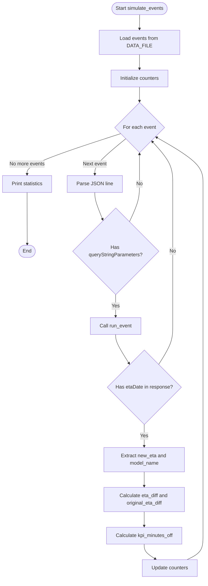
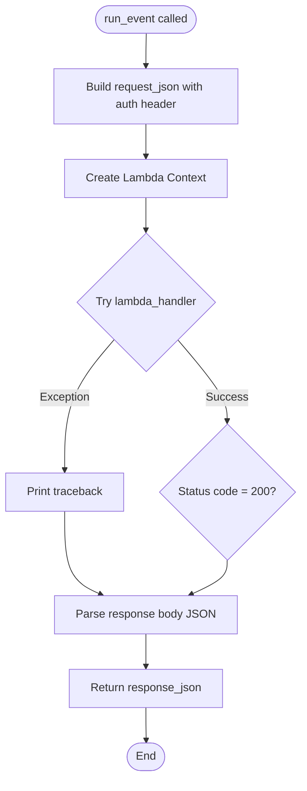
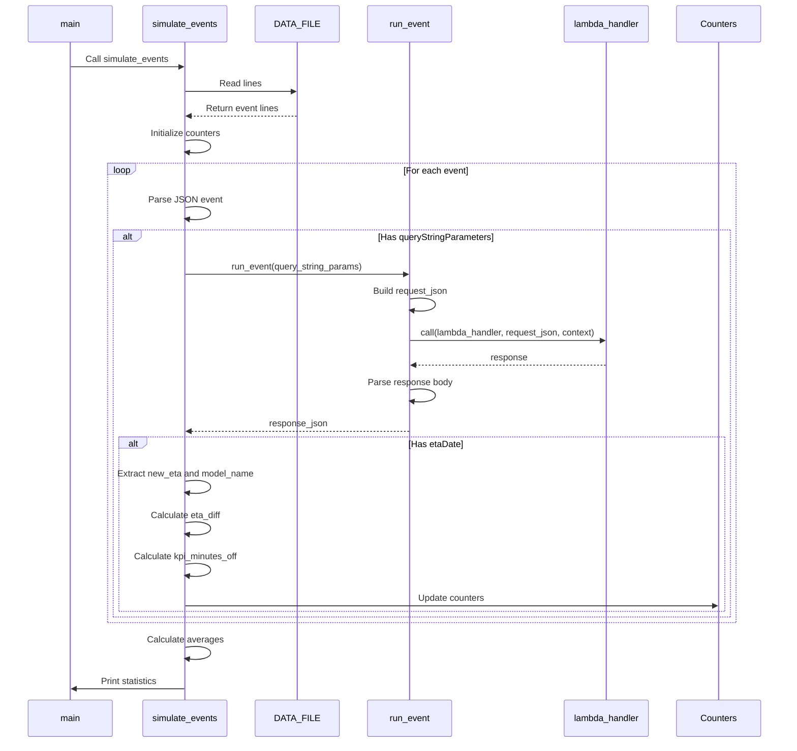

# Diagram: research/api/scripts/simulate/simulate_partview.py


> Auto-generated by Obscura crawlers

## Diagram 1

```mermaid
flowchart TD
      Start([Start simulate_events]) --> LoadData[Load events from DATA_FILE]
      LoadData --> InitCounters[Initialize counters]
      InitCounters --> LoopStart{For each event}...
  └ 65 lines...

● Echo Mermaid diagrams
  $ echo 'flowchart TD
      Start([Start simulate_events]) --> LoadData[Load events from DATA_FILE]
      LoadData --> InitCounters[Initialize counters]
      InitCounters --> LoopStart{For each event}
      LoopStart -->|No more events| PrintResults[Print statistics]...
  └ 62 lines...

● stop_bash
  └ <command with id: 0 stopped>

● stop_bash
  └ <command with id: 1 stopped>

✗ Output Mermaid diagrams directly
  $ printf '%s\n' 'flowchart TD' '    Start([Start simulate_events]) --> LoadData[Load events from
   DATA_FILE]' '    LoadData --> InitCounters[Initialize counters]' '    InitCounters -->
  LoopStart{For each event}' '    LoopStart -->|No more events| PrintResults[Print statistics]'
  '    PrintResults --> End([End])' '    ' '    LoopStart -->|Next event| ParseJSON[Parse JSON
  line]' '    ParseJSON --> CheckQSP{Has queryStringParameters?}' '    CheckQSP -->|No| ...
  Permission denied and could not request permission from user
```

> SVG rendering failed for this diagram.

## Diagram 2



### SVG

<svg id="container" width="662.3280029296875" xmlns="http://www.w3.org/2000/svg" class="flowchart" height="1855.640625" viewBox="0 0 662.3280029296875 1855.640625" role="graphics-document document" aria-roledescription="flowchart-v2"><style>#container{font-family:"trebuchet ms",verdana,arial,sans-serif;font-size:16px;fill:#333;}@keyframes edge-animation-frame{from{stroke-dashoffset:0;}}@keyframes dash{to{stroke-dashoffset:0;}}#container .edge-animation-slow{stroke-dasharray:9,5!important;stroke-dashoffset:900;animation:dash 50s linear infinite;stroke-linecap:round;}#container .edge-animation-fast{stroke-dasharray:9,5!important;stroke-dashoffset:900;animation:dash 20s linear infinite;stroke-linecap:round;}#container .error-icon{fill:#552222;}#container .error-text{fill:#552222;stroke:#552222;}#container .edge-thickness-normal{stroke-width:1px;}#container .edge-thickness-thick{stroke-width:3.5px;}#container .edge-pattern-solid{stroke-dasharray:0;}#container .edge-thickness-invisible{stroke-width:0;fill:none;}#container .edge-pattern-dashed{stroke-dasharray:3;}#container .edge-pattern-dotted{stroke-dasharray:2;}#container .marker{fill:#333333;stroke:#333333;}#container .marker.cross{stroke:#333333;}#container svg{font-family:"trebuchet ms",verdana,arial,sans-serif;font-size:16px;}#container p{margin:0;}#container .label{font-family:"trebuchet ms",verdana,arial,sans-serif;color:#333;}#container .cluster-label text{fill:#333;}#container .cluster-label span{color:#333;}#container .cluster-label span p{background-color:transparent;}#container .label text,#container span{fill:#333;color:#333;}#container .node rect,#container .node circle,#container .node ellipse,#container .node polygon,#container .node path{fill:#ECECFF;stroke:#9370DB;stroke-width:1px;}#container .rough-node .label text,#container .node .label text,#container .image-shape .label,#container .icon-shape .label{text-anchor:middle;}#container .node .katex path{fill:#000;stroke:#000;stroke-width:1px;}#container .rough-node .label,#container .node .label,#container .image-shape .label,#container .icon-shape .label{text-align:center;}#container .node.clickable{cursor:pointer;}#container .root .anchor path{fill:#333333!important;stroke-width:0;stroke:#333333;}#container .arrowheadPath{fill:#333333;}#container .edgePath .path{stroke:#333333;stroke-width:2.0px;}#container .flowchart-link{stroke:#333333;fill:none;}#container .edgeLabel{background-color:rgba(232,232,232, 0.8);text-align:center;}#container .edgeLabel p{background-color:rgba(232,232,232, 0.8);}#container .edgeLabel rect{opacity:0.5;background-color:rgba(232,232,232, 0.8);fill:rgba(232,232,232, 0.8);}#container .labelBkg{background-color:rgba(232, 232, 232, 0.5);}#container .cluster rect{fill:#ffffde;stroke:#aaaa33;stroke-width:1px;}#container .cluster text{fill:#333;}#container .cluster span{color:#333;}#container div.mermaidTooltip{position:absolute;text-align:center;max-width:200px;padding:2px;font-family:"trebuchet ms",verdana,arial,sans-serif;font-size:12px;background:hsl(80, 100%, 96.2745098039%);border:1px solid #aaaa33;border-radius:2px;pointer-events:none;z-index:100;}#container .flowchartTitleText{text-anchor:middle;font-size:18px;fill:#333;}#container rect.text{fill:none;stroke-width:0;}#container .icon-shape,#container .image-shape{background-color:rgba(232,232,232, 0.8);text-align:center;}#container .icon-shape p,#container .image-shape p{background-color:rgba(232,232,232, 0.8);padding:2px;}#container .icon-shape rect,#container .image-shape rect{opacity:0.5;background-color:rgba(232,232,232, 0.8);fill:rgba(232,232,232, 0.8);}#container .label-icon{display:inline-block;height:1em;overflow:visible;vertical-align:-0.125em;}#container .node .label-icon path{fill:currentColor;stroke:revert;stroke-width:revert;}#container :root{--mermaid-font-family:"trebuchet ms",verdana,arial,sans-serif;}</style><g><marker id="container_flowchart-v2-pointEnd" class="marker flowchart-v2" viewBox="0 0 10 10" refX="5" refY="5" markerUnits="userSpaceOnUse" markerWidth="8" markerHeight="8" orient="auto"><path d="M 0 0 L 10 5 L 0 10 z" class="arrowMarkerPath" style="stroke-width: 1; stroke-dasharray: 1, 0;"></path></marker><marker id="container_flowchart-v2-pointStart" class="marker flowchart-v2" viewBox="0 0 10 10" refX="4.5" refY="5" markerUnits="userSpaceOnUse" markerWidth="8" markerHeight="8" orient="auto"><path d="M 0 5 L 10 10 L 10 0 z" class="arrowMarkerPath" style="stroke-width: 1; stroke-dasharray: 1, 0;"></path></marker><marker id="container_flowchart-v2-circleEnd" class="marker flowchart-v2" viewBox="0 0 10 10" refX="11" refY="5" markerUnits="userSpaceOnUse" markerWidth="11" markerHeight="11" orient="auto"><circle cx="5" cy="5" r="5" class="arrowMarkerPath" style="stroke-width: 1; stroke-dasharray: 1, 0;"></circle></marker><marker id="container_flowchart-v2-circleStart" class="marker flowchart-v2" viewBox="0 0 10 10" refX="-1" refY="5" markerUnits="userSpaceOnUse" markerWidth="11" markerHeight="11" orient="auto"><circle cx="5" cy="5" r="5" class="arrowMarkerPath" style="stroke-width: 1; stroke-dasharray: 1, 0;"></circle></marker><marker id="container_flowchart-v2-crossEnd" class="marker cross flowchart-v2" viewBox="0 0 11 11" refX="12" refY="5.2" markerUnits="userSpaceOnUse" markerWidth="11" markerHeight="11" orient="auto"><path d="M 1,1 l 9,9 M 10,1 l -9,9" class="arrowMarkerPath" style="stroke-width: 2; stroke-dasharray: 1, 0;"></path></marker><marker id="container_flowchart-v2-crossStart" class="marker cross flowchart-v2" viewBox="0 0 11 11" refX="-1" refY="5.2" markerUnits="userSpaceOnUse" markerWidth="11" markerHeight="11" orient="auto"><path d="M 1,1 l 9,9 M 10,1 l -9,9" class="arrowMarkerPath" style="stroke-width: 2; stroke-dasharray: 1, 0;"></path></marker><g class="root"><g class="clusters"></g><g class="edgePaths"><path d="M450.117,47.5L450.034,51.583C449.951,55.667,449.784,63.833,449.701,71.417C449.617,79,449.617,86,449.617,89.5L449.617,93" id="L_Start_LoadData_0" class="edge-thickness-normal edge-pattern-solid edge-thickness-normal edge-pattern-solid flowchart-link" style=";" data-edge="true" data-et="edge" data-id="L_Start_LoadData_0" data-points="W3sieCI6NDUwLjExNzE4NzUsInkiOjQ3LjV9LHsieCI6NDQ5LjYxNzE4NzUsInkiOjcyfSx7IngiOjQ0OS42MTcxODc1LCJ5Ijo5N31d" marker-end="url(#container_flowchart-v2-pointEnd)"></path><path d="M449.617,175L449.617,179.167C449.617,183.333,449.617,191.667,449.617,199.333C449.617,207,449.617,214,449.617,217.5L449.617,221" id="L_LoadData_InitCounters_0" class="edge-thickness-normal edge-pattern-solid edge-thickness-normal edge-pattern-solid flowchart-link" style=";" data-edge="true" data-et="edge" data-id="L_LoadData_InitCounters_0" data-points="W3sieCI6NDQ5LjYxNzE4NzUsInkiOjE3NX0seyJ4Ijo0NDkuNjE3MTg3NSwieSI6MjAwfSx7IngiOjQ0OS42MTcxODc1LCJ5IjoyMjV9XQ==" marker-end="url(#container_flowchart-v2-pointEnd)"></path><path d="M449.617,279L449.617,283.167C449.617,287.333,449.617,295.667,449.617,303.333C449.617,311,449.617,318,449.617,321.5L449.617,325" id="L_InitCounters_LoopStart_0" class="edge-thickness-normal edge-pattern-solid edge-thickness-normal edge-pattern-solid flowchart-link" style=";" data-edge="true" data-et="edge" data-id="L_InitCounters_LoopStart_0" data-points="W3sieCI6NDQ5LjYxNzE4NzUsInkiOjI3OX0seyJ4Ijo0NDkuNjE3MTg3NSwieSI6MzA0fSx7IngiOjQ0OS42MTcxODc1LCJ5IjozMjl9XQ==" marker-end="url(#container_flowchart-v2-pointEnd)"></path><path d="M389.282,428.586L339.408,444.809C289.534,461.032,189.787,493.477,139.913,515.199C90.039,536.922,90.039,547.922,90.039,553.422L90.039,558.922" id="L_LoopStart_PrintResults_0" class="edge-thickness-normal edge-pattern-solid edge-thickness-normal edge-pattern-solid flowchart-link" style=";" data-edge="true" data-et="edge" data-id="L_LoopStart_PrintResults_0" data-points="W3sieCI6Mzg5LjI4MTcyNjU4NTkzODY2LCJ5Ijo0MjguNTg2NDE0MDg1OTM4NjZ9LHsieCI6OTAuMDM5MDYyNSwieSI6NTI1LjkyMTg3NX0seyJ4Ijo5MC4wMzkwNjI1LCJ5Ijo1NjIuOTIxODc1fV0=" marker-end="url(#container_flowchart-v2-pointEnd)"></path><path d="M90.039,616.922L90.039,621.089C90.039,625.255,90.039,633.589,90.12,661.255C90.201,688.922,90.363,735.922,90.444,759.422L90.525,782.922" id="L_PrintResults_End_0" class="edge-thickness-normal edge-pattern-solid edge-thickness-normal edge-pattern-solid flowchart-link" style=";" data-edge="true" data-et="edge" data-id="L_PrintResults_End_0" data-points="W3sieCI6OTAuMDM5MDYyNSwieSI6NjE2LjkyMTg3NX0seyJ4Ijo5MC4wMzkwNjI1LCJ5Ijo2NDEuOTIxODc1fSx7IngiOjkwLjUzOTA2MjUsInkiOjc4Ni45MjE4NzV9XQ==" marker-end="url(#container_flowchart-v2-pointEnd)"></path><path d="M405.739,445.044L389.348,458.524C372.956,472.003,340.174,498.963,323.782,517.942C307.391,536.922,307.391,547.922,307.391,553.422L307.391,558.922" id="L_LoopStart_ParseJSON_0" class="edge-thickness-normal edge-pattern-solid edge-thickness-normal edge-pattern-solid flowchart-link" style=";" data-edge="true" data-et="edge" data-id="L_LoopStart_ParseJSON_0" data-points="W3sieCI6NDA1LjczOTQxODQxNDI5MDQ3LCJ5Ijo0NDUuMDQ0MTA1OTE0MjkwNDd9LHsieCI6MzA3LjM5MDYyNSwieSI6NTI1LjkyMTg3NX0seyJ4IjozMDcuMzkwNjI1LCJ5Ijo1NjIuOTIxODc1fV0=" marker-end="url(#container_flowchart-v2-pointEnd)"></path><path d="M307.391,616.922L307.391,621.089C307.391,625.255,307.391,633.589,311.423,647.894C315.456,662.2,323.521,682.479,327.554,692.618L331.586,702.758" id="L_ParseJSON_CheckQSP_0" class="edge-thickness-normal edge-pattern-solid edge-thickness-normal edge-pattern-solid flowchart-link" style=";" data-edge="true" data-et="edge" data-id="L_ParseJSON_CheckQSP_0" data-points="W3sieCI6MzA3LjM5MDYyNSwieSI6NjE2LjkyMTg3NX0seyJ4IjozMDcuMzkwNjI1LCJ5Ijo2NDEuOTIxODc1fSx7IngiOjMzMy4wNjQ2NTAwOTUwMDM1NywieSI6NzA2LjQ3NDQxMjQwNDk5NjR9XQ==" marker-end="url(#container_flowchart-v2-pointEnd)"></path><path d="M417.028,711.333L422.46,699.764C427.891,688.196,438.754,665.059,444.186,644.824C449.617,624.589,449.617,607.255,449.617,587.922C449.617,568.589,449.617,547.255,449.617,531.089C449.617,514.922,449.617,503.922,449.617,498.422L449.617,492.922" id="L_CheckQSP_LoopStart_0" class="edge-thickness-normal edge-pattern-solid edge-thickness-normal edge-pattern-solid flowchart-link" style=";" data-edge="true" data-et="edge" data-id="L_CheckQSP_LoopStart_0" data-points="W3sieCI6NDE3LjAyNzk3NTg4MTc0Mjc1LCJ5Ijo3MTEuMzMyNjYzMzgxNzQyN30seyJ4Ijo0NDkuNjE3MTg3NSwieSI6NjQxLjkyMTg3NX0seyJ4Ijo0NDkuNjE3MTg3NSwieSI6NTg5LjkyMTg3NX0seyJ4Ijo0NDkuNjE3MTg3NSwieSI6NTI1LjkyMTg3NX0seyJ4Ijo0NDkuNjE3MTg3NSwieSI6NDg4LjkyMTg3NX1d" marker-end="url(#container_flowchart-v2-pointEnd)"></path><path d="M372.617,944.922L372.617,951.089C372.617,957.255,372.617,969.589,372.617,981.255C372.617,992.922,372.617,1003.922,372.617,1009.422L372.617,1014.922" id="L_CheckQSP_RunEvent_0" class="edge-thickness-normal edge-pattern-solid edge-thickness-normal edge-pattern-solid flowchart-link" style=";" data-edge="true" data-et="edge" data-id="L_CheckQSP_RunEvent_0" data-points="W3sieCI6MzcyLjYxNzE4NzUsInkiOjk0NC45MjE4NzV9LHsieCI6MzcyLjYxNzE4NzUsInkiOjk4MS45MjE4NzV9LHsieCI6MzcyLjYxNzE4NzUsInkiOjEwMTguOTIxODc1fV0=" marker-end="url(#container_flowchart-v2-pointEnd)"></path><path d="M372.617,1072.922L372.617,1077.089C372.617,1081.255,372.617,1089.589,379.887,1105.075C387.158,1120.562,401.698,1143.203,408.968,1154.523L416.239,1165.843" id="L_RunEvent_CheckResponse_0" class="edge-thickness-normal edge-pattern-solid edge-thickness-normal edge-pattern-solid flowchart-link" style=";" data-edge="true" data-et="edge" data-id="L_RunEvent_CheckResponse_0" data-points="W3sieCI6MzcyLjYxNzE4NzUsInkiOjEwNzIuOTIxODc1fSx7IngiOjM3Mi42MTcxODc1LCJ5IjoxMDk3LjkyMTg3NX0seyJ4Ijo0MTguNDAwMjg0NjU2NTQ1NSwieSI6MTE2OS4yMDkwOTAzNDM0NTQ0fV0=" marker-end="url(#container_flowchart-v2-pointEnd)"></path><path d="M510.975,1169.209L518.605,1157.328C526.236,1145.447,541.497,1121.684,549.127,1101.136C556.758,1080.589,556.758,1063.255,556.758,1043.922C556.758,1024.589,556.758,1003.255,556.758,963.255C556.758,923.255,556.758,864.589,556.758,807.922C556.758,751.255,556.758,696.589,556.758,660.589C556.758,624.589,556.758,607.255,556.758,587.922C556.758,568.589,556.758,547.255,545.723,524.542C534.688,501.829,512.618,477.736,501.583,465.689L490.548,453.643" id="L_CheckResponse_LoopStart_0" class="edge-thickness-normal edge-pattern-solid edge-thickness-normal edge-pattern-solid flowchart-link" style=";" data-edge="true" data-et="edge" data-id="L_CheckResponse_LoopStart_0" data-points="W3sieCI6NTEwLjk3NDcxNTM0MzQ1NDUsInkiOjExNjkuMjA5MDkwMzQzNDU0NH0seyJ4Ijo1NTYuNzU3ODEyNSwieSI6MTA5Ny45MjE4NzV9LHsieCI6NTU2Ljc1NzgxMjUsInkiOjEwNDUuOTIxODc1fSx7IngiOjU1Ni43NTc4MTI1LCJ5Ijo5ODEuOTIxODc1fSx7IngiOjU1Ni43NTc4MTI1LCJ5Ijo4MDUuOTIxODc1fSx7IngiOjU1Ni43NTc4MTI1LCJ5Ijo2NDEuOTIxODc1fSx7IngiOjU1Ni43NTc4MTI1LCJ5Ijo1ODkuOTIxODc1fSx7IngiOjU1Ni43NTc4MTI1LCJ5Ijo1MjUuOTIxODc1fSx7IngiOjQ4Ny44NDU2Nzk2MzQzOTA4LCJ5Ijo0NTAuNjkzMzgyODY1NjA5Mn1d" marker-end="url(#container_flowchart-v2-pointEnd)"></path><path d="M464.688,1359.641L464.688,1365.807C464.688,1371.974,464.688,1384.307,464.688,1395.974C464.688,1407.641,464.688,1418.641,464.688,1424.141L464.688,1429.641" id="L_CheckResponse_ExtractData_0" class="edge-thickness-normal edge-pattern-solid edge-thickness-normal edge-pattern-solid flowchart-link" style=";" data-edge="true" data-et="edge" data-id="L_CheckResponse_ExtractData_0" data-points="W3sieCI6NDY0LjY4NzUsInkiOjEzNTkuNjQwNjI1fSx7IngiOjQ2NC42ODc1LCJ5IjoxMzk2LjY0MDYyNX0seyJ4Ijo0NjQuNjg3NSwieSI6MTQzMy42NDA2MjV9XQ==" marker-end="url(#container_flowchart-v2-pointEnd)"></path><path d="M464.688,1511.641L464.688,1515.807C464.688,1519.974,464.688,1528.307,464.688,1535.974C464.688,1543.641,464.688,1550.641,464.688,1554.141L464.688,1557.641" id="L_ExtractData_CalcDiff_0" class="edge-thickness-normal edge-pattern-solid edge-thickness-normal edge-pattern-solid flowchart-link" style=";" data-edge="true" data-et="edge" data-id="L_ExtractData_CalcDiff_0" data-points="W3sieCI6NDY0LjY4NzUsInkiOjE1MTEuNjQwNjI1fSx7IngiOjQ2NC42ODc1LCJ5IjoxNTM2LjY0MDYyNX0seyJ4Ijo0NjQuNjg3NSwieSI6MTU2MS42NDA2MjV9XQ==" marker-end="url(#container_flowchart-v2-pointEnd)"></path><path d="M464.688,1639.641L464.688,1643.807C464.688,1647.974,464.688,1656.307,464.688,1663.974C464.688,1671.641,464.688,1678.641,464.688,1682.141L464.688,1685.641" id="L_CalcDiff_CalcKPI_0" class="edge-thickness-normal edge-pattern-solid edge-thickness-normal edge-pattern-solid flowchart-link" style=";" data-edge="true" data-et="edge" data-id="L_CalcDiff_CalcKPI_0" data-points="W3sieCI6NDY0LjY4NzUsInkiOjE2MzkuNjQwNjI1fSx7IngiOjQ2NC42ODc1LCJ5IjoxNjY0LjY0MDYyNX0seyJ4Ijo0NjQuNjg3NSwieSI6MTY4OS42NDA2MjV9XQ==" marker-end="url(#container_flowchart-v2-pointEnd)"></path><path d="M464.688,1743.641L464.688,1747.807C464.688,1751.974,464.688,1760.307,470.734,1768.285C476.781,1776.263,488.874,1783.885,494.92,1787.697L500.967,1791.508" id="L_CalcKPI_UpdateCounters_0" class="edge-thickness-normal edge-pattern-solid edge-thickness-normal edge-pattern-solid flowchart-link" style=";" data-edge="true" data-et="edge" data-id="L_CalcKPI_UpdateCounters_0" data-points="W3sieCI6NDY0LjY4NzUsInkiOjE3NDMuNjQwNjI1fSx7IngiOjQ2NC42ODc1LCJ5IjoxNzY4LjY0MDYyNX0seyJ4Ijo1MDQuMzUwOTYxNTM4NDYxNTUsInkiOjE3OTMuNjQwNjI1fV0=" marker-end="url(#container_flowchart-v2-pointEnd)"></path><path d="M602.818,1793.641L611.403,1789.474C619.988,1785.307,637.158,1776.974,645.743,1764.141C654.328,1751.307,654.328,1733.974,654.328,1716.641C654.328,1699.307,654.328,1681.974,654.328,1662.641C654.328,1643.307,654.328,1621.974,654.328,1600.641C654.328,1579.307,654.328,1557.974,654.328,1536.641C654.328,1515.307,654.328,1493.974,654.328,1470.641C654.328,1447.307,654.328,1421.974,654.328,1383.414C654.328,1344.854,654.328,1293.068,654.328,1243.281C654.328,1193.495,654.328,1145.708,654.328,1113.148C654.328,1080.589,654.328,1063.255,654.328,1043.922C654.328,1024.589,654.328,1003.255,654.328,963.255C654.328,923.255,654.328,864.589,654.328,807.922C654.328,751.255,654.328,696.589,654.328,660.589C654.328,624.589,654.328,607.255,654.328,587.922C654.328,568.589,654.328,547.255,629.27,522.271C604.211,497.288,554.094,468.654,529.036,454.336L503.977,440.019" id="L_UpdateCounters_LoopStart_0" class="edge-thickness-normal edge-pattern-solid edge-thickness-normal edge-pattern-solid flowchart-link" style=";" data-edge="true" data-et="edge" data-id="L_UpdateCounters_LoopStart_0" data-points="W3sieCI6NjAyLjgxODIwOTEzNDYxNTQsInkiOjE3OTMuNjQwNjI1fSx7IngiOjY1NC4zMjgxMjUsInkiOjE3NjguNjQwNjI1fSx7IngiOjY1NC4zMjgxMjUsInkiOjE3MTYuNjQwNjI1fSx7IngiOjY1NC4zMjgxMjUsInkiOjE2NjQuNjQwNjI1fSx7IngiOjY1NC4zMjgxMjUsInkiOjE2MDAuNjQwNjI1fSx7IngiOjY1NC4zMjgxMjUsInkiOjE1MzYuNjQwNjI1fSx7IngiOjY1NC4zMjgxMjUsInkiOjE0NzIuNjQwNjI1fSx7IngiOjY1NC4zMjgxMjUsInkiOjEzOTYuNjQwNjI1fSx7IngiOjY1NC4zMjgxMjUsInkiOjEyNDEuMjgxMjV9LHsieCI6NjU0LjMyODEyNSwieSI6MTA5Ny45MjE4NzV9LHsieCI6NjU0LjMyODEyNSwieSI6MTA0NS45MjE4NzV9LHsieCI6NjU0LjMyODEyNSwieSI6OTgxLjkyMTg3NX0seyJ4Ijo2NTQuMzI4MTI1LCJ5Ijo4MDUuOTIxODc1fSx7IngiOjY1NC4zMjgxMjUsInkiOjY0MS45MjE4NzV9LHsieCI6NjU0LjMyODEyNSwieSI6NTg5LjkyMTg3NX0seyJ4Ijo2NTQuMzI4MTI1LCJ5Ijo1MjUuOTIxODc1fSx7IngiOjUwMC41MDQwNjg2NzA0NTk1LCJ5Ijo0MzguMDM0OTkzODI5NTQwNX1d" marker-end="url(#container_flowchart-v2-pointEnd)"></path></g><g class="edgeLabels"><g class="edgeLabel"><g class="label" data-id="L_Start_LoadData_0" transform="translate(0, 0)"><foreignObject width="0" height="0"><div xmlns="http://www.w3.org/1999/xhtml" class="labelBkg" style="display: table-cell; white-space: nowrap; line-height: 1.5; max-width: 200px; text-align: center;"><span class="edgeLabel"></span></div></foreignObject></g></g><g class="edgeLabel"><g class="label" data-id="L_LoadData_InitCounters_0" transform="translate(0, 0)"><foreignObject width="0" height="0"><div xmlns="http://www.w3.org/1999/xhtml" class="labelBkg" style="display: table-cell; white-space: nowrap; line-height: 1.5; max-width: 200px; text-align: center;"><span class="edgeLabel"></span></div></foreignObject></g></g><g class="edgeLabel"><g class="label" data-id="L_InitCounters_LoopStart_0" transform="translate(0, 0)"><foreignObject width="0" height="0"><div xmlns="http://www.w3.org/1999/xhtml" class="labelBkg" style="display: table-cell; white-space: nowrap; line-height: 1.5; max-width: 200px; text-align: center;"><span class="edgeLabel"></span></div></foreignObject></g></g><g class="edgeLabel" transform="translate(90.0390625, 525.921875)"><g class="label" data-id="L_LoopStart_PrintResults_0" transform="translate(-57.0234375, -12)"><foreignObject width="114.046875" height="24"><div xmlns="http://www.w3.org/1999/xhtml" class="labelBkg" style="display: table-cell; white-space: nowrap; line-height: 1.5; max-width: 200px; text-align: center;"><span class="edgeLabel"><p>No more events</p></span></div></foreignObject></g></g><g class="edgeLabel"><g class="label" data-id="L_PrintResults_End_0" transform="translate(0, 0)"><foreignObject width="0" height="0"><div xmlns="http://www.w3.org/1999/xhtml" class="labelBkg" style="display: table-cell; white-space: nowrap; line-height: 1.5; max-width: 200px; text-align: center;"><span class="edgeLabel"></span></div></foreignObject></g></g><g class="edgeLabel" transform="translate(307.390625, 525.921875)"><g class="label" data-id="L_LoopStart_ParseJSON_0" transform="translate(-38.8125, -12)"><foreignObject width="77.625" height="24"><div xmlns="http://www.w3.org/1999/xhtml" class="labelBkg" style="display: table-cell; white-space: nowrap; line-height: 1.5; max-width: 200px; text-align: center;"><span class="edgeLabel"><p>Next event</p></span></div></foreignObject></g></g><g class="edgeLabel"><g class="label" data-id="L_ParseJSON_CheckQSP_0" transform="translate(0, 0)"><foreignObject width="0" height="0"><div xmlns="http://www.w3.org/1999/xhtml" class="labelBkg" style="display: table-cell; white-space: nowrap; line-height: 1.5; max-width: 200px; text-align: center;"><span class="edgeLabel"></span></div></foreignObject></g></g><g class="edgeLabel" transform="translate(449.6171875, 589.921875)"><g class="label" data-id="L_CheckQSP_LoopStart_0" transform="translate(-10.140625, -12)"><foreignObject width="20.28125" height="24"><div xmlns="http://www.w3.org/1999/xhtml" class="labelBkg" style="display: table-cell; white-space: nowrap; line-height: 1.5; max-width: 200px; text-align: center;"><span class="edgeLabel"><p>No</p></span></div></foreignObject></g></g><g class="edgeLabel" transform="translate(372.6171875, 981.921875)"><g class="label" data-id="L_CheckQSP_RunEvent_0" transform="translate(-12.03125, -12)"><foreignObject width="24.0625" height="24"><div xmlns="http://www.w3.org/1999/xhtml" class="labelBkg" style="display: table-cell; white-space: nowrap; line-height: 1.5; max-width: 200px; text-align: center;"><span class="edgeLabel"><p>Yes</p></span></div></foreignObject></g></g><g class="edgeLabel"><g class="label" data-id="L_RunEvent_CheckResponse_0" transform="translate(0, 0)"><foreignObject width="0" height="0"><div xmlns="http://www.w3.org/1999/xhtml" class="labelBkg" style="display: table-cell; white-space: nowrap; line-height: 1.5; max-width: 200px; text-align: center;"><span class="edgeLabel"></span></div></foreignObject></g></g><g class="edgeLabel" transform="translate(556.7578125, 805.921875)"><g class="label" data-id="L_CheckResponse_LoopStart_0" transform="translate(-10.140625, -12)"><foreignObject width="20.28125" height="24"><div xmlns="http://www.w3.org/1999/xhtml" class="labelBkg" style="display: table-cell; white-space: nowrap; line-height: 1.5; max-width: 200px; text-align: center;"><span class="edgeLabel"><p>No</p></span></div></foreignObject></g></g><g class="edgeLabel" transform="translate(464.6875, 1396.640625)"><g class="label" data-id="L_CheckResponse_ExtractData_0" transform="translate(-12.03125, -12)"><foreignObject width="24.0625" height="24"><div xmlns="http://www.w3.org/1999/xhtml" class="labelBkg" style="display: table-cell; white-space: nowrap; line-height: 1.5; max-width: 200px; text-align: center;"><span class="edgeLabel"><p>Yes</p></span></div></foreignObject></g></g><g class="edgeLabel"><g class="label" data-id="L_ExtractData_CalcDiff_0" transform="translate(0, 0)"><foreignObject width="0" height="0"><div xmlns="http://www.w3.org/1999/xhtml" class="labelBkg" style="display: table-cell; white-space: nowrap; line-height: 1.5; max-width: 200px; text-align: center;"><span class="edgeLabel"></span></div></foreignObject></g></g><g class="edgeLabel"><g class="label" data-id="L_CalcDiff_CalcKPI_0" transform="translate(0, 0)"><foreignObject width="0" height="0"><div xmlns="http://www.w3.org/1999/xhtml" class="labelBkg" style="display: table-cell; white-space: nowrap; line-height: 1.5; max-width: 200px; text-align: center;"><span class="edgeLabel"></span></div></foreignObject></g></g><g class="edgeLabel"><g class="label" data-id="L_CalcKPI_UpdateCounters_0" transform="translate(0, 0)"><foreignObject width="0" height="0"><div xmlns="http://www.w3.org/1999/xhtml" class="labelBkg" style="display: table-cell; white-space: nowrap; line-height: 1.5; max-width: 200px; text-align: center;"><span class="edgeLabel"></span></div></foreignObject></g></g><g class="edgeLabel"><g class="label" data-id="L_UpdateCounters_LoopStart_0" transform="translate(0, 0)"><foreignObject width="0" height="0"><div xmlns="http://www.w3.org/1999/xhtml" class="labelBkg" style="display: table-cell; white-space: nowrap; line-height: 1.5; max-width: 200px; text-align: center;"><span class="edgeLabel"></span></div></foreignObject></g></g></g><g class="nodes"><g class="node default" id="flowchart-Start-0" transform="translate(449.6171875, 27.5)"><g class="basic label-container outer-path"><path d="M-71.5546875 -19.5 C-19.509056814086037 -19.5, 32.536573871827926 -19.5, 71.5546875 -19.5 C71.5546875 -19.5, 71.5546875 -19.5, 71.5546875 -19.5 C71.83124794719281 -19.491131244750783, 72.1078083943856 -19.48226248950156, 72.8040567896239 -19.45993515863156 C73.17431139513425 -19.424217142134285, 73.54456600064462 -19.388499125637015, 74.04829215284786 -19.3399052695533 C74.38157063940065 -19.28602338846071, 74.71484912595345 -19.23214150736812, 75.28228075967675 -19.140403561325776 C75.5776847158709 -19.072979536015424, 75.87308867206507 -19.005555510705076, 76.50095188623538 -18.862249829261074 C76.81122688540148 -18.77016183817528, 77.12150188456759 -18.67807384708949, 77.6992977514606 -18.50658706670804 C77.955306666464 -18.412373419466324, 78.21131558146739 -18.318159772224607, 78.8723940951478 -18.074876768247425 C79.10130159285899 -17.97354620931034, 79.33020909057018 -17.872215650373253, 80.01542041279238 -17.568892924097174 C80.38359176951519 -17.376818163119893, 80.751763126238 -17.18474340214261, 81.12367976407678 -16.990714730406097 C81.54054008003637 -16.738011557128264, 81.95740039599595 -16.485308383850427, 82.1926180736057 -16.342718045390892 C82.5398842251121 -16.100480211009437, 82.88715037661851 -15.858242376627981, 83.21784284457871 -15.627565626425154 C83.56538175976623 -15.350412589962051, 83.91292067495374 -15.073259553498948, 84.19514120850187 -14.848196188198123 C84.51636561843493 -14.556468678229066, 84.837590028368 -14.26474116826001, 85.12049723676799 -14.007812326905688 C85.34622636623176 -13.774728468028155, 85.57195549569553 -13.541644609150621, 85.99010844296865 -13.10986736009568 C86.22681516717189 -12.831818172852378, 86.46352189137514 -12.553768985609075, 86.80040140812658 -12.158051136245305 C87.01472102216208 -11.870882378356235, 87.22904063619758 -11.583713620467165, 87.54804646464063 -11.156274872382312 C87.69171335421986 -10.935563950027062, 87.8353802437991 -10.714853027671811, 88.22997137860425 -10.108655082055241 C88.46604515217686 -9.68948219201531, 88.70211892574949 -9.27030930197538, 88.8433739742735 -9.019496659696287 C88.96603835579067 -8.764781446878564, 89.08870273730786 -8.510066234060838, 89.38573364880834 -7.893275190886684 C89.49081127236647 -7.633731429160454, 89.5958888959246 -7.3741876674342235, 89.85482172997033 -6.734618561215508 C89.94944448254248 -6.449629906556458, 90.04406723511461 -6.164641251897408, 90.24871063421489 -5.548287939305138 C90.35806733615436 -5.131263439315455, 90.46742403809385 -4.714238939325772, 90.56578178754556 -4.339158212148133 C90.62526359225852 -4.033731716430993, 90.68474539697146 -3.728305220713853, 90.80473227658177 -3.1121979531509023 C90.86765037032968 -2.624217642625007, 90.93056846407761 -2.1362373320991113, 90.96458020250937 -1.872449005199798 C90.99497582426062 -1.3990126615196725, 91.02537144601189 -0.9255763178395472, 91.04466871591342 -0.6250057626472757 C91.04466871591342 -0.21752634717325314, 91.04466871591342 0.1899530683007694, 91.04466871591342 0.625005762647271 C91.01706983909945 1.0548805464371895, 90.98947096228548 1.4847553302271081, 90.96458020250937 1.8724490051997846 C90.91495441575447 2.2573368075507254, 90.86532862899958 2.642224609901666, 90.80473227658177 3.1121979531508885 C90.75512735326586 3.3669087503738404, 90.70552242994995 3.6216195475967927, 90.56578178754556 4.339158212148129 C90.46518022022 4.722795589355575, 90.36457865289444 5.106432966563021, 90.24871063421489 5.548287939305125 C90.11038808090537 5.964893431167439, 89.97206552759584 6.381498923029752, 89.85482172997033 6.734618561215495 C89.73605980148879 7.027962820670556, 89.61729787300727 7.321307080125617, 89.38573364880834 7.893275190886679 C89.27207306787244 8.129293819146913, 89.15841248693654 8.365312447407145, 88.8433739742735 9.019496659696284 C88.65692086533552 9.350563035040283, 88.47046775639753 9.681629410384282, 88.22997137860425 10.108655082055236 C88.05260049546204 10.381144389312725, 87.87522961231984 10.653633696570216, 87.54804646464065 11.156274872382301 C87.26053840464348 11.541509480255398, 86.97303034464633 11.926744088128494, 86.80040140812659 12.158051136245302 C86.60759028184958 12.384538056434154, 86.41477915557259 12.611024976623009, 85.99010844296866 13.10986736009567 C85.68907993833506 13.420704006029737, 85.38805143370143 13.731540651963805, 85.12049723676799 14.007812326905684 C84.91380496062798 14.195524783318087, 84.707112684488 14.383237239730487, 84.1951412085019 14.848196188198111 C83.87210208007937 15.105811296682838, 83.54906295165684 15.363426405167566, 83.21784284457871 15.627565626425152 C82.8411636154286 15.89032075049925, 82.46448438627849 16.153075874573346, 82.1926180736057 16.34271804539089 C81.90061213501232 16.519733761383566, 81.60860619641893 16.696749477376247, 81.12367976407678 16.990714730406093 C80.6967814959758 17.213427283432985, 80.26988322787481 17.43613983645988, 80.01542041279238 17.56889292409717 C79.71109846554586 17.703607222753384, 79.40677651829934 17.838321521409597, 78.8723940951478 18.07487676824742 C78.53835262340937 18.197807117692676, 78.20431115167095 18.320737467137935, 77.69929775146062 18.506587066708033 C77.29079802795793 18.627827640384826, 76.88229830445526 18.749068214061616, 76.50095188623541 18.86224982926107 C76.22072622861992 18.926209506968494, 75.94050057100442 18.99016918467592, 75.28228075967677 19.140403561325773 C75.01910552079688 19.182951692993413, 74.755930281917 19.225499824661053, 74.04829215284788 19.3399052695533 C73.79381132729455 19.364454728736458, 73.53933050174122 19.389004187919618, 72.8040567896239 19.45993515863156 C72.53058469362696 19.468704876469037, 72.25711259763004 19.477474594306514, 71.5546875 19.5 C71.5546875 19.5, 71.5546875 19.5, 71.5546875 19.5 C28.720407201506774 19.5, -14.113873096986453 19.5, -71.5546875 19.5 C-71.89247504318439 19.489167810953642, -72.23026258636878 19.478335621907288, -72.8040567896239 19.45993515863156 C-73.26408976261905 19.415556330997312, -73.72412273561419 19.371177503363068, -74.04829215284786 19.3399052695533 C-74.33280843745545 19.293906883114683, -74.61732472206305 19.247908496676068, -75.28228075967675 19.140403561325773 C-75.53015394450094 19.083828124413348, -75.77802712932512 19.027252687500926, -76.50095188623538 18.862249829261074 C-76.74419432548801 18.790056750096515, -76.98743676474064 18.71786367093195, -77.69929775146059 18.506587066708043 C-78.08764716124358 18.363670894045313, -78.47599657102656 18.220754721382583, -78.8723940951478 18.074876768247425 C-79.16666041468571 17.944613797688213, -79.46092673422362 17.814350827129, -80.01542041279238 17.568892924097174 C-80.4292993895752 17.35297252701171, -80.84317836635805 17.137052129926243, -81.12367976407678 16.990714730406097 C-81.42626410059164 16.80728632742785, -81.7288484371065 16.623857924449606, -82.19261807360569 16.3427180453909 C-82.55314910653243 16.09122720395808, -82.91368013945916 15.839736362525262, -83.21784284457871 15.627565626425156 C-83.43434412295363 15.454911618262134, -83.65084540132855 15.282257610099112, -84.19514120850187 14.848196188198125 C-84.52567563948408 14.548013563441893, -84.85621007046628 14.247830938685661, -85.12049723676797 14.007812326905697 C-85.44703084396671 13.67063956856526, -85.77356445116547 13.333466810224824, -85.99010844296865 13.109867360095677 C-86.2179369683123 12.84224701041668, -86.44576549365595 12.57462666073768, -86.80040140812658 12.158051136245307 C-86.96504782768116 11.937439933639554, -87.12969424723575 11.716828731033802, -87.54804646464063 11.156274872382316 C-87.73783698031565 10.86470567441613, -87.92762749599068 10.573136476449948, -88.22997137860425 10.108655082055249 C-88.36979816895433 9.86037845679081, -88.5096249593044 9.612101831526372, -88.8433739742735 9.019496659696289 C-88.9743897533639 8.7474395911265, -89.10540553245428 8.475382522556714, -89.38573364880834 7.893275190886686 C-89.48798559358144 7.640710910390265, -89.59023753835454 7.388146629893843, -89.85482172997033 6.73461856121551 C-90.00319264796269 6.28774899591796, -90.15156356595506 5.840879430620411, -90.24871063421489 5.5482879393051325 C-90.32811528735222 5.245483582698141, -90.40751994048954 4.94267922609115, -90.56578178754556 4.339158212148136 C-90.64681350808135 3.923077453257052, -90.72784522861714 3.5069966943659687, -90.80473227658177 3.112197953150904 C-90.86538569414597 2.6417820238950447, -90.92603911171017 2.1713660946391857, -90.96458020250937 1.872449005199809 C-90.98316200431434 1.5830224431269138, -91.00174380611931 1.2935958810540185, -91.04466871591342 0.6250057626472781 C-91.04466871591342 0.13665205359781624, -91.04466871591342 -0.35170165545164567, -91.04466871591342 -0.6250057626472687 C-91.02817001676522 -0.8819863193907189, -91.01167131761702 -1.1389668761341691, -90.96458020250937 -1.8724490051997822 C-90.90234323538708 -2.3551466321209893, -90.84010626826479 -2.837844259042196, -90.80473227658177 -3.112197953150895 C-90.71267249038466 -3.5849054984303668, -90.62061270418755 -4.057613043709838, -90.56578178754556 -4.339158212148126 C-90.45190406422303 -4.7734233260944094, -90.33802634090051 -5.207688440040693, -90.24871063421489 -5.548287939305123 C-90.10316597354355 -5.986645267854675, -89.95762131287222 -6.425002596404226, -89.85482172997033 -6.734618561215485 C-89.67838411037853 -7.170422892796527, -89.50194649078675 -7.606227224377569, -89.38573364880834 -7.893275190886676 C-89.17292044020625 -8.335186372022124, -88.96010723160417 -8.777097553157569, -88.8433739742735 -9.019496659696282 C-88.70054978155046 -9.273095476393802, -88.55772558882744 -9.526694293091323, -88.22997137860425 -10.108655082055243 C-88.03777320586839 -10.40392308781331, -87.84557503313255 -10.699191093571377, -87.54804646464063 -11.156274872382308 C-87.31282091886408 -11.471455674234827, -87.07759537308753 -11.786636476087343, -86.80040140812659 -12.158051136245302 C-86.6141696737604 -12.376809528317704, -86.42793793939423 -12.595567920390106, -85.99010844296866 -13.10986736009567 C-85.65350751319284 -13.457435455539486, -85.31690658341702 -13.805003550983301, -85.12049723676799 -14.007812326905677 C-84.84158144373421 -14.261116270431467, -84.56266565070044 -14.514420213957257, -84.1951412085019 -14.848196188198107 C-83.82948301414231 -15.139798867626661, -83.46382481978273 -15.431401547055216, -83.21784284457871 -15.627565626425149 C-82.97890752736569 -15.794236560369775, -82.73997221015267 -15.960907494314402, -82.19261807360571 -16.342718045390885 C-81.94123007138107 -16.49511092965934, -81.68984206915644 -16.647503813927795, -81.12367976407678 -16.99071473040609 C-80.74210053283664 -17.18978437093091, -80.36052130159652 -17.388854011455727, -80.0154204127924 -17.56889292409717 C-79.69163972398565 -17.712221030419034, -79.36785903517891 -17.8555491367409, -78.87239409514781 -18.07487676824742 C-78.58177205878452 -18.181828364109766, -78.29115002242123 -18.28877995997211, -77.69929775146062 -18.506587066708033 C-77.24410365397628 -18.64168628547881, -76.78890955649193 -18.776785504249588, -76.50095188623541 -18.862249829261067 C-76.12655295191156 -18.947703942839112, -75.75215401758773 -19.033158056417157, -75.28228075967677 -19.140403561325773 C-74.8404741036336 -19.211831435213043, -74.39866744759043 -19.283259309100316, -74.04829215284788 -19.3399052695533 C-73.68533443415755 -19.37491936415483, -73.32237671546723 -19.409933458756367, -72.8040567896239 -19.45993515863156 C-72.41361378449588 -19.472455905854808, -72.02317077936787 -19.484976653078057, -71.5546875 -19.5 C-71.5546875 -19.5, -71.5546875 -19.5, -71.5546875 -19.5" stroke="none" stroke-width="0" fill="#ECECFF" style=""></path><path d="M-71.5546875 -19.5 C-39.252653428020885 -19.5, -6.95061935604177 -19.5, 71.5546875 -19.5 M-71.5546875 -19.5 C-31.22039022690653 -19.5, 9.113907046186938 -19.5, 71.5546875 -19.5 M71.5546875 -19.5 C71.5546875 -19.5, 71.5546875 -19.5, 71.5546875 -19.5 M71.5546875 -19.5 C71.5546875 -19.5, 71.5546875 -19.5, 71.5546875 -19.5 M71.5546875 -19.5 C72.05432651497469 -19.48397754927811, 72.55396552994937 -19.467955098556214, 72.8040567896239 -19.45993515863156 M71.5546875 -19.5 C72.02450871756544 -19.4849337480042, 72.49432993513089 -19.4698674960084, 72.8040567896239 -19.45993515863156 M72.8040567896239 -19.45993515863156 C73.09278109005469 -19.432082272610774, 73.38150539048546 -19.404229386589993, 74.04829215284786 -19.3399052695533 M72.8040567896239 -19.45993515863156 C73.23577937980225 -19.418287399579434, 73.6675019699806 -19.376639640527305, 74.04829215284786 -19.3399052695533 M74.04829215284786 -19.3399052695533 C74.51774793329417 -19.264007299654693, 74.98720371374047 -19.188109329756085, 75.28228075967675 -19.140403561325776 M74.04829215284786 -19.3399052695533 C74.40836943071506 -19.281690767708728, 74.76844670858225 -19.223476265864154, 75.28228075967675 -19.140403561325776 M75.28228075967675 -19.140403561325776 C75.68479319171003 -19.04853272535327, 76.08730562374332 -18.956661889380765, 76.50095188623538 -18.862249829261074 M75.28228075967675 -19.140403561325776 C75.5314195361966 -19.083539261367577, 75.78055831271642 -19.026674961409377, 76.50095188623538 -18.862249829261074 M76.50095188623538 -18.862249829261074 C76.95781264680933 -18.7266559536338, 77.41467340738326 -18.591062078006523, 77.6992977514606 -18.50658706670804 M76.50095188623538 -18.862249829261074 C76.92660278021552 -18.73591887821491, 77.35225367419565 -18.609587927168743, 77.6992977514606 -18.50658706670804 M77.6992977514606 -18.50658706670804 C78.029691655825 -18.38499905577417, 78.36008556018939 -18.2634110448403, 78.8723940951478 -18.074876768247425 M77.6992977514606 -18.50658706670804 C78.01422739529751 -18.390690046598344, 78.3291570391344 -18.274793026488652, 78.8723940951478 -18.074876768247425 M78.8723940951478 -18.074876768247425 C79.21496282966831 -17.92323175141565, 79.55753156418882 -17.771586734583874, 80.01542041279238 -17.568892924097174 M78.8723940951478 -18.074876768247425 C79.12975699285319 -17.960949847832353, 79.3871198905586 -17.847022927417285, 80.01542041279238 -17.568892924097174 M80.01542041279238 -17.568892924097174 C80.42469038034578 -17.35537704417449, 80.8339603478992 -17.141861164251804, 81.12367976407678 -16.990714730406097 M80.01542041279238 -17.568892924097174 C80.2635925950098 -17.43942165559622, 80.5117647772272 -17.309950387095267, 81.12367976407678 -16.990714730406097 M81.12367976407678 -16.990714730406097 C81.35979969885692 -16.847577438347624, 81.59591963363704 -16.704440146289155, 82.1926180736057 -16.342718045390892 M81.12367976407678 -16.990714730406097 C81.45469532851328 -16.790051149981313, 81.7857108929498 -16.589387569556525, 82.1926180736057 -16.342718045390892 M82.1926180736057 -16.342718045390892 C82.41696421728928 -16.18622388734526, 82.64131036097285 -16.029729729299632, 83.21784284457871 -15.627565626425154 M82.1926180736057 -16.342718045390892 C82.46602953543385 -16.151998045411005, 82.73944099726198 -15.961278045431115, 83.21784284457871 -15.627565626425154 M83.21784284457871 -15.627565626425154 C83.5719572097931 -15.34516884354569, 83.9260715750075 -15.062772060666225, 84.19514120850187 -14.848196188198123 M83.21784284457871 -15.627565626425154 C83.48885389621394 -15.411441524653025, 83.75986494784917 -15.195317422880896, 84.19514120850187 -14.848196188198123 M84.19514120850187 -14.848196188198123 C84.45113742025835 -14.615707201969483, 84.70713363201483 -14.383218215740845, 85.12049723676799 -14.007812326905688 M84.19514120850187 -14.848196188198123 C84.42121475239337 -14.64288217721405, 84.64728829628488 -14.437568166229976, 85.12049723676799 -14.007812326905688 M85.12049723676799 -14.007812326905688 C85.3033505587942 -13.8190012593767, 85.4862038808204 -13.63019019184771, 85.99010844296865 -13.10986736009568 M85.12049723676799 -14.007812326905688 C85.33589853227657 -13.785392804517825, 85.55129982778514 -13.562973282129962, 85.99010844296865 -13.10986736009568 M85.99010844296865 -13.10986736009568 C86.29236196296804 -12.754823176791875, 86.59461548296746 -12.39977899348807, 86.80040140812658 -12.158051136245305 M85.99010844296865 -13.10986736009568 C86.22099982184294 -12.838649208378301, 86.45189120071721 -12.567431056660922, 86.80040140812658 -12.158051136245305 M86.80040140812658 -12.158051136245305 C87.04328155928071 -11.83261386053573, 87.28616171043484 -11.507176584826153, 87.54804646464063 -11.156274872382312 M86.80040140812658 -12.158051136245305 C86.99372225375313 -11.899018814997058, 87.18704309937971 -11.639986493748811, 87.54804646464063 -11.156274872382312 M87.54804646464063 -11.156274872382312 C87.73953134244516 -10.86210267918527, 87.93101622024969 -10.567930485988226, 88.22997137860425 -10.108655082055241 M87.54804646464063 -11.156274872382312 C87.69632613723614 -10.928477476608382, 87.84460580983165 -10.70068008083445, 88.22997137860425 -10.108655082055241 M88.22997137860425 -10.108655082055241 C88.40923905930521 -9.790347162149589, 88.58850674000617 -9.472039242243936, 88.8433739742735 -9.019496659696287 M88.22997137860425 -10.108655082055241 C88.47171629539245 -9.6794125029705, 88.71346121218068 -9.25016992388576, 88.8433739742735 -9.019496659696287 M88.8433739742735 -9.019496659696287 C89.0315257884153 -8.628795391826964, 89.21967760255707 -8.23809412395764, 89.38573364880834 -7.893275190886684 M88.8433739742735 -9.019496659696287 C89.00996730005265 -8.673562054189729, 89.17656062583181 -8.327627448683172, 89.38573364880834 -7.893275190886684 M89.38573364880834 -7.893275190886684 C89.5680171715079 -7.443031365606595, 89.75030069420747 -6.992787540326505, 89.85482172997033 -6.734618561215508 M89.38573364880834 -7.893275190886684 C89.52665702725089 -7.545191721565424, 89.66758040569343 -7.197108252244164, 89.85482172997033 -6.734618561215508 M89.85482172997033 -6.734618561215508 C90.00046533004776 -6.295963242938646, 90.14610893012518 -5.857307924661782, 90.24871063421489 -5.548287939305138 M89.85482172997033 -6.734618561215508 C89.99491790644522 -6.312671198967558, 90.13501408292012 -5.890723836719607, 90.24871063421489 -5.548287939305138 M90.24871063421489 -5.548287939305138 C90.34207141094544 -5.192262834814947, 90.43543218767599 -4.836237730324758, 90.56578178754556 -4.339158212148133 M90.24871063421489 -5.548287939305138 C90.36247883778839 -5.114440471628025, 90.4762470413619 -4.6805930039509125, 90.56578178754556 -4.339158212148133 M90.56578178754556 -4.339158212148133 C90.63521257802228 -3.9826457772529613, 90.70464336849899 -3.6261333423577895, 90.80473227658177 -3.1121979531509023 M90.56578178754556 -4.339158212148133 C90.66120546928283 -3.8491777742295055, 90.7566291510201 -3.3591973363108782, 90.80473227658177 -3.1121979531509023 M90.80473227658177 -3.1121979531509023 C90.86348804284006 -2.6564998326900042, 90.92224380909836 -2.2008017122291057, 90.96458020250937 -1.872449005199798 M90.80473227658177 -3.1121979531509023 C90.85868135512844 -2.693779553393539, 90.9126304336751 -2.275361153636176, 90.96458020250937 -1.872449005199798 M90.96458020250937 -1.872449005199798 C90.9943732344256 -1.4083984846019386, 91.02416626634184 -0.944347964004079, 91.04466871591342 -0.6250057626472757 M90.96458020250937 -1.872449005199798 C90.98181649895982 -1.6039797750960836, 90.99905279541025 -1.335510544992369, 91.04466871591342 -0.6250057626472757 M91.04466871591342 -0.6250057626472757 C91.04466871591342 -0.23404882564187712, 91.04466871591342 0.15690811136352145, 91.04466871591342 0.625005762647271 M91.04466871591342 -0.6250057626472757 C91.04466871591342 -0.30246003447023, 91.04466871591342 0.020085693706815677, 91.04466871591342 0.625005762647271 M91.04466871591342 0.625005762647271 C91.02803067681342 0.8841566516132029, 91.01139263771341 1.1433075405791349, 90.96458020250937 1.8724490051997846 M91.04466871591342 0.625005762647271 C91.01398934992919 1.1028616517900593, 90.98330998394496 1.5807175409328478, 90.96458020250937 1.8724490051997846 M90.96458020250937 1.8724490051997846 C90.91563128491931 2.2520871439711927, 90.86668236732925 2.6317252827426008, 90.80473227658177 3.1121979531508885 M90.96458020250937 1.8724490051997846 C90.9069394047606 2.319499650076203, 90.84929860701185 2.766550294952621, 90.80473227658177 3.1121979531508885 M90.80473227658177 3.1121979531508885 C90.75128926732157 3.3866165105180457, 90.69784625806136 3.6610350678852033, 90.56578178754556 4.339158212148129 M90.80473227658177 3.1121979531508885 C90.7426064356634 3.4312010159656072, 90.68048059474503 3.7502040787803255, 90.56578178754556 4.339158212148129 M90.56578178754556 4.339158212148129 C90.46408740169687 4.7269629800148225, 90.36239301584818 5.1147677478815154, 90.24871063421489 5.548287939305125 M90.56578178754556 4.339158212148129 C90.44119246443563 4.814271298520525, 90.31660314132569 5.289384384892923, 90.24871063421489 5.548287939305125 M90.24871063421489 5.548287939305125 C90.11294058768425 5.957205687436161, 89.97717054115361 6.366123435567197, 89.85482172997033 6.734618561215495 M90.24871063421489 5.548287939305125 C90.15083166259278 5.843083806934594, 90.05295269097068 6.137879674564063, 89.85482172997033 6.734618561215495 M89.85482172997033 6.734618561215495 C89.67020928535902 7.190614868644215, 89.48559684074772 7.646611176072936, 89.38573364880834 7.893275190886679 M89.85482172997033 6.734618561215495 C89.71585512666793 7.077868758108892, 89.57688852336555 7.421118955002289, 89.38573364880834 7.893275190886679 M89.38573364880834 7.893275190886679 C89.19705932742346 8.28506145622615, 89.00838500603858 8.676847721565622, 88.8433739742735 9.019496659696284 M89.38573364880834 7.893275190886679 C89.22753108698977 8.221786195495511, 89.06932852517119 8.550297200104342, 88.8433739742735 9.019496659696284 M88.8433739742735 9.019496659696284 C88.71522183051225 9.247043767756095, 88.58706968675101 9.474590875815908, 88.22997137860425 10.108655082055236 M88.8433739742735 9.019496659696284 C88.63398039469094 9.391296163644286, 88.42458681510836 9.763095667592289, 88.22997137860425 10.108655082055236 M88.22997137860425 10.108655082055236 C88.00267018735278 10.457850750733604, 87.7753689961013 10.807046419411972, 87.54804646464065 11.156274872382301 M88.22997137860425 10.108655082055236 C88.07501872990531 10.34670396106901, 87.92006608120639 10.584752840082787, 87.54804646464065 11.156274872382301 M87.54804646464065 11.156274872382301 C87.34228969694391 11.431970196268782, 87.13653292924717 11.707665520155262, 86.80040140812659 12.158051136245302 M87.54804646464065 11.156274872382301 C87.2648257313106 11.53576485310498, 86.98160499798053 11.91525483382766, 86.80040140812659 12.158051136245302 M86.80040140812659 12.158051136245302 C86.62133422505576 12.368393638691657, 86.44226704198493 12.578736141138013, 85.99010844296866 13.10986736009567 M86.80040140812659 12.158051136245302 C86.56571424730687 12.433728029421895, 86.33102708648715 12.709404922598488, 85.99010844296866 13.10986736009567 M85.99010844296866 13.10986736009567 C85.75210564476446 13.355624789634652, 85.51410284656023 13.601382219173633, 85.12049723676799 14.007812326905684 M85.99010844296866 13.10986736009567 C85.71397534262363 13.394997457151073, 85.4378422422786 13.680127554206473, 85.12049723676799 14.007812326905684 M85.12049723676799 14.007812326905684 C84.83712951690369 14.265159392587426, 84.55376179703939 14.522506458269168, 84.1951412085019 14.848196188198111 M85.12049723676799 14.007812326905684 C84.86006981909037 14.244325617108622, 84.59964240141274 14.48083890731156, 84.1951412085019 14.848196188198111 M84.1951412085019 14.848196188198111 C83.82383076012772 15.144306389790502, 83.45252031175356 15.440416591382892, 83.21784284457871 15.627565626425152 M84.1951412085019 14.848196188198111 C83.8371070615175 15.133718892729371, 83.4790729145331 15.419241597260632, 83.21784284457871 15.627565626425152 M83.21784284457871 15.627565626425152 C82.89218687728393 15.85472913179038, 82.56653090998914 16.081892637155608, 82.1926180736057 16.34271804539089 M83.21784284457871 15.627565626425152 C82.95741372004782 15.809229709902796, 82.69698459551695 15.990893793380438, 82.1926180736057 16.34271804539089 M82.1926180736057 16.34271804539089 C81.91647477346702 16.510117736733115, 81.64033147332835 16.67751742807534, 81.12367976407678 16.990714730406093 M82.1926180736057 16.34271804539089 C81.84552190798186 16.55312978075554, 81.49842574235802 16.763541516120192, 81.12367976407678 16.990714730406093 M81.12367976407678 16.990714730406093 C80.84894517130341 17.134043591480058, 80.57421057853003 17.277372452554022, 80.01542041279238 17.56889292409717 M81.12367976407678 16.990714730406093 C80.80736679570997 17.15573500339493, 80.49105382734317 17.32075527638377, 80.01542041279238 17.56889292409717 M80.01542041279238 17.56889292409717 C79.73604924045557 17.692562254839295, 79.45667806811876 17.816231585581416, 78.8723940951478 18.07487676824742 M80.01542041279238 17.56889292409717 C79.57159884575162 17.7653595663271, 79.12777727871085 17.96182620855703, 78.8723940951478 18.07487676824742 M78.8723940951478 18.07487676824742 C78.4651756190899 18.224736931723054, 78.05795714303203 18.374597095198684, 77.69929775146062 18.506587066708033 M78.8723940951478 18.07487676824742 C78.56578408926643 18.187712084683593, 78.25917408338505 18.30054740111976, 77.69929775146062 18.506587066708033 M77.69929775146062 18.506587066708033 C77.3315910414353 18.61572048811164, 76.96388433140999 18.724853909515247, 76.50095188623541 18.86224982926107 M77.69929775146062 18.506587066708033 C77.31248013454491 18.62139250496151, 76.92566251762922 18.736197943214986, 76.50095188623541 18.86224982926107 M76.50095188623541 18.86224982926107 C76.25133532977692 18.91922317937246, 76.00171877331844 18.97619652948385, 75.28228075967677 19.140403561325773 M76.50095188623541 18.86224982926107 C76.06111912496364 18.96263878684435, 75.62128636369188 19.063027744427632, 75.28228075967677 19.140403561325773 M75.28228075967677 19.140403561325773 C75.01211971162473 19.18408110444461, 74.7419586635727 19.22775864756344, 74.04829215284788 19.3399052695533 M75.28228075967677 19.140403561325773 C74.9392667440304 19.195859407262056, 74.59625272838406 19.25131525319834, 74.04829215284788 19.3399052695533 M74.04829215284788 19.3399052695533 C73.68140606302205 19.37529832939372, 73.31451997319621 19.410691389234135, 72.8040567896239 19.45993515863156 M74.04829215284788 19.3399052695533 C73.55165033287518 19.38781570862689, 73.0550085129025 19.43572614770048, 72.8040567896239 19.45993515863156 M72.8040567896239 19.45993515863156 C72.38427440009828 19.473396762806793, 71.96449201057264 19.486858366982027, 71.5546875 19.5 M72.8040567896239 19.45993515863156 C72.38692111621927 19.47331188777231, 71.96978544281464 19.486688616913067, 71.5546875 19.5 M71.5546875 19.5 C71.5546875 19.5, 71.5546875 19.5, 71.5546875 19.5 M71.5546875 19.5 C71.5546875 19.5, 71.5546875 19.5, 71.5546875 19.5 M71.5546875 19.5 C38.45024258304657 19.5, 5.345797666093134 19.5, -71.5546875 19.5 M71.5546875 19.5 C30.78361715976135 19.5, -9.987453180477303 19.5, -71.5546875 19.5 M-71.5546875 19.5 C-71.92818747432347 19.488022582797043, -72.30168744864694 19.476045165594087, -72.8040567896239 19.45993515863156 M-71.5546875 19.5 C-71.81987673913979 19.49149589726033, -72.08506597827957 19.482991794520654, -72.8040567896239 19.45993515863156 M-72.8040567896239 19.45993515863156 C-73.15876467357003 19.42571691566592, -73.51347255751615 19.39149867270028, -74.04829215284786 19.3399052695533 M-72.8040567896239 19.45993515863156 C-73.19194454457315 19.42251609341488, -73.5798322995224 19.385097028198206, -74.04829215284786 19.3399052695533 M-74.04829215284786 19.3399052695533 C-74.29598432705552 19.299860319708905, -74.54367650126318 19.25981536986451, -75.28228075967675 19.140403561325773 M-74.04829215284786 19.3399052695533 C-74.46279312489985 19.27289196689498, -74.87729409695184 19.20587866423666, -75.28228075967675 19.140403561325773 M-75.28228075967675 19.140403561325773 C-75.69247819681286 19.046778673087893, -76.10267563394896 18.953153784850016, -76.50095188623538 18.862249829261074 M-75.28228075967675 19.140403561325773 C-75.54202469709654 19.081118702597305, -75.80176863451632 19.021833843868833, -76.50095188623538 18.862249829261074 M-76.50095188623538 18.862249829261074 C-76.86628911148424 18.753819658501445, -77.23162633673309 18.645389487741816, -77.69929775146059 18.506587066708043 M-76.50095188623538 18.862249829261074 C-76.80119526260859 18.77313917116315, -77.10143863898179 18.68402851306523, -77.69929775146059 18.506587066708043 M-77.69929775146059 18.506587066708043 C-78.12379961739171 18.350366455993157, -78.54830148332285 18.19414584527827, -78.8723940951478 18.074876768247425 M-77.69929775146059 18.506587066708043 C-78.09946347252435 18.359322382265205, -78.4996291935881 18.21205769782237, -78.8723940951478 18.074876768247425 M-78.8723940951478 18.074876768247425 C-79.2684299358157 17.89956344956955, -79.66446577648361 17.724250130891676, -80.01542041279238 17.568892924097174 M-78.8723940951478 18.074876768247425 C-79.18902691818991 17.93471281006566, -79.50565974123202 17.794548851883892, -80.01542041279238 17.568892924097174 M-80.01542041279238 17.568892924097174 C-80.35910971546892 17.389590435034332, -80.70279901814546 17.210287945971487, -81.12367976407678 16.990714730406097 M-80.01542041279238 17.568892924097174 C-80.36106982118253 17.38856784913905, -80.70671922957266 17.20824277418093, -81.12367976407678 16.990714730406097 M-81.12367976407678 16.990714730406097 C-81.48414055155799 16.772201282732272, -81.8446013390392 16.553687835058447, -82.19261807360569 16.3427180453909 M-81.12367976407678 16.990714730406097 C-81.53946055201908 16.738665973356355, -81.95524133996138 16.486617216306612, -82.19261807360569 16.3427180453909 M-82.19261807360569 16.3427180453909 C-82.40485508020568 16.194670697178687, -82.61709208680567 16.046623348966474, -83.21784284457871 15.627565626425156 M-82.19261807360569 16.3427180453909 C-82.55480821147961 16.090069884168415, -82.91699834935355 15.837421722945932, -83.21784284457871 15.627565626425156 M-83.21784284457871 15.627565626425156 C-83.60361716252257 15.319920873750664, -83.98939148046644 15.012276121076173, -84.19514120850187 14.848196188198125 M-83.21784284457871 15.627565626425156 C-83.50333975258233 15.399889439684058, -83.78883666058596 15.172213252942958, -84.19514120850187 14.848196188198125 M-84.19514120850187 14.848196188198125 C-84.51577036738045 14.557009269487262, -84.83639952625904 14.2658223507764, -85.12049723676797 14.007812326905697 M-84.19514120850187 14.848196188198125 C-84.40517470147556 14.65744932706112, -84.61520819444925 14.466702465924113, -85.12049723676797 14.007812326905697 M-85.12049723676797 14.007812326905697 C-85.45960815995187 13.657652457193745, -85.79871908313577 13.307492587481795, -85.99010844296865 13.109867360095677 M-85.12049723676797 14.007812326905697 C-85.4312695125819 13.68691443724946, -85.74204178839582 13.366016547593222, -85.99010844296865 13.109867360095677 M-85.99010844296865 13.109867360095677 C-86.15388619469765 12.917484693696716, -86.31766394642665 12.725102027297755, -86.80040140812658 12.158051136245307 M-85.99010844296865 13.109867360095677 C-86.27910605163521 12.770394324526144, -86.56810366030179 12.43092128895661, -86.80040140812658 12.158051136245307 M-86.80040140812658 12.158051136245307 C-87.04106234797705 11.835587401508326, -87.28172328782752 11.513123666771346, -87.54804646464063 11.156274872382316 M-86.80040140812658 12.158051136245307 C-87.04042201851894 11.836445384646973, -87.28044262891132 11.514839633048641, -87.54804646464063 11.156274872382316 M-87.54804646464063 11.156274872382316 C-87.7746927735705 10.808085278810468, -88.00133908250037 10.45989568523862, -88.22997137860425 10.108655082055249 M-87.54804646464063 11.156274872382316 C-87.80795420009879 10.756986795719406, -88.06786193555693 10.357698719056497, -88.22997137860425 10.108655082055249 M-88.22997137860425 10.108655082055249 C-88.43612163279272 9.742614430766771, -88.64227188698119 9.376573779478294, -88.8433739742735 9.019496659696289 M-88.22997137860425 10.108655082055249 C-88.38958201793669 9.825250229590683, -88.54919265726913 9.54184537712612, -88.8433739742735 9.019496659696289 M-88.8433739742735 9.019496659696289 C-89.03123998186514 8.629388875243619, -89.21910598945679 8.239281090790948, -89.38573364880834 7.893275190886686 M-88.8433739742735 9.019496659696289 C-88.9747701585773 8.7466496715615, -89.1061663428811 8.473802683426708, -89.38573364880834 7.893275190886686 M-89.38573364880834 7.893275190886686 C-89.55189760729819 7.482847000855191, -89.71806156578802 7.072418810823696, -89.85482172997033 6.73461856121551 M-89.38573364880834 7.893275190886686 C-89.49219938371267 7.6303027672980335, -89.598665118617 7.36733034370938, -89.85482172997033 6.73461856121551 M-89.85482172997033 6.73461856121551 C-89.95210614526842 6.4416134025042675, -90.04939056056651 6.148608243793025, -90.24871063421489 5.5482879393051325 M-89.85482172997033 6.73461856121551 C-89.94056847385298 6.476363030529264, -90.02631521773564 6.2181074998430175, -90.24871063421489 5.5482879393051325 M-90.24871063421489 5.5482879393051325 C-90.37168471841278 5.079334458953344, -90.49465880261066 4.6103809786015555, -90.56578178754556 4.339158212148136 M-90.24871063421489 5.5482879393051325 C-90.37403425362075 5.070374662910327, -90.49935787302663 4.592461386515522, -90.56578178754556 4.339158212148136 M-90.56578178754556 4.339158212148136 C-90.63438883970463 3.9868754994169455, -90.7029958918637 3.6345927866857553, -90.80473227658177 3.112197953150904 M-90.56578178754556 4.339158212148136 C-90.63900738526246 3.963160244107386, -90.71223298297937 3.587162276066637, -90.80473227658177 3.112197953150904 M-90.80473227658177 3.112197953150904 C-90.85470390301695 2.724627886533409, -90.90467552945215 2.3370578199159135, -90.96458020250937 1.872449005199809 M-90.80473227658177 3.112197953150904 C-90.84136654720633 2.8280697844418548, -90.87800081783088 2.543941615732806, -90.96458020250937 1.872449005199809 M-90.96458020250937 1.872449005199809 C-90.98182471413713 1.603851817078197, -90.99906922576488 1.335254628956585, -91.04466871591342 0.6250057626472781 M-90.96458020250937 1.872449005199809 C-90.99253319490647 1.4370585853655227, -91.02048618730358 1.0016681655312363, -91.04466871591342 0.6250057626472781 M-91.04466871591342 0.6250057626472781 C-91.04466871591342 0.24823773467962867, -91.04466871591342 -0.1285302932880208, -91.04466871591342 -0.6250057626472687 M-91.04466871591342 0.6250057626472781 C-91.04466871591342 0.2716282638160712, -91.04466871591342 -0.08174923501513576, -91.04466871591342 -0.6250057626472687 M-91.04466871591342 -0.6250057626472687 C-91.02128043940357 -0.9892970479651259, -90.99789216289372 -1.353588333282983, -90.96458020250937 -1.8724490051997822 M-91.04466871591342 -0.6250057626472687 C-91.01922875078698 -1.0212537542616718, -90.99378878566056 -1.4175017458760748, -90.96458020250937 -1.8724490051997822 M-90.96458020250937 -1.8724490051997822 C-90.906345690915 -2.32410437742066, -90.84811117932064 -2.775759749641537, -90.80473227658177 -3.112197953150895 M-90.96458020250937 -1.8724490051997822 C-90.90162821879707 -2.360692159597133, -90.83867623508476 -2.8489353139944837, -90.80473227658177 -3.112197953150895 M-90.80473227658177 -3.112197953150895 C-90.71012606794001 -3.597980839497052, -90.61551985929826 -4.083763725843209, -90.56578178754556 -4.339158212148126 M-90.80473227658177 -3.112197953150895 C-90.73257827367405 -3.4826935083281727, -90.66042427076631 -3.8531890635054498, -90.56578178754556 -4.339158212148126 M-90.56578178754556 -4.339158212148126 C-90.48283699365365 -4.655462659759047, -90.39989219976174 -4.971767107369969, -90.24871063421489 -5.548287939305123 M-90.56578178754556 -4.339158212148126 C-90.44129433304957 -4.813882829345394, -90.31680687855359 -5.288607446542662, -90.24871063421489 -5.548287939305123 M-90.24871063421489 -5.548287939305123 C-90.10114842648674 -5.992721798137307, -89.9535862187586 -6.437155656969491, -89.85482172997033 -6.734618561215485 M-90.24871063421489 -5.548287939305123 C-90.13345099593725 -5.895431605667884, -90.01819135765962 -6.2425752720306456, -89.85482172997033 -6.734618561215485 M-89.85482172997033 -6.734618561215485 C-89.75707473181407 -6.976055536471064, -89.65932773365783 -7.2174925117266415, -89.38573364880834 -7.893275190886676 M-89.85482172997033 -6.734618561215485 C-89.69711810069433 -7.12414957451945, -89.53941447141834 -7.513680587823415, -89.38573364880834 -7.893275190886676 M-89.38573364880834 -7.893275190886676 C-89.20913486812316 -8.259986337588034, -89.03253608743799 -8.62669748428939, -88.8433739742735 -9.019496659696282 M-89.38573364880834 -7.893275190886676 C-89.22672319597488 -8.223463798474006, -89.06771274314143 -8.553652406061337, -88.8433739742735 -9.019496659696282 M-88.8433739742735 -9.019496659696282 C-88.71400008090488 -9.249213107899541, -88.58462618753627 -9.478929556102798, -88.22997137860425 -10.108655082055243 M-88.8433739742735 -9.019496659696282 C-88.67208515614148 -9.323637301163338, -88.50079633800947 -9.627777942630393, -88.22997137860425 -10.108655082055243 M-88.22997137860425 -10.108655082055243 C-88.02579445309982 -10.42232566881134, -87.82161752759541 -10.735996255567436, -87.54804646464063 -11.156274872382308 M-88.22997137860425 -10.108655082055243 C-87.97785539784942 -10.495972931114748, -87.72573941709459 -10.883290780174251, -87.54804646464063 -11.156274872382308 M-87.54804646464063 -11.156274872382308 C-87.29156558887082 -11.499935880025394, -87.03508471310101 -11.843596887668477, -86.80040140812659 -12.158051136245302 M-87.54804646464063 -11.156274872382308 C-87.30280441793457 -11.484876872958363, -87.05756237122851 -11.81347887353442, -86.80040140812659 -12.158051136245302 M-86.80040140812659 -12.158051136245302 C-86.49097977630272 -12.52151539157523, -86.18155814447887 -12.884979646905158, -85.99010844296866 -13.10986736009567 M-86.80040140812659 -12.158051136245302 C-86.63685862234122 -12.350157798276927, -86.47331583655586 -12.54226446030855, -85.99010844296866 -13.10986736009567 M-85.99010844296866 -13.10986736009567 C-85.75494045890588 -13.352697611291061, -85.51977247484308 -13.59552786248645, -85.12049723676799 -14.007812326905677 M-85.99010844296866 -13.10986736009567 C-85.75841434568247 -13.349110537982822, -85.52672024839627 -13.588353715869975, -85.12049723676799 -14.007812326905677 M-85.12049723676799 -14.007812326905677 C-84.75918259622769 -14.335948723582856, -84.39786795568739 -14.664085120260037, -84.1951412085019 -14.848196188198107 M-85.12049723676799 -14.007812326905677 C-84.84899690083239 -14.254381748497144, -84.57749656489679 -14.50095117008861, -84.1951412085019 -14.848196188198107 M-84.1951412085019 -14.848196188198107 C-83.82424022678836 -15.143979851025007, -83.45333924507483 -15.439763513851904, -83.21784284457871 -15.627565626425149 M-84.1951412085019 -14.848196188198107 C-83.84251684771642 -15.129404732196186, -83.48989248693096 -15.410613276194264, -83.21784284457871 -15.627565626425149 M-83.21784284457871 -15.627565626425149 C-82.80957869007777 -15.912353027134609, -82.40131453557683 -16.19714042784407, -82.19261807360571 -16.342718045390885 M-83.21784284457871 -15.627565626425149 C-82.97578771760304 -15.796412804605811, -82.73373259062738 -15.965259982786472, -82.19261807360571 -16.342718045390885 M-82.19261807360571 -16.342718045390885 C-81.88522168221067 -16.529063544316273, -81.57782529081561 -16.71540904324166, -81.12367976407678 -16.99071473040609 M-82.19261807360571 -16.342718045390885 C-81.96894494390025 -16.478310011067546, -81.7452718141948 -16.613901976744202, -81.12367976407678 -16.99071473040609 M-81.12367976407678 -16.99071473040609 C-80.8003238356296 -17.15940931115763, -80.47696790718241 -17.328103891909173, -80.0154204127924 -17.56889292409717 M-81.12367976407678 -16.99071473040609 C-80.73401568848995 -17.194002229047996, -80.34435161290311 -17.3972897276899, -80.0154204127924 -17.56889292409717 M-80.0154204127924 -17.56889292409717 C-79.75380775990469 -17.684701085066937, -79.492195107017 -17.800509246036704, -78.87239409514781 -18.07487676824742 M-80.0154204127924 -17.56889292409717 C-79.75642145674787 -17.683544079007024, -79.49742250070334 -17.798195233916882, -78.87239409514781 -18.07487676824742 M-78.87239409514781 -18.07487676824742 C-78.55779381957974 -18.19065257778954, -78.24319354401167 -18.306428387331653, -77.69929775146062 -18.506587066708033 M-78.87239409514781 -18.07487676824742 C-78.41297453097269 -18.243947414691764, -77.95355496679755 -18.413018061136103, -77.69929775146062 -18.506587066708033 M-77.69929775146062 -18.506587066708033 C-77.37325514186799 -18.603354801802542, -77.04721253227535 -18.700122536897055, -76.50095188623541 -18.862249829261067 M-77.69929775146062 -18.506587066708033 C-77.31779299706638 -18.619815675252923, -76.93628824267213 -18.733044283797817, -76.50095188623541 -18.862249829261067 M-76.50095188623541 -18.862249829261067 C-76.25569348689565 -18.91822845844974, -76.0104350875559 -18.974207087638412, -75.28228075967677 -19.140403561325773 M-76.50095188623541 -18.862249829261067 C-76.08064084723371 -18.958183081127352, -75.660329808232 -19.054116332993633, -75.28228075967677 -19.140403561325773 M-75.28228075967677 -19.140403561325773 C-74.91031248396757 -19.200540507485375, -74.5383442082584 -19.260677453644977, -74.04829215284788 -19.3399052695533 M-75.28228075967677 -19.140403561325773 C-74.99783288680031 -19.18639088748624, -74.71338501392384 -19.232378213646705, -74.04829215284788 -19.3399052695533 M-74.04829215284788 -19.3399052695533 C-73.77939290091864 -19.36584565698825, -73.5104936489894 -19.391786044423196, -72.8040567896239 -19.45993515863156 M-74.04829215284788 -19.3399052695533 C-73.70001632765282 -19.373503019546906, -73.35174050245774 -19.407100769540513, -72.8040567896239 -19.45993515863156 M-72.8040567896239 -19.45993515863156 C-72.30459481622238 -19.47595193197479, -71.80513284282085 -19.491968705318023, -71.5546875 -19.5 M-72.8040567896239 -19.45993515863156 C-72.34713159201276 -19.474587860368004, -71.89020639440162 -19.48924056210445, -71.5546875 -19.5 M-71.5546875 -19.5 C-71.5546875 -19.5, -71.5546875 -19.5, -71.5546875 -19.5 M-71.5546875 -19.5 C-71.5546875 -19.5, -71.5546875 -19.5, -71.5546875 -19.5" stroke="#9370DB" stroke-width="1.3" fill="none" stroke-dasharray="0 0" style=""></path></g><g class="label" style="" transform="translate(-78.6796875, -12)"><rect></rect><foreignObject width="157.359375" height="24"><div xmlns="http://www.w3.org/1999/xhtml" style="display: table-cell; white-space: nowrap; line-height: 1.5; max-width: 200px; text-align: center;"><span class="nodeLabel"><p>Start simulate_events</p></span></div></foreignObject></g></g><g class="node default" id="flowchart-LoadData-1" transform="translate(449.6171875, 136)"><rect class="basic label-container" style="" x="-130" y="-39" width="260" height="78"></rect><g class="label" style="" transform="translate(-100, -24)"><rect></rect><foreignObject width="200" height="48"><div xmlns="http://www.w3.org/1999/xhtml" style="display: table; white-space: break-spaces; line-height: 1.5; max-width: 200px; text-align: center; width: 200px;"><span class="nodeLabel"><p>Load events from DATA_FILE</p></span></div></foreignObject></g></g><g class="node default" id="flowchart-InitCounters-3" transform="translate(449.6171875, 252)"><rect class="basic label-container" style="" x="-94.7578125" y="-27" width="189.515625" height="54"></rect><g class="label" style="" transform="translate(-64.7578125, -12)"><rect></rect><foreignObject width="129.515625" height="24"><div xmlns="http://www.w3.org/1999/xhtml" style="display: table-cell; white-space: nowrap; line-height: 1.5; max-width: 200px; text-align: center;"><span class="nodeLabel"><p>Initialize counters</p></span></div></foreignObject></g></g><g class="node default" id="flowchart-LoopStart-5" transform="translate(449.6171875, 408.9609375)"><polygon points="79.9609375,0 159.921875,-79.9609375 79.9609375,-159.921875 0,-79.9609375" class="label-container" transform="translate(-79.4609375, 79.9609375)"></polygon><g class="label" style="" transform="translate(-52.9609375, -12)"><rect></rect><foreignObject width="105.921875" height="24"><div xmlns="http://www.w3.org/1999/xhtml" style="display: table-cell; white-space: nowrap; line-height: 1.5; max-width: 200px; text-align: center;"><span class="nodeLabel"><p>For each event</p></span></div></foreignObject></g></g><g class="node default" id="flowchart-PrintResults-7" transform="translate(90.0390625, 589.921875)"><rect class="basic label-container" style="" x="-82.0390625" y="-27" width="164.078125" height="54"></rect><g class="label" style="" transform="translate(-52.0390625, -12)"><rect></rect><foreignObject width="104.078125" height="24"><div xmlns="http://www.w3.org/1999/xhtml" style="display: table-cell; white-space: nowrap; line-height: 1.5; max-width: 200px; text-align: center;"><span class="nodeLabel"><p>Print statistics</p></span></div></foreignObject></g></g><g class="node default" id="flowchart-End-9" transform="translate(90.0390625, 805.921875)"><g class="basic label-container outer-path"><path d="M-6.5546875 -19.5 C-2.89219851507942 -19.5, 0.7702904698411599 -19.5, 6.5546875 -19.5 C6.5546875 -19.5, 6.554687499999999 -19.5, 6.554687499999999 -19.5 C6.937642951581695 -19.487719364045343, 7.320598403163391 -19.475438728090683, 7.8040567896239 -19.45993515863156 C8.223888393826714 -19.41943450869549, 8.64371999802953 -19.37893385875942, 9.048292152847864 -19.3399052695533 C9.344611145147757 -19.29199871286636, 9.64093013744765 -19.24409215617942, 10.282280759676757 -19.140403561325776 C10.601129642374929 -19.06762838453333, 10.9199785250731 -18.994853207740878, 11.50095188623539 -18.862249829261074 C11.81769070657093 -18.76824340998148, 12.134429526906473 -18.67423699070189, 12.699297751460602 -18.50658706670804 C13.004131945367627 -18.394405265493855, 13.308966139274654 -18.28222346427967, 13.872394095147794 -18.074876768247425 C14.222074462749758 -17.92008364240959, 14.571754830351724 -17.765290516571756, 15.015420412792382 -17.568892924097174 C15.243993270597796 -17.449646610587994, 15.472566128403212 -17.33040029707881, 16.123679764076783 -16.990714730406097 C16.452304296117557 -16.79150060787087, 16.780928828158327 -16.59228648533564, 17.192618073605697 -16.342718045390892 C17.467567541267957 -16.150925199120323, 17.742517008930218 -15.959132352849753, 18.217842844578712 -15.627565626425154 C18.530189287129303 -15.37847765037897, 18.842535729679895 -15.129389674332787, 19.19514120850187 -14.848196188198123 C19.52279095137054 -14.55063336086194, 19.850440694239207 -14.25307053352576, 20.120497236767985 -14.007812326905688 C20.30316704037772 -13.819190757208846, 20.485836843987453 -13.630569187512004, 20.990108442968648 -13.10986736009568 C21.238326374623252 -12.818296453573756, 21.486544306277857 -12.526725547051834, 21.800401408126582 -12.158051136245305 C22.013065575675924 -11.873100525833413, 22.225729743225266 -11.58814991542152, 22.548046464640635 -11.156274872382312 C22.73165768816549 -10.874198726531054, 22.915268911690347 -10.592122580679794, 23.229971378604247 -10.108655082055241 C23.354929663997517 -9.88677899294101, 23.479887949390783 -9.66490290382678, 23.8433739742735 -9.019496659696287 C24.029174186852327 -8.633678542788665, 24.214974399431153 -8.247860425881045, 24.38573364880834 -7.893275190886684 C24.56582661539979 -7.448442081545169, 24.745919581991238 -7.003608972203653, 24.854821729970325 -6.734618561215508 C24.93465298071536 -6.494179553353946, 25.014484231460393 -6.253740545492383, 25.24871063421488 -5.548287939305138 C25.35595827611251 -5.1393061993274545, 25.46320591801014 -4.730324459349772, 25.56578178754556 -4.339158212148133 C25.64218499006474 -3.9468439150347154, 25.71858819258392 -3.5545296179212973, 25.804732276581777 -3.1121979531509023 C25.857735813195276 -2.7011129899087796, 25.910739349808775 -2.290028026666657, 25.964580202509367 -1.872449005199798 C25.989134304713545 -1.4899990436551658, 26.01368840691772 -1.1075490821105334, 26.044668715913414 -0.6250057626472757 C26.044668715913414 -0.36657744696682126, 26.044668715913414 -0.10814913128636683, 26.044668715913414 0.625005762647271 C26.025994954188985 0.9158646746944255, 26.007321192464556 1.2067235867415798, 25.964580202509367 1.8724490051997846 C25.92408781706644 2.1864999505692087, 25.88359543162351 2.500550895938633, 25.804732276581777 3.1121979531508885 C25.74406747801983 3.4236988722567823, 25.68340267945788 3.735199791362676, 25.56578178754556 4.339158212148129 C25.46319684133429 4.730359072648635, 25.36061189512302 5.121559933149141, 25.248710634214884 5.548287939305125 C25.163839183050836 5.803907227781878, 25.078967731886788 6.059526516258632, 24.85482172997033 6.734618561215495 C24.682632380888258 7.159929582502807, 24.510443031806183 7.585240603790119, 24.385733648808344 7.893275190886679 C24.177878452319273 8.324890953784982, 23.970023255830203 8.756506716683285, 23.843373974273504 9.019496659696284 C23.71990859040052 9.238721950988573, 23.596443206527542 9.457947242280863, 23.22997137860425 10.108655082055236 C23.027234649721297 10.420113140053816, 22.824497920838343 10.731571198052398, 22.54804646464064 11.156274872382301 C22.31901259744726 11.463159389006893, 22.089978730253875 11.770043905631484, 21.800401408126582 12.158051136245302 C21.52890149892425 12.476970378376839, 21.25740158972192 12.795889620508378, 20.99010844296866 13.10986736009567 C20.75292187595167 13.354781963920017, 20.515735308934687 13.599696567744363, 20.12049723676799 14.007812326905684 C19.78615434283527 14.311453696947163, 19.451811448902554 14.615095066988642, 19.195141208501887 14.848196188198111 C18.89111519362837 15.090648844587708, 18.58708917875485 15.333101500977305, 18.217842844578715 15.627565626425152 C17.903485494348143 15.846847705635636, 17.58912814411757 16.06612978484612, 17.192618073605708 16.34271804539089 C16.926273021141878 16.504177981411726, 16.65992796867805 16.665637917432566, 16.123679764076787 16.990714730406093 C15.898009295155555 17.108446869493466, 15.672338826234324 17.22617900858084, 15.015420412792386 17.56889292409717 C14.680108392188426 17.717325608940858, 14.344796371584467 17.86575829378455, 13.872394095147804 18.07487676824742 C13.609879189772114 18.17148468008686, 13.347364284396424 18.268092591926298, 12.699297751460616 18.506587066708033 C12.275213858286225 18.632452940140414, 11.851129965111832 18.758318813572792, 11.500951886235413 18.86224982926107 C11.177281440592669 18.93612549633198, 10.853610994949923 19.010001163402887, 10.282280759676766 19.140403561325773 C9.896125132431308 19.202834208457205, 9.509969505185849 19.265264855588637, 9.048292152847878 19.3399052695533 C8.632918451529344 19.379975870959534, 8.21754475021081 19.42004647236577, 7.804056789623901 19.45993515863156 C7.3712648126399225 19.473813954954956, 6.9384728356559435 19.487692751278352, 6.5546875000000036 19.5 C6.554687500000003 19.5, 6.554687500000001 19.5, 6.5546875 19.5 C3.1094955914672346 19.5, -0.3356963170655307 19.5, -6.5546874999999964 19.5 C-6.939314903441484 19.487665747803455, -7.323942306882971 19.475331495606913, -7.8040567896238935 19.45993515863156 C-8.165523378690029 19.425064911511527, -8.526989967756164 19.39019466439149, -9.048292152847871 19.3399052695533 C-9.445546512507804 19.27568026543705, -9.842800872167736 19.211455261320804, -10.282280759676759 19.140403561325773 C-10.705724264047182 19.043755344680328, -11.129167768417608 18.94710712803488, -11.500951886235388 18.862249829261074 C-11.757697366437762 18.786049118421538, -12.014442846640138 18.709848407581998, -12.699297751460593 18.506587066708043 C-13.133247317141533 18.346889615151646, -13.567196882822474 18.18719216359525, -13.872394095147797 18.074876768247425 C-14.214061754751986 17.923630630551667, -14.555729414356177 17.77238449285591, -15.01542041279238 17.568892924097174 C-15.26033618580938 17.441120522190246, -15.505251958826376 17.31334812028332, -16.12367976407678 16.990714730406097 C-16.42467391907203 16.80825030480998, -16.725668074067286 16.62578587921387, -17.192618073605686 16.3427180453909 C-17.571555604041457 16.078387628100213, -17.95049313447723 15.814057210809528, -18.217842844578712 15.627565626425156 C-18.57804073855061 15.340317391251082, -18.938238632522506 15.053069156077008, -19.19514120850187 14.848196188198125 C-19.547516409092022 14.528178354359051, -19.89989160968218 14.208160520519977, -20.120497236767974 14.007812326905697 C-20.356577540328836 13.764040030925722, -20.592657843889693 13.520267734945746, -20.990108442968655 13.109867360095677 C-21.2480111275279 12.80692019173391, -21.505913812087144 12.503973023372144, -21.80040140812658 12.158051136245307 C-21.986497995788117 11.908698662526755, -22.172594583449655 11.659346188808202, -22.548046464640635 11.156274872382316 C-22.725661562243467 10.883410386132546, -22.903276659846295 10.610545899882775, -23.229971378604244 10.108655082055249 C-23.43790924080946 9.739440351718105, -23.645847103014678 9.37022562138096, -23.8433739742735 9.019496659696289 C-23.976056768906034 8.743977997684825, -24.108739563538563 8.46845933567336, -24.38573364880834 7.893275190886686 C-24.568716547619516 7.4413038930894, -24.751699446430695 6.989332595292115, -24.854821729970325 6.73461856121551 C-24.989377242757488 6.329358795210132, -25.123932755544647 5.924099029204754, -25.24871063421488 5.5482879393051325 C-25.3152127106867 5.2946866995358155, -25.381714787158522 5.041085459766499, -25.565781787545557 4.339158212148136 C-25.624614761229434 4.037063326634827, -25.683447734913308 3.7349684411215183, -25.804732276581777 3.112197953150904 C-25.84225413117509 2.8211858584534335, -25.8797759857684 2.530173763755963, -25.964580202509364 1.872449005199809 C-25.985035589527808 1.5538398410963246, -26.005490976546252 1.23523067699284, -26.044668715913414 0.6250057626472781 C-26.044668715913414 0.26857205756555175, -26.044668715913414 -0.08786164751617465, -26.044668715913414 -0.6250057626472687 C-26.02145718608435 -0.9865440757445557, -25.998245656255293 -1.3480823888418427, -25.964580202509367 -1.8724490051997822 C-25.92269340094184 -2.1973147666730006, -25.88080659937431 -2.5221805281462193, -25.804732276581777 -3.112197953150895 C-25.711186941888098 -3.5925334759894443, -25.61764160719442 -4.072868998827993, -25.56578178754556 -4.339158212148126 C-25.44300628836586 -4.807354401758255, -25.320230789186166 -5.2755505913683844, -25.248710634214884 -5.548287939305123 C-25.10842583877552 -5.970803391821711, -24.968141043336153 -6.393318844338299, -24.854821729970332 -6.734618561215485 C-24.759310076303457 -6.970534192364869, -24.66379842263658 -7.2064498235142525, -24.385733648808344 -7.893275190886676 C-24.248568786406807 -8.178100962521368, -24.11140392400527 -8.462926734156062, -23.843373974273504 -9.019496659696282 C-23.70883989731466 -9.258375536389234, -23.574305820355814 -9.497254413082189, -23.229971378604247 -10.108655082055243 C-22.975797576883213 -10.499134296721149, -22.72162377516218 -10.889613511387052, -22.54804646464064 -11.156274872382308 C-22.266122844005416 -11.534026840263307, -21.98419922337019 -11.911778808144303, -21.800401408126586 -12.158051136245302 C-21.54645327529773 -12.456353063124185, -21.292505142468876 -12.754654990003068, -20.990108442968662 -13.10986736009567 C-20.714363916913555 -13.394596222294185, -20.43861939085845 -13.679325084492701, -20.120497236767996 -14.007812326905677 C-19.794778506078842 -14.303621460072208, -19.469059775389688 -14.599430593238736, -19.195141208501887 -14.848196188198107 C-18.833848811853358 -15.136317260130857, -18.472556415204828 -15.424438332063609, -18.21784284457872 -15.627565626425149 C-17.9732632389108 -15.798173771658602, -17.728683633242884 -15.968781916892057, -17.19261807360571 -16.342718045390885 C-16.922342068615183 -16.50656094793425, -16.652066063624652 -16.670403850477616, -16.12367976407679 -16.99071473040609 C-15.74712053030781 -17.187165441465666, -15.370561296538831 -17.383616152525242, -15.01542041279239 -17.56889292409717 C-14.674273319993205 -17.719908622310417, -14.333126227194018 -17.870924320523667, -13.872394095147806 -18.07487676824742 C-13.41175047063952 -18.244397880209455, -12.951106846131236 -18.413918992171492, -12.699297751460618 -18.506587066708033 C-12.228325628164722 -18.646369120719132, -11.757353504868826 -18.786151174730232, -11.500951886235413 -18.862249829261067 C-11.019267268091868 -18.972191200066444, -10.537582649948325 -19.08213257087182, -10.282280759676768 -19.140403561325773 C-9.82570315094861 -19.214219488292702, -9.369125542220454 -19.288035415259635, -9.04829215284788 -19.3399052695533 C-8.558459772939624 -19.38715881013342, -8.068627393031369 -19.434412350713544, -7.804056789623903 -19.45993515863156 C-7.407358190619858 -19.472656510574637, -7.010659591615813 -19.485377862517716, -6.554687500000006 -19.5 C-6.554687500000005 -19.5, -6.5546875000000036 -19.5, -6.5546875 -19.5" stroke="none" stroke-width="0" fill="#ECECFF" style=""></path><path d="M-6.5546875 -19.5 C-2.812021901798964 -19.5, 0.9306436964020719 -19.5, 6.5546875 -19.5 M-6.5546875 -19.5 C-2.546920903025872 -19.5, 1.4608456939482561 -19.5, 6.5546875 -19.5 M6.5546875 -19.5 C6.5546875 -19.5, 6.5546875 -19.5, 6.554687499999999 -19.5 M6.5546875 -19.5 C6.5546875 -19.5, 6.5546875 -19.5, 6.554687499999999 -19.5 M6.554687499999999 -19.5 C6.923774168897424 -19.48816410891208, 7.292860837794849 -19.476328217824157, 7.8040567896239 -19.45993515863156 M6.554687499999999 -19.5 C6.9666009895550225 -19.48679073613094, 7.378514479110047 -19.47358147226188, 7.8040567896239 -19.45993515863156 M7.8040567896239 -19.45993515863156 C8.072739785670391 -19.434015633141534, 8.341422781716883 -19.408096107651506, 9.048292152847864 -19.3399052695533 M7.8040567896239 -19.45993515863156 C8.121277966381095 -19.429333213224076, 8.43849914313829 -19.39873126781659, 9.048292152847864 -19.3399052695533 M9.048292152847864 -19.3399052695533 C9.393904940640333 -19.284029274290212, 9.739517728432801 -19.228153279027126, 10.282280759676757 -19.140403561325776 M9.048292152847864 -19.3399052695533 C9.43485712585394 -19.277408442573815, 9.821422098860017 -19.214911615594332, 10.282280759676757 -19.140403561325776 M10.282280759676757 -19.140403561325776 C10.687015060483926 -19.04802559830468, 11.091749361291093 -18.955647635283583, 11.50095188623539 -18.862249829261074 M10.282280759676757 -19.140403561325776 C10.649367926474053 -19.056618310971924, 11.016455093271349 -18.972833060618072, 11.50095188623539 -18.862249829261074 M11.50095188623539 -18.862249829261074 C11.828465767452954 -18.765045428471147, 12.15597964867052 -18.667841027681217, 12.699297751460602 -18.50658706670804 M11.50095188623539 -18.862249829261074 C11.837645076911784 -18.762321057606943, 12.17433826758818 -18.662392285952812, 12.699297751460602 -18.50658706670804 M12.699297751460602 -18.50658706670804 C13.12168416846141 -18.351144960754503, 13.54407058546222 -18.19570285480097, 13.872394095147794 -18.074876768247425 M12.699297751460602 -18.50658706670804 C13.118141961884024 -18.35244852551878, 13.536986172307447 -18.198309984329523, 13.872394095147794 -18.074876768247425 M13.872394095147794 -18.074876768247425 C14.16324397964387 -17.94612615213629, 14.454093864139944 -17.817375536025157, 15.015420412792382 -17.568892924097174 M13.872394095147794 -18.074876768247425 C14.193930643774582 -17.932542076213174, 14.51546719240137 -17.790207384178924, 15.015420412792382 -17.568892924097174 M15.015420412792382 -17.568892924097174 C15.39266953936159 -17.372082296405615, 15.769918665930797 -17.17527166871406, 16.123679764076783 -16.990714730406097 M15.015420412792382 -17.568892924097174 C15.39600941401641 -17.37033988593749, 15.776598415240437 -17.171786847777803, 16.123679764076783 -16.990714730406097 M16.123679764076783 -16.990714730406097 C16.550055930422204 -16.732242992703025, 16.97643209676762 -16.473771254999953, 17.192618073605697 -16.342718045390892 M16.123679764076783 -16.990714730406097 C16.3376179967631 -16.861024116511043, 16.55155622944942 -16.73133350261599, 17.192618073605697 -16.342718045390892 M17.192618073605697 -16.342718045390892 C17.5651891274758 -16.082828606552088, 17.937760181345904 -15.822939167713281, 18.217842844578712 -15.627565626425154 M17.192618073605697 -16.342718045390892 C17.443144442867162 -16.167961695305827, 17.69367081212863 -15.993205345220762, 18.217842844578712 -15.627565626425154 M18.217842844578712 -15.627565626425154 C18.515189364625794 -15.390439689410819, 18.812535884672876 -15.153313752396482, 19.19514120850187 -14.848196188198123 M18.217842844578712 -15.627565626425154 C18.588094701742616 -15.332299623152652, 18.958346558906516 -15.037033619880152, 19.19514120850187 -14.848196188198123 M19.19514120850187 -14.848196188198123 C19.46313267195531 -14.604813431755275, 19.731124135408752 -14.361430675312425, 20.120497236767985 -14.007812326905688 M19.19514120850187 -14.848196188198123 C19.39695204710701 -14.664916924199122, 19.59876288571215 -14.481637660200121, 20.120497236767985 -14.007812326905688 M20.120497236767985 -14.007812326905688 C20.401099596469347 -13.718067352631854, 20.68170195617071 -13.428322378358018, 20.990108442968648 -13.10986736009568 M20.120497236767985 -14.007812326905688 C20.425811311321592 -13.692550478177392, 20.731125385875195 -13.377288629449094, 20.990108442968648 -13.10986736009568 M20.990108442968648 -13.10986736009568 C21.26278486147864 -12.789566123186091, 21.53546127998863 -12.469264886276502, 21.800401408126582 -12.158051136245305 M20.990108442968648 -13.10986736009568 C21.213716701561278 -12.847204375882418, 21.43732496015391 -12.584541391669156, 21.800401408126582 -12.158051136245305 M21.800401408126582 -12.158051136245305 C22.069823615532812 -11.797049923188988, 22.339245822939038 -11.43604871013267, 22.548046464640635 -11.156274872382312 M21.800401408126582 -12.158051136245305 C22.005183265302303 -11.883662103640816, 22.209965122478025 -11.609273071036327, 22.548046464640635 -11.156274872382312 M22.548046464640635 -11.156274872382312 C22.806594168373607 -10.759076169668932, 23.065141872106576 -10.361877466955551, 23.229971378604247 -10.108655082055241 M22.548046464640635 -11.156274872382312 C22.753619510324246 -10.840459470120217, 22.95919255600786 -10.524644067858121, 23.229971378604247 -10.108655082055241 M23.229971378604247 -10.108655082055241 C23.448667374929563 -9.720338195208653, 23.66736337125488 -9.332021308362064, 23.8433739742735 -9.019496659696287 M23.229971378604247 -10.108655082055241 C23.37991362345345 -9.842417443026767, 23.529855868302658 -9.576179803998293, 23.8433739742735 -9.019496659696287 M23.8433739742735 -9.019496659696287 C24.023354886695817 -8.645762444076734, 24.203335799118136 -8.27202822845718, 24.38573364880834 -7.893275190886684 M23.8433739742735 -9.019496659696287 C24.04597883106486 -8.598783339519555, 24.248583687856218 -8.178070019342822, 24.38573364880834 -7.893275190886684 M24.38573364880834 -7.893275190886684 C24.525669406443072 -7.547631164055075, 24.665605164077803 -7.201987137223466, 24.854821729970325 -6.734618561215508 M24.38573364880834 -7.893275190886684 C24.568190556231166 -7.442603101987981, 24.75064746365399 -6.991931013089277, 24.854821729970325 -6.734618561215508 M24.854821729970325 -6.734618561215508 C24.96456269672665 -6.404096254194024, 25.074303663482972 -6.073573947172541, 25.24871063421488 -5.548287939305138 M24.854821729970325 -6.734618561215508 C24.991451610970746 -6.3231111286574855, 25.12808149197117 -5.911603696099464, 25.24871063421488 -5.548287939305138 M25.24871063421488 -5.548287939305138 C25.327894277303614 -5.246326389799795, 25.40707792039235 -4.944364840294451, 25.56578178754556 -4.339158212148133 M25.24871063421488 -5.548287939305138 C25.35567086412746 -5.140402225791587, 25.46263109404004 -4.732516512278037, 25.56578178754556 -4.339158212148133 M25.56578178754556 -4.339158212148133 C25.634604734301945 -3.9857669262890556, 25.703427681058326 -3.632375640429978, 25.804732276581777 -3.1121979531509023 M25.56578178754556 -4.339158212148133 C25.64027308430331 -3.9566611470382456, 25.714764381061055 -3.574164081928358, 25.804732276581777 -3.1121979531509023 M25.804732276581777 -3.1121979531509023 C25.84380662646973 -2.80914501152309, 25.88288097635768 -2.5060920698952778, 25.964580202509367 -1.872449005199798 M25.804732276581777 -3.1121979531509023 C25.86596350971066 -2.6373006004779183, 25.92719474283954 -2.162403247804934, 25.964580202509367 -1.872449005199798 M25.964580202509367 -1.872449005199798 C25.98849443387878 -1.4999655484010177, 26.0124086652482 -1.1274820916022374, 26.044668715913414 -0.6250057626472757 M25.964580202509367 -1.872449005199798 C25.984474976668142 -1.5625718389041894, 26.00436975082692 -1.2526946726085808, 26.044668715913414 -0.6250057626472757 M26.044668715913414 -0.6250057626472757 C26.044668715913414 -0.19898339066666032, 26.044668715913414 0.22703898131395506, 26.044668715913414 0.625005762647271 M26.044668715913414 -0.6250057626472757 C26.044668715913414 -0.23166996292677755, 26.044668715913414 0.1616658367937206, 26.044668715913414 0.625005762647271 M26.044668715913414 0.625005762647271 C26.017387081581006 1.049939238713421, 25.990105447248595 1.4748727147795708, 25.964580202509367 1.8724490051997846 M26.044668715913414 0.625005762647271 C26.028352225081452 0.879148277789407, 26.012035734249494 1.1332907929315428, 25.964580202509367 1.8724490051997846 M25.964580202509367 1.8724490051997846 C25.90908703479392 2.3028430556353423, 25.853593867078477 2.7332371060709004, 25.804732276581777 3.1121979531508885 M25.964580202509367 1.8724490051997846 C25.91208244717189 2.2796112287429016, 25.85958469183441 2.686773452286019, 25.804732276581777 3.1121979531508885 M25.804732276581777 3.1121979531508885 C25.710626348577485 3.5954120041580047, 25.616520420573192 4.07862605516512, 25.56578178754556 4.339158212148129 M25.804732276581777 3.1121979531508885 C25.723874922089127 3.5273833792627185, 25.64301756759648 3.9425688053745485, 25.56578178754556 4.339158212148129 M25.56578178754556 4.339158212148129 C25.483889194677893 4.651450161226812, 25.401996601810225 4.963742110305495, 25.248710634214884 5.548287939305125 M25.56578178754556 4.339158212148129 C25.440338030505856 4.817529625408733, 25.31489427346615 5.295901038669337, 25.248710634214884 5.548287939305125 M25.248710634214884 5.548287939305125 C25.119433504500645 5.9376500564909955, 24.9901563747864 6.327012173676866, 24.85482172997033 6.734618561215495 M25.248710634214884 5.548287939305125 C25.106151904024436 5.977652120989671, 24.96359317383399 6.407016302674216, 24.85482172997033 6.734618561215495 M24.85482172997033 6.734618561215495 C24.677951310737676 7.171491916277075, 24.501080891505023 7.608365271338656, 24.385733648808344 7.893275190886679 M24.85482172997033 6.734618561215495 C24.745954280600536 7.003523265967826, 24.637086831230746 7.272427970720157, 24.385733648808344 7.893275190886679 M24.385733648808344 7.893275190886679 C24.265076602133135 8.143822129954978, 24.144419555457926 8.394369069023279, 23.843373974273504 9.019496659696284 M24.385733648808344 7.893275190886679 C24.18496598687771 8.310173536625438, 23.98419832494708 8.727071882364198, 23.843373974273504 9.019496659696284 M23.843373974273504 9.019496659696284 C23.69302363930325 9.28645890405829, 23.542673304332993 9.553421148420293, 23.22997137860425 10.108655082055236 M23.843373974273504 9.019496659696284 C23.60882327524643 9.435965176652584, 23.374272576219354 9.852433693608884, 23.22997137860425 10.108655082055236 M23.22997137860425 10.108655082055236 C22.971586997928526 10.505602876694306, 22.7132026172528 10.902550671333374, 22.54804646464064 11.156274872382301 M23.22997137860425 10.108655082055236 C22.98916533532457 10.47859783000946, 22.748359292044896 10.848540577963687, 22.54804646464064 11.156274872382301 M22.54804646464064 11.156274872382301 C22.260590691170474 11.541439421072631, 21.973134917700303 11.926603969762963, 21.800401408126582 12.158051136245302 M22.54804646464064 11.156274872382301 C22.356656607352793 11.412719845173326, 22.165266750064948 11.66916481796435, 21.800401408126582 12.158051136245302 M21.800401408126582 12.158051136245302 C21.51509012609231 12.493194002794615, 21.229778844058036 12.828336869343929, 20.99010844296866 13.10986736009567 M21.800401408126582 12.158051136245302 C21.50231559541797 12.508199693416083, 21.20422978270935 12.858348250586866, 20.99010844296866 13.10986736009567 M20.99010844296866 13.10986736009567 C20.655948854814145 13.454914569877616, 20.32178926665963 13.799961779659562, 20.12049723676799 14.007812326905684 M20.99010844296866 13.10986736009567 C20.779861472028827 13.32696461918838, 20.569614501089 13.544061878281092, 20.12049723676799 14.007812326905684 M20.12049723676799 14.007812326905684 C19.935044507041777 14.176235589232688, 19.749591777315565 14.34465885155969, 19.195141208501887 14.848196188198111 M20.12049723676799 14.007812326905684 C19.91029943959203 14.198708404771939, 19.700101642416076 14.389604482638191, 19.195141208501887 14.848196188198111 M19.195141208501887 14.848196188198111 C18.900428703157427 15.083221568581182, 18.605716197812963 15.318246948964253, 18.217842844578715 15.627565626425152 M19.195141208501887 14.848196188198111 C18.966468344402163 15.030556712077164, 18.737795480302434 15.212917235956219, 18.217842844578715 15.627565626425152 M18.217842844578715 15.627565626425152 C17.88116778341615 15.862415574663661, 17.54449272225358 16.09726552290217, 17.192618073605708 16.34271804539089 M18.217842844578715 15.627565626425152 C17.846663239260327 15.88648445098912, 17.47548363394194 16.145403275553086, 17.192618073605708 16.34271804539089 M17.192618073605708 16.34271804539089 C16.834951516177846 16.559537614385658, 16.47728495874998 16.776357183380423, 16.123679764076787 16.990714730406093 M17.192618073605708 16.34271804539089 C16.846942848953542 16.552268397988133, 16.501267624301377 16.76181875058538, 16.123679764076787 16.990714730406093 M16.123679764076787 16.990714730406093 C15.680863943485559 17.221731460371466, 15.23804812289433 17.45274819033684, 15.015420412792386 17.56889292409717 M16.123679764076787 16.990714730406093 C15.885028404628985 17.115218991766522, 15.646377045181183 17.239723253126947, 15.015420412792386 17.56889292409717 M15.015420412792386 17.56889292409717 C14.743629880931685 17.689206530172232, 14.471839349070986 17.809520136247293, 13.872394095147804 18.07487676824742 M15.015420412792386 17.56889292409717 C14.774620331700078 17.675487976916124, 14.53382025060777 17.782083029735077, 13.872394095147804 18.07487676824742 M13.872394095147804 18.07487676824742 C13.553174298170234 18.192352604370623, 13.233954501192663 18.309828440493824, 12.699297751460616 18.506587066708033 M13.872394095147804 18.07487676824742 C13.578013129417542 18.183211684863974, 13.283632163687281 18.291546601480526, 12.699297751460616 18.506587066708033 M12.699297751460616 18.506587066708033 C12.322721430286851 18.618352942142963, 11.946145109113086 18.73011881757789, 11.500951886235413 18.86224982926107 M12.699297751460616 18.506587066708033 C12.421161194065295 18.589136536974383, 12.143024636669976 18.671686007240734, 11.500951886235413 18.86224982926107 M11.500951886235413 18.86224982926107 C11.175969366894359 18.936424968591535, 10.850986847553305 19.010600107922002, 10.282280759676766 19.140403561325773 M11.500951886235413 18.86224982926107 C11.184406025035548 18.93449935642515, 10.867860163835683 19.00674888358923, 10.282280759676766 19.140403561325773 M10.282280759676766 19.140403561325773 C9.88277167971342 19.20499309113506, 9.483262599750072 19.269582620944348, 9.048292152847878 19.3399052695533 M10.282280759676766 19.140403561325773 C9.872675787198599 19.20662531674204, 9.463070814720433 19.272847072158307, 9.048292152847878 19.3399052695533 M9.048292152847878 19.3399052695533 C8.704594852337209 19.373061334777084, 8.360897551826541 19.406217400000866, 7.804056789623901 19.45993515863156 M9.048292152847878 19.3399052695533 C8.651289118828432 19.37820367477915, 8.254286084808985 19.416502080005003, 7.804056789623901 19.45993515863156 M7.804056789623901 19.45993515863156 C7.518419836611224 19.469094979756076, 7.232782883598546 19.47825480088059, 6.5546875000000036 19.5 M7.804056789623901 19.45993515863156 C7.372974254182845 19.4737591364919, 6.94189171874179 19.48758311435224, 6.5546875000000036 19.5 M6.5546875000000036 19.5 C6.554687500000003 19.5, 6.554687500000002 19.5, 6.5546875 19.5 M6.5546875000000036 19.5 C6.554687500000002 19.5, 6.554687500000001 19.5, 6.5546875 19.5 M6.5546875 19.5 C3.145254071627056 19.5, -0.2641793567458883 19.5, -6.5546874999999964 19.5 M6.5546875 19.5 C3.177564150932184 19.5, -0.19955919813563217 19.5, -6.5546874999999964 19.5 M-6.5546874999999964 19.5 C-6.936407123273867 19.48775899465378, -7.318126746547738 19.475517989307562, -7.8040567896238935 19.45993515863156 M-6.5546874999999964 19.5 C-6.822451163427521 19.491413340484232, -7.090214826855046 19.482826680968465, -7.8040567896238935 19.45993515863156 M-7.8040567896238935 19.45993515863156 C-8.228723816657741 19.41896804127043, -8.653390843691588 19.378000923909294, -9.048292152847871 19.3399052695533 M-7.8040567896238935 19.45993515863156 C-8.082325059781605 19.433090953276004, -8.360593329939315 19.40624674792045, -9.048292152847871 19.3399052695533 M-9.048292152847871 19.3399052695533 C-9.436027139050232 19.277219283913826, -9.823762125252593 19.214533298274354, -10.282280759676759 19.140403561325773 M-9.048292152847871 19.3399052695533 C-9.38517978103707 19.285439890430244, -9.72206740922627 19.23097451130719, -10.282280759676759 19.140403561325773 M-10.282280759676759 19.140403561325773 C-10.646509517148537 19.05727072424761, -11.010738274620314 18.97413788716944, -11.500951886235388 18.862249829261074 M-10.282280759676759 19.140403561325773 C-10.72329636069676 19.03974462828871, -11.164311961716763 18.93908569525164, -11.500951886235388 18.862249829261074 M-11.500951886235388 18.862249829261074 C-11.752727350352556 18.78752419310748, -12.004502814469724 18.712798556953885, -12.699297751460593 18.506587066708043 M-11.500951886235388 18.862249829261074 C-11.950705416775053 18.72876534220136, -12.400458947314716 18.595280855141645, -12.699297751460593 18.506587066708043 M-12.699297751460593 18.506587066708043 C-13.000183111448925 18.395858472878558, -13.301068471437256 18.285129879049077, -13.872394095147797 18.074876768247425 M-12.699297751460593 18.506587066708043 C-12.98878805086746 18.400051960507323, -13.278278350274325 18.293516854306603, -13.872394095147797 18.074876768247425 M-13.872394095147797 18.074876768247425 C-14.273516079730276 17.897311964533667, -14.674638064312758 17.719747160819907, -15.01542041279238 17.568892924097174 M-13.872394095147797 18.074876768247425 C-14.203998806837731 17.928085199086564, -14.535603518527665 17.781293629925703, -15.01542041279238 17.568892924097174 M-15.01542041279238 17.568892924097174 C-15.364602295355409 17.386724959625713, -15.713784177918438 17.204556995154253, -16.12367976407678 16.990714730406097 M-15.01542041279238 17.568892924097174 C-15.335347442365363 17.40198719769199, -15.655274471938345 17.235081471286808, -16.12367976407678 16.990714730406097 M-16.12367976407678 16.990714730406097 C-16.504075335090555 16.76011669980504, -16.88447090610433 16.52951866920398, -17.192618073605686 16.3427180453909 M-16.12367976407678 16.990714730406097 C-16.417152488008448 16.812809840521563, -16.710625211940116 16.634904950637026, -17.192618073605686 16.3427180453909 M-17.192618073605686 16.3427180453909 C-17.439210613884836 16.170705764111187, -17.685803154163985 15.998693482831474, -18.217842844578712 15.627565626425156 M-17.192618073605686 16.3427180453909 C-17.500125474965785 16.128214193982952, -17.807632876325886 15.913710342575003, -18.217842844578712 15.627565626425156 M-18.217842844578712 15.627565626425156 C-18.463960062500217 15.431293694586984, -18.71007728042172 15.235021762748811, -19.19514120850187 14.848196188198125 M-18.217842844578712 15.627565626425156 C-18.506348987372547 15.397489655017964, -18.794855130166386 15.167413683610771, -19.19514120850187 14.848196188198125 M-19.19514120850187 14.848196188198125 C-19.391883348716515 14.669520181966963, -19.588625488931157 14.490844175735798, -20.120497236767974 14.007812326905697 M-19.19514120850187 14.848196188198125 C-19.554830432518436 14.521535951801638, -19.914519656535003 14.194875715405152, -20.120497236767974 14.007812326905697 M-20.120497236767974 14.007812326905697 C-20.442022768410336 13.675810817747882, -20.763548300052697 13.343809308590068, -20.990108442968655 13.109867360095677 M-20.120497236767974 14.007812326905697 C-20.386824091449338 13.732807983605772, -20.653150946130697 13.45780364030585, -20.990108442968655 13.109867360095677 M-20.990108442968655 13.109867360095677 C-21.194312999180916 12.86999706880034, -21.398517555393177 12.630126777505001, -21.80040140812658 12.158051136245307 M-20.990108442968655 13.109867360095677 C-21.312740741527367 12.730885103910758, -21.63537304008608 12.351902847725837, -21.80040140812658 12.158051136245307 M-21.80040140812658 12.158051136245307 C-22.09554628043299 11.762583895605726, -22.390691152739404 11.367116654966145, -22.548046464640635 11.156274872382316 M-21.80040140812658 12.158051136245307 C-22.06997710154163 11.79684426592003, -22.33955279495669 11.43563739559475, -22.548046464640635 11.156274872382316 M-22.548046464640635 11.156274872382316 C-22.73160204892599 10.87428420334416, -22.91515763321134 10.592293534306005, -23.229971378604244 10.108655082055249 M-22.548046464640635 11.156274872382316 C-22.76995362826943 10.815365878631606, -22.991860791898226 10.4744568848809, -23.229971378604244 10.108655082055249 M-23.229971378604244 10.108655082055249 C-23.429524891178765 9.754327613494869, -23.629078403753287 9.400000144934488, -23.8433739742735 9.019496659696289 M-23.229971378604244 10.108655082055249 C-23.475272269167977 9.673098511450675, -23.720573159731714 9.237541940846103, -23.8433739742735 9.019496659696289 M-23.8433739742735 9.019496659696289 C-24.055047073233876 8.579952940626294, -24.266720172194255 8.140409221556297, -24.38573364880834 7.893275190886686 M-23.8433739742735 9.019496659696289 C-24.023635055744066 8.645180667053394, -24.203896137214628 8.270864674410499, -24.38573364880834 7.893275190886686 M-24.38573364880834 7.893275190886686 C-24.546720675308798 7.495634122958138, -24.70770770180926 7.097993055029589, -24.854821729970325 6.73461856121551 M-24.38573364880834 7.893275190886686 C-24.499803426595957 7.611520634362154, -24.613873204383573 7.329766077837623, -24.854821729970325 6.73461856121551 M-24.854821729970325 6.73461856121551 C-25.005870581681727 6.279683486227013, -25.156919433393124 5.824748411238516, -25.24871063421488 5.5482879393051325 M-24.854821729970325 6.73461856121551 C-24.948605940042953 6.452155462961402, -25.04239015011558 6.169692364707293, -25.24871063421488 5.5482879393051325 M-25.24871063421488 5.5482879393051325 C-25.342178664154055 5.191853831846636, -25.43564669409323 4.835419724388139, -25.565781787545557 4.339158212148136 M-25.24871063421488 5.5482879393051325 C-25.370817932867226 5.082639887905739, -25.49292523151957 4.616991836506345, -25.565781787545557 4.339158212148136 M-25.565781787545557 4.339158212148136 C-25.644819723738962 3.9333151144687384, -25.723857659932367 3.527472016789341, -25.804732276581777 3.112197953150904 M-25.565781787545557 4.339158212148136 C-25.653181749307098 3.890377880491092, -25.74058171106864 3.441597548834048, -25.804732276581777 3.112197953150904 M-25.804732276581777 3.112197953150904 C-25.85501308477812 2.72222993384871, -25.90529389297446 2.332261914546516, -25.964580202509364 1.872449005199809 M-25.804732276581777 3.112197953150904 C-25.85318565100062 2.7364031493593903, -25.90163902541946 2.3606083455678766, -25.964580202509364 1.872449005199809 M-25.964580202509364 1.872449005199809 C-25.98893139281475 1.4931595602664292, -26.01328258312013 1.1138701153330492, -26.044668715913414 0.6250057626472781 M-25.964580202509364 1.872449005199809 C-25.99367809430087 1.4192258531516122, -26.022775986092373 0.9660027011034152, -26.044668715913414 0.6250057626472781 M-26.044668715913414 0.6250057626472781 C-26.044668715913414 0.2860694096412341, -26.044668715913414 -0.052866943364809904, -26.044668715913414 -0.6250057626472687 M-26.044668715913414 0.6250057626472781 C-26.044668715913414 0.30922084767201863, -26.044668715913414 -0.006564067303240884, -26.044668715913414 -0.6250057626472687 M-26.044668715913414 -0.6250057626472687 C-26.02409493322907 -0.9454590348144303, -26.003521150544724 -1.2659123069815919, -25.964580202509367 -1.8724490051997822 M-26.044668715913414 -0.6250057626472687 C-26.02534979162952 -0.9259136023239518, -26.006030867345622 -1.226821442000635, -25.964580202509367 -1.8724490051997822 M-25.964580202509367 -1.8724490051997822 C-25.923811973940495 -2.188639335382645, -25.883043745371623 -2.5048296655655076, -25.804732276581777 -3.112197953150895 M-25.964580202509367 -1.8724490051997822 C-25.915143382034692 -2.255871222396944, -25.86570656156002 -2.6392934395941055, -25.804732276581777 -3.112197953150895 M-25.804732276581777 -3.112197953150895 C-25.755954215008096 -3.362662990084791, -25.70717615343441 -3.613128027018687, -25.56578178754556 -4.339158212148126 M-25.804732276581777 -3.112197953150895 C-25.717286126630803 -3.5612154513988097, -25.62983997667983 -4.010232949646724, -25.56578178754556 -4.339158212148126 M-25.56578178754556 -4.339158212148126 C-25.449138150660346 -4.783970953263468, -25.332494513775128 -5.2287836943788095, -25.248710634214884 -5.548287939305123 M-25.56578178754556 -4.339158212148126 C-25.449091982176558 -4.784147013701696, -25.332402176807555 -5.229135815255265, -25.248710634214884 -5.548287939305123 M-25.248710634214884 -5.548287939305123 C-25.107949008969157 -5.972239527225961, -24.96718738372343 -6.3961911151468, -24.854821729970332 -6.734618561215485 M-25.248710634214884 -5.548287939305123 C-25.096696129852717 -6.006131406221872, -24.94468162549055 -6.463974873138621, -24.854821729970332 -6.734618561215485 M-24.854821729970332 -6.734618561215485 C-24.72890759977309 -7.045628897186773, -24.602993469575846 -7.35663923315806, -24.385733648808344 -7.893275190886676 M-24.854821729970332 -6.734618561215485 C-24.73533030989312 -7.029764679015647, -24.615838889815905 -7.324910796815811, -24.385733648808344 -7.893275190886676 M-24.385733648808344 -7.893275190886676 C-24.181428830522023 -8.317518517481048, -23.977124012235702 -8.741761844075418, -23.843373974273504 -9.019496659696282 M-24.385733648808344 -7.893275190886676 C-24.243258322066076 -8.189128255350628, -24.10078299532381 -8.484981319814581, -23.843373974273504 -9.019496659696282 M-23.843373974273504 -9.019496659696282 C-23.681823072394568 -9.306346644785037, -23.52027217051563 -9.593196629873795, -23.229971378604247 -10.108655082055243 M-23.843373974273504 -9.019496659696282 C-23.690977584056398 -9.29009188233463, -23.538581193839292 -9.56068710497298, -23.229971378604247 -10.108655082055243 M-23.229971378604247 -10.108655082055243 C-22.959374616215083 -10.524364374489819, -22.68877785382592 -10.940073666924393, -22.54804646464064 -11.156274872382308 M-23.229971378604247 -10.108655082055243 C-23.058937250161726 -10.371409432437122, -22.887903121719205 -10.634163782819003, -22.54804646464064 -11.156274872382308 M-22.54804646464064 -11.156274872382308 C-22.26250679215837 -11.538872020309247, -21.9769671196761 -11.921469168236184, -21.800401408126586 -12.158051136245302 M-22.54804646464064 -11.156274872382308 C-22.292605610279185 -11.498542346086097, -22.037164755917726 -11.840809819789886, -21.800401408126586 -12.158051136245302 M-21.800401408126586 -12.158051136245302 C-21.544687815603524 -12.458426872538503, -21.288974223080462 -12.758802608831704, -20.990108442968662 -13.10986736009567 M-21.800401408126586 -12.158051136245302 C-21.57120273828565 -12.427280935614236, -21.342004068444716 -12.69651073498317, -20.990108442968662 -13.10986736009567 M-20.990108442968662 -13.10986736009567 C-20.766544008248296 -13.340715993925896, -20.542979573527926 -13.57156462775612, -20.120497236767996 -14.007812326905677 M-20.990108442968662 -13.10986736009567 C-20.798631816489735 -13.307582697458557, -20.607155190010808 -13.505298034821443, -20.120497236767996 -14.007812326905677 M-20.120497236767996 -14.007812326905677 C-19.89480536373118 -14.21277971451798, -19.669113490694365 -14.417747102130283, -19.195141208501887 -14.848196188198107 M-20.120497236767996 -14.007812326905677 C-19.750730093691786 -14.343625062745005, -19.380962950615572 -14.679437798584335, -19.195141208501887 -14.848196188198107 M-19.195141208501887 -14.848196188198107 C-18.938742875026048 -15.052667036098887, -18.682344541550208 -15.257137883999665, -18.21784284457872 -15.627565626425149 M-19.195141208501887 -14.848196188198107 C-18.867159298718434 -15.109753033285243, -18.53917738893498 -15.371309878372378, -18.21784284457872 -15.627565626425149 M-18.21784284457872 -15.627565626425149 C-17.88915328324193 -15.856845235671909, -17.560463721905148 -16.08612484491867, -17.19261807360571 -16.342718045390885 M-18.21784284457872 -15.627565626425149 C-17.819160590571784 -15.905669108143773, -17.420478336564848 -16.183772589862397, -17.19261807360571 -16.342718045390885 M-17.19261807360571 -16.342718045390885 C-16.85185590915324 -16.54929007202273, -16.511093744700773 -16.75586209865457, -16.12367976407679 -16.99071473040609 M-17.19261807360571 -16.342718045390885 C-16.907147088123097 -16.515772234404167, -16.621676102640485 -16.688826423417453, -16.12367976407679 -16.99071473040609 M-16.12367976407679 -16.99071473040609 C-15.729572191350165 -17.196320398659623, -15.335464618623542 -17.401926066913155, -15.01542041279239 -17.56889292409717 M-16.12367976407679 -16.99071473040609 C-15.74079824059231 -17.190463775960623, -15.357916717107832 -17.390212821515156, -15.01542041279239 -17.56889292409717 M-15.01542041279239 -17.56889292409717 C-14.675597432025121 -17.719322477192275, -14.335774451257851 -17.869752030287383, -13.872394095147806 -18.07487676824742 M-15.01542041279239 -17.56889292409717 C-14.584927856008216 -17.75945920887755, -14.15443529922404 -17.95002549365793, -13.872394095147806 -18.07487676824742 M-13.872394095147806 -18.07487676824742 C-13.525225260169124 -18.202638108713106, -13.178056425190443 -18.330399449178792, -12.699297751460618 -18.506587066708033 M-13.872394095147806 -18.07487676824742 C-13.466381732619414 -18.224293070795007, -13.060369370091022 -18.37370937334259, -12.699297751460618 -18.506587066708033 M-12.699297751460618 -18.506587066708033 C-12.428185788889259 -18.58705167410348, -12.157073826317902 -18.667516281498926, -11.500951886235413 -18.862249829261067 M-12.699297751460618 -18.506587066708033 C-12.403370112947632 -18.594416836462813, -12.107442474434645 -18.682246606217596, -11.500951886235413 -18.862249829261067 M-11.500951886235413 -18.862249829261067 C-11.188888790111172 -18.933476194549414, -10.87682569398693 -19.004702559837757, -10.282280759676768 -19.140403561325773 M-11.500951886235413 -18.862249829261067 C-11.070741587950165 -18.960442522460117, -10.640531289664917 -19.058635215659162, -10.282280759676768 -19.140403561325773 M-10.282280759676768 -19.140403561325773 C-9.846154827794273 -19.21091301978542, -9.410028895911779 -19.281422478245066, -9.04829215284788 -19.3399052695533 M-10.282280759676768 -19.140403561325773 C-9.845064067916857 -19.211089365383433, -9.407847376156944 -19.28177516944109, -9.04829215284788 -19.3399052695533 M-9.04829215284788 -19.3399052695533 C-8.761503589014083 -19.367571417392636, -8.474715025180286 -19.39523756523197, -7.804056789623903 -19.45993515863156 M-9.04829215284788 -19.3399052695533 C-8.793788923538134 -19.364456889999897, -8.539285694228386 -19.38900851044649, -7.804056789623903 -19.45993515863156 M-7.804056789623903 -19.45993515863156 C-7.327731306989489 -19.475209989748336, -6.851405824355075 -19.490484820865117, -6.554687500000006 -19.5 M-7.804056789623903 -19.45993515863156 C-7.4852504126039 -19.47015865862362, -7.166444035583897 -19.480382158615686, -6.554687500000006 -19.5 M-6.554687500000006 -19.5 C-6.554687500000004 -19.5, -6.554687500000003 -19.5, -6.5546875 -19.5 M-6.554687500000006 -19.5 C-6.5546875000000036 -19.5, -6.554687500000001 -19.5, -6.5546875 -19.5" stroke="#9370DB" stroke-width="1.3" fill="none" stroke-dasharray="0 0" style=""></path></g><g class="label" style="" transform="translate(-13.6796875, -12)"><rect></rect><foreignObject width="27.359375" height="24"><div xmlns="http://www.w3.org/1999/xhtml" style="display: table-cell; white-space: nowrap; line-height: 1.5; max-width: 200px; text-align: center;"><span class="nodeLabel"><p>End</p></span></div></foreignObject></g></g><g class="node default" id="flowchart-ParseJSON-11" transform="translate(307.390625, 589.921875)"><rect class="basic label-container" style="" x="-85.3125" y="-27" width="170.625" height="54"></rect><g class="label" style="" transform="translate(-55.3125, -12)"><rect></rect><foreignObject width="110.625" height="24"><div xmlns="http://www.w3.org/1999/xhtml" style="display: table-cell; white-space: nowrap; line-height: 1.5; max-width: 200px; text-align: center;"><span class="nodeLabel"><p>Parse JSON line</p></span></div></foreignObject></g></g><g class="node default" id="flowchart-CheckQSP-13" transform="translate(372.6171875, 805.921875)"><polygon points="139,0 278,-139 139,-278 0,-139" class="label-container" transform="translate(-138.5, 139)"></polygon><g class="label" style="" transform="translate(-100, -24)"><rect></rect><foreignObject width="200" height="48"><div xmlns="http://www.w3.org/1999/xhtml" style="display: table; white-space: break-spaces; line-height: 1.5; max-width: 200px; text-align: center; width: 200px;"><span class="nodeLabel"><p>Has queryStringParameters?</p></span></div></foreignObject></g></g><g class="node default" id="flowchart-RunEvent-17" transform="translate(372.6171875, 1045.921875)"><rect class="basic label-container" style="" x="-82.0859375" y="-27" width="164.171875" height="54"></rect><g class="label" style="" transform="translate(-52.0859375, -12)"><rect></rect><foreignObject width="104.171875" height="24"><div xmlns="http://www.w3.org/1999/xhtml" style="display: table-cell; white-space: nowrap; line-height: 1.5; max-width: 200px; text-align: center;"><span class="nodeLabel"><p>Call run_event</p></span></div></foreignObject></g></g><g class="node default" id="flowchart-CheckResponse-19" transform="translate(464.6875, 1241.28125)"><polygon points="118.359375,0 236.71875,-118.359375 118.359375,-236.71875 0,-118.359375" class="label-container" transform="translate(-117.859375, 118.359375)"></polygon><g class="label" style="" transform="translate(-91.359375, -12)"><rect></rect><foreignObject width="182.71875" height="24"><div xmlns="http://www.w3.org/1999/xhtml" style="display: table-cell; white-space: nowrap; line-height: 1.5; max-width: 200px; text-align: center;"><span class="nodeLabel"><p>Has etaDate in response?</p></span></div></foreignObject></g></g><g class="node default" id="flowchart-ExtractData-23" transform="translate(464.6875, 1472.640625)"><rect class="basic label-container" style="" x="-130" y="-39" width="260" height="78"></rect><g class="label" style="" transform="translate(-100, -24)"><rect></rect><foreignObject width="200" height="48"><div xmlns="http://www.w3.org/1999/xhtml" style="display: table; white-space: break-spaces; line-height: 1.5; max-width: 200px; text-align: center; width: 200px;"><span class="nodeLabel"><p>Extract new_eta and model_name</p></span></div></foreignObject></g></g><g class="node default" id="flowchart-CalcDiff-25" transform="translate(464.6875, 1600.640625)"><rect class="basic label-container" style="" x="-130" y="-39" width="260" height="78"></rect><g class="label" style="" transform="translate(-100, -24)"><rect></rect><foreignObject width="200" height="48"><div xmlns="http://www.w3.org/1999/xhtml" style="display: table; white-space: break-spaces; line-height: 1.5; max-width: 200px; text-align: center; width: 200px;"><span class="nodeLabel"><p>Calculate eta_diff and original_eta_diff</p></span></div></foreignObject></g></g><g class="node default" id="flowchart-CalcKPI-27" transform="translate(464.6875, 1716.640625)"><rect class="basic label-container" style="" x="-123.7421875" y="-27" width="247.484375" height="54"></rect><g class="label" style="" transform="translate(-93.7421875, -12)"><rect></rect><foreignObject width="187.484375" height="24"><div xmlns="http://www.w3.org/1999/xhtml" style="display: table-cell; white-space: nowrap; line-height: 1.5; max-width: 200px; text-align: center;"><span class="nodeLabel"><p>Calculate kpi_minutes_off</p></span></div></foreignObject></g></g><g class="node default" id="flowchart-UpdateCounters-29" transform="translate(547.1875, 1820.640625)"><rect class="basic label-container" style="" x="-89.9453125" y="-27" width="179.890625" height="54"></rect><g class="label" style="" transform="translate(-59.9453125, -12)"><rect></rect><foreignObject width="119.890625" height="24"><div xmlns="http://www.w3.org/1999/xhtml" style="display: table-cell; white-space: nowrap; line-height: 1.5; max-width: 200px; text-align: center;"><span class="nodeLabel"><p>Update counters</p></span></div></foreignObject></g></g></g></g></g></svg>

## Diagram 3



### SVG

<svg id="container" width="423.734375" xmlns="http://www.w3.org/2000/svg" class="flowchart" height="1095.875" viewBox="0 0 423.734375 1095.875" role="graphics-document document" aria-roledescription="flowchart-v2"><style>#container{font-family:"trebuchet ms",verdana,arial,sans-serif;font-size:16px;fill:#333;}@keyframes edge-animation-frame{from{stroke-dashoffset:0;}}@keyframes dash{to{stroke-dashoffset:0;}}#container .edge-animation-slow{stroke-dasharray:9,5!important;stroke-dashoffset:900;animation:dash 50s linear infinite;stroke-linecap:round;}#container .edge-animation-fast{stroke-dasharray:9,5!important;stroke-dashoffset:900;animation:dash 20s linear infinite;stroke-linecap:round;}#container .error-icon{fill:#552222;}#container .error-text{fill:#552222;stroke:#552222;}#container .edge-thickness-normal{stroke-width:1px;}#container .edge-thickness-thick{stroke-width:3.5px;}#container .edge-pattern-solid{stroke-dasharray:0;}#container .edge-thickness-invisible{stroke-width:0;fill:none;}#container .edge-pattern-dashed{stroke-dasharray:3;}#container .edge-pattern-dotted{stroke-dasharray:2;}#container .marker{fill:#333333;stroke:#333333;}#container .marker.cross{stroke:#333333;}#container svg{font-family:"trebuchet ms",verdana,arial,sans-serif;font-size:16px;}#container p{margin:0;}#container .label{font-family:"trebuchet ms",verdana,arial,sans-serif;color:#333;}#container .cluster-label text{fill:#333;}#container .cluster-label span{color:#333;}#container .cluster-label span p{background-color:transparent;}#container .label text,#container span{fill:#333;color:#333;}#container .node rect,#container .node circle,#container .node ellipse,#container .node polygon,#container .node path{fill:#ECECFF;stroke:#9370DB;stroke-width:1px;}#container .rough-node .label text,#container .node .label text,#container .image-shape .label,#container .icon-shape .label{text-anchor:middle;}#container .node .katex path{fill:#000;stroke:#000;stroke-width:1px;}#container .rough-node .label,#container .node .label,#container .image-shape .label,#container .icon-shape .label{text-align:center;}#container .node.clickable{cursor:pointer;}#container .root .anchor path{fill:#333333!important;stroke-width:0;stroke:#333333;}#container .arrowheadPath{fill:#333333;}#container .edgePath .path{stroke:#333333;stroke-width:2.0px;}#container .flowchart-link{stroke:#333333;fill:none;}#container .edgeLabel{background-color:rgba(232,232,232, 0.8);text-align:center;}#container .edgeLabel p{background-color:rgba(232,232,232, 0.8);}#container .edgeLabel rect{opacity:0.5;background-color:rgba(232,232,232, 0.8);fill:rgba(232,232,232, 0.8);}#container .labelBkg{background-color:rgba(232, 232, 232, 0.5);}#container .cluster rect{fill:#ffffde;stroke:#aaaa33;stroke-width:1px;}#container .cluster text{fill:#333;}#container .cluster span{color:#333;}#container div.mermaidTooltip{position:absolute;text-align:center;max-width:200px;padding:2px;font-family:"trebuchet ms",verdana,arial,sans-serif;font-size:12px;background:hsl(80, 100%, 96.2745098039%);border:1px solid #aaaa33;border-radius:2px;pointer-events:none;z-index:100;}#container .flowchartTitleText{text-anchor:middle;font-size:18px;fill:#333;}#container rect.text{fill:none;stroke-width:0;}#container .icon-shape,#container .image-shape{background-color:rgba(232,232,232, 0.8);text-align:center;}#container .icon-shape p,#container .image-shape p{background-color:rgba(232,232,232, 0.8);padding:2px;}#container .icon-shape rect,#container .image-shape rect{opacity:0.5;background-color:rgba(232,232,232, 0.8);fill:rgba(232,232,232, 0.8);}#container .label-icon{display:inline-block;height:1em;overflow:visible;vertical-align:-0.125em;}#container .node .label-icon path{fill:currentColor;stroke:revert;stroke-width:revert;}#container :root{--mermaid-font-family:"trebuchet ms",verdana,arial,sans-serif;}</style><g><marker id="container_flowchart-v2-pointEnd" class="marker flowchart-v2" viewBox="0 0 10 10" refX="5" refY="5" markerUnits="userSpaceOnUse" markerWidth="8" markerHeight="8" orient="auto"><path d="M 0 0 L 10 5 L 0 10 z" class="arrowMarkerPath" style="stroke-width: 1; stroke-dasharray: 1, 0;"></path></marker><marker id="container_flowchart-v2-pointStart" class="marker flowchart-v2" viewBox="0 0 10 10" refX="4.5" refY="5" markerUnits="userSpaceOnUse" markerWidth="8" markerHeight="8" orient="auto"><path d="M 0 5 L 10 10 L 10 0 z" class="arrowMarkerPath" style="stroke-width: 1; stroke-dasharray: 1, 0;"></path></marker><marker id="container_flowchart-v2-circleEnd" class="marker flowchart-v2" viewBox="0 0 10 10" refX="11" refY="5" markerUnits="userSpaceOnUse" markerWidth="11" markerHeight="11" orient="auto"><circle cx="5" cy="5" r="5" class="arrowMarkerPath" style="stroke-width: 1; stroke-dasharray: 1, 0;"></circle></marker><marker id="container_flowchart-v2-circleStart" class="marker flowchart-v2" viewBox="0 0 10 10" refX="-1" refY="5" markerUnits="userSpaceOnUse" markerWidth="11" markerHeight="11" orient="auto"><circle cx="5" cy="5" r="5" class="arrowMarkerPath" style="stroke-width: 1; stroke-dasharray: 1, 0;"></circle></marker><marker id="container_flowchart-v2-crossEnd" class="marker cross flowchart-v2" viewBox="0 0 11 11" refX="12" refY="5.2" markerUnits="userSpaceOnUse" markerWidth="11" markerHeight="11" orient="auto"><path d="M 1,1 l 9,9 M 10,1 l -9,9" class="arrowMarkerPath" style="stroke-width: 2; stroke-dasharray: 1, 0;"></path></marker><marker id="container_flowchart-v2-crossStart" class="marker cross flowchart-v2" viewBox="0 0 11 11" refX="-1" refY="5.2" markerUnits="userSpaceOnUse" markerWidth="11" markerHeight="11" orient="auto"><path d="M 1,1 l 9,9 M 10,1 l -9,9" class="arrowMarkerPath" style="stroke-width: 2; stroke-dasharray: 1, 0;"></path></marker><g class="root"><g class="clusters"></g><g class="edgePaths"><path d="M207.355,47.5L207.272,51.583C207.189,55.667,207.022,63.833,206.939,71.417C206.855,79,206.855,86,206.855,89.5L206.855,93" id="L_RunEventStart_BuildRequest_0" class="edge-thickness-normal edge-pattern-solid edge-thickness-normal edge-pattern-solid flowchart-link" style=";" data-edge="true" data-et="edge" data-id="L_RunEventStart_BuildRequest_0" data-points="W3sieCI6MjA3LjM1NTQ2ODc1LCJ5Ijo0Ny41MDAwMDAwMDAwMDAwMX0seyJ4IjoyMDYuODU1NDY4NzUsInkiOjcyfSx7IngiOjIwNi44NTU0Njg3NSwieSI6OTd9XQ==" marker-end="url(#container_flowchart-v2-pointEnd)"></path><path d="M206.855,175L206.855,179.167C206.855,183.333,206.855,191.667,206.855,199.333C206.855,207,206.855,214,206.855,217.5L206.855,221" id="L_BuildRequest_CreateContext_0" class="edge-thickness-normal edge-pattern-solid edge-thickness-normal edge-pattern-solid flowchart-link" style=";" data-edge="true" data-et="edge" data-id="L_BuildRequest_CreateContext_0" data-points="W3sieCI6MjA2Ljg1NTQ2ODc1LCJ5IjoxNzV9LHsieCI6MjA2Ljg1NTQ2ODc1LCJ5IjoyMDB9LHsieCI6MjA2Ljg1NTQ2ODc1LCJ5IjoyMjV9XQ==" marker-end="url(#container_flowchart-v2-pointEnd)"></path><path d="M206.855,279L206.855,283.167C206.855,287.333,206.855,295.667,206.855,303.333C206.855,311,206.855,318,206.855,321.5L206.855,325" id="L_CreateContext_TryCall_0" class="edge-thickness-normal edge-pattern-solid edge-thickness-normal edge-pattern-solid flowchart-link" style=";" data-edge="true" data-et="edge" data-id="L_CreateContext_TryCall_0" data-points="W3sieCI6MjA2Ljg1NTQ2ODc1LCJ5IjoyNzl9LHsieCI6MjA2Ljg1NTQ2ODc1LCJ5IjozMDR9LHsieCI6MjA2Ljg1NTQ2ODc1LCJ5IjozMjl9XQ==" marker-end="url(#container_flowchart-v2-pointEnd)"></path><path d="M161.407,483.285L149.93,497.027C138.453,510.768,115.5,538.251,104.023,568.671C92.547,599.091,92.547,632.448,92.547,649.126L92.547,665.805" id="L_TryCall_HandleError_0" class="edge-thickness-normal edge-pattern-solid edge-thickness-normal edge-pattern-solid flowchart-link" style=";" data-edge="true" data-et="edge" data-id="L_TryCall_HandleError_0" data-points="W3sieCI6MTYxLjQwNjUwOTgyNTM3MjA3LCJ5Ijo0ODMuMjg1NDE2MDc1MzcyMX0seyJ4Ijo5Mi41NDY4NzUsInkiOjU2NS43MzQzNzV9LHsieCI6OTIuNTQ2ODc1LCJ5Ijo2NjkuODA0Njg3NX1d" marker-end="url(#container_flowchart-v2-pointEnd)"></path><path d="M252.304,483.285L263.781,497.027C275.258,510.768,298.211,538.251,309.687,557.493C321.164,576.734,321.164,587.734,321.164,593.234L321.164,598.734" id="L_TryCall_CheckStatus_0" class="edge-thickness-normal edge-pattern-solid edge-thickness-normal edge-pattern-solid flowchart-link" style=";" data-edge="true" data-et="edge" data-id="L_TryCall_CheckStatus_0" data-points="W3sieCI6MjUyLjMwNDQyNzY3NDYyNzkzLCJ5Ijo0ODMuMjg1NDE2MDc1MzcyMX0seyJ4IjozMjEuMTY0MDYyNSwieSI6NTY1LjczNDM3NX0seyJ4IjozMjEuMTY0MDYyNSwieSI6NjAyLjczNDM3NX1d" marker-end="url(#container_flowchart-v2-pointEnd)"></path><path d="M92.547,723.805L92.547,739.15C92.547,754.495,92.547,785.185,101.099,804.421C109.652,823.656,126.757,831.437,135.309,835.328L143.862,839.219" id="L_HandleError_ParseResponse_0" class="edge-thickness-normal edge-pattern-solid edge-thickness-normal edge-pattern-solid flowchart-link" style=";" data-edge="true" data-et="edge" data-id="L_HandleError_ParseResponse_0" data-points="W3sieCI6OTIuNTQ2ODc1LCJ5Ijo3MjMuODA0Njg3NX0seyJ4Ijo5Mi41NDY4NzUsInkiOjgxNS44NzV9LHsieCI6MTQ3LjUwMjkyOTY4NzUsInkiOjg0MC44NzV9XQ==" marker-end="url(#container_flowchart-v2-pointEnd)"></path><path d="M321.164,790.875L321.164,795.042C321.164,799.208,321.164,807.542,312.612,815.599C304.059,823.656,286.954,831.437,278.401,835.328L269.849,839.219" id="L_CheckStatus_ParseResponse_0" class="edge-thickness-normal edge-pattern-solid edge-thickness-normal edge-pattern-solid flowchart-link" style=";" data-edge="true" data-et="edge" data-id="L_CheckStatus_ParseResponse_0" data-points="W3sieCI6MzIxLjE2NDA2MjUsInkiOjc5MC44NzV9LHsieCI6MzIxLjE2NDA2MjUsInkiOjgxNS44NzV9LHsieCI6MjY2LjIwODAwNzgxMjUsInkiOjg0MC44NzV9XQ==" marker-end="url(#container_flowchart-v2-pointEnd)"></path><path d="M206.855,894.875L206.855,899.042C206.855,903.208,206.855,911.542,206.855,919.208C206.855,926.875,206.855,933.875,206.855,937.375L206.855,940.875" id="L_ParseResponse_ReturnJSON_0" class="edge-thickness-normal edge-pattern-solid edge-thickness-normal edge-pattern-solid flowchart-link" style=";" data-edge="true" data-et="edge" data-id="L_ParseResponse_ReturnJSON_0" data-points="W3sieCI6MjA2Ljg1NTQ2ODc1LCJ5Ijo4OTQuODc1fSx7IngiOjIwNi44NTU0Njg3NSwieSI6OTE5Ljg3NX0seyJ4IjoyMDYuODU1NDY4NzUsInkiOjk0NC44NzV9XQ==" marker-end="url(#container_flowchart-v2-pointEnd)"></path><path d="M206.855,998.875L206.855,1003.042C206.855,1007.208,206.855,1015.542,206.926,1023.292C206.996,1031.042,207.137,1038.209,207.207,1041.792L207.277,1045.376" id="L_ReturnJSON_RunEventEnd_0" class="edge-thickness-normal edge-pattern-solid edge-thickness-normal edge-pattern-solid flowchart-link" style=";" data-edge="true" data-et="edge" data-id="L_ReturnJSON_RunEventEnd_0" data-points="W3sieCI6MjA2Ljg1NTQ2ODc1LCJ5Ijo5OTguODc1fSx7IngiOjIwNi44NTU0Njg3NSwieSI6MTAyMy44NzV9LHsieCI6MjA3LjM1NTQ2ODc1LCJ5IjoxMDQ5LjM3NX1d" marker-end="url(#container_flowchart-v2-pointEnd)"></path></g><g class="edgeLabels"><g class="edgeLabel"><g class="label" data-id="L_RunEventStart_BuildRequest_0" transform="translate(0, 0)"><foreignObject width="0" height="0"><div xmlns="http://www.w3.org/1999/xhtml" class="labelBkg" style="display: table-cell; white-space: nowrap; line-height: 1.5; max-width: 200px; text-align: center;"><span class="edgeLabel"></span></div></foreignObject></g></g><g class="edgeLabel"><g class="label" data-id="L_BuildRequest_CreateContext_0" transform="translate(0, 0)"><foreignObject width="0" height="0"><div xmlns="http://www.w3.org/1999/xhtml" class="labelBkg" style="display: table-cell; white-space: nowrap; line-height: 1.5; max-width: 200px; text-align: center;"><span class="edgeLabel"></span></div></foreignObject></g></g><g class="edgeLabel"><g class="label" data-id="L_CreateContext_TryCall_0" transform="translate(0, 0)"><foreignObject width="0" height="0"><div xmlns="http://www.w3.org/1999/xhtml" class="labelBkg" style="display: table-cell; white-space: nowrap; line-height: 1.5; max-width: 200px; text-align: center;"><span class="edgeLabel"></span></div></foreignObject></g></g><g class="edgeLabel" transform="translate(92.546875, 565.734375)"><g class="label" data-id="L_TryCall_HandleError_0" transform="translate(-35.375, -12)"><foreignObject width="70.75" height="24"><div xmlns="http://www.w3.org/1999/xhtml" class="labelBkg" style="display: table-cell; white-space: nowrap; line-height: 1.5; max-width: 200px; text-align: center;"><span class="edgeLabel"><p>Exception</p></span></div></foreignObject></g></g><g class="edgeLabel" transform="translate(321.1640625, 565.734375)"><g class="label" data-id="L_TryCall_CheckStatus_0" transform="translate(-28.1015625, -12)"><foreignObject width="56.203125" height="24"><div xmlns="http://www.w3.org/1999/xhtml" class="labelBkg" style="display: table-cell; white-space: nowrap; line-height: 1.5; max-width: 200px; text-align: center;"><span class="edgeLabel"><p>Success</p></span></div></foreignObject></g></g><g class="edgeLabel"><g class="label" data-id="L_HandleError_ParseResponse_0" transform="translate(0, 0)"><foreignObject width="0" height="0"><div xmlns="http://www.w3.org/1999/xhtml" class="labelBkg" style="display: table-cell; white-space: nowrap; line-height: 1.5; max-width: 200px; text-align: center;"><span class="edgeLabel"></span></div></foreignObject></g></g><g class="edgeLabel"><g class="label" data-id="L_CheckStatus_ParseResponse_0" transform="translate(0, 0)"><foreignObject width="0" height="0"><div xmlns="http://www.w3.org/1999/xhtml" class="labelBkg" style="display: table-cell; white-space: nowrap; line-height: 1.5; max-width: 200px; text-align: center;"><span class="edgeLabel"></span></div></foreignObject></g></g><g class="edgeLabel"><g class="label" data-id="L_ParseResponse_ReturnJSON_0" transform="translate(0, 0)"><foreignObject width="0" height="0"><div xmlns="http://www.w3.org/1999/xhtml" class="labelBkg" style="display: table-cell; white-space: nowrap; line-height: 1.5; max-width: 200px; text-align: center;"><span class="edgeLabel"></span></div></foreignObject></g></g><g class="edgeLabel"><g class="label" data-id="L_ReturnJSON_RunEventEnd_0" transform="translate(0, 0)"><foreignObject width="0" height="0"><div xmlns="http://www.w3.org/1999/xhtml" class="labelBkg" style="display: table-cell; white-space: nowrap; line-height: 1.5; max-width: 200px; text-align: center;"><span class="edgeLabel"></span></div></foreignObject></g></g></g><g class="nodes"><g class="node default" id="flowchart-RunEventStart-0" transform="translate(206.85546875, 27.5)"><g class="basic label-container outer-path"><path d="M-53.40625 -19.5 C-11.709699315038499 -19.5, 29.986851369923002 -19.5, 53.40625 -19.5 C53.40625 -19.5, 53.40625 -19.5, 53.40625 -19.5 C53.80673317820254 -19.487157283968262, 54.207216356405084 -19.474314567936524, 54.6556192896239 -19.45993515863156 C54.93779346473449 -19.432714155322735, 55.21996763984508 -19.405493152013914, 55.899854652847864 -19.3399052695533 C56.371975938580185 -19.26357636143135, 56.844097224312506 -19.187247453309404, 57.13384325967676 -19.140403561325776 C57.55062953506953 -19.045274813752, 57.96741581046231 -18.95014606617822, 58.35251438623539 -18.862249829261074 C58.59223519519191 -18.791101951482982, 58.83195600414844 -18.71995407370489, 59.550860251460605 -18.50658706670804 C59.9071225415815 -18.37547925069104, 60.2633848317024 -18.24437143467404, 60.7239565951478 -18.074876768247425 C61.02805467520645 -17.940261568954497, 61.33215275526509 -17.805646369661574, 61.86698291279238 -17.568892924097174 C62.11494278598772 -17.439532417077043, 62.362902659183064 -17.310171910056912, 62.97524226407678 -16.990714730406097 C63.37988336881839 -16.745418914776657, 63.78452447356 -16.500123099147217, 64.0441805736057 -16.342718045390892 C64.3216042443419 -16.14919930216247, 64.5990279150781 -15.955680558934047, 65.06940534457871 -15.627565626425154 C65.35044996624563 -15.403440019557259, 65.63149458791256 -15.179314412689365, 66.04670370850187 -14.848196188198123 C66.39835401944919 -14.528836679953152, 66.7500043303965 -14.20947717170818, 66.97205973676799 -14.007812326905688 C67.15166771293755 -13.822352345421534, 67.3312756891071 -13.63689236393738, 67.84167094296865 -13.10986736009568 C68.06708984808607 -12.845077487445687, 68.29250875320349 -12.580287614795694, 68.65196390812658 -12.158051136245305 C68.81166715212987 -11.944063338545732, 68.97137039613315 -11.730075540846158, 69.39960896464063 -11.156274872382312 C69.64848838171828 -10.773929254270005, 69.89736779879591 -10.391583636157696, 70.08153387860425 -10.108655082055241 C70.21577758078132 -9.870291795190951, 70.35002128295841 -9.631928508326661, 70.6949364742735 -9.019496659696287 C70.9036920460047 -8.586011248342754, 71.11244761773591 -8.152525836989218, 71.23729614880834 -7.893275190886684 C71.41790382199513 -7.447170746303505, 71.59851149518191 -7.001066301720326, 71.70638422997033 -6.734618561215508 C71.85242714820298 -6.294760560277806, 71.99847006643564 -5.854902559340102, 72.10027313421489 -5.548287939305138 C72.22632533360174 -5.067596271674265, 72.3523775329886 -4.586904604043392, 72.41734428754556 -4.339158212148133 C72.48688594658877 -3.982076490596069, 72.55642760563198 -3.624994769044004, 72.65629477658177 -3.1121979531509023 C72.71024518281865 -2.6937692560904347, 72.76419558905552 -2.275340559029967, 72.81614270250937 -1.872449005199798 C72.84720119772199 -1.3886878722970912, 72.87825969293462 -0.9049267393943846, 72.89623121591342 -0.6250057626472757 C72.89623121591342 -0.24800673078098529, 72.89623121591342 0.12899230108530513, 72.89623121591342 0.625005762647271 C72.87542371030472 0.9490994580190785, 72.854616204696 1.2731931533908858, 72.81614270250937 1.8724490051997846 C72.78207691058847 2.136656560286751, 72.74801111866758 2.400864115373717, 72.65629477658177 3.1121979531508885 C72.59988602393801 3.4018449759825535, 72.54347727129424 3.691491998814219, 72.41734428754556 4.339158212148129 C72.3314100336386 4.666862766436608, 72.24547577973163 4.994567320725086, 72.10027313421489 5.548287939305125 C71.947663854343 6.007922775292506, 71.79505457447114 6.467557611279887, 71.70638422997033 6.734618561215495 C71.5220315273098 7.18997330100402, 71.33767882464929 7.645328040792545, 71.23729614880834 7.893275190886679 C71.03443702767503 8.31451649640988, 70.8315779065417 8.735757801933081, 70.6949364742735 9.019496659696284 C70.56789523876817 9.245071237656044, 70.44085400326286 9.470645815615805, 70.08153387860425 10.108655082055236 C69.9113691437165 10.370073810472125, 69.74120440882875 10.631492538889013, 69.39960896464065 11.156274872382301 C69.16796249760314 11.46666003478527, 68.93631603056564 11.77704519718824, 68.65196390812659 12.158051136245302 C68.40261213078166 12.450953922432722, 68.15326035343674 12.743856708620145, 67.84167094296866 13.10986736009567 C67.57019922230143 13.39018419992736, 67.29872750163419 13.67050103975905, 66.97205973676799 14.007812326905684 C66.76390022892149 14.196857284333108, 66.55574072107498 14.385902241760531, 66.0467037085019 14.848196188198111 C65.84426488531068 15.009635762569774, 65.64182606211946 15.171075336941435, 65.06940534457871 15.627565626425152 C64.69859683882369 15.88622558799835, 64.32778833306868 16.144885549571548, 64.0441805736057 16.34271804539089 C63.646143590786124 16.58401040350107, 63.24810660796655 16.825302761611244, 62.97524226407678 16.990714730406093 C62.71818569091928 17.12482097996977, 62.46112911776178 17.258927229533445, 61.86698291279239 17.56889292409717 C61.47443356352361 17.742662876455743, 61.081884214254835 17.91643282881432, 60.723956595147804 18.07487676824742 C60.416225624459145 18.188124610094757, 60.10849465377049 18.301372451942093, 59.55086025146062 18.506587066708033 C59.192535250674354 18.612936046055086, 58.83421024988809 18.71928502540214, 58.35251438623541 18.86224982926107 C57.92516981841608 18.95978843818191, 57.49782525059675 19.057327047102753, 57.133843259676766 19.140403561325773 C56.83399307257108 19.18888101420409, 56.53414288546541 19.237358467082405, 55.89985465284788 19.3399052695533 C55.62528036704582 19.36639312068073, 55.35070608124376 19.392880971808165, 54.6556192896239 19.45993515863156 C54.18015266447644 19.475182447860394, 53.70468603932898 19.490429737089233, 53.40625000000001 19.5 C53.40625000000001 19.5, 53.40625000000001 19.5, 53.40625 19.5 C21.08338243688508 19.5, -11.239485126229837 19.5, -53.40624999999999 19.5 C-53.79603790028787 19.48750026071389, -54.18582580057575 19.47500052142778, -54.65561928962389 19.45993515863156 C-54.908724514906524 19.435518401952113, -55.161829740189155 19.411101645272666, -55.89985465284787 19.3399052695533 C-56.29061387022114 19.27673034967138, -56.681373087594395 19.21355542978946, -57.13384325967676 19.140403561325773 C-57.56289560917328 19.04247516238143, -57.991947958669805 18.94454676343709, -58.352514386235384 18.862249829261074 C-58.716252543276596 18.75429425355179, -59.079990700317815 18.646338677842508, -59.55086025146059 18.506587066708043 C-59.910896953800616 18.37409023210412, -60.27093365614065 18.241593397500196, -60.7239565951478 18.074876768247425 C-61.025146623752406 17.94154887706892, -61.32633665235701 17.80822098589042, -61.86698291279238 17.568892924097174 C-62.107823734588045 17.443246421632285, -62.34866455638371 17.317599919167396, -62.97524226407678 16.990714730406097 C-63.330842803111544 16.7751475939025, -63.68644334214631 16.559580457398898, -64.04418057360569 16.3427180453909 C-64.28450782994103 16.175076154970608, -64.5248350862764 16.007434264550316, -65.06940534457871 15.627565626425156 C-65.45792074298001 15.317734935029078, -65.8464361413813 15.007904243632998, -66.04670370850187 14.848196188198125 C-66.39694272002164 14.53011838475231, -66.7471817315414 14.212040581306495, -66.97205973676797 14.007812326905697 C-67.26867025832341 13.701537611222992, -67.56528077987886 13.395262895540288, -67.84167094296865 13.109867360095677 C-68.01127953377139 12.91063545833657, -68.18088812457411 12.711403556577462, -68.65196390812658 12.158051136245307 C-68.87164198335499 11.863702528523588, -69.09132005858342 11.56935392080187, -69.39960896464063 11.156274872382316 C-69.64370700571489 10.781274731790447, -69.88780504678914 10.406274591198576, -70.08153387860425 10.108655082055249 C-70.29348054324983 9.732322317049983, -70.5054272078954 9.355989552044717, -70.6949364742735 9.019496659696289 C-70.89052954792174 8.613343457244374, -71.08612262156997 8.207190254792462, -71.23729614880834 7.893275190886686 C-71.33286259135107 7.657224230154652, -71.42842903389382 7.421173269422618, -71.70638422997033 6.73461856121551 C-71.81862545018797 6.396565889129818, -71.93086667040562 6.058513217044125, -72.10027313421489 5.5482879393051325 C-72.19138412332252 5.20084225008526, -72.28249511243015 4.853396560865388, -72.41734428754556 4.339158212148136 C-72.49129942916714 3.9594141903460023, -72.56525457078874 3.5796701685438688, -72.65629477658177 3.112197953150904 C-72.69355713205756 2.8231984823650587, -72.73081948753335 2.5341990115792137, -72.81614270250937 1.872449005199809 C-72.83479411220316 1.5819382440721752, -72.85344552189694 1.2914274829445413, -72.89623121591342 0.6250057626472781 C-72.89623121591342 0.3477988150946118, -72.89623121591342 0.07059186754194546, -72.89623121591342 -0.6250057626472687 C-72.86962626602586 -1.0393993322749924, -72.8430213161383 -1.4537929019027163, -72.81614270250937 -1.8724490051997822 C-72.77452136480275 -2.195255881389543, -72.73290002709614 -2.5180627575793038, -72.65629477658177 -3.112197953150895 C-72.56409751999293 -3.5856113798375358, -72.47190026340408 -4.059024806524176, -72.41734428754556 -4.339158212148126 C-72.33982517530126 -4.634772184131421, -72.26230606305695 -4.930386156114716, -72.10027313421489 -5.548287939305123 C-71.97308253358398 -5.931365763335255, -71.84589193295307 -6.314443587365387, -71.70638422997033 -6.734618561215485 C-71.58123156278543 -7.0437480688243905, -71.45607889560054 -7.352877576433296, -71.23729614880834 -7.893275190886676 C-71.06021815440921 -8.260981435118593, -70.88314016001007 -8.628687679350508, -70.6949364742735 -9.019496659696282 C-70.4890307080108 -9.385103197915472, -70.2831249417481 -9.750709736134661, -70.08153387860425 -10.108655082055243 C-69.90017847900299 -10.387265676586319, -69.71882307940173 -10.665876271117392, -69.39960896464063 -11.156274872382308 C-69.23324439220535 -11.379188243321256, -69.06687981977007 -11.602101614260203, -68.65196390812659 -12.158051136245302 C-68.34131638829876 -12.522955389379698, -68.03066886847093 -12.887859642514092, -67.84167094296866 -13.10986736009567 C-67.59344925308594 -13.366176634279322, -67.34522756320322 -13.622485908462973, -66.97205973676799 -14.007812326905677 C-66.65206827790465 -14.298420103335317, -66.3320768190413 -14.58902787976496, -66.0467037085019 -14.848196188198107 C-65.76298370102167 -15.074455344057098, -65.47926369354145 -15.300714499916086, -65.06940534457871 -15.627565626425149 C-64.81119317920775 -15.80768325516345, -64.55298101383678 -15.98780088390175, -64.04418057360571 -16.342718045390885 C-63.77270401731083 -16.507288729190172, -63.501227461015944 -16.67185941298946, -62.97524226407679 -16.99071473040609 C-62.67300907420966 -17.148389591970176, -62.370775884342535 -17.30606445353426, -61.86698291279239 -17.56889292409717 C-61.41227056964565 -17.770180589845822, -60.957558226498904 -17.971468255594473, -60.723956595147804 -18.07487676824742 C-60.274696738253326 -18.240208548497183, -59.82543688135885 -18.40554032874694, -59.55086025146062 -18.506587066708033 C-59.21264938472383 -18.606966276650443, -58.874438517987045 -18.707345486592857, -58.35251438623541 -18.862249829261067 C-58.09195529705787 -18.92172074105888, -57.83139620788034 -18.981191652856698, -57.133843259676766 -19.140403561325773 C-56.80072496594681 -19.19425954368508, -56.46760667221687 -19.24811552604439, -55.89985465284788 -19.3399052695533 C-55.52363328719533 -19.37619889222541, -55.147411921542776 -19.41249251489752, -54.6556192896239 -19.45993515863156 C-54.40302922751336 -19.468035230286713, -54.15043916540281 -19.47613530194187, -53.40625000000001 -19.5 C-53.40625000000001 -19.5, -53.40625000000001 -19.5, -53.40625 -19.5" stroke="none" stroke-width="0" fill="#ECECFF" style=""></path><path d="M-53.40625 -19.5 C-30.085004880976534 -19.5, -6.763759761953068 -19.5, 53.40625 -19.5 M-53.40625 -19.5 C-27.802001627741447 -19.5, -2.197753255482894 -19.5, 53.40625 -19.5 M53.40625 -19.5 C53.40625 -19.5, 53.40625 -19.5, 53.40625 -19.5 M53.40625 -19.5 C53.40625 -19.5, 53.40625 -19.5, 53.40625 -19.5 M53.40625 -19.5 C53.874460432798564 -19.48498540273647, 54.34267086559713 -19.469970805472943, 54.6556192896239 -19.45993515863156 M53.40625 -19.5 C53.662540177883095 -19.491781272833858, 53.91883035576619 -19.483562545667716, 54.6556192896239 -19.45993515863156 M54.6556192896239 -19.45993515863156 C55.13751700256312 -19.413447065831104, 55.619414715502344 -19.366958973030652, 55.899854652847864 -19.3399052695533 M54.6556192896239 -19.45993515863156 C55.04476308469419 -19.422394924735013, 55.43390687976448 -19.38485469083847, 55.899854652847864 -19.3399052695533 M55.899854652847864 -19.3399052695533 C56.19824468509144 -19.29166388318942, 56.49663471733501 -19.243422496825538, 57.13384325967676 -19.140403561325776 M55.899854652847864 -19.3399052695533 C56.32581835939719 -19.271038760876287, 56.751782065946514 -19.202172252199272, 57.13384325967676 -19.140403561325776 M57.13384325967676 -19.140403561325776 C57.59911711609976 -19.034207839792888, 58.06439097252276 -18.928012118259996, 58.35251438623539 -18.862249829261074 M57.13384325967676 -19.140403561325776 C57.53451430913371 -19.04895300891017, 57.935185358590665 -18.95750245649457, 58.35251438623539 -18.862249829261074 M58.35251438623539 -18.862249829261074 C58.691694804623346 -18.761582861477876, 59.0308752230113 -18.66091589369468, 59.550860251460605 -18.50658706670804 M58.35251438623539 -18.862249829261074 C58.69218336756912 -18.76143785856009, 59.03185234890285 -18.660625887859105, 59.550860251460605 -18.50658706670804 M59.550860251460605 -18.50658706670804 C60.00859023044146 -18.33813820323354, 60.46632020942232 -18.169689339759042, 60.7239565951478 -18.074876768247425 M59.550860251460605 -18.50658706670804 C59.850769985136246 -18.39621751238022, 60.15067971881189 -18.285847958052393, 60.7239565951478 -18.074876768247425 M60.7239565951478 -18.074876768247425 C61.15946584019358 -17.882089744388402, 61.59497508523936 -17.689302720529376, 61.86698291279238 -17.568892924097174 M60.7239565951478 -18.074876768247425 C60.96805308579311 -17.96682249270387, 61.21214957643843 -17.858768217160318, 61.86698291279238 -17.568892924097174 M61.86698291279238 -17.568892924097174 C62.14347535570739 -17.424646993730274, 62.4199677986224 -17.280401063363378, 62.97524226407678 -16.990714730406097 M61.86698291279238 -17.568892924097174 C62.21375233722366 -17.387983537487795, 62.56052176165493 -17.207074150878416, 62.97524226407678 -16.990714730406097 M62.97524226407678 -16.990714730406097 C63.273465750906446 -16.809929900134215, 63.571689237736116 -16.629145069862332, 64.0441805736057 -16.342718045390892 M62.97524226407678 -16.990714730406097 C63.2597327183256 -16.818254945188983, 63.54422317257441 -16.64579515997187, 64.0441805736057 -16.342718045390892 M64.0441805736057 -16.342718045390892 C64.26181606579713 -16.19090494732676, 64.47945155798857 -16.03909184926263, 65.06940534457871 -15.627565626425154 M64.0441805736057 -16.342718045390892 C64.28319869638274 -16.175989349869397, 64.5222168191598 -16.0092606543479, 65.06940534457871 -15.627565626425154 M65.06940534457871 -15.627565626425154 C65.34621306002664 -15.4068188395181, 65.62302077547456 -15.186072052611046, 66.04670370850187 -14.848196188198123 M65.06940534457871 -15.627565626425154 C65.32616932728429 -15.422803182993999, 65.58293330998985 -15.218040739562841, 66.04670370850187 -14.848196188198123 M66.04670370850187 -14.848196188198123 C66.38485489150476 -14.541096230784927, 66.72300607450764 -14.23399627337173, 66.97205973676799 -14.007812326905688 M66.04670370850187 -14.848196188198123 C66.35220137379589 -14.570751291603376, 66.65769903908993 -14.293306395008626, 66.97205973676799 -14.007812326905688 M66.97205973676799 -14.007812326905688 C67.16875118515917 -13.804712257773552, 67.36544263355036 -13.601612188641417, 67.84167094296865 -13.10986736009568 M66.97205973676799 -14.007812326905688 C67.22186958821568 -13.749863145515715, 67.47167943966336 -13.491913964125741, 67.84167094296865 -13.10986736009568 M67.84167094296865 -13.10986736009568 C68.07653891185197 -12.833978079479296, 68.3114068807353 -12.558088798862913, 68.65196390812658 -12.158051136245305 M67.84167094296865 -13.10986736009568 C68.16332521799758 -12.732033945999962, 68.4849794930265 -12.354200531904242, 68.65196390812658 -12.158051136245305 M68.65196390812658 -12.158051136245305 C68.8142217252741 -11.94064044325887, 68.97647954242161 -11.723229750272436, 69.39960896464063 -11.156274872382312 M68.65196390812658 -12.158051136245305 C68.84069062328237 -11.90517453129399, 69.02941733843817 -11.652297926342678, 69.39960896464063 -11.156274872382312 M69.39960896464063 -11.156274872382312 C69.57098153245434 -10.89300058824259, 69.74235410026806 -10.629726304102867, 70.08153387860425 -10.108655082055241 M69.39960896464063 -11.156274872382312 C69.64686791855152 -10.776418720849426, 69.89412687246241 -10.396562569316538, 70.08153387860425 -10.108655082055241 M70.08153387860425 -10.108655082055241 C70.24586117247753 -9.81687533184034, 70.41018846635083 -9.525095581625438, 70.6949364742735 -9.019496659696287 M70.08153387860425 -10.108655082055241 C70.23555381079527 -9.835177096240747, 70.3895737429863 -9.561699110426252, 70.6949364742735 -9.019496659696287 M70.6949364742735 -9.019496659696287 C70.85406772567642 -8.6890572112948, 71.01319897707933 -8.358617762893315, 71.23729614880834 -7.893275190886684 M70.6949364742735 -9.019496659696287 C70.85238326679959 -8.692555026194182, 71.00983005932568 -8.365613392692076, 71.23729614880834 -7.893275190886684 M71.23729614880834 -7.893275190886684 C71.34121927736042 -7.63658305414604, 71.4451424059125 -7.379890917405397, 71.70638422997033 -6.734618561215508 M71.23729614880834 -7.893275190886684 C71.40050283054413 -7.490151531612758, 71.56370951227991 -7.087027872338831, 71.70638422997033 -6.734618561215508 M71.70638422997033 -6.734618561215508 C71.81317620329399 -6.412978152554919, 71.91996817661764 -6.0913377438943295, 72.10027313421489 -5.548287939305138 M71.70638422997033 -6.734618561215508 C71.83849917090612 -6.336709408774142, 71.97061411184191 -5.938800256332775, 72.10027313421489 -5.548287939305138 M72.10027313421489 -5.548287939305138 C72.22063708564889 -5.089288026420752, 72.34100103708289 -4.630288113536365, 72.41734428754556 -4.339158212148133 M72.10027313421489 -5.548287939305138 C72.18288591186894 -5.2332496135059134, 72.26549868952299 -4.91821128770669, 72.41734428754556 -4.339158212148133 M72.41734428754556 -4.339158212148133 C72.46878552556993 -4.075018327002491, 72.52022676359431 -3.810878441856848, 72.65629477658177 -3.1121979531509023 M72.41734428754556 -4.339158212148133 C72.49040977765198 -3.963982362848501, 72.56347526775839 -3.588806513548869, 72.65629477658177 -3.1121979531509023 M72.65629477658177 -3.1121979531509023 C72.71600553284435 -2.649093118800907, 72.77571628910692 -2.1859882844509113, 72.81614270250937 -1.872449005199798 M72.65629477658177 -3.1121979531509023 C72.69743905315984 -2.793091068867827, 72.7385833297379 -2.4739841845847517, 72.81614270250937 -1.872449005199798 M72.81614270250937 -1.872449005199798 C72.83632572223142 -1.5580821815884147, 72.85650874195349 -1.2437153579770315, 72.89623121591342 -0.6250057626472757 M72.81614270250937 -1.872449005199798 C72.84034392558793 -1.4954954208755509, 72.8645451486665 -1.1185418365513036, 72.89623121591342 -0.6250057626472757 M72.89623121591342 -0.6250057626472757 C72.89623121591342 -0.12992900378241728, 72.89623121591342 0.36514775508244113, 72.89623121591342 0.625005762647271 M72.89623121591342 -0.6250057626472757 C72.89623121591342 -0.22084059223816238, 72.89623121591342 0.18332457817095094, 72.89623121591342 0.625005762647271 M72.89623121591342 0.625005762647271 C72.87732374975484 0.9195048098990396, 72.85841628359627 1.214003857150808, 72.81614270250937 1.8724490051997846 M72.89623121591342 0.625005762647271 C72.87291623234485 0.9881554512436597, 72.8496012487763 1.3513051398400484, 72.81614270250937 1.8724490051997846 M72.81614270250937 1.8724490051997846 C72.76402196139277 2.276687180895556, 72.71190122027619 2.680925356591328, 72.65629477658177 3.1121979531508885 M72.81614270250937 1.8724490051997846 C72.7785262110988 2.1641950843638296, 72.7409097196882 2.455941163527874, 72.65629477658177 3.1121979531508885 M72.65629477658177 3.1121979531508885 C72.57070713630048 3.5516723970411594, 72.4851194960192 3.99114684093143, 72.41734428754556 4.339158212148129 M72.65629477658177 3.1121979531508885 C72.58272415651768 3.4899675380239343, 72.5091535364536 3.8677371228969797, 72.41734428754556 4.339158212148129 M72.41734428754556 4.339158212148129 C72.32592150017253 4.687792923288205, 72.23449871279949 5.036427634428281, 72.10027313421489 5.548287939305125 M72.41734428754556 4.339158212148129 C72.35098786230064 4.592204020663615, 72.28463143705574 4.845249829179101, 72.10027313421489 5.548287939305125 M72.10027313421489 5.548287939305125 C72.01243136387453 5.812853355884834, 71.92458959353417 6.077418772464544, 71.70638422997033 6.734618561215495 M72.10027313421489 5.548287939305125 C72.00307016647834 5.841047790937884, 71.9058671987418 6.133807642570643, 71.70638422997033 6.734618561215495 M71.70638422997033 6.734618561215495 C71.52489014130117 7.182912469177812, 71.343396052632 7.631206377140129, 71.23729614880834 7.893275190886679 M71.70638422997033 6.734618561215495 C71.51876031224612 7.198053265455956, 71.33113639452192 7.6614879696964175, 71.23729614880834 7.893275190886679 M71.23729614880834 7.893275190886679 C71.11285499243563 8.151679914708813, 70.98841383606292 8.410084638530947, 70.6949364742735 9.019496659696284 M71.23729614880834 7.893275190886679 C71.10004104714578 8.178288346277709, 70.9627859454832 8.46330150166874, 70.6949364742735 9.019496659696284 M70.6949364742735 9.019496659696284 C70.4584163921364 9.439462015786102, 70.2218963099993 9.85942737187592, 70.08153387860425 10.108655082055236 M70.6949364742735 9.019496659696284 C70.45976528953905 9.43706691185702, 70.2245941048046 9.854637164017754, 70.08153387860425 10.108655082055236 M70.08153387860425 10.108655082055236 C69.9414265639605 10.323897541429888, 69.80131924931675 10.53914000080454, 69.39960896464065 11.156274872382301 M70.08153387860425 10.108655082055236 C69.82068172240663 10.509394042586445, 69.55982956620902 10.910133003117654, 69.39960896464065 11.156274872382301 M69.39960896464065 11.156274872382301 C69.1702600153341 11.463581570333973, 68.94091106602754 11.770888268285647, 68.65196390812659 12.158051136245302 M69.39960896464065 11.156274872382301 C69.12769133307874 11.520619726469407, 68.85577370151684 11.884964580556513, 68.65196390812659 12.158051136245302 M68.65196390812659 12.158051136245302 C68.48182716725753 12.357903433124896, 68.31169042638848 12.55775573000449, 67.84167094296866 13.10986736009567 M68.65196390812659 12.158051136245302 C68.38968532328747 12.466138486071593, 68.12740673844834 12.774225835897884, 67.84167094296866 13.10986736009567 M67.84167094296866 13.10986736009567 C67.61046458691331 13.348606905117673, 67.37925823085797 13.587346450139677, 66.97205973676799 14.007812326905684 M67.84167094296866 13.10986736009567 C67.5492680651726 13.411797338142843, 67.25686518737652 13.713727316190019, 66.97205973676799 14.007812326905684 M66.97205973676799 14.007812326905684 C66.66299089289318 14.288500473399301, 66.35392204901835 14.569188619892916, 66.0467037085019 14.848196188198111 M66.97205973676799 14.007812326905684 C66.66703147079954 14.284830927452568, 66.3620032048311 14.56184952799945, 66.0467037085019 14.848196188198111 M66.0467037085019 14.848196188198111 C65.82286626071304 15.02670059624507, 65.5990288129242 15.205205004292026, 65.06940534457871 15.627565626425152 M66.0467037085019 14.848196188198111 C65.84565731073917 15.008525340344553, 65.64461091297643 15.168854492490993, 65.06940534457871 15.627565626425152 M65.06940534457871 15.627565626425152 C64.8551131416227 15.777046590647316, 64.64082093866668 15.92652755486948, 64.0441805736057 16.34271804539089 M65.06940534457871 15.627565626425152 C64.73607807285183 15.860080301676799, 64.40275080112494 16.092594976928446, 64.0441805736057 16.34271804539089 M64.0441805736057 16.34271804539089 C63.73433670640442 16.53054721853298, 63.42449283920314 16.71837639167507, 62.97524226407678 16.990714730406093 M64.0441805736057 16.34271804539089 C63.64233077549151 16.586321754539252, 63.24048097737732 16.82992546368762, 62.97524226407678 16.990714730406093 M62.97524226407678 16.990714730406093 C62.62361390540435 17.174159019896788, 62.27198554673192 17.357603309387486, 61.86698291279239 17.56889292409717 M62.97524226407678 16.990714730406093 C62.53904214176967 17.2182800548142, 62.10284201946256 17.44584537922231, 61.86698291279239 17.56889292409717 M61.86698291279239 17.56889292409717 C61.53615526155834 17.71534051164489, 61.2053276103243 17.86178809919261, 60.723956595147804 18.07487676824742 M61.86698291279239 17.56889292409717 C61.54362484335262 17.71203394936183, 61.220266773912854 17.855174974626497, 60.723956595147804 18.07487676824742 M60.723956595147804 18.07487676824742 C60.34222194470013 18.215358648328593, 59.96048729425245 18.355840528409765, 59.55086025146062 18.506587066708033 M60.723956595147804 18.07487676824742 C60.40632282013738 18.191768933625685, 60.08868904512697 18.30866109900395, 59.55086025146062 18.506587066708033 M59.55086025146062 18.506587066708033 C59.09572711652333 18.641668192114846, 58.640593981586036 18.776749317521656, 58.35251438623541 18.86224982926107 M59.55086025146062 18.506587066708033 C59.226123222277764 18.602967312390057, 58.90138619309491 18.699347558072077, 58.35251438623541 18.86224982926107 M58.35251438623541 18.86224982926107 C58.08024730823769 18.924393013105327, 57.807980230239956 18.98653619694958, 57.133843259676766 19.140403561325773 M58.35251438623541 18.86224982926107 C58.09048050808319 18.92205735201846, 57.828446629930966 18.981864874775848, 57.133843259676766 19.140403561325773 M57.133843259676766 19.140403561325773 C56.641053516015724 19.220073985439353, 56.14826377235469 19.29974440955293, 55.89985465284788 19.3399052695533 M57.133843259676766 19.140403561325773 C56.69362162632896 19.21157518103569, 56.25339999298116 19.28274680074561, 55.89985465284788 19.3399052695533 M55.89985465284788 19.3399052695533 C55.43317519963043 19.38492527514103, 54.96649574641298 19.429945280728756, 54.6556192896239 19.45993515863156 M55.89985465284788 19.3399052695533 C55.53666410909672 19.374941824508436, 55.17347356534556 19.409978379463578, 54.6556192896239 19.45993515863156 M54.6556192896239 19.45993515863156 C54.208525702964856 19.47427257974084, 53.76143211630582 19.488610000850123, 53.40625000000001 19.5 M54.6556192896239 19.45993515863156 C54.34358818547468 19.469941388809925, 54.03155708132546 19.47994761898829, 53.40625000000001 19.5 M53.40625000000001 19.5 C53.40625000000001 19.5, 53.40625000000001 19.5, 53.40625 19.5 M53.40625000000001 19.5 C53.40625000000001 19.5, 53.40625 19.5, 53.40625 19.5 M53.40625 19.5 C19.69696526545286 19.5, -14.01231946909428 19.5, -53.40624999999999 19.5 M53.40625 19.5 C19.158200612937776 19.5, -15.089848774124448 19.5, -53.40624999999999 19.5 M-53.40624999999999 19.5 C-53.902356709411556 19.4840908234423, -54.39846341882313 19.468181646884602, -54.65561928962389 19.45993515863156 M-53.40624999999999 19.5 C-53.873496386868425 19.48501631781305, -54.34074277373686 19.470032635626097, -54.65561928962389 19.45993515863156 M-54.65561928962389 19.45993515863156 C-55.07847228984363 19.4191430382555, -55.50132529006337 19.378350917879438, -55.89985465284787 19.3399052695533 M-54.65561928962389 19.45993515863156 C-55.119284187088645 19.415205963611758, -55.5829490845534 19.37047676859196, -55.89985465284787 19.3399052695533 M-55.89985465284787 19.3399052695533 C-56.15250785542822 19.299058259114958, -56.40516105800857 19.258211248676616, -57.13384325967676 19.140403561325773 M-55.89985465284787 19.3399052695533 C-56.18551284406575 19.29372226850955, -56.47117103528363 19.2475392674658, -57.13384325967676 19.140403561325773 M-57.13384325967676 19.140403561325773 C-57.55523108494616 19.044224540020576, -57.97661891021556 18.94804551871538, -58.352514386235384 18.862249829261074 M-57.13384325967676 19.140403561325773 C-57.48460295689006 19.060344949357773, -57.83536265410336 18.98028633738977, -58.352514386235384 18.862249829261074 M-58.352514386235384 18.862249829261074 C-58.620218961751284 18.78279651645795, -58.88792353726718 18.70334320365482, -59.55086025146059 18.506587066708043 M-58.352514386235384 18.862249829261074 C-58.69532236977787 18.76050621918149, -59.03813035332035 18.65876260910191, -59.55086025146059 18.506587066708043 M-59.55086025146059 18.506587066708043 C-59.8171713898224 18.408582106037723, -60.0834825281842 18.3105771453674, -60.7239565951478 18.074876768247425 M-59.55086025146059 18.506587066708043 C-59.976877484134484 18.34980878702392, -60.40289471680837 18.193030507339802, -60.7239565951478 18.074876768247425 M-60.7239565951478 18.074876768247425 C-61.01130704375622 17.947675248596678, -61.29865749236464 17.82047372894593, -61.86698291279238 17.568892924097174 M-60.7239565951478 18.074876768247425 C-61.120952349065554 17.899138524448656, -61.51794810298331 17.723400280649887, -61.86698291279238 17.568892924097174 M-61.86698291279238 17.568892924097174 C-62.158235368404085 17.416946704560647, -62.44948782401579 17.265000485024125, -62.97524226407678 16.990714730406097 M-61.86698291279238 17.568892924097174 C-62.155235914782516 17.418511517593778, -62.44348891677265 17.268130111090386, -62.97524226407678 16.990714730406097 M-62.97524226407678 16.990714730406097 C-63.25249128748445 16.822644743120257, -63.529740310892116 16.654574755834417, -64.04418057360569 16.3427180453909 M-62.97524226407678 16.990714730406097 C-63.25043193701681 16.823893133475824, -63.52562160995685 16.65707153654555, -64.04418057360569 16.3427180453909 M-64.04418057360569 16.3427180453909 C-64.30777965445219 16.158842737612677, -64.5713787352987 15.974967429834456, -65.06940534457871 15.627565626425156 M-64.04418057360569 16.3427180453909 C-64.26383870672096 16.189494040577014, -64.48349683983623 16.036270035763124, -65.06940534457871 15.627565626425156 M-65.06940534457871 15.627565626425156 C-65.3613992519282 15.394708255598136, -65.65339315927771 15.161850884771116, -66.04670370850187 14.848196188198125 M-65.06940534457871 15.627565626425156 C-65.2856434438374 15.455121496603834, -65.5018815430961 15.28267736678251, -66.04670370850187 14.848196188198125 M-66.04670370850187 14.848196188198125 C-66.23793580528017 14.67452425762809, -66.42916790205847 14.500852327058052, -66.97205973676797 14.007812326905697 M-66.04670370850187 14.848196188198125 C-66.39820378506855 14.528973118842657, -66.74970386163523 14.209750049487187, -66.97205973676797 14.007812326905697 M-66.97205973676797 14.007812326905697 C-67.22754861513768 13.743999083961969, -67.48303749350737 13.48018584101824, -67.84167094296865 13.109867360095677 M-66.97205973676797 14.007812326905697 C-67.18809017031033 13.784743167844768, -67.40412060385269 13.56167400878384, -67.84167094296865 13.109867360095677 M-67.84167094296865 13.109867360095677 C-68.12775032410752 12.773822240632024, -68.4138297052464 12.437777121168372, -68.65196390812658 12.158051136245307 M-67.84167094296865 13.109867360095677 C-68.03288910391534 12.88525162762611, -68.22410726486201 12.66063589515654, -68.65196390812658 12.158051136245307 M-68.65196390812658 12.158051136245307 C-68.90541797082876 11.81844578236449, -69.15887203353097 11.478840428483672, -69.39960896464063 11.156274872382316 M-68.65196390812658 12.158051136245307 C-68.8902262763063 11.838801269032759, -69.12848864448603 11.519551401820209, -69.39960896464063 11.156274872382316 M-69.39960896464063 11.156274872382316 C-69.56992309730619 10.894626628859788, -69.74023722997175 10.63297838533726, -70.08153387860425 10.108655082055249 M-69.39960896464063 11.156274872382316 C-69.66473608003686 10.748968426534763, -69.9298631954331 10.341661980687208, -70.08153387860425 10.108655082055249 M-70.08153387860425 10.108655082055249 C-70.2377216174735 9.83132793596933, -70.39390935634276 9.554000789883414, -70.6949364742735 9.019496659696289 M-70.08153387860425 10.108655082055249 C-70.22165833884881 9.859849913750814, -70.36178279909336 9.61104474544638, -70.6949364742735 9.019496659696289 M-70.6949364742735 9.019496659696289 C-70.88003872123492 8.63512788332729, -71.06514096819633 8.250759106958288, -71.23729614880834 7.893275190886686 M-70.6949364742735 9.019496659696289 C-70.90599738525697 8.581224162059087, -71.11705829624042 8.142951664421886, -71.23729614880834 7.893275190886686 M-71.23729614880834 7.893275190886686 C-71.37602228091947 7.550618962484891, -71.5147484130306 7.207962734083096, -71.70638422997033 6.73461856121551 M-71.23729614880834 7.893275190886686 C-71.3821951935823 7.5353717488625325, -71.52709423835628 7.177468306838379, -71.70638422997033 6.73461856121551 M-71.70638422997033 6.73461856121551 C-71.84768762275284 6.309035255792818, -71.98899101553535 5.883451950370125, -72.10027313421489 5.5482879393051325 M-71.70638422997033 6.73461856121551 C-71.80549435532916 6.43611465468871, -71.904604480688 6.13761074816191, -72.10027313421489 5.5482879393051325 M-72.10027313421489 5.5482879393051325 C-72.1787012692339 5.24920746950889, -72.25712940425292 4.950126999712647, -72.41734428754556 4.339158212148136 M-72.10027313421489 5.5482879393051325 C-72.22077411886019 5.088765459395468, -72.3412751035055 4.629242979485803, -72.41734428754556 4.339158212148136 M-72.41734428754556 4.339158212148136 C-72.49441324477094 3.9434254053257076, -72.5714822019963 3.54769259850328, -72.65629477658177 3.112197953150904 M-72.41734428754556 4.339158212148136 C-72.48502229627819 3.991645941058313, -72.55270030501082 3.6441336699684905, -72.65629477658177 3.112197953150904 M-72.65629477658177 3.112197953150904 C-72.71997620508739 2.6182973689818225, -72.783657633593 2.124396784812741, -72.81614270250937 1.872449005199809 M-72.65629477658177 3.112197953150904 C-72.71101906110468 2.6877672089235247, -72.76574334562758 2.2633364646961454, -72.81614270250937 1.872449005199809 M-72.81614270250937 1.872449005199809 C-72.83716144658791 1.5450651001516875, -72.85818019066645 1.217681195103566, -72.89623121591342 0.6250057626472781 M-72.81614270250937 1.872449005199809 C-72.83983503973327 1.503421728827064, -72.86352737695718 1.134394452454319, -72.89623121591342 0.6250057626472781 M-72.89623121591342 0.6250057626472781 C-72.89623121591342 0.3236322962791652, -72.89623121591342 0.022258829911052214, -72.89623121591342 -0.6250057626472687 M-72.89623121591342 0.6250057626472781 C-72.89623121591342 0.21815170599275852, -72.89623121591342 -0.1887023506617611, -72.89623121591342 -0.6250057626472687 M-72.89623121591342 -0.6250057626472687 C-72.87119296585327 -1.0149967178458694, -72.8461547157931 -1.4049876730444701, -72.81614270250937 -1.8724490051997822 M-72.89623121591342 -0.6250057626472687 C-72.87924821736655 -0.8895296734442717, -72.8622652188197 -1.1540535842412747, -72.81614270250937 -1.8724490051997822 M-72.81614270250937 -1.8724490051997822 C-72.75747399225509 -2.3274719364847534, -72.6988052820008 -2.7824948677697248, -72.65629477658177 -3.112197953150895 M-72.81614270250937 -1.8724490051997822 C-72.77964518923598 -2.1555165108990297, -72.74314767596258 -2.438584016598277, -72.65629477658177 -3.112197953150895 M-72.65629477658177 -3.112197953150895 C-72.57642281496655 -3.522323595100032, -72.49655085335132 -3.9324492370491693, -72.41734428754556 -4.339158212148126 M-72.65629477658177 -3.112197953150895 C-72.56101755931037 -3.601426326992575, -72.46574034203896 -4.090654700834254, -72.41734428754556 -4.339158212148126 M-72.41734428754556 -4.339158212148126 C-72.35318503526294 -4.583825247897615, -72.2890257829803 -4.828492283647105, -72.10027313421489 -5.548287939305123 M-72.41734428754556 -4.339158212148126 C-72.34968845551695 -4.597159221896292, -72.28203262348835 -4.855160231644458, -72.10027313421489 -5.548287939305123 M-72.10027313421489 -5.548287939305123 C-72.01277328822619 -5.8118235342158755, -71.92527344223748 -6.075359129126629, -71.70638422997033 -6.734618561215485 M-72.10027313421489 -5.548287939305123 C-72.01907560268062 -5.792841967216598, -71.93787807114633 -6.0373959951280725, -71.70638422997033 -6.734618561215485 M-71.70638422997033 -6.734618561215485 C-71.5449485305207 -7.133367860002978, -71.38351283107107 -7.53211715879047, -71.23729614880834 -7.893275190886676 M-71.70638422997033 -6.734618561215485 C-71.5869480919952 -7.029628131154694, -71.46751195402007 -7.324637701093902, -71.23729614880834 -7.893275190886676 M-71.23729614880834 -7.893275190886676 C-71.07638567535582 -8.227409231943417, -70.9154752019033 -8.56154327300016, -70.6949364742735 -9.019496659696282 M-71.23729614880834 -7.893275190886676 C-71.11700851005695 -8.143055046497096, -70.99672087130557 -8.392834902107515, -70.6949364742735 -9.019496659696282 M-70.6949364742735 -9.019496659696282 C-70.52913664149696 -9.313891051844656, -70.3633368087204 -9.608285443993033, -70.08153387860425 -10.108655082055243 M-70.6949364742735 -9.019496659696282 C-70.51655019634812 -9.336239559722177, -70.33816391842275 -9.652982459748074, -70.08153387860425 -10.108655082055243 M-70.08153387860425 -10.108655082055243 C-69.83571851479607 -10.486293491532157, -69.58990315098788 -10.863931901009071, -69.39960896464063 -11.156274872382308 M-70.08153387860425 -10.108655082055243 C-69.84829604384399 -10.466971029375097, -69.61505820908373 -10.82528697669495, -69.39960896464063 -11.156274872382308 M-69.39960896464063 -11.156274872382308 C-69.1592263748544 -11.478365643391433, -68.91884378506816 -11.800456414400557, -68.65196390812659 -12.158051136245302 M-69.39960896464063 -11.156274872382308 C-69.10112978259384 -11.55620978431214, -68.80265060054705 -11.95614469624197, -68.65196390812659 -12.158051136245302 M-68.65196390812659 -12.158051136245302 C-68.36641424146933 -12.493474022937239, -68.08086457481207 -12.828896909629178, -67.84167094296866 -13.10986736009567 M-68.65196390812659 -12.158051136245302 C-68.43996075263634 -12.407082106005435, -68.22795759714609 -12.656113075765568, -67.84167094296866 -13.10986736009567 M-67.84167094296866 -13.10986736009567 C-67.61533211471657 -13.343580783029354, -67.38899328646445 -13.577294205963037, -66.97205973676799 -14.007812326905677 M-67.84167094296866 -13.10986736009567 C-67.5948686553861 -13.36471098486932, -67.34806636780351 -13.619554609642973, -66.97205973676799 -14.007812326905677 M-66.97205973676799 -14.007812326905677 C-66.70984371807762 -14.245949977224603, -66.44762769938725 -14.484087627543527, -66.0467037085019 -14.848196188198107 M-66.97205973676799 -14.007812326905677 C-66.65075435266988 -14.299613375468978, -66.32944896857177 -14.59141442403228, -66.0467037085019 -14.848196188198107 M-66.0467037085019 -14.848196188198107 C-65.85064883917597 -15.00454472924634, -65.65459396985007 -15.160893270294574, -65.06940534457871 -15.627565626425149 M-66.0467037085019 -14.848196188198107 C-65.7938349436696 -15.049852299031425, -65.54096617883731 -15.25150840986474, -65.06940534457871 -15.627565626425149 M-65.06940534457871 -15.627565626425149 C-64.78983635752276 -15.822580849448991, -64.5102673704668 -16.017596072472834, -64.04418057360571 -16.342718045390885 M-65.06940534457871 -15.627565626425149 C-64.67455603955565 -15.902995408858315, -64.27970673453258 -16.17842519129148, -64.04418057360571 -16.342718045390885 M-64.04418057360571 -16.342718045390885 C-63.6373264674567 -16.58935539547853, -63.23047236130769 -16.83599274556618, -62.97524226407679 -16.99071473040609 M-64.04418057360571 -16.342718045390885 C-63.7899981066454 -16.496804950604208, -63.53581563968508 -16.65089185581753, -62.97524226407679 -16.99071473040609 M-62.97524226407679 -16.99071473040609 C-62.66571805913526 -17.152193309864373, -62.35619385419373 -17.313671889322656, -61.86698291279239 -17.56889292409717 M-62.97524226407679 -16.99071473040609 C-62.69128540285694 -17.138854843021434, -62.4073285416371 -17.28699495563678, -61.86698291279239 -17.56889292409717 M-61.86698291279239 -17.56889292409717 C-61.4460827301742 -17.75521294938194, -61.025182547556 -17.94153297466671, -60.723956595147804 -18.07487676824742 M-61.86698291279239 -17.56889292409717 C-61.58182826362074 -17.69512242847333, -61.296673614449105 -17.821351932849492, -60.723956595147804 -18.07487676824742 M-60.723956595147804 -18.07487676824742 C-60.2647079659715 -18.24388450903209, -59.80545933679521 -18.41289224981676, -59.55086025146062 -18.506587066708033 M-60.723956595147804 -18.07487676824742 C-60.467465053974124 -18.16926802638115, -60.21097351280045 -18.26365928451488, -59.55086025146062 -18.506587066708033 M-59.55086025146062 -18.506587066708033 C-59.09136565840335 -18.642962649991095, -58.631871065346076 -18.779338233274157, -58.35251438623541 -18.862249829261067 M-59.55086025146062 -18.506587066708033 C-59.16853929654477 -18.62005791928341, -58.786218341628924 -18.73352877185879, -58.35251438623541 -18.862249829261067 M-58.35251438623541 -18.862249829261067 C-58.08076018017287 -18.92427595343292, -57.80900597411031 -18.986302077604773, -57.133843259676766 -19.140403561325773 M-58.35251438623541 -18.862249829261067 C-57.99627804821222 -18.943558448755507, -57.640041710189024 -19.024867068249943, -57.133843259676766 -19.140403561325773 M-57.133843259676766 -19.140403561325773 C-56.81008238262401 -19.192746709124563, -56.48632150557125 -19.245089856923354, -55.89985465284788 -19.3399052695533 M-57.133843259676766 -19.140403561325773 C-56.714345498993396 -19.20822470601934, -56.294847738310025 -19.276045850712904, -55.89985465284788 -19.3399052695533 M-55.89985465284788 -19.3399052695533 C-55.535695877494916 -19.375035228646595, -55.17153710214196 -19.410165187739892, -54.6556192896239 -19.45993515863156 M-55.89985465284788 -19.3399052695533 C-55.6498079027062 -19.364026978814252, -55.39976115256452 -19.388148688075205, -54.6556192896239 -19.45993515863156 M-54.6556192896239 -19.45993515863156 C-54.36535995103147 -19.46924321066469, -54.075100612439044 -19.47855126269782, -53.40625000000001 -19.5 M-54.6556192896239 -19.45993515863156 C-54.39663019852114 -19.46824043469154, -54.137641107418375 -19.47654571075152, -53.40625000000001 -19.5 M-53.40625000000001 -19.5 C-53.40625000000001 -19.5, -53.40625000000001 -19.5, -53.40625 -19.5 M-53.40625000000001 -19.5 C-53.40625000000001 -19.5, -53.40625 -19.5, -53.40625 -19.5" stroke="#9370DB" stroke-width="1.3" fill="none" stroke-dasharray="0 0" style=""></path></g><g class="label" style="" transform="translate(-60.53125, -12)"><rect></rect><foreignObject width="121.0625" height="24"><div xmlns="http://www.w3.org/1999/xhtml" style="display: table-cell; white-space: nowrap; line-height: 1.5; max-width: 200px; text-align: center;"><span class="nodeLabel"><p>run_event called</p></span></div></foreignObject></g></g><g class="node default" id="flowchart-BuildRequest-1" transform="translate(206.85546875, 136)"><rect class="basic label-container" style="" x="-130" y="-39" width="260" height="78"></rect><g class="label" style="" transform="translate(-100, -24)"><rect></rect><foreignObject width="200" height="48"><div xmlns="http://www.w3.org/1999/xhtml" style="display: table; white-space: break-spaces; line-height: 1.5; max-width: 200px; text-align: center; width: 200px;"><span class="nodeLabel"><p>Build request_json with auth header</p></span></div></foreignObject></g></g><g class="node default" id="flowchart-CreateContext-3" transform="translate(206.85546875, 252)"><rect class="basic label-container" style="" x="-113.71875" y="-27" width="227.4375" height="54"></rect><g class="label" style="" transform="translate(-83.71875, -12)"><rect></rect><foreignObject width="167.4375" height="24"><div xmlns="http://www.w3.org/1999/xhtml" style="display: table-cell; white-space: nowrap; line-height: 1.5; max-width: 200px; text-align: center;"><span class="nodeLabel"><p>Create Lambda Context</p></span></div></foreignObject></g></g><g class="node default" id="flowchart-TryCall-5" transform="translate(206.85546875, 428.8671875)"><polygon points="99.8671875,0 199.734375,-99.8671875 99.8671875,-199.734375 0,-99.8671875" class="label-container" transform="translate(-99.3671875, 99.8671875)"></polygon><g class="label" style="" transform="translate(-72.8671875, -12)"><rect></rect><foreignObject width="145.734375" height="24"><div xmlns="http://www.w3.org/1999/xhtml" style="display: table-cell; white-space: nowrap; line-height: 1.5; max-width: 200px; text-align: center;"><span class="nodeLabel"><p>Try lambda_handler</p></span></div></foreignObject></g></g><g class="node default" id="flowchart-HandleError-7" transform="translate(92.546875, 696.8046875)"><rect class="basic label-container" style="" x="-84.546875" y="-27" width="169.09375" height="54"></rect><g class="label" style="" transform="translate(-54.546875, -12)"><rect></rect><foreignObject width="109.09375" height="24"><div xmlns="http://www.w3.org/1999/xhtml" style="display: table-cell; white-space: nowrap; line-height: 1.5; max-width: 200px; text-align: center;"><span class="nodeLabel"><p>Print traceback</p></span></div></foreignObject></g></g><g class="node default" id="flowchart-CheckStatus-9" transform="translate(321.1640625, 696.8046875)"><polygon points="94.0703125,0 188.140625,-94.0703125 94.0703125,-188.140625 0,-94.0703125" class="label-container" transform="translate(-93.5703125, 94.0703125)"></polygon><g class="label" style="" transform="translate(-67.0703125, -12)"><rect></rect><foreignObject width="134.140625" height="24"><div xmlns="http://www.w3.org/1999/xhtml" style="display: table-cell; white-space: nowrap; line-height: 1.5; max-width: 200px; text-align: center;"><span class="nodeLabel"><p>Status code = 200?</p></span></div></foreignObject></g></g><g class="node default" id="flowchart-ParseResponse-11" transform="translate(206.85546875, 867.875)"><rect class="basic label-container" style="" x="-125.0859375" y="-27" width="250.171875" height="54"></rect><g class="label" style="" transform="translate(-95.0859375, -12)"><rect></rect><foreignObject width="190.171875" height="24"><div xmlns="http://www.w3.org/1999/xhtml" style="display: table-cell; white-space: nowrap; line-height: 1.5; max-width: 200px; text-align: center;"><span class="nodeLabel"><p>Parse response body JSON</p></span></div></foreignObject></g></g><g class="node default" id="flowchart-ReturnJSON-15" transform="translate(206.85546875, 971.875)"><rect class="basic label-container" style="" x="-109.296875" y="-27" width="218.59375" height="54"></rect><g class="label" style="" transform="translate(-79.296875, -12)"><rect></rect><foreignObject width="158.59375" height="24"><div xmlns="http://www.w3.org/1999/xhtml" style="display: table-cell; white-space: nowrap; line-height: 1.5; max-width: 200px; text-align: center;"><span class="nodeLabel"><p>Return response_json</p></span></div></foreignObject></g></g><g class="node default" id="flowchart-RunEventEnd-17" transform="translate(206.85546875, 1068.375)"><g class="basic label-container outer-path"><path d="M-6.5546875 -19.5 C-1.3465289542499468 -19.5, 3.8616295915001064 -19.5, 6.5546875 -19.5 C6.5546875 -19.5, 6.554687499999999 -19.5, 6.554687499999999 -19.5 C7.021602058401795 -19.485026958906108, 7.488516616803591 -19.47005391781222, 7.8040567896239 -19.45993515863156 C8.150801176188756 -19.426485144680786, 8.49754556275361 -19.39303513073001, 9.048292152847864 -19.3399052695533 C9.406158833065026 -19.282048159993344, 9.76402551328219 -19.224191050433387, 10.282280759676757 -19.140403561325776 C10.676444783079067 -19.05043819514483, 11.070608806481378 -18.960472828963887, 11.50095188623539 -18.862249829261074 C11.956418007727873 -18.727069875192566, 12.411884129220358 -18.591889921124054, 12.699297751460602 -18.50658706670804 C12.98540866402186 -18.401295606105215, 13.271519576583117 -18.296004145502387, 13.872394095147794 -18.074876768247425 C14.301315008585918 -17.885006203355196, 14.730235922024043 -17.695135638462972, 15.015420412792382 -17.568892924097174 C15.2450233227729 -17.44910923302802, 15.474626232753419 -17.329325541958866, 16.123679764076783 -16.990714730406097 C16.410032995721842 -16.817125718584485, 16.696386227366897 -16.643536706762873, 17.192618073605697 -16.342718045390892 C17.592905575109906 -16.063494812508214, 17.993193076614116 -15.784271579625539, 18.217842844578712 -15.627565626425154 C18.44646754652288 -15.44524351058351, 18.67509224846705 -15.262921394741864, 19.19514120850187 -14.848196188198123 C19.535622094491846 -14.538980456172613, 19.87610298048182 -14.229764724147104, 20.120497236767985 -14.007812326905688 C20.359689467772228 -13.760826710346425, 20.598881698776466 -13.513841093787162, 20.990108442968648 -13.10986736009568 C21.20081149654314 -12.862363564023694, 21.41151455011763 -12.614859767951705, 21.800401408126582 -12.158051136245305 C21.962976285799037 -11.940215611040259, 22.125551163471492 -11.72238008583521, 22.548046464640635 -11.156274872382312 C22.688711284834763 -10.940175934771078, 22.829376105028896 -10.724076997159843, 23.229971378604247 -10.108655082055241 C23.4134823977748 -9.782812685012217, 23.596993416945352 -9.456970287969195, 23.8433739742735 -9.019496659696287 C23.999983644143505 -8.694293329301095, 24.15659331401351 -8.369089998905903, 24.38573364880834 -7.893275190886684 C24.536199853952322 -7.5216207551148795, 24.6866660590963 -7.149966319343075, 24.854821729970325 -6.734618561215508 C24.99901828309531 -6.30032151780378, 25.143214836220295 -5.866024474392051, 25.24871063421488 -5.548287939305138 C25.31793746369713 -5.284296035391625, 25.387164293179385 -5.020304131478113, 25.56578178754556 -4.339158212148133 C25.630019110510297 -4.009313135287226, 25.694256433475033 -3.6794680584263193, 25.804732276581777 -3.1121979531509023 C25.84892828375381 -2.769422449013385, 25.89312429092584 -2.4266469448758685, 25.964580202509367 -1.872449005199798 C25.981637785527738 -1.6067633810554707, 25.99869536854611 -1.3410777569111434, 26.044668715913414 -0.6250057626472757 C26.044668715913414 -0.19721179219905133, 26.044668715913414 0.23058217824917304, 26.044668715913414 0.625005762647271 C26.01600593609173 1.0714516945494257, 25.98734315627005 1.5178976264515804, 25.964580202509367 1.8724490051997846 C25.926603813669995 2.166986377751761, 25.88862742483062 2.461523750303738, 25.804732276581777 3.1121979531508885 C25.725286507689226 3.520135185544943, 25.645840738796675 3.928072417938998, 25.56578178754556 4.339158212148129 C25.453810607681 4.766152849588032, 25.34183942781644 5.193147487027936, 25.248710634214884 5.548287939305125 C25.132059073643152 5.899623853845021, 25.01540751307142 6.250959768384917, 24.85482172997033 6.734618561215495 C24.66937009347252 7.192687688828559, 24.48391845697471 7.650756816441624, 24.385733648808344 7.893275190886679 C24.23567379063542 8.204877697149367, 24.085613932462497 8.516480203412055, 23.843373974273504 9.019496659696284 C23.703242700219754 9.26831392660891, 23.563111426166003 9.517131193521534, 23.22997137860425 10.108655082055236 C23.046540690828188 10.39045387651571, 22.863110003052128 10.672252670976185, 22.54804646464064 11.156274872382301 C22.361464280945736 11.406278000546857, 22.174882097250833 11.656281128711415, 21.800401408126582 12.158051136245302 C21.572099971288136 12.426226994675508, 21.34379853444969 12.694402853105712, 20.99010844296866 13.10986736009567 C20.734108575207266 13.374208241539332, 20.478108707445873 13.638549122982994, 20.12049723676799 14.007812326905684 C19.75074574116759 14.343610852121488, 19.380994245567198 14.679409377337292, 19.195141208501887 14.848196188198111 C18.950690408603126 15.04313919600839, 18.706239608704365 15.23808220381867, 18.217842844578715 15.627565626425152 C17.824538811415675 15.901917494102504, 17.431234778252634 16.176269361779855, 17.192618073605708 16.34271804539089 C16.920520429478106 16.507665236284286, 16.64842278535051 16.672612427177683, 16.123679764076787 16.990714730406093 C15.68838816710736 17.217806077727467, 15.253096570137936 17.444897425048843, 15.015420412792386 17.56889292409717 C14.749160306401652 17.68675837487092, 14.48290020001092 17.80462382564467, 13.872394095147804 18.07487676824742 C13.494269234581436 18.21403021228374, 13.116144374015066 18.353183656320056, 12.699297751460616 18.506587066708033 C12.220882694701476 18.64857814430227, 11.742467637942338 18.790569221896504, 11.500951886235413 18.86224982926107 C11.178449194053616 18.93585896422482, 10.855946501871822 19.00946809918857, 10.282280759676766 19.140403561325773 C9.789986534642004 19.21999387383066, 9.29769230960724 19.299584186335547, 9.048292152847878 19.3399052695533 C8.762705594858385 19.36745546133446, 8.47711903686889 19.395005653115618, 7.804056789623901 19.45993515863156 C7.365235053097955 19.474007317607253, 6.926413316572008 19.488079476582946, 6.5546875000000036 19.5 C6.554687500000003 19.5, 6.554687500000001 19.5, 6.5546875 19.5 C2.0123604243204394 19.5, -2.5299666513591212 19.5, -6.5546874999999964 19.5 C-6.9504422681143785 19.487308914876497, -7.34619703622876 19.474617829752994, -7.8040567896238935 19.45993515863156 C-8.273151281647515 19.414682177154706, -8.742245773671137 19.369429195677856, -9.048292152847871 19.3399052695533 C-9.381163685634261 19.286089181589684, -9.714035218420651 19.232273093626073, -10.282280759676759 19.140403561325773 C-10.758931488630557 19.03161114287876, -11.235582217584355 18.92281872443175, -11.500951886235388 18.862249829261074 C-11.74828461817934 18.788842772696114, -11.995617350123291 18.71543571613115, -12.699297751460593 18.506587066708043 C-13.11015410165645 18.3553881319215, -13.521010451852305 18.20418919713496, -13.872394095147797 18.074876768247425 C-14.141661446252497 17.955680099445548, -14.410928797357197 17.836483430643668, -15.01542041279238 17.568892924097174 C-15.402674503168852 17.36686271319585, -15.789928593545325 17.16483250229453, -16.12367976407678 16.990714730406097 C-16.54901284390536 16.73287531787939, -16.974345923733935 16.475035905352687, -17.192618073605686 16.3427180453909 C-17.530979875981657 16.10669149949977, -17.869341678357628 15.870664953608646, -18.217842844578712 15.627565626425156 C-18.48241365603844 15.416577444811, -18.746984467498166 15.205589263196844, -19.19514120850187 14.848196188198125 C-19.5244566736807 14.54912059593245, -19.853772138859533 14.250045003666774, -20.120497236767974 14.007812326905697 C-20.297664549622848 13.824872530676144, -20.474831862477718 13.64193273444659, -20.990108442968655 13.109867360095677 C-21.215179244465226 12.845486389766396, -21.440250045961797 12.581105419437115, -21.80040140812658 12.158051136245307 C-22.091228985455274 11.768368677562203, -22.38205656278397 11.3786862188791, -22.548046464640635 11.156274872382316 C-22.789306591559928 10.785634530019111, -23.03056671847922 10.414994187655907, -23.229971378604244 10.108655082055249 C-23.377983848510798 9.84584395384835, -23.525996318417356 9.583032825641451, -23.8433739742735 9.019496659696289 C-23.98669888971512 8.721879406119841, -24.130023805156743 8.424262152543394, -24.38573364880834 7.893275190886686 C-24.525944468496977 7.546951755463966, -24.666155288185617 7.200628320041247, -24.854821729970325 6.73461856121551 C-25.005708939333704 6.2801703272250435, -25.156596148697083 5.825722093234576, -25.24871063421488 5.5482879393051325 C-25.371149096420677 5.081377017749241, -25.493587558626473 4.6144660961933495, -25.565781787545557 4.339158212148136 C-25.61831094998828 4.069432065047172, -25.670840112431 3.7997059179462083, -25.804732276581777 3.112197953150904 C-25.849873342034673 2.7620927636098824, -25.895014407487565 2.411987574068861, -25.964580202509364 1.872449005199809 C-25.983372577569924 1.5797425946994534, -26.002164952630483 1.2870361841990978, -26.044668715913414 0.6250057626472781 C-26.044668715913414 0.3159577119899294, -26.044668715913414 0.006909661332580641, -26.044668715913414 -0.6250057626472687 C-26.02499334972979 -0.9314654726269471, -26.005317983546167 -1.2379251826066255, -25.964580202509367 -1.8724490051997822 C-25.92623382548064 -2.169855933085947, -25.887887448451917 -2.4672628609721117, -25.804732276581777 -3.112197953150895 C-25.71563526913978 -3.5696922557063564, -25.626538261697785 -4.027186558261818, -25.56578178754556 -4.339158212148126 C-25.457151861939 -4.753411198993514, -25.34852193633244 -5.167664185838903, -25.248710634214884 -5.548287939305123 C-25.13113593888719 -5.902404188648424, -25.013561243559497 -6.256520437991724, -24.854821729970332 -6.734618561215485 C-24.70901716249929 -7.094758661808504, -24.563212595028247 -7.454898762401522, -24.385733648808344 -7.893275190886676 C-24.25710269656133 -8.160380115489081, -24.12847174431431 -8.427485040091485, -23.843373974273504 -9.019496659696282 C-23.60497950475839 -9.442790180378063, -23.366585035243276 -9.866083701059843, -23.229971378604247 -10.108655082055243 C-23.011904884683442 -10.443663775770261, -22.793838390762634 -10.77867246948528, -22.54804646464064 -11.156274872382308 C-22.311405528916303 -11.473352167820178, -22.074764593191965 -11.790429463258048, -21.800401408126586 -12.158051136245302 C-21.555004637284224 -12.446308146748567, -21.309607866441866 -12.734565157251833, -20.990108442968662 -13.10986736009567 C-20.72085507840341 -13.387893565121638, -20.451601713838162 -13.665919770147609, -20.120497236767996 -14.007812326905677 C-19.76684547600278 -14.32898949891981, -19.413193715237565 -14.650166670933944, -19.195141208501887 -14.848196188198107 C-18.887599730074143 -15.093452333221787, -18.5800582516464 -15.338708478245465, -18.21784284457872 -15.627565626425149 C-17.842381818237563 -15.889470984954869, -17.466920791896406 -16.15137634348459, -17.19261807360571 -16.342718045390885 C-16.79574513970704 -16.583304750204498, -16.39887220580837 -16.823891455018114, -16.12367976407679 -16.99071473040609 C-15.780582856941002 -17.169708167094775, -15.437485949805215 -17.348701603783457, -15.01542041279239 -17.56889292409717 C-14.707695807222072 -17.705113478657054, -14.399971201651754 -17.841334033216942, -13.872394095147806 -18.07487676824742 C-13.518958586083247 -18.204944302705208, -13.16552307701869 -18.335011837162998, -12.699297751460618 -18.506587066708033 C-12.229964216503841 -18.645882796301205, -11.760630681547067 -18.78517852589438, -11.500951886235413 -18.862249829261067 C-11.203703470379157 -18.93009484045307, -10.906455054522901 -18.997939851645068, -10.282280759676768 -19.140403561325773 C-9.843631386262285 -19.21132099024273, -9.4049820128478 -19.28223841915969, -9.04829215284788 -19.3399052695533 C-8.720622602493023 -19.37151515699574, -8.392953052138166 -19.403125044438184, -7.804056789623903 -19.45993515863156 C-7.451646493284926 -19.471236270910122, -7.099236196945949 -19.48253738318868, -6.554687500000006 -19.5 C-6.554687500000004 -19.5, -6.554687500000003 -19.5, -6.5546875 -19.5" stroke="none" stroke-width="0" fill="#ECECFF" style=""></path><path d="M-6.5546875 -19.5 C-2.530745749863196 -19.5, 1.493196000273608 -19.5, 6.5546875 -19.5 M-6.5546875 -19.5 C-3.9255230148534515 -19.5, -1.296358529706903 -19.5, 6.5546875 -19.5 M6.5546875 -19.5 C6.5546875 -19.5, 6.554687499999999 -19.5, 6.554687499999999 -19.5 M6.5546875 -19.5 C6.5546875 -19.5, 6.554687499999999 -19.5, 6.554687499999999 -19.5 M6.554687499999999 -19.5 C6.944163606494288 -19.48751025933398, 7.333639712988576 -19.47502051866796, 7.8040567896239 -19.45993515863156 M6.554687499999999 -19.5 C6.8531800106240315 -19.490427926164713, 7.151672521248064 -19.480855852329427, 7.8040567896239 -19.45993515863156 M7.8040567896239 -19.45993515863156 C8.279599594710726 -19.414060116148733, 8.755142399797553 -19.368185073665902, 9.048292152847864 -19.3399052695533 M7.8040567896239 -19.45993515863156 C8.195755829026083 -19.422148423387448, 8.587454868428267 -19.384361688143336, 9.048292152847864 -19.3399052695533 M9.048292152847864 -19.3399052695533 C9.42408005885257 -19.279150795189196, 9.79986796485728 -19.21839632082509, 10.282280759676757 -19.140403561325776 M9.048292152847864 -19.3399052695533 C9.369902952261159 -19.287909729633157, 9.691513751674453 -19.235914189713014, 10.282280759676757 -19.140403561325776 M10.282280759676757 -19.140403561325776 C10.726104412997095 -19.039103708675412, 11.169928066317434 -18.93780385602505, 11.50095188623539 -18.862249829261074 M10.282280759676757 -19.140403561325776 C10.62649088520874 -19.061839846354086, 10.970701010740722 -18.983276131382397, 11.50095188623539 -18.862249829261074 M11.50095188623539 -18.862249829261074 C11.801988648674294 -18.77290369834342, 12.1030254111132 -18.683557567425765, 12.699297751460602 -18.50658706670804 M11.50095188623539 -18.862249829261074 C11.912402883330483 -18.740133333073608, 12.323853880425578 -18.61801683688614, 12.699297751460602 -18.50658706670804 M12.699297751460602 -18.50658706670804 C12.973869952299758 -18.405541958681628, 13.248442153138912 -18.30449685065522, 13.872394095147794 -18.074876768247425 M12.699297751460602 -18.50658706670804 C12.987622513839375 -18.400480888907765, 13.275947276218147 -18.29437471110749, 13.872394095147794 -18.074876768247425 M13.872394095147794 -18.074876768247425 C14.215779579928265 -17.922870200303603, 14.559165064708735 -17.770863632359777, 15.015420412792382 -17.568892924097174 M13.872394095147794 -18.074876768247425 C14.263710839523261 -17.901652453511193, 14.655027583898727 -17.728428138774966, 15.015420412792382 -17.568892924097174 M15.015420412792382 -17.568892924097174 C15.393084051559644 -17.3718660456574, 15.770747690326907 -17.174839167217627, 16.123679764076783 -16.990714730406097 M15.015420412792382 -17.568892924097174 C15.42383203897123 -17.3558248403198, 15.832243665150079 -17.14275675654243, 16.123679764076783 -16.990714730406097 M16.123679764076783 -16.990714730406097 C16.344299460927854 -16.85697377366973, 16.564919157778927 -16.723232816933358, 17.192618073605697 -16.342718045390892 M16.123679764076783 -16.990714730406097 C16.41802889066941 -16.812278560078173, 16.712378017262044 -16.63384238975025, 17.192618073605697 -16.342718045390892 M17.192618073605697 -16.342718045390892 C17.550457772624686 -16.093104561986152, 17.908297471643678 -15.84349107858141, 18.217842844578712 -15.627565626425154 M17.192618073605697 -16.342718045390892 C17.431840004189382 -16.175847182366184, 17.671061934773068 -16.008976319341475, 18.217842844578712 -15.627565626425154 M18.217842844578712 -15.627565626425154 C18.48234846996916 -15.416629428966571, 18.746854095359613 -15.20569323150799, 19.19514120850187 -14.848196188198123 M18.217842844578712 -15.627565626425154 C18.533649371460374 -15.375718325201653, 18.849455898342036 -15.12387102397815, 19.19514120850187 -14.848196188198123 M19.19514120850187 -14.848196188198123 C19.4493539920222 -14.617326864306632, 19.703566775542534 -14.38645754041514, 20.120497236767985 -14.007812326905688 M19.19514120850187 -14.848196188198123 C19.544275944857457 -14.5311212582389, 19.893410681213044 -14.214046328279675, 20.120497236767985 -14.007812326905688 M20.120497236767985 -14.007812326905688 C20.343361436687598 -13.777686742997588, 20.56622563660721 -13.547561159089486, 20.990108442968648 -13.10986736009568 M20.120497236767985 -14.007812326905688 C20.432906756565167 -13.685223848416511, 20.745316276362345 -13.362635369927334, 20.990108442968648 -13.10986736009568 M20.990108442968648 -13.10986736009568 C21.18817901070852 -12.877202400693845, 21.38624957844839 -12.644537441292009, 21.800401408126582 -12.158051136245305 M20.990108442968648 -13.10986736009568 C21.166685636416407 -12.902449741145006, 21.343262829864162 -12.695032122194329, 21.800401408126582 -12.158051136245305 M21.800401408126582 -12.158051136245305 C22.062409308741106 -11.806984418832627, 22.32441720935563 -11.45591770141995, 22.548046464640635 -11.156274872382312 M21.800401408126582 -12.158051136245305 C22.060881211668825 -11.809031929696978, 22.321361015211064 -11.460012723148653, 22.548046464640635 -11.156274872382312 M22.548046464640635 -11.156274872382312 C22.75505010407544 -10.838261693950171, 22.962053743510246 -10.520248515518032, 23.229971378604247 -10.108655082055241 M22.548046464640635 -11.156274872382312 C22.704161412529963 -10.916440389691061, 22.860276360419288 -10.67660590699981, 23.229971378604247 -10.108655082055241 M23.229971378604247 -10.108655082055241 C23.389380832723536 -9.825607454308841, 23.548790286842824 -9.542559826562442, 23.8433739742735 -9.019496659696287 M23.229971378604247 -10.108655082055241 C23.39975898755741 -9.807179989499167, 23.56954659651057 -9.505704896943092, 23.8433739742735 -9.019496659696287 M23.8433739742735 -9.019496659696287 C23.973276410639894 -8.749751471114593, 24.10317884700629 -8.4800062825329, 24.38573364880834 -7.893275190886684 M23.8433739742735 -9.019496659696287 C24.03289216863543 -8.625958074063984, 24.222410362997362 -8.23241948843168, 24.38573364880834 -7.893275190886684 M24.38573364880834 -7.893275190886684 C24.526311114600528 -7.5460461324995745, 24.66688858039272 -7.198817074112464, 24.854821729970325 -6.734618561215508 M24.38573364880834 -7.893275190886684 C24.520686180160265 -7.559939829317737, 24.65563871151219 -7.22660446774879, 24.854821729970325 -6.734618561215508 M24.854821729970325 -6.734618561215508 C24.993491426973222 -6.316967527858569, 25.132161123976122 -5.8993164945016305, 25.24871063421488 -5.548287939305138 M24.854821729970325 -6.734618561215508 C24.94991046263801 -6.448226448752538, 25.044999195305692 -6.161834336289569, 25.24871063421488 -5.548287939305138 M25.24871063421488 -5.548287939305138 C25.321316705483632 -5.271409521887051, 25.393922776752383 -4.994531104468964, 25.56578178754556 -4.339158212148133 M25.24871063421488 -5.548287939305138 C25.333578407369473 -5.224650338341117, 25.418446180524068 -4.901012737377098, 25.56578178754556 -4.339158212148133 M25.56578178754556 -4.339158212148133 C25.627186101027657 -4.0238600402238225, 25.68859041450975 -3.708561868299512, 25.804732276581777 -3.1121979531509023 M25.56578178754556 -4.339158212148133 C25.651836057161606 -3.8972877252460614, 25.737890326777652 -3.4554172383439896, 25.804732276581777 -3.1121979531509023 M25.804732276581777 -3.1121979531509023 C25.864165194668377 -2.651247976828383, 25.923598112754977 -2.1902980005058645, 25.964580202509367 -1.872449005199798 M25.804732276581777 -3.1121979531509023 C25.86235890859415 -2.6652571749285503, 25.919985540606525 -2.2183163967061987, 25.964580202509367 -1.872449005199798 M25.964580202509367 -1.872449005199798 C25.989034623793035 -1.491551654453081, 26.013489045076703 -1.1106543037063639, 26.044668715913414 -0.6250057626472757 M25.964580202509367 -1.872449005199798 C25.981859552786727 -1.6033091769894137, 25.999138903064086 -1.3341693487790294, 26.044668715913414 -0.6250057626472757 M26.044668715913414 -0.6250057626472757 C26.044668715913414 -0.1585646096829706, 26.044668715913414 0.3078765432813345, 26.044668715913414 0.625005762647271 M26.044668715913414 -0.6250057626472757 C26.044668715913414 -0.3014384527026735, 26.044668715913414 0.0221288572419287, 26.044668715913414 0.625005762647271 M26.044668715913414 0.625005762647271 C26.02464952848451 0.9368207660496832, 26.00463034105561 1.2486357694520955, 25.964580202509367 1.8724490051997846 M26.044668715913414 0.625005762647271 C26.0140154217525 1.1024555620972267, 25.983362127591587 1.5799053615471825, 25.964580202509367 1.8724490051997846 M25.964580202509367 1.8724490051997846 C25.90278839612201 2.3516940533678103, 25.840996589734647 2.8309391015358365, 25.804732276581777 3.1121979531508885 M25.964580202509367 1.8724490051997846 C25.911292157457236 2.285740559709385, 25.85800411240511 2.6990321142189857, 25.804732276581777 3.1121979531508885 M25.804732276581777 3.1121979531508885 C25.75086001946449 3.388820607542582, 25.696987762347206 3.665443261934276, 25.56578178754556 4.339158212148129 M25.804732276581777 3.1121979531508885 C25.74638364335501 3.411805852782344, 25.688035010128242 3.7114137524138, 25.56578178754556 4.339158212148129 M25.56578178754556 4.339158212148129 C25.49252736567851 4.618509071394468, 25.419272943811457 4.897859930640806, 25.248710634214884 5.548287939305125 M25.56578178754556 4.339158212148129 C25.45322398024826 4.768389914234999, 25.34066617295096 5.197621616321869, 25.248710634214884 5.548287939305125 M25.248710634214884 5.548287939305125 C25.13303980034039 5.8966700612905125, 25.0173689664659 6.245052183275899, 24.85482172997033 6.734618561215495 M25.248710634214884 5.548287939305125 C25.09255485503872 6.018604266139091, 24.93639907586256 6.488920592973058, 24.85482172997033 6.734618561215495 M24.85482172997033 6.734618561215495 C24.696473051661542 7.125742858101629, 24.53812437335275 7.516867154987762, 24.385733648808344 7.893275190886679 M24.85482172997033 6.734618561215495 C24.689473225080544 7.1430325650891335, 24.524124720190756 7.551446568962772, 24.385733648808344 7.893275190886679 M24.385733648808344 7.893275190886679 C24.173186552934418 8.334633783248199, 23.96063945706049 8.77599237560972, 23.843373974273504 9.019496659696284 M24.385733648808344 7.893275190886679 C24.253207130977223 8.16846934077623, 24.1206806131461 8.44366349066578, 23.843373974273504 9.019496659696284 M23.843373974273504 9.019496659696284 C23.664403273653036 9.337277261396522, 23.485432573032572 9.655057863096761, 23.22997137860425 10.108655082055236 M23.843373974273504 9.019496659696284 C23.658390038890108 9.347954368624153, 23.473406103506708 9.676412077552024, 23.22997137860425 10.108655082055236 M23.22997137860425 10.108655082055236 C23.04472113439965 10.39324920380926, 22.85947089019505 10.677843325563284, 22.54804646464064 11.156274872382301 M23.22997137860425 10.108655082055236 C22.96499220767682 10.515734245470064, 22.70001303674939 10.922813408884894, 22.54804646464064 11.156274872382301 M22.54804646464064 11.156274872382301 C22.342845117591114 11.431225983201376, 22.137643770541587 11.70617709402045, 21.800401408126582 12.158051136245302 M22.54804646464064 11.156274872382301 C22.345373272231384 11.427838486303042, 22.142700079822124 11.699402100223782, 21.800401408126582 12.158051136245302 M21.800401408126582 12.158051136245302 C21.62050939042151 12.369362536387463, 21.44061737271644 12.580673936529626, 20.99010844296866 13.10986736009567 M21.800401408126582 12.158051136245302 C21.57739763809167 12.420004053802293, 21.35439386805676 12.681956971359286, 20.99010844296866 13.10986736009567 M20.99010844296866 13.10986736009567 C20.736714910616623 13.371516986245055, 20.483321378264588 13.63316661239444, 20.12049723676799 14.007812326905684 M20.99010844296866 13.10986736009567 C20.702386870908793 13.406963505627866, 20.414665298848924 13.704059651160062, 20.12049723676799 14.007812326905684 M20.12049723676799 14.007812326905684 C19.927837584231277 14.182780725844454, 19.73517793169457 14.357749124783222, 19.195141208501887 14.848196188198111 M20.12049723676799 14.007812326905684 C19.838738802496636 14.263697881991273, 19.556980368225283 14.519583437076864, 19.195141208501887 14.848196188198111 M19.195141208501887 14.848196188198111 C18.88339176109202 15.096808076506274, 18.571642313682155 15.345419964814436, 18.217842844578715 15.627565626425152 M19.195141208501887 14.848196188198111 C18.934513587268718 15.056039780539285, 18.67388596603555 15.26388337288046, 18.217842844578715 15.627565626425152 M18.217842844578715 15.627565626425152 C17.97815135904007 15.794764030659737, 17.73845987350142 15.961962434894321, 17.192618073605708 16.34271804539089 M18.217842844578715 15.627565626425152 C17.81875242128164 15.905953829371214, 17.419661997984566 16.184342032317275, 17.192618073605708 16.34271804539089 M17.192618073605708 16.34271804539089 C16.845308611657824 16.553259082240643, 16.49799914970994 16.763800119090398, 16.123679764076787 16.990714730406093 M17.192618073605708 16.34271804539089 C16.936766797847383 16.49781659230457, 16.680915522089062 16.652915139218255, 16.123679764076787 16.990714730406093 M16.123679764076787 16.990714730406093 C15.88673740999783 17.114327404760264, 15.649795055918872 17.237940079114434, 15.015420412792386 17.56889292409717 M16.123679764076787 16.990714730406093 C15.773888099455208 17.173200817786917, 15.424096434833631 17.35568690516774, 15.015420412792386 17.56889292409717 M15.015420412792386 17.56889292409717 C14.714440259804121 17.70212790956606, 14.413460106815856 17.835362895034947, 13.872394095147804 18.07487676824742 M15.015420412792386 17.56889292409717 C14.781259113733359 17.672549185042463, 14.547097814674332 17.776205445987753, 13.872394095147804 18.07487676824742 M13.872394095147804 18.07487676824742 C13.515167728884716 18.206339373196567, 13.157941362621626 18.337801978145716, 12.699297751460616 18.506587066708033 M13.872394095147804 18.07487676824742 C13.552671675780491 18.19253757405624, 13.23294925641318 18.310198379865053, 12.699297751460616 18.506587066708033 M12.699297751460616 18.506587066708033 C12.273738130575927 18.632890928378576, 11.84817850969124 18.75919479004912, 11.500951886235413 18.86224982926107 M12.699297751460616 18.506587066708033 C12.257351473889004 18.637754402067937, 11.815405196317393 18.768921737427846, 11.500951886235413 18.86224982926107 M11.500951886235413 18.86224982926107 C11.228455064925154 18.924445450517197, 10.955958243614896 18.98664107177332, 10.282280759676766 19.140403561325773 M11.500951886235413 18.86224982926107 C11.247828860408346 18.920023508123986, 10.994705834581278 18.977797186986905, 10.282280759676766 19.140403561325773 M10.282280759676766 19.140403561325773 C9.912960612255814 19.200112378640274, 9.543640464834862 19.259821195954775, 9.048292152847878 19.3399052695533 M10.282280759676766 19.140403561325773 C9.907769041838055 19.200951711484187, 9.533257323999342 19.2614998616426, 9.048292152847878 19.3399052695533 M9.048292152847878 19.3399052695533 C8.557483041283993 19.387253034261548, 8.066673929720107 19.4346007989698, 7.804056789623901 19.45993515863156 M9.048292152847878 19.3399052695533 C8.64846660849463 19.378475958956486, 8.24864106414138 19.417046648359676, 7.804056789623901 19.45993515863156 M7.804056789623901 19.45993515863156 C7.407644961562082 19.472647314388688, 7.011233133500262 19.485359470145813, 6.5546875000000036 19.5 M7.804056789623901 19.45993515863156 C7.45300496262191 19.471192707442583, 7.101953135619921 19.482450256253607, 6.5546875000000036 19.5 M6.5546875000000036 19.5 C6.554687500000003 19.5, 6.554687500000001 19.5, 6.5546875 19.5 M6.5546875000000036 19.5 C6.554687500000003 19.5, 6.554687500000002 19.5, 6.5546875 19.5 M6.5546875 19.5 C3.145391462115493 19.5, -0.26390457576901394 19.5, -6.5546874999999964 19.5 M6.5546875 19.5 C2.719055106943614 19.5, -1.116577286112772 19.5, -6.5546874999999964 19.5 M-6.5546874999999964 19.5 C-6.820725905105868 19.491468666160596, -7.0867643102117395 19.482937332321193, -7.8040567896238935 19.45993515863156 M-6.5546874999999964 19.5 C-6.946072020336537 19.487449060216562, -7.337456540673077 19.474898120433124, -7.8040567896238935 19.45993515863156 M-7.8040567896238935 19.45993515863156 C-8.21132663526485 19.420646326436227, -8.618596480905808 19.381357494240895, -9.048292152847871 19.3399052695533 M-7.8040567896238935 19.45993515863156 C-8.218973993645315 19.419908594970558, -8.633891197666737 19.379882031309556, -9.048292152847871 19.3399052695533 M-9.048292152847871 19.3399052695533 C-9.480378157415373 19.270048955211834, -9.912464161982877 19.200192640870373, -10.282280759676759 19.140403561325773 M-9.048292152847871 19.3399052695533 C-9.364584517742703 19.288769572881026, -9.680876882637534 19.237633876208754, -10.282280759676759 19.140403561325773 M-10.282280759676759 19.140403561325773 C-10.699943707153718 19.0450747190696, -11.117606654630675 18.94974587681343, -11.500951886235388 18.862249829261074 M-10.282280759676759 19.140403561325773 C-10.64332666786066 19.05799718882753, -11.00437257604456 18.97559081632929, -11.500951886235388 18.862249829261074 M-11.500951886235388 18.862249829261074 C-11.934467767458976 18.73358459128521, -12.367983648682564 18.60491935330935, -12.699297751460593 18.506587066708043 M-11.500951886235388 18.862249829261074 C-11.819430530152399 18.767727039475023, -12.137909174069412 18.67320424968897, -12.699297751460593 18.506587066708043 M-12.699297751460593 18.506587066708043 C-13.113330667991857 18.354219126146212, -13.52736358452312 18.20185118558438, -13.872394095147797 18.074876768247425 M-12.699297751460593 18.506587066708043 C-13.085357171621597 18.364513631394633, -13.471416591782601 18.222440196081227, -13.872394095147797 18.074876768247425 M-13.872394095147797 18.074876768247425 C-14.121283200617542 17.964700944288964, -14.370172306087285 17.8545251203305, -15.01542041279238 17.568892924097174 M-13.872394095147797 18.074876768247425 C-14.149879569253107 17.952042180175134, -14.427365043358417 17.829207592102843, -15.01542041279238 17.568892924097174 M-15.01542041279238 17.568892924097174 C-15.303752986351455 17.418470005157232, -15.592085559910531 17.26804708621729, -16.12367976407678 16.990714730406097 M-15.01542041279238 17.568892924097174 C-15.394603643483354 17.371073275524143, -15.773786874174327 17.173253626951116, -16.12367976407678 16.990714730406097 M-16.12367976407678 16.990714730406097 C-16.512751690921636 16.754857041912313, -16.901823617766492 16.518999353418526, -17.192618073605686 16.3427180453909 M-16.12367976407678 16.990714730406097 C-16.51826448989666 16.75151515077685, -16.912849215716534 16.512315571147603, -17.192618073605686 16.3427180453909 M-17.192618073605686 16.3427180453909 C-17.479675745534326 16.14247903997982, -17.766733417462966 15.942240034568739, -18.217842844578712 15.627565626425156 M-17.192618073605686 16.3427180453909 C-17.49285609279109 16.133285000301537, -17.793094111976497 15.923851955212173, -18.217842844578712 15.627565626425156 M-18.217842844578712 15.627565626425156 C-18.453353645872117 15.439752029599294, -18.68886444716552 15.251938432773432, -19.19514120850187 14.848196188198125 M-18.217842844578712 15.627565626425156 C-18.480444799050325 15.418147555865536, -18.743046753521938 15.208729485305916, -19.19514120850187 14.848196188198125 M-19.19514120850187 14.848196188198125 C-19.431146510977477 14.6338624168479, -19.667151813453085 14.419528645497676, -20.120497236767974 14.007812326905697 M-19.19514120850187 14.848196188198125 C-19.385378502397153 14.675427711285403, -19.575615796292436 14.502659234372683, -20.120497236767974 14.007812326905697 M-20.120497236767974 14.007812326905697 C-20.30199521185693 13.82040076636547, -20.48349318694589 13.632989205825242, -20.990108442968655 13.109867360095677 M-20.120497236767974 14.007812326905697 C-20.455791128603565 13.661593855444979, -20.79108502043915 13.315375383984263, -20.990108442968655 13.109867360095677 M-20.990108442968655 13.109867360095677 C-21.28939420686268 12.758309271983352, -21.58867997075671 12.406751183871027, -21.80040140812658 12.158051136245307 M-20.990108442968655 13.109867360095677 C-21.303095122241515 12.742215397175205, -21.616081801514376 12.374563434254732, -21.80040140812658 12.158051136245307 M-21.80040140812658 12.158051136245307 C-22.094943445570447 11.76339163940215, -22.389485483014315 11.368732142558992, -22.548046464640635 11.156274872382316 M-21.80040140812658 12.158051136245307 C-22.025815712705164 11.856016503775606, -22.251230017283753 11.553981871305908, -22.548046464640635 11.156274872382316 M-22.548046464640635 11.156274872382316 C-22.724394915376898 10.885356295861898, -22.900743366113165 10.614437719341483, -23.229971378604244 10.108655082055249 M-22.548046464640635 11.156274872382316 C-22.73247538311224 10.87294252751101, -22.916904301583852 10.589610182639701, -23.229971378604244 10.108655082055249 M-23.229971378604244 10.108655082055249 C-23.383888605154908 9.835359460505288, -23.537805831705576 9.562063838955327, -23.8433739742735 9.019496659696289 M-23.229971378604244 10.108655082055249 C-23.353163240173224 9.889915457310847, -23.476355101742207 9.671175832566448, -23.8433739742735 9.019496659696289 M-23.8433739742735 9.019496659696289 C-24.0077188032621 8.678231105885441, -24.1720636322507 8.336965552074593, -24.38573364880834 7.893275190886686 M-23.8433739742735 9.019496659696289 C-24.007658610664897 8.67835609710145, -24.171943247056294 8.337215534506608, -24.38573364880834 7.893275190886686 M-24.38573364880834 7.893275190886686 C-24.54033836934396 7.511398542084785, -24.694943089879576 7.129521893282883, -24.854821729970325 6.73461856121551 M-24.38573364880834 7.893275190886686 C-24.48212935640084 7.655175929448992, -24.57852506399334 7.4170766680112985, -24.854821729970325 6.73461856121551 M-24.854821729970325 6.73461856121551 C-25.005471787933224 6.280884589458345, -25.156121845896124 5.8271506177011805, -25.24871063421488 5.5482879393051325 M-24.854821729970325 6.73461856121551 C-24.95695741404309 6.427002153899666, -25.059093098115856 6.119385746583823, -25.24871063421488 5.5482879393051325 M-25.24871063421488 5.5482879393051325 C-25.33475921688399 5.220147399896176, -25.420807799553103 4.892006860487219, -25.565781787545557 4.339158212148136 M-25.24871063421488 5.5482879393051325 C-25.316851982511025 5.2884354456047635, -25.384993330807173 5.0285829519043945, -25.565781787545557 4.339158212148136 M-25.565781787545557 4.339158212148136 C-25.631999605669 3.9991437112250723, -25.698217423792446 3.6591292103020088, -25.804732276581777 3.112197953150904 M-25.565781787545557 4.339158212148136 C-25.618946649983037 4.066167879929339, -25.672111512420514 3.7931775477105427, -25.804732276581777 3.112197953150904 M-25.804732276581777 3.112197953150904 C-25.839406569201632 2.8432709868048684, -25.874080861821483 2.5743440204588333, -25.964580202509364 1.872449005199809 M-25.804732276581777 3.112197953150904 C-25.848873486643058 2.7698474445834673, -25.893014696704334 2.42749693601603, -25.964580202509364 1.872449005199809 M-25.964580202509364 1.872449005199809 C-25.990023322683825 1.4761518711656105, -26.015466442858287 1.0798547371314122, -26.044668715913414 0.6250057626472781 M-25.964580202509364 1.872449005199809 C-25.98639152730731 1.5327200156873229, -26.008202852105253 1.1929910261748367, -26.044668715913414 0.6250057626472781 M-26.044668715913414 0.6250057626472781 C-26.044668715913414 0.17066830006154254, -26.044668715913414 -0.28366916252419305, -26.044668715913414 -0.6250057626472687 M-26.044668715913414 0.6250057626472781 C-26.044668715913414 0.1359284330809341, -26.044668715913414 -0.3531488964854099, -26.044668715913414 -0.6250057626472687 M-26.044668715913414 -0.6250057626472687 C-26.01613082605338 -1.069506432587365, -25.987592936193348 -1.5140071025274615, -25.964580202509367 -1.8724490051997822 M-26.044668715913414 -0.6250057626472687 C-26.013617388313598 -1.1086552541949386, -25.98256606071378 -1.5923047457426085, -25.964580202509367 -1.8724490051997822 M-25.964580202509367 -1.8724490051997822 C-25.924160854531994 -2.1859334864092412, -25.88374150655462 -2.4994179676187005, -25.804732276581777 -3.112197953150895 M-25.964580202509367 -1.8724490051997822 C-25.917404494933557 -2.238334477260615, -25.870228787357746 -2.6042199493214477, -25.804732276581777 -3.112197953150895 M-25.804732276581777 -3.112197953150895 C-25.754141082424823 -3.371973042694179, -25.703549888267872 -3.6317481322374627, -25.56578178754556 -4.339158212148126 M-25.804732276581777 -3.112197953150895 C-25.716788793904296 -3.56376914983812, -25.62884531122681 -4.0153403465253446, -25.56578178754556 -4.339158212148126 M-25.56578178754556 -4.339158212148126 C-25.456186131896402 -4.757093946195994, -25.34659047624724 -5.1750296802438625, -25.248710634214884 -5.548287939305123 M-25.56578178754556 -4.339158212148126 C-25.479943764433767 -4.666495796707943, -25.394105741321972 -4.99383338126776, -25.248710634214884 -5.548287939305123 M-25.248710634214884 -5.548287939305123 C-25.100489517731695 -5.9947063263246685, -24.952268401248507 -6.441124713344214, -24.854821729970332 -6.734618561215485 M-25.248710634214884 -5.548287939305123 C-25.096385976625697 -6.0070655383254525, -24.94406131903651 -6.465843137345782, -24.854821729970332 -6.734618561215485 M-24.854821729970332 -6.734618561215485 C-24.75065334837257 -6.991916477720607, -24.64648496677481 -7.249214394225729, -24.385733648808344 -7.893275190886676 M-24.854821729970332 -6.734618561215485 C-24.678257242424845 -7.170736259094976, -24.50169275487936 -7.606853956974468, -24.385733648808344 -7.893275190886676 M-24.385733648808344 -7.893275190886676 C-24.26897088826162 -8.135735561484804, -24.152208127714893 -8.378195932082932, -23.843373974273504 -9.019496659696282 M-24.385733648808344 -7.893275190886676 C-24.266112835400236 -8.141670369404004, -24.146492021992124 -8.39006554792133, -23.843373974273504 -9.019496659696282 M-23.843373974273504 -9.019496659696282 C-23.675670635932086 -9.317270918725924, -23.507967297590664 -9.615045177755565, -23.229971378604247 -10.108655082055243 M-23.843373974273504 -9.019496659696282 C-23.720401563648068 -9.2378466270686, -23.59742915302263 -9.456196594440922, -23.229971378604247 -10.108655082055243 M-23.229971378604247 -10.108655082055243 C-23.074705550360648 -10.34718508895011, -22.919439722117044 -10.585715095844975, -22.54804646464064 -11.156274872382308 M-23.229971378604247 -10.108655082055243 C-22.989752030595476 -10.477696508523618, -22.749532682586707 -10.846737934991992, -22.54804646464064 -11.156274872382308 M-22.54804646464064 -11.156274872382308 C-22.31985520493691 -11.462030371733889, -22.091663945233176 -11.767785871085467, -21.800401408126586 -12.158051136245302 M-22.54804646464064 -11.156274872382308 C-22.383318543932504 -11.376995279108915, -22.218590623224365 -11.59771568583552, -21.800401408126586 -12.158051136245302 M-21.800401408126586 -12.158051136245302 C-21.55409796903251 -12.447373170867916, -21.307794529938434 -12.73669520549053, -20.990108442968662 -13.10986736009567 M-21.800401408126586 -12.158051136245302 C-21.596542485002757 -12.397515427247889, -21.392683561878926 -12.636979718250476, -20.990108442968662 -13.10986736009567 M-20.990108442968662 -13.10986736009567 C-20.68644882654599 -13.423420844970236, -20.38278921012332 -13.736974329844802, -20.120497236767996 -14.007812326905677 M-20.990108442968662 -13.10986736009567 C-20.740854111106888 -13.367242921904179, -20.491599779245114 -13.624618483712686, -20.120497236767996 -14.007812326905677 M-20.120497236767996 -14.007812326905677 C-19.770908010932253 -14.325300012185645, -19.421318785096513 -14.642787697465614, -19.195141208501887 -14.848196188198107 M-20.120497236767996 -14.007812326905677 C-19.770133903484673 -14.326003036087776, -19.419770570201354 -14.644193745269877, -19.195141208501887 -14.848196188198107 M-19.195141208501887 -14.848196188198107 C-18.915958800655318 -15.070836729099861, -18.63677639280875 -15.293477270001615, -18.21784284457872 -15.627565626425149 M-19.195141208501887 -14.848196188198107 C-18.893802232889975 -15.088506002281692, -18.592463257278062 -15.328815816365276, -18.21784284457872 -15.627565626425149 M-18.21784284457872 -15.627565626425149 C-17.83566508665125 -15.894156286146856, -17.45348732872378 -16.160746945868564, -17.19261807360571 -16.342718045390885 M-18.21784284457872 -15.627565626425149 C-17.808562836127333 -15.913061642874824, -17.39928282767595 -16.1985576593245, -17.19261807360571 -16.342718045390885 M-17.19261807360571 -16.342718045390885 C-16.793890228710755 -16.584429208151114, -16.395162383815798 -16.826140370911343, -16.12367976407679 -16.99071473040609 M-17.19261807360571 -16.342718045390885 C-16.85789838379637 -16.545627088384542, -16.523178693987028 -16.7485361313782, -16.12367976407679 -16.99071473040609 M-16.12367976407679 -16.99071473040609 C-15.775327910708537 -17.172449669178295, -15.426976057340285 -17.354184607950504, -15.01542041279239 -17.56889292409717 M-16.12367976407679 -16.99071473040609 C-15.743996245490528 -17.188795378853644, -15.364312726904267 -17.386876027301195, -15.01542041279239 -17.56889292409717 M-15.01542041279239 -17.56889292409717 C-14.751235665378182 -17.685839675015348, -14.487050917963977 -17.802786425933526, -13.872394095147806 -18.07487676824742 M-15.01542041279239 -17.56889292409717 C-14.578987710867898 -17.762088734923022, -14.142555008943406 -17.955284545748878, -13.872394095147806 -18.07487676824742 M-13.872394095147806 -18.07487676824742 C-13.496904810099208 -18.213060296130205, -13.12141552505061 -18.351243824012993, -12.699297751460618 -18.506587066708033 M-13.872394095147806 -18.07487676824742 C-13.404110708437253 -18.247209383321078, -12.9358273217267 -18.419541998394735, -12.699297751460618 -18.506587066708033 M-12.699297751460618 -18.506587066708033 C-12.262210649574365 -18.636312224230856, -11.825123547688113 -18.76603738175368, -11.500951886235413 -18.862249829261067 M-12.699297751460618 -18.506587066708033 C-12.352363655779598 -18.60955528521193, -12.005429560098579 -18.712523503715826, -11.500951886235413 -18.862249829261067 M-11.500951886235413 -18.862249829261067 C-11.153313376350553 -18.941596050589002, -10.805674866465695 -19.020942271916937, -10.282280759676768 -19.140403561325773 M-11.500951886235413 -18.862249829261067 C-11.05988677960404 -18.962920061630875, -10.61882167297267 -19.06359029400068, -10.282280759676768 -19.140403561325773 M-10.282280759676768 -19.140403561325773 C-9.865611447200672 -19.20776742444813, -9.448942134724577 -19.27513128757049, -9.04829215284788 -19.3399052695533 M-10.282280759676768 -19.140403561325773 C-9.88138046148584 -19.205218012509036, -9.480480163294912 -19.2700324636923, -9.04829215284788 -19.3399052695533 M-9.04829215284788 -19.3399052695533 C-8.726282308114419 -19.37096917200124, -8.40427246338096 -19.402033074449175, -7.804056789623903 -19.45993515863156 M-9.04829215284788 -19.3399052695533 C-8.782723350024451 -19.365524372568462, -8.51715454720102 -19.391143475583622, -7.804056789623903 -19.45993515863156 M-7.804056789623903 -19.45993515863156 C-7.4317345622176445 -19.471874807783227, -7.059412334811387 -19.483814456934894, -6.554687500000006 -19.5 M-7.804056789623903 -19.45993515863156 C-7.512091853525259 -19.46929790585697, -7.220126917426616 -19.47866065308238, -6.554687500000006 -19.5 M-6.554687500000006 -19.5 C-6.5546875000000036 -19.5, -6.554687500000002 -19.5, -6.5546875 -19.5 M-6.554687500000006 -19.5 C-6.554687500000004 -19.5, -6.554687500000003 -19.5, -6.5546875 -19.5" stroke="#9370DB" stroke-width="1.3" fill="none" stroke-dasharray="0 0" style=""></path></g><g class="label" style="" transform="translate(-13.6796875, -12)"><rect></rect><foreignObject width="27.359375" height="24"><div xmlns="http://www.w3.org/1999/xhtml" style="display: table-cell; white-space: nowrap; line-height: 1.5; max-width: 200px; text-align: center;"><span class="nodeLabel"><p>End</p></span></div></foreignObject></g></g></g></g></g></svg>

## Diagram 4



### SVG

<svg id="container" width="1460" xmlns="http://www.w3.org/2000/svg" height="1392" viewBox="-50 -10 1460 1392" role="graphics-document document" aria-roledescription="sequence"><g><rect x="1210" y="1306" fill="#eaeaea" stroke="#666" width="150" height="65" name="Counter" rx="3" ry="3" class="actor actor-bottom"></rect><text x="1285" y="1338.5" dominant-baseline="central" alignment-baseline="central" class="actor actor-box" style="text-anchor: middle; font-size: 16px; font-weight: 400;"><tspan x="1285" dy="0">Counters</tspan></text></g><g><rect x="1010" y="1306" fill="#eaeaea" stroke="#666" width="150" height="65" name="LH" rx="3" ry="3" class="actor actor-bottom"></rect><text x="1085" y="1338.5" dominant-baseline="central" alignment-baseline="central" class="actor actor-box" style="text-anchor: middle; font-size: 16px; font-weight: 400;"><tspan x="1085" dy="0">lambda_handler</tspan></text></g><g><rect x="621" y="1306" fill="#eaeaea" stroke="#666" width="150" height="65" name="RE" rx="3" ry="3" class="actor actor-bottom"></rect><text x="696" y="1338.5" dominant-baseline="central" alignment-baseline="central" class="actor actor-box" style="text-anchor: middle; font-size: 16px; font-weight: 400;"><tspan x="696" dy="0">run_event</tspan></text></g><g><rect x="421" y="1306" fill="#eaeaea" stroke="#666" width="150" height="65" name="File" rx="3" ry="3" class="actor actor-bottom"></rect><text x="496" y="1338.5" dominant-baseline="central" alignment-baseline="central" class="actor actor-box" style="text-anchor: middle; font-size: 16px; font-weight: 400;"><tspan x="496" dy="0">DATA_FILE</tspan></text></g><g><rect x="219" y="1306" fill="#eaeaea" stroke="#666" width="150" height="65" name="SE" rx="3" ry="3" class="actor actor-bottom"></rect><text x="294" y="1338.5" dominant-baseline="central" alignment-baseline="central" class="actor actor-box" style="text-anchor: middle; font-size: 16px; font-weight: 400;"><tspan x="294" dy="0">simulate_events</tspan></text></g><g><rect x="0" y="1306" fill="#eaeaea" stroke="#666" width="150" height="65" name="Main" rx="3" ry="3" class="actor actor-bottom"></rect><text x="75" y="1338.5" dominant-baseline="central" alignment-baseline="central" class="actor actor-box" style="text-anchor: middle; font-size: 16px; font-weight: 400;"><tspan x="75" dy="0">main</tspan></text></g><g><line id="actor5" x1="1285" y1="65" x2="1285" y2="1306" class="actor-line 200" stroke-width="0.5px" stroke="#999" name="Counter"></line><g id="root-5"><rect x="1210" y="0" fill="#eaeaea" stroke="#666" width="150" height="65" name="Counter" rx="3" ry="3" class="actor actor-top"></rect><text x="1285" y="32.5" dominant-baseline="central" alignment-baseline="central" class="actor actor-box" style="text-anchor: middle; font-size: 16px; font-weight: 400;"><tspan x="1285" dy="0">Counters</tspan></text></g></g><g><line id="actor4" x1="1085" y1="65" x2="1085" y2="1306" class="actor-line 200" stroke-width="0.5px" stroke="#999" name="LH"></line><g id="root-4"><rect x="1010" y="0" fill="#eaeaea" stroke="#666" width="150" height="65" name="LH" rx="3" ry="3" class="actor actor-top"></rect><text x="1085" y="32.5" dominant-baseline="central" alignment-baseline="central" class="actor actor-box" style="text-anchor: middle; font-size: 16px; font-weight: 400;"><tspan x="1085" dy="0">lambda_handler</tspan></text></g></g><g><line id="actor3" x1="696" y1="65" x2="696" y2="1306" class="actor-line 200" stroke-width="0.5px" stroke="#999" name="RE"></line><g id="root-3"><rect x="621" y="0" fill="#eaeaea" stroke="#666" width="150" height="65" name="RE" rx="3" ry="3" class="actor actor-top"></rect><text x="696" y="32.5" dominant-baseline="central" alignment-baseline="central" class="actor actor-box" style="text-anchor: middle; font-size: 16px; font-weight: 400;"><tspan x="696" dy="0">run_event</tspan></text></g></g><g><line id="actor2" x1="496" y1="65" x2="496" y2="1306" class="actor-line 200" stroke-width="0.5px" stroke="#999" name="File"></line><g id="root-2"><rect x="421" y="0" fill="#eaeaea" stroke="#666" width="150" height="65" name="File" rx="3" ry="3" class="actor actor-top"></rect><text x="496" y="32.5" dominant-baseline="central" alignment-baseline="central" class="actor actor-box" style="text-anchor: middle; font-size: 16px; font-weight: 400;"><tspan x="496" dy="0">DATA_FILE</tspan></text></g></g><g><line id="actor1" x1="294" y1="65" x2="294" y2="1306" class="actor-line 200" stroke-width="0.5px" stroke="#999" name="SE"></line><g id="root-1"><rect x="219" y="0" fill="#eaeaea" stroke="#666" width="150" height="65" name="SE" rx="3" ry="3" class="actor actor-top"></rect><text x="294" y="32.5" dominant-baseline="central" alignment-baseline="central" class="actor actor-box" style="text-anchor: middle; font-size: 16px; font-weight: 400;"><tspan x="294" dy="0">simulate_events</tspan></text></g></g><g><line id="actor0" x1="75" y1="65" x2="75" y2="1306" class="actor-line 200" stroke-width="0.5px" stroke="#999" name="Main"></line><g id="root-0"><rect x="0" y="0" fill="#eaeaea" stroke="#666" width="150" height="65" name="Main" rx="3" ry="3" class="actor actor-top"></rect><text x="75" y="32.5" dominant-baseline="central" alignment-baseline="central" class="actor actor-box" style="text-anchor: middle; font-size: 16px; font-weight: 400;"><tspan x="75" dy="0">main</tspan></text></g></g><style>#container{font-family:"trebuchet ms",verdana,arial,sans-serif;font-size:16px;fill:#333;}@keyframes edge-animation-frame{from{stroke-dashoffset:0;}}@keyframes dash{to{stroke-dashoffset:0;}}#container .edge-animation-slow{stroke-dasharray:9,5!important;stroke-dashoffset:900;animation:dash 50s linear infinite;stroke-linecap:round;}#container .edge-animation-fast{stroke-dasharray:9,5!important;stroke-dashoffset:900;animation:dash 20s linear infinite;stroke-linecap:round;}#container .error-icon{fill:#552222;}#container .error-text{fill:#552222;stroke:#552222;}#container .edge-thickness-normal{stroke-width:1px;}#container .edge-thickness-thick{stroke-width:3.5px;}#container .edge-pattern-solid{stroke-dasharray:0;}#container .edge-thickness-invisible{stroke-width:0;fill:none;}#container .edge-pattern-dashed{stroke-dasharray:3;}#container .edge-pattern-dotted{stroke-dasharray:2;}#container .marker{fill:#333333;stroke:#333333;}#container .marker.cross{stroke:#333333;}#container svg{font-family:"trebuchet ms",verdana,arial,sans-serif;font-size:16px;}#container p{margin:0;}#container .actor{stroke:hsl(259.6261682243, 59.7765363128%, 87.9019607843%);fill:#ECECFF;}#container text.actor&gt;tspan{fill:black;stroke:none;}#container .actor-line{stroke:hsl(259.6261682243, 59.7765363128%, 87.9019607843%);}#container .innerArc{stroke-width:1.5;stroke-dasharray:none;}#container .messageLine0{stroke-width:1.5;stroke-dasharray:none;stroke:#333;}#container .messageLine1{stroke-width:1.5;stroke-dasharray:2,2;stroke:#333;}#container #arrowhead path{fill:#333;stroke:#333;}#container .sequenceNumber{fill:white;}#container #sequencenumber{fill:#333;}#container #crosshead path{fill:#333;stroke:#333;}#container .messageText{fill:#333;stroke:none;}#container .labelBox{stroke:hsl(259.6261682243, 59.7765363128%, 87.9019607843%);fill:#ECECFF;}#container .labelText,#container .labelText&gt;tspan{fill:black;stroke:none;}#container .loopText,#container .loopText&gt;tspan{fill:black;stroke:none;}#container .loopLine{stroke-width:2px;stroke-dasharray:2,2;stroke:hsl(259.6261682243, 59.7765363128%, 87.9019607843%);fill:hsl(259.6261682243, 59.7765363128%, 87.9019607843%);}#container .note{stroke:#aaaa33;fill:#fff5ad;}#container .noteText,#container .noteText&gt;tspan{fill:black;stroke:none;}#container .activation0{fill:#f4f4f4;stroke:#666;}#container .activation1{fill:#f4f4f4;stroke:#666;}#container .activation2{fill:#f4f4f4;stroke:#666;}#container .actorPopupMenu{position:absolute;}#container .actorPopupMenuPanel{position:absolute;fill:#ECECFF;box-shadow:0px 8px 16px 0px rgba(0,0,0,0.2);filter:drop-shadow(3px 5px 2px rgb(0 0 0 / 0.4));}#container .actor-man line{stroke:hsl(259.6261682243, 59.7765363128%, 87.9019607843%);fill:#ECECFF;}#container .actor-man circle,#container line{stroke:hsl(259.6261682243, 59.7765363128%, 87.9019607843%);fill:#ECECFF;stroke-width:2px;}#container :root{--mermaid-font-family:"trebuchet ms",verdana,arial,sans-serif;}</style><g></g><defs><symbol id="computer" width="24" height="24"><path transform="scale(.5)" d="M2 2v13h20v-13h-20zm18 11h-16v-9h16v9zm-10.228 6l.466-1h3.524l.467 1h-4.457zm14.228 3h-24l2-6h2.104l-1.33 4h18.45l-1.297-4h2.073l2 6zm-5-10h-14v-7h14v7z"></path></symbol></defs><defs><symbol id="database" fill-rule="evenodd" clip-rule="evenodd"><path transform="scale(.5)" d="M12.258.001l.256.004.255.005.253.008.251.01.249.012.247.015.246.016.242.019.241.02.239.023.236.024.233.027.231.028.229.031.225.032.223.034.22.036.217.038.214.04.211.041.208.043.205.045.201.046.198.048.194.05.191.051.187.053.183.054.18.056.175.057.172.059.168.06.163.061.16.063.155.064.15.066.074.033.073.033.071.034.07.034.069.035.068.035.067.035.066.035.064.036.064.036.062.036.06.036.06.037.058.037.058.037.055.038.055.038.053.038.052.038.051.039.05.039.048.039.047.039.045.04.044.04.043.04.041.04.04.041.039.041.037.041.036.041.034.041.033.042.032.042.03.042.029.042.027.042.026.043.024.043.023.043.021.043.02.043.018.044.017.043.015.044.013.044.012.044.011.045.009.044.007.045.006.045.004.045.002.045.001.045v17l-.001.045-.002.045-.004.045-.006.045-.007.045-.009.044-.011.045-.012.044-.013.044-.015.044-.017.043-.018.044-.02.043-.021.043-.023.043-.024.043-.026.043-.027.042-.029.042-.03.042-.032.042-.033.042-.034.041-.036.041-.037.041-.039.041-.04.041-.041.04-.043.04-.044.04-.045.04-.047.039-.048.039-.05.039-.051.039-.052.038-.053.038-.055.038-.055.038-.058.037-.058.037-.06.037-.06.036-.062.036-.064.036-.064.036-.066.035-.067.035-.068.035-.069.035-.07.034-.071.034-.073.033-.074.033-.15.066-.155.064-.16.063-.163.061-.168.06-.172.059-.175.057-.18.056-.183.054-.187.053-.191.051-.194.05-.198.048-.201.046-.205.045-.208.043-.211.041-.214.04-.217.038-.22.036-.223.034-.225.032-.229.031-.231.028-.233.027-.236.024-.239.023-.241.02-.242.019-.246.016-.247.015-.249.012-.251.01-.253.008-.255.005-.256.004-.258.001-.258-.001-.256-.004-.255-.005-.253-.008-.251-.01-.249-.012-.247-.015-.245-.016-.243-.019-.241-.02-.238-.023-.236-.024-.234-.027-.231-.028-.228-.031-.226-.032-.223-.034-.22-.036-.217-.038-.214-.04-.211-.041-.208-.043-.204-.045-.201-.046-.198-.048-.195-.05-.19-.051-.187-.053-.184-.054-.179-.056-.176-.057-.172-.059-.167-.06-.164-.061-.159-.063-.155-.064-.151-.066-.074-.033-.072-.033-.072-.034-.07-.034-.069-.035-.068-.035-.067-.035-.066-.035-.064-.036-.063-.036-.062-.036-.061-.036-.06-.037-.058-.037-.057-.037-.056-.038-.055-.038-.053-.038-.052-.038-.051-.039-.049-.039-.049-.039-.046-.039-.046-.04-.044-.04-.043-.04-.041-.04-.04-.041-.039-.041-.037-.041-.036-.041-.034-.041-.033-.042-.032-.042-.03-.042-.029-.042-.027-.042-.026-.043-.024-.043-.023-.043-.021-.043-.02-.043-.018-.044-.017-.043-.015-.044-.013-.044-.012-.044-.011-.045-.009-.044-.007-.045-.006-.045-.004-.045-.002-.045-.001-.045v-17l.001-.045.002-.045.004-.045.006-.045.007-.045.009-.044.011-.045.012-.044.013-.044.015-.044.017-.043.018-.044.02-.043.021-.043.023-.043.024-.043.026-.043.027-.042.029-.042.03-.042.032-.042.033-.042.034-.041.036-.041.037-.041.039-.041.04-.041.041-.04.043-.04.044-.04.046-.04.046-.039.049-.039.049-.039.051-.039.052-.038.053-.038.055-.038.056-.038.057-.037.058-.037.06-.037.061-.036.062-.036.063-.036.064-.036.066-.035.067-.035.068-.035.069-.035.07-.034.072-.034.072-.033.074-.033.151-.066.155-.064.159-.063.164-.061.167-.06.172-.059.176-.057.179-.056.184-.054.187-.053.19-.051.195-.05.198-.048.201-.046.204-.045.208-.043.211-.041.214-.04.217-.038.22-.036.223-.034.226-.032.228-.031.231-.028.234-.027.236-.024.238-.023.241-.02.243-.019.245-.016.247-.015.249-.012.251-.01.253-.008.255-.005.256-.004.258-.001.258.001zm-9.258 20.499v.01l.001.021.003.021.004.022.005.021.006.022.007.022.009.023.01.022.011.023.012.023.013.023.015.023.016.024.017.023.018.024.019.024.021.024.022.025.023.024.024.025.052.049.056.05.061.051.066.051.07.051.075.051.079.052.084.052.088.052.092.052.097.052.102.051.105.052.11.052.114.051.119.051.123.051.127.05.131.05.135.05.139.048.144.049.147.047.152.047.155.047.16.045.163.045.167.043.171.043.176.041.178.041.183.039.187.039.19.037.194.035.197.035.202.033.204.031.209.03.212.029.216.027.219.025.222.024.226.021.23.02.233.018.236.016.24.015.243.012.246.01.249.008.253.005.256.004.259.001.26-.001.257-.004.254-.005.25-.008.247-.011.244-.012.241-.014.237-.016.233-.018.231-.021.226-.021.224-.024.22-.026.216-.027.212-.028.21-.031.205-.031.202-.034.198-.034.194-.036.191-.037.187-.039.183-.04.179-.04.175-.042.172-.043.168-.044.163-.045.16-.046.155-.046.152-.047.148-.048.143-.049.139-.049.136-.05.131-.05.126-.05.123-.051.118-.052.114-.051.11-.052.106-.052.101-.052.096-.052.092-.052.088-.053.083-.051.079-.052.074-.052.07-.051.065-.051.06-.051.056-.05.051-.05.023-.024.023-.025.021-.024.02-.024.019-.024.018-.024.017-.024.015-.023.014-.024.013-.023.012-.023.01-.023.01-.022.008-.022.006-.022.006-.022.004-.022.004-.021.001-.021.001-.021v-4.127l-.077.055-.08.053-.083.054-.085.053-.087.052-.09.052-.093.051-.095.05-.097.05-.1.049-.102.049-.105.048-.106.047-.109.047-.111.046-.114.045-.115.045-.118.044-.12.043-.122.042-.124.042-.126.041-.128.04-.13.04-.132.038-.134.038-.135.037-.138.037-.139.035-.142.035-.143.034-.144.033-.147.032-.148.031-.15.03-.151.03-.153.029-.154.027-.156.027-.158.026-.159.025-.161.024-.162.023-.163.022-.165.021-.166.02-.167.019-.169.018-.169.017-.171.016-.173.015-.173.014-.175.013-.175.012-.177.011-.178.01-.179.008-.179.008-.181.006-.182.005-.182.004-.184.003-.184.002h-.37l-.184-.002-.184-.003-.182-.004-.182-.005-.181-.006-.179-.008-.179-.008-.178-.01-.176-.011-.176-.012-.175-.013-.173-.014-.172-.015-.171-.016-.17-.017-.169-.018-.167-.019-.166-.02-.165-.021-.163-.022-.162-.023-.161-.024-.159-.025-.157-.026-.156-.027-.155-.027-.153-.029-.151-.03-.15-.03-.148-.031-.146-.032-.145-.033-.143-.034-.141-.035-.14-.035-.137-.037-.136-.037-.134-.038-.132-.038-.13-.04-.128-.04-.126-.041-.124-.042-.122-.042-.12-.044-.117-.043-.116-.045-.113-.045-.112-.046-.109-.047-.106-.047-.105-.048-.102-.049-.1-.049-.097-.05-.095-.05-.093-.052-.09-.051-.087-.052-.085-.053-.083-.054-.08-.054-.077-.054v4.127zm0-5.654v.011l.001.021.003.021.004.021.005.022.006.022.007.022.009.022.01.022.011.023.012.023.013.023.015.024.016.023.017.024.018.024.019.024.021.024.022.024.023.025.024.024.052.05.056.05.061.05.066.051.07.051.075.052.079.051.084.052.088.052.092.052.097.052.102.052.105.052.11.051.114.051.119.052.123.05.127.051.131.05.135.049.139.049.144.048.147.048.152.047.155.046.16.045.163.045.167.044.171.042.176.042.178.04.183.04.187.038.19.037.194.036.197.034.202.033.204.032.209.03.212.028.216.027.219.025.222.024.226.022.23.02.233.018.236.016.24.014.243.012.246.01.249.008.253.006.256.003.259.001.26-.001.257-.003.254-.006.25-.008.247-.01.244-.012.241-.015.237-.016.233-.018.231-.02.226-.022.224-.024.22-.025.216-.027.212-.029.21-.03.205-.032.202-.033.198-.035.194-.036.191-.037.187-.039.183-.039.179-.041.175-.042.172-.043.168-.044.163-.045.16-.045.155-.047.152-.047.148-.048.143-.048.139-.05.136-.049.131-.05.126-.051.123-.051.118-.051.114-.052.11-.052.106-.052.101-.052.096-.052.092-.052.088-.052.083-.052.079-.052.074-.051.07-.052.065-.051.06-.05.056-.051.051-.049.023-.025.023-.024.021-.025.02-.024.019-.024.018-.024.017-.024.015-.023.014-.023.013-.024.012-.022.01-.023.01-.023.008-.022.006-.022.006-.022.004-.021.004-.022.001-.021.001-.021v-4.139l-.077.054-.08.054-.083.054-.085.052-.087.053-.09.051-.093.051-.095.051-.097.05-.1.049-.102.049-.105.048-.106.047-.109.047-.111.046-.114.045-.115.044-.118.044-.12.044-.122.042-.124.042-.126.041-.128.04-.13.039-.132.039-.134.038-.135.037-.138.036-.139.036-.142.035-.143.033-.144.033-.147.033-.148.031-.15.03-.151.03-.153.028-.154.028-.156.027-.158.026-.159.025-.161.024-.162.023-.163.022-.165.021-.166.02-.167.019-.169.018-.169.017-.171.016-.173.015-.173.014-.175.013-.175.012-.177.011-.178.009-.179.009-.179.007-.181.007-.182.005-.182.004-.184.003-.184.002h-.37l-.184-.002-.184-.003-.182-.004-.182-.005-.181-.007-.179-.007-.179-.009-.178-.009-.176-.011-.176-.012-.175-.013-.173-.014-.172-.015-.171-.016-.17-.017-.169-.018-.167-.019-.166-.02-.165-.021-.163-.022-.162-.023-.161-.024-.159-.025-.157-.026-.156-.027-.155-.028-.153-.028-.151-.03-.15-.03-.148-.031-.146-.033-.145-.033-.143-.033-.141-.035-.14-.036-.137-.036-.136-.037-.134-.038-.132-.039-.13-.039-.128-.04-.126-.041-.124-.042-.122-.043-.12-.043-.117-.044-.116-.044-.113-.046-.112-.046-.109-.046-.106-.047-.105-.048-.102-.049-.1-.049-.097-.05-.095-.051-.093-.051-.09-.051-.087-.053-.085-.052-.083-.054-.08-.054-.077-.054v4.139zm0-5.666v.011l.001.02.003.022.004.021.005.022.006.021.007.022.009.023.01.022.011.023.012.023.013.023.015.023.016.024.017.024.018.023.019.024.021.025.022.024.023.024.024.025.052.05.056.05.061.05.066.051.07.051.075.052.079.051.084.052.088.052.092.052.097.052.102.052.105.051.11.052.114.051.119.051.123.051.127.05.131.05.135.05.139.049.144.048.147.048.152.047.155.046.16.045.163.045.167.043.171.043.176.042.178.04.183.04.187.038.19.037.194.036.197.034.202.033.204.032.209.03.212.028.216.027.219.025.222.024.226.021.23.02.233.018.236.017.24.014.243.012.246.01.249.008.253.006.256.003.259.001.26-.001.257-.003.254-.006.25-.008.247-.01.244-.013.241-.014.237-.016.233-.018.231-.02.226-.022.224-.024.22-.025.216-.027.212-.029.21-.03.205-.032.202-.033.198-.035.194-.036.191-.037.187-.039.183-.039.179-.041.175-.042.172-.043.168-.044.163-.045.16-.045.155-.047.152-.047.148-.048.143-.049.139-.049.136-.049.131-.051.126-.05.123-.051.118-.052.114-.051.11-.052.106-.052.101-.052.096-.052.092-.052.088-.052.083-.052.079-.052.074-.052.07-.051.065-.051.06-.051.056-.05.051-.049.023-.025.023-.025.021-.024.02-.024.019-.024.018-.024.017-.024.015-.023.014-.024.013-.023.012-.023.01-.022.01-.023.008-.022.006-.022.006-.022.004-.022.004-.021.001-.021.001-.021v-4.153l-.077.054-.08.054-.083.053-.085.053-.087.053-.09.051-.093.051-.095.051-.097.05-.1.049-.102.048-.105.048-.106.048-.109.046-.111.046-.114.046-.115.044-.118.044-.12.043-.122.043-.124.042-.126.041-.128.04-.13.039-.132.039-.134.038-.135.037-.138.036-.139.036-.142.034-.143.034-.144.033-.147.032-.148.032-.15.03-.151.03-.153.028-.154.028-.156.027-.158.026-.159.024-.161.024-.162.023-.163.023-.165.021-.166.02-.167.019-.169.018-.169.017-.171.016-.173.015-.173.014-.175.013-.175.012-.177.01-.178.01-.179.009-.179.007-.181.006-.182.006-.182.004-.184.003-.184.001-.185.001-.185-.001-.184-.001-.184-.003-.182-.004-.182-.006-.181-.006-.179-.007-.179-.009-.178-.01-.176-.01-.176-.012-.175-.013-.173-.014-.172-.015-.171-.016-.17-.017-.169-.018-.167-.019-.166-.02-.165-.021-.163-.023-.162-.023-.161-.024-.159-.024-.157-.026-.156-.027-.155-.028-.153-.028-.151-.03-.15-.03-.148-.032-.146-.032-.145-.033-.143-.034-.141-.034-.14-.036-.137-.036-.136-.037-.134-.038-.132-.039-.13-.039-.128-.041-.126-.041-.124-.041-.122-.043-.12-.043-.117-.044-.116-.044-.113-.046-.112-.046-.109-.046-.106-.048-.105-.048-.102-.048-.1-.05-.097-.049-.095-.051-.093-.051-.09-.052-.087-.052-.085-.053-.083-.053-.08-.054-.077-.054v4.153zm8.74-8.179l-.257.004-.254.005-.25.008-.247.011-.244.012-.241.014-.237.016-.233.018-.231.021-.226.022-.224.023-.22.026-.216.027-.212.028-.21.031-.205.032-.202.033-.198.034-.194.036-.191.038-.187.038-.183.04-.179.041-.175.042-.172.043-.168.043-.163.045-.16.046-.155.046-.152.048-.148.048-.143.048-.139.049-.136.05-.131.05-.126.051-.123.051-.118.051-.114.052-.11.052-.106.052-.101.052-.096.052-.092.052-.088.052-.083.052-.079.052-.074.051-.07.052-.065.051-.06.05-.056.05-.051.05-.023.025-.023.024-.021.024-.02.025-.019.024-.018.024-.017.023-.015.024-.014.023-.013.023-.012.023-.01.023-.01.022-.008.022-.006.023-.006.021-.004.022-.004.021-.001.021-.001.021.001.021.001.021.004.021.004.022.006.021.006.023.008.022.01.022.01.023.012.023.013.023.014.023.015.024.017.023.018.024.019.024.02.025.021.024.023.024.023.025.051.05.056.05.06.05.065.051.07.052.074.051.079.052.083.052.088.052.092.052.096.052.101.052.106.052.11.052.114.052.118.051.123.051.126.051.131.05.136.05.139.049.143.048.148.048.152.048.155.046.16.046.163.045.168.043.172.043.175.042.179.041.183.04.187.038.191.038.194.036.198.034.202.033.205.032.21.031.212.028.216.027.22.026.224.023.226.022.231.021.233.018.237.016.241.014.244.012.247.011.25.008.254.005.257.004.26.001.26-.001.257-.004.254-.005.25-.008.247-.011.244-.012.241-.014.237-.016.233-.018.231-.021.226-.022.224-.023.22-.026.216-.027.212-.028.21-.031.205-.032.202-.033.198-.034.194-.036.191-.038.187-.038.183-.04.179-.041.175-.042.172-.043.168-.043.163-.045.16-.046.155-.046.152-.048.148-.048.143-.048.139-.049.136-.05.131-.05.126-.051.123-.051.118-.051.114-.052.11-.052.106-.052.101-.052.096-.052.092-.052.088-.052.083-.052.079-.052.074-.051.07-.052.065-.051.06-.05.056-.05.051-.05.023-.025.023-.024.021-.024.02-.025.019-.024.018-.024.017-.023.015-.024.014-.023.013-.023.012-.023.01-.023.01-.022.008-.022.006-.023.006-.021.004-.022.004-.021.001-.021.001-.021-.001-.021-.001-.021-.004-.021-.004-.022-.006-.021-.006-.023-.008-.022-.01-.022-.01-.023-.012-.023-.013-.023-.014-.023-.015-.024-.017-.023-.018-.024-.019-.024-.02-.025-.021-.024-.023-.024-.023-.025-.051-.05-.056-.05-.06-.05-.065-.051-.07-.052-.074-.051-.079-.052-.083-.052-.088-.052-.092-.052-.096-.052-.101-.052-.106-.052-.11-.052-.114-.052-.118-.051-.123-.051-.126-.051-.131-.05-.136-.05-.139-.049-.143-.048-.148-.048-.152-.048-.155-.046-.16-.046-.163-.045-.168-.043-.172-.043-.175-.042-.179-.041-.183-.04-.187-.038-.191-.038-.194-.036-.198-.034-.202-.033-.205-.032-.21-.031-.212-.028-.216-.027-.22-.026-.224-.023-.226-.022-.231-.021-.233-.018-.237-.016-.241-.014-.244-.012-.247-.011-.25-.008-.254-.005-.257-.004-.26-.001-.26.001z"></path></symbol></defs><defs><symbol id="clock" width="24" height="24"><path transform="scale(.5)" d="M12 2c5.514 0 10 4.486 10 10s-4.486 10-10 10-10-4.486-10-10 4.486-10 10-10zm0-2c-6.627 0-12 5.373-12 12s5.373 12 12 12 12-5.373 12-12-5.373-12-12-12zm5.848 12.459c.202.038.202.333.001.372-1.907.361-6.045 1.111-6.547 1.111-.719 0-1.301-.582-1.301-1.301 0-.512.77-5.447 1.125-7.445.034-.192.312-.181.343.014l.985 6.238 5.394 1.011z"></path></symbol></defs><defs><marker id="arrowhead" refX="7.9" refY="5" markerUnits="userSpaceOnUse" markerWidth="12" markerHeight="12" orient="auto-start-reverse"><path d="M -1 0 L 10 5 L 0 10 z"></path></marker></defs><defs><marker id="crosshead" markerWidth="15" markerHeight="8" orient="auto" refX="4" refY="4.5"><path fill="none" stroke="#000000" stroke-width="1pt" d="M 1,2 L 6,7 M 6,2 L 1,7" style="stroke-dasharray: 0, 0;"></path></marker></defs><defs><marker id="filled-head" refX="15.5" refY="7" markerWidth="20" markerHeight="28" orient="auto"><path d="M 18,7 L9,13 L14,7 L9,1 Z"></path></marker></defs><defs><marker id="sequencenumber" refX="15" refY="15" markerWidth="60" markerHeight="40" orient="auto"><circle cx="15" cy="15" r="6"></circle></marker></defs><g><line x1="162.5" y1="813" x2="1296" y2="813" class="loopLine"></line><line x1="1296" y1="813" x2="1296" y2="1140" class="loopLine"></line><line x1="162.5" y1="1140" x2="1296" y2="1140" class="loopLine"></line><line x1="162.5" y1="813" x2="162.5" y2="1140" class="loopLine"></line><polygon points="162.5,813 212.5,813 212.5,826 204.1,833 162.5,833" class="labelBox"></polygon><text x="188" y="826" text-anchor="middle" dominant-baseline="middle" alignment-baseline="middle" class="labelText" style="font-size: 16px; font-weight: 400;">alt</text><text x="754.25" y="831" text-anchor="middle" class="loopText" style="font-size: 16px; font-weight: 400;"><tspan x="754.25">[Has etaDate]</tspan></text></g><g><line x1="152.5" y1="420" x2="1306" y2="420" class="loopLine"></line><line x1="1306" y1="420" x2="1306" y2="1150" class="loopLine"></line><line x1="152.5" y1="1150" x2="1306" y2="1150" class="loopLine"></line><line x1="152.5" y1="420" x2="152.5" y2="1150" class="loopLine"></line><polygon points="152.5,420 202.5,420 202.5,433 194.1,440 152.5,440" class="labelBox"></polygon><text x="178" y="433" text-anchor="middle" dominant-baseline="middle" alignment-baseline="middle" class="labelText" style="font-size: 16px; font-weight: 400;">alt</text><text x="754.25" y="438" text-anchor="middle" class="loopText" style="font-size: 16px; font-weight: 400;"><tspan x="754.25">[Has queryStringParameters]</tspan></text></g><g><line x1="142.5" y1="297" x2="1316" y2="297" class="loopLine"></line><line x1="1316" y1="297" x2="1316" y2="1160" class="loopLine"></line><line x1="142.5" y1="1160" x2="1316" y2="1160" class="loopLine"></line><line x1="142.5" y1="297" x2="142.5" y2="1160" class="loopLine"></line><polygon points="142.5,297 192.5,297 192.5,310 184.1,317 142.5,317" class="labelBox"></polygon><text x="168" y="310" text-anchor="middle" dominant-baseline="middle" alignment-baseline="middle" class="labelText" style="font-size: 16px; font-weight: 400;">loop</text><text x="754.25" y="315" text-anchor="middle" class="loopText" style="font-size: 16px; font-weight: 400;"><tspan x="754.25">[For each event]</tspan></text></g><text x="183" y="80" text-anchor="middle" dominant-baseline="middle" alignment-baseline="middle" class="messageText" dy="1em" style="font-size: 16px; font-weight: 400;">Call simulate_events</text><line x1="76" y1="113" x2="290" y2="113" class="messageLine0" stroke-width="2" stroke="none" marker-end="url(#arrowhead)" style="fill: none;"></line><text x="394" y="128" text-anchor="middle" dominant-baseline="middle" alignment-baseline="middle" class="messageText" dy="1em" style="font-size: 16px; font-weight: 400;">Read lines</text><line x1="295" y1="161" x2="492" y2="161" class="messageLine0" stroke-width="2" stroke="none" marker-end="url(#arrowhead)" style="fill: none;"></line><text x="397" y="176" text-anchor="middle" dominant-baseline="middle" alignment-baseline="middle" class="messageText" dy="1em" style="font-size: 16px; font-weight: 400;">Return event lines</text><line x1="495" y1="209" x2="298" y2="209" class="messageLine1" stroke-width="2" stroke="none" marker-end="url(#arrowhead)" style="stroke-dasharray: 3, 3; fill: none;"></line><text x="295" y="224" text-anchor="middle" dominant-baseline="middle" alignment-baseline="middle" class="messageText" dy="1em" style="font-size: 16px; font-weight: 400;">Initialize counters</text><path d="M 295,257 C 355,247 355,287 295,277" class="messageLine0" stroke-width="2" stroke="none" marker-end="url(#arrowhead)" style="fill: none;"></path><text x="295" y="347" text-anchor="middle" dominant-baseline="middle" alignment-baseline="middle" class="messageText" dy="1em" style="font-size: 16px; font-weight: 400;">Parse JSON event</text><path d="M 295,380 C 355,370 355,410 295,400" class="messageLine0" stroke-width="2" stroke="none" marker-end="url(#arrowhead)" style="fill: none;"></path><text x="494" y="470" text-anchor="middle" dominant-baseline="middle" alignment-baseline="middle" class="messageText" dy="1em" style="font-size: 16px; font-weight: 400;">run_event(query_string_params)</text><line x1="295" y1="503" x2="692" y2="503" class="messageLine0" stroke-width="2" stroke="none" marker-end="url(#arrowhead)" style="fill: none;"></line><text x="697" y="518" text-anchor="middle" dominant-baseline="middle" alignment-baseline="middle" class="messageText" dy="1em" style="font-size: 16px; font-weight: 400;">Build request_json</text><path d="M 697,551 C 757,541 757,581 697,571" class="messageLine0" stroke-width="2" stroke="none" marker-end="url(#arrowhead)" style="fill: none;"></path><text x="889" y="596" text-anchor="middle" dominant-baseline="middle" alignment-baseline="middle" class="messageText" dy="1em" style="font-size: 16px; font-weight: 400;">call(lambda_handler, request_json, context)</text><line x1="697" y1="629" x2="1081" y2="629" class="messageLine0" stroke-width="2" stroke="none" marker-end="url(#arrowhead)" style="fill: none;"></line><text x="892" y="644" text-anchor="middle" dominant-baseline="middle" alignment-baseline="middle" class="messageText" dy="1em" style="font-size: 16px; font-weight: 400;">response</text><line x1="1084" y1="677" x2="700" y2="677" class="messageLine1" stroke-width="2" stroke="none" marker-end="url(#arrowhead)" style="stroke-dasharray: 3, 3; fill: none;"></line><text x="697" y="692" text-anchor="middle" dominant-baseline="middle" alignment-baseline="middle" class="messageText" dy="1em" style="font-size: 16px; font-weight: 400;">Parse response body</text><path d="M 697,725 C 757,715 757,755 697,745" class="messageLine0" stroke-width="2" stroke="none" marker-end="url(#arrowhead)" style="fill: none;"></path><text x="497" y="770" text-anchor="middle" dominant-baseline="middle" alignment-baseline="middle" class="messageText" dy="1em" style="font-size: 16px; font-weight: 400;">response_json</text><line x1="695" y1="803" x2="298" y2="803" class="messageLine1" stroke-width="2" stroke="none" marker-end="url(#arrowhead)" style="stroke-dasharray: 3, 3; fill: none;"></line><text x="295" y="863" text-anchor="middle" dominant-baseline="middle" alignment-baseline="middle" class="messageText" dy="1em" style="font-size: 16px; font-weight: 400;">Extract new_eta and model_name</text><path d="M 295,896 C 355,886 355,926 295,916" class="messageLine0" stroke-width="2" stroke="none" marker-end="url(#arrowhead)" style="fill: none;"></path><text x="295" y="941" text-anchor="middle" dominant-baseline="middle" alignment-baseline="middle" class="messageText" dy="1em" style="font-size: 16px; font-weight: 400;">Calculate eta_diff</text><path d="M 295,974 C 355,964 355,1004 295,994" class="messageLine0" stroke-width="2" stroke="none" marker-end="url(#arrowhead)" style="fill: none;"></path><text x="295" y="1019" text-anchor="middle" dominant-baseline="middle" alignment-baseline="middle" class="messageText" dy="1em" style="font-size: 16px; font-weight: 400;">Calculate kpi_minutes_off</text><path d="M 295,1052 C 355,1042 355,1082 295,1072" class="messageLine0" stroke-width="2" stroke="none" marker-end="url(#arrowhead)" style="fill: none;"></path><text x="788" y="1097" text-anchor="middle" dominant-baseline="middle" alignment-baseline="middle" class="messageText" dy="1em" style="font-size: 16px; font-weight: 400;">Update counters</text><line x1="295" y1="1130" x2="1281" y2="1130" class="messageLine0" stroke-width="2" stroke="none" marker-end="url(#arrowhead)" style="fill: none;"></line><text x="295" y="1175" text-anchor="middle" dominant-baseline="middle" alignment-baseline="middle" class="messageText" dy="1em" style="font-size: 16px; font-weight: 400;">Calculate averages</text><path d="M 295,1208 C 355,1198 355,1238 295,1228" class="messageLine0" stroke-width="2" stroke="none" marker-end="url(#arrowhead)" style="fill: none;"></path><text x="186" y="1253" text-anchor="middle" dominant-baseline="middle" alignment-baseline="middle" class="messageText" dy="1em" style="font-size: 16px; font-weight: 400;">Print statistics</text><line x1="293" y1="1286" x2="79" y2="1286" class="messageLine0" stroke-width="2" stroke="none" marker-end="url(#arrowhead)" style="fill: none;"></line></svg>
