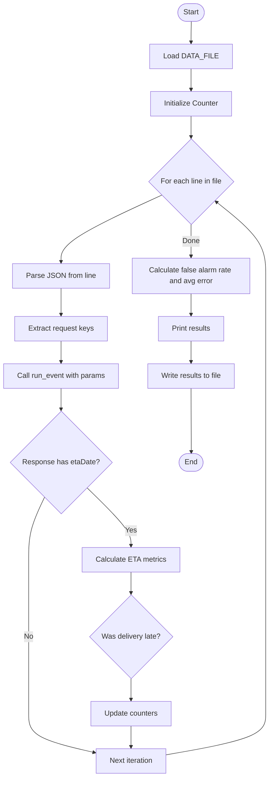
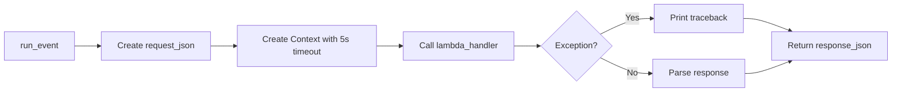
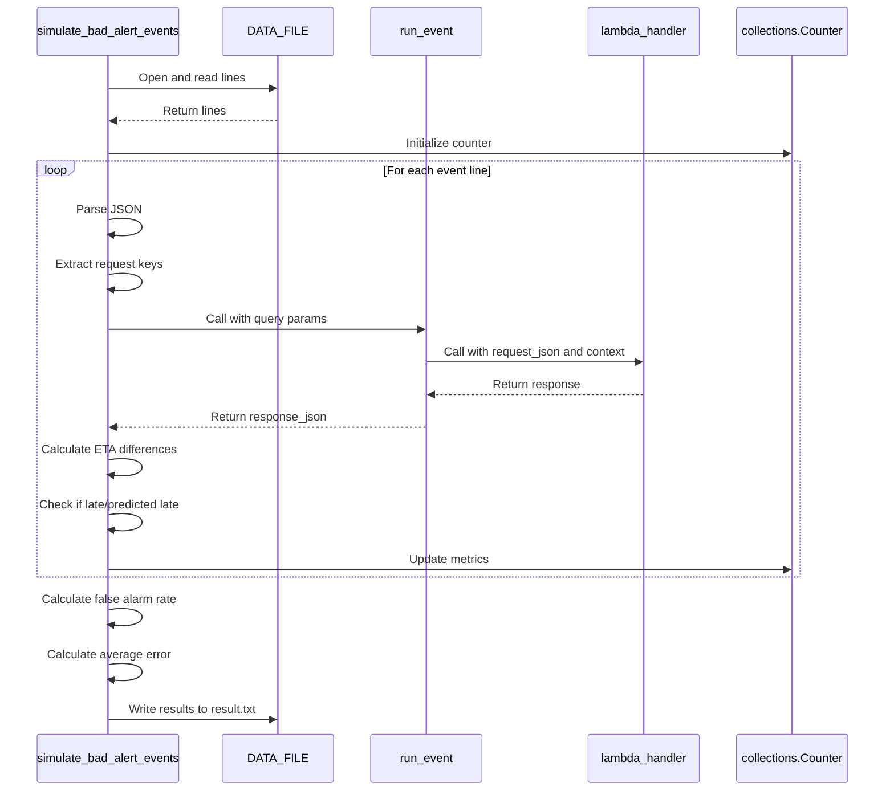
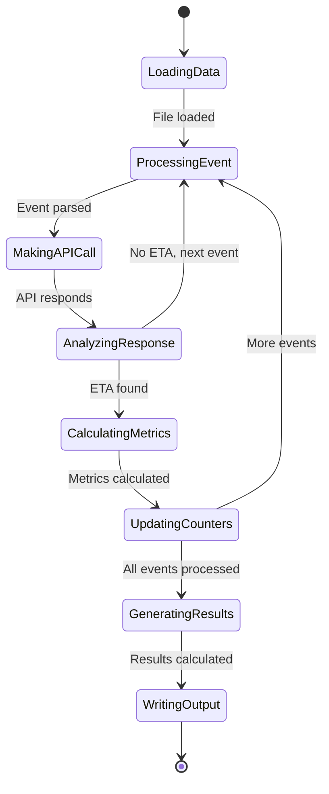

# Diagram: research/api/scripts/simulate/simulate_prod.py


> Auto-generated by Obscura crawlers

## Diagram 1

```mermaid
flowchart TD
      Start([Start]) --> LoadFile[Load DATA_FILE]
      LoadFile --> InitCounter[Initialize Counter]
      InitCounter --> ForLoop{For each line in file}...
  └ 65 lines...

● stop_bash
  └ <command with id: 0 stopped>

● Output Mermaid diagrams without fences
  $ cat << 'DIAGRAM1'
```

> SVG rendering failed for this diagram.

## Diagram 2

```mermaid
flowchart TD
      Start([Start]) --> LoadFile[Load DATA_FILE]
      LoadFile --> InitCounter[Initialize Counter]
      InitCounter --> ForLoop{For each line in file}...
  └ 71 lines...

✗ read_bash
  Invalid shell ID: 1. Please supply a valid shell ID to read output from.

  <no active shell sessions>

✗ Print diagrams directly
  $ printf 'flowchart TD\n    Start([Start]) --> LoadFile[Load DATA_FILE]\n    LoadFile -->
  InitCounter[Initialize Counter]\n    InitCounter --> ForLoop{For each line in file}\n
  ForLoop --> ParseJSON[Parse JSON from line]\n    ParseJSON --> ExtractKeys[Extract request
  keys]\n    ExtractKeys --> RunEvent[Call run_event with params]\n    RunEvent -->
  CheckResponse{Response has etaDate?}\n    CheckResponse -->|No| NextIter\n    CheckResponse ...
  Permission denied and could not request permission from user
```

> SVG rendering failed for this diagram.

## Diagram 3



### SVG

<svg id="container" width="594.1640014648438" xmlns="http://www.w3.org/2000/svg" class="flowchart" height="1705.1875" viewBox="0 0 594.1640014648438 1705.1875" role="graphics-document document" aria-roledescription="flowchart-v2"><style>#container{font-family:"trebuchet ms",verdana,arial,sans-serif;font-size:16px;fill:#333;}@keyframes edge-animation-frame{from{stroke-dashoffset:0;}}@keyframes dash{to{stroke-dashoffset:0;}}#container .edge-animation-slow{stroke-dasharray:9,5!important;stroke-dashoffset:900;animation:dash 50s linear infinite;stroke-linecap:round;}#container .edge-animation-fast{stroke-dasharray:9,5!important;stroke-dashoffset:900;animation:dash 20s linear infinite;stroke-linecap:round;}#container .error-icon{fill:#552222;}#container .error-text{fill:#552222;stroke:#552222;}#container .edge-thickness-normal{stroke-width:1px;}#container .edge-thickness-thick{stroke-width:3.5px;}#container .edge-pattern-solid{stroke-dasharray:0;}#container .edge-thickness-invisible{stroke-width:0;fill:none;}#container .edge-pattern-dashed{stroke-dasharray:3;}#container .edge-pattern-dotted{stroke-dasharray:2;}#container .marker{fill:#333333;stroke:#333333;}#container .marker.cross{stroke:#333333;}#container svg{font-family:"trebuchet ms",verdana,arial,sans-serif;font-size:16px;}#container p{margin:0;}#container .label{font-family:"trebuchet ms",verdana,arial,sans-serif;color:#333;}#container .cluster-label text{fill:#333;}#container .cluster-label span{color:#333;}#container .cluster-label span p{background-color:transparent;}#container .label text,#container span{fill:#333;color:#333;}#container .node rect,#container .node circle,#container .node ellipse,#container .node polygon,#container .node path{fill:#ECECFF;stroke:#9370DB;stroke-width:1px;}#container .rough-node .label text,#container .node .label text,#container .image-shape .label,#container .icon-shape .label{text-anchor:middle;}#container .node .katex path{fill:#000;stroke:#000;stroke-width:1px;}#container .rough-node .label,#container .node .label,#container .image-shape .label,#container .icon-shape .label{text-align:center;}#container .node.clickable{cursor:pointer;}#container .root .anchor path{fill:#333333!important;stroke-width:0;stroke:#333333;}#container .arrowheadPath{fill:#333333;}#container .edgePath .path{stroke:#333333;stroke-width:2.0px;}#container .flowchart-link{stroke:#333333;fill:none;}#container .edgeLabel{background-color:rgba(232,232,232, 0.8);text-align:center;}#container .edgeLabel p{background-color:rgba(232,232,232, 0.8);}#container .edgeLabel rect{opacity:0.5;background-color:rgba(232,232,232, 0.8);fill:rgba(232,232,232, 0.8);}#container .labelBkg{background-color:rgba(232, 232, 232, 0.5);}#container .cluster rect{fill:#ffffde;stroke:#aaaa33;stroke-width:1px;}#container .cluster text{fill:#333;}#container .cluster span{color:#333;}#container div.mermaidTooltip{position:absolute;text-align:center;max-width:200px;padding:2px;font-family:"trebuchet ms",verdana,arial,sans-serif;font-size:12px;background:hsl(80, 100%, 96.2745098039%);border:1px solid #aaaa33;border-radius:2px;pointer-events:none;z-index:100;}#container .flowchartTitleText{text-anchor:middle;font-size:18px;fill:#333;}#container rect.text{fill:none;stroke-width:0;}#container .icon-shape,#container .image-shape{background-color:rgba(232,232,232, 0.8);text-align:center;}#container .icon-shape p,#container .image-shape p{background-color:rgba(232,232,232, 0.8);padding:2px;}#container .icon-shape rect,#container .image-shape rect{opacity:0.5;background-color:rgba(232,232,232, 0.8);fill:rgba(232,232,232, 0.8);}#container .label-icon{display:inline-block;height:1em;overflow:visible;vertical-align:-0.125em;}#container .node .label-icon path{fill:currentColor;stroke:revert;stroke-width:revert;}#container :root{--mermaid-font-family:"trebuchet ms",verdana,arial,sans-serif;}</style><g><marker id="container_flowchart-v2-pointEnd" class="marker flowchart-v2" viewBox="0 0 10 10" refX="5" refY="5" markerUnits="userSpaceOnUse" markerWidth="8" markerHeight="8" orient="auto"><path d="M 0 0 L 10 5 L 0 10 z" class="arrowMarkerPath" style="stroke-width: 1; stroke-dasharray: 1, 0;"></path></marker><marker id="container_flowchart-v2-pointStart" class="marker flowchart-v2" viewBox="0 0 10 10" refX="4.5" refY="5" markerUnits="userSpaceOnUse" markerWidth="8" markerHeight="8" orient="auto"><path d="M 0 5 L 10 10 L 10 0 z" class="arrowMarkerPath" style="stroke-width: 1; stroke-dasharray: 1, 0;"></path></marker><marker id="container_flowchart-v2-circleEnd" class="marker flowchart-v2" viewBox="0 0 10 10" refX="11" refY="5" markerUnits="userSpaceOnUse" markerWidth="11" markerHeight="11" orient="auto"><circle cx="5" cy="5" r="5" class="arrowMarkerPath" style="stroke-width: 1; stroke-dasharray: 1, 0;"></circle></marker><marker id="container_flowchart-v2-circleStart" class="marker flowchart-v2" viewBox="0 0 10 10" refX="-1" refY="5" markerUnits="userSpaceOnUse" markerWidth="11" markerHeight="11" orient="auto"><circle cx="5" cy="5" r="5" class="arrowMarkerPath" style="stroke-width: 1; stroke-dasharray: 1, 0;"></circle></marker><marker id="container_flowchart-v2-crossEnd" class="marker cross flowchart-v2" viewBox="0 0 11 11" refX="12" refY="5.2" markerUnits="userSpaceOnUse" markerWidth="11" markerHeight="11" orient="auto"><path d="M 1,1 l 9,9 M 10,1 l -9,9" class="arrowMarkerPath" style="stroke-width: 2; stroke-dasharray: 1, 0;"></path></marker><marker id="container_flowchart-v2-crossStart" class="marker cross flowchart-v2" viewBox="0 0 11 11" refX="-1" refY="5.2" markerUnits="userSpaceOnUse" markerWidth="11" markerHeight="11" orient="auto"><path d="M 1,1 l 9,9 M 10,1 l -9,9" class="arrowMarkerPath" style="stroke-width: 2; stroke-dasharray: 1, 0;"></path></marker><g class="root"><g class="clusters"></g><g class="edgePaths"><path d="M421.664,47.5L421.581,51.583C421.497,55.667,421.331,63.833,421.247,71.417C421.164,79,421.164,86,421.164,89.5L421.164,93" id="L_Start_LoadFile_0" class="edge-thickness-normal edge-pattern-solid edge-thickness-normal edge-pattern-solid flowchart-link" style=";" data-edge="true" data-et="edge" data-id="L_Start_LoadFile_0" data-points="W3sieCI6NDIxLjY2NDA2MjUsInkiOjQ3LjV9LHsieCI6NDIxLjE2NDA2MjUsInkiOjcyfSx7IngiOjQyMS4xNjQwNjI1LCJ5Ijo5N31d" marker-end="url(#container_flowchart-v2-pointEnd)"></path><path d="M421.164,151L421.164,155.167C421.164,159.333,421.164,167.667,421.164,175.333C421.164,183,421.164,190,421.164,193.5L421.164,197" id="L_LoadFile_InitCounter_0" class="edge-thickness-normal edge-pattern-solid edge-thickness-normal edge-pattern-solid flowchart-link" style=";" data-edge="true" data-et="edge" data-id="L_LoadFile_InitCounter_0" data-points="W3sieCI6NDIxLjE2NDA2MjUsInkiOjE1MX0seyJ4Ijo0MjEuMTY0MDYyNSwieSI6MTc2fSx7IngiOjQyMS4xNjQwNjI1LCJ5IjoyMDF9XQ==" marker-end="url(#container_flowchart-v2-pointEnd)"></path><path d="M421.164,255L421.164,259.167C421.164,263.333,421.164,271.667,421.164,279.333C421.164,287,421.164,294,421.164,297.5L421.164,301" id="L_InitCounter_ForLoop_0" class="edge-thickness-normal edge-pattern-solid edge-thickness-normal edge-pattern-solid flowchart-link" style=";" data-edge="true" data-et="edge" data-id="L_InitCounter_ForLoop_0" data-points="W3sieCI6NDIxLjE2NDA2MjUsInkiOjI1NX0seyJ4Ijo0MjEuMTY0MDYyNSwieSI6MjgwfSx7IngiOjQyMS4xNjQwNjI1LCJ5IjozMDV9XQ==" marker-end="url(#container_flowchart-v2-pointEnd)"></path><path d="M355.804,431.421L319.282,448.481C282.76,465.541,209.716,499.661,173.194,524.221C136.672,548.781,136.672,563.781,136.672,571.281L136.672,578.781" id="L_ForLoop_ParseJSON_0" class="edge-thickness-normal edge-pattern-solid edge-thickness-normal edge-pattern-solid flowchart-link" style=";" data-edge="true" data-et="edge" data-id="L_ForLoop_ParseJSON_0" data-points="W3sieCI6MzU1LjgwNDA3OTE3MDU2NjI0LCJ5Ijo0MzEuNDIxMjY2NjcwNTY2MjR9LHsieCI6MTM2LjY3MTg3NSwieSI6NTMzLjc4MTI1fSx7IngiOjEzNi42NzE4NzUsInkiOjU4Mi43ODEyNX1d" marker-end="url(#container_flowchart-v2-pointEnd)"></path><path d="M136.672,636.781L136.672,642.948C136.672,649.115,136.672,661.448,136.672,671.115C136.672,680.781,136.672,687.781,136.672,691.281L136.672,694.781" id="L_ParseJSON_ExtractKeys_0" class="edge-thickness-normal edge-pattern-solid edge-thickness-normal edge-pattern-solid flowchart-link" style=";" data-edge="true" data-et="edge" data-id="L_ParseJSON_ExtractKeys_0" data-points="W3sieCI6MTM2LjY3MTg3NSwieSI6NjM2Ljc4MTI1fSx7IngiOjEzNi42NzE4NzUsInkiOjY3My43ODEyNX0seyJ4IjoxMzYuNjcxODc1LCJ5Ijo2OTguNzgxMjV9XQ==" marker-end="url(#container_flowchart-v2-pointEnd)"></path><path d="M136.672,752.781L136.672,756.948C136.672,761.115,136.672,769.448,136.672,777.115C136.672,784.781,136.672,791.781,136.672,795.281L136.672,798.781" id="L_ExtractKeys_RunEvent_0" class="edge-thickness-normal edge-pattern-solid edge-thickness-normal edge-pattern-solid flowchart-link" style=";" data-edge="true" data-et="edge" data-id="L_ExtractKeys_RunEvent_0" data-points="W3sieCI6MTM2LjY3MTg3NSwieSI6NzUyLjc4MTI1fSx7IngiOjEzNi42NzE4NzUsInkiOjc3Ny43ODEyNX0seyJ4IjoxMzYuNjcxODc1LCJ5Ijo4MDIuNzgxMjV9XQ==" marker-end="url(#container_flowchart-v2-pointEnd)"></path><path d="M136.672,856.781L136.672,860.948C136.672,865.115,136.672,873.448,136.672,881.115C136.672,888.781,136.672,895.781,136.672,899.281L136.672,902.781" id="L_RunEvent_CheckResponse_0" class="edge-thickness-normal edge-pattern-solid edge-thickness-normal edge-pattern-solid flowchart-link" style=";" data-edge="true" data-et="edge" data-id="L_RunEvent_CheckResponse_0" data-points="W3sieCI6MTM2LjY3MTg3NSwieSI6ODU2Ljc4MTI1fSx7IngiOjEzNi42NzE4NzUsInkiOjg4MS43ODEyNX0seyJ4IjoxMzYuNjcxODc1LCJ5Ijo5MDYuNzgxMjV9XQ==" marker-end="url(#container_flowchart-v2-pointEnd)"></path><path d="M100.777,1091.714L94.925,1103.864C89.073,1116.013,77.368,1140.311,71.516,1163.127C65.664,1185.943,65.664,1207.276,65.664,1226.609C65.664,1245.943,65.664,1263.276,65.664,1291.408C65.664,1319.539,65.664,1358.469,65.664,1397.398C65.664,1436.328,65.664,1475.258,65.664,1503.389C65.664,1531.521,65.664,1548.854,65.664,1566.188C65.664,1583.521,65.664,1600.854,89.19,1614.964C112.715,1629.074,159.767,1639.96,183.292,1645.403L206.818,1650.847" id="L_CheckResponse_NextIter_0" class="edge-thickness-normal edge-pattern-solid edge-thickness-normal edge-pattern-solid flowchart-link" style=";" data-edge="true" data-et="edge" data-id="L_CheckResponse_NextIter_0" data-points="W3sieCI6MTAwLjc3NjgzOTA4Njc1NTEzLCJ5IjoxMDkxLjcxNDMzOTA4Njc1NTJ9LHsieCI6NjUuNjY0MDYyNSwieSI6MTE2NC42MDkzNzV9LHsieCI6NjUuNjY0MDYyNSwieSI6MTIyOC42MDkzNzV9LHsieCI6NjUuNjY0MDYyNSwieSI6MTI4MC42MDkzNzV9LHsieCI6NjUuNjY0MDYyNSwieSI6MTM5Ny4zOTg0Mzc1fSx7IngiOjY1LjY2NDA2MjUsInkiOjE1MTQuMTg3NX0seyJ4Ijo2NS42NjQwNjI1LCJ5IjoxNTY2LjE4NzV9LHsieCI6NjUuNjY0MDYyNSwieSI6MTYxOC4xODc1fSx7IngiOjIxMC43MTQ4NDM3NSwieSI6MTY1MS43NDgyMTk1NjIwMDU3fV0=" marker-end="url(#container_flowchart-v2-pointEnd)"></path><path d="M193.038,1071.243L209.267,1086.804C225.496,1102.365,257.953,1133.487,274.182,1154.548C290.41,1175.609,290.41,1186.609,290.41,1192.109L290.41,1197.609" id="L_CheckResponse_CalcMetrics_0" class="edge-thickness-normal edge-pattern-solid edge-thickness-normal edge-pattern-solid flowchart-link" style=";" data-edge="true" data-et="edge" data-id="L_CheckResponse_CalcMetrics_0" data-points="W3sieCI6MTkzLjAzODI1NzQ4NjcwNDcsInkiOjEwNzEuMjQyOTkyNTEzMjk1M30seyJ4IjoyOTAuNDEwMTU2MjUsInkiOjExNjQuNjA5Mzc1fSx7IngiOjI5MC40MTAxNTYyNSwieSI6MTIwMS42MDkzNzV9XQ==" marker-end="url(#container_flowchart-v2-pointEnd)"></path><path d="M290.41,1255.609L290.41,1259.776C290.41,1263.943,290.41,1272.276,290.41,1279.943C290.41,1287.609,290.41,1294.609,290.41,1298.109L290.41,1301.609" id="L_CalcMetrics_CheckLate_0" class="edge-thickness-normal edge-pattern-solid edge-thickness-normal edge-pattern-solid flowchart-link" style=";" data-edge="true" data-et="edge" data-id="L_CalcMetrics_CheckLate_0" data-points="W3sieCI6MjkwLjQxMDE1NjI1LCJ5IjoxMjU1LjYwOTM3NX0seyJ4IjoyOTAuNDEwMTU2MjUsInkiOjEyODAuNjA5Mzc1fSx7IngiOjI5MC40MTAxNTYyNSwieSI6MTMwNS42MDkzNzV9XQ==" marker-end="url(#container_flowchart-v2-pointEnd)"></path><path d="M290.41,1489.188L290.41,1493.354C290.41,1497.521,290.41,1505.854,290.41,1513.521C290.41,1521.188,290.41,1528.188,290.41,1531.688L290.41,1535.188" id="L_CheckLate_UpdateCounters_0" class="edge-thickness-normal edge-pattern-solid edge-thickness-normal edge-pattern-solid flowchart-link" style=";" data-edge="true" data-et="edge" data-id="L_CheckLate_UpdateCounters_0" data-points="W3sieCI6MjkwLjQxMDE1NjI1LCJ5IjoxNDg5LjE4NzV9LHsieCI6MjkwLjQxMDE1NjI1LCJ5IjoxNTE0LjE4NzV9LHsieCI6MjkwLjQxMDE1NjI1LCJ5IjoxNTM5LjE4NzV9XQ==" marker-end="url(#container_flowchart-v2-pointEnd)"></path><path d="M290.41,1593.188L290.41,1597.354C290.41,1601.521,290.41,1609.854,290.41,1617.521C290.41,1625.188,290.41,1632.188,290.41,1635.688L290.41,1639.188" id="L_UpdateCounters_NextIter_0" class="edge-thickness-normal edge-pattern-solid edge-thickness-normal edge-pattern-solid flowchart-link" style=";" data-edge="true" data-et="edge" data-id="L_UpdateCounters_NextIter_0" data-points="W3sieCI6MjkwLjQxMDE1NjI1LCJ5IjoxNTkzLjE4NzV9LHsieCI6MjkwLjQxMDE1NjI1LCJ5IjoxNjE4LjE4NzV9LHsieCI6MjkwLjQxMDE1NjI1LCJ5IjoxNjQzLjE4NzV9XQ==" marker-end="url(#container_flowchart-v2-pointEnd)"></path><path d="M370.105,1656.175L406.115,1649.844C442.125,1643.513,514.145,1630.85,550.154,1615.852C586.164,1600.854,586.164,1583.521,586.164,1566.188C586.164,1548.854,586.164,1531.521,586.164,1503.389C586.164,1475.258,586.164,1436.328,586.164,1397.398C586.164,1358.469,586.164,1319.539,586.164,1291.408C586.164,1263.276,586.164,1245.943,586.164,1226.609C586.164,1207.276,586.164,1185.943,586.164,1150.707C586.164,1115.471,586.164,1066.333,586.164,1019.195C586.164,972.057,586.164,926.919,586.164,895.684C586.164,864.448,586.164,847.115,586.164,829.781C586.164,812.448,586.164,795.115,586.164,777.781C586.164,760.448,586.164,743.115,586.164,725.781C586.164,708.448,586.164,691.115,586.164,671.781C586.164,652.448,586.164,631.115,586.164,607.781C586.164,584.448,586.164,559.115,568.035,531.847C549.907,504.58,513.65,475.378,495.521,460.778L477.393,446.177" id="L_NextIter_ForLoop_0" class="edge-thickness-normal edge-pattern-solid edge-thickness-normal edge-pattern-solid flowchart-link" style=";" data-edge="true" data-et="edge" data-id="L_NextIter_ForLoop_0" data-points="W3sieCI6MzcwLjEwNTQ2ODc1LCJ5IjoxNjU2LjE3NTMyMjQzNDcyMDZ9LHsieCI6NTg2LjE2NDA2MjUsInkiOjE2MTguMTg3NX0seyJ4Ijo1ODYuMTY0MDYyNSwieSI6MTU2Ni4xODc1fSx7IngiOjU4Ni4xNjQwNjI1LCJ5IjoxNTE0LjE4NzV9LHsieCI6NTg2LjE2NDA2MjUsInkiOjEzOTcuMzk4NDM3NX0seyJ4Ijo1ODYuMTY0MDYyNSwieSI6MTI4MC42MDkzNzV9LHsieCI6NTg2LjE2NDA2MjUsInkiOjEyMjguNjA5Mzc1fSx7IngiOjU4Ni4xNjQwNjI1LCJ5IjoxMTY0LjYwOTM3NX0seyJ4Ijo1ODYuMTY0MDYyNSwieSI6MTAxNy4xOTUzMTI1fSx7IngiOjU4Ni4xNjQwNjI1LCJ5Ijo4ODEuNzgxMjV9LHsieCI6NTg2LjE2NDA2MjUsInkiOjgyOS43ODEyNX0seyJ4Ijo1ODYuMTY0MDYyNSwieSI6Nzc3Ljc4MTI1fSx7IngiOjU4Ni4xNjQwNjI1LCJ5Ijo3MjUuNzgxMjV9LHsieCI6NTg2LjE2NDA2MjUsInkiOjY3My43ODEyNX0seyJ4Ijo1ODYuMTY0MDYyNSwieSI6NjA5Ljc4MTI1fSx7IngiOjU4Ni4xNjQwNjI1LCJ5Ijo1MzMuNzgxMjV9LHsieCI6NDc0LjI3NzM1OTExNjgzNzE1LCJ5Ijo0NDMuNjY3OTUzMzgzMTYyODV9XQ==" marker-end="url(#container_flowchart-v2-pointEnd)"></path><path d="M421.164,496.781L421.164,502.948C421.164,509.115,421.164,521.448,421.164,533.115C421.164,544.781,421.164,555.781,421.164,561.281L421.164,566.781" id="L_ForLoop_CalcRates_0" class="edge-thickness-normal edge-pattern-solid edge-thickness-normal edge-pattern-solid flowchart-link" style=";" data-edge="true" data-et="edge" data-id="L_ForLoop_CalcRates_0" data-points="W3sieCI6NDIxLjE2NDA2MjUsInkiOjQ5Ni43ODEyNX0seyJ4Ijo0MjEuMTY0MDYyNSwieSI6NTMzLjc4MTI1fSx7IngiOjQyMS4xNjQwNjI1LCJ5Ijo1NzAuNzgxMjV9XQ==" marker-end="url(#container_flowchart-v2-pointEnd)"></path><path d="M421.164,648.781L421.164,652.948C421.164,657.115,421.164,665.448,421.164,673.115C421.164,680.781,421.164,687.781,421.164,691.281L421.164,694.781" id="L_CalcRates_PrintResults_0" class="edge-thickness-normal edge-pattern-solid edge-thickness-normal edge-pattern-solid flowchart-link" style=";" data-edge="true" data-et="edge" data-id="L_CalcRates_PrintResults_0" data-points="W3sieCI6NDIxLjE2NDA2MjUsInkiOjY0OC43ODEyNX0seyJ4Ijo0MjEuMTY0MDYyNSwieSI6NjczLjc4MTI1fSx7IngiOjQyMS4xNjQwNjI1LCJ5Ijo2OTguNzgxMjV9XQ==" marker-end="url(#container_flowchart-v2-pointEnd)"></path><path d="M421.164,752.781L421.164,756.948C421.164,761.115,421.164,769.448,421.164,777.115C421.164,784.781,421.164,791.781,421.164,795.281L421.164,798.781" id="L_PrintResults_WriteFile_0" class="edge-thickness-normal edge-pattern-solid edge-thickness-normal edge-pattern-solid flowchart-link" style=";" data-edge="true" data-et="edge" data-id="L_PrintResults_WriteFile_0" data-points="W3sieCI6NDIxLjE2NDA2MjUsInkiOjc1Mi43ODEyNX0seyJ4Ijo0MjEuMTY0MDYyNSwieSI6Nzc3Ljc4MTI1fSx7IngiOjQyMS4xNjQwNjI1LCJ5Ijo4MDIuNzgxMjV9XQ==" marker-end="url(#container_flowchart-v2-pointEnd)"></path><path d="M421.164,856.781L421.164,860.948C421.164,865.115,421.164,873.448,421.245,896.35C421.325,919.253,421.486,956.724,421.566,975.46L421.647,994.195" id="L_WriteFile_End_0" class="edge-thickness-normal edge-pattern-solid edge-thickness-normal edge-pattern-solid flowchart-link" style=";" data-edge="true" data-et="edge" data-id="L_WriteFile_End_0" data-points="W3sieCI6NDIxLjE2NDA2MjUsInkiOjg1Ni43ODEyNX0seyJ4Ijo0MjEuMTY0MDYyNSwieSI6ODgxLjc4MTI1fSx7IngiOjQyMS42NjQwNjI1LCJ5Ijo5OTguMTk1MzEyNX1d" marker-end="url(#container_flowchart-v2-pointEnd)"></path></g><g class="edgeLabels"><g class="edgeLabel"><g class="label" data-id="L_Start_LoadFile_0" transform="translate(0, 0)"><foreignObject width="0" height="0"><div xmlns="http://www.w3.org/1999/xhtml" class="labelBkg" style="display: table-cell; white-space: nowrap; line-height: 1.5; max-width: 200px; text-align: center;"><span class="edgeLabel"></span></div></foreignObject></g></g><g class="edgeLabel"><g class="label" data-id="L_LoadFile_InitCounter_0" transform="translate(0, 0)"><foreignObject width="0" height="0"><div xmlns="http://www.w3.org/1999/xhtml" class="labelBkg" style="display: table-cell; white-space: nowrap; line-height: 1.5; max-width: 200px; text-align: center;"><span class="edgeLabel"></span></div></foreignObject></g></g><g class="edgeLabel"><g class="label" data-id="L_InitCounter_ForLoop_0" transform="translate(0, 0)"><foreignObject width="0" height="0"><div xmlns="http://www.w3.org/1999/xhtml" class="labelBkg" style="display: table-cell; white-space: nowrap; line-height: 1.5; max-width: 200px; text-align: center;"><span class="edgeLabel"></span></div></foreignObject></g></g><g class="edgeLabel"><g class="label" data-id="L_ForLoop_ParseJSON_0" transform="translate(0, 0)"><foreignObject width="0" height="0"><div xmlns="http://www.w3.org/1999/xhtml" class="labelBkg" style="display: table-cell; white-space: nowrap; line-height: 1.5; max-width: 200px; text-align: center;"><span class="edgeLabel"></span></div></foreignObject></g></g><g class="edgeLabel"><g class="label" data-id="L_ParseJSON_ExtractKeys_0" transform="translate(0, 0)"><foreignObject width="0" height="0"><div xmlns="http://www.w3.org/1999/xhtml" class="labelBkg" style="display: table-cell; white-space: nowrap; line-height: 1.5; max-width: 200px; text-align: center;"><span class="edgeLabel"></span></div></foreignObject></g></g><g class="edgeLabel"><g class="label" data-id="L_ExtractKeys_RunEvent_0" transform="translate(0, 0)"><foreignObject width="0" height="0"><div xmlns="http://www.w3.org/1999/xhtml" class="labelBkg" style="display: table-cell; white-space: nowrap; line-height: 1.5; max-width: 200px; text-align: center;"><span class="edgeLabel"></span></div></foreignObject></g></g><g class="edgeLabel"><g class="label" data-id="L_RunEvent_CheckResponse_0" transform="translate(0, 0)"><foreignObject width="0" height="0"><div xmlns="http://www.w3.org/1999/xhtml" class="labelBkg" style="display: table-cell; white-space: nowrap; line-height: 1.5; max-width: 200px; text-align: center;"><span class="edgeLabel"></span></div></foreignObject></g></g><g class="edgeLabel" transform="translate(65.6640625, 1397.3984375)"><g class="label" data-id="L_CheckResponse_NextIter_0" transform="translate(-10.140625, -12)"><foreignObject width="20.28125" height="24"><div xmlns="http://www.w3.org/1999/xhtml" class="labelBkg" style="display: table-cell; white-space: nowrap; line-height: 1.5; max-width: 200px; text-align: center;"><span class="edgeLabel"><p>No</p></span></div></foreignObject></g></g><g class="edgeLabel" transform="translate(290.41015625, 1164.609375)"><g class="label" data-id="L_CheckResponse_CalcMetrics_0" transform="translate(-12.03125, -12)"><foreignObject width="24.0625" height="24"><div xmlns="http://www.w3.org/1999/xhtml" class="labelBkg" style="display: table-cell; white-space: nowrap; line-height: 1.5; max-width: 200px; text-align: center;"><span class="edgeLabel"><p>Yes</p></span></div></foreignObject></g></g><g class="edgeLabel"><g class="label" data-id="L_CalcMetrics_CheckLate_0" transform="translate(0, 0)"><foreignObject width="0" height="0"><div xmlns="http://www.w3.org/1999/xhtml" class="labelBkg" style="display: table-cell; white-space: nowrap; line-height: 1.5; max-width: 200px; text-align: center;"><span class="edgeLabel"></span></div></foreignObject></g></g><g class="edgeLabel"><g class="label" data-id="L_CheckLate_UpdateCounters_0" transform="translate(0, 0)"><foreignObject width="0" height="0"><div xmlns="http://www.w3.org/1999/xhtml" class="labelBkg" style="display: table-cell; white-space: nowrap; line-height: 1.5; max-width: 200px; text-align: center;"><span class="edgeLabel"></span></div></foreignObject></g></g><g class="edgeLabel"><g class="label" data-id="L_UpdateCounters_NextIter_0" transform="translate(0, 0)"><foreignObject width="0" height="0"><div xmlns="http://www.w3.org/1999/xhtml" class="labelBkg" style="display: table-cell; white-space: nowrap; line-height: 1.5; max-width: 200px; text-align: center;"><span class="edgeLabel"></span></div></foreignObject></g></g><g class="edgeLabel"><g class="label" data-id="L_NextIter_ForLoop_0" transform="translate(0, 0)"><foreignObject width="0" height="0"><div xmlns="http://www.w3.org/1999/xhtml" class="labelBkg" style="display: table-cell; white-space: nowrap; line-height: 1.5; max-width: 200px; text-align: center;"><span class="edgeLabel"></span></div></foreignObject></g></g><g class="edgeLabel" transform="translate(421.1640625, 533.78125)"><g class="label" data-id="L_ForLoop_CalcRates_0" transform="translate(-18.875, -12)"><foreignObject width="37.75" height="24"><div xmlns="http://www.w3.org/1999/xhtml" class="labelBkg" style="display: table-cell; white-space: nowrap; line-height: 1.5; max-width: 200px; text-align: center;"><span class="edgeLabel"><p>Done</p></span></div></foreignObject></g></g><g class="edgeLabel"><g class="label" data-id="L_CalcRates_PrintResults_0" transform="translate(0, 0)"><foreignObject width="0" height="0"><div xmlns="http://www.w3.org/1999/xhtml" class="labelBkg" style="display: table-cell; white-space: nowrap; line-height: 1.5; max-width: 200px; text-align: center;"><span class="edgeLabel"></span></div></foreignObject></g></g><g class="edgeLabel"><g class="label" data-id="L_PrintResults_WriteFile_0" transform="translate(0, 0)"><foreignObject width="0" height="0"><div xmlns="http://www.w3.org/1999/xhtml" class="labelBkg" style="display: table-cell; white-space: nowrap; line-height: 1.5; max-width: 200px; text-align: center;"><span class="edgeLabel"></span></div></foreignObject></g></g><g class="edgeLabel"><g class="label" data-id="L_WriteFile_End_0" transform="translate(0, 0)"><foreignObject width="0" height="0"><div xmlns="http://www.w3.org/1999/xhtml" class="labelBkg" style="display: table-cell; white-space: nowrap; line-height: 1.5; max-width: 200px; text-align: center;"><span class="edgeLabel"></span></div></foreignObject></g></g></g><g class="nodes"><g class="node default" id="flowchart-Start-0" transform="translate(421.1640625, 27.5)"><g class="basic label-container outer-path"><path d="M-10.3984375 -19.5 C-4.566189498774934 -19.5, 1.2660585024501323 -19.5, 10.3984375 -19.5 C10.3984375 -19.5, 10.398437499999998 -19.5, 10.398437499999998 -19.5 C10.851353772560389 -19.48547585668703, 11.304270045120779 -19.470951713374067, 11.6478067896239 -19.45993515863156 C11.937316908399051 -19.43200646566018, 12.226827027174204 -19.4040777726888, 12.892042152847864 -19.3399052695533 C13.34080648216866 -19.267352533008065, 13.789570811489456 -19.19479979646283, 14.126030759676757 -19.140403561325776 C14.43051977063047 -19.07090593155208, 14.735008781584185 -19.001408301778383, 15.34470188623539 -18.862249829261074 C15.653496286672272 -18.77060127210629, 15.962290687109155 -18.67895271495151, 16.543047751460602 -18.50658706670804 C16.969483110637594 -18.349654912605658, 17.395918469814585 -18.192722758503276, 17.716144095147794 -18.074876768247425 C18.032510059087894 -17.934830940674026, 18.348876023027998 -17.794785113100623, 18.85917041279238 -17.568892924097174 C19.117411258704813 -17.434168840195813, 19.37565210461725 -17.299444756294452, 19.967429764076783 -16.990714730406097 C20.342822992039345 -16.763149149559716, 20.718216220001906 -16.535583568713335, 21.036368073605697 -16.342718045390892 C21.349364597267524 -16.124385219885532, 21.662361120929354 -15.906052394380174, 22.061592844578712 -15.627565626425154 C22.316345180192187 -15.424407418017768, 22.57109751580566 -15.221249209610384, 23.03889120850187 -14.848196188198123 C23.380326553384734 -14.53811364185969, 23.721761898267598 -14.228031095521256, 23.964247236767985 -14.007812326905688 C24.17207706830175 -13.793210962700575, 24.379906899835515 -13.578609598495461, 24.833858442968648 -13.10986736009568 C25.12229855435041 -12.771049192559374, 25.410738665732172 -12.43223102502307, 25.644151408126582 -12.158051136245305 C25.93148121255264 -11.773055374598068, 26.218811016978695 -11.38805961295083, 26.391796464640635 -11.156274872382312 C26.6478570014359 -10.762897125983084, 26.903917538231166 -10.369519379583858, 27.073721378604247 -10.108655082055241 C27.317803276429107 -9.675262956494942, 27.561885174253966 -9.241870830934642, 27.6871239742735 -9.019496659696287 C27.85249697246387 -8.67609609053866, 28.017869970654246 -8.332695521381034, 28.22948364880834 -7.893275190886684 C28.34889324787027 -7.59833117257618, 28.468302846932197 -7.303387154265675, 28.698571729970325 -6.734618561215508 C28.83495228815957 -6.323862049240557, 28.971332846348812 -5.913105537265604, 29.09246063421488 -5.548287939305138 C29.186445441432532 -5.189883136111124, 29.28043024865018 -4.8314783329171105, 29.40953178754556 -4.339158212148133 C29.489328948743935 -3.9294166545304656, 29.569126109942314 -3.519675096912798, 29.648482276581777 -3.1121979531509023 C29.700546039046102 -2.708401692630362, 29.75260980151043 -2.304605432109821, 29.808330202509367 -1.872449005199798 C29.8352643643468 -1.4529276937176852, 29.862198526184226 -1.0334063822355724, 29.888418715913414 -0.6250057626472757 C29.888418715913414 -0.27637459881205806, 29.888418715913414 0.07225656502315958, 29.888418715913414 0.625005762647271 C29.858889747081815 1.0849432875540457, 29.82936077825022 1.5448808124608202, 29.808330202509367 1.8724490051997846 C29.748700879353493 2.334922260455023, 29.68907155619762 2.797395515710262, 29.648482276581777 3.1121979531508885 C29.56103978656519 3.5611966584092642, 29.4735972965486 4.0101953636676395, 29.40953178754556 4.339158212148129 C29.3060982945577 4.733594949270268, 29.202664801569842 5.128031686392407, 29.092460634214884 5.548287939305125 C29.00275905218777 5.818454812364593, 28.913057470160652 6.088621685424061, 28.69857172997033 6.734618561215495 C28.584124277469222 7.017305981584196, 28.469676824968115 7.299993401952896, 28.229483648808344 7.893275190886679 C28.089159597269752 8.184661086360283, 27.94883554573116 8.476046981833885, 27.687123974273504 9.019496659696284 C27.54572945256277 9.270556950741575, 27.40433493085204 9.521617241786865, 27.07372137860425 10.108655082055236 C26.866644241995477 10.426781171883345, 26.659567105386703 10.744907261711454, 26.39179646464064 11.156274872382301 C26.239894262262496 11.359809984993694, 26.08799205988435 11.563345097605087, 25.644151408126582 12.158051136245302 C25.47708812115007 12.354293179298237, 25.31002483417356 12.550535222351174, 24.83385844296866 13.10986736009567 C24.595231284212602 13.356269493165389, 24.356604125456542 13.602671626235107, 23.96424723676799 14.007812326905684 C23.752867574606125 14.199781743281704, 23.54148791244426 14.391751159657725, 23.038891208501887 14.848196188198111 C22.75478280806028 15.074765077108239, 22.470674407618674 15.301333966018365, 22.061592844578715 15.627565626425152 C21.676747852482553 15.896016833240235, 21.29190286038639 16.16446804005532, 21.036368073605708 16.34271804539089 C20.61338528751883 16.599132696039515, 20.190402501431954 16.85554734668814, 19.967429764076787 16.990714730406093 C19.655527254785337 17.15343406972035, 19.343624745493887 17.31615340903461, 18.859170412792388 17.56889292409717 C18.411388405287244 17.76711273583839, 17.9636063977821 17.96533254757961, 17.716144095147804 18.07487676824742 C17.317489677804637 18.22158527895074, 16.918835260461474 18.368293789654064, 16.543047751460616 18.506587066708033 C16.127029952605174 18.63005896568634, 15.711012153749733 18.75353086466465, 15.344701886235413 18.86224982926107 C14.998328641929502 18.94130726197724, 14.651955397623592 19.02036469469341, 14.126030759676766 19.140403561325773 C13.662784894022519 19.21529756035941, 13.199539028368271 19.290191559393048, 12.892042152847878 19.3399052695533 C12.435057901692238 19.38398999065831, 11.978073650536597 19.428074711763326, 11.6478067896239 19.45993515863156 C11.311989222014613 19.470704174395546, 10.976171654405325 19.481473190159534, 10.398437500000004 19.5 C10.398437500000004 19.5, 10.398437500000002 19.5, 10.3984375 19.5 C3.7370624123994727 19.5, -2.9243126752010546 19.5, -10.398437499999996 19.5 C-10.815331165760645 19.48663103157335, -11.232224831521295 19.4732620631467, -11.647806789623893 19.45993515863156 C-11.922967018662913 19.433390782264755, -12.198127247701933 19.406846405897955, -12.892042152847871 19.3399052695533 C-13.284943163222513 19.27638408118877, -13.677844173597155 19.212862892824237, -14.126030759676759 19.140403561325773 C-14.552064072238553 19.043164237860726, -14.978097384800346 18.945924914395675, -15.344701886235388 18.862249829261074 C-15.79472564197873 18.72868514077935, -16.24474939772207 18.595120452297625, -16.54304775146059 18.506587066708043 C-16.939419377729614 18.360718644221894, -17.335791003998636 18.214850221735748, -17.716144095147797 18.074876768247425 C-18.05301321378235 17.925754802295266, -18.389882332416907 17.776632836343104, -18.85917041279238 17.568892924097174 C-19.127664407385232 17.428819779096695, -19.396158401978084 17.288746634096213, -19.96742976407678 16.990714730406097 C-20.356053638203694 16.75512865410298, -20.744677512330604 16.51954257779986, -21.036368073605686 16.3427180453909 C-21.2502571994686 16.19351825029996, -21.464146325331512 16.04431845520902, -22.061592844578712 15.627565626425156 C-22.42765470229367 15.33564103621262, -22.79371656000863 15.043716446000083, -23.03889120850187 14.848196188198125 C-23.29101457460099 14.61922441792562, -23.543137940700113 14.390252647653115, -23.964247236767974 14.007812326905697 C-24.214488901520262 13.749417262826196, -24.46473056627255 13.491022198746695, -24.833858442968655 13.109867360095677 C-25.070532183000758 12.831856917936655, -25.30720592303286 12.55384647577763, -25.64415140812658 12.158051136245307 C-25.81612637994609 11.9276203412494, -25.9881013517656 11.697189546253494, -26.391796464640635 11.156274872382316 C-26.541728317570737 10.925939283941906, -26.691660170500842 10.695603695501497, -27.073721378604244 10.108655082055249 C-27.29758925852244 9.711154992179498, -27.52145713844064 9.313654902303746, -27.6871239742735 9.019496659696289 C-27.838533904605686 8.70509069970798, -27.98994383493787 8.390684739719674, -28.22948364880834 7.893275190886686 C-28.411974020718297 7.442520444057772, -28.594464392628257 6.991765697228857, -28.698571729970325 6.73461856121551 C-28.824929647113716 6.354048647179681, -28.951287564257104 5.9734787331438515, -29.09246063421488 5.5482879393051325 C-29.186413909709767 5.190003380235945, -29.280367185204657 4.831718821166757, -29.409531787545557 4.339158212148136 C-29.49539506922127 3.8982684079543692, -29.58125835089698 3.4573786037606027, -29.648482276581777 3.112197953150904 C-29.69279772295018 2.7684961021922754, -29.73711316931858 2.4247942512336467, -29.808330202509364 1.872449005199809 C-29.830645460670482 1.5248708467882048, -29.8529607188316 1.1772926883766004, -29.888418715913414 0.6250057626472781 C-29.888418715913414 0.21260822608552893, -29.888418715913414 -0.19978931047622028, -29.888418715913414 -0.6250057626472687 C-29.864895848161687 -0.9913934151975261, -29.84137298040996 -1.3577810677477835, -29.808330202509367 -1.8724490051997822 C-29.76098969577517 -2.239612626989786, -29.71364918904097 -2.6067762487797896, -29.648482276581777 -3.112197953150895 C-29.571493338646953 -3.507519877828427, -29.494504400712128 -3.902841802505959, -29.40953178754556 -4.339158212148126 C-29.33666004440934 -4.617049751539795, -29.26378830127312 -4.894941290931462, -29.092460634214884 -5.548287939305123 C-28.984954705348496 -5.8720786683070525, -28.877448776482105 -6.195869397308982, -28.698571729970332 -6.734618561215485 C-28.579205356572835 -7.029455811299137, -28.459838983175338 -7.324293061382789, -28.229483648808344 -7.893275190886676 C-28.07703591772562 -8.209836166338857, -27.9245881866429 -8.526397141791035, -27.687123974273504 -9.019496659696282 C-27.552284723201126 -9.258917403930045, -27.417445472128747 -9.498338148163807, -27.073721378604247 -10.108655082055243 C-26.840670380621113 -10.466683997912737, -26.607619382637978 -10.824712913770231, -26.39179646464064 -11.156274872382308 C-26.19084026439658 -11.425537873222888, -25.989884064152516 -11.69480087406347, -25.644151408126586 -12.158051136245302 C-25.415255900295634 -12.426924824266903, -25.186360392464678 -12.695798512288507, -24.833858442968662 -13.10986736009567 C-24.561234021548294 -13.39137445809346, -24.28860960012793 -13.672881556091252, -23.964247236767996 -14.007812326905677 C-23.758486912911565 -14.194678408912248, -23.55272658905513 -14.381544490918818, -23.038891208501887 -14.848196188198107 C-22.758674685350986 -15.071661408536102, -22.478458162200084 -15.295126628874097, -22.06159284457872 -15.627565626425149 C-21.800850881921544 -15.809447932237152, -21.540108919264366 -15.991330238049155, -21.03636807360571 -16.342718045390885 C-20.65291458087347 -16.57516980610802, -20.26946108814123 -16.80762156682515, -19.96742976407679 -16.99071473040609 C-19.740962648052918 -17.108862479776633, -19.51449553202905 -17.227010229147176, -18.859170412792388 -17.56889292409717 C-18.629899729050074 -17.6703842547167, -18.40062904530776 -17.771875585336232, -17.716144095147804 -18.07487676824742 C-17.451711758089665 -18.172190312670544, -17.187279421031523 -18.269503857093667, -16.54304775146062 -18.506587066708033 C-16.158837423155106 -18.62061867538794, -15.774627094849594 -18.73465028406785, -15.344701886235413 -18.862249829261067 C-15.006734704736607 -18.939388632996202, -14.6687675232378 -19.016527436731337, -14.126030759676768 -19.140403561325773 C-13.641126637081245 -19.218799099379385, -13.156222514485721 -19.297194637432995, -12.89204215284788 -19.3399052695533 C-12.64200700293865 -19.364025859753777, -12.391971853029418 -19.38814644995426, -11.647806789623903 -19.45993515863156 C-11.265276641585551 -19.472202155929384, -10.882746493547197 -19.48446915322721, -10.398437500000005 -19.5 C-10.398437500000004 -19.5, -10.398437500000002 -19.5, -10.3984375 -19.5" stroke="none" stroke-width="0" fill="#ECECFF" style=""></path><path d="M-10.3984375 -19.5 C-2.369034584300694 -19.5, 5.660368331398612 -19.5, 10.3984375 -19.5 M-10.3984375 -19.5 C-5.494116973327528 -19.5, -0.5897964466550558 -19.5, 10.3984375 -19.5 M10.3984375 -19.5 C10.3984375 -19.5, 10.3984375 -19.5, 10.398437499999998 -19.5 M10.3984375 -19.5 C10.3984375 -19.5, 10.398437499999998 -19.5, 10.398437499999998 -19.5 M10.398437499999998 -19.5 C10.866397364506104 -19.48499343797391, 11.334357229012209 -19.469986875947818, 11.6478067896239 -19.45993515863156 M10.398437499999998 -19.5 C10.720668641697527 -19.48966667447063, 11.042899783395056 -19.479333348941257, 11.6478067896239 -19.45993515863156 M11.6478067896239 -19.45993515863156 C11.925327202817599 -19.433163098137893, 12.202847616011296 -19.406391037644223, 12.892042152847864 -19.3399052695533 M11.6478067896239 -19.45993515863156 C12.055305674319278 -19.420624231314108, 12.462804559014657 -19.381313303996656, 12.892042152847864 -19.3399052695533 M12.892042152847864 -19.3399052695533 C13.138875305030213 -19.29999919972814, 13.38570845721256 -19.260093129902984, 14.126030759676757 -19.140403561325776 M12.892042152847864 -19.3399052695533 C13.36765511023448 -19.263011855036602, 13.843268067621098 -19.186118440519905, 14.126030759676757 -19.140403561325776 M14.126030759676757 -19.140403561325776 C14.456014904424698 -19.065086833634844, 14.785999049172641 -18.98977010594391, 15.34470188623539 -18.862249829261074 M14.126030759676757 -19.140403561325776 C14.51369956574726 -19.05192068611556, 14.90136837181776 -18.96343781090535, 15.34470188623539 -18.862249829261074 M15.34470188623539 -18.862249829261074 C15.787032016407107 -18.73096856846434, 16.229362146578826 -18.59968730766761, 16.543047751460602 -18.50658706670804 M15.34470188623539 -18.862249829261074 C15.682771292575753 -18.76191260402178, 16.020840698916118 -18.661575378782487, 16.543047751460602 -18.50658706670804 M16.543047751460602 -18.50658706670804 C16.8923247763268 -18.378049892875854, 17.241601801193 -18.24951271904367, 17.716144095147794 -18.074876768247425 M16.543047751460602 -18.50658706670804 C16.850986043723992 -18.39326292860474, 17.15892433598738 -18.279938790501447, 17.716144095147794 -18.074876768247425 M17.716144095147794 -18.074876768247425 C18.08314590277103 -17.912415954734435, 18.450147710394265 -17.749955141221445, 18.85917041279238 -17.568892924097174 M17.716144095147794 -18.074876768247425 C17.961189869726745 -17.966402272865956, 18.206235644305696 -17.857927777484488, 18.85917041279238 -17.568892924097174 M18.85917041279238 -17.568892924097174 C19.12713638232115 -17.42909524943441, 19.395102351849925 -17.289297574771645, 19.967429764076783 -16.990714730406097 M18.85917041279238 -17.568892924097174 C19.293785315689576 -17.34215460763984, 19.72840021858677 -17.115416291182505, 19.967429764076783 -16.990714730406097 M19.967429764076783 -16.990714730406097 C20.221775387259612 -16.836528918931876, 20.47612101044244 -16.68234310745765, 21.036368073605697 -16.342718045390892 M19.967429764076783 -16.990714730406097 C20.30575159705943 -16.785622047052236, 20.644073430042077 -16.58052936369838, 21.036368073605697 -16.342718045390892 M21.036368073605697 -16.342718045390892 C21.386998570031114 -16.09813338963408, 21.737629066456527 -15.853548733877265, 22.061592844578712 -15.627565626425154 M21.036368073605697 -16.342718045390892 C21.320061665077553 -16.14482567687777, 21.60375525654941 -15.946933308364644, 22.061592844578712 -15.627565626425154 M22.061592844578712 -15.627565626425154 C22.40957870593729 -15.350056162284368, 22.757564567295866 -15.07254669814358, 23.03889120850187 -14.848196188198123 M22.061592844578712 -15.627565626425154 C22.35532106161674 -15.393325189773453, 22.64904927865476 -15.159084753121753, 23.03889120850187 -14.848196188198123 M23.03889120850187 -14.848196188198123 C23.325120086022228 -14.588250694835235, 23.611348963542586 -14.328305201472348, 23.964247236767985 -14.007812326905688 M23.03889120850187 -14.848196188198123 C23.354836534231087 -14.561263002826085, 23.670781859960304 -14.274329817454046, 23.964247236767985 -14.007812326905688 M23.964247236767985 -14.007812326905688 C24.28500597862415 -13.676602591156733, 24.60576472048031 -13.345392855407777, 24.833858442968648 -13.10986736009568 M23.964247236767985 -14.007812326905688 C24.27684086333324 -13.685033743063025, 24.5894344898985 -13.362255159220362, 24.833858442968648 -13.10986736009568 M24.833858442968648 -13.10986736009568 C25.011981777786836 -12.900633555513359, 25.190105112605025 -12.691399750931037, 25.644151408126582 -12.158051136245305 M24.833858442968648 -13.10986736009568 C25.035606409334083 -12.872882719018348, 25.237354375699518 -12.635898077941015, 25.644151408126582 -12.158051136245305 M25.644151408126582 -12.158051136245305 C25.908285558237303 -11.804135438213036, 26.172419708348027 -11.450219740180767, 26.391796464640635 -11.156274872382312 M25.644151408126582 -12.158051136245305 C25.819669903462845 -11.922872342558584, 25.995188398799108 -11.687693548871861, 26.391796464640635 -11.156274872382312 M26.391796464640635 -11.156274872382312 C26.64902834122742 -10.761097633514533, 26.906260217814207 -10.365920394646755, 27.073721378604247 -10.108655082055241 M26.391796464640635 -11.156274872382312 C26.544221750943763 -10.922108700700328, 26.696647037246887 -10.687942529018343, 27.073721378604247 -10.108655082055241 M27.073721378604247 -10.108655082055241 C27.30316719778803 -9.701250796185844, 27.532613016971812 -9.293846510316445, 27.6871239742735 -9.019496659696287 M27.073721378604247 -10.108655082055241 C27.295684198952387 -9.714537618354326, 27.51764701930053 -9.320420154653409, 27.6871239742735 -9.019496659696287 M27.6871239742735 -9.019496659696287 C27.872815589707663 -8.633904047083169, 28.058507205141822 -8.248311434470052, 28.22948364880834 -7.893275190886684 M27.6871239742735 -9.019496659696287 C27.893454815169452 -8.591046253803084, 28.0997856560654 -8.16259584790988, 28.22948364880834 -7.893275190886684 M28.22948364880834 -7.893275190886684 C28.36190904514309 -7.566181901668994, 28.494334441477836 -7.239088612451303, 28.698571729970325 -6.734618561215508 M28.22948364880834 -7.893275190886684 C28.376308686353372 -7.530614509481467, 28.523133723898404 -7.167953828076249, 28.698571729970325 -6.734618561215508 M28.698571729970325 -6.734618561215508 C28.78977112538655 -6.4599405128721985, 28.880970520802773 -6.185262464528888, 29.09246063421488 -5.548287939305138 M28.698571729970325 -6.734618561215508 C28.797266935856936 -6.437364326030611, 28.895962141743542 -6.140110090845715, 29.09246063421488 -5.548287939305138 M29.09246063421488 -5.548287939305138 C29.191128518341504 -5.172024534198834, 29.28979640246813 -4.795761129092529, 29.40953178754556 -4.339158212148133 M29.09246063421488 -5.548287939305138 C29.201184190424094 -5.133677898392081, 29.309907746633304 -4.719067857479024, 29.40953178754556 -4.339158212148133 M29.40953178754556 -4.339158212148133 C29.474478449533102 -4.00567082932398, 29.539425111520643 -3.672183446499828, 29.648482276581777 -3.1121979531509023 M29.40953178754556 -4.339158212148133 C29.480265873320203 -3.9759536313496615, 29.55099995909485 -3.61274905055119, 29.648482276581777 -3.1121979531509023 M29.648482276581777 -3.1121979531509023 C29.694926643288102 -2.7519846164542257, 29.741371009994424 -2.3917712797575494, 29.808330202509367 -1.872449005199798 M29.648482276581777 -3.1121979531509023 C29.702912257756125 -2.6900497675781745, 29.757342238930473 -2.2679015820054467, 29.808330202509367 -1.872449005199798 M29.808330202509367 -1.872449005199798 C29.838250912258406 -1.4064097992962825, 29.868171622007445 -0.9403705933927672, 29.888418715913414 -0.6250057626472757 M29.808330202509367 -1.872449005199798 C29.826334321911087 -1.5920203128543917, 29.844338441312807 -1.3115916205089855, 29.888418715913414 -0.6250057626472757 M29.888418715913414 -0.6250057626472757 C29.888418715913414 -0.363511582581505, 29.888418715913414 -0.10201740251573432, 29.888418715913414 0.625005762647271 M29.888418715913414 -0.6250057626472757 C29.888418715913414 -0.3165957204560177, 29.888418715913414 -0.008185678264759688, 29.888418715913414 0.625005762647271 M29.888418715913414 0.625005762647271 C29.870423850051527 0.9052903236404426, 29.85242898418964 1.185574884633614, 29.808330202509367 1.8724490051997846 M29.888418715913414 0.625005762647271 C29.870236211232488 0.9082129497063041, 29.852053706551562 1.191420136765337, 29.808330202509367 1.8724490051997846 M29.808330202509367 1.8724490051997846 C29.75059016303633 2.3202693492922237, 29.69285012356329 2.768089693384663, 29.648482276581777 3.1121979531508885 M29.808330202509367 1.8724490051997846 C29.76277604053832 2.2257580897604514, 29.717221878567276 2.5790671743211186, 29.648482276581777 3.1121979531508885 M29.648482276581777 3.1121979531508885 C29.574062799402483 3.494326239904502, 29.499643322223186 3.876454526658115, 29.40953178754556 4.339158212148129 M29.648482276581777 3.1121979531508885 C29.564489353827092 3.543483859585684, 29.48049643107241 3.9747697660204797, 29.40953178754556 4.339158212148129 M29.40953178754556 4.339158212148129 C29.29140308519189 4.7896341515261325, 29.17327438283822 5.240110090904137, 29.092460634214884 5.548287939305125 M29.40953178754556 4.339158212148129 C29.33782217038787 4.612618061515078, 29.26611255323018 4.886077910882027, 29.092460634214884 5.548287939305125 M29.092460634214884 5.548287939305125 C28.97571590350495 5.899904467456645, 28.858971172795012 6.251520995608165, 28.69857172997033 6.734618561215495 M29.092460634214884 5.548287939305125 C28.960098552876328 5.946941439263142, 28.827736471537772 6.345594939221158, 28.69857172997033 6.734618561215495 M28.69857172997033 6.734618561215495 C28.587075015568978 7.010017601429159, 28.475578301167626 7.285416641642824, 28.229483648808344 7.893275190886679 M28.69857172997033 6.734618561215495 C28.530855413752835 7.148881104847089, 28.363139097535342 7.5631436484786825, 28.229483648808344 7.893275190886679 M28.229483648808344 7.893275190886679 C28.021671762552383 8.32480101915924, 27.81385987629642 8.756326847431803, 27.687123974273504 9.019496659696284 M28.229483648808344 7.893275190886679 C28.088338335049254 8.186366454933347, 27.94719302129016 8.479457718980015, 27.687123974273504 9.019496659696284 M27.687123974273504 9.019496659696284 C27.536491839951246 9.28695926734305, 27.385859705628988 9.554421874989815, 27.07372137860425 10.108655082055236 M27.687123974273504 9.019496659696284 C27.542386870683345 9.27649204334162, 27.39764976709318 9.533487426986955, 27.07372137860425 10.108655082055236 M27.07372137860425 10.108655082055236 C26.849227842698472 10.453537438161591, 26.624734306792696 10.798419794267945, 26.39179646464064 11.156274872382301 M27.07372137860425 10.108655082055236 C26.869572687588022 10.422282293055446, 26.665423996571796 10.735909504055657, 26.39179646464064 11.156274872382301 M26.39179646464064 11.156274872382301 C26.154005613693133 11.474892949459786, 25.91621476274563 11.79351102653727, 25.644151408126582 12.158051136245302 M26.39179646464064 11.156274872382301 C26.199847635370688 11.413468816705954, 26.007898806100734 11.670662761029606, 25.644151408126582 12.158051136245302 M25.644151408126582 12.158051136245302 C25.408839863372442 12.434461466319721, 25.173528318618306 12.710871796394139, 24.83385844296866 13.10986736009567 M25.644151408126582 12.158051136245302 C25.42580343536645 12.414535089400971, 25.207455462606315 12.67101904255664, 24.83385844296866 13.10986736009567 M24.83385844296866 13.10986736009567 C24.531448714666666 13.422130232867914, 24.229038986364674 13.734393105640159, 23.96424723676799 14.007812326905684 M24.83385844296866 13.10986736009567 C24.486112489963606 13.468943607047095, 24.138366536958557 13.828019853998518, 23.96424723676799 14.007812326905684 M23.96424723676799 14.007812326905684 C23.74575396252482 14.206242137558085, 23.527260688281647 14.404671948210487, 23.038891208501887 14.848196188198111 M23.96424723676799 14.007812326905684 C23.619555750082885 14.32085201507612, 23.27486426339778 14.633891703246558, 23.038891208501887 14.848196188198111 M23.038891208501887 14.848196188198111 C22.80998788839365 15.03074049461126, 22.581084568285412 15.213284801024411, 22.061592844578715 15.627565626425152 M23.038891208501887 14.848196188198111 C22.67969846873317 15.134642839643424, 22.32050572896446 15.421089491088736, 22.061592844578715 15.627565626425152 M22.061592844578715 15.627565626425152 C21.788252890718866 15.81823574554189, 21.51491293685902 16.008905864658626, 21.036368073605708 16.34271804539089 M22.061592844578715 15.627565626425152 C21.83819600384738 15.78339759182596, 21.614799163116047 15.939229557226769, 21.036368073605708 16.34271804539089 M21.036368073605708 16.34271804539089 C20.665134181564383 16.567762212358843, 20.293900289523055 16.7928063793268, 19.967429764076787 16.990714730406093 M21.036368073605708 16.34271804539089 C20.649165154706342 16.577442730284606, 20.26196223580698 16.812167415178322, 19.967429764076787 16.990714730406093 M19.967429764076787 16.990714730406093 C19.627322105116043 17.16814867823656, 19.287214446155303 17.345582626067028, 18.859170412792388 17.56889292409717 M19.967429764076787 16.990714730406093 C19.68563971151564 17.137724420332102, 19.403849658954492 17.284734110258107, 18.859170412792388 17.56889292409717 M18.859170412792388 17.56889292409717 C18.441090820312855 17.75396435779739, 18.02301122783332 17.93903579149761, 17.716144095147804 18.07487676824742 M18.859170412792388 17.56889292409717 C18.5640300998907 17.69954278559243, 18.268889786989014 17.830192647087692, 17.716144095147804 18.07487676824742 M17.716144095147804 18.07487676824742 C17.4488350071247 18.173248983618045, 17.181525919101592 18.271621198988672, 16.543047751460616 18.506587066708033 M17.716144095147804 18.07487676824742 C17.358472507862125 18.20650321864846, 17.000800920576445 18.338129669049497, 16.543047751460616 18.506587066708033 M16.543047751460616 18.506587066708033 C16.13583276116406 18.62744633831295, 15.728617770867507 18.748305609917864, 15.344701886235413 18.86224982926107 M16.543047751460616 18.506587066708033 C16.13282299084531 18.62833962234495, 15.72259823023 18.750092177981863, 15.344701886235413 18.86224982926107 M15.344701886235413 18.86224982926107 C15.049071423796702 18.929725553143648, 14.753440961357992 18.997201277026225, 14.126030759676766 19.140403561325773 M15.344701886235413 18.86224982926107 C14.868985425943986 18.97082900698257, 14.393268965652561 19.079408184704068, 14.126030759676766 19.140403561325773 M14.126030759676766 19.140403561325773 C13.754780539387907 19.20042441785362, 13.383530319099046 19.260445274381464, 12.892042152847878 19.3399052695533 M14.126030759676766 19.140403561325773 C13.87524147143182 19.18094922854924, 13.624452183186877 19.221494895772704, 12.892042152847878 19.3399052695533 M12.892042152847878 19.3399052695533 C12.574997911341756 19.37049014622991, 12.257953669835635 19.401075022906518, 11.6478067896239 19.45993515863156 M12.892042152847878 19.3399052695533 C12.583138154493021 19.36970486676318, 12.274234156138164 19.39950446397306, 11.6478067896239 19.45993515863156 M11.6478067896239 19.45993515863156 C11.230675939960001 19.473311733084337, 10.8135450902961 19.48668830753711, 10.398437500000004 19.5 M11.6478067896239 19.45993515863156 C11.315939651697201 19.470577491804672, 10.984072513770503 19.48121982497778, 10.398437500000004 19.5 M10.398437500000004 19.5 C10.398437500000002 19.5, 10.398437500000002 19.5, 10.3984375 19.5 M10.398437500000004 19.5 C10.398437500000002 19.5, 10.3984375 19.5, 10.3984375 19.5 M10.3984375 19.5 C5.680391546918814 19.5, 0.9623455938376289 19.5, -10.398437499999996 19.5 M10.3984375 19.5 C4.263841294994982 19.5, -1.8707549100100351 19.5, -10.398437499999996 19.5 M-10.398437499999996 19.5 C-10.837442818128096 19.485921953919647, -11.276448136256198 19.471843907839293, -11.647806789623893 19.45993515863156 M-10.398437499999996 19.5 C-10.73388006719429 19.489243009769428, -11.069322634388582 19.478486019538856, -11.647806789623893 19.45993515863156 M-11.647806789623893 19.45993515863156 C-12.071915515757597 19.419021899886808, -12.496024241891302 19.37810864114206, -12.892042152847871 19.3399052695533 M-11.647806789623893 19.45993515863156 C-12.067961678555461 19.419403321806513, -12.48811656748703 19.37887148498147, -12.892042152847871 19.3399052695533 M-12.892042152847871 19.3399052695533 C-13.24262702915919 19.283225425577605, -13.59321190547051 19.22654558160191, -14.126030759676759 19.140403561325773 M-12.892042152847871 19.3399052695533 C-13.287231751603468 19.276014079967602, -13.682421350359064 19.21212289038191, -14.126030759676759 19.140403561325773 M-14.126030759676759 19.140403561325773 C-14.431556866275956 19.070669221238678, -14.737082972875154 19.00093488115158, -15.344701886235388 18.862249829261074 M-14.126030759676759 19.140403561325773 C-14.396743615319021 19.078615118591905, -14.667456470961284 19.016826675858034, -15.344701886235388 18.862249829261074 M-15.344701886235388 18.862249829261074 C-15.650142615797401 18.771596624018176, -15.955583345359415 18.68094341877528, -16.54304775146059 18.506587066708043 M-15.344701886235388 18.862249829261074 C-15.822033367898882 18.720580351067426, -16.299364849562377 18.578910872873777, -16.54304775146059 18.506587066708043 M-16.54304775146059 18.506587066708043 C-17.010137767967322 18.334693622900787, -17.477227784474053 18.16280017909353, -17.716144095147797 18.074876768247425 M-16.54304775146059 18.506587066708043 C-16.862737536621353 18.388938270588906, -17.18242732178211 18.271289474469768, -17.716144095147797 18.074876768247425 M-17.716144095147797 18.074876768247425 C-17.94849653596352 17.97202123518857, -18.18084897677925 17.869165702129713, -18.85917041279238 17.568892924097174 M-17.716144095147797 18.074876768247425 C-17.95167664177268 17.97061349668134, -18.18720918839756 17.866350225115262, -18.85917041279238 17.568892924097174 M-18.85917041279238 17.568892924097174 C-19.118779279624196 17.433455144558433, -19.37838814645601 17.29801736501969, -19.96742976407678 16.990714730406097 M-18.85917041279238 17.568892924097174 C-19.115420087193066 17.435207633098088, -19.37166976159375 17.301522342099, -19.96742976407678 16.990714730406097 M-19.96742976407678 16.990714730406097 C-20.299292162027577 16.7895377945284, -20.631154559978373 16.588360858650702, -21.036368073605686 16.3427180453909 M-19.96742976407678 16.990714730406097 C-20.184215405047418 16.85929800087586, -20.401001046018052 16.727881271345627, -21.036368073605686 16.3427180453909 M-21.036368073605686 16.3427180453909 C-21.316463414986355 16.147335660375653, -21.59655875636702 15.951953275360404, -22.061592844578712 15.627565626425156 M-21.036368073605686 16.3427180453909 C-21.43255081512617 16.066358115380677, -21.82873355664665 15.789998185370452, -22.061592844578712 15.627565626425156 M-22.061592844578712 15.627565626425156 C-22.42537077063373 15.337462410933448, -22.78914869668875 15.047359195441741, -23.03889120850187 14.848196188198125 M-22.061592844578712 15.627565626425156 C-22.442962873714865 15.323433176871767, -22.82433290285102 15.019300727318376, -23.03889120850187 14.848196188198125 M-23.03889120850187 14.848196188198125 C-23.271024417356102 14.637378949824852, -23.50315762621033 14.42656171145158, -23.964247236767974 14.007812326905697 M-23.03889120850187 14.848196188198125 C-23.327199497672023 14.58636222819311, -23.615507786842173 14.324528268188097, -23.964247236767974 14.007812326905697 M-23.964247236767974 14.007812326905697 C-24.27105293266957 13.691010256671213, -24.577858628571164 13.374208186436729, -24.833858442968655 13.109867360095677 M-23.964247236767974 14.007812326905697 C-24.144362908888024 13.82182810767005, -24.324478581008073 13.635843888434405, -24.833858442968655 13.109867360095677 M-24.833858442968655 13.109867360095677 C-25.080386538204806 12.820281431585283, -25.326914633440957 12.530695503074886, -25.64415140812658 12.158051136245307 M-24.833858442968655 13.109867360095677 C-25.066292417960618 12.836837187202269, -25.29872639295258 12.563807014308859, -25.64415140812658 12.158051136245307 M-25.64415140812658 12.158051136245307 C-25.842733188286168 11.891969642003799, -26.04131496844576 11.625888147762293, -26.391796464640635 11.156274872382316 M-25.64415140812658 12.158051136245307 C-25.868138704746748 11.857928564436786, -26.092126001366918 11.557805992628264, -26.391796464640635 11.156274872382316 M-26.391796464640635 11.156274872382316 C-26.627313665003044 10.794457207402191, -26.862830865365453 10.432639542422068, -27.073721378604244 10.108655082055249 M-26.391796464640635 11.156274872382316 C-26.615466510541783 10.812657618061099, -26.83913655644293 10.469040363739884, -27.073721378604244 10.108655082055249 M-27.073721378604244 10.108655082055249 C-27.249029022913568 9.797378607760118, -27.42433666722289 9.486102133464987, -27.6871239742735 9.019496659696289 M-27.073721378604244 10.108655082055249 C-27.267117270934335 9.765261091765517, -27.460513163264427 9.421867101475785, -27.6871239742735 9.019496659696289 M-27.6871239742735 9.019496659696289 C-27.820774739038093 8.741967986994359, -27.954425503802682 8.464439314292429, -28.22948364880834 7.893275190886686 M-27.6871239742735 9.019496659696289 C-27.827719801810048 8.727546415547858, -27.96831562934659 8.435596171399428, -28.22948364880834 7.893275190886686 M-28.22948364880834 7.893275190886686 C-28.387814909877235 7.50219391491983, -28.54614617094613 7.111112638952973, -28.698571729970325 6.73461856121551 M-28.22948364880834 7.893275190886686 C-28.352285545760314 7.589952131202149, -28.47508744271229 7.286629071517612, -28.698571729970325 6.73461856121551 M-28.698571729970325 6.73461856121551 C-28.812250481483197 6.392236273908097, -28.925929232996072 6.049853986600683, -29.09246063421488 5.5482879393051325 M-28.698571729970325 6.73461856121551 C-28.83107069083418 6.335552801936074, -28.96356965169804 5.936487042656639, -29.09246063421488 5.5482879393051325 M-29.09246063421488 5.5482879393051325 C-29.20151857104834 5.132402760150344, -29.310576507881795 4.716517580995557, -29.409531787545557 4.339158212148136 M-29.09246063421488 5.5482879393051325 C-29.212737101610262 5.0896216409758255, -29.333013569005644 4.630955342646519, -29.409531787545557 4.339158212148136 M-29.409531787545557 4.339158212148136 C-29.479855353701566 3.978061562828, -29.550178919857576 3.6169649135078648, -29.648482276581777 3.112197953150904 M-29.409531787545557 4.339158212148136 C-29.493935925143784 3.905760804402036, -29.578340062742015 3.472363396655936, -29.648482276581777 3.112197953150904 M-29.648482276581777 3.112197953150904 C-29.687438241444568 2.8100631824004667, -29.726394206307358 2.507928411650029, -29.808330202509364 1.872449005199809 M-29.648482276581777 3.112197953150904 C-29.70819170468184 2.6491034197670413, -29.7679011327819 2.1860088863831786, -29.808330202509364 1.872449005199809 M-29.808330202509364 1.872449005199809 C-29.84035029620204 1.3737101997819317, -29.87237038989472 0.8749713943640544, -29.888418715913414 0.6250057626472781 M-29.808330202509364 1.872449005199809 C-29.830281378677846 1.5305417177052347, -29.852232554846324 1.1886344302106604, -29.888418715913414 0.6250057626472781 M-29.888418715913414 0.6250057626472781 C-29.888418715913414 0.28545036758607245, -29.888418715913414 -0.05410502747513324, -29.888418715913414 -0.6250057626472687 M-29.888418715913414 0.6250057626472781 C-29.888418715913414 0.14775503344213886, -29.888418715913414 -0.3294956957630004, -29.888418715913414 -0.6250057626472687 M-29.888418715913414 -0.6250057626472687 C-29.857251054529453 -1.110467246785944, -29.82608339314549 -1.5959287309246193, -29.808330202509367 -1.8724490051997822 M-29.888418715913414 -0.6250057626472687 C-29.859004731798862 -1.0831523077720602, -29.82959074768431 -1.5412988528968516, -29.808330202509367 -1.8724490051997822 M-29.808330202509367 -1.8724490051997822 C-29.76562374030371 -2.203671892722028, -29.722917278098052 -2.534894780244273, -29.648482276581777 -3.112197953150895 M-29.808330202509367 -1.8724490051997822 C-29.773937467075545 -2.13919226961072, -29.739544731641722 -2.4059355340216575, -29.648482276581777 -3.112197953150895 M-29.648482276581777 -3.112197953150895 C-29.556887900626446 -3.582515715203309, -29.465293524671115 -4.052833477255723, -29.40953178754556 -4.339158212148126 M-29.648482276581777 -3.112197953150895 C-29.58341134527689 -3.446323432655284, -29.518340413972005 -3.7804489121596734, -29.40953178754556 -4.339158212148126 M-29.40953178754556 -4.339158212148126 C-29.312198419128663 -4.710332530470479, -29.21486505071176 -5.0815068487928325, -29.092460634214884 -5.548287939305123 M-29.40953178754556 -4.339158212148126 C-29.338164486097146 -4.6113126633550365, -29.26679718464873 -4.883467114561947, -29.092460634214884 -5.548287939305123 M-29.092460634214884 -5.548287939305123 C-28.936741269407776 -6.017289855592691, -28.781021904600664 -6.486291771880259, -28.698571729970332 -6.734618561215485 M-29.092460634214884 -5.548287939305123 C-28.966036580224376 -5.9290570469869985, -28.839612526233864 -6.309826154668874, -28.698571729970332 -6.734618561215485 M-28.698571729970332 -6.734618561215485 C-28.560078740866448 -7.07669892188187, -28.421585751762564 -7.418779282548256, -28.229483648808344 -7.893275190886676 M-28.698571729970332 -6.734618561215485 C-28.59132161251245 -6.999528424876415, -28.484071495054568 -7.264438288537344, -28.229483648808344 -7.893275190886676 M-28.229483648808344 -7.893275190886676 C-28.076757568019108 -8.210414165460163, -27.92403148722987 -8.52755314003365, -27.687123974273504 -9.019496659696282 M-28.229483648808344 -7.893275190886676 C-28.067340141563818 -8.229969652995214, -27.905196634319292 -8.566664115103753, -27.687123974273504 -9.019496659696282 M-27.687123974273504 -9.019496659696282 C-27.477375333691775 -9.391926610402118, -27.267626693110046 -9.764356561107956, -27.073721378604247 -10.108655082055243 M-27.687123974273504 -9.019496659696282 C-27.505987361746495 -9.341123057308952, -27.324850749219486 -9.66274945492162, -27.073721378604247 -10.108655082055243 M-27.073721378604247 -10.108655082055243 C-26.826913559871223 -10.48781816880818, -26.580105741138198 -10.866981255561118, -26.39179646464064 -11.156274872382308 M-27.073721378604247 -10.108655082055243 C-26.84382069875058 -10.461844263287011, -26.613920018896913 -10.815033444518777, -26.39179646464064 -11.156274872382308 M-26.39179646464064 -11.156274872382308 C-26.16173110821666 -11.4645414906053, -25.93166575179268 -11.772808108828288, -25.644151408126586 -12.158051136245302 M-26.39179646464064 -11.156274872382308 C-26.107791276891284 -11.536815950561575, -25.82378608914193 -11.917357028740843, -25.644151408126586 -12.158051136245302 M-25.644151408126586 -12.158051136245302 C-25.469943563837912 -12.362685582853931, -25.295735719549242 -12.567320029462559, -24.833858442968662 -13.10986736009567 M-25.644151408126586 -12.158051136245302 C-25.34022904034346 -12.515055643115998, -25.03630667256033 -12.872060149986696, -24.833858442968662 -13.10986736009567 M-24.833858442968662 -13.10986736009567 C-24.566175301687757 -13.386272180662823, -24.298492160406852 -13.662677001229977, -23.964247236767996 -14.007812326905677 M-24.833858442968662 -13.10986736009567 C-24.622202237929994 -13.328419769095703, -24.410546032891325 -13.546972178095736, -23.964247236767996 -14.007812326905677 M-23.964247236767996 -14.007812326905677 C-23.59468804391871 -14.343436207850976, -23.225128851069417 -14.679060088796275, -23.038891208501887 -14.848196188198107 M-23.964247236767996 -14.007812326905677 C-23.700946604343958 -14.246934994720208, -23.437645971919924 -14.486057662534739, -23.038891208501887 -14.848196188198107 M-23.038891208501887 -14.848196188198107 C-22.676673868093953 -15.137054878165195, -22.31445652768602 -15.425913568132282, -22.06159284457872 -15.627565626425149 M-23.038891208501887 -14.848196188198107 C-22.757356856556854 -15.072712341930526, -22.47582250461182 -15.297228495662944, -22.06159284457872 -15.627565626425149 M-22.06159284457872 -15.627565626425149 C-21.680168992324983 -15.89363039418491, -21.29874514007125 -16.159695161944672, -21.03636807360571 -16.342718045390885 M-22.06159284457872 -15.627565626425149 C-21.704738789155137 -15.876491567525559, -21.347884733731554 -16.12541750862597, -21.03636807360571 -16.342718045390885 M-21.03636807360571 -16.342718045390885 C-20.74652216021321 -16.518424341413073, -20.45667624682071 -16.694130637435258, -19.96742976407679 -16.99071473040609 M-21.03636807360571 -16.342718045390885 C-20.806462551487307 -16.482088123973877, -20.5765570293689 -16.62145820255687, -19.96742976407679 -16.99071473040609 M-19.96742976407679 -16.99071473040609 C-19.52591908603757 -17.221050568338065, -19.084408407998353 -17.45138640627004, -18.859170412792388 -17.56889292409717 M-19.96742976407679 -16.99071473040609 C-19.56117817224311 -17.202655925649157, -19.15492658040943 -17.414597120892225, -18.859170412792388 -17.56889292409717 M-18.859170412792388 -17.56889292409717 C-18.56298422379837 -17.700005763913694, -18.266798034804353 -17.831118603730218, -17.716144095147804 -18.07487676824742 M-18.859170412792388 -17.56889292409717 C-18.432148594783687 -17.757922815777455, -18.00512677677499 -17.94695270745774, -17.716144095147804 -18.07487676824742 M-17.716144095147804 -18.07487676824742 C-17.44035785298715 -18.176368654702618, -17.164571610826496 -18.277860541157814, -16.54304775146062 -18.506587066708033 M-17.716144095147804 -18.07487676824742 C-17.439798064701787 -18.176574661966256, -17.16345203425577 -18.278272555685096, -16.54304775146062 -18.506587066708033 M-16.54304775146062 -18.506587066708033 C-16.151116267151398 -18.622910273960667, -15.759184782842178 -18.7392334812133, -15.344701886235413 -18.862249829261067 M-16.54304775146062 -18.506587066708033 C-16.111667911287405 -18.634618338912453, -15.680288071114193 -18.762649611116878, -15.344701886235413 -18.862249829261067 M-15.344701886235413 -18.862249829261067 C-14.932482884898057 -18.956336126335945, -14.5202638835607 -19.050422423410822, -14.126030759676768 -19.140403561325773 M-15.344701886235413 -18.862249829261067 C-15.08035356103269 -18.922585609454554, -14.816005235829966 -18.98292138964804, -14.126030759676768 -19.140403561325773 M-14.126030759676768 -19.140403561325773 C-13.730522171858135 -19.204346322589384, -13.335013584039501 -19.26828908385299, -12.89204215284788 -19.3399052695533 M-14.126030759676768 -19.140403561325773 C-13.791146614743974 -19.194545032813174, -13.456262469811183 -19.24868650430058, -12.89204215284788 -19.3399052695533 M-12.89204215284788 -19.3399052695533 C-12.48279761187926 -19.379384598231972, -12.07355307091064 -19.418863926910642, -11.647806789623903 -19.45993515863156 M-12.89204215284788 -19.3399052695533 C-12.592109748121983 -19.368839387915713, -12.292177343396084 -19.397773506278128, -11.647806789623903 -19.45993515863156 M-11.647806789623903 -19.45993515863156 C-11.352980339415607 -19.469389669044865, -11.058153889207313 -19.478844179458175, -10.398437500000005 -19.5 M-11.647806789623903 -19.45993515863156 C-11.201922140551194 -19.474233811465503, -10.756037491478486 -19.488532464299443, -10.398437500000005 -19.5 M-10.398437500000005 -19.5 C-10.398437500000004 -19.5, -10.398437500000002 -19.5, -10.3984375 -19.5 M-10.398437500000005 -19.5 C-10.398437500000004 -19.5, -10.398437500000004 -19.5, -10.3984375 -19.5" stroke="#9370DB" stroke-width="1.3" fill="none" stroke-dasharray="0 0" style=""></path></g><g class="label" style="" transform="translate(-17.5234375, -12)"><rect></rect><foreignObject width="35.046875" height="24"><div xmlns="http://www.w3.org/1999/xhtml" style="display: table-cell; white-space: nowrap; line-height: 1.5; max-width: 200px; text-align: center;"><span class="nodeLabel"><p>Start</p></span></div></foreignObject></g></g><g class="node default" id="flowchart-LoadFile-1" transform="translate(421.1640625, 124)"><rect class="basic label-container" style="" x="-85.921875" y="-27" width="171.84375" height="54"></rect><g class="label" style="" transform="translate(-55.921875, -12)"><rect></rect><foreignObject width="111.84375" height="24"><div xmlns="http://www.w3.org/1999/xhtml" style="display: table-cell; white-space: nowrap; line-height: 1.5; max-width: 200px; text-align: center;"><span class="nodeLabel"><p>Load DATA_FILE</p></span></div></foreignObject></g></g><g class="node default" id="flowchart-InitCounter-3" transform="translate(421.1640625, 228)"><rect class="basic label-container" style="" x="-91.796875" y="-27" width="183.59375" height="54"></rect><g class="label" style="" transform="translate(-61.796875, -12)"><rect></rect><foreignObject width="123.59375" height="24"><div xmlns="http://www.w3.org/1999/xhtml" style="display: table-cell; white-space: nowrap; line-height: 1.5; max-width: 200px; text-align: center;"><span class="nodeLabel"><p>Initialize Counter</p></span></div></foreignObject></g></g><g class="node default" id="flowchart-ForLoop-5" transform="translate(421.1640625, 400.890625)"><polygon points="95.890625,0 191.78125,-95.890625 95.890625,-191.78125 0,-95.890625" class="label-container" transform="translate(-95.390625, 95.890625)"></polygon><g class="label" style="" transform="translate(-68.890625, -12)"><rect></rect><foreignObject width="137.78125" height="24"><div xmlns="http://www.w3.org/1999/xhtml" style="display: table-cell; white-space: nowrap; line-height: 1.5; max-width: 200px; text-align: center;"><span class="nodeLabel"><p>For each line in file</p></span></div></foreignObject></g></g><g class="node default" id="flowchart-ParseJSON-7" transform="translate(136.671875, 609.78125)"><rect class="basic label-container" style="" x="-104.4921875" y="-27" width="208.984375" height="54"></rect><g class="label" style="" transform="translate(-74.4921875, -12)"><rect></rect><foreignObject width="148.984375" height="24"><div xmlns="http://www.w3.org/1999/xhtml" style="display: table-cell; white-space: nowrap; line-height: 1.5; max-width: 200px; text-align: center;"><span class="nodeLabel"><p>Parse JSON from line</p></span></div></foreignObject></g></g><g class="node default" id="flowchart-ExtractKeys-9" transform="translate(136.671875, 725.78125)"><rect class="basic label-container" style="" x="-102.765625" y="-27" width="205.53125" height="54"></rect><g class="label" style="" transform="translate(-72.765625, -12)"><rect></rect><foreignObject width="145.53125" height="24"><div xmlns="http://www.w3.org/1999/xhtml" style="display: table-cell; white-space: nowrap; line-height: 1.5; max-width: 200px; text-align: center;"><span class="nodeLabel"><p>Extract request keys</p></span></div></foreignObject></g></g><g class="node default" id="flowchart-RunEvent-11" transform="translate(136.671875, 829.78125)"><rect class="basic label-container" style="" x="-128.671875" y="-27" width="257.34375" height="54"></rect><g class="label" style="" transform="translate(-98.671875, -12)"><rect></rect><foreignObject width="197.34375" height="24"><div xmlns="http://www.w3.org/1999/xhtml" style="display: table-cell; white-space: nowrap; line-height: 1.5; max-width: 200px; text-align: center;"><span class="nodeLabel"><p>Call run_event with params</p></span></div></foreignObject></g></g><g class="node default" id="flowchart-CheckResponse-13" transform="translate(136.671875, 1017.1953125)"><polygon points="110.4140625,0 220.828125,-110.4140625 110.4140625,-220.828125 0,-110.4140625" class="label-container" transform="translate(-109.9140625, 110.4140625)"></polygon><g class="label" style="" transform="translate(-83.4140625, -12)"><rect></rect><foreignObject width="166.828125" height="24"><div xmlns="http://www.w3.org/1999/xhtml" style="display: table-cell; white-space: nowrap; line-height: 1.5; max-width: 200px; text-align: center;"><span class="nodeLabel"><p>Response has etaDate?</p></span></div></foreignObject></g></g><g class="node default" id="flowchart-NextIter-15" transform="translate(290.41015625, 1670.1875)"><rect class="basic label-container" style="" x="-79.6953125" y="-27" width="159.390625" height="54"></rect><g class="label" style="" transform="translate(-49.6953125, -12)"><rect></rect><foreignObject width="99.390625" height="24"><div xmlns="http://www.w3.org/1999/xhtml" style="display: table-cell; white-space: nowrap; line-height: 1.5; max-width: 200px; text-align: center;"><span class="nodeLabel"><p>Next iteration</p></span></div></foreignObject></g></g><g class="node default" id="flowchart-CalcMetrics-17" transform="translate(290.41015625, 1228.609375)"><rect class="basic label-container" style="" x="-107.015625" y="-27" width="214.03125" height="54"></rect><g class="label" style="" transform="translate(-77.015625, -12)"><rect></rect><foreignObject width="154.03125" height="24"><div xmlns="http://www.w3.org/1999/xhtml" style="display: table-cell; white-space: nowrap; line-height: 1.5; max-width: 200px; text-align: center;"><span class="nodeLabel"><p>Calculate ETA metrics</p></span></div></foreignObject></g></g><g class="node default" id="flowchart-CheckLate-19" transform="translate(290.41015625, 1397.3984375)"><polygon points="91.7890625,0 183.578125,-91.7890625 91.7890625,-183.578125 0,-91.7890625" class="label-container" transform="translate(-91.2890625, 91.7890625)"></polygon><g class="label" style="" transform="translate(-64.7890625, -12)"><rect></rect><foreignObject width="129.578125" height="24"><div xmlns="http://www.w3.org/1999/xhtml" style="display: table-cell; white-space: nowrap; line-height: 1.5; max-width: 200px; text-align: center;"><span class="nodeLabel"><p>Was delivery late?</p></span></div></foreignObject></g></g><g class="node default" id="flowchart-UpdateCounters-21" transform="translate(290.41015625, 1566.1875)"><rect class="basic label-container" style="" x="-89.9453125" y="-27" width="179.890625" height="54"></rect><g class="label" style="" transform="translate(-59.9453125, -12)"><rect></rect><foreignObject width="119.890625" height="24"><div xmlns="http://www.w3.org/1999/xhtml" style="display: table-cell; white-space: nowrap; line-height: 1.5; max-width: 200px; text-align: center;"><span class="nodeLabel"><p>Update counters</p></span></div></foreignObject></g></g><g class="node default" id="flowchart-CalcRates-27" transform="translate(421.1640625, 609.78125)"><rect class="basic label-container" style="" x="-130" y="-39" width="260" height="78"></rect><g class="label" style="" transform="translate(-100, -24)"><rect></rect><foreignObject width="200" height="48"><div xmlns="http://www.w3.org/1999/xhtml" style="display: table; white-space: break-spaces; line-height: 1.5; max-width: 200px; text-align: center; width: 200px;"><span class="nodeLabel"><p>Calculate false alarm rate and avg error</p></span></div></foreignObject></g></g><g class="node default" id="flowchart-PrintResults-29" transform="translate(421.1640625, 725.78125)"><rect class="basic label-container" style="" x="-74.1015625" y="-27" width="148.203125" height="54"></rect><g class="label" style="" transform="translate(-44.1015625, -12)"><rect></rect><foreignObject width="88.203125" height="24"><div xmlns="http://www.w3.org/1999/xhtml" style="display: table-cell; white-space: nowrap; line-height: 1.5; max-width: 200px; text-align: center;"><span class="nodeLabel"><p>Print results</p></span></div></foreignObject></g></g><g class="node default" id="flowchart-WriteFile-31" transform="translate(421.1640625, 829.78125)"><rect class="basic label-container" style="" x="-98.6796875" y="-27" width="197.359375" height="54"></rect><g class="label" style="" transform="translate(-68.6796875, -12)"><rect></rect><foreignObject width="137.359375" height="24"><div xmlns="http://www.w3.org/1999/xhtml" style="display: table-cell; white-space: nowrap; line-height: 1.5; max-width: 200px; text-align: center;"><span class="nodeLabel"><p>Write results to file</p></span></div></foreignObject></g></g><g class="node default" id="flowchart-End-33" transform="translate(421.1640625, 1017.1953125)"><g class="basic label-container outer-path"><path d="M-6.5546875 -19.5 C-1.6867363819738435 -19.5, 3.181214736052313 -19.5, 6.5546875 -19.5 C6.5546875 -19.5, 6.554687499999999 -19.5, 6.554687499999999 -19.5 C7.010147236918426 -19.485394292735624, 7.465606973836853 -19.470788585471247, 7.8040567896239 -19.45993515863156 C8.145329197503724 -19.42701301988351, 8.486601605383548 -19.394090881135465, 9.048292152847864 -19.3399052695533 C9.379392940473682 -19.286375461934913, 9.710493728099502 -19.23284565431653, 10.282280759676757 -19.140403561325776 C10.558012570475984 -19.077469574829074, 10.833744381275212 -19.014535588332368, 11.50095188623539 -18.862249829261074 C11.761597420549474 -18.78489160283298, 12.02224295486356 -18.707533376404893, 12.699297751460602 -18.50658706670804 C13.078509420641378 -18.36703366705527, 13.457721089822153 -18.227480267402502, 13.872394095147794 -18.074876768247425 C14.179288785938118 -17.939023592342096, 14.486183476728442 -17.803170416436767, 15.015420412792382 -17.568892924097174 C15.426320227950713 -17.354526753722965, 15.837220043109042 -17.14016058334876, 16.123679764076783 -16.990714730406097 C16.47996498310911 -16.77473253686435, 16.836250202141432 -16.5587503433226, 17.192618073605697 -16.342718045390892 C17.408945760939062 -16.191817215381793, 17.625273448272424 -16.04091638537269, 18.217842844578712 -15.627565626425154 C18.445049756455653 -15.446374160433143, 18.672256668332597 -15.265182694441132, 19.19514120850187 -14.848196188198123 C19.544052948308224 -14.531323777804747, 19.892964688114578 -14.21445136741137, 20.120497236767985 -14.007812326905688 C20.402403081878134 -13.71672139692914, 20.68430892698828 -13.425630466952592, 20.990108442968648 -13.10986736009568 C21.152376283840606 -12.919258320905763, 21.31464412471257 -12.728649281715848, 21.800401408126582 -12.158051136245305 C21.976104128862065 -11.922625497306907, 22.151806849597552 -11.687199858368507, 22.548046464640635 -11.156274872382312 C22.7109216065647 -10.90605491628743, 22.873796748488765 -10.655834960192548, 23.229971378604247 -10.108655082055241 C23.4556942940579 -9.707861188743577, 23.681417209511547 -9.307067295431912, 23.8433739742735 -9.019496659696287 C24.043549062818148 -8.603828805272563, 24.243724151362798 -8.188160950848841, 24.38573364880834 -7.893275190886684 C24.544506342179037 -7.501103568599863, 24.703279035549734 -7.108931946313042, 24.854821729970325 -6.734618561215508 C24.973849141293584 -6.376126962752428, 25.09287655261684 -6.017635364289348, 25.24871063421488 -5.548287939305138 C25.335291638875464 -5.21811704408954, 25.42187264353605 -4.887946148873942, 25.56578178754556 -4.339158212148133 C25.636432535204246 -3.9763815549615833, 25.707083282862932 -3.6136048977750335, 25.804732276581777 -3.1121979531509023 C25.842565873415403 -2.818768047198051, 25.880399470249024 -2.5253381412452, 25.964580202509367 -1.872449005199798 C25.99455666607783 -1.4055413885550987, 26.024533129646294 -0.9386337719103992, 26.044668715913414 -0.6250057626472757 C26.044668715913414 -0.2842843926500297, 26.044668715913414 0.05643697734721631, 26.044668715913414 0.625005762647271 C26.024379144441816 0.9410322157647213, 26.00408957297022 1.2570586688821717, 25.964580202509367 1.8724490051997846 C25.924672617867362 2.1819643510392224, 25.884765033225356 2.4914796968786606, 25.804732276581777 3.1121979531508885 C25.75199494212376 3.382993019553238, 25.69925760766574 3.653788085955587, 25.56578178754556 4.339158212148129 C25.44628021036361 4.794869518254076, 25.32677863318166 5.250580824360024, 25.248710634214884 5.548287939305125 C25.12363652802791 5.924991219287728, 24.998562421840933 6.301694499270329, 24.85482172997033 6.734618561215495 C24.713741330586778 7.083089875296831, 24.572660931203227 7.431561189378166, 24.385733648808344 7.893275190886679 C24.253633997745162 8.16758294279912, 24.121534346681976 8.44189069471156, 23.843373974273504 9.019496659696284 C23.697715907811684 9.278127306177849, 23.552057841349868 9.536757952659416, 23.22997137860425 10.108655082055236 C23.06194582099033 10.366787459729995, 22.893920263376415 10.624919837404754, 22.54804646464064 11.156274872382301 C22.314631295641462 11.469029934281856, 22.08121612664228 11.781784996181411, 21.800401408126582 12.158051136245302 C21.590841497735543 12.404212131287316, 21.381281587344507 12.650373126329333, 20.99010844296866 13.10986736009567 C20.708172851773394 13.4009890053473, 20.426237260578127 13.692110650598933, 20.12049723676799 14.007812326905684 C19.8846956469589 14.221961091802118, 19.64889405714981 14.43610985669855, 19.195141208501887 14.848196188198111 C18.977480257387075 15.021775004511007, 18.759819306272266 15.195353820823902, 18.217842844578715 15.627565626425152 C17.996839382233453 15.781728074671518, 17.77583591988819 15.935890522917882, 17.192618073605708 16.34271804539089 C16.873807281883703 16.53598302087294, 16.554996490161702 16.72924799635499, 16.123679764076787 16.990714730406093 C15.779684248537015 17.17017697052355, 15.435688732997242 17.349639210641005, 15.015420412792386 17.56889292409717 C14.56027493570581 17.770372325392525, 14.105129458619233 17.97185172668788, 13.872394095147804 18.07487676824742 C13.626446185481631 18.165387872522125, 13.380498275815459 18.255898976796832, 12.699297751460616 18.506587066708033 C12.33305253414719 18.615286724746284, 11.966807316833766 18.72398638278453, 11.500951886235413 18.86224982926107 C11.233130292671454 18.923378360292816, 10.965308699107496 18.98450689132456, 10.282280759676766 19.140403561325773 C9.852762252787864 19.2098447825538, 9.423243745898962 19.27928600378183, 9.048292152847878 19.3399052695533 C8.644828011207693 19.378826970060704, 8.241363869567508 19.41774867056811, 7.804056789623901 19.45993515863156 C7.380041350404337 19.473532508471347, 6.956025911184773 19.487129858311132, 6.5546875000000036 19.5 C6.554687500000003 19.5, 6.554687500000001 19.5, 6.5546875 19.5 C1.3975025268047405 19.5, -3.759682446390519 19.5, -6.5546874999999964 19.5 C-6.976834870040914 19.486462555502797, -7.398982240081832 19.472925111005594, -7.8040567896238935 19.45993515863156 C-8.174300174150641 19.42421822460908, -8.544543558677388 19.388501290586603, -9.048292152847871 19.3399052695533 C-9.363136281375336 19.28900371250566, -9.677980409902801 19.238102155458023, -10.282280759676759 19.140403561325773 C-10.595826978855264 19.068838682878575, -10.90937319803377 18.99727380443138, -11.500951886235388 18.862249829261074 C-11.962959584881805 18.725128369430717, -12.424967283528222 18.58800690960036, -12.699297751460593 18.506587066708043 C-12.93754315555211 18.418910555685994, -13.175788559643625 18.33123404466394, -13.872394095147797 18.074876768247425 C-14.179278030054522 17.939028353652702, -14.486161964961246 17.80317993905798, -15.01542041279238 17.568892924097174 C-15.418049838154937 17.358841410781984, -15.820679263517492 17.148789897466795, -16.12367976407678 16.990714730406097 C-16.37134453845634 16.84057888873744, -16.619009312835907 16.690443047068783, -17.192618073605686 16.3427180453909 C-17.50599128594804 16.1241224581686, -17.819364498290387 15.905526870946296, -18.217842844578712 15.627565626425156 C-18.427435534125152 15.46042103400758, -18.63702822367159 15.293276441590002, -19.19514120850187 14.848196188198125 C-19.54192758736142 14.533253974382664, -19.888713966220976 14.218311760567202, -20.120497236767974 14.007812326905697 C-20.389283556783838 13.730268383722043, -20.658069876799697 13.45272444053839, -20.990108442968655 13.109867360095677 C-21.235981762874502 12.82105056794603, -21.48185508278035 12.532233775796382, -21.80040140812658 12.158051136245307 C-22.090824904530535 11.768910109188822, -22.381248400934496 11.379769082132334, -22.548046464640635 11.156274872382316 C-22.77727152969031 10.804123616917458, -23.006496594739986 10.4519723614526, -23.229971378604244 10.108655082055249 C-23.37366621678724 9.853510346181151, -23.517361054970237 9.598365610307052, -23.8433739742735 9.019496659696289 C-23.993636725966457 8.70747284069803, -24.143899477659414 8.39544902169977, -24.38573364880834 7.893275190886686 C-24.49318118920149 7.627877688758737, -24.60062872959464 7.362480186630789, -24.854821729970325 6.73461856121551 C-24.95148270871408 6.443491094074806, -25.048143687457834 6.152363626934102, -25.24871063421488 5.5482879393051325 C-25.36340277252682 5.110917108034527, -25.47809491083876 4.673546276763922, -25.565781787545557 4.339158212148136 C-25.656813695150316 3.8717286061981913, -25.747845602755074 3.404299000248247, -25.804732276581777 3.112197953150904 C-25.859050023424167 2.6909202348936487, -25.91336777026656 2.269642516636394, -25.964580202509364 1.872449005199809 C-25.983023848149198 1.5851743369165885, -26.001467493789033 1.297899668633368, -26.044668715913414 0.6250057626472781 C-26.044668715913414 0.28596614407998244, -26.044668715913414 -0.053073474487313255, -26.044668715913414 -0.6250057626472687 C-26.021857863610283 -0.9803031998571389, -25.999047011307148 -1.335600637067009, -25.964580202509367 -1.8724490051997822 C-25.911669537185283 -2.282813677060717, -25.8587588718612 -2.693178348921651, -25.804732276581777 -3.112197953150895 C-25.718996541870414 -3.552432830639805, -25.633260807159047 -3.9926677081287147, -25.56578178754556 -4.339158212148126 C-25.451197389882683 -4.776118181628762, -25.33661299221981 -5.213078151109397, -25.248710634214884 -5.548287939305123 C-25.132756734871215 -5.8975226093833175, -25.016802835527542 -6.246757279461512, -24.854821729970332 -6.734618561215485 C-24.722699970153204 -7.060961862364245, -24.590578210336076 -7.387305163513004, -24.385733648808344 -7.893275190886676 C-24.275432991894746 -8.122316865023745, -24.16513233498115 -8.351358539160815, -23.843373974273504 -9.019496659696282 C-23.70088192924754 -9.272505714524055, -23.558389884221576 -9.525514769351828, -23.229971378604247 -10.108655082055243 C-23.01724920473308 -10.435453465023144, -22.80452703086191 -10.762251847991045, -22.54804646464064 -11.156274872382308 C-22.36406305756195 -11.402795876634558, -22.18007965048326 -11.649316880886808, -21.800401408126586 -12.158051136245302 C-21.564545354958657 -12.435101076885967, -21.328689301790725 -12.712151017526631, -20.990108442968662 -13.10986736009567 C-20.672103782098738 -13.438233281112078, -20.354099121228817 -13.766599202128484, -20.120497236767996 -14.007812326905677 C-19.841958156353243 -14.260774149998138, -19.563419075938487 -14.513735973090599, -19.195141208501887 -14.848196188198107 C-18.924429947928786 -15.064081214575966, -18.65371868735569 -15.279966240953824, -18.21784284457872 -15.627565626425149 C-17.87693942258663 -15.865365096135541, -17.536036000594542 -16.103164565845933, -17.19261807360571 -16.342718045390885 C-16.940297741387553 -16.495676113580394, -16.687977409169395 -16.6486341817699, -16.12367976407679 -16.99071473040609 C-15.73109583063156 -17.195525517022457, -15.338511897186327 -17.400336303638824, -15.01542041279239 -17.56889292409717 C-14.699353676781843 -17.708806292342437, -14.383286940771299 -17.848719660587705, -13.872394095147806 -18.07487676824742 C-13.569703207349612 -18.18626981300105, -13.26701231955142 -18.29766285775468, -12.699297751460618 -18.506587066708033 C-12.351949621945835 -18.60967816828048, -12.004601492431052 -18.71276926985293, -11.500951886235413 -18.862249829261067 C-11.116402226349443 -18.950020779708993, -10.731852566463475 -19.037791730156915, -10.282280759676768 -19.140403561325773 C-9.849129161932654 -19.210432152508233, -9.415977564188541 -19.280460743690693, -9.04829215284788 -19.3399052695533 C-8.593936487615888 -19.383736414135594, -8.139580822383897 -19.42756755871789, -7.804056789623903 -19.45993515863156 C-7.379722796124901 -19.47354272388706, -6.955388802625899 -19.48715028914256, -6.554687500000006 -19.5 C-6.554687500000004 -19.5, -6.554687500000002 -19.5, -6.5546875 -19.5" stroke="none" stroke-width="0" fill="#ECECFF" style=""></path><path d="M-6.5546875 -19.5 C-2.3069723734947027 -19.5, 1.9407427530105945 -19.5, 6.5546875 -19.5 M-6.5546875 -19.5 C-2.0131968523428645 -19.5, 2.528293795314271 -19.5, 6.5546875 -19.5 M6.5546875 -19.5 C6.5546875 -19.5, 6.554687499999999 -19.5, 6.554687499999999 -19.5 M6.5546875 -19.5 C6.5546875 -19.5, 6.5546875 -19.5, 6.554687499999999 -19.5 M6.554687499999999 -19.5 C7.0120648884196255 -19.485332797384462, 7.469442276839252 -19.470665594768924, 7.8040567896239 -19.45993515863156 M6.554687499999999 -19.5 C6.895678655585459 -19.489065077339394, 7.236669811170919 -19.47813015467879, 7.8040567896239 -19.45993515863156 M7.8040567896239 -19.45993515863156 C8.123653681073407 -19.429104030884922, 8.443250572522913 -19.398272903138285, 9.048292152847864 -19.3399052695533 M7.8040567896239 -19.45993515863156 C8.095153473667235 -19.43185341161688, 8.386250157710569 -19.403771664602203, 9.048292152847864 -19.3399052695533 M9.048292152847864 -19.3399052695533 C9.424268295948325 -19.279120362475354, 9.800244439048784 -19.21833545539741, 10.282280759676757 -19.140403561325776 M9.048292152847864 -19.3399052695533 C9.303352590112329 -19.298669076079612, 9.558413027376792 -19.25743288260593, 10.282280759676757 -19.140403561325776 M10.282280759676757 -19.140403561325776 C10.593684954027145 -19.069327586067576, 10.905089148377535 -18.99825161080938, 11.50095188623539 -18.862249829261074 M10.282280759676757 -19.140403561325776 C10.551437583433382 -19.078970272715747, 10.820594407190006 -19.017536984105718, 11.50095188623539 -18.862249829261074 M11.50095188623539 -18.862249829261074 C11.800306139016907 -18.773403058378058, 12.099660391798425 -18.68455628749504, 12.699297751460602 -18.50658706670804 M11.50095188623539 -18.862249829261074 C11.946673748485557 -18.729961920187023, 12.392395610735724 -18.59767401111297, 12.699297751460602 -18.50658706670804 M12.699297751460602 -18.50658706670804 C13.038360031818993 -18.38180901327879, 13.377422312177384 -18.25703095984954, 13.872394095147794 -18.074876768247425 M12.699297751460602 -18.50658706670804 C12.975879430318068 -18.40480245219548, 13.252461109175533 -18.30301783768292, 13.872394095147794 -18.074876768247425 M13.872394095147794 -18.074876768247425 C14.145051151241908 -17.954179577598758, 14.417708207336023 -17.833482386950095, 15.015420412792382 -17.568892924097174 M13.872394095147794 -18.074876768247425 C14.322696870097673 -17.87554108753433, 14.772999645047552 -17.676205406821236, 15.015420412792382 -17.568892924097174 M15.015420412792382 -17.568892924097174 C15.274765484402758 -17.433592766356487, 15.534110556013134 -17.298292608615803, 16.123679764076783 -16.990714730406097 M15.015420412792382 -17.568892924097174 C15.311724120097661 -17.41431146978759, 15.608027827402939 -17.259730015478013, 16.123679764076783 -16.990714730406097 M16.123679764076783 -16.990714730406097 C16.515225437427915 -16.75335744224286, 16.906771110779047 -16.51600015407962, 17.192618073605697 -16.342718045390892 M16.123679764076783 -16.990714730406097 C16.529140771406674 -16.744921885009354, 16.934601778736567 -16.499129039612612, 17.192618073605697 -16.342718045390892 M17.192618073605697 -16.342718045390892 C17.39992210493181 -16.198111727184678, 17.60722613625792 -16.05350540897846, 18.217842844578712 -15.627565626425154 M17.192618073605697 -16.342718045390892 C17.49617070822946 -16.13097286805912, 17.79972334285322 -15.919227690727348, 18.217842844578712 -15.627565626425154 M18.217842844578712 -15.627565626425154 C18.607541649817236 -15.316791199568165, 18.99724045505576 -15.006016772711176, 19.19514120850187 -14.848196188198123 M18.217842844578712 -15.627565626425154 C18.497457704815165 -15.40458021625051, 18.77707256505162 -15.181594806075866, 19.19514120850187 -14.848196188198123 M19.19514120850187 -14.848196188198123 C19.428857968592226 -14.635940810490673, 19.662574728682582 -14.423685432783222, 20.120497236767985 -14.007812326905688 M19.19514120850187 -14.848196188198123 C19.49875020076427 -14.572466534479148, 19.80235919302667 -14.296736880760173, 20.120497236767985 -14.007812326905688 M20.120497236767985 -14.007812326905688 C20.341945126174913 -13.779149199883188, 20.563393015581845 -13.55048607286069, 20.990108442968648 -13.10986736009568 M20.120497236767985 -14.007812326905688 C20.30683780256954 -13.815400393870611, 20.493178368371094 -13.622988460835533, 20.990108442968648 -13.10986736009568 M20.990108442968648 -13.10986736009568 C21.17018539472013 -12.898338725899563, 21.35026234647161 -12.686810091703446, 21.800401408126582 -12.158051136245305 M20.990108442968648 -13.10986736009568 C21.267144084845825 -12.784445531372159, 21.544179726723005 -12.459023702648636, 21.800401408126582 -12.158051136245305 M21.800401408126582 -12.158051136245305 C22.079553610907023 -11.784012615808358, 22.35870581368746 -11.409974095371412, 22.548046464640635 -11.156274872382312 M21.800401408126582 -12.158051136245305 C22.082731809741205 -11.779754118910425, 22.365062211355827 -11.401457101575545, 22.548046464640635 -11.156274872382312 M22.548046464640635 -11.156274872382312 C22.721549549191334 -10.889727542410725, 22.895052633742036 -10.62318021243914, 23.229971378604247 -10.108655082055241 M22.548046464640635 -11.156274872382312 C22.73533222090148 -10.868553657498378, 22.92261797716232 -10.580832442614446, 23.229971378604247 -10.108655082055241 M23.229971378604247 -10.108655082055241 C23.39124915015687 -9.822290067518301, 23.552526921709493 -9.53592505298136, 23.8433739742735 -9.019496659696287 M23.229971378604247 -10.108655082055241 C23.407863885135765 -9.792788923138922, 23.58575639166728 -9.476922764222602, 23.8433739742735 -9.019496659696287 M23.8433739742735 -9.019496659696287 C23.99490814971494 -8.704832702080193, 24.14644232515638 -8.390168744464097, 24.38573364880834 -7.893275190886684 M23.8433739742735 -9.019496659696287 C24.014782160071555 -8.663563894338985, 24.186190345869605 -8.307631128981683, 24.38573364880834 -7.893275190886684 M24.38573364880834 -7.893275190886684 C24.52255587574576 -7.555321645073459, 24.659378102683178 -7.2173680992602325, 24.854821729970325 -6.734618561215508 M24.38573364880834 -7.893275190886684 C24.557316536084386 -7.469462141985402, 24.72889942336043 -7.045649093084119, 24.854821729970325 -6.734618561215508 M24.854821729970325 -6.734618561215508 C24.986968614698828 -6.336613199160046, 25.119115499427334 -5.938607837104582, 25.24871063421488 -5.548287939305138 M24.854821729970325 -6.734618561215508 C24.961770630849568 -6.412505511760511, 25.06871953172881 -6.0903924623055135, 25.24871063421488 -5.548287939305138 M25.24871063421488 -5.548287939305138 C25.36345422386795 -5.11072090177165, 25.47819781352102 -4.673153864238161, 25.56578178754556 -4.339158212148133 M25.24871063421488 -5.548287939305138 C25.37039693481081 -5.084245335956577, 25.492083235406735 -4.620202732608018, 25.56578178754556 -4.339158212148133 M25.56578178754556 -4.339158212148133 C25.6301731935236 -4.008521951579382, 25.694564599501636 -3.6778856910106317, 25.804732276581777 -3.1121979531509023 M25.56578178754556 -4.339158212148133 C25.65043926061313 -3.9044599803094435, 25.735096733680695 -3.4697617484707544, 25.804732276581777 -3.1121979531509023 M25.804732276581777 -3.1121979531509023 C25.851110321930264 -2.7524989918089875, 25.897488367278747 -2.3928000304670727, 25.964580202509367 -1.872449005199798 M25.804732276581777 -3.1121979531509023 C25.866596983924698 -2.6323874995674568, 25.92846169126762 -2.1525770459840117, 25.964580202509367 -1.872449005199798 M25.964580202509367 -1.872449005199798 C25.981184794993506 -1.6138190742735326, 25.997789387477642 -1.3551891433472671, 26.044668715913414 -0.6250057626472757 M25.964580202509367 -1.872449005199798 C25.992772672377182 -1.433328530456512, 26.020965142244993 -0.9942080557132258, 26.044668715913414 -0.6250057626472757 M26.044668715913414 -0.6250057626472757 C26.044668715913414 -0.12988952024427902, 26.044668715913414 0.36522672215871765, 26.044668715913414 0.625005762647271 M26.044668715913414 -0.6250057626472757 C26.044668715913414 -0.1966856607778465, 26.044668715913414 0.2316344410915827, 26.044668715913414 0.625005762647271 M26.044668715913414 0.625005762647271 C26.024797983225856 0.9345084636227092, 26.0049272505383 1.2440111645981475, 25.964580202509367 1.8724490051997846 M26.044668715913414 0.625005762647271 C26.01782125057289 1.0431767062098944, 25.990973785232367 1.4613476497725175, 25.964580202509367 1.8724490051997846 M25.964580202509367 1.8724490051997846 C25.93205086309487 2.1247401380540136, 25.899521523680367 2.3770312709082426, 25.804732276581777 3.1121979531508885 M25.964580202509367 1.8724490051997846 C25.907701264236476 2.313590818427529, 25.850822325963588 2.7547326316552727, 25.804732276581777 3.1121979531508885 M25.804732276581777 3.1121979531508885 C25.745669339898182 3.415473650065064, 25.686606403214586 3.718749346979239, 25.56578178754556 4.339158212148129 M25.804732276581777 3.1121979531508885 C25.72418801688177 3.5257757036751123, 25.643643757181763 3.939353454199336, 25.56578178754556 4.339158212148129 M25.56578178754556 4.339158212148129 C25.489009616016023 4.631923775459876, 25.412237444486482 4.924689338771624, 25.248710634214884 5.548287939305125 M25.56578178754556 4.339158212148129 C25.468602903575995 4.709743414318822, 25.371424019606426 5.080328616489517, 25.248710634214884 5.548287939305125 M25.248710634214884 5.548287939305125 C25.119102572424822 5.938646771176504, 24.98949451063476 6.329005603047884, 24.85482172997033 6.734618561215495 M25.248710634214884 5.548287939305125 C25.108155173384024 5.971618592856225, 24.967599712553163 6.394949246407323, 24.85482172997033 6.734618561215495 M24.85482172997033 6.734618561215495 C24.719433701507402 7.069029609068383, 24.58404567304448 7.40344065692127, 24.385733648808344 7.893275190886679 M24.85482172997033 6.734618561215495 C24.72374852818562 7.05837190375169, 24.592675326400908 7.3821252462878855, 24.385733648808344 7.893275190886679 M24.385733648808344 7.893275190886679 C24.236993166668157 8.202137984587264, 24.08825268452797 8.511000778287848, 23.843373974273504 9.019496659696284 M24.385733648808344 7.893275190886679 C24.189819145508146 8.30009584888838, 23.99390464220795 8.706916506890082, 23.843373974273504 9.019496659696284 M23.843373974273504 9.019496659696284 C23.676216454030165 9.31630176342271, 23.509058933786825 9.613106867149135, 23.22997137860425 10.108655082055236 M23.843373974273504 9.019496659696284 C23.695015702506545 9.282921794122565, 23.546657430739582 9.546346928548846, 23.22997137860425 10.108655082055236 M23.22997137860425 10.108655082055236 C23.018501710204465 10.433529280274282, 22.807032041804675 10.75840347849333, 22.54804646464064 11.156274872382301 M23.22997137860425 10.108655082055236 C23.064188415927433 10.36334223168555, 22.89840545325061 10.618029381315866, 22.54804646464064 11.156274872382301 M22.54804646464064 11.156274872382301 C22.395269142751825 11.360982565412963, 22.242491820863012 11.565690258443626, 21.800401408126582 12.158051136245302 M22.54804646464064 11.156274872382301 C22.294279587606088 11.496299368970513, 22.04051271057153 11.836323865558725, 21.800401408126582 12.158051136245302 M21.800401408126582 12.158051136245302 C21.48884424792968 12.524023904717211, 21.17728708773278 12.889996673189122, 20.99010844296866 13.10986736009567 M21.800401408126582 12.158051136245302 C21.487219837339502 12.525932029828018, 21.17403826655242 12.893812923410735, 20.99010844296866 13.10986736009567 M20.99010844296866 13.10986736009567 C20.668691095848953 13.441757159851731, 20.347273748729247 13.773646959607792, 20.12049723676799 14.007812326905684 M20.99010844296866 13.10986736009567 C20.659162826561897 13.451595880176075, 20.32821721015513 13.793324400256479, 20.12049723676799 14.007812326905684 M20.12049723676799 14.007812326905684 C19.848959097894312 14.254416080125301, 19.577420959020635 14.50101983334492, 19.195141208501887 14.848196188198111 M20.12049723676799 14.007812326905684 C19.787610408573634 14.310131336568972, 19.454723580379277 14.61245034623226, 19.195141208501887 14.848196188198111 M19.195141208501887 14.848196188198111 C18.9770608905767 15.022109438382465, 18.75898057265151 15.196022688566817, 18.217842844578715 15.627565626425152 M19.195141208501887 14.848196188198111 C18.81775449219471 15.149152051770798, 18.440367775887534 15.450107915343485, 18.217842844578715 15.627565626425152 M18.217842844578715 15.627565626425152 C17.91687459347733 15.837508049687875, 17.615906342375947 16.047450472950597, 17.192618073605708 16.34271804539089 M18.217842844578715 15.627565626425152 C18.007392455933743 15.774366707293392, 17.796942067288768 15.921167788161634, 17.192618073605708 16.34271804539089 M17.192618073605708 16.34271804539089 C16.831408106712754 16.561685650026778, 16.4701981398198 16.78065325466267, 16.123679764076787 16.990714730406093 M17.192618073605708 16.34271804539089 C16.929374137456808 16.502298066477433, 16.66613020130791 16.661878087563977, 16.123679764076787 16.990714730406093 M16.123679764076787 16.990714730406093 C15.862663719495067 17.12688663367562, 15.601647674913348 17.263058536945145, 15.015420412792386 17.56889292409717 M16.123679764076787 16.990714730406093 C15.89816995210566 17.108363054865503, 15.672660140134532 17.22601137932491, 15.015420412792386 17.56889292409717 M15.015420412792386 17.56889292409717 C14.66274034984092 17.725013926083427, 14.310060286889453 17.881134928069688, 13.872394095147804 18.07487676824742 M15.015420412792386 17.56889292409717 C14.65332906186047 17.729180024096436, 14.291237710928554 17.8894671240957, 13.872394095147804 18.07487676824742 M13.872394095147804 18.07487676824742 C13.575393508396347 18.184175729615284, 13.278392921644889 18.29347469098315, 12.699297751460616 18.506587066708033 M13.872394095147804 18.07487676824742 C13.505476641781597 18.209905782833943, 13.138559188415389 18.344934797420464, 12.699297751460616 18.506587066708033 M12.699297751460616 18.506587066708033 C12.44094540192103 18.58326468793223, 12.182593052381444 18.65994230915642, 11.500951886235413 18.86224982926107 M12.699297751460616 18.506587066708033 C12.425947191017507 18.587716078201176, 12.152596630574397 18.668845089694322, 11.500951886235413 18.86224982926107 M11.500951886235413 18.86224982926107 C11.224293644250908 18.925395267630286, 10.947635402266402 18.988540705999498, 10.282280759676766 19.140403561325773 M11.500951886235413 18.86224982926107 C11.024329855943622 18.971035697425755, 10.54770782565183 19.07982156559044, 10.282280759676766 19.140403561325773 M10.282280759676766 19.140403561325773 C9.978930531122218 19.189446873762314, 9.675580302567672 19.238490186198856, 9.048292152847878 19.3399052695533 M10.282280759676766 19.140403561325773 C9.936518596546064 19.196303706435124, 9.590756433415361 19.252203851544472, 9.048292152847878 19.3399052695533 M9.048292152847878 19.3399052695533 C8.68577443379568 19.374876917918918, 8.323256714743485 19.40984856628454, 7.804056789623901 19.45993515863156 M9.048292152847878 19.3399052695533 C8.677198077555225 19.375704268690857, 8.306104002262572 19.41150326782842, 7.804056789623901 19.45993515863156 M7.804056789623901 19.45993515863156 C7.532072256294368 19.46865717322966, 7.260087722964836 19.477379187827758, 6.5546875000000036 19.5 M7.804056789623901 19.45993515863156 C7.532751263568184 19.468635398787995, 7.261445737512468 19.47733563894443, 6.5546875000000036 19.5 M6.5546875000000036 19.5 C6.554687500000003 19.5, 6.554687500000002 19.5, 6.5546875 19.5 M6.5546875000000036 19.5 C6.554687500000003 19.5, 6.554687500000002 19.5, 6.5546875 19.5 M6.5546875 19.5 C2.1388408657934743 19.5, -2.2770057684130514 19.5, -6.5546874999999964 19.5 M6.5546875 19.5 C2.578501089063966 19.5, -1.3976853218720677 19.5, -6.5546874999999964 19.5 M-6.5546874999999964 19.5 C-6.953251290233681 19.487218835004562, -7.351815080467366 19.474437670009124, -7.8040567896238935 19.45993515863156 M-6.5546874999999964 19.5 C-6.914625597988226 19.488457485774525, -7.274563695976456 19.476914971549046, -7.8040567896238935 19.45993515863156 M-7.8040567896238935 19.45993515863156 C-8.229920627657272 19.418852586352678, -8.655784465690651 19.377770014073796, -9.048292152847871 19.3399052695533 M-7.8040567896238935 19.45993515863156 C-8.111600112233017 19.430266824174417, -8.419143434842141 19.400598489717275, -9.048292152847871 19.3399052695533 M-9.048292152847871 19.3399052695533 C-9.389329125715927 19.284769056561217, -9.73036609858398 19.22963284356913, -10.282280759676759 19.140403561325773 M-9.048292152847871 19.3399052695533 C-9.455899586244481 19.27400646076459, -9.86350701964109 19.208107651975883, -10.282280759676759 19.140403561325773 M-10.282280759676759 19.140403561325773 C-10.708541147770573 19.043112409352347, -11.134801535864387 18.94582125737892, -11.500951886235388 18.862249829261074 M-10.282280759676759 19.140403561325773 C-10.688360374500842 19.04771853915931, -11.094439989324924 18.95503351699285, -11.500951886235388 18.862249829261074 M-11.500951886235388 18.862249829261074 C-11.825976876593824 18.76578411821368, -12.15100186695226 18.669318407166287, -12.699297751460593 18.506587066708043 M-11.500951886235388 18.862249829261074 C-11.861586554025575 18.755215352870948, -12.222221221815762 18.648180876480822, -12.699297751460593 18.506587066708043 M-12.699297751460593 18.506587066708043 C-12.979224315268945 18.40357150361378, -13.259150879077296 18.300555940519516, -13.872394095147797 18.074876768247425 M-12.699297751460593 18.506587066708043 C-13.100079655498106 18.35909562123493, -13.50086155953562 18.211604175761817, -13.872394095147797 18.074876768247425 M-13.872394095147797 18.074876768247425 C-14.28666120261113 17.891493008570528, -14.700928310074461 17.70810924889363, -15.01542041279238 17.568892924097174 M-13.872394095147797 18.074876768247425 C-14.24435886197846 17.91021899991426, -14.616323628809125 17.745561231581096, -15.01542041279238 17.568892924097174 M-15.01542041279238 17.568892924097174 C-15.401389174092275 17.36753326855181, -15.78735793539217 17.166173613006446, -16.12367976407678 16.990714730406097 M-15.01542041279238 17.568892924097174 C-15.313949463774865 17.413150509416596, -15.612478514757349 17.257408094736014, -16.12367976407678 16.990714730406097 M-16.12367976407678 16.990714730406097 C-16.525917613575537 16.746875782227967, -16.928155463074297 16.503036834049837, -17.192618073605686 16.3427180453909 M-16.12367976407678 16.990714730406097 C-16.496913096879698 16.764458490698445, -16.87014642968262 16.53820225099079, -17.192618073605686 16.3427180453909 M-17.192618073605686 16.3427180453909 C-17.404954257379 16.194601515475885, -17.617290441152313 16.046484985560873, -18.217842844578712 15.627565626425156 M-17.192618073605686 16.3427180453909 C-17.49416003228222 16.132375428559154, -17.795701990958754 15.922032811727412, -18.217842844578712 15.627565626425156 M-18.217842844578712 15.627565626425156 C-18.50051142977875 15.402144951855085, -18.783180014978793 15.176724277285015, -19.19514120850187 14.848196188198125 M-18.217842844578712 15.627565626425156 C-18.415935950066565 15.469591646277516, -18.614029055554422 15.311617666129878, -19.19514120850187 14.848196188198125 M-19.19514120850187 14.848196188198125 C-19.400478935578057 14.661713897406074, -19.60581666265425 14.47523160661402, -20.120497236767974 14.007812326905697 M-19.19514120850187 14.848196188198125 C-19.416881791135484 14.646817257984596, -19.6386223737691 14.445438327771065, -20.120497236767974 14.007812326905697 M-20.120497236767974 14.007812326905697 C-20.451447046652667 13.666079476715042, -20.782396856537357 13.324346626524388, -20.990108442968655 13.109867360095677 M-20.120497236767974 14.007812326905697 C-20.33596145379021 13.785327832889035, -20.551425670812442 13.562843338872373, -20.990108442968655 13.109867360095677 M-20.990108442968655 13.109867360095677 C-21.17939624733229 12.88751913430896, -21.368684051695926 12.665170908522242, -21.80040140812658 12.158051136245307 M-20.990108442968655 13.109867360095677 C-21.28677589144028 12.761384894264877, -21.583443339911902 12.412902428434075, -21.80040140812658 12.158051136245307 M-21.80040140812658 12.158051136245307 C-22.098987603973683 11.757972835572222, -22.39757379982079 11.357894534899135, -22.548046464640635 11.156274872382316 M-21.80040140812658 12.158051136245307 C-21.962990073369124 11.940197136952415, -22.12557873861167 11.722343137659522, -22.548046464640635 11.156274872382316 M-22.548046464640635 11.156274872382316 C-22.70062407977423 10.921874682710714, -22.853201694907824 10.687474493039112, -23.229971378604244 10.108655082055249 M-22.548046464640635 11.156274872382316 C-22.70171238551011 10.920202752849391, -22.85537830637959 10.684130633316467, -23.229971378604244 10.108655082055249 M-23.229971378604244 10.108655082055249 C-23.435071320426605 9.744479366728463, -23.64017126224897 9.380303651401677, -23.8433739742735 9.019496659696289 M-23.229971378604244 10.108655082055249 C-23.39429857196884 9.816875510303708, -23.558625765333435 9.525095938552168, -23.8433739742735 9.019496659696289 M-23.8433739742735 9.019496659696289 C-23.973878521443517 8.748501175147767, -24.104383068613533 8.477505690599246, -24.38573364880834 7.893275190886686 M-23.8433739742735 9.019496659696289 C-23.988673825285506 8.717778410151087, -24.13397367629751 8.416060160605886, -24.38573364880834 7.893275190886686 M-24.38573364880834 7.893275190886686 C-24.507244759695016 7.593140397739085, -24.628755870581692 7.293005604591484, -24.854821729970325 6.73461856121551 M-24.38573364880834 7.893275190886686 C-24.569115204460104 7.4403192029856475, -24.752496760111868 6.98736321508461, -24.854821729970325 6.73461856121551 M-24.854821729970325 6.73461856121551 C-24.94963226850414 6.4490643251595365, -25.044442807037957 6.163510089103563, -25.24871063421488 5.5482879393051325 M-24.854821729970325 6.73461856121551 C-24.95628840596149 6.429017099649482, -25.057755081952656 6.123415638083455, -25.24871063421488 5.5482879393051325 M-25.24871063421488 5.5482879393051325 C-25.34624929697069 5.176330744693379, -25.443787959726503 4.8043735500816265, -25.565781787545557 4.339158212148136 M-25.24871063421488 5.5482879393051325 C-25.339998714294 5.2001669254592615, -25.431286794373126 4.8520459116133905, -25.565781787545557 4.339158212148136 M-25.565781787545557 4.339158212148136 C-25.62999154606492 4.009454672888468, -25.694201304584286 3.679751133628801, -25.804732276581777 3.112197953150904 M-25.565781787545557 4.339158212148136 C-25.64929947265606 3.910312550574698, -25.73281715776657 3.481466889001261, -25.804732276581777 3.112197953150904 M-25.804732276581777 3.112197953150904 C-25.86791900991838 2.6221341270240144, -25.931105743254985 2.132070300897125, -25.964580202509364 1.872449005199809 M-25.804732276581777 3.112197953150904 C-25.837488858017878 2.858144376051158, -25.870245439453978 2.6040907989514115, -25.964580202509364 1.872449005199809 M-25.964580202509364 1.872449005199809 C-25.990113070550073 1.4747539757056018, -26.015645938590787 1.0770589462113946, -26.044668715913414 0.6250057626472781 M-25.964580202509364 1.872449005199809 C-25.990142513247388 1.4742953819292066, -26.015704823985416 1.0761417586586042, -26.044668715913414 0.6250057626472781 M-26.044668715913414 0.6250057626472781 C-26.044668715913414 0.3682356896855036, -26.044668715913414 0.11146561672372901, -26.044668715913414 -0.6250057626472687 M-26.044668715913414 0.6250057626472781 C-26.044668715913414 0.16477002599817508, -26.044668715913414 -0.29546571065092797, -26.044668715913414 -0.6250057626472687 M-26.044668715913414 -0.6250057626472687 C-26.018654399564028 -1.0301997381671593, -25.992640083214642 -1.4353937136870498, -25.964580202509367 -1.8724490051997822 M-26.044668715913414 -0.6250057626472687 C-26.024180323251795 -0.9441290162848923, -26.003691930590175 -1.263252269922516, -25.964580202509367 -1.8724490051997822 M-25.964580202509367 -1.8724490051997822 C-25.928434202428218 -2.1527902439941213, -25.892288202347068 -2.4331314827884603, -25.804732276581777 -3.112197953150895 M-25.964580202509367 -1.8724490051997822 C-25.91915035430964 -2.224793936698644, -25.873720506109912 -2.5771388681975056, -25.804732276581777 -3.112197953150895 M-25.804732276581777 -3.112197953150895 C-25.754765068529707 -3.368769005925106, -25.70479786047764 -3.6253400586993165, -25.56578178754556 -4.339158212148126 M-25.804732276581777 -3.112197953150895 C-25.733625438786863 -3.4773165367922854, -25.66251860099195 -3.8424351204336755, -25.56578178754556 -4.339158212148126 M-25.56578178754556 -4.339158212148126 C-25.47419877600866 -4.688403927466614, -25.38261576447176 -5.037649642785102, -25.248710634214884 -5.548287939305123 M-25.56578178754556 -4.339158212148126 C-25.49284441576537 -4.617300022002884, -25.41990704398518 -4.895441831857642, -25.248710634214884 -5.548287939305123 M-25.248710634214884 -5.548287939305123 C-25.168274440039294 -5.7905489403948724, -25.087838245863704 -6.032809941484623, -24.854821729970332 -6.734618561215485 M-25.248710634214884 -5.548287939305123 C-25.130935782596996 -5.9030070275039135, -25.01316093097911 -6.257726115702705, -24.854821729970332 -6.734618561215485 M-24.854821729970332 -6.734618561215485 C-24.70158620665744 -7.113113266405637, -24.54835068334454 -7.491607971595789, -24.385733648808344 -7.893275190886676 M-24.854821729970332 -6.734618561215485 C-24.695769369903946 -7.127480965647646, -24.53671700983756 -7.520343370079806, -24.385733648808344 -7.893275190886676 M-24.385733648808344 -7.893275190886676 C-24.236682486016615 -8.20278311960769, -24.087631323224887 -8.5122910483287, -23.843373974273504 -9.019496659696282 M-24.385733648808344 -7.893275190886676 C-24.19493050354837 -8.289482004552315, -24.004127358288393 -8.685688818217955, -23.843373974273504 -9.019496659696282 M-23.843373974273504 -9.019496659696282 C-23.678149868675906 -9.31286878993973, -23.512925763078307 -9.606240920183179, -23.229971378604247 -10.108655082055243 M-23.843373974273504 -9.019496659696282 C-23.70121416354031 -9.271915798894872, -23.559054352807117 -9.524334938093462, -23.229971378604247 -10.108655082055243 M-23.229971378604247 -10.108655082055243 C-22.993881907469714 -10.471351908617573, -22.757792436335176 -10.834048735179902, -22.54804646464064 -11.156274872382308 M-23.229971378604247 -10.108655082055243 C-23.08719608287434 -10.327996276831465, -22.944420787144434 -10.547337471607687, -22.54804646464064 -11.156274872382308 M-22.54804646464064 -11.156274872382308 C-22.27423505372931 -11.523157218270796, -22.000423642817978 -11.890039564159286, -21.800401408126586 -12.158051136245302 M-22.54804646464064 -11.156274872382308 C-22.32631553647515 -11.453374116020955, -22.104584608309658 -11.750473359659603, -21.800401408126586 -12.158051136245302 M-21.800401408126586 -12.158051136245302 C-21.510221361787607 -12.498913130387459, -21.22004131544863 -12.839775124529615, -20.990108442968662 -13.10986736009567 M-21.800401408126586 -12.158051136245302 C-21.60849837151042 -12.383471362646768, -21.41659533489426 -12.608891589048234, -20.990108442968662 -13.10986736009567 M-20.990108442968662 -13.10986736009567 C-20.766624169560632 -13.34063322078954, -20.543139896152603 -13.571399081483412, -20.120497236767996 -14.007812326905677 M-20.990108442968662 -13.10986736009567 C-20.75011257400815 -13.357682798824687, -20.510116705047636 -13.605498237553702, -20.120497236767996 -14.007812326905677 M-20.120497236767996 -14.007812326905677 C-19.828644816663726 -14.272864972852492, -19.536792396559452 -14.537917618799307, -19.195141208501887 -14.848196188198107 M-20.120497236767996 -14.007812326905677 C-19.865946016998492 -14.238989009644136, -19.611394797228986 -14.470165692382594, -19.195141208501887 -14.848196188198107 M-19.195141208501887 -14.848196188198107 C-18.97732111754186 -15.021901914302676, -18.75950102658183 -15.195607640407243, -18.21784284457872 -15.627565626425149 M-19.195141208501887 -14.848196188198107 C-18.992604867854986 -15.009713530145635, -18.79006852720808 -15.171230872093162, -18.21784284457872 -15.627565626425149 M-18.21784284457872 -15.627565626425149 C-17.89356086990604 -15.85377069401638, -17.56927889523336 -16.07997576160761, -17.19261807360571 -16.342718045390885 M-18.21784284457872 -15.627565626425149 C-17.982756601341055 -15.791551612988295, -17.747670358103388 -15.955537599551441, -17.19261807360571 -16.342718045390885 M-17.19261807360571 -16.342718045390885 C-16.784007814077984 -16.590419985977015, -16.375397554550254 -16.838121926563144, -16.12367976407679 -16.99071473040609 M-17.19261807360571 -16.342718045390885 C-16.92720402980229 -16.50361359849057, -16.661789985998873 -16.664509151590252, -16.12367976407679 -16.99071473040609 M-16.12367976407679 -16.99071473040609 C-15.866863153266575 -17.12469579176689, -15.610046542456361 -17.25867685312769, -15.01542041279239 -17.56889292409717 M-16.12367976407679 -16.99071473040609 C-15.783133714821485 -17.168377386172427, -15.44258766556618 -17.346040041938767, -15.01542041279239 -17.56889292409717 M-15.01542041279239 -17.56889292409717 C-14.704963809440708 -17.706322853033033, -14.394507206089024 -17.84375278196889, -13.872394095147806 -18.07487676824742 M-15.01542041279239 -17.56889292409717 C-14.73773802034005 -17.691814682080317, -14.460055627887712 -17.81473644006346, -13.872394095147806 -18.07487676824742 M-13.872394095147806 -18.07487676824742 C-13.481161758652512 -18.218853884589763, -13.089929422157216 -18.362831000932104, -12.699297751460618 -18.506587066708033 M-13.872394095147806 -18.07487676824742 C-13.588756768330045 -18.179257926431063, -13.305119441512284 -18.283639084614705, -12.699297751460618 -18.506587066708033 M-12.699297751460618 -18.506587066708033 C-12.362959927140624 -18.60641036749294, -12.02662210282063 -18.70623366827785, -11.500951886235413 -18.862249829261067 M-12.699297751460618 -18.506587066708033 C-12.392962699284782 -18.59750570220832, -12.086627647108946 -18.688424337708607, -11.500951886235413 -18.862249829261067 M-11.500951886235413 -18.862249829261067 C-11.158649156939529 -18.94037819348879, -10.816346427643646 -19.018506557716517, -10.282280759676768 -19.140403561325773 M-11.500951886235413 -18.862249829261067 C-11.233699994296153 -18.923248329614626, -10.966448102356894 -18.984246829968182, -10.282280759676768 -19.140403561325773 M-10.282280759676768 -19.140403561325773 C-9.886115531301854 -19.204452483142198, -9.489950302926939 -19.268501404958624, -9.04829215284788 -19.3399052695533 M-10.282280759676768 -19.140403561325773 C-9.93564559334416 -19.196444846822565, -9.589010427011555 -19.25248613231936, -9.04829215284788 -19.3399052695533 M-9.04829215284788 -19.3399052695533 C-8.612897407202906 -19.381907277026876, -8.17750266155793 -19.423909284500454, -7.804056789623903 -19.45993515863156 M-9.04829215284788 -19.3399052695533 C-8.688729224758701 -19.374591872788372, -8.32916629666952 -19.40927847602345, -7.804056789623903 -19.45993515863156 M-7.804056789623903 -19.45993515863156 C-7.521099552729798 -19.469009046475904, -7.2381423158356935 -19.47808293432025, -6.554687500000006 -19.5 M-7.804056789623903 -19.45993515863156 C-7.528861414149647 -19.468760138687713, -7.253666038675391 -19.47758511874387, -6.554687500000006 -19.5 M-6.554687500000006 -19.5 C-6.554687500000004 -19.5, -6.5546875000000036 -19.5, -6.5546875 -19.5 M-6.554687500000006 -19.5 C-6.554687500000004 -19.5, -6.554687500000003 -19.5, -6.5546875 -19.5" stroke="#9370DB" stroke-width="1.3" fill="none" stroke-dasharray="0 0" style=""></path></g><g class="label" style="" transform="translate(-13.6796875, -12)"><rect></rect><foreignObject width="27.359375" height="24"><div xmlns="http://www.w3.org/1999/xhtml" style="display: table-cell; white-space: nowrap; line-height: 1.5; max-width: 200px; text-align: center;"><span class="nodeLabel"><p>End</p></span></div></foreignObject></g></g></g></g></g></svg>

## Diagram 4



### SVG

<svg id="container" width="1668.890625" xmlns="http://www.w3.org/2000/svg" class="flowchart" height="174" viewBox="0 0 1668.890625 174" role="graphics-document document" aria-roledescription="flowchart-v2"><style>#container{font-family:"trebuchet ms",verdana,arial,sans-serif;font-size:16px;fill:#333;}@keyframes edge-animation-frame{from{stroke-dashoffset:0;}}@keyframes dash{to{stroke-dashoffset:0;}}#container .edge-animation-slow{stroke-dasharray:9,5!important;stroke-dashoffset:900;animation:dash 50s linear infinite;stroke-linecap:round;}#container .edge-animation-fast{stroke-dasharray:9,5!important;stroke-dashoffset:900;animation:dash 20s linear infinite;stroke-linecap:round;}#container .error-icon{fill:#552222;}#container .error-text{fill:#552222;stroke:#552222;}#container .edge-thickness-normal{stroke-width:1px;}#container .edge-thickness-thick{stroke-width:3.5px;}#container .edge-pattern-solid{stroke-dasharray:0;}#container .edge-thickness-invisible{stroke-width:0;fill:none;}#container .edge-pattern-dashed{stroke-dasharray:3;}#container .edge-pattern-dotted{stroke-dasharray:2;}#container .marker{fill:#333333;stroke:#333333;}#container .marker.cross{stroke:#333333;}#container svg{font-family:"trebuchet ms",verdana,arial,sans-serif;font-size:16px;}#container p{margin:0;}#container .label{font-family:"trebuchet ms",verdana,arial,sans-serif;color:#333;}#container .cluster-label text{fill:#333;}#container .cluster-label span{color:#333;}#container .cluster-label span p{background-color:transparent;}#container .label text,#container span{fill:#333;color:#333;}#container .node rect,#container .node circle,#container .node ellipse,#container .node polygon,#container .node path{fill:#ECECFF;stroke:#9370DB;stroke-width:1px;}#container .rough-node .label text,#container .node .label text,#container .image-shape .label,#container .icon-shape .label{text-anchor:middle;}#container .node .katex path{fill:#000;stroke:#000;stroke-width:1px;}#container .rough-node .label,#container .node .label,#container .image-shape .label,#container .icon-shape .label{text-align:center;}#container .node.clickable{cursor:pointer;}#container .root .anchor path{fill:#333333!important;stroke-width:0;stroke:#333333;}#container .arrowheadPath{fill:#333333;}#container .edgePath .path{stroke:#333333;stroke-width:2.0px;}#container .flowchart-link{stroke:#333333;fill:none;}#container .edgeLabel{background-color:rgba(232,232,232, 0.8);text-align:center;}#container .edgeLabel p{background-color:rgba(232,232,232, 0.8);}#container .edgeLabel rect{opacity:0.5;background-color:rgba(232,232,232, 0.8);fill:rgba(232,232,232, 0.8);}#container .labelBkg{background-color:rgba(232, 232, 232, 0.5);}#container .cluster rect{fill:#ffffde;stroke:#aaaa33;stroke-width:1px;}#container .cluster text{fill:#333;}#container .cluster span{color:#333;}#container div.mermaidTooltip{position:absolute;text-align:center;max-width:200px;padding:2px;font-family:"trebuchet ms",verdana,arial,sans-serif;font-size:12px;background:hsl(80, 100%, 96.2745098039%);border:1px solid #aaaa33;border-radius:2px;pointer-events:none;z-index:100;}#container .flowchartTitleText{text-anchor:middle;font-size:18px;fill:#333;}#container rect.text{fill:none;stroke-width:0;}#container .icon-shape,#container .image-shape{background-color:rgba(232,232,232, 0.8);text-align:center;}#container .icon-shape p,#container .image-shape p{background-color:rgba(232,232,232, 0.8);padding:2px;}#container .icon-shape rect,#container .image-shape rect{opacity:0.5;background-color:rgba(232,232,232, 0.8);fill:rgba(232,232,232, 0.8);}#container .label-icon{display:inline-block;height:1em;overflow:visible;vertical-align:-0.125em;}#container .node .label-icon path{fill:currentColor;stroke:revert;stroke-width:revert;}#container :root{--mermaid-font-family:"trebuchet ms",verdana,arial,sans-serif;}</style><g><marker id="container_flowchart-v2-pointEnd" class="marker flowchart-v2" viewBox="0 0 10 10" refX="5" refY="5" markerUnits="userSpaceOnUse" markerWidth="8" markerHeight="8" orient="auto"><path d="M 0 0 L 10 5 L 0 10 z" class="arrowMarkerPath" style="stroke-width: 1; stroke-dasharray: 1, 0;"></path></marker><marker id="container_flowchart-v2-pointStart" class="marker flowchart-v2" viewBox="0 0 10 10" refX="4.5" refY="5" markerUnits="userSpaceOnUse" markerWidth="8" markerHeight="8" orient="auto"><path d="M 0 5 L 10 10 L 10 0 z" class="arrowMarkerPath" style="stroke-width: 1; stroke-dasharray: 1, 0;"></path></marker><marker id="container_flowchart-v2-circleEnd" class="marker flowchart-v2" viewBox="0 0 10 10" refX="11" refY="5" markerUnits="userSpaceOnUse" markerWidth="11" markerHeight="11" orient="auto"><circle cx="5" cy="5" r="5" class="arrowMarkerPath" style="stroke-width: 1; stroke-dasharray: 1, 0;"></circle></marker><marker id="container_flowchart-v2-circleStart" class="marker flowchart-v2" viewBox="0 0 10 10" refX="-1" refY="5" markerUnits="userSpaceOnUse" markerWidth="11" markerHeight="11" orient="auto"><circle cx="5" cy="5" r="5" class="arrowMarkerPath" style="stroke-width: 1; stroke-dasharray: 1, 0;"></circle></marker><marker id="container_flowchart-v2-crossEnd" class="marker cross flowchart-v2" viewBox="0 0 11 11" refX="12" refY="5.2" markerUnits="userSpaceOnUse" markerWidth="11" markerHeight="11" orient="auto"><path d="M 1,1 l 9,9 M 10,1 l -9,9" class="arrowMarkerPath" style="stroke-width: 2; stroke-dasharray: 1, 0;"></path></marker><marker id="container_flowchart-v2-crossStart" class="marker cross flowchart-v2" viewBox="0 0 11 11" refX="-1" refY="5.2" markerUnits="userSpaceOnUse" markerWidth="11" markerHeight="11" orient="auto"><path d="M 1,1 l 9,9 M 10,1 l -9,9" class="arrowMarkerPath" style="stroke-width: 2; stroke-dasharray: 1, 0;"></path></marker><g class="root"><g class="clusters"></g><g class="edgePaths"><path d="M141.203,87L145.37,87C149.536,87,157.87,87,165.536,87C173.203,87,180.203,87,183.703,87L187.203,87" id="L_A_B_0" class="edge-thickness-normal edge-pattern-solid edge-thickness-normal edge-pattern-solid flowchart-link" style=";" data-edge="true" data-et="edge" data-id="L_A_B_0" data-points="W3sieCI6MTQxLjIwMzEyNSwieSI6ODd9LHsieCI6MTY2LjIwMzEyNSwieSI6ODd9LHsieCI6MTkxLjIwMzEyNSwieSI6ODd9XQ==" marker-end="url(#container_flowchart-v2-pointEnd)"></path><path d="M396.219,87L400.385,87C404.552,87,412.885,87,420.552,87C428.219,87,435.219,87,438.719,87L442.219,87" id="L_B_C_0" class="edge-thickness-normal edge-pattern-solid edge-thickness-normal edge-pattern-solid flowchart-link" style=";" data-edge="true" data-et="edge" data-id="L_B_C_0" data-points="W3sieCI6Mzk2LjIxODc1LCJ5Ijo4N30seyJ4Ijo0MjEuMjE4NzUsInkiOjg3fSx7IngiOjQ0Ni4yMTg3NSwieSI6ODd9XQ==" marker-end="url(#container_flowchart-v2-pointEnd)"></path><path d="M706.219,87L710.385,87C714.552,87,722.885,87,730.552,87C738.219,87,745.219,87,748.719,87L752.219,87" id="L_C_D_0" class="edge-thickness-normal edge-pattern-solid edge-thickness-normal edge-pattern-solid flowchart-link" style=";" data-edge="true" data-et="edge" data-id="L_C_D_0" data-points="W3sieCI6NzA2LjIxODc1LCJ5Ijo4N30seyJ4Ijo3MzEuMjE4NzUsInkiOjg3fSx7IngiOjc1Ni4yMTg3NSwieSI6ODd9XQ==" marker-end="url(#container_flowchart-v2-pointEnd)"></path><path d="M966.828,87L970.995,87C975.161,87,983.495,87,991.161,87C998.828,87,1005.828,87,1009.328,87L1012.828,87" id="L_D_E_0" class="edge-thickness-normal edge-pattern-solid edge-thickness-normal edge-pattern-solid flowchart-link" style=";" data-edge="true" data-et="edge" data-id="L_D_E_0" data-points="W3sieCI6OTY2LjgyODEyNSwieSI6ODd9LHsieCI6OTkxLjgyODEyNSwieSI6ODd9LHsieCI6MTAxNi44MjgxMjUsInkiOjg3fV0=" marker-end="url(#container_flowchart-v2-pointEnd)"></path><path d="M1126.338,64.9L1136.193,59.917C1146.048,54.933,1165.758,44.967,1181.177,39.983C1196.596,35,1207.724,35,1213.288,35L1218.852,35" id="L_E_F_0" class="edge-thickness-normal edge-pattern-solid edge-thickness-normal edge-pattern-solid flowchart-link" style=";" data-edge="true" data-et="edge" data-id="L_E_F_0" data-points="W3sieCI6MTEyNi4zMzc2OTY3ODA4NjY3LCJ5Ijo2NC45MDAxOTY3ODA4NjY4NX0seyJ4IjoxMTg1LjQ2ODc1LCJ5IjozNX0seyJ4IjoxMjIyLjg1MTU2MjUsInkiOjM1fV0=" marker-end="url(#container_flowchart-v2-pointEnd)"></path><path d="M1126.338,109.1L1136.193,114.083C1146.048,119.067,1165.758,129.033,1181.119,134.017C1196.479,139,1207.49,139,1212.995,139L1218.5,139" id="L_E_G_0" class="edge-thickness-normal edge-pattern-solid edge-thickness-normal edge-pattern-solid flowchart-link" style=";" data-edge="true" data-et="edge" data-id="L_E_G_0" data-points="W3sieCI6MTEyNi4zMzc2OTY3ODA4NjY3LCJ5IjoxMDkuMDk5ODAzMjE5MTMzMTV9LHsieCI6MTE4NS40Njg3NSwieSI6MTM5fSx7IngiOjEyMjIuNSwieSI6MTM5fV0=" marker-end="url(#container_flowchart-v2-pointEnd)"></path><path d="M1391.945,35L1396.171,35C1400.396,35,1408.846,35,1423.211,38.926C1437.575,42.852,1457.854,50.704,1467.993,54.63L1478.133,58.556" id="L_F_H_0" class="edge-thickness-normal edge-pattern-solid edge-thickness-normal edge-pattern-solid flowchart-link" style=";" data-edge="true" data-et="edge" data-id="L_F_H_0" data-points="W3sieCI6MTM5MS45NDUzMTI1LCJ5IjozNX0seyJ4IjoxNDE3LjI5Njg3NSwieSI6MzV9LHsieCI6MTQ4MS44NjI2ODAyODg0NjE0LCJ5Ijo2MH1d" marker-end="url(#container_flowchart-v2-pointEnd)"></path><path d="M1392.297,139L1396.464,139C1400.63,139,1408.964,139,1423.269,135.074C1437.575,131.148,1457.854,123.296,1467.993,119.37L1478.133,115.444" id="L_G_H_0" class="edge-thickness-normal edge-pattern-solid edge-thickness-normal edge-pattern-solid flowchart-link" style=";" data-edge="true" data-et="edge" data-id="L_G_H_0" data-points="W3sieCI6MTM5Mi4yOTY4NzUsInkiOjEzOX0seyJ4IjoxNDE3LjI5Njg3NSwieSI6MTM5fSx7IngiOjE0ODEuODYyNjgwMjg4NDYxNCwieSI6MTE0fV0=" marker-end="url(#container_flowchart-v2-pointEnd)"></path></g><g class="edgeLabels"><g class="edgeLabel"><g class="label" data-id="L_A_B_0" transform="translate(0, 0)"><foreignObject width="0" height="0"><div xmlns="http://www.w3.org/1999/xhtml" class="labelBkg" style="display: table-cell; white-space: nowrap; line-height: 1.5; max-width: 200px; text-align: center;"><span class="edgeLabel"></span></div></foreignObject></g></g><g class="edgeLabel"><g class="label" data-id="L_B_C_0" transform="translate(0, 0)"><foreignObject width="0" height="0"><div xmlns="http://www.w3.org/1999/xhtml" class="labelBkg" style="display: table-cell; white-space: nowrap; line-height: 1.5; max-width: 200px; text-align: center;"><span class="edgeLabel"></span></div></foreignObject></g></g><g class="edgeLabel"><g class="label" data-id="L_C_D_0" transform="translate(0, 0)"><foreignObject width="0" height="0"><div xmlns="http://www.w3.org/1999/xhtml" class="labelBkg" style="display: table-cell; white-space: nowrap; line-height: 1.5; max-width: 200px; text-align: center;"><span class="edgeLabel"></span></div></foreignObject></g></g><g class="edgeLabel"><g class="label" data-id="L_D_E_0" transform="translate(0, 0)"><foreignObject width="0" height="0"><div xmlns="http://www.w3.org/1999/xhtml" class="labelBkg" style="display: table-cell; white-space: nowrap; line-height: 1.5; max-width: 200px; text-align: center;"><span class="edgeLabel"></span></div></foreignObject></g></g><g class="edgeLabel" transform="translate(1185.46875, 35)"><g class="label" data-id="L_E_F_0" transform="translate(-12.03125, -12)"><foreignObject width="24.0625" height="24"><div xmlns="http://www.w3.org/1999/xhtml" class="labelBkg" style="display: table-cell; white-space: nowrap; line-height: 1.5; max-width: 200px; text-align: center;"><span class="edgeLabel"><p>Yes</p></span></div></foreignObject></g></g><g class="edgeLabel" transform="translate(1185.46875, 139)"><g class="label" data-id="L_E_G_0" transform="translate(-10.140625, -12)"><foreignObject width="20.28125" height="24"><div xmlns="http://www.w3.org/1999/xhtml" class="labelBkg" style="display: table-cell; white-space: nowrap; line-height: 1.5; max-width: 200px; text-align: center;"><span class="edgeLabel"><p>No</p></span></div></foreignObject></g></g><g class="edgeLabel"><g class="label" data-id="L_F_H_0" transform="translate(0, 0)"><foreignObject width="0" height="0"><div xmlns="http://www.w3.org/1999/xhtml" class="labelBkg" style="display: table-cell; white-space: nowrap; line-height: 1.5; max-width: 200px; text-align: center;"><span class="edgeLabel"></span></div></foreignObject></g></g><g class="edgeLabel"><g class="label" data-id="L_G_H_0" transform="translate(0, 0)"><foreignObject width="0" height="0"><div xmlns="http://www.w3.org/1999/xhtml" class="labelBkg" style="display: table-cell; white-space: nowrap; line-height: 1.5; max-width: 200px; text-align: center;"><span class="edgeLabel"></span></div></foreignObject></g></g></g><g class="nodes"><g class="node default" id="flowchart-A-0" transform="translate(74.6015625, 87)"><rect class="basic label-container" style="" x="-66.6015625" y="-27" width="133.203125" height="54"></rect><g class="label" style="" transform="translate(-36.6015625, -12)"><rect></rect><foreignObject width="73.203125" height="24"><div xmlns="http://www.w3.org/1999/xhtml" style="display: table-cell; white-space: nowrap; line-height: 1.5; max-width: 200px; text-align: center;"><span class="nodeLabel"><p>run_event</p></span></div></foreignObject></g></g><g class="node default" id="flowchart-B-1" transform="translate(293.7109375, 87)"><rect class="basic label-container" style="" x="-102.5078125" y="-27" width="205.015625" height="54"></rect><g class="label" style="" transform="translate(-72.5078125, -12)"><rect></rect><foreignObject width="145.015625" height="24"><div xmlns="http://www.w3.org/1999/xhtml" style="display: table-cell; white-space: nowrap; line-height: 1.5; max-width: 200px; text-align: center;"><span class="nodeLabel"><p>Create request_json</p></span></div></foreignObject></g></g><g class="node default" id="flowchart-C-3" transform="translate(576.21875, 87)"><rect class="basic label-container" style="" x="-130" y="-39" width="260" height="78"></rect><g class="label" style="" transform="translate(-100, -24)"><rect></rect><foreignObject width="200" height="48"><div xmlns="http://www.w3.org/1999/xhtml" style="display: table; white-space: break-spaces; line-height: 1.5; max-width: 200px; text-align: center; width: 200px;"><span class="nodeLabel"><p>Create Context with 5s timeout</p></span></div></foreignObject></g></g><g class="node default" id="flowchart-D-5" transform="translate(861.5234375, 87)"><rect class="basic label-container" style="" x="-105.3046875" y="-27" width="210.609375" height="54"></rect><g class="label" style="" transform="translate(-75.3046875, -12)"><rect></rect><foreignObject width="150.609375" height="24"><div xmlns="http://www.w3.org/1999/xhtml" style="display: table-cell; white-space: nowrap; line-height: 1.5; max-width: 200px; text-align: center;"><span class="nodeLabel"><p>Call lambda_handler</p></span></div></foreignObject></g></g><g class="node default" id="flowchart-E-7" transform="translate(1082.6328125, 87)"><polygon points="65.8046875,0 131.609375,-65.8046875 65.8046875,-131.609375 0,-65.8046875" class="label-container" transform="translate(-65.3046875, 65.8046875)"></polygon><g class="label" style="" transform="translate(-38.8046875, -12)"><rect></rect><foreignObject width="77.609375" height="24"><div xmlns="http://www.w3.org/1999/xhtml" style="display: table-cell; white-space: nowrap; line-height: 1.5; max-width: 200px; text-align: center;"><span class="nodeLabel"><p>Exception?</p></span></div></foreignObject></g></g><g class="node default" id="flowchart-F-9" transform="translate(1307.3984375, 35)"><rect class="basic label-container" style="" x="-84.546875" y="-27" width="169.09375" height="54"></rect><g class="label" style="" transform="translate(-54.546875, -12)"><rect></rect><foreignObject width="109.09375" height="24"><div xmlns="http://www.w3.org/1999/xhtml" style="display: table-cell; white-space: nowrap; line-height: 1.5; max-width: 200px; text-align: center;"><span class="nodeLabel"><p>Print traceback</p></span></div></foreignObject></g></g><g class="node default" id="flowchart-G-11" transform="translate(1307.3984375, 139)"><rect class="basic label-container" style="" x="-84.8984375" y="-27" width="169.796875" height="54"></rect><g class="label" style="" transform="translate(-54.8984375, -12)"><rect></rect><foreignObject width="109.796875" height="24"><div xmlns="http://www.w3.org/1999/xhtml" style="display: table-cell; white-space: nowrap; line-height: 1.5; max-width: 200px; text-align: center;"><span class="nodeLabel"><p>Parse response</p></span></div></foreignObject></g></g><g class="node default" id="flowchart-H-13" transform="translate(1551.59375, 87)"><rect class="basic label-container" style="" x="-109.296875" y="-27" width="218.59375" height="54"></rect><g class="label" style="" transform="translate(-79.296875, -12)"><rect></rect><foreignObject width="158.59375" height="24"><div xmlns="http://www.w3.org/1999/xhtml" style="display: table-cell; white-space: nowrap; line-height: 1.5; max-width: 200px; text-align: center;"><span class="nodeLabel"><p>Return response_json</p></span></div></foreignObject></g></g></g></g></g></svg>

## Diagram 5



### SVG

<svg id="container" width="1263" xmlns="http://www.w3.org/2000/svg" height="1126" viewBox="-50 -10 1263 1126" role="graphics-document document" aria-roledescription="sequence"><g><rect x="1003" y="1040" fill="#eaeaea" stroke="#666" width="160" height="65" name="Counter" rx="3" ry="3" class="actor actor-bottom"></rect><text x="1083" y="1072.5" dominant-baseline="central" alignment-baseline="central" class="actor actor-box" style="text-anchor: middle; font-size: 16px; font-weight: 400;"><tspan x="1083" dy="0">collections.Counter</tspan></text></g><g><rect x="803" y="1040" fill="#eaeaea" stroke="#666" width="150" height="65" name="Lambda" rx="3" ry="3" class="actor actor-bottom"></rect><text x="878" y="1072.5" dominant-baseline="central" alignment-baseline="central" class="actor actor-box" style="text-anchor: middle; font-size: 16px; font-weight: 400;"><tspan x="878" dy="0">lambda_handler</tspan></text></g><g><rect x="482" y="1040" fill="#eaeaea" stroke="#666" width="150" height="65" name="RunEvent" rx="3" ry="3" class="actor actor-bottom"></rect><text x="557" y="1072.5" dominant-baseline="central" alignment-baseline="central" class="actor actor-box" style="text-anchor: middle; font-size: 16px; font-weight: 400;"><tspan x="557" dy="0">run_event</tspan></text></g><g><rect x="282" y="1040" fill="#eaeaea" stroke="#666" width="150" height="65" name="File" rx="3" ry="3" class="actor actor-bottom"></rect><text x="357" y="1072.5" dominant-baseline="central" alignment-baseline="central" class="actor actor-box" style="text-anchor: middle; font-size: 16px; font-weight: 400;"><tspan x="357" dy="0">DATA_FILE</tspan></text></g><g><rect x="0" y="1040" fill="#eaeaea" stroke="#666" width="216" height="65" name="Main" rx="3" ry="3" class="actor actor-bottom"></rect><text x="108" y="1072.5" dominant-baseline="central" alignment-baseline="central" class="actor actor-box" style="text-anchor: middle; font-size: 16px; font-weight: 400;"><tspan x="108" dy="0">simulate_bad_alert_events</tspan></text></g><g><line id="actor4" x1="1083" y1="65" x2="1083" y2="1040" class="actor-line 200" stroke-width="0.5px" stroke="#999" name="Counter"></line><g id="root-4"><rect x="1003" y="0" fill="#eaeaea" stroke="#666" width="160" height="65" name="Counter" rx="3" ry="3" class="actor actor-top"></rect><text x="1083" y="32.5" dominant-baseline="central" alignment-baseline="central" class="actor actor-box" style="text-anchor: middle; font-size: 16px; font-weight: 400;"><tspan x="1083" dy="0">collections.Counter</tspan></text></g></g><g><line id="actor3" x1="878" y1="65" x2="878" y2="1040" class="actor-line 200" stroke-width="0.5px" stroke="#999" name="Lambda"></line><g id="root-3"><rect x="803" y="0" fill="#eaeaea" stroke="#666" width="150" height="65" name="Lambda" rx="3" ry="3" class="actor actor-top"></rect><text x="878" y="32.5" dominant-baseline="central" alignment-baseline="central" class="actor actor-box" style="text-anchor: middle; font-size: 16px; font-weight: 400;"><tspan x="878" dy="0">lambda_handler</tspan></text></g></g><g><line id="actor2" x1="557" y1="65" x2="557" y2="1040" class="actor-line 200" stroke-width="0.5px" stroke="#999" name="RunEvent"></line><g id="root-2"><rect x="482" y="0" fill="#eaeaea" stroke="#666" width="150" height="65" name="RunEvent" rx="3" ry="3" class="actor actor-top"></rect><text x="557" y="32.5" dominant-baseline="central" alignment-baseline="central" class="actor actor-box" style="text-anchor: middle; font-size: 16px; font-weight: 400;"><tspan x="557" dy="0">run_event</tspan></text></g></g><g><line id="actor1" x1="357" y1="65" x2="357" y2="1040" class="actor-line 200" stroke-width="0.5px" stroke="#999" name="File"></line><g id="root-1"><rect x="282" y="0" fill="#eaeaea" stroke="#666" width="150" height="65" name="File" rx="3" ry="3" class="actor actor-top"></rect><text x="357" y="32.5" dominant-baseline="central" alignment-baseline="central" class="actor actor-box" style="text-anchor: middle; font-size: 16px; font-weight: 400;"><tspan x="357" dy="0">DATA_FILE</tspan></text></g></g><g><line id="actor0" x1="108" y1="65" x2="108" y2="1040" class="actor-line 200" stroke-width="0.5px" stroke="#999" name="Main"></line><g id="root-0"><rect x="0" y="0" fill="#eaeaea" stroke="#666" width="216" height="65" name="Main" rx="3" ry="3" class="actor actor-top"></rect><text x="108" y="32.5" dominant-baseline="central" alignment-baseline="central" class="actor actor-box" style="text-anchor: middle; font-size: 16px; font-weight: 400;"><tspan x="108" dy="0">simulate_bad_alert_events</tspan></text></g></g><style>#container{font-family:"trebuchet ms",verdana,arial,sans-serif;font-size:16px;fill:#333;}@keyframes edge-animation-frame{from{stroke-dashoffset:0;}}@keyframes dash{to{stroke-dashoffset:0;}}#container .edge-animation-slow{stroke-dasharray:9,5!important;stroke-dashoffset:900;animation:dash 50s linear infinite;stroke-linecap:round;}#container .edge-animation-fast{stroke-dasharray:9,5!important;stroke-dashoffset:900;animation:dash 20s linear infinite;stroke-linecap:round;}#container .error-icon{fill:#552222;}#container .error-text{fill:#552222;stroke:#552222;}#container .edge-thickness-normal{stroke-width:1px;}#container .edge-thickness-thick{stroke-width:3.5px;}#container .edge-pattern-solid{stroke-dasharray:0;}#container .edge-thickness-invisible{stroke-width:0;fill:none;}#container .edge-pattern-dashed{stroke-dasharray:3;}#container .edge-pattern-dotted{stroke-dasharray:2;}#container .marker{fill:#333333;stroke:#333333;}#container .marker.cross{stroke:#333333;}#container svg{font-family:"trebuchet ms",verdana,arial,sans-serif;font-size:16px;}#container p{margin:0;}#container .actor{stroke:hsl(259.6261682243, 59.7765363128%, 87.9019607843%);fill:#ECECFF;}#container text.actor&gt;tspan{fill:black;stroke:none;}#container .actor-line{stroke:hsl(259.6261682243, 59.7765363128%, 87.9019607843%);}#container .innerArc{stroke-width:1.5;stroke-dasharray:none;}#container .messageLine0{stroke-width:1.5;stroke-dasharray:none;stroke:#333;}#container .messageLine1{stroke-width:1.5;stroke-dasharray:2,2;stroke:#333;}#container #arrowhead path{fill:#333;stroke:#333;}#container .sequenceNumber{fill:white;}#container #sequencenumber{fill:#333;}#container #crosshead path{fill:#333;stroke:#333;}#container .messageText{fill:#333;stroke:none;}#container .labelBox{stroke:hsl(259.6261682243, 59.7765363128%, 87.9019607843%);fill:#ECECFF;}#container .labelText,#container .labelText&gt;tspan{fill:black;stroke:none;}#container .loopText,#container .loopText&gt;tspan{fill:black;stroke:none;}#container .loopLine{stroke-width:2px;stroke-dasharray:2,2;stroke:hsl(259.6261682243, 59.7765363128%, 87.9019607843%);fill:hsl(259.6261682243, 59.7765363128%, 87.9019607843%);}#container .note{stroke:#aaaa33;fill:#fff5ad;}#container .noteText,#container .noteText&gt;tspan{fill:black;stroke:none;}#container .activation0{fill:#f4f4f4;stroke:#666;}#container .activation1{fill:#f4f4f4;stroke:#666;}#container .activation2{fill:#f4f4f4;stroke:#666;}#container .actorPopupMenu{position:absolute;}#container .actorPopupMenuPanel{position:absolute;fill:#ECECFF;box-shadow:0px 8px 16px 0px rgba(0,0,0,0.2);filter:drop-shadow(3px 5px 2px rgb(0 0 0 / 0.4));}#container .actor-man line{stroke:hsl(259.6261682243, 59.7765363128%, 87.9019607843%);fill:#ECECFF;}#container .actor-man circle,#container line{stroke:hsl(259.6261682243, 59.7765363128%, 87.9019607843%);fill:#ECECFF;stroke-width:2px;}#container :root{--mermaid-font-family:"trebuchet ms",verdana,arial,sans-serif;}</style><g></g><defs><symbol id="computer" width="24" height="24"><path transform="scale(.5)" d="M2 2v13h20v-13h-20zm18 11h-16v-9h16v9zm-10.228 6l.466-1h3.524l.467 1h-4.457zm14.228 3h-24l2-6h2.104l-1.33 4h18.45l-1.297-4h2.073l2 6zm-5-10h-14v-7h14v7z"></path></symbol></defs><defs><symbol id="database" fill-rule="evenodd" clip-rule="evenodd"><path transform="scale(.5)" d="M12.258.001l.256.004.255.005.253.008.251.01.249.012.247.015.246.016.242.019.241.02.239.023.236.024.233.027.231.028.229.031.225.032.223.034.22.036.217.038.214.04.211.041.208.043.205.045.201.046.198.048.194.05.191.051.187.053.183.054.18.056.175.057.172.059.168.06.163.061.16.063.155.064.15.066.074.033.073.033.071.034.07.034.069.035.068.035.067.035.066.035.064.036.064.036.062.036.06.036.06.037.058.037.058.037.055.038.055.038.053.038.052.038.051.039.05.039.048.039.047.039.045.04.044.04.043.04.041.04.04.041.039.041.037.041.036.041.034.041.033.042.032.042.03.042.029.042.027.042.026.043.024.043.023.043.021.043.02.043.018.044.017.043.015.044.013.044.012.044.011.045.009.044.007.045.006.045.004.045.002.045.001.045v17l-.001.045-.002.045-.004.045-.006.045-.007.045-.009.044-.011.045-.012.044-.013.044-.015.044-.017.043-.018.044-.02.043-.021.043-.023.043-.024.043-.026.043-.027.042-.029.042-.03.042-.032.042-.033.042-.034.041-.036.041-.037.041-.039.041-.04.041-.041.04-.043.04-.044.04-.045.04-.047.039-.048.039-.05.039-.051.039-.052.038-.053.038-.055.038-.055.038-.058.037-.058.037-.06.037-.06.036-.062.036-.064.036-.064.036-.066.035-.067.035-.068.035-.069.035-.07.034-.071.034-.073.033-.074.033-.15.066-.155.064-.16.063-.163.061-.168.06-.172.059-.175.057-.18.056-.183.054-.187.053-.191.051-.194.05-.198.048-.201.046-.205.045-.208.043-.211.041-.214.04-.217.038-.22.036-.223.034-.225.032-.229.031-.231.028-.233.027-.236.024-.239.023-.241.02-.242.019-.246.016-.247.015-.249.012-.251.01-.253.008-.255.005-.256.004-.258.001-.258-.001-.256-.004-.255-.005-.253-.008-.251-.01-.249-.012-.247-.015-.245-.016-.243-.019-.241-.02-.238-.023-.236-.024-.234-.027-.231-.028-.228-.031-.226-.032-.223-.034-.22-.036-.217-.038-.214-.04-.211-.041-.208-.043-.204-.045-.201-.046-.198-.048-.195-.05-.19-.051-.187-.053-.184-.054-.179-.056-.176-.057-.172-.059-.167-.06-.164-.061-.159-.063-.155-.064-.151-.066-.074-.033-.072-.033-.072-.034-.07-.034-.069-.035-.068-.035-.067-.035-.066-.035-.064-.036-.063-.036-.062-.036-.061-.036-.06-.037-.058-.037-.057-.037-.056-.038-.055-.038-.053-.038-.052-.038-.051-.039-.049-.039-.049-.039-.046-.039-.046-.04-.044-.04-.043-.04-.041-.04-.04-.041-.039-.041-.037-.041-.036-.041-.034-.041-.033-.042-.032-.042-.03-.042-.029-.042-.027-.042-.026-.043-.024-.043-.023-.043-.021-.043-.02-.043-.018-.044-.017-.043-.015-.044-.013-.044-.012-.044-.011-.045-.009-.044-.007-.045-.006-.045-.004-.045-.002-.045-.001-.045v-17l.001-.045.002-.045.004-.045.006-.045.007-.045.009-.044.011-.045.012-.044.013-.044.015-.044.017-.043.018-.044.02-.043.021-.043.023-.043.024-.043.026-.043.027-.042.029-.042.03-.042.032-.042.033-.042.034-.041.036-.041.037-.041.039-.041.04-.041.041-.04.043-.04.044-.04.046-.04.046-.039.049-.039.049-.039.051-.039.052-.038.053-.038.055-.038.056-.038.057-.037.058-.037.06-.037.061-.036.062-.036.063-.036.064-.036.066-.035.067-.035.068-.035.069-.035.07-.034.072-.034.072-.033.074-.033.151-.066.155-.064.159-.063.164-.061.167-.06.172-.059.176-.057.179-.056.184-.054.187-.053.19-.051.195-.05.198-.048.201-.046.204-.045.208-.043.211-.041.214-.04.217-.038.22-.036.223-.034.226-.032.228-.031.231-.028.234-.027.236-.024.238-.023.241-.02.243-.019.245-.016.247-.015.249-.012.251-.01.253-.008.255-.005.256-.004.258-.001.258.001zm-9.258 20.499v.01l.001.021.003.021.004.022.005.021.006.022.007.022.009.023.01.022.011.023.012.023.013.023.015.023.016.024.017.023.018.024.019.024.021.024.022.025.023.024.024.025.052.049.056.05.061.051.066.051.07.051.075.051.079.052.084.052.088.052.092.052.097.052.102.051.105.052.11.052.114.051.119.051.123.051.127.05.131.05.135.05.139.048.144.049.147.047.152.047.155.047.16.045.163.045.167.043.171.043.176.041.178.041.183.039.187.039.19.037.194.035.197.035.202.033.204.031.209.03.212.029.216.027.219.025.222.024.226.021.23.02.233.018.236.016.24.015.243.012.246.01.249.008.253.005.256.004.259.001.26-.001.257-.004.254-.005.25-.008.247-.011.244-.012.241-.014.237-.016.233-.018.231-.021.226-.021.224-.024.22-.026.216-.027.212-.028.21-.031.205-.031.202-.034.198-.034.194-.036.191-.037.187-.039.183-.04.179-.04.175-.042.172-.043.168-.044.163-.045.16-.046.155-.046.152-.047.148-.048.143-.049.139-.049.136-.05.131-.05.126-.05.123-.051.118-.052.114-.051.11-.052.106-.052.101-.052.096-.052.092-.052.088-.053.083-.051.079-.052.074-.052.07-.051.065-.051.06-.051.056-.05.051-.05.023-.024.023-.025.021-.024.02-.024.019-.024.018-.024.017-.024.015-.023.014-.024.013-.023.012-.023.01-.023.01-.022.008-.022.006-.022.006-.022.004-.022.004-.021.001-.021.001-.021v-4.127l-.077.055-.08.053-.083.054-.085.053-.087.052-.09.052-.093.051-.095.05-.097.05-.1.049-.102.049-.105.048-.106.047-.109.047-.111.046-.114.045-.115.045-.118.044-.12.043-.122.042-.124.042-.126.041-.128.04-.13.04-.132.038-.134.038-.135.037-.138.037-.139.035-.142.035-.143.034-.144.033-.147.032-.148.031-.15.03-.151.03-.153.029-.154.027-.156.027-.158.026-.159.025-.161.024-.162.023-.163.022-.165.021-.166.02-.167.019-.169.018-.169.017-.171.016-.173.015-.173.014-.175.013-.175.012-.177.011-.178.01-.179.008-.179.008-.181.006-.182.005-.182.004-.184.003-.184.002h-.37l-.184-.002-.184-.003-.182-.004-.182-.005-.181-.006-.179-.008-.179-.008-.178-.01-.176-.011-.176-.012-.175-.013-.173-.014-.172-.015-.171-.016-.17-.017-.169-.018-.167-.019-.166-.02-.165-.021-.163-.022-.162-.023-.161-.024-.159-.025-.157-.026-.156-.027-.155-.027-.153-.029-.151-.03-.15-.03-.148-.031-.146-.032-.145-.033-.143-.034-.141-.035-.14-.035-.137-.037-.136-.037-.134-.038-.132-.038-.13-.04-.128-.04-.126-.041-.124-.042-.122-.042-.12-.044-.117-.043-.116-.045-.113-.045-.112-.046-.109-.047-.106-.047-.105-.048-.102-.049-.1-.049-.097-.05-.095-.05-.093-.052-.09-.051-.087-.052-.085-.053-.083-.054-.08-.054-.077-.054v4.127zm0-5.654v.011l.001.021.003.021.004.021.005.022.006.022.007.022.009.022.01.022.011.023.012.023.013.023.015.024.016.023.017.024.018.024.019.024.021.024.022.024.023.025.024.024.052.05.056.05.061.05.066.051.07.051.075.052.079.051.084.052.088.052.092.052.097.052.102.052.105.052.11.051.114.051.119.052.123.05.127.051.131.05.135.049.139.049.144.048.147.048.152.047.155.046.16.045.163.045.167.044.171.042.176.042.178.04.183.04.187.038.19.037.194.036.197.034.202.033.204.032.209.03.212.028.216.027.219.025.222.024.226.022.23.02.233.018.236.016.24.014.243.012.246.01.249.008.253.006.256.003.259.001.26-.001.257-.003.254-.006.25-.008.247-.01.244-.012.241-.015.237-.016.233-.018.231-.02.226-.022.224-.024.22-.025.216-.027.212-.029.21-.03.205-.032.202-.033.198-.035.194-.036.191-.037.187-.039.183-.039.179-.041.175-.042.172-.043.168-.044.163-.045.16-.045.155-.047.152-.047.148-.048.143-.048.139-.05.136-.049.131-.05.126-.051.123-.051.118-.051.114-.052.11-.052.106-.052.101-.052.096-.052.092-.052.088-.052.083-.052.079-.052.074-.051.07-.052.065-.051.06-.05.056-.051.051-.049.023-.025.023-.024.021-.025.02-.024.019-.024.018-.024.017-.024.015-.023.014-.023.013-.024.012-.022.01-.023.01-.023.008-.022.006-.022.006-.022.004-.021.004-.022.001-.021.001-.021v-4.139l-.077.054-.08.054-.083.054-.085.052-.087.053-.09.051-.093.051-.095.051-.097.05-.1.049-.102.049-.105.048-.106.047-.109.047-.111.046-.114.045-.115.044-.118.044-.12.044-.122.042-.124.042-.126.041-.128.04-.13.039-.132.039-.134.038-.135.037-.138.036-.139.036-.142.035-.143.033-.144.033-.147.033-.148.031-.15.03-.151.03-.153.028-.154.028-.156.027-.158.026-.159.025-.161.024-.162.023-.163.022-.165.021-.166.02-.167.019-.169.018-.169.017-.171.016-.173.015-.173.014-.175.013-.175.012-.177.011-.178.009-.179.009-.179.007-.181.007-.182.005-.182.004-.184.003-.184.002h-.37l-.184-.002-.184-.003-.182-.004-.182-.005-.181-.007-.179-.007-.179-.009-.178-.009-.176-.011-.176-.012-.175-.013-.173-.014-.172-.015-.171-.016-.17-.017-.169-.018-.167-.019-.166-.02-.165-.021-.163-.022-.162-.023-.161-.024-.159-.025-.157-.026-.156-.027-.155-.028-.153-.028-.151-.03-.15-.03-.148-.031-.146-.033-.145-.033-.143-.033-.141-.035-.14-.036-.137-.036-.136-.037-.134-.038-.132-.039-.13-.039-.128-.04-.126-.041-.124-.042-.122-.043-.12-.043-.117-.044-.116-.044-.113-.046-.112-.046-.109-.046-.106-.047-.105-.048-.102-.049-.1-.049-.097-.05-.095-.051-.093-.051-.09-.051-.087-.053-.085-.052-.083-.054-.08-.054-.077-.054v4.139zm0-5.666v.011l.001.02.003.022.004.021.005.022.006.021.007.022.009.023.01.022.011.023.012.023.013.023.015.023.016.024.017.024.018.023.019.024.021.025.022.024.023.024.024.025.052.05.056.05.061.05.066.051.07.051.075.052.079.051.084.052.088.052.092.052.097.052.102.052.105.051.11.052.114.051.119.051.123.051.127.05.131.05.135.05.139.049.144.048.147.048.152.047.155.046.16.045.163.045.167.043.171.043.176.042.178.04.183.04.187.038.19.037.194.036.197.034.202.033.204.032.209.03.212.028.216.027.219.025.222.024.226.021.23.02.233.018.236.017.24.014.243.012.246.01.249.008.253.006.256.003.259.001.26-.001.257-.003.254-.006.25-.008.247-.01.244-.013.241-.014.237-.016.233-.018.231-.02.226-.022.224-.024.22-.025.216-.027.212-.029.21-.03.205-.032.202-.033.198-.035.194-.036.191-.037.187-.039.183-.039.179-.041.175-.042.172-.043.168-.044.163-.045.16-.045.155-.047.152-.047.148-.048.143-.049.139-.049.136-.049.131-.051.126-.05.123-.051.118-.052.114-.051.11-.052.106-.052.101-.052.096-.052.092-.052.088-.052.083-.052.079-.052.074-.052.07-.051.065-.051.06-.051.056-.05.051-.049.023-.025.023-.025.021-.024.02-.024.019-.024.018-.024.017-.024.015-.023.014-.024.013-.023.012-.023.01-.022.01-.023.008-.022.006-.022.006-.022.004-.022.004-.021.001-.021.001-.021v-4.153l-.077.054-.08.054-.083.053-.085.053-.087.053-.09.051-.093.051-.095.051-.097.05-.1.049-.102.048-.105.048-.106.048-.109.046-.111.046-.114.046-.115.044-.118.044-.12.043-.122.043-.124.042-.126.041-.128.04-.13.039-.132.039-.134.038-.135.037-.138.036-.139.036-.142.034-.143.034-.144.033-.147.032-.148.032-.15.03-.151.03-.153.028-.154.028-.156.027-.158.026-.159.024-.161.024-.162.023-.163.023-.165.021-.166.02-.167.019-.169.018-.169.017-.171.016-.173.015-.173.014-.175.013-.175.012-.177.01-.178.01-.179.009-.179.007-.181.006-.182.006-.182.004-.184.003-.184.001-.185.001-.185-.001-.184-.001-.184-.003-.182-.004-.182-.006-.181-.006-.179-.007-.179-.009-.178-.01-.176-.01-.176-.012-.175-.013-.173-.014-.172-.015-.171-.016-.17-.017-.169-.018-.167-.019-.166-.02-.165-.021-.163-.023-.162-.023-.161-.024-.159-.024-.157-.026-.156-.027-.155-.028-.153-.028-.151-.03-.15-.03-.148-.032-.146-.032-.145-.033-.143-.034-.141-.034-.14-.036-.137-.036-.136-.037-.134-.038-.132-.039-.13-.039-.128-.041-.126-.041-.124-.041-.122-.043-.12-.043-.117-.044-.116-.044-.113-.046-.112-.046-.109-.046-.106-.048-.105-.048-.102-.048-.1-.05-.097-.049-.095-.051-.093-.051-.09-.052-.087-.052-.085-.053-.083-.053-.08-.054-.077-.054v4.153zm8.74-8.179l-.257.004-.254.005-.25.008-.247.011-.244.012-.241.014-.237.016-.233.018-.231.021-.226.022-.224.023-.22.026-.216.027-.212.028-.21.031-.205.032-.202.033-.198.034-.194.036-.191.038-.187.038-.183.04-.179.041-.175.042-.172.043-.168.043-.163.045-.16.046-.155.046-.152.048-.148.048-.143.048-.139.049-.136.05-.131.05-.126.051-.123.051-.118.051-.114.052-.11.052-.106.052-.101.052-.096.052-.092.052-.088.052-.083.052-.079.052-.074.051-.07.052-.065.051-.06.05-.056.05-.051.05-.023.025-.023.024-.021.024-.02.025-.019.024-.018.024-.017.023-.015.024-.014.023-.013.023-.012.023-.01.023-.01.022-.008.022-.006.023-.006.021-.004.022-.004.021-.001.021-.001.021.001.021.001.021.004.021.004.022.006.021.006.023.008.022.01.022.01.023.012.023.013.023.014.023.015.024.017.023.018.024.019.024.02.025.021.024.023.024.023.025.051.05.056.05.06.05.065.051.07.052.074.051.079.052.083.052.088.052.092.052.096.052.101.052.106.052.11.052.114.052.118.051.123.051.126.051.131.05.136.05.139.049.143.048.148.048.152.048.155.046.16.046.163.045.168.043.172.043.175.042.179.041.183.04.187.038.191.038.194.036.198.034.202.033.205.032.21.031.212.028.216.027.22.026.224.023.226.022.231.021.233.018.237.016.241.014.244.012.247.011.25.008.254.005.257.004.26.001.26-.001.257-.004.254-.005.25-.008.247-.011.244-.012.241-.014.237-.016.233-.018.231-.021.226-.022.224-.023.22-.026.216-.027.212-.028.21-.031.205-.032.202-.033.198-.034.194-.036.191-.038.187-.038.183-.04.179-.041.175-.042.172-.043.168-.043.163-.045.16-.046.155-.046.152-.048.148-.048.143-.048.139-.049.136-.05.131-.05.126-.051.123-.051.118-.051.114-.052.11-.052.106-.052.101-.052.096-.052.092-.052.088-.052.083-.052.079-.052.074-.051.07-.052.065-.051.06-.05.056-.05.051-.05.023-.025.023-.024.021-.024.02-.025.019-.024.018-.024.017-.023.015-.024.014-.023.013-.023.012-.023.01-.023.01-.022.008-.022.006-.023.006-.021.004-.022.004-.021.001-.021.001-.021-.001-.021-.001-.021-.004-.021-.004-.022-.006-.021-.006-.023-.008-.022-.01-.022-.01-.023-.012-.023-.013-.023-.014-.023-.015-.024-.017-.023-.018-.024-.019-.024-.02-.025-.021-.024-.023-.024-.023-.025-.051-.05-.056-.05-.06-.05-.065-.051-.07-.052-.074-.051-.079-.052-.083-.052-.088-.052-.092-.052-.096-.052-.101-.052-.106-.052-.11-.052-.114-.052-.118-.051-.123-.051-.126-.051-.131-.05-.136-.05-.139-.049-.143-.048-.148-.048-.152-.048-.155-.046-.16-.046-.163-.045-.168-.043-.172-.043-.175-.042-.179-.041-.183-.04-.187-.038-.191-.038-.194-.036-.198-.034-.202-.033-.205-.032-.21-.031-.212-.028-.216-.027-.22-.026-.224-.023-.226-.022-.231-.021-.233-.018-.237-.016-.241-.014-.244-.012-.247-.011-.25-.008-.254-.005-.257-.004-.26-.001-.26.001z"></path></symbol></defs><defs><symbol id="clock" width="24" height="24"><path transform="scale(.5)" d="M12 2c5.514 0 10 4.486 10 10s-4.486 10-10 10-10-4.486-10-10 4.486-10 10-10zm0-2c-6.627 0-12 5.373-12 12s5.373 12 12 12 12-5.373 12-12-5.373-12-12-12zm5.848 12.459c.202.038.202.333.001.372-1.907.361-6.045 1.111-6.547 1.111-.719 0-1.301-.582-1.301-1.301 0-.512.77-5.447 1.125-7.445.034-.192.312-.181.343.014l.985 6.238 5.394 1.011z"></path></symbol></defs><defs><marker id="arrowhead" refX="7.9" refY="5" markerUnits="userSpaceOnUse" markerWidth="12" markerHeight="12" orient="auto-start-reverse"><path d="M -1 0 L 10 5 L 0 10 z"></path></marker></defs><defs><marker id="crosshead" markerWidth="15" markerHeight="8" orient="auto" refX="4" refY="4.5"><path fill="none" stroke="#000000" stroke-width="1pt" d="M 1,2 L 6,7 M 6,2 L 1,7" style="stroke-dasharray: 0, 0;"></path></marker></defs><defs><marker id="filled-head" refX="15.5" refY="7" markerWidth="20" markerHeight="28" orient="auto"><path d="M 18,7 L9,13 L14,7 L9,1 Z"></path></marker></defs><defs><marker id="sequencenumber" refX="15" refY="15" markerWidth="60" markerHeight="40" orient="auto"><circle cx="15" cy="15" r="6"></circle></marker></defs><g><line x1="0" y1="219" x2="1094" y2="219" class="loopLine"></line><line x1="1094" y1="219" x2="1094" y2="816" class="loopLine"></line><line x1="0" y1="816" x2="1094" y2="816" class="loopLine"></line><line x1="0" y1="219" x2="0" y2="816" class="loopLine"></line><polygon points="0,219 50,219 50,232 41.6,239 0,239" class="labelBox"></polygon><text x="25" y="232" text-anchor="middle" dominant-baseline="middle" alignment-baseline="middle" class="labelText" style="font-size: 16px; font-weight: 400;">loop</text><text x="572" y="237" text-anchor="middle" class="loopText" style="font-size: 16px; font-weight: 400;"><tspan x="572">[For each event line]</tspan></text></g><text x="231" y="80" text-anchor="middle" dominant-baseline="middle" alignment-baseline="middle" class="messageText" dy="1em" style="font-size: 16px; font-weight: 400;">Open and read lines</text><line x1="109" y1="113" x2="353" y2="113" class="messageLine0" stroke-width="2" stroke="none" marker-end="url(#arrowhead)" style="fill: none;"></line><text x="234" y="128" text-anchor="middle" dominant-baseline="middle" alignment-baseline="middle" class="messageText" dy="1em" style="font-size: 16px; font-weight: 400;">Return lines</text><line x1="356" y1="161" x2="112" y2="161" class="messageLine1" stroke-width="2" stroke="none" marker-end="url(#arrowhead)" style="stroke-dasharray: 3, 3; fill: none;"></line><text x="594" y="176" text-anchor="middle" dominant-baseline="middle" alignment-baseline="middle" class="messageText" dy="1em" style="font-size: 16px; font-weight: 400;">Initialize counter</text><line x1="109" y1="209" x2="1079" y2="209" class="messageLine0" stroke-width="2" stroke="none" marker-end="url(#arrowhead)" style="fill: none;"></line><text x="109" y="269" text-anchor="middle" dominant-baseline="middle" alignment-baseline="middle" class="messageText" dy="1em" style="font-size: 16px; font-weight: 400;">Parse JSON</text><path d="M 109,302 C 169,292 169,332 109,322" class="messageLine0" stroke-width="2" stroke="none" marker-end="url(#arrowhead)" style="fill: none;"></path><text x="109" y="347" text-anchor="middle" dominant-baseline="middle" alignment-baseline="middle" class="messageText" dy="1em" style="font-size: 16px; font-weight: 400;">Extract request keys</text><path d="M 109,380 C 169,370 169,410 109,400" class="messageLine0" stroke-width="2" stroke="none" marker-end="url(#arrowhead)" style="fill: none;"></path><text x="331" y="425" text-anchor="middle" dominant-baseline="middle" alignment-baseline="middle" class="messageText" dy="1em" style="font-size: 16px; font-weight: 400;">Call with query params</text><line x1="109" y1="458" x2="553" y2="458" class="messageLine0" stroke-width="2" stroke="none" marker-end="url(#arrowhead)" style="fill: none;"></line><text x="716" y="473" text-anchor="middle" dominant-baseline="middle" alignment-baseline="middle" class="messageText" dy="1em" style="font-size: 16px; font-weight: 400;">Call with request_json and context</text><line x1="558" y1="506" x2="874" y2="506" class="messageLine0" stroke-width="2" stroke="none" marker-end="url(#arrowhead)" style="fill: none;"></line><text x="719" y="521" text-anchor="middle" dominant-baseline="middle" alignment-baseline="middle" class="messageText" dy="1em" style="font-size: 16px; font-weight: 400;">Return response</text><line x1="877" y1="554" x2="561" y2="554" class="messageLine1" stroke-width="2" stroke="none" marker-end="url(#arrowhead)" style="stroke-dasharray: 3, 3; fill: none;"></line><text x="334" y="569" text-anchor="middle" dominant-baseline="middle" alignment-baseline="middle" class="messageText" dy="1em" style="font-size: 16px; font-weight: 400;">Return response_json</text><line x1="556" y1="602" x2="112" y2="602" class="messageLine1" stroke-width="2" stroke="none" marker-end="url(#arrowhead)" style="stroke-dasharray: 3, 3; fill: none;"></line><text x="109" y="617" text-anchor="middle" dominant-baseline="middle" alignment-baseline="middle" class="messageText" dy="1em" style="font-size: 16px; font-weight: 400;">Calculate ETA differences</text><path d="M 109,650 C 169,640 169,680 109,670" class="messageLine0" stroke-width="2" stroke="none" marker-end="url(#arrowhead)" style="fill: none;"></path><text x="109" y="695" text-anchor="middle" dominant-baseline="middle" alignment-baseline="middle" class="messageText" dy="1em" style="font-size: 16px; font-weight: 400;">Check if late/predicted late</text><path d="M 109,728 C 169,718 169,758 109,748" class="messageLine0" stroke-width="2" stroke="none" marker-end="url(#arrowhead)" style="fill: none;"></path><text x="594" y="773" text-anchor="middle" dominant-baseline="middle" alignment-baseline="middle" class="messageText" dy="1em" style="font-size: 16px; font-weight: 400;">Update metrics</text><line x1="109" y1="806" x2="1079" y2="806" class="messageLine0" stroke-width="2" stroke="none" marker-end="url(#arrowhead)" style="fill: none;"></line><text x="109" y="831" text-anchor="middle" dominant-baseline="middle" alignment-baseline="middle" class="messageText" dy="1em" style="font-size: 16px; font-weight: 400;">Calculate false alarm rate</text><path d="M 109,864 C 169,854 169,894 109,884" class="messageLine0" stroke-width="2" stroke="none" marker-end="url(#arrowhead)" style="fill: none;"></path><text x="109" y="909" text-anchor="middle" dominant-baseline="middle" alignment-baseline="middle" class="messageText" dy="1em" style="font-size: 16px; font-weight: 400;">Calculate average error</text><path d="M 109,942 C 169,932 169,972 109,962" class="messageLine0" stroke-width="2" stroke="none" marker-end="url(#arrowhead)" style="fill: none;"></path><text x="231" y="987" text-anchor="middle" dominant-baseline="middle" alignment-baseline="middle" class="messageText" dy="1em" style="font-size: 16px; font-weight: 400;">Write results to result.txt</text><line x1="109" y1="1020" x2="353" y2="1020" class="messageLine0" stroke-width="2" stroke="none" marker-end="url(#arrowhead)" style="fill: none;"></line></svg>

## Diagram 6



### SVG

<svg id="container" width="401.296875" xmlns="http://www.w3.org/2000/svg" class="statediagram" height="982" viewBox="0 0 401.296875 982" role="graphics-document document" aria-roledescription="stateDiagram"><style>#container{font-family:"trebuchet ms",verdana,arial,sans-serif;font-size:16px;fill:#333;}@keyframes edge-animation-frame{from{stroke-dashoffset:0;}}@keyframes dash{to{stroke-dashoffset:0;}}#container .edge-animation-slow{stroke-dasharray:9,5!important;stroke-dashoffset:900;animation:dash 50s linear infinite;stroke-linecap:round;}#container .edge-animation-fast{stroke-dasharray:9,5!important;stroke-dashoffset:900;animation:dash 20s linear infinite;stroke-linecap:round;}#container .error-icon{fill:#552222;}#container .error-text{fill:#552222;stroke:#552222;}#container .edge-thickness-normal{stroke-width:1px;}#container .edge-thickness-thick{stroke-width:3.5px;}#container .edge-pattern-solid{stroke-dasharray:0;}#container .edge-thickness-invisible{stroke-width:0;fill:none;}#container .edge-pattern-dashed{stroke-dasharray:3;}#container .edge-pattern-dotted{stroke-dasharray:2;}#container .marker{fill:#333333;stroke:#333333;}#container .marker.cross{stroke:#333333;}#container svg{font-family:"trebuchet ms",verdana,arial,sans-serif;font-size:16px;}#container p{margin:0;}#container defs #statediagram-barbEnd{fill:#333333;stroke:#333333;}#container g.stateGroup text{fill:#9370DB;stroke:none;font-size:10px;}#container g.stateGroup text{fill:#333;stroke:none;font-size:10px;}#container g.stateGroup .state-title{font-weight:bolder;fill:#131300;}#container g.stateGroup rect{fill:#ECECFF;stroke:#9370DB;}#container g.stateGroup line{stroke:#333333;stroke-width:1;}#container .transition{stroke:#333333;stroke-width:1;fill:none;}#container .stateGroup .composit{fill:white;border-bottom:1px;}#container .stateGroup .alt-composit{fill:#e0e0e0;border-bottom:1px;}#container .state-note{stroke:#aaaa33;fill:#fff5ad;}#container .state-note text{fill:black;stroke:none;font-size:10px;}#container .stateLabel .box{stroke:none;stroke-width:0;fill:#ECECFF;opacity:0.5;}#container .edgeLabel .label rect{fill:#ECECFF;opacity:0.5;}#container .edgeLabel{background-color:rgba(232,232,232, 0.8);text-align:center;}#container .edgeLabel p{background-color:rgba(232,232,232, 0.8);}#container .edgeLabel rect{opacity:0.5;background-color:rgba(232,232,232, 0.8);fill:rgba(232,232,232, 0.8);}#container .edgeLabel .label text{fill:#333;}#container .label div .edgeLabel{color:#333;}#container .stateLabel text{fill:#131300;font-size:10px;font-weight:bold;}#container .node circle.state-start{fill:#333333;stroke:#333333;}#container .node .fork-join{fill:#333333;stroke:#333333;}#container .node circle.state-end{fill:#9370DB;stroke:white;stroke-width:1.5;}#container .end-state-inner{fill:white;stroke-width:1.5;}#container .node rect{fill:#ECECFF;stroke:#9370DB;stroke-width:1px;}#container .node polygon{fill:#ECECFF;stroke:#9370DB;stroke-width:1px;}#container #statediagram-barbEnd{fill:#333333;}#container .statediagram-cluster rect{fill:#ECECFF;stroke:#9370DB;stroke-width:1px;}#container .cluster-label,#container .nodeLabel{color:#131300;}#container .statediagram-cluster rect.outer{rx:5px;ry:5px;}#container .statediagram-state .divider{stroke:#9370DB;}#container .statediagram-state .title-state{rx:5px;ry:5px;}#container .statediagram-cluster.statediagram-cluster .inner{fill:white;}#container .statediagram-cluster.statediagram-cluster-alt .inner{fill:#f0f0f0;}#container .statediagram-cluster .inner{rx:0;ry:0;}#container .statediagram-state rect.basic{rx:5px;ry:5px;}#container .statediagram-state rect.divider{stroke-dasharray:10,10;fill:#f0f0f0;}#container .note-edge{stroke-dasharray:5;}#container .statediagram-note rect{fill:#fff5ad;stroke:#aaaa33;stroke-width:1px;rx:0;ry:0;}#container .statediagram-note rect{fill:#fff5ad;stroke:#aaaa33;stroke-width:1px;rx:0;ry:0;}#container .statediagram-note text{fill:black;}#container .statediagram-note .nodeLabel{color:black;}#container .statediagram .edgeLabel{color:red;}#container #dependencyStart,#container #dependencyEnd{fill:#333333;stroke:#333333;stroke-width:1;}#container .statediagramTitleText{text-anchor:middle;font-size:18px;fill:#333;}#container :root{--mermaid-font-family:"trebuchet ms",verdana,arial,sans-serif;}</style><g><defs><marker id="container_stateDiagram-barbEnd" refX="19" refY="7" markerWidth="20" markerHeight="14" markerUnits="userSpaceOnUse" orient="auto"><path d="M 19,7 L9,13 L14,7 L9,1 Z"></path></marker></defs><g class="root"><g class="clusters"></g><g class="edgePaths"><path d="M227.43,22L227.43,26.167C227.43,30.333,227.43,38.667,227.513,47.083C227.596,55.5,227.763,64,227.846,68.25L227.93,72.5" id="edge0" class="edge-thickness-normal edge-pattern-solid transition" style="fill:none;;;fill:none" data-edge="true" data-et="edge" data-id="edge0" data-points="W3sieCI6MjI3LjQyOTY4NzUsInkiOjIyfSx7IngiOjIyNy40Mjk2ODc1LCJ5Ijo0N30seyJ4IjoyMjcuOTI5Njg3NSwieSI6NzIuNX1d" marker-end="url(#container_stateDiagram-barbEnd)"></path><path d="M227.93,112.5L227.846,118.583C227.763,124.667,227.596,136.833,227.596,149.167C227.596,161.5,227.763,174,227.846,180.25L227.93,186.5" id="edge1" class="edge-thickness-normal edge-pattern-solid transition" style="fill:none;;;fill:none" data-edge="true" data-et="edge" data-id="edge1" data-points="W3sieCI6MjI3LjkyOTY4NzUsInkiOjExMi41fSx7IngiOjIyNy40Mjk2ODc1LCJ5IjoxNDl9LHsieCI6MjI3LjkyOTY4NzUsInkiOjE4Ni41fV0=" marker-end="url(#container_stateDiagram-barbEnd)"></path><path d="M171.545,226.5L154.077,232.583C136.608,238.667,101.671,250.833,84.286,263.167C66.901,275.5,67.068,288,67.151,294.25L67.234,300.5" id="edge2" class="edge-thickness-normal edge-pattern-solid transition" style="fill:none;;;fill:none" data-edge="true" data-et="edge" data-id="edge2" data-points="W3sieCI6MTcxLjU0NTM2NzMyNDU2MTQsInkiOjIyNi41fSx7IngiOjY2LjczNDM3NSwieSI6MjYzfSx7IngiOjY3LjIzNDM3NSwieSI6MzAwLjV9XQ==" marker-end="url(#container_stateDiagram-barbEnd)"></path><path d="M67.234,340.5L67.151,346.583C67.068,352.667,66.901,364.833,75.594,377.167C84.286,389.5,101.838,402,110.614,408.25L119.39,414.5" id="edge3" class="edge-thickness-normal edge-pattern-solid transition" style="fill:none;;;fill:none" data-edge="true" data-et="edge" data-id="edge3" data-points="W3sieCI6NjcuMjM0Mzc1LCJ5IjozNDAuNX0seyJ4Ijo2Ni43MzQzNzUsInkiOjM3N30seyJ4IjoxMTkuMzg5ODcxMTYyMjgwNywieSI6NDE0LjV9XQ==" marker-end="url(#container_stateDiagram-barbEnd)"></path><path d="M147.582,454.5L147.499,460.583C147.415,466.667,147.249,478.833,147.249,491.167C147.249,503.5,147.415,516,147.499,522.25L147.582,528.5" id="edge4" class="edge-thickness-normal edge-pattern-solid transition" style="fill:none;;;fill:none" data-edge="true" data-et="edge" data-id="edge4" data-points="W3sieCI6MTQ3LjU4MjAzMTI1LCJ5Ijo0NTQuNX0seyJ4IjoxNDcuMDgyMDMxMjUsInkiOjQ5MX0seyJ4IjoxNDcuNTgyMDMxMjUsInkiOjUyOC41fV0=" marker-end="url(#container_stateDiagram-barbEnd)"></path><path d="M175.774,414.5L184.383,408.25C192.993,402,210.211,389.5,218.82,373.75C227.43,358,227.43,339,227.43,320C227.43,301,227.43,282,227.513,266.417C227.596,250.833,227.763,238.667,227.846,232.583L227.93,226.5" id="edge5" class="edge-thickness-normal edge-pattern-solid transition" style="fill:none;;;fill:none" data-edge="true" data-et="edge" data-id="edge5" data-points="W3sieCI6MTc1Ljc3NDE5MTMzNzcxOTMsInkiOjQxNC41fSx7IngiOjIyNy40Mjk2ODc1LCJ5IjozNzd9LHsieCI6MjI3LjQyOTY4NzUsInkiOjMyMH0seyJ4IjoyMjcuNDI5Njg3NSwieSI6MjYzfSx7IngiOjIyNy45Mjk2ODc1LCJ5IjoyMjYuNX1d" marker-end="url(#container_stateDiagram-barbEnd)"></path><path d="M147.582,568.5L147.499,574.583C147.415,580.667,147.249,592.833,155.715,605.167C164.181,617.5,181.28,630,189.829,636.25L198.378,642.5" id="edge6" class="edge-thickness-normal edge-pattern-solid transition" style="fill:none;;;fill:none" data-edge="true" data-et="edge" data-id="edge6" data-points="W3sieCI6MTQ3LjU4MjAzMTI1LCJ5Ijo1NjguNX0seyJ4IjoxNDcuMDgyMDMxMjUsInkiOjYwNX0seyJ4IjoxOTguMzc4NDI2NTM1MDg3NzMsInkiOjY0Mi41fV0=" marker-end="url(#container_stateDiagram-barbEnd)"></path><path d="M269.284,642.5L282.598,636.25C295.911,630,322.538,617.5,335.851,601.75C349.164,586,349.164,567,349.164,548C349.164,529,349.164,510,349.164,491C349.164,472,349.164,453,349.164,434C349.164,415,349.164,396,349.164,377C349.164,358,349.164,339,349.164,320C349.164,301,349.164,282,336.077,266.417C322.991,250.833,296.817,238.667,283.73,232.583L270.644,226.5" id="edge7" class="edge-thickness-normal edge-pattern-solid transition" style="fill:none;;;fill:none" data-edge="true" data-et="edge" data-id="edge7" data-points="W3sieCI6MjY5LjI4NDQwMjQxMjI4MDcsInkiOjY0Mi41fSx7IngiOjM0OS4xNjQwNjI1LCJ5Ijo2MDV9LHsieCI6MzQ5LjE2NDA2MjUsInkiOjU0OH0seyJ4IjozNDkuMTY0MDYyNSwieSI6NDkxfSx7IngiOjM0OS4xNjQwNjI1LCJ5Ijo0MzR9LHsieCI6MzQ5LjE2NDA2MjUsInkiOjM3N30seyJ4IjozNDkuMTY0MDYyNSwieSI6MzIwfSx7IngiOjM0OS4xNjQwNjI1LCJ5IjoyNjN9LHsieCI6MjcwLjY0MzUwMzI4OTQ3MzcsInkiOjIyNi41fV0=" marker-end="url(#container_stateDiagram-barbEnd)"></path><path d="M225.836,682.5L225.753,688.583C225.669,694.667,225.503,706.833,225.503,719.167C225.503,731.5,225.669,744,225.753,750.25L225.836,756.5" id="edge8" class="edge-thickness-normal edge-pattern-solid transition" style="fill:none;;;fill:none" data-edge="true" data-et="edge" data-id="edge8" data-points="W3sieCI6MjI1LjgzNTkzNzUsInkiOjY4Mi41fSx7IngiOjIyNS4zMzU5Mzc1LCJ5Ijo3MTl9LHsieCI6MjI1LjgzNTkzNzUsInkiOjc1Ni41fV0=" marker-end="url(#container_stateDiagram-barbEnd)"></path><path d="M225.836,796.5L225.753,802.583C225.669,808.667,225.503,820.833,225.503,833.167C225.503,845.5,225.669,858,225.753,864.25L225.836,870.5" id="edge9" class="edge-thickness-normal edge-pattern-solid transition" style="fill:none;;;fill:none" data-edge="true" data-et="edge" data-id="edge9" data-points="W3sieCI6MjI1LjgzNTkzNzUsInkiOjc5Ni41fSx7IngiOjIyNS4zMzU5Mzc1LCJ5Ijo4MzN9LHsieCI6MjI1LjgzNTkzNzUsInkiOjg3MC41fV0=" marker-end="url(#container_stateDiagram-barbEnd)"></path><path d="M225.836,910.5L225.753,914.583C225.669,918.667,225.503,926.833,225.419,935.083C225.336,943.333,225.336,951.667,225.336,955.833L225.336,960" id="edge10" class="edge-thickness-normal edge-pattern-solid transition" style="fill:none;;;fill:none" data-edge="true" data-et="edge" data-id="edge10" data-points="W3sieCI6MjI1LjgzNTkzNzUsInkiOjkxMC41fSx7IngiOjIyNS4zMzU5Mzc1LCJ5Ijo5MzV9LHsieCI6MjI1LjMzNTkzNzUsInkiOjk2MH1d" marker-end="url(#container_stateDiagram-barbEnd)"></path></g><g class="edgeLabels"><g class="edgeLabel"><g class="label" data-id="edge0" transform="translate(0, 0)"><foreignObject width="0" height="0"><div xmlns="http://www.w3.org/1999/xhtml" class="labelBkg" style="display: table-cell; white-space: nowrap; line-height: 1.5; max-width: 200px; text-align: center;"><span class="edgeLabel"></span></div></foreignObject></g></g><g class="edgeLabel" transform="translate(227.4296875, 149)"><g class="label" data-id="edge1" transform="translate(-39.8671875, -12)"><foreignObject width="79.734375" height="24"><div xmlns="http://www.w3.org/1999/xhtml" class="labelBkg" style="display: table-cell; white-space: nowrap; line-height: 1.5; max-width: 200px; text-align: center;"><span class="edgeLabel"><p>File loaded</p></span></div></foreignObject></g></g><g class="edgeLabel" transform="translate(66.734375, 263)"><g class="label" data-id="edge2" transform="translate(-46.953125, -12)"><foreignObject width="93.90625" height="24"><div xmlns="http://www.w3.org/1999/xhtml" class="labelBkg" style="display: table-cell; white-space: nowrap; line-height: 1.5; max-width: 200px; text-align: center;"><span class="edgeLabel"><p>Event parsed</p></span></div></foreignObject></g></g><g class="edgeLabel" transform="translate(66.734375, 377)"><g class="label" data-id="edge3" transform="translate(-47.2890625, -12)"><foreignObject width="94.578125" height="24"><div xmlns="http://www.w3.org/1999/xhtml" class="labelBkg" style="display: table-cell; white-space: nowrap; line-height: 1.5; max-width: 200px; text-align: center;"><span class="edgeLabel"><p>API responds</p></span></div></foreignObject></g></g><g class="edgeLabel" transform="translate(147.08203125, 491)"><g class="label" data-id="edge4" transform="translate(-36.125, -12)"><foreignObject width="72.25" height="24"><div xmlns="http://www.w3.org/1999/xhtml" class="labelBkg" style="display: table-cell; white-space: nowrap; line-height: 1.5; max-width: 200px; text-align: center;"><span class="edgeLabel"><p>ETA found</p></span></div></foreignObject></g></g><g class="edgeLabel" transform="translate(227.4296875, 320)"><g class="label" data-id="edge5" transform="translate(-66.9609375, -12)"><foreignObject width="133.921875" height="24"><div xmlns="http://www.w3.org/1999/xhtml" class="labelBkg" style="display: table-cell; white-space: nowrap; line-height: 1.5; max-width: 200px; text-align: center;"><span class="edgeLabel"><p>No ETA, next event</p></span></div></foreignObject></g></g><g class="edgeLabel" transform="translate(147.08203125, 605)"><g class="label" data-id="edge6" transform="translate(-65.7890625, -12)"><foreignObject width="131.578125" height="24"><div xmlns="http://www.w3.org/1999/xhtml" class="labelBkg" style="display: table-cell; white-space: nowrap; line-height: 1.5; max-width: 200px; text-align: center;"><span class="edgeLabel"><p>Metrics calculated</p></span></div></foreignObject></g></g><g class="edgeLabel" transform="translate(349.1640625, 434)"><g class="label" data-id="edge7" transform="translate(-44.1328125, -12)"><foreignObject width="88.265625" height="24"><div xmlns="http://www.w3.org/1999/xhtml" class="labelBkg" style="display: table-cell; white-space: nowrap; line-height: 1.5; max-width: 200px; text-align: center;"><span class="edgeLabel"><p>More events</p></span></div></foreignObject></g></g><g class="edgeLabel" transform="translate(225.3359375, 719)"><g class="label" data-id="edge8" transform="translate(-74.25, -12)"><foreignObject width="148.5" height="24"><div xmlns="http://www.w3.org/1999/xhtml" class="labelBkg" style="display: table-cell; white-space: nowrap; line-height: 1.5; max-width: 200px; text-align: center;"><span class="edgeLabel"><p>All events processed</p></span></div></foreignObject></g></g><g class="edgeLabel" transform="translate(225.3359375, 833)"><g class="label" data-id="edge9" transform="translate(-65.8515625, -12)"><foreignObject width="131.703125" height="24"><div xmlns="http://www.w3.org/1999/xhtml" class="labelBkg" style="display: table-cell; white-space: nowrap; line-height: 1.5; max-width: 200px; text-align: center;"><span class="edgeLabel"><p>Results calculated</p></span></div></foreignObject></g></g><g class="edgeLabel"><g class="label" data-id="edge10" transform="translate(0, 0)"><foreignObject width="0" height="0"><div xmlns="http://www.w3.org/1999/xhtml" class="labelBkg" style="display: table-cell; white-space: nowrap; line-height: 1.5; max-width: 200px; text-align: center;"><span class="edgeLabel"></span></div></foreignObject></g></g></g><g class="nodes"><g class="node default" id="state-root_start-0" transform="translate(227.4296875, 15)"><circle class="state-start" r="7" width="14" height="14"></circle></g><g class="node  statediagram-state" id="state-LoadingData-1" transform="translate(227.4296875, 92)"><g class="basic label-container outer-path"><path d="M-48.2265625 -20 C-12.079473519435481 -20, 24.067615461129037 -20, 48.2265625 -20 C48.2265625 -20, 48.2265625 -20, 48.2265625 -20 C48.313289447293265 -19.996412946926426, 48.40001639458652 -19.99282589385285, 48.63945922736166 -19.982922465033347 C48.73564109572577 -19.970933407644747, 48.83182296408987 -19.958944350256143, 49.04953545140367 -19.931806517013612 C49.20299351568186 -19.899629744616284, 49.35645157996006 -19.867452972218956, 49.453989935703994 -19.847001329696653 C49.559672321371984 -19.815538320290038, 49.66535470703998 -19.78407531088342, 49.85005984602342 -19.729086208503173 C49.98344815593019 -19.677037928465868, 50.11683646583697 -19.62498964842856, 50.235039623264846 -19.578866633275286 C50.331250555433506 -19.53183197456877, 50.427461487602166 -19.484797315862252, 50.606299465185366 -19.397368756032446 C50.74499257969344 -19.314725597977926, 50.8836856942015 -19.232082439923403, 50.961303290612136 -19.185832391312644 C51.091391762064156 -19.09295100794524, 51.22148023351617 -19.000069624577836, 51.29762606344834 -18.94570254698197 C51.3837919639001 -18.872723751968003, 51.46995786435186 -18.79974495695404, 51.612970358128706 -18.678619553365657 C51.70256878903817 -18.5890211224562, 51.79216721994762 -18.49942269154674, 51.90518205336566 -18.386407858128706 C51.96289464479664 -18.318266730187315, 52.020607236227626 -18.25012560224592, 52.17226504698197 -18.07106356344834 C52.26301470463791 -17.943960759622122, 52.35376436229385 -17.816857955795903, 52.412394891312644 -17.734740790612136 C52.45909333811037 -17.656370684949028, 52.50579178490809 -17.57800057928592, 52.62393125603245 -17.37973696518537 C52.66674552975488 -17.29215896848593, 52.7095598034773 -17.204580971786484, 52.80542913327529 -17.008477123264846 C52.841788772205284 -16.915295354679674, 52.87814841113528 -16.822113586094506, 52.955648708503176 -16.623497346023417 C53.00126557542036 -16.470272991029137, 53.04688244233755 -16.31704863603486, 53.07356382969665 -16.227427435703994 C53.10266100891614 -16.08865662476496, 53.13175818813563 -15.949885813825924, 53.15836901701361 -15.82297295140367 C53.172969276671 -15.705842787877744, 53.18756953632839 -15.58871262435182, 53.20948496503335 -15.412896727361662 C53.21562037140812 -15.264556277869126, 53.221755777782896 -15.116215828376589, 53.2265625 -15 C53.2265625 -15, 53.2265625 -15, 53.2265625 -15 C53.2265625 -5.734973777533851, 53.2265625 3.5300524449322985, 53.2265625 15 C53.2265625 15, 53.2265625 15, 53.2265625 15 C53.220604768904295 15.14404465730694, 53.21464703780858 15.288089314613881, 53.20948496503335 15.412896727361662 C53.19507612300889 15.528491248428297, 53.18066728098443 15.644085769494932, 53.15836901701361 15.822972951403669 C53.13161778026019 15.95055544968956, 53.10486654350677 16.078137947975453, 53.07356382969665 16.227427435703994 C53.03104842830404 16.370234151639398, 52.98853302691143 16.5130408675748, 52.955648708503176 16.623497346023417 C52.90404195210698 16.75575412781381, 52.85243519571078 16.8880109096042, 52.80542913327529 17.008477123264846 C52.75826970710437 17.104943271361176, 52.711110280933454 17.20140941945751, 52.62393125603245 17.379736965185366 C52.55437866862687 17.496461267553034, 52.484826081221286 17.6131855699207, 52.412394891312644 17.734740790612133 C52.339505516328096 17.836828712142385, 52.26661614134355 17.938916633672637, 52.17226504698197 18.07106356344834 C52.092280380126866 18.165501281152302, 52.01229571327177 18.259938998856263, 51.90518205336566 18.386407858128706 C51.82676729241912 18.46482261907524, 51.74835253147259 18.543237380021772, 51.612970358128706 18.678619553365657 C51.48762290063243 18.784783434415836, 51.362275443136156 18.890947315466015, 51.29762606344834 18.94570254698197 C51.17236802292055 19.03513506895916, 51.047109982392755 19.124567590936355, 50.961303290612136 19.185832391312644 C50.82351089841398 19.267938835367445, 50.685718506215814 19.35004527942225, 50.606299465185366 19.397368756032446 C50.485433875102764 19.45645634255464, 50.36456828502017 19.515543929076834, 50.235039623264846 19.578866633275286 C50.109204113945026 19.627967801378343, 49.983368604625205 19.677068969481397, 49.85005984602342 19.729086208503173 C49.69551208765641 19.775097069674953, 49.5409643292894 19.821107930846733, 49.453989935703994 19.847001329696653 C49.29458550256506 19.880424924529297, 49.13518106942613 19.913848519361945, 49.04953545140367 19.931806517013612 C48.96720573330256 19.942068905672617, 48.884876015201456 19.952331294331618, 48.63945922736166 19.982922465033347 C48.52943864137494 19.987472950129817, 48.41941805538821 19.992023435226283, 48.2265625 20 C48.2265625 20, 48.2265625 20, 48.2265625 20 C20.854569181620313 20, -6.517424136759374 20, -48.2265625 20 C-48.2265625 20, -48.2265625 20, -48.2265625 20 C-48.35875683134345 19.994532402011668, -48.49095116268689 19.98906480402334, -48.63945922736166 19.982922465033347 C-48.77859486371659 19.965579226048387, -48.91773050007152 19.948235987063423, -49.04953545140367 19.931806517013612 C-49.13240165640926 19.914431300986767, -49.21526786141484 19.897056084959925, -49.453989935703994 19.847001329696653 C-49.5388343762773 19.821742045332623, -49.62367881685061 19.796482760968594, -49.85005984602342 19.729086208503173 C-49.93242500707564 19.696947222929698, -50.014790168127874 19.664808237356223, -50.235039623264846 19.578866633275286 C-50.3114194818313 19.54152679570436, -50.38779934039775 19.504186958133438, -50.606299465185366 19.397368756032446 C-50.7203829068027 19.329389780072276, -50.83446634842003 19.26141080411211, -50.961303290612136 19.185832391312644 C-51.055042552607304 19.118903844664587, -51.14878181460247 19.051975298016526, -51.29762606344834 18.94570254698197 C-51.376212931884595 18.879142864644415, -51.45479980032085 18.81258318230686, -51.612970358128706 18.67861955336566 C-51.71345246274542 18.57813744874894, -51.813934567362146 18.477655344132216, -51.90518205336566 18.386407858128706 C-51.976328719007554 18.302405148738927, -52.047475384649445 18.21840243934915, -52.17226504698197 18.07106356344834 C-52.23071083978833 17.98920513742872, -52.28915663259469 17.907346711409097, -52.412394891312644 17.734740790612133 C-52.467849385763294 17.641676140980074, -52.52330388021394 17.548611491348016, -52.62393125603244 17.37973696518537 C-52.686909755441356 17.250912385580715, -52.749888254850276 17.12208780597606, -52.80542913327528 17.00847712326485 C-52.845890546737785 16.904783407462258, -52.88635196020029 16.80108969165967, -52.955648708503176 16.623497346023417 C-52.99021682933076 16.507385074946416, -53.024784950158356 16.391272803869416, -53.07356382969665 16.227427435703994 C-53.10576715941138 16.073842713771338, -53.137970489126104 15.92025799183868, -53.15836901701361 15.82297295140367 C-53.17332926020213 15.702954830344257, -53.188289503390656 15.582936709284846, -53.20948496503335 15.412896727361664 C-53.21431801407009 15.29604437517234, -53.21915106310683 15.179192022983013, -53.2265625 15 C-53.2265625 15, -53.2265625 15, -53.2265625 15 C-53.2265625 8.276948099309482, -53.2265625 1.5538961986189666, -53.2265625 -15 C-53.2265625 -15, -53.2265625 -15, -53.2265625 -15 C-53.22305772969184 -15.08473753344493, -53.21955295938368 -15.169475066889861, -53.20948496503335 -15.41289672736166 C-53.198049491662 -15.504637483855984, -53.186614018290655 -15.596378240350306, -53.15836901701361 -15.822972951403669 C-53.126106753907685 -15.976838739567068, -53.09384449080176 -16.130704527730465, -53.07356382969665 -16.227427435703994 C-53.03186342973538 -16.36749661008787, -52.99016302977411 -16.507565784471744, -52.955648708503176 -16.623497346023417 C-52.91377352031599 -16.730814255925402, -52.87189833212881 -16.838131165827388, -52.80542913327529 -17.008477123264846 C-52.733927407699 -17.154736240659258, -52.662425682122716 -17.30099535805367, -52.62393125603245 -17.379736965185366 C-52.58072797277661 -17.452241429593343, -52.537524689520765 -17.52474589400132, -52.412394891312644 -17.734740790612133 C-52.349473590333304 -17.822867555841245, -52.28655228935396 -17.910994321070362, -52.17226504698197 -18.07106356344834 C-52.07563800023133 -18.185150901964555, -51.97901095348069 -18.299238240480765, -51.90518205336566 -18.386407858128706 C-51.80851646649004 -18.483073445004326, -51.71185087961442 -18.579739031879946, -51.612970358128706 -18.678619553365657 C-51.50712234650958 -18.76826824620224, -51.40127433489046 -18.857916939038823, -51.29762606344834 -18.945702546981966 C-51.17785831404138 -19.03121507644406, -51.05809056463442 -19.116727605906156, -50.961303290612136 -19.185832391312644 C-50.88403763846337 -19.23187272666285, -50.8067719863146 -19.27791306201306, -50.606299465185366 -19.397368756032446 C-50.46749500165856 -19.4652261233998, -50.32869053813177 -19.533083490767147, -50.235039623264846 -19.578866633275286 C-50.14824804773023 -19.612732811139463, -50.06145647219561 -19.64659898900364, -49.85005984602342 -19.729086208503173 C-49.70240437974841 -19.77304514541574, -49.55474891347339 -19.81700408232831, -49.453989935703994 -19.847001329696653 C-49.35806557405769 -19.867114553244534, -49.262141212411386 -19.88722777679241, -49.04953545140367 -19.931806517013612 C-48.929930768320474 -19.94671522521214, -48.81032608523728 -19.961623933410674, -48.63945922736166 -19.982922465033347 C-48.529968042764224 -19.98745105392639, -48.42047685816679 -19.99197964281943, -48.2265625 -20 C-48.2265625 -20, -48.2265625 -20, -48.2265625 -20" stroke="none" stroke-width="0" fill="#ECECFF" style=""></path><path d="M-48.2265625 -20 C-16.729286622060062 -20, 14.767989255879876 -20, 48.2265625 -20 M-48.2265625 -20 C-10.560076502349808 -20, 27.106409495300383 -20, 48.2265625 -20 M48.2265625 -20 C48.2265625 -20, 48.2265625 -20, 48.2265625 -20 M48.2265625 -20 C48.2265625 -20, 48.2265625 -20, 48.2265625 -20 M48.2265625 -20 C48.34291681456616 -19.995187549951723, 48.45927112913232 -19.99037509990345, 48.63945922736166 -19.982922465033347 M48.2265625 -20 C48.32828251642878 -19.995792828999953, 48.43000253285756 -19.991585657999902, 48.63945922736166 -19.982922465033347 M48.63945922736166 -19.982922465033347 C48.78546736187496 -19.964722570046323, 48.93147549638825 -19.9465226750593, 49.04953545140367 -19.931806517013612 M48.63945922736166 -19.982922465033347 C48.785854569541215 -19.96467430466106, 48.93224991172077 -19.94642614428877, 49.04953545140367 -19.931806517013612 M49.04953545140367 -19.931806517013612 C49.19081339388592 -19.902183647590647, 49.332091336368165 -19.87256077816768, 49.453989935703994 -19.847001329696653 M49.04953545140367 -19.931806517013612 C49.19803441645029 -19.90066955837922, 49.346533381496904 -19.86953259974483, 49.453989935703994 -19.847001329696653 M49.453989935703994 -19.847001329696653 C49.58979962711337 -19.806569032759803, 49.72560931852275 -19.766136735822958, 49.85005984602342 -19.729086208503173 M49.453989935703994 -19.847001329696653 C49.600615351655726 -19.803349052051907, 49.74724076760746 -19.75969677440716, 49.85005984602342 -19.729086208503173 M49.85005984602342 -19.729086208503173 C49.94478297146644 -19.692125130260912, 50.03950609690946 -19.65516405201865, 50.235039623264846 -19.578866633275286 M49.85005984602342 -19.729086208503173 C49.94405126754002 -19.692410642018977, 50.03804268905661 -19.655735075534785, 50.235039623264846 -19.578866633275286 M50.235039623264846 -19.578866633275286 C50.34989046361269 -19.52271947872483, 50.46474130396052 -19.466572324174376, 50.606299465185366 -19.397368756032446 M50.235039623264846 -19.578866633275286 C50.35725879663755 -19.519117320204497, 50.47947797001026 -19.45936800713371, 50.606299465185366 -19.397368756032446 M50.606299465185366 -19.397368756032446 C50.67852736952528 -19.354330266807644, 50.75075527386518 -19.31129177758284, 50.961303290612136 -19.185832391312644 M50.606299465185366 -19.397368756032446 C50.68097520216514 -19.352871675150332, 50.75565093914493 -19.30837459426822, 50.961303290612136 -19.185832391312644 M50.961303290612136 -19.185832391312644 C51.082667111084426 -19.099180289013347, 51.20403093155671 -19.01252818671405, 51.29762606344834 -18.94570254698197 M50.961303290612136 -19.185832391312644 C51.038402137502416 -19.130784872687276, 51.11550098439269 -19.075737354061904, 51.29762606344834 -18.94570254698197 M51.29762606344834 -18.94570254698197 C51.39686016894633 -18.861655546886077, 51.496094274444324 -18.77760854679018, 51.612970358128706 -18.678619553365657 M51.29762606344834 -18.94570254698197 C51.405201548154906 -18.854590759073208, 51.51277703286148 -18.763478971164442, 51.612970358128706 -18.678619553365657 M51.612970358128706 -18.678619553365657 C51.688149684003136 -18.603440227491227, 51.763329009877566 -18.5282609016168, 51.90518205336566 -18.386407858128706 M51.612970358128706 -18.678619553365657 C51.705464965331146 -18.586124946163213, 51.79795957253359 -18.49363033896077, 51.90518205336566 -18.386407858128706 M51.90518205336566 -18.386407858128706 C51.96370389939294 -18.31731124509097, 52.02222574542023 -18.24821463205323, 52.17226504698197 -18.07106356344834 M51.90518205336566 -18.386407858128706 C51.99018323083438 -18.286047157535457, 52.07518440830311 -18.185686456942204, 52.17226504698197 -18.07106356344834 M52.17226504698197 -18.07106356344834 C52.25073756470294 -17.961155963978904, 52.329210082423906 -17.851248364509466, 52.412394891312644 -17.734740790612136 M52.17226504698197 -18.07106356344834 C52.22309158055664 -17.999876573954666, 52.27391811413131 -17.92868958446099, 52.412394891312644 -17.734740790612136 M52.412394891312644 -17.734740790612136 C52.48711439292545 -17.60934528737721, 52.56183389453825 -17.483949784142283, 52.62393125603245 -17.37973696518537 M52.412394891312644 -17.734740790612136 C52.471115342537026 -17.636195158313626, 52.52983579376141 -17.537649526015116, 52.62393125603245 -17.37973696518537 M52.62393125603245 -17.37973696518537 C52.68058533786632 -17.263849188505464, 52.73723941970019 -17.147961411825555, 52.80542913327529 -17.008477123264846 M52.62393125603245 -17.37973696518537 C52.68465627219166 -17.255521959244962, 52.74538128835088 -17.131306953304552, 52.80542913327529 -17.008477123264846 M52.80542913327529 -17.008477123264846 C52.84960371128305 -16.895267382288264, 52.89377828929081 -16.782057641311678, 52.955648708503176 -16.623497346023417 M52.80542913327529 -17.008477123264846 C52.84946153280682 -16.895631754494904, 52.89349393233835 -16.782786385724965, 52.955648708503176 -16.623497346023417 M52.955648708503176 -16.623497346023417 C52.98370726028712 -16.529250331931618, 53.011765812071054 -16.435003317839822, 53.07356382969665 -16.227427435703994 M52.955648708503176 -16.623497346023417 C52.987896417313515 -16.51517920152046, 53.02014412612386 -16.406861057017508, 53.07356382969665 -16.227427435703994 M53.07356382969665 -16.227427435703994 C53.09737087223119 -16.11388644351169, 53.121177914765724 -16.00034545131938, 53.15836901701361 -15.82297295140367 M53.07356382969665 -16.227427435703994 C53.097536114050946 -16.11309836913665, 53.12150839840524 -15.998769302569306, 53.15836901701361 -15.82297295140367 M53.15836901701361 -15.82297295140367 C53.17074691058822 -15.7236716559115, 53.18312480416283 -15.624370360419329, 53.20948496503335 -15.412896727361662 M53.15836901701361 -15.82297295140367 C53.174537672066876 -15.693260380886139, 53.19070632712014 -15.563547810368608, 53.20948496503335 -15.412896727361662 M53.20948496503335 -15.412896727361662 C53.21336246544346 -15.319147410917259, 53.21723996585357 -15.225398094472855, 53.2265625 -15 M53.20948496503335 -15.412896727361662 C53.21472291739693 -15.286254715313614, 53.219960869760506 -15.159612703265566, 53.2265625 -15 M53.2265625 -15 C53.2265625 -15, 53.2265625 -15, 53.2265625 -15 M53.2265625 -15 C53.2265625 -15, 53.2265625 -15, 53.2265625 -15 M53.2265625 -15 C53.2265625 -3.381991118821615, 53.2265625 8.23601776235677, 53.2265625 15 M53.2265625 -15 C53.2265625 -5.556817741468061, 53.2265625 3.8863645170638783, 53.2265625 15 M53.2265625 15 C53.2265625 15, 53.2265625 15, 53.2265625 15 M53.2265625 15 C53.2265625 15, 53.2265625 15, 53.2265625 15 M53.2265625 15 C53.22193263628904 15.11193978393947, 53.21730277257808 15.223879567878939, 53.20948496503335 15.412896727361662 M53.2265625 15 C53.22292654661015 15.087909247935514, 53.219290593220286 15.175818495871026, 53.20948496503335 15.412896727361662 M53.20948496503335 15.412896727361662 C53.194034513114886 15.5368475338696, 53.17858406119643 15.66079834037754, 53.15836901701361 15.822972951403669 M53.20948496503335 15.412896727361662 C53.198941491979824 15.497481436940133, 53.1883980189263 15.582066146518605, 53.15836901701361 15.822972951403669 M53.15836901701361 15.822972951403669 C53.12710308493917 15.972087018991004, 53.095837152864725 16.12120108657834, 53.07356382969665 16.227427435703994 M53.15836901701361 15.822972951403669 C53.12803373239452 15.967648557753794, 53.097698447775436 16.11232416410392, 53.07356382969665 16.227427435703994 M53.07356382969665 16.227427435703994 C53.029548746291944 16.375271494721677, 52.98553366288723 16.523115553739363, 52.955648708503176 16.623497346023417 M53.07356382969665 16.227427435703994 C53.03129330325807 16.369411631167896, 52.98902277681949 16.511395826631798, 52.955648708503176 16.623497346023417 M52.955648708503176 16.623497346023417 C52.90972246412225 16.74119622318029, 52.863796219741324 16.858895100337165, 52.80542913327529 17.008477123264846 M52.955648708503176 16.623497346023417 C52.89642643952917 16.77527101388766, 52.83720417055516 16.927044681751905, 52.80542913327529 17.008477123264846 M52.80542913327529 17.008477123264846 C52.75896692671306 17.10351708585622, 52.71250472015082 17.198557048447597, 52.62393125603245 17.379736965185366 M52.80542913327529 17.008477123264846 C52.750052595602355 17.121751641594628, 52.694676057929414 17.23502615992441, 52.62393125603245 17.379736965185366 M52.62393125603245 17.379736965185366 C52.58101158129647 17.4517654730853, 52.5380919065605 17.523793980985232, 52.412394891312644 17.734740790612133 M52.62393125603245 17.379736965185366 C52.55698300175271 17.492090632633666, 52.49003474747297 17.60444430008197, 52.412394891312644 17.734740790612133 M52.412394891312644 17.734740790612133 C52.347249040999685 17.825983231038887, 52.282103190686726 17.91722567146564, 52.17226504698197 18.07106356344834 M52.412394891312644 17.734740790612133 C52.358639672291865 17.810029659290155, 52.304884453271086 17.88531852796818, 52.17226504698197 18.07106356344834 M52.17226504698197 18.07106356344834 C52.11500426750595 18.138671238022535, 52.05774348802993 18.20627891259673, 51.90518205336566 18.386407858128706 M52.17226504698197 18.07106356344834 C52.1057736537425 18.14956980309884, 52.039282260503036 18.22807604274934, 51.90518205336566 18.386407858128706 M51.90518205336566 18.386407858128706 C51.82657458081256 18.465015330681805, 51.74796710825946 18.5436228032349, 51.612970358128706 18.678619553365657 M51.90518205336566 18.386407858128706 C51.82029394523021 18.471295966264154, 51.73540583709476 18.5561840743996, 51.612970358128706 18.678619553365657 M51.612970358128706 18.678619553365657 C51.52115568398953 18.756382615646054, 51.429341009850354 18.834145677926454, 51.29762606344834 18.94570254698197 M51.612970358128706 18.678619553365657 C51.547582951207104 18.73399986206327, 51.482195544285496 18.789380170760886, 51.29762606344834 18.94570254698197 M51.29762606344834 18.94570254698197 C51.17245303956433 19.035074368242213, 51.04728001568032 19.124446189502457, 50.961303290612136 19.185832391312644 M51.29762606344834 18.94570254698197 C51.16712117566616 19.038881245894487, 51.03661628788397 19.132059944807004, 50.961303290612136 19.185832391312644 M50.961303290612136 19.185832391312644 C50.851287730520276 19.251387436012422, 50.741272170428424 19.316942480712203, 50.606299465185366 19.397368756032446 M50.961303290612136 19.185832391312644 C50.866072893807605 19.242577390966208, 50.770842497003066 19.299322390619768, 50.606299465185366 19.397368756032446 M50.606299465185366 19.397368756032446 C50.511838955934515 19.443547685117856, 50.41737844668366 19.489726614203263, 50.235039623264846 19.578866633275286 M50.606299465185366 19.397368756032446 C50.52980589568441 19.43476418349191, 50.45331232618346 19.472159610951373, 50.235039623264846 19.578866633275286 M50.235039623264846 19.578866633275286 C50.12604140977653 19.621397868157644, 50.01704319628821 19.663929103040005, 49.85005984602342 19.729086208503173 M50.235039623264846 19.578866633275286 C50.15608718556661 19.609673970063778, 50.07713474786837 19.64048130685227, 49.85005984602342 19.729086208503173 M49.85005984602342 19.729086208503173 C49.770354367743394 19.75281555750521, 49.69064888946336 19.77654490650724, 49.453989935703994 19.847001329696653 M49.85005984602342 19.729086208503173 C49.69629612416283 19.774863651893735, 49.54253240230223 19.820641095284298, 49.453989935703994 19.847001329696653 M49.453989935703994 19.847001329696653 C49.29244779306406 19.880873155076117, 49.13090565042414 19.914744980455584, 49.04953545140367 19.931806517013612 M49.453989935703994 19.847001329696653 C49.31148248284499 19.87688200033547, 49.16897502998598 19.906762670974288, 49.04953545140367 19.931806517013612 M49.04953545140367 19.931806517013612 C48.9070374474141 19.94956887468715, 48.764539443424525 19.96733123236068, 48.63945922736166 19.982922465033347 M49.04953545140367 19.931806517013612 C48.92209149093437 19.94769239011927, 48.79464753046507 19.963578263224925, 48.63945922736166 19.982922465033347 M48.63945922736166 19.982922465033347 C48.53400761499816 19.987283975982912, 48.428556002634664 19.991645486932477, 48.2265625 20 M48.63945922736166 19.982922465033347 C48.487493107103184 19.98920783026025, 48.33552698684471 19.99549319548715, 48.2265625 20 M48.2265625 20 C48.2265625 20, 48.2265625 20, 48.2265625 20 M48.2265625 20 C48.2265625 20, 48.2265625 20, 48.2265625 20 M48.2265625 20 C15.95991710794435 20, -16.3067282841113 20, -48.2265625 20 M48.2265625 20 C23.225296524125564 20, -1.775969451748871 20, -48.2265625 20 M-48.2265625 20 C-48.2265625 20, -48.2265625 20, -48.2265625 20 M-48.2265625 20 C-48.2265625 20, -48.2265625 20, -48.2265625 20 M-48.2265625 20 C-48.37267355771256 19.993956801951313, -48.51878461542512 19.987913603902626, -48.63945922736166 19.982922465033347 M-48.2265625 20 C-48.3820660866788 19.99356832407969, -48.53756967335759 19.987136648159378, -48.63945922736166 19.982922465033347 M-48.63945922736166 19.982922465033347 C-48.79392250111294 19.96366863803942, -48.94838577486422 19.94441481104549, -49.04953545140367 19.931806517013612 M-48.63945922736166 19.982922465033347 C-48.79395407732177 19.963664702069092, -48.94844892728187 19.944406939104837, -49.04953545140367 19.931806517013612 M-49.04953545140367 19.931806517013612 C-49.14177666900204 19.912465567560904, -49.23401788660041 19.893124618108192, -49.453989935703994 19.847001329696653 M-49.04953545140367 19.931806517013612 C-49.16922884532716 19.906709451493757, -49.28892223925065 19.881612385973902, -49.453989935703994 19.847001329696653 M-49.453989935703994 19.847001329696653 C-49.55598347222474 19.816636538263506, -49.657977008745476 19.78627174683036, -49.85005984602342 19.729086208503173 M-49.453989935703994 19.847001329696653 C-49.60884306509691 19.80089955563149, -49.76369619448983 19.754797781566324, -49.85005984602342 19.729086208503173 M-49.85005984602342 19.729086208503173 C-49.97382665685491 19.680792249055123, -50.097593467686394 19.632498289607074, -50.235039623264846 19.578866633275286 M-49.85005984602342 19.729086208503173 C-49.95460384101224 19.688293015072656, -50.05914783600107 19.647499821642135, -50.235039623264846 19.578866633275286 M-50.235039623264846 19.578866633275286 C-50.37762906366145 19.509158903467092, -50.52021850405806 19.4394511736589, -50.606299465185366 19.397368756032446 M-50.235039623264846 19.578866633275286 C-50.37225774579981 19.51178478076328, -50.509475868334775 19.44470292825127, -50.606299465185366 19.397368756032446 M-50.606299465185366 19.397368756032446 C-50.68355502578035 19.35133443394308, -50.76081058637533 19.305300111853715, -50.961303290612136 19.185832391312644 M-50.606299465185366 19.397368756032446 C-50.70808590341619 19.33671720362948, -50.809872341647015 19.276065651226514, -50.961303290612136 19.185832391312644 M-50.961303290612136 19.185832391312644 C-51.07571926722696 19.1041409541799, -51.19013524384178 19.022449517047153, -51.29762606344834 18.94570254698197 M-50.961303290612136 19.185832391312644 C-51.08331756403302 19.098715874534445, -51.2053318374539 19.011599357756243, -51.29762606344834 18.94570254698197 M-51.29762606344834 18.94570254698197 C-51.39231942956366 18.865501356967354, -51.487012795678986 18.785300166952734, -51.612970358128706 18.67861955336566 M-51.29762606344834 18.94570254698197 C-51.37058791065054 18.88390701460904, -51.443549757852736 18.82211148223611, -51.612970358128706 18.67861955336566 M-51.612970358128706 18.67861955336566 C-51.70503207662749 18.586557834866873, -51.79709379512627 18.49449611636809, -51.90518205336566 18.386407858128706 M-51.612970358128706 18.67861955336566 C-51.69184899023366 18.599740921260707, -51.770727622338605 18.520862289155758, -51.90518205336566 18.386407858128706 M-51.90518205336566 18.386407858128706 C-51.964416648117115 18.316469704262534, -52.02365124286857 18.246531550396362, -52.17226504698197 18.07106356344834 M-51.90518205336566 18.386407858128706 C-51.9655005787342 18.315189909801273, -52.025819104102744 18.24397196147384, -52.17226504698197 18.07106356344834 M-52.17226504698197 18.07106356344834 C-52.253925518913796 17.956690956295827, -52.33558599084563 17.842318349143316, -52.412394891312644 17.734740790612133 M-52.17226504698197 18.07106356344834 C-52.264348729224594 17.94209234193637, -52.35643241146721 17.813121120424395, -52.412394891312644 17.734740790612133 M-52.412394891312644 17.734740790612133 C-52.460120579556076 17.65464675136746, -52.50784626779951 17.57455271212278, -52.62393125603244 17.37973696518537 M-52.412394891312644 17.734740790612133 C-52.47042691077097 17.637350495887944, -52.52845893022929 17.53996020116375, -52.62393125603244 17.37973696518537 M-52.62393125603244 17.37973696518537 C-52.68408169931206 17.256697266855664, -52.744232142591684 17.133657568525955, -52.80542913327528 17.00847712326485 M-52.62393125603244 17.37973696518537 C-52.66708277753546 17.291469117124503, -52.71023429903848 17.203201269063637, -52.80542913327528 17.00847712326485 M-52.80542913327528 17.00847712326485 C-52.84349005443152 16.91093534200163, -52.881550975587764 16.81339356073841, -52.955648708503176 16.623497346023417 M-52.80542913327528 17.00847712326485 C-52.84596875170258 16.90458298531434, -52.88650837012988 16.80068884736383, -52.955648708503176 16.623497346023417 M-52.955648708503176 16.623497346023417 C-52.987455829863414 16.516659108678123, -53.019262951223645 16.40982087133283, -53.07356382969665 16.227427435703994 M-52.955648708503176 16.623497346023417 C-52.98376257459207 16.529064534456438, -53.011876440680965 16.434631722889463, -53.07356382969665 16.227427435703994 M-53.07356382969665 16.227427435703994 C-53.09130634392147 16.142809505268104, -53.10904885814629 16.058191574832215, -53.15836901701361 15.82297295140367 M-53.07356382969665 16.227427435703994 C-53.09987706900789 16.101933843005224, -53.126190308319124 15.976440250306451, -53.15836901701361 15.82297295140367 M-53.15836901701361 15.82297295140367 C-53.171214978017986 15.719916598407337, -53.18406093902236 15.616860245411004, -53.20948496503335 15.412896727361664 M-53.15836901701361 15.82297295140367 C-53.1737922291606 15.699240675179572, -53.18921544130758 15.575508398955476, -53.20948496503335 15.412896727361664 M-53.20948496503335 15.412896727361664 C-53.214246527225804 15.297772767713242, -53.21900808941827 15.18264880806482, -53.2265625 15 M-53.20948496503335 15.412896727361664 C-53.21510874951821 15.276926154692896, -53.22073253400307 15.14095558202413, -53.2265625 15 M-53.2265625 15 C-53.2265625 15, -53.2265625 15, -53.2265625 15 M-53.2265625 15 C-53.2265625 15, -53.2265625 15, -53.2265625 15 M-53.2265625 15 C-53.2265625 6.638016626738372, -53.2265625 -1.7239667465232564, -53.2265625 -15 M-53.2265625 15 C-53.2265625 6.629671413469255, -53.2265625 -1.7406571730614893, -53.2265625 -15 M-53.2265625 -15 C-53.2265625 -15, -53.2265625 -15, -53.2265625 -15 M-53.2265625 -15 C-53.2265625 -15, -53.2265625 -15, -53.2265625 -15 M-53.2265625 -15 C-53.22106948612169 -15.132808830907686, -53.21557647224338 -15.265617661815373, -53.20948496503335 -15.41289672736166 M-53.2265625 -15 C-53.2212671756238 -15.128029139423315, -53.215971851247595 -15.25605827884663, -53.20948496503335 -15.41289672736166 M-53.20948496503335 -15.41289672736166 C-53.19009637391011 -15.568441142467544, -53.17070778278687 -15.723985557573425, -53.15836901701361 -15.822972951403669 M-53.20948496503335 -15.41289672736166 C-53.196137234198154 -15.519978514406121, -53.18278950336296 -15.627060301450582, -53.15836901701361 -15.822972951403669 M-53.15836901701361 -15.822972951403669 C-53.12555093395926 -15.979489566452992, -53.0927328509049 -16.136006181502317, -53.07356382969665 -16.227427435703994 M-53.15836901701361 -15.822972951403669 C-53.13713020783946 -15.924265477055187, -53.115891398665305 -16.025558002706706, -53.07356382969665 -16.227427435703994 M-53.07356382969665 -16.227427435703994 C-53.04234607160781 -16.332286036716955, -53.01112831351897 -16.437144637729915, -52.955648708503176 -16.623497346023417 M-53.07356382969665 -16.227427435703994 C-53.0342393881308 -16.359515906518467, -52.99491494656494 -16.491604377332944, -52.955648708503176 -16.623497346023417 M-52.955648708503176 -16.623497346023417 C-52.91737721835249 -16.72157876937025, -52.87910572820181 -16.819660192717087, -52.80542913327529 -17.008477123264846 M-52.955648708503176 -16.623497346023417 C-52.91209080117799 -16.73512669548547, -52.868532893852795 -16.846756044947522, -52.80542913327529 -17.008477123264846 M-52.80542913327529 -17.008477123264846 C-52.746258225542526 -17.129513149607828, -52.68708731780976 -17.250549175950812, -52.62393125603245 -17.379736965185366 M-52.80542913327529 -17.008477123264846 C-52.74486702990971 -17.132358885759476, -52.684304926544144 -17.256240648254106, -52.62393125603245 -17.379736965185366 M-52.62393125603245 -17.379736965185366 C-52.54972806348827 -17.504265990003187, -52.47552487094408 -17.62879501482101, -52.412394891312644 -17.734740790612133 M-52.62393125603245 -17.379736965185366 C-52.55656417695764 -17.49279351133081, -52.48919709788284 -17.605850057476253, -52.412394891312644 -17.734740790612133 M-52.412394891312644 -17.734740790612133 C-52.329472209824964 -17.850881232241473, -52.24654952833729 -17.967021673870818, -52.17226504698197 -18.07106356344834 M-52.412394891312644 -17.734740790612133 C-52.35704688913702 -17.81226049089986, -52.30169888696138 -17.889780191187587, -52.17226504698197 -18.07106356344834 M-52.17226504698197 -18.07106356344834 C-52.08350003555769 -18.175868214395514, -51.99473502413341 -18.280672865342687, -51.90518205336566 -18.386407858128706 M-52.17226504698197 -18.07106356344834 C-52.06569335962016 -18.196892516946907, -51.959121672258355 -18.322721470445476, -51.90518205336566 -18.386407858128706 M-51.90518205336566 -18.386407858128706 C-51.80524083590816 -18.486349075586205, -51.70529961845066 -18.586290293043707, -51.612970358128706 -18.678619553365657 M-51.90518205336566 -18.386407858128706 C-51.81945808005742 -18.47213183143694, -51.73373410674919 -18.557855804745174, -51.612970358128706 -18.678619553365657 M-51.612970358128706 -18.678619553365657 C-51.53264275542517 -18.746653562421784, -51.45231515272164 -18.814687571477908, -51.29762606344834 -18.945702546981966 M-51.612970358128706 -18.678619553365657 C-51.49659955182933 -18.777180598674832, -51.380228745529955 -18.875741643984004, -51.29762606344834 -18.945702546981966 M-51.29762606344834 -18.945702546981966 C-51.22114898671306 -19.000306130249438, -51.14467190997778 -19.05490971351691, -50.961303290612136 -19.185832391312644 M-51.29762606344834 -18.945702546981966 C-51.19992209110036 -19.015461842412833, -51.102218118752376 -19.085221137843703, -50.961303290612136 -19.185832391312644 M-50.961303290612136 -19.185832391312644 C-50.845293322273555 -19.25495932802692, -50.729283353934974 -19.324086264741197, -50.606299465185366 -19.397368756032446 M-50.961303290612136 -19.185832391312644 C-50.852280824018194 -19.25079568073169, -50.74325835742426 -19.315758970150736, -50.606299465185366 -19.397368756032446 M-50.606299465185366 -19.397368756032446 C-50.4901485901918 -19.45415145879442, -50.37399771519824 -19.510934161556392, -50.235039623264846 -19.578866633275286 M-50.606299465185366 -19.397368756032446 C-50.47715971872148 -19.460501331130324, -50.34801997225759 -19.523633906228206, -50.235039623264846 -19.578866633275286 M-50.235039623264846 -19.578866633275286 C-50.116641724598516 -19.625065636695606, -49.998243825932185 -19.671264640115925, -49.85005984602342 -19.729086208503173 M-50.235039623264846 -19.578866633275286 C-50.132325425517706 -19.61894583760651, -50.02961122777057 -19.659025041937735, -49.85005984602342 -19.729086208503173 M-49.85005984602342 -19.729086208503173 C-49.7467788219456 -19.75983430158932, -49.64349779786777 -19.790582394675468, -49.453989935703994 -19.847001329696653 M-49.85005984602342 -19.729086208503173 C-49.74484937846004 -19.76040872180279, -49.63963891089666 -19.791731235102407, -49.453989935703994 -19.847001329696653 M-49.453989935703994 -19.847001329696653 C-49.341687561673716 -19.87054866131359, -49.22938518764343 -19.894095992930527, -49.04953545140367 -19.931806517013612 M-49.453989935703994 -19.847001329696653 C-49.3352921724927 -19.87188963340937, -49.21659440928141 -19.896777937122092, -49.04953545140367 -19.931806517013612 M-49.04953545140367 -19.931806517013612 C-48.9612708066673 -19.9428086935062, -48.873006161930924 -19.95381086999879, -48.63945922736166 -19.982922465033347 M-49.04953545140367 -19.931806517013612 C-48.917258260970804 -19.94829485160594, -48.78498107053794 -19.964783186198268, -48.63945922736166 -19.982922465033347 M-48.63945922736166 -19.982922465033347 C-48.54624949204396 -19.986777648202978, -48.45303975672626 -19.99063283137261, -48.2265625 -20 M-48.63945922736166 -19.982922465033347 C-48.49848933143508 -19.98875302305766, -48.3575194355085 -19.994583581081976, -48.2265625 -20 M-48.2265625 -20 C-48.2265625 -20, -48.2265625 -20, -48.2265625 -20 M-48.2265625 -20 C-48.2265625 -20, -48.2265625 -20, -48.2265625 -20" stroke="#9370DB" stroke-width="1.3" fill="none" stroke-dasharray="0 0" style=""></path></g><g class="label" style="" transform="translate(-45.2265625, -12)"><rect></rect><foreignObject width="90.453125" height="24"><div xmlns="http://www.w3.org/1999/xhtml" style="display: table-cell; white-space: nowrap; line-height: 1.5; max-width: 200px; text-align: center;"><span class="nodeLabel"><p>LoadingData</p></span></div></foreignObject></g></g><g class="node  statediagram-state" id="state-ProcessingEvent-7" transform="translate(227.4296875, 206)"><g class="basic label-container outer-path"><path d="M-61.4921875 -20 C-34.09907413923801 -20, -6.705960778476026 -20, 61.4921875 -20 C61.4921875 -20, 61.4921875 -20, 61.4921875 -20 C61.58934449437009 -19.995981556988326, 61.68650148874017 -19.99196311397665, 61.90508422736166 -19.982922465033347 C62.05606419240032 -19.96410283201764, 62.20704415743898 -19.945283199001935, 62.31516045140367 -19.931806517013612 C62.457607976302704 -19.901938411946617, 62.60005550120174 -19.87207030687962, 62.719614935703994 -19.847001329696653 C62.799907612678545 -19.823097164069004, 62.8802002896531 -19.799192998441356, 63.11568484602342 -19.729086208503173 C63.20518619654143 -19.694162673159376, 63.29468754705945 -19.659239137815575, 63.500664623264846 -19.578866633275286 C63.58548339844697 -19.537401260758138, 63.67030217362908 -19.49593588824099, 63.871924465185366 -19.397368756032446 C64.013361413878 -19.313090627684012, 64.15479836257065 -19.228812499335575, 64.22692829061214 -19.185832391312644 C64.31477606017525 -19.12311028941007, 64.40262382973837 -19.0603881875075, 64.56325106344833 -18.94570254698197 C64.66399806143538 -18.860374192310108, 64.76474505942241 -18.775045837638245, 64.8785953581287 -18.678619553365657 C64.93927695815508 -18.617937953339286, 64.99995855818145 -18.557256353312916, 65.17080705336566 -18.386407858128706 C65.22939887193382 -18.31722862866807, 65.28799069050199 -18.248049399207435, 65.43789004698196 -18.07106356344834 C65.5337242629769 -17.93683939258012, 65.62955847897183 -17.8026152217119, 65.67801989131264 -17.734740790612136 C65.75082306403922 -17.612561302204195, 65.8236262367658 -17.490381813796258, 65.88955625603245 -17.37973696518537 C65.95538074794824 -17.245090814859, 66.02120523986403 -17.110444664532633, 66.07105413327528 -17.008477123264846 C66.1060339872936 -16.91883144035382, 66.14101384131192 -16.829185757442794, 66.22127370850318 -16.623497346023417 C66.24722806765732 -16.536318190385597, 66.27318242681146 -16.449139034747777, 66.33918882969665 -16.227427435703994 C66.37225834718716 -16.069711674842644, 66.40532786467767 -15.91199591398129, 66.42399401701361 -15.82297295140367 C66.43424984626628 -15.740695855951333, 66.44450567551897 -15.658418760498996, 66.47510996503335 -15.412896727361662 C66.47883229808409 -15.322899011778082, 66.48255463113482 -15.2329012961945, 66.4921875 -15 C66.4921875 -15, 66.4921875 -15, 66.4921875 -15 C66.4921875 -4.630799714690816, 66.4921875 5.738400570618367, 66.4921875 15 C66.4921875 15, 66.4921875 15, 66.4921875 15 C66.48818159227956 15.096853918970863, 66.48417568455912 15.193707837941725, 66.47510996503335 15.412896727361662 C66.4586918997805 15.544610184037957, 66.44227383452764 15.676323640714253, 66.42399401701361 15.822972951403669 C66.3987670745965 15.943285756652841, 66.3735401321794 16.063598561902012, 66.33918882969665 16.227427435703994 C66.29956503389417 16.360521419674527, 66.25994123809167 16.493615403645055, 66.22127370850318 16.623497346023417 C66.17325087336205 16.746569324805716, 66.12522803822092 16.86964130358801, 66.07105413327528 17.008477123264846 C66.01720643592652 17.118624348726538, 65.96335873857777 17.22877157418823, 65.88955625603245 17.379736965185366 C65.81546793289802 17.50407321426017, 65.74137960976357 17.62840946333497, 65.67801989131264 17.734740790612133 C65.58344422930935 17.86720224693976, 65.48886856730606 17.99966370326738, 65.43789004698196 18.07106356344834 C65.3634772521201 18.158922584321157, 65.28906445725823 18.246781605193974, 65.17080705336566 18.386407858128706 C65.09109164561004 18.466123265884328, 65.01137623785442 18.545838673639945, 64.8785953581287 18.678619553365657 C64.81429900552176 18.733075786196117, 64.75000265291483 18.787532019026575, 64.56325106344833 18.94570254698197 C64.4538074851039 19.023843759987614, 64.34436390675945 19.101984972993257, 64.22692829061214 19.185832391312644 C64.13671580688835 19.23958736377339, 64.04650332316456 19.293342336234137, 63.871924465185366 19.397368756032446 C63.728813107539935 19.467331635636178, 63.58570174989451 19.53729451523991, 63.500664623264846 19.578866633275286 C63.37509433161688 19.627864313121652, 63.249524039968904 19.676861992968014, 63.11568484602342 19.729086208503173 C62.990891398680205 19.76623882748339, 62.86609795133699 19.80339144646361, 62.719614935703994 19.847001329696653 C62.593724311139724 19.87339781783571, 62.46783368657545 19.89979430597477, 62.31516045140367 19.931806517013612 C62.19905088615273 19.946279559228692, 62.082941320901796 19.960752601443772, 61.90508422736166 19.982922465033347 C61.75765959056064 19.98901999311501, 61.610234953759615 19.99511752119668, 61.4921875 20 C61.4921875 20, 61.4921875 20, 61.4921875 20 C13.95915223015303 20, -33.57388303969394 20, -61.4921875 20 C-61.4921875 20, -61.4921875 20, -61.4921875 20 C-61.624671803092845 19.9945204086914, -61.75715610618568 19.989040817382797, -61.90508422736166 19.982922465033347 C-62.00673873054688 19.9702512444257, -62.1083932337321 19.95758002381805, -62.31516045140367 19.931806517013612 C-62.40107054298268 19.91379306508866, -62.48698063456169 19.895779613163707, -62.719614935703994 19.847001329696653 C-62.837852340981236 19.811800529005623, -62.95608974625848 19.77659972831459, -63.11568484602342 19.729086208503173 C-63.248540100560476 19.677245927316577, -63.381395355097524 19.62540564612998, -63.500664623264846 19.578866633275286 C-63.6003446302721 19.530136047220573, -63.70002463727935 19.481405461165856, -63.871924465185366 19.397368756032446 C-63.97700077165928 19.334756867659262, -64.08207707813318 19.272144979286075, -64.22692829061214 19.185832391312644 C-64.35449518123016 19.094751382056174, -64.48206207184819 19.0036703727997, -64.56325106344833 18.94570254698197 C-64.65866898513815 18.864887689699096, -64.75408690682796 18.784072832416225, -64.8785953581287 18.67861955336566 C-64.98758069991315 18.569634211581214, -65.0965660416976 18.46064886979677, -65.17080705336566 18.386407858128706 C-65.22670103695319 18.320413956410626, -65.28259502054073 18.25442005469254, -65.43789004698196 18.07106356344834 C-65.49668646185192 17.988714060674074, -65.55548287672188 17.90636455789981, -65.67801989131264 17.734740790612133 C-65.73866632017771 17.63296295078734, -65.79931274904278 17.53118511096255, -65.88955625603245 17.37973696518537 C-65.94678683024232 17.262669954502105, -66.00401740445218 17.14560294381884, -66.07105413327528 17.00847712326485 C-66.11361029841979 16.8994150189903, -66.1561664635643 16.790352914715747, -66.22127370850318 16.623497346023417 C-66.2451107927261 16.54342999151543, -66.26894787694903 16.463362637007442, -66.33918882969665 16.227427435703994 C-66.36391537917964 16.10950111378818, -66.38864192866264 15.991574791872369, -66.42399401701361 15.82297295140367 C-66.44301468256882 15.670380208594146, -66.462035348124 15.517787465784622, -66.47510996503335 15.412896727361664 C-66.47938294334904 15.309585636734365, -66.4836559216647 15.206274546107066, -66.4921875 15 C-66.4921875 15, -66.4921875 15, -66.4921875 15 C-66.4921875 4.231841076450248, -66.4921875 -6.536317847099504, -66.4921875 -15 C-66.4921875 -15, -66.4921875 -15, -66.4921875 -15 C-66.48706585587833 -15.1238299380257, -66.48194421175664 -15.247659876051399, -66.47510996503335 -15.41289672736166 C-66.45876805862981 -15.543999201857975, -66.44242615222626 -15.675101676354288, -66.42399401701361 -15.822972951403669 C-66.39887401786413 -15.94277572082217, -66.37375401871466 -16.06257849024067, -66.33918882969665 -16.227427435703994 C-66.3014329689837 -16.35424713630943, -66.26367710827076 -16.481066836914867, -66.22127370850318 -16.623497346023417 C-66.18706061628788 -16.711177986844042, -66.1528475240726 -16.798858627664668, -66.07105413327528 -17.008477123264846 C-66.00330618813435 -17.14705776004999, -65.93555824299341 -17.285638396835136, -65.88955625603245 -17.379736965185366 C-65.84256802940092 -17.45859338415762, -65.7955798027694 -17.537449803129878, -65.67801989131264 -17.734740790612133 C-65.59241719280834 -17.85463482962038, -65.50681449430405 -17.974528868628628, -65.43789004698196 -18.07106356344834 C-65.35588243480716 -18.167889768177943, -65.27387482263234 -18.26471597290755, -65.17080705336566 -18.386407858128706 C-65.10485466594074 -18.45236024555364, -65.03890227851579 -18.518312632978567, -64.8785953581287 -18.678619553365657 C-64.80533758081931 -18.74066572575416, -64.73207980350993 -18.802711898142658, -64.56325106344833 -18.945702546981966 C-64.46276112306184 -19.017450985359527, -64.36227118267534 -19.089199423737085, -64.22692829061214 -19.185832391312644 C-64.146687901142 -19.233645285361906, -64.06644751167187 -19.28145817941117, -63.871924465185366 -19.397368756032446 C-63.75230261811189 -19.455848313647383, -63.63268077103841 -19.51432787126232, -63.500664623264846 -19.578866633275286 C-63.404411712497264 -19.616424635603515, -63.30815880172968 -19.65398263793174, -63.11568484602342 -19.729086208503173 C-62.97088386807673 -19.77219532742046, -62.82608289013004 -19.81530444633774, -62.719614935703994 -19.847001329696653 C-62.62005865304694 -19.86787608699825, -62.520502370389885 -19.888750844299846, -62.31516045140367 -19.931806517013612 C-62.15506226336348 -19.951762735341152, -61.994964075323296 -19.971718953668695, -61.90508422736166 -19.982922465033347 C-61.77521078900063 -19.988294070177865, -61.6453373506396 -19.99366567532238, -61.4921875 -20 C-61.4921875 -20, -61.4921875 -20, -61.4921875 -20" stroke="none" stroke-width="0" fill="#ECECFF" style=""></path><path d="M-61.4921875 -20 C-32.34898718772952 -20, -3.20578687545904 -20, 61.4921875 -20 M-61.4921875 -20 C-25.20318141909243 -20, 11.085824661815138 -20, 61.4921875 -20 M61.4921875 -20 C61.4921875 -20, 61.4921875 -20, 61.4921875 -20 M61.4921875 -20 C61.4921875 -20, 61.4921875 -20, 61.4921875 -20 M61.4921875 -20 C61.57981812497861 -19.996375570540884, 61.66744874995722 -19.99275114108177, 61.90508422736166 -19.982922465033347 M61.4921875 -20 C61.59808010992557 -19.995620249256348, 61.70397271985113 -19.991240498512695, 61.90508422736166 -19.982922465033347 M61.90508422736166 -19.982922465033347 C62.041155871627666 -19.965961152263972, 62.17722751589367 -19.948999839494597, 62.31516045140367 -19.931806517013612 M61.90508422736166 -19.982922465033347 C61.987219864327216 -19.972684268562663, 62.06935550129276 -19.962446072091975, 62.31516045140367 -19.931806517013612 M62.31516045140367 -19.931806517013612 C62.41753818538337 -19.9103401635814, 62.51991591936307 -19.888873810149185, 62.719614935703994 -19.847001329696653 M62.31516045140367 -19.931806517013612 C62.44540503897274 -19.90449709883539, 62.575649626541804 -19.87718768065717, 62.719614935703994 -19.847001329696653 M62.719614935703994 -19.847001329696653 C62.82494280631086 -19.815643863996613, 62.93027067691773 -19.78428639829657, 63.11568484602342 -19.729086208503173 M62.719614935703994 -19.847001329696653 C62.82666493015912 -19.81513116551337, 62.93371492461425 -19.78326100133009, 63.11568484602342 -19.729086208503173 M63.11568484602342 -19.729086208503173 C63.24514701219148 -19.67856991450664, 63.37460917835954 -19.628053620510105, 63.500664623264846 -19.578866633275286 M63.11568484602342 -19.729086208503173 C63.249792255035125 -19.67675733512441, 63.38389966404684 -19.624428461745648, 63.500664623264846 -19.578866633275286 M63.500664623264846 -19.578866633275286 C63.63148065306524 -19.51491457318905, 63.76229668286563 -19.450962513102812, 63.871924465185366 -19.397368756032446 M63.500664623264846 -19.578866633275286 C63.60812850785582 -19.526330741344086, 63.71559239244679 -19.473794849412887, 63.871924465185366 -19.397368756032446 M63.871924465185366 -19.397368756032446 C63.95292126218038 -19.349105140930053, 64.0339180591754 -19.300841525827664, 64.22692829061214 -19.185832391312644 M63.871924465185366 -19.397368756032446 C64.01208383387154 -19.313851900129123, 64.15224320255771 -19.2303350442258, 64.22692829061214 -19.185832391312644 M64.22692829061214 -19.185832391312644 C64.32905405704739 -19.11291599558528, 64.43117982348264 -19.039999599857918, 64.56325106344833 -18.94570254698197 M64.22692829061214 -19.185832391312644 C64.29709888348356 -19.135731550977894, 64.36726947635499 -19.085630710643144, 64.56325106344833 -18.94570254698197 M64.56325106344833 -18.94570254698197 C64.67079959209421 -18.854613589692022, 64.77834812074008 -18.76352463240207, 64.8785953581287 -18.678619553365657 M64.56325106344833 -18.94570254698197 C64.66848823701554 -18.856571207585016, 64.77372541058276 -18.767439868188063, 64.8785953581287 -18.678619553365657 M64.8785953581287 -18.678619553365657 C64.96100333445764 -18.59621157703672, 65.04341131078658 -18.513803600707785, 65.17080705336566 -18.386407858128706 M64.8785953581287 -18.678619553365657 C64.99308943718887 -18.56412547430549, 65.10758351624904 -18.449631395245326, 65.17080705336566 -18.386407858128706 M65.17080705336566 -18.386407858128706 C65.25376287540927 -18.288462104122548, 65.33671869745287 -18.190516350116393, 65.43789004698196 -18.07106356344834 M65.17080705336566 -18.386407858128706 C65.24615391312544 -18.297445988914895, 65.32150077288522 -18.208484119701087, 65.43789004698196 -18.07106356344834 M65.43789004698196 -18.07106356344834 C65.5253484578671 -17.948570437536727, 65.61280686875222 -17.826077311625117, 65.67801989131264 -17.734740790612136 M65.43789004698196 -18.07106356344834 C65.50092627284444 -17.982775835905386, 65.56396249870693 -17.89448810836243, 65.67801989131264 -17.734740790612136 M65.67801989131264 -17.734740790612136 C65.73112119822605 -17.64562529921949, 65.78422250513945 -17.55650980782684, 65.88955625603245 -17.37973696518537 M65.67801989131264 -17.734740790612136 C65.7535131386543 -17.608046774499712, 65.82900638599594 -17.48135275838729, 65.88955625603245 -17.37973696518537 M65.88955625603245 -17.37973696518537 C65.95064736105391 -17.254773112508072, 66.01173846607536 -17.129809259830775, 66.07105413327528 -17.008477123264846 M65.88955625603245 -17.37973696518537 C65.92666460321887 -17.303830627768924, 65.96377295040529 -17.227924290352483, 66.07105413327528 -17.008477123264846 M66.07105413327528 -17.008477123264846 C66.10648549853478 -16.917674316212103, 66.1419168637943 -16.826871509159357, 66.22127370850318 -16.623497346023417 M66.07105413327528 -17.008477123264846 C66.10715383387968 -16.915961519515605, 66.14325353448407 -16.823445915766367, 66.22127370850318 -16.623497346023417 M66.22127370850318 -16.623497346023417 C66.26506791263122 -16.47639520741773, 66.30886211675929 -16.329293068812046, 66.33918882969665 -16.227427435703994 M66.22127370850318 -16.623497346023417 C66.2565045517101 -16.505159029714136, 66.29173539491701 -16.386820713404855, 66.33918882969665 -16.227427435703994 M66.33918882969665 -16.227427435703994 C66.37136381440887 -16.07397789728706, 66.40353879912108 -15.920528358870131, 66.42399401701361 -15.82297295140367 M66.33918882969665 -16.227427435703994 C66.37262663998783 -16.06795520593458, 66.406064450279 -15.908482976165171, 66.42399401701361 -15.82297295140367 M66.42399401701361 -15.82297295140367 C66.43803443750814 -15.710334081473446, 66.45207485800266 -15.597695211543224, 66.47510996503335 -15.412896727361662 M66.42399401701361 -15.82297295140367 C66.43503635411668 -15.734386119323945, 66.44607869121972 -15.64579928724422, 66.47510996503335 -15.412896727361662 M66.47510996503335 -15.412896727361662 C66.47970957718536 -15.301688358682863, 66.48430918933737 -15.190479990004063, 66.4921875 -15 M66.47510996503335 -15.412896727361662 C66.47991811429827 -15.296646396149999, 66.48472626356319 -15.180396064938337, 66.4921875 -15 M66.4921875 -15 C66.4921875 -15, 66.4921875 -15, 66.4921875 -15 M66.4921875 -15 C66.4921875 -15, 66.4921875 -15, 66.4921875 -15 M66.4921875 -15 C66.4921875 -6.27225997013438, 66.4921875 2.45548005973124, 66.4921875 15 M66.4921875 -15 C66.4921875 -3.6643166553352042, 66.4921875 7.6713666893295915, 66.4921875 15 M66.4921875 15 C66.4921875 15, 66.4921875 15, 66.4921875 15 M66.4921875 15 C66.4921875 15, 66.4921875 15, 66.4921875 15 M66.4921875 15 C66.48599646356689 15.149685460296187, 66.47980542713378 15.299370920592374, 66.47510996503335 15.412896727361662 M66.4921875 15 C66.48753203662159 15.112558726833553, 66.48287657324316 15.225117453667105, 66.47510996503335 15.412896727361662 M66.47510996503335 15.412896727361662 C66.46004315347105 15.533769790137216, 66.44497634190874 15.654642852912767, 66.42399401701361 15.822972951403669 M66.47510996503335 15.412896727361662 C66.46266754851155 15.512715656343525, 66.45022513198973 15.612534585325387, 66.42399401701361 15.822972951403669 M66.42399401701361 15.822972951403669 C66.39306970643439 15.970457751371331, 66.36214539585517 16.11794255133899, 66.33918882969665 16.227427435703994 M66.42399401701361 15.822972951403669 C66.39100771203015 15.980291853621276, 66.35802140704668 16.13761075583888, 66.33918882969665 16.227427435703994 M66.33918882969665 16.227427435703994 C66.31130164974961 16.321098821942613, 66.28341446980257 16.41477020818123, 66.22127370850318 16.623497346023417 M66.33918882969665 16.227427435703994 C66.29574552827782 16.373350912886394, 66.25230222685899 16.51927439006879, 66.22127370850318 16.623497346023417 M66.22127370850318 16.623497346023417 C66.18221934816087 16.723585093722598, 66.14316498781857 16.82367284142178, 66.07105413327528 17.008477123264846 M66.22127370850318 16.623497346023417 C66.17418356842069 16.74417903222656, 66.12709342833821 16.864860718429696, 66.07105413327528 17.008477123264846 M66.07105413327528 17.008477123264846 C66.0221157607344 17.108582164323103, 65.97317738819349 17.20868720538136, 65.88955625603245 17.379736965185366 M66.07105413327528 17.008477123264846 C66.02030237433728 17.11229150548653, 65.96955061539927 17.216105887708217, 65.88955625603245 17.379736965185366 M65.88955625603245 17.379736965185366 C65.83756735644822 17.466985596202438, 65.78557845686399 17.55423422721951, 65.67801989131264 17.734740790612133 M65.88955625603245 17.379736965185366 C65.82445043229414 17.488998635230953, 65.75934460855585 17.59826030527654, 65.67801989131264 17.734740790612133 M65.67801989131264 17.734740790612133 C65.59374471933748 17.852775513030483, 65.50946954736233 17.970810235448837, 65.43789004698196 18.07106356344834 M65.67801989131264 17.734740790612133 C65.6167974385512 17.820488170867815, 65.55557498578976 17.906235551123498, 65.43789004698196 18.07106356344834 M65.43789004698196 18.07106356344834 C65.36103342353759 18.161808007276157, 65.28417680009322 18.252552451103973, 65.17080705336566 18.386407858128706 M65.43789004698196 18.07106356344834 C65.36209305636321 18.16055690116307, 65.28629606574447 18.250050238877797, 65.17080705336566 18.386407858128706 M65.17080705336566 18.386407858128706 C65.06712948171337 18.490085429780994, 64.96345191006108 18.593763001433285, 64.8785953581287 18.678619553365657 M65.17080705336566 18.386407858128706 C65.10163333798509 18.455581573509274, 65.03245962260452 18.524755288889846, 64.8785953581287 18.678619553365657 M64.8785953581287 18.678619553365657 C64.81359501500056 18.733672035752722, 64.74859467187241 18.788724518139787, 64.56325106344833 18.94570254698197 M64.8785953581287 18.678619553365657 C64.76589288553419 18.77407367851168, 64.65319041293967 18.869527803657704, 64.56325106344833 18.94570254698197 M64.56325106344833 18.94570254698197 C64.47076473730928 19.011736514623234, 64.37827841117024 19.077770482264498, 64.22692829061214 19.185832391312644 M64.56325106344833 18.94570254698197 C64.45745252801943 19.021241249368114, 64.35165399259053 19.096779951754257, 64.22692829061214 19.185832391312644 M64.22692829061214 19.185832391312644 C64.10624251880716 19.25774550213712, 63.98555674700218 19.329658612961598, 63.871924465185366 19.397368756032446 M64.22692829061214 19.185832391312644 C64.09813169521962 19.26257850396331, 63.9693350998271 19.33932461661398, 63.871924465185366 19.397368756032446 M63.871924465185366 19.397368756032446 C63.79169533681404 19.436590386944943, 63.711466208442715 19.475812017857443, 63.500664623264846 19.578866633275286 M63.871924465185366 19.397368756032446 C63.766922518617605 19.448701079802856, 63.66192057204984 19.500033403573266, 63.500664623264846 19.578866633275286 M63.500664623264846 19.578866633275286 C63.384528874522076 19.624182943056336, 63.268393125779305 19.669499252837383, 63.11568484602342 19.729086208503173 M63.500664623264846 19.578866633275286 C63.39749033510223 19.619125365443725, 63.29431604693962 19.65938409761216, 63.11568484602342 19.729086208503173 M63.11568484602342 19.729086208503173 C63.01288209563724 19.75969191334208, 62.91007934525106 19.79029761818099, 62.719614935703994 19.847001329696653 M63.11568484602342 19.729086208503173 C62.97764168650333 19.770183437706002, 62.839598526983245 19.811280666908836, 62.719614935703994 19.847001329696653 M62.719614935703994 19.847001329696653 C62.61174759013023 19.869618733636656, 62.503880244556456 19.89223613757666, 62.31516045140367 19.931806517013612 M62.719614935703994 19.847001329696653 C62.5645499564523 19.879515036732165, 62.40948497720062 19.912028743767678, 62.31516045140367 19.931806517013612 M62.31516045140367 19.931806517013612 C62.19870526294469 19.946322641116648, 62.08225007448571 19.96083876521968, 61.90508422736166 19.982922465033347 M62.31516045140367 19.931806517013612 C62.229144681410304 19.942528371561824, 62.14312891141694 19.953250226110036, 61.90508422736166 19.982922465033347 M61.90508422736166 19.982922465033347 C61.78505649208918 19.987886848885896, 61.665028756816696 19.992851232738442, 61.4921875 20 M61.90508422736166 19.982922465033347 C61.74455758443194 19.989561896096966, 61.58403094150222 19.996201327160584, 61.4921875 20 M61.4921875 20 C61.4921875 20, 61.4921875 20, 61.4921875 20 M61.4921875 20 C61.4921875 20, 61.4921875 20, 61.4921875 20 M61.4921875 20 C33.423937355711935 20, 5.35568721142387 20, -61.4921875 20 M61.4921875 20 C16.74833977147209 20, -27.99550795705582 20, -61.4921875 20 M-61.4921875 20 C-61.4921875 20, -61.4921875 20, -61.4921875 20 M-61.4921875 20 C-61.4921875 20, -61.4921875 20, -61.4921875 20 M-61.4921875 20 C-61.63119176038005 19.994250741263265, -61.770196020760096 19.988501482526527, -61.90508422736166 19.982922465033347 M-61.4921875 20 C-61.608848471850614 19.99517486651262, -61.72550944370122 19.99034973302524, -61.90508422736166 19.982922465033347 M-61.90508422736166 19.982922465033347 C-61.999907272281376 19.97110278481045, -62.09473031720108 19.959283104587556, -62.31516045140367 19.931806517013612 M-61.90508422736166 19.982922465033347 C-62.068472602295756 19.962556125337183, -62.23186097722984 19.94218978564102, -62.31516045140367 19.931806517013612 M-62.31516045140367 19.931806517013612 C-62.44090507872872 19.905440641276446, -62.56664970605377 19.87907476553928, -62.719614935703994 19.847001329696653 M-62.31516045140367 19.931806517013612 C-62.42000849384474 19.90982219436625, -62.52485653628581 19.887837871718887, -62.719614935703994 19.847001329696653 M-62.719614935703994 19.847001329696653 C-62.81596600823715 19.81831637257455, -62.91231708077029 19.789631415452444, -63.11568484602342 19.729086208503173 M-62.719614935703994 19.847001329696653 C-62.81144371255129 19.819662718333156, -62.90327248939859 19.79232410696966, -63.11568484602342 19.729086208503173 M-63.11568484602342 19.729086208503173 C-63.201562315063065 19.69557671610017, -63.2874397841027 19.662067223697168, -63.500664623264846 19.578866633275286 M-63.11568484602342 19.729086208503173 C-63.228175764374825 19.685192115954134, -63.34066668272623 19.6412980234051, -63.500664623264846 19.578866633275286 M-63.500664623264846 19.578866633275286 C-63.57884989286925 19.540644184029357, -63.65703516247366 19.502421734783425, -63.871924465185366 19.397368756032446 M-63.500664623264846 19.578866633275286 C-63.62044205882021 19.520311013086385, -63.74021949437557 19.461755392897484, -63.871924465185366 19.397368756032446 M-63.871924465185366 19.397368756032446 C-64.00998156796236 19.315104578709615, -64.14803867073934 19.23284040138678, -64.22692829061214 19.185832391312644 M-63.871924465185366 19.397368756032446 C-63.98350227706976 19.330882811321736, -64.09508008895415 19.264396866611026, -64.22692829061214 19.185832391312644 M-64.22692829061214 19.185832391312644 C-64.30758538125068 19.128244335482034, -64.38824247188921 19.070656279651423, -64.56325106344833 18.94570254698197 M-64.22692829061214 19.185832391312644 C-64.31300338299135 19.12437595659231, -64.39907847537056 19.06291952187198, -64.56325106344833 18.94570254698197 M-64.56325106344833 18.94570254698197 C-64.63521415330759 18.884752918928697, -64.70717724316685 18.82380329087543, -64.8785953581287 18.67861955336566 M-64.56325106344833 18.94570254698197 C-64.65638011744338 18.866826261749466, -64.74950917143843 18.787949976516963, -64.8785953581287 18.67861955336566 M-64.8785953581287 18.67861955336566 C-64.94190118736145 18.615313724132914, -65.0052070165942 18.55200789490017, -65.17080705336566 18.386407858128706 M-64.8785953581287 18.67861955336566 C-64.97067234011645 18.58654257137791, -65.06274932210421 18.494465589390163, -65.17080705336566 18.386407858128706 M-65.17080705336566 18.386407858128706 C-65.26755476068678 18.272178055946135, -65.36430246800789 18.15794825376356, -65.43789004698196 18.07106356344834 M-65.17080705336566 18.386407858128706 C-65.26727377185767 18.272509818829743, -65.3637404903497 18.15861177953078, -65.43789004698196 18.07106356344834 M-65.43789004698196 18.07106356344834 C-65.50623336505625 17.97534279078204, -65.57457668313053 17.87962201811574, -65.67801989131264 17.734740790612133 M-65.43789004698196 18.07106356344834 C-65.49076823373952 17.99700305488299, -65.54364642049705 17.922942546317636, -65.67801989131264 17.734740790612133 M-65.67801989131264 17.734740790612133 C-65.73723169904744 17.635370555692322, -65.79644350678225 17.536000320772512, -65.88955625603245 17.37973696518537 M-65.67801989131264 17.734740790612133 C-65.72872765846081 17.649642177235208, -65.779435425609 17.564543563858283, -65.88955625603245 17.37973696518537 M-65.88955625603245 17.37973696518537 C-65.95649836188167 17.24280469901812, -66.02344046773088 17.10587243285087, -66.07105413327528 17.00847712326485 M-65.88955625603245 17.37973696518537 C-65.93111093991274 17.294735500689942, -65.97266562379302 17.20973403619451, -66.07105413327528 17.00847712326485 M-66.07105413327528 17.00847712326485 C-66.12460875401781 16.871228392981664, -66.17816337476035 16.733979662698477, -66.22127370850318 16.623497346023417 M-66.07105413327528 17.00847712326485 C-66.11856700498299 16.886712068754562, -66.16607987669072 16.764947014244278, -66.22127370850318 16.623497346023417 M-66.22127370850318 16.623497346023417 C-66.24887620632508 16.530782190187093, -66.27647870414698 16.438067034350766, -66.33918882969665 16.227427435703994 M-66.22127370850318 16.623497346023417 C-66.26127636413126 16.48913079433107, -66.30127901975933 16.35476424263873, -66.33918882969665 16.227427435703994 M-66.33918882969665 16.227427435703994 C-66.36386669579709 16.109733295486162, -66.38854456189752 15.992039155268328, -66.42399401701361 15.82297295140367 M-66.33918882969665 16.227427435703994 C-66.36958597805462 16.082456787654255, -66.39998312641258 15.937486139604514, -66.42399401701361 15.82297295140367 M-66.42399401701361 15.82297295140367 C-66.4383379922254 15.707898822477594, -66.45268196743719 15.592824693551519, -66.47510996503335 15.412896727361664 M-66.42399401701361 15.82297295140367 C-66.44032921481937 15.691924296440309, -66.45666441262513 15.560875641476947, -66.47510996503335 15.412896727361664 M-66.47510996503335 15.412896727361664 C-66.48013586918582 15.291381568374382, -66.48516177333826 15.169866409387101, -66.4921875 15 M-66.47510996503335 15.412896727361664 C-66.47929943297711 15.31160473137131, -66.48348890092088 15.210312735380954, -66.4921875 15 M-66.4921875 15 C-66.4921875 15, -66.4921875 15, -66.4921875 15 M-66.4921875 15 C-66.4921875 15, -66.4921875 15, -66.4921875 15 M-66.4921875 15 C-66.4921875 8.369564037633033, -66.4921875 1.739128075266068, -66.4921875 -15 M-66.4921875 15 C-66.4921875 3.177156591338223, -66.4921875 -8.645686817323554, -66.4921875 -15 M-66.4921875 -15 C-66.4921875 -15, -66.4921875 -15, -66.4921875 -15 M-66.4921875 -15 C-66.4921875 -15, -66.4921875 -15, -66.4921875 -15 M-66.4921875 -15 C-66.48787228120564 -15.104332371242265, -66.48355706241126 -15.20866474248453, -66.47510996503335 -15.41289672736166 M-66.4921875 -15 C-66.48745897971821 -15.114325079903242, -66.48273045943643 -15.228650159806486, -66.47510996503335 -15.41289672736166 M-66.47510996503335 -15.41289672736166 C-66.46330635336653 -15.507590862752018, -66.45150274169971 -15.602284998142377, -66.42399401701361 -15.822972951403669 M-66.47510996503335 -15.41289672736166 C-66.45677683242924 -15.55997375682909, -66.43844369982513 -15.707050786296517, -66.42399401701361 -15.822972951403669 M-66.42399401701361 -15.822972951403669 C-66.3975834330767 -15.948930801910478, -66.3711728491398 -16.07488865241729, -66.33918882969665 -16.227427435703994 M-66.42399401701361 -15.822972951403669 C-66.40170080404924 -15.929294159317523, -66.37940759108488 -16.035615367231376, -66.33918882969665 -16.227427435703994 M-66.33918882969665 -16.227427435703994 C-66.3090946111787 -16.328512133823256, -66.27900039266075 -16.429596831942522, -66.22127370850318 -16.623497346023417 M-66.33918882969665 -16.227427435703994 C-66.31251546780146 -16.317021678976765, -66.28584210590627 -16.406615922249536, -66.22127370850318 -16.623497346023417 M-66.22127370850318 -16.623497346023417 C-66.1908982958661 -16.701342856988926, -66.16052288322904 -16.779188367954436, -66.07105413327528 -17.008477123264846 M-66.22127370850318 -16.623497346023417 C-66.17180104113368 -16.750284926367428, -66.12232837376418 -16.87707250671144, -66.07105413327528 -17.008477123264846 M-66.07105413327528 -17.008477123264846 C-66.01136453149851 -17.130574155233397, -65.95167492972175 -17.252671187201944, -65.88955625603245 -17.379736965185366 M-66.07105413327528 -17.008477123264846 C-66.00504578909153 -17.14349934941634, -65.93903744490777 -17.278521575567837, -65.88955625603245 -17.379736965185366 M-65.88955625603245 -17.379736965185366 C-65.81925697259814 -17.497714385176472, -65.74895768916383 -17.61569180516758, -65.67801989131264 -17.734740790612133 M-65.88955625603245 -17.379736965185366 C-65.8292480343219 -17.48094722017054, -65.76893981261136 -17.582157475155714, -65.67801989131264 -17.734740790612133 M-65.67801989131264 -17.734740790612133 C-65.61400242299575 -17.824402833721784, -65.54998495467886 -17.914064876831432, -65.43789004698196 -18.07106356344834 M-65.67801989131264 -17.734740790612133 C-65.59992692575469 -17.844116794201614, -65.52183396019673 -17.9534927977911, -65.43789004698196 -18.07106356344834 M-65.43789004698196 -18.07106356344834 C-65.33122067128991 -18.197007857340488, -65.22455129559786 -18.322952151232634, -65.17080705336566 -18.386407858128706 M-65.43789004698196 -18.07106356344834 C-65.3577565178633 -18.16567704249478, -65.27762298874461 -18.260290521541226, -65.17080705336566 -18.386407858128706 M-65.17080705336566 -18.386407858128706 C-65.09747387517558 -18.459741036318793, -65.02414069698548 -18.533074214508883, -64.8785953581287 -18.678619553365657 M-65.17080705336566 -18.386407858128706 C-65.09787457117206 -18.45934034032231, -65.02494208897845 -18.53227282251591, -64.8785953581287 -18.678619553365657 M-64.8785953581287 -18.678619553365657 C-64.80014623125443 -18.74506257455113, -64.72169710438015 -18.811505595736605, -64.56325106344833 -18.945702546981966 M-64.8785953581287 -18.678619553365657 C-64.78134995171608 -18.760982211255016, -64.68410454530344 -18.84334486914437, -64.56325106344833 -18.945702546981966 M-64.56325106344833 -18.945702546981966 C-64.43001242694274 -19.040833104966815, -64.29677379043716 -19.135963662951664, -64.22692829061214 -19.185832391312644 M-64.56325106344833 -18.945702546981966 C-64.43289007885404 -19.038778500993168, -64.30252909425974 -19.13185445500437, -64.22692829061214 -19.185832391312644 M-64.22692829061214 -19.185832391312644 C-64.15206018960461 -19.23044409627545, -64.0771920885971 -19.27505580123825, -63.871924465185366 -19.397368756032446 M-64.22692829061214 -19.185832391312644 C-64.11635252523286 -19.251721245908293, -64.00577675985357 -19.317610100503938, -63.871924465185366 -19.397368756032446 M-63.871924465185366 -19.397368756032446 C-63.76494691654149 -19.44966689280659, -63.657969367897614 -19.50196502958073, -63.500664623264846 -19.578866633275286 M-63.871924465185366 -19.397368756032446 C-63.731971820832726 -19.465787434802355, -63.59201917648008 -19.534206113572264, -63.500664623264846 -19.578866633275286 M-63.500664623264846 -19.578866633275286 C-63.41431737145773 -19.61255943548299, -63.32797011965061 -19.64625223769069, -63.11568484602342 -19.729086208503173 M-63.500664623264846 -19.578866633275286 C-63.395743551093005 -19.6198069626792, -63.29082247892116 -19.660747292083112, -63.11568484602342 -19.729086208503173 M-63.11568484602342 -19.729086208503173 C-63.02760570840931 -19.75530850390049, -62.939526570795195 -19.78153079929781, -62.719614935703994 -19.847001329696653 M-63.11568484602342 -19.729086208503173 C-62.968356609269605 -19.772947724966357, -62.82102837251579 -19.816809241429546, -62.719614935703994 -19.847001329696653 M-62.719614935703994 -19.847001329696653 C-62.57822174789135 -19.876648363524296, -62.4368285600787 -19.906295397351936, -62.31516045140367 -19.931806517013612 M-62.719614935703994 -19.847001329696653 C-62.62335430502962 -19.867185061445134, -62.52709367435525 -19.88736879319362, -62.31516045140367 -19.931806517013612 M-62.31516045140367 -19.931806517013612 C-62.21612081334004 -19.944151795023767, -62.11708117527642 -19.956497073033926, -61.90508422736166 -19.982922465033347 M-62.31516045140367 -19.931806517013612 C-62.1602861522253 -19.951111578273597, -62.005411853046915 -19.970416639533585, -61.90508422736166 -19.982922465033347 M-61.90508422736166 -19.982922465033347 C-61.819626262664535 -19.98645703259851, -61.73416829796741 -19.989991600163673, -61.4921875 -20 M-61.90508422736166 -19.982922465033347 C-61.75799825282376 -19.9890059859402, -61.610912278285866 -19.99508950684705, -61.4921875 -20 M-61.4921875 -20 C-61.4921875 -20, -61.4921875 -20, -61.4921875 -20 M-61.4921875 -20 C-61.4921875 -20, -61.4921875 -20, -61.4921875 -20" stroke="#9370DB" stroke-width="1.3" fill="none" stroke-dasharray="0 0" style=""></path></g><g class="label" style="" transform="translate(-58.4921875, -12)"><rect></rect><foreignObject width="116.984375" height="24"><div xmlns="http://www.w3.org/1999/xhtml" style="display: table-cell; white-space: nowrap; line-height: 1.5; max-width: 200px; text-align: center;"><span class="nodeLabel"><p>ProcessingEvent</p></span></div></foreignObject></g></g><g class="node  statediagram-state" id="state-MakingAPICall-3" transform="translate(66.734375, 320)"><g class="basic label-container outer-path"><path d="M-53.734375 -20 C-25.774416267976232 -20, 2.1855424640475363 -20, 53.734375 -20 C53.734375 -20, 53.734375 -20, 53.734375 -20 C53.8262286314407 -19.996200905701613, 53.91808226288139 -19.992401811403226, 54.14727172736166 -19.982922465033347 C54.232943560396365 -19.972243482182325, 54.31861539343107 -19.9615644993313, 54.55734795140367 -19.931806517013612 C54.69198393048972 -19.903576320862502, 54.826619909575776 -19.87534612471139, 54.961802435703994 -19.847001329696653 C55.06840278968475 -19.81526502928249, 55.17500314366549 -19.783528728868326, 55.35787234602342 -19.729086208503173 C55.49466452261143 -19.675709735565317, 55.63145669919945 -19.622333262627457, 55.742852123264846 -19.578866633275286 C55.86598325855535 -19.518671489189348, 55.98911439384586 -19.458476345103414, 56.114111965185366 -19.397368756032446 C56.187894459400226 -19.353403932308623, 56.26167695361509 -19.309439108584797, 56.469115790612136 -19.185832391312644 C56.56622822705568 -19.11649544439969, 56.66334066349923 -19.047158497486738, 56.80543856344834 -18.94570254698197 C56.891841937081445 -18.87252262244308, 56.978245310714556 -18.799342697904187, 57.120782858128706 -18.678619553365657 C57.216047993164665 -18.5833544183297, 57.31131312820062 -18.488089283293743, 57.41299455336566 -18.386407858128706 C57.48337450077603 -18.303310411244283, 57.553754448186396 -18.22021296435986, 57.68007754698197 -18.07106356344834 C57.749257659652386 -17.97417078702862, 57.8184377723228 -17.877278010608894, 57.920207391312644 -17.734740790612136 C57.972255563922545 -17.647392686623196, 58.024303736532445 -17.56004458263426, 58.13174375603245 -17.37973696518537 C58.17150851005485 -17.298396860735483, 58.21127326407725 -17.217056756285597, 58.31324163327529 -17.008477123264846 C58.36806085085351 -16.867987509046472, 58.42288006843174 -16.727497894828097, 58.463461208503176 -16.623497346023417 C58.50568770123963 -16.481661057157734, 58.54791419397608 -16.33982476829205, 58.58137632969665 -16.227427435703994 C58.61152132139034 -16.08365937793011, 58.64166631308404 -15.939891320156232, 58.66618151701361 -15.82297295140367 C58.67804974844335 -15.727760405822309, 58.68991797987309 -15.63254786024095, 58.71729746503335 -15.412896727361662 C58.72196943032498 -15.299939021051502, 58.726641395616625 -15.186981314741342, 58.734375 -15 C58.734375 -15, 58.734375 -15, 58.734375 -15 C58.734375 -4.568760791798196, 58.734375 5.862478416403608, 58.734375 15 C58.734375 15, 58.734375 15, 58.734375 15 C58.72859126850191 15.139837734905235, 58.72280753700381 15.27967546981047, 58.71729746503335 15.412896727361662 C58.69809479154471 15.56694962358675, 58.678892118056076 15.721002519811837, 58.66618151701361 15.822972951403669 C58.6359100726629 15.967344089552716, 58.60563862831219 16.11171522770176, 58.58137632969665 16.227427435703994 C58.534386614323275 16.38526310737609, 58.487396898949896 16.543098779048183, 58.463461208503176 16.623497346023417 C58.41509887161834 16.747439393207046, 58.366736534733505 16.871381440390678, 58.31324163327529 17.008477123264846 C58.26495654303768 17.10724585401286, 58.216671452800064 17.206014584760872, 58.13174375603245 17.379736965185366 C58.079720886008964 17.467042605955353, 58.02769801598548 17.554348246725343, 57.920207391312644 17.734740790612133 C57.84032437944297 17.846623910052795, 57.76044136757329 17.958507029493457, 57.68007754698197 18.07106356344834 C57.57860200738607 18.190875506649594, 57.47712646779017 18.31068744985085, 57.41299455336566 18.386407858128706 C57.349340916784655 18.450061494709708, 57.28568728020365 18.513715131290706, 57.120782858128706 18.678619553365657 C57.04529644789538 18.742553281555985, 56.96981003766206 18.806487009746316, 56.80543856344834 18.94570254698197 C56.69049384069077 19.02777150160447, 56.57554911793321 19.109840456226966, 56.469115790612136 19.185832391312644 C56.36889355213547 19.245551882971498, 56.2686713136588 19.305271374630355, 56.114111965185366 19.397368756032446 C55.96692197154469 19.469325559275624, 55.81973197790403 19.541282362518807, 55.742852123264846 19.578866633275286 C55.66105806754036 19.61078277285836, 55.57926401181587 19.642698912441436, 55.35787234602342 19.729086208503173 C55.227586951299614 19.767873851059026, 55.09730155657581 19.806661493614875, 54.961802435703994 19.847001329696653 C54.83702007571086 19.873165439191883, 54.71223771571772 19.89932954868711, 54.55734795140367 19.931806517013612 C54.40664605487796 19.950591488825328, 54.25594415835226 19.969376460637044, 54.14727172736166 19.982922465033347 C54.04568068360108 19.987124301684382, 53.9440896398405 19.991326138335413, 53.734375 20 C53.734375 20, 53.734375 20, 53.734375 20 C25.83580330637068 20, -2.062768387258643 20, -53.734375 20 C-53.734375 20, -53.734375 20, -53.734375 20 C-53.83785960758382 19.995719844969916, -53.94134421516764 19.991439689939828, -54.14727172736166 19.982922465033347 C-54.2308995686165 19.97249826549198, -54.314527409871346 19.96207406595061, -54.55734795140367 19.931806517013612 C-54.667314595457874 19.908748936470854, -54.77728123951208 19.8856913559281, -54.961802435703994 19.847001329696653 C-55.11170589917202 19.80237313502289, -55.26160936264005 19.757744940349127, -55.35787234602342 19.729086208503173 C-55.4431229761818 19.69582130939064, -55.528373606340175 19.662556410278107, -55.742852123264846 19.578866633275286 C-55.86441216364713 19.519439550688578, -55.985972204029416 19.460012468101873, -56.114111965185366 19.397368756032446 C-56.22962140542566 19.328540069327797, -56.34513084566595 19.259711382623152, -56.469115790612136 19.185832391312644 C-56.58017882278395 19.10653491049859, -56.691241854955756 19.02723742968453, -56.80543856344834 18.94570254698197 C-56.929359978740244 18.84074646206888, -57.05328139403215 18.735790377155787, -57.120782858128706 18.67861955336566 C-57.2033807419675 18.596021669526866, -57.28597862580629 18.513423785688076, -57.41299455336566 18.386407858128706 C-57.47838597363473 18.309200354110228, -57.54377739390381 18.231992850091746, -57.68007754698197 18.07106356344834 C-57.73680925781809 17.991605858599836, -57.7935409686542 17.912148153751332, -57.920207391312644 17.734740790612133 C-57.979203087468484 17.63573323771795, -58.038198783624324 17.536725684823768, -58.13174375603244 17.37973696518537 C-58.19243030695836 17.25560064113728, -58.25311685788427 17.131464317089197, -58.31324163327528 17.00847712326485 C-58.34882428988492 16.91728658971119, -58.38440694649455 16.82609605615753, -58.463461208503176 16.623497346023417 C-58.48865172474495 16.538883893500998, -58.513842240986726 16.454270440978583, -58.58137632969665 16.227427435703994 C-58.610161207113464 16.090146060358986, -58.63894608453027 15.952864685013976, -58.66618151701361 15.82297295140367 C-58.68159172453723 15.699345004396863, -58.697001932060836 15.575717057390055, -58.71729746503335 15.412896727361664 C-58.723090870286136 15.272825102632034, -58.728884275538924 15.132753477902403, -58.734375 15 C-58.734375 15, -58.734375 15, -58.734375 15 C-58.734375 7.55677500778363, -58.734375 0.11355001556725952, -58.734375 -15 C-58.734375 -15, -58.734375 -15, -58.734375 -15 C-58.73069790882447 -15.088903867891503, -58.727020817648935 -15.177807735783006, -58.71729746503335 -15.41289672736166 C-58.703629082130995 -15.522550936400144, -58.68996069922865 -15.632205145438627, -58.66618151701361 -15.822972951403669 C-58.63912012196777 -15.952034662414416, -58.61205872692193 -16.08109637342516, -58.58137632969665 -16.227427435703994 C-58.53636716404959 -16.378610558114012, -58.49135799840252 -16.52979368052403, -58.463461208503176 -16.623497346023417 C-58.42244506101428 -16.728612723294468, -58.38142891352538 -16.83372810056552, -58.31324163327529 -17.008477123264846 C-58.241518380400294 -17.155189381991537, -58.1697951275253 -17.301901640718224, -58.13174375603245 -17.379736965185366 C-58.05068077250015 -17.515778204679066, -57.96961778896785 -17.651819444172762, -57.920207391312644 -17.734740790612133 C-57.8656679859637 -17.811127980579805, -57.811128580614756 -17.887515170547477, -57.68007754698197 -18.07106356344834 C-57.59065099113819 -18.176649298415665, -57.501224435294404 -18.28223503338299, -57.41299455336566 -18.386407858128706 C-57.301690623942 -18.497711787552362, -57.190386694518345 -18.609015716976014, -57.120782858128706 -18.678619553365657 C-57.02115962602913 -18.762996126881458, -56.921536393929564 -18.84737270039726, -56.80543856344834 -18.945702546981966 C-56.71662180570834 -19.009116493145072, -56.62780504796834 -19.072530439308178, -56.469115790612136 -19.185832391312644 C-56.37257213078648 -19.24335992587291, -56.27602847096082 -19.300887460433174, -56.114111965185366 -19.397368756032446 C-56.01095831484574 -19.44779750283588, -55.90780466450611 -19.498226249639316, -55.742852123264846 -19.578866633275286 C-55.624192688672736 -19.625167688330524, -55.505533254080625 -19.67146874338576, -55.35787234602342 -19.729086208503173 C-55.226412281661794 -19.768223565362224, -55.09495221730017 -19.807360922221275, -54.961802435703994 -19.847001329696653 C-54.853187986660565 -19.86977538476095, -54.74457353761713 -19.892549439825242, -54.55734795140367 -19.931806517013612 C-54.450225196149866 -19.945159354530773, -54.34310244089606 -19.958512192047937, -54.14727172736166 -19.982922465033347 C-53.993015256750674 -19.989302559851545, -53.83875878613968 -19.995682654669746, -53.734375 -20 C-53.734375 -20, -53.734375 -20, -53.734375 -20" stroke="none" stroke-width="0" fill="#ECECFF" style=""></path><path d="M-53.734375 -20 C-32.12756857559624 -20, -10.520762151192478 -20, 53.734375 -20 M-53.734375 -20 C-28.016356228940893 -20, -2.298337457881786 -20, 53.734375 -20 M53.734375 -20 C53.734375 -20, 53.734375 -20, 53.734375 -20 M53.734375 -20 C53.734375 -20, 53.734375 -20, 53.734375 -20 M53.734375 -20 C53.82662492439509 -19.996184514903774, 53.91887484879018 -19.992369029807552, 54.14727172736166 -19.982922465033347 M53.734375 -20 C53.83610548512577 -19.995792396011442, 53.93783597025154 -19.99158479202288, 54.14727172736166 -19.982922465033347 M54.14727172736166 -19.982922465033347 C54.23116970188053 -19.972464593415733, 54.3150676763994 -19.96200672179812, 54.55734795140367 -19.931806517013612 M54.14727172736166 -19.982922465033347 C54.30079848706152 -19.963785374394188, 54.45432524676138 -19.94464828375503, 54.55734795140367 -19.931806517013612 M54.55734795140367 -19.931806517013612 C54.67097747390271 -19.907980911625806, 54.78460699640175 -19.884155306238004, 54.961802435703994 -19.847001329696653 M54.55734795140367 -19.931806517013612 C54.67519234989621 -19.907097145066103, 54.79303674838875 -19.882387773118595, 54.961802435703994 -19.847001329696653 M54.961802435703994 -19.847001329696653 C55.05405771011781 -19.819535744506226, 55.14631298453162 -19.792070159315802, 55.35787234602342 -19.729086208503173 M54.961802435703994 -19.847001329696653 C55.10182895757395 -19.805313627938947, 55.2418554794439 -19.763625926181245, 55.35787234602342 -19.729086208503173 M55.35787234602342 -19.729086208503173 C55.4781704420585 -19.682145745768736, 55.598468538093584 -19.635205283034296, 55.742852123264846 -19.578866633275286 M55.35787234602342 -19.729086208503173 C55.48377821233552 -19.67995758701654, 55.609684078647625 -19.6308289655299, 55.742852123264846 -19.578866633275286 M55.742852123264846 -19.578866633275286 C55.865590184965924 -19.51886365115794, 55.988328246666995 -19.458860669040593, 56.114111965185366 -19.397368756032446 M55.742852123264846 -19.578866633275286 C55.882568067679884 -19.51056367005381, 56.02228401209492 -19.442260706832336, 56.114111965185366 -19.397368756032446 M56.114111965185366 -19.397368756032446 C56.246246366102646 -19.31863374299176, 56.37838076701992 -19.239898729951076, 56.469115790612136 -19.185832391312644 M56.114111965185366 -19.397368756032446 C56.194669717267445 -19.349366754913287, 56.27522746934952 -19.30136475379413, 56.469115790612136 -19.185832391312644 M56.469115790612136 -19.185832391312644 C56.564946676267674 -19.117410454075163, 56.66077756192321 -19.04898851683768, 56.80543856344834 -18.94570254698197 M56.469115790612136 -19.185832391312644 C56.56320524434571 -19.118653812569168, 56.65729469807928 -19.05147523382569, 56.80543856344834 -18.94570254698197 M56.80543856344834 -18.94570254698197 C56.88027867633751 -18.88231620471983, 56.95511878922668 -18.818929862457694, 57.120782858128706 -18.678619553365657 M56.80543856344834 -18.94570254698197 C56.89386118622308 -18.870812405658757, 56.982283808997806 -18.79592226433554, 57.120782858128706 -18.678619553365657 M57.120782858128706 -18.678619553365657 C57.17952232033711 -18.619880091157256, 57.23826178254551 -18.561140628948852, 57.41299455336566 -18.386407858128706 M57.120782858128706 -18.678619553365657 C57.205409001446526 -18.593993410047837, 57.290035144764346 -18.509367266730013, 57.41299455336566 -18.386407858128706 M57.41299455336566 -18.386407858128706 C57.49920984629226 -18.28461365412312, 57.58542513921887 -18.182819450117535, 57.68007754698197 -18.07106356344834 M57.41299455336566 -18.386407858128706 C57.51343726109145 -18.267815377212166, 57.61387996881724 -18.149222896295623, 57.68007754698197 -18.07106356344834 M57.68007754698197 -18.07106356344834 C57.74366907933121 -17.981998080779107, 57.80726061168045 -17.89293259810987, 57.920207391312644 -17.734740790612136 M57.68007754698197 -18.07106356344834 C57.75319762728832 -17.968652519010345, 57.826317707594676 -17.866241474572348, 57.920207391312644 -17.734740790612136 M57.920207391312644 -17.734740790612136 C58.00078137564935 -17.59952019765501, 58.081355359986055 -17.46429960469788, 58.13174375603245 -17.37973696518537 M57.920207391312644 -17.734740790612136 C57.99518964584743 -17.608904331078417, 58.07017190038223 -17.483067871544694, 58.13174375603245 -17.37973696518537 M58.13174375603245 -17.37973696518537 C58.17315959001438 -17.295019522696688, 58.21457542399631 -17.21030208020801, 58.31324163327529 -17.008477123264846 M58.13174375603245 -17.37973696518537 C58.17766705761272 -17.285799350353933, 58.223590359193 -17.191861735522497, 58.31324163327529 -17.008477123264846 M58.31324163327529 -17.008477123264846 C58.3653775603639 -16.874864193216272, 58.41751348745252 -16.7412512631677, 58.463461208503176 -16.623497346023417 M58.31324163327529 -17.008477123264846 C58.35466522052814 -16.902317567368403, 58.396088807781 -16.796158011471963, 58.463461208503176 -16.623497346023417 M58.463461208503176 -16.623497346023417 C58.50236610469673 -16.492818103273155, 58.54127100089029 -16.362138860522894, 58.58137632969665 -16.227427435703994 M58.463461208503176 -16.623497346023417 C58.490498555059204 -16.53268049982648, 58.51753590161523 -16.441863653629543, 58.58137632969665 -16.227427435703994 M58.58137632969665 -16.227427435703994 C58.614014994010674 -16.071766507864265, 58.6466536583247 -15.916105580024535, 58.66618151701361 -15.82297295140367 M58.58137632969665 -16.227427435703994 C58.609825141022824 -16.091748833039276, 58.638273952349 -15.956070230374555, 58.66618151701361 -15.82297295140367 M58.66618151701361 -15.82297295140367 C58.681930736897286 -15.696625287480627, 58.697679956780966 -15.570277623557583, 58.71729746503335 -15.412896727361662 M58.66618151701361 -15.82297295140367 C58.677354647983144 -15.733336829288826, 58.68852777895268 -15.643700707173979, 58.71729746503335 -15.412896727361662 M58.71729746503335 -15.412896727361662 C58.72168642376365 -15.306781488844706, 58.72607538249395 -15.200666250327751, 58.734375 -15 M58.71729746503335 -15.412896727361662 C58.72087032460778 -15.326512947238493, 58.724443184182206 -15.240129167115324, 58.734375 -15 M58.734375 -15 C58.734375 -15, 58.734375 -15, 58.734375 -15 M58.734375 -15 C58.734375 -15, 58.734375 -15, 58.734375 -15 M58.734375 -15 C58.734375 -4.613630955188523, 58.734375 5.772738089622955, 58.734375 15 M58.734375 -15 C58.734375 -3.017405921554463, 58.734375 8.965188156891074, 58.734375 15 M58.734375 15 C58.734375 15, 58.734375 15, 58.734375 15 M58.734375 15 C58.734375 15, 58.734375 15, 58.734375 15 M58.734375 15 C58.72957233043409 15.116117844304636, 58.724769660868176 15.23223568860927, 58.71729746503335 15.412896727361662 M58.734375 15 C58.73078516074862 15.086794310861821, 58.72719532149724 15.17358862172364, 58.71729746503335 15.412896727361662 M58.71729746503335 15.412896727361662 C58.70070861290093 15.545980316871276, 58.68411976076851 15.679063906380888, 58.66618151701361 15.822972951403669 M58.71729746503335 15.412896727361662 C58.70505026356419 15.511149549193595, 58.69280306209503 15.60940237102553, 58.66618151701361 15.822972951403669 M58.66618151701361 15.822972951403669 C58.636620430203656 15.963956239093266, 58.60705934339371 16.104939526782864, 58.58137632969665 16.227427435703994 M58.66618151701361 15.822972951403669 C58.63966841949018 15.949419711623252, 58.613155321966744 16.075866471842833, 58.58137632969665 16.227427435703994 M58.58137632969665 16.227427435703994 C58.534807098330184 16.383850726493804, 58.48823786696371 16.54027401728362, 58.463461208503176 16.623497346023417 M58.58137632969665 16.227427435703994 C58.5474312045644 16.341447101128036, 58.513486079432134 16.455466766552075, 58.463461208503176 16.623497346023417 M58.463461208503176 16.623497346023417 C58.41682793785708 16.743008176207425, 58.37019466721098 16.862519006391434, 58.31324163327529 17.008477123264846 M58.463461208503176 16.623497346023417 C58.41149390054397 16.756678142278645, 58.359526592584764 16.88985893853387, 58.31324163327529 17.008477123264846 M58.31324163327529 17.008477123264846 C58.27389411856338 17.088963751063595, 58.23454660385148 17.169450378862344, 58.13174375603245 17.379736965185366 M58.31324163327529 17.008477123264846 C58.25357188931546 17.130533535419595, 58.193902145355636 17.25258994757434, 58.13174375603245 17.379736965185366 M58.13174375603245 17.379736965185366 C58.081079781559225 17.464762084970996, 58.030415807086 17.54978720475663, 57.920207391312644 17.734740790612133 M58.13174375603245 17.379736965185366 C58.08878217663215 17.451835798185943, 58.045820597231845 17.523934631186524, 57.920207391312644 17.734740790612133 M57.920207391312644 17.734740790612133 C57.86630024835036 17.81024244200947, 57.81239310538808 17.885744093406814, 57.68007754698197 18.07106356344834 M57.920207391312644 17.734740790612133 C57.84488566608843 17.840235430617522, 57.76956394086422 17.94573007062291, 57.68007754698197 18.07106356344834 M57.68007754698197 18.07106356344834 C57.6028839406235 18.16220588225099, 57.525690334265036 18.253348201053644, 57.41299455336566 18.386407858128706 M57.68007754698197 18.07106356344834 C57.6083937182576 18.155700500091147, 57.53670988953323 18.240337436733952, 57.41299455336566 18.386407858128706 M57.41299455336566 18.386407858128706 C57.317015754929336 18.482386656565023, 57.22103695649302 18.57836545500134, 57.120782858128706 18.678619553365657 M57.41299455336566 18.386407858128706 C57.30261245587126 18.4967899556231, 57.19223035837687 18.607172053117498, 57.120782858128706 18.678619553365657 M57.120782858128706 18.678619553365657 C57.00390591681915 18.77760927316165, 56.88702897550959 18.876598992957646, 56.80543856344834 18.94570254698197 M57.120782858128706 18.678619553365657 C57.03517172008414 18.751128488588403, 56.94956058203958 18.823637423811146, 56.80543856344834 18.94570254698197 M56.80543856344834 18.94570254698197 C56.70718066184196 19.015857340301572, 56.60892276023558 19.08601213362117, 56.469115790612136 19.185832391312644 M56.80543856344834 18.94570254698197 C56.72311018585416 19.004483878763256, 56.64078180825998 19.063265210544547, 56.469115790612136 19.185832391312644 M56.469115790612136 19.185832391312644 C56.365876766654836 19.247349496935083, 56.26263774269753 19.308866602557522, 56.114111965185366 19.397368756032446 M56.469115790612136 19.185832391312644 C56.33512626587227 19.265672818214895, 56.2011367411324 19.345513245117147, 56.114111965185366 19.397368756032446 M56.114111965185366 19.397368756032446 C55.99026809500874 19.457912334972523, 55.86642422483211 19.5184559139126, 55.742852123264846 19.578866633275286 M56.114111965185366 19.397368756032446 C55.99113730536955 19.45748740392006, 55.86816264555374 19.51760605180767, 55.742852123264846 19.578866633275286 M55.742852123264846 19.578866633275286 C55.62896938371375 19.623303816141714, 55.51508664416265 19.667740999008142, 55.35787234602342 19.729086208503173 M55.742852123264846 19.578866633275286 C55.652195699611624 19.614240879555048, 55.561539275958395 19.649615125834814, 55.35787234602342 19.729086208503173 M55.35787234602342 19.729086208503173 C55.234915664399104 19.765691998636502, 55.11195898277478 19.80229778876983, 54.961802435703994 19.847001329696653 M55.35787234602342 19.729086208503173 C55.222555506526774 19.769371777068322, 55.08723866703013 19.80965734563347, 54.961802435703994 19.847001329696653 M54.961802435703994 19.847001329696653 C54.81179783614191 19.878453986690367, 54.66179323657983 19.90990664368408, 54.55734795140367 19.931806517013612 M54.961802435703994 19.847001329696653 C54.80607616680948 19.879653694589123, 54.65034989791498 19.912306059481594, 54.55734795140367 19.931806517013612 M54.55734795140367 19.931806517013612 C54.42231242741353 19.94863867752529, 54.28727690342338 19.965470838036968, 54.14727172736166 19.982922465033347 M54.55734795140367 19.931806517013612 C54.436254647658274 19.946900781584176, 54.31516134391288 19.96199504615474, 54.14727172736166 19.982922465033347 M54.14727172736166 19.982922465033347 C54.0057393959751 19.98877628556036, 53.86420706458854 19.99463010608737, 53.734375 20 M54.14727172736166 19.982922465033347 C53.98846402336344 19.989490800256863, 53.82965631936522 19.996059135480376, 53.734375 20 M53.734375 20 C53.734375 20, 53.734375 20, 53.734375 20 M53.734375 20 C53.734375 20, 53.734375 20, 53.734375 20 M53.734375 20 C28.103681897569043 20, 2.472988795138086 20, -53.734375 20 M53.734375 20 C18.971407671274456 20, -15.791559657451089 20, -53.734375 20 M-53.734375 20 C-53.734375 20, -53.734375 20, -53.734375 20 M-53.734375 20 C-53.734375 20, -53.734375 20, -53.734375 20 M-53.734375 20 C-53.843730180340515 19.995477036284633, -53.95308536068103 19.99095407256927, -54.14727172736166 19.982922465033347 M-53.734375 20 C-53.86455458680581 19.994615732462144, -53.99473417361162 19.989231464924288, -54.14727172736166 19.982922465033347 M-54.14727172736166 19.982922465033347 C-54.28303352186675 19.96599977499639, -54.41879531637184 19.949077084959438, -54.55734795140367 19.931806517013612 M-54.14727172736166 19.982922465033347 C-54.26980444599831 19.967648777583705, -54.39233716463495 19.952375090134062, -54.55734795140367 19.931806517013612 M-54.55734795140367 19.931806517013612 C-54.66768497936424 19.90867127513249, -54.7780220073248 19.88553603325137, -54.961802435703994 19.847001329696653 M-54.55734795140367 19.931806517013612 C-54.65536298821213 19.911254924982682, -54.753378025020595 19.89070333295175, -54.961802435703994 19.847001329696653 M-54.961802435703994 19.847001329696653 C-55.11008254011217 19.80285642995466, -55.25836264452034 19.758711530212665, -55.35787234602342 19.729086208503173 M-54.961802435703994 19.847001329696653 C-55.08319198297716 19.810862095674068, -55.20458153025034 19.774722861651483, -55.35787234602342 19.729086208503173 M-55.35787234602342 19.729086208503173 C-55.47714300491715 19.68254665298535, -55.596413663810885 19.636007097467527, -55.742852123264846 19.578866633275286 M-55.35787234602342 19.729086208503173 C-55.4940892142671 19.67593422157788, -55.63030608251077 19.62278223465259, -55.742852123264846 19.578866633275286 M-55.742852123264846 19.578866633275286 C-55.85619234807078 19.52345797366349, -55.969532572876716 19.468049314051694, -56.114111965185366 19.397368756032446 M-55.742852123264846 19.578866633275286 C-55.84141326423739 19.530683027495005, -55.939974405209924 19.48249942171472, -56.114111965185366 19.397368756032446 M-56.114111965185366 19.397368756032446 C-56.22220076954124 19.33296180854994, -56.33028957389711 19.26855486106743, -56.469115790612136 19.185832391312644 M-56.114111965185366 19.397368756032446 C-56.229754637028094 19.328460680524564, -56.345397308870815 19.25955260501668, -56.469115790612136 19.185832391312644 M-56.469115790612136 19.185832391312644 C-56.590614460435496 19.099084008427266, -56.71211313025886 19.012335625541887, -56.80543856344834 18.94570254698197 M-56.469115790612136 19.185832391312644 C-56.562728799469255 19.118993987672535, -56.65634180832638 19.052155584032427, -56.80543856344834 18.94570254698197 M-56.80543856344834 18.94570254698197 C-56.90471151893795 18.861622642621633, -57.003984474427554 18.777542738261296, -57.120782858128706 18.67861955336566 M-56.80543856344834 18.94570254698197 C-56.90652098231754 18.860090105314274, -57.00760340118674 18.77447766364658, -57.120782858128706 18.67861955336566 M-57.120782858128706 18.67861955336566 C-57.2348787702189 18.564523641275468, -57.348974682309084 18.45042772918528, -57.41299455336566 18.386407858128706 M-57.120782858128706 18.67861955336566 C-57.224763271035336 18.57463914045903, -57.328743683941966 18.470658727552397, -57.41299455336566 18.386407858128706 M-57.41299455336566 18.386407858128706 C-57.480553020515025 18.30664172669351, -57.5481114876644 18.22687559525831, -57.68007754698197 18.07106356344834 M-57.41299455336566 18.386407858128706 C-57.51842728917502 18.26192366218702, -57.62386002498439 18.137439466245333, -57.68007754698197 18.07106356344834 M-57.68007754698197 18.07106356344834 C-57.7447620507733 17.980467279028655, -57.809446554564644 17.889870994608973, -57.920207391312644 17.734740790612133 M-57.68007754698197 18.07106356344834 C-57.73473730016489 17.99450781585161, -57.789397053347805 17.917952068254873, -57.920207391312644 17.734740790612133 M-57.920207391312644 17.734740790612133 C-57.98020982064319 17.634043721455928, -58.04021224997373 17.533346652299723, -58.13174375603244 17.37973696518537 M-57.920207391312644 17.734740790612133 C-57.99732994904624 17.605312438856206, -58.07445250677984 17.47588408710028, -58.13174375603244 17.37973696518537 M-58.13174375603244 17.37973696518537 C-58.19625777659274 17.24777142686215, -58.26077179715303 17.11580588853893, -58.31324163327528 17.00847712326485 M-58.13174375603244 17.37973696518537 C-58.18700666590443 17.26669487623747, -58.242269575776405 17.15365278728957, -58.31324163327528 17.00847712326485 M-58.31324163327528 17.00847712326485 C-58.35292898827199 16.906767149296716, -58.39261634326869 16.805057175328578, -58.463461208503176 16.623497346023417 M-58.31324163327528 17.00847712326485 C-58.36553668839069 16.874456383034317, -58.4178317435061 16.74043564280379, -58.463461208503176 16.623497346023417 M-58.463461208503176 16.623497346023417 C-58.50893342762466 16.470758854410278, -58.55440564674615 16.31802036279714, -58.58137632969665 16.227427435703994 M-58.463461208503176 16.623497346023417 C-58.508713272167604 16.471498343555112, -58.553965335832025 16.31949934108681, -58.58137632969665 16.227427435703994 M-58.58137632969665 16.227427435703994 C-58.602851436055396 16.12500795710352, -58.62432654241413 16.022588478503046, -58.66618151701361 15.82297295140367 M-58.58137632969665 16.227427435703994 C-58.6058102685346 16.110896637945235, -58.63024420737254 15.994365840186475, -58.66618151701361 15.82297295140367 M-58.66618151701361 15.82297295140367 C-58.68243044376897 15.692616403462882, -58.69867937052433 15.562259855522095, -58.71729746503335 15.412896727361664 M-58.66618151701361 15.82297295140367 C-58.6862250008344 15.66217467845174, -58.70626848465518 15.501376405499808, -58.71729746503335 15.412896727361664 M-58.71729746503335 15.412896727361664 C-58.723851685259014 15.254430292547179, -58.73040590548468 15.095963857732693, -58.734375 15 M-58.71729746503335 15.412896727361664 C-58.72218628345965 15.294695995650285, -58.72707510188595 15.176495263938904, -58.734375 15 M-58.734375 15 C-58.734375 15, -58.734375 15, -58.734375 15 M-58.734375 15 C-58.734375 15, -58.734375 15, -58.734375 15 M-58.734375 15 C-58.734375 5.396608648344868, -58.734375 -4.206782703310264, -58.734375 -15 M-58.734375 15 C-58.734375 8.682061446871108, -58.734375 2.3641228937422163, -58.734375 -15 M-58.734375 -15 C-58.734375 -15, -58.734375 -15, -58.734375 -15 M-58.734375 -15 C-58.734375 -15, -58.734375 -15, -58.734375 -15 M-58.734375 -15 C-58.729510987552125 -15.117600978448971, -58.72464697510424 -15.235201956897944, -58.71729746503335 -15.41289672736166 M-58.734375 -15 C-58.727629497140754 -15.163091222499574, -58.720883994281515 -15.326182444999148, -58.71729746503335 -15.41289672736166 M-58.71729746503335 -15.41289672736166 C-58.705858191684264 -15.504667969068183, -58.694418918335174 -15.596439210774706, -58.66618151701361 -15.822972951403669 M-58.71729746503335 -15.41289672736166 C-58.70703397726181 -15.495235263061502, -58.69677048949027 -15.577573798761343, -58.66618151701361 -15.822972951403669 M-58.66618151701361 -15.822972951403669 C-58.64201620591732 -15.93822260471647, -58.61785089482103 -16.053472258029274, -58.58137632969665 -16.227427435703994 M-58.66618151701361 -15.822972951403669 C-58.648041879078086 -15.909484851662647, -58.62990224114255 -15.995996751921627, -58.58137632969665 -16.227427435703994 M-58.58137632969665 -16.227427435703994 C-58.535808933008525 -16.380485623127996, -58.490241536320404 -16.533543810552, -58.463461208503176 -16.623497346023417 M-58.58137632969665 -16.227427435703994 C-58.555510305106914 -16.314309880770296, -58.52964428051717 -16.4011923258366, -58.463461208503176 -16.623497346023417 M-58.463461208503176 -16.623497346023417 C-58.43142714499013 -16.705593614879728, -58.399393081477086 -16.78768988373604, -58.31324163327529 -17.008477123264846 M-58.463461208503176 -16.623497346023417 C-58.43217921287992 -16.70366623006159, -58.40089721725667 -16.783835114099762, -58.31324163327529 -17.008477123264846 M-58.31324163327529 -17.008477123264846 C-58.251467478678876 -17.13483817617983, -58.189693324082455 -17.26119922909481, -58.13174375603245 -17.379736965185366 M-58.31324163327529 -17.008477123264846 C-58.25380109149906 -17.13006469485935, -58.19436054972282 -17.251652266453853, -58.13174375603245 -17.379736965185366 M-58.13174375603245 -17.379736965185366 C-58.06743114072868 -17.487667459718917, -58.00311852542491 -17.59559795425247, -57.920207391312644 -17.734740790612133 M-58.13174375603245 -17.379736965185366 C-58.08766506088731 -17.45371056030255, -58.04358636574217 -17.527684155419735, -57.920207391312644 -17.734740790612133 M-57.920207391312644 -17.734740790612133 C-57.850159012896206 -17.83284964887322, -57.780110634479776 -17.93095850713431, -57.68007754698197 -18.07106356344834 M-57.920207391312644 -17.734740790612133 C-57.84365508812602 -17.841958962291237, -57.767102784939404 -17.94917713397034, -57.68007754698197 -18.07106356344834 M-57.68007754698197 -18.07106356344834 C-57.58242221803052 -18.18636499246487, -57.484766889079076 -18.3016664214814, -57.41299455336566 -18.386407858128706 M-57.68007754698197 -18.07106356344834 C-57.57580399399122 -18.194179114822308, -57.47153044100048 -18.317294666196275, -57.41299455336566 -18.386407858128706 M-57.41299455336566 -18.386407858128706 C-57.33948242972865 -18.459919981765715, -57.26597030609164 -18.533432105402728, -57.120782858128706 -18.678619553365657 M-57.41299455336566 -18.386407858128706 C-57.343524571791576 -18.455877839702783, -57.2740545902175 -18.52534782127686, -57.120782858128706 -18.678619553365657 M-57.120782858128706 -18.678619553365657 C-57.03120013352165 -18.754492250820384, -56.941617408914595 -18.83036494827511, -56.80543856344834 -18.945702546981966 M-57.120782858128706 -18.678619553365657 C-57.024818155831596 -18.759897510200076, -56.92885345353448 -18.841175467034493, -56.80543856344834 -18.945702546981966 M-56.80543856344834 -18.945702546981966 C-56.70824513516899 -19.01509732095421, -56.611051706889626 -19.084492094926453, -56.469115790612136 -19.185832391312644 M-56.80543856344834 -18.945702546981966 C-56.725558742461295 -19.002735642948153, -56.64567892147425 -19.05976873891434, -56.469115790612136 -19.185832391312644 M-56.469115790612136 -19.185832391312644 C-56.35773846985603 -19.252198869241873, -56.246361149099926 -19.318565347171106, -56.114111965185366 -19.397368756032446 M-56.469115790612136 -19.185832391312644 C-56.37016460776866 -19.244794498209014, -56.27121342492518 -19.303756605105384, -56.114111965185366 -19.397368756032446 M-56.114111965185366 -19.397368756032446 C-56.03145423273829 -19.437777659131807, -55.94879650029122 -19.478186562231166, -55.742852123264846 -19.578866633275286 M-56.114111965185366 -19.397368756032446 C-56.00709986649747 -19.4496837832939, -55.900087767809566 -19.501998810555353, -55.742852123264846 -19.578866633275286 M-55.742852123264846 -19.578866633275286 C-55.65998734434617 -19.611200570345204, -55.5771225654275 -19.643534507415126, -55.35787234602342 -19.729086208503173 M-55.742852123264846 -19.578866633275286 C-55.59694730031988 -19.635798871855567, -55.45104247737491 -19.69273111043585, -55.35787234602342 -19.729086208503173 M-55.35787234602342 -19.729086208503173 C-55.22114749341162 -19.769790960734614, -55.08442264079982 -19.810495712966052, -54.961802435703994 -19.847001329696653 M-55.35787234602342 -19.729086208503173 C-55.24744197403016 -19.761962754682923, -55.1370116020369 -19.794839300862673, -54.961802435703994 -19.847001329696653 M-54.961802435703994 -19.847001329696653 C-54.87519743192502 -19.865160489387435, -54.78859242814604 -19.883319649078214, -54.55734795140367 -19.931806517013612 M-54.961802435703994 -19.847001329696653 C-54.86137458129995 -19.868058836375827, -54.7609467268959 -19.889116343054997, -54.55734795140367 -19.931806517013612 M-54.55734795140367 -19.931806517013612 C-54.407645459309386 -19.950466913192866, -54.257942967215094 -19.96912730937212, -54.14727172736166 -19.982922465033347 M-54.55734795140367 -19.931806517013612 C-54.45473981630921 -19.944596607714782, -54.352131681214736 -19.957386698415952, -54.14727172736166 -19.982922465033347 M-54.14727172736166 -19.982922465033347 C-54.056817445035776 -19.986663681824226, -53.9663631627099 -19.9904048986151, -53.734375 -20 M-54.14727172736166 -19.982922465033347 C-54.00705143432724 -19.988722019252705, -53.86683114129281 -19.994521573472063, -53.734375 -20 M-53.734375 -20 C-53.734375 -20, -53.734375 -20, -53.734375 -20 M-53.734375 -20 C-53.734375 -20, -53.734375 -20, -53.734375 -20" stroke="#9370DB" stroke-width="1.3" fill="none" stroke-dasharray="0 0" style=""></path></g><g class="label" style="" transform="translate(-50.734375, -12)"><rect></rect><foreignObject width="101.46875" height="24"><div xmlns="http://www.w3.org/1999/xhtml" style="display: table-cell; white-space: nowrap; line-height: 1.5; max-width: 200px; text-align: center;"><span class="nodeLabel"><p>MakingAPICall</p></span></div></foreignObject></g></g><g class="node  statediagram-state" id="state-AnalyzingResponse-5" transform="translate(147.08203125, 434)"><g class="basic label-container outer-path"><path d="M-72.375 -20 C-14.843808455146906 -20, 42.68738308970619 -20, 72.375 -20 C72.375 -20, 72.375 -20, 72.375 -20 C72.51829431102875 -19.99407330345592, 72.6615886220575 -19.98814660691184, 72.78789672736166 -19.982922465033347 C72.87451680637416 -19.972125283444456, 72.96113688538665 -19.961328101855564, 73.19797295140367 -19.931806517013612 C73.33944955284512 -19.902141993187243, 73.48092615428658 -19.872477469360874, 73.602427435704 -19.847001329696653 C73.70302556550915 -19.817051968842037, 73.8036236953143 -19.78710260798742, 73.99849734602341 -19.729086208503173 C74.11419475851062 -19.6839409380598, 74.22989217099784 -19.638795667616424, 74.38347712326485 -19.578866633275286 C74.50698811861544 -19.518485786921644, 74.63049911396601 -19.458104940568, 74.75473696518537 -19.397368756032446 C74.88009911822502 -19.322669126822603, 75.00546127126466 -19.24796949761276, 75.10974079061214 -19.185832391312644 C75.21569538047936 -19.110182268199125, 75.3216499703466 -19.03453214508561, 75.44606356344833 -18.94570254698197 C75.53638201529289 -18.869206720343072, 75.62670046713744 -18.79271089370418, 75.7614078581287 -18.678619553365657 C75.87779154383793 -18.56223586765644, 75.99417522954715 -18.445852181947224, 76.05361955336566 -18.386407858128706 C76.14410478756633 -18.279572143987387, 76.234590021767 -18.17273642984607, 76.32070254698196 -18.07106356344834 C76.37071013762832 -18.001023574891644, 76.42071772827468 -17.930983586334946, 76.56083239131264 -17.734740790612136 C76.63715320072515 -17.606657946147102, 76.71347401013765 -17.478575101682065, 76.77236875603245 -17.37973696518537 C76.80887788891398 -17.305056340220705, 76.84538702179552 -17.230375715256045, 76.95386663327528 -17.008477123264846 C77.01222778222335 -16.858910316891613, 77.07058893117141 -16.70934351051838, 77.10408620850318 -16.623497346023417 C77.13195507331082 -16.52988747925361, 77.15982393811846 -16.436277612483803, 77.22200132969665 -16.227427435703994 C77.24121124132408 -16.135811166150965, 77.26042115295151 -16.044194896597933, 77.30680651701361 -15.82297295140367 C77.32117494072105 -15.707702685123891, 77.33554336442847 -15.592432418844112, 77.35792246503335 -15.412896727361662 C77.3624739255157 -15.302852558718461, 77.36702538599806 -15.192808390075262, 77.375 -15 C77.375 -15, 77.375 -15, 77.375 -15 C77.375 -8.014556874827164, 77.375 -1.0291137496543268, 77.375 15 C77.375 15, 77.375 15, 77.375 15 C77.37092340791804 15.098562909267327, 77.3668468158361 15.197125818534657, 77.35792246503335 15.412896727361662 C77.3382027895336 15.571097257363586, 77.31848311403384 15.729297787365509, 77.30680651701361 15.822972951403669 C77.2860797144277 15.921823605665516, 77.26535291184179 16.02067425992736, 77.22200132969665 16.227427435703994 C77.18710620071087 16.344638107822142, 77.1522110717251 16.46184877994029, 77.10408620850318 16.623497346023417 C77.07198158065302 16.705774455777092, 77.03987695280284 16.78805156553077, 76.95386663327528 17.008477123264846 C76.9111836964301 17.09578646608786, 76.86850075958493 17.183095808910867, 76.77236875603245 17.379736965185366 C76.71873053942944 17.469753507297913, 76.66509232282644 17.55977004941046, 76.56083239131264 17.734740790612133 C76.50115975433475 17.818317518805966, 76.44148711735686 17.901894246999802, 76.32070254698196 18.07106356344834 C76.2256433154525 18.18329978603082, 76.13058408392305 18.295536008613297, 76.05361955336566 18.386407858128706 C75.97396037038159 18.466067041112783, 75.8943011873975 18.54572622409686, 75.7614078581287 18.678619553365657 C75.67164849657996 18.754641854678663, 75.5818891350312 18.83066415599167, 75.44606356344833 18.94570254698197 C75.35557976474554 19.01030673751513, 75.26509596604275 19.074910928048286, 75.10974079061214 19.185832391312644 C75.02501127584898 19.236320223425224, 74.94028176108583 19.286808055537808, 74.75473696518537 19.397368756032446 C74.6493349445212 19.448896664110766, 74.54393292385704 19.500424572189086, 74.38347712326485 19.578866633275286 C74.25623593807093 19.628516297806463, 74.128994752877 19.678165962337637, 73.99849734602341 19.729086208503173 C73.8729384066786 19.766466724326325, 73.74737946733379 19.803847240149473, 73.602427435704 19.847001329696653 C73.50075792433086 19.868319184464262, 73.39908841295771 19.889637039231875, 73.19797295140367 19.931806517013612 C73.07260690508517 19.947433378390485, 72.94724085876668 19.96306023976736, 72.78789672736166 19.982922465033347 C72.69830699278192 19.98662792386494, 72.60871725820219 19.990333382696534, 72.375 20 C72.375 20, 72.375 20, 72.375 20 C41.072422821413994 20, 9.769845642827995 20, -72.375 20 C-72.375 20, -72.375 20, -72.375 20 C-72.49269927056945 19.99513192215995, -72.61039854113888 19.990263844319898, -72.78789672736166 19.982922465033347 C-72.9215160310039 19.966266836203935, -73.05513533464615 19.949611207374524, -73.19797295140367 19.931806517013612 C-73.31242620528857 19.907808193317102, -73.42687945917348 19.883809869620592, -73.602427435704 19.847001329696653 C-73.75331241944141 19.802080923778096, -73.90419740317884 19.757160517859543, -73.99849734602341 19.729086208503173 C-74.08217582439192 19.69643476492267, -74.16585430276044 19.663783321342166, -74.38347712326485 19.578866633275286 C-74.49286945218113 19.52538798235994, -74.6022617810974 19.471909331444596, -74.75473696518537 19.397368756032446 C-74.87107146617113 19.328048439834628, -74.98740596715687 19.25872812363681, -75.10974079061214 19.185832391312644 C-75.19793044295548 19.12286618979676, -75.28612009529884 19.059899988280876, -75.44606356344833 18.94570254698197 C-75.57176096506846 18.839242278377704, -75.69745836668858 18.73278200977344, -75.7614078581287 18.67861955336566 C-75.82349618289899 18.616531228595374, -75.88558450766928 18.554442903825084, -76.05361955336566 18.386407858128706 C-76.120171142624 18.307830545173033, -76.18672273188233 18.22925323221736, -76.32070254698196 18.07106356344834 C-76.41550771064536 17.938280670046066, -76.51031287430877 17.80549777664379, -76.56083239131264 17.734740790612133 C-76.61495755362965 17.64390704814977, -76.66908271594666 17.55307330568741, -76.77236875603245 17.37973696518537 C-76.8099043707129 17.30295663814051, -76.84743998539334 17.226176311095653, -76.95386663327528 17.00847712326485 C-76.99586012799766 16.90085701969791, -77.03785362272002 16.793236916130965, -77.10408620850318 16.623497346023417 C-77.1474834051116 16.477728732169314, -77.19088060172002 16.33196011831521, -77.22200132969665 16.227427435703994 C-77.24228398027188 16.130695039512386, -77.2625666308471 16.033962643320773, -77.30680651701361 15.82297295140367 C-77.3239438395725 15.68548927365949, -77.34108116213137 15.54800559591531, -77.35792246503335 15.412896727361664 C-77.36446404730711 15.25473585005268, -77.37100562958086 15.096574972743696, -77.375 15 C-77.375 15, -77.375 15, -77.375 15 C-77.375 4.685425154956137, -77.375 -5.629149690087726, -77.375 -15 C-77.375 -15, -77.375 -15, -77.375 -15 C-77.37046564009172 -15.109630714881572, -77.36593128018345 -15.219261429763144, -77.35792246503335 -15.41289672736166 C-77.34618703448955 -15.507043881651963, -77.33445160394575 -15.601191035942266, -77.30680651701361 -15.822972951403669 C-77.27994125124623 -15.951099278994043, -77.25307598547886 -16.07922560658442, -77.22200132969665 -16.227427435703994 C-77.17917791153718 -16.371268761721563, -77.13635449337771 -16.515110087739135, -77.10408620850318 -16.623497346023417 C-77.06551545397137 -16.72234571824895, -77.02694469943957 -16.82119409047448, -76.95386663327528 -17.008477123264846 C-76.88264234498178 -17.154168733626594, -76.81141805668828 -17.299860343988342, -76.77236875603245 -17.379736965185366 C-76.70854484313685 -17.4868473112559, -76.64472093024126 -17.59395765732643, -76.56083239131264 -17.734740790612133 C-76.47477953118873 -17.855265320197486, -76.38872667106483 -17.975789849782835, -76.32070254698196 -18.07106356344834 C-76.2326619029176 -18.175012955469782, -76.14462125885323 -18.278962347491227, -76.05361955336566 -18.386407858128706 C-75.96755796933934 -18.472469442155028, -75.88149638531301 -18.558531026181345, -75.7614078581287 -18.678619553365657 C-75.6821726821172 -18.74572832421029, -75.6029375061057 -18.81283709505492, -75.44606356344833 -18.945702546981966 C-75.32706299418625 -19.030667320348897, -75.20806242492418 -19.115632093715824, -75.10974079061214 -19.185832391312644 C-75.02698549889273 -19.235143841831825, -74.9442302071733 -19.284455292351005, -74.75473696518537 -19.397368756032446 C-74.63373144442853 -19.456524750492875, -74.5127259236717 -19.515680744953304, -74.38347712326485 -19.578866633275286 C-74.23325804227446 -19.63748230056876, -74.08303896128406 -19.696097967862237, -73.99849734602341 -19.729086208503173 C-73.88638427055592 -19.76246371721233, -73.77427119508845 -19.795841225921492, -73.602427435704 -19.847001329696653 C-73.48548233558525 -19.871522138604305, -73.36853723546649 -19.89604294751196, -73.19797295140367 -19.931806517013612 C-73.11500525804226 -19.94214842920588, -73.03203756468085 -19.952490341398146, -72.78789672736167 -19.982922465033347 C-72.69240033545893 -19.986872225018924, -72.59690394355617 -19.990821985004498, -72.375 -20 C-72.375 -20, -72.375 -20, -72.375 -20" stroke="none" stroke-width="0" fill="#ECECFF" style=""></path><path d="M-72.375 -20 C-30.37078971211311 -20, 11.633420575773783 -20, 72.375 -20 M-72.375 -20 C-32.66582540067808 -20, 7.043349198643838 -20, 72.375 -20 M72.375 -20 C72.375 -20, 72.375 -20, 72.375 -20 M72.375 -20 C72.375 -20, 72.375 -20, 72.375 -20 M72.375 -20 C72.46078347978438 -19.996451969031238, 72.54656695956878 -19.99290393806248, 72.78789672736166 -19.982922465033347 M72.375 -20 C72.48844735024826 -19.995307782885277, 72.60189470049652 -19.990615565770558, 72.78789672736166 -19.982922465033347 M72.78789672736166 -19.982922465033347 C72.87625060033643 -19.97190916625244, 72.9646044733112 -19.96089586747153, 73.19797295140367 -19.931806517013612 M72.78789672736166 -19.982922465033347 C72.9503375121401 -19.962674242326905, 73.11277829691855 -19.942426019620463, 73.19797295140367 -19.931806517013612 M73.19797295140367 -19.931806517013612 C73.35008469512734 -19.899912038350802, 73.502196438851 -19.868017559687992, 73.602427435704 -19.847001329696653 M73.19797295140367 -19.931806517013612 C73.28434138560436 -19.913696960747142, 73.37070981980507 -19.895587404480676, 73.602427435704 -19.847001329696653 M73.602427435704 -19.847001329696653 C73.68173912983677 -19.823389215314666, 73.76105082396954 -19.799777100932676, 73.99849734602341 -19.729086208503173 M73.602427435704 -19.847001329696653 C73.70608685049457 -19.816140584814473, 73.80974626528516 -19.78527983993229, 73.99849734602341 -19.729086208503173 M73.99849734602341 -19.729086208503173 C74.09864130058334 -19.69000991617575, 74.19878525514326 -19.650933623848328, 74.38347712326485 -19.578866633275286 M73.99849734602341 -19.729086208503173 C74.0929564653029 -19.69222814578559, 74.1874155845824 -19.65537008306801, 74.38347712326485 -19.578866633275286 M74.38347712326485 -19.578866633275286 C74.53039175390381 -19.507044446800844, 74.67730638454279 -19.435222260326398, 74.75473696518537 -19.397368756032446 M74.38347712326485 -19.578866633275286 C74.52739861428314 -19.50850770359865, 74.67132010530145 -19.438148773922013, 74.75473696518537 -19.397368756032446 M74.75473696518537 -19.397368756032446 C74.88986831183514 -19.31684795095205, 75.02499965848492 -19.236327145871655, 75.10974079061214 -19.185832391312644 M74.75473696518537 -19.397368756032446 C74.87649845570165 -19.32481465598658, 74.99825994621794 -19.252260555940712, 75.10974079061214 -19.185832391312644 M75.10974079061214 -19.185832391312644 C75.1941709190445 -19.125550438275955, 75.27860104747685 -19.06526848523927, 75.44606356344833 -18.94570254698197 M75.10974079061214 -19.185832391312644 C75.17896940422565 -19.136404111240928, 75.24819801783917 -19.086975831169216, 75.44606356344833 -18.94570254698197 M75.44606356344833 -18.94570254698197 C75.5644688534721 -18.84541838185506, 75.68287414349587 -18.745134216728147, 75.7614078581287 -18.678619553365657 M75.44606356344833 -18.94570254698197 C75.54941064368492 -18.858172034977397, 75.65275772392151 -18.770641522972824, 75.7614078581287 -18.678619553365657 M75.7614078581287 -18.678619553365657 C75.85384623424328 -18.58618117725109, 75.94628461035785 -18.49374280113652, 76.05361955336566 -18.386407858128706 M75.7614078581287 -18.678619553365657 C75.8584083775288 -18.581619033965556, 75.95540889692892 -18.484618514565458, 76.05361955336566 -18.386407858128706 M76.05361955336566 -18.386407858128706 C76.13001229871682 -18.296211114130593, 76.20640504406799 -18.206014370132483, 76.32070254698196 -18.07106356344834 M76.05361955336566 -18.386407858128706 C76.14099981467193 -18.283238178556385, 76.2283800759782 -18.18006849898406, 76.32070254698196 -18.07106356344834 M76.32070254698196 -18.07106356344834 C76.41391247507516 -17.940514936477182, 76.50712240316837 -17.809966309506024, 76.56083239131264 -17.734740790612136 M76.32070254698196 -18.07106356344834 C76.3987508498561 -17.961750113839628, 76.47679915273024 -17.852436664230915, 76.56083239131264 -17.734740790612136 M76.56083239131264 -17.734740790612136 C76.60955835136475 -17.652968078676757, 76.65828431141686 -17.571195366741378, 76.77236875603245 -17.37973696518537 M76.56083239131264 -17.734740790612136 C76.60377272486922 -17.662677612737834, 76.6467130584258 -17.590614434863532, 76.77236875603245 -17.37973696518537 M76.77236875603245 -17.37973696518537 C76.84239600877032 -17.23649393018939, 76.9124232615082 -17.093250895193407, 76.95386663327528 -17.008477123264846 M76.77236875603245 -17.37973696518537 C76.82697576796113 -17.268036536924868, 76.88158277988983 -17.156336108664362, 76.95386663327528 -17.008477123264846 M76.95386663327528 -17.008477123264846 C77.0050922182635 -16.87719720007303, 77.05631780325172 -16.745917276881215, 77.10408620850318 -16.623497346023417 M76.95386663327528 -17.008477123264846 C76.99126184845143 -16.91264140021367, 77.02865706362756 -16.816805677162492, 77.10408620850318 -16.623497346023417 M77.10408620850318 -16.623497346023417 C77.13674302927289 -16.5138050186725, 77.16939985004261 -16.404112691321586, 77.22200132969665 -16.227427435703994 M77.10408620850318 -16.623497346023417 C77.13206361171655 -16.529522905175323, 77.16004101492993 -16.435548464327233, 77.22200132969665 -16.227427435703994 M77.22200132969665 -16.227427435703994 C77.25253175274833 -16.081821171494166, 77.28306217580001 -15.936214907284334, 77.30680651701361 -15.82297295140367 M77.22200132969665 -16.227427435703994 C77.24864287788363 -16.10036806617923, 77.27528442607058 -15.973308696654467, 77.30680651701361 -15.82297295140367 M77.30680651701361 -15.82297295140367 C77.32723407568304 -15.659093449015863, 77.34766163435248 -15.495213946628056, 77.35792246503335 -15.412896727361662 M77.30680651701361 -15.82297295140367 C77.32608623471165 -15.668301970222714, 77.3453659524097 -15.513630989041758, 77.35792246503335 -15.412896727361662 M77.35792246503335 -15.412896727361662 C77.3616843320477 -15.321943168664458, 77.36544619906205 -15.230989609967251, 77.375 -15 M77.35792246503335 -15.412896727361662 C77.3618389206471 -15.318205560929686, 77.36575537626085 -15.223514394497707, 77.375 -15 M77.375 -15 C77.375 -15, 77.375 -15, 77.375 -15 M77.375 -15 C77.375 -15, 77.375 -15, 77.375 -15 M77.375 -15 C77.375 -5.564550765049605, 77.375 3.8708984699007907, 77.375 15 M77.375 -15 C77.375 -8.40060251267299, 77.375 -1.8012050253459773, 77.375 15 M77.375 15 C77.375 15, 77.375 15, 77.375 15 M77.375 15 C77.375 15, 77.375 15, 77.375 15 M77.375 15 C77.37086423153936 15.099993662191919, 77.36672846307872 15.199987324383835, 77.35792246503335 15.412896727361662 M77.375 15 C77.37106627235237 15.095108765709556, 77.36713254470473 15.190217531419112, 77.35792246503335 15.412896727361662 M77.35792246503335 15.412896727361662 C77.34334092918648 15.529876679655835, 77.3287593933396 15.646856631950007, 77.30680651701361 15.822972951403669 M77.35792246503335 15.412896727361662 C77.34502444152798 15.516370750276048, 77.33212641802263 15.619844773190435, 77.30680651701361 15.822972951403669 M77.30680651701361 15.822972951403669 C77.28282857287037 15.937329010742253, 77.25885062872712 16.05168507008084, 77.22200132969665 16.227427435703994 M77.30680651701361 15.822972951403669 C77.28792329992794 15.91303114324249, 77.26904008284227 16.00308933508131, 77.22200132969665 16.227427435703994 M77.22200132969665 16.227427435703994 C77.17762080529529 16.376498989391628, 77.13324028089393 16.52557054307926, 77.10408620850318 16.623497346023417 M77.22200132969665 16.227427435703994 C77.19743729742532 16.3099365656639, 77.17287326515398 16.392445695623802, 77.10408620850318 16.623497346023417 M77.10408620850318 16.623497346023417 C77.04866068747062 16.76554078282741, 76.99323516643805 16.90758421963141, 76.95386663327528 17.008477123264846 M77.10408620850318 16.623497346023417 C77.06711583451899 16.718244294411274, 77.03014546053481 16.812991242799132, 76.95386663327528 17.008477123264846 M76.95386663327528 17.008477123264846 C76.90464117456145 17.10916940847605, 76.85541571584761 17.20986169368725, 76.77236875603245 17.379736965185366 M76.95386663327528 17.008477123264846 C76.89210222836212 17.134818232883987, 76.83033782344894 17.261159342503127, 76.77236875603245 17.379736965185366 M76.77236875603245 17.379736965185366 C76.72467368640046 17.459779619769975, 76.67697861676848 17.539822274354588, 76.56083239131264 17.734740790612133 M76.77236875603245 17.379736965185366 C76.72361164749817 17.461561951018624, 76.67485453896388 17.543386936851885, 76.56083239131264 17.734740790612133 M76.56083239131264 17.734740790612133 C76.46920328336695 17.863075341207878, 76.37757417542126 17.991409891803624, 76.32070254698196 18.07106356344834 M76.56083239131264 17.734740790612133 C76.4668624012851 17.866353950557098, 76.37289241125757 17.997967110502064, 76.32070254698196 18.07106356344834 M76.32070254698196 18.07106356344834 C76.2671492758007 18.13429379125064, 76.21359600461945 18.197524019052942, 76.05361955336566 18.386407858128706 M76.32070254698196 18.07106356344834 C76.23693139107137 18.16997198033219, 76.15316023516075 18.26888039721604, 76.05361955336566 18.386407858128706 M76.05361955336566 18.386407858128706 C75.95587934056753 18.48414807092684, 75.85813912776939 18.58188828372497, 75.7614078581287 18.678619553365657 M76.05361955336566 18.386407858128706 C75.98856818190013 18.45145922959424, 75.92351681043459 18.51651060105977, 75.7614078581287 18.678619553365657 M75.7614078581287 18.678619553365657 C75.69323573912193 18.736358392890097, 75.62506362011516 18.794097232414536, 75.44606356344833 18.94570254698197 M75.7614078581287 18.678619553365657 C75.65168946374122 18.771546293192955, 75.54197106935374 18.864473033020253, 75.44606356344833 18.94570254698197 M75.44606356344833 18.94570254698197 C75.34275033659723 19.019466773150317, 75.23943710974613 19.093230999318664, 75.10974079061214 19.185832391312644 M75.44606356344833 18.94570254698197 C75.32702697424907 19.03069303808974, 75.20799038504978 19.115683529197515, 75.10974079061214 19.185832391312644 M75.10974079061214 19.185832391312644 C75.00862886512449 19.246082021360326, 74.90751693963685 19.306331651408012, 74.75473696518537 19.397368756032446 M75.10974079061214 19.185832391312644 C74.99004646276146 19.25715472977104, 74.87035213491077 19.328477068229436, 74.75473696518537 19.397368756032446 M74.75473696518537 19.397368756032446 C74.67532400602343 19.436191386131373, 74.59591104686147 19.475014016230297, 74.38347712326485 19.578866633275286 M74.75473696518537 19.397368756032446 C74.62796901609796 19.45934183004652, 74.50120106701056 19.52131490406059, 74.38347712326485 19.578866633275286 M74.38347712326485 19.578866633275286 C74.25525773510113 19.62889799378972, 74.12703834693741 19.67892935430416, 73.99849734602341 19.729086208503173 M74.38347712326485 19.578866633275286 C74.26324929188833 19.625779678654876, 74.1430214605118 19.672692724034466, 73.99849734602341 19.729086208503173 M73.99849734602341 19.729086208503173 C73.9038766589794 19.75725600754498, 73.80925597193539 19.78542580658679, 73.602427435704 19.847001329696653 M73.99849734602341 19.729086208503173 C73.85358661313309 19.7722280028829, 73.70867588024278 19.815369797262633, 73.602427435704 19.847001329696653 M73.602427435704 19.847001329696653 C73.48090381323266 19.87248215378727, 73.3593801907613 19.89796297787789, 73.19797295140367 19.931806517013612 M73.602427435704 19.847001329696653 C73.44882332005801 19.87920872584544, 73.295219204412 19.91141612199423, 73.19797295140367 19.931806517013612 M73.19797295140367 19.931806517013612 C73.09106600987305 19.945132453378235, 72.98415906834242 19.958458389742855, 72.78789672736166 19.982922465033347 M73.19797295140367 19.931806517013612 C73.04139161965955 19.951324359661015, 72.88481028791541 19.970842202308418, 72.78789672736166 19.982922465033347 M72.78789672736166 19.982922465033347 C72.69554679963059 19.986742086298143, 72.60319687189954 19.99056170756294, 72.375 20 M72.78789672736166 19.982922465033347 C72.67423894524484 19.98762338567453, 72.56058116312802 19.992324306315716, 72.375 20 M72.375 20 C72.375 20, 72.375 20, 72.375 20 M72.375 20 C72.375 20, 72.375 20, 72.375 20 M72.375 20 C22.181098243075667 20, -28.012803513848667 20, -72.375 20 M72.375 20 C15.497834340725845 20, -41.37933131854831 20, -72.375 20 M-72.375 20 C-72.375 20, -72.375 20, -72.375 20 M-72.375 20 C-72.375 20, -72.375 20, -72.375 20 M-72.375 20 C-72.47186845679065 19.995993490990887, -72.5687369135813 19.99198698198177, -72.78789672736166 19.982922465033347 M-72.375 20 C-72.48523678764882 19.99544057273664, -72.59547357529763 19.990881145473285, -72.78789672736166 19.982922465033347 M-72.78789672736166 19.982922465033347 C-72.91238113902511 19.96740549930162, -73.03686555068857 19.95188853356989, -73.19797295140367 19.931806517013612 M-72.78789672736166 19.982922465033347 C-72.90610520675735 19.96818779344297, -73.02431368615304 19.95345312185259, -73.19797295140367 19.931806517013612 M-73.19797295140367 19.931806517013612 C-73.34748913969781 19.900456269093535, -73.49700532799197 19.869106021173454, -73.602427435704 19.847001329696653 M-73.19797295140367 19.931806517013612 C-73.33687927805575 19.902680923137165, -73.47578560470781 19.873555329260714, -73.602427435704 19.847001329696653 M-73.602427435704 19.847001329696653 C-73.74859628783084 19.80348497699178, -73.89476513995767 19.759968624286905, -73.99849734602341 19.729086208503173 M-73.602427435704 19.847001329696653 C-73.75905031090663 19.80037267947605, -73.91567318610925 19.75374402925545, -73.99849734602341 19.729086208503173 M-73.99849734602341 19.729086208503173 C-74.14463385637215 19.672063565217403, -74.29077036672089 19.615040921931634, -74.38347712326485 19.578866633275286 M-73.99849734602341 19.729086208503173 C-74.14892003919991 19.67039109148814, -74.29934273237642 19.6116959744731, -74.38347712326485 19.578866633275286 M-74.38347712326485 19.578866633275286 C-74.53069198360204 19.506897673444932, -74.67790684393923 19.434928713614582, -74.75473696518537 19.397368756032446 M-74.38347712326485 19.578866633275286 C-74.4744285738748 19.534403178427947, -74.56538002448475 19.489939723580612, -74.75473696518537 19.397368756032446 M-74.75473696518537 19.397368756032446 C-74.87530093504984 19.325528223410984, -74.99586490491428 19.253687690789523, -75.10974079061214 19.185832391312644 M-74.75473696518537 19.397368756032446 C-74.85220252023639 19.339291891153298, -74.94966807528742 19.28121502627415, -75.10974079061214 19.185832391312644 M-75.10974079061214 19.185832391312644 C-75.19007890844799 19.128472077685778, -75.27041702628382 19.071111764058916, -75.44606356344833 18.94570254698197 M-75.10974079061214 19.185832391312644 C-75.2084669691191 19.115343254712347, -75.30719314762608 19.04485411811205, -75.44606356344833 18.94570254698197 M-75.44606356344833 18.94570254698197 C-75.55382221566398 18.854435624106497, -75.66158086787962 18.763168701231024, -75.7614078581287 18.67861955336566 M-75.44606356344833 18.94570254698197 C-75.56206335285128 18.84745573695484, -75.67806314225425 18.749208926927707, -75.7614078581287 18.67861955336566 M-75.7614078581287 18.67861955336566 C-75.84298909380476 18.597038317689602, -75.92457032948083 18.515457082013544, -76.05361955336566 18.386407858128706 M-75.7614078581287 18.67861955336566 C-75.8270000008352 18.613027410659164, -75.8925921435417 18.547435267952668, -76.05361955336566 18.386407858128706 M-76.05361955336566 18.386407858128706 C-76.12336628458134 18.3040580481926, -76.19311301579701 18.221708238256493, -76.32070254698196 18.07106356344834 M-76.05361955336566 18.386407858128706 C-76.13338997629154 18.292223097753986, -76.21316039921741 18.198038337379266, -76.32070254698196 18.07106356344834 M-76.32070254698196 18.07106356344834 C-76.37924600898684 17.989068343204934, -76.4377894709917 17.907073122961528, -76.56083239131264 17.734740790612133 M-76.32070254698196 18.07106356344834 C-76.41558558718204 17.93817159716999, -76.51046862738211 17.805279630891636, -76.56083239131264 17.734740790612133 M-76.56083239131264 17.734740790612133 C-76.61973180412144 17.635894822023175, -76.67863121693026 17.537048853434218, -76.77236875603245 17.37973696518537 M-76.56083239131264 17.734740790612133 C-76.6112867264091 17.650067491095356, -76.66174106150558 17.56539419157858, -76.77236875603245 17.37973696518537 M-76.77236875603245 17.37973696518537 C-76.83990148986454 17.241596550168733, -76.90743422369664 17.103456135152097, -76.95386663327528 17.00847712326485 M-76.77236875603245 17.37973696518537 C-76.84321726350541 17.2348140267781, -76.91406577097835 17.08989108837083, -76.95386663327528 17.00847712326485 M-76.95386663327528 17.00847712326485 C-77.01218936265087 16.85900877781745, -77.07051209202645 16.70954043237005, -77.10408620850318 16.623497346023417 M-76.95386663327528 17.00847712326485 C-77.00449125226851 16.878737343922662, -77.05511587126173 16.748997564580474, -77.10408620850318 16.623497346023417 M-77.10408620850318 16.623497346023417 C-77.12975854735888 16.537265479869614, -77.15543088621457 16.451033613715808, -77.22200132969665 16.227427435703994 M-77.10408620850318 16.623497346023417 C-77.15036036466063 16.46806519538925, -77.19663452081808 16.31263304475509, -77.22200132969665 16.227427435703994 M-77.22200132969665 16.227427435703994 C-77.23962145714239 16.143393194582178, -77.25724158458814 16.05935895346036, -77.30680651701361 15.82297295140367 M-77.22200132969665 16.227427435703994 C-77.2421469964411 16.131348345358283, -77.26229266318555 16.035269255012572, -77.30680651701361 15.82297295140367 M-77.30680651701361 15.82297295140367 C-77.31889838893487 15.725966256405982, -77.33099026085613 15.628959561408294, -77.35792246503335 15.412896727361664 M-77.30680651701361 15.82297295140367 C-77.31814017805638 15.73204898138957, -77.32947383909914 15.641125011375468, -77.35792246503335 15.412896727361664 M-77.35792246503335 15.412896727361664 C-77.36401980270574 15.265476694232596, -77.37011714037811 15.11805666110353, -77.375 15 M-77.35792246503335 15.412896727361664 C-77.36256424256045 15.30066889390557, -77.36720602008754 15.188441060449476, -77.375 15 M-77.375 15 C-77.375 15, -77.375 15, -77.375 15 M-77.375 15 C-77.375 15, -77.375 15, -77.375 15 M-77.375 15 C-77.375 4.200812374036126, -77.375 -6.598375251927749, -77.375 -15 M-77.375 15 C-77.375 7.274945332685193, -77.375 -0.4501093346296141, -77.375 -15 M-77.375 -15 C-77.375 -15, -77.375 -15, -77.375 -15 M-77.375 -15 C-77.375 -15, -77.375 -15, -77.375 -15 M-77.375 -15 C-77.37035211808745 -15.112375423888976, -77.36570423617489 -15.224750847777953, -77.35792246503335 -15.41289672736166 M-77.375 -15 C-77.37019260582358 -15.116232074855224, -77.36538521164714 -15.23246414971045, -77.35792246503335 -15.41289672736166 M-77.35792246503335 -15.41289672736166 C-77.34444048762902 -15.521055503649135, -77.33095851022469 -15.629214279936608, -77.30680651701361 -15.822972951403669 M-77.35792246503335 -15.41289672736166 C-77.3435222923408 -15.528421698962216, -77.32912211964825 -15.643946670562771, -77.30680651701361 -15.822972951403669 M-77.30680651701361 -15.822972951403669 C-77.2857791474524 -15.923257075301473, -77.26475177789119 -16.023541199199276, -77.22200132969665 -16.227427435703994 M-77.30680651701361 -15.822972951403669 C-77.28619076618693 -15.921293975539879, -77.26557501536027 -16.01961499967609, -77.22200132969665 -16.227427435703994 M-77.22200132969665 -16.227427435703994 C-77.18329549899333 -16.357438029259242, -77.14458966829001 -16.48744862281449, -77.10408620850318 -16.623497346023417 M-77.22200132969665 -16.227427435703994 C-77.18885366573792 -16.338768476263947, -77.15570600177918 -16.4501095168239, -77.10408620850318 -16.623497346023417 M-77.10408620850318 -16.623497346023417 C-77.0734772900754 -16.70194128104354, -77.04286837164761 -16.780385216063664, -76.95386663327528 -17.008477123264846 M-77.10408620850318 -16.623497346023417 C-77.04770628721748 -16.767986701052738, -76.99132636593178 -16.91247605608206, -76.95386663327528 -17.008477123264846 M-76.95386663327528 -17.008477123264846 C-76.9168431392058 -17.084209890856336, -76.87981964513632 -17.15994265844783, -76.77236875603245 -17.379736965185366 M-76.95386663327528 -17.008477123264846 C-76.90780450958978 -17.102698703251274, -76.86174238590428 -17.196920283237702, -76.77236875603245 -17.379736965185366 M-76.77236875603245 -17.379736965185366 C-76.7243559866213 -17.460312788793125, -76.67634321721016 -17.54088861240088, -76.56083239131264 -17.734740790612133 M-76.77236875603245 -17.379736965185366 C-76.70092105886921 -17.499641672087556, -76.62947336170598 -17.61954637898975, -76.56083239131264 -17.734740790612133 M-76.56083239131264 -17.734740790612133 C-76.48710287644839 -17.83800540125697, -76.41337336158414 -17.941270011901807, -76.32070254698196 -18.07106356344834 M-76.56083239131264 -17.734740790612133 C-76.47078064395583 -17.860866110245784, -76.38072889659904 -17.986991429879435, -76.32070254698196 -18.07106356344834 M-76.32070254698196 -18.07106356344834 C-76.2454762835796 -18.159883044812005, -76.17025002017725 -18.248702526175673, -76.05361955336566 -18.386407858128706 M-76.32070254698196 -18.07106356344834 C-76.25638911492095 -18.14699828919463, -76.19207568285995 -18.22293301494092, -76.05361955336566 -18.386407858128706 M-76.05361955336566 -18.386407858128706 C-75.9572817349987 -18.482745676495664, -75.86094391663174 -18.579083494862626, -75.7614078581287 -18.678619553365657 M-76.05361955336566 -18.386407858128706 C-75.99475566845035 -18.44527174304402, -75.93589178353503 -18.504135627959336, -75.7614078581287 -18.678619553365657 M-75.7614078581287 -18.678619553365657 C-75.67873479951696 -18.74864006224413, -75.5960617409052 -18.818660571122603, -75.44606356344833 -18.945702546981966 M-75.7614078581287 -18.678619553365657 C-75.68235768856171 -18.745571631744724, -75.6033075189947 -18.81252371012379, -75.44606356344833 -18.945702546981966 M-75.44606356344833 -18.945702546981966 C-75.31907732338435 -19.03636897971132, -75.19209108332036 -19.127035412440673, -75.10974079061214 -19.185832391312644 M-75.44606356344833 -18.945702546981966 C-75.35984704689187 -19.007259956624036, -75.27363053033542 -19.068817366266106, -75.10974079061214 -19.185832391312644 M-75.10974079061214 -19.185832391312644 C-75.00021457581067 -19.251095849509944, -74.89068836100921 -19.31635930770724, -74.75473696518537 -19.397368756032446 M-75.10974079061214 -19.185832391312644 C-74.99755339697408 -19.252681567906883, -74.88536600333602 -19.319530744501122, -74.75473696518537 -19.397368756032446 M-74.75473696518537 -19.397368756032446 C-74.64190661981813 -19.452528150775482, -74.52907627445089 -19.507687545518518, -74.38347712326485 -19.578866633275286 M-74.75473696518537 -19.397368756032446 C-74.64992548349548 -19.44860796719783, -74.54511400180559 -19.499847178363215, -74.38347712326485 -19.578866633275286 M-74.38347712326485 -19.578866633275286 C-74.28374849863467 -19.61778086336123, -74.18401987400448 -19.656695093447173, -73.99849734602341 -19.729086208503173 M-74.38347712326485 -19.578866633275286 C-74.23928514015259 -19.635130519678874, -74.09509315704032 -19.691394406082463, -73.99849734602341 -19.729086208503173 M-73.99849734602341 -19.729086208503173 C-73.85534827981571 -19.77170353198781, -73.71219921360802 -19.814320855472452, -73.602427435704 -19.847001329696653 M-73.99849734602341 -19.729086208503173 C-73.88027407636184 -19.764282800839087, -73.76205080670026 -19.799479393174998, -73.602427435704 -19.847001329696653 M-73.602427435704 -19.847001329696653 C-73.46774055656958 -19.875242198465585, -73.33305367743516 -19.903483067234514, -73.19797295140367 -19.931806517013612 M-73.602427435704 -19.847001329696653 C-73.48266519460702 -19.872112830950737, -73.36290295351006 -19.89722433220482, -73.19797295140367 -19.931806517013612 M-73.19797295140367 -19.931806517013612 C-73.10483926641523 -19.94341561874068, -73.01170558142678 -19.95502472046775, -72.78789672736167 -19.982922465033347 M-73.19797295140367 -19.931806517013612 C-73.07644112442667 -19.94695544344799, -72.95490929744966 -19.96210436988237, -72.78789672736167 -19.982922465033347 M-72.78789672736167 -19.982922465033347 C-72.64730605988375 -19.988737338053003, -72.50671539240582 -19.99455221107266, -72.375 -20 M-72.78789672736167 -19.982922465033347 C-72.66808763271827 -19.987877805842583, -72.54827853807485 -19.992833146651822, -72.375 -20 M-72.375 -20 C-72.375 -20, -72.375 -20, -72.375 -20 M-72.375 -20 C-72.375 -20, -72.375 -20, -72.375 -20" stroke="#9370DB" stroke-width="1.3" fill="none" stroke-dasharray="0 0" style=""></path></g><g class="label" style="" transform="translate(-69.375, -12)"><rect></rect><foreignObject width="138.75" height="24"><div xmlns="http://www.w3.org/1999/xhtml" style="display: table-cell; white-space: nowrap; line-height: 1.5; max-width: 200px; text-align: center;"><span class="nodeLabel"><p>AnalyzingResponse</p></span></div></foreignObject></g></g><g class="node  statediagram-state" id="state-CalculatingMetrics-6" transform="translate(147.08203125, 548)"><g class="basic label-container outer-path"><path d="M-69.40625 -20 C-36.38420894868822 -20, -3.3621678973764375 -20, 69.40625 -20 C69.40625 -20, 69.40625 -20, 69.40625 -20 C69.50221249795744 -19.9960309617254, 69.5981749959149 -19.992061923450798, 69.81914672736166 -19.982922465033347 C69.97163439361441 -19.963914897257293, 70.12412205986716 -19.94490732948124, 70.22922295140367 -19.931806517013612 C70.3629027352277 -19.90377681392527, 70.49658251905173 -19.875747110836922, 70.633677435704 -19.847001329696653 C70.74921986697271 -19.812602857530333, 70.86476229824142 -19.778204385364013, 71.02974734602341 -19.729086208503173 C71.17131770774976 -19.673845281938725, 71.31288806947613 -19.618604355374277, 71.41472712326485 -19.578866633275286 C71.51695833338742 -19.52888884001537, 71.61918954350999 -19.47891104675545, 71.78598696518537 -19.397368756032446 C71.86970356282829 -19.347484491515566, 71.9534201604712 -19.29760022699869, 72.14099079061214 -19.185832391312644 C72.24210434467952 -19.113638701325005, 72.34321789874689 -19.041445011337363, 72.47731356344833 -18.94570254698197 C72.54619861244613 -18.887359886556208, 72.61508366144393 -18.829017226130443, 72.7926578581287 -18.678619553365657 C72.87491517361666 -18.596362237877713, 72.9571724891046 -18.514104922389773, 73.08486955336566 -18.386407858128706 C73.14684182059028 -18.31323734048142, 73.2088140878149 -18.240066822834137, 73.35195254698196 -18.07106356344834 C73.42235667401268 -17.97245644825164, 73.49276080104339 -17.873849333054945, 73.59208239131264 -17.734740790612136 C73.64185069508045 -17.651218800215954, 73.69161899884824 -17.567696809819775, 73.80361875603245 -17.37973696518537 C73.87043008085999 -17.243072215873813, 73.93724140568752 -17.106407466562253, 73.98511663327528 -17.008477123264846 C74.02130805138248 -16.915726467700658, 74.05749946948968 -16.82297581213647, 74.13533620850318 -16.623497346023417 C74.16514707136521 -16.52336442277487, 74.19495793422725 -16.42323149952632, 74.25325132969665 -16.227427435703994 C74.27135019848488 -16.141109972424285, 74.2894490672731 -16.054792509144576, 74.33805651701361 -15.82297295140367 C74.35410286161616 -15.694241612962164, 74.3701492062187 -15.565510274520658, 74.38917246503335 -15.412896727361662 C74.39286919174099 -15.323518116074386, 74.3965659184486 -15.234139504787107, 74.40625 -15 C74.40625 -15, 74.40625 -15, 74.40625 -15 C74.40625 -3.1062261343023767, 74.40625 8.787547731395247, 74.40625 15 C74.40625 15, 74.40625 15, 74.40625 15 C74.40120319078093 15.122020596897562, 74.39615638156188 15.244041193795125, 74.38917246503335 15.412896727361662 C74.37548964645488 15.522666746196945, 74.36180682787642 15.63243676503223, 74.33805651701361 15.822972951403669 C74.31404649845123 15.937481980661447, 74.29003647988885 16.051991009919227, 74.25325132969665 16.227427435703994 C74.2125259407669 16.364221605763547, 74.17180055183714 16.5010157758231, 74.13533620850318 16.623497346023417 C74.09235797059557 16.73364113008617, 74.04937973268797 16.843784914148923, 73.98511663327528 17.008477123264846 C73.92297014244137 17.135599802127057, 73.86082365160746 17.26272248098927, 73.80361875603245 17.379736965185366 C73.72453924603327 17.512449506595285, 73.6454597360341 17.645162048005208, 73.59208239131264 17.734740790612133 C73.53696817254617 17.811933056862536, 73.4818539537797 17.889125323112935, 73.35195254698196 18.07106356344834 C73.25558542961436 18.184844003921935, 73.15921831224675 18.298624444395525, 73.08486955336566 18.386407858128706 C72.98194154521404 18.489335866280328, 72.87901353706242 18.59226387443195, 72.7926578581287 18.678619553365657 C72.69659528620531 18.759980401545224, 72.60053271428191 18.841341249724792, 72.47731356344833 18.94570254698197 C72.36540645038997 19.025602689965414, 72.2534993373316 19.105502832948858, 72.14099079061214 19.185832391312644 C72.03936103867657 19.246390578949015, 71.93773128674101 19.30694876658539, 71.78598696518537 19.397368756032446 C71.70240858516088 19.43822773630721, 71.61883020513638 19.479086716581968, 71.41472712326485 19.578866633275286 C71.27731577124048 19.63248470921813, 71.13990441921611 19.686102785160976, 71.02974734602341 19.729086208503173 C70.94542215833097 19.754190904586746, 70.86109697063853 19.77929560067032, 70.633677435704 19.847001329696653 C70.5317117674939 19.86838128202285, 70.42974609928379 19.88976123434904, 70.22922295140367 19.931806517013612 C70.12623562549155 19.94464387380091, 70.02324829957944 19.957481230588208, 69.81914672736166 19.982922465033347 C69.68482620382083 19.988478002981456, 69.55050568028001 19.994033540929564, 69.40625 20 C69.40625 20, 69.40625 20, 69.40625 20 C36.80054961429926 20, 4.194849228598514 20, -69.40625 20 C-69.40625 20, -69.40625 20, -69.40625 20 C-69.51022961671097 19.99569937124097, -69.61420923342195 19.99139874248194, -69.81914672736166 19.982922465033347 C-69.94173702160757 19.96764160079149, -70.06432731585349 19.95236073654964, -70.22922295140367 19.931806517013612 C-70.36772069077713 19.902766594880323, -70.50621843015058 19.873726672747033, -70.633677435704 19.847001329696653 C-70.76776003918418 19.80708320911397, -70.90184264266436 19.767165088531286, -71.02974734602341 19.729086208503173 C-71.12541610838674 19.691756141589597, -71.22108487075006 19.65442607467602, -71.41472712326485 19.578866633275286 C-71.5168944131793 19.528920088701, -71.61906170309375 19.47897354412671, -71.78598696518537 19.397368756032446 C-71.90789484201765 19.32472742867545, -72.02980271884995 19.252086101318454, -72.14099079061214 19.185832391312644 C-72.21314940209028 19.13431213297497, -72.28530801356843 19.082791874637294, -72.47731356344833 18.94570254698197 C-72.55715963727744 18.87807637207876, -72.63700571110654 18.81045019717555, -72.7926578581287 18.67861955336566 C-72.90333537002957 18.567942041464807, -73.01401288193041 18.457264529563954, -73.08486955336566 18.386407858128706 C-73.15911486874423 18.298746579908155, -73.2333601841228 18.211085301687607, -73.35195254698196 18.07106356344834 C-73.43646077679206 17.952702423222597, -73.52096900660214 17.834341282996853, -73.59208239131264 17.734740790612133 C-73.64515764498371 17.645669022201613, -73.69823289865478 17.55659725379109, -73.80361875603245 17.37973696518537 C-73.87158208811928 17.240715747360387, -73.9395454202061 17.101694529535404, -73.98511663327528 17.00847712326485 C-74.03493672661997 16.880799166454686, -74.08475681996467 16.753121209644522, -74.13533620850318 16.623497346023417 C-74.16594943915675 16.520669316871366, -74.19656266981033 16.417841287719313, -74.25325132969665 16.227427435703994 C-74.27461726550393 16.125528615337842, -74.29598320131122 16.023629794971686, -74.33805651701361 15.82297295140367 C-74.35320226029344 15.70146666119259, -74.36834800357326 15.579960370981512, -74.38917246503335 15.412896727361664 C-74.3936551749474 15.304514794205884, -74.39813788486144 15.196132861050105, -74.40625 15 C-74.40625 15, -74.40625 15, -74.40625 15 C-74.40625 8.211125214278278, -74.40625 1.4222504285565556, -74.40625 -15 C-74.40625 -15, -74.40625 -15, -74.40625 -15 C-74.40170750957684 -15.109827292607525, -74.39716501915366 -15.219654585215048, -74.38917246503335 -15.41289672736166 C-74.37359751839632 -15.53784628917161, -74.3580225717593 -15.66279585098156, -74.33805651701361 -15.822972951403669 C-74.31994931997826 -15.909330133915228, -74.30184212294292 -15.995687316426785, -74.25325132969665 -16.227427435703994 C-74.22012915592242 -16.338682856243473, -74.18700698214819 -16.44993827678295, -74.13533620850318 -16.623497346023417 C-74.07894698504148 -16.76801054048669, -74.02255776157979 -16.912523734949964, -73.98511663327528 -17.008477123264846 C-73.93812589482634 -17.104598215110695, -73.89113515637739 -17.20071930695654, -73.80361875603245 -17.379736965185366 C-73.72793786394011 -17.506745889821463, -73.65225697184776 -17.633754814457564, -73.59208239131264 -17.734740790612133 C-73.53277897397977 -17.817800394517874, -73.4734755566469 -17.900859998423613, -73.35195254698196 -18.07106356344834 C-73.28274206499695 -18.152780225114217, -73.21353158301193 -18.234496886780093, -73.08486955336566 -18.386407858128706 C-72.99322861214904 -18.478048799345334, -72.9015876709324 -18.569689740561966, -72.7926578581287 -18.678619553365657 C-72.6821565646478 -18.77220937490109, -72.5716552711669 -18.865799196436527, -72.47731356344833 -18.945702546981966 C-72.37547019235411 -19.018417316311243, -72.27362682125988 -19.091132085640524, -72.14099079061214 -19.185832391312644 C-72.06849776762657 -19.229028856960532, -71.996004744641 -19.27222532260842, -71.78598696518537 -19.397368756032446 C-71.70085177249375 -19.438988815644223, -71.61571657980213 -19.480608875255996, -71.41472712326485 -19.578866633275286 C-71.31105892402873 -19.619318090142656, -71.20739072479259 -19.659769547010022, -71.02974734602341 -19.729086208503173 C-70.93751157715982 -19.756545986639697, -70.84527580829622 -19.78400576477622, -70.633677435704 -19.847001329696653 C-70.54278335053579 -19.866059815182425, -70.45188926536758 -19.8851183006682, -70.22922295140367 -19.931806517013612 C-70.07793129136218 -19.950665002770904, -69.92663963132068 -19.9695234885282, -69.81914672736167 -19.982922465033347 C-69.68216727883144 -19.988587976932497, -69.54518783030122 -19.99425348883165, -69.40625 -20 C-69.40625 -20, -69.40625 -20, -69.40625 -20" stroke="none" stroke-width="0" fill="#ECECFF" style=""></path><path d="M-69.40625 -20 C-38.336614427918505 -20, -7.26697885583701 -20, 69.40625 -20 M-69.40625 -20 C-33.775936220883096 -20, 1.8543775582338071 -20, 69.40625 -20 M69.40625 -20 C69.40625 -20, 69.40625 -20, 69.40625 -20 M69.40625 -20 C69.40625 -20, 69.40625 -20, 69.40625 -20 M69.40625 -20 C69.54271072277403 -19.994355942756826, 69.67917144554808 -19.988711885513652, 69.81914672736166 -19.982922465033347 M69.40625 -20 C69.49158579289421 -19.996470485497984, 69.57692158578843 -19.992940970995967, 69.81914672736166 -19.982922465033347 M69.81914672736166 -19.982922465033347 C69.94437051630533 -19.967313336019753, 70.06959430524898 -19.951704207006163, 70.22922295140367 -19.931806517013612 M69.81914672736166 -19.982922465033347 C69.9790269243733 -19.962993419259178, 70.13890712138496 -19.943064373485004, 70.22922295140367 -19.931806517013612 M70.22922295140367 -19.931806517013612 C70.38643177658919 -19.898843292756624, 70.5436406017747 -19.865880068499635, 70.633677435704 -19.847001329696653 M70.22922295140367 -19.931806517013612 C70.36155941710722 -19.90405847811557, 70.49389588281076 -19.876310439217526, 70.633677435704 -19.847001329696653 M70.633677435704 -19.847001329696653 C70.76304250740131 -19.808487679177002, 70.89240757909862 -19.769974028657348, 71.02974734602341 -19.729086208503173 M70.633677435704 -19.847001329696653 C70.7639693682475 -19.808211740747545, 70.89426130079102 -19.769422151798437, 71.02974734602341 -19.729086208503173 M71.02974734602341 -19.729086208503173 C71.1402715313754 -19.685959537551902, 71.2507957167274 -19.642832866600635, 71.41472712326485 -19.578866633275286 M71.02974734602341 -19.729086208503173 C71.14974740356604 -19.682262040749368, 71.26974746110868 -19.63543787299556, 71.41472712326485 -19.578866633275286 M71.41472712326485 -19.578866633275286 C71.51767803952602 -19.52853699712356, 71.62062895578718 -19.478207360971833, 71.78598696518537 -19.397368756032446 M71.41472712326485 -19.578866633275286 C71.50859879578594 -19.532975568926183, 71.60247046830703 -19.48708450457708, 71.78598696518537 -19.397368756032446 M71.78598696518537 -19.397368756032446 C71.8779213878854 -19.342587730652795, 71.96985581058543 -19.28780670527314, 72.14099079061214 -19.185832391312644 M71.78598696518537 -19.397368756032446 C71.86178176821221 -19.352204856523258, 71.93757657123906 -19.307040957014067, 72.14099079061214 -19.185832391312644 M72.14099079061214 -19.185832391312644 C72.24308836612731 -19.112936123515347, 72.34518594164248 -19.040039855718046, 72.47731356344833 -18.94570254698197 M72.14099079061214 -19.185832391312644 C72.24253573749574 -19.11333069277437, 72.34408068437935 -19.040828994236094, 72.47731356344833 -18.94570254698197 M72.47731356344833 -18.94570254698197 C72.57409305065995 -18.86373450252653, 72.67087253787156 -18.78176645807109, 72.7926578581287 -18.678619553365657 M72.47731356344833 -18.94570254698197 C72.58441657376306 -18.854990924470542, 72.69151958407781 -18.764279301959114, 72.7926578581287 -18.678619553365657 M72.7926578581287 -18.678619553365657 C72.86297699528834 -18.60830041620603, 72.93329613244796 -18.537981279046406, 73.08486955336566 -18.386407858128706 M72.7926578581287 -18.678619553365657 C72.8666435476753 -18.604633863819068, 72.94062923722188 -18.530648174272482, 73.08486955336566 -18.386407858128706 M73.08486955336566 -18.386407858128706 C73.14528354154346 -18.31507719707537, 73.20569752972125 -18.243746536022037, 73.35195254698196 -18.07106356344834 M73.08486955336566 -18.386407858128706 C73.14659359445236 -18.313530420528654, 73.20831763553906 -18.240652982928605, 73.35195254698196 -18.07106356344834 M73.35195254698196 -18.07106356344834 C73.40434433924457 -17.99768429275946, 73.45673613150718 -17.924305022070577, 73.59208239131264 -17.734740790612136 M73.35195254698196 -18.07106356344834 C73.44647262005459 -17.93867996426234, 73.54099269312724 -17.806296365076346, 73.59208239131264 -17.734740790612136 M73.59208239131264 -17.734740790612136 C73.65215685100098 -17.63392283891833, 73.71223131068932 -17.533104887224525, 73.80361875603245 -17.37973696518537 M73.59208239131264 -17.734740790612136 C73.66441273040438 -17.613354819429393, 73.73674306949611 -17.491968848246646, 73.80361875603245 -17.37973696518537 M73.80361875603245 -17.37973696518537 C73.84414526319644 -17.296838669779056, 73.88467177036044 -17.213940374372747, 73.98511663327528 -17.008477123264846 M73.80361875603245 -17.37973696518537 C73.84597889523008 -17.293087915504195, 73.8883390344277 -17.20643886582302, 73.98511663327528 -17.008477123264846 M73.98511663327528 -17.008477123264846 C74.04129249309612 -16.864510732950126, 74.09746835291695 -16.720544342635407, 74.13533620850318 -16.623497346023417 M73.98511663327528 -17.008477123264846 C74.03968477733433 -16.86863095533062, 74.09425292139336 -16.728784787396393, 74.13533620850318 -16.623497346023417 M74.13533620850318 -16.623497346023417 C74.1699543751686 -16.507216973940338, 74.20457254183403 -16.39093660185726, 74.25325132969665 -16.227427435703994 M74.13533620850318 -16.623497346023417 C74.17417618491217 -16.493036164985593, 74.21301616132116 -16.36257498394777, 74.25325132969665 -16.227427435703994 M74.25325132969665 -16.227427435703994 C74.27798372495572 -16.10947323400366, 74.3027161202148 -15.991519032303321, 74.33805651701361 -15.82297295140367 M74.25325132969665 -16.227427435703994 C74.28250712567203 -16.087900146768316, 74.31176292164741 -15.948372857832636, 74.33805651701361 -15.82297295140367 M74.33805651701361 -15.82297295140367 C74.35578320886354 -15.680761075459023, 74.37350990071347 -15.538549199514373, 74.38917246503335 -15.412896727361662 M74.33805651701361 -15.82297295140367 C74.35675101268626 -15.672996897103562, 74.37544550835891 -15.523020842803454, 74.38917246503335 -15.412896727361662 M74.38917246503335 -15.412896727361662 C74.3941997271139 -15.291348736700083, 74.39922698919446 -15.169800746038504, 74.40625 -15 M74.38917246503335 -15.412896727361662 C74.39582306696978 -15.252099997628562, 74.40247366890623 -15.091303267895462, 74.40625 -15 M74.40625 -15 C74.40625 -15, 74.40625 -15, 74.40625 -15 M74.40625 -15 C74.40625 -15, 74.40625 -15, 74.40625 -15 M74.40625 -15 C74.40625 -5.755010651541152, 74.40625 3.489978696917696, 74.40625 15 M74.40625 -15 C74.40625 -6.032380572576811, 74.40625 2.9352388548463786, 74.40625 15 M74.40625 15 C74.40625 15, 74.40625 15, 74.40625 15 M74.40625 15 C74.40625 15, 74.40625 15, 74.40625 15 M74.40625 15 C74.40191004109435 15.104930531983937, 74.39757008218871 15.209861063967875, 74.38917246503335 15.412896727361662 M74.40625 15 C74.40241899263145 15.092625218338561, 74.3985879852629 15.185250436677123, 74.38917246503335 15.412896727361662 M74.38917246503335 15.412896727361662 C74.36882020695268 15.576172132940174, 74.348467948872 15.739447538518686, 74.33805651701361 15.822972951403669 M74.38917246503335 15.412896727361662 C74.37452080291483 15.530439265654902, 74.35986914079629 15.647981803948143, 74.33805651701361 15.822972951403669 M74.33805651701361 15.822972951403669 C74.3063468817592 15.974203136489406, 74.2746372465048 16.12543332157514, 74.25325132969665 16.227427435703994 M74.33805651701361 15.822972951403669 C74.31385336032298 15.938403098632334, 74.28965020363233 16.053833245860996, 74.25325132969665 16.227427435703994 M74.25325132969665 16.227427435703994 C74.22148657061636 16.334123380659225, 74.18972181153607 16.44081932561446, 74.13533620850318 16.623497346023417 M74.25325132969665 16.227427435703994 C74.22204640353998 16.3322429350166, 74.19084147738329 16.437058434329202, 74.13533620850318 16.623497346023417 M74.13533620850318 16.623497346023417 C74.07976176173358 16.76592244678153, 74.024187314964 16.90834754753964, 73.98511663327528 17.008477123264846 M74.13533620850318 16.623497346023417 C74.09745874544535 16.720568964474932, 74.05958128238753 16.817640582926447, 73.98511663327528 17.008477123264846 M73.98511663327528 17.008477123264846 C73.94183295199376 17.09701530847358, 73.89854927071222 17.185553493682313, 73.80361875603245 17.379736965185366 M73.98511663327528 17.008477123264846 C73.91923801676349 17.143233987221922, 73.85335940025169 17.277990851179, 73.80361875603245 17.379736965185366 M73.80361875603245 17.379736965185366 C73.74505386055688 17.478021541253813, 73.68648896508131 17.576306117322265, 73.59208239131264 17.734740790612133 M73.80361875603245 17.379736965185366 C73.73383930419514 17.49684199519397, 73.66405985235785 17.61394702520258, 73.59208239131264 17.734740790612133 M73.59208239131264 17.734740790612133 C73.51549486506055 17.842008295263902, 73.43890733880846 17.949275799915668, 73.35195254698196 18.07106356344834 M73.59208239131264 17.734740790612133 C73.53043839142778 17.82107858434943, 73.46879439154293 17.907416378086722, 73.35195254698196 18.07106356344834 M73.35195254698196 18.07106356344834 C73.27762090052843 18.158826772576493, 73.20328925407489 18.24658998170465, 73.08486955336566 18.386407858128706 M73.35195254698196 18.07106356344834 C73.26027127483488 18.17931143692454, 73.1685900026878 18.287559310400738, 73.08486955336566 18.386407858128706 M73.08486955336566 18.386407858128706 C72.99288197646773 18.47839543502664, 72.9008943995698 18.570383011924577, 72.7926578581287 18.678619553365657 M73.08486955336566 18.386407858128706 C73.00416206915511 18.467115342339252, 72.92345458494457 18.5478228265498, 72.7926578581287 18.678619553365657 M72.7926578581287 18.678619553365657 C72.71019903050887 18.748458617849508, 72.62774020288904 18.818297682333355, 72.47731356344833 18.94570254698197 M72.7926578581287 18.678619553365657 C72.68981301351153 18.76572469349893, 72.58696816889433 18.852829833632207, 72.47731356344833 18.94570254698197 M72.47731356344833 18.94570254698197 C72.3486352446083 19.037577100736428, 72.21995692576829 19.12945165449089, 72.14099079061214 19.185832391312644 M72.47731356344833 18.94570254698197 C72.36143708599376 19.02843676167134, 72.24556060853918 19.11117097636071, 72.14099079061214 19.185832391312644 M72.14099079061214 19.185832391312644 C72.05967363285673 19.234286899993634, 71.97835647510131 19.282741408674628, 71.78598696518537 19.397368756032446 M72.14099079061214 19.185832391312644 C72.03897796005529 19.246618844260947, 71.93696512949846 19.307405297209247, 71.78598696518537 19.397368756032446 M71.78598696518537 19.397368756032446 C71.7107362144402 19.434156606424576, 71.63548546369503 19.47094445681671, 71.41472712326485 19.578866633275286 M71.78598696518537 19.397368756032446 C71.68847831462013 19.445037830605276, 71.59096966405487 19.49270690517811, 71.41472712326485 19.578866633275286 M71.41472712326485 19.578866633275286 C71.32875400982745 19.612413446238104, 71.24278089639004 19.645960259200923, 71.02974734602341 19.729086208503173 M71.41472712326485 19.578866633275286 C71.32413124338626 19.61421725530088, 71.23353536350767 19.64956787732647, 71.02974734602341 19.729086208503173 M71.02974734602341 19.729086208503173 C70.94817276037725 19.753372014877655, 70.86659817473108 19.777657821252138, 70.633677435704 19.847001329696653 M71.02974734602341 19.729086208503173 C70.90217428919466 19.767066353081322, 70.77460123236591 19.80504649765947, 70.633677435704 19.847001329696653 M70.633677435704 19.847001329696653 C70.482655639644 19.878667270367252, 70.33163384358399 19.91033321103785, 70.22922295140367 19.931806517013612 M70.633677435704 19.847001329696653 C70.49699216353824 19.875661217420582, 70.36030689137249 19.904321105144508, 70.22922295140367 19.931806517013612 M70.22922295140367 19.931806517013612 C70.08071813987684 19.950317622465825, 69.93221332834999 19.968828727918034, 69.81914672736166 19.982922465033347 M70.22922295140367 19.931806517013612 C70.13074824566809 19.944081376282515, 70.03227353993252 19.956356235551418, 69.81914672736166 19.982922465033347 M69.81914672736166 19.982922465033347 C69.67485865659587 19.988890263784185, 69.5305705858301 19.99485806253502, 69.40625 20 M69.81914672736166 19.982922465033347 C69.6880997380572 19.988342608603922, 69.55705274875275 19.9937627521745, 69.40625 20 M69.40625 20 C69.40625 20, 69.40625 20, 69.40625 20 M69.40625 20 C69.40625 20, 69.40625 20, 69.40625 20 M69.40625 20 C24.102198266836844 20, -21.201853466326313 20, -69.40625 20 M69.40625 20 C30.297985231164 20, -8.810279537672002 20, -69.40625 20 M-69.40625 20 C-69.40625 20, -69.40625 20, -69.40625 20 M-69.40625 20 C-69.40625 20, -69.40625 20, -69.40625 20 M-69.40625 20 C-69.53643397141607 19.99461555111332, -69.66661794283213 19.989231102226643, -69.81914672736166 19.982922465033347 M-69.40625 20 C-69.53858243443054 19.994526690025737, -69.67091486886109 19.98905338005147, -69.81914672736166 19.982922465033347 M-69.81914672736166 19.982922465033347 C-69.93049508201831 19.96904290709992, -70.04184343667497 19.95516334916649, -70.22922295140367 19.931806517013612 M-69.81914672736166 19.982922465033347 C-69.9568283436071 19.96576046946602, -70.09450995985254 19.948598473898695, -70.22922295140367 19.931806517013612 M-70.22922295140367 19.931806517013612 C-70.35708588250908 19.90499647968136, -70.4849488136145 19.878186442349104, -70.633677435704 19.847001329696653 M-70.22922295140367 19.931806517013612 C-70.35339755522119 19.90576984058766, -70.47757215903871 19.879733164161703, -70.633677435704 19.847001329696653 M-70.633677435704 19.847001329696653 C-70.73702723017911 19.816232762776167, -70.84037702465422 19.78546419585568, -71.02974734602341 19.729086208503173 M-70.633677435704 19.847001329696653 C-70.72522440957052 19.8197466147155, -70.81677138343703 19.792491899734348, -71.02974734602341 19.729086208503173 M-71.02974734602341 19.729086208503173 C-71.16462415200924 19.6764571154935, -71.29950095799505 19.62382802248382, -71.41472712326485 19.578866633275286 M-71.02974734602341 19.729086208503173 C-71.14894234137593 19.68257617699075, -71.26813733672844 19.636066145478328, -71.41472712326485 19.578866633275286 M-71.41472712326485 19.578866633275286 C-71.54985613354258 19.512806085513205, -71.68498514382031 19.446745537751124, -71.78598696518537 19.397368756032446 M-71.41472712326485 19.578866633275286 C-71.53626169561909 19.519452001248826, -71.65779626797332 19.460037369222363, -71.78598696518537 19.397368756032446 M-71.78598696518537 19.397368756032446 C-71.87712825589051 19.3430603347402, -71.96826954659565 19.288751913447957, -72.14099079061214 19.185832391312644 M-71.78598696518537 19.397368756032446 C-71.88617199917037 19.337671433438697, -71.98635703315537 19.277974110844948, -72.14099079061214 19.185832391312644 M-72.14099079061214 19.185832391312644 C-72.22100192653826 19.12870553828203, -72.30101306246439 19.07157868525142, -72.47731356344833 18.94570254698197 M-72.14099079061214 19.185832391312644 C-72.27453188621573 19.09048588168258, -72.4080729818193 18.995139372052513, -72.47731356344833 18.94570254698197 M-72.47731356344833 18.94570254698197 C-72.57460525881548 18.863300684347983, -72.67189695418263 18.780898821713997, -72.7926578581287 18.67861955336566 M-72.47731356344833 18.94570254698197 C-72.57802658015753 18.860402972984332, -72.67873959686673 18.77510339898669, -72.7926578581287 18.67861955336566 M-72.7926578581287 18.67861955336566 C-72.90573674257293 18.565540668921447, -73.01881562701713 18.45246178447723, -73.08486955336566 18.386407858128706 M-72.7926578581287 18.67861955336566 C-72.85156409464862 18.619713316845747, -72.91047033116853 18.560807080325837, -73.08486955336566 18.386407858128706 M-73.08486955336566 18.386407858128706 C-73.17583532439126 18.279004775230316, -73.26680109541685 18.17160169233193, -73.35195254698196 18.07106356344834 M-73.08486955336566 18.386407858128706 C-73.14127569700179 18.319809250183916, -73.19768184063791 18.253210642239125, -73.35195254698196 18.07106356344834 M-73.35195254698196 18.07106356344834 C-73.43351827243075 17.95682365700191, -73.51508399787954 17.842583750555477, -73.59208239131264 17.734740790612133 M-73.35195254698196 18.07106356344834 C-73.4393177614111 17.94870096729483, -73.52668297584026 17.826338371141315, -73.59208239131264 17.734740790612133 M-73.59208239131264 17.734740790612133 C-73.67442702680599 17.59654866160287, -73.75677166229933 17.458356532593605, -73.80361875603245 17.37973696518537 M-73.59208239131264 17.734740790612133 C-73.66397066200543 17.614096705926947, -73.7358589326982 17.493452621241765, -73.80361875603245 17.37973696518537 M-73.80361875603245 17.37973696518537 C-73.84249093182184 17.300222658693695, -73.88136310761122 17.22070835220202, -73.98511663327528 17.00847712326485 M-73.80361875603245 17.37973696518537 C-73.85594897409602 17.272693793215073, -73.9082791921596 17.165650621244772, -73.98511663327528 17.00847712326485 M-73.98511663327528 17.00847712326485 C-74.03365217805249 16.884091182296267, -74.0821877228297 16.759705241327683, -74.13533620850318 16.623497346023417 M-73.98511663327528 17.00847712326485 C-74.03999881261804 16.867826151872837, -74.09488099196079 16.727175180480828, -74.13533620850318 16.623497346023417 M-74.13533620850318 16.623497346023417 C-74.16553749141924 16.522053024930166, -74.19573877433533 16.420608703836912, -74.25325132969665 16.227427435703994 M-74.13533620850318 16.623497346023417 C-74.16802206266128 16.513707497239974, -74.20070791681938 16.40391764845653, -74.25325132969665 16.227427435703994 M-74.25325132969665 16.227427435703994 C-74.28494056075697 16.076294562682083, -74.31662979181728 15.925161689660172, -74.33805651701361 15.82297295140367 M-74.25325132969665 16.227427435703994 C-74.28122520337091 16.094013914565046, -74.30919907704516 15.960600393426102, -74.33805651701361 15.82297295140367 M-74.33805651701361 15.82297295140367 C-74.35313940974702 15.701970877895084, -74.36822230248042 15.580968804386497, -74.38917246503335 15.412896727361664 M-74.33805651701361 15.82297295140367 C-74.35215952129822 15.709832004816006, -74.36626252558283 15.596691058228343, -74.38917246503335 15.412896727361664 M-74.38917246503335 15.412896727361664 C-74.39511549911651 15.269207411056453, -74.40105853319967 15.12551809475124, -74.40625 15 M-74.38917246503335 15.412896727361664 C-74.39351350782664 15.307939989390599, -74.39785455061993 15.202983251419536, -74.40625 15 M-74.40625 15 C-74.40625 15, -74.40625 15, -74.40625 15 M-74.40625 15 C-74.40625 15, -74.40625 15, -74.40625 15 M-74.40625 15 C-74.40625 7.680392604935544, -74.40625 0.36078520987108753, -74.40625 -15 M-74.40625 15 C-74.40625 3.4498757317797715, -74.40625 -8.100248536440457, -74.40625 -15 M-74.40625 -15 C-74.40625 -15, -74.40625 -15, -74.40625 -15 M-74.40625 -15 C-74.40625 -15, -74.40625 -15, -74.40625 -15 M-74.40625 -15 C-74.40025182197563 -15.145022573880413, -74.39425364395126 -15.290045147760825, -74.38917246503335 -15.41289672736166 M-74.40625 -15 C-74.40188812645715 -15.105460379060942, -74.39752625291429 -15.210920758121883, -74.38917246503335 -15.41289672736166 M-74.38917246503335 -15.41289672736166 C-74.36938199328726 -15.571665218215315, -74.34959152154117 -15.730433709068972, -74.33805651701361 -15.822972951403669 M-74.38917246503335 -15.41289672736166 C-74.37147910022397 -15.554841238081327, -74.35378573541456 -15.696785748800993, -74.33805651701361 -15.822972951403669 M-74.33805651701361 -15.822972951403669 C-74.30619667043551 -15.974919527141692, -74.27433682385741 -16.126866102879713, -74.25325132969665 -16.227427435703994 M-74.33805651701361 -15.822972951403669 C-74.30994876176044 -15.957024983070953, -74.28184100650726 -16.091077014738236, -74.25325132969665 -16.227427435703994 M-74.25325132969665 -16.227427435703994 C-74.2087731286412 -16.376827079489292, -74.16429492758573 -16.52622672327459, -74.13533620850318 -16.623497346023417 M-74.25325132969665 -16.227427435703994 C-74.2089107659428 -16.376364763942693, -74.16457020218895 -16.52530209218139, -74.13533620850318 -16.623497346023417 M-74.13533620850318 -16.623497346023417 C-74.10210115062218 -16.70867149965968, -74.06886609274117 -16.79384565329594, -73.98511663327528 -17.008477123264846 M-74.13533620850318 -16.623497346023417 C-74.09343725456326 -16.73087516232977, -74.05153830062333 -16.838252978636124, -73.98511663327528 -17.008477123264846 M-73.98511663327528 -17.008477123264846 C-73.91876217836501 -17.144207330223395, -73.85240772345476 -17.27993753718194, -73.80361875603245 -17.379736965185366 M-73.98511663327528 -17.008477123264846 C-73.93567800521114 -17.109605453351605, -73.886239377147 -17.210733783438364, -73.80361875603245 -17.379736965185366 M-73.80361875603245 -17.379736965185366 C-73.73199931437502 -17.49992989653784, -73.66037987271757 -17.620122827890313, -73.59208239131264 -17.734740790612133 M-73.80361875603245 -17.379736965185366 C-73.73285463651571 -17.498494480776955, -73.66209051699897 -17.61725199636854, -73.59208239131264 -17.734740790612133 M-73.59208239131264 -17.734740790612133 C-73.53193342329887 -17.818984661931072, -73.47178445528509 -17.90322853325001, -73.35195254698196 -18.07106356344834 M-73.59208239131264 -17.734740790612133 C-73.5296275689249 -17.82221421192297, -73.46717274653713 -17.909687633233805, -73.35195254698196 -18.07106356344834 M-73.35195254698196 -18.07106356344834 C-73.24981331951857 -18.191659121434018, -73.14767409205517 -18.3122546794197, -73.08486955336566 -18.386407858128706 M-73.35195254698196 -18.07106356344834 C-73.27922137483895 -18.156937096128843, -73.20649020269593 -18.242810628809345, -73.08486955336566 -18.386407858128706 M-73.08486955336566 -18.386407858128706 C-72.99483680598269 -18.476440605511687, -72.9048040585997 -18.566473352894672, -72.7926578581287 -18.678619553365657 M-73.08486955336566 -18.386407858128706 C-72.97167274772141 -18.49960466377295, -72.85847594207718 -18.61280146941719, -72.7926578581287 -18.678619553365657 M-72.7926578581287 -18.678619553365657 C-72.72784848268789 -18.73351029437202, -72.66303910724709 -18.78840103537839, -72.47731356344833 -18.945702546981966 M-72.7926578581287 -18.678619553365657 C-72.72096632717792 -18.739339182755756, -72.64927479622712 -18.800058812145853, -72.47731356344833 -18.945702546981966 M-72.47731356344833 -18.945702546981966 C-72.37705237079294 -19.01728766261871, -72.27679117813754 -19.08887277825545, -72.14099079061214 -19.185832391312644 M-72.47731356344833 -18.945702546981966 C-72.40084878452932 -19.00029734977739, -72.3243840056103 -19.054892152572815, -72.14099079061214 -19.185832391312644 M-72.14099079061214 -19.185832391312644 C-72.05607351739668 -19.236432103178622, -71.97115624418123 -19.287031815044603, -71.78598696518537 -19.397368756032446 M-72.14099079061214 -19.185832391312644 C-71.99946206269489 -19.270165208208468, -71.85793333477764 -19.35449802510429, -71.78598696518537 -19.397368756032446 M-71.78598696518537 -19.397368756032446 C-71.69217434436428 -19.443230951764516, -71.59836172354319 -19.489093147496586, -71.41472712326485 -19.578866633275286 M-71.78598696518537 -19.397368756032446 C-71.66243807401366 -19.45776812852416, -71.53888918284194 -19.518167501015874, -71.41472712326485 -19.578866633275286 M-71.41472712326485 -19.578866633275286 C-71.33053919325575 -19.611716865502817, -71.24635126324662 -19.644567097730345, -71.02974734602341 -19.729086208503173 M-71.41472712326485 -19.578866633275286 C-71.31363036637632 -19.61831471022502, -71.21253360948778 -19.65776278717476, -71.02974734602341 -19.729086208503173 M-71.02974734602341 -19.729086208503173 C-70.90458484247729 -19.76634870027544, -70.77942233893118 -19.803611192047708, -70.633677435704 -19.847001329696653 M-71.02974734602341 -19.729086208503173 C-70.90622270425817 -19.765861087696557, -70.78269806249291 -19.80263596688994, -70.633677435704 -19.847001329696653 M-70.633677435704 -19.847001329696653 C-70.51564757068856 -19.87174958988456, -70.39761770567311 -19.896497850072464, -70.22922295140367 -19.931806517013612 M-70.633677435704 -19.847001329696653 C-70.48071404973187 -19.879074378960635, -70.32775066375973 -19.911147428224616, -70.22922295140367 -19.931806517013612 M-70.22922295140367 -19.931806517013612 C-70.08097758356445 -19.95028528284389, -69.93273221572521 -19.968764048674167, -69.81914672736167 -19.982922465033347 M-70.22922295140367 -19.931806517013612 C-70.07687633851057 -19.95079650250672, -69.92452972561748 -19.96978648799983, -69.81914672736167 -19.982922465033347 M-69.81914672736167 -19.982922465033347 C-69.71784016577197 -19.987112535414756, -69.61653360418228 -19.991302605796168, -69.40625 -20 M-69.81914672736167 -19.982922465033347 C-69.67263413411213 -19.98898227071469, -69.5261215408626 -19.995042076396032, -69.40625 -20 M-69.40625 -20 C-69.40625 -20, -69.40625 -20, -69.40625 -20 M-69.40625 -20 C-69.40625 -20, -69.40625 -20, -69.40625 -20" stroke="#9370DB" stroke-width="1.3" fill="none" stroke-dasharray="0 0" style=""></path></g><g class="label" style="" transform="translate(-66.40625, -12)"><rect></rect><foreignObject width="132.8125" height="24"><div xmlns="http://www.w3.org/1999/xhtml" style="display: table-cell; white-space: nowrap; line-height: 1.5; max-width: 200px; text-align: center;"><span class="nodeLabel"><p>CalculatingMetrics</p></span></div></foreignObject></g></g><g class="node  statediagram-state" id="state-UpdatingCounters-8" transform="translate(225.3359375, 662)"><g class="basic label-container outer-path"><path d="M-68.3515625 -20 C-39.85811388568463 -20, -11.364665271369269 -20, 68.3515625 -20 C68.3515625 -20, 68.3515625 -20, 68.3515625 -20 C68.50335780528131 -19.993721699732813, 68.65515311056264 -19.987443399465626, 68.76445922736166 -19.982922465033347 C68.91018875455451 -19.9647572984126, 69.05591828174738 -19.94659213179185, 69.17453545140367 -19.931806517013612 C69.31649280440591 -19.9020411901853, 69.45845015740817 -19.872275863356993, 69.578989935704 -19.847001329696653 C69.72085757464808 -19.804765503637476, 69.86272521359216 -19.7625296775783, 69.97505984602341 -19.729086208503173 C70.06867552791188 -19.69255725607684, 70.16229120980034 -19.6560283036505, 70.36003962326485 -19.578866633275286 C70.49885473729111 -19.511004059196015, 70.63766985131738 -19.443141485116744, 70.73129946518537 -19.397368756032446 C70.82710245391198 -19.340282565650817, 70.92290544263858 -19.283196375269192, 71.08630329061214 -19.185832391312644 C71.2064559765775 -19.100045022430464, 71.32660866254288 -19.014257653548285, 71.42262606344833 -18.94570254698197 C71.50014120566769 -18.880050570447803, 71.57765634788704 -18.814398593913634, 71.7379703581287 -18.678619553365657 C71.82479238585532 -18.591797525639052, 71.91161441358193 -18.504975497912444, 72.03018205336566 -18.386407858128706 C72.10926083804347 -18.293039713490383, 72.18833962272127 -18.19967156885206, 72.29726504698196 -18.07106356344834 C72.34944054728558 -17.997987228496545, 72.40161604758921 -17.924910893544748, 72.53739489131264 -17.734740790612136 C72.58623902710612 -17.652769754193336, 72.63508316289959 -17.57079871777454, 72.74893125603245 -17.37973696518537 C72.79378616570533 -17.287984780931257, 72.83864107537822 -17.19623259667715, 72.93042913327528 -17.008477123264846 C72.98185975699174 -16.876671730847026, 73.03329038070821 -16.7448663384292, 73.08064870850318 -16.623497346023417 C73.12241254329025 -16.48321509781565, 73.16417637807733 -16.342932849607877, 73.19856382969665 -16.227427435703994 C73.22967218547555 -16.079064883930368, 73.26078054125445 -15.930702332156741, 73.28336901701361 -15.82297295140367 C73.29988146661194 -15.690502299028221, 73.31639391621026 -15.558031646652772, 73.33448496503335 -15.412896727361662 C73.33843668565298 -15.31735293169797, 73.34238840627262 -15.221809136034278, 73.3515625 -15 C73.3515625 -15, 73.3515625 -15, 73.3515625 -15 C73.3515625 -8.887818227100734, 73.3515625 -2.775636454201468, 73.3515625 15 C73.3515625 15, 73.3515625 15, 73.3515625 15 C73.3447352181452 15.165068456315744, 73.3379079362904 15.330136912631488, 73.33448496503335 15.412896727361662 C73.32236501701966 15.510128662004039, 73.31024506900597 15.607360596646418, 73.28336901701361 15.822972951403669 C73.26342469338387 15.918091792403773, 73.24348036975412 16.01321063340388, 73.19856382969665 16.227427435703994 C73.16922164136962 16.325986108939766, 73.13987945304258 16.424544782175538, 73.08064870850318 16.623497346023417 C73.02850189123838 16.75713818520165, 72.97635507397356 16.890779024379885, 72.93042913327528 17.008477123264846 C72.86038775387135 17.151749054818126, 72.7903463744674 17.29502098637141, 72.74893125603245 17.379736965185366 C72.69110850296975 17.4767760655838, 72.63328574990706 17.57381516598223, 72.53739489131264 17.734740790612133 C72.45668662928621 17.847779744812854, 72.37597836725978 17.96081869901358, 72.29726504698196 18.07106356344834 C72.19119903098156 18.196295471898683, 72.08513301498118 18.32152738034903, 72.03018205336566 18.386407858128706 C71.96557182709371 18.45101808440066, 71.90096160082176 18.515628310672614, 71.7379703581287 18.678619553365657 C71.66200151611999 18.742961880427, 71.58603267411127 18.80730420748834, 71.42262606344833 18.94570254698197 C71.31345696328486 19.023647786333164, 71.20428786312138 19.10159302568436, 71.08630329061214 19.185832391312644 C70.99165820246617 19.24222862270794, 70.8970131143202 19.298624854103238, 70.73129946518537 19.397368756032446 C70.64428683237642 19.43990664019045, 70.55727419956749 19.482444524348452, 70.36003962326485 19.578866633275286 C70.26247089413732 19.616938069520806, 70.1649021650098 19.655009505766326, 69.97505984602341 19.729086208503173 C69.83773143592587 19.769970647583385, 69.70040302582835 19.810855086663594, 69.578989935704 19.847001329696653 C69.4643061732884 19.87104798594944, 69.34962241087281 19.895094642202228, 69.17453545140367 19.931806517013612 C69.02375437613507 19.950601358445336, 68.87297330086648 19.96939619987706, 68.76445922736166 19.982922465033347 C68.63682594083059 19.988201416812817, 68.50919265429951 19.993480368592287, 68.3515625 20 C68.3515625 20, 68.3515625 20, 68.3515625 20 C22.591835169212047 20, -23.167892161575907 20, -68.3515625 20 C-68.3515625 20, -68.3515625 20, -68.3515625 20 C-68.46565757659388 19.995280992725455, -68.57975265318778 19.990561985450913, -68.76445922736166 19.982922465033347 C-68.85386996336302 19.97177742841356, -68.94328069936438 19.960632391793776, -69.17453545140367 19.931806517013612 C-69.31747416132964 19.90183542127688, -69.46041287125561 19.871864325540145, -69.578989935704 19.847001329696653 C-69.72946256811565 19.802203686086685, -69.8799352005273 19.757406042476713, -69.97505984602341 19.729086208503173 C-70.10198206829031 19.67956100369233, -70.22890429055722 19.630035798881494, -70.36003962326485 19.578866633275286 C-70.44006952338745 19.539742399118776, -70.52009942351003 19.50061816496227, -70.73129946518537 19.397368756032446 C-70.83246527704289 19.337087016677835, -70.93363108890041 19.27680527732322, -71.08630329061214 19.185832391312644 C-71.16755422693643 19.127820337811954, -71.24880516326073 19.069808284311264, -71.42262606344833 18.94570254698197 C-71.52475328785901 18.859205200159895, -71.62688051226971 18.772707853337824, -71.7379703581287 18.67861955336566 C-71.8403207240845 18.576269187409867, -71.94267109004029 18.473918821454074, -72.03018205336566 18.386407858128706 C-72.1192355112019 18.28126263914649, -72.20828896903811 18.176117420164275, -72.29726504698196 18.07106356344834 C-72.34689265492379 18.001555773782524, -72.39652026286561 17.93204798411671, -72.53739489131264 17.734740790612133 C-72.59821361350066 17.63267380528357, -72.65903233568868 17.530606819955004, -72.74893125603245 17.37973696518537 C-72.79109606906138 17.293487461568397, -72.83326088209031 17.20723795795142, -72.93042913327528 17.00847712326485 C-72.9893420565206 16.857496240558866, -73.04825497976593 16.70651535785288, -73.08064870850318 16.623497346023417 C-73.11185155386536 16.5186888359763, -73.14305439922755 16.41388032592918, -73.19856382969665 16.227427435703994 C-73.227207529425 16.09081936762931, -73.25585122915335 15.95421129955463, -73.28336901701361 15.82297295140367 C-73.30042620678311 15.686132136659403, -73.31748339655263 15.549291321915137, -73.33448496503335 15.412896727361664 C-73.34009054552482 15.277366286674077, -73.34569612601628 15.14183584598649, -73.3515625 15 C-73.3515625 15, -73.3515625 15, -73.3515625 15 C-73.3515625 3.205258874868818, -73.3515625 -8.589482250262364, -73.3515625 -15 C-73.3515625 -15, -73.3515625 -15, -73.3515625 -15 C-73.34573262081963 -15.140953482993208, -73.33990274163926 -15.281906965986417, -73.33448496503335 -15.41289672736166 C-73.31569150758325 -15.563666699677439, -73.29689805013315 -15.714436671993218, -73.28336901701361 -15.822972951403669 C-73.25868702881199 -15.940686750823533, -73.23400504061037 -16.058400550243395, -73.19856382969665 -16.227427435703994 C-73.16383547229624 -16.34407793194148, -73.12910711489583 -16.460728428178964, -73.08064870850318 -16.623497346023417 C-73.03850529087569 -16.73150166906726, -72.9963618732482 -16.839505992111107, -72.93042913327528 -17.008477123264846 C-72.86525338609242 -17.141796245029504, -72.80007763890954 -17.275115366794157, -72.74893125603245 -17.379736965185366 C-72.67273914835786 -17.50760382026551, -72.59654704068326 -17.63547067534565, -72.53739489131264 -17.734740790612133 C-72.46369118168613 -17.837969258772745, -72.38998747205962 -17.94119772693336, -72.29726504698196 -18.07106356344834 C-72.21595864266558 -18.16706185362394, -72.1346522383492 -18.26306014379954, -72.03018205336566 -18.386407858128706 C-71.93659440769407 -18.479995503800296, -71.84300676202248 -18.573583149471883, -71.7379703581287 -18.678619553365657 C-71.67225236461256 -18.734279854626347, -71.60653437109642 -18.78994015588704, -71.42262606344833 -18.945702546981966 C-71.3484570591945 -18.998658198172162, -71.27428805494068 -19.051613849362358, -71.08630329061214 -19.185832391312644 C-70.96333813494172 -19.259103720111582, -70.8403729792713 -19.332375048910517, -70.73129946518537 -19.397368756032446 C-70.64789193359005 -19.438144213599593, -70.56448440199473 -19.47891967116674, -70.36003962326485 -19.578866633275286 C-70.25387715202869 -19.62029135809723, -70.14771468079252 -19.661716082919174, -69.97505984602341 -19.729086208503173 C-69.87561126787591 -19.758693333001283, -69.77616268972841 -19.78830045749939, -69.578989935704 -19.847001329696653 C-69.46884873463331 -19.87009551099686, -69.35870753356262 -19.89318969229707, -69.17453545140367 -19.931806517013612 C-69.07805687428754 -19.943832559109584, -68.9815782971714 -19.955858601205556, -68.76445922736167 -19.982922465033347 C-68.67019565516806 -19.98682123521858, -68.57593208297445 -19.990720005403812, -68.3515625 -20 C-68.3515625 -20, -68.3515625 -20, -68.3515625 -20" stroke="none" stroke-width="0" fill="#ECECFF" style=""></path><path d="M-68.3515625 -20 C-14.560410541538275 -20, 39.23074141692345 -20, 68.3515625 -20 M-68.3515625 -20 C-34.73077038571637 -20, -1.1099782714327375 -20, 68.3515625 -20 M68.3515625 -20 C68.3515625 -20, 68.3515625 -20, 68.3515625 -20 M68.3515625 -20 C68.3515625 -20, 68.3515625 -20, 68.3515625 -20 M68.3515625 -20 C68.47283756885032 -19.99498402604906, 68.59411263770065 -19.989968052098117, 68.76445922736166 -19.982922465033347 M68.3515625 -20 C68.45375364592965 -19.995773342939657, 68.5559447918593 -19.991546685879314, 68.76445922736166 -19.982922465033347 M68.76445922736166 -19.982922465033347 C68.90436454431416 -19.96548328546195, 69.04426986126667 -19.948044105890553, 69.17453545140367 -19.931806517013612 M68.76445922736166 -19.982922465033347 C68.9065726402349 -19.96520804659247, 69.04868605310816 -19.947493628151587, 69.17453545140367 -19.931806517013612 M69.17453545140367 -19.931806517013612 C69.2641171386814 -19.913023212427685, 69.35369882595911 -19.89423990784176, 69.578989935704 -19.847001329696653 M69.17453545140367 -19.931806517013612 C69.32884947708125 -19.8994502683844, 69.48316350275884 -19.867094019755186, 69.578989935704 -19.847001329696653 M69.578989935704 -19.847001329696653 C69.71107326191455 -19.80767841974574, 69.84315658812511 -19.768355509794834, 69.97505984602341 -19.729086208503173 M69.578989935704 -19.847001329696653 C69.70505845258465 -19.80946910606806, 69.8311269694653 -19.771936882439473, 69.97505984602341 -19.729086208503173 M69.97505984602341 -19.729086208503173 C70.0803385006684 -19.688006349985262, 70.18561715531341 -19.646926491467354, 70.36003962326485 -19.578866633275286 M69.97505984602341 -19.729086208503173 C70.09572508278885 -19.682002487011204, 70.21639031955428 -19.634918765519238, 70.36003962326485 -19.578866633275286 M70.36003962326485 -19.578866633275286 C70.48162517158322 -19.519427080618485, 70.6032107199016 -19.459987527961683, 70.73129946518537 -19.397368756032446 M70.36003962326485 -19.578866633275286 C70.49709113422266 -19.511866232200155, 70.63414264518046 -19.44486583112502, 70.73129946518537 -19.397368756032446 M70.73129946518537 -19.397368756032446 C70.84365927579354 -19.33041684122396, 70.95601908640172 -19.263464926415477, 71.08630329061214 -19.185832391312644 M70.73129946518537 -19.397368756032446 C70.85673304428036 -19.322626566131678, 70.98216662337533 -19.24788437623091, 71.08630329061214 -19.185832391312644 M71.08630329061214 -19.185832391312644 C71.20783616140774 -19.099059589402437, 71.32936903220333 -19.01228678749223, 71.42262606344833 -18.94570254698197 M71.08630329061214 -19.185832391312644 C71.16597602702257 -19.128947150892262, 71.245648763433 -19.072061910471884, 71.42262606344833 -18.94570254698197 M71.42262606344833 -18.94570254698197 C71.53133006843525 -18.853634951151776, 71.64003407342219 -18.761567355321578, 71.7379703581287 -18.678619553365657 M71.42262606344833 -18.94570254698197 C71.51282905876742 -18.869304507032016, 71.60303205408651 -18.792906467082066, 71.7379703581287 -18.678619553365657 M71.7379703581287 -18.678619553365657 C71.81722957679817 -18.599360334696193, 71.89648879546763 -18.520101116026726, 72.03018205336566 -18.386407858128706 M71.7379703581287 -18.678619553365657 C71.82788813752556 -18.588701773968804, 71.91780591692242 -18.49878399457195, 72.03018205336566 -18.386407858128706 M72.03018205336566 -18.386407858128706 C72.12795358007862 -18.270969234674396, 72.22572510679159 -18.155530611220087, 72.29726504698196 -18.07106356344834 M72.03018205336566 -18.386407858128706 C72.1251241068214 -18.27430998743643, 72.22006616027714 -18.162212116744147, 72.29726504698196 -18.07106356344834 M72.29726504698196 -18.07106356344834 C72.37088984342647 -17.96794562007592, 72.44451463987099 -17.864827676703502, 72.53739489131264 -17.734740790612136 M72.29726504698196 -18.07106356344834 C72.36869315917811 -17.971022267793384, 72.44012127137427 -17.870980972138423, 72.53739489131264 -17.734740790612136 M72.53739489131264 -17.734740790612136 C72.60373836504067 -17.623402075886908, 72.6700818387687 -17.512063361161676, 72.74893125603245 -17.37973696518537 M72.53739489131264 -17.734740790612136 C72.62053823607388 -17.595208254501312, 72.70368158083514 -17.455675718390488, 72.74893125603245 -17.37973696518537 M72.74893125603245 -17.37973696518537 C72.8211766842418 -17.231956579739872, 72.89342211245116 -17.084176194294372, 72.93042913327528 -17.008477123264846 M72.74893125603245 -17.37973696518537 C72.81058862309985 -17.25361480497933, 72.87224599016724 -17.127492644773284, 72.93042913327528 -17.008477123264846 M72.93042913327528 -17.008477123264846 C72.98455104596601 -16.86977454831782, 73.03867295865675 -16.7310719733708, 73.08064870850318 -16.623497346023417 M72.93042913327528 -17.008477123264846 C72.98962330944958 -16.856775451075983, 73.04881748562389 -16.70507377888712, 73.08064870850318 -16.623497346023417 M73.08064870850318 -16.623497346023417 C73.12542684461138 -16.473090238155134, 73.17020498071959 -16.322683130286855, 73.19856382969665 -16.227427435703994 M73.08064870850318 -16.623497346023417 C73.10534691221696 -16.54053754213261, 73.13004511593076 -16.45757773824181, 73.19856382969665 -16.227427435703994 M73.19856382969665 -16.227427435703994 C73.2171908803425 -16.138590957637568, 73.23581793098835 -16.049754479571146, 73.28336901701361 -15.82297295140367 M73.19856382969665 -16.227427435703994 C73.22779710190629 -16.08800756753285, 73.25703037411593 -15.9485876993617, 73.28336901701361 -15.82297295140367 M73.28336901701361 -15.82297295140367 C73.30125090097235 -15.679516051226011, 73.31913278493109 -15.53605915104835, 73.33448496503335 -15.412896727361662 M73.28336901701361 -15.82297295140367 C73.2990221084107 -15.69739647550178, 73.3146751998078 -15.571819999599889, 73.33448496503335 -15.412896727361662 M73.33448496503335 -15.412896727361662 C73.33938347314013 -15.29446172077603, 73.3442819812469 -15.176026714190394, 73.3515625 -15 M73.33448496503335 -15.412896727361662 C73.34093319802017 -15.256992827722796, 73.34738143100698 -15.10108892808393, 73.3515625 -15 M73.3515625 -15 C73.3515625 -15, 73.3515625 -15, 73.3515625 -15 M73.3515625 -15 C73.3515625 -15, 73.3515625 -15, 73.3515625 -15 M73.3515625 -15 C73.3515625 -8.646245809748754, 73.3515625 -2.2924916194975076, 73.3515625 15 M73.3515625 -15 C73.3515625 -7.1876732349902985, 73.3515625 0.6246535300194029, 73.3515625 15 M73.3515625 15 C73.3515625 15, 73.3515625 15, 73.3515625 15 M73.3515625 15 C73.3515625 15, 73.3515625 15, 73.3515625 15 M73.3515625 15 C73.34719116626495 15.105689105420245, 73.3428198325299 15.211378210840488, 73.33448496503335 15.412896727361662 M73.3515625 15 C73.3480326989942 15.085342719916897, 73.34450289798842 15.170685439833791, 73.33448496503335 15.412896727361662 M73.33448496503335 15.412896727361662 C73.32379529190916 15.498654322805665, 73.31310561878496 15.584411918249668, 73.28336901701361 15.822972951403669 M73.33448496503335 15.412896727361662 C73.31917690472557 15.535705201265012, 73.30386884441776 15.658513675168361, 73.28336901701361 15.822972951403669 M73.28336901701361 15.822972951403669 C73.25241858693269 15.970582320986983, 73.22146815685177 16.1181916905703, 73.19856382969665 16.227427435703994 M73.28336901701361 15.822972951403669 C73.25773900792893 15.945208069736848, 73.23210899884425 16.067443188070026, 73.19856382969665 16.227427435703994 M73.19856382969665 16.227427435703994 C73.17256370045516 16.31476033035517, 73.14656357121368 16.402093225006347, 73.08064870850318 16.623497346023417 M73.19856382969665 16.227427435703994 C73.17402725401345 16.30984434061005, 73.14949067833027 16.392261245516107, 73.08064870850318 16.623497346023417 M73.08064870850318 16.623497346023417 C73.05032611106688 16.701207503229615, 73.02000351363057 16.778917660435816, 72.93042913327528 17.008477123264846 M73.08064870850318 16.623497346023417 C73.02482366145695 16.766564680248962, 72.96899861441072 16.909632014474507, 72.93042913327528 17.008477123264846 M72.93042913327528 17.008477123264846 C72.88319261661088 17.105100962486034, 72.8359560999465 17.201724801707226, 72.74893125603245 17.379736965185366 M72.93042913327528 17.008477123264846 C72.87563788249719 17.120554418115454, 72.82084663171908 17.23263171296606, 72.74893125603245 17.379736965185366 M72.74893125603245 17.379736965185366 C72.70555394957852 17.452533478202195, 72.66217664312457 17.525329991219024, 72.53739489131264 17.734740790612133 M72.74893125603245 17.379736965185366 C72.67081609275489 17.510831123979766, 72.59270092947735 17.641925282774164, 72.53739489131264 17.734740790612133 M72.53739489131264 17.734740790612133 C72.47159353001965 17.826901331290205, 72.40579216872665 17.91906187196828, 72.29726504698196 18.07106356344834 M72.53739489131264 17.734740790612133 C72.45465757280758 17.850621615231077, 72.3719202543025 17.96650243985002, 72.29726504698196 18.07106356344834 M72.29726504698196 18.07106356344834 C72.23707307775973 18.142132087216183, 72.1768811085375 18.213200610984025, 72.03018205336566 18.386407858128706 M72.29726504698196 18.07106356344834 C72.23524806099874 18.144286880434134, 72.17323107501552 18.217510197419926, 72.03018205336566 18.386407858128706 M72.03018205336566 18.386407858128706 C71.93485422204762 18.481735689446754, 71.83952639072956 18.577063520764803, 71.7379703581287 18.678619553365657 M72.03018205336566 18.386407858128706 C71.94772700252649 18.468862908967882, 71.8652719516873 18.551317959807054, 71.7379703581287 18.678619553365657 M71.7379703581287 18.678619553365657 C71.66807884106167 18.73781464876312, 71.59818732399462 18.797009744160583, 71.42262606344833 18.94570254698197 M71.7379703581287 18.678619553365657 C71.64003637051127 18.76156540978636, 71.54210238289384 18.844511266207068, 71.42262606344833 18.94570254698197 M71.42262606344833 18.94570254698197 C71.33347275193465 19.00935678792084, 71.24431944042098 19.07301102885971, 71.08630329061214 19.185832391312644 M71.42262606344833 18.94570254698197 C71.32204019348734 19.017519477759247, 71.22145432352634 19.089336408536525, 71.08630329061214 19.185832391312644 M71.08630329061214 19.185832391312644 C70.94481914241277 19.27013864446243, 70.8033349942134 19.35444489761222, 70.73129946518537 19.397368756032446 M71.08630329061214 19.185832391312644 C70.94833706634205 19.268042416799343, 70.81037084207198 19.350252442286042, 70.73129946518537 19.397368756032446 M70.73129946518537 19.397368756032446 C70.6326975271775 19.445572306267998, 70.53409558916964 19.493775856503547, 70.36003962326485 19.578866633275286 M70.73129946518537 19.397368756032446 C70.60626970337665 19.458492082064886, 70.48123994156794 19.519615408097323, 70.36003962326485 19.578866633275286 M70.36003962326485 19.578866633275286 C70.21169626906314 19.636750389704616, 70.06335291486143 19.69463414613395, 69.97505984602341 19.729086208503173 M70.36003962326485 19.578866633275286 C70.20824642914417 19.6380965214182, 70.05645323502348 19.69732640956111, 69.97505984602341 19.729086208503173 M69.97505984602341 19.729086208503173 C69.84120388610323 19.768936854374576, 69.70734792618305 19.80878750024598, 69.578989935704 19.847001329696653 M69.97505984602341 19.729086208503173 C69.82081510459032 19.775006857625122, 69.66657036315723 19.820927506747072, 69.578989935704 19.847001329696653 M69.578989935704 19.847001329696653 C69.41736059701718 19.880891438164518, 69.25573125833036 19.91478154663238, 69.17453545140367 19.931806517013612 M69.578989935704 19.847001329696653 C69.45369055627383 19.87327384676778, 69.32839117684365 19.89954636383891, 69.17453545140367 19.931806517013612 M69.17453545140367 19.931806517013612 C69.04357751945966 19.948130406206797, 68.91261958751566 19.96445429539998, 68.76445922736166 19.982922465033347 M69.17453545140367 19.931806517013612 C69.03592180053172 19.949084690575976, 68.89730814965976 19.96636286413834, 68.76445922736166 19.982922465033347 M68.76445922736166 19.982922465033347 C68.62232293753678 19.988801265466144, 68.48018664771192 19.994680065898944, 68.3515625 20 M68.76445922736166 19.982922465033347 C68.60454707250132 19.989536480682418, 68.44463491764098 19.996150496331488, 68.3515625 20 M68.3515625 20 C68.3515625 20, 68.3515625 20, 68.3515625 20 M68.3515625 20 C68.3515625 20, 68.3515625 20, 68.3515625 20 M68.3515625 20 C39.94937513891358 20, 11.547187777827155 20, -68.3515625 20 M68.3515625 20 C28.38257118058241 20, -11.58642013883518 20, -68.3515625 20 M-68.3515625 20 C-68.3515625 20, -68.3515625 20, -68.3515625 20 M-68.3515625 20 C-68.3515625 20, -68.3515625 20, -68.3515625 20 M-68.3515625 20 C-68.4342740944604 19.996579023148062, -68.51698568892083 19.993158046296124, -68.76445922736166 19.982922465033347 M-68.3515625 20 C-68.43564531244289 19.99652230915279, -68.51972812488577 19.993044618305582, -68.76445922736166 19.982922465033347 M-68.76445922736166 19.982922465033347 C-68.89585235122867 19.96654432922353, -69.02724547509568 19.950166193413715, -69.17453545140367 19.931806517013612 M-68.76445922736166 19.982922465033347 C-68.89136896576514 19.96710318263875, -69.01827870416862 19.951283900244153, -69.17453545140367 19.931806517013612 M-69.17453545140367 19.931806517013612 C-69.26406736622383 19.913033648614576, -69.353599281044 19.89426078021554, -69.578989935704 19.847001329696653 M-69.17453545140367 19.931806517013612 C-69.30449466456881 19.904556935555515, -69.43445387773394 19.877307354097418, -69.578989935704 19.847001329696653 M-69.578989935704 19.847001329696653 C-69.70533624271899 19.809386404361863, -69.83168254973398 19.771771479027077, -69.97505984602341 19.729086208503173 M-69.578989935704 19.847001329696653 C-69.67855877361268 19.817358402316415, -69.77812761152136 19.787715474936178, -69.97505984602341 19.729086208503173 M-69.97505984602341 19.729086208503173 C-70.12505056986893 19.67055964644413, -70.27504129371447 19.612033084385086, -70.36003962326485 19.578866633275286 M-69.97505984602341 19.729086208503173 C-70.06642143070118 19.693436807537797, -70.15778301537894 19.657787406572425, -70.36003962326485 19.578866633275286 M-70.36003962326485 19.578866633275286 C-70.45809558550097 19.530929994330457, -70.55615154773709 19.482993355385624, -70.73129946518537 19.397368756032446 M-70.36003962326485 19.578866633275286 C-70.44214487012269 19.53872782392249, -70.52425011698054 19.498589014569692, -70.73129946518537 19.397368756032446 M-70.73129946518537 19.397368756032446 C-70.85101608494412 19.326033134480017, -70.97073270470285 19.254697512927592, -71.08630329061214 19.185832391312644 M-70.73129946518537 19.397368756032446 C-70.84536061153813 19.329403065166357, -70.95942175789088 19.261437374300268, -71.08630329061214 19.185832391312644 M-71.08630329061214 19.185832391312644 C-71.21301548322528 19.09536162470235, -71.3397276758384 19.004890858092057, -71.42262606344833 18.94570254698197 M-71.08630329061214 19.185832391312644 C-71.15539145571394 19.13650438955087, -71.22447962081576 19.087176387789093, -71.42262606344833 18.94570254698197 M-71.42262606344833 18.94570254698197 C-71.52686544089217 18.857416297793232, -71.63110481833598 18.769130048604495, -71.7379703581287 18.67861955336566 M-71.42262606344833 18.94570254698197 C-71.51978929030427 18.863409491626687, -71.61695251716021 18.781116436271404, -71.7379703581287 18.67861955336566 M-71.7379703581287 18.67861955336566 C-71.84801588400313 18.56857402749123, -71.95806140987757 18.4585285016168, -72.03018205336566 18.386407858128706 M-71.7379703581287 18.67861955336566 C-71.84534095928794 18.571248952206428, -71.95271156044717 18.463878351047196, -72.03018205336566 18.386407858128706 M-72.03018205336566 18.386407858128706 C-72.10040071758965 18.303500837942604, -72.17061938181364 18.2205938177565, -72.29726504698196 18.07106356344834 M-72.03018205336566 18.386407858128706 C-72.09683767623694 18.307707712918326, -72.16349329910824 18.229007567707946, -72.29726504698196 18.07106356344834 M-72.29726504698196 18.07106356344834 C-72.38967942199443 17.94162917789435, -72.4820937970069 17.81219479234036, -72.53739489131264 17.734740790612133 M-72.29726504698196 18.07106356344834 C-72.35032427657414 17.996749488616306, -72.40338350616632 17.92243541378427, -72.53739489131264 17.734740790612133 M-72.53739489131264 17.734740790612133 C-72.5857642562589 17.65356652248038, -72.63413362120514 17.572392254348628, -72.74893125603245 17.37973696518537 M-72.53739489131264 17.734740790612133 C-72.5842400892087 17.65612440482899, -72.63108528710477 17.577508019045847, -72.74893125603245 17.37973696518537 M-72.74893125603245 17.37973696518537 C-72.81426859155523 17.24608730918834, -72.87960592707802 17.11243765319131, -72.93042913327528 17.00847712326485 M-72.74893125603245 17.37973696518537 C-72.81164635444301 17.25145118093465, -72.87436145285359 17.12316539668393, -72.93042913327528 17.00847712326485 M-72.93042913327528 17.00847712326485 C-72.96300888311288 16.924982380212697, -72.99558863295046 16.841487637160547, -73.08064870850318 16.623497346023417 M-72.93042913327528 17.00847712326485 C-72.9776814402548 16.887379838922765, -73.02493374723431 16.766282554580684, -73.08064870850318 16.623497346023417 M-73.08064870850318 16.623497346023417 C-73.11049276912833 16.523252913454172, -73.1403368297535 16.42300848088493, -73.19856382969665 16.227427435703994 M-73.08064870850318 16.623497346023417 C-73.1144374177499 16.510003072297504, -73.1482261269966 16.396508798571592, -73.19856382969665 16.227427435703994 M-73.19856382969665 16.227427435703994 C-73.2206570990095 16.122059802789767, -73.24275036832235 16.016692169875537, -73.28336901701361 15.82297295140367 M-73.19856382969665 16.227427435703994 C-73.22234547560551 16.11400756557357, -73.24612712151435 16.00058769544314, -73.28336901701361 15.82297295140367 M-73.28336901701361 15.82297295140367 C-73.30301894427619 15.665331974630117, -73.32266887153877 15.507690997856566, -73.33448496503335 15.412896727361664 M-73.28336901701361 15.82297295140367 C-73.29677549499127 15.71541986709703, -73.31018197296893 15.607866782790389, -73.33448496503335 15.412896727361664 M-73.33448496503335 15.412896727361664 C-73.33881740792341 15.308147915880308, -73.34314985081348 15.203399104398953, -73.3515625 15 M-73.33448496503335 15.412896727361664 C-73.33994413712776 15.280906115350934, -73.34540330922215 15.148915503340202, -73.3515625 15 M-73.3515625 15 C-73.3515625 15, -73.3515625 15, -73.3515625 15 M-73.3515625 15 C-73.3515625 15, -73.3515625 15, -73.3515625 15 M-73.3515625 15 C-73.3515625 7.733402028750319, -73.3515625 0.4668040575006387, -73.3515625 -15 M-73.3515625 15 C-73.3515625 4.088084380506729, -73.3515625 -6.823831238986543, -73.3515625 -15 M-73.3515625 -15 C-73.3515625 -15, -73.3515625 -15, -73.3515625 -15 M-73.3515625 -15 C-73.3515625 -15, -73.3515625 -15, -73.3515625 -15 M-73.3515625 -15 C-73.34574098099576 -15.140751352570605, -73.33991946199151 -15.28150270514121, -73.33448496503335 -15.41289672736166 M-73.3515625 -15 C-73.3470297267166 -15.109592353828933, -73.34249695343318 -15.219184707657869, -73.33448496503335 -15.41289672736166 M-73.33448496503335 -15.41289672736166 C-73.31600761183158 -15.561130762429265, -73.29753025862982 -15.70936479749687, -73.28336901701361 -15.822972951403669 M-73.33448496503335 -15.41289672736166 C-73.31508950760313 -15.568496227218002, -73.2956940501729 -15.724095727074346, -73.28336901701361 -15.822972951403669 M-73.28336901701361 -15.822972951403669 C-73.25917954444095 -15.93833783608116, -73.23499007186828 -16.05370272075865, -73.19856382969665 -16.227427435703994 M-73.28336901701361 -15.822972951403669 C-73.26622982635352 -15.904713499818993, -73.24909063569343 -15.986454048234318, -73.19856382969665 -16.227427435703994 M-73.19856382969665 -16.227427435703994 C-73.16661936724927 -16.33472699362903, -73.13467490480188 -16.442026551554065, -73.08064870850318 -16.623497346023417 M-73.19856382969665 -16.227427435703994 C-73.15165910980592 -16.384977612582478, -73.10475438991519 -16.542527789460962, -73.08064870850318 -16.623497346023417 M-73.08064870850318 -16.623497346023417 C-73.02236163623456 -16.772874310137325, -72.96407456396597 -16.922251274251238, -72.93042913327528 -17.008477123264846 M-73.08064870850318 -16.623497346023417 C-73.0403739607965 -16.726712678492877, -73.00009921308984 -16.829928010962337, -72.93042913327528 -17.008477123264846 M-72.93042913327528 -17.008477123264846 C-72.88749253240427 -17.09630534414618, -72.84455593153325 -17.184133565027512, -72.74893125603245 -17.379736965185366 M-72.93042913327528 -17.008477123264846 C-72.88989700365131 -17.09138691959685, -72.84936487402736 -17.174296715928854, -72.74893125603245 -17.379736965185366 M-72.74893125603245 -17.379736965185366 C-72.6706738819824 -17.51106978444989, -72.59241650793236 -17.642402603714412, -72.53739489131264 -17.734740790612133 M-72.74893125603245 -17.379736965185366 C-72.70076520610615 -17.46057002668844, -72.65259915617985 -17.54140308819152, -72.53739489131264 -17.734740790612133 M-72.53739489131264 -17.734740790612133 C-72.45475392691138 -17.85048666291203, -72.3721129625101 -17.966232535211926, -72.29726504698196 -18.07106356344834 M-72.53739489131264 -17.734740790612133 C-72.45859891188938 -17.845101426383348, -72.37980293246612 -17.955462062154563, -72.29726504698196 -18.07106356344834 M-72.29726504698196 -18.07106356344834 C-72.19793018644191 -18.18834801166438, -72.09859532590185 -18.30563245988042, -72.03018205336566 -18.386407858128706 M-72.29726504698196 -18.07106356344834 C-72.20081461158486 -18.184942377333464, -72.10436417618776 -18.29882119121859, -72.03018205336566 -18.386407858128706 M-72.03018205336566 -18.386407858128706 C-71.92845103574025 -18.488138875754107, -71.82672001811486 -18.58986989337951, -71.7379703581287 -18.678619553365657 M-72.03018205336566 -18.386407858128706 C-71.96871854855348 -18.44787136294089, -71.90725504374129 -18.509334867753072, -71.7379703581287 -18.678619553365657 M-71.7379703581287 -18.678619553365657 C-71.64151451949829 -18.76031348145558, -71.54505868086785 -18.842007409545502, -71.42262606344833 -18.945702546981966 M-71.7379703581287 -18.678619553365657 C-71.6599111425885 -18.744732336496714, -71.58185192704829 -18.810845119627768, -71.42262606344833 -18.945702546981966 M-71.42262606344833 -18.945702546981966 C-71.333667190787 -19.009217961248616, -71.24470831812566 -19.07273337551527, -71.08630329061214 -19.185832391312644 M-71.42262606344833 -18.945702546981966 C-71.30472257767167 -19.029884017795975, -71.18681909189499 -19.11406548860998, -71.08630329061214 -19.185832391312644 M-71.08630329061214 -19.185832391312644 C-70.99647911611663 -19.239355981696193, -70.90665494162113 -19.292879572079745, -70.73129946518537 -19.397368756032446 M-71.08630329061214 -19.185832391312644 C-70.97466242884602 -19.252355905598165, -70.86302156707988 -19.318879419883686, -70.73129946518537 -19.397368756032446 M-70.73129946518537 -19.397368756032446 C-70.65041187135064 -19.436912291094952, -70.56952427751592 -19.476455826157455, -70.36003962326485 -19.578866633275286 M-70.73129946518537 -19.397368756032446 C-70.63094475710967 -19.44642918334083, -70.53059004903398 -19.495489610649216, -70.36003962326485 -19.578866633275286 M-70.36003962326485 -19.578866633275286 C-70.2171037647268 -19.63464037834905, -70.07416790618876 -19.690414123422816, -69.97505984602341 -19.729086208503173 M-70.36003962326485 -19.578866633275286 C-70.25029808480534 -19.621687914461454, -70.1405565463458 -19.66450919564762, -69.97505984602341 -19.729086208503173 M-69.97505984602341 -19.729086208503173 C-69.83703148367393 -19.77017903239745, -69.69900312132442 -19.81127185629173, -69.578989935704 -19.847001329696653 M-69.97505984602341 -19.729086208503173 C-69.83147669203223 -19.771832765520237, -69.68789353804104 -19.814579322537305, -69.578989935704 -19.847001329696653 M-69.578989935704 -19.847001329696653 C-69.4282353740269 -19.878611237209558, -69.2774808123498 -19.91022114472246, -69.17453545140367 -19.931806517013612 M-69.578989935704 -19.847001329696653 C-69.42600445141913 -19.87907901248956, -69.27301896713425 -19.911156695282465, -69.17453545140367 -19.931806517013612 M-69.17453545140367 -19.931806517013612 C-69.0860640102156 -19.942834470657026, -68.99759256902752 -19.953862424300436, -68.76445922736167 -19.982922465033347 M-69.17453545140367 -19.931806517013612 C-69.01914410786468 -19.951176027785937, -68.8637527643257 -19.970545538558262, -68.76445922736167 -19.982922465033347 M-68.76445922736167 -19.982922465033347 C-68.66755425457333 -19.986930484355298, -68.57064928178498 -19.990938503677246, -68.3515625 -20 M-68.76445922736167 -19.982922465033347 C-68.61117265309362 -19.98926244464207, -68.45788607882555 -19.99560242425079, -68.3515625 -20 M-68.3515625 -20 C-68.3515625 -20, -68.3515625 -20, -68.3515625 -20 M-68.3515625 -20 C-68.3515625 -20, -68.3515625 -20, -68.3515625 -20" stroke="#9370DB" stroke-width="1.3" fill="none" stroke-dasharray="0 0" style=""></path></g><g class="label" style="" transform="translate(-65.3515625, -12)"><rect></rect><foreignObject width="130.703125" height="24"><div xmlns="http://www.w3.org/1999/xhtml" style="display: table-cell; white-space: nowrap; line-height: 1.5; max-width: 200px; text-align: center;"><span class="nodeLabel"><p>UpdatingCounters</p></span></div></foreignObject></g></g><g class="node  statediagram-state" id="state-GeneratingResults-9" transform="translate(225.3359375, 776)"><g class="basic label-container outer-path"><path d="M-69.0546875 -20 C-33.985793597697835 -20, 1.0831003046043293 -20, 69.0546875 -20 C69.0546875 -20, 69.0546875 -20, 69.0546875 -20 C69.19469885520145 -19.994209087513337, 69.3347102104029 -19.988418175026673, 69.46758422736166 -19.982922465033347 C69.60185749806956 -19.966185319294212, 69.73613076877746 -19.94944817355508, 69.87766045140367 -19.931806517013612 C70.00870317345789 -19.904329747632364, 70.1397458955121 -19.876852978251115, 70.282114935704 -19.847001329696653 C70.39352659394046 -19.813832641944725, 70.50493825217693 -19.780663954192793, 70.67818484602341 -19.729086208503173 C70.81235723634559 -19.67673197933838, 70.94652962666777 -19.624377750173593, 71.06316462326485 -19.578866633275286 C71.15030438521363 -19.536266599467876, 71.23744414716239 -19.49366656566046, 71.43442446518537 -19.397368756032446 C71.54164500951072 -19.333479179229727, 71.64886555383606 -19.26958960242701, 71.78942829061214 -19.185832391312644 C71.87975997028695 -19.12133681167788, 71.97009164996176 -19.05684123204312, 72.12575106344833 -18.94570254698197 C72.21970655805443 -18.86612630225704, 72.3136620526605 -18.786550057532114, 72.4410953581287 -18.678619553365657 C72.50606692286419 -18.61364798863017, 72.57103848759968 -18.54867642389468, 72.73330705336566 -18.386407858128706 C72.80931800277531 -18.296661899746923, 72.88532895218496 -18.20691594136514, 73.00039004698196 -18.07106356344834 C73.0802227324239 -17.959250930555367, 73.16005541786583 -17.847438297662396, 73.24051989131264 -17.734740790612136 C73.3046917067348 -17.62704658876829, 73.36886352215697 -17.519352386924442, 73.45205625603245 -17.37973696518537 C73.52172363978552 -17.23723005396361, 73.59139102353859 -17.094723142741856, 73.63355413327528 -17.008477123264846 C73.66412498269881 -16.930130750741178, 73.69469583212235 -16.851784378217506, 73.78377370850318 -16.623497346023417 C73.82982459320756 -16.4688151509802, 73.87587547791193 -16.314132955936984, 73.90168882969665 -16.227427435703994 C73.9352026940072 -16.067592487683996, 73.96871655831774 -15.907757539663997, 73.98649401701361 -15.82297295140367 C73.99922740548597 -15.72081970831036, 74.01196079395834 -15.618666465217048, 74.03760996503335 -15.412896727361662 C74.04401891486965 -15.257942606734701, 74.05042786470595 -15.10298848610774, 74.0546875 -15 C74.0546875 -15, 74.0546875 -15, 74.0546875 -15 C74.0546875 -6.8825951239353405, 74.0546875 1.234809752129319, 74.0546875 15 C74.0546875 15, 74.0546875 15, 74.0546875 15 C74.05055995544127 15.09979482657579, 74.04643241088255 15.199589653151582, 74.03760996503335 15.412896727361662 C74.02598742127266 15.506138250678537, 74.01436487751198 15.59937977399541, 73.98649401701361 15.822972951403669 C73.95415963243151 15.977182702659155, 73.9218252478494 16.131392453914643, 73.90168882969665 16.227427435703994 C73.8687940516339 16.337919047512774, 73.83589927357113 16.44841065932155, 73.78377370850318 16.623497346023417 C73.72401369097634 16.776649145318064, 73.66425367344948 16.929800944612712, 73.63355413327528 17.008477123264846 C73.58715113622304 17.10339597086769, 73.5407481391708 17.198314818470536, 73.45205625603245 17.379736965185366 C73.39385768352838 17.477406771985187, 73.33565911102431 17.57507657878501, 73.24051989131264 17.734740790612133 C73.17164803088393 17.831201832905048, 73.10277617045521 17.92766287519796, 73.00039004698196 18.07106356344834 C72.90132642202508 18.188027764416486, 72.80226279706818 18.30499196538463, 72.73330705336566 18.386407858128706 C72.65585554761776 18.463859363876608, 72.57840404186986 18.54131086962451, 72.4410953581287 18.678619553365657 C72.31812288043595 18.782771929129698, 72.1951504027432 18.88692430489374, 72.12575106344833 18.94570254698197 C71.99808508296627 19.036854305041523, 71.87041910248419 19.128006063101072, 71.78942829061214 19.185832391312644 C71.70610069439249 19.235484861293642, 71.62277309817286 19.285137331274644, 71.43442446518537 19.397368756032446 C71.32746340860731 19.449658830326896, 71.22050235202924 19.501948904621347, 71.06316462326485 19.578866633275286 C70.95502654226745 19.62106224341821, 70.84688846127004 19.663257853561134, 70.67818484602341 19.729086208503173 C70.5667706592351 19.7622556490376, 70.45535647244681 19.795425089572028, 70.282114935704 19.847001329696653 C70.17535441867729 19.869386656095415, 70.06859390165057 19.891771982494177, 69.87766045140367 19.931806517013612 C69.78467432511405 19.943397225568052, 69.69168819882444 19.954987934122492, 69.46758422736166 19.982922465033347 C69.34105105109258 19.98815591591581, 69.2145178748235 19.993389366798272, 69.0546875 20 C69.0546875 20, 69.0546875 20, 69.0546875 20 C26.449954697589696 20, -16.154778104820608 20, -69.0546875 20 C-69.0546875 20, -69.0546875 20, -69.0546875 20 C-69.17544121353559 19.99500558946438, -69.29619492707118 19.990011178928764, -69.46758422736166 19.982922465033347 C-69.59192860538249 19.967422954476966, -69.71627298340334 19.951923443920588, -69.87766045140367 19.931806517013612 C-69.98138366507794 19.910058046156674, -70.08510687875221 19.888309575299736, -70.282114935704 19.847001329696653 C-70.3755138621921 19.819195264531785, -70.46891278868019 19.79138919936692, -70.67818484602341 19.729086208503173 C-70.78786656016783 19.6862882708372, -70.89754827431223 19.643490333171226, -71.06316462326485 19.578866633275286 C-71.19177126312962 19.515994678112982, -71.32037790299441 19.453122722950674, -71.43442446518537 19.397368756032446 C-71.5159961524764 19.348762580668385, -71.59756783976744 19.300156405304325, -71.78942829061214 19.185832391312644 C-71.90563627755907 19.102861483395152, -72.021844264506 19.01989057547766, -72.12575106344833 18.94570254698197 C-72.22297589873038 18.86335731195147, -72.32020073401243 18.78101207692097, -72.4410953581287 18.67861955336566 C-72.52837989007915 18.59133502141521, -72.61566442202961 18.504050489464763, -72.73330705336566 18.386407858128706 C-72.83732407614218 18.263595191406335, -72.9413410989187 18.140782524683964, -73.00039004698196 18.07106356344834 C-73.05879015921167 17.989269117057113, -73.11719027144137 17.90747467066588, -73.24051989131264 17.734740790612133 C-73.30528185629599 17.626056190015458, -73.37004382127935 17.517371589418783, -73.45205625603245 17.37973696518537 C-73.49242188325199 17.29716775496535, -73.53278751047154 17.214598544745336, -73.63355413327528 17.00847712326485 C-73.69154033154669 16.85987123312213, -73.74952652981808 16.71126534297941, -73.78377370850318 16.623497346023417 C-73.8163073741639 16.514218689391555, -73.84884103982463 16.404940032759693, -73.90168882969665 16.227427435703994 C-73.92741891339563 16.104715039650007, -73.9531489970946 15.982002643596017, -73.98649401701361 15.82297295140367 C-74.00029353181688 15.712266740458546, -74.01409304662013 15.60156052951342, -74.03760996503335 15.412896727361664 C-74.04329431585474 15.2754617956862, -74.04897866667613 15.138026864010735, -74.0546875 15 C-74.0546875 15, -74.0546875 15, -74.0546875 15 C-74.0546875 8.149704953310746, -74.0546875 1.2994099066214915, -74.0546875 -15 C-74.0546875 -15, -74.0546875 -15, -74.0546875 -15 C-74.0499624202417 -15.114241895714878, -74.0452373404834 -15.228483791429756, -74.03760996503335 -15.41289672736166 C-74.02361933683588 -15.525136140019779, -74.00962870863839 -15.637375552677899, -73.98649401701361 -15.822972951403669 C-73.96944951373835 -15.904261914973626, -73.95240501046308 -15.985550878543581, -73.90168882969665 -16.227427435703994 C-73.86087442952699 -16.36452058924805, -73.82006002935731 -16.501613742792106, -73.78377370850318 -16.623497346023417 C-73.73838709789901 -16.73981326033503, -73.69300048729485 -16.856129174646643, -73.63355413327528 -17.008477123264846 C-73.58270470572401 -17.1124912898282, -73.53185527817276 -17.216505456391555, -73.45205625603245 -17.379736965185366 C-73.38033365816088 -17.500103015002285, -73.30861106028931 -17.6204690648192, -73.24051989131264 -17.734740790612133 C-73.15919186512367 -17.848647778531152, -73.0778638389347 -17.96255476645017, -73.00039004698196 -18.07106356344834 C-72.92583192143104 -18.159094175941483, -72.85127379588013 -18.247124788434622, -72.73330705336566 -18.386407858128706 C-72.64130876677704 -18.478406144717322, -72.54931048018842 -18.570404431305935, -72.4410953581287 -18.678619553365657 C-72.32259408129593 -18.77898501517283, -72.20409280446316 -18.879350476980004, -72.12575106344833 -18.945702546981966 C-71.99248218204076 -19.04085469941177, -71.85921330063319 -19.13600685184158, -71.78942829061214 -19.185832391312644 C-71.70427717404586 -19.236571443571048, -71.61912605747959 -19.287310495829452, -71.43442446518537 -19.397368756032446 C-71.2973384749602 -19.464386012994293, -71.16025248473503 -19.53140326995614, -71.06316462326485 -19.578866633275286 C-70.92367024404538 -19.63329750895187, -70.7841758648259 -19.687728384628453, -70.67818484602341 -19.729086208503173 C-70.587236502061 -19.756162703640168, -70.4962881580986 -19.783239198777164, -70.282114935704 -19.847001329696653 C-70.20117463992855 -19.863972725023377, -70.12023434415312 -19.880944120350097, -69.87766045140367 -19.931806517013612 C-69.78367515211718 -19.943521772352227, -69.68968985283071 -19.955237027690842, -69.46758422736167 -19.982922465033347 C-69.33321497338142 -19.98848001848734, -69.19884571940115 -19.99403757194133, -69.0546875 -20 C-69.0546875 -20, -69.0546875 -20, -69.0546875 -20" stroke="none" stroke-width="0" fill="#ECECFF" style=""></path><path d="M-69.0546875 -20 C-23.565030567961543 -20, 21.924626364076914 -20, 69.0546875 -20 M-69.0546875 -20 C-32.94336614207712 -20, 3.1679552158457653 -20, 69.0546875 -20 M69.0546875 -20 C69.0546875 -20, 69.0546875 -20, 69.0546875 -20 M69.0546875 -20 C69.0546875 -20, 69.0546875 -20, 69.0546875 -20 M69.0546875 -20 C69.16700043083263 -19.995354702819377, 69.27931336166526 -19.990709405638754, 69.46758422736166 -19.982922465033347 M69.0546875 -20 C69.16937942366079 -19.995256306948168, 69.28407134732157 -19.990512613896335, 69.46758422736166 -19.982922465033347 M69.46758422736166 -19.982922465033347 C69.58583510624715 -19.968182508352076, 69.70408598513262 -19.953442551670804, 69.87766045140367 -19.931806517013612 M69.46758422736166 -19.982922465033347 C69.59017570784735 -19.96764145292686, 69.71276718833305 -19.95236044082037, 69.87766045140367 -19.931806517013612 M69.87766045140367 -19.931806517013612 C70.01935806645693 -19.902095651506098, 70.16105568151019 -19.872384785998584, 70.282114935704 -19.847001329696653 M69.87766045140367 -19.931806517013612 C70.00601523733009 -19.90489334857057, 70.13437002325651 -19.87798018012753, 70.282114935704 -19.847001329696653 M70.282114935704 -19.847001329696653 C70.39584932899398 -19.81314113375842, 70.50958372228394 -19.77928093782019, 70.67818484602341 -19.729086208503173 M70.282114935704 -19.847001329696653 C70.37438183551724 -19.81953228347486, 70.46664873533048 -19.79206323725307, 70.67818484602341 -19.729086208503173 M70.67818484602341 -19.729086208503173 C70.77225647389503 -19.692379345402134, 70.86632810176665 -19.655672482301092, 71.06316462326485 -19.578866633275286 M70.67818484602341 -19.729086208503173 C70.77596892122182 -19.690930743960045, 70.87375299642022 -19.65277527941692, 71.06316462326485 -19.578866633275286 M71.06316462326485 -19.578866633275286 C71.16584096751129 -19.52867122720233, 71.2685173117577 -19.478475821129376, 71.43442446518537 -19.397368756032446 M71.06316462326485 -19.578866633275286 C71.16425902313325 -19.52944459268415, 71.26535342300166 -19.48002255209302, 71.43442446518537 -19.397368756032446 M71.43442446518537 -19.397368756032446 C71.52450481955599 -19.34369251557694, 71.6145851739266 -19.290016275121438, 71.78942829061214 -19.185832391312644 M71.43442446518537 -19.397368756032446 C71.56374548767123 -19.32031015266213, 71.69306651015708 -19.243251549291816, 71.78942829061214 -19.185832391312644 M71.78942829061214 -19.185832391312644 C71.89874964676642 -19.107778443273475, 72.0080710029207 -19.029724495234305, 72.12575106344833 -18.94570254698197 M71.78942829061214 -19.185832391312644 C71.90586755220248 -19.10269635647362, 72.02230681379282 -19.01956032163459, 72.12575106344833 -18.94570254698197 M72.12575106344833 -18.94570254698197 C72.23191366138425 -18.85578741312629, 72.33807625932018 -18.765872279270607, 72.4410953581287 -18.678619553365657 M72.12575106344833 -18.94570254698197 C72.19488642592792 -18.88714788185155, 72.2640217884075 -18.828593216721135, 72.4410953581287 -18.678619553365657 M72.4410953581287 -18.678619553365657 C72.55088453422127 -18.56883037727309, 72.66067371031384 -18.45904120118053, 72.73330705336566 -18.386407858128706 M72.4410953581287 -18.678619553365657 C72.5448130579286 -18.574901853565777, 72.64853075772847 -18.4711841537659, 72.73330705336566 -18.386407858128706 M72.73330705336566 -18.386407858128706 C72.7949974457551 -18.313570149470443, 72.85668783814452 -18.24073244081218, 73.00039004698196 -18.07106356344834 M72.73330705336566 -18.386407858128706 C72.82470822264604 -18.278490701482298, 72.91610939192643 -18.170573544835886, 73.00039004698196 -18.07106356344834 M73.00039004698196 -18.07106356344834 C73.09165960285273 -17.9432325968663, 73.1829291587235 -17.81540163028426, 73.24051989131264 -17.734740790612136 M73.00039004698196 -18.07106356344834 C73.07344567026574 -17.9687427966875, 73.14650129354952 -17.86642202992666, 73.24051989131264 -17.734740790612136 M73.24051989131264 -17.734740790612136 C73.29064027920538 -17.650627926815112, 73.34076066709812 -17.566515063018084, 73.45205625603245 -17.37973696518537 M73.24051989131264 -17.734740790612136 C73.29122868671303 -17.649640451605357, 73.3419374821134 -17.564540112598575, 73.45205625603245 -17.37973696518537 M73.45205625603245 -17.37973696518537 C73.50410173567751 -17.273276234959575, 73.55614721532257 -17.16681550473378, 73.63355413327528 -17.008477123264846 M73.45205625603245 -17.37973696518537 C73.52192735785933 -17.236813341983147, 73.5917984596862 -17.093889718780925, 73.63355413327528 -17.008477123264846 M73.63355413327528 -17.008477123264846 C73.69043259318552 -16.862710123239314, 73.74731105309576 -16.716943123213778, 73.78377370850318 -16.623497346023417 M73.63355413327528 -17.008477123264846 C73.6671236373202 -16.92244585756788, 73.70069314136511 -16.836414591870913, 73.78377370850318 -16.623497346023417 M73.78377370850318 -16.623497346023417 C73.81586423613113 -16.51570716380539, 73.84795476375908 -16.407916981587366, 73.90168882969665 -16.227427435703994 M73.78377370850318 -16.623497346023417 C73.82227041729818 -16.494189180576054, 73.8607671260932 -16.36488101512869, 73.90168882969665 -16.227427435703994 M73.90168882969665 -16.227427435703994 C73.93160417656614 -16.084754604317638, 73.96151952343561 -15.942081772931278, 73.98649401701361 -15.82297295140367 M73.90168882969665 -16.227427435703994 C73.92450942119939 -16.11859104420863, 73.94733001270212 -16.00975465271327, 73.98649401701361 -15.82297295140367 M73.98649401701361 -15.82297295140367 C74.00479778596676 -15.676131490982225, 74.02310155491992 -15.52929003056078, 74.03760996503335 -15.412896727361662 M73.98649401701361 -15.82297295140367 C74.00401104635529 -15.682443086906357, 74.02152807569696 -15.541913222409041, 74.03760996503335 -15.412896727361662 M74.03760996503335 -15.412896727361662 C74.04335723785903 -15.273940481884129, 74.04910451068471 -15.134984236406595, 74.0546875 -15 M74.03760996503335 -15.412896727361662 C74.0423932409713 -15.2972477777505, 74.04717651690922 -15.181598828139336, 74.0546875 -15 M74.0546875 -15 C74.0546875 -15, 74.0546875 -15, 74.0546875 -15 M74.0546875 -15 C74.0546875 -15, 74.0546875 -15, 74.0546875 -15 M74.0546875 -15 C74.0546875 -5.621016194293901, 74.0546875 3.757967611412198, 74.0546875 15 M74.0546875 -15 C74.0546875 -6.842881613646004, 74.0546875 1.3142367727079929, 74.0546875 15 M74.0546875 15 C74.0546875 15, 74.0546875 15, 74.0546875 15 M74.0546875 15 C74.0546875 15, 74.0546875 15, 74.0546875 15 M74.0546875 15 C74.0486121308007 15.14688888442035, 74.04253676160143 15.2937777688407, 74.03760996503335 15.412896727361662 M74.0546875 15 C74.04970507445236 15.120463943242367, 74.04472264890472 15.240927886484734, 74.03760996503335 15.412896727361662 M74.03760996503335 15.412896727361662 C74.02608242381723 15.505376095494874, 74.01455488260112 15.597855463628084, 73.98649401701361 15.822972951403669 M74.03760996503335 15.412896727361662 C74.02705210457144 15.49759685951053, 74.01649424410951 15.582296991659398, 73.98649401701361 15.822972951403669 M73.98649401701361 15.822972951403669 C73.953310847659 15.981230742859383, 73.92012767830438 16.1394885343151, 73.90168882969665 16.227427435703994 M73.98649401701361 15.822972951403669 C73.9596459165868 15.951017413731066, 73.93279781615996 16.07906187605846, 73.90168882969665 16.227427435703994 M73.90168882969665 16.227427435703994 C73.8734577463 16.322253973267255, 73.84522666290336 16.417080510830516, 73.78377370850318 16.623497346023417 M73.90168882969665 16.227427435703994 C73.87270105769804 16.324795645477657, 73.84371328569941 16.42216385525132, 73.78377370850318 16.623497346023417 M73.78377370850318 16.623497346023417 C73.73973667464567 16.736354591552956, 73.69569964078816 16.849211837082493, 73.63355413327528 17.008477123264846 M73.78377370850318 16.623497346023417 C73.74398933898334 16.725455946906152, 73.70420496946352 16.827414547788887, 73.63355413327528 17.008477123264846 M73.63355413327528 17.008477123264846 C73.58674268545792 17.104231470261933, 73.53993123764056 17.19998581725902, 73.45205625603245 17.379736965185366 M73.63355413327528 17.008477123264846 C73.57906671562552 17.119932917517712, 73.52457929797575 17.231388711770574, 73.45205625603245 17.379736965185366 M73.45205625603245 17.379736965185366 C73.36811927064213 17.52060140212425, 73.28418228525182 17.661465839063133, 73.24051989131264 17.734740790612133 M73.45205625603245 17.379736965185366 C73.40058034815397 17.466124685038558, 73.34910444027548 17.552512404891754, 73.24051989131264 17.734740790612133 M73.24051989131264 17.734740790612133 C73.17008207199561 17.8333950947919, 73.09964425267859 17.932049398971667, 73.00039004698196 18.07106356344834 M73.24051989131264 17.734740790612133 C73.19082568785822 17.804341853096744, 73.14113148440379 17.87394291558136, 73.00039004698196 18.07106356344834 M73.00039004698196 18.07106356344834 C72.91043765396067 18.177270153197966, 72.82048526093939 18.28347674294759, 72.73330705336566 18.386407858128706 M73.00039004698196 18.07106356344834 C72.9417444973748 18.140306233026863, 72.88309894776762 18.20954890260538, 72.73330705336566 18.386407858128706 M72.73330705336566 18.386407858128706 C72.62644410509455 18.493270806399813, 72.51958115682343 18.600133754670924, 72.4410953581287 18.678619553365657 M72.73330705336566 18.386407858128706 C72.62402647882664 18.495688432667738, 72.5147459042876 18.60496900720677, 72.4410953581287 18.678619553365657 M72.4410953581287 18.678619553365657 C72.3745988878141 18.73493919084172, 72.3081024174995 18.791258828317783, 72.12575106344833 18.94570254698197 M72.4410953581287 18.678619553365657 C72.35107560918384 18.754862391553534, 72.26105586023897 18.831105229741407, 72.12575106344833 18.94570254698197 M72.12575106344833 18.94570254698197 C72.01971502752083 19.021410821464812, 71.91367899159333 19.097119095947654, 71.78942829061214 19.185832391312644 M72.12575106344833 18.94570254698197 C72.05593193147877 18.995552449056017, 71.98611279950919 19.045402351130065, 71.78942829061214 19.185832391312644 M71.78942829061214 19.185832391312644 C71.66004212016668 19.262929814440817, 71.53065594972124 19.34002723756899, 71.43442446518537 19.397368756032446 M71.78942829061214 19.185832391312644 C71.69192251525452 19.24393322229254, 71.59441673989689 19.302034053272436, 71.43442446518537 19.397368756032446 M71.43442446518537 19.397368756032446 C71.30874934736393 19.458807577394975, 71.1830742295425 19.520246398757504, 71.06316462326485 19.578866633275286 M71.43442446518537 19.397368756032446 C71.28931089540296 19.468310457505986, 71.14419732562055 19.539252158979522, 71.06316462326485 19.578866633275286 M71.06316462326485 19.578866633275286 C70.98328406216767 19.610036124937857, 70.90340350107047 19.641205616600427, 70.67818484602341 19.729086208503173 M71.06316462326485 19.578866633275286 C70.98116475854015 19.610863079779445, 70.89916489381544 19.64285952628361, 70.67818484602341 19.729086208503173 M70.67818484602341 19.729086208503173 C70.53872510059861 19.770605173602327, 70.39926535517382 19.81212413870148, 70.282114935704 19.847001329696653 M70.67818484602341 19.729086208503173 C70.53441702134539 19.77188774436577, 70.39064919666735 19.81468928022837, 70.282114935704 19.847001329696653 M70.282114935704 19.847001329696653 C70.17095390093367 19.8703093476368, 70.05979286616335 19.893617365576944, 69.87766045140367 19.931806517013612 M70.282114935704 19.847001329696653 C70.12214925877834 19.880542604976203, 69.96218358185267 19.91408388025575, 69.87766045140367 19.931806517013612 M69.87766045140367 19.931806517013612 C69.77889947810706 19.944117059496783, 69.68013850481047 19.956427601979954, 69.46758422736166 19.982922465033347 M69.87766045140367 19.931806517013612 C69.7817835254952 19.94375756336476, 69.68590659958674 19.955708609715906, 69.46758422736166 19.982922465033347 M69.46758422736166 19.982922465033347 C69.31217618547765 19.989350189191715, 69.15676814359365 19.995777913350082, 69.0546875 20 M69.46758422736166 19.982922465033347 C69.3377546432128 19.98829225635423, 69.20792505906397 19.993662047675116, 69.0546875 20 M69.0546875 20 C69.0546875 20, 69.0546875 20, 69.0546875 20 M69.0546875 20 C69.0546875 20, 69.0546875 20, 69.0546875 20 M69.0546875 20 C18.10506394205813 20, -32.84455961588374 20, -69.0546875 20 M69.0546875 20 C30.300533351544473 20, -8.453620796911054 20, -69.0546875 20 M-69.0546875 20 C-69.0546875 20, -69.0546875 20, -69.0546875 20 M-69.0546875 20 C-69.0546875 20, -69.0546875 20, -69.0546875 20 M-69.0546875 20 C-69.21526399938159 19.99335850685828, -69.37584049876318 19.986717013716557, -69.46758422736166 19.982922465033347 M-69.0546875 20 C-69.20691875309733 19.993703668797767, -69.35915000619465 19.987407337595535, -69.46758422736166 19.982922465033347 M-69.46758422736166 19.982922465033347 C-69.56424478718512 19.970873738816564, -69.66090534700858 19.95882501259978, -69.87766045140367 19.931806517013612 M-69.46758422736166 19.982922465033347 C-69.55008927011211 19.972638222179594, -69.63259431286258 19.96235397932584, -69.87766045140367 19.931806517013612 M-69.87766045140367 19.931806517013612 C-70.03897578814106 19.897982247830942, -70.20029112487845 19.864157978648272, -70.282114935704 19.847001329696653 M-69.87766045140367 19.931806517013612 C-69.96984420905359 19.912477615645127, -70.06202796670351 19.89314871427664, -70.282114935704 19.847001329696653 M-70.282114935704 19.847001329696653 C-70.40051447341769 19.81175226008795, -70.51891401113139 19.776503190479247, -70.67818484602341 19.729086208503173 M-70.282114935704 19.847001329696653 C-70.4032022197211 19.810952083344286, -70.52428950373819 19.774902836991917, -70.67818484602341 19.729086208503173 M-70.67818484602341 19.729086208503173 C-70.83090987153457 19.669492718623403, -70.98363489704573 19.609899228743632, -71.06316462326485 19.578866633275286 M-70.67818484602341 19.729086208503173 C-70.77243644578418 19.69230912015307, -70.86668804554495 19.655532031802966, -71.06316462326485 19.578866633275286 M-71.06316462326485 19.578866633275286 C-71.14000675035842 19.541300806391988, -71.21684887745198 19.503734979508693, -71.43442446518537 19.397368756032446 M-71.06316462326485 19.578866633275286 C-71.1439626911922 19.539366864762012, -71.22476075911953 19.49986709624874, -71.43442446518537 19.397368756032446 M-71.43442446518537 19.397368756032446 C-71.52797065437272 19.341627326287867, -71.62151684356007 19.285885896543288, -71.78942829061214 19.185832391312644 M-71.43442446518537 19.397368756032446 C-71.5078316890185 19.35362754491968, -71.58123891285163 19.309886333806908, -71.78942829061214 19.185832391312644 M-71.78942829061214 19.185832391312644 C-71.90852110767455 19.100801754282227, -72.02761392473695 19.01577111725181, -72.12575106344833 18.94570254698197 M-71.78942829061214 19.185832391312644 C-71.9091908587652 19.100323561194724, -72.02895342691828 19.0148147310768, -72.12575106344833 18.94570254698197 M-72.12575106344833 18.94570254698197 C-72.2203039376104 18.865620347582016, -72.31485681177247 18.785538148182063, -72.4410953581287 18.67861955336566 M-72.12575106344833 18.94570254698197 C-72.20059314224753 18.882314539678973, -72.27543522104673 18.81892653237598, -72.4410953581287 18.67861955336566 M-72.4410953581287 18.67861955336566 C-72.51162697664087 18.6080879348535, -72.58215859515302 18.537556316341345, -72.73330705336566 18.386407858128706 M-72.4410953581287 18.67861955336566 C-72.54946007511181 18.570254836382553, -72.65782479209493 18.461890119399442, -72.73330705336566 18.386407858128706 M-72.73330705336566 18.386407858128706 C-72.82833168420548 18.27421248850328, -72.92335631504531 18.16201711887786, -73.00039004698196 18.07106356344834 M-72.73330705336566 18.386407858128706 C-72.80585177003924 18.300754473004982, -72.8783964867128 18.21510108788126, -73.00039004698196 18.07106356344834 M-73.00039004698196 18.07106356344834 C-73.0858422780675 17.95138026717238, -73.17129450915304 17.83169697089642, -73.24051989131264 17.734740790612133 M-73.00039004698196 18.07106356344834 C-73.07507350160753 17.96646287703774, -73.14975695623312 17.861862190627132, -73.24051989131264 17.734740790612133 M-73.24051989131264 17.734740790612133 C-73.30971881093372 17.618610019369005, -73.37891773055479 17.502479248125876, -73.45205625603245 17.37973696518537 M-73.24051989131264 17.734740790612133 C-73.32463883014105 17.593570996404498, -73.40875776896947 17.452401202196864, -73.45205625603245 17.37973696518537 M-73.45205625603245 17.37973696518537 C-73.51674676248322 17.247410419203028, -73.58143726893398 17.115083873220687, -73.63355413327528 17.00847712326485 M-73.45205625603245 17.37973696518537 C-73.49296179206893 17.296063353828146, -73.53386732810542 17.212389742470926, -73.63355413327528 17.00847712326485 M-73.63355413327528 17.00847712326485 C-73.6777056843044 16.895326395376916, -73.72185723533352 16.782175667488982, -73.78377370850318 16.623497346023417 M-73.63355413327528 17.00847712326485 C-73.68693055448067 16.8716850792558, -73.74030697568605 16.73489303524675, -73.78377370850318 16.623497346023417 M-73.78377370850318 16.623497346023417 C-73.81131499048406 16.530987810572473, -73.83885627246494 16.438478275121525, -73.90168882969665 16.227427435703994 M-73.78377370850318 16.623497346023417 C-73.807767967956 16.542902049224583, -73.83176222740882 16.46230675242575, -73.90168882969665 16.227427435703994 M-73.90168882969665 16.227427435703994 C-73.92423491665413 16.11990021641615, -73.9467810036116 16.012372997128303, -73.98649401701361 15.82297295140367 M-73.90168882969665 16.227427435703994 C-73.92110880612515 16.13480932117577, -73.94052878255363 16.042191206647544, -73.98649401701361 15.82297295140367 M-73.98649401701361 15.82297295140367 C-73.99704554353161 15.738323633137883, -74.00759707004961 15.653674314872095, -74.03760996503335 15.412896727361664 M-73.98649401701361 15.82297295140367 C-73.99913245537158 15.721581442874458, -74.01177089372955 15.620189934345243, -74.03760996503335 15.412896727361664 M-74.03760996503335 15.412896727361664 C-74.0431596814434 15.27871695563411, -74.04870939785344 15.144537183906555, -74.0546875 15 M-74.03760996503335 15.412896727361664 C-74.04332736344 15.274662778742298, -74.04904476184663 15.13642883012293, -74.0546875 15 M-74.0546875 15 C-74.0546875 15, -74.0546875 15, -74.0546875 15 M-74.0546875 15 C-74.0546875 15, -74.0546875 15, -74.0546875 15 M-74.0546875 15 C-74.0546875 4.003879662809149, -74.0546875 -6.992240674381701, -74.0546875 -15 M-74.0546875 15 C-74.0546875 8.561758502054841, -74.0546875 2.123517004109683, -74.0546875 -15 M-74.0546875 -15 C-74.0546875 -15, -74.0546875 -15, -74.0546875 -15 M-74.0546875 -15 C-74.0546875 -15, -74.0546875 -15, -74.0546875 -15 M-74.0546875 -15 C-74.04913616896759 -15.134218809696925, -74.04358483793519 -15.26843761939385, -74.03760996503335 -15.41289672736166 M-74.0546875 -15 C-74.04874974372444 -15.143561710682304, -74.04281198744889 -15.287123421364608, -74.03760996503335 -15.41289672736166 M-74.03760996503335 -15.41289672736166 C-74.01989634982853 -15.555003696296748, -74.0021827346237 -15.697110665231836, -73.98649401701361 -15.822972951403669 M-74.03760996503335 -15.41289672736166 C-74.02567172840511 -15.508670887636184, -74.01373349177689 -15.604445047910705, -73.98649401701361 -15.822972951403669 M-73.98649401701361 -15.822972951403669 C-73.96372961737757 -15.931541351598216, -73.94096521774154 -16.040109751792766, -73.90168882969665 -16.227427435703994 M-73.98649401701361 -15.822972951403669 C-73.96686011464458 -15.916611325525663, -73.94722621227554 -16.01024969964766, -73.90168882969665 -16.227427435703994 M-73.90168882969665 -16.227427435703994 C-73.87749977437656 -16.308677040287133, -73.85331071905645 -16.38992664487027, -73.78377370850318 -16.623497346023417 M-73.90168882969665 -16.227427435703994 C-73.86191429144526 -16.36102775463489, -73.82213975319388 -16.494628073565785, -73.78377370850318 -16.623497346023417 M-73.78377370850318 -16.623497346023417 C-73.74830868187696 -16.714386419765674, -73.71284365525077 -16.805275493507928, -73.63355413327528 -17.008477123264846 M-73.78377370850318 -16.623497346023417 C-73.753141453592 -16.70200108732489, -73.72250919868083 -16.780504828626366, -73.63355413327528 -17.008477123264846 M-73.63355413327528 -17.008477123264846 C-73.57109285494948 -17.13624371023359, -73.50863157662369 -17.26401029720233, -73.45205625603245 -17.379736965185366 M-73.63355413327528 -17.008477123264846 C-73.58896307586701 -17.09968958908511, -73.54437201845874 -17.190902054905376, -73.45205625603245 -17.379736965185366 M-73.45205625603245 -17.379736965185366 C-73.3946599064931 -17.476060468139522, -73.33726355695376 -17.57238397109368, -73.24051989131264 -17.734740790612133 M-73.45205625603245 -17.379736965185366 C-73.3857450701133 -17.491021493975797, -73.31943388419414 -17.60230602276623, -73.24051989131264 -17.734740790612133 M-73.24051989131264 -17.734740790612133 C-73.15568684934593 -17.85355685856863, -73.07085380737921 -17.97237292652513, -73.00039004698196 -18.07106356344834 M-73.24051989131264 -17.734740790612133 C-73.15871321009057 -17.849318176616876, -73.0769065288685 -17.963895562621616, -73.00039004698196 -18.07106356344834 M-73.00039004698196 -18.07106356344834 C-72.93762521509618 -18.14516986042279, -72.87486038321039 -18.219276157397243, -72.73330705336566 -18.386407858128706 M-73.00039004698196 -18.07106356344834 C-72.92356906290456 -18.16176592795509, -72.84674807882716 -18.25246829246184, -72.73330705336566 -18.386407858128706 M-72.73330705336566 -18.386407858128706 C-72.62849402403306 -18.491220887461314, -72.52368099470044 -18.596033916793917, -72.4410953581287 -18.678619553365657 M-72.73330705336566 -18.386407858128706 C-72.62300738008632 -18.49670753140805, -72.51270770680698 -18.60700720468739, -72.4410953581287 -18.678619553365657 M-72.4410953581287 -18.678619553365657 C-72.34954836302893 -18.75615590306435, -72.25800136792915 -18.833692252763047, -72.12575106344833 -18.945702546981966 M-72.4410953581287 -18.678619553365657 C-72.36876199534515 -18.73988278658872, -72.2964286325616 -18.80114601981178, -72.12575106344833 -18.945702546981966 M-72.12575106344833 -18.945702546981966 C-72.02645629592355 -19.01659764833804, -71.92716152839877 -19.08749274969411, -71.78942829061214 -19.185832391312644 M-72.12575106344833 -18.945702546981966 C-72.04019020726213 -19.00679182411753, -71.95462935107594 -19.067881101253096, -71.78942829061214 -19.185832391312644 M-71.78942829061214 -19.185832391312644 C-71.67254799629859 -19.255477929742398, -71.55566770198503 -19.32512346817215, -71.43442446518537 -19.397368756032446 M-71.78942829061214 -19.185832391312644 C-71.66606734780798 -19.259339558053252, -71.54270640500383 -19.33284672479386, -71.43442446518537 -19.397368756032446 M-71.43442446518537 -19.397368756032446 C-71.30876151439531 -19.458801629295778, -71.18309856360526 -19.52023450255911, -71.06316462326485 -19.578866633275286 M-71.43442446518537 -19.397368756032446 C-71.33107610854546 -19.447892688945974, -71.22772775190556 -19.4984166218595, -71.06316462326485 -19.578866633275286 M-71.06316462326485 -19.578866633275286 C-70.96508518251729 -19.617137349813337, -70.86700574176972 -19.655408066351384, -70.67818484602341 -19.729086208503173 M-71.06316462326485 -19.578866633275286 C-70.96865848932455 -19.615743041170443, -70.87415235538424 -19.6526194490656, -70.67818484602341 -19.729086208503173 M-70.67818484602341 -19.729086208503173 C-70.55683243218357 -19.765214387423672, -70.43548001834374 -19.80134256634417, -70.282114935704 -19.847001329696653 M-70.67818484602341 -19.729086208503173 C-70.54756592535635 -19.76797314603447, -70.41694700468929 -19.80686008356577, -70.282114935704 -19.847001329696653 M-70.282114935704 -19.847001329696653 C-70.17187115322287 -19.870117020056757, -70.06162737074175 -19.89323271041686, -69.87766045140367 -19.931806517013612 M-70.282114935704 -19.847001329696653 C-70.14598697826413 -19.8755443608111, -70.00985902082427 -19.90408739192555, -69.87766045140367 -19.931806517013612 M-69.87766045140367 -19.931806517013612 C-69.75901858293511 -19.946595210495587, -69.64037671446656 -19.961383903977563, -69.46758422736167 -19.982922465033347 M-69.87766045140367 -19.931806517013612 C-69.78425408160041 -19.9434496088674, -69.69084771179716 -19.95509270072119, -69.46758422736167 -19.982922465033347 M-69.46758422736167 -19.982922465033347 C-69.32656757997027 -19.98875495671255, -69.18555093257886 -19.99458744839175, -69.0546875 -20 M-69.46758422736167 -19.982922465033347 C-69.31003250992715 -19.989438852268325, -69.15248079249264 -19.995955239503306, -69.0546875 -20 M-69.0546875 -20 C-69.0546875 -20, -69.0546875 -20, -69.0546875 -20 M-69.0546875 -20 C-69.0546875 -20, -69.0546875 -20, -69.0546875 -20" stroke="#9370DB" stroke-width="1.3" fill="none" stroke-dasharray="0 0" style=""></path></g><g class="label" style="" transform="translate(-66.0546875, -12)"><rect></rect><foreignObject width="132.109375" height="24"><div xmlns="http://www.w3.org/1999/xhtml" style="display: table-cell; white-space: nowrap; line-height: 1.5; max-width: 200px; text-align: center;"><span class="nodeLabel"><p>GeneratingResults</p></span></div></foreignObject></g></g><g class="node  statediagram-state" id="state-WritingOutput-10" transform="translate(225.3359375, 890)"><g class="basic label-container outer-path"><path d="M-54.28125 -20 C-15.461223189307447 -20, 23.358803621385107 -20, 54.28125 -20 C54.28125 -20, 54.28125 -20, 54.28125 -20 C54.426646279232784 -19.99398636540792, 54.57204255846557 -19.987972730815837, 54.69414672736166 -19.982922465033347 C54.808607236467545 -19.96865497745238, 54.92306774557343 -19.954387489871415, 55.10422295140367 -19.931806517013612 C55.188879453120265 -19.91405591524171, 55.27353595483686 -19.89630531346981, 55.508677435703994 -19.847001329696653 C55.61507063950209 -19.815326700563887, 55.7214638433002 -19.78365207143112, 55.90474734602342 -19.729086208503173 C55.981842215399716 -19.699003697123118, 56.05893708477601 -19.66892118574306, 56.289727123264846 -19.578866633275286 C56.43522818478215 -19.507735498635565, 56.58072924629945 -19.436604363995844, 56.660986965185366 -19.397368756032446 C56.78385952327821 -19.324152603413424, 56.906732081371054 -19.250936450794402, 57.015990790612136 -19.185832391312644 C57.102763580250254 -19.1238778103242, 57.189536369888366 -19.061923229335754, 57.35231356344834 -18.94570254698197 C57.47087052219144 -18.845289925002405, 57.58942748093453 -18.74487730302284, 57.667657858128706 -18.678619553365657 C57.74168228674966 -18.60459512474471, 57.8157067153706 -18.530570696123757, 57.95986955336566 -18.386407858128706 C58.03742896180345 -18.29483363762713, 58.11498837024124 -18.20325941712555, 58.22695254698197 -18.07106356344834 C58.29417829766886 -17.976908041297275, 58.36140404835574 -17.882752519146212, 58.467082391312644 -17.734740790612136 C58.517773827553135 -17.64966958403454, 58.568465263793634 -17.564598377456942, 58.67861875603245 -17.37973696518537 C58.747244547088975 -17.239360665878966, 58.81587033814551 -17.098984366572562, 58.86011663327529 -17.008477123264846 C58.91870254353753 -16.858334303009723, 58.97728845379976 -16.7081914827546, 59.010336208503176 -16.623497346023417 C59.0354024138449 -16.539301446453816, 59.060468619186615 -16.455105546884216, 59.12825132969665 -16.227427435703994 C59.15631867761804 -16.093568115438675, 59.18438602553942 -15.95970879517336, 59.21305651701361 -15.82297295140367 C59.22413210922893 -15.7341193311415, 59.235207701444246 -15.645265710879329, 59.26417246503335 -15.412896727361662 C59.269269547255256 -15.289660641320665, 59.27436662947716 -15.166424555279667, 59.28125 -15 C59.28125 -15, 59.28125 -15, 59.28125 -15 C59.28125 -7.0267215873908, 59.28125 0.9465568252183996, 59.28125 15 C59.28125 15, 59.28125 15, 59.28125 15 C59.2768007643076 15.107572601094923, 59.272351528615204 15.215145202189845, 59.26417246503335 15.412896727361662 C59.24557589586857 15.562087169066547, 59.22697932670379 15.711277610771432, 59.21305651701361 15.822972951403669 C59.19256428873579 15.920704869491361, 59.172072060457964 16.018436787579056, 59.12825132969665 16.227427435703994 C59.09867212938774 16.326782218153408, 59.06909292907881 16.426137000602818, 59.010336208503176 16.623497346023417 C58.97690530291197 16.709173414325146, 58.94347439732076 16.794849482626876, 58.86011663327529 17.008477123264846 C58.807028069976866 17.11707151520691, 58.753939506678435 17.225665907148972, 58.67861875603245 17.379736965185366 C58.617971453977155 17.481516270412442, 58.557324151921854 17.583295575639514, 58.467082391312644 17.734740790612133 C58.37637305080543 17.861787126758177, 58.2856637102982 17.98883346290422, 58.22695254698197 18.07106356344834 C58.12885890242641 18.186882510720732, 58.03076525787085 18.302701457993123, 57.95986955336566 18.386407858128706 C57.86003357439838 18.486243837095987, 57.760197595431094 18.58607981606327, 57.667657858128706 18.678619553365657 C57.56415142839444 18.76628502751031, 57.460644998660165 18.853950501654964, 57.35231356344834 18.94570254698197 C57.22749256634616 19.034823025950974, 57.10267156924398 19.12394350491998, 57.015990790612136 19.185832391312644 C56.90477068976066 19.252105186513113, 56.79355058890918 19.31837798171358, 56.660986965185366 19.397368756032446 C56.5727601089311 19.440500237862324, 56.48453325267683 19.4836317196922, 56.289727123264846 19.578866633275286 C56.195489137828396 19.615638409299557, 56.101251152391946 19.652410185323827, 55.90474734602342 19.729086208503173 C55.775435460264674 19.76758402488287, 55.64612357450593 19.806081841262564, 55.508677435703994 19.847001329696653 C55.40408783733638 19.86893146232039, 55.299498238968766 19.890861594944127, 55.10422295140367 19.931806517013612 C55.00846779099282 19.94374238531131, 54.91271263058196 19.95567825360901, 54.69414672736166 19.982922465033347 C54.57211975539487 19.987969537927224, 54.45009278342808 19.9930166108211, 54.28125 20 C54.28125 20, 54.28125 20, 54.28125 20 C31.49476294737493 20, 8.70827589474986 20, -54.28125 20 C-54.28125 20, -54.28125 20, -54.28125 20 C-54.435580633001045 19.99361683780266, -54.58991126600209 19.987233675605317, -54.69414672736166 19.982922465033347 C-54.78331624015397 19.971807496855213, -54.87248575294629 19.960692528677075, -55.10422295140367 19.931806517013612 C-55.26353535527396 19.898402218689395, -55.422847759144254 19.86499792036518, -55.508677435703994 19.847001329696653 C-55.65647863630762 19.802999005794636, -55.80427983691124 19.75899668189262, -55.90474734602342 19.729086208503173 C-55.999173501289505 19.692241008383537, -56.09359965655559 19.655395808263897, -56.289727123264846 19.578866633275286 C-56.37911902346418 19.5351655961662, -56.46851092366351 19.49146455905711, -56.660986965185366 19.397368756032446 C-56.748200617583834 19.345400699180864, -56.8354142699823 19.29343264232928, -57.015990790612136 19.185832391312644 C-57.101979874552356 19.124437365437434, -57.187968958492576 19.06304233956222, -57.35231356344834 18.94570254698197 C-57.4548685469206 18.85884290671543, -57.55742353039286 18.77198326644889, -57.667657858128706 18.67861955336566 C-57.74680455257238 18.599472858921985, -57.82595124701606 18.52032616447831, -57.95986955336566 18.386407858128706 C-58.04101487377266 18.290599759365524, -58.122160194179656 18.19479166060234, -58.22695254698197 18.07106356344834 C-58.320427046159026 17.940144381618477, -58.41390154533609 17.809225199788614, -58.467082391312644 17.734740790612133 C-58.52404394561161 17.639146968220544, -58.581005499910574 17.54355314582896, -58.67861875603244 17.37973696518537 C-58.74433689791031 17.245308357338658, -58.81005503978818 17.11087974949195, -58.86011663327528 17.00847712326485 C-58.90110208584532 16.90344041032905, -58.94208753841534 16.79840369739325, -59.010336208503176 16.623497346023417 C-59.05708453456383 16.466472486760065, -59.103832860624486 16.309447627496716, -59.12825132969665 16.227427435703994 C-59.15733631889024 16.088714761664306, -59.18642130808382 15.950002087624622, -59.21305651701361 15.82297295140367 C-59.23241888569133 15.667638905113431, -59.25178125436904 15.512304858823192, -59.26417246503335 15.412896727361664 C-59.27093571766122 15.249376355023323, -59.27769897028909 15.085855982684981, -59.28125 15 C-59.28125 15, -59.28125 15, -59.28125 15 C-59.28125 5.635486722605167, -59.28125 -3.729026554789666, -59.28125 -15 C-59.28125 -15, -59.28125 -15, -59.28125 -15 C-59.27447080831707 -15.163905743159424, -59.26769161663413 -15.327811486318847, -59.26417246503335 -15.41289672736166 C-59.244722195550786 -15.568935955332698, -59.22527192606823 -15.724975183303737, -59.21305651701361 -15.822972951403669 C-59.186200682660264 -15.951054298517988, -59.159344848306915 -16.07913564563231, -59.12825132969665 -16.227427435703994 C-59.086722321246214 -16.366920916151106, -59.04519331279577 -16.50641439659822, -59.010336208503176 -16.623497346023417 C-58.96178643541644 -16.747919751024224, -58.91323666232971 -16.87234215602503, -58.86011663327529 -17.008477123264846 C-58.78839063188281 -17.15519500417391, -58.716664630490335 -17.301912885082967, -58.67861875603245 -17.379736965185366 C-58.602928075347904 -17.506762317198774, -58.52723739466335 -17.633787669212182, -58.467082391312644 -17.734740790612133 C-58.41248676533022 -17.811206722476275, -58.3578911393478 -17.887672654340417, -58.22695254698197 -18.07106356344834 C-58.15524482728928 -18.155728708104135, -58.0835371075966 -18.24039385275993, -57.95986955336566 -18.386407858128706 C-57.89882084310972 -18.447456568384645, -57.83777213285378 -18.50850527864058, -57.667657858128706 -18.678619553365657 C-57.57184188732969 -18.75977154104691, -57.47602591653067 -18.840923528728162, -57.35231356344834 -18.945702546981966 C-57.28213342182936 -18.995810204991432, -57.21195328021037 -19.045917863000895, -57.015990790612136 -19.185832391312644 C-56.94063028424758 -19.23073750618186, -56.865269777883036 -19.27564262105108, -56.660986965185366 -19.397368756032446 C-56.58456661263443 -19.434728389906105, -56.50814626008351 -19.472088023779765, -56.289727123264846 -19.578866633275286 C-56.18084389367719 -19.621353001300378, -56.07196066408954 -19.663839369325473, -55.90474734602342 -19.729086208503173 C-55.81315898126494 -19.75635324608676, -55.72157061650646 -19.783620283670352, -55.508677435703994 -19.847001329696653 C-55.37126195514129 -19.875814326020652, -55.23384647457859 -19.90462732234465, -55.10422295140367 -19.931806517013612 C-54.96349207127069 -19.949348602928136, -54.82276119113772 -19.96689068884266, -54.69414672736166 -19.982922465033347 C-54.55027407375738 -19.98887308200329, -54.406401420153095 -19.99482369897323, -54.28125 -20 C-54.28125 -20, -54.28125 -20, -54.28125 -20" stroke="none" stroke-width="0" fill="#ECECFF" style=""></path><path d="M-54.28125 -20 C-21.862314091537648 -20, 10.556621816924704 -20, 54.28125 -20 M-54.28125 -20 C-22.641502443699984 -20, 8.998245112600031 -20, 54.28125 -20 M54.28125 -20 C54.28125 -20, 54.28125 -20, 54.28125 -20 M54.28125 -20 C54.28125 -20, 54.28125 -20, 54.28125 -20 M54.28125 -20 C54.42104606884359 -19.994217991822964, 54.56084213768718 -19.988435983645925, 54.69414672736166 -19.982922465033347 M54.28125 -20 C54.42552077755844 -19.99403291650151, 54.56979155511687 -19.98806583300302, 54.69414672736166 -19.982922465033347 M54.69414672736166 -19.982922465033347 C54.797357847208815 -19.970057212361137, 54.900568967055975 -19.95719195968893, 55.10422295140367 -19.931806517013612 M54.69414672736166 -19.982922465033347 C54.8412716316631 -19.964583364837402, 54.98839653596453 -19.94624426464146, 55.10422295140367 -19.931806517013612 M55.10422295140367 -19.931806517013612 C55.18799824152487 -19.914240685882945, 55.27177353164608 -19.896674854752273, 55.508677435703994 -19.847001329696653 M55.10422295140367 -19.931806517013612 C55.25842197373851 -19.8994743820496, 55.412620996073336 -19.86714224708559, 55.508677435703994 -19.847001329696653 M55.508677435703994 -19.847001329696653 C55.6125536752109 -19.81607603329961, 55.7164299147178 -19.785150736902562, 55.90474734602342 -19.729086208503173 M55.508677435703994 -19.847001329696653 C55.65798215108901 -19.802551390050432, 55.80728686647403 -19.75810145040421, 55.90474734602342 -19.729086208503173 M55.90474734602342 -19.729086208503173 C55.98963171358311 -19.695964225500134, 56.074516081142804 -19.662842242497092, 56.289727123264846 -19.578866633275286 M55.90474734602342 -19.729086208503173 C55.997330167504565 -19.692960279458397, 56.08991298898571 -19.656834350413625, 56.289727123264846 -19.578866633275286 M56.289727123264846 -19.578866633275286 C56.38685381918463 -19.531384284950562, 56.48398051510441 -19.48390193662584, 56.660986965185366 -19.397368756032446 M56.289727123264846 -19.578866633275286 C56.42090561958137 -19.514737374106844, 56.552084115897884 -19.4506081149384, 56.660986965185366 -19.397368756032446 M56.660986965185366 -19.397368756032446 C56.75295730490176 -19.342566328756448, 56.84492764461815 -19.287763901480453, 57.015990790612136 -19.185832391312644 M56.660986965185366 -19.397368756032446 C56.77759546994094 -19.32788516902672, 56.89420397469652 -19.258401582020998, 57.015990790612136 -19.185832391312644 M57.015990790612136 -19.185832391312644 C57.1145961423 -19.11542952340304, 57.213201493987874 -19.045026655493437, 57.35231356344834 -18.94570254698197 M57.015990790612136 -19.185832391312644 C57.14446878984382 -19.094100863009487, 57.272946789075505 -19.00236933470633, 57.35231356344834 -18.94570254698197 M57.35231356344834 -18.94570254698197 C57.44376576997123 -18.868246479112695, 57.53521797649412 -18.790790411243425, 57.667657858128706 -18.678619553365657 M57.35231356344834 -18.94570254698197 C57.450309614647274 -18.862704125389097, 57.5483056658462 -18.779705703796225, 57.667657858128706 -18.678619553365657 M57.667657858128706 -18.678619553365657 C57.73437218832115 -18.611905223173206, 57.80108651851361 -18.545190892980756, 57.95986955336566 -18.386407858128706 M57.667657858128706 -18.678619553365657 C57.75082724015117 -18.595450171343195, 57.83399662217363 -18.51228078932073, 57.95986955336566 -18.386407858128706 M57.95986955336566 -18.386407858128706 C58.05786965895439 -18.27069935210576, 58.15586976454312 -18.154990846082807, 58.22695254698197 -18.07106356344834 M57.95986955336566 -18.386407858128706 C58.03992232762967 -18.291889726158995, 58.11997510189369 -18.197371594189285, 58.22695254698197 -18.07106356344834 M58.22695254698197 -18.07106356344834 C58.28100587670909 -17.99535716474756, 58.335059206436206 -17.91965076604678, 58.467082391312644 -17.734740790612136 M58.22695254698197 -18.07106356344834 C58.30552847511713 -17.961011128682248, 58.38410440325228 -17.85095869391615, 58.467082391312644 -17.734740790612136 M58.467082391312644 -17.734740790612136 C58.54862736096513 -17.597890674040993, 58.63017233061761 -17.461040557469854, 58.67861875603245 -17.37973696518537 M58.467082391312644 -17.734740790612136 C58.54441649403103 -17.604957420564446, 58.621750596749415 -17.475174050516753, 58.67861875603245 -17.37973696518537 M58.67861875603245 -17.37973696518537 C58.74810188363447 -17.237606955944795, 58.81758501123649 -17.095476946704217, 58.86011663327529 -17.008477123264846 M58.67861875603245 -17.37973696518537 C58.748786730271654 -17.236206079757576, 58.81895470451086 -17.092675194329782, 58.86011663327529 -17.008477123264846 M58.86011663327529 -17.008477123264846 C58.91977029206286 -16.855597898058438, 58.97942395085043 -16.702718672852033, 59.010336208503176 -16.623497346023417 M58.86011663327529 -17.008477123264846 C58.894233314304245 -16.921043563139158, 58.92834999533319 -16.833610003013465, 59.010336208503176 -16.623497346023417 M59.010336208503176 -16.623497346023417 C59.04438424683451 -16.509132001257193, 59.07843228516584 -16.39476665649097, 59.12825132969665 -16.227427435703994 M59.010336208503176 -16.623497346023417 C59.051379525149244 -16.485635275589317, 59.09242284179532 -16.347773205155217, 59.12825132969665 -16.227427435703994 M59.12825132969665 -16.227427435703994 C59.15358617634824 -16.10660001156308, 59.17892102299983 -15.985772587422165, 59.21305651701361 -15.82297295140367 M59.12825132969665 -16.227427435703994 C59.15570650445161 -16.096487703145087, 59.18316167920656 -15.965547970586178, 59.21305651701361 -15.82297295140367 M59.21305651701361 -15.82297295140367 C59.22685044705899 -15.712311544018162, 59.24064437710437 -15.601650136632653, 59.26417246503335 -15.412896727361662 M59.21305651701361 -15.82297295140367 C59.22969535272514 -15.689488370067076, 59.24633418843666 -15.556003788730482, 59.26417246503335 -15.412896727361662 M59.26417246503335 -15.412896727361662 C59.26972962496235 -15.278536987938363, 59.27528678489136 -15.144177248515064, 59.28125 -15 M59.26417246503335 -15.412896727361662 C59.267858727634334 -15.323771114846949, 59.27154499023533 -15.234645502332237, 59.28125 -15 M59.28125 -15 C59.28125 -15, 59.28125 -15, 59.28125 -15 M59.28125 -15 C59.28125 -15, 59.28125 -15, 59.28125 -15 M59.28125 -15 C59.28125 -7.386262076950667, 59.28125 0.22747584609866678, 59.28125 15 M59.28125 -15 C59.28125 -4.9083915213488805, 59.28125 5.183216957302239, 59.28125 15 M59.28125 15 C59.28125 15, 59.28125 15, 59.28125 15 M59.28125 15 C59.28125 15, 59.28125 15, 59.28125 15 M59.28125 15 C59.27451840772705 15.162754895531506, 59.2677868154541 15.325509791063013, 59.26417246503335 15.412896727361662 M59.28125 15 C59.27574737761387 15.13304114320814, 59.270244755227736 15.266082286416282, 59.26417246503335 15.412896727361662 M59.26417246503335 15.412896727361662 C59.25078608130352 15.52028860614254, 59.23739969757369 15.627680484923419, 59.21305651701361 15.822972951403669 M59.26417246503335 15.412896727361662 C59.24682950765085 15.552030104568898, 59.229486550268355 15.691163481776133, 59.21305651701361 15.822972951403669 M59.21305651701361 15.822972951403669 C59.18195408827842 15.97130723580971, 59.15085165954322 16.119641520215755, 59.12825132969665 16.227427435703994 M59.21305651701361 15.822972951403669 C59.18151375684181 15.973407272726662, 59.14997099667 16.123841594049658, 59.12825132969665 16.227427435703994 M59.12825132969665 16.227427435703994 C59.09362113588052 16.343748206274167, 59.05899094206438 16.460068976844344, 59.010336208503176 16.623497346023417 M59.12825132969665 16.227427435703994 C59.08467302625141 16.373804376699624, 59.041094722806164 16.520181317695258, 59.010336208503176 16.623497346023417 M59.010336208503176 16.623497346023417 C58.96102967965361 16.749859149831316, 58.91172315080405 16.87622095363922, 58.86011663327529 17.008477123264846 M59.010336208503176 16.623497346023417 C58.9646984102718 16.74045699905299, 58.919060612040425 16.857416652082566, 58.86011663327529 17.008477123264846 M58.86011663327529 17.008477123264846 C58.79969264848116 17.13207635970584, 58.73926866368703 17.255675596146833, 58.67861875603245 17.379736965185366 M58.86011663327529 17.008477123264846 C58.80790999873413 17.115267501099506, 58.75570336419298 17.222057878934166, 58.67861875603245 17.379736965185366 M58.67861875603245 17.379736965185366 C58.618750421559305 17.48020899413437, 58.55888208708616 17.580681023083372, 58.467082391312644 17.734740790612133 M58.67861875603245 17.379736965185366 C58.62959272570011 17.462013260027266, 58.580566695367764 17.544289554869163, 58.467082391312644 17.734740790612133 M58.467082391312644 17.734740790612133 C58.381370732692666 17.854787437757604, 58.29565907407269 17.974834084903076, 58.22695254698197 18.07106356344834 M58.467082391312644 17.734740790612133 C58.37535746123177 17.863209548458514, 58.2836325311509 17.991678306304895, 58.22695254698197 18.07106356344834 M58.22695254698197 18.07106356344834 C58.12500592058775 18.191431717781338, 58.02305929419353 18.31179987211434, 57.95986955336566 18.386407858128706 M58.22695254698197 18.07106356344834 C58.127962783457356 18.18794055638818, 58.02897301993274 18.30481754932802, 57.95986955336566 18.386407858128706 M57.95986955336566 18.386407858128706 C57.85627205486936 18.49000535662501, 57.75267455637305 18.59360285512131, 57.667657858128706 18.678619553365657 M57.95986955336566 18.386407858128706 C57.89648690163944 18.44979050985492, 57.83310424991323 18.513173161581133, 57.667657858128706 18.678619553365657 M57.667657858128706 18.678619553365657 C57.54809403093882 18.779884949419408, 57.42853020374894 18.881150345473156, 57.35231356344834 18.94570254698197 M57.667657858128706 18.678619553365657 C57.54362830326208 18.78366722782653, 57.41959874839546 18.888714902287404, 57.35231356344834 18.94570254698197 M57.35231356344834 18.94570254698197 C57.277564819095204 18.999072124647093, 57.202816074742074 19.052441702312215, 57.015990790612136 19.185832391312644 M57.35231356344834 18.94570254698197 C57.251826244162324 19.017449113929757, 57.151338924876306 19.089195680877545, 57.015990790612136 19.185832391312644 M57.015990790612136 19.185832391312644 C56.912902768726774 19.247259519230404, 56.80981474684142 19.308686647148164, 56.660986965185366 19.397368756032446 M57.015990790612136 19.185832391312644 C56.88587078144575 19.263367087405776, 56.75575077227938 19.340901783498904, 56.660986965185366 19.397368756032446 M56.660986965185366 19.397368756032446 C56.57626159089161 19.438788467637597, 56.49153621659785 19.480208179242748, 56.289727123264846 19.578866633275286 M56.660986965185366 19.397368756032446 C56.550320209453865 19.451470436253814, 56.439653453722364 19.505572116475182, 56.289727123264846 19.578866633275286 M56.289727123264846 19.578866633275286 C56.203659825468606 19.612450197088965, 56.11759252767237 19.64603376090264, 55.90474734602342 19.729086208503173 M56.289727123264846 19.578866633275286 C56.209089828919126 19.610331403167717, 56.128452534573405 19.641796173060143, 55.90474734602342 19.729086208503173 M55.90474734602342 19.729086208503173 C55.80472309125571 19.758864719356747, 55.704698836488 19.788643230210326, 55.508677435703994 19.847001329696653 M55.90474734602342 19.729086208503173 C55.77565535491216 19.7675185594099, 55.6465633638009 19.805950910316625, 55.508677435703994 19.847001329696653 M55.508677435703994 19.847001329696653 C55.375497807501354 19.8749261611794, 55.242318179298714 19.90285099266215, 55.10422295140367 19.931806517013612 M55.508677435703994 19.847001329696653 C55.3497556567314 19.880323722592927, 55.190833877758806 19.9136461154892, 55.10422295140367 19.931806517013612 M55.10422295140367 19.931806517013612 C55.008072658110535 19.94379163857372, 54.91192236481739 19.955776760133833, 54.69414672736166 19.982922465033347 M55.10422295140367 19.931806517013612 C54.972618516304564 19.94821099274104, 54.84101408120546 19.96461546846847, 54.69414672736166 19.982922465033347 M54.69414672736166 19.982922465033347 C54.55978955525539 19.988479518777336, 54.42543238314912 19.994036572521324, 54.28125 20 M54.69414672736166 19.982922465033347 C54.57198347076692 19.98797517470113, 54.44982021417216 19.993027884368917, 54.28125 20 M54.28125 20 C54.28125 20, 54.28125 20, 54.28125 20 M54.28125 20 C54.28125 20, 54.28125 20, 54.28125 20 M54.28125 20 C30.11542508206608 20, 5.949600164132157 20, -54.28125 20 M54.28125 20 C11.617162585298125 20, -31.04692482940375 20, -54.28125 20 M-54.28125 20 C-54.28125 20, -54.28125 20, -54.28125 20 M-54.28125 20 C-54.28125 20, -54.28125 20, -54.28125 20 M-54.28125 20 C-54.36535251656765 19.996521494184165, -54.44945503313529 19.993042988368327, -54.69414672736166 19.982922465033347 M-54.28125 20 C-54.43086938553519 19.99381169643922, -54.58048877107037 19.98762339287844, -54.69414672736166 19.982922465033347 M-54.69414672736166 19.982922465033347 C-54.805620397387386 19.969027286555455, -54.91709406741311 19.955132108077564, -55.10422295140367 19.931806517013612 M-54.69414672736166 19.982922465033347 C-54.78202904520231 19.97196794553861, -54.86991136304295 19.961013426043873, -55.10422295140367 19.931806517013612 M-55.10422295140367 19.931806517013612 C-55.21703583862931 19.908152142036197, -55.32984872585495 19.88449776705878, -55.508677435703994 19.847001329696653 M-55.10422295140367 19.931806517013612 C-55.22300917413754 19.9068996652895, -55.3417953968714 19.881992813565393, -55.508677435703994 19.847001329696653 M-55.508677435703994 19.847001329696653 C-55.66455092306418 19.800595781903073, -55.820424410424366 19.754190234109494, -55.90474734602342 19.729086208503173 M-55.508677435703994 19.847001329696653 C-55.62619418268217 19.812015078277, -55.743710929660345 19.777028826857347, -55.90474734602342 19.729086208503173 M-55.90474734602342 19.729086208503173 C-56.01742943570414 19.68511752066996, -56.13011152538486 19.641148832836745, -56.289727123264846 19.578866633275286 M-55.90474734602342 19.729086208503173 C-55.983761906042 19.698254631510064, -56.062776466060576 19.667423054516952, -56.289727123264846 19.578866633275286 M-56.289727123264846 19.578866633275286 C-56.43072427612393 19.509937325411478, -56.57172142898302 19.44100801754767, -56.660986965185366 19.397368756032446 M-56.289727123264846 19.578866633275286 C-56.371199145355405 19.539037388648058, -56.45267116744596 19.499208144020834, -56.660986965185366 19.397368756032446 M-56.660986965185366 19.397368756032446 C-56.77500912770499 19.32942629448884, -56.889031290224615 19.26148383294523, -57.015990790612136 19.185832391312644 M-56.660986965185366 19.397368756032446 C-56.777080961741746 19.328191749368344, -56.89317495829812 19.25901474270424, -57.015990790612136 19.185832391312644 M-57.015990790612136 19.185832391312644 C-57.124867886881745 19.1080956387344, -57.233744983151354 19.030358886156158, -57.35231356344834 18.94570254698197 M-57.015990790612136 19.185832391312644 C-57.12663380230698 19.10683479935505, -57.23727681400183 19.027837207397457, -57.35231356344834 18.94570254698197 M-57.35231356344834 18.94570254698197 C-57.4307173057702 18.879297964551615, -57.50912104809207 18.812893382121256, -57.667657858128706 18.67861955336566 M-57.35231356344834 18.94570254698197 C-57.454868736216305 18.85884274639015, -57.55742390898427 18.771982945798324, -57.667657858128706 18.67861955336566 M-57.667657858128706 18.67861955336566 C-57.73764823066414 18.608629180830228, -57.80763860319957 18.53863880829479, -57.95986955336566 18.386407858128706 M-57.667657858128706 18.67861955336566 C-57.75848779786608 18.58778961362828, -57.849317737603464 18.496959673890903, -57.95986955336566 18.386407858128706 M-57.95986955336566 18.386407858128706 C-58.024200275606475 18.310452717905697, -58.088530997847286 18.234497577682685, -58.22695254698197 18.07106356344834 M-57.95986955336566 18.386407858128706 C-58.059007861277536 18.26935547916223, -58.15814616918942 18.152303100195756, -58.22695254698197 18.07106356344834 M-58.22695254698197 18.07106356344834 C-58.29141460003407 17.980778840674184, -58.35587665308617 17.890494117900023, -58.467082391312644 17.734740790612133 M-58.22695254698197 18.07106356344834 C-58.30212476470109 17.965778321732504, -58.37729698242021 17.860493080016667, -58.467082391312644 17.734740790612133 M-58.467082391312644 17.734740790612133 C-58.53006575140287 17.629041074159698, -58.593049111493094 17.523341357707263, -58.67861875603244 17.37973696518537 M-58.467082391312644 17.734740790612133 C-58.51210065474992 17.65919039644954, -58.5571189181872 17.583640002286945, -58.67861875603244 17.37973696518537 M-58.67861875603244 17.37973696518537 C-58.71944846611649 17.29621845829296, -58.760278176200536 17.21269995140055, -58.86011663327528 17.00847712326485 M-58.67861875603244 17.37973696518537 C-58.74553476309633 17.242858084936806, -58.81245077016022 17.105979204688246, -58.86011663327528 17.00847712326485 M-58.86011663327528 17.00847712326485 C-58.895552707069534 16.91766224927172, -58.93098878086379 16.82684737527859, -59.010336208503176 16.623497346023417 M-58.86011663327528 17.00847712326485 C-58.90668428764469 16.889134453186113, -58.9532519420141 16.76979178310738, -59.010336208503176 16.623497346023417 M-59.010336208503176 16.623497346023417 C-59.05155500873905 16.48504583660156, -59.09277380897493 16.3465943271797, -59.12825132969665 16.227427435703994 M-59.010336208503176 16.623497346023417 C-59.050356933443105 16.489070100582452, -59.090377658383034 16.354642855141492, -59.12825132969665 16.227427435703994 M-59.12825132969665 16.227427435703994 C-59.15362634351734 16.106408445549526, -59.179001357338024 15.98538945539506, -59.21305651701361 15.82297295140367 M-59.12825132969665 16.227427435703994 C-59.15054114761816 16.121122419491968, -59.172830965539674 16.014817403279938, -59.21305651701361 15.82297295140367 M-59.21305651701361 15.82297295140367 C-59.225236354845755 15.725260552413818, -59.2374161926779 15.627548153423964, -59.26417246503335 15.412896727361664 M-59.21305651701361 15.82297295140367 C-59.22366078046812 15.737900552580236, -59.23426504392263 15.6528281537568, -59.26417246503335 15.412896727361664 M-59.26417246503335 15.412896727361664 C-59.26878198969326 15.301448696337978, -59.27339151435318 15.190000665314292, -59.28125 15 M-59.26417246503335 15.412896727361664 C-59.26890703225344 15.298425445969736, -59.27364159947352 15.183954164577809, -59.28125 15 M-59.28125 15 C-59.28125 15, -59.28125 15, -59.28125 15 M-59.28125 15 C-59.28125 15, -59.28125 15, -59.28125 15 M-59.28125 15 C-59.28125 7.822668100785857, -59.28125 0.6453362015717143, -59.28125 -15 M-59.28125 15 C-59.28125 4.569366285780692, -59.28125 -5.861267428438616, -59.28125 -15 M-59.28125 -15 C-59.28125 -15, -59.28125 -15, -59.28125 -15 M-59.28125 -15 C-59.28125 -15, -59.28125 -15, -59.28125 -15 M-59.28125 -15 C-59.275544329651 -15.13795039032898, -59.269838659302 -15.275900780657961, -59.26417246503335 -15.41289672736166 M-59.28125 -15 C-59.277624490051494 -15.087656748803507, -59.27399898010299 -15.175313497607013, -59.26417246503335 -15.41289672736166 M-59.26417246503335 -15.41289672736166 C-59.24807254479842 -15.54205787477435, -59.2319726245635 -15.67121902218704, -59.21305651701361 -15.822972951403669 M-59.26417246503335 -15.41289672736166 C-59.24895866473523 -15.534949003046215, -59.23374486443711 -15.657001278730771, -59.21305651701361 -15.822972951403669 M-59.21305651701361 -15.822972951403669 C-59.19278945033769 -15.919631024571432, -59.17252238366178 -16.016289097739193, -59.12825132969665 -16.227427435703994 M-59.21305651701361 -15.822972951403669 C-59.188027795681045 -15.94234039695184, -59.16299907434848 -16.061707842500013, -59.12825132969665 -16.227427435703994 M-59.12825132969665 -16.227427435703994 C-59.09960009583928 -16.323665233787686, -59.0709488619819 -16.419903031871378, -59.010336208503176 -16.623497346023417 M-59.12825132969665 -16.227427435703994 C-59.09382359587041 -16.343068155155795, -59.05939586204417 -16.458708874607595, -59.010336208503176 -16.623497346023417 M-59.010336208503176 -16.623497346023417 C-58.97543626643615 -16.712938232155082, -58.94053632436911 -16.802379118286744, -58.86011663327529 -17.008477123264846 M-59.010336208503176 -16.623497346023417 C-58.97912339318305 -16.703488936139355, -58.94791057786293 -16.783480526255293, -58.86011663327529 -17.008477123264846 M-58.86011663327529 -17.008477123264846 C-58.7916922581916 -17.148441419613558, -58.72326788310792 -17.288405715962266, -58.67861875603245 -17.379736965185366 M-58.86011663327529 -17.008477123264846 C-58.821899593549105 -17.08665132751975, -58.78368255382292 -17.164825531774653, -58.67861875603245 -17.379736965185366 M-58.67861875603245 -17.379736965185366 C-58.61335034252469 -17.489271496070785, -58.54808192901693 -17.598806026956208, -58.467082391312644 -17.734740790612133 M-58.67861875603245 -17.379736965185366 C-58.62903270883463 -17.46295308959185, -58.57944666163681 -17.546169213998336, -58.467082391312644 -17.734740790612133 M-58.467082391312644 -17.734740790612133 C-58.40449557887256 -17.82239907549338, -58.34190876643248 -17.91005736037463, -58.22695254698197 -18.07106356344834 M-58.467082391312644 -17.734740790612133 C-58.41460261977104 -17.808243283948105, -58.36212284822943 -17.88174577728408, -58.22695254698197 -18.07106356344834 M-58.22695254698197 -18.07106356344834 C-58.16639714109874 -18.142561196070965, -58.10584173521551 -18.21405882869359, -57.95986955336566 -18.386407858128706 M-58.22695254698197 -18.07106356344834 C-58.12022138065882 -18.197080813400756, -58.013490214335675 -18.323098063353168, -57.95986955336566 -18.386407858128706 M-57.95986955336566 -18.386407858128706 C-57.859265267821456 -18.487012143672903, -57.75866098227726 -18.5876164292171, -57.667657858128706 -18.678619553365657 M-57.95986955336566 -18.386407858128706 C-57.85478764474658 -18.49148976674778, -57.74970573612751 -18.596571675366857, -57.667657858128706 -18.678619553365657 M-57.667657858128706 -18.678619553365657 C-57.57880038149053 -18.753877997123993, -57.48994290485236 -18.82913644088233, -57.35231356344834 -18.945702546981966 M-57.667657858128706 -18.678619553365657 C-57.54426862276437 -18.783124904872132, -57.42087938740004 -18.887630256378607, -57.35231356344834 -18.945702546981966 M-57.35231356344834 -18.945702546981966 C-57.283933872442816 -18.99452470796163, -57.21555418143729 -19.043346868941295, -57.015990790612136 -19.185832391312644 M-57.35231356344834 -18.945702546981966 C-57.27451398747567 -19.001250376555817, -57.196714411503 -19.056798206129667, -57.015990790612136 -19.185832391312644 M-57.015990790612136 -19.185832391312644 C-56.90332510097795 -19.252966570459062, -56.79065941134377 -19.320100749605484, -56.660986965185366 -19.397368756032446 M-57.015990790612136 -19.185832391312644 C-56.89267614159513 -19.25931197294362, -56.769361492578135 -19.332791554574595, -56.660986965185366 -19.397368756032446 M-56.660986965185366 -19.397368756032446 C-56.55031033763223 -19.451475262293336, -56.4396337100791 -19.50558176855423, -56.289727123264846 -19.578866633275286 M-56.660986965185366 -19.397368756032446 C-56.562572630679 -19.445480592504637, -56.46415829617264 -19.49359242897683, -56.289727123264846 -19.578866633275286 M-56.289727123264846 -19.578866633275286 C-56.188963883700545 -19.618184571361272, -56.08820064413624 -19.65750250944726, -55.90474734602342 -19.729086208503173 M-56.289727123264846 -19.578866633275286 C-56.16059588993838 -19.629253796876323, -56.03146465661191 -19.679640960477364, -55.90474734602342 -19.729086208503173 M-55.90474734602342 -19.729086208503173 C-55.76331793697967 -19.771191567868307, -55.621888527935916 -19.81329692723344, -55.508677435703994 -19.847001329696653 M-55.90474734602342 -19.729086208503173 C-55.76337774159213 -19.77117376326376, -55.62200813716084 -19.81326131802435, -55.508677435703994 -19.847001329696653 M-55.508677435703994 -19.847001329696653 C-55.37389534156725 -19.875262162952122, -55.239113247430495 -19.903522996207595, -55.10422295140367 -19.931806517013612 M-55.508677435703994 -19.847001329696653 C-55.400915468110966 -19.869596638197635, -55.29315350051794 -19.892191946698613, -55.10422295140367 -19.931806517013612 M-55.10422295140367 -19.931806517013612 C-54.95897744886828 -19.94991135002373, -54.813731946332894 -19.968016183033843, -54.69414672736166 -19.982922465033347 M-55.10422295140367 -19.931806517013612 C-54.95064492372332 -19.950949998199874, -54.79706689604297 -19.97009347938614, -54.69414672736166 -19.982922465033347 M-54.69414672736166 -19.982922465033347 C-54.543591908577696 -19.989149458399485, -54.39303708979373 -19.995376451765623, -54.28125 -20 M-54.69414672736166 -19.982922465033347 C-54.56646740874586 -19.988203320713925, -54.438788090130046 -19.993484176394503, -54.28125 -20 M-54.28125 -20 C-54.28125 -20, -54.28125 -20, -54.28125 -20 M-54.28125 -20 C-54.28125 -20, -54.28125 -20, -54.28125 -20" stroke="#9370DB" stroke-width="1.3" fill="none" stroke-dasharray="0 0" style=""></path></g><g class="label" style="" transform="translate(-51.28125, -12)"><rect></rect><foreignObject width="102.5625" height="24"><div xmlns="http://www.w3.org/1999/xhtml" style="display: table-cell; white-space: nowrap; line-height: 1.5; max-width: 200px; text-align: center;"><span class="nodeLabel"><p>WritingOutput</p></span></div></foreignObject></g></g><g class="node default" id="state-root_end-10" transform="translate(225.3359375, 967)"><g><path d="M7 0 C7 0.40517908122283747, 6.964012880168563 0.816513743121899, 6.893654271085456 1.2155372436685123 C6.823295662002349 1.6145607442151257, 6.716427752933756 2.013397210557766, 6.5778483455013586 2.394141003279681 C6.439268938068961 2.7748847960015954, 6.26476736710249 3.149104622578984, 6.062177826491071 3.4999999999999996 C5.859588285879653 3.8508953774210153, 5.622755194947063 4.189128084166967, 5.362311101832846 4.499513267805774 C5.10186700871863 4.809898451444582, 4.809898451444583 5.10186700871863, 4.499513267805775 5.362311101832846 C4.189128084166968 5.622755194947063, 3.8508953774210166 5.859588285879652, 3.500000000000001 6.06217782649107 C3.149104622578985 6.264767367102489, 2.7748847960015963 6.439268938068961, 2.3941410032796817 6.5778483455013586 C2.013397210557767 6.716427752933756, 1.6145607442151264 6.823295662002349, 1.2155372436685128 6.893654271085456 C0.8165137431218992 6.964012880168563, 0.4051790812228379 7, 4.286263797015736e-16 7 C-0.405179081222837 7, -0.8165137431218985 6.964012880168563, -1.2155372436685121 6.893654271085456 C-1.6145607442151257 6.823295662002349, -2.0133972105577667 6.716427752933756, -2.394141003279681 6.5778483455013586 C-2.774884796001595 6.439268938068961, -3.149104622578983 6.26476736710249, -3.4999999999999982 6.062177826491071 C-3.8508953774210135 5.859588285879653, -4.189128084166966 5.6227551949470636, -4.499513267805773 5.362311101832848 C-4.809898451444581 5.101867008718632, -5.101867008718628 4.809898451444586, -5.3623111018328435 4.499513267805779 C-5.622755194947059 4.189128084166971, -5.859588285879649 3.8508953774210206, -6.062177826491068 3.5000000000000053 C-6.264767367102486 3.14910462257899, -6.439268938068958 2.774884796001602, -6.577848345501356 2.394141003279688 C-6.716427752933754 2.0133972105577738, -6.823295662002347 1.614560744215134, -6.893654271085454 1.215537243668521 C-6.9640128801685615 0.816513743121908, -6.999999999999999 0.4051790812228472, -7 1.0183126166254463e-14 C-7.000000000000001 -0.40517908122282686, -6.964012880168565 -0.8165137431218878, -6.893654271085459 -1.215537243668501 C-6.823295662002352 -1.6145607442151142, -6.716427752933759 -2.0133972105577542, -6.577848345501363 -2.394141003279669 C-6.439268938068967 -2.7748847960015834, -6.264767367102496 -3.149104622578972, -6.062177826491078 -3.4999999999999876 C-5.859588285879661 -3.8508953774210033, -5.6227551949470715 -4.1891280841669545, -5.362311101832856 -4.499513267805763 C-5.10186700871864 -4.809898451444571, -4.809898451444594 -5.10186700871862, -4.499513267805787 -5.362311101832836 C-4.189128084166979 -5.622755194947053, -3.850895377421028 -5.859588285879643, -3.5000000000000133 -6.062177826491062 C-3.1491046225789985 -6.264767367102482, -2.774884796001611 -6.439268938068954, -2.3941410032796973 -6.577848345501353 C-2.0133972105577835 -6.716427752933752, -1.6145607442151435 -6.823295662002345, -1.2155372436685306 -6.893654271085453 C-0.8165137431219176 -6.9640128801685615, -0.40517908122285695 -6.999999999999999, -1.9937625952807352e-14 -7 C0.4051790812228171 -7.000000000000001, 0.8165137431218781 -6.964012880168565, 1.2155372436684913 -6.89365427108546 C1.6145607442151044 -6.823295662002354, 2.013397210557745 -6.716427752933763, 2.3941410032796595 -6.5778483455013665 C2.774884796001574 -6.43926893806897, 3.149104622578963 -6.2647673671025, 3.499999999999979 -6.062177826491083 C3.8508953774209953 -5.859588285879665, 4.189128084166947 -5.622755194947077, 4.499513267805756 -5.362311101832862 C4.809898451444564 -5.1018670087186475, 5.101867008718613 -4.809898451444602, 5.362311101832829 -4.499513267805796 C5.622755194947046 -4.189128084166989, 5.859588285879637 -3.8508953774210393, 6.062177826491056 -3.500000000000025 C6.2647673671024755 -3.1491046225790105, 6.439268938068949 -2.774884796001623, 6.577848345501348 -2.3941410032797092 C6.716427752933747 -2.0133972105577955, 6.823295662002342 -1.6145607442151562, 6.893654271085451 -1.2155372436685434 C6.96401288016856 -0.8165137431219307, 6.982275711847575 -0.2025895406114567, 7 -3.2800750208310675e-14 C7.017724288152425 0.2025895406113911, 7.017724288152424 -0.2025895406114242, 7 0" stroke="none" stroke-width="0" fill="#ECECFF" style=""></path><path d="M7 0 C7 0.40517908122283747, 6.964012880168563 0.816513743121899, 6.893654271085456 1.2155372436685123 C6.823295662002349 1.6145607442151257, 6.716427752933756 2.013397210557766, 6.5778483455013586 2.394141003279681 C6.439268938068961 2.7748847960015954, 6.26476736710249 3.149104622578984, 6.062177826491071 3.4999999999999996 C5.859588285879653 3.8508953774210153, 5.622755194947063 4.189128084166967, 5.362311101832846 4.499513267805774 C5.10186700871863 4.809898451444582, 4.809898451444583 5.10186700871863, 4.499513267805775 5.362311101832846 C4.189128084166968 5.622755194947063, 3.8508953774210166 5.859588285879652, 3.500000000000001 6.06217782649107 C3.149104622578985 6.264767367102489, 2.7748847960015963 6.439268938068961, 2.3941410032796817 6.5778483455013586 C2.013397210557767 6.716427752933756, 1.6145607442151264 6.823295662002349, 1.2155372436685128 6.893654271085456 C0.8165137431218992 6.964012880168563, 0.4051790812228379 7, 4.286263797015736e-16 7 C-0.405179081222837 7, -0.8165137431218985 6.964012880168563, -1.2155372436685121 6.893654271085456 C-1.6145607442151257 6.823295662002349, -2.0133972105577667 6.716427752933756, -2.394141003279681 6.5778483455013586 C-2.774884796001595 6.439268938068961, -3.149104622578983 6.26476736710249, -3.4999999999999982 6.062177826491071 C-3.8508953774210135 5.859588285879653, -4.189128084166966 5.6227551949470636, -4.499513267805773 5.362311101832848 C-4.809898451444581 5.101867008718632, -5.101867008718628 4.809898451444586, -5.3623111018328435 4.499513267805779 C-5.622755194947059 4.189128084166971, -5.859588285879649 3.8508953774210206, -6.062177826491068 3.5000000000000053 C-6.264767367102486 3.14910462257899, -6.439268938068958 2.774884796001602, -6.577848345501356 2.394141003279688 C-6.716427752933754 2.0133972105577738, -6.823295662002347 1.614560744215134, -6.893654271085454 1.215537243668521 C-6.9640128801685615 0.816513743121908, -6.999999999999999 0.4051790812228472, -7 1.0183126166254463e-14 C-7.000000000000001 -0.40517908122282686, -6.964012880168565 -0.8165137431218878, -6.893654271085459 -1.215537243668501 C-6.823295662002352 -1.6145607442151142, -6.716427752933759 -2.0133972105577542, -6.577848345501363 -2.394141003279669 C-6.439268938068967 -2.7748847960015834, -6.264767367102496 -3.149104622578972, -6.062177826491078 -3.4999999999999876 C-5.859588285879661 -3.8508953774210033, -5.6227551949470715 -4.1891280841669545, -5.362311101832856 -4.499513267805763 C-5.10186700871864 -4.809898451444571, -4.809898451444594 -5.10186700871862, -4.499513267805787 -5.362311101832836 C-4.189128084166979 -5.622755194947053, -3.850895377421028 -5.859588285879643, -3.5000000000000133 -6.062177826491062 C-3.1491046225789985 -6.264767367102482, -2.774884796001611 -6.439268938068954, -2.3941410032796973 -6.577848345501353 C-2.0133972105577835 -6.716427752933752, -1.6145607442151435 -6.823295662002345, -1.2155372436685306 -6.893654271085453 C-0.8165137431219176 -6.9640128801685615, -0.40517908122285695 -6.999999999999999, -1.9937625952807352e-14 -7 C0.4051790812228171 -7.000000000000001, 0.8165137431218781 -6.964012880168565, 1.2155372436684913 -6.89365427108546 C1.6145607442151044 -6.823295662002354, 2.013397210557745 -6.716427752933763, 2.3941410032796595 -6.5778483455013665 C2.774884796001574 -6.43926893806897, 3.149104622578963 -6.2647673671025, 3.499999999999979 -6.062177826491083 C3.8508953774209953 -5.859588285879665, 4.189128084166947 -5.622755194947077, 4.499513267805756 -5.362311101832862 C4.809898451444564 -5.1018670087186475, 5.101867008718613 -4.809898451444602, 5.362311101832829 -4.499513267805796 C5.622755194947046 -4.189128084166989, 5.859588285879637 -3.8508953774210393, 6.062177826491056 -3.500000000000025 C6.2647673671024755 -3.1491046225790105, 6.439268938068949 -2.774884796001623, 6.577848345501348 -2.3941410032797092 C6.716427752933747 -2.0133972105577955, 6.823295662002342 -1.6145607442151562, 6.893654271085451 -1.2155372436685434 C6.96401288016856 -0.8165137431219307, 6.982275711847575 -0.2025895406114567, 7 -3.2800750208310675e-14 C7.017724288152425 0.2025895406113911, 7.017724288152424 -0.2025895406114242, 7 0" stroke="#333333" stroke-width="2" fill="none" stroke-dasharray="0 0" style=""></path><g><path d="M2.5 0 C2.5 0.14470681472244193, 2.487147457203058 0.29161205111496386, 2.46201938253052 0.4341204441673258 C2.436891307857982 0.5766288372196877, 2.3987241974763416 0.7190704323420595, 2.3492315519647713 0.8550503583141718 C2.299738906453201 0.991030284286284, 2.2374169168223177 1.124680222349637, 2.165063509461097 1.2499999999999998 C2.092710102099876 1.3753197776503625, 2.0081268553382365 1.496117172916774, 1.915111107797445 1.6069690242163481 C1.8220953602566536 1.7178208755159223, 1.7178208755159226 1.8220953602566536, 1.6069690242163484 1.915111107797445 C1.4961171729167742 2.0081268553382365, 1.375319777650363 2.0927101020998755, 1.2500000000000002 2.1650635094610964 C1.1246802223496375 2.2374169168223172, 0.9910302842862845 2.2997389064532, 0.8550503583141721 2.349231551964771 C0.7190704323420597 2.3987241974763416, 0.576628837219688 2.436891307857982, 0.43412044416732604 2.46201938253052 C0.291612051114964 2.487147457203058, 0.14470681472244212 2.5, 1.5308084989341916e-16 2.5 C-0.1447068147224418 2.5, -0.2916120511149638 2.487147457203058, -0.43412044416732576 2.46201938253052 C-0.5766288372196877 2.436891307857982, -0.7190704323420595 2.3987241974763416, -0.8550503583141718 2.3492315519647713 C-0.991030284286284 2.299738906453201, -1.124680222349637 2.2374169168223177, -1.2499999999999996 2.165063509461097 C-1.375319777650362 2.092710102099876, -1.4961171729167733 2.008126855338237, -1.6069690242163475 1.9151111077974459 C-1.7178208755159217 1.8220953602566548, -1.822095360256653 1.7178208755159234, -1.9151111077974443 1.6069690242163495 C-2.0081268553382357 1.4961171729167755, -2.0927101020998746 1.3753197776503645, -2.1650635094610955 1.250000000000002 C-2.2374169168223164 1.1246802223496395, -2.2997389064531992 0.9910302842862865, -2.34923155196477 0.8550503583141743 C-2.3987241974763407 0.7190704323420621, -2.436891307857981 0.5766288372196907, -2.4620193825305194 0.434120444167329 C-2.487147457203058 0.29161205111496724, -2.5 0.14470681472244545, -2.5 3.636830773662308e-15 C-2.5 -0.14470681472243818, -2.4871474572030587 -0.2916120511149599, -2.4620193825305208 -0.4341204441673218 C-2.436891307857983 -0.5766288372196837, -2.398724197476343 -0.7190704323420553, -2.3492315519647726 -0.8550503583141675 C-2.2997389064532023 -0.9910302842862798, -2.23741691682232 -1.1246802223496328, -2.165063509461099 -1.2499999999999956 C-2.092710102099878 -1.3753197776503583, -2.00812685533824 -1.4961171729167695, -1.9151111077974488 -1.606969024216344 C-1.8220953602566576 -1.7178208755159183, -1.7178208755159263 -1.82209536025665, -1.6069690242163523 -1.9151111077974416 C-1.4961171729167784 -2.0081268553382334, -1.3753197776503672 -2.0927101020998724, -1.2500000000000047 -2.1650635094610937 C-1.1246802223496422 -2.237416916822315, -0.9910302842862897 -2.299738906453198, -0.8550503583141776 -2.3492315519647686 C-0.7190704323420656 -2.3987241974763394, -0.5766288372196942 -2.4368913078579806, -0.43412044416733236 -2.462019382530519 C-0.29161205111497057 -2.4871474572030574, -0.1447068147224489 -2.4999999999999996, -7.120580697431198e-15 -2.5 C0.14470681472243463 -2.5000000000000004, 0.29161205111495647 -2.487147457203059, 0.4341204441673183 -2.4620193825305217 C0.5766288372196802 -2.436891307857984, 0.7190704323420518 -2.3987241974763442, 0.8550503583141642 -2.349231551964774 C0.9910302842862766 -2.2997389064532037, 1.1246802223496295 -2.2374169168223212, 1.2499999999999925 -2.165063509461101 C1.3753197776503554 -2.0927101020998804, 1.4961171729167668 -2.008126855338242, 1.6069690242163412 -1.915111107797451 C1.7178208755159157 -1.82209536025666, 1.8220953602566472 -1.7178208755159294, 1.915111107797439 -1.6069690242163557 C2.0081268553382308 -1.496117172916782, 2.09271010209987 -1.3753197776503712, 2.1650635094610915 -1.2500000000000089 C2.237416916822313 -1.1246802223496466, 2.299738906453196 -0.9910302842862939, 2.3492315519647673 -0.855050358314182 C2.3987241974763385 -0.71907043234207, 2.4368913078579792 -0.5766288372196986, 2.462019382530518 -0.4341204441673369 C2.487147457203057 -0.29161205111497523, 2.4936698970884197 -0.07235340736123454, 2.5 -1.1714553645825241e-14 C2.5063301029115803 0.07235340736121111, 2.50633010291158 -0.07235340736122292, 2.5 0" stroke="none" stroke-width="0" fill="#9370DB" style=""></path><path d="M2.5 0 C2.5 0.14470681472244193, 2.487147457203058 0.29161205111496386, 2.46201938253052 0.4341204441673258 C2.436891307857982 0.5766288372196877, 2.3987241974763416 0.7190704323420595, 2.3492315519647713 0.8550503583141718 C2.299738906453201 0.991030284286284, 2.2374169168223177 1.124680222349637, 2.165063509461097 1.2499999999999998 C2.092710102099876 1.3753197776503625, 2.0081268553382365 1.496117172916774, 1.915111107797445 1.6069690242163481 C1.8220953602566536 1.7178208755159223, 1.7178208755159226 1.8220953602566536, 1.6069690242163484 1.915111107797445 C1.4961171729167742 2.0081268553382365, 1.375319777650363 2.0927101020998755, 1.2500000000000002 2.1650635094610964 C1.1246802223496375 2.2374169168223172, 0.9910302842862845 2.2997389064532, 0.8550503583141721 2.349231551964771 C0.7190704323420597 2.3987241974763416, 0.576628837219688 2.436891307857982, 0.43412044416732604 2.46201938253052 C0.291612051114964 2.487147457203058, 0.14470681472244212 2.5, 1.5308084989341916e-16 2.5 C-0.1447068147224418 2.5, -0.2916120511149638 2.487147457203058, -0.43412044416732576 2.46201938253052 C-0.5766288372196877 2.436891307857982, -0.7190704323420595 2.3987241974763416, -0.8550503583141718 2.3492315519647713 C-0.991030284286284 2.299738906453201, -1.124680222349637 2.2374169168223177, -1.2499999999999996 2.165063509461097 C-1.375319777650362 2.092710102099876, -1.4961171729167733 2.008126855338237, -1.6069690242163475 1.9151111077974459 C-1.7178208755159217 1.8220953602566548, -1.822095360256653 1.7178208755159234, -1.9151111077974443 1.6069690242163495 C-2.0081268553382357 1.4961171729167755, -2.0927101020998746 1.3753197776503645, -2.1650635094610955 1.250000000000002 C-2.2374169168223164 1.1246802223496395, -2.2997389064531992 0.9910302842862865, -2.34923155196477 0.8550503583141743 C-2.3987241974763407 0.7190704323420621, -2.436891307857981 0.5766288372196907, -2.4620193825305194 0.434120444167329 C-2.487147457203058 0.29161205111496724, -2.5 0.14470681472244545, -2.5 3.636830773662308e-15 C-2.5 -0.14470681472243818, -2.4871474572030587 -0.2916120511149599, -2.4620193825305208 -0.4341204441673218 C-2.436891307857983 -0.5766288372196837, -2.398724197476343 -0.7190704323420553, -2.3492315519647726 -0.8550503583141675 C-2.2997389064532023 -0.9910302842862798, -2.23741691682232 -1.1246802223496328, -2.165063509461099 -1.2499999999999956 C-2.092710102099878 -1.3753197776503583, -2.00812685533824 -1.4961171729167695, -1.9151111077974488 -1.606969024216344 C-1.8220953602566576 -1.7178208755159183, -1.7178208755159263 -1.82209536025665, -1.6069690242163523 -1.9151111077974416 C-1.4961171729167784 -2.0081268553382334, -1.3753197776503672 -2.0927101020998724, -1.2500000000000047 -2.1650635094610937 C-1.1246802223496422 -2.237416916822315, -0.9910302842862897 -2.299738906453198, -0.8550503583141776 -2.3492315519647686 C-0.7190704323420656 -2.3987241974763394, -0.5766288372196942 -2.4368913078579806, -0.43412044416733236 -2.462019382530519 C-0.29161205111497057 -2.4871474572030574, -0.1447068147224489 -2.4999999999999996, -7.120580697431198e-15 -2.5 C0.14470681472243463 -2.5000000000000004, 0.29161205111495647 -2.487147457203059, 0.4341204441673183 -2.4620193825305217 C0.5766288372196802 -2.436891307857984, 0.7190704323420518 -2.3987241974763442, 0.8550503583141642 -2.349231551964774 C0.9910302842862766 -2.2997389064532037, 1.1246802223496295 -2.2374169168223212, 1.2499999999999925 -2.165063509461101 C1.3753197776503554 -2.0927101020998804, 1.4961171729167668 -2.008126855338242, 1.6069690242163412 -1.915111107797451 C1.7178208755159157 -1.82209536025666, 1.8220953602566472 -1.7178208755159294, 1.915111107797439 -1.6069690242163557 C2.0081268553382308 -1.496117172916782, 2.09271010209987 -1.3753197776503712, 2.1650635094610915 -1.2500000000000089 C2.237416916822313 -1.1246802223496466, 2.299738906453196 -0.9910302842862939, 2.3492315519647673 -0.855050358314182 C2.3987241974763385 -0.71907043234207, 2.4368913078579792 -0.5766288372196986, 2.462019382530518 -0.4341204441673369 C2.487147457203057 -0.29161205111497523, 2.4936698970884197 -0.07235340736123454, 2.5 -1.1714553645825241e-14 C2.5063301029115803 0.07235340736121111, 2.50633010291158 -0.07235340736122292, 2.5 0" stroke="#9370DB" stroke-width="2" fill="none" stroke-dasharray="0 0" style=""></path></g></g></g></g></g></g></svg>
