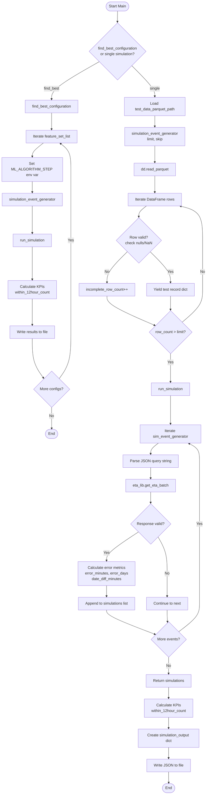
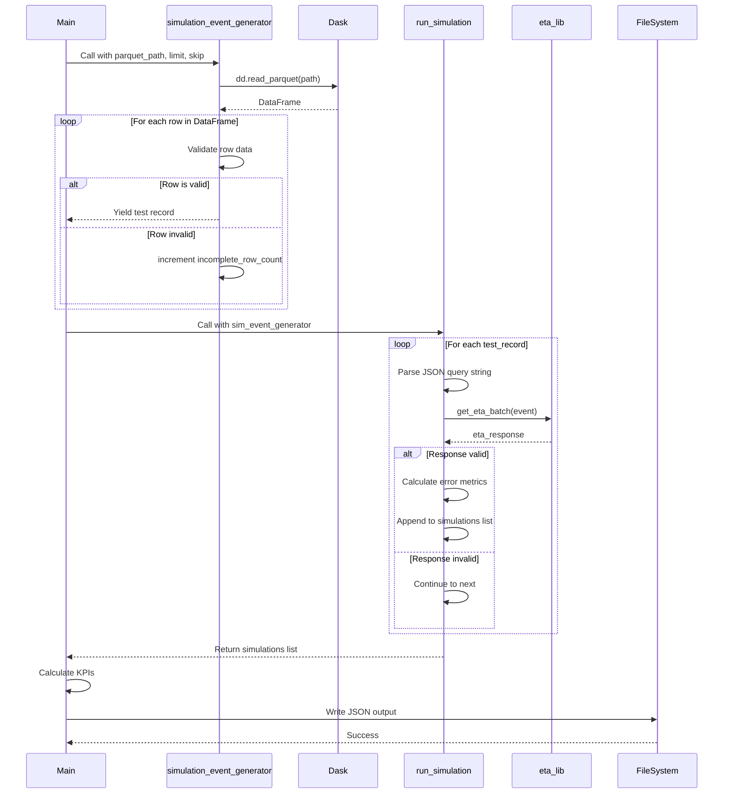
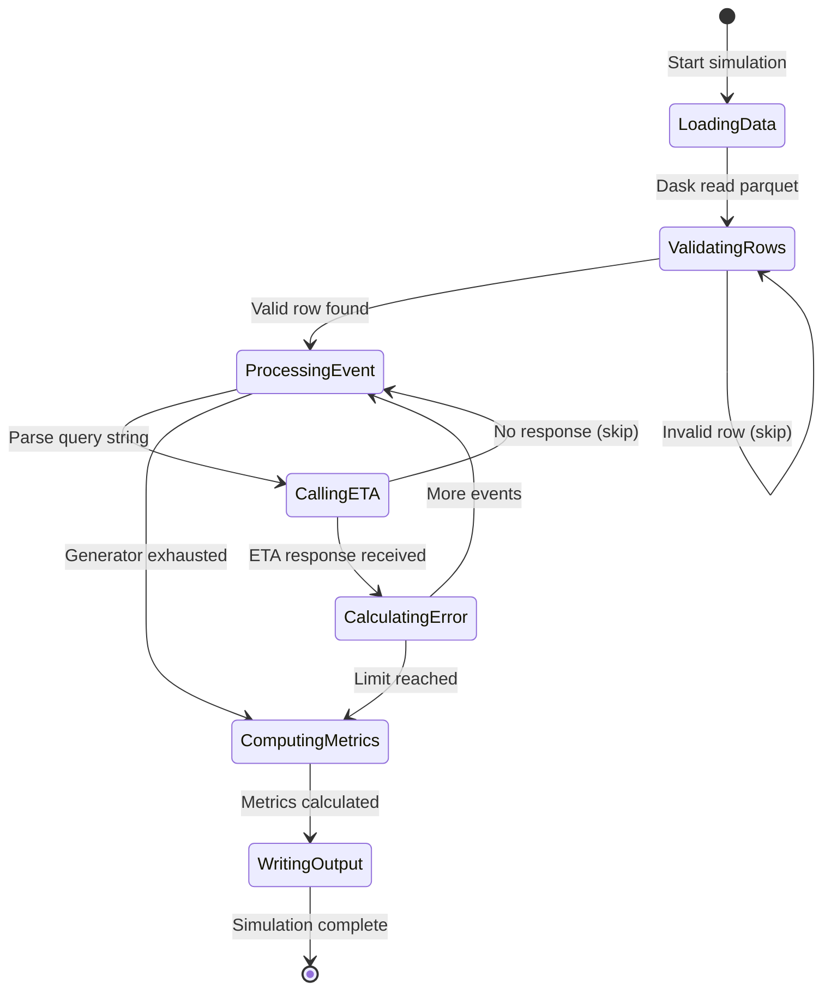

# Diagram: research/api/scripts/simulate_shipment_rail_splc.py

> Auto-generated by Obscura crawlers

## Diagram 1

### SVG

<svg id="container" width="895.859375" xmlns="http://www.w3.org/2000/svg" class="flowchart" height="3366.046875" viewBox="0 0 895.859375 3366.046875" role="graphics-document document" aria-roledescription="flowchart-v2"><g><marker id="container_flowchart-v2-pointEnd" class="marker flowchart-v2" viewBox="0 0 10 10" refX="5" refY="5" markerUnits="userSpaceOnUse" markerWidth="8" markerHeight="8" orient="auto"><path d="M 0 0 L 10 5 L 0 10 z" class="arrowMarkerPath" style="stroke-width: 1; stroke-dasharray: 1, 0;"></path></marker><marker id="container_flowchart-v2-pointStart" class="marker flowchart-v2" viewBox="0 0 10 10" refX="4.5" refY="5" markerUnits="userSpaceOnUse" markerWidth="8" markerHeight="8" orient="auto"><path d="M 0 5 L 10 10 L 10 0 z" class="arrowMarkerPath" style="stroke-width: 1; stroke-dasharray: 1, 0;"></path></marker><marker id="container_flowchart-v2-circleEnd" class="marker flowchart-v2" viewBox="0 0 10 10" refX="11" refY="5" markerUnits="userSpaceOnUse" markerWidth="11" markerHeight="11" orient="auto"><circle cx="5" cy="5" r="5" class="arrowMarkerPath" style="stroke-width: 1; stroke-dasharray: 1, 0;"></circle></marker><marker id="container_flowchart-v2-circleStart" class="marker flowchart-v2" viewBox="0 0 10 10" refX="-1" refY="5" markerUnits="userSpaceOnUse" markerWidth="11" markerHeight="11" orient="auto"><circle cx="5" cy="5" r="5" class="arrowMarkerPath" style="stroke-width: 1; stroke-dasharray: 1, 0;"></circle></marker><marker id="container_flowchart-v2-crossEnd" class="marker cross flowchart-v2" viewBox="0 0 11 11" refX="12" refY="5.2" markerUnits="userSpaceOnUse" markerWidth="11" markerHeight="11" orient="auto"><path d="M 1,1 l 9,9 M 10,1 l -9,9" class="arrowMarkerPath" style="stroke-width: 2; stroke-dasharray: 1, 0;"></path></marker><marker id="container_flowchart-v2-crossStart" class="marker cross flowchart-v2" viewBox="0 0 11 11" refX="-1" refY="5.2" markerUnits="userSpaceOnUse" markerWidth="11" markerHeight="11" orient="auto"><path d="M 1,1 l 9,9 M 10,1 l -9,9" class="arrowMarkerPath" style="stroke-width: 2; stroke-dasharray: 1, 0;"></path></marker><g class="root"><g class="clusters"></g><g class="edgePaths"><path d="M509.457,47.5L509.374,51.583C509.29,55.667,509.124,63.833,509.04,71.417C508.957,79,508.957,86,508.957,89.5L508.957,93" id="L_Start_CheckMode_0" class="edge-thickness-normal edge-pattern-solid edge-thickness-normal edge-pattern-solid flowchart-link" style=";" data-edge="true" data-et="edge" data-id="L_Start_CheckMode_0" data-points="W3sieCI6NTA5LjQ1NzAzMTI1LCJ5Ijo0Ny41fSx7IngiOjUwOC45NTcwMzEyNSwieSI6NzJ9LHsieCI6NTA4Ljk1NzAzMTI1LCJ5Ijo5N31d" marker-end="url(#container_flowchart-v2-pointEnd)"></path><path d="M429.246,267.273L395.004,286.725C360.762,306.177,292.277,345.081,258.035,372.033C223.793,398.984,223.793,413.984,223.793,421.484L223.793,428.984" id="L_CheckMode_FindBest_0" class="edge-thickness-normal edge-pattern-solid edge-thickness-normal edge-pattern-solid flowchart-link" style=";" data-edge="true" data-et="edge" data-id="L_CheckMode_FindBest_0" data-points="W3sieCI6NDI5LjI0NjAxMzA4MDcwOTcsInkiOjI2Ny4yNzMzNTY4MzA3MDk3fSx7IngiOjIyMy43OTI5Njg3NSwieSI6MzgzLjk4NDM3NX0seyJ4IjoyMjMuNzkyOTY4NzUsInkiOjQzMi45ODQzNzV9XQ==" marker-end="url(#container_flowchart-v2-pointEnd)"></path><path d="M571.282,284.66L587.745,301.214C604.209,317.768,637.136,350.876,653.599,372.93C670.063,394.984,670.063,405.984,670.063,411.484L670.063,416.984" id="L_CheckMode_LoadData_0" class="edge-thickness-normal edge-pattern-solid edge-thickness-normal edge-pattern-solid flowchart-link" style=";" data-edge="true" data-et="edge" data-id="L_CheckMode_LoadData_0" data-points="W3sieCI6NTcxLjI4MTYwODg3NDU4NzQsInkiOjI4NC42NTk3OTczNzU0MTI1NX0seyJ4Ijo2NzAuMDYyNSwieSI6MzgzLjk4NDM3NX0seyJ4Ijo2NzAuMDYyNSwieSI6NDIwLjk4NDM3NX1d" marker-end="url(#container_flowchart-v2-pointEnd)"></path><path d="M223.793,486.984L223.793,493.151C223.793,499.318,223.793,511.651,223.793,523.318C223.793,534.984,223.793,545.984,223.793,551.484L223.793,556.984" id="L_FindBest_IterateConfigs_0" class="edge-thickness-normal edge-pattern-solid edge-thickness-normal edge-pattern-solid flowchart-link" style=";" data-edge="true" data-et="edge" data-id="L_FindBest_IterateConfigs_0" data-points="W3sieCI6MjIzLjc5Mjk2ODc1LCJ5Ijo0ODYuOTg0Mzc1fSx7IngiOjIyMy43OTI5Njg3NSwieSI6NTIzLjk4NDM3NX0seyJ4IjoyMjMuNzkyOTY4NzUsInkiOjU2MC45ODQzNzV9XQ==" marker-end="url(#container_flowchart-v2-pointEnd)"></path><path d="M188.525,614.984L180.47,621.151C172.415,627.318,156.305,639.651,148.25,649.318C140.195,658.984,140.195,665.984,140.195,669.484L140.195,672.984" id="L_IterateConfigs_SetEnv_0" class="edge-thickness-normal edge-pattern-solid edge-thickness-normal edge-pattern-solid flowchart-link" style=";" data-edge="true" data-et="edge" data-id="L_IterateConfigs_SetEnv_0" data-points="W3sieCI6MTg4LjUyNTIwNzUxOTUzMTI1LCJ5Ijo2MTQuOTg0Mzc1fSx7IngiOjE0MC4xOTUzMTI1LCJ5Ijo2NTEuOTg0Mzc1fSx7IngiOjE0MC4xOTUzMTI1LCJ5Ijo2NzYuOTg0Mzc1fV0=" marker-end="url(#container_flowchart-v2-pointEnd)"></path><path d="M140.195,754.984L140.195,759.151C140.195,763.318,140.195,771.651,140.195,779.318C140.195,786.984,140.195,793.984,140.195,797.484L140.195,800.984" id="L_SetEnv_LoadDataConfig_0" class="edge-thickness-normal edge-pattern-solid edge-thickness-normal edge-pattern-solid flowchart-link" style=";" data-edge="true" data-et="edge" data-id="L_SetEnv_LoadDataConfig_0" data-points="W3sieCI6MTQwLjE5NTMxMjUsInkiOjc1NC45ODQzNzV9LHsieCI6MTQwLjE5NTMxMjUsInkiOjc3OS45ODQzNzV9LHsieCI6MTQwLjE5NTMxMjUsInkiOjgwNC45ODQzNzV9XQ==" marker-end="url(#container_flowchart-v2-pointEnd)"></path><path d="M140.195,858.984L140.195,863.151C140.195,867.318,140.195,875.651,140.195,895.339C140.195,915.026,140.195,946.068,140.195,961.589L140.195,977.109" id="L_LoadDataConfig_RunSimConfig_0" class="edge-thickness-normal edge-pattern-solid edge-thickness-normal edge-pattern-solid flowchart-link" style=";" data-edge="true" data-et="edge" data-id="L_LoadDataConfig_RunSimConfig_0" data-points="W3sieCI6MTQwLjE5NTMxMjUsInkiOjg1OC45ODQzNzV9LHsieCI6MTQwLjE5NTMxMjUsInkiOjg4My45ODQzNzV9LHsieCI6MTQwLjE5NTMxMjUsInkiOjk4MS4xMDkzNzV9XQ==" marker-end="url(#container_flowchart-v2-pointEnd)"></path><path d="M140.195,1035.109L140.195,1053.297C140.195,1071.484,140.195,1107.859,140.195,1131.547C140.195,1155.234,140.195,1166.234,140.195,1171.734L140.195,1177.234" id="L_RunSimConfig_CalcKPI_0" class="edge-thickness-normal edge-pattern-solid edge-thickness-normal edge-pattern-solid flowchart-link" style=";" data-edge="true" data-et="edge" data-id="L_RunSimConfig_CalcKPI_0" data-points="W3sieCI6MTQwLjE5NTMxMjUsInkiOjEwMzUuMTA5Mzc1fSx7IngiOjE0MC4xOTUzMTI1LCJ5IjoxMTQ0LjIzNDM3NX0seyJ4IjoxNDAuMTk1MzEyNSwieSI6MTE4MS4yMzQzNzV9XQ==" marker-end="url(#container_flowchart-v2-pointEnd)"></path><path d="M140.195,1259.234L140.195,1263.401C140.195,1267.568,140.195,1275.901,140.195,1294.557C140.195,1313.214,140.195,1342.193,140.195,1356.682L140.195,1371.172" id="L_CalcKPI_WriteFile_0" class="edge-thickness-normal edge-pattern-solid edge-thickness-normal edge-pattern-solid flowchart-link" style=";" data-edge="true" data-et="edge" data-id="L_CalcKPI_WriteFile_0" data-points="W3sieCI6MTQwLjE5NTMxMjUsInkiOjEyNTkuMjM0Mzc1fSx7IngiOjE0MC4xOTUzMTI1LCJ5IjoxMjg0LjIzNDM3NX0seyJ4IjoxNDAuMTk1MzEyNSwieSI6MTM3NS4xNzE4NzV9XQ==" marker-end="url(#container_flowchart-v2-pointEnd)"></path><path d="M140.195,1429.172L140.195,1446.328C140.195,1463.484,140.195,1497.797,148.34,1525.975C156.486,1554.154,172.776,1576.198,180.921,1587.22L189.066,1598.242" id="L_WriteFile_MoreConfigs_0" class="edge-thickness-normal edge-pattern-solid edge-thickness-normal edge-pattern-solid flowchart-link" style=";" data-edge="true" data-et="edge" data-id="L_WriteFile_MoreConfigs_0" data-points="W3sieCI6MTQwLjE5NTMxMjUsInkiOjE0MjkuMTcxODc1fSx7IngiOjE0MC4xOTUzMTI1LCJ5IjoxNTMyLjEwOTM3NX0seyJ4IjoxOTEuNDQzNTA5MzQ2ODkwNDQsInkiOjE2MDEuNDU4ODM0NDAzMTA5NH1d" marker-end="url(#container_flowchart-v2-pointEnd)"></path><path d="M256.142,1601.459L264.684,1589.901C273.225,1578.342,290.308,1555.226,298.849,1522.011C307.391,1488.797,307.391,1445.484,307.391,1404.172C307.391,1362.859,307.391,1323.547,307.391,1293.224C307.391,1262.901,307.391,1241.568,307.391,1218.234C307.391,1194.901,307.391,1169.568,307.391,1134.214C307.391,1098.859,307.391,1053.484,307.391,1010.109C307.391,966.734,307.391,925.359,307.391,896.005C307.391,866.651,307.391,849.318,307.391,831.984C307.391,814.651,307.391,797.318,307.391,777.984C307.391,758.651,307.391,737.318,307.391,715.984C307.391,694.651,307.391,673.318,299.865,656.89C292.339,640.462,277.288,628.939,269.762,623.177L262.237,617.416" id="L_MoreConfigs_IterateConfigs_0" class="edge-thickness-normal edge-pattern-solid edge-thickness-normal edge-pattern-solid flowchart-link" style=";" data-edge="true" data-et="edge" data-id="L_MoreConfigs_IterateConfigs_0" data-points="W3sieCI6MjU2LjE0MjQyODE1MzEwOTU2LCJ5IjoxNjAxLjQ1ODgzNDQwMzEwOTR9LHsieCI6MzA3LjM5MDYyNSwieSI6MTUzMi4xMDkzNzV9LHsieCI6MzA3LjM5MDYyNSwieSI6MTQwMi4xNzE4NzV9LHsieCI6MzA3LjM5MDYyNSwieSI6MTI4NC4yMzQzNzV9LHsieCI6MzA3LjM5MDYyNSwieSI6MTIyMC4yMzQzNzV9LHsieCI6MzA3LjM5MDYyNSwieSI6MTE0NC4yMzQzNzV9LHsieCI6MzA3LjM5MDYyNSwieSI6MTAwOC4xMDkzNzV9LHsieCI6MzA3LjM5MDYyNSwieSI6ODgzLjk4NDM3NX0seyJ4IjozMDcuMzkwNjI1LCJ5Ijo4MzEuOTg0Mzc1fSx7IngiOjMwNy4zOTA2MjUsInkiOjc3OS45ODQzNzV9LHsieCI6MzA3LjM5MDYyNSwieSI6NzE1Ljk4NDM3NX0seyJ4IjozMDcuMzkwNjI1LCJ5Ijo2NTEuOTg0Mzc1fSx7IngiOjI1OS4wNjA3Mjk5ODA0Njg3NSwieSI6NjE0Ljk4NDM3NX1d" marker-end="url(#container_flowchart-v2-pointEnd)"></path><path d="M223.793,1721.359L223.793,1727.526C223.793,1733.693,223.793,1746.026,223.87,1761.026C223.948,1776.026,224.103,1793.693,224.18,1802.526L224.258,1811.36" id="L_MoreConfigs_EndConfig_0" class="edge-thickness-normal edge-pattern-solid edge-thickness-normal edge-pattern-solid flowchart-link" style=";" data-edge="true" data-et="edge" data-id="L_MoreConfigs_EndConfig_0" data-points="W3sieCI6MjIzLjc5Mjk2ODc1LCJ5IjoxNzIxLjM1OTM3NX0seyJ4IjoyMjMuNzkyOTY4NzUsInkiOjE3NTguMzU5Mzc1fSx7IngiOjIyNC4yOTI5Njg3NSwieSI6MTgxNS4zNTkzNzV9XQ==" marker-end="url(#container_flowchart-v2-pointEnd)"></path><path d="M670.063,498.984L670.063,503.151C670.063,507.318,670.063,515.651,670.063,523.318C670.063,530.984,670.063,537.984,670.063,541.484L670.063,544.984" id="L_LoadData_SimEventGen_0" class="edge-thickness-normal edge-pattern-solid edge-thickness-normal edge-pattern-solid flowchart-link" style=";" data-edge="true" data-et="edge" data-id="L_LoadData_SimEventGen_0" data-points="W3sieCI6NjcwLjA2MjUsInkiOjQ5OC45ODQzNzV9LHsieCI6NjcwLjA2MjUsInkiOjUyMy45ODQzNzV9LHsieCI6NjcwLjA2MjUsInkiOjU0OC45ODQzNzV9XQ==" marker-end="url(#container_flowchart-v2-pointEnd)"></path><path d="M670.063,626.984L670.063,631.151C670.063,635.318,670.063,643.651,670.063,653.318C670.063,662.984,670.063,673.984,670.063,679.484L670.063,684.984" id="L_SimEventGen_DaskLoad_0" class="edge-thickness-normal edge-pattern-solid edge-thickness-normal edge-pattern-solid flowchart-link" style=";" data-edge="true" data-et="edge" data-id="L_SimEventGen_DaskLoad_0" data-points="W3sieCI6NjcwLjA2MjUsInkiOjYyNi45ODQzNzV9LHsieCI6NjcwLjA2MjUsInkiOjY1MS45ODQzNzV9LHsieCI6NjcwLjA2MjUsInkiOjY4OC45ODQzNzV9XQ==" marker-end="url(#container_flowchart-v2-pointEnd)"></path><path d="M670.063,742.984L670.063,749.151C670.063,755.318,670.063,767.651,670.063,777.318C670.063,786.984,670.063,793.984,670.063,797.484L670.063,800.984" id="L_DaskLoad_IterateRows_0" class="edge-thickness-normal edge-pattern-solid edge-thickness-normal edge-pattern-solid flowchart-link" style=";" data-edge="true" data-et="edge" data-id="L_DaskLoad_IterateRows_0" data-points="W3sieCI6NjcwLjA2MjUsInkiOjc0Mi45ODQzNzV9LHsieCI6NjcwLjA2MjUsInkiOjc3OS45ODQzNzV9LHsieCI6NjcwLjA2MjUsInkiOjgwNC45ODQzNzV9XQ==" marker-end="url(#container_flowchart-v2-pointEnd)"></path><path d="M633.678,858.984L628.063,863.151C622.448,867.318,611.218,875.651,605.603,883.318C599.988,890.984,599.988,897.984,599.988,901.484L599.988,904.984" id="L_IterateRows_ValidateRow_0" class="edge-thickness-normal edge-pattern-solid edge-thickness-normal edge-pattern-solid flowchart-link" style=";" data-edge="true" data-et="edge" data-id="L_IterateRows_ValidateRow_0" data-points="W3sieCI6NjMzLjY3NzgwOTQ5NTE5MjMsInkiOjg1OC45ODQzNzV9LHsieCI6NTk5Ljk4ODI4MTI1LCJ5Ijo4ODMuOTg0Mzc1fSx7IngiOjU5OS45ODgyODEyNSwieSI6OTA4Ljk4NDM3NX1d" marker-end="url(#container_flowchart-v2-pointEnd)"></path><path d="M550.162,1057.408L535.536,1071.879C520.91,1086.35,491.658,1115.292,477.032,1137.263C462.406,1159.234,462.406,1174.234,462.406,1181.734L462.406,1189.234" id="L_ValidateRow_IncompleteCount_0" class="edge-thickness-normal edge-pattern-solid edge-thickness-normal edge-pattern-solid flowchart-link" style=";" data-edge="true" data-et="edge" data-id="L_ValidateRow_IncompleteCount_0" data-points="W3sieCI6NTUwLjE2MTk0Mzk5NjcyMTEsInkiOjEwNTcuNDA4MDM3NzQ2NzIxfSx7IngiOjQ2Mi40MDYyNSwieSI6MTE0NC4yMzQzNzV9LHsieCI6NDYyLjQwNjI1LCJ5IjoxMTkzLjIzNDM3NX1d" marker-end="url(#container_flowchart-v2-pointEnd)"></path><path d="M649.815,1057.408L664.441,1071.879C679.067,1086.35,708.318,1115.292,722.944,1137.263C737.57,1159.234,737.57,1174.234,737.57,1181.734L737.57,1189.234" id="L_ValidateRow_YieldRecord_0" class="edge-thickness-normal edge-pattern-solid edge-thickness-normal edge-pattern-solid flowchart-link" style=";" data-edge="true" data-et="edge" data-id="L_ValidateRow_YieldRecord_0" data-points="W3sieCI6NjQ5LjgxNDYxODUwMzI3ODksInkiOjEwNTcuNDA4MDM3NzQ2NzIxfSx7IngiOjczNy41NzAzMTI1LCJ5IjoxMTQ0LjIzNDM3NX0seyJ4Ijo3MzcuNTcwMzEyNSwieSI6MTE5My4yMzQzNzV9XQ==" marker-end="url(#container_flowchart-v2-pointEnd)"></path><path d="M462.406,1247.234L462.406,1253.401C462.406,1259.568,462.406,1271.901,496.812,1292.814C531.217,1313.727,600.028,1343.22,634.434,1357.967L668.839,1372.713" id="L_IncompleteCount_CheckLimit_0" class="edge-thickness-normal edge-pattern-solid edge-thickness-normal edge-pattern-solid flowchart-link" style=";" data-edge="true" data-et="edge" data-id="L_IncompleteCount_CheckLimit_0" data-points="W3sieCI6NDYyLjQwNjI1LCJ5IjoxMjQ3LjIzNDM3NX0seyJ4Ijo0NjIuNDA2MjUsInkiOjEyODQuMjM0Mzc1fSx7IngiOjY3Mi41MTU3MjQ4MzU3OTEsInkiOjEzNzQuMjg4OTYyNjY0MjA4OH1d" marker-end="url(#container_flowchart-v2-pointEnd)"></path><path d="M737.57,1247.234L737.57,1253.401C737.57,1259.568,737.57,1271.901,737.57,1281.568C737.57,1291.234,737.57,1298.234,737.57,1301.734L737.57,1305.234" id="L_YieldRecord_CheckLimit_0" class="edge-thickness-normal edge-pattern-solid edge-thickness-normal edge-pattern-solid flowchart-link" style=";" data-edge="true" data-et="edge" data-id="L_YieldRecord_CheckLimit_0" data-points="W3sieCI6NzM3LjU3MDMxMjUsInkiOjEyNDcuMjM0Mzc1fSx7IngiOjczNy41NzAzMTI1LCJ5IjoxMjg0LjIzNDM3NX0seyJ4Ijo3MzcuNTcwMzEyNSwieSI6MTMwOS4yMzQzNzV9XQ==" marker-end="url(#container_flowchart-v2-pointEnd)"></path><path d="M788.038,1359.702L802.985,1347.124C817.932,1334.546,847.825,1309.39,862.772,1286.146C877.719,1262.901,877.719,1241.568,877.719,1218.234C877.719,1194.901,877.719,1169.568,877.719,1134.214C877.719,1098.859,877.719,1053.484,877.719,1010.109C877.719,966.734,877.719,925.359,861.726,900.667C845.734,875.975,813.749,867.965,797.757,863.961L781.764,859.956" id="L_CheckLimit_IterateRows_0" class="edge-thickness-normal edge-pattern-solid edge-thickness-normal edge-pattern-solid flowchart-link" style=";" data-edge="true" data-et="edge" data-id="L_CheckLimit_IterateRows_0" data-points="W3sieCI6Nzg4LjAzODE3NDIzNzU1MTEsInkiOjEzNTkuNzAyMjM2NzM3NTUxMn0seyJ4Ijo4NzcuNzE4NzUsInkiOjEyODQuMjM0Mzc1fSx7IngiOjg3Ny43MTg3NSwieSI6MTIyMC4yMzQzNzV9LHsieCI6ODc3LjcxODc1LCJ5IjoxMTQ0LjIzNDM3NX0seyJ4Ijo4NzcuNzE4NzUsInkiOjEwMDguMTA5Mzc1fSx7IngiOjg3Ny43MTg3NSwieSI6ODgzLjk4NDM3NX0seyJ4Ijo3NzcuODg0MDE0NDIzMDc2OSwieSI6ODU4Ljk4NDM3NX1d" marker-end="url(#container_flowchart-v2-pointEnd)"></path><path d="M737.57,1495.109L737.57,1501.276C737.57,1507.443,737.57,1519.776,737.57,1539.63C737.57,1559.484,737.57,1586.859,737.57,1600.547L737.57,1614.234" id="L_CheckLimit_RunSim_0" class="edge-thickness-normal edge-pattern-solid edge-thickness-normal edge-pattern-solid flowchart-link" style=";" data-edge="true" data-et="edge" data-id="L_CheckLimit_RunSim_0" data-points="W3sieCI6NzM3LjU3MDMxMjUsInkiOjE0OTUuMTA5Mzc1fSx7IngiOjczNy41NzAzMTI1LCJ5IjoxNTMyLjEwOTM3NX0seyJ4Ijo3MzcuNTcwMzEyNSwieSI6MTYxOC4yMzQzNzV9XQ==" marker-end="url(#container_flowchart-v2-pointEnd)"></path><path d="M737.57,1672.234L737.57,1686.589C737.57,1700.943,737.57,1729.651,737.57,1749.505C737.57,1769.359,737.57,1780.359,737.57,1785.859L737.57,1791.359" id="L_RunSim_IterEvents_0" class="edge-thickness-normal edge-pattern-solid edge-thickness-normal edge-pattern-solid flowchart-link" style=";" data-edge="true" data-et="edge" data-id="L_RunSim_IterEvents_0" data-points="W3sieCI6NzM3LjU3MDMxMjUsInkiOjE2NzIuMjM0Mzc1fSx7IngiOjczNy41NzAzMTI1LCJ5IjoxNzU4LjM1OTM3NX0seyJ4Ijo3MzcuNTcwMzEyNSwieSI6MTc5NS4zNTkzNzV9XQ==" marker-end="url(#container_flowchart-v2-pointEnd)"></path><path d="M688.604,1873.359L683.372,1877.526C678.141,1881.693,667.678,1890.026,662.446,1897.693C657.215,1905.359,657.215,1912.359,657.215,1915.859L657.215,1919.359" id="L_IterEvents_ParseEvent_0" class="edge-thickness-normal edge-pattern-solid edge-thickness-normal edge-pattern-solid flowchart-link" style=";" data-edge="true" data-et="edge" data-id="L_IterEvents_ParseEvent_0" data-points="W3sieCI6Njg4LjYwMzY5ODczMDQ2ODgsInkiOjE4NzMuMzU5Mzc1fSx7IngiOjY1Ny4yMTQ4NDM3NSwieSI6MTg5OC4zNTkzNzV9LHsieCI6NjU3LjIxNDg0Mzc1LCJ5IjoxOTIzLjM1OTM3NX1d" marker-end="url(#container_flowchart-v2-pointEnd)"></path><path d="M657.215,1977.359L657.215,1981.526C657.215,1985.693,657.215,1994.026,657.215,2001.693C657.215,2009.359,657.215,2016.359,657.215,2019.859L657.215,2023.359" id="L_ParseEvent_CallETA_0" class="edge-thickness-normal edge-pattern-solid edge-thickness-normal edge-pattern-solid flowchart-link" style=";" data-edge="true" data-et="edge" data-id="L_ParseEvent_CallETA_0" data-points="W3sieCI6NjU3LjIxNDg0Mzc1LCJ5IjoxOTc3LjM1OTM3NX0seyJ4Ijo2NTcuMjE0ODQzNzUsInkiOjIwMDIuMzU5Mzc1fSx7IngiOjY1Ny4yMTQ4NDM3NSwieSI6MjAyNy4zNTkzNzV9XQ==" marker-end="url(#container_flowchart-v2-pointEnd)"></path><path d="M657.215,2081.359L657.215,2085.526C657.215,2089.693,657.215,2098.026,657.215,2105.693C657.215,2113.359,657.215,2120.359,657.215,2123.859L657.215,2127.359" id="L_CallETA_CheckResponse_0" class="edge-thickness-normal edge-pattern-solid edge-thickness-normal edge-pattern-solid flowchart-link" style=";" data-edge="true" data-et="edge" data-id="L_CallETA_CheckResponse_0" data-points="W3sieCI6NjU3LjIxNDg0Mzc1LCJ5IjoyMDgxLjM1OTM3NX0seyJ4Ijo2NTcuMjE0ODQzNzUsInkiOjIxMDYuMzU5Mzc1fSx7IngiOjY1Ny4yMTQ4NDM3NSwieSI6MjEzMS4zNTkzNzV9XQ==" marker-end="url(#container_flowchart-v2-pointEnd)"></path><path d="M688.342,2270.795L694.868,2282.149C701.395,2293.504,714.447,2316.213,720.974,2342.234C727.5,2368.255,727.5,2397.589,727.5,2424.922C727.5,2452.255,727.5,2477.589,727.5,2493.755C727.5,2509.922,727.5,2516.922,727.5,2520.422L727.5,2523.922" id="L_CheckResponse_SkipEvent_0" class="edge-thickness-normal edge-pattern-solid edge-thickness-normal edge-pattern-solid flowchart-link" style=";" data-edge="true" data-et="edge" data-id="L_CheckResponse_SkipEvent_0" data-points="W3sieCI6Njg4LjM0MTc5OTM3MTAzMTcsInkiOjIyNzAuNzk0OTE5Mzc4OTY4fSx7IngiOjcyNy41LCJ5IjoyMzM4LjkyMTg3NX0seyJ4Ijo3MjcuNSwieSI6MjQyNi45MjE4NzV9LHsieCI6NzI3LjUsInkiOjI1MDIuOTIxODc1fSx7IngiOjcyNy41LCJ5IjoyNTI3LjkyMTg3NX1d" marker-end="url(#container_flowchart-v2-pointEnd)"></path><path d="M604.799,2249.506L581.032,2264.409C557.265,2279.311,509.73,2309.117,485.963,2329.519C462.195,2349.922,462.195,2360.922,462.195,2366.422L462.195,2371.922" id="L_CheckResponse_CalcError_0" class="edge-thickness-normal edge-pattern-solid edge-thickness-normal edge-pattern-solid flowchart-link" style=";" data-edge="true" data-et="edge" data-id="L_CheckResponse_CalcError_0" data-points="W3sieCI6NjA0Ljc5OTI0ODI1NzYyNjYsInkiOjIyNDkuNTA2Mjc5NTA3NjI2NX0seyJ4Ijo0NjIuMTk1MzEyNSwieSI6MjMzOC45MjE4NzV9LHsieCI6NDYyLjE5NTMxMjUsInkiOjIzNzUuOTIxODc1fV0=" marker-end="url(#container_flowchart-v2-pointEnd)"></path><path d="M462.195,2477.922L462.195,2482.089C462.195,2486.255,462.195,2494.589,462.195,2502.255C462.195,2509.922,462.195,2516.922,462.195,2520.422L462.195,2523.922" id="L_CalcError_AppendSim_0" class="edge-thickness-normal edge-pattern-solid edge-thickness-normal edge-pattern-solid flowchart-link" style=";" data-edge="true" data-et="edge" data-id="L_CalcError_AppendSim_0" data-points="W3sieCI6NDYyLjE5NTMxMjUsInkiOjI0NzcuOTIxODc1fSx7IngiOjQ2Mi4xOTUzMTI1LCJ5IjoyNTAyLjkyMTg3NX0seyJ4Ijo0NjIuMTk1MzEyNSwieSI6MjUyNy45MjE4NzV9XQ==" marker-end="url(#container_flowchart-v2-pointEnd)"></path><path d="M462.195,2581.922L462.195,2586.089C462.195,2590.255,462.195,2598.589,497.528,2615.773C532.86,2632.957,603.524,2658.992,638.856,2672.009L674.189,2685.027" id="L_AppendSim_MoreEvents_0" class="edge-thickness-normal edge-pattern-solid edge-thickness-normal edge-pattern-solid flowchart-link" style=";" data-edge="true" data-et="edge" data-id="L_AppendSim_MoreEvents_0" data-points="W3sieCI6NDYyLjE5NTMxMjUsInkiOjI1ODEuOTIxODc1fSx7IngiOjQ2Mi4xOTUzMTI1LCJ5IjoyNjA2LjkyMTg3NX0seyJ4Ijo2NzcuOTQyMDcwMjQ4MTMwMywieSI6MjY4Ni40MDk0OTIyNTE4N31d" marker-end="url(#container_flowchart-v2-pointEnd)"></path><path d="M727.5,2581.922L727.5,2586.089C727.5,2590.255,727.5,2598.589,727.702,2606.842C727.905,2615.096,728.309,2623.27,728.512,2627.357L728.714,2631.444" id="L_SkipEvent_MoreEvents_0" class="edge-thickness-normal edge-pattern-solid edge-thickness-normal edge-pattern-solid flowchart-link" style=";" data-edge="true" data-et="edge" data-id="L_SkipEvent_MoreEvents_0" data-points="W3sieCI6NzI3LjUsInkiOjI1ODEuOTIxODc1fSx7IngiOjcyNy41LCJ5IjoyNjA2LjkyMTg3NX0seyJ4Ijo3MjguOTEyMDA5OTI5OTA2NSwieSI6MjYzNS40Mzk1NTI1NzAwOTM0fV0=" marker-end="url(#container_flowchart-v2-pointEnd)"></path><path d="M775.038,2674.531L790.064,2663.263C805.089,2651.994,835.14,2629.458,850.166,2609.523C865.191,2589.589,865.191,2572.255,865.191,2554.922C865.191,2537.589,865.191,2520.255,865.191,2498.922C865.191,2477.589,865.191,2452.255,865.191,2424.922C865.191,2397.589,865.191,2368.255,865.191,2333.208C865.191,2298.161,865.191,2257.401,865.191,2218.641C865.191,2179.88,865.191,2143.12,865.191,2116.073C865.191,2089.026,865.191,2071.693,865.191,2054.359C865.191,2037.026,865.191,2019.693,865.191,2002.359C865.191,1985.026,865.191,1967.693,865.191,1950.359C865.191,1933.026,865.191,1915.693,857.479,1903.158C849.766,1890.624,834.34,1882.888,826.628,1879.02L818.915,1875.152" id="L_MoreEvents_IterEvents_0" class="edge-thickness-normal edge-pattern-solid edge-thickness-normal edge-pattern-solid flowchart-link" style=";" data-edge="true" data-et="edge" data-id="L_MoreEvents_IterEvents_0" data-points="W3sieCI6Nzc1LjAzODQ0MjIyODg3NzcsInkiOjI2NzQuNTMwNjI5NzI4ODc3Nn0seyJ4Ijo4NjUuMTkxNDA2MjUsInkiOjI2MDYuOTIxODc1fSx7IngiOjg2NS4xOTE0MDYyNSwieSI6MjU1NC45MjE4NzV9LHsieCI6ODY1LjE5MTQwNjI1LCJ5IjoyNTAyLjkyMTg3NX0seyJ4Ijo4NjUuMTkxNDA2MjUsInkiOjI0MjYuOTIxODc1fSx7IngiOjg2NS4xOTE0MDYyNSwieSI6MjMzOC45MjE4NzV9LHsieCI6ODY1LjE5MTQwNjI1LCJ5IjoyMjE2LjY0MDYyNX0seyJ4Ijo4NjUuMTkxNDA2MjUsInkiOjIxMDYuMzU5Mzc1fSx7IngiOjg2NS4xOTE0MDYyNSwieSI6MjA1NC4zNTkzNzV9LHsieCI6ODY1LjE5MTQwNjI1LCJ5IjoyMDAyLjM1OTM3NX0seyJ4Ijo4NjUuMTkxNDA2MjUsInkiOjE5NTAuMzU5Mzc1fSx7IngiOjg2NS4xOTE0MDYyNSwieSI6MTg5OC4zNTkzNzV9LHsieCI6ODE1LjMzOTQxNjUwMzkwNjIsInkiOjE4NzMuMzU5Mzc1fV0=" marker-end="url(#container_flowchart-v2-pointEnd)"></path><path d="M732.43,2781.047L732.43,2787.214C732.43,2793.38,732.43,2805.714,732.43,2817.38C732.43,2829.047,732.43,2840.047,732.43,2845.547L732.43,2851.047" id="L_MoreEvents_ReturnSims_0" class="edge-thickness-normal edge-pattern-solid edge-thickness-normal edge-pattern-solid flowchart-link" style=";" data-edge="true" data-et="edge" data-id="L_MoreEvents_ReturnSims_0" data-points="W3sieCI6NzMyLjQyOTY4NzUsInkiOjI3ODEuMDQ2ODc1fSx7IngiOjczMi40Mjk2ODc1LCJ5IjoyODE4LjA0Njg3NX0seyJ4Ijo3MzIuNDI5Njg3NSwieSI6Mjg1NS4wNDY4NzV9XQ==" marker-end="url(#container_flowchart-v2-pointEnd)"></path><path d="M732.43,2909.047L732.43,2913.214C732.43,2917.38,732.43,2925.714,732.43,2933.38C732.43,2941.047,732.43,2948.047,732.43,2951.547L732.43,2955.047" id="L_ReturnSims_CalcMetrics_0" class="edge-thickness-normal edge-pattern-solid edge-thickness-normal edge-pattern-solid flowchart-link" style=";" data-edge="true" data-et="edge" data-id="L_ReturnSims_CalcMetrics_0" data-points="W3sieCI6NzMyLjQyOTY4NzUsInkiOjI5MDkuMDQ2ODc1fSx7IngiOjczMi40Mjk2ODc1LCJ5IjoyOTM0LjA0Njg3NX0seyJ4Ijo3MzIuNDI5Njg3NSwieSI6Mjk1OS4wNDY4NzV9XQ==" marker-end="url(#container_flowchart-v2-pointEnd)"></path><path d="M732.43,3037.047L732.43,3041.214C732.43,3045.38,732.43,3053.714,732.43,3061.38C732.43,3069.047,732.43,3076.047,732.43,3079.547L732.43,3083.047" id="L_CalcMetrics_CreateOutput_0" class="edge-thickness-normal edge-pattern-solid edge-thickness-normal edge-pattern-solid flowchart-link" style=";" data-edge="true" data-et="edge" data-id="L_CalcMetrics_CreateOutput_0" data-points="W3sieCI6NzMyLjQyOTY4NzUsInkiOjMwMzcuMDQ2ODc1fSx7IngiOjczMi40Mjk2ODc1LCJ5IjozMDYyLjA0Njg3NX0seyJ4Ijo3MzIuNDI5Njg3NSwieSI6MzA4Ny4wNDY4NzV9XQ==" marker-end="url(#container_flowchart-v2-pointEnd)"></path><path d="M732.43,3165.047L732.43,3169.214C732.43,3173.38,732.43,3181.714,732.43,3189.38C732.43,3197.047,732.43,3204.047,732.43,3207.547L732.43,3211.047" id="L_CreateOutput_WriteJSON_0" class="edge-thickness-normal edge-pattern-solid edge-thickness-normal edge-pattern-solid flowchart-link" style=";" data-edge="true" data-et="edge" data-id="L_CreateOutput_WriteJSON_0" data-points="W3sieCI6NzMyLjQyOTY4NzUsInkiOjMxNjUuMDQ2ODc1fSx7IngiOjczMi40Mjk2ODc1LCJ5IjozMTkwLjA0Njg3NX0seyJ4Ijo3MzIuNDI5Njg3NSwieSI6MzIxNS4wNDY4NzV9XQ==" marker-end="url(#container_flowchart-v2-pointEnd)"></path><path d="M732.43,3269.047L732.43,3273.214C732.43,3277.38,732.43,3285.714,732.5,3293.464C732.57,3301.214,732.711,3308.381,732.781,3311.964L732.851,3315.548" id="L_WriteJSON_End_0" class="edge-thickness-normal edge-pattern-solid edge-thickness-normal edge-pattern-solid flowchart-link" style=";" data-edge="true" data-et="edge" data-id="L_WriteJSON_End_0" data-points="W3sieCI6NzMyLjQyOTY4NzUsInkiOjMyNjkuMDQ2ODc1fSx7IngiOjczMi40Mjk2ODc1LCJ5IjozMjk0LjA0Njg3NX0seyJ4Ijo3MzIuOTI5Njg3NSwieSI6MzMxOS41NDY4NzV9XQ==" marker-end="url(#container_flowchart-v2-pointEnd)"></path></g><g class="edgeLabels"><g class="edgeLabel"><g class="label" data-id="L_Start_CheckMode_0" transform="translate(0, 0)"><foreignObject width="0" height="0">

</foreignObject></g></g><g class="edgeLabel" transform="translate(223.79296875, 383.984375)"><g class="label" data-id="L_CheckMode_FindBest_0" transform="translate(-33.96875, -12)"><foreignObject width="67.9375" height="24">

find_best

</foreignObject></g></g><g class="edgeLabel" transform="translate(670.0625, 383.984375)"><g class="label" data-id="L_CheckMode_LoadData_0" transform="translate(-21.5078125, -12)"><foreignObject width="43.015625" height="24">

single

</foreignObject></g></g><g class="edgeLabel"><g class="label" data-id="L_FindBest_IterateConfigs_0" transform="translate(0, 0)"><foreignObject width="0" height="0">

</foreignObject></g></g><g class="edgeLabel"><g class="label" data-id="L_IterateConfigs_SetEnv_0" transform="translate(0, 0)"><foreignObject width="0" height="0">

</foreignObject></g></g><g class="edgeLabel"><g class="label" data-id="L_SetEnv_LoadDataConfig_0" transform="translate(0, 0)"><foreignObject width="0" height="0">

</foreignObject></g></g><g class="edgeLabel"><g class="label" data-id="L_LoadDataConfig_RunSimConfig_0" transform="translate(0, 0)"><foreignObject width="0" height="0">

</foreignObject></g></g><g class="edgeLabel"><g class="label" data-id="L_RunSimConfig_CalcKPI_0" transform="translate(0, 0)"><foreignObject width="0" height="0">

</foreignObject></g></g><g class="edgeLabel"><g class="label" data-id="L_CalcKPI_WriteFile_0" transform="translate(0, 0)"><foreignObject width="0" height="0">

</foreignObject></g></g><g class="edgeLabel"><g class="label" data-id="L_WriteFile_MoreConfigs_0" transform="translate(0, 0)"><foreignObject width="0" height="0">

</foreignObject></g></g><g class="edgeLabel" transform="translate(307.390625, 1008.109375)"><g class="label" data-id="L_MoreConfigs_IterateConfigs_0" transform="translate(-12.03125, -12)"><foreignObject width="24.0625" height="24">

Yes

</foreignObject></g></g><g class="edgeLabel" transform="translate(223.79296875, 1758.359375)"><g class="label" data-id="L_MoreConfigs_EndConfig_0" transform="translate(-10.140625, -12)"><foreignObject width="20.28125" height="24">

No

</foreignObject></g></g><g class="edgeLabel"><g class="label" data-id="L_LoadData_SimEventGen_0" transform="translate(0, 0)"><foreignObject width="0" height="0">

</foreignObject></g></g><g class="edgeLabel"><g class="label" data-id="L_SimEventGen_DaskLoad_0" transform="translate(0, 0)"><foreignObject width="0" height="0">

</foreignObject></g></g><g class="edgeLabel"><g class="label" data-id="L_DaskLoad_IterateRows_0" transform="translate(0, 0)"><foreignObject width="0" height="0">

</foreignObject></g></g><g class="edgeLabel"><g class="label" data-id="L_IterateRows_ValidateRow_0" transform="translate(0, 0)"><foreignObject width="0" height="0">

</foreignObject></g></g><g class="edgeLabel" transform="translate(462.40625, 1144.234375)"><g class="label" data-id="L_ValidateRow_IncompleteCount_0" transform="translate(-10.140625, -12)"><foreignObject width="20.28125" height="24">

No

</foreignObject></g></g><g class="edgeLabel" transform="translate(737.5703125, 1144.234375)"><g class="label" data-id="L_ValidateRow_YieldRecord_0" transform="translate(-12.03125, -12)"><foreignObject width="24.0625" height="24">

Yes

</foreignObject></g></g><g class="edgeLabel"><g class="label" data-id="L_IncompleteCount_CheckLimit_0" transform="translate(0, 0)"><foreignObject width="0" height="0">

</foreignObject></g></g><g class="edgeLabel"><g class="label" data-id="L_YieldRecord_CheckLimit_0" transform="translate(0, 0)"><foreignObject width="0" height="0">

</foreignObject></g></g><g class="edgeLabel" transform="translate(877.71875, 1144.234375)"><g class="label" data-id="L_CheckLimit_IterateRows_0" transform="translate(-10.140625, -12)"><foreignObject width="20.28125" height="24">

No

</foreignObject></g></g><g class="edgeLabel" transform="translate(737.5703125, 1532.109375)"><g class="label" data-id="L_CheckLimit_RunSim_0" transform="translate(-12.03125, -12)"><foreignObject width="24.0625" height="24">

Yes

</foreignObject></g></g><g class="edgeLabel"><g class="label" data-id="L_RunSim_IterEvents_0" transform="translate(0, 0)"><foreignObject width="0" height="0">

</foreignObject></g></g><g class="edgeLabel"><g class="label" data-id="L_IterEvents_ParseEvent_0" transform="translate(0, 0)"><foreignObject width="0" height="0">

</foreignObject></g></g><g class="edgeLabel"><g class="label" data-id="L_ParseEvent_CallETA_0" transform="translate(0, 0)"><foreignObject width="0" height="0">

</foreignObject></g></g><g class="edgeLabel"><g class="label" data-id="L_CallETA_CheckResponse_0" transform="translate(0, 0)"><foreignObject width="0" height="0">

</foreignObject></g></g><g class="edgeLabel" transform="translate(727.5, 2426.921875)"><g class="label" data-id="L_CheckResponse_SkipEvent_0" transform="translate(-10.140625, -12)"><foreignObject width="20.28125" height="24">

No

</foreignObject></g></g><g class="edgeLabel" transform="translate(462.1953125, 2338.921875)"><g class="label" data-id="L_CheckResponse_CalcError_0" transform="translate(-12.03125, -12)"><foreignObject width="24.0625" height="24">

Yes

</foreignObject></g></g><g class="edgeLabel"><g class="label" data-id="L_CalcError_AppendSim_0" transform="translate(0, 0)"><foreignObject width="0" height="0">

</foreignObject></g></g><g class="edgeLabel"><g class="label" data-id="L_AppendSim_MoreEvents_0" transform="translate(0, 0)"><foreignObject width="0" height="0">

</foreignObject></g></g><g class="edgeLabel"><g class="label" data-id="L_SkipEvent_MoreEvents_0" transform="translate(0, 0)"><foreignObject width="0" height="0">

</foreignObject></g></g><g class="edgeLabel" transform="translate(865.19140625, 2216.640625)"><g class="label" data-id="L_MoreEvents_IterEvents_0" transform="translate(-12.03125, -12)"><foreignObject width="24.0625" height="24">

Yes

</foreignObject></g></g><g class="edgeLabel" transform="translate(732.4296875, 2818.046875)"><g class="label" data-id="L_MoreEvents_ReturnSims_0" transform="translate(-10.140625, -12)"><foreignObject width="20.28125" height="24">

No

</foreignObject></g></g><g class="edgeLabel"><g class="label" data-id="L_ReturnSims_CalcMetrics_0" transform="translate(0, 0)"><foreignObject width="0" height="0">

</foreignObject></g></g><g class="edgeLabel"><g class="label" data-id="L_CalcMetrics_CreateOutput_0" transform="translate(0, 0)"><foreignObject width="0" height="0">

</foreignObject></g></g><g class="edgeLabel"><g class="label" data-id="L_CreateOutput_WriteJSON_0" transform="translate(0, 0)"><foreignObject width="0" height="0">

</foreignObject></g></g><g class="edgeLabel"><g class="label" data-id="L_WriteJSON_End_0" transform="translate(0, 0)"><foreignObject width="0" height="0">

</foreignObject></g></g></g><g class="nodes"><g class="node default" id="flowchart-Start-0" transform="translate(508.95703125, 27.5)"><g class="basic label-container outer-path"><path d="M-30.0390625 -19.5 C-7.188625717186291 -19.5, 15.661811065627418 -19.5, 30.0390625 -19.5 C30.0390625 -19.5, 30.0390625 -19.5, 30.0390625 -19.5 C30.481982155435315 -19.485796428741, 30.924901810870633 -19.471592857481998, 31.2884317896239 -19.45993515863156 C31.581584379458025 -19.431655080857833, 31.87473696929215 -19.403375003084104, 32.532667152847864 -19.3399052695533 C32.88554989578845 -19.28285392432121, 33.23843263872903 -19.22580257908912, 33.76665575967676 -19.140403561325776 C34.231100441743706 -19.034397093428787, 34.69554512381065 -18.928390625531797, 34.98532688623539 -18.862249829261074 C35.4605729594728 -18.721199289341758, 35.93581903271021 -18.580148749422438, 36.183672751460605 -18.50658706670804 C36.53611982198117 -18.37688328677147, 36.88856689250172 -18.247179506834897, 37.3567690951478 -18.074876768247425 C37.77171279059385 -17.891193503140848, 38.1866564860399 -17.70751023803427, 38.49979541279238 -17.568892924097174 C38.935527162611805 -17.341571949315885, 39.37125891243124 -17.114250974534595, 39.60805476407678 -16.990714730406097 C39.98833883125756 -16.760184294083874, 40.368622898438325 -16.529653857761655, 40.6769930736057 -16.342718045390892 C40.89230558575655 -16.192525357642882, 41.10761809790741 -16.042332669894872, 41.70221784457871 -15.627565626425154 C42.04844651693389 -15.351457473753813, 42.39467518928907 -15.075349321082472, 42.679516208501866 -14.848196188198123 C42.964044157924945 -14.589795432729094, 43.248572107348025 -14.331394677260064, 43.60487223676799 -14.007812326905688 C43.782554251170076 -13.824341059070846, 43.96023626557217 -13.640869791236005, 44.47448344296865 -13.10986736009568 C44.72425719100126 -12.816468903127692, 44.97403093903387 -12.523070446159705, 45.28477640812658 -12.158051136245305 C45.564167908863524 -11.783691978347132, 45.84355940960047 -11.409332820448961, 46.032421464640635 -11.156274872382312 C46.28821215346845 -10.763311684925416, 46.544002842296265 -10.370348497468518, 46.71434637860425 -10.108655082055241 C46.85336236862905 -9.86181811487077, 46.99237835865385 -9.614981147686297, 47.327748974273504 -9.019496659696287 C47.443875146413724 -8.778358178545071, 47.56000131855395 -8.537219697393855, 47.87010864880834 -7.893275190886684 C47.99355439622886 -7.588361808096838, 48.11700014364938 -7.283448425306991, 48.339196729970325 -6.734618561215508 C48.44503406564531 -6.415853369051878, 48.550871401320286 -6.097088176888249, 48.73308563421488 -5.548287939305138 C48.853565369895286 -5.088846490908, 48.9740451055757 -4.629405042510863, 49.05015678754556 -4.339158212148133 C49.1217781035448 -3.9713978916625288, 49.19339941954404 -3.6036375711769244, 49.289107276581774 -3.1121979531509023 C49.33380807847797 -2.765507360815776, 49.37850888037416 -2.418816768480649, 49.44895520250937 -1.872449005199798 C49.47708419892759 -1.4343171806686765, 49.505213195345824 -0.9961853561375549, 49.52904371591342 -0.6250057626472757 C49.52904371591342 -0.24905673629217606, 49.52904371591342 0.12689229006292357, 49.52904371591342 0.625005762647271 C49.51223657555355 0.8867905402317211, 49.495429435193685 1.148575317816171, 49.44895520250937 1.8724490051997846 C49.41246334303964 2.1554726611142856, 49.375971483569906 2.438496317028787, 49.289107276581774 3.1121979531508885 C49.23633707166549 3.3831618024092474, 49.18356686674921 3.6541256516676057, 49.05015678754556 4.339158212148129 C48.97431301650641 4.628383382018717, 48.898469245467254 4.917608551889305, 48.73308563421489 5.548287939305125 C48.58473084184074 5.995108936809876, 48.43637604946659 6.441929934314626, 48.339196729970325 6.734618561215495 C48.19868851525489 7.0816765681041645, 48.05818030053944 7.428734574992833, 47.87010864880834 7.893275190886679 C47.722342945575754 8.20011383532871, 47.57457724234317 8.506952479770739, 47.327748974273504 9.019496659696284 C47.17212879503196 9.29581604619156, 47.016508615790414 9.572135432686835, 46.71434637860425 10.108655082055236 C46.55235894386093 10.35751128153774, 46.39037150911761 10.606367481020243, 46.03242146464064 11.156274872382301 C45.81027596557217 11.453929603262756, 45.5881304665037 11.751584334143212, 45.28477640812658 12.158051136245302 C45.054229872638494 12.42886421529911, 44.823683337150406 12.699677294352918, 44.47448344296866 13.10986736009567 C44.158038958064324 13.436622271334784, 43.84159447315998 13.763377182573898, 43.60487223676799 14.007812326905684 C43.37937101424282 14.212606570767647, 43.153869791717646 14.417400814629609, 42.67951620850189 14.848196188198111 C42.46477741634428 15.019444660504549, 42.25003862418668 15.190693132810987, 41.70221784457871 15.627565626425152 C41.489827997677466 15.775719589415173, 41.27743815077623 15.923873552405194, 40.67699307360571 16.34271804539089 C40.45938762604551 16.474631746493433, 40.241782178485316 16.606545447595977, 39.60805476407678 16.990714730406093 C39.37022691446658 17.114789367211728, 39.13239906485638 17.238864004017362, 38.49979541279239 17.56889292409717 C38.136641268520656 17.729650491181328, 37.773487124248916 17.890408058265486, 37.356769095147804 18.07487676824742 C36.901101350733455 18.24256671033836, 36.4454336063191 18.410256652429293, 36.18367275146062 18.506587066708033 C35.75756498052364 18.633053616436797, 35.33145720958666 18.759520166165565, 34.98532688623541 18.86224982926107 C34.521478230083204 18.96812025813245, 34.05762957393099 19.073990687003835, 33.766655759676766 19.140403561325773 C33.288079790329924 19.2177760126377, 32.80950382098308 19.295148463949623, 32.53266715284788 19.3399052695533 C32.056400916716676 19.385850100558923, 31.580134680585477 19.43179493156455, 31.2884317896239 19.45993515863156 C30.99162533805412 19.46945316383469, 30.69481888648434 19.478971169037823, 30.039062500000004 19.5 C30.039062500000004 19.5, 30.0390625 19.5, 30.0390625 19.5 C17.726915289624706 19.5, 5.414768079249416 19.5, -30.039062499999996 19.5 C-30.357599873840773 19.48978512641631, -30.676137247681552 19.479570252832623, -31.288431789623893 19.45993515863156 C-31.71583516750185 19.41870406879544, -32.14323854537981 19.377472978959318, -32.53266715284787 19.3399052695533 C-32.91251061414175 19.27849512446134, -33.29235407543564 19.217084979369382, -33.76665575967676 19.140403561325773 C-34.08004157834677 19.068875293247928, -34.393427397016794 18.99734702517008, -34.985326886235384 18.862249829261074 C-35.293610772882765 18.770752789919275, -35.601894659530146 18.679255750577475, -36.18367275146059 18.506587066708043 C-36.574968079240264 18.362586768990763, -36.96626340701994 18.218586471273486, -37.3567690951478 18.074876768247425 C-37.70250690949294 17.921828893784696, -38.04824472383809 17.76878101932197, -38.49979541279238 17.568892924097174 C-38.847888935419824 17.38729275630698, -39.19598245804727 17.205692588516783, -39.60805476407678 16.990714730406097 C-39.859682652107324 16.838176425952376, -40.11131054013786 16.68563812149866, -40.676993073605686 16.3427180453909 C-40.902944780404944 16.18510391601948, -41.1288964872042 16.027489786648058, -41.70221784457871 15.627565626425156 C-42.07311437364723 15.33178551446416, -42.44401090271575 15.036005402503164, -42.679516208501866 14.848196188198125 C-42.93837611017595 14.613106474555401, -43.197236011850045 14.378016760912676, -43.604872236767974 14.007812326905697 C-43.90799761624608 13.694810485538067, -44.211122995724175 13.381808644170437, -44.474483442968655 13.109867360095677 C-44.76023537889159 12.774206876414818, -45.04598731481453 12.438546392733958, -45.284776408126575 12.158051136245307 C-45.54170792925321 11.813786304878727, -45.79863945037983 11.469521473512149, -46.032421464640635 11.156274872382316 C-46.28881870549917 10.762379858124207, -46.5452159463577 10.3684848438661, -46.71434637860425 10.108655082055249 C-46.936870507288425 9.713540958565067, -47.1593946359726 9.318426835074884, -47.327748974273504 9.019496659696289 C-47.51408959231179 8.632556379289275, -47.70043021035008 8.245616098882259, -47.87010864880834 7.893275190886686 C-48.03165064565807 7.494263335465828, -48.19319264250779 7.09525148004497, -48.339196729970325 6.73461856121551 C-48.42681984340217 6.470711704405983, -48.514442956834024 6.206804847596456, -48.73308563421488 5.5482879393051325 C-48.81667765820095 5.229515322833873, -48.90026968218702 4.910742706362613, -49.05015678754556 4.339158212148136 C-49.14342683770177 3.860236217228106, -49.23669688785797 3.381314222308077, -49.289107276581774 3.112197953150904 C-49.34857708520173 2.6509618611365457, -49.408046893821684 2.1897257691221874, -49.44895520250937 1.872449005199809 C-49.46930543900586 1.5554776453517145, -49.48965567550235 1.23850628550362, -49.52904371591342 0.6250057626472781 C-49.52904371591342 0.13620062006948203, -49.52904371591342 -0.3526045225083141, -49.52904371591342 -0.6250057626472687 C-49.50970834872749 -0.9261697137954843, -49.490372981541576 -1.2273336649436999, -49.44895520250937 -1.8724490051997822 C-49.38838173693266 -2.3422448426290177, -49.32780827135595 -2.8120406800582534, -49.289107276581774 -3.112197953150895 C-49.219113589163726 -3.471600744871514, -49.14911990174567 -3.8310035365921324, -49.05015678754556 -4.339158212148126 C-48.95954792823132 -4.684689062841362, -48.86893906891708 -5.030219913534598, -48.73308563421489 -5.548287939305123 C-48.57899428548908 -6.012386530544944, -48.42490293676327 -6.4764851217847665, -48.33919672997033 -6.734618561215485 C-48.22682132713467 -7.012187978850167, -48.11444592429902 -7.289757396484849, -47.87010864880834 -7.893275190886676 C-47.67950982778988 -8.289057720892979, -47.48891100677142 -8.68484025089928, -47.327748974273504 -9.019496659696282 C-47.089754560123254 -9.442079841567748, -46.851760145973 -9.864663023439213, -46.71434637860425 -10.108655082055243 C-46.44278129641 -10.525851973740702, -46.171216214215754 -10.94304886542616, -46.03242146464064 -11.156274872382308 C-45.75038065121368 -11.53418386792775, -45.46833983778672 -11.912092863473193, -45.28477640812659 -12.158051136245302 C-45.01032439722043 -12.480438085017498, -44.73587238631427 -12.802825033789697, -44.47448344296866 -13.10986736009567 C-44.14778048611455 -13.447214985859139, -43.82107752926043 -13.784562611622608, -43.604872236767996 -14.007812326905677 C-43.331579172971054 -14.256009856507836, -43.05828610917411 -14.504207386109993, -42.67951620850189 -14.848196188198107 C-42.36009127053786 -15.102929075969836, -42.04066633257382 -15.357661963741567, -41.70221784457872 -15.627565626425149 C-41.4381530098107 -15.811765823976861, -41.174088175042684 -15.995966021528572, -40.676993073605715 -16.342718045390885 C-40.25979933605897 -16.59562334079426, -39.84260559851222 -16.84852863619763, -39.60805476407679 -16.99071473040609 C-39.329728739839204 -17.13591723897451, -39.051402715601625 -17.28111974754293, -38.49979541279239 -17.56889292409717 C-38.10264171658118 -17.744701084264058, -37.70548802036998 -17.920509244430946, -37.356769095147804 -18.07487676824742 C-37.10400177066399 -18.167897480212996, -36.85123444618018 -18.260918192178572, -36.18367275146062 -18.506587066708033 C-35.78468787236819 -18.6250036845083, -35.38570299327575 -18.743420302308568, -34.98532688623541 -18.862249829261067 C-34.72995913689096 -18.920535851618638, -34.47459138754651 -18.97882187397621, -33.766655759676766 -19.140403561325773 C-33.37081012803708 -19.204400813220555, -32.97496449639739 -19.26839806511534, -32.53266715284788 -19.3399052695533 C-32.21513771183383 -19.3705369528429, -31.897608270819788 -19.4011686361325, -31.288431789623903 -19.45993515863156 C-30.976336684768732 -19.469943441187993, -30.664241579913558 -19.47995172374443, -30.039062500000007 -19.5 C-30.039062500000004 -19.5, -30.039062500000004 -19.5, -30.0390625 -19.5" stroke="none" stroke-width="0" fill="#ECECFF" style=""></path><path d="M-30.0390625 -19.5 C-15.618918090869595 -19.5, -1.1987736817391905 -19.5, 30.0390625 -19.5 M-30.0390625 -19.5 C-17.574368834027652 -19.5, -5.109675168055304 -19.5, 30.0390625 -19.5 M30.0390625 -19.5 C30.0390625 -19.5, 30.0390625 -19.5, 30.0390625 -19.5 M30.0390625 -19.5 C30.0390625 -19.5, 30.0390625 -19.5, 30.0390625 -19.5 M30.0390625 -19.5 C30.346140175298498 -19.490152616643613, 30.65321785059699 -19.480305233287226, 31.2884317896239 -19.45993515863156 M30.0390625 -19.5 C30.383500897710224 -19.488954530994103, 30.727939295420448 -19.477909061988207, 31.2884317896239 -19.45993515863156 M31.2884317896239 -19.45993515863156 C31.769729348773684 -19.41350496194538, 32.25102690792347 -19.367074765259204, 32.532667152847864 -19.3399052695533 M31.2884317896239 -19.45993515863156 C31.703394644925783 -19.419904191046435, 32.11835750022767 -19.37987322346131, 32.532667152847864 -19.3399052695533 M32.532667152847864 -19.3399052695533 C32.84062257770859 -19.290117424691804, 33.148578002569316 -19.240329579830313, 33.76665575967676 -19.140403561325776 M32.532667152847864 -19.3399052695533 C32.807458372021806 -19.29547915627499, 33.082249591195755 -19.251053042996677, 33.76665575967676 -19.140403561325776 M33.76665575967676 -19.140403561325776 C34.16547913313777 -19.049374728899032, 34.564302506598786 -18.95834589647229, 34.98532688623539 -18.862249829261074 M33.76665575967676 -19.140403561325776 C34.10376022530552 -19.06346166685823, 34.44086469093429 -18.986519772390686, 34.98532688623539 -18.862249829261074 M34.98532688623539 -18.862249829261074 C35.30107344995452 -18.76853790653677, 35.61682001367365 -18.674825983812468, 36.183672751460605 -18.50658706670804 M34.98532688623539 -18.862249829261074 C35.23383150989864 -18.788494961385208, 35.482336133561894 -18.714740093509345, 36.183672751460605 -18.50658706670804 M36.183672751460605 -18.50658706670804 C36.44652475781956 -18.409855098590633, 36.709376764178515 -18.313123130473226, 37.3567690951478 -18.074876768247425 M36.183672751460605 -18.50658706670804 C36.47837825390828 -18.398132717579493, 36.77308375635596 -18.289678368450947, 37.3567690951478 -18.074876768247425 M37.3567690951478 -18.074876768247425 C37.704267566893904 -17.921049502981337, 38.05176603864001 -17.76722223771525, 38.49979541279238 -17.568892924097174 M37.3567690951478 -18.074876768247425 C37.58571666836841 -17.973528469071116, 37.81466424158902 -17.872180169894808, 38.49979541279238 -17.568892924097174 M38.49979541279238 -17.568892924097174 C38.8407148167821 -17.391035489405038, 39.18163422077183 -17.2131780547129, 39.60805476407678 -16.990714730406097 M38.49979541279238 -17.568892924097174 C38.73887216567113 -17.444166735256296, 38.97794891854989 -17.31944054641542, 39.60805476407678 -16.990714730406097 M39.60805476407678 -16.990714730406097 C39.850056715327476 -16.844011725396605, 40.09205866657816 -16.697308720387113, 40.6769930736057 -16.342718045390892 M39.60805476407678 -16.990714730406097 C39.86883429046868 -16.83262864899672, 40.12961381686059 -16.67454256758735, 40.6769930736057 -16.342718045390892 M40.6769930736057 -16.342718045390892 C40.92743184386249 -16.168022800579386, 41.177870614119286 -15.993327555767884, 41.70221784457871 -15.627565626425154 M40.6769930736057 -16.342718045390892 C40.91170191619851 -16.178995317180185, 41.146410758791326 -16.015272588969477, 41.70221784457871 -15.627565626425154 M41.70221784457871 -15.627565626425154 C42.01822972094412 -15.375554564452942, 42.334241597309536 -15.12354350248073, 42.679516208501866 -14.848196188198123 M41.70221784457871 -15.627565626425154 C42.00456420545557 -15.38645244940042, 42.306910566332434 -15.145339272375685, 42.679516208501866 -14.848196188198123 M42.679516208501866 -14.848196188198123 C42.9576255662321 -14.595624627877905, 43.23573492396234 -14.343053067557687, 43.60487223676799 -14.007812326905688 M42.679516208501866 -14.848196188198123 C42.982161698182075 -14.573341562031416, 43.284807187862285 -14.298486935864707, 43.60487223676799 -14.007812326905688 M43.60487223676799 -14.007812326905688 C43.87086097695452 -13.73315711458139, 44.136849717141054 -13.45850190225709, 44.47448344296865 -13.10986736009568 M43.60487223676799 -14.007812326905688 C43.92576704113398 -13.676462095444396, 44.246661845499965 -13.345111863983105, 44.47448344296865 -13.10986736009568 M44.47448344296865 -13.10986736009568 C44.79832110379284 -12.729469216806681, 45.122158764617026 -12.34907107351768, 45.28477640812658 -12.158051136245305 M44.47448344296865 -13.10986736009568 C44.66379270870674 -12.887493924557347, 44.85310197444482 -12.665120489019014, 45.28477640812658 -12.158051136245305 M45.28477640812658 -12.158051136245305 C45.56932183398321 -11.776786188218997, 45.85386725983984 -11.395521240192691, 46.032421464640635 -11.156274872382312 M45.28477640812658 -12.158051136245305 C45.46270090788673 -11.919648515822093, 45.64062540764687 -11.68124589539888, 46.032421464640635 -11.156274872382312 M46.032421464640635 -11.156274872382312 C46.17700650510816 -10.934153423704602, 46.321591545575686 -10.712031975026894, 46.71434637860425 -10.108655082055241 M46.032421464640635 -11.156274872382312 C46.2021385217472 -10.895543897255635, 46.37185557885377 -10.634812922128958, 46.71434637860425 -10.108655082055241 M46.71434637860425 -10.108655082055241 C46.93325806022324 -9.71995522412923, 47.15216974184223 -9.33125536620322, 47.327748974273504 -9.019496659696287 M46.71434637860425 -10.108655082055241 C46.92505400465089 -9.734522355548647, 47.13576163069753 -9.36038962904205, 47.327748974273504 -9.019496659696287 M47.327748974273504 -9.019496659696287 C47.49221595978016 -8.67797744526196, 47.65668294528682 -8.336458230827631, 47.87010864880834 -7.893275190886684 M47.327748974273504 -9.019496659696287 C47.44367607701882 -8.77877155040299, 47.559603179764146 -8.538046441109694, 47.87010864880834 -7.893275190886684 M47.87010864880834 -7.893275190886684 C47.99573911798738 -7.582965503114588, 48.121369587166406 -7.272655815342491, 48.339196729970325 -6.734618561215508 M47.87010864880834 -7.893275190886684 C48.022971576524604 -7.515700804023869, 48.17583450424086 -7.138126417161053, 48.339196729970325 -6.734618561215508 M48.339196729970325 -6.734618561215508 C48.424201017998165 -6.478599189269707, 48.509205306026 -6.222579817323905, 48.73308563421488 -5.548287939305138 M48.339196729970325 -6.734618561215508 C48.44451368825336 -6.417420662845554, 48.549830646536385 -6.1002227644756015, 48.73308563421488 -5.548287939305138 M48.73308563421488 -5.548287939305138 C48.84685968857055 -5.114418160059897, 48.96063374292622 -4.680548380814655, 49.05015678754556 -4.339158212148133 M48.73308563421488 -5.548287939305138 C48.82460507221268 -5.199284657444203, 48.91612451021047 -4.850281375583268, 49.05015678754556 -4.339158212148133 M49.05015678754556 -4.339158212148133 C49.13892837671865 -3.883334863626331, 49.22769996589174 -3.427511515104529, 49.289107276581774 -3.1121979531509023 M49.05015678754556 -4.339158212148133 C49.1395942583674 -3.879915702094101, 49.22903172918925 -3.420673192040069, 49.289107276581774 -3.1121979531509023 M49.289107276581774 -3.1121979531509023 C49.32924215640244 -2.800919750790334, 49.36937703622309 -2.489641548429765, 49.44895520250937 -1.872449005199798 M49.289107276581774 -3.1121979531509023 C49.322683940057104 -2.8517839816984174, 49.356260603532434 -2.591370010245933, 49.44895520250937 -1.872449005199798 M49.44895520250937 -1.872449005199798 C49.46503889532436 -1.6219325070830417, 49.481122588139364 -1.3714160089662855, 49.52904371591342 -0.6250057626472757 M49.44895520250937 -1.872449005199798 C49.471492528313306 -1.5214119640015102, 49.494029854117244 -1.1703749228032225, 49.52904371591342 -0.6250057626472757 M49.52904371591342 -0.6250057626472757 C49.52904371591342 -0.30721182105956396, 49.52904371591342 0.010582120528147776, 49.52904371591342 0.625005762647271 M49.52904371591342 -0.6250057626472757 C49.52904371591342 -0.3043605888558626, 49.52904371591342 0.016284584935550517, 49.52904371591342 0.625005762647271 M49.52904371591342 0.625005762647271 C49.49824225883104 1.1047633191939714, 49.46744080174866 1.584520875740672, 49.44895520250937 1.8724490051997846 M49.52904371591342 0.625005762647271 C49.49717729015536 1.121351065944809, 49.46531086439732 1.6176963692423465, 49.44895520250937 1.8724490051997846 M49.44895520250937 1.8724490051997846 C49.40870269484893 2.184639505857437, 49.368450187188486 2.49683000651509, 49.289107276581774 3.1121979531508885 M49.44895520250937 1.8724490051997846 C49.38816088455698 2.343957730042526, 49.327366566604596 2.8154664548852675, 49.289107276581774 3.1121979531508885 M49.289107276581774 3.1121979531508885 C49.237220464107715 3.3786257689234933, 49.185333651633655 3.645053584696098, 49.05015678754556 4.339158212148129 M49.289107276581774 3.1121979531508885 C49.21030625467214 3.516824546054982, 49.13150523276251 3.9214511389590747, 49.05015678754556 4.339158212148129 M49.05015678754556 4.339158212148129 C48.98633971755584 4.582520358512007, 48.92252264756613 4.825882504875886, 48.73308563421489 5.548287939305125 M49.05015678754556 4.339158212148129 C48.94617965213229 4.7356680934545015, 48.84220251671901 5.132177974760875, 48.73308563421489 5.548287939305125 M48.73308563421489 5.548287939305125 C48.63808792302707 5.834405909573027, 48.54309021183926 6.120523879840928, 48.339196729970325 6.734618561215495 M48.73308563421489 5.548287939305125 C48.592900635956916 5.970502818611872, 48.452715637698944 6.39271769791862, 48.339196729970325 6.734618561215495 M48.339196729970325 6.734618561215495 C48.206180249442404 7.063171839818161, 48.07316376891448 7.391725118420829, 47.87010864880834 7.893275190886679 M48.339196729970325 6.734618561215495 C48.225561359140706 7.015300124155086, 48.11192598831109 7.295981687094677, 47.87010864880834 7.893275190886679 M47.87010864880834 7.893275190886679 C47.710344470844 8.22502892483542, 47.550580292879665 8.556782658784163, 47.327748974273504 9.019496659696284 M47.87010864880834 7.893275190886679 C47.75795556317073 8.12616347290479, 47.64580247753312 8.359051754922898, 47.327748974273504 9.019496659696284 M47.327748974273504 9.019496659696284 C47.20142161351397 9.243803680757225, 47.07509425275445 9.468110701818166, 46.71434637860425 10.108655082055236 M47.327748974273504 9.019496659696284 C47.08704708475645 9.44688723824312, 46.846345195239394 9.874277816789956, 46.71434637860425 10.108655082055236 M46.71434637860425 10.108655082055236 C46.53638560260477 10.382050623149913, 46.35842482660528 10.655446164244589, 46.03242146464064 11.156274872382301 M46.71434637860425 10.108655082055236 C46.48356826424867 10.463192238306092, 46.25279014989309 10.817729394556949, 46.03242146464064 11.156274872382301 M46.03242146464064 11.156274872382301 C45.793342485153076 11.476618924352541, 45.55426350566551 11.79696297632278, 45.28477640812658 12.158051136245302 M46.03242146464064 11.156274872382301 C45.74390355137961 11.542862591629465, 45.45538563811857 11.92945031087663, 45.28477640812658 12.158051136245302 M45.28477640812658 12.158051136245302 C45.00933718643191 12.481597718983581, 44.733897964737224 12.805144301721862, 44.47448344296866 13.10986736009567 M45.28477640812658 12.158051136245302 C44.96622887666107 12.532235192572717, 44.64768134519556 12.906419248900132, 44.47448344296866 13.10986736009567 M44.47448344296866 13.10986736009567 C44.20886823004604 13.384136874852816, 43.943253017123425 13.658406389609961, 43.60487223676799 14.007812326905684 M44.47448344296866 13.10986736009567 C44.29663466990982 13.293510819934744, 44.11878589685098 13.477154279773817, 43.60487223676799 14.007812326905684 M43.60487223676799 14.007812326905684 C43.30995450720791 14.27564880579662, 43.01503677764783 14.543485284687556, 42.67951620850189 14.848196188198111 M43.60487223676799 14.007812326905684 C43.334236155336896 14.253596855423076, 43.06360007390581 14.499381383940468, 42.67951620850189 14.848196188198111 M42.67951620850189 14.848196188198111 C42.42684954124822 15.049691131590517, 42.17418287399455 15.251186074982922, 41.70221784457871 15.627565626425152 M42.67951620850189 14.848196188198111 C42.4816280676898 15.006006714471166, 42.28373992687771 15.163817240744219, 41.70221784457871 15.627565626425152 M41.70221784457871 15.627565626425152 C41.298064640056204 15.909485406389809, 40.893911435533695 16.191405186354466, 40.67699307360571 16.34271804539089 M41.70221784457871 15.627565626425152 C41.30887311881865 15.901945879496632, 40.91552839305859 16.17632613256811, 40.67699307360571 16.34271804539089 M40.67699307360571 16.34271804539089 C40.448483300167226 16.481242012921783, 40.219973526728744 16.619765980452677, 39.60805476407678 16.990714730406093 M40.67699307360571 16.34271804539089 C40.43326121996692 16.49046972739408, 40.18952936632814 16.638221409397264, 39.60805476407678 16.990714730406093 M39.60805476407678 16.990714730406093 C39.212739766765395 17.196950311292106, 38.817424769454 17.40318589217812, 38.49979541279239 17.56889292409717 M39.60805476407678 16.990714730406093 C39.26969645611877 17.16723604293895, 38.93133814816076 17.343757355471805, 38.49979541279239 17.56889292409717 M38.49979541279239 17.56889292409717 C38.19796026384267 17.70250639091564, 37.896125114892946 17.83611985773411, 37.356769095147804 18.07487676824742 M38.49979541279239 17.56889292409717 C38.074127494205634 17.75732348466536, 37.64845957561888 17.94575404523355, 37.356769095147804 18.07487676824742 M37.356769095147804 18.07487676824742 C36.964645809999986 18.219181761929732, 36.57252252485217 18.36348675561204, 36.18367275146062 18.506587066708033 M37.356769095147804 18.07487676824742 C37.02026390243231 18.198713789786623, 36.68375870971683 18.322550811325826, 36.18367275146062 18.506587066708033 M36.18367275146062 18.506587066708033 C35.796693910688056 18.621440355355944, 35.4097150699155 18.736293644003855, 34.98532688623541 18.86224982926107 M36.18367275146062 18.506587066708033 C35.94261071253213 18.578133014501546, 35.70154867360363 18.64967896229506, 34.98532688623541 18.86224982926107 M34.98532688623541 18.86224982926107 C34.54344402957293 18.96310670773916, 34.10156117291044 19.06396358621725, 33.766655759676766 19.140403561325773 M34.98532688623541 18.86224982926107 C34.675443407178136 18.93297871117721, 34.36555992812086 19.00370759309335, 33.766655759676766 19.140403561325773 M33.766655759676766 19.140403561325773 C33.37758524264585 19.203305465232408, 32.988514725614934 19.266207369139046, 32.53266715284788 19.3399052695533 M33.766655759676766 19.140403561325773 C33.34724148142799 19.20821120922673, 32.92782720317922 19.276018857127685, 32.53266715284788 19.3399052695533 M32.53266715284788 19.3399052695533 C32.21512381140815 19.370538293800248, 31.89758046996842 19.401171318047197, 31.2884317896239 19.45993515863156 M32.53266715284788 19.3399052695533 C32.169647147533674 19.37492537287053, 31.806627142219472 19.409945476187755, 31.2884317896239 19.45993515863156 M31.2884317896239 19.45993515863156 C30.87534276558221 19.473182119603567, 30.46225374154052 19.486429080575576, 30.039062500000004 19.5 M31.2884317896239 19.45993515863156 C30.897892348291514 19.47245899837618, 30.507352906959127 19.484982838120803, 30.039062500000004 19.5 M30.039062500000004 19.5 C30.039062500000004 19.5, 30.039062500000004 19.5, 30.0390625 19.5 M30.039062500000004 19.5 C30.039062500000004 19.5, 30.0390625 19.5, 30.0390625 19.5 M30.0390625 19.5 C7.125753671643601 19.5, -15.787555156712799 19.5, -30.039062499999996 19.5 M30.0390625 19.5 C11.88475832935233 19.5, -6.26954584129534 19.5, -30.039062499999996 19.5 M-30.039062499999996 19.5 C-30.38635850080749 19.48886289322476, -30.733654501614986 19.477725786449522, -31.288431789623893 19.45993515863156 M-30.039062499999996 19.5 C-30.430349311306063 19.48745219355499, -30.821636122612134 19.47490438710998, -31.288431789623893 19.45993515863156 M-31.288431789623893 19.45993515863156 C-31.642691771742037 19.425760124216584, -31.996951753860184 19.39158508980161, -32.53266715284787 19.3399052695533 M-31.288431789623893 19.45993515863156 C-31.749185245438127 19.415486826886262, -32.20993870125236 19.37103849514097, -32.53266715284787 19.3399052695533 M-32.53266715284787 19.3399052695533 C-32.78972679691534 19.298345859827783, -33.04678644098281 19.25678645010227, -33.76665575967676 19.140403561325773 M-32.53266715284787 19.3399052695533 C-32.937408433953244 19.274469838039696, -33.34214971505862 19.20903440652609, -33.76665575967676 19.140403561325773 M-33.76665575967676 19.140403561325773 C-34.250690345988545 19.02992582562097, -34.73472493230033 18.91944808991617, -34.985326886235384 18.862249829261074 M-33.76665575967676 19.140403561325773 C-34.10870390433725 19.06233330437976, -34.45075204899774 18.984263047433743, -34.985326886235384 18.862249829261074 M-34.985326886235384 18.862249829261074 C-35.45124585536709 18.72396752488136, -35.9171648244988 18.585685220501645, -36.18367275146059 18.506587066708043 M-34.985326886235384 18.862249829261074 C-35.39355476367103 18.741089938070033, -35.80178264110667 18.61993004687899, -36.18367275146059 18.506587066708043 M-36.18367275146059 18.506587066708043 C-36.65290476536483 18.333905348058096, -37.12213677926907 18.16122362940815, -37.3567690951478 18.074876768247425 M-36.18367275146059 18.506587066708043 C-36.606567854763796 18.350957759492985, -37.02946295806699 18.195328452277924, -37.3567690951478 18.074876768247425 M-37.3567690951478 18.074876768247425 C-37.62874954576534 17.954479090772452, -37.90072999638287 17.834081413297476, -38.49979541279238 17.568892924097174 M-37.3567690951478 18.074876768247425 C-37.621672165272166 17.957612037173742, -37.88657523539654 17.84034730610006, -38.49979541279238 17.568892924097174 M-38.49979541279238 17.568892924097174 C-38.922302178144065 17.3484714152417, -39.34480894349576 17.128049906386224, -39.60805476407678 16.990714730406097 M-38.49979541279238 17.568892924097174 C-38.84470243729922 17.38895515033545, -39.18960946180606 17.209017376573726, -39.60805476407678 16.990714730406097 M-39.60805476407678 16.990714730406097 C-40.009840107977325 16.747150093780824, -40.41162545187786 16.503585457155552, -40.676993073605686 16.3427180453909 M-39.60805476407678 16.990714730406097 C-39.86075183943289 16.837528278312373, -40.113448914789004 16.68434182621865, -40.676993073605686 16.3427180453909 M-40.676993073605686 16.3427180453909 C-41.04247098237904 16.087776477514286, -41.407948891152394 15.832834909637674, -41.70221784457871 15.627565626425156 M-40.676993073605686 16.3427180453909 C-41.038786938650105 16.09034630693991, -41.400580803694524 15.837974568488919, -41.70221784457871 15.627565626425156 M-41.70221784457871 15.627565626425156 C-42.015191462619065 15.377977494615726, -42.32816508065942 15.128389362806297, -42.679516208501866 14.848196188198125 M-41.70221784457871 15.627565626425156 C-41.90033327487445 15.469573842837317, -42.09844870517019 15.311582059249476, -42.679516208501866 14.848196188198125 M-42.679516208501866 14.848196188198125 C-42.95197444988953 14.60075682221988, -43.2244326912772 14.353317456241635, -43.604872236767974 14.007812326905697 M-42.679516208501866 14.848196188198125 C-42.881193263751996 14.665038422702434, -43.08287031900212 14.481880657206741, -43.604872236767974 14.007812326905697 M-43.604872236767974 14.007812326905697 C-43.817215700417734 13.788550266964732, -44.02955916406749 13.569288207023767, -44.474483442968655 13.109867360095677 M-43.604872236767974 14.007812326905697 C-43.84040162517681 13.76460889605116, -44.07593101358565 13.521405465196622, -44.474483442968655 13.109867360095677 M-44.474483442968655 13.109867360095677 C-44.672504573129885 12.877260472886784, -44.87052570329112 12.644653585677892, -45.284776408126575 12.158051136245307 M-44.474483442968655 13.109867360095677 C-44.654033036345126 12.898958191054387, -44.8335826297216 12.688049022013095, -45.284776408126575 12.158051136245307 M-45.284776408126575 12.158051136245307 C-45.566209016849676 11.78095707959445, -45.847641625572784 11.403863022943593, -46.032421464640635 11.156274872382316 M-45.284776408126575 12.158051136245307 C-45.50395637238218 11.864369951848321, -45.72313633663778 11.570688767451333, -46.032421464640635 11.156274872382316 M-46.032421464640635 11.156274872382316 C-46.25914510997332 10.807966469328008, -46.485868755306 10.459658066273699, -46.71434637860425 10.108655082055249 M-46.032421464640635 11.156274872382316 C-46.22682556075215 10.857617975945866, -46.42122965686366 10.558961079509418, -46.71434637860425 10.108655082055249 M-46.71434637860425 10.108655082055249 C-46.881473785095686 9.811903448344674, -47.048601191587125 9.515151814634098, -47.327748974273504 9.019496659696289 M-46.71434637860425 10.108655082055249 C-46.89964993590755 9.779629852043369, -47.08495349321084 9.450604622031488, -47.327748974273504 9.019496659696289 M-47.327748974273504 9.019496659696289 C-47.45805975712341 8.74890353090437, -47.58837053997331 8.47831040211245, -47.87010864880834 7.893275190886686 M-47.327748974273504 9.019496659696289 C-47.53719710500686 8.584573134756399, -47.74664523574021 8.149649609816507, -47.87010864880834 7.893275190886686 M-47.87010864880834 7.893275190886686 C-47.97439241361867 7.635692275615736, -48.078676178429006 7.378109360344785, -48.339196729970325 6.73461856121551 M-47.87010864880834 7.893275190886686 C-47.96421396007996 7.660833252643369, -48.05831927135158 7.428391314400051, -48.339196729970325 6.73461856121551 M-48.339196729970325 6.73461856121551 C-48.44079069227733 6.428633733546485, -48.54238465458434 6.12264890587746, -48.73308563421488 5.5482879393051325 M-48.339196729970325 6.73461856121551 C-48.48061969497491 6.308675123311172, -48.62204265997949 5.882731685406834, -48.73308563421488 5.5482879393051325 M-48.73308563421488 5.5482879393051325 C-48.84048934578384 5.138711038029647, -48.9478930573528 4.72913413675416, -49.05015678754556 4.339158212148136 M-48.73308563421488 5.5482879393051325 C-48.80596928201363 5.270351002275751, -48.87885292981237 4.992414065246369, -49.05015678754556 4.339158212148136 M-49.05015678754556 4.339158212148136 C-49.125205985524275 3.953796442181054, -49.20025518350298 3.568434672213973, -49.289107276581774 3.112197953150904 M-49.05015678754556 4.339158212148136 C-49.14391189088658 3.8577455716400957, -49.2376669942276 3.3763329311320556, -49.289107276581774 3.112197953150904 M-49.289107276581774 3.112197953150904 C-49.34740358670186 2.6600632837680394, -49.40569989682195 2.2079286143851746, -49.44895520250937 1.872449005199809 M-49.289107276581774 3.112197953150904 C-49.3227967080583 2.850909375349709, -49.35648613953482 2.5896207975485135, -49.44895520250937 1.872449005199809 M-49.44895520250937 1.872449005199809 C-49.46854911867071 1.5672579450624653, -49.48814303483205 1.2620668849251215, -49.52904371591342 0.6250057626472781 M-49.44895520250937 1.872449005199809 C-49.475995119113975 1.451280477855267, -49.503035035718575 1.0301119505107252, -49.52904371591342 0.6250057626472781 M-49.52904371591342 0.6250057626472781 C-49.52904371591342 0.21337069360612682, -49.52904371591342 -0.1982643754350245, -49.52904371591342 -0.6250057626472687 M-49.52904371591342 0.6250057626472781 C-49.52904371591342 0.29801490039704726, -49.52904371591342 -0.02897596185318363, -49.52904371591342 -0.6250057626472687 M-49.52904371591342 -0.6250057626472687 C-49.50999156571546 -0.9217583805993268, -49.490939415517495 -1.218510998551385, -49.44895520250937 -1.8724490051997822 M-49.52904371591342 -0.6250057626472687 C-49.50451063815105 -1.0071282515401088, -49.479977560388676 -1.3892507404329488, -49.44895520250937 -1.8724490051997822 M-49.44895520250937 -1.8724490051997822 C-49.39774195411072 -2.2696488465798987, -49.346528705712075 -2.6668486879600155, -49.289107276581774 -3.112197953150895 M-49.44895520250937 -1.8724490051997822 C-49.3873149198904 -2.3505188649419155, -49.32567463727143 -2.8285887246840486, -49.289107276581774 -3.112197953150895 M-49.289107276581774 -3.112197953150895 C-49.23921011325858 -3.368409341046309, -49.189312949935385 -3.624620728941723, -49.05015678754556 -4.339158212148126 M-49.289107276581774 -3.112197953150895 C-49.22417515087358 -3.445610695252873, -49.159243025165374 -3.7790234373548506, -49.05015678754556 -4.339158212148126 M-49.05015678754556 -4.339158212148126 C-48.933010265286775 -4.785888673144793, -48.81586374302799 -5.232619134141459, -48.73308563421489 -5.548287939305123 M-49.05015678754556 -4.339158212148126 C-48.968751889742244 -4.649590368578075, -48.88734699193892 -4.960022525008024, -48.73308563421489 -5.548287939305123 M-48.73308563421489 -5.548287939305123 C-48.58871962008043 -5.983095372277427, -48.44435360594598 -6.417902805249731, -48.33919672997033 -6.734618561215485 M-48.73308563421489 -5.548287939305123 C-48.575647800374284 -6.022465610520705, -48.41820996653369 -6.496643281736287, -48.33919672997033 -6.734618561215485 M-48.33919672997033 -6.734618561215485 C-48.239190508922 -6.981635860693621, -48.13918428787366 -7.228653160171757, -47.87010864880834 -7.893275190886676 M-48.33919672997033 -6.734618561215485 C-48.18565960303682 -7.113858233179664, -48.03212247610331 -7.493097905143843, -47.87010864880834 -7.893275190886676 M-47.87010864880834 -7.893275190886676 C-47.69301713567793 -8.26100950705335, -47.51592562254752 -8.628743823220024, -47.327748974273504 -9.019496659696282 M-47.87010864880834 -7.893275190886676 C-47.73670867834982 -8.170283083845916, -47.6033087078913 -8.447290976805155, -47.327748974273504 -9.019496659696282 M-47.327748974273504 -9.019496659696282 C-47.16581213759785 -9.307031911096754, -47.00387530092219 -9.594567162497226, -46.71434637860425 -10.108655082055243 M-47.327748974273504 -9.019496659696282 C-47.12442895891447 -9.380511935350333, -46.92110894355543 -9.741527211004383, -46.71434637860425 -10.108655082055243 M-46.71434637860425 -10.108655082055243 C-46.516386886935145 -10.412774020825543, -46.318427395266035 -10.716892959595842, -46.03242146464064 -11.156274872382308 M-46.71434637860425 -10.108655082055243 C-46.495353801350454 -10.445086488457928, -46.276361224096654 -10.781517894860615, -46.03242146464064 -11.156274872382308 M-46.03242146464064 -11.156274872382308 C-45.86871252158381 -11.375629941886942, -45.70500357852697 -11.594985011391577, -45.28477640812659 -12.158051136245302 M-46.03242146464064 -11.156274872382308 C-45.81955407074752 -11.441497787580559, -45.60668667685441 -11.72672070277881, -45.28477640812659 -12.158051136245302 M-45.28477640812659 -12.158051136245302 C-45.08712116097483 -12.390228236451927, -44.88946591382308 -12.622405336658552, -44.47448344296866 -13.10986736009567 M-45.28477640812659 -12.158051136245302 C-44.984153836382404 -12.511179514924942, -44.68353126463822 -12.864307893604582, -44.47448344296866 -13.10986736009567 M-44.47448344296866 -13.10986736009567 C-44.23554328364042 -13.356592691953997, -43.99660312431217 -13.603318023812323, -43.604872236767996 -14.007812326905677 M-44.47448344296866 -13.10986736009567 C-44.185704273268804 -13.408055562021536, -43.89692510356895 -13.706243763947402, -43.604872236767996 -14.007812326905677 M-43.604872236767996 -14.007812326905677 C-43.40762146443943 -14.186950259365036, -43.210370692110864 -14.366088191824396, -42.67951620850189 -14.848196188198107 M-43.604872236767996 -14.007812326905677 C-43.26930309910482 -14.31256733905853, -42.93373396144164 -14.617322351211381, -42.67951620850189 -14.848196188198107 M-42.67951620850189 -14.848196188198107 C-42.43001942863246 -15.047163230755828, -42.18052264876303 -15.246130273313549, -41.70221784457872 -15.627565626425149 M-42.67951620850189 -14.848196188198107 C-42.392443890564216 -15.077128722438191, -42.105371572626545 -15.306061256678275, -41.70221784457872 -15.627565626425149 M-41.70221784457872 -15.627565626425149 C-41.41489795005653 -15.827987546966058, -41.12757805553434 -16.028409467506968, -40.676993073605715 -16.342718045390885 M-41.70221784457872 -15.627565626425149 C-41.48285738571319 -15.780581986568528, -41.26349692684766 -15.933598346711907, -40.676993073605715 -16.342718045390885 M-40.676993073605715 -16.342718045390885 C-40.30133453370907 -16.570444459890854, -39.92567599381242 -16.798170874390824, -39.60805476407679 -16.99071473040609 M-40.676993073605715 -16.342718045390885 C-40.40819691197286 -16.505663858194303, -40.13940075034 -16.66860967099772, -39.60805476407679 -16.99071473040609 M-39.60805476407679 -16.99071473040609 C-39.21845929857965 -17.19396643520814, -38.82886383308252 -17.39721814001019, -38.49979541279239 -17.56889292409717 M-39.60805476407679 -16.99071473040609 C-39.2858334304936 -17.158817393743828, -38.9636120969104 -17.326920057081566, -38.49979541279239 -17.56889292409717 M-38.49979541279239 -17.56889292409717 C-38.09131700388811 -17.749714198637616, -37.68283859498383 -17.93053547317806, -37.356769095147804 -18.07487676824742 M-38.49979541279239 -17.56889292409717 C-38.220356603142584 -17.692592195871367, -37.94091779349279 -17.816291467645563, -37.356769095147804 -18.07487676824742 M-37.356769095147804 -18.07487676824742 C-36.91820619191348 -18.236271970668692, -36.47964328867914 -18.39766717308996, -36.18367275146062 -18.506587066708033 M-37.356769095147804 -18.07487676824742 C-37.09377821018604 -18.171659844974442, -36.83078732522427 -18.268442921701464, -36.18367275146062 -18.506587066708033 M-36.18367275146062 -18.506587066708033 C-35.770278236138765 -18.629280388903467, -35.35688372081692 -18.751973711098902, -34.98532688623541 -18.862249829261067 M-36.18367275146062 -18.506587066708033 C-35.896351788468124 -18.591862420345695, -35.60903082547563 -18.677137773983358, -34.98532688623541 -18.862249829261067 M-34.98532688623541 -18.862249829261067 C-34.65646228616785 -18.937311028184414, -34.3275976861003 -19.01237222710776, -33.766655759676766 -19.140403561325773 M-34.98532688623541 -18.862249829261067 C-34.51338034902984 -18.96996854663927, -34.04143381182426 -19.07768726401747, -33.766655759676766 -19.140403561325773 M-33.766655759676766 -19.140403561325773 C-33.382723897704395 -19.202474687333407, -32.99879203573202 -19.264545813341044, -32.53266715284788 -19.3399052695533 M-33.766655759676766 -19.140403561325773 C-33.31353078668106 -19.21366129292307, -32.86040581368536 -19.28691902452037, -32.53266715284788 -19.3399052695533 M-32.53266715284788 -19.3399052695533 C-32.0517267465963 -19.386301012128925, -31.57078634034473 -19.43269675470455, -31.288431789623903 -19.45993515863156 M-32.53266715284788 -19.3399052695533 C-32.21996186870711 -19.370071572231232, -31.907256584566337 -19.400237874909166, -31.288431789623903 -19.45993515863156 M-31.288431789623903 -19.45993515863156 C-30.83021845741268 -19.474629168337426, -30.37200512520146 -19.489323178043296, -30.039062500000007 -19.5 M-31.288431789623903 -19.45993515863156 C-30.94523026786516 -19.470940963433126, -30.602028746106416 -19.481946768234693, -30.039062500000007 -19.5 M-30.039062500000007 -19.5 C-30.039062500000007 -19.5, -30.039062500000004 -19.5, -30.0390625 -19.5 M-30.039062500000007 -19.5 C-30.039062500000007 -19.5, -30.039062500000004 -19.5, -30.0390625 -19.5" stroke="#9370DB" stroke-width="1.3" fill="none" stroke-dasharray="0 0" style=""></path></g><g class="label" style="" transform="translate(-37.1640625, -12)"><rect></rect><foreignObject width="74.328125" height="24">

Start Main

</foreignObject></g></g><g class="node default" id="flowchart-CheckMode-1" transform="translate(508.95703125, 221.9921875)"><polygon points="124.9921875,0 249.984375,-124.9921875 124.9921875,-249.984375 0,-124.9921875" class="label-container" transform="translate(-124.4921875, 124.9921875)"></polygon><g class="label" style="" transform="translate(-85.9921875, -24)"><rect></rect><foreignObject width="171.984375" height="48">

find_best_configuration or single simulation?

</foreignObject></g></g><g class="node default" id="flowchart-FindBest-3" transform="translate(223.79296875, 459.984375)"><rect class="basic label-container" style="" x="-115.9921875" y="-27" width="231.984375" height="54"></rect><g class="label" style="" transform="translate(-85.9921875, -12)"><rect></rect><foreignObject width="171.984375" height="24">

find_best_configuration

</foreignObject></g></g><g class="node default" id="flowchart-LoadData-5" transform="translate(670.0625, 459.984375)"><rect class="basic label-container" style="" x="-130" y="-39" width="260" height="78"></rect><g class="label" style="" transform="translate(-100, -24)"><rect></rect><foreignObject width="200" height="48">

Load test_data_parquet_path

</foreignObject></g></g><g class="node default" id="flowchart-IterateConfigs-7" transform="translate(223.79296875, 587.984375)"><rect class="basic label-container" style="" x="-112.171875" y="-27" width="224.34375" height="54"></rect><g class="label" style="" transform="translate(-82.171875, -12)"><rect></rect><foreignObject width="164.34375" height="24">

Iterate feature_set_list

</foreignObject></g></g><g class="node default" id="flowchart-SetEnv-9" transform="translate(140.1953125, 715.984375)"><rect class="basic label-container" style="" x="-130" y="-39" width="260" height="78"></rect><g class="label" style="" transform="translate(-100, -24)"><rect></rect><foreignObject width="200" height="48">

Set ML_ALGORITHM_STEP env var

</foreignObject></g></g><g class="node default" id="flowchart-LoadDataConfig-11" transform="translate(140.1953125, 831.984375)"><rect class="basic label-container" style="" x="-132.1953125" y="-27" width="264.390625" height="54"></rect><g class="label" style="" transform="translate(-102.1953125, -12)"><rect></rect><foreignObject width="204.390625" height="24">

simulation_event_generator

</foreignObject></g></g><g class="node default" id="flowchart-RunSimConfig-13" transform="translate(140.1953125, 1008.109375)"><rect class="basic label-container" style="" x="-85.2578125" y="-27" width="170.515625" height="54"></rect><g class="label" style="" transform="translate(-55.2578125, -12)"><rect></rect><foreignObject width="110.515625" height="24">

run_simulation

</foreignObject></g></g><g class="node default" id="flowchart-CalcKPI-15" transform="translate(140.1953125, 1220.234375)"><rect class="basic label-container" style="" x="-104.3359375" y="-39" width="208.671875" height="78"></rect><g class="label" style="" transform="translate(-74.3359375, -24)"><rect></rect><foreignObject width="148.671875" height="48">

Calculate KPIs within_12hour_count

</foreignObject></g></g><g class="node default" id="flowchart-WriteFile-17" transform="translate(140.1953125, 1402.171875)"><rect class="basic label-container" style="" x="-98.6796875" y="-27" width="197.359375" height="54"></rect><g class="label" style="" transform="translate(-68.6796875, -12)"><rect></rect><foreignObject width="137.359375" height="24">

Write results to file

</foreignObject></g></g><g class="node default" id="flowchart-MoreConfigs-19" transform="translate(223.79296875, 1645.234375)"><polygon points="76.125,0 152.25,-76.125 76.125,-152.25 0,-76.125" class="label-container" transform="translate(-75.625, 76.125)"></polygon><g class="label" style="" transform="translate(-49.125, -12)"><rect></rect><foreignObject width="98.25" height="24">

More configs?

</foreignObject></g></g><g class="node default" id="flowchart-EndConfig-23" transform="translate(223.79296875, 1834.359375)"><g class="basic label-container outer-path"><path d="M-6.5546875 -19.5 C-2.2004514335712724 -19.5, 2.1537846328574553 -19.5, 6.5546875 -19.5 C6.5546875 -19.5, 6.554687499999999 -19.5, 6.554687499999999 -19.5 C6.941141061520236 -19.48760718646827, 7.327594623040473 -19.47521437293654, 7.8040567896239 -19.45993515863156 C8.224039169624575 -19.419419963535603, 8.64402154962525 -19.37890476843965, 9.048292152847864 -19.3399052695533 C9.327998645327593 -19.294684493005423, 9.607705137807322 -19.249463716457544, 10.282280759676757 -19.140403561325776 C10.735911043670722 -19.036865409218404, 11.189541327664685 -18.933327257111028, 11.50095188623539 -18.862249829261074 C11.882880821955254 -18.748895325925314, 12.264809757675117 -18.63554082258955, 12.699297751460602 -18.50658706670804 C13.048316824424557 -18.378144821560362, 13.397335897388512 -18.24970257641268, 13.872394095147794 -18.074876768247425 C14.314024747825387 -17.879379978814903, 14.755655400502981 -17.683883189382385, 15.015420412792382 -17.568892924097174 C15.329308988172885 -17.405137455376394, 15.643197563553386 -17.241381986655615, 16.123679764076783 -16.990714730406097 C16.392259128568703 -16.827900341303554, 16.660838493060623 -16.66508595220101, 17.192618073605697 -16.342718045390892 C17.442728819453336 -16.168251616207264, 17.692839565300975 -15.993785187023638, 18.217842844578712 -15.627565626425154 C18.482816492012134 -15.41625619384189, 18.747790139445556 -15.204946761258627, 19.19514120850187 -14.848196188198123 C19.547970730134306 -14.527765752009126, 19.900800251766743 -14.207335315820126, 20.120497236767985 -14.007812326905688 C20.362413640860403 -13.758013777974112, 20.604330044952825 -13.508215229042534, 20.990108442968648 -13.10986736009568 C21.26809526211198 -12.783328224431811, 21.546082081255317 -12.456789088767943, 21.800401408126582 -12.158051136245305 C22.03291326029014 -11.846506436611627, 22.2654251124537 -11.53496173697795, 22.548046464640635 -11.156274872382312 C22.73014680122385 -10.876519854603366, 22.912247137807064 -10.596764836824418, 23.229971378604247 -10.108655082055241 C23.3736538066392 -9.85353238165566, 23.517336234674154 -9.598409681256078, 23.8433739742735 -9.019496659696287 C24.00459524374384 -8.684717244058577, 24.165816513214175 -8.349937828420867, 24.38573364880834 -7.893275190886684 C24.50225089081108 -7.605475350432291, 24.618768132813823 -7.317675509977899, 24.854821729970325 -6.734618561215508 C24.962625366967472 -6.409931182757085, 25.07042900396462 -6.085243804298662, 25.24871063421488 -5.548287939305138 C25.343397250948367 -5.187206832261068, 25.438083867681858 -4.826125725216998, 25.56578178754556 -4.339158212148133 C25.640793797560068 -3.9539873945175756, 25.715805807574572 -3.568816576887018, 25.804732276581777 -3.1121979531509023 C25.8624685017565 -2.6644071920029906, 25.92020472693122 -2.216616430855079, 25.964580202509367 -1.872449005199798 C25.995793668339658 -1.3862740798368498, 26.027007134169953 -0.9000991544739017, 26.044668715913414 -0.6250057626472757 C26.044668715913414 -0.3006714039299083, 26.044668715913414 0.023662954787459056, 26.044668715913414 0.625005762647271 C26.021002709078402 0.9936229219594916, 25.997336702243388 1.3622400812717121, 25.964580202509367 1.8724490051997846 C25.920746827211907 2.212412008127889, 25.876913451914447 2.552375011055993, 25.804732276581777 3.1121979531508885 C25.733054757083913 3.480246866723318, 25.66137723758605 3.8482957802957483, 25.56578178754556 4.339158212148129 C25.47951213771649 4.668141776449118, 25.393242487887424 4.997125340750107, 25.248710634214884 5.548287939305125 C25.13429061721952 5.892902800141188, 25.019870600224152 6.237517660977252, 24.85482172997033 6.734618561215495 C24.70672989482997 7.100408257173034, 24.558638059689613 7.466197953130573, 24.385733648808344 7.893275190886679 C24.262619185404294 8.148925008372714, 24.13950472200024 8.40457482585875, 23.843373974273504 9.019496659696284 C23.68144260549381 9.307022202293782, 23.519511236714116 9.594547744891281, 23.22997137860425 10.108655082055236 C23.04107806590859 10.398845935312394, 22.852184753212928 10.689036788569554, 22.54804646464064 11.156274872382301 C22.295479981485702 11.494690950529959, 22.042913498330766 11.833107028677615, 21.800401408126582 12.158051136245302 C21.490541730762082 12.522029944792763, 21.180682053397586 12.886008753340224, 20.99010844296866 13.10986736009567 C20.709500295602158 13.399618310608936, 20.428892148235658 13.689369261122202, 20.12049723676799 14.007812326905684 C19.836991949376838 14.265284327775474, 19.553486661985687 14.522756328645265, 19.195141208501887 14.848196188198111 C18.99857017806069 15.004956354000159, 18.801999147619494 15.161716519802207, 18.217842844578715 15.627565626425152 C17.97459563837106 15.79724434747377, 17.731348432163408 15.966923068522387, 17.192618073605708 16.34271804539089 C16.93553044967936 16.49856607382962, 16.67844282575301 16.654414102268348, 16.123679764076787 16.990714730406093 C15.887780452447904 17.113783250182163, 15.65188114081902 17.23685176995823, 15.015420412792386 17.56889292409717 C14.655457944824722 17.72823763075923, 14.295495476857056 17.88758233742129, 13.872394095147804 18.07487676824742 C13.408353506427686 18.245647994440603, 12.944312917707565 18.416419220633788, 12.699297751460616 18.506587066708033 C12.309174849799293 18.622373496124215, 11.919051948137968 18.7381599255404, 11.500951886235413 18.86224982926107 C11.247199281525376 18.92016720539564, 10.99344667681534 18.978084581530208, 10.282280759676766 19.140403561325773 C9.86762194340741 19.207442383013056, 9.452963127138055 19.274481204700336, 9.048292152847878 19.3399052695533 C8.754869369783167 19.368211412543026, 8.461446586718456 19.39651755553275, 7.804056789623901 19.45993515863156 C7.4623373792263905 19.470893435006523, 7.12061796882888 19.48185171138149, 6.5546875000000036 19.5 C6.554687500000003 19.5, 6.554687500000001 19.5, 6.5546875 19.5 C1.3801705454875295 19.5, -3.794346409024941 19.5, -6.5546874999999964 19.5 C-6.947312054622942 19.487409294730575, -7.339936609245888 19.474818589461155, -7.8040567896238935 19.45993515863156 C-8.168484344758955 19.424779270675938, -8.532911899894016 19.38962338272032, -9.048292152847871 19.3399052695533 C-9.373808439949729 19.287278320671177, -9.699324727051586 19.23465137178906, -10.282280759676759 19.140403561325773 C-10.753214917438424 19.032915912949253, -11.22414907520009 18.92542826457273, -11.500951886235388 18.862249829261074 C-11.86944391880429 18.752883328248775, -12.237935951373194 18.643516827236475, -12.699297751460593 18.506587066708043 C-12.950396239666231 18.414180501919386, -13.201494727871872 18.321773937130732, -13.872394095147797 18.074876768247425 C-14.193344471221394 17.93280155741428, -14.514294847294993 17.790726346581135, -15.01542041279238 17.568892924097174 C-15.397389911650281 17.36961968120615, -15.779359410508182 17.17034643831512, -16.12367976407678 16.990714730406097 C-16.379467051315586 16.835654973708984, -16.63525433855439 16.68059521701187, -17.192618073605686 16.3427180453909 C-17.491790518998588 16.13402829845124, -17.79096296439149 15.925338551511581, -18.217842844578712 15.627565626425156 C-18.49317061874958 15.407999053303664, -18.76849839292045 15.188432480182172, -19.19514120850187 14.848196188198125 C-19.44328068051907 14.62284248512276, -19.691420152536267 14.397488782047397, -20.120497236767974 14.007812326905697 C-20.335199862964703 13.786114237944137, -20.549902489161436 13.564416148982579, -20.990108442968655 13.109867360095677 C-21.2137481894393 12.847167388429185, -21.437387935909946 12.584467416762694, -21.80040140812658 12.158051136245307 C-21.95977086454328 11.94451058350309, -22.11914032095998 11.730970030760872, -22.548046464640635 11.156274872382316 C-22.744775241732732 10.854046641695435, -22.941504018824833 10.551818411008554, -23.229971378604244 10.108655082055249 C-23.388911334255667 9.826441096380421, -23.547851289907086 9.544227110705593, -23.8433739742735 9.019496659696289 C-24.045955522880814 8.598831739462442, -24.24853707148813 8.178166819228595, -24.38573364880834 7.893275190886686 C-24.480218258316512 7.6598963786658505, -24.574702867824683 7.426517566445016, -24.854821729970325 6.73461856121551 C-24.955140102150374 6.432475607771196, -25.055458474330422 6.1303326543268835, -25.24871063421488 5.5482879393051325 C-25.339797983682942 5.200932398276428, -25.430885333151007 4.853576857247724, -25.565781787545557 4.339158212148136 C-25.63542967379773 3.9815310363292067, -25.7050775600499 3.623903860510277, -25.804732276581777 3.112197953150904 C-25.843397017737704 2.8123218559622742, -25.88206175889363 2.5124457587736444, -25.964580202509364 1.872449005199809 C-25.99476034082627 1.402368989944791, -26.02494047914318 0.9322889746897731, -26.044668715913414 0.6250057626472781 C-26.044668715913414 0.33500192631165465, -26.044668715913414 0.044998089976031164, -26.044668715913414 -0.6250057626472687 C-26.021479172494395 -0.9862016196610213, -25.998289629075376 -1.3473974766747738, -25.964580202509367 -1.8724490051997822 C-25.923104172061965 -2.1941289069812333, -25.881628141614563 -2.515808808762684, -25.804732276581777 -3.112197953150895 C-25.732569602332298 -3.482738033835362, -25.66040692808282 -3.8532781145198287, -25.56578178754556 -4.339158212148126 C-25.447060631235257 -4.791893435233945, -25.328339474924952 -5.244628658319764, -25.248710634214884 -5.548287939305123 C-25.121427735954217 -5.93164374909046, -24.994144837693554 -6.314999558875797, -24.854821729970332 -6.734618561215485 C-24.709272351509522 -7.094128340019485, -24.563722973048712 -7.453638118823486, -24.385733648808344 -7.893275190886676 C-24.2315138569098 -8.213515888538936, -24.077294065011255 -8.533756586191197, -23.843373974273504 -9.019496659696282 C-23.65834602461326 -9.348032520429623, -23.473318074953017 -9.676568381162964, -23.229971378604247 -10.108655082055243 C-23.00137424225678 -10.459841670411045, -22.772777105909313 -10.811028258766846, -22.54804646464064 -11.156274872382308 C-22.273094778096002 -11.524685083738182, -21.998143091551363 -11.893095295094056, -21.800401408126586 -12.158051136245302 C-21.56484138875679 -12.434753338741878, -21.329281369386994 -12.711455541238454, -20.990108442968662 -13.10986736009567 C-20.700096179104975 -13.409328832984606, -20.410083915241284 -13.70879030587354, -20.120497236767996 -14.007812326905677 C-19.825012666543742 -14.276163595490036, -19.529528096319485 -14.544514864074394, -19.195141208501887 -14.848196188198107 C-18.838145090904476 -15.13289109191638, -18.48114897330706 -15.41758599563465, -18.21784284457872 -15.627565626425149 C-17.86840860900082 -15.871315822400035, -17.518974373422918 -16.11506601837492, -17.19261807360571 -16.342718045390885 C-16.970945613151326 -16.47709719361031, -16.749273152696937 -16.611476341829732, -16.12367976407679 -16.99071473040609 C-15.685686689247149 -17.219215436996762, -15.247693614417507 -17.44771614358743, -15.01542041279239 -17.56889292409717 C-14.671658241931384 -17.72106623979485, -14.327896071070379 -17.873239555492532, -13.872394095147806 -18.07487676824742 C-13.586346574326747 -18.180144900103866, -13.300299053505686 -18.285413031960314, -12.699297751460618 -18.506587066708033 C-12.378594071372838 -18.601770235550116, -12.057890391285056 -18.6969534043922, -11.500951886235413 -18.862249829261067 C-11.185119495987031 -18.934336511336305, -10.869287105738648 -19.006423193411543, -10.282280759676768 -19.140403561325773 C-9.807823991869233 -19.217110052077707, -9.333367224061698 -19.293816542829642, -9.04829215284788 -19.3399052695533 C-8.554494371791836 -19.387541347613055, -8.060696590735791 -19.435177425672816, -7.804056789623903 -19.45993515863156 C-7.407868002703383 -19.47264016189341, -7.011679215782863 -19.48534516515526, -6.554687500000006 -19.5 C-6.554687500000004 -19.5, -6.5546875000000036 -19.5, -6.5546875 -19.5" stroke="none" stroke-width="0" fill="#ECECFF" style=""></path><path d="M-6.5546875 -19.5 C-1.3883745083625731 -19.5, 3.7779384832748537 -19.5, 6.5546875 -19.5 M-6.5546875 -19.5 C-3.2936935569551196 -19.5, -0.03269961391023912 -19.5, 6.5546875 -19.5 M6.5546875 -19.5 C6.5546875 -19.5, 6.554687499999999 -19.5, 6.554687499999999 -19.5 M6.5546875 -19.5 C6.5546875 -19.5, 6.554687499999999 -19.5, 6.554687499999999 -19.5 M6.554687499999999 -19.5 C6.999837716200519 -19.485724898998782, 7.444987932401038 -19.471449797997565, 7.8040567896239 -19.45993515863156 M6.554687499999999 -19.5 C6.836339864301872 -19.49096795687991, 7.117992228603744 -19.481935913759816, 7.8040567896239 -19.45993515863156 M7.8040567896239 -19.45993515863156 C8.147491895457883 -19.4268043870129, 8.490927001291867 -19.39367361539424, 9.048292152847864 -19.3399052695533 M7.8040567896239 -19.45993515863156 C8.139294731068446 -19.427595157603015, 8.474532672512993 -19.39525515657447, 9.048292152847864 -19.3399052695533 M9.048292152847864 -19.3399052695533 C9.331489811318493 -19.29412006836241, 9.61468746978912 -19.248334867171522, 10.282280759676757 -19.140403561325776 M9.048292152847864 -19.3399052695533 C9.514557034263635 -19.264523179464156, 9.980821915679407 -19.189141089375017, 10.282280759676757 -19.140403561325776 M10.282280759676757 -19.140403561325776 C10.692618783222738 -19.046746585157255, 11.102956806768717 -18.953089608988734, 11.50095188623539 -18.862249829261074 M10.282280759676757 -19.140403561325776 C10.626656759781463 -19.061801986565296, 10.97103275988617 -18.983200411804813, 11.50095188623539 -18.862249829261074 M11.50095188623539 -18.862249829261074 C11.777040388603622 -18.780308210976305, 12.053128890971855 -18.698366592691535, 12.699297751460602 -18.50658706670804 M11.50095188623539 -18.862249829261074 C11.973723728568643 -18.721933628086607, 12.446495570901899 -18.58161742691214, 12.699297751460602 -18.50658706670804 M12.699297751460602 -18.50658706670804 C13.090241480089965 -18.362716160728223, 13.481185208719326 -18.218845254748405, 13.872394095147794 -18.074876768247425 M12.699297751460602 -18.50658706670804 C12.98704283443442 -18.400694216287285, 13.27478791740824 -18.29480136586653, 13.872394095147794 -18.074876768247425 M13.872394095147794 -18.074876768247425 C14.251769181547429 -17.9069386712604, 14.631144267947064 -17.739000574273373, 15.015420412792382 -17.568892924097174 M13.872394095147794 -18.074876768247425 C14.262584114660337 -17.902151221184905, 14.652774134172878 -17.72942567412239, 15.015420412792382 -17.568892924097174 M15.015420412792382 -17.568892924097174 C15.389946029839715 -17.37350314957869, 15.764471646887046 -17.178113375060203, 16.123679764076783 -16.990714730406097 M15.015420412792382 -17.568892924097174 C15.244931125432094 -17.449157332321665, 15.474441838071806 -17.329421740546152, 16.123679764076783 -16.990714730406097 M16.123679764076783 -16.990714730406097 C16.515016389706844 -16.753484168199872, 16.906353015336908 -16.516253605993647, 17.192618073605697 -16.342718045390892 M16.123679764076783 -16.990714730406097 C16.53654897063123 -16.740430991104017, 16.949418177185677 -16.49014725180194, 17.192618073605697 -16.342718045390892 M17.192618073605697 -16.342718045390892 C17.484152171510026 -16.13935647900053, 17.775686269414354 -15.935994912610163, 18.217842844578712 -15.627565626425154 M17.192618073605697 -16.342718045390892 C17.405028403506922 -16.19454979434678, 17.617438733408147 -16.04638154330267, 18.217842844578712 -15.627565626425154 M18.217842844578712 -15.627565626425154 C18.423765225128992 -15.46334800776099, 18.629687605679273 -15.299130389096826, 19.19514120850187 -14.848196188198123 M18.217842844578712 -15.627565626425154 C18.58293301980549 -15.336415927139385, 18.94802319503227 -15.045266227853613, 19.19514120850187 -14.848196188198123 M19.19514120850187 -14.848196188198123 C19.5085746600215 -14.56354422052268, 19.822008111541134 -14.278892252847234, 20.120497236767985 -14.007812326905688 M19.19514120850187 -14.848196188198123 C19.552145743746586 -14.52397411511126, 19.9091502789913 -14.199752042024397, 20.120497236767985 -14.007812326905688 M20.120497236767985 -14.007812326905688 C20.34187837518429 -13.779218125761366, 20.563259513600595 -13.550623924617046, 20.990108442968648 -13.10986736009568 M20.120497236767985 -14.007812326905688 C20.369346051689632 -13.75085549463142, 20.61819486661128 -13.493898662357152, 20.990108442968648 -13.10986736009568 M20.990108442968648 -13.10986736009568 C21.30346239761937 -12.741783974617816, 21.61681635227009 -12.373700589139949, 21.800401408126582 -12.158051136245305 M20.990108442968648 -13.10986736009568 C21.175531147078566 -12.892059300997413, 21.360953851188487 -12.674251241899148, 21.800401408126582 -12.158051136245305 M21.800401408126582 -12.158051136245305 C22.07536844169392 -11.789620361277155, 22.35033547526126 -11.421189586309005, 22.548046464640635 -11.156274872382312 M21.800401408126582 -12.158051136245305 C22.058446685068535 -11.812293973551432, 22.316491962010485 -11.466536810857557, 22.548046464640635 -11.156274872382312 M22.548046464640635 -11.156274872382312 C22.777774041305648 -10.803351624133034, 23.007501617970664 -10.450428375883755, 23.229971378604247 -10.108655082055241 M22.548046464640635 -11.156274872382312 C22.7630091886931 -10.826034402663977, 22.977971912745563 -10.49579393294564, 23.229971378604247 -10.108655082055241 M23.229971378604247 -10.108655082055241 C23.472686384073924 -9.677690012284428, 23.7154013895436 -9.246724942513614, 23.8433739742735 -9.019496659696287 M23.229971378604247 -10.108655082055241 C23.395895792983847 -9.814039482655394, 23.56182020736345 -9.519423883255547, 23.8433739742735 -9.019496659696287 M23.8433739742735 -9.019496659696287 C24.04202764560789 -8.606988060662779, 24.24068131694228 -8.194479461629271, 24.38573364880834 -7.893275190886684 M23.8433739742735 -9.019496659696287 C23.956235848880034 -8.785136562218554, 24.06909772348657 -8.550776464740819, 24.38573364880834 -7.893275190886684 M24.38573364880834 -7.893275190886684 C24.49956779943874 -7.612102637996019, 24.61340195006914 -7.330930085105354, 24.854821729970325 -6.734618561215508 M24.38573364880834 -7.893275190886684 C24.531714881451762 -7.532698723902303, 24.677696114095184 -7.172122256917923, 24.854821729970325 -6.734618561215508 M24.854821729970325 -6.734618561215508 C24.972976903511384 -6.378754003980194, 25.091132077052443 -6.022889446744879, 25.24871063421488 -5.548287939305138 M24.854821729970325 -6.734618561215508 C24.974911813000276 -6.3729263648856165, 25.095001896030222 -6.011234168555725, 25.24871063421488 -5.548287939305138 M25.24871063421488 -5.548287939305138 C25.320031551124522 -5.276310372447753, 25.391352468034164 -5.004332805590368, 25.56578178754556 -4.339158212148133 M25.24871063421488 -5.548287939305138 C25.339981849298226 -5.2002312389974925, 25.431253064381576 -4.852174538689848, 25.56578178754556 -4.339158212148133 M25.56578178754556 -4.339158212148133 C25.632602560091506 -3.996047667699987, 25.69942333263745 -3.6529371232518413, 25.804732276581777 -3.1121979531509023 M25.56578178754556 -4.339158212148133 C25.626696902927836 -4.026371969074341, 25.687612018310112 -3.7135857260005483, 25.804732276581777 -3.1121979531509023 M25.804732276581777 -3.1121979531509023 C25.8440866818745 -2.8069729571068827, 25.88344108716722 -2.501747961062863, 25.964580202509367 -1.872449005199798 M25.804732276581777 -3.1121979531509023 C25.851186179227604 -2.7519106575905345, 25.89764008187343 -2.391623362030167, 25.964580202509367 -1.872449005199798 M25.964580202509367 -1.872449005199798 C25.995065782444723 -1.3976114901894006, 26.025551362380078 -0.9227739751790033, 26.044668715913414 -0.6250057626472757 M25.964580202509367 -1.872449005199798 C25.990501537556966 -1.468703288508363, 26.01642287260457 -1.064957571816928, 26.044668715913414 -0.6250057626472757 M26.044668715913414 -0.6250057626472757 C26.044668715913414 -0.17373623918365055, 26.044668715913414 0.2775332842799746, 26.044668715913414 0.625005762647271 M26.044668715913414 -0.6250057626472757 C26.044668715913414 -0.17591905439576033, 26.044668715913414 0.27316765385575503, 26.044668715913414 0.625005762647271 M26.044668715913414 0.625005762647271 C26.024496548735325 0.939203549126286, 26.004324381557236 1.2534013356053009, 25.964580202509367 1.8724490051997846 M26.044668715913414 0.625005762647271 C26.023128328863038 0.9605146780443778, 26.00158794181266 1.2960235934414848, 25.964580202509367 1.8724490051997846 M25.964580202509367 1.8724490051997846 C25.91030247704282 2.293416325569103, 25.85602475157627 2.7143836459384216, 25.804732276581777 3.1121979531508885 M25.964580202509367 1.8724490051997846 C25.921485156198834 2.2066856743048433, 25.878390109888297 2.5409223434099024, 25.804732276581777 3.1121979531508885 M25.804732276581777 3.1121979531508885 C25.72426086430199 3.5254016475685885, 25.643789452022205 3.938605341986288, 25.56578178754556 4.339158212148129 M25.804732276581777 3.1121979531508885 C25.754628329289638 3.369471133023017, 25.704524381997498 3.6267443128951453, 25.56578178754556 4.339158212148129 M25.56578178754556 4.339158212148129 C25.456497002977883 4.755908460029928, 25.347212218410206 5.172658707911728, 25.248710634214884 5.548287939305125 M25.56578178754556 4.339158212148129 C25.486547007000624 4.641314770937083, 25.40731222645569 4.943471329726037, 25.248710634214884 5.548287939305125 M25.248710634214884 5.548287939305125 C25.12932735542176 5.90785135388766, 25.00994407662864 6.267414768470193, 24.85482172997033 6.734618561215495 M25.248710634214884 5.548287939305125 C25.161514026422378 5.810910229083397, 25.07431741862987 6.073532518861669, 24.85482172997033 6.734618561215495 M24.85482172997033 6.734618561215495 C24.72619505596293 7.0523289328413385, 24.59756838195553 7.370039304467182, 24.385733648808344 7.893275190886679 M24.85482172997033 6.734618561215495 C24.74981709041922 6.99398205103333, 24.644812450868113 7.253345540851166, 24.385733648808344 7.893275190886679 M24.385733648808344 7.893275190886679 C24.17232760309909 8.336417410959834, 23.958921557389843 8.779559631032988, 23.843373974273504 9.019496659696284 M24.385733648808344 7.893275190886679 C24.219988652963377 8.237448221133546, 24.05424365711841 8.581621251380414, 23.843373974273504 9.019496659696284 M23.843373974273504 9.019496659696284 C23.673077710251672 9.321874920833693, 23.50278144622984 9.624253181971103, 23.22997137860425 10.108655082055236 M23.843373974273504 9.019496659696284 C23.665033491672652 9.336158245486205, 23.486693009071796 9.652819831276126, 23.22997137860425 10.108655082055236 M23.22997137860425 10.108655082055236 C23.029293575003027 10.416950077922227, 22.828615771401807 10.725245073789216, 22.54804646464064 11.156274872382301 M23.22997137860425 10.108655082055236 C23.05098620817876 10.383624368076676, 22.87200103775327 10.658593654098118, 22.54804646464064 11.156274872382301 M22.54804646464064 11.156274872382301 C22.345539251266494 11.427616089516992, 22.14303203789235 11.698957306651682, 21.800401408126582 12.158051136245302 M22.54804646464064 11.156274872382301 C22.27061139279153 11.528012593805112, 21.99317632094242 11.899750315227925, 21.800401408126582 12.158051136245302 M21.800401408126582 12.158051136245302 C21.615283211209693 12.375501503867687, 21.4301650142928 12.592951871490072, 20.99010844296866 13.10986736009567 M21.800401408126582 12.158051136245302 C21.60241507737671 12.390617146085466, 21.404428746626834 12.623183155925632, 20.99010844296866 13.10986736009567 M20.99010844296866 13.10986736009567 C20.694125093652602 13.41549446894941, 20.398141744336545 13.72112157780315, 20.12049723676799 14.007812326905684 M20.99010844296866 13.10986736009567 C20.76706605911321 13.340176933546696, 20.544023675257762 13.570486506997721, 20.12049723676799 14.007812326905684 M20.12049723676799 14.007812326905684 C19.83685365868506 14.265409919722773, 19.553210080602135 14.523007512539863, 19.195141208501887 14.848196188198111 M20.12049723676799 14.007812326905684 C19.841170971215156 14.26148905071277, 19.561844705662324 14.515165774519858, 19.195141208501887 14.848196188198111 M19.195141208501887 14.848196188198111 C18.901511668937022 15.082357932190884, 18.607882129372154 15.316519676183658, 18.217842844578715 15.627565626425152 M19.195141208501887 14.848196188198111 C18.90919582228869 15.076230024376837, 18.623250436075494 15.304263860555562, 18.217842844578715 15.627565626425152 M18.217842844578715 15.627565626425152 C17.93946328289541 15.821751157798428, 17.6610837212121 16.015936689171703, 17.192618073605708 16.34271804539089 M18.217842844578715 15.627565626425152 C17.922120768690213 15.833848544962633, 17.62639869280171 16.040131463500114, 17.192618073605708 16.34271804539089 M17.192618073605708 16.34271804539089 C16.921342063033542 16.507167157194527, 16.650066052461373 16.671616268998164, 16.123679764076787 16.990714730406093 M17.192618073605708 16.34271804539089 C16.79926245743747 16.58117253152626, 16.405906841269232 16.81962701766163, 16.123679764076787 16.990714730406093 M16.123679764076787 16.990714730406093 C15.718970544693871 17.201851270929534, 15.314261325310957 17.41298781145297, 15.015420412792386 17.56889292409717 M16.123679764076787 16.990714730406093 C15.829320875009893 17.144281574286424, 15.534961985943 17.297848418166755, 15.015420412792386 17.56889292409717 M15.015420412792386 17.56889292409717 C14.623302388069026 17.742471941874275, 14.231184363345667 17.916050959651383, 13.872394095147804 18.07487676824742 M15.015420412792386 17.56889292409717 C14.583416269362763 17.760128343445867, 14.151412125933142 17.95136376279456, 13.872394095147804 18.07487676824742 M13.872394095147804 18.07487676824742 C13.467430486193722 18.22390711978509, 13.06246687723964 18.372937471322754, 12.699297751460616 18.506587066708033 M13.872394095147804 18.07487676824742 C13.540993009997567 18.196835431020755, 13.20959192484733 18.318794093794093, 12.699297751460616 18.506587066708033 M12.699297751460616 18.506587066708033 C12.449863854557822 18.58061773800354, 12.200429957655029 18.654648409299046, 11.500951886235413 18.86224982926107 M12.699297751460616 18.506587066708033 C12.294902624904598 18.626609417556523, 11.89050749834858 18.746631768405017, 11.500951886235413 18.86224982926107 M11.500951886235413 18.86224982926107 C11.036986001138809 18.96814701487402, 10.573020116042207 19.07404420048697, 10.282280759676766 19.140403561325773 M11.500951886235413 18.86224982926107 C11.079585910669087 18.958423863514124, 10.65821993510276 19.054597897767177, 10.282280759676766 19.140403561325773 M10.282280759676766 19.140403561325773 C9.811525654865248 19.21651159591134, 9.34077055005373 19.2926196304969, 9.048292152847878 19.3399052695533 M10.282280759676766 19.140403561325773 C9.865689117241375 19.20775486735829, 9.449097474805983 19.275106173390807, 9.048292152847878 19.3399052695533 M9.048292152847878 19.3399052695533 C8.55891526912351 19.387114868964375, 8.069538385399142 19.434324468375454, 7.804056789623901 19.45993515863156 M9.048292152847878 19.3399052695533 C8.567899396700808 19.38624818098199, 8.087506640553737 19.43259109241068, 7.804056789623901 19.45993515863156 M7.804056789623901 19.45993515863156 C7.530143644012078 19.468719020071735, 7.256230498400255 19.477502881511914, 6.5546875000000036 19.5 M7.804056789623901 19.45993515863156 C7.427494924626021 19.472010764708834, 7.050933059628142 19.484086370786112, 6.5546875000000036 19.5 M6.5546875000000036 19.5 C6.554687500000003 19.5, 6.554687500000002 19.5, 6.5546875 19.5 M6.5546875000000036 19.5 C6.554687500000003 19.5, 6.554687500000002 19.5, 6.5546875 19.5 M6.5546875 19.5 C3.2102863583269765 19.5, -0.13411478334604698 19.5, -6.5546874999999964 19.5 M6.5546875 19.5 C1.838259522392585 19.5, -2.87816845521483 19.5, -6.5546874999999964 19.5 M-6.5546874999999964 19.5 C-6.8872070416201465 19.489336745510265, -7.2197265832402975 19.478673491020533, -7.8040567896238935 19.45993515863156 M-6.5546874999999964 19.5 C-6.970478006072908 19.486666407757365, -7.38626851214582 19.47333281551473, -7.8040567896238935 19.45993515863156 M-7.8040567896238935 19.45993515863156 C-8.259745891333363 19.415975379035974, -8.715434993042834 19.372015599440388, -9.048292152847871 19.3399052695533 M-7.8040567896238935 19.45993515863156 C-8.067117927720899 19.434557967016648, -8.330179065817903 19.409180775401737, -9.048292152847871 19.3399052695533 M-9.048292152847871 19.3399052695533 C-9.33658390724345 19.293296494438568, -9.624875661639027 19.246687719323837, -10.282280759676759 19.140403561325773 M-9.048292152847871 19.3399052695533 C-9.349848818040659 19.291151926531793, -9.651405483233447 19.24239858351029, -10.282280759676759 19.140403561325773 M-10.282280759676759 19.140403561325773 C-10.69092803636256 19.04713248709493, -11.099575313048362 18.953861412864093, -11.500951886235388 18.862249829261074 M-10.282280759676759 19.140403561325773 C-10.658667728372146 19.054495691875562, -11.035054697067533 18.96858782242535, -11.500951886235388 18.862249829261074 M-11.500951886235388 18.862249829261074 C-11.9696149857971 18.72315308137397, -12.438278085358816 18.584056333486863, -12.699297751460593 18.506587066708043 M-11.500951886235388 18.862249829261074 C-11.837736072688195 18.762294050538152, -12.174520259141001 18.662338271815226, -12.699297751460593 18.506587066708043 M-12.699297751460593 18.506587066708043 C-13.110323698155511 18.355325718842114, -13.52134964485043 18.20406437097618, -13.872394095147797 18.074876768247425 M-12.699297751460593 18.506587066708043 C-12.993894752206861 18.398172647208593, -13.28849175295313 18.289758227709143, -13.872394095147797 18.074876768247425 M-13.872394095147797 18.074876768247425 C-14.24280421745122 17.910907194929578, -14.613214339754643 17.746937621611735, -15.01542041279238 17.568892924097174 M-13.872394095147797 18.074876768247425 C-14.256658828305365 17.904774169686878, -14.640923561462932 17.73467157112633, -15.01542041279238 17.568892924097174 M-15.01542041279238 17.568892924097174 C-15.432110386192988 17.351506031876742, -15.848800359593596 17.134119139656313, -16.12367976407678 16.990714730406097 M-15.01542041279238 17.568892924097174 C-15.440203981862789 17.347283608200005, -15.864987550933195 17.125674292302833, -16.12367976407678 16.990714730406097 M-16.12367976407678 16.990714730406097 C-16.429925955630885 16.805066489383613, -16.736172147184988 16.61941824836113, -17.192618073605686 16.3427180453909 M-16.12367976407678 16.990714730406097 C-16.34824442760166 16.85458231168887, -16.57280909112654 16.71844989297164, -17.192618073605686 16.3427180453909 M-17.192618073605686 16.3427180453909 C-17.5141738002363 16.11841469041644, -17.835729526866913 15.894111335441984, -18.217842844578712 15.627565626425156 M-17.192618073605686 16.3427180453909 C-17.480597034034798 16.141836389003828, -17.76857599446391 15.940954732616753, -18.217842844578712 15.627565626425156 M-18.217842844578712 15.627565626425156 C-18.56800893138436 15.348317490508565, -18.91817501819001 15.069069354591974, -19.19514120850187 14.848196188198125 M-18.217842844578712 15.627565626425156 C-18.58687252632232 15.333274275526886, -18.955902208065925 15.038982924628616, -19.19514120850187 14.848196188198125 M-19.19514120850187 14.848196188198125 C-19.43206092241852 14.63303197257115, -19.668980636335167 14.417867756944174, -20.120497236767974 14.007812326905697 M-19.19514120850187 14.848196188198125 C-19.467478496349223 14.600866669024937, -19.73981578419658 14.353537149851746, -20.120497236767974 14.007812326905697 M-20.120497236767974 14.007812326905697 C-20.297430910149483 13.825113782614551, -20.47436458353099 13.642415238323403, -20.990108442968655 13.109867360095677 M-20.120497236767974 14.007812326905697 C-20.4159337411596 13.70274988033324, -20.711370245551223 13.397687433760783, -20.990108442968655 13.109867360095677 M-20.990108442968655 13.109867360095677 C-21.172450098267603 12.895678476247419, -21.354791753566552 12.68148959239916, -21.80040140812658 12.158051136245307 M-20.990108442968655 13.109867360095677 C-21.306421791520666 12.738307702147068, -21.62273514007268 12.366748044198458, -21.80040140812658 12.158051136245307 M-21.80040140812658 12.158051136245307 C-21.960745697544738 11.943204396090248, -22.121089986962897 11.728357655935191, -22.548046464640635 11.156274872382316 M-21.80040140812658 12.158051136245307 C-21.982723961867247 11.913755524159157, -22.165046515607912 11.669459912073009, -22.548046464640635 11.156274872382316 M-22.548046464640635 11.156274872382316 C-22.74997130532541 10.846064092678644, -22.951896146010185 10.53585331297497, -23.229971378604244 10.108655082055249 M-22.548046464640635 11.156274872382316 C-22.786902624213518 10.789327669418814, -23.0257587837864 10.422380466455312, -23.229971378604244 10.108655082055249 M-23.229971378604244 10.108655082055249 C-23.377711030408864 9.846328370014163, -23.525450682213485 9.584001657973078, -23.8433739742735 9.019496659696289 M-23.229971378604244 10.108655082055249 C-23.38210761591657 9.838521787242671, -23.5342438532289 9.568388492430095, -23.8433739742735 9.019496659696289 M-23.8433739742735 9.019496659696289 C-23.982364666433934 8.730879513500753, -24.121355358594364 8.442262367305215, -24.38573364880834 7.893275190886686 M-23.8433739742735 9.019496659696289 C-23.963571753202103 8.769903399930572, -24.08376953213071 8.520310140164854, -24.38573364880834 7.893275190886686 M-24.38573364880834 7.893275190886686 C-24.48048595762085 7.659235156208517, -24.575238266433363 7.425195121530348, -24.854821729970325 6.73461856121551 M-24.38573364880834 7.893275190886686 C-24.52314868030309 7.5538574063557515, -24.660563711797845 7.214439621824818, -24.854821729970325 6.73461856121551 M-24.854821729970325 6.73461856121551 C-24.956283175006302 6.429032854453074, -25.057744620042275 6.123447147690638, -25.24871063421488 5.5482879393051325 M-24.854821729970325 6.73461856121551 C-24.975747416250574 6.370409661031014, -25.096673102530822 6.006200760846518, -25.24871063421488 5.5482879393051325 M-25.24871063421488 5.5482879393051325 C-25.368463974005834 5.0916165532564515, -25.488217313796785 4.63494516720777, -25.565781787545557 4.339158212148136 M-25.24871063421488 5.5482879393051325 C-25.33866777849853 5.205242360478624, -25.428624922782177 4.862196781652115, -25.565781787545557 4.339158212148136 M-25.565781787545557 4.339158212148136 C-25.653447805210202 3.88901173965959, -25.741113822874844 3.4388652671710442, -25.804732276581777 3.112197953150904 M-25.565781787545557 4.339158212148136 C-25.622548760638512 4.047671803019821, -25.67931573373147 3.7561853938915064, -25.804732276581777 3.112197953150904 M-25.804732276581777 3.112197953150904 C-25.84652471200078 2.7880640768909624, -25.88831714741978 2.463930200631021, -25.964580202509364 1.872449005199809 M-25.804732276581777 3.112197953150904 C-25.839618783669614 2.841625093297665, -25.874505290757455 2.571052233444426, -25.964580202509364 1.872449005199809 M-25.964580202509364 1.872449005199809 C-25.995048638264507 1.3978785246347964, -26.025517074019646 0.9233080440697836, -26.044668715913414 0.6250057626472781 M-25.964580202509364 1.872449005199809 C-25.983298972914692 1.5808890466173007, -26.00201774332002 1.2893290880347923, -26.044668715913414 0.6250057626472781 M-26.044668715913414 0.6250057626472781 C-26.044668715913414 0.19926655422303163, -26.044668715913414 -0.22647265420121487, -26.044668715913414 -0.6250057626472687 M-26.044668715913414 0.6250057626472781 C-26.044668715913414 0.24263236980522057, -26.044668715913414 -0.139741023036837, -26.044668715913414 -0.6250057626472687 M-26.044668715913414 -0.6250057626472687 C-26.020533561716555 -1.0009302708091772, -25.996398407519695 -1.3768547789710857, -25.964580202509367 -1.8724490051997822 M-26.044668715913414 -0.6250057626472687 C-26.021270552747527 -0.9894510406133525, -25.997872389581637 -1.3538963185794364, -25.964580202509367 -1.8724490051997822 M-25.964580202509367 -1.8724490051997822 C-25.924920880393913 -2.180038875908279, -25.885261558278458 -2.4876287466167755, -25.804732276581777 -3.112197953150895 M-25.964580202509367 -1.8724490051997822 C-25.92053333734953 -2.2140677933421546, -25.87648647218969 -2.5556865814845278, -25.804732276581777 -3.112197953150895 M-25.804732276581777 -3.112197953150895 C-25.727270138818962 -3.5099496589343326, -25.649808001056147 -3.90770136471777, -25.56578178754556 -4.339158212148126 M-25.804732276581777 -3.112197953150895 C-25.722448515121926 -3.534707677568094, -25.640164753662074 -3.957217401985293, -25.56578178754556 -4.339158212148126 M-25.56578178754556 -4.339158212148126 C-25.472255285051176 -4.695815300801811, -25.378728782556788 -5.052472389455495, -25.248710634214884 -5.548287939305123 M-25.56578178754556 -4.339158212148126 C-25.45702505621305 -4.753894764184525, -25.348268324880532 -5.1686313162209245, -25.248710634214884 -5.548287939305123 M-25.248710634214884 -5.548287939305123 C-25.127972894884227 -5.911930773222725, -25.007235155553573 -6.275573607140327, -24.854821729970332 -6.734618561215485 M-25.248710634214884 -5.548287939305123 C-25.14361365694263 -5.864823289919826, -25.03851667967038 -6.181358640534531, -24.854821729970332 -6.734618561215485 M-24.854821729970332 -6.734618561215485 C-24.672163227170103 -7.185788594593961, -24.489504724369873 -7.6369586279724375, -24.385733648808344 -7.893275190886676 M-24.854821729970332 -6.734618561215485 C-24.756841979098642 -6.976630440178175, -24.65886222822695 -7.218642319140864, -24.385733648808344 -7.893275190886676 M-24.385733648808344 -7.893275190886676 C-24.24068871349115 -8.194464102537282, -24.095643778173955 -8.495653014187887, -23.843373974273504 -9.019496659696282 M-24.385733648808344 -7.893275190886676 C-24.210399710156814 -8.257359866041883, -24.03506577150528 -8.62144454119709, -23.843373974273504 -9.019496659696282 M-23.843373974273504 -9.019496659696282 C-23.62066475988999 -9.414939421587597, -23.397955545506477 -9.810382183478911, -23.229971378604247 -10.108655082055243 M-23.843373974273504 -9.019496659696282 C-23.64678221881208 -9.368565228591928, -23.45019046335066 -9.717633797487574, -23.229971378604247 -10.108655082055243 M-23.229971378604247 -10.108655082055243 C-22.969687306861452 -10.508521312311814, -22.709403235118653 -10.908387542568384, -22.54804646464064 -11.156274872382308 M-23.229971378604247 -10.108655082055243 C-23.06371888338938 -10.364063559751141, -22.897466388174514 -10.619472037447037, -22.54804646464064 -11.156274872382308 M-22.54804646464064 -11.156274872382308 C-22.289333029606325 -11.502927306049497, -22.030619594572006 -11.849579739716685, -21.800401408126586 -12.158051136245302 M-22.54804646464064 -11.156274872382308 C-22.30390331454679 -11.483404451609536, -22.05976016445294 -11.810534030836763, -21.800401408126586 -12.158051136245302 M-21.800401408126586 -12.158051136245302 C-21.56637113303289 -12.432956414070256, -21.332340857939194 -12.707861691895209, -20.990108442968662 -13.10986736009567 M-21.800401408126586 -12.158051136245302 C-21.62028942617023 -12.369620918913343, -21.440177444213873 -12.581190701581384, -20.990108442968662 -13.10986736009567 M-20.990108442968662 -13.10986736009567 C-20.712647592667434 -13.396368467991147, -20.435186742366206 -13.682869575886624, -20.120497236767996 -14.007812326905677 M-20.990108442968662 -13.10986736009567 C-20.776095316054263 -13.330853484439277, -20.562082189139865 -13.551839608782887, -20.120497236767996 -14.007812326905677 M-20.120497236767996 -14.007812326905677 C-19.895123228745817 -14.212491037921934, -19.669749220723638 -14.417169748938191, -19.195141208501887 -14.848196188198107 M-20.120497236767996 -14.007812326905677 C-19.91228578568191 -14.196904457808948, -19.704074334595823 -14.385996588712217, -19.195141208501887 -14.848196188198107 M-19.195141208501887 -14.848196188198107 C-18.838553939109147 -15.13256504635306, -18.48196666971641 -15.41693390450801, -18.21784284457872 -15.627565626425149 M-19.195141208501887 -14.848196188198107 C-18.930614285445714 -15.05914936997835, -18.666087362389543 -15.27010255175859, -18.21784284457872 -15.627565626425149 M-18.21784284457872 -15.627565626425149 C-17.96666522922048 -15.802776257595335, -17.71548761386224 -15.97798688876552, -17.19261807360571 -16.342718045390885 M-18.21784284457872 -15.627565626425149 C-17.968040448171422 -15.801816964387426, -17.718238051764125 -15.976068302349704, -17.19261807360571 -16.342718045390885 M-17.19261807360571 -16.342718045390885 C-16.831409130090453 -16.5616850296492, -16.470200186575198 -16.780652013907517, -16.12367976407679 -16.99071473040609 M-17.19261807360571 -16.342718045390885 C-16.829369390543288 -16.562921531749534, -16.46612070748087 -16.78312501810818, -16.12367976407679 -16.99071473040609 M-16.12367976407679 -16.99071473040609 C-15.779435172173583 -17.17030691350281, -15.435190580270374 -17.34989909659953, -15.01542041279239 -17.56889292409717 M-16.12367976407679 -16.99071473040609 C-15.707561599301588 -17.207803310432908, -15.291443434526386 -17.424891890459726, -15.01542041279239 -17.56889292409717 M-15.01542041279239 -17.56889292409717 C-14.744631022225485 -17.68876335461927, -14.473841631658582 -17.808633785141367, -13.872394095147806 -18.07487676824742 M-15.01542041279239 -17.56889292409717 C-14.749892366733478 -17.68643431347782, -14.484364320674565 -17.80397570285847, -13.872394095147806 -18.07487676824742 M-13.872394095147806 -18.07487676824742 C-13.4312962614037 -18.23720484852893, -12.990198427659594 -18.399532928810437, -12.699297751460618 -18.506587066708033 M-13.872394095147806 -18.07487676824742 C-13.60145378043402 -18.174585308606908, -13.330513465720236 -18.274293848966394, -12.699297751460618 -18.506587066708033 M-12.699297751460618 -18.506587066708033 C-12.307019556359371 -18.623013175903818, -11.914741361258125 -18.739439285099603, -11.500951886235413 -18.862249829261067 M-12.699297751460618 -18.506587066708033 C-12.2785446374077 -18.631464382380774, -11.857791523354782 -18.756341698053514, -11.500951886235413 -18.862249829261067 M-11.500951886235413 -18.862249829261067 C-11.10243011478503 -18.95320982299702, -10.703908343334648 -19.044169816732975, -10.282280759676768 -19.140403561325773 M-11.500951886235413 -18.862249829261067 C-11.19293535939394 -18.932552591516952, -10.884918832552469 -19.002855353772837, -10.282280759676768 -19.140403561325773 M-10.282280759676768 -19.140403561325773 C-9.987817058812283 -19.188010168881437, -9.6933533579478 -19.2356167764371, -9.04829215284788 -19.3399052695533 M-10.282280759676768 -19.140403561325773 C-9.815391615305915 -19.215886577408263, -9.348502470935061 -19.29136959349075, -9.04829215284788 -19.3399052695533 M-9.04829215284788 -19.3399052695533 C-8.735837440924222 -19.370047399830803, -8.423382729000561 -19.40018953010831, -7.804056789623903 -19.45993515863156 M-9.04829215284788 -19.3399052695533 C-8.629530676259536 -19.380302685565418, -8.210769199671192 -19.420700101577534, -7.804056789623903 -19.45993515863156 M-7.804056789623903 -19.45993515863156 C-7.401551368042943 -19.472842724072386, -6.999045946461983 -19.48575028951321, -6.554687500000006 -19.5 M-7.804056789623903 -19.45993515863156 C-7.465624446203347 -19.470788025166463, -7.127192102782791 -19.481640891701364, -6.554687500000006 -19.5 M-6.554687500000006 -19.5 C-6.554687500000005 -19.5, -6.5546875000000036 -19.5, -6.5546875 -19.5 M-6.554687500000006 -19.5 C-6.554687500000004 -19.5, -6.554687500000002 -19.5, -6.5546875 -19.5" stroke="#9370DB" stroke-width="1.3" fill="none" stroke-dasharray="0 0" style=""></path></g><g class="label" style="" transform="translate(-13.6796875, -12)"><rect></rect><foreignObject width="27.359375" height="24">

End

</foreignObject></g></g><g class="node default" id="flowchart-SimEventGen-25" transform="translate(670.0625, 587.984375)"><rect class="basic label-container" style="" x="-132.1953125" y="-39" width="264.390625" height="78"></rect><g class="label" style="" transform="translate(-102.1953125, -24)"><rect></rect><foreignObject width="204.390625" height="48">

simulation_event_generator limit, skip

</foreignObject></g></g><g class="node default" id="flowchart-DaskLoad-27" transform="translate(670.0625, 715.984375)"><rect class="basic label-container" style="" x="-90.4765625" y="-27" width="180.953125" height="54"></rect><g class="label" style="" transform="translate(-60.4765625, -12)"><rect></rect><foreignObject width="120.953125" height="24">

dd.read_parquet

</foreignObject></g></g><g class="node default" id="flowchart-IterateRows-29" transform="translate(670.0625, 831.984375)"><rect class="basic label-container" style="" x="-113.640625" y="-27" width="227.28125" height="54"></rect><g class="label" style="" transform="translate(-83.640625, -12)"><rect></rect><foreignObject width="167.28125" height="24">

Iterate DataFrame rows

</foreignObject></g></g><g class="node default" id="flowchart-ValidateRow-31" transform="translate(599.98828125, 1008.109375)"><polygon points="99.125,0 198.25,-99.125 99.125,-198.25 0,-99.125" class="label-container" transform="translate(-98.625, 99.125)"></polygon><g class="label" style="" transform="translate(-60.125, -24)"><rect></rect><foreignObject width="120.25" height="48">

Row valid? check nulls/NaN

</foreignObject></g></g><g class="node default" id="flowchart-IncompleteCount-33" transform="translate(462.40625, 1220.234375)"><rect class="basic label-container" style="" x="-120.015625" y="-27" width="240.03125" height="54"></rect><g class="label" style="" transform="translate(-90.015625, -12)"><rect></rect><foreignObject width="180.03125" height="24">

incomplete_row_count++

</foreignObject></g></g><g class="node default" id="flowchart-YieldRecord-35" transform="translate(737.5703125, 1220.234375)"><rect class="basic label-container" style="" x="-105.1484375" y="-27" width="210.296875" height="54"></rect><g class="label" style="" transform="translate(-75.1484375, -12)"><rect></rect><foreignObject width="150.296875" height="24">

Yield test record dict

</foreignObject></g></g><g class="node default" id="flowchart-CheckLimit-37" transform="translate(737.5703125, 1402.171875)"><polygon points="92.9375,0 185.875,-92.9375 92.9375,-185.875 0,-92.9375" class="label-container" transform="translate(-92.4375, 92.9375)"></polygon><g class="label" style="" transform="translate(-65.9375, -12)"><rect></rect><foreignObject width="131.875" height="24">

row_count &gt; limit?

</foreignObject></g></g><g class="node default" id="flowchart-RunSim-43" transform="translate(737.5703125, 1645.234375)"><rect class="basic label-container" style="" x="-85.2578125" y="-27" width="170.515625" height="54"></rect><g class="label" style="" transform="translate(-55.2578125, -12)"><rect></rect><foreignObject width="110.515625" height="24">

run_simulation

</foreignObject></g></g><g class="node default" id="flowchart-IterEvents-45" transform="translate(737.5703125, 1834.359375)"><rect class="basic label-container" style="" x="-130" y="-39" width="260" height="78"></rect><g class="label" style="" transform="translate(-100, -24)"><rect></rect><foreignObject width="200" height="48">

Iterate sim_event_generator

</foreignObject></g></g><g class="node default" id="flowchart-ParseEvent-47" transform="translate(657.21484375, 1950.359375)"><rect class="basic label-container" style="" x="-115.4296875" y="-27" width="230.859375" height="54"></rect><g class="label" style="" transform="translate(-85.4296875, -12)"><rect></rect><foreignObject width="170.859375" height="24">

Parse JSON query string

</foreignObject></g></g><g class="node default" id="flowchart-CallETA-49" transform="translate(657.21484375, 2054.359375)"><rect class="basic label-container" style="" x="-108.03125" y="-27" width="216.0625" height="54"></rect><g class="label" style="" transform="translate(-78.03125, -12)"><rect></rect><foreignObject width="156.0625" height="24">

eta_lib.get_eta_batch

</foreignObject></g></g><g class="node default" id="flowchart-CheckResponse-51" transform="translate(657.21484375, 2216.640625)"><polygon points="85.28125,0 170.5625,-85.28125 85.28125,-170.5625 0,-85.28125" class="label-container" transform="translate(-84.78125, 85.28125)"></polygon><g class="label" style="" transform="translate(-58.28125, -12)"><rect></rect><foreignObject width="116.5625" height="24">

Response valid?

</foreignObject></g></g><g class="node default" id="flowchart-SkipEvent-53" transform="translate(727.5, 2554.921875)"><rect class="basic label-container" style="" x="-89.953125" y="-27" width="179.90625" height="54"></rect><g class="label" style="" transform="translate(-59.953125, -12)"><rect></rect><foreignObject width="119.90625" height="24">

Continue to next

</foreignObject></g></g><g class="node default" id="flowchart-CalcError-55" transform="translate(462.1953125, 2426.921875)"><rect class="basic label-container" style="" x="-122.984375" y="-51" width="245.96875" height="102"></rect><g class="label" style="" transform="translate(-92.984375, -36)"><rect></rect><foreignObject width="185.96875" height="72">

Calculate error metrics error_minutes, error_days date_diff_minutes

</foreignObject></g></g><g class="node default" id="flowchart-AppendSim-57" transform="translate(462.1953125, 2554.921875)"><rect class="basic label-container" style="" x="-125.3515625" y="-27" width="250.703125" height="54"></rect><g class="label" style="" transform="translate(-95.3515625, -12)"><rect></rect><foreignObject width="190.703125" height="24">

Append to simulations list

</foreignObject></g></g><g class="node default" id="flowchart-MoreEvents-59" transform="translate(732.4296875, 2706.484375)"><polygon points="74.5625,0 149.125,-74.5625 74.5625,-149.125 0,-74.5625" class="label-container" transform="translate(-74.0625, 74.5625)"></polygon><g class="label" style="" transform="translate(-47.5625, -12)"><rect></rect><foreignObject width="95.125" height="24">

More events?

</foreignObject></g></g><g class="node default" id="flowchart-ReturnSims-65" transform="translate(732.4296875, 2882.046875)"><rect class="basic label-container" style="" x="-98.921875" y="-27" width="197.84375" height="54"></rect><g class="label" style="" transform="translate(-68.921875, -12)"><rect></rect><foreignObject width="137.84375" height="24">

Return simulations

</foreignObject></g></g><g class="node default" id="flowchart-CalcMetrics-67" transform="translate(732.4296875, 2998.046875)"><rect class="basic label-container" style="" x="-104.3359375" y="-39" width="208.671875" height="78"></rect><g class="label" style="" transform="translate(-74.3359375, -24)"><rect></rect><foreignObject width="148.671875" height="48">

Calculate KPIs within_12hour_count

</foreignObject></g></g><g class="node default" id="flowchart-CreateOutput-69" transform="translate(732.4296875, 3126.046875)"><rect class="basic label-container" style="" x="-130" y="-39" width="260" height="78"></rect><g class="label" style="" transform="translate(-100, -24)"><rect></rect><foreignObject width="200" height="48">

Create simulation_output dict

</foreignObject></g></g><g class="node default" id="flowchart-WriteJSON-71" transform="translate(732.4296875, 3242.046875)"><rect class="basic label-container" style="" x="-91.90625" y="-27" width="183.8125" height="54"></rect><g class="label" style="" transform="translate(-61.90625, -12)"><rect></rect><foreignObject width="123.8125" height="24">

Write JSON to file

</foreignObject></g></g><g class="node default" id="flowchart-End-73" transform="translate(732.4296875, 3338.546875)"><g class="basic label-container outer-path"><path d="M-6.5546875 -19.5 C-2.2945373083544194 -19.5, 1.9656128832911612 -19.5, 6.5546875 -19.5 C6.5546875 -19.5, 6.5546875 -19.5, 6.554687499999999 -19.5 C6.995595155666579 -19.48586094965746, 7.436502811333159 -19.471721899314925, 7.8040567896239 -19.45993515863156 C8.120877164333969 -19.429371878115525, 8.43769753904404 -19.398808597599494, 9.048292152847864 -19.3399052695533 C9.400237168759551 -19.28300552875506, 9.75218218467124 -19.226105787956822, 10.282280759676757 -19.140403561325776 C10.575624149453825 -19.073449846853674, 10.868967539230892 -19.00649613238157, 11.50095188623539 -18.862249829261074 C11.754287516341021 -18.787061144031583, 12.007623146446651 -18.711872458802087, 12.699297751460602 -18.50658706670804 C13.165349103305351 -18.335075861097703, 13.631400455150098 -18.163564655487363, 13.872394095147794 -18.074876768247425 C14.131296950024824 -17.96026815447368, 14.390199804901854 -17.845659540699934, 15.015420412792382 -17.568892924097174 C15.398611265038625 -17.368982501925764, 15.781802117284869 -17.169072079754354, 16.123679764076783 -16.990714730406097 C16.42479040176839 -16.808179692314923, 16.725901039459995 -16.62564465422375, 17.192618073605697 -16.342718045390892 C17.445049824212653 -16.166632583761842, 17.69748157481961 -15.990547122132794, 18.217842844578712 -15.627565626425154 C18.500498670277892 -15.402155127217474, 18.783154495977072 -15.176744628009796, 19.19514120850187 -14.848196188198123 C19.495902060272712 -14.575053140315912, 19.79666291204356 -14.301910092433701, 20.120497236767985 -14.007812326905688 C20.34435624046738 -13.776659526420053, 20.568215244166776 -13.545506725934416, 20.990108442968648 -13.10986736009568 C21.25956264264094 -12.793351124782298, 21.529016842313233 -12.476834889468915, 21.800401408126582 -12.158051136245305 C21.970225105256002 -11.930502853348964, 22.140048802385422 -11.702954570452622, 22.548046464640635 -11.156274872382312 C22.774652970031227 -10.808146427735531, 23.00125947542182 -10.46001798308875, 23.229971378604247 -10.108655082055241 C23.45369751888626 -9.71140666525623, 23.677423659168273 -9.31415824845722, 23.8433739742735 -9.019496659696287 C24.039176137680965 -8.612909277885537, 24.234978301088425 -8.206321896074787, 24.38573364880834 -7.893275190886684 C24.55867342981835 -7.466110588228764, 24.731613210828353 -7.038945985570844, 24.854821729970325 -6.734618561215508 C24.9390668270725 -6.480885751377143, 25.02331192417468 -6.227152941538778, 25.24871063421488 -5.548287939305138 C25.324921552124323 -5.25766267929567, 25.40113247003377 -4.967037419286203, 25.56578178754556 -4.339158212148133 C25.65067509330506 -3.9032490292796305, 25.735568399064558 -3.467339846411128, 25.804732276581777 -3.1121979531509023 C25.85234293362785 -2.742939098889215, 25.89995359067392 -2.3736802446275274, 25.964580202509367 -1.872449005199798 C25.994262254499606 -1.410127086530675, 26.023944306489845 -0.947805167861552, 26.044668715913414 -0.6250057626472757 C26.044668715913414 -0.1968244599661249, 26.044668715913414 0.23135684271502588, 26.044668715913414 0.625005762647271 C26.02790557995209 0.8861051362046868, 26.011142443990767 1.1472045097621026, 25.964580202509367 1.8724490051997846 C25.921475307325643 2.206762060220409, 25.878370412141923 2.541075115241033, 25.804732276581777 3.1121979531508885 C25.747425863566903 3.406454272267594, 25.69011945055203 3.7007105913842997, 25.56578178754556 4.339158212148129 C25.449984547112145 4.780743276762209, 25.334187306678732 5.222328341376289, 25.248710634214884 5.548287939305125 C25.15413670140538 5.833129556617469, 25.05956276859588 6.117971173929812, 24.85482172997033 6.734618561215495 C24.688524913673774 7.145374912598207, 24.52222809737722 7.5561312639809195, 24.385733648808344 7.893275190886679 C24.18453904219463 8.311060096395014, 23.983344435580914 8.728845001903348, 23.843373974273504 9.019496659696284 C23.628094173933025 9.40174774464444, 23.412814373592543 9.783998829592598, 23.22997137860425 10.108655082055236 C22.980943442993937 10.491228864516545, 22.73191550738362 10.873802646977854, 22.54804646464064 11.156274872382301 C22.39618513636201 11.35975521742405, 22.244323808083383 11.563235562465797, 21.800401408126582 12.158051136245302 C21.581818483350983 12.414811077407487, 21.363235558575383 12.67157101856967, 20.99010844296866 13.10986736009567 C20.769924829780866 13.337225018122904, 20.549741216593073 13.564582676150138, 20.12049723676799 14.007812326905684 C19.934864949898785 14.176398658279131, 19.74923266302958 14.344984989652577, 19.195141208501887 14.848196188198111 C18.99444421648064 15.0082466985638, 18.79374722445939 15.16829720892949, 18.217842844578715 15.627565626425152 C17.9667494966536 15.802717476281872, 17.715656148728478 15.977869326138592, 17.192618073605708 16.34271804539089 C16.900190465415246 16.519989379971324, 16.60776285722478 16.697260714551756, 16.123679764076787 16.990714730406093 C15.840430231177647 17.13848583028959, 15.557180698278508 17.286256930173085, 15.015420412792386 17.56889292409717 C14.74583524148522 17.688230282474876, 14.476250070178057 17.807567640852586, 13.872394095147804 18.07487676824742 C13.570234971217983 18.186074118981917, 13.268075847288163 18.297271469716414, 12.699297751460616 18.506587066708033 C12.256319218932619 18.63806076992058, 11.813340686404624 18.76953447313312, 11.500951886235413 18.86224982926107 C11.063997464976445 18.961981824519356, 10.627043043717478 19.061713819777637, 10.282280759676766 19.140403561325773 C9.815243227066103 19.215910567668107, 9.348205694455443 19.29141757401044, 9.048292152847878 19.3399052695533 C8.552461678127969 19.387737439126138, 8.05663120340806 19.435569608698977, 7.804056789623901 19.45993515863156 C7.325877642371536 19.475269433164694, 6.847698495119171 19.490603707697833, 6.5546875000000036 19.5 C6.554687500000003 19.5, 6.554687500000002 19.5, 6.5546875 19.5 C2.2127902277748186 19.5, -2.129107044450363 19.5, -6.5546874999999964 19.5 C-6.954774539558025 19.487169987363554, -7.354861579116054 19.47433997472711, -7.8040567896238935 19.45993515863156 C-8.103101638323466 19.431086661731563, -8.402146487023035 19.402238164831562, -9.048292152847871 19.3399052695533 C-9.507596749764318 19.265648464284194, -9.966901346680762 19.19139165901509, -10.282280759676759 19.140403561325773 C-10.72698377162624 19.03890300080666, -11.171686783575721 18.937402440287546, -11.500951886235388 18.862249829261074 C-11.900697436394612 18.74360744828103, -12.300442986553836 18.624965067300984, -12.699297751460593 18.506587066708043 C-13.161391995481736 18.336532113355897, -13.623486239502881 18.166477160003748, -13.872394095147797 18.074876768247425 C-14.117602267980528 17.96633038397638, -14.362810440813261 17.857783999705337, -15.01542041279238 17.568892924097174 C-15.26287702829261 17.43979496629423, -15.51033364379284 17.31069700849129, -16.12367976407678 16.990714730406097 C-16.409496881659752 16.817450714079477, -16.695313999242725 16.644186697752858, -17.192618073605686 16.3427180453909 C-17.499471600083666 16.12867030879493, -17.80632512656165 15.91462257219896, -18.217842844578712 15.627565626425156 C-18.533638953229428 15.375726633463593, -18.849435061880147 15.123887640502028, -19.19514120850187 14.848196188198125 C-19.498773138276484 14.57244570323745, -19.802405068051097 14.296695218276778, -20.120497236767974 14.007812326905697 C-20.378298757229604 13.741611091130604, -20.63610027769123 13.475409855355512, -20.990108442968655 13.109867360095677 C-21.247742413480637 12.807235838544088, -21.50537638399262 12.504604316992497, -21.80040140812658 12.158051136245307 C-21.988153126131095 11.90648093865264, -22.17590484413561 11.654910741059975, -22.548046464640635 11.156274872382316 C-22.717036989784294 10.896660045451812, -22.886027514927953 10.637045218521308, -23.229971378604244 10.108655082055249 C-23.4750418885977 9.673507575481763, -23.720112398591162 9.238360068908277, -23.8433739742735 9.019496659696289 C-24.005167172536794 8.683529621682691, -24.166960370800087 8.347562583669093, -24.38573364880834 7.893275190886686 C-24.505971366878008 7.596285702616474, -24.626209084947675 7.299296214346262, -24.854821729970325 6.73461856121551 C-24.96621038150623 6.399133690160844, -25.077599033042134 6.063648819106178, -25.24871063421488 5.5482879393051325 C-25.337334109503423 5.21032821837276, -25.425957584791966 4.872368497440388, -25.565781787545557 4.339158212148136 C-25.62527368117744 4.033679911964602, -25.68476557480932 3.728201611781068, -25.804732276581777 3.112197953150904 C-25.83973782246288 2.84070185192397, -25.874743368343985 2.5692057506970363, -25.964580202509364 1.872449005199809 C-25.98966465695417 1.4817383794147778, -26.014749111398974 1.0910277536297466, -26.044668715913414 0.6250057626472781 C-26.044668715913414 0.24545703783247053, -26.044668715913414 -0.1340916869823371, -26.044668715913414 -0.6250057626472687 C-26.020731475543098 -0.9978476032075956, -25.996794235172782 -1.3706894437679225, -25.964580202509367 -1.8724490051997822 C-25.902919979475207 -2.35067351886446, -25.84125975644105 -2.8288980325291377, -25.804732276581777 -3.112197953150895 C-25.74452335644561 -3.4213580328903346, -25.684314436309442 -3.7305181126297744, -25.56578178754556 -4.339158212148126 C-25.4703474839753 -4.703090573150343, -25.374913180405038 -5.0670229341525586, -25.248710634214884 -5.548287939305123 C-25.14861053946233 -5.849773475915605, -25.048510444709777 -6.151259012526087, -24.854821729970332 -6.734618561215485 C-24.673561430964767 -7.182335004188711, -24.492301131959202 -7.630051447161937, -24.385733648808344 -7.893275190886676 C-24.23293858012934 -8.210557420289367, -24.080143511450338 -8.527839649692059, -23.843373974273504 -9.019496659696282 C-23.623333458636665 -9.410200876727824, -23.403292942999823 -9.800905093759368, -23.229971378604247 -10.108655082055243 C-22.990338204073055 -10.47679598865244, -22.75070502954186 -10.84493689524964, -22.54804646464064 -11.156274872382308 C-22.272339613051656 -11.525696936100655, -21.99663276146267 -11.895118999819001, -21.800401408126586 -12.158051136245302 C-21.59547529663968 -12.398769007423896, -21.390549185152775 -12.63948687860249, -20.990108442968662 -13.10986736009567 C-20.66294922192814 -13.447686116091587, -20.33579000088762 -13.785504872087504, -20.120497236767996 -14.007812326905677 C-19.879283494972572 -14.226876265038404, -19.638069753177152 -14.44594020317113, -19.195141208501887 -14.848196188198107 C-18.818435044286346 -15.148609329587968, -18.441728880070805 -15.449022470977827, -18.21784284457872 -15.627565626425149 C-17.934314478490947 -15.82534274086283, -17.650786112403175 -16.02311985530051, -17.19261807360571 -16.342718045390885 C-16.88084052287453 -16.531719428852387, -16.569062972143346 -16.720720812313893, -16.12367976407679 -16.99071473040609 C-15.800439768235012 -17.159348829191647, -15.477199772393236 -17.327982927977203, -15.01542041279239 -17.56889292409717 C-14.58001033881772 -17.76163604786482, -14.144600264843051 -17.954379171632464, -13.872394095147806 -18.07487676824742 C-13.4415851993586 -18.233418424251624, -13.010776303569397 -18.39196008025583, -12.699297751460618 -18.506587066708033 C-12.308257027715033 -18.622645900901077, -11.917216303969447 -18.73870473509412, -11.500951886235413 -18.862249829261067 C-11.219616447521709 -18.926462807262162, -10.938281008808005 -18.990675785263253, -10.282280759676768 -19.140403561325773 C-10.00381373655728 -19.185423950079716, -9.725346713437792 -19.230444338833657, -9.04829215284788 -19.3399052695533 C-8.643267401163083 -19.378977520234802, -8.238242649478286 -19.4180497709163, -7.804056789623903 -19.45993515863156 C-7.5059243143879435 -19.469495686832715, -7.207791839151985 -19.479056215033875, -6.554687500000006 -19.5 C-6.5546875000000036 -19.5, -6.554687500000001 -19.5, -6.5546875 -19.5" stroke="none" stroke-width="0" fill="#ECECFF" style=""></path><path d="M-6.5546875 -19.5 C-3.067651868094243 -19.5, 0.4193837638115143 -19.5, 6.5546875 -19.5 M-6.5546875 -19.5 C-3.6503530379945373 -19.5, -0.7460185759890745 -19.5, 6.5546875 -19.5 M6.5546875 -19.5 C6.5546875 -19.5, 6.554687499999999 -19.5, 6.554687499999999 -19.5 M6.5546875 -19.5 C6.5546875 -19.5, 6.554687499999999 -19.5, 6.554687499999999 -19.5 M6.554687499999999 -19.5 C6.958249665663336 -19.48705854683328, 7.361811831326674 -19.47411709366656, 7.8040567896239 -19.45993515863156 M6.554687499999999 -19.5 C7.009417484923185 -19.485417694461734, 7.464147469846371 -19.47083538892347, 7.8040567896239 -19.45993515863156 M7.8040567896239 -19.45993515863156 C8.085738714096225 -19.432761642149792, 8.36742063856855 -19.405588125668025, 9.048292152847864 -19.3399052695533 M7.8040567896239 -19.45993515863156 C8.062267510754864 -19.43502588090788, 8.32047823188583 -19.410116603184203, 9.048292152847864 -19.3399052695533 M9.048292152847864 -19.3399052695533 C9.495874829870202 -19.26754357338783, 9.94345750689254 -19.19518187722236, 10.282280759676757 -19.140403561325776 M9.048292152847864 -19.3399052695533 C9.460240916937352 -19.27330458808569, 9.87218968102684 -19.20670390661808, 10.282280759676757 -19.140403561325776 M10.282280759676757 -19.140403561325776 C10.712808222227315 -19.042138477452863, 11.143335684777874 -18.943873393579945, 11.50095188623539 -18.862249829261074 M10.282280759676757 -19.140403561325776 C10.684533821795693 -19.048591924843674, 11.086786883914627 -18.95678028836157, 11.50095188623539 -18.862249829261074 M11.50095188623539 -18.862249829261074 C11.945797468514078 -18.73022199548287, 12.390643050792768 -18.59819416170467, 12.699297751460602 -18.50658706670804 M11.50095188623539 -18.862249829261074 C11.876706183464236 -18.750727926218108, 12.252460480693081 -18.63920602317514, 12.699297751460602 -18.50658706670804 M12.699297751460602 -18.50658706670804 C13.016766971183236 -18.389755459196813, 13.334236190905871 -18.272923851685587, 13.872394095147794 -18.074876768247425 M12.699297751460602 -18.50658706670804 C12.934457166085918 -18.420046228336123, 13.169616580711235 -18.33350538996421, 13.872394095147794 -18.074876768247425 M13.872394095147794 -18.074876768247425 C14.130758752417101 -17.960506398589555, 14.389123409686409 -17.846136028931685, 15.015420412792382 -17.568892924097174 M13.872394095147794 -18.074876768247425 C14.172129772275921 -17.942192675325753, 14.471865449404051 -17.809508582404085, 15.015420412792382 -17.568892924097174 M15.015420412792382 -17.568892924097174 C15.293135325392065 -17.424009232078813, 15.570850237991746 -17.27912554006045, 16.123679764076783 -16.990714730406097 M15.015420412792382 -17.568892924097174 C15.24229120348569 -17.45053457791015, 15.469161994179 -17.33217623172313, 16.123679764076783 -16.990714730406097 M16.123679764076783 -16.990714730406097 C16.510598247998395 -16.756162471667416, 16.89751673192001 -16.521610212928735, 17.192618073605697 -16.342718045390892 M16.123679764076783 -16.990714730406097 C16.534626742325965 -16.74159625719894, 16.945573720575148 -16.492477783991777, 17.192618073605697 -16.342718045390892 M17.192618073605697 -16.342718045390892 C17.495732809606043 -16.13127832718249, 17.79884754560639 -15.919838608974086, 18.217842844578712 -15.627565626425154 M17.192618073605697 -16.342718045390892 C17.506832539325504 -16.12353563622975, 17.821047005045312 -15.904353227068606, 18.217842844578712 -15.627565626425154 M18.217842844578712 -15.627565626425154 C18.561658242906155 -15.353381995571013, 18.905473641233602 -15.079198364716872, 19.19514120850187 -14.848196188198123 M18.217842844578712 -15.627565626425154 C18.446035347142274 -15.445588178088233, 18.674227849705836 -15.263610729751312, 19.19514120850187 -14.848196188198123 M19.19514120850187 -14.848196188198123 C19.397374302171862 -14.66453344332148, 19.599607395841858 -14.480870698444836, 20.120497236767985 -14.007812326905688 M19.19514120850187 -14.848196188198123 C19.516141777119195 -14.5566719649895, 19.837142345736524 -14.265147741780877, 20.120497236767985 -14.007812326905688 M20.120497236767985 -14.007812326905688 C20.387427608505682 -13.732184802695427, 20.654357980243375 -13.456557278485166, 20.990108442968648 -13.10986736009568 M20.120497236767985 -14.007812326905688 C20.34146699161305 -13.77964291307389, 20.56243674645812 -13.55147349924209, 20.990108442968648 -13.10986736009568 M20.990108442968648 -13.10986736009568 C21.191193253567626 -12.87366169951626, 21.392278064166604 -12.637456038936838, 21.800401408126582 -12.158051136245305 M20.990108442968648 -13.10986736009568 C21.28665804746037 -12.761523320509186, 21.583207651952094 -12.41317928092269, 21.800401408126582 -12.158051136245305 M21.800401408126582 -12.158051136245305 C22.09943793644179 -11.757369431091089, 22.398474464757 -11.356687725936872, 22.548046464640635 -11.156274872382312 M21.800401408126582 -12.158051136245305 C22.03920607891111 -11.838074632947096, 22.278010749695643 -11.518098129648886, 22.548046464640635 -11.156274872382312 M22.548046464640635 -11.156274872382312 C22.720031688364255 -10.892059384243822, 22.892016912087875 -10.627843896105333, 23.229971378604247 -10.108655082055241 M22.548046464640635 -11.156274872382312 C22.779328617792427 -10.800963377187106, 23.01061077094422 -10.445651881991898, 23.229971378604247 -10.108655082055241 M23.229971378604247 -10.108655082055241 C23.410702720052623 -9.787748284280836, 23.591434061500994 -9.466841486506432, 23.8433739742735 -9.019496659696287 M23.229971378604247 -10.108655082055241 C23.39344625448815 -9.818388886297178, 23.55692113037205 -9.528122690539114, 23.8433739742735 -9.019496659696287 M23.8433739742735 -9.019496659696287 C24.008298712753 -8.677026911419514, 24.173223451232495 -8.33455716314274, 24.38573364880834 -7.893275190886684 M23.8433739742735 -9.019496659696287 C24.000455995852032 -8.693312480871628, 24.157538017430564 -8.367128302046968, 24.38573364880834 -7.893275190886684 M24.38573364880834 -7.893275190886684 C24.560205213890487 -7.46232705195555, 24.73467677897263 -7.031378913024416, 24.854821729970325 -6.734618561215508 M24.38573364880834 -7.893275190886684 C24.531581331025443 -7.53302859603733, 24.67742901324255 -7.1727820011879775, 24.854821729970325 -6.734618561215508 M24.854821729970325 -6.734618561215508 C25.008993739166815 -6.270277033489491, 25.163165748363305 -5.805935505763475, 25.24871063421488 -5.548287939305138 M24.854821729970325 -6.734618561215508 C24.996896584116982 -6.306711737079677, 25.138971438263642 -5.878804912943846, 25.24871063421488 -5.548287939305138 M25.24871063421488 -5.548287939305138 C25.357665853255806 -5.132794467611446, 25.466621072296732 -4.717300995917755, 25.56578178754556 -4.339158212148133 M25.24871063421488 -5.548287939305138 C25.313096391397305 -5.302757142204876, 25.377482148579727 -5.057226345104613, 25.56578178754556 -4.339158212148133 M25.56578178754556 -4.339158212148133 C25.624684130267536 -4.036707131285333, 25.68358647298951 -3.734256050422532, 25.804732276581777 -3.1121979531509023 M25.56578178754556 -4.339158212148133 C25.64326190763523 -3.9413141709168444, 25.720742027724906 -3.5434701296855553, 25.804732276581777 -3.1121979531509023 M25.804732276581777 -3.1121979531509023 C25.843593770704004 -2.8107958788089116, 25.882455264826234 -2.509393804466921, 25.964580202509367 -1.872449005199798 M25.804732276581777 -3.1121979531509023 C25.85769030635321 -2.7014659319895027, 25.91064833612464 -2.290733910828103, 25.964580202509367 -1.872449005199798 M25.964580202509367 -1.872449005199798 C25.991747468280252 -1.4492969117959988, 26.01891473405114 -1.0261448183921997, 26.044668715913414 -0.6250057626472757 M25.964580202509367 -1.872449005199798 C25.986244222810036 -1.5350144021343997, 26.00790824311071 -1.1975797990690014, 26.044668715913414 -0.6250057626472757 M26.044668715913414 -0.6250057626472757 C26.044668715913414 -0.19387852421404173, 26.044668715913414 0.23724871421919225, 26.044668715913414 0.625005762647271 M26.044668715913414 -0.6250057626472757 C26.044668715913414 -0.22761946423216095, 26.044668715913414 0.1697668341829538, 26.044668715913414 0.625005762647271 M26.044668715913414 0.625005762647271 C26.013395550060228 1.1121105640558089, 25.982122384207038 1.5992153654643468, 25.964580202509367 1.8724490051997846 M26.044668715913414 0.625005762647271 C26.01326688641401 1.114114604201096, 25.9818650569146 1.603223445754921, 25.964580202509367 1.8724490051997846 M25.964580202509367 1.8724490051997846 C25.919234620046076 2.2241403882870006, 25.87388903758278 2.5758317713742165, 25.804732276581777 3.1121979531508885 M25.964580202509367 1.8724490051997846 C25.908090619121126 2.3105710588290282, 25.85160103573288 2.748693112458272, 25.804732276581777 3.1121979531508885 M25.804732276581777 3.1121979531508885 C25.74432156773214 3.422394175285936, 25.683910858882506 3.7325903974209838, 25.56578178754556 4.339158212148129 M25.804732276581777 3.1121979531508885 C25.749828792326696 3.3941157409452267, 25.694925308071614 3.6760335287395653, 25.56578178754556 4.339158212148129 M25.56578178754556 4.339158212148129 C25.49417500187147 4.612225920500671, 25.422568216197377 4.885293628853213, 25.248710634214884 5.548287939305125 M25.56578178754556 4.339158212148129 C25.486090972837367 4.64305382684804, 25.406400158129177 4.946949441547951, 25.248710634214884 5.548287939305125 M25.248710634214884 5.548287939305125 C25.127575945409554 5.913126321795135, 25.006441256604226 6.277964704285143, 24.85482172997033 6.734618561215495 M25.248710634214884 5.548287939305125 C25.146416399029988 5.856381877309018, 25.044122163845092 6.164475815312912, 24.85482172997033 6.734618561215495 M24.85482172997033 6.734618561215495 C24.693541026576977 7.132985016747346, 24.53226032318363 7.531351472279199, 24.385733648808344 7.893275190886679 M24.85482172997033 6.734618561215495 C24.699700564496975 7.117770838998387, 24.544579399023625 7.500923116781279, 24.385733648808344 7.893275190886679 M24.385733648808344 7.893275190886679 C24.212418742259338 8.253167302680628, 24.03910383571033 8.613059414474577, 23.843373974273504 9.019496659696284 M24.385733648808344 7.893275190886679 C24.19632530906419 8.286585661054659, 24.006916969320034 8.679896131222637, 23.843373974273504 9.019496659696284 M23.843373974273504 9.019496659696284 C23.626011382436005 9.405445951852908, 23.408648790598505 9.791395244009532, 23.22997137860425 10.108655082055236 M23.843373974273504 9.019496659696284 C23.689062020365057 9.293493159640464, 23.534750066456613 9.567489659584643, 23.22997137860425 10.108655082055236 M23.22997137860425 10.108655082055236 C23.068256267737002 10.35709291893489, 22.906541156869757 10.605530755814545, 22.54804646464064 11.156274872382301 M23.22997137860425 10.108655082055236 C22.973044455398316 10.503363830638575, 22.716117532192385 10.898072579221914, 22.54804646464064 11.156274872382301 M22.54804646464064 11.156274872382301 C22.314357355089744 11.46939698966466, 22.080668245538845 11.782519106947017, 21.800401408126582 12.158051136245302 M22.54804646464064 11.156274872382301 C22.39653828563014 11.359282029577319, 22.245030106619637 11.562289186772334, 21.800401408126582 12.158051136245302 M21.800401408126582 12.158051136245302 C21.619784480620172 12.370214056688653, 21.439167553113762 12.582376977132004, 20.99010844296866 13.10986736009567 M21.800401408126582 12.158051136245302 C21.49789835181375 12.51338843910188, 21.19539529550092 12.868725741958457, 20.99010844296866 13.10986736009567 M20.99010844296866 13.10986736009567 C20.799638053002287 13.306543675645791, 20.609167663035915 13.503219991195913, 20.12049723676799 14.007812326905684 M20.99010844296866 13.10986736009567 C20.716310671354716 13.392586038502172, 20.442512899740773 13.675304716908673, 20.12049723676799 14.007812326905684 M20.12049723676799 14.007812326905684 C19.912211844376042 14.196971609346557, 19.7039264519841 14.38613089178743, 19.195141208501887 14.848196188198111 M20.12049723676799 14.007812326905684 C19.899494251290616 14.208521390897669, 19.678491265813243 14.409230454889652, 19.195141208501887 14.848196188198111 M19.195141208501887 14.848196188198111 C18.908831165623223 15.076520828363627, 18.62252112274456 15.304845468529141, 18.217842844578715 15.627565626425152 M19.195141208501887 14.848196188198111 C18.8367664588117 15.133990514323429, 18.478391709121514 15.419784840448745, 18.217842844578715 15.627565626425152 M18.217842844578715 15.627565626425152 C17.883229052180674 15.860977722804414, 17.548615259782633 16.094389819183675, 17.192618073605708 16.34271804539089 M18.217842844578715 15.627565626425152 C17.860868490831365 15.876575482428592, 17.503894137084014 16.125585338432032, 17.192618073605708 16.34271804539089 M17.192618073605708 16.34271804539089 C16.927945829155174 16.503163915363558, 16.663273584704637 16.663609785336224, 16.123679764076787 16.990714730406093 M17.192618073605708 16.34271804539089 C16.924110538877937 16.505488890868282, 16.65560300415017 16.66825973634568, 16.123679764076787 16.990714730406093 M16.123679764076787 16.990714730406093 C15.86062640743358 17.12794949807314, 15.597573050790373 17.26518426574018, 15.015420412792386 17.56889292409717 M16.123679764076787 16.990714730406093 C15.846416053915842 17.135363030401177, 15.569152343754897 17.280011330396256, 15.015420412792386 17.56889292409717 M15.015420412792386 17.56889292409717 C14.678619514495002 17.71798469092975, 14.341818616197619 17.86707645776233, 13.872394095147804 18.07487676824742 M15.015420412792386 17.56889292409717 C14.752901961061204 17.68510205534538, 14.49038350933002 17.801311186593587, 13.872394095147804 18.07487676824742 M13.872394095147804 18.07487676824742 C13.553390350262893 18.192273095203362, 13.234386605377981 18.3096694221593, 12.699297751460616 18.506587066708033 M13.872394095147804 18.07487676824742 C13.595653216546173 18.17671996973746, 13.31891233794454 18.2785631712275, 12.699297751460616 18.506587066708033 M12.699297751460616 18.506587066708033 C12.439203921083994 18.58378155030344, 12.179110090707374 18.660976033898844, 11.500951886235413 18.86224982926107 M12.699297751460616 18.506587066708033 C12.248966417382011 18.640243042825155, 11.798635083303406 18.773899018942277, 11.500951886235413 18.86224982926107 M11.500951886235413 18.86224982926107 C11.210905398806004 18.928451047286618, 10.920858911376595 18.994652265312165, 10.282280759676766 19.140403561325773 M11.500951886235413 18.86224982926107 C11.025077803058382 18.970864983377624, 10.54920371988135 19.079480137494176, 10.282280759676766 19.140403561325773 M10.282280759676766 19.140403561325773 C9.85163224915036 19.210027472778606, 9.420983738623955 19.279651384231435, 9.048292152847878 19.3399052695533 M10.282280759676766 19.140403561325773 C9.943827193717533 19.195122109123457, 9.6053736277583 19.24984065692114, 9.048292152847878 19.3399052695533 M9.048292152847878 19.3399052695533 C8.753289206755865 19.368363848969846, 8.45828626066385 19.39682242838639, 7.804056789623901 19.45993515863156 M9.048292152847878 19.3399052695533 C8.65133931550447 19.378198832366184, 8.254386478161063 19.41649239517907, 7.804056789623901 19.45993515863156 M7.804056789623901 19.45993515863156 C7.432669488886676 19.471844826504675, 7.061282188149451 19.483754494377788, 6.5546875000000036 19.5 M7.804056789623901 19.45993515863156 C7.553991302480152 19.467954272081315, 7.303925815336402 19.475973385531073, 6.5546875000000036 19.5 M6.5546875000000036 19.5 C6.554687500000003 19.5, 6.554687500000002 19.5, 6.5546875 19.5 M6.5546875000000036 19.5 C6.554687500000003 19.5, 6.554687500000001 19.5, 6.5546875 19.5 M6.5546875 19.5 C3.13821186111696 19.5, -0.2782637777660799 19.5, -6.5546874999999964 19.5 M6.5546875 19.5 C1.547544553266441 19.5, -3.459598393467118 19.5, -6.5546874999999964 19.5 M-6.5546874999999964 19.5 C-6.9617640624584185 19.48694584696842, -7.36884062491684 19.47389169393684, -7.8040567896238935 19.45993515863156 M-6.5546874999999964 19.5 C-6.8594425269793975 19.490227099454444, -7.1641975539587985 19.48045419890889, -7.8040567896238935 19.45993515863156 M-7.8040567896238935 19.45993515863156 C-8.055447843189727 19.43568376603604, -8.30683889675556 19.41143237344052, -9.048292152847871 19.3399052695533 M-7.8040567896238935 19.45993515863156 C-8.23392347873932 19.418466436122927, -8.663790167854746 19.376997713614294, -9.048292152847871 19.3399052695533 M-9.048292152847871 19.3399052695533 C-9.357276072689785 19.289951145599343, -9.666259992531701 19.239997021645387, -10.282280759676759 19.140403561325773 M-9.048292152847871 19.3399052695533 C-9.470990326313386 19.271566706940686, -9.893688499778898 19.203228144328076, -10.282280759676759 19.140403561325773 M-10.282280759676759 19.140403561325773 C-10.75707762278278 19.03203427566091, -11.231874485888804 18.92366498999605, -11.500951886235388 18.862249829261074 M-10.282280759676759 19.140403561325773 C-10.53833969634814 19.08195977997125, -10.79439863301952 19.023515998616727, -11.500951886235388 18.862249829261074 M-11.500951886235388 18.862249829261074 C-11.81022129112465 18.770460293278177, -12.119490696013912 18.678670757295276, -12.699297751460593 18.506587066708043 M-11.500951886235388 18.862249829261074 C-11.934986457858246 18.733430646697368, -12.369021029481104 18.604611464133665, -12.699297751460593 18.506587066708043 M-12.699297751460593 18.506587066708043 C-13.07741394611637 18.36743681180693, -13.455530140772145 18.228286556905815, -13.872394095147797 18.074876768247425 M-12.699297751460593 18.506587066708043 C-13.08144941370982 18.365951722429088, -13.463601075959046 18.22531637815013, -13.872394095147797 18.074876768247425 M-13.872394095147797 18.074876768247425 C-14.174003308008471 17.94136331663342, -14.475612520869145 17.807849865019413, -15.01542041279238 17.568892924097174 M-13.872394095147797 18.074876768247425 C-14.255130003773667 17.905450934956093, -14.637865912399537 17.736025101664758, -15.01542041279238 17.568892924097174 M-15.01542041279238 17.568892924097174 C-15.327640375898206 17.406007969331295, -15.639860339004029 17.24312301456542, -16.12367976407678 16.990714730406097 M-15.01542041279238 17.568892924097174 C-15.367796167242705 17.38505871870788, -15.720171921693032 17.20122451331859, -16.12367976407678 16.990714730406097 M-16.12367976407678 16.990714730406097 C-16.397474246910477 16.824738905917332, -16.67126872974417 16.65876308142857, -17.192618073605686 16.3427180453909 M-16.12367976407678 16.990714730406097 C-16.365180231088832 16.844315728089114, -16.606680698100885 16.697916725772135, -17.192618073605686 16.3427180453909 M-17.192618073605686 16.3427180453909 C-17.419941388015495 16.184147141926296, -17.647264702425307 16.02557623846169, -18.217842844578712 15.627565626425156 M-17.192618073605686 16.3427180453909 C-17.59927216098917 16.059053757803905, -18.00592624837265 15.775389470216908, -18.217842844578712 15.627565626425156 M-18.217842844578712 15.627565626425156 C-18.440101750683414 15.450320063364543, -18.662360656788113 15.273074500303931, -19.19514120850187 14.848196188198125 M-18.217842844578712 15.627565626425156 C-18.53318011094639 15.37609254797401, -18.848517377314067 15.124619469522864, -19.19514120850187 14.848196188198125 M-19.19514120850187 14.848196188198125 C-19.519594677718615 14.55353613202385, -19.84404814693536 14.258876075849578, -20.120497236767974 14.007812326905697 M-19.19514120850187 14.848196188198125 C-19.486838722233387 14.583284224120447, -19.7785362359649 14.318372260042771, -20.120497236767974 14.007812326905697 M-20.120497236767974 14.007812326905697 C-20.34951724134139 13.771330369291585, -20.578537245914806 13.534848411677473, -20.990108442968655 13.109867360095677 M-20.120497236767974 14.007812326905697 C-20.446478548841736 13.671209858626083, -20.772459860915497 13.33460739034647, -20.990108442968655 13.109867360095677 M-20.990108442968655 13.109867360095677 C-21.276152405450446 12.773863845402012, -21.562196367932234 12.437860330708347, -21.80040140812658 12.158051136245307 M-20.990108442968655 13.109867360095677 C-21.254476218962818 12.79932592746033, -21.51884399495698 12.488784494824984, -21.80040140812658 12.158051136245307 M-21.80040140812658 12.158051136245307 C-22.06688469022238 11.80098781536336, -22.333367972318182 11.443924494481411, -22.548046464640635 11.156274872382316 M-21.80040140812658 12.158051136245307 C-22.041223005932327 11.835372134484501, -22.282044603738072 11.512693132723694, -22.548046464640635 11.156274872382316 M-22.548046464640635 11.156274872382316 C-22.809546000597624 10.754541362694903, -23.071045536554614 10.35280785300749, -23.229971378604244 10.108655082055249 M-22.548046464640635 11.156274872382316 C-22.797398527551525 10.773203143346954, -23.04675059046242 10.390131414311591, -23.229971378604244 10.108655082055249 M-23.229971378604244 10.108655082055249 C-23.385056873526164 9.833285081712122, -23.540142368448087 9.557915081368993, -23.8433739742735 9.019496659696289 M-23.229971378604244 10.108655082055249 C-23.409629221070144 9.789654390427787, -23.58928706353604 9.470653698800325, -23.8433739742735 9.019496659696289 M-23.8433739742735 9.019496659696289 C-24.057657589849722 8.574532147017386, -24.27194120542594 8.129567634338486, -24.38573364880834 7.893275190886686 M-23.8433739742735 9.019496659696289 C-24.028980481164105 8.634080776794901, -24.214586988054705 8.248664893893514, -24.38573364880834 7.893275190886686 M-24.38573364880834 7.893275190886686 C-24.50451711577176 7.599877730964944, -24.623300582735176 7.306480271043203, -24.854821729970325 6.73461856121551 M-24.38573364880834 7.893275190886686 C-24.50044844306683 7.609927431208551, -24.61516323732532 7.326579671530418, -24.854821729970325 6.73461856121551 M-24.854821729970325 6.73461856121551 C-24.973126645794796 6.378303004080749, -25.091431561619267 6.021987446945989, -25.24871063421488 5.5482879393051325 M-24.854821729970325 6.73461856121551 C-24.955227713764227 6.432211735549284, -25.05563369755813 6.12980490988306, -25.24871063421488 5.5482879393051325 M-25.24871063421488 5.5482879393051325 C-25.369297857516568 5.088436594022623, -25.489885080818254 4.628585248740114, -25.565781787545557 4.339158212148136 M-25.24871063421488 5.5482879393051325 C-25.32888781070255 5.24253761634955, -25.40906498719022 4.936787293393966, -25.565781787545557 4.339158212148136 M-25.565781787545557 4.339158212148136 C-25.614545007497178 4.088769383806749, -25.663308227448802 3.838380555465362, -25.804732276581777 3.112197953150904 M-25.565781787545557 4.339158212148136 C-25.640762831539053 3.9541463984908, -25.71574387553255 3.5691345848334644, -25.804732276581777 3.112197953150904 M-25.804732276581777 3.112197953150904 C-25.851049982620733 2.752966971578349, -25.89736768865969 2.3937359900057946, -25.964580202509364 1.872449005199809 M-25.804732276581777 3.112197953150904 C-25.857077721977422 2.706217015439634, -25.90942316737307 2.300236077728364, -25.964580202509364 1.872449005199809 M-25.964580202509364 1.872449005199809 C-25.987140541587472 1.5210535136803436, -26.00970088066558 1.169658022160878, -26.044668715913414 0.6250057626472781 M-25.964580202509364 1.872449005199809 C-25.995473651510025 1.3912586002712957, -26.02636710051069 0.9100681953427824, -26.044668715913414 0.6250057626472781 M-26.044668715913414 0.6250057626472781 C-26.044668715913414 0.36217589638751424, -26.044668715913414 0.09934603012775034, -26.044668715913414 -0.6250057626472687 M-26.044668715913414 0.6250057626472781 C-26.044668715913414 0.13725353770720422, -26.044668715913414 -0.3504986872328697, -26.044668715913414 -0.6250057626472687 M-26.044668715913414 -0.6250057626472687 C-26.024272854866307 -0.9426877616986715, -26.0038769938192 -1.2603697607500743, -25.964580202509367 -1.8724490051997822 M-26.044668715913414 -0.6250057626472687 C-26.01305352173721 -1.1174379312671046, -25.981438327561 -1.6098700998869404, -25.964580202509367 -1.8724490051997822 M-25.964580202509367 -1.8724490051997822 C-25.908960830973093 -2.30382186754791, -25.853341459436823 -2.735194729896038, -25.804732276581777 -3.112197953150895 M-25.964580202509367 -1.8724490051997822 C-25.916063132247317 -2.2487378213730587, -25.86754606198527 -2.625026637546335, -25.804732276581777 -3.112197953150895 M-25.804732276581777 -3.112197953150895 C-25.745311832084717 -3.417309377127917, -25.685891387587652 -3.7224208011049384, -25.56578178754556 -4.339158212148126 M-25.804732276581777 -3.112197953150895 C-25.71509691408202 -3.5724565951465768, -25.625461551582262 -4.032715237142258, -25.56578178754556 -4.339158212148126 M-25.56578178754556 -4.339158212148126 C-25.450389526000425 -4.7791989167422315, -25.334997264455293 -5.219239621336338, -25.248710634214884 -5.548287939305123 M-25.56578178754556 -4.339158212148126 C-25.473728198116067 -4.690198444920815, -25.381674608686573 -5.041238677693505, -25.248710634214884 -5.548287939305123 M-25.248710634214884 -5.548287939305123 C-25.120202217708485 -5.935334814786791, -24.991693801202086 -6.322381690268459, -24.854821729970332 -6.734618561215485 M-25.248710634214884 -5.548287939305123 C-25.168114303396703 -5.791031246448046, -25.087517972578524 -6.03377455359097, -24.854821729970332 -6.734618561215485 M-24.854821729970332 -6.734618561215485 C-24.700075288368957 -7.116845263789798, -24.545328846767582 -7.49907196636411, -24.385733648808344 -7.893275190886676 M-24.854821729970332 -6.734618561215485 C-24.719680912149265 -7.068418994003493, -24.584540094328194 -7.402219426791501, -24.385733648808344 -7.893275190886676 M-24.385733648808344 -7.893275190886676 C-24.197648853917094 -8.283837291848275, -24.009564059025845 -8.674399392809873, -23.843373974273504 -9.019496659696282 M-24.385733648808344 -7.893275190886676 C-24.16990789603344 -8.341441984455095, -23.95408214325854 -8.789608778023512, -23.843373974273504 -9.019496659696282 M-23.843373974273504 -9.019496659696282 C-23.699031363270425 -9.27579158180655, -23.554688752267342 -9.532086503916817, -23.229971378604247 -10.108655082055243 M-23.843373974273504 -9.019496659696282 C-23.63055021867055 -9.397386788511461, -23.4177264630676 -9.775276917326643, -23.229971378604247 -10.108655082055243 M-23.229971378604247 -10.108655082055243 C-23.06863215297422 -10.35651545827121, -22.907292927344194 -10.604375834487177, -22.54804646464064 -11.156274872382308 M-23.229971378604247 -10.108655082055243 C-23.083411457119592 -10.333810478305073, -22.936851535634936 -10.558965874554904, -22.54804646464064 -11.156274872382308 M-22.54804646464064 -11.156274872382308 C-22.300993842836487 -11.487302878643016, -22.053941221032336 -11.818330884903723, -21.800401408126586 -12.158051136245302 M-22.54804646464064 -11.156274872382308 C-22.366467135055366 -11.399574631809346, -22.184887805470094 -11.642874391236381, -21.800401408126586 -12.158051136245302 M-21.800401408126586 -12.158051136245302 C-21.571888561505745 -12.426475328635465, -21.343375714884903 -12.69489952102563, -20.990108442968662 -13.10986736009567 M-21.800401408126586 -12.158051136245302 C-21.637942011694985 -12.348885187495393, -21.475482615263385 -12.539719238745485, -20.990108442968662 -13.10986736009567 M-20.990108442968662 -13.10986736009567 C-20.743028591289196 -13.364997592587804, -20.49594873960973 -13.620127825079935, -20.120497236767996 -14.007812326905677 M-20.990108442968662 -13.10986736009567 C-20.736896715500023 -13.37132925777649, -20.48368498803138 -13.632791155457308, -20.120497236767996 -14.007812326905677 M-20.120497236767996 -14.007812326905677 C-19.818796136376932 -14.281809283707158, -19.517095035985864 -14.555806240508637, -19.195141208501887 -14.848196188198107 M-20.120497236767996 -14.007812326905677 C-19.93514994702786 -14.176139831427115, -19.749802657287724 -14.34446733594855, -19.195141208501887 -14.848196188198107 M-19.195141208501887 -14.848196188198107 C-18.93225411604194 -15.057841648715586, -18.669367023581987 -15.267487109233066, -18.21784284457872 -15.627565626425149 M-19.195141208501887 -14.848196188198107 C-18.96662221270098 -15.030434006203464, -18.73810321690007 -15.212671824208819, -18.21784284457872 -15.627565626425149 M-18.21784284457872 -15.627565626425149 C-17.859757667589886 -15.877350344635083, -17.501672490601056 -16.127135062845017, -17.19261807360571 -16.342718045390885 M-18.21784284457872 -15.627565626425149 C-18.012216431648874 -15.771001710661059, -17.806590018719028 -15.914437794896969, -17.19261807360571 -16.342718045390885 M-17.19261807360571 -16.342718045390885 C-16.8786179275596 -16.533066779193717, -16.56461778151349 -16.72341551299655, -16.12367976407679 -16.99071473040609 M-17.19261807360571 -16.342718045390885 C-16.9082763013842 -16.515087698689296, -16.623934529162685 -16.687457351987707, -16.12367976407679 -16.99071473040609 M-16.12367976407679 -16.99071473040609 C-15.751047115595284 -17.18511694443629, -15.378414467113776 -17.37951915846649, -15.01542041279239 -17.56889292409717 M-16.12367976407679 -16.99071473040609 C-15.884309004759032 -17.115594302217875, -15.644938245441274 -17.24047387402966, -15.01542041279239 -17.56889292409717 M-15.01542041279239 -17.56889292409717 C-14.575944772667512 -17.76343575339878, -14.136469132542633 -17.95797858270039, -13.872394095147806 -18.07487676824742 M-15.01542041279239 -17.56889292409717 C-14.591261840314022 -17.75665534191634, -14.167103267835655 -17.944417759735504, -13.872394095147806 -18.07487676824742 M-13.872394095147806 -18.07487676824742 C-13.544926092614192 -18.195388020260822, -13.217458090080576 -18.315899272274226, -12.699297751460618 -18.506587066708033 M-13.872394095147806 -18.07487676824742 C-13.499136398462271 -18.21223905098402, -13.125878701776738 -18.349601333720624, -12.699297751460618 -18.506587066708033 M-12.699297751460618 -18.506587066708033 C-12.37632460687462 -18.602443800700527, -12.053351462288623 -18.69830053469302, -11.500951886235413 -18.862249829261067 M-12.699297751460618 -18.506587066708033 C-12.265930661289323 -18.635208144280597, -11.832563571118028 -18.76382922185316, -11.500951886235413 -18.862249829261067 M-11.500951886235413 -18.862249829261067 C-11.075537184517396 -18.95934795883784, -10.65012248279938 -19.056446088414607, -10.282280759676768 -19.140403561325773 M-11.500951886235413 -18.862249829261067 C-11.043281878701617 -18.96671002190475, -10.58561187116782 -19.071170214548427, -10.282280759676768 -19.140403561325773 M-10.282280759676768 -19.140403561325773 C-9.968846184458966 -19.191077232725554, -9.655411609241167 -19.241750904125333, -9.04829215284788 -19.3399052695533 M-10.282280759676768 -19.140403561325773 C-9.953495850956426 -19.19355895560263, -9.624710942236083 -19.246714349879486, -9.04829215284788 -19.3399052695533 M-9.04829215284788 -19.3399052695533 C-8.557882427476331 -19.387214505955907, -8.067472702104782 -19.434523742358515, -7.804056789623903 -19.45993515863156 M-9.04829215284788 -19.3399052695533 C-8.60941380196288 -19.382243336234733, -8.170535451077878 -19.424581402916168, -7.804056789623903 -19.45993515863156 M-7.804056789623903 -19.45993515863156 C-7.4787010431770975 -19.470368684153566, -7.153345296730292 -19.480802209675574, -6.554687500000006 -19.5 M-7.804056789623903 -19.45993515863156 C-7.339884700395727 -19.474820254076946, -6.87571261116755 -19.48970534952233, -6.554687500000006 -19.5 M-6.554687500000006 -19.5 C-6.554687500000005 -19.5, -6.5546875000000036 -19.5, -6.5546875 -19.5 M-6.554687500000006 -19.5 C-6.554687500000004 -19.5, -6.554687500000002 -19.5, -6.5546875 -19.5" stroke="#9370DB" stroke-width="1.3" fill="none" stroke-dasharray="0 0" style=""></path></g><g class="label" style="" transform="translate(-13.6796875, -12)"><rect></rect><foreignObject width="27.359375" height="24">

End

</foreignObject></g></g></g></g></g></svg>

## Diagram 2

### SVG

<svg id="container" width="1424.5" xmlns="http://www.w3.org/2000/svg" height="1567" viewBox="-50 -10 1424.5 1567" role="graphics-document document" aria-roledescription="sequence"><g><rect x="1174.5" y="1481" fill="#eaeaea" stroke="#666" width="150" height="65" name="FileSystem" rx="3" ry="3" class="actor actor-bottom"></rect><text x="1249.5" y="1513.5" dominant-baseline="central" alignment-baseline="central" class="actor actor-box" style="text-anchor: middle; font-size: 16px; font-weight: 400;"><tspan x="1249.5" dy="0">FileSystem</tspan></text></g><g><rect x="974.5" y="1481" fill="#eaeaea" stroke="#666" width="150" height="65" name="ETALib" rx="3" ry="3" class="actor actor-bottom"></rect><text x="1049.5" y="1513.5" dominant-baseline="central" alignment-baseline="central" class="actor actor-box" style="text-anchor: middle; font-size: 16px; font-weight: 400;"><tspan x="1049.5" dy="0">eta_lib</tspan></text></g><g><rect x="751.5" y="1481" fill="#eaeaea" stroke="#666" width="150" height="65" name="RunSim" rx="3" ry="3" class="actor actor-bottom"></rect><text x="826.5" y="1513.5" dominant-baseline="central" alignment-baseline="central" class="actor actor-box" style="text-anchor: middle; font-size: 16px; font-weight: 400;"><tspan x="826.5" dy="0">run_simulation</tspan></text></g><g><rect x="551.5" y="1481" fill="#eaeaea" stroke="#666" width="150" height="65" name="Dask" rx="3" ry="3" class="actor actor-bottom"></rect><text x="626.5" y="1513.5" dominant-baseline="central" alignment-baseline="central" class="actor actor-box" style="text-anchor: middle; font-size: 16px; font-weight: 400;"><tspan x="626.5" dy="0">Dask</tspan></text></g><g><rect x="276.5" y="1481" fill="#eaeaea" stroke="#666" width="225" height="65" name="SimEventGen" rx="3" ry="3" class="actor actor-bottom"></rect><text x="389" y="1513.5" dominant-baseline="central" alignment-baseline="central" class="actor actor-box" style="text-anchor: middle; font-size: 16px; font-weight: 400;"><tspan x="389" dy="0">simulation_event_generator</tspan></text></g><g><rect x="0" y="1481" fill="#eaeaea" stroke="#666" width="150" height="65" name="Main" rx="3" ry="3" class="actor actor-bottom"></rect><text x="75" y="1513.5" dominant-baseline="central" alignment-baseline="central" class="actor actor-box" style="text-anchor: middle; font-size: 16px; font-weight: 400;"><tspan x="75" dy="0">Main</tspan></text></g><g><line id="actor5" x1="1249.5" y1="65" x2="1249.5" y2="1481" class="actor-line 200" stroke-width="0.5px" stroke="#999" name="FileSystem"></line><g id="root-5"><rect x="1174.5" y="0" fill="#eaeaea" stroke="#666" width="150" height="65" name="FileSystem" rx="3" ry="3" class="actor actor-top"></rect><text x="1249.5" y="32.5" dominant-baseline="central" alignment-baseline="central" class="actor actor-box" style="text-anchor: middle; font-size: 16px; font-weight: 400;"><tspan x="1249.5" dy="0">FileSystem</tspan></text></g></g><g><line id="actor4" x1="1049.5" y1="65" x2="1049.5" y2="1481" class="actor-line 200" stroke-width="0.5px" stroke="#999" name="ETALib"></line><g id="root-4"><rect x="974.5" y="0" fill="#eaeaea" stroke="#666" width="150" height="65" name="ETALib" rx="3" ry="3" class="actor actor-top"></rect><text x="1049.5" y="32.5" dominant-baseline="central" alignment-baseline="central" class="actor actor-box" style="text-anchor: middle; font-size: 16px; font-weight: 400;"><tspan x="1049.5" dy="0">eta_lib</tspan></text></g></g><g><line id="actor3" x1="826.5" y1="65" x2="826.5" y2="1481" class="actor-line 200" stroke-width="0.5px" stroke="#999" name="RunSim"></line><g id="root-3"><rect x="751.5" y="0" fill="#eaeaea" stroke="#666" width="150" height="65" name="RunSim" rx="3" ry="3" class="actor actor-top"></rect><text x="826.5" y="32.5" dominant-baseline="central" alignment-baseline="central" class="actor actor-box" style="text-anchor: middle; font-size: 16px; font-weight: 400;"><tspan x="826.5" dy="0">run_simulation</tspan></text></g></g><g><line id="actor2" x1="626.5" y1="65" x2="626.5" y2="1481" class="actor-line 200" stroke-width="0.5px" stroke="#999" name="Dask"></line><g id="root-2"><rect x="551.5" y="0" fill="#eaeaea" stroke="#666" width="150" height="65" name="Dask" rx="3" ry="3" class="actor actor-top"></rect><text x="626.5" y="32.5" dominant-baseline="central" alignment-baseline="central" class="actor actor-box" style="text-anchor: middle; font-size: 16px; font-weight: 400;"><tspan x="626.5" dy="0">Dask</tspan></text></g></g><g><line id="actor1" x1="389" y1="65" x2="389" y2="1481" class="actor-line 200" stroke-width="0.5px" stroke="#999" name="SimEventGen"></line><g id="root-1"><rect x="276.5" y="0" fill="#eaeaea" stroke="#666" width="225" height="65" name="SimEventGen" rx="3" ry="3" class="actor actor-top"></rect><text x="389" y="32.5" dominant-baseline="central" alignment-baseline="central" class="actor actor-box" style="text-anchor: middle; font-size: 16px; font-weight: 400;"><tspan x="389" dy="0">simulation_event_generator</tspan></text></g></g><g><line id="actor0" x1="75" y1="65" x2="75" y2="1481" class="actor-line 200" stroke-width="0.5px" stroke="#999" name="Main"></line><g id="root-0"><rect x="0" y="0" fill="#eaeaea" stroke="#666" width="150" height="65" name="Main" rx="3" ry="3" class="actor actor-top"></rect><text x="75" y="32.5" dominant-baseline="central" alignment-baseline="central" class="actor actor-box" style="text-anchor: middle; font-size: 16px; font-weight: 400;"><tspan x="75" dy="0">Main</tspan></text></g></g><g></g><defs><symbol id="computer" width="24" height="24"><path transform="scale(.5)" d="M2 2v13h20v-13h-20zm18 11h-16v-9h16v9zm-10.228 6l.466-1h3.524l.467 1h-4.457zm14.228 3h-24l2-6h2.104l-1.33 4h18.45l-1.297-4h2.073l2 6zm-5-10h-14v-7h14v7z"></path></symbol></defs><defs><symbol id="database" fill-rule="evenodd" clip-rule="evenodd"><path transform="scale(.5)" d="M12.258.001l.256.004.255.005.253.008.251.01.249.012.247.015.246.016.242.019.241.02.239.023.236.024.233.027.231.028.229.031.225.032.223.034.22.036.217.038.214.04.211.041.208.043.205.045.201.046.198.048.194.05.191.051.187.053.183.054.18.056.175.057.172.059.168.06.163.061.16.063.155.064.15.066.074.033.073.033.071.034.07.034.069.035.068.035.067.035.066.035.064.036.064.036.062.036.06.036.06.037.058.037.058.037.055.038.055.038.053.038.052.038.051.039.05.039.048.039.047.039.045.04.044.04.043.04.041.04.04.041.039.041.037.041.036.041.034.041.033.042.032.042.03.042.029.042.027.042.026.043.024.043.023.043.021.043.02.043.018.044.017.043.015.044.013.044.012.044.011.045.009.044.007.045.006.045.004.045.002.045.001.045v17l-.001.045-.002.045-.004.045-.006.045-.007.045-.009.044-.011.045-.012.044-.013.044-.015.044-.017.043-.018.044-.02.043-.021.043-.023.043-.024.043-.026.043-.027.042-.029.042-.03.042-.032.042-.033.042-.034.041-.036.041-.037.041-.039.041-.04.041-.041.04-.043.04-.044.04-.045.04-.047.039-.048.039-.05.039-.051.039-.052.038-.053.038-.055.038-.055.038-.058.037-.058.037-.06.037-.06.036-.062.036-.064.036-.064.036-.066.035-.067.035-.068.035-.069.035-.07.034-.071.034-.073.033-.074.033-.15.066-.155.064-.16.063-.163.061-.168.06-.172.059-.175.057-.18.056-.183.054-.187.053-.191.051-.194.05-.198.048-.201.046-.205.045-.208.043-.211.041-.214.04-.217.038-.22.036-.223.034-.225.032-.229.031-.231.028-.233.027-.236.024-.239.023-.241.02-.242.019-.246.016-.247.015-.249.012-.251.01-.253.008-.255.005-.256.004-.258.001-.258-.001-.256-.004-.255-.005-.253-.008-.251-.01-.249-.012-.247-.015-.245-.016-.243-.019-.241-.02-.238-.023-.236-.024-.234-.027-.231-.028-.228-.031-.226-.032-.223-.034-.22-.036-.217-.038-.214-.04-.211-.041-.208-.043-.204-.045-.201-.046-.198-.048-.195-.05-.19-.051-.187-.053-.184-.054-.179-.056-.176-.057-.172-.059-.167-.06-.164-.061-.159-.063-.155-.064-.151-.066-.074-.033-.072-.033-.072-.034-.07-.034-.069-.035-.068-.035-.067-.035-.066-.035-.064-.036-.063-.036-.062-.036-.061-.036-.06-.037-.058-.037-.057-.037-.056-.038-.055-.038-.053-.038-.052-.038-.051-.039-.049-.039-.049-.039-.046-.039-.046-.04-.044-.04-.043-.04-.041-.04-.04-.041-.039-.041-.037-.041-.036-.041-.034-.041-.033-.042-.032-.042-.03-.042-.029-.042-.027-.042-.026-.043-.024-.043-.023-.043-.021-.043-.02-.043-.018-.044-.017-.043-.015-.044-.013-.044-.012-.044-.011-.045-.009-.044-.007-.045-.006-.045-.004-.045-.002-.045-.001-.045v-17l.001-.045.002-.045.004-.045.006-.045.007-.045.009-.044.011-.045.012-.044.013-.044.015-.044.017-.043.018-.044.02-.043.021-.043.023-.043.024-.043.026-.043.027-.042.029-.042.03-.042.032-.042.033-.042.034-.041.036-.041.037-.041.039-.041.04-.041.041-.04.043-.04.044-.04.046-.04.046-.039.049-.039.049-.039.051-.039.052-.038.053-.038.055-.038.056-.038.057-.037.058-.037.06-.037.061-.036.062-.036.063-.036.064-.036.066-.035.067-.035.068-.035.069-.035.07-.034.072-.034.072-.033.074-.033.151-.066.155-.064.159-.063.164-.061.167-.06.172-.059.176-.057.179-.056.184-.054.187-.053.19-.051.195-.05.198-.048.201-.046.204-.045.208-.043.211-.041.214-.04.217-.038.22-.036.223-.034.226-.032.228-.031.231-.028.234-.027.236-.024.238-.023.241-.02.243-.019.245-.016.247-.015.249-.012.251-.01.253-.008.255-.005.256-.004.258-.001.258.001zm-9.258 20.499v.01l.001.021.003.021.004.022.005.021.006.022.007.022.009.023.01.022.011.023.012.023.013.023.015.023.016.024.017.023.018.024.019.024.021.024.022.025.023.024.024.025.052.049.056.05.061.051.066.051.07.051.075.051.079.052.084.052.088.052.092.052.097.052.102.051.105.052.11.052.114.051.119.051.123.051.127.05.131.05.135.05.139.048.144.049.147.047.152.047.155.047.16.045.163.045.167.043.171.043.176.041.178.041.183.039.187.039.19.037.194.035.197.035.202.033.204.031.209.03.212.029.216.027.219.025.222.024.226.021.23.02.233.018.236.016.24.015.243.012.246.01.249.008.253.005.256.004.259.001.26-.001.257-.004.254-.005.25-.008.247-.011.244-.012.241-.014.237-.016.233-.018.231-.021.226-.021.224-.024.22-.026.216-.027.212-.028.21-.031.205-.031.202-.034.198-.034.194-.036.191-.037.187-.039.183-.04.179-.04.175-.042.172-.043.168-.044.163-.045.16-.046.155-.046.152-.047.148-.048.143-.049.139-.049.136-.05.131-.05.126-.05.123-.051.118-.052.114-.051.11-.052.106-.052.101-.052.096-.052.092-.052.088-.053.083-.051.079-.052.074-.052.07-.051.065-.051.06-.051.056-.05.051-.05.023-.024.023-.025.021-.024.02-.024.019-.024.018-.024.017-.024.015-.023.014-.024.013-.023.012-.023.01-.023.01-.022.008-.022.006-.022.006-.022.004-.022.004-.021.001-.021.001-.021v-4.127l-.077.055-.08.053-.083.054-.085.053-.087.052-.09.052-.093.051-.095.05-.097.05-.1.049-.102.049-.105.048-.106.047-.109.047-.111.046-.114.045-.115.045-.118.044-.12.043-.122.042-.124.042-.126.041-.128.04-.13.04-.132.038-.134.038-.135.037-.138.037-.139.035-.142.035-.143.034-.144.033-.147.032-.148.031-.15.03-.151.03-.153.029-.154.027-.156.027-.158.026-.159.025-.161.024-.162.023-.163.022-.165.021-.166.02-.167.019-.169.018-.169.017-.171.016-.173.015-.173.014-.175.013-.175.012-.177.011-.178.01-.179.008-.179.008-.181.006-.182.005-.182.004-.184.003-.184.002h-.37l-.184-.002-.184-.003-.182-.004-.182-.005-.181-.006-.179-.008-.179-.008-.178-.01-.176-.011-.176-.012-.175-.013-.173-.014-.172-.015-.171-.016-.17-.017-.169-.018-.167-.019-.166-.02-.165-.021-.163-.022-.162-.023-.161-.024-.159-.025-.157-.026-.156-.027-.155-.027-.153-.029-.151-.03-.15-.03-.148-.031-.146-.032-.145-.033-.143-.034-.141-.035-.14-.035-.137-.037-.136-.037-.134-.038-.132-.038-.13-.04-.128-.04-.126-.041-.124-.042-.122-.042-.12-.044-.117-.043-.116-.045-.113-.045-.112-.046-.109-.047-.106-.047-.105-.048-.102-.049-.1-.049-.097-.05-.095-.05-.093-.052-.09-.051-.087-.052-.085-.053-.083-.054-.08-.054-.077-.054v4.127zm0-5.654v.011l.001.021.003.021.004.021.005.022.006.022.007.022.009.022.01.022.011.023.012.023.013.023.015.024.016.023.017.024.018.024.019.024.021.024.022.024.023.025.024.024.052.05.056.05.061.05.066.051.07.051.075.052.079.051.084.052.088.052.092.052.097.052.102.052.105.052.11.051.114.051.119.052.123.05.127.051.131.05.135.049.139.049.144.048.147.048.152.047.155.046.16.045.163.045.167.044.171.042.176.042.178.04.183.04.187.038.19.037.194.036.197.034.202.033.204.032.209.03.212.028.216.027.219.025.222.024.226.022.23.02.233.018.236.016.24.014.243.012.246.01.249.008.253.006.256.003.259.001.26-.001.257-.003.254-.006.25-.008.247-.01.244-.012.241-.015.237-.016.233-.018.231-.02.226-.022.224-.024.22-.025.216-.027.212-.029.21-.03.205-.032.202-.033.198-.035.194-.036.191-.037.187-.039.183-.039.179-.041.175-.042.172-.043.168-.044.163-.045.16-.045.155-.047.152-.047.148-.048.143-.048.139-.05.136-.049.131-.05.126-.051.123-.051.118-.051.114-.052.11-.052.106-.052.101-.052.096-.052.092-.052.088-.052.083-.052.079-.052.074-.051.07-.052.065-.051.06-.05.056-.051.051-.049.023-.025.023-.024.021-.025.02-.024.019-.024.018-.024.017-.024.015-.023.014-.023.013-.024.012-.022.01-.023.01-.023.008-.022.006-.022.006-.022.004-.021.004-.022.001-.021.001-.021v-4.139l-.077.054-.08.054-.083.054-.085.052-.087.053-.09.051-.093.051-.095.051-.097.05-.1.049-.102.049-.105.048-.106.047-.109.047-.111.046-.114.045-.115.044-.118.044-.12.044-.122.042-.124.042-.126.041-.128.04-.13.039-.132.039-.134.038-.135.037-.138.036-.139.036-.142.035-.143.033-.144.033-.147.033-.148.031-.15.03-.151.03-.153.028-.154.028-.156.027-.158.026-.159.025-.161.024-.162.023-.163.022-.165.021-.166.02-.167.019-.169.018-.169.017-.171.016-.173.015-.173.014-.175.013-.175.012-.177.011-.178.009-.179.009-.179.007-.181.007-.182.005-.182.004-.184.003-.184.002h-.37l-.184-.002-.184-.003-.182-.004-.182-.005-.181-.007-.179-.007-.179-.009-.178-.009-.176-.011-.176-.012-.175-.013-.173-.014-.172-.015-.171-.016-.17-.017-.169-.018-.167-.019-.166-.02-.165-.021-.163-.022-.162-.023-.161-.024-.159-.025-.157-.026-.156-.027-.155-.028-.153-.028-.151-.03-.15-.03-.148-.031-.146-.033-.145-.033-.143-.033-.141-.035-.14-.036-.137-.036-.136-.037-.134-.038-.132-.039-.13-.039-.128-.04-.126-.041-.124-.042-.122-.043-.12-.043-.117-.044-.116-.044-.113-.046-.112-.046-.109-.046-.106-.047-.105-.048-.102-.049-.1-.049-.097-.05-.095-.051-.093-.051-.09-.051-.087-.053-.085-.052-.083-.054-.08-.054-.077-.054v4.139zm0-5.666v.011l.001.02.003.022.004.021.005.022.006.021.007.022.009.023.01.022.011.023.012.023.013.023.015.023.016.024.017.024.018.023.019.024.021.025.022.024.023.024.024.025.052.05.056.05.061.05.066.051.07.051.075.052.079.051.084.052.088.052.092.052.097.052.102.052.105.051.11.052.114.051.119.051.123.051.127.05.131.05.135.05.139.049.144.048.147.048.152.047.155.046.16.045.163.045.167.043.171.043.176.042.178.04.183.04.187.038.19.037.194.036.197.034.202.033.204.032.209.03.212.028.216.027.219.025.222.024.226.021.23.02.233.018.236.017.24.014.243.012.246.01.249.008.253.006.256.003.259.001.26-.001.257-.003.254-.006.25-.008.247-.01.244-.013.241-.014.237-.016.233-.018.231-.02.226-.022.224-.024.22-.025.216-.027.212-.029.21-.03.205-.032.202-.033.198-.035.194-.036.191-.037.187-.039.183-.039.179-.041.175-.042.172-.043.168-.044.163-.045.16-.045.155-.047.152-.047.148-.048.143-.049.139-.049.136-.049.131-.051.126-.05.123-.051.118-.052.114-.051.11-.052.106-.052.101-.052.096-.052.092-.052.088-.052.083-.052.079-.052.074-.052.07-.051.065-.051.06-.051.056-.05.051-.049.023-.025.023-.025.021-.024.02-.024.019-.024.018-.024.017-.024.015-.023.014-.024.013-.023.012-.023.01-.022.01-.023.008-.022.006-.022.006-.022.004-.022.004-.021.001-.021.001-.021v-4.153l-.077.054-.08.054-.083.053-.085.053-.087.053-.09.051-.093.051-.095.051-.097.05-.1.049-.102.048-.105.048-.106.048-.109.046-.111.046-.114.046-.115.044-.118.044-.12.043-.122.043-.124.042-.126.041-.128.04-.13.039-.132.039-.134.038-.135.037-.138.036-.139.036-.142.034-.143.034-.144.033-.147.032-.148.032-.15.03-.151.03-.153.028-.154.028-.156.027-.158.026-.159.024-.161.024-.162.023-.163.023-.165.021-.166.02-.167.019-.169.018-.169.017-.171.016-.173.015-.173.014-.175.013-.175.012-.177.01-.178.01-.179.009-.179.007-.181.006-.182.006-.182.004-.184.003-.184.001-.185.001-.185-.001-.184-.001-.184-.003-.182-.004-.182-.006-.181-.006-.179-.007-.179-.009-.178-.01-.176-.01-.176-.012-.175-.013-.173-.014-.172-.015-.171-.016-.17-.017-.169-.018-.167-.019-.166-.02-.165-.021-.163-.023-.162-.023-.161-.024-.159-.024-.157-.026-.156-.027-.155-.028-.153-.028-.151-.03-.15-.03-.148-.032-.146-.032-.145-.033-.143-.034-.141-.034-.14-.036-.137-.036-.136-.037-.134-.038-.132-.039-.13-.039-.128-.041-.126-.041-.124-.041-.122-.043-.12-.043-.117-.044-.116-.044-.113-.046-.112-.046-.109-.046-.106-.048-.105-.048-.102-.048-.1-.05-.097-.049-.095-.051-.093-.051-.09-.052-.087-.052-.085-.053-.083-.053-.08-.054-.077-.054v4.153zm8.74-8.179l-.257.004-.254.005-.25.008-.247.011-.244.012-.241.014-.237.016-.233.018-.231.021-.226.022-.224.023-.22.026-.216.027-.212.028-.21.031-.205.032-.202.033-.198.034-.194.036-.191.038-.187.038-.183.04-.179.041-.175.042-.172.043-.168.043-.163.045-.16.046-.155.046-.152.048-.148.048-.143.048-.139.049-.136.05-.131.05-.126.051-.123.051-.118.051-.114.052-.11.052-.106.052-.101.052-.096.052-.092.052-.088.052-.083.052-.079.052-.074.051-.07.052-.065.051-.06.05-.056.05-.051.05-.023.025-.023.024-.021.024-.02.025-.019.024-.018.024-.017.023-.015.024-.014.023-.013.023-.012.023-.01.023-.01.022-.008.022-.006.023-.006.021-.004.022-.004.021-.001.021-.001.021.001.021.001.021.004.021.004.022.006.021.006.023.008.022.01.022.01.023.012.023.013.023.014.023.015.024.017.023.018.024.019.024.02.025.021.024.023.024.023.025.051.05.056.05.06.05.065.051.07.052.074.051.079.052.083.052.088.052.092.052.096.052.101.052.106.052.11.052.114.052.118.051.123.051.126.051.131.05.136.05.139.049.143.048.148.048.152.048.155.046.16.046.163.045.168.043.172.043.175.042.179.041.183.04.187.038.191.038.194.036.198.034.202.033.205.032.21.031.212.028.216.027.22.026.224.023.226.022.231.021.233.018.237.016.241.014.244.012.247.011.25.008.254.005.257.004.26.001.26-.001.257-.004.254-.005.25-.008.247-.011.244-.012.241-.014.237-.016.233-.018.231-.021.226-.022.224-.023.22-.026.216-.027.212-.028.21-.031.205-.032.202-.033.198-.034.194-.036.191-.038.187-.038.183-.04.179-.041.175-.042.172-.043.168-.043.163-.045.16-.046.155-.046.152-.048.148-.048.143-.048.139-.049.136-.05.131-.05.126-.051.123-.051.118-.051.114-.052.11-.052.106-.052.101-.052.096-.052.092-.052.088-.052.083-.052.079-.052.074-.051.07-.052.065-.051.06-.05.056-.05.051-.05.023-.025.023-.024.021-.024.02-.025.019-.024.018-.024.017-.023.015-.024.014-.023.013-.023.012-.023.01-.023.01-.022.008-.022.006-.023.006-.021.004-.022.004-.021.001-.021.001-.021-.001-.021-.001-.021-.004-.021-.004-.022-.006-.021-.006-.023-.008-.022-.01-.022-.01-.023-.012-.023-.013-.023-.014-.023-.015-.024-.017-.023-.018-.024-.019-.024-.02-.025-.021-.024-.023-.024-.023-.025-.051-.05-.056-.05-.06-.05-.065-.051-.07-.052-.074-.051-.079-.052-.083-.052-.088-.052-.092-.052-.096-.052-.101-.052-.106-.052-.11-.052-.114-.052-.118-.051-.123-.051-.126-.051-.131-.05-.136-.05-.139-.049-.143-.048-.148-.048-.152-.048-.155-.046-.16-.046-.163-.045-.168-.043-.172-.043-.175-.042-.179-.041-.183-.04-.187-.038-.191-.038-.194-.036-.198-.034-.202-.033-.205-.032-.21-.031-.212-.028-.216-.027-.22-.026-.224-.023-.226-.022-.231-.021-.233-.018-.237-.016-.241-.014-.244-.012-.247-.011-.25-.008-.254-.005-.257-.004-.26-.001-.26.001z"></path></symbol></defs><defs><symbol id="clock" width="24" height="24"><path transform="scale(.5)" d="M12 2c5.514 0 10 4.486 10 10s-4.486 10-10 10-10-4.486-10-10 4.486-10 10-10zm0-2c-6.627 0-12 5.373-12 12s5.373 12 12 12 12-5.373 12-12-5.373-12-12-12zm5.848 12.459c.202.038.202.333.001.372-1.907.361-6.045 1.111-6.547 1.111-.719 0-1.301-.582-1.301-1.301 0-.512.77-5.447 1.125-7.445.034-.192.312-.181.343.014l.985 6.238 5.394 1.011z"></path></symbol></defs><defs><marker id="arrowhead" refX="7.9" refY="5" markerUnits="userSpaceOnUse" markerWidth="12" markerHeight="12" orient="auto-start-reverse"><path d="M -1 0 L 10 5 L 0 10 z"></path></marker></defs><defs><marker id="crosshead" markerWidth="15" markerHeight="8" orient="auto" refX="4" refY="4.5"><path fill="none" stroke="#000000" stroke-width="1pt" d="M 1,2 L 6,7 M 6,2 L 1,7" style="stroke-dasharray: 0, 0;"></path></marker></defs><defs><marker id="filled-head" refX="15.5" refY="7" markerWidth="20" markerHeight="28" orient="auto"><path d="M 18,7 L9,13 L14,7 L9,1 Z"></path></marker></defs><defs><marker id="sequencenumber" refX="15" refY="15" markerWidth="60" markerHeight="40" orient="auto"><circle cx="15" cy="15" r="6"></circle></marker></defs><g><line x1="64" y1="342" x2="521.5" y2="342" class="loopLine"></line><line x1="521.5" y1="342" x2="521.5" y2="588" class="loopLine"></line><line x1="64" y1="588" x2="521.5" y2="588" class="loopLine"></line><line x1="64" y1="342" x2="64" y2="588" class="loopLine"></line><line x1="64" y1="440" x2="521.5" y2="440" class="loopLine" style="stroke-dasharray: 3, 3;"></line><polygon points="64,342 114,342 114,355 105.6,362 64,362" class="labelBox"></polygon><text x="89" y="355" text-anchor="middle" dominant-baseline="middle" alignment-baseline="middle" class="labelText" style="font-size: 16px; font-weight: 400;">alt</text><text x="317.75" y="360" text-anchor="middle" class="loopText" style="font-size: 16px; font-weight: 400;"><tspan x="317.75">[Row is valid]</tspan></text><text x="292.75" y="458" text-anchor="middle" class="loopText" style="font-size: 16px; font-weight: 400;">[Row invalid]</text></g><g><line x1="54" y1="219" x2="531.5" y2="219" class="loopLine"></line><line x1="531.5" y1="219" x2="531.5" y2="598" class="loopLine"></line><line x1="54" y1="598" x2="531.5" y2="598" class="loopLine"></line><line x1="54" y1="219" x2="54" y2="598" class="loopLine"></line><polygon points="54,219 104,219 104,232 95.6,239 54,239" class="labelBox"></polygon><text x="79" y="232" text-anchor="middle" dominant-baseline="middle" alignment-baseline="middle" class="labelText" style="font-size: 16px; font-weight: 400;">loop</text><text x="317.75" y="237" text-anchor="middle" class="loopText" style="font-size: 16px; font-weight: 400;"><tspan x="317.75">[For each row in DataFrame]</tspan></text></g><g><line x1="722" y1="875" x2="933" y2="875" class="loopLine"></line><line x1="933" y1="875" x2="933" y2="1229" class="loopLine"></line><line x1="722" y1="1229" x2="933" y2="1229" class="loopLine"></line><line x1="722" y1="875" x2="722" y2="1229" class="loopLine"></line><line x1="722" y1="1081" x2="933" y2="1081" class="loopLine" style="stroke-dasharray: 3, 3;"></line><polygon points="722,875 772,875 772,888 763.6,895 722,895" class="labelBox"></polygon><text x="747" y="888" text-anchor="middle" dominant-baseline="middle" alignment-baseline="middle" class="labelText" style="font-size: 16px; font-weight: 400;">alt</text><text x="852.5" y="893" text-anchor="middle" class="loopText" style="font-size: 16px; font-weight: 400;"><tspan x="852.5">[Response valid]</tspan></text><text x="827.5" y="1099" text-anchor="middle" class="loopText" style="font-size: 16px; font-weight: 400;">[Response invalid]</text></g><g><line x1="712" y1="656" x2="1060.5" y2="656" class="loopLine"></line><line x1="1060.5" y1="656" x2="1060.5" y2="1239" class="loopLine"></line><line x1="712" y1="1239" x2="1060.5" y2="1239" class="loopLine"></line><line x1="712" y1="656" x2="712" y2="1239" class="loopLine"></line><polygon points="712,656 762,656 762,669 753.6,676 712,676" class="labelBox"></polygon><text x="737" y="669" text-anchor="middle" dominant-baseline="middle" alignment-baseline="middle" class="labelText" style="font-size: 16px; font-weight: 400;">loop</text><text x="911.25" y="674" text-anchor="middle" class="loopText" style="font-size: 16px; font-weight: 400;"><tspan x="911.25">[For each test_record]</tspan></text></g><text x="231" y="80" text-anchor="middle" dominant-baseline="middle" alignment-baseline="middle" class="messageText" dy="1em" style="font-size: 16px; font-weight: 400;">Call with parquet_path, limit, skip</text><line x1="76" y1="113" x2="385" y2="113" class="messageLine0" stroke-width="2" stroke="none" marker-end="url(#arrowhead)" style="fill: none;"></line><text x="506" y="128" text-anchor="middle" dominant-baseline="middle" alignment-baseline="middle" class="messageText" dy="1em" style="font-size: 16px; font-weight: 400;">dd.read_parquet(path)</text><line x1="390" y1="161" x2="622.5" y2="161" class="messageLine0" stroke-width="2" stroke="none" marker-end="url(#arrowhead)" style="fill: none;"></line><text x="509" y="176" text-anchor="middle" dominant-baseline="middle" alignment-baseline="middle" class="messageText" dy="1em" style="font-size: 16px; font-weight: 400;">DataFrame</text><line x1="625.5" y1="209" x2="393" y2="209" class="messageLine1" stroke-width="2" stroke="none" marker-end="url(#arrowhead)" style="stroke-dasharray: 3, 3; fill: none;"></line><text x="390" y="269" text-anchor="middle" dominant-baseline="middle" alignment-baseline="middle" class="messageText" dy="1em" style="font-size: 16px; font-weight: 400;">Validate row data</text><path d="M 390,302 C 450,292 450,332 390,322" class="messageLine0" stroke-width="2" stroke="none" marker-end="url(#arrowhead)" style="fill: none;"></path><text x="234" y="392" text-anchor="middle" dominant-baseline="middle" alignment-baseline="middle" class="messageText" dy="1em" style="font-size: 16px; font-weight: 400;">Yield test record</text><line x1="388" y1="425" x2="79" y2="425" class="messageLine1" stroke-width="2" stroke="none" marker-end="url(#arrowhead)" style="stroke-dasharray: 3, 3; fill: none;"></line><text x="390" y="485" text-anchor="middle" dominant-baseline="middle" alignment-baseline="middle" class="messageText" dy="1em" style="font-size: 16px; font-weight: 400;">increment incomplete_row_count</text><path d="M 390,518 C 450,508 450,548 390,538" class="messageLine0" stroke-width="2" stroke="none" marker-end="url(#arrowhead)" style="fill: none;"></path><text x="449" y="613" text-anchor="middle" dominant-baseline="middle" alignment-baseline="middle" class="messageText" dy="1em" style="font-size: 16px; font-weight: 400;">Call with sim_event_generator</text><line x1="76" y1="646" x2="822.5" y2="646" class="messageLine0" stroke-width="2" stroke="none" marker-end="url(#arrowhead)" style="fill: none;"></line><text x="828" y="706" text-anchor="middle" dominant-baseline="middle" alignment-baseline="middle" class="messageText" dy="1em" style="font-size: 16px; font-weight: 400;">Parse JSON query string</text><path d="M 827.5,739 C 887.5,729 887.5,769 827.5,759" class="messageLine0" stroke-width="2" stroke="none" marker-end="url(#arrowhead)" style="fill: none;"></path><text x="937" y="784" text-anchor="middle" dominant-baseline="middle" alignment-baseline="middle" class="messageText" dy="1em" style="font-size: 16px; font-weight: 400;">get_eta_batch(event)</text><line x1="827.5" y1="817" x2="1045.5" y2="817" class="messageLine0" stroke-width="2" stroke="none" marker-end="url(#arrowhead)" style="fill: none;"></line><text x="940" y="832" text-anchor="middle" dominant-baseline="middle" alignment-baseline="middle" class="messageText" dy="1em" style="font-size: 16px; font-weight: 400;">eta_response</text><line x1="1048.5" y1="865" x2="830.5" y2="865" class="messageLine1" stroke-width="2" stroke="none" marker-end="url(#arrowhead)" style="stroke-dasharray: 3, 3; fill: none;"></line><text x="828" y="925" text-anchor="middle" dominant-baseline="middle" alignment-baseline="middle" class="messageText" dy="1em" style="font-size: 16px; font-weight: 400;">Calculate error metrics</text><path d="M 827.5,958 C 887.5,948 887.5,988 827.5,978" class="messageLine0" stroke-width="2" stroke="none" marker-end="url(#arrowhead)" style="fill: none;"></path><text x="828" y="1003" text-anchor="middle" dominant-baseline="middle" alignment-baseline="middle" class="messageText" dy="1em" style="font-size: 16px; font-weight: 400;">Append to simulations list</text><path d="M 827.5,1036 C 887.5,1026 887.5,1066 827.5,1056" class="messageLine0" stroke-width="2" stroke="none" marker-end="url(#arrowhead)" style="fill: none;"></path><text x="828" y="1126" text-anchor="middle" dominant-baseline="middle" alignment-baseline="middle" class="messageText" dy="1em" style="font-size: 16px; font-weight: 400;">Continue to next</text><path d="M 827.5,1159 C 887.5,1149 887.5,1189 827.5,1179" class="messageLine0" stroke-width="2" stroke="none" marker-end="url(#arrowhead)" style="fill: none;"></path><text x="452" y="1254" text-anchor="middle" dominant-baseline="middle" alignment-baseline="middle" class="messageText" dy="1em" style="font-size: 16px; font-weight: 400;">Return simulations list</text><line x1="825.5" y1="1287" x2="79" y2="1287" class="messageLine1" stroke-width="2" stroke="none" marker-end="url(#arrowhead)" style="stroke-dasharray: 3, 3; fill: none;"></line><text x="76" y="1302" text-anchor="middle" dominant-baseline="middle" alignment-baseline="middle" class="messageText" dy="1em" style="font-size: 16px; font-weight: 400;">Calculate KPIs</text><path d="M 76,1335 C 136,1325 136,1365 76,1355" class="messageLine0" stroke-width="2" stroke="none" marker-end="url(#arrowhead)" style="fill: none;"></path><text x="661" y="1380" text-anchor="middle" dominant-baseline="middle" alignment-baseline="middle" class="messageText" dy="1em" style="font-size: 16px; font-weight: 400;">Write JSON output</text><line x1="76" y1="1413" x2="1245.5" y2="1413" class="messageLine0" stroke-width="2" stroke="none" marker-end="url(#arrowhead)" style="fill: none;"></line><text x="664" y="1428" text-anchor="middle" dominant-baseline="middle" alignment-baseline="middle" class="messageText" dy="1em" style="font-size: 16px; font-weight: 400;">Success</text><line x1="1248.5" y1="1461" x2="79" y2="1461" class="messageLine1" stroke-width="2" stroke="none" marker-end="url(#arrowhead)" style="stroke-dasharray: 3, 3; fill: none;"></line></svg>

## Diagram 3

### SVG

<svg id="container" width="786.593994140625" xmlns="http://www.w3.org/2000/svg" class="statediagram" height="916" viewBox="0 0 786.593994140625 916" role="graphics-document document" aria-roledescription="stateDiagram"><g><defs><marker id="container_stateDiagram-barbEnd" refX="19" refY="7" markerWidth="20" markerHeight="14" markerUnits="userSpaceOnUse" orient="auto"><path d="M 19,7 L9,13 L14,7 L9,1 Z"></path></marker></defs><g class="root"><g class="clusters"></g><g class="edgePaths"><path d="M696.617,22L696.617,28.167C696.617,34.333,696.617,46.667,696.701,59.083C696.784,71.5,696.951,84,697.034,90.25L697.117,96.5" id="edge0" class="edge-thickness-normal edge-pattern-solid transition" style="fill:none;;;fill:none" data-edge="true" data-et="edge" data-id="edge0" data-points="W3sieCI6Njk2LjYxNzE4NzUsInkiOjIyfSx7IngiOjY5Ni42MTcxODc1LCJ5Ijo1OX0seyJ4Ijo2OTcuMTE3MTg3NSwieSI6OTYuNX1d" marker-end="url(#container_stateDiagram-barbEnd)"></path><path d="M697.117,136.5L697.034,142.583C696.951,148.667,696.784,160.833,696.784,173.167C696.784,185.5,696.951,198,697.034,204.25L697.117,210.5" id="edge1" class="edge-thickness-normal edge-pattern-solid transition" style="fill:none;;;fill:none" data-edge="true" data-et="edge" data-id="edge1" data-points="W3sieCI6Njk3LjExNzE4NzUsInkiOjEzNi41fSx7IngiOjY5Ni42MTcxODc1LCJ5IjoxNzN9LHsieCI6Njk3LjExNzE4NzUsInkiOjIxMC41fV0=" marker-end="url(#container_stateDiagram-barbEnd)"></path><path d="M634.125,239.77L579.983,247.641C525.841,255.513,417.557,271.257,363.499,285.378C309.44,299.5,309.607,312,309.69,318.25L309.773,324.5" id="edge2" class="edge-thickness-normal edge-pattern-solid transition" style="fill:none;;;fill:none" data-edge="true" data-et="edge" data-id="edge2" data-points="W3sieCI6NjM0LjEyNSwieSI6MjM5Ljc2OTY4NTM1Njk5ODh9LHsieCI6MzA5LjI3MzQzNzUsInkiOjI4N30seyJ4IjozMDkuNzczNDM3NSwieSI6MzI0LjV9XQ==" marker-end="url(#container_stateDiagram-barbEnd)"></path><path d="M697.117,250.5L697.034,256.583C696.951,262.667,696.784,274.833,696.701,290.408C696.617,305.983,696.617,324.967,696.617,334.458L696.617,343.95" id="ValidatingRows-cyclic-special-1" class="edge-thickness-normal edge-pattern-solid transition" style="fill:none;;;fill:none" data-edge="true" data-et="edge" data-id="ValidatingRows-cyclic-special-1" data-points="W3sieCI6Njk3LjExNzE4NzUsInkiOjI1MC41fSx7IngiOjY5Ni42MTcxODc1LCJ5IjoyODd9LHsieCI6Njk2LjYxNzE4NzUsInkiOjM0My45NDk5OTk5OTkyNTQ5NH1d"></path><path d="M696.617,344.05L696.617,353.542C696.617,363.033,696.617,382.017,703.443,401C710.268,419.983,723.919,438.967,730.744,448.458L737.57,457.95" id="ValidatingRows-cyclic-special-mid" class="edge-thickness-normal edge-pattern-solid transition" style="fill:none;;;fill:none" data-edge="true" data-et="edge" data-id="ValidatingRows-cyclic-special-mid" data-points="W3sieCI6Njk2LjYxNzE4NzUsInkiOjM0NC4wNTAwMDAwMDA3NDUwNn0seyJ4Ijo2OTYuNjE3MTg3NSwieSI6NDAxfSx7IngiOjczNy41Njk1MTQxMTY3ODg4LCJ5Ijo0NTcuOTQ5OTk5OTk5MjU0OTR9XQ=="></path><path d="M737.641,457.95L744.467,448.458C751.292,438.967,764.943,419.983,771.768,400.992C778.594,382,778.594,363,778.594,344C778.594,325,778.594,306,769.808,290.417C761.023,274.833,743.452,262.667,734.666,256.583L725.881,250.5" id="ValidatingRows-cyclic-special-2" class="edge-thickness-normal edge-pattern-solid transition" style="fill:none;;;fill:none" data-edge="true" data-et="edge" data-id="ValidatingRows-cyclic-special-2" data-points="W3sieCI6NzM3LjY0MTQyMzM4MzIxMTIsInkiOjQ1Ny45NDk5OTk5OTkyNTQ5NH0seyJ4Ijo3NzguNTkzNzUsInkiOjQwMX0seyJ4Ijo3NzguNTkzNzUsInkiOjM0NH0seyJ4Ijo3NzguNTkzNzUsInkiOjI4N30seyJ4Ijo3MjUuODgwODkzNjQwMzUwOSwieSI6MjUwLjV9XQ==" marker-end="url(#container_stateDiagram-barbEnd)"></path><path d="M243.397,360.548L215.082,367.29C186.767,374.032,130.137,387.516,138.031,402.206C145.924,416.896,218.341,432.792,254.549,440.74L290.758,448.688" id="edge4" class="edge-thickness-normal edge-pattern-solid transition" style="fill:none;;;fill:none" data-edge="true" data-et="edge" data-id="edge4" data-points="W3sieCI6MjQzLjM5NjU1MTc1NDU1NTY3LCJ5IjozNjAuNTQ3NjQyNjAwNTI4OX0seyJ4Ijo3My41MDc4MTI1LCJ5Ijo0MDF9LHsieCI6MjkwLjc1NzgxMjUsInkiOjQ0OC42ODc4OTcyMzM5MDkyfV0=" marker-end="url(#container_stateDiagram-barbEnd)"></path><path d="M335.828,478.5L335.745,484.583C335.661,490.667,335.495,502.833,342.213,515.167C348.932,527.5,362.536,540,369.338,546.25L376.14,552.5" id="edge5" class="edge-thickness-normal edge-pattern-solid transition" style="fill:none;;;fill:none" data-edge="true" data-et="edge" data-id="edge5" data-points="W3sieCI6MzM1LjgyODEyNSwieSI6NDc4LjV9LHsieCI6MzM1LjMyODEyNSwieSI6NTE1fSx7IngiOjM3Ni4xMzk2NjU1NzAxNzU0NSwieSI6NTUyLjV9XQ==" marker-end="url(#container_stateDiagram-barbEnd)"></path><path d="M380.898,446.368L408.596,438.807C436.294,431.245,491.69,416.123,490.903,401.797C490.117,387.472,433.147,373.944,404.663,367.18L376.178,360.416" id="edge6" class="edge-thickness-normal edge-pattern-solid transition" style="fill:none;;;fill:none" data-edge="true" data-et="edge" data-id="edge6" data-points="W3sieCI6MzgwLjg5ODQzNzUsInkiOjQ0Ni4zNjgxNzkzMDI3MTE2N30seyJ4Ijo1NDcuMDg1OTM3NSwieSI6NDAxfSx7IngiOjM3Ni4xNzc4OTg4NjI0NDMyLCJ5IjozNjAuNDE2MTI4NDUyNzA2NX1d" marker-end="url(#container_stateDiagram-barbEnd)"></path><path d="M419.72,552.5L426.355,546.25C432.99,540,446.261,527.5,452.896,511.75C459.531,496,459.531,477,459.531,458C459.531,439,459.531,420,443.359,404.417C427.186,388.833,394.841,376.667,378.668,370.583L362.495,364.5" id="edge7" class="edge-thickness-normal edge-pattern-solid transition" style="fill:none;;;fill:none" data-edge="true" data-et="edge" data-id="edge7" data-points="W3sieCI6NDE5LjcxOTcwOTQyOTgyNDU1LCJ5Ijo1NTIuNX0seyJ4Ijo0NTkuNTMxMjUsInkiOjUxNX0seyJ4Ijo0NTkuNTMxMjUsInkiOjQ1OH0seyJ4Ijo0NTkuNTMxMjUsInkiOjQwMX0seyJ4IjozNjIuNDk1NDc2OTczNjg0MiwieSI6MzY0LjV9XQ==" marker-end="url(#container_stateDiagram-barbEnd)"></path><path d="M397.93,592.5L397.846,598.583C397.763,604.667,397.596,616.833,388.059,629.167C378.522,641.5,359.614,654,350.159,660.25L340.705,666.5" id="edge8" class="edge-thickness-normal edge-pattern-solid transition" style="fill:none;;;fill:none" data-edge="true" data-et="edge" data-id="edge8" data-points="W3sieCI6Mzk3LjkyOTY4NzUsInkiOjU5Mi41fSx7IngiOjM5Ny40Mjk2ODc1LCJ5Ijo2Mjl9LHsieCI6MzQwLjcwNTQ1NTA0Mzg1OTcsInkiOjY2Ni41fV0=" marker-end="url(#container_stateDiagram-barbEnd)"></path><path d="M257.051,364.5L240.712,370.583C224.373,376.667,191.694,388.833,175.355,404.417C159.016,420,159.016,439,159.016,458C159.016,477,159.016,496,159.016,515C159.016,534,159.016,553,159.016,572C159.016,591,159.016,610,175.355,625.75C191.694,641.5,224.373,654,240.712,660.25L257.051,666.5" id="edge9" class="edge-thickness-normal edge-pattern-solid transition" style="fill:none;;;fill:none" data-edge="true" data-et="edge" data-id="edge9" data-points="W3sieCI6MjU3LjA1MTM5ODAyNjMxNTgsInkiOjM2NC41fSx7IngiOjE1OS4wMTU2MjUsInkiOjQwMX0seyJ4IjoxNTkuMDE1NjI1LCJ5Ijo0NTh9LHsieCI6MTU5LjAxNTYyNSwieSI6NTE1fSx7IngiOjE1OS4wMTU2MjUsInkiOjU3Mn0seyJ4IjoxNTkuMDE1NjI1LCJ5Ijo2Mjl9LHsieCI6MjU3LjA1MTM5ODAyNjMxNTgsInkiOjY2Ni41fV0=" marker-end="url(#container_stateDiagram-barbEnd)"></path><path d="M309.773,706.5L309.69,712.583C309.607,718.667,309.44,730.833,309.44,743.167C309.44,755.5,309.607,768,309.69,774.25L309.773,780.5" id="edge10" class="edge-thickness-normal edge-pattern-solid transition" style="fill:none;;;fill:none" data-edge="true" data-et="edge" data-id="edge10" data-points="W3sieCI6MzA5Ljc3MzQzNzUsInkiOjcwNi41fSx7IngiOjMwOS4yNzM0Mzc1LCJ5Ijo3NDN9LHsieCI6MzA5Ljc3MzQzNzUsInkiOjc4MC41fV0=" marker-end="url(#container_stateDiagram-barbEnd)"></path><path d="M309.773,820.5L309.69,826.583C309.607,832.667,309.44,844.833,309.357,857.083C309.273,869.333,309.273,881.667,309.273,887.833L309.273,894" id="edge11" class="edge-thickness-normal edge-pattern-solid transition" style="fill:none;;;fill:none" data-edge="true" data-et="edge" data-id="edge11" data-points="W3sieCI6MzA5Ljc3MzQzNzUsInkiOjgyMC41fSx7IngiOjMwOS4yNzM0Mzc1LCJ5Ijo4NTd9LHsieCI6MzA5LjI3MzQzNzUsInkiOjg5NH1d" marker-end="url(#container_stateDiagram-barbEnd)"></path></g><g class="edgeLabels"><g class="edgeLabel" transform="translate(696.6171875, 59)"><g class="label" data-id="edge0" transform="translate(-58.3046875, -12)"><foreignObject width="116.609375" height="24">

Start simulation

</foreignObject></g></g><g class="edgeLabel" transform="translate(696.6171875, 173)"><g class="label" data-id="edge1" transform="translate(-66.2421875, -12)"><foreignObject width="132.484375" height="24">

Dask read parquet

</foreignObject></g></g><g class="edgeLabel" transform="translate(309.2734375, 287)"><g class="label" data-id="edge2" transform="translate(-56.6875, -12)"><foreignObject width="113.375" height="24">

Valid row found

</foreignObject></g></g><g class="edgeLabel"><g class="label" data-id="ValidatingRows-cyclic-special-1" transform="translate(0, 0)"><foreignObject width="0" height="0">

</foreignObject></g></g><g class="edgeLabel" transform="translate(696.6171875, 401)"><g class="label" data-id="ValidatingRows-cyclic-special-mid" transform="translate(-61.9765625, -12)"><foreignObject width="123.953125" height="24">

Invalid row (skip)

</foreignObject></g></g><g class="edgeLabel"><g class="label" data-id="ValidatingRows-cyclic-special-2" transform="translate(0, 0)"><foreignObject width="0" height="0">

</foreignObject></g></g><g class="edgeLabel" transform="translate(73.5078125, 401)"><g class="label" data-id="edge4" transform="translate(-65.5078125, -12)"><foreignObject width="131.015625" height="24">

Parse query string

</foreignObject></g></g><g class="edgeLabel" transform="translate(335.328125, 515)"><g class="label" data-id="edge5" transform="translate(-80.53125, -12)"><foreignObject width="161.0625" height="24">

ETA response received

</foreignObject></g></g><g class="edgeLabel" transform="translate(545.436, 400.6082)"><g class="label" data-id="edge6" transform="translate(-67.5546875, -12)"><foreignObject width="135.109375" height="24">

No response (skip)

</foreignObject></g></g><g class="edgeLabel" transform="translate(459.53125, 458)"><g class="label" data-id="edge7" transform="translate(-44.1328125, -12)"><foreignObject width="88.265625" height="24">

More events

</foreignObject></g></g><g class="edgeLabel" transform="translate(397.4296875, 629)"><g class="label" data-id="edge8" transform="translate(-49.5, -12)"><foreignObject width="99" height="24">

Limit reached

</foreignObject></g></g><g class="edgeLabel" transform="translate(159.015625, 515)"><g class="label" data-id="edge9" transform="translate(-75.78125, -12)"><foreignObject width="151.5625" height="24">

Generator exhausted

</foreignObject></g></g><g class="edgeLabel" transform="translate(309.2734375, 743)"><g class="label" data-id="edge10" transform="translate(-65.7890625, -12)"><foreignObject width="131.578125" height="24">

Metrics calculated

</foreignObject></g></g><g class="edgeLabel" transform="translate(309.2734375, 857)"><g class="label" data-id="edge11" transform="translate(-75.1484375, -12)"><foreignObject width="150.296875" height="24">

Simulation complete

</foreignObject></g></g></g><g class="nodes"><g class="node default" id="state-root_start-0" transform="translate(696.6171875, 15)"><circle class="state-start" r="7" width="14" height="14"></circle></g><g class="node  statediagram-state" id="state-LoadingData-1" transform="translate(696.6171875, 116)"><g class="basic label-container outer-path"><path d="M-48.2265625 -20 C-24.96567218572762 -20, -1.7047818714552392 -20, 48.2265625 -20 C48.2265625 -20, 48.2265625 -20, 48.2265625 -20 C48.325692105447374 -19.99589996919066, 48.424821710894754 -19.991799938381323, 48.63945922736166 -19.982922465033347 C48.77946562142734 -19.96547068621293, 48.91947201549302 -19.94801890739252, 49.04953545140367 -19.931806517013612 C49.195259851480046 -19.901251323475563, 49.34098425155642 -19.870696129937514, 49.453989935703994 -19.847001329696653 C49.54846582334712 -19.81887463930425, 49.64294171099025 -19.79074794891185, 49.85005984602342 -19.729086208503173 C49.99595336527397 -19.672158380638137, 50.14184688452452 -19.615230552773106, 50.235039623264846 -19.578866633275286 C50.37256887061481 -19.511632681109333, 50.51009811796477 -19.444398728943376, 50.606299465185366 -19.397368756032446 C50.686999532226764 -19.349281953604162, 50.76769959926816 -19.30119515117588, 50.961303290612136 -19.185832391312644 C51.04242071639164 -19.127915662508727, 51.123538142171135 -19.069998933704806, 51.29762606344834 -18.94570254698197 C51.38583248654296 -18.87099551744723, 51.47403890963758 -18.79628848791249, 51.612970358128706 -18.678619553365657 C51.723582794187 -18.568007117307364, 51.83419523024529 -18.45739468124907, 51.90518205336566 -18.386407858128706 C52.008402638532154 -18.264535543515578, 52.11162322369865 -18.142663228902446, 52.17226504698197 -18.07106356344834 C52.24467188575968 -17.969651475925858, 52.31707872453738 -17.868239388403378, 52.412394891312644 -17.734740790612136 C52.49403686877234 -17.597727873934726, 52.57567884623203 -17.460714957257316, 52.62393125603245 -17.37973696518537 C52.69190540286767 -17.240693625438976, 52.75987954970289 -17.101650285692582, 52.80542913327529 -17.008477123264846 C52.83582055652283 -16.930590580621256, 52.86621197977038 -16.852704037977666, 52.955648708503176 -16.623497346023417 C52.99120598752601 -16.504062551136776, 53.02676326654884 -16.384627756250136, 53.07356382969665 -16.227427435703994 C53.095644991261196 -16.122117547289246, 53.117726152825746 -16.0168076588745, 53.15836901701361 -15.82297295140367 C53.17794143528867 -15.665953788255065, 53.19751385356373 -15.508934625106457, 53.20948496503335 -15.412896727361662 C53.21590124715765 -15.257765328355326, 53.222317529281966 -15.102633929348988, 53.2265625 -15 C53.2265625 -15, 53.2265625 -15, 53.2265625 -15 C53.2265625 -3.698345702759788, 53.2265625 7.603308594480424, 53.2265625 15 C53.2265625 15, 53.2265625 15, 53.2265625 15 C53.22299151507897 15.086338455182974, 53.219420530157926 15.172676910365947, 53.20948496503335 15.412896727361662 C53.18907610950859 15.576626184308807, 53.16866725398384 15.740355641255954, 53.15836901701361 15.822972951403669 C53.13947515848819 15.913081894595807, 53.12058129996277 16.003190837787947, 53.07356382969665 16.227427435703994 C53.0364650681737 16.35203997903717, 52.99936630665074 16.47665252237034, 52.955648708503176 16.623497346023417 C52.92134656420839 16.71140620776447, 52.887044419913614 16.799315069505525, 52.80542913327529 17.008477123264846 C52.755561969992534 17.11048203615211, 52.705694806709786 17.212486949039373, 52.62393125603245 17.379736965185366 C52.56037132165326 17.48640429814429, 52.496811387274064 17.59307163110321, 52.412394891312644 17.734740790612133 C52.34502354547914 17.829100231453772, 52.27765219964563 17.92345967229541, 52.17226504698197 18.07106356344834 C52.118827043164956 18.134157695330845, 52.06538903934795 18.19725182721335, 51.90518205336566 18.386407858128706 C51.80612802837133 18.48546188312303, 51.70707400337701 18.58451590811735, 51.612970358128706 18.678619553365657 C51.4929013351955 18.780312828387775, 51.37283231226229 18.882006103409896, 51.29762606344834 18.94570254698197 C51.20241198757967 19.013684090496326, 51.107197911711 19.08166563401068, 50.961303290612136 19.185832391312644 C50.88465592033636 19.231504310633458, 50.80800855006057 19.27717622995427, 50.606299465185366 19.397368756032446 C50.465836927502075 19.46603670646248, 50.32537438981878 19.53470465689251, 50.235039623264846 19.578866633275286 C50.152550817891225 19.611053865012682, 50.07006201251761 19.643241096750078, 49.85005984602342 19.729086208503173 C49.7332980655016 19.763847696670485, 49.61653628497978 19.798609184837797, 49.453989935703994 19.847001329696653 C49.36928280661982 19.864762546911223, 49.28457567753565 19.882523764125793, 49.04953545140367 19.931806517013612 C48.89655441185294 19.950875583707123, 48.74357337230221 19.969944650400635, 48.63945922736166 19.982922465033347 C48.50416455983739 19.988518293874645, 48.36886989231312 19.994114122715942, 48.2265625 20 C48.2265625 20, 48.2265625 20, 48.2265625 20 C15.422801482962875 20, -17.38095953407425 20, -48.2265625 20 C-48.2265625 20, -48.2265625 20, -48.2265625 20 C-48.373152297710114 19.99393700111855, -48.51974209542023 19.987874002237096, -48.63945922736166 19.982922465033347 C-48.75289357841588 19.968782887920128, -48.866327929470096 19.954643310806908, -49.04953545140367 19.931806517013612 C-49.18119090477607 19.904201271385393, -49.312846358148455 19.876596025757173, -49.453989935703994 19.847001329696653 C-49.548077960215494 19.81899011116157, -49.642165984727 19.790978892626484, -49.85005984602342 19.729086208503173 C-49.987823910769094 19.675330503629397, -50.12558797551477 19.62157479875562, -50.235039623264846 19.578866633275286 C-50.37119442788715 19.512304605215565, -50.50734923250945 19.445742577155844, -50.606299465185366 19.397368756032446 C-50.71578775752056 19.332127894720255, -50.82527604985575 19.26688703340806, -50.961303290612136 19.185832391312644 C-51.03369129915708 19.134148346617376, -51.10607930770201 19.082464301922105, -51.29762606344834 18.94570254698197 C-51.38014842967722 18.87580966804135, -51.4626707959061 18.805916789100728, -51.612970358128706 18.67861955336566 C-51.677188225217684 18.614401686276683, -51.74140609230666 18.5501838191877, -51.90518205336566 18.386407858128706 C-51.99557125318611 18.279685531565857, -52.085960453006564 18.17296320500301, -52.17226504698197 18.07106356344834 C-52.264192687760776 17.942310891604507, -52.356120328539575 17.813558219760672, -52.412394891312644 17.734740790612133 C-52.4870982145203 17.60937243824426, -52.56180153772796 17.48400408587639, -52.62393125603244 17.37973696518537 C-52.68864044530749 17.24737220287514, -52.75334963458254 17.115007440564913, -52.80542913327528 17.00847712326485 C-52.84392185766644 16.909828725151353, -52.882414582057585 16.811180327037857, -52.955648708503176 16.623497346023417 C-52.97940400542875 16.54370471020461, -53.00315930235431 16.463912074385807, -53.07356382969665 16.227427435703994 C-53.105806234309156 16.07365635703857, -53.13804863892166 15.919885278373144, -53.15836901701361 15.82297295140367 C-53.16904374067806 15.737335287570877, -53.17971846434251 15.651697623738082, -53.20948496503335 15.412896727361664 C-53.21606235879236 15.25387000816789, -53.222639752551366 15.094843288974117, -53.2265625 15 C-53.2265625 15, -53.2265625 15, -53.2265625 15 C-53.2265625 8.473902410925188, -53.2265625 1.9478048218503758, -53.2265625 -15 C-53.2265625 -15, -53.2265625 -15, -53.2265625 -15 C-53.2216073509378 -15.119804458627423, -53.216652201875604 -15.239608917254845, -53.20948496503335 -15.41289672736166 C-53.19056495786203 -15.564681941179188, -53.17164495069071 -15.716467154996714, -53.15836901701361 -15.822972951403669 C-53.13046697952984 -15.956043870040395, -53.102564942046065 -16.089114788677122, -53.07356382969665 -16.227427435703994 C-53.04831459145235 -16.312238131955947, -53.02306535320806 -16.3970488282079, -52.955648708503176 -16.623497346023417 C-52.91711659362835 -16.72224669329489, -52.878584478753524 -16.820996040566357, -52.80542913327529 -17.008477123264846 C-52.751480818969796 -17.118830164001178, -52.697532504664295 -17.229183204737513, -52.62393125603245 -17.379736965185366 C-52.56974416002898 -17.47067464578453, -52.515557064025515 -17.561612326383692, -52.412394891312644 -17.734740790612133 C-52.348332458063005 -17.824465811028514, -52.284270024813374 -17.914190831444895, -52.17226504698197 -18.07106356344834 C-52.09839205465566 -18.158285240671763, -52.024519062329354 -18.245506917895185, -51.90518205336566 -18.386407858128706 C-51.82677954245243 -18.46481036904193, -51.748377031539206 -18.54321287995516, -51.612970358128706 -18.678619553365657 C-51.515431286865855 -18.761230932695803, -51.417892215603004 -18.84384231202595, -51.29762606344834 -18.945702546981966 C-51.183729539465176 -19.027023102064337, -51.06983301548201 -19.10834365714671, -50.961303290612136 -19.185832391312644 C-50.8243769451865 -19.267422783503168, -50.687450599760865 -19.349013175693692, -50.606299465185366 -19.397368756032446 C-50.5139380446066 -19.442521503195895, -50.42157662402783 -19.487674250359348, -50.235039623264846 -19.578866633275286 C-50.11851199493299 -19.6243358549465, -50.00198436660113 -19.669805076617713, -49.85005984602342 -19.729086208503173 C-49.75206410960302 -19.758260803278972, -49.65406837318262 -19.787435398054768, -49.453989935703994 -19.847001329696653 C-49.3027887051543 -19.87870489382329, -49.151587474604604 -19.91040845794993, -49.04953545140367 -19.931806517013612 C-48.94873918908785 -19.944370758008453, -48.847942926772035 -19.9569349990033, -48.63945922736166 -19.982922465033347 C-48.50068885719586 -19.988662049999267, -48.36191848703006 -19.994401634965183, -48.2265625 -20 C-48.2265625 -20, -48.2265625 -20, -48.2265625 -20" stroke="none" stroke-width="0" fill="#ECECFF" style=""></path><path d="M-48.2265625 -20 C-11.7910964453569 -20, 24.6443696092862 -20, 48.2265625 -20 M-48.2265625 -20 C-25.27957218201442 -20, -2.332581864028839 -20, 48.2265625 -20 M48.2265625 -20 C48.2265625 -20, 48.2265625 -20, 48.2265625 -20 M48.2265625 -20 C48.2265625 -20, 48.2265625 -20, 48.2265625 -20 M48.2265625 -20 C48.32936426249549 -19.99574808765168, 48.43216602499097 -19.991496175303357, 48.63945922736166 -19.982922465033347 M48.2265625 -20 C48.34412407611119 -19.99513761724487, 48.46168565222239 -19.990275234489737, 48.63945922736166 -19.982922465033347 M48.63945922736166 -19.982922465033347 C48.770549617094545 -19.966582064993997, 48.90164000682743 -19.950241664954646, 49.04953545140367 -19.931806517013612 M48.63945922736166 -19.982922465033347 C48.781730606643016 -19.96518835610023, 48.92400198592436 -19.947454247167116, 49.04953545140367 -19.931806517013612 M49.04953545140367 -19.931806517013612 C49.185839997518386 -19.90322645914775, 49.3221445436331 -19.874646401281883, 49.453989935703994 -19.847001329696653 M49.04953545140367 -19.931806517013612 C49.16124341621507 -19.908383819903417, 49.272951381026466 -19.88496112279322, 49.453989935703994 -19.847001329696653 M49.453989935703994 -19.847001329696653 C49.5815463427962 -19.80902614195984, 49.709102749888416 -19.77105095422303, 49.85005984602342 -19.729086208503173 M49.453989935703994 -19.847001329696653 C49.55559423398368 -19.816752419508635, 49.65719853226337 -19.78650350932062, 49.85005984602342 -19.729086208503173 M49.85005984602342 -19.729086208503173 C49.98652668099234 -19.67583668425902, 50.12299351596126 -19.62258716001487, 50.235039623264846 -19.578866633275286 M49.85005984602342 -19.729086208503173 C49.957875362884465 -19.68701646327683, 50.06569087974551 -19.644946718050488, 50.235039623264846 -19.578866633275286 M50.235039623264846 -19.578866633275286 C50.34746368573368 -19.52390585813851, 50.45988774820251 -19.468945083001728, 50.606299465185366 -19.397368756032446 M50.235039623264846 -19.578866633275286 C50.34598797753277 -19.52462728791801, 50.4569363318007 -19.47038794256073, 50.606299465185366 -19.397368756032446 M50.606299465185366 -19.397368756032446 C50.73562913304562 -19.32030500113716, 50.864958800905875 -19.243241246241876, 50.961303290612136 -19.185832391312644 M50.606299465185366 -19.397368756032446 C50.69655022945207 -19.343590973319227, 50.78680099371878 -19.289813190606004, 50.961303290612136 -19.185832391312644 M50.961303290612136 -19.185832391312644 C51.057526234993766 -19.11713052952509, 51.15374917937539 -19.04842866773754, 51.29762606344834 -18.94570254698197 M50.961303290612136 -19.185832391312644 C51.08761084018535 -19.095650534279798, 51.21391838975857 -19.005468677246952, 51.29762606344834 -18.94570254698197 M51.29762606344834 -18.94570254698197 C51.37553505581591 -18.87971699638797, 51.45344404818348 -18.81373144579397, 51.612970358128706 -18.678619553365657 M51.29762606344834 -18.94570254698197 C51.40757529858612 -18.852580295012302, 51.51752453372389 -18.75945804304264, 51.612970358128706 -18.678619553365657 M51.612970358128706 -18.678619553365657 C51.72480315977154 -18.566786751722823, 51.83663596141437 -18.45495395007999, 51.90518205336566 -18.386407858128706 M51.612970358128706 -18.678619553365657 C51.67607527182937 -18.615514639664994, 51.73918018553003 -18.552409725964328, 51.90518205336566 -18.386407858128706 M51.90518205336566 -18.386407858128706 C51.97971239819317 -18.29841004627371, 52.054242743020694 -18.21041223441871, 52.17226504698197 -18.07106356344834 M51.90518205336566 -18.386407858128706 C51.97254064586863 -18.306877718242575, 52.0398992383716 -18.227347578356444, 52.17226504698197 -18.07106356344834 M52.17226504698197 -18.07106356344834 C52.26026941311605 -17.9478057796339, 52.34827377925013 -17.824547995819454, 52.412394891312644 -17.734740790612136 M52.17226504698197 -18.07106356344834 C52.25514162727244 -17.954987690563136, 52.3380182075629 -17.838911817677932, 52.412394891312644 -17.734740790612136 M52.412394891312644 -17.734740790612136 C52.468568803216655 -17.640468802712917, 52.52474271512067 -17.546196814813694, 52.62393125603245 -17.37973696518537 M52.412394891312644 -17.734740790612136 C52.45910136595277 -17.656357212491162, 52.50580784059289 -17.577973634370185, 52.62393125603245 -17.37973696518537 M52.62393125603245 -17.37973696518537 C52.693777586087414 -17.236864013452497, 52.76362391614238 -17.093991061719628, 52.80542913327529 -17.008477123264846 M52.62393125603245 -17.37973696518537 C52.67955398416196 -17.26595885622754, 52.73517671229147 -17.152180747269714, 52.80542913327529 -17.008477123264846 M52.80542913327529 -17.008477123264846 C52.86052711130979 -16.86727310722368, 52.915625089344296 -16.726069091182517, 52.955648708503176 -16.623497346023417 M52.80542913327529 -17.008477123264846 C52.86502367334817 -16.855749406339417, 52.92461821342105 -16.703021689413983, 52.955648708503176 -16.623497346023417 M52.955648708503176 -16.623497346023417 C52.99610261375021 -16.48761507357955, 53.036556518997244 -16.351732801135682, 53.07356382969665 -16.227427435703994 M52.955648708503176 -16.623497346023417 C52.99824212495636 -16.480428582118808, 53.04083554140956 -16.337359818214203, 53.07356382969665 -16.227427435703994 M53.07356382969665 -16.227427435703994 C53.094524953891046 -16.127459250447682, 53.11548607808544 -16.027491065191374, 53.15836901701361 -15.82297295140367 M53.07356382969665 -16.227427435703994 C53.105211295763766 -16.07649374906823, 53.13685876183087 -15.925560062432465, 53.15836901701361 -15.82297295140367 M53.15836901701361 -15.82297295140367 C53.176821089162715 -15.674941732854538, 53.195273161311825 -15.526910514305404, 53.20948496503335 -15.412896727361662 M53.15836901701361 -15.82297295140367 C53.16912577714826 -15.736677152346218, 53.17988253728291 -15.650381353288767, 53.20948496503335 -15.412896727361662 M53.20948496503335 -15.412896727361662 C53.21508964669539 -15.277388018365887, 53.22069432835743 -15.14187930937011, 53.2265625 -15 M53.20948496503335 -15.412896727361662 C53.21530675345353 -15.27213886091427, 53.22112854187372 -15.131380994466877, 53.2265625 -15 M53.2265625 -15 C53.2265625 -15, 53.2265625 -15, 53.2265625 -15 M53.2265625 -15 C53.2265625 -15, 53.2265625 -15, 53.2265625 -15 M53.2265625 -15 C53.2265625 -5.106616576569106, 53.2265625 4.786766846861788, 53.2265625 15 M53.2265625 -15 C53.2265625 -8.984497856954798, 53.2265625 -2.968995713909596, 53.2265625 15 M53.2265625 15 C53.2265625 15, 53.2265625 15, 53.2265625 15 M53.2265625 15 C53.2265625 15, 53.2265625 15, 53.2265625 15 M53.2265625 15 C53.221999749483565 15.110317136500173, 53.21743699896714 15.220634273000346, 53.20948496503335 15.412896727361662 M53.2265625 15 C53.22148094929768 15.12286056851927, 53.21639939859536 15.24572113703854, 53.20948496503335 15.412896727361662 M53.20948496503335 15.412896727361662 C53.19241938452925 15.549804856533058, 53.17535380402516 15.686712985704453, 53.15836901701361 15.822972951403669 M53.20948496503335 15.412896727361662 C53.1942958405482 15.534751042045775, 53.17910671606305 15.656605356729887, 53.15836901701361 15.822972951403669 M53.15836901701361 15.822972951403669 C53.12448040575177 15.98459514958756, 53.090591794489924 16.14621734777145, 53.07356382969665 16.227427435703994 M53.15836901701361 15.822972951403669 C53.13352056472983 15.941480654435306, 53.10867211244604 16.059988357466942, 53.07356382969665 16.227427435703994 M53.07356382969665 16.227427435703994 C53.02835211174179 16.379290919322752, 52.983140393786925 16.531154402941514, 52.955648708503176 16.623497346023417 M53.07356382969665 16.227427435703994 C53.04583522408112 16.320566180152287, 53.01810661846557 16.41370492460058, 52.955648708503176 16.623497346023417 M52.955648708503176 16.623497346023417 C52.90830668877307 16.744824544440853, 52.86096466904296 16.86615174285829, 52.80542913327529 17.008477123264846 M52.955648708503176 16.623497346023417 C52.92249975587175 16.70845083081709, 52.88935080324032 16.793404315610765, 52.80542913327529 17.008477123264846 M52.80542913327529 17.008477123264846 C52.76350116599285 17.094242151163776, 52.7215731987104 17.180007179062706, 52.62393125603245 17.379736965185366 M52.80542913327529 17.008477123264846 C52.74816977525379 17.12560301217587, 52.690910417232296 17.24272890108689, 52.62393125603245 17.379736965185366 M52.62393125603245 17.379736965185366 C52.566909016262855 17.475432630937316, 52.50988677649325 17.571128296689263, 52.412394891312644 17.734740790612133 M52.62393125603245 17.379736965185366 C52.550605025555534 17.502794257759668, 52.47727879507862 17.62585155033397, 52.412394891312644 17.734740790612133 M52.412394891312644 17.734740790612133 C52.3543503756124 17.81603719307579, 52.29630585991215 17.897333595539447, 52.17226504698197 18.07106356344834 M52.412394891312644 17.734740790612133 C52.33056081290865 17.849356548757658, 52.24872673450466 17.96397230690318, 52.17226504698197 18.07106356344834 M52.17226504698197 18.07106356344834 C52.07127134604465 18.190306600820435, 51.970277645107316 18.30954963819253, 51.90518205336566 18.386407858128706 M52.17226504698197 18.07106356344834 C52.09735488857356 18.159509820350905, 52.022444730165155 18.247956077253466, 51.90518205336566 18.386407858128706 M51.90518205336566 18.386407858128706 C51.83838837323337 18.453201538260995, 51.77159469310108 18.51999521839328, 51.612970358128706 18.678619553365657 M51.90518205336566 18.386407858128706 C51.81595717113995 18.47563274035441, 51.72673228891425 18.564857622580117, 51.612970358128706 18.678619553365657 M51.612970358128706 18.678619553365657 C51.53065498548383 18.74833711768348, 51.44833961283894 18.818054682001303, 51.29762606344834 18.94570254698197 M51.612970358128706 18.678619553365657 C51.50039244099729 18.773968185415665, 51.38781452386587 18.869316817465677, 51.29762606344834 18.94570254698197 M51.29762606344834 18.94570254698197 C51.18471753282812 19.026317688361775, 51.0718090022079 19.10693282974158, 50.961303290612136 19.185832391312644 M51.29762606344834 18.94570254698197 C51.212061382131246 19.006794555208497, 51.12649670081415 19.067886563435025, 50.961303290612136 19.185832391312644 M50.961303290612136 19.185832391312644 C50.86721413903246 19.24189735641776, 50.773124987452796 19.297962321522874, 50.606299465185366 19.397368756032446 M50.961303290612136 19.185832391312644 C50.86761710629333 19.241657240048976, 50.77393092197453 19.29748208878531, 50.606299465185366 19.397368756032446 M50.606299465185366 19.397368756032446 C50.46396683544858 19.466950938759194, 50.321634205711796 19.536533121485945, 50.235039623264846 19.578866633275286 M50.606299465185366 19.397368756032446 C50.48419602186839 19.457061492126474, 50.36209257855142 19.5167542282205, 50.235039623264846 19.578866633275286 M50.235039623264846 19.578866633275286 C50.13184992615194 19.619131378034783, 50.02866022903904 19.659396122794284, 49.85005984602342 19.729086208503173 M50.235039623264846 19.578866633275286 C50.085428566438395 19.637245048803774, 49.93581750961194 19.695623464332265, 49.85005984602342 19.729086208503173 M49.85005984602342 19.729086208503173 C49.763761613924665 19.754778305356734, 49.67746338182591 19.780470402210295, 49.453989935703994 19.847001329696653 M49.85005984602342 19.729086208503173 C49.73372811525818 19.763719665310756, 49.617396384492935 19.798353122118336, 49.453989935703994 19.847001329696653 M49.453989935703994 19.847001329696653 C49.30550450404919 19.878135450677185, 49.157019072394384 19.90926957165772, 49.04953545140367 19.931806517013612 M49.453989935703994 19.847001329696653 C49.37270354944701 19.864045292566214, 49.291417163190026 19.881089255435775, 49.04953545140367 19.931806517013612 M49.04953545140367 19.931806517013612 C48.956501388468894 19.94340320086464, 48.86346732553412 19.95499988471567, 48.63945922736166 19.982922465033347 M49.04953545140367 19.931806517013612 C48.926343970236694 19.947162319127028, 48.80315248906972 19.962518121240443, 48.63945922736166 19.982922465033347 M48.63945922736166 19.982922465033347 C48.48676802078467 19.989237820052217, 48.33407681420768 19.99555317507109, 48.2265625 20 M48.63945922736166 19.982922465033347 C48.511282670501686 19.98822388663983, 48.38310611364171 19.993525308246316, 48.2265625 20 M48.2265625 20 C48.2265625 20, 48.2265625 20, 48.2265625 20 M48.2265625 20 C48.2265625 20, 48.2265625 20, 48.2265625 20 M48.2265625 20 C25.96865684294763 20, 3.710751185895262 20, -48.2265625 20 M48.2265625 20 C27.08280290716574 20, 5.939043314331478 20, -48.2265625 20 M-48.2265625 20 C-48.2265625 20, -48.2265625 20, -48.2265625 20 M-48.2265625 20 C-48.2265625 20, -48.2265625 20, -48.2265625 20 M-48.2265625 20 C-48.37745678129462 19.993758966360566, -48.52835106258923 19.98751793272113, -48.63945922736166 19.982922465033347 M-48.2265625 20 C-48.38877503074066 19.993290840100734, -48.55098756148133 19.986581680201468, -48.63945922736166 19.982922465033347 M-48.63945922736166 19.982922465033347 C-48.785944663862786 19.964663074415586, -48.932430100363916 19.946403683797826, -49.04953545140367 19.931806517013612 M-48.63945922736166 19.982922465033347 C-48.759915507870026 19.96790760532647, -48.88037178837839 19.952892745619597, -49.04953545140367 19.931806517013612 M-49.04953545140367 19.931806517013612 C-49.21081994440782 19.897988715081713, -49.37210443741196 19.86417091314981, -49.453989935703994 19.847001329696653 M-49.04953545140367 19.931806517013612 C-49.19712430331984 19.90086038903509, -49.344713155236015 19.869914261056564, -49.453989935703994 19.847001329696653 M-49.453989935703994 19.847001329696653 C-49.57481237999337 19.811030929547385, -49.69563482428274 19.775060529398118, -49.85005984602342 19.729086208503173 M-49.453989935703994 19.847001329696653 C-49.598228689741624 19.8040595920892, -49.74246744377926 19.761117854481746, -49.85005984602342 19.729086208503173 M-49.85005984602342 19.729086208503173 C-49.962273670387 19.685300238363702, -50.074487494750585 19.641514268224228, -50.235039623264846 19.578866633275286 M-49.85005984602342 19.729086208503173 C-49.98426136792851 19.676720612159457, -50.118462889833594 19.62435501581574, -50.235039623264846 19.578866633275286 M-50.235039623264846 19.578866633275286 C-50.33670343270635 19.529166225306025, -50.438367242147855 19.479465817336763, -50.606299465185366 19.397368756032446 M-50.235039623264846 19.578866633275286 C-50.345484192005244 19.52487357365513, -50.45592876074564 19.470880514034977, -50.606299465185366 19.397368756032446 M-50.606299465185366 19.397368756032446 C-50.7282062891387 19.324728056055132, -50.85011311309203 19.25208735607782, -50.961303290612136 19.185832391312644 M-50.606299465185366 19.397368756032446 C-50.701165380838084 19.34084094000436, -50.7960312964908 19.284313123976272, -50.961303290612136 19.185832391312644 M-50.961303290612136 19.185832391312644 C-51.05184018843492 19.121190288736507, -51.14237708625771 19.056548186160374, -51.29762606344834 18.94570254698197 M-50.961303290612136 19.185832391312644 C-51.08524322655807 19.09734097791809, -51.20918316250401 19.008849564523533, -51.29762606344834 18.94570254698197 M-51.29762606344834 18.94570254698197 C-51.368523313365486 18.885655639311647, -51.43942056328263 18.825608731641324, -51.612970358128706 18.67861955336566 M-51.29762606344834 18.94570254698197 C-51.404682427847625 18.855030431545664, -51.5117387922469 18.76435831610936, -51.612970358128706 18.67861955336566 M-51.612970358128706 18.67861955336566 C-51.69474276937693 18.596847142117436, -51.776515180625154 18.515074730869213, -51.90518205336566 18.386407858128706 M-51.612970358128706 18.67861955336566 C-51.72659705851824 18.564992852976125, -51.840223758907776 18.45136615258659, -51.90518205336566 18.386407858128706 M-51.90518205336566 18.386407858128706 C-51.980459897144655 18.29752747592942, -52.055737740923654 18.208647093730132, -52.17226504698197 18.07106356344834 M-51.90518205336566 18.386407858128706 C-51.98042651862282 18.297566885875685, -52.05567098387998 18.208725913622665, -52.17226504698197 18.07106356344834 M-52.17226504698197 18.07106356344834 C-52.249631129141626 17.96270562340163, -52.32699721130128 17.85434768335492, -52.412394891312644 17.734740790612133 M-52.17226504698197 18.07106356344834 C-52.22808047567153 17.99288919159448, -52.283895904361096 17.91471481974062, -52.412394891312644 17.734740790612133 M-52.412394891312644 17.734740790612133 C-52.4638463091065 17.64839417042395, -52.51529772690036 17.562047550235764, -52.62393125603244 17.37973696518537 M-52.412394891312644 17.734740790612133 C-52.458924462189856 17.656654095311513, -52.50545403306707 17.578567400010897, -52.62393125603244 17.37973696518537 M-52.62393125603244 17.37973696518537 C-52.67288194109003 17.27960673847166, -52.721832626147624 17.17947651175795, -52.80542913327528 17.00847712326485 M-52.62393125603244 17.37973696518537 C-52.68527746033623 17.25425129858566, -52.746623664640026 17.128765631985953, -52.80542913327528 17.00847712326485 M-52.80542913327528 17.00847712326485 C-52.86327453800821 16.8602320560375, -52.921119942741136 16.71198698881015, -52.955648708503176 16.623497346023417 M-52.80542913327528 17.00847712326485 C-52.85676248141163 16.876921026793358, -52.908095829547975 16.745364930321866, -52.955648708503176 16.623497346023417 M-52.955648708503176 16.623497346023417 C-52.994621750360395 16.49258920602384, -53.033594792217606 16.36168106602426, -53.07356382969665 16.227427435703994 M-52.955648708503176 16.623497346023417 C-52.98405942650795 16.52806742644766, -53.01247014451271 16.432637506871902, -53.07356382969665 16.227427435703994 M-53.07356382969665 16.227427435703994 C-53.09230948727294 16.13802529524824, -53.111055144849225 16.048623154792487, -53.15836901701361 15.82297295140367 M-53.07356382969665 16.227427435703994 C-53.10177687749711 16.09287324085237, -53.12998992529757 15.958319046000744, -53.15836901701361 15.82297295140367 M-53.15836901701361 15.82297295140367 C-53.17333183211049 15.702934197283366, -53.18829464720737 15.58289544316306, -53.20948496503335 15.412896727361664 M-53.15836901701361 15.82297295140367 C-53.171953512054365 15.713991730324118, -53.18553800709512 15.605010509244565, -53.20948496503335 15.412896727361664 M-53.20948496503335 15.412896727361664 C-53.2140844535224 15.301691348577307, -53.21868394201147 15.190485969792949, -53.2265625 15 M-53.20948496503335 15.412896727361664 C-53.21509712191245 15.277207284280609, -53.22070927879155 15.141517841199551, -53.2265625 15 M-53.2265625 15 C-53.2265625 15, -53.2265625 15, -53.2265625 15 M-53.2265625 15 C-53.2265625 15, -53.2265625 15, -53.2265625 15 M-53.2265625 15 C-53.2265625 7.799875077899366, -53.2265625 0.5997501557987324, -53.2265625 -15 M-53.2265625 15 C-53.2265625 4.5950101378785, -53.2265625 -5.809979724243, -53.2265625 -15 M-53.2265625 -15 C-53.2265625 -15, -53.2265625 -15, -53.2265625 -15 M-53.2265625 -15 C-53.2265625 -15, -53.2265625 -15, -53.2265625 -15 M-53.2265625 -15 C-53.22218408076293 -15.105860417064452, -53.217805661525865 -15.211720834128904, -53.20948496503335 -15.41289672736166 M-53.2265625 -15 C-53.220725718653895 -15.141120361974856, -53.21488893730779 -15.28224072394971, -53.20948496503335 -15.41289672736166 M-53.20948496503335 -15.41289672736166 C-53.19668132790905 -15.515613538246377, -53.183877690784755 -15.618330349131096, -53.15836901701361 -15.822972951403669 M-53.20948496503335 -15.41289672736166 C-53.19310516657468 -15.544303189781283, -53.17672536811602 -15.675709652200904, -53.15836901701361 -15.822972951403669 M-53.15836901701361 -15.822972951403669 C-53.12466021647877 -15.983737592907783, -53.090951415943934 -16.144502234411895, -53.07356382969665 -16.227427435703994 M-53.15836901701361 -15.822972951403669 C-53.13929550205036 -15.913938715436748, -53.12022198708711 -16.00490447946983, -53.07356382969665 -16.227427435703994 M-53.07356382969665 -16.227427435703994 C-53.02813939183465 -16.380005432895658, -52.982714953972646 -16.532583430087325, -52.955648708503176 -16.623497346023417 M-53.07356382969665 -16.227427435703994 C-53.03508833984319 -16.356664327983083, -52.996612849989724 -16.48590122026217, -52.955648708503176 -16.623497346023417 M-52.955648708503176 -16.623497346023417 C-52.92466739722852 -16.70289564211813, -52.89368608595386 -16.78229393821284, -52.80542913327529 -17.008477123264846 M-52.955648708503176 -16.623497346023417 C-52.92339890765473 -16.706146502286057, -52.891149106806274 -16.788795658548697, -52.80542913327529 -17.008477123264846 M-52.80542913327529 -17.008477123264846 C-52.7349665480133 -17.152610645171976, -52.664503962751304 -17.296744167079108, -52.62393125603245 -17.379736965185366 M-52.80542913327529 -17.008477123264846 C-52.741812231063015 -17.13860757667616, -52.67819532885074 -17.26873803008748, -52.62393125603245 -17.379736965185366 M-52.62393125603245 -17.379736965185366 C-52.541040897822334 -17.51884493508247, -52.45815053961222 -17.657952904979574, -52.412394891312644 -17.734740790612133 M-52.62393125603245 -17.379736965185366 C-52.575469586939526 -17.461066139662492, -52.5270079178466 -17.54239531413962, -52.412394891312644 -17.734740790612133 M-52.412394891312644 -17.734740790612133 C-52.32453336851736 -17.85779850988267, -52.23667184572207 -17.98085622915321, -52.17226504698197 -18.07106356344834 M-52.412394891312644 -17.734740790612133 C-52.351725251977506 -17.819713907489966, -52.29105561264237 -17.9046870243678, -52.17226504698197 -18.07106356344834 M-52.17226504698197 -18.07106356344834 C-52.095968655828635 -18.161146542260045, -52.0196722646753 -18.251229521071753, -51.90518205336566 -18.386407858128706 M-52.17226504698197 -18.07106356344834 C-52.07216870021306 -18.18924709675585, -51.972072353444155 -18.307430630063354, -51.90518205336566 -18.386407858128706 M-51.90518205336566 -18.386407858128706 C-51.788997267648156 -18.50259264384621, -51.67281248193065 -18.618777429563714, -51.612970358128706 -18.678619553365657 M-51.90518205336566 -18.386407858128706 C-51.80856742609408 -18.483022485400287, -51.711952798822495 -18.579637112671865, -51.612970358128706 -18.678619553365657 M-51.612970358128706 -18.678619553365657 C-51.49750528531519 -18.776413481543166, -51.38204021250167 -18.874207409720675, -51.29762606344834 -18.945702546981966 M-51.612970358128706 -18.678619553365657 C-51.51157131759596 -18.764500159903218, -51.410172277063204 -18.850380766440775, -51.29762606344834 -18.945702546981966 M-51.29762606344834 -18.945702546981966 C-51.16991700647062 -19.036885061068258, -51.0422079494929 -19.12806757515455, -50.961303290612136 -19.185832391312644 M-51.29762606344834 -18.945702546981966 C-51.21517744302249 -19.004569730494932, -51.13272882259664 -19.0634369140079, -50.961303290612136 -19.185832391312644 M-50.961303290612136 -19.185832391312644 C-50.821781871780146 -19.268969111613583, -50.68226045294815 -19.35210583191452, -50.606299465185366 -19.397368756032446 M-50.961303290612136 -19.185832391312644 C-50.866859799615156 -19.24210849688117, -50.77241630861818 -19.298384602449698, -50.606299465185366 -19.397368756032446 M-50.606299465185366 -19.397368756032446 C-50.523038702179605 -19.438072462808254, -50.43977793917384 -19.47877616958406, -50.235039623264846 -19.578866633275286 M-50.606299465185366 -19.397368756032446 C-50.46790205415925 -19.465027127557914, -50.32950464313313 -19.532685499083385, -50.235039623264846 -19.578866633275286 M-50.235039623264846 -19.578866633275286 C-50.14204890673114 -19.615151723463462, -50.049058190197435 -19.651436813651642, -49.85005984602342 -19.729086208503173 M-50.235039623264846 -19.578866633275286 C-50.09963138890208 -19.63170309028112, -49.96422315453932 -19.684539547286956, -49.85005984602342 -19.729086208503173 M-49.85005984602342 -19.729086208503173 C-49.71700009483794 -19.768699812763987, -49.583940343652465 -19.808313417024802, -49.453989935703994 -19.847001329696653 M-49.85005984602342 -19.729086208503173 C-49.70572997572955 -19.772055072595414, -49.56140010543567 -19.815023936687652, -49.453989935703994 -19.847001329696653 M-49.453989935703994 -19.847001329696653 C-49.367096124435434 -19.865221045949923, -49.280202313166875 -19.883440762203193, -49.04953545140367 -19.931806517013612 M-49.453989935703994 -19.847001329696653 C-49.34710504883783 -19.869412733708447, -49.24022016197166 -19.891824137720246, -49.04953545140367 -19.931806517013612 M-49.04953545140367 -19.931806517013612 C-48.94358204995755 -19.945013594730653, -48.837628648511426 -19.9582206724477, -48.63945922736166 -19.982922465033347 M-49.04953545140367 -19.931806517013612 C-48.89552785627818 -19.95100354372607, -48.741520261152694 -19.970200570438532, -48.63945922736166 -19.982922465033347 M-48.63945922736166 -19.982922465033347 C-48.476852386524726 -19.98964793371883, -48.3142455456878 -19.996373402404316, -48.2265625 -20 M-48.63945922736166 -19.982922465033347 C-48.484740222373674 -19.98932169041489, -48.33002121738569 -19.99572091579643, -48.2265625 -20 M-48.2265625 -20 C-48.2265625 -20, -48.2265625 -20, -48.2265625 -20 M-48.2265625 -20 C-48.2265625 -20, -48.2265625 -20, -48.2265625 -20" stroke="#9370DB" stroke-width="1.3" fill="none" stroke-dasharray="0 0" style=""></path></g><g class="label" style="" transform="translate(-45.2265625, -12)"><rect></rect><foreignObject width="90.453125" height="24">

LoadingData

</foreignObject></g></g><g class="node  statediagram-state" id="state-ValidatingRows-3" transform="translate(696.6171875, 230)"><g class="basic label-container outer-path"><path d="M-57.9921875 -20 C-17.956711124873358 -20, 22.078765250253284 -20, 57.9921875 -20 C57.9921875 -20, 57.9921875 -20, 57.9921875 -20 C58.10291015843882 -19.995420476972118, 58.21363281687763 -19.990840953944236, 58.40508422736166 -19.982922465033347 C58.507517942485315 -19.970154115758866, 58.609951657608974 -19.957385766484382, 58.81516045140367 -19.931806517013612 C58.952741775315815 -19.902958746996006, 59.09032309922796 -19.874110976978404, 59.219614935703994 -19.847001329696653 C59.334239182394455 -19.81287621292291, 59.448863429084916 -19.778751096149165, 59.61568484602342 -19.729086208503173 C59.71181420712266 -19.69157641540513, 59.807943568221894 -19.65406662230709, 60.000664623264846 -19.578866633275286 C60.10657000417038 -19.527092647369578, 60.21247538507591 -19.47531866146387, 60.371924465185366 -19.397368756032446 C60.4667135987834 -19.340886692178167, 60.561502732381435 -19.28440462832389, 60.726928290612136 -19.185832391312644 C60.81473875320677 -19.123136926073595, 60.90254921580139 -19.060441460834546, 61.06325106344834 -18.94570254698197 C61.18316845454116 -18.84413769757763, 61.30308584563398 -18.742572848173292, 61.378595358128706 -18.678619553365657 C61.47263945651315 -18.58457545498121, 61.5666835548976 -18.49053135659676, 61.67080705336566 -18.386407858128706 C61.74366510784676 -18.30038451575471, 61.81652316232786 -18.21436117338072, 61.93789004698197 -18.07106356344834 C62.00891412805665 -17.971588148587845, 62.079938209131335 -17.872112733727345, 62.178019891312644 -17.734740790612136 C62.26097667286536 -17.59552134796304, 62.34393345441808 -17.456301905313943, 62.38955625603245 -17.37973696518537 C62.44864215937252 -17.258874818106843, 62.50772806271258 -17.138012671028317, 62.57105413327529 -17.008477123264846 C62.62214770153453 -16.87753552995338, 62.67324126979376 -16.746593936641915, 62.721273708503176 -16.623497346023417 C62.75628406620705 -16.505899627463865, 62.791294423910934 -16.388301908904314, 62.83918882969665 -16.227427435703994 C62.85626175791168 -16.146002907380055, 62.87333468612672 -16.064578379056115, 62.92399401701361 -15.82297295140367 C62.94008714507156 -15.693866294035606, 62.956180273129505 -15.56475963666754, 62.97510996503335 -15.412896727361662 C62.9800472705976 -15.293523684738872, 62.984984576161864 -15.174150642116082, 62.9921875 -15 C62.9921875 -15, 62.9921875 -15, 62.9921875 -15 C62.9921875 -6.206601655195209, 62.9921875 2.5867966896095815, 62.9921875 15 C62.9921875 15, 62.9921875 15, 62.9921875 15 C62.98552531329219 15.161076823680817, 62.978863126584386 15.322153647361633, 62.97510996503335 15.412896727361662 C62.954950138865186 15.57462835345202, 62.93479031269703 15.736359979542378, 62.92399401701361 15.822972951403669 C62.90071673251187 15.93398741168517, 62.87743944801013 16.04500187196667, 62.83918882969665 16.227427435703994 C62.80879147850243 16.32953033853432, 62.77839412730821 16.431633241364644, 62.721273708503176 16.623497346023417 C62.67463702924184 16.743016911739616, 62.6280003499805 16.862536477455816, 62.57105413327529 17.008477123264846 C62.53098853320741 17.090432618136827, 62.49092293313954 17.172388113008804, 62.38955625603245 17.379736965185366 C62.32520425372398 17.487733559641544, 62.26085225141551 17.595730154097723, 62.178019891312644 17.734740790612133 C62.098514024718824 17.846095685228047, 62.01900815812501 17.95745057984396, 61.93789004698197 18.07106356344834 C61.863052210024584 18.159424430575037, 61.7882143730672 18.247785297701732, 61.67080705336566 18.386407858128706 C61.56480778682438 18.49240712466998, 61.45880852028311 18.598406391211252, 61.378595358128706 18.678619553365657 C61.272248563537886 18.768690693830095, 61.16590176894707 18.858761834294533, 61.06325106344834 18.94570254698197 C60.94215628473826 19.032162557155207, 60.82106150602818 19.11862256732844, 60.726928290612136 19.185832391312644 C60.62773041122099 19.244941497444362, 60.528532531829846 19.304050603576076, 60.371924465185366 19.397368756032446 C60.2858416106867 19.43945209927175, 60.19975875618805 19.481535442511056, 60.000664623264846 19.578866633275286 C59.87267311662584 19.628809074142854, 59.74468160998683 19.67875151501042, 59.61568484602342 19.729086208503173 C59.52266120727655 19.756780545666654, 59.42963756852968 19.784474882830136, 59.219614935703994 19.847001329696653 C59.12362452960493 19.867128401310026, 59.02763412350586 19.887255472923396, 58.81516045140367 19.931806517013612 C58.70700931346219 19.945287542299113, 58.5988581755207 19.95876856758461, 58.40508422736166 19.982922465033347 C58.24319967945462 19.98961805946227, 58.08131513154757 19.996313653891193, 57.9921875 20 C57.9921875 20, 57.9921875 20, 57.9921875 20 C34.208761506264935 20, 10.425335512529863 20, -57.9921875 20 C-57.9921875 20, -57.9921875 20, -57.9921875 20 C-58.12867583052855 19.994354800891653, -58.26516416105709 19.988709601783306, -58.40508422736166 19.982922465033347 C-58.565312896560386 19.962949982246357, -58.72554156575911 19.942977499459367, -58.81516045140367 19.931806517013612 C-58.93528308290016 19.906619449839194, -59.05540571439666 19.88143238266478, -59.219614935703994 19.847001329696653 C-59.32002303954481 19.81710854202276, -59.42043114338563 19.787215754348864, -59.61568484602342 19.729086208503173 C-59.724352889504935 19.68668380635725, -59.83302093298644 19.64428140421133, -60.000664623264846 19.578866633275286 C-60.1147641727796 19.523086762432897, -60.22886372229435 19.46730689159051, -60.371924465185366 19.397368756032446 C-60.453681035158134 19.3486524145023, -60.5354376051309 19.29993607297215, -60.726928290612136 19.185832391312644 C-60.85950097800782 19.09117731185322, -60.9920736654035 18.996522232393794, -61.06325106344834 18.94570254698197 C-61.15395659009604 18.8688788847078, -61.24466211674373 18.79205522243363, -61.378595358128706 18.67861955336566 C-61.46503514628335 18.592179765211018, -61.551474934437984 18.50573997705638, -61.67080705336566 18.386407858128706 C-61.74484996203211 18.298985561061563, -61.818892870698576 18.21156326399442, -61.93789004698197 18.07106356344834 C-62.002298893322006 17.980853361311066, -62.06670773966204 17.890643159173788, -62.178019891312644 17.734740790612133 C-62.2610486490449 17.59540055634827, -62.34407740677715 17.456060322084408, -62.38955625603244 17.37973696518537 C-62.43443361672408 17.28793885663838, -62.47931097741571 17.196140748091395, -62.57105413327528 17.00847712326485 C-62.61262512235467 16.90193980886219, -62.654196111434054 16.79540249445953, -62.721273708503176 16.623497346023417 C-62.7482136298654 16.53300774528391, -62.775153551227625 16.442518144544408, -62.83918882969665 16.227427435703994 C-62.85817816048111 16.136863164429755, -62.87716749126557 16.046298893155516, -62.92399401701361 15.82297295140367 C-62.935000081442446 15.734677115810495, -62.94600614587128 15.64638128021732, -62.97510996503335 15.412896727361664 C-62.98177780233694 15.251683284870726, -62.98844563964053 15.090469842379786, -62.9921875 15 C-62.9921875 15, -62.9921875 15, -62.9921875 15 C-62.9921875 3.131131940050226, -62.9921875 -8.737736119899548, -62.9921875 -15 C-62.9921875 -15, -62.9921875 -15, -62.9921875 -15 C-62.9865350317479 -15.13666408222072, -62.98088256349579 -15.27332816444144, -62.97510996503335 -15.41289672736166 C-62.95729783859494 -15.555793999837205, -62.939485712156525 -15.698691272312747, -62.92399401701361 -15.822972951403669 C-62.89515379077924 -15.960518297363837, -62.86631356454487 -16.098063643324007, -62.83918882969665 -16.227427435703994 C-62.79588430683729 -16.372884763922237, -62.75257978397793 -16.51834209214048, -62.721273708503176 -16.623497346023417 C-62.68882259081137 -16.706662433138565, -62.65637147311956 -16.78982752025371, -62.57105413327529 -17.008477123264846 C-62.53334225710917 -17.08561799894146, -62.495630380943055 -17.16275887461807, -62.38955625603245 -17.379736965185366 C-62.31930160363808 -17.497639484627182, -62.24904695124371 -17.615542004069, -62.178019891312644 -17.734740790612133 C-62.11933936615111 -17.816927979750666, -62.060658840989575 -17.8991151688892, -61.93789004698197 -18.07106356344834 C-61.85622917961862 -18.167480367352653, -61.77456831225528 -18.263897171256964, -61.67080705336566 -18.386407858128706 C-61.5579385613002 -18.49927635019417, -61.44507006923473 -18.612144842259628, -61.378595358128706 -18.678619553365657 C-61.25753133775091 -18.78115554823597, -61.13646731737311 -18.88369154310628, -61.06325106344834 -18.945702546981966 C-60.968776007163605 -19.013156440655216, -60.87430095087886 -19.08061033432847, -60.726928290612136 -19.185832391312644 C-60.62912260141313 -19.24411193215196, -60.53131691221413 -19.30239147299127, -60.371924465185366 -19.397368756032446 C-60.286040923503435 -19.439354661172988, -60.200157381821505 -19.481340566313527, -60.000664623264846 -19.578866633275286 C-59.86316638162528 -19.632518613651193, -59.72566813998571 -19.686170594027097, -59.61568484602342 -19.729086208503173 C-59.46520658493649 -19.773885527842374, -59.31472832384956 -19.81868484718158, -59.219614935703994 -19.847001329696653 C-59.07629027037805 -19.877053351770616, -58.93296560505211 -19.90710537384458, -58.81516045140367 -19.931806517013612 C-58.71623284618845 -19.944137830143777, -58.61730524097323 -19.956469143273942, -58.40508422736166 -19.982922465033347 C-58.25644707821795 -19.989070142996468, -58.10780992907424 -19.995217820959585, -57.9921875 -20 C-57.9921875 -20, -57.9921875 -20, -57.9921875 -20" stroke="none" stroke-width="0" fill="#ECECFF" style=""></path><path d="M-57.9921875 -20 C-22.883184800937272 -20, 12.225817898125456 -20, 57.9921875 -20 M-57.9921875 -20 C-17.328264885691027 -20, 23.335657728617946 -20, 57.9921875 -20 M57.9921875 -20 C57.9921875 -20, 57.9921875 -20, 57.9921875 -20 M57.9921875 -20 C57.9921875 -20, 57.9921875 -20, 57.9921875 -20 M57.9921875 -20 C58.13805578184427 -19.9939668432355, 58.283924063688545 -19.987933686471003, 58.40508422736166 -19.982922465033347 M57.9921875 -20 C58.11953792176852 -19.99473274759365, 58.24688834353703 -19.9894654951873, 58.40508422736166 -19.982922465033347 M58.40508422736166 -19.982922465033347 C58.56437986432451 -19.96306628459327, 58.723675501287346 -19.943210104153195, 58.81516045140367 -19.931806517013612 M58.40508422736166 -19.982922465033347 C58.55368298899889 -19.96439964871209, 58.70228175063612 -19.94587683239083, 58.81516045140367 -19.931806517013612 M58.81516045140367 -19.931806517013612 C58.960580760900754 -19.901315084564978, 59.106001070397845 -19.870823652116343, 59.219614935703994 -19.847001329696653 M58.81516045140367 -19.931806517013612 C58.94958075502799 -19.90362154325128, 59.084001058652305 -19.875436569488944, 59.219614935703994 -19.847001329696653 M59.219614935703994 -19.847001329696653 C59.3210113202731 -19.81681431810215, 59.42240770484221 -19.786627306507643, 59.61568484602342 -19.729086208503173 M59.219614935703994 -19.847001329696653 C59.34280339516219 -19.810326536312484, 59.465991854620384 -19.773651742928315, 59.61568484602342 -19.729086208503173 M59.61568484602342 -19.729086208503173 C59.698818155771505 -19.69664749037847, 59.78195146551959 -19.66420877225377, 60.000664623264846 -19.578866633275286 M59.61568484602342 -19.729086208503173 C59.737307274636294 -19.681628989593328, 59.85892970324916 -19.634171770683484, 60.000664623264846 -19.578866633275286 M60.000664623264846 -19.578866633275286 C60.130961127096356 -19.515168553959057, 60.26125763092787 -19.451470474642832, 60.371924465185366 -19.397368756032446 M60.000664623264846 -19.578866633275286 C60.07750866785283 -19.541299868986087, 60.15435271244082 -19.503733104696884, 60.371924465185366 -19.397368756032446 M60.371924465185366 -19.397368756032446 C60.4889359415759 -19.327645050051544, 60.60594741796644 -19.257921344070645, 60.726928290612136 -19.185832391312644 M60.371924465185366 -19.397368756032446 C60.443794688980624 -19.354543398150817, 60.51566491277589 -19.31171804026919, 60.726928290612136 -19.185832391312644 M60.726928290612136 -19.185832391312644 C60.80974264849386 -19.126704076275328, 60.89255700637558 -19.06757576123801, 61.06325106344834 -18.94570254698197 M60.726928290612136 -19.185832391312644 C60.82977661250845 -19.11240010090197, 60.93262493440476 -19.038967810491293, 61.06325106344834 -18.94570254698197 M61.06325106344834 -18.94570254698197 C61.18585920381464 -18.84185874919279, 61.30846734418093 -18.73801495140361, 61.378595358128706 -18.678619553365657 M61.06325106344834 -18.94570254698197 C61.17471866952248 -18.851294300428147, 61.28618627559662 -18.756886053874325, 61.378595358128706 -18.678619553365657 M61.378595358128706 -18.678619553365657 C61.46818944459821 -18.589025466896153, 61.55778353106771 -18.49943138042665, 61.67080705336566 -18.386407858128706 M61.378595358128706 -18.678619553365657 C61.47578113102603 -18.581433780468334, 61.57296690392335 -18.48424800757101, 61.67080705336566 -18.386407858128706 M61.67080705336566 -18.386407858128706 C61.763261482721475 -18.277247119661137, 61.85571591207729 -18.16808638119357, 61.93789004698197 -18.07106356344834 M61.67080705336566 -18.386407858128706 C61.7276862610124 -18.319250704562023, 61.78456546865914 -18.252093550995344, 61.93789004698197 -18.07106356344834 M61.93789004698197 -18.07106356344834 C62.00522971865698 -17.97674848502589, 62.072569390331985 -17.88243340660344, 62.178019891312644 -17.734740790612136 M61.93789004698197 -18.07106356344834 C61.987472000012794 -18.00161971746392, 62.037053953043625 -17.9321758714795, 62.178019891312644 -17.734740790612136 M62.178019891312644 -17.734740790612136 C62.22908101154616 -17.649049174244027, 62.28014213177967 -17.56335755787592, 62.38955625603245 -17.37973696518537 M62.178019891312644 -17.734740790612136 C62.221360970974615 -17.662005073996664, 62.26470205063659 -17.589269357381195, 62.38955625603245 -17.37973696518537 M62.38955625603245 -17.37973696518537 C62.44788670262918 -17.260420129574783, 62.506217149225904 -17.141103293964196, 62.57105413327529 -17.008477123264846 M62.38955625603245 -17.37973696518537 C62.45337442852269 -17.249194806839995, 62.51719260101293 -17.118652648494624, 62.57105413327529 -17.008477123264846 M62.57105413327529 -17.008477123264846 C62.61469287827321 -16.896640604602688, 62.65833162327113 -16.784804085940532, 62.721273708503176 -16.623497346023417 M62.57105413327529 -17.008477123264846 C62.607539495319855 -16.914973153950726, 62.644024857364414 -16.8214691846366, 62.721273708503176 -16.623497346023417 M62.721273708503176 -16.623497346023417 C62.75423538769284 -16.512781017290596, 62.7871970668825 -16.40206468855778, 62.83918882969665 -16.227427435703994 M62.721273708503176 -16.623497346023417 C62.75845531627301 -16.498606527052328, 62.79563692404284 -16.373715708081235, 62.83918882969665 -16.227427435703994 M62.83918882969665 -16.227427435703994 C62.85889448092348 -16.13344687558848, 62.87860013215031 -16.039466315472964, 62.92399401701361 -15.82297295140367 M62.83918882969665 -16.227427435703994 C62.85734139036642 -16.140853904099362, 62.87549395103619 -16.054280372494734, 62.92399401701361 -15.82297295140367 M62.92399401701361 -15.82297295140367 C62.93599939901627 -15.726660119292466, 62.948004781018916 -15.630347287181262, 62.97510996503335 -15.412896727361662 M62.92399401701361 -15.82297295140367 C62.93835103482894 -15.707794188565508, 62.95270805264427 -15.592615425727343, 62.97510996503335 -15.412896727361662 M62.97510996503335 -15.412896727361662 C62.98095630640406 -15.271545225302345, 62.98680264777477 -15.130193723243028, 62.9921875 -15 M62.97510996503335 -15.412896727361662 C62.97961102767258 -15.304071066221567, 62.98411209031181 -15.19524540508147, 62.9921875 -15 M62.9921875 -15 C62.9921875 -15, 62.9921875 -15, 62.9921875 -15 M62.9921875 -15 C62.9921875 -15, 62.9921875 -15, 62.9921875 -15 M62.9921875 -15 C62.9921875 -7.0102865650512545, 62.9921875 0.9794268698974911, 62.9921875 15 M62.9921875 -15 C62.9921875 -5.343970738449862, 62.9921875 4.312058523100276, 62.9921875 15 M62.9921875 15 C62.9921875 15, 62.9921875 15, 62.9921875 15 M62.9921875 15 C62.9921875 15, 62.9921875 15, 62.9921875 15 M62.9921875 15 C62.98838181911176 15.092012880500985, 62.98457613822352 15.184025761001969, 62.97510996503335 15.412896727361662 M62.9921875 15 C62.986441399014524 15.138927912993573, 62.980695298029055 15.277855825987144, 62.97510996503335 15.412896727361662 M62.97510996503335 15.412896727361662 C62.96442807566588 15.498591877841028, 62.95374618629841 15.584287028320393, 62.92399401701361 15.822972951403669 M62.97510996503335 15.412896727361662 C62.95984628329631 15.535349175456458, 62.944582601559276 15.657801623551254, 62.92399401701361 15.822972951403669 M62.92399401701361 15.822972951403669 C62.898418350097536 15.94494890005074, 62.87284268318146 16.066924848697813, 62.83918882969665 16.227427435703994 M62.92399401701361 15.822972951403669 C62.89559432548455 15.958417291013966, 62.8671946339555 16.093861630624264, 62.83918882969665 16.227427435703994 M62.83918882969665 16.227427435703994 C62.80860455029462 16.33015821931631, 62.77802027089259 16.432889002928622, 62.721273708503176 16.623497346023417 M62.83918882969665 16.227427435703994 C62.79961685391702 16.360347359286, 62.76004487813739 16.493267282868004, 62.721273708503176 16.623497346023417 M62.721273708503176 16.623497346023417 C62.66285396834299 16.7732143088044, 62.60443422818282 16.922931271585384, 62.57105413327529 17.008477123264846 M62.721273708503176 16.623497346023417 C62.679119498315224 16.731529328029275, 62.63696528812727 16.839561310035133, 62.57105413327529 17.008477123264846 M62.57105413327529 17.008477123264846 C62.509233342093815 17.134933572839337, 62.44741255091234 17.261390022413828, 62.38955625603245 17.379736965185366 M62.57105413327529 17.008477123264846 C62.5267352787244 17.09913278924074, 62.482416424173515 17.189788455216636, 62.38955625603245 17.379736965185366 M62.38955625603245 17.379736965185366 C62.32156801624291 17.49383595351435, 62.253579776453364 17.60793494184333, 62.178019891312644 17.734740790612133 M62.38955625603245 17.379736965185366 C62.32152428713369 17.49390934042858, 62.253492318234926 17.608081715671794, 62.178019891312644 17.734740790612133 M62.178019891312644 17.734740790612133 C62.09733736502813 17.847743699663578, 62.01665483874362 17.960746608715027, 61.93789004698197 18.07106356344834 M62.178019891312644 17.734740790612133 C62.08668148742728 17.862668184838302, 61.99534308354192 17.990595579064472, 61.93789004698197 18.07106356344834 M61.93789004698197 18.07106356344834 C61.85257932178601 18.171789746352513, 61.76726859659005 18.272515929256688, 61.67080705336566 18.386407858128706 M61.93789004698197 18.07106356344834 C61.85217454502863 18.172267665366864, 61.76645904307529 18.27347176728539, 61.67080705336566 18.386407858128706 M61.67080705336566 18.386407858128706 C61.556554686254906 18.500660225239454, 61.44230231914416 18.614912592350205, 61.378595358128706 18.678619553365657 M61.67080705336566 18.386407858128706 C61.56722880461494 18.48998610687942, 61.46365055586423 18.593564355630132, 61.378595358128706 18.678619553365657 M61.378595358128706 18.678619553365657 C61.303121305124115 18.742542815517123, 61.22764725211953 18.80646607766859, 61.06325106344834 18.94570254698197 M61.378595358128706 18.678619553365657 C61.28985129474952 18.753781940993488, 61.20110723137032 18.828944328621315, 61.06325106344834 18.94570254698197 M61.06325106344834 18.94570254698197 C60.93032986674889 19.04060645730157, 60.797408670049435 19.13551036762117, 60.726928290612136 19.185832391312644 M61.06325106344834 18.94570254698197 C60.968402655271134 19.013423008782805, 60.87355424709393 19.081143470583637, 60.726928290612136 19.185832391312644 M60.726928290612136 19.185832391312644 C60.62606089739017 19.24593631175713, 60.52519350416819 19.306040232201614, 60.371924465185366 19.397368756032446 M60.726928290612136 19.185832391312644 C60.62376379247767 19.24730508918364, 60.5205992943432 19.308777787054638, 60.371924465185366 19.397368756032446 M60.371924465185366 19.397368756032446 C60.28470840173335 19.44000609137185, 60.19749233828132 19.48264342671125, 60.000664623264846 19.578866633275286 M60.371924465185366 19.397368756032446 C60.24951559683537 19.457210805326802, 60.12710672848537 19.517052854621156, 60.000664623264846 19.578866633275286 M60.000664623264846 19.578866633275286 C59.85894544645272 19.63416562766639, 59.7172262696406 19.6894646220575, 59.61568484602342 19.729086208503173 M60.000664623264846 19.578866633275286 C59.85085292745695 19.637323338377275, 59.70104123164905 19.695780043479264, 59.61568484602342 19.729086208503173 M59.61568484602342 19.729086208503173 C59.46783850556573 19.773101971122003, 59.31999216510804 19.817117733740833, 59.219614935703994 19.847001329696653 M59.61568484602342 19.729086208503173 C59.458395626055456 19.77591323815557, 59.30110640608749 19.82274026780797, 59.219614935703994 19.847001329696653 M59.219614935703994 19.847001329696653 C59.12377606536023 19.867096627603434, 59.02793719501647 19.887191925510216, 58.81516045140367 19.931806517013612 M59.219614935703994 19.847001329696653 C59.12500177888569 19.86683962250358, 59.030388622067385 19.88667791531051, 58.81516045140367 19.931806517013612 M58.81516045140367 19.931806517013612 C58.66494434804511 19.950530934770192, 58.51472824468656 19.96925535252677, 58.40508422736166 19.982922465033347 M58.81516045140367 19.931806517013612 C58.7286836883575 19.942585834285932, 58.64220692531133 19.95336515155825, 58.40508422736166 19.982922465033347 M58.40508422736166 19.982922465033347 C58.312532692032306 19.98675042485009, 58.21998115670294 19.99057838466683, 57.9921875 20 M58.40508422736166 19.982922465033347 C58.318783023479035 19.986491909229205, 58.23248181959641 19.990061353425062, 57.9921875 20 M57.9921875 20 C57.9921875 20, 57.9921875 20, 57.9921875 20 M57.9921875 20 C57.9921875 20, 57.9921875 20, 57.9921875 20 M57.9921875 20 C27.84510589250647 20, -2.3019757149870586 20, -57.9921875 20 M57.9921875 20 C25.93367431276279 20, -6.12483887447442 20, -57.9921875 20 M-57.9921875 20 C-57.9921875 20, -57.9921875 20, -57.9921875 20 M-57.9921875 20 C-57.9921875 20, -57.9921875 20, -57.9921875 20 M-57.9921875 20 C-58.13744451296376 19.993992125503414, -58.28270152592752 19.98798425100683, -58.40508422736166 19.982922465033347 M-57.9921875 20 C-58.10240091531576 19.99544153942349, -58.212614330631524 19.990883078846974, -58.40508422736166 19.982922465033347 M-58.40508422736166 19.982922465033347 C-58.5322368764289 19.96707290385609, -58.65938952549613 19.951223342678833, -58.81516045140367 19.931806517013612 M-58.40508422736166 19.982922465033347 C-58.51557651670862 19.96914961552949, -58.62606880605557 19.955376766025633, -58.81516045140367 19.931806517013612 M-58.81516045140367 19.931806517013612 C-58.93597688715678 19.90647397438466, -59.056793322909876 19.881141431755704, -59.219614935703994 19.847001329696653 M-58.81516045140367 19.931806517013612 C-58.96766321548712 19.899830050003178, -59.12016597957058 19.867853582992744, -59.219614935703994 19.847001329696653 M-59.219614935703994 19.847001329696653 C-59.349035821540106 19.808471062587937, -59.47845670737621 19.769940795479222, -59.61568484602342 19.729086208503173 M-59.219614935703994 19.847001329696653 C-59.31245187036192 19.81936257674874, -59.405288805019836 19.79172382380083, -59.61568484602342 19.729086208503173 M-59.61568484602342 19.729086208503173 C-59.71863577987569 19.688914629457077, -59.82158671372796 19.64874305041098, -60.000664623264846 19.578866633275286 M-59.61568484602342 19.729086208503173 C-59.76780883838779 19.669727242485028, -59.919932830752174 19.610368276466883, -60.000664623264846 19.578866633275286 M-60.000664623264846 19.578866633275286 C-60.13739598763729 19.512022742328877, -60.274127352009735 19.44517885138247, -60.371924465185366 19.397368756032446 M-60.000664623264846 19.578866633275286 C-60.10225537380484 19.52920194162662, -60.20384612434483 19.47953724997795, -60.371924465185366 19.397368756032446 M-60.371924465185366 19.397368756032446 C-60.48491888237722 19.330038697778384, -60.597913299569086 19.262708639524327, -60.726928290612136 19.185832391312644 M-60.371924465185366 19.397368756032446 C-60.464089902156715 19.342450076025848, -60.55625533912806 19.28753139601925, -60.726928290612136 19.185832391312644 M-60.726928290612136 19.185832391312644 C-60.84980051726555 19.098103307700406, -60.97267274391896 19.010374224088164, -61.06325106344834 18.94570254698197 M-60.726928290612136 19.185832391312644 C-60.84488558252547 19.101612503655463, -60.962842874438806 19.017392615998283, -61.06325106344834 18.94570254698197 M-61.06325106344834 18.94570254698197 C-61.16582183790369 18.858829532434974, -61.26839261235905 18.77195651788798, -61.378595358128706 18.67861955336566 M-61.06325106344834 18.94570254698197 C-61.18825312916992 18.839831197842823, -61.313255194891504 18.733959848703677, -61.378595358128706 18.67861955336566 M-61.378595358128706 18.67861955336566 C-61.46466660863238 18.592548302861985, -61.550737859136056 18.50647705235831, -61.67080705336566 18.386407858128706 M-61.378595358128706 18.67861955336566 C-61.48521717093977 18.571997740554597, -61.59183898375083 18.46537592774353, -61.67080705336566 18.386407858128706 M-61.67080705336566 18.386407858128706 C-61.75970769485721 18.281443069063705, -61.84860833634876 18.1764782799987, -61.93789004698197 18.07106356344834 M-61.67080705336566 18.386407858128706 C-61.72457926866461 18.322919123495122, -61.77835148396356 18.25943038886154, -61.93789004698197 18.07106356344834 M-61.93789004698197 18.07106356344834 C-62.02105895227328 17.95457826392511, -62.10422785756459 17.83809296440188, -62.178019891312644 17.734740790612133 M-61.93789004698197 18.07106356344834 C-62.018282615363766 17.95846676570771, -62.09867518374556 17.845869967967072, -62.178019891312644 17.734740790612133 M-62.178019891312644 17.734740790612133 C-62.24738002400174 17.618339468932266, -62.31674015669085 17.5019381472524, -62.38955625603244 17.37973696518537 M-62.178019891312644 17.734740790612133 C-62.22984841168966 17.647761310632784, -62.28167693206668 17.560781830653433, -62.38955625603244 17.37973696518537 M-62.38955625603244 17.37973696518537 C-62.444161369266034 17.26804042076777, -62.498766482499626 17.156343876350167, -62.57105413327528 17.00847712326485 M-62.38955625603244 17.37973696518537 C-62.43839643671924 17.27983277877503, -62.48723661740603 17.179928592364693, -62.57105413327528 17.00847712326485 M-62.57105413327528 17.00847712326485 C-62.61354586317763 16.899580152363487, -62.656037593079965 16.790683181462125, -62.721273708503176 16.623497346023417 M-62.57105413327528 17.00847712326485 C-62.6213527699935 16.87957276489511, -62.67165140671172 16.750668406525367, -62.721273708503176 16.623497346023417 M-62.721273708503176 16.623497346023417 C-62.76093370734818 16.490281758176668, -62.80059370619318 16.357066170329922, -62.83918882969665 16.227427435703994 M-62.721273708503176 16.623497346023417 C-62.760874620295354 16.49048022808857, -62.800475532087525 16.357463110153724, -62.83918882969665 16.227427435703994 M-62.83918882969665 16.227427435703994 C-62.85731748611147 16.140967908718842, -62.87544614252628 16.054508381733694, -62.92399401701361 15.82297295140367 M-62.83918882969665 16.227427435703994 C-62.857688464692124 16.139198630738637, -62.8761880996876 16.05096982577328, -62.92399401701361 15.82297295140367 M-62.92399401701361 15.82297295140367 C-62.93839039970636 15.707478384967645, -62.95278678239911 15.591983818531618, -62.97510996503335 15.412896727361664 M-62.92399401701361 15.82297295140367 C-62.9388561651211 15.70374179531282, -62.95371831322859 15.584510639221973, -62.97510996503335 15.412896727361664 M-62.97510996503335 15.412896727361664 C-62.98009490481594 15.292371995522563, -62.98507984459854 15.171847263683464, -62.9921875 15 M-62.97510996503335 15.412896727361664 C-62.97939252364692 15.30935400648701, -62.9836750822605 15.205811285612358, -62.9921875 15 M-62.9921875 15 C-62.9921875 15, -62.9921875 15, -62.9921875 15 M-62.9921875 15 C-62.9921875 15, -62.9921875 15, -62.9921875 15 M-62.9921875 15 C-62.9921875 5.314210366434466, -62.9921875 -4.371579267131068, -62.9921875 -15 M-62.9921875 15 C-62.9921875 8.09713356356589, -62.9921875 1.1942671271317806, -62.9921875 -15 M-62.9921875 -15 C-62.9921875 -15, -62.9921875 -15, -62.9921875 -15 M-62.9921875 -15 C-62.9921875 -15, -62.9921875 -15, -62.9921875 -15 M-62.9921875 -15 C-62.98673252053368 -15.13188924360967, -62.98127754106736 -15.26377848721934, -62.97510996503335 -15.41289672736166 M-62.9921875 -15 C-62.98849910277151 -15.08917722304927, -62.98481070554302 -15.178354446098538, -62.97510996503335 -15.41289672736166 M-62.97510996503335 -15.41289672736166 C-62.962550676865426 -15.513653255765817, -62.949991388697505 -15.614409784169974, -62.92399401701361 -15.822972951403669 M-62.97510996503335 -15.41289672736166 C-62.95571127407186 -15.568522168129636, -62.93631258311037 -15.724147608897614, -62.92399401701361 -15.822972951403669 M-62.92399401701361 -15.822972951403669 C-62.9066842225146 -15.905527146836041, -62.889374428015586 -15.988081342268414, -62.83918882969665 -16.227427435703994 M-62.92399401701361 -15.822972951403669 C-62.90364723348296 -15.92001121168489, -62.88330044995231 -16.01704947196611, -62.83918882969665 -16.227427435703994 M-62.83918882969665 -16.227427435703994 C-62.80674044686327 -16.336419632368397, -62.77429206402989 -16.4454118290328, -62.721273708503176 -16.623497346023417 M-62.83918882969665 -16.227427435703994 C-62.798596760019585 -16.36377379428761, -62.75800469034252 -16.500120152871226, -62.721273708503176 -16.623497346023417 M-62.721273708503176 -16.623497346023417 C-62.67863433522926 -16.732772694457893, -62.63599496195535 -16.84204804289237, -62.57105413327529 -17.008477123264846 M-62.721273708503176 -16.623497346023417 C-62.66192456199733 -16.77559617313452, -62.602575415491486 -16.92769500024562, -62.57105413327529 -17.008477123264846 M-62.57105413327529 -17.008477123264846 C-62.51059196544425 -17.132154464356226, -62.45012979761321 -17.255831805447603, -62.38955625603245 -17.379736965185366 M-62.57105413327529 -17.008477123264846 C-62.52430028504689 -17.104113648419503, -62.477546436818486 -17.199750173574163, -62.38955625603245 -17.379736965185366 M-62.38955625603245 -17.379736965185366 C-62.31953332251038 -17.497250610183787, -62.249510388988305 -17.614764255182205, -62.178019891312644 -17.734740790612133 M-62.38955625603245 -17.379736965185366 C-62.337346810925816 -17.46735571934527, -62.285137365819175 -17.554974473505176, -62.178019891312644 -17.734740790612133 M-62.178019891312644 -17.734740790612133 C-62.09263900060449 -17.854324168472683, -62.00725810989635 -17.97390754633323, -61.93789004698197 -18.07106356344834 M-62.178019891312644 -17.734740790612133 C-62.087244586301054 -17.861879515794953, -61.996469281289464 -17.98901824097777, -61.93789004698197 -18.07106356344834 M-61.93789004698197 -18.07106356344834 C-61.87974518343 -18.139715074118545, -61.821600319878044 -18.20836658478875, -61.67080705336566 -18.386407858128706 M-61.93789004698197 -18.07106356344834 C-61.835272041733376 -18.192224413296803, -61.73265403648478 -18.313385263145264, -61.67080705336566 -18.386407858128706 M-61.67080705336566 -18.386407858128706 C-61.584516315386466 -18.472698596107893, -61.49822557740728 -18.55898933408708, -61.378595358128706 -18.678619553365657 M-61.67080705336566 -18.386407858128706 C-61.58290361494993 -18.47431129654444, -61.49500017653419 -18.56221473496017, -61.378595358128706 -18.678619553365657 M-61.378595358128706 -18.678619553365657 C-61.25502460548212 -18.783278642168018, -61.131453852835534 -18.887937730970382, -61.06325106344834 -18.945702546981966 M-61.378595358128706 -18.678619553365657 C-61.3108001706805 -18.736039148144748, -61.243004983232304 -18.79345874292384, -61.06325106344834 -18.945702546981966 M-61.06325106344834 -18.945702546981966 C-60.965800423067556 -19.015280966864818, -60.86834978268677 -19.084859386747674, -60.726928290612136 -19.185832391312644 M-61.06325106344834 -18.945702546981966 C-60.9689784039846 -19.013011932102586, -60.87470574452087 -19.080321317223202, -60.726928290612136 -19.185832391312644 M-60.726928290612136 -19.185832391312644 C-60.615820434680394 -19.252038303058406, -60.50471257874865 -19.318244214804167, -60.371924465185366 -19.397368756032446 M-60.726928290612136 -19.185832391312644 C-60.62899206997903 -19.2441897120041, -60.53105584934592 -19.302547032695557, -60.371924465185366 -19.397368756032446 M-60.371924465185366 -19.397368756032446 C-60.250208005523525 -19.45687230734535, -60.128491545861685 -19.51637585865825, -60.000664623264846 -19.578866633275286 M-60.371924465185366 -19.397368756032446 C-60.2394062891558 -19.46215294470483, -60.106888113126246 -19.526937133377213, -60.000664623264846 -19.578866633275286 M-60.000664623264846 -19.578866633275286 C-59.87448484848964 -19.628102134175883, -59.74830507371443 -19.677337635076483, -59.61568484602342 -19.729086208503173 M-60.000664623264846 -19.578866633275286 C-59.8609934337361 -19.633366500548636, -59.72132224420735 -19.68786636782199, -59.61568484602342 -19.729086208503173 M-59.61568484602342 -19.729086208503173 C-59.512662166233355 -19.75975738916248, -59.40963948644329 -19.79042856982179, -59.219614935703994 -19.847001329696653 M-59.61568484602342 -19.729086208503173 C-59.497170023318176 -19.764369599940917, -59.378655200612926 -19.799652991378665, -59.219614935703994 -19.847001329696653 M-59.219614935703994 -19.847001329696653 C-59.10719519673942 -19.870573270152466, -58.99477545777484 -19.894145210608283, -58.81516045140367 -19.931806517013612 M-59.219614935703994 -19.847001329696653 C-59.07736345375 -19.876828328880734, -58.93511197179602 -19.90665532806481, -58.81516045140367 -19.931806517013612 M-58.81516045140367 -19.931806517013612 C-58.680448023989946 -19.94859840357904, -58.54573559657623 -19.965390290144466, -58.40508422736166 -19.982922465033347 M-58.81516045140367 -19.931806517013612 C-58.681031558445824 -19.94852566608497, -58.546902665487984 -19.96524481515633, -58.40508422736166 -19.982922465033347 M-58.40508422736166 -19.982922465033347 C-58.26576768895346 -19.988684639684866, -58.12645115054526 -19.99444681433639, -57.9921875 -20 M-58.40508422736166 -19.982922465033347 C-58.2659758383085 -19.988676030563862, -58.12686744925533 -19.994429596094374, -57.9921875 -20 M-57.9921875 -20 C-57.9921875 -20, -57.9921875 -20, -57.9921875 -20 M-57.9921875 -20 C-57.9921875 -20, -57.9921875 -20, -57.9921875 -20" stroke="#9370DB" stroke-width="1.3" fill="none" stroke-dasharray="0 0" style=""></path></g><g class="label" style="" transform="translate(-54.9921875, -12)"><rect></rect><foreignObject width="109.984375" height="24">

ValidatingRows

</foreignObject></g></g><g class="node  statediagram-state" id="state-ProcessingEvent-9" transform="translate(309.2734375, 344)"><g class="basic label-container outer-path"><path d="M-61.4921875 -20 C-28.40151100910355 -20, 4.689165481792898 -20, 61.4921875 -20 C61.4921875 -20, 61.4921875 -20, 61.4921875 -20 C61.61324152404528 -19.994993168529824, 61.73429554809056 -19.989986337059648, 61.90508422736166 -19.982922465033347 C62.00524548221056 -19.97043737763671, 62.10540673705947 -19.95795229024007, 62.31516045140367 -19.931806517013612 C62.43720016919236 -19.90621747911462, 62.55923988698105 -19.880628441215627, 62.719614935703994 -19.847001329696653 C62.83102910563071 -19.813831894182137, 62.94244327555742 -19.780662458667624, 63.11568484602342 -19.729086208503173 C63.2352982164699 -19.6824129265225, 63.35491158691637 -19.635739644541825, 63.500664623264846 -19.578866633275286 C63.618579770622524 -19.52122143031047, 63.736494917980195 -19.46357622734565, 63.871924465185366 -19.397368756032446 C63.980552784640814 -19.332640327330015, 64.08918110409627 -19.26791189862758, 64.22692829061214 -19.185832391312644 C64.34329539318962 -19.10274787701854, 64.45966249576709 -19.01966336272444, 64.56325106344833 -18.94570254698197 C64.66839007424736 -18.856654347208696, 64.77352908504638 -18.76760614743542, 64.8785953581287 -18.678619553365657 C64.98304714027009 -18.57416777122428, 65.08749892241147 -18.469715989082896, 65.17080705336566 -18.386407858128706 C65.23739146484557 -18.307791792049244, 65.30397587632548 -18.229175725969785, 65.43789004698196 -18.07106356344834 C65.51873387223186 -17.957834741139642, 65.59957769748178 -17.844605918830943, 65.67801989131264 -17.734740790612136 C65.75072989398438 -17.612717661730958, 65.82343989665614 -17.49069453284978, 65.88955625603245 -17.37973696518537 C65.93040524398222 -17.296179024788323, 65.971254231932 -17.21262108439128, 66.07105413327528 -17.008477123264846 C66.12940642257465 -16.858933022225322, 66.187758711874 -16.7093889211858, 66.22127370850318 -16.623497346023417 C66.25470430452347 -16.511205953421122, 66.28813490054377 -16.398914560818827, 66.33918882969665 -16.227427435703994 C66.36893330610236 -16.08556952292692, 66.39867778250806 -15.943711610149846, 66.42399401701361 -15.82297295140367 C66.4394020412783 -15.699362519528911, 66.45481006554297 -15.57575208765415, 66.47510996503335 -15.412896727361662 C66.48009723561698 -15.292315641949301, 66.48508450620061 -15.17173455653694, 66.4921875 -15 C66.4921875 -15, 66.4921875 -15, 66.4921875 -15 C66.4921875 -4.079729122484716, 66.4921875 6.840541755030568, 66.4921875 15 C66.4921875 15, 66.4921875 15, 66.4921875 15 C66.48693569009782 15.126977056441184, 66.48168388019563 15.25395411288237, 66.47510996503335 15.412896727361662 C66.46077899715269 15.527866505347628, 66.44644802927202 15.642836283333592, 66.42399401701361 15.822972951403669 C66.40288121361216 15.923664527969041, 66.38176841021073 16.024356104534416, 66.33918882969665 16.227427435703994 C66.30016044746961 16.358521460729097, 66.26113206524258 16.489615485754197, 66.22127370850318 16.623497346023417 C66.18270985167281 16.722328040955173, 66.14414599484243 16.821158735886925, 66.07105413327528 17.008477123264846 C66.0175090307044 17.11800538121514, 65.96396392813351 17.227533639165436, 65.88955625603245 17.379736965185366 C65.84589429324429 17.453011193169615, 65.80223233045612 17.52628542115386, 65.67801989131264 17.734740790612133 C65.62348203245145 17.81112581458895, 65.56894417359024 17.88751083856577, 65.43789004698196 18.07106356344834 C65.33715640208096 18.18999955323856, 65.23642275717995 18.30893554302878, 65.17080705336566 18.386407858128706 C65.05671349563683 18.50050141585754, 64.94261993790799 18.61459497358637, 64.8785953581287 18.678619553365657 C64.76930926153909 18.771180155634937, 64.66002316494946 18.863740757904218, 64.56325106344833 18.94570254698197 C64.47061981899893 19.011839984308068, 64.3779885745495 19.07797742163417, 64.22692829061214 19.185832391312644 C64.1135391471872 19.253397655348795, 64.00015000376226 19.32096291938495, 63.871924465185366 19.397368756032446 C63.79627114657249 19.43435340986299, 63.720617827959614 19.471338063693537, 63.500664623264846 19.578866633275286 C63.369611072978344 19.630003887281745, 63.23855752269184 19.681141141288204, 63.11568484602342 19.729086208503173 C63.005662614973325 19.76184124585955, 62.89564038392322 19.794596283215924, 62.719614935703994 19.847001329696653 C62.62319375902065 19.86721872440325, 62.5267725823373 19.887436119109847, 62.31516045140367 19.931806517013612 C62.20172533020758 19.945946190124914, 62.08829020901149 19.96008586323622, 61.90508422736166 19.982922465033347 C61.809813104185324 19.98686290783548, 61.71454198100898 19.990803350637613, 61.4921875 20 C61.4921875 20, 61.4921875 20, 61.4921875 20 C25.390018652689385 20, -10.71215019462123 20, -61.4921875 20 C-61.4921875 20, -61.4921875 20, -61.4921875 20 C-61.60895730381621 19.995170365189225, -61.72572710763242 19.990340730378453, -61.90508422736166 19.982922465033347 C-61.99892168105661 19.9712256386285, -62.09275913475155 19.95952881222365, -62.31516045140367 19.931806517013612 C-62.41272702652946 19.91134895750916, -62.51029360165524 19.890891398004708, -62.719614935703994 19.847001329696653 C-62.81232162618885 19.81940135211908, -62.90502831667369 19.791801374541507, -63.11568484602342 19.729086208503173 C-63.24628627665122 19.678125372134982, -63.37688770727902 19.627164535766795, -63.500664623264846 19.578866633275286 C-63.580130486440645 19.54001813997995, -63.659596349616436 19.501169646684613, -63.871924465185366 19.397368756032446 C-63.98206000960028 19.33174221619457, -64.0921955540152 19.266115676356694, -64.22692829061214 19.185832391312644 C-64.35994948807983 19.090857081816864, -64.49297068554752 18.99588177232108, -64.56325106344833 18.94570254698197 C-64.68336684207272 18.84396967190944, -64.8034826206971 18.742236796836913, -64.8785953581287 18.67861955336566 C-64.96091918005555 18.59629573143881, -65.0432430019824 18.513971909511966, -65.17080705336566 18.386407858128706 C-65.24310200273692 18.301049372701584, -65.31539695210816 18.21569088727446, -65.43789004698196 18.07106356344834 C-65.50039477367282 17.983520246812155, -65.56289950036368 17.895976930175966, -65.67801989131264 17.734740790612133 C-65.75446607665371 17.60644753819044, -65.8309122619948 17.478154285768753, -65.88955625603245 17.37973696518537 C-65.9293072149863 17.29842507899924, -65.96905817394014 17.21711319281311, -66.07105413327528 17.00847712326485 C-66.11911771629394 16.885300716622243, -66.16718129931262 16.76212430997964, -66.22127370850318 16.623497346023417 C-66.25416184287594 16.51302804997596, -66.2870499772487 16.402558753928506, -66.33918882969665 16.227427435703994 C-66.36124979813448 16.12221385272656, -66.38331076657232 16.017000269749122, -66.42399401701361 15.82297295140367 C-66.44201485264286 15.678401315442473, -66.4600356882721 15.533829679481277, -66.47510996503335 15.412896727361664 C-66.48080423114146 15.275222066155916, -66.48649849724956 15.137547404950169, -66.4921875 15 C-66.4921875 15, -66.4921875 15, -66.4921875 15 C-66.4921875 7.117897852300423, -66.4921875 -0.7642042953991535, -66.4921875 -15 C-66.4921875 -15, -66.4921875 -15, -66.4921875 -15 C-66.48579099791978 -15.154653161632854, -66.47939449583954 -15.309306323265707, -66.47510996503335 -15.41289672736166 C-66.45821272723926 -15.548454331979798, -66.44131548944517 -15.684011936597935, -66.42399401701361 -15.822972951403669 C-66.3988586258961 -15.942849128483784, -66.3737232347786 -16.0627253055639, -66.33918882969665 -16.227427435703994 C-66.3117040143654 -16.31974730302222, -66.28421919903415 -16.412067170340446, -66.22127370850318 -16.623497346023417 C-66.18123592258534 -16.726105397474136, -66.1411981366675 -16.82871344892486, -66.07105413327528 -17.008477123264846 C-66.01283767521994 -17.127560791587214, -65.9546212171646 -17.24664445990958, -65.88955625603245 -17.379736965185366 C-65.80798968256664 -17.51662333763328, -65.72642310910085 -17.653509710081195, -65.67801989131264 -17.734740790612133 C-65.59799871808039 -17.84681741708101, -65.51797754484814 -17.958894043549886, -65.43789004698196 -18.07106356344834 C-65.37278941053738 -18.147927739654, -65.30768877409281 -18.224791915859658, -65.17080705336566 -18.386407858128706 C-65.06719905764525 -18.49001585384911, -64.96359106192484 -18.593623849569514, -64.8785953581287 -18.678619553365657 C-64.80695230093384 -18.739298127578717, -64.73530924373898 -18.79997670179178, -64.56325106344833 -18.945702546981966 C-64.47800429130122 -19.00656757242391, -64.39275751915409 -19.06743259786586, -64.22692829061214 -19.185832391312644 C-64.15389924547368 -19.229348256835994, -64.08087020033524 -19.272864122359344, -63.871924465185366 -19.397368756032446 C-63.73016998173413 -19.466668300262608, -63.5884154982829 -19.535967844492774, -63.500664623264846 -19.578866633275286 C-63.38964624327479 -19.62218613957272, -63.27862786328473 -19.66550564587015, -63.11568484602342 -19.729086208503173 C-62.959642459196374 -19.775542039846663, -62.80360007236933 -19.821997871190156, -62.719614935703994 -19.847001329696653 C-62.5605199696993 -19.880360036094864, -62.4014250036946 -19.91371874249307, -62.31516045140367 -19.931806517013612 C-62.194841017894234 -19.94680431875986, -62.0745215843848 -19.96180212050611, -61.90508422736166 -19.982922465033347 C-61.81200987763852 -19.986772048613368, -61.718935527915384 -19.99062163219339, -61.4921875 -20 C-61.4921875 -20, -61.4921875 -20, -61.4921875 -20" stroke="none" stroke-width="0" fill="#ECECFF" style=""></path><path d="M-61.4921875 -20 C-18.709387186813593 -20, 24.073413126372813 -20, 61.4921875 -20 M-61.4921875 -20 C-23.49650484749639 -20, 14.499177805007221 -20, 61.4921875 -20 M61.4921875 -20 C61.4921875 -20, 61.4921875 -20, 61.4921875 -20 M61.4921875 -20 C61.4921875 -20, 61.4921875 -20, 61.4921875 -20 M61.4921875 -20 C61.64563942661507 -19.993653181367616, 61.79909135323013 -19.987306362735232, 61.90508422736166 -19.982922465033347 M61.4921875 -20 C61.64654155676036 -19.993615868988808, 61.80089561352073 -19.987231737977613, 61.90508422736166 -19.982922465033347 M61.90508422736166 -19.982922465033347 C61.99117967024359 -19.972190679269932, 62.077275113125516 -19.96145889350652, 62.31516045140367 -19.931806517013612 M61.90508422736166 -19.982922465033347 C62.054404015767695 -19.964309772819085, 62.20372380417373 -19.945697080604823, 62.31516045140367 -19.931806517013612 M62.31516045140367 -19.931806517013612 C62.411291247421985 -19.91165000872971, 62.5074220434403 -19.891493500445804, 62.719614935703994 -19.847001329696653 M62.31516045140367 -19.931806517013612 C62.44640780717545 -19.904286840453874, 62.577655162947224 -19.876767163894133, 62.719614935703994 -19.847001329696653 M62.719614935703994 -19.847001329696653 C62.801891418888076 -19.822506559371384, 62.88416790207215 -19.798011789046118, 63.11568484602342 -19.729086208503173 M62.719614935703994 -19.847001329696653 C62.876554950421216 -19.800278262951785, 63.033494965138445 -19.753555196206918, 63.11568484602342 -19.729086208503173 M63.11568484602342 -19.729086208503173 C63.19420302993268 -19.69844831806895, 63.27272121384194 -19.667810427634727, 63.500664623264846 -19.578866633275286 M63.11568484602342 -19.729086208503173 C63.237564134902016 -19.681528762406625, 63.35944342378062 -19.633971316310078, 63.500664623264846 -19.578866633275286 M63.500664623264846 -19.578866633275286 C63.58385239988986 -19.538198607366834, 63.66704017651487 -19.497530581458385, 63.871924465185366 -19.397368756032446 M63.500664623264846 -19.578866633275286 C63.57904816091052 -19.540547256690196, 63.65743169855619 -19.502227880105103, 63.871924465185366 -19.397368756032446 M63.871924465185366 -19.397368756032446 C63.99601489956739 -19.323426906661897, 64.12010533394941 -19.24948505729135, 64.22692829061214 -19.185832391312644 M63.871924465185366 -19.397368756032446 C63.97205187202482 -19.337705771764103, 64.07217927886428 -19.27804278749576, 64.22692829061214 -19.185832391312644 M64.22692829061214 -19.185832391312644 C64.31905694415468 -19.120053796996814, 64.41118559769724 -19.054275202680984, 64.56325106344833 -18.94570254698197 M64.22692829061214 -19.185832391312644 C64.35490518895166 -19.094458642169702, 64.4828820872912 -19.003084893026756, 64.56325106344833 -18.94570254698197 M64.56325106344833 -18.94570254698197 C64.68246828380607 -18.84473071194042, 64.8016855041638 -18.743758876898873, 64.8785953581287 -18.678619553365657 M64.56325106344833 -18.94570254698197 C64.66175039996371 -18.862277864469757, 64.76024973647908 -18.778853181957547, 64.8785953581287 -18.678619553365657 M64.8785953581287 -18.678619553365657 C64.95197244669654 -18.605242464797826, 65.02534953526437 -18.53186537622999, 65.17080705336566 -18.386407858128706 M64.8785953581287 -18.678619553365657 C64.99235960963725 -18.564855301857122, 65.10612386114578 -18.451091050348587, 65.17080705336566 -18.386407858128706 M65.17080705336566 -18.386407858128706 C65.26220528086259 -18.278494174839462, 65.35360350835951 -18.170580491550215, 65.43789004698196 -18.07106356344834 M65.17080705336566 -18.386407858128706 C65.24988717899957 -18.293038130226503, 65.32896730463348 -18.199668402324296, 65.43789004698196 -18.07106356344834 M65.43789004698196 -18.07106356344834 C65.48752174832649 -18.00155004061532, 65.53715344967102 -17.932036517782297, 65.67801989131264 -17.734740790612136 M65.43789004698196 -18.07106356344834 C65.50279647074588 -17.9801564607681, 65.56770289450978 -17.889249358087856, 65.67801989131264 -17.734740790612136 M65.67801989131264 -17.734740790612136 C65.74295289763427 -17.625769145613084, 65.80788590395589 -17.516797500614036, 65.88955625603245 -17.37973696518537 M65.67801989131264 -17.734740790612136 C65.72065977920828 -17.66318182561448, 65.7632996671039 -17.591622860616827, 65.88955625603245 -17.37973696518537 M65.88955625603245 -17.37973696518537 C65.95664964037577 -17.242495253912423, 66.02374302471908 -17.105253542639474, 66.07105413327528 -17.008477123264846 M65.88955625603245 -17.37973696518537 C65.95890053637552 -17.23789097255254, 66.02824481671858 -17.096044979919714, 66.07105413327528 -17.008477123264846 M66.07105413327528 -17.008477123264846 C66.12855673630746 -16.861110581503937, 66.18605933933962 -16.713744039743027, 66.22127370850318 -16.623497346023417 M66.07105413327528 -17.008477123264846 C66.11005788432898 -16.90851907605658, 66.1490616353827 -16.808561028848317, 66.22127370850318 -16.623497346023417 M66.22127370850318 -16.623497346023417 C66.26040146970577 -16.492069512903665, 66.29952923090836 -16.36064167978391, 66.33918882969665 -16.227427435703994 M66.22127370850318 -16.623497346023417 C66.26808349043755 -16.466266060119057, 66.31489327237192 -16.309034774214695, 66.33918882969665 -16.227427435703994 M66.33918882969665 -16.227427435703994 C66.37160009461563 -16.07285102530904, 66.40401135953462 -15.918274614914079, 66.42399401701361 -15.82297295140367 M66.33918882969665 -16.227427435703994 C66.36647147094527 -16.097310553168032, 66.39375411219389 -15.967193670632069, 66.42399401701361 -15.82297295140367 M66.42399401701361 -15.82297295140367 C66.44027811502863 -15.69233424304305, 66.45656221304364 -15.561695534682428, 66.47510996503335 -15.412896727361662 M66.42399401701361 -15.82297295140367 C66.44232698248966 -15.675897262716333, 66.46065994796571 -15.528821574028996, 66.47510996503335 -15.412896727361662 M66.47510996503335 -15.412896727361662 C66.4799270428328 -15.29643052408792, 66.48474412063226 -15.179964320814179, 66.4921875 -15 M66.47510996503335 -15.412896727361662 C66.4800461287574 -15.293551291890056, 66.48498229248143 -15.17420585641845, 66.4921875 -15 M66.4921875 -15 C66.4921875 -15, 66.4921875 -15, 66.4921875 -15 M66.4921875 -15 C66.4921875 -15, 66.4921875 -15, 66.4921875 -15 M66.4921875 -15 C66.4921875 -8.973475244683097, 66.4921875 -2.946950489366195, 66.4921875 15 M66.4921875 -15 C66.4921875 -8.829219651858768, 66.4921875 -2.658439303717538, 66.4921875 15 M66.4921875 15 C66.4921875 15, 66.4921875 15, 66.4921875 15 M66.4921875 15 C66.4921875 15, 66.4921875 15, 66.4921875 15 M66.4921875 15 C66.48669311063465 15.132842087118334, 66.4811987212693 15.265684174236668, 66.47510996503335 15.412896727361662 M66.4921875 15 C66.48822257789871 15.095862978062177, 66.48425765579744 15.191725956124357, 66.47510996503335 15.412896727361662 M66.47510996503335 15.412896727361662 C66.45491044876928 15.574946766105848, 66.43471093250521 15.736996804850033, 66.42399401701361 15.822972951403669 M66.47510996503335 15.412896727361662 C66.4595944779865 15.53736927631823, 66.44407899093963 15.6618418252748, 66.42399401701361 15.822972951403669 M66.42399401701361 15.822972951403669 C66.39592597950254 15.956835560473035, 66.36785794199146 16.090698169542403, 66.33918882969665 16.227427435703994 M66.42399401701361 15.822972951403669 C66.40092895222836 15.932975289447052, 66.37786388744311 16.042977627490437, 66.33918882969665 16.227427435703994 M66.33918882969665 16.227427435703994 C66.30452426448883 16.343863657743704, 66.26985969928101 16.460299879783413, 66.22127370850318 16.623497346023417 M66.33918882969665 16.227427435703994 C66.29459427380068 16.377217908509174, 66.24999971790471 16.527008381314353, 66.22127370850318 16.623497346023417 M66.22127370850318 16.623497346023417 C66.18242423832046 16.72306000524543, 66.14357476813774 16.822622664467442, 66.07105413327528 17.008477123264846 M66.22127370850318 16.623497346023417 C66.18533299285238 16.715605506255866, 66.14939227720158 16.807713666488315, 66.07105413327528 17.008477123264846 M66.07105413327528 17.008477123264846 C66.03447810130261 17.083294592507674, 65.99790206932994 17.158112061750504, 65.88955625603245 17.379736965185366 M66.07105413327528 17.008477123264846 C66.02399778437892 17.104732423425983, 65.97694143548257 17.20098772358712, 65.88955625603245 17.379736965185366 M65.88955625603245 17.379736965185366 C65.81126987086655 17.51111847138426, 65.73298348570066 17.642499977583157, 65.67801989131264 17.734740790612133 M65.88955625603245 17.379736965185366 C65.84299332928833 17.457879638853424, 65.79643040254422 17.536022312521485, 65.67801989131264 17.734740790612133 M65.67801989131264 17.734740790612133 C65.61845740303959 17.818163245946064, 65.55889491476653 17.901585701279995, 65.43789004698196 18.07106356344834 M65.67801989131264 17.734740790612133 C65.61467239494468 17.823464479623343, 65.55132489857671 17.91218816863455, 65.43789004698196 18.07106356344834 M65.43789004698196 18.07106356344834 C65.3355558051723 18.191889374437554, 65.23322156336265 18.312715185426768, 65.17080705336566 18.386407858128706 M65.43789004698196 18.07106356344834 C65.34159343741999 18.18476075551313, 65.24529682785801 18.298457947577916, 65.17080705336566 18.386407858128706 M65.17080705336566 18.386407858128706 C65.09189173337337 18.465323178121, 65.01297641338107 18.54423849811329, 64.8785953581287 18.678619553365657 M65.17080705336566 18.386407858128706 C65.07340759214298 18.483807319351374, 64.97600813092032 18.581206780574046, 64.8785953581287 18.678619553365657 M64.8785953581287 18.678619553365657 C64.77123919732887 18.769545583400973, 64.66388303652904 18.860471613436292, 64.56325106344833 18.94570254698197 M64.8785953581287 18.678619553365657 C64.80121400898408 18.744158212945862, 64.72383265983945 18.809696872526068, 64.56325106344833 18.94570254698197 M64.56325106344833 18.94570254698197 C64.44425514008304 19.030664003242343, 64.32525921671777 19.115625459502716, 64.22692829061214 19.185832391312644 M64.56325106344833 18.94570254698197 C64.47086457073364 19.011665234928298, 64.37847807801893 19.077627922874626, 64.22692829061214 19.185832391312644 M64.22692829061214 19.185832391312644 C64.11071265041966 19.255081881850806, 63.99449701022717 19.324331372388965, 63.871924465185366 19.397368756032446 M64.22692829061214 19.185832391312644 C64.15293297171225 19.22992403102258, 64.07893765281234 19.274015670732517, 63.871924465185366 19.397368756032446 M63.871924465185366 19.397368756032446 C63.787637832438755 19.438573979964882, 63.70335119969215 19.47977920389732, 63.500664623264846 19.578866633275286 M63.871924465185366 19.397368756032446 C63.76300819745923 19.450614674813338, 63.6540919297331 19.503860593594226, 63.500664623264846 19.578866633275286 M63.500664623264846 19.578866633275286 C63.40516257551851 19.61613164794345, 63.309660527772174 19.653396662611613, 63.11568484602342 19.729086208503173 M63.500664623264846 19.578866633275286 C63.37599496058266 19.627512886608685, 63.25132529790048 19.676159139942083, 63.11568484602342 19.729086208503173 M63.11568484602342 19.729086208503173 C63.0123638952682 19.759846188276192, 62.90904294451298 19.790606168049212, 62.719614935703994 19.847001329696653 M63.11568484602342 19.729086208503173 C63.018376676333794 19.75805610579432, 62.92106850664417 19.78702600308547, 62.719614935703994 19.847001329696653 M62.719614935703994 19.847001329696653 C62.61627857221756 19.868668686599076, 62.51294220873112 19.8903360435015, 62.31516045140367 19.931806517013612 M62.719614935703994 19.847001329696653 C62.57184394925294 19.877985647271156, 62.42407296280188 19.908969964845664, 62.31516045140367 19.931806517013612 M62.31516045140367 19.931806517013612 C62.193133881514 19.94701711308774, 62.07110731162434 19.96222770916187, 61.90508422736166 19.982922465033347 M62.31516045140367 19.931806517013612 C62.18170911964519 19.948441208169548, 62.048257787886705 19.965075899325484, 61.90508422736166 19.982922465033347 M61.90508422736166 19.982922465033347 C61.8128039188379 19.986739206826428, 61.72052361031414 19.990555948619512, 61.4921875 20 M61.90508422736166 19.982922465033347 C61.744825365060336 19.98955082060825, 61.58456650275901 19.996179176183155, 61.4921875 20 M61.4921875 20 C61.4921875 20, 61.4921875 20, 61.4921875 20 M61.4921875 20 C61.4921875 20, 61.4921875 20, 61.4921875 20 M61.4921875 20 C14.786576464621248 20, -31.919034570757503 20, -61.4921875 20 M61.4921875 20 C34.6129777170366 20, 7.7337679340731995 20, -61.4921875 20 M-61.4921875 20 C-61.4921875 20, -61.4921875 20, -61.4921875 20 M-61.4921875 20 C-61.4921875 20, -61.4921875 20, -61.4921875 20 M-61.4921875 20 C-61.638816967477354 19.993935360364837, -61.78544643495471 19.987870720729678, -61.90508422736166 19.982922465033347 M-61.4921875 20 C-61.5748702638084 19.99658021559265, -61.6575530276168 19.9931604311853, -61.90508422736166 19.982922465033347 M-61.90508422736166 19.982922465033347 C-62.02693967342926 19.967733199521394, -62.14879511949687 19.95254393400944, -62.31516045140367 19.931806517013612 M-61.90508422736166 19.982922465033347 C-61.99912847187781 19.971199862179517, -62.09317271639396 19.959477259325688, -62.31516045140367 19.931806517013612 M-62.31516045140367 19.931806517013612 C-62.45296367427056 19.90291221967797, -62.590766897137456 19.87401792234233, -62.719614935703994 19.847001329696653 M-62.31516045140367 19.931806517013612 C-62.41758376410262 19.910330606728962, -62.520007076801576 19.888854696444312, -62.719614935703994 19.847001329696653 M-62.719614935703994 19.847001329696653 C-62.83267706559291 19.813341275244415, -62.94573919548183 19.779681220792177, -63.11568484602342 19.729086208503173 M-62.719614935703994 19.847001329696653 C-62.8657435666669 19.803496951351093, -63.011872197629806 19.759992573005533, -63.11568484602342 19.729086208503173 M-63.11568484602342 19.729086208503173 C-63.22672550766343 19.685758007878945, -63.33776616930344 19.64242980725472, -63.500664623264846 19.578866633275286 M-63.11568484602342 19.729086208503173 C-63.213154461173694 19.691053446651587, -63.310624076323975 19.653020684799998, -63.500664623264846 19.578866633275286 M-63.500664623264846 19.578866633275286 C-63.6330112433363 19.514166313200334, -63.76535786340775 19.449465993125383, -63.871924465185366 19.397368756032446 M-63.500664623264846 19.578866633275286 C-63.598785513575315 19.53089825292905, -63.69690640388578 19.48292987258281, -63.871924465185366 19.397368756032446 M-63.871924465185366 19.397368756032446 C-64.01074195416068 19.314651486881708, -64.14955944313598 19.231934217730966, -64.22692829061214 19.185832391312644 M-63.871924465185366 19.397368756032446 C-63.9921638166269 19.32572165400578, -64.11240316806844 19.254074551979112, -64.22692829061214 19.185832391312644 M-64.22692829061214 19.185832391312644 C-64.316292324407 19.122027697556824, -64.40565635820187 19.058223003801, -64.56325106344833 18.94570254698197 M-64.22692829061214 19.185832391312644 C-64.3374817515408 19.106898737373164, -64.44803521246948 19.02796508343369, -64.56325106344833 18.94570254698197 M-64.56325106344833 18.94570254698197 C-64.67486519714781 18.85117019786, -64.78647933084727 18.75663784873803, -64.8785953581287 18.67861955336566 M-64.56325106344833 18.94570254698197 C-64.68803004965531 18.84002013655388, -64.81280903586229 18.734337726125787, -64.8785953581287 18.67861955336566 M-64.8785953581287 18.67861955336566 C-64.95284587109515 18.604369040399217, -65.0270963840616 18.530118527432773, -65.17080705336566 18.386407858128706 M-64.8785953581287 18.67861955336566 C-64.98691690671275 18.57029800478162, -65.0952384552968 18.46197645619758, -65.17080705336566 18.386407858128706 M-65.17080705336566 18.386407858128706 C-65.2410174764615 18.303510568224237, -65.31122789955732 18.220613278319767, -65.43789004698196 18.07106356344834 M-65.17080705336566 18.386407858128706 C-65.2662045206669 18.273772281325112, -65.36160198796814 18.161136704521518, -65.43789004698196 18.07106356344834 M-65.43789004698196 18.07106356344834 C-65.52155880305364 17.953878179348266, -65.60522755912531 17.83669279524819, -65.67801989131264 17.734740790612133 M-65.43789004698196 18.07106356344834 C-65.4998102878162 17.984338870188715, -65.56173052865046 17.897614176929093, -65.67801989131264 17.734740790612133 M-65.67801989131264 17.734740790612133 C-65.73590050584674 17.637604586135556, -65.79378112038083 17.540468381658975, -65.88955625603245 17.37973696518537 M-65.67801989131264 17.734740790612133 C-65.74453941832972 17.623106620345855, -65.81105894534679 17.511472450079573, -65.88955625603245 17.37973696518537 M-65.88955625603245 17.37973696518537 C-65.92974469797257 17.29753019324745, -65.96993313991267 17.215323421309535, -66.07105413327528 17.00847712326485 M-65.88955625603245 17.37973696518537 C-65.93010326588292 17.296796730863544, -65.97065027573338 17.213856496541723, -66.07105413327528 17.00847712326485 M-66.07105413327528 17.00847712326485 C-66.11209493935948 16.90329855143004, -66.15313574544366 16.798119979595228, -66.22127370850318 16.623497346023417 M-66.07105413327528 17.00847712326485 C-66.11719091711792 16.890238679710286, -66.16332770096055 16.77200023615572, -66.22127370850318 16.623497346023417 M-66.22127370850318 16.623497346023417 C-66.25384791227185 16.51408252428723, -66.28642211604053 16.40466770255104, -66.33918882969665 16.227427435703994 M-66.22127370850318 16.623497346023417 C-66.25920623277474 16.496084242984868, -66.2971387570463 16.36867113994632, -66.33918882969665 16.227427435703994 M-66.33918882969665 16.227427435703994 C-66.36769781818418 16.091461834996657, -66.39620680667171 15.955496234289324, -66.42399401701361 15.82297295140367 M-66.33918882969665 16.227427435703994 C-66.35648044272571 16.144959951677958, -66.37377205575476 16.06249246765192, -66.42399401701361 15.82297295140367 M-66.42399401701361 15.82297295140367 C-66.43437175005265 15.739717886328473, -66.44474948309168 15.656462821253273, -66.47510996503335 15.412896727361664 M-66.42399401701361 15.82297295140367 C-66.43856272309442 15.70609592553908, -66.45313142917523 15.589218899674488, -66.47510996503335 15.412896727361664 M-66.47510996503335 15.412896727361664 C-66.48000105696998 15.294641027238455, -66.48489214890661 15.176385327115247, -66.4921875 15 M-66.47510996503335 15.412896727361664 C-66.48179750800483 15.25120684574788, -66.48848505097631 15.089516964134097, -66.4921875 15 M-66.4921875 15 C-66.4921875 15, -66.4921875 15, -66.4921875 15 M-66.4921875 15 C-66.4921875 15, -66.4921875 15, -66.4921875 15 M-66.4921875 15 C-66.4921875 8.533198586790629, -66.4921875 2.0663971735812563, -66.4921875 -15 M-66.4921875 15 C-66.4921875 3.22810768328986, -66.4921875 -8.54378463342028, -66.4921875 -15 M-66.4921875 -15 C-66.4921875 -15, -66.4921875 -15, -66.4921875 -15 M-66.4921875 -15 C-66.4921875 -15, -66.4921875 -15, -66.4921875 -15 M-66.4921875 -15 C-66.48806236116071 -15.099736661642359, -66.48393722232143 -15.199473323284716, -66.47510996503335 -15.41289672736166 M-66.4921875 -15 C-66.48679874788243 -15.130288013946405, -66.48140999576488 -15.26057602789281, -66.47510996503335 -15.41289672736166 M-66.47510996503335 -15.41289672736166 C-66.46123755815069 -15.524187712919128, -66.447365151268 -15.635478698476597, -66.42399401701361 -15.822972951403669 M-66.47510996503335 -15.41289672736166 C-66.4619914450111 -15.518139677246326, -66.44887292498883 -15.623382627130992, -66.42399401701361 -15.822972951403669 M-66.42399401701361 -15.822972951403669 C-66.40632866670835 -15.907222870232316, -66.38866331640307 -15.991472789060962, -66.33918882969665 -16.227427435703994 M-66.42399401701361 -15.822972951403669 C-66.39415694997203 -15.96527244917182, -66.36431988293045 -16.10757194693997, -66.33918882969665 -16.227427435703994 M-66.33918882969665 -16.227427435703994 C-66.30047837671479 -16.357453555219188, -66.26176792373292 -16.487479674734384, -66.22127370850318 -16.623497346023417 M-66.33918882969665 -16.227427435703994 C-66.30756756001927 -16.333641408250905, -66.27594629034188 -16.43985538079782, -66.22127370850318 -16.623497346023417 M-66.22127370850318 -16.623497346023417 C-66.1798204472177 -16.729732949947913, -66.13836718593221 -16.835968553872412, -66.07105413327528 -17.008477123264846 M-66.22127370850318 -16.623497346023417 C-66.17672718858253 -16.73766029242978, -66.1321806686619 -16.85182323883614, -66.07105413327528 -17.008477123264846 M-66.07105413327528 -17.008477123264846 C-66.01662748749561 -17.119808606670514, -65.96220084171594 -17.231140090076185, -65.88955625603245 -17.379736965185366 M-66.07105413327528 -17.008477123264846 C-66.01340627953842 -17.126397692863428, -65.95575842580153 -17.244318262462013, -65.88955625603245 -17.379736965185366 M-65.88955625603245 -17.379736965185366 C-65.82604090745713 -17.486329473510928, -65.76252555888179 -17.592921981836493, -65.67801989131264 -17.734740790612133 M-65.88955625603245 -17.379736965185366 C-65.84352957982938 -17.456979694327533, -65.7975029036263 -17.534222423469696, -65.67801989131264 -17.734740790612133 M-65.67801989131264 -17.734740790612133 C-65.61428630896138 -17.82400522668799, -65.55055272661012 -17.913269662763852, -65.43789004698196 -18.07106356344834 M-65.67801989131264 -17.734740790612133 C-65.59220239110905 -17.854935678118903, -65.50638489090545 -17.975130565625673, -65.43789004698196 -18.07106356344834 M-65.43789004698196 -18.07106356344834 C-65.34699614480907 -18.178381790952702, -65.25610224263616 -18.28570001845706, -65.17080705336566 -18.386407858128706 M-65.43789004698196 -18.07106356344834 C-65.3654751743653 -18.15656364198377, -65.29306030174862 -18.2420637205192, -65.17080705336566 -18.386407858128706 M-65.17080705336566 -18.386407858128706 C-65.07629170760538 -18.480923203888985, -64.9817763618451 -18.575438549649263, -64.8785953581287 -18.678619553365657 M-65.17080705336566 -18.386407858128706 C-65.09013134514927 -18.46708356634509, -65.0094556369329 -18.547759274561468, -64.8785953581287 -18.678619553365657 M-64.8785953581287 -18.678619553365657 C-64.79330352881699 -18.75085804788694, -64.70801169950526 -18.823096542408223, -64.56325106344833 -18.945702546981966 M-64.8785953581287 -18.678619553365657 C-64.77223398848336 -18.768703038271582, -64.66587261883802 -18.85878652317751, -64.56325106344833 -18.945702546981966 M-64.56325106344833 -18.945702546981966 C-64.42878295158225 -19.04171093350169, -64.29431483971617 -19.137719320021414, -64.22692829061214 -19.185832391312644 M-64.56325106344833 -18.945702546981966 C-64.48705945882257 -19.00010230708087, -64.41086785419682 -19.054502067179772, -64.22692829061214 -19.185832391312644 M-64.22692829061214 -19.185832391312644 C-64.09512785707994 -19.264368402986253, -63.96332742354777 -19.34290441465986, -63.871924465185366 -19.397368756032446 M-64.22692829061214 -19.185832391312644 C-64.0908970964153 -19.266889389147245, -63.95486590221846 -19.347946386981842, -63.871924465185366 -19.397368756032446 M-63.871924465185366 -19.397368756032446 C-63.74195958784715 -19.460904713034935, -63.61199471050893 -19.52444067003742, -63.500664623264846 -19.578866633275286 M-63.871924465185366 -19.397368756032446 C-63.7855280583027 -19.439605385691866, -63.69913165142004 -19.481842015351287, -63.500664623264846 -19.578866633275286 M-63.500664623264846 -19.578866633275286 C-63.368966247639335 -19.630255498909804, -63.237267872013824 -19.681644364544326, -63.11568484602342 -19.729086208503173 M-63.500664623264846 -19.578866633275286 C-63.34784260381707 -19.638497970306574, -63.19502058436929 -19.698129307337858, -63.11568484602342 -19.729086208503173 M-63.11568484602342 -19.729086208503173 C-63.015237842548125 -19.75899057710002, -62.91479083907283 -19.788894945696864, -62.719614935703994 -19.847001329696653 M-63.11568484602342 -19.729086208503173 C-62.981341517171806 -19.769081950392017, -62.84699818832019 -19.809077692280862, -62.719614935703994 -19.847001329696653 M-62.719614935703994 -19.847001329696653 C-62.59911675011254 -19.87226714228398, -62.47861856452109 -19.897532954871313, -62.31516045140367 -19.931806517013612 M-62.719614935703994 -19.847001329696653 C-62.615196543140016 -19.86889556423838, -62.51077815057604 -19.890789798780105, -62.31516045140367 -19.931806517013612 M-62.31516045140367 -19.931806517013612 C-62.17650980826487 -19.94908930165723, -62.037859165126065 -19.966372086300847, -61.90508422736166 -19.982922465033347 M-62.31516045140367 -19.931806517013612 C-62.22705900860764 -19.942788350405554, -62.13895756581161 -19.953770183797495, -61.90508422736166 -19.982922465033347 M-61.90508422736166 -19.982922465033347 C-61.745543064228166 -19.989521136351094, -61.58600190109467 -19.99611980766884, -61.4921875 -20 M-61.90508422736166 -19.982922465033347 C-61.77865187374071 -19.988151745860236, -61.652219520119765 -19.99338102668713, -61.4921875 -20 M-61.4921875 -20 C-61.4921875 -20, -61.4921875 -20, -61.4921875 -20 M-61.4921875 -20 C-61.4921875 -20, -61.4921875 -20, -61.4921875 -20" stroke="#9370DB" stroke-width="1.3" fill="none" stroke-dasharray="0 0" style=""></path></g><g class="label" style="" transform="translate(-58.4921875, -12)"><rect></rect><foreignObject width="116.984375" height="24">

ProcessingEvent

</foreignObject></g></g><g class="node  statediagram-state" id="state-CallingETA-6" transform="translate(335.328125, 458)"><g class="basic label-container outer-path"><path d="M-40.0703125 -20 C-18.538788579049143 -20, 2.9927353419017138 -20, 40.0703125 -20 C40.0703125 -20, 40.0703125 -20, 40.0703125 -20 C40.17627002106761 -19.995617564511655, 40.28222754213522 -19.991235129023305, 40.48320922736166 -19.982922465033347 C40.59631265148464 -19.96882413791909, 40.70941607560762 -19.95472581080483, 40.89328545140367 -19.931806517013612 C40.981773807493674 -19.913252459870286, 41.07026216358368 -19.89469840272696, 41.297739935703994 -19.847001329696653 C41.43714623966682 -19.805498274810066, 41.576552543629646 -19.763995219923483, 41.69380984602342 -19.729086208503173 C41.798213585740946 -19.68834774284934, 41.90261732545847 -19.64760927719551, 42.078789623264846 -19.578866633275286 C42.21824558166162 -19.510690769473406, 42.3577015400584 -19.442514905671526, 42.450049465185366 -19.397368756032446 C42.530054759855076 -19.34969594807771, 42.610060054524794 -19.30202314012297, 42.805053290612136 -19.185832391312644 C42.884556162185 -19.129068432055174, 42.96405903375786 -19.072304472797708, 43.14137606344834 -18.94570254698197 C43.20832745163347 -18.888997613723614, 43.275278839818604 -18.832292680465258, 43.456720358128706 -18.678619553365657 C43.521059334971376 -18.61428057652299, 43.58539831181404 -18.54994159968032, 43.74893205336566 -18.386407858128706 C43.822680596040634 -18.299333118330956, 43.896429138715604 -18.212258378533207, 44.01601504698197 -18.07106356344834 C44.09570181329358 -17.95945530301335, 44.17538857960519 -17.847847042578362, 44.256144891312644 -17.734740790612136 C44.33416809851422 -17.60380095402511, 44.412191305715794 -17.472861117438086, 44.46768125603245 -17.37973696518537 C44.51315001647296 -17.2867291291164, 44.558618776913484 -17.193721293047428, 44.64917913327529 -17.008477123264846 C44.68961388189397 -16.904851743600325, 44.73004863051265 -16.801226363935804, 44.799398708503176 -16.623497346023417 C44.82442459578131 -16.539436872442174, 44.849450483059435 -16.455376398860935, 44.91731382969665 -16.227427435703994 C44.94573355820429 -16.09188753536097, 44.97415328671193 -15.956347635017947, 45.00211901701361 -15.82297295140367 C45.020012112080124 -15.679426110436042, 45.03790520714663 -15.535879269468413, 45.05323496503335 -15.412896727361662 C45.05682434711026 -15.32611346995934, 45.060413729187175 -15.239330212557018, 45.0703125 -15 C45.0703125 -15, 45.0703125 -15, 45.0703125 -15 C45.0703125 -3.512062523071201, 45.0703125 7.975874953857598, 45.0703125 15 C45.0703125 15, 45.0703125 15, 45.0703125 15 C45.066055040858636 15.102935871586714, 45.06179758171727 15.205871743173429, 45.05323496503335 15.412896727361662 C45.03929995124259 15.524689975040049, 45.02536493745184 15.636483222718436, 45.00211901701361 15.822972951403669 C44.974347424059125 15.955421751553427, 44.94657583110463 16.087870551703183, 44.91731382969665 16.227427435703994 C44.87101919790402 16.382928362784355, 44.824724566111385 16.538429289864713, 44.799398708503176 16.623497346023417 C44.753754251206495 16.740474064774777, 44.70810979390982 16.857450783526136, 44.64917913327529 17.008477123264846 C44.596685571817915 17.11585441948762, 44.54419201036055 17.22323171571039, 44.46768125603245 17.379736965185366 C44.413425529421204 17.470789822805443, 44.35916980280996 17.561842680425524, 44.256144891312644 17.734740790612133 C44.19176743082824 17.824907034123502, 44.12738997034384 17.915073277634875, 44.01601504698197 18.07106356344834 C43.94317222229685 18.157068924036196, 43.87032939761173 18.24307428462405, 43.74893205336566 18.386407858128706 C43.65413435381037 18.481205557683992, 43.559336654255084 18.576003257239275, 43.456720358128706 18.678619553365657 C43.3933615024032 18.732281766840693, 43.33000264667769 18.78594398031573, 43.14137606344834 18.94570254698197 C43.044016508052295 19.015215933435712, 42.94665695265624 19.084729319889455, 42.805053290612136 19.185832391312644 C42.69409524365714 19.251949036284152, 42.58313719670215 19.31806568125566, 42.450049465185366 19.397368756032446 C42.31257227121725 19.464577260850636, 42.17509507724913 19.531785765668822, 42.078789623264846 19.578866633275286 C41.977273045921834 19.618478524674696, 41.87575646857883 19.658090416074103, 41.69380984602342 19.729086208503173 C41.59557429171419 19.758332200157877, 41.49733873740496 19.78757819181258, 41.297739935703994 19.847001329696653 C41.146474521134074 19.878718351797104, 40.995209106564154 19.910435373897553, 40.89328545140367 19.931806517013612 C40.80578419322555 19.94271353747095, 40.71828293504742 19.95362055792829, 40.48320922736166 19.982922465033347 C40.35880265550017 19.988067958906893, 40.23439608363868 19.993213452780438, 40.0703125 20 C40.0703125 20, 40.0703125 20, 40.0703125 20 C19.78788542020765 20, -0.49454165958469787 20, -40.0703125 20 C-40.0703125 20, -40.0703125 20, -40.0703125 20 C-40.229570090284525 19.993413057342046, -40.388827680569044 19.98682611468409, -40.48320922736166 19.982922465033347 C-40.57862144947327 19.97102934395007, -40.67403367158487 19.959136222866796, -40.89328545140367 19.931806517013612 C-41.00495904919864 19.908391025908983, -41.1166326469936 19.884975534804358, -41.297739935703994 19.847001329696653 C-41.3890007511309 19.81983180777412, -41.4802615665578 19.792662285851588, -41.69380984602342 19.729086208503173 C-41.84725913617076 19.669210109685395, -42.0007084263181 19.609334010867613, -42.078789623264846 19.578866633275286 C-42.18363055532105 19.52761302470311, -42.28847148737726 19.476359416130936, -42.450049465185366 19.397368756032446 C-42.57945088046986 19.32026224895193, -42.70885229575435 19.24315574187142, -42.805053290612136 19.185832391312644 C-42.87470522357215 19.136101867036896, -42.94435715653216 19.086371342761144, -43.14137606344834 18.94570254698197 C-43.24860253134333 18.854886361233866, -43.35582899923832 18.764070175485763, -43.456720358128706 18.67861955336566 C-43.55699483635604 18.578345075138323, -43.65726931458338 18.478070596910985, -43.74893205336566 18.386407858128706 C-43.83502273135898 18.284760786696815, -43.921113409352316 18.183113715264923, -44.01601504698197 18.07106356344834 C-44.06562097199761 18.001586142610172, -44.11522689701326 17.932108721772003, -44.256144891312644 17.734740790612133 C-44.3115669465059 17.64173058107827, -44.36698900169916 17.54872037154441, -44.46768125603244 17.37973696518537 C-44.51194822407669 17.289187434755224, -44.55621519212094 17.19863790432508, -44.64917913327528 17.00847712326485 C-44.69168139524485 16.89955316098845, -44.73418365721441 16.790629198712047, -44.799398708503176 16.623497346023417 C-44.83179883125023 16.514667252131492, -44.86419895399728 16.405837158239564, -44.91731382969665 16.227427435703994 C-44.936365376664774 16.13656644184384, -44.955416923632896 16.045705447983686, -45.00211901701361 15.82297295140367 C-45.02186573567892 15.66455546838325, -45.041612454344225 15.50613798536283, -45.05323496503335 15.412896727361664 C-45.056907666938514 15.3240989822434, -45.060580368843674 15.235301237125137, -45.0703125 15 C-45.0703125 15, -45.0703125 15, -45.0703125 15 C-45.0703125 3.0020423359347603, -45.0703125 -8.99591532813048, -45.0703125 -15 C-45.0703125 -15, -45.0703125 -15, -45.0703125 -15 C-45.06470533372991 -15.13556878127985, -45.059098167459815 -15.2711375625597, -45.05323496503335 -15.41289672736166 C-45.035213184208786 -15.557475946125164, -45.017191403384224 -15.702055164888666, -45.00211901701361 -15.822972951403669 C-44.98465431261964 -15.906265946002225, -44.967189608225674 -15.989558940600782, -44.91731382969665 -16.227427435703994 C-44.8720378237972 -16.379506858722127, -44.82676181789775 -16.531586281740264, -44.799398708503176 -16.623497346023417 C-44.743633077043306 -16.766412411151123, -44.68786744558343 -16.90932747627883, -44.64917913327529 -17.008477123264846 C-44.608231225302205 -17.092237407803722, -44.56728331732913 -17.175997692342598, -44.46768125603245 -17.379736965185366 C-44.38899589810072 -17.511788034077657, -44.310310540168985 -17.64383910296995, -44.256144891312644 -17.734740790612133 C-44.18991690655552 -17.827498854629358, -44.12368892179839 -17.920256918646583, -44.01601504698197 -18.07106356344834 C-43.921737901768125 -18.182376378462866, -43.82746075655428 -18.293689193477388, -43.74893205336566 -18.386407858128706 C-43.671587288187496 -18.46375262330687, -43.59424252300933 -18.54109738848503, -43.456720358128706 -18.678619553365657 C-43.3694008658393 -18.752575390826898, -43.2820813735499 -18.826531228288136, -43.14137606344834 -18.945702546981966 C-43.06086082815689 -19.003189320041486, -42.98034559286545 -19.060676093101005, -42.805053290612136 -19.185832391312644 C-42.73080850922982 -19.230072678397303, -42.6565637278475 -19.27431296548196, -42.450049465185366 -19.397368756032446 C-42.31279390930164 -19.464468908593563, -42.175538353417906 -19.531569061154677, -42.078789623264846 -19.578866633275286 C-41.995356579353896 -19.61142230803327, -41.911923535442945 -19.643977982791252, -41.69380984602342 -19.729086208503173 C-41.60149339956447 -19.75657000540049, -41.50917695310552 -19.78405380229781, -41.297739935703994 -19.847001329696653 C-41.201903657563754 -19.867096084075513, -41.106067379423514 -19.887190838454373, -40.89328545140367 -19.931806517013612 C-40.74622673373572 -19.950137367054296, -40.599168016067765 -19.96846821709498, -40.48320922736166 -19.982922465033347 C-40.38733826465449 -19.986887717381993, -40.29146730194731 -19.990852969730636, -40.0703125 -20 C-40.0703125 -20, -40.0703125 -20, -40.0703125 -20" stroke="none" stroke-width="0" fill="#ECECFF" style=""></path><path d="M-40.0703125 -20 C-23.993727486755322 -20, -7.917142473510644 -20, 40.0703125 -20 M-40.0703125 -20 C-15.539413971745919 -20, 8.991484556508162 -20, 40.0703125 -20 M40.0703125 -20 C40.0703125 -20, 40.0703125 -20, 40.0703125 -20 M40.0703125 -20 C40.0703125 -20, 40.0703125 -20, 40.0703125 -20 M40.0703125 -20 C40.1616971327973 -19.99622030362899, 40.2530817655946 -19.99244060725798, 40.48320922736166 -19.982922465033347 M40.0703125 -20 C40.20577134609836 -19.99439738068265, 40.341230192196726 -19.9887947613653, 40.48320922736166 -19.982922465033347 M40.48320922736166 -19.982922465033347 C40.64516183299048 -19.962735093794443, 40.80711443861931 -19.942547722555542, 40.89328545140367 -19.931806517013612 M40.48320922736166 -19.982922465033347 C40.64284409888915 -19.963023999048886, 40.80247897041664 -19.943125533064425, 40.89328545140367 -19.931806517013612 M40.89328545140367 -19.931806517013612 C40.98341569303182 -19.91290819267578, 41.07354593465998 -19.894009868337946, 41.297739935703994 -19.847001329696653 M40.89328545140367 -19.931806517013612 C40.98166106435169 -19.913276099621225, 41.07003667729972 -19.894745682228837, 41.297739935703994 -19.847001329696653 M41.297739935703994 -19.847001329696653 C41.415469673071094 -19.811951668290863, 41.533199410438186 -19.77690200688507, 41.69380984602342 -19.729086208503173 M41.297739935703994 -19.847001329696653 C41.42342954157764 -19.809581912762408, 41.549119147451286 -19.772162495828162, 41.69380984602342 -19.729086208503173 M41.69380984602342 -19.729086208503173 C41.779508357424426 -19.695646545587454, 41.86520686882543 -19.662206882671736, 42.078789623264846 -19.578866633275286 M41.69380984602342 -19.729086208503173 C41.83780543618253 -19.672898954867705, 41.98180102634163 -19.61671170123224, 42.078789623264846 -19.578866633275286 M42.078789623264846 -19.578866633275286 C42.1903933948784 -19.52430687390198, 42.30199716649196 -19.469747114528676, 42.450049465185366 -19.397368756032446 M42.078789623264846 -19.578866633275286 C42.175602017969176 -19.53153793745207, 42.2724144126735 -19.484209241628854, 42.450049465185366 -19.397368756032446 M42.450049465185366 -19.397368756032446 C42.55647044164347 -19.33395561826466, 42.662891418101566 -19.270542480496875, 42.805053290612136 -19.185832391312644 M42.450049465185366 -19.397368756032446 C42.59175295743753 -19.31293180219656, 42.7334564496897 -19.228494848360672, 42.805053290612136 -19.185832391312644 M42.805053290612136 -19.185832391312644 C42.89738085786409 -19.11991177533806, 42.98970842511605 -19.05399115936348, 43.14137606344834 -18.94570254698197 M42.805053290612136 -19.185832391312644 C42.883888944819184 -19.12954481609791, 42.96272459902624 -19.073257240883176, 43.14137606344834 -18.94570254698197 M43.14137606344834 -18.94570254698197 C43.23675536308595 -18.864920400908705, 43.332134662723554 -18.784138254835444, 43.456720358128706 -18.678619553365657 M43.14137606344834 -18.94570254698197 C43.2069979974182 -18.890123604006874, 43.272619931388064 -18.834544661031774, 43.456720358128706 -18.678619553365657 M43.456720358128706 -18.678619553365657 C43.522515196031584 -18.61282471546278, 43.58831003393446 -18.5470298775599, 43.74893205336566 -18.386407858128706 M43.456720358128706 -18.678619553365657 C43.549249624375946 -18.586090287118413, 43.64177889062319 -18.49356102087117, 43.74893205336566 -18.386407858128706 M43.74893205336566 -18.386407858128706 C43.81719808756664 -18.305806303854304, 43.885464121767626 -18.225204749579902, 44.01601504698197 -18.07106356344834 M43.74893205336566 -18.386407858128706 C43.81949703228844 -18.303091944950395, 43.89006201121123 -18.219776031772085, 44.01601504698197 -18.07106356344834 M44.01601504698197 -18.07106356344834 C44.07220128483209 -17.99236984105136, 44.12838752268222 -17.91367611865438, 44.256144891312644 -17.734740790612136 M44.01601504698197 -18.07106356344834 C44.08680286480158 -17.971919055865474, 44.15759068262119 -17.872774548282607, 44.256144891312644 -17.734740790612136 M44.256144891312644 -17.734740790612136 C44.33029121079551 -17.61030721110633, 44.404437530278365 -17.485873631600526, 44.46768125603245 -17.37973696518537 M44.256144891312644 -17.734740790612136 C44.309654161114075 -17.644940649154368, 44.363163430915506 -17.5551405076966, 44.46768125603245 -17.37973696518537 M44.46768125603245 -17.37973696518537 C44.51512296962152 -17.282693388945898, 44.562564683210596 -17.18564981270643, 44.64917913327529 -17.008477123264846 M44.46768125603245 -17.37973696518537 C44.5183050551769 -17.276184328905007, 44.568928854321356 -17.17263169262464, 44.64917913327529 -17.008477123264846 M44.64917913327529 -17.008477123264846 C44.692403631555955 -16.897702227954298, 44.73562812983663 -16.786927332643753, 44.799398708503176 -16.623497346023417 M44.64917913327529 -17.008477123264846 C44.70716331429486 -16.859876402895498, 44.76514749531443 -16.71127568252615, 44.799398708503176 -16.623497346023417 M44.799398708503176 -16.623497346023417 C44.84493895434887 -16.470530356671542, 44.89047920019456 -16.317563367319664, 44.91731382969665 -16.227427435703994 M44.799398708503176 -16.623497346023417 C44.84510181796584 -16.469983307425302, 44.89080492742851 -16.316469268827184, 44.91731382969665 -16.227427435703994 M44.91731382969665 -16.227427435703994 C44.939226530595 -16.122920973046902, 44.96113923149334 -16.018414510389814, 45.00211901701361 -15.82297295140367 M44.91731382969665 -16.227427435703994 C44.943255328503184 -16.103706754767824, 44.969196827309716 -15.97998607383165, 45.00211901701361 -15.82297295140367 M45.00211901701361 -15.82297295140367 C45.01278961303178 -15.73736840149456, 45.023460209049944 -15.651763851585448, 45.05323496503335 -15.412896727361662 M45.00211901701361 -15.82297295140367 C45.01269774238685 -15.738105431103373, 45.023276467760084 -15.653237910803075, 45.05323496503335 -15.412896727361662 M45.05323496503335 -15.412896727361662 C45.05957307570175 -15.259655339904498, 45.065911186370144 -15.106413952447335, 45.0703125 -15 M45.05323496503335 -15.412896727361662 C45.058033957794336 -15.296867780004007, 45.062832950555325 -15.18083883264635, 45.0703125 -15 M45.0703125 -15 C45.0703125 -15, 45.0703125 -15, 45.0703125 -15 M45.0703125 -15 C45.0703125 -15, 45.0703125 -15, 45.0703125 -15 M45.0703125 -15 C45.0703125 -5.339883553213497, 45.0703125 4.3202328935730065, 45.0703125 15 M45.0703125 -15 C45.0703125 -6.7431757289236565, 45.0703125 1.513648542152687, 45.0703125 15 M45.0703125 15 C45.0703125 15, 45.0703125 15, 45.0703125 15 M45.0703125 15 C45.0703125 15, 45.0703125 15, 45.0703125 15 M45.0703125 15 C45.06436291967781 15.143847589772399, 45.058413339355624 15.287695179544798, 45.05323496503335 15.412896727361662 M45.0703125 15 C45.064045461683186 15.151523016425639, 45.05777842336638 15.303046032851277, 45.05323496503335 15.412896727361662 M45.05323496503335 15.412896727361662 C45.03879726323413 15.5287227751419, 45.02435956143492 15.644548822922136, 45.00211901701361 15.822972951403669 M45.05323496503335 15.412896727361662 C45.03417211839698 15.565827866682692, 45.015109271760615 15.718759006003722, 45.00211901701361 15.822972951403669 M45.00211901701361 15.822972951403669 C44.96900485521242 15.980901630745903, 44.93589069341123 16.138830310088135, 44.91731382969665 16.227427435703994 M45.00211901701361 15.822972951403669 C44.97065548115682 15.973029434642866, 44.939191945300024 16.12308591788206, 44.91731382969665 16.227427435703994 M44.91731382969665 16.227427435703994 C44.874517631026784 16.37117733306766, 44.83172143235692 16.514927230431326, 44.799398708503176 16.623497346023417 M44.91731382969665 16.227427435703994 C44.890069196200834 16.31894054645821, 44.86282456270501 16.41045365721243, 44.799398708503176 16.623497346023417 M44.799398708503176 16.623497346023417 C44.767225932609364 16.705949104245004, 44.735053156715544 16.788400862466595, 44.64917913327529 17.008477123264846 M44.799398708503176 16.623497346023417 C44.745433601360254 16.761798062792018, 44.69146849421733 16.900098779560622, 44.64917913327529 17.008477123264846 M44.64917913327529 17.008477123264846 C44.609450262201705 17.08974382796974, 44.56972139112813 17.171010532674632, 44.46768125603245 17.379736965185366 M44.64917913327529 17.008477123264846 C44.611386469443126 17.085783252753682, 44.57359380561097 17.163089382242518, 44.46768125603245 17.379736965185366 M44.46768125603245 17.379736965185366 C44.41698811574626 17.46481103152063, 44.36629497546007 17.549885097855892, 44.256144891312644 17.734740790612133 M44.46768125603245 17.379736965185366 C44.38490534999045 17.518652859561268, 44.30212944394844 17.657568753937166, 44.256144891312644 17.734740790612133 M44.256144891312644 17.734740790612133 C44.16361503762431 17.864336914114947, 44.07108518393598 17.993933037617758, 44.01601504698197 18.07106356344834 M44.256144891312644 17.734740790612133 C44.172653925787586 17.85167716355831, 44.089162960262534 17.968613536504485, 44.01601504698197 18.07106356344834 M44.01601504698197 18.07106356344834 C43.93763141143321 18.163610947060924, 43.859247775884455 18.256158330673507, 43.74893205336566 18.386407858128706 M44.01601504698197 18.07106356344834 C43.94816388061875 18.151175284192295, 43.88031271425553 18.231287004936252, 43.74893205336566 18.386407858128706 M43.74893205336566 18.386407858128706 C43.636443562109434 18.498896349384925, 43.52395507085322 18.611384840641147, 43.456720358128706 18.678619553365657 M43.74893205336566 18.386407858128706 C43.638983405627485 18.496356505866878, 43.52903475788931 18.606305153605053, 43.456720358128706 18.678619553365657 M43.456720358128706 18.678619553365657 C43.37432597505716 18.748404036101334, 43.29193159198562 18.818188518837015, 43.14137606344834 18.94570254698197 M43.456720358128706 18.678619553365657 C43.338117094554256 18.779071393536846, 43.21951383097981 18.879523233708035, 43.14137606344834 18.94570254698197 M43.14137606344834 18.94570254698197 C43.035509913039306 19.02128952553602, 42.92964376263028 19.09687650409007, 42.805053290612136 19.185832391312644 M43.14137606344834 18.94570254698197 C43.02321976423582 19.030064523119727, 42.9050634650233 19.11442649925748, 42.805053290612136 19.185832391312644 M42.805053290612136 19.185832391312644 C42.718954387518956 19.237136201756936, 42.63285548442578 19.288440012201228, 42.450049465185366 19.397368756032446 M42.805053290612136 19.185832391312644 C42.72225087531462 19.235171921389536, 42.6394484600171 19.28451145146643, 42.450049465185366 19.397368756032446 M42.450049465185366 19.397368756032446 C42.30565581253199 19.467958511467234, 42.16126215987862 19.538548266902023, 42.078789623264846 19.578866633275286 M42.450049465185366 19.397368756032446 C42.354609093263925 19.44402671078834, 42.25916872134249 19.490684665544237, 42.078789623264846 19.578866633275286 M42.078789623264846 19.578866633275286 C41.935657245674975 19.634717060321027, 41.7925248680851 19.690567487366767, 41.69380984602342 19.729086208503173 M42.078789623264846 19.578866633275286 C41.99014963735131 19.613454063107444, 41.90150965143776 19.648041492939605, 41.69380984602342 19.729086208503173 M41.69380984602342 19.729086208503173 C41.57310388313914 19.765021930635655, 41.45239792025486 19.800957652768133, 41.297739935703994 19.847001329696653 M41.69380984602342 19.729086208503173 C41.543521339726034 19.773829035393888, 41.39323283342864 19.818571862284607, 41.297739935703994 19.847001329696653 M41.297739935703994 19.847001329696653 C41.1886496316994 19.869875161053915, 41.0795593276948 19.892748992411175, 40.89328545140367 19.931806517013612 M41.297739935703994 19.847001329696653 C41.145752657946716 19.87886971059073, 40.993765380189444 19.91073809148481, 40.89328545140367 19.931806517013612 M40.89328545140367 19.931806517013612 C40.78609617359157 19.945167646559018, 40.678906895779456 19.958528776104426, 40.48320922736166 19.982922465033347 M40.89328545140367 19.931806517013612 C40.81070164468449 19.94210057778583, 40.728117837965314 19.952394638558044, 40.48320922736166 19.982922465033347 M40.48320922736166 19.982922465033347 C40.35734273096005 19.988128341832525, 40.231476234558436 19.993334218631702, 40.0703125 20 M40.48320922736166 19.982922465033347 C40.341994645259355 19.98876314335275, 40.20078006315705 19.99460382167215, 40.0703125 20 M40.0703125 20 C40.0703125 20, 40.0703125 20, 40.0703125 20 M40.0703125 20 C40.0703125 20, 40.0703125 20, 40.0703125 20 M40.0703125 20 C15.516706160057883 20, -9.036900179884235 20, -40.0703125 20 M40.0703125 20 C19.42505261027884 20, -1.2202072794423202 20, -40.0703125 20 M-40.0703125 20 C-40.0703125 20, -40.0703125 20, -40.0703125 20 M-40.0703125 20 C-40.0703125 20, -40.0703125 20, -40.0703125 20 M-40.0703125 20 C-40.1932780767812 19.99491410612384, -40.3162436535624 19.989828212247676, -40.48320922736166 19.982922465033347 M-40.0703125 20 C-40.165464520135394 19.99606448333608, -40.260616540270796 19.99212896667216, -40.48320922736166 19.982922465033347 M-40.48320922736166 19.982922465033347 C-40.644776321251896 19.962783147782545, -40.80634341514214 19.942643830531743, -40.89328545140367 19.931806517013612 M-40.48320922736166 19.982922465033347 C-40.60420221787105 19.967840704494613, -40.72519520838043 19.952758943955878, -40.89328545140367 19.931806517013612 M-40.89328545140367 19.931806517013612 C-40.99604094696474 19.91026095530726, -41.09879644252582 19.888715393600908, -41.297739935703994 19.847001329696653 M-40.89328545140367 19.931806517013612 C-41.01792523246486 19.90567230317661, -41.14256501352605 19.879538089339608, -41.297739935703994 19.847001329696653 M-41.297739935703994 19.847001329696653 C-41.415886007279035 19.811827720226876, -41.534032078854075 19.776654110757104, -41.69380984602342 19.729086208503173 M-41.297739935703994 19.847001329696653 C-41.39580032137226 19.817807488005858, -41.49386070704053 19.78861364631506, -41.69380984602342 19.729086208503173 M-41.69380984602342 19.729086208503173 C-41.822392417569745 19.678913133393085, -41.95097498911608 19.628740058282997, -42.078789623264846 19.578866633275286 M-41.69380984602342 19.729086208503173 C-41.783020972170505 19.694275919060328, -41.87223209831758 19.659465629617483, -42.078789623264846 19.578866633275286 M-42.078789623264846 19.578866633275286 C-42.20446010067574 19.51743008047124, -42.33013057808664 19.455993527667193, -42.450049465185366 19.397368756032446 M-42.078789623264846 19.578866633275286 C-42.161758673474615 19.538305536195598, -42.244727723684385 19.497744439115912, -42.450049465185366 19.397368756032446 M-42.450049465185366 19.397368756032446 C-42.56603067301338 19.32825895686266, -42.682011880841394 19.259149157692875, -42.805053290612136 19.185832391312644 M-42.450049465185366 19.397368756032446 C-42.522937432214825 19.353936954815396, -42.595825399244276 19.310505153598346, -42.805053290612136 19.185832391312644 M-42.805053290612136 19.185832391312644 C-42.927429900151466 19.098457171518334, -43.049806509690804 19.01108195172402, -43.14137606344834 18.94570254698197 M-42.805053290612136 19.185832391312644 C-42.89463493215631 19.121872328610127, -42.98421657370048 19.05791226590761, -43.14137606344834 18.94570254698197 M-43.14137606344834 18.94570254698197 C-43.23784658079819 18.863996186650866, -43.33431709814804 18.78228982631976, -43.456720358128706 18.67861955336566 M-43.14137606344834 18.94570254698197 C-43.20484042245843 18.891950976783004, -43.26830478146852 18.83819940658404, -43.456720358128706 18.67861955336566 M-43.456720358128706 18.67861955336566 C-43.52592809812382 18.609411813370542, -43.59513583811894 18.540204073375424, -43.74893205336566 18.386407858128706 M-43.456720358128706 18.67861955336566 C-43.557009993200644 18.57832991829372, -43.65729962827258 18.478040283221777, -43.74893205336566 18.386407858128706 M-43.74893205336566 18.386407858128706 C-43.82963823080592 18.291118254486594, -43.910344408246175 18.195828650844483, -44.01601504698197 18.07106356344834 M-43.74893205336566 18.386407858128706 C-43.80579813980352 18.319266196744067, -43.86266422624139 18.252124535359428, -44.01601504698197 18.07106356344834 M-44.01601504698197 18.07106356344834 C-44.10748760362877 17.942948276589185, -44.19896016027557 17.81483298973003, -44.256144891312644 17.734740790612133 M-44.01601504698197 18.07106356344834 C-44.075751632506055 17.98739726974284, -44.13548821803013 17.903730976037334, -44.256144891312644 17.734740790612133 M-44.256144891312644 17.734740790612133 C-44.31562597337306 17.634918655066116, -44.37510705543348 17.5350965195201, -44.46768125603244 17.37973696518537 M-44.256144891312644 17.734740790612133 C-44.316670682788185 17.633165406449407, -44.37719647426373 17.531590022286682, -44.46768125603244 17.37973696518537 M-44.46768125603244 17.37973696518537 C-44.51148318478888 17.290138687822765, -44.55528511354531 17.20054041046016, -44.64917913327528 17.00847712326485 M-44.46768125603244 17.37973696518537 C-44.54002903895001 17.23174720983777, -44.61237682186758 17.08375745449017, -44.64917913327528 17.00847712326485 M-44.64917913327528 17.00847712326485 C-44.70301226302098 16.870514635577965, -44.75684539276668 16.732552147891077, -44.799398708503176 16.623497346023417 M-44.64917913327528 17.00847712326485 C-44.68834723929713 16.908097870371986, -44.72751534531898 16.807718617479125, -44.799398708503176 16.623497346023417 M-44.799398708503176 16.623497346023417 C-44.8230447365506 16.54407173789648, -44.84669076459802 16.464646129769548, -44.91731382969665 16.227427435703994 M-44.799398708503176 16.623497346023417 C-44.84234201140065 16.479253334269277, -44.88528531429812 16.335009322515138, -44.91731382969665 16.227427435703994 M-44.91731382969665 16.227427435703994 C-44.94878025277368 16.07735718268009, -44.980246675850715 15.927286929656184, -45.00211901701361 15.82297295140367 M-44.91731382969665 16.227427435703994 C-44.9383272082346 16.127210038055825, -44.95934058677254 16.026992640407652, -45.00211901701361 15.82297295140367 M-45.00211901701361 15.82297295140367 C-45.017344276795086 15.700828742343248, -45.03256953657655 15.578684533282827, -45.05323496503335 15.412896727361664 M-45.00211901701361 15.82297295140367 C-45.021713690377894 15.665775247441307, -45.04130836374218 15.508577543478943, -45.05323496503335 15.412896727361664 M-45.05323496503335 15.412896727361664 C-45.05921247871527 15.268373771218103, -45.065189992397194 15.123850815074544, -45.0703125 15 M-45.05323496503335 15.412896727361664 C-45.05877818504772 15.278874024000226, -45.064321405062095 15.144851320638788, -45.0703125 15 M-45.0703125 15 C-45.0703125 15, -45.0703125 15, -45.0703125 15 M-45.0703125 15 C-45.0703125 15, -45.0703125 15, -45.0703125 15 M-45.0703125 15 C-45.0703125 8.366467575904773, -45.0703125 1.7329351518095457, -45.0703125 -15 M-45.0703125 15 C-45.0703125 4.257309304441197, -45.0703125 -6.485381391117606, -45.0703125 -15 M-45.0703125 -15 C-45.0703125 -15, -45.0703125 -15, -45.0703125 -15 M-45.0703125 -15 C-45.0703125 -15, -45.0703125 -15, -45.0703125 -15 M-45.0703125 -15 C-45.06446986503907 -15.141261889332716, -45.05862723007815 -15.282523778665434, -45.05323496503335 -15.41289672736166 M-45.0703125 -15 C-45.06383271326034 -15.15666679904508, -45.057352926520686 -15.31333359809016, -45.05323496503335 -15.41289672736166 M-45.05323496503335 -15.41289672736166 C-45.03685085533852 -15.54433777654948, -45.020466745643695 -15.675778825737297, -45.00211901701361 -15.822972951403669 M-45.05323496503335 -15.41289672736166 C-45.04151686947265 -15.506904812248171, -45.029798773911956 -15.600912897134684, -45.00211901701361 -15.822972951403669 M-45.00211901701361 -15.822972951403669 C-44.980321776916234 -15.926928756250895, -44.958524536818864 -16.030884561098123, -44.91731382969665 -16.227427435703994 M-45.00211901701361 -15.822972951403669 C-44.97721963196485 -15.941723563929914, -44.95232024691609 -16.06047417645616, -44.91731382969665 -16.227427435703994 M-44.91731382969665 -16.227427435703994 C-44.875326323253084 -16.36846098376229, -44.833338816809515 -16.509494531820582, -44.799398708503176 -16.623497346023417 M-44.91731382969665 -16.227427435703994 C-44.88456993595845 -16.337412236000446, -44.85182604222026 -16.447397036296902, -44.799398708503176 -16.623497346023417 M-44.799398708503176 -16.623497346023417 C-44.74363010991916 -16.766420015238598, -44.68786151133515 -16.90934268445378, -44.64917913327529 -17.008477123264846 M-44.799398708503176 -16.623497346023417 C-44.74789527837345 -16.75548932528733, -44.69639184824372 -16.88748130455124, -44.64917913327529 -17.008477123264846 M-44.64917913327529 -17.008477123264846 C-44.58963149727133 -17.130283759603586, -44.530083861267364 -17.252090395942325, -44.46768125603245 -17.379736965185366 M-44.64917913327529 -17.008477123264846 C-44.60422709761357 -17.10042798190463, -44.559275061951844 -17.192378840544414, -44.46768125603245 -17.379736965185366 M-44.46768125603245 -17.379736965185366 C-44.41652391200809 -17.46559006591051, -44.365366567983735 -17.551443166635654, -44.256144891312644 -17.734740790612133 M-44.46768125603245 -17.379736965185366 C-44.405990766758656 -17.4832669644536, -44.34430027748486 -17.58679696372183, -44.256144891312644 -17.734740790612133 M-44.256144891312644 -17.734740790612133 C-44.191061487372636 -17.825895769451748, -44.12597808343263 -17.91705074829136, -44.01601504698197 -18.07106356344834 M-44.256144891312644 -17.734740790612133 C-44.19460913498461 -17.82092697981533, -44.133073378656576 -17.90711316901853, -44.01601504698197 -18.07106356344834 M-44.01601504698197 -18.07106356344834 C-43.92910728368938 -18.173675365670086, -43.8421995203968 -18.27628716789183, -43.74893205336566 -18.386407858128706 M-44.01601504698197 -18.07106356344834 C-43.94532193473048 -18.15453076336198, -43.874628822478996 -18.237997963275614, -43.74893205336566 -18.386407858128706 M-43.74893205336566 -18.386407858128706 C-43.67665448926521 -18.458685422229152, -43.604376925164765 -18.5309629863296, -43.456720358128706 -18.678619553365657 M-43.74893205336566 -18.386407858128706 C-43.636677606206554 -18.49866230528781, -43.52442315904745 -18.61091675244691, -43.456720358128706 -18.678619553365657 M-43.456720358128706 -18.678619553365657 C-43.365734440254705 -18.755680694894625, -43.274748522380705 -18.83274183642359, -43.14137606344834 -18.945702546981966 M-43.456720358128706 -18.678619553365657 C-43.390606772502174 -18.73461490405288, -43.32449318687564 -18.790610254740105, -43.14137606344834 -18.945702546981966 M-43.14137606344834 -18.945702546981966 C-43.06067584274202 -19.003321397089085, -42.9799756220357 -19.060940247196207, -42.805053290612136 -19.185832391312644 M-43.14137606344834 -18.945702546981966 C-43.03248036184473 -19.02345258351336, -42.923584660241126 -19.101202620044752, -42.805053290612136 -19.185832391312644 M-42.805053290612136 -19.185832391312644 C-42.730096161753295 -19.230497145360214, -42.65513903289445 -19.27516189940778, -42.450049465185366 -19.397368756032446 M-42.805053290612136 -19.185832391312644 C-42.72140640691658 -19.23567511533351, -42.63775952322103 -19.285517839354373, -42.450049465185366 -19.397368756032446 M-42.450049465185366 -19.397368756032446 C-42.35014408740635 -19.4462095191439, -42.250238709627325 -19.495050282255352, -42.078789623264846 -19.578866633275286 M-42.450049465185366 -19.397368756032446 C-42.33105737496835 -19.455540444280107, -42.21206528475135 -19.513712132527765, -42.078789623264846 -19.578866633275286 M-42.078789623264846 -19.578866633275286 C-41.97178848770156 -19.62061860593316, -41.86478735213827 -19.662370578591034, -41.69380984602342 -19.729086208503173 M-42.078789623264846 -19.578866633275286 C-41.94100473612794 -19.632630463071333, -41.80321984899103 -19.686394292867384, -41.69380984602342 -19.729086208503173 M-41.69380984602342 -19.729086208503173 C-41.57571407924707 -19.764244841585498, -41.45761831247072 -19.799403474667823, -41.297739935703994 -19.847001329696653 M-41.69380984602342 -19.729086208503173 C-41.55363522881065 -19.770818000154712, -41.41346061159788 -19.812549791806248, -41.297739935703994 -19.847001329696653 M-41.297739935703994 -19.847001329696653 C-41.20251469630535 -19.86696796272453, -41.1072894569067 -19.88693459575241, -40.89328545140367 -19.931806517013612 M-41.297739935703994 -19.847001329696653 C-41.212925270153704 -19.864785094937037, -41.128110604603414 -19.88256886017742, -40.89328545140367 -19.931806517013612 M-40.89328545140367 -19.931806517013612 C-40.759766509982526 -19.94844963570521, -40.62624756856138 -19.965092754396807, -40.48320922736166 -19.982922465033347 M-40.89328545140367 -19.931806517013612 C-40.736556053232746 -19.95134281612187, -40.579826655061815 -19.970879115230126, -40.48320922736166 -19.982922465033347 M-40.48320922736166 -19.982922465033347 C-40.326206025346636 -19.98941616550276, -40.16920282333161 -19.995909865972177, -40.0703125 -20 M-40.48320922736166 -19.982922465033347 C-40.32608165820764 -19.989421309365678, -40.16895408905362 -19.995920153698012, -40.0703125 -20 M-40.0703125 -20 C-40.0703125 -20, -40.0703125 -20, -40.0703125 -20 M-40.0703125 -20 C-40.0703125 -20, -40.0703125 -20, -40.0703125 -20" stroke="#9370DB" stroke-width="1.3" fill="none" stroke-dasharray="0 0" style=""></path></g><g class="label" style="" transform="translate(-37.0703125, -12)"><rect></rect><foreignObject width="74.140625" height="24">

CallingETA

</foreignObject></g></g><g class="node  statediagram-state" id="state-CalculatingError-8" transform="translate(397.4296875, 572)"><g class="basic label-container outer-path"><path d="M-60.921875 -20 C-35.42321175354476 -20, -9.924548507089526 -20, 60.921875 -20 C60.921875 -20, 60.921875 -20, 60.921875 -20 C61.042064289569936 -19.995028934212282, 61.162253579139865 -19.990057868424568, 61.33477172736166 -19.982922465033347 C61.495421755641246 -19.9628974598917, 61.65607178392084 -19.942872454750052, 61.74484795140367 -19.931806517013612 C61.89059427534624 -19.90124672652423, 62.03634059928881 -19.870686936034854, 62.149302435703994 -19.847001329696653 C62.264982501745564 -19.81256188188311, 62.38066256778713 -19.778122434069562, 62.54537234602342 -19.729086208503173 C62.644385787635684 -19.690451043696793, 62.74339922924794 -19.651815878890417, 62.930352123264846 -19.578866633275286 C63.07452454960972 -19.508385028792606, 63.2186969759546 -19.437903424309923, 63.301611965185366 -19.397368756032446 C63.389214706236466 -19.345168852667566, 63.476817447287566 -19.29296894930269, 63.656615790612136 -19.185832391312644 C63.789820202636754 -19.09072626913754, 63.923024614661365 -18.995620146962438, 63.99293856344834 -18.94570254698197 C64.0906277538591 -18.862964023219217, 64.18831694426986 -18.780225499456467, 64.3082828581287 -18.678619553365657 C64.38746961046934 -18.59943280102502, 64.46665636280999 -18.52024604868439, 64.60049455336566 -18.386407858128706 C64.69652173789555 -18.273028775598195, 64.79254892242544 -18.159649693067685, 64.86757754698196 -18.07106356344834 C64.94526417796064 -17.962256666846727, 65.0229508089393 -17.853449770245117, 65.10770739131264 -17.734740790612136 C65.19142192677673 -17.5942496728181, 65.2751364622408 -17.45375855502407, 65.31924375603245 -17.37973696518537 C65.37384742872965 -17.268043367432064, 65.42845110142683 -17.15634976967876, 65.50074163327528 -17.008477123264846 C65.5590763718987 -16.858978000752955, 65.61741111052211 -16.709478878241065, 65.65096120850318 -16.623497346023417 C65.67734573917735 -16.53487326972028, 65.70373026985155 -16.446249193417138, 65.76887632969665 -16.227427435703994 C65.79271072471244 -16.113755993546917, 65.81654511972822 -16.00008455138984, 65.85368151701361 -15.82297295140367 C65.87019901009275 -15.690461837848355, 65.88671650317188 -15.557950724293038, 65.90479746503335 -15.412896727361662 C65.90935199238346 -15.302778408692452, 65.91390651973359 -15.19266009002324, 65.921875 -15 C65.921875 -15, 65.921875 -15, 65.921875 -15 C65.921875 -7.5454837890565045, 65.921875 -0.09096757811300904, 65.921875 15 C65.921875 15, 65.921875 15, 65.921875 15 C65.91670279341575 15.125052425659964, 65.91153058683152 15.250104851319929, 65.90479746503335 15.412896727361662 C65.89171206787987 15.517873949983462, 65.87862667072638 15.62285117260526, 65.85368151701361 15.822972951403669 C65.828073895834 15.945101296921585, 65.80246627465439 16.0672296424395, 65.76887632969665 16.227427435703994 C65.73003317725016 16.357899284863727, 65.69119002480366 16.488371134023463, 65.65096120850318 16.623497346023417 C65.60574682767044 16.739371873259206, 65.56053244683771 16.855246400494995, 65.50074163327528 17.008477123264846 C65.4348126068487 17.143337102350777, 65.36888358042211 17.27819708143671, 65.31924375603245 17.379736965185366 C65.27011465569038 17.46218623382206, 65.22098555534829 17.54463550245875, 65.10770739131264 17.734740790612133 C65.02072815570726 17.856562789787258, 64.93374892010189 17.97838478896238, 64.86757754698196 18.07106356344834 C64.77393610359789 18.18162580673076, 64.68029466021382 18.29218805001318, 64.60049455336566 18.386407858128706 C64.5015166706758 18.485385740818568, 64.40253878798593 18.584363623508434, 64.3082828581287 18.678619553365657 C64.2327571258129 18.742586585661, 64.15723139349709 18.806553617956347, 63.99293856344834 18.94570254698197 C63.92266856403269 18.995874362225106, 63.85239856461703 19.04604617746824, 63.656615790612136 19.185832391312644 C63.54567221127858 19.251940415452978, 63.43472863194502 19.318048439593312, 63.301611965185366 19.397368756032446 C63.17394179469228 19.459782899215448, 63.04627162419921 19.522197042398446, 62.930352123264846 19.578866633275286 C62.8475530655767 19.61117492584148, 62.76475400788855 19.643483218407667, 62.54537234602342 19.729086208503173 C62.44929257278048 19.757690396327103, 62.35321279953754 19.78629458415103, 62.149302435703994 19.847001329696653 C62.02283707411575 19.873518327516944, 61.8963717125275 19.90003532533723, 61.74484795140367 19.931806517013612 C61.64410435431729 19.94436419329445, 61.543360757230914 19.95692186957529, 61.33477172736166 19.982922465033347 C61.247577805731964 19.986528832308345, 61.160383884102274 19.990135199583342, 60.921875 20 C60.921875 20, 60.921875 20, 60.921875 20 C35.68136537638888 20, 10.440855752777765 20, -60.921875 20 C-60.921875 20, -60.921875 20, -60.921875 20 C-61.00902485937608 19.99639545515329, -61.09617471875216 19.992790910306585, -61.33477172736166 19.982922465033347 C-61.42219368812416 19.972025328988558, -61.509615648886665 19.961128192943768, -61.74484795140367 19.931806517013612 C-61.84741381844724 19.910300716226157, -61.9499796854908 19.8887949154387, -62.149302435703994 19.847001329696653 C-62.283140815333816 19.80715591770446, -62.41697919496363 19.767310505712263, -62.54537234602342 19.729086208503173 C-62.6647173470923 19.682517644578592, -62.78406234816118 19.635949080654008, -62.930352123264846 19.578866633275286 C-63.05428041577382 19.518281782771783, -63.178208708282796 19.45769693226828, -63.301611965185366 19.397368756032446 C-63.40329262516329 19.336780233787138, -63.50497328514121 19.276191711541827, -63.656615790612136 19.185832391312644 C-63.748697788011654 19.120087108842664, -63.84077978541117 19.05434182637268, -63.99293856344834 18.94570254698197 C-64.10320559311151 18.852311136779136, -64.21347262277467 18.758919726576302, -64.3082828581287 18.67861955336566 C-64.4019675636695 18.58493484782486, -64.4956522692103 18.491250142284066, -64.60049455336566 18.386407858128706 C-64.66794800571203 18.306765717437113, -64.7354014580584 18.227123576745516, -64.86757754698196 18.07106356344834 C-64.91966657679946 17.998108337947738, -64.97175560661697 17.92515311244713, -65.10770739131264 17.734740790612133 C-65.16079182503624 17.645653616085657, -65.21387625875984 17.55656644155918, -65.31924375603245 17.37973696518537 C-65.39011211304101 17.234773423904027, -65.46098047004958 17.08980988262269, -65.50074163327528 17.00847712326485 C-65.55129139748854 16.878929180282693, -65.6018411617018 16.749381237300536, -65.65096120850318 16.623497346023417 C-65.68914840747068 16.49522880576054, -65.72733560643817 16.366960265497664, -65.76887632969665 16.227427435703994 C-65.79384988436645 16.10832309203494, -65.81882343903624 15.98921874836589, -65.85368151701361 15.82297295140367 C-65.86931126351533 15.697583759254023, -65.88494101001704 15.572194567104374, -65.90479746503335 15.412896727361664 C-65.9084719399316 15.324056115222838, -65.91214641482985 15.235215503084014, -65.921875 15 C-65.921875 15, -65.921875 15, -65.921875 15 C-65.921875 8.318353533757003, -65.921875 1.6367070675140063, -65.921875 -15 C-65.921875 -15, -65.921875 -15, -65.921875 -15 C-65.91844346475332 -15.082966872909278, -65.91501192950663 -15.165933745818558, -65.90479746503335 -15.41289672736166 C-65.89326524522771 -15.505413629344922, -65.88173302542205 -15.597930531328185, -65.85368151701361 -15.822972951403669 C-65.83115509380441 -15.930406389975728, -65.80862867059521 -16.03783982854779, -65.76887632969665 -16.227427435703994 C-65.7366944848939 -16.33552434690526, -65.70451264009115 -16.443621258106525, -65.65096120850318 -16.623497346023417 C-65.60937112191463 -16.730083603147495, -65.56778103532608 -16.836669860271574, -65.50074163327528 -17.008477123264846 C-65.44676569263271 -17.118886674576896, -65.39278975199015 -17.229296225888945, -65.31924375603245 -17.379736965185366 C-65.27666334997782 -17.451196106773807, -65.2340829439232 -17.522655248362252, -65.10770739131264 -17.734740790612133 C-65.02582719072791 -17.849421146891054, -64.94394699014316 -17.964101503169974, -64.86757754698196 -18.07106356344834 C-64.76516053956979 -18.19198709559979, -64.66274353215762 -18.312910627751236, -64.60049455336566 -18.386407858128706 C-64.5214293388289 -18.465473072665468, -64.44236412429214 -18.544538287202226, -64.3082828581287 -18.678619553365657 C-64.21695076478186 -18.75597389056414, -64.12561867143499 -18.83332822776262, -63.99293856344834 -18.945702546981966 C-63.90480181910866 -19.0086309729093, -63.816665074768984 -19.07155939883664, -63.656615790612136 -19.185832391312644 C-63.57113356709179 -19.236768740491197, -63.48565134357144 -19.28770508966975, -63.301611965185366 -19.397368756032446 C-63.22632234985702 -19.434175606161553, -63.15103273452868 -19.47098245629066, -62.930352123264846 -19.578866633275286 C-62.81904365157656 -19.622299333704625, -62.70773517988826 -19.665732034133963, -62.54537234602342 -19.729086208503173 C-62.421623405390804 -19.76592786436259, -62.29787446475819 -19.802769520222014, -62.149302435703994 -19.847001329696653 C-62.009380493320066 -19.876339875798198, -61.869458550936145 -19.905678421899744, -61.74484795140367 -19.931806517013612 C-61.647717598042846 -19.943913802933757, -61.55058724468202 -19.956021088853905, -61.33477172736166 -19.982922465033347 C-61.22128697842096 -19.98761622896943, -61.107802229480264 -19.99230999290551, -60.921875 -20 C-60.921875 -20, -60.921875 -20, -60.921875 -20" stroke="none" stroke-width="0" fill="#ECECFF" style=""></path><path d="M-60.921875 -20 C-23.623055143976963 -20, 13.675764712046075 -20, 60.921875 -20 M-60.921875 -20 C-16.878651179486255 -20, 27.16457264102749 -20, 60.921875 -20 M60.921875 -20 C60.921875 -20, 60.921875 -20, 60.921875 -20 M60.921875 -20 C60.921875 -20, 60.921875 -20, 60.921875 -20 M60.921875 -20 C61.01376419931005 -19.996199434603653, 61.105653398620106 -19.992398869207307, 61.33477172736166 -19.982922465033347 M60.921875 -20 C61.036889230601446 -19.995242976234493, 61.15190346120289 -19.99048595246899, 61.33477172736166 -19.982922465033347 M61.33477172736166 -19.982922465033347 C61.42080673021027 -19.97219821311223, 61.506841733058884 -19.96147396119111, 61.74484795140367 -19.931806517013612 M61.33477172736166 -19.982922465033347 C61.46613334988496 -19.96654825586193, 61.59749497240826 -19.950174046690513, 61.74484795140367 -19.931806517013612 M61.74484795140367 -19.931806517013612 C61.844327466683524 -19.91094785613833, 61.94380698196338 -19.890089195263045, 62.149302435703994 -19.847001329696653 M61.74484795140367 -19.931806517013612 C61.891119250216306 -19.901136650869443, 62.03739054902894 -19.87046678472527, 62.149302435703994 -19.847001329696653 M62.149302435703994 -19.847001329696653 C62.24015280539207 -19.81995400276489, 62.331003175080156 -19.792906675833134, 62.54537234602342 -19.729086208503173 M62.149302435703994 -19.847001329696653 C62.246157549899586 -19.818166312870027, 62.34301266409517 -19.7893312960434, 62.54537234602342 -19.729086208503173 M62.54537234602342 -19.729086208503173 C62.6312644734232 -19.695570996390295, 62.71715660082298 -19.66205578427742, 62.930352123264846 -19.578866633275286 M62.54537234602342 -19.729086208503173 C62.64891422213997 -19.68868404307002, 62.75245609825652 -19.648281877636865, 62.930352123264846 -19.578866633275286 M62.930352123264846 -19.578866633275286 C63.01614986945523 -19.536922670994798, 63.10194761564561 -19.49497870871431, 63.301611965185366 -19.397368756032446 M62.930352123264846 -19.578866633275286 C63.0558013387385 -19.51753824884118, 63.18125055421215 -19.45620986440707, 63.301611965185366 -19.397368756032446 M63.301611965185366 -19.397368756032446 C63.38511368060264 -19.347612533529762, 63.46861539601991 -19.297856311027083, 63.656615790612136 -19.185832391312644 M63.301611965185366 -19.397368756032446 C63.428780252595374 -19.321592904338406, 63.555948540005375 -19.245817052644366, 63.656615790612136 -19.185832391312644 M63.656615790612136 -19.185832391312644 C63.78464989557514 -19.094417797425606, 63.91268400053815 -19.003003203538572, 63.99293856344834 -18.94570254698197 M63.656615790612136 -19.185832391312644 C63.754978553782486 -19.11560272827542, 63.85334131695284 -19.045373065238195, 63.99293856344834 -18.94570254698197 M63.99293856344834 -18.94570254698197 C64.10961803553079 -18.84688007508997, 64.22629750761324 -18.748057603197974, 64.3082828581287 -18.678619553365657 M63.99293856344834 -18.94570254698197 C64.0785438982137 -18.87319852688599, 64.16414923297906 -18.800694506790006, 64.3082828581287 -18.678619553365657 M64.3082828581287 -18.678619553365657 C64.37840806711246 -18.608494344381903, 64.44853327609621 -18.538369135398153, 64.60049455336566 -18.386407858128706 M64.3082828581287 -18.678619553365657 C64.42025349771195 -18.566648913782405, 64.53222413729522 -18.454678274199154, 64.60049455336566 -18.386407858128706 M64.60049455336566 -18.386407858128706 C64.67306393485597 -18.30072535131089, 64.74563331634627 -18.215042844493077, 64.86757754698196 -18.07106356344834 M64.60049455336566 -18.386407858128706 C64.69607441302077 -18.273556931079835, 64.79165427267587 -18.160706004030967, 64.86757754698196 -18.07106356344834 M64.86757754698196 -18.07106356344834 C64.92150488971816 -17.99553362050734, 64.97543223245437 -17.920003677566346, 65.10770739131264 -17.734740790612136 M64.86757754698196 -18.07106356344834 C64.94759071273246 -17.95899815215547, 65.02760387848296 -17.846932740862602, 65.10770739131264 -17.734740790612136 M65.10770739131264 -17.734740790612136 C65.18928154852182 -17.597841691000678, 65.270855705731 -17.460942591389223, 65.31924375603245 -17.37973696518537 M65.10770739131264 -17.734740790612136 C65.17202749549621 -17.626797728116664, 65.23634759967977 -17.51885466562119, 65.31924375603245 -17.37973696518537 M65.31924375603245 -17.37973696518537 C65.3823607201568 -17.250629151478226, 65.44547768428116 -17.121521337771078, 65.50074163327528 -17.008477123264846 M65.31924375603245 -17.37973696518537 C65.3876201764317 -17.23987076171154, 65.45599659683094 -17.10000455823771, 65.50074163327528 -17.008477123264846 M65.50074163327528 -17.008477123264846 C65.55064855415614 -16.880576646550217, 65.60055547503698 -16.752676169835585, 65.65096120850318 -16.623497346023417 M65.50074163327528 -17.008477123264846 C65.5602287792486 -16.85602463382865, 65.61971592522194 -16.703572144392453, 65.65096120850318 -16.623497346023417 M65.65096120850318 -16.623497346023417 C65.6908732241041 -16.489435248815475, 65.73078523970503 -16.355373151607534, 65.76887632969665 -16.227427435703994 M65.65096120850318 -16.623497346023417 C65.6793356844232 -16.528189161464454, 65.7077101603432 -16.43288097690549, 65.76887632969665 -16.227427435703994 M65.76887632969665 -16.227427435703994 C65.78604167097163 -16.145562169287448, 65.8032070122466 -16.063696902870902, 65.85368151701361 -15.82297295140367 M65.76887632969665 -16.227427435703994 C65.79856037673856 -16.085857723778094, 65.82824442378048 -15.944288011852194, 65.85368151701361 -15.82297295140367 M65.85368151701361 -15.82297295140367 C65.86567730019766 -15.72673712553888, 65.87767308338171 -15.63050129967409, 65.90479746503335 -15.412896727361662 M65.85368151701361 -15.82297295140367 C65.8650788252764 -15.731538373396049, 65.87647613353917 -15.640103795388429, 65.90479746503335 -15.412896727361662 M65.90479746503335 -15.412896727361662 C65.911161713384 -15.259023389011924, 65.91752596173467 -15.105150050662186, 65.921875 -15 M65.90479746503335 -15.412896727361662 C65.90973131532994 -15.293607225408957, 65.91466516562652 -15.174317723456253, 65.921875 -15 M65.921875 -15 C65.921875 -15, 65.921875 -15, 65.921875 -15 M65.921875 -15 C65.921875 -15, 65.921875 -15, 65.921875 -15 M65.921875 -15 C65.921875 -5.038435079008778, 65.921875 4.923129841982444, 65.921875 15 M65.921875 -15 C65.921875 -7.876040149477505, 65.921875 -0.7520802989550095, 65.921875 15 M65.921875 15 C65.921875 15, 65.921875 15, 65.921875 15 M65.921875 15 C65.921875 15, 65.921875 15, 65.921875 15 M65.921875 15 C65.91831917882124 15.085971829696808, 65.91476335764247 15.171943659393618, 65.90479746503335 15.412896727361662 M65.921875 15 C65.91700655502466 15.117708147082382, 65.91213811004931 15.235416294164764, 65.90479746503335 15.412896727361662 M65.90479746503335 15.412896727361662 C65.88518577424452 15.570230953123428, 65.86557408345568 15.727565178885191, 65.85368151701361 15.822972951403669 M65.90479746503335 15.412896727361662 C65.88725253756105 15.553650403810186, 65.86970761008877 15.694404080258712, 65.85368151701361 15.822972951403669 M65.85368151701361 15.822972951403669 C65.83477378361474 15.913148066901593, 65.81586605021586 16.003323182399516, 65.76887632969665 16.227427435703994 M65.85368151701361 15.822972951403669 C65.82504993523528 15.959523226324677, 65.79641835345694 16.096073501245684, 65.76887632969665 16.227427435703994 M65.76887632969665 16.227427435703994 C65.7428009020984 16.315013253077144, 65.71672547450012 16.402599070450293, 65.65096120850318 16.623497346023417 M65.76887632969665 16.227427435703994 C65.73665720768392 16.33564955884641, 65.70443808567119 16.443871681988824, 65.65096120850318 16.623497346023417 M65.65096120850318 16.623497346023417 C65.61139011977069 16.724909355092944, 65.57181903103822 16.82632136416247, 65.50074163327528 17.008477123264846 M65.65096120850318 16.623497346023417 C65.59984977822815 16.754484715758156, 65.54873834795312 16.885472085492893, 65.50074163327528 17.008477123264846 M65.50074163327528 17.008477123264846 C65.45907566904597 17.093706215352476, 65.41740970481666 17.178935307440106, 65.31924375603245 17.379736965185366 M65.50074163327528 17.008477123264846 C65.44489119090377 17.122721029149726, 65.38904074853228 17.236964935034603, 65.31924375603245 17.379736965185366 M65.31924375603245 17.379736965185366 C65.23774357405121 17.516511918345977, 65.15624339206997 17.653286871506587, 65.10770739131264 17.734740790612133 M65.31924375603245 17.379736965185366 C65.2492374836248 17.497222649226035, 65.17923121121716 17.6147083332667, 65.10770739131264 17.734740790612133 M65.10770739131264 17.734740790612133 C65.02594311904357 17.849258779182517, 64.94417884677449 17.963776767752904, 64.86757754698196 18.07106356344834 M65.10770739131264 17.734740790612133 C65.03698599386753 17.83379227067238, 64.96626459642242 17.93284375073263, 64.86757754698196 18.07106356344834 M64.86757754698196 18.07106356344834 C64.78706150418886 18.166128675536772, 64.70654546139575 18.261193787625206, 64.60049455336566 18.386407858128706 M64.86757754698196 18.07106356344834 C64.76366007987899 18.19375868500908, 64.65974261277601 18.316453806569815, 64.60049455336566 18.386407858128706 M64.60049455336566 18.386407858128706 C64.52900953075765 18.457892880736722, 64.45752450814963 18.529377903344734, 64.3082828581287 18.678619553365657 M64.60049455336566 18.386407858128706 C64.49262392254863 18.494278488945735, 64.3847532917316 18.602149119762764, 64.3082828581287 18.678619553365657 M64.3082828581287 18.678619553365657 C64.19801021480376 18.77201571809749, 64.08773757147881 18.86541188282932, 63.99293856344834 18.94570254698197 M64.3082828581287 18.678619553365657 C64.18937809189211 18.77932675326571, 64.07047332565553 18.880033953165764, 63.99293856344834 18.94570254698197 M63.99293856344834 18.94570254698197 C63.894718906802176 19.015830033924825, 63.796499250156 19.085957520867684, 63.656615790612136 19.185832391312644 M63.99293856344834 18.94570254698197 C63.87884675152348 19.027162534974703, 63.764754939598625 19.108622522967437, 63.656615790612136 19.185832391312644 M63.656615790612136 19.185832391312644 C63.52195118299134 19.266075080298535, 63.38728657537054 19.34631776928443, 63.301611965185366 19.397368756032446 M63.656615790612136 19.185832391312644 C63.51904276113752 19.267808123555994, 63.38146973166291 19.349783855799345, 63.301611965185366 19.397368756032446 M63.301611965185366 19.397368756032446 C63.21962684854932 19.437448837298373, 63.13764173191327 19.4775289185643, 62.930352123264846 19.578866633275286 M63.301611965185366 19.397368756032446 C63.196697835081736 19.44865814894951, 63.09178370497811 19.499947541866568, 62.930352123264846 19.578866633275286 M62.930352123264846 19.578866633275286 C62.79878962460419 19.630202479553592, 62.66722712594354 19.681538325831898, 62.54537234602342 19.729086208503173 M62.930352123264846 19.578866633275286 C62.843950086546975 19.6125808126215, 62.75754804982911 19.64629499196771, 62.54537234602342 19.729086208503173 M62.54537234602342 19.729086208503173 C62.41496083573168 19.76791139729036, 62.28454932543994 19.806736586077545, 62.149302435703994 19.847001329696653 M62.54537234602342 19.729086208503173 C62.461142001229966 19.754162668632343, 62.376911656436505 19.779239128761514, 62.149302435703994 19.847001329696653 M62.149302435703994 19.847001329696653 C62.0160301288379 19.874945593851603, 61.88275782197181 19.902889858006553, 61.74484795140367 19.931806517013612 M62.149302435703994 19.847001329696653 C62.05084686201154 19.867645292598514, 61.95239128831908 19.888289255500375, 61.74484795140367 19.931806517013612 M61.74484795140367 19.931806517013612 C61.63526004495016 19.945466635307366, 61.52567213849664 19.95912675360112, 61.33477172736166 19.982922465033347 M61.74484795140367 19.931806517013612 C61.59139004877469 19.95093502462784, 61.43793214614571 19.970063532242065, 61.33477172736166 19.982922465033347 M61.33477172736166 19.982922465033347 C61.177983466047465 19.989407275489615, 61.02119520473327 19.995892085945883, 60.921875 20 M61.33477172736166 19.982922465033347 C61.20212684147384 19.988408698095476, 61.069481955586014 19.99389493115761, 60.921875 20 M60.921875 20 C60.921875 20, 60.921875 20, 60.921875 20 M60.921875 20 C60.921875 20, 60.921875 20, 60.921875 20 M60.921875 20 C29.498130240866992 20, -1.9256145182660163 20, -60.921875 20 M60.921875 20 C31.88726171597869 20, 2.852648431957377 20, -60.921875 20 M-60.921875 20 C-60.921875 20, -60.921875 20, -60.921875 20 M-60.921875 20 C-60.921875 20, -60.921875 20, -60.921875 20 M-60.921875 20 C-61.071052128918325 19.9938299883082, -61.22022925783665 19.9876599766164, -61.33477172736166 19.982922465033347 M-60.921875 20 C-61.06857291935607 19.99393252917419, -61.215270838712144 19.987865058348383, -61.33477172736166 19.982922465033347 M-61.33477172736166 19.982922465033347 C-61.46177578630144 19.967091425596163, -61.58877984524121 19.951260386158978, -61.74484795140367 19.931806517013612 M-61.33477172736166 19.982922465033347 C-61.4415209100649 19.96961619328605, -61.54827009276815 19.956309921538754, -61.74484795140367 19.931806517013612 M-61.74484795140367 19.931806517013612 C-61.85661547979243 19.908371330734592, -61.96838300818119 19.884936144455576, -62.149302435703994 19.847001329696653 M-61.74484795140367 19.931806517013612 C-61.856498448277065 19.908395869662876, -61.96814894515045 19.884985222312135, -62.149302435703994 19.847001329696653 M-62.149302435703994 19.847001329696653 C-62.26578757689553 19.812322200626326, -62.382272718087066 19.777643071556003, -62.54537234602342 19.729086208503173 M-62.149302435703994 19.847001329696653 C-62.304109555917165 19.80091325315777, -62.45891667613034 19.754825176618887, -62.54537234602342 19.729086208503173 M-62.54537234602342 19.729086208503173 C-62.66667479247591 19.681753847019756, -62.78797723892839 19.63442148553634, -62.930352123264846 19.578866633275286 M-62.54537234602342 19.729086208503173 C-62.6776032233603 19.677489560056102, -62.80983410069718 19.625892911609032, -62.930352123264846 19.578866633275286 M-62.930352123264846 19.578866633275286 C-63.05747627311747 19.516719423317973, -63.18460042297011 19.454572213360663, -63.301611965185366 19.397368756032446 M-62.930352123264846 19.578866633275286 C-63.040977178322635 19.524785339271077, -63.151602233380416 19.470704045266864, -63.301611965185366 19.397368756032446 M-63.301611965185366 19.397368756032446 C-63.42086545776052 19.32630909838182, -63.54011895033568 19.255249440731195, -63.656615790612136 19.185832391312644 M-63.301611965185366 19.397368756032446 C-63.42798811296869 19.32206491710271, -63.55436426075202 19.246761078172977, -63.656615790612136 19.185832391312644 M-63.656615790612136 19.185832391312644 C-63.77205068672056 19.10341345964445, -63.887485582828994 19.020994527976256, -63.99293856344834 18.94570254698197 M-63.656615790612136 19.185832391312644 C-63.74555587516045 19.12233039150086, -63.83449595970877 19.058828391689072, -63.99293856344834 18.94570254698197 M-63.99293856344834 18.94570254698197 C-64.06458112861988 18.88502438949141, -64.13622369379141 18.82434623200085, -64.3082828581287 18.67861955336566 M-63.99293856344834 18.94570254698197 C-64.07348213237185 18.87748562386802, -64.15402570129537 18.809268700754068, -64.3082828581287 18.67861955336566 M-64.3082828581287 18.67861955336566 C-64.42196923983552 18.56493317165885, -64.53565562154233 18.45124678995204, -64.60049455336566 18.386407858128706 M-64.3082828581287 18.67861955336566 C-64.42170382806005 18.565198583434317, -64.53512479799139 18.451777613502976, -64.60049455336566 18.386407858128706 M-64.60049455336566 18.386407858128706 C-64.6839058516817 18.287924324303884, -64.76731714999775 18.189440790479058, -64.86757754698196 18.07106356344834 M-64.60049455336566 18.386407858128706 C-64.66502064379749 18.31022204711844, -64.72954673422933 18.23403623610817, -64.86757754698196 18.07106356344834 M-64.86757754698196 18.07106356344834 C-64.94351128599669 17.964711744796077, -65.01944502501141 17.85835992614381, -65.10770739131264 17.734740790612133 M-64.86757754698196 18.07106356344834 C-64.92785948481055 17.98663345631626, -64.98814142263913 17.902203349184173, -65.10770739131264 17.734740790612133 M-65.10770739131264 17.734740790612133 C-65.191789337791 17.593633077578104, -65.27587128426936 17.452525364544076, -65.31924375603245 17.37973696518537 M-65.10770739131264 17.734740790612133 C-65.15633001302167 17.653141502793005, -65.2049526347307 17.571542214973878, -65.31924375603245 17.37973696518537 M-65.31924375603245 17.37973696518537 C-65.39002034744817 17.23496113342445, -65.4607969388639 17.090185301663524, -65.50074163327528 17.00847712326485 M-65.31924375603245 17.37973696518537 C-65.3895466296935 17.235930138579697, -65.45984950335453 17.092123311974024, -65.50074163327528 17.00847712326485 M-65.50074163327528 17.00847712326485 C-65.53181515163796 16.928842520655827, -65.56288867000063 16.849207918046805, -65.65096120850318 16.623497346023417 M-65.50074163327528 17.00847712326485 C-65.55797690150399 16.861795701888084, -65.6152121697327 16.715114280511322, -65.65096120850318 16.623497346023417 M-65.65096120850318 16.623497346023417 C-65.67804195923684 16.532534707763766, -65.70512270997051 16.441572069504115, -65.76887632969665 16.227427435703994 M-65.65096120850318 16.623497346023417 C-65.67803947049035 16.532543067315878, -65.70511773247752 16.441588788608335, -65.76887632969665 16.227427435703994 M-65.76887632969665 16.227427435703994 C-65.78674574701162 16.14220427667882, -65.80461516432659 16.05698111765365, -65.85368151701361 15.82297295140367 M-65.76887632969665 16.227427435703994 C-65.79004679951333 16.126460835393324, -65.81121726933003 16.025494235082654, -65.85368151701361 15.82297295140367 M-65.85368151701361 15.82297295140367 C-65.86859733442381 15.703311234874166, -65.88351315183401 15.58364951834466, -65.90479746503335 15.412896727361664 M-65.85368151701361 15.82297295140367 C-65.87077610520235 15.685832108915799, -65.88787069339111 15.548691266427927, -65.90479746503335 15.412896727361664 M-65.90479746503335 15.412896727361664 C-65.91056049509743 15.273559506984547, -65.91632352516152 15.13422228660743, -65.921875 15 M-65.90479746503335 15.412896727361664 C-65.90939737627235 15.301681127426011, -65.91399728751135 15.190465527490359, -65.921875 15 M-65.921875 15 C-65.921875 15, -65.921875 15, -65.921875 15 M-65.921875 15 C-65.921875 15, -65.921875 15, -65.921875 15 M-65.921875 15 C-65.921875 8.377495198081657, -65.921875 1.754990396163313, -65.921875 -15 M-65.921875 15 C-65.921875 5.208533164302057, -65.921875 -4.582933671395885, -65.921875 -15 M-65.921875 -15 C-65.921875 -15, -65.921875 -15, -65.921875 -15 M-65.921875 -15 C-65.921875 -15, -65.921875 -15, -65.921875 -15 M-65.921875 -15 C-65.91583221911785 -15.14610097155575, -65.90978943823569 -15.292201943111499, -65.90479746503335 -15.41289672736166 M-65.921875 -15 C-65.91595661038998 -15.143093467880298, -65.91003822077998 -15.286186935760597, -65.90479746503335 -15.41289672736166 M-65.90479746503335 -15.41289672736166 C-65.88594580757137 -15.564133607600251, -65.86709415010938 -15.71537048783884, -65.85368151701361 -15.822972951403669 M-65.90479746503335 -15.41289672736166 C-65.89360419970136 -15.502694376820774, -65.88241093436936 -15.592492026279885, -65.85368151701361 -15.822972951403669 M-65.85368151701361 -15.822972951403669 C-65.8207486227205 -15.98003712635864, -65.78781572842738 -16.13710130131361, -65.76887632969665 -16.227427435703994 M-65.85368151701361 -15.822972951403669 C-65.83646244709917 -15.905094461451721, -65.81924337718473 -15.987215971499774, -65.76887632969665 -16.227427435703994 M-65.76887632969665 -16.227427435703994 C-65.73102664041642 -16.354562300911365, -65.69317695113617 -16.48169716611873, -65.65096120850318 -16.623497346023417 M-65.76887632969665 -16.227427435703994 C-65.73986879789643 -16.32486201748126, -65.7108612660962 -16.422296599258523, -65.65096120850318 -16.623497346023417 M-65.65096120850318 -16.623497346023417 C-65.61060434937156 -16.72692311204017, -65.57024749023994 -16.83034887805692, -65.50074163327528 -17.008477123264846 M-65.65096120850318 -16.623497346023417 C-65.59248073028593 -16.77336996710422, -65.53400025206868 -16.923242588185023, -65.50074163327528 -17.008477123264846 M-65.50074163327528 -17.008477123264846 C-65.4579121380246 -17.096086256098015, -65.41508264277391 -17.183695388931184, -65.31924375603245 -17.379736965185366 M-65.50074163327528 -17.008477123264846 C-65.45270900433272 -17.106729436179684, -65.40467637539017 -17.20498174909452, -65.31924375603245 -17.379736965185366 M-65.31924375603245 -17.379736965185366 C-65.2742070385065 -17.45531832930473, -65.22917032098056 -17.5308996934241, -65.10770739131264 -17.734740790612133 M-65.31924375603245 -17.379736965185366 C-65.26872860009833 -17.464512335237693, -65.21821344416419 -17.549287705290016, -65.10770739131264 -17.734740790612133 M-65.10770739131264 -17.734740790612133 C-65.05503793493848 -17.80850895408597, -65.00236847856432 -17.88227711755981, -64.86757754698196 -18.07106356344834 M-65.10770739131264 -17.734740790612133 C-65.01356235999792 -17.866599111133567, -64.91941732868321 -17.998457431655005, -64.86757754698196 -18.07106356344834 M-64.86757754698196 -18.07106356344834 C-64.76437310186523 -18.192916821540727, -64.6611686567485 -18.314770079633114, -64.60049455336566 -18.386407858128706 M-64.86757754698196 -18.07106356344834 C-64.79478841913004 -18.15700552430505, -64.72199929127811 -18.242947485161757, -64.60049455336566 -18.386407858128706 M-64.60049455336566 -18.386407858128706 C-64.53273493911983 -18.45416747237454, -64.46497532487399 -18.521927086620376, -64.3082828581287 -18.678619553365657 M-64.60049455336566 -18.386407858128706 C-64.52159146434424 -18.465310947150133, -64.4426883753228 -18.544214036171564, -64.3082828581287 -18.678619553365657 M-64.3082828581287 -18.678619553365657 C-64.24195411730437 -18.73479713120996, -64.17562537648004 -18.79097470905426, -63.99293856344834 -18.945702546981966 M-64.3082828581287 -18.678619553365657 C-64.1870503506344 -18.78129824954442, -64.06581784314008 -18.883976945723187, -63.99293856344834 -18.945702546981966 M-63.99293856344834 -18.945702546981966 C-63.88419266718558 -19.023345624555823, -63.77544677092283 -19.10098870212968, -63.656615790612136 -19.185832391312644 M-63.99293856344834 -18.945702546981966 C-63.86099335444364 -19.03990961548133, -63.729048145438945 -19.134116683980693, -63.656615790612136 -19.185832391312644 M-63.656615790612136 -19.185832391312644 C-63.5372081725851 -19.25698388779842, -63.41780055455806 -19.328135384284195, -63.301611965185366 -19.397368756032446 M-63.656615790612136 -19.185832391312644 C-63.53660470443793 -19.257343476763197, -63.41659361826372 -19.32885456221375, -63.301611965185366 -19.397368756032446 M-63.301611965185366 -19.397368756032446 C-63.19261001608095 -19.450656561886813, -63.08360806697654 -19.503944367741177, -62.930352123264846 -19.578866633275286 M-63.301611965185366 -19.397368756032446 C-63.2115362235038 -19.44140410287122, -63.12146048182223 -19.485439449709997, -62.930352123264846 -19.578866633275286 M-62.930352123264846 -19.578866633275286 C-62.848016778922464 -19.610993984332477, -62.76568143458008 -19.64312133538967, -62.54537234602342 -19.729086208503173 M-62.930352123264846 -19.578866633275286 C-62.79396987642877 -19.632083151127578, -62.6575876295927 -19.685299668979873, -62.54537234602342 -19.729086208503173 M-62.54537234602342 -19.729086208503173 C-62.40410375317304 -19.77114369081318, -62.26283516032266 -19.813201173123186, -62.149302435703994 -19.847001329696653 M-62.54537234602342 -19.729086208503173 C-62.44752891392084 -19.758215460318986, -62.34968548181827 -19.7873447121348, -62.149302435703994 -19.847001329696653 M-62.149302435703994 -19.847001329696653 C-61.994599435100014 -19.87943913779121, -61.839896434496026 -19.911876945885766, -61.74484795140367 -19.931806517013612 M-62.149302435703994 -19.847001329696653 C-62.0317167095619 -19.871656463755883, -61.9141309834198 -19.896311597815114, -61.74484795140367 -19.931806517013612 M-61.74484795140367 -19.931806517013612 C-61.60367746278279 -19.94940340006901, -61.46250697416192 -19.967000283124403, -61.33477172736166 -19.982922465033347 M-61.74484795140367 -19.931806517013612 C-61.60488420087506 -19.949252980322672, -61.464920450346455 -19.966699443631736, -61.33477172736166 -19.982922465033347 M-61.33477172736166 -19.982922465033347 C-61.18356357568662 -19.989176480447743, -61.03235542401158 -19.995430495862138, -60.921875 -20 M-61.33477172736166 -19.982922465033347 C-61.17185262963178 -19.989660848759456, -61.00893353190189 -19.996399232485565, -60.921875 -20 M-60.921875 -20 C-60.921875 -20, -60.921875 -20, -60.921875 -20 M-60.921875 -20 C-60.921875 -20, -60.921875 -20, -60.921875 -20" stroke="#9370DB" stroke-width="1.3" fill="none" stroke-dasharray="0 0" style=""></path></g><g class="label" style="" transform="translate(-57.921875, -12)"><rect></rect><foreignObject width="115.84375" height="24">

CalculatingError

</foreignObject></g></g><g class="node  statediagram-state" id="state-ComputingMetrics-10" transform="translate(309.2734375, 686)"><g class="basic label-container outer-path"><path d="M-68.625 -20 C-21.505443985764153 -20, 25.614112028471695 -20, 68.625 -20 C68.625 -20, 68.625 -20, 68.625 -20 C68.73970178448451 -19.995255899101483, 68.85440356896903 -19.990511798202963, 69.03789672736166 -19.982922465033347 C69.18612570011956 -19.964445742847825, 69.33435467287745 -19.945969020662307, 69.44797295140367 -19.931806517013612 C69.56817506065833 -19.906602785105758, 69.68837716991301 -19.8813990531979, 69.852427435704 -19.847001329696653 C69.98113460574359 -19.808683544986753, 70.1098417757832 -19.770365760276853, 70.24849734602341 -19.729086208503173 C70.3546082870374 -19.687681590836323, 70.46071922805136 -19.646276973169474, 70.63347712326485 -19.578866633275286 C70.73848314277173 -19.527532318366276, 70.84348916227859 -19.47619800345727, 71.00473696518537 -19.397368756032446 C71.14092407598591 -19.31621885206787, 71.27711118678644 -19.235068948103297, 71.35974079061214 -19.185832391312644 C71.46559327900759 -19.110255167248795, 71.57144576740306 -19.034677943184942, 71.69606356344833 -18.94570254698197 C71.80399783294999 -18.85428688385253, 71.91193210245164 -18.762871220723092, 72.0114078581287 -18.678619553365657 C72.10554247316824 -18.584484938326128, 72.19967708820776 -18.490350323286602, 72.30361955336566 -18.386407858128706 C72.36878647354688 -18.309465420863088, 72.43395339372809 -18.232522983597473, 72.57070254698196 -18.07106356344834 C72.6315777611619 -17.98580252108576, 72.69245297534187 -17.900541478723174, 72.81083239131264 -17.734740790612136 C72.88621077384673 -17.608239542519268, 72.96158915638082 -17.4817382944264, 73.02236875603245 -17.37973696518537 C73.08578562388307 -17.250015688600886, 73.14920249173367 -17.1202944120164, 73.20386663327528 -17.008477123264846 C73.24114132776727 -16.91295026825611, 73.27841602225926 -16.817423413247376, 73.35408620850318 -16.623497346023417 C73.38212121474568 -16.529329420011177, 73.41015622098817 -16.435161493998937, 73.47200132969665 -16.227427435703994 C73.50205510349203 -16.084094416035576, 73.5321088772874 -15.940761396367156, 73.55680651701361 -15.82297295140367 C73.57672684917827 -15.663162659073958, 73.59664718134293 -15.503352366744247, 73.60792246503335 -15.412896727361662 C73.61302177066098 -15.289606884326687, 73.6181210762886 -15.166317041291713, 73.625 -15 C73.625 -15, 73.625 -15, 73.625 -15 C73.625 -7.742064448999741, 73.625 -0.4841288979994829, 73.625 15 C73.625 15, 73.625 15, 73.625 15 C73.62091666867713 15.098725849090108, 73.61683333735425 15.197451698180217, 73.60792246503335 15.412896727361662 C73.59402689257278 15.52437355810203, 73.58013132011223 15.635850388842396, 73.55680651701361 15.822972951403669 C73.5296252768509 15.95260622998567, 73.50244403668816 16.08223950856767, 73.47200132969665 16.227427435703994 C73.43710387459315 16.344645921113855, 73.40220641948964 16.46186440652372, 73.35408620850318 16.623497346023417 C73.32364240348295 16.701518131645333, 73.29319859846271 16.77953891726725, 73.20386663327528 17.008477123264846 C73.14165401177175 17.135735074573894, 73.07944139026822 17.262993025882942, 73.02236875603245 17.379736965185366 C72.97920899135305 17.452168395998687, 72.93604922667366 17.52459982681201, 72.81083239131264 17.734740790612133 C72.7452431757048 17.82660420277094, 72.67965396009697 17.918467614929753, 72.57070254698196 18.07106356344834 C72.48766130816385 18.16911016884959, 72.40462006934574 18.267156774250832, 72.30361955336566 18.386407858128706 C72.2126243229706 18.477403088523765, 72.12162909257555 18.56839831891882, 72.0114078581287 18.678619553365657 C71.88562566913977 18.785151633208194, 71.75984348015083 18.891683713050732, 71.69606356344833 18.94570254698197 C71.61189378387529 19.005798614505967, 71.52772400430226 19.06589468202996, 71.35974079061214 19.185832391312644 C71.27952348170284 19.233631532332822, 71.19930617279356 19.281430673353004, 71.00473696518537 19.397368756032446 C70.85870396398654 19.468759940136497, 70.71267096278773 19.540151124240545, 70.63347712326485 19.578866633275286 C70.52665525108837 19.620548657142567, 70.41983337891189 19.66223068100985, 70.24849734602341 19.729086208503173 C70.1300617101624 19.764346024995962, 70.01162607430139 19.799605841488752, 69.852427435704 19.847001329696653 C69.69202247824092 19.88063471241896, 69.53161752077781 19.914268095141267, 69.44797295140367 19.931806517013612 C69.33689969507846 19.945651783975787, 69.22582643875324 19.959497050937962, 69.03789672736166 19.982922465033347 C68.91716534640834 19.987915951886528, 68.79643396545504 19.992909438739712, 68.625 20 C68.625 20, 68.625 20, 68.625 20 C37.6548414246556 20, 6.6846828493112085 20, -68.625 20 C-68.625 20, -68.625 20, -68.625 20 C-68.7484145436643 19.994895536716196, -68.8718290873286 19.98979107343239, -69.03789672736166 19.982922465033347 C-69.12432949711574 19.97214863151917, -69.21076226686982 19.961374798004993, -69.44797295140367 19.931806517013612 C-69.5820085115122 19.90370221548312, -69.71604407162073 19.87559791395262, -69.852427435704 19.847001329696653 C-69.97791380242936 19.809642419678426, -70.10340016915472 19.7722835096602, -70.24849734602341 19.729086208503173 C-70.39569275439473 19.671650381926842, -70.54288816276603 19.61421455535051, -70.63347712326485 19.578866633275286 C-70.72497638882585 19.53413536801726, -70.81647565438685 19.489404102759234, -71.00473696518537 19.397368756032446 C-71.08097213855366 19.351942452756063, -71.15720731192195 19.306516149479684, -71.35974079061214 19.185832391312644 C-71.46866279463141 19.108063575217425, -71.57758479865068 19.030294759122203, -71.69606356344833 18.94570254698197 C-71.81408744874946 18.845741415177113, -71.93211133405059 18.74578028337226, -72.0114078581287 18.67861955336566 C-72.08057618999997 18.609451221494393, -72.14974452187124 18.540282889623125, -72.30361955336566 18.386407858128706 C-72.38581159255392 18.28936390083579, -72.46800363174219 18.192319943542877, -72.57070254698196 18.07106356344834 C-72.66020636179427 17.945705671092252, -72.74971017660656 17.820347778736163, -72.81083239131264 17.734740790612133 C-72.89275119322288 17.59726330256401, -72.97466999513311 17.459785814515886, -73.02236875603245 17.37973696518537 C-73.08485274386905 17.251923925169795, -73.14733673170565 17.12411088515422, -73.20386663327528 17.00847712326485 C-73.26112068438121 16.861747565499233, -73.31837473548713 16.71501800773361, -73.35408620850318 16.623497346023417 C-73.39359292281488 16.490796631848067, -73.43309963712656 16.358095917672713, -73.47200132969665 16.227427435703994 C-73.48945150787029 16.14420371982698, -73.5069016860439 16.060980003949965, -73.55680651701361 15.82297295140367 C-73.56762905750654 15.736149431312306, -73.57845159799946 15.649325911220943, -73.60792246503335 15.412896727361664 C-73.61229812237346 15.307103086809184, -73.61667377971355 15.201309446256705, -73.625 15 C-73.625 15, -73.625 15, -73.625 15 C-73.625 5.194721517557442, -73.625 -4.610556964885117, -73.625 -15 C-73.625 -15, -73.625 -15, -73.625 -15 C-73.61937858906218 -15.135913185592264, -73.61375717812436 -15.271826371184526, -73.60792246503335 -15.41289672736166 C-73.58944914777226 -15.561098384211165, -73.57097583051117 -15.70930004106067, -73.55680651701361 -15.822972951403669 C-73.53092528360371 -15.946406213483913, -73.5050440501938 -16.069839475564155, -73.47200132969665 -16.227427435703994 C-73.44359652089186 -16.32283750662691, -73.41519171208706 -16.418247577549824, -73.35408620850318 -16.623497346023417 C-73.29469112555351 -16.77571389815058, -73.23529604260385 -16.92793045027775, -73.20386663327528 -17.008477123264846 C-73.14560796927975 -17.127647125217788, -73.0873493052842 -17.246817127170733, -73.02236875603245 -17.379736965185366 C-72.96851328460889 -17.47011810793048, -72.91465781318534 -17.560499250675594, -72.81083239131264 -17.734740790612133 C-72.76259481376091 -17.80230172158396, -72.71435723620918 -17.86986265255579, -72.57070254698196 -18.07106356344834 C-72.467212292239 -18.193254276328755, -72.36372203749603 -18.31544498920917, -72.30361955336566 -18.386407858128706 C-72.22010775748974 -18.469919654004627, -72.13659596161382 -18.553431449880545, -72.0114078581287 -18.678619553365657 C-71.88550531525038 -18.785253567752793, -71.75960277237206 -18.891887582139933, -71.69606356344833 -18.945702546981966 C-71.56959823101509 -19.035997058811567, -71.44313289858185 -19.12629157064117, -71.35974079061214 -19.185832391312644 C-71.28560903675677 -19.230005328609916, -71.2114772829014 -19.27417826590719, -71.00473696518537 -19.397368756032446 C-70.89972826221317 -19.44870438280772, -70.79471955924096 -19.500040009582996, -70.63347712326485 -19.578866633275286 C-70.54844793296768 -19.61204512628585, -70.46341874267048 -19.645223619296416, -70.24849734602341 -19.729086208503173 C-70.13443528895186 -19.763043954175703, -70.02037323188031 -19.797001699848238, -69.852427435704 -19.847001329696653 C-69.75016651736016 -19.86844318946576, -69.6479055990163 -19.889885049234866, -69.44797295140367 -19.931806517013612 C-69.340656667307 -19.94518347787588, -69.23334038321033 -19.958560438738147, -69.03789672736167 -19.982922465033347 C-68.8830305735852 -19.9893277765338, -68.72816441980875 -19.99573308803425, -68.625 -20 C-68.625 -20, -68.625 -20, -68.625 -20" stroke="none" stroke-width="0" fill="#ECECFF" style=""></path><path d="M-68.625 -20 C-24.568282053985563 -20, 19.488435892028875 -20, 68.625 -20 M-68.625 -20 C-39.624657930545474 -20, -10.624315861090949 -20, 68.625 -20 M68.625 -20 C68.625 -20, 68.625 -20, 68.625 -20 M68.625 -20 C68.625 -20, 68.625 -20, 68.625 -20 M68.625 -20 C68.78993849776806 -19.99317809327049, 68.95487699553611 -19.98635618654098, 69.03789672736166 -19.982922465033347 M68.625 -20 C68.77585972962626 -19.99376039542814, 68.92671945925252 -19.987520790856276, 69.03789672736166 -19.982922465033347 M69.03789672736166 -19.982922465033347 C69.19610268643284 -19.963202112800815, 69.35430864550403 -19.943481760568282, 69.44797295140367 -19.931806517013612 M69.03789672736166 -19.982922465033347 C69.18601600068833 -19.96445941686767, 69.334135274015 -19.94599636870199, 69.44797295140367 -19.931806517013612 M69.44797295140367 -19.931806517013612 C69.57352075968731 -19.905481909889655, 69.69906856797097 -19.8791573027657, 69.852427435704 -19.847001329696653 M69.44797295140367 -19.931806517013612 C69.60051491954785 -19.899821829776076, 69.75305688769204 -19.86783714253854, 69.852427435704 -19.847001329696653 M69.852427435704 -19.847001329696653 C70.00201772411637 -19.80246637127659, 70.15160801252875 -19.75793141285653, 70.24849734602341 -19.729086208503173 M69.852427435704 -19.847001329696653 C69.95814438908988 -19.81552802903453, 70.06386134247578 -19.78405472837241, 70.24849734602341 -19.729086208503173 M70.24849734602341 -19.729086208503173 C70.40239028782285 -19.669036996273558, 70.55628322962228 -19.608987784043943, 70.63347712326485 -19.578866633275286 M70.24849734602341 -19.729086208503173 C70.36068818220896 -19.68530920837861, 70.4728790183945 -19.64153220825404, 70.63347712326485 -19.578866633275286 M70.63347712326485 -19.578866633275286 C70.73228825712025 -19.530560813421626, 70.83109939097562 -19.482254993567967, 71.00473696518537 -19.397368756032446 M70.63347712326485 -19.578866633275286 C70.75600482177062 -19.51896649145761, 70.87853252027638 -19.459066349639933, 71.00473696518537 -19.397368756032446 M71.00473696518537 -19.397368756032446 C71.09522272480886 -19.343450946480246, 71.18570848443235 -19.289533136928046, 71.35974079061214 -19.185832391312644 M71.00473696518537 -19.397368756032446 C71.08455764043077 -19.349805957376418, 71.16437831567617 -19.30224315872039, 71.35974079061214 -19.185832391312644 M71.35974079061214 -19.185832391312644 C71.43793876827309 -19.130000108400765, 71.51613674593405 -19.074167825488885, 71.69606356344833 -18.94570254698197 M71.35974079061214 -19.185832391312644 C71.43716419058279 -19.130553146241834, 71.51458759055346 -19.075273901171027, 71.69606356344833 -18.94570254698197 M71.69606356344833 -18.94570254698197 C71.81031440111634 -18.848937023513493, 71.92456523878435 -18.75217150004502, 72.0114078581287 -18.678619553365657 M71.69606356344833 -18.94570254698197 C71.77372278869686 -18.879928538346988, 71.85138201394537 -18.81415452971201, 72.0114078581287 -18.678619553365657 M72.0114078581287 -18.678619553365657 C72.07636309388297 -18.613664317611384, 72.14131832963726 -18.548709081857112, 72.30361955336566 -18.386407858128706 M72.0114078581287 -18.678619553365657 C72.11629845207467 -18.573728959419686, 72.22118904602065 -18.468838365473715, 72.30361955336566 -18.386407858128706 M72.30361955336566 -18.386407858128706 C72.37901574163612 -18.29738774685239, 72.45441192990657 -18.208367635576074, 72.57070254698196 -18.07106356344834 M72.30361955336566 -18.386407858128706 C72.39407851424563 -18.279603164838516, 72.48453747512562 -18.172798471548326, 72.57070254698196 -18.07106356344834 M72.57070254698196 -18.07106356344834 C72.62762687432067 -17.991336082402608, 72.68455120165937 -17.911608601356875, 72.81083239131264 -17.734740790612136 M72.57070254698196 -18.07106356344834 C72.63697028038035 -17.978249827995167, 72.70323801377876 -17.885436092541998, 72.81083239131264 -17.734740790612136 M72.81083239131264 -17.734740790612136 C72.8947788794396 -17.593860406023488, 72.97872536756654 -17.452980021434843, 73.02236875603245 -17.37973696518537 M72.81083239131264 -17.734740790612136 C72.87680630182238 -17.62402228299126, 72.94278021233214 -17.513303775370385, 73.02236875603245 -17.37973696518537 M73.02236875603245 -17.37973696518537 C73.08542657513365 -17.25075013455679, 73.14848439423487 -17.121763303928212, 73.20386663327528 -17.008477123264846 M73.02236875603245 -17.37973696518537 C73.07101678658258 -17.28022582816188, 73.1196648171327 -17.18071469113839, 73.20386663327528 -17.008477123264846 M73.20386663327528 -17.008477123264846 C73.25442311957899 -16.878911953041314, 73.30497960588269 -16.74934678281778, 73.35408620850318 -16.623497346023417 M73.20386663327528 -17.008477123264846 C73.2552299350996 -16.87684426207008, 73.30659323692392 -16.745211400875313, 73.35408620850318 -16.623497346023417 M73.35408620850318 -16.623497346023417 C73.39202205158603 -16.496073095294282, 73.42995789466886 -16.36864884456515, 73.47200132969665 -16.227427435703994 M73.35408620850318 -16.623497346023417 C73.38163603851642 -16.530959098237915, 73.40918586852966 -16.438420850452413, 73.47200132969665 -16.227427435703994 M73.47200132969665 -16.227427435703994 C73.49821353263532 -16.10241570756158, 73.52442573557398 -15.977403979419169, 73.55680651701361 -15.82297295140367 M73.47200132969665 -16.227427435703994 C73.49175587134508 -16.133213706476063, 73.5115104129935 -16.03899997724813, 73.55680651701361 -15.82297295140367 M73.55680651701361 -15.82297295140367 C73.5746120198761 -15.680128816375651, 73.59241752273859 -15.53728468134763, 73.60792246503335 -15.412896727361662 M73.55680651701361 -15.82297295140367 C73.56724494149083 -15.739230991009789, 73.57768336596804 -15.655489030615906, 73.60792246503335 -15.412896727361662 M73.60792246503335 -15.412896727361662 C73.61412192937449 -15.263007499036208, 73.62032139371563 -15.113118270710753, 73.625 -15 M73.60792246503335 -15.412896727361662 C73.61405342266588 -15.264663838540029, 73.62018438029838 -15.116430949718396, 73.625 -15 M73.625 -15 C73.625 -15, 73.625 -15, 73.625 -15 M73.625 -15 C73.625 -15, 73.625 -15, 73.625 -15 M73.625 -15 C73.625 -5.822135261237651, 73.625 3.3557294775246973, 73.625 15 M73.625 -15 C73.625 -7.462275712054268, 73.625 0.07544857589146403, 73.625 15 M73.625 15 C73.625 15, 73.625 15, 73.625 15 M73.625 15 C73.625 15, 73.625 15, 73.625 15 M73.625 15 C73.61885695116355 15.148525227179944, 73.61271390232709 15.297050454359885, 73.60792246503335 15.412896727361662 M73.625 15 C73.61972786590266 15.127468450174849, 73.61445573180531 15.2549369003497, 73.60792246503335 15.412896727361662 M73.60792246503335 15.412896727361662 C73.59702007709879 15.500360821258901, 73.58611768916424 15.587824915156139, 73.55680651701361 15.822972951403669 M73.60792246503335 15.412896727361662 C73.59438660254277 15.52148779520507, 73.58085074005218 15.630078863048478, 73.55680651701361 15.822972951403669 M73.55680651701361 15.822972951403669 C73.53293596448282 15.936816836657108, 73.50906541195201 16.050660721910546, 73.47200132969665 16.227427435703994 M73.55680651701361 15.822972951403669 C73.52416582631665 15.978643543506792, 73.49152513561968 16.134314135609916, 73.47200132969665 16.227427435703994 M73.47200132969665 16.227427435703994 C73.44395977813888 16.321617347042714, 73.41591822658108 16.415807258381435, 73.35408620850318 16.623497346023417 M73.47200132969665 16.227427435703994 C73.43339878747287 16.357091089372215, 73.39479624524908 16.486754743040436, 73.35408620850318 16.623497346023417 M73.35408620850318 16.623497346023417 C73.29724430939807 16.76917064873557, 73.24040241029296 16.914843951447725, 73.20386663327528 17.008477123264846 M73.35408620850318 16.623497346023417 C73.29639100475556 16.771357481115405, 73.23869580100794 16.919217616207398, 73.20386663327528 17.008477123264846 M73.20386663327528 17.008477123264846 C73.14937833129265 17.119934726449493, 73.09489002931004 17.23139232963414, 73.02236875603245 17.379736965185366 M73.20386663327528 17.008477123264846 C73.1417878018706 17.135461402552462, 73.07970897046592 17.262445681840077, 73.02236875603245 17.379736965185366 M73.02236875603245 17.379736965185366 C72.95058426179372 17.50020689050921, 72.87879976755501 17.620676815833058, 72.81083239131264 17.734740790612133 M73.02236875603245 17.379736965185366 C72.96476996225694 17.476400213404453, 72.90717116848143 17.57306346162354, 72.81083239131264 17.734740790612133 M72.81083239131264 17.734740790612133 C72.72052522599164 17.861223845362765, 72.63021806067063 17.987706900113395, 72.57070254698196 18.07106356344834 M72.81083239131264 17.734740790612133 C72.75642639497089 17.810941129639453, 72.70202039862913 17.88714146866677, 72.57070254698196 18.07106356344834 M72.57070254698196 18.07106356344834 C72.4732406202913 18.18613664284705, 72.37577869360067 18.301209722245755, 72.30361955336566 18.386407858128706 M72.57070254698196 18.07106356344834 C72.47809841135555 18.180401059775605, 72.38549427572913 18.28973855610287, 72.30361955336566 18.386407858128706 M72.30361955336566 18.386407858128706 C72.21250764125274 18.477519770241628, 72.12139572913982 18.56863168235455, 72.0114078581287 18.678619553365657 M72.30361955336566 18.386407858128706 C72.20827703093639 18.48175038055798, 72.11293450850711 18.577092902987257, 72.0114078581287 18.678619553365657 M72.0114078581287 18.678619553365657 C71.89781574886567 18.774827162334493, 71.78422363960263 18.87103477130333, 71.69606356344833 18.94570254698197 M72.0114078581287 18.678619553365657 C71.89452685702216 18.777612711634305, 71.7776458559156 18.876605869902956, 71.69606356344833 18.94570254698197 M71.69606356344833 18.94570254698197 C71.61747399611939 19.00181441954287, 71.53888442879045 19.057926292103772, 71.35974079061214 19.185832391312644 M71.69606356344833 18.94570254698197 C71.58401372544037 19.025704593620762, 71.47196388743241 19.105706640259555, 71.35974079061214 19.185832391312644 M71.35974079061214 19.185832391312644 C71.28320205473234 19.231439578583927, 71.20666331885255 19.27704676585521, 71.00473696518537 19.397368756032446 M71.35974079061214 19.185832391312644 C71.24570003681005 19.253785930856058, 71.13165928300795 19.32173947039947, 71.00473696518537 19.397368756032446 M71.00473696518537 19.397368756032446 C70.912702183976 19.442361818938476, 70.8206674027666 19.487354881844503, 70.63347712326485 19.578866633275286 M71.00473696518537 19.397368756032446 C70.92548191425777 19.436114189499534, 70.84622686333017 19.47485962296662, 70.63347712326485 19.578866633275286 M70.63347712326485 19.578866633275286 C70.50560850845166 19.62876112160362, 70.37773989363845 19.67865560993195, 70.24849734602341 19.729086208503173 M70.63347712326485 19.578866633275286 C70.50380288542237 19.62946567789596, 70.3741286475799 19.680064722516633, 70.24849734602341 19.729086208503173 M70.24849734602341 19.729086208503173 C70.1090477140556 19.770602162695727, 69.9695980820878 19.812118116888286, 69.852427435704 19.847001329696653 M70.24849734602341 19.729086208503173 C70.10465627664367 19.771909550258258, 69.9608152072639 19.81473289201334, 69.852427435704 19.847001329696653 M69.852427435704 19.847001329696653 C69.74252295425035 19.870045876112734, 69.63261847279668 19.893090422528815, 69.44797295140367 19.931806517013612 M69.852427435704 19.847001329696653 C69.69191138398006 19.880658006435883, 69.53139533225611 19.914314683175114, 69.44797295140367 19.931806517013612 M69.44797295140367 19.931806517013612 C69.3054823355321 19.949567953759196, 69.16299171966055 19.967329390504784, 69.03789672736166 19.982922465033347 M69.44797295140367 19.931806517013612 C69.35495504210326 19.94340118731622, 69.26193713280284 19.954995857618822, 69.03789672736166 19.982922465033347 M69.03789672736166 19.982922465033347 C68.95486205800523 19.986356804361826, 68.87182738864882 19.989791143690308, 68.625 20 M69.03789672736166 19.982922465033347 C68.88264551997806 19.989343702468794, 68.72739431259446 19.995764939904245, 68.625 20 M68.625 20 C68.625 20, 68.625 20, 68.625 20 M68.625 20 C68.625 20, 68.625 20, 68.625 20 M68.625 20 C36.79847160292016 20, 4.971943205840319 20, -68.625 20 M68.625 20 C16.146178936096305 20, -36.33264212780739 20, -68.625 20 M-68.625 20 C-68.625 20, -68.625 20, -68.625 20 M-68.625 20 C-68.625 20, -68.625 20, -68.625 20 M-68.625 20 C-68.78849804474228 19.993237670848334, -68.95199608948455 19.986475341696664, -69.03789672736166 19.982922465033347 M-68.625 20 C-68.72497488574857 19.995865008138797, -68.82494977149712 19.991730016277593, -69.03789672736166 19.982922465033347 M-69.03789672736166 19.982922465033347 C-69.19389900707202 19.96347680114668, -69.34990128678238 19.944031137260012, -69.44797295140367 19.931806517013612 M-69.03789672736166 19.982922465033347 C-69.20173812741655 19.962499655814767, -69.36557952747144 19.942076846596184, -69.44797295140367 19.931806517013612 M-69.44797295140367 19.931806517013612 C-69.52992455682352 19.914623072353386, -69.61187616224335 19.89743962769316, -69.852427435704 19.847001329696653 M-69.44797295140367 19.931806517013612 C-69.59391455893248 19.901205779862114, -69.7398561664613 19.870605042710615, -69.852427435704 19.847001329696653 M-69.852427435704 19.847001329696653 C-69.95473553881872 19.816542887730893, -70.05704364193345 19.786084445765134, -70.24849734602341 19.729086208503173 M-69.852427435704 19.847001329696653 C-69.98312753815514 19.808090223301072, -70.11382764060629 19.76917911690549, -70.24849734602341 19.729086208503173 M-70.24849734602341 19.729086208503173 C-70.36541179122432 19.683466050421288, -70.48232623642522 19.6378458923394, -70.63347712326485 19.578866633275286 M-70.24849734602341 19.729086208503173 C-70.36718447430435 19.682774347337023, -70.48587160258529 19.636462486170878, -70.63347712326485 19.578866633275286 M-70.63347712326485 19.578866633275286 C-70.76936859509772 19.512433340771896, -70.90526006693057 19.446000048268502, -71.00473696518537 19.397368756032446 M-70.63347712326485 19.578866633275286 C-70.73717912755424 19.528169812560744, -70.84088113184364 19.477472991846206, -71.00473696518537 19.397368756032446 M-71.00473696518537 19.397368756032446 C-71.09258531030915 19.345022504406014, -71.18043365543294 19.292676252779582, -71.35974079061214 19.185832391312644 M-71.00473696518537 19.397368756032446 C-71.12331678573696 19.326710519776945, -71.24189660628856 19.256052283521445, -71.35974079061214 19.185832391312644 M-71.35974079061214 19.185832391312644 C-71.44010436775302 19.128453900091365, -71.52046794489392 19.071075408870087, -71.69606356344833 18.94570254698197 M-71.35974079061214 19.185832391312644 C-71.48943137077858 19.093235096862745, -71.619121950945 19.000637802412843, -71.69606356344833 18.94570254698197 M-71.69606356344833 18.94570254698197 C-71.81546257114006 18.844576745922378, -71.9348615788318 18.743450944862786, -72.0114078581287 18.67861955336566 M-71.69606356344833 18.94570254698197 C-71.77815572575318 18.87617403217868, -71.86024788805804 18.806645517375397, -72.0114078581287 18.67861955336566 M-72.0114078581287 18.67861955336566 C-72.0724144423324 18.61761296916196, -72.13342102653611 18.55660638495826, -72.30361955336566 18.386407858128706 M-72.0114078581287 18.67861955336566 C-72.07425715089114 18.61577026060322, -72.13710644365358 18.552920967840784, -72.30361955336566 18.386407858128706 M-72.30361955336566 18.386407858128706 C-72.36824757223317 18.310101700441837, -72.4328755911007 18.233795542754972, -72.57070254698196 18.07106356344834 M-72.30361955336566 18.386407858128706 C-72.37617260544026 18.300744631415593, -72.44872565751484 18.215081404702477, -72.57070254698196 18.07106356344834 M-72.57070254698196 18.07106356344834 C-72.65764079730806 17.949298967728467, -72.74457904763416 17.827534372008593, -72.81083239131264 17.734740790612133 M-72.57070254698196 18.07106356344834 C-72.622211571918 17.998920685328116, -72.67372059685404 17.92677780720789, -72.81083239131264 17.734740790612133 M-72.81083239131264 17.734740790612133 C-72.85435453655045 17.661701206753055, -72.89787668178823 17.58866162289398, -73.02236875603245 17.37973696518537 M-72.81083239131264 17.734740790612133 C-72.88177613367822 17.615681828985224, -72.9527198760438 17.49662286735832, -73.02236875603245 17.37973696518537 M-73.02236875603245 17.37973696518537 C-73.07391788037759 17.27429154595374, -73.12546700472275 17.16884612672211, -73.20386663327528 17.00847712326485 M-73.02236875603245 17.37973696518537 C-73.08449563264246 17.25265440785943, -73.14662250925247 17.125571850533493, -73.20386663327528 17.00847712326485 M-73.20386663327528 17.00847712326485 C-73.24590545893366 16.900740846465347, -73.28794428459204 16.793004569665847, -73.35408620850318 16.623497346023417 M-73.20386663327528 17.00847712326485 C-73.23776172364191 16.92161145133678, -73.27165681400852 16.83474577940871, -73.35408620850318 16.623497346023417 M-73.35408620850318 16.623497346023417 C-73.39703688485456 16.479228567274188, -73.43998756120594 16.33495978852496, -73.47200132969665 16.227427435703994 M-73.35408620850318 16.623497346023417 C-73.38826250630392 16.508701185293727, -73.42243880410464 16.393905024564038, -73.47200132969665 16.227427435703994 M-73.47200132969665 16.227427435703994 C-73.49116296626133 16.136041400482494, -73.51032460282599 16.04465536526099, -73.55680651701361 15.82297295140367 M-73.47200132969665 16.227427435703994 C-73.50525706466875 16.06882356294918, -73.53851279964084 15.910219690194365, -73.55680651701361 15.82297295140367 M-73.55680651701361 15.82297295140367 C-73.57334071958866 15.690327786397605, -73.5898749221637 15.557682621391539, -73.60792246503335 15.412896727361664 M-73.55680651701361 15.82297295140367 C-73.5737720360407 15.686867562556136, -73.59073755506778 15.550762173708602, -73.60792246503335 15.412896727361664 M-73.60792246503335 15.412896727361664 C-73.61407928308675 15.26403859120939, -73.62023610114015 15.115180455057116, -73.625 15 M-73.60792246503335 15.412896727361664 C-73.61438249001677 15.256707723531079, -73.62084251500016 15.100518719700496, -73.625 15 M-73.625 15 C-73.625 15, -73.625 15, -73.625 15 M-73.625 15 C-73.625 15, -73.625 15, -73.625 15 M-73.625 15 C-73.625 3.3840350153978243, -73.625 -8.231929969204351, -73.625 -15 M-73.625 15 C-73.625 7.671232812105182, -73.625 0.3424656242103641, -73.625 -15 M-73.625 -15 C-73.625 -15, -73.625 -15, -73.625 -15 M-73.625 -15 C-73.625 -15, -73.625 -15, -73.625 -15 M-73.625 -15 C-73.61869627560733 -15.152410003961624, -73.61239255121467 -15.304820007923245, -73.60792246503335 -15.41289672736166 M-73.625 -15 C-73.61940098212118 -15.135371771342971, -73.61380196424236 -15.270743542685942, -73.60792246503335 -15.41289672736166 M-73.60792246503335 -15.41289672736166 C-73.59493333503598 -15.517101649490005, -73.58194420503861 -15.621306571618348, -73.55680651701361 -15.822972951403669 M-73.60792246503335 -15.41289672736166 C-73.5893852668528 -15.561610867051742, -73.57084806867225 -15.710325006741822, -73.55680651701361 -15.822972951403669 M-73.55680651701361 -15.822972951403669 C-73.5376775581678 -15.91420313943764, -73.518548599322 -16.00543332747161, -73.47200132969665 -16.227427435703994 M-73.55680651701361 -15.822972951403669 C-73.53572505022493 -15.923515076809773, -73.51464358343625 -16.02405720221588, -73.47200132969665 -16.227427435703994 M-73.47200132969665 -16.227427435703994 C-73.42633228653952 -16.380827047598878, -73.3806632433824 -16.534226659493765, -73.35408620850318 -16.623497346023417 M-73.47200132969665 -16.227427435703994 C-73.42855249939397 -16.37336948407986, -73.38510366909131 -16.519311532455724, -73.35408620850318 -16.623497346023417 M-73.35408620850318 -16.623497346023417 C-73.30729346597391 -16.743416867617725, -73.26050072344466 -16.863336389212034, -73.20386663327528 -17.008477123264846 M-73.35408620850318 -16.623497346023417 C-73.30642640062737 -16.745638965659612, -73.25876659275157 -16.867780585295804, -73.20386663327528 -17.008477123264846 M-73.20386663327528 -17.008477123264846 C-73.13358304080572 -17.152244509562962, -73.06329944833614 -17.29601189586108, -73.02236875603245 -17.379736965185366 M-73.20386663327528 -17.008477123264846 C-73.16401015247354 -17.090004857840857, -73.1241536716718 -17.171532592416867, -73.02236875603245 -17.379736965185366 M-73.02236875603245 -17.379736965185366 C-72.97689782797143 -17.456047028605205, -72.93142689991039 -17.53235709202504, -72.81083239131264 -17.734740790612133 M-73.02236875603245 -17.379736965185366 C-72.9748787638384 -17.459435455422277, -72.92738877164436 -17.539133945659184, -72.81083239131264 -17.734740790612133 M-72.81083239131264 -17.734740790612133 C-72.7187208611571 -17.863751015552932, -72.62660933100155 -17.992761240493728, -72.57070254698196 -18.07106356344834 M-72.81083239131264 -17.734740790612133 C-72.72324114174728 -17.8574199686715, -72.63564989218192 -17.98009914673087, -72.57070254698196 -18.07106356344834 M-72.57070254698196 -18.07106356344834 C-72.5060434522113 -18.147406412384722, -72.44138435744064 -18.223749261321107, -72.30361955336566 -18.386407858128706 M-72.57070254698196 -18.07106356344834 C-72.4995058277661 -18.155125370981235, -72.42830910855024 -18.239187178514126, -72.30361955336566 -18.386407858128706 M-72.30361955336566 -18.386407858128706 C-72.21343213027065 -18.476595281223716, -72.12324470717564 -18.566782704318726, -72.0114078581287 -18.678619553365657 M-72.30361955336566 -18.386407858128706 C-72.19092259531179 -18.499104816182577, -72.07822563725792 -18.61180177423645, -72.0114078581287 -18.678619553365657 M-72.0114078581287 -18.678619553365657 C-71.91933135865771 -18.756604370390335, -71.82725485918671 -18.83458918741501, -71.69606356344833 -18.945702546981966 M-72.0114078581287 -18.678619553365657 C-71.92248627083755 -18.75393229607726, -71.8335646835464 -18.829245038788862, -71.69606356344833 -18.945702546981966 M-71.69606356344833 -18.945702546981966 C-71.60303131645122 -19.012126294624032, -71.5099990694541 -19.078550042266095, -71.35974079061214 -19.185832391312644 M-71.69606356344833 -18.945702546981966 C-71.60355536880434 -19.011752128435656, -71.51104717416034 -19.07780170988935, -71.35974079061214 -19.185832391312644 M-71.35974079061214 -19.185832391312644 C-71.24178584518768 -19.256118282812032, -71.12383089976322 -19.32640417431142, -71.00473696518537 -19.397368756032446 M-71.35974079061214 -19.185832391312644 C-71.2209018357278 -19.268562451368823, -71.08206288084347 -19.351292511425, -71.00473696518537 -19.397368756032446 M-71.00473696518537 -19.397368756032446 C-70.9194013305064 -19.439086805760862, -70.83406569582743 -19.480804855489275, -70.63347712326485 -19.578866633275286 M-71.00473696518537 -19.397368756032446 C-70.8614623706872 -19.467411437270812, -70.71818777618905 -19.537454118509174, -70.63347712326485 -19.578866633275286 M-70.63347712326485 -19.578866633275286 C-70.54552844725002 -19.613184313147904, -70.45757977123517 -19.647501993020526, -70.24849734602341 -19.729086208503173 M-70.63347712326485 -19.578866633275286 C-70.52281218546328 -19.62204822600281, -70.41214724766171 -19.665229818730335, -70.24849734602341 -19.729086208503173 M-70.24849734602341 -19.729086208503173 C-70.14833635458177 -19.75890542762834, -70.04817536314015 -19.788724646753504, -69.852427435704 -19.847001329696653 M-70.24849734602341 -19.729086208503173 C-70.16202528731372 -19.754830055780992, -70.07555322860404 -19.78057390305881, -69.852427435704 -19.847001329696653 M-69.852427435704 -19.847001329696653 C-69.74285921111601 -19.869975370462313, -69.63329098652804 -19.892949411227978, -69.44797295140367 -19.931806517013612 M-69.852427435704 -19.847001329696653 C-69.72975424293729 -19.872723193330696, -69.60708105017058 -19.89844505696474, -69.44797295140367 -19.931806517013612 M-69.44797295140367 -19.931806517013612 C-69.28647645996088 -19.95193703367852, -69.12497996851809 -19.972067550343425, -69.03789672736167 -19.982922465033347 M-69.44797295140367 -19.931806517013612 C-69.31895594929509 -19.94788846955512, -69.18993894718649 -19.96397042209663, -69.03789672736167 -19.982922465033347 M-69.03789672736167 -19.982922465033347 C-68.94591968927143 -19.986726663468517, -68.8539426511812 -19.990530861903682, -68.625 -20 M-69.03789672736167 -19.982922465033347 C-68.88077802676162 -19.989420942559573, -68.72365932616157 -19.9959194200858, -68.625 -20 M-68.625 -20 C-68.625 -20, -68.625 -20, -68.625 -20 M-68.625 -20 C-68.625 -20, -68.625 -20, -68.625 -20" stroke="#9370DB" stroke-width="1.3" fill="none" stroke-dasharray="0 0" style=""></path></g><g class="label" style="" transform="translate(-65.625, -12)"><rect></rect><foreignObject width="131.25" height="24">

ComputingMetrics

</foreignObject></g></g><g class="node  statediagram-state" id="state-WritingOutput-11" transform="translate(309.2734375, 800)"><g class="basic label-container outer-path"><path d="M-54.28125 -20 C-21.060164492054724 -20, 12.160921015890551 -20, 54.28125 -20 C54.28125 -20, 54.28125 -20, 54.28125 -20 C54.41928366402151 -19.9942908854256, 54.55731732804303 -19.988581770851198, 54.69414672736166 -19.982922465033347 C54.82982385369158 -19.96601032887342, 54.9655009800215 -19.949098192713492, 55.10422295140367 -19.931806517013612 C55.200093831720345 -19.911704507321318, 55.295964712037026 -19.89160249762902, 55.508677435703994 -19.847001329696653 C55.620290509052204 -19.813772678067913, 55.73190358240041 -19.78054402643917, 55.90474734602342 -19.729086208503173 C56.00657515402556 -19.68935287452372, 56.108402962027704 -19.64961954054427, 56.289727123264846 -19.578866633275286 C56.387505646170666 -19.531065626154387, 56.485284169076486 -19.483264619033488, 56.660986965185366 -19.397368756032446 C56.739288298129935 -19.350711288880092, 56.81758963107451 -19.304053821727738, 57.015990790612136 -19.185832391312644 C57.12114802644461 -19.11075156803758, 57.22630526227707 -19.035670744762513, 57.35231356344834 -18.94570254698197 C57.425918903723066 -18.883362003777762, 57.4995242439978 -18.821021460573558, 57.667657858128706 -18.678619553365657 C57.735469887347016 -18.61080752414735, 57.80328191656532 -18.54299549492904, 57.95986955336566 -18.386407858128706 C58.020680709448015 -18.314608261816563, 58.08149186553038 -18.24280866550442, 58.22695254698197 -18.07106356344834 C58.319129801266904 -17.94196128613688, 58.41130705555184 -17.812859008825416, 58.467082391312644 -17.734740790612136 C58.54364672236198 -17.606249264109078, 58.62021105341132 -17.47775773760602, 58.67861875603245 -17.37973696518537 C58.73282619600879 -17.268853874417296, 58.78703363598512 -17.15797078364922, 58.86011663327529 -17.008477123264846 C58.918354230572106 -16.859226952636998, 58.97659182786892 -16.709976782009154, 59.010336208503176 -16.623497346023417 C59.051079212288755 -16.486644008706143, 59.091822216074334 -16.349790671388867, 59.12825132969665 -16.227427435703994 C59.160745780379195 -16.072454294210765, 59.19324023106174 -15.917481152717533, 59.21305651701361 -15.82297295140367 C59.2323164552059 -15.66846065073922, 59.251576393398175 -15.513948350074772, 59.26417246503335 -15.412896727361662 C59.26926858313902 -15.2896839515022, 59.27436470124468 -15.166471175642737, 59.28125 -15 C59.28125 -15, 59.28125 -15, 59.28125 -15 C59.28125 -3.5404706672669235, 59.28125 7.919058665466153, 59.28125 15 C59.28125 15, 59.28125 15, 59.28125 15 C59.274624946302204 15.160179030273273, 59.2679998926044 15.320358060546546, 59.26417246503335 15.412896727361662 C59.246584719590615 15.553993909747515, 59.22899697414789 15.695091092133366, 59.21305651701361 15.822972951403669 C59.193020985408666 15.918526783183742, 59.17298545380371 16.014080614963817, 59.12825132969665 16.227427435703994 C59.091400078607236 16.35120860614604, 59.05454882751782 16.47498977658809, 59.010336208503176 16.623497346023417 C58.963790791445625 16.742783026756044, 58.91724537438808 16.86206870748867, 58.86011663327529 17.008477123264846 C58.8134592379714 17.10391635080892, 58.76680184266751 17.19935557835299, 58.67861875603245 17.379736965185366 C58.598075994411346 17.514905159664842, 58.51753323279024 17.65007335414432, 58.467082391312644 17.734740790612133 C58.39083053444155 17.841538161044273, 58.31457867757046 17.948335531476417, 58.22695254698197 18.07106356344834 C58.145685791703734 18.167015040093062, 58.06441903642549 18.262966516737784, 57.95986955336566 18.386407858128706 C57.87466884680218 18.47160856469218, 57.78946814023871 18.556809271255656, 57.667657858128706 18.678619553365657 C57.56862417023647 18.762496808408223, 57.46959048234423 18.846374063450785, 57.35231356344834 18.94570254698197 C57.25242775776439 19.017019641472665, 57.15254195208043 19.088336735963356, 57.015990790612136 19.185832391312644 C56.94123490317729 19.230377231499535, 56.86647901574244 19.274922071686426, 56.660986965185366 19.397368756032446 C56.57357964614476 19.44009959053179, 56.48617232710414 19.482830425031135, 56.289727123264846 19.578866633275286 C56.21017285163424 19.609908806392912, 56.13061858000364 19.640950979510535, 55.90474734602342 19.729086208503173 C55.82402979347543 19.753116865069487, 55.743312240927445 19.7771475216358, 55.508677435703994 19.847001329696653 C55.426846640165095 19.86415944318865, 55.3450158446262 19.88131755668065, 55.10422295140367 19.931806517013612 C54.97325585870245 19.948131548093993, 54.84228876600123 19.964456579174374, 54.69414672736166 19.982922465033347 C54.55459651434567 19.988694304538136, 54.41504630132968 19.994466144042928, 54.28125 20 C54.28125 20, 54.28125 20, 54.28125 20 C26.437687132308717 20, -1.4058757353825655 20, -54.28125 20 C-54.28125 20, -54.28125 20, -54.28125 20 C-54.36816249474897 19.99640527262689, -54.455074989497945 19.99281054525378, -54.69414672736166 19.982922465033347 C-54.828129621467625 19.966221514699896, -54.962112515573594 19.94952056436645, -55.10422295140367 19.931806517013612 C-55.20342905208712 19.911005185150525, -55.30263515277056 19.89020385328744, -55.508677435703994 19.847001329696653 C-55.59594158449238 19.821021666985267, -55.68320573328076 19.795042004273878, -55.90474734602342 19.729086208503173 C-55.98828589385895 19.69648936598607, -56.071824441694474 19.66389252346897, -56.289727123264846 19.578866633275286 C-56.43291952463171 19.50886413381036, -56.57611192599857 19.438861634345432, -56.660986965185366 19.397368756032446 C-56.75721319517586 19.340030368598423, -56.85343942516634 19.282691981164405, -57.015990790612136 19.185832391312644 C-57.10946072719745 19.119096139311175, -57.202930663782766 19.052359887309706, -57.35231356344834 18.94570254698197 C-57.463348187096585 18.851661017836523, -57.57438281074483 18.75761948869108, -57.667657858128706 18.67861955336566 C-57.772646275075964 18.5736311364184, -57.87763469202323 18.468642719471138, -57.95986955336566 18.386407858128706 C-58.05936776100105 18.26893054636165, -58.15886596863644 18.151453234594587, -58.22695254698197 18.07106356344834 C-58.31471073844628 17.948150568711533, -58.40246892991058 17.825237573974725, -58.467082391312644 17.734740790612133 C-58.547962792179746 17.599005964366512, -58.62884319304685 17.463271138120895, -58.67861875603244 17.37973696518537 C-58.73235026246833 17.26982741203479, -58.78608176890422 17.159917858884207, -58.86011663327528 17.00847712326485 C-58.913314487147694 16.87214270810988, -58.966512341020106 16.73580829295491, -59.010336208503176 16.623497346023417 C-59.037913917958065 16.53086545284416, -59.06549162741295 16.43823355966491, -59.12825132969665 16.227427435703994 C-59.15837355326881 16.083767964080838, -59.18849577684097 15.940108492457684, -59.21305651701361 15.82297295140367 C-59.224456068687395 15.731520375695776, -59.23585562036117 15.640067799987882, -59.26417246503335 15.412896727361664 C-59.26873681874311 15.302540829220561, -59.27330117245287 15.19218493107946, -59.28125 15 C-59.28125 15, -59.28125 15, -59.28125 15 C-59.28125 8.609648544359064, -59.28125 2.2192970887181307, -59.28125 -15 C-59.28125 -15, -59.28125 -15, -59.28125 -15 C-59.277170603045 -15.098630724845032, -59.27309120609001 -15.197261449690062, -59.26417246503335 -15.41289672736166 C-59.24890038527976 -15.53541654830289, -59.233628305526175 -15.657936369244121, -59.21305651701361 -15.822972951403669 C-59.181762331717024 -15.972221764786095, -59.15046814642044 -16.12147057816852, -59.12825132969665 -16.227427435703994 C-59.100407680942816 -16.32095260324212, -59.07256403218898 -16.414477770780245, -59.010336208503176 -16.623497346023417 C-58.96358654428446 -16.74330646736948, -58.91683688006575 -16.86311558871554, -58.86011663327529 -17.008477123264846 C-58.801392560498215 -17.12859913409682, -58.74266848772115 -17.24872114492879, -58.67861875603245 -17.379736965185366 C-58.61953251932102 -17.47889646473719, -58.5604462826096 -17.578055964289018, -58.467082391312644 -17.734740790612133 C-58.380049648874646 -17.856637730769133, -58.293016906436655 -17.97853467092613, -58.22695254698197 -18.07106356344834 C-58.16406306251803 -18.145317037443697, -58.1011735780541 -18.219570511439056, -57.95986955336566 -18.386407858128706 C-57.84350925949369 -18.502768152000673, -57.72714896562172 -18.61912844587264, -57.667657858128706 -18.678619553365657 C-57.5537821710227 -18.77506734051593, -57.43990648391671 -18.8715151276662, -57.35231356344834 -18.945702546981966 C-57.225659488243245 -19.036131818560488, -57.09900541303814 -19.126561090139006, -57.015990790612136 -19.185832391312644 C-56.89024516452909 -19.26076052085898, -56.76449953844605 -19.33568865040532, -56.660986965185366 -19.397368756032446 C-56.55743487802035 -19.447992286730763, -56.45388279085534 -19.49861581742908, -56.289727123264846 -19.578866633275286 C-56.16058676621668 -19.629257356963578, -56.03144640916852 -19.67964808065187, -55.90474734602342 -19.729086208503173 C-55.79310165375363 -19.762324571205617, -55.68145596148384 -19.795562933908062, -55.508677435703994 -19.847001329696653 C-55.358164916462805 -19.878560486247675, -55.20765239722161 -19.910119642798698, -55.10422295140367 -19.931806517013612 C-55.001998435145325 -19.944548789676727, -54.899773918886986 -19.95729106233984, -54.69414672736166 -19.982922465033347 C-54.564358699629516 -19.988290537568123, -54.434570671897376 -19.993658610102898, -54.28125 -20 C-54.28125 -20, -54.28125 -20, -54.28125 -20" stroke="none" stroke-width="0" fill="#ECECFF" style=""></path><path d="M-54.28125 -20 C-20.023663439062773 -20, 14.233923121874454 -20, 54.28125 -20 M-54.28125 -20 C-25.77886738360672 -20, 2.7235152327865606 -20, 54.28125 -20 M54.28125 -20 C54.28125 -20, 54.28125 -20, 54.28125 -20 M54.28125 -20 C54.28125 -20, 54.28125 -20, 54.28125 -20 M54.28125 -20 C54.382857608130806 -19.995797478241546, 54.48446521626162 -19.99159495648309, 54.69414672736166 -19.982922465033347 M54.28125 -20 C54.3962770585944 -19.995242445664783, 54.5113041171888 -19.99048489132956, 54.69414672736166 -19.982922465033347 M54.69414672736166 -19.982922465033347 C54.80979960703096 -19.968506348616653, 54.92545248670026 -19.954090232199956, 55.10422295140367 -19.931806517013612 M54.69414672736166 -19.982922465033347 C54.7969718237572 -19.970105330134203, 54.89979692015273 -19.95728819523506, 55.10422295140367 -19.931806517013612 M55.10422295140367 -19.931806517013612 C55.251180739393845 -19.90099270922569, 55.39813852738402 -19.87017890143777, 55.508677435703994 -19.847001329696653 M55.10422295140367 -19.931806517013612 C55.24686789032091 -19.90189701857989, 55.389512829238136 -19.87198752014617, 55.508677435703994 -19.847001329696653 M55.508677435703994 -19.847001329696653 C55.62160691500948 -19.813380767034158, 55.73453639431497 -19.779760204371662, 55.90474734602342 -19.729086208503173 M55.508677435703994 -19.847001329696653 C55.63978410880502 -19.807969181974265, 55.77089078190603 -19.768937034251877, 55.90474734602342 -19.729086208503173 M55.90474734602342 -19.729086208503173 C56.04485968276816 -19.67441420505198, 56.18497201951291 -19.61974220160079, 56.289727123264846 -19.578866633275286 M55.90474734602342 -19.729086208503173 C56.03778935928427 -19.677173053836416, 56.17083137254511 -19.625259899169663, 56.289727123264846 -19.578866633275286 M56.289727123264846 -19.578866633275286 C56.42028778757946 -19.515039413767955, 56.55084845189408 -19.451212194260624, 56.660986965185366 -19.397368756032446 M56.289727123264846 -19.578866633275286 C56.40899736784165 -19.520558963647076, 56.528267612418446 -19.462251294018863, 56.660986965185366 -19.397368756032446 M56.660986965185366 -19.397368756032446 C56.77896468252472 -19.327069295417036, 56.89694239986409 -19.256769834801627, 57.015990790612136 -19.185832391312644 M56.660986965185366 -19.397368756032446 C56.779518192421875 -19.32673947510781, 56.898049419658385 -19.256110194183172, 57.015990790612136 -19.185832391312644 M57.015990790612136 -19.185832391312644 C57.13987539093854 -19.097380486791042, 57.263759991264955 -19.00892858226944, 57.35231356344834 -18.94570254698197 M57.015990790612136 -19.185832391312644 C57.12552086895029 -19.107629418498558, 57.23505094728844 -19.029426445684475, 57.35231356344834 -18.94570254698197 M57.35231356344834 -18.94570254698197 C57.46653769484964 -18.848959642567593, 57.58076182625094 -18.752216738153212, 57.667657858128706 -18.678619553365657 M57.35231356344834 -18.94570254698197 C57.42004158927166 -18.888339835197534, 57.48776961509498 -18.8309771234131, 57.667657858128706 -18.678619553365657 M57.667657858128706 -18.678619553365657 C57.74697772795204 -18.59929968354232, 57.82629759777538 -18.51997981371898, 57.95986955336566 -18.386407858128706 M57.667657858128706 -18.678619553365657 C57.78198948401685 -18.564287927477515, 57.89632110990499 -18.449956301589378, 57.95986955336566 -18.386407858128706 M57.95986955336566 -18.386407858128706 C58.046534650799394 -18.2840825709451, 58.13319974823313 -18.181757283761492, 58.22695254698197 -18.07106356344834 M57.95986955336566 -18.386407858128706 C58.052256176040814 -18.277327178857714, 58.144642798715964 -18.168246499586722, 58.22695254698197 -18.07106356344834 M58.22695254698197 -18.07106356344834 C58.28663801460989 -17.987468864811028, 58.346323482237814 -17.903874166173715, 58.467082391312644 -17.734740790612136 M58.22695254698197 -18.07106356344834 C58.31553528958201 -17.946995712991338, 58.40411803218205 -17.82292786253434, 58.467082391312644 -17.734740790612136 M58.467082391312644 -17.734740790612136 C58.518050523131535 -17.64920522893919, 58.569018654950426 -17.563669667266247, 58.67861875603245 -17.37973696518537 M58.467082391312644 -17.734740790612136 C58.526156802523175 -17.63560113681147, 58.58523121373371 -17.536461483010804, 58.67861875603245 -17.37973696518537 M58.67861875603245 -17.37973696518537 C58.735236827315234 -17.26392284926507, 58.79185489859801 -17.148108733344774, 58.86011663327529 -17.008477123264846 M58.67861875603245 -17.37973696518537 C58.72157571841179 -17.291867094173035, 58.764532680791135 -17.2039972231607, 58.86011663327529 -17.008477123264846 M58.86011663327529 -17.008477123264846 C58.91256912671904 -16.87405290317835, 58.965021620162794 -16.739628683091855, 59.010336208503176 -16.623497346023417 M58.86011663327529 -17.008477123264846 C58.90778113233221 -16.886323481161813, 58.955445631389125 -16.76416983905878, 59.010336208503176 -16.623497346023417 M59.010336208503176 -16.623497346023417 C59.045504086260344 -16.505370526931657, 59.080671964017505 -16.387243707839893, 59.12825132969665 -16.227427435703994 M59.010336208503176 -16.623497346023417 C59.03578594472751 -16.538013188928048, 59.06123568095183 -16.452529031832675, 59.12825132969665 -16.227427435703994 M59.12825132969665 -16.227427435703994 C59.14611321263042 -16.142240209790476, 59.16397509556418 -16.057052983876957, 59.21305651701361 -15.82297295140367 M59.12825132969665 -16.227427435703994 C59.14664103473239 -16.139722910757126, 59.16503073976813 -16.052018385810257, 59.21305651701361 -15.82297295140367 M59.21305651701361 -15.82297295140367 C59.23012322956399 -15.686055740423479, 59.247189942114375 -15.549138529443287, 59.26417246503335 -15.412896727361662 M59.21305651701361 -15.82297295140367 C59.23236768741037 -15.668049641851113, 59.25167885780713 -15.513126332298555, 59.26417246503335 -15.412896727361662 M59.26417246503335 -15.412896727361662 C59.27026680135551 -15.265549260190534, 59.276361137677675 -15.118201793019407, 59.28125 -15 M59.26417246503335 -15.412896727361662 C59.26959967043548 -15.28167899871187, 59.27502687583762 -15.150461270062078, 59.28125 -15 M59.28125 -15 C59.28125 -15, 59.28125 -15, 59.28125 -15 M59.28125 -15 C59.28125 -15, 59.28125 -15, 59.28125 -15 M59.28125 -15 C59.28125 -4.629087578557019, 59.28125 5.741824842885961, 59.28125 15 M59.28125 -15 C59.28125 -8.584072197220408, 59.28125 -2.1681443944408176, 59.28125 15 M59.28125 15 C59.28125 15, 59.28125 15, 59.28125 15 M59.28125 15 C59.28125 15, 59.28125 15, 59.28125 15 M59.28125 15 C59.276237766341445 15.121184636918013, 59.27122553268289 15.242369273836026, 59.26417246503335 15.412896727361662 M59.28125 15 C59.27683624249683 15.106714817565058, 59.27242248499366 15.213429635130113, 59.26417246503335 15.412896727361662 M59.26417246503335 15.412896727361662 C59.247204710566635 15.549020049959442, 59.23023695609992 15.685143372557222, 59.21305651701361 15.822972951403669 M59.26417246503335 15.412896727361662 C59.250726460947256 15.520766908737304, 59.23728045686117 15.628637090112946, 59.21305651701361 15.822972951403669 M59.21305651701361 15.822972951403669 C59.19393837506029 15.914151551311848, 59.17482023310697 16.005330151220026, 59.12825132969665 16.227427435703994 M59.21305651701361 15.822972951403669 C59.17986014675557 15.981293700854716, 59.14666377649753 16.13961445030576, 59.12825132969665 16.227427435703994 M59.12825132969665 16.227427435703994 C59.08609573001375 16.369025599000384, 59.04394013033085 16.51062376229677, 59.010336208503176 16.623497346023417 M59.12825132969665 16.227427435703994 C59.08364113135125 16.377270450570624, 59.03903093300585 16.527113465437257, 59.010336208503176 16.623497346023417 M59.010336208503176 16.623497346023417 C58.95097623550829 16.775623919048, 58.89161626251341 16.927750492072587, 58.86011663327529 17.008477123264846 M59.010336208503176 16.623497346023417 C58.97463663846047 16.71498750302731, 58.93893706841776 16.806477660031202, 58.86011663327529 17.008477123264846 M58.86011663327529 17.008477123264846 C58.81498323620083 17.100798962603932, 58.76984983912638 17.19312080194302, 58.67861875603245 17.379736965185366 M58.86011663327529 17.008477123264846 C58.78897168324355 17.15400644461821, 58.71782673321181 17.29953576597158, 58.67861875603245 17.379736965185366 M58.67861875603245 17.379736965185366 C58.60719688837508 17.499598324583673, 58.5357750207177 17.619459683981983, 58.467082391312644 17.734740790612133 M58.67861875603245 17.379736965185366 C58.62822569822886 17.464307428135896, 58.57783264042527 17.54887789108643, 58.467082391312644 17.734740790612133 M58.467082391312644 17.734740790612133 C58.39232302326626 17.83944780038398, 58.317563655219864 17.94415481015583, 58.22695254698197 18.07106356344834 M58.467082391312644 17.734740790612133 C58.3717677086197 17.868237309816767, 58.27645302592675 18.001733829021397, 58.22695254698197 18.07106356344834 M58.22695254698197 18.07106356344834 C58.12885394104372 18.186888368614202, 58.03075533510547 18.302713173780063, 57.95986955336566 18.386407858128706 M58.22695254698197 18.07106356344834 C58.12052061420913 18.19672750901552, 58.014088681436284 18.3223914545827, 57.95986955336566 18.386407858128706 M57.95986955336566 18.386407858128706 C57.88465440156138 18.461623009932985, 57.8094392497571 18.536838161737265, 57.667657858128706 18.678619553365657 M57.95986955336566 18.386407858128706 C57.86145650769367 18.484820903800696, 57.76304346202168 18.58323394947268, 57.667657858128706 18.678619553365657 M57.667657858128706 18.678619553365657 C57.55518585449344 18.77387848126026, 57.442713850858176 18.869137409154867, 57.35231356344834 18.94570254698197 M57.667657858128706 18.678619553365657 C57.57360450908592 18.758278676570818, 57.47955116004313 18.83793779977598, 57.35231356344834 18.94570254698197 M57.35231356344834 18.94570254698197 C57.24806391851807 19.02013536280805, 57.14381427358781 19.094568178634127, 57.015990790612136 19.185832391312644 M57.35231356344834 18.94570254698197 C57.280485114147666 18.996987074055863, 57.20865666484699 19.048271601129755, 57.015990790612136 19.185832391312644 M57.015990790612136 19.185832391312644 C56.915136297548955 19.24592862493096, 56.81428180448577 19.306024858549282, 56.660986965185366 19.397368756032446 M57.015990790612136 19.185832391312644 C56.90382705078613 19.25266747329422, 56.79166331096012 19.3195025552758, 56.660986965185366 19.397368756032446 M56.660986965185366 19.397368756032446 C56.55712733359334 19.448142636039677, 56.45326770200132 19.498916516046908, 56.289727123264846 19.578866633275286 M56.660986965185366 19.397368756032446 C56.52972351156504 19.461539548295924, 56.39846005794471 19.525710340559403, 56.289727123264846 19.578866633275286 M56.289727123264846 19.578866633275286 C56.16522867713005 19.627446077704576, 56.04073023099526 19.676025522133866, 55.90474734602342 19.729086208503173 M56.289727123264846 19.578866633275286 C56.16486236784262 19.627589012032075, 56.0399976124204 19.67631139078886, 55.90474734602342 19.729086208503173 M55.90474734602342 19.729086208503173 C55.762258080852284 19.771507100708476, 55.61976881568115 19.81392799291378, 55.508677435703994 19.847001329696653 M55.90474734602342 19.729086208503173 C55.761657255913754 19.771685974042693, 55.618567165804095 19.814285739582218, 55.508677435703994 19.847001329696653 M55.508677435703994 19.847001329696653 C55.39670508626884 19.870479462432886, 55.28473273683368 19.893957595169123, 55.10422295140367 19.931806517013612 M55.508677435703994 19.847001329696653 C55.36991166769005 19.876097451525943, 55.2311458996761 19.90519357335523, 55.10422295140367 19.931806517013612 M55.10422295140367 19.931806517013612 C54.95121573967406 19.95087884606582, 54.79820852794445 19.969951175118023, 54.69414672736166 19.982922465033347 M55.10422295140367 19.931806517013612 C54.96166507491257 19.94957633778668, 54.81910719842146 19.96734615855975, 54.69414672736166 19.982922465033347 M54.69414672736166 19.982922465033347 C54.5943957502589 19.98704819596446, 54.494644773156125 19.991173926895566, 54.28125 20 M54.69414672736166 19.982922465033347 C54.56935762881222 19.988083780327738, 54.44456853026278 19.993245095622125, 54.28125 20 M54.28125 20 C54.28125 20, 54.28125 20, 54.28125 20 M54.28125 20 C54.28125 20, 54.28125 20, 54.28125 20 M54.28125 20 C15.463641219404956 20, -23.35396756119009 20, -54.28125 20 M54.28125 20 C14.818762607762778 20, -24.643724784474443 20, -54.28125 20 M-54.28125 20 C-54.28125 20, -54.28125 20, -54.28125 20 M-54.28125 20 C-54.28125 20, -54.28125 20, -54.28125 20 M-54.28125 20 C-54.368921251518714 19.996373890214755, -54.45659250303743 19.992747780429514, -54.69414672736166 19.982922465033347 M-54.28125 20 C-54.41808894440181 19.994340299394587, -54.55492788880362 19.988680598789173, -54.69414672736166 19.982922465033347 M-54.69414672736166 19.982922465033347 C-54.83087592423399 19.96587918841707, -54.96760512110632 19.948835911800796, -55.10422295140367 19.931806517013612 M-54.69414672736166 19.982922465033347 C-54.843060058917395 19.964360437612637, -54.99197339047313 19.94579841019193, -55.10422295140367 19.931806517013612 M-55.10422295140367 19.931806517013612 C-55.2260935209747 19.90625294576622, -55.34796409054572 19.88069937451883, -55.508677435703994 19.847001329696653 M-55.10422295140367 19.931806517013612 C-55.248545048889035 19.90154535540875, -55.39286714637439 19.87128419380389, -55.508677435703994 19.847001329696653 M-55.508677435703994 19.847001329696653 C-55.65513603345127 19.803398715983157, -55.80159463119854 19.75979610226966, -55.90474734602342 19.729086208503173 M-55.508677435703994 19.847001329696653 C-55.664607251831285 19.800579012102524, -55.820537067958576 19.754156694508396, -55.90474734602342 19.729086208503173 M-55.90474734602342 19.729086208503173 C-55.99422604968344 19.694171509990788, -56.08370475334346 19.6592568114784, -56.289727123264846 19.578866633275286 M-55.90474734602342 19.729086208503173 C-55.99312095668319 19.69460271861757, -56.081494567342965 19.66011922873197, -56.289727123264846 19.578866633275286 M-56.289727123264846 19.578866633275286 C-56.43784770094758 19.506454895215143, -56.585968278630304 19.434043157155, -56.660986965185366 19.397368756032446 M-56.289727123264846 19.578866633275286 C-56.40116945770804 19.52438579572551, -56.51261179215125 19.469904958175732, -56.660986965185366 19.397368756032446 M-56.660986965185366 19.397368756032446 C-56.791973273437975 19.319317857728702, -56.92295958169059 19.24126695942496, -57.015990790612136 19.185832391312644 M-56.660986965185366 19.397368756032446 C-56.743763907877835 19.348044404333603, -56.82654085057031 19.29872005263476, -57.015990790612136 19.185832391312644 M-57.015990790612136 19.185832391312644 C-57.123876775623 19.10880327857178, -57.23176276063386 19.031774165830914, -57.35231356344834 18.94570254698197 M-57.015990790612136 19.185832391312644 C-57.09782403014193 19.127404581314376, -57.17965726967172 19.068976771316112, -57.35231356344834 18.94570254698197 M-57.35231356344834 18.94570254698197 C-57.42688734872046 18.882541772705185, -57.50146113399259 18.819380998428397, -57.667657858128706 18.67861955336566 M-57.35231356344834 18.94570254698197 C-57.42829785059048 18.8813471385599, -57.50428213773263 18.816991730137826, -57.667657858128706 18.67861955336566 M-57.667657858128706 18.67861955336566 C-57.733773140389765 18.6125042711046, -57.799888422650824 18.546388988843542, -57.95986955336566 18.386407858128706 M-57.667657858128706 18.67861955336566 C-57.77905699951424 18.567220411980127, -57.89045614089977 18.455821270594594, -57.95986955336566 18.386407858128706 M-57.95986955336566 18.386407858128706 C-58.02539804978662 18.309038508603525, -58.09092654620758 18.231669159078344, -58.22695254698197 18.07106356344834 M-57.95986955336566 18.386407858128706 C-58.032008540959794 18.30123351642386, -58.10414752855394 18.21605917471901, -58.22695254698197 18.07106356344834 M-58.22695254698197 18.07106356344834 C-58.29682844676789 17.973196276539753, -58.3667043465538 17.87532898963116, -58.467082391312644 17.734740790612133 M-58.22695254698197 18.07106356344834 C-58.282297513167705 17.993548115329023, -58.33764247935345 17.91603266720971, -58.467082391312644 17.734740790612133 M-58.467082391312644 17.734740790612133 C-58.540913907212904 17.610835519684517, -58.61474542311316 17.486930248756902, -58.67861875603244 17.37973696518537 M-58.467082391312644 17.734740790612133 C-58.5352701842692 17.62030690885827, -58.603457977225766 17.50587302710441, -58.67861875603244 17.37973696518537 M-58.67861875603244 17.37973696518537 C-58.74564548432338 17.242631601046863, -58.81267221261433 17.105526236908357, -58.86011663327528 17.00847712326485 M-58.67861875603244 17.37973696518537 C-58.734529548493796 17.26536961121857, -58.79044034095516 17.151002257251772, -58.86011663327528 17.00847712326485 M-58.86011663327528 17.00847712326485 C-58.90166779912602 16.90199061144328, -58.943218964976744 16.795504099621713, -59.010336208503176 16.623497346023417 M-58.86011663327528 17.00847712326485 C-58.91618119218086 16.86479597274993, -58.972245751086426 16.72111482223501, -59.010336208503176 16.623497346023417 M-59.010336208503176 16.623497346023417 C-59.051445060276286 16.485415146977928, -59.0925539120494 16.347332947932443, -59.12825132969665 16.227427435703994 M-59.010336208503176 16.623497346023417 C-59.05365865454942 16.477979814881657, -59.09698110059568 16.332462283739893, -59.12825132969665 16.227427435703994 M-59.12825132969665 16.227427435703994 C-59.147126915879845 16.13740563730791, -59.16600250206304 16.047383838911824, -59.21305651701361 15.82297295140367 M-59.12825132969665 16.227427435703994 C-59.14903476438947 16.1283066905395, -59.16981819908228 16.029185945375005, -59.21305651701361 15.82297295140367 M-59.21305651701361 15.82297295140367 C-59.228790082918366 15.696750871076688, -59.24452364882312 15.570528790749705, -59.26417246503335 15.412896727361664 M-59.21305651701361 15.82297295140367 C-59.23278198956295 15.664725914738057, -59.252507462112284 15.506478878072443, -59.26417246503335 15.412896727361664 M-59.26417246503335 15.412896727361664 C-59.269069550475166 15.294496117643336, -59.273966635916985 15.176095507925005, -59.28125 15 M-59.26417246503335 15.412896727361664 C-59.269937740007315 15.273505230067748, -59.27570301498128 15.134113732773832, -59.28125 15 M-59.28125 15 C-59.28125 15, -59.28125 15, -59.28125 15 M-59.28125 15 C-59.28125 15, -59.28125 15, -59.28125 15 M-59.28125 15 C-59.28125 7.385903670046304, -59.28125 -0.22819265990739268, -59.28125 -15 M-59.28125 15 C-59.28125 6.204410466982312, -59.28125 -2.5911790660353766, -59.28125 -15 M-59.28125 -15 C-59.28125 -15, -59.28125 -15, -59.28125 -15 M-59.28125 -15 C-59.28125 -15, -59.28125 -15, -59.28125 -15 M-59.28125 -15 C-59.2757507766125 -15.132958962998112, -59.270251553224995 -15.265917925996224, -59.26417246503335 -15.41289672736166 M-59.28125 -15 C-59.27481021194361 -15.155699720046073, -59.26837042388723 -15.311399440092147, -59.26417246503335 -15.41289672736166 M-59.26417246503335 -15.41289672736166 C-59.24935809597766 -15.531744577382442, -59.23454372692198 -15.650592427403222, -59.21305651701361 -15.822972951403669 M-59.26417246503335 -15.41289672736166 C-59.25299215232421 -15.502590464776075, -59.241811839615075 -15.592284202190491, -59.21305651701361 -15.822972951403669 M-59.21305651701361 -15.822972951403669 C-59.19222733320413 -15.922311884110405, -59.17139814939464 -16.021650816817143, -59.12825132969665 -16.227427435703994 M-59.21305651701361 -15.822972951403669 C-59.187962247606904 -15.942653010052085, -59.1628679782002 -16.062333068700504, -59.12825132969665 -16.227427435703994 M-59.12825132969665 -16.227427435703994 C-59.1017664892474 -16.316388446602225, -59.07528164879815 -16.405349457500456, -59.010336208503176 -16.623497346023417 M-59.12825132969665 -16.227427435703994 C-59.08261730567859 -16.380709420384253, -59.036983281660525 -16.533991405064512, -59.010336208503176 -16.623497346023417 M-59.010336208503176 -16.623497346023417 C-58.96950534983088 -16.728137868754168, -58.92867449115858 -16.832778391484915, -58.86011663327529 -17.008477123264846 M-59.010336208503176 -16.623497346023417 C-58.97725117082062 -16.70828703084133, -58.94416613313807 -16.793076715659247, -58.86011663327529 -17.008477123264846 M-58.86011663327529 -17.008477123264846 C-58.8206826387951 -17.08914064825705, -58.78124864431491 -17.169804173249258, -58.67861875603245 -17.379736965185366 M-58.86011663327529 -17.008477123264846 C-58.79748190998607 -17.136598497576998, -58.734847186696854 -17.26471987188915, -58.67861875603245 -17.379736965185366 M-58.67861875603245 -17.379736965185366 C-58.59599204878965 -17.518402471669162, -58.513365341546844 -17.65706797815296, -58.467082391312644 -17.734740790612133 M-58.67861875603245 -17.379736965185366 C-58.62493960662768 -17.46982220140274, -58.57126045722291 -17.55990743762011, -58.467082391312644 -17.734740790612133 M-58.467082391312644 -17.734740790612133 C-58.38448806696264 -17.850421339455846, -58.30189374261263 -17.966101888299562, -58.22695254698197 -18.07106356344834 M-58.467082391312644 -17.734740790612133 C-58.37821973907024 -17.85920067891568, -58.28935708682784 -17.98366056721923, -58.22695254698197 -18.07106356344834 M-58.22695254698197 -18.07106356344834 C-58.133965389320984 -18.180853293037263, -58.04097823166 -18.29064302262619, -57.95986955336566 -18.386407858128706 M-58.22695254698197 -18.07106356344834 C-58.16952390460966 -18.138869433369667, -58.112095262237354 -18.206675303290993, -57.95986955336566 -18.386407858128706 M-57.95986955336566 -18.386407858128706 C-57.899768015790286 -18.446509395704076, -57.839666478214916 -18.50661093327945, -57.667657858128706 -18.678619553365657 M-57.95986955336566 -18.386407858128706 C-57.86413011595499 -18.48214729553937, -57.76839067854433 -18.577886732950038, -57.667657858128706 -18.678619553365657 M-57.667657858128706 -18.678619553365657 C-57.59015896546614 -18.744257767227268, -57.51266007280356 -18.80989598108888, -57.35231356344834 -18.945702546981966 M-57.667657858128706 -18.678619553365657 C-57.56873037692397 -18.762406855932404, -57.46980289571924 -18.846194158499152, -57.35231356344834 -18.945702546981966 M-57.35231356344834 -18.945702546981966 C-57.27998466750694 -18.997344386089534, -57.207655771565534 -19.048986225197105, -57.015990790612136 -19.185832391312644 M-57.35231356344834 -18.945702546981966 C-57.26001993346656 -19.011598932211378, -57.16772630348478 -19.077495317440793, -57.015990790612136 -19.185832391312644 M-57.015990790612136 -19.185832391312644 C-56.87868507977851 -19.267648836220236, -56.741379368944884 -19.349465281127827, -56.660986965185366 -19.397368756032446 M-57.015990790612136 -19.185832391312644 C-56.90135233059426 -19.25414208645496, -56.78671387057638 -19.322451781597277, -56.660986965185366 -19.397368756032446 M-56.660986965185366 -19.397368756032446 C-56.51726608273017 -19.46762961415852, -56.373545200274975 -19.53789047228459, -56.289727123264846 -19.578866633275286 M-56.660986965185366 -19.397368756032446 C-56.58444883700632 -19.43478596690227, -56.507910708827275 -19.47220317777209, -56.289727123264846 -19.578866633275286 M-56.289727123264846 -19.578866633275286 C-56.17141983033869 -19.62503028222608, -56.05311253741254 -19.671193931176873, -55.90474734602342 -19.729086208503173 M-56.289727123264846 -19.578866633275286 C-56.2048695789113 -19.61197814983081, -56.12001203455775 -19.645089666386333, -55.90474734602342 -19.729086208503173 M-55.90474734602342 -19.729086208503173 C-55.752948790757834 -19.77427859644979, -55.60115023549225 -19.819470984396403, -55.508677435703994 -19.847001329696653 M-55.90474734602342 -19.729086208503173 C-55.79302213115162 -19.762348246109994, -55.681296916279834 -19.795610283716815, -55.508677435703994 -19.847001329696653 M-55.508677435703994 -19.847001329696653 C-55.408963953901356 -19.867909048192907, -55.30925047209872 -19.88881676668916, -55.10422295140367 -19.931806517013612 M-55.508677435703994 -19.847001329696653 C-55.37048338174059 -19.875977575695583, -55.23228932777719 -19.904953821694512, -55.10422295140367 -19.931806517013612 M-55.10422295140367 -19.931806517013612 C-54.964931892467796 -19.949169129403085, -54.82564083353192 -19.966531741792558, -54.69414672736166 -19.982922465033347 M-55.10422295140367 -19.931806517013612 C-54.94903650492033 -19.951150487394585, -54.793850058436995 -19.97049445777556, -54.69414672736166 -19.982922465033347 M-54.69414672736166 -19.982922465033347 C-54.53056496105356 -19.989688256934592, -54.36698319474546 -19.996454048835833, -54.28125 -20 M-54.69414672736166 -19.982922465033347 C-54.5865016287478 -19.98737469924531, -54.47885653013393 -19.991826933457272, -54.28125 -20 M-54.28125 -20 C-54.28125 -20, -54.28125 -20, -54.28125 -20 M-54.28125 -20 C-54.28125 -20, -54.28125 -20, -54.28125 -20" stroke="#9370DB" stroke-width="1.3" fill="none" stroke-dasharray="0 0" style=""></path></g><g class="label" style="" transform="translate(-51.28125, -12)"><rect></rect><foreignObject width="102.5625" height="24">

WritingOutput

</foreignObject></g></g><g class="node default" id="state-root_end-11" transform="translate(309.2734375, 901)"><g><path d="M7 0 C7 0.40517908122283747, 6.964012880168563 0.816513743121899, 6.893654271085456 1.2155372436685123 C6.823295662002349 1.6145607442151257, 6.716427752933756 2.013397210557766, 6.5778483455013586 2.394141003279681 C6.439268938068961 2.7748847960015954, 6.26476736710249 3.149104622578984, 6.062177826491071 3.4999999999999996 C5.859588285879653 3.8508953774210153, 5.622755194947063 4.189128084166967, 5.362311101832846 4.499513267805774 C5.10186700871863 4.809898451444582, 4.809898451444583 5.10186700871863, 4.499513267805775 5.362311101832846 C4.189128084166968 5.622755194947063, 3.8508953774210166 5.859588285879652, 3.500000000000001 6.06217782649107 C3.149104622578985 6.264767367102489, 2.7748847960015963 6.439268938068961, 2.3941410032796817 6.5778483455013586 C2.013397210557767 6.716427752933756, 1.6145607442151264 6.823295662002349, 1.2155372436685128 6.893654271085456 C0.8165137431218992 6.964012880168563, 0.4051790812228379 7, 4.286263797015736e-16 7 C-0.405179081222837 7, -0.8165137431218985 6.964012880168563, -1.2155372436685121 6.893654271085456 C-1.6145607442151257 6.823295662002349, -2.0133972105577667 6.716427752933756, -2.394141003279681 6.5778483455013586 C-2.774884796001595 6.439268938068961, -3.149104622578983 6.26476736710249, -3.4999999999999982 6.062177826491071 C-3.8508953774210135 5.859588285879653, -4.189128084166966 5.6227551949470636, -4.499513267805773 5.362311101832848 C-4.809898451444581 5.101867008718632, -5.101867008718628 4.809898451444586, -5.3623111018328435 4.499513267805779 C-5.622755194947059 4.189128084166971, -5.859588285879649 3.8508953774210206, -6.062177826491068 3.5000000000000053 C-6.264767367102486 3.14910462257899, -6.439268938068958 2.774884796001602, -6.577848345501356 2.394141003279688 C-6.716427752933754 2.0133972105577738, -6.823295662002347 1.614560744215134, -6.893654271085454 1.215537243668521 C-6.9640128801685615 0.816513743121908, -6.999999999999999 0.4051790812228472, -7 1.0183126166254463e-14 C-7.000000000000001 -0.40517908122282686, -6.964012880168565 -0.8165137431218878, -6.893654271085459 -1.215537243668501 C-6.823295662002352 -1.6145607442151142, -6.716427752933759 -2.0133972105577542, -6.577848345501363 -2.394141003279669 C-6.439268938068967 -2.7748847960015834, -6.264767367102496 -3.149104622578972, -6.062177826491078 -3.4999999999999876 C-5.859588285879661 -3.8508953774210033, -5.6227551949470715 -4.1891280841669545, -5.362311101832856 -4.499513267805763 C-5.10186700871864 -4.809898451444571, -4.809898451444594 -5.10186700871862, -4.499513267805787 -5.362311101832836 C-4.189128084166979 -5.622755194947053, -3.850895377421028 -5.859588285879643, -3.5000000000000133 -6.062177826491062 C-3.1491046225789985 -6.264767367102482, -2.774884796001611 -6.439268938068954, -2.3941410032796973 -6.577848345501353 C-2.0133972105577835 -6.716427752933752, -1.6145607442151435 -6.823295662002345, -1.2155372436685306 -6.893654271085453 C-0.8165137431219176 -6.9640128801685615, -0.40517908122285695 -6.999999999999999, -1.9937625952807352e-14 -7 C0.4051790812228171 -7.000000000000001, 0.8165137431218781 -6.964012880168565, 1.2155372436684913 -6.89365427108546 C1.6145607442151044 -6.823295662002354, 2.013397210557745 -6.716427752933763, 2.3941410032796595 -6.5778483455013665 C2.774884796001574 -6.43926893806897, 3.149104622578963 -6.2647673671025, 3.499999999999979 -6.062177826491083 C3.8508953774209953 -5.859588285879665, 4.189128084166947 -5.622755194947077, 4.499513267805756 -5.362311101832862 C4.809898451444564 -5.1018670087186475, 5.101867008718613 -4.809898451444602, 5.362311101832829 -4.499513267805796 C5.622755194947046 -4.189128084166989, 5.859588285879637 -3.8508953774210393, 6.062177826491056 -3.500000000000025 C6.2647673671024755 -3.1491046225790105, 6.439268938068949 -2.774884796001623, 6.577848345501348 -2.3941410032797092 C6.716427752933747 -2.0133972105577955, 6.823295662002342 -1.6145607442151562, 6.893654271085451 -1.2155372436685434 C6.96401288016856 -0.8165137431219307, 6.982275711847575 -0.2025895406114567, 7 -3.2800750208310675e-14 C7.017724288152425 0.2025895406113911, 7.017724288152424 -0.2025895406114242, 7 0" stroke="none" stroke-width="0" fill="#ECECFF" style=""></path><path d="M7 0 C7 0.40517908122283747, 6.964012880168563 0.816513743121899, 6.893654271085456 1.2155372436685123 C6.823295662002349 1.6145607442151257, 6.716427752933756 2.013397210557766, 6.5778483455013586 2.394141003279681 C6.439268938068961 2.7748847960015954, 6.26476736710249 3.149104622578984, 6.062177826491071 3.4999999999999996 C5.859588285879653 3.8508953774210153, 5.622755194947063 4.189128084166967, 5.362311101832846 4.499513267805774 C5.10186700871863 4.809898451444582, 4.809898451444583 5.10186700871863, 4.499513267805775 5.362311101832846 C4.189128084166968 5.622755194947063, 3.8508953774210166 5.859588285879652, 3.500000000000001 6.06217782649107 C3.149104622578985 6.264767367102489, 2.7748847960015963 6.439268938068961, 2.3941410032796817 6.5778483455013586 C2.013397210557767 6.716427752933756, 1.6145607442151264 6.823295662002349, 1.2155372436685128 6.893654271085456 C0.8165137431218992 6.964012880168563, 0.4051790812228379 7, 4.286263797015736e-16 7 C-0.405179081222837 7, -0.8165137431218985 6.964012880168563, -1.2155372436685121 6.893654271085456 C-1.6145607442151257 6.823295662002349, -2.0133972105577667 6.716427752933756, -2.394141003279681 6.5778483455013586 C-2.774884796001595 6.439268938068961, -3.149104622578983 6.26476736710249, -3.4999999999999982 6.062177826491071 C-3.8508953774210135 5.859588285879653, -4.189128084166966 5.6227551949470636, -4.499513267805773 5.362311101832848 C-4.809898451444581 5.101867008718632, -5.101867008718628 4.809898451444586, -5.3623111018328435 4.499513267805779 C-5.622755194947059 4.189128084166971, -5.859588285879649 3.8508953774210206, -6.062177826491068 3.5000000000000053 C-6.264767367102486 3.14910462257899, -6.439268938068958 2.774884796001602, -6.577848345501356 2.394141003279688 C-6.716427752933754 2.0133972105577738, -6.823295662002347 1.614560744215134, -6.893654271085454 1.215537243668521 C-6.9640128801685615 0.816513743121908, -6.999999999999999 0.4051790812228472, -7 1.0183126166254463e-14 C-7.000000000000001 -0.40517908122282686, -6.964012880168565 -0.8165137431218878, -6.893654271085459 -1.215537243668501 C-6.823295662002352 -1.6145607442151142, -6.716427752933759 -2.0133972105577542, -6.577848345501363 -2.394141003279669 C-6.439268938068967 -2.7748847960015834, -6.264767367102496 -3.149104622578972, -6.062177826491078 -3.4999999999999876 C-5.859588285879661 -3.8508953774210033, -5.6227551949470715 -4.1891280841669545, -5.362311101832856 -4.499513267805763 C-5.10186700871864 -4.809898451444571, -4.809898451444594 -5.10186700871862, -4.499513267805787 -5.362311101832836 C-4.189128084166979 -5.622755194947053, -3.850895377421028 -5.859588285879643, -3.5000000000000133 -6.062177826491062 C-3.1491046225789985 -6.264767367102482, -2.774884796001611 -6.439268938068954, -2.3941410032796973 -6.577848345501353 C-2.0133972105577835 -6.716427752933752, -1.6145607442151435 -6.823295662002345, -1.2155372436685306 -6.893654271085453 C-0.8165137431219176 -6.9640128801685615, -0.40517908122285695 -6.999999999999999, -1.9937625952807352e-14 -7 C0.4051790812228171 -7.000000000000001, 0.8165137431218781 -6.964012880168565, 1.2155372436684913 -6.89365427108546 C1.6145607442151044 -6.823295662002354, 2.013397210557745 -6.716427752933763, 2.3941410032796595 -6.5778483455013665 C2.774884796001574 -6.43926893806897, 3.149104622578963 -6.2647673671025, 3.499999999999979 -6.062177826491083 C3.8508953774209953 -5.859588285879665, 4.189128084166947 -5.622755194947077, 4.499513267805756 -5.362311101832862 C4.809898451444564 -5.1018670087186475, 5.101867008718613 -4.809898451444602, 5.362311101832829 -4.499513267805796 C5.622755194947046 -4.189128084166989, 5.859588285879637 -3.8508953774210393, 6.062177826491056 -3.500000000000025 C6.2647673671024755 -3.1491046225790105, 6.439268938068949 -2.774884796001623, 6.577848345501348 -2.3941410032797092 C6.716427752933747 -2.0133972105577955, 6.823295662002342 -1.6145607442151562, 6.893654271085451 -1.2155372436685434 C6.96401288016856 -0.8165137431219307, 6.982275711847575 -0.2025895406114567, 7 -3.2800750208310675e-14 C7.017724288152425 0.2025895406113911, 7.017724288152424 -0.2025895406114242, 7 0" stroke="#333333" stroke-width="2" fill="none" stroke-dasharray="0 0" style=""></path><g><path d="M2.5 0 C2.5 0.14470681472244193, 2.487147457203058 0.29161205111496386, 2.46201938253052 0.4341204441673258 C2.436891307857982 0.5766288372196877, 2.3987241974763416 0.7190704323420595, 2.3492315519647713 0.8550503583141718 C2.299738906453201 0.991030284286284, 2.2374169168223177 1.124680222349637, 2.165063509461097 1.2499999999999998 C2.092710102099876 1.3753197776503625, 2.0081268553382365 1.496117172916774, 1.915111107797445 1.6069690242163481 C1.8220953602566536 1.7178208755159223, 1.7178208755159226 1.8220953602566536, 1.6069690242163484 1.915111107797445 C1.4961171729167742 2.0081268553382365, 1.375319777650363 2.0927101020998755, 1.2500000000000002 2.1650635094610964 C1.1246802223496375 2.2374169168223172, 0.9910302842862845 2.2997389064532, 0.8550503583141721 2.349231551964771 C0.7190704323420597 2.3987241974763416, 0.576628837219688 2.436891307857982, 0.43412044416732604 2.46201938253052 C0.291612051114964 2.487147457203058, 0.14470681472244212 2.5, 1.5308084989341916e-16 2.5 C-0.1447068147224418 2.5, -0.2916120511149638 2.487147457203058, -0.43412044416732576 2.46201938253052 C-0.5766288372196877 2.436891307857982, -0.7190704323420595 2.3987241974763416, -0.8550503583141718 2.3492315519647713 C-0.991030284286284 2.299738906453201, -1.124680222349637 2.2374169168223177, -1.2499999999999996 2.165063509461097 C-1.375319777650362 2.092710102099876, -1.4961171729167733 2.008126855338237, -1.6069690242163475 1.9151111077974459 C-1.7178208755159217 1.8220953602566548, -1.822095360256653 1.7178208755159234, -1.9151111077974443 1.6069690242163495 C-2.0081268553382357 1.4961171729167755, -2.0927101020998746 1.3753197776503645, -2.1650635094610955 1.250000000000002 C-2.2374169168223164 1.1246802223496395, -2.2997389064531992 0.9910302842862865, -2.34923155196477 0.8550503583141743 C-2.3987241974763407 0.7190704323420621, -2.436891307857981 0.5766288372196907, -2.4620193825305194 0.434120444167329 C-2.487147457203058 0.29161205111496724, -2.5 0.14470681472244545, -2.5 3.636830773662308e-15 C-2.5 -0.14470681472243818, -2.4871474572030587 -0.2916120511149599, -2.4620193825305208 -0.4341204441673218 C-2.436891307857983 -0.5766288372196837, -2.398724197476343 -0.7190704323420553, -2.3492315519647726 -0.8550503583141675 C-2.2997389064532023 -0.9910302842862798, -2.23741691682232 -1.1246802223496328, -2.165063509461099 -1.2499999999999956 C-2.092710102099878 -1.3753197776503583, -2.00812685533824 -1.4961171729167695, -1.9151111077974488 -1.606969024216344 C-1.8220953602566576 -1.7178208755159183, -1.7178208755159263 -1.82209536025665, -1.6069690242163523 -1.9151111077974416 C-1.4961171729167784 -2.0081268553382334, -1.3753197776503672 -2.0927101020998724, -1.2500000000000047 -2.1650635094610937 C-1.1246802223496422 -2.237416916822315, -0.9910302842862897 -2.299738906453198, -0.8550503583141776 -2.3492315519647686 C-0.7190704323420656 -2.3987241974763394, -0.5766288372196942 -2.4368913078579806, -0.43412044416733236 -2.462019382530519 C-0.29161205111497057 -2.4871474572030574, -0.1447068147224489 -2.4999999999999996, -7.120580697431198e-15 -2.5 C0.14470681472243463 -2.5000000000000004, 0.29161205111495647 -2.487147457203059, 0.4341204441673183 -2.4620193825305217 C0.5766288372196802 -2.436891307857984, 0.7190704323420518 -2.3987241974763442, 0.8550503583141642 -2.349231551964774 C0.9910302842862766 -2.2997389064532037, 1.1246802223496295 -2.2374169168223212, 1.2499999999999925 -2.165063509461101 C1.3753197776503554 -2.0927101020998804, 1.4961171729167668 -2.008126855338242, 1.6069690242163412 -1.915111107797451 C1.7178208755159157 -1.82209536025666, 1.8220953602566472 -1.7178208755159294, 1.915111107797439 -1.6069690242163557 C2.0081268553382308 -1.496117172916782, 2.09271010209987 -1.3753197776503712, 2.1650635094610915 -1.2500000000000089 C2.237416916822313 -1.1246802223496466, 2.299738906453196 -0.9910302842862939, 2.3492315519647673 -0.855050358314182 C2.3987241974763385 -0.71907043234207, 2.4368913078579792 -0.5766288372196986, 2.462019382530518 -0.4341204441673369 C2.487147457203057 -0.29161205111497523, 2.4936698970884197 -0.07235340736123454, 2.5 -1.1714553645825241e-14 C2.5063301029115803 0.07235340736121111, 2.50633010291158 -0.07235340736122292, 2.5 0" stroke="none" stroke-width="0" fill="#9370DB" style=""></path><path d="M2.5 0 C2.5 0.14470681472244193, 2.487147457203058 0.29161205111496386, 2.46201938253052 0.4341204441673258 C2.436891307857982 0.5766288372196877, 2.3987241974763416 0.7190704323420595, 2.3492315519647713 0.8550503583141718 C2.299738906453201 0.991030284286284, 2.2374169168223177 1.124680222349637, 2.165063509461097 1.2499999999999998 C2.092710102099876 1.3753197776503625, 2.0081268553382365 1.496117172916774, 1.915111107797445 1.6069690242163481 C1.8220953602566536 1.7178208755159223, 1.7178208755159226 1.8220953602566536, 1.6069690242163484 1.915111107797445 C1.4961171729167742 2.0081268553382365, 1.375319777650363 2.0927101020998755, 1.2500000000000002 2.1650635094610964 C1.1246802223496375 2.2374169168223172, 0.9910302842862845 2.2997389064532, 0.8550503583141721 2.349231551964771 C0.7190704323420597 2.3987241974763416, 0.576628837219688 2.436891307857982, 0.43412044416732604 2.46201938253052 C0.291612051114964 2.487147457203058, 0.14470681472244212 2.5, 1.5308084989341916e-16 2.5 C-0.1447068147224418 2.5, -0.2916120511149638 2.487147457203058, -0.43412044416732576 2.46201938253052 C-0.5766288372196877 2.436891307857982, -0.7190704323420595 2.3987241974763416, -0.8550503583141718 2.3492315519647713 C-0.991030284286284 2.299738906453201, -1.124680222349637 2.2374169168223177, -1.2499999999999996 2.165063509461097 C-1.375319777650362 2.092710102099876, -1.4961171729167733 2.008126855338237, -1.6069690242163475 1.9151111077974459 C-1.7178208755159217 1.8220953602566548, -1.822095360256653 1.7178208755159234, -1.9151111077974443 1.6069690242163495 C-2.0081268553382357 1.4961171729167755, -2.0927101020998746 1.3753197776503645, -2.1650635094610955 1.250000000000002 C-2.2374169168223164 1.1246802223496395, -2.2997389064531992 0.9910302842862865, -2.34923155196477 0.8550503583141743 C-2.3987241974763407 0.7190704323420621, -2.436891307857981 0.5766288372196907, -2.4620193825305194 0.434120444167329 C-2.487147457203058 0.29161205111496724, -2.5 0.14470681472244545, -2.5 3.636830773662308e-15 C-2.5 -0.14470681472243818, -2.4871474572030587 -0.2916120511149599, -2.4620193825305208 -0.4341204441673218 C-2.436891307857983 -0.5766288372196837, -2.398724197476343 -0.7190704323420553, -2.3492315519647726 -0.8550503583141675 C-2.2997389064532023 -0.9910302842862798, -2.23741691682232 -1.1246802223496328, -2.165063509461099 -1.2499999999999956 C-2.092710102099878 -1.3753197776503583, -2.00812685533824 -1.4961171729167695, -1.9151111077974488 -1.606969024216344 C-1.8220953602566576 -1.7178208755159183, -1.7178208755159263 -1.82209536025665, -1.6069690242163523 -1.9151111077974416 C-1.4961171729167784 -2.0081268553382334, -1.3753197776503672 -2.0927101020998724, -1.2500000000000047 -2.1650635094610937 C-1.1246802223496422 -2.237416916822315, -0.9910302842862897 -2.299738906453198, -0.8550503583141776 -2.3492315519647686 C-0.7190704323420656 -2.3987241974763394, -0.5766288372196942 -2.4368913078579806, -0.43412044416733236 -2.462019382530519 C-0.29161205111497057 -2.4871474572030574, -0.1447068147224489 -2.4999999999999996, -7.120580697431198e-15 -2.5 C0.14470681472243463 -2.5000000000000004, 0.29161205111495647 -2.487147457203059, 0.4341204441673183 -2.4620193825305217 C0.5766288372196802 -2.436891307857984, 0.7190704323420518 -2.3987241974763442, 0.8550503583141642 -2.349231551964774 C0.9910302842862766 -2.2997389064532037, 1.1246802223496295 -2.2374169168223212, 1.2499999999999925 -2.165063509461101 C1.3753197776503554 -2.0927101020998804, 1.4961171729167668 -2.008126855338242, 1.6069690242163412 -1.915111107797451 C1.7178208755159157 -1.82209536025666, 1.8220953602566472 -1.7178208755159294, 1.915111107797439 -1.6069690242163557 C2.0081268553382308 -1.496117172916782, 2.09271010209987 -1.3753197776503712, 2.1650635094610915 -1.2500000000000089 C2.237416916822313 -1.1246802223496466, 2.299738906453196 -0.9910302842862939, 2.3492315519647673 -0.855050358314182 C2.3987241974763385 -0.71907043234207, 2.4368913078579792 -0.5766288372196986, 2.462019382530518 -0.4341204441673369 C2.487147457203057 -0.29161205111497523, 2.4936698970884197 -0.07235340736123454, 2.5 -1.1714553645825241e-14 C2.5063301029115803 0.07235340736121111, 2.50633010291158 -0.07235340736122292, 2.5 0" stroke="#9370DB" stroke-width="2" fill="none" stroke-dasharray="0 0" style=""></path></g></g></g><g class="label edgeLabel" id="ValidatingRows---ValidatingRows---1" transform="translate(696.6171875, 344)"><rect width="0.1" height="0.1"></rect><g class="label" style="" transform="translate(0, 0)"><rect></rect><foreignObject width="0" height="0">

</foreignObject></g></g><g class="label edgeLabel" id="ValidatingRows---ValidatingRows---2" transform="translate(737.60546875, 458)"><rect width="0.1" height="0.1"></rect><g class="label" style="" transform="translate(0, 0)"><rect></rect><foreignObject width="0" height="0">

</foreignObject></g></g></g></g></g></svg>
