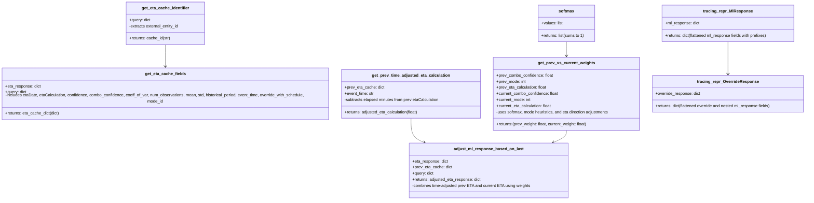

# Diagram: research/api/tests/test_eta_lib.py


> Auto-generated by Obscura crawlers

## Diagram 1

```mermaid
flowchart LR
    Query[Query (dict)] -->|external_entity_id| CacheId[get_eta_cache_identifier()]
    Query --> ETAResponse[eta_response (dict)]
    ETAResponse --> CacheFields[get_eta_cache_fields(eta_response, query)]
    CacheFields --> ETA_Cache[eta_cache_dict]
    PrevCache[prev_eta_cache (dict)] --> TimeAdj[get_prev_time_adjusted_eta_calculation(prev_eta_cache, event_time)]
    TimeAdj --> TimeAdjustedETA[time_adjusted_prev_eta_calc]
    PrevCache --> PrevCombo[prev.combo_confidence]
    ETAResponse --> CurrCombo[current.combo_confidence]
    PrevCombo --> Weights[get_prev_vs_current_weights(...)]
    CurrCombo --> Weights
    PrevCache --> PrevETA[prev.etaCalculation]
    ETAResponse --> CurrETA[current.etaCalculation]
    PrevETA --> Weights
    CurrETA --> Weights
    softmax[softmax(confidence_vals)] --> SoftmaxOut[probabilities]
    Weights --> Adjust[adjust_ml_response_based_on_last(eta_response, prev_eta_cache, query)]
    TimeAdjustedETA --> Adjust
    ETAResponse --> Adjust
    Adjust --> FinalETA[adjusted_eta_response]
    tracing_ML[tracing_repr_MlResponse(ml_response)] --> TraceML[tracing_map]
    tracing_OV[tracing_repr_OverrideResponse(override_response)] --> TraceOV[tracing_map]
```

> SVG rendering failed for this diagram.

## Diagram 2



### SVG

<svg id="container" width="3268.90625" xmlns="http://www.w3.org/2000/svg" class="classDiagram" height="788" viewBox="0 0 3268.90625 788" role="graphics-document document" aria-roledescription="class"><style>#container{font-family:"trebuchet ms",verdana,arial,sans-serif;font-size:16px;fill:#333;}@keyframes edge-animation-frame{from{stroke-dashoffset:0;}}@keyframes dash{to{stroke-dashoffset:0;}}#container .edge-animation-slow{stroke-dasharray:9,5!important;stroke-dashoffset:900;animation:dash 50s linear infinite;stroke-linecap:round;}#container .edge-animation-fast{stroke-dasharray:9,5!important;stroke-dashoffset:900;animation:dash 20s linear infinite;stroke-linecap:round;}#container .error-icon{fill:#552222;}#container .error-text{fill:#552222;stroke:#552222;}#container .edge-thickness-normal{stroke-width:1px;}#container .edge-thickness-thick{stroke-width:3.5px;}#container .edge-pattern-solid{stroke-dasharray:0;}#container .edge-thickness-invisible{stroke-width:0;fill:none;}#container .edge-pattern-dashed{stroke-dasharray:3;}#container .edge-pattern-dotted{stroke-dasharray:2;}#container .marker{fill:#333333;stroke:#333333;}#container .marker.cross{stroke:#333333;}#container svg{font-family:"trebuchet ms",verdana,arial,sans-serif;font-size:16px;}#container p{margin:0;}#container g.classGroup text{fill:#9370DB;stroke:none;font-family:"trebuchet ms",verdana,arial,sans-serif;font-size:10px;}#container g.classGroup text .title{font-weight:bolder;}#container .nodeLabel,#container .edgeLabel{color:#131300;}#container .edgeLabel .label rect{fill:#ECECFF;}#container .label text{fill:#131300;}#container .labelBkg{background:#ECECFF;}#container .edgeLabel .label span{background:#ECECFF;}#container .classTitle{font-weight:bolder;}#container .node rect,#container .node circle,#container .node ellipse,#container .node polygon,#container .node path{fill:#ECECFF;stroke:#9370DB;stroke-width:1px;}#container .divider{stroke:#9370DB;stroke-width:1;}#container g.clickable{cursor:pointer;}#container g.classGroup rect{fill:#ECECFF;stroke:#9370DB;}#container g.classGroup line{stroke:#9370DB;stroke-width:1;}#container .classLabel .box{stroke:none;stroke-width:0;fill:#ECECFF;opacity:0.5;}#container .classLabel .label{fill:#9370DB;font-size:10px;}#container .relation{stroke:#333333;stroke-width:1;fill:none;}#container .dashed-line{stroke-dasharray:3;}#container .dotted-line{stroke-dasharray:1 2;}#container #compositionStart,#container .composition{fill:#333333!important;stroke:#333333!important;stroke-width:1;}#container #compositionEnd,#container .composition{fill:#333333!important;stroke:#333333!important;stroke-width:1;}#container #dependencyStart,#container .dependency{fill:#333333!important;stroke:#333333!important;stroke-width:1;}#container #dependencyStart,#container .dependency{fill:#333333!important;stroke:#333333!important;stroke-width:1;}#container #extensionStart,#container .extension{fill:transparent!important;stroke:#333333!important;stroke-width:1;}#container #extensionEnd,#container .extension{fill:transparent!important;stroke:#333333!important;stroke-width:1;}#container #aggregationStart,#container .aggregation{fill:transparent!important;stroke:#333333!important;stroke-width:1;}#container #aggregationEnd,#container .aggregation{fill:transparent!important;stroke:#333333!important;stroke-width:1;}#container #lollipopStart,#container .lollipop{fill:#ECECFF!important;stroke:#333333!important;stroke-width:1;}#container #lollipopEnd,#container .lollipop{fill:#ECECFF!important;stroke:#333333!important;stroke-width:1;}#container .edgeTerminals{font-size:11px;line-height:initial;}#container .classTitleText{text-anchor:middle;font-size:18px;fill:#333;}#container .label-icon{display:inline-block;height:1em;overflow:visible;vertical-align:-0.125em;}#container .node .label-icon path{fill:currentColor;stroke:revert;stroke-width:revert;}#container :root{--mermaid-font-family:"trebuchet ms",verdana,arial,sans-serif;}</style><g><defs><marker id="container_class-aggregationStart" class="marker aggregation class" refX="18" refY="7" markerWidth="190" markerHeight="240" orient="auto"><path d="M 18,7 L9,13 L1,7 L9,1 Z"></path></marker></defs><defs><marker id="container_class-aggregationEnd" class="marker aggregation class" refX="1" refY="7" markerWidth="20" markerHeight="28" orient="auto"><path d="M 18,7 L9,13 L1,7 L9,1 Z"></path></marker></defs><defs><marker id="container_class-extensionStart" class="marker extension class" refX="18" refY="7" markerWidth="190" markerHeight="240" orient="auto"><path d="M 1,7 L18,13 V 1 Z"></path></marker></defs><defs><marker id="container_class-extensionEnd" class="marker extension class" refX="1" refY="7" markerWidth="20" markerHeight="28" orient="auto"><path d="M 1,1 V 13 L18,7 Z"></path></marker></defs><defs><marker id="container_class-compositionStart" class="marker composition class" refX="18" refY="7" markerWidth="190" markerHeight="240" orient="auto"><path d="M 18,7 L9,13 L1,7 L9,1 Z"></path></marker></defs><defs><marker id="container_class-compositionEnd" class="marker composition class" refX="1" refY="7" markerWidth="20" markerHeight="28" orient="auto"><path d="M 18,7 L9,13 L1,7 L9,1 Z"></path></marker></defs><defs><marker id="container_class-dependencyStart" class="marker dependency class" refX="6" refY="7" markerWidth="190" markerHeight="240" orient="auto"><path d="M 5,7 L9,13 L1,7 L9,1 Z"></path></marker></defs><defs><marker id="container_class-dependencyEnd" class="marker dependency class" refX="13" refY="7" markerWidth="20" markerHeight="28" orient="auto"><path d="M 18,7 L9,13 L14,7 L9,1 Z"></path></marker></defs><defs><marker id="container_class-lollipopStart" class="marker lollipop class" refX="13" refY="7" markerWidth="190" markerHeight="240" orient="auto"><circle stroke="black" fill="transparent" cx="7" cy="7" r="6"></circle></marker></defs><defs><marker id="container_class-lollipopEnd" class="marker lollipop class" refX="1" refY="7" markerWidth="190" markerHeight="240" orient="auto"><circle stroke="black" fill="transparent" cx="7" cy="7" r="6"></circle></marker></defs><g class="root"><g class="clusters"></g><g class="edgePaths"><path d="M688.945,176L688.945,180.167C688.945,184.333,688.945,192.667,688.945,208C688.945,223.333,688.945,245.667,688.945,256.833L688.945,268" id="id_get_eta_cache_identifier_get_eta_cache_fields_1" class="edge-thickness-normal edge-pattern-solid relation" style=";;;" data-edge="true" data-et="edge" data-id="id_get_eta_cache_identifier_get_eta_cache_fields_1" data-points="W3sieCI6Njg4Ljk0NTMxMjUsInkiOjE3Nn0seyJ4Ijo2ODguOTQ1MzEyNSwieSI6MjAxfSx7IngiOjY4OC45NDUzMTI1LCJ5IjoyNzR9XQ==" marker-end="url(#container_class-dependencyEnd)"></path><path d="M1696.387,466L1696.387,478.167C1696.387,490.333,1696.387,514.667,1705.159,530.605C1713.931,546.543,1731.476,554.087,1740.248,557.858L1749.02,561.63" id="id_get_prev_time_adjusted_eta_calculation_adjust_ml_response_based_on_last_2" class="edge-thickness-normal edge-pattern-solid relation" style=";;;" data-edge="true" data-et="edge" data-id="id_get_prev_time_adjusted_eta_calculation_adjust_ml_response_based_on_last_2" data-points="W3sieCI6MTY5Ni4zODY3MTg3NSwieSI6NDY2fSx7IngiOjE2OTYuMzg2NzE4NzUsInkiOjUzOX0seyJ4IjoxNzU0LjUzMjIwNDUzNDc3NDMsInkiOjU2NH1d" marker-end="url(#container_class-dependencyEnd)"></path><path d="M2315.055,514L2315.055,518.167C2315.055,522.333,2315.055,530.667,2306.282,538.605C2297.51,546.543,2279.966,554.087,2271.194,557.858L2262.421,561.63" id="id_get_prev_vs_current_weights_adjust_ml_response_based_on_last_3" class="edge-thickness-normal edge-pattern-solid relation" style=";;;" data-edge="true" data-et="edge" data-id="id_get_prev_vs_current_weights_adjust_ml_response_based_on_last_3" data-points="W3sieCI6MjMxNS4wNTQ2ODc1LCJ5Ijo1MTR9LHsieCI6MjMxNS4wNTQ2ODc1LCJ5Ijo1Mzl9LHsieCI6MjI1Ni45MDkyMDE3MTUyMjU3LCJ5Ijo1NjR9XQ==" marker-end="url(#container_class-dependencyEnd)"></path><path d="M2315.055,164L2315.055,170.167C2315.055,176.333,2315.055,188.667,2315.055,198C2315.055,207.333,2315.055,213.667,2315.055,216.833L2315.055,220" id="id_softmax_get_prev_vs_current_weights_4" class="edge-thickness-normal edge-pattern-solid relation" style=";;;" data-edge="true" data-et="edge" data-id="id_softmax_get_prev_vs_current_weights_4" data-points="W3sieCI6MjMxNS4wNTQ2ODc1LCJ5IjoxNjR9LHsieCI6MjMxNS4wNTQ2ODc1LCJ5IjoyMDF9LHsieCI6MjMxNS4wNTQ2ODc1LCJ5IjoyMjZ9XQ==" marker-end="url(#container_class-dependencyEnd)"></path><path d="M2959.066,164L2959.066,170.167C2959.066,176.333,2959.066,188.667,2959.066,210C2959.066,231.333,2959.066,261.667,2959.066,276.833L2959.066,292" id="id_tracing_repr_MlResponse_tracing_repr_OverrideResponse_5" class="edge-thickness-normal edge-pattern-solid relation" style=";;;" data-edge="true" data-et="edge" data-id="id_tracing_repr_MlResponse_tracing_repr_OverrideResponse_5" data-points="W3sieCI6Mjk1OS4wNjY0MDYyNSwieSI6MTY0fSx7IngiOjI5NTkuMDY2NDA2MjUsInkiOjIwMX0seyJ4IjoyOTU5LjA2NjQwNjI1LCJ5IjoyOTh9XQ==" marker-end="url(#container_class-dependencyEnd)"></path></g><g class="edgeLabels"><g class="edgeLabel"><g class="label" data-id="id_get_eta_cache_identifier_get_eta_cache_fields_1" transform="translate(0, 0)"><foreignObject width="0" height="0"><div xmlns="http://www.w3.org/1999/xhtml" class="labelBkg" style="display: table-cell; white-space: nowrap; line-height: 1.5; max-width: 200px; text-align: center;"><span class="edgeLabel"></span></div></foreignObject></g></g><g class="edgeLabel"><g class="label" data-id="id_get_prev_time_adjusted_eta_calculation_adjust_ml_response_based_on_last_2" transform="translate(0, 0)"><foreignObject width="0" height="0"><div xmlns="http://www.w3.org/1999/xhtml" class="labelBkg" style="display: table-cell; white-space: nowrap; line-height: 1.5; max-width: 200px; text-align: center;"><span class="edgeLabel"></span></div></foreignObject></g></g><g class="edgeLabel"><g class="label" data-id="id_get_prev_vs_current_weights_adjust_ml_response_based_on_last_3" transform="translate(0, 0)"><foreignObject width="0" height="0"><div xmlns="http://www.w3.org/1999/xhtml" class="labelBkg" style="display: table-cell; white-space: nowrap; line-height: 1.5; max-width: 200px; text-align: center;"><span class="edgeLabel"></span></div></foreignObject></g></g><g class="edgeLabel"><g class="label" data-id="id_softmax_get_prev_vs_current_weights_4" transform="translate(0, 0)"><foreignObject width="0" height="0"><div xmlns="http://www.w3.org/1999/xhtml" class="labelBkg" style="display: table-cell; white-space: nowrap; line-height: 1.5; max-width: 200px; text-align: center;"><span class="edgeLabel"></span></div></foreignObject></g></g><g class="edgeLabel"><g class="label" data-id="id_tracing_repr_MlResponse_tracing_repr_OverrideResponse_5" transform="translate(0, 0)"><foreignObject width="0" height="0"><div xmlns="http://www.w3.org/1999/xhtml" class="labelBkg" style="display: table-cell; white-space: nowrap; line-height: 1.5; max-width: 200px; text-align: center;"><span class="edgeLabel"></span></div></foreignObject></g></g></g><g class="nodes"><g class="node default" id="classId-get_eta_cache_identifier-0" transform="translate(688.9453125, 92)"><g class="basic label-container"><path d="M-156.82421875 -84 L156.82421875 -84 L156.82421875 84 L-156.82421875 84" stroke="none" stroke-width="0" fill="#ECECFF" style=""></path><path d="M-156.82421875 -84 C-62.509775298871816 -84, 31.80466815225637 -84, 156.82421875 -84 M-156.82421875 -84 C-66.22633726877771 -84, 24.371544212444576 -84, 156.82421875 -84 M156.82421875 -84 C156.82421875 -48.98784409292786, 156.82421875 -13.975688185855716, 156.82421875 84 M156.82421875 -84 C156.82421875 -48.28048401873733, 156.82421875 -12.560968037474666, 156.82421875 84 M156.82421875 84 C33.30226453342847 84, -90.21968968314306 84, -156.82421875 84 M156.82421875 84 C32.877327438231305 84, -91.06956387353739 84, -156.82421875 84 M-156.82421875 84 C-156.82421875 38.82688030501548, -156.82421875 -6.346239389969043, -156.82421875 -84 M-156.82421875 84 C-156.82421875 47.74623257769249, -156.82421875 11.492465155384977, -156.82421875 -84" stroke="#9370DB" stroke-width="1.3" fill="none" stroke-dasharray="0 0" style=""></path></g><g class="annotation-group text" transform="translate(0, -60)"></g><g class="label-group text" transform="translate(-90.3828125, -60)"><g class="label" style="font-weight: bolder" transform="translate(0,-12)"><foreignObject width="180.765625" height="24"><div xmlns="http://www.w3.org/1999/xhtml" style="display: table-cell; white-space: nowrap; line-height: 1.5; max-width: 229px; text-align: center;"><span class="nodeLabel markdown-node-label" style=""><p>get_eta_cache_identifier</p></span></div></foreignObject></g></g><g class="members-group text" transform="translate(-144.82421875, -12)"><g class="label" style="" transform="translate(0,-12)"><foreignObject width="85.28125" height="24"><div xmlns="http://www.w3.org/1999/xhtml" style="display: table-cell; white-space: nowrap; line-height: 1.5; max-width: 143px; text-align: center;"><span class="nodeLabel markdown-node-label" style=""><p>+query: dict</p></span></div></foreignObject></g><g class="label" style="" transform="translate(0,12)"><foreignObject width="199.265625" height="24"><div xmlns="http://www.w3.org/1999/xhtml" style="display: table-cell; white-space: nowrap; line-height: 1.5; max-width: 257px; text-align: center;"><span class="nodeLabel markdown-node-label" style=""><p>-extracts external_entity_id</p></span></div></foreignObject></g></g><g class="methods-group text" transform="translate(-144.82421875, 60)"><g class="label" style="" transform="translate(0,-12)"><foreignObject width="162.40625" height="24"><div xmlns="http://www.w3.org/1999/xhtml" style="display: table-cell; white-space: nowrap; line-height: 1.5; max-width: 220px; text-align: center;"><span class="nodeLabel markdown-node-label" style=""><p>+returns: cache_id(str)</p></span></div></foreignObject></g></g><g class="divider" style=""><path d="M-156.82421875 -36 C-73.59200289787998 -36, 9.640212954240042 -36, 156.82421875 -36 M-156.82421875 -36 C-77.10288202893176 -36, 2.6184546921364813 -36, 156.82421875 -36" stroke="#9370DB" stroke-width="1.3" fill="none" stroke-dasharray="0 0" style=""></path></g><g class="divider" style=""><path d="M-156.82421875 36 C-36.489958197339234 36, 83.84430235532153 36, 156.82421875 36 M-156.82421875 36 C-39.907415817133895 36, 77.00938711573221 36, 156.82421875 36" stroke="#9370DB" stroke-width="1.3" fill="none" stroke-dasharray="0 0" style=""></path></g></g><g class="node default" id="classId-get_eta_cache_fields-1" transform="translate(688.9453125, 370)"><g class="basic label-container"><path d="M-680.9453125 -96 L680.9453125 -96 L680.9453125 96 L-680.9453125 96" stroke="none" stroke-width="0" fill="#ECECFF" style=""></path><path d="M-680.9453125 -96 C-363.3329155515336 -96, -45.72051860306715 -96, 680.9453125 -96 M-680.9453125 -96 C-220.33661646083527 -96, 240.27207957832945 -96, 680.9453125 -96 M680.9453125 -96 C680.9453125 -29.60644984782121, 680.9453125 36.78710030435758, 680.9453125 96 M680.9453125 -96 C680.9453125 -38.50816101890774, 680.9453125 18.983677962184515, 680.9453125 96 M680.9453125 96 C146.37511231502697 96, -388.19508786994606 96, -680.9453125 96 M680.9453125 96 C320.35124292096316 96, -40.24282665807368 96, -680.9453125 96 M-680.9453125 96 C-680.9453125 37.56811357401319, -680.9453125 -20.86377285197362, -680.9453125 -96 M-680.9453125 96 C-680.9453125 56.38667770500634, -680.9453125 16.773355410012684, -680.9453125 -96" stroke="#9370DB" stroke-width="1.3" fill="none" stroke-dasharray="0 0" style=""></path></g><g class="annotation-group text" transform="translate(0, -72)"></g><g class="label-group text" transform="translate(-76.578125, -72)"><g class="label" style="font-weight: bolder" transform="translate(0,-12)"><foreignObject width="153.15625" height="24"><div xmlns="http://www.w3.org/1999/xhtml" style="display: table-cell; white-space: nowrap; line-height: 1.5; max-width: 201px; text-align: center;"><span class="nodeLabel markdown-node-label" style=""><p>get_eta_cache_fields</p></span></div></foreignObject></g></g><g class="members-group text" transform="translate(-668.9453125, -24)"><g class="label" style="" transform="translate(0,-12)"><foreignObject width="141.28125" height="24"><div xmlns="http://www.w3.org/1999/xhtml" style="display: table-cell; white-space: nowrap; line-height: 1.5; max-width: 199px; text-align: center;"><span class="nodeLabel markdown-node-label" style=""><p>+eta_response: dict</p></span></div></foreignObject></g><g class="label" style="" transform="translate(0,12)"><foreignObject width="85.28125" height="24"><div xmlns="http://www.w3.org/1999/xhtml" style="display: table-cell; white-space: nowrap; line-height: 1.5; max-width: 143px; text-align: center;"><span class="nodeLabel markdown-node-label" style=""><p>+query: dict</p></span></div></foreignObject></g><g class="label" style="" transform="translate(0,36)"><foreignObject width="1261.3125" height="24"><div xmlns="http://www.w3.org/1999/xhtml" style="display: table-cell; white-space: nowrap; line-height: 1.5; max-width: 1319px; text-align: center;"><span class="nodeLabel markdown-node-label" style=""><p>-includes etaDate, etaCalculation, confidence, combo_confidence, coeff_of_var, num_observations, mean, std, historical_period, event_time, override_with_schedule, mode_id</p></span></div></foreignObject></g></g><g class="methods-group text" transform="translate(-668.9453125, 72)"><g class="label" style="" transform="translate(0,-12)"><foreignObject width="214.6875" height="24"><div xmlns="http://www.w3.org/1999/xhtml" style="display: table-cell; white-space: nowrap; line-height: 1.5; max-width: 272px; text-align: center;"><span class="nodeLabel markdown-node-label" style=""><p>+returns: eta_cache_dict(dict)</p></span></div></foreignObject></g></g><g class="divider" style=""><path d="M-680.9453125 -48 C-138.58947526847976 -48, 403.7663619630405 -48, 680.9453125 -48 M-680.9453125 -48 C-143.32089942499192 -48, 394.30351365001616 -48, 680.9453125 -48" stroke="#9370DB" stroke-width="1.3" fill="none" stroke-dasharray="0 0" style=""></path></g><g class="divider" style=""><path d="M-680.9453125 48 C-140.53823647986428 48, 399.86883954027144 48, 680.9453125 48 M-680.9453125 48 C-331.6358751255348 48, 17.673562248930352 48, 680.9453125 48" stroke="#9370DB" stroke-width="1.3" fill="none" stroke-dasharray="0 0" style=""></path></g></g><g class="node default" id="classId-get_prev_time_adjusted_eta_calculation-2" transform="translate(1696.38671875, 370)"><g class="basic label-container"><path d="M-276.49609375 -96 L276.49609375 -96 L276.49609375 96 L-276.49609375 96" stroke="none" stroke-width="0" fill="#ECECFF" style=""></path><path d="M-276.49609375 -96 C-66.8162569095341 -96, 142.8635799309318 -96, 276.49609375 -96 M-276.49609375 -96 C-109.12099334724803 -96, 58.25410705550394 -96, 276.49609375 -96 M276.49609375 -96 C276.49609375 -25.07274215464119, 276.49609375 45.85451569071762, 276.49609375 96 M276.49609375 -96 C276.49609375 -49.35380006773736, 276.49609375 -2.7076001354747206, 276.49609375 96 M276.49609375 96 C144.11163530277207 96, 11.727176855544144 96, -276.49609375 96 M276.49609375 96 C154.27967318108125 96, 32.06325261216247 96, -276.49609375 96 M-276.49609375 96 C-276.49609375 43.90883798839205, -276.49609375 -8.182324023215898, -276.49609375 -96 M-276.49609375 96 C-276.49609375 56.662001210286064, -276.49609375 17.32400242057213, -276.49609375 -96" stroke="#9370DB" stroke-width="1.3" fill="none" stroke-dasharray="0 0" style=""></path></g><g class="annotation-group text" transform="translate(0, -72)"></g><g class="label-group text" transform="translate(-148.1171875, -72)"><g class="label" style="font-weight: bolder" transform="translate(0,-12)"><foreignObject width="296.234375" height="24"><div xmlns="http://www.w3.org/1999/xhtml" style="display: table-cell; white-space: nowrap; line-height: 1.5; max-width: 343px; text-align: center;"><span class="nodeLabel markdown-node-label" style=""><p>get_prev_time_adjusted_eta_calculation</p></span></div></foreignObject></g></g><g class="members-group text" transform="translate(-264.49609375, -24)"><g class="label" style="" transform="translate(0,-12)"><foreignObject width="155.84375" height="24"><div xmlns="http://www.w3.org/1999/xhtml" style="display: table-cell; white-space: nowrap; line-height: 1.5; max-width: 213px; text-align: center;"><span class="nodeLabel markdown-node-label" style=""><p>+prev_eta_cache: dict</p></span></div></foreignObject></g><g class="label" style="" transform="translate(0,12)"><foreignObject width="116.546875" height="24"><div xmlns="http://www.w3.org/1999/xhtml" style="display: table-cell; white-space: nowrap; line-height: 1.5; max-width: 175px; text-align: center;"><span class="nodeLabel markdown-node-label" style=""><p>+event_time: str</p></span></div></foreignObject></g><g class="label" style="" transform="translate(0,36)"><foreignObject width="380.875" height="24"><div xmlns="http://www.w3.org/1999/xhtml" style="display: table-cell; white-space: nowrap; line-height: 1.5; max-width: 438px; text-align: center;"><span class="nodeLabel markdown-node-label" style=""><p>-subtracts elapsed minutes from prev etaCalculation</p></span></div></foreignObject></g></g><g class="methods-group text" transform="translate(-264.49609375, 72)"><g class="label" style="" transform="translate(0,-12)"><foreignObject width="294.234375" height="24"><div xmlns="http://www.w3.org/1999/xhtml" style="display: table-cell; white-space: nowrap; line-height: 1.5; max-width: 352px; text-align: center;"><span class="nodeLabel markdown-node-label" style=""><p>+returns: adjusted_eta_calculation(float)</p></span></div></foreignObject></g></g><g class="divider" style=""><path d="M-276.49609375 -48 C-138.61294110049988 -48, -0.729788450999763 -48, 276.49609375 -48 M-276.49609375 -48 C-109.30463752191926 -48, 57.88681870616148 -48, 276.49609375 -48" stroke="#9370DB" stroke-width="1.3" fill="none" stroke-dasharray="0 0" style=""></path></g><g class="divider" style=""><path d="M-276.49609375 48 C-86.12099493721831 48, 104.25410387556337 48, 276.49609375 48 M-276.49609375 48 C-130.61450609074117 48, 15.267081568517654 48, 276.49609375 48" stroke="#9370DB" stroke-width="1.3" fill="none" stroke-dasharray="0 0" style=""></path></g></g><g class="node default" id="classId-softmax-3" transform="translate(2315.0546875, 92)"><g class="basic label-container"><path d="M-111.6953125 -72 L111.6953125 -72 L111.6953125 72 L-111.6953125 72" stroke="none" stroke-width="0" fill="#ECECFF" style=""></path><path d="M-111.6953125 -72 C-62.5141204093664 -72, -13.332928318732797 -72, 111.6953125 -72 M-111.6953125 -72 C-63.0798129729463 -72, -14.4643134458926 -72, 111.6953125 -72 M111.6953125 -72 C111.6953125 -29.05141458909769, 111.6953125 13.897170821804622, 111.6953125 72 M111.6953125 -72 C111.6953125 -26.282998240423517, 111.6953125 19.434003519152967, 111.6953125 72 M111.6953125 72 C34.64011887726939 72, -42.415074745461226 72, -111.6953125 72 M111.6953125 72 C25.28030476111124 72, -61.13470297777752 72, -111.6953125 72 M-111.6953125 72 C-111.6953125 35.792308949614835, -111.6953125 -0.41538210077033, -111.6953125 -72 M-111.6953125 72 C-111.6953125 38.11837630931326, -111.6953125 4.236752618626525, -111.6953125 -72" stroke="#9370DB" stroke-width="1.3" fill="none" stroke-dasharray="0 0" style=""></path></g><g class="annotation-group text" transform="translate(0, -48)"></g><g class="label-group text" transform="translate(-29.71875, -48)"><g class="label" style="font-weight: bolder" transform="translate(0,-12)"><foreignObject width="59.4375" height="24"><div xmlns="http://www.w3.org/1999/xhtml" style="display: table-cell; white-space: nowrap; line-height: 1.5; max-width: 108px; text-align: center;"><span class="nodeLabel markdown-node-label" style=""><p>softmax</p></span></div></foreignObject></g></g><g class="members-group text" transform="translate(-99.6953125, 0)"><g class="label" style="" transform="translate(0,-12)"><foreignObject width="84.71875" height="24"><div xmlns="http://www.w3.org/1999/xhtml" style="display: table-cell; white-space: nowrap; line-height: 1.5; max-width: 142px; text-align: center;"><span class="nodeLabel markdown-node-label" style=""><p>+values: list</p></span></div></foreignObject></g></g><g class="methods-group text" transform="translate(-99.6953125, 48)"><g class="label" style="" transform="translate(0,-12)"><foreignObject width="169.671875" height="24"><div xmlns="http://www.w3.org/1999/xhtml" style="display: table-cell; white-space: nowrap; line-height: 1.5; max-width: 227px; text-align: center;"><span class="nodeLabel markdown-node-label" style=""><p>+returns: list(sums to 1)</p></span></div></foreignObject></g></g><g class="divider" style=""><path d="M-111.6953125 -24 C-50.47136318746949 -24, 10.752586125061015 -24, 111.6953125 -24 M-111.6953125 -24 C-55.63612606134041 -24, 0.42306037731917456 -24, 111.6953125 -24" stroke="#9370DB" stroke-width="1.3" fill="none" stroke-dasharray="0 0" style=""></path></g><g class="divider" style=""><path d="M-111.6953125 24 C-52.71064249553221 24, 6.274027508935575 24, 111.6953125 24 M-111.6953125 24 C-39.66302542366019 24, 32.369261652679626 24, 111.6953125 24" stroke="#9370DB" stroke-width="1.3" fill="none" stroke-dasharray="0 0" style=""></path></g></g><g class="node default" id="classId-get_prev_vs_current_weights-4" transform="translate(2315.0546875, 370)"><g class="basic label-container"><path d="M-292.171875 -144 L292.171875 -144 L292.171875 144 L-292.171875 144" stroke="none" stroke-width="0" fill="#ECECFF" style=""></path><path d="M-292.171875 -144 C-91.18122715770502 -144, 109.80942068458995 -144, 292.171875 -144 M-292.171875 -144 C-131.23594361982958 -144, 29.699987760340832 -144, 292.171875 -144 M292.171875 -144 C292.171875 -28.93152747135923, 292.171875 86.13694505728154, 292.171875 144 M292.171875 -144 C292.171875 -77.97619632899662, 292.171875 -11.952392657993244, 292.171875 144 M292.171875 144 C102.20288686335172 144, -87.76610127329656 144, -292.171875 144 M292.171875 144 C156.28851541372575 144, 20.405155827451495 144, -292.171875 144 M-292.171875 144 C-292.171875 75.67423073901033, -292.171875 7.348461478020653, -292.171875 -144 M-292.171875 144 C-292.171875 45.57442658805748, -292.171875 -52.851146823885045, -292.171875 -144" stroke="#9370DB" stroke-width="1.3" fill="none" stroke-dasharray="0 0" style=""></path></g><g class="annotation-group text" transform="translate(0, -120)"></g><g class="label-group text" transform="translate(-106.78125, -120)"><g class="label" style="font-weight: bolder" transform="translate(0,-12)"><foreignObject width="213.5625" height="24"><div xmlns="http://www.w3.org/1999/xhtml" style="display: table-cell; white-space: nowrap; line-height: 1.5; max-width: 259px; text-align: center;"><span class="nodeLabel markdown-node-label" style=""><p>get_prev_vs_current_weights</p></span></div></foreignObject></g></g><g class="members-group text" transform="translate(-280.171875, -72)"><g class="label" style="" transform="translate(0,-12)"><foreignObject width="224.25" height="24"><div xmlns="http://www.w3.org/1999/xhtml" style="display: table-cell; white-space: nowrap; line-height: 1.5; max-width: 282px; text-align: center;"><span class="nodeLabel markdown-node-label" style=""><p>+prev_combo_confidence: float</p></span></div></foreignObject></g><g class="label" style="" transform="translate(0,12)"><foreignObject width="116.640625" height="24"><div xmlns="http://www.w3.org/1999/xhtml" style="display: table-cell; white-space: nowrap; line-height: 1.5; max-width: 174px; text-align: center;"><span class="nodeLabel markdown-node-label" style=""><p>+prev_mode: int</p></span></div></foreignObject></g><g class="label" style="" transform="translate(0,36)"><foreignObject width="199.21875" height="24"><div xmlns="http://www.w3.org/1999/xhtml" style="display: table-cell; white-space: nowrap; line-height: 1.5; max-width: 257px; text-align: center;"><span class="nodeLabel markdown-node-label" style=""><p>+prev_eta_calculation: float</p></span></div></foreignObject></g><g class="label" style="" transform="translate(0,60)"><foreignObject width="245.546875" height="24"><div xmlns="http://www.w3.org/1999/xhtml" style="display: table-cell; white-space: nowrap; line-height: 1.5; max-width: 303px; text-align: center;"><span class="nodeLabel markdown-node-label" style=""><p>+current_combo_confidence: float</p></span></div></foreignObject></g><g class="label" style="" transform="translate(0,84)"><foreignObject width="137.9375" height="24"><div xmlns="http://www.w3.org/1999/xhtml" style="display: table-cell; white-space: nowrap; line-height: 1.5; max-width: 196px; text-align: center;"><span class="nodeLabel markdown-node-label" style=""><p>+current_mode: int</p></span></div></foreignObject></g><g class="label" style="" transform="translate(0,108)"><foreignObject width="220.515625" height="24"><div xmlns="http://www.w3.org/1999/xhtml" style="display: table-cell; white-space: nowrap; line-height: 1.5; max-width: 278px; text-align: center;"><span class="nodeLabel markdown-node-label" style=""><p>+current_eta_calculation: float</p></span></div></foreignObject></g><g class="label" style="" transform="translate(0,132)"><foreignObject width="453.5625" height="24"><div xmlns="http://www.w3.org/1999/xhtml" style="display: table-cell; white-space: nowrap; line-height: 1.5; max-width: 511px; text-align: center;"><span class="nodeLabel markdown-node-label" style=""><p>-uses softmax, mode heuristics, and eta direction adjustments</p></span></div></foreignObject></g></g><g class="methods-group text" transform="translate(-280.171875, 120)"><g class="label" style="" transform="translate(0,-12)"><foreignObject width="361.421875" height="24"><div xmlns="http://www.w3.org/1999/xhtml" style="display: table-cell; white-space: nowrap; line-height: 1.5; max-width: 419px; text-align: center;"><span class="nodeLabel markdown-node-label" style=""><p>+returns:(prev_weight: float, current_weight: float)</p></span></div></foreignObject></g></g><g class="divider" style=""><path d="M-292.171875 -96 C-116.57825263237905 -96, 59.015369735241904 -96, 292.171875 -96 M-292.171875 -96 C-151.19443581538167 -96, -10.216996630763333 -96, 292.171875 -96" stroke="#9370DB" stroke-width="1.3" fill="none" stroke-dasharray="0 0" style=""></path></g><g class="divider" style=""><path d="M-292.171875 96 C-59.47206923576573 96, 173.22773652846854 96, 292.171875 96 M-292.171875 96 C-67.25850650232914 96, 157.65486199534172 96, 292.171875 96" stroke="#9370DB" stroke-width="1.3" fill="none" stroke-dasharray="0 0" style=""></path></g></g><g class="node default" id="classId-adjust_ml_response_based_on_last-5" transform="translate(2005.720703125, 672)"><g class="basic label-container"><path d="M-312.32421875 -108 L312.32421875 -108 L312.32421875 108 L-312.32421875 108" stroke="none" stroke-width="0" fill="#ECECFF" style=""></path><path d="M-312.32421875 -108 C-181.56500526370323 -108, -50.805791777406455 -108, 312.32421875 -108 M-312.32421875 -108 C-120.79347565043767 -108, 70.73726744912466 -108, 312.32421875 -108 M312.32421875 -108 C312.32421875 -22.22147657129898, 312.32421875 63.55704685740204, 312.32421875 108 M312.32421875 -108 C312.32421875 -60.67876471033882, 312.32421875 -13.357529420677636, 312.32421875 108 M312.32421875 108 C176.8113296953688 108, 41.298440640737624 108, -312.32421875 108 M312.32421875 108 C112.51916992952064 108, -87.28587889095871 108, -312.32421875 108 M-312.32421875 108 C-312.32421875 51.8267898106949, -312.32421875 -4.346420378610205, -312.32421875 -108 M-312.32421875 108 C-312.32421875 62.91536909345814, -312.32421875 17.830738186916278, -312.32421875 -108" stroke="#9370DB" stroke-width="1.3" fill="none" stroke-dasharray="0 0" style=""></path></g><g class="annotation-group text" transform="translate(0, -84)"></g><g class="label-group text" transform="translate(-131.0546875, -84)"><g class="label" style="font-weight: bolder" transform="translate(0,-12)"><foreignObject width="262.109375" height="24"><div xmlns="http://www.w3.org/1999/xhtml" style="display: table-cell; white-space: nowrap; line-height: 1.5; max-width: 310px; text-align: center;"><span class="nodeLabel markdown-node-label" style=""><p>adjust_ml_response_based_on_last</p></span></div></foreignObject></g></g><g class="members-group text" transform="translate(-300.32421875, -36)"><g class="label" style="" transform="translate(0,-12)"><foreignObject width="141.28125" height="24"><div xmlns="http://www.w3.org/1999/xhtml" style="display: table-cell; white-space: nowrap; line-height: 1.5; max-width: 199px; text-align: center;"><span class="nodeLabel markdown-node-label" style=""><p>+eta_response: dict</p></span></div></foreignObject></g><g class="label" style="" transform="translate(0,12)"><foreignObject width="155.84375" height="24"><div xmlns="http://www.w3.org/1999/xhtml" style="display: table-cell; white-space: nowrap; line-height: 1.5; max-width: 213px; text-align: center;"><span class="nodeLabel markdown-node-label" style=""><p>+prev_eta_cache: dict</p></span></div></foreignObject></g><g class="label" style="" transform="translate(0,36)"><foreignObject width="85.28125" height="24"><div xmlns="http://www.w3.org/1999/xhtml" style="display: table-cell; white-space: nowrap; line-height: 1.5; max-width: 143px; text-align: center;"><span class="nodeLabel markdown-node-label" style=""><p>+query: dict</p></span></div></foreignObject></g><g class="label" style="" transform="translate(0,60)"><foreignObject width="273.25" height="24"><div xmlns="http://www.w3.org/1999/xhtml" style="display: table-cell; white-space: nowrap; line-height: 1.5; max-width: 331px; text-align: center;"><span class="nodeLabel markdown-node-label" style=""><p>+returns: adjusted_eta_response: dict</p></span></div></foreignObject></g><g class="label" style="" transform="translate(0,84)"><foreignObject width="469.59375" height="24"><div xmlns="http://www.w3.org/1999/xhtml" style="display: table-cell; white-space: nowrap; line-height: 1.5; max-width: 527px; text-align: center;"><span class="nodeLabel markdown-node-label" style=""><p>-combines time-adjusted prev ETA and current ETA using weights</p></span></div></foreignObject></g></g><g class="methods-group text" transform="translate(-300.32421875, 108)"></g><g class="divider" style=""><path d="M-312.32421875 -60 C-76.9048330827193 -60, 158.5145525845614 -60, 312.32421875 -60 M-312.32421875 -60 C-133.22958206614686 -60, 45.86505461770628 -60, 312.32421875 -60" stroke="#9370DB" stroke-width="1.3" fill="none" stroke-dasharray="0 0" style=""></path></g><g class="divider" style=""><path d="M-312.32421875 84 C-72.58979515688887 84, 167.14462843622226 84, 312.32421875 84 M-312.32421875 84 C-76.51311495276681 84, 159.29798884446637 84, 312.32421875 84" stroke="#9370DB" stroke-width="1.3" fill="none" stroke-dasharray="0 0" style=""></path></g></g><g class="node default" id="classId-tracing_repr_MlResponse-6" transform="translate(2959.06640625, 92)"><g class="basic label-container"><path d="M-263.3046875 -72 L263.3046875 -72 L263.3046875 72 L-263.3046875 72" stroke="none" stroke-width="0" fill="#ECECFF" style=""></path><path d="M-263.3046875 -72 C-138.78106819590704 -72, -14.257448891814107 -72, 263.3046875 -72 M-263.3046875 -72 C-127.87802651055165 -72, 7.548634478896702 -72, 263.3046875 -72 M263.3046875 -72 C263.3046875 -34.32121586883696, 263.3046875 3.357568262326083, 263.3046875 72 M263.3046875 -72 C263.3046875 -22.92425848609419, 263.3046875 26.151483027811622, 263.3046875 72 M263.3046875 72 C110.70449481710224 72, -41.89569786579551 72, -263.3046875 72 M263.3046875 72 C62.4011436695792 72, -138.5024001608416 72, -263.3046875 72 M-263.3046875 72 C-263.3046875 24.205587756761815, -263.3046875 -23.58882448647637, -263.3046875 -72 M-263.3046875 72 C-263.3046875 39.86255178134749, -263.3046875 7.725103562694983, -263.3046875 -72" stroke="#9370DB" stroke-width="1.3" fill="none" stroke-dasharray="0 0" style=""></path></g><g class="annotation-group text" transform="translate(0, -48)"></g><g class="label-group text" transform="translate(-92.734375, -48)"><g class="label" style="font-weight: bolder" transform="translate(0,-12)"><foreignObject width="185.46875" height="24"><div xmlns="http://www.w3.org/1999/xhtml" style="display: table-cell; white-space: nowrap; line-height: 1.5; max-width: 233px; text-align: center;"><span class="nodeLabel markdown-node-label" style=""><p>tracing_repr_MlResponse</p></span></div></foreignObject></g></g><g class="members-group text" transform="translate(-251.3046875, 0)"><g class="label" style="" transform="translate(0,-12)"><foreignObject width="136.59375" height="24"><div xmlns="http://www.w3.org/1999/xhtml" style="display: table-cell; white-space: nowrap; line-height: 1.5; max-width: 194px; text-align: center;"><span class="nodeLabel markdown-node-label" style=""><p>+ml_response: dict</p></span></div></foreignObject></g></g><g class="methods-group text" transform="translate(-251.3046875, 48)"><g class="label" style="" transform="translate(0,-12)"><foreignObject width="409.875" height="24"><div xmlns="http://www.w3.org/1999/xhtml" style="display: table-cell; white-space: nowrap; line-height: 1.5; max-width: 467px; text-align: center;"><span class="nodeLabel markdown-node-label" style=""><p>+returns: dict(flattened ml_response fields with prefixes)</p></span></div></foreignObject></g></g><g class="divider" style=""><path d="M-263.3046875 -24 C-143.21106269416566 -24, -23.117437888331324 -24, 263.3046875 -24 M-263.3046875 -24 C-121.69917259983748 -24, 19.906342300325036 -24, 263.3046875 -24" stroke="#9370DB" stroke-width="1.3" fill="none" stroke-dasharray="0 0" style=""></path></g><g class="divider" style=""><path d="M-263.3046875 24 C-86.99311137589561 24, 89.31846474820878 24, 263.3046875 24 M-263.3046875 24 C-78.6255201480551 24, 106.0536472038898 24, 263.3046875 24" stroke="#9370DB" stroke-width="1.3" fill="none" stroke-dasharray="0 0" style=""></path></g></g><g class="node default" id="classId-tracing_repr_OverrideResponse-7" transform="translate(2959.06640625, 370)"><g class="basic label-container"><path d="M-301.83984375 -72 L301.83984375 -72 L301.83984375 72 L-301.83984375 72" stroke="none" stroke-width="0" fill="#ECECFF" style=""></path><path d="M-301.83984375 -72 C-161.5442733868126 -72, -21.248703023625183 -72, 301.83984375 -72 M-301.83984375 -72 C-72.6125752339818 -72, 156.6146932820364 -72, 301.83984375 -72 M301.83984375 -72 C301.83984375 -20.613426339879283, 301.83984375 30.773147320241435, 301.83984375 72 M301.83984375 -72 C301.83984375 -22.23988688067591, 301.83984375 27.520226238648178, 301.83984375 72 M301.83984375 72 C96.13427843392839 72, -109.57128688214323 72, -301.83984375 72 M301.83984375 72 C77.42517541116626 72, -146.98949292766747 72, -301.83984375 72 M-301.83984375 72 C-301.83984375 23.82859311750436, -301.83984375 -24.342813764991277, -301.83984375 -72 M-301.83984375 72 C-301.83984375 30.880389880167556, -301.83984375 -10.239220239664888, -301.83984375 -72" stroke="#9370DB" stroke-width="1.3" fill="none" stroke-dasharray="0 0" style=""></path></g><g class="annotation-group text" transform="translate(0, -48)"></g><g class="label-group text" transform="translate(-115.6171875, -48)"><g class="label" style="font-weight: bolder" transform="translate(0,-12)"><foreignObject width="231.234375" height="24"><div xmlns="http://www.w3.org/1999/xhtml" style="display: table-cell; white-space: nowrap; line-height: 1.5; max-width: 278px; text-align: center;"><span class="nodeLabel markdown-node-label" style=""><p>tracing_repr_OverrideResponse</p></span></div></foreignObject></g></g><g class="members-group text" transform="translate(-289.83984375, 0)"><g class="label" style="" transform="translate(0,-12)"><foreignObject width="178.84375" height="24"><div xmlns="http://www.w3.org/1999/xhtml" style="display: table-cell; white-space: nowrap; line-height: 1.5; max-width: 236px; text-align: center;"><span class="nodeLabel markdown-node-label" style=""><p>+override_response: dict</p></span></div></foreignObject></g></g><g class="methods-group text" transform="translate(-289.83984375, 48)"><g class="label" style="" transform="translate(0,-12)"><foreignObject width="464.0625" height="24"><div xmlns="http://www.w3.org/1999/xhtml" style="display: table-cell; white-space: nowrap; line-height: 1.5; max-width: 521px; text-align: center;"><span class="nodeLabel markdown-node-label" style=""><p>+returns: dict(flattened override and nested ml_response fields)</p></span></div></foreignObject></g></g><g class="divider" style=""><path d="M-301.83984375 -24 C-151.55982484773986 -24, -1.2798059454797226 -24, 301.83984375 -24 M-301.83984375 -24 C-166.1889767931466 -24, -30.538109836293188 -24, 301.83984375 -24" stroke="#9370DB" stroke-width="1.3" fill="none" stroke-dasharray="0 0" style=""></path></g><g class="divider" style=""><path d="M-301.83984375 24 C-127.25852873062601 24, 47.32278628874798 24, 301.83984375 24 M-301.83984375 24 C-132.05791652476503 24, 37.72401070046993 24, 301.83984375 24" stroke="#9370DB" stroke-width="1.3" fill="none" stroke-dasharray="0 0" style=""></path></g></g></g></g></g></svg>
