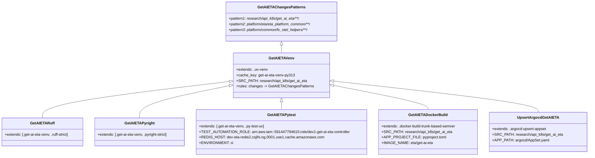

# Diagram: research/api_k8s/get_ai_eta/.gitlab-ci.yml


> Auto-generated by Obscura crawlers

## Diagram 1



### SVG

<svg id="container" width="2468.6640625" xmlns="http://www.w3.org/2000/svg" class="classDiagram" height="668" viewBox="0 0 2468.6640625 668" role="graphics-document document" aria-roledescription="class"><style>#container{font-family:"trebuchet ms",verdana,arial,sans-serif;font-size:16px;fill:#333;}@keyframes edge-animation-frame{from{stroke-dashoffset:0;}}@keyframes dash{to{stroke-dashoffset:0;}}#container .edge-animation-slow{stroke-dasharray:9,5!important;stroke-dashoffset:900;animation:dash 50s linear infinite;stroke-linecap:round;}#container .edge-animation-fast{stroke-dasharray:9,5!important;stroke-dashoffset:900;animation:dash 20s linear infinite;stroke-linecap:round;}#container .error-icon{fill:#552222;}#container .error-text{fill:#552222;stroke:#552222;}#container .edge-thickness-normal{stroke-width:1px;}#container .edge-thickness-thick{stroke-width:3.5px;}#container .edge-pattern-solid{stroke-dasharray:0;}#container .edge-thickness-invisible{stroke-width:0;fill:none;}#container .edge-pattern-dashed{stroke-dasharray:3;}#container .edge-pattern-dotted{stroke-dasharray:2;}#container .marker{fill:#333333;stroke:#333333;}#container .marker.cross{stroke:#333333;}#container svg{font-family:"trebuchet ms",verdana,arial,sans-serif;font-size:16px;}#container p{margin:0;}#container g.classGroup text{fill:#9370DB;stroke:none;font-family:"trebuchet ms",verdana,arial,sans-serif;font-size:10px;}#container g.classGroup text .title{font-weight:bolder;}#container .nodeLabel,#container .edgeLabel{color:#131300;}#container .edgeLabel .label rect{fill:#ECECFF;}#container .label text{fill:#131300;}#container .labelBkg{background:#ECECFF;}#container .edgeLabel .label span{background:#ECECFF;}#container .classTitle{font-weight:bolder;}#container .node rect,#container .node circle,#container .node ellipse,#container .node polygon,#container .node path{fill:#ECECFF;stroke:#9370DB;stroke-width:1px;}#container .divider{stroke:#9370DB;stroke-width:1;}#container g.clickable{cursor:pointer;}#container g.classGroup rect{fill:#ECECFF;stroke:#9370DB;}#container g.classGroup line{stroke:#9370DB;stroke-width:1;}#container .classLabel .box{stroke:none;stroke-width:0;fill:#ECECFF;opacity:0.5;}#container .classLabel .label{fill:#9370DB;font-size:10px;}#container .relation{stroke:#333333;stroke-width:1;fill:none;}#container .dashed-line{stroke-dasharray:3;}#container .dotted-line{stroke-dasharray:1 2;}#container #compositionStart,#container .composition{fill:#333333!important;stroke:#333333!important;stroke-width:1;}#container #compositionEnd,#container .composition{fill:#333333!important;stroke:#333333!important;stroke-width:1;}#container #dependencyStart,#container .dependency{fill:#333333!important;stroke:#333333!important;stroke-width:1;}#container #dependencyStart,#container .dependency{fill:#333333!important;stroke:#333333!important;stroke-width:1;}#container #extensionStart,#container .extension{fill:transparent!important;stroke:#333333!important;stroke-width:1;}#container #extensionEnd,#container .extension{fill:transparent!important;stroke:#333333!important;stroke-width:1;}#container #aggregationStart,#container .aggregation{fill:transparent!important;stroke:#333333!important;stroke-width:1;}#container #aggregationEnd,#container .aggregation{fill:transparent!important;stroke:#333333!important;stroke-width:1;}#container #lollipopStart,#container .lollipop{fill:#ECECFF!important;stroke:#333333!important;stroke-width:1;}#container #lollipopEnd,#container .lollipop{fill:#ECECFF!important;stroke:#333333!important;stroke-width:1;}#container .edgeTerminals{font-size:11px;line-height:initial;}#container .classTitleText{text-anchor:middle;font-size:18px;fill:#333;}#container .label-icon{display:inline-block;height:1em;overflow:visible;vertical-align:-0.125em;}#container .node .label-icon path{fill:currentColor;stroke:revert;stroke-width:revert;}#container :root{--mermaid-font-family:"trebuchet ms",verdana,arial,sans-serif;}</style><g><defs><marker id="container_class-aggregationStart" class="marker aggregation class" refX="18" refY="7" markerWidth="190" markerHeight="240" orient="auto"><path d="M 18,7 L9,13 L1,7 L9,1 Z"></path></marker></defs><defs><marker id="container_class-aggregationEnd" class="marker aggregation class" refX="1" refY="7" markerWidth="20" markerHeight="28" orient="auto"><path d="M 18,7 L9,13 L1,7 L9,1 Z"></path></marker></defs><defs><marker id="container_class-extensionStart" class="marker extension class" refX="18" refY="7" markerWidth="190" markerHeight="240" orient="auto"><path d="M 1,7 L18,13 V 1 Z"></path></marker></defs><defs><marker id="container_class-extensionEnd" class="marker extension class" refX="1" refY="7" markerWidth="20" markerHeight="28" orient="auto"><path d="M 1,1 V 13 L18,7 Z"></path></marker></defs><defs><marker id="container_class-compositionStart" class="marker composition class" refX="18" refY="7" markerWidth="190" markerHeight="240" orient="auto"><path d="M 18,7 L9,13 L1,7 L9,1 Z"></path></marker></defs><defs><marker id="container_class-compositionEnd" class="marker composition class" refX="1" refY="7" markerWidth="20" markerHeight="28" orient="auto"><path d="M 18,7 L9,13 L1,7 L9,1 Z"></path></marker></defs><defs><marker id="container_class-dependencyStart" class="marker dependency class" refX="6" refY="7" markerWidth="190" markerHeight="240" orient="auto"><path d="M 5,7 L9,13 L1,7 L9,1 Z"></path></marker></defs><defs><marker id="container_class-dependencyEnd" class="marker dependency class" refX="13" refY="7" markerWidth="20" markerHeight="28" orient="auto"><path d="M 18,7 L9,13 L14,7 L9,1 Z"></path></marker></defs><defs><marker id="container_class-lollipopStart" class="marker lollipop class" refX="13" refY="7" markerWidth="190" markerHeight="240" orient="auto"><circle stroke="black" fill="transparent" cx="7" cy="7" r="6"></circle></marker></defs><defs><marker id="container_class-lollipopEnd" class="marker lollipop class" refX="1" refY="7" markerWidth="190" markerHeight="240" orient="auto"><circle stroke="black" fill="transparent" cx="7" cy="7" r="6"></circle></marker></defs><g class="root"><g class="clusters"></g><g class="edgePaths"><path d="M1190.453,193.25L1190.453,194.542C1190.453,195.833,1190.453,198.417,1190.453,203.875C1190.453,209.333,1190.453,217.667,1190.453,221.833L1190.453,226" id="id_GetAIETAChangesPatterns_GetAIETAVenv_1" class="edge-thickness-normal edge-pattern-solid relation" style=";;;" data-edge="true" data-et="edge" data-id="id_GetAIETAChangesPatterns_GetAIETAVenv_1" data-points="W3sieCI6MTE5MC40NTMxMjUsInkiOjE3Nn0seyJ4IjoxMTkwLjQ1MzEyNSwieSI6MjAxfSx7IngiOjExOTAuNDUzMTI1LCJ5IjoyMjZ9XQ==" marker-start="url(#container_class-extensionStart)"></path><path d="M976.955,347.651L844.685,363.542C712.414,379.434,447.873,411.217,315.603,437.275C183.332,463.333,183.332,483.667,183.332,493.833L183.332,504" id="id_GetAIETAVenv_GetAIETARuff_2" class="edge-thickness-normal edge-pattern-solid relation" style=";;;" data-edge="true" data-et="edge" data-id="id_GetAIETAVenv_GetAIETARuff_2" data-points="W3sieCI6OTk0LjA4MjAzMTI1LCJ5IjozNDUuNTkyODk1MTI1NzI1OH0seyJ4IjoxODMuMzMyMDMxMjUsInkiOjQ0M30seyJ4IjoxODMuMzMyMDMxMjUsInkiOjUwNH1d" marker-start="url(#container_class-extensionStart)"></path><path d="M977.186,365.86L914.672,378.717C852.158,391.574,727.13,417.287,664.616,440.31C602.102,463.333,602.102,483.667,602.102,493.833L602.102,504" id="id_GetAIETAVenv_GetAIETAPyright_3" class="edge-thickness-normal edge-pattern-solid relation" style=";;;" data-edge="true" data-et="edge" data-id="id_GetAIETAVenv_GetAIETAPyright_3" data-points="W3sieCI6OTk0LjA4MjAzMTI1LCJ5IjozNjIuMzg1NTUxNTI3NzA1ODR9LHsieCI6NjAyLjEwMTU2MjUsInkiOjQ0M30seyJ4Ijo2MDIuMTAxNTYyNSwieSI6NTA0fV0=" marker-start="url(#container_class-extensionStart)"></path><path d="M1190.453,435.25L1190.453,436.542C1190.453,437.833,1190.453,440.417,1190.453,445.875C1190.453,451.333,1190.453,459.667,1190.453,463.833L1190.453,468" id="id_GetAIETAVenv_GetAIETAPytest_4" class="edge-thickness-normal edge-pattern-solid relation" style=";;;" data-edge="true" data-et="edge" data-id="id_GetAIETAVenv_GetAIETAPytest_4" data-points="W3sieCI6MTE5MC40NTMxMjUsInkiOjQxOH0seyJ4IjoxMTkwLjQ1MzEyNSwieSI6NDQzfSx7IngiOjExOTAuNDUzMTI1LCJ5Ijo0Njh9XQ==" marker-start="url(#container_class-extensionStart)"></path><path d="M1403.742,364.505L1469.388,377.588C1535.035,390.67,1666.328,416.835,1731.975,434.084C1797.621,451.333,1797.621,459.667,1797.621,463.833L1797.621,468" id="id_GetAIETAVenv_GetAIETADockerBuild_5" class="edge-thickness-normal edge-pattern-solid relation" style=";;;" data-edge="true" data-et="edge" data-id="id_GetAIETAVenv_GetAIETADockerBuild_5" data-points="W3sieCI6MTM4Ni44MjQyMTg3NSwieSI6MzYxLjEzMzk4NTI2NzE1MzV9LHsieCI6MTc5Ny42MjEwOTM3NSwieSI6NDQzfSx7IngiOjE3OTcuNjIxMDkzNzUsInkiOjQ2OH1d" marker-start="url(#container_class-extensionStart)"></path><path d="M1403.965,346.149L1546.682,362.291C1689.4,378.433,1974.835,410.716,2117.552,433.025C2260.27,455.333,2260.27,467.667,2260.27,473.833L2260.27,480" id="id_GetAIETAVenv_UpsertArgocdGetAIETA_6" class="edge-thickness-normal edge-pattern-solid relation" style=";;;" data-edge="true" data-et="edge" data-id="id_GetAIETAVenv_UpsertArgocdGetAIETA_6" data-points="W3sieCI6MTM4Ni44MjQyMTg3NSwieSI6MzQ0LjIxMDI2MTY5MDYzNzY1fSx7IngiOjIyNjAuMjY5NTMxMjUsInkiOjQ0M30seyJ4IjoyMjYwLjI2OTUzMTI1LCJ5Ijo0ODB9XQ==" marker-start="url(#container_class-extensionStart)"></path></g><g class="edgeLabels"><g class="edgeLabel"><g class="label" data-id="id_GetAIETAChangesPatterns_GetAIETAVenv_1" transform="translate(0, 0)"><foreignObject width="0" height="0"><div xmlns="http://www.w3.org/1999/xhtml" class="labelBkg" style="display: table-cell; white-space: nowrap; line-height: 1.5; max-width: 200px; text-align: center;"><span class="edgeLabel"></span></div></foreignObject></g></g><g class="edgeLabel"><g class="label" data-id="id_GetAIETAVenv_GetAIETARuff_2" transform="translate(0, 0)"><foreignObject width="0" height="0"><div xmlns="http://www.w3.org/1999/xhtml" class="labelBkg" style="display: table-cell; white-space: nowrap; line-height: 1.5; max-width: 200px; text-align: center;"><span class="edgeLabel"></span></div></foreignObject></g></g><g class="edgeLabel"><g class="label" data-id="id_GetAIETAVenv_GetAIETAPyright_3" transform="translate(0, 0)"><foreignObject width="0" height="0"><div xmlns="http://www.w3.org/1999/xhtml" class="labelBkg" style="display: table-cell; white-space: nowrap; line-height: 1.5; max-width: 200px; text-align: center;"><span class="edgeLabel"></span></div></foreignObject></g></g><g class="edgeLabel"><g class="label" data-id="id_GetAIETAVenv_GetAIETAPytest_4" transform="translate(0, 0)"><foreignObject width="0" height="0"><div xmlns="http://www.w3.org/1999/xhtml" class="labelBkg" style="display: table-cell; white-space: nowrap; line-height: 1.5; max-width: 200px; text-align: center;"><span class="edgeLabel"></span></div></foreignObject></g></g><g class="edgeLabel"><g class="label" data-id="id_GetAIETAVenv_GetAIETADockerBuild_5" transform="translate(0, 0)"><foreignObject width="0" height="0"><div xmlns="http://www.w3.org/1999/xhtml" class="labelBkg" style="display: table-cell; white-space: nowrap; line-height: 1.5; max-width: 200px; text-align: center;"><span class="edgeLabel"></span></div></foreignObject></g></g><g class="edgeLabel"><g class="label" data-id="id_GetAIETAVenv_UpsertArgocdGetAIETA_6" transform="translate(0, 0)"><foreignObject width="0" height="0"><div xmlns="http://www.w3.org/1999/xhtml" class="labelBkg" style="display: table-cell; white-space: nowrap; line-height: 1.5; max-width: 200px; text-align: center;"><span class="edgeLabel"></span></div></foreignObject></g></g></g><g class="nodes"><g class="node default" id="classId-GetAIETAChangesPatterns-0" transform="translate(1190.453125, 92)"><g class="basic label-container"><path d="M-243.83984375 -84 L243.83984375 -84 L243.83984375 84 L-243.83984375 84" stroke="none" stroke-width="0" fill="#ECECFF" style=""></path><path d="M-243.83984375 -84 C-62.87381932764785 -84, 118.0922050947043 -84, 243.83984375 -84 M-243.83984375 -84 C-80.20523918341746 -84, 83.42936538316508 -84, 243.83984375 -84 M243.83984375 -84 C243.83984375 -29.021228732843255, 243.83984375 25.95754253431349, 243.83984375 84 M243.83984375 -84 C243.83984375 -48.73233884123535, 243.83984375 -13.464677682470693, 243.83984375 84 M243.83984375 84 C132.91280458343124 84, 21.985765416862478 84, -243.83984375 84 M243.83984375 84 C92.30059829219962 84, -59.23864716560075 84, -243.83984375 84 M-243.83984375 84 C-243.83984375 34.32114131089339, -243.83984375 -15.357717378213223, -243.83984375 -84 M-243.83984375 84 C-243.83984375 42.63894215034681, -243.83984375 1.2778843006936143, -243.83984375 -84" stroke="#9370DB" stroke-width="1.3" fill="none" stroke-dasharray="0 0" style=""></path></g><g class="annotation-group text" transform="translate(0, -60)"></g><g class="label-group text" transform="translate(-94.0546875, -60)"><g class="label" style="font-weight: bolder" transform="translate(0,-12)"><foreignObject width="188.109375" height="24"><div xmlns="http://www.w3.org/1999/xhtml" style="display: table-cell; white-space: nowrap; line-height: 1.5; max-width: 234px; text-align: center;"><span class="nodeLabel markdown-node-label" style=""><p>GetAIETAChangesPatterns</p></span></div></foreignObject></g></g><g class="members-group text" transform="translate(-231.83984375, -12)"><g class="label" style="font-style:italic;" transform="translate(0,-12)"><foreignObject width="311.46875" height="24"><div xmlns="http://www.w3.org/1999/xhtml" style="display: table-cell; white-space: nowrap; line-height: 1.5; max-width: 371px; text-align: center;"><span class="nodeLabel markdown-node-label" style=""><p>+pattern1: research/api_k8s/get_ai_eta/**/</p></span></div></foreignObject></g><g class="label" style="font-style:italic;" transform="translate(0,12)"><foreignObject width="369.625" height="24"><div xmlns="http://www.w3.org/1999/xhtml" style="display: table-cell; white-space: nowrap; line-height: 1.5; max-width: 431px; text-align: center;"><span class="nodeLabel markdown-node-label" style=""><p>+pattern2: platform/eta/eta_platform_common/**/</p></span></div></foreignObject></g><g class="label" style="font-style:italic;" transform="translate(0,36)"><foreignObject width="354.9375" height="24"><div xmlns="http://www.w3.org/1999/xhtml" style="display: table-cell; white-space: nowrap; line-height: 1.5; max-width: 418px; text-align: center;"><span class="nodeLabel markdown-node-label" style=""><p>+pattern3: platform/common/fv_otel_helpers/**/</p></span></div></foreignObject></g></g><g class="methods-group text" transform="translate(-231.83984375, 84)"></g><g class="divider" style=""><path d="M-243.83984375 -36 C-145.9644292912809 -36, -48.089014832561844 -36, 243.83984375 -36 M-243.83984375 -36 C-91.83675018069627 -36, 60.16634338860746 -36, 243.83984375 -36" stroke="#9370DB" stroke-width="1.3" fill="none" stroke-dasharray="0 0" style=""></path></g><g class="divider" style=""><path d="M-243.83984375 60 C-128.34955074526596 60, -12.859257740531945 60, 243.83984375 60 M-243.83984375 60 C-92.83957323200127 60, 58.16069728599746 60, 243.83984375 60" stroke="#9370DB" stroke-width="1.3" fill="none" stroke-dasharray="0 0" style=""></path></g></g><g class="node default" id="classId-GetAIETAVenv-1" transform="translate(1190.453125, 322)"><g class="basic label-container"><path d="M-196.37109375 -96 L196.37109375 -96 L196.37109375 96 L-196.37109375 96" stroke="none" stroke-width="0" fill="#ECECFF" style=""></path><path d="M-196.37109375 -96 C-78.20303637244183 -96, 39.96502100511634 -96, 196.37109375 -96 M-196.37109375 -96 C-87.73751525214685 -96, 20.8960632457063 -96, 196.37109375 -96 M196.37109375 -96 C196.37109375 -53.118866520949, 196.37109375 -10.237733041897997, 196.37109375 96 M196.37109375 -96 C196.37109375 -36.9554253928341, 196.37109375 22.089149214331798, 196.37109375 96 M196.37109375 96 C90.9174012997623 96, -14.536291150475392 96, -196.37109375 96 M196.37109375 96 C73.47009558297515 96, -49.430902584049704 96, -196.37109375 96 M-196.37109375 96 C-196.37109375 33.059857062637434, -196.37109375 -29.880285874725132, -196.37109375 -96 M-196.37109375 96 C-196.37109375 39.162270944839285, -196.37109375 -17.67545811032143, -196.37109375 -96" stroke="#9370DB" stroke-width="1.3" fill="none" stroke-dasharray="0 0" style=""></path></g><g class="annotation-group text" transform="translate(0, -72)"></g><g class="label-group text" transform="translate(-49.8828125, -72)"><g class="label" style="font-weight: bolder" transform="translate(0,-12)"><foreignObject width="99.765625" height="24"><div xmlns="http://www.w3.org/1999/xhtml" style="display: table-cell; white-space: nowrap; line-height: 1.5; max-width: 148px; text-align: center;"><span class="nodeLabel markdown-node-label" style=""><p>GetAIETAVenv</p></span></div></foreignObject></g></g><g class="members-group text" transform="translate(-184.37109375, -24)"><g class="label" style="" transform="translate(0,-12)"><foreignObject width="133.734375" height="24"><div xmlns="http://www.w3.org/1999/xhtml" style="display: table-cell; white-space: nowrap; line-height: 1.5; max-width: 191px; text-align: center;"><span class="nodeLabel markdown-node-label" style=""><p>+extends: .uv-venv</p></span></div></foreignObject></g><g class="label" style="" transform="translate(0,12)"><foreignObject width="247.1875" height="24"><div xmlns="http://www.w3.org/1999/xhtml" style="display: table-cell; white-space: nowrap; line-height: 1.5; max-width: 305px; text-align: center;"><span class="nodeLabel markdown-node-label" style=""><p>+cache_key: get-ai-eta-venv-py313</p></span></div></foreignObject></g><g class="label" style="" transform="translate(0,36)"><foreignObject width="294.4375" height="24"><div xmlns="http://www.w3.org/1999/xhtml" style="display: table-cell; white-space: nowrap; line-height: 1.5; max-width: 352px; text-align: center;"><span class="nodeLabel markdown-node-label" style=""><p>+SRC_PATH: research/api_k8s/get_ai_eta</p></span></div></foreignObject></g><g class="label" style="" transform="translate(0,60)"><foreignObject width="318.859375" height="24"><div xmlns="http://www.w3.org/1999/xhtml" style="display: table-cell; white-space: nowrap; line-height: 1.5; max-width: 397px; text-align: center;"><span class="nodeLabel markdown-node-label" style=""><p>+rules: changes -&gt; GetAIETAChangesPatterns</p></span></div></foreignObject></g></g><g class="methods-group text" transform="translate(-184.37109375, 96)"></g><g class="divider" style=""><path d="M-196.37109375 -48 C-96.83952485408798 -48, 2.6920440418240332 -48, 196.37109375 -48 M-196.37109375 -48 C-58.213409842087174 -48, 79.94427406582565 -48, 196.37109375 -48" stroke="#9370DB" stroke-width="1.3" fill="none" stroke-dasharray="0 0" style=""></path></g><g class="divider" style=""><path d="M-196.37109375 72 C-99.81365132783928 72, -3.2562089056785624 72, 196.37109375 72 M-196.37109375 72 C-86.74187491755228 72, 22.88734391489544 72, 196.37109375 72" stroke="#9370DB" stroke-width="1.3" fill="none" stroke-dasharray="0 0" style=""></path></g></g><g class="node default" id="classId-GetAIETARuff-2" transform="translate(183.33203125, 564)"><g class="basic label-container"><path d="M-175.33203125 -60 L175.33203125 -60 L175.33203125 60 L-175.33203125 60" stroke="none" stroke-width="0" fill="#ECECFF" style=""></path><path d="M-175.33203125 -60 C-42.48723986441098 -60, 90.35755152117804 -60, 175.33203125 -60 M-175.33203125 -60 C-38.95692129428207 -60, 97.41818866143586 -60, 175.33203125 -60 M175.33203125 -60 C175.33203125 -20.442473058986714, 175.33203125 19.115053882026572, 175.33203125 60 M175.33203125 -60 C175.33203125 -15.576161790526186, 175.33203125 28.84767641894763, 175.33203125 60 M175.33203125 60 C66.56355468584385 60, -42.20492187831229 60, -175.33203125 60 M175.33203125 60 C47.53577543051286 60, -80.26048038897429 60, -175.33203125 60 M-175.33203125 60 C-175.33203125 18.648593753363315, -175.33203125 -22.70281249327337, -175.33203125 -60 M-175.33203125 60 C-175.33203125 19.928004029857746, -175.33203125 -20.143991940284508, -175.33203125 -60" stroke="#9370DB" stroke-width="1.3" fill="none" stroke-dasharray="0 0" style=""></path></g><g class="annotation-group text" transform="translate(0, -36)"></g><g class="label-group text" transform="translate(-47.7890625, -36)"><g class="label" style="font-weight: bolder" transform="translate(0,-12)"><foreignObject width="95.578125" height="24"><div xmlns="http://www.w3.org/1999/xhtml" style="display: table-cell; white-space: nowrap; line-height: 1.5; max-width: 145px; text-align: center;"><span class="nodeLabel markdown-node-label" style=""><p>GetAIETARuff</p></span></div></foreignObject></g></g><g class="members-group text" transform="translate(-163.33203125, 12)"><g class="label" style="" transform="translate(0,-12)"><foreignObject width="278.875" height="24"><div xmlns="http://www.w3.org/1999/xhtml" style="display: table-cell; white-space: nowrap; line-height: 1.5; max-width: 336px; text-align: center;"><span class="nodeLabel markdown-node-label" style=""><p>+extends: [.get-ai-eta-venv, .ruff-strict]</p></span></div></foreignObject></g></g><g class="methods-group text" transform="translate(-163.33203125, 60)"></g><g class="divider" style=""><path d="M-175.33203125 -12 C-45.193451288397796 -12, 84.94512867320441 -12, 175.33203125 -12 M-175.33203125 -12 C-59.018686876329866 -12, 57.29465749734027 -12, 175.33203125 -12" stroke="#9370DB" stroke-width="1.3" fill="none" stroke-dasharray="0 0" style=""></path></g><g class="divider" style=""><path d="M-175.33203125 36 C-63.24429960966803 36, 48.843432030663934 36, 175.33203125 36 M-175.33203125 36 C-91.69690909249134 36, -8.061786934982678 36, 175.33203125 36" stroke="#9370DB" stroke-width="1.3" fill="none" stroke-dasharray="0 0" style=""></path></g></g><g class="node default" id="classId-GetAIETAPyright-3" transform="translate(602.1015625, 564)"><g class="basic label-container"><path d="M-193.4375 -60 L193.4375 -60 L193.4375 60 L-193.4375 60" stroke="none" stroke-width="0" fill="#ECECFF" style=""></path><path d="M-193.4375 -60 C-67.96726063660995 -60, 57.5029787267801 -60, 193.4375 -60 M-193.4375 -60 C-114.68621144818887 -60, -35.93492289637774 -60, 193.4375 -60 M193.4375 -60 C193.4375 -19.457022611854732, 193.4375 21.085954776290535, 193.4375 60 M193.4375 -60 C193.4375 -13.429669704786768, 193.4375 33.140660590426464, 193.4375 60 M193.4375 60 C78.88715397623895 60, -35.6631920475221 60, -193.4375 60 M193.4375 60 C102.8240984228612 60, 12.210696845722396 60, -193.4375 60 M-193.4375 60 C-193.4375 18.37783482852827, -193.4375 -23.244330342943456, -193.4375 -60 M-193.4375 60 C-193.4375 21.677392734639582, -193.4375 -16.645214530720835, -193.4375 -60" stroke="#9370DB" stroke-width="1.3" fill="none" stroke-dasharray="0 0" style=""></path></g><g class="annotation-group text" transform="translate(0, -36)"></g><g class="label-group text" transform="translate(-59.0625, -36)"><g class="label" style="font-weight: bolder" transform="translate(0,-12)"><foreignObject width="118.125" height="24"><div xmlns="http://www.w3.org/1999/xhtml" style="display: table-cell; white-space: nowrap; line-height: 1.5; max-width: 165px; text-align: center;"><span class="nodeLabel markdown-node-label" style=""><p>GetAIETAPyright</p></span></div></foreignObject></g></g><g class="members-group text" transform="translate(-181.4375, 12)"><g class="label" style="" transform="translate(0,-12)"><foreignObject width="303.8125" height="24"><div xmlns="http://www.w3.org/1999/xhtml" style="display: table-cell; white-space: nowrap; line-height: 1.5; max-width: 361px; text-align: center;"><span class="nodeLabel markdown-node-label" style=""><p>+extends: [.get-ai-eta-venv, .pyright-strict]</p></span></div></foreignObject></g></g><g class="methods-group text" transform="translate(-181.4375, 60)"></g><g class="divider" style=""><path d="M-193.4375 -12 C-108.32731641543322 -12, -23.217132830866433 -12, 193.4375 -12 M-193.4375 -12 C-115.29527380434143 -12, -37.15304760868287 -12, 193.4375 -12" stroke="#9370DB" stroke-width="1.3" fill="none" stroke-dasharray="0 0" style=""></path></g><g class="divider" style=""><path d="M-193.4375 36 C-106.82996765505688 36, -20.222435310113752 36, 193.4375 36 M-193.4375 36 C-71.97086877137963 36, 49.495762457240744 36, 193.4375 36" stroke="#9370DB" stroke-width="1.3" fill="none" stroke-dasharray="0 0" style=""></path></g></g><g class="node default" id="classId-GetAIETAPytest-4" transform="translate(1190.453125, 564)"><g class="basic label-container"><path d="M-344.9140625 -96 L344.9140625 -96 L344.9140625 96 L-344.9140625 96" stroke="none" stroke-width="0" fill="#ECECFF" style=""></path><path d="M-344.9140625 -96 C-137.67358739788372 -96, 69.56688770423256 -96, 344.9140625 -96 M-344.9140625 -96 C-186.05513914324086 -96, -27.19621578648173 -96, 344.9140625 -96 M344.9140625 -96 C344.9140625 -45.412890158102584, 344.9140625 5.174219683794831, 344.9140625 96 M344.9140625 -96 C344.9140625 -39.57525068040867, 344.9140625 16.849498639182656, 344.9140625 96 M344.9140625 96 C200.10103532822524 96, 55.28800815645047 96, -344.9140625 96 M344.9140625 96 C110.43668506792335 96, -124.0406923641533 96, -344.9140625 96 M-344.9140625 96 C-344.9140625 22.779038808910983, -344.9140625 -50.441922382178035, -344.9140625 -96 M-344.9140625 96 C-344.9140625 53.17940089904526, -344.9140625 10.358801798090525, -344.9140625 -96" stroke="#9370DB" stroke-width="1.3" fill="none" stroke-dasharray="0 0" style=""></path></g><g class="annotation-group text" transform="translate(0, -72)"></g><g class="label-group text" transform="translate(-55.796875, -72)"><g class="label" style="font-weight: bolder" transform="translate(0,-12)"><foreignObject width="111.59375" height="24"><div xmlns="http://www.w3.org/1999/xhtml" style="display: table-cell; white-space: nowrap; line-height: 1.5; max-width: 158px; text-align: center;"><span class="nodeLabel markdown-node-label" style=""><p>GetAIETAPytest</p></span></div></foreignObject></g></g><g class="members-group text" transform="translate(-332.9140625, -24)"><g class="label" style="" transform="translate(0,-12)"><foreignObject width="283.03125" height="24"><div xmlns="http://www.w3.org/1999/xhtml" style="display: table-cell; white-space: nowrap; line-height: 1.5; max-width: 340px; text-align: center;"><span class="nodeLabel markdown-node-label" style=""><p>+extends: [.get-ai-eta-venv, .py-test-uv]</p></span></div></foreignObject></g><g class="label" style="" transform="translate(0,12)"><foreignObject width="610.03125" height="24"><div xmlns="http://www.w3.org/1999/xhtml" style="display: table-cell; white-space: nowrap; line-height: 1.5; max-width: 668px; text-align: center;"><span class="nodeLabel markdown-node-label" style=""><p>+TEST_AUTOMATION_ROLE: arn:aws:iam::591447794615:role/dev1-get-ai-eta-controller</p></span></div></foreignObject></g><g class="label" style="" transform="translate(0,36)"><foreignObject width="512.65625" height="24"><div xmlns="http://www.w3.org/1999/xhtml" style="display: table-cell; white-space: nowrap; line-height: 1.5; max-width: 570px; text-align: center;"><span class="nodeLabel markdown-node-label" style=""><p>+REDIS_HOST: dev-eta-redis2.csjlhi.ng.0001.use1.cache.amazonaws.com</p></span></div></foreignObject></g><g class="label" style="" transform="translate(0,60)"><foreignObject width="132.4375" height="24"><div xmlns="http://www.w3.org/1999/xhtml" style="display: table-cell; white-space: nowrap; line-height: 1.5; max-width: 190px; text-align: center;"><span class="nodeLabel markdown-node-label" style=""><p>+ENVIRONMENT: ci</p></span></div></foreignObject></g></g><g class="methods-group text" transform="translate(-332.9140625, 96)"></g><g class="divider" style=""><path d="M-344.9140625 -48 C-87.89443602681189 -48, 169.12519044637622 -48, 344.9140625 -48 M-344.9140625 -48 C-189.18305912416633 -48, -33.45205574833267 -48, 344.9140625 -48" stroke="#9370DB" stroke-width="1.3" fill="none" stroke-dasharray="0 0" style=""></path></g><g class="divider" style=""><path d="M-344.9140625 72 C-127.48993567026932 72, 89.93419115946136 72, 344.9140625 72 M-344.9140625 72 C-111.16507926228883 72, 122.58390397542234 72, 344.9140625 72" stroke="#9370DB" stroke-width="1.3" fill="none" stroke-dasharray="0 0" style=""></path></g></g><g class="node default" id="classId-GetAIETADockerBuild-5" transform="translate(1797.62109375, 564)"><g class="basic label-container"><path d="M-212.25390625 -96 L212.25390625 -96 L212.25390625 96 L-212.25390625 96" stroke="none" stroke-width="0" fill="#ECECFF" style=""></path><path d="M-212.25390625 -96 C-59.70647343177953 -96, 92.84095938644094 -96, 212.25390625 -96 M-212.25390625 -96 C-122.76237897827012 -96, -33.27085170654024 -96, 212.25390625 -96 M212.25390625 -96 C212.25390625 -20.57822650608901, 212.25390625 54.84354698782198, 212.25390625 96 M212.25390625 -96 C212.25390625 -31.161266225041075, 212.25390625 33.67746754991785, 212.25390625 96 M212.25390625 96 C80.08076581528314 96, -52.09237461943371 96, -212.25390625 96 M212.25390625 96 C91.96665710975711 96, -28.320592030485784 96, -212.25390625 96 M-212.25390625 96 C-212.25390625 24.315738868578762, -212.25390625 -47.368522262842475, -212.25390625 -96 M-212.25390625 96 C-212.25390625 42.330747469335876, -212.25390625 -11.338505061328249, -212.25390625 -96" stroke="#9370DB" stroke-width="1.3" fill="none" stroke-dasharray="0 0" style=""></path></g><g class="annotation-group text" transform="translate(0, -72)"></g><g class="label-group text" transform="translate(-77.1328125, -72)"><g class="label" style="font-weight: bolder" transform="translate(0,-12)"><foreignObject width="154.265625" height="24"><div xmlns="http://www.w3.org/1999/xhtml" style="display: table-cell; white-space: nowrap; line-height: 1.5; max-width: 202px; text-align: center;"><span class="nodeLabel markdown-node-label" style=""><p>GetAIETADockerBuild</p></span></div></foreignObject></g></g><g class="members-group text" transform="translate(-200.25390625, -24)"><g class="label" style="" transform="translate(0,-12)"><foreignObject width="323.375" height="24"><div xmlns="http://www.w3.org/1999/xhtml" style="display: table-cell; white-space: nowrap; line-height: 1.5; max-width: 382px; text-align: center;"><span class="nodeLabel markdown-node-label" style=""><p>+extends: .docker-build-trunk-based-semver</p></span></div></foreignObject></g><g class="label" style="" transform="translate(0,12)"><foreignObject width="294.4375" height="24"><div xmlns="http://www.w3.org/1999/xhtml" style="display: table-cell; white-space: nowrap; line-height: 1.5; max-width: 352px; text-align: center;"><span class="nodeLabel markdown-node-label" style=""><p>+SRC_PATH: research/api_k8s/get_ai_eta</p></span></div></foreignObject></g><g class="label" style="" transform="translate(0,36)"><foreignObject width="252.28125" height="24"><div xmlns="http://www.w3.org/1999/xhtml" style="display: table-cell; white-space: nowrap; line-height: 1.5; max-width: 310px; text-align: center;"><span class="nodeLabel markdown-node-label" style=""><p>+APP_PROJECT_FILE: pyproject.toml</p></span></div></foreignObject></g><g class="label" style="" transform="translate(0,60)"><foreignObject width="212.140625" height="24"><div xmlns="http://www.w3.org/1999/xhtml" style="display: table-cell; white-space: nowrap; line-height: 1.5; max-width: 270px; text-align: center;"><span class="nodeLabel markdown-node-label" style=""><p>+IMAGE_NAME: eta/get-ai-eta</p></span></div></foreignObject></g></g><g class="methods-group text" transform="translate(-200.25390625, 96)"></g><g class="divider" style=""><path d="M-212.25390625 -48 C-65.60417544813407 -48, 81.04555535373186 -48, 212.25390625 -48 M-212.25390625 -48 C-124.04001251150669 -48, -35.82611877301338 -48, 212.25390625 -48" stroke="#9370DB" stroke-width="1.3" fill="none" stroke-dasharray="0 0" style=""></path></g><g class="divider" style=""><path d="M-212.25390625 72 C-72.34298440302135 72, 67.5679374439573 72, 212.25390625 72 M-212.25390625 72 C-63.81692239929322 72, 84.62006145141356 72, 212.25390625 72" stroke="#9370DB" stroke-width="1.3" fill="none" stroke-dasharray="0 0" style=""></path></g></g><g class="node default" id="classId-UpsertArgocdGetAIETA-6" transform="translate(2260.26953125, 564)"><g class="basic label-container"><path d="M-200.39453125 -84 L200.39453125 -84 L200.39453125 84 L-200.39453125 84" stroke="none" stroke-width="0" fill="#ECECFF" style=""></path><path d="M-200.39453125 -84 C-59.72794458715606 -84, 80.93864207568788 -84, 200.39453125 -84 M-200.39453125 -84 C-115.95646712522833 -84, -31.518403000456658 -84, 200.39453125 -84 M200.39453125 -84 C200.39453125 -37.47190756026838, 200.39453125 9.056184879463245, 200.39453125 84 M200.39453125 -84 C200.39453125 -19.346771754840944, 200.39453125 45.30645649031811, 200.39453125 84 M200.39453125 84 C104.81297122503155 84, 9.231411200063093 84, -200.39453125 84 M200.39453125 84 C106.8380137028643 84, 13.281496155728604 84, -200.39453125 84 M-200.39453125 84 C-200.39453125 44.03055274157473, -200.39453125 4.061105483149461, -200.39453125 -84 M-200.39453125 84 C-200.39453125 49.66106912962638, -200.39453125 15.322138259252753, -200.39453125 -84" stroke="#9370DB" stroke-width="1.3" fill="none" stroke-dasharray="0 0" style=""></path></g><g class="annotation-group text" transform="translate(0, -60)"></g><g class="label-group text" transform="translate(-82.3515625, -60)"><g class="label" style="font-weight: bolder" transform="translate(0,-12)"><foreignObject width="164.703125" height="24"><div xmlns="http://www.w3.org/1999/xhtml" style="display: table-cell; white-space: nowrap; line-height: 1.5; max-width: 212px; text-align: center;"><span class="nodeLabel markdown-node-label" style=""><p>UpsertArgocdGetAIETA</p></span></div></foreignObject></g></g><g class="members-group text" transform="translate(-188.39453125, -12)"><g class="label" style="" transform="translate(0,-12)"><foreignObject width="231.90625" height="24"><div xmlns="http://www.w3.org/1999/xhtml" style="display: table-cell; white-space: nowrap; line-height: 1.5; max-width: 289px; text-align: center;"><span class="nodeLabel markdown-node-label" style=""><p>+extends: .argocd:upsert-appset</p></span></div></foreignObject></g><g class="label" style="" transform="translate(0,12)"><foreignObject width="294.4375" height="24"><div xmlns="http://www.w3.org/1999/xhtml" style="display: table-cell; white-space: nowrap; line-height: 1.5; max-width: 352px; text-align: center;"><span class="nodeLabel markdown-node-label" style=""><p>+SRC_PATH: research/api_k8s/get_ai_eta</p></span></div></foreignObject></g><g class="label" style="" transform="translate(0,36)"><foreignObject width="232.40625" height="24"><div xmlns="http://www.w3.org/1999/xhtml" style="display: table-cell; white-space: nowrap; line-height: 1.5; max-width: 290px; text-align: center;"><span class="nodeLabel markdown-node-label" style=""><p>+APP_PATH: argocd/AppSet.yaml</p></span></div></foreignObject></g></g><g class="methods-group text" transform="translate(-188.39453125, 84)"></g><g class="divider" style=""><path d="M-200.39453125 -36 C-56.18993199326215 -36, 88.0146672634757 -36, 200.39453125 -36 M-200.39453125 -36 C-42.918095436372624 -36, 114.55834037725475 -36, 200.39453125 -36" stroke="#9370DB" stroke-width="1.3" fill="none" stroke-dasharray="0 0" style=""></path></g><g class="divider" style=""><path d="M-200.39453125 60 C-118.34275456609666 60, -36.29097788219332 60, 200.39453125 60 M-200.39453125 60 C-96.44241858420422 60, 7.509694081591562 60, 200.39453125 60" stroke="#9370DB" stroke-width="1.3" fill="none" stroke-dasharray="0 0" style=""></path></g></g></g></g></g></svg>

## Diagram 2

```mermaid
graph TD
    patterns[get-ai-eta-changes-patterns<br/>• research/api_k8s/get_ai_eta/**/*<br/>• platform/eta/eta_platform_common/**/*<br/>• platform/common/fv_otel_helpers/**/*] --> venv[get-ai-eta-venv<br/>(extends .uv-venv)]
    venv --> ruff[get-ai-eta-ruff<br/>(extends .ruff-strict)]
    venv --> pyright[get-ai-eta-pyright<br/>(extends .pyright-strict)]
    venv --> pytest[get-ai-eta-pytest<br/>(extends .py-test-uv)]
    venv --> docker[get-ai-eta-docker-build<br/>(extends .docker-build-trunk-based-semver)]
    venv --> argocd[upsert-argocd-get-ai-eta<br/>(extends .argocd:upsert-appset)]
    pytest --> pytest_env[env vars:<br/>TEST_AUTOMATION_ROLE, REDIS_HOST, ENVIRONMENT=ci]
    docker --> docker_props[IMAGE_NAME: eta/get-ai-eta<br/>APP_PROJECT_FILE: pyproject.toml]
```

> SVG rendering failed for this diagram.
