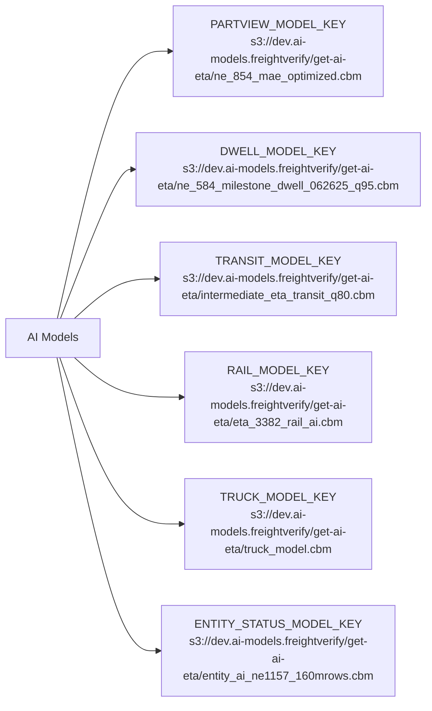

# Diagram: research/api_k8s/get_ai_eta/helm/devModels.yaml

> Auto-generated by Obscura crawlers

## Mermaid

### SVG

<svg id="container" width="591.390625" xmlns="http://www.w3.org/2000/svg" class="flowchart" height="878" viewBox="0 0 591.390625 878" role="graphics-document document" aria-roledescription="flowchart-v2"><g><marker id="container_flowchart-v2-pointEnd" class="marker flowchart-v2" viewBox="0 0 10 10" refX="5" refY="5" markerUnits="userSpaceOnUse" markerWidth="8" markerHeight="8" orient="auto"><path d="M 0 0 L 10 5 L 0 10 z" class="arrowMarkerPath" style="stroke-width: 1; stroke-dasharray: 1, 0;"></path></marker><marker id="container_flowchart-v2-pointStart" class="marker flowchart-v2" viewBox="0 0 10 10" refX="4.5" refY="5" markerUnits="userSpaceOnUse" markerWidth="8" markerHeight="8" orient="auto"><path d="M 0 5 L 10 10 L 10 0 z" class="arrowMarkerPath" style="stroke-width: 1; stroke-dasharray: 1, 0;"></path></marker><marker id="container_flowchart-v2-circleEnd" class="marker flowchart-v2" viewBox="0 0 10 10" refX="11" refY="5" markerUnits="userSpaceOnUse" markerWidth="11" markerHeight="11" orient="auto"><circle cx="5" cy="5" r="5" class="arrowMarkerPath" style="stroke-width: 1; stroke-dasharray: 1, 0;"></circle></marker><marker id="container_flowchart-v2-circleStart" class="marker flowchart-v2" viewBox="0 0 10 10" refX="-1" refY="5" markerUnits="userSpaceOnUse" markerWidth="11" markerHeight="11" orient="auto"><circle cx="5" cy="5" r="5" class="arrowMarkerPath" style="stroke-width: 1; stroke-dasharray: 1, 0;"></circle></marker><marker id="container_flowchart-v2-crossEnd" class="marker cross flowchart-v2" viewBox="0 0 11 11" refX="12" refY="5.2" markerUnits="userSpaceOnUse" markerWidth="11" markerHeight="11" orient="auto"><path d="M 1,1 l 9,9 M 10,1 l -9,9" class="arrowMarkerPath" style="stroke-width: 2; stroke-dasharray: 1, 0;"></path></marker><marker id="container_flowchart-v2-crossStart" class="marker cross flowchart-v2" viewBox="0 0 11 11" refX="-1" refY="5.2" markerUnits="userSpaceOnUse" markerWidth="11" markerHeight="11" orient="auto"><path d="M 1,1 l 9,9 M 10,1 l -9,9" class="arrowMarkerPath" style="stroke-width: 2; stroke-dasharray: 1, 0;"></path></marker><g class="root"><g class="clusters"></g><g class="edgePaths"><path d="M79.596,412L93.559,353.167C107.522,294.333,135.449,176.667,158.914,117.833C182.38,59,201.385,59,210.888,59L220.391,59" id="L_A_PV_0" class="edge-thickness-normal edge-pattern-solid edge-thickness-normal edge-pattern-solid flowchart-link" style=";" data-edge="true" data-et="edge" data-id="L_A_PV_0" data-points="W3sieCI6NzkuNTk1NTU5MjEwNTI2MzIsInkiOjQxMn0seyJ4IjoxNjMuMzc1LCJ5Ijo1OX0seyJ4IjoyMjQuMzkwNjI1LCJ5Ijo1OX1d" marker-end="url(#container_flowchart-v2-pointEnd)"></path><path d="M83.868,412L97.119,378.5C110.37,345,136.873,278,153.624,244.5C170.375,211,177.375,211,180.875,211L184.375,211" id="L_A_DW_0" class="edge-thickness-normal edge-pattern-solid edge-thickness-normal edge-pattern-solid flowchart-link" style=";" data-edge="true" data-et="edge" data-id="L_A_DW_0" data-points="W3sieCI6ODMuODY3NTk4Njg0MjEwNTIsInkiOjQxMn0seyJ4IjoxNjMuMzc1LCJ5IjoyMTF9LHsieCI6MTg4LjM3NSwieSI6MjExfV0=" marker-end="url(#container_flowchart-v2-pointEnd)"></path><path d="M105.228,412L114.919,403.833C124.61,395.667,143.993,379.333,161.696,371.167C179.398,363,195.422,363,203.434,363L211.445,363" id="L_A_TR_0" class="edge-thickness-normal edge-pattern-solid edge-thickness-normal edge-pattern-solid flowchart-link" style=";" data-edge="true" data-et="edge" data-id="L_A_TR_0" data-points="W3sieCI6MTA1LjIyNzc5NjA1MjYzMTU5LCJ5Ijo0MTJ9LHsieCI6MTYzLjM3NSwieSI6MzYzfSx7IngiOjIxNS40NDUzMTI1LCJ5IjozNjN9XQ==" marker-end="url(#container_flowchart-v2-pointEnd)"></path><path d="M105.228,466L114.919,474.167C124.61,482.333,143.993,498.667,166.356,506.833C188.719,515,214.063,515,226.734,515L239.406,515" id="L_A_RL_0" class="edge-thickness-normal edge-pattern-solid edge-thickness-normal edge-pattern-solid flowchart-link" style=";" data-edge="true" data-et="edge" data-id="L_A_RL_0" data-points="W3sieCI6MTA1LjIyNzc5NjA1MjYzMTU5LCJ5Ijo0NjZ9LHsieCI6MTYzLjM3NSwieSI6NTE1fSx7IngiOjI0My40MDYyNSwieSI6NTE1fV0=" marker-end="url(#container_flowchart-v2-pointEnd)"></path><path d="M83.868,466L97.119,499.5C110.37,533,136.873,600,161.522,633.5C186.172,667,208.969,667,220.367,667L231.766,667" id="L_A_TK_0" class="edge-thickness-normal edge-pattern-solid edge-thickness-normal edge-pattern-solid flowchart-link" style=";" data-edge="true" data-et="edge" data-id="L_A_TK_0" data-points="W3sieCI6ODMuODY3NTk4Njg0MjEwNTIsInkiOjQ2Nn0seyJ4IjoxNjMuMzc1LCJ5Ijo2Njd9LHsieCI6MjM1Ljc2NTYyNSwieSI6NjY3fV0=" marker-end="url(#container_flowchart-v2-pointEnd)"></path><path d="M79.596,466L93.559,524.833C107.522,583.667,135.449,701.333,155.756,760.167C176.063,819,188.75,819,195.094,819L201.438,819" id="L_A_ES_0" class="edge-thickness-normal edge-pattern-solid edge-thickness-normal edge-pattern-solid flowchart-link" style=";" data-edge="true" data-et="edge" data-id="L_A_ES_0" data-points="W3sieCI6NzkuNTk1NTU5MjEwNTI2MzIsInkiOjQ2Nn0seyJ4IjoxNjMuMzc1LCJ5Ijo4MTl9LHsieCI6MjA1LjQzNzUsInkiOjgxOX1d" marker-end="url(#container_flowchart-v2-pointEnd)"></path></g><g class="edgeLabels"><g class="edgeLabel"><g class="label" data-id="L_A_PV_0" transform="translate(0, 0)"><foreignObject width="0" height="0">

</foreignObject></g></g><g class="edgeLabel"><g class="label" data-id="L_A_DW_0" transform="translate(0, 0)"><foreignObject width="0" height="0">

</foreignObject></g></g><g class="edgeLabel"><g class="label" data-id="L_A_TR_0" transform="translate(0, 0)"><foreignObject width="0" height="0">

</foreignObject></g></g><g class="edgeLabel"><g class="label" data-id="L_A_RL_0" transform="translate(0, 0)"><foreignObject width="0" height="0">

</foreignObject></g></g><g class="edgeLabel"><g class="label" data-id="L_A_TK_0" transform="translate(0, 0)"><foreignObject width="0" height="0">

</foreignObject></g></g><g class="edgeLabel"><g class="label" data-id="L_A_ES_0" transform="translate(0, 0)"><foreignObject width="0" height="0">

</foreignObject></g></g></g><g class="nodes"><g class="node default" id="flowchart-A-0" transform="translate(73.1875, 439)"><rect class="basic label-container" style="" x="-65.1875" y="-27" width="130.375" height="54"></rect><g class="label" style="" transform="translate(-35.1875, -12)"><rect></rect><foreignObject width="70.375" height="24">

AI Models

</foreignObject></g></g><g class="node default" id="flowchart-PV-1" transform="translate(385.8828125, 59)"><rect class="basic label-container" style="" x="-161.4921875" y="-51" width="322.984375" height="102"></rect><g class="label" style="" transform="translate(-131.4921875, -36)"><rect></rect><foreignObject width="262.984375" height="72">

PARTVIEW_MODEL_KEY\ns3://dev.ai-models.freightverify/get-ai-eta/ne_854_mae_optimized.cbm

</foreignObject></g></g><g class="node default" id="flowchart-DW-3" transform="translate(385.8828125, 211)"><rect class="basic label-container" style="" x="-197.5078125" y="-51" width="395.015625" height="102"></rect><g class="label" style="" transform="translate(-167.5078125, -36)"><rect></rect><foreignObject width="335.015625" height="72">

DWELL_MODEL_KEY\ns3://dev.ai-models.freightverify/get-ai-eta/ne_584_milestone_dwell_062625_q95.cbm

</foreignObject></g></g><g class="node default" id="flowchart-TR-5" transform="translate(385.8828125, 363)"><rect class="basic label-container" style="" x="-170.4375" y="-51" width="340.875" height="102"></rect><g class="label" style="" transform="translate(-140.4375, -36)"><rect></rect><foreignObject width="280.875" height="72">

TRANSIT_MODEL_KEY\ns3://dev.ai-models.freightverify/get-ai-eta/intermediate_eta_transit_q80.cbm

</foreignObject></g></g><g class="node default" id="flowchart-RL-7" transform="translate(385.8828125, 515)"><rect class="basic label-container" style="" x="-142.4765625" y="-51" width="284.953125" height="102"></rect><g class="label" style="" transform="translate(-112.4765625, -36)"><rect></rect><foreignObject width="224.953125" height="72">

RAIL_MODEL_KEY\ns3://dev.ai-models.freightverify/get-ai-eta/eta_3382_rail_ai.cbm

</foreignObject></g></g><g class="node default" id="flowchart-TK-9" transform="translate(385.8828125, 667)"><rect class="basic label-container" style="" x="-150.1171875" y="-51" width="300.234375" height="102"></rect><g class="label" style="" transform="translate(-120.1171875, -36)"><rect></rect><foreignObject width="240.234375" height="72">

TRUCK_MODEL_KEY\ns3://dev.ai-models.freightverify/get-ai-eta/truck_model.cbm

</foreignObject></g></g><g class="node default" id="flowchart-ES-11" transform="translate(385.8828125, 819)"><rect class="basic label-container" style="" x="-180.4453125" y="-51" width="360.890625" height="102"></rect><g class="label" style="" transform="translate(-150.4453125, -36)"><rect></rect><foreignObject width="300.890625" height="72">

ENTITY_STATUS_MODEL_KEY\ns3://dev.ai-models.freightverify/get-ai-eta/entity_ai_ne1157_160mrows.cbm

</foreignObject></g></g></g></g></g></svg>
