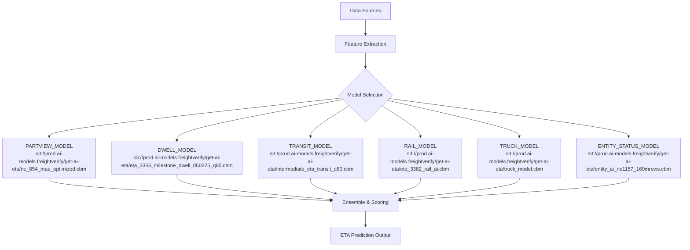
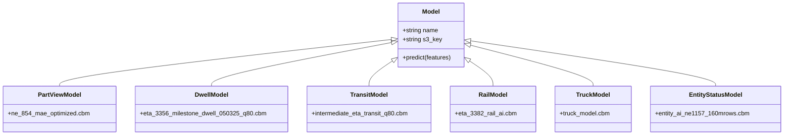

# Diagram: research/api_k8s/get_ai_eta/helm/prodModels.yaml

> Auto-generated by Obscura crawlers

## Diagram 1

### SVG

<svg id="container" width="2150.125" xmlns="http://www.w3.org/2000/svg" class="flowchart" height="802.4375" viewBox="0 0 2150.125 802.4375" role="graphics-document document" aria-roledescription="flowchart-v2"><g><marker id="container_flowchart-v2-pointEnd" class="marker flowchart-v2" viewBox="0 0 10 10" refX="5" refY="5" markerUnits="userSpaceOnUse" markerWidth="8" markerHeight="8" orient="auto"><path d="M 0 0 L 10 5 L 0 10 z" class="arrowMarkerPath" style="stroke-width: 1; stroke-dasharray: 1, 0;"></path></marker><marker id="container_flowchart-v2-pointStart" class="marker flowchart-v2" viewBox="0 0 10 10" refX="4.5" refY="5" markerUnits="userSpaceOnUse" markerWidth="8" markerHeight="8" orient="auto"><path d="M 0 5 L 10 10 L 10 0 z" class="arrowMarkerPath" style="stroke-width: 1; stroke-dasharray: 1, 0;"></path></marker><marker id="container_flowchart-v2-circleEnd" class="marker flowchart-v2" viewBox="0 0 10 10" refX="11" refY="5" markerUnits="userSpaceOnUse" markerWidth="11" markerHeight="11" orient="auto"><circle cx="5" cy="5" r="5" class="arrowMarkerPath" style="stroke-width: 1; stroke-dasharray: 1, 0;"></circle></marker><marker id="container_flowchart-v2-circleStart" class="marker flowchart-v2" viewBox="0 0 10 10" refX="-1" refY="5" markerUnits="userSpaceOnUse" markerWidth="11" markerHeight="11" orient="auto"><circle cx="5" cy="5" r="5" class="arrowMarkerPath" style="stroke-width: 1; stroke-dasharray: 1, 0;"></circle></marker><marker id="container_flowchart-v2-crossEnd" class="marker cross flowchart-v2" viewBox="0 0 11 11" refX="12" refY="5.2" markerUnits="userSpaceOnUse" markerWidth="11" markerHeight="11" orient="auto"><path d="M 1,1 l 9,9 M 10,1 l -9,9" class="arrowMarkerPath" style="stroke-width: 2; stroke-dasharray: 1, 0;"></path></marker><marker id="container_flowchart-v2-crossStart" class="marker cross flowchart-v2" viewBox="0 0 11 11" refX="-1" refY="5.2" markerUnits="userSpaceOnUse" markerWidth="11" markerHeight="11" orient="auto"><path d="M 1,1 l 9,9 M 10,1 l -9,9" class="arrowMarkerPath" style="stroke-width: 2; stroke-dasharray: 1, 0;"></path></marker><g class="root"><g class="clusters"></g><g class="edgePaths"><path d="M1157.895,62L1157.895,66.167C1157.895,70.333,1157.895,78.667,1157.895,86.333C1157.895,94,1157.895,101,1157.895,104.5L1157.895,108" id="L_A_B_0" class="edge-thickness-normal edge-pattern-solid edge-thickness-normal edge-pattern-solid flowchart-link" style=";" data-edge="true" data-et="edge" data-id="L_A_B_0" data-points="W3sieCI6MTE1Ny44OTQ1MzEyNSwieSI6NjJ9LHsieCI6MTE1Ny44OTQ1MzEyNSwieSI6ODd9LHsieCI6MTE1Ny44OTQ1MzEyNSwieSI6MTEyfV0=" marker-end="url(#container_flowchart-v2-pointEnd)"></path><path d="M1157.895,166L1157.895,170.167C1157.895,174.333,1157.895,182.667,1157.895,190.333C1157.895,198,1157.895,205,1157.895,208.5L1157.895,212" id="L_B_C_0" class="edge-thickness-normal edge-pattern-solid edge-thickness-normal edge-pattern-solid flowchart-link" style=";" data-edge="true" data-et="edge" data-id="L_B_C_0" data-points="W3sieCI6MTE1Ny44OTQ1MzEyNSwieSI6MTY2fSx7IngiOjExNTcuODk0NTMxMjUsInkiOjE5MX0seyJ4IjoxMTU3Ljg5NDUzMTI1LCJ5IjoyMTZ9XQ==" marker-end="url(#container_flowchart-v2-pointEnd)"></path><path d="M1081.123,309.666L926.956,326.628C772.79,343.59,464.458,377.514,310.291,399.976C156.125,422.438,156.125,433.438,156.125,438.938L156.125,444.438" id="L_C_PV_0" class="edge-thickness-normal edge-pattern-solid edge-thickness-normal edge-pattern-solid flowchart-link" style=";" data-edge="true" data-et="edge" data-id="L_C_PV_0" data-points="W3sieCI6MTA4MS4xMjI1NDY2MTYwOTE4LCJ5IjozMDkuNjY1NTE1MzY2MDkxOH0seyJ4IjoxNTYuMTI1LCJ5Ijo0MTEuNDM3NX0seyJ4IjoxNTYuMTI1LCJ5Ijo0NDguNDM3NX1d" marker-end="url(#container_flowchart-v2-pointEnd)"></path><path d="M1085.907,314.45L997.965,330.615C910.022,346.779,734.136,379.108,646.193,402.773C558.25,426.438,558.25,441.438,558.25,448.938L558.25,456.438" id="L_C_DW_0" class="edge-thickness-normal edge-pattern-solid edge-thickness-normal edge-pattern-solid flowchart-link" style=";" data-edge="true" data-et="edge" data-id="L_C_DW_0" data-points="W3sieCI6MTA4NS45MDc0ODk4NzU2NzA4LCJ5IjozMTQuNDUwNDU4NjI1NjcwNjV9LHsieCI6NTU4LjI1LCJ5Ijo0MTEuNDM3NX0seyJ4Ijo1NTguMjUsInkiOjQ2MC40Mzc1fV0=" marker-end="url(#container_flowchart-v2-pointEnd)"></path><path d="M1105.583,334.126L1085.099,347.011C1064.615,359.896,1023.647,385.667,1003.164,404.052C982.68,422.438,982.68,433.438,982.68,438.938L982.68,444.438" id="L_C_TR_0" class="edge-thickness-normal edge-pattern-solid edge-thickness-normal edge-pattern-solid flowchart-link" style=";" data-edge="true" data-et="edge" data-id="L_C_TR_0" data-points="W3sieCI6MTEwNS41ODI1NzM5NTg0NjE2LCJ5IjozMzQuMTI1NTQyNzA4NDYxNjR9LHsieCI6OTgyLjY3OTY4NzUsInkiOjQxMS40Mzc1fSx7IngiOjk4Mi42Nzk2ODc1LCJ5Ijo0NDguNDM3NX1d" marker-end="url(#container_flowchart-v2-pointEnd)"></path><path d="M1210.206,334.126L1230.69,347.011C1251.174,359.896,1292.142,385.667,1312.626,402.052C1333.109,418.438,1333.109,425.438,1333.109,428.938L1333.109,432.438" id="L_C_RA_0" class="edge-thickness-normal edge-pattern-solid edge-thickness-normal edge-pattern-solid flowchart-link" style=";" data-edge="true" data-et="edge" data-id="L_C_RA_0" data-points="W3sieCI6MTIxMC4yMDY0ODg1NDE1Mzg0LCJ5IjozMzQuMTI1NTQyNzA4NDYxNjR9LHsieCI6MTMzMy4xMDkzNzUsInkiOjQxMS40Mzc1fSx7IngiOjEzMzMuMTA5Mzc1LCJ5Ijo0MzYuNDM3NX1d" marker-end="url(#container_flowchart-v2-pointEnd)"></path><path d="M1227.339,316.993L1296.634,332.734C1365.929,348.475,1504.519,379.956,1573.814,401.197C1643.109,422.438,1643.109,433.438,1643.109,438.938L1643.109,444.438" id="L_C_TU_0" class="edge-thickness-normal edge-pattern-solid edge-thickness-normal edge-pattern-solid flowchart-link" style=";" data-edge="true" data-et="edge" data-id="L_C_TU_0" data-points="W3sieCI6MTIyNy4zMzg3MTkzMTcwNiwieSI6MzE2Ljk5MzMxMTkzMjk0MDJ9LHsieCI6MTY0My4xMDkzNzUsInkiOjQxMS40Mzc1fSx7IngiOjE2NDMuMTA5Mzc1LCJ5Ijo0NDguNDM3NX1d" marker-end="url(#container_flowchart-v2-pointEnd)"></path><path d="M1233.067,311.265L1357.992,327.96C1482.917,344.656,1732.767,378.047,1857.692,400.242C1982.617,422.438,1982.617,433.438,1982.617,438.938L1982.617,444.438" id="L_C_ES_0" class="edge-thickness-normal edge-pattern-solid edge-thickness-normal edge-pattern-solid flowchart-link" style=";" data-edge="true" data-et="edge" data-id="L_C_ES_0" data-points="W3sieCI6MTIzMy4wNjY5Nzg4NDEzNDMxLCJ5IjozMTEuMjY1MDUyNDA4NjU2OTd9LHsieCI6MTk4Mi42MTcxODc1LCJ5Ijo0MTEuNDM3NX0seyJ4IjoxOTgyLjYxNzE4NzUsInkiOjQ0OC40Mzc1fV0=" marker-end="url(#container_flowchart-v2-pointEnd)"></path><path d="M156.125,574.438L156.125,580.604C156.125,586.771,156.125,599.104,305.384,613.019C454.644,626.933,753.162,642.429,902.422,650.176L1051.681,657.924" id="L_PV_D_0" class="edge-thickness-normal edge-pattern-solid edge-thickness-normal edge-pattern-solid flowchart-link" style=";" data-edge="true" data-et="edge" data-id="L_PV_D_0" data-points="W3sieCI6MTU2LjEyNSwieSI6NTc0LjQzNzV9LHsieCI6MTU2LjEyNSwieSI6NjExLjQzNzV9LHsieCI6MTA1NS42NzU3ODEyNSwieSI6NjU4LjEzMTUxNDEwNzg0ODN9XQ==" marker-end="url(#container_flowchart-v2-pointEnd)"></path><path d="M558.25,562.438L558.25,570.604C558.25,578.771,558.25,595.104,640.49,610.403C722.73,625.701,887.21,639.964,969.451,647.096L1051.691,654.228" id="L_DW_D_0" class="edge-thickness-normal edge-pattern-solid edge-thickness-normal edge-pattern-solid flowchart-link" style=";" data-edge="true" data-et="edge" data-id="L_DW_D_0" data-points="W3sieCI6NTU4LjI1LCJ5Ijo1NjIuNDM3NX0seyJ4Ijo1NTguMjUsInkiOjYxMS40Mzc1fSx7IngiOjEwNTUuNjc1NzgxMjUsInkiOjY1NC41NzMyOTAwODM5Njl9XQ==" marker-end="url(#container_flowchart-v2-pointEnd)"></path><path d="M982.68,574.438L982.68,580.604C982.68,586.771,982.68,599.104,996.08,609.248C1009.481,619.391,1036.282,627.345,1049.682,631.322L1063.083,635.299" id="L_TR_D_0" class="edge-thickness-normal edge-pattern-solid edge-thickness-normal edge-pattern-solid flowchart-link" style=";" data-edge="true" data-et="edge" data-id="L_TR_D_0" data-points="W3sieCI6OTgyLjY3OTY4NzUsInkiOjU3NC40Mzc1fSx7IngiOjk4Mi42Nzk2ODc1LCJ5Ijo2MTEuNDM3NX0seyJ4IjoxMDY2LjkxNzU5MzE0OTAzODYsInkiOjYzNi40Mzc1fV0=" marker-end="url(#container_flowchart-v2-pointEnd)"></path><path d="M1333.109,586.438L1333.109,590.604C1333.109,594.771,1333.109,603.104,1319.709,611.248C1306.308,619.391,1279.507,627.345,1266.107,631.322L1252.706,635.299" id="L_RA_D_0" class="edge-thickness-normal edge-pattern-solid edge-thickness-normal edge-pattern-solid flowchart-link" style=";" data-edge="true" data-et="edge" data-id="L_RA_D_0" data-points="W3sieCI6MTMzMy4xMDkzNzUsInkiOjU4Ni40Mzc1fSx7IngiOjEzMzMuMTA5Mzc1LCJ5Ijo2MTEuNDM3NX0seyJ4IjoxMjQ4Ljg3MTQ2OTM1MDk2MTQsInkiOjYzNi40Mzc1fV0=" marker-end="url(#container_flowchart-v2-pointEnd)"></path><path d="M1643.109,574.438L1643.109,580.604C1643.109,586.771,1643.109,599.104,1579.94,612.041C1516.77,624.977,1390.43,638.517,1327.26,645.287L1264.091,652.057" id="L_TU_D_0" class="edge-thickness-normal edge-pattern-solid edge-thickness-normal edge-pattern-solid flowchart-link" style=";" data-edge="true" data-et="edge" data-id="L_TU_D_0" data-points="W3sieCI6MTY0My4xMDkzNzUsInkiOjU3NC40Mzc1fSx7IngiOjE2NDMuMTA5Mzc1LCJ5Ijo2MTEuNDM3NX0seyJ4IjoxMjYwLjExMzI4MTI1LCJ5Ijo2NTIuNDgyODE2NTg4MTczN31d" marker-end="url(#container_flowchart-v2-pointEnd)"></path><path d="M1982.617,574.438L1982.617,580.604C1982.617,586.771,1982.617,599.104,1862.865,612.821C1743.113,626.539,1503.609,641.64,1383.857,649.19L1264.105,656.741" id="L_ES_D_0" class="edge-thickness-normal edge-pattern-solid edge-thickness-normal edge-pattern-solid flowchart-link" style=";" data-edge="true" data-et="edge" data-id="L_ES_D_0" data-points="W3sieCI6MTk4Mi42MTcxODc1LCJ5Ijo1NzQuNDM3NX0seyJ4IjoxOTgyLjYxNzE4NzUsInkiOjYxMS40Mzc1fSx7IngiOjEyNjAuMTEzMjgxMjUsInkiOjY1Ni45OTI0NTQ1NTM4NTF9XQ==" marker-end="url(#container_flowchart-v2-pointEnd)"></path><path d="M1157.895,690.438L1157.895,694.604C1157.895,698.771,1157.895,707.104,1157.895,714.771C1157.895,722.438,1157.895,729.438,1157.895,732.938L1157.895,736.438" id="L_D_O_0" class="edge-thickness-normal edge-pattern-solid edge-thickness-normal edge-pattern-solid flowchart-link" style=";" data-edge="true" data-et="edge" data-id="L_D_O_0" data-points="W3sieCI6MTE1Ny44OTQ1MzEyNSwieSI6NjkwLjQzNzV9LHsieCI6MTE1Ny44OTQ1MzEyNSwieSI6NzE1LjQzNzV9LHsieCI6MTE1Ny44OTQ1MzEyNSwieSI6NzQwLjQzNzV9XQ==" marker-end="url(#container_flowchart-v2-pointEnd)"></path></g><g class="edgeLabels"><g class="edgeLabel"><g class="label" data-id="L_A_B_0" transform="translate(0, 0)"><foreignObject width="0" height="0">

</foreignObject></g></g><g class="edgeLabel"><g class="label" data-id="L_B_C_0" transform="translate(0, 0)"><foreignObject width="0" height="0">

</foreignObject></g></g><g class="edgeLabel"><g class="label" data-id="L_C_PV_0" transform="translate(0, 0)"><foreignObject width="0" height="0">

</foreignObject></g></g><g class="edgeLabel"><g class="label" data-id="L_C_DW_0" transform="translate(0, 0)"><foreignObject width="0" height="0">

</foreignObject></g></g><g class="edgeLabel"><g class="label" data-id="L_C_TR_0" transform="translate(0, 0)"><foreignObject width="0" height="0">

</foreignObject></g></g><g class="edgeLabel"><g class="label" data-id="L_C_RA_0" transform="translate(0, 0)"><foreignObject width="0" height="0">

</foreignObject></g></g><g class="edgeLabel"><g class="label" data-id="L_C_TU_0" transform="translate(0, 0)"><foreignObject width="0" height="0">

</foreignObject></g></g><g class="edgeLabel"><g class="label" data-id="L_C_ES_0" transform="translate(0, 0)"><foreignObject width="0" height="0">

</foreignObject></g></g><g class="edgeLabel"><g class="label" data-id="L_PV_D_0" transform="translate(0, 0)"><foreignObject width="0" height="0">

</foreignObject></g></g><g class="edgeLabel"><g class="label" data-id="L_DW_D_0" transform="translate(0, 0)"><foreignObject width="0" height="0">

</foreignObject></g></g><g class="edgeLabel"><g class="label" data-id="L_TR_D_0" transform="translate(0, 0)"><foreignObject width="0" height="0">

</foreignObject></g></g><g class="edgeLabel"><g class="label" data-id="L_RA_D_0" transform="translate(0, 0)"><foreignObject width="0" height="0">

</foreignObject></g></g><g class="edgeLabel"><g class="label" data-id="L_TU_D_0" transform="translate(0, 0)"><foreignObject width="0" height="0">

</foreignObject></g></g><g class="edgeLabel"><g class="label" data-id="L_ES_D_0" transform="translate(0, 0)"><foreignObject width="0" height="0">

</foreignObject></g></g><g class="edgeLabel"><g class="label" data-id="L_D_O_0" transform="translate(0, 0)"><foreignObject width="0" height="0">

</foreignObject></g></g></g><g class="nodes"><g class="node default" id="flowchart-A-0" transform="translate(1157.89453125, 35)"><rect class="basic label-container" style="" x="-77.03125" y="-27" width="154.0625" height="54"></rect><g class="label" style="" transform="translate(-47.03125, -12)"><rect></rect><foreignObject width="94.0625" height="24">

Data Sources

</foreignObject></g></g><g class="node default" id="flowchart-B-1" transform="translate(1157.89453125, 139)"><rect class="basic label-container" style="" x="-95.6953125" y="-27" width="191.390625" height="54"></rect><g class="label" style="" transform="translate(-65.6953125, -12)"><rect></rect><foreignObject width="131.390625" height="24">

Feature Extraction

</foreignObject></g></g><g class="node default" id="flowchart-C-3" transform="translate(1157.89453125, 301.21875)"><polygon points="85.21875,0 170.4375,-85.21875 85.21875,-170.4375 0,-85.21875" class="label-container" transform="translate(-84.71875, 85.21875)"></polygon><g class="label" style="" transform="translate(-58.21875, -12)"><rect></rect><foreignObject width="116.4375" height="24">

Model Selection

</foreignObject></g></g><g class="node default" id="flowchart-PV-5" transform="translate(156.125, 511.4375)"><rect class="basic label-container" style="" x="-148.125" y="-63" width="296.25" height="126"></rect><g class="label" style="" transform="translate(-118.125, -48)"><rect></rect><foreignObject width="236.25" height="96">

PARTVIEW_MODEL s3://prod.ai-models.freightverify/get-ai-eta/ne_854_mae_optimized.cbm

</foreignObject></g></g><g class="node default" id="flowchart-DW-7" transform="translate(558.25, 511.4375)"><rect class="basic label-container" style="" x="-204" y="-51" width="408" height="102"></rect><g class="label" style="" transform="translate(-174, -36)"><rect></rect><foreignObject width="348" height="72">

DWELL_MODEL s3://prod.ai-models.freightverify/get-ai-eta/eta_3356_milestone_dwell_050325_q80.cbm

</foreignObject></g></g><g class="node default" id="flowchart-TR-9" transform="translate(982.6796875, 511.4375)"><rect class="basic label-container" style="" x="-170.4296875" y="-63" width="340.859375" height="126"></rect><g class="label" style="" transform="translate(-140.4296875, -48)"><rect></rect><foreignObject width="280.859375" height="96">

TRANSIT_MODEL s3://prod.ai-models.freightverify/get-ai-eta/intermediate_eta_transit_q80.cbm

</foreignObject></g></g><g class="node default" id="flowchart-RA-11" transform="translate(1333.109375, 511.4375)"><rect class="basic label-container" style="" x="-130" y="-75" width="260" height="150"></rect><g class="label" style="" transform="translate(-100, -60)"><rect></rect><foreignObject width="200" height="120">

RAIL_MODEL s3://prod.ai-models.freightverify/get-ai-eta/eta_3382_rail_ai.cbm

</foreignObject></g></g><g class="node default" id="flowchart-TU-13" transform="translate(1643.109375, 511.4375)"><rect class="basic label-container" style="" x="-130" y="-63" width="260" height="126"></rect><g class="label" style="" transform="translate(-100, -48)"><rect></rect><foreignObject width="200" height="96">

TRUCK_MODEL s3://prod.ai-models.freightverify/get-ai-eta/truck_model.cbm

</foreignObject></g></g><g class="node default" id="flowchart-ES-15" transform="translate(1982.6171875, 511.4375)"><rect class="basic label-container" style="" x="-159.5078125" y="-63" width="319.015625" height="126"></rect><g class="label" style="" transform="translate(-129.5078125, -48)"><rect></rect><foreignObject width="259.015625" height="96">

ENTITY_STATUS_MODEL s3://prod.ai-models.freightverify/get-ai-eta/entity_ai_ne1157_160mrows.cbm

</foreignObject></g></g><g class="node default" id="flowchart-D-17" transform="translate(1157.89453125, 663.4375)"><rect class="basic label-container" style="" x="-102.21875" y="-27" width="204.4375" height="54"></rect><g class="label" style="" transform="translate(-72.21875, -12)"><rect></rect><foreignObject width="144.4375" height="24">

Ensemble &amp; Scoring

</foreignObject></g></g><g class="node default" id="flowchart-O-29" transform="translate(1157.89453125, 767.4375)"><rect class="basic label-container" style="" x="-109.28125" y="-27" width="218.5625" height="54"></rect><g class="label" style="" transform="translate(-79.28125, -12)"><rect></rect><foreignObject width="158.5625" height="24">

ETA Prediction Output

</foreignObject></g></g></g></g></g></svg>

## Diagram 2

### SVG

<svg id="container" width="2028.03125" xmlns="http://www.w3.org/2000/svg" class="classDiagram" height="354" viewBox="0 0 2028.03125 354" role="graphics-document document" aria-roledescription="class"><g><defs><marker id="container_class-aggregationStart" class="marker aggregation class" refX="18" refY="7" markerWidth="190" markerHeight="240" orient="auto"><path d="M 18,7 L9,13 L1,7 L9,1 Z"></path></marker></defs><defs><marker id="container_class-aggregationEnd" class="marker aggregation class" refX="1" refY="7" markerWidth="20" markerHeight="28" orient="auto"><path d="M 18,7 L9,13 L1,7 L9,1 Z"></path></marker></defs><defs><marker id="container_class-extensionStart" class="marker extension class" refX="18" refY="7" markerWidth="190" markerHeight="240" orient="auto"><path d="M 1,7 L18,13 V 1 Z"></path></marker></defs><defs><marker id="container_class-extensionEnd" class="marker extension class" refX="1" refY="7" markerWidth="20" markerHeight="28" orient="auto"><path d="M 1,1 V 13 L18,7 Z"></path></marker></defs><defs><marker id="container_class-compositionStart" class="marker composition class" refX="18" refY="7" markerWidth="190" markerHeight="240" orient="auto"><path d="M 18,7 L9,13 L1,7 L9,1 Z"></path></marker></defs><defs><marker id="container_class-compositionEnd" class="marker composition class" refX="1" refY="7" markerWidth="20" markerHeight="28" orient="auto"><path d="M 18,7 L9,13 L1,7 L9,1 Z"></path></marker></defs><defs><marker id="container_class-dependencyStart" class="marker dependency class" refX="6" refY="7" markerWidth="190" markerHeight="240" orient="auto"><path d="M 5,7 L9,13 L1,7 L9,1 Z"></path></marker></defs><defs><marker id="container_class-dependencyEnd" class="marker dependency class" refX="13" refY="7" markerWidth="20" markerHeight="28" orient="auto"><path d="M 18,7 L9,13 L14,7 L9,1 Z"></path></marker></defs><defs><marker id="container_class-lollipopStart" class="marker lollipop class" refX="13" refY="7" markerWidth="190" markerHeight="240" orient="auto"><circle stroke="black" fill="transparent" cx="7" cy="7" r="6"></circle></marker></defs><defs><marker id="container_class-lollipopEnd" class="marker lollipop class" refX="1" refY="7" markerWidth="190" markerHeight="240" orient="auto"><circle stroke="black" fill="transparent" cx="7" cy="7" r="6"></circle></marker></defs><g class="root"><g class="clusters"></g><g class="edgePaths"><path d="M1014.355,103.859L870.976,120.05C727.596,136.24,440.837,168.62,297.458,188.977C154.078,209.333,154.078,217.667,154.078,221.833L154.078,226" id="id_Model_PartViewModel_1" class="edge-thickness-normal edge-pattern-solid relation" style=";;;" data-edge="true" data-et="edge" data-id="id_Model_PartViewModel_1" data-points="W3sieCI6MTAzMS40OTYwOTM3NSwieSI6MTAxLjkyMzk2NzQ5NzMwODk4fSx7IngiOjE1NC4wNzgxMjUsInkiOjIwMX0seyJ4IjoxNTQuMDc4MTI1LCJ5IjoyMjZ9XQ==" marker-start="url(#container_class-extensionStart)"></path><path d="M1014.55,111.94L936.51,126.783C858.471,141.626,702.392,171.313,624.352,190.323C546.313,209.333,546.313,217.667,546.313,221.833L546.313,226" id="id_Model_DwellModel_2" class="edge-thickness-normal edge-pattern-solid relation" style=";;;" data-edge="true" data-et="edge" data-id="id_Model_DwellModel_2" data-points="W3sieCI6MTAzMS40OTYwOTM3NSwieSI6MTA4LjcxNjM2NDcwMjE5MzV9LHsieCI6NTQ2LjMxMjUsInkiOjIwMX0seyJ4Ijo1NDYuMzEyNSwieSI6MjI2fV0=" marker-start="url(#container_class-extensionStart)"></path><path d="M1017.176,160.641L1007.16,167.368C997.145,174.094,977.113,187.547,967.098,198.44C957.082,209.333,957.082,217.667,957.082,221.833L957.082,226" id="id_Model_TransitModel_3" class="edge-thickness-normal edge-pattern-solid relation" style=";;;" data-edge="true" data-et="edge" data-id="id_Model_TransitModel_3" data-points="W3sieCI6MTAzMS40OTYwOTM3NSwieSI6MTUxLjAyNDA2Nzk2Nzk0MTQ4fSx7IngiOjk1Ny4wODIwMzEyNSwieSI6MjAxfSx7IngiOjk1Ny4wODIwMzEyNSwieSI6MjI2fV0=" marker-start="url(#container_class-extensionStart)"></path><path d="M1221.59,160.641L1231.605,167.368C1241.621,174.094,1261.652,187.547,1271.668,198.44C1281.684,209.333,1281.684,217.667,1281.684,221.833L1281.684,226" id="id_Model_RailModel_4" class="edge-thickness-normal edge-pattern-solid relation" style=";;;" data-edge="true" data-et="edge" data-id="id_Model_RailModel_4" data-points="W3sieCI6MTIwNy4yNjk1MzEyNSwieSI6MTUxLjAyNDA2Nzk2Nzk0MTQ4fSx7IngiOjEyODEuNjgzNTkzNzUsInkiOjIwMX0seyJ4IjoxMjgxLjY4MzU5Mzc1LCJ5IjoyMjZ9XQ==" marker-start="url(#container_class-extensionStart)"></path><path d="M1223.973,118.976L1276.976,132.647C1329.979,146.317,1435.986,173.659,1488.989,191.496C1541.992,209.333,1541.992,217.667,1541.992,221.833L1541.992,226" id="id_Model_TruckModel_5" class="edge-thickness-normal edge-pattern-solid relation" style=";;;" data-edge="true" data-et="edge" data-id="id_Model_TruckModel_5" data-points="W3sieCI6MTIwNy4yNjk1MzEyNSwieSI6MTE0LjY2Nzg2NTE5NzYxODk3fSx7IngiOjE1NDEuOTkyMTg3NSwieSI6MjAxfSx7IngiOjE1NDEuOTkyMTg3NSwieSI6MjI2fV0=" marker-start="url(#container_class-extensionStart)"></path><path d="M1224.334,107.526L1329.64,123.105C1434.946,138.684,1645.559,169.842,1750.866,189.588C1856.172,209.333,1856.172,217.667,1856.172,221.833L1856.172,226" id="id_Model_EntityStatusModel_6" class="edge-thickness-normal edge-pattern-solid relation" style=";;;" data-edge="true" data-et="edge" data-id="id_Model_EntityStatusModel_6" data-points="W3sieCI6MTIwNy4yNjk1MzEyNSwieSI6MTA1LjAwMTg5MjcxNDM3NTA5fSx7IngiOjE4NTYuMTcxODc1LCJ5IjoyMDF9LHsieCI6MTg1Ni4xNzE4NzUsInkiOjIyNn1d" marker-start="url(#container_class-extensionStart)"></path></g><g class="edgeLabels"><g class="edgeLabel"><g class="label" data-id="id_Model_PartViewModel_1" transform="translate(0, 0)"><foreignObject width="0" height="0">

</foreignObject></g></g><g class="edgeLabel"><g class="label" data-id="id_Model_DwellModel_2" transform="translate(0, 0)"><foreignObject width="0" height="0">

</foreignObject></g></g><g class="edgeLabel"><g class="label" data-id="id_Model_TransitModel_3" transform="translate(0, 0)"><foreignObject width="0" height="0">

</foreignObject></g></g><g class="edgeLabel"><g class="label" data-id="id_Model_RailModel_4" transform="translate(0, 0)"><foreignObject width="0" height="0">

</foreignObject></g></g><g class="edgeLabel"><g class="label" data-id="id_Model_TruckModel_5" transform="translate(0, 0)"><foreignObject width="0" height="0">

</foreignObject></g></g><g class="edgeLabel"><g class="label" data-id="id_Model_EntityStatusModel_6" transform="translate(0, 0)"><foreignObject width="0" height="0">

</foreignObject></g></g></g><g class="nodes"><g class="node default" id="classId-Model-0" transform="translate(1119.3828125, 92)"><g class="basic label-container"><path d="M-87.88671875 -84 L87.88671875 -84 L87.88671875 84 L-87.88671875 84" stroke="none" stroke-width="0" fill="#ECECFF" style=""></path><path d="M-87.88671875 -84 C-52.28291659380056 -84, -16.679114437601115 -84, 87.88671875 -84 M-87.88671875 -84 C-42.58401769059285 -84, 2.718683368814297 -84, 87.88671875 -84 M87.88671875 -84 C87.88671875 -20.01621353933166, 87.88671875 43.96757292133668, 87.88671875 84 M87.88671875 -84 C87.88671875 -17.877768806241633, 87.88671875 48.244462387516734, 87.88671875 84 M87.88671875 84 C19.703300367620784 84, -48.48011801475843 84, -87.88671875 84 M87.88671875 84 C46.53912870404178 84, 5.191538658083559 84, -87.88671875 84 M-87.88671875 84 C-87.88671875 17.477408209755396, -87.88671875 -49.04518358048921, -87.88671875 -84 M-87.88671875 84 C-87.88671875 30.828025479059768, -87.88671875 -22.343949041880464, -87.88671875 -84" stroke="#9370DB" stroke-width="1.3" fill="none" stroke-dasharray="0 0" style=""></path></g><g class="annotation-group text" transform="translate(0, -60)"></g><g class="label-group text" transform="translate(-22.5546875, -60)"><g class="label" style="font-weight: bolder" transform="translate(0,-12)"><foreignObject width="45.109375" height="24">

Model

</foreignObject></g></g><g class="members-group text" transform="translate(-75.88671875, -12)"><g class="label" style="" transform="translate(0,-12)"><foreignObject width="94.375" height="24">

+string name

</foreignObject></g><g class="label" style="" transform="translate(0,12)"><foreignObject width="101.890625" height="24">

+string s3_key

</foreignObject></g></g><g class="methods-group text" transform="translate(-75.88671875, 60)"><g class="label" style="" transform="translate(0,-12)"><foreignObject width="129.21875" height="24">

+predict(features)

</foreignObject></g></g><g class="divider" style=""><path d="M-87.88671875 -36 C-36.29661720594958 -36, 15.29348433810084 -36, 87.88671875 -36 M-87.88671875 -36 C-48.399492928375864 -36, -8.912267106751727 -36, 87.88671875 -36" stroke="#9370DB" stroke-width="1.3" fill="none" stroke-dasharray="0 0" style=""></path></g><g class="divider" style=""><path d="M-87.88671875 36 C-35.38420856338852 36, 17.118301623222962 36, 87.88671875 36 M-87.88671875 36 C-32.8484085469653 36, 22.189901656069395 36, 87.88671875 36" stroke="#9370DB" stroke-width="1.3" fill="none" stroke-dasharray="0 0" style=""></path></g></g><g class="node default" id="classId-PartViewModel-1" transform="translate(154.078125, 286)"><g class="basic label-container"><path d="M-146.078125 -60 L146.078125 -60 L146.078125 60 L-146.078125 60" stroke="none" stroke-width="0" fill="#ECECFF" style=""></path><path d="M-146.078125 -60 C-69.71965340673586 -60, 6.638818186528283 -60, 146.078125 -60 M-146.078125 -60 C-64.29852704790478 -60, 17.48107090419043 -60, 146.078125 -60 M146.078125 -60 C146.078125 -20.16018328346194, 146.078125 19.67963343307612, 146.078125 60 M146.078125 -60 C146.078125 -16.594875268868066, 146.078125 26.81024946226387, 146.078125 60 M146.078125 60 C84.55689583901781 60, 23.035666678035625 60, -146.078125 60 M146.078125 60 C48.176095772797225 60, -49.72593345440555 60, -146.078125 60 M-146.078125 60 C-146.078125 21.535524091527144, -146.078125 -16.928951816945712, -146.078125 -60 M-146.078125 60 C-146.078125 17.758976585976818, -146.078125 -24.482046828046364, -146.078125 -60" stroke="#9370DB" stroke-width="1.3" fill="none" stroke-dasharray="0 0" style=""></path></g><g class="annotation-group text" transform="translate(0, -36)"></g><g class="label-group text" transform="translate(-54.84375, -36)"><g class="label" style="font-weight: bolder" transform="translate(0,-12)"><foreignObject width="109.6875" height="24">

PartViewModel

</foreignObject></g></g><g class="members-group text" transform="translate(-134.078125, 12)"><g class="label" style="" transform="translate(0,-12)"><foreignObject width="213.3125" height="24">

+ne_854_mae_optimized.cbm

</foreignObject></g></g><g class="methods-group text" transform="translate(-134.078125, 60)"></g><g class="divider" style=""><path d="M-146.078125 -12 C-35.67947913057728 -12, 74.71916673884544 -12, 146.078125 -12 M-146.078125 -12 C-76.99780687573087 -12, -7.917488751461747 -12, 146.078125 -12" stroke="#9370DB" stroke-width="1.3" fill="none" stroke-dasharray="0 0" style=""></path></g><g class="divider" style=""><path d="M-146.078125 36 C-38.734679879218334 36, 68.60876524156333 36, 146.078125 36 M-146.078125 36 C-44.05600275601746 36, 57.966119487965074 36, 146.078125 36" stroke="#9370DB" stroke-width="1.3" fill="none" stroke-dasharray="0 0" style=""></path></g></g><g class="node default" id="classId-DwellModel-2" transform="translate(546.3125, 286)"><g class="basic label-container"><path d="M-196.15625 -60 L196.15625 -60 L196.15625 60 L-196.15625 60" stroke="none" stroke-width="0" fill="#ECECFF" style=""></path><path d="M-196.15625 -60 C-57.68769055404201 -60, 80.78086889191599 -60, 196.15625 -60 M-196.15625 -60 C-97.99346944288767 -60, 0.16931111422465506 -60, 196.15625 -60 M196.15625 -60 C196.15625 -20.63044836380189, 196.15625 18.73910327239622, 196.15625 60 M196.15625 -60 C196.15625 -27.2470029062829, 196.15625 5.505994187434197, 196.15625 60 M196.15625 60 C109.40344410568088 60, 22.650638211361752 60, -196.15625 60 M196.15625 60 C108.48282091688046 60, 20.809391833760913 60, -196.15625 60 M-196.15625 60 C-196.15625 22.832178607241204, -196.15625 -14.335642785517592, -196.15625 -60 M-196.15625 60 C-196.15625 15.840931519854422, -196.15625 -28.318136960291156, -196.15625 -60" stroke="#9370DB" stroke-width="1.3" fill="none" stroke-dasharray="0 0" style=""></path></g><g class="annotation-group text" transform="translate(0, -36)"></g><g class="label-group text" transform="translate(-42.921875, -36)"><g class="label" style="font-weight: bolder" transform="translate(0,-12)"><foreignObject width="85.84375" height="24">

DwellModel

</foreignObject></g></g><g class="members-group text" transform="translate(-184.15625, 12)"><g class="label" style="" transform="translate(0,-12)"><foreignObject width="325.390625" height="24">

+eta_3356_milestone_dwell_050325_q80.cbm

</foreignObject></g></g><g class="methods-group text" transform="translate(-184.15625, 60)"></g><g class="divider" style=""><path d="M-196.15625 -12 C-68.45075583069534 -12, 59.254738338609314 -12, 196.15625 -12 M-196.15625 -12 C-93.84300500048644 -12, 8.470239999027115 -12, 196.15625 -12" stroke="#9370DB" stroke-width="1.3" fill="none" stroke-dasharray="0 0" style=""></path></g><g class="divider" style=""><path d="M-196.15625 36 C-88.0664672152163 36, 20.023315569567387 36, 196.15625 36 M-196.15625 36 C-56.45106230147269 36, 83.25412539705462 36, 196.15625 36" stroke="#9370DB" stroke-width="1.3" fill="none" stroke-dasharray="0 0" style=""></path></g></g><g class="node default" id="classId-TransitModel-3" transform="translate(957.08203125, 286)"><g class="basic label-container"><path d="M-164.61328125 -60 L164.61328125 -60 L164.61328125 60 L-164.61328125 60" stroke="none" stroke-width="0" fill="#ECECFF" style=""></path><path d="M-164.61328125 -60 C-44.382779767518684 -60, 75.84772171496263 -60, 164.61328125 -60 M-164.61328125 -60 C-63.838618330384236 -60, 36.93604458923153 -60, 164.61328125 -60 M164.61328125 -60 C164.61328125 -26.78387634372349, 164.61328125 6.432247312553017, 164.61328125 60 M164.61328125 -60 C164.61328125 -13.20753754605991, 164.61328125 33.58492490788018, 164.61328125 60 M164.61328125 60 C34.44744320033894 60, -95.71839484932212 60, -164.61328125 60 M164.61328125 60 C80.70628661371036 60, -3.2007080225792777 60, -164.61328125 60 M-164.61328125 60 C-164.61328125 14.291147258275352, -164.61328125 -31.417705483449296, -164.61328125 -60 M-164.61328125 60 C-164.61328125 32.52246017646877, -164.61328125 5.044920352937538, -164.61328125 -60" stroke="#9370DB" stroke-width="1.3" fill="none" stroke-dasharray="0 0" style=""></path></g><g class="annotation-group text" transform="translate(0, -36)"></g><g class="label-group text" transform="translate(-47.7734375, -36)"><g class="label" style="font-weight: bolder" transform="translate(0,-12)"><foreignObject width="95.546875" height="24">

TransitModel

</foreignObject></g></g><g class="members-group text" transform="translate(-152.61328125, 12)"><g class="label" style="" transform="translate(0,-12)"><foreignObject width="257.453125" height="24">

+intermediate_eta_transit_q80.cbm

</foreignObject></g></g><g class="methods-group text" transform="translate(-152.61328125, 60)"></g><g class="divider" style=""><path d="M-164.61328125 -12 C-60.05706781193767 -12, 44.49914562612466 -12, 164.61328125 -12 M-164.61328125 -12 C-89.0704907690412 -12, -13.5277002880824 -12, 164.61328125 -12" stroke="#9370DB" stroke-width="1.3" fill="none" stroke-dasharray="0 0" style=""></path></g><g class="divider" style=""><path d="M-164.61328125 36 C-66.53665759341884 36, 31.539966063162325 36, 164.61328125 36 M-164.61328125 36 C-75.85377030974936 36, 12.90574063050127 36, 164.61328125 36" stroke="#9370DB" stroke-width="1.3" fill="none" stroke-dasharray="0 0" style=""></path></g></g><g class="node default" id="classId-RailModel-4" transform="translate(1281.68359375, 286)"><g class="basic label-container"><path d="M-109.98828125 -60 L109.98828125 -60 L109.98828125 60 L-109.98828125 60" stroke="none" stroke-width="0" fill="#ECECFF" style=""></path><path d="M-109.98828125 -60 C-55.773280561823405 -60, -1.5582798736468106 -60, 109.98828125 -60 M-109.98828125 -60 C-47.65614408784402 -60, 14.675993074311961 -60, 109.98828125 -60 M109.98828125 -60 C109.98828125 -27.25745817651591, 109.98828125 5.485083646968178, 109.98828125 60 M109.98828125 -60 C109.98828125 -15.594417494343219, 109.98828125 28.811165011313562, 109.98828125 60 M109.98828125 60 C24.01069381031786 60, -61.96689362936428 60, -109.98828125 60 M109.98828125 60 C38.53310550518536 60, -32.92207023962928 60, -109.98828125 60 M-109.98828125 60 C-109.98828125 12.651326193547192, -109.98828125 -34.69734761290562, -109.98828125 -60 M-109.98828125 60 C-109.98828125 21.446460149364995, -109.98828125 -17.10707970127001, -109.98828125 -60" stroke="#9370DB" stroke-width="1.3" fill="none" stroke-dasharray="0 0" style=""></path></g><g class="annotation-group text" transform="translate(0, -36)"></g><g class="label-group text" transform="translate(-36.4296875, -36)"><g class="label" style="font-weight: bolder" transform="translate(0,-12)"><foreignObject width="72.859375" height="24">

RailModel

</foreignObject></g></g><g class="members-group text" transform="translate(-97.98828125, 12)"><g class="label" style="" transform="translate(0,-12)"><foreignObject width="159.546875" height="24">

+eta_3382_rail_ai.cbm

</foreignObject></g></g><g class="methods-group text" transform="translate(-97.98828125, 60)"></g><g class="divider" style=""><path d="M-109.98828125 -12 C-22.11871555799111 -12, 65.75085013401778 -12, 109.98828125 -12 M-109.98828125 -12 C-41.48510298692442 -12, 27.018075276151166 -12, 109.98828125 -12" stroke="#9370DB" stroke-width="1.3" fill="none" stroke-dasharray="0 0" style=""></path></g><g class="divider" style=""><path d="M-109.98828125 36 C-26.395456250802127 36, 57.197368748395746 36, 109.98828125 36 M-109.98828125 36 C-63.64642760245717 36, -17.304573954914346 36, 109.98828125 36" stroke="#9370DB" stroke-width="1.3" fill="none" stroke-dasharray="0 0" style=""></path></g></g><g class="node default" id="classId-TruckModel-5" transform="translate(1541.9921875, 286)"><g class="basic label-container"><path d="M-100.3203125 -60 L100.3203125 -60 L100.3203125 60 L-100.3203125 60" stroke="none" stroke-width="0" fill="#ECECFF" style=""></path><path d="M-100.3203125 -60 C-38.30471642477702 -60, 23.71087965044596 -60, 100.3203125 -60 M-100.3203125 -60 C-36.663515164231775 -60, 26.99328217153645 -60, 100.3203125 -60 M100.3203125 -60 C100.3203125 -34.75050281985618, 100.3203125 -9.50100563971236, 100.3203125 60 M100.3203125 -60 C100.3203125 -16.994729887321434, 100.3203125 26.010540225357133, 100.3203125 60 M100.3203125 60 C53.74036258600505 60, 7.1604126720100965 60, -100.3203125 60 M100.3203125 60 C56.811338441953694 60, 13.302364383907388 60, -100.3203125 60 M-100.3203125 60 C-100.3203125 17.69663668438062, -100.3203125 -24.606726631238757, -100.3203125 -60 M-100.3203125 60 C-100.3203125 29.077443557849257, -100.3203125 -1.8451128843014857, -100.3203125 -60" stroke="#9370DB" stroke-width="1.3" fill="none" stroke-dasharray="0 0" style=""></path></g><g class="annotation-group text" transform="translate(0, -36)"></g><g class="label-group text" transform="translate(-42.671875, -36)"><g class="label" style="font-weight: bolder" transform="translate(0,-12)"><foreignObject width="85.34375" height="24">

TruckModel

</foreignObject></g></g><g class="members-group text" transform="translate(-88.3203125, 12)"><g class="label" style="" transform="translate(0,-12)"><foreignObject width="133.96875" height="24">

+truck_model.cbm

</foreignObject></g></g><g class="methods-group text" transform="translate(-88.3203125, 60)"></g><g class="divider" style=""><path d="M-100.3203125 -12 C-27.312944541888513 -12, 45.694423416222975 -12, 100.3203125 -12 M-100.3203125 -12 C-33.48149752310434 -12, 33.357317453791325 -12, 100.3203125 -12" stroke="#9370DB" stroke-width="1.3" fill="none" stroke-dasharray="0 0" style=""></path></g><g class="divider" style=""><path d="M-100.3203125 36 C-54.103544777460826 36, -7.886777054921652 36, 100.3203125 36 M-100.3203125 36 C-59.48619763096373 36, -18.65208276192746 36, 100.3203125 36" stroke="#9370DB" stroke-width="1.3" fill="none" stroke-dasharray="0 0" style=""></path></g></g><g class="node default" id="classId-EntityStatusModel-6" transform="translate(1856.171875, 286)"><g class="basic label-container"><path d="M-163.859375 -60 L163.859375 -60 L163.859375 60 L-163.859375 60" stroke="none" stroke-width="0" fill="#ECECFF" style=""></path><path d="M-163.859375 -60 C-96.45711846658814 -60, -29.054861933176284 -60, 163.859375 -60 M-163.859375 -60 C-34.99875233010934 -60, 93.86187033978132 -60, 163.859375 -60 M163.859375 -60 C163.859375 -25.075354149952368, 163.859375 9.849291700095264, 163.859375 60 M163.859375 -60 C163.859375 -19.485452571482114, 163.859375 21.029094857035773, 163.859375 60 M163.859375 60 C74.35202925517694 60, -15.155316489646111 60, -163.859375 60 M163.859375 60 C74.86075620934874 60, -14.137862581302528 60, -163.859375 60 M-163.859375 60 C-163.859375 13.594881810522558, -163.859375 -32.81023637895488, -163.859375 -60 M-163.859375 60 C-163.859375 31.941625379505247, -163.859375 3.883250759010494, -163.859375 -60" stroke="#9370DB" stroke-width="1.3" fill="none" stroke-dasharray="0 0" style=""></path></g><g class="annotation-group text" transform="translate(0, -36)"></g><g class="label-group text" transform="translate(-67.3125, -36)"><g class="label" style="font-weight: bolder" transform="translate(0,-12)"><foreignObject width="134.625" height="24">

EntityStatusModel

</foreignObject></g></g><g class="members-group text" transform="translate(-151.859375, 12)"><g class="label" style="" transform="translate(0,-12)"><foreignObject width="236.40625" height="24">

+entity_ai_ne1157_160mrows.cbm

</foreignObject></g></g><g class="methods-group text" transform="translate(-151.859375, 60)"></g><g class="divider" style=""><path d="M-163.859375 -12 C-44.607294703440374 -12, 74.64478559311925 -12, 163.859375 -12 M-163.859375 -12 C-47.88109518692181 -12, 68.09718462615638 -12, 163.859375 -12" stroke="#9370DB" stroke-width="1.3" fill="none" stroke-dasharray="0 0" style=""></path></g><g class="divider" style=""><path d="M-163.859375 36 C-97.41993978089987 36, -30.980504561799734 36, 163.859375 36 M-163.859375 36 C-68.21210819443019 36, 27.435158611139627 36, 163.859375 36" stroke="#9370DB" stroke-width="1.3" fill="none" stroke-dasharray="0 0" style=""></path></g></g></g></g></g></svg>
