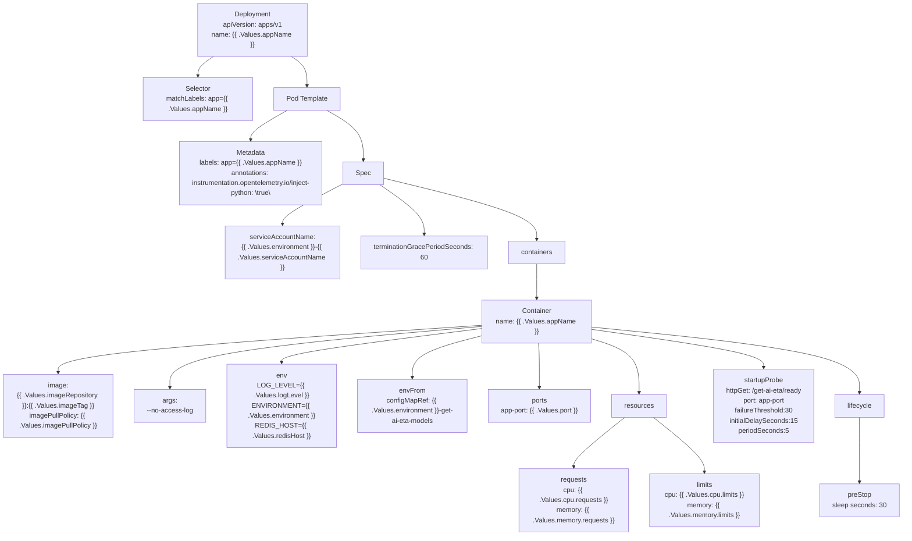

# Diagram: research/api_k8s/get_ai_eta/helm/templates/deployment.yaml

> Auto-generated by Obscura crawlers

## Mermaid

### SVG

<svg id="container" width="2154.0703125" xmlns="http://www.w3.org/2000/svg" class="flowchart" height="1270" viewBox="0 0 2154.0703125 1270" role="graphics-document document" aria-roledescription="flowchart-v2"><g><marker id="container_flowchart-v2-pointEnd" class="marker flowchart-v2" viewBox="0 0 10 10" refX="5" refY="5" markerUnits="userSpaceOnUse" markerWidth="8" markerHeight="8" orient="auto"><path d="M 0 0 L 10 5 L 0 10 z" class="arrowMarkerPath" style="stroke-width: 1; stroke-dasharray: 1, 0;"></path></marker><marker id="container_flowchart-v2-pointStart" class="marker flowchart-v2" viewBox="0 0 10 10" refX="4.5" refY="5" markerUnits="userSpaceOnUse" markerWidth="8" markerHeight="8" orient="auto"><path d="M 0 5 L 10 10 L 10 0 z" class="arrowMarkerPath" style="stroke-width: 1; stroke-dasharray: 1, 0;"></path></marker><marker id="container_flowchart-v2-circleEnd" class="marker flowchart-v2" viewBox="0 0 10 10" refX="11" refY="5" markerUnits="userSpaceOnUse" markerWidth="11" markerHeight="11" orient="auto"><circle cx="5" cy="5" r="5" class="arrowMarkerPath" style="stroke-width: 1; stroke-dasharray: 1, 0;"></circle></marker><marker id="container_flowchart-v2-circleStart" class="marker flowchart-v2" viewBox="0 0 10 10" refX="-1" refY="5" markerUnits="userSpaceOnUse" markerWidth="11" markerHeight="11" orient="auto"><circle cx="5" cy="5" r="5" class="arrowMarkerPath" style="stroke-width: 1; stroke-dasharray: 1, 0;"></circle></marker><marker id="container_flowchart-v2-crossEnd" class="marker cross flowchart-v2" viewBox="0 0 11 11" refX="12" refY="5.2" markerUnits="userSpaceOnUse" markerWidth="11" markerHeight="11" orient="auto"><path d="M 1,1 l 9,9 M 10,1 l -9,9" class="arrowMarkerPath" style="stroke-width: 2; stroke-dasharray: 1, 0;"></path></marker><marker id="container_flowchart-v2-crossStart" class="marker cross flowchart-v2" viewBox="0 0 11 11" refX="-1" refY="5.2" markerUnits="userSpaceOnUse" markerWidth="11" markerHeight="11" orient="auto"><path d="M 1,1 l 9,9 M 10,1 l -9,9" class="arrowMarkerPath" style="stroke-width: 2; stroke-dasharray: 1, 0;"></path></marker><g class="root"><g class="clusters"></g><g class="edgePaths"><path d="M502.547,134L496.405,138.167C490.263,142.333,477.979,150.667,471.837,158.333C465.695,166,465.695,173,465.695,176.5L465.695,180" id="L_D_Selector_0" class="edge-thickness-normal edge-pattern-solid edge-thickness-normal edge-pattern-solid flowchart-link" style=";" data-edge="true" data-et="edge" data-id="L_D_Selector_0" data-points="W3sieCI6NTAyLjU0NzIzMDExMzYzNjQsInkiOjEzNH0seyJ4Ijo0NjUuNjk1MzEyNSwieSI6MTU5fSx7IngiOjQ2NS42OTUzMTI1LCJ5IjoxODR9XQ==" marker-end="url(#container_flowchart-v2-pointEnd)"></path><path d="M688.281,134L694.423,138.167C700.565,142.333,712.849,150.667,718.991,162.333C725.133,174,725.133,189,725.133,196.5L725.133,204" id="L_D_Template_0" class="edge-thickness-normal edge-pattern-solid edge-thickness-normal edge-pattern-solid flowchart-link" style=";" data-edge="true" data-et="edge" data-id="L_D_Template_0" data-points="W3sieCI6Njg4LjI4MDg5NDg4NjM2MzYsInkiOjEzNH0seyJ4Ijo3MjUuMTMyODEyNSwieSI6MTU5fSx7IngiOjcyNS4xMzI4MTI1LCJ5IjoyMDh9XQ==" marker-end="url(#container_flowchart-v2-pointEnd)"></path><path d="M675.879,262L660.981,270.167C646.083,278.333,616.288,294.667,601.39,306.333C586.492,318,586.492,325,586.492,328.5L586.492,332" id="L_Template_Metadata_0" class="edge-thickness-normal edge-pattern-solid edge-thickness-normal edge-pattern-solid flowchart-link" style=";" data-edge="true" data-et="edge" data-id="L_Template_Metadata_0" data-points="W3sieCI6Njc1Ljg3ODkwNjI1LCJ5IjoyNjJ9LHsieCI6NTg2LjQ5MjE4NzUsInkiOjMxMX0seyJ4Ijo1ODYuNDkyMTg3NSwieSI6MzM2fV0=" marker-end="url(#container_flowchart-v2-pointEnd)"></path><path d="M774.387,262L789.285,270.167C804.182,278.333,833.978,294.667,848.876,314.333C863.773,334,863.773,357,863.773,368.5L863.773,380" id="L_Template_Spec_0" class="edge-thickness-normal edge-pattern-solid edge-thickness-normal edge-pattern-solid flowchart-link" style=";" data-edge="true" data-et="edge" data-id="L_Template_Spec_0" data-points="W3sieCI6Nzc0LjM4NjcxODc1LCJ5IjoyNjJ9LHsieCI6ODYzLjc3MzQzNzUsInkiOjMxMX0seyJ4Ijo4NjMuNzczNDM3NSwieSI6Mzg0fV0=" marker-end="url(#container_flowchart-v2-pointEnd)"></path><path d="M816.477,436.384L793.305,448.82C770.134,461.256,723.792,486.128,700.62,502.064C677.449,518,677.449,525,677.449,528.5L677.449,532" id="L_Spec_ServiceAccount_0" class="edge-thickness-normal edge-pattern-solid edge-thickness-normal edge-pattern-solid flowchart-link" style=";" data-edge="true" data-et="edge" data-id="L_Spec_ServiceAccount_0" data-points="W3sieCI6ODE2LjQ3NjU2MjUsInkiOjQzNi4zODQxNzk5NjE4NDQwNH0seyJ4Ijo2NzcuNDQ5MjE4NzUsInkiOjUxMX0seyJ4Ijo2NzcuNDQ5MjE4NzUsInkiOjUzNn1d" marker-end="url(#container_flowchart-v2-pointEnd)"></path><path d="M904,438L922.127,450.167C940.254,462.333,976.508,486.667,994.635,506.333C1012.762,526,1012.762,541,1012.762,548.5L1012.762,556" id="L_Spec_Termination_0" class="edge-thickness-normal edge-pattern-solid edge-thickness-normal edge-pattern-solid flowchart-link" style=";" data-edge="true" data-et="edge" data-id="L_Spec_Termination_0" data-points="W3sieCI6OTA0LjAwMDI3MzQzNzUsInkiOjQzOH0seyJ4IjoxMDEyLjc2MTcxODc1LCJ5Ijo1MTF9LHsieCI6MTAxMi43NjE3MTg3NSwieSI6NTYwfV0=" marker-end="url(#container_flowchart-v2-pointEnd)"></path><path d="M911.07,422.31L972.885,437.092C1034.699,451.873,1158.328,481.437,1220.143,505.718C1281.957,530,1281.957,549,1281.957,558.5L1281.957,568" id="L_Spec_Containers_0" class="edge-thickness-normal edge-pattern-solid edge-thickness-normal edge-pattern-solid flowchart-link" style=";" data-edge="true" data-et="edge" data-id="L_Spec_Containers_0" data-points="W3sieCI6OTExLjA3MDMxMjUsInkiOjQyMi4zMTAwNzQyNjA4OTM5NH0seyJ4IjoxMjgxLjk1NzAzMTI1LCJ5Ijo1MTF9LHsieCI6MTI4MS45NTcwMzEyNSwieSI6NTcyfV0=" marker-end="url(#container_flowchart-v2-pointEnd)"></path><path d="M1281.957,626L1281.957,636.167C1281.957,646.333,1281.957,666.667,1281.957,680.333C1281.957,694,1281.957,701,1281.957,704.5L1281.957,708" id="L_Containers_Container_0" class="edge-thickness-normal edge-pattern-solid edge-thickness-normal edge-pattern-solid flowchart-link" style=";" data-edge="true" data-et="edge" data-id="L_Containers_Container_0" data-points="W3sieCI6MTI4MS45NTcwMzEyNSwieSI6NjI2fSx7IngiOjEyODEuOTU3MDMxMjUsInkiOjY4N30seyJ4IjoxMjgxLjk1NzAzMTI1LCJ5Ijo3MTJ9XQ==" marker-end="url(#container_flowchart-v2-pointEnd)"></path><path d="M1151.957,771.637L982.964,782.864C813.971,794.091,475.986,816.546,306.993,835.273C138,854,138,869,138,876.5L138,884" id="L_Container_Image_0" class="edge-thickness-normal edge-pattern-solid edge-thickness-normal edge-pattern-solid flowchart-link" style=";" data-edge="true" data-et="edge" data-id="L_Container_Image_0" data-points="W3sieCI6MTE1MS45NTcwMzEyNSwieSI6NzcxLjYzNjY4ODAzMTE5NjV9LHsieCI6MTM4LCJ5Ijo4Mzl9LHsieCI6MTM4LCJ5Ijo4ODh9XQ==" marker-end="url(#container_flowchart-v2-pointEnd)"></path><path d="M1151.957,774.261L1027.402,785.051C902.846,795.841,653.736,817.42,529.18,841.71C404.625,866,404.625,893,404.625,906.5L404.625,920" id="L_Container_Args_0" class="edge-thickness-normal edge-pattern-solid edge-thickness-normal edge-pattern-solid flowchart-link" style=";" data-edge="true" data-et="edge" data-id="L_Container_Args_0" data-points="W3sieCI6MTE1MS45NTcwMzEyNSwieSI6Nzc0LjI2MTQxNDg4OTc4MDN9LHsieCI6NDA0LjYyNSwieSI6ODM5fSx7IngiOjQwNC42MjUsInkiOjkyNH1d" marker-end="url(#container_flowchart-v2-pointEnd)"></path><path d="M1151.957,779.178L1071.839,789.148C991.721,799.119,831.486,819.059,751.368,832.53C671.25,846,671.25,853,671.25,856.5L671.25,860" id="L_Container_Env_0" class="edge-thickness-normal edge-pattern-solid edge-thickness-normal edge-pattern-solid flowchart-link" style=";" data-edge="true" data-et="edge" data-id="L_Container_Env_0" data-points="W3sieCI6MTE1MS45NTcwMzEyNSwieSI6Nzc5LjE3Nzk2OTk1MDMwMX0seyJ4Ijo2NzEuMjUsInkiOjgzOX0seyJ4Ijo2NzEuMjUsInkiOjg2NH1d" marker-end="url(#container_flowchart-v2-pointEnd)"></path><path d="M1151.957,795.856L1123.506,803.047C1095.055,810.237,1038.152,824.619,1009.701,841.309C981.25,858,981.25,877,981.25,886.5L981.25,896" id="L_Container_EnvFrom_0" class="edge-thickness-normal edge-pattern-solid edge-thickness-normal edge-pattern-solid flowchart-link" style=";" data-edge="true" data-et="edge" data-id="L_Container_EnvFrom_0" data-points="W3sieCI6MTE1MS45NTcwMzEyNSwieSI6Nzk1Ljg1NTg5OTUwNzY3MDh9LHsieCI6OTgxLjI1LCJ5Ijo4Mzl9LHsieCI6OTgxLjI1LCJ5Ijo5MDB9XQ==" marker-end="url(#container_flowchart-v2-pointEnd)"></path><path d="M1283.789,814L1283.939,818.167C1284.089,822.333,1284.388,830.667,1284.538,848.333C1284.688,866,1284.688,893,1284.688,906.5L1284.688,920" id="L_Container_Ports_0" class="edge-thickness-normal edge-pattern-solid edge-thickness-normal edge-pattern-solid flowchart-link" style=";" data-edge="true" data-et="edge" data-id="L_Container_Ports_0" data-points="W3sieCI6MTI4My43ODkzMTk0OTAxMzE3LCJ5Ijo4MTR9LHsieCI6MTI4NC42ODc1LCJ5Ijo4Mzl9LHsieCI6MTI4NC42ODc1LCJ5Ijo5MjR9XQ==" marker-end="url(#container_flowchart-v2-pointEnd)"></path><path d="M1411.957,803.987L1430.465,809.823C1448.974,815.658,1485.991,827.329,1504.499,848.665C1523.008,870,1523.008,901,1523.008,916.5L1523.008,932" id="L_Container_Resources_0" class="edge-thickness-normal edge-pattern-solid edge-thickness-normal edge-pattern-solid flowchart-link" style=";" data-edge="true" data-et="edge" data-id="L_Container_Resources_0" data-points="W3sieCI6MTQxMS45NTcwMzEyNSwieSI6ODAzLjk4NzIxNDE4MjY5NjJ9LHsieCI6MTUyMy4wMDc4MTI1LCJ5Ijo4Mzl9LHsieCI6MTUyMy4wMDc4MTI1LCJ5Ijo5MzZ9XQ==" marker-end="url(#container_flowchart-v2-pointEnd)"></path><path d="M1489.258,990L1469.049,1006.167C1448.841,1022.333,1408.424,1054.667,1388.216,1074.333C1368.008,1094,1368.008,1101,1368.008,1104.5L1368.008,1108" id="L_Resources_Requests_0" class="edge-thickness-normal edge-pattern-solid edge-thickness-normal edge-pattern-solid flowchart-link" style=";" data-edge="true" data-et="edge" data-id="L_Resources_Requests_0" data-points="W3sieCI6MTQ4OS4yNTc4MTI1LCJ5Ijo5OTB9LHsieCI6MTM2OC4wMDc4MTI1LCJ5IjoxMDg3fSx7IngiOjEzNjguMDA3ODEyNSwieSI6MTExMn1d" marker-end="url(#container_flowchart-v2-pointEnd)"></path><path d="M1556.758,990L1576.966,1006.167C1597.174,1022.333,1637.591,1054.667,1657.799,1076.333C1678.008,1098,1678.008,1109,1678.008,1114.5L1678.008,1120" id="L_Resources_Limits_0" class="edge-thickness-normal edge-pattern-solid edge-thickness-normal edge-pattern-solid flowchart-link" style=";" data-edge="true" data-et="edge" data-id="L_Resources_Limits_0" data-points="W3sieCI6MTU1Ni43NTc4MTI1LCJ5Ijo5OTB9LHsieCI6MTY3OC4wMDc4MTI1LCJ5IjoxMDg3fSx7IngiOjE2NzguMDA3ODEyNSwieSI6MTEyNH1d" marker-end="url(#container_flowchart-v2-pointEnd)"></path><path d="M1411.957,781.45L1479.538,791.042C1547.12,800.634,1682.283,819.817,1749.864,834.908C1817.445,850,1817.445,861,1817.445,866.5L1817.445,872" id="L_Container_StartupProbe_0" class="edge-thickness-normal edge-pattern-solid edge-thickness-normal edge-pattern-solid flowchart-link" style=";" data-edge="true" data-et="edge" data-id="L_Container_StartupProbe_0" data-points="W3sieCI6MTQxMS45NTcwMzEyNSwieSI6NzgxLjQ1MDQ1MDQ1MDQ1MDV9LHsieCI6MTgxNy40NDUzMTI1LCJ5Ijo4Mzl9LHsieCI6MTgxNy40NDUzMTI1LCJ5Ijo4NzZ9XQ==" marker-end="url(#container_flowchart-v2-pointEnd)"></path><path d="M1411.957,775.826L1518.68,786.355C1625.404,796.884,1838.85,817.942,1945.574,843.971C2052.297,870,2052.297,901,2052.297,916.5L2052.297,932" id="L_Container_Lifecycle_0" class="edge-thickness-normal edge-pattern-solid edge-thickness-normal edge-pattern-solid flowchart-link" style=";" data-edge="true" data-et="edge" data-id="L_Container_Lifecycle_0" data-points="W3sieCI6MTQxMS45NTcwMzEyNSwieSI6Nzc1LjgyNTUwODIyMjMyNDd9LHsieCI6MjA1Mi4yOTY4NzUsInkiOjgzOX0seyJ4IjoyMDUyLjI5Njg3NSwieSI6OTM2fV0=" marker-end="url(#container_flowchart-v2-pointEnd)"></path><path d="M2052.297,990L2052.297,1006.167C2052.297,1022.333,2052.297,1054.667,2052.297,1080.333C2052.297,1106,2052.297,1125,2052.297,1134.5L2052.297,1144" id="L_Lifecycle_PreStop_0" class="edge-thickness-normal edge-pattern-solid edge-thickness-normal edge-pattern-solid flowchart-link" style=";" data-edge="true" data-et="edge" data-id="L_Lifecycle_PreStop_0" data-points="W3sieCI6MjA1Mi4yOTY4NzUsInkiOjk5MH0seyJ4IjoyMDUyLjI5Njg3NSwieSI6MTA4N30seyJ4IjoyMDUyLjI5Njg3NSwieSI6MTE0OH1d" marker-end="url(#container_flowchart-v2-pointEnd)"></path></g><g class="edgeLabels"><g class="edgeLabel"><g class="label" data-id="L_D_Selector_0" transform="translate(0, 0)"><foreignObject width="0" height="0">

</foreignObject></g></g><g class="edgeLabel"><g class="label" data-id="L_D_Template_0" transform="translate(0, 0)"><foreignObject width="0" height="0">

</foreignObject></g></g><g class="edgeLabel"><g class="label" data-id="L_Template_Metadata_0" transform="translate(0, 0)"><foreignObject width="0" height="0">

</foreignObject></g></g><g class="edgeLabel"><g class="label" data-id="L_Template_Spec_0" transform="translate(0, 0)"><foreignObject width="0" height="0">

</foreignObject></g></g><g class="edgeLabel"><g class="label" data-id="L_Spec_ServiceAccount_0" transform="translate(0, 0)"><foreignObject width="0" height="0">

</foreignObject></g></g><g class="edgeLabel"><g class="label" data-id="L_Spec_Termination_0" transform="translate(0, 0)"><foreignObject width="0" height="0">

</foreignObject></g></g><g class="edgeLabel"><g class="label" data-id="L_Spec_Containers_0" transform="translate(0, 0)"><foreignObject width="0" height="0">

</foreignObject></g></g><g class="edgeLabel"><g class="label" data-id="L_Containers_Container_0" transform="translate(0, 0)"><foreignObject width="0" height="0">

</foreignObject></g></g><g class="edgeLabel"><g class="label" data-id="L_Container_Image_0" transform="translate(0, 0)"><foreignObject width="0" height="0">

</foreignObject></g></g><g class="edgeLabel"><g class="label" data-id="L_Container_Args_0" transform="translate(0, 0)"><foreignObject width="0" height="0">

</foreignObject></g></g><g class="edgeLabel"><g class="label" data-id="L_Container_Env_0" transform="translate(0, 0)"><foreignObject width="0" height="0">

</foreignObject></g></g><g class="edgeLabel"><g class="label" data-id="L_Container_EnvFrom_0" transform="translate(0, 0)"><foreignObject width="0" height="0">

</foreignObject></g></g><g class="edgeLabel"><g class="label" data-id="L_Container_Ports_0" transform="translate(0, 0)"><foreignObject width="0" height="0">

</foreignObject></g></g><g class="edgeLabel"><g class="label" data-id="L_Container_Resources_0" transform="translate(0, 0)"><foreignObject width="0" height="0">

</foreignObject></g></g><g class="edgeLabel"><g class="label" data-id="L_Resources_Requests_0" transform="translate(0, 0)"><foreignObject width="0" height="0">

</foreignObject></g></g><g class="edgeLabel"><g class="label" data-id="L_Resources_Limits_0" transform="translate(0, 0)"><foreignObject width="0" height="0">

</foreignObject></g></g><g class="edgeLabel"><g class="label" data-id="L_Container_StartupProbe_0" transform="translate(0, 0)"><foreignObject width="0" height="0">

</foreignObject></g></g><g class="edgeLabel"><g class="label" data-id="L_Container_Lifecycle_0" transform="translate(0, 0)"><foreignObject width="0" height="0">

</foreignObject></g></g><g class="edgeLabel"><g class="label" data-id="L_Lifecycle_PreStop_0" transform="translate(0, 0)"><foreignObject width="0" height="0">

</foreignObject></g></g></g><g class="nodes"><g class="node default" id="flowchart-D-0" transform="translate(595.4140625, 71)"><rect class="basic label-container" style="" x="-130" y="-63" width="260" height="126"></rect><g class="label" style="" transform="translate(-100, -48)"><rect></rect><foreignObject width="200" height="96">

Deployment apiVersion: apps/v1 name: {{ .Values.appName }}

</foreignObject></g></g><g class="node default" id="flowchart-Selector-1" transform="translate(465.6953125, 235)"><rect class="basic label-container" style="" x="-130" y="-51" width="260" height="102"></rect><g class="label" style="" transform="translate(-100, -36)"><rect></rect><foreignObject width="200" height="72">

Selector matchLabels: app={{ .Values.appName }}

</foreignObject></g></g><g class="node default" id="flowchart-Template-2" transform="translate(725.1328125, 235)"><rect class="basic label-container" style="" x="-79.4375" y="-27" width="158.875" height="54"></rect><g class="label" style="" transform="translate(-49.4375, -12)"><rect></rect><foreignObject width="98.875" height="24">

Pod Template

</foreignObject></g></g><g class="node default" id="flowchart-Metadata-3" transform="translate(586.4921875, 411)"><rect class="basic label-container" style="" x="-179.984375" y="-75" width="359.96875" height="150"></rect><g class="label" style="" transform="translate(-149.984375, -60)"><rect></rect><foreignObject width="299.96875" height="120">

Metadata labels: app={{ .Values.appName }} annotations: instrumentation.opentelemetry.io/inject-python: \true\

</foreignObject></g></g><g class="node default" id="flowchart-Spec-4" transform="translate(863.7734375, 411)"><rect class="basic label-container" style="" x="-47.296875" y="-27" width="94.59375" height="54"></rect><g class="label" style="" transform="translate(-17.296875, -12)"><rect></rect><foreignObject width="34.59375" height="24">

Spec

</foreignObject></g></g><g class="node default" id="flowchart-ServiceAccount-5" transform="translate(677.44921875, 599)"><rect class="basic label-container" style="" x="-134.3359375" y="-63" width="268.671875" height="126"></rect><g class="label" style="" transform="translate(-104.3359375, -48)"><rect></rect><foreignObject width="208.671875" height="96">

serviceAccountName: {{ .Values.environment }}-{{ .Values.serviceAccountName }}

</foreignObject></g></g><g class="node default" id="flowchart-Termination-6" transform="translate(1012.76171875, 599)"><rect class="basic label-container" style="" x="-150.9765625" y="-39" width="301.953125" height="78"></rect><g class="label" style="" transform="translate(-120.9765625, -24)"><rect></rect><foreignObject width="241.953125" height="48">

terminationGracePeriodSeconds: 60

</foreignObject></g></g><g class="node default" id="flowchart-Containers-7" transform="translate(1281.95703125, 599)"><rect class="basic label-container" style="" x="-68.21875" y="-27" width="136.4375" height="54"></rect><g class="label" style="" transform="translate(-38.21875, -12)"><rect></rect><foreignObject width="76.4375" height="24">

containers

</foreignObject></g></g><g class="node default" id="flowchart-Container-8" transform="translate(1281.95703125, 763)"><rect class="basic label-container" style="" x="-130" y="-51" width="260" height="102"></rect><g class="label" style="" transform="translate(-100, -36)"><rect></rect><foreignObject width="200" height="72">

Container name: {{ .Values.appName }}

</foreignObject></g></g><g class="node default" id="flowchart-Image-9" transform="translate(138, 963)"><rect class="basic label-container" style="" x="-130" y="-75" width="260" height="150"></rect><g class="label" style="" transform="translate(-100, -60)"><rect></rect><foreignObject width="200" height="120">

image: {{ .Values.imageRepository }}:{{ .Values.imageTag }} imagePullPolicy: {{ .Values.imagePullPolicy }}

</foreignObject></g></g><g class="node default" id="flowchart-Args-10" transform="translate(404.625, 963)"><rect class="basic label-container" style="" x="-86.625" y="-39" width="173.25" height="78"></rect><g class="label" style="" transform="translate(-56.625, -24)"><rect></rect><foreignObject width="113.25" height="48">

args: --no-access-log

</foreignObject></g></g><g class="node default" id="flowchart-Env-11" transform="translate(671.25, 963)"><rect class="basic label-container" style="" x="-130" y="-99" width="260" height="198"></rect><g class="label" style="" transform="translate(-100, -84)"><rect></rect><foreignObject width="200" height="168">

env LOG_LEVEL={{ .Values.logLevel }} ENVIRONMENT={{ .Values.environment }} REDIS_HOST={{ .Values.redisHost }}

</foreignObject></g></g><g class="node default" id="flowchart-EnvFrom-12" transform="translate(981.25, 963)"><rect class="basic label-container" style="" x="-130" y="-63" width="260" height="126"></rect><g class="label" style="" transform="translate(-100, -48)"><rect></rect><foreignObject width="200" height="96">

envFrom configMapRef: {{ .Values.environment }}-get-ai-eta-models

</foreignObject></g></g><g class="node default" id="flowchart-Ports-13" transform="translate(1284.6875, 963)"><rect class="basic label-container" style="" x="-123.4375" y="-39" width="246.875" height="78"></rect><g class="label" style="" transform="translate(-93.4375, -24)"><rect></rect><foreignObject width="186.875" height="48">

ports app-port: {{ .Values.port }}

</foreignObject></g></g><g class="node default" id="flowchart-Resources-14" transform="translate(1523.0078125, 963)"><rect class="basic label-container" style="" x="-64.8828125" y="-27" width="129.765625" height="54"></rect><g class="label" style="" transform="translate(-34.8828125, -12)"><rect></rect><foreignObject width="69.765625" height="24">

resources

</foreignObject></g></g><g class="node default" id="flowchart-Requests-15" transform="translate(1368.0078125, 1187)"><rect class="basic label-container" style="" x="-130" y="-75" width="260" height="150"></rect><g class="label" style="" transform="translate(-100, -60)"><rect></rect><foreignObject width="200" height="120">

requests cpu: {{ .Values.cpu.requests }} memory: {{ .Values.memory.requests }}

</foreignObject></g></g><g class="node default" id="flowchart-Limits-16" transform="translate(1678.0078125, 1187)"><rect class="basic label-container" style="" x="-130" y="-63" width="260" height="126"></rect><g class="label" style="" transform="translate(-100, -48)"><rect></rect><foreignObject width="200" height="96">

limits cpu: {{ .Values.cpu.limits }} memory: {{ .Values.memory.limits }}

</foreignObject></g></g><g class="node default" id="flowchart-StartupProbe-17" transform="translate(1817.4453125, 963)"><rect class="basic label-container" style="" x="-125.0703125" y="-87" width="250.140625" height="174"></rect><g class="label" style="" transform="translate(-95.0703125, -72)"><rect></rect><foreignObject width="190.140625" height="144">

startupProbe httpGet: /get-ai-eta/ready port: app-port failureThreshold:30 initialDelaySeconds:15 periodSeconds:5

</foreignObject></g></g><g class="node default" id="flowchart-Lifecycle-18" transform="translate(2052.296875, 963)"><rect class="basic label-container" style="" x="-59.78125" y="-27" width="119.5625" height="54"></rect><g class="label" style="" transform="translate(-29.78125, -12)"><rect></rect><foreignObject width="59.5625" height="24">

lifecycle

</foreignObject></g></g><g class="node default" id="flowchart-PreStop-19" transform="translate(2052.296875, 1187)"><rect class="basic label-container" style="" x="-93.7734375" y="-39" width="187.546875" height="78"></rect><g class="label" style="" transform="translate(-63.7734375, -24)"><rect></rect><foreignObject width="127.546875" height="48">

preStop sleep seconds: 30

</foreignObject></g></g></g></g></g></svg>
