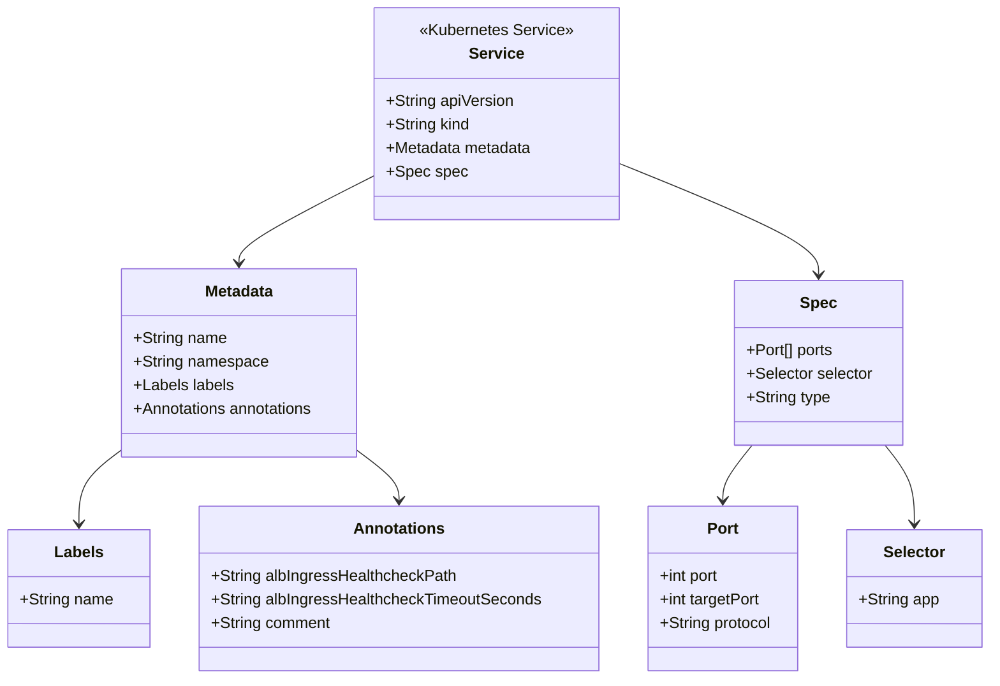

# Diagram: research/api_k8s/get_ai_eta/helm/templates/service.yaml

> Auto-generated by Obscura crawlers

## Mermaid

### SVG

<svg id="container" width="1007.109375" xmlns="http://www.w3.org/2000/svg" class="classDiagram" height="692" viewBox="0 0 1007.109375 692" role="graphics-document document" aria-roledescription="class"><g><defs><marker id="container_class-aggregationStart" class="marker aggregation class" refX="18" refY="7" markerWidth="190" markerHeight="240" orient="auto"><path d="M 18,7 L9,13 L1,7 L9,1 Z"></path></marker></defs><defs><marker id="container_class-aggregationEnd" class="marker aggregation class" refX="1" refY="7" markerWidth="20" markerHeight="28" orient="auto"><path d="M 18,7 L9,13 L1,7 L9,1 Z"></path></marker></defs><defs><marker id="container_class-extensionStart" class="marker extension class" refX="18" refY="7" markerWidth="190" markerHeight="240" orient="auto"><path d="M 1,7 L18,13 V 1 Z"></path></marker></defs><defs><marker id="container_class-extensionEnd" class="marker extension class" refX="1" refY="7" markerWidth="20" markerHeight="28" orient="auto"><path d="M 1,1 V 13 L18,7 Z"></path></marker></defs><defs><marker id="container_class-compositionStart" class="marker composition class" refX="18" refY="7" markerWidth="190" markerHeight="240" orient="auto"><path d="M 18,7 L9,13 L1,7 L9,1 Z"></path></marker></defs><defs><marker id="container_class-compositionEnd" class="marker composition class" refX="1" refY="7" markerWidth="20" markerHeight="28" orient="auto"><path d="M 18,7 L9,13 L1,7 L9,1 Z"></path></marker></defs><defs><marker id="container_class-dependencyStart" class="marker dependency class" refX="6" refY="7" markerWidth="190" markerHeight="240" orient="auto"><path d="M 5,7 L9,13 L1,7 L9,1 Z"></path></marker></defs><defs><marker id="container_class-dependencyEnd" class="marker dependency class" refX="13" refY="7" markerWidth="20" markerHeight="28" orient="auto"><path d="M 18,7 L9,13 L14,7 L9,1 Z"></path></marker></defs><defs><marker id="container_class-lollipopStart" class="marker lollipop class" refX="13" refY="7" markerWidth="190" markerHeight="240" orient="auto"><circle stroke="black" fill="transparent" cx="7" cy="7" r="6"></circle></marker></defs><defs><marker id="container_class-lollipopEnd" class="marker lollipop class" refX="1" refY="7" markerWidth="190" markerHeight="240" orient="auto"><circle stroke="black" fill="transparent" cx="7" cy="7" r="6"></circle></marker></defs><g class="root"><g class="clusters"></g><g class="edgePaths"><path d="M378.93,179.747L356.083,191.289C333.236,202.831,287.542,225.916,264.695,240.625C241.848,255.333,241.848,261.667,241.848,264.833L241.848,268" id="id_Service_Metadata_1" class="edge-thickness-normal edge-pattern-solid relation" style=";;;" data-edge="true" data-et="edge" data-id="id_Service_Metadata_1" data-points="W3sieCI6Mzc4LjkyOTY4NzUsInkiOjE3OS43NDcwOTE4MTU1Mzh9LHsieCI6MjQxLjg0NzY1NjI1LCJ5IjoyNDl9LHsieCI6MjQxLjg0NzY1NjI1LCJ5IjoyNzR9XQ==" marker-end="url(#container_class-dependencyEnd)"></path><path d="M631.297,167.188L664.909,180.824C698.521,194.459,765.745,221.729,799.357,240.531C832.969,259.333,832.969,269.667,832.969,274.833L832.969,280" id="id_Service_Spec_2" class="edge-thickness-normal edge-pattern-solid relation" style=";;;" data-edge="true" data-et="edge" data-id="id_Service_Spec_2" data-points="W3sieCI6NjMxLjI5Njg3NSwieSI6MTY3LjE4ODQ2NDMzMzc5OH0seyJ4Ijo4MzIuOTY4NzUsInkiOjI0OX0seyJ4Ijo4MzIuOTY4NzUsInkiOjI4Nn1d" marker-end="url(#container_class-dependencyEnd)"></path><path d="M118.613,461.8L112.08,466.666C105.547,471.533,92.48,481.267,85.947,493.3C79.414,505.333,79.414,519.667,79.414,526.833L79.414,534" id="id_Metadata_Labels_3" class="edge-thickness-normal edge-pattern-solid relation" style=";;;" data-edge="true" data-et="edge" data-id="id_Metadata_Labels_3" data-points="W3sieCI6MTE4LjYxMzI4MTI1LCJ5Ijo0NjEuNzk5NzI1ODQ5NTA1OH0seyJ4Ijo3OS40MTQwNjI1LCJ5Ijo0OTF9LHsieCI6NzkuNDE0MDYyNSwieSI6NTQwfV0=" marker-end="url(#container_class-dependencyEnd)"></path><path d="M365.082,461.8L371.615,466.666C378.148,471.533,391.215,481.267,397.748,489.3C404.281,497.333,404.281,503.667,404.281,506.833L404.281,510" id="id_Metadata_Annotations_4" class="edge-thickness-normal edge-pattern-solid relation" style=";;;" data-edge="true" data-et="edge" data-id="id_Metadata_Annotations_4" data-points="W3sieCI6MzY1LjA4MjAzMTI1LCJ5Ijo0NjEuNzk5NzI1ODQ5NTA1OH0seyJ4Ijo0MDQuMjgxMjUsInkiOjQ5MX0seyJ4Ijo0MDQuMjgxMjUsInkiOjUxNn1d" marker-end="url(#container_class-dependencyEnd)"></path><path d="M765.044,454L760.058,460.167C755.071,466.333,745.098,478.667,740.112,488C735.125,497.333,735.125,503.667,735.125,506.833L735.125,510" id="id_Spec_Port_5" class="edge-thickness-normal edge-pattern-solid relation" style=";;;" data-edge="true" data-et="edge" data-id="id_Spec_Port_5" data-points="W3sieCI6NzY1LjA0NDE2MzIyMzE0MDUsInkiOjQ1NH0seyJ4Ijo3MzUuMTI1LCJ5Ijo0OTF9LHsieCI6NzM1LjEyNSwieSI6NTE2fV0=" marker-end="url(#container_class-dependencyEnd)"></path><path d="M900.893,454L905.88,460.167C910.866,466.333,920.839,478.667,925.826,492C930.813,505.333,930.813,519.667,930.813,526.833L930.813,534" id="id_Spec_Selector_6" class="edge-thickness-normal edge-pattern-solid relation" style=";;;" data-edge="true" data-et="edge" data-id="id_Spec_Selector_6" data-points="W3sieCI6OTAwLjg5MzMzNjc3Njg1OTUsInkiOjQ1NH0seyJ4Ijo5MzAuODEyNSwieSI6NDkxfSx7IngiOjkzMC44MTI1LCJ5Ijo1NDB9XQ==" marker-end="url(#container_class-dependencyEnd)"></path></g><g class="edgeLabels"><g class="edgeLabel"><g class="label" data-id="id_Service_Metadata_1" transform="translate(0, 0)"><foreignObject width="0" height="0">

</foreignObject></g></g><g class="edgeLabel"><g class="label" data-id="id_Service_Spec_2" transform="translate(0, 0)"><foreignObject width="0" height="0">

</foreignObject></g></g><g class="edgeLabel"><g class="label" data-id="id_Metadata_Labels_3" transform="translate(0, 0)"><foreignObject width="0" height="0">

</foreignObject></g></g><g class="edgeLabel"><g class="label" data-id="id_Metadata_Annotations_4" transform="translate(0, 0)"><foreignObject width="0" height="0">

</foreignObject></g></g><g class="edgeLabel"><g class="label" data-id="id_Spec_Port_5" transform="translate(0, 0)"><foreignObject width="0" height="0">

</foreignObject></g></g><g class="edgeLabel"><g class="label" data-id="id_Spec_Selector_6" transform="translate(0, 0)"><foreignObject width="0" height="0">

</foreignObject></g></g></g><g class="nodes"><g class="node default" id="classId-Service-0" transform="translate(505.11328125, 116)"><g class="basic label-container"><path d="M-126.18359375 -108 L126.18359375 -108 L126.18359375 108 L-126.18359375 108" stroke="none" stroke-width="0" fill="#ECECFF" style=""></path><path d="M-126.18359375 -108 C-61.308951553973145 -108, 3.56569064205371 -108, 126.18359375 -108 M-126.18359375 -108 C-59.35532134917874 -108, 7.472951051642525 -108, 126.18359375 -108 M126.18359375 -108 C126.18359375 -29.298269922287375, 126.18359375 49.40346015542525, 126.18359375 108 M126.18359375 -108 C126.18359375 -63.947034925326804, 126.18359375 -19.894069850653608, 126.18359375 108 M126.18359375 108 C30.08818412912217 108, -66.00722549175566 108, -126.18359375 108 M126.18359375 108 C44.65929776935289 108, -36.86499821129422 108, -126.18359375 108 M-126.18359375 108 C-126.18359375 24.392201148999803, -126.18359375 -59.215597702000395, -126.18359375 -108 M-126.18359375 108 C-126.18359375 39.38887148464225, -126.18359375 -29.222257030715497, -126.18359375 -108" stroke="#9370DB" stroke-width="1.3" fill="none" stroke-dasharray="0 0" style=""></path></g><g class="annotation-group text" transform="translate(-78.5234375, -84)"><g class="label" style="" transform="translate(0,-12)"><foreignObject width="157.046875" height="24">

«Kubernetes Service»

</foreignObject></g></g><g class="label-group text" transform="translate(-26.6484375, -60)"><g class="label" style="font-weight: bolder" transform="translate(0,-12)"><foreignObject width="53.296875" height="24">

Service

</foreignObject></g></g><g class="members-group text" transform="translate(-114.18359375, -12)"><g class="label" style="" transform="translate(0,-12)"><foreignObject width="131.046875" height="24">

+String apiVersion

</foreignObject></g><g class="label" style="" transform="translate(0,12)"><foreignObject width="86.125" height="24">

+String kind

</foreignObject></g><g class="label" style="" transform="translate(0,36)"><foreignObject width="149.84375" height="24">

+Metadata metadata

</foreignObject></g><g class="label" style="" transform="translate(0,60)"><foreignObject width="79.53125" height="24">

+Spec spec

</foreignObject></g></g><g class="methods-group text" transform="translate(-114.18359375, 108)"></g><g class="divider" style=""><path d="M-126.18359375 -36 C-66.14926091572143 -36, -6.114928081442855 -36, 126.18359375 -36 M-126.18359375 -36 C-42.66049685410415 -36, 40.862600041791694 -36, 126.18359375 -36" stroke="#9370DB" stroke-width="1.3" fill="none" stroke-dasharray="0 0" style=""></path></g><g class="divider" style=""><path d="M-126.18359375 84 C-59.13247750477932 84, 7.9186387404413665 84, 126.18359375 84 M-126.18359375 84 C-45.791974900143956 84, 34.59964394971209 84, 126.18359375 84" stroke="#9370DB" stroke-width="1.3" fill="none" stroke-dasharray="0 0" style=""></path></g></g><g class="node default" id="classId-Metadata-1" transform="translate(241.84765625, 370)"><g class="basic label-container"><path d="M-123.234375 -96 L123.234375 -96 L123.234375 96 L-123.234375 96" stroke="none" stroke-width="0" fill="#ECECFF" style=""></path><path d="M-123.234375 -96 C-28.874833118807743 -96, 65.48470876238451 -96, 123.234375 -96 M-123.234375 -96 C-46.75603295566947 -96, 29.722309088661063 -96, 123.234375 -96 M123.234375 -96 C123.234375 -20.24792462353497, 123.234375 55.50415075293006, 123.234375 96 M123.234375 -96 C123.234375 -27.236876521770782, 123.234375 41.526246956458436, 123.234375 96 M123.234375 96 C42.56393804097482 96, -38.10649891805036 96, -123.234375 96 M123.234375 96 C41.37681185465526 96, -40.48075129068948 96, -123.234375 96 M-123.234375 96 C-123.234375 49.78699698765192, -123.234375 3.5739939753038357, -123.234375 -96 M-123.234375 96 C-123.234375 40.51538983343905, -123.234375 -14.969220333121896, -123.234375 -96" stroke="#9370DB" stroke-width="1.3" fill="none" stroke-dasharray="0 0" style=""></path></g><g class="annotation-group text" transform="translate(0, -72)"></g><g class="label-group text" transform="translate(-34.640625, -72)"><g class="label" style="font-weight: bolder" transform="translate(0,-12)"><foreignObject width="69.28125" height="24">

Metadata

</foreignObject></g></g><g class="members-group text" transform="translate(-111.234375, -24)"><g class="label" style="" transform="translate(0,-12)"><foreignObject width="94.984375" height="24">

+String name

</foreignObject></g><g class="label" style="" transform="translate(0,12)"><foreignObject width="136.546875" height="24">

+String namespace

</foreignObject></g><g class="label" style="" transform="translate(0,36)"><foreignObject width="102.828125" height="24">

+Labels labels

</foreignObject></g><g class="label" style="" transform="translate(0,60)"><foreignObject width="187.828125" height="24">

+Annotations annotations

</foreignObject></g></g><g class="methods-group text" transform="translate(-111.234375, 96)"></g><g class="divider" style=""><path d="M-123.234375 -48 C-43.60187045791332 -48, 36.03063408417336 -48, 123.234375 -48 M-123.234375 -48 C-53.070599992242634 -48, 17.09317501551473 -48, 123.234375 -48" stroke="#9370DB" stroke-width="1.3" fill="none" stroke-dasharray="0 0" style=""></path></g><g class="divider" style=""><path d="M-123.234375 72 C-32.179344470881546 72, 58.87568605823691 72, 123.234375 72 M-123.234375 72 C-72.23938324402545 72, -21.24439148805091 72, 123.234375 72" stroke="#9370DB" stroke-width="1.3" fill="none" stroke-dasharray="0 0" style=""></path></g></g><g class="node default" id="classId-Labels-2" transform="translate(79.4140625, 600)"><g class="basic label-container"><path d="M-71.4140625 -60 L71.4140625 -60 L71.4140625 60 L-71.4140625 60" stroke="none" stroke-width="0" fill="#ECECFF" style=""></path><path d="M-71.4140625 -60 C-40.84423626133753 -60, -10.274410022675049 -60, 71.4140625 -60 M-71.4140625 -60 C-18.742566171436273 -60, 33.92893015712745 -60, 71.4140625 -60 M71.4140625 -60 C71.4140625 -25.409777594934425, 71.4140625 9.18044481013115, 71.4140625 60 M71.4140625 -60 C71.4140625 -24.220091224782465, 71.4140625 11.55981755043507, 71.4140625 60 M71.4140625 60 C37.73388291996714 60, 4.053703339934273 60, -71.4140625 60 M71.4140625 60 C28.176222540450766 60, -15.061617419098468 60, -71.4140625 60 M-71.4140625 60 C-71.4140625 30.215661461401357, -71.4140625 0.431322922802714, -71.4140625 -60 M-71.4140625 60 C-71.4140625 35.55982161310303, -71.4140625 11.119643226206065, -71.4140625 -60" stroke="#9370DB" stroke-width="1.3" fill="none" stroke-dasharray="0 0" style=""></path></g><g class="annotation-group text" transform="translate(0, -36)"></g><g class="label-group text" transform="translate(-23.84375, -36)"><g class="label" style="font-weight: bolder" transform="translate(0,-12)"><foreignObject width="47.6875" height="24">

Labels

</foreignObject></g></g><g class="members-group text" transform="translate(-59.4140625, 12)"><g class="label" style="" transform="translate(0,-12)"><foreignObject width="94.984375" height="24">

+String name

</foreignObject></g></g><g class="methods-group text" transform="translate(-59.4140625, 60)"></g><g class="divider" style=""><path d="M-71.4140625 -12 C-16.06894246630334 -12, 39.27617756739332 -12, 71.4140625 -12 M-71.4140625 -12 C-16.172324694046125 -12, 39.06941311190775 -12, 71.4140625 -12" stroke="#9370DB" stroke-width="1.3" fill="none" stroke-dasharray="0 0" style=""></path></g><g class="divider" style=""><path d="M-71.4140625 36 C-42.387329239222225 36, -13.360595978444458 36, 71.4140625 36 M-71.4140625 36 C-35.48777915376128 36, 0.43850419247743844 36, 71.4140625 36" stroke="#9370DB" stroke-width="1.3" fill="none" stroke-dasharray="0 0" style=""></path></g></g><g class="node default" id="classId-Annotations-3" transform="translate(404.28125, 600)"><g class="basic label-container"><path d="M-203.453125 -84 L203.453125 -84 L203.453125 84 L-203.453125 84" stroke="none" stroke-width="0" fill="#ECECFF" style=""></path><path d="M-203.453125 -84 C-50.35604828238701 -84, 102.74102843522599 -84, 203.453125 -84 M-203.453125 -84 C-104.14475208452959 -84, -4.836379169059171 -84, 203.453125 -84 M203.453125 -84 C203.453125 -34.35213053410717, 203.453125 15.295738931785664, 203.453125 84 M203.453125 -84 C203.453125 -48.69844085590215, 203.453125 -13.396881711804298, 203.453125 84 M203.453125 84 C59.74007539106091 84, -83.97297421787817 84, -203.453125 84 M203.453125 84 C86.48889427440864 84, -30.475336451182727 84, -203.453125 84 M-203.453125 84 C-203.453125 42.13230544316974, -203.453125 0.26461088633948293, -203.453125 -84 M-203.453125 84 C-203.453125 29.072141167313802, -203.453125 -25.855717665372396, -203.453125 -84" stroke="#9370DB" stroke-width="1.3" fill="none" stroke-dasharray="0 0" style=""></path></g><g class="annotation-group text" transform="translate(0, -60)"></g><g class="label-group text" transform="translate(-44.5, -60)"><g class="label" style="font-weight: bolder" transform="translate(0,-12)"><foreignObject width="89" height="24">

Annotations

</foreignObject></g></g><g class="members-group text" transform="translate(-191.453125, -12)"><g class="label" style="" transform="translate(0,-12)"><foreignObject width="250.5" height="24">

+String albIngressHealthcheckPath

</foreignObject></g><g class="label" style="" transform="translate(0,12)"><foreignObject width="338.40625" height="24">

+String albIngressHealthcheckTimeoutSeconds

</foreignObject></g><g class="label" style="" transform="translate(0,36)"><foreignObject width="122.4375" height="24">

+String comment

</foreignObject></g></g><g class="methods-group text" transform="translate(-191.453125, 84)"></g><g class="divider" style=""><path d="M-203.453125 -36 C-66.78522140377152 -36, 69.88268219245697 -36, 203.453125 -36 M-203.453125 -36 C-44.69814609354589 -36, 114.05683281290823 -36, 203.453125 -36" stroke="#9370DB" stroke-width="1.3" fill="none" stroke-dasharray="0 0" style=""></path></g><g class="divider" style=""><path d="M-203.453125 60 C-53.09351599566287 60, 97.26609300867426 60, 203.453125 60 M-203.453125 60 C-70.98357334313607 60, 61.485978313727855 60, 203.453125 60" stroke="#9370DB" stroke-width="1.3" fill="none" stroke-dasharray="0 0" style=""></path></g></g><g class="node default" id="classId-Spec-4" transform="translate(832.96875, 370)"><g class="basic label-container"><path d="M-85.44140625 -84 L85.44140625 -84 L85.44140625 84 L-85.44140625 84" stroke="none" stroke-width="0" fill="#ECECFF" style=""></path><path d="M-85.44140625 -84 C-49.97037493809327 -84, -14.499343626186544 -84, 85.44140625 -84 M-85.44140625 -84 C-49.781367965774585 -84, -14.12132968154917 -84, 85.44140625 -84 M85.44140625 -84 C85.44140625 -48.95412211426435, 85.44140625 -13.908244228528702, 85.44140625 84 M85.44140625 -84 C85.44140625 -28.140955232626204, 85.44140625 27.71808953474759, 85.44140625 84 M85.44140625 84 C22.236120034696825 84, -40.96916618060635 84, -85.44140625 84 M85.44140625 84 C31.67432913703575 84, -22.092747975928503 84, -85.44140625 84 M-85.44140625 84 C-85.44140625 44.531391316206054, -85.44140625 5.062782632412109, -85.44140625 -84 M-85.44140625 84 C-85.44140625 41.93223693482363, -85.44140625 -0.1355261303527442, -85.44140625 -84" stroke="#9370DB" stroke-width="1.3" fill="none" stroke-dasharray="0 0" style=""></path></g><g class="annotation-group text" transform="translate(0, -60)"></g><g class="label-group text" transform="translate(-17.6015625, -60)"><g class="label" style="font-weight: bolder" transform="translate(0,-12)"><foreignObject width="35.203125" height="24">

Spec

</foreignObject></g></g><g class="members-group text" transform="translate(-73.44140625, -12)"><g class="label" style="" transform="translate(0,-12)"><foreignObject width="90.921875" height="24">

+Port[] ports

</foreignObject></g><g class="label" style="" transform="translate(0,12)"><foreignObject width="129.28125" height="24">

+Selector selector

</foreignObject></g><g class="label" style="" transform="translate(0,36)"><foreignObject width="86.265625" height="24">

+String type

</foreignObject></g></g><g class="methods-group text" transform="translate(-73.44140625, 84)"></g><g class="divider" style=""><path d="M-85.44140625 -36 C-20.217970135684197 -36, 45.005465978631605 -36, 85.44140625 -36 M-85.44140625 -36 C-36.84406003745501 -36, 11.753286175089983 -36, 85.44140625 -36" stroke="#9370DB" stroke-width="1.3" fill="none" stroke-dasharray="0 0" style=""></path></g><g class="divider" style=""><path d="M-85.44140625 60 C-50.48653464042362 60, -15.531663030847241 60, 85.44140625 60 M-85.44140625 60 C-30.25128021009423 60, 24.93884582981154 60, 85.44140625 60" stroke="#9370DB" stroke-width="1.3" fill="none" stroke-dasharray="0 0" style=""></path></g></g><g class="node default" id="classId-Port-5" transform="translate(735.125, 600)"><g class="basic label-container"><path d="M-77.390625 -84 L77.390625 -84 L77.390625 84 L-77.390625 84" stroke="none" stroke-width="0" fill="#ECECFF" style=""></path><path d="M-77.390625 -84 C-29.51702907603235 -84, 18.356566847935298 -84, 77.390625 -84 M-77.390625 -84 C-16.147720408407444 -84, 45.09518418318511 -84, 77.390625 -84 M77.390625 -84 C77.390625 -31.893405983693377, 77.390625 20.213188032613246, 77.390625 84 M77.390625 -84 C77.390625 -37.64562266530402, 77.390625 8.708754669391965, 77.390625 84 M77.390625 84 C18.82558114245159 84, -39.73946271509682 84, -77.390625 84 M77.390625 84 C38.36631041074859 84, -0.6580041785028214 84, -77.390625 84 M-77.390625 84 C-77.390625 21.06360514421199, -77.390625 -41.87278971157602, -77.390625 -84 M-77.390625 84 C-77.390625 31.311257414634575, -77.390625 -21.37748517073085, -77.390625 -84" stroke="#9370DB" stroke-width="1.3" fill="none" stroke-dasharray="0 0" style=""></path></g><g class="annotation-group text" transform="translate(0, -60)"></g><g class="label-group text" transform="translate(-15.53125, -60)"><g class="label" style="font-weight: bolder" transform="translate(0,-12)"><foreignObject width="31.0625" height="24">

Port

</foreignObject></g></g><g class="members-group text" transform="translate(-65.390625, -12)"><g class="label" style="" transform="translate(0,-12)"><foreignObject width="62.703125" height="24">

+int port

</foreignObject></g><g class="label" style="" transform="translate(0,12)"><foreignObject width="104.875" height="24">

+int targetPort

</foreignObject></g><g class="label" style="" transform="translate(0,36)"><foreignObject width="115.25" height="24">

+String protocol

</foreignObject></g></g><g class="methods-group text" transform="translate(-65.390625, 84)"></g><g class="divider" style=""><path d="M-77.390625 -36 C-44.09680767978908 -36, -10.80299035957816 -36, 77.390625 -36 M-77.390625 -36 C-20.815913005201153 -36, 35.75879898959769 -36, 77.390625 -36" stroke="#9370DB" stroke-width="1.3" fill="none" stroke-dasharray="0 0" style=""></path></g><g class="divider" style=""><path d="M-77.390625 60 C-18.890700076282982 60, 39.609224847434035 60, 77.390625 60 M-77.390625 60 C-28.115426105658557 60, 21.159772788682886 60, 77.390625 60" stroke="#9370DB" stroke-width="1.3" fill="none" stroke-dasharray="0 0" style=""></path></g></g><g class="node default" id="classId-Selector-6" transform="translate(930.8125, 600)"><g class="basic label-container"><path d="M-68.296875 -60 L68.296875 -60 L68.296875 60 L-68.296875 60" stroke="none" stroke-width="0" fill="#ECECFF" style=""></path><path d="M-68.296875 -60 C-22.946417070825824 -60, 22.404040858348353 -60, 68.296875 -60 M-68.296875 -60 C-18.403409476350866 -60, 31.490056047298268 -60, 68.296875 -60 M68.296875 -60 C68.296875 -15.678484285784663, 68.296875 28.643031428430675, 68.296875 60 M68.296875 -60 C68.296875 -35.040545681651864, 68.296875 -10.08109136330372, 68.296875 60 M68.296875 60 C26.405791090452375 60, -15.48529281909525 60, -68.296875 60 M68.296875 60 C20.4039591753056 60, -27.488956649388797 60, -68.296875 60 M-68.296875 60 C-68.296875 34.975025897545976, -68.296875 9.950051795091959, -68.296875 -60 M-68.296875 60 C-68.296875 35.74905558947533, -68.296875 11.498111178950666, -68.296875 -60" stroke="#9370DB" stroke-width="1.3" fill="none" stroke-dasharray="0 0" style=""></path></g><g class="annotation-group text" transform="translate(0, -36)"></g><g class="label-group text" transform="translate(-30.40625, -36)"><g class="label" style="font-weight: bolder" transform="translate(0,-12)"><foreignObject width="60.8125" height="24">

Selector

</foreignObject></g></g><g class="members-group text" transform="translate(-56.296875, 12)"><g class="label" style="" transform="translate(0,-12)"><foreignObject width="82.1875" height="24">

+String app

</foreignObject></g></g><g class="methods-group text" transform="translate(-56.296875, 60)"></g><g class="divider" style=""><path d="M-68.296875 -12 C-24.877671100011725 -12, 18.54153279997655 -12, 68.296875 -12 M-68.296875 -12 C-40.25409532464185 -12, -12.211315649283712 -12, 68.296875 -12" stroke="#9370DB" stroke-width="1.3" fill="none" stroke-dasharray="0 0" style=""></path></g><g class="divider" style=""><path d="M-68.296875 36 C-31.82265342352541 36, 4.6515681529491815 36, 68.296875 36 M-68.296875 36 C-29.675041096092407 36, 8.946792807815186 36, 68.296875 36" stroke="#9370DB" stroke-width="1.3" fill="none" stroke-dasharray="0 0" style=""></path></g></g></g></g></g></svg>
