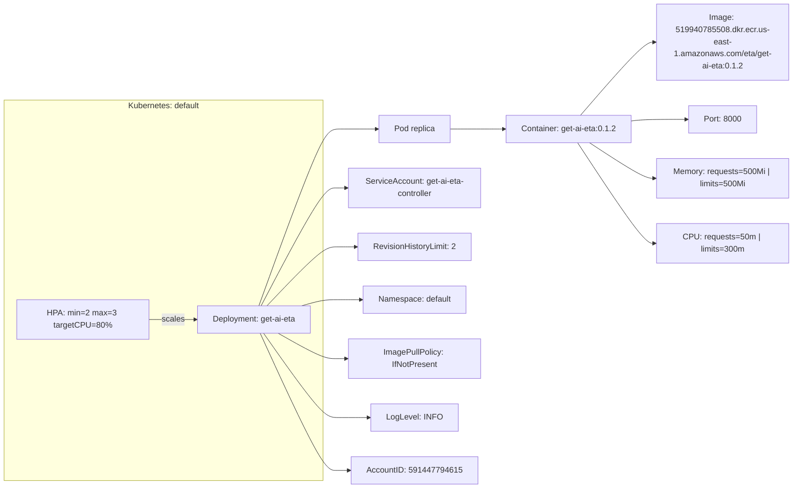
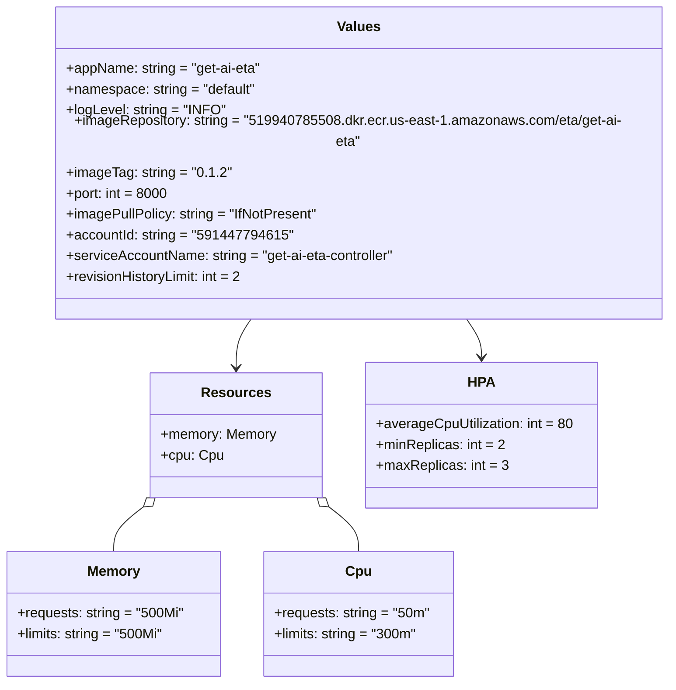

# Diagram: research/api_k8s/get_ai_eta/helm/values.yaml

> Auto-generated by Obscura crawlers

## Diagram 1

### SVG

<svg id="container" width="1560.359375" xmlns="http://www.w3.org/2000/svg" class="flowchart" height="961" viewBox="0 0 1560.359375 961" role="graphics-document document" aria-roledescription="flowchart-v2"><g><marker id="container_flowchart-v2-pointEnd" class="marker flowchart-v2" viewBox="0 0 10 10" refX="5" refY="5" markerUnits="userSpaceOnUse" markerWidth="8" markerHeight="8" orient="auto"><path d="M 0 0 L 10 5 L 0 10 z" class="arrowMarkerPath" style="stroke-width: 1; stroke-dasharray: 1, 0;"></path></marker><marker id="container_flowchart-v2-pointStart" class="marker flowchart-v2" viewBox="0 0 10 10" refX="4.5" refY="5" markerUnits="userSpaceOnUse" markerWidth="8" markerHeight="8" orient="auto"><path d="M 0 5 L 10 10 L 10 0 z" class="arrowMarkerPath" style="stroke-width: 1; stroke-dasharray: 1, 0;"></path></marker><marker id="container_flowchart-v2-circleEnd" class="marker flowchart-v2" viewBox="0 0 10 10" refX="11" refY="5" markerUnits="userSpaceOnUse" markerWidth="11" markerHeight="11" orient="auto"><circle cx="5" cy="5" r="5" class="arrowMarkerPath" style="stroke-width: 1; stroke-dasharray: 1, 0;"></circle></marker><marker id="container_flowchart-v2-circleStart" class="marker flowchart-v2" viewBox="0 0 10 10" refX="-1" refY="5" markerUnits="userSpaceOnUse" markerWidth="11" markerHeight="11" orient="auto"><circle cx="5" cy="5" r="5" class="arrowMarkerPath" style="stroke-width: 1; stroke-dasharray: 1, 0;"></circle></marker><marker id="container_flowchart-v2-crossEnd" class="marker cross flowchart-v2" viewBox="0 0 11 11" refX="12" refY="5.2" markerUnits="userSpaceOnUse" markerWidth="11" markerHeight="11" orient="auto"><path d="M 1,1 l 9,9 M 10,1 l -9,9" class="arrowMarkerPath" style="stroke-width: 2; stroke-dasharray: 1, 0;"></path></marker><marker id="container_flowchart-v2-crossStart" class="marker cross flowchart-v2" viewBox="0 0 11 11" refX="-1" refY="5.2" markerUnits="userSpaceOnUse" markerWidth="11" markerHeight="11" orient="auto"><path d="M 1,1 l 9,9 M 10,1 l -9,9" class="arrowMarkerPath" style="stroke-width: 2; stroke-dasharray: 1, 0;"></path></marker><g class="root"><g class="clusters"><g class="cluster" id="Cluster" data-look="classic"><rect style="" x="8" y="197" width="631.21875" height="749"></rect><g class="cluster-label" transform="translate(252.265625, 197)"><foreignObject width="142.6875" height="24">

Kubernetes: default

</foreignObject></g></g></g><g class="edgePaths"><path d="M510.734,602L532.148,544C553.562,486,596.391,370,621.971,312C647.552,254,655.885,254,673.445,254C691.005,254,717.792,254,731.185,254L744.578,254" id="L_DEPLOY_POD_0" class="edge-thickness-normal edge-pattern-solid edge-thickness-normal edge-pattern-solid flowchart-link" style=";" data-edge="true" data-et="edge" data-id="L_DEPLOY_POD_0" data-points="W3sieCI6NTEwLjczNDI1LCJ5Ijo2MDJ9LHsieCI6NjM5LjIxODc1LCJ5IjoyNTR9LHsieCI6NjY0LjIxODc1LCJ5IjoyNTR9LHsieCI6NzQ4LjU3ODEyNSwieSI6MjU0fV0=" marker-end="url(#container_flowchart-v2-pointEnd)"></path><path d="M889.859,254L903.919,254C917.979,254,946.099,254,963.659,254C981.219,254,988.219,254,991.719,254L995.219,254" id="L_POD_CONTAINER_0" class="edge-thickness-normal edge-pattern-solid edge-thickness-normal edge-pattern-solid flowchart-link" style=";" data-edge="true" data-et="edge" data-id="L_POD_CONTAINER_0" data-points="W3sieCI6ODg5Ljg1OTM3NSwieSI6MjU0fSx7IngiOjk3NC4yMTg3NSwieSI6MjU0fSx7IngiOjk5OS4yMTg3NSwieSI6MjU0fV0=" marker-end="url(#container_flowchart-v2-pointEnd)"></path><path d="M1143.932,227L1164.503,203C1185.074,179,1226.217,131,1250.288,107C1274.359,83,1281.359,83,1284.859,83L1288.359,83" id="L_CONTAINER_IMAGE_0" class="edge-thickness-normal edge-pattern-solid edge-thickness-normal edge-pattern-solid flowchart-link" style=";" data-edge="true" data-et="edge" data-id="L_CONTAINER_IMAGE_0" data-points="W3sieCI6MTE0My45MzE3NDM0MjEwNTI3LCJ5IjoyMjd9LHsieCI6MTI2Ny4zNTkzNzUsInkiOjgzfSx7IngiOjEyOTIuMzU5Mzc1LCJ5Ijo4M31d" marker-end="url(#container_flowchart-v2-pointEnd)"></path><path d="M1242.359,238.241L1246.526,237.701C1250.693,237.161,1259.026,236.08,1277.204,235.54C1295.383,235,1323.406,235,1337.418,235L1351.43,235" id="L_CONTAINER_PORT_0" class="edge-thickness-normal edge-pattern-solid edge-thickness-normal edge-pattern-solid flowchart-link" style=";" data-edge="true" data-et="edge" data-id="L_CONTAINER_PORT_0" data-points="W3sieCI6MTI0Mi4zNTkzNzUsInkiOjIzOC4yNDA3NjU0MTc2MjE2N30seyJ4IjoxMjY3LjM1OTM3NSwieSI6MjM1fSx7IngiOjEzNTUuNDI5Njg3NSwieSI6MjM1fV0=" marker-end="url(#container_flowchart-v2-pointEnd)"></path><path d="M515.199,602L535.869,563.333C556.539,524.667,597.879,447.333,622.715,408.667C647.552,370,655.885,370,663.552,370C671.219,370,678.219,370,681.719,370L685.219,370" id="L_DEPLOY_SA_0" class="edge-thickness-normal edge-pattern-solid edge-thickness-normal edge-pattern-solid flowchart-link" style=";" data-edge="true" data-et="edge" data-id="L_DEPLOY_SA_0" data-points="W3sieCI6NTE1LjE5ODk2MjM1NTIxMjMsInkiOjYwMn0seyJ4Ijo2MzkuMjE4NzUsInkiOjM3MH0seyJ4Ijo2NjQuMjE4NzUsInkiOjM3MH0seyJ4Ijo2ODkuMjE4NzUsInkiOjM3MH1d" marker-end="url(#container_flowchart-v2-pointEnd)"></path><path d="M526.907,602L545.626,582.667C564.344,563.333,601.782,524.667,624.667,505.333C647.552,486,655.885,486,666.424,486C676.964,486,689.708,486,696.081,486L702.453,486" id="L_DEPLOY_RH_0" class="edge-thickness-normal edge-pattern-solid edge-thickness-normal edge-pattern-solid flowchart-link" style=";" data-edge="true" data-et="edge" data-id="L_DEPLOY_RH_0" data-points="W3sieCI6NTI2LjkwNzEyNDEyNTg3NDEsInkiOjYwMn0seyJ4Ijo2MzkuMjE4NzUsInkiOjQ4Nn0seyJ4Ijo2NjQuMjE4NzUsInkiOjQ4Nn0seyJ4Ijo3MDYuNDUzMTI1LCJ5Ijo0ODZ9XQ==" marker-end="url(#container_flowchart-v2-pointEnd)"></path><path d="M596.618,602L603.718,600C610.818,598,625.018,594,636.285,592C647.552,590,655.885,590,668.26,590C680.635,590,697.052,590,705.26,590L713.469,590" id="L_DEPLOY_NS_0" class="edge-thickness-normal edge-pattern-solid edge-thickness-normal edge-pattern-solid flowchart-link" style=";" data-edge="true" data-et="edge" data-id="L_DEPLOY_NS_0" data-points="W3sieCI6NTk2LjYxNzc4ODQ2MTUzODUsInkiOjYwMn0seyJ4Ijo2MzkuMjE4NzUsInkiOjU5MH0seyJ4Ijo2NjQuMjE4NzUsInkiOjU5MH0seyJ4Ijo3MTcuNDY4NzUsInkiOjU5MH1d" marker-end="url(#container_flowchart-v2-pointEnd)"></path><path d="M1161.587,281L1179.216,292.667C1196.844,304.333,1232.102,327.667,1253.231,339.333C1274.359,351,1281.359,351,1284.859,351L1288.359,351" id="L_CONTAINER_MEM_0" class="edge-thickness-normal edge-pattern-solid edge-thickness-normal edge-pattern-solid flowchart-link" style=";" data-edge="true" data-et="edge" data-id="L_CONTAINER_MEM_0" data-points="W3sieCI6MTE2MS41ODY5ODQ1MzYwODI2LCJ5IjoyODF9LHsieCI6MTI2Ny4zNTkzNzUsInkiOjM1MX0seyJ4IjoxMjkyLjM1OTM3NSwieSI6MzUxfV0=" marker-end="url(#container_flowchart-v2-pointEnd)"></path><path d="M1138.378,281L1159.874,314C1181.371,347,1224.365,413,1249.362,446C1274.359,479,1281.359,479,1284.859,479L1288.359,479" id="L_CONTAINER_CPU_0" class="edge-thickness-normal edge-pattern-solid edge-thickness-normal edge-pattern-solid flowchart-link" style=";" data-edge="true" data-et="edge" data-id="L_CONTAINER_CPU_0" data-points="W3sieCI6MTEzOC4zNzc1LCJ5IjoyODF9LHsieCI6MTI2Ny4zNTkzNzUsInkiOjQ3OX0seyJ4IjoxMjkyLjM1OTM3NSwieSI6NDc5fV0=" marker-end="url(#container_flowchart-v2-pointEnd)"></path><path d="M549.314,656L564.298,664.333C579.282,672.667,609.251,689.333,628.401,697.667C647.552,706,655.885,706,663.552,706C671.219,706,678.219,706,681.719,706L685.219,706" id="L_DEPLOY_PULL_0" class="edge-thickness-normal edge-pattern-solid edge-thickness-normal edge-pattern-solid flowchart-link" style=";" data-edge="true" data-et="edge" data-id="L_DEPLOY_PULL_0" data-points="W3sieCI6NTQ5LjMxNDEyMzM3NjYyMzMsInkiOjY1Nn0seyJ4Ijo2MzkuMjE4NzUsInkiOjcwNn0seyJ4Ijo2NjQuMjE4NzUsInkiOjcwNn0seyJ4Ijo2ODkuMjE4NzUsInkiOjcwNn1d" marker-end="url(#container_flowchart-v2-pointEnd)"></path><path d="M520.135,656L539.982,683.667C559.829,711.333,599.524,766.667,623.538,794.333C647.552,822,655.885,822,671.451,822C687.016,822,709.813,822,721.211,822L732.609,822" id="L_DEPLOY_LOG_0" class="edge-thickness-normal edge-pattern-solid edge-thickness-normal edge-pattern-solid flowchart-link" style=";" data-edge="true" data-et="edge" data-id="L_DEPLOY_LOG_0" data-points="W3sieCI6NTIwLjEzNDcxNTAyNTkwNjgsInkiOjY1Nn0seyJ4Ijo2MzkuMjE4NzUsInkiOjgyMn0seyJ4Ijo2NjQuMjE4NzUsInkiOjgyMn0seyJ4Ijo3MzYuNjA5Mzc1LCJ5Ijo4MjJ9XQ==" marker-end="url(#container_flowchart-v2-pointEnd)"></path><path d="M513.352,656L534.33,701C555.308,746,597.263,836,622.408,881C647.552,926,655.885,926,665.758,926C675.63,926,687.042,926,692.747,926L698.453,926" id="L_DEPLOY_ACC_0" class="edge-thickness-normal edge-pattern-solid edge-thickness-normal edge-pattern-solid flowchart-link" style=";" data-edge="true" data-et="edge" data-id="L_DEPLOY_ACC_0" data-points="W3sieCI6NTEzLjM1MjI3MjcyNzI3MjcsInkiOjY1Nn0seyJ4Ijo2MzkuMjE4NzUsInkiOjkyNn0seyJ4Ijo2NjQuMjE4NzUsInkiOjkyNn0seyJ4Ijo3MDIuNDUzMTI1LCJ5Ijo5MjZ9XQ==" marker-end="url(#container_flowchart-v2-pointEnd)"></path><path d="M293,629L300.859,629C308.719,629,324.438,629,339.49,629C354.542,629,368.927,629,376.12,629L383.313,629" id="L_HPA_DEPLOY_0" class="edge-thickness-normal edge-pattern-solid edge-thickness-normal edge-pattern-solid flowchart-link" style=";" data-edge="true" data-et="edge" data-id="L_HPA_DEPLOY_0" data-points="W3sieCI6MjkzLCJ5Ijo2Mjl9LHsieCI6MzQwLjE1NjI1LCJ5Ijo2Mjl9LHsieCI6Mzg3LjMxMjUsInkiOjYyOX1d" marker-end="url(#container_flowchart-v2-pointEnd)"></path></g><g class="edgeLabels"><g class="edgeLabel"><g class="label" data-id="L_DEPLOY_POD_0" transform="translate(0, 0)"><foreignObject width="0" height="0">

</foreignObject></g></g><g class="edgeLabel"><g class="label" data-id="L_POD_CONTAINER_0" transform="translate(0, 0)"><foreignObject width="0" height="0">

</foreignObject></g></g><g class="edgeLabel"><g class="label" data-id="L_CONTAINER_IMAGE_0" transform="translate(0, 0)"><foreignObject width="0" height="0">

</foreignObject></g></g><g class="edgeLabel"><g class="label" data-id="L_CONTAINER_PORT_0" transform="translate(0, 0)"><foreignObject width="0" height="0">

</foreignObject></g></g><g class="edgeLabel"><g class="label" data-id="L_DEPLOY_SA_0" transform="translate(0, 0)"><foreignObject width="0" height="0">

</foreignObject></g></g><g class="edgeLabel"><g class="label" data-id="L_DEPLOY_RH_0" transform="translate(0, 0)"><foreignObject width="0" height="0">

</foreignObject></g></g><g class="edgeLabel"><g class="label" data-id="L_DEPLOY_NS_0" transform="translate(0, 0)"><foreignObject width="0" height="0">

</foreignObject></g></g><g class="edgeLabel"><g class="label" data-id="L_CONTAINER_MEM_0" transform="translate(0, 0)"><foreignObject width="0" height="0">

</foreignObject></g></g><g class="edgeLabel"><g class="label" data-id="L_CONTAINER_CPU_0" transform="translate(0, 0)"><foreignObject width="0" height="0">

</foreignObject></g></g><g class="edgeLabel"><g class="label" data-id="L_DEPLOY_PULL_0" transform="translate(0, 0)"><foreignObject width="0" height="0">

</foreignObject></g></g><g class="edgeLabel"><g class="label" data-id="L_DEPLOY_LOG_0" transform="translate(0, 0)"><foreignObject width="0" height="0">

</foreignObject></g></g><g class="edgeLabel"><g class="label" data-id="L_DEPLOY_ACC_0" transform="translate(0, 0)"><foreignObject width="0" height="0">

</foreignObject></g></g><g class="edgeLabel" transform="translate(340.15625, 629)"><g class="label" data-id="L_HPA_DEPLOY_0" transform="translate(-22.15625, -12)"><foreignObject width="44.3125" height="24">

scales

</foreignObject></g></g></g><g class="nodes"><g class="node default" id="flowchart-DEPLOY-0" transform="translate(500.765625, 629)"><rect class="basic label-container" style="" x="-113.453125" y="-27" width="226.90625" height="54"></rect><g class="label" style="" transform="translate(-83.453125, -12)"><rect></rect><foreignObject width="166.90625" height="24">

Deployment: get-ai-eta

</foreignObject></g></g><g class="node default" id="flowchart-HPA-1" transform="translate(163, 629)"><rect class="basic label-container" style="" x="-130" y="-39" width="260" height="78"></rect><g class="label" style="" transform="translate(-100, -24)"><rect></rect><foreignObject width="200" height="48">

HPA: min=2 max=3 targetCPU=80%

</foreignObject></g></g><g class="node default" id="flowchart-POD-3" transform="translate(819.21875, 254)"><rect class="basic label-container" style="" x="-70.640625" y="-27" width="141.28125" height="54"></rect><g class="label" style="" transform="translate(-40.640625, -12)"><rect></rect><foreignObject width="81.28125" height="24">

Pod replica

</foreignObject></g></g><g class="node default" id="flowchart-CONTAINER-5" transform="translate(1120.7890625, 254)"><rect class="basic label-container" style="" x="-121.5703125" y="-27" width="243.140625" height="54"></rect><g class="label" style="" transform="translate(-91.5703125, -12)"><rect></rect><foreignObject width="183.140625" height="24">

Container: get-ai-eta:0.1.2

</foreignObject></g></g><g class="node default" id="flowchart-IMAGE-7" transform="translate(1422.359375, 83)"><rect class="basic label-container" style="" x="-130" y="-75" width="260" height="150"></rect><g class="label" style="" transform="translate(-100, -60)"><rect></rect><foreignObject width="200" height="120">

Image: 519940785508.dkr.ecr.us-east-1.amazonaws.com/eta/get-ai-eta:0.1.2

</foreignObject></g></g><g class="node default" id="flowchart-PORT-9" transform="translate(1422.359375, 235)"><rect class="basic label-container" style="" x="-66.9296875" y="-27" width="133.859375" height="54"></rect><g class="label" style="" transform="translate(-36.9296875, -12)"><rect></rect><foreignObject width="73.859375" height="24">

Port: 8000

</foreignObject></g></g><g class="node default" id="flowchart-SA-11" transform="translate(819.21875, 370)"><rect class="basic label-container" style="" x="-130" y="-39" width="260" height="78"></rect><g class="label" style="" transform="translate(-100, -24)"><rect></rect><foreignObject width="200" height="48">

ServiceAccount: get-ai-eta-controller

</foreignObject></g></g><g class="node default" id="flowchart-RH-13" transform="translate(819.21875, 486)"><rect class="basic label-container" style="" x="-112.765625" y="-27" width="225.53125" height="54"></rect><g class="label" style="" transform="translate(-82.765625, -12)"><rect></rect><foreignObject width="165.53125" height="24">

RevisionHistoryLimit: 2

</foreignObject></g></g><g class="node default" id="flowchart-NS-15" transform="translate(819.21875, 590)"><rect class="basic label-container" style="" x="-101.75" y="-27" width="203.5" height="54"></rect><g class="label" style="" transform="translate(-71.75, -12)"><rect></rect><foreignObject width="143.5" height="24">

Namespace: default

</foreignObject></g></g><g class="node default" id="flowchart-MEM-17" transform="translate(1422.359375, 351)"><rect class="basic label-container" style="" x="-130" y="-39" width="260" height="78"></rect><g class="label" style="" transform="translate(-100, -24)"><rect></rect><foreignObject width="200" height="48">

Memory: requests=500Mi | limits=500Mi

</foreignObject></g></g><g class="node default" id="flowchart-CPU-19" transform="translate(1422.359375, 479)"><rect class="basic label-container" style="" x="-130" y="-39" width="260" height="78"></rect><g class="label" style="" transform="translate(-100, -24)"><rect></rect><foreignObject width="200" height="48">

CPU: requests=50m | limits=300m

</foreignObject></g></g><g class="node default" id="flowchart-PULL-21" transform="translate(819.21875, 706)"><rect class="basic label-container" style="" x="-130" y="-39" width="260" height="78"></rect><g class="label" style="" transform="translate(-100, -24)"><rect></rect><foreignObject width="200" height="48">

ImagePullPolicy: IfNotPresent

</foreignObject></g></g><g class="node default" id="flowchart-LOG-23" transform="translate(819.21875, 822)"><rect class="basic label-container" style="" x="-82.609375" y="-27" width="165.21875" height="54"></rect><g class="label" style="" transform="translate(-52.609375, -12)"><rect></rect><foreignObject width="105.21875" height="24">

LogLevel: INFO

</foreignObject></g></g><g class="node default" id="flowchart-ACC-25" transform="translate(819.21875, 926)"><rect class="basic label-container" style="" x="-116.765625" y="-27" width="233.53125" height="54"></rect><g class="label" style="" transform="translate(-86.765625, -12)"><rect></rect><foreignObject width="173.53125" height="24">

AccountID: 591447794615

</foreignObject></g></g></g></g></g></svg>

## Diagram 2

### SVG

<svg id="container" width="772.751953125" xmlns="http://www.w3.org/2000/svg" class="classDiagram" height="764" viewBox="0 0 772.751953125 764" role="graphics-document document" aria-roledescription="class"><g><defs><marker id="container_class-aggregationStart" class="marker aggregation class" refX="18" refY="7" markerWidth="190" markerHeight="240" orient="auto"><path d="M 18,7 L9,13 L1,7 L9,1 Z"></path></marker></defs><defs><marker id="container_class-aggregationEnd" class="marker aggregation class" refX="1" refY="7" markerWidth="20" markerHeight="28" orient="auto"><path d="M 18,7 L9,13 L1,7 L9,1 Z"></path></marker></defs><defs><marker id="container_class-extensionStart" class="marker extension class" refX="18" refY="7" markerWidth="190" markerHeight="240" orient="auto"><path d="M 1,7 L18,13 V 1 Z"></path></marker></defs><defs><marker id="container_class-extensionEnd" class="marker extension class" refX="1" refY="7" markerWidth="20" markerHeight="28" orient="auto"><path d="M 1,1 V 13 L18,7 Z"></path></marker></defs><defs><marker id="container_class-compositionStart" class="marker composition class" refX="18" refY="7" markerWidth="190" markerHeight="240" orient="auto"><path d="M 18,7 L9,13 L1,7 L9,1 Z"></path></marker></defs><defs><marker id="container_class-compositionEnd" class="marker composition class" refX="1" refY="7" markerWidth="20" markerHeight="28" orient="auto"><path d="M 18,7 L9,13 L1,7 L9,1 Z"></path></marker></defs><defs><marker id="container_class-dependencyStart" class="marker dependency class" refX="6" refY="7" markerWidth="190" markerHeight="240" orient="auto"><path d="M 5,7 L9,13 L1,7 L9,1 Z"></path></marker></defs><defs><marker id="container_class-dependencyEnd" class="marker dependency class" refX="13" refY="7" markerWidth="20" markerHeight="28" orient="auto"><path d="M 18,7 L9,13 L14,7 L9,1 Z"></path></marker></defs><defs><marker id="container_class-lollipopStart" class="marker lollipop class" refX="13" refY="7" markerWidth="190" markerHeight="240" orient="auto"><circle stroke="black" fill="transparent" cx="7" cy="7" r="6"></circle></marker></defs><defs><marker id="container_class-lollipopEnd" class="marker lollipop class" refX="1" refY="7" markerWidth="190" markerHeight="240" orient="auto"><circle stroke="black" fill="transparent" cx="7" cy="7" r="6"></circle></marker></defs><g class="root"><g class="clusters"></g><g class="edgePaths"><path d="M290.195,344L287.165,348.167C284.136,352.333,278.077,360.667,275.047,370C272.018,379.333,272.018,389.667,272.018,394.833L272.018,400" id="id_Values_Resources_1" class="edge-thickness-normal edge-pattern-solid relation" style=";;;" data-edge="true" data-et="edge" data-id="id_Values_Resources_1" data-points="W3sieCI6MjkwLjE5NDc5NjM4OTI0ODcsInkiOjM0NH0seyJ4IjoyNzIuMDE3NTc4MTI1LCJ5IjozNjl9LHsieCI6MjcyLjAxNzU3ODEyNSwieSI6NDA2fV0=" marker-end="url(#container_class-dependencyEnd)"></path><path d="M534.497,344L537.526,348.167C540.556,352.333,546.615,360.667,549.644,368C552.674,375.333,552.674,381.667,552.674,384.833L552.674,388" id="id_Values_HPA_2" class="edge-thickness-normal edge-pattern-solid relation" style=";;;" data-edge="true" data-et="edge" data-id="id_Values_HPA_2" data-points="W3sieCI6NTM0LjQ5NjYwOTg2MDc1MTMsInkiOjM0NH0seyJ4Ijo1NTIuNjczODI4MTI1LCJ5IjozNjl9LHsieCI6NTUyLjY3MzgyODEyNSwieSI6Mzk0fV0=" marker-end="url(#container_class-dependencyEnd)"></path><path d="M165.223,560.55L159.52,564.958C153.817,569.366,142.41,578.183,136.707,586.758C131.004,595.333,131.004,603.667,131.004,607.833L131.004,612" id="id_Resources_Memory_3" class="edge-thickness-normal edge-pattern-solid relation" style=";;;" data-edge="true" data-et="edge" data-id="id_Resources_Memory_3" data-points="W3sieCI6MTc4Ljg3MDkzMjQ4Mjc5ODE3LCJ5Ijo1NTB9LHsieCI6MTMxLjAwMzkwNjI1LCJ5Ijo1ODd9LHsieCI6MTMxLjAwMzkwNjI1LCJ5Ijo2MTJ9XQ==" marker-start="url(#container_class-aggregationStart)"></path><path d="M378.812,560.55L384.515,564.958C390.219,569.366,401.625,578.183,407.328,586.758C413.031,595.333,413.031,603.667,413.031,607.833L413.031,612" id="id_Resources_Cpu_4" class="edge-thickness-normal edge-pattern-solid relation" style=";;;" data-edge="true" data-et="edge" data-id="id_Resources_Cpu_4" data-points="W3sieCI6MzY1LjE2NDIyMzc2NzIwMTg2LCJ5Ijo1NTB9LHsieCI6NDEzLjAzMTI1LCJ5Ijo1ODd9LHsieCI6NDEzLjAzMTI1LCJ5Ijo2MTJ9XQ==" marker-start="url(#container_class-aggregationStart)"></path></g><g class="edgeLabels"><g class="edgeLabel"><g class="label" data-id="id_Values_Resources_1" transform="translate(0, 0)"><foreignObject width="0" height="0">

</foreignObject></g></g><g class="edgeLabel"><g class="label" data-id="id_Values_HPA_2" transform="translate(0, 0)"><foreignObject width="0" height="0">

</foreignObject></g></g><g class="edgeLabel"><g class="label" data-id="id_Resources_Memory_3" transform="translate(0, 0)"><foreignObject width="0" height="0">

</foreignObject></g></g><g class="edgeLabel"><g class="label" data-id="id_Resources_Cpu_4" transform="translate(0, 0)"><foreignObject width="0" height="0">

</foreignObject></g></g></g><g class="nodes"><g class="node default" id="classId-Values-0" transform="translate(412.345703125, 176)"><g class="basic label-container"><path d="M-352.40625 -168 L352.40625 -168 L352.40625 168 L-352.40625 168" stroke="none" stroke-width="0" fill="#ECECFF" style=""></path><path d="M-352.40625 -168 C-109.29440748799774 -168, 133.8174350240045 -168, 352.40625 -168 M-352.40625 -168 C-159.8960502234594 -168, 32.61414955308118 -168, 352.40625 -168 M352.40625 -168 C352.40625 -63.16253729448967, 352.40625 41.674925411020666, 352.40625 168 M352.40625 -168 C352.40625 -56.73800699394232, 352.40625 54.52398601211536, 352.40625 168 M352.40625 168 C166.7500551124769 168, -18.9061397750462 168, -352.40625 168 M352.40625 168 C73.1059853805454 168, -206.1942792389092 168, -352.40625 168 M-352.40625 168 C-352.40625 59.873075311188686, -352.40625 -48.25384937762263, -352.40625 -168 M-352.40625 168 C-352.40625 90.18824150413569, -352.40625 12.376483008271379, -352.40625 -168" stroke="#9370DB" stroke-width="1.3" fill="none" stroke-dasharray="0 0" style=""></path></g><g class="annotation-group text" transform="translate(0, -144)"></g><g class="label-group text" transform="translate(-23.78125, -144)"><g class="label" style="font-weight: bolder" transform="translate(0,-12)"><foreignObject width="47.5625" height="24">

Values

</foreignObject></g></g><g class="members-group text" transform="translate(-340.40625, -96)"><g class="label" style="" transform="translate(0,-12)"><foreignObject width="227.203125" height="24">

+appName: string = "get-ai-eta"

</foreignObject></g><g class="label" style="" transform="translate(0,12)"><foreignObject width="220.40625" height="24">

+namespace: string = "default"

</foreignObject></g><g class="label" style="" transform="translate(0,36)"><foreignObject width="181.125" height="24">

+logLevel: string = "INFO"

</foreignObject></g><g class="label" style="" transform="translate(0,60)"><foreignObject width="657.03125" height="24">

+imageRepository: string = "519940785508.dkr.ecr.us-east-1.amazonaws.com/eta/get-ai-eta"

</foreignObject></g><g class="label" style="" transform="translate(0,84)"><foreignObject width="184.34375" height="24">

+imageTag: string = "0.1.2"

</foreignObject></g><g class="label" style="" transform="translate(0,108)"><foreignObject width="118.6875" height="24">

+port: int = 8000

</foreignObject></g><g class="label" style="" transform="translate(0,132)"><foreignObject width="291.625" height="24">

+imagePullPolicy: string = "IfNotPresent"

</foreignObject></g><g class="label" style="" transform="translate(0,156)"><foreignObject width="250.46875" height="24">

+accountId: string = "591447794615"

</foreignObject></g><g class="label" style="" transform="translate(0,180)"><foreignObject width="385.734375" height="24">

+serviceAccountName: string = "get-ai-eta-controller"

</foreignObject></g><g class="label" style="" transform="translate(0,204)"><foreignObject width="205.90625" height="24">

+revisionHistoryLimit: int = 2

</foreignObject></g></g><g class="methods-group text" transform="translate(-340.40625, 168)"></g><g class="divider" style=""><path d="M-352.40625 -120 C-201.16300383612395 -120, -49.9197576722479 -120, 352.40625 -120 M-352.40625 -120 C-195.53985045459348 -120, -38.673450909186954 -120, 352.40625 -120" stroke="#9370DB" stroke-width="1.3" fill="none" stroke-dasharray="0 0" style=""></path></g><g class="divider" style=""><path d="M-352.40625 144 C-96.16502949203533 144, 160.07619101592934 144, 352.40625 144 M-352.40625 144 C-138.30118610488523 144, 75.80387779022954 144, 352.40625 144" stroke="#9370DB" stroke-width="1.3" fill="none" stroke-dasharray="0 0" style=""></path></g></g><g class="node default" id="classId-Resources-1" transform="translate(272.017578125, 478)"><g class="basic label-container"><path d="M-97.6015625 -72 L97.6015625 -72 L97.6015625 72 L-97.6015625 72" stroke="none" stroke-width="0" fill="#ECECFF" style=""></path><path d="M-97.6015625 -72 C-27.382241417340992 -72, 42.837079665318015 -72, 97.6015625 -72 M-97.6015625 -72 C-35.336386166624294 -72, 26.928790166751412 -72, 97.6015625 -72 M97.6015625 -72 C97.6015625 -35.10874968329565, 97.6015625 1.7825006334087021, 97.6015625 72 M97.6015625 -72 C97.6015625 -32.28518073443849, 97.6015625 7.429638531123018, 97.6015625 72 M97.6015625 72 C20.344044800937738 72, -56.913472898124525 72, -97.6015625 72 M97.6015625 72 C47.724857820546994 72, -2.151846858906012 72, -97.6015625 72 M-97.6015625 72 C-97.6015625 16.406110477947173, -97.6015625 -39.18777904410565, -97.6015625 -72 M-97.6015625 72 C-97.6015625 16.807295360620856, -97.6015625 -38.38540927875829, -97.6015625 -72" stroke="#9370DB" stroke-width="1.3" fill="none" stroke-dasharray="0 0" style=""></path></g><g class="annotation-group text" transform="translate(0, -48)"></g><g class="label-group text" transform="translate(-37.265625, -48)"><g class="label" style="font-weight: bolder" transform="translate(0,-12)"><foreignObject width="74.53125" height="24">

Resources

</foreignObject></g></g><g class="members-group text" transform="translate(-85.6015625, 0)"><g class="label" style="" transform="translate(0,-12)"><foreignObject width="133.9375" height="24">

+memory: Memory

</foreignObject></g><g class="label" style="" transform="translate(0,12)"><foreignObject width="70.078125" height="24">

+cpu: Cpu

</foreignObject></g></g><g class="methods-group text" transform="translate(-85.6015625, 72)"></g><g class="divider" style=""><path d="M-97.6015625 -24 C-30.89548095165094 -24, 35.81060059669812 -24, 97.6015625 -24 M-97.6015625 -24 C-27.413762168784785 -24, 42.77403816243043 -24, 97.6015625 -24" stroke="#9370DB" stroke-width="1.3" fill="none" stroke-dasharray="0 0" style=""></path></g><g class="divider" style=""><path d="M-97.6015625 48 C-44.618703249928274 48, 8.364156000143453 48, 97.6015625 48 M-97.6015625 48 C-45.725937831523005 48, 6.14968683695399 48, 97.6015625 48" stroke="#9370DB" stroke-width="1.3" fill="none" stroke-dasharray="0 0" style=""></path></g></g><g class="node default" id="classId-Memory-2" transform="translate(131.00390625, 684)"><g class="basic label-container"><path d="M-123.00390625 -72 L123.00390625 -72 L123.00390625 72 L-123.00390625 72" stroke="none" stroke-width="0" fill="#ECECFF" style=""></path><path d="M-123.00390625 -72 C-66.53071432998505 -72, -10.057522409970105 -72, 123.00390625 -72 M-123.00390625 -72 C-52.86230334495268 -72, 17.279299560094643 -72, 123.00390625 -72 M123.00390625 -72 C123.00390625 -41.829331927056145, 123.00390625 -11.658663854112291, 123.00390625 72 M123.00390625 -72 C123.00390625 -30.55168244604822, 123.00390625 10.896635107903563, 123.00390625 72 M123.00390625 72 C56.52751653528101 72, -9.948873179437982 72, -123.00390625 72 M123.00390625 72 C27.99791731404646 72, -67.00807162190708 72, -123.00390625 72 M-123.00390625 72 C-123.00390625 26.110373834794892, -123.00390625 -19.779252330410216, -123.00390625 -72 M-123.00390625 72 C-123.00390625 22.126756072173634, -123.00390625 -27.74648785565273, -123.00390625 -72" stroke="#9370DB" stroke-width="1.3" fill="none" stroke-dasharray="0 0" style=""></path></g><g class="annotation-group text" transform="translate(0, -48)"></g><g class="label-group text" transform="translate(-29.4921875, -48)"><g class="label" style="font-weight: bolder" transform="translate(0,-12)"><foreignObject width="58.984375" height="24">

Memory

</foreignObject></g></g><g class="members-group text" transform="translate(-111.00390625, 0)"><g class="label" style="" transform="translate(0,-12)"><foreignObject width="192.515625" height="24">

+requests: string = "500Mi"

</foreignObject></g><g class="label" style="" transform="translate(0,12)"><foreignObject width="170.453125" height="24">

+limits: string = "500Mi"

</foreignObject></g></g><g class="methods-group text" transform="translate(-111.00390625, 72)"></g><g class="divider" style=""><path d="M-123.00390625 -24 C-32.73101101010309 -24, 57.54188422979382 -24, 123.00390625 -24 M-123.00390625 -24 C-57.833596501960116 -24, 7.336713246079768 -24, 123.00390625 -24" stroke="#9370DB" stroke-width="1.3" fill="none" stroke-dasharray="0 0" style=""></path></g><g class="divider" style=""><path d="M-123.00390625 48 C-69.62298058233344 48, -16.242054914666895 48, 123.00390625 48 M-123.00390625 48 C-70.71901260738875 48, -18.43411896477751 48, 123.00390625 48" stroke="#9370DB" stroke-width="1.3" fill="none" stroke-dasharray="0 0" style=""></path></g></g><g class="node default" id="classId-Cpu-3" transform="translate(413.03125, 684)"><g class="basic label-container"><path d="M-109.0234375 -72 L109.0234375 -72 L109.0234375 72 L-109.0234375 72" stroke="none" stroke-width="0" fill="#ECECFF" style=""></path><path d="M-109.0234375 -72 C-31.30998701022979 -72, 46.40346347954042 -72, 109.0234375 -72 M-109.0234375 -72 C-23.1219495968147 -72, 62.7795383063706 -72, 109.0234375 -72 M109.0234375 -72 C109.0234375 -28.26418185996374, 109.0234375 15.471636280072516, 109.0234375 72 M109.0234375 -72 C109.0234375 -42.739801084200614, 109.0234375 -13.479602168401229, 109.0234375 72 M109.0234375 72 C27.976964823592752 72, -53.069507852814496 72, -109.0234375 72 M109.0234375 72 C53.66827444977934 72, -1.6868886004413213 72, -109.0234375 72 M-109.0234375 72 C-109.0234375 23.536928820559403, -109.0234375 -24.926142358881194, -109.0234375 -72 M-109.0234375 72 C-109.0234375 29.146975865619524, -109.0234375 -13.706048268760952, -109.0234375 -72" stroke="#9370DB" stroke-width="1.3" fill="none" stroke-dasharray="0 0" style=""></path></g><g class="annotation-group text" transform="translate(0, -48)"></g><g class="label-group text" transform="translate(-13.859375, -48)"><g class="label" style="font-weight: bolder" transform="translate(0,-12)"><foreignObject width="27.71875" height="24">

Cpu

</foreignObject></g></g><g class="members-group text" transform="translate(-97.0234375, 0)"><g class="label" style="" transform="translate(0,-12)"><foreignObject width="180.1875" height="24">

+requests: string = "50m"

</foreignObject></g><g class="label" style="" transform="translate(0,12)"><foreignObject width="167.015625" height="24">

+limits: string = "300m"

</foreignObject></g></g><g class="methods-group text" transform="translate(-97.0234375, 72)"></g><g class="divider" style=""><path d="M-109.0234375 -24 C-59.49586469828951 -24, -9.968291896579018 -24, 109.0234375 -24 M-109.0234375 -24 C-61.74677841179886 -24, -14.470119323597714 -24, 109.0234375 -24" stroke="#9370DB" stroke-width="1.3" fill="none" stroke-dasharray="0 0" style=""></path></g><g class="divider" style=""><path d="M-109.0234375 48 C-41.73304423788136 48, 25.557349024237283 48, 109.0234375 48 M-109.0234375 48 C-62.56712298963482 48, -16.110808479269636 48, 109.0234375 48" stroke="#9370DB" stroke-width="1.3" fill="none" stroke-dasharray="0 0" style=""></path></g></g><g class="node default" id="classId-HPA-4" transform="translate(552.673828125, 478)"><g class="basic label-container"><path d="M-133.0546875 -84 L133.0546875 -84 L133.0546875 84 L-133.0546875 84" stroke="none" stroke-width="0" fill="#ECECFF" style=""></path><path d="M-133.0546875 -84 C-45.62939828319402 -84, 41.79589093361196 -84, 133.0546875 -84 M-133.0546875 -84 C-29.598385743219637 -84, 73.85791601356073 -84, 133.0546875 -84 M133.0546875 -84 C133.0546875 -36.7013122225765, 133.0546875 10.597375554847005, 133.0546875 84 M133.0546875 -84 C133.0546875 -18.615104693960987, 133.0546875 46.769790612078026, 133.0546875 84 M133.0546875 84 C30.400640377323597 84, -72.2534067453528 84, -133.0546875 84 M133.0546875 84 C47.54926477290118 84, -37.956157954197636 84, -133.0546875 84 M-133.0546875 84 C-133.0546875 40.71388577766618, -133.0546875 -2.572228444667644, -133.0546875 -84 M-133.0546875 84 C-133.0546875 21.582525064794197, -133.0546875 -40.834949870411606, -133.0546875 -84" stroke="#9370DB" stroke-width="1.3" fill="none" stroke-dasharray="0 0" style=""></path></g><g class="annotation-group text" transform="translate(0, -60)"></g><g class="label-group text" transform="translate(-14.375, -60)"><g class="label" style="font-weight: bolder" transform="translate(0,-12)"><foreignObject width="28.75" height="24">

HPA

</foreignObject></g></g><g class="members-group text" transform="translate(-121.0546875, -12)"><g class="label" style="" transform="translate(0,-12)"><foreignObject width="227.734375" height="24">

+averageCpuUtilization: int = 80

</foreignObject></g><g class="label" style="" transform="translate(0,12)"><foreignObject width="148.109375" height="24">

+minReplicas: int = 2

</foreignObject></g><g class="label" style="" transform="translate(0,36)"><foreignObject width="150.75" height="24">

+maxReplicas: int = 3

</foreignObject></g></g><g class="methods-group text" transform="translate(-121.0546875, 84)"></g><g class="divider" style=""><path d="M-133.0546875 -36 C-28.68592871429381 -36, 75.68283007141238 -36, 133.0546875 -36 M-133.0546875 -36 C-73.52208632643452 -36, -13.989485152869037 -36, 133.0546875 -36" stroke="#9370DB" stroke-width="1.3" fill="none" stroke-dasharray="0 0" style=""></path></g><g class="divider" style=""><path d="M-133.0546875 60 C-33.539201840541025 60, 65.97628381891795 60, 133.0546875 60 M-133.0546875 60 C-28.401583417889526 60, 76.25152066422095 60, 133.0546875 60" stroke="#9370DB" stroke-width="1.3" fill="none" stroke-dasharray="0 0" style=""></path></g></g></g></g></g></svg>
