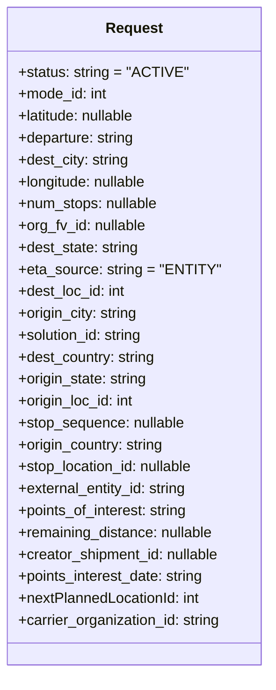
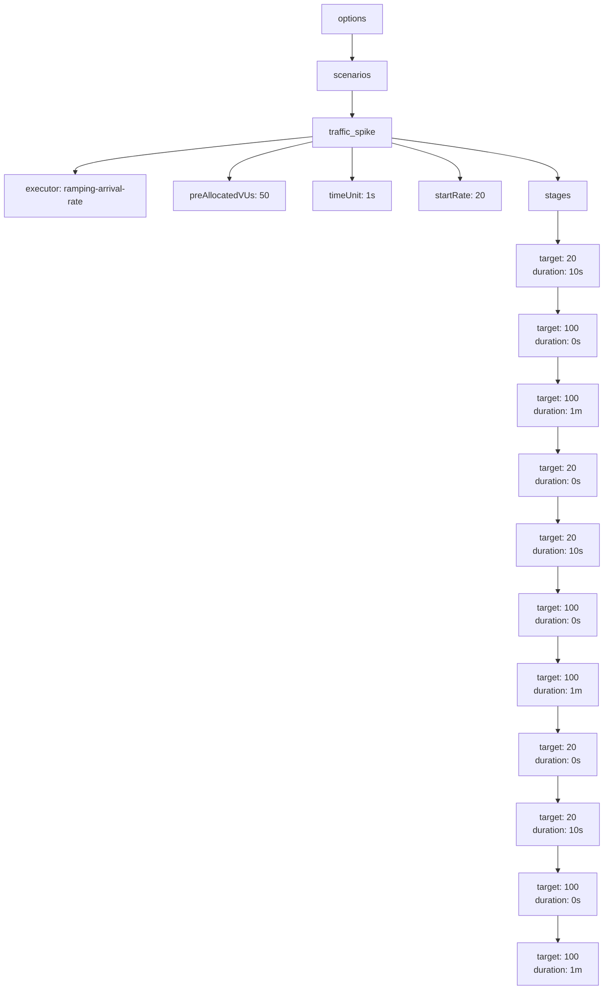
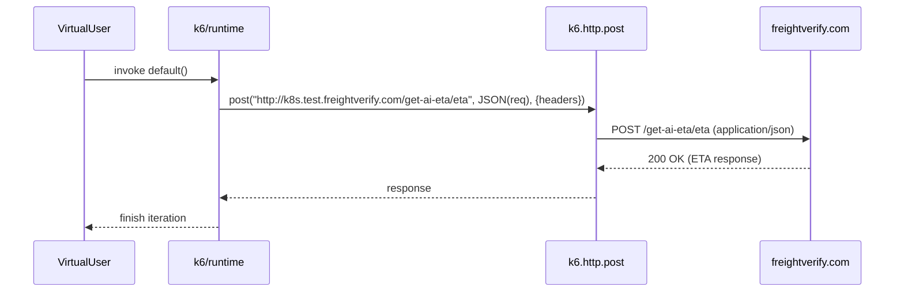

# Diagram: research/api_k8s/get_ai_eta/k6/entity_status.js

> Auto-generated by Obscura crawlers

## Diagram 1

### SVG

<svg id="container" width="295.1171875" xmlns="http://www.w3.org/2000/svg" class="classDiagram" height="736" viewBox="0 0 295.1171875 736" role="graphics-document document" aria-roledescription="class"><g><defs><marker id="container_class-aggregationStart" class="marker aggregation class" refX="18" refY="7" markerWidth="190" markerHeight="240" orient="auto"><path d="M 18,7 L9,13 L1,7 L9,1 Z"></path></marker></defs><defs><marker id="container_class-aggregationEnd" class="marker aggregation class" refX="1" refY="7" markerWidth="20" markerHeight="28" orient="auto"><path d="M 18,7 L9,13 L1,7 L9,1 Z"></path></marker></defs><defs><marker id="container_class-extensionStart" class="marker extension class" refX="18" refY="7" markerWidth="190" markerHeight="240" orient="auto"><path d="M 1,7 L18,13 V 1 Z"></path></marker></defs><defs><marker id="container_class-extensionEnd" class="marker extension class" refX="1" refY="7" markerWidth="20" markerHeight="28" orient="auto"><path d="M 1,1 V 13 L18,7 Z"></path></marker></defs><defs><marker id="container_class-compositionStart" class="marker composition class" refX="18" refY="7" markerWidth="190" markerHeight="240" orient="auto"><path d="M 18,7 L9,13 L1,7 L9,1 Z"></path></marker></defs><defs><marker id="container_class-compositionEnd" class="marker composition class" refX="1" refY="7" markerWidth="20" markerHeight="28" orient="auto"><path d="M 18,7 L9,13 L1,7 L9,1 Z"></path></marker></defs><defs><marker id="container_class-dependencyStart" class="marker dependency class" refX="6" refY="7" markerWidth="190" markerHeight="240" orient="auto"><path d="M 5,7 L9,13 L1,7 L9,1 Z"></path></marker></defs><defs><marker id="container_class-dependencyEnd" class="marker dependency class" refX="13" refY="7" markerWidth="20" markerHeight="28" orient="auto"><path d="M 18,7 L9,13 L14,7 L9,1 Z"></path></marker></defs><defs><marker id="container_class-lollipopStart" class="marker lollipop class" refX="13" refY="7" markerWidth="190" markerHeight="240" orient="auto"><circle stroke="black" fill="transparent" cx="7" cy="7" r="6"></circle></marker></defs><defs><marker id="container_class-lollipopEnd" class="marker lollipop class" refX="1" refY="7" markerWidth="190" markerHeight="240" orient="auto"><circle stroke="black" fill="transparent" cx="7" cy="7" r="6"></circle></marker></defs><g class="root"><g class="clusters"></g><g class="edgePaths"></g><g class="edgeLabels"></g><g class="nodes"><g class="node default" id="classId-Request-0" transform="translate(147.55859375, 368)"><g class="basic label-container"><path d="M-139.55859375 -360 L139.55859375 -360 L139.55859375 360 L-139.55859375 360" stroke="none" stroke-width="0" fill="#ECECFF" style=""></path><path d="M-139.55859375 -360 C-74.2373921640561 -360, -8.916190578112207 -360, 139.55859375 -360 M-139.55859375 -360 C-57.53369782275014 -360, 24.491198104499716 -360, 139.55859375 -360 M139.55859375 -360 C139.55859375 -158.39132821074602, 139.55859375 43.21734357850795, 139.55859375 360 M139.55859375 -360 C139.55859375 -209.88682816368302, 139.55859375 -59.77365632736604, 139.55859375 360 M139.55859375 360 C78.24778041400415 360, 16.93696707800831 360, -139.55859375 360 M139.55859375 360 C65.14745215700414 360, -9.263689435991722 360, -139.55859375 360 M-139.55859375 360 C-139.55859375 113.86119481470402, -139.55859375 -132.27761037059196, -139.55859375 -360 M-139.55859375 360 C-139.55859375 77.16899659594162, -139.55859375 -205.66200680811676, -139.55859375 -360" stroke="#9370DB" stroke-width="1.3" fill="none" stroke-dasharray="0 0" style=""></path></g><g class="annotation-group text" transform="translate(0, -336)"></g><g class="label-group text" transform="translate(-29.9765625, -336)"><g class="label" style="font-weight: bolder" transform="translate(0,-12)"><foreignObject width="59.953125" height="24">

Request

</foreignObject></g></g><g class="members-group text" transform="translate(-127.55859375, -288)"><g class="label" style="" transform="translate(0,-12)"><foreignObject width="179.125" height="24">

+status: string = "ACTIVE"

</foreignObject></g><g class="label" style="" transform="translate(0,12)"><foreignObject width="99.15625" height="24">

+mode_id: int

</foreignObject></g><g class="label" style="" transform="translate(0,36)"><foreignObject width="132.5625" height="24">

+latitude: nullable

</foreignObject></g><g class="label" style="" transform="translate(0,60)"><foreignObject width="129.71875" height="24">

+departure: string

</foreignObject></g><g class="label" style="" transform="translate(0,84)"><foreignObject width="123.03125" height="24">

+dest_city: string

</foreignObject></g><g class="label" style="" transform="translate(0,108)"><foreignObject width="145.125" height="24">

+longitude: nullable

</foreignObject></g><g class="label" style="" transform="translate(0,132)"><foreignObject width="155.640625" height="24">

+num_stops: nullable

</foreignObject></g><g class="label" style="" transform="translate(0,156)"><foreignObject width="142.40625" height="24">

+org_fv_id: nullable

</foreignObject></g><g class="label" style="" transform="translate(0,180)"><foreignObject width="133.65625" height="24">

+dest_state: string

</foreignObject></g><g class="label" style="" transform="translate(0,204)"><foreignObject width="215.9375" height="24">

+eta_source: string = "ENTITY"

</foreignObject></g><g class="label" style="" transform="translate(0,228)"><foreignObject width="119.4375" height="24">

+dest_loc_id: int

</foreignObject></g><g class="label" style="" transform="translate(0,252)"><foreignObject width="133.734375" height="24">

+origin_city: string

</foreignObject></g><g class="label" style="" transform="translate(0,276)"><foreignObject width="139.921875" height="24">

+solution_id: string

</foreignObject></g><g class="label" style="" transform="translate(0,300)"><foreignObject width="152.484375" height="24">

+dest_country: string

</foreignObject></g><g class="label" style="" transform="translate(0,324)"><foreignObject width="144.359375" height="24">

+origin_state: string

</foreignObject></g><g class="label" style="" transform="translate(0,348)"><foreignObject width="130.140625" height="24">

+origin_loc_id: int

</foreignObject></g><g class="label" style="" transform="translate(0,372)"><foreignObject width="184.671875" height="24">

+stop_sequence: nullable

</foreignObject></g><g class="label" style="" transform="translate(0,396)"><foreignObject width="163.1875" height="24">

+origin_country: string

</foreignObject></g><g class="label" style="" transform="translate(0,420)"><foreignObject width="196.84375" height="24">

+stop_location_id: nullable

</foreignObject></g><g class="label" style="" transform="translate(0,444)"><foreignObject width="188.953125" height="24">

+external_entity_id: string

</foreignObject></g><g class="label" style="" transform="translate(0,468)"><foreignObject width="189.78125" height="24">

+points_of_interest: string

</foreignObject></g><g class="label" style="" transform="translate(0,492)"><foreignObject width="217.921875" height="24">

+remaining_distance: nullable

</foreignObject></g><g class="label" style="" transform="translate(0,516)"><foreignObject width="225.140625" height="24">

+creator_shipment_id: nullable

</foreignObject></g><g class="label" style="" transform="translate(0,540)"><foreignObject width="208.03125" height="24">

+points_interest_date: string

</foreignObject></g><g class="label" style="" transform="translate(0,564)"><foreignObject width="203.109375" height="24">

+nextPlannedLocationId: int

</foreignObject></g><g class="label" style="" transform="translate(0,588)"><foreignObject width="225.125" height="24">

+carrier_organization_id: string

</foreignObject></g></g><g class="methods-group text" transform="translate(-127.55859375, 360)"></g><g class="divider" style=""><path d="M-139.55859375 -312 C-75.88952794211352 -312, -12.220462134227034 -312, 139.55859375 -312 M-139.55859375 -312 C-31.675744343047896 -312, 76.20710506390421 -312, 139.55859375 -312" stroke="#9370DB" stroke-width="1.3" fill="none" stroke-dasharray="0 0" style=""></path></g><g class="divider" style=""><path d="M-139.55859375 336 C-64.72974526866464 336, 10.099103212670713 336, 139.55859375 336 M-139.55859375 336 C-51.659869632879094 336, 36.23885448424181 336, 139.55859375 336" stroke="#9370DB" stroke-width="1.3" fill="none" stroke-dasharray="0 0" style=""></path></g></g></g></g></g></svg>

## Diagram 2

### SVG

<svg id="container" width="1106.171875" xmlns="http://www.w3.org/2000/svg" class="flowchart" height="1814" viewBox="0 0 1106.171875 1814" role="graphics-document document" aria-roledescription="flowchart-v2"><g><marker id="container_flowchart-v2-pointEnd" class="marker flowchart-v2" viewBox="0 0 10 10" refX="5" refY="5" markerUnits="userSpaceOnUse" markerWidth="8" markerHeight="8" orient="auto"><path d="M 0 0 L 10 5 L 0 10 z" class="arrowMarkerPath" style="stroke-width: 1; stroke-dasharray: 1, 0;"></path></marker><marker id="container_flowchart-v2-pointStart" class="marker flowchart-v2" viewBox="0 0 10 10" refX="4.5" refY="5" markerUnits="userSpaceOnUse" markerWidth="8" markerHeight="8" orient="auto"><path d="M 0 5 L 10 10 L 10 0 z" class="arrowMarkerPath" style="stroke-width: 1; stroke-dasharray: 1, 0;"></path></marker><marker id="container_flowchart-v2-circleEnd" class="marker flowchart-v2" viewBox="0 0 10 10" refX="11" refY="5" markerUnits="userSpaceOnUse" markerWidth="11" markerHeight="11" orient="auto"><circle cx="5" cy="5" r="5" class="arrowMarkerPath" style="stroke-width: 1; stroke-dasharray: 1, 0;"></circle></marker><marker id="container_flowchart-v2-circleStart" class="marker flowchart-v2" viewBox="0 0 10 10" refX="-1" refY="5" markerUnits="userSpaceOnUse" markerWidth="11" markerHeight="11" orient="auto"><circle cx="5" cy="5" r="5" class="arrowMarkerPath" style="stroke-width: 1; stroke-dasharray: 1, 0;"></circle></marker><marker id="container_flowchart-v2-crossEnd" class="marker cross flowchart-v2" viewBox="0 0 11 11" refX="12" refY="5.2" markerUnits="userSpaceOnUse" markerWidth="11" markerHeight="11" orient="auto"><path d="M 1,1 l 9,9 M 10,1 l -9,9" class="arrowMarkerPath" style="stroke-width: 2; stroke-dasharray: 1, 0;"></path></marker><marker id="container_flowchart-v2-crossStart" class="marker cross flowchart-v2" viewBox="0 0 11 11" refX="-1" refY="5.2" markerUnits="userSpaceOnUse" markerWidth="11" markerHeight="11" orient="auto"><path d="M 1,1 l 9,9 M 10,1 l -9,9" class="arrowMarkerPath" style="stroke-width: 2; stroke-dasharray: 1, 0;"></path></marker><g class="root"><g class="clusters"></g><g class="edgePaths"><path d="M644.422,62L644.422,66.167C644.422,70.333,644.422,78.667,644.422,86.333C644.422,94,644.422,101,644.422,104.5L644.422,108" id="L_Options_Scenarios_0" class="edge-thickness-normal edge-pattern-solid edge-thickness-normal edge-pattern-solid flowchart-link" style=";" data-edge="true" data-et="edge" data-id="L_Options_Scenarios_0" data-points="W3sieCI6NjQ0LjQyMTg3NSwieSI6NjJ9LHsieCI6NjQ0LjQyMTg3NSwieSI6ODd9LHsieCI6NjQ0LjQyMTg3NSwieSI6MTEyfV0=" marker-end="url(#container_flowchart-v2-pointEnd)"></path><path d="M644.422,166L644.422,170.167C644.422,174.333,644.422,182.667,644.422,190.333C644.422,198,644.422,205,644.422,208.5L644.422,212" id="L_Scenarios_Traffic_0" class="edge-thickness-normal edge-pattern-solid edge-thickness-normal edge-pattern-solid flowchart-link" style=";" data-edge="true" data-et="edge" data-id="L_Scenarios_Traffic_0" data-points="W3sieCI6NjQ0LjQyMTg3NSwieSI6MTY2fSx7IngiOjY0NC40MjE4NzUsInkiOjE5MX0seyJ4Ijo2NDQuNDIxODc1LCJ5IjoyMTZ9XQ==" marker-end="url(#container_flowchart-v2-pointEnd)"></path><path d="M569.977,250.644L497.98,258.037C425.984,265.429,281.992,280.215,209.996,291.107C138,302,138,309,138,312.5L138,316" id="L_Traffic_Exec_0" class="edge-thickness-normal edge-pattern-solid edge-thickness-normal edge-pattern-solid flowchart-link" style=";" data-edge="true" data-et="edge" data-id="L_Traffic_Exec_0" data-points="W3sieCI6NTY5Ljk3NjU2MjUsInkiOjI1MC42NDQxMzMxNjQ2NjYzM30seyJ4IjoxMzgsInkiOjI5NX0seyJ4IjoxMzgsInkiOjMyMH1d" marker-end="url(#container_flowchart-v2-pointEnd)"></path><path d="M569.977,260.236L544.952,266.03C519.927,271.824,469.878,283.412,444.853,294.706C419.828,306,419.828,317,419.828,322.5L419.828,328" id="L_Traffic_PreAllocated_0" class="edge-thickness-normal edge-pattern-solid edge-thickness-normal edge-pattern-solid flowchart-link" style=";" data-edge="true" data-et="edge" data-id="L_Traffic_PreAllocated_0" data-points="W3sieCI6NTY5Ljk3NjU2MjUsInkiOjI2MC4yMzYyNTk5MTM3MzMxNH0seyJ4Ijo0MTkuODI4MTI1LCJ5IjoyOTV9LHsieCI6NDE5LjgyODEyNSwieSI6MzMyfV0=" marker-end="url(#container_flowchart-v2-pointEnd)"></path><path d="M644.422,270L644.422,274.167C644.422,278.333,644.422,286.667,644.422,296.333C644.422,306,644.422,317,644.422,322.5L644.422,328" id="L_Traffic_TimeUnit_0" class="edge-thickness-normal edge-pattern-solid edge-thickness-normal edge-pattern-solid flowchart-link" style=";" data-edge="true" data-et="edge" data-id="L_Traffic_TimeUnit_0" data-points="W3sieCI6NjQ0LjQyMTg3NSwieSI6MjcwfSx7IngiOjY0NC40MjE4NzUsInkiOjI5NX0seyJ4Ijo2NDQuNDIxODc1LCJ5IjozMzJ9XQ==" marker-end="url(#container_flowchart-v2-pointEnd)"></path><path d="M718.867,262.515L739.521,267.929C760.174,273.343,801.482,284.172,822.135,295.086C842.789,306,842.789,317,842.789,322.5L842.789,328" id="L_Traffic_StartRate_0" class="edge-thickness-normal edge-pattern-solid edge-thickness-normal edge-pattern-solid flowchart-link" style=";" data-edge="true" data-et="edge" data-id="L_Traffic_StartRate_0" data-points="W3sieCI6NzE4Ljg2NzE4NzUsInkiOjI2Mi41MTUxMDM3NzY5Mjg4fSx7IngiOjg0Mi43ODkwNjI1LCJ5IjoyOTV9LHsieCI6ODQyLjc4OTA2MjUsInkiOjMzMn1d" marker-end="url(#container_flowchart-v2-pointEnd)"></path><path d="M718.867,253.27L769.283,260.225C819.698,267.18,920.529,281.09,970.944,293.545C1021.359,306,1021.359,317,1021.359,322.5L1021.359,328" id="L_Traffic_Stages_0" class="edge-thickness-normal edge-pattern-solid edge-thickness-normal edge-pattern-solid flowchart-link" style=";" data-edge="true" data-et="edge" data-id="L_Traffic_Stages_0" data-points="W3sieCI6NzE4Ljg2NzE4NzUsInkiOjI1My4yNzAwMjE1NTUyOTc2M30seyJ4IjoxMDIxLjM1OTM3NSwieSI6Mjk1fSx7IngiOjEwMjEuMzU5Mzc1LCJ5IjozMzJ9XQ==" marker-end="url(#container_flowchart-v2-pointEnd)"></path><path d="M1021.359,526L1021.359,530.167C1021.359,534.333,1021.359,542.667,1021.359,550.333C1021.359,558,1021.359,565,1021.359,568.5L1021.359,572" id="L_S1_S2_0" class="edge-thickness-normal edge-pattern-solid edge-thickness-normal edge-pattern-solid flowchart-link" style=";" data-edge="true" data-et="edge" data-id="L_S1_S2_0" data-points="W3sieCI6MTAyMS4zNTkzNzUsInkiOjUyNn0seyJ4IjoxMDIxLjM1OTM3NSwieSI6NTUxfSx7IngiOjEwMjEuMzU5Mzc1LCJ5Ijo1NzZ9XQ==" marker-end="url(#container_flowchart-v2-pointEnd)"></path><path d="M1021.359,654L1021.359,658.167C1021.359,662.333,1021.359,670.667,1021.359,678.333C1021.359,686,1021.359,693,1021.359,696.5L1021.359,700" id="L_S2_S3_0" class="edge-thickness-normal edge-pattern-solid edge-thickness-normal edge-pattern-solid flowchart-link" style=";" data-edge="true" data-et="edge" data-id="L_S2_S3_0" data-points="W3sieCI6MTAyMS4zNTkzNzUsInkiOjY1NH0seyJ4IjoxMDIxLjM1OTM3NSwieSI6Njc5fSx7IngiOjEwMjEuMzU5Mzc1LCJ5Ijo3MDR9XQ==" marker-end="url(#container_flowchart-v2-pointEnd)"></path><path d="M1021.359,782L1021.359,786.167C1021.359,790.333,1021.359,798.667,1021.359,806.333C1021.359,814,1021.359,821,1021.359,824.5L1021.359,828" id="L_S3_S4_0" class="edge-thickness-normal edge-pattern-solid edge-thickness-normal edge-pattern-solid flowchart-link" style=";" data-edge="true" data-et="edge" data-id="L_S3_S4_0" data-points="W3sieCI6MTAyMS4zNTkzNzUsInkiOjc4Mn0seyJ4IjoxMDIxLjM1OTM3NSwieSI6ODA3fSx7IngiOjEwMjEuMzU5Mzc1LCJ5Ijo4MzJ9XQ==" marker-end="url(#container_flowchart-v2-pointEnd)"></path><path d="M1021.359,910L1021.359,914.167C1021.359,918.333,1021.359,926.667,1021.359,934.333C1021.359,942,1021.359,949,1021.359,952.5L1021.359,956" id="L_S4_S5_0" class="edge-thickness-normal edge-pattern-solid edge-thickness-normal edge-pattern-solid flowchart-link" style=";" data-edge="true" data-et="edge" data-id="L_S4_S5_0" data-points="W3sieCI6MTAyMS4zNTkzNzUsInkiOjkxMH0seyJ4IjoxMDIxLjM1OTM3NSwieSI6OTM1fSx7IngiOjEwMjEuMzU5Mzc1LCJ5Ijo5NjB9XQ==" marker-end="url(#container_flowchart-v2-pointEnd)"></path><path d="M1021.359,1038L1021.359,1042.167C1021.359,1046.333,1021.359,1054.667,1021.359,1062.333C1021.359,1070,1021.359,1077,1021.359,1080.5L1021.359,1084" id="L_S5_S6_0" class="edge-thickness-normal edge-pattern-solid edge-thickness-normal edge-pattern-solid flowchart-link" style=";" data-edge="true" data-et="edge" data-id="L_S5_S6_0" data-points="W3sieCI6MTAyMS4zNTkzNzUsInkiOjEwMzh9LHsieCI6MTAyMS4zNTkzNzUsInkiOjEwNjN9LHsieCI6MTAyMS4zNTkzNzUsInkiOjEwODh9XQ==" marker-end="url(#container_flowchart-v2-pointEnd)"></path><path d="M1021.359,1166L1021.359,1170.167C1021.359,1174.333,1021.359,1182.667,1021.359,1190.333C1021.359,1198,1021.359,1205,1021.359,1208.5L1021.359,1212" id="L_S6_S7_0" class="edge-thickness-normal edge-pattern-solid edge-thickness-normal edge-pattern-solid flowchart-link" style=";" data-edge="true" data-et="edge" data-id="L_S6_S7_0" data-points="W3sieCI6MTAyMS4zNTkzNzUsInkiOjExNjZ9LHsieCI6MTAyMS4zNTkzNzUsInkiOjExOTF9LHsieCI6MTAyMS4zNTkzNzUsInkiOjEyMTZ9XQ==" marker-end="url(#container_flowchart-v2-pointEnd)"></path><path d="M1021.359,1294L1021.359,1298.167C1021.359,1302.333,1021.359,1310.667,1021.359,1318.333C1021.359,1326,1021.359,1333,1021.359,1336.5L1021.359,1340" id="L_S7_S8_0" class="edge-thickness-normal edge-pattern-solid edge-thickness-normal edge-pattern-solid flowchart-link" style=";" data-edge="true" data-et="edge" data-id="L_S7_S8_0" data-points="W3sieCI6MTAyMS4zNTkzNzUsInkiOjEyOTR9LHsieCI6MTAyMS4zNTkzNzUsInkiOjEzMTl9LHsieCI6MTAyMS4zNTkzNzUsInkiOjEzNDR9XQ==" marker-end="url(#container_flowchart-v2-pointEnd)"></path><path d="M1021.359,1422L1021.359,1426.167C1021.359,1430.333,1021.359,1438.667,1021.359,1446.333C1021.359,1454,1021.359,1461,1021.359,1464.5L1021.359,1468" id="L_S8_S9_0" class="edge-thickness-normal edge-pattern-solid edge-thickness-normal edge-pattern-solid flowchart-link" style=";" data-edge="true" data-et="edge" data-id="L_S8_S9_0" data-points="W3sieCI6MTAyMS4zNTkzNzUsInkiOjE0MjJ9LHsieCI6MTAyMS4zNTkzNzUsInkiOjE0NDd9LHsieCI6MTAyMS4zNTkzNzUsInkiOjE0NzJ9XQ==" marker-end="url(#container_flowchart-v2-pointEnd)"></path><path d="M1021.359,1550L1021.359,1554.167C1021.359,1558.333,1021.359,1566.667,1021.359,1574.333C1021.359,1582,1021.359,1589,1021.359,1592.5L1021.359,1596" id="L_S9_S10_0" class="edge-thickness-normal edge-pattern-solid edge-thickness-normal edge-pattern-solid flowchart-link" style=";" data-edge="true" data-et="edge" data-id="L_S9_S10_0" data-points="W3sieCI6MTAyMS4zNTkzNzUsInkiOjE1NTB9LHsieCI6MTAyMS4zNTkzNzUsInkiOjE1NzV9LHsieCI6MTAyMS4zNTkzNzUsInkiOjE2MDB9XQ==" marker-end="url(#container_flowchart-v2-pointEnd)"></path><path d="M1021.359,1678L1021.359,1682.167C1021.359,1686.333,1021.359,1694.667,1021.359,1702.333C1021.359,1710,1021.359,1717,1021.359,1720.5L1021.359,1724" id="L_S10_S11_0" class="edge-thickness-normal edge-pattern-solid edge-thickness-normal edge-pattern-solid flowchart-link" style=";" data-edge="true" data-et="edge" data-id="L_S10_S11_0" data-points="W3sieCI6MTAyMS4zNTkzNzUsInkiOjE2Nzh9LHsieCI6MTAyMS4zNTkzNzUsInkiOjE3MDN9LHsieCI6MTAyMS4zNTkzNzUsInkiOjE3Mjh9XQ==" marker-end="url(#container_flowchart-v2-pointEnd)"></path><path d="M1021.359,386L1021.359,392.167C1021.359,398.333,1021.359,410.667,1021.359,420.333C1021.359,430,1021.359,437,1021.359,440.5L1021.359,444" id="L_Stages_S1_0" class="edge-thickness-normal edge-pattern-solid edge-thickness-normal edge-pattern-solid flowchart-link" style=";" data-edge="true" data-et="edge" data-id="L_Stages_S1_0" data-points="W3sieCI6MTAyMS4zNTkzNzUsInkiOjM4Nn0seyJ4IjoxMDIxLjM1OTM3NSwieSI6NDIzfSx7IngiOjEwMjEuMzU5Mzc1LCJ5Ijo0NDh9XQ==" marker-end="url(#container_flowchart-v2-pointEnd)"></path></g><g class="edgeLabels"><g class="edgeLabel"><g class="label" data-id="L_Options_Scenarios_0" transform="translate(0, 0)"><foreignObject width="0" height="0">

</foreignObject></g></g><g class="edgeLabel"><g class="label" data-id="L_Scenarios_Traffic_0" transform="translate(0, 0)"><foreignObject width="0" height="0">

</foreignObject></g></g><g class="edgeLabel"><g class="label" data-id="L_Traffic_Exec_0" transform="translate(0, 0)"><foreignObject width="0" height="0">

</foreignObject></g></g><g class="edgeLabel"><g class="label" data-id="L_Traffic_PreAllocated_0" transform="translate(0, 0)"><foreignObject width="0" height="0">

</foreignObject></g></g><g class="edgeLabel"><g class="label" data-id="L_Traffic_TimeUnit_0" transform="translate(0, 0)"><foreignObject width="0" height="0">

</foreignObject></g></g><g class="edgeLabel"><g class="label" data-id="L_Traffic_StartRate_0" transform="translate(0, 0)"><foreignObject width="0" height="0">

</foreignObject></g></g><g class="edgeLabel"><g class="label" data-id="L_Traffic_Stages_0" transform="translate(0, 0)"><foreignObject width="0" height="0">

</foreignObject></g></g><g class="edgeLabel"><g class="label" data-id="L_S1_S2_0" transform="translate(0, 0)"><foreignObject width="0" height="0">

</foreignObject></g></g><g class="edgeLabel"><g class="label" data-id="L_S2_S3_0" transform="translate(0, 0)"><foreignObject width="0" height="0">

</foreignObject></g></g><g class="edgeLabel"><g class="label" data-id="L_S3_S4_0" transform="translate(0, 0)"><foreignObject width="0" height="0">

</foreignObject></g></g><g class="edgeLabel"><g class="label" data-id="L_S4_S5_0" transform="translate(0, 0)"><foreignObject width="0" height="0">

</foreignObject></g></g><g class="edgeLabel"><g class="label" data-id="L_S5_S6_0" transform="translate(0, 0)"><foreignObject width="0" height="0">

</foreignObject></g></g><g class="edgeLabel"><g class="label" data-id="L_S6_S7_0" transform="translate(0, 0)"><foreignObject width="0" height="0">

</foreignObject></g></g><g class="edgeLabel"><g class="label" data-id="L_S7_S8_0" transform="translate(0, 0)"><foreignObject width="0" height="0">

</foreignObject></g></g><g class="edgeLabel"><g class="label" data-id="L_S8_S9_0" transform="translate(0, 0)"><foreignObject width="0" height="0">

</foreignObject></g></g><g class="edgeLabel"><g class="label" data-id="L_S9_S10_0" transform="translate(0, 0)"><foreignObject width="0" height="0">

</foreignObject></g></g><g class="edgeLabel"><g class="label" data-id="L_S10_S11_0" transform="translate(0, 0)"><foreignObject width="0" height="0">

</foreignObject></g></g><g class="edgeLabel"><g class="label" data-id="L_Stages_S1_0" transform="translate(0, 0)"><foreignObject width="0" height="0">

</foreignObject></g></g></g><g class="nodes"><g class="node default" id="flowchart-Options-0" transform="translate(644.421875, 35)"><rect class="basic label-container" style="" x="-57.6640625" y="-27" width="115.328125" height="54"></rect><g class="label" style="" transform="translate(-27.6640625, -12)"><rect></rect><foreignObject width="55.328125" height="24">

options

</foreignObject></g></g><g class="node default" id="flowchart-Scenarios-1" transform="translate(644.421875, 139)"><rect class="basic label-container" style="" x="-64.5546875" y="-27" width="129.109375" height="54"></rect><g class="label" style="" transform="translate(-34.5546875, -12)"><rect></rect><foreignObject width="69.109375" height="24">

scenarios

</foreignObject></g></g><g class="node default" id="flowchart-Traffic-3" transform="translate(644.421875, 243)"><rect class="basic label-container" style="" x="-74.4453125" y="-27" width="148.890625" height="54"></rect><g class="label" style="" transform="translate(-44.4453125, -12)"><rect></rect><foreignObject width="88.890625" height="24">

traffic_spike

</foreignObject></g></g><g class="node default" id="flowchart-Exec-5" transform="translate(138, 359)"><rect class="basic label-container" style="" x="-130" y="-39" width="260" height="78"></rect><g class="label" style="" transform="translate(-100, -24)"><rect></rect><foreignObject width="200" height="48">

executor: ramping-arrival-rate

</foreignObject></g></g><g class="node default" id="flowchart-PreAllocated-7" transform="translate(419.828125, 359)"><rect class="basic label-container" style="" x="-101.828125" y="-27" width="203.65625" height="54"></rect><g class="label" style="" transform="translate(-71.828125, -12)"><rect></rect><foreignObject width="143.65625" height="24">

preAllocatedVUs: 50

</foreignObject></g></g><g class="node default" id="flowchart-TimeUnit-9" transform="translate(644.421875, 359)"><rect class="basic label-container" style="" x="-72.765625" y="-27" width="145.53125" height="54"></rect><g class="label" style="" transform="translate(-42.765625, -12)"><rect></rect><foreignObject width="85.53125" height="24">

timeUnit: 1s

</foreignObject></g></g><g class="node default" id="flowchart-StartRate-11" transform="translate(842.7890625, 359)"><rect class="basic label-container" style="" x="-75.6015625" y="-27" width="151.203125" height="54"></rect><g class="label" style="" transform="translate(-45.6015625, -12)"><rect></rect><foreignObject width="91.203125" height="24">

startRate: 20

</foreignObject></g></g><g class="node default" id="flowchart-Stages-13" transform="translate(1021.359375, 359)"><rect class="basic label-container" style="" x="-52.96875" y="-27" width="105.9375" height="54"></rect><g class="label" style="" transform="translate(-22.96875, -12)"><rect></rect><foreignObject width="45.9375" height="24">

stages

</foreignObject></g></g><g class="node default" id="flowchart-S1-14" transform="translate(1021.359375, 487)"><rect class="basic label-container" style="" x="-76.8125" y="-39" width="153.625" height="78"></rect><g class="label" style="" transform="translate(-46.8125, -24)"><rect></rect><foreignObject width="93.625" height="48">

target: 20 duration: 10s

</foreignObject></g></g><g class="node default" id="flowchart-S2-15" transform="translate(1021.359375, 615)"><rect class="basic label-container" style="" x="-73.3515625" y="-39" width="146.703125" height="78"></rect><g class="label" style="" transform="translate(-43.3515625, -24)"><rect></rect><foreignObject width="86.703125" height="48">

target: 100 duration: 0s

</foreignObject></g></g><g class="node default" id="flowchart-S3-17" transform="translate(1021.359375, 743)"><rect class="basic label-container" style="" x="-75.46875" y="-39" width="150.9375" height="78"></rect><g class="label" style="" transform="translate(-45.46875, -24)"><rect></rect><foreignObject width="90.9375" height="48">

target: 100 duration: 1m

</foreignObject></g></g><g class="node default" id="flowchart-S4-19" transform="translate(1021.359375, 871)"><rect class="basic label-container" style="" x="-73.3515625" y="-39" width="146.703125" height="78"></rect><g class="label" style="" transform="translate(-43.3515625, -24)"><rect></rect><foreignObject width="86.703125" height="48">

target: 20 duration: 0s

</foreignObject></g></g><g class="node default" id="flowchart-S5-21" transform="translate(1021.359375, 999)"><rect class="basic label-container" style="" x="-76.8125" y="-39" width="153.625" height="78"></rect><g class="label" style="" transform="translate(-46.8125, -24)"><rect></rect><foreignObject width="93.625" height="48">

target: 20 duration: 10s

</foreignObject></g></g><g class="node default" id="flowchart-S6-23" transform="translate(1021.359375, 1127)"><rect class="basic label-container" style="" x="-73.3515625" y="-39" width="146.703125" height="78"></rect><g class="label" style="" transform="translate(-43.3515625, -24)"><rect></rect><foreignObject width="86.703125" height="48">

target: 100 duration: 0s

</foreignObject></g></g><g class="node default" id="flowchart-S7-25" transform="translate(1021.359375, 1255)"><rect class="basic label-container" style="" x="-75.46875" y="-39" width="150.9375" height="78"></rect><g class="label" style="" transform="translate(-45.46875, -24)"><rect></rect><foreignObject width="90.9375" height="48">

target: 100 duration: 1m

</foreignObject></g></g><g class="node default" id="flowchart-S8-27" transform="translate(1021.359375, 1383)"><rect class="basic label-container" style="" x="-73.3515625" y="-39" width="146.703125" height="78"></rect><g class="label" style="" transform="translate(-43.3515625, -24)"><rect></rect><foreignObject width="86.703125" height="48">

target: 20 duration: 0s

</foreignObject></g></g><g class="node default" id="flowchart-S9-29" transform="translate(1021.359375, 1511)"><rect class="basic label-container" style="" x="-76.8125" y="-39" width="153.625" height="78"></rect><g class="label" style="" transform="translate(-46.8125, -24)"><rect></rect><foreignObject width="93.625" height="48">

target: 20 duration: 10s

</foreignObject></g></g><g class="node default" id="flowchart-S10-31" transform="translate(1021.359375, 1639)"><rect class="basic label-container" style="" x="-73.3515625" y="-39" width="146.703125" height="78"></rect><g class="label" style="" transform="translate(-43.3515625, -24)"><rect></rect><foreignObject width="86.703125" height="48">

target: 100 duration: 0s

</foreignObject></g></g><g class="node default" id="flowchart-S11-33" transform="translate(1021.359375, 1767)"><rect class="basic label-container" style="" x="-75.46875" y="-39" width="150.9375" height="78"></rect><g class="label" style="" transform="translate(-45.46875, -24)"><rect></rect><foreignObject width="90.9375" height="48">

target: 100 duration: 1m

</foreignObject></g></g></g></g></g></svg>

## Diagram 3

### SVG

<svg id="container" width="1423" xmlns="http://www.w3.org/2000/svg" height="459" viewBox="-50 -10 1423 459" role="graphics-document document" aria-roledescription="sequence"><g><rect x="1173" y="373" fill="#eaeaea" stroke="#666" width="150" height="65" name="Server" rx="3" ry="3" class="actor actor-bottom"></rect><text x="1248" y="405.5" dominant-baseline="central" alignment-baseline="central" class="actor actor-box" style="text-anchor: middle; font-size: 16px; font-weight: 400;"><tspan x="1248" dy="0">freightverify.com</tspan></text></g><g><rect x="817" y="373" fill="#eaeaea" stroke="#666" width="150" height="65" name="HTTP" rx="3" ry="3" class="actor actor-bottom"></rect><text x="892" y="405.5" dominant-baseline="central" alignment-baseline="central" class="actor actor-box" style="text-anchor: middle; font-size: 16px; font-weight: 400;"><tspan x="892" dy="0">k6.http.post</tspan></text></g><g><rect x="200" y="373" fill="#eaeaea" stroke="#666" width="150" height="65" name="K6" rx="3" ry="3" class="actor actor-bottom"></rect><text x="275" y="405.5" dominant-baseline="central" alignment-baseline="central" class="actor actor-box" style="text-anchor: middle; font-size: 16px; font-weight: 400;"><tspan x="275" dy="0">k6/runtime</tspan></text></g><g><rect x="0" y="373" fill="#eaeaea" stroke="#666" width="150" height="65" name="VU" rx="3" ry="3" class="actor actor-bottom"></rect><text x="75" y="405.5" dominant-baseline="central" alignment-baseline="central" class="actor actor-box" style="text-anchor: middle; font-size: 16px; font-weight: 400;"><tspan x="75" dy="0">VirtualUser</tspan></text></g><g><line id="actor3" x1="1248" y1="65" x2="1248" y2="373" class="actor-line 200" stroke-width="0.5px" stroke="#999" name="Server"></line><g id="root-3"><rect x="1173" y="0" fill="#eaeaea" stroke="#666" width="150" height="65" name="Server" rx="3" ry="3" class="actor actor-top"></rect><text x="1248" y="32.5" dominant-baseline="central" alignment-baseline="central" class="actor actor-box" style="text-anchor: middle; font-size: 16px; font-weight: 400;"><tspan x="1248" dy="0">freightverify.com</tspan></text></g></g><g><line id="actor2" x1="892" y1="65" x2="892" y2="373" class="actor-line 200" stroke-width="0.5px" stroke="#999" name="HTTP"></line><g id="root-2"><rect x="817" y="0" fill="#eaeaea" stroke="#666" width="150" height="65" name="HTTP" rx="3" ry="3" class="actor actor-top"></rect><text x="892" y="32.5" dominant-baseline="central" alignment-baseline="central" class="actor actor-box" style="text-anchor: middle; font-size: 16px; font-weight: 400;"><tspan x="892" dy="0">k6.http.post</tspan></text></g></g><g><line id="actor1" x1="275" y1="65" x2="275" y2="373" class="actor-line 200" stroke-width="0.5px" stroke="#999" name="K6"></line><g id="root-1"><rect x="200" y="0" fill="#eaeaea" stroke="#666" width="150" height="65" name="K6" rx="3" ry="3" class="actor actor-top"></rect><text x="275" y="32.5" dominant-baseline="central" alignment-baseline="central" class="actor actor-box" style="text-anchor: middle; font-size: 16px; font-weight: 400;"><tspan x="275" dy="0">k6/runtime</tspan></text></g></g><g><line id="actor0" x1="75" y1="65" x2="75" y2="373" class="actor-line 200" stroke-width="0.5px" stroke="#999" name="VU"></line><g id="root-0"><rect x="0" y="0" fill="#eaeaea" stroke="#666" width="150" height="65" name="VU" rx="3" ry="3" class="actor actor-top"></rect><text x="75" y="32.5" dominant-baseline="central" alignment-baseline="central" class="actor actor-box" style="text-anchor: middle; font-size: 16px; font-weight: 400;"><tspan x="75" dy="0">VirtualUser</tspan></text></g></g><g></g><defs><symbol id="computer" width="24" height="24"><path transform="scale(.5)" d="M2 2v13h20v-13h-20zm18 11h-16v-9h16v9zm-10.228 6l.466-1h3.524l.467 1h-4.457zm14.228 3h-24l2-6h2.104l-1.33 4h18.45l-1.297-4h2.073l2 6zm-5-10h-14v-7h14v7z"></path></symbol></defs><defs><symbol id="database" fill-rule="evenodd" clip-rule="evenodd"><path transform="scale(.5)" d="M12.258.001l.256.004.255.005.253.008.251.01.249.012.247.015.246.016.242.019.241.02.239.023.236.024.233.027.231.028.229.031.225.032.223.034.22.036.217.038.214.04.211.041.208.043.205.045.201.046.198.048.194.05.191.051.187.053.183.054.18.056.175.057.172.059.168.06.163.061.16.063.155.064.15.066.074.033.073.033.071.034.07.034.069.035.068.035.067.035.066.035.064.036.064.036.062.036.06.036.06.037.058.037.058.037.055.038.055.038.053.038.052.038.051.039.05.039.048.039.047.039.045.04.044.04.043.04.041.04.04.041.039.041.037.041.036.041.034.041.033.042.032.042.03.042.029.042.027.042.026.043.024.043.023.043.021.043.02.043.018.044.017.043.015.044.013.044.012.044.011.045.009.044.007.045.006.045.004.045.002.045.001.045v17l-.001.045-.002.045-.004.045-.006.045-.007.045-.009.044-.011.045-.012.044-.013.044-.015.044-.017.043-.018.044-.02.043-.021.043-.023.043-.024.043-.026.043-.027.042-.029.042-.03.042-.032.042-.033.042-.034.041-.036.041-.037.041-.039.041-.04.041-.041.04-.043.04-.044.04-.045.04-.047.039-.048.039-.05.039-.051.039-.052.038-.053.038-.055.038-.055.038-.058.037-.058.037-.06.037-.06.036-.062.036-.064.036-.064.036-.066.035-.067.035-.068.035-.069.035-.07.034-.071.034-.073.033-.074.033-.15.066-.155.064-.16.063-.163.061-.168.06-.172.059-.175.057-.18.056-.183.054-.187.053-.191.051-.194.05-.198.048-.201.046-.205.045-.208.043-.211.041-.214.04-.217.038-.22.036-.223.034-.225.032-.229.031-.231.028-.233.027-.236.024-.239.023-.241.02-.242.019-.246.016-.247.015-.249.012-.251.01-.253.008-.255.005-.256.004-.258.001-.258-.001-.256-.004-.255-.005-.253-.008-.251-.01-.249-.012-.247-.015-.245-.016-.243-.019-.241-.02-.238-.023-.236-.024-.234-.027-.231-.028-.228-.031-.226-.032-.223-.034-.22-.036-.217-.038-.214-.04-.211-.041-.208-.043-.204-.045-.201-.046-.198-.048-.195-.05-.19-.051-.187-.053-.184-.054-.179-.056-.176-.057-.172-.059-.167-.06-.164-.061-.159-.063-.155-.064-.151-.066-.074-.033-.072-.033-.072-.034-.07-.034-.069-.035-.068-.035-.067-.035-.066-.035-.064-.036-.063-.036-.062-.036-.061-.036-.06-.037-.058-.037-.057-.037-.056-.038-.055-.038-.053-.038-.052-.038-.051-.039-.049-.039-.049-.039-.046-.039-.046-.04-.044-.04-.043-.04-.041-.04-.04-.041-.039-.041-.037-.041-.036-.041-.034-.041-.033-.042-.032-.042-.03-.042-.029-.042-.027-.042-.026-.043-.024-.043-.023-.043-.021-.043-.02-.043-.018-.044-.017-.043-.015-.044-.013-.044-.012-.044-.011-.045-.009-.044-.007-.045-.006-.045-.004-.045-.002-.045-.001-.045v-17l.001-.045.002-.045.004-.045.006-.045.007-.045.009-.044.011-.045.012-.044.013-.044.015-.044.017-.043.018-.044.02-.043.021-.043.023-.043.024-.043.026-.043.027-.042.029-.042.03-.042.032-.042.033-.042.034-.041.036-.041.037-.041.039-.041.04-.041.041-.04.043-.04.044-.04.046-.04.046-.039.049-.039.049-.039.051-.039.052-.038.053-.038.055-.038.056-.038.057-.037.058-.037.06-.037.061-.036.062-.036.063-.036.064-.036.066-.035.067-.035.068-.035.069-.035.07-.034.072-.034.072-.033.074-.033.151-.066.155-.064.159-.063.164-.061.167-.06.172-.059.176-.057.179-.056.184-.054.187-.053.19-.051.195-.05.198-.048.201-.046.204-.045.208-.043.211-.041.214-.04.217-.038.22-.036.223-.034.226-.032.228-.031.231-.028.234-.027.236-.024.238-.023.241-.02.243-.019.245-.016.247-.015.249-.012.251-.01.253-.008.255-.005.256-.004.258-.001.258.001zm-9.258 20.499v.01l.001.021.003.021.004.022.005.021.006.022.007.022.009.023.01.022.011.023.012.023.013.023.015.023.016.024.017.023.018.024.019.024.021.024.022.025.023.024.024.025.052.049.056.05.061.051.066.051.07.051.075.051.079.052.084.052.088.052.092.052.097.052.102.051.105.052.11.052.114.051.119.051.123.051.127.05.131.05.135.05.139.048.144.049.147.047.152.047.155.047.16.045.163.045.167.043.171.043.176.041.178.041.183.039.187.039.19.037.194.035.197.035.202.033.204.031.209.03.212.029.216.027.219.025.222.024.226.021.23.02.233.018.236.016.24.015.243.012.246.01.249.008.253.005.256.004.259.001.26-.001.257-.004.254-.005.25-.008.247-.011.244-.012.241-.014.237-.016.233-.018.231-.021.226-.021.224-.024.22-.026.216-.027.212-.028.21-.031.205-.031.202-.034.198-.034.194-.036.191-.037.187-.039.183-.04.179-.04.175-.042.172-.043.168-.044.163-.045.16-.046.155-.046.152-.047.148-.048.143-.049.139-.049.136-.05.131-.05.126-.05.123-.051.118-.052.114-.051.11-.052.106-.052.101-.052.096-.052.092-.052.088-.053.083-.051.079-.052.074-.052.07-.051.065-.051.06-.051.056-.05.051-.05.023-.024.023-.025.021-.024.02-.024.019-.024.018-.024.017-.024.015-.023.014-.024.013-.023.012-.023.01-.023.01-.022.008-.022.006-.022.006-.022.004-.022.004-.021.001-.021.001-.021v-4.127l-.077.055-.08.053-.083.054-.085.053-.087.052-.09.052-.093.051-.095.05-.097.05-.1.049-.102.049-.105.048-.106.047-.109.047-.111.046-.114.045-.115.045-.118.044-.12.043-.122.042-.124.042-.126.041-.128.04-.13.04-.132.038-.134.038-.135.037-.138.037-.139.035-.142.035-.143.034-.144.033-.147.032-.148.031-.15.03-.151.03-.153.029-.154.027-.156.027-.158.026-.159.025-.161.024-.162.023-.163.022-.165.021-.166.02-.167.019-.169.018-.169.017-.171.016-.173.015-.173.014-.175.013-.175.012-.177.011-.178.01-.179.008-.179.008-.181.006-.182.005-.182.004-.184.003-.184.002h-.37l-.184-.002-.184-.003-.182-.004-.182-.005-.181-.006-.179-.008-.179-.008-.178-.01-.176-.011-.176-.012-.175-.013-.173-.014-.172-.015-.171-.016-.17-.017-.169-.018-.167-.019-.166-.02-.165-.021-.163-.022-.162-.023-.161-.024-.159-.025-.157-.026-.156-.027-.155-.027-.153-.029-.151-.03-.15-.03-.148-.031-.146-.032-.145-.033-.143-.034-.141-.035-.14-.035-.137-.037-.136-.037-.134-.038-.132-.038-.13-.04-.128-.04-.126-.041-.124-.042-.122-.042-.12-.044-.117-.043-.116-.045-.113-.045-.112-.046-.109-.047-.106-.047-.105-.048-.102-.049-.1-.049-.097-.05-.095-.05-.093-.052-.09-.051-.087-.052-.085-.053-.083-.054-.08-.054-.077-.054v4.127zm0-5.654v.011l.001.021.003.021.004.021.005.022.006.022.007.022.009.022.01.022.011.023.012.023.013.023.015.024.016.023.017.024.018.024.019.024.021.024.022.024.023.025.024.024.052.05.056.05.061.05.066.051.07.051.075.052.079.051.084.052.088.052.092.052.097.052.102.052.105.052.11.051.114.051.119.052.123.05.127.051.131.05.135.049.139.049.144.048.147.048.152.047.155.046.16.045.163.045.167.044.171.042.176.042.178.04.183.04.187.038.19.037.194.036.197.034.202.033.204.032.209.03.212.028.216.027.219.025.222.024.226.022.23.02.233.018.236.016.24.014.243.012.246.01.249.008.253.006.256.003.259.001.26-.001.257-.003.254-.006.25-.008.247-.01.244-.012.241-.015.237-.016.233-.018.231-.02.226-.022.224-.024.22-.025.216-.027.212-.029.21-.03.205-.032.202-.033.198-.035.194-.036.191-.037.187-.039.183-.039.179-.041.175-.042.172-.043.168-.044.163-.045.16-.045.155-.047.152-.047.148-.048.143-.048.139-.05.136-.049.131-.05.126-.051.123-.051.118-.051.114-.052.11-.052.106-.052.101-.052.096-.052.092-.052.088-.052.083-.052.079-.052.074-.051.07-.052.065-.051.06-.05.056-.051.051-.049.023-.025.023-.024.021-.025.02-.024.019-.024.018-.024.017-.024.015-.023.014-.023.013-.024.012-.022.01-.023.01-.023.008-.022.006-.022.006-.022.004-.021.004-.022.001-.021.001-.021v-4.139l-.077.054-.08.054-.083.054-.085.052-.087.053-.09.051-.093.051-.095.051-.097.05-.1.049-.102.049-.105.048-.106.047-.109.047-.111.046-.114.045-.115.044-.118.044-.12.044-.122.042-.124.042-.126.041-.128.04-.13.039-.132.039-.134.038-.135.037-.138.036-.139.036-.142.035-.143.033-.144.033-.147.033-.148.031-.15.03-.151.03-.153.028-.154.028-.156.027-.158.026-.159.025-.161.024-.162.023-.163.022-.165.021-.166.02-.167.019-.169.018-.169.017-.171.016-.173.015-.173.014-.175.013-.175.012-.177.011-.178.009-.179.009-.179.007-.181.007-.182.005-.182.004-.184.003-.184.002h-.37l-.184-.002-.184-.003-.182-.004-.182-.005-.181-.007-.179-.007-.179-.009-.178-.009-.176-.011-.176-.012-.175-.013-.173-.014-.172-.015-.171-.016-.17-.017-.169-.018-.167-.019-.166-.02-.165-.021-.163-.022-.162-.023-.161-.024-.159-.025-.157-.026-.156-.027-.155-.028-.153-.028-.151-.03-.15-.03-.148-.031-.146-.033-.145-.033-.143-.033-.141-.035-.14-.036-.137-.036-.136-.037-.134-.038-.132-.039-.13-.039-.128-.04-.126-.041-.124-.042-.122-.043-.12-.043-.117-.044-.116-.044-.113-.046-.112-.046-.109-.046-.106-.047-.105-.048-.102-.049-.1-.049-.097-.05-.095-.051-.093-.051-.09-.051-.087-.053-.085-.052-.083-.054-.08-.054-.077-.054v4.139zm0-5.666v.011l.001.02.003.022.004.021.005.022.006.021.007.022.009.023.01.022.011.023.012.023.013.023.015.023.016.024.017.024.018.023.019.024.021.025.022.024.023.024.024.025.052.05.056.05.061.05.066.051.07.051.075.052.079.051.084.052.088.052.092.052.097.052.102.052.105.051.11.052.114.051.119.051.123.051.127.05.131.05.135.05.139.049.144.048.147.048.152.047.155.046.16.045.163.045.167.043.171.043.176.042.178.04.183.04.187.038.19.037.194.036.197.034.202.033.204.032.209.03.212.028.216.027.219.025.222.024.226.021.23.02.233.018.236.017.24.014.243.012.246.01.249.008.253.006.256.003.259.001.26-.001.257-.003.254-.006.25-.008.247-.01.244-.013.241-.014.237-.016.233-.018.231-.02.226-.022.224-.024.22-.025.216-.027.212-.029.21-.03.205-.032.202-.033.198-.035.194-.036.191-.037.187-.039.183-.039.179-.041.175-.042.172-.043.168-.044.163-.045.16-.045.155-.047.152-.047.148-.048.143-.049.139-.049.136-.049.131-.051.126-.05.123-.051.118-.052.114-.051.11-.052.106-.052.101-.052.096-.052.092-.052.088-.052.083-.052.079-.052.074-.052.07-.051.065-.051.06-.051.056-.05.051-.049.023-.025.023-.025.021-.024.02-.024.019-.024.018-.024.017-.024.015-.023.014-.024.013-.023.012-.023.01-.022.01-.023.008-.022.006-.022.006-.022.004-.022.004-.021.001-.021.001-.021v-4.153l-.077.054-.08.054-.083.053-.085.053-.087.053-.09.051-.093.051-.095.051-.097.05-.1.049-.102.048-.105.048-.106.048-.109.046-.111.046-.114.046-.115.044-.118.044-.12.043-.122.043-.124.042-.126.041-.128.04-.13.039-.132.039-.134.038-.135.037-.138.036-.139.036-.142.034-.143.034-.144.033-.147.032-.148.032-.15.03-.151.03-.153.028-.154.028-.156.027-.158.026-.159.024-.161.024-.162.023-.163.023-.165.021-.166.02-.167.019-.169.018-.169.017-.171.016-.173.015-.173.014-.175.013-.175.012-.177.01-.178.01-.179.009-.179.007-.181.006-.182.006-.182.004-.184.003-.184.001-.185.001-.185-.001-.184-.001-.184-.003-.182-.004-.182-.006-.181-.006-.179-.007-.179-.009-.178-.01-.176-.01-.176-.012-.175-.013-.173-.014-.172-.015-.171-.016-.17-.017-.169-.018-.167-.019-.166-.02-.165-.021-.163-.023-.162-.023-.161-.024-.159-.024-.157-.026-.156-.027-.155-.028-.153-.028-.151-.03-.15-.03-.148-.032-.146-.032-.145-.033-.143-.034-.141-.034-.14-.036-.137-.036-.136-.037-.134-.038-.132-.039-.13-.039-.128-.041-.126-.041-.124-.041-.122-.043-.12-.043-.117-.044-.116-.044-.113-.046-.112-.046-.109-.046-.106-.048-.105-.048-.102-.048-.1-.05-.097-.049-.095-.051-.093-.051-.09-.052-.087-.052-.085-.053-.083-.053-.08-.054-.077-.054v4.153zm8.74-8.179l-.257.004-.254.005-.25.008-.247.011-.244.012-.241.014-.237.016-.233.018-.231.021-.226.022-.224.023-.22.026-.216.027-.212.028-.21.031-.205.032-.202.033-.198.034-.194.036-.191.038-.187.038-.183.04-.179.041-.175.042-.172.043-.168.043-.163.045-.16.046-.155.046-.152.048-.148.048-.143.048-.139.049-.136.05-.131.05-.126.051-.123.051-.118.051-.114.052-.11.052-.106.052-.101.052-.096.052-.092.052-.088.052-.083.052-.079.052-.074.051-.07.052-.065.051-.06.05-.056.05-.051.05-.023.025-.023.024-.021.024-.02.025-.019.024-.018.024-.017.023-.015.024-.014.023-.013.023-.012.023-.01.023-.01.022-.008.022-.006.023-.006.021-.004.022-.004.021-.001.021-.001.021.001.021.001.021.004.021.004.022.006.021.006.023.008.022.01.022.01.023.012.023.013.023.014.023.015.024.017.023.018.024.019.024.02.025.021.024.023.024.023.025.051.05.056.05.06.05.065.051.07.052.074.051.079.052.083.052.088.052.092.052.096.052.101.052.106.052.11.052.114.052.118.051.123.051.126.051.131.05.136.05.139.049.143.048.148.048.152.048.155.046.16.046.163.045.168.043.172.043.175.042.179.041.183.04.187.038.191.038.194.036.198.034.202.033.205.032.21.031.212.028.216.027.22.026.224.023.226.022.231.021.233.018.237.016.241.014.244.012.247.011.25.008.254.005.257.004.26.001.26-.001.257-.004.254-.005.25-.008.247-.011.244-.012.241-.014.237-.016.233-.018.231-.021.226-.022.224-.023.22-.026.216-.027.212-.028.21-.031.205-.032.202-.033.198-.034.194-.036.191-.038.187-.038.183-.04.179-.041.175-.042.172-.043.168-.043.163-.045.16-.046.155-.046.152-.048.148-.048.143-.048.139-.049.136-.05.131-.05.126-.051.123-.051.118-.051.114-.052.11-.052.106-.052.101-.052.096-.052.092-.052.088-.052.083-.052.079-.052.074-.051.07-.052.065-.051.06-.05.056-.05.051-.05.023-.025.023-.024.021-.024.02-.025.019-.024.018-.024.017-.023.015-.024.014-.023.013-.023.012-.023.01-.023.01-.022.008-.022.006-.023.006-.021.004-.022.004-.021.001-.021.001-.021-.001-.021-.001-.021-.004-.021-.004-.022-.006-.021-.006-.023-.008-.022-.01-.022-.01-.023-.012-.023-.013-.023-.014-.023-.015-.024-.017-.023-.018-.024-.019-.024-.02-.025-.021-.024-.023-.024-.023-.025-.051-.05-.056-.05-.06-.05-.065-.051-.07-.052-.074-.051-.079-.052-.083-.052-.088-.052-.092-.052-.096-.052-.101-.052-.106-.052-.11-.052-.114-.052-.118-.051-.123-.051-.126-.051-.131-.05-.136-.05-.139-.049-.143-.048-.148-.048-.152-.048-.155-.046-.16-.046-.163-.045-.168-.043-.172-.043-.175-.042-.179-.041-.183-.04-.187-.038-.191-.038-.194-.036-.198-.034-.202-.033-.205-.032-.21-.031-.212-.028-.216-.027-.22-.026-.224-.023-.226-.022-.231-.021-.233-.018-.237-.016-.241-.014-.244-.012-.247-.011-.25-.008-.254-.005-.257-.004-.26-.001-.26.001z"></path></symbol></defs><defs><symbol id="clock" width="24" height="24"><path transform="scale(.5)" d="M12 2c5.514 0 10 4.486 10 10s-4.486 10-10 10-10-4.486-10-10 4.486-10 10-10zm0-2c-6.627 0-12 5.373-12 12s5.373 12 12 12 12-5.373 12-12-5.373-12-12-12zm5.848 12.459c.202.038.202.333.001.372-1.907.361-6.045 1.111-6.547 1.111-.719 0-1.301-.582-1.301-1.301 0-.512.77-5.447 1.125-7.445.034-.192.312-.181.343.014l.985 6.238 5.394 1.011z"></path></symbol></defs><defs><marker id="arrowhead" refX="7.9" refY="5" markerUnits="userSpaceOnUse" markerWidth="12" markerHeight="12" orient="auto-start-reverse"><path d="M -1 0 L 10 5 L 0 10 z"></path></marker></defs><defs><marker id="crosshead" markerWidth="15" markerHeight="8" orient="auto" refX="4" refY="4.5"><path fill="none" stroke="#000000" stroke-width="1pt" d="M 1,2 L 6,7 M 6,2 L 1,7" style="stroke-dasharray: 0, 0;"></path></marker></defs><defs><marker id="filled-head" refX="15.5" refY="7" markerWidth="20" markerHeight="28" orient="auto"><path d="M 18,7 L9,13 L14,7 L9,1 Z"></path></marker></defs><defs><marker id="sequencenumber" refX="15" refY="15" markerWidth="60" markerHeight="40" orient="auto"><circle cx="15" cy="15" r="6"></circle></marker></defs><text x="174" y="80" text-anchor="middle" dominant-baseline="middle" alignment-baseline="middle" class="messageText" dy="1em" style="font-size: 16px; font-weight: 400;">invoke default()</text><line x1="76" y1="113" x2="271" y2="113" class="messageLine0" stroke-width="2" stroke="none" marker-end="url(#arrowhead)" style="fill: none;"></line><text x="582" y="128" text-anchor="middle" dominant-baseline="middle" alignment-baseline="middle" class="messageText" dy="1em" style="font-size: 16px; font-weight: 400;">post("http://k8s.test.freightverify.com/get-ai-eta/eta", JSON(req), {headers})</text><line x1="276" y1="161" x2="888" y2="161" class="messageLine0" stroke-width="2" stroke="none" marker-end="url(#arrowhead)" style="fill: none;"></line><text x="1069" y="176" text-anchor="middle" dominant-baseline="middle" alignment-baseline="middle" class="messageText" dy="1em" style="font-size: 16px; font-weight: 400;">POST /get-ai-eta/eta (application/json)</text><line x1="893" y1="209" x2="1244" y2="209" class="messageLine0" stroke-width="2" stroke="none" marker-end="url(#arrowhead)" style="fill: none;"></line><text x="1072" y="224" text-anchor="middle" dominant-baseline="middle" alignment-baseline="middle" class="messageText" dy="1em" style="font-size: 16px; font-weight: 400;">200 OK (ETA response)</text><line x1="1247" y1="257" x2="896" y2="257" class="messageLine1" stroke-width="2" stroke="none" marker-end="url(#arrowhead)" style="stroke-dasharray: 3, 3; fill: none;"></line><text x="585" y="272" text-anchor="middle" dominant-baseline="middle" alignment-baseline="middle" class="messageText" dy="1em" style="font-size: 16px; font-weight: 400;">response</text><line x1="891" y1="305" x2="279" y2="305" class="messageLine1" stroke-width="2" stroke="none" marker-end="url(#arrowhead)" style="stroke-dasharray: 3, 3; fill: none;"></line><text x="177" y="320" text-anchor="middle" dominant-baseline="middle" alignment-baseline="middle" class="messageText" dy="1em" style="font-size: 16px; font-weight: 400;">finish iteration</text><line x1="274" y1="353" x2="79" y2="353" class="messageLine1" stroke-width="2" stroke="none" marker-end="url(#arrowhead)" style="stroke-dasharray: 3, 3; fill: none;"></line></svg>
