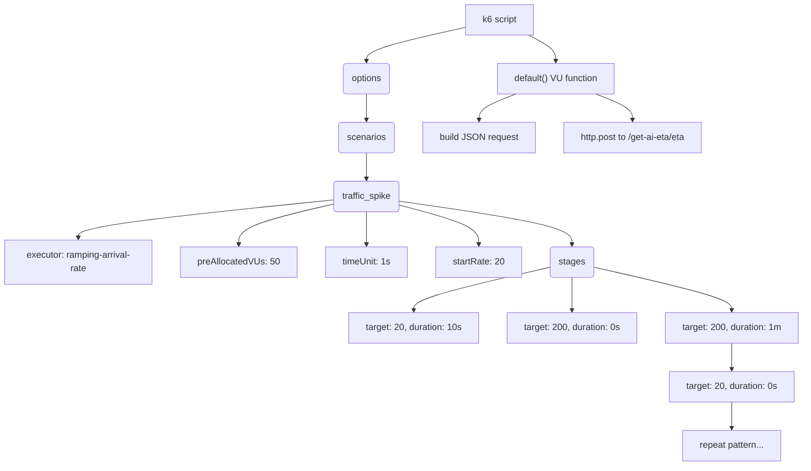
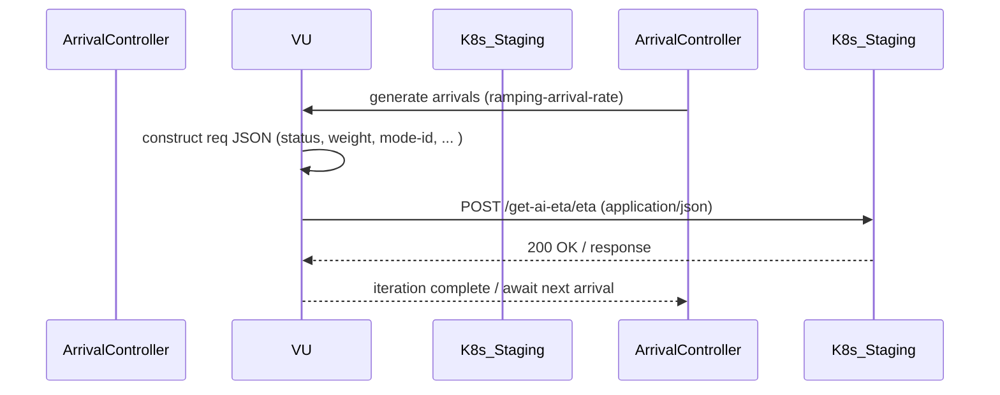
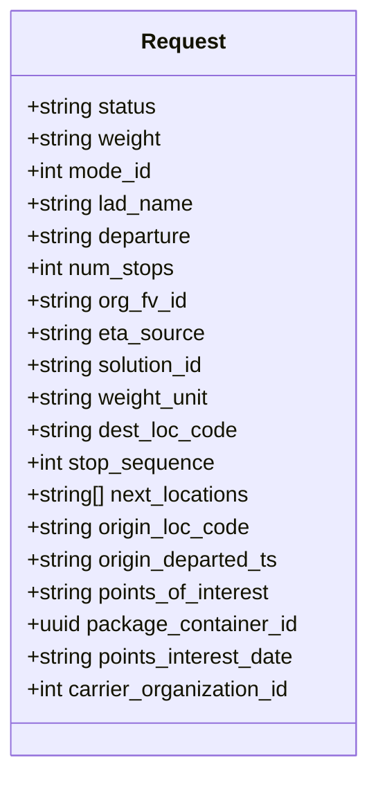

# Diagram: research/api_k8s/get_ai_eta/k6/partview_eta.js

> Auto-generated by Obscura crawlers

## Diagram 1

### SVG

<svg id="container" width="1415.65625" xmlns="http://www.w3.org/2000/svg" class="flowchart" height="822" viewBox="0 0 1415.65625 822" role="graphics-document document" aria-roledescription="flowchart-v2"><g><marker id="container_flowchart-v2-pointEnd" class="marker flowchart-v2" viewBox="0 0 10 10" refX="5" refY="5" markerUnits="userSpaceOnUse" markerWidth="8" markerHeight="8" orient="auto"><path d="M 0 0 L 10 5 L 0 10 z" class="arrowMarkerPath" style="stroke-width: 1; stroke-dasharray: 1, 0;"></path></marker><marker id="container_flowchart-v2-pointStart" class="marker flowchart-v2" viewBox="0 0 10 10" refX="4.5" refY="5" markerUnits="userSpaceOnUse" markerWidth="8" markerHeight="8" orient="auto"><path d="M 0 5 L 10 10 L 10 0 z" class="arrowMarkerPath" style="stroke-width: 1; stroke-dasharray: 1, 0;"></path></marker><marker id="container_flowchart-v2-circleEnd" class="marker flowchart-v2" viewBox="0 0 10 10" refX="11" refY="5" markerUnits="userSpaceOnUse" markerWidth="11" markerHeight="11" orient="auto"><circle cx="5" cy="5" r="5" class="arrowMarkerPath" style="stroke-width: 1; stroke-dasharray: 1, 0;"></circle></marker><marker id="container_flowchart-v2-circleStart" class="marker flowchart-v2" viewBox="0 0 10 10" refX="-1" refY="5" markerUnits="userSpaceOnUse" markerWidth="11" markerHeight="11" orient="auto"><circle cx="5" cy="5" r="5" class="arrowMarkerPath" style="stroke-width: 1; stroke-dasharray: 1, 0;"></circle></marker><marker id="container_flowchart-v2-crossEnd" class="marker cross flowchart-v2" viewBox="0 0 11 11" refX="12" refY="5.2" markerUnits="userSpaceOnUse" markerWidth="11" markerHeight="11" orient="auto"><path d="M 1,1 l 9,9 M 10,1 l -9,9" class="arrowMarkerPath" style="stroke-width: 2; stroke-dasharray: 1, 0;"></path></marker><marker id="container_flowchart-v2-crossStart" class="marker cross flowchart-v2" viewBox="0 0 11 11" refX="-1" refY="5.2" markerUnits="userSpaceOnUse" markerWidth="11" markerHeight="11" orient="auto"><path d="M 1,1 l 9,9 M 10,1 l -9,9" class="arrowMarkerPath" style="stroke-width: 2; stroke-dasharray: 1, 0;"></path></marker><g class="root"><g class="clusters"></g><g class="edgePaths"><path d="M821.41,48.319L791.912,54.766C762.414,61.213,703.418,74.106,673.99,84.137C644.562,94.167,644.703,101.334,644.773,104.917L644.843,108.501" id="L_Script_Options_0" class="edge-thickness-normal edge-pattern-solid edge-thickness-normal edge-pattern-solid flowchart-link" style=";" data-edge="true" data-et="edge" data-id="L_Script_Options_0" data-points="W3sieCI6ODIxLjQxMDE1NjI1LCJ5Ijo0OC4zMTk0OTg5NDEwNzc5N30seyJ4Ijo2NDQuNDIxODc1LCJ5Ijo4N30seyJ4Ijo2NDQuOTIxODc1LCJ5IjoxMTIuNX1d" marker-end="url(#container_flowchart-v2-pointEnd)"></path><path d="M644.922,166.5L644.839,170.583C644.755,174.667,644.589,182.833,644.575,190.5C644.562,198.167,644.703,205.334,644.773,208.917L644.843,212.501" id="L_Options_Scenarios_0" class="edge-thickness-normal edge-pattern-solid edge-thickness-normal edge-pattern-solid flowchart-link" style=";" data-edge="true" data-et="edge" data-id="L_Options_Scenarios_0" data-points="W3sieCI6NjQ0LjkyMTg3NSwieSI6MTY2LjV9LHsieCI6NjQ0LjQyMTg3NSwieSI6MTkxfSx7IngiOjY0NC45MjE4NzUsInkiOjIxNi41fV0=" marker-end="url(#container_flowchart-v2-pointEnd)"></path><path d="M644.922,270.5L644.839,274.583C644.755,278.667,644.589,286.833,644.575,294.5C644.562,302.167,644.703,309.334,644.773,312.917L644.843,316.501" id="L_Scenarios_TrafficSpike_0" class="edge-thickness-normal edge-pattern-solid edge-thickness-normal edge-pattern-solid flowchart-link" style=";" data-edge="true" data-et="edge" data-id="L_Scenarios_TrafficSpike_0" data-points="W3sieCI6NjQ0LjkyMTg3NSwieSI6MjcwLjV9LHsieCI6NjQ0LjQyMTg3NSwieSI6Mjk1fSx7IngiOjY0NC45MjE4NzUsInkiOjMyMC41fV0=" marker-end="url(#container_flowchart-v2-pointEnd)"></path><path d="M585.477,353.604L510.897,361.17C436.318,368.736,287.159,383.868,212.579,394.934C138,406,138,413,138,416.5L138,420" id="L_TrafficSpike_Executor_0" class="edge-thickness-normal edge-pattern-solid edge-thickness-normal edge-pattern-solid flowchart-link" style=";" data-edge="true" data-et="edge" data-id="L_TrafficSpike_Executor_0" data-points="W3sieCI6NTg1LjQ3NjU2MjUsInkiOjM1My42MDM5MTUzMzczODU0NH0seyJ4IjoxMzgsInkiOjM5OX0seyJ4IjoxMzgsInkiOjQyNH1d" marker-end="url(#container_flowchart-v2-pointEnd)"></path><path d="M585.477,361.263L557.868,367.553C530.26,373.842,475.044,386.421,447.436,398.211C419.828,410,419.828,421,419.828,426.5L419.828,432" id="L_TrafficSpike_VUs_0" class="edge-thickness-normal edge-pattern-solid edge-thickness-normal edge-pattern-solid flowchart-link" style=";" data-edge="true" data-et="edge" data-id="L_TrafficSpike_VUs_0" data-points="W3sieCI6NTg1LjQ3NjU2MjUsInkiOjM2MS4yNjMzMjI2NjU5MjQ2fSx7IngiOjQxOS44MjgxMjUsInkiOjM5OX0seyJ4Ijo0MTkuODI4MTI1LCJ5Ijo0MzZ9XQ==" marker-end="url(#container_flowchart-v2-pointEnd)"></path><path d="M644.922,374.5L644.839,378.583C644.755,382.667,644.589,390.833,644.505,400.417C644.422,410,644.422,421,644.422,426.5L644.422,432" id="L_TrafficSpike_TimeUnit_0" class="edge-thickness-normal edge-pattern-solid edge-thickness-normal edge-pattern-solid flowchart-link" style=";" data-edge="true" data-et="edge" data-id="L_TrafficSpike_TimeUnit_0" data-points="W3sieCI6NjQ0LjkyMTg3NSwieSI6Mzc0LjV9LHsieCI6NjQ0LjQyMTg3NSwieSI6Mzk5fSx7IngiOjY0NC40MjE4NzUsInkiOjQzNn1d" marker-end="url(#container_flowchart-v2-pointEnd)"></path><path d="M704.367,363.083L727.438,369.069C750.508,375.055,796.648,387.028,819.719,398.514C842.789,410,842.789,421,842.789,426.5L842.789,432" id="L_TrafficSpike_StartRate_0" class="edge-thickness-normal edge-pattern-solid edge-thickness-normal edge-pattern-solid flowchart-link" style=";" data-edge="true" data-et="edge" data-id="L_TrafficSpike_StartRate_0" data-points="W3sieCI6NzA0LjM2NzE4NzUsInkiOjM2My4wODMwMDE4NTEwNDk2fSx7IngiOjg0Mi43ODkwNjI1LCJ5IjozOTl9LHsieCI6ODQyLjc4OTA2MjUsInkiOjQzNn1d" marker-end="url(#container_flowchart-v2-pointEnd)"></path><path d="M704.367,356.041L754.699,363.2C805.031,370.36,905.695,384.68,956.102,397.423C1006.508,410.167,1006.657,421.334,1006.732,426.917L1006.806,432.5" id="L_TrafficSpike_Stages_0" class="edge-thickness-normal edge-pattern-solid edge-thickness-normal edge-pattern-solid flowchart-link" style=";" data-edge="true" data-et="edge" data-id="L_TrafficSpike_Stages_0" data-points="W3sieCI6NzA0LjM2NzE4NzUsInkiOjM1Ni4wNDA1ODAyMTA2NzE3NX0seyJ4IjoxMDA2LjM1OTM3NSwieSI6Mzk5fSx7IngiOjEwMDYuODU5Mzc1LCJ5Ijo0MzYuNX1d" marker-end="url(#container_flowchart-v2-pointEnd)"></path><path d="M968.891,472.167L928.406,481.306C887.922,490.445,806.953,508.722,766.469,521.361C725.984,534,725.984,541,725.984,544.5L725.984,548" id="L_Stages_Stage1_0" class="edge-thickness-normal edge-pattern-solid edge-thickness-normal edge-pattern-solid flowchart-link" style=";" data-edge="true" data-et="edge" data-id="L_Stages_Stage1_0" data-points="W3sieCI6OTY4Ljg5MDYyNSwieSI6NDcyLjE2Njk2Mzg4NzY1MDQ3fSx7IngiOjcyNS45ODQzNzUsInkiOjUyN30seyJ4Ijo3MjUuOTg0Mzc1LCJ5Ijo1NTJ9XQ==" marker-end="url(#container_flowchart-v2-pointEnd)"></path><path d="M1006.859,490.5L1006.776,496.583C1006.693,502.667,1006.526,514.833,1006.443,524.417C1006.359,534,1006.359,541,1006.359,544.5L1006.359,548" id="L_Stages_Stage2_0" class="edge-thickness-normal edge-pattern-solid edge-thickness-normal edge-pattern-solid flowchart-link" style=";" data-edge="true" data-et="edge" data-id="L_Stages_Stage2_0" data-points="W3sieCI6MTAwNi44NTkzNzUsInkiOjQ5MC41fSx7IngiOjEwMDYuMzU5Mzc1LCJ5Ijo1Mjd9LHsieCI6MTAwNi4zNTkzNzUsInkiOjU1Mn1d" marker-end="url(#container_flowchart-v2-pointEnd)"></path><path d="M1044.828,472.072L1085.665,481.226C1126.503,490.381,1208.177,508.691,1249.014,521.345C1289.852,534,1289.852,541,1289.852,544.5L1289.852,548" id="L_Stages_Stage3_0" class="edge-thickness-normal edge-pattern-solid edge-thickness-normal edge-pattern-solid flowchart-link" style=";" data-edge="true" data-et="edge" data-id="L_Stages_Stage3_0" data-points="W3sieCI6MTA0NC44MjgxMjUsInkiOjQ3Mi4wNzE2NjQ3ODM1MzEzfSx7IngiOjEyODkuODUxNTYyNSwieSI6NTI3fSx7IngiOjEyODkuODUxNTYyNSwieSI6NTUyfV0=" marker-end="url(#container_flowchart-v2-pointEnd)"></path><path d="M1289.852,606L1289.852,610.167C1289.852,614.333,1289.852,622.667,1289.852,630.333C1289.852,638,1289.852,645,1289.852,648.5L1289.852,652" id="L_Stage3_Stage4_0" class="edge-thickness-normal edge-pattern-solid edge-thickness-normal edge-pattern-solid flowchart-link" style=";" data-edge="true" data-et="edge" data-id="L_Stage3_Stage4_0" data-points="W3sieCI6MTI4OS44NTE1NjI1LCJ5Ijo2MDZ9LHsieCI6MTI4OS44NTE1NjI1LCJ5Ijo2MzF9LHsieCI6MTI4OS44NTE1NjI1LCJ5Ijo2NTZ9XQ==" marker-end="url(#container_flowchart-v2-pointEnd)"></path><path d="M1289.852,710L1289.852,714.167C1289.852,718.333,1289.852,726.667,1289.852,734.333C1289.852,742,1289.852,749,1289.852,752.5L1289.852,756" id="L_Stage4_Stage5_0" class="edge-thickness-normal edge-pattern-solid edge-thickness-normal edge-pattern-solid flowchart-link" style=";" data-edge="true" data-et="edge" data-id="L_Stage4_Stage5_0" data-points="W3sieCI6MTI4OS44NTE1NjI1LCJ5Ijo3MTB9LHsieCI6MTI4OS44NTE1NjI1LCJ5Ijo3MzV9LHsieCI6MTI4OS44NTE1NjI1LCJ5Ijo3NjB9XQ==" marker-end="url(#container_flowchart-v2-pointEnd)"></path><path d="M933.78,62L941.715,66.167C949.651,70.333,965.523,78.667,973.459,86.333C981.395,94,981.395,101,981.395,104.5L981.395,108" id="L_Script_DefaultFn_0" class="edge-thickness-normal edge-pattern-solid edge-thickness-normal edge-pattern-solid flowchart-link" style=";" data-edge="true" data-et="edge" data-id="L_Script_DefaultFn_0" data-points="W3sieCI6OTMzLjc3OTU5NzM1NTc2OTMsInkiOjYyfSx7IngiOjk4MS4zOTQ1MzEyNSwieSI6ODd9LHsieCI6OTgxLjM5NDUzMTI1LCJ5IjoxMTJ9XQ==" marker-end="url(#container_flowchart-v2-pointEnd)"></path><path d="M909.252,166L898.119,170.167C886.986,174.333,864.719,182.667,853.586,190.333C842.453,198,842.453,205,842.453,208.5L842.453,212" id="L_DefaultFn_BuildReq_0" class="edge-thickness-normal edge-pattern-solid edge-thickness-normal edge-pattern-solid flowchart-link" style=";" data-edge="true" data-et="edge" data-id="L_DefaultFn_BuildReq_0" data-points="W3sieCI6OTA5LjI1MTg3ODAwNDgwNzcsInkiOjE2Nn0seyJ4Ijo4NDIuNDUzMTI1LCJ5IjoxOTF9LHsieCI6ODQyLjQ1MzEyNSwieSI6MjE2fV0=" marker-end="url(#container_flowchart-v2-pointEnd)"></path><path d="M1053.537,166L1064.67,170.167C1075.803,174.333,1098.07,182.667,1109.203,190.333C1120.336,198,1120.336,205,1120.336,208.5L1120.336,212" id="L_DefaultFn_Post_0" class="edge-thickness-normal edge-pattern-solid edge-thickness-normal edge-pattern-solid flowchart-link" style=";" data-edge="true" data-et="edge" data-id="L_DefaultFn_Post_0" data-points="W3sieCI6MTA1My41MzcxODQ0OTUxOTI0LCJ5IjoxNjZ9LHsieCI6MTEyMC4zMzU5Mzc1LCJ5IjoxOTF9LHsieCI6MTEyMC4zMzU5Mzc1LCJ5IjoyMTZ9XQ==" marker-end="url(#container_flowchart-v2-pointEnd)"></path></g><g class="edgeLabels"><g class="edgeLabel"><g class="label" data-id="L_Script_Options_0" transform="translate(0, 0)"><foreignObject width="0" height="0">

</foreignObject></g></g><g class="edgeLabel"><g class="label" data-id="L_Options_Scenarios_0" transform="translate(0, 0)"><foreignObject width="0" height="0">

</foreignObject></g></g><g class="edgeLabel"><g class="label" data-id="L_Scenarios_TrafficSpike_0" transform="translate(0, 0)"><foreignObject width="0" height="0">

</foreignObject></g></g><g class="edgeLabel"><g class="label" data-id="L_TrafficSpike_Executor_0" transform="translate(0, 0)"><foreignObject width="0" height="0">

</foreignObject></g></g><g class="edgeLabel"><g class="label" data-id="L_TrafficSpike_VUs_0" transform="translate(0, 0)"><foreignObject width="0" height="0">

</foreignObject></g></g><g class="edgeLabel"><g class="label" data-id="L_TrafficSpike_TimeUnit_0" transform="translate(0, 0)"><foreignObject width="0" height="0">

</foreignObject></g></g><g class="edgeLabel"><g class="label" data-id="L_TrafficSpike_StartRate_0" transform="translate(0, 0)"><foreignObject width="0" height="0">

</foreignObject></g></g><g class="edgeLabel"><g class="label" data-id="L_TrafficSpike_Stages_0" transform="translate(0, 0)"><foreignObject width="0" height="0">

</foreignObject></g></g><g class="edgeLabel"><g class="label" data-id="L_Stages_Stage1_0" transform="translate(0, 0)"><foreignObject width="0" height="0">

</foreignObject></g></g><g class="edgeLabel"><g class="label" data-id="L_Stages_Stage2_0" transform="translate(0, 0)"><foreignObject width="0" height="0">

</foreignObject></g></g><g class="edgeLabel"><g class="label" data-id="L_Stages_Stage3_0" transform="translate(0, 0)"><foreignObject width="0" height="0">

</foreignObject></g></g><g class="edgeLabel"><g class="label" data-id="L_Stage3_Stage4_0" transform="translate(0, 0)"><foreignObject width="0" height="0">

</foreignObject></g></g><g class="edgeLabel"><g class="label" data-id="L_Stage4_Stage5_0" transform="translate(0, 0)"><foreignObject width="0" height="0">

</foreignObject></g></g><g class="edgeLabel"><g class="label" data-id="L_Script_DefaultFn_0" transform="translate(0, 0)"><foreignObject width="0" height="0">

</foreignObject></g></g><g class="edgeLabel"><g class="label" data-id="L_DefaultFn_BuildReq_0" transform="translate(0, 0)"><foreignObject width="0" height="0">

</foreignObject></g></g><g class="edgeLabel"><g class="label" data-id="L_DefaultFn_Post_0" transform="translate(0, 0)"><foreignObject width="0" height="0">

</foreignObject></g></g></g><g class="nodes"><g class="node default" id="flowchart-Script-0" transform="translate(882.35546875, 35)"><rect class="basic label-container" style="" x="-60.9453125" y="-27" width="121.890625" height="54"></rect><g class="label" style="" transform="translate(-30.9453125, -12)"><rect></rect><foreignObject width="61.890625" height="24">

k6 script

</foreignObject></g></g><g class="node default" id="flowchart-Options-1" transform="translate(644.421875, 139)"><g class="basic label-container outer-path"><path d="M-37.6640625 -27 C-8.306183661715608 -27, 21.051695176568785 -27, 37.6640625 -27 C37.6640625 -27, 37.6640625 -27, 37.6640625 -27 C37.821313473293294 -26.99349605163471, 37.97856444658659 -26.986992103269426, 38.07695922736166 -26.982922465033347 C38.203370641049695 -26.96716529874975, 38.32978205473773 -26.951408132466156, 38.48703545140367 -26.931806517013612 C38.581379376858195 -26.91202467608724, 38.67572330231272 -26.89224283516086, 38.891489935703994 -26.847001329696653 C39.04719482553738 -26.800645975561537, 39.20289971537076 -26.754290621426417, 39.28755984602342 -26.729086208503173 C39.41711538375056 -26.67853348081123, 39.5466709214777 -26.62798075311928, 39.672539623264846 -26.578866633275286 C39.782126800773135 -26.525292726687656, 39.89171397828142 -26.471718820100026, 40.043799465185366 -26.397368756032446 C40.16460001445721 -26.325387252682727, 40.28540056372904 -26.25340574933301, 40.398803290612136 -26.185832391312644 C40.47551355924441 -26.131062312230895, 40.55222382787669 -26.076292233149147, 40.73512606344834 -25.94570254698197 C40.83717569748898 -25.859270915851145, 40.93922533152962 -25.772839284720323, 41.050470358128706 -25.678619553365657 C41.15784936422371 -25.571240547270655, 41.26522837031871 -25.463861541175653, 41.34268205336566 -25.386407858128706 C41.4417649022765 -25.26942095948102, 41.54084775118735 -25.152434060833336, 41.60976504698197 -25.07106356344834 C41.69572476665086 -24.95066948518686, 41.781684486319755 -24.83027540692538, 41.849894891312644 -24.734740790612136 C41.89608960179355 -24.657216063566153, 41.942284312274445 -24.579691336520174, 42.06143125603245 -24.37973696518537 C42.13253127987031 -24.23429954183044, 42.203631303708164 -24.088862118475507, 42.24292913327529 -24.008477123264846 C42.2765965520647 -23.922194923583607, 42.31026397085412 -23.83591272390237, 42.393148708503176 -23.623497346023417 C42.43992972090339 -23.466362695280843, 42.48671073330361 -23.309228044538266, 42.51106382969665 -23.227427435703994 C42.53965489416148 -23.091070396711793, 42.56824595862631 -22.95471335771959, 42.59586901701361 -22.82297295140367 C42.613113941046095 -22.68462604392968, 42.63035886507858 -22.546279136455688, 42.64698496503335 -22.412896727361662 C42.65144300691859 -22.305111212154035, 42.65590104880383 -22.19732569694641, 42.6640625 -22 C42.6640625 -22, 42.6640625 -22, 42.6640625 -22 C42.6640625 -11.310323849706705, 42.6640625 -0.6206476994134107, 42.6640625 22 C42.6640625 22, 42.6640625 22, 42.6640625 22 C42.66051985944087 22.0856531516955, 42.656977218881735 22.171306303391, 42.64698496503335 22.412896727361662 C42.6286639443082 22.559876589628157, 42.61034292358306 22.70685645189465, 42.59586901701361 22.82297295140367 C42.57552995931131 22.919974365519938, 42.555190901609 23.01697577963621, 42.51106382969665 23.227427435703994 C42.475669908583725 23.346313521043708, 42.4402759874708 23.465199606383425, 42.393148708503176 23.623497346023417 C42.33752794181414 23.766041154561414, 42.281907175125106 23.908584963099408, 42.24292913327529 24.008477123264846 C42.190309373854475 24.116112561547844, 42.13768961443366 24.223747999830845, 42.06143125603245 24.379736965185366 C41.99887782107178 24.484715174175758, 41.9363243861111 24.589693383166146, 41.849894891312644 24.734740790612133 C41.79531703127234 24.81118183972615, 41.74073917123203 24.887622888840166, 41.60976504698197 25.07106356344834 C41.52263634851621 25.17393622333613, 41.43550765005045 25.276808883223918, 41.34268205336566 25.386407858128706 C41.23649398127225 25.492595930222112, 41.130305909178844 25.598784002315522, 41.050470358128706 25.678619553365657 C40.96519539698768 25.750843761275124, 40.87992043584666 25.823067969184596, 40.73512606344834 25.94570254698197 C40.61550134725288 26.031112952693945, 40.49587663105742 26.11652335840592, 40.398803290612136 26.185832391312644 C40.312218337271645 26.23742582483991, 40.22563338393116 26.289019258367173, 40.043799465185366 26.397368756032446 C39.95744748338009 26.43958366759491, 39.87109550157482 26.481798579157374, 39.672539623264846 26.578866633275286 C39.53344026351091 26.633143371878113, 39.39434090375698 26.68742011048094, 39.28755984602342 26.729086208503173 C39.19105725621614 26.7578162742722, 39.094554666408854 26.78654634004123, 38.891489935703994 26.847001329696653 C38.80996900104176 26.86409447219511, 38.72844806637952 26.881187614693562, 38.48703545140367 26.931806517013612 C38.36704710818934 26.946763048397617, 38.24705876497501 26.96171957978162, 38.07695922736166 26.982922465033347 C37.958645897993804 26.987815940533167, 37.840332568625946 26.99270941603299, 37.6640625 27 C37.6640625 27, 37.6640625 27, 37.6640625 27 C20.89797404602476 27, 4.131885592049521 27, -37.6640625 27 C-37.6640625 27, -37.6640625 27, -37.6640625 27 C-37.7716764422994 26.995549054422735, -37.879290384598804 26.99109810884547, -38.07695922736166 26.982922465033347 C-38.20007474223036 26.967576132109137, -38.32319025709907 26.952229799184927, -38.48703545140367 26.931806517013612 C-38.61833273902454 26.904276370846095, -38.74963002664541 26.876746224678573, -38.891489935703994 26.847001329696653 C-39.011482919759004 26.811277870558335, -39.131475903814014 26.775554411420014, -39.28755984602342 26.729086208503173 C-39.368445275925836 26.697524615816068, -39.44933070582825 26.665963023128967, -39.672539623264846 26.578866633275286 C-39.76933132806333 26.531548052130706, -39.866123032861815 26.484229470986122, -40.043799465185366 26.397368756032446 C-40.122666790039275 26.35037403090599, -40.20153411489318 26.303379305779536, -40.398803290612136 26.185832391312644 C-40.51372526764501 26.103779676825432, -40.62864724467788 26.021726962338217, -40.73512606344834 25.94570254698197 C-40.819793198245655 25.873993141725396, -40.90446033304298 25.802283736468823, -41.050470358128706 25.67861955336566 C-41.143017170668564 25.586072740825806, -41.235563983208415 25.493525928285948, -41.34268205336566 25.386407858128706 C-41.4320652118934 25.2808733622756, -41.521448370421155 25.175338866422493, -41.60976504698197 25.07106356344834 C-41.66436936317104 24.99458546019249, -41.71897367936011 24.918107356936638, -41.849894891312644 24.734740790612133 C-41.898971232818965 24.652380062726063, -41.948047574325294 24.570019334839994, -42.06143125603244 24.37973696518537 C-42.103854460255086 24.29295891393364, -42.14627766447772 24.206180862681908, -42.24292913327528 24.00847712326485 C-42.28977877144444 23.88841179064198, -42.336628409613596 23.76834645801911, -42.393148708503176 23.623497346023417 C-42.427820450776935 23.507037016644176, -42.46249219305069 23.39057668726494, -42.51106382969665 23.227427435703994 C-42.533173998876485 23.12197920362828, -42.555284168056325 23.016530971552562, -42.59586901701361 22.82297295140367 C-42.61304847422512 22.685151249619622, -42.63022793143662 22.547329547835577, -42.64698496503335 22.412896727361662 C-42.650552992243334 22.326629783038726, -42.65412101945332 22.240362838715786, -42.6640625 22 C-42.6640625 22, -42.6640625 22, -42.6640625 22 C-42.6640625 11.660800957853832, -42.6640625 1.3216019157076637, -42.6640625 -22 C-42.6640625 -22, -42.6640625 -22, -42.6640625 -22 C-42.65972962981054 -22.10475914262828, -42.65539675962108 -22.209518285256554, -42.64698496503335 -22.41289672736166 C-42.627656725446606 -22.56795697400036, -42.60832848585986 -22.72301722063906, -42.59586901701361 -22.82297295140367 C-42.569227027870646 -22.95003442394403, -42.54258503872768 -23.077095896484384, -42.51106382969665 -23.227427435703994 C-42.465573858331425 -23.380225556052746, -42.4200838869662 -23.533023676401495, -42.393148708503176 -23.623497346023417 C-42.339859770875414 -23.760065188837824, -42.286570833247644 -23.896633031652232, -42.24292913327529 -24.008477123264846 C-42.18142818006984 -24.13427933380237, -42.119927226864384 -24.26008154433989, -42.06143125603245 -24.379736965185366 C-41.99465956845695 -24.491794315470745, -41.92788788088145 -24.603851665756125, -41.849894891312644 -24.734740790612133 C-41.75412059667679 -24.868881036395177, -41.65834630204095 -25.00302128217822, -41.60976504698197 -25.07106356344834 C-41.527365596428055 -25.168352410877926, -41.44496614587413 -25.265641258307515, -41.34268205336566 -25.386407858128706 C-41.2425811128349 -25.486508798659465, -41.14248017230414 -25.586609739190223, -41.050470358128706 -25.678619553365657 C-40.942831665598895 -25.769784875569904, -40.835192973069084 -25.860950197774155, -40.73512606344834 -25.945702546981966 C-40.62928330500551 -26.02127282399317, -40.523440546562675 -26.096843101004367, -40.398803290612136 -26.185832391312644 C-40.259151897632506 -26.269046559395072, -40.11950050465287 -26.3522607274775, -40.043799465185366 -26.397368756032446 C-39.94019496802285 -26.4480179084173, -39.83659047086034 -26.498667060802152, -39.672539623264846 -26.578866633275286 C-39.565529693260565 -26.620622037534684, -39.45851976325629 -26.66237744179408, -39.28755984602342 -26.729086208503173 C-39.14953198799808 -26.770178882253642, -39.01150412997274 -26.811271556004115, -38.891489935703994 -26.847001329696653 C-38.767339113285324 -26.87303301968764, -38.643188290866654 -26.899064709678623, -38.48703545140367 -26.931806517013612 C-38.38587076575355 -26.944416681929184, -38.28470608010343 -26.957026846844755, -38.07695922736166 -26.982922465033347 C-37.98614639601105 -26.986678511521582, -37.89533356466044 -26.99043455800982, -37.6640625 -27 C-37.6640625 -27, -37.6640625 -27, -37.6640625 -27" stroke="none" stroke-width="0" fill="#ECECFF" style=""></path><path d="M-37.6640625 -27 C-21.875276984515754 -27, -6.0864914690315075 -27, 37.6640625 -27 M-37.6640625 -27 C-19.021448226864308 -27, -0.3788339537286163 -27, 37.6640625 -27 M37.6640625 -27 C37.6640625 -27, 37.6640625 -27, 37.6640625 -27 M37.6640625 -27 C37.6640625 -27, 37.6640625 -27, 37.6640625 -27 M37.6640625 -27 C37.78440312482988 -26.995022674939634, 37.90474374965976 -26.990045349879264, 38.07695922736166 -26.982922465033347 M37.6640625 -27 C37.78922666278892 -26.994823171933916, 37.91439082557784 -26.989646343867836, 38.07695922736166 -26.982922465033347 M38.07695922736166 -26.982922465033347 C38.18808256502909 -26.969070955438376, 38.29920590269652 -26.955219445843404, 38.48703545140367 -26.931806517013612 M38.07695922736166 -26.982922465033347 C38.22115709883358 -26.96494821909911, 38.36535497030549 -26.94697397316487, 38.48703545140367 -26.931806517013612 M38.48703545140367 -26.931806517013612 C38.61510969752638 -26.90495217158163, 38.74318394364908 -26.878097826149652, 38.891489935703994 -26.847001329696653 M38.48703545140367 -26.931806517013612 C38.57092589677239 -26.914216540366663, 38.6548163421411 -26.89662656371971, 38.891489935703994 -26.847001329696653 M38.891489935703994 -26.847001329696653 C39.034868548790676 -26.804315667145225, 39.17824716187735 -26.761630004593798, 39.28755984602342 -26.729086208503173 M38.891489935703994 -26.847001329696653 C38.997265234574805 -26.815510658831073, 39.103040533445615 -26.784019987965497, 39.28755984602342 -26.729086208503173 M39.28755984602342 -26.729086208503173 C39.36498695487719 -26.69887405687672, 39.442414063730965 -26.66866190525026, 39.672539623264846 -26.578866633275286 M39.28755984602342 -26.729086208503173 C39.388166014405456 -26.689829559782694, 39.48877218278749 -26.650572911062216, 39.672539623264846 -26.578866633275286 M39.672539623264846 -26.578866633275286 C39.788850799672275 -26.522005563927298, 39.905161976079704 -26.46514449457931, 40.043799465185366 -26.397368756032446 M39.672539623264846 -26.578866633275286 C39.74787983680443 -26.542035047187976, 39.823220050344005 -26.50520346110067, 40.043799465185366 -26.397368756032446 M40.043799465185366 -26.397368756032446 C40.16102820057037 -26.327515591790533, 40.278256935955376 -26.25766242754862, 40.398803290612136 -26.185832391312644 M40.043799465185366 -26.397368756032446 C40.18081107594357 -26.315727556731694, 40.31782268670179 -26.23408635743094, 40.398803290612136 -26.185832391312644 M40.398803290612136 -26.185832391312644 C40.466943576542185 -26.13718116227143, 40.535083862472234 -26.088529933230216, 40.73512606344834 -25.94570254698197 M40.398803290612136 -26.185832391312644 C40.513757696519214 -26.103756523054283, 40.628712102426285 -26.021680654795922, 40.73512606344834 -25.94570254698197 M40.73512606344834 -25.94570254698197 C40.82850378674604 -25.866615649593502, 40.92188151004374 -25.787528752205034, 41.050470358128706 -25.678619553365657 M40.73512606344834 -25.94570254698197 C40.834699150922305 -25.861368443797637, 40.93427223839627 -25.7770343406133, 41.050470358128706 -25.678619553365657 M41.050470358128706 -25.678619553365657 C41.13767667376678 -25.591413237727583, 41.224882989404854 -25.50420692208951, 41.34268205336566 -25.386407858128706 M41.050470358128706 -25.678619553365657 C41.13686148934455 -25.592228422149816, 41.22325262056039 -25.50583729093398, 41.34268205336566 -25.386407858128706 M41.34268205336566 -25.386407858128706 C41.42996383554653 -25.283354452640026, 41.5172456177274 -25.18030104715135, 41.60976504698197 -25.07106356344834 M41.34268205336566 -25.386407858128706 C41.42187314057779 -25.292907118138668, 41.50106422778991 -25.19940637814863, 41.60976504698197 -25.07106356344834 M41.60976504698197 -25.07106356344834 C41.702576076650296 -24.941073628482783, 41.79538710631862 -24.811083693517222, 41.849894891312644 -24.734740790612136 M41.60976504698197 -25.07106356344834 C41.690943180702504 -24.95736651299358, 41.77212131442304 -24.843669462538816, 41.849894891312644 -24.734740790612136 M41.849894891312644 -24.734740790612136 C41.90568592656265 -24.641111352645265, 41.96147696181265 -24.547481914678393, 42.06143125603245 -24.37973696518537 M41.849894891312644 -24.734740790612136 C41.91424320064697 -24.626750393766237, 41.97859150998129 -24.51875999692034, 42.06143125603245 -24.37973696518537 M42.06143125603245 -24.37973696518537 C42.100947853967455 -24.298904472125646, 42.14046445190246 -24.218071979065922, 42.24292913327529 -24.008477123264846 M42.06143125603245 -24.37973696518537 C42.10508712038765 -24.290437467331014, 42.14874298474286 -24.201137969476658, 42.24292913327529 -24.008477123264846 M42.24292913327529 -24.008477123264846 C42.27926778495219 -23.91534914039973, 42.315606436629096 -23.822221157534614, 42.393148708503176 -23.623497346023417 M42.24292913327529 -24.008477123264846 C42.27550963309147 -23.92498045818229, 42.308090132907644 -23.84148379309973, 42.393148708503176 -23.623497346023417 M42.393148708503176 -23.623497346023417 C42.43006731286607 -23.49948993992374, 42.466985917228975 -23.37548253382407, 42.51106382969665 -23.227427435703994 M42.393148708503176 -23.623497346023417 C42.43258451105043 -23.491034820266123, 42.47202031359768 -23.358572294508825, 42.51106382969665 -23.227427435703994 M42.51106382969665 -23.227427435703994 C42.541209850211416 -23.08365447125742, 42.57135587072618 -22.939881506810845, 42.59586901701361 -22.82297295140367 M42.51106382969665 -23.227427435703994 C42.530701119576676 -23.133772905801273, 42.55033840945671 -23.04011837589855, 42.59586901701361 -22.82297295140367 M42.59586901701361 -22.82297295140367 C42.60778981094963 -22.72733872462616, 42.619710604885654 -22.631704497848652, 42.64698496503335 -22.412896727361662 M42.59586901701361 -22.82297295140367 C42.60784533263167 -22.726893303527596, 42.619821648249726 -22.630813655651522, 42.64698496503335 -22.412896727361662 M42.64698496503335 -22.412896727361662 C42.653480334662284 -22.255853168790125, 42.65997570429123 -22.098809610218588, 42.6640625 -22 M42.64698496503335 -22.412896727361662 C42.651475035968055 -22.304336821135063, 42.655965106902755 -22.195776914908464, 42.6640625 -22 M42.6640625 -22 C42.6640625 -22, 42.6640625 -22, 42.6640625 -22 M42.6640625 -22 C42.6640625 -22, 42.6640625 -22, 42.6640625 -22 M42.6640625 -22 C42.6640625 -12.115194851122975, 42.6640625 -2.230389702245951, 42.6640625 22 M42.6640625 -22 C42.6640625 -9.397998261249732, 42.6640625 3.2040034775005353, 42.6640625 22 M42.6640625 22 C42.6640625 22, 42.6640625 22, 42.6640625 22 M42.6640625 22 C42.6640625 22, 42.6640625 22, 42.6640625 22 M42.6640625 22 C42.659604883374264 22.107775233380842, 42.65514726674852 22.215550466761687, 42.64698496503335 22.412896727361662 M42.6640625 22 C42.66027535950873 22.09156461503122, 42.65648821901746 22.183129230062438, 42.64698496503335 22.412896727361662 M42.64698496503335 22.412896727361662 C42.63093075930661 22.541691131446125, 42.614876553579876 22.670485535530585, 42.59586901701361 22.82297295140367 M42.64698496503335 22.412896727361662 C42.636642886438054 22.495865755686552, 42.62630080784276 22.57883478401144, 42.59586901701361 22.82297295140367 M42.59586901701361 22.82297295140367 C42.575430861088364 22.92044698661689, 42.55499270516311 23.017921021830112, 42.51106382969665 23.227427435703994 M42.59586901701361 22.82297295140367 C42.57034213252507 22.94471624598563, 42.54481524803653 23.066459540567593, 42.51106382969665 23.227427435703994 M42.51106382969665 23.227427435703994 C42.4861004450941 23.31127796649875, 42.46113706049155 23.39512849729351, 42.393148708503176 23.623497346023417 M42.51106382969665 23.227427435703994 C42.46459806741749 23.383503179955945, 42.41813230513833 23.539578924207895, 42.393148708503176 23.623497346023417 M42.393148708503176 23.623497346023417 C42.35490293166427 23.721512871799817, 42.31665715482536 23.819528397576217, 42.24292913327529 24.008477123264846 M42.393148708503176 23.623497346023417 C42.3514871005767 23.73026689662775, 42.30982549265022 23.837036447232084, 42.24292913327529 24.008477123264846 M42.24292913327529 24.008477123264846 C42.20629879885385 24.083405669942024, 42.16966846443241 24.1583342166192, 42.06143125603245 24.379736965185366 M42.24292913327529 24.008477123264846 C42.1957696636824 24.10494336018224, 42.14861019408951 24.201409597099634, 42.06143125603245 24.379736965185366 M42.06143125603245 24.379736965185366 C42.00148466666542 24.480340322791385, 41.94153807729838 24.580943680397407, 41.849894891312644 24.734740790612133 M42.06143125603245 24.379736965185366 C41.99085928640391 24.49817201165701, 41.92028731677537 24.616607058128658, 41.849894891312644 24.734740790612133 M41.849894891312644 24.734740790612133 C41.76682127947329 24.851092623351654, 41.68374766763394 24.967444456091176, 41.60976504698197 25.07106356344834 M41.849894891312644 24.734740790612133 C41.78576954616276 24.824553924627196, 41.72164420101288 24.914367058642263, 41.60976504698197 25.07106356344834 M41.60976504698197 25.07106356344834 C41.54549157564213 25.1469511076603, 41.481218104302286 25.222838651872262, 41.34268205336566 25.386407858128706 M41.60976504698197 25.07106356344834 C41.537799548279914 25.156033067205374, 41.46583404957785 25.241002570962408, 41.34268205336566 25.386407858128706 M41.34268205336566 25.386407858128706 C41.234630919540294 25.494458991954065, 41.12657978571494 25.60251012577943, 41.050470358128706 25.678619553365657 M41.34268205336566 25.386407858128706 C41.27675354409886 25.4523363673955, 41.21082503483207 25.518264876662297, 41.050470358128706 25.678619553365657 M41.050470358128706 25.678619553365657 C40.94720540133216 25.76608051036453, 40.84394044453562 25.853541467363407, 40.73512606344834 25.94570254698197 M41.050470358128706 25.678619553365657 C40.983552939820754 25.73529571560566, 40.916635521512795 25.791971877845665, 40.73512606344834 25.94570254698197 M40.73512606344834 25.94570254698197 C40.63101573492884 26.02003589280265, 40.526905406409334 26.09436923862333, 40.398803290612136 26.185832391312644 M40.73512606344834 25.94570254698197 C40.65344445527003 26.00402209427617, 40.57176284709171 26.06234164157037, 40.398803290612136 26.185832391312644 M40.398803290612136 26.185832391312644 C40.2970988544974 26.24643508106035, 40.19539441838267 26.30703777080806, 40.043799465185366 26.397368756032446 M40.398803290612136 26.185832391312644 C40.314116237810836 26.236294921587874, 40.229429185009536 26.286757451863103, 40.043799465185366 26.397368756032446 M40.043799465185366 26.397368756032446 C39.90703618338713 26.464228250457534, 39.77027290158889 26.531087744882623, 39.672539623264846 26.578866633275286 M40.043799465185366 26.397368756032446 C39.907578791097194 26.463962985711845, 39.771358117009015 26.530557215391244, 39.672539623264846 26.578866633275286 M39.672539623264846 26.578866633275286 C39.58279277054172 26.61388596387678, 39.4930459178186 26.648905294478276, 39.28755984602342 26.729086208503173 M39.672539623264846 26.578866633275286 C39.51984789131895 26.638447131965577, 39.36715615937307 26.698027630655872, 39.28755984602342 26.729086208503173 M39.28755984602342 26.729086208503173 C39.16119537541365 26.76670654137442, 39.034830904803876 26.804326874245664, 38.891489935703994 26.847001329696653 M39.28755984602342 26.729086208503173 C39.133857959527965 26.774845242707922, 38.98015607303251 26.82060427691267, 38.891489935703994 26.847001329696653 M38.891489935703994 26.847001329696653 C38.75448760194575 26.87572769824546, 38.6174852681875 26.904454066794266, 38.48703545140367 26.931806517013612 M38.891489935703994 26.847001329696653 C38.781356746121254 26.87009383116449, 38.671223556538514 26.893186332632325, 38.48703545140367 26.931806517013612 M38.48703545140367 26.931806517013612 C38.36711189859225 26.946754972282317, 38.24718834578082 26.96170342755102, 38.07695922736166 26.982922465033347 M38.48703545140367 26.931806517013612 C38.35118197312876 26.94874063542056, 38.21532849485384 26.965674753827503, 38.07695922736166 26.982922465033347 M38.07695922736166 26.982922465033347 C37.97701601869421 26.987056146720786, 37.87707281002676 26.991189828408224, 37.6640625 27 M38.07695922736166 26.982922465033347 C37.940545290947966 26.98856458717834, 37.80413135453428 26.99420670932334, 37.6640625 27 M37.6640625 27 C37.6640625 27, 37.6640625 27, 37.6640625 27 M37.6640625 27 C37.6640625 27, 37.6640625 27, 37.6640625 27 M37.6640625 27 C18.05209324990473 27, -1.5598760001905418 27, -37.6640625 27 M37.6640625 27 C21.58720272012796 27, 5.510342940255917 27, -37.6640625 27 M-37.6640625 27 C-37.6640625 27, -37.6640625 27, -37.6640625 27 M-37.6640625 27 C-37.6640625 27, -37.6640625 27, -37.6640625 27 M-37.6640625 27 C-37.77921200063852 26.995237381424378, -37.89436150127705 26.990474762848752, -38.07695922736166 26.982922465033347 M-37.6640625 27 C-37.767743811046905 26.9957117092545, -37.87142512209382 26.991423418509, -38.07695922736166 26.982922465033347 M-38.07695922736166 26.982922465033347 C-38.18682541440338 26.96922765910045, -38.2966916014451 26.95553285316755, -38.48703545140367 26.931806517013612 M-38.07695922736166 26.982922465033347 C-38.16229956971825 26.972284802452258, -38.24763991207484 26.96164713987117, -38.48703545140367 26.931806517013612 M-38.48703545140367 26.931806517013612 C-38.601679759219024 26.90776813352054, -38.71632406703437 26.883729750027467, -38.891489935703994 26.847001329696653 M-38.48703545140367 26.931806517013612 C-38.57023747348868 26.91436088754983, -38.6534394955737 26.896915258086043, -38.891489935703994 26.847001329696653 M-38.891489935703994 26.847001329696653 C-39.00897546768424 26.812024371384524, -39.126460999664474 26.7770474130724, -39.28755984602342 26.729086208503173 M-38.891489935703994 26.847001329696653 C-38.97165297254353 26.82313575960942, -39.05181600938307 26.799270189522193, -39.28755984602342 26.729086208503173 M-39.28755984602342 26.729086208503173 C-39.4150158887493 26.67935270630287, -39.542471931475184 26.629619204102564, -39.672539623264846 26.578866633275286 M-39.28755984602342 26.729086208503173 C-39.42020835192571 26.6773266008842, -39.55285685782799 26.62556699326523, -39.672539623264846 26.578866633275286 M-39.672539623264846 26.578866633275286 C-39.801317768136464 26.515910834424105, -39.93009591300808 26.452955035572923, -40.043799465185366 26.397368756032446 M-39.672539623264846 26.578866633275286 C-39.79138150182162 26.520768379033655, -39.9102233803784 26.462670124792027, -40.043799465185366 26.397368756032446 M-40.043799465185366 26.397368756032446 C-40.14092897144971 26.339492132766516, -40.238058477714056 26.28161550950059, -40.398803290612136 26.185832391312644 M-40.043799465185366 26.397368756032446 C-40.15234251319941 26.332691138080317, -40.26088556121345 26.268013520128186, -40.398803290612136 26.185832391312644 M-40.398803290612136 26.185832391312644 C-40.50993451605928 26.106486221435837, -40.62106574150643 26.02714005155903, -40.73512606344834 25.94570254698197 M-40.398803290612136 26.185832391312644 C-40.508113122986465 26.107786671094217, -40.617422955360794 26.02974095087579, -40.73512606344834 25.94570254698197 M-40.73512606344834 25.94570254698197 C-40.835552536999266 25.860645662659717, -40.93597901055019 25.77558877833746, -41.050470358128706 25.67861955336566 M-40.73512606344834 25.94570254698197 C-40.81337943221443 25.879425324456687, -40.891632800980524 25.813148101931404, -41.050470358128706 25.67861955336566 M-41.050470358128706 25.67861955336566 C-41.15878756217859 25.570302349315778, -41.267104766228464 25.461985145265896, -41.34268205336566 25.386407858128706 M-41.050470358128706 25.67861955336566 C-41.16534579084889 25.563744120645474, -41.28022122356907 25.448868687925287, -41.34268205336566 25.386407858128706 M-41.34268205336566 25.386407858128706 C-41.41560081103088 25.300312843640658, -41.4885195686961 25.214217829152613, -41.60976504698197 25.07106356344834 M-41.34268205336566 25.386407858128706 C-41.41975234860937 25.295411132484126, -41.496822643853086 25.20441440683955, -41.60976504698197 25.07106356344834 M-41.60976504698197 25.07106356344834 C-41.70211882493845 24.941714049351912, -41.794472602894935 24.812364535255483, -41.849894891312644 24.734740790612133 M-41.60976504698197 25.07106356344834 C-41.68970943429526 24.9590944823504, -41.76965382160854 24.847125401252466, -41.849894891312644 24.734740790612133 M-41.849894891312644 24.734740790612133 C-41.90413595847013 24.64371253472978, -41.95837702562761 24.55268427884743, -42.06143125603244 24.37973696518537 M-41.849894891312644 24.734740790612133 C-41.89512222093848 24.658839538114584, -41.94034955056433 24.58293828561704, -42.06143125603244 24.37973696518537 M-42.06143125603244 24.37973696518537 C-42.127881390459216 24.243811042647593, -42.19433152488599 24.107885120109817, -42.24292913327528 24.00847712326485 M-42.06143125603244 24.37973696518537 C-42.12627792954848 24.247090974365197, -42.19112460306451 24.114444983545024, -42.24292913327528 24.00847712326485 M-42.24292913327528 24.00847712326485 C-42.280990046799076 23.91093536156192, -42.31905096032287 23.813393599858987, -42.393148708503176 23.623497346023417 M-42.24292913327528 24.00847712326485 C-42.27638437024438 23.922738698985704, -42.309839607213476 23.837000274706558, -42.393148708503176 23.623497346023417 M-42.393148708503176 23.623497346023417 C-42.42586648633677 23.513600267504202, -42.45858426417036 23.403703188984984, -42.51106382969665 23.227427435703994 M-42.393148708503176 23.623497346023417 C-42.41805386836323 23.53984238869121, -42.442959028223285 23.456187431358998, -42.51106382969665 23.227427435703994 M-42.51106382969665 23.227427435703994 C-42.532607273757066 23.124682039659515, -42.55415071781748 23.021936643615035, -42.59586901701361 22.82297295140367 M-42.51106382969665 23.227427435703994 C-42.53493300231874 23.113590131536988, -42.55880217494082 22.999752827369978, -42.59586901701361 22.82297295140367 M-42.59586901701361 22.82297295140367 C-42.61518191828934 22.668035755924326, -42.63449481956506 22.513098560444977, -42.64698496503335 22.412896727361662 M-42.59586901701361 22.82297295140367 C-42.613151018933024 22.68432858764729, -42.63043302085244 22.545684223890913, -42.64698496503335 22.412896727361662 M-42.64698496503335 22.412896727361662 C-42.65291531147455 22.269514169956597, -42.65884565791575 22.126131612551532, -42.6640625 22 M-42.64698496503335 22.412896727361662 C-42.6516589709423 22.299889683473566, -42.65633297685126 22.18688263958547, -42.6640625 22 M-42.6640625 22 C-42.6640625 22, -42.6640625 22, -42.6640625 22 M-42.6640625 22 C-42.6640625 22, -42.6640625 22, -42.6640625 22 M-42.6640625 22 C-42.6640625 7.804396523831979, -42.6640625 -6.3912069523360415, -42.6640625 -22 M-42.6640625 22 C-42.6640625 6.730544454293971, -42.6640625 -8.538911091412057, -42.6640625 -22 M-42.6640625 -22 C-42.6640625 -22, -42.6640625 -22, -42.6640625 -22 M-42.6640625 -22 C-42.6640625 -22, -42.6640625 -22, -42.6640625 -22 M-42.6640625 -22 C-42.65948651262598 -22.110637174209828, -42.654910525251964 -22.22127434841966, -42.64698496503335 -22.41289672736166 M-42.6640625 -22 C-42.659260357538734 -22.116105100089197, -42.654458215077476 -22.232210200178393, -42.64698496503335 -22.41289672736166 M-42.64698496503335 -22.41289672736166 C-42.634852546409626 -22.510228707114642, -42.62272012778591 -22.607560686867625, -42.59586901701361 -22.82297295140367 M-42.64698496503335 -22.41289672736166 C-42.62663434342461 -22.57615900439106, -42.60628372181588 -22.73942128142046, -42.59586901701361 -22.82297295140367 M-42.59586901701361 -22.82297295140367 C-42.567734532190364 -22.95715246223608, -42.539600047367124 -23.091331973068495, -42.51106382969665 -23.227427435703994 M-42.59586901701361 -22.82297295140367 C-42.57640767263406 -22.915788358737235, -42.556946328254504 -23.008603766070802, -42.51106382969665 -23.227427435703994 M-42.51106382969665 -23.227427435703994 C-42.48472595098198 -23.315894810837392, -42.45838807226731 -23.404362185970793, -42.393148708503176 -23.623497346023417 M-42.51106382969665 -23.227427435703994 C-42.48475133181467 -23.3158095581232, -42.45843883393268 -23.404191680542404, -42.393148708503176 -23.623497346023417 M-42.393148708503176 -23.623497346023417 C-42.345562411502115 -23.745450573433498, -42.297976114501054 -23.867403800843583, -42.24292913327529 -24.008477123264846 M-42.393148708503176 -23.623497346023417 C-42.354272360599644 -23.72312888694049, -42.315396012696105 -23.822760427857567, -42.24292913327529 -24.008477123264846 M-42.24292913327529 -24.008477123264846 C-42.18216004648056 -24.13278227713108, -42.121390959685826 -24.257087430997313, -42.06143125603245 -24.379736965185366 M-42.24292913327529 -24.008477123264846 C-42.17457167829264 -24.14830453235896, -42.10621422330999 -24.288131941453077, -42.06143125603245 -24.379736965185366 M-42.06143125603245 -24.379736965185366 C-41.99301060020745 -24.494561641255874, -41.92458994438244 -24.609386317326386, -41.849894891312644 -24.734740790612133 M-42.06143125603245 -24.379736965185366 C-42.005975052741114 -24.472804482622124, -41.95051884944978 -24.565872000058878, -41.849894891312644 -24.734740790612133 M-41.849894891312644 -24.734740790612133 C-41.800131444996204 -24.80443883375909, -41.75036799867976 -24.87413687690605, -41.60976504698197 -25.07106356344834 M-41.849894891312644 -24.734740790612133 C-41.78796520942429 -24.821478706890762, -41.72603552753594 -24.908216623169395, -41.60976504698197 -25.07106356344834 M-41.60976504698197 -25.07106356344834 C-41.52803623255205 -25.16756059230257, -41.44630741812212 -25.2640576211568, -41.34268205336566 -25.386407858128706 M-41.60976504698197 -25.07106356344834 C-41.54592857805237 -25.146435139889512, -41.482092109122775 -25.221806716330686, -41.34268205336566 -25.386407858128706 M-41.34268205336566 -25.386407858128706 C-41.27983533862101 -25.449254572873347, -41.216988623876375 -25.51210128761799, -41.050470358128706 -25.678619553365657 M-41.34268205336566 -25.386407858128706 C-41.26704664342365 -25.462043268070715, -41.19141123348164 -25.53767867801272, -41.050470358128706 -25.678619553365657 M-41.050470358128706 -25.678619553365657 C-40.94458620013827 -25.768298860617097, -40.83870204214782 -25.857978167868538, -40.73512606344834 -25.945702546981966 M-41.050470358128706 -25.678619553365657 C-40.95621700774927 -25.758448069062204, -40.86196365736982 -25.838276584758752, -40.73512606344834 -25.945702546981966 M-40.73512606344834 -25.945702546981966 C-40.650727508890824 -26.00596195670532, -40.5663289543333 -26.066221366428675, -40.398803290612136 -26.185832391312644 M-40.73512606344834 -25.945702546981966 C-40.63101494739972 -26.02003645508763, -40.5269038313511 -26.094370363193292, -40.398803290612136 -26.185832391312644 M-40.398803290612136 -26.185832391312644 C-40.298819897536355 -26.24540956200419, -40.198836504460566 -26.304986732695735, -40.043799465185366 -26.397368756032446 M-40.398803290612136 -26.185832391312644 C-40.305134973630814 -26.24164659342675, -40.21146665664949 -26.297460795540857, -40.043799465185366 -26.397368756032446 M-40.043799465185366 -26.397368756032446 C-39.936173622906615 -26.449983824252637, -39.82854778062787 -26.50259889247283, -39.672539623264846 -26.578866633275286 M-40.043799465185366 -26.397368756032446 C-39.926049756244765 -26.454933081083407, -39.80830004730416 -26.51249740613437, -39.672539623264846 -26.578866633275286 M-39.672539623264846 -26.578866633275286 C-39.54536423868448 -26.62849062232738, -39.41818885410411 -26.678114611379474, -39.28755984602342 -26.729086208503173 M-39.672539623264846 -26.578866633275286 C-39.59258690863033 -26.610064279335486, -39.51263419399582 -26.64126192539569, -39.28755984602342 -26.729086208503173 M-39.28755984602342 -26.729086208503173 C-39.16665358832775 -26.7650815609846, -39.045747330632075 -26.80107691346603, -38.891489935703994 -26.847001329696653 M-39.28755984602342 -26.729086208503173 C-39.18878931574119 -26.758491469405676, -39.09001878545896 -26.78789673030818, -38.891489935703994 -26.847001329696653 M-38.891489935703994 -26.847001329696653 C-38.78174835772225 -26.870011718846623, -38.67200677974051 -26.89302210799659, -38.48703545140367 -26.931806517013612 M-38.891489935703994 -26.847001329696653 C-38.79772766878448 -26.866661209653547, -38.70396540186498 -26.88632108961044, -38.48703545140367 -26.931806517013612 M-38.48703545140367 -26.931806517013612 C-38.36924460981038 -26.94648913010621, -38.25145376821709 -26.961171743198815, -38.07695922736166 -26.982922465033347 M-38.48703545140367 -26.931806517013612 C-38.37022448573778 -26.94636698869924, -38.253413520071895 -26.960927460384866, -38.07695922736166 -26.982922465033347 M-38.07695922736166 -26.982922465033347 C-37.9898432756457 -26.986525607448858, -37.90272732392974 -26.99012874986437, -37.6640625 -27 M-38.07695922736166 -26.982922465033347 C-37.93992104823628 -26.98859040604788, -37.8028828691109 -26.994258347062416, -37.6640625 -27 M-37.6640625 -27 C-37.6640625 -27, -37.6640625 -27, -37.6640625 -27 M-37.6640625 -27 C-37.6640625 -27, -37.6640625 -27, -37.6640625 -27" stroke="#9370DB" stroke-width="1.3" fill="none" stroke-dasharray="0 0" style=""></path></g><g class="label" style="" transform="translate(-27.6640625, -12)"><rect></rect><foreignObject width="55.328125" height="24">

options

</foreignObject></g></g><g class="node default" id="flowchart-Scenarios-3" transform="translate(644.421875, 243)"><g class="basic label-container outer-path"><path d="M-44.5546875 -27 C-16.877456555718386 -27, 10.799774388563229 -27, 44.5546875 -27 C44.5546875 -27, 44.5546875 -27, 44.5546875 -27 C44.673338163173234 -26.995092572270785, 44.79198882634646 -26.990185144541567, 44.96758422736166 -26.982922465033347 C45.08381607721878 -26.968434180058, 45.2000479270759 -26.953945895082658, 45.37766045140367 -26.931806517013612 C45.53924612554527 -26.897925564038097, 45.70083179968687 -26.86404461106258, 45.782114935703994 -26.847001329696653 C45.91837594352147 -26.8064346700436, 46.05463695133894 -26.765868010390548, 46.17818484602342 -26.729086208503173 C46.26921560918449 -26.69356589449418, 46.360246372345564 -26.65804558048519, 46.563164623264846 -26.578866633275286 C46.65563419845159 -26.53366101254582, 46.74810377363832 -26.488455391816355, 46.934424465185366 -26.397368756032446 C47.03410992696214 -26.337969113861483, 47.1337953887389 -26.278569471690524, 47.289428290612136 -26.185832391312644 C47.385706031615804 -26.11709140548895, 47.48198377261947 -26.04835041966525, 47.62575106344834 -25.94570254698197 C47.73041431447133 -25.8570572951845, 47.83507756549432 -25.768412043387034, 47.941095358128706 -25.678619553365657 C48.04899460679547 -25.57072030469889, 48.156893855462236 -25.46282105603213, 48.23330705336566 -25.386407858128706 C48.325494990376136 -25.277561766578714, 48.417682927386615 -25.16871567502872, 48.50039004698197 -25.07106356344834 C48.5826714004317 -24.955821357623975, 48.66495275388142 -24.84057915179961, 48.740519891312644 -24.734740790612136 C48.80789895344181 -24.621664134306705, 48.87527801557098 -24.508587478001274, 48.95205625603245 -24.37973696518537 C49.0100938748752 -24.261019118319457, 49.06813149371796 -24.142301271453544, 49.13355413327529 -24.008477123264846 C49.1686545403845 -23.91852248926, 49.203754947493714 -23.82856785525515, 49.283773708503176 -23.623497346023417 C49.315718593721634 -23.516196368035363, 49.3476634789401 -23.40889539004731, 49.40168882969665 -23.227427435703994 C49.425919917681384 -23.11186407802551, 49.45015100566612 -22.99630072034702, 49.48649401701361 -22.82297295140367 C49.50692291516483 -22.65908270306168, 49.52735181331605 -22.495192454719692, 49.53760996503335 -22.412896727361662 C49.54316438231115 -22.2786032991308, 49.54871879958895 -22.144309870899942, 49.5546875 -22 C49.5546875 -22, 49.5546875 -22, 49.5546875 -22 C49.5546875 -9.596143462383667, 49.5546875 2.807713075232666, 49.5546875 22 C49.5546875 22, 49.5546875 22, 49.5546875 22 C49.550217557225025 22.108073252192646, 49.54574761445006 22.21614650438529, 49.53760996503335 22.412896727361662 C49.5192748505576 22.559989656337358, 49.500939736081854 22.70708258531305, 49.48649401701361 22.82297295140367 C49.4671828270191 22.915072239637833, 49.44787163702458 23.007171527871996, 49.40168882969665 23.227427435703994 C49.371809001211005 23.327792010398813, 49.34192917272535 23.428156585093635, 49.283773708503176 23.623497346023417 C49.253444593376244 23.70122420663917, 49.22311547824931 23.778951067254926, 49.13355413327529 24.008477123264846 C49.08805410617892 24.101548916300608, 49.042554079082564 24.19462070933637, 48.95205625603245 24.379736965185366 C48.874054103451115 24.510641467560518, 48.79605195086979 24.64154596993567, 48.740519891312644 24.734740790612133 C48.69122766391883 24.803778850594096, 48.64193543652502 24.87281691057606, 48.50039004698197 25.07106356344834 C48.402221172151805 25.186971334938107, 48.30405229732165 25.302879106427874, 48.23330705336566 25.386407858128706 C48.126570096196524 25.49314481529784, 48.01983313902739 25.599881772466972, 47.941095358128706 25.678619553365657 C47.81553095403871 25.784967178807864, 47.689966549948714 25.891314804250072, 47.62575106344834 25.94570254698197 C47.54296566850172 26.004810182881087, 47.46018027355511 26.063917818780205, 47.289428290612136 26.185832391312644 C47.148741886905796 26.2696632919227, 47.008055483199456 26.353494192532757, 46.934424465185366 26.397368756032446 C46.81896601932569 26.453812950817657, 46.70350757346602 26.510257145602868, 46.563164623264846 26.578866633275286 C46.44896171999726 26.623428744411555, 46.334758816729675 26.667990855547824, 46.17818484602342 26.729086208503173 C46.05028031354962 26.76716503765654, 45.92237578107583 26.80524386680991, 45.782114935703994 26.847001329696653 C45.65270868064284 26.874134968032823, 45.52330242558168 26.901268606368994, 45.37766045140367 26.931806517013612 C45.247869107615955 26.947984991144764, 45.118077763828246 26.964163465275917, 44.96758422736166 26.982922465033347 C44.82102378831831 26.98898424963136, 44.674463349274944 26.99504603422937, 44.5546875 27 C44.5546875 27, 44.5546875 27, 44.5546875 27 C10.771330440691443 27, -23.012026618617114 27, -44.5546875 27 C-44.5546875 27, -44.5546875 27, -44.5546875 27 C-44.66977133916934 26.99524009720283, -44.784855178338674 26.99048019440566, -44.96758422736166 26.982922465033347 C-45.061332516386166 26.97123675299308, -45.15508080541067 26.95955104095281, -45.37766045140367 26.931806517013612 C-45.499672474612765 26.90622328605731, -45.62168449782187 26.880640055101, -45.782114935703994 26.847001329696653 C-45.915140643661 26.80739786054408, -46.04816635161799 26.767794391391504, -46.17818484602342 26.729086208503173 C-46.31364339964981 26.67623011685974, -46.449101953276205 26.62337402521631, -46.563164623264846 26.578866633275286 C-46.702548769974086 26.51072587606824, -46.841932916683334 26.442585118861196, -46.934424465185366 26.397368756032446 C-47.05477456253022 26.325655663770977, -47.175124659875074 26.25394257150951, -47.289428290612136 26.185832391312644 C-47.375805843294515 26.12416000408662, -47.4621833959769 26.062487616860594, -47.62575106344834 25.94570254698197 C-47.72114390941239 25.864908927755458, -47.81653675537644 25.78411530852895, -47.941095358128706 25.67861955336566 C-48.02972507190701 25.589989839587357, -48.118354785685305 25.501360125809054, -48.23330705336566 25.386407858128706 C-48.31456537448386 25.290466339677916, -48.39582369560207 25.194524821227127, -48.50039004698197 25.07106356344834 C-48.55696823465108 24.991820881173833, -48.61354642232019 24.91257819889933, -48.740519891312644 24.734740790612133 C-48.7893546023371 24.65278557099656, -48.838189313361546 24.570830351380987, -48.95205625603244 24.37973696518537 C-48.994930426141444 24.29203644846889, -49.03780459625044 24.204335931752418, -49.13355413327528 24.00847712326485 C-49.18461869472193 23.877609868043045, -49.235683256168564 23.746742612821244, -49.283773708503176 23.623497346023417 C-49.30768296179407 23.543187579889267, -49.33159221508496 23.462877813755117, -49.40168882969665 23.227427435703994 C-49.43346536789544 23.0758781758456, -49.465241906094214 22.924328915987203, -49.48649401701361 22.82297295140367 C-49.50031559081512 22.712089772779024, -49.51413716461663 22.601206594154377, -49.53760996503335 22.412896727361662 C-49.54312951372704 22.2794463437677, -49.548649062420736 22.14599596017374, -49.5546875 22 C-49.5546875 22, -49.5546875 22, -49.5546875 22 C-49.5546875 11.645209289416007, -49.5546875 1.2904185788320142, -49.5546875 -22 C-49.5546875 -22, -49.5546875 -22, -49.5546875 -22 C-49.54808757657547 -22.159571436284402, -49.54148765315094 -22.319142872568804, -49.53760996503335 -22.41289672736166 C-49.526606232492945 -22.501173855446883, -49.51560249995254 -22.58945098353211, -49.48649401701361 -22.82297295140367 C-49.464170685568504 -22.92943780093879, -49.44184735412339 -23.035902650473904, -49.40168882969665 -23.227427435703994 C-49.365258216624014 -23.349795707953707, -49.32882760355138 -23.472163980203415, -49.283773708503176 -23.623497346023417 C-49.242459920971605 -23.7293755093505, -49.20114613344004 -23.835253672677585, -49.13355413327529 -24.008477123264846 C-49.082828214748744 -24.112238648080044, -49.0321022962222 -24.216000172895242, -48.95205625603245 -24.379736965185366 C-48.903361405588505 -24.461457468461866, -48.85466655514456 -24.543177971738366, -48.740519891312644 -24.734740790612133 C-48.68660883749065 -24.8102479195093, -48.63269778366867 -24.88575504840647, -48.50039004698197 -25.07106356344834 C-48.43308495858239 -25.150530531158964, -48.36577987018281 -25.229997498869587, -48.23330705336566 -25.386407858128706 C-48.1371751167075 -25.482539794786856, -48.04104318004936 -25.57867173144501, -47.941095358128706 -25.678619553365657 C-47.8580121372239 -25.748987451985904, -47.77492891631909 -25.81935535060615, -47.62575106344834 -25.945702546981966 C-47.524583611587126 -26.017934719254754, -47.4234161597259 -26.090166891527538, -47.289428290612136 -26.185832391312644 C-47.173160607821735 -26.255112892508112, -47.05689292503134 -26.324393393703584, -46.934424465185366 -26.397368756032446 C-46.854818769802556 -26.436285609128323, -46.77521307441975 -26.475202462224203, -46.563164623264846 -26.578866633275286 C-46.468114337700214 -26.615955369793138, -46.37306405213559 -26.653044106310986, -46.17818484602342 -26.729086208503173 C-46.06683377732214 -26.762236857968936, -45.955482708620856 -26.795387507434697, -45.782114935703994 -26.847001329696653 C-45.69493530728812 -26.865280975503577, -45.60775567887224 -26.883560621310497, -45.37766045140367 -26.931806517013612 C-45.23007941994633 -26.950202473400246, -45.08249838848898 -26.96859842978688, -44.96758422736166 -26.982922465033347 C-44.884775046930855 -26.986347478070876, -44.80196586650005 -26.989772491108408, -44.5546875 -27 C-44.5546875 -27, -44.5546875 -27, -44.5546875 -27" stroke="none" stroke-width="0" fill="#ECECFF" style=""></path><path d="M-44.5546875 -27 C-18.24166780540316 -27, 8.071351889193679 -27, 44.5546875 -27 M-44.5546875 -27 C-15.441852841998546 -27, 13.670981816002907 -27, 44.5546875 -27 M44.5546875 -27 C44.5546875 -27, 44.5546875 -27, 44.5546875 -27 M44.5546875 -27 C44.5546875 -27, 44.5546875 -27, 44.5546875 -27 M44.5546875 -27 C44.675621987761964 -26.994998112587073, 44.79655647552392 -26.989996225174146, 44.96758422736166 -26.982922465033347 M44.5546875 -27 C44.69247828785181 -26.994300930858284, 44.830269075703626 -26.98860186171657, 44.96758422736166 -26.982922465033347 M44.96758422736166 -26.982922465033347 C45.092400099590975 -26.967364182785172, 45.21721597182028 -26.951805900536996, 45.37766045140367 -26.931806517013612 M44.96758422736166 -26.982922465033347 C45.059503553669046 -26.971464732958015, 45.15142287997642 -26.960007000882683, 45.37766045140367 -26.931806517013612 M45.37766045140367 -26.931806517013612 C45.468488618973026 -26.912761852994866, 45.55931678654238 -26.89371718897612, 45.782114935703994 -26.847001329696653 M45.37766045140367 -26.931806517013612 C45.52304294549119 -26.90132301362255, 45.668425439578705 -26.87083951023149, 45.782114935703994 -26.847001329696653 M45.782114935703994 -26.847001329696653 C45.88528327913776 -26.816286783091705, 45.98845162257153 -26.785572236486757, 46.17818484602342 -26.729086208503173 M45.782114935703994 -26.847001329696653 C45.91222060531986 -26.808267193623703, 46.04232627493573 -26.769533057550753, 46.17818484602342 -26.729086208503173 M46.17818484602342 -26.729086208503173 C46.28481199943685 -26.687480164133007, 46.39143915285027 -26.64587411976284, 46.563164623264846 -26.578866633275286 M46.17818484602342 -26.729086208503173 C46.27896047924775 -26.689763434396035, 46.37973611247208 -26.6504406602889, 46.563164623264846 -26.578866633275286 M46.563164623264846 -26.578866633275286 C46.64774247699863 -26.53751904007741, 46.73232033073241 -26.496171446879536, 46.934424465185366 -26.397368756032446 M46.563164623264846 -26.578866633275286 C46.666751564852845 -26.52822606328785, 46.770338506440844 -26.477585493300417, 46.934424465185366 -26.397368756032446 M46.934424465185366 -26.397368756032446 C47.03022335839707 -26.340285006047996, 47.12602225160878 -26.283201256063546, 47.289428290612136 -26.185832391312644 M46.934424465185366 -26.397368756032446 C47.05741501379889 -26.324082296323674, 47.18040556241242 -26.250795836614902, 47.289428290612136 -26.185832391312644 M47.289428290612136 -26.185832391312644 C47.38516943294866 -26.11747452957336, 47.48091057528518 -26.049116667834078, 47.62575106344834 -25.94570254698197 M47.289428290612136 -26.185832391312644 C47.37482607442568 -26.12485954561326, 47.460223858239225 -26.063886699913876, 47.62575106344834 -25.94570254698197 M47.62575106344834 -25.94570254698197 C47.70293630244831 -25.88032998422165, 47.780121541448274 -25.81495742146133, 47.941095358128706 -25.678619553365657 M47.62575106344834 -25.94570254698197 C47.72506100549603 -25.861591316604887, 47.82437094754371 -25.777480086227804, 47.941095358128706 -25.678619553365657 M47.941095358128706 -25.678619553365657 C48.03615565900852 -25.583559252485845, 48.13121595988833 -25.488498951606033, 48.23330705336566 -25.386407858128706 M47.941095358128706 -25.678619553365657 C48.024894633301095 -25.594820278193268, 48.108693908473484 -25.511021003020883, 48.23330705336566 -25.386407858128706 M48.23330705336566 -25.386407858128706 C48.3226675900569 -25.28090007182749, 48.41202812674815 -25.17539228552627, 48.50039004698197 -25.07106356344834 M48.23330705336566 -25.386407858128706 C48.292580989997575 -25.316423253392045, 48.3518549266295 -25.246438648655385, 48.50039004698197 -25.07106356344834 M48.50039004698197 -25.07106356344834 C48.56160235485661 -24.985330391990686, 48.622814662731244 -24.89959722053303, 48.740519891312644 -24.734740790612136 M48.50039004698197 -25.07106356344834 C48.58529608867717 -24.95214525301062, 48.670202130372374 -24.8332269425729, 48.740519891312644 -24.734740790612136 M48.740519891312644 -24.734740790612136 C48.80692559089303 -24.623297647432462, 48.873331290473416 -24.511854504252785, 48.95205625603245 -24.37973696518537 M48.740519891312644 -24.734740790612136 C48.79081270793373 -24.650338554071755, 48.84110552455482 -24.565936317531378, 48.95205625603245 -24.37973696518537 M48.95205625603245 -24.37973696518537 C49.00488879634255 -24.27166627663652, 49.057721336652655 -24.16359558808767, 49.13355413327529 -24.008477123264846 M48.95205625603245 -24.37973696518537 C48.99249851146329 -24.29701100945381, 49.03294076689413 -24.214285053722254, 49.13355413327529 -24.008477123264846 M49.13355413327529 -24.008477123264846 C49.16982152132495 -23.915531773424085, 49.20608890937461 -23.822586423583324, 49.283773708503176 -23.623497346023417 M49.13355413327529 -24.008477123264846 C49.186280536110445 -23.873350933569345, 49.23900693894561 -23.738224743873847, 49.283773708503176 -23.623497346023417 M49.283773708503176 -23.623497346023417 C49.314241776798845 -23.521156908636502, 49.34470984509451 -23.418816471249585, 49.40168882969665 -23.227427435703994 M49.283773708503176 -23.623497346023417 C49.32398210620774 -23.488439718878187, 49.3641905039123 -23.353382091732954, 49.40168882969665 -23.227427435703994 M49.40168882969665 -23.227427435703994 C49.41907018342688 -23.14453195864871, 49.43645153715711 -23.06163648159343, 49.48649401701361 -22.82297295140367 M49.40168882969665 -23.227427435703994 C49.4344304261049 -23.07127560219674, 49.46717202251316 -22.915123768689483, 49.48649401701361 -22.82297295140367 M49.48649401701361 -22.82297295140367 C49.505997676175724 -22.666505406262722, 49.52550133533783 -22.51003786112177, 49.53760996503335 -22.412896727361662 M49.48649401701361 -22.82297295140367 C49.50690007163701 -22.659265964607147, 49.52730612626041 -22.495558977810628, 49.53760996503335 -22.412896727361662 M49.53760996503335 -22.412896727361662 C49.54162140648786 -22.31590901503625, 49.54563284794238 -22.218921302710836, 49.5546875 -22 M49.53760996503335 -22.412896727361662 C49.54345021970415 -22.27169238813823, 49.54929047437494 -22.1304880489148, 49.5546875 -22 M49.5546875 -22 C49.5546875 -22, 49.5546875 -22, 49.5546875 -22 M49.5546875 -22 C49.5546875 -22, 49.5546875 -22, 49.5546875 -22 M49.5546875 -22 C49.5546875 -12.020196459107982, 49.5546875 -2.0403929182159644, 49.5546875 22 M49.5546875 -22 C49.5546875 -12.430617229079175, 49.5546875 -2.86123445815835, 49.5546875 22 M49.5546875 22 C49.5546875 22, 49.5546875 22, 49.5546875 22 M49.5546875 22 C49.5546875 22, 49.5546875 22, 49.5546875 22 M49.5546875 22 C49.55118693448637 22.084635870886373, 49.54768636897273 22.169271741772743, 49.53760996503335 22.412896727361662 M49.5546875 22 C49.54788216462735 22.164537839298863, 49.541076829254706 22.32907567859773, 49.53760996503335 22.412896727361662 M49.53760996503335 22.412896727361662 C49.526942875502925 22.49847314657362, 49.5162757859725 22.584049565785577, 49.48649401701361 22.82297295140367 M49.53760996503335 22.412896727361662 C49.51725057494364 22.576229349277696, 49.49689118485392 22.739561971193734, 49.48649401701361 22.82297295140367 M49.48649401701361 22.82297295140367 C49.46488219126266 22.92604447468466, 49.443270365511715 23.029115997965647, 49.40168882969665 23.227427435703994 M49.48649401701361 22.82297295140367 C49.46451598393026 22.92779099753851, 49.442537950846905 23.032609043673347, 49.40168882969665 23.227427435703994 M49.40168882969665 23.227427435703994 C49.35991260628815 23.36775129655761, 49.31813638287964 23.50807515741123, 49.283773708503176 23.623497346023417 M49.40168882969665 23.227427435703994 C49.36704706138689 23.34378708431293, 49.33240529307713 23.460146732921867, 49.283773708503176 23.623497346023417 M49.283773708503176 23.623497346023417 C49.23171920854384 23.756901596224214, 49.17966470858451 23.890305846425008, 49.13355413327529 24.008477123264846 M49.283773708503176 23.623497346023417 C49.239576185880125 23.736765889009455, 49.19537866325708 23.850034431995496, 49.13355413327529 24.008477123264846 M49.13355413327529 24.008477123264846 C49.09289665064389 24.091643333271946, 49.052239168012484 24.174809543279046, 48.95205625603245 24.379736965185366 M49.13355413327529 24.008477123264846 C49.085501215210826 24.106770938241876, 49.03744829714637 24.205064753218906, 48.95205625603245 24.379736965185366 M48.95205625603245 24.379736965185366 C48.882786759095566 24.495986180447023, 48.81351726215868 24.612235395708684, 48.740519891312644 24.734740790612133 M48.95205625603245 24.379736965185366 C48.87122450237929 24.515390150872072, 48.79039274872613 24.651043336558775, 48.740519891312644 24.734740790612133 M48.740519891312644 24.734740790612133 C48.66774618069917 24.836666714111256, 48.594972470085686 24.93859263761038, 48.50039004698197 25.07106356344834 M48.740519891312644 24.734740790612133 C48.67089699412159 24.832253725338983, 48.60127409693054 24.929766660065834, 48.50039004698197 25.07106356344834 M48.50039004698197 25.07106356344834 C48.44396541480663 25.137684000770136, 48.387540782631284 25.20430443809193, 48.23330705336566 25.386407858128706 M48.50039004698197 25.07106356344834 C48.41117028242951 25.176405140399368, 48.32195051787705 25.281746717350394, 48.23330705336566 25.386407858128706 M48.23330705336566 25.386407858128706 C48.11982619234046 25.4998887191539, 48.006345331315266 25.613369580179093, 47.941095358128706 25.678619553365657 M48.23330705336566 25.386407858128706 C48.14370767971865 25.476007231775707, 48.054108306071655 25.565606605422712, 47.941095358128706 25.678619553365657 M47.941095358128706 25.678619553365657 C47.85268433725182 25.753499868382633, 47.76427331637495 25.828380183399606, 47.62575106344834 25.94570254698197 M47.941095358128706 25.678619553365657 C47.829498336981146 25.773137408895483, 47.71790131583358 25.867655264425313, 47.62575106344834 25.94570254698197 M47.62575106344834 25.94570254698197 C47.50309322356156 26.03327856138494, 47.38043538367477 26.12085457578791, 47.289428290612136 26.185832391312644 M47.62575106344834 25.94570254698197 C47.54528403666353 26.00315489982933, 47.46481700987872 26.060607252676693, 47.289428290612136 26.185832391312644 M47.289428290612136 26.185832391312644 C47.21682152729317 26.22909663148837, 47.144214763974205 26.272360871664095, 46.934424465185366 26.397368756032446 M47.289428290612136 26.185832391312644 C47.19414010364367 26.24261182642949, 47.098851916675194 26.299391261546333, 46.934424465185366 26.397368756032446 M46.934424465185366 26.397368756032446 C46.78761077891198 26.469141593813593, 46.64079709263859 26.54091443159474, 46.563164623264846 26.578866633275286 M46.934424465185366 26.397368756032446 C46.819626182873435 26.453490216524802, 46.7048279005615 26.509611677017155, 46.563164623264846 26.578866633275286 M46.563164623264846 26.578866633275286 C46.48579982683887 26.609054470516963, 46.408435030412896 26.639242307758643, 46.17818484602342 26.729086208503173 M46.563164623264846 26.578866633275286 C46.474852260722734 26.613326224071212, 46.38653989818062 26.64778581486714, 46.17818484602342 26.729086208503173 M46.17818484602342 26.729086208503173 C46.04368962821177 26.76912716969463, 45.909194410400126 26.809168130886086, 45.782114935703994 26.847001329696653 M46.17818484602342 26.729086208503173 C46.033626113232906 26.772123207912752, 45.88906738044239 26.815160207322332, 45.782114935703994 26.847001329696653 M45.782114935703994 26.847001329696653 C45.67124315243056 26.870248697975768, 45.56037136915713 26.89349606625488, 45.37766045140367 26.931806517013612 M45.782114935703994 26.847001329696653 C45.67268863230043 26.869945612719242, 45.56326232889687 26.89288989574183, 45.37766045140367 26.931806517013612 M45.37766045140367 26.931806517013612 C45.23163440825196 26.95000864431009, 45.085608365100256 26.96821077160656, 44.96758422736166 26.982922465033347 M45.37766045140367 26.931806517013612 C45.22117434077511 26.95131249036134, 45.06468823014654 26.97081846370907, 44.96758422736166 26.982922465033347 M44.96758422736166 26.982922465033347 C44.83734548743906 26.98830917916221, 44.70710674751645 26.993695893291076, 44.5546875 27 M44.96758422736166 26.982922465033347 C44.82337883367588 26.98888684423486, 44.67917343999011 26.994851223436374, 44.5546875 27 M44.5546875 27 C44.5546875 27, 44.5546875 27, 44.5546875 27 M44.5546875 27 C44.5546875 27, 44.5546875 27, 44.5546875 27 M44.5546875 27 C10.970165201087518 27, -22.614357097824964 27, -44.5546875 27 M44.5546875 27 C23.98814400626345 27, 3.4216005125269007 27, -44.5546875 27 M-44.5546875 27 C-44.5546875 27, -44.5546875 27, -44.5546875 27 M-44.5546875 27 C-44.5546875 27, -44.5546875 27, -44.5546875 27 M-44.5546875 27 C-44.7158997611093 26.993332211558712, -44.877112022218604 26.986664423117425, -44.96758422736166 26.982922465033347 M-44.5546875 27 C-44.7051025869789 26.99377878598407, -44.8555176739578 26.98755757196814, -44.96758422736166 26.982922465033347 M-44.96758422736166 26.982922465033347 C-45.05817217821117 26.971630688735768, -45.148760129060676 26.960338912438193, -45.37766045140367 26.931806517013612 M-44.96758422736166 26.982922465033347 C-45.12750840342361 26.962987937276274, -45.28743257948557 26.943053409519198, -45.37766045140367 26.931806517013612 M-45.37766045140367 26.931806517013612 C-45.515889301147716 26.902822975106712, -45.65411815089176 26.873839433199816, -45.782114935703994 26.847001329696653 M-45.37766045140367 26.931806517013612 C-45.51536773126943 26.90293233680981, -45.653075011135186 26.874058156606, -45.782114935703994 26.847001329696653 M-45.782114935703994 26.847001329696653 C-45.86524943576488 26.82225111667963, -45.948383935825774 26.797500903662606, -46.17818484602342 26.729086208503173 M-45.782114935703994 26.847001329696653 C-45.89753680549593 26.812638750237088, -46.01295867528786 26.778276170777524, -46.17818484602342 26.729086208503173 M-46.17818484602342 26.729086208503173 C-46.29353683896439 26.684075721184985, -46.40888883190537 26.6390652338668, -46.563164623264846 26.578866633275286 M-46.17818484602342 26.729086208503173 C-46.288593702827136 26.686004538891083, -46.39900255963085 26.642922869278994, -46.563164623264846 26.578866633275286 M-46.563164623264846 26.578866633275286 C-46.67682126561415 26.523303286552306, -46.790477907963464 26.46773993982933, -46.934424465185366 26.397368756032446 M-46.563164623264846 26.578866633275286 C-46.658924400156465 26.532052530944235, -46.75468417704809 26.485238428613183, -46.934424465185366 26.397368756032446 M-46.934424465185366 26.397368756032446 C-47.007085789406695 26.35407200461567, -47.079747113628024 26.310775253198898, -47.289428290612136 26.185832391312644 M-46.934424465185366 26.397368756032446 C-47.067286937186864 26.318199906792312, -47.20014940918836 26.239031057552175, -47.289428290612136 26.185832391312644 M-47.289428290612136 26.185832391312644 C-47.35749784276865 26.137231665215026, -47.425567394925174 26.08863093911741, -47.62575106344834 25.94570254698197 M-47.289428290612136 26.185832391312644 C-47.41904669335895 26.093286630549837, -47.548665096105765 26.000740869787027, -47.62575106344834 25.94570254698197 M-47.62575106344834 25.94570254698197 C-47.70642889827502 25.877371906448797, -47.7871067331017 25.80904126591562, -47.941095358128706 25.67861955336566 M-47.62575106344834 25.94570254698197 C-47.68922588204876 25.89194211796189, -47.75270070064917 25.838181688941805, -47.941095358128706 25.67861955336566 M-47.941095358128706 25.67861955336566 C-48.02269528820037 25.597019623293995, -48.104295218272036 25.51541969322233, -48.23330705336566 25.386407858128706 M-47.941095358128706 25.67861955336566 C-48.01408612458044 25.605628786913925, -48.08707689103217 25.532638020462194, -48.23330705336566 25.386407858128706 M-48.23330705336566 25.386407858128706 C-48.33320866154328 25.26845425224145, -48.4331102697209 25.1505006463542, -48.50039004698197 25.07106356344834 M-48.23330705336566 25.386407858128706 C-48.29709062685988 25.311098735210074, -48.36087420035409 25.23578961229144, -48.50039004698197 25.07106356344834 M-48.50039004698197 25.07106356344834 C-48.585495312553824 24.95186622261022, -48.67060057812568 24.8326688817721, -48.740519891312644 24.734740790612133 M-48.50039004698197 25.07106356344834 C-48.57236382634373 24.97025801337637, -48.6443376057055 24.869452463304402, -48.740519891312644 24.734740790612133 M-48.740519891312644 24.734740790612133 C-48.78506743202521 24.65998037111044, -48.82961497273777 24.58521995160875, -48.95205625603244 24.37973696518537 M-48.740519891312644 24.734740790612133 C-48.80949267391947 24.618989526245898, -48.87846545652631 24.503238261879662, -48.95205625603244 24.37973696518537 M-48.95205625603244 24.37973696518537 C-49.02016481047508 24.240418690283583, -49.08827336491772 24.101100415381797, -49.13355413327528 24.00847712326485 M-48.95205625603244 24.37973696518537 C-48.998185483242814 24.285378122744888, -49.044314710453186 24.19101928030441, -49.13355413327528 24.00847712326485 M-49.13355413327528 24.00847712326485 C-49.178924729187514 23.892202251091206, -49.224295325099746 23.77592737891756, -49.283773708503176 23.623497346023417 M-49.13355413327528 24.00847712326485 C-49.16447834600614 23.929225158196836, -49.195402558737 23.84997319312882, -49.283773708503176 23.623497346023417 M-49.283773708503176 23.623497346023417 C-49.32022641734014 23.501054855409645, -49.35667912617709 23.37861236479587, -49.40168882969665 23.227427435703994 M-49.283773708503176 23.623497346023417 C-49.31769313380243 23.509564004816752, -49.35161255910168 23.395630663610092, -49.40168882969665 23.227427435703994 M-49.40168882969665 23.227427435703994 C-49.419064560055915 23.144558777734645, -49.43644029041517 23.061690119765295, -49.48649401701361 22.82297295140367 M-49.40168882969665 23.227427435703994 C-49.43304493744156 23.077883300623785, -49.464401045186456 22.928339165543573, -49.48649401701361 22.82297295140367 M-49.48649401701361 22.82297295140367 C-49.50379629358251 22.68416593485443, -49.521098570151416 22.545358918305187, -49.53760996503335 22.412896727361662 M-49.48649401701361 22.82297295140367 C-49.503077046966716 22.68993607016027, -49.51966007691983 22.55689918891687, -49.53760996503335 22.412896727361662 M-49.53760996503335 22.412896727361662 C-49.54320660555613 22.27758243518848, -49.548803246078904 22.142268143015297, -49.5546875 22 M-49.53760996503335 22.412896727361662 C-49.54159432808927 22.316563710352984, -49.54557869114518 22.220230693344305, -49.5546875 22 M-49.5546875 22 C-49.5546875 22, -49.5546875 22, -49.5546875 22 M-49.5546875 22 C-49.5546875 22, -49.5546875 22, -49.5546875 22 M-49.5546875 22 C-49.5546875 8.87676035411898, -49.5546875 -4.246479291762039, -49.5546875 -22 M-49.5546875 22 C-49.5546875 7.053161743866307, -49.5546875 -7.893676512267387, -49.5546875 -22 M-49.5546875 -22 C-49.5546875 -22, -49.5546875 -22, -49.5546875 -22 M-49.5546875 -22 C-49.5546875 -22, -49.5546875 -22, -49.5546875 -22 M-49.5546875 -22 C-49.55096374129994 -22.090032184606365, -49.547239982599876 -22.180064369212733, -49.53760996503335 -22.41289672736166 M-49.5546875 -22 C-49.549344366105316 -22.129185067006315, -49.54400123221063 -22.25837013401263, -49.53760996503335 -22.41289672736166 M-49.53760996503335 -22.41289672736166 C-49.521695245133536 -22.540572110408085, -49.505780525233725 -22.668247493454512, -49.48649401701361 -22.82297295140367 M-49.53760996503335 -22.41289672736166 C-49.52300888145532 -22.530033500767267, -49.50840779787729 -22.647170274172872, -49.48649401701361 -22.82297295140367 M-49.48649401701361 -22.82297295140367 C-49.4587664354931 -22.955211851399962, -49.43103885397259 -23.08745075139625, -49.40168882969665 -23.227427435703994 M-49.48649401701361 -22.82297295140367 C-49.45444872943552 -22.975803935824626, -49.42240344185742 -23.128634920245577, -49.40168882969665 -23.227427435703994 M-49.40168882969665 -23.227427435703994 C-49.3710762346832 -23.33025332977849, -49.34046363966976 -23.433079223852985, -49.283773708503176 -23.623497346023417 M-49.40168882969665 -23.227427435703994 C-49.37697129873834 -23.310452158664795, -49.35225376778002 -23.3934768816256, -49.283773708503176 -23.623497346023417 M-49.283773708503176 -23.623497346023417 C-49.25340402338243 -23.701328178622568, -49.223034338261684 -23.77915901122172, -49.13355413327529 -24.008477123264846 M-49.283773708503176 -23.623497346023417 C-49.247339804562976 -23.71686943951825, -49.210905900622784 -23.810241533013084, -49.13355413327529 -24.008477123264846 M-49.13355413327529 -24.008477123264846 C-49.0677628485867 -24.143055347122264, -49.00197156389812 -24.27763357097968, -48.95205625603245 -24.379736965185366 M-49.13355413327529 -24.008477123264846 C-49.082044814786876 -24.113841118315072, -49.03053549629847 -24.219205113365298, -48.95205625603245 -24.379736965185366 M-48.95205625603245 -24.379736965185366 C-48.88901819410729 -24.485528483161783, -48.825980132182124 -24.591320001138204, -48.740519891312644 -24.734740790612133 M-48.95205625603245 -24.379736965185366 C-48.8838216334521 -24.494249437188284, -48.81558701087175 -24.608761909191198, -48.740519891312644 -24.734740790612133 M-48.740519891312644 -24.734740790612133 C-48.67051342056349 -24.8327909535332, -48.60050694981433 -24.930841116454264, -48.50039004698197 -25.07106356344834 M-48.740519891312644 -24.734740790612133 C-48.65649879121453 -24.852419663225874, -48.57247769111641 -24.970098535839615, -48.50039004698197 -25.07106356344834 M-48.50039004698197 -25.07106356344834 C-48.44655072531931 -25.13463153041583, -48.392711403656655 -25.198199497383325, -48.23330705336566 -25.386407858128706 M-48.50039004698197 -25.07106356344834 C-48.42279974021766 -25.1626742655351, -48.345209433453356 -25.254284967621853, -48.23330705336566 -25.386407858128706 M-48.23330705336566 -25.386407858128706 C-48.1282285307741 -25.49148638072026, -48.02315000818255 -25.596564903311812, -47.941095358128706 -25.678619553365657 M-48.23330705336566 -25.386407858128706 C-48.16457691997312 -25.455137991521237, -48.095846786580594 -25.52386812491377, -47.941095358128706 -25.678619553365657 M-47.941095358128706 -25.678619553365657 C-47.86192431132236 -25.74567400954413, -47.78275326451601 -25.812728465722603, -47.62575106344834 -25.945702546981966 M-47.941095358128706 -25.678619553365657 C-47.86315399156956 -25.74463252350124, -47.78521262501042 -25.810645493636823, -47.62575106344834 -25.945702546981966 M-47.62575106344834 -25.945702546981966 C-47.550104999118396 -25.9997127987963, -47.47445893478845 -26.053723050610635, -47.289428290612136 -26.185832391312644 M-47.62575106344834 -25.945702546981966 C-47.53411451905359 -26.011129782119653, -47.44247797465884 -26.076557017257336, -47.289428290612136 -26.185832391312644 M-47.289428290612136 -26.185832391312644 C-47.19882077492222 -26.239822751732834, -47.10821325923229 -26.293813112153025, -46.934424465185366 -26.397368756032446 M-47.289428290612136 -26.185832391312644 C-47.202773019462015 -26.237467725159735, -47.116117748311886 -26.289103059006827, -46.934424465185366 -26.397368756032446 M-46.934424465185366 -26.397368756032446 C-46.80714068591158 -26.459594004058555, -46.679856906637795 -26.521819252084665, -46.563164623264846 -26.578866633275286 M-46.934424465185366 -26.397368756032446 C-46.79086213224707 -26.467552104022744, -46.647299799308776 -26.53773545201304, -46.563164623264846 -26.578866633275286 M-46.563164623264846 -26.578866633275286 C-46.47935951805268 -26.61156748680351, -46.39555441284052 -26.64426834033173, -46.17818484602342 -26.729086208503173 M-46.563164623264846 -26.578866633275286 C-46.46496149681984 -26.617185612122242, -46.36675837037483 -26.655504590969194, -46.17818484602342 -26.729086208503173 M-46.17818484602342 -26.729086208503173 C-46.07129428251916 -26.760908908035887, -45.9644037190149 -26.7927316075686, -45.782114935703994 -26.847001329696653 M-46.17818484602342 -26.729086208503173 C-46.05617279756694 -26.76541076915765, -45.934160749110454 -26.801735329812125, -45.782114935703994 -26.847001329696653 M-45.782114935703994 -26.847001329696653 C-45.65356715939322 -26.873954963967943, -45.525019383082444 -26.90090859823923, -45.37766045140367 -26.931806517013612 M-45.782114935703994 -26.847001329696653 C-45.6515927144161 -26.874368961544015, -45.5210704931282 -26.901736593391377, -45.37766045140367 -26.931806517013612 M-45.37766045140367 -26.931806517013612 C-45.294712023590506 -26.942146027757794, -45.21176359577735 -26.95248553850198, -44.96758422736166 -26.982922465033347 M-45.37766045140367 -26.931806517013612 C-45.222225460403735 -26.95118146843627, -45.06679046940379 -26.970556419858926, -44.96758422736166 -26.982922465033347 M-44.96758422736166 -26.982922465033347 C-44.83295365828258 -26.988490826559776, -44.6983230892035 -26.9940591880862, -44.5546875 -27 M-44.96758422736166 -26.982922465033347 C-44.81282941020465 -26.989323171617155, -44.65807459304763 -26.995723878200966, -44.5546875 -27 M-44.5546875 -27 C-44.5546875 -27, -44.5546875 -27, -44.5546875 -27 M-44.5546875 -27 C-44.5546875 -27, -44.5546875 -27, -44.5546875 -27" stroke="#9370DB" stroke-width="1.3" fill="none" stroke-dasharray="0 0" style=""></path></g><g class="label" style="" transform="translate(-34.5546875, -12)"><rect></rect><foreignObject width="69.109375" height="24">

scenarios

</foreignObject></g></g><g class="node default" id="flowchart-TrafficSpike-5" transform="translate(644.421875, 347)"><g class="basic label-container outer-path"><path d="M-54.4453125 -27 C-15.628350338177157 -27, 23.188611823645687 -27, 54.4453125 -27 C54.4453125 -27, 54.4453125 -27, 54.4453125 -27 C54.56924626450438 -26.9948740615834, 54.69318002900876 -26.989748123166795, 54.85820922736166 -26.982922465033347 C54.99956193056178 -26.965302868954335, 55.14091463376191 -26.947683272875324, 55.26828545140367 -26.931806517013612 C55.415921523811456 -26.900850487939188, 55.56355759621923 -26.869894458864763, 55.672739935703994 -26.847001329696653 C55.81876860848475 -26.803526710191274, 55.96479728126552 -26.760052090685896, 56.06880984602342 -26.729086208503173 C56.19145567369867 -26.681229658040017, 56.31410150137391 -26.633373107576865, 56.453789623264846 -26.578866633275286 C56.532576452715574 -26.540350099340376, 56.6113632821663 -26.50183356540547, 56.825049465185366 -26.397368756032446 C56.96195392393222 -26.31579140547171, 57.098858382679076 -26.234214054910975, 57.180053290612136 -26.185832391312644 C57.285700872208864 -26.110401467891084, 57.3913484538056 -26.03497054446952, 57.51637606344834 -25.94570254698197 C57.590447486886674 -25.882967251474614, 57.664518910325 -25.82023195596726, 57.831720358128706 -25.678619553365657 C57.93940873065086 -25.570931180843502, 58.047097103173016 -25.463242808321347, 58.12393205336566 -25.386407858128706 C58.18043739209604 -25.319692130757442, 58.236942730826414 -25.25297640338618, 58.39101504698197 -25.07106356344834 C58.47119289428992 -24.95876750128326, 58.55137074159788 -24.846471439118176, 58.631144891312644 -24.734740790612136 C58.703110298171566 -24.61396725473734, 58.77507570503049 -24.493193718862543, 58.84268125603245 -24.37973696518537 C58.88964623813631 -24.283668558785493, 58.936611220240174 -24.187600152385617, 59.02417913327529 -24.008477123264846 C59.077461367074 -23.87192646089188, 59.13074360087271 -23.735375798518913, 59.174398708503176 -23.623497346023417 C59.19954566440231 -23.53903021011272, 59.22469262030144 -23.454563074202028, 59.29231382969665 -23.227427435703994 C59.32200873669306 -23.085805930280177, 59.35170364368946 -22.94418442485636, 59.37711901701361 -22.82297295140367 C59.397056488319635 -22.66302516080485, 59.416993959625664 -22.503077370206032, 59.42823496503335 -22.412896727361662 C59.43217737972472 -22.31757792829902, 59.4361197944161 -22.22225912923638, 59.4453125 -22 C59.4453125 -22, 59.4453125 -22, 59.4453125 -22 C59.4453125 -9.199002106483068, 59.4453125 3.6019957870338644, 59.4453125 22 C59.4453125 22, 59.4453125 22, 59.4453125 22 C59.4386886245712 22.160150542355396, 59.4320647491424 22.32030108471079, 59.42823496503335 22.412896727361662 C59.40851800192681 22.571075497266964, 59.38880103882027 22.729254267172266, 59.37711901701361 22.82297295140367 C59.34830055386781 22.96041450443511, 59.319482090722 23.09785605746655, 59.29231382969665 23.227427435703994 C59.25400677153691 23.356098575896755, 59.215699713377155 23.48476971608952, 59.174398708503176 23.623497346023417 C59.12333768499155 23.754355534294856, 59.07227666147992 23.8852137225663, 59.02417913327529 24.008477123264846 C58.97990313988523 24.09904511533493, 58.93562714649517 24.18961310740502, 58.84268125603245 24.379736965185366 C58.77632103582827 24.491103784123805, 58.709960815624086 24.602470603062248, 58.631144891312644 24.734740790612133 C58.53725715804572 24.86623874279568, 58.4433694247788 24.997736694979224, 58.39101504698197 25.07106356344834 C58.29373221394891 25.1859251873651, 58.19644938091584 25.300786811281863, 58.12393205336566 25.386407858128706 C58.029690554350054 25.480649357144312, 57.935449055334445 25.574890856159918, 57.831720358128706 25.678619553365657 C57.731079742274 25.76385780696752, 57.63043912641929 25.84909606056938, 57.51637606344834 25.94570254698197 C57.42179456871404 26.013232436247517, 57.327213073979735 26.080762325513064, 57.180053290612136 26.185832391312644 C57.062769800993294 26.25571818199616, 56.94548631137446 26.325603972679673, 56.825049465185366 26.397368756032446 C56.71142875447906 26.452914536845533, 56.597808043772744 26.508460317658617, 56.453789623264846 26.578866633275286 C56.35238050398237 26.61843659440936, 56.25097138469989 26.658006555543434, 56.06880984602342 26.729086208503173 C55.98945840109378 26.752710157210135, 55.91010695616413 26.776334105917094, 55.672739935703994 26.847001329696653 C55.57207663261397 26.868108204773737, 55.47141332952394 26.88921507985082, 55.26828545140367 26.931806517013612 C55.179141858219445 26.94291825431597, 55.08999826503523 26.954029991618327, 54.85820922736166 26.982922465033347 C54.73490347115409 26.988022428834658, 54.61159771494652 26.99312239263597, 54.4453125 27 C54.4453125 27, 54.4453125 27, 54.4453125 27 C14.912902937024533 27, -24.619506625950933 27, -54.4453125 27 C-54.4453125 27, -54.4453125 27, -54.4453125 27 C-54.593747780405714 26.993860671389644, -54.74218306081143 26.987721342779288, -54.85820922736166 26.982922465033347 C-54.96412945475471 26.96971952245771, -55.07004968214776 26.95651657988207, -55.26828545140367 26.931806517013612 C-55.41328142249186 26.90140405897285, -55.55827739358006 26.871001600932086, -55.672739935703994 26.847001329696653 C-55.771838582166446 26.81749838437494, -55.8709372286289 26.787995439053226, -56.06880984602342 26.729086208503173 C-56.170313182806616 26.689479483586236, -56.27181651958981 26.649872758669297, -56.453789623264846 26.578866633275286 C-56.59465788505499 26.51000033641554, -56.73552614684514 26.4411340395558, -56.825049465185366 26.397368756032446 C-56.95160889053125 26.321955707380052, -57.07816831587712 26.246542658727662, -57.180053290612136 26.185832391312644 C-57.284706614186405 26.11111135447457, -57.38935993776067 26.0363903176365, -57.51637606344834 25.94570254698197 C-57.597634335610365 25.876880301102684, -57.67889260777239 25.8080580552234, -57.831720358128706 25.67861955336566 C-57.91297232981916 25.597367581675208, -57.99422430150961 25.51611560998475, -58.12393205336566 25.386407858128706 C-58.18206987973061 25.317764656249498, -58.240207706095575 25.249121454370293, -58.39101504698197 25.07106356344834 C-58.47212511142287 24.957461849951525, -58.553235175863776 24.843860136454712, -58.631144891312644 24.734740790612133 C-58.71001159528187 24.60238538380082, -58.788878299251095 24.470029976989505, -58.84268125603244 24.37973696518537 C-58.89666497999484 24.26931149283814, -58.950648703957235 24.15888602049091, -59.02417913327528 24.00847712326485 C-59.05808718501809 23.921578234176447, -59.091995236760894 23.834679345088045, -59.174398708503176 23.623497346023417 C-59.20611499157839 23.516964229098967, -59.2378312746536 23.410431112174514, -59.29231382969665 23.227427435703994 C-59.31875687462345 23.101314771637497, -59.34519991955026 22.975202107571, -59.37711901701361 22.82297295140367 C-59.387887860241804 22.736580216075495, -59.398656703469996 22.650187480747324, -59.42823496503335 22.412896727361662 C-59.43202721594631 22.321208553725686, -59.43581946685927 22.22952038008971, -59.4453125 22 C-59.4453125 22, -59.4453125 22, -59.4453125 22 C-59.4453125 9.885484591117807, -59.4453125 -2.229030817764386, -59.4453125 -22 C-59.4453125 -22, -59.4453125 -22, -59.4453125 -22 C-59.43865546252669 -22.16095232666903, -59.43199842505338 -22.321904653338063, -59.42823496503335 -22.41289672736166 C-59.40844713728471 -22.571644006821707, -59.388659309536074 -22.73039128628176, -59.37711901701361 -22.82297295140367 C-59.34856592807642 -22.95914887679976, -59.32001283913922 -23.095324802195844, -59.29231382969665 -23.227427435703994 C-59.265310821004604 -23.318128943048976, -59.238307812312556 -23.408830450393953, -59.174398708503176 -23.623497346023417 C-59.140743840189636 -23.709747381591566, -59.10708897187609 -23.795997417159718, -59.02417913327529 -24.008477123264846 C-58.978130446045284 -24.102671218542252, -58.93208175881528 -24.196865313819657, -58.84268125603245 -24.379736965185366 C-58.79743005286655 -24.45567828265263, -58.75217884970065 -24.5316196001199, -58.631144891312644 -24.734740790612133 C-58.54249846505614 -24.858897835579658, -58.45385203879963 -24.983054880547183, -58.39101504698197 -25.07106356344834 C-58.321208946015474 -25.153483471116772, -58.251402845048986 -25.235903378785206, -58.12393205336566 -25.386407858128706 C-58.0399675648888 -25.47037234660556, -57.956003076411946 -25.55433683508242, -57.831720358128706 -25.678619553365657 C-57.727654462072934 -25.76675887131372, -57.62358856601716 -25.854898189261778, -57.51637606344834 -25.945702546981966 C-57.419383842743464 -26.014953661507274, -57.32239162203859 -26.084204776032582, -57.180053290612136 -26.185832391312644 C-57.09919955304836 -26.234010761496936, -57.01834581548458 -26.282189131681225, -56.825049465185366 -26.397368756032446 C-56.72956089764546 -26.444050272190506, -56.63407233010556 -26.49073178834857, -56.453789623264846 -26.578866633275286 C-56.35596481320679 -26.617037992609973, -56.258140003148725 -26.65520935194466, -56.06880984602342 -26.729086208503173 C-55.91090613227026 -26.776096180881755, -55.75300241851711 -26.823106153260337, -55.672739935703994 -26.847001329696653 C-55.5878815116485 -26.864794270130723, -55.503023087593 -26.882587210564793, -55.26828545140367 -26.931806517013612 C-55.126575437164036 -26.94947065186725, -54.9848654229244 -26.96713478672089, -54.85820922736166 -26.982922465033347 C-54.74276935586356 -26.98769709343656, -54.627329484365454 -26.992471721839774, -54.4453125 -27 C-54.4453125 -27, -54.4453125 -27, -54.4453125 -27" stroke="none" stroke-width="0" fill="#ECECFF" style=""></path><path d="M-54.4453125 -27 C-12.820726062402649 -27, 28.803860375194702 -27, 54.4453125 -27 M-54.4453125 -27 C-11.477046613292359 -27, 31.491219273415282 -27, 54.4453125 -27 M54.4453125 -27 C54.4453125 -27, 54.4453125 -27, 54.4453125 -27 M54.4453125 -27 C54.4453125 -27, 54.4453125 -27, 54.4453125 -27 M54.4453125 -27 C54.58450656432581 -26.994242890914, 54.72370062865161 -26.988485781827997, 54.85820922736166 -26.982922465033347 M54.4453125 -27 C54.53837196780234 -26.996151031940776, 54.63143143560468 -26.992302063881557, 54.85820922736166 -26.982922465033347 M54.85820922736166 -26.982922465033347 C55.00175976399188 -26.965028909302976, 55.14531030062209 -26.94713535357261, 55.26828545140367 -26.931806517013612 M54.85820922736166 -26.982922465033347 C55.00714190327041 -26.96435802634155, 55.15607457917916 -26.945793587649753, 55.26828545140367 -26.931806517013612 M55.26828545140367 -26.931806517013612 C55.37798941902285 -26.90880401392738, 55.487693386642036 -26.885801510841148, 55.672739935703994 -26.847001329696653 M55.26828545140367 -26.931806517013612 C55.373480744970756 -26.909749383461858, 55.478676038537834 -26.8876922499101, 55.672739935703994 -26.847001329696653 M55.672739935703994 -26.847001329696653 C55.78385816745834 -26.81391999879335, 55.894976399212695 -26.78083866789004, 56.06880984602342 -26.729086208503173 M55.672739935703994 -26.847001329696653 C55.7818674481127 -26.81451266162076, 55.89099496052141 -26.782023993544872, 56.06880984602342 -26.729086208503173 M56.06880984602342 -26.729086208503173 C56.19568204051529 -26.679580524590726, 56.32255423500715 -26.63007484067828, 56.453789623264846 -26.578866633275286 M56.06880984602342 -26.729086208503173 C56.21225813949388 -26.673112510698303, 56.35570643296435 -26.61713881289343, 56.453789623264846 -26.578866633275286 M56.453789623264846 -26.578866633275286 C56.55383951423391 -26.529955221970127, 56.653889405202975 -26.48104381066497, 56.825049465185366 -26.397368756032446 M56.453789623264846 -26.578866633275286 C56.572872910624696 -26.52065036146117, 56.691956197984545 -26.462434089647047, 56.825049465185366 -26.397368756032446 M56.825049465185366 -26.397368756032446 C56.959676253793745 -26.317148602286547, 57.09430304240212 -26.236928448540652, 57.180053290612136 -26.185832391312644 M56.825049465185366 -26.397368756032446 C56.901651731452354 -26.351723712867244, 56.97825399771934 -26.30607866970204, 57.180053290612136 -26.185832391312644 M57.180053290612136 -26.185832391312644 C57.29387693631164 -26.10456387032467, 57.407700582011145 -26.023295349336703, 57.51637606344834 -25.94570254698197 M57.180053290612136 -26.185832391312644 C57.30628174204224 -26.09570700926849, 57.43251019347234 -26.005581627224334, 57.51637606344834 -25.94570254698197 M57.51637606344834 -25.94570254698197 C57.62542031825854 -25.85334677425144, 57.73446457306875 -25.76099100152091, 57.831720358128706 -25.678619553365657 M57.51637606344834 -25.94570254698197 C57.63819245405125 -25.84252932703602, 57.76000884465415 -25.739356107090067, 57.831720358128706 -25.678619553365657 M57.831720358128706 -25.678619553365657 C57.921227720495125 -25.58911219099924, 58.01073508286154 -25.499604828632826, 58.12393205336566 -25.386407858128706 M57.831720358128706 -25.678619553365657 C57.94739559015171 -25.562944321342655, 58.06307082217471 -25.44726908931965, 58.12393205336566 -25.386407858128706 M58.12393205336566 -25.386407858128706 C58.180585557908174 -25.319517191713622, 58.23723906245069 -25.25262652529854, 58.39101504698197 -25.07106356344834 M58.12393205336566 -25.386407858128706 C58.206944136513705 -25.28839567676206, 58.28995621966175 -25.190383495395416, 58.39101504698197 -25.07106356344834 M58.39101504698197 -25.07106356344834 C58.45332840008457 -24.98378828219954, 58.51564175318718 -24.896513000950744, 58.631144891312644 -24.734740790612136 M58.39101504698197 -25.07106356344834 C58.48448046918418 -24.940157094712767, 58.57794589138638 -24.80925062597719, 58.631144891312644 -24.734740790612136 M58.631144891312644 -24.734740790612136 C58.68738582137011 -24.640356331739522, 58.74362675142757 -24.545971872866904, 58.84268125603245 -24.37973696518537 M58.631144891312644 -24.734740790612136 C58.68473600467959 -24.64480329792928, 58.738327118046534 -24.554865805246422, 58.84268125603245 -24.37973696518537 M58.84268125603245 -24.37973696518537 C58.89231833540448 -24.278202696460006, 58.941955414776515 -24.176668427734647, 59.02417913327529 -24.008477123264846 M58.84268125603245 -24.37973696518537 C58.91250428174511 -24.23691168324661, 58.98232730745777 -24.09408640130785, 59.02417913327529 -24.008477123264846 M59.02417913327529 -24.008477123264846 C59.08115725875411 -23.86245470227747, 59.13813538423293 -23.716432281290096, 59.174398708503176 -23.623497346023417 M59.02417913327529 -24.008477123264846 C59.0586929179024 -23.9200258738365, 59.0932067025295 -23.831574624408155, 59.174398708503176 -23.623497346023417 M59.174398708503176 -23.623497346023417 C59.219156084021904 -23.47315997174596, 59.26391345954063 -23.32282259746851, 59.29231382969665 -23.227427435703994 M59.174398708503176 -23.623497346023417 C59.201001215894486 -23.534141098833892, 59.22760372328579 -23.444784851644368, 59.29231382969665 -23.227427435703994 M59.29231382969665 -23.227427435703994 C59.309519988000325 -23.145367503951345, 59.32672614630399 -23.063307572198696, 59.37711901701361 -22.82297295140367 M59.29231382969665 -23.227427435703994 C59.320418017741076 -23.09339241683535, 59.34852220578551 -22.959357397966702, 59.37711901701361 -22.82297295140367 M59.37711901701361 -22.82297295140367 C59.394964176344914 -22.67981067349417, 59.41280933567622 -22.536648395584667, 59.42823496503335 -22.412896727361662 M59.37711901701361 -22.82297295140367 C59.39545911079857 -22.67584007606291, 59.41379920458353 -22.528707200722152, 59.42823496503335 -22.412896727361662 M59.42823496503335 -22.412896727361662 C59.433475286170854 -22.28619744364035, 59.43871560730836 -22.15949815991904, 59.4453125 -22 M59.42823496503335 -22.412896727361662 C59.43493979262287 -22.250788942213305, 59.441644620212394 -22.088681157064947, 59.4453125 -22 M59.4453125 -22 C59.4453125 -22, 59.4453125 -22, 59.4453125 -22 M59.4453125 -22 C59.4453125 -22, 59.4453125 -22, 59.4453125 -22 M59.4453125 -22 C59.4453125 -10.783065922159722, 59.4453125 0.4338681556805568, 59.4453125 22 M59.4453125 -22 C59.4453125 -4.434545029443861, 59.4453125 13.130909941112279, 59.4453125 22 M59.4453125 22 C59.4453125 22, 59.4453125 22, 59.4453125 22 M59.4453125 22 C59.4453125 22, 59.4453125 22, 59.4453125 22 M59.4453125 22 C59.43884728695382 22.156314439623426, 59.43238207390765 22.31262887924685, 59.42823496503335 22.412896727361662 M59.4453125 22 C59.43922844409991 22.147098909481784, 59.43314438819982 22.294197818963568, 59.42823496503335 22.412896727361662 M59.42823496503335 22.412896727361662 C59.41134641641066 22.54838462335194, 59.39445786778797 22.68387251934222, 59.37711901701361 22.82297295140367 M59.42823496503335 22.412896727361662 C59.40927160780432 22.56502971577139, 59.390308250575295 22.717162704181124, 59.37711901701361 22.82297295140367 M59.37711901701361 22.82297295140367 C59.35262688044381 22.93978130687291, 59.328134743873996 23.056589662342148, 59.29231382969665 23.227427435703994 M59.37711901701361 22.82297295140367 C59.34909860346035 22.95660843140337, 59.32107818990709 23.09024391140307, 59.29231382969665 23.227427435703994 M59.29231382969665 23.227427435703994 C59.25233992073639 23.361697429041225, 59.21236601177613 23.495967422378456, 59.174398708503176 23.623497346023417 M59.29231382969665 23.227427435703994 C59.255282335396785 23.351814032417728, 59.21825084109691 23.47620062913146, 59.174398708503176 23.623497346023417 M59.174398708503176 23.623497346023417 C59.130170372795455 23.736844856177722, 59.08594203708773 23.850192366332028, 59.02417913327529 24.008477123264846 M59.174398708503176 23.623497346023417 C59.143797757977474 23.701920861060582, 59.11319680745177 23.78034437609775, 59.02417913327529 24.008477123264846 M59.02417913327529 24.008477123264846 C58.95663115528181 24.146648720711994, 58.889083177288335 24.284820318159145, 58.84268125603245 24.379736965185366 M59.02417913327529 24.008477123264846 C58.95865362293941 24.142511696994383, 58.89312811260353 24.276546270723923, 58.84268125603245 24.379736965185366 M58.84268125603245 24.379736965185366 C58.77056374828319 24.5007657592896, 58.69844624053393 24.621794553393837, 58.631144891312644 24.734740790612133 M58.84268125603245 24.379736965185366 C58.78789181897779 24.471685504497497, 58.733102381923125 24.563634043809625, 58.631144891312644 24.734740790612133 M58.631144891312644 24.734740790612133 C58.579149533395174 24.80756482045381, 58.527154175477705 24.88038885029549, 58.39101504698197 25.07106356344834 M58.631144891312644 24.734740790612133 C58.58097680200219 24.80500557153437, 58.53080871269174 24.875270352456607, 58.39101504698197 25.07106356344834 M58.39101504698197 25.07106356344834 C58.31460386865228 25.16128207122307, 58.23819269032259 25.251500578997803, 58.12393205336566 25.386407858128706 M58.39101504698197 25.07106356344834 C58.32762498657071 25.14590806634788, 58.26423492615945 25.22075256924742, 58.12393205336566 25.386407858128706 M58.12393205336566 25.386407858128706 C58.02537025630231 25.484969655192053, 57.92680845923896 25.583531452255396, 57.831720358128706 25.678619553365657 M58.12393205336566 25.386407858128706 C58.01006520252327 25.500274708971087, 57.896198351680894 25.614141559813472, 57.831720358128706 25.678619553365657 M57.831720358128706 25.678619553365657 C57.758091312280584 25.740980174166364, 57.68446226643247 25.80334079496707, 57.51637606344834 25.94570254698197 M57.831720358128706 25.678619553365657 C57.75785511832398 25.7411802202432, 57.68398987851926 25.803740887120743, 57.51637606344834 25.94570254698197 M57.51637606344834 25.94570254698197 C57.4443895781543 25.997099909586343, 57.37240309286026 26.048497272190712, 57.180053290612136 26.185832391312644 M57.51637606344834 25.94570254698197 C57.42441402401837 26.01136218110792, 57.332451984588396 26.077021815233874, 57.180053290612136 26.185832391312644 M57.180053290612136 26.185832391312644 C57.07848583725478 26.24635345705393, 56.976918383897434 26.30687452279522, 56.825049465185366 26.397368756032446 M57.180053290612136 26.185832391312644 C57.06530264725749 26.254208933214183, 56.95055200390284 26.322585475115723, 56.825049465185366 26.397368756032446 M56.825049465185366 26.397368756032446 C56.68018587025597 26.468188252246854, 56.53532227532657 26.539007748461263, 56.453789623264846 26.578866633275286 M56.825049465185366 26.397368756032446 C56.74213037346647 26.43790542989416, 56.65921128174759 26.47844210375587, 56.453789623264846 26.578866633275286 M56.453789623264846 26.578866633275286 C56.309535829284926 26.63515463835428, 56.165282035305 26.691442643433273, 56.06880984602342 26.729086208503173 M56.453789623264846 26.578866633275286 C56.32954986081421 26.627345139017795, 56.20531009836357 26.675823644760303, 56.06880984602342 26.729086208503173 M56.06880984602342 26.729086208503173 C55.97006887939572 26.758482667924383, 55.87132791276802 26.78787912734559, 55.672739935703994 26.847001329696653 M56.06880984602342 26.729086208503173 C55.91968625814119 26.773482224155458, 55.770562670258954 26.81787823980774, 55.672739935703994 26.847001329696653 M55.672739935703994 26.847001329696653 C55.54229090327453 26.874353615454183, 55.41184187084506 26.901705901211713, 55.26828545140367 26.931806517013612 M55.672739935703994 26.847001329696653 C55.561575475373495 26.870310065901236, 55.450411015042995 26.893618802105816, 55.26828545140367 26.931806517013612 M55.26828545140367 26.931806517013612 C55.182498565342776 26.942499841209393, 55.09671167928189 26.953193165405178, 54.85820922736166 26.982922465033347 M55.26828545140367 26.931806517013612 C55.15721326054986 26.945651651164916, 55.046141069696056 26.95949678531622, 54.85820922736166 26.982922465033347 M54.85820922736166 26.982922465033347 C54.75013974356585 26.98739225194627, 54.642070259770044 26.9918620388592, 54.4453125 27 M54.85820922736166 26.982922465033347 C54.713764990397166 26.98889672286594, 54.56932075343266 26.994870980698536, 54.4453125 27 M54.4453125 27 C54.4453125 27, 54.4453125 27, 54.4453125 27 M54.4453125 27 C54.4453125 27, 54.4453125 27, 54.4453125 27 M54.4453125 27 C16.02205731111176 27, -22.401197877776482 27, -54.4453125 27 M54.4453125 27 C31.52389441698781 27, 8.602476333975623 27, -54.4453125 27 M-54.4453125 27 C-54.4453125 27, -54.4453125 27, -54.4453125 27 M-54.4453125 27 C-54.4453125 27, -54.4453125 27, -54.4453125 27 M-54.4453125 27 C-54.592300426595386 26.99392053438605, -54.73928835319077 26.987841068772095, -54.85820922736166 26.982922465033347 M-54.4453125 27 C-54.569875871467296 26.99484802084679, -54.69443924293459 26.989696041693577, -54.85820922736166 26.982922465033347 M-54.85820922736166 26.982922465033347 C-54.96485939918912 26.969628534978845, -55.07150957101658 26.956334604924347, -55.26828545140367 26.931806517013612 M-54.85820922736166 26.982922465033347 C-54.94245837089926 26.972420820243197, -55.02670751443685 26.961919175453048, -55.26828545140367 26.931806517013612 M-55.26828545140367 26.931806517013612 C-55.421945363447705 26.89958742159044, -55.57560527549174 26.86736832616727, -55.672739935703994 26.847001329696653 M-55.26828545140367 26.931806517013612 C-55.38105737818424 26.908160730538366, -55.493829304964805 26.884514944063124, -55.672739935703994 26.847001329696653 M-55.672739935703994 26.847001329696653 C-55.77935984577301 26.81525920718276, -55.88597975584202 26.783517084668865, -56.06880984602342 26.729086208503173 M-55.672739935703994 26.847001329696653 C-55.790820453622835 26.811847236395902, -55.90890097154168 26.77669314309515, -56.06880984602342 26.729086208503173 M-56.06880984602342 26.729086208503173 C-56.198630266462736 26.678430123256206, -56.32845068690205 26.627774038009242, -56.453789623264846 26.578866633275286 M-56.06880984602342 26.729086208503173 C-56.2164041326426 26.671494739151544, -56.363998419261776 26.613903269799916, -56.453789623264846 26.578866633275286 M-56.453789623264846 26.578866633275286 C-56.5696706676958 26.52221584263738, -56.68555171212675 26.465565051999473, -56.825049465185366 26.397368756032446 M-56.453789623264846 26.578866633275286 C-56.53719534512131 26.538092060435556, -56.62060106697778 26.497317487595822, -56.825049465185366 26.397368756032446 M-56.825049465185366 26.397368756032446 C-56.964164335044686 26.314474286337276, -57.103279204904005 26.231579816642107, -57.180053290612136 26.185832391312644 M-56.825049465185366 26.397368756032446 C-56.927323093610994 26.33642690128524, -57.02959672203662 26.27548504653803, -57.180053290612136 26.185832391312644 M-57.180053290612136 26.185832391312644 C-57.29388600237879 26.104557397277144, -57.40771871414544 26.023282403241648, -57.51637606344834 25.94570254698197 M-57.180053290612136 26.185832391312644 C-57.25829322112482 26.12997015464036, -57.33653315163751 26.07410791796808, -57.51637606344834 25.94570254698197 M-57.51637606344834 25.94570254698197 C-57.60641190205668 25.86944608154427, -57.69644774066501 25.79318961610657, -57.831720358128706 25.67861955336566 M-57.51637606344834 25.94570254698197 C-57.605667834990506 25.870076274203015, -57.69495960653267 25.794450001424057, -57.831720358128706 25.67861955336566 M-57.831720358128706 25.67861955336566 C-57.89234874536905 25.617991166125314, -57.9529771326094 25.55736277888497, -58.12393205336566 25.386407858128706 M-57.831720358128706 25.67861955336566 C-57.9083266054595 25.60201330603487, -57.98493285279029 25.525407058704076, -58.12393205336566 25.386407858128706 M-58.12393205336566 25.386407858128706 C-58.22804301745563 25.263484275107132, -58.3321539815456 25.140560692085558, -58.39101504698197 25.07106356344834 M-58.12393205336566 25.386407858128706 C-58.218465788012075 25.27479208854361, -58.312999522658494 25.163176318958516, -58.39101504698197 25.07106356344834 M-58.39101504698197 25.07106356344834 C-58.476759901121255 24.950970423085288, -58.56250475526055 24.830877282722234, -58.631144891312644 24.734740790612133 M-58.39101504698197 25.07106356344834 C-58.452938877148405 24.9843338430162, -58.51486270731483 24.89760412258406, -58.631144891312644 24.734740790612133 M-58.631144891312644 24.734740790612133 C-58.70088792056212 24.61769688559273, -58.77063094981159 24.500652980573324, -58.84268125603244 24.37973696518537 M-58.631144891312644 24.734740790612133 C-58.702287323245045 24.615348384868472, -58.773429755177446 24.495955979124812, -58.84268125603244 24.37973696518537 M-58.84268125603244 24.37973696518537 C-58.90056325246301 24.26133744905161, -58.95844524889358 24.142937932917846, -59.02417913327528 24.00847712326485 M-58.84268125603244 24.37973696518537 C-58.90472596903191 24.252822476211122, -58.966770682031374 24.12590798723688, -59.02417913327528 24.00847712326485 M-59.02417913327528 24.00847712326485 C-59.08029744029787 23.864658228131198, -59.136415747320456 23.720839332997542, -59.174398708503176 23.623497346023417 M-59.02417913327528 24.00847712326485 C-59.061943707263865 23.911694814702965, -59.09970828125245 23.814912506141077, -59.174398708503176 23.623497346023417 M-59.174398708503176 23.623497346023417 C-59.21239552752855 23.495868280713726, -59.250392346553916 23.36823921540404, -59.29231382969665 23.227427435703994 M-59.174398708503176 23.623497346023417 C-59.2046688766248 23.521821643603413, -59.23493904474643 23.420145941183407, -59.29231382969665 23.227427435703994 M-59.29231382969665 23.227427435703994 C-59.315246213685136 23.118057881396272, -59.33817859767362 23.00868832708855, -59.37711901701361 22.82297295140367 M-59.29231382969665 23.227427435703994 C-59.314719225023595 23.12057120556993, -59.33712462035054 23.013714975435867, -59.37711901701361 22.82297295140367 M-59.37711901701361 22.82297295140367 C-59.396635389607624 22.666403413120616, -59.41615176220164 22.50983387483756, -59.42823496503335 22.412896727361662 M-59.37711901701361 22.82297295140367 C-59.389004240076666 22.727624090932338, -59.40088946313972 22.632275230461, -59.42823496503335 22.412896727361662 M-59.42823496503335 22.412896727361662 C-59.434047109684386 22.272372025754997, -59.439859254335424 22.131847324148335, -59.4453125 22 M-59.42823496503335 22.412896727361662 C-59.43284396652722 22.301461345326523, -59.437452968021105 22.190025963291383, -59.4453125 22 M-59.4453125 22 C-59.4453125 22, -59.4453125 22, -59.4453125 22 M-59.4453125 22 C-59.4453125 22, -59.4453125 22, -59.4453125 22 M-59.4453125 22 C-59.4453125 11.252524003866585, -59.4453125 0.5050480077331692, -59.4453125 -22 M-59.4453125 22 C-59.4453125 8.21362569486308, -59.4453125 -5.572748610273841, -59.4453125 -22 M-59.4453125 -22 C-59.4453125 -22, -59.4453125 -22, -59.4453125 -22 M-59.4453125 -22 C-59.4453125 -22, -59.4453125 -22, -59.4453125 -22 M-59.4453125 -22 C-59.44131760169889 -22.09658773575301, -59.437322703397776 -22.193175471506017, -59.42823496503335 -22.41289672736166 M-59.4453125 -22 C-59.439346822770744 -22.144236777103124, -59.43338114554149 -22.28847355420625, -59.42823496503335 -22.41289672736166 M-59.42823496503335 -22.41289672736166 C-59.41138102910646 -22.548106943994558, -59.39452709317957 -22.683317160627453, -59.37711901701361 -22.82297295140367 M-59.42823496503335 -22.41289672736166 C-59.415941061369224 -22.51152421621062, -59.403647157705095 -22.61015170505958, -59.37711901701361 -22.82297295140367 M-59.37711901701361 -22.82297295140367 C-59.35308128369682 -22.93761415838618, -59.32904355038002 -23.052255365368687, -59.29231382969665 -23.227427435703994 M-59.37711901701361 -22.82297295140367 C-59.358216122223276 -22.913124990519318, -59.33931322743294 -23.003277029634965, -59.29231382969665 -23.227427435703994 M-59.29231382969665 -23.227427435703994 C-59.2609272614003 -23.33285306020872, -59.22954069310394 -23.438278684713442, -59.174398708503176 -23.623497346023417 M-59.29231382969665 -23.227427435703994 C-59.25607656156785 -23.34914627373533, -59.21983929343906 -23.470865111766663, -59.174398708503176 -23.623497346023417 M-59.174398708503176 -23.623497346023417 C-59.14281107702912 -23.70444950761765, -59.11122344555507 -23.785401669211886, -59.02417913327529 -24.008477123264846 M-59.174398708503176 -23.623497346023417 C-59.11926720107016 -23.764787290548618, -59.06413569363714 -23.906077235073823, -59.02417913327529 -24.008477123264846 M-59.02417913327529 -24.008477123264846 C-58.95206405132685 -24.155990881172006, -58.879948969378404 -24.30350463907917, -58.84268125603245 -24.379736965185366 M-59.02417913327529 -24.008477123264846 C-58.98229579360044 -24.09415086393335, -58.940412453925596 -24.17982460460186, -58.84268125603245 -24.379736965185366 M-58.84268125603245 -24.379736965185366 C-58.77906542899017 -24.48649809813577, -58.715449601947896 -24.59325923108617, -58.631144891312644 -24.734740790612133 M-58.84268125603245 -24.379736965185366 C-58.793801148736115 -24.46176836957513, -58.744921041439774 -24.543799773964892, -58.631144891312644 -24.734740790612133 M-58.631144891312644 -24.734740790612133 C-58.575680770634996 -24.812423124980953, -58.52021664995735 -24.890105459349773, -58.39101504698197 -25.07106356344834 M-58.631144891312644 -24.734740790612133 C-58.56563445996924 -24.826493858543035, -58.50012402862584 -24.918246926473934, -58.39101504698197 -25.07106356344834 M-58.39101504698197 -25.07106356344834 C-58.2879855564549 -25.192710253047046, -58.18495606592783 -25.314356942645755, -58.12393205336566 -25.386407858128706 M-58.39101504698197 -25.07106356344834 C-58.31360145876132 -25.162465614344875, -58.23618787054067 -25.253867665241412, -58.12393205336566 -25.386407858128706 M-58.12393205336566 -25.386407858128706 C-58.060877206488236 -25.449462705006123, -57.99782235961082 -25.512517551883544, -57.831720358128706 -25.678619553365657 M-58.12393205336566 -25.386407858128706 C-58.010499725406824 -25.49984018608754, -57.89706739744799 -25.613272514046376, -57.831720358128706 -25.678619553365657 M-57.831720358128706 -25.678619553365657 C-57.7189144395225 -25.774161292814348, -57.606108520916294 -25.869703032263043, -57.51637606344834 -25.945702546981966 M-57.831720358128706 -25.678619553365657 C-57.71422816900766 -25.778130361477118, -57.596735979886624 -25.877641169588575, -57.51637606344834 -25.945702546981966 M-57.51637606344834 -25.945702546981966 C-57.43430107359263 -26.004302963395318, -57.352226083736916 -26.06290337980867, -57.180053290612136 -26.185832391312644 M-57.51637606344834 -25.945702546981966 C-57.43068443830225 -26.006885191360304, -57.34499281315615 -26.068067835738642, -57.180053290612136 -26.185832391312644 M-57.180053290612136 -26.185832391312644 C-57.0868449603757 -26.24137250082024, -56.993636630139264 -26.296912610327837, -56.825049465185366 -26.397368756032446 M-57.180053290612136 -26.185832391312644 C-57.07664683922299 -26.24744926202985, -56.97324038783385 -26.309066132747056, -56.825049465185366 -26.397368756032446 M-56.825049465185366 -26.397368756032446 C-56.69128774807822 -26.462760874893775, -56.55752603097107 -26.528152993755103, -56.453789623264846 -26.578866633275286 M-56.825049465185366 -26.397368756032446 C-56.68352463016598 -26.466556031985284, -56.54199979514659 -26.535743307938123, -56.453789623264846 -26.578866633275286 M-56.453789623264846 -26.578866633275286 C-56.34605561475159 -26.62090457384563, -56.23832160623833 -26.66294251441597, -56.06880984602342 -26.729086208503173 M-56.453789623264846 -26.578866633275286 C-56.35690873007764 -26.616669675104035, -56.26002783689043 -26.654472716932787, -56.06880984602342 -26.729086208503173 M-56.06880984602342 -26.729086208503173 C-55.911605469003376 -26.775887979315588, -55.75440109198333 -26.822689750128006, -55.672739935703994 -26.847001329696653 M-56.06880984602342 -26.729086208503173 C-55.9221432272872 -26.772750752748333, -55.77547660855099 -26.81641529699349, -55.672739935703994 -26.847001329696653 M-55.672739935703994 -26.847001329696653 C-55.586072600486936 -26.865173558915618, -55.49940526526987 -26.883345788134587, -55.26828545140367 -26.931806517013612 M-55.672739935703994 -26.847001329696653 C-55.57348608146114 -26.867812674428205, -55.47423222721829 -26.888624019159753, -55.26828545140367 -26.931806517013612 M-55.26828545140367 -26.931806517013612 C-55.106739100169975 -26.951943248694974, -54.94519274893627 -26.972079980376336, -54.85820922736166 -26.982922465033347 M-55.26828545140367 -26.931806517013612 C-55.12761709546915 -26.949340809294927, -54.986948739534625 -26.966875101576242, -54.85820922736166 -26.982922465033347 M-54.85820922736166 -26.982922465033347 C-54.71263066076893 -26.988943639086404, -54.5670520941762 -26.994964813139465, -54.4453125 -27 M-54.85820922736166 -26.982922465033347 C-54.71014368438295 -26.989046501190604, -54.56207814140423 -26.99517053734786, -54.4453125 -27 M-54.4453125 -27 C-54.4453125 -27, -54.4453125 -27, -54.4453125 -27 M-54.4453125 -27 C-54.4453125 -27, -54.4453125 -27, -54.4453125 -27" stroke="#9370DB" stroke-width="1.3" fill="none" stroke-dasharray="0 0" style=""></path></g><g class="label" style="" transform="translate(-44.4453125, -12)"><rect></rect><foreignObject width="88.890625" height="24">

traffic_spike

</foreignObject></g></g><g class="node default" id="flowchart-Executor-7" transform="translate(138, 463)"><rect class="basic label-container" style="" x="-130" y="-39" width="260" height="78"></rect><g class="label" style="" transform="translate(-100, -24)"><rect></rect><foreignObject width="200" height="48">

executor: ramping-arrival-rate

</foreignObject></g></g><g class="node default" id="flowchart-VUs-9" transform="translate(419.828125, 463)"><rect class="basic label-container" style="" x="-101.828125" y="-27" width="203.65625" height="54"></rect><g class="label" style="" transform="translate(-71.828125, -12)"><rect></rect><foreignObject width="143.65625" height="24">

preAllocatedVUs: 50

</foreignObject></g></g><g class="node default" id="flowchart-TimeUnit-11" transform="translate(644.421875, 463)"><rect class="basic label-container" style="" x="-72.765625" y="-27" width="145.53125" height="54"></rect><g class="label" style="" transform="translate(-42.765625, -12)"><rect></rect><foreignObject width="85.53125" height="24">

timeUnit: 1s

</foreignObject></g></g><g class="node default" id="flowchart-StartRate-13" transform="translate(842.7890625, 463)"><rect class="basic label-container" style="" x="-75.6015625" y="-27" width="151.203125" height="54"></rect><g class="label" style="" transform="translate(-45.6015625, -12)"><rect></rect><foreignObject width="91.203125" height="24">

startRate: 20

</foreignObject></g></g><g class="node default" id="flowchart-Stages-15" transform="translate(1006.359375, 463)"><g class="basic label-container outer-path"><path d="M-32.96875 -27 C-7.567357379214744 -27, 17.83403524157051 -27, 32.96875 -27 C32.96875 -27, 32.96875 -27, 32.96875 -27 C33.13331889989817 -26.993193379951464, 33.29788779979635 -26.986386759902928, 33.38164672736166 -26.982922465033347 C33.468521035504416 -26.972093593816417, 33.55539534364717 -26.96126472259949, 33.79172295140367 -26.931806517013612 C33.919112845674235 -26.905095665075372, 34.04650273994479 -26.878384813137135, 34.196177435703994 -26.847001329696653 C34.301277788382826 -26.815711599018535, 34.40637814106165 -26.784421868340413, 34.59224734602342 -26.729086208503173 C34.71266175819306 -26.68210035907219, 34.8330761703627 -26.635114509641205, 34.977227123264846 -26.578866633275286 C35.07563176884396 -26.530759533431002, 35.17403641442308 -26.48265243358672, 35.348486965185366 -26.397368756032446 C35.467792396518114 -26.32627814959991, 35.58709782785087 -26.25518754316738, 35.703490790612136 -26.185832391312644 C35.791698388276224 -26.122853377084027, 35.87990598594031 -26.059874362855407, 36.03981356344834 -25.94570254698197 C36.124874252227976 -25.87365981850528, 36.20993494100761 -25.80161709002859, 36.355157858128706 -25.678619553365657 C36.467417614259645 -25.566359797234718, 36.579677370390584 -25.454100041103775, 36.64736955336566 -25.386407858128706 C36.71910833816142 -25.301706034975016, 36.79084712295719 -25.217004211821326, 36.91445254698197 -25.07106356344834 C36.97281225135026 -24.989325711788318, 37.031171955718555 -24.90758786012829, 37.154582391312644 -24.734740790612136 C37.20912748794589 -24.643202307435857, 37.26367258457914 -24.551663824259574, 37.36611875603245 -24.37973696518537 C37.4070047544233 -24.29610331872106, 37.44789075281415 -24.21246967225675, 37.54761663327529 -24.008477123264846 C37.58694473826253 -23.907687828165667, 37.62627284324978 -23.806898533066487, 37.697836208503176 -23.623497346023417 C37.732136222519706 -23.50828562985012, 37.76643623653624 -23.39307391367683, 37.81575132969665 -23.227427435703994 C37.84343102289865 -23.09541692557137, 37.871110716100645 -22.963406415438747, 37.90055651701361 -22.82297295140367 C37.91983957117592 -22.668275203534005, 37.93912262533822 -22.51357745566434, 37.95167246503335 -22.412896727361662 C37.9568357586009 -22.288059798576853, 37.961999052168466 -22.163222869792044, 37.96875 -22 C37.96875 -22, 37.96875 -22, 37.96875 -22 C37.96875 -7.000795526363744, 37.96875 7.998408947272512, 37.96875 22 C37.96875 22, 37.96875 22, 37.96875 22 C37.96261672907741 22.14828881901902, 37.956483458154814 22.296577638038034, 37.95167246503335 22.412896727361662 C37.940832925427706 22.49985662234626, 37.929993385822065 22.586816517330863, 37.90055651701361 22.82297295140367 C37.88145471946326 22.914073601279757, 37.8623529219129 23.005174251155843, 37.81575132969665 23.227427435703994 C37.782993143056 23.337460245013524, 37.75023495641534 23.447493054323054, 37.697836208503176 23.623497346023417 C37.644672679998585 23.759743792799853, 37.591509151494 23.89599023957629, 37.54761663327529 24.008477123264846 C37.491337819724166 24.1235972764031, 37.43505900617305 24.238717429541357, 37.36611875603245 24.379736965185366 C37.30187764286298 24.487547463654703, 37.23763652969352 24.59535796212404, 37.154582391312644 24.734740790612133 C37.08050785769099 24.838488630093003, 37.00643332406933 24.94223646957387, 36.91445254698197 25.07106356344834 C36.82855363610565 25.17248421587302, 36.74265472522934 25.2739048682977, 36.64736955336566 25.386407858128706 C36.58812534538867 25.445652066105694, 36.52888113741168 25.50489627408268, 36.355157858128706 25.678619553365657 C36.25347297609741 25.764742255303126, 36.15178809406613 25.850864957240596, 36.03981356344834 25.94570254698197 C35.925208807442736 26.027528770009052, 35.810604051437124 26.10935499303613, 35.703490790612136 26.185832391312644 C35.56901549078151 26.265962277340147, 35.43454019095089 26.346092163367654, 35.348486965185366 26.397368756032446 C35.22812656022522 26.45620937259725, 35.107766155265075 26.515049989162055, 34.977227123264846 26.578866633275286 C34.877030333935636 26.61796354179366, 34.776833544606426 26.657060450312034, 34.59224734602342 26.729086208503173 C34.47775244016705 26.763172818842246, 34.363257534310684 26.797259429181317, 34.196177435703994 26.847001329696653 C34.104041191679805 26.866320268505476, 34.011904947655616 26.885639207314302, 33.79172295140367 26.931806517013612 C33.68727125311536 26.944826407627243, 33.582819554827054 26.957846298240877, 33.38164672736166 26.982922465033347 C33.221421376441896 26.989549434567255, 33.061196025522136 26.996176404101167, 32.96875 27 C32.96875 27, 32.96875 27, 32.96875 27 C16.073408617689225 27, -0.8219327646215504 27, -32.96875 27 C-32.96875 27, -32.96875 27, -32.96875 27 C-33.07235390577005 26.995714910760434, -33.1759578115401 26.991429821520867, -33.38164672736166 26.982922465033347 C-33.530825478526175 26.964327353092905, -33.680004229690695 26.945732241152466, -33.79172295140367 26.931806517013612 C-33.93409512632579 26.90195421117534, -34.07646730124792 26.872101905337068, -34.196177435703994 26.847001329696653 C-34.335671522840755 26.805472140626875, -34.475165609977516 26.763942951557098, -34.59224734602342 26.729086208503173 C-34.73205883105984 26.674531597752853, -34.87187031609626 26.61997698700253, -34.977227123264846 26.578866633275286 C-35.10243465059356 26.517656402975582, -35.22764217792228 26.45644617267588, -35.348486965185366 26.397368756032446 C-35.436872774954665 26.34470224499151, -35.525258584723964 26.292035733950577, -35.703490790612136 26.185832391312644 C-35.79559408392679 26.12007190385151, -35.88769737724143 26.054311416390377, -36.03981356344834 25.94570254698197 C-36.10916230042937 25.886967162867354, -36.1785110374104 25.82823177875274, -36.355157858128706 25.67861955336566 C-36.41802655241511 25.615750859079256, -36.48089524670151 25.552882164792855, -36.64736955336566 25.386407858128706 C-36.724311411367836 25.29556277804865, -36.801253269370015 25.2047176979686, -36.91445254698197 25.07106356344834 C-36.963937648173356 25.00175536690511, -37.013422749364736 24.932447170361876, -37.154582391312644 24.734740790612133 C-37.21709730720159 24.62982722496489, -37.27961222309054 24.52491365931765, -37.36611875603244 24.37973696518537 C-37.41361179591312 24.282588399338323, -37.4611048357938 24.185439833491273, -37.54761663327528 24.00847712326485 C-37.59495626929397 23.88715603377625, -37.64229590531265 23.765834944287647, -37.697836208503176 23.623497346023417 C-37.734807019060575 23.499314582407553, -37.771777829617974 23.37513181879169, -37.81575132969665 23.227427435703994 C-37.835590720254146 23.132809043473173, -37.85543011081164 23.038190651242353, -37.90055651701361 22.82297295140367 C-37.91307603929351 22.72253544369342, -37.9255955615734 22.62209793598317, -37.95167246503335 22.412896727361662 C-37.95551563300602 22.319977492722792, -37.959358800978706 22.22705825808392, -37.96875 22 C-37.96875 22, -37.96875 22, -37.96875 22 C-37.96875 9.409872043424118, -37.96875 -3.1802559131517647, -37.96875 -22 C-37.96875 -22, -37.96875 -22, -37.96875 -22 C-37.963430940848404 -22.128602993384316, -37.95811188169681 -22.257205986768632, -37.95167246503335 -22.41289672736166 C-37.94093577486911 -22.49903151565825, -37.930199084704874 -22.58516630395484, -37.90055651701361 -22.82297295140367 C-37.88304108312934 -22.906507886035445, -37.86552564924508 -22.99004282066722, -37.81575132969665 -23.227427435703994 C-37.78607531319656 -23.327107418007056, -37.756399296696465 -23.42678740031012, -37.697836208503176 -23.623497346023417 C-37.64461730617815 -23.759885703739386, -37.59139840385313 -23.896274061455355, -37.54761663327529 -24.008477123264846 C-37.47771936300287 -24.151454274877995, -37.40782209273045 -24.294431426491144, -37.36611875603245 -24.379736965185366 C-37.29105761469294 -24.505705813859315, -37.21599647335342 -24.631674662533264, -37.154582391312644 -24.734740790612133 C-37.06196793331541 -24.86445540982231, -36.96935347531818 -24.99417002903248, -36.91445254698197 -25.07106356344834 C-36.854510562144306 -25.141836931211056, -36.79456857730664 -25.212610298973775, -36.64736955336566 -25.386407858128706 C-36.56775472238813 -25.466022689106236, -36.4881398914106 -25.545637520083762, -36.355157858128706 -25.678619553365657 C-36.28385207338392 -25.739012472384857, -36.21254628863913 -25.799405391404058, -36.03981356344834 -25.945702546981966 C-35.97051726694015 -25.99517915171164, -35.90122097043196 -26.044655756441315, -35.703490790612136 -26.185832391312644 C-35.57204666614193 -26.264156088869363, -35.440602541671716 -26.342479786426086, -35.348486965185366 -26.397368756032446 C-35.269566484662924 -26.43595062799498, -35.19064600414048 -26.474532499957512, -34.977227123264846 -26.578866633275286 C-34.8705676202127 -26.620485300513653, -34.76390811716055 -26.662103967752017, -34.59224734602342 -26.729086208503173 C-34.479302076251905 -26.762711472191086, -34.3663568064804 -26.796336735878995, -34.196177435703994 -26.847001329696653 C-34.04878414526098 -26.8779064527463, -33.90139085481797 -26.908811575795944, -33.79172295140367 -26.931806517013612 C-33.641721931307885 -26.950504124669447, -33.491720911212106 -26.96920173232528, -33.38164672736166 -26.982922465033347 C-33.257892125591816 -26.988040993224434, -33.13413752382198 -26.993159521415524, -32.96875 -27 C-32.96875 -27, -32.96875 -27, -32.96875 -27" stroke="none" stroke-width="0" fill="#ECECFF" style=""></path><path d="M-32.96875 -27 C-17.772702412064977 -27, -2.576654824129953 -27, 32.96875 -27 M-32.96875 -27 C-11.865176028458194 -27, 9.238397943083612 -27, 32.96875 -27 M32.96875 -27 C32.96875 -27, 32.96875 -27, 32.96875 -27 M32.96875 -27 C32.96875 -27, 32.96875 -27, 32.96875 -27 M32.96875 -27 C33.111924281174296 -26.994078267927424, 33.25509856234859 -26.98815653585485, 33.38164672736166 -26.982922465033347 M32.96875 -27 C33.0980588201089 -26.994651747639132, 33.2273676402178 -26.989303495278264, 33.38164672736166 -26.982922465033347 M33.38164672736166 -26.982922465033347 C33.52345317417713 -26.965246309871667, 33.66525962099259 -26.947570154709986, 33.79172295140367 -26.931806517013612 M33.38164672736166 -26.982922465033347 C33.507828938434095 -26.96719386882599, 33.63401114950653 -26.951465272618638, 33.79172295140367 -26.931806517013612 M33.79172295140367 -26.931806517013612 C33.874816944696136 -26.914383538805637, 33.9579109379886 -26.896960560597666, 34.196177435703994 -26.847001329696653 M33.79172295140367 -26.931806517013612 C33.910020186471755 -26.907002195221057, 34.02831742153984 -26.882197873428503, 34.196177435703994 -26.847001329696653 M34.196177435703994 -26.847001329696653 C34.28175828049276 -26.82152280829883, 34.367339125281525 -26.796044286901004, 34.59224734602342 -26.729086208503173 M34.196177435703994 -26.847001329696653 C34.3044393781313 -26.81477035296918, 34.412701320558604 -26.78253937624171, 34.59224734602342 -26.729086208503173 M34.59224734602342 -26.729086208503173 C34.729791814622466 -26.675416190311704, 34.86733628322152 -26.621746172120236, 34.977227123264846 -26.578866633275286 M34.59224734602342 -26.729086208503173 C34.733456702422025 -26.67398614665473, 34.87466605882063 -26.61888608480629, 34.977227123264846 -26.578866633275286 M34.977227123264846 -26.578866633275286 C35.121704370104545 -26.508236011132993, 35.26618161694425 -26.4376053889907, 35.348486965185366 -26.397368756032446 M34.977227123264846 -26.578866633275286 C35.106562766180645 -26.515638290237636, 35.235898409096436 -26.452409947199982, 35.348486965185366 -26.397368756032446 M35.348486965185366 -26.397368756032446 C35.462894592969484 -26.329196607046235, 35.5773022207536 -26.26102445806002, 35.703490790612136 -26.185832391312644 M35.348486965185366 -26.397368756032446 C35.44902288214455 -26.33746235256834, 35.54955879910372 -26.277555949104237, 35.703490790612136 -26.185832391312644 M35.703490790612136 -26.185832391312644 C35.779851402611065 -26.131311962268644, 35.856212014609994 -26.076791533224647, 36.03981356344834 -25.94570254698197 M35.703490790612136 -26.185832391312644 C35.80557371446179 -26.11294658460346, 35.90765663831144 -26.040060777894272, 36.03981356344834 -25.94570254698197 M36.03981356344834 -25.94570254698197 C36.118508961345604 -25.87905094487979, 36.19720435924287 -25.81239934277761, 36.355157858128706 -25.678619553365657 M36.03981356344834 -25.94570254698197 C36.10891976655269 -25.887172578582593, 36.178025969657035 -25.828642610183213, 36.355157858128706 -25.678619553365657 M36.355157858128706 -25.678619553365657 C36.4393009134897 -25.59447649800466, 36.5234439688507 -25.51033344264366, 36.64736955336566 -25.386407858128706 M36.355157858128706 -25.678619553365657 C36.453265906473966 -25.580511505020393, 36.55137395481923 -25.482403456675133, 36.64736955336566 -25.386407858128706 M36.64736955336566 -25.386407858128706 C36.75286389072347 -25.261850929376205, 36.85835822808128 -25.137294000623704, 36.91445254698197 -25.07106356344834 M36.64736955336566 -25.386407858128706 C36.734796361939395 -25.28318322030153, 36.82222317051314 -25.179958582474352, 36.91445254698197 -25.07106356344834 M36.91445254698197 -25.07106356344834 C36.98675611523725 -24.969796115291913, 37.05905968349253 -24.868528667135486, 37.154582391312644 -24.734740790612136 M36.91445254698197 -25.07106356344834 C36.99116371723767 -24.9636228845947, 37.06787488749337 -24.856182205741057, 37.154582391312644 -24.734740790612136 M37.154582391312644 -24.734740790612136 C37.23616796163563 -24.59782253732435, 37.31775353195861 -24.460904284036566, 37.36611875603245 -24.37973696518537 M37.154582391312644 -24.734740790612136 C37.20194333380332 -24.655258873721493, 37.249304276294005 -24.57577695683085, 37.36611875603245 -24.37973696518537 M37.36611875603245 -24.37973696518537 C37.43536175822205 -24.23809814032672, 37.50460476041166 -24.096459315468074, 37.54761663327529 -24.008477123264846 M37.36611875603245 -24.37973696518537 C37.42208480744656 -24.265256577224037, 37.47805085886067 -24.150776189262704, 37.54761663327529 -24.008477123264846 M37.54761663327529 -24.008477123264846 C37.5895424197461 -23.90103054107527, 37.63146820621692 -23.793583958885694, 37.697836208503176 -23.623497346023417 M37.54761663327529 -24.008477123264846 C37.57994196071987 -23.925634408924896, 37.61226728816446 -23.84279169458495, 37.697836208503176 -23.623497346023417 M37.697836208503176 -23.623497346023417 C37.726327696824505 -23.527796123736756, 37.754819185145834 -23.432094901450093, 37.81575132969665 -23.227427435703994 M37.697836208503176 -23.623497346023417 C37.73420832018035 -23.501325576497184, 37.770580431857525 -23.379153806970955, 37.81575132969665 -23.227427435703994 M37.81575132969665 -23.227427435703994 C37.846883151703345 -23.078952968358184, 37.878014973710044 -22.930478501012374, 37.90055651701361 -22.82297295140367 M37.81575132969665 -23.227427435703994 C37.83589827000524 -23.1313422714524, 37.856045210313816 -23.035257107200806, 37.90055651701361 -22.82297295140367 M37.90055651701361 -22.82297295140367 C37.917620766259816 -22.686075502210464, 37.93468501550602 -22.549178053017258, 37.95167246503335 -22.412896727361662 M37.90055651701361 -22.82297295140367 C37.915232111271266 -22.705238418212016, 37.929907705528926 -22.587503885020364, 37.95167246503335 -22.412896727361662 M37.95167246503335 -22.412896727361662 C37.95630375231989 -22.300922524537942, 37.96093503960643 -22.188948321714218, 37.96875 -22 M37.95167246503335 -22.412896727361662 C37.957827164717656 -22.264089808652002, 37.96398186440196 -22.115282889942343, 37.96875 -22 M37.96875 -22 C37.96875 -22, 37.96875 -22, 37.96875 -22 M37.96875 -22 C37.96875 -22, 37.96875 -22, 37.96875 -22 M37.96875 -22 C37.96875 -5.490902947731584, 37.96875 11.018194104536832, 37.96875 22 M37.96875 -22 C37.96875 -10.520831212152578, 37.96875 0.9583375756948449, 37.96875 22 M37.96875 22 C37.96875 22, 37.96875 22, 37.96875 22 M37.96875 22 C37.96875 22, 37.96875 22, 37.96875 22 M37.96875 22 C37.96222628155858 22.157728969664003, 37.95570256311716 22.31545793932801, 37.95167246503335 22.412896727361662 M37.96875 22 C37.96337866748527 22.129866846780498, 37.95800733497054 22.259733693560996, 37.95167246503335 22.412896727361662 M37.95167246503335 22.412896727361662 C37.93376793873489 22.556535275059083, 37.91586341243644 22.700173822756504, 37.90055651701361 22.82297295140367 M37.95167246503335 22.412896727361662 C37.94079205014102 22.50018454315903, 37.9299116352487 22.587472358956397, 37.90055651701361 22.82297295140367 M37.90055651701361 22.82297295140367 C37.87495628874749 22.945066038500414, 37.84935606048137 23.067159125597158, 37.81575132969665 23.227427435703994 M37.90055651701361 22.82297295140367 C37.87398736089037 22.949687067345163, 37.84741820476712 23.076401183286652, 37.81575132969665 23.227427435703994 M37.81575132969665 23.227427435703994 C37.774630620982606 23.365549461512032, 37.73350991226856 23.503671487320066, 37.697836208503176 23.623497346023417 M37.81575132969665 23.227427435703994 C37.77420528208336 23.366978149690244, 37.732659234470056 23.506528863676497, 37.697836208503176 23.623497346023417 M37.697836208503176 23.623497346023417 C37.641754749483304 23.767221807819375, 37.585673290463426 23.910946269615334, 37.54761663327529 24.008477123264846 M37.697836208503176 23.623497346023417 C37.63777562404854 23.777419432337798, 37.5777150395939 23.93134151865218, 37.54761663327529 24.008477123264846 M37.54761663327529 24.008477123264846 C37.501420791569636 24.10297222783336, 37.45522494986399 24.197467332401875, 37.36611875603245 24.379736965185366 M37.54761663327529 24.008477123264846 C37.50721707418243 24.091115742241126, 37.466817515089566 24.173754361217405, 37.36611875603245 24.379736965185366 M37.36611875603245 24.379736965185366 C37.306791048895406 24.47930170439863, 37.24746334175836 24.57886644361189, 37.154582391312644 24.734740790612133 M37.36611875603245 24.379736965185366 C37.302633344592095 24.486279232515958, 37.239147933151735 24.592821499846547, 37.154582391312644 24.734740790612133 M37.154582391312644 24.734740790612133 C37.06061039217808 24.866356764486575, 36.96663839304351 24.997972738361018, 36.91445254698197 25.07106356344834 M37.154582391312644 24.734740790612133 C37.10035700662989 24.81068816727182, 37.04613162194714 24.886635543931504, 36.91445254698197 25.07106356344834 M36.91445254698197 25.07106356344834 C36.85053855705355 25.14652666875987, 36.78662456712513 25.221989774071396, 36.64736955336566 25.386407858128706 M36.91445254698197 25.07106356344834 C36.821292814616776 25.181057051605496, 36.72813308225159 25.291050539762647, 36.64736955336566 25.386407858128706 M36.64736955336566 25.386407858128706 C36.53534051697648 25.49843689451788, 36.42331148058731 25.610465930907058, 36.355157858128706 25.678619553365657 M36.64736955336566 25.386407858128706 C36.53637680164666 25.497400609847702, 36.425384049927665 25.608393361566694, 36.355157858128706 25.678619553365657 M36.355157858128706 25.678619553365657 C36.2736954995159 25.747614651651503, 36.192233140903106 25.81660974993735, 36.03981356344834 25.94570254698197 M36.355157858128706 25.678619553365657 C36.24783941231628 25.769513640436063, 36.14052096650385 25.86040772750647, 36.03981356344834 25.94570254698197 M36.03981356344834 25.94570254698197 C35.9627967801852 26.00069147330375, 35.88577999692207 26.05568039962553, 35.703490790612136 26.185832391312644 M36.03981356344834 25.94570254698197 C35.90669972504119 26.040744000837176, 35.773585886634045 26.13578545469238, 35.703490790612136 26.185832391312644 M35.703490790612136 26.185832391312644 C35.56857351558832 26.266225637391415, 35.43365624056451 26.346618883470185, 35.348486965185366 26.397368756032446 M35.703490790612136 26.185832391312644 C35.60686187174474 26.24341072923461, 35.51023295287735 26.300989067156575, 35.348486965185366 26.397368756032446 M35.348486965185366 26.397368756032446 C35.20288465957976 26.468549385890974, 35.05728235397416 26.539730015749505, 34.977227123264846 26.578866633275286 M35.348486965185366 26.397368756032446 C35.26810005088641 26.43666752378467, 35.187713136587455 26.475966291536896, 34.977227123264846 26.578866633275286 M34.977227123264846 26.578866633275286 C34.861273949976926 26.624111701892783, 34.745320776689006 26.669356770510277, 34.59224734602342 26.729086208503173 M34.977227123264846 26.578866633275286 C34.8782713554236 26.61747929370638, 34.77931558758235 26.656091954137473, 34.59224734602342 26.729086208503173 M34.59224734602342 26.729086208503173 C34.47150389463506 26.76503309144688, 34.350760443246706 26.800979974390586, 34.196177435703994 26.847001329696653 M34.59224734602342 26.729086208503173 C34.43619189030131 26.775545930625302, 34.28013643457919 26.82200565274743, 34.196177435703994 26.847001329696653 M34.196177435703994 26.847001329696653 C34.074842219419864 26.872442649164082, 33.953507003135734 26.897883968631515, 33.79172295140367 26.931806517013612 M34.196177435703994 26.847001329696653 C34.04867059751205 26.877930261205574, 33.901163759320106 26.908859192714495, 33.79172295140367 26.931806517013612 M33.79172295140367 26.931806517013612 C33.69615213137993 26.94371940730602, 33.6005813113562 26.955632297598424, 33.38164672736166 26.982922465033347 M33.79172295140367 26.931806517013612 C33.632844230058836 26.9516107289761, 33.473965508714 26.971414940938587, 33.38164672736166 26.982922465033347 M33.38164672736166 26.982922465033347 C33.26769240098656 26.98763565083578, 33.15373807461147 26.992348836638214, 32.96875 27 M33.38164672736166 26.982922465033347 C33.25004320153903 26.988365627124583, 33.118439675716395 26.99380878921582, 32.96875 27 M32.96875 27 C32.96875 27, 32.96875 27, 32.96875 27 M32.96875 27 C32.96875 27, 32.96875 27, 32.96875 27 M32.96875 27 C15.435791354379262 27, -2.097167291241476 27, -32.96875 27 M32.96875 27 C13.39082803589545 27, -6.1870939282091015 27, -32.96875 27 M-32.96875 27 C-32.96875 27, -32.96875 27, -32.96875 27 M-32.96875 27 C-32.96875 27, -32.96875 27, -32.96875 27 M-32.96875 27 C-33.10668626694453 26.9942949137985, -33.244622533889064 26.988589827597004, -33.38164672736166 26.982922465033347 M-32.96875 27 C-33.065259914562425 26.99600832040714, -33.16176982912485 26.992016640814278, -33.38164672736166 26.982922465033347 M-33.38164672736166 26.982922465033347 C-33.48471545797269 26.97007496116091, -33.58778418858372 26.957227457288475, -33.79172295140367 26.931806517013612 M-33.38164672736166 26.982922465033347 C-33.46955960723785 26.97196413598485, -33.55747248711403 26.96100580693636, -33.79172295140367 26.931806517013612 M-33.79172295140367 26.931806517013612 C-33.90105236849977 26.9088825489134, -34.01038178559586 26.88595858081319, -34.196177435703994 26.847001329696653 M-33.79172295140367 26.931806517013612 C-33.9391091829233 26.900902874064553, -34.086495414442936 26.869999231115493, -34.196177435703994 26.847001329696653 M-34.196177435703994 26.847001329696653 C-34.31083311482434 26.812866855083083, -34.425488793944695 26.778732380469517, -34.59224734602342 26.729086208503173 M-34.196177435703994 26.847001329696653 C-34.30583923554477 26.814353597360483, -34.41550103538554 26.78170586502431, -34.59224734602342 26.729086208503173 M-34.59224734602342 26.729086208503173 C-34.70675151450678 26.684406543314925, -34.82125568299014 26.63972687812668, -34.977227123264846 26.578866633275286 M-34.59224734602342 26.729086208503173 C-34.7250256451773 26.677275955400273, -34.85780394433117 26.625465702297372, -34.977227123264846 26.578866633275286 M-34.977227123264846 26.578866633275286 C-35.10649780830254 26.515670046209202, -35.235768493340245 26.45247345914312, -35.348486965185366 26.397368756032446 M-34.977227123264846 26.578866633275286 C-35.082660796006095 26.527323251439366, -35.188094468747344 26.475779869603443, -35.348486965185366 26.397368756032446 M-35.348486965185366 26.397368756032446 C-35.45245544955898 26.335416986348324, -35.55642393393259 26.2734652166642, -35.703490790612136 26.185832391312644 M-35.348486965185366 26.397368756032446 C-35.46105293287033 26.330293998269994, -35.5736189005553 26.263219240507542, -35.703490790612136 26.185832391312644 M-35.703490790612136 26.185832391312644 C-35.82995768528896 26.09553676406257, -35.956424579965784 26.005241136812494, -36.03981356344834 25.94570254698197 M-35.703490790612136 26.185832391312644 C-35.83555814832635 26.091538110310974, -35.96762550604056 25.997243829309305, -36.03981356344834 25.94570254698197 M-36.03981356344834 25.94570254698197 C-36.16074369861952 25.843279947097354, -36.2816738337907 25.74085734721274, -36.355157858128706 25.67861955336566 M-36.03981356344834 25.94570254698197 C-36.128312541445275 25.87074773608437, -36.2168115194422 25.795792925186767, -36.355157858128706 25.67861955336566 M-36.355157858128706 25.67861955336566 C-36.43781209291491 25.595965318579452, -36.520466327701115 25.513311083793248, -36.64736955336566 25.386407858128706 M-36.355157858128706 25.67861955336566 C-36.463348982380474 25.570428429113893, -36.57154010663224 25.46223730486212, -36.64736955336566 25.386407858128706 M-36.64736955336566 25.386407858128706 C-36.75384805548054 25.26068892824328, -36.86032655759542 25.13496999835785, -36.91445254698197 25.07106356344834 M-36.64736955336566 25.386407858128706 C-36.740114235840366 25.276904418451235, -36.832858918315075 25.167400978773767, -36.91445254698197 25.07106356344834 M-36.91445254698197 25.07106356344834 C-36.975424271435834 24.985667350036852, -37.036395995889706 24.900271136625364, -37.154582391312644 24.734740790612133 M-36.91445254698197 25.07106356344834 C-36.98900704070346 24.966643498022062, -37.06356153442495 24.862223432595783, -37.154582391312644 24.734740790612133 M-37.154582391312644 24.734740790612133 C-37.22140124997971 24.622604277020823, -37.28822010864677 24.510467763429517, -37.36611875603244 24.37973696518537 M-37.154582391312644 24.734740790612133 C-37.23350183051157 24.602296882666263, -37.31242126971049 24.469852974720393, -37.36611875603244 24.37973696518537 M-37.36611875603244 24.37973696518537 C-37.43842919693024 24.2318235941601, -37.51073963782803 24.083910223134833, -37.54761663327528 24.00847712326485 M-37.36611875603244 24.37973696518537 C-37.430557084928104 24.247926256636884, -37.49499541382376 24.1161155480884, -37.54761663327528 24.00847712326485 M-37.54761663327528 24.00847712326485 C-37.59395465511882 23.889722950913665, -37.64029267696236 23.77096877856248, -37.697836208503176 23.623497346023417 M-37.54761663327528 24.00847712326485 C-37.60750647446128 23.854992614446132, -37.667396315647274 23.701508105627415, -37.697836208503176 23.623497346023417 M-37.697836208503176 23.623497346023417 C-37.72621496318942 23.528174789342028, -37.754593717875665 23.43285223266064, -37.81575132969665 23.227427435703994 M-37.697836208503176 23.623497346023417 C-37.743231741298544 23.471016439239097, -37.78862727409391 23.318535532454778, -37.81575132969665 23.227427435703994 M-37.81575132969665 23.227427435703994 C-37.847084514850216 23.07799262347481, -37.87841770000378 22.92855781124563, -37.90055651701361 22.82297295140367 M-37.81575132969665 23.227427435703994 C-37.84228740549769 23.100871087053402, -37.86882348129873 22.974314738402814, -37.90055651701361 22.82297295140367 M-37.90055651701361 22.82297295140367 C-37.91410029331011 22.714318395279737, -37.927644069606615 22.605663839155802, -37.95167246503335 22.412896727361662 M-37.90055651701361 22.82297295140367 C-37.91821921773694 22.681274442433224, -37.935881918460275 22.53957593346278, -37.95167246503335 22.412896727361662 M-37.95167246503335 22.412896727361662 C-37.956778393321294 22.289446763162978, -37.96188432160923 22.165996798964294, -37.96875 22 M-37.95167246503335 22.412896727361662 C-37.95579300524151 22.31327125036896, -37.95991354544967 22.213645773376253, -37.96875 22 M-37.96875 22 C-37.96875 22, -37.96875 22, -37.96875 22 M-37.96875 22 C-37.96875 22, -37.96875 22, -37.96875 22 M-37.96875 22 C-37.96875 11.517367323580766, -37.96875 1.0347346471615317, -37.96875 -22 M-37.96875 22 C-37.96875 13.097680584672705, -37.96875 4.195361169345411, -37.96875 -22 M-37.96875 -22 C-37.96875 -22, -37.96875 -22, -37.96875 -22 M-37.96875 -22 C-37.96875 -22, -37.96875 -22, -37.96875 -22 M-37.96875 -22 C-37.9638269880769 -22.11902745424202, -37.958903976153806 -22.238054908484038, -37.95167246503335 -22.41289672736166 M-37.96875 -22 C-37.9636188233741 -22.12406041272865, -37.95848764674819 -22.248120825457296, -37.95167246503335 -22.41289672736166 M-37.95167246503335 -22.41289672736166 C-37.93966168801962 -22.509252840794197, -37.927650911005884 -22.605608954226735, -37.90055651701361 -22.82297295140367 M-37.95167246503335 -22.41289672736166 C-37.940588287072096 -22.501819226523875, -37.92950410911084 -22.59074172568609, -37.90055651701361 -22.82297295140367 M-37.90055651701361 -22.82297295140367 C-37.872003106706856 -22.95915040948147, -37.8434496964001 -23.09532786755927, -37.81575132969665 -23.227427435703994 M-37.90055651701361 -22.82297295140367 C-37.88317032519568 -22.905891502357235, -37.86578413337775 -22.9888100533108, -37.81575132969665 -23.227427435703994 M-37.81575132969665 -23.227427435703994 C-37.78001114848656 -23.347476588207986, -37.744270967276464 -23.467525740711974, -37.697836208503176 -23.623497346023417 M-37.81575132969665 -23.227427435703994 C-37.78331204588371 -23.336389069297496, -37.75087276207078 -23.445350702890995, -37.697836208503176 -23.623497346023417 M-37.697836208503176 -23.623497346023417 C-37.64591662235985 -23.756555841746113, -37.59399703621652 -23.88961433746881, -37.54761663327529 -24.008477123264846 M-37.697836208503176 -23.623497346023417 C-37.6379872711664 -23.776877027260667, -37.57813833382963 -23.930256708497915, -37.54761663327529 -24.008477123264846 M-37.54761663327529 -24.008477123264846 C-37.50633738794565 -24.092915169199546, -37.465058142616 -24.177353215134247, -37.36611875603245 -24.379736965185366 M-37.54761663327529 -24.008477123264846 C-37.48108915130878 -24.144561262724004, -37.41456166934228 -24.280645402183165, -37.36611875603245 -24.379736965185366 M-37.36611875603245 -24.379736965185366 C-37.31129262875022 -24.471747078644132, -37.256466501468005 -24.563757192102894, -37.154582391312644 -24.734740790612133 M-37.36611875603245 -24.379736965185366 C-37.32377269095623 -24.45080283186857, -37.281426625880016 -24.521868698551774, -37.154582391312644 -24.734740790612133 M-37.154582391312644 -24.734740790612133 C-37.09688547826572 -24.815550345268363, -37.03918856521879 -24.896359899924597, -36.91445254698197 -25.07106356344834 M-37.154582391312644 -24.734740790612133 C-37.09903734036461 -24.81253647487721, -37.04349228941658 -24.890332159142286, -36.91445254698197 -25.07106356344834 M-36.91445254698197 -25.07106356344834 C-36.84623842286792 -25.15160382759892, -36.77802429875386 -25.232144091749497, -36.64736955336566 -25.386407858128706 M-36.91445254698197 -25.07106356344834 C-36.85195865853918 -25.144849958104135, -36.789464770096394 -25.21863635275993, -36.64736955336566 -25.386407858128706 M-36.64736955336566 -25.386407858128706 C-36.55295069538479 -25.480826716109576, -36.45853183740392 -25.57524557409045, -36.355157858128706 -25.678619553365657 M-36.64736955336566 -25.386407858128706 C-36.55020387396659 -25.483573537527775, -36.45303819456752 -25.580739216926844, -36.355157858128706 -25.678619553365657 M-36.355157858128706 -25.678619553365657 C-36.27858970305997 -25.74346947269641, -36.20202154799124 -25.80831939202717, -36.03981356344834 -25.945702546981966 M-36.355157858128706 -25.678619553365657 C-36.25959097481704 -25.759560574706576, -36.164024091505375 -25.840501596047496, -36.03981356344834 -25.945702546981966 M-36.03981356344834 -25.945702546981966 C-35.95991378247613 -26.002749894103644, -35.88001400150392 -26.059797241225322, -35.703490790612136 -26.185832391312644 M-36.03981356344834 -25.945702546981966 C-35.970984724107545 -25.9948453937092, -35.90215588476675 -26.043988240436427, -35.703490790612136 -26.185832391312644 M-35.703490790612136 -26.185832391312644 C-35.58975062277615 -26.253606820497232, -35.476010454940166 -26.32138124968182, -35.348486965185366 -26.397368756032446 M-35.703490790612136 -26.185832391312644 C-35.59502965904034 -26.250461197660044, -35.486568527468556 -26.315090004007445, -35.348486965185366 -26.397368756032446 M-35.348486965185366 -26.397368756032446 C-35.261726499299186 -26.43978336329372, -35.17496603341301 -26.482197970554996, -34.977227123264846 -26.578866633275286 M-35.348486965185366 -26.397368756032446 C-35.2688402415228 -26.436305666632105, -35.18919351786024 -26.47524257723176, -34.977227123264846 -26.578866633275286 M-34.977227123264846 -26.578866633275286 C-34.837668817860866 -26.63332245302647, -34.698110512456886 -26.687778272777653, -34.59224734602342 -26.729086208503173 M-34.977227123264846 -26.578866633275286 C-34.87318688620708 -26.619463259751136, -34.76914664914931 -26.660059886226986, -34.59224734602342 -26.729086208503173 M-34.59224734602342 -26.729086208503173 C-34.438269452634295 -26.77492741352037, -34.28429155924517 -26.820768618537567, -34.196177435703994 -26.847001329696653 M-34.59224734602342 -26.729086208503173 C-34.4573696585378 -26.769241035850033, -34.32249197105218 -26.809395863196894, -34.196177435703994 -26.847001329696653 M-34.196177435703994 -26.847001329696653 C-34.07740005154038 -26.87190632816747, -33.958622667376765 -26.896811326638282, -33.79172295140367 -26.931806517013612 M-34.196177435703994 -26.847001329696653 C-34.083071018446496 -26.870717251449545, -33.96996460118899 -26.894433173202437, -33.79172295140367 -26.931806517013612 M-33.79172295140367 -26.931806517013612 C-33.703747296808764 -26.942772670922636, -33.61577164221385 -26.953738824831657, -33.38164672736166 -26.982922465033347 M-33.79172295140367 -26.931806517013612 C-33.64068937533028 -26.95063283263783, -33.489655799256894 -26.969459148262047, -33.38164672736166 -26.982922465033347 M-33.38164672736166 -26.982922465033347 C-33.23582067300585 -26.988953875256005, -33.089994618650024 -26.99498528547866, -32.96875 -27 M-33.38164672736166 -26.982922465033347 C-33.261167661807775 -26.987905516044414, -33.14068859625389 -26.992888567055484, -32.96875 -27 M-32.96875 -27 C-32.96875 -27, -32.96875 -27, -32.96875 -27 M-32.96875 -27 C-32.96875 -27, -32.96875 -27, -32.96875 -27" stroke="#9370DB" stroke-width="1.3" fill="none" stroke-dasharray="0 0" style=""></path></g><g class="label" style="" transform="translate(-22.96875, -12)"><rect></rect><foreignObject width="45.9375" height="24">

stages

</foreignObject></g></g><g class="node default" id="flowchart-Stage1-17" transform="translate(725.984375, 579)"><rect class="basic label-container" style="" x="-114.6875" y="-27" width="229.375" height="54"></rect><g class="label" style="" transform="translate(-84.6875, -12)"><rect></rect><foreignObject width="169.375" height="24">

target: 20, duration: 10s

</foreignObject></g></g><g class="node default" id="flowchart-Stage2-19" transform="translate(1006.359375, 579)"><rect class="basic label-container" style="" x="-115.6875" y="-27" width="231.375" height="54"></rect><g class="label" style="" transform="translate(-85.6875, -12)"><rect></rect><foreignObject width="171.375" height="24">

target: 200, duration: 0s

</foreignObject></g></g><g class="node default" id="flowchart-Stage3-21" transform="translate(1289.8515625, 579)"><rect class="basic label-container" style="" x="-117.8046875" y="-27" width="235.609375" height="54"></rect><g class="label" style="" transform="translate(-87.8046875, -12)"><rect></rect><foreignObject width="175.609375" height="24">

target: 200, duration: 1m

</foreignObject></g></g><g class="node default" id="flowchart-Stage4-23" transform="translate(1289.8515625, 683)"><rect class="basic label-container" style="" x="-111.21875" y="-27" width="222.4375" height="54"></rect><g class="label" style="" transform="translate(-81.21875, -12)"><rect></rect><foreignObject width="162.4375" height="24">

target: 20, duration: 0s

</foreignObject></g></g><g class="node default" id="flowchart-Stage5-25" transform="translate(1289.8515625, 787)"><rect class="basic label-container" style="" x="-88.1796875" y="-27" width="176.359375" height="54"></rect><g class="label" style="" transform="translate(-58.1796875, -12)"><rect></rect><foreignObject width="116.359375" height="24">

repeat pattern...

</foreignObject></g></g><g class="node default" id="flowchart-DefaultFn-27" transform="translate(981.39453125, 139)"><rect class="basic label-container" style="" x="-105.4140625" y="-27" width="210.828125" height="54"></rect><g class="label" style="" transform="translate(-75.4140625, -12)"><rect></rect><foreignObject width="150.828125" height="24">

default() VU function

</foreignObject></g></g><g class="node default" id="flowchart-BuildReq-29" transform="translate(842.453125, 243)"><rect class="basic label-container" style="" x="-98.4296875" y="-27" width="196.859375" height="54"></rect><g class="label" style="" transform="translate(-68.4296875, -12)"><rect></rect><foreignObject width="136.859375" height="24">

build JSON request

</foreignObject></g></g><g class="node default" id="flowchart-Post-31" transform="translate(1120.3359375, 243)"><rect class="basic label-container" style="" x="-129.453125" y="-27" width="258.90625" height="54"></rect><g class="label" style="" transform="translate(-99.453125, -12)"><rect></rect><foreignObject width="198.90625" height="24">

http.post to /get-ai-eta/eta

</foreignObject></g></g></g></g></g></svg>

## Diagram 2

### SVG

<svg id="container" width="1082.5" xmlns="http://www.w3.org/2000/svg" height="441" viewBox="-50 -10 1082.5 441" role="graphics-document document" aria-roledescription="sequence"><g><rect x="832.5" y="355" fill="#eaeaea" stroke="#666" width="150" height="65" name="K8s_Staging" rx="3" ry="3" class="actor actor-bottom"></rect><text x="907.5" y="387.5" dominant-baseline="central" alignment-baseline="central" class="actor actor-box" style="text-anchor: middle; font-size: 16px; font-weight: 400;"><tspan x="907.5" dy="0">K8s_Staging</tspan></text></g><g><rect x="632.5" y="355" fill="#eaeaea" stroke="#666" width="150" height="65" name="ArrivalController" rx="3" ry="3" class="actor actor-bottom"></rect><text x="707.5" y="387.5" dominant-baseline="central" alignment-baseline="central" class="actor actor-box" style="text-anchor: middle; font-size: 16px; font-weight: 400;"><tspan x="707.5" dy="0">ArrivalController</tspan></text></g><g><rect x="432.5" y="355" fill="#eaeaea" stroke="#666" width="150" height="65" name="API" rx="3" ry="3" class="actor actor-bottom"></rect><text x="507.5" y="387.5" dominant-baseline="central" alignment-baseline="central" class="actor actor-box" style="text-anchor: middle; font-size: 16px; font-weight: 400;"><tspan x="507.5" dy="0">K8s_Staging</tspan></text></g><g><rect x="200" y="355" fill="#eaeaea" stroke="#666" width="150" height="65" name="VU" rx="3" ry="3" class="actor actor-bottom"></rect><text x="275" y="387.5" dominant-baseline="central" alignment-baseline="central" class="actor actor-box" style="text-anchor: middle; font-size: 16px; font-weight: 400;"><tspan x="275" dy="0">VU</tspan></text></g><g><rect x="0" y="355" fill="#eaeaea" stroke="#666" width="150" height="65" name="Arrivals" rx="3" ry="3" class="actor actor-bottom"></rect><text x="75" y="387.5" dominant-baseline="central" alignment-baseline="central" class="actor actor-box" style="text-anchor: middle; font-size: 16px; font-weight: 400;"><tspan x="75" dy="0">ArrivalController</tspan></text></g><g><line id="actor4" x1="907.5" y1="65" x2="907.5" y2="355" class="actor-line 200" stroke-width="0.5px" stroke="#999" name="K8s_Staging"></line><g id="root-4"><rect x="832.5" y="0" fill="#eaeaea" stroke="#666" width="150" height="65" name="K8s_Staging" rx="3" ry="3" class="actor actor-top"></rect><text x="907.5" y="32.5" dominant-baseline="central" alignment-baseline="central" class="actor actor-box" style="text-anchor: middle; font-size: 16px; font-weight: 400;"><tspan x="907.5" dy="0">K8s_Staging</tspan></text></g></g><g><line id="actor3" x1="707.5" y1="65" x2="707.5" y2="355" class="actor-line 200" stroke-width="0.5px" stroke="#999" name="ArrivalController"></line><g id="root-3"><rect x="632.5" y="0" fill="#eaeaea" stroke="#666" width="150" height="65" name="ArrivalController" rx="3" ry="3" class="actor actor-top"></rect><text x="707.5" y="32.5" dominant-baseline="central" alignment-baseline="central" class="actor actor-box" style="text-anchor: middle; font-size: 16px; font-weight: 400;"><tspan x="707.5" dy="0">ArrivalController</tspan></text></g></g><g><line id="actor2" x1="507.5" y1="65" x2="507.5" y2="355" class="actor-line 200" stroke-width="0.5px" stroke="#999" name="API"></line><g id="root-2"><rect x="432.5" y="0" fill="#eaeaea" stroke="#666" width="150" height="65" name="API" rx="3" ry="3" class="actor actor-top"></rect><text x="507.5" y="32.5" dominant-baseline="central" alignment-baseline="central" class="actor actor-box" style="text-anchor: middle; font-size: 16px; font-weight: 400;"><tspan x="507.5" dy="0">K8s_Staging</tspan></text></g></g><g><line id="actor1" x1="275" y1="65" x2="275" y2="355" class="actor-line 200" stroke-width="0.5px" stroke="#999" name="VU"></line><g id="root-1"><rect x="200" y="0" fill="#eaeaea" stroke="#666" width="150" height="65" name="VU" rx="3" ry="3" class="actor actor-top"></rect><text x="275" y="32.5" dominant-baseline="central" alignment-baseline="central" class="actor actor-box" style="text-anchor: middle; font-size: 16px; font-weight: 400;"><tspan x="275" dy="0">VU</tspan></text></g></g><g><line id="actor0" x1="75" y1="65" x2="75" y2="355" class="actor-line 200" stroke-width="0.5px" stroke="#999" name="Arrivals"></line><g id="root-0"><rect x="0" y="0" fill="#eaeaea" stroke="#666" width="150" height="65" name="Arrivals" rx="3" ry="3" class="actor actor-top"></rect><text x="75" y="32.5" dominant-baseline="central" alignment-baseline="central" class="actor actor-box" style="text-anchor: middle; font-size: 16px; font-weight: 400;"><tspan x="75" dy="0">ArrivalController</tspan></text></g></g><g></g><defs><symbol id="computer" width="24" height="24"><path transform="scale(.5)" d="M2 2v13h20v-13h-20zm18 11h-16v-9h16v9zm-10.228 6l.466-1h3.524l.467 1h-4.457zm14.228 3h-24l2-6h2.104l-1.33 4h18.45l-1.297-4h2.073l2 6zm-5-10h-14v-7h14v7z"></path></symbol></defs><defs><symbol id="database" fill-rule="evenodd" clip-rule="evenodd"><path transform="scale(.5)" d="M12.258.001l.256.004.255.005.253.008.251.01.249.012.247.015.246.016.242.019.241.02.239.023.236.024.233.027.231.028.229.031.225.032.223.034.22.036.217.038.214.04.211.041.208.043.205.045.201.046.198.048.194.05.191.051.187.053.183.054.18.056.175.057.172.059.168.06.163.061.16.063.155.064.15.066.074.033.073.033.071.034.07.034.069.035.068.035.067.035.066.035.064.036.064.036.062.036.06.036.06.037.058.037.058.037.055.038.055.038.053.038.052.038.051.039.05.039.048.039.047.039.045.04.044.04.043.04.041.04.04.041.039.041.037.041.036.041.034.041.033.042.032.042.03.042.029.042.027.042.026.043.024.043.023.043.021.043.02.043.018.044.017.043.015.044.013.044.012.044.011.045.009.044.007.045.006.045.004.045.002.045.001.045v17l-.001.045-.002.045-.004.045-.006.045-.007.045-.009.044-.011.045-.012.044-.013.044-.015.044-.017.043-.018.044-.02.043-.021.043-.023.043-.024.043-.026.043-.027.042-.029.042-.03.042-.032.042-.033.042-.034.041-.036.041-.037.041-.039.041-.04.041-.041.04-.043.04-.044.04-.045.04-.047.039-.048.039-.05.039-.051.039-.052.038-.053.038-.055.038-.055.038-.058.037-.058.037-.06.037-.06.036-.062.036-.064.036-.064.036-.066.035-.067.035-.068.035-.069.035-.07.034-.071.034-.073.033-.074.033-.15.066-.155.064-.16.063-.163.061-.168.06-.172.059-.175.057-.18.056-.183.054-.187.053-.191.051-.194.05-.198.048-.201.046-.205.045-.208.043-.211.041-.214.04-.217.038-.22.036-.223.034-.225.032-.229.031-.231.028-.233.027-.236.024-.239.023-.241.02-.242.019-.246.016-.247.015-.249.012-.251.01-.253.008-.255.005-.256.004-.258.001-.258-.001-.256-.004-.255-.005-.253-.008-.251-.01-.249-.012-.247-.015-.245-.016-.243-.019-.241-.02-.238-.023-.236-.024-.234-.027-.231-.028-.228-.031-.226-.032-.223-.034-.22-.036-.217-.038-.214-.04-.211-.041-.208-.043-.204-.045-.201-.046-.198-.048-.195-.05-.19-.051-.187-.053-.184-.054-.179-.056-.176-.057-.172-.059-.167-.06-.164-.061-.159-.063-.155-.064-.151-.066-.074-.033-.072-.033-.072-.034-.07-.034-.069-.035-.068-.035-.067-.035-.066-.035-.064-.036-.063-.036-.062-.036-.061-.036-.06-.037-.058-.037-.057-.037-.056-.038-.055-.038-.053-.038-.052-.038-.051-.039-.049-.039-.049-.039-.046-.039-.046-.04-.044-.04-.043-.04-.041-.04-.04-.041-.039-.041-.037-.041-.036-.041-.034-.041-.033-.042-.032-.042-.03-.042-.029-.042-.027-.042-.026-.043-.024-.043-.023-.043-.021-.043-.02-.043-.018-.044-.017-.043-.015-.044-.013-.044-.012-.044-.011-.045-.009-.044-.007-.045-.006-.045-.004-.045-.002-.045-.001-.045v-17l.001-.045.002-.045.004-.045.006-.045.007-.045.009-.044.011-.045.012-.044.013-.044.015-.044.017-.043.018-.044.02-.043.021-.043.023-.043.024-.043.026-.043.027-.042.029-.042.03-.042.032-.042.033-.042.034-.041.036-.041.037-.041.039-.041.04-.041.041-.04.043-.04.044-.04.046-.04.046-.039.049-.039.049-.039.051-.039.052-.038.053-.038.055-.038.056-.038.057-.037.058-.037.06-.037.061-.036.062-.036.063-.036.064-.036.066-.035.067-.035.068-.035.069-.035.07-.034.072-.034.072-.033.074-.033.151-.066.155-.064.159-.063.164-.061.167-.06.172-.059.176-.057.179-.056.184-.054.187-.053.19-.051.195-.05.198-.048.201-.046.204-.045.208-.043.211-.041.214-.04.217-.038.22-.036.223-.034.226-.032.228-.031.231-.028.234-.027.236-.024.238-.023.241-.02.243-.019.245-.016.247-.015.249-.012.251-.01.253-.008.255-.005.256-.004.258-.001.258.001zm-9.258 20.499v.01l.001.021.003.021.004.022.005.021.006.022.007.022.009.023.01.022.011.023.012.023.013.023.015.023.016.024.017.023.018.024.019.024.021.024.022.025.023.024.024.025.052.049.056.05.061.051.066.051.07.051.075.051.079.052.084.052.088.052.092.052.097.052.102.051.105.052.11.052.114.051.119.051.123.051.127.05.131.05.135.05.139.048.144.049.147.047.152.047.155.047.16.045.163.045.167.043.171.043.176.041.178.041.183.039.187.039.19.037.194.035.197.035.202.033.204.031.209.03.212.029.216.027.219.025.222.024.226.021.23.02.233.018.236.016.24.015.243.012.246.01.249.008.253.005.256.004.259.001.26-.001.257-.004.254-.005.25-.008.247-.011.244-.012.241-.014.237-.016.233-.018.231-.021.226-.021.224-.024.22-.026.216-.027.212-.028.21-.031.205-.031.202-.034.198-.034.194-.036.191-.037.187-.039.183-.04.179-.04.175-.042.172-.043.168-.044.163-.045.16-.046.155-.046.152-.047.148-.048.143-.049.139-.049.136-.05.131-.05.126-.05.123-.051.118-.052.114-.051.11-.052.106-.052.101-.052.096-.052.092-.052.088-.053.083-.051.079-.052.074-.052.07-.051.065-.051.06-.051.056-.05.051-.05.023-.024.023-.025.021-.024.02-.024.019-.024.018-.024.017-.024.015-.023.014-.024.013-.023.012-.023.01-.023.01-.022.008-.022.006-.022.006-.022.004-.022.004-.021.001-.021.001-.021v-4.127l-.077.055-.08.053-.083.054-.085.053-.087.052-.09.052-.093.051-.095.05-.097.05-.1.049-.102.049-.105.048-.106.047-.109.047-.111.046-.114.045-.115.045-.118.044-.12.043-.122.042-.124.042-.126.041-.128.04-.13.04-.132.038-.134.038-.135.037-.138.037-.139.035-.142.035-.143.034-.144.033-.147.032-.148.031-.15.03-.151.03-.153.029-.154.027-.156.027-.158.026-.159.025-.161.024-.162.023-.163.022-.165.021-.166.02-.167.019-.169.018-.169.017-.171.016-.173.015-.173.014-.175.013-.175.012-.177.011-.178.01-.179.008-.179.008-.181.006-.182.005-.182.004-.184.003-.184.002h-.37l-.184-.002-.184-.003-.182-.004-.182-.005-.181-.006-.179-.008-.179-.008-.178-.01-.176-.011-.176-.012-.175-.013-.173-.014-.172-.015-.171-.016-.17-.017-.169-.018-.167-.019-.166-.02-.165-.021-.163-.022-.162-.023-.161-.024-.159-.025-.157-.026-.156-.027-.155-.027-.153-.029-.151-.03-.15-.03-.148-.031-.146-.032-.145-.033-.143-.034-.141-.035-.14-.035-.137-.037-.136-.037-.134-.038-.132-.038-.13-.04-.128-.04-.126-.041-.124-.042-.122-.042-.12-.044-.117-.043-.116-.045-.113-.045-.112-.046-.109-.047-.106-.047-.105-.048-.102-.049-.1-.049-.097-.05-.095-.05-.093-.052-.09-.051-.087-.052-.085-.053-.083-.054-.08-.054-.077-.054v4.127zm0-5.654v.011l.001.021.003.021.004.021.005.022.006.022.007.022.009.022.01.022.011.023.012.023.013.023.015.024.016.023.017.024.018.024.019.024.021.024.022.024.023.025.024.024.052.05.056.05.061.05.066.051.07.051.075.052.079.051.084.052.088.052.092.052.097.052.102.052.105.052.11.051.114.051.119.052.123.05.127.051.131.05.135.049.139.049.144.048.147.048.152.047.155.046.16.045.163.045.167.044.171.042.176.042.178.04.183.04.187.038.19.037.194.036.197.034.202.033.204.032.209.03.212.028.216.027.219.025.222.024.226.022.23.02.233.018.236.016.24.014.243.012.246.01.249.008.253.006.256.003.259.001.26-.001.257-.003.254-.006.25-.008.247-.01.244-.012.241-.015.237-.016.233-.018.231-.02.226-.022.224-.024.22-.025.216-.027.212-.029.21-.03.205-.032.202-.033.198-.035.194-.036.191-.037.187-.039.183-.039.179-.041.175-.042.172-.043.168-.044.163-.045.16-.045.155-.047.152-.047.148-.048.143-.048.139-.05.136-.049.131-.05.126-.051.123-.051.118-.051.114-.052.11-.052.106-.052.101-.052.096-.052.092-.052.088-.052.083-.052.079-.052.074-.051.07-.052.065-.051.06-.05.056-.051.051-.049.023-.025.023-.024.021-.025.02-.024.019-.024.018-.024.017-.024.015-.023.014-.023.013-.024.012-.022.01-.023.01-.023.008-.022.006-.022.006-.022.004-.021.004-.022.001-.021.001-.021v-4.139l-.077.054-.08.054-.083.054-.085.052-.087.053-.09.051-.093.051-.095.051-.097.05-.1.049-.102.049-.105.048-.106.047-.109.047-.111.046-.114.045-.115.044-.118.044-.12.044-.122.042-.124.042-.126.041-.128.04-.13.039-.132.039-.134.038-.135.037-.138.036-.139.036-.142.035-.143.033-.144.033-.147.033-.148.031-.15.03-.151.03-.153.028-.154.028-.156.027-.158.026-.159.025-.161.024-.162.023-.163.022-.165.021-.166.02-.167.019-.169.018-.169.017-.171.016-.173.015-.173.014-.175.013-.175.012-.177.011-.178.009-.179.009-.179.007-.181.007-.182.005-.182.004-.184.003-.184.002h-.37l-.184-.002-.184-.003-.182-.004-.182-.005-.181-.007-.179-.007-.179-.009-.178-.009-.176-.011-.176-.012-.175-.013-.173-.014-.172-.015-.171-.016-.17-.017-.169-.018-.167-.019-.166-.02-.165-.021-.163-.022-.162-.023-.161-.024-.159-.025-.157-.026-.156-.027-.155-.028-.153-.028-.151-.03-.15-.03-.148-.031-.146-.033-.145-.033-.143-.033-.141-.035-.14-.036-.137-.036-.136-.037-.134-.038-.132-.039-.13-.039-.128-.04-.126-.041-.124-.042-.122-.043-.12-.043-.117-.044-.116-.044-.113-.046-.112-.046-.109-.046-.106-.047-.105-.048-.102-.049-.1-.049-.097-.05-.095-.051-.093-.051-.09-.051-.087-.053-.085-.052-.083-.054-.08-.054-.077-.054v4.139zm0-5.666v.011l.001.02.003.022.004.021.005.022.006.021.007.022.009.023.01.022.011.023.012.023.013.023.015.023.016.024.017.024.018.023.019.024.021.025.022.024.023.024.024.025.052.05.056.05.061.05.066.051.07.051.075.052.079.051.084.052.088.052.092.052.097.052.102.052.105.051.11.052.114.051.119.051.123.051.127.05.131.05.135.05.139.049.144.048.147.048.152.047.155.046.16.045.163.045.167.043.171.043.176.042.178.04.183.04.187.038.19.037.194.036.197.034.202.033.204.032.209.03.212.028.216.027.219.025.222.024.226.021.23.02.233.018.236.017.24.014.243.012.246.01.249.008.253.006.256.003.259.001.26-.001.257-.003.254-.006.25-.008.247-.01.244-.013.241-.014.237-.016.233-.018.231-.02.226-.022.224-.024.22-.025.216-.027.212-.029.21-.03.205-.032.202-.033.198-.035.194-.036.191-.037.187-.039.183-.039.179-.041.175-.042.172-.043.168-.044.163-.045.16-.045.155-.047.152-.047.148-.048.143-.049.139-.049.136-.049.131-.051.126-.05.123-.051.118-.052.114-.051.11-.052.106-.052.101-.052.096-.052.092-.052.088-.052.083-.052.079-.052.074-.052.07-.051.065-.051.06-.051.056-.05.051-.049.023-.025.023-.025.021-.024.02-.024.019-.024.018-.024.017-.024.015-.023.014-.024.013-.023.012-.023.01-.022.01-.023.008-.022.006-.022.006-.022.004-.022.004-.021.001-.021.001-.021v-4.153l-.077.054-.08.054-.083.053-.085.053-.087.053-.09.051-.093.051-.095.051-.097.05-.1.049-.102.048-.105.048-.106.048-.109.046-.111.046-.114.046-.115.044-.118.044-.12.043-.122.043-.124.042-.126.041-.128.04-.13.039-.132.039-.134.038-.135.037-.138.036-.139.036-.142.034-.143.034-.144.033-.147.032-.148.032-.15.03-.151.03-.153.028-.154.028-.156.027-.158.026-.159.024-.161.024-.162.023-.163.023-.165.021-.166.02-.167.019-.169.018-.169.017-.171.016-.173.015-.173.014-.175.013-.175.012-.177.01-.178.01-.179.009-.179.007-.181.006-.182.006-.182.004-.184.003-.184.001-.185.001-.185-.001-.184-.001-.184-.003-.182-.004-.182-.006-.181-.006-.179-.007-.179-.009-.178-.01-.176-.01-.176-.012-.175-.013-.173-.014-.172-.015-.171-.016-.17-.017-.169-.018-.167-.019-.166-.02-.165-.021-.163-.023-.162-.023-.161-.024-.159-.024-.157-.026-.156-.027-.155-.028-.153-.028-.151-.03-.15-.03-.148-.032-.146-.032-.145-.033-.143-.034-.141-.034-.14-.036-.137-.036-.136-.037-.134-.038-.132-.039-.13-.039-.128-.041-.126-.041-.124-.041-.122-.043-.12-.043-.117-.044-.116-.044-.113-.046-.112-.046-.109-.046-.106-.048-.105-.048-.102-.048-.1-.05-.097-.049-.095-.051-.093-.051-.09-.052-.087-.052-.085-.053-.083-.053-.08-.054-.077-.054v4.153zm8.74-8.179l-.257.004-.254.005-.25.008-.247.011-.244.012-.241.014-.237.016-.233.018-.231.021-.226.022-.224.023-.22.026-.216.027-.212.028-.21.031-.205.032-.202.033-.198.034-.194.036-.191.038-.187.038-.183.04-.179.041-.175.042-.172.043-.168.043-.163.045-.16.046-.155.046-.152.048-.148.048-.143.048-.139.049-.136.05-.131.05-.126.051-.123.051-.118.051-.114.052-.11.052-.106.052-.101.052-.096.052-.092.052-.088.052-.083.052-.079.052-.074.051-.07.052-.065.051-.06.05-.056.05-.051.05-.023.025-.023.024-.021.024-.02.025-.019.024-.018.024-.017.023-.015.024-.014.023-.013.023-.012.023-.01.023-.01.022-.008.022-.006.023-.006.021-.004.022-.004.021-.001.021-.001.021.001.021.001.021.004.021.004.022.006.021.006.023.008.022.01.022.01.023.012.023.013.023.014.023.015.024.017.023.018.024.019.024.02.025.021.024.023.024.023.025.051.05.056.05.06.05.065.051.07.052.074.051.079.052.083.052.088.052.092.052.096.052.101.052.106.052.11.052.114.052.118.051.123.051.126.051.131.05.136.05.139.049.143.048.148.048.152.048.155.046.16.046.163.045.168.043.172.043.175.042.179.041.183.04.187.038.191.038.194.036.198.034.202.033.205.032.21.031.212.028.216.027.22.026.224.023.226.022.231.021.233.018.237.016.241.014.244.012.247.011.25.008.254.005.257.004.26.001.26-.001.257-.004.254-.005.25-.008.247-.011.244-.012.241-.014.237-.016.233-.018.231-.021.226-.022.224-.023.22-.026.216-.027.212-.028.21-.031.205-.032.202-.033.198-.034.194-.036.191-.038.187-.038.183-.04.179-.041.175-.042.172-.043.168-.043.163-.045.16-.046.155-.046.152-.048.148-.048.143-.048.139-.049.136-.05.131-.05.126-.051.123-.051.118-.051.114-.052.11-.052.106-.052.101-.052.096-.052.092-.052.088-.052.083-.052.079-.052.074-.051.07-.052.065-.051.06-.05.056-.05.051-.05.023-.025.023-.024.021-.024.02-.025.019-.024.018-.024.017-.023.015-.024.014-.023.013-.023.012-.023.01-.023.01-.022.008-.022.006-.023.006-.021.004-.022.004-.021.001-.021.001-.021-.001-.021-.001-.021-.004-.021-.004-.022-.006-.021-.006-.023-.008-.022-.01-.022-.01-.023-.012-.023-.013-.023-.014-.023-.015-.024-.017-.023-.018-.024-.019-.024-.02-.025-.021-.024-.023-.024-.023-.025-.051-.05-.056-.05-.06-.05-.065-.051-.07-.052-.074-.051-.079-.052-.083-.052-.088-.052-.092-.052-.096-.052-.101-.052-.106-.052-.11-.052-.114-.052-.118-.051-.123-.051-.126-.051-.131-.05-.136-.05-.139-.049-.143-.048-.148-.048-.152-.048-.155-.046-.16-.046-.163-.045-.168-.043-.172-.043-.175-.042-.179-.041-.183-.04-.187-.038-.191-.038-.194-.036-.198-.034-.202-.033-.205-.032-.21-.031-.212-.028-.216-.027-.22-.026-.224-.023-.226-.022-.231-.021-.233-.018-.237-.016-.241-.014-.244-.012-.247-.011-.25-.008-.254-.005-.257-.004-.26-.001-.26.001z"></path></symbol></defs><defs><symbol id="clock" width="24" height="24"><path transform="scale(.5)" d="M12 2c5.514 0 10 4.486 10 10s-4.486 10-10 10-10-4.486-10-10 4.486-10 10-10zm0-2c-6.627 0-12 5.373-12 12s5.373 12 12 12 12-5.373 12-12-5.373-12-12-12zm5.848 12.459c.202.038.202.333.001.372-1.907.361-6.045 1.111-6.547 1.111-.719 0-1.301-.582-1.301-1.301 0-.512.77-5.447 1.125-7.445.034-.192.312-.181.343.014l.985 6.238 5.394 1.011z"></path></symbol></defs><defs><marker id="arrowhead" refX="7.9" refY="5" markerUnits="userSpaceOnUse" markerWidth="12" markerHeight="12" orient="auto-start-reverse"><path d="M -1 0 L 10 5 L 0 10 z"></path></marker></defs><defs><marker id="crosshead" markerWidth="15" markerHeight="8" orient="auto" refX="4" refY="4.5"><path fill="none" stroke="#000000" stroke-width="1pt" d="M 1,2 L 6,7 M 6,2 L 1,7" style="stroke-dasharray: 0, 0;"></path></marker></defs><defs><marker id="filled-head" refX="15.5" refY="7" markerWidth="20" markerHeight="28" orient="auto"><path d="M 18,7 L9,13 L14,7 L9,1 Z"></path></marker></defs><defs><marker id="sequencenumber" refX="15" refY="15" markerWidth="60" markerHeight="40" orient="auto"><circle cx="15" cy="15" r="6"></circle></marker></defs><text x="493" y="80" text-anchor="middle" dominant-baseline="middle" alignment-baseline="middle" class="messageText" dy="1em" style="font-size: 16px; font-weight: 400;">generate arrivals (ramping-arrival-rate)</text><line x1="706.5" y1="113" x2="279" y2="113" class="messageLine0" stroke-width="2" stroke="none" marker-end="url(#arrowhead)" style="fill: none;"></line><text x="276" y="128" text-anchor="middle" dominant-baseline="middle" alignment-baseline="middle" class="messageText" dy="1em" style="font-size: 16px; font-weight: 400;">construct req JSON (status, weight, mode-id, ... )</text><path d="M 276,161 C 336,151 336,191 276,181" class="messageLine0" stroke-width="2" stroke="none" marker-end="url(#arrowhead)" style="fill: none;"></path><text x="590" y="206" text-anchor="middle" dominant-baseline="middle" alignment-baseline="middle" class="messageText" dy="1em" style="font-size: 16px; font-weight: 400;">POST /get-ai-eta/eta (application/json)</text><line x1="276" y1="239" x2="903.5" y2="239" class="messageLine0" stroke-width="2" stroke="none" marker-end="url(#arrowhead)" style="fill: none;"></line><text x="593" y="254" text-anchor="middle" dominant-baseline="middle" alignment-baseline="middle" class="messageText" dy="1em" style="font-size: 16px; font-weight: 400;">200 OK / response</text><line x1="906.5" y1="287" x2="279" y2="287" class="messageLine1" stroke-width="2" stroke="none" marker-end="url(#arrowhead)" style="stroke-dasharray: 3, 3; fill: none;"></line><text x="490" y="302" text-anchor="middle" dominant-baseline="middle" alignment-baseline="middle" class="messageText" dy="1em" style="font-size: 16px; font-weight: 400;">iteration complete / await next arrival</text><line x1="276" y1="335" x2="703.5" y2="335" class="messageLine1" stroke-width="2" stroke="none" marker-end="url(#arrowhead)" style="stroke-dasharray: 3, 3; fill: none;"></line></svg>

## Diagram 3

### SVG

<svg id="container" width="274.1640625" xmlns="http://www.w3.org/2000/svg" class="classDiagram" height="568" viewBox="0 0 274.1640625 568" role="graphics-document document" aria-roledescription="class"><g><defs><marker id="container_class-aggregationStart" class="marker aggregation class" refX="18" refY="7" markerWidth="190" markerHeight="240" orient="auto"><path d="M 18,7 L9,13 L1,7 L9,1 Z"></path></marker></defs><defs><marker id="container_class-aggregationEnd" class="marker aggregation class" refX="1" refY="7" markerWidth="20" markerHeight="28" orient="auto"><path d="M 18,7 L9,13 L1,7 L9,1 Z"></path></marker></defs><defs><marker id="container_class-extensionStart" class="marker extension class" refX="18" refY="7" markerWidth="190" markerHeight="240" orient="auto"><path d="M 1,7 L18,13 V 1 Z"></path></marker></defs><defs><marker id="container_class-extensionEnd" class="marker extension class" refX="1" refY="7" markerWidth="20" markerHeight="28" orient="auto"><path d="M 1,1 V 13 L18,7 Z"></path></marker></defs><defs><marker id="container_class-compositionStart" class="marker composition class" refX="18" refY="7" markerWidth="190" markerHeight="240" orient="auto"><path d="M 18,7 L9,13 L1,7 L9,1 Z"></path></marker></defs><defs><marker id="container_class-compositionEnd" class="marker composition class" refX="1" refY="7" markerWidth="20" markerHeight="28" orient="auto"><path d="M 18,7 L9,13 L1,7 L9,1 Z"></path></marker></defs><defs><marker id="container_class-dependencyStart" class="marker dependency class" refX="6" refY="7" markerWidth="190" markerHeight="240" orient="auto"><path d="M 5,7 L9,13 L1,7 L9,1 Z"></path></marker></defs><defs><marker id="container_class-dependencyEnd" class="marker dependency class" refX="13" refY="7" markerWidth="20" markerHeight="28" orient="auto"><path d="M 18,7 L9,13 L14,7 L9,1 Z"></path></marker></defs><defs><marker id="container_class-lollipopStart" class="marker lollipop class" refX="13" refY="7" markerWidth="190" markerHeight="240" orient="auto"><circle stroke="black" fill="transparent" cx="7" cy="7" r="6"></circle></marker></defs><defs><marker id="container_class-lollipopEnd" class="marker lollipop class" refX="1" refY="7" markerWidth="190" markerHeight="240" orient="auto"><circle stroke="black" fill="transparent" cx="7" cy="7" r="6"></circle></marker></defs><g class="root"><g class="clusters"></g><g class="edgePaths"></g><g class="edgeLabels"></g><g class="nodes"><g class="node default" id="classId-Request-0" transform="translate(137.08203125, 284)"><g class="basic label-container"><path d="M-129.08203125 -276 L129.08203125 -276 L129.08203125 276 L-129.08203125 276" stroke="none" stroke-width="0" fill="#ECECFF" style=""></path><path d="M-129.08203125 -276 C-55.65218772087411 -276, 17.77765580825178 -276, 129.08203125 -276 M-129.08203125 -276 C-63.905459260088335 -276, 1.2711127298233293 -276, 129.08203125 -276 M129.08203125 -276 C129.08203125 -96.47930837020905, 129.08203125 83.04138325958189, 129.08203125 276 M129.08203125 -276 C129.08203125 -94.95020511190688, 129.08203125 86.09958977618624, 129.08203125 276 M129.08203125 276 C31.161738535224856 276, -66.75855417955029 276, -129.08203125 276 M129.08203125 276 C43.62399525761295 276, -41.834040734774106 276, -129.08203125 276 M-129.08203125 276 C-129.08203125 121.94815008677648, -129.08203125 -32.10369982644704, -129.08203125 -276 M-129.08203125 276 C-129.08203125 132.76066381047121, -129.08203125 -10.47867237905757, -129.08203125 -276" stroke="#9370DB" stroke-width="1.3" fill="none" stroke-dasharray="0 0" style=""></path></g><g class="annotation-group text" transform="translate(0, -252)"></g><g class="label-group text" transform="translate(-29.9765625, -252)"><g class="label" style="font-weight: bolder" transform="translate(0,-12)"><foreignObject width="59.953125" height="24">

Request

</foreignObject></g></g><g class="members-group text" transform="translate(-117.08203125, -204)"><g class="label" style="" transform="translate(0,-12)"><foreignObject width="98.265625" height="24">

+string status

</foreignObject></g><g class="label" style="" transform="translate(0,12)"><foreignObject width="102.046875" height="24">

+string weight

</foreignObject></g><g class="label" style="" transform="translate(0,36)"><foreignObject width="95.3125" height="24">

+int mode_id

</foreignObject></g><g class="label" style="" transform="translate(0,60)"><foreignObject width="125.578125" height="24">

+string lad_name

</foreignObject></g><g class="label" style="" transform="translate(0,84)"><foreignObject width="125.875" height="24">

+string departure

</foreignObject></g><g class="label" style="" transform="translate(0,108)"><foreignObject width="111.9375" height="24">

+int num_stops

</foreignObject></g><g class="label" style="" transform="translate(0,132)"><foreignObject width="120.6875" height="24">

+string org_fv_id

</foreignObject></g><g class="label" style="" transform="translate(0,156)"><foreignObject width="133.140625" height="24">

+string eta_source

</foreignObject></g><g class="label" style="" transform="translate(0,180)"><foreignObject width="136.09375" height="24">

+string solution_id

</foreignObject></g><g class="label" style="" transform="translate(0,204)"><foreignObject width="139.015625" height="24">

+string weight_unit

</foreignObject></g><g class="label" style="" transform="translate(0,228)"><foreignObject width="158.125" height="24">

+string dest_loc_code

</foreignObject></g><g class="label" style="" transform="translate(0,252)"><foreignObject width="140.96875" height="24">

+int stop_sequence

</foreignObject></g><g class="label" style="" transform="translate(0,276)"><foreignObject width="170.4375" height="24">

+string[] next_locations

</foreignObject></g><g class="label" style="" transform="translate(0,300)"><foreignObject width="168.828125" height="24">

+string origin_loc_code

</foreignObject></g><g class="label" style="" transform="translate(0,324)"><foreignObject width="191.6875" height="24">

+string origin_departed_ts

</foreignObject></g><g class="label" style="" transform="translate(0,348)"><foreignObject width="185.875" height="24">

+string points_of_interest

</foreignObject></g><g class="label" style="" transform="translate(0,372)"><foreignObject width="201.90625" height="24">

+uuid package_container_id

</foreignObject></g><g class="label" style="" transform="translate(0,396)"><foreignObject width="204.1875" height="24">

+string points_interest_date

</foreignObject></g><g class="label" style="" transform="translate(0,420)"><foreignObject width="199.3125" height="24">

+int carrier_organization_id

</foreignObject></g></g><g class="methods-group text" transform="translate(-117.08203125, 276)"></g><g class="divider" style=""><path d="M-129.08203125 -228 C-62.45318412051408 -228, 4.1756630089718385 -228, 129.08203125 -228 M-129.08203125 -228 C-73.26973962366564 -228, -17.457447997331286 -228, 129.08203125 -228" stroke="#9370DB" stroke-width="1.3" fill="none" stroke-dasharray="0 0" style=""></path></g><g class="divider" style=""><path d="M-129.08203125 252 C-63.856765512900694 252, 1.3685002241986126 252, 129.08203125 252 M-129.08203125 252 C-57.3788792148064 252, 14.324272820387193 252, 129.08203125 252" stroke="#9370DB" stroke-width="1.3" fill="none" stroke-dasharray="0 0" style=""></path></g></g></g></g></g></svg>
