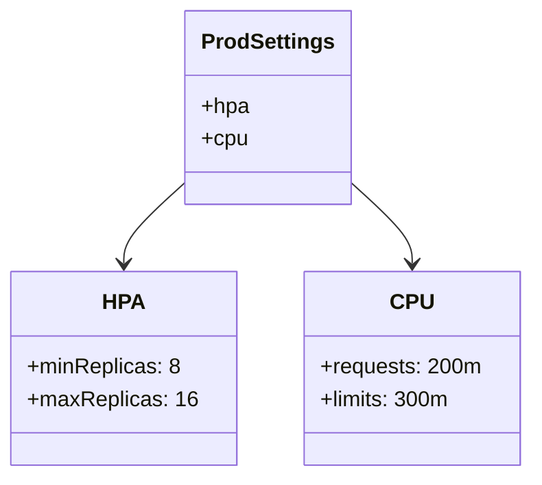

# Diagram: research/api_k8s/get_ai_eta/profiles/loadTesting.yaml


> Auto-generated by Obscura crawlers

## Diagram 1

```mermaid
flowchart TD
    A[Prepare load-testing values] --> B[Open ArgoCD App Manifest<br/>(Details &gt; Manifest &gt; Edit)]
    B --> C[Append ../profiles/loadTesting.yaml to end of list]
    C --> D[Save manifest]
    D --> E[Apply changes to target environment]
```

> SVG rendering failed for this diagram.

## Diagram 2



### SVG

<svg id="container" width="383.359375" xmlns="http://www.w3.org/2000/svg" class="classDiagram" height="354" viewBox="0 0 383.359375 354" role="graphics-document document" aria-roledescription="class"><style>#container{font-family:"trebuchet ms",verdana,arial,sans-serif;font-size:16px;fill:#333;}@keyframes edge-animation-frame{from{stroke-dashoffset:0;}}@keyframes dash{to{stroke-dashoffset:0;}}#container .edge-animation-slow{stroke-dasharray:9,5!important;stroke-dashoffset:900;animation:dash 50s linear infinite;stroke-linecap:round;}#container .edge-animation-fast{stroke-dasharray:9,5!important;stroke-dashoffset:900;animation:dash 20s linear infinite;stroke-linecap:round;}#container .error-icon{fill:#552222;}#container .error-text{fill:#552222;stroke:#552222;}#container .edge-thickness-normal{stroke-width:1px;}#container .edge-thickness-thick{stroke-width:3.5px;}#container .edge-pattern-solid{stroke-dasharray:0;}#container .edge-thickness-invisible{stroke-width:0;fill:none;}#container .edge-pattern-dashed{stroke-dasharray:3;}#container .edge-pattern-dotted{stroke-dasharray:2;}#container .marker{fill:#333333;stroke:#333333;}#container .marker.cross{stroke:#333333;}#container svg{font-family:"trebuchet ms",verdana,arial,sans-serif;font-size:16px;}#container p{margin:0;}#container g.classGroup text{fill:#9370DB;stroke:none;font-family:"trebuchet ms",verdana,arial,sans-serif;font-size:10px;}#container g.classGroup text .title{font-weight:bolder;}#container .nodeLabel,#container .edgeLabel{color:#131300;}#container .edgeLabel .label rect{fill:#ECECFF;}#container .label text{fill:#131300;}#container .labelBkg{background:#ECECFF;}#container .edgeLabel .label span{background:#ECECFF;}#container .classTitle{font-weight:bolder;}#container .node rect,#container .node circle,#container .node ellipse,#container .node polygon,#container .node path{fill:#ECECFF;stroke:#9370DB;stroke-width:1px;}#container .divider{stroke:#9370DB;stroke-width:1;}#container g.clickable{cursor:pointer;}#container g.classGroup rect{fill:#ECECFF;stroke:#9370DB;}#container g.classGroup line{stroke:#9370DB;stroke-width:1;}#container .classLabel .box{stroke:none;stroke-width:0;fill:#ECECFF;opacity:0.5;}#container .classLabel .label{fill:#9370DB;font-size:10px;}#container .relation{stroke:#333333;stroke-width:1;fill:none;}#container .dashed-line{stroke-dasharray:3;}#container .dotted-line{stroke-dasharray:1 2;}#container #compositionStart,#container .composition{fill:#333333!important;stroke:#333333!important;stroke-width:1;}#container #compositionEnd,#container .composition{fill:#333333!important;stroke:#333333!important;stroke-width:1;}#container #dependencyStart,#container .dependency{fill:#333333!important;stroke:#333333!important;stroke-width:1;}#container #dependencyStart,#container .dependency{fill:#333333!important;stroke:#333333!important;stroke-width:1;}#container #extensionStart,#container .extension{fill:transparent!important;stroke:#333333!important;stroke-width:1;}#container #extensionEnd,#container .extension{fill:transparent!important;stroke:#333333!important;stroke-width:1;}#container #aggregationStart,#container .aggregation{fill:transparent!important;stroke:#333333!important;stroke-width:1;}#container #aggregationEnd,#container .aggregation{fill:transparent!important;stroke:#333333!important;stroke-width:1;}#container #lollipopStart,#container .lollipop{fill:#ECECFF!important;stroke:#333333!important;stroke-width:1;}#container #lollipopEnd,#container .lollipop{fill:#ECECFF!important;stroke:#333333!important;stroke-width:1;}#container .edgeTerminals{font-size:11px;line-height:initial;}#container .classTitleText{text-anchor:middle;font-size:18px;fill:#333;}#container .label-icon{display:inline-block;height:1em;overflow:visible;vertical-align:-0.125em;}#container .node .label-icon path{fill:currentColor;stroke:revert;stroke-width:revert;}#container :root{--mermaid-font-family:"trebuchet ms",verdana,arial,sans-serif;}</style><g><defs><marker id="container_class-aggregationStart" class="marker aggregation class" refX="18" refY="7" markerWidth="190" markerHeight="240" orient="auto"><path d="M 18,7 L9,13 L1,7 L9,1 Z"></path></marker></defs><defs><marker id="container_class-aggregationEnd" class="marker aggregation class" refX="1" refY="7" markerWidth="20" markerHeight="28" orient="auto"><path d="M 18,7 L9,13 L1,7 L9,1 Z"></path></marker></defs><defs><marker id="container_class-extensionStart" class="marker extension class" refX="18" refY="7" markerWidth="190" markerHeight="240" orient="auto"><path d="M 1,7 L18,13 V 1 Z"></path></marker></defs><defs><marker id="container_class-extensionEnd" class="marker extension class" refX="1" refY="7" markerWidth="20" markerHeight="28" orient="auto"><path d="M 1,1 V 13 L18,7 Z"></path></marker></defs><defs><marker id="container_class-compositionStart" class="marker composition class" refX="18" refY="7" markerWidth="190" markerHeight="240" orient="auto"><path d="M 18,7 L9,13 L1,7 L9,1 Z"></path></marker></defs><defs><marker id="container_class-compositionEnd" class="marker composition class" refX="1" refY="7" markerWidth="20" markerHeight="28" orient="auto"><path d="M 18,7 L9,13 L1,7 L9,1 Z"></path></marker></defs><defs><marker id="container_class-dependencyStart" class="marker dependency class" refX="6" refY="7" markerWidth="190" markerHeight="240" orient="auto"><path d="M 5,7 L9,13 L1,7 L9,1 Z"></path></marker></defs><defs><marker id="container_class-dependencyEnd" class="marker dependency class" refX="13" refY="7" markerWidth="20" markerHeight="28" orient="auto"><path d="M 18,7 L9,13 L14,7 L9,1 Z"></path></marker></defs><defs><marker id="container_class-lollipopStart" class="marker lollipop class" refX="13" refY="7" markerWidth="190" markerHeight="240" orient="auto"><circle stroke="black" fill="transparent" cx="7" cy="7" r="6"></circle></marker></defs><defs><marker id="container_class-lollipopEnd" class="marker lollipop class" refX="1" refY="7" markerWidth="190" markerHeight="240" orient="auto"><circle stroke="black" fill="transparent" cx="7" cy="7" r="6"></circle></marker></defs><g class="root"><g class="clusters"></g><g class="edgePaths"><path d="M133.246,135.147L125.743,142.123C118.24,149.098,103.233,163.049,95.73,173.191C88.227,183.333,88.227,189.667,88.227,192.833L88.227,196" id="id_ProdSettings_HPA_1" class="edge-thickness-normal edge-pattern-solid relation" style=";;;" data-edge="true" data-et="edge" data-id="id_ProdSettings_HPA_1" data-points="W3sieCI6MTMzLjI0NjA5Mzc1LCJ5IjoxMzUuMTQ3MzkyNDYwMDM1MTh9LHsieCI6ODguMjI2NTYyNSwieSI6MTc3fSx7IngiOjg4LjIyNjU2MjUsInkiOjIwMn1d" marker-end="url(#container_class-dependencyEnd)"></path><path d="M251.887,135.147L259.39,142.123C266.893,149.098,281.9,163.049,289.403,173.191C296.906,183.333,296.906,189.667,296.906,192.833L296.906,196" id="id_ProdSettings_CPU_2" class="edge-thickness-normal edge-pattern-solid relation" style=";;;" data-edge="true" data-et="edge" data-id="id_ProdSettings_CPU_2" data-points="W3sieCI6MjUxLjg4NjcxODc1LCJ5IjoxMzUuMTQ3MzkyNDYwMDM1MTh9LHsieCI6Mjk2LjkwNjI1LCJ5IjoxNzd9LHsieCI6Mjk2LjkwNjI1LCJ5IjoyMDJ9XQ==" marker-end="url(#container_class-dependencyEnd)"></path></g><g class="edgeLabels"><g class="edgeLabel"><g class="label" data-id="id_ProdSettings_HPA_1" transform="translate(0, 0)"><foreignObject width="0" height="0"><div xmlns="http://www.w3.org/1999/xhtml" class="labelBkg" style="display: table-cell; white-space: nowrap; line-height: 1.5; max-width: 200px; text-align: center;"><span class="edgeLabel"></span></div></foreignObject></g></g><g class="edgeLabel"><g class="label" data-id="id_ProdSettings_CPU_2" transform="translate(0, 0)"><foreignObject width="0" height="0"><div xmlns="http://www.w3.org/1999/xhtml" class="labelBkg" style="display: table-cell; white-space: nowrap; line-height: 1.5; max-width: 200px; text-align: center;"><span class="edgeLabel"></span></div></foreignObject></g></g></g><g class="nodes"><g class="node default" id="classId-ProdSettings-0" transform="translate(192.56640625, 80)"><g class="basic label-container"><path d="M-59.3203125 -72 L59.3203125 -72 L59.3203125 72 L-59.3203125 72" stroke="none" stroke-width="0" fill="#ECECFF" style=""></path><path d="M-59.3203125 -72 C-16.574976949786965 -72, 26.17035860042607 -72, 59.3203125 -72 M-59.3203125 -72 C-29.77556165421015 -72, -0.23081080842030133 -72, 59.3203125 -72 M59.3203125 -72 C59.3203125 -22.693983331057048, 59.3203125 26.612033337885904, 59.3203125 72 M59.3203125 -72 C59.3203125 -29.349968192411957, 59.3203125 13.300063615176086, 59.3203125 72 M59.3203125 72 C35.162767378747596 72, 11.005222257495191 72, -59.3203125 72 M59.3203125 72 C29.131834634237695 72, -1.0566432315246104 72, -59.3203125 72 M-59.3203125 72 C-59.3203125 41.693598771848265, -59.3203125 11.38719754369653, -59.3203125 -72 M-59.3203125 72 C-59.3203125 35.13398608916341, -59.3203125 -1.732027821673185, -59.3203125 -72" stroke="#9370DB" stroke-width="1.3" fill="none" stroke-dasharray="0 0" style=""></path></g><g class="annotation-group text" transform="translate(0, -48)"></g><g class="label-group text" transform="translate(-47.3203125, -48)"><g class="label" style="font-weight: bolder" transform="translate(0,-12)"><foreignObject width="94.640625" height="24"><div xmlns="http://www.w3.org/1999/xhtml" style="display: table-cell; white-space: nowrap; line-height: 1.5; max-width: 142px; text-align: center;"><span class="nodeLabel markdown-node-label" style=""><p>ProdSettings</p></span></div></foreignObject></g></g><g class="members-group text" transform="translate(-47.3203125, 0)"><g class="label" style="" transform="translate(0,-12)"><foreignObject width="35.421875" height="24"><div xmlns="http://www.w3.org/1999/xhtml" style="display: table-cell; white-space: nowrap; line-height: 1.5; max-width: 93px; text-align: center;"><span class="nodeLabel markdown-node-label" style=""><p>+hpa</p></span></div></foreignObject></g><g class="label" style="" transform="translate(0,12)"><foreignObject width="34.453125" height="24"><div xmlns="http://www.w3.org/1999/xhtml" style="display: table-cell; white-space: nowrap; line-height: 1.5; max-width: 92px; text-align: center;"><span class="nodeLabel markdown-node-label" style=""><p>+cpu</p></span></div></foreignObject></g></g><g class="methods-group text" transform="translate(-47.3203125, 72)"></g><g class="divider" style=""><path d="M-59.3203125 -24 C-30.988893125566207 -24, -2.6574737511324145 -24, 59.3203125 -24 M-59.3203125 -24 C-31.91235116265218 -24, -4.504389825304358 -24, 59.3203125 -24" stroke="#9370DB" stroke-width="1.3" fill="none" stroke-dasharray="0 0" style=""></path></g><g class="divider" style=""><path d="M-59.3203125 48 C-28.3450741390857 48, 2.6301642218286005 48, 59.3203125 48 M-59.3203125 48 C-25.4681604657927 48, 8.3839915684146 48, 59.3203125 48" stroke="#9370DB" stroke-width="1.3" fill="none" stroke-dasharray="0 0" style=""></path></g></g><g class="node default" id="classId-HPA-1" transform="translate(88.2265625, 274)"><g class="basic label-container"><path d="M-80.2265625 -72 L80.2265625 -72 L80.2265625 72 L-80.2265625 72" stroke="none" stroke-width="0" fill="#ECECFF" style=""></path><path d="M-80.2265625 -72 C-42.3685630860213 -72, -4.5105636720425935 -72, 80.2265625 -72 M-80.2265625 -72 C-40.52472433754692 -72, -0.8228861750938421 -72, 80.2265625 -72 M80.2265625 -72 C80.2265625 -24.153033144660633, 80.2265625 23.693933710678735, 80.2265625 72 M80.2265625 -72 C80.2265625 -35.29433900042461, 80.2265625 1.4113219991507862, 80.2265625 72 M80.2265625 72 C23.90526087760714 72, -32.41604074478572 72, -80.2265625 72 M80.2265625 72 C20.725203039086345 72, -38.77615642182731 72, -80.2265625 72 M-80.2265625 72 C-80.2265625 27.846042014347972, -80.2265625 -16.307915971304055, -80.2265625 -72 M-80.2265625 72 C-80.2265625 21.694611595918047, -80.2265625 -28.610776808163905, -80.2265625 -72" stroke="#9370DB" stroke-width="1.3" fill="none" stroke-dasharray="0 0" style=""></path></g><g class="annotation-group text" transform="translate(0, -48)"></g><g class="label-group text" transform="translate(-14.375, -48)"><g class="label" style="font-weight: bolder" transform="translate(0,-12)"><foreignObject width="28.75" height="24"><div xmlns="http://www.w3.org/1999/xhtml" style="display: table-cell; white-space: nowrap; line-height: 1.5; max-width: 79px; text-align: center;"><span class="nodeLabel markdown-node-label" style=""><p>HPA</p></span></div></foreignObject></g></g><g class="members-group text" transform="translate(-68.2265625, 0)"><g class="label" style="" transform="translate(0,-12)"><foreignObject width="112.859375" height="24"><div xmlns="http://www.w3.org/1999/xhtml" style="display: table-cell; white-space: nowrap; line-height: 1.5; max-width: 170px; text-align: center;"><span class="nodeLabel markdown-node-label" style=""><p>+minReplicas: 8</p></span></div></foreignObject></g><g class="label" style="" transform="translate(0,12)"><foreignObject width="122.078125" height="24"><div xmlns="http://www.w3.org/1999/xhtml" style="display: table-cell; white-space: nowrap; line-height: 1.5; max-width: 179px; text-align: center;"><span class="nodeLabel markdown-node-label" style=""><p>+maxReplicas: 16</p></span></div></foreignObject></g></g><g class="methods-group text" transform="translate(-68.2265625, 72)"></g><g class="divider" style=""><path d="M-80.2265625 -24 C-30.13266208092481 -24, 19.96123833815038 -24, 80.2265625 -24 M-80.2265625 -24 C-39.61580752786112 -24, 0.9949474442777557 -24, 80.2265625 -24" stroke="#9370DB" stroke-width="1.3" fill="none" stroke-dasharray="0 0" style=""></path></g><g class="divider" style=""><path d="M-80.2265625 48 C-38.85387911413584 48, 2.518804271728314 48, 80.2265625 48 M-80.2265625 48 C-34.78234708382327 48, 10.661868332353464 48, 80.2265625 48" stroke="#9370DB" stroke-width="1.3" fill="none" stroke-dasharray="0 0" style=""></path></g></g><g class="node default" id="classId-CPU-2" transform="translate(296.90625, 274)"><g class="basic label-container"><path d="M-78.453125 -72 L78.453125 -72 L78.453125 72 L-78.453125 72" stroke="none" stroke-width="0" fill="#ECECFF" style=""></path><path d="M-78.453125 -72 C-34.73673071941114 -72, 8.979663561177716 -72, 78.453125 -72 M-78.453125 -72 C-34.91555823480885 -72, 8.622008530382303 -72, 78.453125 -72 M78.453125 -72 C78.453125 -42.54455156420823, 78.453125 -13.089103128416454, 78.453125 72 M78.453125 -72 C78.453125 -31.40643269953832, 78.453125 9.187134600923358, 78.453125 72 M78.453125 72 C39.91737198220727 72, 1.3816189644145425 72, -78.453125 72 M78.453125 72 C28.27052679477891 72, -21.91207141044218 72, -78.453125 72 M-78.453125 72 C-78.453125 19.360599848558863, -78.453125 -33.278800302882274, -78.453125 -72 M-78.453125 72 C-78.453125 21.510783160237807, -78.453125 -28.978433679524386, -78.453125 -72" stroke="#9370DB" stroke-width="1.3" fill="none" stroke-dasharray="0 0" style=""></path></g><g class="annotation-group text" transform="translate(0, -48)"></g><g class="label-group text" transform="translate(-14.609375, -48)"><g class="label" style="font-weight: bolder" transform="translate(0,-12)"><foreignObject width="29.21875" height="24"><div xmlns="http://www.w3.org/1999/xhtml" style="display: table-cell; white-space: nowrap; line-height: 1.5; max-width: 79px; text-align: center;"><span class="nodeLabel markdown-node-label" style=""><p>CPU</p></span></div></foreignObject></g></g><g class="members-group text" transform="translate(-66.453125, 0)"><g class="label" style="" transform="translate(0,-12)"><foreignObject width="118.296875" height="24"><div xmlns="http://www.w3.org/1999/xhtml" style="display: table-cell; white-space: nowrap; line-height: 1.5; max-width: 176px; text-align: center;"><span class="nodeLabel markdown-node-label" style=""><p>+requests: 200m</p></span></div></foreignObject></g><g class="label" style="" transform="translate(0,12)"><foreignObject width="96.296875" height="24"><div xmlns="http://www.w3.org/1999/xhtml" style="display: table-cell; white-space: nowrap; line-height: 1.5; max-width: 154px; text-align: center;"><span class="nodeLabel markdown-node-label" style=""><p>+limits: 300m</p></span></div></foreignObject></g></g><g class="methods-group text" transform="translate(-66.453125, 72)"></g><g class="divider" style=""><path d="M-78.453125 -24 C-23.955045537158632 -24, 30.543033925682735 -24, 78.453125 -24 M-78.453125 -24 C-43.08832879459952 -24, -7.7235325891990385 -24, 78.453125 -24" stroke="#9370DB" stroke-width="1.3" fill="none" stroke-dasharray="0 0" style=""></path></g><g class="divider" style=""><path d="M-78.453125 48 C-31.38037175456912 48, 15.692381490861763 48, 78.453125 48 M-78.453125 48 C-31.720554321785805 48, 15.01201635642839 48, 78.453125 48" stroke="#9370DB" stroke-width="1.3" fill="none" stroke-dasharray="0 0" style=""></path></g></g></g></g></g></svg>
