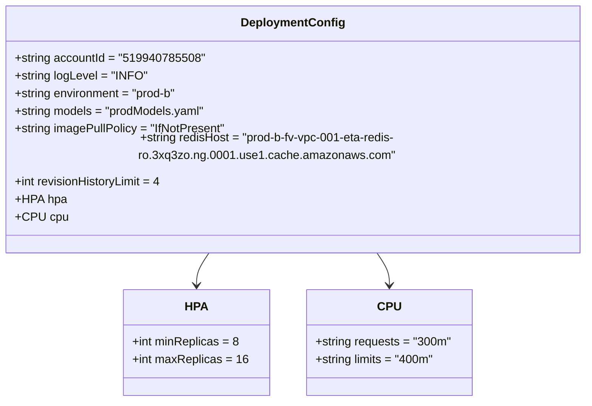
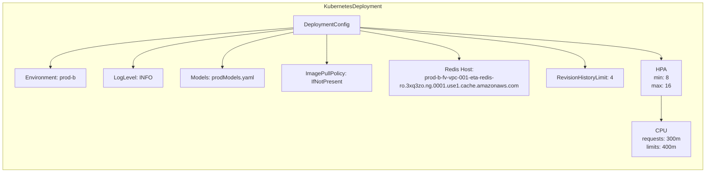

# Diagram: research/api_k8s/get_ai_eta/profiles/values.prod-b.yaml

> Auto-generated by Obscura crawlers

## Diagram 1

### SVG

<svg id="container" width="798.109375" xmlns="http://www.w3.org/2000/svg" class="classDiagram" height="522" viewBox="0 0 798.109375 522" role="graphics-document document" aria-roledescription="class"><g><defs><marker id="container_class-aggregationStart" class="marker aggregation class" refX="18" refY="7" markerWidth="190" markerHeight="240" orient="auto"><path d="M 18,7 L9,13 L1,7 L9,1 Z"></path></marker></defs><defs><marker id="container_class-aggregationEnd" class="marker aggregation class" refX="1" refY="7" markerWidth="20" markerHeight="28" orient="auto"><path d="M 18,7 L9,13 L1,7 L9,1 Z"></path></marker></defs><defs><marker id="container_class-extensionStart" class="marker extension class" refX="18" refY="7" markerWidth="190" markerHeight="240" orient="auto"><path d="M 1,7 L18,13 V 1 Z"></path></marker></defs><defs><marker id="container_class-extensionEnd" class="marker extension class" refX="1" refY="7" markerWidth="20" markerHeight="28" orient="auto"><path d="M 1,1 V 13 L18,7 Z"></path></marker></defs><defs><marker id="container_class-compositionStart" class="marker composition class" refX="18" refY="7" markerWidth="190" markerHeight="240" orient="auto"><path d="M 18,7 L9,13 L1,7 L9,1 Z"></path></marker></defs><defs><marker id="container_class-compositionEnd" class="marker composition class" refX="1" refY="7" markerWidth="20" markerHeight="28" orient="auto"><path d="M 18,7 L9,13 L1,7 L9,1 Z"></path></marker></defs><defs><marker id="container_class-dependencyStart" class="marker dependency class" refX="6" refY="7" markerWidth="190" markerHeight="240" orient="auto"><path d="M 5,7 L9,13 L1,7 L9,1 Z"></path></marker></defs><defs><marker id="container_class-dependencyEnd" class="marker dependency class" refX="13" refY="7" markerWidth="20" markerHeight="28" orient="auto"><path d="M 18,7 L9,13 L14,7 L9,1 Z"></path></marker></defs><defs><marker id="container_class-lollipopStart" class="marker lollipop class" refX="13" refY="7" markerWidth="190" markerHeight="240" orient="auto"><circle stroke="black" fill="transparent" cx="7" cy="7" r="6"></circle></marker></defs><defs><marker id="container_class-lollipopEnd" class="marker lollipop class" refX="1" refY="7" markerWidth="190" markerHeight="240" orient="auto"><circle stroke="black" fill="transparent" cx="7" cy="7" r="6"></circle></marker></defs><g class="root"><g class="clusters"></g><g class="edgePaths"><path d="M287.744,320L284.771,324.167C281.798,328.333,275.852,336.667,272.879,344C269.906,351.333,269.906,357.667,269.906,360.833L269.906,364" id="id_DeploymentConfig_HPA_1" class="edge-thickness-normal edge-pattern-solid relation" style=";;;" data-edge="true" data-et="edge" data-id="id_DeploymentConfig_HPA_1" data-points="W3sieCI6Mjg3Ljc0NDQzMTk3NTEzODEsInkiOjMyMH0seyJ4IjoyNjkuOTA2MjUsInkiOjM0NX0seyJ4IjoyNjkuOTA2MjUsInkiOjM3MH1d" marker-end="url(#container_class-dependencyEnd)"></path><path d="M510.365,320L513.338,324.167C516.311,328.333,522.257,336.667,525.23,344C528.203,351.333,528.203,357.667,528.203,360.833L528.203,364" id="id_DeploymentConfig_CPU_2" class="edge-thickness-normal edge-pattern-solid relation" style=";;;" data-edge="true" data-et="edge" data-id="id_DeploymentConfig_CPU_2" data-points="W3sieCI6NTEwLjM2NDk0MzAyNDg2MTksInkiOjMyMH0seyJ4Ijo1MjguMjAzMTI1LCJ5IjozNDV9LHsieCI6NTI4LjIwMzEyNSwieSI6MzcwfV0=" marker-end="url(#container_class-dependencyEnd)"></path></g><g class="edgeLabels"><g class="edgeLabel"><g class="label" data-id="id_DeploymentConfig_HPA_1" transform="translate(0, 0)"><foreignObject width="0" height="0">

</foreignObject></g></g><g class="edgeLabel"><g class="label" data-id="id_DeploymentConfig_CPU_2" transform="translate(0, 0)"><foreignObject width="0" height="0">

</foreignObject></g></g></g><g class="nodes"><g class="node default" id="classId-DeploymentConfig-0" transform="translate(399.0546875, 164)"><g class="basic label-container"><path d="M-391.0546875 -156 L391.0546875 -156 L391.0546875 156 L-391.0546875 156" stroke="none" stroke-width="0" fill="#ECECFF" style=""></path><path d="M-391.0546875 -156 C-173.36659720193526 -156, 44.32149309612947 -156, 391.0546875 -156 M-391.0546875 -156 C-143.75602491870254 -156, 103.54263766259493 -156, 391.0546875 -156 M391.0546875 -156 C391.0546875 -75.02701170939368, 391.0546875 5.945976581212648, 391.0546875 156 M391.0546875 -156 C391.0546875 -79.14386656835241, 391.0546875 -2.2877331367048157, 391.0546875 156 M391.0546875 156 C121.06933478256303 156, -148.91601793487393 156, -391.0546875 156 M391.0546875 156 C119.05250282708141 156, -152.94968184583718 156, -391.0546875 156 M-391.0546875 156 C-391.0546875 73.7923251987649, -391.0546875 -8.4153496024702, -391.0546875 -156 M-391.0546875 156 C-391.0546875 89.36972539086977, -391.0546875 22.73945078173955, -391.0546875 -156" stroke="#9370DB" stroke-width="1.3" fill="none" stroke-dasharray="0 0" style=""></path></g><g class="annotation-group text" transform="translate(0, -132)"></g><g class="label-group text" transform="translate(-67.296875, -132)"><g class="label" style="font-weight: bolder" transform="translate(0,-12)"><foreignObject width="134.59375" height="24">

DeploymentConfig

</foreignObject></g></g><g class="members-group text" transform="translate(-379.0546875, -84)"><g class="label" style="" transform="translate(0,-12)"><foreignObject width="251.515625" height="24">

+string accountId = "519940785508"

</foreignObject></g><g class="label" style="" transform="translate(0,12)"><foreignObject width="177.125" height="24">

+string logLevel = "INFO"

</foreignObject></g><g class="label" style="" transform="translate(0,36)"><foreignObject width="225.390625" height="24">

+string environment = "prod-b"

</foreignObject></g><g class="label" style="" transform="translate(0,60)"><foreignObject width="260.640625" height="24">

+string models = "prodModels.yaml"

</foreignObject></g><g class="label" style="" transform="translate(0,84)"><foreignObject width="287.71875" height="24">

+string imagePullPolicy = "IfNotPresent"

</foreignObject></g><g class="label" style="" transform="translate(0,108)"><foreignObject width="690.8125" height="24">

+string redisHost = "prod-b-fv-vpc-001-eta-redis-ro.3xq3zo.ng.0001.use1.cache.amazonaws.com"

</foreignObject></g><g class="label" style="" transform="translate(0,132)"><foreignObject width="202.59375" height="24">

+int revisionHistoryLimit = 4

</foreignObject></g><g class="label" style="" transform="translate(0,156)"><foreignObject width="68.046875" height="24">

+HPA hpa

</foreignObject></g><g class="label" style="" transform="translate(0,180)"><foreignObject width="67.546875" height="24">

+CPU cpu

</foreignObject></g></g><g class="methods-group text" transform="translate(-379.0546875, 156)"></g><g class="divider" style=""><path d="M-391.0546875 -108 C-230.60127299817066 -108, -70.14785849634131 -108, 391.0546875 -108 M-391.0546875 -108 C-138.16781844953746 -108, 114.71905060092507 -108, 391.0546875 -108" stroke="#9370DB" stroke-width="1.3" fill="none" stroke-dasharray="0 0" style=""></path></g><g class="divider" style=""><path d="M-391.0546875 132 C-119.23361092269818 132, 152.58746565460365 132, 391.0546875 132 M-391.0546875 132 C-178.7695391711524 132, 33.51560915769522 132, 391.0546875 132" stroke="#9370DB" stroke-width="1.3" fill="none" stroke-dasharray="0 0" style=""></path></g></g><g class="node default" id="classId-HPA-1" transform="translate(269.90625, 442)"><g class="basic label-container"><path d="M-96.375 -72 L96.375 -72 L96.375 72 L-96.375 72" stroke="none" stroke-width="0" fill="#ECECFF" style=""></path><path d="M-96.375 -72 C-55.97324861432997 -72, -15.571497228659936 -72, 96.375 -72 M-96.375 -72 C-57.62989782991418 -72, -18.884795659828356 -72, 96.375 -72 M96.375 -72 C96.375 -16.491795894144595, 96.375 39.01640821171081, 96.375 72 M96.375 -72 C96.375 -20.573586695408295, 96.375 30.85282660918341, 96.375 72 M96.375 72 C23.995227915737615 72, -48.38454416852477 72, -96.375 72 M96.375 72 C26.280253689790783 72, -43.814492620418434 72, -96.375 72 M-96.375 72 C-96.375 20.378207235091523, -96.375 -31.243585529816954, -96.375 -72 M-96.375 72 C-96.375 39.153463445292715, -96.375 6.30692689058543, -96.375 -72" stroke="#9370DB" stroke-width="1.3" fill="none" stroke-dasharray="0 0" style=""></path></g><g class="annotation-group text" transform="translate(0, -48)"></g><g class="label-group text" transform="translate(-14.375, -48)"><g class="label" style="font-weight: bolder" transform="translate(0,-12)"><foreignObject width="28.75" height="24">

HPA

</foreignObject></g></g><g class="members-group text" transform="translate(-84.375, 0)"><g class="label" style="" transform="translate(0,-12)"><foreignObject width="145.15625" height="24">

+int minReplicas = 8

</foreignObject></g><g class="label" style="" transform="translate(0,12)"><foreignObject width="154.375" height="24">

+int maxReplicas = 16

</foreignObject></g></g><g class="methods-group text" transform="translate(-84.375, 72)"></g><g class="divider" style=""><path d="M-96.375 -24 C-50.622000288635356 -24, -4.869000577270711 -24, 96.375 -24 M-96.375 -24 C-31.6057272923874 -24, 33.1635454152252 -24, 96.375 -24" stroke="#9370DB" stroke-width="1.3" fill="none" stroke-dasharray="0 0" style=""></path></g><g class="divider" style=""><path d="M-96.375 48 C-56.73143418573618 48, -17.087868371472354 48, 96.375 48 M-96.375 48 C-37.04145284870909 48, 22.292094302581816 48, 96.375 48" stroke="#9370DB" stroke-width="1.3" fill="none" stroke-dasharray="0 0" style=""></path></g></g><g class="node default" id="classId-CPU-2" transform="translate(528.203125, 442)"><g class="basic label-container"><path d="M-111.921875 -72 L111.921875 -72 L111.921875 72 L-111.921875 72" stroke="none" stroke-width="0" fill="#ECECFF" style=""></path><path d="M-111.921875 -72 C-61.189904695501944 -72, -10.457934391003889 -72, 111.921875 -72 M-111.921875 -72 C-27.4809530869408 -72, 56.9599688261184 -72, 111.921875 -72 M111.921875 -72 C111.921875 -41.02697017260207, 111.921875 -10.05394034520414, 111.921875 72 M111.921875 -72 C111.921875 -36.83382509796073, 111.921875 -1.6676501959214534, 111.921875 72 M111.921875 72 C59.548952476124114 72, 7.1760299522482285 72, -111.921875 72 M111.921875 72 C37.951226015553814 72, -36.01942296889237 72, -111.921875 72 M-111.921875 72 C-111.921875 14.849811231538396, -111.921875 -42.30037753692321, -111.921875 -72 M-111.921875 72 C-111.921875 18.4880746836821, -111.921875 -35.0238506326358, -111.921875 -72" stroke="#9370DB" stroke-width="1.3" fill="none" stroke-dasharray="0 0" style=""></path></g><g class="annotation-group text" transform="translate(0, -48)"></g><g class="label-group text" transform="translate(-14.609375, -48)"><g class="label" style="font-weight: bolder" transform="translate(0,-12)"><foreignObject width="29.21875" height="24">

CPU

</foreignObject></g></g><g class="members-group text" transform="translate(-99.921875, 0)"><g class="label" style="" transform="translate(0,-12)"><foreignObject width="185.234375" height="24">

+string requests = "300m"

</foreignObject></g><g class="label" style="" transform="translate(0,12)"><foreignObject width="163.0625" height="24">

+string limits = "400m"

</foreignObject></g></g><g class="methods-group text" transform="translate(-99.921875, 72)"></g><g class="divider" style=""><path d="M-111.921875 -24 C-32.746690077185605 -24, 46.42849484562879 -24, 111.921875 -24 M-111.921875 -24 C-49.72862349943001 -24, 12.464628001139985 -24, 111.921875 -24" stroke="#9370DB" stroke-width="1.3" fill="none" stroke-dasharray="0 0" style=""></path></g><g class="divider" style=""><path d="M-111.921875 48 C-42.40737113795255 48, 27.107132724094896 48, 111.921875 48 M-111.921875 48 C-33.74113318121445 48, 44.4396086375711 48, 111.921875 48" stroke="#9370DB" stroke-width="1.3" fill="none" stroke-dasharray="0 0" style=""></path></g></g></g></g></g></svg>

## Diagram 2

### SVG

<svg id="container" width="2122.3359375" xmlns="http://www.w3.org/2000/svg" class="flowchart" height="451" viewBox="0 0 2122.3359375 451" role="graphics-document document" aria-roledescription="flowchart-v2"><g><marker id="container_flowchart-v2-pointEnd" class="marker flowchart-v2" viewBox="0 0 10 10" refX="5" refY="5" markerUnits="userSpaceOnUse" markerWidth="8" markerHeight="8" orient="auto"><path d="M 0 0 L 10 5 L 0 10 z" class="arrowMarkerPath" style="stroke-width: 1; stroke-dasharray: 1, 0;"></path></marker><marker id="container_flowchart-v2-pointStart" class="marker flowchart-v2" viewBox="0 0 10 10" refX="4.5" refY="5" markerUnits="userSpaceOnUse" markerWidth="8" markerHeight="8" orient="auto"><path d="M 0 5 L 10 10 L 10 0 z" class="arrowMarkerPath" style="stroke-width: 1; stroke-dasharray: 1, 0;"></path></marker><marker id="container_flowchart-v2-circleEnd" class="marker flowchart-v2" viewBox="0 0 10 10" refX="11" refY="5" markerUnits="userSpaceOnUse" markerWidth="11" markerHeight="11" orient="auto"><circle cx="5" cy="5" r="5" class="arrowMarkerPath" style="stroke-width: 1; stroke-dasharray: 1, 0;"></circle></marker><marker id="container_flowchart-v2-circleStart" class="marker flowchart-v2" viewBox="0 0 10 10" refX="-1" refY="5" markerUnits="userSpaceOnUse" markerWidth="11" markerHeight="11" orient="auto"><circle cx="5" cy="5" r="5" class="arrowMarkerPath" style="stroke-width: 1; stroke-dasharray: 1, 0;"></circle></marker><marker id="container_flowchart-v2-crossEnd" class="marker cross flowchart-v2" viewBox="0 0 11 11" refX="12" refY="5.2" markerUnits="userSpaceOnUse" markerWidth="11" markerHeight="11" orient="auto"><path d="M 1,1 l 9,9 M 10,1 l -9,9" class="arrowMarkerPath" style="stroke-width: 2; stroke-dasharray: 1, 0;"></path></marker><marker id="container_flowchart-v2-crossStart" class="marker cross flowchart-v2" viewBox="0 0 11 11" refX="-1" refY="5.2" markerUnits="userSpaceOnUse" markerWidth="11" markerHeight="11" orient="auto"><path d="M 1,1 l 9,9 M 10,1 l -9,9" class="arrowMarkerPath" style="stroke-width: 2; stroke-dasharray: 1, 0;"></path></marker><g class="root"><g class="clusters"></g><g class="edgePaths"></g><g class="edgeLabels"></g><g class="nodes"><g class="root" transform="translate(0, 0)"><g class="clusters"><g class="cluster" id="KubernetesDeployment" data-look="classic"><rect style="" x="8" y="8" width="2106.3359375" height="435"></rect><g class="cluster-label" transform="translate(975.81640625, 8)"><foreignObject width="170.703125" height="24">

KubernetesDeployment

</foreignObject></g></g></g><g class="edgePaths"><path d="M846.695,80.32L730.268,89.767C613.841,99.214,380.987,118.107,264.56,135.137C148.133,152.167,148.133,167.333,148.133,174.917L148.133,182.5" id="L_cfg_env_0" class="edge-thickness-normal edge-pattern-solid edge-thickness-normal edge-pattern-solid flowchart-link" style=";" data-edge="true" data-et="edge" data-id="L_cfg_env_0" data-points="W3sieCI6ODQ2LjY5NTMxMjUsInkiOjgwLjMyMDI3NTU2OTI3MDY4fSx7IngiOjE0OC4xMzI4MTI1LCJ5IjoxMzd9LHsieCI6MTQ4LjEzMjgxMjUsInkiOjE4Ni41fV0=" marker-end="url(#container_flowchart-v2-pointEnd)"></path><path d="M846.695,83.657L769.892,92.547C693.089,101.438,539.482,119.219,462.678,135.693C385.875,152.167,385.875,167.333,385.875,174.917L385.875,182.5" id="L_cfg_log_0" class="edge-thickness-normal edge-pattern-solid edge-thickness-normal edge-pattern-solid flowchart-link" style=";" data-edge="true" data-et="edge" data-id="L_cfg_log_0" data-points="W3sieCI6ODQ2LjY5NTMxMjUsInkiOjgzLjY1Njk1NzE4MDExMjczfSx7IngiOjM4NS44NzUsInkiOjEzN30seyJ4IjozODUuODc1LCJ5IjoxODYuNX1d" marker-end="url(#container_flowchart-v2-pointEnd)"></path><path d="M846.695,93.065L812.376,100.387C778.057,107.71,709.419,122.355,675.1,137.261C640.781,152.167,640.781,167.333,640.781,174.917L640.781,182.5" id="L_cfg_models_0" class="edge-thickness-normal edge-pattern-solid edge-thickness-normal edge-pattern-solid flowchart-link" style=";" data-edge="true" data-et="edge" data-id="L_cfg_models_0" data-points="W3sieCI6ODQ2LjY5NTMxMjUsInkiOjkzLjA2NDg1NTAxNjI4MTZ9LHsieCI6NjQwLjc4MTI1LCJ5IjoxMzd9LHsieCI6NjQwLjc4MTI1LCJ5IjoxODYuNX1d" marker-end="url(#container_flowchart-v2-pointEnd)"></path><path d="M943.078,99.5L943.078,105.75C943.078,112,943.078,124.5,943.078,136.333C943.078,148.167,943.078,159.333,943.078,164.917L943.078,170.5" id="L_cfg_image_0" class="edge-thickness-normal edge-pattern-solid edge-thickness-normal edge-pattern-solid flowchart-link" style=";" data-edge="true" data-et="edge" data-id="L_cfg_image_0" data-points="W3sieCI6OTQzLjA3ODEyNSwieSI6OTkuNX0seyJ4Ijo5NDMuMDc4MTI1LCJ5IjoxMzd9LHsieCI6OTQzLjA3ODEyNSwieSI6MTc0LjV9XQ==" marker-end="url(#container_flowchart-v2-pointEnd)"></path><path d="M1039.461,89.088L1085.859,97.073C1132.258,105.059,1225.055,121.029,1271.453,134.598C1317.852,148.167,1317.852,159.333,1317.852,164.917L1317.852,170.5" id="L_cfg_redis_0" class="edge-thickness-normal edge-pattern-solid edge-thickness-normal edge-pattern-solid flowchart-link" style=";" data-edge="true" data-et="edge" data-id="L_cfg_redis_0" data-points="W3sieCI6MTAzOS40NjA5Mzc1LCJ5Ijo4OS4wODc4NjU1ODU0NTc4OH0seyJ4IjoxMzE3Ljg1MTU2MjUsInkiOjEzN30seyJ4IjoxMzE3Ljg1MTU2MjUsInkiOjE3NC41fV0=" marker-end="url(#container_flowchart-v2-pointEnd)"></path><path d="M1039.461,80.986L1145.499,90.321C1251.536,99.657,1463.612,118.329,1569.65,135.248C1675.688,152.167,1675.688,167.333,1675.688,174.917L1675.688,182.5" id="L_cfg_rev_0" class="edge-thickness-normal edge-pattern-solid edge-thickness-normal edge-pattern-solid flowchart-link" style=";" data-edge="true" data-et="edge" data-id="L_cfg_rev_0" data-points="W3sieCI6MTAzOS40NjA5Mzc1LCJ5Ijo4MC45ODU2ODM2NjQ5ODE3Nn0seyJ4IjoxNjc1LjY4NzUsInkiOjEzN30seyJ4IjoxNjc1LjY4NzUsInkiOjE4Ni41fV0=" marker-end="url(#container_flowchart-v2-pointEnd)"></path><path d="M1039.461,78.678L1191.107,88.398C1342.753,98.119,1646.044,117.559,1797.69,134.863C1949.336,152.167,1949.336,167.333,1949.336,174.917L1949.336,182.5" id="L_cfg_hpa_0" class="edge-thickness-normal edge-pattern-solid edge-thickness-normal edge-pattern-solid flowchart-link" style=";" data-edge="true" data-et="edge" data-id="L_cfg_hpa_0" data-points="W3sieCI6MTAzOS40NjA5Mzc1LCJ5Ijo3OC42NzgwMzA0NTAwNzQxNX0seyJ4IjoxOTQ5LjMzNTkzNzUsInkiOjEzN30seyJ4IjoxOTQ5LjMzNTkzNzUsInkiOjE4Ni41fV0=" marker-end="url(#container_flowchart-v2-pointEnd)"></path><path d="M1949.336,240.5L1949.336,248.75C1949.336,257,1949.336,273.5,1949.336,287.333C1949.336,301.167,1949.336,312.333,1949.336,317.917L1949.336,323.5" id="L_hpa_cpu_0" class="edge-thickness-normal edge-pattern-solid edge-thickness-normal edge-pattern-solid flowchart-link" style=";" data-edge="true" data-et="edge" data-id="L_hpa_cpu_0" data-points="W3sieCI6MTk0OS4zMzU5Mzc1LCJ5IjoyNDAuNX0seyJ4IjoxOTQ5LjMzNTkzNzUsInkiOjI5MH0seyJ4IjoxOTQ5LjMzNTkzNzUsInkiOjMyNy41fV0=" marker-end="url(#container_flowchart-v2-pointEnd)"></path></g><g class="edgeLabels"><g class="edgeLabel"><g class="label" data-id="L_cfg_env_0" transform="translate(0, 0)"><foreignObject width="0" height="0">

</foreignObject></g></g><g class="edgeLabel"><g class="label" data-id="L_cfg_log_0" transform="translate(0, 0)"><foreignObject width="0" height="0">

</foreignObject></g></g><g class="edgeLabel"><g class="label" data-id="L_cfg_models_0" transform="translate(0, 0)"><foreignObject width="0" height="0">

</foreignObject></g></g><g class="edgeLabel"><g class="label" data-id="L_cfg_image_0" transform="translate(0, 0)"><foreignObject width="0" height="0">

</foreignObject></g></g><g class="edgeLabel"><g class="label" data-id="L_cfg_redis_0" transform="translate(0, 0)"><foreignObject width="0" height="0">

</foreignObject></g></g><g class="edgeLabel"><g class="label" data-id="L_cfg_rev_0" transform="translate(0, 0)"><foreignObject width="0" height="0">

</foreignObject></g></g><g class="edgeLabel"><g class="label" data-id="L_cfg_hpa_0" transform="translate(0, 0)"><foreignObject width="0" height="0">

</foreignObject></g></g><g class="edgeLabel"><g class="label" data-id="L_hpa_cpu_0" transform="translate(0, 0)"><foreignObject width="0" height="0">

</foreignObject></g></g></g><g class="nodes"><g class="node default" id="flowchart-cfg-0" transform="translate(943.078125, 72.5)"><rect class="basic label-container" style="" x="-96.3828125" y="-27" width="192.765625" height="54"></rect><g class="label" style="" transform="translate(-66.3828125, -12)"><rect></rect><foreignObject width="132.765625" height="24">

DeploymentConfig

</foreignObject></g></g><g class="node default" id="flowchart-env-1" transform="translate(148.1328125, 213.5)"><rect class="basic label-container" style="" x="-105.1328125" y="-27" width="210.265625" height="54"></rect><g class="label" style="" transform="translate(-75.1328125, -12)"><rect></rect><foreignObject width="150.265625" height="24">

Environment: prod-b

</foreignObject></g></g><g class="node default" id="flowchart-log-2" transform="translate(385.875, 213.5)"><rect class="basic label-container" style="" x="-82.609375" y="-27" width="165.21875" height="54"></rect><g class="label" style="" transform="translate(-52.609375, -12)"><rect></rect><foreignObject width="105.21875" height="24">

LogLevel: INFO

</foreignObject></g></g><g class="node default" id="flowchart-models-3" transform="translate(640.78125, 213.5)"><rect class="basic label-container" style="" x="-122.296875" y="-27" width="244.59375" height="54"></rect><g class="label" style="" transform="translate(-92.296875, -12)"><rect></rect><foreignObject width="184.59375" height="24">

Models: prodModels.yaml

</foreignObject></g></g><g class="node default" id="flowchart-image-4" transform="translate(943.078125, 213.5)"><rect class="basic label-container" style="" x="-130" y="-39" width="260" height="78"></rect><g class="label" style="" transform="translate(-100, -24)"><rect></rect><foreignObject width="200" height="48">

ImagePullPolicy: IfNotPresent

</foreignObject></g></g><g class="node default" id="flowchart-redis-5" transform="translate(1317.8515625, 213.5)"><rect class="basic label-container" style="" x="-194.7734375" y="-39" width="389.546875" height="78"></rect><g class="label" style="" transform="translate(-164.7734375, -24)"><rect></rect><foreignObject width="329.546875" height="48">

Redis Host:\nprod-b-fv-vpc-001-eta-redis-ro.3xq3zo.ng.0001.use1.cache.amazonaws.com

</foreignObject></g></g><g class="node default" id="flowchart-rev-6" transform="translate(1675.6875, 213.5)"><rect class="basic label-container" style="" x="-113.0625" y="-27" width="226.125" height="54"></rect><g class="label" style="" transform="translate(-83.0625, -12)"><rect></rect><foreignObject width="166.125" height="24">

RevisionHistoryLimit: 4

</foreignObject></g></g><g class="node default" id="flowchart-hpa-7" transform="translate(1949.3359375, 213.5)"><rect class="basic label-container" style="" x="-110.5859375" y="-27" width="221.171875" height="54"></rect><g class="label" style="" transform="translate(-80.5859375, -12)"><rect></rect><foreignObject width="161.171875" height="24">

HPA\nmin: 8\nmax: 16

</foreignObject></g></g><g class="node default" id="flowchart-cpu-8" transform="translate(1949.3359375, 366.5)"><rect class="basic label-container" style="" x="-130" y="-39" width="260" height="78"></rect><g class="label" style="" transform="translate(-100, -24)"><rect></rect><foreignObject width="200" height="48">

CPU\nrequests: 300m\nlimits: 400m

</foreignObject></g></g></g></g></g></g></g></svg>
