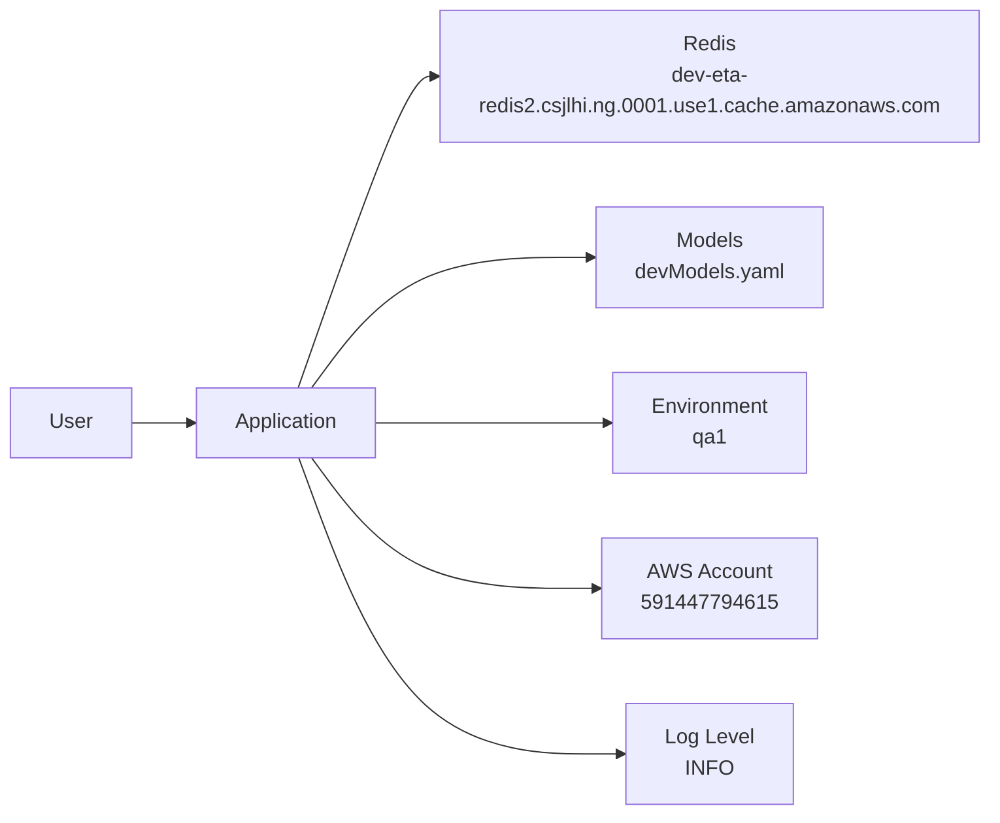
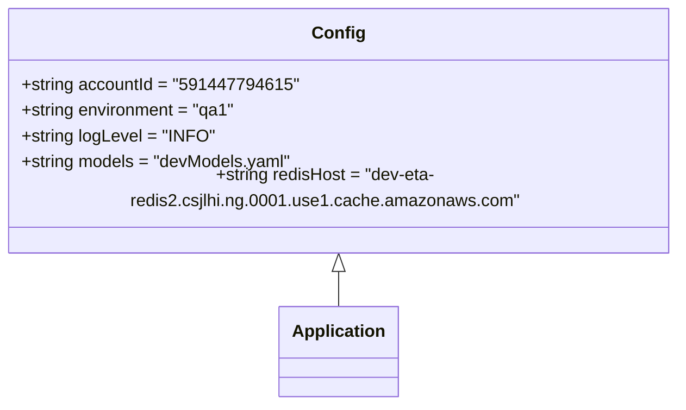

# Diagram: research/api_k8s/get_ai_eta/profiles/values.qa1.yaml

> Auto-generated by Obscura crawlers

## Diagram 1

### SVG

<svg id="container" width="758.515625" xmlns="http://www.w3.org/2000/svg" class="flowchart" height="630" viewBox="0 0 758.515625 630" role="graphics-document document" aria-roledescription="flowchart-v2"><g><marker id="container_flowchart-v2-pointEnd" class="marker flowchart-v2" viewBox="0 0 10 10" refX="5" refY="5" markerUnits="userSpaceOnUse" markerWidth="8" markerHeight="8" orient="auto"><path d="M 0 0 L 10 5 L 0 10 z" class="arrowMarkerPath" style="stroke-width: 1; stroke-dasharray: 1, 0;"></path></marker><marker id="container_flowchart-v2-pointStart" class="marker flowchart-v2" viewBox="0 0 10 10" refX="4.5" refY="5" markerUnits="userSpaceOnUse" markerWidth="8" markerHeight="8" orient="auto"><path d="M 0 5 L 10 10 L 10 0 z" class="arrowMarkerPath" style="stroke-width: 1; stroke-dasharray: 1, 0;"></path></marker><marker id="container_flowchart-v2-circleEnd" class="marker flowchart-v2" viewBox="0 0 10 10" refX="11" refY="5" markerUnits="userSpaceOnUse" markerWidth="11" markerHeight="11" orient="auto"><circle cx="5" cy="5" r="5" class="arrowMarkerPath" style="stroke-width: 1; stroke-dasharray: 1, 0;"></circle></marker><marker id="container_flowchart-v2-circleStart" class="marker flowchart-v2" viewBox="0 0 10 10" refX="-1" refY="5" markerUnits="userSpaceOnUse" markerWidth="11" markerHeight="11" orient="auto"><circle cx="5" cy="5" r="5" class="arrowMarkerPath" style="stroke-width: 1; stroke-dasharray: 1, 0;"></circle></marker><marker id="container_flowchart-v2-crossEnd" class="marker cross flowchart-v2" viewBox="0 0 11 11" refX="12" refY="5.2" markerUnits="userSpaceOnUse" markerWidth="11" markerHeight="11" orient="auto"><path d="M 1,1 l 9,9 M 10,1 l -9,9" class="arrowMarkerPath" style="stroke-width: 2; stroke-dasharray: 1, 0;"></path></marker><marker id="container_flowchart-v2-crossStart" class="marker cross flowchart-v2" viewBox="0 0 11 11" refX="-1" refY="5.2" markerUnits="userSpaceOnUse" markerWidth="11" markerHeight="11" orient="auto"><path d="M 1,1 l 9,9 M 10,1 l -9,9" class="arrowMarkerPath" style="stroke-width: 2; stroke-dasharray: 1, 0;"></path></marker><g class="root"><g class="clusters"></g><g class="edgePaths"><path d="M100.891,327L105.057,327C109.224,327,117.557,327,125.224,327C132.891,327,139.891,327,143.391,327L146.891,327" id="L_User_App_0" class="edge-thickness-normal edge-pattern-solid edge-thickness-normal edge-pattern-solid flowchart-link" style=";" data-edge="true" data-et="edge" data-id="L_User_App_0" data-points="W3sieCI6MTAwLjg5MDYyNSwieSI6MzI3fSx7IngiOjEyNS44OTA2MjUsInkiOjMyN30seyJ4IjoxNTAuODkwNjI1LCJ5IjozMjd9XQ==" marker-end="url(#container_flowchart-v2-pointEnd)"></path><path d="M231.88,300L246.312,259.833C260.743,219.667,289.606,139.333,307.537,99.167C325.469,59,332.469,59,335.969,59L339.469,59" id="L_App_Redis_0" class="edge-thickness-normal edge-pattern-solid edge-thickness-normal edge-pattern-solid flowchart-link" style=";" data-edge="true" data-et="edge" data-id="L_App_Redis_0" data-points="W3sieCI6MjMxLjg4MDQ1MTI1OTMyODM3LCJ5IjozMDB9LHsieCI6MzE4LjQ2ODc1LCJ5Ijo1OX0seyJ4IjozNDMuNDY4NzUsInkiOjU5fV0=" marker-end="url(#container_flowchart-v2-pointEnd)"></path><path d="M242.491,300L255.154,283.167C267.817,266.333,293.143,232.667,328.538,215.833C363.932,199,409.396,199,432.128,199L454.859,199" id="L_App_Models_0" class="edge-thickness-normal edge-pattern-solid edge-thickness-normal edge-pattern-solid flowchart-link" style=";" data-edge="true" data-et="edge" data-id="L_App_Models_0" data-points="W3sieCI6MjQyLjQ5MDY2MTYyMTA5Mzc1LCJ5IjozMDB9LHsieCI6MzE4LjQ2ODc1LCJ5IjoxOTl9LHsieCI6NDU4Ljg1OTM3NSwieSI6MTk5fV0=" marker-end="url(#container_flowchart-v2-pointEnd)"></path><path d="M293.469,327L297.635,327C301.802,327,310.135,327,339.051,327C367.966,327,417.464,327,442.212,327L466.961,327" id="L_App_Env_0" class="edge-thickness-normal edge-pattern-solid edge-thickness-normal edge-pattern-solid flowchart-link" style=";" data-edge="true" data-et="edge" data-id="L_App_Env_0" data-points="W3sieCI6MjkzLjQ2ODc1LCJ5IjozMjd9LHsieCI6MzE4LjQ2ODc1LCJ5IjozMjd9LHsieCI6NDcwLjk2MDkzNzUsInkiOjMyN31d" marker-end="url(#container_flowchart-v2-pointEnd)"></path><path d="M242.491,354L255.154,370.833C267.817,387.667,293.143,421.333,330.491,438.167C367.839,455,417.208,455,441.893,455L466.578,455" id="L_App_Account_0" class="edge-thickness-normal edge-pattern-solid edge-thickness-normal edge-pattern-solid flowchart-link" style=";" data-edge="true" data-et="edge" data-id="L_App_Account_0" data-points="W3sieCI6MjQyLjQ5MDY2MTYyMTA5Mzc1LCJ5IjozNTR9LHsieCI6MzE4LjQ2ODc1LCJ5Ijo0NTV9LHsieCI6NDcwLjU3ODEyNSwieSI6NDU1fV0=" marker-end="url(#container_flowchart-v2-pointEnd)"></path><path d="M232.335,354L246.691,392.167C261.046,430.333,289.758,506.667,330.957,544.833C372.156,583,425.844,583,452.688,583L479.531,583" id="L_App_Log_0" class="edge-thickness-normal edge-pattern-solid edge-thickness-normal edge-pattern-solid flowchart-link" style=";" data-edge="true" data-et="edge" data-id="L_App_Log_0" data-points="W3sieCI6MjMyLjMzNTE3NDU2MDU0Njg4LCJ5IjozNTR9LHsieCI6MzE4LjQ2ODc1LCJ5Ijo1ODN9LHsieCI6NDgzLjUzMTI1LCJ5Ijo1ODN9XQ==" marker-end="url(#container_flowchart-v2-pointEnd)"></path></g><g class="edgeLabels"><g class="edgeLabel"><g class="label" data-id="L_User_App_0" transform="translate(0, 0)"><foreignObject width="0" height="0">

</foreignObject></g></g><g class="edgeLabel"><g class="label" data-id="L_App_Redis_0" transform="translate(0, 0)"><foreignObject width="0" height="0">

</foreignObject></g></g><g class="edgeLabel"><g class="label" data-id="L_App_Models_0" transform="translate(0, 0)"><foreignObject width="0" height="0">

</foreignObject></g></g><g class="edgeLabel"><g class="label" data-id="L_App_Env_0" transform="translate(0, 0)"><foreignObject width="0" height="0">

</foreignObject></g></g><g class="edgeLabel"><g class="label" data-id="L_App_Account_0" transform="translate(0, 0)"><foreignObject width="0" height="0">

</foreignObject></g></g><g class="edgeLabel"><g class="label" data-id="L_App_Log_0" transform="translate(0, 0)"><foreignObject width="0" height="0">

</foreignObject></g></g></g><g class="nodes"><g class="node default" id="flowchart-User-0" transform="translate(54.4453125, 327)"><rect class="basic label-container" style="" x="-46.4453125" y="-27" width="92.890625" height="54"></rect><g class="label" style="" transform="translate(-16.4453125, -12)"><rect></rect><foreignObject width="32.890625" height="24">

User

</foreignObject></g></g><g class="node default" id="flowchart-App-1" transform="translate(222.1796875, 327)"><rect class="basic label-container" style="" x="-71.2890625" y="-27" width="142.578125" height="54"></rect><g class="label" style="" transform="translate(-41.2890625, -12)"><rect></rect><foreignObject width="82.578125" height="24">

Application

</foreignObject></g></g><g class="node default" id="flowchart-Redis-5" transform="translate(546.9921875, 59)"><rect class="basic label-container" style="" x="-203.5234375" y="-51" width="407.046875" height="102"></rect><g class="label" style="" transform="translate(-173.5234375, -36)"><rect></rect><foreignObject width="347.046875" height="72">

Redis dev-eta-redis2.csjlhi.ng.0001.use1.cache.amazonaws.com

</foreignObject></g></g><g class="node default" id="flowchart-Models-7" transform="translate(546.9921875, 199)"><rect class="basic label-container" style="" x="-88.1328125" y="-39" width="176.265625" height="78"></rect><g class="label" style="" transform="translate(-58.1328125, -24)"><rect></rect><foreignObject width="116.265625" height="48">

Models devModels.yaml

</foreignObject></g></g><g class="node default" id="flowchart-Env-9" transform="translate(546.9921875, 327)"><rect class="basic label-container" style="" x="-76.03125" y="-39" width="152.0625" height="78"></rect><g class="label" style="" transform="translate(-46.03125, -24)"><rect></rect><foreignObject width="92.0625" height="48">

Environment qa1

</foreignObject></g></g><g class="node default" id="flowchart-Account-11" transform="translate(546.9921875, 455)"><rect class="basic label-container" style="" x="-76.4140625" y="-39" width="152.828125" height="78"></rect><g class="label" style="" transform="translate(-46.4140625, -24)"><rect></rect><foreignObject width="92.828125" height="48">

AWS Account 591447794615

</foreignObject></g></g><g class="node default" id="flowchart-Log-13" transform="translate(546.9921875, 583)"><rect class="basic label-container" style="" x="-63.4609375" y="-39" width="126.921875" height="78"></rect><g class="label" style="" transform="translate(-33.4609375, -24)"><rect></rect><foreignObject width="66.921875" height="48">

Log Level INFO

</foreignObject></g></g></g></g></g></svg>

## Diagram 2

### SVG

<svg id="container" width="623.9609375" xmlns="http://www.w3.org/2000/svg" class="classDiagram" height="366" viewBox="0 0 623.9609375 366" role="graphics-document document" aria-roledescription="class"><g><defs><marker id="container_class-aggregationStart" class="marker aggregation class" refX="18" refY="7" markerWidth="190" markerHeight="240" orient="auto"><path d="M 18,7 L9,13 L1,7 L9,1 Z"></path></marker></defs><defs><marker id="container_class-aggregationEnd" class="marker aggregation class" refX="1" refY="7" markerWidth="20" markerHeight="28" orient="auto"><path d="M 18,7 L9,13 L1,7 L9,1 Z"></path></marker></defs><defs><marker id="container_class-extensionStart" class="marker extension class" refX="18" refY="7" markerWidth="190" markerHeight="240" orient="auto"><path d="M 1,7 L18,13 V 1 Z"></path></marker></defs><defs><marker id="container_class-extensionEnd" class="marker extension class" refX="1" refY="7" markerWidth="20" markerHeight="28" orient="auto"><path d="M 1,1 V 13 L18,7 Z"></path></marker></defs><defs><marker id="container_class-compositionStart" class="marker composition class" refX="18" refY="7" markerWidth="190" markerHeight="240" orient="auto"><path d="M 18,7 L9,13 L1,7 L9,1 Z"></path></marker></defs><defs><marker id="container_class-compositionEnd" class="marker composition class" refX="1" refY="7" markerWidth="20" markerHeight="28" orient="auto"><path d="M 18,7 L9,13 L1,7 L9,1 Z"></path></marker></defs><defs><marker id="container_class-dependencyStart" class="marker dependency class" refX="6" refY="7" markerWidth="190" markerHeight="240" orient="auto"><path d="M 5,7 L9,13 L1,7 L9,1 Z"></path></marker></defs><defs><marker id="container_class-dependencyEnd" class="marker dependency class" refX="13" refY="7" markerWidth="20" markerHeight="28" orient="auto"><path d="M 18,7 L9,13 L14,7 L9,1 Z"></path></marker></defs><defs><marker id="container_class-lollipopStart" class="marker lollipop class" refX="13" refY="7" markerWidth="190" markerHeight="240" orient="auto"><circle stroke="black" fill="transparent" cx="7" cy="7" r="6"></circle></marker></defs><defs><marker id="container_class-lollipopEnd" class="marker lollipop class" refX="1" refY="7" markerWidth="190" markerHeight="240" orient="auto"><circle stroke="black" fill="transparent" cx="7" cy="7" r="6"></circle></marker></defs><g class="root"><g class="clusters"></g><g class="edgePaths"><path d="M311.98,241.25L311.98,242.542C311.98,243.833,311.98,246.417,311.98,251.875C311.98,257.333,311.98,265.667,311.98,269.833L311.98,274" id="id_Config_Application_1" class="edge-thickness-normal edge-pattern-solid relation" style=";;;" data-edge="true" data-et="edge" data-id="id_Config_Application_1" data-points="W3sieCI6MzExLjk4MDQ2ODc1LCJ5IjoyMjR9LHsieCI6MzExLjk4MDQ2ODc1LCJ5IjoyNDl9LHsieCI6MzExLjk4MDQ2ODc1LCJ5IjoyNzR9XQ==" marker-start="url(#container_class-extensionStart)"></path></g><g class="edgeLabels"><g class="edgeLabel"><g class="label" data-id="id_Config_Application_1" transform="translate(0, 0)"><foreignObject width="0" height="0">

</foreignObject></g></g></g><g class="nodes"><g class="node default" id="classId-Config-0" transform="translate(311.98046875, 116)"><g class="basic label-container"><path d="M-303.98046875 -108 L303.98046875 -108 L303.98046875 108 L-303.98046875 108" stroke="none" stroke-width="0" fill="#ECECFF" style=""></path><path d="M-303.98046875 -108 C-109.13000311000937 -108, 85.72046252998126 -108, 303.98046875 -108 M-303.98046875 -108 C-139.22523708834845 -108, 25.5299945733031 -108, 303.98046875 -108 M303.98046875 -108 C303.98046875 -47.78207271593245, 303.98046875 12.435854568135099, 303.98046875 108 M303.98046875 -108 C303.98046875 -54.320342536886706, 303.98046875 -0.6406850737734118, 303.98046875 108 M303.98046875 108 C167.36550439466677 108, 30.750540039333544 108, -303.98046875 108 M303.98046875 108 C133.72151127658577 108, -36.537446196828455 108, -303.98046875 108 M-303.98046875 108 C-303.98046875 54.991729838906515, -303.98046875 1.9834596778130305, -303.98046875 -108 M-303.98046875 108 C-303.98046875 24.66394333696701, -303.98046875 -58.67211332606598, -303.98046875 -108" stroke="#9370DB" stroke-width="1.3" fill="none" stroke-dasharray="0 0" style=""></path></g><g class="annotation-group text" transform="translate(0, -84)"></g><g class="label-group text" transform="translate(-22.9296875, -84)"><g class="label" style="font-weight: bolder" transform="translate(0,-12)"><foreignObject width="45.859375" height="24">

Config

</foreignObject></g></g><g class="members-group text" transform="translate(-291.98046875, -36)"><g class="label" style="" transform="translate(0,-12)"><foreignObject width="246.875" height="24">

+string accountId = "591447794615"

</foreignObject></g><g class="label" style="" transform="translate(0,12)"><foreignObject width="199.71875" height="24">

+string environment = "qa1"

</foreignObject></g><g class="label" style="" transform="translate(0,36)"><foreignObject width="177.125" height="24">

+string logLevel = "INFO"

</foreignObject></g><g class="label" style="" transform="translate(0,60)"><foreignObject width="252.46875" height="24">

+string models = "devModels.yaml"

</foreignObject></g><g class="label" style="" transform="translate(0,84)"><foreignObject width="561.03125" height="24">

+string redisHost = "dev-eta-redis2.csjlhi.ng.0001.use1.cache.amazonaws.com"

</foreignObject></g></g><g class="methods-group text" transform="translate(-291.98046875, 108)"></g><g class="divider" style=""><path d="M-303.98046875 -60 C-177.5982041737339 -60, -51.21593959746781 -60, 303.98046875 -60 M-303.98046875 -60 C-98.09035605009015 -60, 107.7997566498197 -60, 303.98046875 -60" stroke="#9370DB" stroke-width="1.3" fill="none" stroke-dasharray="0 0" style=""></path></g><g class="divider" style=""><path d="M-303.98046875 84 C-113.69041286532763 84, 76.59964301934474 84, 303.98046875 84 M-303.98046875 84 C-67.65048729288753 84, 168.67949416422493 84, 303.98046875 84" stroke="#9370DB" stroke-width="1.3" fill="none" stroke-dasharray="0 0" style=""></path></g></g><g class="node default" id="classId-Application-1" transform="translate(311.98046875, 316)"><g class="basic label-container"><path d="M-53.6796875 -42 L53.6796875 -42 L53.6796875 42 L-53.6796875 42" stroke="none" stroke-width="0" fill="#ECECFF" style=""></path><path d="M-53.6796875 -42 C-17.88847852998294 -42, 17.90273044003412 -42, 53.6796875 -42 M-53.6796875 -42 C-22.68944916228799 -42, 8.300789175424022 -42, 53.6796875 -42 M53.6796875 -42 C53.6796875 -12.317284191279313, 53.6796875 17.365431617441374, 53.6796875 42 M53.6796875 -42 C53.6796875 -23.012752990072606, 53.6796875 -4.025505980145212, 53.6796875 42 M53.6796875 42 C31.060087580588807 42, 8.440487661177613 42, -53.6796875 42 M53.6796875 42 C15.594322007202827 42, -22.491043485594346 42, -53.6796875 42 M-53.6796875 42 C-53.6796875 19.418213487398884, -53.6796875 -3.1635730252022327, -53.6796875 -42 M-53.6796875 42 C-53.6796875 9.707239522130266, -53.6796875 -22.58552095573947, -53.6796875 -42" stroke="#9370DB" stroke-width="1.3" fill="none" stroke-dasharray="0 0" style=""></path></g><g class="annotation-group text" transform="translate(0, -18)"></g><g class="label-group text" transform="translate(-41.6796875, -18)"><g class="label" style="font-weight: bolder" transform="translate(0,-12)"><foreignObject width="83.359375" height="24">

Application

</foreignObject></g></g><g class="members-group text" transform="translate(-41.6796875, 30)"></g><g class="methods-group text" transform="translate(-41.6796875, 60)"></g><g class="divider" style=""><path d="M-53.6796875 6 C-17.45249390568228 6, 18.774699688635437 6, 53.6796875 6 M-53.6796875 6 C-13.807764941871113 6, 26.064157616257773 6, 53.6796875 6" stroke="#9370DB" stroke-width="1.3" fill="none" stroke-dasharray="0 0" style=""></path></g><g class="divider" style=""><path d="M-53.6796875 24 C-14.092828957462324 24, 25.494029585075353 24, 53.6796875 24 M-53.6796875 24 C-17.764063138532045 24, 18.15156122293591 24, 53.6796875 24" stroke="#9370DB" stroke-width="1.3" fill="none" stroke-dasharray="0 0" style=""></path></g></g></g></g></g></svg>
