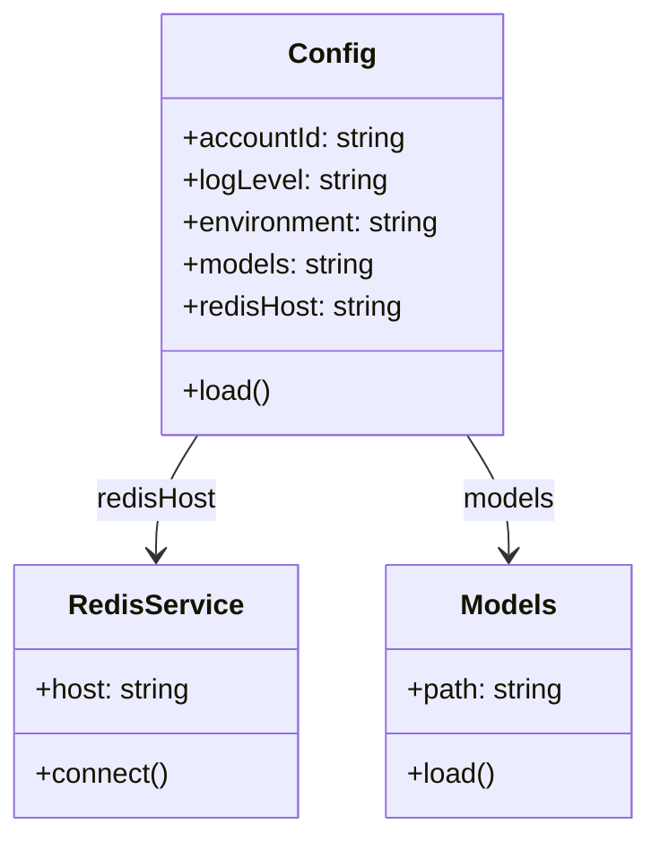

# Diagram: research/api_k8s/get_ai_eta/profiles/values.qa2.yaml


> Auto-generated by Obscura crawlers

## Diagram 1



### SVG

<svg id="container" width="367.8671875" xmlns="http://www.w3.org/2000/svg" class="classDiagram" height="474" viewBox="0 0 367.8671875 474" role="graphics-document document" aria-roledescription="class"><style>#container{font-family:"trebuchet ms",verdana,arial,sans-serif;font-size:16px;fill:#333;}@keyframes edge-animation-frame{from{stroke-dashoffset:0;}}@keyframes dash{to{stroke-dashoffset:0;}}#container .edge-animation-slow{stroke-dasharray:9,5!important;stroke-dashoffset:900;animation:dash 50s linear infinite;stroke-linecap:round;}#container .edge-animation-fast{stroke-dasharray:9,5!important;stroke-dashoffset:900;animation:dash 20s linear infinite;stroke-linecap:round;}#container .error-icon{fill:#552222;}#container .error-text{fill:#552222;stroke:#552222;}#container .edge-thickness-normal{stroke-width:1px;}#container .edge-thickness-thick{stroke-width:3.5px;}#container .edge-pattern-solid{stroke-dasharray:0;}#container .edge-thickness-invisible{stroke-width:0;fill:none;}#container .edge-pattern-dashed{stroke-dasharray:3;}#container .edge-pattern-dotted{stroke-dasharray:2;}#container .marker{fill:#333333;stroke:#333333;}#container .marker.cross{stroke:#333333;}#container svg{font-family:"trebuchet ms",verdana,arial,sans-serif;font-size:16px;}#container p{margin:0;}#container g.classGroup text{fill:#9370DB;stroke:none;font-family:"trebuchet ms",verdana,arial,sans-serif;font-size:10px;}#container g.classGroup text .title{font-weight:bolder;}#container .nodeLabel,#container .edgeLabel{color:#131300;}#container .edgeLabel .label rect{fill:#ECECFF;}#container .label text{fill:#131300;}#container .labelBkg{background:#ECECFF;}#container .edgeLabel .label span{background:#ECECFF;}#container .classTitle{font-weight:bolder;}#container .node rect,#container .node circle,#container .node ellipse,#container .node polygon,#container .node path{fill:#ECECFF;stroke:#9370DB;stroke-width:1px;}#container .divider{stroke:#9370DB;stroke-width:1;}#container g.clickable{cursor:pointer;}#container g.classGroup rect{fill:#ECECFF;stroke:#9370DB;}#container g.classGroup line{stroke:#9370DB;stroke-width:1;}#container .classLabel .box{stroke:none;stroke-width:0;fill:#ECECFF;opacity:0.5;}#container .classLabel .label{fill:#9370DB;font-size:10px;}#container .relation{stroke:#333333;stroke-width:1;fill:none;}#container .dashed-line{stroke-dasharray:3;}#container .dotted-line{stroke-dasharray:1 2;}#container #compositionStart,#container .composition{fill:#333333!important;stroke:#333333!important;stroke-width:1;}#container #compositionEnd,#container .composition{fill:#333333!important;stroke:#333333!important;stroke-width:1;}#container #dependencyStart,#container .dependency{fill:#333333!important;stroke:#333333!important;stroke-width:1;}#container #dependencyStart,#container .dependency{fill:#333333!important;stroke:#333333!important;stroke-width:1;}#container #extensionStart,#container .extension{fill:transparent!important;stroke:#333333!important;stroke-width:1;}#container #extensionEnd,#container .extension{fill:transparent!important;stroke:#333333!important;stroke-width:1;}#container #aggregationStart,#container .aggregation{fill:transparent!important;stroke:#333333!important;stroke-width:1;}#container #aggregationEnd,#container .aggregation{fill:transparent!important;stroke:#333333!important;stroke-width:1;}#container #lollipopStart,#container .lollipop{fill:#ECECFF!important;stroke:#333333!important;stroke-width:1;}#container #lollipopEnd,#container .lollipop{fill:#ECECFF!important;stroke:#333333!important;stroke-width:1;}#container .edgeTerminals{font-size:11px;line-height:initial;}#container .classTitleText{text-anchor:middle;font-size:18px;fill:#333;}#container .label-icon{display:inline-block;height:1em;overflow:visible;vertical-align:-0.125em;}#container .node .label-icon path{fill:currentColor;stroke:revert;stroke-width:revert;}#container :root{--mermaid-font-family:"trebuchet ms",verdana,arial,sans-serif;}</style><g><defs><marker id="container_class-aggregationStart" class="marker aggregation class" refX="18" refY="7" markerWidth="190" markerHeight="240" orient="auto"><path d="M 18,7 L9,13 L1,7 L9,1 Z"></path></marker></defs><defs><marker id="container_class-aggregationEnd" class="marker aggregation class" refX="1" refY="7" markerWidth="20" markerHeight="28" orient="auto"><path d="M 18,7 L9,13 L1,7 L9,1 Z"></path></marker></defs><defs><marker id="container_class-extensionStart" class="marker extension class" refX="18" refY="7" markerWidth="190" markerHeight="240" orient="auto"><path d="M 1,7 L18,13 V 1 Z"></path></marker></defs><defs><marker id="container_class-extensionEnd" class="marker extension class" refX="1" refY="7" markerWidth="20" markerHeight="28" orient="auto"><path d="M 1,1 V 13 L18,7 Z"></path></marker></defs><defs><marker id="container_class-compositionStart" class="marker composition class" refX="18" refY="7" markerWidth="190" markerHeight="240" orient="auto"><path d="M 18,7 L9,13 L1,7 L9,1 Z"></path></marker></defs><defs><marker id="container_class-compositionEnd" class="marker composition class" refX="1" refY="7" markerWidth="20" markerHeight="28" orient="auto"><path d="M 18,7 L9,13 L1,7 L9,1 Z"></path></marker></defs><defs><marker id="container_class-dependencyStart" class="marker dependency class" refX="6" refY="7" markerWidth="190" markerHeight="240" orient="auto"><path d="M 5,7 L9,13 L1,7 L9,1 Z"></path></marker></defs><defs><marker id="container_class-dependencyEnd" class="marker dependency class" refX="13" refY="7" markerWidth="20" markerHeight="28" orient="auto"><path d="M 18,7 L9,13 L14,7 L9,1 Z"></path></marker></defs><defs><marker id="container_class-lollipopStart" class="marker lollipop class" refX="13" refY="7" markerWidth="190" markerHeight="240" orient="auto"><circle stroke="black" fill="transparent" cx="7" cy="7" r="6"></circle></marker></defs><defs><marker id="container_class-lollipopEnd" class="marker lollipop class" refX="1" refY="7" markerWidth="190" markerHeight="240" orient="auto"><circle stroke="black" fill="transparent" cx="7" cy="7" r="6"></circle></marker></defs><g class="root"><g class="clusters"></g><g class="edgePaths"><path d="M111.946,248L108,254.167C104.054,260.333,96.162,272.667,92.216,284C88.27,295.333,88.27,305.667,88.27,310.833L88.27,316" id="id_Config_RedisService_1" class="edge-thickness-normal edge-pattern-solid relation" style=";;;" data-edge="true" data-et="edge" data-id="id_Config_RedisService_1" data-points="W3sieCI6MTExLjk0NjQxOTY4NTUwOTU1LCJ5IjoyNDh9LHsieCI6ODguMjY5NTMxMjUsInkiOjI4NX0seyJ4Ijo4OC4yNjk1MzEyNSwieSI6MzIyfV0=" marker-end="url(#container_class-dependencyEnd)"></path><path d="M265.526,248L269.472,254.167C273.419,260.333,281.311,272.667,285.257,284C289.203,295.333,289.203,305.667,289.203,310.833L289.203,316" id="id_Config_Models_2" class="edge-thickness-normal edge-pattern-solid relation" style=";;;" data-edge="true" data-et="edge" data-id="id_Config_Models_2" data-points="W3sieCI6MjY1LjUyNjIzNjU2NDQ5MDQzLCJ5IjoyNDh9LHsieCI6Mjg5LjIwMzEyNSwieSI6Mjg1fSx7IngiOjI4OS4yMDMxMjUsInkiOjMyMn1d" marker-end="url(#container_class-dependencyEnd)"></path></g><g class="edgeLabels"><g class="edgeLabel" transform="translate(88.26953125, 285)"><g class="label" data-id="id_Config_RedisService_1" transform="translate(-34.7265625, -12)"><foreignObject width="69.453125" height="24"><div xmlns="http://www.w3.org/1999/xhtml" class="labelBkg" style="display: table-cell; white-space: nowrap; line-height: 1.5; max-width: 200px; text-align: center;"><span class="edgeLabel"><p>redisHost</p></span></div></foreignObject></g></g><g class="edgeLabel" transform="translate(289.203125, 285)"><g class="label" data-id="id_Config_Models_2" transform="translate(-26.7578125, -12)"><foreignObject width="53.515625" height="24"><div xmlns="http://www.w3.org/1999/xhtml" class="labelBkg" style="display: table-cell; white-space: nowrap; line-height: 1.5; max-width: 200px; text-align: center;"><span class="edgeLabel"><p>models</p></span></div></foreignObject></g></g></g><g class="nodes"><g class="node default" id="classId-Config-0" transform="translate(188.736328125, 128)"><g class="basic label-container"><path d="M-98.53515625 -120 L98.53515625 -120 L98.53515625 120 L-98.53515625 120" stroke="none" stroke-width="0" fill="#ECECFF" style=""></path><path d="M-98.53515625 -120 C-37.30648775554362 -120, 23.922180738912758 -120, 98.53515625 -120 M-98.53515625 -120 C-27.189425981922113 -120, 44.15630428615577 -120, 98.53515625 -120 M98.53515625 -120 C98.53515625 -69.58806507157651, 98.53515625 -19.176130143153017, 98.53515625 120 M98.53515625 -120 C98.53515625 -28.665472720566612, 98.53515625 62.669054558866776, 98.53515625 120 M98.53515625 120 C57.31480454415887 120, 16.094452838317736 120, -98.53515625 120 M98.53515625 120 C31.76595879459748 120, -35.00323866080504 120, -98.53515625 120 M-98.53515625 120 C-98.53515625 56.996840250718265, -98.53515625 -6.006319498563471, -98.53515625 -120 M-98.53515625 120 C-98.53515625 41.47012210147045, -98.53515625 -37.0597557970591, -98.53515625 -120" stroke="#9370DB" stroke-width="1.3" fill="none" stroke-dasharray="0 0" style=""></path></g><g class="annotation-group text" transform="translate(0, -96)"></g><g class="label-group text" transform="translate(-22.9296875, -96)"><g class="label" style="font-weight: bolder" transform="translate(0,-12)"><foreignObject width="45.859375" height="24"><div xmlns="http://www.w3.org/1999/xhtml" style="display: table-cell; white-space: nowrap; line-height: 1.5; max-width: 96px; text-align: center;"><span class="nodeLabel markdown-node-label" style=""><p>Config</p></span></div></foreignObject></g></g><g class="members-group text" transform="translate(-86.53515625, -48)"><g class="label" style="" transform="translate(0,-12)"><foreignObject width="128.921875" height="24"><div xmlns="http://www.w3.org/1999/xhtml" style="display: table-cell; white-space: nowrap; line-height: 1.5; max-width: 187px; text-align: center;"><span class="nodeLabel markdown-node-label" style=""><p>+accountId: string</p></span></div></foreignObject></g><g class="label" style="" transform="translate(0,12)"><foreignObject width="117.578125" height="24"><div xmlns="http://www.w3.org/1999/xhtml" style="display: table-cell; white-space: nowrap; line-height: 1.5; max-width: 176px; text-align: center;"><span class="nodeLabel markdown-node-label" style=""><p>+logLevel: string</p></span></div></foreignObject></g><g class="label" style="" transform="translate(0,36)"><foreignObject width="150.140625" height="24"><div xmlns="http://www.w3.org/1999/xhtml" style="display: table-cell; white-space: nowrap; line-height: 1.5; max-width: 208px; text-align: center;"><span class="nodeLabel markdown-node-label" style=""><p>+environment: string</p></span></div></foreignObject></g><g class="label" style="" transform="translate(0,60)"><foreignObject width="111.203125" height="24"><div xmlns="http://www.w3.org/1999/xhtml" style="display: table-cell; white-space: nowrap; line-height: 1.5; max-width: 169px; text-align: center;"><span class="nodeLabel markdown-node-label" style=""><p>+models: string</p></span></div></foreignObject></g><g class="label" style="" transform="translate(0,84)"><foreignObject width="127.203125" height="24"><div xmlns="http://www.w3.org/1999/xhtml" style="display: table-cell; white-space: nowrap; line-height: 1.5; max-width: 185px; text-align: center;"><span class="nodeLabel markdown-node-label" style=""><p>+redisHost: string</p></span></div></foreignObject></g></g><g class="methods-group text" transform="translate(-86.53515625, 96)"><g class="label" style="" transform="translate(0,-12)"><foreignObject width="50.421875" height="24"><div xmlns="http://www.w3.org/1999/xhtml" style="display: table-cell; white-space: nowrap; line-height: 1.5; max-width: 108px; text-align: center;"><span class="nodeLabel markdown-node-label" style=""><p>+load()</p></span></div></foreignObject></g></g><g class="divider" style=""><path d="M-98.53515625 -72 C-30.204568212275348 -72, 38.126019825449305 -72, 98.53515625 -72 M-98.53515625 -72 C-27.935731269098298 -72, 42.663693711803404 -72, 98.53515625 -72" stroke="#9370DB" stroke-width="1.3" fill="none" stroke-dasharray="0 0" style=""></path></g><g class="divider" style=""><path d="M-98.53515625 72 C-46.03405279458281 72, 6.467050660834374 72, 98.53515625 72 M-98.53515625 72 C-27.13317449855643 72, 44.26880725288714 72, 98.53515625 72" stroke="#9370DB" stroke-width="1.3" fill="none" stroke-dasharray="0 0" style=""></path></g></g><g class="node default" id="classId-RedisService-1" transform="translate(88.26953125, 394)"><g class="basic label-container"><path d="M-80.26953125 -72 L80.26953125 -72 L80.26953125 72 L-80.26953125 72" stroke="none" stroke-width="0" fill="#ECECFF" style=""></path><path d="M-80.26953125 -72 C-24.20496829695592 -72, 31.859594656088163 -72, 80.26953125 -72 M-80.26953125 -72 C-44.821316241214625 -72, -9.37310123242925 -72, 80.26953125 -72 M80.26953125 -72 C80.26953125 -42.08002613700358, 80.26953125 -12.160052274007157, 80.26953125 72 M80.26953125 -72 C80.26953125 -16.84216118491546, 80.26953125 38.31567763016908, 80.26953125 72 M80.26953125 72 C29.345752687172947 72, -21.578025875654106 72, -80.26953125 72 M80.26953125 72 C34.889423270098334 72, -10.490684709803332 72, -80.26953125 72 M-80.26953125 72 C-80.26953125 29.0048017407292, -80.26953125 -13.990396518541601, -80.26953125 -72 M-80.26953125 72 C-80.26953125 36.36820262279562, -80.26953125 0.7364052455912429, -80.26953125 -72" stroke="#9370DB" stroke-width="1.3" fill="none" stroke-dasharray="0 0" style=""></path></g><g class="annotation-group text" transform="translate(0, -48)"></g><g class="label-group text" transform="translate(-46.8046875, -48)"><g class="label" style="font-weight: bolder" transform="translate(0,-12)"><foreignObject width="93.609375" height="24"><div xmlns="http://www.w3.org/1999/xhtml" style="display: table-cell; white-space: nowrap; line-height: 1.5; max-width: 142px; text-align: center;"><span class="nodeLabel markdown-node-label" style=""><p>RedisService</p></span></div></foreignObject></g></g><g class="members-group text" transform="translate(-68.26953125, 0)"><g class="label" style="" transform="translate(0,-12)"><foreignObject width="89.734375" height="24"><div xmlns="http://www.w3.org/1999/xhtml" style="display: table-cell; white-space: nowrap; line-height: 1.5; max-width: 148px; text-align: center;"><span class="nodeLabel markdown-node-label" style=""><p>+host: string</p></span></div></foreignObject></g></g><g class="methods-group text" transform="translate(-68.26953125, 48)"><g class="label" style="" transform="translate(0,-12)"><foreignObject width="75.921875" height="24"><div xmlns="http://www.w3.org/1999/xhtml" style="display: table-cell; white-space: nowrap; line-height: 1.5; max-width: 133px; text-align: center;"><span class="nodeLabel markdown-node-label" style=""><p>+connect()</p></span></div></foreignObject></g></g><g class="divider" style=""><path d="M-80.26953125 -24 C-19.39815539916085 -24, 41.4732204516783 -24, 80.26953125 -24 M-80.26953125 -24 C-46.845913736009514 -24, -13.422296222019028 -24, 80.26953125 -24" stroke="#9370DB" stroke-width="1.3" fill="none" stroke-dasharray="0 0" style=""></path></g><g class="divider" style=""><path d="M-80.26953125 24 C-20.241227023757048 24, 39.787077202485904 24, 80.26953125 24 M-80.26953125 24 C-20.22192950945027 24, 39.82567223109946 24, 80.26953125 24" stroke="#9370DB" stroke-width="1.3" fill="none" stroke-dasharray="0 0" style=""></path></g></g><g class="node default" id="classId-Models-2" transform="translate(289.203125, 394)"><g class="basic label-container"><path d="M-70.6640625 -72 L70.6640625 -72 L70.6640625 72 L-70.6640625 72" stroke="none" stroke-width="0" fill="#ECECFF" style=""></path><path d="M-70.6640625 -72 C-22.636909042105515 -72, 25.39024441578897 -72, 70.6640625 -72 M-70.6640625 -72 C-34.61279311383362 -72, 1.438476272332764 -72, 70.6640625 -72 M70.6640625 -72 C70.6640625 -36.69867877463009, 70.6640625 -1.3973575492601782, 70.6640625 72 M70.6640625 -72 C70.6640625 -38.11755922030235, 70.6640625 -4.235118440604694, 70.6640625 72 M70.6640625 72 C30.910792459385 72, -8.84247758123 72, -70.6640625 72 M70.6640625 72 C40.908573798752144 72, 11.153085097504288 72, -70.6640625 72 M-70.6640625 72 C-70.6640625 21.43834136209132, -70.6640625 -29.123317275817357, -70.6640625 -72 M-70.6640625 72 C-70.6640625 28.2557158031659, -70.6640625 -15.488568393668203, -70.6640625 -72" stroke="#9370DB" stroke-width="1.3" fill="none" stroke-dasharray="0 0" style=""></path></g><g class="annotation-group text" transform="translate(0, -48)"></g><g class="label-group text" transform="translate(-26.421875, -48)"><g class="label" style="font-weight: bolder" transform="translate(0,-12)"><foreignObject width="52.84375" height="24"><div xmlns="http://www.w3.org/1999/xhtml" style="display: table-cell; white-space: nowrap; line-height: 1.5; max-width: 102px; text-align: center;"><span class="nodeLabel markdown-node-label" style=""><p>Models</p></span></div></foreignObject></g></g><g class="members-group text" transform="translate(-58.6640625, 0)"><g class="label" style="" transform="translate(0,-12)"><foreignObject width="90.90625" height="24"><div xmlns="http://www.w3.org/1999/xhtml" style="display: table-cell; white-space: nowrap; line-height: 1.5; max-width: 149px; text-align: center;"><span class="nodeLabel markdown-node-label" style=""><p>+path: string</p></span></div></foreignObject></g></g><g class="methods-group text" transform="translate(-58.6640625, 48)"><g class="label" style="" transform="translate(0,-12)"><foreignObject width="50.421875" height="24"><div xmlns="http://www.w3.org/1999/xhtml" style="display: table-cell; white-space: nowrap; line-height: 1.5; max-width: 108px; text-align: center;"><span class="nodeLabel markdown-node-label" style=""><p>+load()</p></span></div></foreignObject></g></g><g class="divider" style=""><path d="M-70.6640625 -24 C-37.6255807888349 -24, -4.587099077669805 -24, 70.6640625 -24 M-70.6640625 -24 C-37.975316783433954 -24, -5.286571066867907 -24, 70.6640625 -24" stroke="#9370DB" stroke-width="1.3" fill="none" stroke-dasharray="0 0" style=""></path></g><g class="divider" style=""><path d="M-70.6640625 24 C-29.13360955862084 24, 12.39684338275832 24, 70.6640625 24 M-70.6640625 24 C-18.383169130375414 24, 33.89772423924917 24, 70.6640625 24" stroke="#9370DB" stroke-width="1.3" fill="none" stroke-dasharray="0 0" style=""></path></g></g></g></g></g></svg>

## Diagram 2

```mermaid
flowchart TD
    App[Application] --> ReadCfg[Read Config]
    ReadCfg --> SetAcct[Set accountId: 591447794615]
    ReadCfg --> SetLog[Set logLevel: INFO]
    ReadCfg --> EnvCheck{environment == "qa2"}
    ReadCfg --> LoadModels[Load models: devModels.yaml]
    EnvCheck -->|true| UseQA2[Use QA2 Redis Host]
    EnvCheck -->|false| UseOther[Use other Redis Host]
    UseQA2 --> RedisHost[dev-eta-redis2.csjlhi.ng.0001.use1.cache.amazonaws.com]
    LoadModels --> ModelsFile[devModels.yaml]
```

> SVG rendering failed for this diagram.
