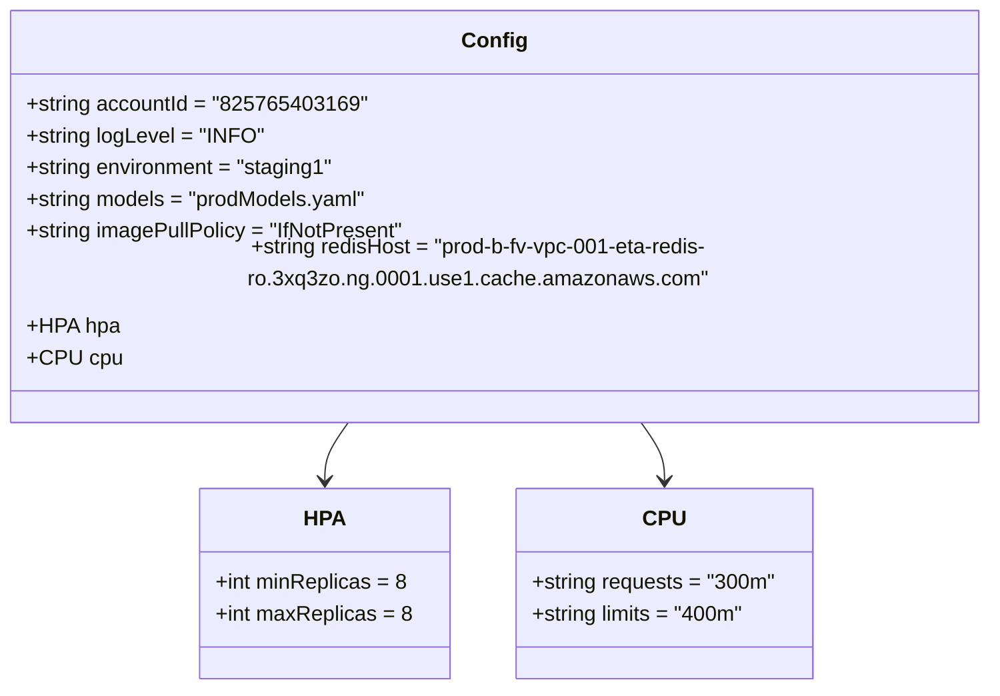
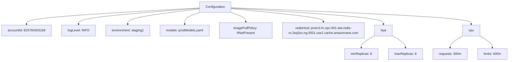

# Diagram: research/api_k8s/get_ai_eta/profiles/values.staging1.yaml

> Auto-generated by Obscura crawlers

## Diagram 1

### SVG

<svg id="container" width="753.7421875" xmlns="http://www.w3.org/2000/svg" class="classDiagram" height="498" viewBox="0 0 753.7421875 498" role="graphics-document document" aria-roledescription="class"><g><defs><marker id="container_class-aggregationStart" class="marker aggregation class" refX="18" refY="7" markerWidth="190" markerHeight="240" orient="auto"><path d="M 18,7 L9,13 L1,7 L9,1 Z"></path></marker></defs><defs><marker id="container_class-aggregationEnd" class="marker aggregation class" refX="1" refY="7" markerWidth="20" markerHeight="28" orient="auto"><path d="M 18,7 L9,13 L1,7 L9,1 Z"></path></marker></defs><defs><marker id="container_class-extensionStart" class="marker extension class" refX="18" refY="7" markerWidth="190" markerHeight="240" orient="auto"><path d="M 1,7 L18,13 V 1 Z"></path></marker></defs><defs><marker id="container_class-extensionEnd" class="marker extension class" refX="1" refY="7" markerWidth="20" markerHeight="28" orient="auto"><path d="M 1,1 V 13 L18,7 Z"></path></marker></defs><defs><marker id="container_class-compositionStart" class="marker composition class" refX="18" refY="7" markerWidth="190" markerHeight="240" orient="auto"><path d="M 18,7 L9,13 L1,7 L9,1 Z"></path></marker></defs><defs><marker id="container_class-compositionEnd" class="marker composition class" refX="1" refY="7" markerWidth="20" markerHeight="28" orient="auto"><path d="M 18,7 L9,13 L1,7 L9,1 Z"></path></marker></defs><defs><marker id="container_class-dependencyStart" class="marker dependency class" refX="6" refY="7" markerWidth="190" markerHeight="240" orient="auto"><path d="M 5,7 L9,13 L1,7 L9,1 Z"></path></marker></defs><defs><marker id="container_class-dependencyEnd" class="marker dependency class" refX="13" refY="7" markerWidth="20" markerHeight="28" orient="auto"><path d="M 18,7 L9,13 L14,7 L9,1 Z"></path></marker></defs><defs><marker id="container_class-lollipopStart" class="marker lollipop class" refX="13" refY="7" markerWidth="190" markerHeight="240" orient="auto"><circle stroke="black" fill="transparent" cx="7" cy="7" r="6"></circle></marker></defs><defs><marker id="container_class-lollipopEnd" class="marker lollipop class" refX="1" refY="7" markerWidth="190" markerHeight="240" orient="auto"><circle stroke="black" fill="transparent" cx="7" cy="7" r="6"></circle></marker></defs><g class="root"><g class="clusters"></g><g class="edgePaths"><path d="M268.242,296L265.099,300.167C261.956,304.333,255.669,312.667,252.526,320C249.383,327.333,249.383,333.667,249.383,336.833L249.383,340" id="id_Config_HPA_1" class="edge-thickness-normal edge-pattern-solid relation" style=";;;" data-edge="true" data-et="edge" data-id="id_Config_HPA_1" data-points="W3sieCI6MjY4LjI0MjAyNTcwMjY2MjcsInkiOjI5Nn0seyJ4IjoyNDkuMzgyODEyNSwieSI6MzIxfSx7IngiOjI0OS4zODI4MTI1LCJ5IjozNDZ9XQ==" marker-end="url(#container_class-dependencyEnd)"></path><path d="M485.5,296L488.643,300.167C491.787,304.333,498.073,312.667,501.216,320C504.359,327.333,504.359,333.667,504.359,336.833L504.359,340" id="id_Config_CPU_2" class="edge-thickness-normal edge-pattern-solid relation" style=";;;" data-edge="true" data-et="edge" data-id="id_Config_CPU_2" data-points="W3sieCI6NDg1LjUwMDE2MTc5NzMzNzMsInkiOjI5Nn0seyJ4Ijo1MDQuMzU5Mzc1LCJ5IjozMjF9LHsieCI6NTA0LjM1OTM3NSwieSI6MzQ2fV0=" marker-end="url(#container_class-dependencyEnd)"></path></g><g class="edgeLabels"><g class="edgeLabel"><g class="label" data-id="id_Config_HPA_1" transform="translate(0, 0)"><foreignObject width="0" height="0">

</foreignObject></g></g><g class="edgeLabel"><g class="label" data-id="id_Config_CPU_2" transform="translate(0, 0)"><foreignObject width="0" height="0">

</foreignObject></g></g></g><g class="nodes"><g class="node default" id="classId-Config-0" transform="translate(376.87109375, 152)"><g class="basic label-container"><path d="M-368.87109375 -144 L368.87109375 -144 L368.87109375 144 L-368.87109375 144" stroke="none" stroke-width="0" fill="#ECECFF" style=""></path><path d="M-368.87109375 -144 C-134.71281759766828 -144, 99.44545855466345 -144, 368.87109375 -144 M-368.87109375 -144 C-179.2304663953519 -144, 10.410160959296206 -144, 368.87109375 -144 M368.87109375 -144 C368.87109375 -79.08197142551823, 368.87109375 -14.163942851036467, 368.87109375 144 M368.87109375 -144 C368.87109375 -66.16489589946822, 368.87109375 11.67020820106356, 368.87109375 144 M368.87109375 144 C162.64516495677867 144, -43.58076383644266 144, -368.87109375 144 M368.87109375 144 C97.83594186716732 144, -173.19921001566536 144, -368.87109375 144 M-368.87109375 144 C-368.87109375 38.14390456200725, -368.87109375 -67.7121908759855, -368.87109375 -144 M-368.87109375 144 C-368.87109375 67.92296994744493, -368.87109375 -8.154060105110148, -368.87109375 -144" stroke="#9370DB" stroke-width="1.3" fill="none" stroke-dasharray="0 0" style=""></path></g><g class="annotation-group text" transform="translate(0, -120)"></g><g class="label-group text" transform="translate(-22.9296875, -120)"><g class="label" style="font-weight: bolder" transform="translate(0,-12)"><foreignObject width="45.859375" height="24">

Config

</foreignObject></g></g><g class="members-group text" transform="translate(-356.87109375, -72)"><g class="label" style="" transform="translate(0,-12)"><foreignObject width="250.21875" height="24">

+string accountId = "825765403169"

</foreignObject></g><g class="label" style="" transform="translate(0,12)"><foreignObject width="177.125" height="24">

+string logLevel = "INFO"

</foreignObject></g><g class="label" style="" transform="translate(0,36)"><foreignObject width="234.453125" height="24">

+string environment = "staging1"

</foreignObject></g><g class="label" style="" transform="translate(0,60)"><foreignObject width="260.640625" height="24">

+string models = "prodModels.yaml"

</foreignObject></g><g class="label" style="" transform="translate(0,84)"><foreignObject width="287.71875" height="24">

+string imagePullPolicy = "IfNotPresent"

</foreignObject></g><g class="label" style="" transform="translate(0,108)"><foreignObject width="690.8125" height="24">

+string redisHost = "prod-b-fv-vpc-001-eta-redis-ro.3xq3zo.ng.0001.use1.cache.amazonaws.com"

</foreignObject></g><g class="label" style="" transform="translate(0,132)"><foreignObject width="68.046875" height="24">

+HPA hpa

</foreignObject></g><g class="label" style="" transform="translate(0,156)"><foreignObject width="67.546875" height="24">

+CPU cpu

</foreignObject></g></g><g class="methods-group text" transform="translate(-356.87109375, 144)"></g><g class="divider" style=""><path d="M-368.87109375 -96 C-140.35106526930542 -96, 88.16896321138915 -96, 368.87109375 -96 M-368.87109375 -96 C-212.62865367017537 -96, -56.386213590350735 -96, 368.87109375 -96" stroke="#9370DB" stroke-width="1.3" fill="none" stroke-dasharray="0 0" style=""></path></g><g class="divider" style=""><path d="M-368.87109375 120 C-136.69512066923122 120, 95.48085241153757 120, 368.87109375 120 M-368.87109375 120 C-164.58999097617772 120, 39.69111179764457 120, 368.87109375 120" stroke="#9370DB" stroke-width="1.3" fill="none" stroke-dasharray="0 0" style=""></path></g></g><g class="node default" id="classId-HPA-1" transform="translate(249.3828125, 418)"><g class="basic label-container"><path d="M-93.0546875 -72 L93.0546875 -72 L93.0546875 72 L-93.0546875 72" stroke="none" stroke-width="0" fill="#ECECFF" style=""></path><path d="M-93.0546875 -72 C-51.042187100082806 -72, -9.029686700165612 -72, 93.0546875 -72 M-93.0546875 -72 C-38.66571663726235 -72, 15.723254225475301 -72, 93.0546875 -72 M93.0546875 -72 C93.0546875 -35.17258394287283, 93.0546875 1.654832114254333, 93.0546875 72 M93.0546875 -72 C93.0546875 -25.039522530170238, 93.0546875 21.920954939659524, 93.0546875 72 M93.0546875 72 C27.965844086984006 72, -37.12299932603199 72, -93.0546875 72 M93.0546875 72 C23.41909489748791 72, -46.21649770502418 72, -93.0546875 72 M-93.0546875 72 C-93.0546875 30.171316688830622, -93.0546875 -11.657366622338756, -93.0546875 -72 M-93.0546875 72 C-93.0546875 29.866683844117865, -93.0546875 -12.266632311764269, -93.0546875 -72" stroke="#9370DB" stroke-width="1.3" fill="none" stroke-dasharray="0 0" style=""></path></g><g class="annotation-group text" transform="translate(0, -48)"></g><g class="label-group text" transform="translate(-14.375, -48)"><g class="label" style="font-weight: bolder" transform="translate(0,-12)"><foreignObject width="28.75" height="24">

HPA

</foreignObject></g></g><g class="members-group text" transform="translate(-81.0546875, 0)"><g class="label" style="" transform="translate(0,-12)"><foreignObject width="145.15625" height="24">

+int minReplicas = 8

</foreignObject></g><g class="label" style="" transform="translate(0,12)"><foreignObject width="147.734375" height="24">

+int maxReplicas = 8

</foreignObject></g></g><g class="methods-group text" transform="translate(-81.0546875, 72)"></g><g class="divider" style=""><path d="M-93.0546875 -24 C-37.86639806999551 -24, 17.321891360008976 -24, 93.0546875 -24 M-93.0546875 -24 C-23.5869750333284 -24, 45.8807374333432 -24, 93.0546875 -24" stroke="#9370DB" stroke-width="1.3" fill="none" stroke-dasharray="0 0" style=""></path></g><g class="divider" style=""><path d="M-93.0546875 48 C-49.92358595777472 48, -6.792484415549438 48, 93.0546875 48 M-93.0546875 48 C-35.683226218371146 48, 21.688235063257707 48, 93.0546875 48" stroke="#9370DB" stroke-width="1.3" fill="none" stroke-dasharray="0 0" style=""></path></g></g><g class="node default" id="classId-CPU-2" transform="translate(504.359375, 418)"><g class="basic label-container"><path d="M-111.921875 -72 L111.921875 -72 L111.921875 72 L-111.921875 72" stroke="none" stroke-width="0" fill="#ECECFF" style=""></path><path d="M-111.921875 -72 C-47.69169935417176 -72, 16.53847629165648 -72, 111.921875 -72 M-111.921875 -72 C-36.82050524303223 -72, 38.28086451393554 -72, 111.921875 -72 M111.921875 -72 C111.921875 -32.234555455442745, 111.921875 7.53088908911451, 111.921875 72 M111.921875 -72 C111.921875 -19.27146867360664, 111.921875 33.45706265278672, 111.921875 72 M111.921875 72 C61.32188343317218 72, 10.721891866344365 72, -111.921875 72 M111.921875 72 C64.47802683137644 72, 17.03417866275288 72, -111.921875 72 M-111.921875 72 C-111.921875 39.13134187254344, -111.921875 6.262683745086875, -111.921875 -72 M-111.921875 72 C-111.921875 28.990954473855766, -111.921875 -14.018091052288469, -111.921875 -72" stroke="#9370DB" stroke-width="1.3" fill="none" stroke-dasharray="0 0" style=""></path></g><g class="annotation-group text" transform="translate(0, -48)"></g><g class="label-group text" transform="translate(-14.609375, -48)"><g class="label" style="font-weight: bolder" transform="translate(0,-12)"><foreignObject width="29.21875" height="24">

CPU

</foreignObject></g></g><g class="members-group text" transform="translate(-99.921875, 0)"><g class="label" style="" transform="translate(0,-12)"><foreignObject width="185.234375" height="24">

+string requests = "300m"

</foreignObject></g><g class="label" style="" transform="translate(0,12)"><foreignObject width="163.0625" height="24">

+string limits = "400m"

</foreignObject></g></g><g class="methods-group text" transform="translate(-99.921875, 72)"></g><g class="divider" style=""><path d="M-111.921875 -24 C-44.80136477828886 -24, 22.319145443422286 -24, 111.921875 -24 M-111.921875 -24 C-26.219301229232542 -24, 59.483272541534916 -24, 111.921875 -24" stroke="#9370DB" stroke-width="1.3" fill="none" stroke-dasharray="0 0" style=""></path></g><g class="divider" style=""><path d="M-111.921875 48 C-53.48379123843353 48, 4.954292523132935 48, 111.921875 48 M-111.921875 48 C-35.417977120540215 48, 41.08592075891957 48, 111.921875 48" stroke="#9370DB" stroke-width="1.3" fill="none" stroke-dasharray="0 0" style=""></path></g></g></g></g></g></svg>

## Diagram 2

### SVG

<svg id="container" width="2483.51171875" xmlns="http://www.w3.org/2000/svg" class="flowchart" height="302" viewBox="0 0 2483.51171875 302" role="graphics-document document" aria-roledescription="flowchart-v2"><g><marker id="container_flowchart-v2-pointEnd" class="marker flowchart-v2" viewBox="0 0 10 10" refX="5" refY="5" markerUnits="userSpaceOnUse" markerWidth="8" markerHeight="8" orient="auto"><path d="M 0 0 L 10 5 L 0 10 z" class="arrowMarkerPath" style="stroke-width: 1; stroke-dasharray: 1, 0;"></path></marker><marker id="container_flowchart-v2-pointStart" class="marker flowchart-v2" viewBox="0 0 10 10" refX="4.5" refY="5" markerUnits="userSpaceOnUse" markerWidth="8" markerHeight="8" orient="auto"><path d="M 0 5 L 10 10 L 10 0 z" class="arrowMarkerPath" style="stroke-width: 1; stroke-dasharray: 1, 0;"></path></marker><marker id="container_flowchart-v2-circleEnd" class="marker flowchart-v2" viewBox="0 0 10 10" refX="11" refY="5" markerUnits="userSpaceOnUse" markerWidth="11" markerHeight="11" orient="auto"><circle cx="5" cy="5" r="5" class="arrowMarkerPath" style="stroke-width: 1; stroke-dasharray: 1, 0;"></circle></marker><marker id="container_flowchart-v2-circleStart" class="marker flowchart-v2" viewBox="0 0 10 10" refX="-1" refY="5" markerUnits="userSpaceOnUse" markerWidth="11" markerHeight="11" orient="auto"><circle cx="5" cy="5" r="5" class="arrowMarkerPath" style="stroke-width: 1; stroke-dasharray: 1, 0;"></circle></marker><marker id="container_flowchart-v2-crossEnd" class="marker cross flowchart-v2" viewBox="0 0 11 11" refX="12" refY="5.2" markerUnits="userSpaceOnUse" markerWidth="11" markerHeight="11" orient="auto"><path d="M 1,1 l 9,9 M 10,1 l -9,9" class="arrowMarkerPath" style="stroke-width: 2; stroke-dasharray: 1, 0;"></path></marker><marker id="container_flowchart-v2-crossStart" class="marker cross flowchart-v2" viewBox="0 0 11 11" refX="-1" refY="5.2" markerUnits="userSpaceOnUse" markerWidth="11" markerHeight="11" orient="auto"><path d="M 1,1 l 9,9 M 10,1 l -9,9" class="arrowMarkerPath" style="stroke-width: 2; stroke-dasharray: 1, 0;"></path></marker><g class="root"><g class="clusters"></g><g class="edgePaths"><path d="M971.066,39.428L830.175,47.357C689.284,55.285,407.501,71.143,266.61,84.571C125.719,98,125.719,109,125.719,114.5L125.719,120" id="L_Config_A_0" class="edge-thickness-normal edge-pattern-solid edge-thickness-normal edge-pattern-solid flowchart-link" style=";" data-edge="true" data-et="edge" data-id="L_Config_A_0" data-points="W3sieCI6OTcxLjA2NjQwNjI1LCJ5IjozOS40MjgxMzIzODQ3MDg3MX0seyJ4IjoxMjUuNzE4NzUsInkiOjg3fSx7IngiOjEyNS43MTg3NSwieSI6MTI0fV0=" marker-end="url(#container_flowchart-v2-pointEnd)"></path><path d="M971.066,41.06L871.65,48.717C772.234,56.373,573.402,71.687,473.986,84.843C374.57,98,374.57,109,374.57,114.5L374.57,120" id="L_Config_B_0" class="edge-thickness-normal edge-pattern-solid edge-thickness-normal edge-pattern-solid flowchart-link" style=";" data-edge="true" data-et="edge" data-id="L_Config_B_0" data-points="W3sieCI6OTcxLjA2NjQwNjI1LCJ5Ijo0MS4wNjAyMDM1MzI2MDM5OH0seyJ4IjozNzQuNTcwMzEyNSwieSI6ODd9LHsieCI6Mzc0LjU3MDMxMjUsInkiOjEyNH1d" marker-end="url(#container_flowchart-v2-pointEnd)"></path><path d="M971.066,44.423L911.811,51.519C852.555,58.615,734.043,72.808,674.787,85.404C615.531,98,615.531,109,615.531,114.5L615.531,120" id="L_Config_C_0" class="edge-thickness-normal edge-pattern-solid edge-thickness-normal edge-pattern-solid flowchart-link" style=";" data-edge="true" data-et="edge" data-id="L_Config_C_0" data-points="W3sieCI6OTcxLjA2NjQwNjI1LCJ5Ijo0NC40MjMxNjEwMDA3MTA2OH0seyJ4Ijo2MTUuNTMxMjUsInkiOjg3fSx7IngiOjYxNS41MzEyNSwieSI6MTI0fV0=" marker-end="url(#container_flowchart-v2-pointEnd)"></path><path d="M971.109,62L958.972,66.167C946.835,70.333,922.562,78.667,910.426,88.333C898.289,98,898.289,109,898.289,114.5L898.289,120" id="L_Config_D_0" class="edge-thickness-normal edge-pattern-solid edge-thickness-normal edge-pattern-solid flowchart-link" style=";" data-edge="true" data-et="edge" data-id="L_Config_D_0" data-points="W3sieCI6OTcxLjEwODY5ODkxODI2OTMsInkiOjYyfSx7IngiOjg5OC4yODkwNjI1LCJ5Ijo4N30seyJ4Ijo4OTguMjg5MDYyNSwieSI6MTI0fV0=" marker-end="url(#container_flowchart-v2-pointEnd)"></path><path d="M1128.399,62L1140.536,66.167C1152.672,70.333,1176.946,78.667,1189.082,86.333C1201.219,94,1201.219,101,1201.219,104.5L1201.219,108" id="L_Config_E_0" class="edge-thickness-normal edge-pattern-solid edge-thickness-normal edge-pattern-solid flowchart-link" style=";" data-edge="true" data-et="edge" data-id="L_Config_E_0" data-points="W3sieCI6MTEyOC4zOTkxMTM1ODE3MzA3LCJ5Ijo2Mn0seyJ4IjoxMjAxLjIxODc1LCJ5Ijo4N30seyJ4IjoxMjAxLjIxODc1LCJ5IjoxMTJ9XQ==" marker-end="url(#container_flowchart-v2-pointEnd)"></path><path d="M1128.441,42.775L1203.033,50.146C1277.625,57.517,1426.809,72.258,1501.4,83.129C1575.992,94,1575.992,101,1575.992,104.5L1575.992,108" id="L_Config_F_0" class="edge-thickness-normal edge-pattern-solid edge-thickness-normal edge-pattern-solid flowchart-link" style=";" data-edge="true" data-et="edge" data-id="L_Config_F_0" data-points="W3sieCI6MTEyOC40NDE0MDYyNSwieSI6NDIuNzc1NDcwMDU5NDU3OTd9LHsieCI6MTU3NS45OTIxODc1LCJ5Ijo4N30seyJ4IjoxNTc1Ljk5MjE4NzUsInkiOjExMn1d" marker-end="url(#container_flowchart-v2-pointEnd)"></path><path d="M1128.441,40.022L1251.115,47.852C1373.789,55.681,1619.137,71.341,1741.811,84.67C1864.484,98,1864.484,109,1864.484,114.5L1864.484,120" id="L_Config_HPA_0" class="edge-thickness-normal edge-pattern-solid edge-thickness-normal edge-pattern-solid flowchart-link" style=";" data-edge="true" data-et="edge" data-id="L_Config_HPA_0" data-points="W3sieCI6MTEyOC40NDE0MDYyNSwieSI6NDAuMDIyMjEzMDU5MzQxOX0seyJ4IjoxODY0LjQ4NDM3NSwieSI6ODd9LHsieCI6MTg2NC40ODQzNzUsInkiOjEyNH1d" marker-end="url(#container_flowchart-v2-pointEnd)"></path><path d="M1820.766,176.888L1810.038,183.24C1799.311,189.592,1777.857,202.296,1767.13,212.148C1756.402,222,1756.402,229,1756.402,232.5L1756.402,236" id="L_HPA_HR_0" class="edge-thickness-normal edge-pattern-solid edge-thickness-normal edge-pattern-solid flowchart-link" style=";" data-edge="true" data-et="edge" data-id="L_HPA_HR_0" data-points="W3sieCI6MTgyMC43NjU2MjUsInkiOjE3Ni44ODc3NDQ0MDcwOTgxOH0seyJ4IjoxNzU2LjQwMjM0Mzc1LCJ5IjoyMTV9LHsieCI6MTc1Ni40MDIzNDM3NSwieSI6MjQwfV0=" marker-end="url(#container_flowchart-v2-pointEnd)"></path><path d="M1908.203,176.888L1918.93,183.24C1929.658,189.592,1951.112,202.296,1961.839,212.148C1972.566,222,1972.566,229,1972.566,232.5L1972.566,236" id="L_HPA_HM_0" class="edge-thickness-normal edge-pattern-solid edge-thickness-normal edge-pattern-solid flowchart-link" style=";" data-edge="true" data-et="edge" data-id="L_HPA_HM_0" data-points="W3sieCI6MTkwOC4yMDMxMjUsInkiOjE3Ni44ODc3NDQ0MDcwOTgxOH0seyJ4IjoxOTcyLjU2NjQwNjI1LCJ5IjoyMTV9LHsieCI6MTk3Mi41NjY0MDYyNSwieSI6MjQwfV0=" marker-end="url(#container_flowchart-v2-pointEnd)"></path><path d="M1128.441,38.283L1323.082,46.402C1517.723,54.522,1907.004,70.761,2101.645,84.38C2296.285,98,2296.285,109,2296.285,114.5L2296.285,120" id="L_Config_CPU_0" class="edge-thickness-normal edge-pattern-solid edge-thickness-normal edge-pattern-solid flowchart-link" style=";" data-edge="true" data-et="edge" data-id="L_Config_CPU_0" data-points="W3sieCI6MTEyOC40NDE0MDYyNSwieSI6MzguMjgyNTA4OTYyMzcwNTh9LHsieCI6MjI5Ni4yODUxNTYyNSwieSI6ODd9LHsieCI6MjI5Ni4yODUxNTYyNSwieSI6MTI0fV0=" marker-end="url(#container_flowchart-v2-pointEnd)"></path><path d="M2253.051,177.401L2242.789,183.668C2232.527,189.934,2212.004,202.467,2201.742,212.234C2191.48,222,2191.48,229,2191.48,232.5L2191.48,236" id="L_CPU_CR_0" class="edge-thickness-normal edge-pattern-solid edge-thickness-normal edge-pattern-solid flowchart-link" style=";" data-edge="true" data-et="edge" data-id="L_CPU_CR_0" data-points="W3sieCI6MjI1My4wNTA3ODEyNSwieSI6MTc3LjQwMTQ5MDg2ODQzMDg3fSx7IngiOjIxOTEuNDgwNDY4NzUsInkiOjIxNX0seyJ4IjoyMTkxLjQ4MDQ2ODc1LCJ5IjoyNDB9XQ==" marker-end="url(#container_flowchart-v2-pointEnd)"></path><path d="M2339.52,177.401L2349.781,183.668C2360.043,189.934,2380.566,202.467,2390.828,212.234C2401.09,222,2401.09,229,2401.09,232.5L2401.09,236" id="L_CPU_CL_0" class="edge-thickness-normal edge-pattern-solid edge-thickness-normal edge-pattern-solid flowchart-link" style=";" data-edge="true" data-et="edge" data-id="L_CPU_CL_0" data-points="W3sieCI6MjMzOS41MTk1MzEyNSwieSI6MTc3LjQwMTQ5MDg2ODQzMDg3fSx7IngiOjI0MDEuMDg5ODQzNzUsInkiOjIxNX0seyJ4IjoyNDAxLjA4OTg0Mzc1LCJ5IjoyNDB9XQ==" marker-end="url(#container_flowchart-v2-pointEnd)"></path></g><g class="edgeLabels"><g class="edgeLabel"><g class="label" data-id="L_Config_A_0" transform="translate(0, 0)"><foreignObject width="0" height="0">

</foreignObject></g></g><g class="edgeLabel"><g class="label" data-id="L_Config_B_0" transform="translate(0, 0)"><foreignObject width="0" height="0">

</foreignObject></g></g><g class="edgeLabel"><g class="label" data-id="L_Config_C_0" transform="translate(0, 0)"><foreignObject width="0" height="0">

</foreignObject></g></g><g class="edgeLabel"><g class="label" data-id="L_Config_D_0" transform="translate(0, 0)"><foreignObject width="0" height="0">

</foreignObject></g></g><g class="edgeLabel"><g class="label" data-id="L_Config_E_0" transform="translate(0, 0)"><foreignObject width="0" height="0">

</foreignObject></g></g><g class="edgeLabel"><g class="label" data-id="L_Config_F_0" transform="translate(0, 0)"><foreignObject width="0" height="0">

</foreignObject></g></g><g class="edgeLabel"><g class="label" data-id="L_Config_HPA_0" transform="translate(0, 0)"><foreignObject width="0" height="0">

</foreignObject></g></g><g class="edgeLabel"><g class="label" data-id="L_HPA_HR_0" transform="translate(0, 0)"><foreignObject width="0" height="0">

</foreignObject></g></g><g class="edgeLabel"><g class="label" data-id="L_HPA_HM_0" transform="translate(0, 0)"><foreignObject width="0" height="0">

</foreignObject></g></g><g class="edgeLabel"><g class="label" data-id="L_Config_CPU_0" transform="translate(0, 0)"><foreignObject width="0" height="0">

</foreignObject></g></g><g class="edgeLabel"><g class="label" data-id="L_CPU_CR_0" transform="translate(0, 0)"><foreignObject width="0" height="0">

</foreignObject></g></g><g class="edgeLabel"><g class="label" data-id="L_CPU_CL_0" transform="translate(0, 0)"><foreignObject width="0" height="0">

</foreignObject></g></g></g><g class="nodes"><g class="node default" id="flowchart-Config-0" transform="translate(1049.75390625, 35)"><rect class="basic label-container" style="" x="-78.6875" y="-27" width="157.375" height="54"></rect><g class="label" style="" transform="translate(-48.6875, -12)"><rect></rect><foreignObject width="97.375" height="24">

Configuration

</foreignObject></g></g><g class="node default" id="flowchart-A-2" transform="translate(125.71875, 151)"><rect class="basic label-container" style="" x="-117.71875" y="-27" width="235.4375" height="54"></rect><g class="label" style="" transform="translate(-87.71875, -12)"><rect></rect><foreignObject width="175.4375" height="24">

accountId: 825765403169

</foreignObject></g></g><g class="node default" id="flowchart-B-4" transform="translate(374.5703125, 151)"><rect class="basic label-container" style="" x="-81.1328125" y="-27" width="162.265625" height="54"></rect><g class="label" style="" transform="translate(-51.1328125, -12)"><rect></rect><foreignObject width="102.265625" height="24">

logLevel: INFO

</foreignObject></g></g><g class="node default" id="flowchart-C-6" transform="translate(615.53125, 151)"><rect class="basic label-container" style="" x="-109.828125" y="-27" width="219.65625" height="54"></rect><g class="label" style="" transform="translate(-79.828125, -12)"><rect></rect><foreignObject width="159.65625" height="24">

environment: staging1

</foreignObject></g></g><g class="node default" id="flowchart-D-8" transform="translate(898.2890625, 151)"><rect class="basic label-container" style="" x="-122.9296875" y="-27" width="245.859375" height="54"></rect><g class="label" style="" transform="translate(-92.9296875, -12)"><rect></rect><foreignObject width="185.859375" height="24">

models: prodModels.yaml

</foreignObject></g></g><g class="node default" id="flowchart-E-10" transform="translate(1201.21875, 151)"><rect class="basic label-container" style="" x="-130" y="-39" width="260" height="78"></rect><g class="label" style="" transform="translate(-100, -24)"><rect></rect><foreignObject width="200" height="48">

imagePullPolicy: IfNotPresent

</foreignObject></g></g><g class="node default" id="flowchart-F-12" transform="translate(1575.9921875, 151)"><rect class="basic label-container" style="" x="-194.7734375" y="-39" width="389.546875" height="78"></rect><g class="label" style="" transform="translate(-164.7734375, -24)"><rect></rect><foreignObject width="329.546875" height="48">

redisHost: prod-b-fv-vpc-001-eta-redis-ro.3xq3zo.ng.0001.use1.cache.amazonaws.com

</foreignObject></g></g><g class="node default" id="flowchart-HPA-14" transform="translate(1864.484375, 151)"><rect class="basic label-container" style="" x="-43.71875" y="-27" width="87.4375" height="54"></rect><g class="label" style="" transform="translate(-13.71875, -12)"><rect></rect><foreignObject width="27.4375" height="24">

hpa

</foreignObject></g></g><g class="node default" id="flowchart-HR-16" transform="translate(1756.40234375, 267)"><rect class="basic label-container" style="" x="-82.4375" y="-27" width="164.875" height="54"></rect><g class="label" style="" transform="translate(-52.4375, -12)"><rect></rect><foreignObject width="104.875" height="24">

minReplicas: 8

</foreignObject></g></g><g class="node default" id="flowchart-HM-18" transform="translate(1972.56640625, 267)"><rect class="basic label-container" style="" x="-83.7265625" y="-27" width="167.453125" height="54"></rect><g class="label" style="" transform="translate(-53.7265625, -12)"><rect></rect><foreignObject width="107.453125" height="24">

maxReplicas: 8

</foreignObject></g></g><g class="node default" id="flowchart-CPU-20" transform="translate(2296.28515625, 151)"><rect class="basic label-container" style="" x="-43.234375" y="-27" width="86.46875" height="54"></rect><g class="label" style="" transform="translate(-13.234375, -12)"><rect></rect><foreignObject width="26.46875" height="24">

cpu

</foreignObject></g></g><g class="node default" id="flowchart-CR-22" transform="translate(2191.48046875, 267)"><rect class="basic label-container" style="" x="-85.1875" y="-27" width="170.375" height="54"></rect><g class="label" style="" transform="translate(-55.1875, -12)"><rect></rect><foreignObject width="110.375" height="24">

requests: 300m

</foreignObject></g></g><g class="node default" id="flowchart-CL-24" transform="translate(2401.08984375, 267)"><rect class="basic label-container" style="" x="-74.421875" y="-27" width="148.84375" height="54"></rect><g class="label" style="" transform="translate(-44.421875, -12)"><rect></rect><foreignObject width="88.84375" height="24">

limits: 400m

</foreignObject></g></g></g></g></g></svg>
