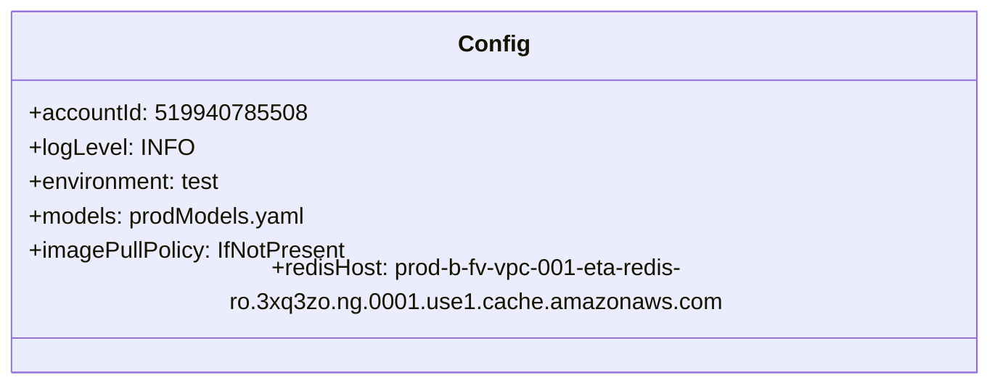
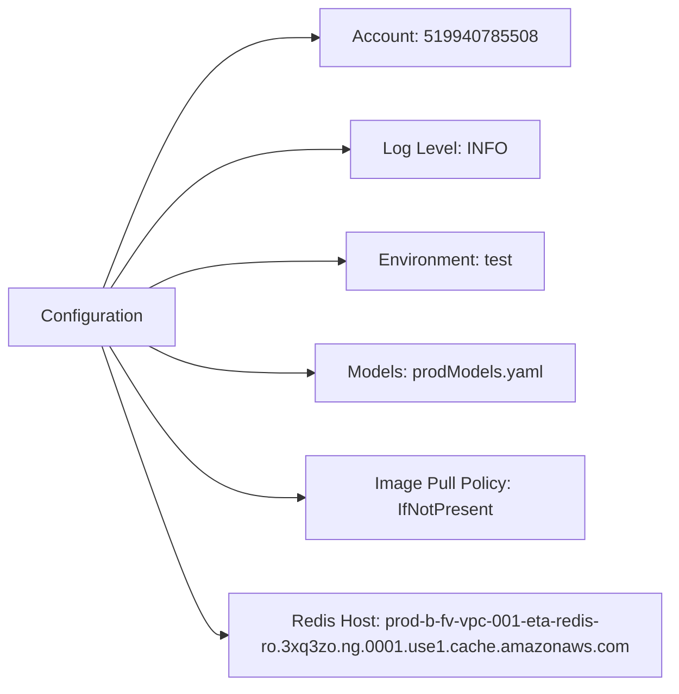

# Diagram: research/api_k8s/get_ai_eta/profiles/values.test.yaml

> Auto-generated by Obscura crawlers

## Diagram 1

### SVG

<svg id="container" width="686.9296875" xmlns="http://www.w3.org/2000/svg" class="classDiagram" height="256" viewBox="0 0 686.9296875 256" role="graphics-document document" aria-roledescription="class"><g><defs><marker id="container_class-aggregationStart" class="marker aggregation class" refX="18" refY="7" markerWidth="190" markerHeight="240" orient="auto"><path d="M 18,7 L9,13 L1,7 L9,1 Z"></path></marker></defs><defs><marker id="container_class-aggregationEnd" class="marker aggregation class" refX="1" refY="7" markerWidth="20" markerHeight="28" orient="auto"><path d="M 18,7 L9,13 L1,7 L9,1 Z"></path></marker></defs><defs><marker id="container_class-extensionStart" class="marker extension class" refX="18" refY="7" markerWidth="190" markerHeight="240" orient="auto"><path d="M 1,7 L18,13 V 1 Z"></path></marker></defs><defs><marker id="container_class-extensionEnd" class="marker extension class" refX="1" refY="7" markerWidth="20" markerHeight="28" orient="auto"><path d="M 1,1 V 13 L18,7 Z"></path></marker></defs><defs><marker id="container_class-compositionStart" class="marker composition class" refX="18" refY="7" markerWidth="190" markerHeight="240" orient="auto"><path d="M 18,7 L9,13 L1,7 L9,1 Z"></path></marker></defs><defs><marker id="container_class-compositionEnd" class="marker composition class" refX="1" refY="7" markerWidth="20" markerHeight="28" orient="auto"><path d="M 18,7 L9,13 L1,7 L9,1 Z"></path></marker></defs><defs><marker id="container_class-dependencyStart" class="marker dependency class" refX="6" refY="7" markerWidth="190" markerHeight="240" orient="auto"><path d="M 5,7 L9,13 L1,7 L9,1 Z"></path></marker></defs><defs><marker id="container_class-dependencyEnd" class="marker dependency class" refX="13" refY="7" markerWidth="20" markerHeight="28" orient="auto"><path d="M 18,7 L9,13 L14,7 L9,1 Z"></path></marker></defs><defs><marker id="container_class-lollipopStart" class="marker lollipop class" refX="13" refY="7" markerWidth="190" markerHeight="240" orient="auto"><circle stroke="black" fill="transparent" cx="7" cy="7" r="6"></circle></marker></defs><defs><marker id="container_class-lollipopEnd" class="marker lollipop class" refX="1" refY="7" markerWidth="190" markerHeight="240" orient="auto"><circle stroke="black" fill="transparent" cx="7" cy="7" r="6"></circle></marker></defs><g class="root"><g class="clusters"></g><g class="edgePaths"></g><g class="edgeLabels"></g><g class="nodes"><g class="node default" id="classId-Config-0" transform="translate(343.46484375, 128)"><g class="basic label-container"><path d="M-335.46484375 -120 L335.46484375 -120 L335.46484375 120 L-335.46484375 120" stroke="none" stroke-width="0" fill="#ECECFF" style=""></path><path d="M-335.46484375 -120 C-195.4033384407516 -120, -55.34183313150322 -120, 335.46484375 -120 M-335.46484375 -120 C-137.740918632565 -120, 59.983006484869975 -120, 335.46484375 -120 M335.46484375 -120 C335.46484375 -34.26692746208866, 335.46484375 51.46614507582268, 335.46484375 120 M335.46484375 -120 C335.46484375 -69.81149074694255, 335.46484375 -19.622981493885106, 335.46484375 120 M335.46484375 120 C159.8644895927063 120, -15.735864564587416 120, -335.46484375 120 M335.46484375 120 C101.04689005204006 120, -133.3710636459199 120, -335.46484375 120 M-335.46484375 120 C-335.46484375 46.761972035829984, -335.46484375 -26.47605592834003, -335.46484375 -120 M-335.46484375 120 C-335.46484375 27.970667816138572, -335.46484375 -64.05866436772286, -335.46484375 -120" stroke="#9370DB" stroke-width="1.3" fill="none" stroke-dasharray="0 0" style=""></path></g><g class="annotation-group text" transform="translate(0, -96)"></g><g class="label-group text" transform="translate(-22.9296875, -96)"><g class="label" style="font-weight: bolder" transform="translate(0,-12)"><foreignObject width="45.859375" height="24">

Config

</foreignObject></g></g><g class="members-group text" transform="translate(-323.46484375, -48)"><g class="label" style="" transform="translate(0,-12)"><foreignObject width="184.46875" height="24">

+accountId: 519940785508

</foreignObject></g><g class="label" style="" transform="translate(0,12)"><foreignObject width="110.25" height="24">

+logLevel: INFO

</foreignObject></g><g class="label" style="" transform="translate(0,36)"><foreignObject width="136.015625" height="24">

+environment: test

</foreignObject></g><g class="label" style="" transform="translate(0,60)"><foreignObject width="193.84375" height="24">

+models: prodModels.yaml

</foreignObject></g><g class="label" style="" transform="translate(0,84)"><foreignObject width="220.984375" height="24">

+imagePullPolicy: IfNotPresent

</foreignObject></g><g class="label" style="" transform="translate(0,108)"><foreignObject width="624" height="24">

+redisHost: prod-b-fv-vpc-001-eta-redis-ro.3xq3zo.ng.0001.use1.cache.amazonaws.com

</foreignObject></g></g><g class="methods-group text" transform="translate(-323.46484375, 120)"></g><g class="divider" style=""><path d="M-335.46484375 -72 C-108.71501244750249 -72, 118.03481885499502 -72, 335.46484375 -72 M-335.46484375 -72 C-92.85907975500547 -72, 149.74668423998907 -72, 335.46484375 -72" stroke="#9370DB" stroke-width="1.3" fill="none" stroke-dasharray="0 0" style=""></path></g><g class="divider" style=""><path d="M-335.46484375 96 C-117.16338361226602 96, 101.13807652546797 96, 335.46484375 96 M-335.46484375 96 C-150.58250547456123 96, 34.29983280087754 96, 335.46484375 96" stroke="#9370DB" stroke-width="1.3" fill="none" stroke-dasharray="0 0" style=""></path></g></g></g></g></g></svg>

## Diagram 2

### SVG

<svg id="container" width="612.921875" xmlns="http://www.w3.org/2000/svg" class="flowchart" height="638" viewBox="0 0 612.921875 638" role="graphics-document document" aria-roledescription="flowchart-v2"><g><marker id="container_flowchart-v2-pointEnd" class="marker flowchart-v2" viewBox="0 0 10 10" refX="5" refY="5" markerUnits="userSpaceOnUse" markerWidth="8" markerHeight="8" orient="auto"><path d="M 0 0 L 10 5 L 0 10 z" class="arrowMarkerPath" style="stroke-width: 1; stroke-dasharray: 1, 0;"></path></marker><marker id="container_flowchart-v2-pointStart" class="marker flowchart-v2" viewBox="0 0 10 10" refX="4.5" refY="5" markerUnits="userSpaceOnUse" markerWidth="8" markerHeight="8" orient="auto"><path d="M 0 5 L 10 10 L 10 0 z" class="arrowMarkerPath" style="stroke-width: 1; stroke-dasharray: 1, 0;"></path></marker><marker id="container_flowchart-v2-circleEnd" class="marker flowchart-v2" viewBox="0 0 10 10" refX="11" refY="5" markerUnits="userSpaceOnUse" markerWidth="11" markerHeight="11" orient="auto"><circle cx="5" cy="5" r="5" class="arrowMarkerPath" style="stroke-width: 1; stroke-dasharray: 1, 0;"></circle></marker><marker id="container_flowchart-v2-circleStart" class="marker flowchart-v2" viewBox="0 0 10 10" refX="-1" refY="5" markerUnits="userSpaceOnUse" markerWidth="11" markerHeight="11" orient="auto"><circle cx="5" cy="5" r="5" class="arrowMarkerPath" style="stroke-width: 1; stroke-dasharray: 1, 0;"></circle></marker><marker id="container_flowchart-v2-crossEnd" class="marker cross flowchart-v2" viewBox="0 0 11 11" refX="12" refY="5.2" markerUnits="userSpaceOnUse" markerWidth="11" markerHeight="11" orient="auto"><path d="M 1,1 l 9,9 M 10,1 l -9,9" class="arrowMarkerPath" style="stroke-width: 2; stroke-dasharray: 1, 0;"></path></marker><marker id="container_flowchart-v2-crossStart" class="marker cross flowchart-v2" viewBox="0 0 11 11" refX="-1" refY="5.2" markerUnits="userSpaceOnUse" markerWidth="11" markerHeight="11" orient="auto"><path d="M 1,1 l 9,9 M 10,1 l -9,9" class="arrowMarkerPath" style="stroke-width: 2; stroke-dasharray: 1, 0;"></path></marker><g class="root"><g class="clusters"></g><g class="edgePaths"><path d="M97.455,268L112.942,229.167C128.428,190.333,159.402,112.667,192.27,73.833C225.138,35,259.901,35,277.283,35L294.664,35" id="L_cfg_account_0" class="edge-thickness-normal edge-pattern-solid edge-thickness-normal edge-pattern-solid flowchart-link" style=";" data-edge="true" data-et="edge" data-id="L_cfg_account_0" data-points="W3sieCI6OTcuNDU1MDQ4MDc2OTIzMDgsInkiOjI2OH0seyJ4IjoxOTAuMzc1LCJ5IjozNX0seyJ4IjoyOTguNjY0MDYyNSwieSI6MzV9XQ==" marker-end="url(#container_flowchart-v2-pointEnd)"></path><path d="M104.633,268L118.924,246.5C133.214,225,161.794,182,197.925,160.5C234.055,139,277.734,139,299.574,139L321.414,139" id="L_cfg_log_0" class="edge-thickness-normal edge-pattern-solid edge-thickness-normal edge-pattern-solid flowchart-link" style=";" data-edge="true" data-et="edge" data-id="L_cfg_log_0" data-points="W3sieCI6MTA0LjYzMzQxMzQ2MTUzODQ1LCJ5IjoyNjh9LHsieCI6MTkwLjM3NSwieSI6MTM5fSx7IngiOjMyNS40MTQwNjI1LCJ5IjoxMzl9XQ==" marker-end="url(#container_flowchart-v2-pointEnd)"></path><path d="M140.525,268L148.834,263.833C157.142,259.667,173.758,251.333,202.387,247.167C231.016,243,271.656,243,291.977,243L312.297,243" id="L_cfg_env_0" class="edge-thickness-normal edge-pattern-solid edge-thickness-normal edge-pattern-solid flowchart-link" style=";" data-edge="true" data-et="edge" data-id="L_cfg_env_0" data-points="W3sieCI6MTQwLjUyNTI0MDM4NDYxNTQsInkiOjI2OH0seyJ4IjoxOTAuMzc1LCJ5IjoyNDN9LHsieCI6MzE2LjI5Njg3NSwieSI6MjQzfV0=" marker-end="url(#container_flowchart-v2-pointEnd)"></path><path d="M140.525,322L148.834,326.167C157.142,330.333,173.758,338.667,197.646,342.833C221.534,347,252.693,347,268.272,347L283.852,347" id="L_cfg_models_0" class="edge-thickness-normal edge-pattern-solid edge-thickness-normal edge-pattern-solid flowchart-link" style=";" data-edge="true" data-et="edge" data-id="L_cfg_models_0" data-points="W3sieCI6MTQwLjUyNTI0MDM4NDYxNTQsInkiOjMyMn0seyJ4IjoxOTAuMzc1LCJ5IjozNDd9LHsieCI6Mjg3Ljg1MTU2MjUsInkiOjM0N31d" marker-end="url(#container_flowchart-v2-pointEnd)"></path><path d="M103.352,322L117.855,345.5C132.359,369,161.367,416,190.167,439.5C218.966,463,247.557,463,261.853,463L276.148,463" id="L_cfg_policy_0" class="edge-thickness-normal edge-pattern-solid edge-thickness-normal edge-pattern-solid flowchart-link" style=";" data-edge="true" data-et="edge" data-id="L_cfg_policy_0" data-points="W3sieCI6MTAzLjM1MTU2MjUsInkiOjMyMn0seyJ4IjoxOTAuMzc1LCJ5Ijo0NjN9LHsieCI6MjgwLjE0ODQzNzUsInkiOjQ2M31d" marker-end="url(#container_flowchart-v2-pointEnd)"></path><path d="M96.145,322L111.85,366.833C127.555,411.667,158.965,501.333,178.17,546.167C197.375,591,204.375,591,207.875,591L211.375,591" id="L_cfg_redis_0" class="edge-thickness-normal edge-pattern-solid edge-thickness-normal edge-pattern-solid flowchart-link" style=";" data-edge="true" data-et="edge" data-id="L_cfg_redis_0" data-points="W3sieCI6OTYuMTQ1NDgxNDE4OTE4OTIsInkiOjMyMn0seyJ4IjoxOTAuMzc1LCJ5Ijo1OTF9LHsieCI6MjE1LjM3NSwieSI6NTkxfV0=" marker-end="url(#container_flowchart-v2-pointEnd)"></path></g><g class="edgeLabels"><g class="edgeLabel"><g class="label" data-id="L_cfg_account_0" transform="translate(0, 0)"><foreignObject width="0" height="0">

</foreignObject></g></g><g class="edgeLabel"><g class="label" data-id="L_cfg_log_0" transform="translate(0, 0)"><foreignObject width="0" height="0">

</foreignObject></g></g><g class="edgeLabel"><g class="label" data-id="L_cfg_env_0" transform="translate(0, 0)"><foreignObject width="0" height="0">

</foreignObject></g></g><g class="edgeLabel"><g class="label" data-id="L_cfg_models_0" transform="translate(0, 0)"><foreignObject width="0" height="0">

</foreignObject></g></g><g class="edgeLabel"><g class="label" data-id="L_cfg_policy_0" transform="translate(0, 0)"><foreignObject width="0" height="0">

</foreignObject></g></g><g class="edgeLabel"><g class="label" data-id="L_cfg_redis_0" transform="translate(0, 0)"><foreignObject width="0" height="0">

</foreignObject></g></g></g><g class="nodes"><g class="node default" id="flowchart-cfg-0" transform="translate(86.6875, 295)"><rect class="basic label-container" style="" x="-78.6875" y="-27" width="157.375" height="54"></rect><g class="label" style="" transform="translate(-48.6875, -12)"><rect></rect><foreignObject width="97.375" height="24">

Configuration

</foreignObject></g></g><g class="node default" id="flowchart-account-1" transform="translate(410.1484375, 35)"><rect class="basic label-container" style="" x="-111.484375" y="-27" width="222.96875" height="54"></rect><g class="label" style="" transform="translate(-81.484375, -12)"><rect></rect><foreignObject width="162.96875" height="24">

Account: 519940785508

</foreignObject></g></g><g class="node default" id="flowchart-log-2" transform="translate(410.1484375, 139)"><rect class="basic label-container" style="" x="-84.734375" y="-27" width="169.46875" height="54"></rect><g class="label" style="" transform="translate(-54.734375, -12)"><rect></rect><foreignObject width="109.46875" height="24">

Log Level: INFO

</foreignObject></g></g><g class="node default" id="flowchart-env-3" transform="translate(410.1484375, 243)"><rect class="basic label-container" style="" x="-93.8515625" y="-27" width="187.703125" height="54"></rect><g class="label" style="" transform="translate(-63.8515625, -12)"><rect></rect><foreignObject width="127.703125" height="24">

Environment: test

</foreignObject></g></g><g class="node default" id="flowchart-models-4" transform="translate(410.1484375, 347)"><rect class="basic label-container" style="" x="-122.296875" y="-27" width="244.59375" height="54"></rect><g class="label" style="" transform="translate(-92.296875, -12)"><rect></rect><foreignObject width="184.59375" height="24">

Models: prodModels.yaml

</foreignObject></g></g><g class="node default" id="flowchart-policy-5" transform="translate(410.1484375, 463)"><rect class="basic label-container" style="" x="-130" y="-39" width="260" height="78"></rect><g class="label" style="" transform="translate(-100, -24)"><rect></rect><foreignObject width="200" height="48">

Image Pull Policy: IfNotPresent

</foreignObject></g></g><g class="node default" id="flowchart-redis-6" transform="translate(410.1484375, 591)"><rect class="basic label-container" style="" x="-194.7734375" y="-39" width="389.546875" height="78"></rect><g class="label" style="" transform="translate(-164.7734375, -24)"><rect></rect><foreignObject width="329.546875" height="48">

Redis Host: prod-b-fv-vpc-001-eta-redis-ro.3xq3zo.ng.0001.use1.cache.amazonaws.com

</foreignObject></g></g></g></g></g></svg>
