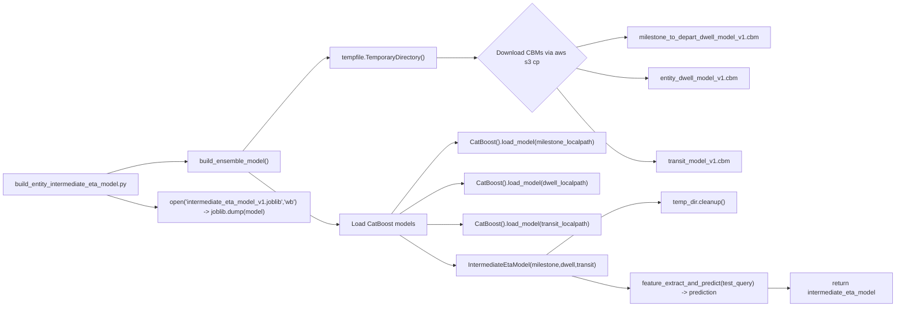
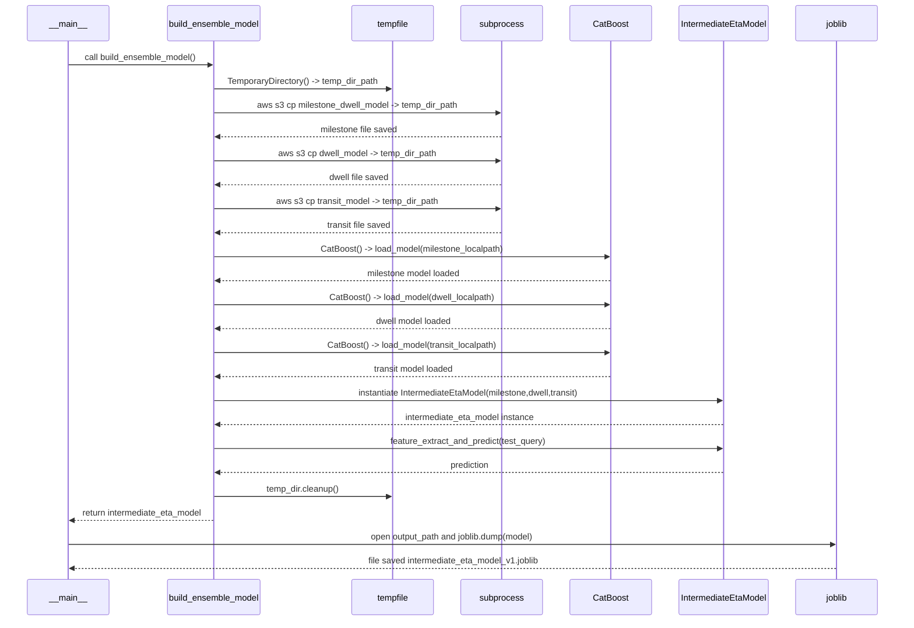

# Diagram: research/api_k8s/get_ai_eta/scripts/build_entity_intermediate_eta_model.py

> Auto-generated by Obscura crawlers

## Diagram 1

### SVG

<svg id="container" width="2318.03125" xmlns="http://www.w3.org/2000/svg" class="flowchart" height="780" viewBox="0 0 2318.03125 780" role="graphics-document document" aria-roledescription="flowchart-v2"><g><marker id="container_flowchart-v2-pointEnd" class="marker flowchart-v2" viewBox="0 0 10 10" refX="5" refY="5" markerUnits="userSpaceOnUse" markerWidth="8" markerHeight="8" orient="auto"><path d="M 0 0 L 10 5 L 0 10 z" class="arrowMarkerPath" style="stroke-width: 1; stroke-dasharray: 1, 0;"></path></marker><marker id="container_flowchart-v2-pointStart" class="marker flowchart-v2" viewBox="0 0 10 10" refX="4.5" refY="5" markerUnits="userSpaceOnUse" markerWidth="8" markerHeight="8" orient="auto"><path d="M 0 5 L 10 10 L 10 0 z" class="arrowMarkerPath" style="stroke-width: 1; stroke-dasharray: 1, 0;"></path></marker><marker id="container_flowchart-v2-circleEnd" class="marker flowchart-v2" viewBox="0 0 10 10" refX="11" refY="5" markerUnits="userSpaceOnUse" markerWidth="11" markerHeight="11" orient="auto"><circle cx="5" cy="5" r="5" class="arrowMarkerPath" style="stroke-width: 1; stroke-dasharray: 1, 0;"></circle></marker><marker id="container_flowchart-v2-circleStart" class="marker flowchart-v2" viewBox="0 0 10 10" refX="-1" refY="5" markerUnits="userSpaceOnUse" markerWidth="11" markerHeight="11" orient="auto"><circle cx="5" cy="5" r="5" class="arrowMarkerPath" style="stroke-width: 1; stroke-dasharray: 1, 0;"></circle></marker><marker id="container_flowchart-v2-crossEnd" class="marker cross flowchart-v2" viewBox="0 0 11 11" refX="12" refY="5.2" markerUnits="userSpaceOnUse" markerWidth="11" markerHeight="11" orient="auto"><path d="M 1,1 l 9,9 M 10,1 l -9,9" class="arrowMarkerPath" style="stroke-width: 2; stroke-dasharray: 1, 0;"></path></marker><marker id="container_flowchart-v2-crossStart" class="marker cross flowchart-v2" viewBox="0 0 11 11" refX="-1" refY="5.2" markerUnits="userSpaceOnUse" markerWidth="11" markerHeight="11" orient="auto"><path d="M 1,1 l 9,9 M 10,1 l -9,9" class="arrowMarkerPath" style="stroke-width: 2; stroke-dasharray: 1, 0;"></path></marker><g class="root"><g class="clusters"></g><g class="edgePaths"><path d="M280.088,442L298.146,436.833C316.204,431.667,352.321,421.333,386.675,416.167C421.029,411,453.62,411,469.915,411L486.211,411" id="L_Script_Build_0" class="edge-thickness-normal edge-pattern-solid edge-thickness-normal edge-pattern-solid flowchart-link" style=";" data-edge="true" data-et="edge" data-id="L_Script_Build_0" data-points="W3sieCI6MjgwLjA4NzgyMzI3NTg2MjEsInkiOjQ0Mn0seyJ4IjozODguNDM3NSwieSI6NDExfSx7IngiOjQ5MC4yMTA5Mzc1LCJ5Ijo0MTF9XQ==" marker-end="url(#container_flowchart-v2-pointEnd)"></path><path d="M633.306,384L666.544,344.5C699.782,305,766.258,226,802.996,186.5C839.734,147,846.734,147,850.234,147L853.734,147" id="L_Build_TempDir_0" class="edge-thickness-normal edge-pattern-solid edge-thickness-normal edge-pattern-solid flowchart-link" style=";" data-edge="true" data-et="edge" data-id="L_Build_TempDir_0" data-points="W3sieCI6NjMzLjMwNTY2NDA2MjUsInkiOjM4NH0seyJ4Ijo4MzIuNzM0Mzc1LCJ5IjoxNDd9LHsieCI6ODU3LjczNDM3NSwieSI6MTQ3fV0=" marker-end="url(#container_flowchart-v2-pointEnd)"></path><path d="M1133.672,147L1137.839,147C1142.005,147,1150.339,147,1167.935,147C1185.531,147,1212.391,147,1225.82,147L1239.25,147" id="L_TempDir_Downloads_0" class="edge-thickness-normal edge-pattern-solid edge-thickness-normal edge-pattern-solid flowchart-link" style=";" data-edge="true" data-et="edge" data-id="L_TempDir_Downloads_0" data-points="W3sieCI6MTEzMy42NzE4NzUsInkiOjE0N30seyJ4IjoxMTU4LjY3MTg3NSwieSI6MTQ3fSx7IngiOjEyNDMuMjUsInkiOjE0N31d" marker-end="url(#container_flowchart-v2-pointEnd)"></path><path d="M1495.022,120.772L1513.489,116.476C1531.957,112.181,1568.893,103.591,1590.86,99.295C1612.828,95,1619.828,95,1623.328,95L1626.828,95" id="L_Downloads_M1_0" class="edge-thickness-normal edge-pattern-solid edge-thickness-normal edge-pattern-solid flowchart-link" style=";" data-edge="true" data-et="edge" data-id="L_Downloads_M1_0" data-points="W3sieCI6MTQ5NS4wMjE1MDMwOTAwOTQ3LCJ5IjoxMjAuNzcxNTAzMDkwMDk0Njh9LHsieCI6MTYwNS44MjgxMjUsInkiOjk1fSx7IngiOjE2MzAuODI4MTI1LCJ5Ijo5NX1d" marker-end="url(#container_flowchart-v2-pointEnd)"></path><path d="M1495.022,173.228L1513.489,177.524C1531.957,181.819,1568.893,190.409,1599.948,194.705C1631.003,199,1656.177,199,1668.764,199L1681.352,199" id="L_Downloads_M2_0" class="edge-thickness-normal edge-pattern-solid edge-thickness-normal edge-pattern-solid flowchart-link" style=";" data-edge="true" data-et="edge" data-id="L_Downloads_M2_0" data-points="W3sieCI6MTQ5NS4wMjE1MDMwOTAwOTQ3LCJ5IjoxNzMuMjI4NDk2OTA5OTA1MzJ9LHsieCI6MTYwNS44MjgxMjUsInkiOjE5OX0seyJ4IjoxNjg1LjM1MTU2MjUsInkiOjE5OX1d" marker-end="url(#container_flowchart-v2-pointEnd)"></path><path d="M1445.988,222.262L1472.628,253.718C1499.268,285.175,1552.548,348.087,1595.223,379.544C1637.898,411,1669.969,411,1686.004,411L1702.039,411" id="L_Downloads_M3_0" class="edge-thickness-normal edge-pattern-solid edge-thickness-normal edge-pattern-solid flowchart-link" style=";" data-edge="true" data-et="edge" data-id="L_Downloads_M3_0" data-points="W3sieCI6MTQ0NS45ODgyMTUwMjk2NDI4LCJ5IjoyMjIuMjYxNzg0OTcwMzU3MzN9LHsieCI6MTYwNS44MjgxMjUsInkiOjQxMX0seyJ4IjoxNzA2LjAzOTA2MjUsInkiOjQxMX1d" marker-end="url(#container_flowchart-v2-pointEnd)"></path><path d="M648.073,438L678.85,460.167C709.627,482.333,771.181,526.667,809.956,548.833C848.732,571,864.729,571,872.728,571L880.727,571" id="L_Build_Load_0" class="edge-thickness-normal edge-pattern-solid edge-thickness-normal edge-pattern-solid flowchart-link" style=";" data-edge="true" data-et="edge" data-id="L_Build_Load_0" data-points="W3sieCI6NjQ4LjA3MzQ4NjMyODEyNSwieSI6NDM4fSx7IngiOjgzMi43MzQzNzUsInkiOjU3MX0seyJ4Ijo4ODQuNzI2NTYyNSwieSI6NTcxfV0=" marker-end="url(#container_flowchart-v2-pointEnd)"></path><path d="M1016.858,544L1040.493,513.833C1064.129,483.667,1111.4,423.333,1139.661,393.167C1167.922,363,1177.172,363,1181.797,363L1186.422,363" id="L_Load_CM1_0" class="edge-thickness-normal edge-pattern-solid edge-thickness-normal edge-pattern-solid flowchart-link" style=";" data-edge="true" data-et="edge" data-id="L_Load_CM1_0" data-points="W3sieCI6MTAxNi44NTc3MjIzNTU3NjkzLCJ5Ijo1NDR9LHsieCI6MTE1OC42NzE4NzUsInkiOjM2M30seyJ4IjoxMTkwLjQyMTg3NSwieSI6MzYzfV0=" marker-end="url(#container_flowchart-v2-pointEnd)"></path><path d="M1038.012,544L1058.122,531.167C1078.232,518.333,1118.452,492.667,1145.899,479.833C1173.346,467,1188.021,467,1195.358,467L1202.695,467" id="L_Load_CM2_0" class="edge-thickness-normal edge-pattern-solid edge-thickness-normal edge-pattern-solid flowchart-link" style=";" data-edge="true" data-et="edge" data-id="L_Load_CM2_0" data-points="W3sieCI6MTAzOC4wMTIzMTk3MTE1Mzg2LCJ5Ijo1NDR9LHsieCI6MTE1OC42NzE4NzUsInkiOjQ2N30seyJ4IjoxMjA2LjY5NTMxMjUsInkiOjQ2N31d" marker-end="url(#container_flowchart-v2-pointEnd)"></path><path d="M1106.68,571L1115.345,571C1124.01,571,1141.341,571,1156.669,571C1171.997,571,1185.323,571,1191.986,571L1198.648,571" id="L_Load_CM3_0" class="edge-thickness-normal edge-pattern-solid edge-thickness-normal edge-pattern-solid flowchart-link" style=";" data-edge="true" data-et="edge" data-id="L_Load_CM3_0" data-points="W3sieCI6MTEwNi42Nzk2ODc1LCJ5Ijo1NzF9LHsieCI6MTE1OC42NzE4NzUsInkiOjU3MX0seyJ4IjoxMjAyLjY0ODQzNzUsInkiOjU3MX1d" marker-end="url(#container_flowchart-v2-pointEnd)"></path><path d="M1038.012,598L1058.122,610.833C1078.232,623.667,1118.452,649.333,1142.062,662.167C1165.672,675,1172.672,675,1176.172,675L1179.672,675" id="L_Load_Instantiate_0" class="edge-thickness-normal edge-pattern-solid edge-thickness-normal edge-pattern-solid flowchart-link" style=";" data-edge="true" data-et="edge" data-id="L_Load_Instantiate_0" data-points="W3sieCI6MTAzOC4wMTIzMTk3MTE1Mzg2LCJ5Ijo1OTh9LHsieCI6MTE1OC42NzE4NzUsInkiOjY3NX0seyJ4IjoxMTgzLjY3MTg3NSwieSI6Njc1fV0=" marker-end="url(#container_flowchart-v2-pointEnd)"></path><path d="M1419.979,648L1450.954,625.833C1481.929,603.667,1543.878,559.333,1592.796,537.167C1641.714,515,1677.599,515,1695.542,515L1713.484,515" id="L_Instantiate_Cleanup_0" class="edge-thickness-normal edge-pattern-solid edge-thickness-normal edge-pattern-solid flowchart-link" style=";" data-edge="true" data-et="edge" data-id="L_Instantiate_Cleanup_0" data-points="W3sieCI6MTQxOS45Nzg4MDg1OTM3NSwieSI6NjQ4fSx7IngiOjE2MDUuODI4MTI1LCJ5Ijo1MTV9LHsieCI6MTcxNy40ODQzNzUsInkiOjUxNX1d" marker-end="url(#container_flowchart-v2-pointEnd)"></path><path d="M1486.329,702L1506.246,707.167C1526.162,712.333,1565.995,722.667,1590.456,727.833C1614.917,733,1624.005,733,1628.549,733L1633.094,733" id="L_Instantiate_Predict_0" class="edge-thickness-normal edge-pattern-solid edge-thickness-normal edge-pattern-solid flowchart-link" style=";" data-edge="true" data-et="edge" data-id="L_Instantiate_Predict_0" data-points="W3sieCI6MTQ4Ni4zMjk0NzE5ODI3NTg2LCJ5Ijo3MDJ9LHsieCI6MTYwNS44MjgxMjUsInkiOjczM30seyJ4IjoxNjM3LjA5Mzc1LCJ5Ijo3MzN9XQ==" marker-end="url(#container_flowchart-v2-pointEnd)"></path><path d="M1993.766,733L1998.977,733C2004.188,733,2014.609,733,2023.32,733C2032.031,733,2039.031,733,2042.531,733L2046.031,733" id="L_Predict_ReturnModel_0" class="edge-thickness-normal edge-pattern-solid edge-thickness-normal edge-pattern-solid flowchart-link" style=";" data-edge="true" data-et="edge" data-id="L_Predict_ReturnModel_0" data-points="W3sieCI6MTk5My43NjU2MjUsInkiOjczM30seyJ4IjoyMDI1LjAzMTI1LCJ5Ijo3MzN9LHsieCI6MjA1MC4wMzEyNSwieSI6NzMzfV0=" marker-end="url(#container_flowchart-v2-pointEnd)"></path><path d="M280.088,496L298.146,501.167C316.204,506.333,352.321,516.667,373.879,521.833C395.438,527,402.438,527,405.938,527L409.438,527" id="L_Script_Save_0" class="edge-thickness-normal edge-pattern-solid edge-thickness-normal edge-pattern-solid flowchart-link" style=";" data-edge="true" data-et="edge" data-id="L_Script_Save_0" data-points="W3sieCI6MjgwLjA4NzgyMzI3NTg2MjEsInkiOjQ5Nn0seyJ4IjozODguNDM3NSwieSI6NTI3fSx7IngiOjQxMy40Mzc1LCJ5Ijo1Mjd9XQ==" marker-end="url(#container_flowchart-v2-pointEnd)"></path></g><g class="edgeLabels"><g class="edgeLabel"><g class="label" data-id="L_Script_Build_0" transform="translate(0, 0)"><foreignObject width="0" height="0">

</foreignObject></g></g><g class="edgeLabel"><g class="label" data-id="L_Build_TempDir_0" transform="translate(0, 0)"><foreignObject width="0" height="0">

</foreignObject></g></g><g class="edgeLabel"><g class="label" data-id="L_TempDir_Downloads_0" transform="translate(0, 0)"><foreignObject width="0" height="0">

</foreignObject></g></g><g class="edgeLabel"><g class="label" data-id="L_Downloads_M1_0" transform="translate(0, 0)"><foreignObject width="0" height="0">

</foreignObject></g></g><g class="edgeLabel"><g class="label" data-id="L_Downloads_M2_0" transform="translate(0, 0)"><foreignObject width="0" height="0">

</foreignObject></g></g><g class="edgeLabel"><g class="label" data-id="L_Downloads_M3_0" transform="translate(0, 0)"><foreignObject width="0" height="0">

</foreignObject></g></g><g class="edgeLabel"><g class="label" data-id="L_Build_Load_0" transform="translate(0, 0)"><foreignObject width="0" height="0">

</foreignObject></g></g><g class="edgeLabel"><g class="label" data-id="L_Load_CM1_0" transform="translate(0, 0)"><foreignObject width="0" height="0">

</foreignObject></g></g><g class="edgeLabel"><g class="label" data-id="L_Load_CM2_0" transform="translate(0, 0)"><foreignObject width="0" height="0">

</foreignObject></g></g><g class="edgeLabel"><g class="label" data-id="L_Load_CM3_0" transform="translate(0, 0)"><foreignObject width="0" height="0">

</foreignObject></g></g><g class="edgeLabel"><g class="label" data-id="L_Load_Instantiate_0" transform="translate(0, 0)"><foreignObject width="0" height="0">

</foreignObject></g></g><g class="edgeLabel"><g class="label" data-id="L_Instantiate_Cleanup_0" transform="translate(0, 0)"><foreignObject width="0" height="0">

</foreignObject></g></g><g class="edgeLabel"><g class="label" data-id="L_Instantiate_Predict_0" transform="translate(0, 0)"><foreignObject width="0" height="0">

</foreignObject></g></g><g class="edgeLabel"><g class="label" data-id="L_Predict_ReturnModel_0" transform="translate(0, 0)"><foreignObject width="0" height="0">

</foreignObject></g></g><g class="edgeLabel"><g class="label" data-id="L_Script_Save_0" transform="translate(0, 0)"><foreignObject width="0" height="0">

</foreignObject></g></g></g><g class="nodes"><g class="node default" id="flowchart-Script-0" transform="translate(185.71875, 469)"><rect class="basic label-container" style="" x="-177.71875" y="-27" width="355.4375" height="54"></rect><g class="label" style="" transform="translate(-147.71875, -12)"><rect></rect><foreignObject width="295.4375" height="24">

build_entity_intermediate_eta_model.py

</foreignObject></g></g><g class="node default" id="flowchart-Build-1" transform="translate(610.5859375, 411)"><rect class="basic label-container" style="" x="-120.375" y="-27" width="240.75" height="54"></rect><g class="label" style="" transform="translate(-90.375, -12)"><rect></rect><foreignObject width="180.75" height="24">

build_ensemble_model()

</foreignObject></g></g><g class="node default" id="flowchart-TempDir-3" transform="translate(995.703125, 147)"><rect class="basic label-container" style="" x="-137.96875" y="-27" width="275.9375" height="54"></rect><g class="label" style="" transform="translate(-107.96875, -12)"><rect></rect><foreignObject width="215.9375" height="24">

tempfile.TemporaryDirectory()

</foreignObject></g></g><g class="node default" id="flowchart-Downloads-5" transform="translate(1382.25, 147)"><polygon points="139,0 278,-139 139,-278 0,-139" class="label-container" transform="translate(-138.5, 139)"></polygon><g class="label" style="" transform="translate(-100, -24)"><rect></rect><foreignObject width="200" height="48">

Download CBMs via aws s3 cp

</foreignObject></g></g><g class="node default" id="flowchart-M1-7" transform="translate(1815.4296875, 95)"><rect class="basic label-container" style="" x="-184.6015625" y="-27" width="369.203125" height="54"></rect><g class="label" style="" transform="translate(-154.6015625, -12)"><rect></rect><foreignObject width="309.203125" height="24">

milestone_to_depart_dwell_model_v1.cbm

</foreignObject></g></g><g class="node default" id="flowchart-M2-9" transform="translate(1815.4296875, 199)"><rect class="basic label-container" style="" x="-130.078125" y="-27" width="260.15625" height="54"></rect><g class="label" style="" transform="translate(-100.078125, -12)"><rect></rect><foreignObject width="200.15625" height="24">

entity_dwell_model_v1.cbm

</foreignObject></g></g><g class="node default" id="flowchart-M3-11" transform="translate(1815.4296875, 411)"><rect class="basic label-container" style="" x="-109.390625" y="-27" width="218.78125" height="54"></rect><g class="label" style="" transform="translate(-79.390625, -12)"><rect></rect><foreignObject width="158.78125" height="24">

transit_model_v1.cbm

</foreignObject></g></g><g class="node default" id="flowchart-Load-13" transform="translate(995.703125, 571)"><rect class="basic label-container" style="" x="-110.9765625" y="-27" width="221.953125" height="54"></rect><g class="label" style="" transform="translate(-80.9765625, -12)"><rect></rect><foreignObject width="161.953125" height="24">

Load CatBoost models

</foreignObject></g></g><g class="node default" id="flowchart-CM1-15" transform="translate(1382.25, 363)"><rect class="basic label-container" style="" x="-191.828125" y="-27" width="383.65625" height="54"></rect><g class="label" style="" transform="translate(-161.828125, -12)"><rect></rect><foreignObject width="323.65625" height="24">

CatBoost().load_model(milestone_localpath)

</foreignObject></g></g><g class="node default" id="flowchart-CM2-17" transform="translate(1382.25, 467)"><rect class="basic label-container" style="" x="-175.5546875" y="-27" width="351.109375" height="54"></rect><g class="label" style="" transform="translate(-145.5546875, -12)"><rect></rect><foreignObject width="291.109375" height="24">

CatBoost().load_model(dwell_localpath)

</foreignObject></g></g><g class="node default" id="flowchart-CM3-19" transform="translate(1382.25, 571)"><rect class="basic label-container" style="" x="-179.6015625" y="-27" width="359.203125" height="54"></rect><g class="label" style="" transform="translate(-149.6015625, -12)"><rect></rect><foreignObject width="299.203125" height="24">

CatBoost().load_model(transit_localpath)

</foreignObject></g></g><g class="node default" id="flowchart-Instantiate-21" transform="translate(1382.25, 675)"><rect class="basic label-container" style="" x="-198.578125" y="-27" width="397.15625" height="54"></rect><g class="label" style="" transform="translate(-168.578125, -12)"><rect></rect><foreignObject width="337.15625" height="24">

IntermediateEtaModel(milestone,dwell,transit)

</foreignObject></g></g><g class="node default" id="flowchart-Cleanup-23" transform="translate(1815.4296875, 515)"><rect class="basic label-container" style="" x="-97.9453125" y="-27" width="195.890625" height="54"></rect><g class="label" style="" transform="translate(-67.9453125, -12)"><rect></rect><foreignObject width="135.890625" height="24">

temp_dir.cleanup()

</foreignObject></g></g><g class="node default" id="flowchart-Predict-25" transform="translate(1815.4296875, 733)"><rect class="basic label-container" style="" x="-178.3359375" y="-39" width="356.671875" height="78"></rect><g class="label" style="" transform="translate(-148.3359375, -24)"><rect></rect><foreignObject width="296.671875" height="48">

feature_extract_and_predict(test_query) -&gt; prediction

</foreignObject></g></g><g class="node default" id="flowchart-ReturnModel-27" transform="translate(2180.03125, 733)"><rect class="basic label-container" style="" x="-130" y="-39" width="260" height="78"></rect><g class="label" style="" transform="translate(-100, -24)"><rect></rect><foreignObject width="200" height="48">

return intermediate_eta_model

</foreignObject></g></g><g class="node default" id="flowchart-Save-29" transform="translate(610.5859375, 527)"><rect class="basic label-container" style="" x="-197.1484375" y="-39" width="394.296875" height="78"></rect><g class="label" style="" transform="translate(-167.1484375, -24)"><rect></rect><foreignObject width="334.296875" height="48">

open('intermediate_eta_model_v1.joblib','wb') -&gt; joblib.dump(model)

</foreignObject></g></g></g></g></g></svg>

## Diagram 2

### SVG

<svg id="container" width="1733" xmlns="http://www.w3.org/2000/svg" height="1227" viewBox="-50 -10 1733 1227" role="graphics-document document" aria-roledescription="sequence"><g><rect x="1483" y="1141" fill="#eaeaea" stroke="#666" width="150" height="65" name="Joblib" rx="3" ry="3" class="actor actor-bottom"></rect><text x="1558" y="1173.5" dominant-baseline="central" alignment-baseline="central" class="actor actor-box" style="text-anchor: middle; font-size: 16px; font-weight: 400;"><tspan x="1558" dy="0">joblib</tspan></text></g><g><rect x="1251" y="1141" fill="#eaeaea" stroke="#666" width="182" height="65" name="IM" rx="3" ry="3" class="actor actor-bottom"></rect><text x="1342" y="1173.5" dominant-baseline="central" alignment-baseline="central" class="actor actor-box" style="text-anchor: middle; font-size: 16px; font-weight: 400;"><tspan x="1342" dy="0">IntermediateEtaModel</tspan></text></g><g><rect x="1051" y="1141" fill="#eaeaea" stroke="#666" width="150" height="65" name="Cat" rx="3" ry="3" class="actor actor-bottom"></rect><text x="1126" y="1173.5" dominant-baseline="central" alignment-baseline="central" class="actor actor-box" style="text-anchor: middle; font-size: 16px; font-weight: 400;"><tspan x="1126" dy="0">CatBoost</tspan></text></g><g><rect x="851" y="1141" fill="#eaeaea" stroke="#666" width="150" height="65" name="Shell" rx="3" ry="3" class="actor actor-bottom"></rect><text x="926" y="1173.5" dominant-baseline="central" alignment-baseline="central" class="actor actor-box" style="text-anchor: middle; font-size: 16px; font-weight: 400;"><tspan x="926" dy="0">subprocess</tspan></text></g><g><rect x="651" y="1141" fill="#eaeaea" stroke="#666" width="150" height="65" name="Temp" rx="3" ry="3" class="actor actor-bottom"></rect><text x="726" y="1173.5" dominant-baseline="central" alignment-baseline="central" class="actor actor-box" style="text-anchor: middle; font-size: 16px; font-weight: 400;"><tspan x="726" dy="0">tempfile</tspan></text></g><g><rect x="278.5" y="1141" fill="#eaeaea" stroke="#666" width="191" height="65" name="Builder" rx="3" ry="3" class="actor actor-bottom"></rect><text x="374" y="1173.5" dominant-baseline="central" alignment-baseline="central" class="actor actor-box" style="text-anchor: middle; font-size: 16px; font-weight: 400;"><tspan x="374" dy="0">build_ensemble_model</tspan></text></g><g><rect x="0" y="1141" fill="#eaeaea" stroke="#666" width="150" height="65" name="Main" rx="3" ry="3" class="actor actor-bottom"></rect><text x="75" y="1173.5" dominant-baseline="central" alignment-baseline="central" class="actor actor-box" style="text-anchor: middle; font-size: 16px; font-weight: 400;"><tspan x="75" dy="0">__main__</tspan></text></g><g><line id="actor6" x1="1558" y1="65" x2="1558" y2="1141" class="actor-line 200" stroke-width="0.5px" stroke="#999" name="Joblib"></line><g id="root-6"><rect x="1483" y="0" fill="#eaeaea" stroke="#666" width="150" height="65" name="Joblib" rx="3" ry="3" class="actor actor-top"></rect><text x="1558" y="32.5" dominant-baseline="central" alignment-baseline="central" class="actor actor-box" style="text-anchor: middle; font-size: 16px; font-weight: 400;"><tspan x="1558" dy="0">joblib</tspan></text></g></g><g><line id="actor5" x1="1342" y1="65" x2="1342" y2="1141" class="actor-line 200" stroke-width="0.5px" stroke="#999" name="IM"></line><g id="root-5"><rect x="1251" y="0" fill="#eaeaea" stroke="#666" width="182" height="65" name="IM" rx="3" ry="3" class="actor actor-top"></rect><text x="1342" y="32.5" dominant-baseline="central" alignment-baseline="central" class="actor actor-box" style="text-anchor: middle; font-size: 16px; font-weight: 400;"><tspan x="1342" dy="0">IntermediateEtaModel</tspan></text></g></g><g><line id="actor4" x1="1126" y1="65" x2="1126" y2="1141" class="actor-line 200" stroke-width="0.5px" stroke="#999" name="Cat"></line><g id="root-4"><rect x="1051" y="0" fill="#eaeaea" stroke="#666" width="150" height="65" name="Cat" rx="3" ry="3" class="actor actor-top"></rect><text x="1126" y="32.5" dominant-baseline="central" alignment-baseline="central" class="actor actor-box" style="text-anchor: middle; font-size: 16px; font-weight: 400;"><tspan x="1126" dy="0">CatBoost</tspan></text></g></g><g><line id="actor3" x1="926" y1="65" x2="926" y2="1141" class="actor-line 200" stroke-width="0.5px" stroke="#999" name="Shell"></line><g id="root-3"><rect x="851" y="0" fill="#eaeaea" stroke="#666" width="150" height="65" name="Shell" rx="3" ry="3" class="actor actor-top"></rect><text x="926" y="32.5" dominant-baseline="central" alignment-baseline="central" class="actor actor-box" style="text-anchor: middle; font-size: 16px; font-weight: 400;"><tspan x="926" dy="0">subprocess</tspan></text></g></g><g><line id="actor2" x1="726" y1="65" x2="726" y2="1141" class="actor-line 200" stroke-width="0.5px" stroke="#999" name="Temp"></line><g id="root-2"><rect x="651" y="0" fill="#eaeaea" stroke="#666" width="150" height="65" name="Temp" rx="3" ry="3" class="actor actor-top"></rect><text x="726" y="32.5" dominant-baseline="central" alignment-baseline="central" class="actor actor-box" style="text-anchor: middle; font-size: 16px; font-weight: 400;"><tspan x="726" dy="0">tempfile</tspan></text></g></g><g><line id="actor1" x1="374" y1="65" x2="374" y2="1141" class="actor-line 200" stroke-width="0.5px" stroke="#999" name="Builder"></line><g id="root-1"><rect x="278.5" y="0" fill="#eaeaea" stroke="#666" width="191" height="65" name="Builder" rx="3" ry="3" class="actor actor-top"></rect><text x="374" y="32.5" dominant-baseline="central" alignment-baseline="central" class="actor actor-box" style="text-anchor: middle; font-size: 16px; font-weight: 400;"><tspan x="374" dy="0">build_ensemble_model</tspan></text></g></g><g><line id="actor0" x1="75" y1="65" x2="75" y2="1141" class="actor-line 200" stroke-width="0.5px" stroke="#999" name="Main"></line><g id="root-0"><rect x="0" y="0" fill="#eaeaea" stroke="#666" width="150" height="65" name="Main" rx="3" ry="3" class="actor actor-top"></rect><text x="75" y="32.5" dominant-baseline="central" alignment-baseline="central" class="actor actor-box" style="text-anchor: middle; font-size: 16px; font-weight: 400;"><tspan x="75" dy="0">__main__</tspan></text></g></g><g></g><defs><symbol id="computer" width="24" height="24"><path transform="scale(.5)" d="M2 2v13h20v-13h-20zm18 11h-16v-9h16v9zm-10.228 6l.466-1h3.524l.467 1h-4.457zm14.228 3h-24l2-6h2.104l-1.33 4h18.45l-1.297-4h2.073l2 6zm-5-10h-14v-7h14v7z"></path></symbol></defs><defs><symbol id="database" fill-rule="evenodd" clip-rule="evenodd"><path transform="scale(.5)" d="M12.258.001l.256.004.255.005.253.008.251.01.249.012.247.015.246.016.242.019.241.02.239.023.236.024.233.027.231.028.229.031.225.032.223.034.22.036.217.038.214.04.211.041.208.043.205.045.201.046.198.048.194.05.191.051.187.053.183.054.18.056.175.057.172.059.168.06.163.061.16.063.155.064.15.066.074.033.073.033.071.034.07.034.069.035.068.035.067.035.066.035.064.036.064.036.062.036.06.036.06.037.058.037.058.037.055.038.055.038.053.038.052.038.051.039.05.039.048.039.047.039.045.04.044.04.043.04.041.04.04.041.039.041.037.041.036.041.034.041.033.042.032.042.03.042.029.042.027.042.026.043.024.043.023.043.021.043.02.043.018.044.017.043.015.044.013.044.012.044.011.045.009.044.007.045.006.045.004.045.002.045.001.045v17l-.001.045-.002.045-.004.045-.006.045-.007.045-.009.044-.011.045-.012.044-.013.044-.015.044-.017.043-.018.044-.02.043-.021.043-.023.043-.024.043-.026.043-.027.042-.029.042-.03.042-.032.042-.033.042-.034.041-.036.041-.037.041-.039.041-.04.041-.041.04-.043.04-.044.04-.045.04-.047.039-.048.039-.05.039-.051.039-.052.038-.053.038-.055.038-.055.038-.058.037-.058.037-.06.037-.06.036-.062.036-.064.036-.064.036-.066.035-.067.035-.068.035-.069.035-.07.034-.071.034-.073.033-.074.033-.15.066-.155.064-.16.063-.163.061-.168.06-.172.059-.175.057-.18.056-.183.054-.187.053-.191.051-.194.05-.198.048-.201.046-.205.045-.208.043-.211.041-.214.04-.217.038-.22.036-.223.034-.225.032-.229.031-.231.028-.233.027-.236.024-.239.023-.241.02-.242.019-.246.016-.247.015-.249.012-.251.01-.253.008-.255.005-.256.004-.258.001-.258-.001-.256-.004-.255-.005-.253-.008-.251-.01-.249-.012-.247-.015-.245-.016-.243-.019-.241-.02-.238-.023-.236-.024-.234-.027-.231-.028-.228-.031-.226-.032-.223-.034-.22-.036-.217-.038-.214-.04-.211-.041-.208-.043-.204-.045-.201-.046-.198-.048-.195-.05-.19-.051-.187-.053-.184-.054-.179-.056-.176-.057-.172-.059-.167-.06-.164-.061-.159-.063-.155-.064-.151-.066-.074-.033-.072-.033-.072-.034-.07-.034-.069-.035-.068-.035-.067-.035-.066-.035-.064-.036-.063-.036-.062-.036-.061-.036-.06-.037-.058-.037-.057-.037-.056-.038-.055-.038-.053-.038-.052-.038-.051-.039-.049-.039-.049-.039-.046-.039-.046-.04-.044-.04-.043-.04-.041-.04-.04-.041-.039-.041-.037-.041-.036-.041-.034-.041-.033-.042-.032-.042-.03-.042-.029-.042-.027-.042-.026-.043-.024-.043-.023-.043-.021-.043-.02-.043-.018-.044-.017-.043-.015-.044-.013-.044-.012-.044-.011-.045-.009-.044-.007-.045-.006-.045-.004-.045-.002-.045-.001-.045v-17l.001-.045.002-.045.004-.045.006-.045.007-.045.009-.044.011-.045.012-.044.013-.044.015-.044.017-.043.018-.044.02-.043.021-.043.023-.043.024-.043.026-.043.027-.042.029-.042.03-.042.032-.042.033-.042.034-.041.036-.041.037-.041.039-.041.04-.041.041-.04.043-.04.044-.04.046-.04.046-.039.049-.039.049-.039.051-.039.052-.038.053-.038.055-.038.056-.038.057-.037.058-.037.06-.037.061-.036.062-.036.063-.036.064-.036.066-.035.067-.035.068-.035.069-.035.07-.034.072-.034.072-.033.074-.033.151-.066.155-.064.159-.063.164-.061.167-.06.172-.059.176-.057.179-.056.184-.054.187-.053.19-.051.195-.05.198-.048.201-.046.204-.045.208-.043.211-.041.214-.04.217-.038.22-.036.223-.034.226-.032.228-.031.231-.028.234-.027.236-.024.238-.023.241-.02.243-.019.245-.016.247-.015.249-.012.251-.01.253-.008.255-.005.256-.004.258-.001.258.001zm-9.258 20.499v.01l.001.021.003.021.004.022.005.021.006.022.007.022.009.023.01.022.011.023.012.023.013.023.015.023.016.024.017.023.018.024.019.024.021.024.022.025.023.024.024.025.052.049.056.05.061.051.066.051.07.051.075.051.079.052.084.052.088.052.092.052.097.052.102.051.105.052.11.052.114.051.119.051.123.051.127.05.131.05.135.05.139.048.144.049.147.047.152.047.155.047.16.045.163.045.167.043.171.043.176.041.178.041.183.039.187.039.19.037.194.035.197.035.202.033.204.031.209.03.212.029.216.027.219.025.222.024.226.021.23.02.233.018.236.016.24.015.243.012.246.01.249.008.253.005.256.004.259.001.26-.001.257-.004.254-.005.25-.008.247-.011.244-.012.241-.014.237-.016.233-.018.231-.021.226-.021.224-.024.22-.026.216-.027.212-.028.21-.031.205-.031.202-.034.198-.034.194-.036.191-.037.187-.039.183-.04.179-.04.175-.042.172-.043.168-.044.163-.045.16-.046.155-.046.152-.047.148-.048.143-.049.139-.049.136-.05.131-.05.126-.05.123-.051.118-.052.114-.051.11-.052.106-.052.101-.052.096-.052.092-.052.088-.053.083-.051.079-.052.074-.052.07-.051.065-.051.06-.051.056-.05.051-.05.023-.024.023-.025.021-.024.02-.024.019-.024.018-.024.017-.024.015-.023.014-.024.013-.023.012-.023.01-.023.01-.022.008-.022.006-.022.006-.022.004-.022.004-.021.001-.021.001-.021v-4.127l-.077.055-.08.053-.083.054-.085.053-.087.052-.09.052-.093.051-.095.05-.097.05-.1.049-.102.049-.105.048-.106.047-.109.047-.111.046-.114.045-.115.045-.118.044-.12.043-.122.042-.124.042-.126.041-.128.04-.13.04-.132.038-.134.038-.135.037-.138.037-.139.035-.142.035-.143.034-.144.033-.147.032-.148.031-.15.03-.151.03-.153.029-.154.027-.156.027-.158.026-.159.025-.161.024-.162.023-.163.022-.165.021-.166.02-.167.019-.169.018-.169.017-.171.016-.173.015-.173.014-.175.013-.175.012-.177.011-.178.01-.179.008-.179.008-.181.006-.182.005-.182.004-.184.003-.184.002h-.37l-.184-.002-.184-.003-.182-.004-.182-.005-.181-.006-.179-.008-.179-.008-.178-.01-.176-.011-.176-.012-.175-.013-.173-.014-.172-.015-.171-.016-.17-.017-.169-.018-.167-.019-.166-.02-.165-.021-.163-.022-.162-.023-.161-.024-.159-.025-.157-.026-.156-.027-.155-.027-.153-.029-.151-.03-.15-.03-.148-.031-.146-.032-.145-.033-.143-.034-.141-.035-.14-.035-.137-.037-.136-.037-.134-.038-.132-.038-.13-.04-.128-.04-.126-.041-.124-.042-.122-.042-.12-.044-.117-.043-.116-.045-.113-.045-.112-.046-.109-.047-.106-.047-.105-.048-.102-.049-.1-.049-.097-.05-.095-.05-.093-.052-.09-.051-.087-.052-.085-.053-.083-.054-.08-.054-.077-.054v4.127zm0-5.654v.011l.001.021.003.021.004.021.005.022.006.022.007.022.009.022.01.022.011.023.012.023.013.023.015.024.016.023.017.024.018.024.019.024.021.024.022.024.023.025.024.024.052.05.056.05.061.05.066.051.07.051.075.052.079.051.084.052.088.052.092.052.097.052.102.052.105.052.11.051.114.051.119.052.123.05.127.051.131.05.135.049.139.049.144.048.147.048.152.047.155.046.16.045.163.045.167.044.171.042.176.042.178.04.183.04.187.038.19.037.194.036.197.034.202.033.204.032.209.03.212.028.216.027.219.025.222.024.226.022.23.02.233.018.236.016.24.014.243.012.246.01.249.008.253.006.256.003.259.001.26-.001.257-.003.254-.006.25-.008.247-.01.244-.012.241-.015.237-.016.233-.018.231-.02.226-.022.224-.024.22-.025.216-.027.212-.029.21-.03.205-.032.202-.033.198-.035.194-.036.191-.037.187-.039.183-.039.179-.041.175-.042.172-.043.168-.044.163-.045.16-.045.155-.047.152-.047.148-.048.143-.048.139-.05.136-.049.131-.05.126-.051.123-.051.118-.051.114-.052.11-.052.106-.052.101-.052.096-.052.092-.052.088-.052.083-.052.079-.052.074-.051.07-.052.065-.051.06-.05.056-.051.051-.049.023-.025.023-.024.021-.025.02-.024.019-.024.018-.024.017-.024.015-.023.014-.023.013-.024.012-.022.01-.023.01-.023.008-.022.006-.022.006-.022.004-.021.004-.022.001-.021.001-.021v-4.139l-.077.054-.08.054-.083.054-.085.052-.087.053-.09.051-.093.051-.095.051-.097.05-.1.049-.102.049-.105.048-.106.047-.109.047-.111.046-.114.045-.115.044-.118.044-.12.044-.122.042-.124.042-.126.041-.128.04-.13.039-.132.039-.134.038-.135.037-.138.036-.139.036-.142.035-.143.033-.144.033-.147.033-.148.031-.15.03-.151.03-.153.028-.154.028-.156.027-.158.026-.159.025-.161.024-.162.023-.163.022-.165.021-.166.02-.167.019-.169.018-.169.017-.171.016-.173.015-.173.014-.175.013-.175.012-.177.011-.178.009-.179.009-.179.007-.181.007-.182.005-.182.004-.184.003-.184.002h-.37l-.184-.002-.184-.003-.182-.004-.182-.005-.181-.007-.179-.007-.179-.009-.178-.009-.176-.011-.176-.012-.175-.013-.173-.014-.172-.015-.171-.016-.17-.017-.169-.018-.167-.019-.166-.02-.165-.021-.163-.022-.162-.023-.161-.024-.159-.025-.157-.026-.156-.027-.155-.028-.153-.028-.151-.03-.15-.03-.148-.031-.146-.033-.145-.033-.143-.033-.141-.035-.14-.036-.137-.036-.136-.037-.134-.038-.132-.039-.13-.039-.128-.04-.126-.041-.124-.042-.122-.043-.12-.043-.117-.044-.116-.044-.113-.046-.112-.046-.109-.046-.106-.047-.105-.048-.102-.049-.1-.049-.097-.05-.095-.051-.093-.051-.09-.051-.087-.053-.085-.052-.083-.054-.08-.054-.077-.054v4.139zm0-5.666v.011l.001.02.003.022.004.021.005.022.006.021.007.022.009.023.01.022.011.023.012.023.013.023.015.023.016.024.017.024.018.023.019.024.021.025.022.024.023.024.024.025.052.05.056.05.061.05.066.051.07.051.075.052.079.051.084.052.088.052.092.052.097.052.102.052.105.051.11.052.114.051.119.051.123.051.127.05.131.05.135.05.139.049.144.048.147.048.152.047.155.046.16.045.163.045.167.043.171.043.176.042.178.04.183.04.187.038.19.037.194.036.197.034.202.033.204.032.209.03.212.028.216.027.219.025.222.024.226.021.23.02.233.018.236.017.24.014.243.012.246.01.249.008.253.006.256.003.259.001.26-.001.257-.003.254-.006.25-.008.247-.01.244-.013.241-.014.237-.016.233-.018.231-.02.226-.022.224-.024.22-.025.216-.027.212-.029.21-.03.205-.032.202-.033.198-.035.194-.036.191-.037.187-.039.183-.039.179-.041.175-.042.172-.043.168-.044.163-.045.16-.045.155-.047.152-.047.148-.048.143-.049.139-.049.136-.049.131-.051.126-.05.123-.051.118-.052.114-.051.11-.052.106-.052.101-.052.096-.052.092-.052.088-.052.083-.052.079-.052.074-.052.07-.051.065-.051.06-.051.056-.05.051-.049.023-.025.023-.025.021-.024.02-.024.019-.024.018-.024.017-.024.015-.023.014-.024.013-.023.012-.023.01-.022.01-.023.008-.022.006-.022.006-.022.004-.022.004-.021.001-.021.001-.021v-4.153l-.077.054-.08.054-.083.053-.085.053-.087.053-.09.051-.093.051-.095.051-.097.05-.1.049-.102.048-.105.048-.106.048-.109.046-.111.046-.114.046-.115.044-.118.044-.12.043-.122.043-.124.042-.126.041-.128.04-.13.039-.132.039-.134.038-.135.037-.138.036-.139.036-.142.034-.143.034-.144.033-.147.032-.148.032-.15.03-.151.03-.153.028-.154.028-.156.027-.158.026-.159.024-.161.024-.162.023-.163.023-.165.021-.166.02-.167.019-.169.018-.169.017-.171.016-.173.015-.173.014-.175.013-.175.012-.177.01-.178.01-.179.009-.179.007-.181.006-.182.006-.182.004-.184.003-.184.001-.185.001-.185-.001-.184-.001-.184-.003-.182-.004-.182-.006-.181-.006-.179-.007-.179-.009-.178-.01-.176-.01-.176-.012-.175-.013-.173-.014-.172-.015-.171-.016-.17-.017-.169-.018-.167-.019-.166-.02-.165-.021-.163-.023-.162-.023-.161-.024-.159-.024-.157-.026-.156-.027-.155-.028-.153-.028-.151-.03-.15-.03-.148-.032-.146-.032-.145-.033-.143-.034-.141-.034-.14-.036-.137-.036-.136-.037-.134-.038-.132-.039-.13-.039-.128-.041-.126-.041-.124-.041-.122-.043-.12-.043-.117-.044-.116-.044-.113-.046-.112-.046-.109-.046-.106-.048-.105-.048-.102-.048-.1-.05-.097-.049-.095-.051-.093-.051-.09-.052-.087-.052-.085-.053-.083-.053-.08-.054-.077-.054v4.153zm8.74-8.179l-.257.004-.254.005-.25.008-.247.011-.244.012-.241.014-.237.016-.233.018-.231.021-.226.022-.224.023-.22.026-.216.027-.212.028-.21.031-.205.032-.202.033-.198.034-.194.036-.191.038-.187.038-.183.04-.179.041-.175.042-.172.043-.168.043-.163.045-.16.046-.155.046-.152.048-.148.048-.143.048-.139.049-.136.05-.131.05-.126.051-.123.051-.118.051-.114.052-.11.052-.106.052-.101.052-.096.052-.092.052-.088.052-.083.052-.079.052-.074.051-.07.052-.065.051-.06.05-.056.05-.051.05-.023.025-.023.024-.021.024-.02.025-.019.024-.018.024-.017.023-.015.024-.014.023-.013.023-.012.023-.01.023-.01.022-.008.022-.006.023-.006.021-.004.022-.004.021-.001.021-.001.021.001.021.001.021.004.021.004.022.006.021.006.023.008.022.01.022.01.023.012.023.013.023.014.023.015.024.017.023.018.024.019.024.02.025.021.024.023.024.023.025.051.05.056.05.06.05.065.051.07.052.074.051.079.052.083.052.088.052.092.052.096.052.101.052.106.052.11.052.114.052.118.051.123.051.126.051.131.05.136.05.139.049.143.048.148.048.152.048.155.046.16.046.163.045.168.043.172.043.175.042.179.041.183.04.187.038.191.038.194.036.198.034.202.033.205.032.21.031.212.028.216.027.22.026.224.023.226.022.231.021.233.018.237.016.241.014.244.012.247.011.25.008.254.005.257.004.26.001.26-.001.257-.004.254-.005.25-.008.247-.011.244-.012.241-.014.237-.016.233-.018.231-.021.226-.022.224-.023.22-.026.216-.027.212-.028.21-.031.205-.032.202-.033.198-.034.194-.036.191-.038.187-.038.183-.04.179-.041.175-.042.172-.043.168-.043.163-.045.16-.046.155-.046.152-.048.148-.048.143-.048.139-.049.136-.05.131-.05.126-.051.123-.051.118-.051.114-.052.11-.052.106-.052.101-.052.096-.052.092-.052.088-.052.083-.052.079-.052.074-.051.07-.052.065-.051.06-.05.056-.05.051-.05.023-.025.023-.024.021-.024.02-.025.019-.024.018-.024.017-.023.015-.024.014-.023.013-.023.012-.023.01-.023.01-.022.008-.022.006-.023.006-.021.004-.022.004-.021.001-.021.001-.021-.001-.021-.001-.021-.004-.021-.004-.022-.006-.021-.006-.023-.008-.022-.01-.022-.01-.023-.012-.023-.013-.023-.014-.023-.015-.024-.017-.023-.018-.024-.019-.024-.02-.025-.021-.024-.023-.024-.023-.025-.051-.05-.056-.05-.06-.05-.065-.051-.07-.052-.074-.051-.079-.052-.083-.052-.088-.052-.092-.052-.096-.052-.101-.052-.106-.052-.11-.052-.114-.052-.118-.051-.123-.051-.126-.051-.131-.05-.136-.05-.139-.049-.143-.048-.148-.048-.152-.048-.155-.046-.16-.046-.163-.045-.168-.043-.172-.043-.175-.042-.179-.041-.183-.04-.187-.038-.191-.038-.194-.036-.198-.034-.202-.033-.205-.032-.21-.031-.212-.028-.216-.027-.22-.026-.224-.023-.226-.022-.231-.021-.233-.018-.237-.016-.241-.014-.244-.012-.247-.011-.25-.008-.254-.005-.257-.004-.26-.001-.26.001z"></path></symbol></defs><defs><symbol id="clock" width="24" height="24"><path transform="scale(.5)" d="M12 2c5.514 0 10 4.486 10 10s-4.486 10-10 10-10-4.486-10-10 4.486-10 10-10zm0-2c-6.627 0-12 5.373-12 12s5.373 12 12 12 12-5.373 12-12-5.373-12-12-12zm5.848 12.459c.202.038.202.333.001.372-1.907.361-6.045 1.111-6.547 1.111-.719 0-1.301-.582-1.301-1.301 0-.512.77-5.447 1.125-7.445.034-.192.312-.181.343.014l.985 6.238 5.394 1.011z"></path></symbol></defs><defs><marker id="arrowhead" refX="7.9" refY="5" markerUnits="userSpaceOnUse" markerWidth="12" markerHeight="12" orient="auto-start-reverse"><path d="M -1 0 L 10 5 L 0 10 z"></path></marker></defs><defs><marker id="crosshead" markerWidth="15" markerHeight="8" orient="auto" refX="4" refY="4.5"><path fill="none" stroke="#000000" stroke-width="1pt" d="M 1,2 L 6,7 M 6,2 L 1,7" style="stroke-dasharray: 0, 0;"></path></marker></defs><defs><marker id="filled-head" refX="15.5" refY="7" markerWidth="20" markerHeight="28" orient="auto"><path d="M 18,7 L9,13 L14,7 L9,1 Z"></path></marker></defs><defs><marker id="sequencenumber" refX="15" refY="15" markerWidth="60" markerHeight="40" orient="auto"><circle cx="15" cy="15" r="6"></circle></marker></defs><text x="223" y="80" text-anchor="middle" dominant-baseline="middle" alignment-baseline="middle" class="messageText" dy="1em" style="font-size: 16px; font-weight: 400;">call build_ensemble_model()</text><line x1="76" y1="113" x2="370" y2="113" class="messageLine0" stroke-width="2" stroke="none" marker-end="url(#arrowhead)" style="fill: none;"></line><text x="549" y="128" text-anchor="middle" dominant-baseline="middle" alignment-baseline="middle" class="messageText" dy="1em" style="font-size: 16px; font-weight: 400;">TemporaryDirectory() -&gt; temp_dir_path</text><line x1="375" y1="161" x2="722" y2="161" class="messageLine0" stroke-width="2" stroke="none" marker-end="url(#arrowhead)" style="fill: none;"></line><text x="649" y="176" text-anchor="middle" dominant-baseline="middle" alignment-baseline="middle" class="messageText" dy="1em" style="font-size: 16px; font-weight: 400;">aws s3 cp milestone_dwell_model -&gt; temp_dir_path</text><line x1="375" y1="209" x2="922" y2="209" class="messageLine0" stroke-width="2" stroke="none" marker-end="url(#arrowhead)" style="fill: none;"></line><text x="652" y="224" text-anchor="middle" dominant-baseline="middle" alignment-baseline="middle" class="messageText" dy="1em" style="font-size: 16px; font-weight: 400;">milestone file saved</text><line x1="925" y1="257" x2="378" y2="257" class="messageLine1" stroke-width="2" stroke="none" marker-end="url(#arrowhead)" style="stroke-dasharray: 3, 3; fill: none;"></line><text x="649" y="272" text-anchor="middle" dominant-baseline="middle" alignment-baseline="middle" class="messageText" dy="1em" style="font-size: 16px; font-weight: 400;">aws s3 cp dwell_model -&gt; temp_dir_path</text><line x1="375" y1="305" x2="922" y2="305" class="messageLine0" stroke-width="2" stroke="none" marker-end="url(#arrowhead)" style="fill: none;"></line><text x="652" y="320" text-anchor="middle" dominant-baseline="middle" alignment-baseline="middle" class="messageText" dy="1em" style="font-size: 16px; font-weight: 400;">dwell file saved</text><line x1="925" y1="353" x2="378" y2="353" class="messageLine1" stroke-width="2" stroke="none" marker-end="url(#arrowhead)" style="stroke-dasharray: 3, 3; fill: none;"></line><text x="649" y="368" text-anchor="middle" dominant-baseline="middle" alignment-baseline="middle" class="messageText" dy="1em" style="font-size: 16px; font-weight: 400;">aws s3 cp transit_model -&gt; temp_dir_path</text><line x1="375" y1="401" x2="922" y2="401" class="messageLine0" stroke-width="2" stroke="none" marker-end="url(#arrowhead)" style="fill: none;"></line><text x="652" y="416" text-anchor="middle" dominant-baseline="middle" alignment-baseline="middle" class="messageText" dy="1em" style="font-size: 16px; font-weight: 400;">transit file saved</text><line x1="925" y1="449" x2="378" y2="449" class="messageLine1" stroke-width="2" stroke="none" marker-end="url(#arrowhead)" style="stroke-dasharray: 3, 3; fill: none;"></line><text x="749" y="464" text-anchor="middle" dominant-baseline="middle" alignment-baseline="middle" class="messageText" dy="1em" style="font-size: 16px; font-weight: 400;">CatBoost() -&gt; load_model(milestone_localpath)</text><line x1="375" y1="497" x2="1122" y2="497" class="messageLine0" stroke-width="2" stroke="none" marker-end="url(#arrowhead)" style="fill: none;"></line><text x="752" y="512" text-anchor="middle" dominant-baseline="middle" alignment-baseline="middle" class="messageText" dy="1em" style="font-size: 16px; font-weight: 400;">milestone model loaded</text><line x1="1125" y1="545" x2="378" y2="545" class="messageLine1" stroke-width="2" stroke="none" marker-end="url(#arrowhead)" style="stroke-dasharray: 3, 3; fill: none;"></line><text x="749" y="560" text-anchor="middle" dominant-baseline="middle" alignment-baseline="middle" class="messageText" dy="1em" style="font-size: 16px; font-weight: 400;">CatBoost() -&gt; load_model(dwell_localpath)</text><line x1="375" y1="593" x2="1122" y2="593" class="messageLine0" stroke-width="2" stroke="none" marker-end="url(#arrowhead)" style="fill: none;"></line><text x="752" y="608" text-anchor="middle" dominant-baseline="middle" alignment-baseline="middle" class="messageText" dy="1em" style="font-size: 16px; font-weight: 400;">dwell model loaded</text><line x1="1125" y1="641" x2="378" y2="641" class="messageLine1" stroke-width="2" stroke="none" marker-end="url(#arrowhead)" style="stroke-dasharray: 3, 3; fill: none;"></line><text x="749" y="656" text-anchor="middle" dominant-baseline="middle" alignment-baseline="middle" class="messageText" dy="1em" style="font-size: 16px; font-weight: 400;">CatBoost() -&gt; load_model(transit_localpath)</text><line x1="375" y1="689" x2="1122" y2="689" class="messageLine0" stroke-width="2" stroke="none" marker-end="url(#arrowhead)" style="fill: none;"></line><text x="752" y="704" text-anchor="middle" dominant-baseline="middle" alignment-baseline="middle" class="messageText" dy="1em" style="font-size: 16px; font-weight: 400;">transit model loaded</text><line x1="1125" y1="737" x2="378" y2="737" class="messageLine1" stroke-width="2" stroke="none" marker-end="url(#arrowhead)" style="stroke-dasharray: 3, 3; fill: none;"></line><text x="857" y="752" text-anchor="middle" dominant-baseline="middle" alignment-baseline="middle" class="messageText" dy="1em" style="font-size: 16px; font-weight: 400;">instantiate IntermediateEtaModel(milestone,dwell,transit)</text><line x1="375" y1="785" x2="1338" y2="785" class="messageLine0" stroke-width="2" stroke="none" marker-end="url(#arrowhead)" style="fill: none;"></line><text x="860" y="800" text-anchor="middle" dominant-baseline="middle" alignment-baseline="middle" class="messageText" dy="1em" style="font-size: 16px; font-weight: 400;">intermediate_eta_model instance</text><line x1="1341" y1="833" x2="378" y2="833" class="messageLine1" stroke-width="2" stroke="none" marker-end="url(#arrowhead)" style="stroke-dasharray: 3, 3; fill: none;"></line><text x="857" y="848" text-anchor="middle" dominant-baseline="middle" alignment-baseline="middle" class="messageText" dy="1em" style="font-size: 16px; font-weight: 400;">feature_extract_and_predict(test_query)</text><line x1="375" y1="881" x2="1338" y2="881" class="messageLine0" stroke-width="2" stroke="none" marker-end="url(#arrowhead)" style="fill: none;"></line><text x="860" y="896" text-anchor="middle" dominant-baseline="middle" alignment-baseline="middle" class="messageText" dy="1em" style="font-size: 16px; font-weight: 400;">prediction</text><line x1="1341" y1="929" x2="378" y2="929" class="messageLine1" stroke-width="2" stroke="none" marker-end="url(#arrowhead)" style="stroke-dasharray: 3, 3; fill: none;"></line><text x="549" y="944" text-anchor="middle" dominant-baseline="middle" alignment-baseline="middle" class="messageText" dy="1em" style="font-size: 16px; font-weight: 400;">temp_dir.cleanup()</text><line x1="375" y1="977" x2="722" y2="977" class="messageLine0" stroke-width="2" stroke="none" marker-end="url(#arrowhead)" style="fill: none;"></line><text x="226" y="992" text-anchor="middle" dominant-baseline="middle" alignment-baseline="middle" class="messageText" dy="1em" style="font-size: 16px; font-weight: 400;">return intermediate_eta_model</text><line x1="373" y1="1025" x2="79" y2="1025" class="messageLine1" stroke-width="2" stroke="none" marker-end="url(#arrowhead)" style="stroke-dasharray: 3, 3; fill: none;"></line><text x="815" y="1040" text-anchor="middle" dominant-baseline="middle" alignment-baseline="middle" class="messageText" dy="1em" style="font-size: 16px; font-weight: 400;">open output_path and joblib.dump(model)</text><line x1="76" y1="1073" x2="1554" y2="1073" class="messageLine0" stroke-width="2" stroke="none" marker-end="url(#arrowhead)" style="fill: none;"></line><text x="818" y="1088" text-anchor="middle" dominant-baseline="middle" alignment-baseline="middle" class="messageText" dy="1em" style="font-size: 16px; font-weight: 400;">file saved intermediate_eta_model_v1.joblib</text><line x1="1557" y1="1121" x2="79" y2="1121" class="messageLine1" stroke-width="2" stroke="none" marker-end="url(#arrowhead)" style="stroke-dasharray: 3, 3; fill: none;"></line></svg>
