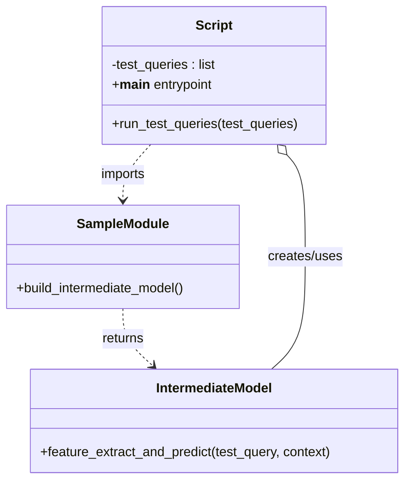

# Diagram: research/api_k8s/get_ai_eta/scripts/run_intermediate_eta_model_samples.py


> Auto-generated by Obscura crawlers

## Diagram 1

```mermaid
flowchart TD
  Start([Start])
  BuildMod[Call build_intermediate_model()]
  AwaitModel[Await intermediate_model]
  Loop{for each test_query in test_queries}
  CallPredict[Call await intermediate_model.feature_extract_and_predict(test_query, None)]
  PrintOut[Print QUERY and RESULT]
  End([End])
  Start --> BuildMod --> AwaitModel --> Loop
  Loop --> CallPredict --> PrintOut --> Loop
  Loop --> End
```

> SVG rendering failed for this diagram.

## Diagram 2



### SVG

<svg id="container" width="502.23828125" xmlns="http://www.w3.org/2000/svg" class="classDiagram" height="584" viewBox="0 0 502.23828125 584" role="graphics-document document" aria-roledescription="class"><style>#container{font-family:"trebuchet ms",verdana,arial,sans-serif;font-size:16px;fill:#333;}@keyframes edge-animation-frame{from{stroke-dashoffset:0;}}@keyframes dash{to{stroke-dashoffset:0;}}#container .edge-animation-slow{stroke-dasharray:9,5!important;stroke-dashoffset:900;animation:dash 50s linear infinite;stroke-linecap:round;}#container .edge-animation-fast{stroke-dasharray:9,5!important;stroke-dashoffset:900;animation:dash 20s linear infinite;stroke-linecap:round;}#container .error-icon{fill:#552222;}#container .error-text{fill:#552222;stroke:#552222;}#container .edge-thickness-normal{stroke-width:1px;}#container .edge-thickness-thick{stroke-width:3.5px;}#container .edge-pattern-solid{stroke-dasharray:0;}#container .edge-thickness-invisible{stroke-width:0;fill:none;}#container .edge-pattern-dashed{stroke-dasharray:3;}#container .edge-pattern-dotted{stroke-dasharray:2;}#container .marker{fill:#333333;stroke:#333333;}#container .marker.cross{stroke:#333333;}#container svg{font-family:"trebuchet ms",verdana,arial,sans-serif;font-size:16px;}#container p{margin:0;}#container g.classGroup text{fill:#9370DB;stroke:none;font-family:"trebuchet ms",verdana,arial,sans-serif;font-size:10px;}#container g.classGroup text .title{font-weight:bolder;}#container .nodeLabel,#container .edgeLabel{color:#131300;}#container .edgeLabel .label rect{fill:#ECECFF;}#container .label text{fill:#131300;}#container .labelBkg{background:#ECECFF;}#container .edgeLabel .label span{background:#ECECFF;}#container .classTitle{font-weight:bolder;}#container .node rect,#container .node circle,#container .node ellipse,#container .node polygon,#container .node path{fill:#ECECFF;stroke:#9370DB;stroke-width:1px;}#container .divider{stroke:#9370DB;stroke-width:1;}#container g.clickable{cursor:pointer;}#container g.classGroup rect{fill:#ECECFF;stroke:#9370DB;}#container g.classGroup line{stroke:#9370DB;stroke-width:1;}#container .classLabel .box{stroke:none;stroke-width:0;fill:#ECECFF;opacity:0.5;}#container .classLabel .label{fill:#9370DB;font-size:10px;}#container .relation{stroke:#333333;stroke-width:1;fill:none;}#container .dashed-line{stroke-dasharray:3;}#container .dotted-line{stroke-dasharray:1 2;}#container #compositionStart,#container .composition{fill:#333333!important;stroke:#333333!important;stroke-width:1;}#container #compositionEnd,#container .composition{fill:#333333!important;stroke:#333333!important;stroke-width:1;}#container #dependencyStart,#container .dependency{fill:#333333!important;stroke:#333333!important;stroke-width:1;}#container #dependencyStart,#container .dependency{fill:#333333!important;stroke:#333333!important;stroke-width:1;}#container #extensionStart,#container .extension{fill:transparent!important;stroke:#333333!important;stroke-width:1;}#container #extensionEnd,#container .extension{fill:transparent!important;stroke:#333333!important;stroke-width:1;}#container #aggregationStart,#container .aggregation{fill:transparent!important;stroke:#333333!important;stroke-width:1;}#container #aggregationEnd,#container .aggregation{fill:transparent!important;stroke:#333333!important;stroke-width:1;}#container #lollipopStart,#container .lollipop{fill:#ECECFF!important;stroke:#333333!important;stroke-width:1;}#container #lollipopEnd,#container .lollipop{fill:#ECECFF!important;stroke:#333333!important;stroke-width:1;}#container .edgeTerminals{font-size:11px;line-height:initial;}#container .classTitleText{text-anchor:middle;font-size:18px;fill:#333;}#container .label-icon{display:inline-block;height:1em;overflow:visible;vertical-align:-0.125em;}#container .node .label-icon path{fill:currentColor;stroke:revert;stroke-width:revert;}#container :root{--mermaid-font-family:"trebuchet ms",verdana,arial,sans-serif;}</style><g><defs><marker id="container_class-aggregationStart" class="marker aggregation class" refX="18" refY="7" markerWidth="190" markerHeight="240" orient="auto"><path d="M 18,7 L9,13 L1,7 L9,1 Z"></path></marker></defs><defs><marker id="container_class-aggregationEnd" class="marker aggregation class" refX="1" refY="7" markerWidth="20" markerHeight="28" orient="auto"><path d="M 18,7 L9,13 L1,7 L9,1 Z"></path></marker></defs><defs><marker id="container_class-extensionStart" class="marker extension class" refX="18" refY="7" markerWidth="190" markerHeight="240" orient="auto"><path d="M 1,7 L18,13 V 1 Z"></path></marker></defs><defs><marker id="container_class-extensionEnd" class="marker extension class" refX="1" refY="7" markerWidth="20" markerHeight="28" orient="auto"><path d="M 1,1 V 13 L18,7 Z"></path></marker></defs><defs><marker id="container_class-compositionStart" class="marker composition class" refX="18" refY="7" markerWidth="190" markerHeight="240" orient="auto"><path d="M 18,7 L9,13 L1,7 L9,1 Z"></path></marker></defs><defs><marker id="container_class-compositionEnd" class="marker composition class" refX="1" refY="7" markerWidth="20" markerHeight="28" orient="auto"><path d="M 18,7 L9,13 L1,7 L9,1 Z"></path></marker></defs><defs><marker id="container_class-dependencyStart" class="marker dependency class" refX="6" refY="7" markerWidth="190" markerHeight="240" orient="auto"><path d="M 5,7 L9,13 L1,7 L9,1 Z"></path></marker></defs><defs><marker id="container_class-dependencyEnd" class="marker dependency class" refX="13" refY="7" markerWidth="20" markerHeight="28" orient="auto"><path d="M 18,7 L9,13 L14,7 L9,1 Z"></path></marker></defs><defs><marker id="container_class-lollipopStart" class="marker lollipop class" refX="13" refY="7" markerWidth="190" markerHeight="240" orient="auto"><circle stroke="black" fill="transparent" cx="7" cy="7" r="6"></circle></marker></defs><defs><marker id="container_class-lollipopEnd" class="marker lollipop class" refX="1" refY="7" markerWidth="190" markerHeight="240" orient="auto"><circle stroke="black" fill="transparent" cx="7" cy="7" r="6"></circle></marker></defs><g class="root"><g class="clusters"></g><g class="edgePaths"><path d="M153.18,376L153.18,382.167C153.18,388.333,153.18,400.667,159.421,412.339C165.663,424.01,178.147,435.021,184.388,440.526L190.63,446.031" id="id_SampleModule_IntermediateModel_1" class="edge-thickness-normal edge-pattern-dashed relation" style=";;;" data-edge="true" data-et="edge" data-id="id_SampleModule_IntermediateModel_1" data-points="W3sieCI6MTUzLjE3OTY4NzUsInkiOjM3Nn0seyJ4IjoxNTMuMTc5Njg3NSwieSI6NDEzfSx7IngiOjE5NS4xMjk4ODI4MTI1LCJ5Ijo0NTB9XQ==" marker-end="url(#container_class-dependencyEnd)"></path><path d="M187.849,176L182.071,182.167C176.293,188.333,164.736,200.667,158.958,212C153.18,223.333,153.18,233.667,153.18,238.833L153.18,244" id="id_Script_SampleModule_2" class="edge-thickness-normal edge-pattern-dashed relation" style=";;;" data-edge="true" data-et="edge" data-id="id_Script_SampleModule_2" data-points="W3sieCI6MTg3Ljg0OTI3MDQwMjg5MjU2LCJ5IjoxNzZ9LHsieCI6MTUzLjE3OTY4NzUsInkiOjIxM30seyJ4IjoxNTMuMTc5Njg3NSwieSI6MjUwfV0=" marker-end="url(#container_class-dependencyEnd)"></path><path d="M357.063,188.588L360.875,192.656C364.688,196.725,372.313,204.863,376.125,225.598C379.938,246.333,379.938,279.667,379.938,313C379.938,346.333,379.938,379.667,372.946,402.5C365.954,425.333,351.971,437.667,344.979,443.833L337.987,450" id="id_Script_IntermediateModel_3" class="edge-thickness-normal edge-pattern-solid relation" style=";;;" data-edge="true" data-et="edge" data-id="id_Script_IntermediateModel_3" data-points="W3sieCI6MzQ1LjI2NzkxNzA5NzEwNzQ0LCJ5IjoxNzZ9LHsieCI6Mzc5LjkzNzUsInkiOjIxM30seyJ4IjozNzkuOTM3NSwieSI6MzEzfSx7IngiOjM3OS45Mzc1LCJ5Ijo0MTN9LHsieCI6MzM3Ljk4NzMwNDY4NzUsInkiOjQ1MH1d" marker-start="url(#container_class-aggregationStart)"></path></g><g class="edgeLabels"><g class="edgeLabel" transform="translate(153.1796875, 413)"><g class="label" data-id="id_SampleModule_IntermediateModel_1" transform="translate(-26.265625, -12)"><foreignObject width="52.53125" height="24"><div xmlns="http://www.w3.org/1999/xhtml" class="labelBkg" style="display: table-cell; white-space: nowrap; line-height: 1.5; max-width: 200px; text-align: center;"><span class="edgeLabel"><p>returns</p></span></div></foreignObject></g></g><g class="edgeLabel" transform="translate(153.1796875, 213)"><g class="label" data-id="id_Script_SampleModule_2" transform="translate(-28.25, -12)"><foreignObject width="56.5" height="24"><div xmlns="http://www.w3.org/1999/xhtml" class="labelBkg" style="display: table-cell; white-space: nowrap; line-height: 1.5; max-width: 200px; text-align: center;"><span class="edgeLabel"><p>imports</p></span></div></foreignObject></g></g><g class="edgeLabel" transform="translate(379.9375, 313)"><g class="label" data-id="id_Script_IntermediateModel_3" transform="translate(-46.578125, -12)"><foreignObject width="93.15625" height="24"><div xmlns="http://www.w3.org/1999/xhtml" class="labelBkg" style="display: table-cell; white-space: nowrap; line-height: 1.5; max-width: 200px; text-align: center;"><span class="edgeLabel"><p>creates/uses</p></span></div></foreignObject></g></g></g><g class="nodes"><g class="node default" id="classId-SampleModule-0" transform="translate(153.1796875, 313)"><g class="basic label-container"><path d="M-145.1796875 -63 L145.1796875 -63 L145.1796875 63 L-145.1796875 63" stroke="none" stroke-width="0" fill="#ECECFF" style=""></path><path d="M-145.1796875 -63 C-44.766823002829426 -63, 55.64604149434115 -63, 145.1796875 -63 M-145.1796875 -63 C-45.389885186666746 -63, 54.39991712666651 -63, 145.1796875 -63 M145.1796875 -63 C145.1796875 -22.097085862728314, 145.1796875 18.805828274543373, 145.1796875 63 M145.1796875 -63 C145.1796875 -19.41079417384028, 145.1796875 24.17841165231944, 145.1796875 63 M145.1796875 63 C78.75651159138283 63, 12.333335682765664 63, -145.1796875 63 M145.1796875 63 C53.4423541347592 63, -38.2949792304816 63, -145.1796875 63 M-145.1796875 63 C-145.1796875 14.01669240092724, -145.1796875 -34.96661519814552, -145.1796875 -63 M-145.1796875 63 C-145.1796875 26.262660680559037, -145.1796875 -10.474678638881926, -145.1796875 -63" stroke="#9370DB" stroke-width="1.3" fill="none" stroke-dasharray="0 0" style=""></path></g><g class="annotation-group text" transform="translate(0, -39)"></g><g class="label-group text" transform="translate(-54.34375, -39)"><g class="label" style="font-weight: bolder" transform="translate(0,-12)"><foreignObject width="108.6875" height="24"><div xmlns="http://www.w3.org/1999/xhtml" style="display: table-cell; white-space: nowrap; line-height: 1.5; max-width: 158px; text-align: center;"><span class="nodeLabel markdown-node-label" style=""><p>SampleModule</p></span></div></foreignObject></g></g><g class="members-group text" transform="translate(-133.1796875, 9)"></g><g class="methods-group text" transform="translate(-133.1796875, 39)"><g class="label" style="" transform="translate(0,-12)"><foreignObject width="212.015625" height="24"><div xmlns="http://www.w3.org/1999/xhtml" style="display: table-cell; white-space: nowrap; line-height: 1.5; max-width: 269px; text-align: center;"><span class="nodeLabel markdown-node-label" style=""><p>+build_intermediate_model()</p></span></div></foreignObject></g></g><g class="divider" style=""><path d="M-145.1796875 -15 C-68.23438691228516 -15, 8.71091367542968 -15, 145.1796875 -15 M-145.1796875 -15 C-66.66724990593767 -15, 11.845187688124668 -15, 145.1796875 -15" stroke="#9370DB" stroke-width="1.3" fill="none" stroke-dasharray="0 0" style=""></path></g><g class="divider" style=""><path d="M-145.1796875 9 C-61.75198529583274 9, 21.675716908334522 9, 145.1796875 9 M-145.1796875 9 C-69.83714932849524 9, 5.505388843009513 9, 145.1796875 9" stroke="#9370DB" stroke-width="1.3" fill="none" stroke-dasharray="0 0" style=""></path></g></g><g class="node default" id="classId-IntermediateModel-1" transform="translate(266.55859375, 513)"><g class="basic label-container"><path d="M-227.6796875 -63 L227.6796875 -63 L227.6796875 63 L-227.6796875 63" stroke="none" stroke-width="0" fill="#ECECFF" style=""></path><path d="M-227.6796875 -63 C-50.97530965004313 -63, 125.72906819991374 -63, 227.6796875 -63 M-227.6796875 -63 C-125.70246489404693 -63, -23.725242288093852 -63, 227.6796875 -63 M227.6796875 -63 C227.6796875 -15.562157211390613, 227.6796875 31.875685577218775, 227.6796875 63 M227.6796875 -63 C227.6796875 -17.048875517233554, 227.6796875 28.90224896553289, 227.6796875 63 M227.6796875 63 C75.84536346326553 63, -75.98896057346894 63, -227.6796875 63 M227.6796875 63 C119.77131530938544 63, 11.862943118770886 63, -227.6796875 63 M-227.6796875 63 C-227.6796875 20.81657262082485, -227.6796875 -21.3668547583503, -227.6796875 -63 M-227.6796875 63 C-227.6796875 31.086220211905893, -227.6796875 -0.8275595761882144, -227.6796875 -63" stroke="#9370DB" stroke-width="1.3" fill="none" stroke-dasharray="0 0" style=""></path></g><g class="annotation-group text" transform="translate(0, -39)"></g><g class="label-group text" transform="translate(-70.0625, -39)"><g class="label" style="font-weight: bolder" transform="translate(0,-12)"><foreignObject width="140.125" height="24"><div xmlns="http://www.w3.org/1999/xhtml" style="display: table-cell; white-space: nowrap; line-height: 1.5; max-width: 189px; text-align: center;"><span class="nodeLabel markdown-node-label" style=""><p>IntermediateModel</p></span></div></foreignObject></g></g><g class="members-group text" transform="translate(-215.6796875, 9)"></g><g class="methods-group text" transform="translate(-215.6796875, 39)"><g class="label" style="" transform="translate(0,-12)"><foreignObject width="361.296875" height="24"><div xmlns="http://www.w3.org/1999/xhtml" style="display: table-cell; white-space: nowrap; line-height: 1.5; max-width: 419px; text-align: center;"><span class="nodeLabel markdown-node-label" style=""><p>+feature_extract_and_predict(test_query, context)</p></span></div></foreignObject></g></g><g class="divider" style=""><path d="M-227.6796875 -15 C-90.58015092574678 -15, 46.51938564850644 -15, 227.6796875 -15 M-227.6796875 -15 C-101.1322699029278 -15, 25.415147694144395 -15, 227.6796875 -15" stroke="#9370DB" stroke-width="1.3" fill="none" stroke-dasharray="0 0" style=""></path></g><g class="divider" style=""><path d="M-227.6796875 9 C-128.44026243934087 9, -29.20083737868171 9, 227.6796875 9 M-227.6796875 9 C-54.00487548450613 9, 119.66993653098774 9, 227.6796875 9" stroke="#9370DB" stroke-width="1.3" fill="none" stroke-dasharray="0 0" style=""></path></g></g><g class="node default" id="classId-Script-2" transform="translate(266.55859375, 92)"><g class="basic label-container"><path d="M-138.46484375 -84 L138.46484375 -84 L138.46484375 84 L-138.46484375 84" stroke="none" stroke-width="0" fill="#ECECFF" style=""></path><path d="M-138.46484375 -84 C-60.1657441118209 -84, 18.1333555263582 -84, 138.46484375 -84 M-138.46484375 -84 C-70.84790587345267 -84, -3.230967996905349 -84, 138.46484375 -84 M138.46484375 -84 C138.46484375 -37.40623051987228, 138.46484375 9.187538960255438, 138.46484375 84 M138.46484375 -84 C138.46484375 -25.178378755574556, 138.46484375 33.64324248885089, 138.46484375 84 M138.46484375 84 C65.23350383177811 84, -7.997836086443783 84, -138.46484375 84 M138.46484375 84 C30.796850835270675 84, -76.87114207945865 84, -138.46484375 84 M-138.46484375 84 C-138.46484375 17.750104388484488, -138.46484375 -48.499791223031025, -138.46484375 -84 M-138.46484375 84 C-138.46484375 43.729145507766134, -138.46484375 3.458291015532268, -138.46484375 -84" stroke="#9370DB" stroke-width="1.3" fill="none" stroke-dasharray="0 0" style=""></path></g><g class="annotation-group text" transform="translate(0, -60)"></g><g class="label-group text" transform="translate(-21.7421875, -60)"><g class="label" style="font-weight: bolder" transform="translate(0,-12)"><foreignObject width="43.484375" height="24"><div xmlns="http://www.w3.org/1999/xhtml" style="display: table-cell; white-space: nowrap; line-height: 1.5; max-width: 93px; text-align: center;"><span class="nodeLabel markdown-node-label" style=""><p>Script</p></span></div></foreignObject></g></g><g class="members-group text" transform="translate(-126.46484375, -12)"><g class="label" style="" transform="translate(0,-12)"><foreignObject width="131.125" height="24"><div xmlns="http://www.w3.org/1999/xhtml" style="display: table-cell; white-space: nowrap; line-height: 1.5; max-width: 189px; text-align: center;"><span class="nodeLabel markdown-node-label" style=""><p>-test_queries : list</p></span></div></foreignObject></g><g class="label" style="" transform="translate(0,12)"><foreignObject width="124.71875" height="24"><div xmlns="http://www.w3.org/1999/xhtml" style="display: table-cell; white-space: nowrap; line-height: 1.5; max-width: 214px; text-align: center;"><span class="nodeLabel markdown-node-label" style=""><p>+<strong>main</strong> entrypoint</p></span></div></foreignObject></g></g><g class="methods-group text" transform="translate(-126.46484375, 60)"><g class="label" style="" transform="translate(0,-12)"><foreignObject width="231.1875" height="24"><div xmlns="http://www.w3.org/1999/xhtml" style="display: table-cell; white-space: nowrap; line-height: 1.5; max-width: 289px; text-align: center;"><span class="nodeLabel markdown-node-label" style=""><p>+run_test_queries(test_queries)</p></span></div></foreignObject></g></g><g class="divider" style=""><path d="M-138.46484375 -36 C-41.106767507714196 -36, 56.25130873457161 -36, 138.46484375 -36 M-138.46484375 -36 C-80.33254945048577 -36, -22.200255150971557 -36, 138.46484375 -36" stroke="#9370DB" stroke-width="1.3" fill="none" stroke-dasharray="0 0" style=""></path></g><g class="divider" style=""><path d="M-138.46484375 36 C-75.55572474430066 36, -12.646605738601323 36, 138.46484375 36 M-138.46484375 36 C-31.12579791555349 36, 76.21324791889302 36, 138.46484375 36" stroke="#9370DB" stroke-width="1.3" fill="none" stroke-dasharray="0 0" style=""></path></g></g></g></g></g></svg>
