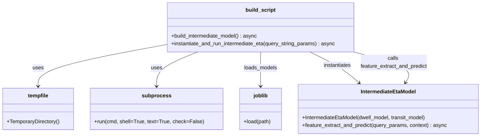

# Diagram: research/api_k8s/get_ai_eta/scripts/sample_intermediate_eta_model.py


> Auto-generated by Obscura crawlers

## Diagram 1

```mermaid
flowchart TD
    A[build_intermediate_model()] --> B[Set dwell_model_path & transit_model_path]
    B --> C[tempfile.TemporaryDirectory()]
    C --> D[Create temp_dir_path]
    D --> E["subprocess.run(aws s3 cp dwell -> temp_dir)"]
    E --> F["subprocess.run(aws s3 cp transit -> temp_dir)"]
    F --> G[Compute dwell_model_filename & transit_model_filename]
    G --> H[Compose dwell_model_localpath & transit_model_localpath]
    H --> I["dwell_model = joblib.load(dwell_model_localpath)"]
    I --> J["transit_model = joblib.load(transit_model_localpath)"]
    J --> K["intermediate_eta_model = IntermediateEtaModel(dwell_model, transit_model)"]
    K --> L[temp_dir.cleanup()]
    L --> M[return intermediate_eta_model]

    subgraph RunFlow["instantiate_and_run_intermediate_eta(query_string_params)"]
        N[instantiate_and_run_intermediate_eta(query_string_params)]
        N --> O["intermediate_eta_model = await build_intermediate_model()"]
        O --> P["p = await intermediate_eta_model.feature_extract_and_predict(query_string_params, None)"]
        P --> Q["print(f\"prediction = {p}\")"]
    end

    M -->|returned instance| O
```

> SVG rendering failed for this diagram.

## Diagram 2



### SVG

<svg id="container" width="1447.609375" xmlns="http://www.w3.org/2000/svg" class="classDiagram" height="414" viewBox="0 0 1447.609375 414" role="graphics-document document" aria-roledescription="class"><style>#container{font-family:"trebuchet ms",verdana,arial,sans-serif;font-size:16px;fill:#333;}@keyframes edge-animation-frame{from{stroke-dashoffset:0;}}@keyframes dash{to{stroke-dashoffset:0;}}#container .edge-animation-slow{stroke-dasharray:9,5!important;stroke-dashoffset:900;animation:dash 50s linear infinite;stroke-linecap:round;}#container .edge-animation-fast{stroke-dasharray:9,5!important;stroke-dashoffset:900;animation:dash 20s linear infinite;stroke-linecap:round;}#container .error-icon{fill:#552222;}#container .error-text{fill:#552222;stroke:#552222;}#container .edge-thickness-normal{stroke-width:1px;}#container .edge-thickness-thick{stroke-width:3.5px;}#container .edge-pattern-solid{stroke-dasharray:0;}#container .edge-thickness-invisible{stroke-width:0;fill:none;}#container .edge-pattern-dashed{stroke-dasharray:3;}#container .edge-pattern-dotted{stroke-dasharray:2;}#container .marker{fill:#333333;stroke:#333333;}#container .marker.cross{stroke:#333333;}#container svg{font-family:"trebuchet ms",verdana,arial,sans-serif;font-size:16px;}#container p{margin:0;}#container g.classGroup text{fill:#9370DB;stroke:none;font-family:"trebuchet ms",verdana,arial,sans-serif;font-size:10px;}#container g.classGroup text .title{font-weight:bolder;}#container .nodeLabel,#container .edgeLabel{color:#131300;}#container .edgeLabel .label rect{fill:#ECECFF;}#container .label text{fill:#131300;}#container .labelBkg{background:#ECECFF;}#container .edgeLabel .label span{background:#ECECFF;}#container .classTitle{font-weight:bolder;}#container .node rect,#container .node circle,#container .node ellipse,#container .node polygon,#container .node path{fill:#ECECFF;stroke:#9370DB;stroke-width:1px;}#container .divider{stroke:#9370DB;stroke-width:1;}#container g.clickable{cursor:pointer;}#container g.classGroup rect{fill:#ECECFF;stroke:#9370DB;}#container g.classGroup line{stroke:#9370DB;stroke-width:1;}#container .classLabel .box{stroke:none;stroke-width:0;fill:#ECECFF;opacity:0.5;}#container .classLabel .label{fill:#9370DB;font-size:10px;}#container .relation{stroke:#333333;stroke-width:1;fill:none;}#container .dashed-line{stroke-dasharray:3;}#container .dotted-line{stroke-dasharray:1 2;}#container #compositionStart,#container .composition{fill:#333333!important;stroke:#333333!important;stroke-width:1;}#container #compositionEnd,#container .composition{fill:#333333!important;stroke:#333333!important;stroke-width:1;}#container #dependencyStart,#container .dependency{fill:#333333!important;stroke:#333333!important;stroke-width:1;}#container #dependencyStart,#container .dependency{fill:#333333!important;stroke:#333333!important;stroke-width:1;}#container #extensionStart,#container .extension{fill:transparent!important;stroke:#333333!important;stroke-width:1;}#container #extensionEnd,#container .extension{fill:transparent!important;stroke:#333333!important;stroke-width:1;}#container #aggregationStart,#container .aggregation{fill:transparent!important;stroke:#333333!important;stroke-width:1;}#container #aggregationEnd,#container .aggregation{fill:transparent!important;stroke:#333333!important;stroke-width:1;}#container #lollipopStart,#container .lollipop{fill:#ECECFF!important;stroke:#333333!important;stroke-width:1;}#container #lollipopEnd,#container .lollipop{fill:#ECECFF!important;stroke:#333333!important;stroke-width:1;}#container .edgeTerminals{font-size:11px;line-height:initial;}#container .classTitleText{text-anchor:middle;font-size:18px;fill:#333;}#container .label-icon{display:inline-block;height:1em;overflow:visible;vertical-align:-0.125em;}#container .node .label-icon path{fill:currentColor;stroke:revert;stroke-width:revert;}#container :root{--mermaid-font-family:"trebuchet ms",verdana,arial,sans-serif;}</style><g><defs><marker id="container_class-aggregationStart" class="marker aggregation class" refX="18" refY="7" markerWidth="190" markerHeight="240" orient="auto"><path d="M 18,7 L9,13 L1,7 L9,1 Z"></path></marker></defs><defs><marker id="container_class-aggregationEnd" class="marker aggregation class" refX="1" refY="7" markerWidth="20" markerHeight="28" orient="auto"><path d="M 18,7 L9,13 L1,7 L9,1 Z"></path></marker></defs><defs><marker id="container_class-extensionStart" class="marker extension class" refX="18" refY="7" markerWidth="190" markerHeight="240" orient="auto"><path d="M 1,7 L18,13 V 1 Z"></path></marker></defs><defs><marker id="container_class-extensionEnd" class="marker extension class" refX="1" refY="7" markerWidth="20" markerHeight="28" orient="auto"><path d="M 1,1 V 13 L18,7 Z"></path></marker></defs><defs><marker id="container_class-compositionStart" class="marker composition class" refX="18" refY="7" markerWidth="190" markerHeight="240" orient="auto"><path d="M 18,7 L9,13 L1,7 L9,1 Z"></path></marker></defs><defs><marker id="container_class-compositionEnd" class="marker composition class" refX="1" refY="7" markerWidth="20" markerHeight="28" orient="auto"><path d="M 18,7 L9,13 L1,7 L9,1 Z"></path></marker></defs><defs><marker id="container_class-dependencyStart" class="marker dependency class" refX="6" refY="7" markerWidth="190" markerHeight="240" orient="auto"><path d="M 5,7 L9,13 L1,7 L9,1 Z"></path></marker></defs><defs><marker id="container_class-dependencyEnd" class="marker dependency class" refX="13" refY="7" markerWidth="20" markerHeight="28" orient="auto"><path d="M 18,7 L9,13 L14,7 L9,1 Z"></path></marker></defs><defs><marker id="container_class-lollipopStart" class="marker lollipop class" refX="13" refY="7" markerWidth="190" markerHeight="240" orient="auto"><circle stroke="black" fill="transparent" cx="7" cy="7" r="6"></circle></marker></defs><defs><marker id="container_class-lollipopEnd" class="marker lollipop class" refX="1" refY="7" markerWidth="190" markerHeight="240" orient="auto"><circle stroke="black" fill="transparent" cx="7" cy="7" r="6"></circle></marker></defs><g class="root"><g class="clusters"></g><g class="edgePaths"><path d="M492.918,136.453L430.003,148.211C367.087,159.969,241.257,183.484,178.341,204.409C115.426,225.333,115.426,243.667,115.426,252.833L115.426,262" id="id_build_script_tempfile_1" class="edge-thickness-normal edge-pattern-solid relation" style=";;;" data-edge="true" data-et="edge" data-id="id_build_script_tempfile_1" data-points="W3sieCI6NDkyLjkxNzk2ODc1LCJ5IjoxMzYuNDUzNDIzNjgxNzE2MjN9LHsieCI6MTE1LjQyNTc4MTI1LCJ5IjoyMDd9LHsieCI6MTE1LjQyNTc4MTI1LCJ5IjoyNjh9XQ==" marker-end="url(#container_class-dependencyEnd)"></path><path d="M591.306,158L570.874,166.167C550.442,174.333,509.579,190.667,489.147,208C468.715,225.333,468.715,243.667,468.715,252.833L468.715,262" id="id_build_script_subprocess_2" class="edge-thickness-normal edge-pattern-solid relation" style=";;;" data-edge="true" data-et="edge" data-id="id_build_script_subprocess_2" data-points="W3sieCI6NTkxLjMwNTkxNjA3ODYyOSwieSI6MTU4fSx7IngiOjQ2OC43MTQ4NDM3NSwieSI6MjA3fSx7IngiOjQ2OC43MTQ4NDM3NSwieSI6MjY4fV0=" marker-end="url(#container_class-dependencyEnd)"></path><path d="M778.945,158L778.945,166.167C778.945,174.333,778.945,190.667,778.945,208C778.945,225.333,778.945,243.667,778.945,252.833L778.945,262" id="id_build_script_joblib_3" class="edge-thickness-normal edge-pattern-solid relation" style=";;;" data-edge="true" data-et="edge" data-id="id_build_script_joblib_3" data-points="W3sieCI6Nzc4Ljk0NTMxMjUsInkiOjE1OH0seyJ4Ijo3NzguOTQ1MzEyNSwieSI6MjA3fSx7IngiOjc3OC45NDUzMTI1LCJ5IjoyNjh9XQ==" marker-end="url(#container_class-dependencyEnd)"></path><path d="M930.443,158L946.94,166.167C963.436,174.333,996.429,190.667,1021.209,206.329C1045.99,221.991,1062.558,236.983,1070.841,244.479L1079.125,251.974" id="id_build_script_IntermediateEtaModel_4" class="edge-thickness-normal edge-pattern-solid relation" style=";;;" data-edge="true" data-et="edge" data-id="id_build_script_IntermediateEtaModel_4" data-points="W3sieCI6OTMwLjQ0MzIzMzM2NjkzNTUsInkiOjE1OH0seyJ4IjoxMDI5LjQyMTg3NSwieSI6MjA3fSx7IngiOjEwODMuNTc0NDA3NzYyMDk2OCwieSI6MjU2fV0=" marker-end="url(#container_class-dependencyEnd)"></path><path d="M1063.34,158L1094.307,166.167C1125.275,174.333,1187.21,190.667,1213.286,206.168C1239.363,221.669,1229.581,236.339,1224.691,243.673L1219.8,251.008" id="id_build_script_IntermediateEtaModel_5" class="edge-thickness-normal edge-pattern-solid relation" style=";;;" data-edge="true" data-et="edge" data-id="id_build_script_IntermediateEtaModel_5" data-points="W3sieCI6MTA2My4zNDAwMDEyNjAwODA3LCJ5IjoxNTh9LHsieCI6MTI0OS4xNDQ1MzEyNSwieSI6MjA3fSx7IngiOjEyMTYuNDcxMTc1NjU1MjQyLCJ5IjoyNTZ9XQ==" marker-end="url(#container_class-dependencyEnd)"></path></g><g class="edgeLabels"><g class="edgeLabel" transform="translate(115.42578125, 207)"><g class="label" data-id="id_build_script_tempfile_1" transform="translate(-16.4921875, -12)"><foreignObject width="32.984375" height="24"><div xmlns="http://www.w3.org/1999/xhtml" class="labelBkg" style="display: table-cell; white-space: nowrap; line-height: 1.5; max-width: 200px; text-align: center;"><span class="edgeLabel"><p>uses</p></span></div></foreignObject></g></g><g class="edgeLabel" transform="translate(468.71484375, 207)"><g class="label" data-id="id_build_script_subprocess_2" transform="translate(-16.4921875, -12)"><foreignObject width="32.984375" height="24"><div xmlns="http://www.w3.org/1999/xhtml" class="labelBkg" style="display: table-cell; white-space: nowrap; line-height: 1.5; max-width: 200px; text-align: center;"><span class="edgeLabel"><p>uses</p></span></div></foreignObject></g></g><g class="edgeLabel" transform="translate(778.9453125, 207)"><g class="label" data-id="id_build_script_joblib_3" transform="translate(-50.5234375, -12)"><foreignObject width="101.046875" height="24"><div xmlns="http://www.w3.org/1999/xhtml" class="labelBkg" style="display: table-cell; white-space: nowrap; line-height: 1.5; max-width: 200px; text-align: center;"><span class="edgeLabel"><p>loads_models</p></span></div></foreignObject></g></g><g class="edgeLabel" transform="translate(1012.65737, 198.70063)"><g class="label" data-id="id_build_script_IntermediateEtaModel_4" transform="translate(-42.9140625, -12)"><foreignObject width="85.828125" height="24"><div xmlns="http://www.w3.org/1999/xhtml" class="labelBkg" style="display: table-cell; white-space: nowrap; line-height: 1.5; max-width: 200px; text-align: center;"><span class="edgeLabel"><p>instantiates</p></span></div></foreignObject></g></g><g class="edgeLabel" transform="translate(1184.71597, 190.00903)"><g class="label" data-id="id_build_script_IntermediateEtaModel_5" transform="translate(-102.453125, -24)"><foreignObject width="204.90625" height="48"><div xmlns="http://www.w3.org/1999/xhtml" class="labelBkg" style="display: table; white-space: break-spaces; line-height: 1.5; max-width: 200px; text-align: center; width: 200px;"><span class="edgeLabel"><p>calls feature_extract_and_predict</p></span></div></foreignObject></g></g></g><g class="nodes"><g class="node default" id="classId-IntermediateEtaModel-0" transform="translate(1166.4609375, 331)"><g class="basic label-container"><path d="M-273.1484375 -75 L273.1484375 -75 L273.1484375 75 L-273.1484375 75" stroke="none" stroke-width="0" fill="#ECECFF" style=""></path><path d="M-273.1484375 -75 C-61.50393229990732 -75, 150.14057290018536 -75, 273.1484375 -75 M-273.1484375 -75 C-135.55245866690944 -75, 2.0435201661811107 -75, 273.1484375 -75 M273.1484375 -75 C273.1484375 -21.006670174467104, 273.1484375 32.98665965106579, 273.1484375 75 M273.1484375 -75 C273.1484375 -18.8421040017501, 273.1484375 37.3157919964998, 273.1484375 75 M273.1484375 75 C55.98180534515771 75, -161.18482680968458 75, -273.1484375 75 M273.1484375 75 C107.08501865864818 75, -58.97840018270364 75, -273.1484375 75 M-273.1484375 75 C-273.1484375 22.768191551789556, -273.1484375 -29.463616896420888, -273.1484375 -75 M-273.1484375 75 C-273.1484375 35.032388599268934, -273.1484375 -4.935222801462132, -273.1484375 -75" stroke="#9370DB" stroke-width="1.3" fill="none" stroke-dasharray="0 0" style=""></path></g><g class="annotation-group text" transform="translate(0, -51)"></g><g class="label-group text" transform="translate(-81.5, -51)"><g class="label" style="font-weight: bolder" transform="translate(0,-12)"><foreignObject width="163" height="24"><div xmlns="http://www.w3.org/1999/xhtml" style="display: table-cell; white-space: nowrap; line-height: 1.5; max-width: 212px; text-align: center;"><span class="nodeLabel markdown-node-label" style=""><p>IntermediateEtaModel</p></span></div></foreignObject></g></g><g class="members-group text" transform="translate(-261.1484375, -3)"></g><g class="methods-group text" transform="translate(-261.1484375, 27)"><g class="label" style="" transform="translate(0,-12)"><foreignObject width="383.046875" height="24"><div xmlns="http://www.w3.org/1999/xhtml" style="display: table-cell; white-space: nowrap; line-height: 1.5; max-width: 440px; text-align: center;"><span class="nodeLabel markdown-node-label" style=""><p>+IntermediateEtaModel(dwell_model, transit_model)</p></span></div></foreignObject></g><g class="label" style="" transform="translate(0,12)"><foreignObject width="440.796875" height="24"><div xmlns="http://www.w3.org/1999/xhtml" style="display: table-cell; white-space: nowrap; line-height: 1.5; max-width: 498px; text-align: center;"><span class="nodeLabel markdown-node-label" style=""><p>+feature_extract_and_predict(query_params, context) : async</p></span></div></foreignObject></g></g><g class="divider" style=""><path d="M-273.1484375 -27 C-115.77290329440214 -27, 41.60263091119572 -27, 273.1484375 -27 M-273.1484375 -27 C-61.20401910066289 -27, 150.74039929867422 -27, 273.1484375 -27" stroke="#9370DB" stroke-width="1.3" fill="none" stroke-dasharray="0 0" style=""></path></g><g class="divider" style=""><path d="M-273.1484375 -3 C-59.29622604555777 -3, 154.55598540888445 -3, 273.1484375 -3 M-273.1484375 -3 C-94.73802604904878 -3, 83.67238540190243 -3, 273.1484375 -3" stroke="#9370DB" stroke-width="1.3" fill="none" stroke-dasharray="0 0" style=""></path></g></g><g class="node default" id="classId-build_script-1" transform="translate(778.9453125, 83)"><g class="basic label-container"><path d="M-286.02734375 -75 L286.02734375 -75 L286.02734375 75 L-286.02734375 75" stroke="none" stroke-width="0" fill="#ECECFF" style=""></path><path d="M-286.02734375 -75 C-137.29522831067248 -75, 11.43688712865503 -75, 286.02734375 -75 M-286.02734375 -75 C-78.53923083851103 -75, 128.94888207297794 -75, 286.02734375 -75 M286.02734375 -75 C286.02734375 -30.90276520654438, 286.02734375 13.19446958691124, 286.02734375 75 M286.02734375 -75 C286.02734375 -41.06911207536768, 286.02734375 -7.138224150735354, 286.02734375 75 M286.02734375 75 C101.83945223203881 75, -82.34843928592238 75, -286.02734375 75 M286.02734375 75 C104.7347017623243 75, -76.55794022535139 75, -286.02734375 75 M-286.02734375 75 C-286.02734375 20.143071807265606, -286.02734375 -34.71385638546879, -286.02734375 -75 M-286.02734375 75 C-286.02734375 44.16416327316047, -286.02734375 13.328326546320937, -286.02734375 -75" stroke="#9370DB" stroke-width="1.3" fill="none" stroke-dasharray="0 0" style=""></path></g><g class="annotation-group text" transform="translate(0, -51)"></g><g class="label-group text" transform="translate(-43.9296875, -51)"><g class="label" style="font-weight: bolder" transform="translate(0,-12)"><foreignObject width="87.859375" height="24"><div xmlns="http://www.w3.org/1999/xhtml" style="display: table-cell; white-space: nowrap; line-height: 1.5; max-width: 137px; text-align: center;"><span class="nodeLabel markdown-node-label" style=""><p>build_script</p></span></div></foreignObject></g></g><g class="members-group text" transform="translate(-274.02734375, -3)"></g><g class="methods-group text" transform="translate(-274.02734375, 27)"><g class="label" style="" transform="translate(0,-12)"><foreignObject width="264.96875" height="24"><div xmlns="http://www.w3.org/1999/xhtml" style="display: table-cell; white-space: nowrap; line-height: 1.5; max-width: 323px; text-align: center;"><span class="nodeLabel markdown-node-label" style=""><p>+build_intermediate_model() : async</p></span></div></foreignObject></g><g class="label" style="" transform="translate(0,12)"><foreignObject width="504.125" height="24"><div xmlns="http://www.w3.org/1999/xhtml" style="display: table-cell; white-space: nowrap; line-height: 1.5; max-width: 562px; text-align: center;"><span class="nodeLabel markdown-node-label" style=""><p>+instantiate_and_run_intermediate_eta(query_string_params) : async</p></span></div></foreignObject></g></g><g class="divider" style=""><path d="M-286.02734375 -27 C-95.56496711980009 -27, 94.89740951039983 -27, 286.02734375 -27 M-286.02734375 -27 C-141.89143910678212 -27, 2.2444655364357686 -27, 286.02734375 -27" stroke="#9370DB" stroke-width="1.3" fill="none" stroke-dasharray="0 0" style=""></path></g><g class="divider" style=""><path d="M-286.02734375 -3 C-112.2030018979168 -3, 61.62133995416639 -3, 286.02734375 -3 M-286.02734375 -3 C-143.65509117791865 -3, -1.2828386058372985 -3, 286.02734375 -3" stroke="#9370DB" stroke-width="1.3" fill="none" stroke-dasharray="0 0" style=""></path></g></g><g class="node default" id="classId-tempfile-2" transform="translate(115.42578125, 331)"><g class="basic label-container"><path d="M-107.42578125 -63 L107.42578125 -63 L107.42578125 63 L-107.42578125 63" stroke="none" stroke-width="0" fill="#ECECFF" style=""></path><path d="M-107.42578125 -63 C-61.04971140410755 -63, -14.673641558215095 -63, 107.42578125 -63 M-107.42578125 -63 C-47.68475465263963 -63, 12.056271944720734 -63, 107.42578125 -63 M107.42578125 -63 C107.42578125 -14.980832074964056, 107.42578125 33.03833585007189, 107.42578125 63 M107.42578125 -63 C107.42578125 -26.634706440300363, 107.42578125 9.730587119399274, 107.42578125 63 M107.42578125 63 C58.75146410892886 63, 10.077146967857715 63, -107.42578125 63 M107.42578125 63 C55.25324466189977 63, 3.080708073799542 63, -107.42578125 63 M-107.42578125 63 C-107.42578125 20.743738931209947, -107.42578125 -21.512522137580106, -107.42578125 -63 M-107.42578125 63 C-107.42578125 34.72882803273795, -107.42578125 6.457656065475895, -107.42578125 -63" stroke="#9370DB" stroke-width="1.3" fill="none" stroke-dasharray="0 0" style=""></path></g><g class="annotation-group text" transform="translate(0, -39)"></g><g class="label-group text" transform="translate(-30.4453125, -39)"><g class="label" style="font-weight: bolder" transform="translate(0,-12)"><foreignObject width="60.890625" height="24"><div xmlns="http://www.w3.org/1999/xhtml" style="display: table-cell; white-space: nowrap; line-height: 1.5; max-width: 110px; text-align: center;"><span class="nodeLabel markdown-node-label" style=""><p>tempfile</p></span></div></foreignObject></g></g><g class="members-group text" transform="translate(-95.42578125, 9)"></g><g class="methods-group text" transform="translate(-95.42578125, 39)"><g class="label" style="" transform="translate(0,-12)"><foreignObject width="160.40625" height="24"><div xmlns="http://www.w3.org/1999/xhtml" style="display: table-cell; white-space: nowrap; line-height: 1.5; max-width: 218px; text-align: center;"><span class="nodeLabel markdown-node-label" style=""><p>+TemporaryDirectory()</p></span></div></foreignObject></g></g><g class="divider" style=""><path d="M-107.42578125 -15 C-23.573632698100553 -15, 60.27851585379889 -15, 107.42578125 -15 M-107.42578125 -15 C-58.14280034972522 -15, -8.859819449450441 -15, 107.42578125 -15" stroke="#9370DB" stroke-width="1.3" fill="none" stroke-dasharray="0 0" style=""></path></g><g class="divider" style=""><path d="M-107.42578125 9 C-51.11778679405017 9, 5.190207661899663 9, 107.42578125 9 M-107.42578125 9 C-29.702227416870542 9, 48.021326416258916 9, 107.42578125 9" stroke="#9370DB" stroke-width="1.3" fill="none" stroke-dasharray="0 0" style=""></path></g></g><g class="node default" id="classId-subprocess-3" transform="translate(468.71484375, 331)"><g class="basic label-container"><path d="M-195.86328125 -63 L195.86328125 -63 L195.86328125 63 L-195.86328125 63" stroke="none" stroke-width="0" fill="#ECECFF" style=""></path><path d="M-195.86328125 -63 C-45.41811534269891 -63, 105.02705056460218 -63, 195.86328125 -63 M-195.86328125 -63 C-49.99221447023021 -63, 95.87885230953958 -63, 195.86328125 -63 M195.86328125 -63 C195.86328125 -33.16958082731611, 195.86328125 -3.339161654632221, 195.86328125 63 M195.86328125 -63 C195.86328125 -25.210697689671058, 195.86328125 12.578604620657885, 195.86328125 63 M195.86328125 63 C84.15747825003004 63, -27.548324749939923 63, -195.86328125 63 M195.86328125 63 C116.5700233097745 63, 37.276765369549 63, -195.86328125 63 M-195.86328125 63 C-195.86328125 16.90885070146961, -195.86328125 -29.18229859706078, -195.86328125 -63 M-195.86328125 63 C-195.86328125 20.13097657734839, -195.86328125 -22.738046845303217, -195.86328125 -63" stroke="#9370DB" stroke-width="1.3" fill="none" stroke-dasharray="0 0" style=""></path></g><g class="annotation-group text" transform="translate(0, -39)"></g><g class="label-group text" transform="translate(-41.3984375, -39)"><g class="label" style="font-weight: bolder" transform="translate(0,-12)"><foreignObject width="82.796875" height="24"><div xmlns="http://www.w3.org/1999/xhtml" style="display: table-cell; white-space: nowrap; line-height: 1.5; max-width: 132px; text-align: center;"><span class="nodeLabel markdown-node-label" style=""><p>subprocess</p></span></div></foreignObject></g></g><g class="members-group text" transform="translate(-183.86328125, 9)"></g><g class="methods-group text" transform="translate(-183.86328125, 39)"><g class="label" style="" transform="translate(0,-12)"><foreignObject width="326.328125" height="24"><div xmlns="http://www.w3.org/1999/xhtml" style="display: table-cell; white-space: nowrap; line-height: 1.5; max-width: 384px; text-align: center;"><span class="nodeLabel markdown-node-label" style=""><p>+run(cmd, shell=True, text=True, check=False)</p></span></div></foreignObject></g></g><g class="divider" style=""><path d="M-195.86328125 -15 C-55.737630748602584 -15, 84.38801975279483 -15, 195.86328125 -15 M-195.86328125 -15 C-108.93954476875554 -15, -22.015808287511078 -15, 195.86328125 -15" stroke="#9370DB" stroke-width="1.3" fill="none" stroke-dasharray="0 0" style=""></path></g><g class="divider" style=""><path d="M-195.86328125 9 C-41.10140953268572 9, 113.66046218462856 9, 195.86328125 9 M-195.86328125 9 C-45.00519265533018 9, 105.85289593933965 9, 195.86328125 9" stroke="#9370DB" stroke-width="1.3" fill="none" stroke-dasharray="0 0" style=""></path></g></g><g class="node default" id="classId-joblib-4" transform="translate(778.9453125, 331)"><g class="basic label-container"><path d="M-64.3671875 -63 L64.3671875 -63 L64.3671875 63 L-64.3671875 63" stroke="none" stroke-width="0" fill="#ECECFF" style=""></path><path d="M-64.3671875 -63 C-32.45360256639695 -63, -0.540017632793905 -63, 64.3671875 -63 M-64.3671875 -63 C-15.17042165447777 -63, 34.02634419104446 -63, 64.3671875 -63 M64.3671875 -63 C64.3671875 -22.143818941889734, 64.3671875 18.712362116220532, 64.3671875 63 M64.3671875 -63 C64.3671875 -15.953265129583812, 64.3671875 31.093469740832376, 64.3671875 63 M64.3671875 63 C19.81094355726237 63, -24.74530038547526 63, -64.3671875 63 M64.3671875 63 C22.47634965001869 63, -19.41448819996262 63, -64.3671875 63 M-64.3671875 63 C-64.3671875 16.77707000939774, -64.3671875 -29.44585998120452, -64.3671875 -63 M-64.3671875 63 C-64.3671875 32.38198687614875, -64.3671875 1.7639737522975025, -64.3671875 -63" stroke="#9370DB" stroke-width="1.3" fill="none" stroke-dasharray="0 0" style=""></path></g><g class="annotation-group text" transform="translate(0, -39)"></g><g class="label-group text" transform="translate(-21.109375, -39)"><g class="label" style="font-weight: bolder" transform="translate(0,-12)"><foreignObject width="42.21875" height="24"><div xmlns="http://www.w3.org/1999/xhtml" style="display: table-cell; white-space: nowrap; line-height: 1.5; max-width: 93px; text-align: center;"><span class="nodeLabel markdown-node-label" style=""><p>joblib</p></span></div></foreignObject></g></g><g class="members-group text" transform="translate(-52.3671875, 9)"></g><g class="methods-group text" transform="translate(-52.3671875, 39)"><g class="label" style="" transform="translate(0,-12)"><foreignObject width="83.625" height="24"><div xmlns="http://www.w3.org/1999/xhtml" style="display: table-cell; white-space: nowrap; line-height: 1.5; max-width: 141px; text-align: center;"><span class="nodeLabel markdown-node-label" style=""><p>+load(path)</p></span></div></foreignObject></g></g><g class="divider" style=""><path d="M-64.3671875 -15 C-35.65002560592892 -15, -6.932863711857827 -15, 64.3671875 -15 M-64.3671875 -15 C-27.13500389755255 -15, 10.097179704894899 -15, 64.3671875 -15" stroke="#9370DB" stroke-width="1.3" fill="none" stroke-dasharray="0 0" style=""></path></g><g class="divider" style=""><path d="M-64.3671875 9 C-31.084878811474326 9, 2.1974298770513485 9, 64.3671875 9 M-64.3671875 9 C-22.448382573317332 9, 19.470422353365336 9, 64.3671875 9" stroke="#9370DB" stroke-width="1.3" fill="none" stroke-dasharray="0 0" style=""></path></g></g></g></g></g></svg>
