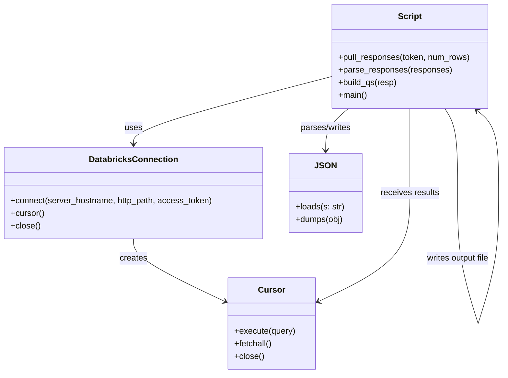
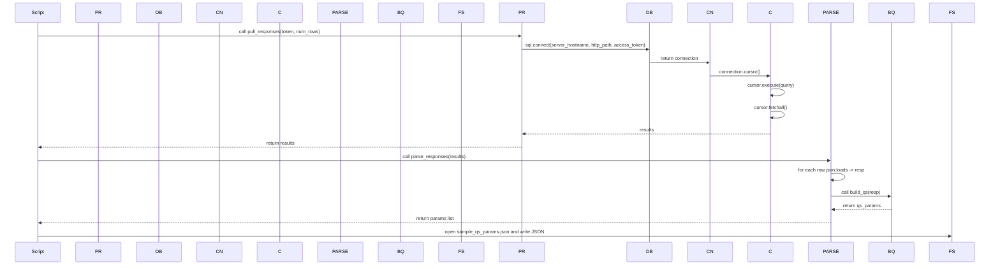

# Diagram: research/api_k8s/get_ai_eta/scripts/sample_qs_params.py


> Auto-generated by Obscura crawlers

## Diagram 1

```mermaid
flowchart LR
    Main[__main__] --> PullResponses[pull_responses(token, num_rows)]
    PullResponses --> DBConnect[sql.connect(server_hostname, http_path, access_token)]
    DBConnect --> Connection[connection]
    Connection --> Cursor[cursor = connection.cursor()]
    Cursor --> Execute[cursor.execute(query)]
    Execute --> Fetch[cursor.fetchall() -> results]
    Fetch --> CloseCursor[cursor.close()]
    CloseCursor --> CloseConn[connection.close()]
    CloseConn --> Parse[parse_responses(results)]
    Parse --> Loop{for each Row in responses}
    Loop --> ParseRow[json.loads(row.value) -> resp]
    ParseRow --> BuildQS[build_qs(resp)]
    BuildQS --> Collect[append qs_params]
    Collect --> WriteFile[write sample_qs_params.json]
```

> SVG rendering failed for this diagram.

## Diagram 2



### SVG

<svg id="container" width="953.3389892578125" xmlns="http://www.w3.org/2000/svg" class="classDiagram" height="710" viewBox="0 0 953.3389892578125 710" role="graphics-document document" aria-roledescription="class"><style>#container{font-family:"trebuchet ms",verdana,arial,sans-serif;font-size:16px;fill:#333;}@keyframes edge-animation-frame{from{stroke-dashoffset:0;}}@keyframes dash{to{stroke-dashoffset:0;}}#container .edge-animation-slow{stroke-dasharray:9,5!important;stroke-dashoffset:900;animation:dash 50s linear infinite;stroke-linecap:round;}#container .edge-animation-fast{stroke-dasharray:9,5!important;stroke-dashoffset:900;animation:dash 20s linear infinite;stroke-linecap:round;}#container .error-icon{fill:#552222;}#container .error-text{fill:#552222;stroke:#552222;}#container .edge-thickness-normal{stroke-width:1px;}#container .edge-thickness-thick{stroke-width:3.5px;}#container .edge-pattern-solid{stroke-dasharray:0;}#container .edge-thickness-invisible{stroke-width:0;fill:none;}#container .edge-pattern-dashed{stroke-dasharray:3;}#container .edge-pattern-dotted{stroke-dasharray:2;}#container .marker{fill:#333333;stroke:#333333;}#container .marker.cross{stroke:#333333;}#container svg{font-family:"trebuchet ms",verdana,arial,sans-serif;font-size:16px;}#container p{margin:0;}#container g.classGroup text{fill:#9370DB;stroke:none;font-family:"trebuchet ms",verdana,arial,sans-serif;font-size:10px;}#container g.classGroup text .title{font-weight:bolder;}#container .nodeLabel,#container .edgeLabel{color:#131300;}#container .edgeLabel .label rect{fill:#ECECFF;}#container .label text{fill:#131300;}#container .labelBkg{background:#ECECFF;}#container .edgeLabel .label span{background:#ECECFF;}#container .classTitle{font-weight:bolder;}#container .node rect,#container .node circle,#container .node ellipse,#container .node polygon,#container .node path{fill:#ECECFF;stroke:#9370DB;stroke-width:1px;}#container .divider{stroke:#9370DB;stroke-width:1;}#container g.clickable{cursor:pointer;}#container g.classGroup rect{fill:#ECECFF;stroke:#9370DB;}#container g.classGroup line{stroke:#9370DB;stroke-width:1;}#container .classLabel .box{stroke:none;stroke-width:0;fill:#ECECFF;opacity:0.5;}#container .classLabel .label{fill:#9370DB;font-size:10px;}#container .relation{stroke:#333333;stroke-width:1;fill:none;}#container .dashed-line{stroke-dasharray:3;}#container .dotted-line{stroke-dasharray:1 2;}#container #compositionStart,#container .composition{fill:#333333!important;stroke:#333333!important;stroke-width:1;}#container #compositionEnd,#container .composition{fill:#333333!important;stroke:#333333!important;stroke-width:1;}#container #dependencyStart,#container .dependency{fill:#333333!important;stroke:#333333!important;stroke-width:1;}#container #dependencyStart,#container .dependency{fill:#333333!important;stroke:#333333!important;stroke-width:1;}#container #extensionStart,#container .extension{fill:transparent!important;stroke:#333333!important;stroke-width:1;}#container #extensionEnd,#container .extension{fill:transparent!important;stroke:#333333!important;stroke-width:1;}#container #aggregationStart,#container .aggregation{fill:transparent!important;stroke:#333333!important;stroke-width:1;}#container #aggregationEnd,#container .aggregation{fill:transparent!important;stroke:#333333!important;stroke-width:1;}#container #lollipopStart,#container .lollipop{fill:#ECECFF!important;stroke:#333333!important;stroke-width:1;}#container #lollipopEnd,#container .lollipop{fill:#ECECFF!important;stroke:#333333!important;stroke-width:1;}#container .edgeTerminals{font-size:11px;line-height:initial;}#container .classTitleText{text-anchor:middle;font-size:18px;fill:#333;}#container .label-icon{display:inline-block;height:1em;overflow:visible;vertical-align:-0.125em;}#container .node .label-icon path{fill:currentColor;stroke:revert;stroke-width:revert;}#container :root{--mermaid-font-family:"trebuchet ms",verdana,arial,sans-serif;}</style><g><defs><marker id="container_class-aggregationStart" class="marker aggregation class" refX="18" refY="7" markerWidth="190" markerHeight="240" orient="auto"><path d="M 18,7 L9,13 L1,7 L9,1 Z"></path></marker></defs><defs><marker id="container_class-aggregationEnd" class="marker aggregation class" refX="1" refY="7" markerWidth="20" markerHeight="28" orient="auto"><path d="M 18,7 L9,13 L1,7 L9,1 Z"></path></marker></defs><defs><marker id="container_class-extensionStart" class="marker extension class" refX="18" refY="7" markerWidth="190" markerHeight="240" orient="auto"><path d="M 1,7 L18,13 V 1 Z"></path></marker></defs><defs><marker id="container_class-extensionEnd" class="marker extension class" refX="1" refY="7" markerWidth="20" markerHeight="28" orient="auto"><path d="M 1,1 V 13 L18,7 Z"></path></marker></defs><defs><marker id="container_class-compositionStart" class="marker composition class" refX="18" refY="7" markerWidth="190" markerHeight="240" orient="auto"><path d="M 18,7 L9,13 L1,7 L9,1 Z"></path></marker></defs><defs><marker id="container_class-compositionEnd" class="marker composition class" refX="1" refY="7" markerWidth="20" markerHeight="28" orient="auto"><path d="M 18,7 L9,13 L1,7 L9,1 Z"></path></marker></defs><defs><marker id="container_class-dependencyStart" class="marker dependency class" refX="6" refY="7" markerWidth="190" markerHeight="240" orient="auto"><path d="M 5,7 L9,13 L1,7 L9,1 Z"></path></marker></defs><defs><marker id="container_class-dependencyEnd" class="marker dependency class" refX="13" refY="7" markerWidth="20" markerHeight="28" orient="auto"><path d="M 18,7 L9,13 L14,7 L9,1 Z"></path></marker></defs><defs><marker id="container_class-lollipopStart" class="marker lollipop class" refX="13" refY="7" markerWidth="190" markerHeight="240" orient="auto"><circle stroke="black" fill="transparent" cx="7" cy="7" r="6"></circle></marker></defs><defs><marker id="container_class-lollipopEnd" class="marker lollipop class" refX="1" refY="7" markerWidth="190" markerHeight="240" orient="auto"><circle stroke="black" fill="transparent" cx="7" cy="7" r="6"></circle></marker></defs><g class="root"><g class="clusters"></g><g class="edgePaths"><path d="M623.051,145.989L561.221,162.158C499.392,178.326,375.733,210.663,313.904,231.998C252.074,253.333,252.074,263.667,252.074,268.833L252.074,274" id="id_Script_DatabricksConnection_1" class="edge-thickness-normal edge-pattern-solid relation" style=";;;" data-edge="true" data-et="edge" data-id="id_Script_DatabricksConnection_1" data-points="W3sieCI6NjIzLjA1MDc4MTI1LCJ5IjoxNDUuOTg5MjA2NzY4ODY1Nn0seyJ4IjoyNTIuMDc0MjE4NzUsInkiOjI0M30seyJ4IjoyNTIuMDc0MjE4NzUsInkiOjI4MH1d" marker-end="url(#container_class-dependencyEnd)"></path><path d="M252.074,454L252.074,460.167C252.074,466.333,252.074,478.667,280.855,498.558C309.636,518.448,367.197,545.897,395.977,559.621L424.758,573.345" id="id_DatabricksConnection_Cursor_2" class="edge-thickness-normal edge-pattern-solid relation" style=";;;" data-edge="true" data-et="edge" data-id="id_DatabricksConnection_Cursor_2" data-points="W3sieCI6MjUyLjA3NDIxODc1LCJ5Ijo0NTR9LHsieCI6MjUyLjA3NDIxODc1LCJ5Ijo0OTF9LHsieCI6NDMwLjE3MzgyODEyNSwieSI6NTc1LjkyNzY5MjExMTI1MjF9XQ==" marker-end="url(#container_class-dependencyEnd)"></path><path d="M656.704,206L649.513,212.167C642.322,218.333,627.941,230.667,620.75,244C613.559,257.333,613.559,271.667,613.559,278.833L613.559,286" id="id_Script_JSON_3" class="edge-thickness-normal edge-pattern-solid relation" style=";;;" data-edge="true" data-et="edge" data-id="id_Script_JSON_3" data-points="W3sieCI6NjU2LjcwNDM2MDA2NDMzODMsInkiOjIwNn0seyJ4Ijo2MTMuNTU4NTkzNzUsInkiOjI0M30seyJ4Ijo2MTMuNTU4NTkzNzUsInkiOjI5Mn1d" marker-end="url(#container_class-dependencyEnd)"></path><path d="M772.148,206L772.148,212.167C772.148,218.333,772.148,230.667,772.148,257.5C772.148,284.333,772.148,325.667,772.148,367C772.148,408.333,772.148,449.667,743.368,484.058C714.587,518.448,657.026,545.897,628.245,559.621L599.465,573.345" id="id_Script_Cursor_4" class="edge-thickness-normal edge-pattern-solid relation" style=";;;" data-edge="true" data-et="edge" data-id="id_Script_Cursor_4" data-points="W3sieCI6NzcyLjE0ODQzNzUsInkiOjIwNn0seyJ4Ijo3NzIuMTQ4NDM3NSwieSI6MjQzfSx7IngiOjc3Mi4xNDg0Mzc1LCJ5IjozNjd9LHsieCI6NzcyLjE0ODQzNzUsInkiOjQ5MX0seyJ4Ijo1OTQuMDQ4ODI4MTI1LCJ5Ijo1NzUuOTI3NjkyMTExMjUyMX1d" marker-end="url(#container_class-dependencyEnd)"></path><path d="M838.558,206L842.695,212.167C846.832,218.333,855.105,230.667,859.241,257.492C863.378,284.317,863.378,325.633,863.378,346.292L863.378,366.95" id="Script-cyclic-special-1" class="edge-thickness-normal edge-pattern-solid relation" style=";;;" data-edge="true" data-et="edge" data-id="Script-cyclic-special-1" data-points="W3sieCI6ODM4LjU1ODI4MzU0ODMzNjUsInkiOjIwNn0seyJ4Ijo4NjMuMzc4MTI1MDAwNzQ1MSwieSI6MjQzfSx7IngiOjg2My4zNzgxMjUwMDA3NDUxLCJ5IjozNjYuOTQ5OTk5OTk5MjU0OTR9XQ=="></path><path d="M863.378,367.05L863.378,387.708C863.378,408.367,863.378,449.683,870.205,491C877.033,532.317,890.687,573.633,897.515,594.292L904.342,614.95" id="Script-cyclic-special-mid" class="edge-thickness-normal edge-pattern-solid relation" style=";;;" data-edge="true" data-et="edge" data-id="Script-cyclic-special-mid" data-points="W3sieCI6ODYzLjM3ODEyNTAwMDc0NTEsInkiOjM2Ny4wNTAwMDAwMDA3NDUwNn0seyJ4Ijo4NjMuMzc4MTI1MDAwNzQ1MSwieSI6NDkxfSx7IngiOjkwNC4zNDIwNjkzNjc5Mzg0LCJ5Ijo2MTQuOTQ5OTk5OTk5MjU0OX1d"></path><path d="M904.375,614.95L911.202,594.292C918.03,573.633,931.684,532.317,938.512,490.992C945.339,449.667,945.339,408.333,945.339,367C945.339,325.667,945.339,284.333,938.273,258.118C931.206,231.902,917.073,220.804,910.006,215.255L902.94,209.706" id="Script-cyclic-special-2" class="edge-thickness-normal edge-pattern-solid relation" style=";;;" data-edge="true" data-et="edge" data-id="Script-cyclic-special-2" data-points="W3sieCI6OTA0LjM3NTExODEzMzU1MTcsInkiOjYxNC45NDk5OTk5OTkyNTQ5fSx7IngiOjk0NS4zMzkwNjI1MDA3NDUxLCJ5Ijo0OTF9LHsieCI6OTQ1LjMzOTA2MjUwMDc0NTEsInkiOjM2N30seyJ4Ijo5NDUuMzM5MDYyNTAwNzQ1MSwieSI6MjQzfSx7IngiOjg5OC4yMjEwMjQ4MTY3MTg4LCJ5IjoyMDZ9XQ==" marker-end="url(#container_class-dependencyEnd)"></path></g><g class="edgeLabels"><g class="edgeLabel" transform="translate(252.07421875, 243)"><g class="label" data-id="id_Script_DatabricksConnection_1" transform="translate(-16.4921875, -12)"><foreignObject width="32.984375" height="24"><div xmlns="http://www.w3.org/1999/xhtml" class="labelBkg" style="display: table-cell; white-space: nowrap; line-height: 1.5; max-width: 200px; text-align: center;"><span class="edgeLabel"><p>uses</p></span></div></foreignObject></g></g><g class="edgeLabel" transform="translate(252.07421875, 491)"><g class="label" data-id="id_DatabricksConnection_Cursor_2" transform="translate(-26.171875, -12)"><foreignObject width="52.34375" height="24"><div xmlns="http://www.w3.org/1999/xhtml" class="labelBkg" style="display: table-cell; white-space: nowrap; line-height: 1.5; max-width: 200px; text-align: center;"><span class="edgeLabel"><p>creates</p></span></div></foreignObject></g></g><g class="edgeLabel" transform="translate(613.55859375, 243)"><g class="label" data-id="id_Script_JSON_3" transform="translate(-49.7734375, -12)"><foreignObject width="99.546875" height="24"><div xmlns="http://www.w3.org/1999/xhtml" class="labelBkg" style="display: table-cell; white-space: nowrap; line-height: 1.5; max-width: 200px; text-align: center;"><span class="edgeLabel"><p>parses/writes</p></span></div></foreignObject></g></g><g class="edgeLabel" transform="translate(772.1484375, 367)"><g class="label" data-id="id_Script_Cursor_4" transform="translate(-56.1796875, -12)"><foreignObject width="112.359375" height="24"><div xmlns="http://www.w3.org/1999/xhtml" class="labelBkg" style="display: table-cell; white-space: nowrap; line-height: 1.5; max-width: 200px; text-align: center;"><span class="edgeLabel"><p>receives results</p></span></div></foreignObject></g></g><g class="edgeLabel"><g class="label" data-id="Script-cyclic-special-1" transform="translate(0, 0)"><foreignObject width="0" height="0"><div xmlns="http://www.w3.org/1999/xhtml" class="labelBkg" style="display: table-cell; white-space: nowrap; line-height: 1.5; max-width: 200px; text-align: center;"><span class="edgeLabel"></span></div></foreignObject></g></g><g class="edgeLabel" transform="translate(863.3781250007451, 491)"><g class="label" data-id="Script-cyclic-special-mid" transform="translate(-61.9609375, -12)"><foreignObject width="123.921875" height="24"><div xmlns="http://www.w3.org/1999/xhtml" class="labelBkg" style="display: table-cell; white-space: nowrap; line-height: 1.5; max-width: 200px; text-align: center;"><span class="edgeLabel"><p>writes output file</p></span></div></foreignObject></g></g><g class="edgeLabel"><g class="label" data-id="Script-cyclic-special-2" transform="translate(0, 0)"><foreignObject width="0" height="0"><div xmlns="http://www.w3.org/1999/xhtml" class="labelBkg" style="display: table-cell; white-space: nowrap; line-height: 1.5; max-width: 200px; text-align: center;"><span class="edgeLabel"></span></div></foreignObject></g></g></g><g class="nodes"><g class="node default" id="classId-Script-0" transform="translate(772.1484375, 107)"><g class="basic label-container"><path d="M-149.09765625 -99 L149.09765625 -99 L149.09765625 99 L-149.09765625 99" stroke="none" stroke-width="0" fill="#ECECFF" style=""></path><path d="M-149.09765625 -99 C-40.90082504916391 -99, 67.29600615167217 -99, 149.09765625 -99 M-149.09765625 -99 C-68.89164847572815 -99, 11.314359298543707 -99, 149.09765625 -99 M149.09765625 -99 C149.09765625 -46.76324767619627, 149.09765625 5.473504647607456, 149.09765625 99 M149.09765625 -99 C149.09765625 -59.10879585483523, 149.09765625 -19.217591709670458, 149.09765625 99 M149.09765625 99 C88.67981403308656 99, 28.2619718161731 99, -149.09765625 99 M149.09765625 99 C58.55828948007576 99, -31.981077289848486 99, -149.09765625 99 M-149.09765625 99 C-149.09765625 59.35547317650636, -149.09765625 19.710946353012716, -149.09765625 -99 M-149.09765625 99 C-149.09765625 41.00004058147736, -149.09765625 -16.999918837045286, -149.09765625 -99" stroke="#9370DB" stroke-width="1.3" fill="none" stroke-dasharray="0 0" style=""></path></g><g class="annotation-group text" transform="translate(0, -75)"></g><g class="label-group text" transform="translate(-21.7421875, -75)"><g class="label" style="font-weight: bolder" transform="translate(0,-12)"><foreignObject width="43.484375" height="24"><div xmlns="http://www.w3.org/1999/xhtml" style="display: table-cell; white-space: nowrap; line-height: 1.5; max-width: 93px; text-align: center;"><span class="nodeLabel markdown-node-label" style=""><p>Script</p></span></div></foreignObject></g></g><g class="members-group text" transform="translate(-137.09765625, -27)"></g><g class="methods-group text" transform="translate(-137.09765625, 3)"><g class="label" style="" transform="translate(0,-12)"><foreignObject width="252.453125" height="24"><div xmlns="http://www.w3.org/1999/xhtml" style="display: table-cell; white-space: nowrap; line-height: 1.5; max-width: 310px; text-align: center;"><span class="nodeLabel markdown-node-label" style=""><p>+pull_responses(token, num_rows)</p></span></div></foreignObject></g><g class="label" style="" transform="translate(0,12)"><foreignObject width="214.09375" height="24"><div xmlns="http://www.w3.org/1999/xhtml" style="display: table-cell; white-space: nowrap; line-height: 1.5; max-width: 271px; text-align: center;"><span class="nodeLabel markdown-node-label" style=""><p>+parse_responses(responses)</p></span></div></foreignObject></g><g class="label" style="" transform="translate(0,36)"><foreignObject width="112.296875" height="24"><div xmlns="http://www.w3.org/1999/xhtml" style="display: table-cell; white-space: nowrap; line-height: 1.5; max-width: 170px; text-align: center;"><span class="nodeLabel markdown-node-label" style=""><p>+build_qs(resp)</p></span></div></foreignObject></g><g class="label" style="" transform="translate(0,60)"><foreignObject width="54.65625" height="24"><div xmlns="http://www.w3.org/1999/xhtml" style="display: table-cell; white-space: nowrap; line-height: 1.5; max-width: 112px; text-align: center;"><span class="nodeLabel markdown-node-label" style=""><p>+main()</p></span></div></foreignObject></g></g><g class="divider" style=""><path d="M-149.09765625 -51 C-62.804190452068255 -51, 23.48927534586349 -51, 149.09765625 -51 M-149.09765625 -51 C-66.17928932515774 -51, 16.73907759968452 -51, 149.09765625 -51" stroke="#9370DB" stroke-width="1.3" fill="none" stroke-dasharray="0 0" style=""></path></g><g class="divider" style=""><path d="M-149.09765625 -27 C-32.69370494660802 -27, 83.71024635678395 -27, 149.09765625 -27 M-149.09765625 -27 C-58.69339733868351 -27, 31.71086157263298 -27, 149.09765625 -27" stroke="#9370DB" stroke-width="1.3" fill="none" stroke-dasharray="0 0" style=""></path></g></g><g class="node default" id="classId-DatabricksConnection-1" transform="translate(252.07421875, 367)"><g class="basic label-container"><path d="M-244.07421875 -87 L244.07421875 -87 L244.07421875 87 L-244.07421875 87" stroke="none" stroke-width="0" fill="#ECECFF" style=""></path><path d="M-244.07421875 -87 C-80.3456991170001 -87, 83.38282051599981 -87, 244.07421875 -87 M-244.07421875 -87 C-83.9000384102662 -87, 76.27414192946759 -87, 244.07421875 -87 M244.07421875 -87 C244.07421875 -20.87725110943333, 244.07421875 45.24549778113334, 244.07421875 87 M244.07421875 -87 C244.07421875 -28.85368751554114, 244.07421875 29.29262496891772, 244.07421875 87 M244.07421875 87 C119.58140839685822 87, -4.911401956283555 87, -244.07421875 87 M244.07421875 87 C49.55027397766736 87, -144.97367079466528 87, -244.07421875 87 M-244.07421875 87 C-244.07421875 25.925067267365982, -244.07421875 -35.149865465268036, -244.07421875 -87 M-244.07421875 87 C-244.07421875 49.296954413523224, -244.07421875 11.593908827046448, -244.07421875 -87" stroke="#9370DB" stroke-width="1.3" fill="none" stroke-dasharray="0 0" style=""></path></g><g class="annotation-group text" transform="translate(0, -63)"></g><g class="label-group text" transform="translate(-80.4296875, -63)"><g class="label" style="font-weight: bolder" transform="translate(0,-12)"><foreignObject width="160.859375" height="24"><div xmlns="http://www.w3.org/1999/xhtml" style="display: table-cell; white-space: nowrap; line-height: 1.5; max-width: 209px; text-align: center;"><span class="nodeLabel markdown-node-label" style=""><p>DatabricksConnection</p></span></div></foreignObject></g></g><g class="members-group text" transform="translate(-232.07421875, -15)"></g><g class="methods-group text" transform="translate(-232.07421875, 15)"><g class="label" style="" transform="translate(0,-12)"><foreignObject width="383.71875" height="24"><div xmlns="http://www.w3.org/1999/xhtml" style="display: table-cell; white-space: nowrap; line-height: 1.5; max-width: 441px; text-align: center;"><span class="nodeLabel markdown-node-label" style=""><p>+connect(server_hostname, http_path, access_token)</p></span></div></foreignObject></g><g class="label" style="" transform="translate(0,12)"><foreignObject width="64.09375" height="24"><div xmlns="http://www.w3.org/1999/xhtml" style="display: table-cell; white-space: nowrap; line-height: 1.5; max-width: 121px; text-align: center;"><span class="nodeLabel markdown-node-label" style=""><p>+cursor()</p></span></div></foreignObject></g><g class="label" style="" transform="translate(0,36)"><foreignObject width="56.15625" height="24"><div xmlns="http://www.w3.org/1999/xhtml" style="display: table-cell; white-space: nowrap; line-height: 1.5; max-width: 114px; text-align: center;"><span class="nodeLabel markdown-node-label" style=""><p>+close()</p></span></div></foreignObject></g></g><g class="divider" style=""><path d="M-244.07421875 -39 C-122.83770134448744 -39, -1.6011839389748843 -39, 244.07421875 -39 M-244.07421875 -39 C-50.38285350856617 -39, 143.30851173286766 -39, 244.07421875 -39" stroke="#9370DB" stroke-width="1.3" fill="none" stroke-dasharray="0 0" style=""></path></g><g class="divider" style=""><path d="M-244.07421875 -15 C-137.6555986772945 -15, -31.236978604589012 -15, 244.07421875 -15 M-244.07421875 -15 C-57.57103614190015 -15, 128.9321464661997 -15, 244.07421875 -15" stroke="#9370DB" stroke-width="1.3" fill="none" stroke-dasharray="0 0" style=""></path></g></g><g class="node default" id="classId-Cursor-2" transform="translate(512.111328125, 615)"><g class="basic label-container"><path d="M-81.9375 -87 L81.9375 -87 L81.9375 87 L-81.9375 87" stroke="none" stroke-width="0" fill="#ECECFF" style=""></path><path d="M-81.9375 -87 C-32.98464180252027 -87, 15.968216394959455 -87, 81.9375 -87 M-81.9375 -87 C-45.28734820183168 -87, -8.637196403663367 -87, 81.9375 -87 M81.9375 -87 C81.9375 -42.03906782127871, 81.9375 2.921864357442587, 81.9375 87 M81.9375 -87 C81.9375 -22.859397759709182, 81.9375 41.281204480581636, 81.9375 87 M81.9375 87 C46.44464626783133 87, 10.951792535662662 87, -81.9375 87 M81.9375 87 C30.085311800667853 87, -21.766876398664294 87, -81.9375 87 M-81.9375 87 C-81.9375 37.27760714023839, -81.9375 -12.444785719523225, -81.9375 -87 M-81.9375 87 C-81.9375 37.686573375603665, -81.9375 -11.62685324879267, -81.9375 -87" stroke="#9370DB" stroke-width="1.3" fill="none" stroke-dasharray="0 0" style=""></path></g><g class="annotation-group text" transform="translate(0, -63)"></g><g class="label-group text" transform="translate(-23.90625, -63)"><g class="label" style="font-weight: bolder" transform="translate(0,-12)"><foreignObject width="47.8125" height="24"><div xmlns="http://www.w3.org/1999/xhtml" style="display: table-cell; white-space: nowrap; line-height: 1.5; max-width: 98px; text-align: center;"><span class="nodeLabel markdown-node-label" style=""><p>Cursor</p></span></div></foreignObject></g></g><g class="members-group text" transform="translate(-69.9375, -15)"></g><g class="methods-group text" transform="translate(-69.9375, 15)"><g class="label" style="" transform="translate(0,-12)"><foreignObject width="115.96875" height="24"><div xmlns="http://www.w3.org/1999/xhtml" style="display: table-cell; white-space: nowrap; line-height: 1.5; max-width: 173px; text-align: center;"><span class="nodeLabel markdown-node-label" style=""><p>+execute(query)</p></span></div></foreignObject></g><g class="label" style="" transform="translate(0,12)"><foreignObject width="72.515625" height="24"><div xmlns="http://www.w3.org/1999/xhtml" style="display: table-cell; white-space: nowrap; line-height: 1.5; max-width: 130px; text-align: center;"><span class="nodeLabel markdown-node-label" style=""><p>+fetchall()</p></span></div></foreignObject></g><g class="label" style="" transform="translate(0,36)"><foreignObject width="56.15625" height="24"><div xmlns="http://www.w3.org/1999/xhtml" style="display: table-cell; white-space: nowrap; line-height: 1.5; max-width: 114px; text-align: center;"><span class="nodeLabel markdown-node-label" style=""><p>+close()</p></span></div></foreignObject></g></g><g class="divider" style=""><path d="M-81.9375 -39 C-29.32576095528104 -39, 23.28597808943792 -39, 81.9375 -39 M-81.9375 -39 C-30.649514017497495 -39, 20.63847196500501 -39, 81.9375 -39" stroke="#9370DB" stroke-width="1.3" fill="none" stroke-dasharray="0 0" style=""></path></g><g class="divider" style=""><path d="M-81.9375 -15 C-29.350689907013127 -15, 23.236120185973746 -15, 81.9375 -15 M-81.9375 -15 C-44.3882395217097 -15, -6.8389790434194 -15, 81.9375 -15" stroke="#9370DB" stroke-width="1.3" fill="none" stroke-dasharray="0 0" style=""></path></g></g><g class="node default" id="classId-JSON-3" transform="translate(613.55859375, 367)"><g class="basic label-container"><path d="M-67.41015625 -75 L67.41015625 -75 L67.41015625 75 L-67.41015625 75" stroke="none" stroke-width="0" fill="#ECECFF" style=""></path><path d="M-67.41015625 -75 C-26.508369361828954 -75, 14.393417526342091 -75, 67.41015625 -75 M-67.41015625 -75 C-27.66431760389029 -75, 12.081521042219421 -75, 67.41015625 -75 M67.41015625 -75 C67.41015625 -19.604986229686197, 67.41015625 35.790027540627605, 67.41015625 75 M67.41015625 -75 C67.41015625 -19.136910414696864, 67.41015625 36.72617917060627, 67.41015625 75 M67.41015625 75 C21.568335099339727 75, -24.273486051320546 75, -67.41015625 75 M67.41015625 75 C17.676616711026654 75, -32.05692282794669 75, -67.41015625 75 M-67.41015625 75 C-67.41015625 41.23667470443218, -67.41015625 7.473349408864365, -67.41015625 -75 M-67.41015625 75 C-67.41015625 22.70624685789697, -67.41015625 -29.587506284206057, -67.41015625 -75" stroke="#9370DB" stroke-width="1.3" fill="none" stroke-dasharray="0 0" style=""></path></g><g class="annotation-group text" transform="translate(0, -51)"></g><g class="label-group text" transform="translate(-17.9453125, -51)"><g class="label" style="font-weight: bolder" transform="translate(0,-12)"><foreignObject width="35.890625" height="24"><div xmlns="http://www.w3.org/1999/xhtml" style="display: table-cell; white-space: nowrap; line-height: 1.5; max-width: 86px; text-align: center;"><span class="nodeLabel markdown-node-label" style=""><p>JSON</p></span></div></foreignObject></g></g><g class="members-group text" transform="translate(-55.41015625, -3)"></g><g class="methods-group text" transform="translate(-55.41015625, 27)"><g class="label" style="" transform="translate(0,-12)"><foreignObject width="92.875" height="24"><div xmlns="http://www.w3.org/1999/xhtml" style="display: table-cell; white-space: nowrap; line-height: 1.5; max-width: 150px; text-align: center;"><span class="nodeLabel markdown-node-label" style=""><p>+loads(s: str)</p></span></div></foreignObject></g><g class="label" style="" transform="translate(0,12)"><foreignObject width="91.25" height="24"><div xmlns="http://www.w3.org/1999/xhtml" style="display: table-cell; white-space: nowrap; line-height: 1.5; max-width: 149px; text-align: center;"><span class="nodeLabel markdown-node-label" style=""><p>+dumps(obj)</p></span></div></foreignObject></g></g><g class="divider" style=""><path d="M-67.41015625 -27 C-14.343072008577025 -27, 38.72401223284595 -27, 67.41015625 -27 M-67.41015625 -27 C-34.1472436323448 -27, -0.8843310146895931 -27, 67.41015625 -27" stroke="#9370DB" stroke-width="1.3" fill="none" stroke-dasharray="0 0" style=""></path></g><g class="divider" style=""><path d="M-67.41015625 -3 C-28.548729993708015 -3, 10.31269626258397 -3, 67.41015625 -3 M-67.41015625 -3 C-29.297996043939797 -3, 8.814164162120406 -3, 67.41015625 -3" stroke="#9370DB" stroke-width="1.3" fill="none" stroke-dasharray="0 0" style=""></path></g></g><g class="label edgeLabel" id="Script---Script---1" transform="translate(863.3781250007451, 367)"><rect width="0.1" height="0.1"></rect><g class="label" style="" transform="translate(0, 0)"><rect></rect><foreignObject width="0" height="0"><div xmlns="http://www.w3.org/1999/xhtml" style="display: table-cell; white-space: nowrap; line-height: 1.5; max-width: 10px; text-align: center;"><span class="nodeLabel"></span></div></foreignObject></g></g><g class="label edgeLabel" id="Script---Script---2" transform="translate(904.3585937507451, 615)"><rect width="0.1" height="0.1"></rect><g class="label" style="" transform="translate(0, 0)"><rect></rect><foreignObject width="0" height="0"><div xmlns="http://www.w3.org/1999/xhtml" style="display: table-cell; white-space: nowrap; line-height: 1.5; max-width: 10px; text-align: center;"><span class="nodeLabel"></span></div></foreignObject></g></g></g></g></g></svg>

## Diagram 3



### SVG

<svg id="container" width="3336" xmlns="http://www.w3.org/2000/svg" height="933" viewBox="-50 -10 3336 933" role="graphics-document document" aria-roledescription="sequence"><g><rect x="3086" y="847" fill="#eaeaea" stroke="#666" width="150" height="65" name="FS" rx="3" ry="3" class="actor actor-bottom"></rect><text x="3161" y="879.5" dominant-baseline="central" alignment-baseline="central" class="actor actor-box" style="text-anchor: middle; font-size: 16px; font-weight: 400;"><tspan x="3161" dy="0">FS</tspan></text></g><g><rect x="2886" y="847" fill="#eaeaea" stroke="#666" width="150" height="65" name="BQ" rx="3" ry="3" class="actor actor-bottom"></rect><text x="2961" y="879.5" dominant-baseline="central" alignment-baseline="central" class="actor actor-box" style="text-anchor: middle; font-size: 16px; font-weight: 400;"><tspan x="2961" dy="0">BQ</tspan></text></g><g><rect x="2682" y="847" fill="#eaeaea" stroke="#666" width="150" height="65" name="PARSE" rx="3" ry="3" class="actor actor-bottom"></rect><text x="2757" y="879.5" dominant-baseline="central" alignment-baseline="central" class="actor actor-box" style="text-anchor: middle; font-size: 16px; font-weight: 400;"><tspan x="2757" dy="0">PARSE</tspan></text></g><g><rect x="2482" y="847" fill="#eaeaea" stroke="#666" width="150" height="65" name="C" rx="3" ry="3" class="actor actor-bottom"></rect><text x="2557" y="879.5" dominant-baseline="central" alignment-baseline="central" class="actor actor-box" style="text-anchor: middle; font-size: 16px; font-weight: 400;"><tspan x="2557" dy="0">C</tspan></text></g><g><rect x="2271" y="847" fill="#eaeaea" stroke="#666" width="150" height="65" name="CN" rx="3" ry="3" class="actor actor-bottom"></rect><text x="2346" y="879.5" dominant-baseline="central" alignment-baseline="central" class="actor actor-box" style="text-anchor: middle; font-size: 16px; font-weight: 400;"><tspan x="2346" dy="0">CN</tspan></text></g><g><rect x="2071" y="847" fill="#eaeaea" stroke="#666" width="150" height="65" name="DB" rx="3" ry="3" class="actor actor-bottom"></rect><text x="2146" y="879.5" dominant-baseline="central" alignment-baseline="central" class="actor actor-box" style="text-anchor: middle; font-size: 16px; font-weight: 400;"><tspan x="2146" dy="0">DB</tspan></text></g><g><rect x="1600" y="847" fill="#eaeaea" stroke="#666" width="150" height="65" name="PR" rx="3" ry="3" class="actor actor-bottom"></rect><text x="1675" y="879.5" dominant-baseline="central" alignment-baseline="central" class="actor actor-box" style="text-anchor: middle; font-size: 16px; font-weight: 400;"><tspan x="1675" dy="0">PR</tspan></text></g><g><rect x="1400" y="847" fill="#eaeaea" stroke="#666" width="150" height="65" name="FileSystem" rx="3" ry="3" class="actor actor-bottom"></rect><text x="1475" y="879.5" dominant-baseline="central" alignment-baseline="central" class="actor actor-box" style="text-anchor: middle; font-size: 16px; font-weight: 400;"><tspan x="1475" dy="0">FS</tspan></text></g><g><rect x="1200" y="847" fill="#eaeaea" stroke="#666" width="150" height="65" name="build_qs" rx="3" ry="3" class="actor actor-bottom"></rect><text x="1275" y="879.5" dominant-baseline="central" alignment-baseline="central" class="actor actor-box" style="text-anchor: middle; font-size: 16px; font-weight: 400;"><tspan x="1275" dy="0">BQ</tspan></text></g><g><rect x="1000" y="847" fill="#eaeaea" stroke="#666" width="150" height="65" name="parse_responses" rx="3" ry="3" class="actor actor-bottom"></rect><text x="1075" y="879.5" dominant-baseline="central" alignment-baseline="central" class="actor actor-box" style="text-anchor: middle; font-size: 16px; font-weight: 400;"><tspan x="1075" dy="0">PARSE</tspan></text></g><g><rect x="800" y="847" fill="#eaeaea" stroke="#666" width="150" height="65" name="Cursor" rx="3" ry="3" class="actor actor-bottom"></rect><text x="875" y="879.5" dominant-baseline="central" alignment-baseline="central" class="actor actor-box" style="text-anchor: middle; font-size: 16px; font-weight: 400;"><tspan x="875" dy="0">C</tspan></text></g><g><rect x="600" y="847" fill="#eaeaea" stroke="#666" width="150" height="65" name="Connection" rx="3" ry="3" class="actor actor-bottom"></rect><text x="675" y="879.5" dominant-baseline="central" alignment-baseline="central" class="actor actor-box" style="text-anchor: middle; font-size: 16px; font-weight: 400;"><tspan x="675" dy="0">CN</tspan></text></g><g><rect x="400" y="847" fill="#eaeaea" stroke="#666" width="150" height="65" name="DatabricksSQL" rx="3" ry="3" class="actor actor-bottom"></rect><text x="475" y="879.5" dominant-baseline="central" alignment-baseline="central" class="actor actor-box" style="text-anchor: middle; font-size: 16px; font-weight: 400;"><tspan x="475" dy="0">DB</tspan></text></g><g><rect x="200" y="847" fill="#eaeaea" stroke="#666" width="150" height="65" name="pull_responses" rx="3" ry="3" class="actor actor-bottom"></rect><text x="275" y="879.5" dominant-baseline="central" alignment-baseline="central" class="actor actor-box" style="text-anchor: middle; font-size: 16px; font-weight: 400;"><tspan x="275" dy="0">PR</tspan></text></g><g><rect x="0" y="847" fill="#eaeaea" stroke="#666" width="150" height="65" name="Script" rx="3" ry="3" class="actor actor-bottom"></rect><text x="75" y="879.5" dominant-baseline="central" alignment-baseline="central" class="actor actor-box" style="text-anchor: middle; font-size: 16px; font-weight: 400;"><tspan x="75" dy="0">Script</tspan></text></g><g><line id="actor14" x1="3161" y1="65" x2="3161" y2="847" class="actor-line 200" stroke-width="0.5px" stroke="#999" name="FS"></line><g id="root-14"><rect x="3086" y="0" fill="#eaeaea" stroke="#666" width="150" height="65" name="FS" rx="3" ry="3" class="actor actor-top"></rect><text x="3161" y="32.5" dominant-baseline="central" alignment-baseline="central" class="actor actor-box" style="text-anchor: middle; font-size: 16px; font-weight: 400;"><tspan x="3161" dy="0">FS</tspan></text></g></g><g><line id="actor13" x1="2961" y1="65" x2="2961" y2="847" class="actor-line 200" stroke-width="0.5px" stroke="#999" name="BQ"></line><g id="root-13"><rect x="2886" y="0" fill="#eaeaea" stroke="#666" width="150" height="65" name="BQ" rx="3" ry="3" class="actor actor-top"></rect><text x="2961" y="32.5" dominant-baseline="central" alignment-baseline="central" class="actor actor-box" style="text-anchor: middle; font-size: 16px; font-weight: 400;"><tspan x="2961" dy="0">BQ</tspan></text></g></g><g><line id="actor12" x1="2757" y1="65" x2="2757" y2="847" class="actor-line 200" stroke-width="0.5px" stroke="#999" name="PARSE"></line><g id="root-12"><rect x="2682" y="0" fill="#eaeaea" stroke="#666" width="150" height="65" name="PARSE" rx="3" ry="3" class="actor actor-top"></rect><text x="2757" y="32.5" dominant-baseline="central" alignment-baseline="central" class="actor actor-box" style="text-anchor: middle; font-size: 16px; font-weight: 400;"><tspan x="2757" dy="0">PARSE</tspan></text></g></g><g><line id="actor11" x1="2557" y1="65" x2="2557" y2="847" class="actor-line 200" stroke-width="0.5px" stroke="#999" name="C"></line><g id="root-11"><rect x="2482" y="0" fill="#eaeaea" stroke="#666" width="150" height="65" name="C" rx="3" ry="3" class="actor actor-top"></rect><text x="2557" y="32.5" dominant-baseline="central" alignment-baseline="central" class="actor actor-box" style="text-anchor: middle; font-size: 16px; font-weight: 400;"><tspan x="2557" dy="0">C</tspan></text></g></g><g><line id="actor10" x1="2346" y1="65" x2="2346" y2="847" class="actor-line 200" stroke-width="0.5px" stroke="#999" name="CN"></line><g id="root-10"><rect x="2271" y="0" fill="#eaeaea" stroke="#666" width="150" height="65" name="CN" rx="3" ry="3" class="actor actor-top"></rect><text x="2346" y="32.5" dominant-baseline="central" alignment-baseline="central" class="actor actor-box" style="text-anchor: middle; font-size: 16px; font-weight: 400;"><tspan x="2346" dy="0">CN</tspan></text></g></g><g><line id="actor9" x1="2146" y1="65" x2="2146" y2="847" class="actor-line 200" stroke-width="0.5px" stroke="#999" name="DB"></line><g id="root-9"><rect x="2071" y="0" fill="#eaeaea" stroke="#666" width="150" height="65" name="DB" rx="3" ry="3" class="actor actor-top"></rect><text x="2146" y="32.5" dominant-baseline="central" alignment-baseline="central" class="actor actor-box" style="text-anchor: middle; font-size: 16px; font-weight: 400;"><tspan x="2146" dy="0">DB</tspan></text></g></g><g><line id="actor8" x1="1675" y1="65" x2="1675" y2="847" class="actor-line 200" stroke-width="0.5px" stroke="#999" name="PR"></line><g id="root-8"><rect x="1600" y="0" fill="#eaeaea" stroke="#666" width="150" height="65" name="PR" rx="3" ry="3" class="actor actor-top"></rect><text x="1675" y="32.5" dominant-baseline="central" alignment-baseline="central" class="actor actor-box" style="text-anchor: middle; font-size: 16px; font-weight: 400;"><tspan x="1675" dy="0">PR</tspan></text></g></g><g><line id="actor7" x1="1475" y1="65" x2="1475" y2="847" class="actor-line 200" stroke-width="0.5px" stroke="#999" name="FileSystem"></line><g id="root-7"><rect x="1400" y="0" fill="#eaeaea" stroke="#666" width="150" height="65" name="FileSystem" rx="3" ry="3" class="actor actor-top"></rect><text x="1475" y="32.5" dominant-baseline="central" alignment-baseline="central" class="actor actor-box" style="text-anchor: middle; font-size: 16px; font-weight: 400;"><tspan x="1475" dy="0">FS</tspan></text></g></g><g><line id="actor6" x1="1275" y1="65" x2="1275" y2="847" class="actor-line 200" stroke-width="0.5px" stroke="#999" name="build_qs"></line><g id="root-6"><rect x="1200" y="0" fill="#eaeaea" stroke="#666" width="150" height="65" name="build_qs" rx="3" ry="3" class="actor actor-top"></rect><text x="1275" y="32.5" dominant-baseline="central" alignment-baseline="central" class="actor actor-box" style="text-anchor: middle; font-size: 16px; font-weight: 400;"><tspan x="1275" dy="0">BQ</tspan></text></g></g><g><line id="actor5" x1="1075" y1="65" x2="1075" y2="847" class="actor-line 200" stroke-width="0.5px" stroke="#999" name="parse_responses"></line><g id="root-5"><rect x="1000" y="0" fill="#eaeaea" stroke="#666" width="150" height="65" name="parse_responses" rx="3" ry="3" class="actor actor-top"></rect><text x="1075" y="32.5" dominant-baseline="central" alignment-baseline="central" class="actor actor-box" style="text-anchor: middle; font-size: 16px; font-weight: 400;"><tspan x="1075" dy="0">PARSE</tspan></text></g></g><g><line id="actor4" x1="875" y1="65" x2="875" y2="847" class="actor-line 200" stroke-width="0.5px" stroke="#999" name="Cursor"></line><g id="root-4"><rect x="800" y="0" fill="#eaeaea" stroke="#666" width="150" height="65" name="Cursor" rx="3" ry="3" class="actor actor-top"></rect><text x="875" y="32.5" dominant-baseline="central" alignment-baseline="central" class="actor actor-box" style="text-anchor: middle; font-size: 16px; font-weight: 400;"><tspan x="875" dy="0">C</tspan></text></g></g><g><line id="actor3" x1="675" y1="65" x2="675" y2="847" class="actor-line 200" stroke-width="0.5px" stroke="#999" name="Connection"></line><g id="root-3"><rect x="600" y="0" fill="#eaeaea" stroke="#666" width="150" height="65" name="Connection" rx="3" ry="3" class="actor actor-top"></rect><text x="675" y="32.5" dominant-baseline="central" alignment-baseline="central" class="actor actor-box" style="text-anchor: middle; font-size: 16px; font-weight: 400;"><tspan x="675" dy="0">CN</tspan></text></g></g><g><line id="actor2" x1="475" y1="65" x2="475" y2="847" class="actor-line 200" stroke-width="0.5px" stroke="#999" name="DatabricksSQL"></line><g id="root-2"><rect x="400" y="0" fill="#eaeaea" stroke="#666" width="150" height="65" name="DatabricksSQL" rx="3" ry="3" class="actor actor-top"></rect><text x="475" y="32.5" dominant-baseline="central" alignment-baseline="central" class="actor actor-box" style="text-anchor: middle; font-size: 16px; font-weight: 400;"><tspan x="475" dy="0">DB</tspan></text></g></g><g><line id="actor1" x1="275" y1="65" x2="275" y2="847" class="actor-line 200" stroke-width="0.5px" stroke="#999" name="pull_responses"></line><g id="root-1"><rect x="200" y="0" fill="#eaeaea" stroke="#666" width="150" height="65" name="pull_responses" rx="3" ry="3" class="actor actor-top"></rect><text x="275" y="32.5" dominant-baseline="central" alignment-baseline="central" class="actor actor-box" style="text-anchor: middle; font-size: 16px; font-weight: 400;"><tspan x="275" dy="0">PR</tspan></text></g></g><g><line id="actor0" x1="75" y1="65" x2="75" y2="847" class="actor-line 200" stroke-width="0.5px" stroke="#999" name="Script"></line><g id="root-0"><rect x="0" y="0" fill="#eaeaea" stroke="#666" width="150" height="65" name="Script" rx="3" ry="3" class="actor actor-top"></rect><text x="75" y="32.5" dominant-baseline="central" alignment-baseline="central" class="actor actor-box" style="text-anchor: middle; font-size: 16px; font-weight: 400;"><tspan x="75" dy="0">Script</tspan></text></g></g><style>#container{font-family:"trebuchet ms",verdana,arial,sans-serif;font-size:16px;fill:#333;}@keyframes edge-animation-frame{from{stroke-dashoffset:0;}}@keyframes dash{to{stroke-dashoffset:0;}}#container .edge-animation-slow{stroke-dasharray:9,5!important;stroke-dashoffset:900;animation:dash 50s linear infinite;stroke-linecap:round;}#container .edge-animation-fast{stroke-dasharray:9,5!important;stroke-dashoffset:900;animation:dash 20s linear infinite;stroke-linecap:round;}#container .error-icon{fill:#552222;}#container .error-text{fill:#552222;stroke:#552222;}#container .edge-thickness-normal{stroke-width:1px;}#container .edge-thickness-thick{stroke-width:3.5px;}#container .edge-pattern-solid{stroke-dasharray:0;}#container .edge-thickness-invisible{stroke-width:0;fill:none;}#container .edge-pattern-dashed{stroke-dasharray:3;}#container .edge-pattern-dotted{stroke-dasharray:2;}#container .marker{fill:#333333;stroke:#333333;}#container .marker.cross{stroke:#333333;}#container svg{font-family:"trebuchet ms",verdana,arial,sans-serif;font-size:16px;}#container p{margin:0;}#container .actor{stroke:hsl(259.6261682243, 59.7765363128%, 87.9019607843%);fill:#ECECFF;}#container text.actor&gt;tspan{fill:black;stroke:none;}#container .actor-line{stroke:hsl(259.6261682243, 59.7765363128%, 87.9019607843%);}#container .innerArc{stroke-width:1.5;stroke-dasharray:none;}#container .messageLine0{stroke-width:1.5;stroke-dasharray:none;stroke:#333;}#container .messageLine1{stroke-width:1.5;stroke-dasharray:2,2;stroke:#333;}#container #arrowhead path{fill:#333;stroke:#333;}#container .sequenceNumber{fill:white;}#container #sequencenumber{fill:#333;}#container #crosshead path{fill:#333;stroke:#333;}#container .messageText{fill:#333;stroke:none;}#container .labelBox{stroke:hsl(259.6261682243, 59.7765363128%, 87.9019607843%);fill:#ECECFF;}#container .labelText,#container .labelText&gt;tspan{fill:black;stroke:none;}#container .loopText,#container .loopText&gt;tspan{fill:black;stroke:none;}#container .loopLine{stroke-width:2px;stroke-dasharray:2,2;stroke:hsl(259.6261682243, 59.7765363128%, 87.9019607843%);fill:hsl(259.6261682243, 59.7765363128%, 87.9019607843%);}#container .note{stroke:#aaaa33;fill:#fff5ad;}#container .noteText,#container .noteText&gt;tspan{fill:black;stroke:none;}#container .activation0{fill:#f4f4f4;stroke:#666;}#container .activation1{fill:#f4f4f4;stroke:#666;}#container .activation2{fill:#f4f4f4;stroke:#666;}#container .actorPopupMenu{position:absolute;}#container .actorPopupMenuPanel{position:absolute;fill:#ECECFF;box-shadow:0px 8px 16px 0px rgba(0,0,0,0.2);filter:drop-shadow(3px 5px 2px rgb(0 0 0 / 0.4));}#container .actor-man line{stroke:hsl(259.6261682243, 59.7765363128%, 87.9019607843%);fill:#ECECFF;}#container .actor-man circle,#container line{stroke:hsl(259.6261682243, 59.7765363128%, 87.9019607843%);fill:#ECECFF;stroke-width:2px;}#container :root{--mermaid-font-family:"trebuchet ms",verdana,arial,sans-serif;}</style><g></g><defs><symbol id="computer" width="24" height="24"><path transform="scale(.5)" d="M2 2v13h20v-13h-20zm18 11h-16v-9h16v9zm-10.228 6l.466-1h3.524l.467 1h-4.457zm14.228 3h-24l2-6h2.104l-1.33 4h18.45l-1.297-4h2.073l2 6zm-5-10h-14v-7h14v7z"></path></symbol></defs><defs><symbol id="database" fill-rule="evenodd" clip-rule="evenodd"><path transform="scale(.5)" d="M12.258.001l.256.004.255.005.253.008.251.01.249.012.247.015.246.016.242.019.241.02.239.023.236.024.233.027.231.028.229.031.225.032.223.034.22.036.217.038.214.04.211.041.208.043.205.045.201.046.198.048.194.05.191.051.187.053.183.054.18.056.175.057.172.059.168.06.163.061.16.063.155.064.15.066.074.033.073.033.071.034.07.034.069.035.068.035.067.035.066.035.064.036.064.036.062.036.06.036.06.037.058.037.058.037.055.038.055.038.053.038.052.038.051.039.05.039.048.039.047.039.045.04.044.04.043.04.041.04.04.041.039.041.037.041.036.041.034.041.033.042.032.042.03.042.029.042.027.042.026.043.024.043.023.043.021.043.02.043.018.044.017.043.015.044.013.044.012.044.011.045.009.044.007.045.006.045.004.045.002.045.001.045v17l-.001.045-.002.045-.004.045-.006.045-.007.045-.009.044-.011.045-.012.044-.013.044-.015.044-.017.043-.018.044-.02.043-.021.043-.023.043-.024.043-.026.043-.027.042-.029.042-.03.042-.032.042-.033.042-.034.041-.036.041-.037.041-.039.041-.04.041-.041.04-.043.04-.044.04-.045.04-.047.039-.048.039-.05.039-.051.039-.052.038-.053.038-.055.038-.055.038-.058.037-.058.037-.06.037-.06.036-.062.036-.064.036-.064.036-.066.035-.067.035-.068.035-.069.035-.07.034-.071.034-.073.033-.074.033-.15.066-.155.064-.16.063-.163.061-.168.06-.172.059-.175.057-.18.056-.183.054-.187.053-.191.051-.194.05-.198.048-.201.046-.205.045-.208.043-.211.041-.214.04-.217.038-.22.036-.223.034-.225.032-.229.031-.231.028-.233.027-.236.024-.239.023-.241.02-.242.019-.246.016-.247.015-.249.012-.251.01-.253.008-.255.005-.256.004-.258.001-.258-.001-.256-.004-.255-.005-.253-.008-.251-.01-.249-.012-.247-.015-.245-.016-.243-.019-.241-.02-.238-.023-.236-.024-.234-.027-.231-.028-.228-.031-.226-.032-.223-.034-.22-.036-.217-.038-.214-.04-.211-.041-.208-.043-.204-.045-.201-.046-.198-.048-.195-.05-.19-.051-.187-.053-.184-.054-.179-.056-.176-.057-.172-.059-.167-.06-.164-.061-.159-.063-.155-.064-.151-.066-.074-.033-.072-.033-.072-.034-.07-.034-.069-.035-.068-.035-.067-.035-.066-.035-.064-.036-.063-.036-.062-.036-.061-.036-.06-.037-.058-.037-.057-.037-.056-.038-.055-.038-.053-.038-.052-.038-.051-.039-.049-.039-.049-.039-.046-.039-.046-.04-.044-.04-.043-.04-.041-.04-.04-.041-.039-.041-.037-.041-.036-.041-.034-.041-.033-.042-.032-.042-.03-.042-.029-.042-.027-.042-.026-.043-.024-.043-.023-.043-.021-.043-.02-.043-.018-.044-.017-.043-.015-.044-.013-.044-.012-.044-.011-.045-.009-.044-.007-.045-.006-.045-.004-.045-.002-.045-.001-.045v-17l.001-.045.002-.045.004-.045.006-.045.007-.045.009-.044.011-.045.012-.044.013-.044.015-.044.017-.043.018-.044.02-.043.021-.043.023-.043.024-.043.026-.043.027-.042.029-.042.03-.042.032-.042.033-.042.034-.041.036-.041.037-.041.039-.041.04-.041.041-.04.043-.04.044-.04.046-.04.046-.039.049-.039.049-.039.051-.039.052-.038.053-.038.055-.038.056-.038.057-.037.058-.037.06-.037.061-.036.062-.036.063-.036.064-.036.066-.035.067-.035.068-.035.069-.035.07-.034.072-.034.072-.033.074-.033.151-.066.155-.064.159-.063.164-.061.167-.06.172-.059.176-.057.179-.056.184-.054.187-.053.19-.051.195-.05.198-.048.201-.046.204-.045.208-.043.211-.041.214-.04.217-.038.22-.036.223-.034.226-.032.228-.031.231-.028.234-.027.236-.024.238-.023.241-.02.243-.019.245-.016.247-.015.249-.012.251-.01.253-.008.255-.005.256-.004.258-.001.258.001zm-9.258 20.499v.01l.001.021.003.021.004.022.005.021.006.022.007.022.009.023.01.022.011.023.012.023.013.023.015.023.016.024.017.023.018.024.019.024.021.024.022.025.023.024.024.025.052.049.056.05.061.051.066.051.07.051.075.051.079.052.084.052.088.052.092.052.097.052.102.051.105.052.11.052.114.051.119.051.123.051.127.05.131.05.135.05.139.048.144.049.147.047.152.047.155.047.16.045.163.045.167.043.171.043.176.041.178.041.183.039.187.039.19.037.194.035.197.035.202.033.204.031.209.03.212.029.216.027.219.025.222.024.226.021.23.02.233.018.236.016.24.015.243.012.246.01.249.008.253.005.256.004.259.001.26-.001.257-.004.254-.005.25-.008.247-.011.244-.012.241-.014.237-.016.233-.018.231-.021.226-.021.224-.024.22-.026.216-.027.212-.028.21-.031.205-.031.202-.034.198-.034.194-.036.191-.037.187-.039.183-.04.179-.04.175-.042.172-.043.168-.044.163-.045.16-.046.155-.046.152-.047.148-.048.143-.049.139-.049.136-.05.131-.05.126-.05.123-.051.118-.052.114-.051.11-.052.106-.052.101-.052.096-.052.092-.052.088-.053.083-.051.079-.052.074-.052.07-.051.065-.051.06-.051.056-.05.051-.05.023-.024.023-.025.021-.024.02-.024.019-.024.018-.024.017-.024.015-.023.014-.024.013-.023.012-.023.01-.023.01-.022.008-.022.006-.022.006-.022.004-.022.004-.021.001-.021.001-.021v-4.127l-.077.055-.08.053-.083.054-.085.053-.087.052-.09.052-.093.051-.095.05-.097.05-.1.049-.102.049-.105.048-.106.047-.109.047-.111.046-.114.045-.115.045-.118.044-.12.043-.122.042-.124.042-.126.041-.128.04-.13.04-.132.038-.134.038-.135.037-.138.037-.139.035-.142.035-.143.034-.144.033-.147.032-.148.031-.15.03-.151.03-.153.029-.154.027-.156.027-.158.026-.159.025-.161.024-.162.023-.163.022-.165.021-.166.02-.167.019-.169.018-.169.017-.171.016-.173.015-.173.014-.175.013-.175.012-.177.011-.178.01-.179.008-.179.008-.181.006-.182.005-.182.004-.184.003-.184.002h-.37l-.184-.002-.184-.003-.182-.004-.182-.005-.181-.006-.179-.008-.179-.008-.178-.01-.176-.011-.176-.012-.175-.013-.173-.014-.172-.015-.171-.016-.17-.017-.169-.018-.167-.019-.166-.02-.165-.021-.163-.022-.162-.023-.161-.024-.159-.025-.157-.026-.156-.027-.155-.027-.153-.029-.151-.03-.15-.03-.148-.031-.146-.032-.145-.033-.143-.034-.141-.035-.14-.035-.137-.037-.136-.037-.134-.038-.132-.038-.13-.04-.128-.04-.126-.041-.124-.042-.122-.042-.12-.044-.117-.043-.116-.045-.113-.045-.112-.046-.109-.047-.106-.047-.105-.048-.102-.049-.1-.049-.097-.05-.095-.05-.093-.052-.09-.051-.087-.052-.085-.053-.083-.054-.08-.054-.077-.054v4.127zm0-5.654v.011l.001.021.003.021.004.021.005.022.006.022.007.022.009.022.01.022.011.023.012.023.013.023.015.024.016.023.017.024.018.024.019.024.021.024.022.024.023.025.024.024.052.05.056.05.061.05.066.051.07.051.075.052.079.051.084.052.088.052.092.052.097.052.102.052.105.052.11.051.114.051.119.052.123.05.127.051.131.05.135.049.139.049.144.048.147.048.152.047.155.046.16.045.163.045.167.044.171.042.176.042.178.04.183.04.187.038.19.037.194.036.197.034.202.033.204.032.209.03.212.028.216.027.219.025.222.024.226.022.23.02.233.018.236.016.24.014.243.012.246.01.249.008.253.006.256.003.259.001.26-.001.257-.003.254-.006.25-.008.247-.01.244-.012.241-.015.237-.016.233-.018.231-.02.226-.022.224-.024.22-.025.216-.027.212-.029.21-.03.205-.032.202-.033.198-.035.194-.036.191-.037.187-.039.183-.039.179-.041.175-.042.172-.043.168-.044.163-.045.16-.045.155-.047.152-.047.148-.048.143-.048.139-.05.136-.049.131-.05.126-.051.123-.051.118-.051.114-.052.11-.052.106-.052.101-.052.096-.052.092-.052.088-.052.083-.052.079-.052.074-.051.07-.052.065-.051.06-.05.056-.051.051-.049.023-.025.023-.024.021-.025.02-.024.019-.024.018-.024.017-.024.015-.023.014-.023.013-.024.012-.022.01-.023.01-.023.008-.022.006-.022.006-.022.004-.021.004-.022.001-.021.001-.021v-4.139l-.077.054-.08.054-.083.054-.085.052-.087.053-.09.051-.093.051-.095.051-.097.05-.1.049-.102.049-.105.048-.106.047-.109.047-.111.046-.114.045-.115.044-.118.044-.12.044-.122.042-.124.042-.126.041-.128.04-.13.039-.132.039-.134.038-.135.037-.138.036-.139.036-.142.035-.143.033-.144.033-.147.033-.148.031-.15.03-.151.03-.153.028-.154.028-.156.027-.158.026-.159.025-.161.024-.162.023-.163.022-.165.021-.166.02-.167.019-.169.018-.169.017-.171.016-.173.015-.173.014-.175.013-.175.012-.177.011-.178.009-.179.009-.179.007-.181.007-.182.005-.182.004-.184.003-.184.002h-.37l-.184-.002-.184-.003-.182-.004-.182-.005-.181-.007-.179-.007-.179-.009-.178-.009-.176-.011-.176-.012-.175-.013-.173-.014-.172-.015-.171-.016-.17-.017-.169-.018-.167-.019-.166-.02-.165-.021-.163-.022-.162-.023-.161-.024-.159-.025-.157-.026-.156-.027-.155-.028-.153-.028-.151-.03-.15-.03-.148-.031-.146-.033-.145-.033-.143-.033-.141-.035-.14-.036-.137-.036-.136-.037-.134-.038-.132-.039-.13-.039-.128-.04-.126-.041-.124-.042-.122-.043-.12-.043-.117-.044-.116-.044-.113-.046-.112-.046-.109-.046-.106-.047-.105-.048-.102-.049-.1-.049-.097-.05-.095-.051-.093-.051-.09-.051-.087-.053-.085-.052-.083-.054-.08-.054-.077-.054v4.139zm0-5.666v.011l.001.02.003.022.004.021.005.022.006.021.007.022.009.023.01.022.011.023.012.023.013.023.015.023.016.024.017.024.018.023.019.024.021.025.022.024.023.024.024.025.052.05.056.05.061.05.066.051.07.051.075.052.079.051.084.052.088.052.092.052.097.052.102.052.105.051.11.052.114.051.119.051.123.051.127.05.131.05.135.05.139.049.144.048.147.048.152.047.155.046.16.045.163.045.167.043.171.043.176.042.178.04.183.04.187.038.19.037.194.036.197.034.202.033.204.032.209.03.212.028.216.027.219.025.222.024.226.021.23.02.233.018.236.017.24.014.243.012.246.01.249.008.253.006.256.003.259.001.26-.001.257-.003.254-.006.25-.008.247-.01.244-.013.241-.014.237-.016.233-.018.231-.02.226-.022.224-.024.22-.025.216-.027.212-.029.21-.03.205-.032.202-.033.198-.035.194-.036.191-.037.187-.039.183-.039.179-.041.175-.042.172-.043.168-.044.163-.045.16-.045.155-.047.152-.047.148-.048.143-.049.139-.049.136-.049.131-.051.126-.05.123-.051.118-.052.114-.051.11-.052.106-.052.101-.052.096-.052.092-.052.088-.052.083-.052.079-.052.074-.052.07-.051.065-.051.06-.051.056-.05.051-.049.023-.025.023-.025.021-.024.02-.024.019-.024.018-.024.017-.024.015-.023.014-.024.013-.023.012-.023.01-.022.01-.023.008-.022.006-.022.006-.022.004-.022.004-.021.001-.021.001-.021v-4.153l-.077.054-.08.054-.083.053-.085.053-.087.053-.09.051-.093.051-.095.051-.097.05-.1.049-.102.048-.105.048-.106.048-.109.046-.111.046-.114.046-.115.044-.118.044-.12.043-.122.043-.124.042-.126.041-.128.04-.13.039-.132.039-.134.038-.135.037-.138.036-.139.036-.142.034-.143.034-.144.033-.147.032-.148.032-.15.03-.151.03-.153.028-.154.028-.156.027-.158.026-.159.024-.161.024-.162.023-.163.023-.165.021-.166.02-.167.019-.169.018-.169.017-.171.016-.173.015-.173.014-.175.013-.175.012-.177.01-.178.01-.179.009-.179.007-.181.006-.182.006-.182.004-.184.003-.184.001-.185.001-.185-.001-.184-.001-.184-.003-.182-.004-.182-.006-.181-.006-.179-.007-.179-.009-.178-.01-.176-.01-.176-.012-.175-.013-.173-.014-.172-.015-.171-.016-.17-.017-.169-.018-.167-.019-.166-.02-.165-.021-.163-.023-.162-.023-.161-.024-.159-.024-.157-.026-.156-.027-.155-.028-.153-.028-.151-.03-.15-.03-.148-.032-.146-.032-.145-.033-.143-.034-.141-.034-.14-.036-.137-.036-.136-.037-.134-.038-.132-.039-.13-.039-.128-.041-.126-.041-.124-.041-.122-.043-.12-.043-.117-.044-.116-.044-.113-.046-.112-.046-.109-.046-.106-.048-.105-.048-.102-.048-.1-.05-.097-.049-.095-.051-.093-.051-.09-.052-.087-.052-.085-.053-.083-.053-.08-.054-.077-.054v4.153zm8.74-8.179l-.257.004-.254.005-.25.008-.247.011-.244.012-.241.014-.237.016-.233.018-.231.021-.226.022-.224.023-.22.026-.216.027-.212.028-.21.031-.205.032-.202.033-.198.034-.194.036-.191.038-.187.038-.183.04-.179.041-.175.042-.172.043-.168.043-.163.045-.16.046-.155.046-.152.048-.148.048-.143.048-.139.049-.136.05-.131.05-.126.051-.123.051-.118.051-.114.052-.11.052-.106.052-.101.052-.096.052-.092.052-.088.052-.083.052-.079.052-.074.051-.07.052-.065.051-.06.05-.056.05-.051.05-.023.025-.023.024-.021.024-.02.025-.019.024-.018.024-.017.023-.015.024-.014.023-.013.023-.012.023-.01.023-.01.022-.008.022-.006.023-.006.021-.004.022-.004.021-.001.021-.001.021.001.021.001.021.004.021.004.022.006.021.006.023.008.022.01.022.01.023.012.023.013.023.014.023.015.024.017.023.018.024.019.024.02.025.021.024.023.024.023.025.051.05.056.05.06.05.065.051.07.052.074.051.079.052.083.052.088.052.092.052.096.052.101.052.106.052.11.052.114.052.118.051.123.051.126.051.131.05.136.05.139.049.143.048.148.048.152.048.155.046.16.046.163.045.168.043.172.043.175.042.179.041.183.04.187.038.191.038.194.036.198.034.202.033.205.032.21.031.212.028.216.027.22.026.224.023.226.022.231.021.233.018.237.016.241.014.244.012.247.011.25.008.254.005.257.004.26.001.26-.001.257-.004.254-.005.25-.008.247-.011.244-.012.241-.014.237-.016.233-.018.231-.021.226-.022.224-.023.22-.026.216-.027.212-.028.21-.031.205-.032.202-.033.198-.034.194-.036.191-.038.187-.038.183-.04.179-.041.175-.042.172-.043.168-.043.163-.045.16-.046.155-.046.152-.048.148-.048.143-.048.139-.049.136-.05.131-.05.126-.051.123-.051.118-.051.114-.052.11-.052.106-.052.101-.052.096-.052.092-.052.088-.052.083-.052.079-.052.074-.051.07-.052.065-.051.06-.05.056-.05.051-.05.023-.025.023-.024.021-.024.02-.025.019-.024.018-.024.017-.023.015-.024.014-.023.013-.023.012-.023.01-.023.01-.022.008-.022.006-.023.006-.021.004-.022.004-.021.001-.021.001-.021-.001-.021-.001-.021-.004-.021-.004-.022-.006-.021-.006-.023-.008-.022-.01-.022-.01-.023-.012-.023-.013-.023-.014-.023-.015-.024-.017-.023-.018-.024-.019-.024-.02-.025-.021-.024-.023-.024-.023-.025-.051-.05-.056-.05-.06-.05-.065-.051-.07-.052-.074-.051-.079-.052-.083-.052-.088-.052-.092-.052-.096-.052-.101-.052-.106-.052-.11-.052-.114-.052-.118-.051-.123-.051-.126-.051-.131-.05-.136-.05-.139-.049-.143-.048-.148-.048-.152-.048-.155-.046-.16-.046-.163-.045-.168-.043-.172-.043-.175-.042-.179-.041-.183-.04-.187-.038-.191-.038-.194-.036-.198-.034-.202-.033-.205-.032-.21-.031-.212-.028-.216-.027-.22-.026-.224-.023-.226-.022-.231-.021-.233-.018-.237-.016-.241-.014-.244-.012-.247-.011-.25-.008-.254-.005-.257-.004-.26-.001-.26.001z"></path></symbol></defs><defs><symbol id="clock" width="24" height="24"><path transform="scale(.5)" d="M12 2c5.514 0 10 4.486 10 10s-4.486 10-10 10-10-4.486-10-10 4.486-10 10-10zm0-2c-6.627 0-12 5.373-12 12s5.373 12 12 12 12-5.373 12-12-5.373-12-12-12zm5.848 12.459c.202.038.202.333.001.372-1.907.361-6.045 1.111-6.547 1.111-.719 0-1.301-.582-1.301-1.301 0-.512.77-5.447 1.125-7.445.034-.192.312-.181.343.014l.985 6.238 5.394 1.011z"></path></symbol></defs><defs><marker id="arrowhead" refX="7.9" refY="5" markerUnits="userSpaceOnUse" markerWidth="12" markerHeight="12" orient="auto-start-reverse"><path d="M -1 0 L 10 5 L 0 10 z"></path></marker></defs><defs><marker id="crosshead" markerWidth="15" markerHeight="8" orient="auto" refX="4" refY="4.5"><path fill="none" stroke="#000000" stroke-width="1pt" d="M 1,2 L 6,7 M 6,2 L 1,7" style="stroke-dasharray: 0, 0;"></path></marker></defs><defs><marker id="filled-head" refX="15.5" refY="7" markerWidth="20" markerHeight="28" orient="auto"><path d="M 18,7 L9,13 L14,7 L9,1 Z"></path></marker></defs><defs><marker id="sequencenumber" refX="15" refY="15" markerWidth="60" markerHeight="40" orient="auto"><circle cx="15" cy="15" r="6"></circle></marker></defs><text x="874" y="80" text-anchor="middle" dominant-baseline="middle" alignment-baseline="middle" class="messageText" dy="1em" style="font-size: 16px; font-weight: 400;">call pull_responses(token, num_rows)</text><line x1="76" y1="113" x2="1671" y2="113" class="messageLine0" stroke-width="2" stroke="none" marker-end="url(#arrowhead)" style="fill: none;"></line><text x="1909" y="128" text-anchor="middle" dominant-baseline="middle" alignment-baseline="middle" class="messageText" dy="1em" style="font-size: 16px; font-weight: 400;">sql.connect(server_hostname, http_path, access_token)</text><line x1="1676" y1="161" x2="2142" y2="161" class="messageLine0" stroke-width="2" stroke="none" marker-end="url(#arrowhead)" style="fill: none;"></line><text x="2245" y="176" text-anchor="middle" dominant-baseline="middle" alignment-baseline="middle" class="messageText" dy="1em" style="font-size: 16px; font-weight: 400;">return connection</text><line x1="2147" y1="209" x2="2342" y2="209" class="messageLine0" stroke-width="2" stroke="none" marker-end="url(#arrowhead)" style="fill: none;"></line><text x="2450" y="224" text-anchor="middle" dominant-baseline="middle" alignment-baseline="middle" class="messageText" dy="1em" style="font-size: 16px; font-weight: 400;">connection.cursor()</text><line x1="2347" y1="257" x2="2553" y2="257" class="messageLine0" stroke-width="2" stroke="none" marker-end="url(#arrowhead)" style="fill: none;"></line><text x="2558" y="272" text-anchor="middle" dominant-baseline="middle" alignment-baseline="middle" class="messageText" dy="1em" style="font-size: 16px; font-weight: 400;">cursor.execute(query)</text><path d="M 2558,305 C 2618,295 2618,335 2558,325" class="messageLine0" stroke-width="2" stroke="none" marker-end="url(#arrowhead)" style="fill: none;"></path><text x="2558" y="350" text-anchor="middle" dominant-baseline="middle" alignment-baseline="middle" class="messageText" dy="1em" style="font-size: 16px; font-weight: 400;">cursor.fetchall()</text><path d="M 2558,383 C 2618,373 2618,413 2558,403" class="messageLine0" stroke-width="2" stroke="none" marker-end="url(#arrowhead)" style="fill: none;"></path><text x="2118" y="428" text-anchor="middle" dominant-baseline="middle" alignment-baseline="middle" class="messageText" dy="1em" style="font-size: 16px; font-weight: 400;">results</text><line x1="2556" y1="461" x2="1679" y2="461" class="messageLine1" stroke-width="2" stroke="none" marker-end="url(#arrowhead)" style="stroke-dasharray: 3, 3; fill: none;"></line><text x="877" y="476" text-anchor="middle" dominant-baseline="middle" alignment-baseline="middle" class="messageText" dy="1em" style="font-size: 16px; font-weight: 400;">return results</text><line x1="1674" y1="509" x2="79" y2="509" class="messageLine1" stroke-width="2" stroke="none" marker-end="url(#arrowhead)" style="stroke-dasharray: 3, 3; fill: none;"></line><text x="1415" y="524" text-anchor="middle" dominant-baseline="middle" alignment-baseline="middle" class="messageText" dy="1em" style="font-size: 16px; font-weight: 400;">call parse_responses(results)</text><line x1="76" y1="557" x2="2753" y2="557" class="messageLine0" stroke-width="2" stroke="none" marker-end="url(#arrowhead)" style="fill: none;"></line><text x="2758" y="572" text-anchor="middle" dominant-baseline="middle" alignment-baseline="middle" class="messageText" dy="1em" style="font-size: 16px; font-weight: 400;">for each row json.loads -&gt; resp</text><path d="M 2758,605 C 2818,595 2818,635 2758,625" class="messageLine0" stroke-width="2" stroke="none" marker-end="url(#arrowhead)" style="fill: none;"></path><text x="2858" y="650" text-anchor="middle" dominant-baseline="middle" alignment-baseline="middle" class="messageText" dy="1em" style="font-size: 16px; font-weight: 400;">call build_qs(resp)</text><line x1="2758" y1="683" x2="2957" y2="683" class="messageLine0" stroke-width="2" stroke="none" marker-end="url(#arrowhead)" style="fill: none;"></line><text x="2861" y="698" text-anchor="middle" dominant-baseline="middle" alignment-baseline="middle" class="messageText" dy="1em" style="font-size: 16px; font-weight: 400;">return qs_params</text><line x1="2960" y1="731" x2="2761" y2="731" class="messageLine1" stroke-width="2" stroke="none" marker-end="url(#arrowhead)" style="stroke-dasharray: 3, 3; fill: none;"></line><text x="1418" y="746" text-anchor="middle" dominant-baseline="middle" alignment-baseline="middle" class="messageText" dy="1em" style="font-size: 16px; font-weight: 400;">return params list</text><line x1="2756" y1="779" x2="79" y2="779" class="messageLine1" stroke-width="2" stroke="none" marker-end="url(#arrowhead)" style="stroke-dasharray: 3, 3; fill: none;"></line><text x="1617" y="794" text-anchor="middle" dominant-baseline="middle" alignment-baseline="middle" class="messageText" dy="1em" style="font-size: 16px; font-weight: 400;">open sample_qs_params.json and write JSON</text><line x1="76" y1="827" x2="3157" y2="827" class="messageLine0" stroke-width="2" stroke="none" marker-end="url(#arrowhead)" style="fill: none;"></line></svg>
