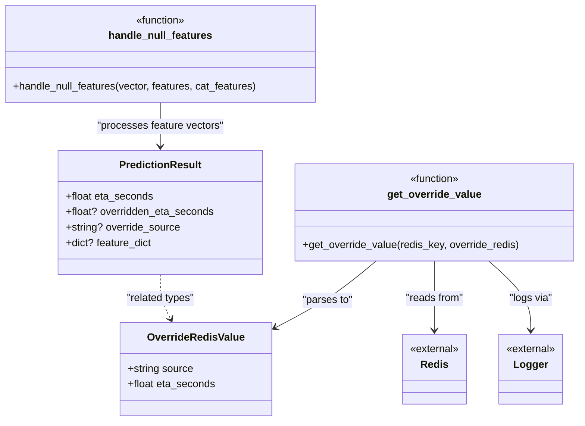

# Diagram: research/api_k8s/get_ai_eta/src/ai_models/common.py


> Auto-generated by Obscura crawlers

## Diagram 1



### SVG

<svg id="container" width="896.1796875" xmlns="http://www.w3.org/2000/svg" class="classDiagram" height="650" viewBox="0 0 896.1796875 650" role="graphics-document document" aria-roledescription="class"><style>#container{font-family:"trebuchet ms",verdana,arial,sans-serif;font-size:16px;fill:#333;}@keyframes edge-animation-frame{from{stroke-dashoffset:0;}}@keyframes dash{to{stroke-dashoffset:0;}}#container .edge-animation-slow{stroke-dasharray:9,5!important;stroke-dashoffset:900;animation:dash 50s linear infinite;stroke-linecap:round;}#container .edge-animation-fast{stroke-dasharray:9,5!important;stroke-dashoffset:900;animation:dash 20s linear infinite;stroke-linecap:round;}#container .error-icon{fill:#552222;}#container .error-text{fill:#552222;stroke:#552222;}#container .edge-thickness-normal{stroke-width:1px;}#container .edge-thickness-thick{stroke-width:3.5px;}#container .edge-pattern-solid{stroke-dasharray:0;}#container .edge-thickness-invisible{stroke-width:0;fill:none;}#container .edge-pattern-dashed{stroke-dasharray:3;}#container .edge-pattern-dotted{stroke-dasharray:2;}#container .marker{fill:#333333;stroke:#333333;}#container .marker.cross{stroke:#333333;}#container svg{font-family:"trebuchet ms",verdana,arial,sans-serif;font-size:16px;}#container p{margin:0;}#container g.classGroup text{fill:#9370DB;stroke:none;font-family:"trebuchet ms",verdana,arial,sans-serif;font-size:10px;}#container g.classGroup text .title{font-weight:bolder;}#container .nodeLabel,#container .edgeLabel{color:#131300;}#container .edgeLabel .label rect{fill:#ECECFF;}#container .label text{fill:#131300;}#container .labelBkg{background:#ECECFF;}#container .edgeLabel .label span{background:#ECECFF;}#container .classTitle{font-weight:bolder;}#container .node rect,#container .node circle,#container .node ellipse,#container .node polygon,#container .node path{fill:#ECECFF;stroke:#9370DB;stroke-width:1px;}#container .divider{stroke:#9370DB;stroke-width:1;}#container g.clickable{cursor:pointer;}#container g.classGroup rect{fill:#ECECFF;stroke:#9370DB;}#container g.classGroup line{stroke:#9370DB;stroke-width:1;}#container .classLabel .box{stroke:none;stroke-width:0;fill:#ECECFF;opacity:0.5;}#container .classLabel .label{fill:#9370DB;font-size:10px;}#container .relation{stroke:#333333;stroke-width:1;fill:none;}#container .dashed-line{stroke-dasharray:3;}#container .dotted-line{stroke-dasharray:1 2;}#container #compositionStart,#container .composition{fill:#333333!important;stroke:#333333!important;stroke-width:1;}#container #compositionEnd,#container .composition{fill:#333333!important;stroke:#333333!important;stroke-width:1;}#container #dependencyStart,#container .dependency{fill:#333333!important;stroke:#333333!important;stroke-width:1;}#container #dependencyStart,#container .dependency{fill:#333333!important;stroke:#333333!important;stroke-width:1;}#container #extensionStart,#container .extension{fill:transparent!important;stroke:#333333!important;stroke-width:1;}#container #extensionEnd,#container .extension{fill:transparent!important;stroke:#333333!important;stroke-width:1;}#container #aggregationStart,#container .aggregation{fill:transparent!important;stroke:#333333!important;stroke-width:1;}#container #aggregationEnd,#container .aggregation{fill:transparent!important;stroke:#333333!important;stroke-width:1;}#container #lollipopStart,#container .lollipop{fill:#ECECFF!important;stroke:#333333!important;stroke-width:1;}#container #lollipopEnd,#container .lollipop{fill:#ECECFF!important;stroke:#333333!important;stroke-width:1;}#container .edgeTerminals{font-size:11px;line-height:initial;}#container .classTitleText{text-anchor:middle;font-size:18px;fill:#333;}#container .label-icon{display:inline-block;height:1em;overflow:visible;vertical-align:-0.125em;}#container .node .label-icon path{fill:currentColor;stroke:revert;stroke-width:revert;}#container :root{--mermaid-font-family:"trebuchet ms",verdana,arial,sans-serif;}</style><g><defs><marker id="container_class-aggregationStart" class="marker aggregation class" refX="18" refY="7" markerWidth="190" markerHeight="240" orient="auto"><path d="M 18,7 L9,13 L1,7 L9,1 Z"></path></marker></defs><defs><marker id="container_class-aggregationEnd" class="marker aggregation class" refX="1" refY="7" markerWidth="20" markerHeight="28" orient="auto"><path d="M 18,7 L9,13 L1,7 L9,1 Z"></path></marker></defs><defs><marker id="container_class-extensionStart" class="marker extension class" refX="18" refY="7" markerWidth="190" markerHeight="240" orient="auto"><path d="M 1,7 L18,13 V 1 Z"></path></marker></defs><defs><marker id="container_class-extensionEnd" class="marker extension class" refX="1" refY="7" markerWidth="20" markerHeight="28" orient="auto"><path d="M 1,1 V 13 L18,7 Z"></path></marker></defs><defs><marker id="container_class-compositionStart" class="marker composition class" refX="18" refY="7" markerWidth="190" markerHeight="240" orient="auto"><path d="M 18,7 L9,13 L1,7 L9,1 Z"></path></marker></defs><defs><marker id="container_class-compositionEnd" class="marker composition class" refX="1" refY="7" markerWidth="20" markerHeight="28" orient="auto"><path d="M 18,7 L9,13 L1,7 L9,1 Z"></path></marker></defs><defs><marker id="container_class-dependencyStart" class="marker dependency class" refX="6" refY="7" markerWidth="190" markerHeight="240" orient="auto"><path d="M 5,7 L9,13 L1,7 L9,1 Z"></path></marker></defs><defs><marker id="container_class-dependencyEnd" class="marker dependency class" refX="13" refY="7" markerWidth="20" markerHeight="28" orient="auto"><path d="M 18,7 L9,13 L14,7 L9,1 Z"></path></marker></defs><defs><marker id="container_class-lollipopStart" class="marker lollipop class" refX="13" refY="7" markerWidth="190" markerHeight="240" orient="auto"><circle stroke="black" fill="transparent" cx="7" cy="7" r="6"></circle></marker></defs><defs><marker id="container_class-lollipopEnd" class="marker lollipop class" refX="1" refY="7" markerWidth="190" markerHeight="240" orient="auto"><circle stroke="black" fill="transparent" cx="7" cy="7" r="6"></circle></marker></defs><g class="root"><g class="clusters"></g><g class="edgePaths"><path d="M672.559,403L672.559,412.667C672.559,422.333,672.559,441.667,672.559,459.5C672.559,477.333,672.559,493.667,672.559,501.833L672.559,510" id="id_get_override_value_Redis_1" class="edge-thickness-normal edge-pattern-solid relation" style=";;;" data-edge="true" data-et="edge" data-id="id_get_override_value_Redis_1" data-points="W3sieCI6NjcyLjU1ODU5Mzc1LCJ5Ijo0MDN9LHsieCI6NjcyLjU1ODU5Mzc1LCJ5Ijo0NjF9LHsieCI6NjcyLjU1ODU5Mzc1LCJ5Ijo1MTZ9XQ==" marker-end="url(#container_class-dependencyEnd)"></path><path d="M581.862,403L570.172,412.667C558.482,422.333,535.102,441.667,509.33,458.798C483.557,475.93,455.392,490.859,441.31,498.324L427.227,505.789" id="id_get_override_value_OverrideRedisValue_2" class="edge-thickness-normal edge-pattern-solid relation" style=";;;" data-edge="true" data-et="edge" data-id="id_get_override_value_OverrideRedisValue_2" data-points="W3sieCI6NTgxLjg2MTYzNjUxMzE1NzksInkiOjQwM30seyJ4Ijo1MTEuNzIyNjU2MjUsInkiOjQ2MX0seyJ4Ijo0MjEuOTI1NzgxMjUsInkiOjUwOC41OTg3MjM0NTI3NTYzNn1d" marker-end="url(#container_class-dependencyEnd)"></path><path d="M757.885,403L768.883,412.667C779.88,422.333,801.876,441.667,812.873,459.5C823.871,477.333,823.871,493.667,823.871,501.833L823.871,510" id="id_get_override_value_Logger_3" class="edge-thickness-normal edge-pattern-solid relation" style=";;;" data-edge="true" data-et="edge" data-id="id_get_override_value_Logger_3" data-points="W3sieCI6NzU3Ljg4NTE5MTQ5NDM2MDksInkiOjQwM30seyJ4Ijo4MjMuODcxMDkzNzUsInkiOjQ2MX0seyJ4Ijo4MjMuODcxMDkzNzUsInkiOjUxNn1d" marker-end="url(#container_class-dependencyEnd)"></path><path d="M249.344,158L249.344,164.167C249.344,170.333,249.344,182.667,249.344,194C249.344,205.333,249.344,215.667,249.344,220.833L249.344,226" id="id_handle_null_features_PredictionResult_4" class="edge-thickness-normal edge-pattern-solid relation" style=";;;" data-edge="true" data-et="edge" data-id="id_handle_null_features_PredictionResult_4" data-points="W3sieCI6MjQ5LjM0Mzc1LCJ5IjoxNTh9LHsieCI6MjQ5LjM0Mzc1LCJ5IjoxOTV9LHsieCI6MjQ5LjM0Mzc1LCJ5IjoyMzJ9XQ==" marker-end="url(#container_class-dependencyEnd)"></path><path d="M249.344,424L249.344,430.167C249.344,436.333,249.344,448.667,252.092,460.113C254.841,471.559,260.338,482.119,263.087,487.398L265.836,492.678" id="id_PredictionResult_OverrideRedisValue_5" class="edge-thickness-normal edge-pattern-dashed relation" style=";;;" data-edge="true" data-et="edge" data-id="id_PredictionResult_OverrideRedisValue_5" data-points="W3sieCI6MjQ5LjM0Mzc1LCJ5Ijo0MjR9LHsieCI6MjQ5LjM0Mzc1LCJ5Ijo0NjF9LHsieCI6MjY4LjYwNjE4NTQ5MzExOTI2LCJ5Ijo0OTh9XQ==" marker-end="url(#container_class-dependencyEnd)"></path></g><g class="edgeLabels"><g class="edgeLabel" transform="translate(672.55859375, 461)"><g class="label" data-id="id_get_override_value_Redis_1" transform="translate(-45.484375, -12)"><foreignObject width="90.96875" height="24"><div xmlns="http://www.w3.org/1999/xhtml" class="labelBkg" style="display: table-cell; white-space: nowrap; line-height: 1.5; max-width: 200px; text-align: center;"><span class="edgeLabel"><p>"reads from"</p></span></div></foreignObject></g></g><g class="edgeLabel" transform="translate(507.03161, 463.48659)"><g class="label" data-id="id_get_override_value_OverrideRedisValue_2" transform="translate(-39.6953125, -12)"><foreignObject width="79.390625" height="24"><div xmlns="http://www.w3.org/1999/xhtml" class="labelBkg" style="display: table-cell; white-space: nowrap; line-height: 1.5; max-width: 200px; text-align: center;"><span class="edgeLabel"><p>"parses to"</p></span></div></foreignObject></g></g><g class="edgeLabel" transform="translate(823.87109375, 461)"><g class="label" data-id="id_get_override_value_Logger_3" transform="translate(-33.7890625, -12)"><foreignObject width="67.578125" height="24"><div xmlns="http://www.w3.org/1999/xhtml" class="labelBkg" style="display: table-cell; white-space: nowrap; line-height: 1.5; max-width: 200px; text-align: center;"><span class="edgeLabel"><p>"logs via"</p></span></div></foreignObject></g></g><g class="edgeLabel" transform="translate(249.34375, 195)"><g class="label" data-id="id_handle_null_features_PredictionResult_4" transform="translate(-98.5078125, -12)"><foreignObject width="197.015625" height="24"><div xmlns="http://www.w3.org/1999/xhtml" class="labelBkg" style="display: table-cell; white-space: nowrap; line-height: 1.5; max-width: 200px; text-align: center;"><span class="edgeLabel"><p>"processes feature vectors"</p></span></div></foreignObject></g></g><g class="edgeLabel" transform="translate(249.34375, 461)"><g class="label" data-id="id_PredictionResult_OverrideRedisValue_5" transform="translate(-53.796875, -12)"><foreignObject width="107.59375" height="24"><div xmlns="http://www.w3.org/1999/xhtml" class="labelBkg" style="display: table-cell; white-space: nowrap; line-height: 1.5; max-width: 200px; text-align: center;"><span class="edgeLabel"><p>"related types"</p></span></div></foreignObject></g></g></g><g class="nodes"><g class="node default" id="classId-PredictionResult-0" transform="translate(249.34375, 328)"><g class="basic label-container"><path d="M-157.59375 -96 L157.59375 -96 L157.59375 96 L-157.59375 96" stroke="none" stroke-width="0" fill="#ECECFF" style=""></path><path d="M-157.59375 -96 C-88.8309687334371 -96, -20.068187466874207 -96, 157.59375 -96 M-157.59375 -96 C-31.63314309899789 -96, 94.32746380200422 -96, 157.59375 -96 M157.59375 -96 C157.59375 -40.51335967003912, 157.59375 14.973280659921755, 157.59375 96 M157.59375 -96 C157.59375 -23.42031762798112, 157.59375 49.15936474403776, 157.59375 96 M157.59375 96 C67.73555505043934 96, -22.12263989912131 96, -157.59375 96 M157.59375 96 C52.84497552184067 96, -51.90379895631867 96, -157.59375 96 M-157.59375 96 C-157.59375 45.30043301868587, -157.59375 -5.399133962628255, -157.59375 -96 M-157.59375 96 C-157.59375 22.97685372111664, -157.59375 -50.04629255776672, -157.59375 -96" stroke="#9370DB" stroke-width="1.3" fill="none" stroke-dasharray="0 0" style=""></path></g><g class="annotation-group text" transform="translate(0, -72)"></g><g class="label-group text" transform="translate(-60.6875, -72)"><g class="label" style="font-weight: bolder" transform="translate(0,-12)"><foreignObject width="121.375" height="24"><div xmlns="http://www.w3.org/1999/xhtml" style="display: table-cell; white-space: nowrap; line-height: 1.5; max-width: 170px; text-align: center;"><span class="nodeLabel markdown-node-label" style=""><p>PredictionResult</p></span></div></foreignObject></g></g><g class="members-group text" transform="translate(-145.59375, -24)"><g class="label" style="" transform="translate(0,-12)"><foreignObject width="135.734375" height="24"><div xmlns="http://www.w3.org/1999/xhtml" style="display: table-cell; white-space: nowrap; line-height: 1.5; max-width: 193px; text-align: center;"><span class="nodeLabel markdown-node-label" style=""><p>+float eta_seconds</p></span></div></foreignObject></g><g class="label" style="" transform="translate(0,12)"><foreignObject width="230.5" height="24"><div xmlns="http://www.w3.org/1999/xhtml" style="display: table-cell; white-space: nowrap; line-height: 1.5; max-width: 288px; text-align: center;"><span class="nodeLabel markdown-node-label" style=""><p>+float? overridden_eta_seconds</p></span></div></foreignObject></g><g class="label" style="" transform="translate(0,36)"><foreignObject width="177.71875" height="24"><div xmlns="http://www.w3.org/1999/xhtml" style="display: table-cell; white-space: nowrap; line-height: 1.5; max-width: 235px; text-align: center;"><span class="nodeLabel markdown-node-label" style=""><p>+string? override_source</p></span></div></foreignObject></g><g class="label" style="" transform="translate(0,60)"><foreignObject width="133.75" height="24"><div xmlns="http://www.w3.org/1999/xhtml" style="display: table-cell; white-space: nowrap; line-height: 1.5; max-width: 191px; text-align: center;"><span class="nodeLabel markdown-node-label" style=""><p>+dict? feature_dict</p></span></div></foreignObject></g></g><g class="methods-group text" transform="translate(-145.59375, 96)"></g><g class="divider" style=""><path d="M-157.59375 -48 C-52.31391109887042 -48, 52.96592780225916 -48, 157.59375 -48 M-157.59375 -48 C-37.50552973751371 -48, 82.58269052497258 -48, 157.59375 -48" stroke="#9370DB" stroke-width="1.3" fill="none" stroke-dasharray="0 0" style=""></path></g><g class="divider" style=""><path d="M-157.59375 72 C-43.653379911311575 72, 70.28699017737685 72, 157.59375 72 M-157.59375 72 C-36.774203202835935 72, 84.04534359432813 72, 157.59375 72" stroke="#9370DB" stroke-width="1.3" fill="none" stroke-dasharray="0 0" style=""></path></g></g><g class="node default" id="classId-OverrideRedisValue-1" transform="translate(306.08984375, 570)"><g class="basic label-container"><path d="M-115.8359375 -72 L115.8359375 -72 L115.8359375 72 L-115.8359375 72" stroke="none" stroke-width="0" fill="#ECECFF" style=""></path><path d="M-115.8359375 -72 C-55.55002935414031 -72, 4.7358787917193865 -72, 115.8359375 -72 M-115.8359375 -72 C-60.909611048986534 -72, -5.983284597973068 -72, 115.8359375 -72 M115.8359375 -72 C115.8359375 -31.05964832906826, 115.8359375 9.88070334186348, 115.8359375 72 M115.8359375 -72 C115.8359375 -22.608515985616606, 115.8359375 26.78296802876679, 115.8359375 72 M115.8359375 72 C39.63149153426785 72, -36.5729544314643 72, -115.8359375 72 M115.8359375 72 C59.944096250864334 72, 4.052255001728668 72, -115.8359375 72 M-115.8359375 72 C-115.8359375 26.629071201059382, -115.8359375 -18.741857597881236, -115.8359375 -72 M-115.8359375 72 C-115.8359375 22.32186579139345, -115.8359375 -27.3562684172131, -115.8359375 -72" stroke="#9370DB" stroke-width="1.3" fill="none" stroke-dasharray="0 0" style=""></path></g><g class="annotation-group text" transform="translate(0, -48)"></g><g class="label-group text" transform="translate(-71.9375, -48)"><g class="label" style="font-weight: bolder" transform="translate(0,-12)"><foreignObject width="143.875" height="24"><div xmlns="http://www.w3.org/1999/xhtml" style="display: table-cell; white-space: nowrap; line-height: 1.5; max-width: 192px; text-align: center;"><span class="nodeLabel markdown-node-label" style=""><p>OverrideRedisValue</p></span></div></foreignObject></g></g><g class="members-group text" transform="translate(-103.8359375, 0)"><g class="label" style="" transform="translate(0,-12)"><foreignObject width="101.734375" height="24"><div xmlns="http://www.w3.org/1999/xhtml" style="display: table-cell; white-space: nowrap; line-height: 1.5; max-width: 159px; text-align: center;"><span class="nodeLabel markdown-node-label" style=""><p>+string source</p></span></div></foreignObject></g><g class="label" style="" transform="translate(0,12)"><foreignObject width="135.734375" height="24"><div xmlns="http://www.w3.org/1999/xhtml" style="display: table-cell; white-space: nowrap; line-height: 1.5; max-width: 193px; text-align: center;"><span class="nodeLabel markdown-node-label" style=""><p>+float eta_seconds</p></span></div></foreignObject></g></g><g class="methods-group text" transform="translate(-103.8359375, 72)"></g><g class="divider" style=""><path d="M-115.8359375 -24 C-45.86558182585691 -24, 24.104773848286186 -24, 115.8359375 -24 M-115.8359375 -24 C-66.13619830511277 -24, -16.436459110225556 -24, 115.8359375 -24" stroke="#9370DB" stroke-width="1.3" fill="none" stroke-dasharray="0 0" style=""></path></g><g class="divider" style=""><path d="M-115.8359375 48 C-24.311946177895578 48, 67.21204514420884 48, 115.8359375 48 M-115.8359375 48 C-32.04721342400313 48, 51.741510651993735 48, 115.8359375 48" stroke="#9370DB" stroke-width="1.3" fill="none" stroke-dasharray="0 0" style=""></path></g></g><g class="node default" id="classId-Redis-2" transform="translate(672.55859375, 570)"><g class="basic label-container"><path d="M-50.65625 -54 L50.65625 -54 L50.65625 54 L-50.65625 54" stroke="none" stroke-width="0" fill="#ECECFF" style=""></path><path d="M-50.65625 -54 C-13.75330399892735 -54, 23.1496420021453 -54, 50.65625 -54 M-50.65625 -54 C-15.048584207682481 -54, 20.559081584635038 -54, 50.65625 -54 M50.65625 -54 C50.65625 -18.514490874020012, 50.65625 16.971018251959975, 50.65625 54 M50.65625 -54 C50.65625 -20.541401102536057, 50.65625 12.917197794927887, 50.65625 54 M50.65625 54 C18.5540540403752 54, -13.548141919249602 54, -50.65625 54 M50.65625 54 C16.353429192584343 54, -17.949391614831313 54, -50.65625 54 M-50.65625 54 C-50.65625 28.568972032523224, -50.65625 3.1379440650464474, -50.65625 -54 M-50.65625 54 C-50.65625 22.558415486394438, -50.65625 -8.883169027211125, -50.65625 -54" stroke="#9370DB" stroke-width="1.3" fill="none" stroke-dasharray="0 0" style=""></path></g><g class="annotation-group text" transform="translate(-38.65625, -30)"><g class="label" style="" transform="translate(0,-12)"><foreignObject width="77.3125" height="24"><div xmlns="http://www.w3.org/1999/xhtml" style="display: table-cell; white-space: nowrap; line-height: 1.5; max-width: 127px; text-align: center;"><span class="nodeLabel markdown-node-label" style=""><p>«external»</p></span></div></foreignObject></g></g><g class="label-group text" transform="translate(-20.15625, -6)"><g class="label" style="font-weight: bolder" transform="translate(0,-12)"><foreignObject width="40.3125" height="24"><div xmlns="http://www.w3.org/1999/xhtml" style="display: table-cell; white-space: nowrap; line-height: 1.5; max-width: 90px; text-align: center;"><span class="nodeLabel markdown-node-label" style=""><p>Redis</p></span></div></foreignObject></g></g><g class="members-group text" transform="translate(-38.65625, 42)"></g><g class="methods-group text" transform="translate(-38.65625, 72)"></g><g class="divider" style=""><path d="M-50.65625 18 C-10.59249573714952 18, 29.47125852570096 18, 50.65625 18 M-50.65625 18 C-12.356361857053798 18, 25.943526285892403 18, 50.65625 18" stroke="#9370DB" stroke-width="1.3" fill="none" stroke-dasharray="0 0" style=""></path></g><g class="divider" style=""><path d="M-50.65625 36 C-29.401092503781552 36, -8.145935007563104 36, 50.65625 36 M-50.65625 36 C-24.36572727362245 36, 1.9247954527550988 36, 50.65625 36" stroke="#9370DB" stroke-width="1.3" fill="none" stroke-dasharray="0 0" style=""></path></g></g><g class="node default" id="classId-Logger-3" transform="translate(823.87109375, 570)"><g class="basic label-container"><path d="M-50.65625 -54 L50.65625 -54 L50.65625 54 L-50.65625 54" stroke="none" stroke-width="0" fill="#ECECFF" style=""></path><path d="M-50.65625 -54 C-18.144816472427017 -54, 14.366617055145966 -54, 50.65625 -54 M-50.65625 -54 C-16.967244160028024 -54, 16.721761679943953 -54, 50.65625 -54 M50.65625 -54 C50.65625 -18.821622550796633, 50.65625 16.356754898406734, 50.65625 54 M50.65625 -54 C50.65625 -16.236421222376322, 50.65625 21.527157555247356, 50.65625 54 M50.65625 54 C22.103835603360903 54, -6.448578793278195 54, -50.65625 54 M50.65625 54 C14.901045810797726 54, -20.85415837840455 54, -50.65625 54 M-50.65625 54 C-50.65625 12.635937074379711, -50.65625 -28.728125851240577, -50.65625 -54 M-50.65625 54 C-50.65625 30.90845901582167, -50.65625 7.81691803164334, -50.65625 -54" stroke="#9370DB" stroke-width="1.3" fill="none" stroke-dasharray="0 0" style=""></path></g><g class="annotation-group text" transform="translate(-38.65625, -30)"><g class="label" style="" transform="translate(0,-12)"><foreignObject width="77.3125" height="24"><div xmlns="http://www.w3.org/1999/xhtml" style="display: table-cell; white-space: nowrap; line-height: 1.5; max-width: 127px; text-align: center;"><span class="nodeLabel markdown-node-label" style=""><p>«external»</p></span></div></foreignObject></g></g><g class="label-group text" transform="translate(-24.84375, -6)"><g class="label" style="font-weight: bolder" transform="translate(0,-12)"><foreignObject width="49.6875" height="24"><div xmlns="http://www.w3.org/1999/xhtml" style="display: table-cell; white-space: nowrap; line-height: 1.5; max-width: 99px; text-align: center;"><span class="nodeLabel markdown-node-label" style=""><p>Logger</p></span></div></foreignObject></g></g><g class="members-group text" transform="translate(-38.65625, 42)"></g><g class="methods-group text" transform="translate(-38.65625, 72)"></g><g class="divider" style=""><path d="M-50.65625 18 C-12.77246207477873 18, 25.11132585044254 18, 50.65625 18 M-50.65625 18 C-17.209713838911263 18, 16.236822322177474 18, 50.65625 18" stroke="#9370DB" stroke-width="1.3" fill="none" stroke-dasharray="0 0" style=""></path></g><g class="divider" style=""><path d="M-50.65625 36 C-13.159718769144135 36, 24.33681246171173 36, 50.65625 36 M-50.65625 36 C-16.944455219306953 36, 16.767339561386095 36, 50.65625 36" stroke="#9370DB" stroke-width="1.3" fill="none" stroke-dasharray="0 0" style=""></path></g></g><g class="node default" id="classId-get_override_value-4" transform="translate(672.55859375, 328)"><g class="basic label-container"><path d="M-215.62109375 -75 L215.62109375 -75 L215.62109375 75 L-215.62109375 75" stroke="none" stroke-width="0" fill="#ECECFF" style=""></path><path d="M-215.62109375 -75 C-47.844816805811064 -75, 119.93146013837787 -75, 215.62109375 -75 M-215.62109375 -75 C-99.62514121100025 -75, 16.37081132799949 -75, 215.62109375 -75 M215.62109375 -75 C215.62109375 -18.69879907414392, 215.62109375 37.60240185171216, 215.62109375 75 M215.62109375 -75 C215.62109375 -24.98827664473398, 215.62109375 25.023446710532042, 215.62109375 75 M215.62109375 75 C54.62984160723576 75, -106.36141053552848 75, -215.62109375 75 M215.62109375 75 C87.98730769409869 75, -39.64647836180262 75, -215.62109375 75 M-215.62109375 75 C-215.62109375 22.665908278961894, -215.62109375 -29.668183442076213, -215.62109375 -75 M-215.62109375 75 C-215.62109375 39.5073163034838, -215.62109375 4.014632606967595, -215.62109375 -75" stroke="#9370DB" stroke-width="1.3" fill="none" stroke-dasharray="0 0" style=""></path></g><g class="annotation-group text" transform="translate(-39.484375, -51)"><g class="label" style="" transform="translate(0,-12)"><foreignObject width="78.96875" height="24"><div xmlns="http://www.w3.org/1999/xhtml" style="display: table-cell; white-space: nowrap; line-height: 1.5; max-width: 129px; text-align: center;"><span class="nodeLabel markdown-node-label" style=""><p>«function»</p></span></div></foreignObject></g></g><g class="label-group text" transform="translate(-70.0546875, -27)"><g class="label" style="font-weight: bolder" transform="translate(0,-12)"><foreignObject width="140.109375" height="24"><div xmlns="http://www.w3.org/1999/xhtml" style="display: table-cell; white-space: nowrap; line-height: 1.5; max-width: 188px; text-align: center;"><span class="nodeLabel markdown-node-label" style=""><p>get_override_value</p></span></div></foreignObject></g></g><g class="members-group text" transform="translate(-203.62109375, 21)"></g><g class="methods-group text" transform="translate(-203.62109375, 51)"><g class="label" style="" transform="translate(0,-12)"><foreignObject width="337.1875" height="24"><div xmlns="http://www.w3.org/1999/xhtml" style="display: table-cell; white-space: nowrap; line-height: 1.5; max-width: 395px; text-align: center;"><span class="nodeLabel markdown-node-label" style=""><p>+get_override_value(redis_key, override_redis)</p></span></div></foreignObject></g></g><g class="divider" style=""><path d="M-215.62109375 -3 C-51.953076233300976 -3, 111.71494128339805 -3, 215.62109375 -3 M-215.62109375 -3 C-62.952483496965755 -3, 89.71612675606849 -3, 215.62109375 -3" stroke="#9370DB" stroke-width="1.3" fill="none" stroke-dasharray="0 0" style=""></path></g><g class="divider" style=""><path d="M-215.62109375 21 C-108.17634220425393 21, -0.7315906585078551 21, 215.62109375 21 M-215.62109375 21 C-58.15855737945668 21, 99.30397899108664 21, 215.62109375 21" stroke="#9370DB" stroke-width="1.3" fill="none" stroke-dasharray="0 0" style=""></path></g></g><g class="node default" id="classId-handle_null_features-5" transform="translate(249.34375, 83)"><g class="basic label-container"><path d="M-241.34375 -75 L241.34375 -75 L241.34375 75 L-241.34375 75" stroke="none" stroke-width="0" fill="#ECECFF" style=""></path><path d="M-241.34375 -75 C-98.61001927377717 -75, 44.12371145244566 -75, 241.34375 -75 M-241.34375 -75 C-78.45895241680631 -75, 84.42584516638738 -75, 241.34375 -75 M241.34375 -75 C241.34375 -37.57450470295278, 241.34375 -0.14900940590555933, 241.34375 75 M241.34375 -75 C241.34375 -17.461264627671802, 241.34375 40.077470744656395, 241.34375 75 M241.34375 75 C93.87146419323207 75, -53.60082161353586 75, -241.34375 75 M241.34375 75 C84.98100133973739 75, -71.38174732052522 75, -241.34375 75 M-241.34375 75 C-241.34375 42.70265218392982, -241.34375 10.405304367859642, -241.34375 -75 M-241.34375 75 C-241.34375 38.63281123940662, -241.34375 2.265622478813242, -241.34375 -75" stroke="#9370DB" stroke-width="1.3" fill="none" stroke-dasharray="0 0" style=""></path></g><g class="annotation-group text" transform="translate(-39.484375, -51)"><g class="label" style="" transform="translate(0,-12)"><foreignObject width="78.96875" height="24"><div xmlns="http://www.w3.org/1999/xhtml" style="display: table-cell; white-space: nowrap; line-height: 1.5; max-width: 129px; text-align: center;"><span class="nodeLabel markdown-node-label" style=""><p>«function»</p></span></div></foreignObject></g></g><g class="label-group text" transform="translate(-77.515625, -27)"><g class="label" style="font-weight: bolder" transform="translate(0,-12)"><foreignObject width="155.03125" height="24"><div xmlns="http://www.w3.org/1999/xhtml" style="display: table-cell; white-space: nowrap; line-height: 1.5; max-width: 204px; text-align: center;"><span class="nodeLabel markdown-node-label" style=""><p>handle_null_features</p></span></div></foreignObject></g></g><g class="members-group text" transform="translate(-229.34375, 21)"></g><g class="methods-group text" transform="translate(-229.34375, 51)"><g class="label" style="" transform="translate(0,-12)"><foreignObject width="381.171875" height="24"><div xmlns="http://www.w3.org/1999/xhtml" style="display: table-cell; white-space: nowrap; line-height: 1.5; max-width: 439px; text-align: center;"><span class="nodeLabel markdown-node-label" style=""><p>+handle_null_features(vector, features, cat_features)</p></span></div></foreignObject></g></g><g class="divider" style=""><path d="M-241.34375 -3 C-113.79694465448668 -3, 13.74986069102664 -3, 241.34375 -3 M-241.34375 -3 C-64.5996992941744 -3, 112.1443514116512 -3, 241.34375 -3" stroke="#9370DB" stroke-width="1.3" fill="none" stroke-dasharray="0 0" style=""></path></g><g class="divider" style=""><path d="M-241.34375 21 C-104.99024056894459 21, 31.36326886211083 21, 241.34375 21 M-241.34375 21 C-97.47871340971278 21, 46.386323180574436 21, 241.34375 21" stroke="#9370DB" stroke-width="1.3" fill="none" stroke-dasharray="0 0" style=""></path></g></g></g></g></g></svg>

## Diagram 2

```mermaid
flowchart TD
    A([Start: get_override_value(redis_key, override_redis)]) --> B[logger.debug("redis key")]
    B --> C[await override_redis.get(redis_key)]
    C --> D{redis_value present?}
    D -- No --> E[return None]
    D -- Yes --> F[try parse OverrideRedisValue.model_validate_json(redis_value)]
    F --> G{parsed successfully?}
    G -- Yes --> H[logger.debug(parsed_redis_value)]
    H --> I[return parsed_redis_value]
    G -- No --> J[logger.exception("Error parsing override value")]
    J --> K[return None]
```

> SVG rendering failed for this diagram.

## Diagram 3

```mermaid
flowchart TD
    A([Start: handle_null_features(vector, features, cat_features)]) --> B[for ix in range(len(features))]
    B --> C[feat = features[ix]; val = vector[ix]]
    C --> D{val == "-1"?}
    D -- Yes and feat in cat_features --> E[vector[ix] = str(np.nan)]
    D -- Yes and feat not in cat_features --> F[vector[ix] = np.nan]
    D -- No --> G{str(val) in ["nan","None"]?}
    G -- Yes and feat in cat_features --> E
    G -- Yes and feat not in cat_features --> F
    G -- No --> H[no change]
    E --> I[continue loop]
    F --> I
    H --> I
    I --> B
    B --> J([End: return vector])
```

> SVG rendering failed for this diagram.
