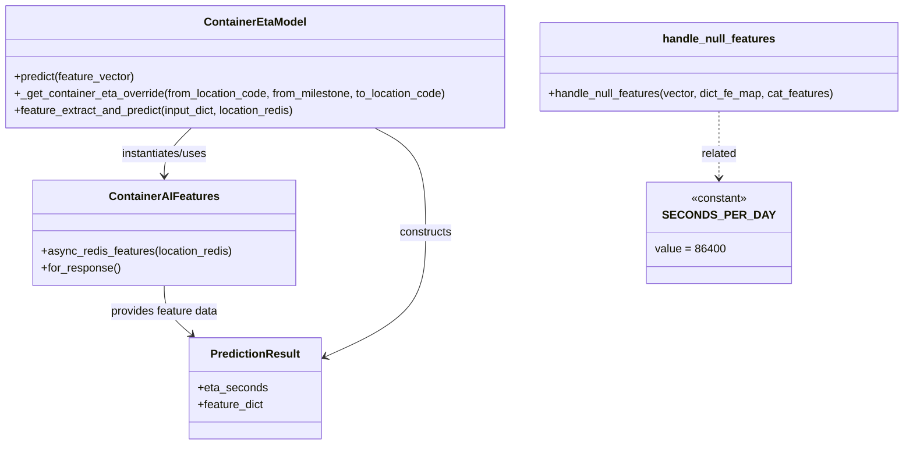

# Diagram: research/api_k8s/get_ai_eta/src/ai_models/container_eta_ai_model.py


> Auto-generated by Obscura crawlers

## Diagram 1



### SVG

<svg id="container" width="1295.59375" xmlns="http://www.w3.org/2000/svg" class="classDiagram" height="632" viewBox="0 0 1295.59375 632" role="graphics-document document" aria-roledescription="class"><style>#container{font-family:"trebuchet ms",verdana,arial,sans-serif;font-size:16px;fill:#333;}@keyframes edge-animation-frame{from{stroke-dashoffset:0;}}@keyframes dash{to{stroke-dashoffset:0;}}#container .edge-animation-slow{stroke-dasharray:9,5!important;stroke-dashoffset:900;animation:dash 50s linear infinite;stroke-linecap:round;}#container .edge-animation-fast{stroke-dasharray:9,5!important;stroke-dashoffset:900;animation:dash 20s linear infinite;stroke-linecap:round;}#container .error-icon{fill:#552222;}#container .error-text{fill:#552222;stroke:#552222;}#container .edge-thickness-normal{stroke-width:1px;}#container .edge-thickness-thick{stroke-width:3.5px;}#container .edge-pattern-solid{stroke-dasharray:0;}#container .edge-thickness-invisible{stroke-width:0;fill:none;}#container .edge-pattern-dashed{stroke-dasharray:3;}#container .edge-pattern-dotted{stroke-dasharray:2;}#container .marker{fill:#333333;stroke:#333333;}#container .marker.cross{stroke:#333333;}#container svg{font-family:"trebuchet ms",verdana,arial,sans-serif;font-size:16px;}#container p{margin:0;}#container g.classGroup text{fill:#9370DB;stroke:none;font-family:"trebuchet ms",verdana,arial,sans-serif;font-size:10px;}#container g.classGroup text .title{font-weight:bolder;}#container .nodeLabel,#container .edgeLabel{color:#131300;}#container .edgeLabel .label rect{fill:#ECECFF;}#container .label text{fill:#131300;}#container .labelBkg{background:#ECECFF;}#container .edgeLabel .label span{background:#ECECFF;}#container .classTitle{font-weight:bolder;}#container .node rect,#container .node circle,#container .node ellipse,#container .node polygon,#container .node path{fill:#ECECFF;stroke:#9370DB;stroke-width:1px;}#container .divider{stroke:#9370DB;stroke-width:1;}#container g.clickable{cursor:pointer;}#container g.classGroup rect{fill:#ECECFF;stroke:#9370DB;}#container g.classGroup line{stroke:#9370DB;stroke-width:1;}#container .classLabel .box{stroke:none;stroke-width:0;fill:#ECECFF;opacity:0.5;}#container .classLabel .label{fill:#9370DB;font-size:10px;}#container .relation{stroke:#333333;stroke-width:1;fill:none;}#container .dashed-line{stroke-dasharray:3;}#container .dotted-line{stroke-dasharray:1 2;}#container #compositionStart,#container .composition{fill:#333333!important;stroke:#333333!important;stroke-width:1;}#container #compositionEnd,#container .composition{fill:#333333!important;stroke:#333333!important;stroke-width:1;}#container #dependencyStart,#container .dependency{fill:#333333!important;stroke:#333333!important;stroke-width:1;}#container #dependencyStart,#container .dependency{fill:#333333!important;stroke:#333333!important;stroke-width:1;}#container #extensionStart,#container .extension{fill:transparent!important;stroke:#333333!important;stroke-width:1;}#container #extensionEnd,#container .extension{fill:transparent!important;stroke:#333333!important;stroke-width:1;}#container #aggregationStart,#container .aggregation{fill:transparent!important;stroke:#333333!important;stroke-width:1;}#container #aggregationEnd,#container .aggregation{fill:transparent!important;stroke:#333333!important;stroke-width:1;}#container #lollipopStart,#container .lollipop{fill:#ECECFF!important;stroke:#333333!important;stroke-width:1;}#container #lollipopEnd,#container .lollipop{fill:#ECECFF!important;stroke:#333333!important;stroke-width:1;}#container .edgeTerminals{font-size:11px;line-height:initial;}#container .classTitleText{text-anchor:middle;font-size:18px;fill:#333;}#container .label-icon{display:inline-block;height:1em;overflow:visible;vertical-align:-0.125em;}#container .node .label-icon path{fill:currentColor;stroke:revert;stroke-width:revert;}#container :root{--mermaid-font-family:"trebuchet ms",verdana,arial,sans-serif;}</style><g><defs><marker id="container_class-aggregationStart" class="marker aggregation class" refX="18" refY="7" markerWidth="190" markerHeight="240" orient="auto"><path d="M 18,7 L9,13 L1,7 L9,1 Z"></path></marker></defs><defs><marker id="container_class-aggregationEnd" class="marker aggregation class" refX="1" refY="7" markerWidth="20" markerHeight="28" orient="auto"><path d="M 18,7 L9,13 L1,7 L9,1 Z"></path></marker></defs><defs><marker id="container_class-extensionStart" class="marker extension class" refX="18" refY="7" markerWidth="190" markerHeight="240" orient="auto"><path d="M 1,7 L18,13 V 1 Z"></path></marker></defs><defs><marker id="container_class-extensionEnd" class="marker extension class" refX="1" refY="7" markerWidth="20" markerHeight="28" orient="auto"><path d="M 1,1 V 13 L18,7 Z"></path></marker></defs><defs><marker id="container_class-compositionStart" class="marker composition class" refX="18" refY="7" markerWidth="190" markerHeight="240" orient="auto"><path d="M 18,7 L9,13 L1,7 L9,1 Z"></path></marker></defs><defs><marker id="container_class-compositionEnd" class="marker composition class" refX="1" refY="7" markerWidth="20" markerHeight="28" orient="auto"><path d="M 18,7 L9,13 L1,7 L9,1 Z"></path></marker></defs><defs><marker id="container_class-dependencyStart" class="marker dependency class" refX="6" refY="7" markerWidth="190" markerHeight="240" orient="auto"><path d="M 5,7 L9,13 L1,7 L9,1 Z"></path></marker></defs><defs><marker id="container_class-dependencyEnd" class="marker dependency class" refX="13" refY="7" markerWidth="20" markerHeight="28" orient="auto"><path d="M 18,7 L9,13 L14,7 L9,1 Z"></path></marker></defs><defs><marker id="container_class-lollipopStart" class="marker lollipop class" refX="13" refY="7" markerWidth="190" markerHeight="240" orient="auto"><circle stroke="black" fill="transparent" cx="7" cy="7" r="6"></circle></marker></defs><defs><marker id="container_class-lollipopEnd" class="marker lollipop class" refX="1" refY="7" markerWidth="190" markerHeight="240" orient="auto"><circle stroke="black" fill="transparent" cx="7" cy="7" r="6"></circle></marker></defs><g class="root"><g class="clusters"></g><g class="edgePaths"><path d="M275.858,182L269.427,188.167C262.997,194.333,250.136,206.667,243.706,218C237.275,229.333,237.275,239.667,237.275,244.833L237.275,250" id="id_ContainerEtaModel_ContainerAIFeatures_1" class="edge-thickness-normal edge-pattern-solid relation" style=";;;" data-edge="true" data-et="edge" data-id="id_ContainerEtaModel_ContainerAIFeatures_1" data-points="W3sieCI6Mjc1Ljg1NzY1ODE0MDEyMSwieSI6MTgyfSx7IngiOjIzNy4yNzUzOTA2MjUsInkiOjIxOX0seyJ4IjoyMzcuMjc1MzkwNjI1LCJ5IjoyNTZ9XQ==" marker-end="url(#container_class-dependencyEnd)"></path><path d="M540.389,182L552.709,188.167C565.029,194.333,589.669,206.667,601.989,231.5C614.309,256.333,614.309,293.667,614.309,331C614.309,368.333,614.309,405.667,589.217,435.374C564.125,465.081,513.941,487.161,488.849,498.201L463.758,509.242" id="id_ContainerEtaModel_PredictionResult_2" class="edge-thickness-normal edge-pattern-solid relation" style=";;;" data-edge="true" data-et="edge" data-id="id_ContainerEtaModel_PredictionResult_2" data-points="W3sieCI6NTQwLjM4OTAxODM5NzE3NzQsInkiOjE4Mn0seyJ4Ijo2MTQuMzA4NTkzNzUsInkiOjIxOX0seyJ4Ijo2MTQuMzA4NTkzNzUsInkiOjMzMX0seyJ4Ijo2MTQuMzA4NTkzNzUsInkiOjQ0M30seyJ4Ijo0NTguMjY1NjI1LCJ5Ijo1MTEuNjU4MDIwNDY3MDUyNDR9XQ==" marker-end="url(#container_class-dependencyEnd)"></path><path d="M1031.375,158L1031.375,168.167C1031.375,178.333,1031.375,198.667,1031.375,214.5C1031.375,230.333,1031.375,241.667,1031.375,247.333L1031.375,253" id="id_handle_null_features_SECONDS_PER_DAY_3" class="edge-thickness-normal edge-pattern-dashed relation" style=";;;" data-edge="true" data-et="edge" data-id="id_handle_null_features_SECONDS_PER_DAY_3" data-points="W3sieCI6MTAzMS4zNzUsInkiOjE1OH0seyJ4IjoxMDMxLjM3NSwieSI6MjE5fSx7IngiOjEwMzEuMzc1LCJ5IjoyNTl9XQ==" marker-end="url(#container_class-dependencyEnd)"></path><path d="M237.275,406L237.275,412.167C237.275,418.333,237.275,430.667,243.826,442.355C250.377,454.044,263.478,465.089,270.029,470.611L276.58,476.133" id="id_ContainerAIFeatures_PredictionResult_4" class="edge-thickness-normal edge-pattern-solid relation" style=";;;" data-edge="true" data-et="edge" data-id="id_ContainerAIFeatures_PredictionResult_4" data-points="W3sieCI6MjM3LjI3NTM5MDYyNSwieSI6NDA2fSx7IngiOjIzNy4yNzUzOTA2MjUsInkiOjQ0M30seyJ4IjoyODEuMTY3MTQ0NDk1NDEyODYsInkiOjQ4MH1d" marker-end="url(#container_class-dependencyEnd)"></path></g><g class="edgeLabels"><g class="edgeLabel" transform="translate(237.275390625, 219)"><g class="label" data-id="id_ContainerEtaModel_ContainerAIFeatures_1" transform="translate(-63.3203125, -12)"><foreignObject width="126.640625" height="24"><div xmlns="http://www.w3.org/1999/xhtml" class="labelBkg" style="display: table-cell; white-space: nowrap; line-height: 1.5; max-width: 200px; text-align: center;"><span class="edgeLabel"><p>instantiates/uses</p></span></div></foreignObject></g></g><g class="edgeLabel" transform="translate(614.30859375, 331)"><g class="label" data-id="id_ContainerEtaModel_PredictionResult_2" transform="translate(-37.84375, -12)"><foreignObject width="75.6875" height="24"><div xmlns="http://www.w3.org/1999/xhtml" class="labelBkg" style="display: table-cell; white-space: nowrap; line-height: 1.5; max-width: 200px; text-align: center;"><span class="edgeLabel"><p>constructs</p></span></div></foreignObject></g></g><g class="edgeLabel" transform="translate(1031.375, 219)"><g class="label" data-id="id_handle_null_features_SECONDS_PER_DAY_3" transform="translate(-25.78125, -12)"><foreignObject width="51.5625" height="24"><div xmlns="http://www.w3.org/1999/xhtml" class="labelBkg" style="display: table-cell; white-space: nowrap; line-height: 1.5; max-width: 200px; text-align: center;"><span class="edgeLabel"><p>related</p></span></div></foreignObject></g></g><g class="edgeLabel" transform="translate(237.275390625, 443)"><g class="label" data-id="id_ContainerAIFeatures_PredictionResult_4" transform="translate(-77.859375, -12)"><foreignObject width="155.71875" height="24"><div xmlns="http://www.w3.org/1999/xhtml" class="labelBkg" style="display: table-cell; white-space: nowrap; line-height: 1.5; max-width: 200px; text-align: center;"><span class="edgeLabel"><p>provides feature data</p></span></div></foreignObject></g></g></g><g class="nodes"><g class="node default" id="classId-ContainerEtaModel-0" transform="translate(366.578125, 95)"><g class="basic label-container"><path d="M-358.578125 -87 L358.578125 -87 L358.578125 87 L-358.578125 87" stroke="none" stroke-width="0" fill="#ECECFF" style=""></path><path d="M-358.578125 -87 C-194.19599762355827 -87, -29.81387024711654 -87, 358.578125 -87 M-358.578125 -87 C-200.52731932608992 -87, -42.47651365217985 -87, 358.578125 -87 M358.578125 -87 C358.578125 -42.953971994701, 358.578125 1.0920560105980002, 358.578125 87 M358.578125 -87 C358.578125 -44.218708436619444, 358.578125 -1.4374168732388881, 358.578125 87 M358.578125 87 C76.22597527032724 87, -206.12617445934552 87, -358.578125 87 M358.578125 87 C85.6608166903581 87, -187.2564916192838 87, -358.578125 87 M-358.578125 87 C-358.578125 40.9247865814224, -358.578125 -5.1504268371551944, -358.578125 -87 M-358.578125 87 C-358.578125 23.944680831863863, -358.578125 -39.110638336272274, -358.578125 -87" stroke="#9370DB" stroke-width="1.3" fill="none" stroke-dasharray="0 0" style=""></path></g><g class="annotation-group text" transform="translate(0, -63)"></g><g class="label-group text" transform="translate(-69.59375, -63)"><g class="label" style="font-weight: bolder" transform="translate(0,-12)"><foreignObject width="139.1875" height="24"><div xmlns="http://www.w3.org/1999/xhtml" style="display: table-cell; white-space: nowrap; line-height: 1.5; max-width: 188px; text-align: center;"><span class="nodeLabel markdown-node-label" style=""><p>ContainerEtaModel</p></span></div></foreignObject></g></g><g class="members-group text" transform="translate(-346.578125, -15)"></g><g class="methods-group text" transform="translate(-346.578125, 15)"><g class="label" style="" transform="translate(0,-12)"><foreignObject width="174.5" height="24"><div xmlns="http://www.w3.org/1999/xhtml" style="display: table-cell; white-space: nowrap; line-height: 1.5; max-width: 232px; text-align: center;"><span class="nodeLabel markdown-node-label" style=""><p>+predict(feature_vector)</p></span></div></foreignObject></g><g class="label" style="" transform="translate(0,12)"><foreignObject width="623.5625" height="24"><div xmlns="http://www.w3.org/1999/xhtml" style="display: table-cell; white-space: nowrap; line-height: 1.5; max-width: 681px; text-align: center;"><span class="nodeLabel markdown-node-label" style=""><p>+_get_container_eta_override(from_location_code, from_milestone, to_location_code)</p></span></div></foreignObject></g><g class="label" style="" transform="translate(0,36)"><foreignObject width="408.578125" height="24"><div xmlns="http://www.w3.org/1999/xhtml" style="display: table-cell; white-space: nowrap; line-height: 1.5; max-width: 466px; text-align: center;"><span class="nodeLabel markdown-node-label" style=""><p>+feature_extract_and_predict(input_dict, location_redis)</p></span></div></foreignObject></g></g><g class="divider" style=""><path d="M-358.578125 -39 C-169.24874900473162 -39, 20.080626990536757 -39, 358.578125 -39 M-358.578125 -39 C-141.63529879113906 -39, 75.30752741772187 -39, 358.578125 -39" stroke="#9370DB" stroke-width="1.3" fill="none" stroke-dasharray="0 0" style=""></path></g><g class="divider" style=""><path d="M-358.578125 -15 C-170.98534187331995 -15, 16.607441253360093 -15, 358.578125 -15 M-358.578125 -15 C-85.10030037646357 -15, 188.37752424707287 -15, 358.578125 -15" stroke="#9370DB" stroke-width="1.3" fill="none" stroke-dasharray="0 0" style=""></path></g></g><g class="node default" id="classId-ContainerAIFeatures-1" transform="translate(237.275390625, 331)"><g class="basic label-container"><path d="M-185.76171875 -75 L185.76171875 -75 L185.76171875 75 L-185.76171875 75" stroke="none" stroke-width="0" fill="#ECECFF" style=""></path><path d="M-185.76171875 -75 C-74.3269931532997 -75, 37.10773244340061 -75, 185.76171875 -75 M-185.76171875 -75 C-76.56239761921428 -75, 32.63692351157144 -75, 185.76171875 -75 M185.76171875 -75 C185.76171875 -27.495888746369374, 185.76171875 20.00822250726125, 185.76171875 75 M185.76171875 -75 C185.76171875 -34.356675310408264, 185.76171875 6.286649379183473, 185.76171875 75 M185.76171875 75 C42.76044920290096 75, -100.24082034419808 75, -185.76171875 75 M185.76171875 75 C89.96763122456565 75, -5.826456300868699 75, -185.76171875 75 M-185.76171875 75 C-185.76171875 31.626556741985425, -185.76171875 -11.74688651602915, -185.76171875 -75 M-185.76171875 75 C-185.76171875 15.182554132904016, -185.76171875 -44.63489173419197, -185.76171875 -75" stroke="#9370DB" stroke-width="1.3" fill="none" stroke-dasharray="0 0" style=""></path></g><g class="annotation-group text" transform="translate(0, -51)"></g><g class="label-group text" transform="translate(-73.9140625, -51)"><g class="label" style="font-weight: bolder" transform="translate(0,-12)"><foreignObject width="147.828125" height="24"><div xmlns="http://www.w3.org/1999/xhtml" style="display: table-cell; white-space: nowrap; line-height: 1.5; max-width: 196px; text-align: center;"><span class="nodeLabel markdown-node-label" style=""><p>ContainerAIFeatures</p></span></div></foreignObject></g></g><g class="members-group text" transform="translate(-173.76171875, -3)"></g><g class="methods-group text" transform="translate(-173.76171875, 27)"><g class="label" style="" transform="translate(0,-12)"><foreignObject width="273.609375" height="24"><div xmlns="http://www.w3.org/1999/xhtml" style="display: table-cell; white-space: nowrap; line-height: 1.5; max-width: 331px; text-align: center;"><span class="nodeLabel markdown-node-label" style=""><p>+async_redis_features(location_redis)</p></span></div></foreignObject></g><g class="label" style="" transform="translate(0,12)"><foreignObject width="112.1875" height="24"><div xmlns="http://www.w3.org/1999/xhtml" style="display: table-cell; white-space: nowrap; line-height: 1.5; max-width: 170px; text-align: center;"><span class="nodeLabel markdown-node-label" style=""><p>+for_response()</p></span></div></foreignObject></g></g><g class="divider" style=""><path d="M-185.76171875 -27 C-53.323983172973215 -27, 79.11375240405357 -27, 185.76171875 -27 M-185.76171875 -27 C-94.92229644992474 -27, -4.082874149849488 -27, 185.76171875 -27" stroke="#9370DB" stroke-width="1.3" fill="none" stroke-dasharray="0 0" style=""></path></g><g class="divider" style=""><path d="M-185.76171875 -3 C-73.56232619502416 -3, 38.63706635995169 -3, 185.76171875 -3 M-185.76171875 -3 C-94.8754891327177 -3, -3.989259515435407 -3, 185.76171875 -3" stroke="#9370DB" stroke-width="1.3" fill="none" stroke-dasharray="0 0" style=""></path></g></g><g class="node default" id="classId-PredictionResult-2" transform="translate(366.578125, 552)"><g class="basic label-container"><path d="M-91.6875 -72 L91.6875 -72 L91.6875 72 L-91.6875 72" stroke="none" stroke-width="0" fill="#ECECFF" style=""></path><path d="M-91.6875 -72 C-28.5737902317884 -72, 34.5399195364232 -72, 91.6875 -72 M-91.6875 -72 C-29.291748395189707 -72, 33.104003209620586 -72, 91.6875 -72 M91.6875 -72 C91.6875 -32.694163087497316, 91.6875 6.611673825005369, 91.6875 72 M91.6875 -72 C91.6875 -40.63829768262306, 91.6875 -9.27659536524613, 91.6875 72 M91.6875 72 C21.849461018506858 72, -47.988577962986284 72, -91.6875 72 M91.6875 72 C42.17232514528974 72, -7.34284970942052 72, -91.6875 72 M-91.6875 72 C-91.6875 17.553324301664233, -91.6875 -36.893351396671534, -91.6875 -72 M-91.6875 72 C-91.6875 27.50905697806391, -91.6875 -16.98188604387218, -91.6875 -72" stroke="#9370DB" stroke-width="1.3" fill="none" stroke-dasharray="0 0" style=""></path></g><g class="annotation-group text" transform="translate(0, -48)"></g><g class="label-group text" transform="translate(-60.6875, -48)"><g class="label" style="font-weight: bolder" transform="translate(0,-12)"><foreignObject width="121.375" height="24"><div xmlns="http://www.w3.org/1999/xhtml" style="display: table-cell; white-space: nowrap; line-height: 1.5; max-width: 170px; text-align: center;"><span class="nodeLabel markdown-node-label" style=""><p>PredictionResult</p></span></div></foreignObject></g></g><g class="members-group text" transform="translate(-79.6875, 0)"><g class="label" style="" transform="translate(0,-12)"><foreignObject width="98.6875" height="24"><div xmlns="http://www.w3.org/1999/xhtml" style="display: table-cell; white-space: nowrap; line-height: 1.5; max-width: 156px; text-align: center;"><span class="nodeLabel markdown-node-label" style=""><p>+eta_seconds</p></span></div></foreignObject></g><g class="label" style="" transform="translate(0,12)"><foreignObject width="94.90625" height="24"><div xmlns="http://www.w3.org/1999/xhtml" style="display: table-cell; white-space: nowrap; line-height: 1.5; max-width: 152px; text-align: center;"><span class="nodeLabel markdown-node-label" style=""><p>+feature_dict</p></span></div></foreignObject></g></g><g class="methods-group text" transform="translate(-79.6875, 72)"></g><g class="divider" style=""><path d="M-91.6875 -24 C-34.95096953268785 -24, 21.7855609346243 -24, 91.6875 -24 M-91.6875 -24 C-44.83375843941319 -24, 2.019983121173624 -24, 91.6875 -24" stroke="#9370DB" stroke-width="1.3" fill="none" stroke-dasharray="0 0" style=""></path></g><g class="divider" style=""><path d="M-91.6875 48 C-33.94684654605954 48, 23.79380690788092 48, 91.6875 48 M-91.6875 48 C-21.773858825571764 48, 48.13978234885647 48, 91.6875 48" stroke="#9370DB" stroke-width="1.3" fill="none" stroke-dasharray="0 0" style=""></path></g></g><g class="node default" id="classId-handle_null_features-3" transform="translate(1031.375, 95)"><g class="basic label-container"><path d="M-256.21875 -63 L256.21875 -63 L256.21875 63 L-256.21875 63" stroke="none" stroke-width="0" fill="#ECECFF" style=""></path><path d="M-256.21875 -63 C-112.54642450756384 -63, 31.125900984872317 -63, 256.21875 -63 M-256.21875 -63 C-141.89005379144385 -63, -27.561357582887695 -63, 256.21875 -63 M256.21875 -63 C256.21875 -23.049667347934694, 256.21875 16.900665304130612, 256.21875 63 M256.21875 -63 C256.21875 -18.618600996291, 256.21875 25.762798007418, 256.21875 63 M256.21875 63 C72.74054381466303 63, -110.73766237067395 63, -256.21875 63 M256.21875 63 C152.61000184779277 63, 49.00125369558555 63, -256.21875 63 M-256.21875 63 C-256.21875 18.327560676061267, -256.21875 -26.344878647877465, -256.21875 -63 M-256.21875 63 C-256.21875 27.042847114042125, -256.21875 -8.91430577191575, -256.21875 -63" stroke="#9370DB" stroke-width="1.3" fill="none" stroke-dasharray="0 0" style=""></path></g><g class="annotation-group text" transform="translate(0, -39)"></g><g class="label-group text" transform="translate(-77.515625, -39)"><g class="label" style="font-weight: bolder" transform="translate(0,-12)"><foreignObject width="155.03125" height="24"><div xmlns="http://www.w3.org/1999/xhtml" style="display: table-cell; white-space: nowrap; line-height: 1.5; max-width: 204px; text-align: center;"><span class="nodeLabel markdown-node-label" style=""><p>handle_null_features</p></span></div></foreignObject></g></g><g class="members-group text" transform="translate(-244.21875, 9)"></g><g class="methods-group text" transform="translate(-244.21875, 39)"><g class="label" style="" transform="translate(0,-12)"><foreignObject width="410.921875" height="24"><div xmlns="http://www.w3.org/1999/xhtml" style="display: table-cell; white-space: nowrap; line-height: 1.5; max-width: 468px; text-align: center;"><span class="nodeLabel markdown-node-label" style=""><p>+handle_null_features(vector, dict_fe_map, cat_features)</p></span></div></foreignObject></g></g><g class="divider" style=""><path d="M-256.21875 -15 C-131.15320236769747 -15, -6.087654735394921 -15, 256.21875 -15 M-256.21875 -15 C-80.62515211290668 -15, 94.96844577418665 -15, 256.21875 -15" stroke="#9370DB" stroke-width="1.3" fill="none" stroke-dasharray="0 0" style=""></path></g><g class="divider" style=""><path d="M-256.21875 9 C-144.1676202254734 9, -32.11649045094677 9, 256.21875 9 M-256.21875 9 C-146.49913777686675 9, -36.779525553733464 9, 256.21875 9" stroke="#9370DB" stroke-width="1.3" fill="none" stroke-dasharray="0 0" style=""></path></g></g><g class="node default" id="classId-SECONDS_PER_DAY-4" transform="translate(1031.375, 331)"><g class="basic label-container"><path d="M-96.4921875 -72 L96.4921875 -72 L96.4921875 72 L-96.4921875 72" stroke="none" stroke-width="0" fill="#ECECFF" style=""></path><path d="M-96.4921875 -72 C-31.001827934839326 -72, 34.48853163032135 -72, 96.4921875 -72 M-96.4921875 -72 C-30.147704750569858 -72, 36.196777998860284 -72, 96.4921875 -72 M96.4921875 -72 C96.4921875 -21.490107040179076, 96.4921875 29.019785919641848, 96.4921875 72 M96.4921875 -72 C96.4921875 -36.71903574691545, 96.4921875 -1.438071493830904, 96.4921875 72 M96.4921875 72 C42.19416959083445 72, -12.103848318331103 72, -96.4921875 72 M96.4921875 72 C52.53357590774024 72, 8.574964315480486 72, -96.4921875 72 M-96.4921875 72 C-96.4921875 15.293972101160769, -96.4921875 -41.41205579767846, -96.4921875 -72 M-96.4921875 72 C-96.4921875 41.931759250277295, -96.4921875 11.863518500554584, -96.4921875 -72" stroke="#9370DB" stroke-width="1.3" fill="none" stroke-dasharray="0 0" style=""></path></g><g class="annotation-group text" transform="translate(-40.4921875, -48)"><g class="label" style="" transform="translate(0,-12)"><foreignObject width="80.984375" height="24"><div xmlns="http://www.w3.org/1999/xhtml" style="display: table-cell; white-space: nowrap; line-height: 1.5; max-width: 131px; text-align: center;"><span class="nodeLabel markdown-node-label" style=""><p>«constant»</p></span></div></foreignObject></g></g><g class="label-group text" transform="translate(-69.90625, -24)"><g class="label" style="font-weight: bolder" transform="translate(0,-12)"><foreignObject width="139.8125" height="24"><div xmlns="http://www.w3.org/1999/xhtml" style="display: table-cell; white-space: nowrap; line-height: 1.5; max-width: 188px; text-align: center;"><span class="nodeLabel markdown-node-label" style=""><p>SECONDS_PER_DAY</p></span></div></foreignObject></g></g><g class="members-group text" transform="translate(-84.4921875, 24)"><g class="label" style="" transform="translate(0,-12)"><foreignObject width="99.078125" height="24"><div xmlns="http://www.w3.org/1999/xhtml" style="display: table-cell; white-space: nowrap; line-height: 1.5; max-width: 149px; text-align: center;"><span class="nodeLabel markdown-node-label" style=""><p>value = 86400</p></span></div></foreignObject></g></g><g class="methods-group text" transform="translate(-84.4921875, 72)"></g><g class="divider" style=""><path d="M-96.4921875 0 C-35.01058127657292 0, 26.471024946854158 0, 96.4921875 0 M-96.4921875 0 C-29.48764670814022 0, 37.51689408371956 0, 96.4921875 0" stroke="#9370DB" stroke-width="1.3" fill="none" stroke-dasharray="0 0" style=""></path></g><g class="divider" style=""><path d="M-96.4921875 48 C-31.008923621615594 48, 34.47434025676881 48, 96.4921875 48 M-96.4921875 48 C-55.00590120093808 48, -13.519614901876153 48, 96.4921875 48" stroke="#9370DB" stroke-width="1.3" fill="none" stroke-dasharray="0 0" style=""></path></g></g></g></g></g></svg>

## Diagram 2

```mermaid
flowchart TD
Start([feature_extract_and_predict(input_dict, location_redis)])
A[Create ContainerAIFeatures instance with input_dict]
B[await features_instance.async_redis_features(location_redis) -> feature_vector]
C{feature_vector contains distance?}
C -- No --> D[Set distance = 1000 (fallback)]
C -- Yes --> E[Use provided distance]
F[Call predict(feature_vector)]
F --> F1[Extract num_future_legs, ports_in_future_legs, distance]
F1 --> F2[eta_seconds = 0]
F2 --> F3[eta_seconds += 5 * SECONDS_PER_DAY * ports_in_future_legs]
F3 --> F4[eta_seconds += SECONDS_PER_DAY * (num_future_legs - ports_in_future_legs)]
F4 --> F5[transit_days = distance / 250]
F5 --> F6[eta_seconds += SECONDS_PER_DAY * transit_days]
F6 --> G[Return eta_seconds]
G --> H[pred = PredictionResult(eta_seconds=eta)]
H --> I[pred.feature_dict = features_instance.for_response()]
I --> End([Return pred])
```

> SVG rendering failed for this diagram.
