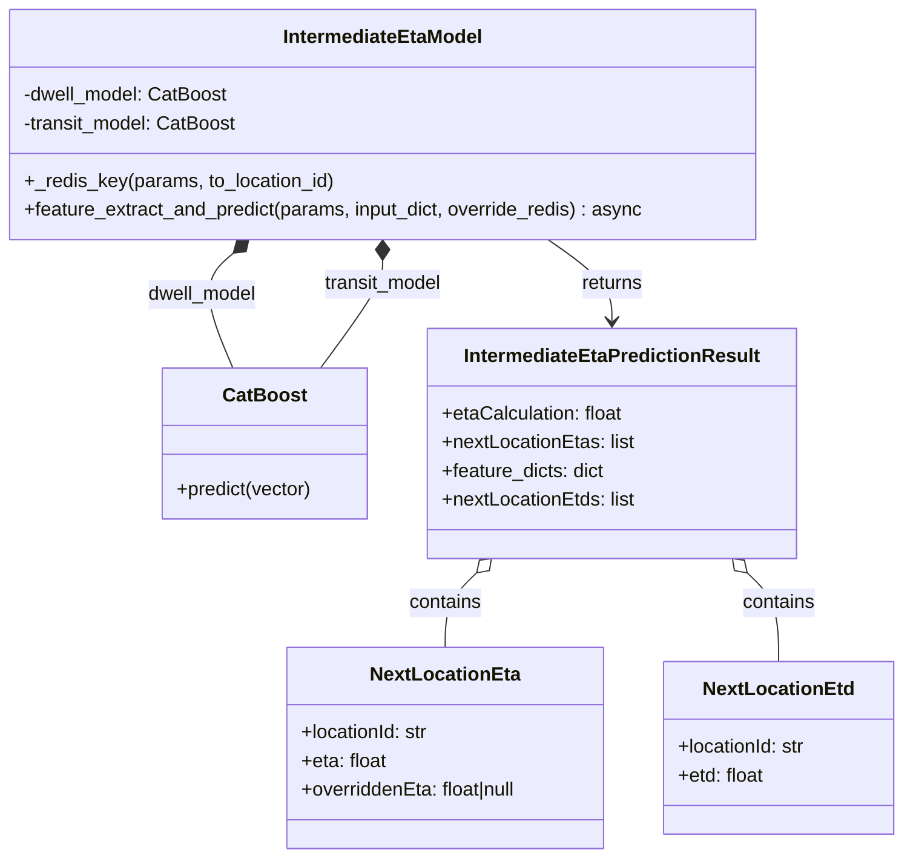

# Diagram: research/api_k8s/get_ai_eta/src/ai_models/entity_intermediate_eta_model.py


> Auto-generated by Obscura crawlers

## Diagram 1



### SVG

<svg id="container" width="761.46875" xmlns="http://www.w3.org/2000/svg" class="classDiagram" height="716" viewBox="0 0 761.46875 716" role="graphics-document document" aria-roledescription="class"><style>#container{font-family:"trebuchet ms",verdana,arial,sans-serif;font-size:16px;fill:#333;}@keyframes edge-animation-frame{from{stroke-dashoffset:0;}}@keyframes dash{to{stroke-dashoffset:0;}}#container .edge-animation-slow{stroke-dasharray:9,5!important;stroke-dashoffset:900;animation:dash 50s linear infinite;stroke-linecap:round;}#container .edge-animation-fast{stroke-dasharray:9,5!important;stroke-dashoffset:900;animation:dash 20s linear infinite;stroke-linecap:round;}#container .error-icon{fill:#552222;}#container .error-text{fill:#552222;stroke:#552222;}#container .edge-thickness-normal{stroke-width:1px;}#container .edge-thickness-thick{stroke-width:3.5px;}#container .edge-pattern-solid{stroke-dasharray:0;}#container .edge-thickness-invisible{stroke-width:0;fill:none;}#container .edge-pattern-dashed{stroke-dasharray:3;}#container .edge-pattern-dotted{stroke-dasharray:2;}#container .marker{fill:#333333;stroke:#333333;}#container .marker.cross{stroke:#333333;}#container svg{font-family:"trebuchet ms",verdana,arial,sans-serif;font-size:16px;}#container p{margin:0;}#container g.classGroup text{fill:#9370DB;stroke:none;font-family:"trebuchet ms",verdana,arial,sans-serif;font-size:10px;}#container g.classGroup text .title{font-weight:bolder;}#container .nodeLabel,#container .edgeLabel{color:#131300;}#container .edgeLabel .label rect{fill:#ECECFF;}#container .label text{fill:#131300;}#container .labelBkg{background:#ECECFF;}#container .edgeLabel .label span{background:#ECECFF;}#container .classTitle{font-weight:bolder;}#container .node rect,#container .node circle,#container .node ellipse,#container .node polygon,#container .node path{fill:#ECECFF;stroke:#9370DB;stroke-width:1px;}#container .divider{stroke:#9370DB;stroke-width:1;}#container g.clickable{cursor:pointer;}#container g.classGroup rect{fill:#ECECFF;stroke:#9370DB;}#container g.classGroup line{stroke:#9370DB;stroke-width:1;}#container .classLabel .box{stroke:none;stroke-width:0;fill:#ECECFF;opacity:0.5;}#container .classLabel .label{fill:#9370DB;font-size:10px;}#container .relation{stroke:#333333;stroke-width:1;fill:none;}#container .dashed-line{stroke-dasharray:3;}#container .dotted-line{stroke-dasharray:1 2;}#container #compositionStart,#container .composition{fill:#333333!important;stroke:#333333!important;stroke-width:1;}#container #compositionEnd,#container .composition{fill:#333333!important;stroke:#333333!important;stroke-width:1;}#container #dependencyStart,#container .dependency{fill:#333333!important;stroke:#333333!important;stroke-width:1;}#container #dependencyStart,#container .dependency{fill:#333333!important;stroke:#333333!important;stroke-width:1;}#container #extensionStart,#container .extension{fill:transparent!important;stroke:#333333!important;stroke-width:1;}#container #extensionEnd,#container .extension{fill:transparent!important;stroke:#333333!important;stroke-width:1;}#container #aggregationStart,#container .aggregation{fill:transparent!important;stroke:#333333!important;stroke-width:1;}#container #aggregationEnd,#container .aggregation{fill:transparent!important;stroke:#333333!important;stroke-width:1;}#container #lollipopStart,#container .lollipop{fill:#ECECFF!important;stroke:#333333!important;stroke-width:1;}#container #lollipopEnd,#container .lollipop{fill:#ECECFF!important;stroke:#333333!important;stroke-width:1;}#container .edgeTerminals{font-size:11px;line-height:initial;}#container .classTitleText{text-anchor:middle;font-size:18px;fill:#333;}#container .label-icon{display:inline-block;height:1em;overflow:visible;vertical-align:-0.125em;}#container .node .label-icon path{fill:currentColor;stroke:revert;stroke-width:revert;}#container :root{--mermaid-font-family:"trebuchet ms",verdana,arial,sans-serif;}</style><g><defs><marker id="container_class-aggregationStart" class="marker aggregation class" refX="18" refY="7" markerWidth="190" markerHeight="240" orient="auto"><path d="M 18,7 L9,13 L1,7 L9,1 Z"></path></marker></defs><defs><marker id="container_class-aggregationEnd" class="marker aggregation class" refX="1" refY="7" markerWidth="20" markerHeight="28" orient="auto"><path d="M 18,7 L9,13 L1,7 L9,1 Z"></path></marker></defs><defs><marker id="container_class-extensionStart" class="marker extension class" refX="18" refY="7" markerWidth="190" markerHeight="240" orient="auto"><path d="M 1,7 L18,13 V 1 Z"></path></marker></defs><defs><marker id="container_class-extensionEnd" class="marker extension class" refX="1" refY="7" markerWidth="20" markerHeight="28" orient="auto"><path d="M 1,1 V 13 L18,7 Z"></path></marker></defs><defs><marker id="container_class-compositionStart" class="marker composition class" refX="18" refY="7" markerWidth="190" markerHeight="240" orient="auto"><path d="M 18,7 L9,13 L1,7 L9,1 Z"></path></marker></defs><defs><marker id="container_class-compositionEnd" class="marker composition class" refX="1" refY="7" markerWidth="20" markerHeight="28" orient="auto"><path d="M 18,7 L9,13 L1,7 L9,1 Z"></path></marker></defs><defs><marker id="container_class-dependencyStart" class="marker dependency class" refX="6" refY="7" markerWidth="190" markerHeight="240" orient="auto"><path d="M 5,7 L9,13 L1,7 L9,1 Z"></path></marker></defs><defs><marker id="container_class-dependencyEnd" class="marker dependency class" refX="13" refY="7" markerWidth="20" markerHeight="28" orient="auto"><path d="M 18,7 L9,13 L14,7 L9,1 Z"></path></marker></defs><defs><marker id="container_class-lollipopStart" class="marker lollipop class" refX="13" refY="7" markerWidth="190" markerHeight="240" orient="auto"><circle stroke="black" fill="transparent" cx="7" cy="7" r="6"></circle></marker></defs><defs><marker id="container_class-lollipopEnd" class="marker lollipop class" refX="1" refY="7" markerWidth="190" markerHeight="240" orient="auto"><circle stroke="black" fill="transparent" cx="7" cy="7" r="6"></circle></marker></defs><g class="root"><g class="clusters"></g><g class="edgePaths"><path d="M198.14,211.234L193.137,215.529C188.133,219.823,178.126,228.411,178.278,244.372C178.43,260.333,188.741,283.667,193.897,295.333L199.053,307" id="id_IntermediateEtaModel_CatBoost_1" class="edge-thickness-normal edge-pattern-solid relation" style=";;;" data-edge="true" data-et="edge" data-id="id_IntermediateEtaModel_CatBoost_1" data-points="W3sieCI6MjExLjIzMDIwNDQxNzI5MzI0LCJ5IjoyMDB9LHsieCI6MTY4LjExOTE0MDYyNSwieSI6MjM3fSx7IngiOjE5OS4wNTI1Mjg3ODI4OTQ3NCwieSI6MzA3fV0=" marker-start="url(#container_class-compositionStart)"></path><path d="M323.086,217.25L323.086,220.542C323.086,223.833,323.086,230.417,314.648,245.375C306.21,260.333,289.334,283.667,280.896,295.333L272.458,307" id="id_IntermediateEtaModel_CatBoost_2" class="edge-thickness-normal edge-pattern-solid relation" style=";;;" data-edge="true" data-et="edge" data-id="id_IntermediateEtaModel_CatBoost_2" data-points="W3sieCI6MzIzLjA4NTkzNzUsInkiOjIwMH0seyJ4IjozMjMuMDg1OTM3NSwieSI6MjM3fSx7IngiOjI3Mi40NTc4NTM2MTg0MjEwNCwieSI6MzA3fV0=" marker-start="url(#container_class-compositionStart)"></path><path d="M462.579,200L471.539,206.167C480.5,212.333,498.421,224.667,507.381,236C516.342,247.333,516.342,257.667,516.342,262.833L516.342,268" id="id_IntermediateEtaModel_IntermediateEtaPredictionResult_3" class="edge-thickness-normal edge-pattern-solid relation" style=";;;" data-edge="true" data-et="edge" data-id="id_IntermediateEtaModel_IntermediateEtaPredictionResult_3" data-points="W3sieCI6NDYyLjU3ODg4ODYyNzgxOTU0LCJ5IjoyMDB9LHsieCI6NTE2LjM0MTc5Njg3NSwieSI6MjM3fSx7IngiOjUxNi4zNDE3OTY4NzUsInkiOjI3NH1d" marker-end="url(#container_class-dependencyEnd)"></path><path d="M402.262,477.851L397.828,482.042C393.395,486.234,384.527,494.617,380.094,504.975C375.66,515.333,375.66,527.667,375.66,533.833L375.66,540" id="id_IntermediateEtaPredictionResult_NextLocationEta_4" class="edge-thickness-normal edge-pattern-solid relation" style=";;;" data-edge="true" data-et="edge" data-id="id_IntermediateEtaPredictionResult_NextLocationEta_4" data-points="W3sieCI6NDE0Ljc5NzE1NDAxNzg1NzEsInkiOjQ2Nn0seyJ4IjozNzUuNjYwMTU2MjUsInkiOjUwM30seyJ4IjozNzUuNjYwMTU2MjUsInkiOjU0MH1d" marker-start="url(#container_class-aggregationStart)"></path><path d="M630.421,477.851L634.855,482.042C639.289,486.234,648.156,494.617,652.59,506.975C657.023,519.333,657.023,535.667,657.023,543.833L657.023,552" id="id_IntermediateEtaPredictionResult_NextLocationEtd_5" class="edge-thickness-normal edge-pattern-solid relation" style=";;;" data-edge="true" data-et="edge" data-id="id_IntermediateEtaPredictionResult_NextLocationEtd_5" data-points="W3sieCI6NjE3Ljg4NjQzOTczMjE0MjksInkiOjQ2Nn0seyJ4Ijo2NTcuMDIzNDM3NSwieSI6NTAzfSx7IngiOjY1Ny4wMjM0Mzc1LCJ5Ijo1NTJ9XQ==" marker-start="url(#container_class-aggregationStart)"></path></g><g class="edgeLabels"><g class="edgeLabel" transform="translate(172.10425, 246.018)"><g class="label" data-id="id_IntermediateEtaModel_CatBoost_1" transform="translate(-46.75, -12)"><foreignObject width="93.5" height="24"><div xmlns="http://www.w3.org/1999/xhtml" class="labelBkg" style="display: table-cell; white-space: nowrap; line-height: 1.5; max-width: 200px; text-align: center;"><span class="edgeLabel"><p>dwell_model</p></span></div></foreignObject></g></g><g class="edgeLabel" transform="translate(323.0859375, 237)"><g class="label" data-id="id_IntermediateEtaModel_CatBoost_2" transform="translate(-50.796875, -12)"><foreignObject width="101.59375" height="24"><div xmlns="http://www.w3.org/1999/xhtml" class="labelBkg" style="display: table-cell; white-space: nowrap; line-height: 1.5; max-width: 200px; text-align: center;"><span class="edgeLabel"><p>transit_model</p></span></div></foreignObject></g></g><g class="edgeLabel" transform="translate(516.341796875, 237)"><g class="label" data-id="id_IntermediateEtaModel_IntermediateEtaPredictionResult_3" transform="translate(-26.265625, -12)"><foreignObject width="52.53125" height="24"><div xmlns="http://www.w3.org/1999/xhtml" class="labelBkg" style="display: table-cell; white-space: nowrap; line-height: 1.5; max-width: 200px; text-align: center;"><span class="edgeLabel"><p>returns</p></span></div></foreignObject></g></g><g class="edgeLabel" transform="translate(375.66015625, 503)"><g class="label" data-id="id_IntermediateEtaPredictionResult_NextLocationEta_4" transform="translate(-30.890625, -12)"><foreignObject width="61.78125" height="24"><div xmlns="http://www.w3.org/1999/xhtml" class="labelBkg" style="display: table-cell; white-space: nowrap; line-height: 1.5; max-width: 200px; text-align: center;"><span class="edgeLabel"><p>contains</p></span></div></foreignObject></g></g><g class="edgeLabel" transform="translate(657.0234375, 503)"><g class="label" data-id="id_IntermediateEtaPredictionResult_NextLocationEtd_5" transform="translate(-30.890625, -12)"><foreignObject width="61.78125" height="24"><div xmlns="http://www.w3.org/1999/xhtml" class="labelBkg" style="display: table-cell; white-space: nowrap; line-height: 1.5; max-width: 200px; text-align: center;"><span class="edgeLabel"><p>contains</p></span></div></foreignObject></g></g></g><g class="nodes"><g class="node default" id="classId-IntermediateEtaModel-0" transform="translate(323.0859375, 104)"><g class="basic label-container"><path d="M-315.0859375 -96 L315.0859375 -96 L315.0859375 96 L-315.0859375 96" stroke="none" stroke-width="0" fill="#ECECFF" style=""></path><path d="M-315.0859375 -96 C-128.13771626611972 -96, 58.81050496776055 -96, 315.0859375 -96 M-315.0859375 -96 C-98.04570869133858 -96, 118.99452011732285 -96, 315.0859375 -96 M315.0859375 -96 C315.0859375 -39.48392897297452, 315.0859375 17.032142054050965, 315.0859375 96 M315.0859375 -96 C315.0859375 -41.2584531901951, 315.0859375 13.483093619609804, 315.0859375 96 M315.0859375 96 C104.25839782333026 96, -106.56914185333949 96, -315.0859375 96 M315.0859375 96 C151.60054991353834 96, -11.884837672923311 96, -315.0859375 96 M-315.0859375 96 C-315.0859375 34.73186542989225, -315.0859375 -26.536269140215495, -315.0859375 -96 M-315.0859375 96 C-315.0859375 36.703241242637105, -315.0859375 -22.59351751472579, -315.0859375 -96" stroke="#9370DB" stroke-width="1.3" fill="none" stroke-dasharray="0 0" style=""></path></g><g class="annotation-group text" transform="translate(0, -72)"></g><g class="label-group text" transform="translate(-81.5, -72)"><g class="label" style="font-weight: bolder" transform="translate(0,-12)"><foreignObject width="163" height="24"><div xmlns="http://www.w3.org/1999/xhtml" style="display: table-cell; white-space: nowrap; line-height: 1.5; max-width: 212px; text-align: center;"><span class="nodeLabel markdown-node-label" style=""><p>IntermediateEtaModel</p></span></div></foreignObject></g></g><g class="members-group text" transform="translate(-303.0859375, -24)"><g class="label" style="" transform="translate(0,-12)"><foreignObject width="173.125" height="24"><div xmlns="http://www.w3.org/1999/xhtml" style="display: table-cell; white-space: nowrap; line-height: 1.5; max-width: 231px; text-align: center;"><span class="nodeLabel markdown-node-label" style=""><p>-dwell_model: CatBoost</p></span></div></foreignObject></g><g class="label" style="" transform="translate(0,12)"><foreignObject width="181.140625" height="24"><div xmlns="http://www.w3.org/1999/xhtml" style="display: table-cell; white-space: nowrap; line-height: 1.5; max-width: 239px; text-align: center;"><span class="nodeLabel markdown-node-label" style=""><p>-transit_model: CatBoost</p></span></div></foreignObject></g></g><g class="methods-group text" transform="translate(-303.0859375, 48)"><g class="label" style="" transform="translate(0,-12)"><foreignObject width="259.84375" height="24"><div xmlns="http://www.w3.org/1999/xhtml" style="display: table-cell; white-space: nowrap; line-height: 1.5; max-width: 317px; text-align: center;"><span class="nodeLabel markdown-node-label" style=""><p>+_redis_key(params, to_location_id)</p></span></div></foreignObject></g><g class="label" style="" transform="translate(0,12)"><foreignObject width="524.671875" height="24"><div xmlns="http://www.w3.org/1999/xhtml" style="display: table-cell; white-space: nowrap; line-height: 1.5; max-width: 582px; text-align: center;"><span class="nodeLabel markdown-node-label" style=""><p>+feature_extract_and_predict(params, input_dict, override_redis) : async</p></span></div></foreignObject></g></g><g class="divider" style=""><path d="M-315.0859375 -48 C-158.6680877935857 -48, -2.2502380871713967 -48, 315.0859375 -48 M-315.0859375 -48 C-151.59020506209814 -48, 11.905527375803729 -48, 315.0859375 -48" stroke="#9370DB" stroke-width="1.3" fill="none" stroke-dasharray="0 0" style=""></path></g><g class="divider" style=""><path d="M-315.0859375 24 C-98.44690481706067 24, 118.19212786587866 24, 315.0859375 24 M-315.0859375 24 C-121.0924595975298 24, 72.90101830494041 24, 315.0859375 24" stroke="#9370DB" stroke-width="1.3" fill="none" stroke-dasharray="0 0" style=""></path></g></g><g class="node default" id="classId-CatBoost-1" transform="translate(226.892578125, 370)"><g class="basic label-container"><path d="M-86.12109375 -63 L86.12109375 -63 L86.12109375 63 L-86.12109375 63" stroke="none" stroke-width="0" fill="#ECECFF" style=""></path><path d="M-86.12109375 -63 C-48.24051039459317 -63, -10.359927039186346 -63, 86.12109375 -63 M-86.12109375 -63 C-22.97604527063156 -63, 40.16900320873688 -63, 86.12109375 -63 M86.12109375 -63 C86.12109375 -26.121554397463584, 86.12109375 10.756891205072833, 86.12109375 63 M86.12109375 -63 C86.12109375 -33.69166541460191, 86.12109375 -4.383330829203814, 86.12109375 63 M86.12109375 63 C38.34507578852672 63, -9.430942172946558 63, -86.12109375 63 M86.12109375 63 C27.53821603827791 63, -31.044661673444182 63, -86.12109375 63 M-86.12109375 63 C-86.12109375 33.252613557562526, -86.12109375 3.505227115125045, -86.12109375 -63 M-86.12109375 63 C-86.12109375 28.791335225329497, -86.12109375 -5.417329549341005, -86.12109375 -63" stroke="#9370DB" stroke-width="1.3" fill="none" stroke-dasharray="0 0" style=""></path></g><g class="annotation-group text" transform="translate(0, -39)"></g><g class="label-group text" transform="translate(-33.2265625, -39)"><g class="label" style="font-weight: bolder" transform="translate(0,-12)"><foreignObject width="66.453125" height="24"><div xmlns="http://www.w3.org/1999/xhtml" style="display: table-cell; white-space: nowrap; line-height: 1.5; max-width: 115px; text-align: center;"><span class="nodeLabel markdown-node-label" style=""><p>CatBoost</p></span></div></foreignObject></g></g><g class="members-group text" transform="translate(-74.12109375, 9)"></g><g class="methods-group text" transform="translate(-74.12109375, 39)"><g class="label" style="" transform="translate(0,-12)"><foreignObject width="115.015625" height="24"><div xmlns="http://www.w3.org/1999/xhtml" style="display: table-cell; white-space: nowrap; line-height: 1.5; max-width: 172px; text-align: center;"><span class="nodeLabel markdown-node-label" style=""><p>+predict(vector)</p></span></div></foreignObject></g></g><g class="divider" style=""><path d="M-86.12109375 -15 C-25.454793756071737 -15, 35.211506237856526 -15, 86.12109375 -15 M-86.12109375 -15 C-36.25562515760968 -15, 13.609843434780643 -15, 86.12109375 -15" stroke="#9370DB" stroke-width="1.3" fill="none" stroke-dasharray="0 0" style=""></path></g><g class="divider" style=""><path d="M-86.12109375 9 C-37.875081363273445 9, 10.37093102345311 9, 86.12109375 9 M-86.12109375 9 C-34.76695395738447 9, 16.587185835231054 9, 86.12109375 9" stroke="#9370DB" stroke-width="1.3" fill="none" stroke-dasharray="0 0" style=""></path></g></g><g class="node default" id="classId-IntermediateEtaPredictionResult-2" transform="translate(516.341796875, 370)"><g class="basic label-container"><path d="M-153.328125 -96 L153.328125 -96 L153.328125 96 L-153.328125 96" stroke="none" stroke-width="0" fill="#ECECFF" style=""></path><path d="M-153.328125 -96 C-72.06934005512156 -96, 9.189444889756885 -96, 153.328125 -96 M-153.328125 -96 C-72.64759276048133 -96, 8.032939479037339 -96, 153.328125 -96 M153.328125 -96 C153.328125 -31.63623561187626, 153.328125 32.72752877624748, 153.328125 96 M153.328125 -96 C153.328125 -29.670955472723776, 153.328125 36.65808905455245, 153.328125 96 M153.328125 96 C68.83360560082882 96, -15.660913798342364 96, -153.328125 96 M153.328125 96 C71.23661355699844 96, -10.85489788600313 96, -153.328125 96 M-153.328125 96 C-153.328125 56.04984683277842, -153.328125 16.099693665556842, -153.328125 -96 M-153.328125 96 C-153.328125 43.40404837306011, -153.328125 -9.191903253879786, -153.328125 -96" stroke="#9370DB" stroke-width="1.3" fill="none" stroke-dasharray="0 0" style=""></path></g><g class="annotation-group text" transform="translate(0, -72)"></g><g class="label-group text" transform="translate(-119.625, -72)"><g class="label" style="font-weight: bolder" transform="translate(0,-12)"><foreignObject width="239.25" height="24"><div xmlns="http://www.w3.org/1999/xhtml" style="display: table-cell; white-space: nowrap; line-height: 1.5; max-width: 286px; text-align: center;"><span class="nodeLabel markdown-node-label" style=""><p>IntermediateEtaPredictionResult</p></span></div></foreignObject></g></g><g class="members-group text" transform="translate(-141.328125, -24)"><g class="label" style="" transform="translate(0,-12)"><foreignObject width="153.28125" height="24"><div xmlns="http://www.w3.org/1999/xhtml" style="display: table-cell; white-space: nowrap; line-height: 1.5; max-width: 211px; text-align: center;"><span class="nodeLabel markdown-node-label" style=""><p>+etaCalculation: float</p></span></div></foreignObject></g><g class="label" style="" transform="translate(0,12)"><foreignObject width="162.140625" height="24"><div xmlns="http://www.w3.org/1999/xhtml" style="display: table-cell; white-space: nowrap; line-height: 1.5; max-width: 220px; text-align: center;"><span class="nodeLabel markdown-node-label" style=""><p>+nextLocationEtas: list</p></span></div></foreignObject></g><g class="label" style="" transform="translate(0,36)"><foreignObject width="137.953125" height="24"><div xmlns="http://www.w3.org/1999/xhtml" style="display: table-cell; white-space: nowrap; line-height: 1.5; max-width: 196px; text-align: center;"><span class="nodeLabel markdown-node-label" style=""><p>+feature_dicts: dict</p></span></div></foreignObject></g><g class="label" style="" transform="translate(0,60)"><foreignObject width="163.03125" height="24"><div xmlns="http://www.w3.org/1999/xhtml" style="display: table-cell; white-space: nowrap; line-height: 1.5; max-width: 221px; text-align: center;"><span class="nodeLabel markdown-node-label" style=""><p>+nextLocationEtds: list</p></span></div></foreignObject></g></g><g class="methods-group text" transform="translate(-141.328125, 96)"></g><g class="divider" style=""><path d="M-153.328125 -48 C-52.81173739081308 -48, 47.70465021837384 -48, 153.328125 -48 M-153.328125 -48 C-63.23210184579992 -48, 26.863921308400165 -48, 153.328125 -48" stroke="#9370DB" stroke-width="1.3" fill="none" stroke-dasharray="0 0" style=""></path></g><g class="divider" style=""><path d="M-153.328125 72 C-41.09277127465795 72, 71.1425824506841 72, 153.328125 72 M-153.328125 72 C-59.001499699596636 72, 35.32512560080673 72, 153.328125 72" stroke="#9370DB" stroke-width="1.3" fill="none" stroke-dasharray="0 0" style=""></path></g></g><g class="node default" id="classId-NextLocationEta-3" transform="translate(375.66015625, 624)"><g class="basic label-container"><path d="M-134.91796875 -84 L134.91796875 -84 L134.91796875 84 L-134.91796875 84" stroke="none" stroke-width="0" fill="#ECECFF" style=""></path><path d="M-134.91796875 -84 C-39.984721448898355 -84, 54.94852585220329 -84, 134.91796875 -84 M-134.91796875 -84 C-40.403826087489804 -84, 54.11031657502039 -84, 134.91796875 -84 M134.91796875 -84 C134.91796875 -18.01101747051807, 134.91796875 47.97796505896386, 134.91796875 84 M134.91796875 -84 C134.91796875 -33.03847936622593, 134.91796875 17.923041267548143, 134.91796875 84 M134.91796875 84 C77.16278442859709 84, 19.4076001071942 84, -134.91796875 84 M134.91796875 84 C51.61790993490098 84, -31.682148880198042 84, -134.91796875 84 M-134.91796875 84 C-134.91796875 29.17245865953698, -134.91796875 -25.655082680926043, -134.91796875 -84 M-134.91796875 84 C-134.91796875 18.02178391079771, -134.91796875 -47.95643217840458, -134.91796875 -84" stroke="#9370DB" stroke-width="1.3" fill="none" stroke-dasharray="0 0" style=""></path></g><g class="annotation-group text" transform="translate(0, -60)"></g><g class="label-group text" transform="translate(-59.5859375, -60)"><g class="label" style="font-weight: bolder" transform="translate(0,-12)"><foreignObject width="119.171875" height="24"><div xmlns="http://www.w3.org/1999/xhtml" style="display: table-cell; white-space: nowrap; line-height: 1.5; max-width: 168px; text-align: center;"><span class="nodeLabel markdown-node-label" style=""><p>NextLocationEta</p></span></div></foreignObject></g></g><g class="members-group text" transform="translate(-122.91796875, -12)"><g class="label" style="" transform="translate(0,-12)"><foreignObject width="108.9375" height="24"><div xmlns="http://www.w3.org/1999/xhtml" style="display: table-cell; white-space: nowrap; line-height: 1.5; max-width: 167px; text-align: center;"><span class="nodeLabel markdown-node-label" style=""><p>+locationId: str</p></span></div></foreignObject></g><g class="label" style="" transform="translate(0,12)"><foreignObject width="72.21875" height="24"><div xmlns="http://www.w3.org/1999/xhtml" style="display: table-cell; white-space: nowrap; line-height: 1.5; max-width: 130px; text-align: center;"><span class="nodeLabel markdown-node-label" style=""><p>+eta: float</p></span></div></foreignObject></g><g class="label" style="" transform="translate(0,36)"><foreignObject width="186.25" height="24"><div xmlns="http://www.w3.org/1999/xhtml" style="display: table-cell; white-space: nowrap; line-height: 1.5; max-width: 244px; text-align: center;"><span class="nodeLabel markdown-node-label" style=""><p>+overriddenEta: float|null</p></span></div></foreignObject></g></g><g class="methods-group text" transform="translate(-122.91796875, 84)"></g><g class="divider" style=""><path d="M-134.91796875 -36 C-71.94810755130268 -36, -8.978246352605382 -36, 134.91796875 -36 M-134.91796875 -36 C-45.16771723803022 -36, 44.58253427393956 -36, 134.91796875 -36" stroke="#9370DB" stroke-width="1.3" fill="none" stroke-dasharray="0 0" style=""></path></g><g class="divider" style=""><path d="M-134.91796875 60 C-40.59671522781581 60, 53.72453829436839 60, 134.91796875 60 M-134.91796875 60 C-47.01695152696176 60, 40.884065696076476 60, 134.91796875 60" stroke="#9370DB" stroke-width="1.3" fill="none" stroke-dasharray="0 0" style=""></path></g></g><g class="node default" id="classId-NextLocationEtd-4" transform="translate(657.0234375, 624)"><g class="basic label-container"><path d="M-96.4453125 -72 L96.4453125 -72 L96.4453125 72 L-96.4453125 72" stroke="none" stroke-width="0" fill="#ECECFF" style=""></path><path d="M-96.4453125 -72 C-37.020664456938604 -72, 22.40398358612279 -72, 96.4453125 -72 M-96.4453125 -72 C-34.665470933357554 -72, 27.114370633284892 -72, 96.4453125 -72 M96.4453125 -72 C96.4453125 -37.3730568766241, 96.4453125 -2.7461137532481956, 96.4453125 72 M96.4453125 -72 C96.4453125 -40.21308574596051, 96.4453125 -8.426171491921025, 96.4453125 72 M96.4453125 72 C49.011608952801936 72, 1.5779054056038717 72, -96.4453125 72 M96.4453125 72 C45.908637291517564 72, -4.628037916964871 72, -96.4453125 72 M-96.4453125 72 C-96.4453125 19.70758868498912, -96.4453125 -32.58482263002176, -96.4453125 -72 M-96.4453125 72 C-96.4453125 18.57289867611521, -96.4453125 -34.85420264776958, -96.4453125 -72" stroke="#9370DB" stroke-width="1.3" fill="none" stroke-dasharray="0 0" style=""></path></g><g class="annotation-group text" transform="translate(0, -48)"></g><g class="label-group text" transform="translate(-59.953125, -48)"><g class="label" style="font-weight: bolder" transform="translate(0,-12)"><foreignObject width="119.90625" height="24"><div xmlns="http://www.w3.org/1999/xhtml" style="display: table-cell; white-space: nowrap; line-height: 1.5; max-width: 169px; text-align: center;"><span class="nodeLabel markdown-node-label" style=""><p>NextLocationEtd</p></span></div></foreignObject></g></g><g class="members-group text" transform="translate(-84.4453125, 0)"><g class="label" style="" transform="translate(0,-12)"><foreignObject width="108.9375" height="24"><div xmlns="http://www.w3.org/1999/xhtml" style="display: table-cell; white-space: nowrap; line-height: 1.5; max-width: 167px; text-align: center;"><span class="nodeLabel markdown-node-label" style=""><p>+locationId: str</p></span></div></foreignObject></g><g class="label" style="" transform="translate(0,12)"><foreignObject width="72.953125" height="24"><div xmlns="http://www.w3.org/1999/xhtml" style="display: table-cell; white-space: nowrap; line-height: 1.5; max-width: 131px; text-align: center;"><span class="nodeLabel markdown-node-label" style=""><p>+etd: float</p></span></div></foreignObject></g></g><g class="methods-group text" transform="translate(-84.4453125, 72)"></g><g class="divider" style=""><path d="M-96.4453125 -24 C-30.20216939990283 -24, 36.04097370019434 -24, 96.4453125 -24 M-96.4453125 -24 C-43.315337976261524 -24, 9.814636547476951 -24, 96.4453125 -24" stroke="#9370DB" stroke-width="1.3" fill="none" stroke-dasharray="0 0" style=""></path></g><g class="divider" style=""><path d="M-96.4453125 48 C-40.98734620390662 48, 14.470620092186763 48, 96.4453125 48 M-96.4453125 48 C-45.38507729536574 48, 5.6751579092685205 48, 96.4453125 48" stroke="#9370DB" stroke-width="1.3" fill="none" stroke-dasharray="0 0" style=""></path></g></g></g></g></g></svg>

## Diagram 2

```mermaid
flowchart LR
A[IntermediateEtaParameters params] --> B[input_dict]
B --> C{enrich_input_dict}
C --> D[extract_planned_departures]
C --> E[extract_planned_arrivals]
C --> F[extract_modes]
C --> G[extract_scacs]
C --> H[add _planned_departures/_planned_arrivals/_modes/_scacs]
H --> I{for each leg in params.all_stops}
I --> J[extract_leg_features using transit_leg_fe_map]
I --> K[extract_leg_features using dwell_fe_map]
J --> L[handle_null_features (TRANSIT_CAT_FEATURES)]
K --> M[handle_null_features (DWELL_CAT_FEATURES)]
L --> N[transit_prediction = transit_model.predict]
M --> O[dwell_prediction = dwell_model.predict]
N --> P[update eta_to_here & eta_to_destination]
O --> Q[compute unload_weight -> to_unload]
P --> R{if transport_mode in [rail,ocean]}
R -->|yes| S[eta_to_use = eta_to_here + to_unload]
R -->|no| T[eta_to_use = eta_to_here]
S --> U[check override via get_override_value(redis)]
T --> U
U --> V[apply override if present]
V --> W[append NextLocationEta / NextLocationEtd]
W --> I
I --> X[assemble IntermediateEtaPredictionResult]
X --> Y[return result]
```

> SVG rendering failed for this diagram.
