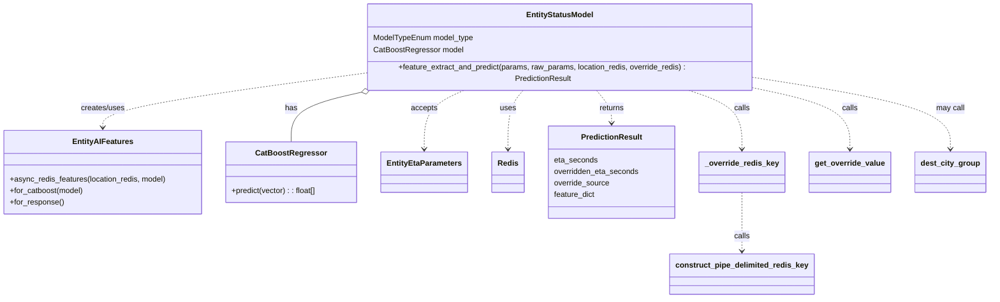
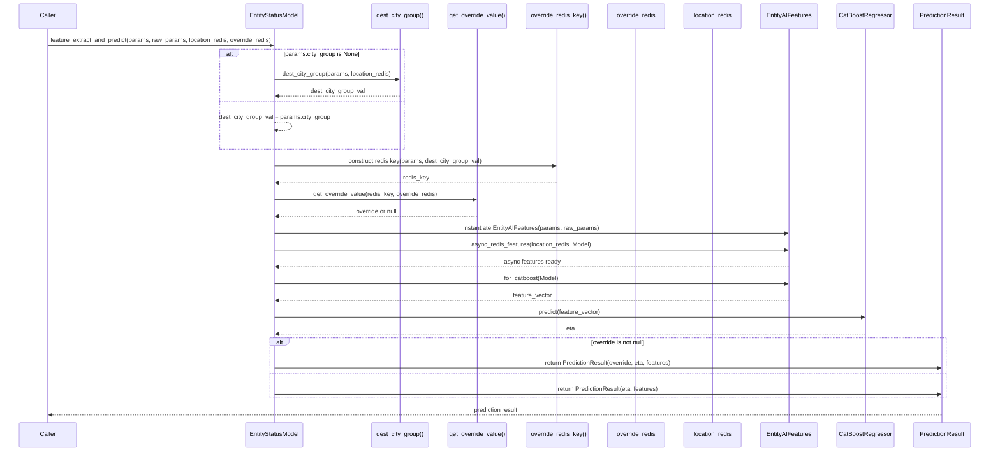

# Diagram: research/api_k8s/get_ai_eta/src/ai_models/entity_status.py

> Auto-generated by Obscura crawlers

## Diagram 1

### SVG

<svg id="container" width="2028.1640625" xmlns="http://www.w3.org/2000/svg" class="classDiagram" height="608" viewBox="0 0 2028.1640625 608" role="graphics-document document" aria-roledescription="class"><g><defs><marker id="container_class-aggregationStart" class="marker aggregation class" refX="18" refY="7" markerWidth="190" markerHeight="240" orient="auto"><path d="M 18,7 L9,13 L1,7 L9,1 Z"></path></marker></defs><defs><marker id="container_class-aggregationEnd" class="marker aggregation class" refX="1" refY="7" markerWidth="20" markerHeight="28" orient="auto"><path d="M 18,7 L9,13 L1,7 L9,1 Z"></path></marker></defs><defs><marker id="container_class-extensionStart" class="marker extension class" refX="18" refY="7" markerWidth="190" markerHeight="240" orient="auto"><path d="M 1,7 L18,13 V 1 Z"></path></marker></defs><defs><marker id="container_class-extensionEnd" class="marker extension class" refX="1" refY="7" markerWidth="20" markerHeight="28" orient="auto"><path d="M 1,1 V 13 L18,7 Z"></path></marker></defs><defs><marker id="container_class-compositionStart" class="marker composition class" refX="18" refY="7" markerWidth="190" markerHeight="240" orient="auto"><path d="M 18,7 L9,13 L1,7 L9,1 Z"></path></marker></defs><defs><marker id="container_class-compositionEnd" class="marker composition class" refX="1" refY="7" markerWidth="20" markerHeight="28" orient="auto"><path d="M 18,7 L9,13 L1,7 L9,1 Z"></path></marker></defs><defs><marker id="container_class-dependencyStart" class="marker dependency class" refX="6" refY="7" markerWidth="190" markerHeight="240" orient="auto"><path d="M 5,7 L9,13 L1,7 L9,1 Z"></path></marker></defs><defs><marker id="container_class-dependencyEnd" class="marker dependency class" refX="13" refY="7" markerWidth="20" markerHeight="28" orient="auto"><path d="M 18,7 L9,13 L14,7 L9,1 Z"></path></marker></defs><defs><marker id="container_class-lollipopStart" class="marker lollipop class" refX="13" refY="7" markerWidth="190" markerHeight="240" orient="auto"><circle stroke="black" fill="transparent" cx="7" cy="7" r="6"></circle></marker></defs><defs><marker id="container_class-lollipopEnd" class="marker lollipop class" refX="1" refY="7" markerWidth="190" markerHeight="240" orient="auto"><circle stroke="black" fill="transparent" cx="7" cy="7" r="6"></circle></marker></defs><g class="root"><g class="clusters"></g><g class="edgePaths"><path d="M756.323,179.719L731.204,185.266C706.084,190.813,655.845,201.906,630.725,219.12C605.605,236.333,605.605,259.667,605.605,271.333L605.605,283" id="id_EntityStatusModel_CatBoostRegressor_1" class="edge-thickness-normal edge-pattern-solid relation" style=";;;" data-edge="true" data-et="edge" data-id="id_EntityStatusModel_CatBoostRegressor_1" data-points="W3sieCI6NzczLjE2NzM1NTM3MTkwMDgsInkiOjE3Nn0seyJ4Ijo2MDUuNjA1NDY4NzUsInkiOjIxM30seyJ4Ijo2MDUuNjA1NDY4NzUsInkiOjI4M31d" marker-start="url(#container_class-aggregationStart)"></path><path d="M743.773,144.756L655.421,156.13C567.068,167.504,390.362,190.252,302.009,208.293C213.656,226.333,213.656,239.667,213.656,246.333L213.656,253" id="id_EntityStatusModel_EntityAIFeatures_2" class="edge-thickness-normal edge-pattern-dashed relation" style=";;;" data-edge="true" data-et="edge" data-id="id_EntityStatusModel_EntityAIFeatures_2" data-points="W3sieCI6NzQzLjc3MzQzNzUsInkiOjE0NC43NTU4MzkwODIzNzA1M30seyJ4IjoyMTMuNjU2MjUsInkiOjIxM30seyJ4IjoyMTMuNjU2MjUsInkiOjI1OX1d" marker-end="url(#container_class-dependencyEnd)"></path><path d="M962.414,176L948.38,182.167C934.346,188.333,906.279,200.667,892.245,221C878.211,241.333,878.211,269.667,878.211,283.833L878.211,298" id="id_EntityStatusModel_EntityEtaParameters_3" class="edge-thickness-normal edge-pattern-dashed relation" style=";;;" data-edge="true" data-et="edge" data-id="id_EntityStatusModel_EntityEtaParameters_3" data-points="W3sieCI6OTYyLjQxNDEyNzA2NjExNTcsInkiOjE3Nn0seyJ4Ijo4NzguMjEwOTM3NSwieSI6MjEzfSx7IngiOjg3OC4yMTA5Mzc1LCJ5IjozMDR9XQ==" marker-end="url(#container_class-dependencyEnd)"></path><path d="M1079.368,176L1073.92,182.167C1068.472,188.333,1057.576,200.667,1052.128,221C1046.68,241.333,1046.68,269.667,1046.68,283.833L1046.68,298" id="id_EntityStatusModel_Redis_4" class="edge-thickness-normal edge-pattern-dashed relation" style=";;;" data-edge="true" data-et="edge" data-id="id_EntityStatusModel_Redis_4" data-points="W3sieCI6MTA3OS4zNjc2Mzk0NjI4MDk4LCJ5IjoxNzZ9LHsieCI6MTA0Ni42Nzk2ODc1LCJ5IjoyMTN9LHsieCI6MTA0Ni42Nzk2ODc1LCJ5IjozMDR9XQ==" marker-end="url(#container_class-dependencyEnd)"></path><path d="M1227.789,176L1233.237,182.167C1238.685,188.333,1249.581,200.667,1255.029,212C1260.477,223.333,1260.477,233.667,1260.477,238.833L1260.477,244" id="id_EntityStatusModel_PredictionResult_5" class="edge-thickness-normal edge-pattern-dashed relation" style=";;;" data-edge="true" data-et="edge" data-id="id_EntityStatusModel_PredictionResult_5" data-points="W3sieCI6MTIyNy43ODg2MTA1MzcxOTAyLCJ5IjoxNzZ9LHsieCI6MTI2MC40NzY1NjI1LCJ5IjoyMTN9LHsieCI6MTI2MC40NzY1NjI1LCJ5IjoyNTB9XQ==" marker-end="url(#container_class-dependencyEnd)"></path><path d="M1528.188,388L1528.188,403.167C1528.188,418.333,1528.188,448.667,1528.188,469C1528.188,489.333,1528.188,499.667,1528.188,504.833L1528.188,510" id="id__override_redis_key_construct_pipe_delimited_redis_key_6" class="edge-thickness-normal edge-pattern-dashed relation" style=";;;" data-edge="true" data-et="edge" data-id="id__override_redis_key_construct_pipe_delimited_redis_key_6" data-points="W3sieCI6MTUyOC4xODc1LCJ5IjozODh9LHsieCI6MTUyOC4xODc1LCJ5Ijo0Nzl9LHsieCI6MTUyOC4xODc1LCJ5Ijo1MTZ9XQ==" marker-end="url(#container_class-dependencyEnd)"></path><path d="M1413.638,176L1432.729,182.167C1451.821,188.333,1490.004,200.667,1509.096,221C1528.188,241.333,1528.188,269.667,1528.188,283.833L1528.188,298" id="id_EntityStatusModel__override_redis_key_7" class="edge-thickness-normal edge-pattern-dashed relation" style=";;;" data-edge="true" data-et="edge" data-id="id_EntityStatusModel__override_redis_key_7" data-points="W3sieCI6MTQxMy42Mzc1MjU4MjY0NDYzLCJ5IjoxNzZ9LHsieCI6MTUyOC4xODc1LCJ5IjoyMTN9LHsieCI6MTUyOC4xODc1LCJ5IjozMDR9XQ==" marker-end="url(#container_class-dependencyEnd)"></path><path d="M1563.383,175.657L1593.871,181.881C1624.359,188.105,1685.336,200.552,1715.824,220.943C1746.313,241.333,1746.313,269.667,1746.313,283.833L1746.313,298" id="id_EntityStatusModel_get_override_value_8" class="edge-thickness-normal edge-pattern-dashed relation" style=";;;" data-edge="true" data-et="edge" data-id="id_EntityStatusModel_get_override_value_8" data-points="W3sieCI6MTU2My4zODI4MTI1LCJ5IjoxNzUuNjU2OTc5MDQzMTAwMDJ9LHsieCI6MTc0Ni4zMTI1LCJ5IjoyMTN9LHsieCI6MTc0Ni4zMTI1LCJ5IjozMDR9XQ==" marker-end="url(#container_class-dependencyEnd)"></path><path d="M1563.383,154.319L1627.697,164.099C1692.01,173.879,1820.638,193.44,1884.952,217.386C1949.266,241.333,1949.266,269.667,1949.266,283.833L1949.266,298" id="id_EntityStatusModel_dest_city_group_9" class="edge-thickness-normal edge-pattern-dashed relation" style=";;;" data-edge="true" data-et="edge" data-id="id_EntityStatusModel_dest_city_group_9" data-points="W3sieCI6MTU2My4zODI4MTI1LCJ5IjoxNTQuMzE4ODk2Nzg3MzY5NH0seyJ4IjoxOTQ5LjI2NTYyNSwieSI6MjEzfSx7IngiOjE5NDkuMjY1NjI1LCJ5IjozMDR9XQ==" marker-end="url(#container_class-dependencyEnd)"></path></g><g class="edgeLabels"><g class="edgeLabel" transform="translate(605.60546875, 213)"><g class="label" data-id="id_EntityStatusModel_CatBoostRegressor_1" transform="translate(-12.703125, -12)"><foreignObject width="25.40625" height="24">

has

</foreignObject></g></g><g class="edgeLabel" transform="translate(213.65625, 213)"><g class="label" data-id="id_EntityStatusModel_EntityAIFeatures_2" transform="translate(-46.578125, -12)"><foreignObject width="93.15625" height="24">

creates/uses

</foreignObject></g></g><g class="edgeLabel" transform="translate(878.2109375, 213)"><g class="label" data-id="id_EntityStatusModel_EntityEtaParameters_3" transform="translate(-27.421875, -12)"><foreignObject width="54.84375" height="24">

accepts

</foreignObject></g></g><g class="edgeLabel" transform="translate(1046.6796875, 213)"><g class="label" data-id="id_EntityStatusModel_Redis_4" transform="translate(-16.4921875, -12)"><foreignObject width="32.984375" height="24">

uses

</foreignObject></g></g><g class="edgeLabel" transform="translate(1260.4765625, 213)"><g class="label" data-id="id_EntityStatusModel_PredictionResult_5" transform="translate(-26.265625, -12)"><foreignObject width="52.53125" height="24">

returns

</foreignObject></g></g><g class="edgeLabel" transform="translate(1528.1875, 479)"><g class="label" data-id="id__override_redis_key_construct_pipe_delimited_redis_key_6" transform="translate(-16.4453125, -12)"><foreignObject width="32.890625" height="24">

calls

</foreignObject></g></g><g class="edgeLabel" transform="translate(1528.1875, 213)"><g class="label" data-id="id_EntityStatusModel__override_redis_key_7" transform="translate(-16.4453125, -12)"><foreignObject width="32.890625" height="24">

calls

</foreignObject></g></g><g class="edgeLabel" transform="translate(1746.3125, 213)"><g class="label" data-id="id_EntityStatusModel_get_override_value_8" transform="translate(-16.4453125, -12)"><foreignObject width="32.890625" height="24">

calls

</foreignObject></g></g><g class="edgeLabel" transform="translate(1949.265625, 213)"><g class="label" data-id="id_EntityStatusModel_dest_city_group_9" transform="translate(-29.8515625, -12)"><foreignObject width="59.703125" height="24">

may call

</foreignObject></g></g></g><g class="nodes"><g class="node default" id="classId-EntityStatusModel-0" transform="translate(1153.578125, 92)"><g class="basic label-container"><path d="M-409.8046875 -84 L409.8046875 -84 L409.8046875 84 L-409.8046875 84" stroke="none" stroke-width="0" fill="#ECECFF" style=""></path><path d="M-409.8046875 -84 C-141.66274152414212 -84, 126.47920445171576 -84, 409.8046875 -84 M-409.8046875 -84 C-186.9743609785571 -84, 35.855965542885826 -84, 409.8046875 -84 M409.8046875 -84 C409.8046875 -40.4591005285731, 409.8046875 3.081798942853794, 409.8046875 84 M409.8046875 -84 C409.8046875 -17.208960926536477, 409.8046875 49.582078146927046, 409.8046875 84 M409.8046875 84 C84.18167461617548 84, -241.44133826764903 84, -409.8046875 84 M409.8046875 84 C192.26295618153048 84, -25.278775136939032 84, -409.8046875 84 M-409.8046875 84 C-409.8046875 46.48723659803886, -409.8046875 8.974473196077724, -409.8046875 -84 M-409.8046875 84 C-409.8046875 18.958545065551107, -409.8046875 -46.08290986889779, -409.8046875 -84" stroke="#9370DB" stroke-width="1.3" fill="none" stroke-dasharray="0 0" style=""></path></g><g class="annotation-group text" transform="translate(0, -60)"></g><g class="label-group text" transform="translate(-67.3125, -60)"><g class="label" style="font-weight: bolder" transform="translate(0,-12)"><foreignObject width="134.625" height="24">

EntityStatusModel

</foreignObject></g></g><g class="members-group text" transform="translate(-397.8046875, -12)"><g class="label" style="" transform="translate(0,-12)"><foreignObject width="209.375" height="24">

ModelTypeEnum model_type

</foreignObject></g><g class="label" style="" transform="translate(0,12)"><foreignObject width="186.421875" height="24">

CatBoostRegressor model

</foreignObject></g></g><g class="methods-group text" transform="translate(-397.8046875, 60)"><g class="label" style="" transform="translate(0,-12)"><foreignObject width="728.296875" height="24">

+feature_extract_and_predict(params, raw_params, location_redis, override_redis) : PredictionResult

</foreignObject></g></g><g class="divider" style=""><path d="M-409.8046875 -36 C-156.0948893731705 -36, 97.614908753659 -36, 409.8046875 -36 M-409.8046875 -36 C-242.3634790144794 -36, -74.92227052895879 -36, 409.8046875 -36" stroke="#9370DB" stroke-width="1.3" fill="none" stroke-dasharray="0 0" style=""></path></g><g class="divider" style=""><path d="M-409.8046875 36 C-106.6528880647976 36, 196.4989113704048 36, 409.8046875 36 M-409.8046875 36 C-160.33767782820576 36, 89.12933184358849 36, 409.8046875 36" stroke="#9370DB" stroke-width="1.3" fill="none" stroke-dasharray="0 0" style=""></path></g></g><g class="node default" id="classId-EntityAIFeatures-1" transform="translate(213.65625, 346)"><g class="basic label-container"><path d="M-205.65625 -87 L205.65625 -87 L205.65625 87 L-205.65625 87" stroke="none" stroke-width="0" fill="#ECECFF" style=""></path><path d="M-205.65625 -87 C-71.99069800264826 -87, 61.67485399470348 -87, 205.65625 -87 M-205.65625 -87 C-93.62262636452353 -87, 18.410997270952947 -87, 205.65625 -87 M205.65625 -87 C205.65625 -44.83000548782831, 205.65625 -2.6600109756566184, 205.65625 87 M205.65625 -87 C205.65625 -17.69807623663786, 205.65625 51.60384752672428, 205.65625 87 M205.65625 87 C87.23680119547376 87, -31.18264760905248 87, -205.65625 87 M205.65625 87 C55.431406807429795 87, -94.79343638514041 87, -205.65625 87 M-205.65625 87 C-205.65625 26.088000795516827, -205.65625 -34.82399840896635, -205.65625 -87 M-205.65625 87 C-205.65625 51.97342916004123, -205.65625 16.946858320082455, -205.65625 -87" stroke="#9370DB" stroke-width="1.3" fill="none" stroke-dasharray="0 0" style=""></path></g><g class="annotation-group text" transform="translate(0, -63)"></g><g class="label-group text" transform="translate(-59.59375, -63)"><g class="label" style="font-weight: bolder" transform="translate(0,-12)"><foreignObject width="119.1875" height="24">

EntityAIFeatures

</foreignObject></g></g><g class="members-group text" transform="translate(-193.65625, -15)"></g><g class="methods-group text" transform="translate(-193.65625, 15)"><g class="label" style="" transform="translate(0,-12)"><foreignObject width="327.71875" height="24">

+async_redis_features(location_redis, model)

</foreignObject></g><g class="label" style="" transform="translate(0,12)"><foreignObject width="155" height="24">

+for_catboost(model)

</foreignObject></g><g class="label" style="" transform="translate(0,36)"><foreignObject width="112.1875" height="24">

+for_response()

</foreignObject></g></g><g class="divider" style=""><path d="M-205.65625 -39 C-75.70429087065096 -39, 54.24766825869807 -39, 205.65625 -39 M-205.65625 -39 C-50.77526164326446 -39, 104.10572671347109 -39, 205.65625 -39" stroke="#9370DB" stroke-width="1.3" fill="none" stroke-dasharray="0 0" style=""></path></g><g class="divider" style=""><path d="M-205.65625 -15 C-82.62517800429598 -15, 40.40589399140805 -15, 205.65625 -15 M-205.65625 -15 C-79.639290547588 -15, 46.37766890482399 -15, 205.65625 -15" stroke="#9370DB" stroke-width="1.3" fill="none" stroke-dasharray="0 0" style=""></path></g></g><g class="node default" id="classId-CatBoostRegressor-2" transform="translate(605.60546875, 346)"><g class="basic label-container"><path d="M-136.29296875 -63 L136.29296875 -63 L136.29296875 63 L-136.29296875 63" stroke="none" stroke-width="0" fill="#ECECFF" style=""></path><path d="M-136.29296875 -63 C-70.88691402725911 -63, -5.480859304518219 -63, 136.29296875 -63 M-136.29296875 -63 C-50.79812762593254 -63, 34.696713498134926 -63, 136.29296875 -63 M136.29296875 -63 C136.29296875 -35.60576100797193, 136.29296875 -8.211522015943856, 136.29296875 63 M136.29296875 -63 C136.29296875 -35.77028649014803, 136.29296875 -8.540572980296062, 136.29296875 63 M136.29296875 63 C30.979191468065977 63, -74.33458581386805 63, -136.29296875 63 M136.29296875 63 C43.111278894014305 63, -50.07041096197139 63, -136.29296875 63 M-136.29296875 63 C-136.29296875 12.879695214694848, -136.29296875 -37.2406095706103, -136.29296875 -63 M-136.29296875 63 C-136.29296875 33.660399496238426, -136.29296875 4.3207989924768455, -136.29296875 -63" stroke="#9370DB" stroke-width="1.3" fill="none" stroke-dasharray="0 0" style=""></path></g><g class="annotation-group text" transform="translate(0, -39)"></g><g class="label-group text" transform="translate(-69.8046875, -39)"><g class="label" style="font-weight: bolder" transform="translate(0,-12)"><foreignObject width="139.609375" height="24">

CatBoostRegressor

</foreignObject></g></g><g class="members-group text" transform="translate(-124.29296875, 9)"></g><g class="methods-group text" transform="translate(-124.29296875, 39)"><g class="label" style="" transform="translate(0,-12)"><foreignObject width="178.78125" height="24">

+predict(vector) : : float[]

</foreignObject></g></g><g class="divider" style=""><path d="M-136.29296875 -15 C-68.2735570331545 -15, -0.25414531630900683 -15, 136.29296875 -15 M-136.29296875 -15 C-28.561001940077105 -15, 79.17096486984579 -15, 136.29296875 -15" stroke="#9370DB" stroke-width="1.3" fill="none" stroke-dasharray="0 0" style=""></path></g><g class="divider" style=""><path d="M-136.29296875 9 C-81.63019366626389 9, -26.96741858252777 9, 136.29296875 9 M-136.29296875 9 C-59.131477072422285 9, 18.03001460515543 9, 136.29296875 9" stroke="#9370DB" stroke-width="1.3" fill="none" stroke-dasharray="0 0" style=""></path></g></g><g class="node default" id="classId-EntityEtaParameters-3" transform="translate(878.2109375, 346)"><g class="basic label-container"><path d="M-86.3125 -42 L86.3125 -42 L86.3125 42 L-86.3125 42" stroke="none" stroke-width="0" fill="#ECECFF" style=""></path><path d="M-86.3125 -42 C-37.55664371649367 -42, 11.199212567012665 -42, 86.3125 -42 M-86.3125 -42 C-27.438551722921154 -42, 31.43539655415769 -42, 86.3125 -42 M86.3125 -42 C86.3125 -16.87077378841578, 86.3125 8.258452423168443, 86.3125 42 M86.3125 -42 C86.3125 -13.539890421696619, 86.3125 14.920219156606763, 86.3125 42 M86.3125 42 C27.64663905142583 42, -31.01922189714834 42, -86.3125 42 M86.3125 42 C41.76746725857159 42, -2.777565482856815 42, -86.3125 42 M-86.3125 42 C-86.3125 24.47992996035436, -86.3125 6.959859920708723, -86.3125 -42 M-86.3125 42 C-86.3125 12.999075633805166, -86.3125 -16.001848732389668, -86.3125 -42" stroke="#9370DB" stroke-width="1.3" fill="none" stroke-dasharray="0 0" style=""></path></g><g class="annotation-group text" transform="translate(0, -18)"></g><g class="label-group text" transform="translate(-74.3125, -18)"><g class="label" style="font-weight: bolder" transform="translate(0,-12)"><foreignObject width="148.625" height="24">

EntityEtaParameters

</foreignObject></g></g><g class="members-group text" transform="translate(-74.3125, 30)"></g><g class="methods-group text" transform="translate(-74.3125, 60)"></g><g class="divider" style=""><path d="M-86.3125 6 C-38.89629135677273 6, 8.519917286454543 6, 86.3125 6 M-86.3125 6 C-27.910824751355925 6, 30.49085049728815 6, 86.3125 6" stroke="#9370DB" stroke-width="1.3" fill="none" stroke-dasharray="0 0" style=""></path></g><g class="divider" style=""><path d="M-86.3125 24 C-35.36992757698104 24, 15.572644846037917 24, 86.3125 24 M-86.3125 24 C-39.86605462683208 24, 6.580390746335837 24, 86.3125 24" stroke="#9370DB" stroke-width="1.3" fill="none" stroke-dasharray="0 0" style=""></path></g></g><g class="node default" id="classId-Redis-4" transform="translate(1046.6796875, 346)"><g class="basic label-container"><path d="M-32.15625 -42 L32.15625 -42 L32.15625 42 L-32.15625 42" stroke="none" stroke-width="0" fill="#ECECFF" style=""></path><path d="M-32.15625 -42 C-8.71938254381913 -42, 14.71748491236174 -42, 32.15625 -42 M-32.15625 -42 C-10.154901769001206 -42, 11.846446461997587 -42, 32.15625 -42 M32.15625 -42 C32.15625 -9.932420144592022, 32.15625 22.135159710815955, 32.15625 42 M32.15625 -42 C32.15625 -23.48280271627724, 32.15625 -4.965605432554483, 32.15625 42 M32.15625 42 C14.325826159401267 42, -3.504597681197467 42, -32.15625 42 M32.15625 42 C17.514416509927724 42, 2.8725830198554476 42, -32.15625 42 M-32.15625 42 C-32.15625 20.069237825644326, -32.15625 -1.8615243487113489, -32.15625 -42 M-32.15625 42 C-32.15625 20.035595447187127, -32.15625 -1.9288091056257457, -32.15625 -42" stroke="#9370DB" stroke-width="1.3" fill="none" stroke-dasharray="0 0" style=""></path></g><g class="annotation-group text" transform="translate(0, -18)"></g><g class="label-group text" transform="translate(-20.15625, -18)"><g class="label" style="font-weight: bolder" transform="translate(0,-12)"><foreignObject width="40.3125" height="24">

Redis

</foreignObject></g></g><g class="members-group text" transform="translate(-20.15625, 30)"></g><g class="methods-group text" transform="translate(-20.15625, 60)"></g><g class="divider" style=""><path d="M-32.15625 6 C-17.629514879437366 6, -3.1027797588747354 6, 32.15625 6 M-32.15625 6 C-10.72750699119251 6, 10.701236017614981 6, 32.15625 6" stroke="#9370DB" stroke-width="1.3" fill="none" stroke-dasharray="0 0" style=""></path></g><g class="divider" style=""><path d="M-32.15625 24 C-13.782073225951496 24, 4.592103548097008 24, 32.15625 24 M-32.15625 24 C-14.058122398707972 24, 4.040005202584055 24, 32.15625 24" stroke="#9370DB" stroke-width="1.3" fill="none" stroke-dasharray="0 0" style=""></path></g></g><g class="node default" id="classId-PredictionResult-5" transform="translate(1260.4765625, 346)"><g class="basic label-container"><path d="M-131.640625 -96 L131.640625 -96 L131.640625 96 L-131.640625 96" stroke="none" stroke-width="0" fill="#ECECFF" style=""></path><path d="M-131.640625 -96 C-62.636969507135845 -96, 6.36668598572831 -96, 131.640625 -96 M-131.640625 -96 C-59.02024655366333 -96, 13.600131892673346 -96, 131.640625 -96 M131.640625 -96 C131.640625 -44.493014988143784, 131.640625 7.013970023712432, 131.640625 96 M131.640625 -96 C131.640625 -52.43945852685098, 131.640625 -8.878917053701954, 131.640625 96 M131.640625 96 C48.4243712596527 96, -34.791882480694596 96, -131.640625 96 M131.640625 96 C65.40378479920443 96, -0.8330554015911389 96, -131.640625 96 M-131.640625 96 C-131.640625 20.054787227349962, -131.640625 -55.890425545300076, -131.640625 -96 M-131.640625 96 C-131.640625 51.26809579654057, -131.640625 6.536191593081142, -131.640625 -96" stroke="#9370DB" stroke-width="1.3" fill="none" stroke-dasharray="0 0" style=""></path></g><g class="annotation-group text" transform="translate(0, -72)"></g><g class="label-group text" transform="translate(-60.6875, -72)"><g class="label" style="font-weight: bolder" transform="translate(0,-12)"><foreignObject width="121.375" height="24">

PredictionResult

</foreignObject></g></g><g class="members-group text" transform="translate(-119.640625, -24)"><g class="label" style="" transform="translate(0,-12)"><foreignObject width="90.703125" height="24">

eta_seconds

</foreignObject></g><g class="label" style="" transform="translate(0,12)"><foreignObject width="178.59375" height="24">

overridden_eta_seconds

</foreignObject></g><g class="label" style="" transform="translate(0,36)"><foreignObject width="116.84375" height="24">

override_source

</foreignObject></g><g class="label" style="" transform="translate(0,60)"><foreignObject width="87.15625" height="24">

feature_dict

</foreignObject></g></g><g class="methods-group text" transform="translate(-119.640625, 96)"></g><g class="divider" style=""><path d="M-131.640625 -48 C-63.77441091212506 -48, 4.091803175749874 -48, 131.640625 -48 M-131.640625 -48 C-59.590779721513385 -48, 12.45906555697323 -48, 131.640625 -48" stroke="#9370DB" stroke-width="1.3" fill="none" stroke-dasharray="0 0" style=""></path></g><g class="divider" style=""><path d="M-131.640625 72 C-41.984244650498766 72, 47.67213569900247 72, 131.640625 72 M-131.640625 72 C-33.04256118447522 72, 65.55550263104956 72, 131.640625 72" stroke="#9370DB" stroke-width="1.3" fill="none" stroke-dasharray="0 0" style=""></path></g></g><g class="node default" id="classId-_override_redis_key-6" transform="translate(1528.1875, 346)"><g class="basic label-container"><path d="M-86.0703125 -42 L86.0703125 -42 L86.0703125 42 L-86.0703125 42" stroke="none" stroke-width="0" fill="#ECECFF" style=""></path><path d="M-86.0703125 -42 C-38.82618167894048 -42, 8.417949142119042 -42, 86.0703125 -42 M-86.0703125 -42 C-40.70368137720945 -42, 4.662949745581102 -42, 86.0703125 -42 M86.0703125 -42 C86.0703125 -16.396086679434156, 86.0703125 9.207826641131689, 86.0703125 42 M86.0703125 -42 C86.0703125 -13.188936591375008, 86.0703125 15.622126817249985, 86.0703125 42 M86.0703125 42 C45.76858283285922 42, 5.466853165718433 42, -86.0703125 42 M86.0703125 42 C21.833082154165126 42, -42.40414819166975 42, -86.0703125 42 M-86.0703125 42 C-86.0703125 24.94317958627314, -86.0703125 7.886359172546278, -86.0703125 -42 M-86.0703125 42 C-86.0703125 15.970135498152995, -86.0703125 -10.05972900369401, -86.0703125 -42" stroke="#9370DB" stroke-width="1.3" fill="none" stroke-dasharray="0 0" style=""></path></g><g class="annotation-group text" transform="translate(0, -18)"></g><g class="label-group text" transform="translate(-74.0703125, -18)"><g class="label" style="font-weight: bolder" transform="translate(0,-12)"><foreignObject width="148.140625" height="24">

_override_redis_key

</foreignObject></g></g><g class="members-group text" transform="translate(-74.0703125, 30)"></g><g class="methods-group text" transform="translate(-74.0703125, 60)"></g><g class="divider" style=""><path d="M-86.0703125 6 C-46.664021460189566 6, -7.257730420379133 6, 86.0703125 6 M-86.0703125 6 C-50.52772975360612 6, -14.985147007212234 6, 86.0703125 6" stroke="#9370DB" stroke-width="1.3" fill="none" stroke-dasharray="0 0" style=""></path></g><g class="divider" style=""><path d="M-86.0703125 24 C-51.35525766288601 24, -16.640202825772022 24, 86.0703125 24 M-86.0703125 24 C-47.82090921838873 24, -9.571505936777456 24, 86.0703125 24" stroke="#9370DB" stroke-width="1.3" fill="none" stroke-dasharray="0 0" style=""></path></g></g><g class="node default" id="classId-construct_pipe_delimited_redis_key-7" transform="translate(1528.1875, 558)"><g class="basic label-container"><path d="M-145.140625 -42 L145.140625 -42 L145.140625 42 L-145.140625 42" stroke="none" stroke-width="0" fill="#ECECFF" style=""></path><path d="M-145.140625 -42 C-61.06138213112443 -42, 23.017860737751136 -42, 145.140625 -42 M-145.140625 -42 C-63.89770207456502 -42, 17.345220850869964 -42, 145.140625 -42 M145.140625 -42 C145.140625 -9.144648106954044, 145.140625 23.710703786091912, 145.140625 42 M145.140625 -42 C145.140625 -22.28110150827072, 145.140625 -2.5622030165414387, 145.140625 42 M145.140625 42 C37.14155505731854 42, -70.85751488536292 42, -145.140625 42 M145.140625 42 C60.57379653781257 42, -23.99303192437486 42, -145.140625 42 M-145.140625 42 C-145.140625 15.252842395466214, -145.140625 -11.494315209067572, -145.140625 -42 M-145.140625 42 C-145.140625 10.062692512792815, -145.140625 -21.87461497441437, -145.140625 -42" stroke="#9370DB" stroke-width="1.3" fill="none" stroke-dasharray="0 0" style=""></path></g><g class="annotation-group text" transform="translate(0, -18)"></g><g class="label-group text" transform="translate(-133.140625, -18)"><g class="label" style="font-weight: bolder" transform="translate(0,-12)"><foreignObject width="266.28125" height="24">

construct_pipe_delimited_redis_key

</foreignObject></g></g><g class="members-group text" transform="translate(-133.140625, 30)"></g><g class="methods-group text" transform="translate(-133.140625, 60)"></g><g class="divider" style=""><path d="M-145.140625 6 C-73.79310548073863 6, -2.4455859614772635 6, 145.140625 6 M-145.140625 6 C-45.00144747935306 6, 55.13773004129388 6, 145.140625 6" stroke="#9370DB" stroke-width="1.3" fill="none" stroke-dasharray="0 0" style=""></path></g><g class="divider" style=""><path d="M-145.140625 24 C-83.75712004710283 24, -22.373615094205647 24, 145.140625 24 M-145.140625 24 C-55.72677534074634 24, 33.687074318507314 24, 145.140625 24" stroke="#9370DB" stroke-width="1.3" fill="none" stroke-dasharray="0 0" style=""></path></g></g><g class="node default" id="classId-get_override_value-8" transform="translate(1746.3125, 346)"><g class="basic label-container"><path d="M-82.0546875 -42 L82.0546875 -42 L82.0546875 42 L-82.0546875 42" stroke="none" stroke-width="0" fill="#ECECFF" style=""></path><path d="M-82.0546875 -42 C-26.3397731074497 -42, 29.375141285100597 -42, 82.0546875 -42 M-82.0546875 -42 C-30.119761410196 -42, 21.815164679608003 -42, 82.0546875 -42 M82.0546875 -42 C82.0546875 -23.881158835583026, 82.0546875 -5.762317671166052, 82.0546875 42 M82.0546875 -42 C82.0546875 -9.081112955561267, 82.0546875 23.837774088877467, 82.0546875 42 M82.0546875 42 C46.54839561048594 42, 11.04210372097188 42, -82.0546875 42 M82.0546875 42 C31.939810150771443 42, -18.175067198457114 42, -82.0546875 42 M-82.0546875 42 C-82.0546875 23.86875624440332, -82.0546875 5.737512488806637, -82.0546875 -42 M-82.0546875 42 C-82.0546875 8.664193334748838, -82.0546875 -24.671613330502325, -82.0546875 -42" stroke="#9370DB" stroke-width="1.3" fill="none" stroke-dasharray="0 0" style=""></path></g><g class="annotation-group text" transform="translate(0, -18)"></g><g class="label-group text" transform="translate(-70.0546875, -18)"><g class="label" style="font-weight: bolder" transform="translate(0,-12)"><foreignObject width="140.109375" height="24">

get_override_value

</foreignObject></g></g><g class="members-group text" transform="translate(-70.0546875, 30)"></g><g class="methods-group text" transform="translate(-70.0546875, 60)"></g><g class="divider" style=""><path d="M-82.0546875 6 C-30.27937295416323 6, 21.495941591673542 6, 82.0546875 6 M-82.0546875 6 C-17.132689323050514 6, 47.78930885389897 6, 82.0546875 6" stroke="#9370DB" stroke-width="1.3" fill="none" stroke-dasharray="0 0" style=""></path></g><g class="divider" style=""><path d="M-82.0546875 24 C-34.99168007240638 24, 12.071327355187236 24, 82.0546875 24 M-82.0546875 24 C-27.277942068995394 24, 27.498803362009212 24, 82.0546875 24" stroke="#9370DB" stroke-width="1.3" fill="none" stroke-dasharray="0 0" style=""></path></g></g><g class="node default" id="classId-dest_city_group-9" transform="translate(1949.265625, 346)"><g class="basic label-container"><path d="M-70.8984375 -42 L70.8984375 -42 L70.8984375 42 L-70.8984375 42" stroke="none" stroke-width="0" fill="#ECECFF" style=""></path><path d="M-70.8984375 -42 C-21.90939125368856 -42, 27.079654992622878 -42, 70.8984375 -42 M-70.8984375 -42 C-25.908011973630742 -42, 19.082413552738515 -42, 70.8984375 -42 M70.8984375 -42 C70.8984375 -21.463247063999532, 70.8984375 -0.9264941279990637, 70.8984375 42 M70.8984375 -42 C70.8984375 -22.14637066363657, 70.8984375 -2.2927413272731414, 70.8984375 42 M70.8984375 42 C14.286244051507623 42, -42.325949396984754 42, -70.8984375 42 M70.8984375 42 C15.63079132296835 42, -39.6368548540633 42, -70.8984375 42 M-70.8984375 42 C-70.8984375 22.439156111103195, -70.8984375 2.8783122222063895, -70.8984375 -42 M-70.8984375 42 C-70.8984375 13.651653564841872, -70.8984375 -14.696692870316255, -70.8984375 -42" stroke="#9370DB" stroke-width="1.3" fill="none" stroke-dasharray="0 0" style=""></path></g><g class="annotation-group text" transform="translate(0, -18)"></g><g class="label-group text" transform="translate(-58.8984375, -18)"><g class="label" style="font-weight: bolder" transform="translate(0,-12)"><foreignObject width="117.796875" height="24">

dest_city_group

</foreignObject></g></g><g class="members-group text" transform="translate(-58.8984375, 30)"></g><g class="methods-group text" transform="translate(-58.8984375, 60)"></g><g class="divider" style=""><path d="M-70.8984375 6 C-17.107946339265446 6, 36.68254482146911 6, 70.8984375 6 M-70.8984375 6 C-22.37486520903353 6, 26.14870708193294 6, 70.8984375 6" stroke="#9370DB" stroke-width="1.3" fill="none" stroke-dasharray="0 0" style=""></path></g><g class="divider" style=""><path d="M-70.8984375 24 C-35.46491342483206 24, -0.03138934966412421 24, 70.8984375 24 M-70.8984375 24 C-35.31131679338101 24, 0.27580391323797926 24, 70.8984375 24" stroke="#9370DB" stroke-width="1.3" fill="none" stroke-dasharray="0 0" style=""></path></g></g></g></g></g></svg>

## Diagram 2

### SVG

<svg id="container" width="2721" xmlns="http://www.w3.org/2000/svg" height="1255" viewBox="-50 -10 2721 1255" role="graphics-document document" aria-roledescription="sequence"><g><rect x="2471" y="1169" fill="#eaeaea" stroke="#666" width="150" height="65" name="PredictionResult" rx="3" ry="3" class="actor actor-bottom"></rect><text x="2546" y="1201.5" dominant-baseline="central" alignment-baseline="central" class="actor actor-box" style="text-anchor: middle; font-size: 16px; font-weight: 400;"><tspan x="2546" dy="0">PredictionResult</tspan></text></g><g><rect x="2264" y="1169" fill="#eaeaea" stroke="#666" width="157" height="65" name="Model" rx="3" ry="3" class="actor actor-bottom"></rect><text x="2342.5" y="1201.5" dominant-baseline="central" alignment-baseline="central" class="actor actor-box" style="text-anchor: middle; font-size: 16px; font-weight: 400;"><tspan x="2342.5" dy="0">CatBoostRegressor</tspan></text></g><g><rect x="2064" y="1169" fill="#eaeaea" stroke="#666" width="150" height="65" name="EntityAIFeatures" rx="3" ry="3" class="actor actor-bottom"></rect><text x="2139" y="1201.5" dominant-baseline="central" alignment-baseline="central" class="actor actor-box" style="text-anchor: middle; font-size: 16px; font-weight: 400;"><tspan x="2139" dy="0">EntityAIFeatures</tspan></text></g><g><rect x="1864" y="1169" fill="#eaeaea" stroke="#666" width="150" height="65" name="LocationRedis" rx="3" ry="3" class="actor actor-bottom"></rect><text x="1939" y="1201.5" dominant-baseline="central" alignment-baseline="central" class="actor actor-box" style="text-anchor: middle; font-size: 16px; font-weight: 400;"><tspan x="1939" dy="0">location_redis</tspan></text></g><g><rect x="1664" y="1169" fill="#eaeaea" stroke="#666" width="150" height="65" name="OverrideRedis" rx="3" ry="3" class="actor actor-bottom"></rect><text x="1739" y="1201.5" dominant-baseline="central" alignment-baseline="central" class="actor actor-box" style="text-anchor: middle; font-size: 16px; font-weight: 400;"><tspan x="1739" dy="0">override_redis</tspan></text></g><g><rect x="1438" y="1169" fill="#eaeaea" stroke="#666" width="176" height="65" name="construct_key" rx="3" ry="3" class="actor actor-bottom"></rect><text x="1526" y="1201.5" dominant-baseline="central" alignment-baseline="central" class="actor actor-box" style="text-anchor: middle; font-size: 16px; font-weight: 400;"><tspan x="1526" dy="0">_override_redis_key()</tspan></text></g><g><rect x="1220" y="1169" fill="#eaeaea" stroke="#666" width="168" height="65" name="get_override_value" rx="3" ry="3" class="actor actor-bottom"></rect><text x="1304" y="1201.5" dominant-baseline="central" alignment-baseline="central" class="actor actor-box" style="text-anchor: middle; font-size: 16px; font-weight: 400;"><tspan x="1304" dy="0">get_override_value()</tspan></text></g><g><rect x="1020" y="1169" fill="#eaeaea" stroke="#666" width="150" height="65" name="dest_city_group" rx="3" ry="3" class="actor actor-bottom"></rect><text x="1095" y="1201.5" dominant-baseline="central" alignment-baseline="central" class="actor actor-box" style="text-anchor: middle; font-size: 16px; font-weight: 400;"><tspan x="1095" dy="0">dest_city_group()</tspan></text></g><g><rect x="658" y="1169" fill="#eaeaea" stroke="#666" width="152" height="65" name="EntityStatusModel" rx="3" ry="3" class="actor actor-bottom"></rect><text x="734" y="1201.5" dominant-baseline="central" alignment-baseline="central" class="actor actor-box" style="text-anchor: middle; font-size: 16px; font-weight: 400;"><tspan x="734" dy="0">EntityStatusModel</tspan></text></g><g><rect x="0" y="1169" fill="#eaeaea" stroke="#666" width="150" height="65" name="Caller" rx="3" ry="3" class="actor actor-bottom"></rect><text x="75" y="1201.5" dominant-baseline="central" alignment-baseline="central" class="actor actor-box" style="text-anchor: middle; font-size: 16px; font-weight: 400;"><tspan x="75" dy="0">Caller</tspan></text></g><g><line id="actor9" x1="2546" y1="65" x2="2546" y2="1169" class="actor-line 200" stroke-width="0.5px" stroke="#999" name="PredictionResult"></line><g id="root-9"><rect x="2471" y="0" fill="#eaeaea" stroke="#666" width="150" height="65" name="PredictionResult" rx="3" ry="3" class="actor actor-top"></rect><text x="2546" y="32.5" dominant-baseline="central" alignment-baseline="central" class="actor actor-box" style="text-anchor: middle; font-size: 16px; font-weight: 400;"><tspan x="2546" dy="0">PredictionResult</tspan></text></g></g><g><line id="actor8" x1="2342.5" y1="65" x2="2342.5" y2="1169" class="actor-line 200" stroke-width="0.5px" stroke="#999" name="Model"></line><g id="root-8"><rect x="2264" y="0" fill="#eaeaea" stroke="#666" width="157" height="65" name="Model" rx="3" ry="3" class="actor actor-top"></rect><text x="2342.5" y="32.5" dominant-baseline="central" alignment-baseline="central" class="actor actor-box" style="text-anchor: middle; font-size: 16px; font-weight: 400;"><tspan x="2342.5" dy="0">CatBoostRegressor</tspan></text></g></g><g><line id="actor7" x1="2139" y1="65" x2="2139" y2="1169" class="actor-line 200" stroke-width="0.5px" stroke="#999" name="EntityAIFeatures"></line><g id="root-7"><rect x="2064" y="0" fill="#eaeaea" stroke="#666" width="150" height="65" name="EntityAIFeatures" rx="3" ry="3" class="actor actor-top"></rect><text x="2139" y="32.5" dominant-baseline="central" alignment-baseline="central" class="actor actor-box" style="text-anchor: middle; font-size: 16px; font-weight: 400;"><tspan x="2139" dy="0">EntityAIFeatures</tspan></text></g></g><g><line id="actor6" x1="1939" y1="65" x2="1939" y2="1169" class="actor-line 200" stroke-width="0.5px" stroke="#999" name="LocationRedis"></line><g id="root-6"><rect x="1864" y="0" fill="#eaeaea" stroke="#666" width="150" height="65" name="LocationRedis" rx="3" ry="3" class="actor actor-top"></rect><text x="1939" y="32.5" dominant-baseline="central" alignment-baseline="central" class="actor actor-box" style="text-anchor: middle; font-size: 16px; font-weight: 400;"><tspan x="1939" dy="0">location_redis</tspan></text></g></g><g><line id="actor5" x1="1739" y1="65" x2="1739" y2="1169" class="actor-line 200" stroke-width="0.5px" stroke="#999" name="OverrideRedis"></line><g id="root-5"><rect x="1664" y="0" fill="#eaeaea" stroke="#666" width="150" height="65" name="OverrideRedis" rx="3" ry="3" class="actor actor-top"></rect><text x="1739" y="32.5" dominant-baseline="central" alignment-baseline="central" class="actor actor-box" style="text-anchor: middle; font-size: 16px; font-weight: 400;"><tspan x="1739" dy="0">override_redis</tspan></text></g></g><g><line id="actor4" x1="1526" y1="65" x2="1526" y2="1169" class="actor-line 200" stroke-width="0.5px" stroke="#999" name="construct_key"></line><g id="root-4"><rect x="1438" y="0" fill="#eaeaea" stroke="#666" width="176" height="65" name="construct_key" rx="3" ry="3" class="actor actor-top"></rect><text x="1526" y="32.5" dominant-baseline="central" alignment-baseline="central" class="actor actor-box" style="text-anchor: middle; font-size: 16px; font-weight: 400;"><tspan x="1526" dy="0">_override_redis_key()</tspan></text></g></g><g><line id="actor3" x1="1304" y1="65" x2="1304" y2="1169" class="actor-line 200" stroke-width="0.5px" stroke="#999" name="get_override_value"></line><g id="root-3"><rect x="1220" y="0" fill="#eaeaea" stroke="#666" width="168" height="65" name="get_override_value" rx="3" ry="3" class="actor actor-top"></rect><text x="1304" y="32.5" dominant-baseline="central" alignment-baseline="central" class="actor actor-box" style="text-anchor: middle; font-size: 16px; font-weight: 400;"><tspan x="1304" dy="0">get_override_value()</tspan></text></g></g><g><line id="actor2" x1="1095" y1="65" x2="1095" y2="1169" class="actor-line 200" stroke-width="0.5px" stroke="#999" name="dest_city_group"></line><g id="root-2"><rect x="1020" y="0" fill="#eaeaea" stroke="#666" width="150" height="65" name="dest_city_group" rx="3" ry="3" class="actor actor-top"></rect><text x="1095" y="32.5" dominant-baseline="central" alignment-baseline="central" class="actor actor-box" style="text-anchor: middle; font-size: 16px; font-weight: 400;"><tspan x="1095" dy="0">dest_city_group()</tspan></text></g></g><g><line id="actor1" x1="734" y1="65" x2="734" y2="1169" class="actor-line 200" stroke-width="0.5px" stroke="#999" name="EntityStatusModel"></line><g id="root-1"><rect x="658" y="0" fill="#eaeaea" stroke="#666" width="152" height="65" name="EntityStatusModel" rx="3" ry="3" class="actor actor-top"></rect><text x="734" y="32.5" dominant-baseline="central" alignment-baseline="central" class="actor actor-box" style="text-anchor: middle; font-size: 16px; font-weight: 400;"><tspan x="734" dy="0">EntityStatusModel</tspan></text></g></g><g><line id="actor0" x1="75" y1="65" x2="75" y2="1169" class="actor-line 200" stroke-width="0.5px" stroke="#999" name="Caller"></line><g id="root-0"><rect x="0" y="0" fill="#eaeaea" stroke="#666" width="150" height="65" name="Caller" rx="3" ry="3" class="actor actor-top"></rect><text x="75" y="32.5" dominant-baseline="central" alignment-baseline="central" class="actor actor-box" style="text-anchor: middle; font-size: 16px; font-weight: 400;"><tspan x="75" dy="0">Caller</tspan></text></g></g><g></g><defs><symbol id="computer" width="24" height="24"><path transform="scale(.5)" d="M2 2v13h20v-13h-20zm18 11h-16v-9h16v9zm-10.228 6l.466-1h3.524l.467 1h-4.457zm14.228 3h-24l2-6h2.104l-1.33 4h18.45l-1.297-4h2.073l2 6zm-5-10h-14v-7h14v7z"></path></symbol></defs><defs><symbol id="database" fill-rule="evenodd" clip-rule="evenodd"><path transform="scale(.5)" d="M12.258.001l.256.004.255.005.253.008.251.01.249.012.247.015.246.016.242.019.241.02.239.023.236.024.233.027.231.028.229.031.225.032.223.034.22.036.217.038.214.04.211.041.208.043.205.045.201.046.198.048.194.05.191.051.187.053.183.054.18.056.175.057.172.059.168.06.163.061.16.063.155.064.15.066.074.033.073.033.071.034.07.034.069.035.068.035.067.035.066.035.064.036.064.036.062.036.06.036.06.037.058.037.058.037.055.038.055.038.053.038.052.038.051.039.05.039.048.039.047.039.045.04.044.04.043.04.041.04.04.041.039.041.037.041.036.041.034.041.033.042.032.042.03.042.029.042.027.042.026.043.024.043.023.043.021.043.02.043.018.044.017.043.015.044.013.044.012.044.011.045.009.044.007.045.006.045.004.045.002.045.001.045v17l-.001.045-.002.045-.004.045-.006.045-.007.045-.009.044-.011.045-.012.044-.013.044-.015.044-.017.043-.018.044-.02.043-.021.043-.023.043-.024.043-.026.043-.027.042-.029.042-.03.042-.032.042-.033.042-.034.041-.036.041-.037.041-.039.041-.04.041-.041.04-.043.04-.044.04-.045.04-.047.039-.048.039-.05.039-.051.039-.052.038-.053.038-.055.038-.055.038-.058.037-.058.037-.06.037-.06.036-.062.036-.064.036-.064.036-.066.035-.067.035-.068.035-.069.035-.07.034-.071.034-.073.033-.074.033-.15.066-.155.064-.16.063-.163.061-.168.06-.172.059-.175.057-.18.056-.183.054-.187.053-.191.051-.194.05-.198.048-.201.046-.205.045-.208.043-.211.041-.214.04-.217.038-.22.036-.223.034-.225.032-.229.031-.231.028-.233.027-.236.024-.239.023-.241.02-.242.019-.246.016-.247.015-.249.012-.251.01-.253.008-.255.005-.256.004-.258.001-.258-.001-.256-.004-.255-.005-.253-.008-.251-.01-.249-.012-.247-.015-.245-.016-.243-.019-.241-.02-.238-.023-.236-.024-.234-.027-.231-.028-.228-.031-.226-.032-.223-.034-.22-.036-.217-.038-.214-.04-.211-.041-.208-.043-.204-.045-.201-.046-.198-.048-.195-.05-.19-.051-.187-.053-.184-.054-.179-.056-.176-.057-.172-.059-.167-.06-.164-.061-.159-.063-.155-.064-.151-.066-.074-.033-.072-.033-.072-.034-.07-.034-.069-.035-.068-.035-.067-.035-.066-.035-.064-.036-.063-.036-.062-.036-.061-.036-.06-.037-.058-.037-.057-.037-.056-.038-.055-.038-.053-.038-.052-.038-.051-.039-.049-.039-.049-.039-.046-.039-.046-.04-.044-.04-.043-.04-.041-.04-.04-.041-.039-.041-.037-.041-.036-.041-.034-.041-.033-.042-.032-.042-.03-.042-.029-.042-.027-.042-.026-.043-.024-.043-.023-.043-.021-.043-.02-.043-.018-.044-.017-.043-.015-.044-.013-.044-.012-.044-.011-.045-.009-.044-.007-.045-.006-.045-.004-.045-.002-.045-.001-.045v-17l.001-.045.002-.045.004-.045.006-.045.007-.045.009-.044.011-.045.012-.044.013-.044.015-.044.017-.043.018-.044.02-.043.021-.043.023-.043.024-.043.026-.043.027-.042.029-.042.03-.042.032-.042.033-.042.034-.041.036-.041.037-.041.039-.041.04-.041.041-.04.043-.04.044-.04.046-.04.046-.039.049-.039.049-.039.051-.039.052-.038.053-.038.055-.038.056-.038.057-.037.058-.037.06-.037.061-.036.062-.036.063-.036.064-.036.066-.035.067-.035.068-.035.069-.035.07-.034.072-.034.072-.033.074-.033.151-.066.155-.064.159-.063.164-.061.167-.06.172-.059.176-.057.179-.056.184-.054.187-.053.19-.051.195-.05.198-.048.201-.046.204-.045.208-.043.211-.041.214-.04.217-.038.22-.036.223-.034.226-.032.228-.031.231-.028.234-.027.236-.024.238-.023.241-.02.243-.019.245-.016.247-.015.249-.012.251-.01.253-.008.255-.005.256-.004.258-.001.258.001zm-9.258 20.499v.01l.001.021.003.021.004.022.005.021.006.022.007.022.009.023.01.022.011.023.012.023.013.023.015.023.016.024.017.023.018.024.019.024.021.024.022.025.023.024.024.025.052.049.056.05.061.051.066.051.07.051.075.051.079.052.084.052.088.052.092.052.097.052.102.051.105.052.11.052.114.051.119.051.123.051.127.05.131.05.135.05.139.048.144.049.147.047.152.047.155.047.16.045.163.045.167.043.171.043.176.041.178.041.183.039.187.039.19.037.194.035.197.035.202.033.204.031.209.03.212.029.216.027.219.025.222.024.226.021.23.02.233.018.236.016.24.015.243.012.246.01.249.008.253.005.256.004.259.001.26-.001.257-.004.254-.005.25-.008.247-.011.244-.012.241-.014.237-.016.233-.018.231-.021.226-.021.224-.024.22-.026.216-.027.212-.028.21-.031.205-.031.202-.034.198-.034.194-.036.191-.037.187-.039.183-.04.179-.04.175-.042.172-.043.168-.044.163-.045.16-.046.155-.046.152-.047.148-.048.143-.049.139-.049.136-.05.131-.05.126-.05.123-.051.118-.052.114-.051.11-.052.106-.052.101-.052.096-.052.092-.052.088-.053.083-.051.079-.052.074-.052.07-.051.065-.051.06-.051.056-.05.051-.05.023-.024.023-.025.021-.024.02-.024.019-.024.018-.024.017-.024.015-.023.014-.024.013-.023.012-.023.01-.023.01-.022.008-.022.006-.022.006-.022.004-.022.004-.021.001-.021.001-.021v-4.127l-.077.055-.08.053-.083.054-.085.053-.087.052-.09.052-.093.051-.095.05-.097.05-.1.049-.102.049-.105.048-.106.047-.109.047-.111.046-.114.045-.115.045-.118.044-.12.043-.122.042-.124.042-.126.041-.128.04-.13.04-.132.038-.134.038-.135.037-.138.037-.139.035-.142.035-.143.034-.144.033-.147.032-.148.031-.15.03-.151.03-.153.029-.154.027-.156.027-.158.026-.159.025-.161.024-.162.023-.163.022-.165.021-.166.02-.167.019-.169.018-.169.017-.171.016-.173.015-.173.014-.175.013-.175.012-.177.011-.178.01-.179.008-.179.008-.181.006-.182.005-.182.004-.184.003-.184.002h-.37l-.184-.002-.184-.003-.182-.004-.182-.005-.181-.006-.179-.008-.179-.008-.178-.01-.176-.011-.176-.012-.175-.013-.173-.014-.172-.015-.171-.016-.17-.017-.169-.018-.167-.019-.166-.02-.165-.021-.163-.022-.162-.023-.161-.024-.159-.025-.157-.026-.156-.027-.155-.027-.153-.029-.151-.03-.15-.03-.148-.031-.146-.032-.145-.033-.143-.034-.141-.035-.14-.035-.137-.037-.136-.037-.134-.038-.132-.038-.13-.04-.128-.04-.126-.041-.124-.042-.122-.042-.12-.044-.117-.043-.116-.045-.113-.045-.112-.046-.109-.047-.106-.047-.105-.048-.102-.049-.1-.049-.097-.05-.095-.05-.093-.052-.09-.051-.087-.052-.085-.053-.083-.054-.08-.054-.077-.054v4.127zm0-5.654v.011l.001.021.003.021.004.021.005.022.006.022.007.022.009.022.01.022.011.023.012.023.013.023.015.024.016.023.017.024.018.024.019.024.021.024.022.024.023.025.024.024.052.05.056.05.061.05.066.051.07.051.075.052.079.051.084.052.088.052.092.052.097.052.102.052.105.052.11.051.114.051.119.052.123.05.127.051.131.05.135.049.139.049.144.048.147.048.152.047.155.046.16.045.163.045.167.044.171.042.176.042.178.04.183.04.187.038.19.037.194.036.197.034.202.033.204.032.209.03.212.028.216.027.219.025.222.024.226.022.23.02.233.018.236.016.24.014.243.012.246.01.249.008.253.006.256.003.259.001.26-.001.257-.003.254-.006.25-.008.247-.01.244-.012.241-.015.237-.016.233-.018.231-.02.226-.022.224-.024.22-.025.216-.027.212-.029.21-.03.205-.032.202-.033.198-.035.194-.036.191-.037.187-.039.183-.039.179-.041.175-.042.172-.043.168-.044.163-.045.16-.045.155-.047.152-.047.148-.048.143-.048.139-.05.136-.049.131-.05.126-.051.123-.051.118-.051.114-.052.11-.052.106-.052.101-.052.096-.052.092-.052.088-.052.083-.052.079-.052.074-.051.07-.052.065-.051.06-.05.056-.051.051-.049.023-.025.023-.024.021-.025.02-.024.019-.024.018-.024.017-.024.015-.023.014-.023.013-.024.012-.022.01-.023.01-.023.008-.022.006-.022.006-.022.004-.021.004-.022.001-.021.001-.021v-4.139l-.077.054-.08.054-.083.054-.085.052-.087.053-.09.051-.093.051-.095.051-.097.05-.1.049-.102.049-.105.048-.106.047-.109.047-.111.046-.114.045-.115.044-.118.044-.12.044-.122.042-.124.042-.126.041-.128.04-.13.039-.132.039-.134.038-.135.037-.138.036-.139.036-.142.035-.143.033-.144.033-.147.033-.148.031-.15.03-.151.03-.153.028-.154.028-.156.027-.158.026-.159.025-.161.024-.162.023-.163.022-.165.021-.166.02-.167.019-.169.018-.169.017-.171.016-.173.015-.173.014-.175.013-.175.012-.177.011-.178.009-.179.009-.179.007-.181.007-.182.005-.182.004-.184.003-.184.002h-.37l-.184-.002-.184-.003-.182-.004-.182-.005-.181-.007-.179-.007-.179-.009-.178-.009-.176-.011-.176-.012-.175-.013-.173-.014-.172-.015-.171-.016-.17-.017-.169-.018-.167-.019-.166-.02-.165-.021-.163-.022-.162-.023-.161-.024-.159-.025-.157-.026-.156-.027-.155-.028-.153-.028-.151-.03-.15-.03-.148-.031-.146-.033-.145-.033-.143-.033-.141-.035-.14-.036-.137-.036-.136-.037-.134-.038-.132-.039-.13-.039-.128-.04-.126-.041-.124-.042-.122-.043-.12-.043-.117-.044-.116-.044-.113-.046-.112-.046-.109-.046-.106-.047-.105-.048-.102-.049-.1-.049-.097-.05-.095-.051-.093-.051-.09-.051-.087-.053-.085-.052-.083-.054-.08-.054-.077-.054v4.139zm0-5.666v.011l.001.02.003.022.004.021.005.022.006.021.007.022.009.023.01.022.011.023.012.023.013.023.015.023.016.024.017.024.018.023.019.024.021.025.022.024.023.024.024.025.052.05.056.05.061.05.066.051.07.051.075.052.079.051.084.052.088.052.092.052.097.052.102.052.105.051.11.052.114.051.119.051.123.051.127.05.131.05.135.05.139.049.144.048.147.048.152.047.155.046.16.045.163.045.167.043.171.043.176.042.178.04.183.04.187.038.19.037.194.036.197.034.202.033.204.032.209.03.212.028.216.027.219.025.222.024.226.021.23.02.233.018.236.017.24.014.243.012.246.01.249.008.253.006.256.003.259.001.26-.001.257-.003.254-.006.25-.008.247-.01.244-.013.241-.014.237-.016.233-.018.231-.02.226-.022.224-.024.22-.025.216-.027.212-.029.21-.03.205-.032.202-.033.198-.035.194-.036.191-.037.187-.039.183-.039.179-.041.175-.042.172-.043.168-.044.163-.045.16-.045.155-.047.152-.047.148-.048.143-.049.139-.049.136-.049.131-.051.126-.05.123-.051.118-.052.114-.051.11-.052.106-.052.101-.052.096-.052.092-.052.088-.052.083-.052.079-.052.074-.052.07-.051.065-.051.06-.051.056-.05.051-.049.023-.025.023-.025.021-.024.02-.024.019-.024.018-.024.017-.024.015-.023.014-.024.013-.023.012-.023.01-.022.01-.023.008-.022.006-.022.006-.022.004-.022.004-.021.001-.021.001-.021v-4.153l-.077.054-.08.054-.083.053-.085.053-.087.053-.09.051-.093.051-.095.051-.097.05-.1.049-.102.048-.105.048-.106.048-.109.046-.111.046-.114.046-.115.044-.118.044-.12.043-.122.043-.124.042-.126.041-.128.04-.13.039-.132.039-.134.038-.135.037-.138.036-.139.036-.142.034-.143.034-.144.033-.147.032-.148.032-.15.03-.151.03-.153.028-.154.028-.156.027-.158.026-.159.024-.161.024-.162.023-.163.023-.165.021-.166.02-.167.019-.169.018-.169.017-.171.016-.173.015-.173.014-.175.013-.175.012-.177.01-.178.01-.179.009-.179.007-.181.006-.182.006-.182.004-.184.003-.184.001-.185.001-.185-.001-.184-.001-.184-.003-.182-.004-.182-.006-.181-.006-.179-.007-.179-.009-.178-.01-.176-.01-.176-.012-.175-.013-.173-.014-.172-.015-.171-.016-.17-.017-.169-.018-.167-.019-.166-.02-.165-.021-.163-.023-.162-.023-.161-.024-.159-.024-.157-.026-.156-.027-.155-.028-.153-.028-.151-.03-.15-.03-.148-.032-.146-.032-.145-.033-.143-.034-.141-.034-.14-.036-.137-.036-.136-.037-.134-.038-.132-.039-.13-.039-.128-.041-.126-.041-.124-.041-.122-.043-.12-.043-.117-.044-.116-.044-.113-.046-.112-.046-.109-.046-.106-.048-.105-.048-.102-.048-.1-.05-.097-.049-.095-.051-.093-.051-.09-.052-.087-.052-.085-.053-.083-.053-.08-.054-.077-.054v4.153zm8.74-8.179l-.257.004-.254.005-.25.008-.247.011-.244.012-.241.014-.237.016-.233.018-.231.021-.226.022-.224.023-.22.026-.216.027-.212.028-.21.031-.205.032-.202.033-.198.034-.194.036-.191.038-.187.038-.183.04-.179.041-.175.042-.172.043-.168.043-.163.045-.16.046-.155.046-.152.048-.148.048-.143.048-.139.049-.136.05-.131.05-.126.051-.123.051-.118.051-.114.052-.11.052-.106.052-.101.052-.096.052-.092.052-.088.052-.083.052-.079.052-.074.051-.07.052-.065.051-.06.05-.056.05-.051.05-.023.025-.023.024-.021.024-.02.025-.019.024-.018.024-.017.023-.015.024-.014.023-.013.023-.012.023-.01.023-.01.022-.008.022-.006.023-.006.021-.004.022-.004.021-.001.021-.001.021.001.021.001.021.004.021.004.022.006.021.006.023.008.022.01.022.01.023.012.023.013.023.014.023.015.024.017.023.018.024.019.024.02.025.021.024.023.024.023.025.051.05.056.05.06.05.065.051.07.052.074.051.079.052.083.052.088.052.092.052.096.052.101.052.106.052.11.052.114.052.118.051.123.051.126.051.131.05.136.05.139.049.143.048.148.048.152.048.155.046.16.046.163.045.168.043.172.043.175.042.179.041.183.04.187.038.191.038.194.036.198.034.202.033.205.032.21.031.212.028.216.027.22.026.224.023.226.022.231.021.233.018.237.016.241.014.244.012.247.011.25.008.254.005.257.004.26.001.26-.001.257-.004.254-.005.25-.008.247-.011.244-.012.241-.014.237-.016.233-.018.231-.021.226-.022.224-.023.22-.026.216-.027.212-.028.21-.031.205-.032.202-.033.198-.034.194-.036.191-.038.187-.038.183-.04.179-.041.175-.042.172-.043.168-.043.163-.045.16-.046.155-.046.152-.048.148-.048.143-.048.139-.049.136-.05.131-.05.126-.051.123-.051.118-.051.114-.052.11-.052.106-.052.101-.052.096-.052.092-.052.088-.052.083-.052.079-.052.074-.051.07-.052.065-.051.06-.05.056-.05.051-.05.023-.025.023-.024.021-.024.02-.025.019-.024.018-.024.017-.023.015-.024.014-.023.013-.023.012-.023.01-.023.01-.022.008-.022.006-.023.006-.021.004-.022.004-.021.001-.021.001-.021-.001-.021-.001-.021-.004-.021-.004-.022-.006-.021-.006-.023-.008-.022-.01-.022-.01-.023-.012-.023-.013-.023-.014-.023-.015-.024-.017-.023-.018-.024-.019-.024-.02-.025-.021-.024-.023-.024-.023-.025-.051-.05-.056-.05-.06-.05-.065-.051-.07-.052-.074-.051-.079-.052-.083-.052-.088-.052-.092-.052-.096-.052-.101-.052-.106-.052-.11-.052-.114-.052-.118-.051-.123-.051-.126-.051-.131-.05-.136-.05-.139-.049-.143-.048-.148-.048-.152-.048-.155-.046-.16-.046-.163-.045-.168-.043-.172-.043-.175-.042-.179-.041-.183-.04-.187-.038-.191-.038-.194-.036-.198-.034-.202-.033-.205-.032-.21-.031-.212-.028-.216-.027-.22-.026-.224-.023-.226-.022-.231-.021-.233-.018-.237-.016-.241-.014-.244-.012-.247-.011-.25-.008-.254-.005-.257-.004-.26-.001-.26.001z"></path></symbol></defs><defs><symbol id="clock" width="24" height="24"><path transform="scale(.5)" d="M12 2c5.514 0 10 4.486 10 10s-4.486 10-10 10-10-4.486-10-10 4.486-10 10-10zm0-2c-6.627 0-12 5.373-12 12s5.373 12 12 12 12-5.373 12-12-5.373-12-12-12zm5.848 12.459c.202.038.202.333.001.372-1.907.361-6.045 1.111-6.547 1.111-.719 0-1.301-.582-1.301-1.301 0-.512.77-5.447 1.125-7.445.034-.192.312-.181.343.014l.985 6.238 5.394 1.011z"></path></symbol></defs><defs><marker id="arrowhead" refX="7.9" refY="5" markerUnits="userSpaceOnUse" markerWidth="12" markerHeight="12" orient="auto-start-reverse"><path d="M -1 0 L 10 5 L 0 10 z"></path></marker></defs><defs><marker id="crosshead" markerWidth="15" markerHeight="8" orient="auto" refX="4" refY="4.5"><path fill="none" stroke="#000000" stroke-width="1pt" d="M 1,2 L 6,7 M 6,2 L 1,7" style="stroke-dasharray: 0, 0;"></path></marker></defs><defs><marker id="filled-head" refX="15.5" refY="7" markerWidth="20" markerHeight="28" orient="auto"><path d="M 18,7 L9,13 L14,7 L9,1 Z"></path></marker></defs><defs><marker id="sequencenumber" refX="15" refY="15" markerWidth="60" markerHeight="40" orient="auto"><circle cx="15" cy="15" r="6"></circle></marker></defs><g><line x1="578.5" y1="123" x2="1106" y2="123" class="loopLine"></line><line x1="1106" y1="123" x2="1106" y2="397" class="loopLine"></line><line x1="578.5" y1="397" x2="1106" y2="397" class="loopLine"></line><line x1="578.5" y1="123" x2="578.5" y2="397" class="loopLine"></line><line x1="578.5" y1="269" x2="1106" y2="269" class="loopLine" style="stroke-dasharray: 3, 3;"></line><polygon points="578.5,123 628.5,123 628.5,136 620.1,143 578.5,143" class="labelBox"></polygon><text x="604" y="136" text-anchor="middle" dominant-baseline="middle" alignment-baseline="middle" class="labelText" style="font-size: 16px; font-weight: 400;">alt</text><text x="867.25" y="141" text-anchor="middle" class="loopText" style="font-size: 16px; font-weight: 400;"><tspan x="867.25">[params.city_group is None]</tspan></text></g><g><line x1="723" y1="935" x2="2557" y2="935" class="loopLine"></line><line x1="2557" y1="935" x2="2557" y2="1101" class="loopLine"></line><line x1="723" y1="1101" x2="2557" y2="1101" class="loopLine"></line><line x1="723" y1="935" x2="723" y2="1101" class="loopLine"></line><line x1="723" y1="1033" x2="2557" y2="1033" class="loopLine" style="stroke-dasharray: 3, 3;"></line><polygon points="723,935 773,935 773,948 764.6,955 723,955" class="labelBox"></polygon><text x="748" y="948" text-anchor="middle" dominant-baseline="middle" alignment-baseline="middle" class="labelText" style="font-size: 16px; font-weight: 400;">alt</text><text x="1665" y="953" text-anchor="middle" class="loopText" style="font-size: 16px; font-weight: 400;"><tspan x="1665">[override is not null]</tspan></text></g><text x="403" y="80" text-anchor="middle" dominant-baseline="middle" alignment-baseline="middle" class="messageText" dy="1em" style="font-size: 16px; font-weight: 400;">feature_extract_and_predict(params, raw_params, location_redis, override_redis)</text><line x1="76" y1="113" x2="730" y2="113" class="messageLine0" stroke-width="2" stroke="none" marker-end="url(#arrowhead)" style="fill: none;"></line><text x="913" y="173" text-anchor="middle" dominant-baseline="middle" alignment-baseline="middle" class="messageText" dy="1em" style="font-size: 16px; font-weight: 400;">dest_city_group(params, location_redis)</text><line x1="735" y1="206" x2="1091" y2="206" class="messageLine0" stroke-width="2" stroke="none" marker-end="url(#arrowhead)" style="fill: none;"></line><text x="916" y="221" text-anchor="middle" dominant-baseline="middle" alignment-baseline="middle" class="messageText" dy="1em" style="font-size: 16px; font-weight: 400;">dest_city_group_val</text><line x1="1094" y1="254" x2="738" y2="254" class="messageLine1" stroke-width="2" stroke="none" marker-end="url(#arrowhead)" style="stroke-dasharray: 3, 3; fill: none;"></line><text x="735" y="294" text-anchor="middle" dominant-baseline="middle" alignment-baseline="middle" class="messageText" dy="1em" style="font-size: 16px; font-weight: 400;">dest_city_group_val = params.city_group</text><path d="M 735,327 C 795,317 795,357 735,347" class="messageLine1" stroke-width="2" stroke="none" marker-end="url(#arrowhead)" style="stroke-dasharray: 3, 3; fill: none;"></path><text x="1129" y="412" text-anchor="middle" dominant-baseline="middle" alignment-baseline="middle" class="messageText" dy="1em" style="font-size: 16px; font-weight: 400;">construct redis key(params, dest_city_group_val)</text><line x1="735" y1="445" x2="1522" y2="445" class="messageLine0" stroke-width="2" stroke="none" marker-end="url(#arrowhead)" style="fill: none;"></line><text x="1132" y="460" text-anchor="middle" dominant-baseline="middle" alignment-baseline="middle" class="messageText" dy="1em" style="font-size: 16px; font-weight: 400;">redis_key</text><line x1="1525" y1="493" x2="738" y2="493" class="messageLine1" stroke-width="2" stroke="none" marker-end="url(#arrowhead)" style="stroke-dasharray: 3, 3; fill: none;"></line><text x="1018" y="508" text-anchor="middle" dominant-baseline="middle" alignment-baseline="middle" class="messageText" dy="1em" style="font-size: 16px; font-weight: 400;">get_override_value(redis_key, override_redis)</text><line x1="735" y1="541" x2="1300" y2="541" class="messageLine0" stroke-width="2" stroke="none" marker-end="url(#arrowhead)" style="fill: none;"></line><text x="1021" y="556" text-anchor="middle" dominant-baseline="middle" alignment-baseline="middle" class="messageText" dy="1em" style="font-size: 16px; font-weight: 400;">override or null</text><line x1="1303" y1="589" x2="738" y2="589" class="messageLine1" stroke-width="2" stroke="none" marker-end="url(#arrowhead)" style="stroke-dasharray: 3, 3; fill: none;"></line><text x="1435" y="604" text-anchor="middle" dominant-baseline="middle" alignment-baseline="middle" class="messageText" dy="1em" style="font-size: 16px; font-weight: 400;">instantiate EntityAIFeatures(params, raw_params)</text><line x1="735" y1="637" x2="2135" y2="637" class="messageLine0" stroke-width="2" stroke="none" marker-end="url(#arrowhead)" style="fill: none;"></line><text x="1435" y="652" text-anchor="middle" dominant-baseline="middle" alignment-baseline="middle" class="messageText" dy="1em" style="font-size: 16px; font-weight: 400;">async_redis_features(location_redis, Model)</text><line x1="735" y1="685" x2="2135" y2="685" class="messageLine0" stroke-width="2" stroke="none" marker-end="url(#arrowhead)" style="fill: none;"></line><text x="1438" y="700" text-anchor="middle" dominant-baseline="middle" alignment-baseline="middle" class="messageText" dy="1em" style="font-size: 16px; font-weight: 400;">async features ready</text><line x1="2138" y1="733" x2="738" y2="733" class="messageLine1" stroke-width="2" stroke="none" marker-end="url(#arrowhead)" style="stroke-dasharray: 3, 3; fill: none;"></line><text x="1435" y="748" text-anchor="middle" dominant-baseline="middle" alignment-baseline="middle" class="messageText" dy="1em" style="font-size: 16px; font-weight: 400;">for_catboost(Model)</text><line x1="735" y1="781" x2="2135" y2="781" class="messageLine0" stroke-width="2" stroke="none" marker-end="url(#arrowhead)" style="fill: none;"></line><text x="1438" y="796" text-anchor="middle" dominant-baseline="middle" alignment-baseline="middle" class="messageText" dy="1em" style="font-size: 16px; font-weight: 400;">feature_vector</text><line x1="2138" y1="829" x2="738" y2="829" class="messageLine1" stroke-width="2" stroke="none" marker-end="url(#arrowhead)" style="stroke-dasharray: 3, 3; fill: none;"></line><text x="1537" y="844" text-anchor="middle" dominant-baseline="middle" alignment-baseline="middle" class="messageText" dy="1em" style="font-size: 16px; font-weight: 400;">predict(feature_vector)</text><line x1="735" y1="877" x2="2338.5" y2="877" class="messageLine0" stroke-width="2" stroke="none" marker-end="url(#arrowhead)" style="fill: none;"></line><text x="1540" y="892" text-anchor="middle" dominant-baseline="middle" alignment-baseline="middle" class="messageText" dy="1em" style="font-size: 16px; font-weight: 400;">eta</text><line x1="2341.5" y1="925" x2="738" y2="925" class="messageLine1" stroke-width="2" stroke="none" marker-end="url(#arrowhead)" style="stroke-dasharray: 3, 3; fill: none;"></line><text x="1639" y="985" text-anchor="middle" dominant-baseline="middle" alignment-baseline="middle" class="messageText" dy="1em" style="font-size: 16px; font-weight: 400;">return PredictionResult(override, eta, features)</text><line x1="735" y1="1018" x2="2542" y2="1018" class="messageLine0" stroke-width="2" stroke="none" marker-end="url(#arrowhead)" style="fill: none;"></line><text x="1639" y="1058" text-anchor="middle" dominant-baseline="middle" alignment-baseline="middle" class="messageText" dy="1em" style="font-size: 16px; font-weight: 400;">return PredictionResult(eta, features)</text><line x1="735" y1="1091" x2="2542" y2="1091" class="messageLine0" stroke-width="2" stroke="none" marker-end="url(#arrowhead)" style="fill: none;"></line><text x="1312" y="1116" text-anchor="middle" dominant-baseline="middle" alignment-baseline="middle" class="messageText" dy="1em" style="font-size: 16px; font-weight: 400;">prediction result</text><line x1="2545" y1="1149" x2="79" y2="1149" class="messageLine1" stroke-width="2" stroke="none" marker-end="url(#arrowhead)" style="stroke-dasharray: 3, 3; fill: none;"></line></svg>
