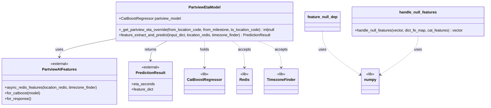

# Diagram: research/api_k8s/get_ai_eta/src/ai_models/partview_eta_ai_model.py


> Auto-generated by Obscura crawlers

## Diagram 1



> SVG rendering failed for this diagram.

## Diagram 2

```mermaid
flowchart TD
Start([feature_extract_and_predict(input_dict, location_redis, timezone_finder)]) --> CreateFeatures[Create PartviewAIFeatures(input_dict)]
CreateFeatures --> AwaitRedis[Await features_instance.async_redis_features(location_redis, timezone_finder)]
AwaitRedis --> ToVector[feature_vector = features_instance.for_catboost(self.partview_model)]
ToVector --> Predict[eta = self.partview_model.predict(feature_vector)[0]]
Predict --> CreatePred[pred = PredictionResult(eta_seconds=eta)]
CreatePred --> SetFeat[pred.feature_dict = features_instance.for_response()]
SetFeat --> Return[return pred]
Return --> End([Done])
```

> SVG rendering failed for this diagram.
