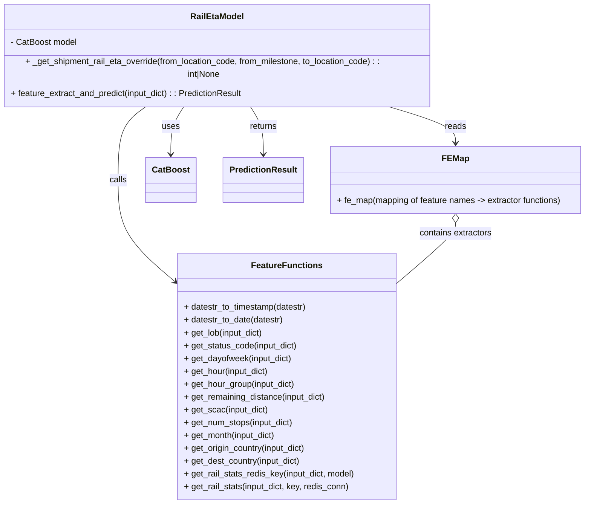

# Diagram: research/api_k8s/get_ai_eta/src/ai_models/rail_eta_ai_model.py


> Auto-generated by Obscura crawlers

## Diagram 1

```mermaid
flowchart TD
    InputDict[Input dict\n(input_dict)] --> Extract[extract_features(input_dict, fe_map)]
    Extract --> Iterate[Iterate fe_map entries]
    Iterate --> get_lob[get_lob]
    Iterate --> get_status[get_status_code]
    Iterate --> get_dayofweek[get_dayofweek]
    Iterate --> get_hour[get_hour]
    get_hour --> eta_fe_hour[eta_fe.get_hour]
    Iterate --> get_hour_group[get_hour_group]
    get_hour_group --> eta_fe_hg[eta_fe.hour_group_map]
    Iterate --> get_remaining[get_remaining_distance]
    Iterate --> get_scac[get_scac]
    Iterate --> get_num_stops[get_num_stops]
    Iterate --> get_month[get_month]
    get_month --> date_parse_month[date_parse -> .month]
    Iterate --> get_origin[get_origin_country]
    get_origin --> eta_fe_loc_origin[eta_fe.get_location_feature_by_name]
    Iterate --> get_dest[get_dest_country]
    get_dest --> eta_fe_loc_dest[eta_fe.get_location_feature_by_name]
    Iterate --> multi_key[MULTI_KEY -> get_rail_stats]
    multi_key --> get_rail_stats[get_rail_stats]
    get_rail_stats --> redis_key[get_rail_stats_redis_key]
    redis_key --> redis_get[redis.Redis.get / json.loads]
    redis_get --> MultiFeatures[returned multi features]
    get_lob --> FeatureDict
    get_status --> FeatureDict
    get_dayofweek --> FeatureDict
    get_hour_group --> FeatureDict
    get_remaining --> FeatureDict
    get_scac --> FeatureDict
    get_num_stops --> FeatureDict
    get_month --> FeatureDict
    get_origin --> FeatureDict
    get_dest --> FeatureDict
    MultiFeatures --> FeatureDict
    FeatureDict[feature_dict] --> FeatureVector[feature_vect = np.array([... model.feature_names_])]
    FeatureVector --> HandleNulls[handle_null_features(feature_vect, fe_map, CAT_FEATURES)]
    HandleNulls --> Predict[CatBoost.predict(feature_vect)]
    Predict --> PredictionResult[PredictionResult(eta_seconds=eta)]
```

> SVG rendering failed for this diagram.

## Diagram 2



### SVG

<svg id="container" width="1107.3828125" xmlns="http://www.w3.org/2000/svg" class="classDiagram" height="920" viewBox="0 0 1107.3828125 920" role="graphics-document document" aria-roledescription="class"><style>#container{font-family:"trebuchet ms",verdana,arial,sans-serif;font-size:16px;fill:#333;}@keyframes edge-animation-frame{from{stroke-dashoffset:0;}}@keyframes dash{to{stroke-dashoffset:0;}}#container .edge-animation-slow{stroke-dasharray:9,5!important;stroke-dashoffset:900;animation:dash 50s linear infinite;stroke-linecap:round;}#container .edge-animation-fast{stroke-dasharray:9,5!important;stroke-dashoffset:900;animation:dash 20s linear infinite;stroke-linecap:round;}#container .error-icon{fill:#552222;}#container .error-text{fill:#552222;stroke:#552222;}#container .edge-thickness-normal{stroke-width:1px;}#container .edge-thickness-thick{stroke-width:3.5px;}#container .edge-pattern-solid{stroke-dasharray:0;}#container .edge-thickness-invisible{stroke-width:0;fill:none;}#container .edge-pattern-dashed{stroke-dasharray:3;}#container .edge-pattern-dotted{stroke-dasharray:2;}#container .marker{fill:#333333;stroke:#333333;}#container .marker.cross{stroke:#333333;}#container svg{font-family:"trebuchet ms",verdana,arial,sans-serif;font-size:16px;}#container p{margin:0;}#container g.classGroup text{fill:#9370DB;stroke:none;font-family:"trebuchet ms",verdana,arial,sans-serif;font-size:10px;}#container g.classGroup text .title{font-weight:bolder;}#container .nodeLabel,#container .edgeLabel{color:#131300;}#container .edgeLabel .label rect{fill:#ECECFF;}#container .label text{fill:#131300;}#container .labelBkg{background:#ECECFF;}#container .edgeLabel .label span{background:#ECECFF;}#container .classTitle{font-weight:bolder;}#container .node rect,#container .node circle,#container .node ellipse,#container .node polygon,#container .node path{fill:#ECECFF;stroke:#9370DB;stroke-width:1px;}#container .divider{stroke:#9370DB;stroke-width:1;}#container g.clickable{cursor:pointer;}#container g.classGroup rect{fill:#ECECFF;stroke:#9370DB;}#container g.classGroup line{stroke:#9370DB;stroke-width:1;}#container .classLabel .box{stroke:none;stroke-width:0;fill:#ECECFF;opacity:0.5;}#container .classLabel .label{fill:#9370DB;font-size:10px;}#container .relation{stroke:#333333;stroke-width:1;fill:none;}#container .dashed-line{stroke-dasharray:3;}#container .dotted-line{stroke-dasharray:1 2;}#container #compositionStart,#container .composition{fill:#333333!important;stroke:#333333!important;stroke-width:1;}#container #compositionEnd,#container .composition{fill:#333333!important;stroke:#333333!important;stroke-width:1;}#container #dependencyStart,#container .dependency{fill:#333333!important;stroke:#333333!important;stroke-width:1;}#container #dependencyStart,#container .dependency{fill:#333333!important;stroke:#333333!important;stroke-width:1;}#container #extensionStart,#container .extension{fill:transparent!important;stroke:#333333!important;stroke-width:1;}#container #extensionEnd,#container .extension{fill:transparent!important;stroke:#333333!important;stroke-width:1;}#container #aggregationStart,#container .aggregation{fill:transparent!important;stroke:#333333!important;stroke-width:1;}#container #aggregationEnd,#container .aggregation{fill:transparent!important;stroke:#333333!important;stroke-width:1;}#container #lollipopStart,#container .lollipop{fill:#ECECFF!important;stroke:#333333!important;stroke-width:1;}#container #lollipopEnd,#container .lollipop{fill:#ECECFF!important;stroke:#333333!important;stroke-width:1;}#container .edgeTerminals{font-size:11px;line-height:initial;}#container .classTitleText{text-anchor:middle;font-size:18px;fill:#333;}#container .label-icon{display:inline-block;height:1em;overflow:visible;vertical-align:-0.125em;}#container .node .label-icon path{fill:currentColor;stroke:revert;stroke-width:revert;}#container :root{--mermaid-font-family:"trebuchet ms",verdana,arial,sans-serif;}</style><g><defs><marker id="container_class-aggregationStart" class="marker aggregation class" refX="18" refY="7" markerWidth="190" markerHeight="240" orient="auto"><path d="M 18,7 L9,13 L1,7 L9,1 Z"></path></marker></defs><defs><marker id="container_class-aggregationEnd" class="marker aggregation class" refX="1" refY="7" markerWidth="20" markerHeight="28" orient="auto"><path d="M 18,7 L9,13 L1,7 L9,1 Z"></path></marker></defs><defs><marker id="container_class-extensionStart" class="marker extension class" refX="18" refY="7" markerWidth="190" markerHeight="240" orient="auto"><path d="M 1,7 L18,13 V 1 Z"></path></marker></defs><defs><marker id="container_class-extensionEnd" class="marker extension class" refX="1" refY="7" markerWidth="20" markerHeight="28" orient="auto"><path d="M 1,1 V 13 L18,7 Z"></path></marker></defs><defs><marker id="container_class-compositionStart" class="marker composition class" refX="18" refY="7" markerWidth="190" markerHeight="240" orient="auto"><path d="M 18,7 L9,13 L1,7 L9,1 Z"></path></marker></defs><defs><marker id="container_class-compositionEnd" class="marker composition class" refX="1" refY="7" markerWidth="20" markerHeight="28" orient="auto"><path d="M 18,7 L9,13 L1,7 L9,1 Z"></path></marker></defs><defs><marker id="container_class-dependencyStart" class="marker dependency class" refX="6" refY="7" markerWidth="190" markerHeight="240" orient="auto"><path d="M 5,7 L9,13 L1,7 L9,1 Z"></path></marker></defs><defs><marker id="container_class-dependencyEnd" class="marker dependency class" refX="13" refY="7" markerWidth="20" markerHeight="28" orient="auto"><path d="M 18,7 L9,13 L14,7 L9,1 Z"></path></marker></defs><defs><marker id="container_class-lollipopStart" class="marker lollipop class" refX="13" refY="7" markerWidth="190" markerHeight="240" orient="auto"><circle stroke="black" fill="transparent" cx="7" cy="7" r="6"></circle></marker></defs><defs><marker id="container_class-lollipopEnd" class="marker lollipop class" refX="1" refY="7" markerWidth="190" markerHeight="240" orient="auto"><circle stroke="black" fill="transparent" cx="7" cy="7" r="6"></circle></marker></defs><g class="root"><g class="clusters"></g><g class="edgePaths"><path d="M358.977,176L354.699,182.167C350.42,188.333,341.862,200.667,337.583,215.5C333.305,230.333,333.305,247.667,333.305,256.333L333.305,265" id="id_RailEtaModel_CatBoost_1" class="edge-thickness-normal edge-pattern-solid relation" style=";;;" data-edge="true" data-et="edge" data-id="id_RailEtaModel_CatBoost_1" data-points="W3sieCI6MzU4Ljk3NzQ5ODcwODY3NzcsInkiOjE3Nn0seyJ4IjozMzMuMzA0Njg3NSwieSI6MjEzfSx7IngiOjMzMy4zMDQ2ODc1LCJ5IjoyNzF9XQ==" marker-end="url(#container_class-dependencyEnd)"></path><path d="M291.866,176L282.661,182.167C273.455,188.333,255.044,200.667,245.838,223.5C236.633,246.333,236.633,279.667,236.633,313C236.633,346.333,236.633,379.667,253.656,410.932C270.679,442.198,304.725,471.395,321.748,485.994L338.772,500.593" id="id_RailEtaModel_FeatureFunctions_2" class="edge-thickness-normal edge-pattern-solid relation" style=";;;" data-edge="true" data-et="edge" data-id="id_RailEtaModel_FeatureFunctions_2" data-points="W3sieCI6MjkxLjg2NjQ0NDk4OTY2OTQsInkiOjE3Nn0seyJ4IjoyMzYuNjMyODEyNSwieSI6MjEzfSx7IngiOjIzNi42MzI4MTI1LCJ5IjozMTN9LHsieCI6MjM2LjYzMjgxMjUsInkiOjQxM30seyJ4IjozNDMuMzI2MTcxODc1LCJ5Ijo1MDQuNDk4NTA5NDAyOTQ4N31d" marker-end="url(#container_class-dependencyEnd)"></path><path d="M725.759,176L748.406,182.167C771.054,188.333,816.349,200.667,838.997,212C861.645,223.333,861.645,233.667,861.645,238.833L861.645,244" id="id_RailEtaModel_FEMap_3" class="edge-thickness-normal edge-pattern-solid relation" style=";;;" data-edge="true" data-et="edge" data-id="id_RailEtaModel_FEMap_3" data-points="W3sieCI6NzI1Ljc1ODg3Nzg0MDkwOSwieSI6MTc2fSx7IngiOjg2MS42NDQ1MzEyNSwieSI6MjEzfSx7IngiOjg2MS42NDQ1MzEyNSwieSI6MjUwfV0=" marker-end="url(#container_class-dependencyEnd)"></path><path d="M475.546,176L479.825,182.167C484.104,188.333,492.661,200.667,496.94,215.5C501.219,230.333,501.219,247.667,501.219,256.333L501.219,265" id="id_RailEtaModel_PredictionResult_4" class="edge-thickness-normal edge-pattern-solid relation" style=";;;" data-edge="true" data-et="edge" data-id="id_RailEtaModel_PredictionResult_4" data-points="W3sieCI6NDc1LjU0NTkzODc5MTMyMjMsInkiOjE3Nn0seyJ4Ijo1MDEuMjE4NzUsInkiOjIxM30seyJ4Ijo1MDEuMjE4NzUsInkiOjI3MX1d" marker-end="url(#container_class-dependencyEnd)"></path><path d="M861.645,393.25L861.645,396.542C861.645,399.833,861.645,406.417,843.862,424.958C826.08,443.5,790.516,473.999,772.733,489.249L754.951,504.499" id="id_FEMap_FeatureFunctions_5" class="edge-thickness-normal edge-pattern-solid relation" style=";;;" data-edge="true" data-et="edge" data-id="id_FEMap_FeatureFunctions_5" data-points="W3sieCI6ODYxLjY0NDUzMTI1LCJ5IjozNzZ9LHsieCI6ODYxLjY0NDUzMTI1LCJ5Ijo0MTN9LHsieCI6NzU0Ljk1MTE3MTg3NSwieSI6NTA0LjQ5ODUwOTQwMjk0ODd9XQ==" marker-start="url(#container_class-aggregationStart)"></path></g><g class="edgeLabels"><g class="edgeLabel" transform="translate(333.3046875, 213)"><g class="label" data-id="id_RailEtaModel_CatBoost_1" transform="translate(-16.4921875, -12)"><foreignObject width="32.984375" height="24"><div xmlns="http://www.w3.org/1999/xhtml" class="labelBkg" style="display: table-cell; white-space: nowrap; line-height: 1.5; max-width: 200px; text-align: center;"><span class="edgeLabel"><p>uses</p></span></div></foreignObject></g></g><g class="edgeLabel" transform="translate(236.6328125, 313)"><g class="label" data-id="id_RailEtaModel_FeatureFunctions_2" transform="translate(-16.4453125, -12)"><foreignObject width="32.890625" height="24"><div xmlns="http://www.w3.org/1999/xhtml" class="labelBkg" style="display: table-cell; white-space: nowrap; line-height: 1.5; max-width: 200px; text-align: center;"><span class="edgeLabel"><p>calls</p></span></div></foreignObject></g></g><g class="edgeLabel" transform="translate(861.64453125, 213)"><g class="label" data-id="id_RailEtaModel_FEMap_3" transform="translate(-20.0078125, -12)"><foreignObject width="40.015625" height="24"><div xmlns="http://www.w3.org/1999/xhtml" class="labelBkg" style="display: table-cell; white-space: nowrap; line-height: 1.5; max-width: 200px; text-align: center;"><span class="edgeLabel"><p>reads</p></span></div></foreignObject></g></g><g class="edgeLabel" transform="translate(501.21875, 213)"><g class="label" data-id="id_RailEtaModel_PredictionResult_4" transform="translate(-26.265625, -12)"><foreignObject width="52.53125" height="24"><div xmlns="http://www.w3.org/1999/xhtml" class="labelBkg" style="display: table-cell; white-space: nowrap; line-height: 1.5; max-width: 200px; text-align: center;"><span class="edgeLabel"><p>returns</p></span></div></foreignObject></g></g><g class="edgeLabel" transform="translate(861.64453125, 413)"><g class="label" data-id="id_FEMap_FeatureFunctions_5" transform="translate(-69.1953125, -12)"><foreignObject width="138.390625" height="24"><div xmlns="http://www.w3.org/1999/xhtml" class="labelBkg" style="display: table-cell; white-space: nowrap; line-height: 1.5; max-width: 200px; text-align: center;"><span class="edgeLabel"><p>contains extractors</p></span></div></foreignObject></g></g></g><g class="nodes"><g class="node default" id="classId-RailEtaModel-0" transform="translate(417.26171875, 92)"><g class="basic label-container"><path d="M-409.26171875 -84 L409.26171875 -84 L409.26171875 84 L-409.26171875 84" stroke="none" stroke-width="0" fill="#ECECFF" style=""></path><path d="M-409.26171875 -84 C-232.59646533831608 -84, -55.93121192663216 -84, 409.26171875 -84 M-409.26171875 -84 C-181.34329992769304 -84, 46.57511889461392 -84, 409.26171875 -84 M409.26171875 -84 C409.26171875 -43.00087451591769, 409.26171875 -2.0017490318353737, 409.26171875 84 M409.26171875 -84 C409.26171875 -25.118022887979194, 409.26171875 33.76395422404161, 409.26171875 84 M409.26171875 84 C152.1189385917487 84, -105.0238415665026 84, -409.26171875 84 M409.26171875 84 C177.07198037503696 84, -55.117757999926084 84, -409.26171875 84 M-409.26171875 84 C-409.26171875 47.81943764051489, -409.26171875 11.638875281029783, -409.26171875 -84 M-409.26171875 84 C-409.26171875 18.50031722037231, -409.26171875 -46.99936555925538, -409.26171875 -84" stroke="#9370DB" stroke-width="1.3" fill="none" stroke-dasharray="0 0" style=""></path></g><g class="annotation-group text" transform="translate(0, -60)"></g><g class="label-group text" transform="translate(-47.8671875, -60)"><g class="label" style="font-weight: bolder" transform="translate(0,-12)"><foreignObject width="95.734375" height="24"><div xmlns="http://www.w3.org/1999/xhtml" style="display: table-cell; white-space: nowrap; line-height: 1.5; max-width: 145px; text-align: center;"><span class="nodeLabel markdown-node-label" style=""><p>RailEtaModel</p></span></div></foreignObject></g></g><g class="members-group text" transform="translate(-397.26171875, -12)"><g class="label" style="" transform="translate(0,-12)"><foreignObject width="125.90625" height="24"><div xmlns="http://www.w3.org/1999/xhtml" style="display: table-cell; white-space: nowrap; line-height: 1.5; max-width: 184px; text-align: center;"><span class="nodeLabel markdown-node-label" style=""><p>- CatBoost model</p></span></div></foreignObject></g></g><g class="methods-group text" transform="translate(-397.26171875, 36)"><g class="label" style="" transform="translate(0,-12)"><foreignObject width="746.65625" height="24"><div xmlns="http://www.w3.org/1999/xhtml" style="display: table-cell; white-space: nowrap; line-height: 1.5; max-width: 804px; text-align: center;"><span class="nodeLabel markdown-node-label" style=""><p>+ _get_shipment_rail_eta_override(from_location_code, from_milestone, to_location_code) : : int|None</p></span></div></foreignObject></g><g class="label" style="" transform="translate(0,12)"><foreignObject width="441.421875" height="24"><div xmlns="http://www.w3.org/1999/xhtml" style="display: table-cell; white-space: nowrap; line-height: 1.5; max-width: 499px; text-align: center;"><span class="nodeLabel markdown-node-label" style=""><p>+ feature_extract_and_predict(input_dict) : : PredictionResult</p></span></div></foreignObject></g></g><g class="divider" style=""><path d="M-409.26171875 -36 C-83.69965754402472 -36, 241.86240366195057 -36, 409.26171875 -36 M-409.26171875 -36 C-96.26897602414647 -36, 216.72376670170706 -36, 409.26171875 -36" stroke="#9370DB" stroke-width="1.3" fill="none" stroke-dasharray="0 0" style=""></path></g><g class="divider" style=""><path d="M-409.26171875 12 C-147.74102850724444 12, 113.77966173551113 12, 409.26171875 12 M-409.26171875 12 C-105.51804952728901 12, 198.22561969542198 12, 409.26171875 12" stroke="#9370DB" stroke-width="1.3" fill="none" stroke-dasharray="0 0" style=""></path></g></g><g class="node default" id="classId-FeatureFunctions-1" transform="translate(549.138671875, 681)"><g class="basic label-container"><path d="M-205.8125 -231 L205.8125 -231 L205.8125 231 L-205.8125 231" stroke="none" stroke-width="0" fill="#ECECFF" style=""></path><path d="M-205.8125 -231 C-78.63641545737437 -231, 48.53966908525126 -231, 205.8125 -231 M-205.8125 -231 C-99.06223119708709 -231, 7.688037605825826 -231, 205.8125 -231 M205.8125 -231 C205.8125 -74.05331958038727, 205.8125 82.89336083922547, 205.8125 231 M205.8125 -231 C205.8125 -128.34814230185688, 205.8125 -25.696284603713764, 205.8125 231 M205.8125 231 C99.29657034334247 231, -7.219359313315067 231, -205.8125 231 M205.8125 231 C109.5015041018365 231, 13.190508203673005 231, -205.8125 231 M-205.8125 231 C-205.8125 79.60743162755878, -205.8125 -71.78513674488244, -205.8125 -231 M-205.8125 231 C-205.8125 136.96753242209718, -205.8125 42.935064844194386, -205.8125 -231" stroke="#9370DB" stroke-width="1.3" fill="none" stroke-dasharray="0 0" style=""></path></g><g class="annotation-group text" transform="translate(0, -207)"></g><g class="label-group text" transform="translate(-62.515625, -207)"><g class="label" style="font-weight: bolder" transform="translate(0,-12)"><foreignObject width="125.03125" height="24"><div xmlns="http://www.w3.org/1999/xhtml" style="display: table-cell; white-space: nowrap; line-height: 1.5; max-width: 174px; text-align: center;"><span class="nodeLabel markdown-node-label" style=""><p>FeatureFunctions</p></span></div></foreignObject></g></g><g class="members-group text" transform="translate(-193.8125, -159)"></g><g class="methods-group text" transform="translate(-193.8125, -129)"><g class="label" style="" transform="translate(0,-12)"><foreignObject width="233.5625" height="24"><div xmlns="http://www.w3.org/1999/xhtml" style="display: table-cell; white-space: nowrap; line-height: 1.5; max-width: 291px; text-align: center;"><span class="nodeLabel markdown-node-label" style=""><p>+ datestr_to_timestamp(datestr)</p></span></div></foreignObject></g><g class="label" style="" transform="translate(0,12)"><foreignObject width="188.3125" height="24"><div xmlns="http://www.w3.org/1999/xhtml" style="display: table-cell; white-space: nowrap; line-height: 1.5; max-width: 246px; text-align: center;"><span class="nodeLabel markdown-node-label" style=""><p>+ datestr_to_date(datestr)</p></span></div></foreignObject></g><g class="label" style="" transform="translate(0,36)"><foreignObject width="150.765625" height="24"><div xmlns="http://www.w3.org/1999/xhtml" style="display: table-cell; white-space: nowrap; line-height: 1.5; max-width: 208px; text-align: center;"><span class="nodeLabel markdown-node-label" style=""><p>+ get_lob(input_dict)</p></span></div></foreignObject></g><g class="label" style="" transform="translate(0,60)"><foreignObject width="214.5" height="24"><div xmlns="http://www.w3.org/1999/xhtml" style="display: table-cell; white-space: nowrap; line-height: 1.5; max-width: 272px; text-align: center;"><span class="nodeLabel markdown-node-label" style=""><p>+ get_status_code(input_dict)</p></span></div></foreignObject></g><g class="label" style="" transform="translate(0,84)"><foreignObject width="204.796875" height="24"><div xmlns="http://www.w3.org/1999/xhtml" style="display: table-cell; white-space: nowrap; line-height: 1.5; max-width: 262px; text-align: center;"><span class="nodeLabel markdown-node-label" style=""><p>+ get_dayofweek(input_dict)</p></span></div></foreignObject></g><g class="label" style="" transform="translate(0,108)"><foreignObject width="161.671875" height="24"><div xmlns="http://www.w3.org/1999/xhtml" style="display: table-cell; white-space: nowrap; line-height: 1.5; max-width: 219px; text-align: center;"><span class="nodeLabel markdown-node-label" style=""><p>+ get_hour(input_dict)</p></span></div></foreignObject></g><g class="label" style="" transform="translate(0,132)"><foreignObject width="211.03125" height="24"><div xmlns="http://www.w3.org/1999/xhtml" style="display: table-cell; white-space: nowrap; line-height: 1.5; max-width: 268px; text-align: center;"><span class="nodeLabel markdown-node-label" style=""><p>+ get_hour_group(input_dict)</p></span></div></foreignObject></g><g class="label" style="" transform="translate(0,156)"><foreignObject width="269.796875" height="24"><div xmlns="http://www.w3.org/1999/xhtml" style="display: table-cell; white-space: nowrap; line-height: 1.5; max-width: 327px; text-align: center;"><span class="nodeLabel markdown-node-label" style=""><p>+ get_remaining_distance(input_dict)</p></span></div></foreignObject></g><g class="label" style="" transform="translate(0,180)"><foreignObject width="158.78125" height="24"><div xmlns="http://www.w3.org/1999/xhtml" style="display: table-cell; white-space: nowrap; line-height: 1.5; max-width: 216px; text-align: center;"><span class="nodeLabel markdown-node-label" style=""><p>+ get_scac(input_dict)</p></span></div></foreignObject></g><g class="label" style="" transform="translate(0,204)"><foreignObject width="207.515625" height="24"><div xmlns="http://www.w3.org/1999/xhtml" style="display: table-cell; white-space: nowrap; line-height: 1.5; max-width: 265px; text-align: center;"><span class="nodeLabel markdown-node-label" style=""><p>+ get_num_stops(input_dict)</p></span></div></foreignObject></g><g class="label" style="" transform="translate(0,228)"><foreignObject width="175.046875" height="24"><div xmlns="http://www.w3.org/1999/xhtml" style="display: table-cell; white-space: nowrap; line-height: 1.5; max-width: 232px; text-align: center;"><span class="nodeLabel markdown-node-label" style=""><p>+ get_month(input_dict)</p></span></div></foreignObject></g><g class="label" style="" transform="translate(0,252)"><foreignObject width="232.5625" height="24"><div xmlns="http://www.w3.org/1999/xhtml" style="display: table-cell; white-space: nowrap; line-height: 1.5; max-width: 290px; text-align: center;"><span class="nodeLabel markdown-node-label" style=""><p>+ get_origin_country(input_dict)</p></span></div></foreignObject></g><g class="label" style="" transform="translate(0,276)"><foreignObject width="221.859375" height="24"><div xmlns="http://www.w3.org/1999/xhtml" style="display: table-cell; white-space: nowrap; line-height: 1.5; max-width: 279px; text-align: center;"><span class="nodeLabel markdown-node-label" style=""><p>+ get_dest_country(input_dict)</p></span></div></foreignObject></g><g class="label" style="" transform="translate(0,300)"><foreignObject width="325.109375" height="24"><div xmlns="http://www.w3.org/1999/xhtml" style="display: table-cell; white-space: nowrap; line-height: 1.5; max-width: 382px; text-align: center;"><span class="nodeLabel markdown-node-label" style=""><p>+ get_rail_stats_redis_key(input_dict, model)</p></span></div></foreignObject></g><g class="label" style="" transform="translate(0,324)"><foreignObject width="313.625" height="24"><div xmlns="http://www.w3.org/1999/xhtml" style="display: table-cell; white-space: nowrap; line-height: 1.5; max-width: 371px; text-align: center;"><span class="nodeLabel markdown-node-label" style=""><p>+ get_rail_stats(input_dict, key, redis_conn)</p></span></div></foreignObject></g></g><g class="divider" style=""><path d="M-205.8125 -183 C-97.35340899794429 -183, 11.10568200411143 -183, 205.8125 -183 M-205.8125 -183 C-109.78839515279421 -183, -13.764290305588418 -183, 205.8125 -183" stroke="#9370DB" stroke-width="1.3" fill="none" stroke-dasharray="0 0" style=""></path></g><g class="divider" style=""><path d="M-205.8125 -159 C-113.34239275553952 -159, -20.872285511079042 -159, 205.8125 -159 M-205.8125 -159 C-111.39650094057019 -159, -16.980501881140384 -159, 205.8125 -159" stroke="#9370DB" stroke-width="1.3" fill="none" stroke-dasharray="0 0" style=""></path></g></g><g class="node default" id="classId-FEMap-2" transform="translate(861.64453125, 313)"><g class="basic label-container"><path d="M-237.73828125 -63 L237.73828125 -63 L237.73828125 63 L-237.73828125 63" stroke="none" stroke-width="0" fill="#ECECFF" style=""></path><path d="M-237.73828125 -63 C-56.35447691190714 -63, 125.02932742618572 -63, 237.73828125 -63 M-237.73828125 -63 C-80.56676936958809 -63, 76.60474251082383 -63, 237.73828125 -63 M237.73828125 -63 C237.73828125 -29.595188462830208, 237.73828125 3.8096230743395836, 237.73828125 63 M237.73828125 -63 C237.73828125 -20.345605017312273, 237.73828125 22.308789965375453, 237.73828125 63 M237.73828125 63 C57.09893077270064 63, -123.54041970459872 63, -237.73828125 63 M237.73828125 63 C64.89422090568627 63, -107.94983943862746 63, -237.73828125 63 M-237.73828125 63 C-237.73828125 23.15657779364087, -237.73828125 -16.68684441271826, -237.73828125 -63 M-237.73828125 63 C-237.73828125 15.275359423097179, -237.73828125 -32.44928115380564, -237.73828125 -63" stroke="#9370DB" stroke-width="1.3" fill="none" stroke-dasharray="0 0" style=""></path></g><g class="annotation-group text" transform="translate(0, -39)"></g><g class="label-group text" transform="translate(-23.5546875, -39)"><g class="label" style="font-weight: bolder" transform="translate(0,-12)"><foreignObject width="47.109375" height="24"><div xmlns="http://www.w3.org/1999/xhtml" style="display: table-cell; white-space: nowrap; line-height: 1.5; max-width: 97px; text-align: center;"><span class="nodeLabel markdown-node-label" style=""><p>FEMap</p></span></div></foreignObject></g></g><g class="members-group text" transform="translate(-225.73828125, 9)"></g><g class="methods-group text" transform="translate(-225.73828125, 39)"><g class="label" style="" transform="translate(0,-12)"><foreignObject width="427.921875" height="24"><div xmlns="http://www.w3.org/1999/xhtml" style="display: table-cell; white-space: nowrap; line-height: 1.5; max-width: 506px; text-align: center;"><span class="nodeLabel markdown-node-label" style=""><p>+ fe_map(mapping of feature names -&gt; extractor functions)</p></span></div></foreignObject></g></g><g class="divider" style=""><path d="M-237.73828125 -15 C-97.32963852857316 -15, 43.07900419285369 -15, 237.73828125 -15 M-237.73828125 -15 C-50.10806870742087 -15, 137.52214383515826 -15, 237.73828125 -15" stroke="#9370DB" stroke-width="1.3" fill="none" stroke-dasharray="0 0" style=""></path></g><g class="divider" style=""><path d="M-237.73828125 9 C-85.91608675201417 9, 65.90610774597167 9, 237.73828125 9 M-237.73828125 9 C-52.20281348416725 9, 133.3326542816655 9, 237.73828125 9" stroke="#9370DB" stroke-width="1.3" fill="none" stroke-dasharray="0 0" style=""></path></g></g><g class="node default" id="classId-CatBoost-3" transform="translate(333.3046875, 313)"><g class="basic label-container"><path d="M-45.2265625 -42 L45.2265625 -42 L45.2265625 42 L-45.2265625 42" stroke="none" stroke-width="0" fill="#ECECFF" style=""></path><path d="M-45.2265625 -42 C-13.78113923450378 -42, 17.66428403099244 -42, 45.2265625 -42 M-45.2265625 -42 C-13.870034306784447 -42, 17.486493886431106 -42, 45.2265625 -42 M45.2265625 -42 C45.2265625 -10.800567800794319, 45.2265625 20.398864398411362, 45.2265625 42 M45.2265625 -42 C45.2265625 -23.409957814026093, 45.2265625 -4.819915628052186, 45.2265625 42 M45.2265625 42 C10.633992685092629 42, -23.958577129814742 42, -45.2265625 42 M45.2265625 42 C16.73886434650446 42, -11.74883380699108 42, -45.2265625 42 M-45.2265625 42 C-45.2265625 9.444719022586547, -45.2265625 -23.110561954826906, -45.2265625 -42 M-45.2265625 42 C-45.2265625 8.890839405073905, -45.2265625 -24.21832118985219, -45.2265625 -42" stroke="#9370DB" stroke-width="1.3" fill="none" stroke-dasharray="0 0" style=""></path></g><g class="annotation-group text" transform="translate(0, -18)"></g><g class="label-group text" transform="translate(-33.2265625, -18)"><g class="label" style="font-weight: bolder" transform="translate(0,-12)"><foreignObject width="66.453125" height="24"><div xmlns="http://www.w3.org/1999/xhtml" style="display: table-cell; white-space: nowrap; line-height: 1.5; max-width: 115px; text-align: center;"><span class="nodeLabel markdown-node-label" style=""><p>CatBoost</p></span></div></foreignObject></g></g><g class="members-group text" transform="translate(-33.2265625, 30)"></g><g class="methods-group text" transform="translate(-33.2265625, 60)"></g><g class="divider" style=""><path d="M-45.2265625 6 C-25.22383398636995 6, -5.2211054727399 6, 45.2265625 6 M-45.2265625 6 C-17.259908927839575 6, 10.70674464432085 6, 45.2265625 6" stroke="#9370DB" stroke-width="1.3" fill="none" stroke-dasharray="0 0" style=""></path></g><g class="divider" style=""><path d="M-45.2265625 24 C-24.655869078007985 24, -4.08517565601597 24, 45.2265625 24 M-45.2265625 24 C-14.580630757700089 24, 16.065300984599823 24, 45.2265625 24" stroke="#9370DB" stroke-width="1.3" fill="none" stroke-dasharray="0 0" style=""></path></g></g><g class="node default" id="classId-PredictionResult-4" transform="translate(501.21875, 313)"><g class="basic label-container"><path d="M-72.6875 -42 L72.6875 -42 L72.6875 42 L-72.6875 42" stroke="none" stroke-width="0" fill="#ECECFF" style=""></path><path d="M-72.6875 -42 C-25.225167421259968 -42, 22.237165157480064 -42, 72.6875 -42 M-72.6875 -42 C-19.37928917677631 -42, 33.92892164644738 -42, 72.6875 -42 M72.6875 -42 C72.6875 -13.730427843117969, 72.6875 14.539144313764062, 72.6875 42 M72.6875 -42 C72.6875 -17.915815123883775, 72.6875 6.168369752232451, 72.6875 42 M72.6875 42 C14.874655382676522 42, -42.938189234646956 42, -72.6875 42 M72.6875 42 C32.13218417557929 42, -8.42313164884142 42, -72.6875 42 M-72.6875 42 C-72.6875 24.660881857117975, -72.6875 7.321763714235949, -72.6875 -42 M-72.6875 42 C-72.6875 21.556045943043866, -72.6875 1.1120918860877325, -72.6875 -42" stroke="#9370DB" stroke-width="1.3" fill="none" stroke-dasharray="0 0" style=""></path></g><g class="annotation-group text" transform="translate(0, -18)"></g><g class="label-group text" transform="translate(-60.6875, -18)"><g class="label" style="font-weight: bolder" transform="translate(0,-12)"><foreignObject width="121.375" height="24"><div xmlns="http://www.w3.org/1999/xhtml" style="display: table-cell; white-space: nowrap; line-height: 1.5; max-width: 170px; text-align: center;"><span class="nodeLabel markdown-node-label" style=""><p>PredictionResult</p></span></div></foreignObject></g></g><g class="members-group text" transform="translate(-60.6875, 30)"></g><g class="methods-group text" transform="translate(-60.6875, 60)"></g><g class="divider" style=""><path d="M-72.6875 6 C-34.12603689216192 6, 4.435426215676159 6, 72.6875 6 M-72.6875 6 C-26.84457108188824 6, 18.99835783622352 6, 72.6875 6" stroke="#9370DB" stroke-width="1.3" fill="none" stroke-dasharray="0 0" style=""></path></g><g class="divider" style=""><path d="M-72.6875 24 C-16.59426592678919 24, 39.49896814642162 24, 72.6875 24 M-72.6875 24 C-26.151354816421303 24, 20.384790367157393 24, 72.6875 24" stroke="#9370DB" stroke-width="1.3" fill="none" stroke-dasharray="0 0" style=""></path></g></g></g></g></g></svg>
