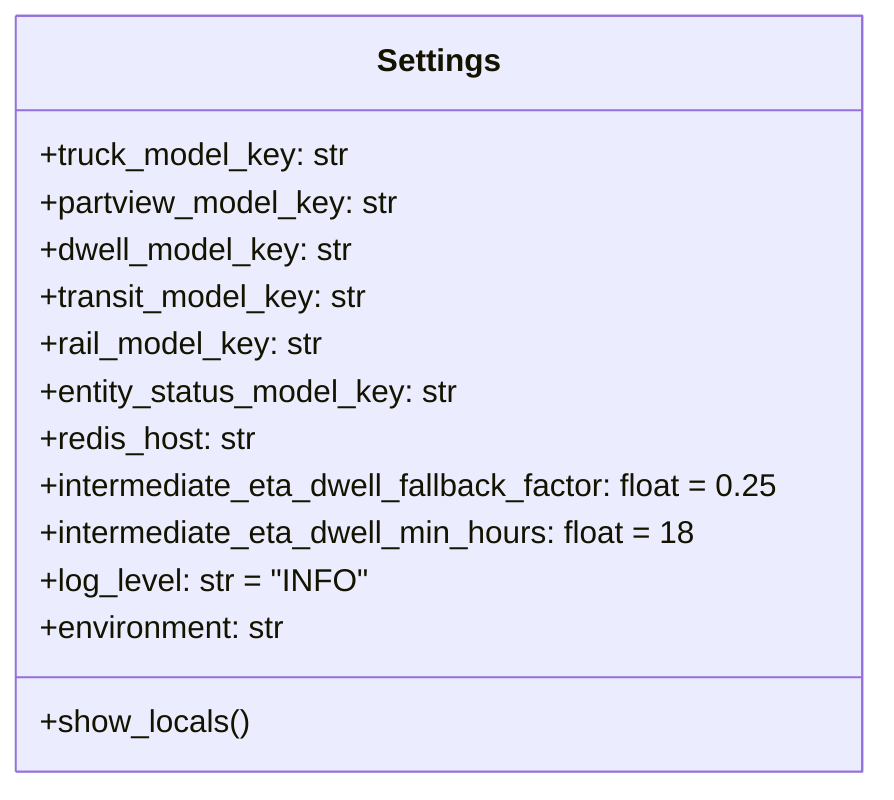

# Diagram: research/api_k8s/get_ai_eta/src/config.py


> Auto-generated by Obscura crawlers

## Diagram 1



### SVG

<svg id="container" width="451.4453125" xmlns="http://www.w3.org/2000/svg" class="classDiagram" height="400" viewBox="0 0 451.4453125 400" role="graphics-document document" aria-roledescription="class"><style>#container{font-family:"trebuchet ms",verdana,arial,sans-serif;font-size:16px;fill:#333;}@keyframes edge-animation-frame{from{stroke-dashoffset:0;}}@keyframes dash{to{stroke-dashoffset:0;}}#container .edge-animation-slow{stroke-dasharray:9,5!important;stroke-dashoffset:900;animation:dash 50s linear infinite;stroke-linecap:round;}#container .edge-animation-fast{stroke-dasharray:9,5!important;stroke-dashoffset:900;animation:dash 20s linear infinite;stroke-linecap:round;}#container .error-icon{fill:#552222;}#container .error-text{fill:#552222;stroke:#552222;}#container .edge-thickness-normal{stroke-width:1px;}#container .edge-thickness-thick{stroke-width:3.5px;}#container .edge-pattern-solid{stroke-dasharray:0;}#container .edge-thickness-invisible{stroke-width:0;fill:none;}#container .edge-pattern-dashed{stroke-dasharray:3;}#container .edge-pattern-dotted{stroke-dasharray:2;}#container .marker{fill:#333333;stroke:#333333;}#container .marker.cross{stroke:#333333;}#container svg{font-family:"trebuchet ms",verdana,arial,sans-serif;font-size:16px;}#container p{margin:0;}#container g.classGroup text{fill:#9370DB;stroke:none;font-family:"trebuchet ms",verdana,arial,sans-serif;font-size:10px;}#container g.classGroup text .title{font-weight:bolder;}#container .nodeLabel,#container .edgeLabel{color:#131300;}#container .edgeLabel .label rect{fill:#ECECFF;}#container .label text{fill:#131300;}#container .labelBkg{background:#ECECFF;}#container .edgeLabel .label span{background:#ECECFF;}#container .classTitle{font-weight:bolder;}#container .node rect,#container .node circle,#container .node ellipse,#container .node polygon,#container .node path{fill:#ECECFF;stroke:#9370DB;stroke-width:1px;}#container .divider{stroke:#9370DB;stroke-width:1;}#container g.clickable{cursor:pointer;}#container g.classGroup rect{fill:#ECECFF;stroke:#9370DB;}#container g.classGroup line{stroke:#9370DB;stroke-width:1;}#container .classLabel .box{stroke:none;stroke-width:0;fill:#ECECFF;opacity:0.5;}#container .classLabel .label{fill:#9370DB;font-size:10px;}#container .relation{stroke:#333333;stroke-width:1;fill:none;}#container .dashed-line{stroke-dasharray:3;}#container .dotted-line{stroke-dasharray:1 2;}#container #compositionStart,#container .composition{fill:#333333!important;stroke:#333333!important;stroke-width:1;}#container #compositionEnd,#container .composition{fill:#333333!important;stroke:#333333!important;stroke-width:1;}#container #dependencyStart,#container .dependency{fill:#333333!important;stroke:#333333!important;stroke-width:1;}#container #dependencyStart,#container .dependency{fill:#333333!important;stroke:#333333!important;stroke-width:1;}#container #extensionStart,#container .extension{fill:transparent!important;stroke:#333333!important;stroke-width:1;}#container #extensionEnd,#container .extension{fill:transparent!important;stroke:#333333!important;stroke-width:1;}#container #aggregationStart,#container .aggregation{fill:transparent!important;stroke:#333333!important;stroke-width:1;}#container #aggregationEnd,#container .aggregation{fill:transparent!important;stroke:#333333!important;stroke-width:1;}#container #lollipopStart,#container .lollipop{fill:#ECECFF!important;stroke:#333333!important;stroke-width:1;}#container #lollipopEnd,#container .lollipop{fill:#ECECFF!important;stroke:#333333!important;stroke-width:1;}#container .edgeTerminals{font-size:11px;line-height:initial;}#container .classTitleText{text-anchor:middle;font-size:18px;fill:#333;}#container .label-icon{display:inline-block;height:1em;overflow:visible;vertical-align:-0.125em;}#container .node .label-icon path{fill:currentColor;stroke:revert;stroke-width:revert;}#container :root{--mermaid-font-family:"trebuchet ms",verdana,arial,sans-serif;}</style><g><defs><marker id="container_class-aggregationStart" class="marker aggregation class" refX="18" refY="7" markerWidth="190" markerHeight="240" orient="auto"><path d="M 18,7 L9,13 L1,7 L9,1 Z"></path></marker></defs><defs><marker id="container_class-aggregationEnd" class="marker aggregation class" refX="1" refY="7" markerWidth="20" markerHeight="28" orient="auto"><path d="M 18,7 L9,13 L1,7 L9,1 Z"></path></marker></defs><defs><marker id="container_class-extensionStart" class="marker extension class" refX="18" refY="7" markerWidth="190" markerHeight="240" orient="auto"><path d="M 1,7 L18,13 V 1 Z"></path></marker></defs><defs><marker id="container_class-extensionEnd" class="marker extension class" refX="1" refY="7" markerWidth="20" markerHeight="28" orient="auto"><path d="M 1,1 V 13 L18,7 Z"></path></marker></defs><defs><marker id="container_class-compositionStart" class="marker composition class" refX="18" refY="7" markerWidth="190" markerHeight="240" orient="auto"><path d="M 18,7 L9,13 L1,7 L9,1 Z"></path></marker></defs><defs><marker id="container_class-compositionEnd" class="marker composition class" refX="1" refY="7" markerWidth="20" markerHeight="28" orient="auto"><path d="M 18,7 L9,13 L1,7 L9,1 Z"></path></marker></defs><defs><marker id="container_class-dependencyStart" class="marker dependency class" refX="6" refY="7" markerWidth="190" markerHeight="240" orient="auto"><path d="M 5,7 L9,13 L1,7 L9,1 Z"></path></marker></defs><defs><marker id="container_class-dependencyEnd" class="marker dependency class" refX="13" refY="7" markerWidth="20" markerHeight="28" orient="auto"><path d="M 18,7 L9,13 L14,7 L9,1 Z"></path></marker></defs><defs><marker id="container_class-lollipopStart" class="marker lollipop class" refX="13" refY="7" markerWidth="190" markerHeight="240" orient="auto"><circle stroke="black" fill="transparent" cx="7" cy="7" r="6"></circle></marker></defs><defs><marker id="container_class-lollipopEnd" class="marker lollipop class" refX="1" refY="7" markerWidth="190" markerHeight="240" orient="auto"><circle stroke="black" fill="transparent" cx="7" cy="7" r="6"></circle></marker></defs><g class="root"><g class="clusters"></g><g class="edgePaths"></g><g class="edgeLabels"></g><g class="nodes"><g class="node default" id="classId-Settings-0" transform="translate(225.72265625, 200)"><g class="basic label-container"><path d="M-217.72265625 -192 L217.72265625 -192 L217.72265625 192 L-217.72265625 192" stroke="none" stroke-width="0" fill="#ECECFF" style=""></path><path d="M-217.72265625 -192 C-77.67907150591586 -192, 62.364513238168286 -192, 217.72265625 -192 M-217.72265625 -192 C-45.467730337365936 -192, 126.78719557526813 -192, 217.72265625 -192 M217.72265625 -192 C217.72265625 -100.51498605796357, 217.72265625 -9.029972115927137, 217.72265625 192 M217.72265625 -192 C217.72265625 -71.65539396521194, 217.72265625 48.689212069576115, 217.72265625 192 M217.72265625 192 C70.1922236635115 192, -77.338208922977 192, -217.72265625 192 M217.72265625 192 C61.870042809977036 192, -93.98257063004593 192, -217.72265625 192 M-217.72265625 192 C-217.72265625 76.71843895412732, -217.72265625 -38.563122091745356, -217.72265625 -192 M-217.72265625 192 C-217.72265625 77.22020936386149, -217.72265625 -37.55958127227703, -217.72265625 -192" stroke="#9370DB" stroke-width="1.3" fill="none" stroke-dasharray="0 0" style=""></path></g><g class="annotation-group text" transform="translate(0, -168)"></g><g class="label-group text" transform="translate(-30.2421875, -168)"><g class="label" style="font-weight: bolder" transform="translate(0,-12)"><foreignObject width="60.484375" height="24"><div xmlns="http://www.w3.org/1999/xhtml" style="display: table-cell; white-space: nowrap; line-height: 1.5; max-width: 109px; text-align: center;"><span class="nodeLabel markdown-node-label" style=""><p>Settings</p></span></div></foreignObject></g></g><g class="members-group text" transform="translate(-205.72265625, -120)"><g class="label" style="" transform="translate(0,-12)"><foreignObject width="159.828125" height="24"><div xmlns="http://www.w3.org/1999/xhtml" style="display: table-cell; white-space: nowrap; line-height: 1.5; max-width: 218px; text-align: center;"><span class="nodeLabel markdown-node-label" style=""><p>+truck_model_key: str</p></span></div></foreignObject></g><g class="label" style="" transform="translate(0,12)"><foreignObject width="184.984375" height="24"><div xmlns="http://www.w3.org/1999/xhtml" style="display: table-cell; white-space: nowrap; line-height: 1.5; max-width: 243px; text-align: center;"><span class="nodeLabel markdown-node-label" style=""><p>+partview_model_key: str</p></span></div></foreignObject></g><g class="label" style="" transform="translate(0,36)"><foreignObject width="161.9375" height="24"><div xmlns="http://www.w3.org/1999/xhtml" style="display: table-cell; white-space: nowrap; line-height: 1.5; max-width: 220px; text-align: center;"><span class="nodeLabel markdown-node-label" style=""><p>+dwell_model_key: str</p></span></div></foreignObject></g><g class="label" style="" transform="translate(0,60)"><foreignObject width="169.953125" height="24"><div xmlns="http://www.w3.org/1999/xhtml" style="display: table-cell; white-space: nowrap; line-height: 1.5; max-width: 228px; text-align: center;"><span class="nodeLabel markdown-node-label" style=""><p>+transit_model_key: str</p></span></div></foreignObject></g><g class="label" style="" transform="translate(0,84)"><foreignObject width="146.328125" height="24"><div xmlns="http://www.w3.org/1999/xhtml" style="display: table-cell; white-space: nowrap; line-height: 1.5; max-width: 205px; text-align: center;"><span class="nodeLabel markdown-node-label" style=""><p>+rail_model_key: str</p></span></div></foreignObject></g><g class="label" style="" transform="translate(0,108)"><foreignObject width="216.6875" height="24"><div xmlns="http://www.w3.org/1999/xhtml" style="display: table-cell; white-space: nowrap; line-height: 1.5; max-width: 275px; text-align: center;"><span class="nodeLabel markdown-node-label" style=""><p>+entity_status_model_key: str</p></span></div></foreignObject></g><g class="label" style="" transform="translate(0,132)"><foreignObject width="111.5" height="24"><div xmlns="http://www.w3.org/1999/xhtml" style="display: table-cell; white-space: nowrap; line-height: 1.5; max-width: 170px; text-align: center;"><span class="nodeLabel markdown-node-label" style=""><p>+redis_host: str</p></span></div></foreignObject></g><g class="label" style="" transform="translate(0,156)"><foreignObject width="381.203125" height="24"><div xmlns="http://www.w3.org/1999/xhtml" style="display: table-cell; white-space: nowrap; line-height: 1.5; max-width: 439px; text-align: center;"><span class="nodeLabel markdown-node-label" style=""><p>+intermediate_eta_dwell_fallback_factor: float = 0.25</p></span></div></foreignObject></g><g class="label" style="" transform="translate(0,180)"><foreignObject width="338.734375" height="24"><div xmlns="http://www.w3.org/1999/xhtml" style="display: table-cell; white-space: nowrap; line-height: 1.5; max-width: 396px; text-align: center;"><span class="nodeLabel markdown-node-label" style=""><p>+intermediate_eta_dwell_min_hours: float = 18</p></span></div></foreignObject></g><g class="label" style="" transform="translate(0,204)"><foreignObject width="164.1875" height="24"><div xmlns="http://www.w3.org/1999/xhtml" style="display: table-cell; white-space: nowrap; line-height: 1.5; max-width: 222px; text-align: center;"><span class="nodeLabel markdown-node-label" style=""><p>+log_level: str = "INFO"</p></span></div></foreignObject></g><g class="label" style="" transform="translate(0,228)"><foreignObject width="127.921875" height="24"><div xmlns="http://www.w3.org/1999/xhtml" style="display: table-cell; white-space: nowrap; line-height: 1.5; max-width: 186px; text-align: center;"><span class="nodeLabel markdown-node-label" style=""><p>+environment: str</p></span></div></foreignObject></g></g><g class="methods-group text" transform="translate(-205.72265625, 168)"><g class="label" style="" transform="translate(0,-12)"><foreignObject width="106.015625" height="24"><div xmlns="http://www.w3.org/1999/xhtml" style="display: table-cell; white-space: nowrap; line-height: 1.5; max-width: 163px; text-align: center;"><span class="nodeLabel markdown-node-label" style=""><p>+show_locals()</p></span></div></foreignObject></g></g><g class="divider" style=""><path d="M-217.72265625 -144 C-93.80567064738757 -144, 30.111314955224856 -144, 217.72265625 -144 M-217.72265625 -144 C-64.30643112290744 -144, 89.10979400418512 -144, 217.72265625 -144" stroke="#9370DB" stroke-width="1.3" fill="none" stroke-dasharray="0 0" style=""></path></g><g class="divider" style=""><path d="M-217.72265625 144 C-47.94255928574455 144, 121.8375376785109 144, 217.72265625 144 M-217.72265625 144 C-55.17984314411305 144, 107.3629699617739 144, 217.72265625 144" stroke="#9370DB" stroke-width="1.3" fill="none" stroke-dasharray="0 0" style=""></path></g></g></g></g></g></svg>

## Diagram 2

```mermaid
flowchart TD
    A[get_settings()] --> B[Settings.model_validate()]
    B --> C[configure_structlog(_settings.log_level, _settings.environment)]
    C --> D[get_redis_pool(db=0) - cached]
    D --> E[ConnectionPool(host=_settings.redis_host)]
    E --> F[location_redis_conn(db=REDIS_LOCATION_TO_FEATURES_DB)]
    E --> G[override_redis_conn(db=REDIS_OVERRIDE_DB)]
    E --> H[batch_redis_conn(db=REDIS_DWELL_DB)]
    F --> I[(Redis)]
    G --> J[(Redis)]
    H --> K[(Redis)]
    I --> L[yield redis]
    L --> M[await redis.aclose()]
    J --> N[yield redis]
    N --> O[await redis.aclose()]
    K --> P[yield redis]
    P --> Q[await redis.aclose()]
```

> SVG rendering failed for this diagram.
