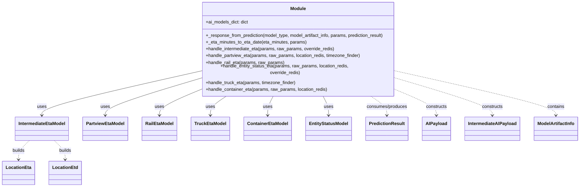
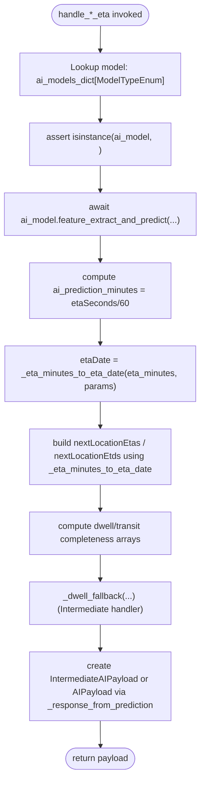

# Diagram: research/api_k8s/get_ai_eta/src/handlers.py

> Auto-generated by Obscura crawlers

## Diagram 1

### SVG

<svg id="container" width="2008.24609375" xmlns="http://www.w3.org/2000/svg" class="classDiagram" height="644" viewBox="0 0 2008.24609375 644" role="graphics-document document" aria-roledescription="class"><g><defs><marker id="container_class-aggregationStart" class="marker aggregation class" refX="18" refY="7" markerWidth="190" markerHeight="240" orient="auto"><path d="M 18,7 L9,13 L1,7 L9,1 Z"></path></marker></defs><defs><marker id="container_class-aggregationEnd" class="marker aggregation class" refX="1" refY="7" markerWidth="20" markerHeight="28" orient="auto"><path d="M 18,7 L9,13 L1,7 L9,1 Z"></path></marker></defs><defs><marker id="container_class-extensionStart" class="marker extension class" refX="18" refY="7" markerWidth="190" markerHeight="240" orient="auto"><path d="M 1,7 L18,13 V 1 Z"></path></marker></defs><defs><marker id="container_class-extensionEnd" class="marker extension class" refX="1" refY="7" markerWidth="20" markerHeight="28" orient="auto"><path d="M 1,1 V 13 L18,7 Z"></path></marker></defs><defs><marker id="container_class-compositionStart" class="marker composition class" refX="18" refY="7" markerWidth="190" markerHeight="240" orient="auto"><path d="M 18,7 L9,13 L1,7 L9,1 Z"></path></marker></defs><defs><marker id="container_class-compositionEnd" class="marker composition class" refX="1" refY="7" markerWidth="20" markerHeight="28" orient="auto"><path d="M 18,7 L9,13 L1,7 L9,1 Z"></path></marker></defs><defs><marker id="container_class-dependencyStart" class="marker dependency class" refX="6" refY="7" markerWidth="190" markerHeight="240" orient="auto"><path d="M 5,7 L9,13 L1,7 L9,1 Z"></path></marker></defs><defs><marker id="container_class-dependencyEnd" class="marker dependency class" refX="13" refY="7" markerWidth="20" markerHeight="28" orient="auto"><path d="M 18,7 L9,13 L14,7 L9,1 Z"></path></marker></defs><defs><marker id="container_class-lollipopStart" class="marker lollipop class" refX="13" refY="7" markerWidth="190" markerHeight="240" orient="auto"><circle stroke="black" fill="transparent" cx="7" cy="7" r="6"></circle></marker></defs><defs><marker id="container_class-lollipopEnd" class="marker lollipop class" refX="1" refY="7" markerWidth="190" markerHeight="240" orient="auto"><circle stroke="black" fill="transparent" cx="7" cy="7" r="6"></circle></marker></defs><g class="root"><g class="clusters"></g><g class="edgePaths"><path d="M681.543,239.91L591.746,259.425C501.949,278.94,322.355,317.97,232.559,342.652C142.762,367.333,142.762,377.667,142.762,382.833L142.762,388" id="id_Module_IntermediateEtaModel_1" class="edge-thickness-normal edge-pattern-solid relation" style=";;;" data-edge="true" data-et="edge" data-id="id_Module_IntermediateEtaModel_1" data-points="W3sieCI6NjgxLjU0Mjk2ODc1LCJ5IjoyMzkuOTEwMzIyNTAxMTg3Nn0seyJ4IjoxNDIuNzYxNzE4NzUsInkiOjM1N30seyJ4IjoxNDIuNzYxNzE4NzUsInkiOjM5NH1d" marker-end="url(#container_class-dependencyEnd)"></path><path d="M681.543,265.103L628.628,280.419C575.712,295.735,469.882,326.368,416.966,346.85C364.051,367.333,364.051,377.667,364.051,382.833L364.051,388" id="id_Module_PartviewEtaModel_2" class="edge-thickness-normal edge-pattern-solid relation" style=";;;" data-edge="true" data-et="edge" data-id="id_Module_PartviewEtaModel_2" data-points="W3sieCI6NjgxLjU0Mjk2ODc1LCJ5IjoyNjUuMTAyODgzNDU0OTkwNjZ9LHsieCI6MzY0LjA1MDc4MTI1LCJ5IjozNTd9LHsieCI6MzY0LjA1MDc4MTI1LCJ5IjozOTR9XQ==" marker-end="url(#container_class-dependencyEnd)"></path><path d="M681.543,304.701L659.904,313.417C638.264,322.134,594.986,339.567,573.346,353.45C551.707,367.333,551.707,377.667,551.707,382.833L551.707,388" id="id_Module_RailEtaModel_3" class="edge-thickness-normal edge-pattern-solid relation" style=";;;" data-edge="true" data-et="edge" data-id="id_Module_RailEtaModel_3" data-points="W3sieCI6NjgxLjU0Mjk2ODc1LCJ5IjozMDQuNzAwNjQ3MzI4MzQzODV9LHsieCI6NTUxLjcwNzAzMTI1LCJ5IjozNTd9LHsieCI6NTUxLjcwNzAzMTI1LCJ5IjozOTR9XQ==" marker-end="url(#container_class-dependencyEnd)"></path><path d="M785.802,320L776.115,326.167C766.429,332.333,747.056,344.667,737.37,356C727.684,367.333,727.684,377.667,727.684,382.833L727.684,388" id="id_Module_TruckEtaModel_4" class="edge-thickness-normal edge-pattern-solid relation" style=";;;" data-edge="true" data-et="edge" data-id="id_Module_TruckEtaModel_4" data-points="W3sieCI6Nzg1LjgwMTYzMTMxNDc2NjgsInkiOjMyMH0seyJ4Ijo3MjcuNjgzNTkzNzUsInkiOjM1N30seyJ4Ijo3MjcuNjgzNTkzNzUsInkiOjM5NH1d" marker-end="url(#container_class-dependencyEnd)"></path><path d="M945.603,320L942.234,326.167C938.864,332.333,932.126,344.667,928.756,356C925.387,367.333,925.387,377.667,925.387,382.833L925.387,388" id="id_Module_ContainerEtaModel_5" class="edge-thickness-normal edge-pattern-solid relation" style=";;;" data-edge="true" data-et="edge" data-id="id_Module_ContainerEtaModel_5" data-points="W3sieCI6OTQ1LjYwMzEyMDk1MjA3MjYsInkiOjMyMH0seyJ4Ijo5MjUuMzg2NzE4NzUsInkiOjM1N30seyJ4Ijo5MjUuMzg2NzE4NzUsInkiOjM5NH1d" marker-end="url(#container_class-dependencyEnd)"></path><path d="M1116.077,320L1119.446,326.167C1122.815,332.333,1129.554,344.667,1132.924,356C1136.293,367.333,1136.293,377.667,1136.293,382.833L1136.293,388" id="id_Module_EntityStatusModel_6" class="edge-thickness-normal edge-pattern-solid relation" style=";;;" data-edge="true" data-et="edge" data-id="id_Module_EntityStatusModel_6" data-points="W3sieCI6MTExNi4wNzY1NjY1NDc5Mjc1LCJ5IjozMjB9LHsieCI6MTEzNi4yOTI5Njg3NSwieSI6MzU3fSx7IngiOjExMzYuMjkyOTY4NzUsInkiOjM5NH1d" marker-end="url(#container_class-dependencyEnd)"></path><path d="M1279.351,320L1289.175,326.167C1298.998,332.333,1318.646,344.667,1328.469,356C1338.293,367.333,1338.293,377.667,1338.293,382.833L1338.293,388" id="id_Module_PredictionResult_7" class="edge-thickness-normal edge-pattern-dashed relation" style=";;;" data-edge="true" data-et="edge" data-id="id_Module_PredictionResult_7" data-points="W3sieCI6MTI3OS4zNTExNzc5NDY4OTEzLCJ5IjozMjB9LHsieCI6MTMzOC4yOTI5Njg3NSwieSI6MzU3fSx7IngiOjEzMzguMjkyOTY4NzUsInkiOjM5NH1d" marker-end="url(#container_class-dependencyEnd)"></path><path d="M1380.137,305.002L1401.605,313.668C1423.074,322.335,1466.012,339.667,1487.48,353.5C1508.949,367.333,1508.949,377.667,1508.949,382.833L1508.949,388" id="id_Module_AIPayload_8" class="edge-thickness-normal edge-pattern-dashed relation" style=";;;" data-edge="true" data-et="edge" data-id="id_Module_AIPayload_8" data-points="W3sieCI6MTM4MC4xMzY3MTg3NSwieSI6MzA1LjAwMTgzMDEyNTE2NzV9LHsieCI6MTUwOC45NDkyMTg3NSwieSI6MzU3fSx7IngiOjE1MDguOTQ5MjE4NzUsInkiOjM5NH1d" marker-end="url(#container_class-dependencyEnd)"></path><path d="M1380.137,264.385L1433.846,279.821C1487.556,295.257,1594.975,326.128,1648.685,346.731C1702.395,367.333,1702.395,377.667,1702.395,382.833L1702.395,388" id="id_Module_IntermediateAIPayload_9" class="edge-thickness-normal edge-pattern-dashed relation" style=";;;" data-edge="true" data-et="edge" data-id="id_Module_IntermediateAIPayload_9" data-points="W3sieCI6MTM4MC4xMzY3MTg3NSwieSI6MjY0LjM4NTQxNjMwMzEyMTI1fSx7IngiOjE3MDIuMzk0NTMxMjUsInkiOjM1N30seyJ4IjoxNzAyLjM5NDUzMTI1LCJ5IjozOTR9XQ==" marker-end="url(#container_class-dependencyEnd)"></path><path d="M1380.137,239.473L1470.79,259.061C1561.444,278.649,1742.751,317.824,1833.405,342.579C1924.059,367.333,1924.059,377.667,1924.059,382.833L1924.059,388" id="id_Module_ModelArtifactInfo_10" class="edge-thickness-normal edge-pattern-dashed relation" style=";;;" data-edge="true" data-et="edge" data-id="id_Module_ModelArtifactInfo_10" data-points="W3sieCI6MTM4MC4xMzY3MTg3NSwieSI6MjM5LjQ3MzQ0NTc1NDQ2OTQyfSx7IngiOjE5MjQuMDU4NTkzNzUsInkiOjM1N30seyJ4IjoxOTI0LjA1ODU5Mzc1LCJ5IjozOTR9XQ==" marker-end="url(#container_class-dependencyEnd)"></path><path d="M100.245,478L94.002,484.167C87.759,490.333,75.274,502.667,69.032,514C62.789,525.333,62.789,535.667,62.789,540.833L62.789,546" id="id_IntermediateEtaModel_LocationEta_11" class="edge-thickness-normal edge-pattern-dashed relation" style=";;;" data-edge="true" data-et="edge" data-id="id_IntermediateEtaModel_LocationEta_11" data-points="W3sieCI6MTAwLjI0NDYxMDM2MzkyNDA1LCJ5Ijo0Nzh9LHsieCI6NjIuNzg5MDYyNSwieSI6NTE1fSx7IngiOjYyLjc4OTA2MjUsInkiOjU1Mn1d" marker-end="url(#container_class-dependencyEnd)"></path><path d="M185.279,478L191.521,484.167C197.764,490.333,210.249,502.667,216.492,514C222.734,525.333,222.734,535.667,222.734,540.833L222.734,546" id="id_IntermediateEtaModel_LocationEtd_12" class="edge-thickness-normal edge-pattern-dashed relation" style=";;;" data-edge="true" data-et="edge" data-id="id_IntermediateEtaModel_LocationEtd_12" data-points="W3sieCI6MTg1LjI3ODgyNzEzNjA3NTk2LCJ5Ijo0Nzh9LHsieCI6MjIyLjczNDM3NSwieSI6NTE1fSx7IngiOjIyMi43MzQzNzUsInkiOjU1Mn1d" marker-end="url(#container_class-dependencyEnd)"></path></g><g class="edgeLabels"><g class="edgeLabel" transform="translate(142.76171875, 357)"><g class="label" data-id="id_Module_IntermediateEtaModel_1" transform="translate(-16.4921875, -12)"><foreignObject width="32.984375" height="24">

uses

</foreignObject></g></g><g class="edgeLabel" transform="translate(364.05078125, 357)"><g class="label" data-id="id_Module_PartviewEtaModel_2" transform="translate(-16.4921875, -12)"><foreignObject width="32.984375" height="24">

uses

</foreignObject></g></g><g class="edgeLabel" transform="translate(551.70703125, 357)"><g class="label" data-id="id_Module_RailEtaModel_3" transform="translate(-16.4921875, -12)"><foreignObject width="32.984375" height="24">

uses

</foreignObject></g></g><g class="edgeLabel" transform="translate(727.68359375, 357)"><g class="label" data-id="id_Module_TruckEtaModel_4" transform="translate(-16.4921875, -12)"><foreignObject width="32.984375" height="24">

uses

</foreignObject></g></g><g class="edgeLabel" transform="translate(925.38671875, 357)"><g class="label" data-id="id_Module_ContainerEtaModel_5" transform="translate(-16.4921875, -12)"><foreignObject width="32.984375" height="24">

uses

</foreignObject></g></g><g class="edgeLabel" transform="translate(1136.29296875, 357)"><g class="label" data-id="id_Module_EntityStatusModel_6" transform="translate(-16.4921875, -12)"><foreignObject width="32.984375" height="24">

uses

</foreignObject></g></g><g class="edgeLabel" transform="translate(1338.29296875, 357)"><g class="label" data-id="id_Module_PredictionResult_7" transform="translate(-73.765625, -12)"><foreignObject width="147.53125" height="24">

consumes/produces

</foreignObject></g></g><g class="edgeLabel" transform="translate(1508.94921875, 357)"><g class="label" data-id="id_Module_AIPayload_8" transform="translate(-37.84375, -12)"><foreignObject width="75.6875" height="24">

constructs

</foreignObject></g></g><g class="edgeLabel" transform="translate(1702.39453125, 357)"><g class="label" data-id="id_Module_IntermediateAIPayload_9" transform="translate(-37.84375, -12)"><foreignObject width="75.6875" height="24">

constructs

</foreignObject></g></g><g class="edgeLabel" transform="translate(1924.05859375, 357)"><g class="label" data-id="id_Module_ModelArtifactInfo_10" transform="translate(-30.890625, -12)"><foreignObject width="61.78125" height="24">

contains

</foreignObject></g></g><g class="edgeLabel" transform="translate(62.7890625, 515)"><g class="label" data-id="id_IntermediateEtaModel_LocationEta_11" transform="translate(-22.4921875, -12)"><foreignObject width="44.984375" height="24">

builds

</foreignObject></g></g><g class="edgeLabel" transform="translate(222.734375, 515)"><g class="label" data-id="id_IntermediateEtaModel_LocationEtd_12" transform="translate(-22.4921875, -12)"><foreignObject width="44.984375" height="24">

builds

</foreignObject></g></g></g><g class="nodes"><g class="node default" id="classId-Module-0" transform="translate(1030.83984375, 164)"><g class="basic label-container"><path d="M-349.296875 -156 L349.296875 -156 L349.296875 156 L-349.296875 156" stroke="none" stroke-width="0" fill="#ECECFF" style=""></path><path d="M-349.296875 -156 C-202.4471624348076 -156, -55.59744986961522 -156, 349.296875 -156 M-349.296875 -156 C-97.93940326986001 -156, 153.41806846027998 -156, 349.296875 -156 M349.296875 -156 C349.296875 -76.86950462889034, 349.296875 2.2609907422193203, 349.296875 156 M349.296875 -156 C349.296875 -87.82920442015254, 349.296875 -19.65840884030507, 349.296875 156 M349.296875 156 C102.37142772727626 156, -144.5540195454475 156, -349.296875 156 M349.296875 156 C125.53005903334892 156, -98.23675693330216 156, -349.296875 156 M-349.296875 156 C-349.296875 93.05275920619884, -349.296875 30.105518412397686, -349.296875 -156 M-349.296875 156 C-349.296875 76.01592998541236, -349.296875 -3.968140029175288, -349.296875 -156" stroke="#9370DB" stroke-width="1.3" fill="none" stroke-dasharray="0 0" style=""></path></g><g class="annotation-group text" transform="translate(0, -132)"></g><g class="label-group text" transform="translate(-27.09375, -132)"><g class="label" style="font-weight: bolder" transform="translate(0,-12)"><foreignObject width="54.1875" height="24">

Module

</foreignObject></g></g><g class="members-group text" transform="translate(-337.296875, -84)"><g class="label" style="" transform="translate(0,-12)"><foreignObject width="153.625" height="24">

+ai_models_dict: dict

</foreignObject></g></g><g class="methods-group text" transform="translate(-337.296875, -36)"><g class="label" style="" transform="translate(0,-12)"><foreignObject width="647.5" height="24">

+_response_from_prediction(model_type, model_artifact_info, params, prediction_result)

</foreignObject></g><g class="label" style="" transform="translate(0,12)"><foreignObject width="360.671875" height="24">

+_eta_minutes_to_eta_date(eta_minutes, params)

</foreignObject></g><g class="label" style="" transform="translate(0,36)"><foreignObject width="463.171875" height="24">

+handle_intermediate_eta(params, raw_params, override_redis)

</foreignObject></g><g class="label" style="" transform="translate(0,60)"><foreignObject width="556.125" height="24">

+handle_partview_eta(params, raw_params, location_redis, timezone_finder)

</foreignObject></g><g class="label" style="" transform="translate(0,84)"><foreignObject width="280.21875" height="24">

+handle_rail_eta(params, raw_params)

</foreignObject></g><g class="label" style="" transform="translate(0,108)"><foreignObject width="574.78125" height="24">

+handle_entity_status_eta(params, raw_params, location_redis, override_redis)

</foreignObject></g><g class="label" style="" transform="translate(0,132)"><foreignObject width="323.859375" height="24">

+handle_truck_eta(params, timezone_finder)

</foreignObject></g><g class="label" style="" transform="translate(0,156)"><foreignObject width="435.8125" height="24">

+handle_container_eta(params, raw_params, location_redis)

</foreignObject></g></g><g class="divider" style=""><path d="M-349.296875 -108 C-152.2429031400052 -108, 44.81106871998958 -108, 349.296875 -108 M-349.296875 -108 C-97.32740708622316 -108, 154.64206082755368 -108, 349.296875 -108" stroke="#9370DB" stroke-width="1.3" fill="none" stroke-dasharray="0 0" style=""></path></g><g class="divider" style=""><path d="M-349.296875 -60 C-139.78973058045236 -60, 69.71741383909529 -60, 349.296875 -60 M-349.296875 -60 C-197.88495079324827 -60, -46.47302658649653 -60, 349.296875 -60" stroke="#9370DB" stroke-width="1.3" fill="none" stroke-dasharray="0 0" style=""></path></g></g><g class="node default" id="classId-IntermediateEtaModel-1" transform="translate(142.76171875, 436)"><g class="basic label-container"><path d="M-93.5 -42 L93.5 -42 L93.5 42 L-93.5 42" stroke="none" stroke-width="0" fill="#ECECFF" style=""></path><path d="M-93.5 -42 C-35.1392247073836 -42, 23.221550585232805 -42, 93.5 -42 M-93.5 -42 C-50.65907885974732 -42, -7.818157719494636 -42, 93.5 -42 M93.5 -42 C93.5 -19.482034520071608, 93.5 3.0359309598567847, 93.5 42 M93.5 -42 C93.5 -12.61417216161663, 93.5 16.77165567676674, 93.5 42 M93.5 42 C47.93552305268887 42, 2.3710461053777436 42, -93.5 42 M93.5 42 C21.553670347617825 42, -50.39265930476435 42, -93.5 42 M-93.5 42 C-93.5 9.885361344609208, -93.5 -22.229277310781583, -93.5 -42 M-93.5 42 C-93.5 20.923792091238457, -93.5 -0.1524158175230852, -93.5 -42" stroke="#9370DB" stroke-width="1.3" fill="none" stroke-dasharray="0 0" style=""></path></g><g class="annotation-group text" transform="translate(0, -18)"></g><g class="label-group text" transform="translate(-81.5, -18)"><g class="label" style="font-weight: bolder" transform="translate(0,-12)"><foreignObject width="163" height="24">

IntermediateEtaModel

</foreignObject></g></g><g class="members-group text" transform="translate(-81.5, 30)"></g><g class="methods-group text" transform="translate(-81.5, 60)"></g><g class="divider" style=""><path d="M-93.5 6 C-45.824966602155925 6, 1.85006679568815 6, 93.5 6 M-93.5 6 C-20.860405350133348 6, 51.779189299733304 6, 93.5 6" stroke="#9370DB" stroke-width="1.3" fill="none" stroke-dasharray="0 0" style=""></path></g><g class="divider" style=""><path d="M-93.5 24 C-21.869298724969795 24, 49.76140255006041 24, 93.5 24 M-93.5 24 C-30.173958263541465 24, 33.15208347291707 24, 93.5 24" stroke="#9370DB" stroke-width="1.3" fill="none" stroke-dasharray="0 0" style=""></path></g></g><g class="node default" id="classId-PartviewEtaModel-2" transform="translate(364.05078125, 436)"><g class="basic label-container"><path d="M-77.7890625 -42 L77.7890625 -42 L77.7890625 42 L-77.7890625 42" stroke="none" stroke-width="0" fill="#ECECFF" style=""></path><path d="M-77.7890625 -42 C-45.72524293932033 -42, -13.661423378640663 -42, 77.7890625 -42 M-77.7890625 -42 C-28.190495929598114 -42, 21.40807064080377 -42, 77.7890625 -42 M77.7890625 -42 C77.7890625 -22.093410821022573, 77.7890625 -2.186821642045146, 77.7890625 42 M77.7890625 -42 C77.7890625 -16.92596175282352, 77.7890625 8.148076494352964, 77.7890625 42 M77.7890625 42 C28.274490523115546 42, -21.24008145376891 42, -77.7890625 42 M77.7890625 42 C41.35788189972619 42, 4.926701299452375 42, -77.7890625 42 M-77.7890625 42 C-77.7890625 25.13606638382778, -77.7890625 8.272132767655563, -77.7890625 -42 M-77.7890625 42 C-77.7890625 22.4392442182483, -77.7890625 2.8784884364966032, -77.7890625 -42" stroke="#9370DB" stroke-width="1.3" fill="none" stroke-dasharray="0 0" style=""></path></g><g class="annotation-group text" transform="translate(0, -18)"></g><g class="label-group text" transform="translate(-65.7890625, -18)"><g class="label" style="font-weight: bolder" transform="translate(0,-12)"><foreignObject width="131.578125" height="24">

PartviewEtaModel

</foreignObject></g></g><g class="members-group text" transform="translate(-65.7890625, 30)"></g><g class="methods-group text" transform="translate(-65.7890625, 60)"></g><g class="divider" style=""><path d="M-77.7890625 6 C-18.582343959884057 6, 40.62437458023189 6, 77.7890625 6 M-77.7890625 6 C-45.25089636478245 6, -12.712730229564897 6, 77.7890625 6" stroke="#9370DB" stroke-width="1.3" fill="none" stroke-dasharray="0 0" style=""></path></g><g class="divider" style=""><path d="M-77.7890625 24 C-28.548202564573252 24, 20.692657370853496 24, 77.7890625 24 M-77.7890625 24 C-30.532383710086492 24, 16.724295079827016 24, 77.7890625 24" stroke="#9370DB" stroke-width="1.3" fill="none" stroke-dasharray="0 0" style=""></path></g></g><g class="node default" id="classId-RailEtaModel-3" transform="translate(551.70703125, 436)"><g class="basic label-container"><path d="M-59.8671875 -42 L59.8671875 -42 L59.8671875 42 L-59.8671875 42" stroke="none" stroke-width="0" fill="#ECECFF" style=""></path><path d="M-59.8671875 -42 C-35.517882024352886 -42, -11.168576548705765 -42, 59.8671875 -42 M-59.8671875 -42 C-13.728848509697187 -42, 32.409490480605626 -42, 59.8671875 -42 M59.8671875 -42 C59.8671875 -12.844784351563451, 59.8671875 16.310431296873098, 59.8671875 42 M59.8671875 -42 C59.8671875 -10.401341379390654, 59.8671875 21.19731724121869, 59.8671875 42 M59.8671875 42 C22.825065039843146 42, -14.217057420313708 42, -59.8671875 42 M59.8671875 42 C30.247941216921742 42, 0.6286949338434837 42, -59.8671875 42 M-59.8671875 42 C-59.8671875 8.743218861513085, -59.8671875 -24.51356227697383, -59.8671875 -42 M-59.8671875 42 C-59.8671875 18.37212322977501, -59.8671875 -5.25575354044998, -59.8671875 -42" stroke="#9370DB" stroke-width="1.3" fill="none" stroke-dasharray="0 0" style=""></path></g><g class="annotation-group text" transform="translate(0, -18)"></g><g class="label-group text" transform="translate(-47.8671875, -18)"><g class="label" style="font-weight: bolder" transform="translate(0,-12)"><foreignObject width="95.734375" height="24">

RailEtaModel

</foreignObject></g></g><g class="members-group text" transform="translate(-47.8671875, 30)"></g><g class="methods-group text" transform="translate(-47.8671875, 60)"></g><g class="divider" style=""><path d="M-59.8671875 6 C-13.337246619072289 6, 33.19269426185542 6, 59.8671875 6 M-59.8671875 6 C-12.714747493044712 6, 34.43769251391058 6, 59.8671875 6" stroke="#9370DB" stroke-width="1.3" fill="none" stroke-dasharray="0 0" style=""></path></g><g class="divider" style=""><path d="M-59.8671875 24 C-14.795716830349676 24, 30.27575383930065 24, 59.8671875 24 M-59.8671875 24 C-20.579706099363193 24, 18.707775301273614 24, 59.8671875 24" stroke="#9370DB" stroke-width="1.3" fill="none" stroke-dasharray="0 0" style=""></path></g></g><g class="node default" id="classId-TruckEtaModel-4" transform="translate(727.68359375, 436)"><g class="basic label-container"><path d="M-66.109375 -42 L66.109375 -42 L66.109375 42 L-66.109375 42" stroke="none" stroke-width="0" fill="#ECECFF" style=""></path><path d="M-66.109375 -42 C-33.20713358397695 -42, -0.30489216795389495 -42, 66.109375 -42 M-66.109375 -42 C-30.51581397340731 -42, 5.077747053185377 -42, 66.109375 -42 M66.109375 -42 C66.109375 -17.199912508848673, 66.109375 7.600174982302654, 66.109375 42 M66.109375 -42 C66.109375 -20.734175702370514, 66.109375 0.5316485952589716, 66.109375 42 M66.109375 42 C39.28502728193319 42, 12.460679563866378 42, -66.109375 42 M66.109375 42 C23.78012694594431 42, -18.54912110811138 42, -66.109375 42 M-66.109375 42 C-66.109375 20.604177249737475, -66.109375 -0.7916455005250498, -66.109375 -42 M-66.109375 42 C-66.109375 13.426295499949866, -66.109375 -15.147409000100268, -66.109375 -42" stroke="#9370DB" stroke-width="1.3" fill="none" stroke-dasharray="0 0" style=""></path></g><g class="annotation-group text" transform="translate(0, -18)"></g><g class="label-group text" transform="translate(-54.109375, -18)"><g class="label" style="font-weight: bolder" transform="translate(0,-12)"><foreignObject width="108.21875" height="24">

TruckEtaModel

</foreignObject></g></g><g class="members-group text" transform="translate(-54.109375, 30)"></g><g class="methods-group text" transform="translate(-54.109375, 60)"></g><g class="divider" style=""><path d="M-66.109375 6 C-33.77943967764535 6, -1.4495043552906992 6, 66.109375 6 M-66.109375 6 C-19.66075125621132 6, 26.78787248757736 6, 66.109375 6" stroke="#9370DB" stroke-width="1.3" fill="none" stroke-dasharray="0 0" style=""></path></g><g class="divider" style=""><path d="M-66.109375 24 C-29.334785342999048 24, 7.439804314001904 24, 66.109375 24 M-66.109375 24 C-34.26220954541067 24, -2.415044090821347 24, 66.109375 24" stroke="#9370DB" stroke-width="1.3" fill="none" stroke-dasharray="0 0" style=""></path></g></g><g class="node default" id="classId-ContainerEtaModel-5" transform="translate(925.38671875, 436)"><g class="basic label-container"><path d="M-81.59375 -42 L81.59375 -42 L81.59375 42 L-81.59375 42" stroke="none" stroke-width="0" fill="#ECECFF" style=""></path><path d="M-81.59375 -42 C-36.30939088677991 -42, 8.974968226440183 -42, 81.59375 -42 M-81.59375 -42 C-21.70963774437884 -42, 38.17447451124232 -42, 81.59375 -42 M81.59375 -42 C81.59375 -11.58239187196757, 81.59375 18.83521625606486, 81.59375 42 M81.59375 -42 C81.59375 -21.80673838781879, 81.59375 -1.6134767756375794, 81.59375 42 M81.59375 42 C42.67474197864384 42, 3.7557339572876742 42, -81.59375 42 M81.59375 42 C29.99118445572097 42, -21.611381088558062 42, -81.59375 42 M-81.59375 42 C-81.59375 18.30932127430431, -81.59375 -5.381357451391381, -81.59375 -42 M-81.59375 42 C-81.59375 10.157564325453833, -81.59375 -21.684871349092333, -81.59375 -42" stroke="#9370DB" stroke-width="1.3" fill="none" stroke-dasharray="0 0" style=""></path></g><g class="annotation-group text" transform="translate(0, -18)"></g><g class="label-group text" transform="translate(-69.59375, -18)"><g class="label" style="font-weight: bolder" transform="translate(0,-12)"><foreignObject width="139.1875" height="24">

ContainerEtaModel

</foreignObject></g></g><g class="members-group text" transform="translate(-69.59375, 30)"></g><g class="methods-group text" transform="translate(-69.59375, 60)"></g><g class="divider" style=""><path d="M-81.59375 6 C-47.253478243960615 6, -12.91320648792123 6, 81.59375 6 M-81.59375 6 C-47.27453050280125 6, -12.955311005602496 6, 81.59375 6" stroke="#9370DB" stroke-width="1.3" fill="none" stroke-dasharray="0 0" style=""></path></g><g class="divider" style=""><path d="M-81.59375 24 C-42.226589230535716 24, -2.859428461071431 24, 81.59375 24 M-81.59375 24 C-17.718558936021658 24, 46.156632127956684 24, 81.59375 24" stroke="#9370DB" stroke-width="1.3" fill="none" stroke-dasharray="0 0" style=""></path></g></g><g class="node default" id="classId-EntityStatusModel-6" transform="translate(1136.29296875, 436)"><g class="basic label-container"><path d="M-79.3125 -42 L79.3125 -42 L79.3125 42 L-79.3125 42" stroke="none" stroke-width="0" fill="#ECECFF" style=""></path><path d="M-79.3125 -42 C-43.961248659237775 -42, -8.60999731847555 -42, 79.3125 -42 M-79.3125 -42 C-30.183430838565684 -42, 18.945638322868632 -42, 79.3125 -42 M79.3125 -42 C79.3125 -24.706744584079377, 79.3125 -7.413489168158755, 79.3125 42 M79.3125 -42 C79.3125 -24.06913346083633, 79.3125 -6.13826692167266, 79.3125 42 M79.3125 42 C24.516594690626533 42, -30.279310618746933 42, -79.3125 42 M79.3125 42 C39.34243615194791 42, -0.6276276961041845 42, -79.3125 42 M-79.3125 42 C-79.3125 8.780208598118215, -79.3125 -24.43958280376357, -79.3125 -42 M-79.3125 42 C-79.3125 24.274979095530046, -79.3125 6.549958191060092, -79.3125 -42" stroke="#9370DB" stroke-width="1.3" fill="none" stroke-dasharray="0 0" style=""></path></g><g class="annotation-group text" transform="translate(0, -18)"></g><g class="label-group text" transform="translate(-67.3125, -18)"><g class="label" style="font-weight: bolder" transform="translate(0,-12)"><foreignObject width="134.625" height="24">

EntityStatusModel

</foreignObject></g></g><g class="members-group text" transform="translate(-67.3125, 30)"></g><g class="methods-group text" transform="translate(-67.3125, 60)"></g><g class="divider" style=""><path d="M-79.3125 6 C-34.729249262785906 6, 9.854001474428188 6, 79.3125 6 M-79.3125 6 C-34.32853301110843 6, 10.655433977783133 6, 79.3125 6" stroke="#9370DB" stroke-width="1.3" fill="none" stroke-dasharray="0 0" style=""></path></g><g class="divider" style=""><path d="M-79.3125 24 C-30.849357199565397 24, 17.613785600869207 24, 79.3125 24 M-79.3125 24 C-28.25028345537448 24, 22.811933089251042 24, 79.3125 24" stroke="#9370DB" stroke-width="1.3" fill="none" stroke-dasharray="0 0" style=""></path></g></g><g class="node default" id="classId-PredictionResult-7" transform="translate(1338.29296875, 436)"><g class="basic label-container"><path d="M-72.6875 -42 L72.6875 -42 L72.6875 42 L-72.6875 42" stroke="none" stroke-width="0" fill="#ECECFF" style=""></path><path d="M-72.6875 -42 C-16.312095762340306 -42, 40.06330847531939 -42, 72.6875 -42 M-72.6875 -42 C-32.3709229437977 -42, 7.945654112404597 -42, 72.6875 -42 M72.6875 -42 C72.6875 -14.227073003003277, 72.6875 13.545853993993447, 72.6875 42 M72.6875 -42 C72.6875 -10.474861451810803, 72.6875 21.050277096378395, 72.6875 42 M72.6875 42 C37.64492100157753 42, 2.6023420031550586 42, -72.6875 42 M72.6875 42 C20.97866939439841 42, -30.730161211203182 42, -72.6875 42 M-72.6875 42 C-72.6875 17.38516761100323, -72.6875 -7.229664777993541, -72.6875 -42 M-72.6875 42 C-72.6875 11.458479882071114, -72.6875 -19.083040235857773, -72.6875 -42" stroke="#9370DB" stroke-width="1.3" fill="none" stroke-dasharray="0 0" style=""></path></g><g class="annotation-group text" transform="translate(0, -18)"></g><g class="label-group text" transform="translate(-60.6875, -18)"><g class="label" style="font-weight: bolder" transform="translate(0,-12)"><foreignObject width="121.375" height="24">

PredictionResult

</foreignObject></g></g><g class="members-group text" transform="translate(-60.6875, 30)"></g><g class="methods-group text" transform="translate(-60.6875, 60)"></g><g class="divider" style=""><path d="M-72.6875 6 C-17.825829148096787 6, 37.035841703806426 6, 72.6875 6 M-72.6875 6 C-23.447006737056576 6, 25.79348652588685 6, 72.6875 6" stroke="#9370DB" stroke-width="1.3" fill="none" stroke-dasharray="0 0" style=""></path></g><g class="divider" style=""><path d="M-72.6875 24 C-40.62026899486791 24, -8.553037989735813 24, 72.6875 24 M-72.6875 24 C-41.948061592841185 24, -11.208623185682377 24, 72.6875 24" stroke="#9370DB" stroke-width="1.3" fill="none" stroke-dasharray="0 0" style=""></path></g></g><g class="node default" id="classId-AIPayload-8" transform="translate(1508.94921875, 436)"><g class="basic label-container"><path d="M-47.96875 -42 L47.96875 -42 L47.96875 42 L-47.96875 42" stroke="none" stroke-width="0" fill="#ECECFF" style=""></path><path d="M-47.96875 -42 C-13.345395214793434 -42, 21.27795957041313 -42, 47.96875 -42 M-47.96875 -42 C-26.229391395416048 -42, -4.490032790832096 -42, 47.96875 -42 M47.96875 -42 C47.96875 -11.24187316426882, 47.96875 19.51625367146236, 47.96875 42 M47.96875 -42 C47.96875 -9.959412526672551, 47.96875 22.081174946654897, 47.96875 42 M47.96875 42 C15.977532588120646 42, -16.01368482375871 42, -47.96875 42 M47.96875 42 C10.048770583004156 42, -27.871208833991687 42, -47.96875 42 M-47.96875 42 C-47.96875 10.974207212255365, -47.96875 -20.05158557548927, -47.96875 -42 M-47.96875 42 C-47.96875 23.358059836143738, -47.96875 4.716119672287476, -47.96875 -42" stroke="#9370DB" stroke-width="1.3" fill="none" stroke-dasharray="0 0" style=""></path></g><g class="annotation-group text" transform="translate(0, -18)"></g><g class="label-group text" transform="translate(-35.96875, -18)"><g class="label" style="font-weight: bolder" transform="translate(0,-12)"><foreignObject width="71.9375" height="24">

AIPayload

</foreignObject></g></g><g class="members-group text" transform="translate(-35.96875, 30)"></g><g class="methods-group text" transform="translate(-35.96875, 60)"></g><g class="divider" style=""><path d="M-47.96875 6 C-27.360926402123393 6, -6.753102804246787 6, 47.96875 6 M-47.96875 6 C-24.9186386259748 6, -1.868527251949601 6, 47.96875 6" stroke="#9370DB" stroke-width="1.3" fill="none" stroke-dasharray="0 0" style=""></path></g><g class="divider" style=""><path d="M-47.96875 24 C-28.57738829491455 24, -9.186026589829098 24, 47.96875 24 M-47.96875 24 C-19.33606000079259 24, 9.296629998414822 24, 47.96875 24" stroke="#9370DB" stroke-width="1.3" fill="none" stroke-dasharray="0 0" style=""></path></g></g><g class="node default" id="classId-IntermediateAIPayload-9" transform="translate(1702.39453125, 436)"><g class="basic label-container"><path d="M-95.4765625 -42 L95.4765625 -42 L95.4765625 42 L-95.4765625 42" stroke="none" stroke-width="0" fill="#ECECFF" style=""></path><path d="M-95.4765625 -42 C-33.445690008442035 -42, 28.58518248311593 -42, 95.4765625 -42 M-95.4765625 -42 C-36.20142158864513 -42, 23.073719322709735 -42, 95.4765625 -42 M95.4765625 -42 C95.4765625 -14.514448713861775, 95.4765625 12.97110257227645, 95.4765625 42 M95.4765625 -42 C95.4765625 -24.742445107633056, 95.4765625 -7.4848902152661125, 95.4765625 42 M95.4765625 42 C23.75775302391483 42, -47.96105645217034 42, -95.4765625 42 M95.4765625 42 C20.408766185919944 42, -54.65903012816011 42, -95.4765625 42 M-95.4765625 42 C-95.4765625 19.577362384463306, -95.4765625 -2.845275231073387, -95.4765625 -42 M-95.4765625 42 C-95.4765625 10.825196982154928, -95.4765625 -20.349606035690144, -95.4765625 -42" stroke="#9370DB" stroke-width="1.3" fill="none" stroke-dasharray="0 0" style=""></path></g><g class="annotation-group text" transform="translate(0, -18)"></g><g class="label-group text" transform="translate(-83.4765625, -18)"><g class="label" style="font-weight: bolder" transform="translate(0,-12)"><foreignObject width="166.953125" height="24">

IntermediateAIPayload

</foreignObject></g></g><g class="members-group text" transform="translate(-83.4765625, 30)"></g><g class="methods-group text" transform="translate(-83.4765625, 60)"></g><g class="divider" style=""><path d="M-95.4765625 6 C-26.745441845246503 6, 41.98567880950699 6, 95.4765625 6 M-95.4765625 6 C-23.39305096182804 6, 48.69046057634392 6, 95.4765625 6" stroke="#9370DB" stroke-width="1.3" fill="none" stroke-dasharray="0 0" style=""></path></g><g class="divider" style=""><path d="M-95.4765625 24 C-23.860486783943074 24, 47.75558893211385 24, 95.4765625 24 M-95.4765625 24 C-53.47179302039731 24, -11.467023540794614 24, 95.4765625 24" stroke="#9370DB" stroke-width="1.3" fill="none" stroke-dasharray="0 0" style=""></path></g></g><g class="node default" id="classId-LocationEta-10" transform="translate(62.7890625, 594)"><g class="basic label-container"><path d="M-54.7890625 -42 L54.7890625 -42 L54.7890625 42 L-54.7890625 42" stroke="none" stroke-width="0" fill="#ECECFF" style=""></path><path d="M-54.7890625 -42 C-19.7890859352023 -42, 15.210890629595397 -42, 54.7890625 -42 M-54.7890625 -42 C-11.493546973253757 -42, 31.801968553492486 -42, 54.7890625 -42 M54.7890625 -42 C54.7890625 -13.731688464530507, 54.7890625 14.536623070938987, 54.7890625 42 M54.7890625 -42 C54.7890625 -17.696267092284465, 54.7890625 6.60746581543107, 54.7890625 42 M54.7890625 42 C23.091643085263936 42, -8.605776329472128 42, -54.7890625 42 M54.7890625 42 C21.097079220152025 42, -12.59490405969595 42, -54.7890625 42 M-54.7890625 42 C-54.7890625 19.435714629206185, -54.7890625 -3.1285707415876303, -54.7890625 -42 M-54.7890625 42 C-54.7890625 18.314709522989407, -54.7890625 -5.370580954021186, -54.7890625 -42" stroke="#9370DB" stroke-width="1.3" fill="none" stroke-dasharray="0 0" style=""></path></g><g class="annotation-group text" transform="translate(0, -18)"></g><g class="label-group text" transform="translate(-42.7890625, -18)"><g class="label" style="font-weight: bolder" transform="translate(0,-12)"><foreignObject width="85.578125" height="24">

LocationEta

</foreignObject></g></g><g class="members-group text" transform="translate(-42.7890625, 30)"></g><g class="methods-group text" transform="translate(-42.7890625, 60)"></g><g class="divider" style=""><path d="M-54.7890625 6 C-24.26009018987158 6, 6.2688821202568406 6, 54.7890625 6 M-54.7890625 6 C-23.95508149564001 6, 6.878899508719982 6, 54.7890625 6" stroke="#9370DB" stroke-width="1.3" fill="none" stroke-dasharray="0 0" style=""></path></g><g class="divider" style=""><path d="M-54.7890625 24 C-17.64930988021655 24, 19.4904427395669 24, 54.7890625 24 M-54.7890625 24 C-13.39519236812562 24, 27.99867776374876 24, 54.7890625 24" stroke="#9370DB" stroke-width="1.3" fill="none" stroke-dasharray="0 0" style=""></path></g></g><g class="node default" id="classId-LocationEtd-11" transform="translate(222.734375, 594)"><g class="basic label-container"><path d="M-55.15625 -42 L55.15625 -42 L55.15625 42 L-55.15625 42" stroke="none" stroke-width="0" fill="#ECECFF" style=""></path><path d="M-55.15625 -42 C-12.455087511185482 -42, 30.246074977629036 -42, 55.15625 -42 M-55.15625 -42 C-13.224714644857137 -42, 28.706820710285726 -42, 55.15625 -42 M55.15625 -42 C55.15625 -12.934868390357515, 55.15625 16.13026321928497, 55.15625 42 M55.15625 -42 C55.15625 -17.439737320179187, 55.15625 7.120525359641626, 55.15625 42 M55.15625 42 C29.976773666303078 42, 4.797297332606156 42, -55.15625 42 M55.15625 42 C30.760953632699813 42, 6.365657265399626 42, -55.15625 42 M-55.15625 42 C-55.15625 24.085068386383245, -55.15625 6.17013677276649, -55.15625 -42 M-55.15625 42 C-55.15625 17.509916503171006, -55.15625 -6.980166993657988, -55.15625 -42" stroke="#9370DB" stroke-width="1.3" fill="none" stroke-dasharray="0 0" style=""></path></g><g class="annotation-group text" transform="translate(0, -18)"></g><g class="label-group text" transform="translate(-43.15625, -18)"><g class="label" style="font-weight: bolder" transform="translate(0,-12)"><foreignObject width="86.3125" height="24">

LocationEtd

</foreignObject></g></g><g class="members-group text" transform="translate(-43.15625, 30)"></g><g class="methods-group text" transform="translate(-43.15625, 60)"></g><g class="divider" style=""><path d="M-55.15625 6 C-15.814364309418337 6, 23.527521381163325 6, 55.15625 6 M-55.15625 6 C-32.75718764031869 6, -10.358125280637381 6, 55.15625 6" stroke="#9370DB" stroke-width="1.3" fill="none" stroke-dasharray="0 0" style=""></path></g><g class="divider" style=""><path d="M-55.15625 24 C-12.848178086155208 24, 29.459893827689584 24, 55.15625 24 M-55.15625 24 C-20.36312986921338 24, 14.429990261573238 24, 55.15625 24" stroke="#9370DB" stroke-width="1.3" fill="none" stroke-dasharray="0 0" style=""></path></g></g><g class="node default" id="classId-ModelArtifactInfo-12" transform="translate(1924.05859375, 436)"><g class="basic label-container"><path d="M-76.1875 -42 L76.1875 -42 L76.1875 42 L-76.1875 42" stroke="none" stroke-width="0" fill="#ECECFF" style=""></path><path d="M-76.1875 -42 C-19.52079344954238 -42, 37.14591310091524 -42, 76.1875 -42 M-76.1875 -42 C-27.741742687736725 -42, 20.70401462452655 -42, 76.1875 -42 M76.1875 -42 C76.1875 -19.147936300285544, 76.1875 3.704127399428913, 76.1875 42 M76.1875 -42 C76.1875 -11.120952278555468, 76.1875 19.758095442889065, 76.1875 42 M76.1875 42 C36.292113982248864 42, -3.603272035502272 42, -76.1875 42 M76.1875 42 C25.905089705056 42, -24.377320589888 42, -76.1875 42 M-76.1875 42 C-76.1875 14.948637004581759, -76.1875 -12.102725990836483, -76.1875 -42 M-76.1875 42 C-76.1875 13.284216007337548, -76.1875 -15.431567985324904, -76.1875 -42" stroke="#9370DB" stroke-width="1.3" fill="none" stroke-dasharray="0 0" style=""></path></g><g class="annotation-group text" transform="translate(0, -18)"></g><g class="label-group text" transform="translate(-64.1875, -18)"><g class="label" style="font-weight: bolder" transform="translate(0,-12)"><foreignObject width="128.375" height="24">

ModelArtifactInfo

</foreignObject></g></g><g class="members-group text" transform="translate(-64.1875, 30)"></g><g class="methods-group text" transform="translate(-64.1875, 60)"></g><g class="divider" style=""><path d="M-76.1875 6 C-19.00852620629872 6, 38.17044758740256 6, 76.1875 6 M-76.1875 6 C-20.77999079366328 6, 34.62751841267344 6, 76.1875 6" stroke="#9370DB" stroke-width="1.3" fill="none" stroke-dasharray="0 0" style=""></path></g><g class="divider" style=""><path d="M-76.1875 24 C-15.56452877149787 24, 45.05844245700426 24, 76.1875 24 M-76.1875 24 C-26.63151064931867 24, 22.92447870136266 24, 76.1875 24" stroke="#9370DB" stroke-width="1.3" fill="none" stroke-dasharray="0 0" style=""></path></g></g></g></g></g></svg>

## Diagram 2

### SVG

<svg id="container" width="374.03125" xmlns="http://www.w3.org/2000/svg" class="flowchart" height="1416" viewBox="0 0 374.03125 1416" role="graphics-document document" aria-roledescription="flowchart-v2"><g><marker id="container_flowchart-v2-pointEnd" class="marker flowchart-v2" viewBox="0 0 10 10" refX="5" refY="5" markerUnits="userSpaceOnUse" markerWidth="8" markerHeight="8" orient="auto"><path d="M 0 0 L 10 5 L 0 10 z" class="arrowMarkerPath" style="stroke-width: 1; stroke-dasharray: 1, 0;"></path></marker><marker id="container_flowchart-v2-pointStart" class="marker flowchart-v2" viewBox="0 0 10 10" refX="4.5" refY="5" markerUnits="userSpaceOnUse" markerWidth="8" markerHeight="8" orient="auto"><path d="M 0 5 L 10 10 L 10 0 z" class="arrowMarkerPath" style="stroke-width: 1; stroke-dasharray: 1, 0;"></path></marker><marker id="container_flowchart-v2-circleEnd" class="marker flowchart-v2" viewBox="0 0 10 10" refX="11" refY="5" markerUnits="userSpaceOnUse" markerWidth="11" markerHeight="11" orient="auto"><circle cx="5" cy="5" r="5" class="arrowMarkerPath" style="stroke-width: 1; stroke-dasharray: 1, 0;"></circle></marker><marker id="container_flowchart-v2-circleStart" class="marker flowchart-v2" viewBox="0 0 10 10" refX="-1" refY="5" markerUnits="userSpaceOnUse" markerWidth="11" markerHeight="11" orient="auto"><circle cx="5" cy="5" r="5" class="arrowMarkerPath" style="stroke-width: 1; stroke-dasharray: 1, 0;"></circle></marker><marker id="container_flowchart-v2-crossEnd" class="marker cross flowchart-v2" viewBox="0 0 11 11" refX="12" refY="5.2" markerUnits="userSpaceOnUse" markerWidth="11" markerHeight="11" orient="auto"><path d="M 1,1 l 9,9 M 10,1 l -9,9" class="arrowMarkerPath" style="stroke-width: 2; stroke-dasharray: 1, 0;"></path></marker><marker id="container_flowchart-v2-crossStart" class="marker cross flowchart-v2" viewBox="0 0 11 11" refX="-1" refY="5.2" markerUnits="userSpaceOnUse" markerWidth="11" markerHeight="11" orient="auto"><path d="M 1,1 l 9,9 M 10,1 l -9,9" class="arrowMarkerPath" style="stroke-width: 2; stroke-dasharray: 1, 0;"></path></marker><g class="root"><g class="clusters"></g><g class="edgePaths"><path d="M187.516,47.5L187.432,51.583C187.349,55.667,187.182,63.833,187.099,71.417C187.016,79,187.016,86,187.016,89.5L187.016,93" id="L_Start_ResolveModel_0" class="edge-thickness-normal edge-pattern-solid edge-thickness-normal edge-pattern-solid flowchart-link" style=";" data-edge="true" data-et="edge" data-id="L_Start_ResolveModel_0" data-points="W3sieCI6MTg3LjUxNTYyNSwieSI6NDcuNTAwMDAwMDAwMDAwMDF9LHsieCI6MTg3LjAxNTYyNSwieSI6NzJ9LHsieCI6MTg3LjAxNTYyNSwieSI6OTd9XQ==" marker-end="url(#container_flowchart-v2-pointEnd)"></path><path d="M187.016,175L187.016,179.167C187.016,183.333,187.016,191.667,187.016,199.333C187.016,207,187.016,214,187.016,217.5L187.016,221" id="L_ResolveModel_AssertType_0" class="edge-thickness-normal edge-pattern-solid edge-thickness-normal edge-pattern-solid flowchart-link" style=";" data-edge="true" data-et="edge" data-id="L_ResolveModel_AssertType_0" data-points="W3sieCI6MTg3LjAxNTYyNSwieSI6MTc1fSx7IngiOjE4Ny4wMTU2MjUsInkiOjIwMH0seyJ4IjoxODcuMDE1NjI1LCJ5IjoyMjV9XQ==" marker-end="url(#container_flowchart-v2-pointEnd)"></path><path d="M187.016,303L187.016,307.167C187.016,311.333,187.016,319.667,187.016,327.333C187.016,335,187.016,342,187.016,345.5L187.016,349" id="L_AssertType_FeatureExtract_0" class="edge-thickness-normal edge-pattern-solid edge-thickness-normal edge-pattern-solid flowchart-link" style=";" data-edge="true" data-et="edge" data-id="L_AssertType_FeatureExtract_0" data-points="W3sieCI6MTg3LjAxNTYyNSwieSI6MzAzfSx7IngiOjE4Ny4wMTU2MjUsInkiOjMyOH0seyJ4IjoxODcuMDE1NjI1LCJ5IjozNTN9XQ==" marker-end="url(#container_flowchart-v2-pointEnd)"></path><path d="M187.016,431L187.016,435.167C187.016,439.333,187.016,447.667,187.016,455.333C187.016,463,187.016,470,187.016,473.5L187.016,477" id="L_FeatureExtract_ComputeEta_0" class="edge-thickness-normal edge-pattern-solid edge-thickness-normal edge-pattern-solid flowchart-link" style=";" data-edge="true" data-et="edge" data-id="L_FeatureExtract_ComputeEta_0" data-points="W3sieCI6MTg3LjAxNTYyNSwieSI6NDMxfSx7IngiOjE4Ny4wMTU2MjUsInkiOjQ1Nn0seyJ4IjoxODcuMDE1NjI1LCJ5Ijo0ODF9XQ==" marker-end="url(#container_flowchart-v2-pointEnd)"></path><path d="M187.016,583L187.016,587.167C187.016,591.333,187.016,599.667,187.016,607.333C187.016,615,187.016,622,187.016,625.5L187.016,629" id="L_ComputeEta_EtaDate_0" class="edge-thickness-normal edge-pattern-solid edge-thickness-normal edge-pattern-solid flowchart-link" style=";" data-edge="true" data-et="edge" data-id="L_ComputeEta_EtaDate_0" data-points="W3sieCI6MTg3LjAxNTYyNSwieSI6NTgzfSx7IngiOjE4Ny4wMTU2MjUsInkiOjYwOH0seyJ4IjoxODcuMDE1NjI1LCJ5Ijo2MzN9XQ==" marker-end="url(#container_flowchart-v2-pointEnd)"></path><path d="M187.016,735L187.016,739.167C187.016,743.333,187.016,751.667,187.016,759.333C187.016,767,187.016,774,187.016,777.5L187.016,781" id="L_EtaDate_BuildLocations_0" class="edge-thickness-normal edge-pattern-solid edge-thickness-normal edge-pattern-solid flowchart-link" style=";" data-edge="true" data-et="edge" data-id="L_EtaDate_BuildLocations_0" data-points="W3sieCI6MTg3LjAxNTYyNSwieSI6NzM1fSx7IngiOjE4Ny4wMTU2MjUsInkiOjc2MH0seyJ4IjoxODcuMDE1NjI1LCJ5Ijo3ODV9XQ==" marker-end="url(#container_flowchart-v2-pointEnd)"></path><path d="M187.016,887L187.016,891.167C187.016,895.333,187.016,903.667,187.016,911.333C187.016,919,187.016,926,187.016,929.5L187.016,933" id="L_BuildLocations_Completeness_0" class="edge-thickness-normal edge-pattern-solid edge-thickness-normal edge-pattern-solid flowchart-link" style=";" data-edge="true" data-et="edge" data-id="L_BuildLocations_Completeness_0" data-points="W3sieCI6MTg3LjAxNTYyNSwieSI6ODg3fSx7IngiOjE4Ny4wMTU2MjUsInkiOjkxMn0seyJ4IjoxODcuMDE1NjI1LCJ5Ijo5Mzd9XQ==" marker-end="url(#container_flowchart-v2-pointEnd)"></path><path d="M187.016,1015L187.016,1019.167C187.016,1023.333,187.016,1031.667,187.016,1039.333C187.016,1047,187.016,1054,187.016,1057.5L187.016,1061" id="L_Completeness_DwellFallback_0" class="edge-thickness-normal edge-pattern-solid edge-thickness-normal edge-pattern-solid flowchart-link" style=";" data-edge="true" data-et="edge" data-id="L_Completeness_DwellFallback_0" data-points="W3sieCI6MTg3LjAxNTYyNSwieSI6MTAxNX0seyJ4IjoxODcuMDE1NjI1LCJ5IjoxMDQwfSx7IngiOjE4Ny4wMTU2MjUsInkiOjEwNjV9XQ==" marker-end="url(#container_flowchart-v2-pointEnd)"></path><path d="M187.016,1143L187.016,1147.167C187.016,1151.333,187.016,1159.667,187.016,1167.333C187.016,1175,187.016,1182,187.016,1185.5L187.016,1189" id="L_DwellFallback_Payload_0" class="edge-thickness-normal edge-pattern-solid edge-thickness-normal edge-pattern-solid flowchart-link" style=";" data-edge="true" data-et="edge" data-id="L_DwellFallback_Payload_0" data-points="W3sieCI6MTg3LjAxNTYyNSwieSI6MTE0M30seyJ4IjoxODcuMDE1NjI1LCJ5IjoxMTY4fSx7IngiOjE4Ny4wMTU2MjUsInkiOjExOTN9XQ==" marker-end="url(#container_flowchart-v2-pointEnd)"></path><path d="M187.016,1319L187.016,1323.167C187.016,1327.333,187.016,1335.667,187.086,1343.417C187.156,1351.167,187.297,1358.334,187.367,1361.917L187.437,1365.501" id="L_Payload_Return_0" class="edge-thickness-normal edge-pattern-solid edge-thickness-normal edge-pattern-solid flowchart-link" style=";" data-edge="true" data-et="edge" data-id="L_Payload_Return_0" data-points="W3sieCI6MTg3LjAxNTYyNSwieSI6MTMxOX0seyJ4IjoxODcuMDE1NjI1LCJ5IjoxMzQ0fSx7IngiOjE4Ny41MTU2MjUsInkiOjEzNjkuNDk5OTk5OTk5OTk5OH1d" marker-end="url(#container_flowchart-v2-pointEnd)"></path></g><g class="edgeLabels"><g class="edgeLabel"><g class="label" data-id="L_Start_ResolveModel_0" transform="translate(0, 0)"><foreignObject width="0" height="0">

</foreignObject></g></g><g class="edgeLabel"><g class="label" data-id="L_ResolveModel_AssertType_0" transform="translate(0, 0)"><foreignObject width="0" height="0">

</foreignObject></g></g><g class="edgeLabel"><g class="label" data-id="L_AssertType_FeatureExtract_0" transform="translate(0, 0)"><foreignObject width="0" height="0">

</foreignObject></g></g><g class="edgeLabel"><g class="label" data-id="L_FeatureExtract_ComputeEta_0" transform="translate(0, 0)"><foreignObject width="0" height="0">

</foreignObject></g></g><g class="edgeLabel"><g class="label" data-id="L_ComputeEta_EtaDate_0" transform="translate(0, 0)"><foreignObject width="0" height="0">

</foreignObject></g></g><g class="edgeLabel"><g class="label" data-id="L_EtaDate_BuildLocations_0" transform="translate(0, 0)"><foreignObject width="0" height="0">

</foreignObject></g></g><g class="edgeLabel"><g class="label" data-id="L_BuildLocations_Completeness_0" transform="translate(0, 0)"><foreignObject width="0" height="0">

</foreignObject></g></g><g class="edgeLabel"><g class="label" data-id="L_Completeness_DwellFallback_0" transform="translate(0, 0)"><foreignObject width="0" height="0">

</foreignObject></g></g><g class="edgeLabel"><g class="label" data-id="L_DwellFallback_Payload_0" transform="translate(0, 0)"><foreignObject width="0" height="0">

</foreignObject></g></g><g class="edgeLabel"><g class="label" data-id="L_Payload_Return_0" transform="translate(0, 0)"><foreignObject width="0" height="0">

</foreignObject></g></g></g><g class="nodes"><g class="node default" id="flowchart-Start-0" transform="translate(187.015625, 27.5)"><g class="basic label-container outer-path"><path d="M-70.265625 -19.5 C-33.467198677289424 -19.5, 3.3312276454211514 -19.5, 70.265625 -19.5 C70.265625 -19.5, 70.265625 -19.5, 70.265625 -19.5 C70.66529296514382 -19.487183426264338, 71.06496093028765 -19.47436685252868, 71.5149942896239 -19.45993515863156 C72.00918795662298 -19.412260889930998, 72.50338162362205 -19.36458662123044, 72.75922965284786 -19.3399052695533 C73.16394862797813 -19.274473444296767, 73.56866760310841 -19.20904161904023, 73.99321825967675 -19.140403561325776 C74.40445231726125 -19.04654207123513, 74.81568637484575 -18.952680581144485, 75.21188938623538 -18.862249829261074 C75.48668239521837 -18.780692706612868, 75.76147540420133 -18.699135583964658, 76.4102352514606 -18.50658706670804 C76.6841565516878 -18.405781496123687, 76.95807785191501 -18.304975925539335, 77.5833315951478 -18.074876768247425 C77.84777260066993 -17.957816579466492, 78.11221360619207 -17.840756390685563, 78.72635791279238 -17.568892924097174 C79.08891231600609 -17.379748524167763, 79.45146671921978 -17.190604124238355, 79.83461726407678 -16.990714730406097 C80.16737091650381 -16.788997510827315, 80.50012456893084 -16.58728029124853, 80.9035555736057 -16.342718045390892 C81.30427746488016 -16.063191801008923, 81.7049993561546 -15.783665556626957, 81.92878034457871 -15.627565626425154 C82.20598418720417 -15.406502938635404, 82.48318802982963 -15.185440250845653, 82.90607870850187 -14.848196188198123 C83.1296335275155 -14.645169616506326, 83.35318834652914 -14.442143044814529, 83.83143473676799 -14.007812326905688 C84.05086148605886 -13.781236192991702, 84.27028823534974 -13.554660059077715, 84.70104594296865 -13.10986736009568 C84.86583006533755 -12.916302553478989, 85.03061418770643 -12.722737746862299, 85.51133890812658 -12.158051136245305 C85.75093705936779 -11.837011441422709, 85.99053521060898 -11.515971746600114, 86.25898396464063 -11.156274872382312 C86.4414700028215 -10.875927313373984, 86.62395604100237 -10.595579754365655, 86.94090887860425 -10.108655082055241 C87.17711518323682 -9.689246869698144, 87.41332148786938 -9.269838657341047, 87.5543114742735 -9.019496659696287 C87.7054384296532 -8.705678303251524, 87.85656538503288 -8.391859946806761, 88.09667114880834 -7.893275190886684 C88.26571963813893 -7.475722153909912, 88.43476812746954 -7.058169116933139, 88.56575922997033 -6.734618561215508 C88.66532305511083 -6.434748183233576, 88.76488688025132 -6.1348778052516435, 88.95964813421489 -5.548287939305138 C89.06679571343301 -5.139687781691835, 89.17394329265113 -4.731087624078532, 89.27671928754556 -4.339158212148133 C89.3310165402616 -4.060353295179659, 89.38531379297766 -3.781548378211185, 89.51566977658177 -3.1121979531509023 C89.55342092578006 -2.8194074947765753, 89.59117207497836 -2.526617036402248, 89.67551770250937 -1.872449005199798 C89.69507069652322 -1.567895340541326, 89.71462369053708 -1.2633416758828542, 89.75560621591342 -0.6250057626472757 C89.75560621591342 -0.172335334027024, 89.75560621591342 0.2803350945932277, 89.75560621591342 0.625005762647271 C89.73052552003739 1.015657845689662, 89.70544482416138 1.4063099287320533, 89.67551770250937 1.8724490051997846 C89.61635038259858 2.331339054518918, 89.55718306268781 2.790229103838051, 89.51566977658177 3.1121979531508885 C89.44570271753105 3.4714640138332107, 89.37573565848032 3.830730074515533, 89.27671928754556 4.339158212148129 C89.15808567392305 4.791559597024117, 89.03945206030056 5.243960981900104, 88.95964813421489 5.548287939305125 C88.86944285727935 5.819971861175844, 88.77923758034383 6.091655783046563, 88.56575922997033 6.734618561215495 C88.44613594589899 7.0300903856305705, 88.32651266182765 7.325562210045646, 88.09667114880834 7.893275190886679 C87.93228422703606 8.234628151263482, 87.76789730526379 8.575981111640285, 87.5543114742735 9.019496659696284 C87.36252884534765 9.360026137451145, 87.1707462164218 9.700555615206008, 86.94090887860425 10.108655082055236 C86.7873606478637 10.344546397945926, 86.63381241712312 10.580437713836615, 86.25898396464065 11.156274872382301 C86.01903658496867 11.477782501486768, 85.7790892052967 11.799290130591235, 85.51133890812659 12.158051136245302 C85.23340048798741 12.484533419684901, 84.95546206784825 12.811015703124502, 84.70104594296866 13.10986736009567 C84.45660558073189 13.362272103032108, 84.21216521849512 13.614676845968546, 83.83143473676799 14.007812326905684 C83.57751264623722 14.238417651115364, 83.32359055570647 14.469022975325046, 82.9060787085019 14.848196188198111 C82.53826404074171 15.141518597777484, 82.17044937298151 15.434841007356855, 81.92878034457871 15.627565626425152 C81.52561466839562 15.90879654936964, 81.12244899221254 16.190027472314128, 80.9035555736057 16.34271804539089 C80.65967630809371 16.490559089337903, 80.41579704258173 16.638400133284918, 79.83461726407678 16.990714730406093 C79.5850242035124 17.120927270230546, 79.33543114294802 17.251139810054998, 78.72635791279238 17.56889292409717 C78.29462718174125 17.7600073118964, 77.86289645069012 17.951121699695626, 77.5833315951478 18.07487676824742 C77.18762709469367 18.220499682266844, 76.79192259423954 18.36612259628627, 76.41023525146062 18.506587066708033 C76.15329511346891 18.582845550957668, 75.8963549754772 18.6591040352073, 75.21188938623541 18.86224982926107 C74.87891893748878 18.938248161352252, 74.54594848874213 19.01424649344343, 73.99321825967677 19.140403561325773 C73.55247616922522 19.21165932450402, 73.11173407877367 19.28291508768227, 72.75922965284788 19.3399052695533 C72.35692226389104 19.37871537952054, 71.9546148749342 19.417525489487783, 71.5149942896239 19.45993515863156 C71.07872060331451 19.473925606596286, 70.64244691700513 19.487916054561012, 70.265625 19.5 C70.265625 19.5, 70.265625 19.5, 70.265625 19.5 C26.532814631068796 19.5, -17.19999573786241 19.5, -70.265625 19.5 C-70.6219632368823 19.488572926313488, -70.97830147376459 19.477145852626972, -71.5149942896239 19.45993515863156 C-71.95044296202092 19.417927948909067, -72.38589163441794 19.375920739186576, -72.75922965284786 19.3399052695533 C-73.12364356514824 19.28098965428467, -73.48805747744862 19.222074039016043, -73.99321825967675 19.140403561325773 C-74.38521285807994 19.05093335224406, -74.77720745648311 18.961463143162348, -75.21188938623538 18.862249829261074 C-75.62460154434456 18.739759027104597, -76.03731370245374 18.61726822494812, -76.41023525146059 18.506587066708043 C-76.82895816396645 18.352493164273717, -77.24768107647229 18.19839926183939, -77.5833315951478 18.074876768247425 C-77.82660303930594 17.96718771630961, -78.06987448346408 17.859498664371795, -78.72635791279238 17.568892924097174 C-79.11235318405473 17.367519438321377, -79.49834845531707 17.166145952545584, -79.83461726407678 16.990714730406097 C-80.21082900972182 16.76265295933046, -80.58704075536684 16.53459118825482, -80.90355557360569 16.3427180453909 C-81.20119790533147 16.13509563950787, -81.49884023705725 15.92747323362484, -81.92878034457871 15.627565626425156 C-82.28931348301435 15.34005004271247, -82.64984662145001 15.052534458999784, -82.90607870850187 14.848196188198125 C-83.12404098488652 14.650248615751392, -83.34200326127119 14.452301043304658, -83.83143473676797 14.007812326905697 C-84.15043330101439 13.678420119052078, -84.4694318652608 13.349027911198457, -84.70104594296865 13.109867360095677 C-84.86923491622402 12.912303021886235, -85.03742388947938 12.714738683676792, -85.51133890812658 12.158051136245307 C-85.74670591671698 11.842680787109767, -85.98207292530738 11.52731043797423, -86.25898396464063 11.156274872382316 C-86.47014956420497 10.83186780554844, -86.68131516376931 10.507460738714563, -86.94090887860425 10.108655082055249 C-87.08789861530079 9.84765992022571, -87.23488835199731 9.586664758396171, -87.5543114742735 9.019496659696289 C-87.76837618866965 8.574986700001547, -87.9824409030658 8.130476740306806, -88.09667114880834 7.893275190886686 C-88.25532471871631 7.501397805855904, -88.41397828862428 7.10952042082512, -88.56575922997033 6.73461856121551 C-88.66843438462362 6.425377354464063, -88.77110953927692 6.1161361477126155, -88.95964813421489 5.5482879393051325 C-89.07894589640266 5.093353868105955, -89.19824365859043 4.638419796906778, -89.27671928754556 4.339158212148136 C-89.33008176673546 4.065153159671964, -89.38344424592536 3.7911481071957933, -89.51566977658177 3.112197953150904 C-89.569759885856 2.6926857469202115, -89.62384999513023 2.273173540689519, -89.67551770250937 1.872449005199809 C-89.7013586498107 1.4699553925442408, -89.72719959711205 1.0674617798886725, -89.75560621591342 0.6250057626472781 C-89.75560621591342 0.2640077307459515, -89.75560621591342 -0.0969903011553751, -89.75560621591342 -0.6250057626472687 C-89.72795728732127 -1.0556601432833204, -89.70030835872913 -1.486314523919372, -89.67551770250937 -1.8724490051997822 C-89.62688564089572 -2.2496296715883624, -89.57825357928209 -2.6268103379769423, -89.51566977658177 -3.112197953150895 C-89.42645033230305 -3.570320942985905, -89.33723088802434 -4.028443932820915, -89.27671928754556 -4.339158212148126 C-89.15822991334042 -4.791009549611931, -89.0397405391353 -5.242860887075736, -88.95964813421489 -5.548287939305123 C-88.83753072182651 -5.916086128651524, -88.71541330943813 -6.2838843179979245, -88.56575922997033 -6.734618561215485 C-88.41604583164522 -7.104413549590156, -88.2663324333201 -7.474208537964827, -88.09667114880834 -7.893275190886676 C-87.89861660425015 -8.30453969035016, -87.70056205969195 -8.71580418981364, -87.5543114742735 -9.019496659696282 C-87.3903326039671 -9.31065774858648, -87.22635373366069 -9.60181883747668, -86.94090887860425 -10.108655082055243 C-86.76185952605817 -10.3837229690492, -86.58281017351212 -10.658790856043158, -86.25898396464063 -11.156274872382308 C-86.10925777337513 -11.356894328341458, -85.95953158210962 -11.557513784300609, -85.51133890812659 -12.158051136245302 C-85.30466133001778 -12.40082637977925, -85.09798375190898 -12.643601623313199, -84.70104594296866 -13.10986736009567 C-84.36227866118188 -13.459672391851612, -84.02351137939509 -13.809477423607554, -83.83143473676799 -14.007812326905677 C-83.60700484461213 -14.211633616872078, -83.38257495245628 -14.41545490683848, -82.9060787085019 -14.848196188198107 C-82.57732858536963 -15.1103656629879, -82.24857846223736 -15.372535137777696, -81.92878034457871 -15.627565626425149 C-81.54753331534069 -15.893507050103702, -81.16628628610265 -16.159448473782255, -80.90355557360571 -16.342718045390885 C-80.48184823397061 -16.598359512905088, -80.06014089433552 -16.85400098041929, -79.83461726407678 -16.99071473040609 C-79.46151107826267 -17.185363988559395, -79.08840489244857 -17.3800132467127, -78.7263579127924 -17.56889292409717 C-78.4494612809459 -17.69146684916887, -78.17256464909941 -17.814040774240564, -77.58333159514781 -18.07487676824742 C-77.19610426661 -18.21738000463952, -76.8088769380722 -18.359883241031618, -76.41023525146062 -18.506587066708033 C-76.01973308094966 -18.622486061127965, -75.62923091043871 -18.738385055547894, -75.21188938623541 -18.862249829261067 C-74.76111477876276 -18.96513619183748, -74.31034017129012 -19.068022554413893, -73.99321825967677 -19.140403561325773 C-73.56103166500152 -19.210276138295768, -73.12884507032628 -19.280148715265764, -72.75922965284788 -19.3399052695533 C-72.46291007855689 -19.36849086250872, -72.16659050426588 -19.39707645546415, -71.5149942896239 -19.45993515863156 C-71.08577912025888 -19.47369925369645, -70.65656395089385 -19.48746334876134, -70.265625 -19.5 C-70.265625 -19.5, -70.265625 -19.5, -70.265625 -19.5" stroke="none" stroke-width="0" fill="#ECECFF" style=""></path><path d="M-70.265625 -19.5 C-39.209668561651135 -19.5, -8.15371212330227 -19.5, 70.265625 -19.5 M-70.265625 -19.5 C-19.69817445490211 -19.5, 30.869276090195783 -19.5, 70.265625 -19.5 M70.265625 -19.5 C70.265625 -19.5, 70.265625 -19.5, 70.265625 -19.5 M70.265625 -19.5 C70.265625 -19.5, 70.265625 -19.5, 70.265625 -19.5 M70.265625 -19.5 C70.55186362016055 -19.490820884581126, 70.83810224032109 -19.481641769162252, 71.5149942896239 -19.45993515863156 M70.265625 -19.5 C70.68675241562306 -19.486495263455755, 71.10787983124614 -19.472990526911513, 71.5149942896239 -19.45993515863156 M71.5149942896239 -19.45993515863156 C71.93239328711164 -19.419669179339657, 72.34979228459939 -19.37940320004775, 72.75922965284786 -19.3399052695533 M71.5149942896239 -19.45993515863156 C71.92561801710805 -19.420322781488448, 72.3362417445922 -19.380710404345336, 72.75922965284786 -19.3399052695533 M72.75922965284786 -19.3399052695533 C73.0746225418655 -19.28891499316531, 73.39001543088314 -19.237924716777325, 73.99321825967675 -19.140403561325776 M72.75922965284786 -19.3399052695533 C73.24277100898597 -19.261730053012112, 73.72631236512407 -19.183554836470925, 73.99321825967675 -19.140403561325776 M73.99321825967675 -19.140403561325776 C74.40833677863566 -19.0456554682749, 74.82345529759458 -18.950907375224023, 75.21188938623538 -18.862249829261074 M73.99321825967675 -19.140403561325776 C74.44583310386547 -19.03709717672759, 74.89844794805418 -18.933790792129397, 75.21188938623538 -18.862249829261074 M75.21188938623538 -18.862249829261074 C75.62599072853318 -18.73934672452939, 76.04009207083098 -18.61644361979771, 76.4102352514606 -18.50658706670804 M75.21188938623538 -18.862249829261074 C75.58368850703222 -18.751901801821983, 75.95548762782907 -18.641553774382892, 76.4102352514606 -18.50658706670804 M76.4102352514606 -18.50658706670804 C76.70474364191566 -18.398205256614865, 76.9992520323707 -18.289823446521687, 77.5833315951478 -18.074876768247425 M76.4102352514606 -18.50658706670804 C76.83837428301833 -18.34902794542097, 77.26651331457606 -18.191468824133906, 77.5833315951478 -18.074876768247425 M77.5833315951478 -18.074876768247425 C77.90196619854467 -17.933826681283307, 78.22060080194156 -17.79277659431919, 78.72635791279238 -17.568892924097174 M77.5833315951478 -18.074876768247425 C78.01216219719771 -17.885046181527766, 78.44099279924762 -17.695215594808108, 78.72635791279238 -17.568892924097174 M78.72635791279238 -17.568892924097174 C79.11051988712838 -17.368475868153574, 79.49468186146437 -17.168058812209978, 79.83461726407678 -16.990714730406097 M78.72635791279238 -17.568892924097174 C79.1167993089781 -17.365199897796735, 79.50724070516382 -17.161506871496297, 79.83461726407678 -16.990714730406097 M79.83461726407678 -16.990714730406097 C80.11641261430026 -16.81988873308734, 80.39820796452372 -16.649062735768577, 80.9035555736057 -16.342718045390892 M79.83461726407678 -16.990714730406097 C80.17004350439638 -16.787377372340977, 80.50546974471595 -16.584040014275857, 80.9035555736057 -16.342718045390892 M80.9035555736057 -16.342718045390892 C81.1138412850324 -16.196031836221366, 81.32412699645907 -16.04934562705184, 81.92878034457871 -15.627565626425154 M80.9035555736057 -16.342718045390892 C81.28415016440175 -16.077231734525864, 81.66474475519779 -15.811745423660836, 81.92878034457871 -15.627565626425154 M81.92878034457871 -15.627565626425154 C82.15873350886363 -15.444184097218619, 82.38868667314857 -15.260802568012085, 82.90607870850187 -14.848196188198123 M81.92878034457871 -15.627565626425154 C82.16504622868936 -15.439149871146133, 82.40131211280001 -15.250734115867113, 82.90607870850187 -14.848196188198123 M82.90607870850187 -14.848196188198123 C83.19712852985661 -14.583872441200032, 83.48817835121135 -14.319548694201941, 83.83143473676799 -14.007812326905688 M82.90607870850187 -14.848196188198123 C83.18197962879674 -14.597630272324649, 83.45788054909161 -14.347064356451172, 83.83143473676799 -14.007812326905688 M83.83143473676799 -14.007812326905688 C84.163862842324 -13.664553015064062, 84.49629094788001 -13.321293703222437, 84.70104594296865 -13.10986736009568 M83.83143473676799 -14.007812326905688 C84.16414581341013 -13.664260824185273, 84.49685689005227 -13.320709321464859, 84.70104594296865 -13.10986736009568 M84.70104594296865 -13.10986736009568 C84.91352845900072 -12.860273306166732, 85.1260109750328 -12.610679252237786, 85.51133890812658 -12.158051136245305 M84.70104594296865 -13.10986736009568 C84.98512187161096 -12.776175609934162, 85.26919780025328 -12.442483859772642, 85.51133890812658 -12.158051136245305 M85.51133890812658 -12.158051136245305 C85.7996621011354 -11.771724324396732, 86.08798529414422 -11.38539751254816, 86.25898396464063 -11.156274872382312 M85.51133890812658 -12.158051136245305 C85.70365878103952 -11.900360027242819, 85.89597865395247 -11.642668918240334, 86.25898396464063 -11.156274872382312 M86.25898396464063 -11.156274872382312 C86.42486291519478 -10.901440259596068, 86.59074186574892 -10.646605646809824, 86.94090887860425 -10.108655082055241 M86.25898396464063 -11.156274872382312 C86.44862970955631 -10.864928081178867, 86.638275454472 -10.573581289975424, 86.94090887860425 -10.108655082055241 M86.94090887860425 -10.108655082055241 C87.17192567111883 -9.698461373958718, 87.40294246363341 -9.288267665862193, 87.5543114742735 -9.019496659696287 M86.94090887860425 -10.108655082055241 C87.10912183005968 -9.809975953337753, 87.27733478151511 -9.511296824620265, 87.5543114742735 -9.019496659696287 M87.5543114742735 -9.019496659696287 C87.75134294661687 -8.610356591577114, 87.94837441896026 -8.201216523457942, 88.09667114880834 -7.893275190886684 M87.5543114742735 -9.019496659696287 C87.69819194726071 -8.720725778989413, 87.8420724202479 -8.42195489828254, 88.09667114880834 -7.893275190886684 M88.09667114880834 -7.893275190886684 C88.251916083376 -7.509817201047929, 88.40716101794366 -7.126359211209175, 88.56575922997033 -6.734618561215508 M88.09667114880834 -7.893275190886684 C88.26712652498715 -7.472247116194524, 88.43758190116596 -7.051219041502362, 88.56575922997033 -6.734618561215508 M88.56575922997033 -6.734618561215508 C88.66543584717166 -6.434408471517316, 88.76511246437299 -6.1341983818191235, 88.95964813421489 -5.548287939305138 M88.56575922997033 -6.734618561215508 C88.65972625898283 -6.451604841442731, 88.75369328799533 -6.168591121669953, 88.95964813421489 -5.548287939305138 M88.95964813421489 -5.548287939305138 C89.0465261618803 -5.216984366641562, 89.1334041895457 -4.885680793977985, 89.27671928754556 -4.339158212148133 M88.95964813421489 -5.548287939305138 C89.05488309367871 -5.185115763777072, 89.15011805314252 -4.821943588249007, 89.27671928754556 -4.339158212148133 M89.27671928754556 -4.339158212148133 C89.33463600327934 -4.0417681175573446, 89.39255271901314 -3.744378022966555, 89.51566977658177 -3.1121979531509023 M89.27671928754556 -4.339158212148133 C89.35117388167322 -3.9568496072866215, 89.42562847580089 -3.57454100242511, 89.51566977658177 -3.1121979531509023 M89.51566977658177 -3.1121979531509023 C89.55218377924795 -2.829002558977394, 89.58869778191414 -2.5458071648038865, 89.67551770250937 -1.872449005199798 M89.51566977658177 -3.1121979531509023 C89.55958064350726 -2.771633940458325, 89.60349151043273 -2.4310699277657473, 89.67551770250937 -1.872449005199798 M89.67551770250937 -1.872449005199798 C89.69697122349817 -1.5382930988288193, 89.71842474448697 -1.2041371924578403, 89.75560621591342 -0.6250057626472757 M89.67551770250937 -1.872449005199798 C89.70535163815596 -1.4077613759846273, 89.73518557380257 -0.9430737467694563, 89.75560621591342 -0.6250057626472757 M89.75560621591342 -0.6250057626472757 C89.75560621591342 -0.26452338319995783, 89.75560621591342 0.09595899624736004, 89.75560621591342 0.625005762647271 M89.75560621591342 -0.6250057626472757 C89.75560621591342 -0.21109537966655345, 89.75560621591342 0.2028150033141688, 89.75560621591342 0.625005762647271 M89.75560621591342 0.625005762647271 C89.73129827544857 1.0036215564036697, 89.70699033498371 1.3822373501600684, 89.67551770250937 1.8724490051997846 M89.75560621591342 0.625005762647271 C89.7238049649061 1.1203359165940747, 89.69200371389877 1.615666070540878, 89.67551770250937 1.8724490051997846 M89.67551770250937 1.8724490051997846 C89.613570702013 2.3528977082306413, 89.55162370151666 2.8333464112614983, 89.51566977658177 3.1121979531508885 M89.67551770250937 1.8724490051997846 C89.61274916979801 2.359269349860366, 89.54998063708663 2.8460896945209466, 89.51566977658177 3.1121979531508885 M89.51566977658177 3.1121979531508885 C89.45780902865447 3.4093006648842494, 89.39994828072714 3.7064033766176108, 89.27671928754556 4.339158212148129 M89.51566977658177 3.1121979531508885 C89.42551738146413 3.5751114483645043, 89.3353649863465 4.038024943578121, 89.27671928754556 4.339158212148129 M89.27671928754556 4.339158212148129 C89.1894125172573 4.672096766250912, 89.10210574696902 5.005035320353697, 88.95964813421489 5.548287939305125 M89.27671928754556 4.339158212148129 C89.16656688909063 4.759217047808281, 89.05641449063569 5.179275883468435, 88.95964813421489 5.548287939305125 M88.95964813421489 5.548287939305125 C88.87687821262115 5.7975777555493835, 88.7941082910274 6.0468675717936415, 88.56575922997033 6.734618561215495 M88.95964813421489 5.548287939305125 C88.84437365675545 5.895476298919198, 88.729099179296 6.242664658533272, 88.56575922997033 6.734618561215495 M88.56575922997033 6.734618561215495 C88.44922947237144 7.022449315434343, 88.33269971477255 7.31028006965319, 88.09667114880834 7.893275190886679 M88.56575922997033 6.734618561215495 C88.43143174229442 7.0664100528202916, 88.2971042546185 7.398201544425089, 88.09667114880834 7.893275190886679 M88.09667114880834 7.893275190886679 C87.8874990308637 8.327625569365102, 87.67832691291903 8.761975947843526, 87.5543114742735 9.019496659696284 M88.09667114880834 7.893275190886679 C87.90563091616878 8.289974321568884, 87.71459068352922 8.686673452251089, 87.5543114742735 9.019496659696284 M87.5543114742735 9.019496659696284 C87.34874449672697 9.384501644243832, 87.14317751918043 9.74950662879138, 86.94090887860425 10.108655082055236 M87.5543114742735 9.019496659696284 C87.3465367636 9.388421697967988, 87.1387620529265 9.757346736239692, 86.94090887860425 10.108655082055236 M86.94090887860425 10.108655082055236 C86.74634518450462 10.407557163859503, 86.55178149040499 10.706459245663769, 86.25898396464065 11.156274872382301 M86.94090887860425 10.108655082055236 C86.73238469926628 10.429004218100783, 86.52386051992829 10.74935335414633, 86.25898396464065 11.156274872382301 M86.25898396464065 11.156274872382301 C86.05080017097691 11.435222189957944, 85.84261637731316 11.714169507533587, 85.51133890812659 12.158051136245302 M86.25898396464065 11.156274872382301 C86.00014674487902 11.50309316630706, 85.7413095251174 11.84991146023182, 85.51133890812659 12.158051136245302 M85.51133890812659 12.158051136245302 C85.19883386193995 12.525137345536999, 84.88632881575332 12.892223554828696, 84.70104594296866 13.10986736009567 M85.51133890812659 12.158051136245302 C85.31235923700223 12.391783980212004, 85.11337956587788 12.625516824178705, 84.70104594296866 13.10986736009567 M84.70104594296866 13.10986736009567 C84.38022848137362 13.44113772879599, 84.0594110197786 13.772408097496308, 83.83143473676799 14.007812326905684 M84.70104594296866 13.10986736009567 C84.36164405827641 13.460327671453378, 84.02224217358416 13.810787982811087, 83.83143473676799 14.007812326905684 M83.83143473676799 14.007812326905684 C83.57096362153158 14.24436530207534, 83.31049250629516 14.480918277244992, 82.9060787085019 14.848196188198111 M83.83143473676799 14.007812326905684 C83.61772045575096 14.20190198235534, 83.40400617473392 14.395991637804995, 82.9060787085019 14.848196188198111 M82.9060787085019 14.848196188198111 C82.52237095763455 15.154192908622733, 82.1386632067672 15.460189629047356, 81.92878034457871 15.627565626425152 M82.9060787085019 14.848196188198111 C82.54510096537038 15.136066332324319, 82.18412322223887 15.423936476450525, 81.92878034457871 15.627565626425152 M81.92878034457871 15.627565626425152 C81.7043260220237 15.784135245368516, 81.47987169946866 15.940704864311877, 80.9035555736057 16.34271804539089 M81.92878034457871 15.627565626425152 C81.68753998897895 15.795844455364863, 81.4462996333792 15.964123284304575, 80.9035555736057 16.34271804539089 M80.9035555736057 16.34271804539089 C80.66289011178618 16.488610862653122, 80.42222464996665 16.63450367991536, 79.83461726407678 16.990714730406093 M80.9035555736057 16.34271804539089 C80.57971278079003 16.539033449507244, 80.25586998797435 16.7353488536236, 79.83461726407678 16.990714730406093 M79.83461726407678 16.990714730406093 C79.50938938322294 17.160385907529143, 79.18416150236911 17.33005708465219, 78.72635791279238 17.56889292409717 M79.83461726407678 16.990714730406093 C79.59763241229534 17.11434957578443, 79.3606475605139 17.237984421162768, 78.72635791279238 17.56889292409717 M78.72635791279238 17.56889292409717 C78.36016667677714 17.73099492160405, 77.9939754407619 17.893096919110935, 77.5833315951478 18.07487676824742 M78.72635791279238 17.56889292409717 C78.40738464329648 17.71009292849715, 78.0884113738006 17.851292932897127, 77.5833315951478 18.07487676824742 M77.5833315951478 18.07487676824742 C77.27079587861388 18.1898928009804, 76.95826016207995 18.304908833713377, 76.41023525146062 18.506587066708033 M77.5833315951478 18.07487676824742 C77.2934507533741 18.181555597649268, 77.00356991160041 18.28823442705112, 76.41023525146062 18.506587066708033 M76.41023525146062 18.506587066708033 C76.0728427127053 18.60672340120104, 75.73545017394996 18.706859735694046, 75.21188938623541 18.86224982926107 M76.41023525146062 18.506587066708033 C76.05379417158211 18.612376908218568, 75.6973530917036 18.7181667497291, 75.21188938623541 18.86224982926107 M75.21188938623541 18.86224982926107 C74.9604279483862 18.919644261510918, 74.70896651053698 18.977038693760765, 73.99321825967677 19.140403561325773 M75.21188938623541 18.86224982926107 C74.84187288202136 18.946703681764582, 74.4718563778073 19.031157534268097, 73.99321825967677 19.140403561325773 M73.99321825967677 19.140403561325773 C73.63686900782835 19.198015344834904, 73.28051975597992 19.255627128344035, 72.75922965284788 19.3399052695533 M73.99321825967677 19.140403561325773 C73.70758776997597 19.186582083803067, 73.42195728027518 19.23276060628036, 72.75922965284788 19.3399052695533 M72.75922965284788 19.3399052695533 C72.35318609282552 19.37907580344983, 71.94714253280316 19.418246337346357, 71.5149942896239 19.45993515863156 M72.75922965284788 19.3399052695533 C72.38199763872981 19.376296388267395, 72.00476562461174 19.41268750698149, 71.5149942896239 19.45993515863156 M71.5149942896239 19.45993515863156 C71.04360336493819 19.475051748079455, 70.5722124402525 19.490168337527354, 70.265625 19.5 M71.5149942896239 19.45993515863156 C71.18705324858068 19.470451589519303, 70.85911220753745 19.480968020407044, 70.265625 19.5 M70.265625 19.5 C70.265625 19.5, 70.265625 19.5, 70.265625 19.5 M70.265625 19.5 C70.265625 19.5, 70.265625 19.5, 70.265625 19.5 M70.265625 19.5 C19.505705440599634 19.5, -31.254214118800732 19.5, -70.265625 19.5 M70.265625 19.5 C29.658189090353986 19.5, -10.949246819292028 19.5, -70.265625 19.5 M-70.265625 19.5 C-70.76077053169314 19.484121646540913, -71.25591606338628 19.468243293081823, -71.5149942896239 19.45993515863156 M-70.265625 19.5 C-70.70215106636245 19.4860014586982, -71.13867713272488 19.4720029173964, -71.5149942896239 19.45993515863156 M-71.5149942896239 19.45993515863156 C-71.97556151710315 19.41550479210977, -72.43612874458239 19.371074425587977, -72.75922965284786 19.3399052695533 M-71.5149942896239 19.45993515863156 C-71.85481841393359 19.427152734057707, -72.19464253824327 19.394370309483858, -72.75922965284786 19.3399052695533 M-72.75922965284786 19.3399052695533 C-73.04554862146888 19.293615439143416, -73.3318675900899 19.247325608733533, -73.99321825967675 19.140403561325773 M-72.75922965284786 19.3399052695533 C-73.08088179304484 19.287903045975852, -73.40253393324181 19.235900822398406, -73.99321825967675 19.140403561325773 M-73.99321825967675 19.140403561325773 C-74.37085168511497 19.0542111962579, -74.74848511055319 18.96801883119003, -75.21188938623538 18.862249829261074 M-73.99321825967675 19.140403561325773 C-74.43051149164437 19.04059423473419, -74.86780472361197 18.940784908142604, -75.21188938623538 18.862249829261074 M-75.21188938623538 18.862249829261074 C-75.55146977941047 18.76146415106057, -75.89105017258554 18.660678472860067, -76.41023525146059 18.506587066708043 M-75.21188938623538 18.862249829261074 C-75.529442233027 18.768001811202232, -75.84699507981861 18.67375379314339, -76.41023525146059 18.506587066708043 M-76.41023525146059 18.506587066708043 C-76.79307667625922 18.365697883434816, -77.17591810105783 18.224808700161585, -77.5833315951478 18.074876768247425 M-76.41023525146059 18.506587066708043 C-76.86524241797107 18.339140223392043, -77.32024958448157 18.171693380076043, -77.5833315951478 18.074876768247425 M-77.5833315951478 18.074876768247425 C-78.01701791095911 17.88289670108523, -78.45070422677041 17.69091663392303, -78.72635791279238 17.568892924097174 M-77.5833315951478 18.074876768247425 C-77.9786866146816 17.899864828889772, -78.37404163421542 17.724852889532123, -78.72635791279238 17.568892924097174 M-78.72635791279238 17.568892924097174 C-79.04137460109048 17.40454891958987, -79.35639128938858 17.240204915082572, -79.83461726407678 16.990714730406097 M-78.72635791279238 17.568892924097174 C-79.15357516080726 17.34601395945352, -79.58079240882215 17.123134994809863, -79.83461726407678 16.990714730406097 M-79.83461726407678 16.990714730406097 C-80.07029392834214 16.847846151538626, -80.30597059260751 16.70497757267115, -80.90355557360569 16.3427180453909 M-79.83461726407678 16.990714730406097 C-80.11191312917178 16.822616347414126, -80.38920899426678 16.65451796442215, -80.90355557360569 16.3427180453909 M-80.90355557360569 16.3427180453909 C-81.12286403815 16.18973795423521, -81.34217250269431 16.036757863079515, -81.92878034457871 15.627565626425156 M-80.90355557360569 16.3427180453909 C-81.1834776509412 16.147456521873067, -81.46339972827673 15.952194998355237, -81.92878034457871 15.627565626425156 M-81.92878034457871 15.627565626425156 C-82.15048893064274 15.450758928952348, -82.37219751670676 15.27395223147954, -82.90607870850187 14.848196188198125 M-81.92878034457871 15.627565626425156 C-82.27899440637431 15.348279231730745, -82.62920846816992 15.068992837036332, -82.90607870850187 14.848196188198125 M-82.90607870850187 14.848196188198125 C-83.16908005728418 14.6093453218684, -83.43208140606649 14.370494455538676, -83.83143473676797 14.007812326905697 M-82.90607870850187 14.848196188198125 C-83.15687605207127 14.620428676502481, -83.40767339564067 14.392661164806837, -83.83143473676797 14.007812326905697 M-83.83143473676797 14.007812326905697 C-84.16403545120629 13.664374782221644, -84.49663616564459 13.320937237537592, -84.70104594296865 13.109867360095677 M-83.83143473676797 14.007812326905697 C-84.08227054365919 13.748803762287773, -84.33310635055041 13.48979519766985, -84.70104594296865 13.109867360095677 M-84.70104594296865 13.109867360095677 C-84.9883640245889 12.772367192562534, -85.27568210620916 12.43486702502939, -85.51133890812658 12.158051136245307 M-84.70104594296865 13.109867360095677 C-84.98036045433281 12.781768641601388, -85.25967496569699 12.453669923107098, -85.51133890812658 12.158051136245307 M-85.51133890812658 12.158051136245307 C-85.76426576596407 11.819152188853838, -86.01719262380156 11.480253241462371, -86.25898396464063 11.156274872382316 M-85.51133890812658 12.158051136245307 C-85.69932687434314 11.906164387571136, -85.88731484055972 11.654277638896968, -86.25898396464063 11.156274872382316 M-86.25898396464063 11.156274872382316 C-86.47600343319452 10.822874690796567, -86.6930229017484 10.48947450921082, -86.94090887860425 10.108655082055249 M-86.25898396464063 11.156274872382316 C-86.45880897311102 10.849289998843851, -86.6586339815814 10.542305125305386, -86.94090887860425 10.108655082055249 M-86.94090887860425 10.108655082055249 C-87.08851441980683 9.846566496968265, -87.2361199610094 9.584477911881281, -87.5543114742735 9.019496659696289 M-86.94090887860425 10.108655082055249 C-87.1826304712555 9.679453917337506, -87.42435206390675 9.250252752619765, -87.5543114742735 9.019496659696289 M-87.5543114742735 9.019496659696289 C-87.67926078933363 8.760036733486876, -87.80421010439376 8.500576807277463, -88.09667114880834 7.893275190886686 M-87.5543114742735 9.019496659696289 C-87.71917757061719 8.677148683069259, -87.88404366696088 8.334800706442229, -88.09667114880834 7.893275190886686 M-88.09667114880834 7.893275190886686 C-88.20962816388888 7.614269179762446, -88.3225851789694 7.335263168638205, -88.56575922997033 6.73461856121551 M-88.09667114880834 7.893275190886686 C-88.22356611243286 7.579842177386897, -88.35046107605739 7.26640916388711, -88.56575922997033 6.73461856121551 M-88.56575922997033 6.73461856121551 C-88.69498423575585 6.34541343299809, -88.8242092415414 5.956208304780668, -88.95964813421489 5.5482879393051325 M-88.56575922997033 6.73461856121551 C-88.6712429795691 6.416918313977111, -88.77672672916789 6.099218066738713, -88.95964813421489 5.5482879393051325 M-88.95964813421489 5.5482879393051325 C-89.0576358182884 5.174618431801921, -89.1556235023619 4.800948924298709, -89.27671928754556 4.339158212148136 M-88.95964813421489 5.5482879393051325 C-89.06941870099419 5.129685193311067, -89.1791892677735 4.711082447317001, -89.27671928754556 4.339158212148136 M-89.27671928754556 4.339158212148136 C-89.35250206049949 3.950029689724434, -89.42828483345342 3.5609011673007323, -89.51566977658177 3.112197953150904 M-89.27671928754556 4.339158212148136 C-89.34295364694437 3.9990587752721076, -89.40918800634316 3.6589593383960795, -89.51566977658177 3.112197953150904 M-89.51566977658177 3.112197953150904 C-89.57753621261483 2.6323740921881833, -89.63940264864787 2.152550231225463, -89.67551770250937 1.872449005199809 M-89.51566977658177 3.112197953150904 C-89.56798805249791 2.7064277365574867, -89.62030632841405 2.300657519964069, -89.67551770250937 1.872449005199809 M-89.67551770250937 1.872449005199809 C-89.69539698705304 1.562813102162353, -89.71527627159672 1.253177199124897, -89.75560621591342 0.6250057626472781 M-89.67551770250937 1.872449005199809 C-89.69884622189917 1.5090884852615791, -89.722174741289 1.1457279653233494, -89.75560621591342 0.6250057626472781 M-89.75560621591342 0.6250057626472781 C-89.75560621591342 0.2923105490201324, -89.75560621591342 -0.04038466460701329, -89.75560621591342 -0.6250057626472687 M-89.75560621591342 0.6250057626472781 C-89.75560621591342 0.28210337411644154, -89.75560621591342 -0.06079901441439506, -89.75560621591342 -0.6250057626472687 M-89.75560621591342 -0.6250057626472687 C-89.72882819023748 -1.0420951273832688, -89.70205016456154 -1.459184492119269, -89.67551770250937 -1.8724490051997822 M-89.75560621591342 -0.6250057626472687 C-89.73194172442501 -0.9935993192129051, -89.70827723293661 -1.3621928757785415, -89.67551770250937 -1.8724490051997822 M-89.67551770250937 -1.8724490051997822 C-89.6137627923457 -2.351407893542823, -89.55200788218204 -2.8303667818858633, -89.51566977658177 -3.112197953150895 M-89.67551770250937 -1.8724490051997822 C-89.6146671555467 -2.344393831142647, -89.55381660858401 -2.8163386570855113, -89.51566977658177 -3.112197953150895 M-89.51566977658177 -3.112197953150895 C-89.42389974959559 -3.5834176461228564, -89.33212972260942 -4.054637339094818, -89.27671928754556 -4.339158212148126 M-89.51566977658177 -3.112197953150895 C-89.4502410949727 -3.4481604048567296, -89.38481241336363 -3.784122856562564, -89.27671928754556 -4.339158212148126 M-89.27671928754556 -4.339158212148126 C-89.21138023947579 -4.588324320560735, -89.14604119140601 -4.837490428973346, -88.95964813421489 -5.548287939305123 M-89.27671928754556 -4.339158212148126 C-89.18808474579194 -4.677160134308059, -89.09945020403833 -5.015162056467992, -88.95964813421489 -5.548287939305123 M-88.95964813421489 -5.548287939305123 C-88.81811101717074 -5.974575184964979, -88.67657390012657 -6.4008624306248345, -88.56575922997033 -6.734618561215485 M-88.95964813421489 -5.548287939305123 C-88.81114051276064 -5.995569233649096, -88.6626328913064 -6.44285052799307, -88.56575922997033 -6.734618561215485 M-88.56575922997033 -6.734618561215485 C-88.42509831452708 -7.082053741854107, -88.28443739908383 -7.429488922492729, -88.09667114880834 -7.893275190886676 M-88.56575922997033 -6.734618561215485 C-88.42942996248765 -7.0713544876447925, -88.29310069500497 -7.408090414074101, -88.09667114880834 -7.893275190886676 M-88.09667114880834 -7.893275190886676 C-87.91678587545856 -8.26681080992576, -87.73690060210878 -8.640346428964842, -87.5543114742735 -9.019496659696282 M-88.09667114880834 -7.893275190886676 C-87.97993051499644 -8.135689614846505, -87.86318988118454 -8.378104038806336, -87.5543114742735 -9.019496659696282 M-87.5543114742735 -9.019496659696282 C-87.317294926738 -9.440343540373533, -87.0802783792025 -9.861190421050782, -86.94090887860425 -10.108655082055243 M-87.5543114742735 -9.019496659696282 C-87.34183087394868 -9.39677748156691, -87.12935027362386 -9.774058303437537, -86.94090887860425 -10.108655082055243 M-86.94090887860425 -10.108655082055243 C-86.72268196307257 -10.443910226443775, -86.50445504754092 -10.779165370832304, -86.25898396464063 -11.156274872382308 M-86.94090887860425 -10.108655082055243 C-86.77425202847321 -10.364684757486861, -86.6075951783422 -10.620714432918481, -86.25898396464063 -11.156274872382308 M-86.25898396464063 -11.156274872382308 C-86.04084717559 -11.448558297039858, -85.82271038653937 -11.740841721697405, -85.51133890812659 -12.158051136245302 M-86.25898396464063 -11.156274872382308 C-85.96801621005767 -11.546145155815735, -85.6770484554747 -11.93601543924916, -85.51133890812659 -12.158051136245302 M-85.51133890812659 -12.158051136245302 C-85.24535082142879 -12.470495878031425, -84.979362734731 -12.782940619817547, -84.70104594296866 -13.10986736009567 M-85.51133890812659 -12.158051136245302 C-85.2527380475023 -12.461818421940402, -84.99413718687804 -12.765585707635502, -84.70104594296866 -13.10986736009567 M-84.70104594296866 -13.10986736009567 C-84.42491006307024 -13.395000327268152, -84.14877418317182 -13.680133294440635, -83.83143473676799 -14.007812326905677 M-84.70104594296866 -13.10986736009567 C-84.51134863462602 -13.305745405398115, -84.32165132628336 -13.50162345070056, -83.83143473676799 -14.007812326905677 M-83.83143473676799 -14.007812326905677 C-83.46594584098509 -14.339739671749445, -83.1004569452022 -14.671667016593213, -82.9060787085019 -14.848196188198107 M-83.83143473676799 -14.007812326905677 C-83.62912028203114 -14.191548961750549, -83.42680582729429 -14.375285596595418, -82.9060787085019 -14.848196188198107 M-82.9060787085019 -14.848196188198107 C-82.6934388827266 -15.017770790670502, -82.48079905695128 -15.187345393142895, -81.92878034457871 -15.627565626425149 M-82.9060787085019 -14.848196188198107 C-82.66649498748707 -15.03925783011685, -82.42691126647226 -15.230319472035593, -81.92878034457871 -15.627565626425149 M-81.92878034457871 -15.627565626425149 C-81.56890783023388 -15.878597113802043, -81.20903531588905 -16.129628601178936, -80.90355557360571 -16.342718045390885 M-81.92878034457871 -15.627565626425149 C-81.54624344180813 -15.894406810042288, -81.16370653903753 -16.16124799365943, -80.90355557360571 -16.342718045390885 M-80.90355557360571 -16.342718045390885 C-80.68390194560135 -16.475873365515127, -80.46424831759698 -16.60902868563937, -79.83461726407678 -16.99071473040609 M-80.90355557360571 -16.342718045390885 C-80.50241633902223 -16.585891006751197, -80.10127710443874 -16.829063968111512, -79.83461726407678 -16.99071473040609 M-79.83461726407678 -16.99071473040609 C-79.58192765651725 -17.122542736814477, -79.32923804895773 -17.254370743222868, -78.7263579127924 -17.56889292409717 M-79.83461726407678 -16.99071473040609 C-79.5240777769625 -17.152722981923574, -79.21353828984823 -17.314731233441062, -78.7263579127924 -17.56889292409717 M-78.7263579127924 -17.56889292409717 C-78.38066555095558 -17.72192067808276, -78.03497318911876 -17.87494843206835, -77.58333159514781 -18.07487676824742 M-78.7263579127924 -17.56889292409717 C-78.33880960631225 -17.740449063163876, -77.95126129983211 -17.912005202230585, -77.58333159514781 -18.07487676824742 M-77.58333159514781 -18.07487676824742 C-77.24263655170468 -18.20025569358495, -76.90194150826154 -18.325634618922482, -76.41023525146062 -18.506587066708033 M-77.58333159514781 -18.07487676824742 C-77.30400902224508 -18.177670057105185, -77.02468644934234 -18.28046334596295, -76.41023525146062 -18.506587066708033 M-76.41023525146062 -18.506587066708033 C-75.96280267929282 -18.639382705505938, -75.51537010712502 -18.772178344303843, -75.21188938623541 -18.862249829261067 M-76.41023525146062 -18.506587066708033 C-76.13572238926719 -18.588061043259625, -75.86120952707377 -18.669535019811214, -75.21188938623541 -18.862249829261067 M-75.21188938623541 -18.862249829261067 C-74.77330904168399 -18.962352930900714, -74.33472869713255 -19.062456032540364, -73.99321825967677 -19.140403561325773 M-75.21188938623541 -18.862249829261067 C-74.86728620852551 -18.94090325582746, -74.5226830308156 -19.01955668239386, -73.99321825967677 -19.140403561325773 M-73.99321825967677 -19.140403561325773 C-73.51390486549252 -19.217895233766594, -73.03459147130826 -19.29538690620742, -72.75922965284788 -19.3399052695533 M-73.99321825967677 -19.140403561325773 C-73.5608989773337 -19.210297590208896, -73.1285796949906 -19.28019161909202, -72.75922965284788 -19.3399052695533 M-72.75922965284788 -19.3399052695533 C-72.42215230604045 -19.37242271580499, -72.08507495923303 -19.404940162056683, -71.5149942896239 -19.45993515863156 M-72.75922965284788 -19.3399052695533 C-72.5005076807711 -19.36486386704085, -72.24178570869431 -19.389822464528404, -71.5149942896239 -19.45993515863156 M-71.5149942896239 -19.45993515863156 C-71.15666547164764 -19.471426066379326, -70.79833665367138 -19.48291697412709, -70.265625 -19.5 M-71.5149942896239 -19.45993515863156 C-71.18435252085436 -19.470538196600838, -70.85371075208482 -19.481141234570117, -70.265625 -19.5 M-70.265625 -19.5 C-70.265625 -19.5, -70.265625 -19.5, -70.265625 -19.5 M-70.265625 -19.5 C-70.265625 -19.5, -70.265625 -19.5, -70.265625 -19.5" stroke="#9370DB" stroke-width="1.3" fill="none" stroke-dasharray="0 0" style=""></path></g><g class="label" style="" transform="translate(-77.390625, -12)"><rect></rect><foreignObject width="154.78125" height="24">

handle_*_eta invoked

</foreignObject></g></g><g class="node default" id="flowchart-ResolveModel-1" transform="translate(187.015625, 136)"><rect class="basic label-container" style="" x="-149.9140625" y="-39" width="299.828125" height="78"></rect><g class="label" style="" transform="translate(-119.9140625, -24)"><rect></rect><foreignObject width="239.828125" height="48">

Lookup model: ai_models_dict[ModelTypeEnum]

</foreignObject></g></g><g class="node default" id="flowchart-AssertType-3" transform="translate(187.015625, 264)"><rect class="basic label-container" style="" x="-130" y="-39" width="260" height="78"></rect><g class="label" style="" transform="translate(-100, -24)"><rect></rect><foreignObject width="200" height="48">

assert isinstance(ai_model, )

</foreignObject></g></g><g class="node default" id="flowchart-FeatureExtract-5" transform="translate(187.015625, 392)"><rect class="basic label-container" style="" x="-179.015625" y="-39" width="358.03125" height="78"></rect><g class="label" style="" transform="translate(-149.015625, -24)"><rect></rect><foreignObject width="298.03125" height="48">

await ai_model.feature_extract_and_predict(...)

</foreignObject></g></g><g class="node default" id="flowchart-ComputeEta-7" transform="translate(187.015625, 532)"><rect class="basic label-container" style="" x="-130" y="-51" width="260" height="102"></rect><g class="label" style="" transform="translate(-100, -36)"><rect></rect><foreignObject width="200" height="72">

compute ai_prediction_minutes = etaSeconds/60

</foreignObject></g></g><g class="node default" id="flowchart-EtaDate-9" transform="translate(187.015625, 684)"><rect class="basic label-container" style="" x="-177.6015625" y="-51" width="355.203125" height="102"></rect><g class="label" style="" transform="translate(-147.6015625, -36)"><rect></rect><foreignObject width="295.203125" height="72">

etaDate = _eta_minutes_to_eta_date(eta_minutes, params)

</foreignObject></g></g><g class="node default" id="flowchart-BuildLocations-11" transform="translate(187.015625, 836)"><rect class="basic label-container" style="" x="-130" y="-51" width="260" height="102"></rect><g class="label" style="" transform="translate(-100, -36)"><rect></rect><foreignObject width="200" height="72">

build nextLocationEtas / nextLocationEtds using _eta_minutes_to_eta_date

</foreignObject></g></g><g class="node default" id="flowchart-Completeness-13" transform="translate(187.015625, 976)"><rect class="basic label-container" style="" x="-130" y="-39" width="260" height="78"></rect><g class="label" style="" transform="translate(-100, -24)"><rect></rect><foreignObject width="200" height="48">

compute dwell/transit completeness arrays

</foreignObject></g></g><g class="node default" id="flowchart-DwellFallback-15" transform="translate(187.015625, 1104)"><rect class="basic label-container" style="" x="-130" y="-39" width="260" height="78"></rect><g class="label" style="" transform="translate(-100, -24)"><rect></rect><foreignObject width="200" height="48">

_dwell_fallback(...) (Intermediate handler)

</foreignObject></g></g><g class="node default" id="flowchart-Payload-17" transform="translate(187.015625, 1256)"><rect class="basic label-container" style="" x="-130" y="-63" width="260" height="126"></rect><g class="label" style="" transform="translate(-100, -48)"><rect></rect><foreignObject width="200" height="96">

create IntermediateAIPayload or AIPayload via _response_from_prediction

</foreignObject></g></g><g class="node default" id="flowchart-Return-19" transform="translate(187.015625, 1388.5)"><g class="basic label-container outer-path"><path d="M-46.3984375 -19.5 C-13.872711707726928 -19.5, 18.653014084546143 -19.5, 46.3984375 -19.5 C46.3984375 -19.5, 46.3984375 -19.5, 46.3984375 -19.5 C46.73059544328407 -19.489348341265096, 47.06275338656814 -19.47869668253019, 47.6478067896239 -19.45993515863156 C48.02981926135484 -19.42308287492089, 48.411831733085776 -19.38623059121022, 48.892042152847864 -19.3399052695533 C49.28064595835363 -19.27707881994665, 49.669249763859405 -19.214252370339995, 50.12603075967676 -19.140403561325776 C50.47426681229562 -19.060920954768136, 50.822502864914476 -18.981438348210496, 51.34470188623539 -18.862249829261074 C51.71412137940717 -18.752608062810182, 52.083540872578936 -18.64296629635929, 52.543047751460605 -18.50658706670804 C52.890177840109985 -18.378839985249705, 53.237307928759364 -18.25109290379137, 53.7161440951478 -18.074876768247425 C54.07315233469696 -17.916839810872165, 54.43016057424612 -17.758802853496903, 54.85917041279238 -17.568892924097174 C55.25570651174291 -17.362020295268177, 55.65224261069344 -17.15514766643918, 55.96742976407678 -16.990714730406097 C56.23460064651506 -16.82875417140163, 56.50177152895334 -16.666793612397164, 57.0363680736057 -16.342718045390892 C57.34134983066304 -16.129975974115165, 57.64633158772039 -15.91723390283944, 58.06159284457871 -15.627565626425154 C58.43738523660117 -15.327881194042776, 58.813177628623635 -15.028196761660398, 59.038891208501866 -14.848196188198123 C59.29304544787291 -14.617380032554022, 59.54719968724395 -14.386563876909921, 59.96424723676799 -14.007812326905688 C60.14281376120878 -13.823427729836261, 60.321380285649575 -13.639043132766837, 60.83385844296865 -13.10986736009568 C61.01197956533491 -12.900636154385287, 61.19010068770117 -12.691404948674892, 61.64415140812658 -12.158051136245305 C61.880837573870686 -11.840913236701489, 62.11752373961479 -11.523775337157673, 62.391796464640635 -11.156274872382312 C62.58362364009126 -10.86157681808107, 62.77545081554188 -10.566878763779831, 63.07372137860425 -10.108655082055241 C63.23458220468909 -9.823030396416655, 63.39544303077393 -9.537405710778069, 63.687123974273504 -9.019496659696287 C63.88809322172043 -8.6021797173197, 64.08906246916736 -8.184862774943115, 64.22948364880834 -7.893275190886684 C64.3991173728559 -7.474276612844267, 64.56875109690347 -7.055278034801848, 64.69857172997033 -6.734618561215508 C64.8252973372592 -6.352941223044936, 64.95202294454809 -5.971263884874364, 65.09246063421489 -5.548287939305138 C65.17729868424311 -5.224763685504037, 65.26213673427134 -4.901239431702935, 65.40953178754556 -4.339158212148133 C65.48198249389306 -3.9671391475159434, 65.55443320024055 -3.5951200828837537, 65.64848227658177 -3.1121979531509023 C65.71204718981451 -2.6192010384296793, 65.77561210304725 -2.126204123708457, 65.80833020250937 -1.872449005199798 C65.83698941018557 -1.426058712346935, 65.86564861786177 -0.9796684194940719, 65.88841871591342 -0.6250057626472757 C65.88841871591342 -0.2587799829742342, 65.88841871591342 0.10744579669880727, 65.88841871591342 0.625005762647271 C65.86581528370212 0.977072464500429, 65.8432118514908 1.3291391663535868, 65.80833020250937 1.8724490051997846 C65.74929236903344 2.330334783300202, 65.69025453555751 2.7882205614006197, 65.64848227658177 3.1121979531508885 C65.6005674787563 3.35823031318858, 65.55265268093083 3.6042626732262706, 65.40953178754556 4.339158212148129 C65.31304221274303 4.7071147797164326, 65.2165526379405 5.075071347284736, 65.09246063421489 5.548287939305125 C64.9694088619562 5.918900271710898, 64.84635708969749 6.28951260411667, 64.69857172997033 6.734618561215495 C64.59539028466453 6.9894787259983255, 64.49220883935875 7.244338890781156, 64.22948364880834 7.893275190886679 C64.01646433907905 8.335614345422618, 63.80344502934977 8.777953499958558, 63.687123974273504 9.019496659696284 C63.55062520621277 9.261864044387183, 63.41412643815204 9.504231429078082, 63.07372137860425 10.108655082055236 C62.886574596581724 10.396162795189301, 62.6994278145592 10.683670508323367, 62.39179646464064 11.156274872382301 C62.09626083878199 11.552265687183507, 61.80072521292333 11.94825650198471, 61.64415140812658 12.158051136245302 C61.38722747299636 12.459848609835324, 61.130303537866126 12.76164608342535, 60.83385844296866 13.10986736009567 C60.55659045078867 13.396169326147026, 60.279322458608675 13.68247129219838, 59.96424723676799 14.007812326905684 C59.66137542665546 14.282872491300918, 59.35850361654293 14.55793265569615, 59.03889120850189 14.848196188198111 C58.78794428708807 15.048319680047596, 58.536997365674246 15.248443171897083, 58.06159284457871 15.627565626425152 C57.80792710135624 15.80451186788411, 57.554261358133765 15.981458109343064, 57.03636807360571 16.34271804539089 C56.75375513040773 16.514039672375503, 56.47114218720976 16.685361299360114, 55.96742976407678 16.990714730406093 C55.69125506028499 17.13479489647593, 55.4150803564932 17.278875062545772, 54.85917041279239 17.56889292409717 C54.451685442383315 17.749274432885095, 54.044200471974236 17.92965594167302, 53.716144095147804 18.07487676824742 C53.434892596540486 18.17837991959527, 53.15364109793316 18.281883070943117, 52.54304775146062 18.506587066708033 C52.29214273278761 18.581054359222865, 52.0412377141146 18.655521651737697, 51.34470188623541 18.86224982926107 C50.888973426913026 18.96626687619528, 50.433244967590646 19.07028392312949, 50.126030759676766 19.140403561325773 C49.75335939001734 19.200654178262674, 49.38068802035791 19.260904795199576, 48.89204215284788 19.3399052695533 C48.49346974979171 19.37835506992268, 48.094897346735536 19.41680487029206, 47.6478067896239 19.45993515863156 C47.38236238520784 19.468447444024992, 47.116917980791776 19.476959729418425, 46.39843750000001 19.5 C46.39843750000001 19.5, 46.3984375 19.5, 46.3984375 19.5 C10.768490686688502 19.5, -24.861456126622997 19.5, -46.39843749999999 19.5 C-46.67824866566681 19.49102700053646, -46.958059831333614 19.482054001072918, -47.64780678962389 19.45993515863156 C-48.00132922242602 19.425831274712067, -48.35485165522815 19.39172739079258, -48.89204215284787 19.3399052695533 C-49.346024658931185 19.266508898656664, -49.8000071650145 19.19311252776003, -50.12603075967676 19.140403561325773 C-50.498897324579424 19.05529920106847, -50.87176388948208 18.970194840811164, -51.344701886235384 18.862249829261074 C-51.77812882941275 18.733610987630485, -52.211555772590124 18.60497214599989, -52.54304775146059 18.506587066708043 C-52.85157891846403 18.393044745219935, -53.160110085467466 18.279502423731827, -53.7161440951478 18.074876768247425 C-53.97053899954272 17.962263690428507, -54.22493390393764 17.849650612609594, -54.85917041279238 17.568892924097174 C-55.14454696422239 17.420012160008543, -55.429923515652405 17.27113139591991, -55.96742976407678 16.990714730406097 C-56.28793927695322 16.796419980177436, -56.60844878982965 16.602125229948776, -57.036368073605686 16.3427180453909 C-57.26145788373038 16.18570513782875, -57.48654769385507 16.0286922302666, -58.06159284457871 15.627565626425156 C-58.31309142102357 15.42700220436857, -58.56458999746844 15.226438782311986, -59.038891208501866 14.848196188198125 C-59.37775166254156 14.540452089595577, -59.71661211658127 14.232707990993028, -59.964247236767974 14.007812326905697 C-60.256797294497744 13.705730373493285, -60.54934735222751 13.403648420080875, -60.833858442968655 13.109867360095677 C-61.10989963747168 12.785613665843488, -61.38594083197471 12.4613599715913, -61.644151408126575 12.158051136245307 C-61.88886716254081 11.830154319394092, -62.13358291695505 11.502257502542877, -62.391796464640635 11.156274872382316 C-62.530726246783495 10.942841419140782, -62.66965602892636 10.729407965899247, -63.07372137860425 10.108655082055249 C-63.23741177245442 9.818006212324502, -63.401102166304604 9.527357342593756, -63.687123974273504 9.019496659696289 C-63.8804047901056 8.61814491007398, -64.0736856059377 8.216793160451669, -64.22948364880834 7.893275190886686 C-64.3636094232497 7.561981934871101, -64.49773519769106 7.230688678855516, -64.69857172997033 6.73461856121551 C-64.77952193495189 6.490809441474679, -64.86047213993345 6.2470003217338474, -65.09246063421489 5.5482879393051325 C-65.19223634718972 5.167799902664569, -65.29201206016454 4.787311866024007, -65.40953178754556 4.339158212148136 C-65.49624645670114 3.893896713186026, -65.58296112585673 3.4486352142239163, -65.64848227658177 3.112197953150904 C-65.70151242617557 2.70090658488899, -65.75454257576935 2.289615216627076, -65.80833020250937 1.872449005199809 C-65.82574371078337 1.6012195579012243, -65.84315721905739 1.3299901106026395, -65.88841871591342 0.6250057626472781 C-65.88841871591342 0.35059213585806814, -65.88841871591342 0.07617850906885815, -65.88841871591342 -0.6250057626472687 C-65.85760605012771 -1.1049379037958276, -65.826793384342 -1.5848700449443862, -65.80833020250937 -1.8724490051997822 C-65.74715053979956 -2.346946387886164, -65.68597087708974 -2.8214437705725457, -65.64848227658177 -3.112197953150895 C-65.57666576852255 -3.4809605436106987, -65.50484926046332 -3.849723134070502, -65.40953178754556 -4.339158212148126 C-65.28686713381747 -4.806931700010599, -65.16420248008936 -5.274705187873073, -65.09246063421489 -5.548287939305123 C-65.00860685751964 -5.800842154426236, -64.9247530808244 -6.0533963695473485, -64.69857172997033 -6.734618561215485 C-64.5855392199593 -7.013811046277634, -64.47250670994828 -7.2930035313397825, -64.22948364880834 -7.893275190886676 C-64.03092338714659 -8.305589822736312, -63.83236312548483 -8.71790445458595, -63.687123974273504 -9.019496659696282 C-63.49141069596158 -9.36700540345754, -63.29569741764965 -9.7145141472188, -63.07372137860425 -10.108655082055243 C-62.88786200547107 -10.394184989417578, -62.7020026323379 -10.679714896779911, -62.39179646464064 -11.156274872382308 C-62.12515936952993 -11.513544288691582, -61.85852227441922 -11.870813705000856, -61.64415140812659 -12.158051136245302 C-61.44388370058765 -12.393296981075919, -61.243615993048714 -12.628542825906537, -60.83385844296866 -13.10986736009567 C-60.52527747404772 -13.428502545475256, -60.21669650512678 -13.747137730854844, -59.964247236767996 -14.007812326905677 C-59.654030761253075 -14.289542722090163, -59.343814285738155 -14.571273117274648, -59.03889120850189 -14.848196188198107 C-58.83336451283564 -15.012098258696877, -58.627837817169386 -15.176000329195647, -58.06159284457872 -15.627565626425149 C-57.83825915025816 -15.783353543623361, -57.61492545593761 -15.939141460821576, -57.036368073605715 -16.342718045390885 C-56.64531368654052 -16.57977751292047, -56.25425929947532 -16.816836980450056, -55.96742976407679 -16.99071473040609 C-55.7177879320609 -17.120952714265556, -55.468146100045004 -17.251190698125022, -54.85917041279239 -17.56889292409717 C-54.53963145167416 -17.710343343397707, -54.22009249055594 -17.851793762698247, -53.716144095147804 -18.07487676824742 C-53.32360942840529 -18.219333154159347, -52.93107476166278 -18.363789540071277, -52.54304775146062 -18.506587066708033 C-52.06400136016318 -18.64876552107929, -51.58495496886575 -18.79094397545055, -51.34470188623541 -18.862249829261067 C-50.93394049147302 -18.956003437146983, -50.52317909671062 -19.049757045032894, -50.126030759676766 -19.140403561325773 C-49.782823000184116 -19.19589073026462, -49.43961524069147 -19.251377899203465, -48.89204215284788 -19.3399052695533 C-48.577567405202515 -19.370242270247427, -48.26309265755715 -19.40057927094156, -47.6478067896239 -19.45993515863156 C-47.380678311966115 -19.468501448976006, -47.11354983430832 -19.47706773932045, -46.39843750000001 -19.5 C-46.39843750000001 -19.5, -46.3984375 -19.5, -46.3984375 -19.5" stroke="none" stroke-width="0" fill="#ECECFF" style=""></path><path d="M-46.3984375 -19.5 C-18.335869803777882 -19.5, 9.726697892444236 -19.5, 46.3984375 -19.5 M-46.3984375 -19.5 C-24.005129768859547 -19.5, -1.6118220377190937 -19.5, 46.3984375 -19.5 M46.3984375 -19.5 C46.3984375 -19.5, 46.3984375 -19.5, 46.3984375 -19.5 M46.3984375 -19.5 C46.3984375 -19.5, 46.3984375 -19.5, 46.3984375 -19.5 M46.3984375 -19.5 C46.733186844588104 -19.48926524006913, 47.06793618917621 -19.478530480138264, 47.6478067896239 -19.45993515863156 M46.3984375 -19.5 C46.672815519659196 -19.491201230953948, 46.94719353931839 -19.482402461907892, 47.6478067896239 -19.45993515863156 M47.6478067896239 -19.45993515863156 C48.11627088181186 -19.41474299106869, 48.584734973999815 -19.369550823505815, 48.892042152847864 -19.3399052695533 M47.6478067896239 -19.45993515863156 C47.94677424667824 -19.4310941276105, 48.24574170373257 -19.40225309658944, 48.892042152847864 -19.3399052695533 M48.892042152847864 -19.3399052695533 C49.21054226497606 -19.288412641429673, 49.52904237710426 -19.236920013306044, 50.12603075967676 -19.140403561325776 M48.892042152847864 -19.3399052695533 C49.32528815334625 -19.269861416065634, 49.75853415384464 -19.19981756257797, 50.12603075967676 -19.140403561325776 M50.12603075967676 -19.140403561325776 C50.608016921805884 -19.03039336507345, 51.090003083935 -18.920383168821125, 51.34470188623539 -18.862249829261074 M50.12603075967676 -19.140403561325776 C50.44634225426812 -19.067294552913143, 50.76665374885948 -18.994185544500507, 51.34470188623539 -18.862249829261074 M51.34470188623539 -18.862249829261074 C51.64169100111676 -18.77410501889196, 51.93868011599814 -18.685960208522843, 52.543047751460605 -18.50658706670804 M51.34470188623539 -18.862249829261074 C51.73205482368348 -18.747285510683543, 52.11940776113156 -18.632321192106012, 52.543047751460605 -18.50658706670804 M52.543047751460605 -18.50658706670804 C52.86622443208637 -18.38765506082527, 53.189401112712126 -18.268723054942505, 53.7161440951478 -18.074876768247425 M52.543047751460605 -18.50658706670804 C52.95671299572782 -18.354354432938106, 53.37037823999503 -18.20212179916817, 53.7161440951478 -18.074876768247425 M53.7161440951478 -18.074876768247425 C54.131022369900506 -17.891222462941155, 54.545900644653216 -17.707568157634885, 54.85917041279238 -17.568892924097174 M53.7161440951478 -18.074876768247425 C54.1435221764231 -17.885689169387188, 54.570900257698405 -17.696501570526955, 54.85917041279238 -17.568892924097174 M54.85917041279238 -17.568892924097174 C55.18357850758609 -17.399649428836597, 55.50798660237981 -17.23040593357602, 55.96742976407678 -16.990714730406097 M54.85917041279238 -17.568892924097174 C55.149090116379284 -17.41764200043832, 55.43900981996618 -17.26639107677947, 55.96742976407678 -16.990714730406097 M55.96742976407678 -16.990714730406097 C56.34999300192979 -16.758802647428475, 56.73255623978279 -16.526890564450852, 57.0363680736057 -16.342718045390892 M55.96742976407678 -16.990714730406097 C56.32938571804948 -16.771294904018557, 56.69134167202218 -16.551875077631017, 57.0363680736057 -16.342718045390892 M57.0363680736057 -16.342718045390892 C57.34514859220583 -16.127326122508656, 57.653929110805954 -15.911934199626423, 58.06159284457871 -15.627565626425154 M57.0363680736057 -16.342718045390892 C57.35511246413799 -16.120375756777847, 57.67385685467028 -15.898033468164801, 58.06159284457871 -15.627565626425154 M58.06159284457871 -15.627565626425154 C58.34764105712265 -15.399449788983986, 58.63368926966658 -15.171333951542817, 59.038891208501866 -14.848196188198123 M58.06159284457871 -15.627565626425154 C58.2968627274114 -15.439944155660601, 58.53213261024409 -15.252322684896049, 59.038891208501866 -14.848196188198123 M59.038891208501866 -14.848196188198123 C59.3092873043514 -14.60262960823623, 59.57968340020094 -14.357063028274334, 59.96424723676799 -14.007812326905688 M59.038891208501866 -14.848196188198123 C59.2399842526371 -14.665568806144893, 59.441077296772335 -14.482941424091662, 59.96424723676799 -14.007812326905688 M59.96424723676799 -14.007812326905688 C60.15010670247688 -13.815897169215335, 60.33596616818578 -13.623982011524982, 60.83385844296865 -13.10986736009568 M59.96424723676799 -14.007812326905688 C60.19184968957266 -13.772794107875963, 60.41945214237734 -13.53777588884624, 60.83385844296865 -13.10986736009568 M60.83385844296865 -13.10986736009568 C61.11241530529016 -12.782658619278347, 61.39097216761167 -12.455449878461014, 61.64415140812658 -12.158051136245305 M60.83385844296865 -13.10986736009568 C61.001545803014416 -12.912892245304832, 61.169233163060184 -12.715917130513981, 61.64415140812658 -12.158051136245305 M61.64415140812658 -12.158051136245305 C61.869669162325934 -11.855877890708229, 62.09518691652529 -11.553704645171152, 62.391796464640635 -11.156274872382312 M61.64415140812658 -12.158051136245305 C61.86880637202086 -11.857033951115211, 62.093461335915144 -11.556016765985117, 62.391796464640635 -11.156274872382312 M62.391796464640635 -11.156274872382312 C62.62721137160229 -10.794614357535362, 62.86262627856396 -10.432953842688413, 63.07372137860425 -10.108655082055241 M62.391796464640635 -11.156274872382312 C62.650114731201526 -10.759428646777756, 62.90843299776241 -10.362582421173203, 63.07372137860425 -10.108655082055241 M63.07372137860425 -10.108655082055241 C63.21893664355855 -9.850810674488793, 63.364151908512845 -9.592966266922343, 63.687123974273504 -9.019496659696287 M63.07372137860425 -10.108655082055241 C63.298594795699934 -9.709369559099184, 63.52346821279561 -9.310084036143126, 63.687123974273504 -9.019496659696287 M63.687123974273504 -9.019496659696287 C63.814584136155446 -8.754822906337855, 63.942044298037395 -8.490149152979422, 64.22948364880834 -7.893275190886684 M63.687123974273504 -9.019496659696287 C63.829345193565565 -8.724171254789718, 63.97156641285763 -8.428845849883148, 64.22948364880834 -7.893275190886684 M64.22948364880834 -7.893275190886684 C64.38699403688005 -7.504221487093354, 64.54450442495178 -7.115167783300024, 64.69857172997033 -6.734618561215508 M64.22948364880834 -7.893275190886684 C64.37477810437926 -7.534395076549307, 64.52007255995018 -7.17551496221193, 64.69857172997033 -6.734618561215508 M64.69857172997033 -6.734618561215508 C64.82671557805513 -6.348669707733588, 64.95485942613995 -5.962720854251669, 65.09246063421489 -5.548287939305138 M64.69857172997033 -6.734618561215508 C64.8390100816548 -6.311640621754489, 64.9794484333393 -5.888662682293472, 65.09246063421489 -5.548287939305138 M65.09246063421489 -5.548287939305138 C65.19936914632028 -5.14059944820505, 65.30627765842566 -4.732910957104962, 65.40953178754556 -4.339158212148133 M65.09246063421489 -5.548287939305138 C65.21407538973376 -5.08451816834322, 65.33569014525263 -4.620748397381303, 65.40953178754556 -4.339158212148133 M65.40953178754556 -4.339158212148133 C65.49884586793186 -3.8805492859020423, 65.58815994831816 -3.4219403596559514, 65.64848227658177 -3.1121979531509023 M65.40953178754556 -4.339158212148133 C65.50059065100967 -3.871590193557517, 65.59164951447379 -3.404022174966901, 65.64848227658177 -3.1121979531509023 M65.64848227658177 -3.1121979531509023 C65.68547417137809 -2.8252961219865327, 65.7224660661744 -2.538394290822163, 65.80833020250937 -1.872449005199798 M65.64848227658177 -3.1121979531509023 C65.70558058555342 -2.6693547441033076, 65.76267889452505 -2.2265115350557125, 65.80833020250937 -1.872449005199798 M65.80833020250937 -1.872449005199798 C65.82647509108307 -1.5898277193739128, 65.84461997965677 -1.3072064335480276, 65.88841871591342 -0.6250057626472757 M65.80833020250937 -1.872449005199798 C65.83434334513426 -1.4672733113863685, 65.86035648775915 -1.062097617572939, 65.88841871591342 -0.6250057626472757 M65.88841871591342 -0.6250057626472757 C65.88841871591342 -0.2657780893312109, 65.88841871591342 0.09344958398485392, 65.88841871591342 0.625005762647271 M65.88841871591342 -0.6250057626472757 C65.88841871591342 -0.3307115839283812, 65.88841871591342 -0.036417405209486664, 65.88841871591342 0.625005762647271 M65.88841871591342 0.625005762647271 C65.85772670207452 1.1030586523357875, 65.82703468823561 1.581111542024304, 65.80833020250937 1.8724490051997846 M65.88841871591342 0.625005762647271 C65.86861465052363 0.9334700666471424, 65.84881058513383 1.2419343706470136, 65.80833020250937 1.8724490051997846 M65.80833020250937 1.8724490051997846 C65.75205915363115 2.3088761483237623, 65.69578810475294 2.74530329144774, 65.64848227658177 3.1121979531508885 M65.80833020250937 1.8724490051997846 C65.76417987642384 2.214870215851174, 65.7200295503383 2.5572914265025637, 65.64848227658177 3.1121979531508885 M65.64848227658177 3.1121979531508885 C65.57969972220874 3.465381832658425, 65.5109171678357 3.8185657121659617, 65.40953178754556 4.339158212148129 M65.64848227658177 3.1121979531508885 C65.56651433873738 3.533085990052086, 65.48454640089298 3.9539740269532833, 65.40953178754556 4.339158212148129 M65.40953178754556 4.339158212148129 C65.3221109702029 4.672531677097604, 65.23469015286024 5.005905142047078, 65.09246063421489 5.548287939305125 M65.40953178754556 4.339158212148129 C65.30223896963368 4.748312227847566, 65.1949461517218 5.157466243547004, 65.09246063421489 5.548287939305125 M65.09246063421489 5.548287939305125 C64.94646668909431 5.987998441032066, 64.80047274397371 6.427708942759006, 64.69857172997033 6.734618561215495 M65.09246063421489 5.548287939305125 C64.93823481988775 6.012791519511966, 64.7840090055606 6.477295099718806, 64.69857172997033 6.734618561215495 M64.69857172997033 6.734618561215495 C64.55869150923708 7.0801254108266924, 64.41881128850385 7.42563226043789, 64.22948364880834 7.893275190886679 M64.69857172997033 6.734618561215495 C64.59109681982162 7.000083667168845, 64.4836219096729 7.265548773122194, 64.22948364880834 7.893275190886679 M64.22948364880834 7.893275190886679 C64.09813521883142 8.16602301613996, 63.96678678885448 8.43877084139324, 63.687123974273504 9.019496659696284 M64.22948364880834 7.893275190886679 C64.01772986190572 8.3329864601952, 63.805976075003095 8.772697729503719, 63.687123974273504 9.019496659696284 M63.687123974273504 9.019496659696284 C63.46052068590025 9.421853744274127, 63.233917397526994 9.824210828851971, 63.07372137860425 10.108655082055236 M63.687123974273504 9.019496659696284 C63.45037210928002 9.439873569718163, 63.21362024428654 9.860250479740044, 63.07372137860425 10.108655082055236 M63.07372137860425 10.108655082055236 C62.91537844988262 10.351912341601532, 62.75703552116098 10.595169601147827, 62.39179646464064 11.156274872382301 M63.07372137860425 10.108655082055236 C62.82176176155681 10.495732714470662, 62.56980214450937 10.882810346886089, 62.39179646464064 11.156274872382301 M62.39179646464064 11.156274872382301 C62.20580611247023 11.405485000220999, 62.019815760299814 11.654695128059698, 61.64415140812658 12.158051136245302 M62.39179646464064 11.156274872382301 C62.21177127714574 11.397492222993492, 62.031746089650845 11.638709573604682, 61.64415140812658 12.158051136245302 M61.64415140812658 12.158051136245302 C61.35067485431975 12.502785395635792, 61.057198300512916 12.84751965502628, 60.83385844296866 13.10986736009567 M61.64415140812658 12.158051136245302 C61.43159509772691 12.40773187323745, 61.219038787327236 12.657412610229601, 60.83385844296866 13.10986736009567 M60.83385844296866 13.10986736009567 C60.5968543720065 13.354593521760206, 60.35985030104433 13.599319683424742, 59.96424723676799 14.007812326905684 M60.83385844296866 13.10986736009567 C60.51111517258136 13.443126284485846, 60.18837190219406 13.776385208876022, 59.96424723676799 14.007812326905684 M59.96424723676799 14.007812326905684 C59.638839115536065 14.303339372781435, 59.31343099430414 14.598866418657188, 59.03889120850189 14.848196188198111 M59.96424723676799 14.007812326905684 C59.60736033176153 14.33192757132249, 59.25047342675507 14.656042815739294, 59.03889120850189 14.848196188198111 M59.03889120850189 14.848196188198111 C58.740752356304064 15.085953989017817, 58.44261350410625 15.323711789837521, 58.06159284457871 15.627565626425152 M59.03889120850189 14.848196188198111 C58.74921021329189 15.079209073143057, 58.45952921808189 15.310221958088, 58.06159284457871 15.627565626425152 M58.06159284457871 15.627565626425152 C57.79319833320275 15.814786018949885, 57.524803821826794 16.002006411474618, 57.03636807360571 16.34271804539089 M58.06159284457871 15.627565626425152 C57.68456958078992 15.890560734170174, 57.30754631700113 16.153555841915196, 57.03636807360571 16.34271804539089 M57.03636807360571 16.34271804539089 C56.67356988354421 16.56264844024498, 56.31077169348272 16.782578835099077, 55.96742976407678 16.990714730406093 M57.03636807360571 16.34271804539089 C56.79402922775974 16.489625277883853, 56.551690381913765 16.636532510376814, 55.96742976407678 16.990714730406093 M55.96742976407678 16.990714730406093 C55.663436168461956 17.14930799452116, 55.35944257284712 17.307901258636225, 54.85917041279239 17.56889292409717 M55.96742976407678 16.990714730406093 C55.5574182856439 17.204617456079646, 55.14740680721101 17.418520181753195, 54.85917041279239 17.56889292409717 M54.85917041279239 17.56889292409717 C54.60448197428625 17.68163594075974, 54.349793535780115 17.79437895742231, 53.716144095147804 18.07487676824742 M54.85917041279239 17.56889292409717 C54.47760868275049 17.737798983360147, 54.0960469527086 17.906705042623123, 53.716144095147804 18.07487676824742 M53.716144095147804 18.07487676824742 C53.42332851377408 18.182635608950516, 53.13051293240035 18.290394449653608, 52.54304775146062 18.506587066708033 M53.716144095147804 18.07487676824742 C53.248247522629846 18.247067032122533, 52.78035095011189 18.419257295997642, 52.54304775146062 18.506587066708033 M52.54304775146062 18.506587066708033 C52.24690851321036 18.594479638154127, 51.9507692749601 18.682372209600224, 51.34470188623541 18.86224982926107 M52.54304775146062 18.506587066708033 C52.119112059320095 18.632408954851485, 51.69517636717958 18.758230842994934, 51.34470188623541 18.86224982926107 M51.34470188623541 18.86224982926107 C50.89051067479179 18.965916009398434, 50.43631946334818 19.069582189535794, 50.126030759676766 19.140403561325773 M51.34470188623541 18.86224982926107 C50.86576301495595 18.971564501262392, 50.386824143676485 19.080879173263714, 50.126030759676766 19.140403561325773 M50.126030759676766 19.140403561325773 C49.71489714672992 19.206872455478234, 49.30376353378306 19.273341349630694, 48.89204215284788 19.3399052695533 M50.126030759676766 19.140403561325773 C49.82639117075167 19.188846966323464, 49.526751581826574 19.23729037132116, 48.89204215284788 19.3399052695533 M48.89204215284788 19.3399052695533 C48.51515870853864 19.376262762157154, 48.138275264229414 19.41262025476101, 47.6478067896239 19.45993515863156 M48.89204215284788 19.3399052695533 C48.57321803202969 19.370661849046524, 48.25439391121151 19.40141842853975, 47.6478067896239 19.45993515863156 M47.6478067896239 19.45993515863156 C47.35634274584232 19.46928184321529, 47.06487870206074 19.478628527799017, 46.39843750000001 19.5 M47.6478067896239 19.45993515863156 C47.22329362429712 19.473548469578837, 46.79878045897034 19.48716178052612, 46.39843750000001 19.5 M46.39843750000001 19.5 C46.39843750000001 19.5, 46.39843750000001 19.5, 46.3984375 19.5 M46.39843750000001 19.5 C46.39843750000001 19.5, 46.3984375 19.5, 46.3984375 19.5 M46.3984375 19.5 C15.799563127425529 19.5, -14.799311245148942 19.5, -46.39843749999999 19.5 M46.3984375 19.5 C22.30923587402452 19.5, -1.7799657519509609 19.5, -46.39843749999999 19.5 M-46.39843749999999 19.5 C-46.86669834845575 19.484983786004474, -47.33495919691151 19.469967572008947, -47.64780678962389 19.45993515863156 M-46.39843749999999 19.5 C-46.78581510634508 19.487577554149283, -47.17319271269017 19.475155108298566, -47.64780678962389 19.45993515863156 M-47.64780678962389 19.45993515863156 C-48.030606856841246 19.42300689653154, -48.41340692405859 19.386078634431517, -48.89204215284787 19.3399052695533 M-47.64780678962389 19.45993515863156 C-48.01712941651886 19.424307048990446, -48.386452043413826 19.388678939349333, -48.89204215284787 19.3399052695533 M-48.89204215284787 19.3399052695533 C-49.266866674100896 19.279306547764683, -49.64169119535392 19.21870782597607, -50.12603075967676 19.140403561325773 M-48.89204215284787 19.3399052695533 C-49.1644800095405 19.295859629670367, -49.436917866233124 19.251813989787436, -50.12603075967676 19.140403561325773 M-50.12603075967676 19.140403561325773 C-50.401667010674814 19.077491385730102, -50.677303261672876 19.01457921013443, -51.344701886235384 18.862249829261074 M-50.12603075967676 19.140403561325773 C-50.42191937375854 19.07286891601526, -50.71780798784032 19.00533427070475, -51.344701886235384 18.862249829261074 M-51.344701886235384 18.862249829261074 C-51.77414126354448 18.73479447624903, -52.203580640853566 18.60733912323698, -52.54304775146059 18.506587066708043 M-51.344701886235384 18.862249829261074 C-51.65064497198342 18.771447527339088, -51.95658805773145 18.6806452254171, -52.54304775146059 18.506587066708043 M-52.54304775146059 18.506587066708043 C-52.832500339803865 18.400065838527322, -53.12195292814714 18.293544610346604, -53.7161440951478 18.074876768247425 M-52.54304775146059 18.506587066708043 C-52.98259574060329 18.34482934356646, -53.42214372974598 18.18307162042488, -53.7161440951478 18.074876768247425 M-53.7161440951478 18.074876768247425 C-54.09878098722938 17.905494766643024, -54.481417879310975 17.736112765038623, -54.85917041279238 17.568892924097174 M-53.7161440951478 18.074876768247425 C-54.011284592557395 17.944226825075987, -54.306425089966986 17.813576881904545, -54.85917041279238 17.568892924097174 M-54.85917041279238 17.568892924097174 C-55.193975757615114 17.394225190156213, -55.52878110243785 17.219557456215252, -55.96742976407678 16.990714730406097 M-54.85917041279238 17.568892924097174 C-55.208350608637716 17.386725839585253, -55.55753080448306 17.20455875507333, -55.96742976407678 16.990714730406097 M-55.96742976407678 16.990714730406097 C-56.27401606130352 16.80486031532618, -56.58060235853026 16.61900590024626, -57.036368073605686 16.3427180453909 M-55.96742976407678 16.990714730406097 C-56.2015198910179 16.848807919788108, -56.435610017959014 16.706901109170122, -57.036368073605686 16.3427180453909 M-57.036368073605686 16.3427180453909 C-57.416399623552955 16.077624487448333, -57.79643117350023 15.812530929505767, -58.06159284457871 15.627565626425156 M-57.036368073605686 16.3427180453909 C-57.37924939276936 16.103538880235398, -57.72213071193304 15.864359715079896, -58.06159284457871 15.627565626425156 M-58.06159284457871 15.627565626425156 C-58.3293843561366 15.414009022189143, -58.59717586769449 15.20045241795313, -59.038891208501866 14.848196188198125 M-58.06159284457871 15.627565626425156 C-58.36043327181036 15.38924833818567, -58.659273699042004 15.150931049946184, -59.038891208501866 14.848196188198125 M-59.038891208501866 14.848196188198125 C-59.365712076621335 14.55138612297834, -59.69253294474081 14.254576057758555, -59.964247236767974 14.007812326905697 M-59.038891208501866 14.848196188198125 C-59.343275658460406 14.571762284317005, -59.64766010841894 14.295328380435887, -59.964247236767974 14.007812326905697 M-59.964247236767974 14.007812326905697 C-60.29961102515472 13.661521681517302, -60.634974813541454 13.315231036128907, -60.833858442968655 13.109867360095677 M-59.964247236767974 14.007812326905697 C-60.31133227337991 13.649418530392408, -60.658417309991854 13.29102473387912, -60.833858442968655 13.109867360095677 M-60.833858442968655 13.109867360095677 C-61.13868720364473 12.751798152557706, -61.4435159643208 12.393728945019735, -61.644151408126575 12.158051136245307 M-60.833858442968655 13.109867360095677 C-61.112516463232915 12.782539793402739, -61.391174483497174 12.4552122267098, -61.644151408126575 12.158051136245307 M-61.644151408126575 12.158051136245307 C-61.876621034242 11.846563015669265, -62.10909066035742 11.53507489509322, -62.391796464640635 11.156274872382316 M-61.644151408126575 12.158051136245307 C-61.84309388561868 11.891486340438437, -62.04203636311078 11.624921544631569, -62.391796464640635 11.156274872382316 M-62.391796464640635 11.156274872382316 C-62.595422223543885 10.84345102553457, -62.79904798244714 10.530627178686824, -63.07372137860425 10.108655082055249 M-62.391796464640635 11.156274872382316 C-62.63946990601327 10.775781956802719, -62.8871433473859 10.395289041223123, -63.07372137860425 10.108655082055249 M-63.07372137860425 10.108655082055249 C-63.20073242760886 9.883134103284213, -63.32774347661348 9.65761312451318, -63.687123974273504 9.019496659696289 M-63.07372137860425 10.108655082055249 C-63.253785240440514 9.788933461921776, -63.43384910227679 9.4692118417883, -63.687123974273504 9.019496659696289 M-63.687123974273504 9.019496659696289 C-63.892855476105495 8.592290794193202, -64.09858697793749 8.165084928690115, -64.22948364880834 7.893275190886686 M-63.687123974273504 9.019496659696289 C-63.84674492935804 8.688040331121941, -64.00636588444257 8.356584002547592, -64.22948364880834 7.893275190886686 M-64.22948364880834 7.893275190886686 C-64.34256473778395 7.61396271484282, -64.45564582675955 7.334650238798956, -64.69857172997033 6.73461856121551 M-64.22948364880834 7.893275190886686 C-64.37376134915998 7.536906481598554, -64.51803904951163 7.180537772310423, -64.69857172997033 6.73461856121551 M-64.69857172997033 6.73461856121551 C-64.83464518208629 6.32478700380256, -64.97071863420226 5.91495544638961, -65.09246063421489 5.5482879393051325 M-64.69857172997033 6.73461856121551 C-64.80544646476551 6.412728888188931, -64.9123211995607 6.090839215162352, -65.09246063421489 5.5482879393051325 M-65.09246063421489 5.5482879393051325 C-65.15851707442104 5.296386103756787, -65.2245735146272 5.044484268208441, -65.40953178754556 4.339158212148136 M-65.09246063421489 5.5482879393051325 C-65.17668874968622 5.227089630316762, -65.26091686515755 4.90589132132839, -65.40953178754556 4.339158212148136 M-65.40953178754556 4.339158212148136 C-65.50325879707884 3.8578898274052027, -65.59698580661212 3.3766214426622696, -65.64848227658177 3.112197953150904 M-65.40953178754556 4.339158212148136 C-65.50278982287887 3.8602979108043622, -65.59604785821217 3.3814376094605887, -65.64848227658177 3.112197953150904 M-65.64848227658177 3.112197953150904 C-65.69324080013509 2.765059683041599, -65.7379993236884 2.417921412932295, -65.80833020250937 1.872449005199809 M-65.64848227658177 3.112197953150904 C-65.69757709150404 2.7314282634815665, -65.74667190642631 2.350658573812229, -65.80833020250937 1.872449005199809 M-65.80833020250937 1.872449005199809 C-65.83474133627905 1.4610742780535837, -65.86115247004872 1.0496995509073583, -65.88841871591342 0.6250057626472781 M-65.80833020250937 1.872449005199809 C-65.82604977705412 1.5964523286821473, -65.84376935159888 1.3204556521644855, -65.88841871591342 0.6250057626472781 M-65.88841871591342 0.6250057626472781 C-65.88841871591342 0.3425826101299552, -65.88841871591342 0.060159457612632306, -65.88841871591342 -0.6250057626472687 M-65.88841871591342 0.6250057626472781 C-65.88841871591342 0.12940011828245856, -65.88841871591342 -0.366205526082361, -65.88841871591342 -0.6250057626472687 M-65.88841871591342 -0.6250057626472687 C-65.860392617192 -1.0615348724929226, -65.8323665184706 -1.4980639823385764, -65.80833020250937 -1.8724490051997822 M-65.88841871591342 -0.6250057626472687 C-65.86257292391393 -1.027574835387171, -65.83672713191443 -1.430143908127073, -65.80833020250937 -1.8724490051997822 M-65.80833020250937 -1.8724490051997822 C-65.75554655388433 -2.281828560625202, -65.70276290525929 -2.6912081160506216, -65.64848227658177 -3.112197953150895 M-65.80833020250937 -1.8724490051997822 C-65.74545148599209 -2.3601239137007672, -65.68257276947482 -2.847798822201752, -65.64848227658177 -3.112197953150895 M-65.64848227658177 -3.112197953150895 C-65.55739174232714 -3.579928594557225, -65.46630120807251 -4.047659235963555, -65.40953178754556 -4.339158212148126 M-65.64848227658177 -3.112197953150895 C-65.56843264842254 -3.523235875253615, -65.48838302026333 -3.934273797356335, -65.40953178754556 -4.339158212148126 M-65.40953178754556 -4.339158212148126 C-65.29820447147715 -4.7636975178809875, -65.18687715540874 -5.188236823613849, -65.09246063421489 -5.548287939305123 M-65.40953178754556 -4.339158212148126 C-65.30571518976133 -4.735055893897479, -65.20189859197711 -5.130953575646831, -65.09246063421489 -5.548287939305123 M-65.09246063421489 -5.548287939305123 C-64.97593354058023 -5.899248979261665, -64.85940644694557 -6.250210019218206, -64.69857172997033 -6.734618561215485 M-65.09246063421489 -5.548287939305123 C-64.9663985819271 -5.927966755535555, -64.8403365296393 -6.3076455717659865, -64.69857172997033 -6.734618561215485 M-64.69857172997033 -6.734618561215485 C-64.53580540845547 -7.136654522229916, -64.37303908694062 -7.538690483244348, -64.22948364880834 -7.893275190886676 M-64.69857172997033 -6.734618561215485 C-64.55547200394037 -7.088077651154472, -64.4123722779104 -7.441536741093459, -64.22948364880834 -7.893275190886676 M-64.22948364880834 -7.893275190886676 C-64.06696756825775 -8.230743309437049, -63.90445148770716 -8.568211427987423, -63.687123974273504 -9.019496659696282 M-64.22948364880834 -7.893275190886676 C-64.06364888751185 -8.237634621014323, -63.897814126215344 -8.581994051141969, -63.687123974273504 -9.019496659696282 M-63.687123974273504 -9.019496659696282 C-63.53319695414114 -9.292809670742262, -63.379269934008775 -9.566122681788242, -63.07372137860425 -10.108655082055243 M-63.687123974273504 -9.019496659696282 C-63.48703274954407 -9.374778890636971, -63.28694152481464 -9.730061121577661, -63.07372137860425 -10.108655082055243 M-63.07372137860425 -10.108655082055243 C-62.83298099708257 -10.478496955916528, -62.5922406155609 -10.848338829777813, -62.39179646464064 -11.156274872382308 M-63.07372137860425 -10.108655082055243 C-62.84705118463724 -10.456881369458179, -62.62038099067023 -10.805107656861114, -62.39179646464064 -11.156274872382308 M-62.39179646464064 -11.156274872382308 C-62.153867182676855 -11.475078434410282, -61.91593790071307 -11.793881996438255, -61.64415140812659 -12.158051136245302 M-62.39179646464064 -11.156274872382308 C-62.212850795975704 -11.396045766107544, -62.03390512731076 -11.635816659832782, -61.64415140812659 -12.158051136245302 M-61.64415140812659 -12.158051136245302 C-61.32029674658668 -12.538469249542361, -60.996442085046766 -12.91888736283942, -60.83385844296866 -13.10986736009567 M-61.64415140812659 -12.158051136245302 C-61.324191777240486 -12.533893924902873, -61.00423214635438 -12.909736713560443, -60.83385844296866 -13.10986736009567 M-60.83385844296866 -13.10986736009567 C-60.51129297981808 -13.442942683915689, -60.1887275166675 -13.77601800773571, -59.964247236767996 -14.007812326905677 M-60.83385844296866 -13.10986736009567 C-60.510477509383044 -13.443784724091234, -60.18709657579742 -13.7777020880868, -59.964247236767996 -14.007812326905677 M-59.964247236767996 -14.007812326905677 C-59.659170186909705 -14.284875231690563, -59.354093137051414 -14.56193813647545, -59.03889120850189 -14.848196188198107 M-59.964247236767996 -14.007812326905677 C-59.66815182129032 -14.276718348987112, -59.37205640581264 -14.545624371068547, -59.03889120850189 -14.848196188198107 M-59.03889120850189 -14.848196188198107 C-58.712268248280154 -15.108669307172935, -58.38564528805843 -15.369142426147764, -58.06159284457872 -15.627565626425149 M-59.03889120850189 -14.848196188198107 C-58.67920598170142 -15.135035584945612, -58.31952075490096 -15.421874981693117, -58.06159284457872 -15.627565626425149 M-58.06159284457872 -15.627565626425149 C-57.84725549629342 -15.777078082074713, -57.632918148008116 -15.926590537724275, -57.036368073605715 -16.342718045390885 M-58.06159284457872 -15.627565626425149 C-57.823479574422365 -15.79366313592889, -57.58536630426601 -15.95976064543263, -57.036368073605715 -16.342718045390885 M-57.036368073605715 -16.342718045390885 C-56.68108741621039 -16.558091267764823, -56.32580675881506 -16.773464490138764, -55.96742976407679 -16.99071473040609 M-57.036368073605715 -16.342718045390885 C-56.72327951869586 -16.532514167289815, -56.41019096378601 -16.72231028918874, -55.96742976407679 -16.99071473040609 M-55.96742976407679 -16.99071473040609 C-55.631342070481026 -17.16605146488056, -55.29525437688526 -17.34138819935503, -54.85917041279239 -17.56889292409717 M-55.96742976407679 -16.99071473040609 C-55.603959150200026 -17.18033711685156, -55.240488536323255 -17.36995950329703, -54.85917041279239 -17.56889292409717 M-54.85917041279239 -17.56889292409717 C-54.46654767874222 -17.742695361721584, -54.073924944692045 -17.916497799346, -53.716144095147804 -18.07487676824742 M-54.85917041279239 -17.56889292409717 C-54.4595784078949 -17.745780451189617, -54.05998640299742 -17.92266797828206, -53.716144095147804 -18.07487676824742 M-53.716144095147804 -18.07487676824742 C-53.46513663602779 -18.167249833491102, -53.21412917690778 -18.259622898734783, -52.54304775146062 -18.506587066708033 M-53.716144095147804 -18.07487676824742 C-53.4363245876892 -18.17785293361536, -53.156505080230595 -18.280829098983297, -52.54304775146062 -18.506587066708033 M-52.54304775146062 -18.506587066708033 C-52.29215697965374 -18.58105013082778, -52.04126620784686 -18.655513194947524, -51.34470188623541 -18.862249829261067 M-52.54304775146062 -18.506587066708033 C-52.19301735130154 -18.610474252128185, -51.84298695114246 -18.714361437548334, -51.34470188623541 -18.862249829261067 M-51.34470188623541 -18.862249829261067 C-50.89763729187633 -18.964289405554407, -50.450572697517245 -19.06632898184775, -50.126030759676766 -19.140403561325773 M-51.34470188623541 -18.862249829261067 C-51.06093932607102 -18.92701678189483, -50.77717676590663 -18.991783734528596, -50.126030759676766 -19.140403561325773 M-50.126030759676766 -19.140403561325773 C-49.8063059386777 -19.192094190881882, -49.48658111767864 -19.243784820437995, -48.89204215284788 -19.3399052695533 M-50.126030759676766 -19.140403561325773 C-49.72948581625537 -19.204513872526178, -49.33294087283397 -19.268624183726587, -48.89204215284788 -19.3399052695533 M-48.89204215284788 -19.3399052695533 C-48.483269094222024 -19.379339114897405, -48.07449603559617 -19.418772960241512, -47.6478067896239 -19.45993515863156 M-48.89204215284788 -19.3399052695533 C-48.41216077236084 -19.386198849187085, -47.932279391873806 -19.43249242882087, -47.6478067896239 -19.45993515863156 M-47.6478067896239 -19.45993515863156 C-47.31979865119071 -19.470453741202, -46.99179051275752 -19.480972323772445, -46.39843750000001 -19.5 M-47.6478067896239 -19.45993515863156 C-47.35374187861459 -19.469365247965, -47.059676967605284 -19.478795337298443, -46.39843750000001 -19.5 M-46.39843750000001 -19.5 C-46.39843750000001 -19.5, -46.3984375 -19.5, -46.3984375 -19.5 M-46.39843750000001 -19.5 C-46.39843750000001 -19.5, -46.3984375 -19.5, -46.3984375 -19.5" stroke="#9370DB" stroke-width="1.3" fill="none" stroke-dasharray="0 0" style=""></path></g><g class="label" style="" transform="translate(-53.5234375, -12)"><rect></rect><foreignObject width="107.046875" height="24">

return payload

</foreignObject></g></g></g></g></g></svg>
