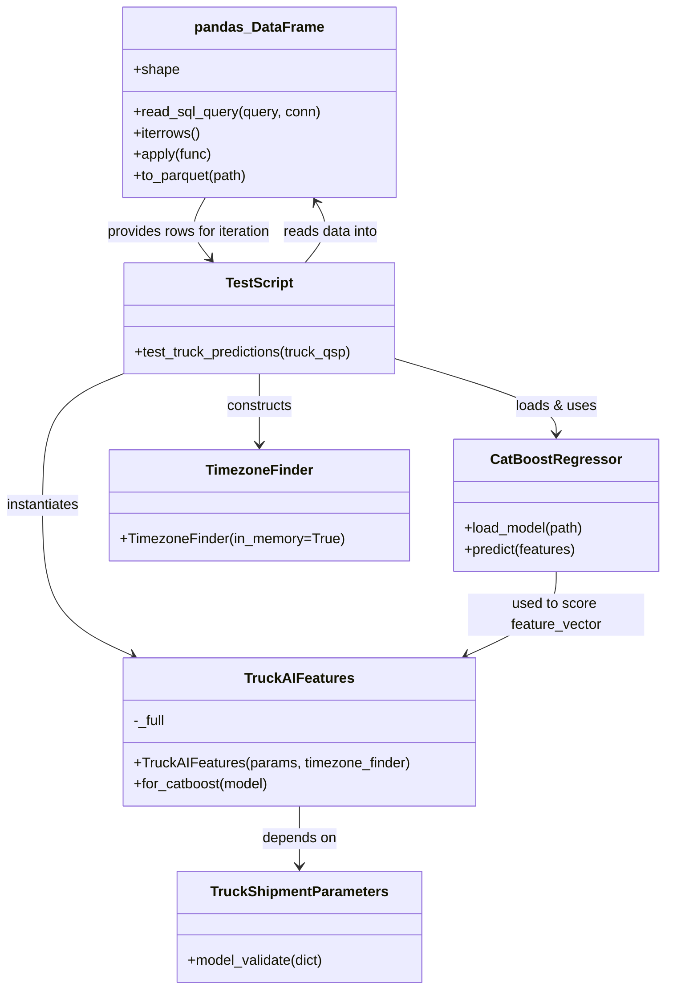

# Diagram: research/api_k8s/get_ai_eta/src/tests/integration/truck_simulation_test.py


> Auto-generated by Obscura crawlers

## Diagram 1

```mermaid
flowchart TD
  N1[normalize_to_utc_z(ts_str)] --> N2[parser.isoparse(ts_str) -> dt]
  N2 --> N3{dt.tzinfo is None?}
  N3 -- yes --> N4[dt = dt.replace(tzinfo=datetime.UTC)]
  N3 -- no --> N5[dt = dt.astimezone(datetime.UTC)]
  N4 --> N6[dt = dt.astimezone(datetime.UTC)]
  N5 --> N6
  N6 --> N7[dt.strftime("%Y-%m-%dT%H:%M:%SZ")]
  N7 --> N8[return ISO Z string]
```

> SVG rendering failed for this diagram.

## Diagram 2

```mermaid
flowchart LR
  S([Start test_truck_predictions]) --> M[Load model: catboost.CatBoostRegressor().load_model("truck_model.cbm")]
  M --> C[Connect to Databricks SQL (sql.connect(...))]
  C --> Q[Read data with QUERY -> pandas.DataFrame data]
  Q --> I[Initialize TimezoneFinder(in_memory=True)]
  I --> R[Prepare keys list and counters]
  R --> L[for ix, row in data.iterrows()]
  L --> J[resp = json.loads(row["eta_api_response"])]
  J --> K{All required keys present in resp?}
  K -- no --> F1[failed += 1; failed_blobs.append(resp); continue]
  K -- yes --> V[Populate truck_qsp with resp values]
  V --> T[TruckShipmentParameters.model_validate(truck_qsp)]
  T --> U[Instantiate TruckAIFeatures(params, timezone_finder=tf)]
  U --> FV[feature_vector = feat.for_catboost(mdl)]
  FV --> P[prediction = mdl.predict(feature_vector)[0]]
  P --> A[Create row_dict with prediction, prediction_days, features]
  A --> E[examples.append(row_dict)]
  U -->|exception| EX[logger.error(e); continue]
  E --> Cond{ix % 1000 == 0?}
  Cond -- yes --> Log[ic(f"Index: {ix} dict: {row_dict}")]
  Cond -- no --> LoopCont([continue loop])
  LoopCont --> L
  Log --> L
  L --> EndLoop[After loop compute runtime and sim DataFrame]
  EndLoop --> C1[sim["pred_eta"] = sim.apply(...)]
  C1 --> C2[sim["aierror"] = sim.apply(...)]
  C2 --> C3[Print MAE and per-lob MAE]
  C3 --> Save[sim.to_parquet("truck_sim.parquet")]
  Save --> Done([done])
```

> SVG rendering failed for this diagram.

## Diagram 3



### SVG

<svg id="container" width="754.921875" xmlns="http://www.w3.org/2000/svg" class="classDiagram" height="1122" viewBox="0 0 754.921875 1122" role="graphics-document document" aria-roledescription="class"><style>#container{font-family:"trebuchet ms",verdana,arial,sans-serif;font-size:16px;fill:#333;}@keyframes edge-animation-frame{from{stroke-dashoffset:0;}}@keyframes dash{to{stroke-dashoffset:0;}}#container .edge-animation-slow{stroke-dasharray:9,5!important;stroke-dashoffset:900;animation:dash 50s linear infinite;stroke-linecap:round;}#container .edge-animation-fast{stroke-dasharray:9,5!important;stroke-dashoffset:900;animation:dash 20s linear infinite;stroke-linecap:round;}#container .error-icon{fill:#552222;}#container .error-text{fill:#552222;stroke:#552222;}#container .edge-thickness-normal{stroke-width:1px;}#container .edge-thickness-thick{stroke-width:3.5px;}#container .edge-pattern-solid{stroke-dasharray:0;}#container .edge-thickness-invisible{stroke-width:0;fill:none;}#container .edge-pattern-dashed{stroke-dasharray:3;}#container .edge-pattern-dotted{stroke-dasharray:2;}#container .marker{fill:#333333;stroke:#333333;}#container .marker.cross{stroke:#333333;}#container svg{font-family:"trebuchet ms",verdana,arial,sans-serif;font-size:16px;}#container p{margin:0;}#container g.classGroup text{fill:#9370DB;stroke:none;font-family:"trebuchet ms",verdana,arial,sans-serif;font-size:10px;}#container g.classGroup text .title{font-weight:bolder;}#container .nodeLabel,#container .edgeLabel{color:#131300;}#container .edgeLabel .label rect{fill:#ECECFF;}#container .label text{fill:#131300;}#container .labelBkg{background:#ECECFF;}#container .edgeLabel .label span{background:#ECECFF;}#container .classTitle{font-weight:bolder;}#container .node rect,#container .node circle,#container .node ellipse,#container .node polygon,#container .node path{fill:#ECECFF;stroke:#9370DB;stroke-width:1px;}#container .divider{stroke:#9370DB;stroke-width:1;}#container g.clickable{cursor:pointer;}#container g.classGroup rect{fill:#ECECFF;stroke:#9370DB;}#container g.classGroup line{stroke:#9370DB;stroke-width:1;}#container .classLabel .box{stroke:none;stroke-width:0;fill:#ECECFF;opacity:0.5;}#container .classLabel .label{fill:#9370DB;font-size:10px;}#container .relation{stroke:#333333;stroke-width:1;fill:none;}#container .dashed-line{stroke-dasharray:3;}#container .dotted-line{stroke-dasharray:1 2;}#container #compositionStart,#container .composition{fill:#333333!important;stroke:#333333!important;stroke-width:1;}#container #compositionEnd,#container .composition{fill:#333333!important;stroke:#333333!important;stroke-width:1;}#container #dependencyStart,#container .dependency{fill:#333333!important;stroke:#333333!important;stroke-width:1;}#container #dependencyStart,#container .dependency{fill:#333333!important;stroke:#333333!important;stroke-width:1;}#container #extensionStart,#container .extension{fill:transparent!important;stroke:#333333!important;stroke-width:1;}#container #extensionEnd,#container .extension{fill:transparent!important;stroke:#333333!important;stroke-width:1;}#container #aggregationStart,#container .aggregation{fill:transparent!important;stroke:#333333!important;stroke-width:1;}#container #aggregationEnd,#container .aggregation{fill:transparent!important;stroke:#333333!important;stroke-width:1;}#container #lollipopStart,#container .lollipop{fill:#ECECFF!important;stroke:#333333!important;stroke-width:1;}#container #lollipopEnd,#container .lollipop{fill:#ECECFF!important;stroke:#333333!important;stroke-width:1;}#container .edgeTerminals{font-size:11px;line-height:initial;}#container .classTitleText{text-anchor:middle;font-size:18px;fill:#333;}#container .label-icon{display:inline-block;height:1em;overflow:visible;vertical-align:-0.125em;}#container .node .label-icon path{fill:currentColor;stroke:revert;stroke-width:revert;}#container :root{--mermaid-font-family:"trebuchet ms",verdana,arial,sans-serif;}</style><g><defs><marker id="container_class-aggregationStart" class="marker aggregation class" refX="18" refY="7" markerWidth="190" markerHeight="240" orient="auto"><path d="M 18,7 L9,13 L1,7 L9,1 Z"></path></marker></defs><defs><marker id="container_class-aggregationEnd" class="marker aggregation class" refX="1" refY="7" markerWidth="20" markerHeight="28" orient="auto"><path d="M 18,7 L9,13 L1,7 L9,1 Z"></path></marker></defs><defs><marker id="container_class-extensionStart" class="marker extension class" refX="18" refY="7" markerWidth="190" markerHeight="240" orient="auto"><path d="M 1,7 L18,13 V 1 Z"></path></marker></defs><defs><marker id="container_class-extensionEnd" class="marker extension class" refX="1" refY="7" markerWidth="20" markerHeight="28" orient="auto"><path d="M 1,1 V 13 L18,7 Z"></path></marker></defs><defs><marker id="container_class-compositionStart" class="marker composition class" refX="18" refY="7" markerWidth="190" markerHeight="240" orient="auto"><path d="M 18,7 L9,13 L1,7 L9,1 Z"></path></marker></defs><defs><marker id="container_class-compositionEnd" class="marker composition class" refX="1" refY="7" markerWidth="20" markerHeight="28" orient="auto"><path d="M 18,7 L9,13 L1,7 L9,1 Z"></path></marker></defs><defs><marker id="container_class-dependencyStart" class="marker dependency class" refX="6" refY="7" markerWidth="190" markerHeight="240" orient="auto"><path d="M 5,7 L9,13 L1,7 L9,1 Z"></path></marker></defs><defs><marker id="container_class-dependencyEnd" class="marker dependency class" refX="13" refY="7" markerWidth="20" markerHeight="28" orient="auto"><path d="M 18,7 L9,13 L14,7 L9,1 Z"></path></marker></defs><defs><marker id="container_class-lollipopStart" class="marker lollipop class" refX="13" refY="7" markerWidth="190" markerHeight="240" orient="auto"><circle stroke="black" fill="transparent" cx="7" cy="7" r="6"></circle></marker></defs><defs><marker id="container_class-lollipopEnd" class="marker lollipop class" refX="1" refY="7" markerWidth="190" markerHeight="240" orient="auto"><circle stroke="black" fill="transparent" cx="7" cy="7" r="6"></circle></marker></defs><g class="root"><g class="clusters"></g><g class="edgePaths"><path d="M340.975,914L340.975,920.167C340.975,926.333,340.975,938.667,340.975,950C340.975,961.333,340.975,971.667,340.975,976.833L340.975,982" id="id_TruckAIFeatures_TruckShipmentParameters_1" class="edge-thickness-normal edge-pattern-solid relation" style=";;;" data-edge="true" data-et="edge" data-id="id_TruckAIFeatures_TruckShipmentParameters_1" data-points="W3sieCI6MzQwLjk3NDYwOTM3NSwieSI6OTE0fSx7IngiOjM0MC45NzQ2MDkzNzUsInkiOjk1MX0seyJ4IjozNDAuOTc0NjA5Mzc1LCJ5Ijo5ODh9XQ==" marker-end="url(#container_class-dependencyEnd)"></path><path d="M453.973,407.995L483.483,416.829C512.993,425.663,572.014,443.332,601.525,457.332C631.035,471.333,631.035,481.667,631.035,486.833L631.035,492" id="id_TestScript_CatBoostRegressor_2" class="edge-thickness-normal edge-pattern-solid relation" style=";;;" data-edge="true" data-et="edge" data-id="id_TestScript_CatBoostRegressor_2" data-points="W3sieCI6NDUzLjk3MjY1NjI1LCJ5Ijo0MDcuOTk0NzE0NDM5NDAzMTR9LHsieCI6NjMxLjAzNTE1NjI1LCJ5Ijo0NjF9LHsieCI6NjMxLjAzNTE1NjI1LCJ5Ijo0OTh9XQ==" marker-end="url(#container_class-dependencyEnd)"></path><path d="M350.861,298L356.134,291.833C361.407,285.667,371.954,273.333,374.098,261.861C376.243,250.389,369.985,239.779,366.856,234.474L363.728,229.168" id="id_TestScript_pandas_DataFrame_3" class="edge-thickness-normal edge-pattern-solid relation" style=";;;" data-edge="true" data-et="edge" data-id="id_TestScript_pandas_DataFrame_3" data-points="W3sieCI6MzUwLjg2MDY2NDA2MjUsInkiOjI5OH0seyJ4IjozODIuNSwieSI6MjYxfSx7IngiOjM2MC42Nzk3NjgzMTg5NjU1LCJ5IjoyMjR9XQ==" marker-end="url(#container_class-dependencyEnd)"></path><path d="M296.988,424L296.988,430.167C296.988,436.333,296.988,448.667,296.988,462C296.988,475.333,296.988,489.667,296.988,496.833L296.988,504" id="id_TestScript_TimezoneFinder_4" class="edge-thickness-normal edge-pattern-solid relation" style=";;;" data-edge="true" data-et="edge" data-id="id_TestScript_TimezoneFinder_4" data-points="W3sieCI6Mjk2Ljk4ODI4MTI1LCJ5Ijo0MjR9LHsieCI6Mjk2Ljk4ODI4MTI1LCJ5Ijo0NjF9LHsieCI6Mjk2Ljk4ODI4MTI1LCJ5Ijo1MTB9XQ==" marker-end="url(#container_class-dependencyEnd)"></path><path d="M141.962,424L126.787,430.167C111.612,436.333,81.263,448.667,66.089,473.5C50.914,498.333,50.914,535.667,50.914,575C50.914,614.333,50.914,655.667,67.816,684.083C84.718,712.5,118.521,727.999,135.423,735.749L152.324,743.499" id="id_TestScript_TruckAIFeatures_5" class="edge-thickness-normal edge-pattern-solid relation" style=";;;" data-edge="true" data-et="edge" data-id="id_TestScript_TruckAIFeatures_5" data-points="W3sieCI6MTQxLjk2MTUyMzQzNzUsInkiOjQyNH0seyJ4Ijo1MC45MTQwNjI1LCJ5Ijo0NjF9LHsieCI6NTAuOTE0MDYyNSwieSI6NTczfSx7IngiOjUwLjkxNDA2MjUsInkiOjY5N30seyJ4IjoxNTcuNzc4NDc0NTA2NTc4OTYsInkiOjc0Nn1d" marker-end="url(#container_class-dependencyEnd)"></path><path d="M631.035,648L631.035,656.167C631.035,664.333,631.035,680.667,614.133,696.583C597.232,712.5,563.428,727.999,546.526,735.749L529.625,743.499" id="id_CatBoostRegressor_TruckAIFeatures_6" class="edge-thickness-normal edge-pattern-solid relation" style=";;;" data-edge="true" data-et="edge" data-id="id_CatBoostRegressor_TruckAIFeatures_6" data-points="W3sieCI6NjMxLjAzNTE1NjI1LCJ5Ijo2NDh9LHsieCI6NjMxLjAzNTE1NjI1LCJ5Ijo2OTd9LHsieCI6NTI0LjE3MDc0NDI0MzQyMSwieSI6NzQ2fV0=" marker-end="url(#container_class-dependencyEnd)"></path><path d="M233.297,224L229.66,230.167C226.023,236.333,218.75,248.667,219.737,260.24C220.723,271.813,229.97,282.627,234.593,288.033L239.216,293.44" id="id_pandas_DataFrame_TestScript_7" class="edge-thickness-normal edge-pattern-solid relation" style=";;;" data-edge="true" data-et="edge" data-id="id_pandas_DataFrame_TestScript_7" data-points="W3sieCI6MjMzLjI5Njc5NDE4MTAzNDUsInkiOjIyNH0seyJ4IjoyMTEuNDc2NTYyNSwieSI6MjYxfSx7IngiOjI0My4xMTU4OTg0Mzc1LCJ5IjoyOTh9XQ==" marker-end="url(#container_class-dependencyEnd)"></path></g><g class="edgeLabels"><g class="edgeLabel" transform="translate(340.974609375, 951)"><g class="label" data-id="id_TruckAIFeatures_TruckShipmentParameters_1" transform="translate(-42.9453125, -12)"><foreignObject width="85.890625" height="24"><div xmlns="http://www.w3.org/1999/xhtml" class="labelBkg" style="display: table-cell; white-space: nowrap; line-height: 1.5; max-width: 200px; text-align: center;"><span class="edgeLabel"><p>depends on</p></span></div></foreignObject></g></g><g class="edgeLabel" transform="translate(631.03515625, 461)"><g class="label" data-id="id_TestScript_CatBoostRegressor_2" transform="translate(-46.328125, -12)"><foreignObject width="92.65625" height="24"><div xmlns="http://www.w3.org/1999/xhtml" class="labelBkg" style="display: table-cell; white-space: nowrap; line-height: 1.5; max-width: 200px; text-align: center;"><span class="edgeLabel"><p>loads &amp; uses</p></span></div></foreignObject></g></g><g class="edgeLabel" transform="translate(380.6386, 263.17678)"><g class="label" data-id="id_TestScript_pandas_DataFrame_3" transform="translate(-54.9453125, -12)"><foreignObject width="109.890625" height="24"><div xmlns="http://www.w3.org/1999/xhtml" class="labelBkg" style="display: table-cell; white-space: nowrap; line-height: 1.5; max-width: 200px; text-align: center;"><span class="edgeLabel"><p>reads data into</p></span></div></foreignObject></g></g><g class="edgeLabel" transform="translate(296.98828125, 461)"><g class="label" data-id="id_TestScript_TimezoneFinder_4" transform="translate(-37.84375, -12)"><foreignObject width="75.6875" height="24"><div xmlns="http://www.w3.org/1999/xhtml" class="labelBkg" style="display: table-cell; white-space: nowrap; line-height: 1.5; max-width: 200px; text-align: center;"><span class="edgeLabel"><p>constructs</p></span></div></foreignObject></g></g><g class="edgeLabel" transform="translate(50.9140625, 573)"><g class="label" data-id="id_TestScript_TruckAIFeatures_5" transform="translate(-42.9140625, -12)"><foreignObject width="85.828125" height="24"><div xmlns="http://www.w3.org/1999/xhtml" class="labelBkg" style="display: table-cell; white-space: nowrap; line-height: 1.5; max-width: 200px; text-align: center;"><span class="edgeLabel"><p>instantiates</p></span></div></foreignObject></g></g><g class="edgeLabel" transform="translate(631.03515625, 697)"><g class="label" data-id="id_CatBoostRegressor_TruckAIFeatures_6" transform="translate(-100, -24)"><foreignObject width="200" height="48"><div xmlns="http://www.w3.org/1999/xhtml" class="labelBkg" style="display: table; white-space: break-spaces; line-height: 1.5; max-width: 200px; text-align: center; width: 200px;"><span class="edgeLabel"><p>used to score feature_vector</p></span></div></foreignObject></g></g><g class="edgeLabel" transform="translate(213.33797, 263.17678)"><g class="label" data-id="id_pandas_DataFrame_TestScript_7" transform="translate(-96.078125, -12)"><foreignObject width="192.15625" height="24"><div xmlns="http://www.w3.org/1999/xhtml" class="labelBkg" style="display: table-cell; white-space: nowrap; line-height: 1.5; max-width: 200px; text-align: center;"><span class="edgeLabel"><p>provides rows for iteration</p></span></div></foreignObject></g></g></g><g class="nodes"><g class="node default" id="classId-TruckAIFeatures-0" transform="translate(340.974609375, 830)"><g class="basic label-container"><path d="M-196.91015625 -84 L196.91015625 -84 L196.91015625 84 L-196.91015625 84" stroke="none" stroke-width="0" fill="#ECECFF" style=""></path><path d="M-196.91015625 -84 C-41.6748017076018 -84, 113.5605528347964 -84, 196.91015625 -84 M-196.91015625 -84 C-87.95180346162003 -84, 21.006549326759938 -84, 196.91015625 -84 M196.91015625 -84 C196.91015625 -19.197749107247873, 196.91015625 45.604501785504254, 196.91015625 84 M196.91015625 -84 C196.91015625 -50.12604350389406, 196.91015625 -16.25208700778812, 196.91015625 84 M196.91015625 84 C66.07550487829073 84, -64.75914649341854 84, -196.91015625 84 M196.91015625 84 C102.67362597243508 84, 8.437095694870152 84, -196.91015625 84 M-196.91015625 84 C-196.91015625 40.93736553041903, -196.91015625 -2.1252689391619413, -196.91015625 -84 M-196.91015625 84 C-196.91015625 50.315441840173975, -196.91015625 16.63088368034795, -196.91015625 -84" stroke="#9370DB" stroke-width="1.3" fill="none" stroke-dasharray="0 0" style=""></path></g><g class="annotation-group text" transform="translate(0, -60)"></g><g class="label-group text" transform="translate(-58.4296875, -60)"><g class="label" style="font-weight: bolder" transform="translate(0,-12)"><foreignObject width="116.859375" height="24"><div xmlns="http://www.w3.org/1999/xhtml" style="display: table-cell; white-space: nowrap; line-height: 1.5; max-width: 165px; text-align: center;"><span class="nodeLabel markdown-node-label" style=""><p>TruckAIFeatures</p></span></div></foreignObject></g></g><g class="members-group text" transform="translate(-184.91015625, -12)"><g class="label" style="" transform="translate(0,-12)"><foreignObject width="37.21875" height="24"><div xmlns="http://www.w3.org/1999/xhtml" style="display: table-cell; white-space: nowrap; line-height: 1.5; max-width: 95px; text-align: center;"><span class="nodeLabel markdown-node-label" style=""><p>-_full</p></span></div></foreignObject></g></g><g class="methods-group text" transform="translate(-184.91015625, 36)"><g class="label" style="" transform="translate(0,-12)"><foreignObject width="311.390625" height="24"><div xmlns="http://www.w3.org/1999/xhtml" style="display: table-cell; white-space: nowrap; line-height: 1.5; max-width: 369px; text-align: center;"><span class="nodeLabel markdown-node-label" style=""><p>+TruckAIFeatures(params, timezone_finder)</p></span></div></foreignObject></g><g class="label" style="" transform="translate(0,12)"><foreignObject width="155" height="24"><div xmlns="http://www.w3.org/1999/xhtml" style="display: table-cell; white-space: nowrap; line-height: 1.5; max-width: 212px; text-align: center;"><span class="nodeLabel markdown-node-label" style=""><p>+for_catboost(model)</p></span></div></foreignObject></g></g><g class="divider" style=""><path d="M-196.91015625 -36 C-112.89161527330138 -36, -28.873074296602766 -36, 196.91015625 -36 M-196.91015625 -36 C-89.2756499887866 -36, 18.358856272426806 -36, 196.91015625 -36" stroke="#9370DB" stroke-width="1.3" fill="none" stroke-dasharray="0 0" style=""></path></g><g class="divider" style=""><path d="M-196.91015625 12 C-43.48351409423995 12, 109.9431280615201 12, 196.91015625 12 M-196.91015625 12 C-80.88531152286811 12, 35.139533204263785 12, 196.91015625 12" stroke="#9370DB" stroke-width="1.3" fill="none" stroke-dasharray="0 0" style=""></path></g></g><g class="node default" id="classId-TruckShipmentParameters-1" transform="translate(340.974609375, 1051)"><g class="basic label-container"><path d="M-139.21875 -63 L139.21875 -63 L139.21875 63 L-139.21875 63" stroke="none" stroke-width="0" fill="#ECECFF" style=""></path><path d="M-139.21875 -63 C-46.77722187015651 -63, 45.66430625968698 -63, 139.21875 -63 M-139.21875 -63 C-63.204233866846636 -63, 12.810282266306729 -63, 139.21875 -63 M139.21875 -63 C139.21875 -15.40947120711369, 139.21875 32.18105758577262, 139.21875 63 M139.21875 -63 C139.21875 -34.40560818493317, 139.21875 -5.811216369866344, 139.21875 63 M139.21875 63 C74.76067266347144 63, 10.302595326942878 63, -139.21875 63 M139.21875 63 C48.06053800344252 63, -43.09767399311497 63, -139.21875 63 M-139.21875 63 C-139.21875 16.95239004753242, -139.21875 -29.095219904935163, -139.21875 -63 M-139.21875 63 C-139.21875 23.718468474339126, -139.21875 -15.563063051321748, -139.21875 -63" stroke="#9370DB" stroke-width="1.3" fill="none" stroke-dasharray="0 0" style=""></path></g><g class="annotation-group text" transform="translate(0, -39)"></g><g class="label-group text" transform="translate(-96.8125, -39)"><g class="label" style="font-weight: bolder" transform="translate(0,-12)"><foreignObject width="193.625" height="24"><div xmlns="http://www.w3.org/1999/xhtml" style="display: table-cell; white-space: nowrap; line-height: 1.5; max-width: 240px; text-align: center;"><span class="nodeLabel markdown-node-label" style=""><p>TruckShipmentParameters</p></span></div></foreignObject></g></g><g class="members-group text" transform="translate(-127.21875, 9)"></g><g class="methods-group text" transform="translate(-127.21875, 39)"><g class="label" style="" transform="translate(0,-12)"><foreignObject width="157.625" height="24"><div xmlns="http://www.w3.org/1999/xhtml" style="display: table-cell; white-space: nowrap; line-height: 1.5; max-width: 215px; text-align: center;"><span class="nodeLabel markdown-node-label" style=""><p>+model_validate(dict)</p></span></div></foreignObject></g></g><g class="divider" style=""><path d="M-139.21875 -15 C-74.59010142249778 -15, -9.961452844995563 -15, 139.21875 -15 M-139.21875 -15 C-49.461847080117096 -15, 40.29505583976581 -15, 139.21875 -15" stroke="#9370DB" stroke-width="1.3" fill="none" stroke-dasharray="0 0" style=""></path></g><g class="divider" style=""><path d="M-139.21875 9 C-72.20932678517991 9, -5.199903570359822 9, 139.21875 9 M-139.21875 9 C-33.60223303665629 9, 72.01428392668743 9, 139.21875 9" stroke="#9370DB" stroke-width="1.3" fill="none" stroke-dasharray="0 0" style=""></path></g></g><g class="node default" id="classId-CatBoostRegressor-2" transform="translate(631.03515625, 573)"><g class="basic label-container"><path d="M-115.88671875 -75 L115.88671875 -75 L115.88671875 75 L-115.88671875 75" stroke="none" stroke-width="0" fill="#ECECFF" style=""></path><path d="M-115.88671875 -75 C-50.13677670807439 -75, 15.613165333851214 -75, 115.88671875 -75 M-115.88671875 -75 C-63.06973767111147 -75, -10.252756592222937 -75, 115.88671875 -75 M115.88671875 -75 C115.88671875 -42.4368618722233, 115.88671875 -9.873723744446593, 115.88671875 75 M115.88671875 -75 C115.88671875 -16.778221672363927, 115.88671875 41.44355665527215, 115.88671875 75 M115.88671875 75 C50.63306714388678 75, -14.620584462226446 75, -115.88671875 75 M115.88671875 75 C33.61786721793912 75, -48.65098431412176 75, -115.88671875 75 M-115.88671875 75 C-115.88671875 22.552865458533844, -115.88671875 -29.89426908293231, -115.88671875 -75 M-115.88671875 75 C-115.88671875 17.86909558857996, -115.88671875 -39.26180882284008, -115.88671875 -75" stroke="#9370DB" stroke-width="1.3" fill="none" stroke-dasharray="0 0" style=""></path></g><g class="annotation-group text" transform="translate(0, -51)"></g><g class="label-group text" transform="translate(-69.8046875, -51)"><g class="label" style="font-weight: bolder" transform="translate(0,-12)"><foreignObject width="139.609375" height="24"><div xmlns="http://www.w3.org/1999/xhtml" style="display: table-cell; white-space: nowrap; line-height: 1.5; max-width: 187px; text-align: center;"><span class="nodeLabel markdown-node-label" style=""><p>CatBoostRegressor</p></span></div></foreignObject></g></g><g class="members-group text" transform="translate(-103.88671875, -3)"></g><g class="methods-group text" transform="translate(-103.88671875, 27)"><g class="label" style="" transform="translate(0,-12)"><foreignObject width="137.96875" height="24"><div xmlns="http://www.w3.org/1999/xhtml" style="display: table-cell; white-space: nowrap; line-height: 1.5; max-width: 195px; text-align: center;"><span class="nodeLabel markdown-node-label" style=""><p>+load_model(path)</p></span></div></foreignObject></g><g class="label" style="" transform="translate(0,12)"><foreignObject width="129.21875" height="24"><div xmlns="http://www.w3.org/1999/xhtml" style="display: table-cell; white-space: nowrap; line-height: 1.5; max-width: 187px; text-align: center;"><span class="nodeLabel markdown-node-label" style=""><p>+predict(features)</p></span></div></foreignObject></g></g><g class="divider" style=""><path d="M-115.88671875 -27 C-63.06437755709124 -27, -10.242036364182482 -27, 115.88671875 -27 M-115.88671875 -27 C-64.95572333503085 -27, -14.024727920061721 -27, 115.88671875 -27" stroke="#9370DB" stroke-width="1.3" fill="none" stroke-dasharray="0 0" style=""></path></g><g class="divider" style=""><path d="M-115.88671875 -3 C-67.64601401941106 -3, -19.40530928882211 -3, 115.88671875 -3 M-115.88671875 -3 C-54.97709009177688 -3, 5.93253856644624 -3, 115.88671875 -3" stroke="#9370DB" stroke-width="1.3" fill="none" stroke-dasharray="0 0" style=""></path></g></g><g class="node default" id="classId-TimezoneFinder-3" transform="translate(296.98828125, 573)"><g class="basic label-container"><path d="M-168.16015625 -63 L168.16015625 -63 L168.16015625 63 L-168.16015625 63" stroke="none" stroke-width="0" fill="#ECECFF" style=""></path><path d="M-168.16015625 -63 C-76.10133370454315 -63, 15.957488840913697 -63, 168.16015625 -63 M-168.16015625 -63 C-59.66802961135687 -63, 48.82409702728626 -63, 168.16015625 -63 M168.16015625 -63 C168.16015625 -29.307808817647057, 168.16015625 4.3843823647058855, 168.16015625 63 M168.16015625 -63 C168.16015625 -22.10729884628516, 168.16015625 18.785402307429678, 168.16015625 63 M168.16015625 63 C98.56272072036437 63, 28.965285190728736 63, -168.16015625 63 M168.16015625 63 C95.31884068623538 63, 22.47752512247075 63, -168.16015625 63 M-168.16015625 63 C-168.16015625 36.54365430677477, -168.16015625 10.087308613549546, -168.16015625 -63 M-168.16015625 63 C-168.16015625 37.164815361573574, -168.16015625 11.329630723147147, -168.16015625 -63" stroke="#9370DB" stroke-width="1.3" fill="none" stroke-dasharray="0 0" style=""></path></g><g class="annotation-group text" transform="translate(0, -39)"></g><g class="label-group text" transform="translate(-57.9453125, -39)"><g class="label" style="font-weight: bolder" transform="translate(0,-12)"><foreignObject width="115.890625" height="24"><div xmlns="http://www.w3.org/1999/xhtml" style="display: table-cell; white-space: nowrap; line-height: 1.5; max-width: 166px; text-align: center;"><span class="nodeLabel markdown-node-label" style=""><p>TimezoneFinder</p></span></div></foreignObject></g></g><g class="members-group text" transform="translate(-156.16015625, 9)"></g><g class="methods-group text" transform="translate(-156.16015625, 39)"><g class="label" style="" transform="translate(0,-12)"><foreignObject width="254.375" height="24"><div xmlns="http://www.w3.org/1999/xhtml" style="display: table-cell; white-space: nowrap; line-height: 1.5; max-width: 312px; text-align: center;"><span class="nodeLabel markdown-node-label" style=""><p>+TimezoneFinder(in_memory=True)</p></span></div></foreignObject></g></g><g class="divider" style=""><path d="M-168.16015625 -15 C-45.71637529437757 -15, 76.72740566124486 -15, 168.16015625 -15 M-168.16015625 -15 C-50.569660189494684 -15, 67.02083587101063 -15, 168.16015625 -15" stroke="#9370DB" stroke-width="1.3" fill="none" stroke-dasharray="0 0" style=""></path></g><g class="divider" style=""><path d="M-168.16015625 9 C-100.55963237486404 9, -32.959108499728075 9, 168.16015625 9 M-168.16015625 9 C-58.75318027054375 9, 50.6537957089125 9, 168.16015625 9" stroke="#9370DB" stroke-width="1.3" fill="none" stroke-dasharray="0 0" style=""></path></g></g><g class="node default" id="classId-pandas_DataFrame-4" transform="translate(296.98828125, 116)"><g class="basic label-container"><path d="M-154.375 -108 L154.375 -108 L154.375 108 L-154.375 108" stroke="none" stroke-width="0" fill="#ECECFF" style=""></path><path d="M-154.375 -108 C-80.41370027217802 -108, -6.452400544356038 -108, 154.375 -108 M-154.375 -108 C-53.777391731651136 -108, 46.82021653669773 -108, 154.375 -108 M154.375 -108 C154.375 -60.57106407922302, 154.375 -13.142128158446042, 154.375 108 M154.375 -108 C154.375 -46.64830990805864, 154.375 14.703380183882715, 154.375 108 M154.375 108 C43.241652467263904 108, -67.89169506547219 108, -154.375 108 M154.375 108 C51.178500333890256 108, -52.01799933221949 108, -154.375 108 M-154.375 108 C-154.375 39.607580958239936, -154.375 -28.78483808352013, -154.375 -108 M-154.375 108 C-154.375 53.69282821837993, -154.375 -0.6143435632401406, -154.375 -108" stroke="#9370DB" stroke-width="1.3" fill="none" stroke-dasharray="0 0" style=""></path></g><g class="annotation-group text" transform="translate(0, -84)"></g><g class="label-group text" transform="translate(-69.65625, -84)"><g class="label" style="font-weight: bolder" transform="translate(0,-12)"><foreignObject width="139.3125" height="24"><div xmlns="http://www.w3.org/1999/xhtml" style="display: table-cell; white-space: nowrap; line-height: 1.5; max-width: 188px; text-align: center;"><span class="nodeLabel markdown-node-label" style=""><p>pandas_DataFrame</p></span></div></foreignObject></g></g><g class="members-group text" transform="translate(-142.375, -36)"><g class="label" style="" transform="translate(0,-12)"><foreignObject width="51.765625" height="24"><div xmlns="http://www.w3.org/1999/xhtml" style="display: table-cell; white-space: nowrap; line-height: 1.5; max-width: 109px; text-align: center;"><span class="nodeLabel markdown-node-label" style=""><p>+shape</p></span></div></foreignObject></g></g><g class="methods-group text" transform="translate(-142.375, 12)"><g class="label" style="" transform="translate(0,-12)"><foreignObject width="215.09375" height="24"><div xmlns="http://www.w3.org/1999/xhtml" style="display: table-cell; white-space: nowrap; line-height: 1.5; max-width: 272px; text-align: center;"><span class="nodeLabel markdown-node-label" style=""><p>+read_sql_query(query, conn)</p></span></div></foreignObject></g><g class="label" style="" transform="translate(0,12)"><foreignObject width="77.28125" height="24"><div xmlns="http://www.w3.org/1999/xhtml" style="display: table-cell; white-space: nowrap; line-height: 1.5; max-width: 135px; text-align: center;"><span class="nodeLabel markdown-node-label" style=""><p>+iterrows()</p></span></div></foreignObject></g><g class="label" style="" transform="translate(0,36)"><foreignObject width="89.921875" height="24"><div xmlns="http://www.w3.org/1999/xhtml" style="display: table-cell; white-space: nowrap; line-height: 1.5; max-width: 147px; text-align: center;"><span class="nodeLabel markdown-node-label" style=""><p>+apply(func)</p></span></div></foreignObject></g><g class="label" style="" transform="translate(0,60)"><foreignObject width="131.484375" height="24"><div xmlns="http://www.w3.org/1999/xhtml" style="display: table-cell; white-space: nowrap; line-height: 1.5; max-width: 189px; text-align: center;"><span class="nodeLabel markdown-node-label" style=""><p>+to_parquet(path)</p></span></div></foreignObject></g></g><g class="divider" style=""><path d="M-154.375 -60 C-37.19287644369332 -60, 79.98924711261336 -60, 154.375 -60 M-154.375 -60 C-70.60785865576308 -60, 13.159282688473837 -60, 154.375 -60" stroke="#9370DB" stroke-width="1.3" fill="none" stroke-dasharray="0 0" style=""></path></g><g class="divider" style=""><path d="M-154.375 -12 C-59.80345720561537 -12, 34.76808558876925 -12, 154.375 -12 M-154.375 -12 C-42.627863378850066 -12, 69.11927324229987 -12, 154.375 -12" stroke="#9370DB" stroke-width="1.3" fill="none" stroke-dasharray="0 0" style=""></path></g></g><g class="node default" id="classId-TestScript-5" transform="translate(296.98828125, 361)"><g class="basic label-container"><path d="M-156.984375 -63 L156.984375 -63 L156.984375 63 L-156.984375 63" stroke="none" stroke-width="0" fill="#ECECFF" style=""></path><path d="M-156.984375 -63 C-42.16862657746323 -63, 72.64712184507354 -63, 156.984375 -63 M-156.984375 -63 C-55.704048741585424 -63, 45.57627751682915 -63, 156.984375 -63 M156.984375 -63 C156.984375 -25.599365212026242, 156.984375 11.801269575947515, 156.984375 63 M156.984375 -63 C156.984375 -34.20719988330251, 156.984375 -5.4143997666050225, 156.984375 63 M156.984375 63 C57.623675317492456 63, -41.73702436501509 63, -156.984375 63 M156.984375 63 C62.77488252981759 63, -31.434609940364822 63, -156.984375 63 M-156.984375 63 C-156.984375 23.43184889953976, -156.984375 -16.136302200920483, -156.984375 -63 M-156.984375 63 C-156.984375 20.751241791451015, -156.984375 -21.49751641709797, -156.984375 -63" stroke="#9370DB" stroke-width="1.3" fill="none" stroke-dasharray="0 0" style=""></path></g><g class="annotation-group text" transform="translate(0, -39)"></g><g class="label-group text" transform="translate(-36.984375, -39)"><g class="label" style="font-weight: bolder" transform="translate(0,-12)"><foreignObject width="73.96875" height="24"><div xmlns="http://www.w3.org/1999/xhtml" style="display: table-cell; white-space: nowrap; line-height: 1.5; max-width: 122px; text-align: center;"><span class="nodeLabel markdown-node-label" style=""><p>TestScript</p></span></div></foreignObject></g></g><g class="members-group text" transform="translate(-144.984375, 9)"></g><g class="methods-group text" transform="translate(-144.984375, 39)"><g class="label" style="" transform="translate(0,-12)"><foreignObject width="252.984375" height="24"><div xmlns="http://www.w3.org/1999/xhtml" style="display: table-cell; white-space: nowrap; line-height: 1.5; max-width: 310px; text-align: center;"><span class="nodeLabel markdown-node-label" style=""><p>+test_truck_predictions(truck_qsp)</p></span></div></foreignObject></g></g><g class="divider" style=""><path d="M-156.984375 -15 C-49.99133444806304 -15, 57.001706103873914 -15, 156.984375 -15 M-156.984375 -15 C-45.58832459223942 -15, 65.80772581552117 -15, 156.984375 -15" stroke="#9370DB" stroke-width="1.3" fill="none" stroke-dasharray="0 0" style=""></path></g><g class="divider" style=""><path d="M-156.984375 9 C-71.80602586689102 9, 13.372323266217961 9, 156.984375 9 M-156.984375 9 C-71.00172379816944 9, 14.980927403661127 9, 156.984375 9" stroke="#9370DB" stroke-width="1.3" fill="none" stroke-dasharray="0 0" style=""></path></g></g></g></g></g></svg>
