# Diagram: research/api_k8s/get_ai_eta/src/tests/test_handlers.py


> Auto-generated by Obscura crawlers

## Diagram 1

```mermaid
classDiagram
    class PredictionResult {
      +float eta_seconds
      +float overridden_eta_seconds
      +string override_source
    }
    class ModelArtifactInfo {
      +string uri
      +string guid
    }
    class AIPayload {
      +string modelType
      +string model_name
      +float etaMinutes
      +datetime etaDate
      +datetime overriddenEta
    }
    class EntityEtaParameters
    class IntermediateEtaParameters
    class PartviewEtaParameters
    class TruckShipmentParameters

    class IntermediateEtaModel {
      +async feature_extract_and_predict(params, input_dict, override_redis)
    }
    class IntermediateEtaZeroModel {
      +async feature_extract_and_predict(params, input_dict, override_redis)
    }
    IntermediateEtaModel <|-- IntermediateEtaZeroModel

    class IntermediateEtaPredictionResult {
      +float etaCalculation
      +list nextLocationEtas
      +dict feature_dicts
      +list nextLocationEtds
    }
    class NextLocationEta {
      +string locationId
      +float eta
    }
    NextLocationEta --> IntermediateEtaPredictionResult : element

    class EntityStatusModel
    class PartviewEtaModel
    class TruckEtaModel
    class CatBoostRegressor

    CatBoostRegressor <.. EntityStatusModel : trains/used_by
    CatBoostRegressor <.. PartviewEtaModel : trains/used_by
    CatBoostRegressor <.. TruckEtaModel : trains/used_by

    class EntityAIFeatures
    class PartviewAIFeatures
    class TruckAIFeatures

    class ai_models_dict {
      +dict ModelTypeEnum -> (model, [ModelArtifactInfo])
    }
    ModelArtifactInfo --> ai_models_dict
    IntermediateEtaModel o-- ai_models_dict
    EntityStatusModel o-- ai_models_dict
    PartviewEtaModel o-- ai_models_dict
    TruckEtaModel o-- ai_models_dict

    class _response_from_prediction {
      +(modelType, artifacts, params, pred) -> AIPayload
    }
    _response_from_prediction ..> PredictionResult
    _response_from_prediction ..> ModelArtifactInfo
    _response_from_prediction ..> AIPayload
```



### SVG

<svg id="container" width="3393.19921875" xmlns="http://www.w3.org/2000/svg" class="classDiagram" height="626" viewBox="0 0 3393.19921875 626" role="graphics-document document" aria-roledescription="class"><style>#container{font-family:"trebuchet ms",verdana,arial,sans-serif;font-size:16px;fill:#333;}@keyframes edge-animation-frame{from{stroke-dashoffset:0;}}@keyframes dash{to{stroke-dashoffset:0;}}#container .edge-animation-slow{stroke-dasharray:9,5!important;stroke-dashoffset:900;animation:dash 50s linear infinite;stroke-linecap:round;}#container .edge-animation-fast{stroke-dasharray:9,5!important;stroke-dashoffset:900;animation:dash 20s linear infinite;stroke-linecap:round;}#container .error-icon{fill:#552222;}#container .error-text{fill:#552222;stroke:#552222;}#container .edge-thickness-normal{stroke-width:1px;}#container .edge-thickness-thick{stroke-width:3.5px;}#container .edge-pattern-solid{stroke-dasharray:0;}#container .edge-thickness-invisible{stroke-width:0;fill:none;}#container .edge-pattern-dashed{stroke-dasharray:3;}#container .edge-pattern-dotted{stroke-dasharray:2;}#container .marker{fill:#333333;stroke:#333333;}#container .marker.cross{stroke:#333333;}#container svg{font-family:"trebuchet ms",verdana,arial,sans-serif;font-size:16px;}#container p{margin:0;}#container g.classGroup text{fill:#9370DB;stroke:none;font-family:"trebuchet ms",verdana,arial,sans-serif;font-size:10px;}#container g.classGroup text .title{font-weight:bolder;}#container .nodeLabel,#container .edgeLabel{color:#131300;}#container .edgeLabel .label rect{fill:#ECECFF;}#container .label text{fill:#131300;}#container .labelBkg{background:#ECECFF;}#container .edgeLabel .label span{background:#ECECFF;}#container .classTitle{font-weight:bolder;}#container .node rect,#container .node circle,#container .node ellipse,#container .node polygon,#container .node path{fill:#ECECFF;stroke:#9370DB;stroke-width:1px;}#container .divider{stroke:#9370DB;stroke-width:1;}#container g.clickable{cursor:pointer;}#container g.classGroup rect{fill:#ECECFF;stroke:#9370DB;}#container g.classGroup line{stroke:#9370DB;stroke-width:1;}#container .classLabel .box{stroke:none;stroke-width:0;fill:#ECECFF;opacity:0.5;}#container .classLabel .label{fill:#9370DB;font-size:10px;}#container .relation{stroke:#333333;stroke-width:1;fill:none;}#container .dashed-line{stroke-dasharray:3;}#container .dotted-line{stroke-dasharray:1 2;}#container #compositionStart,#container .composition{fill:#333333!important;stroke:#333333!important;stroke-width:1;}#container #compositionEnd,#container .composition{fill:#333333!important;stroke:#333333!important;stroke-width:1;}#container #dependencyStart,#container .dependency{fill:#333333!important;stroke:#333333!important;stroke-width:1;}#container #dependencyStart,#container .dependency{fill:#333333!important;stroke:#333333!important;stroke-width:1;}#container #extensionStart,#container .extension{fill:transparent!important;stroke:#333333!important;stroke-width:1;}#container #extensionEnd,#container .extension{fill:transparent!important;stroke:#333333!important;stroke-width:1;}#container #aggregationStart,#container .aggregation{fill:transparent!important;stroke:#333333!important;stroke-width:1;}#container #aggregationEnd,#container .aggregation{fill:transparent!important;stroke:#333333!important;stroke-width:1;}#container #lollipopStart,#container .lollipop{fill:#ECECFF!important;stroke:#333333!important;stroke-width:1;}#container #lollipopEnd,#container .lollipop{fill:#ECECFF!important;stroke:#333333!important;stroke-width:1;}#container .edgeTerminals{font-size:11px;line-height:initial;}#container .classTitleText{text-anchor:middle;font-size:18px;fill:#333;}#container .label-icon{display:inline-block;height:1em;overflow:visible;vertical-align:-0.125em;}#container .node .label-icon path{fill:currentColor;stroke:revert;stroke-width:revert;}#container :root{--mermaid-font-family:"trebuchet ms",verdana,arial,sans-serif;}</style><g><defs><marker id="container_class-aggregationStart" class="marker aggregation class" refX="18" refY="7" markerWidth="190" markerHeight="240" orient="auto"><path d="M 18,7 L9,13 L1,7 L9,1 Z"></path></marker></defs><defs><marker id="container_class-aggregationEnd" class="marker aggregation class" refX="1" refY="7" markerWidth="20" markerHeight="28" orient="auto"><path d="M 18,7 L9,13 L1,7 L9,1 Z"></path></marker></defs><defs><marker id="container_class-extensionStart" class="marker extension class" refX="18" refY="7" markerWidth="190" markerHeight="240" orient="auto"><path d="M 1,7 L18,13 V 1 Z"></path></marker></defs><defs><marker id="container_class-extensionEnd" class="marker extension class" refX="1" refY="7" markerWidth="20" markerHeight="28" orient="auto"><path d="M 1,1 V 13 L18,7 Z"></path></marker></defs><defs><marker id="container_class-compositionStart" class="marker composition class" refX="18" refY="7" markerWidth="190" markerHeight="240" orient="auto"><path d="M 18,7 L9,13 L1,7 L9,1 Z"></path></marker></defs><defs><marker id="container_class-compositionEnd" class="marker composition class" refX="1" refY="7" markerWidth="20" markerHeight="28" orient="auto"><path d="M 18,7 L9,13 L1,7 L9,1 Z"></path></marker></defs><defs><marker id="container_class-dependencyStart" class="marker dependency class" refX="6" refY="7" markerWidth="190" markerHeight="240" orient="auto"><path d="M 5,7 L9,13 L1,7 L9,1 Z"></path></marker></defs><defs><marker id="container_class-dependencyEnd" class="marker dependency class" refX="13" refY="7" markerWidth="20" markerHeight="28" orient="auto"><path d="M 18,7 L9,13 L14,7 L9,1 Z"></path></marker></defs><defs><marker id="container_class-lollipopStart" class="marker lollipop class" refX="13" refY="7" markerWidth="190" markerHeight="240" orient="auto"><circle stroke="black" fill="transparent" cx="7" cy="7" r="6"></circle></marker></defs><defs><marker id="container_class-lollipopEnd" class="marker lollipop class" refX="1" refY="7" markerWidth="190" markerHeight="240" orient="auto"><circle stroke="black" fill="transparent" cx="7" cy="7" r="6"></circle></marker></defs><g class="root"><g class="clusters"></g><g class="edgePaths"><path d="M1687.978,402.993L1659.187,413.661C1630.395,424.329,1572.813,445.664,1499.828,462.988C1426.844,480.311,1338.457,493.622,1294.264,500.278L1250.07,506.934" id="id_IntermediateEtaModel_IntermediateEtaZeroModel_1" class="edge-thickness-normal edge-pattern-solid relation" style=";;;" data-edge="true" data-et="edge" data-id="id_IntermediateEtaModel_IntermediateEtaZeroModel_1" data-points="W3sieCI6MTcwNC4xNTMxNjYxMTg0MjEsInkiOjM5N30seyJ4IjoxNTE1LjIzMDQ2ODc1LCJ5Ijo0Njd9LHsieCI6MTI1MC4wNzAzMTI1LCJ5Ijo1MDYuOTMzNzM3MTE0NDM1ODd9XQ==" marker-start="url(#container_class-extensionStart)"></path><path d="M2386.629,152L2386.629,158.167C2386.629,164.333,2386.629,176.667,2386.629,190C2386.629,203.333,2386.629,217.667,2386.629,224.833L2386.629,232" id="id_NextLocationEta_IntermediateEtaPredictionResult_2" class="edge-thickness-normal edge-pattern-solid relation" style=";;;" data-edge="true" data-et="edge" data-id="id_NextLocationEta_IntermediateEtaPredictionResult_2" data-points="W3sieCI6MjM4Ni42Mjg5MDYyNSwieSI6MTUyfSx7IngiOjIzODYuNjI4OTA2MjUsInkiOjE4OX0seyJ4IjoyMzg2LjYyODkwNjI1LCJ5IjoyMzh9XQ==" marker-end="url(#container_class-dependencyEnd)"></path><path d="M3134.567,105.057L3085.672,119.048C3036.776,133.038,2938.985,161.019,2890.089,192.176C2841.193,223.333,2841.193,257.667,2841.193,274.833L2841.193,292" id="id_CatBoostRegressor_EntityStatusModel_3" class="edge-thickness-normal edge-pattern-dashed relation" style=";;;" data-edge="true" data-et="edge" data-id="id_CatBoostRegressor_EntityStatusModel_3" data-points="W3sieCI6MzE0MC4zMzU5Mzc1LCJ5IjoxMDMuNDA2NjgwNTA5NjI1OTl9LHsieCI6Mjg0MS4xOTMzNTkzNzUsInkiOjE4OX0seyJ4IjoyODQxLjE5MzM1OTM3NSwieSI6MjkyfV0=" marker-start="url(#container_class-dependencyStart)"></path><path d="M3180.796,126.483L3171.529,136.903C3162.261,147.322,3143.726,168.161,3134.459,195.747C3125.191,223.333,3125.191,257.667,3125.191,274.833L3125.191,292" id="id_CatBoostRegressor_PartviewEtaModel_4" class="edge-thickness-normal edge-pattern-dashed relation" style=";;;" data-edge="true" data-et="edge" data-id="id_CatBoostRegressor_PartviewEtaModel_4" data-points="W3sieCI6MzE4NC43ODQwNDUyOTgxNjUsInkiOjEyMn0seyJ4IjozMTI1LjE5MTQwNjI1LCJ5IjoxODl9LHsieCI6MzEyNS4xOTE0MDYyNSwieSI6MjkyfV0=" marker-start="url(#container_class-dependencyStart)"></path><path d="M3263.485,126.483L3272.752,136.903C3282.02,147.322,3300.555,168.161,3309.822,195.747C3319.09,223.333,3319.09,257.667,3319.09,274.833L3319.09,292" id="id_CatBoostRegressor_TruckEtaModel_5" class="edge-thickness-normal edge-pattern-dashed relation" style=";;;" data-edge="true" data-et="edge" data-id="id_CatBoostRegressor_TruckEtaModel_5" data-points="W3sieCI6MzI1OS40OTcyMDQ3MDE4MzUsInkiOjEyMn0seyJ4IjozMzE5LjA4OTg0Mzc1LCJ5IjoxODl9LHsieCI6MzMxOS4wODk4NDM3NSwieSI6MjkyfV0=" marker-start="url(#container_class-dependencyStart)"></path><path d="M1136.277,406L1136.277,416.167C1136.277,426.333,1136.277,446.667,1377.099,469.447C1617.92,492.228,2099.563,517.456,2340.384,530.07L2581.205,542.685" id="id_ModelArtifactInfo_ai_models_dict_6" class="edge-thickness-normal edge-pattern-solid relation" style=";;;" data-edge="true" data-et="edge" data-id="id_ModelArtifactInfo_ai_models_dict_6" data-points="W3sieCI6MTEzNi4yNzczNDM3NSwieSI6NDA2fSx7IngiOjExMzYuMjc3MzQzNzUsInkiOjQ2N30seyJ4IjoyNTg3LjE5NzI2NTYyNSwieSI6NTQyLjk5ODM1ODQ5MjY0OTh9XQ==" marker-end="url(#container_class-dependencyEnd)"></path><path d="M2156.433,400.983L2202.796,411.986C2249.159,422.989,2341.885,444.994,2413.679,461.86C2485.473,478.726,2536.335,490.451,2561.766,496.314L2587.197,502.177" id="id_IntermediateEtaModel_ai_models_dict_7" class="edge-thickness-normal edge-pattern-solid relation" style=";;;" data-edge="true" data-et="edge" data-id="id_IntermediateEtaModel_ai_models_dict_7" data-points="W3sieCI6MjEzOS42NDkzNjI2NjQ0NzM4LCJ5IjozOTd9LHsieCI6MjQzNC42MTEzMjgxMjUsInkiOjQ2N30seyJ4IjoyNTg3LjE5NzI2NTYyNSwieSI6NTAyLjE3Njk0NjE0MTQ4NzM1fV0=" marker-start="url(#container_class-aggregationStart)"></path><path d="M2841.193,393.25L2841.193,405.542C2841.193,417.833,2841.193,442.417,2840.016,458.875C2838.839,475.333,2836.484,483.667,2835.306,487.833L2834.129,492" id="id_EntityStatusModel_ai_models_dict_8" class="edge-thickness-normal edge-pattern-solid relation" style=";;;" data-edge="true" data-et="edge" data-id="id_EntityStatusModel_ai_models_dict_8" data-points="W3sieCI6Mjg0MS4xOTMzNTkzNzUsInkiOjM3Nn0seyJ4IjoyODQxLjE5MzM1OTM3NSwieSI6NDY3fSx7IngiOjI4MzQuMTI4ODE3NDcxNTkxLCJ5Ijo0OTJ9XQ==" marker-start="url(#container_class-aggregationStart)"></path><path d="M3125.191,393.25L3125.191,405.542C3125.191,417.833,3125.191,442.417,3110.567,458.875C3095.943,475.333,3066.694,483.667,3052.07,487.833L3037.446,492" id="id_PartviewEtaModel_ai_models_dict_9" class="edge-thickness-normal edge-pattern-solid relation" style=";;;" data-edge="true" data-et="edge" data-id="id_PartviewEtaModel_ai_models_dict_9" data-points="W3sieCI6MzEyNS4xOTE0MDYyNSwieSI6Mzc2fSx7IngiOjMxMjUuMTkxNDA2MjUsInkiOjQ2N30seyJ4IjozMDM3LjQ0NTYwMTAyOTgyOTUsInkiOjQ5Mn1d" marker-start="url(#container_class-aggregationStart)"></path><path d="M3319.09,393.25L3319.09,405.542C3319.09,417.833,3319.09,442.417,3273.484,462.691C3227.878,482.965,3136.667,498.93,3091.061,506.912L3045.455,514.895" id="id_TruckEtaModel_ai_models_dict_10" class="edge-thickness-normal edge-pattern-solid relation" style=";;;" data-edge="true" data-et="edge" data-id="id_TruckEtaModel_ai_models_dict_10" data-points="W3sieCI6MzMxOS4wODk4NDM3NSwieSI6Mzc2fSx7IngiOjMzMTkuMDg5ODQzNzUsInkiOjQ2N30seyJ4IjozMDQ1LjQ1NTA3ODEyNSwieSI6NTE0Ljg5NDk4NjY5NDYzN31d" marker-start="url(#container_class-aggregationStart)"></path><path d="M1022.297,143L992.799,150.667C963.301,158.333,904.305,173.667,874.807,190.5C845.309,207.333,845.309,225.667,845.309,234.833L845.309,244" id="id__response_from_prediction_PredictionResult_11" class="edge-thickness-normal edge-pattern-dashed relation" style=";;;" data-edge="true" data-et="edge" data-id="id__response_from_prediction_PredictionResult_11" data-points="W3sieCI6MTAyMi4yOTc0ODQyMzE2NTE0LCJ5IjoxNDN9LHsieCI6ODQ1LjMwODU5Mzc1LCJ5IjoxODl9LHsieCI6ODQ1LjMwODU5Mzc1LCJ5IjoyNTB9XQ==" marker-end="url(#container_class-dependencyEnd)"></path><path d="M1190.472,143L1181.44,150.667C1172.407,158.333,1154.342,173.667,1145.31,192.5C1136.277,211.333,1136.277,233.667,1136.277,244.833L1136.277,256" id="id__response_from_prediction_ModelArtifactInfo_12" class="edge-thickness-normal edge-pattern-dashed relation" style=";;;" data-edge="true" data-et="edge" data-id="id__response_from_prediction_ModelArtifactInfo_12" data-points="W3sieCI6MTE5MC40NzIwODI4NTU1MDQ2LCJ5IjoxNDN9LHsieCI6MTEzNi4yNzczNDM3NSwieSI6MTg5fSx7IngiOjExMzYuMjc3MzQzNzUsInkiOjI2Mn1d" marker-end="url(#container_class-dependencyEnd)"></path><path d="M1338.919,143L1347.951,150.667C1356.983,158.333,1375.048,173.667,1384.081,186.5C1393.113,199.333,1393.113,209.667,1393.113,214.833L1393.113,220" id="id__response_from_prediction_AIPayload_13" class="edge-thickness-normal edge-pattern-dashed relation" style=";;;" data-edge="true" data-et="edge" data-id="id__response_from_prediction_AIPayload_13" data-points="W3sieCI6MTMzOC45MTg1NDIxNDQ0OTU0LCJ5IjoxNDN9LHsieCI6MTM5My4xMTMyODEyNSwieSI6MTg5fSx7IngiOjEzOTMuMTEzMjgxMjUsInkiOjIyNn1d" marker-end="url(#container_class-dependencyEnd)"></path></g><g class="edgeLabels"><g class="edgeLabel"><g class="label" data-id="id_IntermediateEtaModel_IntermediateEtaZeroModel_1" transform="translate(0, 0)"><foreignObject width="0" height="0"><div xmlns="http://www.w3.org/1999/xhtml" class="labelBkg" style="display: table-cell; white-space: nowrap; line-height: 1.5; max-width: 200px; text-align: center;"><span class="edgeLabel"></span></div></foreignObject></g></g><g class="edgeLabel" transform="translate(2386.62890625, 189)"><g class="label" data-id="id_NextLocationEta_IntermediateEtaPredictionResult_2" transform="translate(-29.8203125, -12)"><foreignObject width="59.640625" height="24"><div xmlns="http://www.w3.org/1999/xhtml" class="labelBkg" style="display: table-cell; white-space: nowrap; line-height: 1.5; max-width: 200px; text-align: center;"><span class="edgeLabel"><p>element</p></span></div></foreignObject></g></g><g class="edgeLabel" transform="translate(2841.193359375, 189)"><g class="label" data-id="id_CatBoostRegressor_EntityStatusModel_3" transform="translate(-55.0078125, -12)"><foreignObject width="110.015625" height="24"><div xmlns="http://www.w3.org/1999/xhtml" class="labelBkg" style="display: table-cell; white-space: nowrap; line-height: 1.5; max-width: 200px; text-align: center;"><span class="edgeLabel"><p>trains/used_by</p></span></div></foreignObject></g></g><g class="edgeLabel" transform="translate(3125.19140625, 189)"><g class="label" data-id="id_CatBoostRegressor_PartviewEtaModel_4" transform="translate(-55.0078125, -12)"><foreignObject width="110.015625" height="24"><div xmlns="http://www.w3.org/1999/xhtml" class="labelBkg" style="display: table-cell; white-space: nowrap; line-height: 1.5; max-width: 200px; text-align: center;"><span class="edgeLabel"><p>trains/used_by</p></span></div></foreignObject></g></g><g class="edgeLabel" transform="translate(3319.08984375, 189)"><g class="label" data-id="id_CatBoostRegressor_TruckEtaModel_5" transform="translate(-55.0078125, -12)"><foreignObject width="110.015625" height="24"><div xmlns="http://www.w3.org/1999/xhtml" class="labelBkg" style="display: table-cell; white-space: nowrap; line-height: 1.5; max-width: 200px; text-align: center;"><span class="edgeLabel"><p>trains/used_by</p></span></div></foreignObject></g></g><g class="edgeLabel"><g class="label" data-id="id_ModelArtifactInfo_ai_models_dict_6" transform="translate(0, 0)"><foreignObject width="0" height="0"><div xmlns="http://www.w3.org/1999/xhtml" class="labelBkg" style="display: table-cell; white-space: nowrap; line-height: 1.5; max-width: 200px; text-align: center;"><span class="edgeLabel"></span></div></foreignObject></g></g><g class="edgeLabel"><g class="label" data-id="id_IntermediateEtaModel_ai_models_dict_7" transform="translate(0, 0)"><foreignObject width="0" height="0"><div xmlns="http://www.w3.org/1999/xhtml" class="labelBkg" style="display: table-cell; white-space: nowrap; line-height: 1.5; max-width: 200px; text-align: center;"><span class="edgeLabel"></span></div></foreignObject></g></g><g class="edgeLabel"><g class="label" data-id="id_EntityStatusModel_ai_models_dict_8" transform="translate(0, 0)"><foreignObject width="0" height="0"><div xmlns="http://www.w3.org/1999/xhtml" class="labelBkg" style="display: table-cell; white-space: nowrap; line-height: 1.5; max-width: 200px; text-align: center;"><span class="edgeLabel"></span></div></foreignObject></g></g><g class="edgeLabel"><g class="label" data-id="id_PartviewEtaModel_ai_models_dict_9" transform="translate(0, 0)"><foreignObject width="0" height="0"><div xmlns="http://www.w3.org/1999/xhtml" class="labelBkg" style="display: table-cell; white-space: nowrap; line-height: 1.5; max-width: 200px; text-align: center;"><span class="edgeLabel"></span></div></foreignObject></g></g><g class="edgeLabel"><g class="label" data-id="id_TruckEtaModel_ai_models_dict_10" transform="translate(0, 0)"><foreignObject width="0" height="0"><div xmlns="http://www.w3.org/1999/xhtml" class="labelBkg" style="display: table-cell; white-space: nowrap; line-height: 1.5; max-width: 200px; text-align: center;"><span class="edgeLabel"></span></div></foreignObject></g></g><g class="edgeLabel"><g class="label" data-id="id__response_from_prediction_PredictionResult_11" transform="translate(0, 0)"><foreignObject width="0" height="0"><div xmlns="http://www.w3.org/1999/xhtml" class="labelBkg" style="display: table-cell; white-space: nowrap; line-height: 1.5; max-width: 200px; text-align: center;"><span class="edgeLabel"></span></div></foreignObject></g></g><g class="edgeLabel"><g class="label" data-id="id__response_from_prediction_ModelArtifactInfo_12" transform="translate(0, 0)"><foreignObject width="0" height="0"><div xmlns="http://www.w3.org/1999/xhtml" class="labelBkg" style="display: table-cell; white-space: nowrap; line-height: 1.5; max-width: 200px; text-align: center;"><span class="edgeLabel"></span></div></foreignObject></g></g><g class="edgeLabel"><g class="label" data-id="id__response_from_prediction_AIPayload_13" transform="translate(0, 0)"><foreignObject width="0" height="0"><div xmlns="http://www.w3.org/1999/xhtml" class="labelBkg" style="display: table-cell; white-space: nowrap; line-height: 1.5; max-width: 200px; text-align: center;"><span class="edgeLabel"></span></div></foreignObject></g></g></g><g class="nodes"><g class="node default" id="classId-PredictionResult-0" transform="translate(845.30859375, 334)"><g class="basic label-container"><path d="M-154.1640625 -84 L154.1640625 -84 L154.1640625 84 L-154.1640625 84" stroke="none" stroke-width="0" fill="#ECECFF" style=""></path><path d="M-154.1640625 -84 C-71.97462193776835 -84, 10.214818624463305 -84, 154.1640625 -84 M-154.1640625 -84 C-80.1497196677178 -84, -6.135376835435608 -84, 154.1640625 -84 M154.1640625 -84 C154.1640625 -42.22032217551265, 154.1640625 -0.4406443510252984, 154.1640625 84 M154.1640625 -84 C154.1640625 -19.63922690921322, 154.1640625 44.72154618157356, 154.1640625 84 M154.1640625 84 C45.855241113240425 84, -62.45358027351915 84, -154.1640625 84 M154.1640625 84 C66.27567875097152 84, -21.612704998056955 84, -154.1640625 84 M-154.1640625 84 C-154.1640625 34.04639461118758, -154.1640625 -15.90721077762484, -154.1640625 -84 M-154.1640625 84 C-154.1640625 33.69822721279202, -154.1640625 -16.60354557441596, -154.1640625 -84" stroke="#9370DB" stroke-width="1.3" fill="none" stroke-dasharray="0 0" style=""></path></g><g class="annotation-group text" transform="translate(0, -60)"></g><g class="label-group text" transform="translate(-60.6875, -60)"><g class="label" style="font-weight: bolder" transform="translate(0,-12)"><foreignObject width="121.375" height="24"><div xmlns="http://www.w3.org/1999/xhtml" style="display: table-cell; white-space: nowrap; line-height: 1.5; max-width: 170px; text-align: center;"><span class="nodeLabel markdown-node-label" style=""><p>PredictionResult</p></span></div></foreignObject></g></g><g class="members-group text" transform="translate(-142.1640625, -12)"><g class="label" style="" transform="translate(0,-12)"><foreignObject width="135.734375" height="24"><div xmlns="http://www.w3.org/1999/xhtml" style="display: table-cell; white-space: nowrap; line-height: 1.5; max-width: 193px; text-align: center;"><span class="nodeLabel markdown-node-label" style=""><p>+float eta_seconds</p></span></div></foreignObject></g><g class="label" style="" transform="translate(0,12)"><foreignObject width="223.640625" height="24"><div xmlns="http://www.w3.org/1999/xhtml" style="display: table-cell; white-space: nowrap; line-height: 1.5; max-width: 281px; text-align: center;"><span class="nodeLabel markdown-node-label" style=""><p>+float overridden_eta_seconds</p></span></div></foreignObject></g><g class="label" style="" transform="translate(0,36)"><foreignObject width="170.703125" height="24"><div xmlns="http://www.w3.org/1999/xhtml" style="display: table-cell; white-space: nowrap; line-height: 1.5; max-width: 228px; text-align: center;"><span class="nodeLabel markdown-node-label" style=""><p>+string override_source</p></span></div></foreignObject></g></g><g class="methods-group text" transform="translate(-142.1640625, 84)"></g><g class="divider" style=""><path d="M-154.1640625 -36 C-63.46227790639446 -36, 27.239506687211076 -36, 154.1640625 -36 M-154.1640625 -36 C-54.99032805241218 -36, 44.18340639517564 -36, 154.1640625 -36" stroke="#9370DB" stroke-width="1.3" fill="none" stroke-dasharray="0 0" style=""></path></g><g class="divider" style=""><path d="M-154.1640625 60 C-77.98602640462342 60, -1.8079903092468328 60, 154.1640625 60 M-154.1640625 60 C-76.05927965336878 60, 2.045503193262448 60, 154.1640625 60" stroke="#9370DB" stroke-width="1.3" fill="none" stroke-dasharray="0 0" style=""></path></g></g><g class="node default" id="classId-ModelArtifactInfo-1" transform="translate(1136.27734375, 334)"><g class="basic label-container"><path d="M-86.8046875 -72 L86.8046875 -72 L86.8046875 72 L-86.8046875 72" stroke="none" stroke-width="0" fill="#ECECFF" style=""></path><path d="M-86.8046875 -72 C-23.227579644677085 -72, 40.34952821064583 -72, 86.8046875 -72 M-86.8046875 -72 C-26.164178756348385 -72, 34.47632998730323 -72, 86.8046875 -72 M86.8046875 -72 C86.8046875 -16.828337590723237, 86.8046875 38.343324818553526, 86.8046875 72 M86.8046875 -72 C86.8046875 -17.165190023138464, 86.8046875 37.66961995372307, 86.8046875 72 M86.8046875 72 C39.353722167874004 72, -8.097243164251992 72, -86.8046875 72 M86.8046875 72 C36.39196354399779 72, -14.020760412004421 72, -86.8046875 72 M-86.8046875 72 C-86.8046875 36.21841449938941, -86.8046875 0.43682899877882164, -86.8046875 -72 M-86.8046875 72 C-86.8046875 20.35036643897724, -86.8046875 -31.29926712204552, -86.8046875 -72" stroke="#9370DB" stroke-width="1.3" fill="none" stroke-dasharray="0 0" style=""></path></g><g class="annotation-group text" transform="translate(0, -48)"></g><g class="label-group text" transform="translate(-64.1875, -48)"><g class="label" style="font-weight: bolder" transform="translate(0,-12)"><foreignObject width="128.375" height="24"><div xmlns="http://www.w3.org/1999/xhtml" style="display: table-cell; white-space: nowrap; line-height: 1.5; max-width: 176px; text-align: center;"><span class="nodeLabel markdown-node-label" style=""><p>ModelArtifactInfo</p></span></div></foreignObject></g></g><g class="members-group text" transform="translate(-74.8046875, 0)"><g class="label" style="" transform="translate(0,-12)"><foreignObject width="73.859375" height="24"><div xmlns="http://www.w3.org/1999/xhtml" style="display: table-cell; white-space: nowrap; line-height: 1.5; max-width: 131px; text-align: center;"><span class="nodeLabel markdown-node-label" style=""><p>+string uri</p></span></div></foreignObject></g><g class="label" style="" transform="translate(0,12)"><foreignObject width="85.421875" height="24"><div xmlns="http://www.w3.org/1999/xhtml" style="display: table-cell; white-space: nowrap; line-height: 1.5; max-width: 143px; text-align: center;"><span class="nodeLabel markdown-node-label" style=""><p>+string guid</p></span></div></foreignObject></g></g><g class="methods-group text" transform="translate(-74.8046875, 72)"></g><g class="divider" style=""><path d="M-86.8046875 -24 C-46.3622569560093 -24, -5.919826412018594 -24, 86.8046875 -24 M-86.8046875 -24 C-24.87643812936055 -24, 37.0518112412789 -24, 86.8046875 -24" stroke="#9370DB" stroke-width="1.3" fill="none" stroke-dasharray="0 0" style=""></path></g><g class="divider" style=""><path d="M-86.8046875 48 C-48.58393737553682 48, -10.36318725107364 48, 86.8046875 48 M-86.8046875 48 C-34.302616492596314 48, 18.19945451480737 48, 86.8046875 48" stroke="#9370DB" stroke-width="1.3" fill="none" stroke-dasharray="0 0" style=""></path></g></g><g class="node default" id="classId-AIPayload-2" transform="translate(1393.11328125, 334)"><g class="basic label-container"><path d="M-120.03125 -108 L120.03125 -108 L120.03125 108 L-120.03125 108" stroke="none" stroke-width="0" fill="#ECECFF" style=""></path><path d="M-120.03125 -108 C-29.19625553142238 -108, 61.63873893715524 -108, 120.03125 -108 M-120.03125 -108 C-35.38180101377054 -108, 49.26764797245892 -108, 120.03125 -108 M120.03125 -108 C120.03125 -35.33696262692128, 120.03125 37.326074746157445, 120.03125 108 M120.03125 -108 C120.03125 -21.89617967603371, 120.03125 64.20764064793258, 120.03125 108 M120.03125 108 C58.04908864238748 108, -3.9330727152250375 108, -120.03125 108 M120.03125 108 C40.63932781553979 108, -38.75259436892043 108, -120.03125 108 M-120.03125 108 C-120.03125 32.040860898642904, -120.03125 -43.91827820271419, -120.03125 -108 M-120.03125 108 C-120.03125 46.98940594791275, -120.03125 -14.021188104174499, -120.03125 -108" stroke="#9370DB" stroke-width="1.3" fill="none" stroke-dasharray="0 0" style=""></path></g><g class="annotation-group text" transform="translate(0, -84)"></g><g class="label-group text" transform="translate(-35.96875, -84)"><g class="label" style="font-weight: bolder" transform="translate(0,-12)"><foreignObject width="71.9375" height="24"><div xmlns="http://www.w3.org/1999/xhtml" style="display: table-cell; white-space: nowrap; line-height: 1.5; max-width: 121px; text-align: center;"><span class="nodeLabel markdown-node-label" style=""><p>AIPayload</p></span></div></foreignObject></g></g><g class="members-group text" transform="translate(-108.03125, -36)"><g class="label" style="" transform="translate(0,-12)"><foreignObject width="133.625" height="24"><div xmlns="http://www.w3.org/1999/xhtml" style="display: table-cell; white-space: nowrap; line-height: 1.5; max-width: 191px; text-align: center;"><span class="nodeLabel markdown-node-label" style=""><p>+string modelType</p></span></div></foreignObject></g><g class="label" style="" transform="translate(0,12)"><foreignObject width="148.734375" height="24"><div xmlns="http://www.w3.org/1999/xhtml" style="display: table-cell; white-space: nowrap; line-height: 1.5; max-width: 206px; text-align: center;"><span class="nodeLabel markdown-node-label" style=""><p>+string model_name</p></span></div></foreignObject></g><g class="label" style="" transform="translate(0,36)"><foreignObject width="125.515625" height="24"><div xmlns="http://www.w3.org/1999/xhtml" style="display: table-cell; white-space: nowrap; line-height: 1.5; max-width: 183px; text-align: center;"><span class="nodeLabel markdown-node-label" style=""><p>+float etaMinutes</p></span></div></foreignObject></g><g class="label" style="" transform="translate(0,60)"><foreignObject width="133.671875" height="24"><div xmlns="http://www.w3.org/1999/xhtml" style="display: table-cell; white-space: nowrap; line-height: 1.5; max-width: 191px; text-align: center;"><span class="nodeLabel markdown-node-label" style=""><p>+datetime etaDate</p></span></div></foreignObject></g><g class="label" style="" transform="translate(0,84)"><foreignObject width="180.09375" height="24"><div xmlns="http://www.w3.org/1999/xhtml" style="display: table-cell; white-space: nowrap; line-height: 1.5; max-width: 237px; text-align: center;"><span class="nodeLabel markdown-node-label" style=""><p>+datetime overriddenEta</p></span></div></foreignObject></g></g><g class="methods-group text" transform="translate(-108.03125, 108)"></g><g class="divider" style=""><path d="M-120.03125 -60 C-61.00352107941844 -60, -1.9757921588368816 -60, 120.03125 -60 M-120.03125 -60 C-69.94428698879543 -60, -19.857323977590866 -60, 120.03125 -60" stroke="#9370DB" stroke-width="1.3" fill="none" stroke-dasharray="0 0" style=""></path></g><g class="divider" style=""><path d="M-120.03125 84 C-47.283836897498446 84, 25.463576205003108 84, 120.03125 84 M-120.03125 84 C-68.83782865955982 84, -17.644407319119637 84, 120.03125 84" stroke="#9370DB" stroke-width="1.3" fill="none" stroke-dasharray="0 0" style=""></path></g></g><g class="node default" id="classId-EntityEtaParameters-3" transform="translate(94.3125, 80)"><g class="basic label-container"><path d="M-86.3125 -42 L86.3125 -42 L86.3125 42 L-86.3125 42" stroke="none" stroke-width="0" fill="#ECECFF" style=""></path><path d="M-86.3125 -42 C-29.04998651930498 -42, 28.21252696139004 -42, 86.3125 -42 M-86.3125 -42 C-38.21894746059363 -42, 9.874605078812735 -42, 86.3125 -42 M86.3125 -42 C86.3125 -11.660213966254211, 86.3125 18.679572067491577, 86.3125 42 M86.3125 -42 C86.3125 -22.778217513248176, 86.3125 -3.5564350264963522, 86.3125 42 M86.3125 42 C25.43490077044124 42, -35.44269845911752 42, -86.3125 42 M86.3125 42 C51.35378672623564 42, 16.39507345247128 42, -86.3125 42 M-86.3125 42 C-86.3125 9.321217520920769, -86.3125 -23.357564958158463, -86.3125 -42 M-86.3125 42 C-86.3125 20.507075120584425, -86.3125 -0.9858497588311508, -86.3125 -42" stroke="#9370DB" stroke-width="1.3" fill="none" stroke-dasharray="0 0" style=""></path></g><g class="annotation-group text" transform="translate(0, -18)"></g><g class="label-group text" transform="translate(-74.3125, -18)"><g class="label" style="font-weight: bolder" transform="translate(0,-12)"><foreignObject width="148.625" height="24"><div xmlns="http://www.w3.org/1999/xhtml" style="display: table-cell; white-space: nowrap; line-height: 1.5; max-width: 196px; text-align: center;"><span class="nodeLabel markdown-node-label" style=""><p>EntityEtaParameters</p></span></div></foreignObject></g></g><g class="members-group text" transform="translate(-74.3125, 30)"></g><g class="methods-group text" transform="translate(-74.3125, 60)"></g><g class="divider" style=""><path d="M-86.3125 6 C-29.877576662768007 6, 26.557346674463986 6, 86.3125 6 M-86.3125 6 C-31.92747289924567 6, 22.457554201508657 6, 86.3125 6" stroke="#9370DB" stroke-width="1.3" fill="none" stroke-dasharray="0 0" style=""></path></g><g class="divider" style=""><path d="M-86.3125 24 C-36.87828489416637 24, 12.55593021166726 24, 86.3125 24 M-86.3125 24 C-18.252285281183603 24, 49.807929437632794 24, 86.3125 24" stroke="#9370DB" stroke-width="1.3" fill="none" stroke-dasharray="0 0" style=""></path></g></g><g class="node default" id="classId-IntermediateEtaParameters-4" transform="translate(343.1640625, 80)"><g class="basic label-container"><path d="M-112.5390625 -42 L112.5390625 -42 L112.5390625 42 L-112.5390625 42" stroke="none" stroke-width="0" fill="#ECECFF" style=""></path><path d="M-112.5390625 -42 C-67.18921574409356 -42, -21.839368988187132 -42, 112.5390625 -42 M-112.5390625 -42 C-40.375969302495776 -42, 31.78712389500845 -42, 112.5390625 -42 M112.5390625 -42 C112.5390625 -16.188904670338914, 112.5390625 9.622190659322172, 112.5390625 42 M112.5390625 -42 C112.5390625 -18.625505506508674, 112.5390625 4.748988986982653, 112.5390625 42 M112.5390625 42 C24.023664407410877 42, -64.49173368517825 42, -112.5390625 42 M112.5390625 42 C48.19394327794856 42, -16.151175944102874 42, -112.5390625 42 M-112.5390625 42 C-112.5390625 13.765248359444332, -112.5390625 -14.469503281111336, -112.5390625 -42 M-112.5390625 42 C-112.5390625 16.75132514264773, -112.5390625 -8.49734971470454, -112.5390625 -42" stroke="#9370DB" stroke-width="1.3" fill="none" stroke-dasharray="0 0" style=""></path></g><g class="annotation-group text" transform="translate(0, -18)"></g><g class="label-group text" transform="translate(-100.5390625, -18)"><g class="label" style="font-weight: bolder" transform="translate(0,-12)"><foreignObject width="201.078125" height="24"><div xmlns="http://www.w3.org/1999/xhtml" style="display: table-cell; white-space: nowrap; line-height: 1.5; max-width: 248px; text-align: center;"><span class="nodeLabel markdown-node-label" style=""><p>IntermediateEtaParameters</p></span></div></foreignObject></g></g><g class="members-group text" transform="translate(-100.5390625, 30)"></g><g class="methods-group text" transform="translate(-100.5390625, 60)"></g><g class="divider" style=""><path d="M-112.5390625 6 C-49.30927418546003 6, 13.920514129079933 6, 112.5390625 6 M-112.5390625 6 C-45.89537202948742 6, 20.748318441025162 6, 112.5390625 6" stroke="#9370DB" stroke-width="1.3" fill="none" stroke-dasharray="0 0" style=""></path></g><g class="divider" style=""><path d="M-112.5390625 24 C-59.56354077633545 24, -6.5880190526709015 24, 112.5390625 24 M-112.5390625 24 C-50.868918270405004 24, 10.801225959189992 24, 112.5390625 24" stroke="#9370DB" stroke-width="1.3" fill="none" stroke-dasharray="0 0" style=""></path></g></g><g class="node default" id="classId-PartviewEtaParameters-5" transform="translate(602.53125, 80)"><g class="basic label-container"><path d="M-96.828125 -42 L96.828125 -42 L96.828125 42 L-96.828125 42" stroke="none" stroke-width="0" fill="#ECECFF" style=""></path><path d="M-96.828125 -42 C-41.60950924398663 -42, 13.609106512026742 -42, 96.828125 -42 M-96.828125 -42 C-57.14426376715517 -42, -17.460402534310333 -42, 96.828125 -42 M96.828125 -42 C96.828125 -21.178800518346325, 96.828125 -0.35760103669264964, 96.828125 42 M96.828125 -42 C96.828125 -12.26881881946758, 96.828125 17.46236236106484, 96.828125 42 M96.828125 42 C43.498362750225695 42, -9.83139949954861 42, -96.828125 42 M96.828125 42 C56.79116345306189 42, 16.754201906123782 42, -96.828125 42 M-96.828125 42 C-96.828125 11.982059612186958, -96.828125 -18.035880775626083, -96.828125 -42 M-96.828125 42 C-96.828125 18.69145289436178, -96.828125 -4.617094211276438, -96.828125 -42" stroke="#9370DB" stroke-width="1.3" fill="none" stroke-dasharray="0 0" style=""></path></g><g class="annotation-group text" transform="translate(0, -18)"></g><g class="label-group text" transform="translate(-84.828125, -18)"><g class="label" style="font-weight: bolder" transform="translate(0,-12)"><foreignObject width="169.65625" height="24"><div xmlns="http://www.w3.org/1999/xhtml" style="display: table-cell; white-space: nowrap; line-height: 1.5; max-width: 216px; text-align: center;"><span class="nodeLabel markdown-node-label" style=""><p>PartviewEtaParameters</p></span></div></foreignObject></g></g><g class="members-group text" transform="translate(-84.828125, 30)"></g><g class="methods-group text" transform="translate(-84.828125, 60)"></g><g class="divider" style=""><path d="M-96.828125 6 C-47.73734419434188 6, 1.3534366113162406 6, 96.828125 6 M-96.828125 6 C-46.781353076238716 6, 3.265418847522568 6, 96.828125 6" stroke="#9370DB" stroke-width="1.3" fill="none" stroke-dasharray="0 0" style=""></path></g><g class="divider" style=""><path d="M-96.828125 24 C-38.62549247849115 24, 19.577140043017707 24, 96.828125 24 M-96.828125 24 C-33.33763553339326 24, 30.15285393321348 24, 96.828125 24" stroke="#9370DB" stroke-width="1.3" fill="none" stroke-dasharray="0 0" style=""></path></g></g><g class="node default" id="classId-TruckShipmentParameters-6" transform="translate(858.171875, 80)"><g class="basic label-container"><path d="M-108.8125 -42 L108.8125 -42 L108.8125 42 L-108.8125 42" stroke="none" stroke-width="0" fill="#ECECFF" style=""></path><path d="M-108.8125 -42 C-42.90942408960372 -42, 22.993651820792564 -42, 108.8125 -42 M-108.8125 -42 C-50.826030261192905 -42, 7.16043947761419 -42, 108.8125 -42 M108.8125 -42 C108.8125 -18.202833495479325, 108.8125 5.59433300904135, 108.8125 42 M108.8125 -42 C108.8125 -13.30837689197876, 108.8125 15.38324621604248, 108.8125 42 M108.8125 42 C61.974700000762084 42, 15.136900001524168 42, -108.8125 42 M108.8125 42 C29.082977581271066 42, -50.64654483745787 42, -108.8125 42 M-108.8125 42 C-108.8125 17.47040149622362, -108.8125 -7.059197007552761, -108.8125 -42 M-108.8125 42 C-108.8125 8.635932650896528, -108.8125 -24.728134698206944, -108.8125 -42" stroke="#9370DB" stroke-width="1.3" fill="none" stroke-dasharray="0 0" style=""></path></g><g class="annotation-group text" transform="translate(0, -18)"></g><g class="label-group text" transform="translate(-96.8125, -18)"><g class="label" style="font-weight: bolder" transform="translate(0,-12)"><foreignObject width="193.625" height="24"><div xmlns="http://www.w3.org/1999/xhtml" style="display: table-cell; white-space: nowrap; line-height: 1.5; max-width: 240px; text-align: center;"><span class="nodeLabel markdown-node-label" style=""><p>TruckShipmentParameters</p></span></div></foreignObject></g></g><g class="members-group text" transform="translate(-96.8125, 30)"></g><g class="methods-group text" transform="translate(-96.8125, 60)"></g><g class="divider" style=""><path d="M-108.8125 6 C-21.81912723173889 6, 65.17424553652222 6, 108.8125 6 M-108.8125 6 C-63.67207203638573 6, -18.531644072771456 6, 108.8125 6" stroke="#9370DB" stroke-width="1.3" fill="none" stroke-dasharray="0 0" style=""></path></g><g class="divider" style=""><path d="M-108.8125 24 C-58.21750039477529 24, -7.622500789550585 24, 108.8125 24 M-108.8125 24 C-21.993140579235728 24, 64.82621884152854 24, 108.8125 24" stroke="#9370DB" stroke-width="1.3" fill="none" stroke-dasharray="0 0" style=""></path></g></g><g class="node default" id="classId-IntermediateEtaModel-7" transform="translate(1874.18359375, 334)"><g class="basic label-container"><path d="M-311.0390625 -63 L311.0390625 -63 L311.0390625 63 L-311.0390625 63" stroke="none" stroke-width="0" fill="#ECECFF" style=""></path><path d="M-311.0390625 -63 C-72.73102046753945 -63, 165.5770215649211 -63, 311.0390625 -63 M-311.0390625 -63 C-168.04698055577538 -63, -25.054898611550755 -63, 311.0390625 -63 M311.0390625 -63 C311.0390625 -25.269298021174386, 311.0390625 12.461403957651228, 311.0390625 63 M311.0390625 -63 C311.0390625 -25.248047872831528, 311.0390625 12.503904254336945, 311.0390625 63 M311.0390625 63 C124.81885355444061 63, -61.401355391118784 63, -311.0390625 63 M311.0390625 63 C85.43559924634337 63, -140.16786400731326 63, -311.0390625 63 M-311.0390625 63 C-311.0390625 27.398787145536417, -311.0390625 -8.202425708927166, -311.0390625 -63 M-311.0390625 63 C-311.0390625 24.08660664813293, -311.0390625 -14.826786703734143, -311.0390625 -63" stroke="#9370DB" stroke-width="1.3" fill="none" stroke-dasharray="0 0" style=""></path></g><g class="annotation-group text" transform="translate(0, -39)"></g><g class="label-group text" transform="translate(-81.5, -39)"><g class="label" style="font-weight: bolder" transform="translate(0,-12)"><foreignObject width="163" height="24"><div xmlns="http://www.w3.org/1999/xhtml" style="display: table-cell; white-space: nowrap; line-height: 1.5; max-width: 212px; text-align: center;"><span class="nodeLabel markdown-node-label" style=""><p>IntermediateEtaModel</p></span></div></foreignObject></g></g><g class="members-group text" transform="translate(-299.0390625, 9)"></g><g class="methods-group text" transform="translate(-299.0390625, 39)"><g class="label" style="" transform="translate(0,-12)"><foreignObject width="516.578125" height="24"><div xmlns="http://www.w3.org/1999/xhtml" style="display: table-cell; white-space: nowrap; line-height: 1.5; max-width: 574px; text-align: center;"><span class="nodeLabel markdown-node-label" style=""><p>+async feature_extract_and_predict(params, input_dict, override_redis)</p></span></div></foreignObject></g></g><g class="divider" style=""><path d="M-311.0390625 -15 C-105.76890153570679 -15, 99.50125942858642 -15, 311.0390625 -15 M-311.0390625 -15 C-157.66457061784183 -15, -4.2900787356836645 -15, 311.0390625 -15" stroke="#9370DB" stroke-width="1.3" fill="none" stroke-dasharray="0 0" style=""></path></g><g class="divider" style=""><path d="M-311.0390625 9 C-101.70921845947558 9, 107.62062558104884 9, 311.0390625 9 M-311.0390625 9 C-160.49055643755986 9, -9.94205037511972 9, 311.0390625 9" stroke="#9370DB" stroke-width="1.3" fill="none" stroke-dasharray="0 0" style=""></path></g></g><g class="node default" id="classId-IntermediateEtaZeroModel-8" transform="translate(930.91015625, 555)"><g class="basic label-container"><path d="M-319.16015625 -63 L319.16015625 -63 L319.16015625 63 L-319.16015625 63" stroke="none" stroke-width="0" fill="#ECECFF" style=""></path><path d="M-319.16015625 -63 C-145.30829842709753 -63, 28.543559395804948 -63, 319.16015625 -63 M-319.16015625 -63 C-129.52514919621572 -63, 60.10985785756856 -63, 319.16015625 -63 M319.16015625 -63 C319.16015625 -36.97219105340332, 319.16015625 -10.944382106806636, 319.16015625 63 M319.16015625 -63 C319.16015625 -18.38120196569372, 319.16015625 26.23759606861256, 319.16015625 63 M319.16015625 63 C118.97805818962837 63, -81.20403987074326 63, -319.16015625 63 M319.16015625 63 C134.68070196741303 63, -49.79875231517394 63, -319.16015625 63 M-319.16015625 63 C-319.16015625 34.711473091795376, -319.16015625 6.422946183590753, -319.16015625 -63 M-319.16015625 63 C-319.16015625 18.160568173081927, -319.16015625 -26.678863653836146, -319.16015625 -63" stroke="#9370DB" stroke-width="1.3" fill="none" stroke-dasharray="0 0" style=""></path></g><g class="annotation-group text" transform="translate(0, -39)"></g><g class="label-group text" transform="translate(-97.7421875, -39)"><g class="label" style="font-weight: bolder" transform="translate(0,-12)"><foreignObject width="195.484375" height="24"><div xmlns="http://www.w3.org/1999/xhtml" style="display: table-cell; white-space: nowrap; line-height: 1.5; max-width: 244px; text-align: center;"><span class="nodeLabel markdown-node-label" style=""><p>IntermediateEtaZeroModel</p></span></div></foreignObject></g></g><g class="members-group text" transform="translate(-307.16015625, 9)"></g><g class="methods-group text" transform="translate(-307.16015625, 39)"><g class="label" style="" transform="translate(0,-12)"><foreignObject width="516.578125" height="24"><div xmlns="http://www.w3.org/1999/xhtml" style="display: table-cell; white-space: nowrap; line-height: 1.5; max-width: 574px; text-align: center;"><span class="nodeLabel markdown-node-label" style=""><p>+async feature_extract_and_predict(params, input_dict, override_redis)</p></span></div></foreignObject></g></g><g class="divider" style=""><path d="M-319.16015625 -15 C-134.23159239267753 -15, 50.696971464644946 -15, 319.16015625 -15 M-319.16015625 -15 C-65.10259782050406 -15, 188.95496060899188 -15, 319.16015625 -15" stroke="#9370DB" stroke-width="1.3" fill="none" stroke-dasharray="0 0" style=""></path></g><g class="divider" style=""><path d="M-319.16015625 9 C-115.04382198534125 9, 89.0725122793175 9, 319.16015625 9 M-319.16015625 9 C-115.88000348166548 9, 87.40014928666903 9, 319.16015625 9" stroke="#9370DB" stroke-width="1.3" fill="none" stroke-dasharray="0 0" style=""></path></g></g><g class="node default" id="classId-IntermediateEtaPredictionResult-9" transform="translate(2386.62890625, 334)"><g class="basic label-container"><path d="M-151.40625 -96 L151.40625 -96 L151.40625 96 L-151.40625 96" stroke="none" stroke-width="0" fill="#ECECFF" style=""></path><path d="M-151.40625 -96 C-65.68722643543322 -96, 20.031797129133565 -96, 151.40625 -96 M-151.40625 -96 C-71.48268664989057 -96, 8.440876700218865 -96, 151.40625 -96 M151.40625 -96 C151.40625 -25.263341673919314, 151.40625 45.47331665216137, 151.40625 96 M151.40625 -96 C151.40625 -39.77134043498107, 151.40625 16.45731913003786, 151.40625 96 M151.40625 96 C62.971501501912 96, -25.463246996175997 96, -151.40625 96 M151.40625 96 C46.90490884095509 96, -57.596432318089825 96, -151.40625 96 M-151.40625 96 C-151.40625 22.48676876897939, -151.40625 -51.02646246204122, -151.40625 -96 M-151.40625 96 C-151.40625 19.792386545443776, -151.40625 -56.41522690911245, -151.40625 -96" stroke="#9370DB" stroke-width="1.3" fill="none" stroke-dasharray="0 0" style=""></path></g><g class="annotation-group text" transform="translate(0, -72)"></g><g class="label-group text" transform="translate(-119.625, -72)"><g class="label" style="font-weight: bolder" transform="translate(0,-12)"><foreignObject width="239.25" height="24"><div xmlns="http://www.w3.org/1999/xhtml" style="display: table-cell; white-space: nowrap; line-height: 1.5; max-width: 286px; text-align: center;"><span class="nodeLabel markdown-node-label" style=""><p>IntermediateEtaPredictionResult</p></span></div></foreignObject></g></g><g class="members-group text" transform="translate(-139.40625, -24)"><g class="label" style="" transform="translate(0,-12)"><foreignObject width="149.203125" height="24"><div xmlns="http://www.w3.org/1999/xhtml" style="display: table-cell; white-space: nowrap; line-height: 1.5; max-width: 207px; text-align: center;"><span class="nodeLabel markdown-node-label" style=""><p>+float etaCalculation</p></span></div></foreignObject></g><g class="label" style="" transform="translate(0,12)"><foreignObject width="158.296875" height="24"><div xmlns="http://www.w3.org/1999/xhtml" style="display: table-cell; white-space: nowrap; line-height: 1.5; max-width: 216px; text-align: center;"><span class="nodeLabel markdown-node-label" style=""><p>+list nextLocationEtas</p></span></div></foreignObject></g><g class="label" style="" transform="translate(0,36)"><foreignObject width="134.359375" height="24"><div xmlns="http://www.w3.org/1999/xhtml" style="display: table-cell; white-space: nowrap; line-height: 1.5; max-width: 192px; text-align: center;"><span class="nodeLabel markdown-node-label" style=""><p>+dict feature_dicts</p></span></div></foreignObject></g><g class="label" style="" transform="translate(0,60)"><foreignObject width="159.1875" height="24"><div xmlns="http://www.w3.org/1999/xhtml" style="display: table-cell; white-space: nowrap; line-height: 1.5; max-width: 217px; text-align: center;"><span class="nodeLabel markdown-node-label" style=""><p>+list nextLocationEtds</p></span></div></foreignObject></g></g><g class="methods-group text" transform="translate(-139.40625, 96)"></g><g class="divider" style=""><path d="M-151.40625 -48 C-32.49730696912758 -48, 86.41163606174484 -48, 151.40625 -48 M-151.40625 -48 C-60.00658762165985 -48, 31.393074756680306 -48, 151.40625 -48" stroke="#9370DB" stroke-width="1.3" fill="none" stroke-dasharray="0 0" style=""></path></g><g class="divider" style=""><path d="M-151.40625 72 C-80.2697786855589 72, -9.133307371117809 72, 151.40625 72 M-151.40625 72 C-78.01749770284172 72, -4.628745405683446 72, 151.40625 72" stroke="#9370DB" stroke-width="1.3" fill="none" stroke-dasharray="0 0" style=""></path></g></g><g class="node default" id="classId-NextLocationEta-10" transform="translate(2386.62890625, 80)"><g class="basic label-container"><path d="M-105.44140625 -72 L105.44140625 -72 L105.44140625 72 L-105.44140625 72" stroke="none" stroke-width="0" fill="#ECECFF" style=""></path><path d="M-105.44140625 -72 C-61.39119275448262 -72, -17.340979258965234 -72, 105.44140625 -72 M-105.44140625 -72 C-57.10939878267758 -72, -8.77739131535516 -72, 105.44140625 -72 M105.44140625 -72 C105.44140625 -23.60206746962666, 105.44140625 24.795865060746678, 105.44140625 72 M105.44140625 -72 C105.44140625 -31.58812857885313, 105.44140625 8.82374284229374, 105.44140625 72 M105.44140625 72 C30.089191053341025 72, -45.26302414331795 72, -105.44140625 72 M105.44140625 72 C50.046619653729564 72, -5.348166942540871 72, -105.44140625 72 M-105.44140625 72 C-105.44140625 40.06799191331865, -105.44140625 8.135983826637307, -105.44140625 -72 M-105.44140625 72 C-105.44140625 37.195515901882054, -105.44140625 2.3910318037641076, -105.44140625 -72" stroke="#9370DB" stroke-width="1.3" fill="none" stroke-dasharray="0 0" style=""></path></g><g class="annotation-group text" transform="translate(0, -48)"></g><g class="label-group text" transform="translate(-59.5859375, -48)"><g class="label" style="font-weight: bolder" transform="translate(0,-12)"><foreignObject width="119.171875" height="24"><div xmlns="http://www.w3.org/1999/xhtml" style="display: table-cell; white-space: nowrap; line-height: 1.5; max-width: 168px; text-align: center;"><span class="nodeLabel markdown-node-label" style=""><p>NextLocationEta</p></span></div></foreignObject></g></g><g class="members-group text" transform="translate(-93.44140625, 0)"><g class="label" style="" transform="translate(0,-12)"><foreignObject width="127.296875" height="24"><div xmlns="http://www.w3.org/1999/xhtml" style="display: table-cell; white-space: nowrap; line-height: 1.5; max-width: 185px; text-align: center;"><span class="nodeLabel markdown-node-label" style=""><p>+string locationId</p></span></div></foreignObject></g><g class="label" style="" transform="translate(0,12)"><foreignObject width="68.140625" height="24"><div xmlns="http://www.w3.org/1999/xhtml" style="display: table-cell; white-space: nowrap; line-height: 1.5; max-width: 126px; text-align: center;"><span class="nodeLabel markdown-node-label" style=""><p>+float eta</p></span></div></foreignObject></g></g><g class="methods-group text" transform="translate(-93.44140625, 72)"></g><g class="divider" style=""><path d="M-105.44140625 -24 C-30.62968997958123 -24, 44.18202629083754 -24, 105.44140625 -24 M-105.44140625 -24 C-57.82388798485444 -24, -10.206369719708874 -24, 105.44140625 -24" stroke="#9370DB" stroke-width="1.3" fill="none" stroke-dasharray="0 0" style=""></path></g><g class="divider" style=""><path d="M-105.44140625 48 C-21.827754634417644 48, 61.78589698116471 48, 105.44140625 48 M-105.44140625 48 C-33.222996391347294 48, 38.99541346730541 48, 105.44140625 48" stroke="#9370DB" stroke-width="1.3" fill="none" stroke-dasharray="0 0" style=""></path></g></g><g class="node default" id="classId-EntityStatusModel-11" transform="translate(2841.193359375, 334)"><g class="basic label-container"><path d="M-79.3125 -42 L79.3125 -42 L79.3125 42 L-79.3125 42" stroke="none" stroke-width="0" fill="#ECECFF" style=""></path><path d="M-79.3125 -42 C-33.137280657013996 -42, 13.037938685972009 -42, 79.3125 -42 M-79.3125 -42 C-20.646107279953064 -42, 38.02028544009387 -42, 79.3125 -42 M79.3125 -42 C79.3125 -11.801054823467197, 79.3125 18.397890353065605, 79.3125 42 M79.3125 -42 C79.3125 -15.176931218195946, 79.3125 11.646137563608107, 79.3125 42 M79.3125 42 C17.505343593769375 42, -44.30181281246125 42, -79.3125 42 M79.3125 42 C24.65493787623887 42, -30.002624247522263 42, -79.3125 42 M-79.3125 42 C-79.3125 21.493543970336496, -79.3125 0.9870879406729927, -79.3125 -42 M-79.3125 42 C-79.3125 11.334426468945598, -79.3125 -19.331147062108805, -79.3125 -42" stroke="#9370DB" stroke-width="1.3" fill="none" stroke-dasharray="0 0" style=""></path></g><g class="annotation-group text" transform="translate(0, -18)"></g><g class="label-group text" transform="translate(-67.3125, -18)"><g class="label" style="font-weight: bolder" transform="translate(0,-12)"><foreignObject width="134.625" height="24"><div xmlns="http://www.w3.org/1999/xhtml" style="display: table-cell; white-space: nowrap; line-height: 1.5; max-width: 182px; text-align: center;"><span class="nodeLabel markdown-node-label" style=""><p>EntityStatusModel</p></span></div></foreignObject></g></g><g class="members-group text" transform="translate(-67.3125, 30)"></g><g class="methods-group text" transform="translate(-67.3125, 60)"></g><g class="divider" style=""><path d="M-79.3125 6 C-16.806349329382556 6, 45.69980134123489 6, 79.3125 6 M-79.3125 6 C-46.936934922060914 6, -14.561369844121828 6, 79.3125 6" stroke="#9370DB" stroke-width="1.3" fill="none" stroke-dasharray="0 0" style=""></path></g><g class="divider" style=""><path d="M-79.3125 24 C-46.15732493110594 24, -13.00214986221188 24, 79.3125 24 M-79.3125 24 C-36.382166426608464 24, 6.548167146783072 24, 79.3125 24" stroke="#9370DB" stroke-width="1.3" fill="none" stroke-dasharray="0 0" style=""></path></g></g><g class="node default" id="classId-PartviewEtaModel-12" transform="translate(3125.19140625, 334)"><g class="basic label-container"><path d="M-77.7890625 -42 L77.7890625 -42 L77.7890625 42 L-77.7890625 42" stroke="none" stroke-width="0" fill="#ECECFF" style=""></path><path d="M-77.7890625 -42 C-33.272101639932714 -42, 11.244859220134572 -42, 77.7890625 -42 M-77.7890625 -42 C-33.82735997669858 -42, 10.134342546602838 -42, 77.7890625 -42 M77.7890625 -42 C77.7890625 -10.65310199471418, 77.7890625 20.69379601057164, 77.7890625 42 M77.7890625 -42 C77.7890625 -13.446914812374946, 77.7890625 15.106170375250109, 77.7890625 42 M77.7890625 42 C17.110610434747684 42, -43.56784163050463 42, -77.7890625 42 M77.7890625 42 C26.52119752740075 42, -24.746667445198497 42, -77.7890625 42 M-77.7890625 42 C-77.7890625 17.704747009054323, -77.7890625 -6.590505981891354, -77.7890625 -42 M-77.7890625 42 C-77.7890625 22.538477890527247, -77.7890625 3.076955781054494, -77.7890625 -42" stroke="#9370DB" stroke-width="1.3" fill="none" stroke-dasharray="0 0" style=""></path></g><g class="annotation-group text" transform="translate(0, -18)"></g><g class="label-group text" transform="translate(-65.7890625, -18)"><g class="label" style="font-weight: bolder" transform="translate(0,-12)"><foreignObject width="131.578125" height="24"><div xmlns="http://www.w3.org/1999/xhtml" style="display: table-cell; white-space: nowrap; line-height: 1.5; max-width: 179px; text-align: center;"><span class="nodeLabel markdown-node-label" style=""><p>PartviewEtaModel</p></span></div></foreignObject></g></g><g class="members-group text" transform="translate(-65.7890625, 30)"></g><g class="methods-group text" transform="translate(-65.7890625, 60)"></g><g class="divider" style=""><path d="M-77.7890625 6 C-16.921343630513604 6, 43.94637523897279 6, 77.7890625 6 M-77.7890625 6 C-16.99481399356884 6, 43.79943451286232 6, 77.7890625 6" stroke="#9370DB" stroke-width="1.3" fill="none" stroke-dasharray="0 0" style=""></path></g><g class="divider" style=""><path d="M-77.7890625 24 C-21.942690557841317 24, 33.903681384317366 24, 77.7890625 24 M-77.7890625 24 C-26.42289622064837 24, 24.943270058703263 24, 77.7890625 24" stroke="#9370DB" stroke-width="1.3" fill="none" stroke-dasharray="0 0" style=""></path></g></g><g class="node default" id="classId-TruckEtaModel-13" transform="translate(3319.08984375, 334)"><g class="basic label-container"><path d="M-66.109375 -42 L66.109375 -42 L66.109375 42 L-66.109375 42" stroke="none" stroke-width="0" fill="#ECECFF" style=""></path><path d="M-66.109375 -42 C-39.50969481910549 -42, -12.910014638210974 -42, 66.109375 -42 M-66.109375 -42 C-34.05031680942001 -42, -1.9912586188400212 -42, 66.109375 -42 M66.109375 -42 C66.109375 -10.016878951787614, 66.109375 21.96624209642477, 66.109375 42 M66.109375 -42 C66.109375 -20.464424693618668, 66.109375 1.0711506127626649, 66.109375 42 M66.109375 42 C29.697603973446505 42, -6.714167053106991 42, -66.109375 42 M66.109375 42 C21.57113570636644 42, -22.96710358726712 42, -66.109375 42 M-66.109375 42 C-66.109375 23.287381350437077, -66.109375 4.574762700874153, -66.109375 -42 M-66.109375 42 C-66.109375 13.825330070329873, -66.109375 -14.349339859340255, -66.109375 -42" stroke="#9370DB" stroke-width="1.3" fill="none" stroke-dasharray="0 0" style=""></path></g><g class="annotation-group text" transform="translate(0, -18)"></g><g class="label-group text" transform="translate(-54.109375, -18)"><g class="label" style="font-weight: bolder" transform="translate(0,-12)"><foreignObject width="108.21875" height="24"><div xmlns="http://www.w3.org/1999/xhtml" style="display: table-cell; white-space: nowrap; line-height: 1.5; max-width: 157px; text-align: center;"><span class="nodeLabel markdown-node-label" style=""><p>TruckEtaModel</p></span></div></foreignObject></g></g><g class="members-group text" transform="translate(-54.109375, 30)"></g><g class="methods-group text" transform="translate(-54.109375, 60)"></g><g class="divider" style=""><path d="M-66.109375 6 C-37.87299723583168 6, -9.636619471663366 6, 66.109375 6 M-66.109375 6 C-34.94302974981957 6, -3.7766844996391384 6, 66.109375 6" stroke="#9370DB" stroke-width="1.3" fill="none" stroke-dasharray="0 0" style=""></path></g><g class="divider" style=""><path d="M-66.109375 24 C-24.70179968257675 24, 16.705775634846503 24, 66.109375 24 M-66.109375 24 C-23.30790168405106 24, 19.49357163189788 24, 66.109375 24" stroke="#9370DB" stroke-width="1.3" fill="none" stroke-dasharray="0 0" style=""></path></g></g><g class="node default" id="classId-CatBoostRegressor-14" transform="translate(3222.140625, 80)"><g class="basic label-container"><path d="M-81.8046875 -42 L81.8046875 -42 L81.8046875 42 L-81.8046875 42" stroke="none" stroke-width="0" fill="#ECECFF" style=""></path><path d="M-81.8046875 -42 C-29.55668042648709 -42, 22.691326647025818 -42, 81.8046875 -42 M-81.8046875 -42 C-42.35259724183504 -42, -2.900506983670084 -42, 81.8046875 -42 M81.8046875 -42 C81.8046875 -15.608123820619703, 81.8046875 10.783752358760594, 81.8046875 42 M81.8046875 -42 C81.8046875 -10.114906540466794, 81.8046875 21.77018691906641, 81.8046875 42 M81.8046875 42 C41.78465597920524 42, 1.7646244584104807 42, -81.8046875 42 M81.8046875 42 C39.10955384371708 42, -3.5855798125658396 42, -81.8046875 42 M-81.8046875 42 C-81.8046875 21.111573496054923, -81.8046875 0.22314699210984656, -81.8046875 -42 M-81.8046875 42 C-81.8046875 14.459537740030527, -81.8046875 -13.080924519938947, -81.8046875 -42" stroke="#9370DB" stroke-width="1.3" fill="none" stroke-dasharray="0 0" style=""></path></g><g class="annotation-group text" transform="translate(0, -18)"></g><g class="label-group text" transform="translate(-69.8046875, -18)"><g class="label" style="font-weight: bolder" transform="translate(0,-12)"><foreignObject width="139.609375" height="24"><div xmlns="http://www.w3.org/1999/xhtml" style="display: table-cell; white-space: nowrap; line-height: 1.5; max-width: 187px; text-align: center;"><span class="nodeLabel markdown-node-label" style=""><p>CatBoostRegressor</p></span></div></foreignObject></g></g><g class="members-group text" transform="translate(-69.8046875, 30)"></g><g class="methods-group text" transform="translate(-69.8046875, 60)"></g><g class="divider" style=""><path d="M-81.8046875 6 C-34.48090601298109 6, 12.842875474037825 6, 81.8046875 6 M-81.8046875 6 C-18.23274097888747 6, 45.33920554222506 6, 81.8046875 6" stroke="#9370DB" stroke-width="1.3" fill="none" stroke-dasharray="0 0" style=""></path></g><g class="divider" style=""><path d="M-81.8046875 24 C-20.126800976748918 24, 41.551085546502165 24, 81.8046875 24 M-81.8046875 24 C-18.344330864352756 24, 45.11602577129449 24, 81.8046875 24" stroke="#9370DB" stroke-width="1.3" fill="none" stroke-dasharray="0 0" style=""></path></g></g><g class="node default" id="classId-EntityAIFeatures-15" transform="translate(2613.6640625, 80)"><g class="basic label-container"><path d="M-71.59375 -42 L71.59375 -42 L71.59375 42 L-71.59375 42" stroke="none" stroke-width="0" fill="#ECECFF" style=""></path><path d="M-71.59375 -42 C-32.96230599103146 -42, 5.669138017937087 -42, 71.59375 -42 M-71.59375 -42 C-22.455217468490822 -42, 26.683315063018355 -42, 71.59375 -42 M71.59375 -42 C71.59375 -24.858095637790196, 71.59375 -7.7161912755803925, 71.59375 42 M71.59375 -42 C71.59375 -20.513676468705867, 71.59375 0.9726470625882655, 71.59375 42 M71.59375 42 C31.2466501665699 42, -9.1004496668602 42, -71.59375 42 M71.59375 42 C41.26595398785501 42, 10.938157975710034 42, -71.59375 42 M-71.59375 42 C-71.59375 15.559286242274684, -71.59375 -10.881427515450632, -71.59375 -42 M-71.59375 42 C-71.59375 19.686613053803892, -71.59375 -2.6267738923922153, -71.59375 -42" stroke="#9370DB" stroke-width="1.3" fill="none" stroke-dasharray="0 0" style=""></path></g><g class="annotation-group text" transform="translate(0, -18)"></g><g class="label-group text" transform="translate(-59.59375, -18)"><g class="label" style="font-weight: bolder" transform="translate(0,-12)"><foreignObject width="119.1875" height="24"><div xmlns="http://www.w3.org/1999/xhtml" style="display: table-cell; white-space: nowrap; line-height: 1.5; max-width: 167px; text-align: center;"><span class="nodeLabel markdown-node-label" style=""><p>EntityAIFeatures</p></span></div></foreignObject></g></g><g class="members-group text" transform="translate(-59.59375, 30)"></g><g class="methods-group text" transform="translate(-59.59375, 60)"></g><g class="divider" style=""><path d="M-71.59375 6 C-37.75311708999616 6, -3.912484179992319 6, 71.59375 6 M-71.59375 6 C-30.926608815095875 6, 9.74053236980825 6, 71.59375 6" stroke="#9370DB" stroke-width="1.3" fill="none" stroke-dasharray="0 0" style=""></path></g><g class="divider" style=""><path d="M-71.59375 24 C-24.244818174419358 24, 23.104113651161285 24, 71.59375 24 M-71.59375 24 C-40.26707539915242 24, -8.940400798304829 24, 71.59375 24" stroke="#9370DB" stroke-width="1.3" fill="none" stroke-dasharray="0 0" style=""></path></g></g><g class="node default" id="classId-PartviewAIFeatures-16" transform="translate(2817.3671875, 80)"><g class="basic label-container"><path d="M-82.109375 -42 L82.109375 -42 L82.109375 42 L-82.109375 42" stroke="none" stroke-width="0" fill="#ECECFF" style=""></path><path d="M-82.109375 -42 C-30.755809139342055 -42, 20.59775672131589 -42, 82.109375 -42 M-82.109375 -42 C-46.48537000994354 -42, -10.861365019887074 -42, 82.109375 -42 M82.109375 -42 C82.109375 -9.416565534626812, 82.109375 23.166868930746375, 82.109375 42 M82.109375 -42 C82.109375 -11.753852917939245, 82.109375 18.49229416412151, 82.109375 42 M82.109375 42 C39.388117554622895 42, -3.333139890754211 42, -82.109375 42 M82.109375 42 C37.07094194634956 42, -7.967491107300873 42, -82.109375 42 M-82.109375 42 C-82.109375 22.290369360206586, -82.109375 2.580738720413173, -82.109375 -42 M-82.109375 42 C-82.109375 21.714725266776746, -82.109375 1.4294505335534922, -82.109375 -42" stroke="#9370DB" stroke-width="1.3" fill="none" stroke-dasharray="0 0" style=""></path></g><g class="annotation-group text" transform="translate(0, -18)"></g><g class="label-group text" transform="translate(-70.109375, -18)"><g class="label" style="font-weight: bolder" transform="translate(0,-12)"><foreignObject width="140.21875" height="24"><div xmlns="http://www.w3.org/1999/xhtml" style="display: table-cell; white-space: nowrap; line-height: 1.5; max-width: 187px; text-align: center;"><span class="nodeLabel markdown-node-label" style=""><p>PartviewAIFeatures</p></span></div></foreignObject></g></g><g class="members-group text" transform="translate(-70.109375, 30)"></g><g class="methods-group text" transform="translate(-70.109375, 60)"></g><g class="divider" style=""><path d="M-82.109375 6 C-33.530571284423885 6, 15.048232431152229 6, 82.109375 6 M-82.109375 6 C-40.06554326592902 6, 1.9782884681419546 6, 82.109375 6" stroke="#9370DB" stroke-width="1.3" fill="none" stroke-dasharray="0 0" style=""></path></g><g class="divider" style=""><path d="M-82.109375 24 C-20.105180645842097 24, 41.899013708315806 24, 82.109375 24 M-82.109375 24 C-28.62045585194098 24, 24.868463296118037 24, 82.109375 24" stroke="#9370DB" stroke-width="1.3" fill="none" stroke-dasharray="0 0" style=""></path></g></g><g class="node default" id="classId-TruckAIFeatures-17" transform="translate(3019.90625, 80)"><g class="basic label-container"><path d="M-70.4296875 -42 L70.4296875 -42 L70.4296875 42 L-70.4296875 42" stroke="none" stroke-width="0" fill="#ECECFF" style=""></path><path d="M-70.4296875 -42 C-31.38710643759252 -42, 7.655474624814957 -42, 70.4296875 -42 M-70.4296875 -42 C-41.84034428598153 -42, -13.251001071963067 -42, 70.4296875 -42 M70.4296875 -42 C70.4296875 -15.264798947712347, 70.4296875 11.470402104575307, 70.4296875 42 M70.4296875 -42 C70.4296875 -16.074774858558712, 70.4296875 9.850450282882576, 70.4296875 42 M70.4296875 42 C39.33788618984888 42, 8.246084879697761 42, -70.4296875 42 M70.4296875 42 C38.14882212015744 42, 5.867956740314881 42, -70.4296875 42 M-70.4296875 42 C-70.4296875 9.56917025749901, -70.4296875 -22.86165948500198, -70.4296875 -42 M-70.4296875 42 C-70.4296875 12.615544447010748, -70.4296875 -16.768911105978503, -70.4296875 -42" stroke="#9370DB" stroke-width="1.3" fill="none" stroke-dasharray="0 0" style=""></path></g><g class="annotation-group text" transform="translate(0, -18)"></g><g class="label-group text" transform="translate(-58.4296875, -18)"><g class="label" style="font-weight: bolder" transform="translate(0,-12)"><foreignObject width="116.859375" height="24"><div xmlns="http://www.w3.org/1999/xhtml" style="display: table-cell; white-space: nowrap; line-height: 1.5; max-width: 165px; text-align: center;"><span class="nodeLabel markdown-node-label" style=""><p>TruckAIFeatures</p></span></div></foreignObject></g></g><g class="members-group text" transform="translate(-58.4296875, 30)"></g><g class="methods-group text" transform="translate(-58.4296875, 60)"></g><g class="divider" style=""><path d="M-70.4296875 6 C-40.10280253245098 6, -9.775917564901967 6, 70.4296875 6 M-70.4296875 6 C-28.00839424739374 6, 14.412899005212523 6, 70.4296875 6" stroke="#9370DB" stroke-width="1.3" fill="none" stroke-dasharray="0 0" style=""></path></g><g class="divider" style=""><path d="M-70.4296875 24 C-37.897358741958975 24, -5.36502998391795 24, 70.4296875 24 M-70.4296875 24 C-17.31086425729636 24, 35.80795898540728 24, 70.4296875 24" stroke="#9370DB" stroke-width="1.3" fill="none" stroke-dasharray="0 0" style=""></path></g></g><g class="node default" id="classId-ai_models_dict-18" transform="translate(2816.326171875, 555)"><g class="basic label-container"><path d="M-229.12890625 -63 L229.12890625 -63 L229.12890625 63 L-229.12890625 63" stroke="none" stroke-width="0" fill="#ECECFF" style=""></path><path d="M-229.12890625 -63 C-71.79630737468045 -63, 85.5362915006391 -63, 229.12890625 -63 M-229.12890625 -63 C-127.5995264886244 -63, -26.07014672724881 -63, 229.12890625 -63 M229.12890625 -63 C229.12890625 -20.025537616374223, 229.12890625 22.948924767251555, 229.12890625 63 M229.12890625 -63 C229.12890625 -22.427260269290457, 229.12890625 18.145479461419086, 229.12890625 63 M229.12890625 63 C130.87703112265797 63, 32.62515599531591 63, -229.12890625 63 M229.12890625 63 C81.93511111694997 63, -65.25868401610006 63, -229.12890625 63 M-229.12890625 63 C-229.12890625 33.0154536776155, -229.12890625 3.030907355231001, -229.12890625 -63 M-229.12890625 63 C-229.12890625 36.63461051543304, -229.12890625 10.269221030866085, -229.12890625 -63" stroke="#9370DB" stroke-width="1.3" fill="none" stroke-dasharray="0 0" style=""></path></g><g class="annotation-group text" transform="translate(0, -39)"></g><g class="label-group text" transform="translate(-55.5078125, -39)"><g class="label" style="font-weight: bolder" transform="translate(0,-12)"><foreignObject width="111.015625" height="24"><div xmlns="http://www.w3.org/1999/xhtml" style="display: table-cell; white-space: nowrap; line-height: 1.5; max-width: 160px; text-align: center;"><span class="nodeLabel markdown-node-label" style=""><p>ai_models_dict</p></span></div></foreignObject></g></g><g class="members-group text" transform="translate(-217.12890625, 9)"></g><g class="methods-group text" transform="translate(-217.12890625, 39)"><g class="label" style="" transform="translate(0,-12)"><foreignObject width="378.75" height="24"><div xmlns="http://www.w3.org/1999/xhtml" style="display: table-cell; white-space: nowrap; line-height: 1.5; max-width: 457px; text-align: center;"><span class="nodeLabel markdown-node-label" style=""><p>+dict ModelTypeEnum -&gt;(model, [ModelArtifactInfo])</p></span></div></foreignObject></g></g><g class="divider" style=""><path d="M-229.12890625 -15 C-47.102027369950946 -15, 134.9248515100981 -15, 229.12890625 -15 M-229.12890625 -15 C-124.58482233902416 -15, -20.040738428048314 -15, 229.12890625 -15" stroke="#9370DB" stroke-width="1.3" fill="none" stroke-dasharray="0 0" style=""></path></g><g class="divider" style=""><path d="M-229.12890625 9 C-90.61132179305258 9, 47.906262663894836 9, 229.12890625 9 M-229.12890625 9 C-106.43186899649328 9, 16.265168257013443 9, 229.12890625 9" stroke="#9370DB" stroke-width="1.3" fill="none" stroke-dasharray="0 0" style=""></path></g></g><g class="node default" id="classId-_response_from_prediction-19" transform="translate(1264.6953125, 80)"><g class="basic label-container"><path d="M-247.7109375 -63 L247.7109375 -63 L247.7109375 63 L-247.7109375 63" stroke="none" stroke-width="0" fill="#ECECFF" style=""></path><path d="M-247.7109375 -63 C-69.56234956902614 -63, 108.58623836194772 -63, 247.7109375 -63 M-247.7109375 -63 C-105.67406709516612 -63, 36.362803309667754 -63, 247.7109375 -63 M247.7109375 -63 C247.7109375 -34.81784796338966, 247.7109375 -6.63569592677932, 247.7109375 63 M247.7109375 -63 C247.7109375 -34.85572597589123, 247.7109375 -6.711451951782472, 247.7109375 63 M247.7109375 63 C52.3235132942101 63, -143.0639109115798 63, -247.7109375 63 M247.7109375 63 C55.5326307302783 63, -136.6456760394434 63, -247.7109375 63 M-247.7109375 63 C-247.7109375 29.19212115528976, -247.7109375 -4.615757689420477, -247.7109375 -63 M-247.7109375 63 C-247.7109375 24.935803785713055, -247.7109375 -13.128392428573889, -247.7109375 -63" stroke="#9370DB" stroke-width="1.3" fill="none" stroke-dasharray="0 0" style=""></path></g><g class="annotation-group text" transform="translate(0, -39)"></g><g class="label-group text" transform="translate(-100.6875, -39)"><g class="label" style="font-weight: bolder" transform="translate(0,-12)"><foreignObject width="201.375" height="24"><div xmlns="http://www.w3.org/1999/xhtml" style="display: table-cell; white-space: nowrap; line-height: 1.5; max-width: 249px; text-align: center;"><span class="nodeLabel markdown-node-label" style=""><p>_response_from_prediction</p></span></div></foreignObject></g></g><g class="members-group text" transform="translate(-235.7109375, 9)"></g><g class="methods-group text" transform="translate(-235.7109375, 39)"><g class="label" style="" transform="translate(0,-12)"><foreignObject width="370.734375" height="24"><div xmlns="http://www.w3.org/1999/xhtml" style="display: table-cell; white-space: nowrap; line-height: 1.5; max-width: 442px; text-align: center;"><span class="nodeLabel markdown-node-label" style=""><p>+(modelType, artifacts, params, pred) : -&gt; AIPayload</p></span></div></foreignObject></g></g><g class="divider" style=""><path d="M-247.7109375 -15 C-93.97554423193066 -15, 59.75984903613869 -15, 247.7109375 -15 M-247.7109375 -15 C-89.83902225286477 -15, 68.03289299427047 -15, 247.7109375 -15" stroke="#9370DB" stroke-width="1.3" fill="none" stroke-dasharray="0 0" style=""></path></g><g class="divider" style=""><path d="M-247.7109375 9 C-79.83322037703567 9, 88.04449674592865 9, 247.7109375 9 M-247.7109375 9 C-115.90315406716536 9, 15.90462936566928 9, 247.7109375 9" stroke="#9370DB" stroke-width="1.3" fill="none" stroke-dasharray="0 0" style=""></path></g></g></g></g></g></svg>

## Diagram 2

```mermaid
flowchart LR
    Start[Test suite] --> classify[classify_params]
    classify --> params{Parameter Type}
    params -->|EntityEtaParameters| entityHandler[handle_entity_status_eta]
    params -->|IntermediateEtaParameters| interHandler[handle_intermediate_eta]
    params -->|PartviewEtaParameters| partHandler[handle_partview_eta]
    params -->|TruckShipmentParameters| truckHandler[handle_truck_eta]

    entityHandler --> aiLookup[ai_models_dict lookup]
    interHandler --> aiLookup
    partHandler --> aiLookup
    truckHandler --> aiLookup

    aiLookup --> modelInstance[Select model instance + artifacts]
    modelInstance --> predict[call feature_extract_and_predict / predict]
    predict --> predResult[PredictionResult / IntermediateEtaPredictionResult]
    predResult --> negCheck{eta_seconds < 0 ?}
    negCheck -->|yes & entity_ai| entityDefault[Set etaMinutes = 60]
    negCheck -->|yes & truck_ai| truckDefault[Set etaMinutes = 30]
    negCheck -->|yes & partview_ai| partviewDefault[Set etaMinutes = 30]
    negCheck -->|no| buildResp[_response_from_prediction]
    entityDefault --> buildResp
    truckDefault --> buildResp
    partviewDefault --> buildResp
    buildResp --> final[AIPayload]
    final --> Assert[assert isinstance(AIPayload)]
```

> SVG rendering failed for this diagram.
