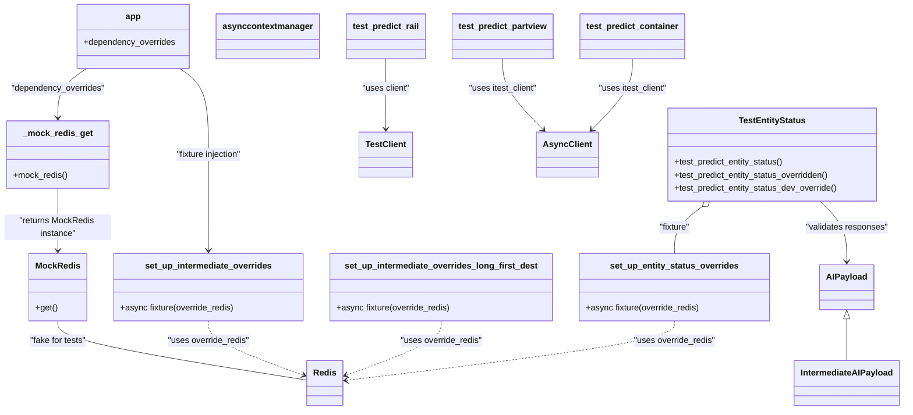

# Diagram: research/api_k8s/get_ai_eta/src/tests/test_main.py


> Auto-generated by Obscura crawlers

## Diagram 1



### SVG

<svg id="container" width="1669.015625" xmlns="http://www.w3.org/2000/svg" class="classDiagram" height="766" viewBox="0 0 1669.015625 766" role="graphics-document document" aria-roledescription="class"><style>#container{font-family:"trebuchet ms",verdana,arial,sans-serif;font-size:16px;fill:#333;}@keyframes edge-animation-frame{from{stroke-dashoffset:0;}}@keyframes dash{to{stroke-dashoffset:0;}}#container .edge-animation-slow{stroke-dasharray:9,5!important;stroke-dashoffset:900;animation:dash 50s linear infinite;stroke-linecap:round;}#container .edge-animation-fast{stroke-dasharray:9,5!important;stroke-dashoffset:900;animation:dash 20s linear infinite;stroke-linecap:round;}#container .error-icon{fill:#552222;}#container .error-text{fill:#552222;stroke:#552222;}#container .edge-thickness-normal{stroke-width:1px;}#container .edge-thickness-thick{stroke-width:3.5px;}#container .edge-pattern-solid{stroke-dasharray:0;}#container .edge-thickness-invisible{stroke-width:0;fill:none;}#container .edge-pattern-dashed{stroke-dasharray:3;}#container .edge-pattern-dotted{stroke-dasharray:2;}#container .marker{fill:#333333;stroke:#333333;}#container .marker.cross{stroke:#333333;}#container svg{font-family:"trebuchet ms",verdana,arial,sans-serif;font-size:16px;}#container p{margin:0;}#container g.classGroup text{fill:#9370DB;stroke:none;font-family:"trebuchet ms",verdana,arial,sans-serif;font-size:10px;}#container g.classGroup text .title{font-weight:bolder;}#container .nodeLabel,#container .edgeLabel{color:#131300;}#container .edgeLabel .label rect{fill:#ECECFF;}#container .label text{fill:#131300;}#container .labelBkg{background:#ECECFF;}#container .edgeLabel .label span{background:#ECECFF;}#container .classTitle{font-weight:bolder;}#container .node rect,#container .node circle,#container .node ellipse,#container .node polygon,#container .node path{fill:#ECECFF;stroke:#9370DB;stroke-width:1px;}#container .divider{stroke:#9370DB;stroke-width:1;}#container g.clickable{cursor:pointer;}#container g.classGroup rect{fill:#ECECFF;stroke:#9370DB;}#container g.classGroup line{stroke:#9370DB;stroke-width:1;}#container .classLabel .box{stroke:none;stroke-width:0;fill:#ECECFF;opacity:0.5;}#container .classLabel .label{fill:#9370DB;font-size:10px;}#container .relation{stroke:#333333;stroke-width:1;fill:none;}#container .dashed-line{stroke-dasharray:3;}#container .dotted-line{stroke-dasharray:1 2;}#container #compositionStart,#container .composition{fill:#333333!important;stroke:#333333!important;stroke-width:1;}#container #compositionEnd,#container .composition{fill:#333333!important;stroke:#333333!important;stroke-width:1;}#container #dependencyStart,#container .dependency{fill:#333333!important;stroke:#333333!important;stroke-width:1;}#container #dependencyStart,#container .dependency{fill:#333333!important;stroke:#333333!important;stroke-width:1;}#container #extensionStart,#container .extension{fill:transparent!important;stroke:#333333!important;stroke-width:1;}#container #extensionEnd,#container .extension{fill:transparent!important;stroke:#333333!important;stroke-width:1;}#container #aggregationStart,#container .aggregation{fill:transparent!important;stroke:#333333!important;stroke-width:1;}#container #aggregationEnd,#container .aggregation{fill:transparent!important;stroke:#333333!important;stroke-width:1;}#container #lollipopStart,#container .lollipop{fill:#ECECFF!important;stroke:#333333!important;stroke-width:1;}#container #lollipopEnd,#container .lollipop{fill:#ECECFF!important;stroke:#333333!important;stroke-width:1;}#container .edgeTerminals{font-size:11px;line-height:initial;}#container .classTitleText{text-anchor:middle;font-size:18px;fill:#333;}#container .label-icon{display:inline-block;height:1em;overflow:visible;vertical-align:-0.125em;}#container .node .label-icon path{fill:currentColor;stroke:revert;stroke-width:revert;}#container :root{--mermaid-font-family:"trebuchet ms",verdana,arial,sans-serif;}</style><g><defs><marker id="container_class-aggregationStart" class="marker aggregation class" refX="18" refY="7" markerWidth="190" markerHeight="240" orient="auto"><path d="M 18,7 L9,13 L1,7 L9,1 Z"></path></marker></defs><defs><marker id="container_class-aggregationEnd" class="marker aggregation class" refX="1" refY="7" markerWidth="20" markerHeight="28" orient="auto"><path d="M 18,7 L9,13 L1,7 L9,1 Z"></path></marker></defs><defs><marker id="container_class-extensionStart" class="marker extension class" refX="18" refY="7" markerWidth="190" markerHeight="240" orient="auto"><path d="M 1,7 L18,13 V 1 Z"></path></marker></defs><defs><marker id="container_class-extensionEnd" class="marker extension class" refX="1" refY="7" markerWidth="20" markerHeight="28" orient="auto"><path d="M 1,1 V 13 L18,7 Z"></path></marker></defs><defs><marker id="container_class-compositionStart" class="marker composition class" refX="18" refY="7" markerWidth="190" markerHeight="240" orient="auto"><path d="M 18,7 L9,13 L1,7 L9,1 Z"></path></marker></defs><defs><marker id="container_class-compositionEnd" class="marker composition class" refX="1" refY="7" markerWidth="20" markerHeight="28" orient="auto"><path d="M 18,7 L9,13 L1,7 L9,1 Z"></path></marker></defs><defs><marker id="container_class-dependencyStart" class="marker dependency class" refX="6" refY="7" markerWidth="190" markerHeight="240" orient="auto"><path d="M 5,7 L9,13 L1,7 L9,1 Z"></path></marker></defs><defs><marker id="container_class-dependencyEnd" class="marker dependency class" refX="13" refY="7" markerWidth="20" markerHeight="28" orient="auto"><path d="M 18,7 L9,13 L14,7 L9,1 Z"></path></marker></defs><defs><marker id="container_class-lollipopStart" class="marker lollipop class" refX="13" refY="7" markerWidth="190" markerHeight="240" orient="auto"><circle stroke="black" fill="transparent" cx="7" cy="7" r="6"></circle></marker></defs><defs><marker id="container_class-lollipopEnd" class="marker lollipop class" refX="1" refY="7" markerWidth="190" markerHeight="240" orient="auto"><circle stroke="black" fill="transparent" cx="7" cy="7" r="6"></circle></marker></defs><g class="root"><g class="clusters"></g><g class="edgePaths"><path d="M108,352L108,364.167C108,376.333,108,400.667,108,420C108,439.333,108,453.667,108,460.833L108,468" id="id__mock_redis_get_MockRedis_1" class="edge-thickness-normal edge-pattern-solid relation" style=";;;" data-edge="true" data-et="edge" data-id="id__mock_redis_get_MockRedis_1" data-points="W3sieCI6MTA4LCJ5IjozNTJ9LHsieCI6MTA4LCJ5Ijo0MjV9LHsieCI6MTA4LCJ5Ijo0NzR9XQ==" marker-end="url(#container_class-dependencyEnd)"></path><path d="M108,600L108,606.167C108,612.333,108,624.667,185.156,643.145C262.312,661.623,416.624,686.246,493.78,698.557L570.936,710.869" id="id_MockRedis_Redis_2" class="edge-thickness-normal edge-pattern-solid relation" style=";;;" data-edge="true" data-et="edge" data-id="id_MockRedis_Redis_2" data-points="W3sieCI6MTA4LCJ5Ijo2MDB9LHsieCI6MTA4LCJ5Ijo2Mzd9LHsieCI6NTcwLjkzNTU0Njg3NSwieSI6NzEwLjg2ODk0Mzk2OTUxMzJ9XQ=="></path><path d="M386.738,600L386.738,606.167C386.738,612.333,386.738,624.667,416.498,641.7C446.259,658.733,505.779,680.467,535.539,691.334L565.3,702.2" id="id_set_up_intermediate_overrides_Redis_3" class="edge-thickness-normal edge-pattern-dashed relation" style=";;;" data-edge="true" data-et="edge" data-id="id_set_up_intermediate_overrides_Redis_3" data-points="W3sieCI6Mzg2LjczODI4MTI1LCJ5Ijo2MDB9LHsieCI6Mzg2LjczODI4MTI1LCJ5Ijo2Mzd9LHsieCI6NTcwLjkzNTU0Njg3NSwieSI6NzA0LjI1ODM2NjIwODM3MjF9XQ==" marker-end="url(#container_class-dependencyEnd)"></path><path d="M819.445,600L819.445,606.167C819.445,612.333,819.445,624.667,789.685,641.7C759.925,658.733,700.404,680.467,670.644,691.334L640.884,702.2" id="id_set_up_intermediate_overrides_long_first_dest_Redis_4" class="edge-thickness-normal edge-pattern-dashed relation" style=";;;" data-edge="true" data-et="edge" data-id="id_set_up_intermediate_overrides_long_first_dest_Redis_4" data-points="W3sieCI6ODE5LjQ0NTMxMjUsInkiOjYwMH0seyJ4Ijo4MTkuNDQ1MzEyNSwieSI6NjM3fSx7IngiOjYzNS4yNDgwNDY4NzUsInkiOjcwNC4yNTgzNjYyMDgzNzIxfV0=" marker-end="url(#container_class-dependencyEnd)"></path><path d="M1252.492,600L1252.492,606.167C1252.492,612.333,1252.492,624.667,1150.611,643.227C1048.73,661.788,844.967,686.576,743.085,698.97L641.204,711.364" id="id_set_up_entity_status_overrides_Redis_5" class="edge-thickness-normal edge-pattern-dashed relation" style=";;;" data-edge="true" data-et="edge" data-id="id_set_up_entity_status_overrides_Redis_5" data-points="W3sieCI6MTI1Mi40OTIxODc1LCJ5Ijo2MDB9LHsieCI6MTI1Mi40OTIxODc1LCJ5Ijo2Mzd9LHsieCI6NjM1LjI0ODA0Njg3NSwieSI6NzEyLjA4ODE3MDI3NzI2OX1d" marker-end="url(#container_class-dependencyEnd)"></path><path d="M1302.12,386.563L1293.849,392.969C1285.578,399.375,1269.035,412.188,1260.764,426.76C1252.492,441.333,1252.492,457.667,1252.492,465.833L1252.492,474" id="id_TestEntityStatus_set_up_entity_status_overrides_6" class="edge-thickness-normal edge-pattern-solid relation" style=";;;" data-edge="true" data-et="edge" data-id="id_TestEntityStatus_set_up_entity_status_overrides_6" data-points="W3sieCI6MTMxNS43NTgyODY0MjAwMzY3LCJ5IjozNzZ9LHsieCI6MTI1Mi40OTIxODc1LCJ5Ijo0MjV9LHsieCI6MTI1Mi40OTIxODc1LCJ5Ijo0NzR9XQ==" marker-start="url(#container_class-aggregationStart)"></path><path d="M1516.016,376L1524.27,384.167C1532.524,392.333,1549.031,408.667,1557.285,427.5C1565.539,446.333,1565.539,467.667,1565.539,478.333L1565.539,489" id="id_TestEntityStatus_AIPayload_7" class="edge-thickness-normal edge-pattern-solid relation" style=";;;" data-edge="true" data-et="edge" data-id="id_TestEntityStatus_AIPayload_7" data-points="W3sieCI6MTUxNi4wMTYyMTM4MDk3NDI2LCJ5IjozNzZ9LHsieCI6MTU2NS41MzkwNjI1LCJ5Ijo0MjV9LHsieCI6MTU2NS41MzkwNjI1LCJ5Ijo0OTV9XQ==" marker-end="url(#container_class-dependencyEnd)"></path><path d="M924.705,110L924.705,119.167C924.705,128.333,924.705,146.667,937.145,168.779C949.586,190.891,974.466,216.783,986.907,229.728L999.347,242.674" id="id_test_predict_partview_AsyncClient_8" class="edge-thickness-normal edge-pattern-solid relation" style=";;;" data-edge="true" data-et="edge" data-id="id_test_predict_partview_AsyncClient_8" data-points="W3sieCI6OTI0LjcwNTA3ODEyNSwieSI6MTEwfSx7IngiOjkyNC43MDUwNzgxMjUsInkiOjE2NX0seyJ4IjoxMDAzLjUwNDUzNjI5MDMyMjYsInkiOjI0N31d" marker-end="url(#container_class-dependencyEnd)"></path><path d="M1163.025,110L1163.025,119.167C1163.025,128.333,1163.025,146.667,1150.585,168.779C1138.145,190.891,1113.264,216.783,1100.824,229.728L1088.383,242.674" id="id_test_predict_container_AsyncClient_9" class="edge-thickness-normal edge-pattern-solid relation" style=";;;" data-edge="true" data-et="edge" data-id="id_test_predict_container_AsyncClient_9" data-points="W3sieCI6MTE2My4wMjUzOTA2MjUsInkiOjExMH0seyJ4IjoxMTYzLjAyNTM5MDYyNSwieSI6MTY1fSx7IngiOjEwODQuMjI1OTMyNDU5Njc3MywieSI6MjQ3fV0=" marker-end="url(#container_class-dependencyEnd)"></path><path d="M709.111,110L709.111,119.167C709.111,128.333,709.111,146.667,709.111,168.5C709.111,190.333,709.111,215.667,709.111,228.333L709.111,241" id="id_test_predict_rail_TestClient_10" class="edge-thickness-normal edge-pattern-solid relation" style=";;;" data-edge="true" data-et="edge" data-id="id_test_predict_rail_TestClient_10" data-points="W3sieCI6NzA5LjExMTMyODEyNSwieSI6MTEwfSx7IngiOjcwOS4xMTEzMjgxMjUsInkiOjE2NX0seyJ4Ijo3MDkuMTExMzI4MTI1LCJ5IjoyNDd9XQ==" marker-end="url(#container_class-dependencyEnd)"></path><path d="M161.161,128L152.301,134.167C143.441,140.333,125.72,152.667,116.86,168C108,183.333,108,201.667,108,210.833L108,220" id="id_app__mock_redis_get_11" class="edge-thickness-normal edge-pattern-solid relation" style=";;;" data-edge="true" data-et="edge" data-id="id_app__mock_redis_get_11" data-points="W3sieCI6MTYxLjE2MTQyNDc3NDQ4NDU0LCJ5IjoxMjh9LHsieCI6MTA4LCJ5IjoxNjV9LHsieCI6MTA4LCJ5IjoyMjZ9XQ==" marker-end="url(#container_class-dependencyEnd)"></path><path d="M333.577,128L342.437,134.167C351.297,140.333,369.018,152.667,377.878,179.5C386.738,206.333,386.738,247.667,386.738,291C386.738,334.333,386.738,379.667,386.738,409.5C386.738,439.333,386.738,453.667,386.738,460.833L386.738,468" id="id_app_set_up_intermediate_overrides_12" class="edge-thickness-normal edge-pattern-solid relation" style=";;;" data-edge="true" data-et="edge" data-id="id_app_set_up_intermediate_overrides_12" data-points="W3sieCI6MzMzLjU3Njg1NjQ3NTUxNTQ2LCJ5IjoxMjh9LHsieCI6Mzg2LjczODI4MTI1LCJ5IjoxNjV9LHsieCI6Mzg2LjczODI4MTI1LCJ5IjoyODl9LHsieCI6Mzg2LjczODI4MTI1LCJ5Ijo0MjV9LHsieCI6Mzg2LjczODI4MTI1LCJ5Ijo0NzR9XQ==" marker-end="url(#container_class-dependencyEnd)"></path><path d="M1565.539,596.25L1565.539,603.042C1565.539,609.833,1565.539,623.417,1565.539,636.375C1565.539,649.333,1565.539,661.667,1565.539,667.833L1565.539,674" id="id_AIPayload_IntermediateAIPayload_13" class="edge-thickness-normal edge-pattern-solid relation" style=";;;" data-edge="true" data-et="edge" data-id="id_AIPayload_IntermediateAIPayload_13" data-points="W3sieCI6MTU2NS41MzkwNjI1LCJ5Ijo1Nzl9LHsieCI6MTU2NS41MzkwNjI1LCJ5Ijo2Mzd9LHsieCI6MTU2NS41MzkwNjI1LCJ5Ijo2NzR9XQ==" marker-start="url(#container_class-extensionStart)"></path></g><g class="edgeLabels"><g class="edgeLabel" transform="translate(108, 425)"><g class="label" data-id="id__mock_redis_get_MockRedis_1" transform="translate(-100, -24)"><foreignObject width="200" height="48"><div xmlns="http://www.w3.org/1999/xhtml" class="labelBkg" style="display: table; white-space: break-spaces; line-height: 1.5; max-width: 200px; text-align: center; width: 200px;"><span class="edgeLabel"><p>"returns MockRedis instance"</p></span></div></foreignObject></g></g><g class="edgeLabel" transform="translate(108, 637)"><g class="label" data-id="id_MockRedis_Redis_2" transform="translate(-53.59375, -12)"><foreignObject width="107.1875" height="24"><div xmlns="http://www.w3.org/1999/xhtml" class="labelBkg" style="display: table-cell; white-space: nowrap; line-height: 1.5; max-width: 200px; text-align: center;"><span class="edgeLabel"><p>"fake for tests"</p></span></div></foreignObject></g></g><g class="edgeLabel" transform="translate(386.73828125, 637)"><g class="label" data-id="id_set_up_intermediate_overrides_Redis_3" transform="translate(-77.34375, -12)"><foreignObject width="154.6875" height="24"><div xmlns="http://www.w3.org/1999/xhtml" class="labelBkg" style="display: table-cell; white-space: nowrap; line-height: 1.5; max-width: 200px; text-align: center;"><span class="edgeLabel"><p>"uses override_redis"</p></span></div></foreignObject></g></g><g class="edgeLabel" transform="translate(819.4453125, 637)"><g class="label" data-id="id_set_up_intermediate_overrides_long_first_dest_Redis_4" transform="translate(-77.34375, -12)"><foreignObject width="154.6875" height="24"><div xmlns="http://www.w3.org/1999/xhtml" class="labelBkg" style="display: table-cell; white-space: nowrap; line-height: 1.5; max-width: 200px; text-align: center;"><span class="edgeLabel"><p>"uses override_redis"</p></span></div></foreignObject></g></g><g class="edgeLabel" transform="translate(1252.4921875, 637)"><g class="label" data-id="id_set_up_entity_status_overrides_Redis_5" transform="translate(-77.34375, -12)"><foreignObject width="154.6875" height="24"><div xmlns="http://www.w3.org/1999/xhtml" class="labelBkg" style="display: table-cell; white-space: nowrap; line-height: 1.5; max-width: 200px; text-align: center;"><span class="edgeLabel"><p>"uses override_redis"</p></span></div></foreignObject></g></g><g class="edgeLabel" transform="translate(1252.4921875, 425)"><g class="label" data-id="id_TestEntityStatus_set_up_entity_status_overrides_6" transform="translate(-29.5390625, -12)"><foreignObject width="59.078125" height="24"><div xmlns="http://www.w3.org/1999/xhtml" class="labelBkg" style="display: table-cell; white-space: nowrap; line-height: 1.5; max-width: 200px; text-align: center;"><span class="edgeLabel"><p>"fixture"</p></span></div></foreignObject></g></g><g class="edgeLabel" transform="translate(1565.5390625, 425)"><g class="label" data-id="id_TestEntityStatus_AIPayload_7" transform="translate(-77.953125, -12)"><foreignObject width="155.90625" height="24"><div xmlns="http://www.w3.org/1999/xhtml" class="labelBkg" style="display: table-cell; white-space: nowrap; line-height: 1.5; max-width: 200px; text-align: center;"><span class="edgeLabel"><p>"validates responses"</p></span></div></foreignObject></g></g><g class="edgeLabel" transform="translate(924.705078125, 165)"><g class="label" data-id="id_test_predict_partview_AsyncClient_8" transform="translate(-65.2421875, -12)"><foreignObject width="130.484375" height="24"><div xmlns="http://www.w3.org/1999/xhtml" class="labelBkg" style="display: table-cell; white-space: nowrap; line-height: 1.5; max-width: 200px; text-align: center;"><span class="edgeLabel"><p>"uses itest_client"</p></span></div></foreignObject></g></g><g class="edgeLabel" transform="translate(1163.025390625, 165)"><g class="label" data-id="id_test_predict_container_AsyncClient_9" transform="translate(-65.2421875, -12)"><foreignObject width="130.484375" height="24"><div xmlns="http://www.w3.org/1999/xhtml" class="labelBkg" style="display: table-cell; white-space: nowrap; line-height: 1.5; max-width: 200px; text-align: center;"><span class="edgeLabel"><p>"uses itest_client"</p></span></div></foreignObject></g></g><g class="edgeLabel" transform="translate(709.111328125, 165)"><g class="label" data-id="id_test_predict_rail_TestClient_10" transform="translate(-45.234375, -12)"><foreignObject width="90.46875" height="24"><div xmlns="http://www.w3.org/1999/xhtml" class="labelBkg" style="display: table-cell; white-space: nowrap; line-height: 1.5; max-width: 200px; text-align: center;"><span class="edgeLabel"><p>"uses client"</p></span></div></foreignObject></g></g><g class="edgeLabel" transform="translate(108, 165)"><g class="label" data-id="id_app__mock_redis_get_11" transform="translate(-88.703125, -12)"><foreignObject width="177.40625" height="24"><div xmlns="http://www.w3.org/1999/xhtml" class="labelBkg" style="display: table-cell; white-space: nowrap; line-height: 1.5; max-width: 200px; text-align: center;"><span class="edgeLabel"><p>"dependency_overrides"</p></span></div></foreignObject></g></g><g class="edgeLabel" transform="translate(386.73828125, 289)"><g class="label" data-id="id_app_set_up_intermediate_overrides_12" transform="translate(-63.53125, -12)"><foreignObject width="127.0625" height="24"><div xmlns="http://www.w3.org/1999/xhtml" class="labelBkg" style="display: table-cell; white-space: nowrap; line-height: 1.5; max-width: 200px; text-align: center;"><span class="edgeLabel"><p>"fixture injection"</p></span></div></foreignObject></g></g><g class="edgeLabel"><g class="label" data-id="id_AIPayload_IntermediateAIPayload_13" transform="translate(0, 0)"><foreignObject width="0" height="0"><div xmlns="http://www.w3.org/1999/xhtml" class="labelBkg" style="display: table-cell; white-space: nowrap; line-height: 1.5; max-width: 200px; text-align: center;"><span class="edgeLabel"></span></div></foreignObject></g></g></g><g class="nodes"><g class="node default" id="classId-MockRedis-0" transform="translate(108, 537)"><g class="basic label-container"><path d="M-52.14453125 -63 L52.14453125 -63 L52.14453125 63 L-52.14453125 63" stroke="none" stroke-width="0" fill="#ECECFF" style=""></path><path d="M-52.14453125 -63 C-19.049188299007398 -63, 14.046154651985205 -63, 52.14453125 -63 M-52.14453125 -63 C-11.838903965441197 -63, 28.466723319117605 -63, 52.14453125 -63 M52.14453125 -63 C52.14453125 -22.41666771444315, 52.14453125 18.1666645711137, 52.14453125 63 M52.14453125 -63 C52.14453125 -37.3704992251121, 52.14453125 -11.740998450224204, 52.14453125 63 M52.14453125 63 C21.209982868913123 63, -9.724565512173754 63, -52.14453125 63 M52.14453125 63 C26.396780238760947 63, 0.6490292275218934 63, -52.14453125 63 M-52.14453125 63 C-52.14453125 15.752275064777358, -52.14453125 -31.495449870445285, -52.14453125 -63 M-52.14453125 63 C-52.14453125 23.11520647328104, -52.14453125 -16.769587053437917, -52.14453125 -63" stroke="#9370DB" stroke-width="1.3" fill="none" stroke-dasharray="0 0" style=""></path></g><g class="annotation-group text" transform="translate(0, -39)"></g><g class="label-group text" transform="translate(-39.3671875, -39)"><g class="label" style="font-weight: bolder" transform="translate(0,-12)"><foreignObject width="78.734375" height="24"><div xmlns="http://www.w3.org/1999/xhtml" style="display: table-cell; white-space: nowrap; line-height: 1.5; max-width: 127px; text-align: center;"><span class="nodeLabel markdown-node-label" style=""><p>MockRedis</p></span></div></foreignObject></g></g><g class="members-group text" transform="translate(-40.14453125, 9)"></g><g class="methods-group text" transform="translate(-40.14453125, 39)"><g class="label" style="" transform="translate(0,-12)"><foreignObject width="40.921875" height="24"><div xmlns="http://www.w3.org/1999/xhtml" style="display: table-cell; white-space: nowrap; line-height: 1.5; max-width: 98px; text-align: center;"><span class="nodeLabel markdown-node-label" style=""><p>+get()</p></span></div></foreignObject></g></g><g class="divider" style=""><path d="M-52.14453125 -15 C-23.007035975143893 -15, 6.130459299712214 -15, 52.14453125 -15 M-52.14453125 -15 C-28.994828508631734 -15, -5.845125767263468 -15, 52.14453125 -15" stroke="#9370DB" stroke-width="1.3" fill="none" stroke-dasharray="0 0" style=""></path></g><g class="divider" style=""><path d="M-52.14453125 9 C-15.284804347523362 9, 21.574922554953275 9, 52.14453125 9 M-52.14453125 9 C-26.694741537680468 9, -1.2449518253609355 9, 52.14453125 9" stroke="#9370DB" stroke-width="1.3" fill="none" stroke-dasharray="0 0" style=""></path></g></g><g class="node default" id="classId-_mock_redis_get-1" transform="translate(108, 289)"><g class="basic label-container"><path d="M-93.859375 -63 L93.859375 -63 L93.859375 63 L-93.859375 63" stroke="none" stroke-width="0" fill="#ECECFF" style=""></path><path d="M-93.859375 -63 C-38.386869746898384 -63, 17.085635506203232 -63, 93.859375 -63 M-93.859375 -63 C-27.590098145461 -63, 38.679178709078 -63, 93.859375 -63 M93.859375 -63 C93.859375 -19.756739097286037, 93.859375 23.486521805427927, 93.859375 63 M93.859375 -63 C93.859375 -25.29883701881466, 93.859375 12.402325962370682, 93.859375 63 M93.859375 63 C42.571741792211185 63, -8.71589141557763 63, -93.859375 63 M93.859375 63 C21.45460845524471 63, -50.95015808951058 63, -93.859375 63 M-93.859375 63 C-93.859375 29.949693867777057, -93.859375 -3.1006122644458856, -93.859375 -63 M-93.859375 63 C-93.859375 25.04517238148476, -93.859375 -12.909655237030478, -93.859375 -63" stroke="#9370DB" stroke-width="1.3" fill="none" stroke-dasharray="0 0" style=""></path></g><g class="annotation-group text" transform="translate(0, -39)"></g><g class="label-group text" transform="translate(-62.171875, -39)"><g class="label" style="font-weight: bolder" transform="translate(0,-12)"><foreignObject width="124.34375" height="24"><div xmlns="http://www.w3.org/1999/xhtml" style="display: table-cell; white-space: nowrap; line-height: 1.5; max-width: 172px; text-align: center;"><span class="nodeLabel markdown-node-label" style=""><p>_mock_redis_get</p></span></div></foreignObject></g></g><g class="members-group text" transform="translate(-81.859375, 9)"></g><g class="methods-group text" transform="translate(-81.859375, 39)"><g class="label" style="" transform="translate(0,-12)"><foreignObject width="101.546875" height="24"><div xmlns="http://www.w3.org/1999/xhtml" style="display: table-cell; white-space: nowrap; line-height: 1.5; max-width: 159px; text-align: center;"><span class="nodeLabel markdown-node-label" style=""><p>+mock_redis()</p></span></div></foreignObject></g></g><g class="divider" style=""><path d="M-93.859375 -15 C-45.23274351081485 -15, 3.3938879783703015 -15, 93.859375 -15 M-93.859375 -15 C-22.849500799563785 -15, 48.16037340087243 -15, 93.859375 -15" stroke="#9370DB" stroke-width="1.3" fill="none" stroke-dasharray="0 0" style=""></path></g><g class="divider" style=""><path d="M-93.859375 9 C-22.615969380703234 9, 48.62743623859353 9, 93.859375 9 M-93.859375 9 C-37.167943730442296 9, 19.523487539115408 9, 93.859375 9" stroke="#9370DB" stroke-width="1.3" fill="none" stroke-dasharray="0 0" style=""></path></g></g><g class="node default" id="classId-set_up_intermediate_overrides-2" transform="translate(386.73828125, 537)"><g class="basic label-container"><path d="M-176.59375 -63 L176.59375 -63 L176.59375 63 L-176.59375 63" stroke="none" stroke-width="0" fill="#ECECFF" style=""></path><path d="M-176.59375 -63 C-42.958320121315865 -63, 90.67710975736827 -63, 176.59375 -63 M-176.59375 -63 C-41.3563640956404 -63, 93.8810218087192 -63, 176.59375 -63 M176.59375 -63 C176.59375 -25.604524791946233, 176.59375 11.790950416107535, 176.59375 63 M176.59375 -63 C176.59375 -36.179842817344166, 176.59375 -9.359685634688333, 176.59375 63 M176.59375 63 C65.76917825735616 63, -45.05539348528768 63, -176.59375 63 M176.59375 63 C97.52488156328604 63, 18.45601312657209 63, -176.59375 63 M-176.59375 63 C-176.59375 36.93437112106899, -176.59375 10.86874224213799, -176.59375 -63 M-176.59375 63 C-176.59375 24.903374878636093, -176.59375 -13.193250242727814, -176.59375 -63" stroke="#9370DB" stroke-width="1.3" fill="none" stroke-dasharray="0 0" style=""></path></g><g class="annotation-group text" transform="translate(0, -39)"></g><g class="label-group text" transform="translate(-114.796875, -39)"><g class="label" style="font-weight: bolder" transform="translate(0,-12)"><foreignObject width="229.59375" height="24"><div xmlns="http://www.w3.org/1999/xhtml" style="display: table-cell; white-space: nowrap; line-height: 1.5; max-width: 277px; text-align: center;"><span class="nodeLabel markdown-node-label" style=""><p>set_up_intermediate_overrides</p></span></div></foreignObject></g></g><g class="members-group text" transform="translate(-164.59375, 9)"></g><g class="methods-group text" transform="translate(-164.59375, 39)"><g class="label" style="" transform="translate(0,-12)"><foreignObject width="214.390625" height="24"><div xmlns="http://www.w3.org/1999/xhtml" style="display: table-cell; white-space: nowrap; line-height: 1.5; max-width: 272px; text-align: center;"><span class="nodeLabel markdown-node-label" style=""><p>+async fixture(override_redis)</p></span></div></foreignObject></g></g><g class="divider" style=""><path d="M-176.59375 -15 C-90.07001819646344 -15, -3.5462863929268735 -15, 176.59375 -15 M-176.59375 -15 C-98.83536840053742 -15, -21.07698680107484 -15, 176.59375 -15" stroke="#9370DB" stroke-width="1.3" fill="none" stroke-dasharray="0 0" style=""></path></g><g class="divider" style=""><path d="M-176.59375 9 C-46.66113591595496 9, 83.27147816809008 9, 176.59375 9 M-176.59375 9 C-89.58058561485649 9, -2.567421229712977 9, 176.59375 9" stroke="#9370DB" stroke-width="1.3" fill="none" stroke-dasharray="0 0" style=""></path></g></g><g class="node default" id="classId-set_up_intermediate_overrides_long_first_dest-3" transform="translate(819.4453125, 537)"><g class="basic label-container"><path d="M-206.11328125 -63 L206.11328125 -63 L206.11328125 63 L-206.11328125 63" stroke="none" stroke-width="0" fill="#ECECFF" style=""></path><path d="M-206.11328125 -63 C-85.67628311979406 -63, 34.76071501041187 -63, 206.11328125 -63 M-206.11328125 -63 C-47.57670983038281 -63, 110.95986158923438 -63, 206.11328125 -63 M206.11328125 -63 C206.11328125 -32.94215005861693, 206.11328125 -2.8843001172338703, 206.11328125 63 M206.11328125 -63 C206.11328125 -36.65886473493985, 206.11328125 -10.317729469879694, 206.11328125 63 M206.11328125 63 C94.1415493863788 63, -17.830182477242403 63, -206.11328125 63 M206.11328125 63 C71.56129929835936 63, -62.99068265328128 63, -206.11328125 63 M-206.11328125 63 C-206.11328125 34.88947460736254, -206.11328125 6.778949214725074, -206.11328125 -63 M-206.11328125 63 C-206.11328125 27.38490772347128, -206.11328125 -8.230184553057441, -206.11328125 -63" stroke="#9370DB" stroke-width="1.3" fill="none" stroke-dasharray="0 0" style=""></path></g><g class="annotation-group text" transform="translate(0, -39)"></g><g class="label-group text" transform="translate(-173.8359375, -39)"><g class="label" style="font-weight: bolder" transform="translate(0,-12)"><foreignObject width="347.671875" height="24"><div xmlns="http://www.w3.org/1999/xhtml" style="display: table-cell; white-space: nowrap; line-height: 1.5; max-width: 392px; text-align: center;"><span class="nodeLabel markdown-node-label" style=""><p>set_up_intermediate_overrides_long_first_dest</p></span></div></foreignObject></g></g><g class="members-group text" transform="translate(-194.11328125, 9)"></g><g class="methods-group text" transform="translate(-194.11328125, 39)"><g class="label" style="" transform="translate(0,-12)"><foreignObject width="214.390625" height="24"><div xmlns="http://www.w3.org/1999/xhtml" style="display: table-cell; white-space: nowrap; line-height: 1.5; max-width: 272px; text-align: center;"><span class="nodeLabel markdown-node-label" style=""><p>+async fixture(override_redis)</p></span></div></foreignObject></g></g><g class="divider" style=""><path d="M-206.11328125 -15 C-70.34952265293569 -15, 65.41423594412862 -15, 206.11328125 -15 M-206.11328125 -15 C-42.23720716132587 -15, 121.63886692734826 -15, 206.11328125 -15" stroke="#9370DB" stroke-width="1.3" fill="none" stroke-dasharray="0 0" style=""></path></g><g class="divider" style=""><path d="M-206.11328125 9 C-49.605946397879165 9, 106.90138845424167 9, 206.11328125 9 M-206.11328125 9 C-87.42358577887214 9, 31.266109692255725 9, 206.11328125 9" stroke="#9370DB" stroke-width="1.3" fill="none" stroke-dasharray="0 0" style=""></path></g></g><g class="node default" id="classId-set_up_entity_status_overrides-4" transform="translate(1252.4921875, 537)"><g class="basic label-container"><path d="M-176.93359375 -63 L176.93359375 -63 L176.93359375 63 L-176.93359375 63" stroke="none" stroke-width="0" fill="#ECECFF" style=""></path><path d="M-176.93359375 -63 C-64.53320158298098 -63, 47.86719058403804 -63, 176.93359375 -63 M-176.93359375 -63 C-93.68479534722078 -63, -10.43599694444157 -63, 176.93359375 -63 M176.93359375 -63 C176.93359375 -32.475138283277765, 176.93359375 -1.9502765665555302, 176.93359375 63 M176.93359375 -63 C176.93359375 -16.02559971577788, 176.93359375 30.94880056844424, 176.93359375 63 M176.93359375 63 C58.61779200116631 63, -59.698009747667385 63, -176.93359375 63 M176.93359375 63 C85.08103269625117 63, -6.771528357497658 63, -176.93359375 63 M-176.93359375 63 C-176.93359375 30.681176930809663, -176.93359375 -1.6376461383806742, -176.93359375 -63 M-176.93359375 63 C-176.93359375 36.2500968016447, -176.93359375 9.50019360328941, -176.93359375 -63" stroke="#9370DB" stroke-width="1.3" fill="none" stroke-dasharray="0 0" style=""></path></g><g class="annotation-group text" transform="translate(0, -39)"></g><g class="label-group text" transform="translate(-115.4765625, -39)"><g class="label" style="font-weight: bolder" transform="translate(0,-12)"><foreignObject width="230.953125" height="24"><div xmlns="http://www.w3.org/1999/xhtml" style="display: table-cell; white-space: nowrap; line-height: 1.5; max-width: 277px; text-align: center;"><span class="nodeLabel markdown-node-label" style=""><p>set_up_entity_status_overrides</p></span></div></foreignObject></g></g><g class="members-group text" transform="translate(-164.93359375, 9)"></g><g class="methods-group text" transform="translate(-164.93359375, 39)"><g class="label" style="" transform="translate(0,-12)"><foreignObject width="214.390625" height="24"><div xmlns="http://www.w3.org/1999/xhtml" style="display: table-cell; white-space: nowrap; line-height: 1.5; max-width: 272px; text-align: center;"><span class="nodeLabel markdown-node-label" style=""><p>+async fixture(override_redis)</p></span></div></foreignObject></g></g><g class="divider" style=""><path d="M-176.93359375 -15 C-57.94913058901763 -15, 61.035332571964744 -15, 176.93359375 -15 M-176.93359375 -15 C-49.09935997196395 -15, 78.7348738060721 -15, 176.93359375 -15" stroke="#9370DB" stroke-width="1.3" fill="none" stroke-dasharray="0 0" style=""></path></g><g class="divider" style=""><path d="M-176.93359375 9 C-65.71796280276948 9, 45.497668144461045 9, 176.93359375 9 M-176.93359375 9 C-83.53873479594209 9, 9.856124158115819 9, 176.93359375 9" stroke="#9370DB" stroke-width="1.3" fill="none" stroke-dasharray="0 0" style=""></path></g></g><g class="node default" id="classId-TestEntityStatus-5" transform="translate(1428.087890625, 289)"><g class="basic label-container"><path d="M-196.9921875 -87 L196.9921875 -87 L196.9921875 87 L-196.9921875 87" stroke="none" stroke-width="0" fill="#ECECFF" style=""></path><path d="M-196.9921875 -87 C-116.9468073318983 -87, -36.9014271637966 -87, 196.9921875 -87 M-196.9921875 -87 C-107.11664520044741 -87, -17.241102900894816 -87, 196.9921875 -87 M196.9921875 -87 C196.9921875 -30.545102989570623, 196.9921875 25.909794020858754, 196.9921875 87 M196.9921875 -87 C196.9921875 -50.32548358508191, 196.9921875 -13.650967170163824, 196.9921875 87 M196.9921875 87 C62.1106847930983 87, -72.7708179138034 87, -196.9921875 87 M196.9921875 87 C57.736436243476334 87, -81.51931501304733 87, -196.9921875 87 M-196.9921875 87 C-196.9921875 48.857270419604994, -196.9921875 10.714540839209988, -196.9921875 -87 M-196.9921875 87 C-196.9921875 35.10040196609365, -196.9921875 -16.7991960678127, -196.9921875 -87" stroke="#9370DB" stroke-width="1.3" fill="none" stroke-dasharray="0 0" style=""></path></g><g class="annotation-group text" transform="translate(0, -63)"></g><g class="label-group text" transform="translate(-60.015625, -63)"><g class="label" style="font-weight: bolder" transform="translate(0,-12)"><foreignObject width="120.03125" height="24"><div xmlns="http://www.w3.org/1999/xhtml" style="display: table-cell; white-space: nowrap; line-height: 1.5; max-width: 167px; text-align: center;"><span class="nodeLabel markdown-node-label" style=""><p>TestEntityStatus</p></span></div></foreignObject></g></g><g class="members-group text" transform="translate(-184.9921875, -15)"></g><g class="methods-group text" transform="translate(-184.9921875, 15)"><g class="label" style="" transform="translate(0,-12)"><foreignObject width="207.71875" height="24"><div xmlns="http://www.w3.org/1999/xhtml" style="display: table-cell; white-space: nowrap; line-height: 1.5; max-width: 265px; text-align: center;"><span class="nodeLabel markdown-node-label" style=""><p>+test_predict_entity_status()</p></span></div></foreignObject></g><g class="label" style="" transform="translate(0,12)"><foreignObject width="295.296875" height="24"><div xmlns="http://www.w3.org/1999/xhtml" style="display: table-cell; white-space: nowrap; line-height: 1.5; max-width: 353px; text-align: center;"><span class="nodeLabel markdown-node-label" style=""><p>+test_predict_entity_status_overridden()</p></span></div></foreignObject></g><g class="label" style="" transform="translate(0,36)"><foreignObject width="309.96875" height="24"><div xmlns="http://www.w3.org/1999/xhtml" style="display: table-cell; white-space: nowrap; line-height: 1.5; max-width: 367px; text-align: center;"><span class="nodeLabel markdown-node-label" style=""><p>+test_predict_entity_status_dev_override()</p></span></div></foreignObject></g></g><g class="divider" style=""><path d="M-196.9921875 -39 C-106.35553397976491 -39, -15.718880459529828 -39, 196.9921875 -39 M-196.9921875 -39 C-42.26832671481773 -39, 112.45553407036454 -39, 196.9921875 -39" stroke="#9370DB" stroke-width="1.3" fill="none" stroke-dasharray="0 0" style=""></path></g><g class="divider" style=""><path d="M-196.9921875 -15 C-58.79138810332748 -15, 79.40941129334504 -15, 196.9921875 -15 M-196.9921875 -15 C-55.50262830381621 -15, 85.98693089236758 -15, 196.9921875 -15" stroke="#9370DB" stroke-width="1.3" fill="none" stroke-dasharray="0 0" style=""></path></g></g><g class="node default" id="classId-AIPayload-6" transform="translate(1565.5390625, 537)"><g class="basic label-container"><path d="M-47.96875 -42 L47.96875 -42 L47.96875 42 L-47.96875 42" stroke="none" stroke-width="0" fill="#ECECFF" style=""></path><path d="M-47.96875 -42 C-15.200632090816299 -42, 17.567485818367402 -42, 47.96875 -42 M-47.96875 -42 C-17.128252030275984 -42, 13.712245939448032 -42, 47.96875 -42 M47.96875 -42 C47.96875 -19.24764211695866, 47.96875 3.5047157660826826, 47.96875 42 M47.96875 -42 C47.96875 -24.533409719717522, 47.96875 -7.066819439435044, 47.96875 42 M47.96875 42 C19.374344064724763 42, -9.220061870550474 42, -47.96875 42 M47.96875 42 C26.599237563701173 42, 5.229725127402347 42, -47.96875 42 M-47.96875 42 C-47.96875 14.458286202360917, -47.96875 -13.083427595278167, -47.96875 -42 M-47.96875 42 C-47.96875 18.3523833778843, -47.96875 -5.295233244231397, -47.96875 -42" stroke="#9370DB" stroke-width="1.3" fill="none" stroke-dasharray="0 0" style=""></path></g><g class="annotation-group text" transform="translate(0, -18)"></g><g class="label-group text" transform="translate(-35.96875, -18)"><g class="label" style="font-weight: bolder" transform="translate(0,-12)"><foreignObject width="71.9375" height="24"><div xmlns="http://www.w3.org/1999/xhtml" style="display: table-cell; white-space: nowrap; line-height: 1.5; max-width: 121px; text-align: center;"><span class="nodeLabel markdown-node-label" style=""><p>AIPayload</p></span></div></foreignObject></g></g><g class="members-group text" transform="translate(-35.96875, 30)"></g><g class="methods-group text" transform="translate(-35.96875, 60)"></g><g class="divider" style=""><path d="M-47.96875 6 C-15.354589709868037 6, 17.259570580263926 6, 47.96875 6 M-47.96875 6 C-19.08029478655419 6, 9.808160426891618 6, 47.96875 6" stroke="#9370DB" stroke-width="1.3" fill="none" stroke-dasharray="0 0" style=""></path></g><g class="divider" style=""><path d="M-47.96875 24 C-25.946132305441477 24, -3.923514610882954 24, 47.96875 24 M-47.96875 24 C-27.72684288356549 24, -7.4849357671309775 24, 47.96875 24" stroke="#9370DB" stroke-width="1.3" fill="none" stroke-dasharray="0 0" style=""></path></g></g><g class="node default" id="classId-IntermediateAIPayload-7" transform="translate(1565.5390625, 716)"><g class="basic label-container"><path d="M-95.4765625 -42 L95.4765625 -42 L95.4765625 42 L-95.4765625 42" stroke="none" stroke-width="0" fill="#ECECFF" style=""></path><path d="M-95.4765625 -42 C-49.54720658348616 -42, -3.6178506669723163 -42, 95.4765625 -42 M-95.4765625 -42 C-42.04312043610471 -42, 11.390321627790584 -42, 95.4765625 -42 M95.4765625 -42 C95.4765625 -19.667196630946894, 95.4765625 2.665606738106213, 95.4765625 42 M95.4765625 -42 C95.4765625 -15.768025493909075, 95.4765625 10.46394901218185, 95.4765625 42 M95.4765625 42 C55.505069654731514 42, 15.533576809463028 42, -95.4765625 42 M95.4765625 42 C31.210259515471748 42, -33.056043469056505 42, -95.4765625 42 M-95.4765625 42 C-95.4765625 14.576111296503413, -95.4765625 -12.847777406993174, -95.4765625 -42 M-95.4765625 42 C-95.4765625 13.748314144132621, -95.4765625 -14.503371711734758, -95.4765625 -42" stroke="#9370DB" stroke-width="1.3" fill="none" stroke-dasharray="0 0" style=""></path></g><g class="annotation-group text" transform="translate(0, -18)"></g><g class="label-group text" transform="translate(-83.4765625, -18)"><g class="label" style="font-weight: bolder" transform="translate(0,-12)"><foreignObject width="166.953125" height="24"><div xmlns="http://www.w3.org/1999/xhtml" style="display: table-cell; white-space: nowrap; line-height: 1.5; max-width: 215px; text-align: center;"><span class="nodeLabel markdown-node-label" style=""><p>IntermediateAIPayload</p></span></div></foreignObject></g></g><g class="members-group text" transform="translate(-83.4765625, 30)"></g><g class="methods-group text" transform="translate(-83.4765625, 60)"></g><g class="divider" style=""><path d="M-95.4765625 6 C-54.336761319609266 6, -13.196960139218533 6, 95.4765625 6 M-95.4765625 6 C-29.738340567329402 6, 35.999881365341196 6, 95.4765625 6" stroke="#9370DB" stroke-width="1.3" fill="none" stroke-dasharray="0 0" style=""></path></g><g class="divider" style=""><path d="M-95.4765625 24 C-54.52714001788421 24, -13.577717535768414 24, 95.4765625 24 M-95.4765625 24 C-25.8687125214896 24, 43.7391374570208 24, 95.4765625 24" stroke="#9370DB" stroke-width="1.3" fill="none" stroke-dasharray="0 0" style=""></path></g></g><g class="node default" id="classId-app-8" transform="translate(247.369140625, 68)"><g class="basic label-container"><path d="M-105.4765625 -60 L105.4765625 -60 L105.4765625 60 L-105.4765625 60" stroke="none" stroke-width="0" fill="#ECECFF" style=""></path><path d="M-105.4765625 -60 C-62.65495231082406 -60, -19.833342121648116 -60, 105.4765625 -60 M-105.4765625 -60 C-32.75801046073242 -60, 39.96054157853516 -60, 105.4765625 -60 M105.4765625 -60 C105.4765625 -35.554683788401896, 105.4765625 -11.109367576803791, 105.4765625 60 M105.4765625 -60 C105.4765625 -19.80338152271556, 105.4765625 20.393236954568877, 105.4765625 60 M105.4765625 60 C30.24926847238642 60, -44.97802555522716 60, -105.4765625 60 M105.4765625 60 C31.92946307882754 60, -41.61763634234492 60, -105.4765625 60 M-105.4765625 60 C-105.4765625 24.416729856202558, -105.4765625 -11.166540287594884, -105.4765625 -60 M-105.4765625 60 C-105.4765625 13.224225114961989, -105.4765625 -33.55154977007602, -105.4765625 -60" stroke="#9370DB" stroke-width="1.3" fill="none" stroke-dasharray="0 0" style=""></path></g><g class="annotation-group text" transform="translate(0, -36)"></g><g class="label-group text" transform="translate(-13.9375, -36)"><g class="label" style="font-weight: bolder" transform="translate(0,-12)"><foreignObject width="27.875" height="24"><div xmlns="http://www.w3.org/1999/xhtml" style="display: table-cell; white-space: nowrap; line-height: 1.5; max-width: 78px; text-align: center;"><span class="nodeLabel markdown-node-label" style=""><p>app</p></span></div></foreignObject></g></g><g class="members-group text" transform="translate(-93.4765625, 12)"><g class="label" style="" transform="translate(0,-12)"><foreignObject width="173.015625" height="24"><div xmlns="http://www.w3.org/1999/xhtml" style="display: table-cell; white-space: nowrap; line-height: 1.5; max-width: 230px; text-align: center;"><span class="nodeLabel markdown-node-label" style=""><p>+dependency_overrides</p></span></div></foreignObject></g></g><g class="methods-group text" transform="translate(-93.4765625, 60)"></g><g class="divider" style=""><path d="M-105.4765625 -12 C-25.466034772896577 -12, 54.544492954206845 -12, 105.4765625 -12 M-105.4765625 -12 C-39.126704829497584 -12, 27.223152841004833 -12, 105.4765625 -12" stroke="#9370DB" stroke-width="1.3" fill="none" stroke-dasharray="0 0" style=""></path></g><g class="divider" style=""><path d="M-105.4765625 36 C-38.775203499631345 36, 27.92615550073731 36, 105.4765625 36 M-105.4765625 36 C-46.93304031329992 36, 11.610481873400161 36, 105.4765625 36" stroke="#9370DB" stroke-width="1.3" fill="none" stroke-dasharray="0 0" style=""></path></g></g><g class="node default" id="classId-TestClient-9" transform="translate(709.111328125, 289)"><g class="basic label-container"><path d="M-48.5234375 -42 L48.5234375 -42 L48.5234375 42 L-48.5234375 42" stroke="none" stroke-width="0" fill="#ECECFF" style=""></path><path d="M-48.5234375 -42 C-18.179406997021264 -42, 12.164623505957472 -42, 48.5234375 -42 M-48.5234375 -42 C-16.473003295897115 -42, 15.57743090820577 -42, 48.5234375 -42 M48.5234375 -42 C48.5234375 -9.685996465367012, 48.5234375 22.628007069265976, 48.5234375 42 M48.5234375 -42 C48.5234375 -24.73322772825037, 48.5234375 -7.466455456500739, 48.5234375 42 M48.5234375 42 C22.599497007492552 42, -3.3244434850148963 42, -48.5234375 42 M48.5234375 42 C28.519171907604093 42, 8.514906315208187 42, -48.5234375 42 M-48.5234375 42 C-48.5234375 22.901676912107654, -48.5234375 3.803353824215307, -48.5234375 -42 M-48.5234375 42 C-48.5234375 21.843380276222184, -48.5234375 1.686760552444369, -48.5234375 -42" stroke="#9370DB" stroke-width="1.3" fill="none" stroke-dasharray="0 0" style=""></path></g><g class="annotation-group text" transform="translate(0, -18)"></g><g class="label-group text" transform="translate(-36.5234375, -18)"><g class="label" style="font-weight: bolder" transform="translate(0,-12)"><foreignObject width="73.046875" height="24"><div xmlns="http://www.w3.org/1999/xhtml" style="display: table-cell; white-space: nowrap; line-height: 1.5; max-width: 121px; text-align: center;"><span class="nodeLabel markdown-node-label" style=""><p>TestClient</p></span></div></foreignObject></g></g><g class="members-group text" transform="translate(-36.5234375, 30)"></g><g class="methods-group text" transform="translate(-36.5234375, 60)"></g><g class="divider" style=""><path d="M-48.5234375 6 C-23.069404881891515 6, 2.38462773621697 6, 48.5234375 6 M-48.5234375 6 C-16.002367028878545 6, 16.51870344224291 6, 48.5234375 6" stroke="#9370DB" stroke-width="1.3" fill="none" stroke-dasharray="0 0" style=""></path></g><g class="divider" style=""><path d="M-48.5234375 24 C-25.58704876573983 24, -2.65066003147966 24, 48.5234375 24 M-48.5234375 24 C-14.094186771241347 24, 20.335063957517306 24, 48.5234375 24" stroke="#9370DB" stroke-width="1.3" fill="none" stroke-dasharray="0 0" style=""></path></g></g><g class="node default" id="classId-AsyncClient-10" transform="translate(1043.865234375, 289)"><g class="basic label-container"><path d="M-54.296875 -42 L54.296875 -42 L54.296875 42 L-54.296875 42" stroke="none" stroke-width="0" fill="#ECECFF" style=""></path><path d="M-54.296875 -42 C-11.226438416208573 -42, 31.843998167582853 -42, 54.296875 -42 M-54.296875 -42 C-18.423511891807806 -42, 17.44985121638439 -42, 54.296875 -42 M54.296875 -42 C54.296875 -21.961736425235152, 54.296875 -1.9234728504703043, 54.296875 42 M54.296875 -42 C54.296875 -11.53944028782827, 54.296875 18.92111942434346, 54.296875 42 M54.296875 42 C22.904582188555043 42, -8.487710622889914 42, -54.296875 42 M54.296875 42 C19.96773769152928 42, -14.36139961694144 42, -54.296875 42 M-54.296875 42 C-54.296875 23.654516382341605, -54.296875 5.309032764683209, -54.296875 -42 M-54.296875 42 C-54.296875 15.313132942033398, -54.296875 -11.373734115933203, -54.296875 -42" stroke="#9370DB" stroke-width="1.3" fill="none" stroke-dasharray="0 0" style=""></path></g><g class="annotation-group text" transform="translate(0, -18)"></g><g class="label-group text" transform="translate(-42.296875, -18)"><g class="label" style="font-weight: bolder" transform="translate(0,-12)"><foreignObject width="84.59375" height="24"><div xmlns="http://www.w3.org/1999/xhtml" style="display: table-cell; white-space: nowrap; line-height: 1.5; max-width: 133px; text-align: center;"><span class="nodeLabel markdown-node-label" style=""><p>AsyncClient</p></span></div></foreignObject></g></g><g class="members-group text" transform="translate(-42.296875, 30)"></g><g class="methods-group text" transform="translate(-42.296875, 60)"></g><g class="divider" style=""><path d="M-54.296875 6 C-11.934831188140002 6, 30.427212623719996 6, 54.296875 6 M-54.296875 6 C-22.617342405360258 6, 9.062190189279484 6, 54.296875 6" stroke="#9370DB" stroke-width="1.3" fill="none" stroke-dasharray="0 0" style=""></path></g><g class="divider" style=""><path d="M-54.296875 24 C-24.56899754017013 24, 5.158879919659739 24, 54.296875 24 M-54.296875 24 C-20.492067308913974 24, 13.312740382172052 24, 54.296875 24" stroke="#9370DB" stroke-width="1.3" fill="none" stroke-dasharray="0 0" style=""></path></g></g><g class="node default" id="classId-Redis-11" transform="translate(603.091796875, 716)"><g class="basic label-container"><path d="M-32.15625 -42 L32.15625 -42 L32.15625 42 L-32.15625 42" stroke="none" stroke-width="0" fill="#ECECFF" style=""></path><path d="M-32.15625 -42 C-18.118336319997823 -42, -4.080422639995643 -42, 32.15625 -42 M-32.15625 -42 C-15.558613039720466 -42, 1.0390239205590674 -42, 32.15625 -42 M32.15625 -42 C32.15625 -9.633177601103569, 32.15625 22.733644797792863, 32.15625 42 M32.15625 -42 C32.15625 -14.30815226149387, 32.15625 13.38369547701226, 32.15625 42 M32.15625 42 C18.47283246356548 42, 4.7894149271309665 42, -32.15625 42 M32.15625 42 C14.532385377683497 42, -3.091479244633007 42, -32.15625 42 M-32.15625 42 C-32.15625 18.210945594397316, -32.15625 -5.578108811205368, -32.15625 -42 M-32.15625 42 C-32.15625 12.633472173374674, -32.15625 -16.733055653250652, -32.15625 -42" stroke="#9370DB" stroke-width="1.3" fill="none" stroke-dasharray="0 0" style=""></path></g><g class="annotation-group text" transform="translate(0, -18)"></g><g class="label-group text" transform="translate(-20.15625, -18)"><g class="label" style="font-weight: bolder" transform="translate(0,-12)"><foreignObject width="40.3125" height="24"><div xmlns="http://www.w3.org/1999/xhtml" style="display: table-cell; white-space: nowrap; line-height: 1.5; max-width: 90px; text-align: center;"><span class="nodeLabel markdown-node-label" style=""><p>Redis</p></span></div></foreignObject></g></g><g class="members-group text" transform="translate(-20.15625, 30)"></g><g class="methods-group text" transform="translate(-20.15625, 60)"></g><g class="divider" style=""><path d="M-32.15625 6 C-6.707544484336196 6, 18.741161031327607 6, 32.15625 6 M-32.15625 6 C-8.611661139471991 6, 14.932927721056018 6, 32.15625 6" stroke="#9370DB" stroke-width="1.3" fill="none" stroke-dasharray="0 0" style=""></path></g><g class="divider" style=""><path d="M-32.15625 24 C-7.487883358577474 24, 17.180483282845053 24, 32.15625 24 M-32.15625 24 C-7.747775325798155 24, 16.66069934840369 24, 32.15625 24" stroke="#9370DB" stroke-width="1.3" fill="none" stroke-dasharray="0 0" style=""></path></g></g><g class="node default" id="classId-asynccontextmanager-12" transform="translate(494.619140625, 68)"><g class="basic label-container"><path d="M-91.7734375 -42 L91.7734375 -42 L91.7734375 42 L-91.7734375 42" stroke="none" stroke-width="0" fill="#ECECFF" style=""></path><path d="M-91.7734375 -42 C-49.08761656850451 -42, -6.401795637009016 -42, 91.7734375 -42 M-91.7734375 -42 C-49.251418557171 -42, -6.729399614342 -42, 91.7734375 -42 M91.7734375 -42 C91.7734375 -11.676980655376546, 91.7734375 18.646038689246907, 91.7734375 42 M91.7734375 -42 C91.7734375 -8.728839680591342, 91.7734375 24.542320638817316, 91.7734375 42 M91.7734375 42 C46.78666284687422 42, 1.799888193748444 42, -91.7734375 42 M91.7734375 42 C53.18508281603626 42, 14.596728132072514 42, -91.7734375 42 M-91.7734375 42 C-91.7734375 10.255182891119059, -91.7734375 -21.489634217761882, -91.7734375 -42 M-91.7734375 42 C-91.7734375 21.128563262890744, -91.7734375 0.2571265257814872, -91.7734375 -42" stroke="#9370DB" stroke-width="1.3" fill="none" stroke-dasharray="0 0" style=""></path></g><g class="annotation-group text" transform="translate(0, -18)"></g><g class="label-group text" transform="translate(-79.7734375, -18)"><g class="label" style="font-weight: bolder" transform="translate(0,-12)"><foreignObject width="159.546875" height="24"><div xmlns="http://www.w3.org/1999/xhtml" style="display: table-cell; white-space: nowrap; line-height: 1.5; max-width: 208px; text-align: center;"><span class="nodeLabel markdown-node-label" style=""><p>asynccontextmanager</p></span></div></foreignObject></g></g><g class="members-group text" transform="translate(-79.7734375, 30)"></g><g class="methods-group text" transform="translate(-79.7734375, 60)"></g><g class="divider" style=""><path d="M-91.7734375 6 C-50.574613839183904 6, -9.375790178367808 6, 91.7734375 6 M-91.7734375 6 C-40.633981100445986 6, 10.505475299108028 6, 91.7734375 6" stroke="#9370DB" stroke-width="1.3" fill="none" stroke-dasharray="0 0" style=""></path></g><g class="divider" style=""><path d="M-91.7734375 24 C-19.442276964748515 24, 52.88888357050297 24, 91.7734375 24 M-91.7734375 24 C-46.62171217899192 24, -1.4699868579838409 24, 91.7734375 24" stroke="#9370DB" stroke-width="1.3" fill="none" stroke-dasharray="0 0" style=""></path></g></g><g class="node default" id="classId-test_predict_partview-13" transform="translate(924.705078125, 68)"><g class="basic label-container"><path d="M-92.875 -42 L92.875 -42 L92.875 42 L-92.875 42" stroke="none" stroke-width="0" fill="#ECECFF" style=""></path><path d="M-92.875 -42 C-23.134646959648776 -42, 46.60570608070245 -42, 92.875 -42 M-92.875 -42 C-39.40271568789148 -42, 14.069568624217041 -42, 92.875 -42 M92.875 -42 C92.875 -15.213774960721633, 92.875 11.572450078556734, 92.875 42 M92.875 -42 C92.875 -13.125776607933183, 92.875 15.748446784133634, 92.875 42 M92.875 42 C39.659705094702666 42, -13.555589810594668 42, -92.875 42 M92.875 42 C21.250333145220495 42, -50.37433370955901 42, -92.875 42 M-92.875 42 C-92.875 23.633658883691837, -92.875 5.267317767383673, -92.875 -42 M-92.875 42 C-92.875 10.993148642163355, -92.875 -20.01370271567329, -92.875 -42" stroke="#9370DB" stroke-width="1.3" fill="none" stroke-dasharray="0 0" style=""></path></g><g class="annotation-group text" transform="translate(0, -18)"></g><g class="label-group text" transform="translate(-80.875, -18)"><g class="label" style="font-weight: bolder" transform="translate(0,-12)"><foreignObject width="161.75" height="24"><div xmlns="http://www.w3.org/1999/xhtml" style="display: table-cell; white-space: nowrap; line-height: 1.5; max-width: 209px; text-align: center;"><span class="nodeLabel markdown-node-label" style=""><p>test_predict_partview</p></span></div></foreignObject></g></g><g class="members-group text" transform="translate(-80.875, 30)"></g><g class="methods-group text" transform="translate(-80.875, 60)"></g><g class="divider" style=""><path d="M-92.875 6 C-29.903600620186005 6, 33.06779875962799 6, 92.875 6 M-92.875 6 C-24.126964186085857 6, 44.621071627828286 6, 92.875 6" stroke="#9370DB" stroke-width="1.3" fill="none" stroke-dasharray="0 0" style=""></path></g><g class="divider" style=""><path d="M-92.875 24 C-20.133750647975802 24, 52.607498704048396 24, 92.875 24 M-92.875 24 C-33.28074367900469 24, 26.313512641990613 24, 92.875 24" stroke="#9370DB" stroke-width="1.3" fill="none" stroke-dasharray="0 0" style=""></path></g></g><g class="node default" id="classId-test_predict_container-14" transform="translate(1163.025390625, 68)"><g class="basic label-container"><path d="M-95.4453125 -42 L95.4453125 -42 L95.4453125 42 L-95.4453125 42" stroke="none" stroke-width="0" fill="#ECECFF" style=""></path><path d="M-95.4453125 -42 C-25.319345659780595 -42, 44.80662118043881 -42, 95.4453125 -42 M-95.4453125 -42 C-40.55567146956306 -42, 14.333969560873882 -42, 95.4453125 -42 M95.4453125 -42 C95.4453125 -24.10474807441546, 95.4453125 -6.209496148830922, 95.4453125 42 M95.4453125 -42 C95.4453125 -24.861888390110195, 95.4453125 -7.7237767802203905, 95.4453125 42 M95.4453125 42 C37.1013157269631 42, -21.2426810460738 42, -95.4453125 42 M95.4453125 42 C54.854449391265476 42, 14.263586282530952 42, -95.4453125 42 M-95.4453125 42 C-95.4453125 20.059615162172463, -95.4453125 -1.880769675655074, -95.4453125 -42 M-95.4453125 42 C-95.4453125 19.973502180806264, -95.4453125 -2.052995638387472, -95.4453125 -42" stroke="#9370DB" stroke-width="1.3" fill="none" stroke-dasharray="0 0" style=""></path></g><g class="annotation-group text" transform="translate(0, -18)"></g><g class="label-group text" transform="translate(-83.4453125, -18)"><g class="label" style="font-weight: bolder" transform="translate(0,-12)"><foreignObject width="166.890625" height="24"><div xmlns="http://www.w3.org/1999/xhtml" style="display: table-cell; white-space: nowrap; line-height: 1.5; max-width: 215px; text-align: center;"><span class="nodeLabel markdown-node-label" style=""><p>test_predict_container</p></span></div></foreignObject></g></g><g class="members-group text" transform="translate(-83.4453125, 30)"></g><g class="methods-group text" transform="translate(-83.4453125, 60)"></g><g class="divider" style=""><path d="M-95.4453125 6 C-48.73642715075585 6, -2.0275418015117026 6, 95.4453125 6 M-95.4453125 6 C-49.36345932073385 6, -3.281606141467705 6, 95.4453125 6" stroke="#9370DB" stroke-width="1.3" fill="none" stroke-dasharray="0 0" style=""></path></g><g class="divider" style=""><path d="M-95.4453125 24 C-48.1298501857538 24, -0.8143878715076056 24, 95.4453125 24 M-95.4453125 24 C-28.16487290080923 24, 39.11556669838154 24, 95.4453125 24" stroke="#9370DB" stroke-width="1.3" fill="none" stroke-dasharray="0 0" style=""></path></g></g><g class="node default" id="classId-test_predict_rail-15" transform="translate(709.111328125, 68)"><g class="basic label-container"><path d="M-72.71875 -42 L72.71875 -42 L72.71875 42 L-72.71875 42" stroke="none" stroke-width="0" fill="#ECECFF" style=""></path><path d="M-72.71875 -42 C-28.93727026711617 -42, 14.844209465767662 -42, 72.71875 -42 M-72.71875 -42 C-17.45563472603655 -42, 37.8074805479269 -42, 72.71875 -42 M72.71875 -42 C72.71875 -19.15210963059476, 72.71875 3.695780738810477, 72.71875 42 M72.71875 -42 C72.71875 -10.438555899135597, 72.71875 21.122888201728806, 72.71875 42 M72.71875 42 C17.630319954409792 42, -37.458110091180416 42, -72.71875 42 M72.71875 42 C37.120351045984194 42, 1.5219520919683873 42, -72.71875 42 M-72.71875 42 C-72.71875 24.74597471147894, -72.71875 7.49194942295788, -72.71875 -42 M-72.71875 42 C-72.71875 13.006152187076047, -72.71875 -15.987695625847905, -72.71875 -42" stroke="#9370DB" stroke-width="1.3" fill="none" stroke-dasharray="0 0" style=""></path></g><g class="annotation-group text" transform="translate(0, -18)"></g><g class="label-group text" transform="translate(-60.71875, -18)"><g class="label" style="font-weight: bolder" transform="translate(0,-12)"><foreignObject width="121.4375" height="24"><div xmlns="http://www.w3.org/1999/xhtml" style="display: table-cell; white-space: nowrap; line-height: 1.5; max-width: 169px; text-align: center;"><span class="nodeLabel markdown-node-label" style=""><p>test_predict_rail</p></span></div></foreignObject></g></g><g class="members-group text" transform="translate(-60.71875, 30)"></g><g class="methods-group text" transform="translate(-60.71875, 60)"></g><g class="divider" style=""><path d="M-72.71875 6 C-34.72385200688986 6, 3.2710459862202867 6, 72.71875 6 M-72.71875 6 C-31.615191463320556 6, 9.488367073358887 6, 72.71875 6" stroke="#9370DB" stroke-width="1.3" fill="none" stroke-dasharray="0 0" style=""></path></g><g class="divider" style=""><path d="M-72.71875 24 C-38.86600583376591 24, -5.013261667531822 24, 72.71875 24 M-72.71875 24 C-20.19083591432971 24, 32.33707817134058 24, 72.71875 24" stroke="#9370DB" stroke-width="1.3" fill="none" stroke-dasharray="0 0" style=""></path></g></g></g></g></g></svg>

## Diagram 2

```mermaid
flowchart TD
    subgraph Fixtures
        F1[_mock_redis_get fixture]
        F2[set_up_intermediate_overrides]
        F3[set_up_intermediate_overrides_long_first_dest]
        F4[set_up_entity_status_overrides]
    end

    subgraph Clients
        C1[TestClient]
        C2[AsyncClient]
    end

    subgraph Server
        S[/POST /get-ai-eta/eta/]
        Handler[App handler -> routes -> predictor]
        RedisConn[location_redis_conn / override_redis]
    end

    subgraph Models
        M1[AIPayload]
        M2[IntermediateAIPayload]
    end

    subgraph Assertions
        A1{status_code == 200?}
        A2{modelType checks}
        A3{etaMinutes / etaDate checks}
        A4{modelArtifacts / guid checks}
        A5{nextLocationEtas / overriddenEta checks}
    end

    F1 --> RedisConn
    F2 --> RedisConn
    F3 --> RedisConn
    F4 --> RedisConn

    C1 --> S
    C2 --> S
    S --> Handler
    Handler --> RedisConn
    Handler --> M1
    Handler --> M2

    M1 --> A1
    M1 --> A2
    M1 --> A3
    M1 --> A4

    M2 --> A1
    M2 --> A2
    M2 --> A5

    note right of F2: override_redis.set(keys -> override values)
    note right of M2: intermediate payload includes nextLocationEtas, expectedDwell, etaDate
```

> SVG rendering failed for this diagram.
