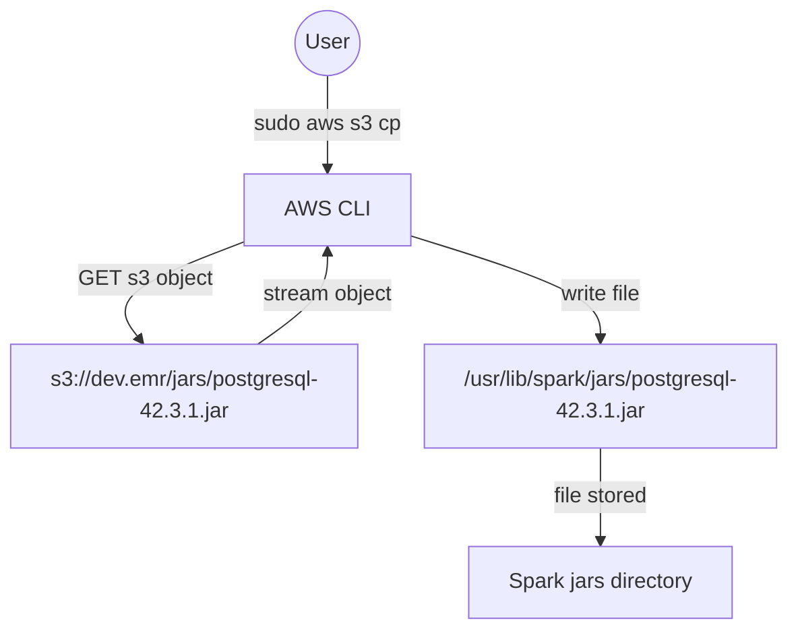

# Diagram: research/aws_emr_step.sh

> Auto-generated by Obscura crawlers

## Mermaid

### SVG

<svg id="container" width="631" xmlns="http://www.w3.org/2000/svg" class="flowchart" height="471.890625" viewBox="0 0 631 471.890625" role="graphics-document document" aria-roledescription="flowchart-v2"><g><marker id="container_flowchart-v2-pointEnd" class="marker flowchart-v2" viewBox="0 0 10 10" refX="5" refY="5" markerUnits="userSpaceOnUse" markerWidth="8" markerHeight="8" orient="auto"><path d="M 0 0 L 10 5 L 0 10 z" class="arrowMarkerPath" style="stroke-width: 1; stroke-dasharray: 1, 0;"></path></marker><marker id="container_flowchart-v2-pointStart" class="marker flowchart-v2" viewBox="0 0 10 10" refX="4.5" refY="5" markerUnits="userSpaceOnUse" markerWidth="8" markerHeight="8" orient="auto"><path d="M 0 5 L 10 10 L 10 0 z" class="arrowMarkerPath" style="stroke-width: 1; stroke-dasharray: 1, 0;"></path></marker><marker id="container_flowchart-v2-circleEnd" class="marker flowchart-v2" viewBox="0 0 10 10" refX="11" refY="5" markerUnits="userSpaceOnUse" markerWidth="11" markerHeight="11" orient="auto"><circle cx="5" cy="5" r="5" class="arrowMarkerPath" style="stroke-width: 1; stroke-dasharray: 1, 0;"></circle></marker><marker id="container_flowchart-v2-circleStart" class="marker flowchart-v2" viewBox="0 0 10 10" refX="-1" refY="5" markerUnits="userSpaceOnUse" markerWidth="11" markerHeight="11" orient="auto"><circle cx="5" cy="5" r="5" class="arrowMarkerPath" style="stroke-width: 1; stroke-dasharray: 1, 0;"></circle></marker><marker id="container_flowchart-v2-crossEnd" class="marker cross flowchart-v2" viewBox="0 0 11 11" refX="12" refY="5.2" markerUnits="userSpaceOnUse" markerWidth="11" markerHeight="11" orient="auto"><path d="M 1,1 l 9,9 M 10,1 l -9,9" class="arrowMarkerPath" style="stroke-width: 2; stroke-dasharray: 1, 0;"></path></marker><marker id="container_flowchart-v2-crossStart" class="marker cross flowchart-v2" viewBox="0 0 11 11" refX="-1" refY="5.2" markerUnits="userSpaceOnUse" markerWidth="11" markerHeight="11" orient="auto"><path d="M 1,1 l 9,9 M 10,1 l -9,9" class="arrowMarkerPath" style="stroke-width: 2; stroke-dasharray: 1, 0;"></path></marker><g class="root"><g class="clusters"></g><g class="edgePaths"><path d="M261.145,55.891L261.145,62.057C261.145,68.224,261.145,80.557,261.145,92.224C261.145,103.891,261.145,114.891,261.145,120.391L261.145,125.891" id="L_User_AWSCLI_0" class="edge-thickness-normal edge-pattern-solid edge-thickness-normal edge-pattern-solid flowchart-link" style=";" data-edge="true" data-et="edge" data-id="L_User_AWSCLI_0" data-points="W3sieCI6MjYxLjE0NDUzMTI1LCJ5Ijo1NS44OTA2MjV9LHsieCI6MjYxLjE0NDUzMTI1LCJ5Ijo5Mi44OTA2MjV9LHsieCI6MjYxLjE0NDUzMTI1LCJ5IjoxMjkuODkwNjI1fV0=" marker-end="url(#container_flowchart-v2-pointEnd)"></path><path d="M202.723,178.313L183.37,185.409C164.017,192.505,125.311,206.698,110.337,219.434C95.362,232.171,104.118,243.451,108.496,249.091L112.874,254.731" id="L_AWSCLI_S3_0" class="edge-thickness-normal edge-pattern-solid edge-thickness-normal edge-pattern-solid flowchart-link" style=";" data-edge="true" data-et="edge" data-id="L_AWSCLI_S3_0" data-points="W3sieCI6MjAyLjcyMjY1NjI1LCJ5IjoxNzguMzEyNzYzNjY4ODE1Mn0seyJ4Ijo4Ni42MDU0Njg3NSwieSI6MjIwLjg5MDYyNX0seyJ4IjoxMTUuMzI3MjUxMjMzNTUyNjMsInkiOjI1Ny44OTA2MjV9XQ==" marker-end="url(#container_flowchart-v2-pointEnd)"></path><path d="M204.893,257.891L214.269,251.724C223.644,245.557,242.394,233.224,251.769,221.557C261.145,209.891,261.145,198.891,261.145,193.391L261.145,187.891" id="L_S3_AWSCLI_0" class="edge-thickness-normal edge-pattern-solid edge-thickness-normal edge-pattern-solid flowchart-link" style=";" data-edge="true" data-et="edge" data-id="L_S3_AWSCLI_0" data-points="W3sieCI6MjA0Ljg5MzM0OTA5NTM5NDc0LCJ5IjoyNTcuODkwNjI1fSx7IngiOjI2MS4xNDQ1MzEyNSwieSI6MjIwLjg5MDYyNX0seyJ4IjoyNjEuMTQ0NTMxMjUsInkiOjE4My44OTA2MjV9XQ==" marker-end="url(#container_flowchart-v2-pointEnd)"></path><path d="M319.566,174.124L345.989,181.919C372.411,189.713,425.257,205.302,451.679,218.596C478.102,231.891,478.102,242.891,478.102,248.391L478.102,253.891" id="L_AWSCLI_Local_0" class="edge-thickness-normal edge-pattern-solid edge-thickness-normal edge-pattern-solid flowchart-link" style=";" data-edge="true" data-et="edge" data-id="L_AWSCLI_Local_0" data-points="W3sieCI6MzE5LjU2NjQwNjI1LCJ5IjoxNzQuMTI0NDUyMjYyNzQyODR9LHsieCI6NDc4LjEwMTU2MjUsInkiOjIyMC44OTA2MjV9LHsieCI6NDc4LjEwMTU2MjUsInkiOjI1Ny44OTA2MjV9XQ==" marker-end="url(#container_flowchart-v2-pointEnd)"></path><path d="M478.102,335.891L478.102,342.057C478.102,348.224,478.102,360.557,478.102,372.224C478.102,383.891,478.102,394.891,478.102,400.391L478.102,405.891" id="L_Local_Spark_0" class="edge-thickness-normal edge-pattern-solid edge-thickness-normal edge-pattern-solid flowchart-link" style=";" data-edge="true" data-et="edge" data-id="L_Local_Spark_0" data-points="W3sieCI6NDc4LjEwMTU2MjUsInkiOjMzNS44OTA2MjV9LHsieCI6NDc4LjEwMTU2MjUsInkiOjM3Mi44OTA2MjV9LHsieCI6NDc4LjEwMTU2MjUsInkiOjQwOS44OTA2MjV9XQ==" marker-end="url(#container_flowchart-v2-pointEnd)"></path></g><g class="edgeLabels"><g class="edgeLabel" transform="translate(261.14453125, 92.890625)"><g class="label" data-id="L_User_AWSCLI_0" transform="translate(-54.296875, -12)"><foreignObject width="108.59375" height="24">

sudo aws s3 cp

</foreignObject></g></g><g class="edgeLabel" transform="translate(122.6759, 207.66432)"><g class="label" data-id="L_AWSCLI_S3_0" transform="translate(-48.171875, -12)"><foreignObject width="96.34375" height="24">

GET s3 object

</foreignObject></g></g><g class="edgeLabel" transform="translate(261.14453125, 220.890625)"><g class="label" data-id="L_S3_AWSCLI_0" transform="translate(-49.8203125, -12)"><foreignObject width="99.640625" height="24">

stream object

</foreignObject></g></g><g class="edgeLabel" transform="translate(478.1015625, 220.890625)"><g class="label" data-id="L_AWSCLI_Local_0" transform="translate(-31.59375, -12)"><foreignObject width="63.1875" height="24">

write file

</foreignObject></g></g><g class="edgeLabel" transform="translate(478.1015625, 372.890625)"><g class="label" data-id="L_Local_Spark_0" transform="translate(-36.5546875, -12)"><foreignObject width="73.109375" height="24">

file stored

</foreignObject></g></g></g><g class="nodes"><g class="node default" id="flowchart-User-0" transform="translate(261.14453125, 31.9453125)"><circle class="basic label-container" style="" r="23.9453125" cx="0" cy="0"></circle><g class="label" style="" transform="translate(-16.4453125, -12)"><rect></rect><foreignObject width="32.890625" height="24">

User

</foreignObject></g></g><g class="node default" id="flowchart-AWSCLI-1" transform="translate(261.14453125, 156.890625)"><rect class="basic label-container" style="" x="-58.421875" y="-27" width="116.84375" height="54"></rect><g class="label" style="" transform="translate(-28.421875, -12)"><rect></rect><foreignObject width="56.84375" height="24">

AWS CLI

</foreignObject></g></g><g class="node default" id="flowchart-S3-3" transform="translate(145.6015625, 296.890625)"><rect class="basic label-container" style="" x="-137.6015625" y="-39" width="275.203125" height="78"></rect><g class="label" style="" transform="translate(-107.6015625, -24)"><rect></rect><foreignObject width="215.203125" height="48">

s3://dev.emr/jars/postgresql-42.3.1.jar

</foreignObject></g></g><g class="node default" id="flowchart-Local-7" transform="translate(478.1015625, 296.890625)"><rect class="basic label-container" style="" x="-144.8984375" y="-39" width="289.796875" height="78"></rect><g class="label" style="" transform="translate(-114.8984375, -24)"><rect></rect><foreignObject width="229.796875" height="48">

/usr/lib/spark/jars/postgresql-42.3.1.jar

</foreignObject></g></g><g class="node default" id="flowchart-Spark-9" transform="translate(478.1015625, 436.890625)"><rect class="basic label-container" style="" x="-100.640625" y="-27" width="201.28125" height="54"></rect><g class="label" style="" transform="translate(-70.640625, -12)"><rect></rect><foreignObject width="141.28125" height="24">

Spark jars directory

</foreignObject></g></g></g></g></g></svg>
