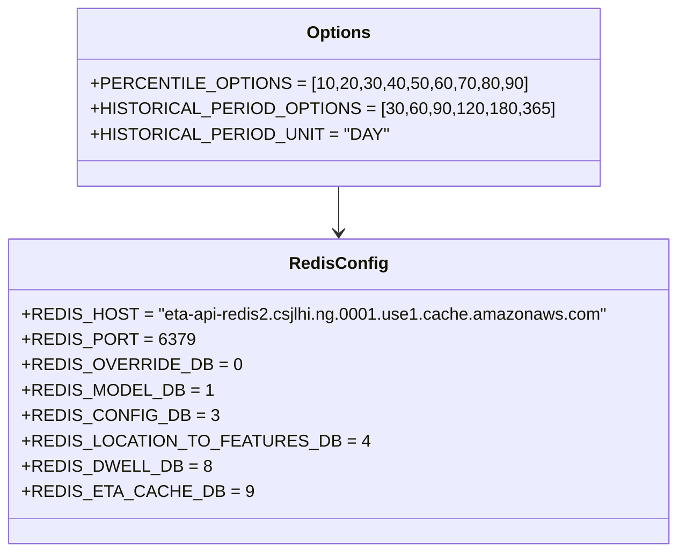
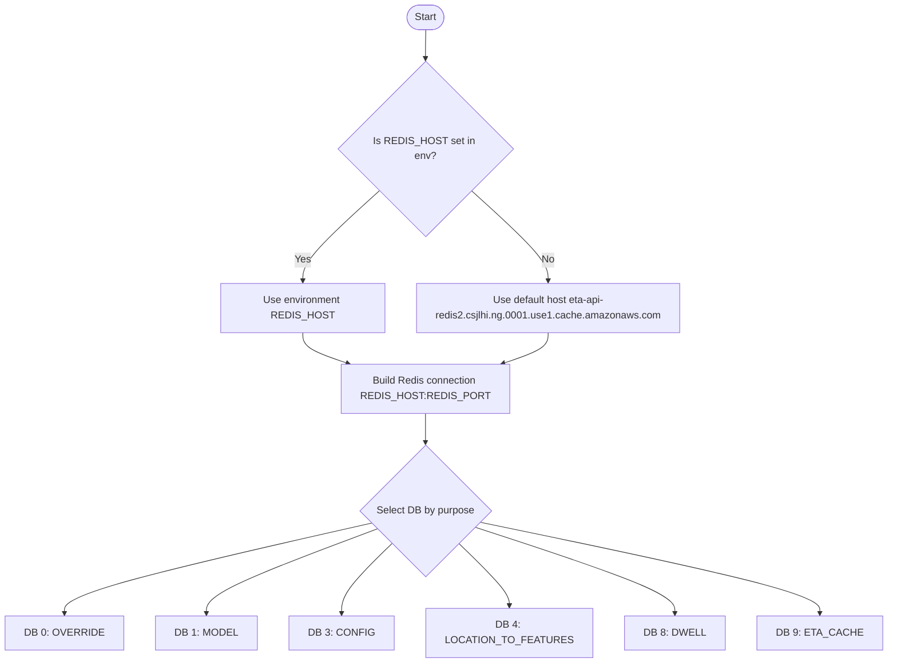

# Diagram: research/common/common_data.py

> Auto-generated by Obscura crawlers

## Diagram 1

### SVG

<svg id="container" width="613.7734375" xmlns="http://www.w3.org/2000/svg" class="classDiagram" height="522" viewBox="0 0 613.7734375 522" role="graphics-document document" aria-roledescription="class"><g><defs><marker id="container_class-aggregationStart" class="marker aggregation class" refX="18" refY="7" markerWidth="190" markerHeight="240" orient="auto"><path d="M 18,7 L9,13 L1,7 L9,1 Z"></path></marker></defs><defs><marker id="container_class-aggregationEnd" class="marker aggregation class" refX="1" refY="7" markerWidth="20" markerHeight="28" orient="auto"><path d="M 18,7 L9,13 L1,7 L9,1 Z"></path></marker></defs><defs><marker id="container_class-extensionStart" class="marker extension class" refX="18" refY="7" markerWidth="190" markerHeight="240" orient="auto"><path d="M 1,7 L18,13 V 1 Z"></path></marker></defs><defs><marker id="container_class-extensionEnd" class="marker extension class" refX="1" refY="7" markerWidth="20" markerHeight="28" orient="auto"><path d="M 1,1 V 13 L18,7 Z"></path></marker></defs><defs><marker id="container_class-compositionStart" class="marker composition class" refX="18" refY="7" markerWidth="190" markerHeight="240" orient="auto"><path d="M 18,7 L9,13 L1,7 L9,1 Z"></path></marker></defs><defs><marker id="container_class-compositionEnd" class="marker composition class" refX="1" refY="7" markerWidth="20" markerHeight="28" orient="auto"><path d="M 18,7 L9,13 L1,7 L9,1 Z"></path></marker></defs><defs><marker id="container_class-dependencyStart" class="marker dependency class" refX="6" refY="7" markerWidth="190" markerHeight="240" orient="auto"><path d="M 5,7 L9,13 L1,7 L9,1 Z"></path></marker></defs><defs><marker id="container_class-dependencyEnd" class="marker dependency class" refX="13" refY="7" markerWidth="20" markerHeight="28" orient="auto"><path d="M 18,7 L9,13 L14,7 L9,1 Z"></path></marker></defs><defs><marker id="container_class-lollipopStart" class="marker lollipop class" refX="13" refY="7" markerWidth="190" markerHeight="240" orient="auto"><circle stroke="black" fill="transparent" cx="7" cy="7" r="6"></circle></marker></defs><defs><marker id="container_class-lollipopEnd" class="marker lollipop class" refX="1" refY="7" markerWidth="190" markerHeight="240" orient="auto"><circle stroke="black" fill="transparent" cx="7" cy="7" r="6"></circle></marker></defs><g class="root"><g class="clusters"></g><g class="edgePaths"><path d="M306.887,176L306.887,180.167C306.887,184.333,306.887,192.667,306.887,200C306.887,207.333,306.887,213.667,306.887,216.833L306.887,220" id="id_Options_RedisConfig_1" class="edge-thickness-normal edge-pattern-solid relation" style=";;;" data-edge="true" data-et="edge" data-id="id_Options_RedisConfig_1" data-points="W3sieCI6MzA2Ljg4NjcxODc1LCJ5IjoxNzZ9LHsieCI6MzA2Ljg4NjcxODc1LCJ5IjoyMDF9LHsieCI6MzA2Ljg4NjcxODc1LCJ5IjoyMjZ9XQ==" marker-end="url(#container_class-dependencyEnd)"></path></g><g class="edgeLabels"><g class="edgeLabel"><g class="label" data-id="id_Options_RedisConfig_1" transform="translate(0, 0)"><foreignObject width="0" height="0">

</foreignObject></g></g></g><g class="nodes"><g class="node default" id="classId-RedisConfig-0" transform="translate(306.88671875, 370)"><g class="basic label-container"><path d="M-298.88671875 -144 L298.88671875 -144 L298.88671875 144 L-298.88671875 144" stroke="none" stroke-width="0" fill="#ECECFF" style=""></path><path d="M-298.88671875 -144 C-111.03007581483396 -144, 76.82656712033207 -144, 298.88671875 -144 M-298.88671875 -144 C-143.41292420375797 -144, 12.060870342484066 -144, 298.88671875 -144 M298.88671875 -144 C298.88671875 -58.72700402228797, 298.88671875 26.545991955424057, 298.88671875 144 M298.88671875 -144 C298.88671875 -36.134703803694364, 298.88671875 71.73059239261127, 298.88671875 144 M298.88671875 144 C157.12732884292873 144, 15.367938935857467 144, -298.88671875 144 M298.88671875 144 C145.31659551942244 144, -8.25352771115513 144, -298.88671875 144 M-298.88671875 144 C-298.88671875 63.76059316158005, -298.88671875 -16.478813676839906, -298.88671875 -144 M-298.88671875 144 C-298.88671875 45.463589340261876, -298.88671875 -53.07282131947625, -298.88671875 -144" stroke="#9370DB" stroke-width="1.3" fill="none" stroke-dasharray="0 0" style=""></path></g><g class="annotation-group text" transform="translate(0, -120)"></g><g class="label-group text" transform="translate(-43.0859375, -120)"><g class="label" style="font-weight: bolder" transform="translate(0,-12)"><foreignObject width="86.171875" height="24">

RedisConfig

</foreignObject></g></g><g class="members-group text" transform="translate(-286.88671875, -72)"><g class="label" style="" transform="translate(0,-12)"><foreignObject width="530.6875" height="24">

+REDIS_HOST = "eta-api-redis2.csjlhi.ng.0001.use1.cache.amazonaws.com"

</foreignObject></g><g class="label" style="" transform="translate(0,12)"><foreignObject width="143.78125" height="24">

+REDIS_PORT = 6379

</foreignObject></g><g class="label" style="" transform="translate(0,36)"><foreignObject width="182.328125" height="24">

+REDIS_OVERRIDE_DB = 0

</foreignObject></g><g class="label" style="" transform="translate(0,60)"><foreignObject width="159.765625" height="24">

+REDIS_MODEL_DB = 1

</foreignObject></g><g class="label" style="" transform="translate(0,84)"><foreignObject width="163.296875" height="24">

+REDIS_CONFIG_DB = 3

</foreignObject></g><g class="label" style="" transform="translate(0,108)"><foreignObject width="285.75" height="24">

+REDIS_LOCATION_TO_FEATURES_DB = 4

</foreignObject></g><g class="label" style="" transform="translate(0,132)"><foreignObject width="159.484375" height="24">

+REDIS_DWELL_DB = 8

</foreignObject></g><g class="label" style="" transform="translate(0,156)"><foreignObject width="190.296875" height="24">

+REDIS_ETA_CACHE_DB = 9

</foreignObject></g></g><g class="methods-group text" transform="translate(-286.88671875, 144)"></g><g class="divider" style=""><path d="M-298.88671875 -96 C-62.5947792841562 -96, 173.6971601816876 -96, 298.88671875 -96 M-298.88671875 -96 C-133.30866607142553 -96, 32.26938660714893 -96, 298.88671875 -96" stroke="#9370DB" stroke-width="1.3" fill="none" stroke-dasharray="0 0" style=""></path></g><g class="divider" style=""><path d="M-298.88671875 120 C-77.74745838151728 120, 143.39180198696545 120, 298.88671875 120 M-298.88671875 120 C-121.22241030418235 120, 56.441898141635306 120, 298.88671875 120" stroke="#9370DB" stroke-width="1.3" fill="none" stroke-dasharray="0 0" style=""></path></g></g><g class="node default" id="classId-Options-1" transform="translate(306.88671875, 92)"><g class="basic label-container"><path d="M-221.35546875 -84 L221.35546875 -84 L221.35546875 84 L-221.35546875 84" stroke="none" stroke-width="0" fill="#ECECFF" style=""></path><path d="M-221.35546875 -84 C-85.97024202049269 -84, 49.41498470901462 -84, 221.35546875 -84 M-221.35546875 -84 C-67.7040613761211 -84, 85.9473459977578 -84, 221.35546875 -84 M221.35546875 -84 C221.35546875 -27.21295182972618, 221.35546875 29.57409634054764, 221.35546875 84 M221.35546875 -84 C221.35546875 -24.778133099252486, 221.35546875 34.44373380149503, 221.35546875 84 M221.35546875 84 C103.23187483789357 84, -14.891719074212858 84, -221.35546875 84 M221.35546875 84 C78.07393603027481 84, -65.20759668945038 84, -221.35546875 84 M-221.35546875 84 C-221.35546875 27.916507032670907, -221.35546875 -28.166985934658186, -221.35546875 -84 M-221.35546875 84 C-221.35546875 49.22417693781783, -221.35546875 14.44835387563566, -221.35546875 -84" stroke="#9370DB" stroke-width="1.3" fill="none" stroke-dasharray="0 0" style=""></path></g><g class="annotation-group text" transform="translate(0, -60)"></g><g class="label-group text" transform="translate(-28.8046875, -60)"><g class="label" style="font-weight: bolder" transform="translate(0,-12)"><foreignObject width="57.609375" height="24">

Options

</foreignObject></g></g><g class="members-group text" transform="translate(-209.35546875, -12)"><g class="label" style="" transform="translate(0,-12)"><foreignObject width="371.796875" height="24">

+PERCENTILE_OPTIONS = [10,20,30,40,50,60,70,80,90]

</foreignObject></g><g class="label" style="" transform="translate(0,12)"><foreignObject width="389.90625" height="24">

+HISTORICAL_PERIOD_OPTIONS = [30,60,90,120,180,365]

</foreignObject></g><g class="label" style="" transform="translate(0,36)"><foreignObject width="251.640625" height="24">

+HISTORICAL_PERIOD_UNIT = "DAY"

</foreignObject></g></g><g class="methods-group text" transform="translate(-209.35546875, 84)"></g><g class="divider" style=""><path d="M-221.35546875 -36 C-130.5179100384161 -36, -39.68035132683218 -36, 221.35546875 -36 M-221.35546875 -36 C-85.37219149100096 -36, 50.61108576799808 -36, 221.35546875 -36" stroke="#9370DB" stroke-width="1.3" fill="none" stroke-dasharray="0 0" style=""></path></g><g class="divider" style=""><path d="M-221.35546875 60 C-94.42542550762623 60, 32.50461773474754 60, 221.35546875 60 M-221.35546875 60 C-55.53596916933816 60, 110.28353041132368 60, 221.35546875 60" stroke="#9370DB" stroke-width="1.3" fill="none" stroke-dasharray="0 0" style=""></path></g></g></g></g></g></svg>

## Diagram 2

### SVG

<svg id="container" width="1331.03125" xmlns="http://www.w3.org/2000/svg" class="flowchart" height="1011.453125" viewBox="0 0 1331.03125 1011.453125" role="graphics-document document" aria-roledescription="flowchart-v2"><g><marker id="container_flowchart-v2-pointEnd" class="marker flowchart-v2" viewBox="0 0 10 10" refX="5" refY="5" markerUnits="userSpaceOnUse" markerWidth="8" markerHeight="8" orient="auto"><path d="M 0 0 L 10 5 L 0 10 z" class="arrowMarkerPath" style="stroke-width: 1; stroke-dasharray: 1, 0;"></path></marker><marker id="container_flowchart-v2-pointStart" class="marker flowchart-v2" viewBox="0 0 10 10" refX="4.5" refY="5" markerUnits="userSpaceOnUse" markerWidth="8" markerHeight="8" orient="auto"><path d="M 0 5 L 10 10 L 10 0 z" class="arrowMarkerPath" style="stroke-width: 1; stroke-dasharray: 1, 0;"></path></marker><marker id="container_flowchart-v2-circleEnd" class="marker flowchart-v2" viewBox="0 0 10 10" refX="11" refY="5" markerUnits="userSpaceOnUse" markerWidth="11" markerHeight="11" orient="auto"><circle cx="5" cy="5" r="5" class="arrowMarkerPath" style="stroke-width: 1; stroke-dasharray: 1, 0;"></circle></marker><marker id="container_flowchart-v2-circleStart" class="marker flowchart-v2" viewBox="0 0 10 10" refX="-1" refY="5" markerUnits="userSpaceOnUse" markerWidth="11" markerHeight="11" orient="auto"><circle cx="5" cy="5" r="5" class="arrowMarkerPath" style="stroke-width: 1; stroke-dasharray: 1, 0;"></circle></marker><marker id="container_flowchart-v2-crossEnd" class="marker cross flowchart-v2" viewBox="0 0 11 11" refX="12" refY="5.2" markerUnits="userSpaceOnUse" markerWidth="11" markerHeight="11" orient="auto"><path d="M 1,1 l 9,9 M 10,1 l -9,9" class="arrowMarkerPath" style="stroke-width: 2; stroke-dasharray: 1, 0;"></path></marker><marker id="container_flowchart-v2-crossStart" class="marker cross flowchart-v2" viewBox="0 0 11 11" refX="-1" refY="5.2" markerUnits="userSpaceOnUse" markerWidth="11" markerHeight="11" orient="auto"><path d="M 1,1 l 9,9 M 10,1 l -9,9" class="arrowMarkerPath" style="stroke-width: 2; stroke-dasharray: 1, 0;"></path></marker><g class="root"><g class="clusters"></g><g class="edgePaths"><path d="M635.914,47.5L635.831,51.583C635.747,55.667,635.581,63.833,635.497,71.417C635.414,79,635.414,86,635.414,89.5L635.414,93" id="L_Start_Check_0" class="edge-thickness-normal edge-pattern-solid edge-thickness-normal edge-pattern-solid flowchart-link" style=";" data-edge="true" data-et="edge" data-id="L_Start_Check_0" data-points="W3sieCI6NjM1LjkxNDA2MjUsInkiOjQ3LjV9LHsieCI6NjM1LjQxNDA2MjUsInkiOjcyfSx7IngiOjYzNS40MTQwNjI1LCJ5Ijo5N31d" marker-end="url(#container_flowchart-v2-pointEnd)"></path><path d="M569.406,271.148L548.448,288.316C527.49,305.484,485.573,339.82,464.615,362.488C443.656,385.156,443.656,396.156,443.656,401.656L443.656,407.156" id="L_Check_UseEnv_0" class="edge-thickness-normal edge-pattern-solid edge-thickness-normal edge-pattern-solid flowchart-link" style=";" data-edge="true" data-et="edge" data-id="L_Check_UseEnv_0" data-points="W3sieCI6NTY5LjQwNjE4ODU4NjIwMTksInkiOjI3MS4xNDgzNzYwODYyMDE5fSx7IngiOjQ0My42NTYyNSwieSI6Mzc0LjE1NjI1fSx7IngiOjQ0My42NTYyNSwieSI6NDExLjE1NjI1fV0=" marker-end="url(#container_flowchart-v2-pointEnd)"></path><path d="M701.422,271.148L722.38,288.316C743.339,305.484,785.255,339.82,806.214,362.488C827.172,385.156,827.172,396.156,827.172,401.656L827.172,407.156" id="L_Check_UseDefault_0" class="edge-thickness-normal edge-pattern-solid edge-thickness-normal edge-pattern-solid flowchart-link" style=";" data-edge="true" data-et="edge" data-id="L_Check_UseDefault_0" data-points="W3sieCI6NzAxLjQyMTkzNjQxMzc5ODEsInkiOjI3MS4xNDgzNzYwODYyMDE5fSx7IngiOjgyNy4xNzE4NzUsInkiOjM3NC4xNTYyNX0seyJ4Ijo4MjcuMTcxODc1LCJ5Ijo0MTEuMTU2MjV9XQ==" marker-end="url(#container_flowchart-v2-pointEnd)"></path><path d="M443.656,489.156L443.656,493.323C443.656,497.49,443.656,505.823,455.508,513.945C467.36,522.067,491.064,529.979,502.916,533.934L514.767,537.89" id="L_UseEnv_BuildConn_0" class="edge-thickness-normal edge-pattern-solid edge-thickness-normal edge-pattern-solid flowchart-link" style=";" data-edge="true" data-et="edge" data-id="L_UseEnv_BuildConn_0" data-points="W3sieCI6NDQzLjY1NjI1LCJ5Ijo0ODkuMTU2MjV9LHsieCI6NDQzLjY1NjI1LCJ5Ijo1MTQuMTU2MjV9LHsieCI6NTE4LjU2MTY0NTUwNzgxMjUsInkiOjUzOS4xNTYyNX1d" marker-end="url(#container_flowchart-v2-pointEnd)"></path><path d="M827.172,489.156L827.172,493.323C827.172,497.49,827.172,505.823,815.32,513.945C803.468,522.067,779.764,529.979,767.913,533.934L756.061,537.89" id="L_UseDefault_BuildConn_0" class="edge-thickness-normal edge-pattern-solid edge-thickness-normal edge-pattern-solid flowchart-link" style=";" data-edge="true" data-et="edge" data-id="L_UseDefault_BuildConn_0" data-points="W3sieCI6ODI3LjE3MTg3NSwieSI6NDg5LjE1NjI1fSx7IngiOjgyNy4xNzE4NzUsInkiOjUxNC4xNTYyNX0seyJ4Ijo3NTIuMjY2NDc5NDkyMTg3NSwieSI6NTM5LjE1NjI1fV0=" marker-end="url(#container_flowchart-v2-pointEnd)"></path><path d="M635.414,617.156L635.414,621.323C635.414,625.49,635.414,633.823,635.414,641.49C635.414,649.156,635.414,656.156,635.414,659.656L635.414,663.156" id="L_BuildConn_SelectDBs_0" class="edge-thickness-normal edge-pattern-solid edge-thickness-normal edge-pattern-solid flowchart-link" style=";" data-edge="true" data-et="edge" data-id="L_BuildConn_SelectDBs_0" data-points="W3sieCI6NjM1LjQxNDA2MjUsInkiOjYxNy4xNTYyNX0seyJ4Ijo2MzUuNDE0MDYyNSwieSI6NjQyLjE1NjI1fSx7IngiOjYzNS40MTQwNjI1LCJ5Ijo2NjcuMTU2MjV9XQ==" marker-end="url(#container_flowchart-v2-pointEnd)"></path><path d="M551.335,791.374L475.169,809.554C399.004,827.733,246.674,864.093,170.509,887.773C94.344,911.453,94.344,922.453,94.344,927.953L94.344,933.453" id="L_SelectDBs_OverrideDB_0" class="edge-thickness-normal edge-pattern-solid edge-thickness-normal edge-pattern-solid flowchart-link" style=";" data-edge="true" data-et="edge" data-id="L_SelectDBs_OverrideDB_0" data-points="W3sieCI6NTUxLjMzNDYwNjkxMjUzNDQsInkiOjc5MS4zNzM2Njk0MTI1MzQ0fSx7IngiOjk0LjM0Mzc1LCJ5Ijo5MDAuNDUzMTI1fSx7IngiOjk0LjM0Mzc1LCJ5Ijo5MzcuNDUzMTI1fV0=" marker-end="url(#container_flowchart-v2-pointEnd)"></path><path d="M560.561,800.6L518.039,817.242C475.517,833.885,390.474,867.169,347.952,889.311C305.43,911.453,305.43,922.453,305.43,927.953L305.43,933.453" id="L_SelectDBs_ModelDB_0" class="edge-thickness-normal edge-pattern-solid edge-thickness-normal edge-pattern-solid flowchart-link" style=";" data-edge="true" data-et="edge" data-id="L_SelectDBs_ModelDB_0" data-points="W3sieCI6NTYwLjU2MTMwNTA0MDcxMDMsInkiOjgwMC42MDAzNjc1NDA3MTAzfSx7IngiOjMwNS40Mjk2ODc1LCJ5Ijo5MDAuNDUzMTI1fSx7IngiOjMwNS40Mjk2ODc1LCJ5Ijo5MzcuNDUzMTI1fV0=" marker-end="url(#container_flowchart-v2-pointEnd)"></path><path d="M583.488,823.527L570.74,836.348C557.992,849.169,532.496,874.811,519.748,893.132C507,911.453,507,922.453,507,927.953L507,933.453" id="L_SelectDBs_ConfigDB_0" class="edge-thickness-normal edge-pattern-solid edge-thickness-normal edge-pattern-solid flowchart-link" style=";" data-edge="true" data-et="edge" data-id="L_SelectDBs_ConfigDB_0" data-points="W3sieCI6NTgzLjQ4ODMyMDM1MDQxNTUsInkiOjgyMy41MjczODI4NTA0MTU1fSx7IngiOjUwNywieSI6OTAwLjQ1MzEyNX0seyJ4Ijo1MDcsInkiOjkzNy40NTMxMjV9XQ==" marker-end="url(#container_flowchart-v2-pointEnd)"></path><path d="M687.34,823.527L700.088,836.348C712.836,849.169,738.332,874.811,751.08,891.132C763.828,907.453,763.828,914.453,763.828,917.953L763.828,921.453" id="L_SelectDBs_LocationFeaturesDB_0" class="edge-thickness-normal edge-pattern-solid edge-thickness-normal edge-pattern-solid flowchart-link" style=";" data-edge="true" data-et="edge" data-id="L_SelectDBs_LocationFeaturesDB_0" data-points="W3sieCI6Njg3LjMzOTgwNDY0OTU4NDUsInkiOjgyMy41MjczODI4NTA0MTU1fSx7IngiOjc2My44MjgxMjUsInkiOjkwMC40NTMxMjV9LHsieCI6NzYzLjgyODEyNSwieSI6OTI1LjQ1MzEyNX1d" marker-end="url(#container_flowchart-v2-pointEnd)"></path><path d="M713.3,797.567L764.153,814.715C815.007,831.863,916.715,866.158,967.568,888.806C1018.422,911.453,1018.422,922.453,1018.422,927.953L1018.422,933.453" id="L_SelectDBs_DwellDB_0" class="edge-thickness-normal edge-pattern-solid edge-thickness-normal edge-pattern-solid flowchart-link" style=";" data-edge="true" data-et="edge" data-id="L_SelectDBs_DwellDB_0" data-points="W3sieCI6NzEzLjI5OTc5NjA0NzQ2MzIsInkiOjc5Ny41NjczOTE0NTI1MzY4fSx7IngiOjEwMTguNDIxODc1LCJ5Ijo5MDAuNDUzMTI1fSx7IngiOjEwMTguNDIxODc1LCJ5Ijo5MzcuNDUzMTI1fV0=" marker-end="url(#container_flowchart-v2-pointEnd)"></path><path d="M721.055,789.812L806.383,808.253C891.711,826.693,1062.367,863.573,1147.695,887.513C1233.023,911.453,1233.023,922.453,1233.023,927.953L1233.023,933.453" id="L_SelectDBs_ETACacheDB_0" class="edge-thickness-normal edge-pattern-solid edge-thickness-normal edge-pattern-solid flowchart-link" style=";" data-edge="true" data-et="edge" data-id="L_SelectDBs_ETACacheDB_0" data-points="W3sieCI6NzIxLjA1NDgxMDQ1MDgxOTcsInkiOjc4OS44MTIzNzcwNDkxODAzfSx7IngiOjEyMzMuMDIzNDM3NSwieSI6OTAwLjQ1MzEyNX0seyJ4IjoxMjMzLjAyMzQzNzUsInkiOjkzNy40NTMxMjV9XQ==" marker-end="url(#container_flowchart-v2-pointEnd)"></path></g><g class="edgeLabels"><g class="edgeLabel"><g class="label" data-id="L_Start_Check_0" transform="translate(0, 0)"><foreignObject width="0" height="0">

</foreignObject></g></g><g class="edgeLabel" transform="translate(443.65625, 374.15625)"><g class="label" data-id="L_Check_UseEnv_0" transform="translate(-12.03125, -12)"><foreignObject width="24.0625" height="24">

Yes

</foreignObject></g></g><g class="edgeLabel" transform="translate(827.171875, 374.15625)"><g class="label" data-id="L_Check_UseDefault_0" transform="translate(-10.140625, -12)"><foreignObject width="20.28125" height="24">

No

</foreignObject></g></g><g class="edgeLabel"><g class="label" data-id="L_UseEnv_BuildConn_0" transform="translate(0, 0)"><foreignObject width="0" height="0">

</foreignObject></g></g><g class="edgeLabel"><g class="label" data-id="L_UseDefault_BuildConn_0" transform="translate(0, 0)"><foreignObject width="0" height="0">

</foreignObject></g></g><g class="edgeLabel"><g class="label" data-id="L_BuildConn_SelectDBs_0" transform="translate(0, 0)"><foreignObject width="0" height="0">

</foreignObject></g></g><g class="edgeLabel"><g class="label" data-id="L_SelectDBs_OverrideDB_0" transform="translate(0, 0)"><foreignObject width="0" height="0">

</foreignObject></g></g><g class="edgeLabel"><g class="label" data-id="L_SelectDBs_ModelDB_0" transform="translate(0, 0)"><foreignObject width="0" height="0">

</foreignObject></g></g><g class="edgeLabel"><g class="label" data-id="L_SelectDBs_ConfigDB_0" transform="translate(0, 0)"><foreignObject width="0" height="0">

</foreignObject></g></g><g class="edgeLabel"><g class="label" data-id="L_SelectDBs_LocationFeaturesDB_0" transform="translate(0, 0)"><foreignObject width="0" height="0">

</foreignObject></g></g><g class="edgeLabel"><g class="label" data-id="L_SelectDBs_DwellDB_0" transform="translate(0, 0)"><foreignObject width="0" height="0">

</foreignObject></g></g><g class="edgeLabel"><g class="label" data-id="L_SelectDBs_ETACacheDB_0" transform="translate(0, 0)"><foreignObject width="0" height="0">

</foreignObject></g></g></g><g class="nodes"><g class="node default" id="flowchart-Start-0" transform="translate(635.4140625, 27.5)"><g class="basic label-container outer-path"><path d="M-10.3984375 -19.5 C-3.9616236072744284 -19.5, 2.475190285451143 -19.5, 10.3984375 -19.5 C10.3984375 -19.5, 10.398437499999998 -19.5, 10.398437499999998 -19.5 C10.733329414256211 -19.48926066813737, 11.068221328512424 -19.478521336274742, 11.6478067896239 -19.45993515863156 C12.138274095760876 -19.41262036748176, 12.628741401897852 -19.365305576331963, 12.892042152847864 -19.3399052695533 C13.189625267255858 -19.291794339407335, 13.487208381663853 -19.24368340926137, 14.126030759676757 -19.140403561325776 C14.518200926810998 -19.05089327982689, 14.910371093945237 -18.961382998328006, 15.34470188623539 -18.862249829261074 C15.808629183011048 -18.724558642782135, 16.272556479786704 -18.586867456303192, 16.543047751460602 -18.50658706670804 C16.94618329214366 -18.358229461192586, 17.349318832826718 -18.209871855677132, 17.716144095147794 -18.074876768247425 C17.982162249967605 -17.957118422256883, 18.24818040478742 -17.839360076266342, 18.85917041279238 -17.568892924097174 C19.26612210947843 -17.356586484601063, 19.673073806164485 -17.144280045104953, 19.967429764076783 -16.990714730406097 C20.23858091330197 -16.826341310284764, 20.509732062527156 -16.66196789016343, 21.036368073605697 -16.342718045390892 C21.292594071424134 -16.163985881157426, 21.54882006924257 -15.985253716923964, 22.061592844578712 -15.627565626425154 C22.26061766030069 -15.468848632159654, 22.459642476022665 -15.310131637894152, 23.03889120850187 -14.848196188198123 C23.4035460868431 -14.517026275927991, 23.76820096518433 -14.185856363657859, 23.964247236767985 -14.007812326905688 C24.19970812745354 -13.764679625574205, 24.4351690181391 -13.521546924242722, 24.833858442968648 -13.10986736009568 C25.128625535120143 -12.76361716093184, 25.423392627271642 -12.417366961768, 25.644151408126582 -12.158051136245305 C25.91269413992288 -11.798228340384416, 26.181236871719182 -11.438405544523528, 26.391796464640635 -11.156274872382312 C26.627773145629725 -10.793751321771783, 26.863749826618815 -10.431227771161256, 27.073721378604247 -10.108655082055241 C27.234779869128044 -9.822679423189596, 27.395838359651837 -9.536703764323953, 27.6871239742735 -9.019496659696287 C27.875903323081815 -8.62749230266483, 28.06468267189013 -8.235487945633373, 28.22948364880834 -7.893275190886684 C28.325959536938736 -7.654977881970205, 28.42243542506913 -7.416680573053726, 28.698571729970325 -6.734618561215508 C28.84277396985859 -6.300304390178846, 28.986976209746853 -5.865990219142185, 29.09246063421488 -5.548287939305138 C29.19644520869455 -5.151749689614499, 29.30042978317422 -4.75521143992386, 29.40953178754556 -4.339158212148133 C29.494830161256644 -3.9011690909593977, 29.580128534967724 -3.4631799697706622, 29.648482276581777 -3.1121979531509023 C29.704557441620427 -2.6772900464049516, 29.760632606659076 -2.2423821396590013, 29.808330202509367 -1.872449005199798 C29.833939950975864 -1.4735565010172147, 29.85954969944236 -1.0746639968346314, 29.888418715913414 -0.6250057626472757 C29.888418715913414 -0.22154575029573081, 29.888418715913414 0.18191426205581407, 29.888418715913414 0.625005762647271 C29.867072282830108 0.9574936884504145, 29.845725849746803 1.2899816142535578, 29.808330202509367 1.8724490051997846 C29.76850587483114 2.1813186264691247, 29.72868154715291 2.490188247738465, 29.648482276581777 3.1121979531508885 C29.580223262655938 3.462693563112367, 29.511964248730102 3.8131891730738454, 29.40953178754556 4.339158212148129 C29.31607530869722 4.695548270291014, 29.222618829848873 5.051938328433899, 29.092460634214884 5.548287939305125 C28.99695394570821 5.835938868162917, 28.901447257201532 6.123589797020709, 28.69857172997033 6.734618561215495 C28.579314396557383 7.029186480429156, 28.46005706314444 7.323754399642818, 28.229483648808344 7.893275190886679 C28.11780347519885 8.125181460959707, 28.006123301589355 8.357087731032736, 27.687123974273504 9.019496659696284 C27.476685783283834 9.393150976975969, 27.266247592294164 9.766805294255656, 27.07372137860425 10.108655082055236 C26.877003282513353 10.410866903856022, 26.680285186422456 10.713078725656807, 26.39179646464064 11.156274872382301 C26.166867785647486 11.457658810808926, 25.94193910665433 11.759042749235551, 25.644151408126582 12.158051136245302 C25.417319534508053 12.424500762096876, 25.190487660889524 12.690950387948453, 24.83385844296866 13.10986736009567 C24.509000242930952 13.445310122988845, 24.184142042893246 13.78075288588202, 23.96424723676799 14.007812326905684 C23.658464677751663 14.285515956441149, 23.35268211873534 14.563219585976611, 23.038891208501887 14.848196188198111 C22.72518387405764 15.09836943931463, 22.411476539613393 15.34854269043115, 22.061592844578715 15.627565626425152 C21.838506271807475 15.783181162328283, 21.615419699036234 15.938796698231414, 21.036368073605708 16.34271804539089 C20.76755189998942 16.505675989576268, 20.498735726373134 16.668633933761644, 19.967429764076787 16.990714730406093 C19.712728062745185 17.123592444846565, 19.458026361413584 17.256470159287034, 18.859170412792388 17.56889292409717 C18.616708787655845 17.676223493176554, 18.374247162519303 17.783554062255934, 17.716144095147804 18.07487676824742 C17.43317861406337 18.179010680990725, 17.15021313297893 18.283144593734033, 16.543047751460616 18.506587066708033 C16.16739131260773 18.618079925898684, 15.791734873754844 18.72957278508934, 15.344701886235413 18.86224982926107 C15.003423908489296 18.94014430063469, 14.66214593074318 19.018038772008307, 14.126030759676766 19.140403561325773 C13.810808873339871 19.191366191326484, 13.495586987002977 19.242328821327195, 12.892042152847878 19.3399052695533 C12.487493868937955 19.378931555961593, 12.082945585028032 19.41795784236989, 11.6478067896239 19.45993515863156 C11.241399094165471 19.47296786240032, 10.834991398707045 19.486000566169082, 10.398437500000004 19.5 C10.398437500000002 19.5, 10.398437500000002 19.5, 10.3984375 19.5 C5.153299140836483 19.5, -0.09183921832703312 19.5, -10.398437499999996 19.5 C-10.658061198227776 19.491674373324706, -10.917684896455553 19.483348746649416, -11.647806789623893 19.45993515863156 C-11.907356319555559 19.43489672763303, -12.166905849487225 19.409858296634503, -12.892042152847871 19.3399052695533 C-13.14529024989645 19.29896208119081, -13.398538346945028 19.258018892828318, -14.126030759676759 19.140403561325773 C-14.582148754757108 19.036297605396765, -15.038266749837458 18.932191649467757, -15.344701886235388 18.862249829261074 C-15.793238961433927 18.7291263797613, -16.241776036632466 18.596002930261527, -16.54304775146059 18.506587066708043 C-16.948137523979558 18.357510285812257, -17.353227296498527 18.208433504916467, -17.716144095147797 18.074876768247425 C-18.05989105771149 17.922710184811827, -18.40363802027518 17.77054360137623, -18.85917041279238 17.568892924097174 C-19.08477303563887 17.451196180263537, -19.310375658485363 17.3334994364299, -19.96742976407678 16.990714730406097 C-20.378364325591576 16.74160378429629, -20.789298887106376 16.492492838186486, -21.036368073605686 16.3427180453909 C-21.30653588607355 16.154260674789423, -21.57670369854141 15.965803304187949, -22.061592844578712 15.627565626425156 C-22.334785598683947 15.409701674990737, -22.60797835278918 15.19183772355632, -23.03889120850187 14.848196188198125 C-23.289332560710154 14.620751978437628, -23.53977391291844 14.393307768677133, -23.964247236767974 14.007812326905697 C-24.245559404558914 13.717334417503048, -24.52687157234985 13.4268565081004, -24.833858442968655 13.109867360095677 C-25.014917453568938 12.89718514369502, -25.195976464169224 12.684502927294366, -25.64415140812658 12.158051136245307 C-25.843450796789064 11.8910081119854, -26.04275018545155 11.623965087725491, -26.391796464640635 11.156274872382316 C-26.592487553162897 10.847959467309106, -26.79317864168516 10.539644062235896, -27.073721378604244 10.108655082055249 C-27.292677281900975 9.719876704062477, -27.51163318519771 9.331098326069704, -27.6871239742735 9.019496659696289 C-27.813694645720947 8.756669952257141, -27.94026531716839 8.493843244817995, -28.22948364880834 7.893275190886686 C-28.337666341945592 7.6260618472675885, -28.445849035082848 7.358848503648492, -28.698571729970325 6.73461856121551 C-28.81738453868715 6.376773311610719, -28.936197347403976 6.018928062005927, -29.09246063421488 5.5482879393051325 C-29.165424565932664 5.270044844897181, -29.238388497650448 4.99180175048923, -29.409531787545557 4.339158212148136 C-29.470954587511446 4.0237651160366745, -29.532377387477332 3.7083720199252124, -29.648482276581777 3.112197953150904 C-29.690215870062893 2.7885204433415507, -29.73194946354401 2.464842933532197, -29.808330202509364 1.872449005199809 C-29.839509401698717 1.3868078104290176, -29.870688600888073 0.901166615658226, -29.888418715913414 0.6250057626472781 C-29.888418715913414 0.17280809650993156, -29.888418715913414 -0.279389569627415, -29.888418715913414 -0.6250057626472687 C-29.869527325993843 -0.9192544095000446, -29.850635936074276 -1.2135030563528204, -29.808330202509367 -1.8724490051997822 C-29.747931119382297 -2.3408923667853356, -29.687532036255224 -2.809335728370889, -29.648482276581777 -3.112197953150895 C-29.598434200823526 -3.3691842445049622, -29.548386125065274 -3.626170535859029, -29.40953178754556 -4.339158212148126 C-29.297965016402838 -4.764610663859815, -29.18639824526011 -5.190063115571504, -29.092460634214884 -5.548287939305123 C-28.966931522588673 -5.9263616231754375, -28.84140241096246 -6.304435307045752, -28.698571729970332 -6.734618561215485 C-28.602695462197826 -6.971434796255114, -28.50681919442532 -7.2082510312947425, -28.229483648808344 -7.893275190886676 C-28.106278811794134 -8.14911267110789, -27.983073974779924 -8.404950151329105, -27.687123974273504 -9.019496659696282 C-27.462849250951354 -9.417719141233112, -27.238574527629204 -9.815941622769945, -27.073721378604247 -10.108655082055243 C-26.934317600084587 -10.322816721017393, -26.794913821564922 -10.536978359979544, -26.39179646464064 -11.156274872382308 C-26.237105965547457 -11.363546048572799, -26.08241546645427 -11.570817224763289, -25.644151408126586 -12.158051136245302 C-25.40473829385345 -12.439279403262654, -25.16532517958031 -12.720507670280007, -24.833858442968662 -13.10986736009567 C-24.60328518754737 -13.34795317673448, -24.37271193212608 -13.58603899337329, -23.964247236767996 -14.007812326905677 C-23.77112308199343 -14.18320257448681, -23.577998927218864 -14.358592822067942, -23.038891208501887 -14.848196188198107 C-22.66933147761166 -15.142910239185609, -22.29977174672143 -15.43762429017311, -22.06159284457872 -15.627565626425149 C-21.670907846203193 -15.900090568810919, -21.280222847827662 -16.17261551119669, -21.03636807360571 -16.342718045390885 C-20.643573728952973 -16.580832285435164, -20.250779384300234 -16.818946525479443, -19.96742976407679 -16.99071473040609 C-19.700847111785635 -17.12979072935205, -19.43426445949448 -17.268866728298008, -18.859170412792388 -17.56889292409717 C-18.406669865999476 -17.76920149321059, -17.954169319206564 -17.969510062324012, -17.716144095147804 -18.07487676824742 C-17.43505460713778 -18.178320298197853, -17.15396511912775 -18.28176382814829, -16.54304775146062 -18.506587066708033 C-16.123164064329913 -18.631206341033977, -15.703280377199208 -18.75582561535992, -15.344701886235413 -18.862249829261067 C-14.938263078967182 -18.955016834758958, -14.53182427169895 -19.047783840256848, -14.126030759676768 -19.140403561325773 C-13.79310033589823 -19.19422917032829, -13.460169912119689 -19.248054779330808, -12.89204215284788 -19.3399052695533 C-12.413555524615568 -19.386064299114505, -11.935068896383253 -19.432223328675715, -11.647806789623903 -19.45993515863156 C-11.358519853919422 -19.46921202759674, -11.06923291821494 -19.47848889656192, -10.398437500000005 -19.5 C-10.398437500000004 -19.5, -10.398437500000002 -19.5, -10.3984375 -19.5" stroke="none" stroke-width="0" fill="#ECECFF" style=""></path><path d="M-10.3984375 -19.5 C-4.016268120700482 -19.5, 2.3659012585990364 -19.5, 10.3984375 -19.5 M-10.3984375 -19.5 C-2.8873334218076483 -19.5, 4.623770656384703 -19.5, 10.3984375 -19.5 M10.3984375 -19.5 C10.3984375 -19.5, 10.398437499999998 -19.5, 10.398437499999998 -19.5 M10.3984375 -19.5 C10.3984375 -19.5, 10.3984375 -19.5, 10.398437499999998 -19.5 M10.398437499999998 -19.5 C10.675046915417125 -19.49112967443514, 10.951656330834252 -19.482259348870276, 11.6478067896239 -19.45993515863156 M10.398437499999998 -19.5 C10.735481595914385 -19.489191651860562, 11.072525691828771 -19.47838330372112, 11.6478067896239 -19.45993515863156 M11.6478067896239 -19.45993515863156 C11.900071267985144 -19.43559950779647, 12.152335746346388 -19.411263856961387, 12.892042152847864 -19.3399052695533 M11.6478067896239 -19.45993515863156 C11.93901898891775 -19.431842267999592, 12.230231188211599 -19.403749377367625, 12.892042152847864 -19.3399052695533 M12.892042152847864 -19.3399052695533 C13.24759026717227 -19.282423007746136, 13.603138381496677 -19.224940745938973, 14.126030759676757 -19.140403561325776 M12.892042152847864 -19.3399052695533 C13.232931917801057 -19.284792855995278, 13.573821682754252 -19.229680442437257, 14.126030759676757 -19.140403561325776 M14.126030759676757 -19.140403561325776 C14.403447354215158 -19.077085033934846, 14.680863948753561 -19.01376650654392, 15.34470188623539 -18.862249829261074 M14.126030759676757 -19.140403561325776 C14.43713389886779 -19.069396299943133, 14.748237038058825 -18.998389038560486, 15.34470188623539 -18.862249829261074 M15.34470188623539 -18.862249829261074 C15.695693201870187 -18.75807744917168, 16.046684517504982 -18.653905069082285, 16.543047751460602 -18.50658706670804 M15.34470188623539 -18.862249829261074 C15.668158344650363 -18.76624965026111, 15.991614803065339 -18.67024947126114, 16.543047751460602 -18.50658706670804 M16.543047751460602 -18.50658706670804 C16.791933308415352 -18.414994881075824, 17.040818865370102 -18.323402695443608, 17.716144095147794 -18.074876768247425 M16.543047751460602 -18.50658706670804 C16.792558589792325 -18.41476477174906, 17.042069428124048 -18.32294247679008, 17.716144095147794 -18.074876768247425 M17.716144095147794 -18.074876768247425 C18.116952946401852 -17.897450579369387, 18.517761797655915 -17.72002439049135, 18.85917041279238 -17.568892924097174 M17.716144095147794 -18.074876768247425 C18.080115116798357 -17.913757593779465, 18.444086138448924 -17.752638419311506, 18.85917041279238 -17.568892924097174 M18.85917041279238 -17.568892924097174 C19.085744398721594 -17.450689420765467, 19.312318384650805 -17.332485917433765, 19.967429764076783 -16.990714730406097 M18.85917041279238 -17.568892924097174 C19.29219670138043 -17.342983386707367, 19.725222989968476 -17.117073849317556, 19.967429764076783 -16.990714730406097 M19.967429764076783 -16.990714730406097 C20.298316069666782 -16.79012950745367, 20.629202375256778 -16.589544284501244, 21.036368073605697 -16.342718045390892 M19.967429764076783 -16.990714730406097 C20.366429398730144 -16.74883880709711, 20.765429033383505 -16.50696288378812, 21.036368073605697 -16.342718045390892 M21.036368073605697 -16.342718045390892 C21.402910765903272 -16.087033730621517, 21.769453458200847 -15.831349415852143, 22.061592844578712 -15.627565626425154 M21.036368073605697 -16.342718045390892 C21.334039108471696 -16.13507561743979, 21.631710143337692 -15.927433189488681, 22.061592844578712 -15.627565626425154 M22.061592844578712 -15.627565626425154 C22.27480303664608 -15.457536172012922, 22.488013228713445 -15.28750671760069, 23.03889120850187 -14.848196188198123 M22.061592844578712 -15.627565626425154 C22.425351155091114 -15.337478053806691, 22.789109465603516 -15.047390481188227, 23.03889120850187 -14.848196188198123 M23.03889120850187 -14.848196188198123 C23.280506657410726 -14.628767430293564, 23.522122106319582 -14.409338672389007, 23.964247236767985 -14.007812326905688 M23.03889120850187 -14.848196188198123 C23.357306992619204 -14.559019397882743, 23.67572277673654 -14.26984260756736, 23.964247236767985 -14.007812326905688 M23.964247236767985 -14.007812326905688 C24.306811181350426 -13.65408692910141, 24.64937512593287 -13.300361531297135, 24.833858442968648 -13.10986736009568 M23.964247236767985 -14.007812326905688 C24.23934227792562 -13.723754111187514, 24.514437319083253 -13.439695895469342, 24.833858442968648 -13.10986736009568 M24.833858442968648 -13.10986736009568 C25.12058029896801 -12.773067553103042, 25.407302154967375 -12.436267746110405, 25.644151408126582 -12.158051136245305 M24.833858442968648 -13.10986736009568 C25.051609926128283 -12.854084077565977, 25.26936140928792 -12.598300795036272, 25.644151408126582 -12.158051136245305 M25.644151408126582 -12.158051136245305 C25.85901960765037 -11.870147323779095, 26.073887807174163 -11.582243511312885, 26.391796464640635 -11.156274872382312 M25.644151408126582 -12.158051136245305 C25.81474136270282 -11.929476138177717, 25.98533131727906 -11.70090114011013, 26.391796464640635 -11.156274872382312 M26.391796464640635 -11.156274872382312 C26.66155190751365 -10.741858072650468, 26.931307350386664 -10.327441272918621, 27.073721378604247 -10.108655082055241 M26.391796464640635 -11.156274872382312 C26.547308640277777 -10.917366409737431, 26.70282081591492 -10.678457947092548, 27.073721378604247 -10.108655082055241 M27.073721378604247 -10.108655082055241 C27.238965666130543 -9.815247116753747, 27.404209953656842 -9.521839151452252, 27.6871239742735 -9.019496659696287 M27.073721378604247 -10.108655082055241 C27.199371743568143 -9.885550135582704, 27.32502210853204 -9.662445189110167, 27.6871239742735 -9.019496659696287 M27.6871239742735 -9.019496659696287 C27.89427299734637 -8.589347281006418, 28.10142202041924 -8.15919790231655, 28.22948364880834 -7.893275190886684 M27.6871239742735 -9.019496659696287 C27.826001674869843 -8.731114142901218, 27.964879375466182 -8.442731626106147, 28.22948364880834 -7.893275190886684 M28.22948364880834 -7.893275190886684 C28.361478998768614 -7.567244124528323, 28.49347434872889 -7.241213058169962, 28.698571729970325 -6.734618561215508 M28.22948364880834 -7.893275190886684 C28.377273244158875 -7.528232033053423, 28.525062839509406 -7.163188875220163, 28.698571729970325 -6.734618561215508 M28.698571729970325 -6.734618561215508 C28.80637429234547 -6.409934419347336, 28.914176854720615 -6.085250277479164, 29.09246063421488 -5.548287939305138 M28.698571729970325 -6.734618561215508 C28.83669626710405 -6.31860946252509, 28.974820804237776 -5.9026003638346705, 29.09246063421488 -5.548287939305138 M29.09246063421488 -5.548287939305138 C29.21414429770235 -5.0842553923940565, 29.33582796118982 -4.620222845482975, 29.40953178754556 -4.339158212148133 M29.09246063421488 -5.548287939305138 C29.21347660617808 -5.086801589555443, 29.334492578141276 -4.625315239805748, 29.40953178754556 -4.339158212148133 M29.40953178754556 -4.339158212148133 C29.458872414597295 -4.085804520382701, 29.50821304164903 -3.832450828617269, 29.648482276581777 -3.1121979531509023 M29.40953178754556 -4.339158212148133 C29.489892852458283 -3.9265211281383827, 29.57025391737101 -3.513884044128632, 29.648482276581777 -3.1121979531509023 M29.648482276581777 -3.1121979531509023 C29.685061551539658 -2.8284963199724587, 29.721640826497534 -2.5447946867940145, 29.808330202509367 -1.872449005199798 M29.648482276581777 -3.1121979531509023 C29.705035049709384 -2.673585812381388, 29.76158782283699 -2.234973671611874, 29.808330202509367 -1.872449005199798 M29.808330202509367 -1.872449005199798 C29.831936664259185 -1.504759308653418, 29.855543126009003 -1.1370696121070378, 29.888418715913414 -0.6250057626472757 M29.808330202509367 -1.872449005199798 C29.827715395950136 -1.5705089699133032, 29.847100589390905 -1.2685689346268088, 29.888418715913414 -0.6250057626472757 M29.888418715913414 -0.6250057626472757 C29.888418715913414 -0.1295349411221699, 29.888418715913414 0.3659358804029359, 29.888418715913414 0.625005762647271 M29.888418715913414 -0.6250057626472757 C29.888418715913414 -0.3272939399140253, 29.888418715913414 -0.02958211718077486, 29.888418715913414 0.625005762647271 M29.888418715913414 0.625005762647271 C29.858145484216468 1.096535782440018, 29.827872252519523 1.568065802232765, 29.808330202509367 1.8724490051997846 M29.888418715913414 0.625005762647271 C29.86111299128959 1.0503144644475242, 29.83380726666577 1.4756231662477775, 29.808330202509367 1.8724490051997846 M29.808330202509367 1.8724490051997846 C29.76432012999724 2.2137824368320116, 29.72031005748512 2.555115868464239, 29.648482276581777 3.1121979531508885 M29.808330202509367 1.8724490051997846 C29.74870353874952 2.334901634704588, 29.689076874989677 2.7973542642093907, 29.648482276581777 3.1121979531508885 M29.648482276581777 3.1121979531508885 C29.553529264729704 3.599761600685127, 29.45857625287763 4.087325248219366, 29.40953178754556 4.339158212148129 M29.648482276581777 3.1121979531508885 C29.5845948754879 3.4402462551609605, 29.52070747439402 3.768294557171033, 29.40953178754556 4.339158212148129 M29.40953178754556 4.339158212148129 C29.31776915008886 4.689088918949168, 29.226006512632164 5.039019625750208, 29.092460634214884 5.548287939305125 M29.40953178754556 4.339158212148129 C29.302381872048556 4.747767279005345, 29.19523195655155 5.156376345862561, 29.092460634214884 5.548287939305125 M29.092460634214884 5.548287939305125 C29.010964436692596 5.793741501586536, 28.929468239170305 6.039195063867947, 28.69857172997033 6.734618561215495 M29.092460634214884 5.548287939305125 C28.940186374831 6.006913746960945, 28.787912115447114 6.465539554616763, 28.69857172997033 6.734618561215495 M28.69857172997033 6.734618561215495 C28.588784452924614 7.005795258111019, 28.478997175878895 7.276971955006543, 28.229483648808344 7.893275190886679 M28.69857172997033 6.734618561215495 C28.52732373866025 7.157604410606068, 28.35607574735017 7.580590259996642, 28.229483648808344 7.893275190886679 M28.229483648808344 7.893275190886679 C28.015051587304878 8.338547954709739, 27.800619525801412 8.7838207185328, 27.687123974273504 9.019496659696284 M28.229483648808344 7.893275190886679 C28.043072522169002 8.280361883912425, 27.856661395529663 8.667448576938172, 27.687123974273504 9.019496659696284 M27.687123974273504 9.019496659696284 C27.54623365860373 9.26966168185946, 27.40534334293395 9.519826704022638, 27.07372137860425 10.108655082055236 M27.687123974273504 9.019496659696284 C27.535687335615926 9.288387746255305, 27.38425069695835 9.557278832814326, 27.07372137860425 10.108655082055236 M27.07372137860425 10.108655082055236 C26.843142868301573 10.462885592879644, 26.61256435799889 10.817116103704052, 26.39179646464064 11.156274872382301 M27.07372137860425 10.108655082055236 C26.852521396281585 10.448477655414962, 26.631321413958915 10.78830022877469, 26.39179646464064 11.156274872382301 M26.39179646464064 11.156274872382301 C26.192720593761706 11.423018403175144, 25.993644722882767 11.689761933967986, 25.644151408126582 12.158051136245302 M26.39179646464064 11.156274872382301 C26.20047764237348 11.41262466471703, 26.009158820106318 11.66897445705176, 25.644151408126582 12.158051136245302 M25.644151408126582 12.158051136245302 C25.45857965416517 12.376034277780311, 25.273007900203755 12.594017419315321, 24.83385844296866 13.10986736009567 M25.644151408126582 12.158051136245302 C25.476502291683662 12.354981327924126, 25.30885317524074 12.55191151960295, 24.83385844296866 13.10986736009567 M24.83385844296866 13.10986736009567 C24.531594694824527 13.42197949636973, 24.229330946680395 13.734091632643791, 23.96424723676799 14.007812326905684 M24.83385844296866 13.10986736009567 C24.559168879452066 13.393506886859136, 24.28447931593547 13.677146413622602, 23.96424723676799 14.007812326905684 M23.96424723676799 14.007812326905684 C23.725569361719884 14.224573257953855, 23.48689148667178 14.441334189002026, 23.038891208501887 14.848196188198111 M23.96424723676799 14.007812326905684 C23.638104059290956 14.304006931414719, 23.311960881813928 14.600201535923752, 23.038891208501887 14.848196188198111 M23.038891208501887 14.848196188198111 C22.694312082662172 15.122988871419643, 22.34973295682246 15.397781554641178, 22.061592844578715 15.627565626425152 M23.038891208501887 14.848196188198111 C22.7182774637998 15.103877117707963, 22.39766371909771 15.359558047217815, 22.061592844578715 15.627565626425152 M22.061592844578715 15.627565626425152 C21.722975526012366 15.863770409349572, 21.384358207446017 16.09997519227399, 21.036368073605708 16.34271804539089 M22.061592844578715 15.627565626425152 C21.737064425081247 15.853942603257732, 21.412536005583778 16.08031958009031, 21.036368073605708 16.34271804539089 M21.036368073605708 16.34271804539089 C20.80033161710844 16.485804732423716, 20.564295160611174 16.628891419456544, 19.967429764076787 16.990714730406093 M21.036368073605708 16.34271804539089 C20.808653643707324 16.480759870993815, 20.58093921380894 16.618801696596744, 19.967429764076787 16.990714730406093 M19.967429764076787 16.990714730406093 C19.65358833597863 17.154445602419873, 19.339746907880475 17.318176474433653, 18.859170412792388 17.56889292409717 M19.967429764076787 16.990714730406093 C19.696148076498154 17.13224221305165, 19.424866388919522 17.27376969569721, 18.859170412792388 17.56889292409717 M18.859170412792388 17.56889292409717 C18.542807672905123 17.70893732447802, 18.226444933017863 17.848981724858863, 17.716144095147804 18.07487676824742 M18.859170412792388 17.56889292409717 C18.47682260266829 17.7381469576943, 18.094474792544194 17.907400991291432, 17.716144095147804 18.07487676824742 M17.716144095147804 18.07487676824742 C17.29113321363773 18.23128470140065, 16.866122332127652 18.38769263455388, 16.543047751460616 18.506587066708033 M17.716144095147804 18.07487676824742 C17.354708266541525 18.207888494250707, 16.993272437935246 18.34090022025399, 16.543047751460616 18.506587066708033 M16.543047751460616 18.506587066708033 C16.280995128472707 18.584362909668556, 16.018942505484798 18.662138752629083, 15.344701886235413 18.86224982926107 M16.543047751460616 18.506587066708033 C16.2066917328713 18.60641576745657, 15.870335714281985 18.706244468205114, 15.344701886235413 18.86224982926107 M15.344701886235413 18.86224982926107 C15.048751858702548 18.929798491791033, 14.752801831169684 18.99734715432099, 14.126030759676766 19.140403561325773 M15.344701886235413 18.86224982926107 C14.880238239441875 18.968260625733148, 14.415774592648338 19.07427142220522, 14.126030759676766 19.140403561325773 M14.126030759676766 19.140403561325773 C13.850898784417465 19.18488476540536, 13.575766809158166 19.229365969484952, 12.892042152847878 19.3399052695533 M14.126030759676766 19.140403561325773 C13.865047851073967 19.18259725403599, 13.60406494247117 19.224790946746207, 12.892042152847878 19.3399052695533 M12.892042152847878 19.3399052695533 C12.42798872784886 19.384671945357056, 11.96393530284984 19.429438621160816, 11.6478067896239 19.45993515863156 M12.892042152847878 19.3399052695533 C12.456540810216483 19.381917560309954, 12.021039467585087 19.42392985106661, 11.6478067896239 19.45993515863156 M11.6478067896239 19.45993515863156 C11.210266113635976 19.47396623648923, 10.77272543764805 19.487997314346902, 10.398437500000004 19.5 M11.6478067896239 19.45993515863156 C11.375761955903494 19.468659106945825, 11.103717122183088 19.477383055260095, 10.398437500000004 19.5 M10.398437500000004 19.5 C10.398437500000004 19.5, 10.398437500000002 19.5, 10.3984375 19.5 M10.398437500000004 19.5 C10.398437500000004 19.5, 10.398437500000002 19.5, 10.3984375 19.5 M10.3984375 19.5 C3.50624180183428 19.5, -3.38595389633144 19.5, -10.398437499999996 19.5 M10.3984375 19.5 C5.358185816852696 19.5, 0.3179341337053927 19.5, -10.398437499999996 19.5 M-10.398437499999996 19.5 C-10.749100847929904 19.48875490895669, -11.09976419585981 19.477509817913376, -11.647806789623893 19.45993515863156 M-10.398437499999996 19.5 C-10.69696617462529 19.49042676645558, -10.995494849250584 19.480853532911162, -11.647806789623893 19.45993515863156 M-11.647806789623893 19.45993515863156 C-12.026170699513427 19.423434847293695, -12.404534609402962 19.386934535955827, -12.892042152847871 19.3399052695533 M-11.647806789623893 19.45993515863156 C-11.970719499387654 19.428784157880003, -12.293632209151415 19.397633157128443, -12.892042152847871 19.3399052695533 M-12.892042152847871 19.3399052695533 C-13.295428471003412 19.27468889794153, -13.698814789158954 19.20947252632976, -14.126030759676759 19.140403561325773 M-12.892042152847871 19.3399052695533 C-13.341650723233428 19.2672160426599, -13.791259293618987 19.1945268157665, -14.126030759676759 19.140403561325773 M-14.126030759676759 19.140403561325773 C-14.452075649348236 19.065985942900003, -14.778120539019714 18.99156832447423, -15.344701886235388 18.862249829261074 M-14.126030759676759 19.140403561325773 C-14.610200052542675 19.029895079729034, -15.094369345408591 18.919386598132295, -15.344701886235388 18.862249829261074 M-15.344701886235388 18.862249829261074 C-15.801894730603518 18.726557392906827, -16.259087574971648 18.59086495655258, -16.54304775146059 18.506587066708043 M-15.344701886235388 18.862249829261074 C-15.598937409782687 18.78679406038173, -15.853172933329986 18.71133829150239, -16.54304775146059 18.506587066708043 M-16.54304775146059 18.506587066708043 C-16.81470864447024 18.406613346874725, -17.086369537479893 18.306639627041406, -17.716144095147797 18.074876768247425 M-16.54304775146059 18.506587066708043 C-16.85265628775359 18.392648263362286, -17.162264824046584 18.278709460016525, -17.716144095147797 18.074876768247425 M-17.716144095147797 18.074876768247425 C-17.99735961278225 17.950391000552592, -18.278575130416705 17.82590523285776, -18.85917041279238 17.568892924097174 M-17.716144095147797 18.074876768247425 C-18.169875641178756 17.874023272287616, -18.62360718720971 17.67316977632781, -18.85917041279238 17.568892924097174 M-18.85917041279238 17.568892924097174 C-19.11070101571415 17.43766956966593, -19.362231618635917 17.306446215234683, -19.96742976407678 16.990714730406097 M-18.85917041279238 17.568892924097174 C-19.298877658975794 17.33949793540922, -19.738584905159207 17.110102946721266, -19.96742976407678 16.990714730406097 M-19.96742976407678 16.990714730406097 C-20.292494538018953 16.7936585541497, -20.617559311961124 16.596602377893305, -21.036368073605686 16.3427180453909 M-19.96742976407678 16.990714730406097 C-20.219313025617303 16.838021617029884, -20.471196287157827 16.68532850365367, -21.036368073605686 16.3427180453909 M-21.036368073605686 16.3427180453909 C-21.35250514008504 16.122194513167944, -21.66864220656439 15.901670980944989, -22.061592844578712 15.627565626425156 M-21.036368073605686 16.3427180453909 C-21.31550258310017 16.14800589510571, -21.594637092594652 15.953293744820526, -22.061592844578712 15.627565626425156 M-22.061592844578712 15.627565626425156 C-22.420191817302808 15.341592488397122, -22.778790790026903 15.055619350369088, -23.03889120850187 14.848196188198125 M-22.061592844578712 15.627565626425156 C-22.273295072490257 15.458738733298581, -22.4849973004018 15.289911840172005, -23.03889120850187 14.848196188198125 M-23.03889120850187 14.848196188198125 C-23.399494206734943 14.520706086235348, -23.760097204968016 14.193215984272571, -23.964247236767974 14.007812326905697 M-23.03889120850187 14.848196188198125 C-23.379365756401153 14.538986212258886, -23.719840304300437 14.229776236319644, -23.964247236767974 14.007812326905697 M-23.964247236767974 14.007812326905697 C-24.178721938720194 13.786349588439522, -24.393196640672414 13.564886849973348, -24.833858442968655 13.109867360095677 M-23.964247236767974 14.007812326905697 C-24.310658195145447 13.650114571512349, -24.65706915352292 13.292416816119, -24.833858442968655 13.109867360095677 M-24.833858442968655 13.109867360095677 C-25.113252185126207 12.781675572603117, -25.39264592728376 12.453483785110558, -25.64415140812658 12.158051136245307 M-24.833858442968655 13.109867360095677 C-25.040626907596355 12.866985356085042, -25.247395372224055 12.624103352074407, -25.64415140812658 12.158051136245307 M-25.64415140812658 12.158051136245307 C-25.82513052462488 11.91555560767428, -26.006109641123178 11.673060079103253, -26.391796464640635 11.156274872382316 M-25.64415140812658 12.158051136245307 C-25.860931365586737 11.867585742309094, -26.0777113230469 11.577120348372882, -26.391796464640635 11.156274872382316 M-26.391796464640635 11.156274872382316 C-26.660544090470452 10.743406350265593, -26.929291716300266 10.33053782814887, -27.073721378604244 10.108655082055249 M-26.391796464640635 11.156274872382316 C-26.57610491609698 10.873127597196376, -26.760413367553323 10.589980322010437, -27.073721378604244 10.108655082055249 M-27.073721378604244 10.108655082055249 C-27.22875212538146 9.833382292586894, -27.38378287215868 9.55810950311854, -27.6871239742735 9.019496659696289 M-27.073721378604244 10.108655082055249 C-27.248765200820973 9.797847050600403, -27.423809023037702 9.48703901914556, -27.6871239742735 9.019496659696289 M-27.6871239742735 9.019496659696289 C-27.874047249580784 8.631346479003334, -28.060970524888067 8.24319629831038, -28.22948364880834 7.893275190886686 M-27.6871239742735 9.019496659696289 C-27.898876379452453 8.579788259566543, -28.110628784631402 8.140079859436796, -28.22948364880834 7.893275190886686 M-28.22948364880834 7.893275190886686 C-28.35084912855081 7.593500109480865, -28.472214608293278 7.293725028075043, -28.698571729970325 6.73461856121551 M-28.22948364880834 7.893275190886686 C-28.402748854756428 7.465306782340041, -28.576014060704516 7.037338373793395, -28.698571729970325 6.73461856121551 M-28.698571729970325 6.73461856121551 C-28.78173178320964 6.484153730613826, -28.864891836448955 6.233688900012142, -29.09246063421488 5.5482879393051325 M-28.698571729970325 6.73461856121551 C-28.822009083661 6.362844918970659, -28.94544643735168 5.991071276725807, -29.09246063421488 5.5482879393051325 M-29.09246063421488 5.5482879393051325 C-29.20866107166466 5.1051653097209515, -29.324861509114445 4.6620426801367705, -29.409531787545557 4.339158212148136 M-29.09246063421488 5.5482879393051325 C-29.167710996196476 5.261325695356128, -29.242961358178068 4.974363451407122, -29.409531787545557 4.339158212148136 M-29.409531787545557 4.339158212148136 C-29.467978095245005 4.039048774742986, -29.52642440294445 3.738939337337837, -29.648482276581777 3.112197953150904 M-29.409531787545557 4.339158212148136 C-29.48061097229718 3.9741816210395755, -29.551690157048803 3.6092050299310157, -29.648482276581777 3.112197953150904 M-29.648482276581777 3.112197953150904 C-29.705350372464505 2.671140231360174, -29.762218468347236 2.2300825095694434, -29.808330202509364 1.872449005199809 M-29.648482276581777 3.112197953150904 C-29.6889174142218 2.7985910104359486, -29.729352551861826 2.484984067720993, -29.808330202509364 1.872449005199809 M-29.808330202509364 1.872449005199809 C-29.82730658350074 1.5768765538000808, -29.84628296449212 1.2813041024003526, -29.888418715913414 0.6250057626472781 M-29.808330202509364 1.872449005199809 C-29.836479931889315 1.433994248054492, -29.864629661269266 0.9955394909091749, -29.888418715913414 0.6250057626472781 M-29.888418715913414 0.6250057626472781 C-29.888418715913414 0.3179806758252617, -29.888418715913414 0.010955589003245225, -29.888418715913414 -0.6250057626472687 M-29.888418715913414 0.6250057626472781 C-29.888418715913414 0.17051958583774102, -29.888418715913414 -0.2839665909717961, -29.888418715913414 -0.6250057626472687 M-29.888418715913414 -0.6250057626472687 C-29.856386955753866 -1.1239262827036915, -29.824355195594315 -1.6228468027601146, -29.808330202509367 -1.8724490051997822 M-29.888418715913414 -0.6250057626472687 C-29.86064038397058 -1.0576757049228998, -29.832862052027743 -1.4903456471985308, -29.808330202509367 -1.8724490051997822 M-29.808330202509367 -1.8724490051997822 C-29.758894482440464 -2.255862687867104, -29.709458762371558 -2.639276370534426, -29.648482276581777 -3.112197953150895 M-29.808330202509367 -1.8724490051997822 C-29.76133369736032 -2.236944618626152, -29.714337192211275 -2.601440232052522, -29.648482276581777 -3.112197953150895 M-29.648482276581777 -3.112197953150895 C-29.55731057465072 -3.580345373420852, -29.46613887271966 -4.048492793690809, -29.40953178754556 -4.339158212148126 M-29.648482276581777 -3.112197953150895 C-29.564592251455213 -3.5429555020127195, -29.480702226328646 -3.9737130508745437, -29.40953178754556 -4.339158212148126 M-29.40953178754556 -4.339158212148126 C-29.338712495281317 -4.609222866827104, -29.267893203017078 -4.879287521506082, -29.092460634214884 -5.548287939305123 M-29.40953178754556 -4.339158212148126 C-29.317302974397734 -4.690866648901261, -29.225074161249907 -5.042575085654396, -29.092460634214884 -5.548287939305123 M-29.092460634214884 -5.548287939305123 C-28.960102182946866 -5.946930506069051, -28.82774373167885 -6.345573072832979, -28.698571729970332 -6.734618561215485 M-29.092460634214884 -5.548287939305123 C-28.945111107625234 -5.9920812364343226, -28.797761581035584 -6.435874533563522, -28.698571729970332 -6.734618561215485 M-28.698571729970332 -6.734618561215485 C-28.52062520756412 -7.174149911920795, -28.342678685157907 -7.613681262626105, -28.229483648808344 -7.893275190886676 M-28.698571729970332 -6.734618561215485 C-28.57610705136958 -7.037108685052836, -28.453642372768826 -7.3395988088901865, -28.229483648808344 -7.893275190886676 M-28.229483648808344 -7.893275190886676 C-28.0507871629425 -8.26434226727939, -27.872090677076653 -8.635409343672107, -27.687123974273504 -9.019496659696282 M-28.229483648808344 -7.893275190886676 C-28.015148797588658 -8.338346095475506, -27.80081394636897 -8.783417000064336, -27.687123974273504 -9.019496659696282 M-27.687123974273504 -9.019496659696282 C-27.472532848392166 -9.400524933406379, -27.257941722510832 -9.781553207116476, -27.073721378604247 -10.108655082055243 M-27.687123974273504 -9.019496659696282 C-27.531043603485667 -9.29663316288145, -27.37496323269783 -9.573769666066617, -27.073721378604247 -10.108655082055243 M-27.073721378604247 -10.108655082055243 C-26.835016910906855 -10.47536924556302, -26.596312443209463 -10.842083409070796, -26.39179646464064 -11.156274872382308 M-27.073721378604247 -10.108655082055243 C-26.847705425902884 -10.455876279185771, -26.621689473201517 -10.803097476316301, -26.39179646464064 -11.156274872382308 M-26.39179646464064 -11.156274872382308 C-26.194304177983945 -11.420896544584838, -25.99681189132725 -11.685518216787367, -25.644151408126586 -12.158051136245302 M-26.39179646464064 -11.156274872382308 C-26.168839657316 -11.45501668241433, -25.945882849991357 -11.753758492446352, -25.644151408126586 -12.158051136245302 M-25.644151408126586 -12.158051136245302 C-25.324060230660404 -12.534048447001048, -25.003969053194222 -12.910045757756794, -24.833858442968662 -13.10986736009567 M-25.644151408126586 -12.158051136245302 C-25.427746005391086 -12.41225323611467, -25.211340602655586 -12.666455335984041, -24.833858442968662 -13.10986736009567 M-24.833858442968662 -13.10986736009567 C-24.575195543105412 -13.3769580408235, -24.316532643242162 -13.64404872155133, -23.964247236767996 -14.007812326905677 M-24.833858442968662 -13.10986736009567 C-24.659507060738296 -13.28989947676322, -24.485155678507926 -13.469931593430768, -23.964247236767996 -14.007812326905677 M-23.964247236767996 -14.007812326905677 C-23.65889640829469 -14.285123870184934, -23.353545579821386 -14.562435413464192, -23.038891208501887 -14.848196188198107 M-23.964247236767996 -14.007812326905677 C-23.652457804326108 -14.290971239953077, -23.340668371884217 -14.574130153000477, -23.038891208501887 -14.848196188198107 M-23.038891208501887 -14.848196188198107 C-22.78108051711542 -15.053793353948189, -22.523269825728956 -15.25939051969827, -22.06159284457872 -15.627565626425149 M-23.038891208501887 -14.848196188198107 C-22.771894598610746 -15.06111887950811, -22.50489798871961 -15.27404157081811, -22.06159284457872 -15.627565626425149 M-22.06159284457872 -15.627565626425149 C-21.735358520255517 -15.855132568616728, -21.409124195932318 -16.082699510808308, -21.03636807360571 -16.342718045390885 M-22.06159284457872 -15.627565626425149 C-21.72998470582209 -15.85888110893681, -21.398376567065462 -16.09019659144847, -21.03636807360571 -16.342718045390885 M-21.03636807360571 -16.342718045390885 C-20.698256987205497 -16.547682972927987, -20.360145900805286 -16.75264790046509, -19.96742976407679 -16.99071473040609 M-21.03636807360571 -16.342718045390885 C-20.819832996443402 -16.473982881668036, -20.60329791928109 -16.605247717945186, -19.96742976407679 -16.99071473040609 M-19.96742976407679 -16.99071473040609 C-19.55827217503171 -17.204171982532966, -19.14911458598663 -17.417629234659838, -18.859170412792388 -17.56889292409717 M-19.96742976407679 -16.99071473040609 C-19.562105620491437 -17.202172076492065, -19.15678147690608 -17.41362942257804, -18.859170412792388 -17.56889292409717 M-18.859170412792388 -17.56889292409717 C-18.530459438448652 -17.71440352157454, -18.201748464104917 -17.859914119051904, -17.716144095147804 -18.07487676824742 M-18.859170412792388 -17.56889292409717 C-18.522699726225245 -17.717838515992156, -18.1862290396581 -17.86678410788714, -17.716144095147804 -18.07487676824742 M-17.716144095147804 -18.07487676824742 C-17.466736484210408 -18.166661074571067, -17.217328873273008 -18.25844538089471, -16.54304775146062 -18.506587066708033 M-17.716144095147804 -18.07487676824742 C-17.442435077554556 -18.175604216860158, -17.168726059961312 -18.276331665472895, -16.54304775146062 -18.506587066708033 M-16.54304775146062 -18.506587066708033 C-16.29380589531394 -18.580560741315168, -16.044564039167266 -18.6545344159223, -15.344701886235413 -18.862249829261067 M-16.54304775146062 -18.506587066708033 C-16.240211700640327 -18.596467216972627, -15.937375649820034 -18.68634736723722, -15.344701886235413 -18.862249829261067 M-15.344701886235413 -18.862249829261067 C-15.025235428094941 -18.935165963618164, -14.70576896995447 -19.00808209797526, -14.126030759676768 -19.140403561325773 M-15.344701886235413 -18.862249829261067 C-14.905584781896717 -18.962475442819475, -14.46646767755802 -19.062701056377882, -14.126030759676768 -19.140403561325773 M-14.126030759676768 -19.140403561325773 C-13.634954712599107 -19.219796928265666, -13.143878665521445 -19.29919029520556, -12.89204215284788 -19.3399052695533 M-14.126030759676768 -19.140403561325773 C-13.650682376932378 -19.217254201466123, -13.17533399418799 -19.29410484160647, -12.89204215284788 -19.3399052695533 M-12.89204215284788 -19.3399052695533 C-12.540697736258055 -19.373799042868235, -12.18935331966823 -19.407692816183175, -11.647806789623903 -19.45993515863156 M-12.89204215284788 -19.3399052695533 C-12.599409794691681 -19.368135161202726, -12.306777436535482 -19.396365052852154, -11.647806789623903 -19.45993515863156 M-11.647806789623903 -19.45993515863156 C-11.232933211115682 -19.473239346791885, -10.818059632607461 -19.48654353495221, -10.398437500000005 -19.5 M-11.647806789623903 -19.45993515863156 C-11.280565500273738 -19.471711871989214, -10.913324210923573 -19.483488585346866, -10.398437500000005 -19.5 M-10.398437500000005 -19.5 C-10.398437500000004 -19.5, -10.398437500000002 -19.5, -10.3984375 -19.5 M-10.398437500000005 -19.5 C-10.398437500000004 -19.5, -10.398437500000002 -19.5, -10.3984375 -19.5" stroke="#9370DB" stroke-width="1.3" fill="none" stroke-dasharray="0 0" style=""></path></g><g class="label" style="" transform="translate(-17.5234375, -12)"><rect></rect><foreignObject width="35.046875" height="24">

Start

</foreignObject></g></g><g class="node default" id="flowchart-Check-1" transform="translate(635.4140625, 217.078125)"><polygon points="120.078125,0 240.15625,-120.078125 120.078125,-240.15625 0,-120.078125" class="label-container" transform="translate(-119.578125, 120.078125)"></polygon><g class="label" style="" transform="translate(-93.078125, -12)"><rect></rect><foreignObject width="186.15625" height="24">

Is REDIS_HOST set in env?

</foreignObject></g></g><g class="node default" id="flowchart-UseEnv-3" transform="translate(443.65625, 450.15625)"><rect class="basic label-container" style="" x="-130" y="-39" width="260" height="78"></rect><g class="label" style="" transform="translate(-100, -24)"><rect></rect><foreignObject width="200" height="48">

Use environment REDIS_HOST

</foreignObject></g></g><g class="node default" id="flowchart-UseDefault-5" transform="translate(827.171875, 450.15625)"><rect class="basic label-container" style="" x="-203.515625" y="-39" width="407.03125" height="78"></rect><g class="label" style="" transform="translate(-173.515625, -24)"><rect></rect><foreignObject width="347.03125" height="48">

Use default host eta-api-redis2.csjlhi.ng.0001.use1.cache.amazonaws.com

</foreignObject></g></g><g class="node default" id="flowchart-BuildConn-7" transform="translate(635.4140625, 578.15625)"><rect class="basic label-container" style="" x="-130" y="-39" width="260" height="78"></rect><g class="label" style="" transform="translate(-100, -24)"><rect></rect><foreignObject width="200" height="48">

Build Redis connection REDIS_HOST:REDIS_PORT

</foreignObject></g></g><g class="node default" id="flowchart-SelectDBs-11" transform="translate(635.4140625, 771.3046875)"><polygon points="104.1484375,0 208.296875,-104.1484375 104.1484375,-208.296875 0,-104.1484375" class="label-container" transform="translate(-103.6484375, 104.1484375)"></polygon><g class="label" style="" transform="translate(-77.1484375, -12)"><rect></rect><foreignObject width="154.296875" height="24">

Select DB by purpose

</foreignObject></g></g><g class="node default" id="flowchart-OverrideDB-13" transform="translate(94.34375, 964.453125)"><rect class="basic label-container" style="" x="-86.34375" y="-27" width="172.6875" height="54"></rect><g class="label" style="" transform="translate(-56.34375, -12)"><rect></rect><foreignObject width="112.6875" height="24">

DB 0: OVERRIDE

</foreignObject></g></g><g class="node default" id="flowchart-ModelDB-15" transform="translate(305.4296875, 964.453125)"><rect class="basic label-container" style="" x="-74.7421875" y="-27" width="149.484375" height="54"></rect><g class="label" style="" transform="translate(-44.7421875, -12)"><rect></rect><foreignObject width="89.484375" height="24">

DB 1: MODEL

</foreignObject></g></g><g class="node default" id="flowchart-ConfigDB-17" transform="translate(507, 964.453125)"><rect class="basic label-container" style="" x="-76.828125" y="-27" width="153.65625" height="54"></rect><g class="label" style="" transform="translate(-46.828125, -12)"><rect></rect><foreignObject width="93.65625" height="24">

DB 3: CONFIG

</foreignObject></g></g><g class="node default" id="flowchart-LocationFeaturesDB-19" transform="translate(763.828125, 964.453125)"><rect class="basic label-container" style="" x="-130" y="-39" width="260" height="78"></rect><g class="label" style="" transform="translate(-100, -24)"><rect></rect><foreignObject width="200" height="48">

DB 4: LOCATION_TO_FEATURES

</foreignObject></g></g><g class="node default" id="flowchart-DwellDB-21" transform="translate(1018.421875, 964.453125)"><rect class="basic label-container" style="" x="-74.59375" y="-27" width="149.1875" height="54"></rect><g class="label" style="" transform="translate(-44.59375, -12)"><rect></rect><foreignObject width="89.1875" height="24">

DB 8: DWELL

</foreignObject></g></g><g class="node default" id="flowchart-ETACacheDB-23" transform="translate(1233.0234375, 964.453125)"><rect class="basic label-container" style="" x="-90.0078125" y="-27" width="180.015625" height="54"></rect><g class="label" style="" transform="translate(-60.0078125, -12)"><rect></rect><foreignObject width="120.015625" height="24">

DB 9: ETA_CACHE

</foreignObject></g></g></g></g></g></svg>
